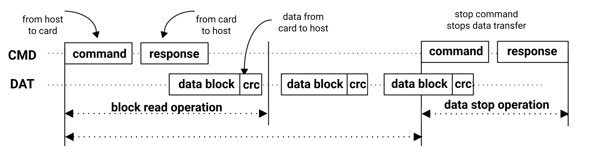
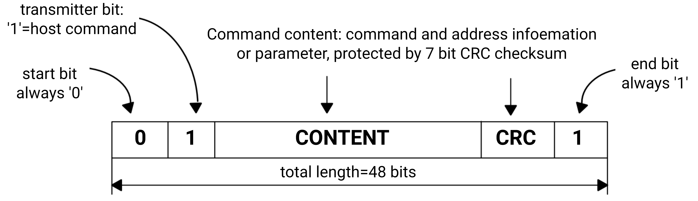
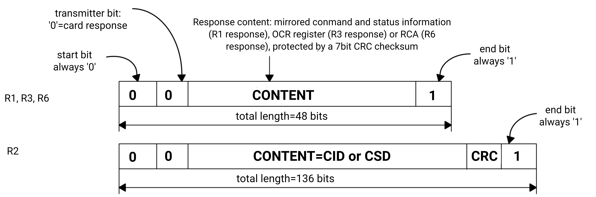

sidebar_position: 11

# 10. Memory & Storage

## 10.1 Overview

K1 supports on-chip memory and various peripheral interfaces connecting to different memory devices such as DDR and NAND/NOR Flash.

## 10.2 On-Chip Memory

K1 includes the following on-chip memory types.

- 128KB boot-ROM
- 256KB SRAM shared by Main CPU and Real CPU

## 10.3 DDR

### 10.3.1 Introduction

The DDR controller features a cutting-edge design that optimizes DRAM access by rearranging requests into an efficient order, rather than processing them in their original sequence. It uses re-ordering buffers (ROBs) to reorganize accesses to the SRAM device for improving performance, while maintaining the original transaction order for requests with the same ID on the AXI interface.

Additionally, the DDR controller includes a unified write pool to temporarily store write transactions. Such write pool minimizes write latency and reduces the performance penalty due to switching between read and write operation at the DRAM interface. With a built-in heuristic write buffer control and user-programmable write buffer control, the DDR controller dynamically balances read and write operation performance in real-time.

The DDR controller is also designed to support AMBA AXI4 bus protocols. It is fully scalable and supports up to 4 AXI ports.

The architecture of the DDR controller interface is depicted below.

### 10.3.2 Features

- Priority-based arbitration with a starvation prevention scheme
- Merge of write operations to the same address by using a write buffer to reduce DDR write operation traffic
- Direct forward of read operations of the write buffer to the ROB without accessing DDR
- Two levels dynamic scheduling with bandwidth guarantee
- Support for power-saving features, including active/pre-charge power-off and self-refresh, with control options available automatically (via idle timer), manually (through registers) or externally (via dedicated ports)
- Support for dynamic frequency change
- Support for JEDEC compliant LPDDR3 and LPDDR4 devices
- Support for DRAM size from 64MB to 16GB
- One DRAM channel with a x32 DDR PHY, programmable by software to support x32, x16 or x8 data width
- Support for x16, x32 DRAM devices (1 DQS per 8 DQ)
- Support for up to 2 Chip Select (CS) or Rank per channel
- Support for up to 8 banks per CS for LPDDRx
- Each CS can be mapped to a different starting address
- Each CS can be programmed for 8MB to 16GB
- DRAM banks can be kept open after access (no auto-pre-charge)
- Support for burst length of 8 and 16 for the applicable DDR type
- Programmable address order
- Flexible bank placement between CS and data width
- Implementation of memory controller performance counters
- Global monitors for RISC-V exclusive load/store access
- Secure access management for DDR transactions
- Frequency change register update: implementation of a register table for hardware-triggered sequence update after frequency changes

### 10.3.3 Functional Description

#### DDR Controller Ports Allocation

The DDR Controller supports 4 AXI slave ports with arbitration among them. Details about the port connections to the DDR Controller are tabled below.

| Port0 | Port1 | Port2 | Port3 |
| --- | --- | --- | --- |
| RISCV X60 Clusters and GPU | GMAC0, GMAC1 and AXI Fabric1 Port | VPU and PCIE PortA/B/C | Display and ISP |

#### Dynamic Schedulin

The DDR Controller uses a priority-based arbitration with a starvation prevention scheme to manage the latency of important accesses.

The DDR Controller schedules transactions based on

- Current DRAM page status
- Transaction priority, determined by the AxQoS[2:0] signals on the AXI interface

The AxQoS are decoded as

- `b100`: CRITICAL
- `b011`: TOP
- `b010`: HIGH
- `b001`: MED (Guaranteed Bandwidth Feature)
- `b000`: LOW

The DDR controller can interleave between banks to achieve 100% bus utilization for streaming transactions to different banks, effectively hiding the precharge and activate overheads between read and write commands.

A CRITICAL priority transaction is always served as quickly as possible. It does not check the DRAM page status and is the next transaction to be processed. However, if there are multiple CRITICAL priority transactions, the page status will be considered.

Transactions are served when no higher priority transactions are pending. If lower priority transactions are directed to an already open page, the current higher priority transaction will close that page first.

#### Starvation Prevention

An aging mechanism increases the priority of a transaction when its counter expires to prevent starvation. The starvation counter values for the reading pool and scheduling pool can be configured in the following registers:

- RPP Starvation Control Register (RPP_Starvation_Control)
- Spool Control Register (Spool_Control)

#### Scheduling Algorithm

Scheduling algorithm is implemented in DDR Controller to grant different weights to the following events:

- DRAM pages status regarding to this transaction, it depends on if

  - Page is open
  - Page is closed
  - Page is missing (it is open on another page)
- CS
- Same CS
- Different CS

The scheduler allows out-of-order DRAM execution by re-ordering of data to fit with AXI ordering model. The scheduler would make a decision based on both the queue status and bank status to utilize the DDR bus bandwidth at most.

#### Ports Arbitration

When multi-ports configuration is used, DDR controller uses AXI QoS signal to arbitrate between different AXI ports. If ports have the same QoS priority, then a round-robin arbitration scheme is used.

#### Power-Down Mode

Power-down mode deactivates most I/O buffers on the DRAM module, in particular:

- **Precharge Power-Down**
  Occurs when all banks are closed. If any banks are open, a precharge-all command is issued before entering this mode.

- **Active Power-Down**
  Occurs when at least one bank remains open. If all banks are already closed, an active power-down request behaves as a precharge power-down.

Precharge power-down saves more power than active power-down but closes all banks upon exit, which may reduce performance.

The power-down duration is limited by the auto-refresh interval. If no data requests are pending, the DDR Memory Controller will wake up the DRAM, perform an auto-refresh, and re-enter power-down mode.

For DDR3, there is an option to select fast-exit or slow-exit power-down, which determines whether the DRAM DLL remains active or is frozen during power-down.

#### Self-Refresh Mode

In self-refresh mode, the DRAM automatically refreshes its banks, in particular:

- Within a refresh period, precharge power-down and self-refresh provide similar power savings, but self-refresh has a longer exit delay. Over extended periods, self-refresh is more efficient since precharge power-down requires periodic wake-ups and auto-refresh commands.
- LPDDR and DDR3 support Partial-Array Self-Refresh (PASR), which controls how many banks are refreshed during self-refresh. Each chip-select has a separate PASR configuration in the SDRAM Configuration Register.
- Since PASR allows certain banks to remain unrefreshed, software must track memory usage to prevent data loss in unrefreshed banks.

#### Automatic Clock-Stop

LPDDR allows the DRAM clock to be stopped when there is no pending DRAM operations.

Automatic Clock Stop (ACS) operates separately and can be used alongside other power-saving modes.

#### Power Saving Control

The DDR Memory Controller supports all power-saving features such as clock stop, pre-charge power-down, active power-down, self-refresh and deep power-down.

Power-saving commands can be issued in three ways as follows:

- **External control**
- **Manual issue**
- **Automatic issue**

Power-saving commands can be manually triggered through the User-Initiated Command Register, with each request executed only once. A new request will wake the Memory Controller from its current power-saving mode.

The Memory Controller can also enter a power-saving state (active or precharge power-down) automatically after a set number of idle cycles. However, deep power-down must be entered manually since it shuts off power to the memory array, causing a reset.

#### Dynamic Frequency Change (DFC)

DDR frequency change can be achieved by either hardware (boundary pin handshake) or software (AHB programming), in particular:

- **Hardware DFC**

  - The system must preload a DFC table (a predefined frequency sequence) into SRAM. Each table corresponds to a specific target frequency (e.g. Table 1 for 800MHz, Table 2 for 300MHz).
  - To change frequency, the SoC PMU drives the boundary pin and selects a DFC table. The Memory Controller then executes the DFC sequence automatically and signals the PMU when it is safe to switch clocks and when the process is complete.

- **Software DFC**

  - The DFC sequence is initiated by programming Memory Controller registers, without using SRAM
  - Software must execute the sequence step by step and poll for completion

## 10.4 QSPI Flash

### 10.4.1 Introduction

Quad-SPI acts as an interface to external serial flash devices with up to four bidirectional data lines.

### 10.4.2 Features

- Flexible sequence engine to support various flash vendor devices
- Single, dual and quad mode operation
- DMA supports reading RX buffer data via AMBA AHB bus (64-bit width interface) or IP register space (32-bit access), and filling TX buffer via IP register space (32-bit access)
- Configurable DMA inner loop size
- Fifteen interrupt conditions
- Memory-mapped read access for connected flash devices
- Programmable sequence engine for future command/protocol changes, and able to support all existing vendor commands and operations
- Support for all types of addressing
- Support for standard SPI, Fast, Dual, Dual I/O, Quad, Quad I/O mode
- Operation up to 104MHz clock frequency

### 10.4.3 Functional Description

The QSPI block diagram is depicted below, where

- AHB BUS is used for XIP transfer (not used in current design)
- APB BUS is used to configure registers and write/read/erase external serial flash.

The different phases of the serial flash access scheme are depicted below.

The different phases and the I/O driving characteristics of the QuadSPI module are characterized in the following way:

- **IDLE**
  Serial flash device is not selected, and there is no interaction. All QSPI_DATx signals remain undriven.

- **INSTRUCTION**
  Serial flash device is selected. And the instruction is sent to the serial flash device.

- **ADDRESS**
  Serial Flash Address is sent to the device.

  > **Note.** This phase is not applicable for all SFM Commands.

- **MODE**
  Mode bytes are sent to the serial flash device, and all QSPI_DATx signals are driven.

  > **Note.** This phase is not applicable for all SFM Commands.

- **DUMMY**
  Dummy clocks are provided to the serial flash device.

  > **Note.** This phase is not applicable for all SFM Commands.

- **DATA**
  Serial flash data is sent to or received from the serial flash device.

  > **Note.** This phase is not applicable for all SFM Commands.

QSPI_CS and QSPI_CLK signals are driven permanently throughout all phases.

## 10.5 SD/eMMC

### 10.5.1 Introduction

The SD/eMMC Host Controller is a hardware block that acts as a host of the SD/eMMC interface to transfer data between MMC, SDIO, SD cards and the internal bus master.

### 10.5.2 Features

- Compliance with MMC/eMMC 5.1 specification with support for socket 3 (eMMC)
- Support for PIO mode and SDMA mode data transfer
- Support for ADMA1 and ADMA 2 (64-bit addressing) data transfer
- Support for 1-bit/4-bit SD memory and SDIO
- Support for 1-bit/8-bit MMC and CE-ATA cards
- Support for SPI mode for eMMC card
- The following modes are supported for the eMMC device:

  - Legacy (up to 26MB/s, 1.8V signal)
  - High-speed SDR (up to 52MB/s, 1.8V signal)
  - High-speed DDR (up to 52MB/s, 1.8V signal)
  - HS200 (up to 200MB/s, 1.8V signal)
  - HS400 (up to 400MB/s, 1.8V signal)
- The following modes are supported for the SD device:

  - Default Speed (up to 12.5MB/s, 3.3V signal)
  - High Speed (up to 25MB/s, 3.3V signal)
  - SDR12 (up to 25 MHz, 1.8V signal)
  - SDR25 (up to 50 MHz, 1.8V signal)
  - SDR50 (up to 100 MHz, 1.8V signal)
  - SDR104 (up to 208 MHz, 1.8V signal)
  - DDR50 (up to 50 MHz, 1.8V signal)
- Support for read-wait control in SDIO cards
- Support for suspend resume in SDIO cards
- Hardware generation/checking of CRC on all command and data transaction on the card bus
- Card insertion/removal detection for sockets 1 (SD)

> **Note.** For more information about AXI Fabric Specification, please check the description below:
>
> - SD AXI master always generates an INCR (AWBURST/ARBURST = 0x1) burst and 8-bytes burst size (AWSIZE/ARSIZE = 0x3)
> - SD AXI master bursts are normal, non-secure data accesses (AWPROT/ARPROT = 0x2)
> - SD AXI master never generates atomic accesses (AWLOCK/ARLOCK = 0x0)
> - SD AXI slave does not support exclusive, protected or atomic accesses. The response signaling is always 鈥淥KAY鈥?(RRESP/BRESP = 0x0) or 鈥淒ECERR鈥?(RRESP/BRESP = 0x2). The 鈥淒ECERR鈥?response is signaled if an address is accessed where no registers exist.

### 10.5.3 Functional Description

#### Block Diagram

The architecture of SD/eMMC Host Controller is depicted below.

To be highlighted:

- The system fabric connects through two AXI interfaces:

  - AXI Slave
  - AXI Master
- AHB Slave is used for configuring registers and handling read/write operations in PIO mode
- AHB Master manages data transmission in SDMA/ADMA mode
- A 128 脳 64-bit FIFO stores up to two 512-byte packets for data buffering
- Configuration registers synchronize with the SD/eMMC clock domain via a synchronizer to configure the clock, data width, etc.
- Card insertion/removal is detected through GPIO, triggering an interrupt to notify the CPU

#### SD/eMMC Bus Protocol Description

Communication over the SD bus is based on commands and data bit streams that are initiated by a start bit and terminated by a stop bit as follows:

- **Command**
  A command is a token that starts an operation. It is sent from the host to the card(s) and is transferred serially via the SDCMD line (1 bit).

- **Command Response**
  A command response is a token that is sent from an addressed card to the host as a reply to a previously received host command. It is transferred serially via the SDCMD line since the SDCMD line is a bidirectional signal.

- **Data**
  There are 4 data lines. Data can be transferred from the card to the host or vice versa. Data is transferred via Data line, and they are bidirectional signals. In 1-bit mode, SDDATA[0] is used, and the other is in Z-state.

The basic operations of the SD/eMMC cards are depicted below.

**[No Response & No Data Operations]**

**[Multiple Block Read Operation]**

**[Multiple Block Write Operation]**

#### Special Bus Transactions

##### Read Wait Command

During a Read operation, if the host cannot accept more data, it usually stops the clock to pause the Read data output from the card. However, this also prevents the host from issuing any commands.

To avoid this limitation, a Read Wait command allows the host to pause the Read data while keeping the clock running. This command is issued after the data block ends, ensuring that the host can manage data flow without completely stopping communication.

The Read Wait Controlled by Stopping Clock is depicted below.

##### Packet Format

The formats of commands from the host and responses from cards are depicted below.

**[Command Token Format]**

**[Response Token Format]**

##### Sequences of Host & Card Interaction

SD cards are connected to the host with a dedicated interface, such as its own SDCLK, SDCMD, or SDDATA[3:0] lines.

After a **power-on reset, software reset or new card insertion**, the host and SD cards go through two phases as follows:

- **Phase 1 - **Card Identification Phase**:

  - The host looks for new cards on the bus
  - While in this phase, the host resets all the cards that are in card identification mode. Any card already identified will not be reset.
  - Then the host:
    - Sends the command to validate operation voltage range
    - Identifies each card and requests its Relative Card Address (RCA)
    - Communicates with each card separately using the **SDCMD line** (in the case of SD memory)
  - All data communication in this phase uses the SDCMD line only

- **Phase 2 - **Data Transfer Phase:**

  - Once all cards are identified, the host enters this phase that is ready to transfer data
  - After the host driver sets up the Host Controller, it starts the transfer by writing to the Command Register which is written last
  - For R1b commands, the Command Inhibit will stay set as long as the busy signal is held low
  - CMD_COMPLETE will then be set when Command Inhibit changes from 1 to 0

> **Note.** For more information, please refer to SD Host Controller Simplified Specification V3.00

#### Card Detection

The SD/eMMC Host Controller supports card detection (insertion/removal) via the GPIO toggle with software operation.

The card detection features can be accessed though the Normal Interrupt Status Enable bits. When enabled, an interrupt is generated if a logic change is detected on the card-detect switch input. To avoid false triggers, this logic change is debounced before generating an interrupt.

#### SPI Mode

SPI mode is enabled by setting the \<spi_en\> field in the Legacy Register (0x10C). The rest of the flow is similar to the SD flow except for error interrupts.

If an error occurs in SPI mode, then the \<spi_err\> field in the Error Interrupt Status Register will be set. The cause of this error can be identified in the \<spi_err_token\> field in the Legacy Register.

### 10.5.4 Register Description

The base addresses of SD/eMMC Host Controller Registers are tabled below.

| Name | Address |
| --- | --- |
| SD1_BASE(SD Card) | 0xD4280000 |
| SD2_BASE(SDIO) | 0xD4280800 |
| SD3_BASE(eMMC) | 0xD4281000 |

#### SD_SYS_ADDR REGISTER

**Offset: 0x0**
| Bits | Field | Type | Reset | Description |
| --- | --- | --- | --- | --- |
| 31:16 | DMA_ADDR_H | R/W | 0x0000 | - DMA Address High: contains 16 MSb of DMA system buffer starting byte address. - This register is used with the Auto Cmd 23 to set a 32-bit block count value to the argument of cmd23. This register holds the upper 16bits of the cmd23 argument. |
| 15:0 | DMA_ADDR_L | R/W | 0x0000 | - DMA Address Low: contains 16 LSb of DMA system buffer starting byte address. - This register is used with the Auto Cmd 23 to set a 32-bit block count value to the argument of cmd23. This register holds the lower 16bits of the cmd23 argument. |

#### SD_BLOCK_SIZE_CNT REGISTER

**Offset: 0x4**
| Bits | Field | Type | Reset | Description |
| --- | --- | --- | --- | --- |
| 31:16 | BLOCK_COUNT | R/W | 0x0000 | Block Count  The Host Controller decrements the block count after each block transfer.  0x1 = 1 block  ...  0xFFFF = 65535 blocks  The current value of block count is reflected in the Current Block Count Register. |
| 15 | RSVD | R | 0 | Reserved for future use |
| 14:12 | HOST_DMA_BDRY | R/W | 0x0 | Host DMA Buffer Boundary  This field specifies the host memory buffer boundary.  If this boundary is crossed, an interrupt (dma_int) is generated.  This interrupt is reflected in <Tx Ready> field of the Normal Interrupt Status Register.  0x0: 4 KB  0x1: 8 KB  0x2: 16 KB  0x3: 32 KB  0x4: 64 KB  0x5: 128 KB  0x6: 256 KB  0x7: 512 KB |
| 11:0 | BLOCK_SIZE | R/W | 0x000 | Block Size |

#### SD_ARG REGISTER

**Offset: 0x8**
| Bits | Field | Type | Reset | Description |
| --- | --- | --- | --- | --- |
| 31:16 | ARG_H | R/W | 0x0000 | Argument High 16 MSb of Command Argument  This value is inserted into 48 bits command token bits[39:24]. |
| 15:0 | ARG_L | R/W | 0x0000 | Argument Low 16 LSb of Command Argument  This value is inserted into 48 bits command token bits[23:8]. |

#### SD_TRANSFER_MODE_CMD REGISTER

**Offset: 0xC**
| Bits | Field | Type | Reset | Description |
| --- | --- | --- | --- | --- |
| 31:30 | RSVD | R | 0 | Reserved for future use |
| 29:24 | CMD_INDEX | R/W | 0x00 | Command Index  These bits will be inserted into Command token bits[45:40] |
| 23:22 | CMD_TYPE | R/W | 0x0 | Command Type  0x0: Normal command  0x1: Suspend command  0x2: Resume command  0x3: Abort command |
| 21 | DATA_PRESENT | R/W | 0x0 | Data Present  1: Indicates that data is present and will be transferred using the MMC1_DAT[3:0] line.  0: Commands using only MMC1_CMD lines or commands with no data transfer but using busy signal on MMC1_DAT[0] line (for example, CMD 38) |
| 20 | CMD_INDEX_CHK_EN | R/W | 0x0 | Command Index Check Enable  1: The Host Controller checks the index field in the response to ensure it matches the command index. - If there is a mismatch, it is reported as a Command Index Error. |
| 19 | CMD_CRC_CHK_EN | R/W | 0x0 | Command CRC Check Enable  1: Host controller checks the CRC field in response.  - If an error is detected, it is reported as a command CRC error. The number of bits checked by the CRC field value changes according to the length of response. |
| 18 | RSVD | R | 0 | Reserved for future use |
| 17:16 | RESP_TYPE | R/W | 0x0 | Response Type Select for SD/SD in SPI Modes For SD mode:  0x0: No response  0x1: Response length is 136 bits  0x2: Response length is 48 bits  0x3: Response length is 48 bits and check busy after response CRC field for R3 and R4 is expected to be all 1 bits. CRC Check should be disabled for these response types.   For SD in SPI mode:  0x0: Response length is 8 bits  0x1: Response length is 16 bits  0x2: Response length is 40 bits  0x3: Reserved |
| 15:6 | RSVD | R | 0 | Reserved for future use |
| 5 | MULTI_BLK_SEL | R/W | 0x0 | Multiple Block Select  This bit should be set to 1 only when multiple blocks are to be transferred. |
| 4 | TO_HOST_DIR | R/W | 0x0 | Data Transfer Direction Select  This bit defines the direction of the MMC1_DAT[3:0] line data transfer.  1: Transfer data from the SD card to the SD Host Controller,  0: Used for all other commands. |
| 3:2 | AUTO_CMD_EN | R/W | 0x0 | Auto CMD Enable  This field determines use of auto command functions.  0x0: Auto Command disabled  0x1: Auto CMD12 Enable  0x2: Auto CMD23 Enable  0x3: Reserved |
| 1 | BLK_CNT_EN | R/W | 0x0 | Block Count Enable  This bit validates the value in the Block Count Register. |
| 0 | DMA_EN | R/W | 0x0 | DMA Enable  If Programmed Input/Output (PIO) mode is required, this bit should be reset to 0. |

#### SD_RESP_0 REGISTER

**Offset: 0x10**
| Bits | Field | Type | Reset | Description |
| --- | --- | --- | --- | --- |
| 31:16 | RESP1 | R | 0x0000 | Response 1  This register contains bits[39:24] of the response token. |
| 15:0 | RESP0 | R | 0x0000 | Response 0  This register contains bits[23:8] of the response token. |

#### SD_RESP_1 REGISTER

**Offset: 0x14**
| Bits | Field | Type | Reset | Description |
| --- | --- | --- | --- | --- |
| 31:16 | RESP3 | R | 0x0000 | Response 3  - For 48-bit response tokens: Not used. - For 136-bit response tokens: Stores bits [71:56] of the response token. |
| 15:0 | RESP2 | R | 0x0000 | Response 2  - For 48-bit response tokens: Not used. - For 136-bit response tokens: Stores bits [55:40] of the response token. |

#### SD_RESP_2 REGISTER

**Offset: 0x18**
| Bits | Field | Type | Reset | Description |
| --- | --- | --- | --- | --- |
| 31:16 | RESP5 | R | 0x0000 | Response 5   - For 48-bit response tokens: Not used. - For 136-bit response tokens: Stores bits [103:88] of the response token. |
| 15:0 | RESP4 | R | 0x0000 | Response 4  - For 48-bit response tokens: Not used. - For 136-bit response tokens: Stores bits [87:72] of the response token. |

#### SD_RESP_3 REGISTER

**Offset: 0x1C**
| Bits | Field | Type | Reset | Description |
| --- | --- | --- | --- | --- |
| 31:16 | RESP7 | R | 0x0000 | Response 7  - For 48-bit response tokens: Not used. - For 136-bit response tokens: Stores bits [127:120] of the response token. - For Auto CMD12 responses: Stores bits [39:24] of the response token. |
| 15:0 | RESP6 | R | 0x0000 | Response 6  - For 48-bit response tokens: Not used. - For 136-bit response tokens: Stores bits [119:104] of the response token. - For Auto CMD12 responses: Stores bits [23:8] of the response token. |

#### SD_BUFFER_DATA_PORT REGISTER

**Offset: 0x20**
| Bits | Field | Type | Reset | Description |
| --- | --- | --- | --- | --- |
| 31:0 | BUF_DATA | R/W | 0x0 | Buffer Data |

#### SD_PRESENT_STATE_1 REGISTER

**Offset: 0x24**
| Bits | Field | Type | Reset | Description |
| --- | --- | --- | --- | --- |
| 31:25 | RSVD | R | 0 | Reserved for future use |
| 24 | CMD_LEVEL | R | 0x1 | MMC1_CMD Line Signal Level  This status is used to check the MMC1_CMD line level to recover from errors and for debugging. |
| 23:20 | DAT_LEVEL | R | 0xF | MMC1_DAT[3:0] Line Signal Level  This status is used to check the MMC1_DAT[3:0] line level to recover from errors and for debugging.  This is especially useful in detecting the busy signal level from MMC1_DAT[0]. |
| 19 | WRITE_PROT | R | 0x0 | Write Protect  This field reflects the position of the write_protect latch on the SD card.  This field should be ignored if there is no such feature being provided by the card in use. |
| 18 | CARD_DET | R | 0x0 | Card Detect  This field reflects the value of the MMC1_CD pin.  0: Card is not detected  1: Card is detected  Note: This field is only used for testing. |
| 17 | CARD_STABLE | R | 0x0 | Card Stable   It indicates the debounced value of the card present condition.  0: Card is unstable  1: Card is stable  Note: This field is only used for testing. |
| 16 | CARD_INSERTED | R | 0x0 | Card Inserted  This field indicates whether an SD card is present or not:.  0: Card is not inserted  1: Card is inserted |
| 15:12 | RSVD | R | 0 | Reserved for future use |
| 11 | BUFFER_RD_EN | R | 0x0 | Buffer Read Enable  This field changes from 0x0 to 0x1 when block data is ready in the buffer, and from 0x1 to 0x0 when all the block data is read from the buffer. |
| 10 | BUFFER_WR_EN | R | 0x1 | Buffer Write Enable  This field changes from 0x0 to 0x1 when block data can be written to the buffer. So if this bit is set to 0x1, the entire block can be written to the buffer. This field changes from 0x1 to 0x0 when all the block data is written to the buffer. |
| 9 | RX_ACTIVE | R | 0x0 | Rx Active  This field indicates read transfer is active.  1: Active 0: Inactive |
| 8 | TX_ACTIVE | R | 0x0 | Tx Active  Indicates write transfer is active.  0: No valid write data exists in the Host Controller  1: active |
| 7:4 | RSVD | R | 0 | Reserved for future use |
| 3 | RETUNING_REQ | R | 0x0 | Re-Tuning Request  This field provides the status of the sampling clock.  0: Fixed or well tuned sampling clock  1: Sampling clock needs re-tuning |
| 2 | _DAT_ACTIVE | R | 0x0 | Data Line Active  This field provides the status of the data line.  0: Data line is free  1: Data line is busy |
| 1 | CMD_INHIBIT_DAT | R | 0x0 | Command Inhibit Data  This field provides the host driver status for issuing data commands.  0: Data command can be issued  1: Data command cannot be issued |
| 0 | CMD_INHIBIT_CMD | R | 0x0 | Command Inhibit Command  0: The MMC1_CMD line is available for issuing a new command. - The host controller can issue a command using MMC1_CMD line. - This bit is cleared (set to 0) when the command response is received from the device. - If the <Command Inhibit Data> field is set to 1, commands using only the MMC1_CMD line can still be issued if this bit is 0. 1: The MMC1_CMD line is currently in use or unavailable. - This bit is set after the command register is written, indicating that a command is in progress. - It remains set until the command response is received. When the bit changes from 1 to 0 (indicating that the command response has been received), a command complete interrupt is generated in the Normal Interrupt Status Register.  If the host controller cannot issue a command due to a command conflict error (e.g., attempting to issue a new command while the previous command is still in progress), this bit remains set to 1. |

#### SD_HOST_CTRL REGISTER

**Offset: 0x28**
| Bits | Field | Type | Reset | Description |
| --- | --- | --- | --- | --- |
| 31:27 | RSVD | R | 0 | Reserved for future use |
| 26 | W_REMOVAL | R/W | 0x0 | Wakeup on Card Removal  1: Enable wakeup event on card removal detection  0: No wakeup event |
| 25 | W_INSERTION | R/W | 0x0 | Wakeup on Card Insertion  1: Enable wakeup event on card insertion detection  0: No wakeup event |
| 24 | W_CARD_INT | R/W | 0x0 | Wakeup on Card Interrupt  1: Enable wakeup event on card interrupt detection  0: No wakeup event |
| 23:20 | RSVD | R | 0 | Reserved for future use |
| 19 | INT_BLK_GAP | R/W | 0x0 | Block Gap Interrupt  This field is only valid for 4-bit mode.  1: Enables interrupt detection at block gap for multiple block transfers  0: Disables interrupt detection at block gap for multiple block transfers |
| 18 | RD_WAIT_CTL | R/W | 0x0 | Read Wait Control  - If the card supports read wait, set this bit to enable use of the read wait protocol to stop read data using the MMC1_DAT[2] line by Host hardware. Otherwise, the Host Controller has to stop the SD clock from holding read data.  - When the Host driver detects a card insertion, it will set this bit according to the CCCR of the SDIO card.  - This field is only considered during the block gap phase. Within a block, hardware will stall the clock top stop read data if the host cannot accept any more data (e.g., due to FIFO being full, etc.)  - When this field is cleared by software, operation continues as usual.  - During read wait, software can issue a different commands for different operation as long as it does not require MMC1_DAT[3:0] lines.  - To resume the read operation after waiting, the software must clear this bit (set it to 0) |
| 17 | CONT_REQ | R/WAC | 0x0 | Continue Request  - This field is used to restart a transaction which was stopped using the <Stop At Block Gap Request>.  - To cancel stop at the block gap, set the <Stop At Block Gap Request> field to 0 and set this field to 1 to restart the transfer.  - The Host Controller automatically clears this field in either of the following cases:  	1. For a read transaction, when the MMC1_DAT[3:0] Line Active changes from 0 to 1, indicating a read transaction restarts. 	2. For a write transaction, when the Write Transfer Active changes from 0 to 1, indicating the write transaction restarts.  	As a result, it is not necessary for the Host driver to set this bit to 0.  - If <Stop At Block Gap Request> is set to 1, any write to this bit is ignored. |
| 16 | STOP_AT_BLOCK_GAP_REQ | R/W | 0x0 | Stop at Block Gap Request  - This field is used to stop executing a transaction at the next block gap for both DMA and non-DMA transfers.  - The Host driver will leave this bit set to 1 until transfer completion is indicated (when transfer complete is set to 1) - Clearing both this field and the <Continue Request> field will not cause the transaction to restart.  - For read transactions, Read Wait can be used to stop the transaction at the block gap. - For write transactions, the host controller will stop the clock at the block gap request. - For read transactions, if Read Wait Control is set to 0, the Host controller will stop the clock; otherwise, the Host controller will issue a Read Wait command to stop read data. |
| 15:12 | RSVD | R | 0 | Reserved for future use |
| 11:9 | SD_BUS_VLT | R/W | 0x0 | SD Bus Voltage  This field reflects the voltage at operating conditions  0x7: 3.3V  0x6: 3.0V  0x5: 1.8V  0x0 to 0x4: Reserved |
| 8 | SD_BUS_POWER | R/W | 0x0 | SD Bus Power  This field controls the power going out to the SD card.  The field will be cleared if: - The sd_bus_vlt does not match the voltage support in Capabilities Register 1, or - A card removal state is detected. |
| 7 | CARD_DET_S | R/W | 0x0 | Card Detect Signal Selection  This field selects the source for card detection.  0: Card detect input pin  1: Card detect test level (for debugging purposes only)  - When the source for card detection is switched, the interrupt should be disabled during the switching period by clearing the Normal Interrupt Status Enable Register in order to mask unexpected interrupts being caused by the glitch.  - This signal should be disabled via the Normal Interrupt Status Enable Register during debounce period. |
| 6 | CARD_DET_L | R/W | 0x0 | Card Detect Test Level  1: Card inserted  0: No card inserted |
| 5 | EX_DATA_WIDTH | R/W | 0x0 | This bit controls the 8-bit mode.  0x0: Data width for bus mode is determined by <DATA_WIDTH> 0x1: 8-bit data width. |
| 4:3 | DMA_SEL | R/W | 0x0 | DMA Select  One of the supported DMA modes is selected.  The host driver checks support for DMA modes using the Capabilities Register 1. Use of the selected DMA is determined by the <DMA Enable> field in the Transfer Mode Register.  0x0: SDMA  0x1: ADMA 1  0x2: 32-bit address ADMA2  0x3: Reserved |
| 2 | HI_SPEED_EN | R/W | 0x0 | Extend Data Output Enable  0: Normal  1: MMC1_CMD and MMC1_DAT[3:0] are driven from rising edge of clock |
| 1 | DATA_WIDTH | R/W | 0x0 | Data Width  1: 4-bit data mode  0: 1-bit data mode, using only MMC1_DAT[0]  Refer to Bit [5] EX_DATA_WIDTH for 8-bit mode support. |
| 0 | LED_CTRL | R/W | 0x0 | LED Control  1: LED on  0: LED off |

#### SD_CLOCK_CTRL REGISTER

**Offset: 0x2C**
| Bits | Field | Type | Reset | Description |
| --- | --- | --- | --- | --- |
| 31:27 | RSVD | R | 0 | Reserved for future use |
| 26 | SW_RST_DAT | R/WAC | 0x0 | Soft Reset for Data Port of Logic |
| 25 | SW_RST_CMD | R/WAC | 0x0 | Soft Reset for Command Part of Logic |
| 24 | SW_RST_ALL | R/WAC | 0x0 | Software Reset for All  This reset affects the status, state machine, and FIFOs synchronously.   This field also resets all private registers. |
| 23:20 | RSVD | R | 0 | Reserved for future use |
| 19:16 | TIMEOUT_VALUE | R/W | 0x0 | Timeout Value  Determines the interval by which MMC1_DAT[3:0] line timeouts are detected. This timeout is initiated in the following cases:  - For read transaction, this timeout is about waiting for data from cards. It refers to the timing value in the SD specification, which specifies the maximum timing from read command to read data (i.e., card data access time); - For write transaction, this timeout is about waiting for data from AXI slave, AXI Master, or processor, or waiting for CRC status of write block. - Timeout Calculation: 	1. 0x0: SDCLK x 2^13  	2. 0x1: SDCLK x 2^14  	3. ...  	4. 0xE: SDCLK x 2^27    	For example,  	1. If sd_clk frequency = 200 MHz (base value), then the timeout base = 50 MHz (period = 20 ns). 		- For 0xE setting: Timeout = 2^27 * 20 ns 鈮?2.684 seconds. 	2. If sd_clk frequency = 50 MHz (base value divided by 4), then the timeout base = 12.5 MHz (period = 80 ns). 		- For 0xE setting: Timeout = 2^27 * 80 ns 鈮?10.73 seconds. 	0xF is Reserved for future use. For other transactions, please refer to the SD specification for more information on these fixed values. |
| 15:8 | SD_FREQ_SEL_LO | R/W | 0x00 | SDCLK Frequency Select Lower bits  This field, together with the <SD_FREQ_SEL_HI> field, defines the clock divider value to be used by the host controller. The final value for the SD clock frequency divider is determined by combining both fields as follows: SD_FREQ_SEL = {SD_FREQ_SEL_HI[1:0],SD_FREQ_SEL_LO[7:0]}  The selected value is multiplied by 2 to calculate the actual divide value. The possible SD clock frequency settings are:   - SD_FREQ_SEL = 0x00: Base clock   - SD_FREQ_SEL = 0x01: Divide by 2 of base clock  - SD_FREQ_SEL = 0x02: Divide by 4 of base clock   - SD_FREQ_SEL = 0x3: Divide by 6 of base clock - ...  - SD_FREQ_SEL = 0x3FF: Divide by 2046 of base clock |
| 7:6 | SD_FREQ_SEL_HI | R/W | 0x0 | SDCLK Frequency Select Upper bits  This field, together with <SD_FREQ_SEL_LO> defines the clock divider value to be used by the host controller. The final value for the SD clock frequency divider is determined by combining both fields as follows: SD_FREQ_SEL = {SD_FREQ_SEL_HI[1:0],SD_FREQ_SEL_LO[7:0]}. |
| 5 | CLK_GEN_SEL | R/W | 0x0 | Clock Generator Select  This field is used to select the clock generator mode.  0x1: Programmable Clock Mode  0x0: Divided Clock mode |
| 4:3 | RSVD | R | 0 | Reserved for future use |
| 2 | SD_CLK_EN | R/W | 0x0 | SDCLK Clock Enable  This bit controls the SDCLK to the card.  Before using the card, this bit should be set during the initialization phase. |
| 1 | INT_CLK_STABLE | R | 0x0 | Internal Clock Stable  This field is set to 1 once the controller detects that the internal clock is stable after setting of the <Internal Clock Enable> field. |
| 0 | INT_CLK_EN | R/W | 0x0 | Internal Clock Enable  This field controls the SDCLK to the internal logic.  1: Enable  0: Disable |

#### SD_NORMAL_INT_STATUS REGISTER

**Offset: 0x30**
| Bits | Field | Type | Reset | Description |
| --- | --- | --- | --- | --- |
| 31 | CRC_STATUS_ERR | R/W1C | 0x0 | CRC Status Error  It is set to 1 if there is an error in any of the following: - CRC status start bit  - CRC status end bit  - Boot ACK status These errors are returned from the card in write transaction |
| 30 | CPL_TIMEOUT_ERR | R/W1C | 0x0 | Command Completion Signal Timeout Error  This field is applicable for CE-ATA mode only.  1: A command completion signal timeout occurred |
| 29 | AXI_RESP_ERR | R/W1C | 0x0 | AXI Bus Response Error  1: A response other than OKAY was received on the AXI bus. |
| 28 | SPI_ERR | R/W1C | 0x0 | SPI Mode Error  1: Error occurred in SPI mode for which cause can be determined by reading the <SPI Error Token> field in the SPI Mode Register  0: No error |
| 27:26 | RSVD | R | 0 | Reserved for future use |
| 25 | ADMA_ERR | R/W1C | 0x0 | ADMA (Advanced Direct Memory Access) Error  This bit is set when the host controller detects any errors during an ADMA-based data transfer.  The state of the ADMA at the time of the error is recorded in the ADMA Error Status Register.  This interrupt is also triggered when the host controller detects invalid descriptor data. The <ADMA Error State> field in the ADMA Error Status Register indicates the state in which an error occurred.  The host driver may find that a Valid bit is not set at the error descriptor.  1 = Error  0 = No error |
| 24 | AUTO_CMD12_ERR | R/W1C | 0x0 | Auto CMD12 Error occurs when detecting that one of the bits in Auto CMD12 Error Status Register has changed from 0 to 1. |
| 23 | CUR_LIMIT_ERR | R/W1C | 0x0 | Current Limit Error  > Note. This feature is not supported currently, and this bit will always be read as 0. |
| 22 | RD_DATA_END_BIT_ERR | R/W1C | 0x0 | ReadData End Bit Error  This bit is set to 1 when a 0 is detected at the end bit position of read data that uses the MMC1_DAT[3:0] line, or at the end bit position of the CRC status. |
| 21 | RD_DATA_CRC_ERR | R/W1C | 0x0 | Read Data CRC Error  This bit is set to 1 when there is a CRC error detected in the read data transferred via the MMC1_DAT[3:0] line, or when the Write CRC status has a value other than 010. |
| 20 | DATA_TIMEOUT_ERR | R/W1C | 0x0 | Data Timeout Error  This bit is set to 1 when a timeout error occurs during data transfer, which could happen in the following scenarios: - Busy timeout after write CRC status - Write CRC status timeout - Read data timeout |
| 19 | CMD_INDEX_ERR | R/W1C | 0x0 | Command Index Error  0: No command index error has occurred in the command response  1: Command index error has occurred in the command response |
| 18 | CMD_END_BIT_ERR | R/W1C | 0x0 | Command End Bit Error  0: Detection of end bit of a command response in 1  1: Detection of end bit of a command response is 0 |
| 17 | CMD_CRC_ERR | R/W1C | 0x0 | Command CRC Error  This bit is set to 1 in two cases: - A CRC error is detected in the command response. - The host controller detects a conflict on the MMC1_CMD line while issuing a command. In this case, the host controller will abort the command by stopping the MMC1_CMD line, and the <Command Timeout Error> field will also be set to 1 to distinguish the MMC1_CMD line conflict. |
| 16 | CMD_TIMEOUT_ERR | R/W1C | 0x0 | Command Timeout Error  1: No response is returned within 64 SDCLK cycles from the end bit of the command |
| 15 | ERR_INT | R | 0x0 | Error Interrupt  If any of bits in the Error Interrupt Status Register are set, then this bit is set. |
| 14 | CQ_INT | RC | 0x0 | Command Queuing Interrupt     This interrupt is asserted when at least one of the bits in the CQIS register is set.  This interrupt is cleared only when the source interrupt in the CQIS register is cleared. |
| 13 | RSVD | R | 0 | Reserved for future use |
| 12 | RETUNING_INT | R/W1C | 0x0 | Re-tuning Event Interrupt  This status is set when the Re-Tuning Request in the <Present State Register> changes from 0x0 to 0x1. This indicates that the host controller is requesting the host driver to perform re-tuning starting from the next data transfer. The current data transfer can be completed without requiring re-tuning. |
| 11 | INT_C | R/W1C | 0x0 | This status is set when INT_C is enabled and INT_C# pin is in low level. Writing this bit to 0x1 does not clear this bit.  It is cleared by resetting the INT_C interrupt factor. Refer to shared bus control register (SHARED_BUS_CTRL). |
| 10 | INT_B | R/W1C | 0x0 | This status is set when INT_B is enabled and INT_B# pin is in low level. Writing this bit to 0x1 does not clear this bit.  It is cleared by resetting the INT_B interrupt factor. Refer to shared bus control register (SHARED_BUS_CTRL). |
| 9 | INT_A | R/W1C | 0x0 | This status is set if INT_A is enabled and INT_A# pin is in low level. Writing this bit to 0x1 does not clear this bit.  It is cleared by resetting the INT_A interrupt factor. Refer to shared bus control register (SHARED_BUS_CTRL). |
| 8 | CARD_INT | R | 0x0 | Card Interrupt  1: Host controller detects an interrupt from the card |
| 7 | CARD_REM_INT | R/W1C | 0x0 | Card Removal Interrupt  1: Card removal event detected |
| 6 | CARD_INS_INT | R/W1C | 0x0 | Card Insertion Interrupt  1: Card insertion event detected |
| 5 | RX_RDY | R/W1C | 0x0 | Rx Ready  This status is set when the <Buffer Read Enable> field in the Present State Register 1 changes from 0x0 to 0x1. |
| 4 | TX_RDY | R/W1C | 0x1 | Tx Ready  This status is set when the <Buffer Write Enable> field in the Present State Register 1 changes from 0x0 to 0x1. |
| 3 | DMA_INT | R/W1C | 0x0 | DMA Interrupt  This status is set when the Host Controller detects DMA crossing over the <Host DMA Buffer Boundary> field in the Block Size Register. |
| 2 | BLOCK_GAP_EVT | R/W1C | 0x0 | Block Gap Event  This field is set when a read or write transaction is stopped at a block gap, but only if the <Stop At Block Gap Request> field in the Block Gap Control Register is set. - If the <Stop At Block Gap Request> field is not set to 1, this bit will remain 0. |
| 1 | XFER_COMPLETE | R/W1C | 0x0 | Transfer Complete  This bit is set when a read/write transaction is completed. - For read transactions: This bit is set at the falling edge of Read Transfer Active Status, and it can occur in two cases: 	1. Data transfer is completed as specified by the data length. 	2. The data transfer is stopped at the block gap and completed after setting the <Stop At Block Gap Request>  field in the SD Block Gap Control Register. - For write transactions: This bit is set at the falling edge of the MMC1_DAT[3:0] Line Active status, and it can occur in two cases: 	1. Data transfer is completed as specified by the data length, and the busy signal is released. 	2. The data transfer is stopped at the block gap and completed after setting the <Stop At Block Gap Request> field. |
| 0 | CMD_COMPLETE | R/W1C | 0x0 | Command Complete  This bit is set when the end bit of the command response (Except Auto CMD12) is received.  > Note. Command Timeout Error has higher priority than Command complete. |

#### SD_NORMAL_INT_STATUS_EN REGISTER

**Offset: 0x34**
| Bits | Field | Type | Reset | Description |
| --- | --- | --- | --- | --- |
| 31 | CRC_STATUS_ERR_EN | R/W | 0x0 | CRC Status Error Enable  0: Disabled  1: Enabled |
| 30 | CPL_TIMEOUT_ERR_EN | R/W | 0x0 | CPL Timeout Error Enable  0: Disabled  1: Enabled |
| 29 | AXI_RESP_ERR_EN | R/W | 0x0 | AXI Response Error 0: Disabled  1: Enabled |
| 28 | SPI_ERR_EN | R/W | 0x0 | SPI Error Enable  0: Disabled  1: Enabled |
| 27 | RSVD | R | 0 | Reserved for future use |
| 26 | TUNING_ERR_EN | R/W | 0x0 | Tuning Error Enable  0: Disabled  1: Enabled |
| 25 | ADMA_ERR_EN | R/W | 0x0 | ADMA Error Enable  0: Disabled  1: Enabled |
| 24 | AUTO_CMD12_ERR_EN | R/W | 0x0 | Auto CMD12 Error Enable  0: Disabled  1: Enabled |
| 23 | CUR_LIM_ERR_EN | R/W | 0x0 | Current Limit Error Enable  0: Disabled  1: Enabled |
| 22 | RD_DATA_END_BIT_ERR_EN | R/W | 0x0 | Data End Bit Error Enable  0: Disabled  1: Enabled |
| 21 | RD_DATA_CRC_ERR_EN | R/W | 0x0 | Data CRC Error Enable  0: Disabled  1: Enabled |
| 20 | DATA_TIMEOUT_ERR_EN | R/W | 0x0 | Data Timeout Error Enable  0: Disabled  1: Enabled |
| 19 | CMD_INDEX_ERR_EN | R/W | 0x0 | Command Index Error Enable  0: Disabled  1: Enabled |
| 18 | CMD_END_BIT_ERR_EN | R/W | 0x0 | Command End Bit Error Enable  0: Disabled  1: Enabled |
| 17 | CMD_CRC_ERR_EN | R/W | 0x0 | Command CRC Error Enable  0: Disabled  1: Enabled |
| 16 | CMD_TIMEOUT_ERR_EN | R/W | 0x0 | Command Timeout Error Enable  0: Disabled  1: Enabled |
| 15 | RSVD | R | 0 | Reserved for future use |
| 14 | CQ_STATUS_EN | R/W | 0x0 | Command Queuing Status Enable  0: Disabled  1: Enabled |
| 13 | RSVD | R | 0 | Reserved for future use |
| 12 | RETUNE_INT_EN | R/W | 0x0 | Re_tuning Interrupt Enable  0: Disabled  1: Enabled |
| 11 | INT_C_INT_EN | R/W | 0x0 | INT_C Enable  0: Disabled  1: Enabled |
| 10 | INT_B_INT_EN | R/W | 0x0 | INT_B Enable  0: Disabled  1: Enabled |
| 9 | INT_A_INT_EN | R/W | 0x0 | INT_A Enable  0: Disabled  1: Enabled |
| 8 | CARD_INT_EN | R/W | 0x0 | Card Interrupt Enable  0: Disabled  1: Enabled |
| 7 | CARD_REM_EN | R/W | 0x0 | Card Removal Status Enable  0: Disabled  1: Enabled |
| 6 | CARD_INS_EN | R/W | 0x0 | Card Insertion Status Enable  0: Disabled  1: Enabled |
| 5 | RD_RDY_EN | R/W | 0x0 | Buffer Read Ready Enable  0: Disabled  1: Enabled |
| 4 | TX_RDY_EN | R/W | 0x0 | Buffer Write Ready Enable  0: Disabled  1: Enabled |
| 3 | DMA_INT_EN | R/W | 0x0 | DMA Interrupt Enable  0: Disabled  1: Enabled |
| 2 | BLOCK_GAP_EVT_EN | R/W | 0x0 | Block Gap Event Enable  0: Disabled  1: Enabled |
| 1 | XFER_COMPLETE_EN | R/W | 0x0 | Transfer Complete Enable  0: Disabled  1: Enabled |
| 0 | CMD_COMPLETE_EN | R/W | 0x0 | Command Complete Enable  0: Disabled  1: Enabled |

#### SD_NORMAL_INT_STATUS_INT_EN REGISTER

**Offset: 0x38**
| Bits | Field | Type | Reset | Description |
| --- | --- | --- | --- | --- |
| 31  | CRC_STATUS_ERR_INT_EN | R/W | 0x0 | CRC Status Error Interrupt Enable  0: Disabled  1: Enabled |
| 30 | CPL_TIMEOUT_ERR_INT_EN | R/W | 0x0 | CPL Timeout Error Interrupt Enable  0: Disabled  1: Enabled |
| 29 | AXI_RESP_ERR_INT_EN | R/W | 0x0 | AXI Response Error Interrupt Enable  0: Disabled  1: Enabled |
| 28 | SPI_ERR_INT_EN | R/W | 0x0 | SPI Error Interrupt Enable  0: Disabled  1: Enabled |
| 27 | RSVD | R | 0 | Reserved for future use |
| 26 | TUNE_ERR_INT_EN | R/W | 0x0 | Tuning Error Interrupt Enable  0: Disabled  1: Enabled |
| 25 | ADMA_ERR_INT_EN | R/W | 0x0 | ADMA Error Interrupt Enable  0: Disabled  1: Enabled |
| 24 | AUTO_CMD12_ERR_INT_EN | R/W | 0x0 | Auto CMD12 Error Interrupt Enable  0: Disabled  1: Enabled |
| 23 | CUR_LIM_ERR_INT_EN | R/W | 0x0 | Current Limit Error Interrupt Enable  0: Disabled  1: Enabled |
| 22 | RD_DATA_END_BIT_ERR_INT_EN | R/W | 0x0 | Data End Bit Error Interrupt Enable  0: Disabled  1: Enabled |
| 21 | RD_DATA_CRC_ERR_INT_EN | R/W | 0x0 | Data CRC Error Interrupt Enable  0: Disabled  1: Enabled |
| 20 | DATA_TIMEOUT_ERR_INT_EN | R/W | 0x0 | Data Timeout Error Interrupt Enable  0: Disabled  1: Enabled |
| 19 | CMD_INDEX_ERR_INT_EN | R/W | 0x0 | Command Index Error Interrupt Enable  0: Disabled  1: Enabled |
| 18 | CMD_END_BIT_ERR_INT_EN | R/W | 0x0 | Command End Bit Interrupt Error Enable  0: Disabled  1: Enabled |
| 17 | CMD_CRC_ERR_INT_EN | R/W | 0x0 | Command CRC Error Interrupt Enable  0: Disabled  1: Enabled |
| 16 | CMD_TIMEOUT_ERR_INT_EN | R/W | 0x0 | Command Timeout Error Interrupt Enable  0: Disabled  1: Enabled |
| 15 | RSVD | R | 0 | Reserved for future use |
| 14 | CQ_SIGNAL_ENABLE | R/W | 0x0 | Command Queuing Signal Enable  0: Disabled  1: Enabled |
| 13 | CARD_ASYNC_INT_INT_EN | R/W | 0x0 | SDIO Card Async INT without AXI/SD function clock running Interrupt Enable  0: Disabled  1: Enabled |
| 12 | RETUNE_INT_INT_EN | R/W | 0x0 | Re-Tuning Interrupt Interrupt Enable  0: Disabled  1: Enabled |
| 11 | INT_C_INT_INT_EN | R/W | 0x0 | INT_C Interrupt Interrupt Enable  0: Disabled  1: Enabled |
| 10 | INT_B_INT_INT_EN | R/W | 0x0 | INT_B Interrupt Interrupt Enable  0: Disabled  1: Enabled |
| 9 | INT_A_INT_INT_EN | R/W | 0x0 | INT_A Interrupt Interrupt Enable  0: Disabled  1: Enabled |
| 8 | CARD_INT_INT_EN | R/W | 0x0 | Card Interrupt Interrupt Enable  0: Disabled  1: Enabled |
| 7 | CARD_REM_INT_EN | R/W | 0x0 | Card Removal Interrupt Enable  0: Disabled  1: Enabled |
| 6 | CARD_INS_INT_EN | R/W | 0x0 | Card Insertion Interrupt Enable  0: Disabled  1: Enabled |
| 5 | RX_RDY_INT_EN | R/W | 0x0 | Buffer Read Ready Interrupt Enable  0: Disabled  1: Enabled |
| 4 | TX_RDY_INT_EN | R/W | 0x0 | Buffer Write Ready Interrupt Enable  0: Disabled  1: Enabled |
| 3 | DMA_INT_INT_EN | R/W | 0x0 | DMA Interrupt Interrupt Enable  0: Disabled  1: Enabled |
| 2 | BLOCK_GAP_EVT_INT_EN | R/W | 0x0 | Block Gap Event Interrupt Enable  0: Disabled  1: Enabled |
| 1 | XFER_COMPLETE_INT_EN | R/W | 0x0 | Transfer Complete Interrupt Enable  0: Disabled  1: Enabled |
| 0 | CMD_COMPLETE_INT_EN | R/W | 0x0 | Command Complete Interrupt Enable  0: Disabled  1: Enabled |

#### SD_AUTO_CMD12_ERROR_STATUS REGISTER

**Offset: 0x3C**
| Bits | Field | Type | Reset | Description |
| --- | --- | --- | --- | --- |
| 31 | PRE_VAL_EN | R/W | 0x0 | Preset Value Enable  0x1: Automatic selection by Preset Value are Enabled  0x0: SDCLK and Driver Strength are controlled by Host Driver |
| 30 | ASYNC_INT_EN | R/W | 0x1 | Asynchronous Interrupt Enable   This bit can be set to 0x1 if a card supports asynchronous interrupts and <async_int_support> is set to 0x1 in the capabilities register.  Asynchronous interrupt is effective when DAT[1] interrupt is used in 4-bit SD mode (and <int_pin_sel> is set to 0 in Shared Bus Control register).  When this bit is set to 0x1, the host driver can stop the SDCLK during asynchronous interrupt period to save power. During this period, the host controller continues to deliver the Card Interrupt to the host when it is asserted by the card.   0x1: Enabled  0x0: Disabled |
| 29:24 | RSVD | R | 0 | Reserved for future use |
| 23 | SAMPLING_CLK_SEL | R/W | 0x0 | Sampling Clock Select  Host controller uses this bit to select sampling clock to receive CMD and DAT.  This bit is set by tuning procedure and valid after the completion of tuning (when <exe_tuning> is cleared).  0x1: Tuned clock is used to sample data (indicating that tuning was successful). 0x0: Fixed clock is used to sample data (indicating that tuning failed). Writing 0x1 to this bit is meaningless and ignored if tuning is not yet complete. If the bit is written as 0x0, the tuning circuit is reset. However, resetting the tuning circuit requires time to complete the tuning sequence. The host driver should keep this bit set to 0x1 to perform re-tuning quickly when necessary. Changes to this bit are not allowed while the host controller is receiving responses or a read data block. |
| 22 | EXE_TUNING | R/WAC | 0x0 | Execute Tuning This bit is set to 0x1 to start tuning procedure and automatically cleared when tuning procedure is completed. The result of the tuning is reflected in the <sampling_clk_sel>. The tuning procedure is aborted by writing 0x0.   0x1: Execute Tuning 0x0: Not tuned or Tuning completed |
| 21:20 | DRV_STRENGTH_SEL | R/W | 0x0 | Driver Strength Select.  Host Controller output driver in 1.8V signaling is selected by this field. With 3.3V signaling, this field is not effective. This field can be set depending on Driver Type A, C and D support bits in the Capabilities register.   This bit depends on the setting of <pre_val_en>.  - If <pre_val_en> = 0x0, this field is set by the host driver.  - If <pre_val_en> = 0x1, this field is automatically set by a value specified in one of the Preset Value registers.  0x0: Driver Type B  0x1: Driver Type A  0x2: Driver Type C  0x3: Driver Type D |
| 19 | SDH_V18_EN | R/W | 0x0 | 1.8V Signaling Enable  0x1: 1.8V Signaling enable  0x0: 3.3V Signaling enable |
| 18:16 | UHS_MODE_SEL | R/W | 0x0 | UHS Mode Select This field is used to select one of UHS-I modes and effective when <sdh_v18_en> = 0x1.  If <pre_val_en> in the Host Control2 register is set to 0x1, host controller sets SDCLK Frequency select, Clock generator select in the clock control register, and driver strength select according to the Preset Value registers.  In this case, one of the preset value registers is selected by this field.  Host driver should reset <sd_clk_en> before changing this field to avoid generating clock glitch  0x0: SDR12  0x1: SDR25  0x2: SDR50  0x3: SDR104  0x4: DDR50   For MMC mode, added two backdoor defined modes:  0x5: HS200 mode    0x6: HS400 mode All other values are Reserved |
| 15:8 | RSVD | R | 0 | Reserved for future use |
| 7 | CMD_NOT_ISSUED | RC | 0x0 | Command Not Issued  This is due to auto_cmd12 Error |
| 6:5 | RSVD | R | 0 | Reserved for future use |
| 4 | AUTO_CMD_INDEX_ERR | R/W1C | 0x0 | Auto CMD12 or Auto CMD23 Error  This error occurs when the command index error occurs in response to a command  0: Disabled  1: Enabled |
| 3 | AUTO_CMD_END_BIT_ERR | R/W1C | 0x0 | Auto CMD12 or Auto CMD23 End Bit Error  This error occurs when detecting that the end bit of command response is 0.  0: Disabled  1: Enabled |
| 2 | AUTO_CMD_CRC_ERR | R/W1C | 0x0 | Auto CMD12 or Auto CMD23 CRC Error  This error occurs when detecting CRC error in the command response.  0: Disabled  1: Enabled |
| 1 | AUTO_CMD_TIMEOUT_ERR | R/W1C | 0x0 | Auto CMD12 or Auto CMD23 Timeout Error  This error occurs when no response is returned within 64 SDCLK cycles from the end bit of command.  0: Disabled  1: Enabled |
| 0 | AUTO_CMD12_NOT_EXE | R/W1C | 0x0 | Auto CMD12 Not Executed  This error occurs when host controller cannot issue Auto cmd12 to stop multiple block data transfer due to some errors.  0: Disabled  1: Enabled |

#### SD_CAPABILITIES_1 REGISTER

**Offset: 0x40**
| Bits | Field | Type | Reset | Description |
| --- | --- | --- | --- | --- |
| 31:30 | CFG_SLOT_TYPE | R/W | 0x0 | Slot Type  This field indicates what type of slot the host controller is connected to.  0x0: Removable card slot  0x1: Embedded slot for one device  0x2: Shared bus slot  0x3: Reserved |
| 29 | ASYNC_INT_SUPPORT | R | 0x1 | Asynchronous Interrupt Support.  0x1: Asynchronous Interrupt Supported  0x0: Asynchronous Interrupt not supported |
| 28 | SYS_BUS_64_SUPPORT | R | 0x0 | 64-bit System Bus Support  This bit indicates whether the host controller is capable of 64-bit system bus.  0x1: 64-bit system bus supported 0x0: 64-bit system bus not supported |
| 27 | RSVD | R | 0 | Reserved for future use |
| 26 | VLG_18_SUPPORT | R | 0x1 | Voltage Support 1.8V  This bit indicates whether the host controller is capable of 1.8V.  0x1: 1.8V Supported 0x0: 1.8V not supported |
| 25 | VLG_30_SUPPORT | R | 0x0 | Voltage Support 3.0V  This bit indicates whether the host controller is capable of 3.0V.  0x1: 3.0V Supported 0x0: 3.0V not supported |
| 24 | VLG_33_SUPPORT | R | 0x1 | Voltage Support 3.3V  This bit indicates whether the host controller is capable of 3.3V.  0x1: 3.3V Supported 0x0: 3.3V not supported |
| 23 | SUS_RES_SUPPORT | R | 0x1 | Suspend Resume Support  This bit indicates whether the host controller is capable of suspend resume commands.  0x1: Suspend/Resume Supported 0x0: Suspend/Resume not supported. |
| 22 | SDMA_SUPPORT | R | 0x1 | SDMA Support  This bit indicates whether the host controller is capable of SDMA.  0x1: SDMA Supported 0x0: SDMA not supported. |
| 21 | HI_SPEED_SUPPORT | R | 0x1 | High Speed Support  This bit indicates whether the host controller is capable of high speed mode (25 - 50MHz).  0x1: High speed mode Supported 0x0: High speed mode not supported. |
| 20 | ADMA1_SUPPORT | R | 0x1 | ADMA1 Support  This bit indicates whether the host controller is capable of ADMA1.  0x1: ADMA1 Supported 0x0: ADMA1 not supported |
| 19 | ADMA2_SUPPORT | R | 0x1 | ADMA2 Support  This bit indicates whether the host controller is capable of ADMA2.  0x1: ADMA2 Supported 0x0: ADMA2 not supported |
| 18 | EX_DATA_WIDTH_SUPPORT | R | 0x1 | 8-bit Support  This bit indicates whether the host controller is capable of 8-bit bus operation.  0x1: 8-bit Supported  0x0: 8-bit not supported |
| 17:16 | MAX_BLK_LEN | R | 0x0 | Maximum Block Length   The maximum block length in bytes.   0x0: 512 Bytes |
| 15:8 | BASE_FREQ | R | 0x00 | Base Frequency  The base clock frequency for SDCLK  0xC8: 200 MHz (Actual frequency: 198.24 MHz) 0x0: Get frequency information via another method |
| 7 | TIMEOUT_UNIT | R | 0x1 | Timeout Unit  The unit of base clock used to detect timeouts.  1: MHz  0: kHz |
| 6 | RSVD | R | 0 | Reserved for future use |
| 5:0 | TIMEOUT_FREQ | R | 0x00 | Timeout Frequency  This value indicates the base clock frequency used to detect timeouts.  0x32: 50 MHz (Actual frequency: 49.56 MHz).  0x0: Get frequency information via another method |

#### SD_CAPABILITIES_3 REGISTER

**Offset: 0x44**
| Bits | Field | Type | Reset | Description |
| --- | --- | --- | --- | --- |
| 31:24 | RSVD | R | 0 | Reserved for future use |
| 23:16 | <CLK_MULTIPLIER> | R | 0x0 | Clock Multiplier  This field indicates clock multiplier value of programmable clock generator.  0x0: Host Controller does not support a programmable clock generator. |
| 15:14 | RETUNE_MODES | R | 0x0 | Re_tuning modes.  This field selects the re-tuning method and limits the maximum data length.  0x0: Mode1, Timer  0x1: Mode2, Timer and Re-Tuning Request  0x2: Mode3, Auto Re-Tuning (for transfer) Timer and Re-Tuning Request  0x3: Reserved |
| 13 | SDR50_TUNE | R | 0x1 | Use Tuning for SDR50 mode.   0x1: SDR50 requires tuning  0x0: SDR50 does not require tuning |
| 12 | RSVD | R | 0 | Reserved for future use |
| 11:8 | TMR_RETUNE | R | 0xf | Timer count for Re-Tuning This field indicates an initial value of the Re-Tuning Timer for Mode 1 to 3.  0xf: Get information from other sources |
| 7 | RSVD | R | 0 | Reserved for future use |
| 6 | DRV_TYPE_D | R | 0x1 | Driver Type D Support  0x1: Driver Type D is supported  0x0: Driver Type D is not supported |
| 5 | DRV_TYPE_C | R | 0x1 | Driver Type C Support.  0x1: Driver Type C is supported  0x0: Driver Type C is not supported |
| 4 | DRV_TYPE_A | R | 0x1 | Driver Type A Support  0x1: Driver Type A is supported  0x0: Driver Type A is not supported |
| 3 | RSVD | R | 0 | Reserved for future use |
| 2 | DDR50_SUPPORT | R | 0x1 | DDR50 Support  0x1: DDR50 is supported  0x0: DDR50 is not supported |
| 1 | SDR104_SUPPORT | R | 0x1 | SDR104 Support  0x1: SDR104 is supported  0x0: SDR104 is not supported |
| 0 | SDR50_SUPPORT | R | 0x1 | SDR50 Support  0x1: SDR50 is supported  0x0: SDR50 is not supported |

#### SD_MAX_CURRENT_1 REGISTER

**Offset: 0x48**
| Bits | Field | Type | Reset | Description |
| --- | --- | --- | --- | --- |
| 31:24 | RSVD | R | 0 | Reserved for future use |
| 23:16 | MAX_CUR_18 | R | 0x0 | Maximum Current for 1.8V  0x0:  Get information via another method  0x1: 4 mA 0x2: 8 mA  ...  0xFF: 1020 mA |
| 15:8 | MAX_CUR_30 | R | 0x0 | Maximum Current for 3.0V  0x0: Get information via another method  0x1: 4 mA  0x2: 8 mA  ...  0xF: 1020 mA |
| 7:0 | MAX_CUR_33 | R | 0x0 | Maximum Current for 3.3V  0x0: Get information via another method  0x1: 4 mA  0x2: 8 mA  ...  0xF: 1020 mA |

#### SD_MAX_CURRENT_3 REGISTER

**Offset: 0x4C**
| Bits | Field | Type | Reset | Description |
| --- | --- | --- | --- | --- |
| 31:0 | RSVD | R | 0 | Reserved for future use |

#### SD_FORCE_EVENT_AUTO_CMD12_ERROR REGISTER

**Offset: 0x50**
| Bits | Field | Type | Reset | Description |
| --- | --- | --- | --- | --- |
| 31 | F_CRC_STATUS_ERR | W  | 0x0 | Force Event for CRC Status Error  When 1 is written at this location, it sets the <CRC Status Error> field in the Error Interrupt Status Register. |
| 30 | F_CPL_TIMEOUT_ERR | W | 0x0 | Force Event for CPL Timeout Error  When 1 is written at this location, it sets the <Command Completion Signal Timeout Error> field in the Error Interrupt Status Register. |
| 29 | F_AXI_RESP_ERR | W | 0x0 | Force Event for AXI Response Bit Error  When 1 is written at this location, it sets the <AXI Bus Response Error> field in the Error Interrupt Status Register. |
| 28 | F_SPI_ERR | W | 0x0 | Force Event for SPI Error  When 1 is written at this location, it sets the <SPI Mode Error> field in the Error Interrupt Status Register. |
| 27:26 | RSVD | R | 0 | Reserved for future use |
| 25 | F_ADMA_ERR | W | 0x0 | Force Event for ADMA Error  When 1 is written at this location, it sets the <ADMA Error> field in the Error Interrupt Status Register. |
| 24 | F_ACMD12_ERR | W | 0x0 | Force Event for Auto Cmd12 Error  When 1 is written at this location, it sets the <Auto CMD12 Error> field in the Error Interrupt Status Register. |
| 23 | F_CURRENT_ERR | W | 0x0 | Force Event for Current Limit Error  When 1 is written at this location, it sets the <Current Limit Error> field in the Error Interrupt Status Register. |
| 22 | F_DAT_END_BIT_ERR | W | 0x0 | Force Event for Data End Bit Error  When 1 is written at this location, it sets the <ReadDataEnd Bit Error> field in the Error Interrupt Status Register. |
| 21 | F_DAT_CRC_ERR | W | 0x0 | Force Event for Data CRC Error  When 1 is written at this location, it sets the <Read Data CRC Error> field in the Error Interrupt Status Register. |
| 20 | F_DAT_TO_ERR | W | 0x0 | Force Event for Data Timeout Error  When 1 is written at this location, it sets the <Read Data CRC Error> field in the Error Interrupt Status Register. |
| 19 | F_CMD_INDEX_ERR | W | 0x0 | Force Event for Command Index Error  When 1 is written at this location, it sets the <Data Timeout Error> field in the Error Interrupt Status Register. |
| 18 | F_CMD_END_BIT_ERR | W | 0x0 | Force Event for Command End Bit Error  When 1 is written at this location, it sets the <Command Index Error> field in the Error Interrupt Status Register. |
| 17 | F_CMD_CRC_ERR | W | 0x0 | Force Event for Command CRC Error  When 1 is written at this location, it sets the <Command CRC Error> field in the Error Interrupt Status Register. |
| 16 | F_CMD_TO_ERR | W | 0x0 | Force Event for Command Timeout Error  When 1 is written at this location, it sets the <Command Timeout Error> field in the Error Interrupt Status Register. |
| 15:8 | RSVD | R | 0 | Reserved for future use |
| 7 | F_ACMD12_ISSUE_ERR | W | 0x0 | Force Event for Command not Issued by Auto Cmd12 Error  When 1 is written at this location, it sets the <Command Not Issued Due to auto_cmd12 Error> field in the Auto CMD12 Error Status Register. |
| 6:5 | RSVD | R | 0 | Reserved for future use |
| 4 | F_ACMD_INDEX_ERR | W | 0x0 | Force Event for Auto Cmd Index Error  When 1 is written at this location, it sets the <Auto CMD Error> field in the Auto CMD Error Status Register. |
| 3 | F__ACMD_EBIT_ERR | W | 0x0 | Force Event for Auto Cmd End Bit Error  When 1 is written at this location, it sets the <Auto CMD End Bit Error> field in the Auto CMD Error Status Register. |
| 2 | F_ACMD_CRC_ERR | W | 0x0 | Force Event for Auto Cmd CRC Error  When 1 is written at this location, it sets the <Auto CMD CRC Error> field in the Auto CMD Error Status Register. |
| 1 | F_ACMD_TO_ERR | W | 0x0 | Force Event for Auto Cmd Timeout Error  When 1 is written at this location, it sets the <Auto CMD Timeout Error> field in the Auto CMD Error Status Register. |
| 0 | F_ACMD12_NEXE_ERR | W | 0x0 | Force Event for Auto Cmd12 Not Executed Error  When 1 is written at this location, it sets the <Auto CMD12 Not Executed> field in the Auto CMD12 Error Status Register. |

#### SD_ADMA_ERROR_STATUS REGISTER

**Offset: 0x54**
| Bits | Field | Type | Reset | Description |
| --- | --- | --- | --- | --- |
| 31:3 | RSVD | R | 0 | Reserved for future use |
| 2 | ADMA_LEN_ERR | R/W | 0x0 | ADMA Length Mismatch Error  This error occurs in the following two cases:  - While Block Count Enable (in SD_TRANSFER_MODE_CMD Bit[1]) is set, the total data length is specified by the descriptor table, which is different from that specified by the block count and block Length.  - Total data length cannot be divided by block length |
| 1:0 | ADMA_STATE | R/W | 0x0 | ADMA Error State  This field indicates the state of ADMA when error occurred during ADMA transfer.  This field never indicates 0x2 because ADMA never stops in this state. |

#### ADMA SYSTEM ADDRESS REGISTER 1 REGISTER

**Offset: 0x58**
| Bits | Field | Type | Reset | Description |
| --- | --- | --- | --- | --- |
| 31:16 | ADMA_SYS_ADDR | R/W | 0x0 | ADMA System Address  This register holds the byte address of the executing command in the Descriptor table. - At the start of ADMA, this register should be programmed to point to the starting address of the Descriptor table. - This register is incremented as the system fetches each descriptor line. - In case of an ADMA Error Interrupt, this register will contain a valid Descriptor address based on the ADMA state at the time. |
| 15:0 | ADMA_SYS_ADDR | R/W | 0x0 | ADMA System Address  This register holds the byte address of the executing command in the Descriptor table. - At the start of ADMA, this register should be programmed to point to the starting address of the Descriptor table. - This register is incremented as the system fetches each descriptor line. - In case of an ADMA Error Interrupt, this register will contain a valid Descriptor address based on the ADMA state at the time. |

#### SD_ADMA_SYS_ADDR_3 REGISTER

**Offset: 0x5C**
| Bits | Field | Type | Reset | Description |
| --- | --- | --- | --- | --- |
| 31:16 | ADMA_SYS_ADDR | R/W | 0x0  | ADMA System Address  This register holds the byte address of the executing command in the Descriptor table. - At the start of ADMA, this register should be programmed to point to the starting address of the Descriptor table. - This register is incremented as the system fetches each descriptor line. - In case of an ADMA Error Interrupt, this register will contain a valid Descriptor address based on the ADMA state at the time. |
| 15:0 | ADMA_SYS_ADDR | R/W | 0x0 | ADMA System Address  This register holds the byte address of the executing command in the Descriptor table. - At the start of ADMA, this register should be programmed to point to the starting address of the Descriptor table. - This register is incremented as the system fetches each descriptor line. - In case of an ADMA Error Interrupt, this register will contain a valid Descriptor address based on the ADMA state at the time. |

#### PRESET_VALUE_FOR_INIT REGISTER

**Offset: 0x60**
| Bits | Field | Type | Reset | Description |
| --- | --- | --- | --- | --- |
| 31:30 | DRV_STRENGTH_VAL | R | 0x0 | Driver Strength Select Value  Driver strength is supported by 1.8V signaling bus speed modes. The field is not relevant for 3.3V signaling. 0x0: Driver Type B  0x1: Driver Type A  0x2: Driver Type C  0x3: Driver Type D |
| 29:27 | RSVD | R | 0 | Reserved for future use |
| 26 | CLKGEN_SEL_VAL | R | 0x0 | Clock Generator Select Value.  This bit is effective when Host Controller supports programmable clock generator.  0x1: Programmable clock generator  0x0: Divided clock |
| 25:16 | SDCLK_FREQ_SEL_VAL | R | 0x004 | SDCLK Frequency Select Value 10-bit preset value to set <sdclk_freq_sel> in the Clock Control register. |
| 15:14 | DRV_STRENGTH_VAL | R | 0x0 | Driver Strength Select Value  Driver strength is supported by 1.8V signaling bus speed modes. The field is not relevant for 3.3V signaling.  0x0: Driver Type B  0x1: Driver Type A  0x2: Driver Type C  0x3: Driver Type D |
| 13:11 | RSVD | R | 0 | Reserved for future use |
| 10 | CLKGEN_SEL_VAL | R | 0x0 | Clock Generator Select Value.  This bit is effective when Host Controller supports programmable clock generator.  0x1: Programmable clock generator  0x0: Divided clock |
| 9:0 | SDCLK_FREQ_SEL_VAL | R | 0x100 | SDCLK Frequency Select Value  10-bit preset value to set <sdclk_freq_sel> in the Clock Control register. |

#### PRESET_VALUE_FOR_HS REGISTER

**Offset: 0x64**
| Bits | Field | Type | Reset | Description |
| --- | --- | --- | --- | --- |
| 31:30 | DRV_STRENGTH_VAL | R | 0x0 | Driver Strength Select Value  Driver strength is supported by 1.8V signaling bus speed modes. The field is not relevant for 3.3V signaling.  0x0: Driver Type B  0x1: Driver Type A  0x2: Driver Type C  0x3: Driver Type D |
| 29:27 | RSVD | R | 0 | Reserved for future use |
| 26 | CLKGEN_SEL_VAL | R | 0x0 | Clock Generator Select Value  This bit is effective when Host Controller supports programmable clock generator.  0x1: Programmable clock generator  0x0: Divided clock |
| 25:16 | SDCLK_FREQ_SEL_VAL | R | 0x004 | SDCLK Frequency Select Value  10-bit preset value to set <sdclk_freq_sel> in the Clock Control register. |
| 15:14 | DRV_STRENGTH_VAL | R | 0x0 | Driver Strength Select Value  Driver strength is supported by 1.8V signaling bus speed modes. The field is not relevant for 3.3V signaling.  0x0: Driver Type B  0x1: Driver Type A  0x2: Driver Type C  0x3: Driver Type D |
| 13:11 | RSVD | R | 0 | Reserved for future use |
| 10 | CLKGEN_SEL_VAL | R | 0x0 | Clock Generator Select Value  This bit is effective when Host Controller supports programmable clock generator.  0x1: Programmable clock generator  0x0: Divided clock |
| 9:0 | SDCLK_FREQ_SEL_VAL | R | 0x002 | SDCLK Frequency Select Value 10-bit preset value to set <sdclk_freq_sel> in the Clock Control register. |

#### PRESET_VALUE_FOR_SDR25 REGISTER

**Offset: 0x68**
| Bits | Field | Type | Reset | Description |
| --- | --- | --- | --- | --- |
| 31:30 | DRV_STRENGTH_VAL | R | 0x0 | Driver Strength Select Value  Driver strength is supported by 1.8V signaling bus speed modes. The field is not relevant for 3.3V signaling.  0x0: Driver Type B  0x1: Driver Type A  0x2: Driver Type C  0x3: Driver Type D |
| 29:27 | RSVD | R | 0 | Reserved for future use |
| 26 | CLKGEN_SEL_VAL | R | 0x0 | Clock Generator Select Value  This bit is effective when Host Controller supports programmable clock generator.  0x1: Programmable clock generator  0x0: Divided clock |
| 25:16 | SDCLK_FREQ_SEL_VAL | R | 0x004 | SDCLK Frequency Select Value 10-bit preset value to set <sdclk_freq_sel> in the Clock Control register. |
| 15:14 | DRV_STRENGTH_VAL | R | 0x0 | Driver Strength Select Value  Driver strength is supported by 1.8V signaling bus speed modes. The field is not relevant for 3.3V signaling.  0x0: Driver Type B  0x1: Driver Type A  0x2: Driver Type C  0x3: Driver Type D |
| 13:11 | RSVD | R | 0 | Reserved for future use |
| 10 | CLKGEN_SEL_VAL | R | 0x0 | Clock Generator Select Value This bit is effective when Host Controller supports programmable clock generator.  0x1: Programmable clock generator  0x0: Divided clock |
| 9:0 | SDCLK_FREQ_SEL_VAL | R | 0x002 | SDCLK Frequency Select Value 10-bit preset value to set <sdclk_freq_sel> in the Clock Control register. |

#### PRESET_VALUE_FOR_SDR104 REGISTER

**Offset: 0x6C**
| Bits | Field | Type | Reset | Description |
| --- | --- | --- | --- | --- |
| 31:30 | DRV_STRENGTH_VAL | R | 0x0 | Driver Strength Select Value  Driver strength is supported by 1.8V signaling bus speed modes. The field is not relevant for 3.3V signaling.  0x0: Driver Type B  0x1: Driver Type A  0x2: Driver Type C  0x3: Driver Type D |
| 29:27 | RSVD | R | 0 | Reserved for future use |
| 26 | CLKGEN_SEL_VAL | R | 0x0 | Clock Generator Select Value  This bit is effective when Host Controller supports programmable clock generator.  0x1: Programmable clock generator  0x0: Divided clock |
| 25:16 | SDCLK_FREQ_SEL_VAL | R | 0x004 | SDCLK Frequency Select Value  10-bit preset value to set <sdclk_freq_sel> in the Clock Control register. |
| 15:14 | DRV_STRENGTH_VAL | R | 0x0 | Driver Strength Select Value  Driver strength is supported by 1.8V signaling bus speed modes. The field is not relevant for 3.3V signaling.  0x0: Driver Type B  0x1: Driver Type A  0x2: Driver Type C  0x3: Driver Type D |
| 13:11 | RSVD | R | 0 | Reserved for future use |
| 10 | CLKGEN_SEL_VAL | R | 0x0 | Clock Generator Select Value  This bit is effective when Host Controller supports programmable clock generator.  0x1: Programmable clock generator  0x0: Divided clock |
| 9:0 | SDCLK_FREQ_SEL_VAL | R | 0x002 | SDCLK Frequency Select Value 10-bit preset value to set <sdclk_freq_sel> in the Clock Control register. |

#### SHARED_BUS_CTRL REGISTER

**Offset: 0xE0**
| Bits | Field | Type | Reset | Description |
| --- | --- | --- | --- | --- |
| 31 | RSVD | R | 0 | Reserved for future use |
| 30:24 | BEND_PWR_CTRL | R/W | 0x0 | Back-End Power Control  Each bit of this field controls back-end power supply for an embedded device.  The maximum number of devices that can be controlled is 7, as specified by <num_clk_pins>.  Each bit is mapped to a device specific, where  - bit[24] corresponds to Device 1  - bit[30] corresponds to Device 7  Note: Host interface voltage is not controlled by this field.  The function of each bit is:   0x0: Back-end power is off  0x1: Back-end power is supplied |
| 23 | RSVD | R | 0 | Reserved for future use |
| 22:20 | INT_PIN_SEL | R/W | 0x0 | Interrupt Pin Select  Interrupt pin inputs are enabled by this field. Enabling an unsupported interrupt pin has no effect.  0x0: Interrupt is detected by interrupt cycle. |
| 19 | RSVD | R | 0 | Reserved for future use |
| 18:16 | CLK_PIN_SEL | R/W | 0x0 | Clock Pin Select  One of the clock pin outputs is selected by this field.  0x0: Clock Pins are disabled |
| 15 | RSVD | R | 0 | Reserved for future use |
| 14:8 | BUS_WIDTH_PRESET | R | 0x0 | Bus Width Preset  This field defines the bus width preset for devices on a shared bus.  0x0: Bus width defined by <data_transfer_width>  0x1: 8-bit mode |
| 7:6 | RSVD | R | 0 | Reserved for future use |
| 5:4 | NUM_INT_PINS | R | 0x0 | Number of interrupt input pins  This field defines the number of interrupt input pins supported on shared bus system.  0x0: Interrupt input pin is not supported |
| 3 | RSVD | R | 0 | Reserved for future use |
| 2:0 | NUM_CLK_PINS | R | 0x0 | Number of clock pins  This field indicates whether clock pins are supported for selecting one of the devices on a shared bus. 0x0: Shared bus is not supported |

#### SD_SLOT_INT_STATUS REGISTER

**Offset: 0xFC**
| Bits | Field | Type | Reset | Description |
| --- | --- | --- | --- | --- |
| 31:24 | VENDOR_VER | R | 0x0 | Version Number |
| 23:16 | SD_VER | R | 0x2 | SD Host Specification Number  0x0: Supports version 1.0  0x1: Supports version 2.0  0x2: Supports version 3.0   All other values are reserved. |
| 15:2 | RSVD | R | 0 | Reserved for future use |
| 1 | SLOT_INT1 | R | 0x0 | Interrupt Line for Slot 1 |
| 0 | SLOT_INT0 | R | 0x0 | Interrupt Line for Slot 0 |

#### SDHC_VID_PID REGISTER

**Offset: 0x100**
| Bits | Field | Type | Reset | Description |
| --- | --- | --- | --- | --- |
| 31:28 | VERSION_ID | R | 0x1 | 0x1: The IP version |
| 27:20 | PROJECT_ID | R | 0x1 | 0x1: The project version |
| 19:0 | VENDOR_ID | R | 0xa1312 | Stands for vendor name |

#### SDHC_OP_CTRL REGISTER

**Offset: 0x104**
| Bits | Field | Type | Reset | Description |
| --- | --- | --- | --- | --- |
| 31:16 | RSVD | R | 0 | Reserved for future use |
| 15 | WR_OSTDG | R/W | 0x0 | This field controls whether outstanding write requests are allowed on AXI.    0x0: Allow outstanding requests on AXI.    0x1: DO not allow outstanding requests on AXI. |
| 14 | RD_OSTDG | R/W | 0x0 | This field controls whether outstanding read requests are allowed on AXI.    0x0: Allow outstanding requests on AXI.    0x1: DO not allow outstanding requests on AXI. |
| 13:8 | RSVD | R | 0 | Reserved for future use |
| 7 | WR_ENDIAN | R/W | 0x1 | This field determines the endian format for the data being written to the card. 1: Little Endian  0: Big Endian |
| 6 | RD_ENDIAN | R/W | 0x1 | This field determines the endian format for the data being read from the card. 1: Little Endian  0: Big Endian |
| 5 | AXI_NON_POST_WR | R/W | 0x0 | AXI Non-post Write  1: All AXI master write requests are non-post write  0: Only the last request is issued as non-post write |
| 4 | PRIORITY | R/W | 0x0 | This field controls the priority level for AXI requests, acting as the most significant bit of the ID when requests are made 0x0: low priority  0x1: high priority  Note: This bit should only be modified before or after the completion of a data command, not during the transaction. |
| 3:2 | DMA_SIZE | R/W | 0x3 | FIFO Threshold  This field sets the FIFO threshold for the internal FSM to generate a DMA request to the AXI master. 0x0: 64 bytes  0x1: 128 bytes  0x2: 192 bytes  0x3: 256 bytes |
| 1:0 | BRST_SIZE | R/W | 0x2 | DMA Burst Size on the AXI Fabric  0x0: 32 bytes burst  0x1: 64 bytes burst  0x2: 128 bytes    0x3: 256 bytes |

#### SDHC_OP_EXT_REG REGISTER

**Offset: 0x108**
| Bits | Field | Type | Reset | Description |
| --- | --- | --- | --- | --- |
| 31 | CEN_DEASSERT | R/W | 0x0 | Backdoor control bit to deassert the DPSRAM CENA/CENB port. Setting this bit allows DPSRAM CLKPA/CLKPB to receive additional clock cycles. 0: CEN deasserted disable  1: CEN deasserted enable |
| 30:28 | EMA | R/W | 0x7 | DPSRAM extra time for memory read and write  000: Fastest  111: Slowest |
| 27:26 | EMAW | R/W | 0x1 | DPSRAM delay for write operation by extending the internal write pulse.   2'b00: Fastest  2'b11: Slowest |
| 25 | EMAS | R/W | 0x0 | This field controls the extension of the DPSRAM pulse width of the sense-amplifier enable signal. The default setting is low but when driving high, the pulse is extended. |
| 24 | RET1N | R/W | 0x1 | Retention mode 1 enable, active low. |
| 23:20 | RSVD | R | 0 | Reserved for future use |
| 19:16 | PRE_GATE_CLK_CNT | R/W | 0x9 | This field controls the amount of clock cycles that are provided before clock gating is enabled on the sd_clk io pad. |
| 15 | AUTOCMD12_XFER_ENABLE | R/W | 0x0 | This bit is backdoor enable bit when software executes CMD25 with AutoCMD12.There are two conditions that can trigger a transfer interrupt: - Write operation busy bit check - Normal data transfer AUTOCMD12 finished Normally, a transfer interrupt is triggered only when the write operation busy bit check is completed. However, enabling this bit allows an additional interrupt trigger condition when the normal data transfer of AutoCMD12 is finished. By default, software can keep this bit set to 0. |
| 14 | PDLVMC | R/W | 0x0 | This field controls some power down function for the internal memory. |
| 13 | PDFVSSM | R/W | 0x0 | This field controls some power down function for the internal memory. |
| 12 | FORCE_CLK_ON | R/W | 0x0 | This bit forces the SD I/O pad clock to remain on.  Setting this field to 0x1 overrides the SD Clock I/O pad clock gate, ensuring the clock is continuously active. It is typically used together with the <OVRRD_CLK_OEN> field Bit[12:11] Setting: 2'bx0: setting is ignored (not used)  2'b01: Clocks are forced off 2'b11: Clocks are forced on |
| 11 | OVRRD_CLK_OEN | R/W | 0x0 | Override Pad Clock Output Enable  Setting this field to 0x1 overrides the SD Pad clock output enable.  It is typically used together with the <FORCE_CLK_ON> field. |
| 10 | CLK_OE_USE_POS | R/W | 0x1 | This field controls the SD/eMMC bus CLK PAD output enable signal use clock rising edge output or use clock falling edge output  0: Use internal clock falling edge output (to eliminate clock signal Tri-state issue)  1: Use internal clock rising edge output |
| 9 | CLK_GATE_ON | R/W | 0x0 | Clock Gate On  0: Enable dynmical clock gate  1: Enable clock free running  This field affects all clock gates in the SD design if the <Clock Gate Ctl> field is set to 1. |
| 8 | CLK_GATE_CTL | R/W | 0x0 | Clock Gate Control 0: Disable software clock gating override  1: Enable software clock gating override |
| 7 | USE_DAT3 | R/W | 0x0 | This field allows the card detect functionality to be detected using the DAT[3] pin.    This field controls whether the DAT[3] pin is used for card detection. 0x0: Use dedicated pin for card detection 0x1: Use DAT[3] for card detection |
| 6 | PDWN | R/W | 0x0 | Power Down  This bit controls the Power Down port on the internal DPFIFO. |
| 5 | FIFO_CS | R/W | 0x0 | FIFO CS  This field should be written to 0x1 before any toggling of the PDWN bit. |
| 4 | FIFO_CLK | R/W | 0x0 | FIFO Clock  This field should be set to 0x1 before any toggling of the PDWN bit. |
| 3:2 | WTC | R/W | 0x0 | WTC  This field is used for FIFO speed setting. |
| 1:0 | RTC | R/W | 0x0 | RTC  This field is used for FIFO speed setting. |

#### SDHC_LEGACY_CTRL_REG REGISTER

**Offset: 0x10C**
| Bits | Field | Type | Reset | Description |
| --- | --- | --- | --- | --- |
| 31:24 | GEN_PAD_CLK_CNT | R/W | 0x4a | Pad Clock Count  This field should be used with <gen_pad_clk_on>  This field configures the number of clock cycles generated on the IO pad.  The default value of 0x4A generates 75 clock cycles. |
| 23:14 | RSVD | R | 0 | Reserved for future use  |
| 13:9 | SPI_ERR_TOKEN | R/W | 0x0 | SPI Error Token  This is the SPI Error token received in command response when SPI mode is enabled. |
| 8 | SPI_EN | R/W | 0x0 | Enable SPI Mode  This field indicates whether SPI mode is enabled. When enabled, the host controller drives the signals according to the SPI protocol. 1 = SPI mode enabled  0 = SPI mode disabled |
| 7 | RSVD | R | 0 | Reserved for future use |
| 6 | GEN_PAD_CLK_ON | R/WAC | 0x0 | Generate Pad Clock  This bit works together with the <gen_pad_clk_cnt> field.  Setting this bit to 0x1 will generate the programmed number of clock cycles on the IO pad. |
| 5 | SQU_FULL_CHK | R/W | 0x0 | SQU Full Check  This bit should be set to 0x1 only when using a specific piece of memory in the SQU in FIFO mode and performing a "read" transaction on the SD device. |
| 4 | SQU_EMPTY_CHK | R/W | 0x0 | SQU Empty Check  This bit should be set to 0x1 only when using a specific piece of memory in the SQU in FIFO mode and performing a "write" transaction on the SD device. |
| 3 | BOOT_ACK | R/W | 0x0 | Boot Acknowledgment  If the boot nowledgment mode is enabled in the MMC device, then this field should be written to 0x1 before issuing the alternate boot CMD0. |
| 2 | INAND_SEL | R/W | 0x1 | When the driver programs the highest byte of Rx0c, the host DAT/CMD line related registers will be reset.  0x1: Enable soft reset when trigger command.  0x0: Disable soft reset when trigger command. |
| 1 | ASYNC_IO_EN | R/W | 0x0 | Asynchronous Read Interface Enable  This bit enables the asynchronous latching of input data.  0x1: Async interface is enabled. The clock used to latch the input data is asynchronous with the internal logic clock.  0x0: Async interface is disabled. |
| 0 | PIO_RDFC | R/W | 0x1 | PIO mode read operation FIFO check.  0x0: The system checks if all FIFO data has been read by the CPU. If not, the bus clock will stop, and the state will wait until the last block of FIFO data has been read by the CPU. Once the data is done being read, the next block will begin transferring.  0x1 = The system does not check if the FIFO data has been read by the CPU. It is recommended setting this bit to 1 before use PIO mode. This is especially important in high-speed modes like HS200/SDR104, where the software must set this bit to 1 to ensure proper operation. |

#### SDHC_LEGACY_CEATA_REG REGISTER

**Offset: 0x110**
| Bits | Field | Type | Reset | Description |
| --- | --- | --- | --- | --- |
| 31:30 | RSVD | R | 0 | Reserved for future use |
| 29:16 | CPL_TIMEOUT | R/W | 0x3FFF | Command Completion Signal Timeout Value   |
| 15:3 | RSVD | R | 0 | Reserved for future use |
| 2 | CHK_CPL | R/W | 0x0 | Check Command Completion Signal  When this field is set to 0x1 and the <CE-ATA Card> field is set to 1, indication is sent to the host controller to check for command completion signal from the CE-ATA card. |
| 1 | SND_CPL | R/W | 0x0 | Send Command Completion Disable Signal  When this field is set to 1 and the <CE-ATA Card> field is set to 1, indication is sent to the host controller to send the command completion disable signal to the CE-ATA card. |
| 0 | CEATA_CARD | R/W | 0x0 | CE-ATA Card  1: CE-ATA Card mode  0: Non CE-ATA card mode |

#### SDHC_MMC_CTRL_REG REGISTER

**Offset: 0x114**
| Bits | Field | Type | Reset | Description |
| --- | --- | --- | --- | --- |
| 31:24 | DAT_LEVEL | R | 0xFF | MMC1_DAT[7:0] Line Signal Level  This status is used to check the MMC_DAT[7:0] line level. It is useful for error recovery and debugging. This helps in detecting issues, especially the busy signal level from MMC_DAT[0]. |
| 23:13 | RSVD | R | 0 | Reserved for future use |
| 12 | MMC_CARD | R/W | 0x0 | MMC Card  1: MMC Card mode  0: SD Card mode |
| 11 | MMC_RESETN | R/W | 0x1 | MMC Resetn   This bit controls the value of the pin MMC_RESETN going to the eMMC device. |
| 10 | MMC_HS200 | R/W | 0x0 | This bit is set when host read DEVICE_TYPE[196] field of Extended CSD register in MMC card, and the card support HS200 mode. It should be set before the host clock changes to 200Mhz.   1: MMC HS200 mode enable.   0: MMC HS200 mode disable |
| 9 | MMC_HS400 | R/W | 0x0 | This bit is set when the host reads the DEVICE_TYPE[196] field of the Extended CSD register in the MMC card, and the card supports HS400 mode. It should be set before the host clock changes to 200 MHz, following the eMMC 5.0 specification.   1: MMC HS400 mode enable.   0: MMC HS400 mode disable |
| 8 | ENHANCE_STROBE_EN | R/W | 0x0 | Enhanced Strobe Enable This bit controls whether the host/PHY will use the delayed strobe signal to sample the CMD response. This feature is part of the eMMC 5.1 specification to enhance HS400 mode. Software (SW) should check the device-related EXT to decide whether the host/PHY should support this feature. |
| 7 | RSVD | R | 0 | Reserved for future use |
| 6 | CPL_COMPLETE | R/W1C | 0x0 | This bit is set to 1 when a command completion signal is detected and the <cpl_complete Enable> field has been set to 1.  The field is cleared by writing 0x1. A write of 0x0 has no effect. |
| 5 | CPL_COMPLETE_EN | R/W | 0x0 | This bit controls whether the CPL_COMPLETE bit gets set when a command completion signal is detected.  When set to 1, the CPL_COMPLETE bit will be set to 1 when a command completion signal is detected. |
| 4 | CPL_COMPLETE_INT_EN | R/W | 0x0 | cpl_complete Interrupt Enable  1: An interrupt will be generated when the <cpl_complete> field is set |
| 3 | RSVD | R | 0 | Reserved for future use |
| 2 | MISC_INT | R/W1C | 0x0 | Miscellaneous Interrupt This status bit is set to 1 when the programmed number of clocks in the <gen_pad_clk_cnt> field is completed and the <misc_int_en> field has been set to 0x1. This field is cleared by writing 0x1. A write of 0x0 has no effect. |
| 1 | MISC_INT_EN | R/W | 0x0 | Miscellaneous Interrupt Status Enable When this bit is set to 0x1 will enable the misc_int bit to be set to 0x1 when the programmed number of clocks have been generated on the Pad. |
| 0 | MISC_INT_INT_EN | R/W | 0x0 | misc_int Interrupt Enable  0x1: An interrupt will be generated when the <misc_int> field is set to 0x1. |

#### SDHC_RX_CFG_REG REGISTER

**Offset: 0x118**
| Bits | Field | Type | Reset | Description |
| --- | --- | --- | --- | --- |
| 31:28 | RSVD | R | 0 | Reserved for future use |
| 27:18 | TUNING_DLY_INC | R/W | 0x0 | Tuning Delay Increment This field defines the increment value used for each step when the hardware performs auto-tuning. When the host controller takes control of the delay value during auto-tuning, this field specifies by how much the delay value will be incremented at each step. |
| 17:8 | SDCLK_DELAY | R/W | 0x0 | This field controls the delay value to the delay element. |
| 7:4 | RSVD | R | 0 | Reserved for future use |
| 3:2 | SDCLK_SEL1 | R/W | 0x0 | This field is used for Rx data/CMD sample clock selections. This field controls the second mux selects.      0x0: Select the clock from GPIO pad feedback.      0x1: Select the clock output from DDL. If for software tuning, set this value to 0x1     0x2: Select internal clock 0x3: Select internal clock |
| 1:0 | SDCLK_SEL0 | R/W | 0x0 | This field is used for the software tuning process.   This field controls the first mux selects.    0x0: Select clock from pad    0x1: Select inverted clock from pad 0x2: Select internal clock 0x3: Select inverted internal clock. |

#### SDHC_TX_CFG_REG REGISTER

**Offset: 0x11C**
| Bits | Field | Type | Reset | Description |
| --- | --- | --- | --- | --- |
| 31 | TX_MUX_SEL | RW | 0x0 | TX output clock selection   0x0: Select clock from inverter of base clock input    0x1: Select clock from DDLLoutput clock |
| 30 | TX_INT_CLK_SEL | RW | 0x0 | TX output clock selection.    0x0: Select the clock from the original inverter of base clock or DDLL output clock    0x1: Select the clock from the inverter of the internal work clock, ensuring the hold time in default speed mode or high-speed mode. |
| 29 | TX_DLINE_SRC_SEL | RW | 0x0 | TX delayline clock source selection.    0x0: Select the base clock as TX delayline input source clock     0x1: Select the internal work clock as the TX delayline input source clock. Normally, this bit only worked at HS200 mode, but in DDR mode, if TX tuning is required, this TX delayline input clock source bit should be force to 0 |
| 28:26 | RSVD | R | 0 | Reserved for future use |
| 25:16 | TX_HOLD_DELAY1 | RW | 0x37 | This field controls the delay value of the TX delay element for SDR104 mode. |
| 15:10 | RSVD | R | 0 | Reserved for future use |
| 9:0 | TX_HOLD_DELAY0 | RW | 0xc5 | This field controls the delay value of the TX delay element for all modes other than the SDR104 mode. |

#### SDHC_HWTUNE_CFG_REG REGISTER

**Offset: 0x120**
| Bits | Field | Type | Reset | Description |
| --- | --- | --- | --- | --- |
| 31:30 | RSVD | R | 0 | Reserved for future use |
| 29:20 | TUNING_CLK_DLY | R | 0x0 | This read-only field indicates the final DDLL delay counter value after the tuning process is completed. During the tuning process, this field increments step by step. Therefore, it is typically not meaningful to read this value during hardware tuning. |
| 19:10 | TUNING_WD_CNT | R/W | 0x0a | This field controls the tuning success window width.  If tuning success times 鈮?TUNING_WD_CNT, the tuning is considered successful. Then, hardware will select the middle of the window as the final tuning DDLL delay counter value.   The default value is 10, which aligns with the specifications, but the driver can adjust this count based on real-world conditions. |
| 9:0 | TUNING_TT_CNT | R/W | 0x27 | This field controls the total tuning times.  The default value is 40, as specified in the specifications. The driver can adjust this count based on real-world conditions.  The total number of tuning attempts is calculated as TUNING_TT_CNT + 1 |

#### SDHC_HWTUNE_CFG2_REG REGISTER

**Offset: 0x124**
| Bits | Field | Type | Reset | Description |
| --- | --- | --- | --- | --- |
| 31:26 | RSVD  | R | 0 | Reserved for future use |
| 25:16 | TUNING_HW_START_CNT | R/W | 0x0 | This field allows software to configure the starting DLL counter value for hardware auto-tuning. The value set here determines where the hardware auto-tuning process will begin. |
| 15:6 | _TUNING_SUCCESS_CNT | R | 0x0 | This field provides software with a reference to determine if the tuning step (TUNING_DLY_INC) or the tuning window count (TUNING_WD_CNT) should be adjusted. It is only valid after the tuning process has completed and failed. Reading this field during the tuning process is meaningless. |
| 5:4 | RSVD | R | 0 | Reserved for future use |
| 3:2 | TUNING_HW_SDCLK_SEL1 | R | 0x0 | This field is used for hardware auto-tuning, and its function is similar to the SW tuning definition at 0x118<3:2>. |
| 1:0 | TUNING_HW_SDCLK_SEL0 | R/W | 0x0 | This field allows software to configure the hardware auto-tuning DLL source clock selection. It provides flexibility in choosing the clock source for the tuning process. |

#### SDHC_ROUNDTRIP_TIMING_REG REGISTER

**Offset: 0x128**
| Bits | Field | Type | Reset | Description |
| --- | --- | --- | --- | --- |
| 31:28 | RSVD | R | 0 | Reserved for future use |
| 27:24 | DATA0BUSY_WAIT_CYCLES | R/W | 0x2 | This field controls how many clock cycles the host should wait before checking the DATA0 busy signal after detecting the end bit of the CRC status in a write operation. This setting is mainly applicable to high-speed modes such as HS200, SDR104, and HS400. |
| 23:20 | RSVD | R | 0 | Reserved for future use |
| 19:16 | WRDATA0_WAIT_CYCLES | R/W | 0x5 | This field is valid only when bit [2], bit [1], or bit [0] of this register is set in the corresponding speed mode. - If bit [1] or bit [0] is set, this field specifies how many cycles the host controller's internal logic should wait before changing the bus driving direction鈥攆rom the end bit of DATA0 to the start bit of the CRC status鈥攄uring a write operation. |
| 15:12 | RSVD | R | 0 | Reserved for future use |
| 11:8 | CMD2RESP_WAIT_CYCLES | R/W | 0x5 | This field only valid when this register bit[2] or bit[1] or bit[0] be set at corresponding speed mode, if bit[1] or bit[0] be set, this field indicate the host controller internal logic CMD FSM should wait how many clock cycles between the bus driving direction turn around from CMD end bit to  response start bit.  This field is valid only when bit [2], bit [1], or bit [0] of this register is set for the corresponding speed mode. - If bit [1] or bit [0] is set, this field specifies how many clock cycles the host controller's internal logic should wait before changing the bus driving direction鈥攆rom the end bit of a CMD to the start bit of the response. |
| 7:3 | RSVD | R | 0 | Reserved for future use |
| 2 | TRS2RCV_PARAM_EN2 | R/W | 0x0 | This field controls whether, in HS400 mode, software can manually configure the number of wait cycles that should be inserted between CMD/DATA transmission and reception during direction turnaround. In HS400 mode, PHY output and input DLL latency should be enabled when setting this field. |
| 1 | TRS2RCV_PARAM_EN1 | R/W | 0x0 | This field controls whether, in DDR50/SDR50 mode, software can manually configure the number of wait cycles that should be inserted between CMD/DATA transmission and reception during direction turnaround. |
| 0 | TRS2RCV_PARAM_EN0 | R/W | 0x0 | This field controls whether, in HS200/SDR104 mode, software can manually configure the number of wait cycles that should be inserted between CMD/DATA transmission and reception during direction turnaround. |

#### SDHC_GPIO_CFG_REG REGISTER

**Offset: 0x12C**
| Bits | Field | Type | Reset | Description |
| --- | --- | --- | --- | --- |
| 31:16 | SDHC_GPO | R | 0x0 | Value to be driven to GPO pins. Software programs these 16-bit fields, and the values will appear on the GPO output ports of the SDHC top module. |
| 15:0 | SDHC_GPI | R | 0x0 | Value on GPI ports. These 16-bit fields are read-only and reflect the current state of the GPI input ports. |

#### SDHC_DLINE_CTRL_REG REGISTER

**Offset: 0x130**
| Bits | Field | Type | Reset | Description |
| --- | --- | --- | --- | --- |
| 31:24 | TX_DLINE_CODE | R/W | 0x0 | Delayline DTC delay control signals for transmission. Software programs this field during the tuning process. |
| 23:16 | RX_DLINE_CODE | R/W | 0x0 | Delayline DTC delay control signals for reception. Software programs this field during the tuning process.   |
| 15:1 | RSVD | R | 0 | Reserved for future use |
| 0 | DLINE_PU | R/W | 0x0 | Power-up signal for delayline:    0: Power down    1: Power up   The time period from setting the power-up signal to the internal regulator voltage stabilizing is approximately 100ns. |

#### SDHC_DLINE_CFG_REG REGISTER

**Offset: 0x134**
| Bits | Field | Type | Reset | Description |
| --- | --- | --- | --- | --- |
| 31:25 | RSVD | R | 0 | Reserved for future use |
| 24 | TX_DLINE_GAIN | R/W | 0x0 | This field is only effective when TX_DLINE_REG[6] is set. 1: Extended delayline delay range with decreased resolution. Typically used for a frequency of 100 MHz, where the DLL delayline is still required. 0: Default setting (for 200 MHz) |
| 23:16 | TX_DLINE_REG | R/W | 0x0 | Set the delay line parameters for the tuned clock in HS200 and DDR52 modes.                             - Bits 7:6: Reserved - Bits 5:4: Delay line tuning range (Default: 2'b01). - Bits 3:2: Delay line LDO output voltage (Default: 2'b11): 	1. 2'b00: 0.7V 	2. 2'b01: 0.8V 	3. 2'b10: 0.85V 	4. 2'b11: 0.9V - Bit 1: Enable delay line LDO resistor load (Default: 1'b1). - Bit 0: Enable delay line LDO soft start (Default: 1'b1). |
| 15:9 | RSVD | R | 0 | Reserved for future use |
| 8 | RX_DLINE_GAIN | R/W | 0x0 | This field is only effective when RX_DLINE_REG[6] is set. 1 = Extended delayline delay range with decreased resolution. Typically used for a frequency of 100 MHz, where the DLL delayline is still required.   0 = Default (for 200Mhz case) |
| 7:0 | RX_DLINE_REG | R/W | 0x1F | set delay line parameter for tuned clock in HS200 and DDR52 mode.                             - Bits 7:6: Reserved - Bits 5:4: Delay line tuning range (Default: 2'b01). - Bits 3:2: Delay line LDO output voltage (Default: 2'b11): 	1. 2'b00: 0.7V 	2. 2'b01: 0.8V 	3. 2'b10: 0.85V 	4. 2'b11: 0.9V - Bit 1: Enable delay line LDO resistor load (Default: 1'b1). - Bit 0: Enable delay line LDO soft start (Default: 1'b1). |

#### SDHC_PHY_CTRL_REG REGISTER

**Offset: 0x160**
| Bits | Field | Type | Reset | Description |
| --- | --- | --- | --- | --- |
| 31 | HOST_LEGACY_MODE | R/W | 0x0 | This field is backdoor register for SW to use old legacy topology host mode. By default, due to EMMC5 PHY/host topology changes, clock generation logic will moved into PHY inside, PHY will output working clock to host. if SW set this bit, below factors will be true: This field is a backdoor register for software to enable the old legacy topology host mode. By default, the EMMC5 PHY/host topology has changed so that the clock generation logic is moved into the PHY, which outputs the working clock to the host. When this bit is set, the following happens:  - The host will use the internal clock divider to generate the clock. - SW/HW RX tuning will be affected. The host will use the 0x118/0x130 register settings for DLL slave delayline control, instead of the new 0x168 setting for DLL slave delayline control. - The host will treat the PHY as just GPIO and use the PHY test mode interface signals (TDI/TDO/TDOE) to output/input data, CMD, and CLK.    - If the host legacy mode is set, it's recommended not to support HS400 mode. The base clock frequency should be 鈮?200MHz, with a maximum of HS200 mode. - TBD: Whether to add a backdoor delayline in the RX/TX tuning path for clock tuning (without using the PHY internal delayline). 0x0: Disable Host legacy mode (default, using the new external EMMC5.0/SD PHY topology). 0x1: Enable Host legacy mode. |
| 30:24 | RSVD | R | 0 | Reserved for future use |
| 23:16 | PHY_DCHNL_STATUS | R | 0x01 | Indicates the current status of the PHY 8 data channel enable settings.  After a reset, the hardware logic defaults to enabling the 1-bit mode data channel. |
| 15:8 | PHY_DCHNL_SW | R/W | 0x0 | Software-programmed 8 data channel enable signals. Each bit represents one data channel: 0x1: This data channel is enabled. 0x0: This data channel is disabled. > Note. The CMD channel is always enabled inside the PHY. |
| 7:3 | RSVD | R | 0 | Reserved for future use |
| 2 | PHY_DCHNL_SEL | R/W | 0x0 | Controls the selection method for enabling PHY 8 data channels:   0x1: PHY data channel function is controlled by software using bits [15:8]. If this bit is set, software must configure [15:8] before using PHY for data transfer. 0x0: PHY data channel function is automatically managed by host hardware. - In this mode, software can read [23:16] for the current hardware data channel status. - Normally, for eMMC, the host hardware enables all 8 data channels during initialization. - For SD, the host hardware enables 4 data channels during initialization. |
| 1 | PHY_PLL_LOCK | R/W | 0x0 | When following the PHY programming sequence, after enabling the PHY input source clock from APMU offset 0xE0, software should set this bit to 1 to notify the PHY that the internal 400MHz clock source is stable. 0x1: PHY 400MHz clock source is stable. 0x0: PHY 400MHz clock source is unstable. |
| 0 | PHY_FUNC_EN | R/W | 0x0 | This bit controls the PHY function enable signal, which is used for internal circuit reset. If the host core logic enters a lower power mode with power gating (UDR latch), phy_en should remain 0. For normal operation, software should set this bit before using the PHY and configure other PHY-related settings beforehand. - 0x1: PHY function enabled / PHY powered up. - 0x0: PHY function disabled / PHY enters lower power mode. |

#### SDHC_PHY_FUNC_REG REGISTER

**Offset: 0x164**
| Bits | Field | Type | Reset | Description |
| --- | --- | --- | --- | --- |
| 31:19 | RSVD | R | 0 | Reserved for future use |
| 18 | RX_USE_STROBE | R | 0x0 | Indicates whether the host is in HS400 DDR mode. The value is determined by the following condition: rx_use_strobe = (uhs_mode[2:0] == 110b) | hs400_mode | enhance_strobe_en;  This means RX strobe is used when: - UHS mode is set to 110b - HS400 mode is enabled - Enhanced strobe is enabled |
| 17 | RX_USE_DLYLINE | R | 0x0 | Indicates that the host is in HS200 or SDR104 mode. The host also has a backdoor register (bit3) to set this bit in SDR50/DDR50(52) modes. |
| 16 | TX_USE_INVERT | R | 0x0 | This bit is set under either of the following conditions:  - 0x3E<2:0> is set to all SDR modes.  - 0x118<30> = 0 is set. However, when 0x118<30> = 1, it only affects PHY test mode output paths (TDO/TDOE signals), while all functional output data, CMD, and output enable signals are still controlled by PHY logic. |
| 15 | HS200_USE_RFIFO | R/W | 0x1 | This bit control whether software enables CMD line RFIFO in HS200/HS400 mode:     0x0: Disables CMD line RFIFO in HS200/HS400 mode (default for HS200 mode). In this case, the data is sampled using the Delayline output clock and directly sampled again by the host internal core clock. 0x1: Enables CMD line RFIFO in HS200/HS400 mode. When RFIFO is enabled, data sampled from the Delayline output clock is sent to the Async FIFO, then popped from the FIFO and sent to the host. |
| 14 | RX_DIS_CKSTOP | R/W | 0x0 | This bit is a backdoor register added by the host to prevent the clock from being stopped in the middle of a data block during FIFO overflow conditions. The clock can only be stopped during a block gap.  This field is actually a backdoor register for only SDR25/HS50/DDR50 or lower mode, since for HS200/HS400 higher mode SPEC claimed could not stop the bus clock in middle of the data block. |
| 13 | PHY_TDI_SEL | R/W | 0x1 | This field control PHY test mode input signal TDI source selection:   0x0: TDI is sampled by PHY internal clock signal, which is the same as the host working clock (cclk_in) from PHY.    0x1: TDI is directly from PHY internal IO pad DI port. |
| 12 | TX_CKOUT_REVERSE | R/W | 0x0 | This field is backdoor register to control whether host controller reverse the output data phase:    0x0: Keep the original clock phase design. The odd phase is always 0, and the even phase is controlled by card_clk_en. 0x1: Reverse the odd phase data to the even output port, and reverse the even phase data to the odd output port. |
| 11 | TX_DDR_REVERSE | R/W | 0x0 | This field is backdoor register to control whether host controller reverse the output data phase:    0x0: Keep the original design data for odd/even output phase    0x1: Reverse the odd phase data to the even output port and the even phase data to the odd output port. |
| 10 | RX_DDR_BKEN | R/W | 0x0 | This backdoor register controls the DDR mode RX direction in DDR50 mode. It forces PHY to use the delayline output clock to sample bus data on both edges, then outputs dq_in_o[7:0] and dq_in_e[7:0] to the host. The delayline's input clock is cki. 0x1: Backdoor mode is enabled. 0x0: Backdoor mode is disabled. |
| 9 | RFIFO_BYPASS | R/W | 0x0 | When set, the host bypasses the PHY interface Read FIFO in HS400 mode. If not set, the host uses ck_rx_cmd to directly sample the CMD in certain modes. Normally, RFIFO is used in HS400 mode because the internal clock is asynchronous with the PHY output data/CMD Rx clock.  > Note. This bit only works in HS400 mode. In tuning mode with a free-running clock, the DATA/CMD async read path can choose to use the data async FIFO in the host RX interface (via async_io_en, 0x10C<1>). |
| 8 | CMD_USE_EVEN | R/W | 0x1 | This bit indicates whether the CMD uses a 3/4T DS sampled signal as the controller input in enhanced HS400 mode.  By default, it uses a 1/4T DS sampled signal. |
| 7 | PHY_TEST_EN | R/W | 0x0 | This bit enables PHY test mode and controls the source of pad output and output enable signals. - 0x1: Enables test mode (PHY bypass mode), where the pad output is controlled by TDO (output data) and TDOE (output enable) from the host. In this mode, the host treats PHY as GPIO and uses the test mode interface signals TDI/TDO/TDOE for data, CMD, and CLK input/output. - 0x0: Uses the normal EMMC function for data, CMD, and CLK paths. This field works differently from 0x160<31> (host_legacy_mode). While host_legacy_mode has a broader effect, this field only impacts the data, CMD, and CLK input/output paths. If this bit is set, only item 3 of 0x160<31> will take effect, meaning: - 0x1: The host treats PHY as GPIO and uses the test mode interface signals (TDI/TDO/TDOE) for I/O. - 0x0: The host uses the normal EMMC data/CMD/CLK paths. > Note: It is recommended to set this bit in the Bootrom for safety. The APMU also has a backdoor register to configure PHY bypass mode, but setting the APMU register will let TDO/TDOE come from other MFPI functions, not the EMMC controller. If this mode is used, it assumes the PHY鈥檚 internal clock generation logic is functioning, and this bit is not suitable for DDR mode backup. For full backup mode, use 0x160<31> to rely solely on PHY鈥檚 IO pad. |
| 6:4 | PHY_MODE_STATUS | R | 0x0 | These 3 bits reflect current PHY working mode selection in host design,  - If PHY_MODE_SWEN = 1, then the value equals PHY_MODE_SW[2:0]. - If PHY_MODE_SWEN = 0, then the value reflects the hardware-controlled signal PHY_MODE_HW[2:0]. |
| 3:1 | PHY_MODE_SW | R/W | 0x0 | These 3 bits are valid only when PHY_MODE_SWEN = 1. When enabled, the host controller uses this field instead of the internally generated PHY_MODE_HW signal. 0x000: MMC Default Speed Mode (鈮?6 MHz), SD DS/SDR12/SDR25 (鈮?0 MHz) 0x001: MMC HS Mode (鈮?0 MHz, SDR protocol), SD SDR50 (鈮?00 MHz) 0x010: DDR50 (or DDR52) 0x011: HS200 (or SDR104) 0x100: HS400 0x101: HS400 CMD Enhanced Mode Others: Reserved |
| 0 | PHY_MODE_SWEN | R/W | 0x0 | This bit allows software to control the PHY working mode selection. If set, software should ensure proper synchronization when setting this bit. |

#### SDHC_PHY_DLLCFG_REG REGISTER

**Offset: 0x168**
| Bits | Field | Type | Reset | Description |
| --- | --- | --- | --- | --- |
| 31 | DLL_ENABLE | R/W | 0x0 | Enable DLL.     0: DLL function disable (power down)     1: DLL function enable (power up) |
| 30 | DLL_DELAY_SRC | R/W | 0x0 | PHY internal dedicated delayline input clock source selection.   0: Uses PCLK (bus clock feedback) as the default source. 1: Switches to PHY internal cki (cclk_in), typically used for manual tuning in HS200 mode. |
| 29 | DLL_REFRESH_SW | R/W | 0x0 | Controls manual updates to the DLL_REFRESH signal: 1: Triggers a manual update. 0: Keeps the DLL_REFRESH signal invalid. |
| 28 | DLL_REFRESH_SWEN | R/W | 0x0 | 1: Software manually controls DLL_REFRESH updates. 0: Host Hardware manually controls DLL_REFRESH updates. |
| 27 | DLL_REFRESH_ENABLE | R/W | 0x1 | 1: Host controller generates DLL_REFRESH signal for manually adjusting the delay of strobe signal;     0: DLL_RERRESH remains inactive |
| 26:16 | RSVD | R | 0 | Reserved for future use |
| 15:8 | DLL_DELAY_CTRL | R/W | 0x0 | Controls the delay value for the PHY DLL slave delayline tuning in HS400 mode, used when the PHY does not use the internal DLL master counter to update the DLL slave. This field only takes effect when dll_reg1<1> (0x168<1>) = 1. > Note. In the new EMMC5.x topology, the DLL slave delay line is integrated into the PHY. For older topologies (such as those in host_legacy_mode with 0x160<31>=1) or for HS200/DDR50 tuning, the 0x114/0x130/0x134 registers will be used to control the tuning process. |
| 7:6 | DLL_VREG_CTRL | R/W | 0x1 | DLL regulator output voltage control   |
| 5:4 | DLL_FULLDLY_RANGE | R/W | 0x1 | DLL delayline full delay range |
| 3:2 | DLL_PREDLY_NUM | R/W | 0x1 | DLL delayline Pre-delay numbers |
| 1 | DLL_BYPASS_ENABLE | R/W | 0x0 | DLL Master Bypass Enable for HS400    1: DLL master is bypassed, and DLL_DELAY_CTRL directly controls the slave DLL.    0: DLL is enabled. Use delay value is from the master DLL. |
| 0 | DLL_REFRESH_METHOD | R/W | 0x0 | DLL master code refresh method:    After locked: refreshed by host generated dll_refresh rising edge.  1: Always refreshed by ck_refresh, synchronized to the filter clock. 0: Before lock: refreshed by ck_refresh. After lock: refreshed by the host-generated dll_refresh rising edge. |

#### SDHC_PHY_DLLCFG1_REG REGISTER

**Offset: 0x16C**
| Bits | Field | Type | Reset | Description |
| --- | --- | --- | --- | --- |
| 31:24 | DLL_REG4_CTRL | R/W | 0x00 | Detailed bits refer to analog PHY pin list 'dll_reg4' descriptions |
| 23:16 | DLL_REG3_CTRL | R/W | 0x0e | Detailed bits refer to analog PHY pin list 'dll_reg3' descriptions |
| 15:8 | DLL_REG2_CTRL | R/W | 0x4a | Detailed bits refer to analog PHY pin list 'dll_reg2' descriptions |
| 7:0 | DLL_REG1_CTRL | R/W | 0x00 | Detailed bits refer to analog PHY pinlist 'dll_reg1' descriptions |

#### SDHC_PHY_DLLSTS_REG REGISTER

**Offset: 0x170**
| Bits | Field | Type | Reset | Description |
| --- | --- | --- | --- | --- |
| 31:16 | RSVD | R | 0 | Reserved for future use |
| 15:8 | PHY_WORK_MODE | R | 0x0 | This field indicates the current PHY working mode flag, from PHY output signal rdo_reg2[7:0]:   - [7]: SDR26   - [6]: SDR52   - [5]: DDR52   - [4]: HS200   - [3]: HS400  - [2]: cmd__extd_mode   - [1]: start_dll   - [0]: dll_error |
| 7:2 | RSVD | R | 0 | Reserved for future use |
| 1 | DLL_REFRESH_STATE | R | 0x0 | This bit indicates DLL manully refresh mode refresh signal state, this bit only valid when DLL_REFRESH_EN is set.     0: No refresh     1: Manully refresh state, is from DLL_REFRESH_HW (host HW control logic) |
| 0 | DLL_LOCK_STATE | R | 0x0 | This bit indicates whether Master DLL is at LOCK State     0: UNLOCK State     1: LOCK State. The RX path only works in HS400 and HS400_extend mode when dll_lk is set to 1'b1 |

#### SDHC_PHY_DLLSTS1_REG REGISTER

**Offset: 0x174**
| Bits | Field | Type | Reset | Description |
| --- | --- | --- | --- | --- |
| 31:24 | RSVD | R | 0 | Reserved for future use |
| 23:16 | DLL_MASTER_DELAY | R | 0x0 | The newest delay value for the delay line in master DLL.    Note: This field always reflects the most recent value regardless of whether the DLL is locked or not. |
| 15:8 | RSVD | R | 0 | Reserved for future use |
| 7:0 | DLL_SLAVE_DELAY | R | 0x0 | This field reflects the delay value currently used for Strobe Signal or the final delay value from SW/HW tuning process. |

#### SDHC_PHY_PADCFG_REG REGISTER

**Offset: 0x178**
| Bits | Field | Type | Reset | Description |
| --- | --- | --- | --- | --- |
| 31:22 | RSVD | R | 0 | Reserved for future use |
| 21:20 | CLK_PU | R/W | 0x0 | CLK Pullup 2 bits resistor selection:    - 2'b00: high-Z    - 2'b01: 50K Ohm     - 2'b10: 40K Ohm     - 2'b11: 33K Ohm |
| 19:18 | DS_PU | R/W | 0x0 | DS Pullup 2 bits resistor selection:    - 2'b00: high-Z    - 2'b01: 50K Ohm   - 2'b10: 40K Ohm     - 2'b11: 33K Ohm |
| 17:16 | CMD_PU | R/W | 0x2 | CMD Pullup 2 bits resistor selection:    - 2'b00: high-Z    - 2'b01: 50K Ohm     - 2'b10: 40K Ohm    - 2'b11: 33K Ohm |
| 15:14 | RSVD | R | 0 | Reserved for future use |
| 13:12 | CLK_PD | R/W | 0x2 | CLK Pulldown 2 bits resistor selection:    - 2'b00: high-Z    - 2'b01: 50K Ohm    - 2'b10: 40K Ohm    - 2'b11: 33K Ohm |
| 11:10 | DS_PD | R/W | 0x2 | DS Pulldown 2 bits resistor selection:    - 2'b00: high-Z    - 2'b01: 50K Ohm     - 2'b10: 40K Ohm    - 2'b11: 33K Ohm |
| 9:8 | CMD_PD | R/W | 0x0 | CMD Pulldown 2 bits resistor selection:    - 2'b00: high-Z    - 2'b01: 50K Ohm    - 2'b10: 40K Ohm     - 2'b11: 33K Ohm |
| 7 | RSVD | R | 0 | Reserved for future use |
| 6 | IO_DRV_HZ | R/W | 0x0 | This backdoor bit enables the bus IO high-Z state after the Analog EMMC PHY fix for the AutoCMD23 timeout issue (when IO becomes floating or uncontrollable) during PHY_EN switching. - 1'b1: Enable High-Z state     - 1'b0: Disable High-Z state |
| 5 | RX_BIAS | R/W | 0x1 | - 1'b0: High current mode     - 1'b1: Low current mode |
| 4:3 | SLEW_RATE | R/W | 0x0 | PAD slew rate control:     - 2'b00: Low     - 2'b01: Medium     - 2'b10: High     - 2'b11: Very high |
| 2:0 | DRIVE_SEL | R/W | 0x4 | For Drive Nominal Impedance selection:     - 3'b000: high-Z     - 3'b001: 200     - 3'b010: 100     - 3'b011: 66     - 3'b100: 50     - 3'b101: 40     - 3'b110: 33     - 3'b111: 33 |

#### SDHC_PHY_PADCFG1_REG REGISTER

**Offset: 0x17C**
| Bits | Field | Type | Reset | Description |
| --- | --- | --- | --- | --- |
| 31:16 | DQX_PU | R/W | 0xaaaa | DQ Pullup  Resistor value selection, every two bits stands for one IO  selection:     - 2'b00: high-Z    - 2'b01: 50K Ohm     - 2'b10: 40K Ohm     - 2'b11: 33K Ohm |
| 15:0 | DQX_PD | R/W | 0x0 | DQ Pulldown Resistor value selection, every two bits stands for one IO  selection: - 2'b00: high-Z    - 2'b01: 50K Ohm     - 2'b10: 40K Ohm     - 2'b11: 33K Ohm |

#### SDHC_PHY_LBCTRL_REG REGISTER

**Offset: 0x180**
| Bits | Field | Type | Reset | Description |
| --- | --- | --- | --- | --- |
| 31 | CLEAR_LB_ERR_STATUS | W | 0x0 | Write 1 to clear SDHC_PHY_LBSTS_REG register |
| 30:3 | RSVD | R | 0 | Reserved for future use |
| 2 | START_STUCK0_DET_CLK | R/WAC | 0x0 | After operation is finished, check EMMC_LB_Err_Status Register. |
| 1 | START_STUCK1_DET_CLK | R/WAC | 0x0 | After operation is finished, check EMMC_LB_Err_Status Register. |
| 0 | LB_TEST_TRIGGER | R/WAC | 0x0 | Triggers Loopback Testing immediately. Before setting this bit, the host driver should configure the SDHC_PHY_LBCNT_REG register (offset: 0x188). - The test will run until SDHC_PHY_LBCNT_REG reaches 0, at which point the test stops and this bit clears automatically. - This bit is only effective when Loopback Mode Enable is set. |

#### SDHC_PHY_LBFUNC_REG REGISTER

**Offset: 0x184**
| Bits | Field | Type | Reset | Description |
| --- | --- | --- | --- | --- |
| 31:28 | RSVD | R | 0 | Reserved for future use |
| 27:24 | LB_DS_CNT | R/W | 0x0 | Represents the total latency from TX to RX through the PHY loopback path. - Software should program this field to match PHY characteristics. - Recommended values: 	1. HS400 or HS200 with RFIFO mode: Set to 5 	2. Other modes: Set to 4 - Must be greater than 1. Note: this field should be > 1. |
| 23:20 | LB_FILTER_CNT | R/W | 0x0 | The first LB_FILTER_CNT bits and the last LB_FILTER_CNT bits are ignored in the comparison process. |
| 19:17 | RSVD | R | 0 | Reserved for future use |
| 16 | LB_CMD_MASK | R/W | 0x0 | If set, the corresponding path will not perform lookback test. |
| 15:8 | LB_DQ_MASK | R/W | 0x0 | If set, the corresponding path will not perform lookback test. |
| 7:4 | RSVD | R | 0 | Reserved for future use |
| 3 | LB_INVERT_CLK | R/W | 0x0 | Normally, when loopback test is triggered and data pattern starts to be driven, Ckout_e will become 1 and Ckout_o stays at 0.  If this bit is set, Ckout_e will become 1 and Ckout_o stays at 0.  Only valid when bit[28] is set. |
| 2 | CLK_PASSTH_DS | R/W | 0x0 | Controls whether the host needs to send clock control signals (wr_ck_o/wr_ck_e/wr_ck_oe) to the PHY during loopback mode. 0: No need to output clock control signals to PHY. Used for HS400 mode with DS test, as the DS in loopback mode comes from the PHY鈥檚 internal free-running clock (cki). 1: Required for other working modes in loopback mode. In this case, wr_ck_oe will be 1T earlier than wr_ck_o/wr_ck_e. |
| 1 | LB_PATTERN_SEL | R/W | 0x0 | 0: Use programmable 32-bit pattern;     1: PRBS7 |
| 0 | LB_MODE_EN | R/W | 0x0 | Enter Loopback Mode.  Normally, host driver shall only change this bit when no other operation is processing. |

#### SDHC_PHY_LBCNT_REG REGISTER

**Offset: 0x188**
| Bits | Field | Type | Reset | Description |
| --- | --- | --- | --- | --- |
| 31:0 | LB_COMP_CNT | R/W | 0x0 | This field specifies the number of bits to be compared during the current loopback testing. - Once loopback testing starts, the host controller decrements this counter until it reaches 0. - Please note that after SW writes this field, the host will dynamically control this counter value.  - During the loopback test process, this counter may be changed cycle by cycle. |

#### SDHC_PHY_LBSTS_REG REGISTER

**Offset: 0x18C**
| Bits | Field | Type | Reset | Description |
| --- | --- | --- | --- | --- |
| 31:22 | RSVD | R | 0 | Reserved for future use |
| 21 | LB_CLK_STUCK0_ERR | RC | 0x0 | CLK Path is stuck at 0 |
| 20 | LB_CLK_STUCK1_ERR | RC | 0x0 | CLK Path is stuck at 1 |
| 19:18 | RSVD | R | 0 | Reserved for future use |
| 17 | LB_CMD_EVEN_ERR | RC | 0x0 | If set, the CMD line path failed the Loopback testing |
| 16 | LB_CMD_ODD_ERR | RC | 0x0 | If set, the CMD line path failed the Loopback testing |
| 15:8 | LB_DQ_EVEN_ERR | RC | 0x0 | If set, the corresponding data path failed Loopback testing   |
| 7:0 | LB_DQ_ODD_ERR | RC | 0x0 | If set, the corresponding data path failed Loopback testing |

#### CQE_CQBDCTRL_REG0 REGISTER

**Offset: 0x1F0**
| Bits | Field | Type | Reset | Description |
| --- | --- | --- | --- | --- |
| 31 | CQE_FSM_RST | R/W | 0x0 | - This is a backdoor register allowing software to force the CQE state machine into a stable IDLE state if the hardware encounters issues. - 1: Forces CQE FSM into IDLE state. - 0: No effect. |
| 30:4 | RSVD | R | 0 | Reserved for future use |
| 3:0 | CQE_DEBUG_SEL | R/W | 0x0 | These 4 bits field register selects which internal 32-bit debug bus signals are presented in the 0x1f4 register:    - 4'b0000: Slot index & FSM informations    - 4'b0001: Slot index informations    - 4'b0010: Internal task slot fetch signals    - 4'b0011: Internal task ready signals   > Note. This field is mainly intended for hardware designers to debug. |

#### CQE_CQBDCTRL_REG1 REGISTER

**Offset: 0x1F4**
| Bits | Field | Type | Reset | Description |
| --- | --- | --- | --- | --- |
| 31:0 | CQE_DEBUG_INFO | R | 0x0 | 32-bit debug signal information output to software.  > Note. These register values may change on each cycle because the internal design logic of the CQE hardware may still be running when the software reads these values. To determine which 32-bit debug bus information is selected for output to this field, refer to 0x1F0<3:0>. |
