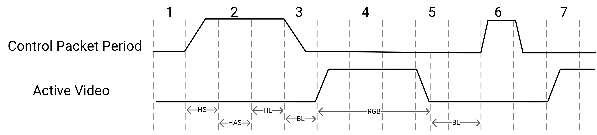
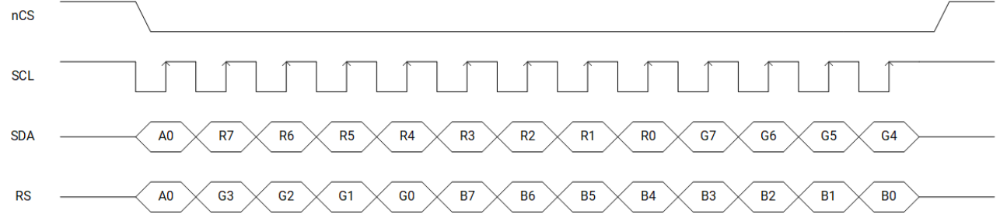

sidebar_position: 13

# 12. Display Subsystem

## 12.1 Display Controller

### 12.1.1 Introduction

The Display Controller is a hardware block that is used to transfer display data from the display’s internal memory to the DSI controller. It supports one independent display device through MIPI DSI.

### 12.1.2 Features

- Support for up to Full HD (1920x1080@60fps)
- Support for up to 4-full-size-layer composer and maximum 8 layer-composers by up-down layer reuse in the RDMA channel
- Support for _cmdlist_ mechanism allowing hardware register parameters to be configured
- Support for concurrent write-back operations with both raw and AFBC format
- Support for dithering, cropping, rotation in write-back path
- Advanced MMU (virtual address) mechanism for nearly no page missing during 90° and 270° rotation
- Support for color keying and solid color generation
- Support for both advanced error diffusion and pattern-based dithering for the panel
- Support for both AFBC and raw format image sources
- Color saturation and contrast enhancement
- Support for both video mode and _cmd_ mode (with frame buffer in LCM) for the panel
- Support for dynamic DDR frequency adjustment with an embedded DFC buffer
- Support for the following **input formats** (see also the map shown immediately after):

  - A2BGR101010, A2RGB101010, BGR101010A2, RGB101010A2
  - ABGR8888, ARGB8888, BGRA8888, RGBA8888
  - XBGR8888, XRGB8888, BGRX8888, RGBX8888
  - BGR888, RGB888, ABGR1555, RGBA5551, BGR565/RGB565
  - XYUV_444_P1_8, XYUV_444_P1_10, YVYU_422_P1_8, VYUY_422_P1_8
  - YUV_420_P2_8, YUV_420_P3_8
    
- Support for the following **output formats**:

  - RGB888, RGB565, RGB666

### 12.1.3 Block Diagram

The micro-architecture of the display subsystem is depicted below.


## 12.2 HDMI Interface

### 12.2.1 Features

- Compliance with HDMI Specification v1.4
- Dual-channel audio stream within the range 32~192KHz
- Physical lane speed up to 2.4Gbps/lane × 3lane
- Support for up to 1920x1440@60Hz
- Support for RGB and YcbCr 4:2:2 / 4:4:4 input video format
- Support for RGB and YcbCr 4:2:2 / 4:4:4 output video formats
- Support for 8bpc / 10bpc / 12bpc input and output color depths
- Support for EIA/CEA-861-F video timing and InfoFrame structure
- Support for L-PCM(IEC 60958), 32~192KHz dual channel audio data
- Support for Consumer Electronic Control (CEC) standard packets and user-defined packets
- Inclusion of an Internal I2C Master for remote ED access, supporting 100~400Kbps speed

### 12.2.2 Block Diagram

The architecture of the HDMI interface is depicted below.


## 12.3 MIPI-DSI

### 12.3.1 Introduction

The MIPI Display Serial Interface (MIPI DSI) is a high-speed interface between a host processor and peripheral devices that adheres to MIPI Alliance specifications for mobile device interfaces.

### 12.3.2 Features

- Compliance with the MIPI DSI standard v1.0
- Compliance with the MIPI DPHY specification v1.1
- Support for MIPI DPHY up to 4 data lanes and speed up to 1200Mbps per lane
- Support for 1 active panel per DPHY link
- Compliance with the Display Command Set (DCS) standard
- Support for all pixel formats defined in DSI and DCS
- Support for video burst mode with DPHY up to 1.2Ghz per lane
- Support for virtual channels in the MIPI Link
- Support for up to 1080p resolution
- Support for command, video and burst modes
- Support for HS-TX, LP-TX, LP-RX and LP-CD signaling

### 12.3.3 Functional Description

The DSI packet arbitration is depicted below.



As can be seen, the DSI packet arbitration is based on the timing period of the DSI internal timing control, which divides the H line time into 4 periods, in particular:

- **Control packet period:** HSS, HSA, and HSE
- **Blanking period 1**: BL or smart panel packet + LP
- **Active video**: RGB
- **Blanking period 2**: BL or smart panel packet + LP

The BL packet word count is programmable and is defined as bytes in byte clock. If smart panel packet is inserted, DSI hardware switches to LP after the smart panel packet is sent.

The DSI Timing Relationship with LCD Timing is as follows:

- The DSI controller generates its timing based in LCD vsync
- The DSI syncs up every frame with the LCD controller
- Both DSI and LCD share the same H total value and run at the same pixel clock rate. As a result, the horizontal line time is the same for both the DSI and LCD controllers.
- Additionally, the shift between LCD controller line to DSI line is programmable

### 12.3.4 Register Description

> **Note.** Base address = **0xD421_A800**

#### DSI_CTRL_0 REGISTER

**Offset: 0x0**

| Bits | Field | Type | Reset | Description |
| --- | --- | --- | --- | --- |
| 31 | CFG_SOFT_RST | RW | 0x0 | Software Reset DSI Module<br/>1: Reset DSI module<br/>0: De-assert software reset |
| 30 | CFG_SOFT_RST_REG | RW | 0x0 | Software Reset Configuration Registers<br/>1: Reset DSI configuration registers to default values<br/>0: De-assert reset |
| 29 | CFG_CLR_PHY_FIFO | RW | 0x0 | Configure Clear PHY Tx FIFO<br/>1: Clear FIFO data to 0<br/>0: De-assert clear<br/>It is NOT used currently and reserved for future use. |
| 28 | CFG_RST_TXLP | RW | 0x0 | Software Reset LP TX submodule<br/>1: Reset LP TX module<br/>0: De-assert software reset |
| 27 | CFG_RST_CPU | RW | 0x0 | Software Reset CPU TX submodule<br/>1: Reset CPU TX module<br/>0: De-assert software reset |
| 26 | CFG_RST_CPN | RW | 0x0 | Software Reset CPN TX submodule<br/>1: Reset CPN TX module<br/>0: De-assert software reset |
| 25 | RSVD | RO | 0 | Reserved for future use |
| 24 | CFG_RST_VPN | RW | 0x0 | Software Reset Video Panel submodule<br/>1: Reset VPN module<br/>0: De-assert software reset |
| 23 | CFG_DSI_PHY_RST | RW | 0x0 | Software Reset DPHY submodule<br/>1: Reset DPHY<br/>0: De-assert software reset |
| 22:18 | RSVD | RO | 0 | Reserved for future use |
| 17 | CFG_DSI_HCLK_DIS | RW | 0x0 | DSI AHB Clock Disable<br/>**Note. DSI configuration registers can still be written or read even if the DSI AHB clock is disabled.**<br/>1: DSI AHB clock will be gated<br/>0: DSI AHB clock is passed to DSI module |
| 16 | CFG_DSI_CLK_DIS | RW | 0x0 | DSI Clock disable<br/>1: DSI clock will be gated<br/>0: DSI clock is passed to DSI module |
| 15:9 | RSVD | RO | 0 | Reserved for future use |
| 8 | CFG_VPN_TX_EN | RW | 0x1 | Video Panel Interface TX Enable<br/>1: Enable Video Panel TX packet to DPHY. DSI will send video packets to peripherals.<br/>0: Disable Video Panel interface TX. |
| 7:5 | RSVD | RO | 0 | Reserved for future use |
| 4 | CFG_VPN_SLV | RW | 0x1 | Video Panel Interface in slave mode<br/>1: Video Panel works in slave mode. It receives VSYNC from input LCD interface, and is used to control the internal timing.<br/>0: Video Panel interface works in master mode. DSI sends VSYNC to LCD module, and controls the V timing and H timing.<br/>**Note. This bit must set to 1, VPN only supports slave mode.** |
| 3 | RSVD | RO | 0 | Reserved for future use |
| 2 | CFG_CPN_EN | RW | 0x0 | Command Panel Interface Enable<br/>1: Command panel is running and can accept data from the Command Panel interface<br/>0: Disable Command Panel interface |
| 1 | RSVD | RO | 0 | Reserved for future use |
| 0 | CFG_VPN_EN | RW | 0x0 | Video Panel Interface Enable<br/>1: Video Panel is active and running.<br/>0: Video Panel interface is disabled.<br/>**Note. Set this field to 1 to start the Video Panel timing.** |

#### DSI_CTRL_1 REGISTER

**Offset: 0x4**

| Bits | Field | Type | Reset | Description |
| --- | --- | --- | --- | --- |
| 31:9 | RSVD | RO | 0 | Reserved for future use |
| 8 | CFG_EOTP_EN | RW | 0x0 | EOTP Enable<br/>1: Enable EOTP packet<br/>0: Disable EOTP packet |
| 7:6 | CFG_CPN_VCH_NO | RW | 0x3 | Command Panel Virtual Channel Number |
| 5:2 | RSVD | RO | 0 | Reserved for future use |
| 1:0 | CFG_VPN_VCH_NO | RW | 0x0 | Video Panel Virtual Channel Number for Active Panel 1<br/>This parameter defines the virtual channel number for VPN |

#### DSI_IRQ_ST1 REGISTER

**Offset: 0x8**

| Bits | Field | Type | Reset | Description |
| --- | --- | --- | --- | --- |
| 31:4 | RSVD | RO | 0 | Reserved for future use |
| 3 | IRQ_DPHY_ERR_HS_RXP | RO | 0x0 | DPHY HSTX contention RXP Error |
| 2 | IRQ_DPHY_ERR_HS_RXN | RO | 0x0 | DPHY HSTX contention RXN Error |
| 1 | IRQ_DPHY_ERR_HS_CONTP | RO | 0x0 | DPHY HSTX contention contp Error |
| 0 | IRQ_DPHY_ERR_HS_CONTN | RO | 0x0 | DPHY HSTX contention contn Error |

#### DSI_IRQ_MASK1 REGISTER

**Offset: 0xc**

| Bits | Field | Type | Reset | Description |
| --- | --- | --- | --- | --- |
| 31:4 | RSVD | RO | 0 | Reserved for future use |
| 3:0 | CFG_IRQ_MASK1 | RW | 0x0 | DSI interrupt mask<br/>This field is used to mask interrupt requests.<br/>If one bit is set to 0x1, the corresponding interrupt status is masked. |

#### DSI_IRQ_ST REGISTER

**Offset: 0x10**

| Bits | Field | Type | Reset | Description |
| --- | --- | --- | --- | --- |
| 31 | IRQ_LAST_LINE | RO | 0x0 | Last Line interrupt |
| 30 | IRQ_CPN_TE | RO | 0x0 | Command Panel Tearing Effect. |
| 29 | IRQ_TA_TIMEOUT | RO | 0x0 | Turnaround Acknowledgement Timeout for DPHY |
| 28 | IRQ_RX_TIMEOUT | RO | 0x0 | LP-RX Timeout for DPHY |
| 27 | IRQ_TX_TIMEOUT | RO | 0x0 | HS TX Timeout for DPHY |
| 26 | IRQ_RX_STATE_ERR | RO | 0x0 | Peripheral Status Error<br/>After DSI receives an acknowledgement with error report packet from slave, it will mark this bit if an error status is reported. |
| 25 | IRQ_RX_ERR | RO | 0x0 | DSI RX Packet Error<br/>DSI receives a packet (with error status, such as ecc error/crc error/unknown packet) from slave |
| 24 | IRQ_RX_FIFO_FULL_ERR | RO | 0x0 | RX FIFO Full Error |
| 23 | IRQ_PHY_FIFO_UNDERRUN | RO | 0x0 | PHY FIFO Underrun Error |
| 22 | IRQ_REQ_CNT_ERR | RO | 0x0 | TX Request Count Error<br/>This error occurs when the delays between an Active Panel TX request and the DPHY ready signal are inconsistent. |
| 21 | IRQ_RXPSR_FIFO_FULL_ERR | RO | 0x0 | RX Parser FIFO Full Error |
| 20 | IRQ_VPN_REQ_PHY_DLY_ERR | RO | 0x0 | VPN Request Delay Error at PHY Interface<br/>VPN packets are delayed at the PHY interface. |
| 19 | IRQ_VPN_BF_UNDERRUN_ERR | RO | 0x0 | VPN Buffer Underrun Error |
| 18 | IRQ_VPN_REQ_ARB_DLY_ERR | RO | 0x0 | VPN Request Delay Error at Arbiter Interface<br/>VPN packets are delayed at arbiter point. |
| 17 | IRQ_VPN_BF_OVERRUN_ERR | RO | 0x0 | VPN Buffer Overrun Error |
| 16 | IRQ_VPN_TIMING_ERR | RO | 0x0 | VPN Data Timing Error<br/>This error indicates that pixel data might be incorrect. It occurs when the Data FIFO for the VPN path is read too early or too late, leading to an empty FIFO when it is accessed. |
| 15 | IRQ_VPN_VACT_DONE | RO | 0x0 | VPN VACT Done |
| 14 | IRQ_VPN_BF_FULL | RO | 0x0 | VPN Buffer Full Error<br/>Pixel data may be incorrect. |
| 13 | IRQ_CPN_BF_FULL | RO | 0x0 | CPN Buffer Full Error<br/>Pixel data may be incorrect. |
| 12 | IRQ_DPHY_ERR_CONT_LP1 | RO | 0x0 | DPHY LP1 Contention Detect PPI ErrContertionLP1 |
| 11 | IRQ_DPHY_ERR_CONT_LP0 | RO | 0x0 | DPHY LP0 Contention Detect PPI ErrContertionLP0 |
| 10 | IRQ_DPHY_ERR_SYNC_ESC | RO | 0x0 | DPHY Sync Error PPI ErrSyncEsc<br/>Partial byte is detected |
| 9 | IRQ_DPHY_ERR_ESC | RO | 0x0 | DPHY Invalid Command Detect PPI ErrEsc<br/>Invalid ESC command is detected |
| 8 | IRQ_DPHY_RX_LINE_ERR | RO | 0x0 | DPHY Invalid Line State Detect PPI ErrControl |
| 7 | IRQ_RX_TRG3 | RO | 0x0 | DPHY RX Trigger 3 Received<br/>By default, the value of trigger 3 is 0x05,<br/>Note: Its exact meaning is not defined by specification. |
| 6 | IRQ_RX_TRG2 | RO | 0x0 | DPHY RX Trigger 2 Received<br/>By default, trigger 2 is for acknowledgement Trigger, and its value is 0x84. |
| 5 | IRQ_RX_TRG1 | RO | 0x0 | DPHY RX Trigger 1 Received<br/>By default, trigger 1 is for TE Trigger, and its value is 0xBA. |
| 4 | IRQ_RX_TRG0 | RO | 0x0 | DPHY RX Trigger 0 Received<br/>By default, trigger 0 is for Reset Trigger, and its value is 0x46. |
| 3 | IRQ_RX_ULPS | RO | 0x0 | DPHY RX ULPS Received |
| 2 | IRQ_RX_PKT | RO | 0x0 | DPHY RX Packet Received |
| 1 | IRQ_CPN_TX_DONE | RO | 0x0 | Command Panel Data Transmission Done |
| 0 | IRQ_CPU_TX_DONE | RO | 0x0 | CPU Packet Transmission Done |

#### DSI_IRQ_MASK REGISTER

**Offset: 0x14**

| Bits | Field | Type | Reset | Description |
| --- | --- | --- | --- | --- |
| 31:0 | CFG_IRQ_MASK | RW | 0x0 | DSI interrupt mask<br/>This field is used to mask interrupt requests.<br/>If one bit is set to 0x1, the corresponding interrupt status is masked. |

#### DSI_CPU_CMD_0 REGISTER

**Offset: 0x20**

| Bits | Field | Type | Reset | Description |
| --- | --- | --- | --- | --- |
| 31 | CFG_CPU_CMD_REQ | RW | 0x0 | CPU Command Request<br/>1: CPU packet request<br/>0: No request or request done<br/>After software writes a command with this bit set to 1, the DSI module sends out a packet as requested. DSI de-asserts this field after packet is sent. |
| 30 | CFG_CPU_SP | RW | 0x0 | CPU Short Packet<br/>1: CPU packet is a short packet<br/>0: CPU packet is a long packet |
| 29 | CFG_CPU_TURN | RW | 0x0 | CPU Turn Around<br/>1: After CPU packet, turn around the bus<br/>0: Don't turn around bus after CPU packet |
| 28 | RSVD | RO | 0 | Reserved for future use |
| 27 | CFG_CPU_TXLP | RW | 0x0 | Low Power TX for CPU Packets<br/>1 = Transfer CPU packets in low power mode<br/>0 = Use high-speed mode to send CPU packets |
| 26:16 | RSVD | RO | 0 | Reserved for future use |
| 15:0 | CFG_CPU_WC | RW | 0x0 | CPU Packet Byte Count<br/>For high-speed transfer, this represents the payload byte count for long packets (excluding CRC bytes).<br/>For high-speed short packet transfer, this field is ignored.<br/>For low power transfer, this is the byte count for the entire packet, including CRC bytes, and CFG_CPU_SP is ignored. |

#### DSI_CPU_CMD_1 REGISTER

**Offset: 0x24**

| Bits | Field | Type | Reset | Description |
| --- | --- | --- | --- | --- |
| 31:24 | RSVD | RO | 0 | Reserved for future use |
| 23:20 | CFG_TXLP_LPDT | RW | 0x0 | LPDT TX Enable<br/>LPDT TX enables signals for low power TX |
| 19:16 | CFG_TXLP_ULPS | RW | 0x0 | ULPS TX Enable<br/>ULPS TX enables signals for Low power TX |
| 15:0 | CFG_TXLP_TRIGGER_CODE | RW | 0x0 | Low Power TX Trigger Code |

#### DSI_CPU_CMD_3 REGISTER

**Offset: 0x2c**

| Bits | Field | Type | Reset | Description |
| --- | --- | --- | --- | --- |
| 31 | CFG_CPU_DAT_REQ | RW | 0x0 | CPU Packet Data Buffer Read/Write Request<br/>1: CPU packet data request<br/>0: No request or request done<br/>After software writes a command with this bit set to 1, the DSI module will write data to the packet data buffer or read data from the data buffer as requested. DSI will de-assert this bit after write/read operation is done. Read data will be valid after this bit is reset to 0. |
| 30 | CFG_CPU_DAT_RW | RW | 0x0 | CPU Packet Data Buffer Read/Write Operation<br/>1: CPU packet data write operation<br/>0: CPU packet data read operation |
| 29:24 | RSVD | RO | 0 | Reserved for future use |
| 23:16 | CFG_CPU_DAT_ADDR | RW | 0x0 | CPU Packet Data Address<br/>This is the byte address for the packet data.<br/>- For each read/write operation, 4 bytes of data are written or read. Software should increment the address by 4 after each operation.<br/>- The packet data starts with the packet header:<br/>1. At address 0:<br/>- Bits [7:0] represent Type_id<br/>- Bits [23:8] represent Length<br/>- Bits [31:24] represent ECC<br/>2. At address 4: Payload data if it's a long packet, and so on.<br/>- The maximum packet data buffer is 256 bytes. |
| 15:0 | RSVD | RO | 0 | Reserved for future use |

#### DSI_CPU_WDAT REGISTER

**Offset: 0x30**

| Bits | Field | Type | Reset | Description |
| --- | --- | --- | --- | --- |
| 31:0 | CFG_CPU_WDAT | RW | 0x0 | CPU Data Write Register (wdata 0)<br/>This register defines the data for CPU packets. It holds the CPU packet data that will be written to the packet data buffer.<br/>- Software should first program the packet data into this register, then configure the DSI CPU Packet Command Register 3 to load the packet data into the Tx packet data buffer.<br/>- For each read/write operation, 4 bytes of data are written or read.<br/>1. Bits [7:0]: LSB<br/>2. Bits [31:24]: MSB<br/>- For packet data at address 0:<br/>1. Bits [7:0]: Type_id<br/>2. Bits [23:8]: Length<br/>3. Bits [31:24]: ECC<br/>- For data at address 4: The payload data if it's a long packet, and so on.<br/>- High-speed transmission: Hardware automatically generates ECC and CRC codes, replacing them in the packet data buffer.<br/>- Low-power transmission: Hardware does not insert ECC/CRC, and instead sends out the ECC/CRC from the packet data buffer |

#### DSI_CPU_STATUS_0 REGISTER

**Offset: 0x34**

| Bits | Field | Type | Reset | Description |
| --- | --- | --- | --- | --- |
| 31:16 | RSVD | RO | 0 | Reserved for future use |
| 15:0 | CFG_CPU_PKT_CNT | RW | 0x0 | CPU Packet Counter<br/>This counter counts the number of CPU packets sent out through DSI.<br/>This register is write clear. |

#### DSI_CPU_STATUS_1 REGISTER

**Offset: 0x38**

| Bits | Field | Type | Reset | Description |
| --- | --- | --- | --- | --- |
| 31:0 | CFG_CPU_CMD_TX_CNT | RO | 0x0 | CPU CMD TX Counter<br/>This counter counts the number of byte clock cycles required to transfer the current CPU command.<br/>It begins to count after CPU command is received, and stops to count after DPHY gets ready for another TX request.<br/>This counter could help to decide the values of DSI_VPN_SLOT_CNT_0 and DSI_VPN_SLOT_CNT_1 register. |

#### DSI_CPU_STATUS_2 REGISTER

**Offset: 0x3c**

| Bits | Field | Type | Reset | Description |
| --- | --- | --- | --- | --- |
| 31:0 | CFG_CPU_CMD_CNT | RW | 0x0 | CPU CMD Execution Counter<br/>This counter counts the number of byte clock cycles required to execute the current CPU command.<br/>This counter only counts the cycles which CPU engine is busy.<br/>This counter could help to decide the values of DSI_VPN_SLOT_CNT_0 and DSI_VPN_SLOT_CNT_1 register. |

#### DSI_CPU_STATUS_3 REGISTER

**Offset: 0x40**

| Bits | Field | Type | Reset | Description |
| --- | --- | --- | --- | --- |
| 31:0 | CFG_TXLP_CNT | RO | 0x0 | Low Power TX byte clock count<br/>This counter counts the number of byte clock cycles required to transfer a low power packet. |

#### DSI_CPU_STATUS_4 REGISTER

**Offset: 0x44**

| Bits | Field | Type | Reset | Description |
| --- | --- | --- | --- | --- |
| 31:0 | CFG_BTA_CNT | RO | 0x0 | Bus Turn Around byte clock count<br/>This counter counts the number of byte clock cycles required to complete a bus turn around operation. |

#### DSI_CPN_STATUS_1 REGISTER

**Offset: 0x4c**

| Bits | Field | Type | Reset | Description |
| --- | --- | --- | --- | --- |
| 31:0 | CFG_CPN_STATUS_1 | RW | 0x0 | Command Panel Path Status 1<br/>It includes the following fields:<br/>- smt_bf_cnt[5:0]<br/>- smt_fifo_bcnt[9:0]<br/>- smt_cs[4:0]<br/>- smt_wr_on<br/>- smt_dma_on<br/>- smt_fifo_empty<br/>- smt_bf_empty<br/>- smt_fifo_full_r<br/>- smt_bf_full_r |

#### DSI_CPN_CMD REGISTER

**Offset: 0x50**

| Bits | Field | Type | Reset | Description |
| --- | --- | --- | --- | --- |
| 31:28 | CFG_CPN_TE_EN | RW | 0x0 | Command Panel Tearing Effect Signal Enable |
| 27 | RSVD | RO | 0 | Reserved for future use |
| 26:24 | CFG_CPN_RGB_TYPE | RW | 0x0 | Command Panel Data RGB Type<br/>0x0: 888 mode<br/>0x1: 666 unpacked mode<br/>0x2: 565 mode<br/>0x3: 444 mode<br/>0x4: 332 mode<br/>0x5: 111 mode |
| 23:4 | RSVD | RO | 0 | Reserved for future use |
| 3 | CFG_CPN_BURST_MODE | RW | 0x1 | Command Panel Interface Burst Mode Enable<br/>0: Enable Previous Command Pandel interface.<br/>1: Burst mode interface between LCD and DSI will take effect.<br/>This interface provides a more efficient connection than the previous mode |
| 2 | CFG_CPN_FIRSTP_SEL | RW | 0x0 | Command panel First packet select<br/>0: FIFO empty<br/>1: vsync from DP650 |
| 1 | CFG_CPN_DMA_DIS | RW | 0x0 | Command Panel dma_on Disable<br/>1: Disable smt_dma_on signal from LCD controller. DSI will not receive Command Panel interface data from LCD even smt_dma_on signal is active high.<br/>0 = Receive LCD Command Panel interface data when smt_dma_on is high. |
| 0 | CFG_CPN_ADDR0_EN | RW | 0x0 | Command Panel Address Bit Indicator<br/>0: When smt_addr = 1, bus data is for pixel RGB data.<br/>When smt_addr = 0, bus data is ignored.<br/>1: When smt_addr = 0, bus data is for pixel RGB data.<br/>When smt_addr = 1, bus data is ignored. |

#### DSI_CPN_CTRL_0 REGISTER

**Offset: 0x54**

| Bits | Field | Type | Reset | Description |
| --- | --- | --- | --- | --- |
| 31:22 | RSVD | RO | 0 | Reserved for future use |
| 21:16 | CFG_DCS_LONGWR_CODE | RW | 0x39 | DSI Command Code for Writing Command Panel Data<br/>The default data is 0x39 from DSI specification. |
| 15:8 | CFG_DCS_WR_CON_CODE | RW | 0x3C | DCS Command for Continuous Write<br/>The default value is 0x3C in MIPI Alliance Standard for Display Command Set Specification. |
| 7:0 | CFG_DCS_WR_STR_CODE | RW | 0x2C | DCS Command for First Write<br/>The default value is 0x2C in the MIPI Alliance Standard for Display Command Set Specification. |

#### DSI_CPN_CTRL_1 REGISTER

**Offset: 0x58**

| Bits | Field | Type | Reset | Description |
| --- | --- | --- | --- | --- |
| 31:26 | RSVD | RO | 0 | Reserved for future use |
| 25:16 | CFG_CPN_PKT_CNT | RW | 0x100 | Command Panel Packet Length<br/>This field defines the packet length for Command Panel packets. |
| 15:10 | RSVD | RO | 0 | Reserved for future use |
| 9:0 | CFG_CPN_FIFO_FULL_LEVEL | RW | 0x200 | Command Panel FIFO Full Level, in byte count |

#### DSI_CPN_STATUS_0 REGISTER

**Offset: 0x5c**

| Bits | Field | Type | Reset | Description |
| --- | --- | --- | --- | --- |
| 31:0 | CFG_CPN_FRM_CNT | RW | 0x0 | Command Panel Frame Counter<br/>This counter counts the numbers of Command Panel frames sent  through DSI.<br/>This register is write clear. |

#### DSI_RX_PKT_ST_0 REGISTER

**Offset: 0x60**

| Bits | Field | Type | Reset | Description |
| --- | --- | --- | --- | --- |
| 31 | RX_PKT0_ST_VLD | RWC | 0x0 | Rx Packet 0 Status Valid<br/>1: Valid status<br/>0: Invalid status |
| 30:27 | RSVD | RO | 0 | Reserved for future use |
| 26 | RX_PKT0_ST_EOTP | RWC | 0x0 | Rx Packet 0 is EOTP<br/>1: Received packet is EOTP packet<br/>0: Other packet. It is valid only when RX_PKT0_ST_VLD = 1. |
| 25 | RX_PKT0_ST_ACK | RWC | 0x0 | Rx Packet 0 is ACK Packet<br/>1: Received packet is an ACK packet, with or without errors.<br/>0: Other packet. It is valid only when RX_PKT0_ST_VLD = 1. |
| 24 | RX_PKT0_ST_SP | RWC | 0x0 | Rx Packet 0 Short Packet<br/>1: Received packet is a short packet.<br/>0: Long packet, it is valid only when RX_PKT0_ST_VLD = 1. |
| 23:22 | RSVD | RO | 0 | Reserved for future use |
| 21:16 | RX_PKT0_PKT_PTR | RWC | 0x0 | Rx Packet 0 Data Pointer<br/>Packet header in FIFO is the raw data from DPHY and is before ECC correction.<br/>It is valid only when RX_PKT0_ST_VLD = 1. |
| 15:14 | RX_PKT0_VCH | RWC | 0x0 | Rx Packet 0 Virtual Channel Number<br/>It is valid only when RX_PKT0_ST_VLD = 1. |
| 13:12 | RSVD | RO | 0 | Reserved for future use |
| 11:8 | RX_PKT0_ECC_FLAGS | RWC | 0x0 | Rx Packet 0 ECC Error Flags<br/>Bit [11]:<br/>1: No ECC error<br/>0: ECC error<br/>Bit [10]:<br/>1: Correctable error in data bits.<br/>Bit [9]:<br/>1: Correctable error happens at parity bits.<br/>Bit [8]:<br/>1: Incorrectable error<br/>It is valid only when RX_PKT0_ST_VLD = 1. |
| 7:5 | RSVD | RO | 0 | Reserved for future use |
| 4 | RX_PKT0_NO_CRC | RWC | 0x0 | Rx Packet 0 Without CRC<br/>Rx packet does not include CRC, and CRC part contains 0x0000.<br/>It is valid only when RX_PKT0_ST_VLD = 1. |
| 3 | RX_PKT0_UNKNOWN_ERR | RWC | 0x0 | Rx Packet 0 Type Unknown Error<br/>It is valid only when RX_PKT0_ST_VLD = 1. |
| 2 | RX_PKT0_ST_ERR | RWC | 0x0 | Rx Packet 0 ack Status Error<br/>Indicates an error in the acknowledge packet status.<br/>The DSI_RX_PKT_HDR_0 should be checked to identify the specific error.<br/>It is valid only when RX_PKT0_ST_VLD = 1. |
| 1 | RX_PKT0_ECC_ERR | RWC | 0x0 | Rx Packet 0 ECC Error<br/>It is valid only when RX_PKT0_ST_VLD = 1. |
| 0 | RX_PKT0_CRC_ERR | RWC | 0x0 | Rx Packet CRC Error<br/>It is valid only when RX_PKT0_ST_VLD = 1. |

#### DSI_RX_PKT_HDR_0 REGISTER

**Offset: 0x64**

| Bits | Field | Type | Reset | Description |
| --- | --- | --- | --- | --- |
| 31:0 | RX_PKT0_HDR | RW | 0x0 | Rx Packet 0 Header<br/>Bits [7:0]: DataID<br/>Bits [23:8]: Length<br/>Bits [31:23]: ECC--Corrected if an error is detected |

#### DSI_RX_PKT_ST_1 REGISTER

**Offset: 0x68**

| Bits | Field | Type | Reset | Description |
| --- | --- | --- | --- | --- |
| 31 | RX_PKT1_ST_VLD | RWC | 0x0 | Rx Packet 1 Status Valid<br/>1: Valid status<br/>0: Invalid status |
| 30:27 | RSVD | RO | 0 | Reserved for future use |
| 26 | RX_PKT1_ST_EOTP | RWC | 0x0 | Rx Packet 1 is EOTP<br/>1: Received packet is EOTP packet.<br/>0: Other packet. It is valid only when RX_PKT0_ST_VLD = 1. |
| 25 | RX_PKT1_ST_ACK | RWC | 0x0 | Rx Packet 1 is ACK Packet<br/>1 = Received packet is an ACK packet, with or without error.<br/>0 = Other packet. It is valid only when RX_PKT0_ST_VLD = 1. |
| 24 | RX_PKT1_ST_SP | RWC | 0x0 | Rx Packet 1 Short Packet<br/>1: Received packet is a short packet.<br/>0: Long packet valid only when RX_PKT0_ST_VLD = 1. |
| 23:22 | RSVD | RO | 0 | Reserved for future use |
| 21:16 | RX_PKT1_PKT_PTR | RWC | 0x0 | Rx Packet 1 Data Pointer<br/>Packet header in FIFO is the raw data from DPHY before ECC correction.<br/>Valid only when RX_PKT0_ST_VLD = 1. |
| 15:14 | RX_PKT1_VCH | RWC | 0x0 | Rx Packet 1 Virtual Channel Number<br/>Valid only when RX_PKT0_ST_VLD = 1. |
| 13:12 | RSVD | RO | 0 | Reserved for future use |
| 11:8 | RX_PKT1_ECC_FLAGS | RWC | 0x0 | Rx Packet 1 ECC Error Flags<br/>Bit [11]:<br/>1: No ECC error<br/>0: ECC error<br/>Bit [10]:<br/>1: Correctable error in data bits<br/>Bit [9]:<br/>1: Correctable error happens at parity bits<br/>Bit [8]:<br/>1: Incorrectable error. It is valid only when RX_PKT0_ST_VLD = 1. |
| 7:5 | RSVD | RO | 0 | Reserved for future use |
| 4 | RX_PKT1_NO_CRC | RWC | 0x0 | Rx Packet 1 Without CRC<br/>Rx packet does not include CRC, and CRC part contains 0x0000.<br/>It is valid only when RX_PKT0_ST_VLD = 1. |
| 3 | RX_PKT1_UNKNOWN_ERR | RWC | 0x0 | Rx Packet Type Unknown Error<br/>It is valid only when RX_PKT0_ST_VLD = 1. |
| 2 | RX_PKT1_ST_ERR | RWC | 0x0 | Rx Packet 1 ack Status Error<br/>DSI_RX_PKT_HDR_0 should be checked to identify the specific error.<br/>It is valid only when RX_PKT0_ST_VLD = 1. |
| 1 | RX_PKT1_ECC_ERR | RWC | 0x0 | Rx Packet 1 ECC Error<br/>It is valid only when RX_PKT0_ST_VLD = 1. |
| 0 | RX_PKT1_CRC_ERR | RWC | 0x0 | Rx Packet 1 CRC Error<br/>It is valid only when RX_PKT0_ST_VLD = 1. |

#### DSI_RX_PKT_HDR_1 REGISTER

**Offset: 0x6c**

| Bits | Field | Type | Reset | Description |
| --- | --- | --- | --- | --- |
| 31:0 | RX_PKT1_HDR | RW | 0x0 | Rx Packet 1 Header<br/>Bits [7:0]: DataID<br/>Bits [23:8]: Length<br/>Bits [31:23]: ECC--Corrected if an error is detected |

#### DSI_RX_PKT_CTRL REGISTER

**Offset: 0x70**

| Bits | Field | Type | Reset | Description |
| --- | --- | --- | --- | --- |
| 31 | RX_PKT_RD_REQ | RW | 0x0 | Rx Packet FIFO Read Request<br/>1 = Read request<br/>0 = Invalid request<br/>This bit will be cleared to 0 after read operation is done, and Rx data is valid. |
| 30:22 | RSVD | RO | 0 | Reserved for future use |
| 21:16 | RX_PKT_RD_PTR | RW | 0x0 | Rx Packet Data FIFO Read Pointer<br/>For every read operation, the hardware returns data from the current pointer address. Software must increment this pointer for the next data after each byte is read. |
| 15:8 | RSVD | RO | 0 | Reserved for future use |
| 7:0 | RX_PKT_RD_DATA | RW | 0x0 | Rx FIFO Read Data Valid when RX_PKT_RD_REQ = 0.<br/>- First byte: DataID<br/>- Second byte: wc0<br/>- Third byte: wc1<br/>- Fourth byte: raw ECC received from DPHY, not corrected<br/>- Fifth byte and beyond: long packet data |

#### DSI_RX_PKT_CTRL_1 REGISTER

**Offset: 0x74**

| Bits | Field | Type | Reset | Description |
| --- | --- | --- | --- | --- |
| 31:12 | RSVD | RO | 0 | Reserved for future use |
| 11:8 | RX_PKT_CNT | RWC | 0x0 | RX Packet Count in Rx FIFO All LP<br/>RX packets are stored in the FIFO and start from address 0. |
| 7:0 | RX_PKT_BCNT | RWC | 0x0 | RX Byte Count in Rx FIFO<br/>The whole LP RX data is stored in the FIFO and starts from address 0. |

#### DSI_RX_PKT_ST_2 REGISTER

**Offset: 0x78**

| Bits | Field | Type | Reset | Description |
| --- | --- | --- | --- | --- |
| 31 | RX_PKT2_ST_VLD | RWC | 0x0 | Rx Packet 2 Status Valid<br/>1: Valid status<br/>0: Invalid status |
| 30:27 | RSVD | RO | 0 | Reserved for future use |
| 26 | RX_PKT2_ST_EOTP | RWC | 0x0 | Rx Packet 2 is EOTP<br/>1: Received packet is EOTP packet<br/>0: Other packet. It is valid only when RX_PKT0_ST_VLD = 1. |
| 25 | RX_PKT2_ST_ACK | RWC | 0x0 | Rx Packet 2 is an ACK Packet<br/>1: Received packet is an ACK packet, with or without error<br/>0: Other packet. It is valid only when RX_PKT0_ST_VLD = 1. |
| 24 | RX_PKT2_ST_SP | RWC | 0x0 | Rx Packet 2 Short Packet<br/>1: Received packet is a short packet<br/>0: Long packet Valid only when RX_PKT0_ST_VLD = 1 |
| 23:22 | RSVD | RO | 0 | Reserved for future use |
| 21:16 | RX_PKT2_PKT_PTR | RWC | 0x0 | Rx Packet 2 Data Pointer<br/>The packet header in FIFO is the raw data from DPHY before ECC correction.<br/>Valid only when RX_PKT0_ST_VLD = 1. |
| 15:14 | RX_PKT2_VCH | RWC | 0x0 | Rx Packet 2 Virtual Channel Number<br/>Valid only when RX_PKT0_ST_VLD = 1 |
| 13:12 | RSVD | RO | 0 | Reserved for future use |
| 11:8 | RX_PKT2_ECC_FLAGS | RWC | 0x0 | Rx Packet 2 ECC Error Flags<br/>bit [11]:<br/>1: No ECC error<br/>0: ECC error<br/>Bit [10]:<br/>1: Correctable error in data bits<br/>Bit [9]:<br/>1: Correctable error happens at parity bits<br/>Bit [8]:<br/>1: Incorrectable error. It is valid only when RX_PKT0_ST_VLD = 1. |
| 7:5 | RSVD | RO | 0 | Reserved for future use |
| 4 | RX_PKT2_NO_CRC | RWC | 0x0 | Rx Packet 2 Without CRC<br/>Rx packet does not include CRC and CRC part contains 0x0000.<br/>It is valid only when RX_PKT0_ST_VLD = 1. |
| 3 | RX_PKT2_UNKNOWN_ERR | RWC | 0x0 | Rx Packet 2 Type Unknown Error<br/>It is valid only when RX_PKT0_ST_VLD = 1. |
| 2 | RX_PKT2_ST_ERR | RWC | 0x0 | Rx Packet 2 ack Status Error<br/>DSI_RX_PKT_HDR_0 should be checked to identify the specific error.<br/>It is valid only when RX_PKT0_ST_VLD = 1. |
| 1 | RX_PKT2_ECC_ERR | RWC | 0x0 | Rx Packet 2 ECC Error<br/>It is valid only when RX_PKT0_ST_VLD = 1. |
| 0 | RX_PKT2_CRC_ERR | RWC | 0x0 | Rx Packet 2 CRC Error<br/>It is valid only when RX_PKT0_ST_VLD = 1. |

#### DSI_RX_PKT_HDR_2REGISTER

**Offset: 0x7c**

| Bits | Field | Type | Reset | Description |
| --- | --- | --- | --- | --- |
| 31:0 | RX_PKT2_HDR | RW | 0x0 | Rx Packet 2 Header |

#### DSI_LCD_BDG_CTRL0 REGISTER

**Offset: 0x84**

| Bits | Field | Type | Reset | Description |
| --- | --- | --- | --- | --- |
| 31:28 | RSVD | RO | 0 | Reserved for future use |
| 27:16 | CFG_VPN_FIFO_AFULL_CNT | RW | 0x0 | DSI VPN FIFO Almost Full Count<br/>The difference between the FIFO read pointer and write pointer must be greater than this value. |
| 15:10 | RSVD | RO | 0 | Reserved for future use |
| 9 | CFG_HSYNC_MISSING_FIX | RW | 0x0 | Fix for the Hsync missing bug |
| 8 | CFG_TXLP_LANE_TURN_FIX | RW | 0x0 | Fix for the TXLP lane turn bug |
| 7 | RSVD | RO | 0 | Reserved for future use |
| 6 | CFG_VPN_FIFO_AFULL_BYPASS | RW | 0x0 | Bypass VPN FIFO almost full<br/>0: Not bypass<br/>1: Bypass (LCD outputs pixel data to VPN FIFO regardless of the almost full signal) |
| 5 | CFG_CPN_VSYNC_EDGE | RW | 0x0 | CPN Vsync signal edge select<br/>0: posedge (Positive edge) select<br/>1: negedge (Negative edge) select |
| 4 | CFG_CPN_TE_EDGE | RW | 0x0 | CPN tearing effect signal edge select<br/>0: posedge (Positive edge) select<br/>1: negedge (Negative edge) select |
| 3:2 | CFG_CPN_TE_MODE | RW | 0x0 | CPN tearing effect mode select<br/>0: No Tearing Effect<br/>1: Mode A – Tearing effect signal consists of V-Blanking only<br/>2: Mode B – Tearing effect signal consists of both V-Blanking and H-Blanking<br/>3: Mode C – Tearing effect signal outputs the N H-Blanking |
| 1 | CFG_PIXEL_SWAP | RW | 0x0 | LCD output pixel swap<br/>0: Do not swap LCD output pixel data<br/>1: Swap LCD output pixel data |
| 0 | CFG_SPLIT_EN | RW | 0x0 | Split Mode enable<br/>This bit should be set as same as LCD split mode<br/>0: Split mode disable, only DSIA is used for display<br/>1: Split mode enable, both DSIA and DSIB are used for display |

#### DSI_LCD_BDG_CTRL1 REGISTER

**Offset: 0x88**

| Bits | Field | Type | Reset | Description |
| --- | --- | --- | --- | --- |
| 31:16 | CFG_CPN_TE_DLY_CNT | RW | 0x10 | CPN Tearing Effect Delay Count<br/>The LCD output pixel data will be delayed by the number of cycles specified in this field after the TE pulse. |
| 15:0 | CFG_CPN_TE_LINE_CNT | RW | 0x0 | CPN Tearing Effect line Count<br/>When TE_MODE = 2, this field takes effect.<br/>The LCD output pixel data will be delayed for a number of TE pulses specified by this field. |

#### DSI_TX_TIMER REGISTER

**Offset: 0xe4**

| Bits | Field | Type | Reset | Description |
| --- | --- | --- | --- | --- |
| 31:0 | CFG_TX_TIMER_CNT | RW | 0xffffffff | Tx Transmission Timer Value<br/>This timer monitors the Tx operation on the DSI output side.<br/>It could generate IRQ after timer timeout.<br/>By default setting, timeout will not occur because the reset value is set to the maximum value (0xffffffff). |

#### DSI_RX_TIMER REGISTER

**Offset: 0xe8**

| Bits | Field | Type | Reset | Description |
| --- | --- | --- | --- | --- |
| 31:0 | CFG_RX_TIMER_CNT | RW | 0xffffffff | Rx Timer Value<br/>This timer monitors the Rx operation on the DSI operation.<br/>It could generate IRQ after timer timeout.<br/>By default setting, timeout will not occur because the reset value is set to the maximum value (0xffffffff). |

#### DSI_TURN_TIMER REGISTER

**Offset: 0xec**

| Bits | Field | Type | Reset | Description |
| --- | --- | --- | --- | --- |
| 31:0 | CFG_TURN_TIMER_CNT | RW | 0xffffffff | Bus Turn Around Timer Value<br/>This timer monitors the turn around operation on the DSI.<br/>It could generate IRQ after timer timeout.<br/>By default setting, timeout will not occur because the reset value is set to the maximum value (0xffffffff). |

#### DSI_VPN_CTRL_0 REGISTER

**Offset: 0x100**

| Bits | Field | Type | Reset | Description |
| --- | --- | --- | --- | --- |
| 31:16 | CFG_VPN_DLY_CNT | RW | 0x100 | VPN Vsync Delay Count in slave mode.<br/>In slave mode, the DSI begins H/V timing based on the input Vsync from the LCD module. After receiving the Vsync from the LCD controller, the DSI will start the Vsync timing by delaying it for the number of clock cycles specified by this field. |
| 15:8 | RSVD | RO | 0 | Reserved for future use |
| 7:0 | CFG_VPN_TX_DLY_CNT | RW | 0x10 | VPN TX Delay Count<br/>After the DSI starts Hsync timing, this field defines the delay in DPHY byte clock cycles before initiating a VSS packet transfer. This internal delay ensures a fixed TX timing at the DPHY interface. |

#### DSI_VPN_CTRL_1 REGISTER

**Offset: 0x104**

| Bits | Field | Type | Reset | Description |
| --- | --- | --- | --- | --- |
| 31 | CFG_VPN_VSYNC_RST_EN | RW | 0x0 | LCD Vsync Reset Enable in slave mode<br/>1: Reset DSI vertical state machine when LCD Vsync comes. This will only take effect when LCD is in slave mode.<br/>0: Do not reset the DSI vertical state machine |
| 30:28 | RSVD | RO | 0 | Reserved for future use |
| 27 | CFG_VPN_AUTO_WC_DIS | RW | 0x0 | VPN Auto Word Count Disable<br/>This bit has lower priority than CFG_VPN_HACT_WC_EN<br/>0x0: Enable auto word count calculation, and hardware automatically calculates the number of bytes that will be sent in each H line slot<br/>0x1: Auto word count calculation will not be effective |
| 26 | CFG_VPN_HACT_WC_EN | RW | 0x0 | VPN Hact Word Count Enable<br/>This bit has higher priority than CFG_VPN_AUTO_WC_EN<br/>0x0: CFG_HACT_WC will not be effective if CFG_VPN_AUTO_WC_DIS is set to 0<br/>0x1: Enable Hact word count parameter, and CFG_HACT_WC will be used to decide the number of bytes that are sent |
| 25 | CFG_VPN_TIMING_CHECK_DIS | RW | 0x0 | VPN Hss/Hse/Hact TX Timing Check Disable<br/>0x0: Check timing before requesting DPHY for TX<br/>0x1: No check timing before requesting DPHY for TX |
| 24 | CFG_VPN_AUTO_DLY_DIS | RW | 0x0 | VPN Auto Vsync Delay Count Disable<br/>0x0: Enable automatic Vsync delay count calculation, and hardware will automatically use half of CFG_HTOTAL_CNT to replace CFG_VPN_DLY_CNT for Vsync delay.<br/>0x1: Disables the auto Vsync delay count. The hardware will use the value in CFG_VPN_DLY_CNT for Vsync delay. |
| 23 | RSVD | RO | 0 | Reserved for future use |
| 22 | CFG_VPN_HLP_PKT_EN | RW | 0x0 | Long Blanking Packet Enable<br/>1: DSI sends out a long blanking packet during the HLP time slot.<br/>0: Long blanking packet is disabled. DSI will enter low power during this time slot (In most cases, this field should be programmed to 0x0) |
| 21 | CFG_VPN_HEX_PKT_EN | RW | 0x0 | Extra Long Blanking Packet Enable<br/>1: DSI sends out a long blanking packet after pixel data transmission and before the hfp.<br/>0: Extra long blanking packet is disabled. DSI enter low power during this time slot (In most cases, this field should be programmed to 0x0) |
| 20 | CFG_VPN_HFP_PKT_EN | RW | 0x0 | Front Porch Packet Enable<br/>1: DSI sends out a long blanking packet during the hfp time slot<br/>0: hfp long blanking packet is disabled<br/>DSI will go to low power during this time slot If front porch period is not long enough for DPHY to go to low power state and come back to HS again timely for next Hss packet, this field should be programmed to 0x1. |
| 19 | RSVD | RO | 0 | Reserved for future use |
| 18 | CFG_VPN_HBP_PKT_EN | RW | 0x0 | Back Porch Packet Enable<br/>1: DSI sends out a long blanking packet during the hbp time slot<br/>0: hbp long blanking packet is disabled. DSI will enter low power during this time slot<br/>If the back porch period is not long enough for DPHY to go to low power state and return to HS mode in time for next pixel data packet, this field should be programmed to 0x1. |
| 17 | CFG_VPN_HSE_PKT_EN | RW | 0x0 | Hse Packet Enable<br/>1: DSI will send out hse packet during hbp time slot<br/>0: hse packet is disabled<br/>DSI will go to low power during this time slot<br/>**Note. Enable this bit when transmission mode is in Non-burst mode with sync pulse.** |
| 16 | CFG_VPN_HSA_PKT_EN | RW | 0x0 | Hsa Packet Enable<br/>1: DSI sends out hsa long blanking packet during the hbp time slot<br/>0: hsa packet is disabled. DSI will go to low power during this time slot<br/>- If transmission mode is in non-burst mode (with sync event) or burst mode, this field should be disabled.<br/>- If transmission mode is non-burst mode (with sync pulse), this field can be programmed to 0x1. |
| 15 | RSVD | RO | 0 | Reserved for future use |
| 14 | CFG_VPN_HEX_SLOT_EN | RW | 0x0 | Extra Long Packet Enable after Pixel Data<br/>1: Enable extra long packet after pixel data transfer, this will insert a long blanking packet before hfp<br/>0: No extra long packet is inserted after pixel data transfer<br/>This field takes effect only in burst mode. In most cases, this field should be programmed to 0x0. |
| 13:11 | RSVD | RO | 0 | Reserved for future use |
| 10 | CFG_VPN_LAST_LINE_TURN | RW | 0x0 | Turn Around Bus at Last h Line<br/>1: DSI will turn around the bus at the last horizontal line of each frame. This will request the slave to return an acknowledgment or an acknowledgment with an error.<br/>0: DSI will not turn around the bus during the last horizontal line of the frame.<br/>In most cases, this field should be set to 0x0. |
| 9 | CFG_VPN_LPM_FRAME_EN | RW | 0x0 | Go to Low Power Every Frame<br/>1: DSI will go to low power mode during the last horizontal line of every frame<br/>0: DSI will not go to low power mode during the last h line<br/>In most cases, this field should be programmed to 0x0. |
| 8:4 | RSVD | RO | 0 | Reserved for future use |
| 3:2 | CFG_VPN_BURST_MODE | RW | 0x0 | DSI Transmission Mode for LCD 1<br/>0x0: Non-burst mode with sync pulse<br/>0x1: Non-burst mode with sync event<br/>0x2: Burst mode |
| 1:0 | CFG_VPN_RGB_TYPE | RW | 0x0 | LCD 1 Input Data RGB Mode for LCD 1<br/>0x0: 565 RGB mode<br/>0x1: 666 packet mode<br/>0x2: 666 un-packet mode<br/>0x3: 888 RGB mode |

#### DSI_VPN_TIMING_0 REGISTER

**Offset: 0x110**

| Bits | Field | Type | Reset | Description |
| --- | --- | --- | --- | --- |
| 31:16 | CFG_VPN_HACT_CNT | RW | 0x0 | VPN hact Clock Count in byte clock domain<br/>This parameter defines the byte clock cycle numbers for horizontal line pixel data period<br/>The data byte number for this period is<br/>HACT_BYTE_CNT= HACT_CNT*lane_num |
| 15:0 | CFG_VPN_HTOTAL_CNT | RW | 0x0 | VPN htotal Clock Count in byte clock domain.<br/>This parameter defines the byte clock cycle numbers for horizontal line period<br/>The data byte number for this period is<br/>HTOTAL_BYTE_CNT = HTOTAL_CNT*lane_num |

#### DSI_VPN_TIMING_1 REGISTER

**Offset: 0x114**

| Bits | Field | Type | Reset | Description |
| --- | --- | --- | --- | --- |
| 31:16 | CFG_VPN_HSYNC_CNT | RW | 0x0 | VPN hsync Clock Count in byte clock domain.<br/>This parameter defines the byte clock cycle numbers for horizontal line hsync period<br/>The data byte number for this period is<br/>HSYNC__BYTE_CNT= HSYNC_CNT*lane_num |
| 15:0 | CFG_VPN_HBP_CNT | RW | 0x0 | VPN hbp Clock Count in byte clock domain.<br/>This parameter defines the byte clock cycle numbers for horizontal line back porch period<br/>- The data byte number for this period is<br/>HBP_BYTE_CNT= HBP_CNT*lane_num<br/>- Front porch clock count can be calculated by:<br/>HFP_CNT = HTOTAL_CNT - HSYNC_CNT - HACT_CNT - HBP_CNT<br/>- The data byte number for front porch period is<br/>HFP_BYTE_CNT= HFP_CNT*lane_num |

#### DSI_VPN_TIMING_2 REGISTER

**Offset: 0x118**

| Bits | Field | Type | Reset | Description |
| --- | --- | --- | --- | --- |
| 31:16 | CFG_VPN_VACT_CNT | RW | 0x0 | VPN vact Line Count |
| 15:0 | CFG_VPN_VTOTAL_CNT | RW | 0x0 | VPN vtotal Line Count |

#### DSI_VPN_TIMING_3 REGISTER

**Offset: 0x11c**

| Bits | Field | Type | Reset | Description |
| --- | --- | --- | --- | --- |
| 31:16 | CFG_VPN_VSYNC_CNT | RW | 0x0 | VPN vsync Line Count |
| 15:0 | CFG_VPN_VBP_CNT | RW | 0x0 | VPN vbp Line Count |

#### DSI_VPN_WC_0 REGISTER

**Offset: 0x120**

| Bits | Field | Type | Reset | Description |
| --- | --- | --- | --- | --- |
| 31:16 | CFG_VPN_HBP_WC | RW | 0x0 | VPN hbp packet payload data Byte Count<br/>This parameter must be programmed if HBP_PKT_EN is 0x1, otherwise it can be kept as 0x0<br/>- If transmission mode is non-burst mode with sync pulse, the formula is:<br/>HBP_WC=HBP_BYTE_CNT−HSE_BYTE_CNT(4)−HBP_PKT_OVERHEAD(6)<br/>- If transmission mode is non-burst mode with sync event or burst mode, the formula is:<br/>HBP_WC=HSYNC_BYTE_CNT+HBP_BYTE_CNT−HSS_BYTE_CNT(4)−HBP_PKT_OVERHEAD(6) |
| 15:0 | CFG_VPN_HSA_WC | RW | 0x0 | VPN hsa packet payload data Byte Count<br/>This parameter must be programmed if HSA_PKT_EN is 0x1, otherwise it can be kept as 0x0<br/>- If transmission mode is non-burst mode with sync pulse, the formula is:<br/>HSA_WC = HSYNC_BYTE_CNT - HSS_BYTE_CNT(4) - HSA_PKT_OVERHEAD(6)<br/>- Otherwise it is 0x0 |

#### DSI_VPN_WC_1 REGISTER

**Offset: 0x124**

| Bits | Field | Type | Reset | Description |
| --- | --- | --- | --- | --- |
| 31:16 | CFG_VPN_HFP_WC | RW | 0x0 | VPN hfp packet payload data Byte Count<br/>This parameter must be programmed if HFP_PKT_EN is 0x1, otherwise it can be kept as 0x0<br/>- If transmission mode is non-burst mode with sync pulse, or non-burst mode with sync event, the formula is:<br/>HFP_WC = HFP_BYTE_CNT - HACT_PKT_OVERHEAD(6) - HFP_PKT_OVERHEAD(6)<br/>- If transmission mode is burst mode and HEX_PKT_EN = 1, the formula is:<br/>HFP_WC = HFP_BYTE_CNT - HACT_PKT_OVERHEAD(6) - HFP_PKT_OVERHEAD(6)<br/>- If transmission mode is burst mode and HEX_PKT_EN = 0, the formula is:<br/>HFP_WC = HFP_BYTE_CNT + (HACT_BYTE_CNT - HACT_WC) - HACT_PKT_OVERHEAD(6) - HFP_PKT_OVERHEAD(6) |
| 15:0 | CFG_VPN_HACT_WC | RW | 0x0 | VPN hact packet payload data Byte Count<br/>This parameter is equal to Active pixel RGB data total byte count |

#### DSI_VPN_WC_2 REGISTER

**Offset: 0x128**

| Bits | Field | Type | Reset | Description |
| --- | --- | --- | --- | --- |
| 31:16 | CFG_VPN_HEX_WC | RW | 0x0 | VPN hex packet payload data Byte Count<br/>This parameter must be programmed if HEX_PKT_EN is 0x1, otherwise it can be kept as 0x0<br/>- If transmission mode is burst mode, the formula is:<br/>HEX_WC = HACT_BYTE_CNT - HACT_WC - HEX_PKT_OVERHEAD(6)<br/>- Otherwise HEX_WC = 0 |
| 15:0 | CFG_VPN_HLP_WC | RW | 0x0 | VPN hlp packet payload data Byte Count<br/>This parameter must be programmed if HLP_PKT_EN is 0x1, otherwise it can be kept as 0x0<br/>- If transmission mode is non-burst mode with sync pulse, the formula is:<br/>HLP_WC = HTOTAL_BYTE_CNT - HSYNC_BYTE_CNT - HSE_BYTE_CNT(4) - HLP_PKT_OVERHEAD(6)<br/>- If transmission mode is non-burst mode with sync event or burst mode, the formula is:<br/>HLP_WC = HTOTAL_BYTE_CNT - HSS_BYTE_CNT(4) - HLP_PKT_OVERHEAD(6) |

#### DSI_VPN_SLOT_CNT_0 REGISTER

**Offset: 0x130**

| Bits | Field | Type | Reset | Description |
| --- | --- | --- | --- | --- |
| 31:16 | CFG_VPN_SLOT_SP_CNT | RW | 0x0 | VPN Time Slot Count for Short Packet.<br/>This parameter defines a MIN slot period for short packet transmission, which should ensure DPHY can go to low power, send the short packet, and return to HS again in time for the next active panel packet which has a strict timing requirement.<br/>If any DSI active panel data flow is working, and CPU or smart interface wants to send short packet between the active panel packets, the internal state machine will try to find a time slot between active panel packets which has a larger period than the defined value.<br/>DSI will only send CPU or Command Panel short packet during such slot to ensure DPHY has enough time to go to low power, send the packet, and return to HS again in time for next active panel packet which has a strict timing requirement.<br/>The programming of this parameter is necessary only when multiple panels or data paths are working simultaneously. |
| 15:0 | CFG_VPN_SLOT_LP_CNT | RW | 0x0 | VPN Time Slot Count for Long Packet.<br/>This parameter defines a minimum slot period for long packet transmission, which should ensure DPHY can enter low power mode, send the long packet, and return to HS again in time for the next active panel packet which has a strict timing requirement.<br/>The programming of this parameter is necessary only when multiple panels or data paths are working simultaneously. |

#### DSI_VPN_SLOT_CNT_1 REGISTER

**Offset: 0x134**

| Bits | Field | Type | Reset | Description |
| --- | --- | --- | --- | --- |
| 31:16 | CFG_VPN_SLOT_TXLP_CNT | RW | 0x0 | VPN Time Slot Count for Low Power packet TX.<br/>This parameter defines a minimum slot period for Low Power packet transmission, which should ensure DPHY can enter low power mode, send the Low Power packet, and return to HS again in time for the next active panel packet which has a strict timing requirement.<br/>The programming of this parameter is necessary only when multiple panels or data paths are working simultaneously. |
| 15:0 | CFG_VPN_SLOT_TN_CNT | RW | 0x0 | VPN Time Slot Count for Bus Turn Around.<br/>This parameter defines a minimum slot period for short packet transmission, which should ensure DPHY can enter low power mode, turn around the bus, and return to HS again in time for the next active panel packet which has a strict timing requirement. |

#### DSI_VPN_SYNC_CODE REGISTER

**Offset: 0x138**

| Bits | Field | Type | Reset | Description |
| --- | --- | --- | --- | --- |
| 31:30 | RSVD | RO | 0 | Reserved for future use |
| 29:24 | CFG_VPN_HSE_CODE | RW | 0x31 | MIPI DSI Hsync End Code |
| 23:22 | RSVD | RO | 0 | Reserved for future use |
| 21:16 | CFG_VPN_HSS_CODE | RW | 0x21 | MIPI DSI Hsync Start Code |
| 15:14 | RSVD | RO | 0 | Reserved for future use |
| 13:8 | CFG_VPN_VSE_CODE | RW | 0x11 | MIPI DSI Vsync End Code |
| 7:6 | RSVD | RO | 0 | Reserved for future use |
| 5:0 | CFG_VPN_VSS_CODE | RW | 0x01 | MIPI DSI Vsync Start Code |

#### DSI_VPN_STATUS_0 REGISTER

**Offset: 0x140**

| Bits | Field | Type | Reset | Description |
| --- | --- | --- | --- | --- |
| 31 | CFG_VPN_RD_ERR | RO | 0x0 | VPN input buffer read error<br/>It includes<br/>- CFG_VPN_RD_2EARLY<br/>- CFG_VPN_LINE_MISS<br/>- CFG_VPN_RD_UNDERRUN |
| 30 | CFG_VPN_LINE_MISS | RO | 0x0 | VPN input buffer line miss<br/>This indicates a whole H line pixel data is missed. |
| 29 | CFG_VPN_RD_2EARLY | RO | 0x0 | VPN input buffer read too early |
| 28 | CFG_VPN_RD_UNDERRUN | RO | 0x0 | VPN input buffer underrun |
| 27 | CFG_VPN_BF_FULL | RO | 0x0 | VPN input buffer full |
| 26 | CFG_VPN_RD_DELAY_ERR | RO | 0x0 | VPN Request Delay Error at arbiter |
| 25:21 | RSVD | RO | 0 | Reserved for future use |
| 20:0 | CFG_VPN_STATUS_0 | RO | 0x811 | DSI VPN Status Register for debug purpose<br/>It includes the following fields:<br/>- l1_lcd 4:0_cs<br/>- l1_vst 6:0<br/>- l1_hst 8:0 |

#### DSI_VPN_STATUS_1 REGISTER

**Offset: 0x144**

| Bits | Field | Type | Reset | Description |
| --- | --- | --- | --- | --- |
| 31:16 | CFG_VPN_WRDONE_RDDONE_CNT | RO | 0x0 | VPN Input Buffer Write Done to input buffer Read Done Clock Count<br/>This could help to tune the vsync delay count. |
| 15:0 | CFG_VPN_WR2RD_CNT | RO | 0x0 | VPN Input Buffer Write to input buffer Read Clock Count.<br/>This could help to tune the vsync delay count. |

#### DSI_VPN_STATUS_2 REGISTER

**Offset: 0x148**

| Bits | Field | Type | Reset | Description |
| --- | --- | --- | --- | --- |
| 31:16 | CFG_VPN_UNDERRUN_CNT | RO | 0x0 | VPN input buffer underrun count |
| 15:0 | CFG_VPN_RD_DATWR_CNT | RO | 0x0 | VPN input buffer read to data write count |

#### DSI_VPN_STATUS_3 REGISTER

**Offset: 0x14c**

| Bits | Field | Type | Reset | Description |
| --- | --- | --- | --- | --- |
| 31:16 | CFG_VPN_REQ_ARB_DLY_CNT | RO | 0x0 | VPN tx request delay count at arbiter interface |
| 15:0 | CFG_VPN_REQ_PHY_DLY_CNT | RO | 0x0 | VPN tx request delay count at dphy interface |

#### DSI_VPN_STATUS_4 REGISTER

**Offset: 0x150**

| Bits | Field | Type | Reset | Description |
| --- | --- | --- | --- | --- |
| 31:0 | CFG_VPN_FRM_CNT | RO | 0x0 | DSI VPN TX frame count |

#### DSI_PHY_CTRL_0 REGISTER

**Offset: 0x180**

| Bits | Field | Type | Reset | Description |
| --- | --- | --- | --- | --- |
| 31 | CFG_RX_TRG_REG_DIS | RW | 0x0 | Disable Register for low power rx trigger signals.<br/>Note: Internal use only |
| 30 | CFG_TX_LANE_0 | RW | 0x0 | New packet tx start from lane<br/>0: If two packets are transferred continuously, all data is packed and distributed to all enabled lanes. The second packet could start from any lane.<br/>1: Transmission of every new packet starts from lane 0. If two packets are transferred continuously, and the first packet doesn't occupy all lanes, then extra byte of 0 will be inserted in at the end of first packet to ensure the second packet start from lane 0<br/>This is an debug option and should be set to 0 |
| 29:28 | RSVD | RO | 0 | Reserved for future use |
| 27 | CFG_FCLK_NOT | RW | 0x0 | Reverse Input Byte Clock from DPHY to DSI Control Logic<br/>The output data to DPHY should be valid at the falling edge of the byte clock. |
| 26:24 | RSVD | RO | 0 | Reserved for future use |
| 23:16 | CFG_STOP_ST_CNT | RW | 0x10 | DPHY stops state count<br/>Defines the stop state count for TXLP and PHY control |
| 15:8 | CFG_RX_DLY_CNT | RW | 0x30 | DPHY rx_delay count<br/>Defines the delay state count for RX control |
| 7:0 | RSVD | RO | 0 | Reserved for future use |

#### DSI_PHY_CTRL_1 REGISTER

**Offset: 0x184**

| Bits | Field | Type | Reset | Description |
| --- | --- | --- | --- | --- |
| 31:18 | RSVD | RO | 0 | Reserved for future use |
| 17 | CFG_VDD_ANA_VALID | RW | 0x1 | DPHY Analog VDD Valid |
| 16 | CFG_VDD_DVM_VALID | RW | 0x1 | DPHY Digital VDD Valid |
| 15:3 | RSVD | RO | 0 | Reserved for future use |
| 2 | CFG_ULPS_REQ_BYTE | RW | 0x0 | DPHY All Lane Force to ULPS |
| 1 | CFG_TX_ULPS_CLK_ESC | RW | 0x0 | DPHY clk Lane Force to ULPS |
| 0 | CFG_CONT_CLK_HS | RW | 0x0 | DPHY Clock Lane Continuous Clocking in HS |

#### DSI_PHY_CTRL_2 REGISTER

**Offset: 0x188**

| Bits | Field | Type | Reset | Description |
| --- | --- | --- | --- | --- |
| 31:15 | RSVD | RO | 0 | Reserved for future use |
| 14 | CFG_CSR_HSTX_RX_EN | RW | 0x0 | RX enable when DPHY HSTX<br/>0x0: Disable<br/>0x1: Enable |
| 13:12 | CFG_CSR_LANE_MAP | RW | 0x0 | DPHY Data map to lane order<br/>0x0: Lane0, Lane1, Lane2, Lane3<br/>0x1: Lane0, Lane3, Lane1, lane2<br/>0x2: Lane0, Lane2, Lane3, Lane1<br/>0x3: Reserved |
| 11:8 | CFG_CSR_LANE_RESC_EN | RW | 0x0 | DPHY LP Receiver Enable<br/>Enable the reverse escape LP receiver.<br/>Lane immediately transmits to receive mode. |
| 7:4 | CFG_CSR_LANE_EN | RW | 0x0 | DPHY Data Lane Enable |
| 3:0 | CFG_CSR_LANE_TURN | RW | 0x0 | DPHY Bus Turn Around<br/>This field indicates that the protocol desires to turn the lane around, allowing the other side to begin transmitting. |

#### DSI_PHY_CTRL_3 REGISTER

**Offset: 0x18c**

| Bits | Field | Type | Reset | Description |
| --- | --- | --- | --- | --- |
| 31:10 | RSVD | RO | 0 | Reserved for future use |
| 9 | CFG_FORCECLK_HIZ_HS | RW | 0x0 | DPHY clk Lane Force to High-Z in HS Mode |
| 8 | CFG_FORCECLK_HIZ_LP | RW | 0x0 | DPHY clk Lane Force to High-Z in LP mode |
| 7:4 | CFG_FORCE_HIZ_HS | RW | 0x0 | DPHY Force Data Lane to High-Z in HS Mode |
| 3:0 | CFG_FORCE_HIZ_LP | RW | 0x0 | DPHY Data Lane Force to High-Z in LP Mode |

#### DSI_PHY_STATUS_0 REGISTER

**Offset: 0x190**

| Bits | Field | Type | Reset | Description |
| --- | --- | --- | --- | --- |
| 31:28 | DPHY_RDY_HS_BYTE | RWC | 0x0 | DPHY HS TX ready signals |
| 27:24 | TX_REQ_HS_BYTE | RWC | 0x0 | DPHY HS TX request signals |
| 23:20 | RSVD | RO | 0 | Reserved for future use |
| 19:16 | DPHY_LANE_RX_LINE_ERR | RWC | 0x0 | PPI ErrControl Illegal line state detected |
| 15:12 | DPHY_ERR_SYNC_ESC | RWC | 0x0 | PPI ErrSyncEsc Partial byte detected |
| 11:8 | DPHY_ERR_ESC | RWC | 0x0 | PPI ErrEsc Invalid esc command detected |
| 7:4 | DPHY_ERR_CONT_LP0 | RWC | 0x0 | PPI ErrContentionLP0 Contention detect |
| 3:0 | DPHY_ERR_CONT_LP1 | RWC | 0x0 | PPI ErrContentionLP0 Contention detect |

#### DSI_PHY_STATUS_1 REGISTER

**Offset: 0x194**

| Bits | Field | Type | Reset | Description |
| --- | --- | --- | --- | --- |
| 31 | DPHY_ULP_STATE_BYTE | RO | 0x1 | All lanes are in ULP state |
| 30 | DPHY_STOP_STATE_BYTE | RO | 0x1 | PPI Stopstate - All lanes in stop state |
| 29 | DPHY_CLK_ULPS_ACTIVE_N | RO | 0x1 | PPI clock UlpsActiveNot |
| 28 | DPHY_RX_CLK_ULPS_N | RO | 0x1 | PPI RxUlpsClkNot |
| 27:24 | DPHY_LANE_DIR | RO | 0x0 | PPI Direction |
| 23:20 | DPHY_ULPS_ACTIVE_N | RO | 0xf | PPI UlpsActiveNot |
| 19:16 | DPHY_LANE_RX_LINE_ERR | RO | 0x0 | PPI ErrControl - Illegal line state detected |
| 15:12 | DPHY_ERR_ESC | RO | 0x0 | PPI ErrEsc - Invalid ESC command detected |
| 11:8 | DPHY_ERR_SYNC_ESC | RO | 0x0 | PPI ErrSyncEsc - Partial byte detected |
| 7:4 | DPHY_ERR_CONT_LP0 | RO | 0x0 | PPI ErrContentionLP0 - Contention detect |
| 3:0 | DPHY_ERR_CONT_LP1 | RO | 0x0 | PPI ErrContentionLP0 - Contention detect |

#### DSI_PHY_LPRX_0 REGISTER

**Offset: 0x198**

| Bits | Field | Type | Reset | Description |
| --- | --- | --- | --- | --- |
| 31:28 | DPHY_LANE_RX_TRG3 | RO | 0x0 | dphy_lane_rx_trg3 |
| 27:24 | DPHY_LANE_RX_TRG2 | RO | 0x0 | dphy_lane_rx_trg2 |
| 23:20 | DPHY_LANE_RX_TRG1 | RO | 0x0 | dphy_lane_rx_trg1 |
| 19:16 | DPHY_LANE_RX_TRG0 | RO | 0x0 | dphy_lane_rx_trg0 |
| 15:12 | DPHY_LANE_RX_ULPS | RO | 0x0 | dphy_lane_rx_ulps |
| 11:8 | DPHY_LANE_RX_LPDT | RO | 0x0 | dphy_lane_rx_lpdt |
| 7:4 | DPHY_LANE_RX_DVALID | RO | 0x0 | dphy_lane_rx_dvalid |
| 3:0 | DPHY_LANE_RX_CLK | RO | 0x0 | dphy_lane_rx_clk |

#### DSI_PHY_LPRX_1 REGISTER

**Offset: 0x19c**

| Bits | Field | Type | Reset | Description |
| --- | --- | --- | --- | --- |
| 31:0 | DPHY_LANE_DOUT_RX | RO | 0x0 | dphy_lane_dout_rx |

#### DSI_PHY_LPTX_0 REGISTER

**Offset: 0x1a0**

| Bits | Field | Type | Reset | Description |
| --- | --- | --- | --- | --- |
| 31:20 | DPHY_TX_TRIGGER_ESC_L | RO | 0x0 | tx_trigger_esc[11:0] |
| 19:16 | DPHY_TX_ULPS_ESC | RO | 0x0 | tx_ulps_esc |
| 15:12 | DPHY_TX_LPDT_ESC | RO | 0x0 | tx_lpdt_esc |
| 11:8 | DPHY_TX_VALID_ESC | RO | 0x0 | tx_valid_esc |
| 7:4 | DPHY_TX_REQ_ESC | RO | 0x0 | tx_req_esc |
| 3:0 | DPHY_LANE_RDY_ESC | RO | 0x0 | dphy_lane_rdy_esc |

#### DSI_PHY_LPTX_1 REGISTER

**Offset: 0x1a4**

| Bits | Field | Type | Reset | Description |
| --- | --- | --- | --- | --- |
| 31:4 | RSVD | RO | 0 | Reserved for future use |
| 3:0 | DPHY_TX_TRIGGER_ESC_H | RO | 0x0 | tx_trigger_esc[15:12] |

#### DSI_PHY_LPTX_2 REGISTER

**Offset: 0x1a8**

| Bits | Field | Type | Reset | Description |
| --- | --- | --- | --- | --- |
| 31:0 | DPHY_TX_DATA_ESC | RO | 0x0 | tx_data_esc |

#### DSI_PHY_STATUS_2 REGISTER

**Offset: 0x1ac**

| Bits | Field | Type | Reset | Description |
| --- | --- | --- | --- | --- |
| 31:16 | CFG_TX_REQ_CNT_R | RO | 0x0 | TX previous request to ready delay count |
| 15:0 | CFG_TX_REQ_CNT | RO | 0x0 | TX request to ready delay count |

#### DSI_PHY_TIME_0 REGISTER

**Offset: 0x1c0**

| Bits | Field | Type | Reset | Description |
| --- | --- | --- | --- | --- |
| 31:24 | CFG_CSR_TIME_HS_EXIT | RW | 0x0 | Length of HS Exit Period in tx_clk_esc Cycles<br/>This field is used for the time to drive LP-11 after a HS burst. The HS exit period is calculated as:<br/>HS Exit Period = (1 + CFG_CSR_HS_EXIT) / 66 MHz<br/>By default, the DPHY escape clock frequency is 66 MHz. According to the MIPI specification, the minimum value for this period is 100 ns. |
| 23:16 | CFG_CSR_TIME_HS_TRAIL | RW | 0x0 | DPHY HS Trail Period Length<br/>This field is used for the time to drive the flipped differential state after the last payload data bit of a HS transmission burst. The length of the HS trail period is in tx_clk_esc cycles.<br/>HS Trail Time = (1 + CFG_CSR_HS_TRAIL) / 66 MHz<br/>According to the MIPI specification, the minimum value is defined by:<br/>max(8 * UI, 60 ns + 4 * UI) |
| 15:8 | CDG_CSR_TIME_HS_ZERO | RW | 0x0 | DPHY HS Zero State Length<br/>This field is used for the time to drive HS-0 before the sync sequence. The length of the HS zero state is in tx_clk_esc cycles.<br/>The HS zero state length should be:<br/>HS Zero State Length ≥ (CFG_CSR_TIME_ZERO/ 66 MHz + 3 * Tbyte_clk<br/>According to the MIPI specification, the minimum value for the sum of Time HS Prep and Time HS Zero is 145 ns + 10 * UI. |
| 7:0 | CFG_CSR_TIME_HS_PREP | RW | 0x0 | DPHY HS Prepare State Length<br/>This field is used for the time to drive LP-00 to prepare for HS transmission.<br/>It represents the length of the HS prepare state period in tx_clk_esc cycles.<br/>Time HS Prep = (1 + CFG_CSR_TIME_HS_PREP) / 66 MHz<br/>According to the MIPI specification for DPHY<br/>- the minimum value for this parameter is 40 ns + 4 * UI, and<br/>- the maximum value is 85 ns + 6 * UI. |

#### DSI_PHY_TIME_1 REGISTER

**Offset: 0x1c4**

| Bits | Field | Type | Reset | Description |
| --- | --- | --- | --- | --- |
| 31:24 | CFG_CSR_TIME_TA_GET | RW | 0x0 | Time to Drive LP-00 by New Transmitter in tx_clk_esc cycles<br/>TA Get Time = (1 + CFG_CSR_TIME_TA_GET)/66 MHz<br/>According to the MIPI specification, the typical value is 5 * Tlpx, where Tlpx is the DPHY LP length:<br/>Tlpx = (1 + CFG_CSR_TIME_LPX) / 66 MHz. |
| 23:16 | CFG_CSR_TIME_TA_GO | RW | 0x0 | Time to Drive LP-00 after Turn Request in tx_clk_esc Cycles<br/>TA Go Time = (1 + TA_GO)/66 MHz<br/>According to the MIPI specification, the typical value is 4*Tlpx. |
| 15:0 | CFG_CSR_TIME_WAKEUP | RW | 0x0 | DPHY HS Wakeup Period Length<br/>This field is the recovery time from Ultra-Low Power State (ULPS).<br/>Twakeup = (1 + CFG_CSR_TIME_WAKEUP)/66 MHz<br/>According to the MIPI specification, the minimum value is 1 ms. |

#### DSI_PHY_TIME_2 REGISTER

**Offset: 0x1c8**

| Bits | Field | Type | Reset | Description |
| --- | --- | --- | --- | --- |
| 31:24 | CFG_CSR_TIME_CK_EXIT | RW | 0x0 | DPHY CLK Exit Period Length in tx_clk_esc cycles<br/>Tck_exit = (1 + CFG_CSR_TIME_CK_EXIT)/66 MHz<br/>This field should use the same value as CFG_CSR_TIME_HS_EXIT |
| 23:16 | CFG_CSR_TIME_CK_TRAIL | RW | 0x0 | DPHY CLK Trail Period Length in tx_clk_esc cycles<br/>This field is the time to drive HS differential state after the last payload clock bit of an HS transmission burst.<br/>CLK Trail Time = (1 + CFG_CSR_TIME_CK_TRAIL)/66 MHz<br/>According to the MIPI specification, the minimum value is 60 ns. |
| 15:8 | CFG_CSR_TIME_CK_ZERO | RW | 0x0 | DPHY CLK Zero State Length in tx_clk_esc cycles<br/>This field is the time for lead HS-0 drive period before starting the clock.<br/>Tck_zero = (1 + CFG_CSR_TIME_CK_ZERO)/66 MHz<br/>According to the MIPI specification, the minimum value for (Tck_prep+Tck_zero) is 300 ns, where in &lt;var Product Number&gt; Tck_prep is the same as Time HS Prep defined by CFG_CST_TIME_HS_PREP. |
| 7:0 | CFG_CSR_TIME_CK_LPX | RW | 0x0 | DPHY CLK LP Length<br/>This field is the length of CLK Low Power state period in tx_clk_esc cycles.<br/>CLK Lpx Time = Tck_lpx = (1 + CFG_CSR_TIME_CK_LPX) / 66 MHz<br/>This field should be set to the same value as CFG_CST_TIME_LPX. |

#### DSI_PHY_TIME_3 REGISTER

**Offset: 0x1cc**

| Bits | Field | Type | Reset | Description |
| --- | --- | --- | --- | --- |
| 31:16 | RSVD | RO | 0 | Reserved for future use |
| 15:8 | CFG_CSR_TIME_LPX | RW | 0x0 | DPHY LP Length<br/>This field is the length of any Low Power state period in tx_clk_esc cycles.<br/>Lpx Time = Tlpx = (1 + CFG_CSR_TIME_LPX) / 66 MHz<br/>According to the MIPI specification, the minimum value is 50 ns. |
| 7:0 | CFG_CSR_TIME_REQRDY | RW | 0x0 | DPHY HS Request to Ready Length<br/>This field is the minimum byte clock cycles of DSI HS TX request to DPHY ready.<br/>Sometimes it may be important for this length to be consistent to maintain precise Vertical and Horizontal timing. In most cases, this parameter should be kept at the default of 0x0.<br/>Total cycles between DSI HS TX request to DPHY ready are composed by DPHY: clock lane timing, gap, data lane timing, and some other items inside DPHY.<br/>- Clock lane timing = (2*(CFG_CSR_TIME_CK_LPX + 1) + (CFG_CSR_TIME_HS_PREP + 1) + (CFG_CSR_TIME_CK_ZERO + 1))/66 MHz<br/>- Gap = (16UI +2)/66 MHz<br/>- Data lane timing = ((2*CFG_CSR_TIME_LPX + 1) + (CFG_CSR_TIME_HS_PREP + 1) + (CFG_CSR_TIME_HS_ZERO + 1))/66 MHz<br/>The formula to calculate the total cycles is:<br/>(1 + CFG_CSR_TIME_REQRDY)/frequecy_byte_clk = (clock lane timing + gap + data lane timing + 10/66 MHz)<br/>Alternative method to get the value:<br/>- After the DSI active panel data flow is running, read the value from Bits [7:0] of the DSI_PHY_STATUS_2 register. This gives the current clock cycle delay between the DSI TX request and DPHY ready.<br/>- Add 2 to the value obtained from the DSI_PHY_STATUS_2 register<br/>The formula is:<br/>CFG_CSR_TIME_REQRDY=(Value read from DSI_PHY_STATUS_2)+2 |

#### DSI_PHY_CODE_0 REGISTER

**Offset: 0x1d0**

| Bits | Field | Type | Reset | Description |
| --- | --- | --- | --- | --- |
| 31:24 | CFG_TRIG3_CODE | RW | 0x05 | DPHY Trigger 3 Code |
| 23:16 | CFG_TRIG2_CODE | RW | 0x84 | DPHY Trigger 2 Code |
| 15:8 | CFG_TRIG1_CODE | RW | 0xBA | DPHY Trigger 1 Code |
| 7:0 | CFG_TRIG0_CODE | RW | 0x46 | DPHY Trigger 0 Code |

#### DSI_PHY_CODE_1 REGISTER

**Offset: 0x1d4**

| Bits | Field | Type | Reset | Description |
| --- | --- | --- | --- | --- |
| 31:24 | CFG_CSR_ULPS_CODE | RW | 0x78 | DPHY Ultra Low Power Code |
| 23:16 | CFG_CSR_LPDT_CODE | RW | 0x87 | DPHY Low Power Data Transfer Code |
| 15:0 | RSVD | RO | 0 | Reserved for future use |

#### DSI_PHY_ANA_PWR_CTRL REGISTER

**Offset: 0x1e0**

| Bits | Field | Type | Reset | Description |
| --- | --- | --- | --- | --- |
| 31:9 | RSVD | RO | 0 | Reserved for future use |
| 8 | CFG_DPHY_ANA_RESETB | RW | 0x1 | DPHY Analog reset<br/>0: Reset DPHY analog<br/>1: De-reset DPHY analog |
| 7:1 | RSVD | RO | 0 | Reserved for future use |
| 0 | CFG_DPHY_ANA_PU | RW | 0x1 | DPHY Analog power up<br/>0: Power down DPHY analog<br/>1: Power up DPHY analog |

#### DSI_PHY_ANA_CTRL0 REGISTER

**Offset: 0x1e4**

| Bits | Field | Type | Reset | Description |
| --- | --- | --- | --- | --- |
| 31:29 | CFG_DPHY_LPRX_VTTH | RW | 0x2 | LPRX reference voltage high   (20mV per stage)<br/>000: 760mV<br/>001: 780mV<br/>010: 800mV<br/>111: 900 mV |
| 28:26 | CFG_DPHY_LPRX_VTHL | RW | 0x3 | LPRX reference voltage low  (20mV per stage)<br/>000: 540mV<br/>001: 560mV<br/>010: 580mV<br/>011: 600mV<br/>111: 680 mV |
| 25:24 | CFG_DPHY_LPTX_RES | RW | 0x2 | LPRX driver impedance control<br/>10: 200 Ohm |
| 23:21 | CFG_DPHY_HSTX_RES | RW | 0x4 | HSTX driver impedance control.<br/>000: 120 Ohm (differential @TT)<br/>100: 100 Ohm<br/>111:  89  ohm |
| 20 | CFG_DPHY_HSTX_LP | RW | 0x0 | Low power mode for hstx drivers.<br/>1 = Lower power<br/>0 = Normal |
| 19:17 | CFG_DPHY_ADJ_DLY_CK | RW | 0x0 | Adjust delay of CH_CK hstx driver output to manage skew between channels. The delay is 30ps per stage (@tt) .<br/>000: 0 stage<br/>111: 7 stages |
| 16 | CFG_DPHY_EN_CH_CK | RW | 0x1 | Enable for CH_CK.<br/>When disabled, CH_CK is power down mode, pad_ckp and pad_ckn are in high-z mode<br/>0: Disable<br/>1: Enable |
| 15:13 | CFG_DPHY_ADJ_DLY3 | RW | 0x0 | Adjust delay of CH3 hstx driver output to manage skew between channels. The delay is 30ps per stage (@tt) .<br/>000: 0 stage<br/>111: 7 stages |
| 12 | CFG_DPHY_EN_CH3 | RW | 0x1 | Enable for CH3.<br/>When disabled, CH3 is power down mode, pad_dn3 and pad_p3 are in high-z mode<br/>0: Disable<br/>1: Enable |
| 11:9 | CFG_DPHY_ADJ_DLY2 | RW | 0x0 | Adjust delay of CH2 hstx driver output to manage skew between channels. The delay is 30ps per stage (@tt) .<br/>000: 0 stage<br/>111: 7 stages |
| 8 | CFG_DPHY_EN_CH2 | RW | 0x1 | Enable for CH2.<br/>When disabled, CH2 is power down mode, pad_dn2 and pad_p2 are in high-z mode<br/>0: Disable<br/>1: Enable |
| 7:5 | CFG_DPHY_ADJ_DLY1 | RW | 0x0 | Adjust delay of CH1 hstx driver output to manage skew between channels. The delay is 30ps per stage (@tt) .<br/>000: 0 stage<br/>111: 7 stages |
| 4 | CFG_DPHY_EN_CH1 | RW | 0x1 | Enable for CH1.<br/>When disabled, CH1 is power down mode, pad_dn1 and pad_p1 are in high-z mode<br/>0: Disable<br/>1: Enable |
| 3:1 | CFG_DPHY_ADJ_DLY0 | RW | 0x0 | Adjust delay of CH0 hstx driver output to manage skew between channels. The delay is 30ps per stage (@tt) .<br/>000: 0 stage<br/>111: 7 stages |
| 0 | CFG_DPHY_EN_CH0 | RW | 0x1 | Enable for CH0.<br/>When disabled, CH0 is power down mode, pad_dn0 and pad_p0 are in high-z mode<br/>0: Disable<br/>1: Enable |

#### DSI_PHY_ANA_CTRL1 REGISTER

**Offset: 0x1e8**

| Bits | Field | Type | Reset | Description |
| --- | --- | --- | --- | --- |
| 31:24 | RSVD | RO | 0 | Reserved for future use |
| 23 | CFG_CLK_SEL | RW | 0x0 | DPHY bit clk select<br/>0: PLL_DIV output<br/>1: mipi_bit_clk mux output |
| 22:21 | RSVD | RO | 0 | Reserved for future use |
| 20 | CFG_SWAP_PN_CH3 | RW | 0x0 | swap pn polarity for ch3 |
| 19 | CFG_SWAP_PN_CH2 | RW | 0x0 | swap pn polarity for ch2 |
| 18 | CFG_SWAP_PN_CHCK | RW | 0x0 | swap pn polarity for ch ck |
| 17 | CFG_SWAP_PN_CH1 | RW | 0x0 | swap pn polarity for ch1 |
| 16 | CFG_SWAP_PN_CH0 | RW | 0x0 | swap pn polarity for ch0 |
| 15 | CFG_SET_TEST | RW | 0x0 | Select analog phy self-test<br/>1: enable phy self-test. At this mode, phybypass all control signal  0: disable phy self-test. |
| 14 | DFG_SET_TEST_LP | RW | 0x0 | Select LP or HS self-test mode. It is only valid when sel_test is high.<br/>1: LP mode self test<br/>0: HS mode self test |
| 13:12 | DFG_TEST_PATTERN | RW | 0x0 | select self-test pattern generation<br/>00: All 0<br/>01: All 1<br/>10: CK pattern (0101)<br/>11: PRBS7 |
| 11 | CFG_EN_CLK_DIV2 | RW | 0x0 | enable half rate HSTX mode.<br/>When enabled, PHY will work at half the data rate of PLL input clock.<br/>1: enable<br/>0: disable |
| 10:8 | CFG_DPHY_HSTX_VREF | RW | 0x3 | hstx vreg control  (20mV per stage)<br/>000: 340mV<br/>001: 360mV<br/>011: 400mV<br/>111: 480 mV |
| 7:5 | CFG_DPHY_LPCD_VTHH | RW | 0x5 | lpcd reference voltage high  (20mV per stage)<br/>000: 300mV<br/>001: 320mV<br/>101: 400mV<br/>111: 440 mV |
| 4:2 | CFG_DPHY_LPCD_VTHL | RW | 0x2 | lpcd reference voltage low  (20mV per stage)<br/>000: 200mV<br/>001: 220mV<br/>010: 240mV<br/>111: 340 mV |
| 1 | CFG_DPHY_PULL_DN | RW | 0x1 | Pull down enable:<br/>1: Enable pull down PAD IO for ch1, ch2, ch3, check when both HSTX and LPTX are not enabled.<br/>0: Disable pull down PAD IO for ch1, ch2, ch3, check when both HSTX and LPTX are not enabled. It's high z in this state. |
| 0 | CFG_DPHY_PULL_DN_CH0 | RW | 0x1 | Pull down enable for ch0<br/>1: Enable pull down PAD IO when all HSTX, LPTX and LPRX are not enabled.<br/>0: Disable pull down  PAD IO when both HSTX and LPTX are not enabled. It's high z in this state. |

#### DSI_PHY_DEBUG REGISTER

**Offset: 0x1ec**

| Bits | Field | Type | Reset | Description |
| --- | --- | --- | --- | --- |
| 31:1 | RSVD | RO | 0 | Reserved for future use |
| 0 | CFG_DDR_CLK_SEL | RW | 0x1 | DDR Clock Select<br/>0: First bit is sent on DDR clock falling edge<br/>1: First bit is sent on DDR clock rising edge |

## 12.4 SPI-LCD Display Interface

### 12.4.1 Introduction

The SPI LCD Display Interface is used to

- Send image data commands
- Read image data
- Transmit image data

It supports the operational modes

- Single data line mode
- Dual data line mode

where each of which support the work modes

- 3-line/9bit mode
- 4-line/8bit mode

By software, it is possible to configure which line will be the first for transmitting data. Further, it is possible to configure the transfer mode choosing between

- Packet transfer mode
- Unpacked transfer mode

As example, below are depicted the transfers modes for some color formats, highlighting how data are organized and transmitted.

**[Packet transfer mode for RGB565]**


**[Packet transfer mode for RGB666]**


**[Packet transfer mode for RGB888]**



**[Unpacked transfer mode for RGB666]**


**[Unpacked transfer mode for RGB888]**


### 12.4.2 Features

- Support for SPI LCD module with resolution up to 320x240
- Support for 3-/4-line Serial Peripheral Interface (SPI) and 2-line SPI data transmission
- Support for up to 3 simultaneous overlays (2 for RGB, 1 for YUV & RGB)
- Support for dithering
- Support for gamma curve
- Alpha blending with configurable alpha values or per-pixel alpha blending
- Support for YUV to RGB color space conversion
- Support for image scaling
- Support for color keying
- Support for memory write-back
- Support for the following **input formats** for **image layer**:

  - YUV422 planar
  - YUV422 packet
  - YUV420 planar
  - RGB888
  - RGB565
  - RGB666
  - BGR888
  - BGR565
  - BGR666

  > **Note.** As can be seen, it is supported **R-B swap option** for the sake of flexibility
  >
- Support for the following **input formats** for **OSD layer**:

  - RGB888
  - RGB565
  - RGB666
  - BGR888
  - BGR565
  - BGR666

  > **Note.** As can be seen, it is supported **R-B swap option** for the sake of flexibility
  >

### 12.4.3 Block Diagram

The architecture of the SPI LCD Display Interface is depicted below.


It is clearly understandable how the display data are efficiently processed, then converted into SPI-compatible signals, then transmitted to the connected LCD display.

### 12.4.4 Functions

#### Blending Function

The blending function of the DSI controller is used to combine multiple layers of images or overlays with different levels of transparency (alpha values).

An example of layers and their respective alpha values is depicted below, where

- **L0**: Bottom layer, base image
- **L1**: Middle layer, alpha value **a1**
- **L2**: Top layer, alpha value **a2**


The following blending modes are supported:

- Normal Alpha Blending Mode
- Pre-Multiple Alpha Blending Mode
- Special Alpha Blending Mode

In the code, a different formula is implemented for each blending mode that uses the alpha value **a1** as per the following conditions:

```c
if (L1 == color_key)
a1 = 8’h0;
else if (layer_alpha_sel == 1)
a1 = layer_alpha;
else
a1 = pixel_alpha;
```

Details for each blending mode are explained in the following subsections.

##### Normal Alpha Blending Mode

With reference to the example figure shown above,

- For **2 layers**, the formula implemented is

  - $$
    L'=L1×a1+L0×(1-a1)
    $$
- For **3 layers** (<u>not recommended</u>), the formula implemented is

  - $$
    L'=L2×a2+L1×a1×(1-a2)+L0×(1-a1)×(1-a2)
    $$

  > **Note.** Alpha value is not supported for write-back in this case
  >

In the code, the pixel value **L'** depends on the alpha value **a1** as per the following conditions:

```c
if (a1 == 8’hFF)
L' = L1;
else if (a1 == 8’h00)
L' = L0;
else
L' = (L1-L0) × a1/256 + L0
```

##### Pre-Multiple Alpha Blending Mode

With reference to the example figure shown above,

- For **2 layers**, the formula implemented is

  - $$
    L'=L1+L0×(1−a1)
    $$
- For **3 layers** (<u>not recommended</u>), the formula implemented is

  - $$
    L'=L2+L1×(1−a2)+L0×(1−a1)×(1−a2)
    $$

  > **Note.** Alpha value is supported for write-back and its value is given by the formula $a'=a1+a2−a1×a2$
  >

In the code, the pixel value **L'** depends on the alpha value **a1** as per the following conditions:

```c
if (a1 == 8’hFF)
L' = L1;
else if (a1 == 8’h00)
L' = L0;
else
L' = L1-L0 × (1-a1)/256;
```

##### Special Alpha Blending Mode

With reference to the example figure shown above,

- For **2 layers**, the formula implemented is

  - $$
    L'=L1+L0×a1
    $$
- For **3 layers** (<u>not recommended</u>), the formula implemented is

  - $$
    L'=L2+L1×a2+L0×a1×a2
    $$

  > **Note. **Alpha value is not supported for write-back in this case
  >

In the code, the pixel value **L'** depends on the alpha value **a1** as per the following conditions:

```c
if (a1 == 8’hFF)
L' = L0;
else
L' = L1 + L0 × a1/256;
```

#### Dither Function

The process of the Dither function is depicted below.


The Dither function can be enabled/disabled by software.

#### Fmark Function

The Fmark function controls the start of displaying output. In particular,

- If Fmark function is **enabled**, displaying output will wait until the Fmark signal is received
- If Fmark function is **disabled**, displaying output will start immediately after initiated by software

By software is possible to enable/disable Fmark function as well as control the polarity of the Fmark signal.

It is recommended to have a register to set how long displaying output is delayed after LCDC received the Fmark signal.

#### Background Color Display Function

When no layer is enabled, a background color can be displayed without fetching data from DDR. The background color can be configured by software.

#### Image Capture Function

To apply the image capture function, the following parameters should be configured by software firstly:

- **startx **= X coordinate of the start point of the capture
- **starty** = Y coordinate of the start point of the capture
- **width** = Width (in pixels) of the capture from (X, Y) start point
- **height** = Height (in pixels) of the capture from (X, Y) start point
- **base_addr** = Memory start address for storing the capture
- **pitch** = Distance (in bytes) between the start of two consecutive rows of pixels stored in the memory, including any padding for alignment or hardware requirements

The process of the image capture function is depicted below.


### 12.4.5 Register Description

> **Note.** Base address = **0xD420A000**

#### SHADOW_CTRL_REG REGISTER

**Offset: 0x00C**

| Bits | Field | Type | Reset | Description |
| --- | --- | --- | --- | --- |
| 31 | SHADOW_FLAG | RW | 0x0 | 0x0: No change<br/>0x1: Update parameters |
| 30:1 | Reserved | RO | 0 | Reserved for future use |
| 0 | DIS_SHADOW | RW | 0x0 | 0x0: Shadow swap mode<br/>0x1: Direct swap mode |

#### LCD_TVG_START_ADDR0_REG REGISTER

**Offset: 0x034**

| Bits | Field | Type | Reset | Description |
| --- | --- | --- | --- | --- |
| 31:0 | TV Path Graphic Frame 0 Starting Address | RW | 0x0 | TV Path Graphic Frame 0 Starting Address in bytes |

#### LCD_TVG_PITCH_REG REGISTER

**Offset: 0x3C**

| Bits | Field | Type | Reset | Description |
| --- | --- | --- | --- | --- |
| 31:28 | TV Backlight Duty Cycle Control | RW | 0x0 | Controls the duty cycle percentage of the TV path backlight clock.<br/>- When the &lt;TV Path Backlight Clock Divider&gt; field (i.e., Bit[27:16]) is not 0x0, the backlight is controlled by the clock.<br/>- This field determines the duty cycle:<br/>1. This Field/16 of the cycle is high<br/>2. the rest is low |
| 27:16 | TV Path Backlight Clock Divider | RW | 0x0 | Configures the clock divider to generate the TV path backlight control clock.<br/>0xFFF: Generates 32 kHz divided by 4096.<br/>0x1: Generates 32 kHz divided by 2.<br/>If both this field and the &lt;TV Backlight Duty Cycle Control&gt; field (i.e., Bit[31:28]) are 0x0000<br/>- The backlight clock function is disabled;<br/>- The backlight is controlled by the &lt;Dumb LCD TV GPIO Control Pin&gt; field in the Dumb LCD TV Control Register. |
| 15:0 | TV Path Graphic Memory Pitch | RW | 0x0 | Specifies the TV Path Graphic Memory Pitch in bytes |

#### LCD_TVG_OVSA_HPXL_VLN_REG REGISTER

**Offset: 0x040**

| Bits | Field | Type | Reset | Description |
| --- | --- | --- | --- | --- |
| 31 | TV Path Graphic DMA Frame Selection Enable | RW | 0x0 | This field enables selection of a start frame. |
| 30:28 | Reserved | RO | 0 | Reserved for future use |
| 27:16 | TV Path Graphic Destination Starting Vertical Line on Screen | RW | 0x0 | Field Sum Constraint Formula:<br/>This Field Value+"Graphic Vertical Line Number after Zooming" ≤ "Screen Active Vertical Lines"<br/>Where:<br/>- "Graphic Vertical Line Number after Zooming" is from the Graphic Destination Size (after Zooming) Register.<br/>- "Screen Active Vertical Lines" is the value defined in the Total Screen Active Size Register |
| 15:13 | Reserved | RO | 0 | Reserved for future use |
| 12 | TV Path Graphic DMA Frame | RW | 0x0 | This field is only valid if the &lt;TV Path Graphic DMA Frame Selection Enable&gt;  field (i.e. Bit[31])is enabled.<br/>0x0: Select frame 0<br/>0x1: Select frame 1 |
| 11:0 | TV Path Graphic Destination Starting Horizontal Pixel on Screen | RW | 0x0 | Field Sum Constraint Formula:<br/>This Field Value+"Graphic Horizontal Pixel Number after Zooming" ≤ "Screen Horizontal Active Pixels"<br/>Where:<br/>- "Graphic Horizontal Pixel Number after Zooming" is from the Graphic Destination Size (after Zooming) Register..<br/>- "Screen Horizontal Active Pixels" is the value defined in the Total Screen Active Size Register. |

#### LCD_TVG_HPXL_VLN_REG REGISTER

**Offset: 0x044**

| Bits | Field | Type | Reset | Description |
| --- | --- | --- | --- | --- |
| 31:28 | Reserved | RO | 0 | Reserved for future use |
| 27:16 | TV Path Graphic Source Vertical Line Number | RW | 0x0 | This field sets the source vertical size of the graphic object in memory before zooming. |
| 15:12 | Reserved | RO | 0 | Reserved for future use |
| 11:0 | TV Path Graphic Source Horizontal Pixel Number | RW | 0x0 | This field sets the source horizontal size of the graphic object in memory before zooming. |

#### LCD_TVGZM_HPXL_VLN_REG REGISTER

**Offset: 0x048**

| Bits | Field | Type | Reset | Description |
| --- | --- | --- | --- | --- |
| 31:28 | Reserved | RO | 0 | Reserved for future use |
| 27:16 | TV Path Graphic Destination Vertical Line Number after Zooming | RW | 0x0 | This field sets the vertical display size.<br/>- Zooming Down:<br/>If the &lt;Graphic Vertical Line Number&gt; field in the Graphic Source Size Register is greater than this field, the image is scaled down (made smaller).<br/>- Zooming Up:<br/>If the &lt;Graphic Vertical Line Number&gt; field in the Graphic Source Size Register is less than this field, the image is scaled up (made larger).<br/>- No Zooming:<br/>If the &lt;Graphic Vertical Line Number&gt; field in the Graphic Source Size Register is equal to this field, no zooming is performed. |
| 15:12 | Reserved | RO | 0 | Reserved for future use |
| 11:0 | TV Path Graphic Destination Horizontal Pixel Number after Zooming | RW | 0x0 | This field sets the horizontal display size.<br/>- Zooming Down:<br/>If the &lt;Graphic Horizontal Pixel Number&gt; in the Graphic Source Size Register is greater than this field, the image is scaled down (made smaller).<br/>- Zooming Up:<br/>If the &lt;Graphic Horizontal Pixel Number&gt; in the Graphic Source Size Register is less than this field, the image is scaled up (made larger).<br/>- No Zooming:<br/>If the &lt;Graphic Horizontal Pixel Number&gt; in the Graphic Source Size Register is equal to this field, no zooming is performed. |

#### LCD_TV_COLORKEY_Y_REG REGISTER

> **Note.** Definition of symbols used:
>
> - Y: Luminance value of a pixel in the YUV color model
> - Y1 (\<CFG_TV_CKEY_Y1\>): Lower threshold for color keying
> - Y2 (\<CFG_TV_CKEY_Y2\>): Upper threshold for color keying
> - R: Red component in the RGB color model, used as a replacement if graphic color keying is enabled

**Offset: 0x070**

| Bits | Field | Type | Reset | Description |
| --- | --- | --- | --- | --- |
| 31:24 | TV Path Color Key Y2 | RW | 0x0 | Defines the maximum Y value (Y2) for color keying. If a pixel’s Y component falls within Y1 to Y2, the system:<br/>- Applies an alpha value &lt;CFG_TV_ALPHA_Y&gt;<br/>- Replaces Y with &lt;CFG_TV_CKEY_Y&gt;<br/>- If graphic color keying is enabled, Y is replaced with R |
| 23:16 | TV Path Color Key Y1 | RW | 0x0 | Defines the minimum Y value (Y1) for color keying. If a pixel’s Y component falls within Y1 to Y2, the system:<br/>- Applies an alpha value &lt;CFG_TV_ALPHA_Y&gt;<br/>- Replaces Y with &lt;CFG_TV_CKEY_Y&gt;<br/>- If graphic color keying is enabled, Y is replaced with R |
| 15:8 | TV Path Color Key Y | RW | 0x0 | Specifies the replacement Y value (&lt;CFG_TV_CKEY_Y&gt;) used when the pixel’s Y component is within Y1 to Y2.<br/>If graphic color keying is enabled, Y is replaced with R. |
| 7:0 | TV Path Color Alpha Y | RW | 0x0 | Defines the alpha transparency level (&lt;CFG_TV_ALPHA_Y&gt;) applied when a pixel’s Y component is within Y1 to Y2.<br/>If graphic color keying is enabled, Y is replaced with R. |

#### LCD_TV_COLORKEY_U_REG REGISTER

> **Note.** Definition of symbols used:
>
> - U: Chrominance blue component in the YUV color model
> - U1 (\<TV Path Color Key U1\>): Lower threshold for color keying
> - U2 (\<TV Path Color Key U2\>): Upper threshold for color keying
> - G: Green component in the RGB color model, used as a replacement if graphic color keying is enabled

**Offset: 0x074**

| Bits | Field | Type | Reset | Description |
| --- | --- | --- | --- | --- |
| 31:24 | TV Path Color Key U2 | RW | 0x0 | Defines the maximum U value (U2) for color keying. If a pixel’s U component falls within U1 to U2, the system:<br/>- Applies an alpha value &lt;Color Alpha U&gt;<br/>- Replaces U with &lt;TV Path Color Key U&gt;<br/>- If graphic color keying is enabled, U is replaced with G |
| 23:16 | TV Path Color Key U1 | RW | 0x0 | Defines the minimum U value (U1) for color keying. If a pixel’s U component falls within U1 to U2, the system:<br/>- Applies an alpha value &lt;Color Alpha U&gt;<br/>- Replaces U with &lt;TV Path Color Key U&gt;<br/>- If graphic color keying is enabled, U is replaced with G |
| 15:8 | TV Path Color Key U | RW | 0x0 | Specifies the replacement U value (&lt;TV Path Color Key U&gt;) applied when the pixel’s U component is within U1 to U2.<br/>If graphic color keying is enabled, U is replaced with G. |
| 7:0 | TV Path Color Alpha U | RW | 0x0 | Defines the alpha transparency level (&lt;Color Alpha U&gt;) used when a pixel’s U component is within U1 to U2.<br/>If graphic color keying is enabled, U is replaced with G. |

#### LCD_TV_COLORKEY_V_REG REGISTER

> **Note. **Definition of symbols used:
>
> - V: Chrominance red component in the YUV color model
> - V1 (\<TV Path Color Key V1\>): Lower threshold for color keying
> - V2 (\<TV Path Color Key V2\>): Upper threshold for color keying
> - B: Blue component in the RGB color model, used as a replacement if graphic color keying is enabled

**Offset: 0x078**

| Bits | Field | Type | Reset | Description |
| --- | --- | --- | --- | --- |
| 31:24 | TV Path Color Key V2 | RW | 0x0 | Defines the maximum V value (V2) for color keying. If a pixel’s V component falls within V1 to V2, the system:<br/>- Applies an alpha value &lt;Color Alpha V&gt;<br/>- Replaces V with &lt;TV Path Color Key V&gt;<br/>- If graphic color keying is enabled, V is replaced with B |
| 23:16 | TV Path Color Key V1 | RW | 0x0 | Defines the minimum V value (V1) for color keying. If a pixel’s V component falls within V1 to V2, the system:<br/>- Applies an alpha value &lt;Color Alpha V&gt;<br/>- Replaces V with &lt;TV Path Color Key V&gt;<br/>- If graphic color keying is enabled, V is replaced with B. |
| 15:8 | TV Path Color Key V | RW | 0x0 | Specifies the replacement V value (&lt;TV Path Color Key V&gt;) applied when the pixel’s V component is within V1 to V2.<br/>If graphic color keying is enabled, V is replaced with B. |
| 7:0 | TV Path Color Alpha V | RW | 0x0 | Defines the alpha transparency level (&lt;Color Alpha V&gt;) used when a pixel’s V component is within V1 to V2.<br/>If graphic color keying is enabled, V is replaced with B. |

#### LCD_TV_CTRL0_REG REGISTER

**Offset: 0x80**

| Bits | Field | Type | Reset | Description |
| --- | --- | --- | --- | --- |
| 31:30 | Reserved | RO | 0 | Reserved for future use |
| 29 | TV Path Video Contrast/Saturation/Brightness/Hue Adjust Enable | RW | 0x0 | 1: Enabled<br/>0: Disabled |
| 28 | TV Path Palette Color Enable | RW | 0x0 | 1: Enabled<br/>0: Disabled<br/>This field enables the palette color SRAM table when the selected Memory Color Format is palette4bit or palette8bit.<br/>Palette mode can be selected via video or graphic DMA.<br/>**Note. Only one palette table in the TV path.** |
| 27:20 | Reserved | RO | 0 | Reserved for future use |
| 19:16 | TV Path Graphic DMA Memory Color Format | RW | 0x0 | Defines the graphic DMA memory color format. Options:<br/>0x0: RGB565;<br/>0x1: RGB1555;<br/>0x2: RGB888;<br/>0x3: RGB888 unpacked;<br/>0x4: RGBA888;<br/>0x5: YUV422packed;<br/>0x9: Palette color 4-bit;<br/>0xA: Palette color 8-bit;<br/>0xB: RGB888A;<br/>Others: Reserved. |
| 15 | Reserved | RO | 0 | Reserved for future use |
| 14 | TV Path Graphic Horizontal Smooth Enable | RW | 0x0 | 1: Enabled<br/>0: Disabled |
| 13 | TV Path Graphic DMA Test Mode Enable | RW | 0x0 | 1: Enabled<br/>0: Disabled |
| 12 | TV Path Graphic DMA Swap R and B | RW | 0x0 | 1: Swap enabled<br/>0: Swap disabled<br/>Swaps the red (R) and blue (B) channels in the RGB color model (e.g., RGB → BGR). |
| 11 | TV Path Graphic DMA Swap U and V | RW | 0x0 | 1: Swap enabled<br/>0: Disabled<br/>Swaps the U and V components in YUV color space (e.g., YUYV → YVYU). |
| 10 | TV Path Graphic DMA Swap Y and U/V | RW | 0x0 | 1: Swap enabled<br/>0: Disabled<br/>Swaps the Y component with U/V in YUV color space (e.g., UYVY → YUYV). |
| 9 | TV Path Graphic DMA YUV to RGB Color Space Conversion | RW | 0x0 | TV Path Graphic DMA YUV to RGB Color Space Conversion, 1 = Enabled; 0 = Disabled. There is only one CSC in the TV path, so either this field or the &lt;TV Path Video DMA YUV to RGB Color Space Conversion&gt; field can be enabled. Both cannot be enabled simultaneously.<br/>1: Enabled<br/>0: Disabled<br/>Converts YUV to RGB color space.<br/>**Note. Either this field or the &lt;TV Path Video DMA YUV to RGB Color Space Conversion&gt; field can be enabled at a time.** |
| 8 | TV Path Graphic DMA Transfer Enable | RW | 0x0 | 1: Enable<br/>0: Disabled |
| 7:0 | Reserved | RO | 0 | Reserved for future use. |

#### LCD_TV_CTRL1_REG REGISTER

**Offset: 0x084**

| Bits | Field | Type | Reset | Description |
| --- | --- | --- | --- | --- |
| 31:27 | Reserved | RO | 0 | Reserved for future use |
| 26:24 | TV Path Color Key Mode | RW | 0x0 | 0x0: Disabled color key function<br/>0x1: Video Y (or Graphic R) color key is enabled<br/>0x2: Video U color key is enabled<br/>0x3: Graphic RGB color key is enabled<br/>0x4: Video V color key is enabled<br/>0x5: Video YUV color key is enabled<br/>0x6: Video Luma key is enabled<br/>0x7: Graphic B color key is enabled |
| 23 | TV Path Configure Low Bits | RW | 0x0 | 1: Low bits are the extension of the maximum bit when converting RGB565/1555/4-bit color into 24-bit RGB color.<br/>0: Fill zeros into low bits when converting RGB565/1555/4-bit color into 24-bit RGB color. |
| 22 | Reserved | RO | 0 | Reserved for future use |
| 21 | TV Path Graphic DMA Color Key Enable | RW | 0x0 | 1: Enabled<br/>0: Disabled |
| 20 | TV Path Video DMA Color Key Enable | RW | 0x0 | 1: Enabled<br/>0: Disabled |
| 19 | Panel Path Graphic DMA Color Key Enable | RW | 0x0 | 1: Enabled<br/>0: Disabled |
| 18 | Panel Path Video DMA Color Key Enable | RW | 0x0 | 1: Enabled<br/>0: Disabled |
| 17 | Reserved | RO | 0 | Reserved for future use |
| 16 | TV Path Configure Video/Graphic Path | RW | 0x0 | Selects the panel path graphic alpha for overlay.<br/>0x0: Software configuration,<br/>0x1: Pixel-based configuration. |
| 15:8 | TV Path Configure Alpha | RW | 0x0 | This field specifies the alpha value for blending graphics and video in the TV path when no color key alpha or alpha combined with pixel.<br/>- 0xFF: Selects all video, no graphics.<br/>- Other Values: Proportionally blends video and graphics. |
| 7 | Reserved | RO | 0 | Reserved for future use |
| 6 | Re-synchronize Panel Path and TV Path Timing | RW | 0x0 | This field resynchronizes both timing generation modules when Panel path and TV path are using the same clock.<br/>1: Disable both together, no display<br/>0: Enable both at the same time after setting to 1 and back to 0 |
| 5 | LCD I/O Pads Panel Signals to TV | RW | 0x0 | Output on LCD I/O Signals [39:0]:<br/>Panel pad signals connect to TV output.<br/>- Bits [3:2]:<br/>The entire path is swapped, including MIPI DSI1, DSI2, and HDMI.<br/>- Bits [5:4]:<br/>The swap only occurs on 40 digital I/O signals. |
| 4 | LCD I/O Pads TV Signals to Panel | RW | 0x0 | On the LCD I/O signals [39:0], TV output signals connect to the Panel path.<br/>- Bits [3:2]:<br/>Swaps the entire signal path, including MIPI DSI1, DSI2, and HDMI.<br/>- Bits [5:4]:<br/>Swaps only 40 digital I/O signals. |
| 3 | Panel Path Occupies TV Interface | RW | 0x0 | By default, the TV interface is reserved for TV path data. However, this field allows Panel path data to use the TV interface when enabled.<br/>1: Enable Panel path pass-through via TV interface.<br/>0: Disabled (default).<br/>**Note. This feature is only used for testing.** |
| 2 | TV Path Occupies Digital Panel Interface | RW | 0x0 | By default, the digital panel interface is reserved for Panel path data. However, enabling this field allows TV path data to occupy the digital panel interface instead.<br/>1: Enable TV path pass-through via the Panel interface.<br/>0: Disabled (default).<br/>**Note. This feature is only used for testing.** |
| 1 | Reserved | RO | 0 | Reserved for future use. |
| 0 | Enable Interlaced Mode on TV Interface | RW | 0x0 | Enables interlaced mode on the TV interface.<br/>1: Interlaced mode enabled,<br/>0: Disabled. |

#### LCD_TV_CONTRAST_REG REGISTER

**Offset: 0x088**

| Bits | Field | Type | Reset | Description |
| --- | --- | --- | --- | --- |
| 31:16 | TV Path Video Brightness Control | RW | 0x0 | Bits [15:8] are used for sign extension. Bits [7:0] are used for integer brightness control. All adjustments are performed before CSC, brightness change range is +/- 0 to 255. These bits are 2's complement code.<br/>- Bits [15:8]: Used for sign extension.<br/>- Bits [7:0]: Define the integer brightness level.<br/>Adjustments are applied before color space conversion (CSC).<br/>Brightness control range: ±0 to 255 (represented in two’s complement format). |
| 15:0 | TV Path Video Contrast Control | RW | 0x0 | - Bit [15]: Sign bit.<br/>- Bit [14]: Integer part.<br/>- Bits [13:0]: Fractional contrast value.<br/>Contrast control is represented in two’s complement format.<br/>Example contrast settings:<br/>- 0x4000 → Ratio 1.0 (no change)<br/>- 0x6000 → Ratio 1.5 (increase)<br/>- 0x2000 → Ratio 0.5 (decrease) |

#### LCD_TV_SATURATION_REG REGISTER

**Offset: 0x08C**

| Bits | Field | Type | Reset | Description |
| --- | --- | --- | --- | --- |
| 31:16 | TV Path Configure Multiplier | RW | 0x0 | - Bit [15]: Sign bit.<br/>- Bits [14:13]: Integer part.<br/>- Bits [12:0]: Fractional multiplier value.<br/>Values are represented in two’s complement format. |
| 15:0 | TV Path Configure Saturation | RW | 0x0 | - Bit [15]: Sign bit.<br/>- Bit [14]: Integer part.<br/>- Bits [13:0]: Fractional saturation value.<br/>Values are represented in two’s complement format. |

#### LCD_TV_CBSH_HUE_REG REGISTER

**Offset: 0x090**

| Bits | Field | Type | Reset | Description |
| --- | --- | --- | --- | --- |
| 31:16 | TV Path Video HUE Sine Correction | RW | 0x0 | Adjusts the HUE of the TV path video using Sine correction.<br/>- Bit [15]: Sign bit.<br/>- Bit [14]: Integer part.<br/>- Bits [13:0]: Fractional sine (delta phase).<br/>Values are represented in two’s complement format.<br/>Formula for Hue Correction:<br/>- Corrected U = U × cos + V × sin<br/>- Corrected V = V × cos - U × sin<br/>Example:<br/>- If CFG_SIN = 0 and CFG_COS = 0x4000, no correction is applied. |
| 15:0 | TV Path Video HUE Cosine Correction | RW | 0x0 | Adjusts the HUE of the TV path video using Cosine correction.<br/>- Bit [15]: Sign bit.<br/>- Bit [14]: Integer part.<br/>- Bits [13:0]: Fractional cosine (delta phase).<br/>Values are represented in two’s complement format.<br/>Formula for Hue Correction:<br/>- Corrected U = U × cos + V × sin<br/>- Corrected V = V × cos - U × sin<br/>Example:<br/>- If CFG_SIN = 0x2000 and CFG_COS = 0x376D, a 30-degree HUE correction is applied. |

#### LCD_DMA_START_ADDR_Y0_REG REGISTER

**Offset: 0x0C0**

| Bits | Field | Type | Reset | Description |
| --- | --- | --- | --- | --- |
| 31:0 | Panel Path Video Frame 0 Y Starting Address | RW | 0x0 | Panel Path Video Frame 0 Y Starting Address in bytes |

#### LCD_DMA_START_ADDR_U0_REG REGISTER

**Offset: 0x0C4**

| Bits | Field | Type | Reset | Description |
| --- | --- | --- | --- | --- |
| 31:0 | Panel Path Video Frame 0 U Starting Address in bytes | RW | 0x0 | Panel Path Video Frame 0 U Starting Address in bytes |

#### LCD_DMA_START_ADDR_V0_REG REGISTER

**Offset: 0x0C8**

| Bits | Field | Type | Reset | Description |
| --- | --- | --- | --- | --- |
| 31:0 | Panel Path Video Frame 0 V Starting Address | RW | 0x0 | Panel Path Video Frame 0 V Starting Address in bytes |

#### LCD_DMA_PITCH_YC_REG REGISTER

**Offset: 0x0E0**

| Bits | Field | Type | Reset | Description |
| --- | --- | --- | --- | --- |
| 31:16 | Reserved | RO | 0 | Reserved for future use |
| 15:0 | Panel Path Video Y Pitch | RW | 0x0 | Panel Path Video Y Pitch in bytes |

#### LCD_DMA_PITCH_UV_REG REGISTER

**Offset: 0x0E4**

| Bits | Field | Type | Reset | Description |
| --- | --- | --- | --- | --- |
| 31:16 | Panel Path Video V Pitch | RW | 0x0 | Panel Path Video V Pitch in bytes |
| 15:0 | Panel Path Video U Pitch | RW | 0x0 | Panel Path Video U Pitch in bytes |

#### LCD_DMA_OVSA_HPXL_VLN_REG REGISTER

**Offset: 0x0E8**

| Bits | Field | Type | Reset | Description |
| --- | --- | --- | --- | --- |
| 31 | Panel Path Video DMA Frame Selection Enable | RW | 0x0 | This field is used to enable Panel Path video DMA to select either frame0 or frame1.<br/>The frame number is controlled by bits [15:13].<br/>1: Enable to select;<br/>0: Disable the function |
| 30:28 | Reserved | RO | 0 | Reserved for future use |
| 27:16 | Panel Path Video Starting Vertical Line on Screen | RW | 0x0 | Defines the starting vertical line for Panel Path Video on the screen.<br/>Valid Range: 0 to 0xFFF.<br/>The sum of this field and &lt;Video Vertical Line Number after Zooming&gt; (from the Video Destination Size (After Zooming) Register) must not exceed the active display lines set in &lt;Screen Active Vertical Lines&gt; (from the Total Screen Active Size Register). |
| 15 | Panel Path Video Y DMA Frame | RW | 0x0 | 0: frame0<br/>1: frame1<br/>**Note. This field is only used if the &lt;Panel Path Video DMA Frame Selection Enable&gt; field is disabled.** |
| 14 | Panel Path video U frame | RW | 0x0 | 0: frame0<br/>1: frame1<br/>**Note. This field is only used if the &lt;Panel Path Video DMA Frame Selection Enable&gt; field is enabled.** |
| 13 | Panel Path Video V DMA Frame | RW | 0x0 | 0: frame0<br/>1: frame1<br/>**Note. This field is only used if the &lt;Panel Path Video DMA Frame Selection Enable&gt; field is enabled.** |
| 12 | Panel Path Smart Panel Command DMA Frame | RW | 0x0 | 0: frame0<br/>1: frame1<br/>**Note. This field is only used if the &lt;Panel Path Video DMA Frame Selection Enable&gt; field is enabled.** |
| 11:0 | Panel Path Video Starting Horizontal Pixel on Screen | RW | 0x0 | Specifies the starting horizontal pixel position for Panel Path Video on the screen.<br/>Valid Range: 0x0 to 0xFFF<br/>The sum of this field and the &lt;Video Horizontal Pixel Number after Zooming&gt; field (from the Video Destination Size [After Zooming] Register) must not exceed the active display horizontal width defined in the &lt;Screen Horizontal Active Pixels&gt; field (from the Total Screen Active Size Register). |

#### LCD_DMA_HPXL_VLN_REG REGISTER

**Offset: 0x0EC**

| Bits | Field | Type | Reset | Description |
| --- | --- | --- | --- | --- |
| 31:28 | Reserved | RO | 0 | Reserved for future use |
| 27:16 | Panel Path Video Vertical Line Number | RW | 0x0 | This field is used for the source vertical size of the video object in memory before zooming. |
| 15:12 | Reserved | RO | 0 | Reserved for future use |
| 11:0 | Panel Path Video Horizontal Pixel Number | RW | 0x0 | This field is used for the source horizontal size of the video object in memory before zooming. |

#### LCD_DMAZM_HPXL_VLN_REG REGISTER

**Offset: 0x0F0**

| Bits | Field | Type | Reset | Description |
| --- | --- | --- | --- | --- |
| 31:28 | Reserved | RO | 0 | Reserved for future use |
| 27:16 | Panel Path Video Vertical Line Destination Number after Zooming | RW | 0x0 | Sets the vertical display size after zooming.<br/>- Zoom Down (shrink image):<br/>If the source vertical lines &gt; this field<br/>- Zoom Up (enlarge image):<br/>If the source vertical lines &lt; this field<br/>- No Zoom:<br/>If the source vertical lines = this field<br/>Where the source vertical lines are from the &lt;Video Vertical Line Number&gt; field in the Video Source Size Register |
| 15:12 | Reserved | RO | 0 | Reserved for future use |
| 11:0 | Panel Path Video Horizontal Pixel Destination Number after Zooming | RW | 0x0 | Sets the horizontal display size after zooming.<br/>- Zoom Down (shrink image):<br/>If the source horizontal pixels &gt; this field<br/>- Zoom Up (enlarge image):<br/>If the source horizontal pixels &lt; this field<br/>- No Zoom:<br/>If the source horizontal pixels = this field<br/>Where the source horizontal pixels are from the &lt;Video Horizontal Pixel Number&gt; field in Video Source Size Register |

#### LCD_GRA_START_ADDR0_REG REGISTER

**Offset: 0x0F4**

| Bits | Field | Type | Reset | Description |
| --- | --- | --- | --- | --- |
| 31:0 | Panel Path Graphic Frame 0 Starting Address | RW | 0x0 | Panel Path Graphic Frame 0 Starting Address in bytes. |

#### LCD_GRA_PITCH_REG REGISTER

**Offset: 0x0FC**

| Bits | Field | Type | Reset | Description |
| --- | --- | --- | --- | --- |
| 31:28 | Panel Backlight Duty Cycle Control | RW | 0x0 | When the &lt;Dumb Panel Backlight Clock Divider&gt; field is not 0x0, the Dumb Panel backlight is controlled by clock, and this field controls the clock duty cycle percentage. This field/16 of the cycle is high, others is low.<br/>Controls the duty cycle percentage for the Dumb Panel backlight when the &lt;Dumb Panel Backlight Clock Divider&gt; field is not 0x0.<br/>- The duty cycle is Field/16 of the cycle (high), with the rest low. |
| 27:16 | Panel Backlight Clock Divider | RW | 0x0 | Configures the clock divider to generate the Dumb Panel backlight control clock.<br/>- 0xFFF: Generates 32 kHz divided by 4096.<br/>- 0x1: Generates 32 kHz divided by 2.<br/>If both this field and the &lt;Duty Cycle Control&gt; field&gt; are 0x0000, the backlight clock function is disabled, and the backlight is controlled by the &lt;Dumb LCD Panel GPIO Control Pin&gt; field in the Dumb LCD Panel Control Register. |
| 15:0 | Panel Path Graphic Memory Pitch | RW | 0x0 | Panel Path Graphic Memory Pitch in bytes |

#### LCD_GRA_OVSA_HPXL_VLN_REG REGISTER

**Offset: 0x100**

| Bits | Field | Type | Reset | Description |
| --- | --- | --- | --- | --- |
| 31 | Panel Path Graphic DMA Select Frame 0 or 1 | RW | 0x0 | 1: Enabled<br/>0: Disabled |
| 30:28 | Reserved | RO | 0 | Reserved for future use |
| 27:16 | Panel Path Graphic Destination Starting Vertical Line on Screen | RW | 0x0 | The sum of this field and the &lt;Graphic Vertical Line Number after Zooming&gt; field (from the Graphic Destination Size (after Zooming) Register) must not exceed the Screen Active Vertical Lines field (from the Total Screen Active Size Register). |
| 15:13 | Reserved | RO | 0 | Reserved for future use |
| 12 | Panel Path Graphic DMA Frame | RW | 0x0 | Specifies the frame used for DMA transfer.<br/>1: Frame1<br/>0: Frame0<br/>Note: This field is only valid if the &lt;Panel Path Graphic DMA Select Frame 0 or 1&gt; field is enabled |
| 11:0 | Panel Path Graphic Destination Starting Horizontal Pixel on Screen | RW | 0x0 | The sum of this field and the &lt;Graphic Horizontal Pixel Number after Zooming&gt; field (from the Graphic Destination Size (after Zooming) Register) must not exceed the &lt;Screen Horizontal Active Pixels&gt; field (from the Total Screen Active Size Register). |

#### LCD_GRA_HPXL_VLN_REG REGISTER

**Offset: 0x104**

| Bits | Field | Type | Reset | Description |
| --- | --- | --- | --- | --- |
| 31:28 | Reserved | RO | 0 | Reserved for future use |
| 27:16 | Panel Path Graphic Source Vertical Line Number | RW | 0x0 | This field sets the source vertical size of the graphic object in memory before zooming. |
| 15:12 | Reserved | RO | 0 | Reserved for future use |
| 11:0 | Panel Path Graphic Source Horizontal Pixel Number | RW | 0x0 | This field sets the source horizontal size of the graphic object in memory before zooming. |

#### LCD_GRAZM_HPXL_VLN_REG REGISTER

**Offset: 0x108**

| Bits | Field | Type | Reset | Description |
| --- | --- | --- | --- | --- |
| 31:28 | Reserved | RO | 0 | Reserved for future use |
| 27:16 | Panel Path Graphic Destination Vertical Line Number after Zooming | RW | 0x0 | Sets the vertical display size after zooming.<br/>- Zoom Out (smaller image):<br/>If "the graphic vertical lines" &gt; this field<br/>- Zoom In (larger image):<br/>If "the graphic vertical lines" &lt; this field<br/>- No Zoom:<br/>If "the graphic vertical lines" = this field<br/>Where "the graphic vertical lines" is the &lt;Graphic Vertical Line Number&gt; field from the Graphic Source Size Register |
| 15:12 | Reserved | RO | 0 | Reserved for future use |
| 11:0 | Panel Path Graphic Destination Horizontal Pixel Number after Zooming | RW | 0x0 | Sets the horizontal display size after zooming.<br/>- Zoom Out (smaller image):<br/>If "the pixel number" &gt; this field<br/>- Zoom In (larger image):<br/>If "the pixel number" &lt; this field<br/>- No Zoom:<br/>If "the pixel number" = this field<br/>Where "the pixel number" is the &lt;Graphic Horizontal Pixel Number&gt; field from the Graphic Source Size Register. |

#### LCD_PN_V_H_ACTIVE_REG REGISTER

**Offset: 0x118**

| Bits | Field | Type | Reset | Description |
| --- | --- | --- | --- | --- |
| 31:28 | Reserved | RO | 0 | Reserved for future use |
| 27:16 | Panel Path Screen Active Vertical Lines | RW | 0x0 | This field sets the active vertical screen display size for both Dumb Panel and Smart Panel. |
| 15:12 | Reserved | RO | 0 | Reserved for future use |
| 11:0 | Panel Path Screen Horizontal Active Pixels | RW | 0x0 | This field sets the active horizontal screen display width for both Dumb Panel and Smart Panel. |

#### LCD_PN_BLANKCOLOR_REG REGISTER

**Offset: 0x124**

| Bits | Field | Type | Reset | Description |
| --- | --- | --- | --- | --- |
| 31:24 | Reserved | RO | 0 | Reserved for future use |
| 23:0 | Panel Path Background Color | RW | 0x0 | Defines the background color displayed when no objects overlay it or when no valid pixels exist within the active area.<br/>- Bits [7:0]: Red component.<br/>- Bits [15:8]: Green component.<br/>- Bits [23:16]: Blue component. |

#### LCD_PN_ALPHA_COLOR1_REG REGISTER

**Offset: 0x128**

| Bits | Field | Type | Reset | Description |
| --- | --- | --- | --- | --- |
| 31:24 | Reserved | RO | 0 | Reserved for future use |
| 23:0 | Panel Path Hardware Cursor Color 1 | RW | 0x0 | - Bits [7:0]: Red component.<br/>- Bits [15:8]: Green component.<br/>- Bits [23:16]: Blue component. |

#### LCD_PN_ALPHA_COLOR2_REG REGISTER

**Offset: 0x12C**

| Bits | Field | Type | Reset | Description |
| --- | --- | --- | --- | --- |
| 31:24 | Reserved | RO | 0 | Reserved for future use |
| 23:0 | Panel Path Hardware Cursor Color 2 | RW | 0x0 | - Bits [7:0]: Red component.<br/>- Bits [15:8]: Green component.<br/>- Bits [23:16]: Blue component. |

#### LCD_PN_COLORKEY_Y_REG REGISTER

> **Note**. Definition of symbols used:
>
> - Y: Luminance value of a pixel in the YUV color model
> - Y1 (\<CFG_PN_CKEY_Y1\>): Lower threshold for color keying
> - Y2 (\<CFG_PN_CKEY_Y2\>): Upper threshold for color keying
> - R: Red component in the RGB color model, used as a replacement if graphic color keying is enabled

**Offset: 0x130**

| Bits | Field | Type | Reset | Description |
| --- | --- | --- | --- | --- |
| 31:24 | Panel Path Color Key Y2 | RW | 0x0 | Defines the maximum Y value (Y2) for color keying. If a pixel’s Y component falls within Y1 to Y2, the system:<br/>- Applies an alpha value &lt;CFG_PN_ALPHA_Y&gt;<br/>- Replaces Y with &lt;CFG_PN_CKEY_Y&gt;<br/>- If graphic color keying is enabled, Y is replaced with R |
| 23:16 | Panel Path Color Key Y1 | RW | 0x0 | Defines the minimum Y value (Y1) for color keying. If a pixel’s Y component falls within Y1 to Y2, the system:<br/>- Applies an alpha value &lt;CFG_PN_ALPHA_Y&gt;<br/>- Replaces Y with &lt;CFG_PN_CKEY_Y&gt;<br/>- If graphic color keying is enabled, Y is replaced with R |
| 15:8 | Panel Path Color Key Y | RW | 0x0 | Specifies the replacement Y value (&lt;CFG_PN_CKEY_Y&gt;) used when the pixel’s Y component is within Y1 to Y2.<br/>If graphic color keying is enabled, Y is replaced with R. |
| 7:0 | Panel Path Color Alpha Y | RW | 0x0 | Defines the alpha transparency level (&lt;CFG_PN_ALPHA_Y&gt;) applied when a pixel’s Y component is within Y1 to Y2.<br/>If graphic color keying is enabled, Y is replaced with R. |

#### LCD_PN_COLORKEY_U_REG REGISTER

> **Note.** Definition of symbols used:
>
> - U: Chrominance blue component in the YUV color model
> - U1 (\<Panel Path Color Key U1\>): Lower threshold for color keying
> - U2 (\<Panel Path Color Key U2\>): Upper threshold for color keying
> - G: Green component in the RGB color model, used as a replacement if graphic color keying is enabled

**Offset: 0x134**

| Bits | Field | Type | Reset | Description |
| --- | --- | --- | --- | --- |
| 31:24 | Panel Path Color Key U2 | RW | 0x0 | Defines the maximum U value (U2) for color keying. If a pixel’s U component falls within U1 to U2, the system:<br/>- Applies an alpha value &lt;Color Alpha U&gt;<br/>- Replaces U with &lt;Panel Path Color Key U&gt;<br/>- If graphic color keying is enabled, U is replaced with G |
| 23:16 | Panel Path Color Key U1 | RW | 0x0 | Defines the minimum U value (U1) for color keying. If a pixel’s U component falls within U1 to U2, the system:<br/>- Applies an alpha value &lt;Color Alpha U&gt;<br/>- Replaces U with &lt;Panel Path Color Key U&gt;<br/>- If graphic color keying is enabled, U is replaced with G |
| 15:8 | Panel Path Color Key U | RW | 0x0 | Specifies the replacement U value (&lt;Panel Path Color Key U&gt;) applied when the pixel’s U component is within U1 to U2.<br/>If graphic color keying is enabled, U is replaced with G. |
| 7:0 | Panel Path Color Alpha U | RW | 0x0 | Defines the alpha transparency level (&lt;Color Alpha U&gt;) used when a pixel’s U component is within U1 to U2.<br/>If graphic color keying is enabled, U is replaced with G. |

#### LCD_PN_COLORKEY_V_REG REGISTER

> **Note.** Definition of symbols used:
>
> - V: Chrominance red component in the YUV color model
> - V1 (\<Panel Path Color Key V1\>): Lower threshold for color keying
> - V2 (\<Panel Path Color Key V2\>): Upper threshold for color keying
> - B: Blue component in the RGB color model, used as a replacement if graphic color keying is enabled

**Offset: 0x138**

| Bits | Field | Type | Reset | Description |
| --- | --- | --- | --- | --- |
| 31:24 | Panel Path Color Key V2 | RW | 0x0 | Defines the maximum V value (V2) for color keying. If a pixel’s V component falls within V1 to V2, the system:<br/>- Applies an alpha value &lt;Color Alpha V&gt;<br/>- Replaces V with &lt;Panel Path Color Key V&gt;<br/>- If graphic color keying is enabled, V is replaced with B |
| 23:16 | Panel Path Color Key V1 | RW | 0x0 | Defines the minimum V value (V1) for color keying. If a pixel’s V component falls within V1 to V2, the system:<br/>- Applies an alpha value &lt;Color Alpha V&gt;<br/>- Replaces V with &lt;Panel Path Color Key V&gt;<br/>- If graphic color keying is enabled, V is replaced with B. |
| 15:8 | Panel Path Color Key V | RW | 0x0 | Specifies the replacement V value (&lt;Panel Path Color Key V&gt;) applied when the pixel’s V component is within V1 to V2.<br/>If graphic color keying is enabled, V is replaced with B. |
| 7:0 | Panel Path Color Alpha V | RW | 0x0 | Defines the alpha transparency level (&lt;Color Alpha V&gt;) used when a pixel’s V component is within V1 to V2.<br/>If graphic color keying is enabled, V is replaced with B. |

#### LCD_PN_SEPXLCNT_REG REGISTER

**Offset: 0x13C**

| Bits | Field | Type | Reset | Description |
| --- | --- | --- | --- | --- |
| 31:28 | Debug Read Index | RW | 0x0 | Specifies the read port index for the Panel Slave Path Status and Debug Register.<br/>0: Normal function |
| 27:16 | Panel Path VSYNC Falling Edge Pixel Position of the Line | RW | 0x0 | This field is used for the Panel Path horizontal pixel count from the first valid pixel to the VSYNC pulse falling edge point. VSYNC pulse is configured by both line number and pixel number. |
| 15:12 | Reserved | RO | 0 | Reserved for future use |
| 11:0 | Panel Path VSYNC Rising Edge Pixel Position of the Line | RW | 0x0 | This field is used for the Panel Path horizontal pixel count from the first valid pixel to the VSYNC pulse rising edge point. VSYNC pulse is configured by both line number and pixel number. |

#### LCD_SPI_RXDATA_REG REGISTER

**Offset: 0x140**

| Bits | Field | Type | Reset | Description |
| --- | --- | --- | --- | --- |
| 31:0 | SPI Read Data | RO | 0x0 | SPI Read Data |

#### LCD_ISA_RXDATA_REG REGISTER

**Offset: 0x144**

| Bits | Field | Type | Reset | Description |
| --- | --- | --- | --- | --- |
| 31:0 | 16-bit or 8-bit Smart Panel Read Data | RO | 0x0 | If the &lt;Configure Command Format&gt; field in the Smart Panel 8-bit Bus Control Register is set to 16-bit format:<br/>- Bits [7:0] contain the last read data<br/>- Bits [15:8] contain the second last read data |

#### LCD_READ_IOPAD_REG REGISTER

**Offset: 0x148**

| Bits | Field | Type | Reset | Description |
| --- | --- | --- | --- | --- |
| 31:28 | Reserved | RO | 0 | Reserved for future use |
| 27:0 | I/O Pad Read Value | RO | 0x0 | This field contains the read value of the Digital Panel interface I/O pad [27:0].<br/>This is useful for I/O pad checking and GPIO read data. |

#### LCD_DMAVLD_YC_REG REGISTER

**Offset: 0x14C**

| Bits | Field | Type | Reset | Description |
| --- | --- | --- | --- | --- |
| 31 | Panel Video Path Y Starting Address Update Flag | RO | 0x0 | 0: Update enabled<br/>1: Update disabled |
| 30 | Panel Video Path U Starting Address Update Flag | RO | 0x0 | 0: Update enabled<br/>1: Update disabled |
| 29 | Panel Video Path V Starting Address Update Flag | RO | 0x0 | 0: Update enabled<br/>1: Update disabled |
| 28 | Panel Graphic Path Starting Address Update Flag | RO | 0x0 | 0: Update enabled<br/>1: Update disabled |
| 27 | TV Video Path Y Starting Address Update Flag | RO | 0x0 | 0: Update enabled<br/>1: Update disabled |
| 26 | TV Video Path U Starting Address Update Flag | RO | 0x0 | 0: Update enabled<br/>1: Update disabled |
| 25 | TV Video Path V Starting Address Update Flag | RO | 0x0 | 0: Update enabled<br/>1: Update disabled |
| 24 | TV Graphic Path Starting Address Update Flag | RO | 0x0 | 0: Update enabled<br/>1: Update disabled |
| 23 | Panel Path Smart Panel Command Starting Address Update Flag | RO | 0x0 | 0: Update enabled<br/>1: Update disabled |
| 22 | tvd_sa_cflag | RW | 0x0 |  |
| 21:16 | Reserved | RO | 0 | Reserved for future use |
| 15:0 | Panel Path Video Actual Y Line Length in Memory | RO | 0x0 | Panel video Path Y valid length in bytes, generated from color format and pixel number of each line |

#### LCD_DMAVLD_UV_REG REGISTER

**Offset: 0x150**

| Bits | Field | Type | Reset | Description |
| --- | --- | --- | --- | --- |
| 31:20 | Reserved | RO | 0 | Reserved for future use |
| 19:10 | Panel Path Video Actual V Line Length in Memory | RO | 0x0 | Panel video Path U valid length in bytes, generated from color format and pixel number of each line. |
| 9:0 | Panel Path Video Actual U Line Length in Memory | RO | 0x0 | Panel video Path V valid length in bytes, generated from color format and pixel number of each line. |

#### LCD_TVGGRAVLD_HLEN_REG REGISTER

**Offset: 0x154**

| Bits | Field | Type | Reset | Description |
| --- | --- | --- | --- | --- |
| 31:16 | TV Path Graphic Actual Line Length in Memory | RO | 0x0 | TV graphic Path Y valid length in bytes, generated from color format and pixel number of each line. |
| 15:0 | Panel Path Graphic Actual Line Length in Memory | RO | 0x0 | Panel graphic Path Y valid length in bytes, generated from color format and pixel number of each line. |

#### LCD_PN_GAMMA_RDDAT_REG REGISTER

**Offset: 0x15C**

| Bits | Field | Type | Reset | Description |
| --- | --- | --- | --- | --- |
| 31:8 | Reserved | RO | 0 | Reserved for future use |
| 7:0 | Panel Path Gamma Table SRAM Read Data | RO | 0x0 | Panel Path Gamma Table SRAM Read Data |

#### LCD_PN_PALETTE_RDDAT_REG REGISTER

**Offset: 0x160**

| Bits | Field | Type | Reset | Description |
| --- | --- | --- | --- | --- |
| 31:24 | Reserved | RO | 0 | Reserved for future use |
| 23:0 | Panel Path Palette Table SRAM Read Data | RO | 0x0 | Panel Path Palette Table SRAM Read Data |

#### LCD_SLV_DBG_REG REGISTER

**Offset: 0x164**

| Bits | Field | Type | Reset | Description |
| --- | --- | --- | --- | --- |
| 31:20 | Reserved | RO | 0 | Reserved for future use |
| 19:12 | AHB Slave Path FIFO Space Count | RO | 0x20 | Indicates the available space count (in bytes) in the AHB Slave Path FIFO for the Smart Panel.<br/>This value shows the total bytes of data can be written to the AHB Slave Path Data Port Register.<br/>It’s recommended to check this value before writing to ensure space availability.<br/>The maximum value is 128 bytes. |
| 11:4 | AHB Slave Path FIFO Data Count | RO | 0x0 | Indicates the data count (in bytes) in the AHB Slave Path FIFO for the Smart Panel.<br/>The sum of this field and the &lt;AHB Slave Path FIFO Space Count&gt; should equal 0x80, which is the FIFO size. |
| 3:0 | Reserved | RO | 0 | Reserved for future use |

#### LCD_TV_GAMMA_RDDAT_REG REGISTER

**Offset: 0x174**

| Bits | Field | Type | Reset | Description |
| --- | --- | --- | --- | --- |
| 31:8 | Reserved | RO | 0 | Reserved for future use |
| 7:0 | TV Path Gamma Table SRAM Read Data | RO | 0x0 | TV Path Gamma Table SRAM Read Data |

#### LCD_TV_PALETTE_RDDAT_REG REGISTER

**Offset: 0x178**

| Bits | Field | Type | Reset | Description |
| --- | --- | --- | --- | --- |
| 31:24 | Reserved | RO | 0 | Reserved for future use |
| 23:0 | TV Path Palette Table SRAM Read Data | RO | 0x0 | TV Path Palette Table SRAM Read Data |

#### LCD_FRAME_CNT_REG REGISTER

**Offset: 0x17C**

| Bits | Field | Type | Reset | Description |
| --- | --- | --- | --- | --- |
| 31:16 | Reserved | RO | 0 | Reserved for future use |
| 15:14 | Current IRE Frame Number for TV Path | RO | 0x0 | Current IRE Frame Number for TV Path |
| 13:12 | Current CCIC Frame Number for TV Path | RO | 0x0 | Current CCIC Frame Number for TV Path |
| 11:10 | Current IRE Frame Number for Panel Path | RO | 0x0 | Current IRE Frame Number for Panel Path |
| 9:8 | Current CCIC Frame Number for Panel Path | RO | 0x0 | Current CCIC Frame Number for Panel Path |
| 7:6 | TV Current Graphic Frame Number | RO | 0x0 | TV Path Current Graphic Frame Number |
| 5:4 | TV Current Video Frame Number | RO | 0x0 | TV Path Current Video Frame Number |
| 3:2 | Panel Current Graphic Frame Number | RO | 0x0 | Panel Path Current Graphic Frame Number |
| 1:0 | Panel Current Video Frame Number | RO | 0x0 | Panel Path Current Video Frame Number |

#### LCD_SPI_CTRL_REG REGISTER

**Offset: 0x180**

| Bits | Field | Type | Reset | Description |
| --- | --- | --- | --- | --- |
| 31 | Configure SPI dcx | RW | 0x0 | Configures the dcx bit for SPI 4-wire mode, either in command or data mode. |
| 30:24 | Configure SPI Clock Divider | RW | 0x0 | Defines the SPI clock divider with the valid values ranging from 0xFF to 0x02, used to generate the SPI clock from the panel path pixel clock. |
| 23:16 | Configure SPI Receive | RW | 0x0 | 0x1F: Read/receive 32 bits<br/>0x01: Read/receive 2 bits<br/>0x00: Receive disabled<br/>- If the &lt;Configure SPI Transmit&gt; field is set to 0x00, only receive operations are allowed. The maximum length per trigger (write 0x01 to the &lt;Start SPI Transfer&gt; field) is 32 bits, but unlimited read length can be achieved by triggering repeatedly when the &lt;Configure Continuous Transfer&gt; field is set to 0x1.<br/>- If the &lt;Configure SPI Transmit&gt; field is not 0x00, it will first transmit serial bits, then receive serial bits. |
| 15:8 | Configure SPI Transmit | RW | 0x0 | 0x1F = Write/transmit 32 bits<br/>0x01 = Write/transmit 2 bits<br/>0x00 = Do not transfer<br/>- If the &lt;Configure SPI Receive&gt; field is set to 0x00, only transmission occurs. The maximum write length is 32 bits per trigger, but unlimited write length is possible when triggering repeatedly when the &lt;Configure Continuous Transfer&gt; field is set to 0x1.<br/>- If the &lt;Configure SPI Receive&gt; field is not 0x00, it will first transmit serial bits, and then receive incoming bits. |
| 7 | Configure Clock Inverse | RW | 0x0 | 0: SPI clock rising edge samples the data, falling edge sends out data.<br/>1: SPI clock falling edge samples the data, rising edge sends out data. |
| 6 | Configure continuous Transfer | RW | 0x0 | When set to 1, the SPI chip select is kept low until this bit is cleared, allowing continuous shifting of bits (in or out). |
| 5 | Configure Receive order | RW | 0x0 | 0: Receive from higher bit to bit 0.<br/>1: Receive from bit 0 to higher bit. |
| 4 | Configure Transmit order | RW | 0x0 | 0: Transfer from higher bit to bit 0.<br/>1: Transfer from bit 0 to higher bit. |
| 3 | Enable SPI | RW | 0x0 | 0: Disabled<br/>1: Enabled |
| 2 | Configure SPI Port | RW | 0x0 | 0: SPI port 0<br/>1: SPI port 1 |
| 1 | Configure 3-/4-Wire SPI | RW | 0x0 | 1: 3-wire SPI (SPI_DIN used for both transmit and receive).<br/>0: 4-wire SPI (SPI_DIN for data from the product to the SPI panel, SPI_DOUT for data from the SPI panel to the product). |
| 0 | Start SPI Transfer | RW | 0x0 | 1: Start the transfer (requires the &lt;Enable SPI&gt; field is set to be 1).<br/>0: Transfer not started. |

#### LCD_SPI_TXDATA_REG REGISTER

**Offset: 0x184**

| Bits | Field | Type | Reset | Description |
| --- | --- | --- | --- | --- |
| 31:0 | SPI Transfer Data | RW | 0x0 | SPI Transfer Data Up to 32 bits are shifted out by each trigger. It is configurable from high to low or low to high and to shift any length. 0 = MSb to LSb; 1 = LSb to MSb.<br/>Defines the data to be shifted out during SPI transfer.<br/>The transfer length is configurable up to 32 bits per trigger.<br/>The shifting direction can be set to either high to low (MSb to LSb) or low to high (LSb to MSb).<br/>0: Shifts from MSb to LSb.<br/>1: Shifts from LSb to MSb. |

#### LCD_SMPN_CTRL_REG REGISTER

**Offset: 0x188**

| Bits | Field | Type | Reset | Description |
| --- | --- | --- | --- | --- |
| 31:28 | Configure ISA Receive Low | RW | 0x0 | This field programs the bus read active low time.<br/>0xF: 6 clock cycles<br/>0x0: 1 clock cycle. |
| 27:24 | Configure ISA Receive High | RW | 0x0 | This field programs the bus read hold time.<br/>0xF: 16 clock cycles<br/>0x0: 1 clock cycle |
| 23:20 | Configure ISA Transmit Low | RW | 0x0 | This field programs the bus write active low time.<br/>0xF: 16 clock cycles<br/>0x0: 1 clock cycle |
| 19:16 | Configure ISA Transmit High | RW | 0x0 | This field programs the bus read hold time.<br/>0xF: 16 clock cycles<br/>0x0: 1 clock cycle |
| 15:14 | Select Smart Panel VSYNC Trigger | RW | 0x0 | This field is used when the &lt;Panel Path VSYNC Input Trigger Modes&gt; field (in the Panel Path DMA Control 1 Register) is set to 0x0 or 0x1.<br/>0x0: Parallel bus I/O pad input as Smart panel DMA VSYNC trigger signal.<br/>0x1: MIPI DSI1 as Smart panel DMA VSYNC trigger signal.<br/>0x2: MIPI DSI2 as Smart panel DMA VSYNC trigger signal.<br/>All other values: Reserved |
| 13 | Configure ISA iordy Mask | RW | 0x0 | 0x0: The I/O ready signal is always active high on the Smart Panel parallel bus.<br/>0x1: The Smart Panel parallel bus is held when the I/O ready signal is low. The I/O ready signal goes high when the bus is ready.<br/>- Note: Set this bit to 1 when using the SPI interface to connect to a display device. |
| 12 | Configure Slave Only Mode | RW | 0x0 | - This field allows the Smart Panel to operate without DMA mode.<br/>- When both the Panel Path (HDMI) and TV Path (MIPI DSI) are enabled, no extra FIFO is available for Smart Panel DMA mode.<br/>- In slave-only mode, up to three panels can be supported simultaneously.<br/>- When set high, the Smart Panel operates in slave mode only. |
| 11:8 | Configure Pixel Format | RW | 0x0 | When in DMA transfer, this field defines the pixel format.<br/>0x0: RGB888, 3 cycles per pixel;<br/>0x1: RGB666, 3 cycles per pixel;<br/>0x2: RGB565, 2 cycles per pixel;<br/>0x3: RGB888, 1 cycle per pixel;<br/>0x4: RGB666, 1 cycle per pixel;<br/>0x5: RGB565 1 cycle per pixel;<br/>0x6: RGB666_GC, 3 cycles per pixel. |
| 7 | Configure Command Format | RW | 0x0 | 1: 32-bit command format, used for up to 24-bit bus width (I/O pins limited to 18-bit).<br/>0: 16-bit command format, used for 8-bit bus width. |
| 6 | Write Byte Order | RW | 0x0 | Configures the byte order for writing.<br/>0: Write 8-bit bus from low byte to high byte.<br/>1: Write 8-bit bus from high byte to low byte.<br/>This field is used when writing one pixel across 2 or 3 byte writes. |
| 5 | Smart Panel Parallel Bus Chip Select | RW | 0x0 | Selects the chip select line for the Smart Panel parallel bus.<br/>0: CSB[0]<br/>1: CSB[1] |
| 4 | AHB Slave Path Enable | RW | 0x0 | 0: Disabled<br/>1: Enabled |
| 3 | Smart Panel Reset | RW | 0x0 | 0: Reset pin is high<br/>1: Reset pin is low |
| 2 | Configure 8086/6800 | RW | 0x0 | 0: 8-bit bus read/write conforming to 8086 series<br/>1: 8-bit bus read/write conforming to 6800 series |
| 1 | Configure Transfer | RW | 0x0 | 1: Force chip select to low until this bit is set to 0.<br/>This field is useful when a Smart Panel requires the chip select to remain low during read and write. |
| 0 | Smart Panel Enable | RW | 0x0 | 1: Enabled<br/>0: Disabled<br/>When both this field and the &lt;AHB Slave Path Enable&gt; field are high, writing a command word to the AHB Slave Path Data Port Register initiates Smart Panel parallel bus cycles.<br/>- If the &lt;Configure Command Format&gt; field = 1 (High):<br/>1. Commands are in 16-bit format.<br/>2. Two 16-bit commands are packed into a single 32-bit word (e.g., Command 0 in bits 0–15, Command 1 in bits 16–31).<br/>- If the &lt;Configure Command Format&gt; field = 0 (Low):<br/>1. Commands are in 32-bit format.<br/>2. Only one 32-bit command fits per 32-bit word. |

#### LCD_SLV_PORT_REG REGISTER

**Offset: 0x18C**

| Bits | Field | Type | Reset | Description |
| --- | --- | --- | --- | --- |
| 31 | Command 1 A0 | WO | 0x0 | Command 1 A0 |
| 30:26 | Reserved | RO | 0 | Reserved for future use |
| 25 | Command 1 Read | WO | 0x0 | Command 1 Read |
| 24 | Command 1 Write | WO | 0x0 | Command 1 Write |
| 23:16 | Command 1 Data | WO | 0x0 | - If the &lt;Configure Command Format&gt; field is set to 16-bit format, this field holds the 8-bit command 1 data.<br/>- If the &lt;Configure Command Format&gt; field is set to 32-bit format, bits [23:0] represent Smart Panel data[23:0]. |
| 15 | Command 0 A0 | WO | 0x0 | - If the &lt;Configure Command Format&gt; field is set to 16-bit format, this field holds the command 0 A0.<br/>- If the &lt;Configure Command Format&gt; field is set to 32-bit format, bits [23:0] represent Smart Panel data[23:0]. |
| 14:10 | 32-bit Command Format Data | WO | 0x0 | - If the &lt;Configure Command Format&gt; field is set to 16-bit format, this field is reserved.<br/>- If the &lt;Configure Command Format&gt; field is set to 32-bit format, bits [23:0] represent Smart Panel data[23:0]. |
| 9 | Command 0 Read | WO | 0x0 | - If the &lt;Configure Command Format&gt; field is set to 16-bit format, this field holds the command 0 read.<br/>- If the &lt;Configure Command Format&gt; field is set to 32-bit format, bits [23:0] represent Smart Panel data[23:0]. |
| 8 | Command 0 Write | WO | 0x0 | - If the &lt;Configure Command Format&gt; field is set to 16-bit format, this field holds the command 0 write.<br/>- If the &lt;Configure Command Format&gt; field is set to 32-bit format, bits [23:0] represent Smart Panel data[23:0]. |
| 7:0 | Command 0 Data | WO | 0x0 | - If the &lt;Configure Command Format&gt; field is set to 16-bit format, this field holds the command 0 data.<br/>- If the &lt;Configure Command Format&gt; field is set to 32-bit format, bits [23:0] represent Smart Panel data[23:0]. |

#### LCD_PN_CTRL0_REG REGISTER

**Offset: 0x190**

| Bits | Field | Type | Reset | Description |
| --- | --- | --- | --- | --- |
| 31 | Reserved | RO | 0 | Reserved for future use |
| 30 | Panel Path Gamma Correction Enable | RW | 0x0 | 1: Enabled<br/>0: Disabled |
| 29 | Panel Path Video Contrast/Saturation/Brightness/Hue Adjust Enable | RW | 0x0 | 1: Enabled<br/>0: Disabled |
| 28 | Panel Path Palette Color Enable | RW | 0x0 | This field enables the palette color SRAM table.<br/>1: Enabled<br/>0: Disabled<br/>When the color format selected in the &lt;Video Memory Color Format&gt; field is palette4bit or palette8bit, this field should be 1. Either video or graphic DMA can select palette mode. There is only one palette table in the Panel Path.<br/>- This field must be set to 1 when the color format selected in the &lt;Video Memory Color Format&gt; field is palette4bit or palette8bit.<br/>- Either video or graphic DMA can use palette mode.<br/>- There is only one palette table in the Panel Path, shared between video and graphic DMA. |
| 27 | AXI Bus Arbiter Fast Mode Enable | RW | 0x0 | 1: DMA AXI bus arbiter allows multiple burst requests.<br/>0: Arbiter switches after one request is done.<br/>For faster read, enable this bit in normal case. |
| 26 | Reserved | RO | 0 | Reserved for future use |
| 25 | Panel Path CS Low Delay Enable | RW | 0x0 | 1: Enabled<br/>0: Disabled |
| 24 | Panel Path Force Blank-Color Enable | RW | 0x0 | 1: Enabled<br/>0: Disabled |
| 23:20 | Panel Path Video Memory Color Format | RW | 0x0 | 0x0: RGB565<br/>0x1: RGB1555<br/>0x2: RGB888 packed<br/>0x3: RGB888 unpacked<br/>0x4: RGBA888<br/>0x5: YUV422 packed<br/>0x6: YUV422 planar<br/>0x7: YUV420 planar<br/>0x8: Smart Panel command<br/>0x9:  Palette color 4-bit per pixel<br/>0xA: Palette color 8-bit per pixel<br/>0xB: RGB888A<br/>All other values: Reserved |
| 19:16 | Panel Path Graphic Memory Color Format | RW | 0x0 | 0x0: RGB565<br/>0x1: RGB1555<br/>0x2: RGB888 packed<br/>0x3: RGB888 unpacked<br/>0x4: RGBA888<br/>0x5: YUV422 packed<br/>0x6 to 0x8 = Reserved<br/>0x9: Palette color 4-bit per pixel<br/>0xA: Palette color 8-bit per pixel<br/>0xb: RGB888A<br/>All other values: Reserved |
| 15 | Reserved | RO | 0 | Reserved for future use |
| 14 | Panel Path Graphic Horizontal Smooth Enable | RW | 0x0 | 1: Enabled<br/>0: Disabled |
| 13 | Panel Path Graphic DMA Test Mode Enable | RW | 0x0 | 1: Enabled<br/>0: Disabled |
| 12 | Panel Path graphic DMA Swap R and B | RW | 0x0 | Swap R and B (e.g., RGB to BGR).<br/>1: Swap enabled<br/>0: Swap disabled |
| 11 | Panel Path Graphic DMA Swap U and V | RW | 0x0 | Swap U and V (e.g., YUYV to YVYU).<br/>1: Swap enabled<br/>0: Swap disabled |
| 10 | Panel Path Graphic DMA Swap Y and U/V | RW | 0x0 | Swap Y and U/V (e.g., UYVY to YUYV).<br/>1: Swap enabled<br/>0: Swap disabled |
| 9 | Panel Path Graphic YUV to RGB Color Space Conversion | RW | 0x0 | 1: Enabled<br/>0: Disabled<br/>Either this or the &lt;Panel Path Video YUV to RGB Color Space Conversion&gt; field can be enabled, but both cannot be enabled simultaneously. |
| 8 | Panel Path Graphic Transfer Enable | RW | 0x0 | 1: Enabled<br/>0: Disabled |
| 7 | Reserved | RO | 0 | Reserved for future use |
| 6 | Panel Path Video Horizontal Smooth Enable | RW | 0x0 | 1: Enabled<br/>0: Disabled |
| 5 | Panel Path Video Path Test Mode Enable | RW | 0x0 | 1: Enabled<br/>0: Disabled |
| 4 | Panel Path Video DMA Swap R and B | RW | 0x0 | Swap R and B (e.g., RGB to BGR).<br/>1: Swap enabled<br/>0: Swap disabled |
| 3 | Panel Path Video DMA Swap U and V | RW | 0x0 | Swap U and V (e.g., YUYV to YVYU).<br/>1: Swap enabled<br/>0: Swap disabled |
| 2 | Panel Path Video DMA Swap Y and U/V | RW | 0x0 | Swap Y and U/V (e.g., UYVY to YUYV).<br/>1: Swap enabled<br/>0: Swap disabled |
| 1 | Panel Path Video YUV to RGB Color Space Conversion | RW | 0x0 | 1: Enabled<br/>0: Disabled<br/>Either this or the &lt;Panel Path Graphic YUV to RGB Color Space Conversion&gt; field can be enabled, but both cannot be enabled simultaneously. |
| 0 | Panel Path Video and Command Transfer Enable | RW | 0x0 | 1: Enabled<br/>0: Disabled |

#### LCD_PN_CTRL1_REG REGISTER

**Offset: 0x194**

| Bits | Field | Type | Reset | Description |
| --- | --- | --- | --- | --- |
| 31 | Panel Path DMA Transfer Trigger | RW | 0x0 | 1: DMA transfer is triggered, this is equivalent to VSYNC pulse.<br/>This field is useful when Smart Panel VSYNC input is not available. |
| 30:28 | Panel Path VSYNC Input Trigger Modes | RW | 0x0 | 0x0: Smart Panel VSYNC input triggers DMA start transfer.<br/>0x1: Smart Panel VSYNC input triggers DMA transfer, and generates asynchronous interrupt to processor.<br/>0x7: Write 1 to the &lt;Panel Path DMA Transfer Trigger&gt; field triggers DMA transfer<br/>All other values: Reserved |
| 27 | Panel Path Rising/Falling Edge Triggers DMA Transfer | RW | 0x0 | 0: Rising edge triggers<br/>1: Falling edge |
| 26:24 | Panel Path Color Key Mode | RW | 0x0 | 0x0: Disable color key function<br/>0x1: Video Y (or Graphic R) color key is enabled<br/>0x2: Video U color key is enabled<br/>0x3: Graphic RGB color key is enabled<br/>0x4: Video V color key is enabled<br/>0x5: Video YUV color key  is enabled<br/>0x6: Video Luma key is enabled<br/>0x7: Graphic B color key is enabled |
| 23 | Panel Path Configure Low Bits | RW | 0x0 | 1: Low bits are the extension of the maximum bit when converting RGB565/1555/4-bit color into 24-bit RGB color.<br/>0: Fill zeros into low bits when converting RGB565/1555/4-bit color into 24-bit RGB color. |
| 22:20 | Reserved | RO | 0 | Reserved for future use |
| 19:18 | Configure Scaling | RW | 0x0 | This field controls scaling down when Smart Panel DMA mode is enabled.<br/>- 0x0 – No scaling down<br/>- 0x1 – Scale down by 1/2 (in addition to any zooming applied)<br/>- 0x2 – Scale down by 1/4 (in addition to any zooming applied)<br/>Example:<br/>If the original image is 160 × 120 and the target size is 80 × 60, setting this field to 0x1 will further reduce the final output to 40 × 30. |
| 17 | Reserved | RO | 0 | Reserved for future use |
| 16 | Panel Path Alpha Selection | RW | 0x0 | This field determines how the graphic alpha is selected for the overlaid area in the Panel Path.<br/>- 0x0: Software-configured alpha<br/>- 0x1: Alpha is taken from the pixel data |
| 15:8 | Panel Path Configure Alpha | RW | 0x0 | This field configures the alpha blending in the Panel Path when neither color key alpha nor pixel-based alpha is used.<br/>- 0xFF – Full video display, no graphics<br/>- Other values – Blends video and graphics proportionally based on the set value |
| 7:0 | Pixel Command | RW | 0x0 | This field should be set to 0x81.<br/>All other values are reserved. |

#### LCD_SRAM_CTRL_REG REGISTER

**Offset: 0x198**

| Bits | Field | Type | Reset | Description |
| --- | --- | --- | --- | --- |
| 31:16 | Reserved | RO | 0 | Reserved for future use |
| 15:14 | SRAM Init Write/Read | RW | 0x0 | 0x0: Read SRAM<br/>0x2: Write SRAM<br/>0x3: Initialize SRAM to default value |
| 13:12 | Reserved | RO | 0 | Reserved for future use |
| 11:8 | SRAM Address LCD ID | RW | 0x0 | 0x0: Panel ID_gamma_yr<br/>0x1: Panel ID_gamma_ug<br/>0x2: Panel ID_gamma_vb |
| 7:0 | SRAM Address[7:0] | RW | 0x0 | SRAM Address[7:0] |

#### LCD_SRAM_WRDAT_REG REGISTER

**Offset: 0x19C**

| Bits | Field | Type | Reset | Description |
| --- | --- | --- | --- | --- |
| 31:0 | SRAM Write Data | RW | 0x0 | SRAM Write Data. When generating an SRAM write command, this write data will be moved into SRAM. |

#### LCD_SCLK_DIV_REG REGISTER

**Offset: 0x1A8**

| Bits | Field | Type | Reset | Description |
| --- | --- | --- | --- | --- |
| 31:30 | Panel Path Clock Source Select | RW | 0x0 | This field selects the pixel clock source<br/>0x0: Select AXI bus clock<br/>0x1: Select LCD Display clock 1<br/>0x2: Select LCD Display clock 2<br/>0x3: Select DSI PLL clock. |
| 29 | Reserved | RO | 0 | Reserved for future use |
| 28 | Panel Path Pixel Clock Disable | RW | 0x0 | 0: Clock enabled<br/>1: Clock disabled. |
| 27:16 | Panel Path Pixel Clock Fraction Divider | RW | 0x0 | This field fine-tunes the pixel clock when the desired clock rate cannot be achieved using only an integer divider.<br/>- Example:<br/>To obtain 80 MHz from 83 MHz, this register should be set to (83-80)/83*4096 = &lt;0x094&gt;<br/>Three clocks are suppressed and 80 clocks are used, and the duty cycle is not 50%.<br/>**Notes.**<br/>- This feature is useful for Smart Panels.<br/>- It is not recommended for Dumb Panels.<br/>- For basic clock adjustments, refer to the &lt;Clock Integer Divider&gt; field. |
| 15:12 | Reserved | RO | 0 | Reserved for future use |
| 11:8 | Panel Path MIPI bit Clock Divider | RW | 0x0 | 0x0: Clock disabled<br/>0x1: Clock bypass (no division)<br/>0x2 to 0x15: Panel path MIPI PLL clock is divided by 2 up to 15. |
| 7:0 | Panel Path Pixel Clock Integer Divider | RW | 0x0 | This field sets the integer divider to generate the required pixel clock for Smart Panel and Dumb Panel after selecting the pixel clock source.<br/>0x0: Clock disabled<br/>0x1: Clock bypass (no division)<br/>0x2 to 0xFF: Divides the pixel clock source by 2 to 255<br/>**Note. For the TV path, 0x2 to 0x15 divides the MIPI PLL clock by 2 to 15.**<br/>For example, when the source AXI bus clock is 166 MHz, setting this register to 0x2 generates an 83 MHz (166 ÷ 2) clock. |

#### LCD_PN_CONTRAST_REG REGISTER

**Offset: 0x1AC**

| Bits | Field | Type | Reset | Description |
| --- | --- | --- | --- | --- |
| 31:16 | Panel Path Video Brightness Control | RW | 0x0 | Bits [15:8]: Used for sign extension (for positive or negative values).<br/>Bits [7:0]: Used for the integer value of brightness control.<br/>- Brightness adjustments are applied before the Color Space Conversion (CSC).<br/>- The brightness change range is +/- 0 to 255.<br/>- The value is represented in 2's complement:<br/>Example:<br/>1. Set this field to 0x10 to make the video brighter.<br/>2. Set this field to 0xFFF0 to make the video darker. |
| 15:0 | Panel Path Video Contrast Control | RW | 0x0 | Bit [15]: Used for the sign (for positive or negative values).<br/>Bit [14]: Used for the integer part.<br/>Bits [13:0]: Used for the fractional part of contrast control.<br/>- The value is represented in 2's complement:<br/>Example:<br/>1. Set this field to 0x4000 for a ratio of 1.0 (No change)<br/>2. Set this field to 0x6000 for a ratio of 1.5 (Increase contrast)<br/>3. Set this field to 0x2000 for a ratio of 0.5 (Decrease contrast) |

#### LCD_PN_SATURATION_REG REGISTER

**Offset: 0x1B0**

| Bits | Field | Type | Reset | Description |
| --- | --- | --- | --- | --- |
| 31:16 | Panel Path Configure Multiplier | RW | 0x0 | Bit [15]: Used for the sign (for positive or negative values).<br/>Bits [14:13]: Used for integer.<br/>Bits [12:0] Used for fraction of multiplier of contrast and saturation.<br/>These bits are 2's complement code. |
| 15:0 | Panel Path Configure Saturation | RW | 0x0 | Bit [15]: Used for the sign (for positive or negative values).<br/>Bit [14]: Used for integer.<br/>Bits [13:0]: Used for fraction of saturation control.<br/>These bits are 2's complement code. |

#### LCD_PN_CBSH_HUE_REG REGISTER

**Offset: 0x1B4**

| Bits | Field | Type | Reset | Description |
| --- | --- | --- | --- | --- |
| 31:16 | Panel Path Video HUE Sine Correction | RW | 0x0 | Bit [15]: Used for the sign (positive or negative correction).<br/>Bit [14]: Used for integer.<br/>Bits [13:0]: Used for fraction of sine (delta phase).<br/>These bits are 2's complement code.<br/>Formula:<br/>Corrected U = U * cos + V * sin<br/>Corrected V = V * cos - U * sin<br/>- For example,<br/>CFG_SIN=0x0, CFG_COS=0x4000 makes no correction. |
| 15:0 | Panel Path Video HUE Cosine Correction | RW | 0x0 | Bit [15]: Used for the sign (positive or negative correction).<br/>Bit [14]: Used for integer.<br/>Bits [13:0]: Used for fraction of sine (delta phase).<br/>These bits are 2's complement code.<br/>Formula:<br/>Corrected U = U * cos + V * sin<br/>Corrected V = V * cos - U * sin<br/>- For example,<br/>CFG_SIN=0x2000, CFG_COS=0x376D makes  a 30 degree correction. |

#### LCD_DUMB_CTRL_REG REGISTER

**Offset: 0x1B8**

| Bits | Field | Type | Reset | Description |
| --- | --- | --- | --- | --- |
| 31:28 | Panel Path Configure Dumb Panel Color Mode | RW | 0x0 | This field is used for the Panel Path to convert internal RGB888 pixels into the destination color format.<br/>0x0: LDD[15:0] is 16-bit RGB565;<br/>0x1: LDD[23:8] is 16-bit RGB565;<br/>0x2: LDD[17:0] is 18-bit RGB666;<br/>0x3: LDD[23:6] is 18-bit RGB666;<br/>0x4: LDD[11:0] is 12-bit RGB444;<br/>0x5: LDD[23:12] is 12-bit RGB444;<br/>0x6: LDD[23:0] is RGB888;<br/>Other values: Output blank color (as set by the Panel Screen Blank Color Register) to the I/O. |
| 27:20 | LCD GPIO Output Data | RW | 0x0 | LCD GPIO Output Data |
| 19:12 | LCD GPIO Output Data Enable | RW | 0x0 | LCD GPIO Output Data Enable |
| 11 | Panel Path Delay Graphic DMA | RW | 0x0 | - This field is used to reduce AXI bus activity by delaying graphic DMA until sufficient FIFO space is available for multiple bursts.<br/>- It is only applicable when:<br/>1. The graphic path is enabled.<br/>2. The AXI bus traffic is low.<br/>- If not used properly, FIFO underflow could occur, which would disrupt the data flow. |
| 10 | Reserved | RO | 0 | Reserved for future use |
| 9 | Panel Path I/O Pads Output Disable | RW | 0x0 | 1: Disabled after next VSYNC<br/>0x0: Enabled after next VSYNC |
| 8 | Panel Path Dumb LCD Panel GPIO Control Pin | RW | 0x0 | This field controls the backlight of a Dumb LCD Panel.<br/>Active only when both the &lt;Dumb Panel Backlight Clock Divider&gt; and &lt;Duty Cycle Control&gt; fields in the Graphic Line Length (Pitch) Register are 0x0000. |
| 7 | Panel Path Configure Reverse RGB Bit Order | RW | 0x0 | 1: Reverse the RGB bit order<br/>1. For example, R[7:0] G[7:0] B[7:0] are reversed to R[0:7] G[0:7] B[0:7].<br/>0: Do not reverse. |
| 6 | Panel Path Invert Composite Blank Signal | RW | 0x0 | 1: Invert<br/>0: Do not invert. |
| 5 | Panel Path Invert Composite Sync Signal | RW | 0x0 | 1: Invert<br/>0: Do not invert. |
| 4 | Panel Path Invert Pixel Valid Enable | RW | 0x0 | 1: Invert<br/>0: Do not invert. |
| 3 | Panel Path Invert VSYNC | RW | 0x0 | 1: Invert<br/>0: Do not invert. |
| 2 | Panel Path Invert HSYNC | RW | 0x0 | 1: Invert<br/>0: Do not invert. |
| 1 | Panel Path Invert Pixel Clock | RW | 0x0 | 1: Invert<br/>0: Do not invert. |
| 0 | Panel Path Enable Dumb LCD Panel | RW | 0x0 | 1: Enabled<br/>**Note. Smart Panel should be disabled when this bit is 1**<br/>0: Disabled. |

#### PN_IOPAD_CONTROL_REG REGISTER

**Offset: 0x1BC**

| Bits | Field | Type | Reset | Description |
| --- | --- | --- | --- | --- |
| 31 | Mask Panel Path Video Y SA Update | RW | 0x0 | 1: Masks Y Starting Address (SA) update for Panel Path Video.<br/>Updates can occur once after writing both this bit and the &lt;Enable SA Update&gt; field to 1.<br/>0 = Updates SA on each frame. |
| 30 | Mask Panel Path Video U SA Update | RW | 0x0 | 1: Masks Y Starting Address (SA) update for Panel Path Video.<br/>Updates can occur once after writing both this bit and the &lt;Enable SA Update&gt; field to 1.<br/>0 = Updates SA on each frame. |
| 29 | Mask Panel Path Video V SA Update | RW | 0x0 | 1: Masks Y Starting Address (SA) update for Panel Path Video.<br/>Updates can occur once after writing both this bit and the &lt;Enable SA Update&gt; field to 1.<br/>0 = Updates SA on each frame. |
| 28 | Mask Panel Path Graphic Y SA Update | RW | 0x0 | 1: Masks Y Starting Address (SA) update for Panel Path Video.<br/>Updates can occur once after writing both this bit and the &lt;Enable SA Update&gt; field to 1.<br/>0 = Updates SA on each frame. |
| 27 | Mask TV Path Video Y SA Update | RW | 0x0 | 1: Masks Y Starting Address (SA) update for Panel Path Video.<br/>Updates can occur once after writing both this bit and the &lt;Enable SA Update&gt; field to 1.<br/>0 = Updates SA on each frame. |
| 26 | Mask TV Path Video U SA Update | RW | 0x0 | 1: Masks Y Starting Address (SA) update for Panel Path Video.<br/>Updates can occur once after writing both this bit and the &lt;Enable SA Update&gt; field to 1.<br/>0 = Updates SA on each frame. |
| 25 | Mask TV Path Video V SA Update | RW | 0x0 | 1: Masks Y Starting Address (SA) update for Panel Path Video.<br/>Updates can occur once after writing both this bit and the &lt;Enable SA Update&gt; field to 1.<br/>0 = Updates SA on each frame. |
| 24 | Mask TV Path Graphic Y SA Update | RW | 0x0 | 1: Masks Y Starting Address (SA) update for Panel Path Video.<br/>Updates can occur once after writing both this bit and the &lt;Enable SA Update&gt; field to 1.<br/>0 = Updates SA on each frame. |
| 23 | Mask Panel Path Command SA Update | RW | 0x0 | 1: Masks Y Starting Address (SA) update for Panel Path Video.<br/>Updates can occur once after writing both this bit and the &lt;Enable SA Update&gt; field to 1.<br/>0 = Updates SA on each frame. |
| 22 | Mask TV Path Command SA Update | RW | 0x0 | 1: Masks Y Starting Address (SA) update for Panel Path Video.<br/>Updates can occur once after writing both this bit and the &lt;Enable SA Update&gt; field to 1.<br/>0 = Updates SA on each frame. |
| 21 | Reserved | RO | 0 | Reserved for future use |
| 20 | Enable SA Update | RW | 0x0 | - When set to 1, and the mask function is enabled, the Starting Address will be updated only once after VSYNC.<br/>- If the mask function is disabled, this field is not used. |
| 19 | TV Path Graphic Vertical Mirror Enable | RW | 0x0 | 1: Enables vertical mirroring.<br/>DMA fetches from the last line to the first line.<br/>Note: The starting address for DMA must be set to the last line's starting address.<br/>0: Disable |
| 18 | Reserved | RO | 0 | Reserved for future use |
| 17 | TV Path Video Image Vertical Mirror Enable | RW | 0x0 | 1: Enables vertical mirroring.<br/>DMA fetches from the last line to the first line.<br/>Note: The starting address for DMA must be set to the last line's starting address.<br/>0: Disable |
| 16 | Reserved | RO | 0 | Reserved for future use |
| 15 | Panel Path Graphic Vertical Mirror Enable | RW | 0x0 | 1: Enables vertical mirroring.<br/>DMA fetches from the last line to the first line.<br/>Note: The starting address for DMA must be set to the last line's starting address.<br/>0: Disable |
| 14 | Reserved | RO | 0 | Reserved for future use |
| 13 | Panel Path Video Image Vertical Mirror Enable | RW | 0x0 | 1: Enables vertical mirroring.<br/>DMA fetches from the last line to the first line.<br/>Note: The starting address for DMA must be set to the last line's starting address.<br/>0: Disable |
| 12 | Panel Path Command Vertical Mirror Enable | RW | 0x0 | 1: Enables vertical mirroring.<br/>DMA fetches from the last line to the first line.<br/>Note: The starting address for DMA must be set to the last line's starting address.<br/>0: Disable |
| 11:10 | TV Path Configure Color Space Conversion | RW | 0x0 | Configures color space conversion for TV Path:<br/>0x0: CCIR601 YUV → Computer RGB<br/>0x1: CCIR601 YUV → Studio RGB<br/>0x2: CCIR709 YUV → Computer RGB<br/>0x3: CCIR709 YUV → Studio RGB |
| 9:8 | Panel Path Configure Color Space Conversion | RW | 0x0 | Configures color space conversion for Panel Path:<br/>0x0: CCIR601 YUV → Computer RGB<br/>0x1: CCIR601 YUV → Studio RGB<br/>0x2: CCIR709 YUV → Computer RGB<br/>0x3: CCIR709 YUV → Studio RGB |
| 7:6 | Reserved | RO | 0 | Reserved for future use |
| 5 | Indicates Boundary | RW | 0x0 | 0: No crossing 4 KB boundary<br/>1: No crossing 1 KB boundary (usually for DDR memory). |
| 4 | Indicates Cycle Burst Length | RW | 0x0 | 0: 8-cycle burst<br/>1: 16-cycle burst (recommended for better performance). |
| 3:0 | Reserved | RO | 0 | Reserved for future use. |

#### SPU_IRQ_ENA_REG REGISTER

**Offset: 0x1C0**

| Bits | Field | Type | Reset | Description |
| --- | --- | --- | --- | --- |
| 31 | Panel Path DMA Frame 0 Done IRQ Enable | RW | 0x0 | 1: Enabled<br/>0: Disabled |
| 30 | smt tx done IRQ Enable | RW | 0x0 | 1: Enabled<br/>0: Disabled |
| 29 | Panel Path DMA FIFO Underflow IRQ Enable | RW | 0x0 | 1: Enabled<br/>0: Disabled |
| 28 | AXI Bus Error IRQ Enable | RW | 0x0 | 1: Enabled<br/>0: Disabled |
| 27 | Panel Path Graphic Frame 0 IRQ Enable | RW | 0x0 | 1: Enabled<br/>0: Disabled |
| 26 | Panel Path Graphic Frame 1 IRQ Enable | RW | 0x0 | 1: Enabled<br/>0: Disabled |
| 25 | Panel Path Graphic FIFO Underflow IRQ Enable | RW | 0x0 | 1: Enabled<br/>0: Disabled |
| 24 | TV Path Hardware Cursor/OSD Frame Done IRQ Enable | RW | 0x0 | 1: Enabled<br/>0: Disabled |
| 23 | Panel Path VSYNC Input Rising Edge IRQ Enable | RW | 0x0 | 1: Enabled<br/>0: Disabled |
| 22 | Panel Path Dumb LCD Panel Frame Done IRQ Enable | RW | 0x0 | 1: Enabled<br/>0: Disabled |
| 21 | Panel Path Smart Panel Frame Done IRQ Enable | RW | 0x0 | 1: Enabled<br/>0: Disabled |
| 20 | SPI Transfer Frame Done IRQ Enable | RW | 0x0 | 1: Enabled<br/>0: Disabled |
| 19 | AHB Slave Path All Command Empty IRQ Enable | RW | 0x0 | 1: Enabled<br/>0: Disabled |
| 18 | SPI Bus Transfer Complete IRQ Enable | RW | 0x0 | 1: Enabled<br/>0: Disabled |
| 17 | Power Down Request IRQ Enable | RW | 0x0 | 1: Enabled<br/>0: Disabled |
| 16 | AXI Bus Latency Too Long IRQ Enable | RW | 0x0 | 1: Enabled<br/>0: Disabled |
| 15 | Write Back fifo overrun Enable | RW | 0x0 | 1: Enabled<br/>0: Disabled |
| 14 | Write Back Dma Done IRQ Enable | RW | 0x0 | 1: Enabled<br/>0: Disabled |
| 13 | Write Back fifo underrun IRQ Enable | RW | 0x0 | 1: Enabled<br/>0: Disabled |
| 12 | TV Path VSYNC Input Rising Edge IRQ Enable | RW | 0x0 | 1: Enabled<br/>0: Disabled |
| 11 | TV Path Graphic Frame 0 IRQ Enable | RW | 0x0 | 1: Enabled<br/>0: Disabled |
| 10 | TV Path Graphic Frame 1 IRQ Enable | RW | 0x0 | 1: Enabled<br/>0: Disabled |
| 9 | TV Path Graphic FIFO Underflow IRQ Enable | RW | 0x0 | 1: Enabled<br/>0: Disabled |
| 8 | TV Path Display Frame Done IRQ Enable | RW | 0x0 | 1: Enabled<br/>0: Disabled |
| 7:0 | Reserved | RO | 0 | Reserved for future use |

#### SPU_IRQ_ISR_RAW_REG REGISTER

**Offset: 0x1C4**

| Bits | Field | Type | Reset | Description |
| --- | --- | --- | --- | --- |
| 31 | Panel Path Video Frame 0 Done Rising Edge IRQ | RW | 0x0 | Panel Path Video Frame 0 Done Rising Edge IRQ (before masking). 0: Clear interrupt<br/>1: No effect |
| 30 | smt tx done IRQ | RW | 0x0 | SMT TX Done IRQ (before masking)<br/>0: Clear interrupt<br/>1: No effect |
| 29 | Reserved | RO | 0 | Reserved for future use |
| 28 | AXI Bus Error IRQ | RW | 0x0 | AXI Bus Error IRQ (before masking)<br/>0: Clear interrupt<br/>1: No effect |
| 27 | Panel Path Graphic Frame 0 Done Rising Edge IRQ | RW | 0x0 | Panel Path Graphic Frame 0 Done Rising Edge IRQ (before masking)<br/>0: Clear interrupt<br/>1: No effect |
| 26 | Panel Path Graphic Frame 1 Done Rising Edge IRQ | RW | 0x0 | Panel Path Graphic Frame 1 Done Rising Edge IRQ (before masking)<br/>0: Clear interrupt<br/>1: No effect |
| 25 | Panel Path Graphic FIFO Underflow IRQ | RW | 0x0 | Panel Path Graphic FIFO Underflow IRQ (before masking)<br/>0: Clear interrupt<br/>1: No effect |
| 24 | Reserved | RO | 0 | Reserved for future use |
| 23 | Panel Path VSYNC Input Rising Edge IRQ | RW | 0x0 | Panel Path VSYNC Input Rising Edge IRQ (before masking)<br/>0: Clear interrupt<br/>1: No effect |
| 22 | Reserved | RO | 0 | Reserved for future use |
| 21 | Panel Path Smart Panel Display Area DMA Done IRQ | RW | 0x0 | Panel Path Smart Panel Display Area DMA Done IRQ (before masking)<br/>0: Clear interrupt<br/>1: No effect |
| 20 | SPI Transfer Frame Done IRQ | RW | 0x0 | SPI Frame data Transfer Done IRQ (before masking)<br/>0: Clear interrupt<br/>1: No effect |
| 19 | AHB Slave Path All Commands Output Done IRQ | RW | 0x0 | AHB Slave Path All Commands Output Done IRQ (before masking)<br/>0: Clear interrupt<br/>1: No effect |
| 18 | SPI Bus Transfer Done IRQ | RW | 0x0 | SPI Bus Transfer Done IRQ (before masking)<br/>0: Clear interrupt<br/>1: No effect |
| 17 | Reserved | RO | 0 | Reserved for future use |
| 16 | AXI Bus Latency Too Long IRQ | RW | 0x0 | AXI Bus Latency Too Long IRQ<br/>This interrupt occurs when the response time exceeds 512 bus clocks (before masking).<br/>0: Clear interrupt<br/>1: No effect |
| 15 | Write Back fifo overrun | RW | 0x0 | Write Back FIFO underrun |
| 14 | Write Back Dma Done | RW | 0x0 | Write Back DMA Done |
| 13 | Write Back fifo underrun | RW | 0x0 | Write Back FIFO underrun |
| 12 | TV Path VSYNC Input Rising Edge IRQ | RW | 0x0 | TV Path VSYNC Input Rising Edge IRQ (before masking).<br/>0: Clear interrupt<br/>1: No effect |
| 11 | TV Path Graphic Frame 0 Done Rising Edge IRQ | RW | 0x0 | TV Path Graphic Frame 0 Done Rising Edge IRQ (before masking)<br/>0: Clear interrupt<br/>1: No effect |
| 10 | TV Path Graphic Frame 1 Done Rising Edge IRQ | RW | 0x0 | TV Path Graphic Frame 1 Done Rising Edge IRQ (before masking)<br/>0: Clear interrupt<br/>1: No effect |
| 9 | TV Path Graphic FIFO Underflow IRQ | RW | 0x0 | TV Path Graphic FIFO Underflow IRQ (before masking)<br/>0: Clear interrupt<br/>1: No effect |
| 8 | TV Path Display Screen Done IRQ | RW | 0x0 | TV Path Display Screen Done IRQ.<br/>0: Clear interrupt<br/>1: No effect |
| 7:4 | Reserved | RO | 0 | Reserved for future use |
| 3 | Level of DMA_FF_EMPY | RW | 0x0 | Level of DMA_FF_EMPY (before masking) |
| 2 | Level of GRA_FF_EMPTY | RW | 0x0 | Level of GRA_FF_EMPTY (before masking) |
| 1 | Reserved | RO | 0 | Reserved for future use |
| 0 | Level of TVG_FF_EMPTY | RW | 0x0 | Level of TVG_FF_EMPTY (before masking) |

#### SPU_IRQ_RSR_REG REGISTER

**Offset: 0x1C8**

| Bits | Field | Type | Reset | Description |
| --- | --- | --- | --- | --- |
| 31:8 | Read to Reset Status Register (Clean ISR[31:8]) | RW | 0x0 | - When SPU_IRQ_RSR[i] = 1:<br/>1. Reading SPU_IRQ_ISR[i] clears the status and masks the interrupt.<br/>2. If a new event occurs, the status is updated, but no new interrupt is triggered unless 0 is written to SPU_IRQ_ISR[i].<br/>- When SPU_IRQ_RSR[i] = 0:<br/>1. Reading SPU_IRQ_ISR[i] does not clear the status;<br/>2. To clear both the status and the interrupt mask, write 0 to SPU_IRQ_ISR[i].<br/>This mechanism is useful for systems that use status polling. |
| 7:0 | Reserved | RO | 0 | Reserved for future use |

#### LCD_GRA_CUTHPXL_REG REGISTER

**Offset: 0x1CC**

| Bits | Field | Type | Reset | Description |
| --- | --- | --- | --- | --- |
| 31:28 | Graphic Color [7:4] | RW | 0x0 | - Defines the upper 4 bits of the Graphic Color used in the Partial Display Disable area.<br/>- In the disabled area, the graphic is covered by video, so there is no need to read graphic memory.<br/>- The disabled rectangle hollow area is defined by horizontal starting pixel, ending pixel and vertical starting line, ending line.<br/>- Within the Partial Display Disable area, the pseudo 64-bit read data is formed as: {2{2{GRA_CUTCOLOR[15:0]}}}.<br/>- This field is part of a spare area that defines the pseudo 64-bit read data color.<br/>- By default: All bits are 0. |
| 27:16 | Partial Display Disable Horizontal Ending Pixel Number | RW | 0x0 | - Specifies the horizontal ending pixel number of the Partial Display Disable area.<br/>- This value must be less than the source graphic horizontal pixel number defined in the &lt;Panel Path Graphic Source Horizontal Pixel Number&gt; field (in the Panel Graphic Source Size Register).<br/>- The area between the starting pixel number and ending pixel number is the horizontal gap where graphic memory reads are disabled to reduce bandwidth. |
| 15:12 | Graphic Color [3:0] | RW | 0x0 | - Defines the lower 4 bits of the Graphic Color used in the Partial Display Disable area.<br/>- Similar to Bits [31:28], this field is part of the pseudo 64-bit read data color definition. |
| 11:0 | Partial Display Disable Horizontal Starting Pixel Number | RW | 0x0 | - Specifies the horizontal starting pixel number of the Partial Display Disable area.<br/>- This value must be less than the source graphic horizontal pixel number defined in the &lt;Panel Path Graphic Source Horizontal Pixel Number&gt; field (in the Panel Graphic Source Size Register).<br/>- The area between the starting pixel number and ending pixel number is the horizontal gap where graphic memory reads are disabled to reduce bandwidth. |

#### LCD_GRA_CUTVLN_REG REGISTER

**Offset: 0x1D0**

| Bits | Field | Type | Reset | Description |
| --- | --- | --- | --- | --- |
| 31:28 | Graphic Color [15:12] | RW | 0x0 | - Defines bits [15:12] of the Graphic Color (GRA_CUTCOLOR[15:0]) used in the Partial Display Disable area.<br/>- In the disabled area, the graphic is covered by video, so there is no need to read graphic memory.<br/>- The disabled rectangle hollow area is defined by horizontal starting pixel, ending pixel and vertical starting line, ending line.<br/>- The pseudo 64-bit read data in this area is composed of {2{2{GRA_CUTCOLOR[15:0]}}}.<br/>- This field is part of a spare area that defines the pseudo 64-bit read data color.<br/>- By default: All bits are 0. |
| 27:16 | Partial Display Disable Vertical Ending Pixel Number | RW | 0x0 | - Specifies the vertical ending line number of the Partial Display Disable area.<br/>- This value must be less than the source graphic vertical line number defined in the &lt;Panel Path Graphic Source Vertical Line Number&gt; field (in the Panel Graphic Source Size Register).<br/>- The area between the starting line number and ending line number is the vertical gap where graphic memory reads are disabled to reduce bandwidth. |
| 15:12 | Graphic Color [11:8] | RW | 0x0 | - Defines bits [11:8] of the Graphic Color (GRA_CUTCOLOR[15:0]) used in the Partial Display Disable area.<br/>- Similar to Bits 31:28, this field is part of the pseudo 64-bit read data color definition. |
| 11:0 | Partial Display Disable Vertical Starting Pixel Number | RW | 0x0 | - Specifies the vertical starting line number of the Partial Display Disable area.<br/>- This value must be less than the source graphic vertical line number defined in the &lt;Panel Path Graphic Source Vertical Line Number&gt; field (in the Panel Graphic Source Size Register).<br/>- The area between the starting line number and ending line number is the vertical gap where graphic memory reads are disabled to reduce bandwidth. |

#### LCD_TVG_CUTHPXL_REG REGISTER

**Offset: 0x1D4**

| Bits | Field | Type | Reset | Description |
| --- | --- | --- | --- | --- |
| 31:28 | Graphic Color [7:4] | RW | 0x0 | - Defines bits [7:4] of the Graphic Color (TVG_CUTCOLOR[15:0]) used in the Partial Display Disable area.<br/>- In the disabled area, the graphic is covered by video, so there is no need to read graphic memory.<br/>- The disabled rectangle hollow area is defined by horizontal starting pixel, ending pixel and vertical starting line, ending line.<br/>- The pseudo 64-bit read data in this area is composed of {2{2{TVG_CUTCOLOR[15:0]}}}.<br/>- This field is part of a spare area that defines the pseudo 64-bit read data color.<br/>- By default: All bits are 0. |
| 27:16 | Partial Display Disable Horizontal Ending Pixel Number | RW | 0x0 | - Specifies the horizontal ending pixel number of the Partial Display Disable area.<br/>- This value must be less than the source graphic horizontal pixel number defined in the &lt;TV Path Graphic Source Horizontal Pixel Number&gt; field (in the TV Graphic Source Size Register).<br/>- The area between the starting pixel number and ending pixel number is the horizontal gap where graphic memory reads are disabled to reduce bandwidth. |
| 15:12 | Graphic Color [3:0] | RW | 0x0 | - Defines bits [3:0] of the Graphic Color (TVG_CUTCOLOR[15:0]) used in the Partial Display Disable area.<br/>- Similar to Bits 31:28, this field is part of the pseudo 64-bit read data color definition. |
| 11:0 | Partial Display Disable Horizontal Starting Pixel Number | RW | 0x0 | - Specifies the horizontal starting pixel number of the Partial Display Disable area.<br/>- This value must be less than the source graphic horizontal pixel number defined in the &lt;TV Path Graphic Source Horizontal Pixel Number&gt; field (in the TV Graphic Source Size Register).<br/>- The area between the starting pixel number and ending pixel number is the horizontal gap where graphic memory reads are disabled to reduce bandwidth. |

#### LCD_TVG_CUTVLN_REG REGISTER

**Offset: 0x1D8**

| Bits | Field | Type | Reset | Description |
| --- | --- | --- | --- | --- |
| 31:28 | Graphic Color [15:12] | RW | 0x0 | - Defines bits [15:12] of the Graphic Color (GRA_CUTCOLOR[15:0]) used in the Partial Display Disable area.<br/>- In the disabled area, the graphic is covered by video, so there is no need to read graphic memory.<br/>- The disabled rectangle hollow area is defined by horizontal starting pixel, ending pixel and vertical starting line, ending line.<br/>- The pseudo 64-bit read data in this area is composed of {2{2{GRA_CUTCOLOR[15:0]}}}.<br/>- This field is part of a spare area that defines the pseudo 64-bit read data color. |
| 27:16 | Partial Display Disable Vertical Ending Pixel Number | RW | 0x0 | - Specifies the vertical ending line number of the Partial Display Disable area.<br/>- This value must be less than the source graphic vertical line number defined in the &lt;Panel Path Graphic Source Vertical Line Number&gt; field (in the Panel Graphic Source Size Register).<br/>- The area between the starting line number and ending line number is the vertical gap where graphic memory reads are disabled to reduce bandwidth. |
| 15:12 | Graphic Color [11:8] | RW | 0x0 | - Defines bits [11:8] of the Graphic Color (GRA_CUTCOLOR[15:0]) used in the Partial Display Disable area.<br/>- Similar to Bits 31:28, this field is part of the pseudo 64-bit read data color definition. |
| 11:0 | Partial Display Disable Vertical Starting Pixel Number | RW | 0x0 | - Specifies the vertical starting line number of the Partial Display Disable area.<br/>- This value must be less than the source graphic vertical line number defined in the in the &lt;Source Vertical Line Number&gt; field (in the Panel Graphic Source Size Register).<br/>- The area between the starting line number and ending line number is the vertical gap where graphic memory reads are disabled to reduce bandwidth. |

#### LCD_TOP_CTRL_REG REGISTER

**Offset: 0x1DC**

| Bits | Field | Type | Reset | Description |
| --- | --- | --- | --- | --- |
| 31 | Invert I/O Pad VSYNC | RW | 0x0 | 1: Invert dumb panel I/O pad VSYNC signal<br/>0: No change |
| 30 | Invert I/O Pad HSYNC | RW | 0x0 | 1: Invert Dumb panel IO pad HSYNC signal<br/>0: No change |
| 29 | Invert I/O Pad PCLK | RW | 0x0 | 1: Invert Dumb panel IO pad PCLK signal<br/>0: No change |
| 28 | Invert I/O Pad DENA | RW | 0x0 | 1: Invert Dumb panel IO pad DENA signal<br/>0: No change |
| 27:24 | Panel Path Configure MIPI DSI1 or CMU Input Color Mode | RW | 0x0 | This field is used for the Panel Path to convert internal RGB888 pixels into the MIPI DSI1 color format.<br/>0x0: 24-bit RGB88<br/>0x1: 24-bit RGB88, but swap R and B<br/>Others: Reserved |
| 23:22 | Select All Objects for Panel or TV Interface | RW | 0x0 | This field selects all four DMA objects to go to Panel or HDMI TV.<br/>0x0: Auto-detect<br/>0x1: All DMA objects go to Panel<br/>0x2: All DMA objects go to HDMI TV<br/>0x3: Panel path DMA to Panel, TV path DMA to TV |
| 21 | Select Clock when One Clock Domain is Enabled | RW | 0x0 | 0: Select panel clock for TV when one clock domain is enabled.<br/>1: Select TV clock for Panel when one clock domain is enabled. |
| 20 | Clock Domain Selection | RW | 0x0 | This field enables one clock domain for both TV and Panel.<br/>1: One clock domain is selected<br/>0: TV path and Panel path use different clock domains. |
| 19 | Swap TV Path Processing | RW | 0x0 | 0: TV path video processing is for video DMA, palette table is for graphic DMA.<br/>1: TV path video processing is for graphic DMA, palette table is for video DMA. |
| 18 | Swap TV Path Enable | RW | 0x0 | 0: Auto detect TV path video processing path (&lt;Swap TV Path Processing&gt; field is ignored)<br/>1: TV path video processing is selected by the &lt;Swap TV Path Processing&gt; field. |
| 17 | Swap Panel Path Processing | RW | 0x0 | 0: Panel path video processing is for video DMA, palette table is for graphic DMA.<br/>1: Panel path video processing is for graphic DMA, palette table is for video DMA. |
| 16 | Swap Panel Path Enable | RW | 0x0 | 0: Auto detect Panel path video processing path (&lt;Swap Panel Path Processing&gt; field is ignored).<br/>1: Panel path video processing is selected by the &lt;Swap Panel Path Processing&gt; field. |
| 15:14 | Select TV Path Graphic DMA Burst Length | RW | 0x0 | 0x0: One burst (64 bytes)<br/>0x1: Two bursts (128 bytes)<br/>0x2: Three bursts (192 bytes)<br/>0x3: Four bursts (256 bytes) |
| 13:12 | Select TV Path Video DMA Burst Length | RW | 0x0 | 0x0: One burst (64 bytes)<br/>0x1: Two bursts(128 bytes)<br/>0x2: Three bursts (192 bytes)<br/>0x3: Four bursts (256 bytes) |
| 11:10 | Select Panel Path Graphic DMA Burst Length | RW | 0x0 | 0x0: One burst (64 bytes)<br/>0x1: Two bursts (128 bytes)<br/>0x2: Three bursts(192 bytes)<br/>0x3: Four bursts (256 bytes) |
| 9:8 | Select Panel Path Video DMA Burst Length | RW | 0x0 | 0x0: One burst (64 bytes)<br/>0x1: Two bursts (128 bytes)<br/>0x2: Three bursts(192 bytes)<br/>0x3: Four bursts (256 bytes) |
| 7:6 | AHB Slave Read Wait Cycles | RW | 0x0 | 0x0: One AHB read wait cycle<br/>0x1: Two AHB read wait cycles<br/>0x2: Three AHB read wait cycles<br/>0x3: Four AHB read wait cycles |
| 5:4 | AHB Slave Write Wait Cycles | RW | 0x0 | 0x0: One AHB read wait cycle<br/>0x1: Two AHB read wait cycles<br/>0x2: Three AHB read wait cycles<br/>0x3: Four AHB read wait cycles |
| 3:0 | Reserved | RO | 0 | Reserved for future use. |

#### LCD_AFA_ALL2ONE_REG REGISTER

**Offset: 0x1E8**

| Bits | Field | Type | Reset | Description |
| --- | --- | --- | --- | --- |
| 31:24 | Reserved | RO | 0 | Reserved for future use |
| 23 | Enable Two-Level Zoom Down in TV Path Graphic DMA | RW | 0x0 | Enables two-level zoom down for the TV Path Graphic DMA.<br/>The source horizontal pixel (defined in the &lt;TV Path Graphic Source Horizontal Pixel Number&gt; field (in the TV Graphic Source Size Register)) must be an even number.<br/>The zoom down is performed in two stages:<br/>- First, the image is divided by 2.<br/>- Then, it is further shrunk to the exact destination pixel number.<br/>0x0: Disabled (direct zoom down, limited by 64-bit/pixel clock).<br/>0x1: Enabled (allows higher zoom down ratios, e.g., for RGB565 mode, zoom down is limited by 4x, while two-level zoom down can make it to 8x). |
| 22 | Enable Two-Level Zoom Down in TV Path Video DMA | RW | 0x0 | Enables two-level zoom down for the TV Path Video DMA.<br/>Similar to Bit [23], but applies to the Video DMA.<br/>0x0: Disabled (direct zoom down, limited by 64-bit/pixel clock).<br/>0x1: Enabled (allows higher zoom down ratios, e.g., for RGB565 mode, zoom down is limited by 4x, while two-level zoom down can make it to 8x). |
| 21 | Enable Two-Level Zoom Down in Panel Path Graphic DMA | RW | 0x0 | Enables two-level zoom down for the Panel Path Graphic DMA.<br/>The source horizontal pixel (defined in the &lt;TV Path Graphic Source Horizontal Pixel Number&gt; field (in the TV Graphic Source Size Register)) must be an even number.<br/>The zoom down is performed in two stages:<br/>- First, the image is divided by 2.<br/>- Then, it is further shrunk to the exact destination pixel number.<br/>0x0: Disabled (direct zoom down, limited by 64-bit/pixel clock).<br/>0x1: Enabled (allows higher zoom down ratios, e.g., for RGB565 mode, zoom down is limited by 4x, while two-level zoom down can make it to 8x). |
| 20 | Enable Two-Level Zoom Down in Panel Path Video DMA | RW | 0x0 | Enables two-level zoom down for the Panel Path Video DMA.<br/>Similar to Bit [21], but applies to the Video DMA.<br/>0x0: Disabled (direct zoom down, limited by 64-bit/pixel clock).<br/>0x1: Enabled (allows higher zoom down ratios, e.g., for RGB565 mode, zoom down is limited by 4x, while two-level zoom down can make it to 8x). |
| 19:18 | Enable Graphic DMA Vertical Smooth | RW | 0x0 | Enables vertical smoothing for graphic DMA.<br/>Two graphic DMA channels are used to read two lines near the resampling line and apply smooth filtering.<br/>0x0: Disabled (Graphic vertical smooth is not done).<br/>0x1: Reserved.<br/>0x2: Panel graphic vertical smooth (TV graphic DMA filters Panel graphic).<br/>0x3: TV graphic vertical smooth (Panel graphic DMA filters TV graphic). |
| 17:16 | Enable Video DMA Vertical Smooth | RW | 0x0 | Enables vertical smoothing for video DMA.<br/>Two video DMA channels are used to read two lines near the resampling line and apply smooth filtering.<br/>0x0: Disabled (Video vertical smooth is not done).<br/>0x1: Reserved.<br/>0x2: Panel video vertical smooth (TV video DMA filters Panel video).<br/>0x3: TV video vertical smooth (Panel video DMA filters TV video). |
| 15:14 | Select Alpha when Panel and TV Path Graphics Overlaid | RW | 0x0 | Selects the alpha blending source when Panel and TV Path graphics are overlaid.<br/>0x0: TV path graphic DMA alpha.<br/>0x1: Panel path graphic DMA alpha.<br/>0x2: Panel path configured alpha.<br/>0x3: TV path configured alpha. |
| 13:12 | Select Alpha when Panel Path Graphic and TV Path Video Overlaid | RW | 0x0 | Selects the alpha blending source when Panel Path graphic and TV Path video are overlaid.<br/>0x0: TV path video DMA alpha.<br/>0x1: Panel path graphic DMA alpha.<br/>0x2: Panel path configured alpha.<br/>0x3: TV path configured alpha. |
| 11:10 | Select Alpha when Panel and TV Path Graphics Overlaid | RW | 0x0 | Selects the alpha blending source when Panel and TV Path graphics are overlaid.<br/>0x0: Panel path video DMA alpha.<br/>0x1: TV path graphic DMA alpha.<br/>0x2: Panel path configured alpha.<br/>0x3: TV path configured alpha. |
| 9:8 | Select Alpha when Panel and TV Path Videos Overlaid | RW | 0x0 | Selects the alpha blending source when Panel and TV Path videos are overlaid.<br/>0x0: Panel path video DMA alpha.<br/>0x1: TV path video DMA alpha.<br/>0x2: Panel path configured alpha.<br/>0x3: TV path configured alpha. |
| 7:5 | Reserved | RO | 0 | Reserved for future use |
| 4 | Select Hardware Cursor when Cursor Overlaid | RW | 0x0 | When one path is disabled, all four objects and two cursor objects can be overlaid together.<br/>Selects the hardware cursor when two cursors are overlaid.<br/>0x0: Use Panel path cursor<br/>0x1: Use TV path cursor |
| 3:2 | Reserved | RO | 0 | Reserved for future use |
| 1:0 | Alpha Blending Mode | RW | 0x0 | Alpha Blending Mode Selection. 0x0 = L0*(1-A1)+L1*A1, 0x1 = L0*(1-A1)+L1, 0x2 =L0*A1+L1, 0x3 = reserved.<br/>Selects the alpha blending mode.<br/>0x0: L0*(1-A1) + L1*A1<br/>0x1: L0*(1-A1) + L1<br/>0x2: L0*A1 + L1<br/>0x3: Reserved |

#### LCD_DITHER_CTRL_REG REGISTER

**Offset: 0x1EC**

| Bits | Field | Type | Reset | Description |
| --- | --- | --- | --- | --- |
| 31:18 | Reserved | RO | 0 | Reserved for future use |
| 17:16 | Dither Table Index Selection | RW | 0x0 | Dither Table Index Selection. This field is used when software needs to read from or write to the dither table.<br/>Selects the dither table index for software access.<br/>0x0: Access dither table index 0.<br/>0x1: Access dither table index 1.<br/>0x2: Access dither table index 2.<br/>0x3: Access dither table index 3. |
| 15 | Reserved | RO | 0 | Reserved for future use |
| 14:12 | Dither Mode Selection For TV Path | RW | 0x0 | Selects the dither mode for the TV Path.<br/>0x0: RGB 444 mode.<br/>0x1: RGB 565 mode.<br/>0x2: RGB 666 mode. |
| 11:10 | Reserved | RO | 0 | Reserved for future use |
| 9 | Dither Table 4x4 or 4x8 for TV Path | RW | 0x0 | Selects the dither table size for the TV Path.<br/>0x0: 4x4 dither table.<br/>0x1: 4x8 dither table. |
| 8 | Dither Enable for TV Path | RW | 0x0 | Enables or disables dithering for the TV Path.<br/>0x0: Disable dithering.<br/>0x1: Enable dithering. |
| 7 | Reserved | RO | 0 | Reserved for future use |
| 6:4 | Dither Mode Selection for Panel Path | RW | 0x0 | Selects the dither mode for the Panel Path.<br/>0x0: RGB 444 mode.<br/>0x1: RGB 565 mode.<br/>0x2: RGB 666 mode. |
| 3:2 | Reserved | RO | 0 | Reserved for future use |
| 1 | Dither Table 4x4 or 4x8 for Panel Path | RW | 0x0 | Selects the dither table size for the Panel Path.<br/>0x0: 4x4 dither table.<br/>0x1: 4x8 dither table. |
| 0 | Dither Enable for Panel Path | RW | 0x0 | Enables or disables dithering for the Panel Path.<br/>0x0: Disable dithering.<br/>0x1: Enable dithering. |

#### LCD_DITHER_TBL_DATA_REG REGISTER

**Offset: 0x1F0**

| Bits | Field | Type | Reset | Description |
| --- | --- | --- | --- | --- |
| 31:0 | LCD Dither Table Data Port | RW | 0x0 | There is a total of 128 bits for the dither table.<br/>To access the dither table, use the &lt;Dither Table Select Index&gt; in the Dither Control Register. |

#### LCD_MISC_CTRL_REG REGISTER

**Offset: 0x1F8**

| Bits | Field | Type | Reset | Description |
| --- | --- | --- | --- | --- |
| 31:24 | Configure SPI Transmit  HW | RW | 0x0 | hw control tx ibits, only for spi fast mode image. Configure SPI Transmit. 0x1F = Write/transmit 32 bits, 0x01 = Write/transmit 2 bits, 0x00 = Do not transfer. If the &lt;Configure SPI Receive&gt; field is set to 0x00, there is no receiving, only transmit. The maximum write length is 32 bits per trigger, and unlimited write length can be reached if triggering one after another and if the &lt;Configure Continuous Transfer&gt; field is set to 0x01. If the &lt;Configure SPI Receive&gt; field is not 0x00, it will first transmit serial bits, and then receive incoming bits.<br/>Hardware-Controlled SPI Transmit (Fast Mode Only):<br/>This field configures SPI data transmission in fast mode.<br/>0x1F: Write/transmit 32 bits.<br/>0x01: Write/transmit 2 bits.<br/>0x00: Do not transfer.<br/>- If the &lt;Configure SPI Receive&gt; field is set to `0x00`, only data transmission occurs without receiving.<br/>1. The maximum write length is 32 bits per trigger.<br/>2. Continuous transmission is possible if triggers are sent consecutively and the &lt;Configure Continuous Transfer&gt; field is set to 0x01.<br/>- If the Configure SPI Receive field is not 0x00, the system will first transmit the serial bits and then receive incoming data. |
| 23:21 | cfg_ch_time | RW | 0x0 | cs hold time = (cfg_ch_time+1)*period_sclk |
| 20:19 | cfg_csu_time | RW | 0x0 | cs setup time = (cfg_csu_time+2)*period_sclk |
| 18 | Reserved | RO | 0 | Reserved for future use |
| 17 | slv_fast_mode | RW | 0x0 | indicate cmd in burst mode |
| 16 | slv_burst_trigger | RW | 0x0 | Set to 1 to trigger burst mode after command is settled (for slv_fast_mode). |
| 15:12 | burst_length_hw | RW | 0x0 | Hardware-controlled burst length (actual length is burst_length_hw + 1) for fast mode. |
| 11:8 | burst_length_sw | RW | 0x0 | Software-controlled burst length (actual length is burst_length_sw + 1). |
| 7 | spi cmd trigger | RW | 0x0 | Write 1 before setting cmd only for fast mode |
| 6 | spi_fast_mode | RW | 0x0 | SPI fast mode control:<br/>0x1: Software does not wait for SPI command completion IRQ.<br/>0x0: Software waits. |
| 5:4 | smpn2spi_mode | RW | 0x0 | 0x0: 1 data lane mode<br/>0x1: 2 data lane RGB888-3cycle mode<br/>0x2: 2 data lane RGB666-3cycle mode |
| 3 | Configure 3-/4-line SPI | RW | 0x0 | 1: 3-line SPI, 9bit serial data<br/>0: 4-line SPI, 8bit serial data+D/CX pin. |
| 2 | spi_2ln_mode | RW | 0x0 | 0x0: 1 data lane mode<br/>0x1: 2 data lane mode. |
| 1 | Smart Panel RB swap | RW | 0x0 | 0x0: No swap<br/>0x1: Swap RB (Set 1 for GC9305). |
| 0 | SPI data path swap to hw | RW | 0x0 | 0x0: CPU control<br/>0x1: Hareware control |

#### LCD_WDMA_CTRL1_REG REGISTER

**Offset: 0x200**

| Bits | Field | Type | Reset | Description |
| --- | --- | --- | --- | --- |
| 31:16 | wdma_img_pitch | RW | 0x0 | wdma pitch by bytes |
| 15:13 | Reserved | RO | 0 | Reserved for future use |
| 12:8 | wdma_burst_len | RW | 0x0 | wdma burst length by bytes |
| 7:6 | Reserved | RO | 0 | Reserved for future use |
| 5:4 | wdma_pix_fmt | RW | 0x0 | 0: 16bit RGB565<br/>1: 24bit RGB888<br/>2: 32bit ARGB8888<br/>3: 32bit RGBA8888 |
| 3:1 | Reserved | RO | 0 | Reserved for future use |
| 0 | wdma_ena | RW | 0x0 | 1: Valid |

#### LCD_WDMA_CTRL2_REG REGISTER

**Offset: 0x204**

| Bits | Field | Type | Reset | Description |
| --- | --- | --- | --- | --- |
| 31:28 | Reserved | RO | 0 | Reserved for future use |
| 27:16 | wdma_img_height | RW | 0x0 | wdma_img_height |
| 15:13 | Reserved | RO | 0 | Reserved for future use |
| 12:0 | wdma_img_width | RW | 0x0 | wdma_img_width |

#### LCD_WDMA_CTRL3_REG REGISTER

**Offset: 0x208**

| Bits | Field | Type | Reset | Description |
| --- | --- | --- | --- | --- |
| 31:0 | wdma_base_addr | RW | 0x0 | wdma_base_addr |

#### LCD_WDMA_CTRL4_REG REGISTER

**Offset: 0x20C**

| Bits | Field | Type | Reset | Description |
| --- | --- | --- | --- | --- |
| 31:21 | Reserved | RO | 0 | Reserved for future use |
| 20 | dmac_wr_err | RO | 0x0 | dmac_wr_err |
| 19 | dmac_rst_n_pwr | RW | 0x0 | dmac_rst_n_pwr |
| 18 | dmac_rst_req | RW | 0x0 | dmac_rst_req |
| 17 | dmac_wr_int_clr | RW | 0x0 | dmac_wr_int_clr |
| 16 | dmac_axi_sec | RW | 0x0 | dmac_axi_sec |
| 15 | dmac_wr_post_en | RW | 0x0 | dmac_wr_post_en |
| 14:12 | dmac_max_req_num | RW | 0x0 | dmac_max_req_num |
| 11:8 | dmac_arqos | RW | 0x0 | dmac_awqos |
| 7:4 | dmac_awqos | RW | 0x0 | dmac_awqos |
| 3:0 | dmac_user_id | RW | 0x0 | dmac_user_id |
