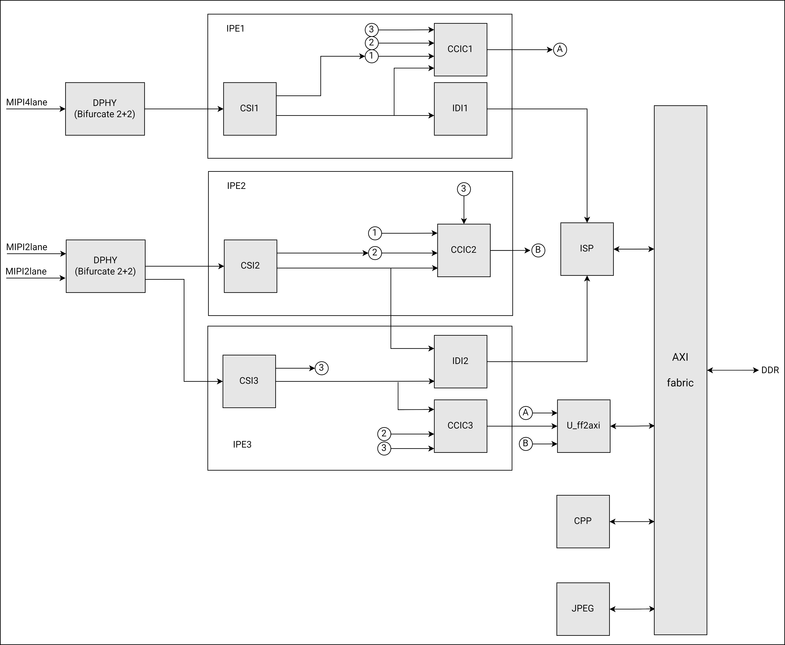

# 14. Video Capture Subsystem

```
Last Version: 2025/11/18
```

## 14.1 Overview

The video capture subsystem includes, among other components, MIPI Camera IN Interface and ISP, and is responsible for preview, video and capture functions, as well as image processing from the camera sensor. It supports up to 3 camera sensors simultaneously. The processed image data is then written back to DDR for further use.

The block diagram of the video capture subsystem is depicted below.



## 14.2 MIPI Camera IN Interface

### Introduction

The MIPI Camera IN interface features two MIPI-CSI2 v1.1 controllers both equipped with 4 lanes each of which supports a maximum transfer rate of 1.5Gbps.

### Features

- Support for the following modes to allocate lanes to sensors:

  - 4-Lane + 4-Lane mode (double sensor)
  - 4-Lane + 2-Lane mode (double sensor)
  - 4-Lane + 2-Lane + 2-Lane mode (triple sensor)

  > **Note.** In “4-Lane + 2-Lane + 2-Lane mode (triple sensor)”, only 2 Bayer RAW and 1 YUV input format are supported.
  >
- Support for the following input formats:

  - Legacy YUV420 8-bit
  - YUV420 8-bit
  - RAW8
  - RAW10
  - RAW12
  - RAW14
  - Embedded data type
- Support for the following types of data interleaving:

  - Data type interleaving
  - Virtual channel interleaving

### Register Description

To be defined

## 14.3 ISP

### Introduction

K1 includes a high-performance Image Signal Processor (ISP) which supports simultaneous processing of up to two raw video streams, with a total processing capacity of 21M@30fps.

### Features

- Support for both video and picture mode
- Processing of RAW sensor data and output YUV data to DRAM
- Hardware JPEG encoder/decoder (support up to 23M)
- Support for YUV, EXIF, JFIF format
- Auto-focus (AF), Auto-exposure (AE) and Auto-white balance (AWB)
- Face detection
- Digital zoom and panorama view
- Phase Detection Auto-focus (PDAF)
- Picture-in-Picture (PiP)
- Continuous video AF
- Hardware 3D denoise
- Multi-layer 2D YUV denoise
- Post-processing fof lens shading correction
- Edge enhancement

> **Notes**. To be highlighted the following limitations:
>
> - The system supports dual-camera video stream processing (RAW). In the “4-Lane + 2-Lane + 2-Lane mode (triple sensor)” as per **Section 15.2.2**, one sensor must be a YUV input format source, and the write path should not use the MMU.
> - When processing dual-camera video stream (RAW), the total input width of each channel should not exceed 4750 pixels. The combination of the instantaneous speed of the output pixel from both sensors must be less than “ISP’s clock **÷** 6”
> - For video recording, the maximum width of the output video is 1920 pixels, regardless of the input resolution.
> - For photo capture, the output image size can match the input resolution.

### Register Description

To be defined
