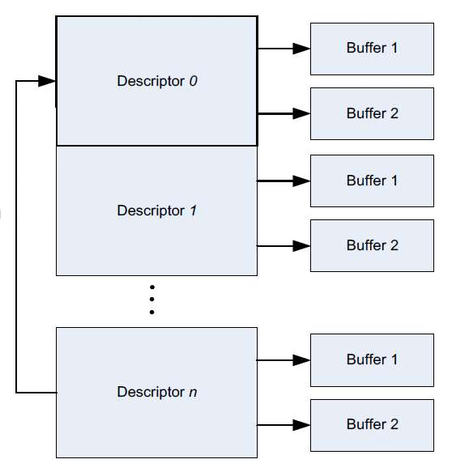
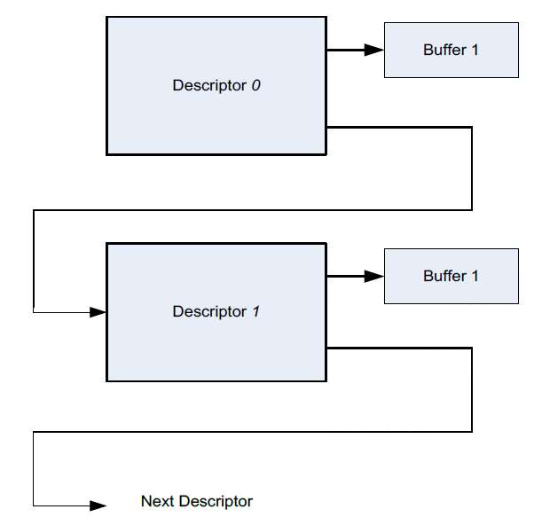

# 16. High-Speed Interface System

```
Last Version: 2025/11/19
```

## 16.1 USB

### Introduction

K1 includes three USB ports as follows:

- A USB2.0 OTG Port
- A USB2.0 Host Only Port
- A USB3.0 Port with a USB2.0 DRD interface

### Features

#### USB2.0 OTG Port

The USB2.0 OTG (On-The-Go) core supports both Host and Device functions in compliance with the USB 2.0 standard. Features are as follows:

- **Controller:**

  - Support for both USB2.0 Host and Device mode
  - Compliance with the USB2.0 standard
  - Support for USB2.0 High Speed (480Mb/s) and Full Speed (12Mb/s) for both Host and Device modes
  - Support for USB2.0 Low Speed (1.5Mb/s) for Host Only Mode
  - Host controller registers and data structures are compliant with the Intel EHCI specification
  - Device controller registers and data structures are implemented as extensions to the EHCI programming interface
  - Bus interface is compliant with AMBA-AHB specification

- **Communication Interface:**

  - Implementation of a UTMI+ interface to communicate with a USB2.0 PHY

- **Protocols:**

  - Support for the Session Request Protocol (SRP)
  - Support for the Host Negotiation Protocol (HNP)

- **Channel & Endpoint:**

  - Support for up to 16 host channels
  - In Device mode, support for 16 IN and 16 OUT endpoints, where
    - 16KB buffer is for transmitting data
    - 2KB buffer is for receiving data

#### USB2.0 Host Only Port

The USB2.0 Host core supports

- High-Speed (HS) host function
- Full-Speed (FS) host function
- Low-Speed (LS) host function

in compliance with the USB 2.0 standard. And it is Host-Only, i.e. cannot act as a device. Features are as follows:

- **Controller:**

  - Support for USB2.0 HS, USB2.0 FS, USB2.0 LS Host modes
  - Compliance with the USB2.0 standard
  - Support for High Speed (480Mb/s), Full Speed (12Mb/s), Low Speed (1.5Mb/s) for Host mode
  - Host controller registers and data structures are compliant with the Intel EHCI specification
  - Bus interface is compliant with AMBA-AHB specification

- **Communication Interface:**

  - Implementation of a UTMI+ interface to communicate with a USB2.0 PHY

- **Channel Support:**

  - Support for up to 16 host channels

#### USB3.0 Port with a USB2.0 DRD interface

The USB3.0 DRD (Dual-Role Device) core supports both Host and Device functions for USB 3.0 and USB 2.0 standards. Features are as follows:

- **Controller:**

  - Support for both USB3.0 Host and Device modes
  - Support for both USB2.0 Host and Device modes
  - Compliance with both the USB3.0 and USB2.0 standards
  - Support for USB3.0 (Super Speed) and USB2.0 Host and Device mode
  - USB3.0 Host Controller registers and data structures are compliant with the Intel xHCI specification
  - USB3.0 Device controller registers and data structures are self-defined requiring software configuration
  - Support for one USB3.0 port and one USB2.0 port
  - Support for High Speed (480Mb/s) and Full Speed (12Mb/s) for Host and Device mode
  - Support for Low Speed (1.5Mb/s) for Host-Only mode

- **Communication Interface:**

  - Use of PIPE3 (125MHz) interface for USB3.0 PHY
  - Use of UTMI+ (30/60MHz) interface for USB2.0 PHY

- **Clock Domains:**

  - PIPE3 PHY (125MHz)
  - UTMI+ PHY (30/60MHz)
  - MAC (nominal 125MHz)
  - BUS clock domain
  - RAM clock domain

- **System & Power Management:**

  - Internal DMA controller
  - Support for USB2.0 suspend mode
  - Support for U1/U2/U3 low-power modes for USB3.0

- **Endpoint & Memory Support:**

  - Support for up to 32 endpoints in Device mode
  - Flexible endpoint FIFO sizes (not limited to powers of 2) allowing the use of contiguous memory locations
  - Descriptor caching and data pre-fetching for improving performance in high-latency systems

- **Additional Features:**

  - Software-controlled standard USB commands (USB SETUP commands forwarded to application for decoding)
  - Hardware-level error handling for USB bus and packet-level issues
  - Support for interrupts

### Block Diagram

The architecture of the USB port set is depicted below, where

- **USB#0 Port** = USB2.0 OTG Port
- **USB#1 Port** = USB2.0 Host-Only Port
- **USB#2 Port** = USB3.0 Port with a USB2.0 DRD interface


### Register Description

> **Note.** Base Address = **0xC0A10000**

#### USB3_CTRL_CLK_CFG REGISTER

<table>
<tbody>
<tr>
<td rowspan=1 colspan=5><strong>Offset: 0x0</strong></td>
</tr>
<tr>
<td><strong>Bits</strong></td>
<td><strong>Field</strong></td>
<td><strong>Type</strong></td>
<td><strong>Reset</strong></td>
<td><strong>Description</strong></td>
</tr>
<tr>
<td>31:10</td>
<td>Reserved</td>
<td>RO</td>
<td>0</td>
<td>Reserved for future use</td>
</tr>
<tr>
<td>9</td>
<td>use_vbus_valid_ext</td>
<td>RW</td>
<td>0x0</td>
<td>1: Routes the VBUS detection signal from GPIO to the pipe_PowerPresent signal.<br/></td>
</tr>
<tr>
<td>8</td>
<td>bigendian_gs</td>
<td>RW</td>
<td>0x0</td>
<td>Signals connect to USB3 Controller </td>
</tr>
<tr>
<td>7:6</td>
<td>Reserved</td>
<td>RO</td>
<td>0</td>
<td>Reserved for future use</td>
</tr>
<tr>
<td>5:0</td>
<td>fladj_30mhz_reg</td>
<td>RW</td>
<td>0x20</td>
<td>Signals connect to USB3 Controller </td>
</tr>
</tbody>
</table>

#### USB3_CTRL_MISC_CFG_0 REGISTER

<table>
<tbody>
<tr>
<td rowspan=1 colspan=5><strong>Offset: 0x4</strong></td>
</tr>
<tr>
<td><strong>Bits</strong></td>
<td><strong>Field</strong></td>
<td><strong>Type</strong></td>
<td><strong>Reset</strong></td>
<td><strong>Description</strong></td>
</tr>
<tr>
<td>31:16</td>
<td>gp_in</td>
<td>RW</td>
<td>0x0</td>
<td>Signals connect to USB3 Controller </td>
</tr>
<tr>
<td>15:5</td>
<td>Reserved</td>
<td>RO</td>
<td>0</td>
<td>Reserved for future use</td>
</tr>
<tr>
<td>4</td>
<td>pme_en</td>
<td>RW</td>
<td>0x0</td>
<td>Signals connect to USB3 Controller </td>
</tr>
<tr>
<td>3:0</td>
<td>bus_filter_bypass</td>
<td>RW</td>
<td>0x0</td>
<td>Signals connect to USB3 Controller </td>
</tr>
</tbody>
</table>

#### USB3_CTRL_HOST_CFG REGISTER

<table>
<tbody>
<tr>
<td rowspan=1 colspan=5><strong>Offset: 0x8</strong></td>
</tr>
<tr>
<td><strong>Bits</strong></td>
<td><strong>Field</strong></td>
<td><strong>Type</strong></td>
<td><strong>Reset</strong></td>
<td><strong>Description</strong></td>
</tr>
<tr>
<td>31:0</td>
<td>spare</td>
<td>RW</td>
<td>0x0</td>
<td> Reserved for future use </td>
</tr>
</tbody>
</table>

#### USB3_CTRL_CLK_CFG REGISTER

<table>
<tbody>
<tr>
<td rowspan=1 colspan=5><strong>Offset: 0xc</strong></td>
</tr>
<tr>
<td><strong>Bits</strong></td>
<td><strong>Field</strong></td>
<td><strong>Type</strong></td>
<td><strong>Reset</strong></td>
<td><strong>Description</strong></td>
</tr>
<tr>
<td>31:10</td>
<td>Reserved</td>
<td>RO</td>
<td>0</td>
<td>Reserved for future use</td>
</tr>
<tr>
<td>9</td>
<td>host_msi_enable</td>
<td>RW</td>
<td>0x0</td>
<td>  </td>
</tr>
<tr>
<td>8</td>
<td>host_port_power_control_present</td>
<td>RW</td>
<td>0x0</td>
<td>  </td>
</tr>
<tr>
<td>7:6</td>
<td>Reserved</td>
<td>RO</td>
<td>0</td>
<td>Reserved for future use</td>
</tr>
<tr>
<td>5</td>
<td>host_u3_port_disable</td>
<td>RW</td>
<td>0x0</td>
<td>  </td>
</tr>
<tr>
<td>4</td>
<td>host_u2_port_disable</td>
<td>RW</td>
<td>0x0</td>
<td>Reserved for future use </td>
</tr>
<tr>
<td>3:2</td>
<td>hub_port_perm_attach</td>
<td>RW</td>
<td>0x0</td>
<td>Signals connect to USB3 Controller </td>
</tr>
<tr>
<td>1:0</td>
<td>hub_port_overcurrent</td>
<td>RW</td>
<td>0x0</td>
<td>Signals connect to USB3 Controller </td>
</tr>
</tbody>
</table>

#### USB3_CTRL_CLK_CFG REGISTER

<table>
<tbody>
<tr>
<td rowspan=1 colspan=5><strong>Offset: 0x20</strong></td>
</tr>
<tr>
<td><strong>Bits</strong></td>
<td><strong>Field</strong></td>
<td><strong>Type</strong></td>
<td><strong>Reset</strong></td>
<td><strong>Description</strong></td>
</tr>
<tr>
<td>31</td>
<td>bus_err_int</td>
<td>RO</td>
<td>0x0</td>
<td>Bus Error Interrupt valid </td>
</tr>
<tr>
<td>30:22</td>
<td>Reserved</td>
<td>RO</td>
<td>0</td>
<td>Reserved for future use</td>
</tr>
<tr>
<td>21</td>
<td>gsts_buserraddvld_sync</td>
<td>RO</td>
<td>0x0</td>
<td>Bus access error </td>
</tr>
<tr>
<td>20</td>
<td>host_system_err_sync</td>
<td>RO</td>
<td>0x0</td>
<td>Host system error </td>
</tr>
<tr>
<td>19:16</td>
<td>usb3_buserr_sts</td>
<td>RO</td>
<td>0x0</td>
<td>Bit 0: host_system_error rise edge interrupt status  <br/>Bit 1: host_system_error fall edge interrupt status <br/>Bit 2: gsts_buserraddvld rise edge interrupt status <br/>Bit 3: gsts_buserraddvld fall edge interrupt status </td>
</tr>
<tr>
<td>15:8</td>
<td>Reserved</td>
<td>RO</td>
<td>0</td>
<td>Reserved for future use</td>
</tr>
<tr>
<td>7:4</td>
<td>usb3_buserr_int_mask</td>
<td>RW</td>
<td>0x0</td>
<td>Bit 0: host_system_error rise edge interrupt enable  <br/>Bit 1: host_system_error fall edge interrupt enable <br/>Bit 2: gsts_buserraddvld rise edge interrupt enable <br/>Bit 3: gsts_buserraddvld fall edge interrupt enable </td>
</tr>
<tr>
<td>3:1</td>
<td>Reserved</td>
<td>RO</td>
<td>0</td>
<td>Reserved for future use</td>
</tr>
<tr>
<td>0</td>
<td>usb3_buserr_int_clr</td>
<td>RW</td>
<td>0x0</td>
<td>Write 1 to clear bus_err_int<br/>It will be clear to '0' by hardware. </td>
</tr>
</tbody>
</table>

#### P_ADDR_PUMON0 REGISTER

<table>
<tbody>
<tr>
<td rowspan=1 colspan=5><strong>Offset: 0x24</strong></td>
</tr>
<tr>
<td><strong>Bits</strong></td>
<td><strong>Field</strong></td>
<td><strong>Type</strong></td>
<td><strong>Reset</strong></td>
<td><strong>Description</strong></td>
</tr>
<tr>
<td>31:0</td>
<td>pumon_trigger_mask[31:0]</td>
<td>RW</td>
<td>0</td>
<td>Mask for signal capture in Monitor Module </td>
</tr>
</tbody>
</table>

#### P_ADDR_PUMON1 REGISTER

<table>
<tbody>
<tr>
<td rowspan=1 colspan=5><strong>Offset: 0x28</strong></td>
</tr>
<tr>
<td><strong>Bits</strong></td>
<td><strong>Field</strong></td>
<td><strong>Type</strong></td>
<td><strong>Reset</strong></td>
<td><strong>Description</strong></td>
</tr>
<tr>
<td>31:0</td>
<td>pumon_trigger_mask[63:32]</td>
<td>RW</td>
<td>0</td>
<td>Mask for signal capture in Monitor Module </td>
</tr>
</tbody>
</table>

#### P_ADDR_PUMON2 REGISTER

<table>
<tbody>
<tr>
<td rowspan=1 colspan=5><strong>Offset: 0x2c</strong></td>
</tr>
<tr>
<td><strong>Bits</strong></td>
<td><strong>Field</strong></td>
<td><strong>Type</strong></td>
<td><strong>Reset</strong></td>
<td><strong>Description</strong></td>
</tr>
<tr>
<td>31:0</td>
<td>pumon_trigger_trigger_pattern[31:0]</td>
<td>RW<br/></td>
<td>0</td>
<td>Trigger pattern </td>
</tr>
</tbody>
</table>

#### P_ADDR_PUMON3 REGISTER

<table>
<tbody>
<tr>
<td rowspan=1 colspan=5><strong>Offset: 0x30</strong></td>
</tr>
<tr>
<td><strong>Bits</strong></td>
<td><strong>Field</strong></td>
<td><strong>Type</strong></td>
<td><strong>Reset</strong></td>
<td><strong>Description</strong></td>
</tr>
<tr>
<td>31:0</td>
<td>pumon_trigger_trigger_pattern[63:32]</td>
<td>RW</td>
<td>0</td>
<td>Trigger pattern </td>
</tr>
</tbody>
</table>

#### P_ADDR_PUMON4 REGISTER

<table>
<tbody>
<tr>
<td rowspan=1 colspan=5><strong>Offset: 0x34</strong></td>
</tr>
<tr>
<td><strong>Bits</strong></td>
<td><strong>Field</strong></td>
<td><strong>Type</strong></td>
<td><strong>Reset</strong></td>
<td><strong>Description</strong></td>
</tr>
<tr>
<td>31:10</td>
<td>Reserved</td>
<td>RO</td>
<td>0</td>
<td>Reserved for future use</td>
</tr>
<tr>
<td>9</td>
<td>pumon_trigger_done</td>
<td>RW</td>
<td>0</td>
<td></td>
</tr>
<tr>
<td>8</td>
<td>pumon_trigger_ing</td>
<td>RW</td>
<td>0</td>
<td></td>
</tr>
<tr>
<td>7</td>
<td>pumon_trigger_force_stop</td>
<td>RW</td>
<td>0</td>
<td></td>
</tr>
<tr>
<td>6</td>
<td>pumon_trigger_start</td>
<td>RW</td>
<td>0</td>
<td></td>
</tr>
<tr>
<td>5</td>
<td>pumon_trigger_mode</td>
<td>RW</td>
<td>0</td>
<td></td>
</tr>
<tr>
<td>4:0</td>
<td>pumon_sample_sel</td>
<td>RW</td>
<td>0</td>
<td></td>
</tr>
</tbody>
</table>

#### P_ADDR_RO0 REGISTER

<table>
<tbody>
<tr>
<td rowspan=1 colspan=5><strong>Offset: 0x38</strong></td>
</tr>
<tr>
<td><strong>Bits</strong></td>
<td><strong>Field</strong></td>
<td><strong>Type</strong></td>
<td><strong>Reset</strong></td>
<td><strong>Description</strong></td>
</tr>
<tr>
<td>31:0</td>
<td>pumon_trigger_signals_ro[31:0]</td>
<td>RO</td>
<td>0x0</td>
<td>Debug signal from usb3 controller </td>
</tr>
</tbody>
</table>

#### P_ADDR_RO1 REGISTER

<table>
<tbody>
<tr>
<td rowspan=1 colspan=5><strong>Offset: 0x3c</strong></td>
</tr>
<tr>
<td><strong>Bits</strong></td>
<td><strong>Field</strong></td>
<td><strong>Type</strong></td>
<td><strong>Reset</strong></td>
<td><strong>Description</strong></td>
</tr>
<tr>
<td>31:0</td>
<td>pumon_trigger_signals_ro[63:32]</td>
<td>RO</td>
<td>0x0</td>
<td>Debug signal from usb3 controller </td>
</tr>
</tbody>
</table>

#### P_ADDR_RO2 REGISTER

<table>
<tbody>
<tr>
<td rowspan=1 colspan=5><strong>Offset: 0x40</strong></td>
</tr>
<tr>
<td><strong>Bits</strong></td>
<td><strong>Field</strong></td>
<td><strong>Type</strong></td>
<td><strong>Reset</strong></td>
<td><strong>Description</strong></td>
</tr>
<tr>
<td>31:00</td>
<td>pumon_monitor_ro[31:0]</td>
<td>RW</td>
<td>0x0</td>
<td>Debug signal from PUPHY</td>
</tr>
</tbody>
</table>

#### P_ADDR_RO3 REGISTER

<table>
<tbody>
<tr>
<td rowspan=1 colspan=5><strong>Offset: 0x44</strong></td>
</tr>
<tr>
<td><strong>Bits</strong></td>
<td><strong>Field</strong></td>
<td><strong>Type</strong></td>
<td><strong>Reset</strong></td>
<td><strong>Description</strong></td>
</tr>
<tr>
<td>31:0</td>
<td>pumon_monitor_ro[63:32]</td>
<td>RO</td>
<td>0x0</td>
<td>Debug signal from PUPHY </td>
</tr>
</tbody>
</table>

#### 17.1.4.15 P_ADDR_RO4 REGISTER

<table>
<tbody>
<tr>
<td rowspan=1 colspan=5><strong>Offset: 0x48</strong></td>
</tr>
<tr>
<td><strong>Bits</strong></td>
<td><strong>Field</strong></td>
<td><strong>Type</strong></td>
<td><strong>Reset</strong></td>
<td><strong>Description</strong></td>
</tr>
<tr>
<td>31:0</td>
<td>pumon_monitor_ro[95:64]</td>
<td>RO<br/></td>
<td>0x0</td>
<td>Pipe rx data </td>
</tr>
</tbody>
</table>

#### P_ADDR_RO5 REGISTER

<table>
<tbody>
<tr>
<td rowspan=1 colspan=5><strong>Offset: 0x4c</strong></td>
</tr>
<tr>
<td><strong>Bits</strong></td>
<td><strong>Field</strong></td>
<td><strong>Type</strong></td>
<td><strong>Reset</strong></td>
<td><strong>Description</strong></td>
</tr>
<tr>
<td>31:16</td>
<td>Reserved</td>
<td>RO</td>
<td>0</td>
<td>Reserved for future use</td>
</tr>
<tr>
<td>15:0</td>
<td>pumon_monitor_ro[112:96]</td>
<td>RO</td>
<td>0x0</td>
<td>Debug signal from USB2 PHY </td>
</tr>
</tbody>
</table>

#### USB3_BW_CALC_CTRL REGISTER

<table>
<tbody>
<tr>
<td rowspan=1 colspan=5><strong>Offset: 0x50</strong></td>
</tr>
<tr>
<td><strong>Bits</strong></td>
<td><strong>Field</strong></td>
<td><strong>Type</strong></td>
<td><strong>Reset</strong></td>
<td><strong>Description</strong></td>
</tr>
<tr>
<td>31:0</td>
<td>bw_calc_ctrl</td>
<td>RW</td>
<td>0x8000FFFF</td>
<td>Dedicated<br/>> <strong>Note</strong><strong>.</strong> Deprecated </td>
</tr>
</tbody>
</table>

#### USB3_CTRL_MISC_ST REGISTER

<table>
<tbody>
<tr>
<td rowspan=1 colspan=5><strong>Offset: 0x80</strong></td>
</tr>
<tr>
<td><strong>Bits</strong></td>
<td><strong>Field</strong></td>
<td><strong>Type</strong></td>
<td><strong>Reset</strong></td>
<td><strong>Description</strong></td>
</tr>
<tr>
<td>31:16</td>
<td>gp_out</td>
<td>RO</td>
<td>0x0</td>
<td>Signals connect to USB3 Controller Output signals </td>
</tr>
<tr>
<td>15:8</td>
<td>Reserved</td>
<td>RO</td>
<td>0</td>
<td>Reserved for future use</td>
</tr>
<tr>
<td>7:6</td>
<td>operational_mode</td>
<td>RO</td>
<td>0x0</td>
<td>Signals connect to USB3 Controller Output signals </td>
</tr>
<tr>
<td>5</td>
<td>pme_generation</td>
<td>RO</td>
<td>0x0</td>
<td>Signals connect to USB3 Controller Output signals </td>
</tr>
<tr>
<td>4</td>
<td>host_system_err</td>
<td>RO</td>
<td>0x0</td>
<td>Signals connect to USB3 Controller Output signals </td>
</tr>
<tr>
<td>3</td>
<td>Reserved</td>
<td>RO</td>
<td>0</td>
<td>Reserved for future use</td>
</tr>
<tr>
<td>2:0</td>
<td>clk_gate_ctrl</td>
<td>RO</td>
<td>0x0</td>
<td>Signals connect to USB3 Controller Output signals </td>
</tr>
</tbody>
</table>

#### USB3_CTRL_HOST_ST REGISTER

<table>
<tbody>
<tr>
<td rowspan=1 colspan=5><strong>Offset: 0x84</strong></td>
</tr>
<tr>
<td><strong>Bits</strong></td>
<td><strong>Field</strong></td>
<td><strong>Type</strong></td>
<td><strong>Reset</strong></td>
<td><strong>Description</strong></td>
</tr>
<tr>
<td>31:12</td>
<td>Reserved</td>
<td>RO</td>
<td>0</td>
<td>Reserved for future use</td>
</tr>
<tr>
<td>11:0</td>
<td>host_current_belt</td>
<td>RO</td>
<td>0x0</td>
<td>Signals connect to USB3 Controller Output signals </td>
</tr>
</tbody>
</table>

#### IP_REVISION REGISTER

<table>
<tbody>
<tr>
<td rowspan=1 colspan=5><strong>Offset: 0x100</strong></td>
</tr>
<tr>
<td><strong>Bits</strong></td>
<td><strong>Field</strong></td>
<td><strong>Type</strong></td>
<td><strong>Reset</strong></td>
<td><strong>Description</strong></td>
</tr>
<tr>
<td>31:16</td>
<td>phy_ip_revision[15:0]</td>
<td>RO</td>
<td>0xb112</td>
<td>Read ip_revision[15:0] </td>
</tr>
<tr>
<td>15:0</td>
<td>ip_revision[15:0]</td>
<td>RO</td>
<td>0x0252</td>
<td>Read phy_ip_revision[15:0] </td>
</tr>
</tbody>
</table>

#### USB_CTL REGISTER

<table>
<tbody>
<tr>
<td rowspan=1 colspan=5><strong>Offset: 0x104</strong></td>
</tr>
<tr>
<td><strong>Bits</strong></td>
<td><strong>Field</strong></td>
<td><strong>Type</strong></td>
<td><strong>Reset</strong></td>
<td><strong>Description</strong></td>
</tr>
<tr>
<td>31:15</td>
<td>Reserved</td>
<td>RO</td>
<td>0</td>
<td>Reserved for future use</td>
</tr>
<tr>
<td>14</td>
<td>USB2 phy reg reset</td>
<td>RW</td>
<td>0x0</td>
<td>Soft reset for USB2 PHY registers. <br/>- Set <strong>1</strong> to reset the USB2 PHY registers<br/>- Clear to <strong>0</strong> to release the reset<br/>Note: This reset is for backup purposes only.</td>
</tr>
<tr>
<td>13</td>
<td>PHY suspendm enable</td>
<td>RW</td>
<td>0x1</td>
<td>Controls whether the <strong>suspendm signal</strong> from the USB2 controller affects the PHY suspension.<br/><strong>1</strong>: PHY suspension depends on the controller's suspendm signal.<br/>- If the controller does not indicate PHY suspension, the PHY will not suspend.<br/>- If the controller indicates PHY suspension, the PHY may suspend based on its internal logic.<br/><strong>0</strong>: The USB2 PHY is <strong>not affected</strong> by the controller's suspendm signal.</td>
</tr>
<tr>
<td>12</td>
<td>Reserved</td>
<td>RO</td>
<td>0</td>
<td>Reserved for future use</td>
</tr>
<tr>
<td>11:10</td>
<td>reg_opmode</td>
<td>RW</td>
<td>0x0</td>
<td>Provides <strong>register control</strong> for the PHY interface's <strong>op_mode</strong>.</td>
</tr>
<tr>
<td>9:8</td>
<td>reg_xcvr_select</td>
<td>RW</td>
<td>0x0</td>
<td>Provides <strong>register control</strong> for the PHY interface's <strong>xcvr_select</strong>.</td>
</tr>
<tr>
<td>7</td>
<td>reg_term_select</td>
<td>RW</td>
<td>0x0</td>
<td>Provides <strong>register control</strong> for the PHY interface's <strong>term_select</strong>.</td>
</tr>
<tr>
<td>6</td>
<td>reg_sel</td>
<td>RW</td>
<td>0x0</td>
<td><strong>1</strong>: Bits [11:7] (reg_opmode, reg_xcvr_select, reg_term_select) take effect and control the PHY interface.<br/><strong>0</strong>: The controller controls the PHY interface.</td>
</tr>
<tr>
<td>5:4</td>
<td>vbusvalid_ctl</td>
<td>RW</td>
<td>0x0</td>
<td>Controls the <strong>VBUS_ON</strong> signal for the PHY.<br/>- <strong>Bit 4</strong>:<br/> <strong>1</strong>: Use <strong>Bit 5</strong> to control PHY VBUS_ON.<br/> <strong>0</strong>: Use the <strong>VBUSVALID</strong> signal from the USB2 PHY to control VBUS_ON.<br/>- <strong>Bit 5</strong>:<br/> When <strong>Bit 4</strong> is <strong>1</strong>, this bit directly controls the VBUS_ON signal.<br/></td>
</tr>
<tr>
<td>3</td>
<td>otg_sel</td>
<td>RW</td>
<td>0x1</td>
<td>Controls the <strong>OTG PHY owner</strong>.</td>
</tr>
<tr>
<td>2:0</td>
<td>Reserved</td>
<td>RO</td>
<td>0</td>
<td>Reserved for future use</td>
</tr>
</tbody>
</table>

#### USB_VBUS_REG REGISTER

<table>
<tbody>
<tr>
<td rowspan=1 colspan=5><strong>Offset: 0x114</strong></td>
</tr>
<tr>
<td><strong>Bits</strong></td>
<td><strong>Field</strong></td>
<td><strong>Type</strong></td>
<td><strong>Reset</strong></td>
<td><strong>Description</strong></td>
</tr>
<tr>
<td>31:0</td>
<td>usb_vbus_reg</td>
<td>RW</td>
<td>0x0</td>
<td>>  <strong>Note. </strong>Deprecated</td>
</tr>
</tbody>
</table>

#### USB2_CTRL_STATUS0 REGISTER

<table>
<tbody>
<tr>
<td rowspan=1 colspan=5><strong>Offset: 0x140</strong></td>
</tr>
<tr>
<td><strong>Bits</strong></td>
<td><strong>Field</strong></td>
<td><strong>Type</strong></td>
<td><strong>Reset</strong></td>
<td><strong>Description</strong></td>
</tr>
<tr>
<td>31:0</td>
<td>usb2_ctrl_status0</td>
<td>RO</td>
<td>0x0</td>
<td>Provides bits [31:0] of the USB2 controller debug signal.</td>
</tr>
</tbody>
</table>

#### USB2_CTRL_STATUS1 REGISTER

<table>
<tbody>
<tr>
<td rowspan=1 colspan=5><strong>Offset: 0x144</strong></td>
</tr>
<tr>
<td><strong>Bits</strong></td>
<td><strong>Field</strong></td>
<td><strong>Type</strong></td>
<td><strong>Reset</strong></td>
<td><strong>Description</strong></td>
</tr>
<tr>
<td>31:0</td>
<td>usb2_ctrl_status1</td>
<td>RO</td>
<td>0x0</td>
<td>Provides bits [63:32] of the USB2 controller debug signal.</td>
</tr>
</tbody>
</table>

#### USB2_CTRL_STATUS2 REGISTER

<table>
<tbody>
<tr>
<td rowspan=1 colspan=5><strong>Offset: 0x148</strong></td>
</tr>
<tr>
<td><strong>Bits</strong></td>
<td><strong>Field</strong></td>
<td><strong>Type</strong></td>
<td><strong>Reset</strong></td>
<td><strong>Description</strong></td>
</tr>
<tr>
<td>31:0</td>
<td>usb2_ctrl_status2</td>
<td>RO</td>
<td>0x0</td>
<td>Provides bits [66:64] of the USB2 controller debug signal.</td>
</tr>
</tbody>
</table>

#### USB2_CTRL_STATUS3 REGISTER

<table>
<tbody>
<tr>
<td rowspan=1 colspan=5><strong>Offset: 0x14C</strong></td>
</tr>
<tr>
<td><strong>Bits</strong></td>
<td><strong>Field</strong></td>
<td><strong>Type</strong></td>
<td><strong>Reset</strong></td>
<td><strong>Description</strong></td>
</tr>
<tr>
<td>31:0</td>
<td>usb2_ctrl_status3</td>
<td>RO</td>
<td>0x0</td>
<td>Provides bits [31:0] of the USB controller's logic_analyzer_trace signal. </td>
</tr>
</tbody>
</table>

#### USB2_CTRL_STATUS4 REGISTER

<table>
<tbody>
<tr>
<td rowspan=1 colspan=5><strong>Offset: 0x150</strong></td>
</tr>
<tr>
<td><strong>Bits</strong></td>
<td><strong>Field</strong></td>
<td><strong>Type</strong></td>
<td><strong>Reset</strong></td>
<td><strong>Description</strong></td>
</tr>
<tr>
<td>31:0</td>
<td>usb2_ctrl_status4</td>
<td>RO</td>
<td>0x0</td>
<td>Provides bits [63:32] of the USB controller's logic_analyzer_trace signal. </td>
</tr>
</tbody>
</table>

#### USB2_CTRL_STATUS5 REGISTER

<table>
<tbody>
<tr>
<td rowspan=1 colspan=5><strong>Offset: 0x154</strong></td>
</tr>
<tr>
<td><strong>Bits</strong></td>
<td><strong>Field</strong></td>
<td><strong>Type</strong></td>
<td><strong>Reset</strong></td>
<td><strong>Description</strong></td>
</tr>
<tr>
<td>31:0</td>
<td>usb2_ctrl_status5</td>
<td>RO</td>
<td>0x0</td>
<td>Provides USB2 PHY monitor signals.</td>
</tr>
</tbody>
</table>

#### USB2_CTRL_STATUS6 REGISTER

<table>
<tbody>
<tr>
<td rowspan=1 colspan=5><strong>Offset: 0x158</strong></td>
</tr>
<tr>
<td><strong>Bits</strong></td>
<td><strong>Field</strong></td>
<td><strong>Type</strong></td>
<td><strong>Reset</strong></td>
<td><strong>Description</strong></td>
</tr>
<tr>
<td>31:0</td>
<td>usb2_ctrl_status6</td>
<td>RO</td>
<td>0x0</td>
<td>Reserved</td>
</tr>
</tbody>
</table>

#### USB2_CTRL_STATUS7 REGISTER

<table>
<tbody>
<tr>
<td rowspan=1 colspan=5>Offset: 0x15C</td>
</tr>
<tr>
<td>Bits</td>
<td>Field</td>
<td>Type</td>
<td>Reset</td>
<td>Description</td>
</tr>
<tr>
<td>31:0</td>
<td>usb2_ctrl_status7</td>
<td>RO</td>
<td>0x0</td>
<td>Reserved</td>
</tr>
</tbody>
</table>

#### USB2_CTRL_STATUS8 REGISTER

<table>
<tbody>
<tr>
<td rowspan=1 colspan=5><strong>Offset: 0x160</strong></td>
</tr>
<tr>
<td><strong>Bits</strong></td>
<td><strong>Field</strong></td>
<td><strong>Type</strong></td>
<td><strong>Reset</strong></td>
<td><strong>Description</strong></td>
</tr>
<tr>
<td>31:0</td>
<td>usb2_ctrl_status8</td>
<td>RO</td>
<td>0x0</td>
<td>Reserved</td>
</tr>
</tbody>
</table>

#### USB2_CTRL_STATUS9 REGISTER

<table>
<tbody>
<tr>
<td rowspan=1 colspan=5><strong>Offset: 0x164</strong></td>
</tr>
<tr>
<td><strong>Bits</strong></td>
<td><strong>Field</strong></td>
<td><strong>Type</strong></td>
<td><strong>Reset</strong></td>
<td><strong>Description</strong></td>
</tr>
<tr>
<td>31:13</td>
<td>Reserved</td>
<td>RO</td>
<td>0</td>
<td>Reserved for future use</td>
</tr>
<tr>
<td>12</td>
<td>chep_last_trans</td>
<td>RO</td>
<td>0x0</td>
<td>chep_last_trans signal</td>
</tr>
<tr>
<td>11:8</td>
<td>chep_number</td>
<td>RO</td>
<td>0x0</td>
<td>chep_number signal</td>
</tr>
<tr>
<td>7:5</td>
<td>Reserved</td>
<td>RO</td>
<td>0</td>
<td>Reserved for future use</td>
</tr>
<tr>
<td>4</td>
<td>int_dma_done</td>
<td>RO</td>
<td>0x0</td>
<td>int_dma_done signal</td>
</tr>
<tr>
<td>3</td>
<td>int_dma_req</td>
<td>RO</td>
<td>0x0</td>
<td>int_dma_req signal</td>
</tr>
<tr>
<td>2</td>
<td>sof_sent_rcvd_tgl</td>
<td>RO</td>
<td>0x0</td>
<td>sof_sent_rcvd_tgl signal</td>
</tr>
<tr>
<td>1</td>
<td>sof_toggle_out</td>
<td>RO</td>
<td>0x0</td>
<td>sof_toggle_out signal</td>
</tr>
<tr>
<td>0</td>
<td>interrupt</td>
<td>RO</td>
<td>0x0</td>
<td>interrupt signal</td>
</tr>
</tbody>
</table>

## 16.2 PCIe

### Introduction

K1 implements three PCIe Dual-Mode ports which can be configured as either Root Complex (RC) or Endpoint (EP) device.

All ports support Gen2 with a data transfer speed of 5GT/s per lane. However, one port supports one lane only and two ports support two lanes each.

### Features

- Support for Dual-Mode, programmable as either Complex (RC) or Endpoint (EP) device
- Support for all non-optional features of the PCI Express Base Specification - Revision 5.0 - Version 1.0 (limited to Gen2 speed scope)
- Support for Internal Address Translation Unit (iATU) with 8 entries for outbound and 8 entries for inbound traffic
- Support for Embedded DMA with Hardware Flow Control which includes 4 write channels and 4 read channels
- Support for ECRC generation and check
- Support for max payload size up to 256 bytes
- Support for Automatic Lane Flip and Reversal
- Support for L0 and L1 Power State of Active State Link PM
- Support for Latency Tolerance Reporting (LTR)
- Support for only Virtual Channel 0
- Support for ID Based Ordering (IDO)
- Support for Completion Timeout Ranges
- Support for Separate Reference Clock With Independent Spread (SRIS)
- Support for up to 64 outbound Non-Post Requests
- Support for up to 32 outstanding AXI slave Non-Post requests
- Support for only Function 0 with 6 size-programmable BARs in EP Mode
- Support for MSI Capability in EP Mode
- Support for Integrated MSI Reception Module in RC Mode

### Functional Description

The architecture of the PCIe Dual-Mode port set is depicted below.


As can be seen, there are

- One PCIe Gen2x1 Dual-Mode port (hereafter Port A)
- Two PCIe Gen2x2 Dual-Mode ports (hereafter Port B and Port C)

as said previously, and all them consists of

- A **controller**integrated into SoC via **3 AXI ports** which are designed as

  - **AXI Master Port**to manages inbound traffic (i.e. data coming into the system) either from a remote device or through the PCIe controller's internal DMA, allowing the access to DDR memory for transferring data both to and from the remote device
  - **AXI Data Slave Port**to allows the local CPU accessing itself for outbound traffic
  - **AXI DBI Slave Port**to be used for the PCIe controller's configuration interface
- A **PHY**complied with PIPE 3 specification and distinguished in

  - **Phy2x1_22** which
    - Supports Gen2 with one lane (x1)
    - Is built using a 22nm process
    - Is shared between Port A and USB3 controller but <u>not simultaneously</u>, i.e. both Port A and USB3 controller can operate but <u>not at the same time</u>
  - **Phy2x2_22**which
    - Supports Gen2 with two lanes (x2)
    - Is built using a 22nm process
    - Comes for Port B and Port C <u>distinctly</u>, i.e. Port B and Port C have their own dedicated PHY
- A **miscellaneous logic**, in particular **chip I/O with remote links partner** as follows:

  - **Differential Data Signals**: Rx_p/n, Tx_p/n (x2 lanes for Port B/C, x1 lane for Port A)
  - **Reference Clock Signals**: refclk_p/n (support for both input and output mode)
  - **Warm Reset Signal**: PERST# (input in EP mode, output in RC mode)
  - **Wake-Up signal**: WAKE# (output in EP mode, input in RC mode)

Each PCIe port includes a PHY and a controller. The controller is divided into key functional blocks as depicted below.


Details are provided in the following subsections.

#### AXI Bridge

The AXI bridge module acts as a bridge between the standard AXI interfaces and the PCIe controller native interfaces. The bridge supports up to 3 AXI interfaces as follows:

- **Master Interface****:**Allows a remote PCIe device to read/write to an AXI slave connected to the bridge
- **L****ink ****S****lave**** Interface****:**Enables an AXI master to read/write to a remote PCIe device through the bridge
- **DBI ****S****lave****Interface****:**Allows an AXI master to access the PCIe controller registers

The bridge facilitates communication between AXI-embedded systems and PCIe devices, acting as either a Root Port or an Endpoint.

#### CXPL

Common Express Port Logic (CXPL) Module implements the basic functionality for

- **PCIe Physical Layer**
- **PCIe****Link Layer**
- **PCIe****Transaction Layer**

The key features are as follows:

- Implementation of the Transaction Layer logic, Data Link Layer logic and the MAC portion of the Physical Layer
- Inclusion of the Link Training and Status State Machine (LTSSM) for link initialization and management
- Connection to the external PHY via the PIPE (PHY Interface for PCI Express)

CXPL provides the core logic for PCIe communication and link management.

#### XADM

Transmit Application-Dependent Module (XADM) handles application-specific functionality for packet transmission in the Transaction Layer. The key features are as follows:

- **TLP Arbitration**
- **TLP Formation**
- **Flow Control (FC) Credit checking**
- **Cut-Through Architecture:** Transmits packets without buffering (except for the retry buffer)
- **Target Completion Lookup Table:** Stores TLP header information for received requests

XADM manages the transmit path for PCIe packets.

#### RADM

Receive Application-Dependent Module (RADM) handles application-specific functionality for packet reception in the Transaction Layer. The key features are as follows:

- **TLP Sorting/Filtering:** Filters and routes received TLPs based on configurable rules
- **TLP Buffering/Queuing:** Buffers and queues incoming TLPs
- **TLP Routing:** Routes the received TLPs to the appropriate receive interfaces
- **Receive Completion Lookup Table (LUT):** Tracks completions and monitors completion timeouts for non-posted requests

RADM Manages the receive path for PCIe packets and ensures reliable completion tracking.

#### CDM

Configuration-Dependent Module (CDM) implements the configuration space for the PCIe controller. The key features are as follows:

- **Standard PCIe Configuration Space:** Compliant with PCIe specifications
- **Controller-Specific Register Space:** Includes Port Logic Registers for custom configurations

CDM Provides access to PCIe configuration and controller-specific settings.

#### iATU

The Internal Address Translation Unit (iATU) implements address translation for TLPs. The key features are as follows:

- **Address Translation:** Replaces TLP address and header fields with translated addresses
- **Type Translation:** Supports translation of address types
- **Outbound/Inbound Translation:** Maps application memory space to PCI memory space

iATU enables flexible address mapping between local and remote memory spaces. Without iATU, memory addresses pass through unchanged. Custom mappings can be configured by using software.

#### EDMA

The embedded DMA controller (EDMA) offloads data transfer tasks from the CPU and supports efficient transfers of large blocks of data with minimal CPU intervention, leaving the CPU free to perform other tasks. The key features are as follows:

- **Channels:** 4 read channels and 4 write channels, where

  - **DMA Write:**Transfers data from local (application) memory to remote (link partner) memory
  - **DMA Read:** Transfers data from remote (link partner) memory to local (application) memory
- **Full Duplex Operation:** Supports simultaneous read and write transfers, and in parallel with normal (non-DMA) traffic
- **Interrupts:** Notifies the CPU upon transfer completion or error. The DMA can

  - Interrupt the local CPU
  - Send an Interrupt Memory Write (IMWr) to the remote CPU
- **Configuration ****&**** Programming:** The DMA is highly configurable and can be programmed through

  - Local DBI (Designated Bus Interface)
  - PCIe wire (for remote configuration)
- **Linked List (LL) Mode:** Transfers multiple blocks of data using a pre-programmed list of descriptors. This mode enables efficient data movement with minimal CPU intervention and reduces the need to program the DMA repeatedly for multiple block transfers. To be highlighted:

  - **Linked List Structure**
    - Each transfer block is defined by a Linked List (LL) element, also called a descriptor, in local memory.
    - Each data element in the transfer list can transfer up to 4 GB of data.
  - **In LL mode**, the DMA:
    - Fetches the channel context (transfer control information)
    - Executes transfers based on the DMA elements programmed in local memory

## 16.3 EMAC

### Introduction

K1 features a EMAC core which includes the essential protocol requirements for the operation of 10/100/1000 Mbps Ethernet/IEEE 802.3-2012 compliant node.

On the system side, the EMAC core features a 64-bit AXI Master Interface and a 32-bit AXI Target (Slave) Interface for seamless integration with the AXI Bus.

The EMAC core can operate at 10 Mbps, 100 Mbps (Fast Ethernet) or 1000 Mbps (Gigabit Ethernet). Additionally, it includes a powerful 64-bit Scatter-Gather DMA to transfer packets between HOST Memory and Internal FIFOs to achieve high performance.

### Features

- Capability of handling transmit/receive data encapsulation functions, including Framing (frame boundary delimitation, frame synchronization) and Error Detection (physical medium transmission errors)
- Media access management with medium allocation (collision avoidance) and contention resolution (collision handling) in Half-Duplex Mode of operation at speeds of 10/100 Mbps
- Retransmission of frames that result in Collision in Half-Duplex mode
- Support for Flow Control functions in Full Duplex mode by decoding PAUSE control frames, disabling the transmitter and generating PAUSE control Frames
- Support for a 4-bit data path based RGMII Interface to connect with RGMII-based PHY
- Support for Management Interface by generating management frames on the MDC/MDIO pins to communicate with external PHY devices
- Bus mastering on the AXI interface to transfer packets between the HOST memory and the internal FIFOs using 64-bit transfer mode
- Automatic transfer of packets between the HOST memory and internal FIFOs (based on descriptors) to minimize CPU overhead

### Block Diagram

The micro-architecture of EMAC unit is depicted below.


A brief description of each module is provided below.

- **EMAC_TX**: This module implements the Frame Transmit State Machine of the CSMA/CD protocol by transmitting frames onto RGMII Interface based on Speed.
- **EMAC_RX**: This module implements the Frame Receive State Machine of the CSMA/CD Protocol by receiving frames from RGMII Interface and performing field extraction and error checking.
- **MDC/MDIO Controller**: This module generates MDIO Frames to talk to external PHY Devices.
- **STATISTICS**: This module maintains various counters to perform Statistics for both Transmit and Receive operation.
- **EMAC_RXFIFO**: This module has a 4KB FIFO to store the received frames before they are transferred to the Host memory. This module also has additional control logic to flush error packets from the FIFO.
- **EMAC_TXFIFO**: This module has a 4KB FIFO to store the Frames that are received from the Host memory before the frames are transferred onto Ethernet Interface. This module also has additional FIFO control logic that helps in frame retransmission during collisions.
- **TXDMA**: This module implements the Transmit DMA to transfer the frames from the Host Memory to the Transmit FIFO using the Transmit Descriptors.
- **RXDMA**: This module implements the Receive DMA to transfer the frames from the Internal FIFO to the Host Memory using the Receive Descriptors
- **Registers**: This module implements the Control and Status Registers to control the operation of Receive and Transmit DMA and also the Receive and Transmit operations of the Ethernet Interface. This module also provides access to the Statistics Counters and provides interrupt/status information.
- **AXI Master Interface**: This module provides the AXI Master functionality to generate transactions on the AXI Bus. The transactions are generated based on the requests from the Transmit/Receive DMA’s.
- **AXI Target Interface**: This module provides the AXI Target functionality to the AXI Host (CPU). This interface is used to access all the DMA/MAC registers in the Registers Module.

### Programming Model

The EMAC Core transfers received data frames/packets from the RMII/RGMII interface to the receive buffers in the host memory. Similarly, it transmits data frames/packets from the transmit buffers in the host memory to the RMII/RGMII interface. Descriptors, which reside in the host memory, act as pointers to these buffers. The receive and transmit FIFOs inside the EMAC Core serve as temporary storage for frame transmission and reception.

Two descriptor lists are maintained, one for receive and one for transmit. The base address of each list is written into the DMA Base Address Registers. The descriptor list is forward-linked, either implicitly or explicitly. The last descriptor can point back to the first entry to create a ring structure. Explicit chaining of descriptors is achieved by setting the Second Address Chained bits in both transmit and receive descriptors. The descriptor list resides in the host memory address space.

Each descriptor can point to a maximum of two buffers, allowing the use of two physically non-contiguous buffers in memory. A data buffer can contain either an entire frame or part of a frame but cannot exceed the size of a single frame. Buffers contain only data, while buffer status is maintained in the descriptor. Data chaining refers to frames that span multiple data buffers and can be enabled or disabled as needed. All data buffers reside in the host physical memory space.

Below is depicted the descriptor ring and its structure. Each descriptor can support up to two buffers, and the next descriptor follows the current descriptor (optionally with a programmable skip length). The last descriptor can be chained back to the first one to form a ring.



Below is depicted the descriptor chain structure. In this configuration, each descriptor points to only one buffer. The address of the next descriptor is included as part of the current descriptor, enabling the creation of a descriptor chaining (linked list) structure.



### Register Description

The EMAC registers are used to control the operation of the EMAC core and to read status/interrupt information from it. The EMAC core decodes all 16 bits of the AHB/AXI (Slave) target address to access the registers. These registers are 32-bit word-aligned and must be accessed using 32-bit aligned addresses only. Reserved fields should be written as zero, and the EMAC core returns a value of zero in those fields. All registers are set to their default values upon reset.

The EMAC core contains five sets of registers, depending on the IP configuration as follows:

- **DMA Controller Registers**: Control the operation of the DMA controller, starting at offset **0x0000**.
- **MAC Interface Registers**: Control the MAC interface, starting at offset **0x0100**.
- **PTP Registers**: Control the PTP operation, starting at offset **0x0300**.
- **AVB Registers**: Control the AVB operation, starting at offset **0x0400**.

#### DMA Configuration Register

The DMA Configuration Register is used to program the global parameters for the DMA Controller.

<table>
<tbody>
<tr>
<td rowspan=1 colspan=5><strong>Offset: 0x0000</strong></td>
</tr>
<tr>
<td><strong>Bits</strong></td>
<td><strong>Field</strong></td>
<td><strong>Type</strong></td>
<td><strong>Reset</strong></td>
<td><strong>Description</strong></td>
</tr>
<tr>
<td>31:17</td>
<td>Reserved</td>
<td></td>
<td></td>
<td>Reserved for future use</td>
</tr>
<tr>
<td>20</td>
<td>BIG_LITTLE_ENDIAN</td>
<td>RW</td>
<td>0</td>
<td>Big/Little Endian Bit 1<br/>This bit should be set only when the EMAC-AHB core is configured to operate in 64-bit mode (Bit [18] is set). Together with Bit [14], this bit determines the endianness for data buffers. The following combinations of {Bit [20], Bit [14]} define the endianness:<br/>- 2’b00: Little Endian Byte Order with in the 64-bit QWORD. <br/>- 2’b01: Big Endian Byte Order within 32-bit DWORD in a QWORD. <br/>- 2’b10: Reserved<br/>- 2’b11: Big Endian Byte Order with in the 64-bit QWORD.<br/>(Default: 1’b0)</td>
</tr>
<tr>
<td>19</td>
<td>DESCRIPTOR_BYTE_ORDERING</td>
<td>RW</td>
<td>0</td>
<td>Descriptor Byte Order Bit (Bit 1)<br/>This bit should be set only when the EMAC core is configured to operate in 64-bit mode (Bit [18] is set). Together with Bit [13], this bit determines the byte order for descriptors. The following combinations of {Bit [19], Bit [13]} define the descriptor byte ordering:<br/>2’b00: Normal descriptor QWORD format.<br/>2’b01: Big Endian byte ordering within the descriptor DWORD.<br/>2’b10: Big Endian format for DWORDS within the QWORD.<br/>2’b11: Big Endian format for both DWORDS and bytes within DWORDS.<br/>(Default: 1’b0)</td>
</tr>
<tr>
<td>18<br/></td>
<td>DMA_64BIT_MODE</td>
<td>RW</td>
<td>0</td>
<td>64-bit Mode<br/>- When this bit is set, the receive and transmit DMAs perform 64-bit data transfers for both descriptors and buffer transfers. Note that the addressing remains 32-bitIn this mode, the AHB/AXI master interface performs 64-bit data transfers by setting the size on the AHB/AXI master interface to 3’b011.<br/>- This bit should be set only when the EMAC is interfaced to a 64-bit AHB/AXI bus and the EMAC’s host data bus width is configured to be 64-bit.<br/>- When this bit is reset, the receive and transmit DMAs perform only 32-bit data transfers for both descriptors and buffer transfers. In this mode, the AHB/AXI master interface performs 32-bit data transfers by setting the size on the AHB/AXI master interface to 3’b010.<br/>(Default: 1’b0)</td>
</tr>
<tr>
<td>17</td>
<td>STRICT_BURST</td>
<td>RW</td>
<td>0</td>
<td>Strict Burst Mode<br/>- When this bit is set, the receive and transmit DMAs operate in strict burst mode. In this mode, the DMA restricts the burst size to either the value specified in the burst length field or a single DWORD/QWORD. This is particularly useful when the AHB/AXI bus supports only specific burst sizes, such as 1, 4, 8, or 16.<br/>- When this bit is reset, the receive and transmit DMAs can use any burst size from 1 up to the value programmed in the burst length field. This allows for optimized performance and is beneficial when the AHB bus supports bursts of any size.<br/>(Default: 1’b0)</td>
</tr>
<tr>
<td>16</td>
<td>WAIT_FOR_DONE</td>
<td>RW</td>
<td>0</td>
<td>Wait for Done<br/>- When this bit is set, the transmit DMA waits for the Done signal from the FIFO interface before fetching the next packet’s descriptor. <br/>- When this bit is reset, the transmit DMA does not wait for the Done signal from the FIFO interface and continuously processes transmit descriptors, provided the FIFO is not full. <br/>(Default: 1’b0)</td>
</tr>
<tr>
<td>15</td>
<td>TX_RX_ARBITRATION</td>
<td>RW</td>
<td>0</td>
<td>TX/RX Arbitration<br/>This bit selects the internal bus arbitration scheme between the receive and transmit DMA state machines.<br/>- When this bit is set, a round-robin arbitration scheme is applied, ensuring equal sharing of the bus between the receive and transmit DMAs.<br/>- When this bit is reset, the receive DMA has priority over the transmit DMA, unless the transmit DMA controller is actively transmitting.<br/>(Default: 1’b0)</td>
</tr>
<tr>
<td>14</td>
<td>BIG_LITLE_ENDIAN</td>
<td>RW</td>
<td>0</td>
<td>Big/Little Endian Bit 0<br/>- In 32-bit mode, setting this bit configures the DMA Controller to operate in Big Endian byte ordering mode for data buffers. When this bit is reset, the DMA Controller operates in Little Endian byte ordering mode for data buffers.<br/>- In 64-bit mode, both this bit and Bit [20] determine the Endianness.<br/>In 32-bit mode, the encoding of this bit is as follows when Bit [20] is reserved:<br/>1'b0: Little Endian byte order within the DWORD.<br/>1'b1: Big Endian byte order within the DWORD.<br/>> <strong>Note</strong>. This is valid only for EMAC-AHB with AHB Bus Interface. The AXI Bus is inherently Little Endian, and this setting should not be enabled for the EMAC-AXI. <br/>(Default: 1'b0)</td>
</tr>
<tr>
<td>13</td>
<td>DESCRIPTOR_BYTE_ORDERING</td>
<td>RW</td>
<td>0</td>
<td>Descriptor Byte Ordering Bit 0<br/>- In 64-bit mode, this bit, along with Bit [19], determines the descriptor byte ordering.<br/>- In 32-bit mode, setting this bit causes the receive and transmit DMAs to operate in Big-Endian mode within the 32-bit DWORD for descriptors. And this bit has the following encoding values (Bit [19] is reserved):<br/> 1’b0: Normal descriptor DWORD format<br/> 1’b1: Big-Endian byte ordering within the descriptor DWORD.<br/> (Default: 1'b0)</td>
</tr>
<tr>
<td>12:8</td>
<td>DESCRIPTOR_SKIP_LENGTH</td>
<td>RW</td>
<td>0</td>
<td>Descriptor Skip Length<br/>This field specifies the number of 32-bit DWORDS to skip between two unchained descriptors. It applies to both transmit and receive DMAs.<br/>Default: 5’b00000 (continuous descriptors)</td>
</tr>
<tr>
<td>7:1</td>
<td>BURST_LENGTH</td>
<td>RW</td>
<td>0x4</td>
<td>Burst Length<br/>This field indicates the maximum number of 32-bit DWORDs or 64-bit QWORDS to be transferred to/from the host interface in a single DMA transaction. The permissible values for the burst length field are as follows:<br/>- 7’b0000001: 1 DWORD/QWORD<br/>- 7’b0000010: 2 DWORDS/QWORDS<br/>- 7’b0000100: 4 DWORDS/QWORDS<br/>- 7’b0001000: 8 DWORDS/QWORDS<br/>- 7’b0010000: 16 DWORDS/QWORDS<br/>- 7’b0100000: 32 DWORDS/QWORDS<br/>- 7’b1000000: 64 DWORDS/QWORDS<br/>Default: 7’b0000100 (4 DWORDS/QWORDS)<br/>> <strong>Note</strong><strong>.</strong> For EMAC-AXI with an AXI interface, the maximum burst length should be restricted to 16 DWORDS/QWORDS to comply with the AXI bus protocol.</td>
</tr>
<tr>
<td>0</td>
<td>SOFTWARE_RESET</td>
<td>RW</td>
<td>0</td>
<td>Software Reset<br/>When this bit is set, the DMA controller is reset to its default state, clearing all internal state information. Both the receive and transmit DMAs will enter the stopped state.<br/>When this bit is reset, the DMA controller operates in normal mode.<br/>(Default : 1’b0)</td>
</tr>
</tbody>
</table>

#### DMA Control Register

The DMA Control Register is used to control the Start/Stop of the Transmit/Receive DMA.

<table>
<tbody>
<tr>
<td rowspan=1 colspan=5><strong>Offset: 0x0004</strong></td>
</tr>
<tr>
<td><strong>Bits</strong></td>
<td><strong>Field</strong></td>
<td><strong>Type</strong></td>
<td><strong>Reset</strong></td>
<td><strong>Description</strong></td>
</tr>
<tr>
<td>31:2</td>
<td>Reserved</td>
<td></td>
<td></td>
<td>Reserved for future use</td>
</tr>
<tr>
<td>1</td>
<td>START_STOP_RECEIVE_DMA</td>
<td>RW</td>
<td>0</td>
<td>Start/Stop Receive DMA<br/>- When set:<br/> 1. The receive DMA enters the Running state, and the EMAC core attempts to acquire a descriptor from the receive list to process incoming frames.<br/> 2. Descriptor acquisition is attempted from the current position in the list (as specified in the Receive Base Address Register) or from the position retained when the receive DMA was previously stopped.<br/> 3. If no descriptor is owned by the EMAC core, the receive DMA enters the Suspended state, and the Receive Buffer Unavailable flag is set.<br/> 4. The Start Reception command is effective only when the receive DMA is in the Stopped state.<br/> 5. If this bit is set before programming the Receive Base Address Register, the EMAC core’s behavior will be unpredictable.<br/>- When reset:<br/> 1. The receive DMA enters the Stopped state after completing the reception of the current frame.<br/> 2. The next descriptor position in the receive list is saved and becomes the current position when the receive DMA is restarted.<br/> 3. The Stop Receive DMA command is effective only when the receive DMA is in either the Running or Suspended state.<br/>(Default: 1’b0)</td>
</tr>
<tr>
<td rowspan=7 colspan=1>0</td>
<td rowspan=7 colspan=1>START_STOP_TRANSMIT_DMA</td>
<td rowspan=7 colspan=1>RW</td>
<td rowspan=7 colspan=1>0</td>
<td rowspan=7 colspan=1>Start/Stop Transmit DMA<br/>- When set:<br/> 1. The transmit DMA enters the Running state, and the EMAC core checks the transmit list at the current position for a frame to be transmitted.<br/> 2. Descriptor acquisition is attempted either from the current position in the list (as specified in the Transmit Base Address Register) or from the position retained when the transmit DMA was previously stopped.<br/> 3. If the current descriptor is not owned by the EMAC core, the transmit DMA enters the Suspended state, and the Transmit Buffer Unavailable flag is set.<br/> 4. The Start Transmission command is effective only when the transmit DMA is in the Stopped state. If this bit is set before programming the Transmit Base Address Register, the EMAC core’s behavior will be unpredictable.<br/>- When reset:<br/> 1. The transmit DMA enters the Stopped state after completing the transmission of the current frame.<br/> 2. The next descriptor position in the transmit list is saved and becomes the current position when the transmit DMA is restarted.<br/> 3. The Stop Transmit DMA command is effective only when the transmit DMA is in either the Running or Suspended state.<br/>(Default: 1’b0)</td>
</tr>
<tr>
</tr>
<tr>
</tr>
<tr>
</tr>
<tr>
</tr>
<tr>
</tr>
<tr>
</tr>
</tbody>
</table>

#### DMA Status and IRQ Register

The DMA Status and IRQ Register provide Status and IRQ information on various conditions that need to be monitored by the Host software. The IRQ bits are used to generate interrupts to the host.

<table>
<tbody>
<tr>
<td rowspan=1 colspan=5><strong>Offset: 0x0008</strong></td>
</tr>
<tr>
<td><strong>Bits</strong></td>
<td><strong>Field</strong></td>
<td><strong>Type</strong></td>
<td><strong>Reset</strong></td>
<td><strong>Description</strong></td>
</tr>
<tr>
<td>31:24</td>
<td>Reserved</td>
<td></td>
<td></td>
<td>Reserved for future use</td>
</tr>
<tr>
<td>23:20</td>
<td>RECEIVE_DMA_STATE</td>
<td>RO</td>
<td>0x0</td>
<td>Receive DMA State<br/>This field represents the current state of the Receive DMA, with values that change dynamically. The following are the encodings for the Receive DMA states:<br/>- 4'b0000: STOPPED<br/>- 4'b0001: FETCH_DESCRIPTOR<br/>- 4'b0010: WAIT_FOR_END_OF_RECEIVE<br/>- 4'b0011: WAIT_FOR_RXFRAME<br/>- 4'b0100: SUSPENDED<br/>- 4'b0101: CLOSE_DESCRIPTOR<br/>- 4'b0110: FLUSH_BUFFER<br/>- 4'b0111: PUT_BUFFER<br/>- 4'b1000: WAIT_FOR_STATUS<br/>(Default: 4'b0000)</td>
</tr>
<tr>
<td>19</td>
<td>Reserved</td>
<td></td>
<td></td>
<td>Reserved for future use</td>
</tr>
<tr>
<td>18:16</td>
<td>TRANSMIT_DMA_STATE</td>
<td>RO</td>
<td>0x0</td>
<td>Transmit DMA State<br/>This field represents the current state of the Transmit DMA, with values that change dynamically. The following are the encodings for the Transmit DMA states:<br/>- 3'b000: STOPPED<br/>- 3'b001: FETCH_DESCRIPTOR<br/>- 3'b010: Reserved<br/>- 3'b011: FETCH_DATABUFFER<br/>- 3'b100: CLOSE_DESCRIPTOR<br/>- 3'b101: SUSPENDED<br/>- 3'b110: Reserved<br/>- 3'b111: Reserved<br/>(Default: 3'b000)</td>
</tr>
<tr>
<td>15:10</td>
<td>Reserved</td>
<td></td>
<td></td>
<td>Reserved for future use</td>
</tr>
<tr>
<td>9</td>
<td>PTP_IRQ</td>
<td>RO</td>
<td>0</td>
<td>1588 Interrupt<br/>When set, this bit indicates that an interrupt has occurred from the 1588 portion of the EMAC Core. Software should read the 1588 Interrupt Register to determine the exact source of the interrupt. <br/>This bit is cleared only when the corresponding bits in the 1588 Interrupt Register are cleared.<br/>This behavior is valid only when the 1588 operation is enabled and configured.</td>
</tr>
<tr>
<td>8</td>
<td>MAC_IRQ</td>
<td>RO</td>
<td>0</td>
<td>MAC Interrupt<br/>When set, this bit indicates that an interrupt has occurred from the MAC portion of the EMAC Core. Software should read the MAC Interrupt Register to determine the exact source of the MAC interrupt. <br/>This bit is cleared only when the corresponding bits in the MAC Interrupt Register are cleared.</td>
</tr>
<tr>
<td>7</td>
<td>RECEIVE_MISSED_FRAME_IRQ</td>
<td>RW</td>
<td>0</td>
<td>Receive Missed Frame IRQ<br/>When set, this bit indicates that a frame was dropped (missed) because no host receive descriptors were available. The frame is flushed from the Internal FIFO. <br/>This bit is set only when the Receive DMA is in the Suspended state and a new frame is received. At this point, the Receive DMA attempts to fetch the descriptor again, but if the descriptor is still owned by the host, the frame is considered missed.<br/>The IRQ is cleared by writing a 1 to this bit. (Default: 1'b0)</td>
</tr>
<tr>
<td>6</td>
<td>RECEIVE_DMA_STOPPED_IRQ</td>
<td>RW</td>
<td>0</td>
<td>Receive DMA Stopped IRQ<br/>This bit is set when the Receive DMA enters the Stopped state.<br/>The IRQ is cleared by writing 1 to this bit. (Default: 1’b0)</td>
</tr>
<tr>
<td>5</td>
<td>RECEIVE_DES_UNAVAILABLE_IRQ</td>
<td>RW</td>
<td>0</td>
<td>Receive Descriptor Unavailable IRQ<br/>When set, this bit indicates that the next descriptor in the receive list is owned by the host and cannot be acquired by the EMAC Core, causing the Receive DMA to enter the Suspended state. To resume processing receive descriptors, the host should change the ownership of the descriptor and write to the Receive Poll Demand Register.<br/>If no write to the Receive Poll Demand Register is issued, the Receive DMA will resume automatically when the next recognized incoming frame is received.<br/>The IRQ is cleared by writing a 1 to this bit. (Default: 1'b0)</td>
</tr>
<tr>
<td>4</td>
<td>RECEIVE_TRANSFER_DONE_IRQ</td>
<td>RW</td>
<td>0</td>
<td>Receive Transfer Done IRQ<br/>When set, this bit indicates the completion of a frame reception and the transfer of the frame contents to host memory. Specific frame status information is posted in the descriptor (RDES0) of the Last Descriptor. The Receive DMA enters the Running state and will fetch the next descriptor.<br/>In Receive Interrupt Mitigation Mode, the bit is set when the programmed number of frames has been transferred to host memory, or when the Receive Interrupt Timeout counter expires and at least one frame has been transferred to host memory without setting the Receive Transfer Done IRQ.<br/>The IRQ is cleared by writing a 1 to this bit. (Default: 1'b0)</td>
</tr>
<tr>
<td>3</td>
<td>Reserved</td>
<td></td>
<td></td>
<td>Reserved for future use</td>
</tr>
<tr>
<td>2</td>
<td>TRANSMIT_DMA_STOPPED_IRQ</td>
<td>RW</td>
<td>0</td>
<td>Transmit DMA Stopped IRQ<br/>This bit is set when the Transmit DMA enters the Stopped state.<br/>The IRQ is cleared by writing 1 to this bit. (default: 1’b0)</td>
</tr>
<tr>
<td>1</td>
<td>TRANSMIT_DES_UNAVAILABLE_IRQ</td>
<td>RW</td>
<td>0</td>
<td>Transmit Descriptor Unavailable IRQ<br/>When set, this bit indicates that the next descriptor on the transmit list is owned by the host and cannot be acquired by the EMAC Core. In this case, the Transmit DMA enters the Suspended state. To resume processing transmit descriptors, the host software should change the ownership bit of the descriptor and then write to the Transmit Poll Demand Register, unless Transmit Auto Polling is enabled.</td>
</tr>
<tr>
<td>0</td>
<td>TRANSMIT_TRANSFER_DONE_IRQ</td>
<td>RW</td>
<td>0</td>
<td>Transmit Transfer Done IRQ<br/>When set, this bit indicates that a frame transmission has been completed, and the Interrupt On Completion (TDES1[31]) is set in the first descriptor of the frame.<br/>- If the Wait for Done bit is not set, the IRQ is triggered when the transmit frame is enqueued into the Transmit FIFO.<br/>- If the Wait for Done bit is set, the IRQ is triggered only when the frame is completely transmitted onto the MII/GMII interface.<br/>The IRQ is cleared by writing a 1 to this bit. (Default: 1'b0)</td>
</tr>
</tbody>
</table>

#### DMA Interrupt Enable Register

The DMA Interrupt Enable Register is used to enable interrupt bits for various IRQ conditions, allowing the generation of interrupts onto the AHB/AXI Bus.

<table>
<tbody>
<tr>
<td rowspan=1 colspan=5><strong>Offset: 0x000C</strong></td>
</tr>
<tr>
<td><strong>Bits</strong></td>
<td><strong>Field</strong></td>
<td><strong>Type</strong></td>
<td><strong>Reset</strong></td>
<td><strong>Description</strong></td>
</tr>
<tr>
<td>31:10</td>
<td>Reserved</td>
<td></td>
<td></td>
<td>Reserved for future use</td>
</tr>
<tr>
<td>9</td>
<td>PTP_INTR_ENABLE</td>
<td>RW</td>
<td>0</td>
<td>1588 Interrupt Enable<br/>- When set, this bit enables the 1588 interrupt to generate an interrupt on the AHB/AXI Bus. <br/>- When reset, the 1588 interrupt is blocked from generating an interrupt on the AHB/AXI Bus. <br/>(Default: 1'b0)</td>
</tr>
<tr>
<td>8</td>
<td>MAC_INTR_ENABLE</td>
<td>RW</td>
<td>0</td>
<td>MAC Interrupt Enable<br/>- When set, this bit enables the MAC interrupt to trigger an interrupt on the AHB/AXI Bus. <br/>- When reset, the MAC interrupt is blocked from triggering an interrupt on the AHB/AXI Bus. <br/>(Default: 1'b0)</td>
</tr>
<tr>
<td>7</td>
<td>RECEIVE_MISSED_FRAME_INTR_ENABLE</td>
<td>RW</td>
<td>0</td>
<td>Receive Missed Frame Interrupt Enable<br/>- When set, this bit enables the Receive Missed Frame IRQ to trigger an interrupt on the AHB/AXI Bus. <br/>- When reset, the Receive Missed Frame IRQ is blocked from triggering an interrupt on the AHB/AXI Bus. <br/>(Default: 1'b0)</td>
</tr>
<tr>
<td>6</td>
<td>RECEIVE_DMA_STOPPED_INTR_ENABLE</td>
<td>RW</td>
<td>0</td>
<td>Receive DMA Stopped Interrupt Enable<br/>- When set, this bit enables the Receive DMA Stopped IRQ to trigger an interrupt on the AHB/AXI Bus. <br/>- When reset, the Receive DMA Stopped IRQ is blocked from triggering an interrupt on the AHB/AXI Bus.<br/>(Default: 1'b0)</td>
</tr>
<tr>
<td>5</td>
<td>RECEIVE_DES_UNAVAILABLE_INTR_ENABLE</td>
<td>RW</td>
<td>0</td>
<td>Receive Descriptor Unavailable Interrupt Enable<br/>- When set, this bit enables the Receive Descriptor Unavailable IRQ to trigger an interrupt on the AHB/AXI Bus.<br/>- When reset, the Receive Descriptor Unavailable IRQ is blocked from triggering an interrupt on the AHB/AXI Bus.<br/>(Default: 1'b0)</td>
</tr>
<tr>
<td>4</td>
<td>RECEIVE_TRANSFER_DONE_INTR_ENABLE</td>
<td>RW</td>
<td>0</td>
<td>Receive Transfer Done Interrupt Enable<br/>- When set, this bit enables the Receive Transfer Done IRQ to trigger an interrupt on the AHB/AXI Bus.<br/>- When reset, the Receive Transfer Done IRQ is blocked from triggering an interrupt on the AHB/AXI Bus.<br/>(Default: 1'b0)</td>
</tr>
<tr>
<td>3</td>
<td>Reserved</td>
<td></td>
<td></td>
<td>Reserved for future use</td>
</tr>
<tr>
<td>2</td>
<td>TRANSMIT_DMA_STOPPED_INTR_ENABLE</td>
<td>RW</td>
<td>0</td>
<td>Transmit DMA Stopped Interrupt Enable<br/>- When set, this bit enables the Transmit DMA Stopped IRQ to trigger an interrupt on the AHB/AXI Bus.<br/>- When reset, the Transmit DMA Stopped IRQ is blocked from triggering an interrupt on the AHB/AXI Bus.<br/>(Default: 1'b0)</td>
</tr>
<tr>
<td>1</td>
<td>TRANSMIT_DES_UNAVAILABLE_INTR_ENABLE</td>
<td>RW</td>
<td>0</td>
<td>Transmit Descriptor Unavailable Interrupt Enable<br/>- When set, this bit enables the Transmit Descriptor Unavailable IRQ to trigger an interrupt on the AHB/AXI Bus.<br/>- When reset, the Transmit Descriptor Unavailable IRQ is blocked from triggering an interrupt on the AHB/AXI Bus.<br/>(Default: 1'b0)</td>
</tr>
<tr>
<td>0</td>
<td>TRANSMIT_TRANSFER_DONE_INTR_ENABLE</td>
<td>RW</td>
<td>0</td>
<td>Transmit Transfer Done Interrupt Enable<br/>- When set, this bit enables the Transmit Transfer Done IRQ to trigger an interrupt on the AHB/AXI Bus.<br/>- When reset, the Transmit Transfer Done IRQ is blocked from triggering an interrupt on the AHB/AXI Bus.<br/>(Default: 1'b0)</td>
</tr>
</tbody>
</table>

#### DMA Transmit Auto Poll Counter Register

The DMA Transmit Auto Poll Counter Register determines the polling frequency for the Transmit DMA when it is in the Suspended state. In this state, descriptor fetching is reinitiated either when the Transmit Auto Poll Counter expires or when a write is made to the Transmit Poll Demand Register.

<table>
<tbody>
<tr>
<td rowspan=1 colspan=5><strong>Offset: 0x0010</strong></td>
</tr>
<tr>
<td><strong>Bits</strong></td>
<td><strong>Field</strong></td>
<td><strong>Type</strong></td>
<td><strong>Reset</strong></td>
<td><strong>Description</strong></td>
</tr>
<tr>
<td>31:16</td>
<td>Reserved</td>
<td></td>
<td></td>
<td>Reserved for future use</td>
</tr>
<tr>
<td>15:0</td>
<td>TRANSMIT_AUTO_POLL</td>
<td>RW<br/></td>
<td>0x0<br/></td>
<td>Transmit Auto Poll Value<br/>It defines the number of AHB/AXI clocks the system waits in the Suspended state before the Transmit DMA attempts to re-fetch the descriptor. <br/>- If no descriptor is available, the Transmit DMA returns to the Suspended state, and the Transmit Descriptor Unavailable Interrupt is set. <br/>- If a descriptor is available, the Transmit DMA resumes operation.<br/>The internal Auto Poll Counter operates only when the Transmit DMA is in the Suspended state and is reset in other states. The Transmit Auto Polling feature is disabled when this value is written as all zeros.<br/>(Default: 16'h0000)</td>
</tr>
</tbody>
</table>

#### DMA Transmit Poll Demand Register

The DMA Transmit Poll Demand Register is used to instruct the Transmit DMA to begin fetching the descriptor again while the Transmit DMA is in the Suspended State.

<table>
<tbody>
<tr>
<td rowspan=1 colspan=5><strong>Offset: 0x0014</strong></td>
</tr>
<tr>
<td><strong>Bits</strong></td>
<td><strong>Field</strong></td>
<td><strong>Type</strong></td>
<td><strong>Reset</strong></td>
<td><strong>Description</strong></td>
</tr>
<tr>
<td>31:0</td>
<td>TRANSMIT_POLL_DEMAND</td>
<td>WO</td>
<td>0x0</td>
<td>Transmit Poll Demand<br/>When the Transmit DMA is in the Suspended State, writing any value to this register prompts the EMAC Core to check for frames to transmit by re-fetching the descriptor.<br/>- If no descriptor is available, the Transmit DMA returns to the Suspended State, and the Transmit Descriptor Unavailable Interrupt is set.<br/>- If a descriptor is available, the Transmit DMA resumes operation.</td>
</tr>
</tbody>
</table>

#### DMA Receive Poll Demand Register

The DMA Receive Poll Demand Register is used to signal the Receive DMA to begin fetching the descriptor again while the Receive DMA is in the Suspended State.

<table>
<tbody>
<tr>
<td rowspan=1 colspan=5><strong>Offset: 0x0018</strong></td>
</tr>
<tr>
<td><strong>Bits</strong></td>
<td><strong>Field</strong></td>
<td><strong>Type</strong></td>
<td><strong>Reset</strong></td>
<td><strong>Description</strong></td>
</tr>
<tr>
<td>31:0</td>
<td>RECEIVE_POLL_DEMAND</td>
<td>WO</td>
<td>0x0</td>
<td>Receive Poll Demand<br/>When the Transmit DMA is in the Suspended state, writing any value to this register triggers the EMAC Core to check for frames to be transmitted by re-fetching the descriptor.<br/>- If no descriptor is available, the Transmit DMA returns to the Suspended state, and the Transmit Descriptor Unavailable Interrupt is set.<br/>- If a descriptor is available, the Transmit DMA resumes operation.</td>
</tr>
</tbody>
</table>

#### DMA Transmit Base Address Register

This register specifies the starting address of the Transmit Descriptor list in the host's memory space. The value programmed into this register must be 32-bit aligned.

<table>
<tbody>
<tr>
<td rowspan=1 colspan=5><strong>Offset: 0x001C</strong></td>
</tr>
<tr>
<td><strong>Bits</strong></td>
<td><strong>Field</strong></td>
<td><strong>Type</strong></td>
<td><strong>Reset</strong></td>
<td><strong>Description</strong></td>
</tr>
<tr>
<td>31:0</td>
<td>TRANSMIT_BASE_ADDRESS</td>
<td>RW</td>
<td>0x0</td>
<td>Transmit Base Address<br/>It holds the starting address of the Transmit Descriptor list in the host memory space. When the Transmit DMA starts, it uses the value in this register to fetch descriptors (only if the register has been updated). Otherwise, it continues from the last saved address before the DMA was stopped.<br/>- All descriptors are 32-bit aligned, so the programmed value must be 32-bit aligned.<br/>- In 64-bit Host Bus width mode, descriptors are 64-bit aligned, requiring a 64-bit aligned programmed value.<br/>- This register should be written only when the Transmit DMA is in the Stopped state.<br/>(Default: 32'h0000_0000)</td>
</tr>
</tbody>
</table>

#### DMA Receive Base Address Register

The DMA Receive Base Address Register is used to point to the Start of Receive Descriptor list in the Host’s Memory Space. The value programmed in this register should be 32-bit aligned value.

<table>
<tbody>
<tr>
<td rowspan=1 colspan=5><strong>Offset: 0x0020</strong></td>
</tr>
<tr>
<td><strong>Bits</strong></td>
<td><strong>Field</strong></td>
<td><strong>Type</strong></td>
<td><strong>Reset</strong></td>
<td><strong>Description</strong></td>
</tr>
<tr>
<td>31:0</td>
<td>RECEIVE_BASE_ADDRESS</td>
<td>RW</td>
<td>0x0</td>
<td>Receive Base Address<br/>It holds the starting address of the Receive Descriptor list in the host memory space. When the Receive DMA starts, it uses the value in this register to fetch descriptors (only if the register has been updated). Otherwise, it continues from the last saved address before the DMA was stopped.<br/>- All descriptors are 32-bit aligned, so the programmed value must be 32-bit aligned.<br/>- In 64-bit mode, descriptors are 64-bit aligned, requiring a 64-bit aligned programmed value.<br/>- This register should be written only when the Receive DMA is in the Stopped state.<br/>(Default: 32'h0000_0000)</td>
</tr>
</tbody>
</table>

#### DMA Missed Frame Counter Register

The DMA Missed Frame Counter Register tracks the number of frames missed due to the unavailability of a receive descriptor. When the Receive DMA is suspended and a new receive frame is received, it attempts to fetch a descriptor. If the descriptor is unavailable (i.e. owned by the host), the frame is flushed from the receive FIFO. This counter represents the total number of frames missed since the counter was last read.

<table>
<tbody>
<tr>
<td rowspan=1 colspan=5><strong>Offset: 0x0024</strong></td>
</tr>
<tr>
<td><strong>Bits</strong></td>
<td><strong>Field</strong></td>
<td><strong>Type</strong></td>
<td><strong>Reset</strong></td>
<td><strong>Description</strong></td>
</tr>
<tr>
<td>31</td>
<td>MISSED_FRAME_COUNTER_OVERFLOW_IRQ</td>
<td>RW</td>
<td>0</td>
<td>Missed Frame Counter Overflow IRQ<br/>This bit is set when the Missed Frame Counter overflows. <br/>> <strong>Note</strong><strong>.</strong> Setting this bit does not trigger an interrupt. <br/>The bit is cleared when this register is read by the host.<br/>(Default: 1'b0)</td>
</tr>
<tr>
<td>30:0</td>
<td>MISSED_FRAME_COUNTER</td>
<td>RW</td>
<td>0x0</td>
<td>Missed Frame Counter<br/>It tracks the number of frames missed due to the unavailability of a receive descriptor. When the Receive DMA is suspended and a new receive frame is received, it attempts to fetch a descriptor. If the descriptor is unavailable (i.e., owned by the host), the frame is flushed from the receive FIFO. <br/>This counter represents the total number of such frames missed since the counter was last read. <br/>The counter is cleared when it is read.<br/>(Default: 31'h0000_0000)</td>
</tr>
</tbody>
</table>

#### DMA Stop Flush Counter Register

The DMA Stop Flush Counter Register tracks the number of frames that were flushed because the Receive DMA is in Stopped State, since the counter was last read. An interrupt is generated when the counter overflows.

<table>
<tbody>
<tr>
<td rowspan=1 colspan=5><strong>Offset: 0x0028</strong></td>
</tr>
<tr>
<td><strong>Bits</strong></td>
<td><strong>Field</strong></td>
<td><strong>Type</strong></td>
<td><strong>Reset</strong></td>
<td><strong>Description</strong></td>
</tr>
<tr>
<td>31</td>
<td>STOP_COUNTER_OVERFLOW_IRQ</td>
<td>RW</td>
<td>0</td>
<td>Stop Counter Overflow IRQ<br/>This bit is set when the Stop Flush Counter overflows. <br/>Setting this bit does not trigger an interrupt. <br/>The bit is cleared when this register is read by the Host. <br/>(Default: 1'b0)</td>
</tr>
<tr>
<td>30:0</td>
<td>STOP_FLUSH_COUNTER<br/></td>
<td>RW</td>
<td>0x0</td>
<td>Stop Flush Counter<br/>It tracks the number of frames that were flushed from the Receive FIFO due to the Receive DMA being in the Stopped State. <br/>This counter represents the total number of frames flushed since the counter was last read. <br/>The counter is cleared upon reading. <br/>(Default: 31'h0000_0000)</td>
</tr>
</tbody>
</table>

#### DMA Receive Transfer Done Interrupt Mitigation Control

The DMA Receive Transfer Done Interrupt Control Register governs the behavior of interrupt generation when a packet is received and successfully transferred to Host Memory (Receive Transfer Done Interrupt).

<table>
<tbody>
<tr>
<td rowspan=1 colspan=5><strong>Offset: 0x002C</strong></td>
</tr>
<tr>
<td><strong>Bits</strong></td>
<td><strong>Field</strong></td>
<td><strong>Type</strong></td>
<td><strong>Reset</strong></td>
<td><strong>Description</strong></td>
</tr>
<tr>
<td>31</td>
<td>RECEIVE_IRQ_MITIGATION_ENABLE</td>
<td>RW<br/></td>
<td>0</td>
<td>Receive Transfer Done Interrupt Mitigation Control Enable<br/>- When set:<br/>Enables Receive Transfer Done Interrupt Mitigation Control using the packet/timer counter. <br/>- When reset:<br/>Disables interrupt mitigation, and the Receive Transfer Done Interrupt is asserted for each packet transferred to host memory. The DMA Interrupt Register will reflect this interrupt.<br/>(Default Value: 1'b0)</td>
</tr>
<tr>
<td>30</td>
<td>RECEIVE_IRQ_FRAME_COUNTER_MODE</td>
<td>RW</td>
<td>0</td>
<td>Receive Interrupt Frame Counter Mode<br/>- When set:<br/>The Receive Interrupt Frame Counter is reset to 8'h01 after the Receive Transfer Done Interrupt is generated when operating in Receive Interrupt Mitigation Mode.<br/>- When reset:<br/>The Receive Interrupt Frame Counter is not modified internally and retains the value programmed by the software.</td>
</tr>
<tr>
<td>29:28</td>
<td>Reserved</td>
<td></td>
<td></td>
<td>Reserved for future use</td>
</tr>
<tr>
<td>27:8</td>
<td>RECEIVE_IRQ_TIMEOUT_COUNTER<br/></td>
<td>RW</td>
<td>0xFFFF</td>
<td>Receive Interrupt Timeout Counter<br/>These bits define the maximum time (in AHB/AXI clock periods) between the last Receive Transfer Done Interrupt and the assertion of a new Receive Transfer Done Interrupt, provided that at least one frame has been transferred to Host Memory.<br/>When Interrupt Mitigation is enabled, the Receive Transfer Done Interrupt is asserted after every 'n' frames, where 'n' is determined by the Receive Interrupt Frame Counter. The Receive Transfer Done Interrupt is asserted when either:<br/>- 'n' frames have been transferred to Host Memory, or<br/>- The internal Timeout Counter exceeds the value programmed in these bits, and at least one frame has been transferred to Host Memory.<br/>(Default Value: 20'h0_FFFF)</td>
</tr>
<tr>
<td>7:0</td>
<td>RECEIVE_IRQ_FRAME_COUNTER</td>
<td>RW</td>
<td>0x1</td>
<td>Receive Interrupt Frame Counter<br/>These bits specify the number of frames to be counted before asserting the Receive Transfer Done Interrupt. <br/>The value in this register is only valid when Bit [31] is set. <br/>When Bit [31] is set, the Receive DMA will assert the Receive Transfer Done Interrupt after every 'n' frames, where 'n' is the value programmed in this register.<br/>Legal values: 1 - 255<br/>Default Value: 8'b0000_0001</td>
</tr>
</tbody>
</table>

#### DMA Current Tx. Descriptor Pointer Register

This register holds the pointer to the current descriptor that the Transmit DMA is using.

<table>
<tbody>
<tr>
<td rowspan=1 colspan=5><strong>Offset: 0x0030</strong></td>
</tr>
<tr>
<td><strong>Bits</strong></td>
<td><strong>Field</strong></td>
<td><strong>Type</strong></td>
<td><strong>Reset</strong></td>
<td><strong>Description</strong></td>
</tr>
<tr>
<td>31:0</td>
<td>CURRENT_TRANSMIT_DES_POINTER</td>
<td>RO</td>
<td>0x0</td>
<td>Current Transmit Descriptor Pointer<br/>This field holds the current descriptor pointer being used by the Transmit DMA. <br/>The value is aligned according to the configured bus width of the DMA, either 32-bit or 64-bit. <br/>> <strong>Note</strong><strong>.</strong> This is a read-only value, typically used for debugging purposes.<br/>(Default: 32’h0000_0000)</td>
</tr>
</tbody>
</table>

#### DMA Current Tx. Buffer Pointer Register

This register contains the current buffer pointer being used by the Transmit DMA.

<table>
<tbody>
<tr>
<td rowspan=1 colspan=5><strong>Offset: 0x0034</strong></td>
</tr>
<tr>
<td><strong>Bits</strong></td>
<td><strong>Field</strong></td>
<td><strong>Type</strong></td>
<td><strong>Reset</strong></td>
<td><strong>Description</strong></td>
</tr>
<tr>
<td>31:0</td>
<td>CURRENT_TRANSMIT_BUFER_POINTER</td>
<td>RO</td>
<td>0x0</td>
<td>Current Transmit Buffer Pointer<br/>This field contains the current buffer pointer the Transmit DMA is using. <br/>> <strong>Note</strong><strong>.</strong> This is a Read only value used for debugging purposes.<br/> (Default: 32’h0000_0000)</td>
</tr>
</tbody>
</table>

#### DMA Current Rx. Descriptor Pointer Register

This register contains the current descriptor pointer being used by the Receive DMA.

<table>
<tbody>
<tr>
<td rowspan=1 colspan=5><strong>Offset: 0x0038</strong></td>
</tr>
<tr>
<td><strong>Bits</strong></td>
<td><strong>Field</strong></td>
<td><strong>Type</strong></td>
<td><strong>Reset</strong></td>
<td><strong>Description</strong></td>
</tr>
<tr>
<td>31:0</td>
<td>CURRENT_RECEIVE_DES_POINTER</td>
<td>RO</td>
<td>0x0</td>
<td>Current Receive Descriptor Pointer<br/>This field contains the current descriptor pointer the Receive DMA is using. This is a 32-bit aligned value or 64-bit aligned value based on the configured bus width of the DMA. <br/>> <strong>Note</strong><strong>.</strong> This is a read-only value used for debugging purposes. <br/>(Default: 32’h0000_0000)</td>
</tr>
</tbody>
</table>

#### DMA Current Rx. Buffer Pointer Register

This register contains the current buffer pointer being used by Receive DMA.

<table>
<tbody>
<tr>
<td rowspan=1 colspan=5><strong>Offset: 0x003C</strong></td>
</tr>
<tr>
<td><strong>Bits</strong></td>
<td><strong>Field</strong></td>
<td><strong>Type</strong></td>
<td><strong>Reset</strong></td>
<td><strong>Description</strong></td>
</tr>
<tr>
<td>31:0</td>
<td>CURRENT_RECEIVE_BUFFER_POINTER</td>
<td>RO</td>
<td>0x0</td>
<td>Current Receive Buffer Pointer<br/>This field contains the current buffer pointer the Receive DMA is using. <br/>> <strong>Note</strong><strong>.</strong> This is a read-only value used for debugging purposes. <br/>(Default: 32’h0000_0000)</td>
</tr>
</tbody>
</table>

#### MAC Global Control Register

The MAC Global Control Register is used to program the global parameters for the MAC in the EMAC Core.

<table>
<tbody>
<tr>
<td rowspan=1 colspan=5><strong>Offset: 0x0100</strong></td>
</tr>
<tr>
<td><strong>Bits</strong></td>
<td><strong>Field</strong></td>
<td><strong>Type</strong></td>
<td><strong>Reset</strong></td>
<td><strong>Description</strong></td>
</tr>
<tr>
<td>31:10</td>
<td>Reserved</td>
<td></td>
<td></td>
<td>Reserved for future use</td>
</tr>
<tr>
<td>9</td>
<td>MAGIC_PACKET_WAKEUP_MODE</td>
<td>RW</td>
<td>0</td>
<td>Magic Packet Wakeup Mode<br/>When set, the EMAC Core operates in Wakeup Mode, preventing received frames from being written into the RXFIFO of the MAC. A wakeup event is triggered when a Magic Packet, whose Destination Address (DA) passes address filtering, contains a valid Magic Packet Signature in the packet contents.<br/>(Default: 1’b0)</td>
</tr>
<tr>
<td>8<br/></td>
<td>UNICAST_WAKEUP_MODE</td>
<td>RW</td>
<td>0</td>
<td>Unicast Wakeup Mode<br/>When set, the EMAC Core operates in Wakeup Mode, preventing received frames from being written into the RXFIFO of the MAC. <br/>A wakeup event is triggered when a unicast frame, whose destination address (DA) matches the value programmed in the MAC Address #0 Registers, is received.<br/>(Default: 1’b0)<br/>> <strong>Note</strong><strong>.</strong><strong> </strong>This register bit is reserved if Wakeup Mode is not supported in the current configuration.</td>
</tr>
<tr>
<td>7:5</td>
<td>Reserved</td>
<td></td>
<td></td>
<td>Reserved for future use</td>
</tr>
<tr>
<td>4</td>
<td>RESET_TX_STAT_COUNTERS</td>
<td>RW</td>
<td>0</td>
<td>Reset Tx. Stat. Counters<br/>When set, this field initiates the resetting of all Statistic Counters related to the Transmit path in the EMAC Core. <br/>The actual reset process begins after this bit is cleared.<br/>(Default: 1’b0)</td>
</tr>
<tr>
<td>3</td>
<td>RESET_RX_STAT_COUNTERS</td>
<td>RW</td>
<td>0</td>
<td>Reset Rx. Stat. Counters<br/>When set, this field initiates the resetting of all Statistic Counters related to the Receive path in the EMAC Core. <br/>The actual reset process begins after this bit is cleared.<br/>(Default: 1’b0)</td>
</tr>
<tr>
<td>2</td>
<td>DUPLEX_MODE</td>
<td>RW</td>
<td>0</td>
<td>Duplex Mode<br/>- When set:<br/>The EMAC core operates in Full-Duplex mode, enabling simultaneous transmission and reception of data.<br/>- When reset:<br/>The EMAC core operates in Half-Duplex mode, implementing the CSMA/CD protocol to monitor collisions and apply back-off mechanisms in case of collisions.<br/>Default Value: 1’b0<br/>1’b0: Half-Duplex Mode<br/>1’b1: Full-Duplex Mode<br/>> <strong>Note</strong><strong>.</strong><br/>> - Changing the Full-Duplex bit is permitted only if the transmitter and receiver are disabled.<br/>> - When the Speed variable is set to 2’b10 (1000 Mbps), the EMAC core must be configured for Full-Duplex mode, as it does not support Half-Duplex mode in Gigabit operation.</td>
</tr>
<tr>
<td>1:0</td>
<td>SPEED</td>
<td>RW</td>
<td>0x0</td>
<td>Speed<br/>This field determines the Ethernet interface speed of the EMAC Core. <br/>Based on the configured speed, the EMAC Core selects either the GMII or MII interface. The txclk and rxclk frequencies should match the selected speed.<br/>Permissible values:<br/>- 2’b00 (10 Mbps) – Default<br/>- 2’b01 (100 Mbps)<br/>- 2’b10 (1000 Mbps)<br/>- 2’b11 (Reserved)</td>
</tr>
</tbody>
</table>

#### MAC Transmit Control Register

The MAC Transmit Control Register is used to configure the parameters for the transmit portion of the MAC in the EMAC Core.

<table>
<tbody>
<tr>
<td rowspan=1 colspan=5><strong>Offset: 0x0104</strong></td>
</tr>
<tr>
<td><strong>Bits</strong></td>
<td><strong>Field</strong></td>
<td><strong>Type</strong></td>
<td><strong>Reset</strong></td>
<td><strong>Description</strong></td>
</tr>
<tr>
<td>31:0</td>
<td>Reserved</td>
<td></td>
<td></td>
<td>Reserved for future use</td>
</tr>
<tr>
<td>9:7</td>
<td>PREAMBLE_LENGTH</td>
<td>RW</td>
<td>0x0</td>
<td>Preamble Length<br/>It determines the number of Preamble Bytes followed by SFD to be prepended to outgoing frames. According to the IEEE 802.3 specification, each frame must have 7 bytes of Preamble followed by 1 byte of SFD at the beginning. The permissible values for the Preamble Length field are as follows:<br/>- 3'b000: 7 Bytes of Preamble (Default)<br/>- 3'b001: 1 Byte of Preamble<br/>- 3'b010: 2 Bytes of Preamble<br/>- 3'b011: 3 Bytes of Preamble<br/>- 3'b100: 4 Bytes of Preamble<br/>- 3'b101: 5 Bytes of Preamble<br/>- 3'b110: 6 Bytes of Preamble<br/>- 3'b111: 7 Bytes of Preamble<br/>> <strong>Note</strong><strong>. </strong>Programming the Preamble Length to anything other than 3'b000 (7 Bytes of Preamble) violates the IEEE 802.3 specification and may cause interoperability issues with peer network devices. This field only controls the length of the Preamble; each outgoing frame will automatically have the SFD added after the Preamble and before the Destination Address field.</td>
</tr>
<tr>
<td>6:4</td>
<td>IFG_LEN</td>
<td>RW</td>
<td>0x0</td>
<td>IFG Length<br/>It determines the minimum Inter-Packet Gap (IPG) or Inter-Frame Gap (IFG) to be inserted between outgoing frames when the transmit FIFO has back-to-back data. The IEEE 802.3 specification requires a minimum IPG of 96 bit-times between frames.<br/>The permissible values for the IFG Length field are as follows:<br/>- 3’b000: 96 Bit Times of IFG <br/>- 3’b001: 64 Bit Times of IFG<br/>- 3’b010: 128 Bit Times of IFG<br/>- 3’b011: 256 Bit Times of IFG<br/>- 3’b100: 24 Bit Times of IFG<br/>- 3’b101: 32 Bit Times of IFG<br/>- 3’b110: 40 Bit Times of IFG<br/>- 3’b111: 48 Bit Times of IFG<br/>Default: 3’b000 (96 bit-times)<br/>> <strong>Note</strong><strong>.</strong><br/>> - Programming the IFG Length to less than 96 bit-times may cause interoperability issues with peer network devices.<br/>> - Programming the IFG Length to 3’b010 or 3’b011 (128 or 256 bit-times) may result in performance degradation.</td>
</tr>
<tr>
<td>3</td>
<td>TRANSMIT_AUTO_RETRY</td>
<td>RW</td>
<td>0</td>
<td>Transmit Auto Retry<br/>- When set:<br/>The EMAC core automatically retries frame transmission on collision in Half-Duplex mode. The frame contents remain in the transmit FIFO until the collision window has passed.<br/>- When reset:<br/>The host is expected to retransmit the frame manually on collision.<br/>(Default: 1’b0)<br/>> <strong>Note</strong><strong>.</strong><strong> </strong>This field must be set to 1’b1 for proper operation of the EMAC core in Half-Duplex mode.</td>
</tr>
<tr>
<td>2</td>
<td>DISABLE_FCS_INSERT</td>
<td>RW</td>
<td>0</td>
<td>Disable FCS Insertion<br/>- When set:<br/>The FCS calculation and insertion logic is disabled in the transmit path. FCS insertion is disabled for all frames.<br/>- When reset:<br/>The FCS is calculated for all frames and inserted at the end of the outgoing frame, provided the per-frame FCS insertion is disabled (TDES1[28]).<br/>> <strong>Note</strong><strong>.</strong><br/>> When Disable FCS Insertion is enabled, it is expected that frames from the host memory will:<br/>> - Meet the 64-byte minimum frame size requirement, and<br/>> - Include the FCS field to ensure compliance with the IEEE 802.3 specification.<br/>(Default: 1'b0)</td>
</tr>
<tr>
<td>1</td>
<td>INVERT_FCS</td>
<td>RW</td>
<td>0</td>
<td>Invert FCS<br/>- When set:<br/>The EMAC Core inverts the FCS field being inserted into the outgoing frame.<br/>- When reset:<br/>The EMAC Core performs normal FCS insertion without inversion.<br/>> <strong>Note</strong><strong>.</strong><br/>> - According to the IEEE 802.3 specification, the FCS is calculated from the first byte of the DA field to the last byte of the DATA/PAD field. The calculated FCS is then inverted and transmitted in MSB first. <br/>> - In normal mode, the FCS is inverted before being inserted into the outgoing frame. <br/>> - When the Invert FCS is set, the FCS field is double-inverted (effectively no inversion occurs).<br/>(Default: 1'b0)</td>
</tr>
<tr>
<td>0</td>
<td>TRANSMIT_ENABLE</td>
<td>RW</td>
<td>0</td>
<td>Transmit Enable<br/>- When set<br/> The EMAC Core’s transmitter is enabled and will transmit frames from the Transmit FIFO onto the MII/GMII Interface. <br/>- When reset<br/> The EMAC Core’s transmitter is disabled and will not transmit any frames.<br/>(Default: 1'b0)</td>
</tr>
</tbody>
</table>

#### MAC Receive Control Register

The MAC Receive Control Register is used to program the parameters for the Receive portion of the MAC in the EMAC Core.

<table>
<tbody>
<tr>
<td rowspan=1 colspan=5><strong>Offset: 0x0108</strong></td>
</tr>
<tr>
<td><strong>Bits</strong></td>
<td><strong>Field</strong></td>
<td><strong>Type</strong></td>
<td><strong>Reset</strong></td>
<td><strong>Description</strong></td>
</tr>
<tr>
<td>31:7</td>
<td>Reserved</td>
<td></td>
<td></td>
<td>Reserved for future use</td>
</tr>
<tr>
<td>6</td>
<td>ACOOUNT_VLAN</td>
<td>RW</td>
<td>0</td>
<td>Account VLANs<br/>According to the IEEE 802.3 specification:<br/>- The minimum frame size (minFrameSize) for untagged frames is 64 bytes.<br/>- The maximum frame size (maxFrameSize) for untagged frames is 1518 bytes.<br/>For VLAN-tagged frames, the frame size values are adjusted to account for the 4-byte VLAN tag, increasing the maxFrameSize to 1522 bytes.<br/>The EMAC core supports up to 3 VLAN tags per frame. It can dynamically adjust the maxFrameSize field to accommodate up to 12 bytes (3 VLAN tags) based on the number of VLAN tags present in the incoming frame. This prevents false maxFrameSize violation reporting for VLAN-tagged frames that exceed 1518 bytes but are within the adjusted limit (1518 + tag bytes).<br/>- When set:<br/>The maxFrameSize field is dynamically adjusted to account for up to 3 VLAN tags (12 bytes) based on the number of VLAN tags in the incoming frame.<br/>- When reset:<br/>The maxFrameSize field is not adjusted and remains fixed at the value programmed in the Maximum Frame Size Register.<br/>(Default: 1’b0)</td>
</tr>
<tr>
<td>5</td>
<td>PASS_BAD_FRAMES</td>
<td>RW</td>
<td>0</td>
<td>Pass Bad Frames<br/>When the EMAC core operates in Store-and-Forward mode, frames with errors (e.g., CRC errors, minimum frame length errors, fragments, maximum frame length errors, receive errors, etc.) are typically flushed from the receive FIFO and not transferred to host memory.<br/>- When set:<br/>Frames with errors are transferred to host memory, and the appropriate error status is indicated in the Frame Status field (written back in the TDES0 of the last descriptor).<br/>- When reset:<br/>Frames with errors are not transferred to host memory and are flushed from the receive FIFO.<br/>(Default: 1’b0)</td>
</tr>
<tr>
<td>4</td>
<td>STATUS_FIRST</td>
<td>RW</td>
<td>0</td>
<td>Status First<br/>When the EMAC core operates in Store-and-Forward mode, a frame is sent from the internal MAC to the DMA only after the entire frame is stored in the receive FIFO.<br/>- When set:<br/>The status field is transferred before the start of the packet (SOP).<br/>- When reset:<br/>The status field is transferred after the end of the packet (EOP).<br/>For proper operation of the EMAC core, this bit should always be reset (1’b0).</td>
</tr>
<tr>
<td>3</td>
<td>STORE_FORWARD</td>
<td>RW</td>
<td>0</td>
<td>Store and Forward<br/>- When set:<br/>The EMAC core operates in store-and-forward mode in the receive direction. A frame is transferred to host memory only after the entire frame is stored in the receive FIFO. Frames with errors (e.g., CRC errors, minimum frame length errors, fragments, maximum frame length errors, receive errors, etc.) are flushed from the receive FIFO and not transferred to host memory.<br/>- When reset:<br/>The EMAC core operates in cut-through mode in the receive direction. Frames are transferred without waiting for the end of the frame.<br/>(Default: 1’b0)<br/>When operating in store-and-forward mode, the receive FIFO should be large enough to store at least one full-length frame. If jumbo frames are supported, the receive FIFO must accommodate one full jumbo frame.</td>
</tr>
<tr>
<td>2</td>
<td>STRIP_FCS</td>
<td>RW</td>
<td>0</td>
<td>Strip FCS<br/>- When set:<br/>The FCS field is stripped from the frame before it is transferred to host memory. The frame length field is updated to reflect the new length (excluding the FCS field).<br/>- When reset:<br/>The FCS field is not stripped and remains part of the frame transferred to host memory.<br/>Regardless of the Strip FCS setting, FCS checking is performed on every frame unless Disable FCS Check is set. If the FCS field is checked, CRC error status is reported for every frame.<br/>(Default: 1’b0)</td>
</tr>
<tr>
<td>1</td>
<td>DISABLE_FCS_CHECK</td>
<td>RW</td>
<td>0</td>
<td>Disable FCS Checking<br/>- When set:<br/>The EMAC core does not perform FCS checking on incoming frames, and the CRC error status is not set for any frames.<br/>- When reset:<br/>The EMAC core performs FCS checking on every incoming frame. Frames with CRC errors are reported and may be dropped.<br/>(Default: 1’b0)</td>
</tr>
<tr>
<td>0</td>
<td>RECEIVE_ENABLE</td>
<td>RW</td>
<td>0</td>
<td>Receive Enable<br/>- When set:<br/>The EMAC core’s receiver is enabled, allowing it to receive frames from the MII/GMII interface and transfer them into the receive FIFO.<br/>- When reset:<br/>The EMAC core’s receiver is disabled and does not receive any frames.<br/>(Default: 1’b0)</td>
</tr>
</tbody>
</table>

#### MAC Maximum Frame Size Register

The MAC Maximum Frame Size Register is used to set the value of the MaxFrameSize field to check for MaxFrameLength violations.

<table>
<tbody>
<tr>
<td rowspan=1 colspan=5><strong>Offset: 0x010C</strong></td>
</tr>
<tr>
<td><strong>Bits</strong></td>
<td><strong>Field</strong></td>
<td><strong>Type</strong></td>
<td><strong>Reset</strong></td>
<td><strong>Description</strong></td>
</tr>
<tr>
<td>31:14</td>
<td>Reserved</td>
<td></td>
<td></td>
<td>Reserved for future use</td>
</tr>
<tr>
<td>13:0<br/></td>
<td>MAX_FRAME_SIZE</td>
<td>RW</td>
<td>0x5EE</td>
<td>Maximum Frame Size<br/>This field defines the maximum frame size for untagged frames used to check MaxFrameLength violations.<br/>- In store-and-forward mode:<br/>Any frame exceeding this value is flushed from the receive FIFO unless Pass Bad Frames is set.<br/>- When Pass Bad Frames is set:<br/>Frames larger than this value are transferred to host memory with the MaxFrameLength Error bit set in the Frame Status, which is written back in RDES0 of the last descriptor.<br/>(Default: 14’h05EE)</td>
</tr>
</tbody>
</table>

#### MAC Transmit Jabber Size Register

This register sets the jabber size limit for outgoing frames:

- If an outgoing frame exceeds this size, it is truncated and marked with EOP-ERROR.

<table>
<tbody>
<tr>
<td rowspan=1 colspan=5><strong>Offset: 0x0110</strong></td>
</tr>
<tr>
<td><strong>Bits</strong></td>
<td><strong>Field</strong></td>
<td><strong>Type</strong></td>
<td><strong>Reset</strong></td>
<td><strong>Description</strong></td>
</tr>
<tr>
<td>31:16</td>
<td>Reserved</td>
<td></td>
<td></td>
<td>Reserved for future use</td>
</tr>
<tr>
<td>15:0</td>
<td>TRANSMIT_JABBER_SIZE</td>
<td>RW</td>
<td>0x600</td>
<td>Transmit Jabber Size<br/>This field defines the jabber size for outgoing (transmit) frames.<br/>- If an outgoing frame exceeds this size, it is considered a Jabber Frame and is truncated at that point with EOP-ERROR.<br/>- The PHY will then force an error code onto the line, preventing excessive frame transmission due to programming errors.<br/>(Default: 16’h0600)</td>
</tr>
</tbody>
</table>

#### MAC Receive Jabber Size Register

This register sets the jabber size limit for incoming frames:

- If an incoming frame exceeds this size, it is truncated, and the Jabber Error is set in the Frame Status.
- The remaining portion of the jabbered frame is received but ignored.

<table>
<tbody>
<tr>
<td rowspan=1 colspan=5><strong>Offset: 0x0114</strong></td>
</tr>
<tr>
<td><strong>Bits</strong></td>
<td><strong>Field</strong></td>
<td><strong>Type</strong></td>
<td><strong>Reset</strong></td>
<td><strong>Description</strong></td>
</tr>
<tr>
<td>31:16</td>
<td>Reserved</td>
<td></td>
<td></td>
<td>Reserved for future use</td>
</tr>
<tr>
<td>15:0</td>
<td>RECEIVE_JABBER_SIZE</td>
<td>RW</td>
<td>0x600</td>
<td>Receive Jabber Size<br/>This field defines the jabber size for incoming (receive) frames.<br/>- If an incoming frame exceeds this size, it is considered a Jabber Frame and is truncated at that point.<br/>- The Frame Status is updated with a Jabber Error, and the remaining portion of the frame is ignored.<br/>- In store-and-forward mode: The frame is flushed from the receive FIFO unless Pass Bad Frames is set.<br/>(Default: 16’h0600)</td>
</tr>
</tbody>
</table>

#### MAC Address Control Register

This register controls MAC address checking for all incoming frames:

- Address Filtering:

  - The EMAC core filters incoming frames based on the Destination Address field.
  - Unicast frames are checked using the four MAC Address Registers.
  - Multicast frames are filtered using the Multicast Hash Table.
- Operation in Normal Mode:

  - Only frames that pass address filtering are transferred to host memory.
  - Frames that fail address filtering are flushed from the receive FIFO.
  - The filtering result for each frame is recorded in the TDES0 field of the last descriptor.
- Operation in Promiscuous Mode:

  - All frames, regardless of whether they pass or fail address filtering, are transferred to host memory.

<table>
<tbody>
<tr>
<td rowspan=1 colspan=5><strong>Offset: 0x0118</strong></td>
</tr>
<tr>
<td><strong>Bits</strong></td>
<td><strong>Field</strong></td>
<td><strong>Type</strong></td>
<td><strong>Reset</strong></td>
<td><strong>Description</strong></td>
</tr>
<tr>
<td>31:9</td>
<td>Reserved</td>
<td></td>
<td></td>
<td>Reserved for future use</td>
</tr>
<tr>
<td>8</td>
<td>PROMISCUOUS_MODE</td>
<td>RW</td>
<td>0</td>
<td>Promiscuous Mode<br/>- When set, the EMAC transfers all frames to host memory, regardless of the Destination Address.<br/>- The Packet Status field will still reflect the result of the address filtering process.<br/>(Default: 1’b0)</td>
</tr>
<tr>
<td>7</td>
<td>INVERSE_MAC_ADDRESS4_ENABLE</td>
<td>RW</td>
<td>0</td>
<td>Inverse MAC Address #4 Enable<br/>- When set:<br/>Inverse filtering is performed on the Destination Address field using the value in MAC Address Register #4. Inverse filtering is only enabled when the MAC Address #4 Enable bit is set.<br/>- When reset:<br/>Normal address filtering is performed using MAC Address Register #4.<br/>(Default: 1’b0)</td>
</tr>
<tr>
<td>6</td>
<td>INVERSE_MAC_ADDRESS3_ENABLE</td>
<td>RW</td>
<td>0</td>
<td>Inverse MAC Address #3 Enable<br/>- When set:<br/>Inverse filtering is performed on the Destination Address field using the value in MAC Address Register #3. Inverse filtering is enabled only when the MAC Address #3 Enable bit is set.<br/>- When reset:<br/>Normal address filtering is performed using MAC Address Register #3.<br/>(Default: 1’b0)</td>
</tr>
<tr>
<td>5</td>
<td>INVERSE_MAC_ADDRESS2_ENABLE</td>
<td>RW</td>
<td>0</td>
<td>Inverse MAC Address #2 Enable<br/>- When set:<br/>Inverse filtering is performed on the Destination Address field using the value in MAC Address Register #2. Inverse filtering is enabled only when the MAC Address #2 Enable bit is set.<br/>- When reset:<br/>Normal address filtering is performed using MAC Address Register #2.<br/>(Default: 1’b0)</td>
</tr>
<tr>
<td>4</td>
<td>INVERSE_MAC_ADDRESS1_ENABLE</td>
<td>RW</td>
<td>0</td>
<td>Inverse MAC Address #1 Enable<br/>- When set:<br/>Inverse filtering is performed on the Destination Address field using the value in MAC Address Register #1. Inverse filtering is enabled only when the MAC Address #1 Enable bit is set.<br/>- When reset:<br/>Normal address filtering is performed using MAC Address Register #1.<br/>(Default: 1’b0)</td>
</tr>
<tr>
<td>3</td>
<td>MAC_ADDRESS4_ENABLE</td>
<td>RW</td>
<td>0</td>
<td>MAC Address #4 Enable<br/>- When set:<br/>The MAC Address Register #4 is used to perform address filtering on the Destination Address field of all incoming frames.<br/>- When reset:<br/>The MAC Address Register #4 is not used for address filtering.<br/>(Default: 1’b0)</td>
</tr>
<tr>
<td>2</td>
<td>MAC_ADDRESS3_ENABLE</td>
<td>RW</td>
<td>0</td>
<td>MAC Address #3 Enable<br/>- When set:<br/>The MAC Address Register #3 is used to perform address filtering on the Destination Address field of all incoming frames.<br/>- When reset:<br/>The MAC Address Register #3 is not used for address filtering.<br/>(Default: 1’b0)</td>
</tr>
<tr>
<td>1</td>
<td>MAC_ADDRESS2_ENABLE</td>
<td>RW</td>
<td>0</td>
<td>MAC Address #2 Enable<br/>- When set:<br/>The MAC Address Register #2 is used to perform address filtering on the Destination Address field of all incoming frames.<br/>- When reset:<br/>The MAC Address Register #2 is not used for address filtering.<br/>(Default: 1’b0)</td>
</tr>
<tr>
<td>0</td>
<td>MAC_ADDRESS1_ENABLE</td>
<td>RW</td>
<td>0</td>
<td>MAC Address #1 Enable<br/>- When set:<br/>The MAC Address Register #1 is used to perform address filtering on the Destination Address field of all incoming frames.<br/>- When reset:<br/>The MAC Address Register #1 is not used for address filtering.<br/>(Default: 1’b0)</td>
</tr>
</tbody>
</table>

#### MAC MDIO Clock Division Control Register

This register adjusts the ratio between the MDC (Management Data Clock) and the host clock, which can either be the AHB clock or the AXI clock.

<table>
<tbody>
<tr>
<td rowspan=1 colspan=5><strong>Offset: 0x011C</strong></td>
</tr>
<tr>
<td><strong>Bits</strong></td>
<td><strong>Field</strong></td>
<td><strong>Type</strong></td>
<td><strong>Reset</strong></td>
<td><strong>Description</strong></td>
</tr>
<tr>
<td>31:8</td>
<td>Reserved</td>
<td></td>
<td></td>
<td>Reserved for future use</td>
</tr>
<tr>
<td>7:0</td>
<td>MDC_CLK_DIV_CONTROL</td>
<td>RW</td>
<td>0x40</td>
<td>MDC Clock Division Control<br/>This field defines the ratio between the MDC Clock and the host clock.<br/>- For the default value of 64, the MDC Clock is high for 32 host clock periods and low for 32 host clock periods.<br/>- Only even values are supported for this field, with a maximum value of 8’hFE.<br/>(Default: 8’h40)</td>
</tr>
</tbody>
</table>

#### MAC Address#1 High Register

The MAC Address #1 High Register contains the first two bytes of MAC Address #1 in the Canonical Format. In this format, bytes are transmitted serially over the Ethernet Interface.

The remaining bytes of the 48-bit MAC Address #1 are stored in the:

- MAC Address #1 Medium Register
- MAC Address #1 Low Register

<table>
<tbody>
<tr>
<td rowspan=1 colspan=5><strong>Offset: 0x0120</strong></td>
</tr>
<tr>
<td><strong>Bits</strong></td>
<td><strong>Field</strong></td>
<td><strong>Type</strong></td>
<td><strong>Reset</strong></td>
<td><strong>Description</strong></td>
</tr>
<tr>
<td>31:16</td>
<td>Reserved</td>
<td></td>
<td></td>
<td>Reserved for future use</td>
</tr>
<tr>
<td>15:8</td>
<td>MAC_ADDRESS1_02_BYTE</td>
<td>RW</td>
<td>0x0</td>
<td>MAC Address #1 Second Byte<br/>This field contains the second byte of MAC Address #1 in Canonical Format. <br/>It is the second byte transmitted on the line as part of the Destination Address (DA) field.<br/>(Default: 8’b0)</td>
</tr>
<tr>
<td>7:0</td>
<td>MAC_ADDRESS1_01_BYTE</td>
<td>RW</td>
<td>0x0</td>
<td>MAC Address #1 First Byte<br/>This field contains the first byte of MAC Address #1 in Canonical Format. <br/>It is the first byte transmitted on the line as part of the Destination Address (DA) field.<br/>(Default: 8’b0)</td>
</tr>
</tbody>
</table>

#### MAC Address#1 Med Register

The MAC Address#1 Med Register holds the middle two bytes of MAC Address#1 in Canonical Format. In this format, bytes are transmitted serially over the Ethernet Interface.

The remaining bytes of the 48-bit MAC Address #1 are stored in the:

- MAC Address#1 High Register
- MAC Address#1 Low Register

<table>
<tbody>
<tr>
<td rowspan=1 colspan=5><strong>Offset: 0x0124</strong></td>
</tr>
<tr>
<td><strong>Bits</strong></td>
<td><strong>Field</strong></td>
<td><strong>Type</strong></td>
<td><strong>Reset</strong></td>
<td><strong>Description</strong></td>
</tr>
<tr>
<td>31:16</td>
<td>Reserved</td>
<td></td>
<td></td>
<td>Reserved for future use</td>
</tr>
<tr>
<td>15:8</td>
<td>MAC_ADDRESS1_04_BYTE</td>
<td>RW</td>
<td>0x0</td>
<td>MAC Address#1 Fourth Byte<br/>This byte contains the fourth byte of MAC Address #1 in Canonical Format.<br/>It is the fourth byte that goes out on the line as part of the Destination Address (DA) field. <br/>(Default: 8’b0)</td>
</tr>
<tr>
<td>7:0</td>
<td>MAC_ADDRESS1_03_BYTE</td>
<td>RW</td>
<td>0x0</td>
<td>MAC Address#1 Third Byte<br/>This byte contains the third byte of MAC Address #1 in Canonical Format.<br/>It is the third byte that goes out on the line as part of the Destination Address (DA) field. <br/>(Default: 8’b0)</td>
</tr>
</tbody>
</table>

#### MAC Address#1 Low Register

The MAC Address #1 Low Register contains the last two bytes of MAC Address#1 in the Canonical Format. In this format, bytes are transmitted serially over the Ethernet Interface.

The remaining bytes of the 48-bit MAC Address#1 are stored in the:

- MAC Address#1 High Register
- MAC Address#1 Medium Register

<table>
<tbody>
<tr>
<td rowspan=1 colspan=5><strong>Offset: 0x0128</strong></td>
</tr>
<tr>
<td><strong>Bits</strong></td>
<td><strong>Field</strong></td>
<td><strong>Type</strong></td>
<td><strong>Reset</strong></td>
<td><strong>Description</strong></td>
</tr>
<tr>
<td>31:16</td>
<td>Reserved</td>
<td></td>
<td></td>
<td>Reserved for future use</td>
</tr>
<tr>
<td>15:8</td>
<td>MAC_ADDRESS1_05_BYTE</td>
<td>RW</td>
<td>0x0</td>
<td>MAC Address#1 Fifth Byte<br/>This byte contains the fifth byte of MAC Address#1 in Canonical Format.<br/>It is the fifth byte that goes out on the line as part of the Destination Address (DA) field. <br/>(Default: 8’b0)</td>
</tr>
<tr>
<td>7:0</td>
<td>MAC_ADDRESS_06_SIXTH_BYTE</td>
<td>RW</td>
<td>0x0</td>
<td>MAC Address#1 Sixth Byte<br/>This byte contains the sixth byte of MAC Address#1 in Canonical Format.<br/>It is the sixth (last) byte that goes out on the line as part of the Destination Address (DA) field. <br/>(Default: 8’b0)</td>
</tr>
</tbody>
</table>

#### MAC Address#2 High Register

The MAC Address#2 High Register contains the first two bytes of MAC Address#2 in the Canonical Format. In this format, bytes are transmitted serially over the Ethernet Interface.

The remaining bytes of the 48-bit MAC Address#2 are stored in the:

- MAC Address#2 Medium Register
- MAC Address#2 Low Register

<table>
<tbody>
<tr>
<td rowspan=1 colspan=5><strong>Offset: 0x012C</strong></td>
</tr>
<tr>
<td><strong>Bits</strong></td>
<td><strong>Field</strong></td>
<td><strong>Type</strong></td>
<td><strong>Reset</strong></td>
<td><strong>Description</strong></td>
</tr>
<tr>
<td>31:16</td>
<td>Reserved</td>
<td></td>
<td></td>
<td>Reserved for future use</td>
</tr>
<tr>
<td>15:8</td>
<td>MAC_ADDRESS2_02_BYTE</td>
<td>RW<br/></td>
<td>0x0</td>
<td>MAC Address#2 Second Byte<br/>This field contains the second byte of MAC Address#2 in Canonical Format. <br/>It is the second byte transmitted on the line as part of the Destination Address (DA) field.<br/>(Default: 8’b0)</td>
</tr>
<tr>
<td>7:0</td>
<td>MAC_ADDRESS2_01_BYTE</td>
<td>RW</td>
<td>0x0</td>
<td>MAC Address#2 First Byte<br/>This field contains the first byte of MAC Address#2 in Canonical Format. <br/>It is the first byte transmitted on the line as part of the Destination Address (DA) field.<br/>(Default: 8’b0)</td>
</tr>
</tbody>
</table>

#### MAC Address#2 Med Register

The MAC Address#2 Med Register holds the middle two bytes of MAC Address#2 in Canonical Format. In this format, bytes are transmitted serially over the Ethernet Interface.

The remaining bytes of the 48-bit MAC Address#2 are stored in the:

- MAC Address#2 High Register
- MAC Address#2 Low Register

<table>
<tbody>
<tr>
<td rowspan=1 colspan=5><strong>Offset: 0x0130</strong></td>
</tr>
<tr>
<td><strong>Bits</strong></td>
<td><strong>Field</strong></td>
<td><strong>Type</strong></td>
<td><strong>Reset</strong></td>
<td><strong>Description</strong></td>
</tr>
<tr>
<td>31:16</td>
<td>Reserved</td>
<td></td>
<td></td>
<td>Reserved for future use</td>
</tr>
<tr>
<td>15:8</td>
<td>MAC_ADDRESS2_04_BYTE</td>
<td>RW<br/></td>
<td>0x0</td>
<td>MAC Address#2 Fourth Byte<br/>This byte contains the fourth byte of MAC Address#2 in Canonical Format.<br/>It is the fourth byte that goes out on the line as part of the Destination Address (DA) field. <br/>(Default: 8’b0)</td>
</tr>
<tr>
<td>7:0</td>
<td>MAC_ADDRESS2_03_BYTE</td>
<td>RW</td>
<td>0x0</td>
<td>MAC Address#2 Third Byte<br/>This byte contains the third byte of MAC Address#2 in Canonical Format.<br/>It is the third byte that goes out on the line as part of the Destination Address (DA) field. <br/>(Default: 8’b0)</td>
</tr>
</tbody>
</table>

#### MAC Address#2 Low Register

The MAC Address#2 Low Register contains the last two bytes of MAC Address#2 in the Canonical Format. In this format, bytes are transmitted serially over the Ethernet Interface.

The remaining bytes of the 48-bit MAC Address #2 are stored in the:

- MAC Address#2 High Register
- MAC Address#2 Medium Register

<table>
<tbody>
<tr>
<td rowspan=1 colspan=5><strong>Offset: 0x0134</strong></td>
</tr>
<tr>
<td><strong>Bits</strong></td>
<td><strong>Field</strong></td>
<td><strong>Type</strong></td>
<td><strong>Reset</strong></td>
<td><strong>Description</strong></td>
</tr>
<tr>
<td>31:16</td>
<td>Reserved</td>
<td></td>
<td></td>
<td>Reserved for future use</td>
</tr>
<tr>
<td>15:8</td>
<td>MAC_ADDRESS2_05_BYTE<br/></td>
<td>RW</td>
<td>0x0</td>
<td>MAC Address#2 Fifth Byte<br/>This byte contains the fifth byte of MAC Address#2 in Canonical Format.<br/>It is the fifth byte that goes out on the line as part of the Destination Address (DA) field. <br/>(Default: 8’b0)</td>
</tr>
<tr>
<td>7:0</td>
<td>MAC_ADDRESS2_06_BYTE</td>
<td>RW</td>
<td>0x0</td>
<td>MAC Address#2 Sixth Byte<br/>This byte contains the sixth byte of MAC Address#2 in Canonical Format.<br/>It is the sixth (last) byte that goes out on the line as part of the Destination Address (DA) field. <br/>(Default: 8’b0)</td>
</tr>
</tbody>
</table>

#### MAC Address#3 High Register

The MAC Address#3 High Register contains the first two bytes of MAC Address#3 in the Canonical Format. In this format, bytes are transmitted serially over the Ethernet Interface.

The remaining bytes of the 48-bit MAC Address#3 are stored in the:

- MAC Address#3 Medium Register
- MAC Address#3 Low Register

<table>
<tbody>
<tr>
<td rowspan=1 colspan=5><strong>Offset: 0x0138</strong></td>
</tr>
<tr>
<td><strong>Bits</strong></td>
<td><strong>Field</strong></td>
<td><strong>Type</strong></td>
<td><strong>Reset</strong></td>
<td><strong>Description</strong></td>
</tr>
<tr>
<td>31:16</td>
<td>Reserved</td>
<td></td>
<td></td>
<td>Reserved for future use</td>
</tr>
<tr>
<td>15:8</td>
<td>MAC_ADDRESS3_02_BYTE</td>
<td>RW<br/></td>
<td>0x0</td>
<td>MAC Address#3 Second Byte<br/>This field contains the second byte of MAC Address#3 in Canonical Format. <br/>It is the second byte transmitted on the line as part of the Destination Address (DA) field.<br/>(Default: 8’b0)</td>
</tr>
<tr>
<td>7:0</td>
<td>MAC_ADDRESS3_01_BYTE</td>
<td>RW</td>
<td>0x0<br/></td>
<td>MAC Address#3 First Byte<br/>This field contains the first byte of MAC Address#3 in Canonical Format. <br/>It is the first byte transmitted on the line as part of the Destination Address (DA) field.<br/>(Default: 8’b0)</td>
</tr>
</tbody>
</table>

#### MAC Address#3 Med Register

The MAC Address#3 Med Register holds the middle two bytes of MAC Address#3 in Canonical Format. In this format, bytes are transmitted serially over the Ethernet Interface.

The remaining bytes of the 48-bit MAC Address#3 are stored in the:

- MAC Address#3 High Register
- MAC Address#3 Low Register

<table>
<tbody>
<tr>
<td rowspan=1 colspan=5><strong>Offset: 0x013C</strong></td>
</tr>
<tr>
<td><strong>Bits</strong></td>
<td><strong>Field</strong></td>
<td><strong>Type</strong></td>
<td><strong>Reset</strong></td>
<td><strong>Description</strong></td>
</tr>
<tr>
<td>31:16</td>
<td>Reserved</td>
<td></td>
<td></td>
<td>Reserved for future use</td>
</tr>
<tr>
<td>15:8</td>
<td>MAC_ADDRESS3_04_BYTE</td>
<td>RW</td>
<td>0x0</td>
<td>MAC Address#3 Fourth Byte<br/>This byte contains the fourth byte of MAC Address#3 in Canonical Format.<br/>It is the fourth byte that goes out on the line as part of the Destination Address (DA) field. <br/>(Default: 8’b0)</td>
</tr>
<tr>
<td>7:0</td>
<td>MAC_ADDRESS3_03_BYTE</td>
<td>RW</td>
<td>0x0</td>
<td>MAC Address#3 Third Byte<br/>This byte contains the third byte of MAC Address#3 in Canonical Format.<br/>It is the third byte that goes out on the line as part of the Destination Address (DA) field. <br/>(Default: 8’b0)</td>
</tr>
</tbody>
</table>

#### MAC Address#3 Low Register

The MAC Address#3 Low Register contains the last two bytes of MAC Address#3 in the Canonical Format. In this format, bytes are transmitted serially over the Ethernet Interface.

The remaining bytes of the 48-bit MAC Address#3 are stored in the:

- MAC Address#3 High Register
- MAC Address#3 Medium Register

<table>
<tbody>
<tr>
<td rowspan=1 colspan=5><strong>Offset: 0x0140</strong></td>
</tr>
<tr>
<td><strong>Bits</strong></td>
<td><strong>Field</strong></td>
<td><strong>Type</strong></td>
<td><strong>Reset</strong></td>
<td><strong>Description</strong></td>
</tr>
<tr>
<td>31:16</td>
<td>Reserved</td>
<td></td>
<td></td>
<td>Reserved for future use</td>
</tr>
<tr>
<td>15:8</td>
<td>MAC_ADDRESS3_05_BYTE</td>
<td>RW</td>
<td>0x0</td>
<td>MAC Address#3 Fifth Byte<br/>This byte contains the fifth byte of MAC Address#3 in Canonical Format.<br/>It is the fifth byte that goes out on the line as part of the Destination Address (DA) field. <br/>(Default: 8’b0)</td>
</tr>
<tr>
<td>7:0</td>
<td>MAC_ADDRESS3_06_BYTE</td>
<td>RW</td>
<td>0x0</td>
<td>MAC Address#3 Sixth Byte<br/>This byte contains the sixth byte of MAC Address#3 in Canonical Format.<br/>It is the sixth (last) byte that goes out on the line as part of the Destination Address (DA) field. <br/>(Default: 8’b0)</td>
</tr>
</tbody>
</table>

#### MAC Address#4 High Register

The MAC Address#4 High Register contains the first two bytes of MAC Address#4 in the Canonical Format. In this format, bytes are transmitted serially over the Ethernet Interface.

The remaining bytes of the 48-bit MAC Address #4 are stored in the:

- MAC Address#4 Medium Register
- MAC Address#4 Low Register

<table>
<tbody>
<tr>
<td rowspan=1 colspan=5><strong>Offset: 0x0144</strong></td>
</tr>
<tr>
<td><strong>Bits</strong></td>
<td><strong>Field</strong></td>
<td><strong>Type</strong></td>
<td><strong>Reset</strong></td>
<td><strong>Description</strong></td>
</tr>
<tr>
<td>31:16</td>
<td>Reserved</td>
<td></td>
<td></td>
<td>Reserved for future use</td>
</tr>
<tr>
<td>15:8</td>
<td>MAC_ADDRESS4_02_BYTE</td>
<td>RW</td>
<td>0x0<br/></td>
<td>MAC Address#4 Second Byte<br/>This field contains the second byte of MAC Address#4 in Canonical Format. <br/>It is the second byte transmitted on the line as part of the Destination Address (DA) field.<br/>(Default: 8’b0)</td>
</tr>
<tr>
<td>7:0</td>
<td>MAC_ADDRESS4_01_BYTE</td>
<td>RW</td>
<td>0x0</td>
<td>MAC Address #4 First Byte<br/>This field contains the first byte of MAC Address#4 in Canonical Format. <br/>It is the first byte transmitted on the line as part of the Destination Address (DA) field.<br/>(Default: 8’b0)</td>
</tr>
</tbody>
</table>

#### MAC Address#4 Med Register

The MAC Address#4 Med Register holds the middle two bytes of MAC Address#4 in Canonical Format. In this format, bytes are transmitted serially over the Ethernet Interface.

The remaining bytes of the 48-bit MAC Address#4 are stored in the:

- MAC Address#4 High Register
- MAC Address#4 Low Register

<table>
<tbody>
<tr>
<td rowspan=1 colspan=5><strong>Offset: 0x0148</strong></td>
</tr>
<tr>
<td><strong>Bits</strong></td>
<td><strong>Field</strong></td>
<td><strong>Type</strong></td>
<td><strong>Reset</strong></td>
<td><strong>Description</strong></td>
</tr>
<tr>
<td>31:16</td>
<td>Reserved</td>
<td></td>
<td></td>
<td>Reserved for future use</td>
</tr>
<tr>
<td>15:8</td>
<td>MAC_ADDRESS4_04_BYTE</td>
<td>RW</td>
<td>0x0</td>
<td>MAC Address#4 Fourth Byte<br/>This byte contains the fourth byte of MAC Address#4 in Canonical Format.<br/>It is the fourth byte that goes out on the line as part of the Destination Address (DA) field. <br/>(Default: 8’b0)</td>
</tr>
<tr>
<td>7:0</td>
<td>MAC_ADDRESS4_03_BYTE</td>
<td>RW</td>
<td>0x0</td>
<td>MAC Address#4 Third Byte<br/>This byte contains the third byte of MAC Address#4 in Canonical Format.<br/>It is the third byte that goes out on the line as part of the Destination Address (DA) field. <br/>(Default: 8’b0)</td>
</tr>
</tbody>
</table>

#### MAC Address#4 Low Register

The MAC Address#4 Low Register contains the last two bytes of MAC Address#4 in the Canonical Format. In this format, bytes are transmitted serially over the Ethernet Interface.

The remaining bytes of the 48-bit MAC Address#4 are stored in the:

- MAC Address#4 High Register
- MAC Address#4 Medium Register

<table>
<tbody>
<tr>
<td rowspan=1 colspan=5><strong>Offset: 0x014C</strong></td>
</tr>
<tr>
<td><strong>Bits</strong></td>
<td><strong>Field</strong></td>
<td><strong>Type</strong></td>
<td><strong>Reset</strong></td>
<td><strong>Description</strong></td>
</tr>
<tr>
<td>31:16</td>
<td>Reserved</td>
<td></td>
<td></td>
<td>Reserved for future use</td>
</tr>
<tr>
<td>15:8</td>
<td>MAC_ADDRESS4_05_BYTE</td>
<td>RW</td>
<td>0x0</td>
<td>MAC Address#4 Fifth Byte<br/>This byte contains the fifth byte of MAC Address#4 in Canonical Format.<br/>It is the fifth byte that goes out on the line as part of the Destination Address (DA) field. <br/>(Default: 8’b0)</td>
</tr>
<tr>
<td>7:0</td>
<td>MAC_ADDRESS4_06_BYTE</td>
<td>RW</td>
<td>0x0<br/></td>
<td>MAC Address#4 Sixth Byte<br/>This byte contains the sixth byte of MAC Address#4 in Canonical Format.<br/>It is the sixth (last) byte that goes out on the line as part of the Destination Address (DA) field. <br/>(Default: 8’b0)</td>
</tr>
</tbody>
</table>

#### MAC Multicast Hash Table#1 Register

The MAC Multicast Hash Table Register (#1 to #4) forms a 64-bit multicast hash table used for group address filtering.

Hash Filtering Process:

- The destination address (DA) field of the incoming frame is passed through the CRC logic.
- The upper 6 bits of the CRC register are used to index the hash table:

  - A value of 6’b000000 selects bit [0] of the hash table.
  - A value of 6’b111111 selects bit [63] of the hash table.
- When a multicast frame is hashed into the table, if the corresponding bit is '1', the frame is accepted. If it is '0', the frame is rejected.

<table>
<tbody>
<tr>
<td rowspan=1 colspan=5><strong>Offset: 0x0150</strong></td>
</tr>
<tr>
<td><strong>Bits</strong></td>
<td><strong>Field</strong></td>
<td><strong>Type</strong></td>
<td><strong>Reset</strong></td>
<td><strong>Description</strong></td>
</tr>
<tr>
<td>31:16</td>
<td>Reserved</td>
<td></td>
<td></td>
<td>Reserved for future use</td>
</tr>
<tr>
<td>15:0</td>
<td>HASH_TABLE_15_TO_0</td>
<td>RW</td>
<td>0x0</td>
<td>Hash Table Bits [15:0]<br/>These bits represent the lower 16 bits of the Multi-Cast Hash Table.<br/>- When a bit is set to '1', the corresponding multicast frame hashed to that bit is accepted and forwarded to the host.<br/>- If the bit is set to '0', the multicast frame is dropped.<br/>(Default: 16'b0)</td>
</tr>
</tbody>
</table>

#### MAC Multicast Hash Table#2 Register

The MAC Multicast Hash Table Register (#1 to #4) forms a 64-bit multicast hash table used for group address filtering.

Hash Filtering Process:

- The destination address (DA) field of the incoming frame is passed through the CRC logic.
- The upper 6 bits of the CRC register are used to index the hash table:

  - A value of 6’b000000 selects bit [0] of the hash table.
  - A value of 6’b111111 selects bit [63] of the hash table.
- When a multicast frame is hashed into the table, if the corresponding bit is '1', the frame is accepted. If it is '0', the frame is rejected.

<table>
<tbody>
<tr>
<td rowspan=1 colspan=5><strong>Offset: 0x0154</strong></td>
</tr>
<tr>
<td><strong>Bits</strong></td>
<td><strong>Field</strong></td>
<td><strong>Type</strong></td>
<td><strong>Reset</strong></td>
<td><strong>Description</strong></td>
</tr>
<tr>
<td>31:16</td>
<td>Reserved</td>
<td></td>
<td></td>
<td>Reserved for future use</td>
</tr>
<tr>
<td>15:0</td>
<td>HASH_TABLE_31_TO_16</td>
<td>RW</td>
<td>0x0</td>
<td>Hash Table Bits [31:16]<br/>These bits represent the lower 16 bits of the Multi-Cast Hash Table.<br/>- When a bit is set to '1', the corresponding multicast frame hashed to that bit is accepted and forwarded to the host.<br/>- If the bit is set to '0', the multicast frame is dropped.<br/>(Default: 16'b0)</td>
</tr>
</tbody>
</table>

#### MAC Multicast Hash Table#3 Register

The MAC Multicast Hash Table Register (#1 to #4) forms a 64-bit multicast hash table used for group address filtering.

Hash Filtering Process:

- The destination address (DA) field of the incoming frame is passed through the CRC logic.
- The upper 6 bits of the CRC register are used to index the hash table:

  - A value of 6’b000000 selects bit [0] of the hash table.
  - A value of 6’b111111 selects bit [63] of the hash table.
- When a multicast frame is hashed into the table, if the corresponding bit is '1', the frame is accepted. If it is '0', the frame is rejected.

<table>
<tbody>
<tr>
<td rowspan=1 colspan=5><strong>Offset: 0x0158</strong></td>
</tr>
<tr>
<td><strong>Bits</strong></td>
<td><strong>Field</strong></td>
<td><strong>Type</strong></td>
<td><strong>Reset</strong></td>
<td><strong>Description</strong></td>
</tr>
<tr>
<td>31:16</td>
<td>Reserved</td>
<td></td>
<td></td>
<td>Reserved for future use</td>
</tr>
<tr>
<td>15:0</td>
<td>HASH_TABLE_47_TO_32</td>
<td>RW</td>
<td>0x0</td>
<td>Hash Table Bits [47:32]<br/>These bits represent the lower 16 bits of the Multi-Cast Hash Table.<br/>- When a bit is set to '1', the corresponding multicast frame hashed to that bit is accepted and forwarded to the host.<br/>- If the bit is set to '0', the multicast frame is dropped.<br/>(Default: 16'b0)</td>
</tr>
</tbody>
</table>

#### MAC Multicast Hash Table#4 Register

The MAC Multicast Hash Table Register (#1 to #4) forms a 64-bit multicast hash table used for group address filtering.

Hash Filtering Process:

- The destination address (DA) field of the incoming frame is passed through the CRC logic.
- The upper 6 bits of the CRC register are used to index the hash table:

  - A value of 6’b000000 selects bit [0] of the hash table.
  - A value of 6’b111111 selects bit [63] of the hash table.
- When a multicast frame is hashed into the table, if the corresponding bit is '1', the frame is accepted. If it is '0', the frame is rejected.

<table>
<tbody>
<tr>
<td rowspan=1 colspan=5><strong>Offset: 0x015C</strong></td>
</tr>
<tr>
<td><strong>Bits</strong></td>
<td><strong>Field</strong></td>
<td><strong>Type</strong></td>
<td><strong>Reset</strong></td>
<td><strong>Description</strong></td>
</tr>
<tr>
<td>31:16</td>
<td>Reserved</td>
<td></td>
<td></td>
<td>Reserved for future use</td>
</tr>
<tr>
<td>15:0</td>
<td>HASH_TABLE_63_TO_48</td>
<td></td>
<td></td>
<td>Hash Table Bits [63:48]<br/>These bits represent the lower 16 bits of the Multi-Cast Hash Table.<br/>- When a bit is set to '1', the corresponding multicast frame hashed to that bit is accepted and forwarded to the host.<br/>- If the bit is set to '0', the multicast frame is dropped.<br/>(Default: 16'b0)</td>
</tr>
</tbody>
</table>

#### MAC Flow-Control Register

This register manages Flow-Control features, including PAUSE frame generation and reception, for the EMAC Core in Full-Duplex mode.

- In **Full-Duplex mode**, Flow-Control is enabled.
- In **Half-Duplex mode**, Flow-Control is disabled, and received PAUSE frames are treated as normal data frames without decoding.

<table>
<tbody>
<tr>
<td rowspan=1 colspan=5><strong>Offset: 0x0160</strong></td>
</tr>
<tr>
<td><strong>Bits</strong></td>
<td><strong>Field</strong></td>
<td><strong>Type</strong></td>
<td><strong>Reset</strong></td>
<td><strong>Description</strong></td>
</tr>
<tr>
<td>15:8</td>
<td>ENABLE_PRIORITIES</td>
<td>RW</td>
<td>0x0</td>
<td>Enabled Priorities<br/>This field specifies which priorities are active for Priority PAUSE flow control generation and detection.<br/>- The XOFF/XON control signals from user logic are monitored only for the enabled priorities.<br/>- During reception, only the enabled priorities are considered for the Time-Vector field.<br/>(Default: 8'b0)</td>
</tr>
<tr>
<td>7</td>
<td>Reserved</td>
<td></td>
<td></td>
<td>Reserved for future use</td>
</tr>
<tr>
<td>6</td>
<td>PRIORITY_PAUSE_DECODE_ENABLE</td>
<td>RW</td>
<td>0</td>
<td>Priority PAUSE Decode Enable<br/>This field enables or disables Priority PAUSE Flow-Control in the EMAC Core.<br/>- When enabled (set to '1'):<br/> 1. The EMAC Core decodes incoming frames for Priority PAUSE Control Frames, as per IEEE 802.3.<br/> 2. If a valid Priority PAUSE Control Frame is received, the timers for enabled priorities are extracted.<br/> 3. A corresponding XOFF notification is sent to the user logic while the counter remains nonzero.<br/>- When disabled (reset to '0'):<br/> 1. The EMAC Core does not decode Priority PAUSE Control Frames.<br/>> <strong>Note</strong><strong>.</strong><strong> </strong>This bit is valid only in Full-Duplex mode. <br/>(Default: 1’b0)</td>
</tr>
<tr>
<td>5</td>
<td>PRIORITY_FC_GENERATION_ENABLE</td>
<td>RW</td>
<td>0</td>
<td>Priority Flow-Control Generation Enable<br/>This field enables or disables the transmission of Priority PAUSE Control Frames by the EMAC Core.<br/>- When enabled (set to '1'):<br/> 1. The EMAC Core transmits Priority PAUSE Control Frames, which can be triggered either by software control or external Priority XON/XOFF controls.<br/> 2. The parameters for the generated Priority PAUSE Frame are controlled independently.<br/>- When disabled (reset to '0'):<br/> 1. The EMAC Core does not generate any Priority PAUSE Control Frames.<br/>> <strong>Note</strong><strong>.</strong><br/>> - This bit is valid only in Full-Duplex mode.<br/>> - PAUSE and Priority PAUSE functionalities are mutually exclusive, so only one should be enabled at a time.<br/>(Default: 1’b0)</td>
</tr>
<tr>
<td>4</td>
<td>BLOCK_PAUSE_FRAMES</td>
<td>RW</td>
<td>0</td>
<td>Block Pause Frames<br/>This field controls whether received PAUSE Control Frames are forwarded to the Host Memory.<br/>- When enabled (set to '1'):<br/> 1. The EMAC Core decodes the received PAUSE Control Frames but does not forward them to Host Memory.<br/> 2. These frames are purged from the Receive FIFO.<br/>- When disabled (reset to '0'):<br/> 1. The received PAUSE Control Frames are decoded and transmitted to the Host Memory like normal data frames.<br/>(Default: 1’b0)</td>
</tr>
<tr>
<td>3</td>
<td>MULTICAST_MODE</td>
<td>RW</td>
<td>0</td>
<td>Flow-Control Multi-Cast Mode<br/>This field determines the Destination Address (DA) used in generated PAUSE Flow Control frames.<br/>- When set:<br/> 1. The DA field in the PAUSE Flow Control frames is set to the reserved multicast address: 01:80:C2:00:00:01<br/>- When reset:<br/> 1. The DA field uses the MAC Flow-Control Destination Address stored in the High/Med/Low Registers.<br/> 2. This address is typically the unicast address of the device at the other end of the cable.<br/>(Default: 1’b0)</td>
</tr>
<tr>
<td>2</td>
<td>AUTO_FC_GENERATION_ENABLE</td>
<td>RW</td>
<td>0</td>
<td>Auto Flow Control Generation Enable<br/>- When set:<br/> The EMAC core generates automatic PAUSE control frames when the receive FIFO fill level crosses the configured high or low threshold values (after debouncing).<br/> 1. If the receive FIFO fill level exceeds the high threshold, a PAUSE control frame is generated with the PauseTime value set to the MAC Auto High Pause Time Register.<br/> 2. If the receive FIFO fill level falls below the low threshold, a PAUSE control frame is generated with the PauseTime value set to the MAC Auto Low Pause Time Register.<br/>- When reset:<br/>Automatic generation of PAUSE control frames is disabled.<br/>(Default: 1’b0)</td>
</tr>
<tr>
<td>1</td>
<td>FC_GENERATION_ENABLE</td>
<td>RW</td>
<td>0</td>
<td>Flow-Control Generation Enable<br/>This field controls whether the EMAC Core can transmit PAUSE Control frames.<br/>- When set:<br/> 1. The EMAC Core transmits PAUSE Control frames in one of the following ways:<br/>  - Software control<br/>  - Auto-generation mode (when the Receive FIFO fill level crosses the High or Low Threshold)<br/>  - External XON/XOFF controls<br/> 2. The parameters for PAUSE frame generation are managed separately.<br/>- When reset:<br/> 1. The EMAC Core does not generate PAUSE Control frames.<br/>> <strong>Note</strong><strong>.</strong><strong> </strong>This feature is only valid in Full-Duplex mode.<br/>(Default: 1’b0)</td>
</tr>
<tr>
<td>0</td>
<td>FC_DECODE_ENABLE</td>
<td>RW</td>
<td>0</td>
<td>Flow-Control Decode Enable<br/>This field controls whether the EMAC Core processes incoming PAUSE Control frames.<br/>- When set:<br/> 1. The EMAC Core decodes PAUSE Control frames according to the IEEE 802.3 Specification.<br/> 2. If a valid PAUSE Control frame is received, the EMAC Core halts user data transmission for the duration specified in the PAUSE_TIME field.<br/>- When reset:<br/> 1. The Flow-Control Operation in the EMAC Core is disabled and the Core does not decode the frames for PAUSE Control Frames<br/>> <strong>Note</strong><strong>.</strong> This feature is only valid in Full-Duplex mode.<br/>(Default: 1’b0)</td>
</tr>
</tbody>
</table>

#### MAC Flow-Control PAUSE Frame Generate Register

This register allows to trigger the generation of **PAUSE Control Frames**.

- The **contents** of the generated PAUSE Frame are taken from **various Flow-Control registers**.
- It includes a **handshake mechanism** between **software and the EMAC Core** to:

  - **Initiates the creation of a PAUSE Control Frame**
  - **Indicate** when the PAUSE Frame generation is complete.

<table>
<tbody>
<tr>
<td rowspan=1 colspan=5><strong>Offset: 0x0164</strong></td>
</tr>
<tr>
<td><strong>Bits</strong></td>
<td><strong>Field</strong></td>
<td><strong>Type</strong></td>
<td><strong>Reset</strong></td>
<td><strong>Description</strong></td>
</tr>
<tr>
<td>31:2</td>
<td>Reserved</td>
<td></td>
<td></td>
<td>Reserved for future use</td>
</tr>
<tr>
<td>1</td>
<td>GENERATE_PRIORITY_PAUSE_FRAME</td>
<td>RW</td>
<td>0</td>
<td>Generate Priority PAUSE Frame<br/>This bit is set by the software to instruct the EMAC Core to generate a Priority PAUSE Control Frame.<br/>- Before setting this bit, software must ensure it is cleared.<br/>- Once set, the EMAC Core attempts to generate the frame immediately:<br/> 1. If the MAC Transmitter is idle, the frame is generated right away.<br/> 2. If the MAC Transmitter is busy transmitting a user data frame, the Priority PAUSE Control Frame is queued. It will be transmitted once the current frame completes and the IFG is met.<br/>- The software must continuously monitor this bit to check if the Priority PAUSE Frame transmission is complete.<br/>- Once the frame is successfully transmitted, the EMAC Core automatically clears this bit.<br/>> <strong>Note</strong><strong>.</strong><br/>> - The generated Priority PAUSE Frame is based on the Enabled Priorities.<br/>> - This bit is valid only in Full-Duplex mode and when the Priority PAUSE Flow-Control Generation Enable bit in the MAC Flow-Control Register is set.<br/>(Default: 1’b0)</td>
</tr>
<tr>
<td>0</td>
<td>GENERATE_PAUSE_FRAME<br/></td>
<td>RW<br/></td>
<td>0</td>
<td>Generate PAUSE Frame<br/>This bit is set by the software to instruct the EMAC Core to generate a PAUSE Control Frame.<br/>- Before setting this bit, the software must ensure it is cleared.<br/>- Once set, the EMAC Core attempts to generate the frame immediately:<br/> 1. If the MAC Transmitter is idle, the frame is generated right away.<br/> 2. If the MAC Transmitter is busy transmitting a user data frame, the PAUSE Control Frame is queued. It will be transmitted once the current frame completes and the IFG is met.<br/>- The software must continuously monitor this bit to check if the PAUSE Frame transmission is complete.<br/>- Once the frame is successfully transmitted, the EMAC Core automatically clears this bit.<br/>> <strong>Note</strong><strong>.</strong><br/>> This bit is valid only in Full-Duplex mode and when the Flow-Control Generation Enable bit in the MAC Flow-Control Register is set.<br/>(Default: 1’b0)</td>
</tr>
</tbody>
</table>

#### MAC Flow-Control Source Address High Register

The MAC Flow-Control Source Address High Register stores the first two bytes of the Source Address (in Canonical Format) used in generated PAUSE and Priority PAUSE Control Frames.

- In Canonical Format, bytes are transmitted serially on the Ethernet interface.
- The remaining four bytes of the 48-bit Source Address are stored in:

  - MAC Flow-Control Source Address Med Register (middle two bytes).
  - MAC Flow-Control Source Address Low Register (last two bytes).

<table>
<tbody>
<tr>
<td rowspan=1 colspan=5><strong>Offset: 0x0168</strong></td>
</tr>
<tr>
<td><strong>Bits</strong></td>
<td><strong>Field</strong></td>
<td><strong>Type</strong></td>
<td><strong>Reset</strong></td>
<td><strong>Description</strong></td>
</tr>
<tr>
<td>31:16</td>
<td>Reserved</td>
<td></td>
<td></td>
<td>Reserved for future use</td>
</tr>
<tr>
<td>15:8</td>
<td>MAC_FC_SOURCE_ADDRESS_02_BYTE</td>
<td>RW</td>
<td>0x0</td>
<td>MAC Flow-Control Source Address Second Byte<br/>This register holds the second byte of the Source Address in Canonical Format, used in generated PAUSE and Priority PAUSE Control Frames.<br/>- It represents the second byte transmitted on the Ethernet line as part of the Source Address (SA) field in Flow-Control Frames.<br/>(Default : 8’b0)</td>
</tr>
<tr>
<td>7:0</td>
<td>MAC_FC_SOURCE_ADDRESS_01_BYTE</td>
<td>RW</td>
<td>0x0</td>
<td>MAC Flow-Control Source Address First Byte<br/>This register holds the first byte of the Source Address in Canonical Format, used in generated PAUSE and Priority PAUSE Control Frames.<br/>- It represents the first byte transmitted on the Ethernet line as part of the Source Address (SA) field in Flow-Control Frames.<br/>(Default : 8’b0)</td>
</tr>
</tbody>
</table>

#### MAC Flow-Control Source Address Med Register

The MAC Flow-Control Source Address Med Register stores the first two bytes of the Source Address (in Canonical Format) used in generated PAUSE and Priority PAUSE Control Frames.

- In Canonical Format, bytes are transmitted serially on the Ethernet interface.
- The remaining four bytes of the 48-bit Source Address are stored in:

  - MAC Flow-Control Source Address High Register (first two bytes).
  - MAC Flow-Control Source Address Low Register (last two bytes).

<table>
<tbody>
<tr>
<td rowspan=1 colspan=5><strong>Offset: 0x016C</strong></td>
</tr>
<tr>
<td><strong>Bits</strong></td>
<td><strong>Field</strong></td>
<td><strong>Type</strong></td>
<td><strong>Reset</strong></td>
<td><strong>Description</strong></td>
</tr>
<tr>
<td>31:16</td>
<td>Reserved</td>
<td></td>
<td></td>
<td>Reserved for future use</td>
</tr>
<tr>
<td>15:8</td>
<td>MAC_FC_SOURCE_ADDRESS_04_BYTE</td>
<td>RW</td>
<td>0x0</td>
<td>MAC Flow-Control Source Address Fourth Byte<br/>This register holds the fourth byte of the Source Address in Canonical Format, used in generated PAUSE and Priority PAUSE Control Frames.<br/>- It represents the fourth byte transmitted on the Ethernet line as part of the Source Address (SA) field in Flow-Control Frames.<br/>(Default : 8’b0)</td>
</tr>
<tr>
<td>7:0</td>
<td>MAC_FC_SOURCE_ADDRESS_03_BYTE</td>
<td>RW</td>
<td>0x0</td>
<td>MAC Flow-Control Source Address Third Byte<br/>This register holds the third byte of the Source Address in Canonical Format, used in generated PAUSE and Priority PAUSE Control Frames.<br/>- It represents the third byte transmitted on the Ethernet line as part of the Source Address (SA) field in Flow-Control Frames.<br/>(Default : 8’b0)</td>
</tr>
</tbody>
</table>

#### MAC Flow-Control Source Address Low Register

The MAC Flow-Control Source Address High Register stores the last two bytes of the Source Address (in Canonical Format) used in generated PAUSE and Priority PAUSE Control Frames.

- In Canonical Format, bytes are transmitted serially on the Ethernet interface.
- The remaining four bytes of the 48-bit Source Address are stored in:

  - MAC Flow-Control Source Address High Register (first two bytes).
  - MAC Flow-Control Source Address Med Register (middle two bytes).

<table>
<tbody>
<tr>
<td rowspan=1 colspan=5><strong>Offset: 0x0170</strong></td>
</tr>
<tr>
<td><strong>Bits</strong></td>
<td><strong>Field</strong></td>
<td><strong>Type</strong></td>
<td><strong>Reset</strong></td>
<td><strong>Description</strong></td>
</tr>
<tr>
<td>31:16</td>
<td>Reserved</td>
<td></td>
<td></td>
<td>Reserved for future use</td>
</tr>
<tr>
<td>15:8</td>
<td>MAC_FC_SOURCE_ADDRESS_06_BYTE</td>
<td>RW</td>
<td>0x0</td>
<td>MAC Flow-Control Source Address Sixth Byte<br/>This register holds the sixth byte of the Source Address in Canonical Format, used in generated PAUSE and Priority PAUSE Control Frames.<br/>- It represents the sixth byte transmitted on the Ethernet line as part of the Source Address (SA) field in Flow-Control Frames.<br/>(Default : 8’b0)</td>
</tr>
<tr>
<td>7:0</td>
<td>MAC_FC_SOURCE_ADDRESS_05_BYTE</td>
<td>RW</td>
<td>0x0</td>
<td>MAC Flow-Control Source Address Fifth Byte<br/>This register holds the fifth byte of the Source Address in Canonical Format, used in generated PAUSE and Priority PAUSE Control Frames.<br/>- It represents the fifth byte transmitted on the Ethernet line as part of the Source Address (SA) field in Flow-Control Frames.<br/>(Default : 8’b0)</td>
</tr>
</tbody>
</table>

#### MAC Flow-Control Dst. Address High Register

The MAC Flow-Control Destination Address High Register stores the first two bytes of the Destination Address (in Canonical Format) used in generated PAUSE and Priority PAUSE Control Frames when a Unicast Address is applied in the DA field (i.e., when Multi-Cast mode is disabled).

- In Canonical Format, bytes are transmitted serially on the Ethernet interface.
- The remaining four bytes of the 48-bit Destination Address are stored in:

  - MAC Flow-Control Destination Address Med Register (middle two bytes).
  - MAC Flow-Control Destination Address Low Register (last two bytes).

<table>
<tbody>
<tr>
<td rowspan=1 colspan=5><strong>Offset: 0x0174</strong></td>
</tr>
<tr>
<td><strong>Bits</strong></td>
<td><strong>Field</strong></td>
<td><strong>Type</strong></td>
<td><strong>Reset</strong></td>
<td><strong>Description</strong></td>
</tr>
<tr>
<td>31:16</td>
<td>Reserved</td>
<td></td>
<td></td>
<td>Reserved for future use</td>
</tr>
<tr>
<td>15:8</td>
<td>MAC_FC_DESTINATION_ADDRESS_02_BYTE</td>
<td>RW</td>
<td>0x0</td>
<td>MAC Flow-Control Destination Address Second Byte<br/>The register stores the second byte of the Destination Address (in Canonical Format) used in generated PAUSE Control Frames.<br/>- This is the second byte transmitted on the Ethernet line as part of the DA field in PAUSE Control Frames.<br/>(Default : 8’b0)</td>
</tr>
<tr>
<td>7:0</td>
<td>MAC_FC_DESTINATION_ADDRESS_01_BYTE</td>
<td>RW</td>
<td>0x0</td>
<td>MAC Flow-Control Destination Address First Byte<br/>The register stores the first byte of the Destination Address (in Canonical Format) used in generated PAUSE Control Frames.<br/>- This is the first byte transmitted on the Ethernet line as part of the DA field in PAUSE Control Frames.<br/>(Default : 8’b0)</td>
</tr>
</tbody>
</table>

#### MAC Flow-Control Dst. Address Med Register

The MAC Flow-Control Destination Address Med Register stores the middle two bytes of the Destination Address (in Canonical Format) used in generated PAUSE and Priority PAUSE Control Frames when a Unicast Address is applied in the DA field (i.e., when Multi-Cast mode is disabled).

- In Canonical Format, bytes are transmitted serially on the Ethernet interface.
- The remaining four bytes of the 48-bit Destination Address are stored in:

  - MAC Flow-Control Destination Address High Register (first two bytes).
  - MAC Flow-Control Destination Address Low Register (last two bytes).

<table>
<tbody>
<tr>
<td rowspan=1 colspan=5><strong>Offset: 0x0178</strong></td>
</tr>
<tr>
<td><strong>Bits</strong></td>
<td><strong>Field</strong></td>
<td><strong>Type</strong></td>
<td><strong>Reset</strong></td>
<td><strong>Description</strong></td>
</tr>
<tr>
<td>31:16</td>
<td>Reserved</td>
<td></td>
<td></td>
<td>Reserved for future use</td>
</tr>
<tr>
<td>15:8<br/></td>
<td>MAC_FC_DESTINATION_ADDRESS_04_BYTE</td>
<td>RW<br/></td>
<td>0x0</td>
<td>MAC Flow-Control Destination Address Fourth Byte<br/>The register stores the fourth byte of the Destination Address (in Canonical Format) used in generated PAUSE Control Frames.<br/>- This is the fourth byte transmitted on the Ethernet line as part of the DA field in PAUSE Control Frames.<br/>(Default : 8’b0)</td>
</tr>
<tr>
<td>7:0</td>
<td>MAC_FC_DESTINATION_ADDRESS_03_BYTE</td>
<td>RW</td>
<td>0x0<br/></td>
<td>MAC Flow-Control Destination Address Third Byte<br/>The register stores the third byte of the Destination Address (in Canonical Format) used in generated PAUSE Control Frames.<br/>- This is the third byte transmitted on the Ethernet line as part of the DA field in PAUSE Control Frames.<br/>(Default : 8’b0)</td>
</tr>
</tbody>
</table>

#### MAC Flow-Control Dst. Address Low Register

The MAC Flow-Control Destination Address High Register stores the last two bytes of the Destination Address (in Canonical Format) used in generated PAUSE and Priority PAUSE Control Frames when a Unicast Address is applied in the DA field (i.e., when Multi-Cast mode is disabled).

- In Canonical Format, bytes are transmitted serially on the Ethernet interface.
- The remaining four bytes of the 48-bit Destination Address are stored in:

  - MAC Flow-Control Destination Address High Register (first two bytes).
  - MAC Flow-Control Destination Address Med Register (middle two bytes).

<table>
<tbody>
<tr>
<td rowspan=1 colspan=5><strong>Offset: 0x017C</strong></td>
</tr>
<tr>
<td><strong>Bits</strong></td>
<td><strong>Field</strong></td>
<td><strong>Type</strong></td>
<td><strong>Reset</strong></td>
<td><strong>Description</strong></td>
</tr>
<tr>
<td>31:16</td>
<td>Reserved</td>
<td></td>
<td></td>
<td>Reserved for future use</td>
</tr>
<tr>
<td>15:8</td>
<td>MAC_FC_DESTINATION_ADDRESS_06_BYTE</td>
<td>RW</td>
<td>0x0</td>
<td>MAC Flow-Control Destination Address Sixth Byte<br/>The register stores the sixth byte of the Destination Address (in Canonical Format) used in generated PAUSE Control Frames.<br/>- This is the sixth byte transmitted on the Ethernet line as part of the DA field in PAUSE Control Frames.<br/>(Default : 8’b0)</td>
</tr>
<tr>
<td>7:0</td>
<td>MAC_FC_DESTINATION_ADDRESS_05_BYTE</td>
<td>RW</td>
<td>0x0<br/></td>
<td>MAC Flow-Control Destination Address Fifth Byte<br/>The register stores the fifth byte of the Destination Address (in Canonical Format) used in generated PAUSE Control Frames.<br/>- This is the fifth byte transmitted on the Ethernet line as part of the DA field in PAUSE Control Frames.<br/>(Default : 8’b0)</td>
</tr>
</tbody>
</table>

#### MAC Flow-Control Pause Time Value Register

This register contains the **Pause-Time** value used in the generated **PAUSE Control Frame**.

- The value is used when the **Generate (Priority) PAUSE Frame** bit in the **MAC Flow-Control (Priority) PAUSE Frame Generate Register** is set.

<table>
<tbody>
<tr>
<td rowspan=1 colspan=5><strong>Offset: 0x0180</strong></td>
</tr>
<tr>
<td><strong>Bits</strong></td>
<td><strong>Field</strong></td>
<td><strong>Type</strong></td>
<td><strong>Reset</strong></td>
<td><strong>Description</strong></td>
</tr>
<tr>
<td>31:16</td>
<td>Reserved</td>
<td></td>
<td></td>
<td>Reserved for future use</td>
</tr>
<tr>
<td>15:0</td>
<td>MAC_FC_PAUSE_TIME</td>
<td>RW</td>
<td>0x0</td>
<td>MAC Flow-Control Time<br/>This field stores the Pause-Time value used in the generated (Priority) PAUSE Control Frame.<br/>- The 16-bit value is transmitted as per the IEEE 802.3 specification, with the most significant byte first, followed by the least significant byte.<br/>(Default: 16'b0)</td>
</tr>
</tbody>
</table>

#### MAC Flow-Control Auto Gen Hi Pause Time Value Register

This register contains the Pause-Time value used in the generated PAUSE Control Frame when the Receive FIFO fill level exceeds the threshold set in the Receive FIFO Auto Gen Hi Threshold Register.

<table>
<tbody>
<tr>
<td rowspan=1 colspan=5><strong>Offset: 0x0184</strong></td>
</tr>
<tr>
<td><strong>Bits</strong></td>
<td><strong>Field</strong></td>
<td><strong>Type</strong></td>
<td><strong>Reset</strong></td>
<td><strong>Description</strong></td>
</tr>
<tr>
<td>31:16</td>
<td>Reserved</td>
<td></td>
<td></td>
<td>Reserved for future use</td>
</tr>
<tr>
<td>15:0</td>
<td>MAC_FC_HIGH_PAUSE_TIME</td>
<td>RW<br/></td>
<td>0x0</td>
<td>MAC Flow-Control Auto Gen High Pause Time<br/>This field stores the Pause-Time value used in the generated PAUSE control frame when the Receive FIFO Fill Level exceeds the programmed high threshold value.<br/>- The 16-bit value is transmitted as per the IEEE 802.3 specification, with the most significant byte first, followed by the least significant byte.<br/>(Default: 16'b0)</td>
</tr>
</tbody>
</table>

#### MAC Flow-Control Auto Lo Pause Time Value Register

This register contains the **Pause-Time** value used in the generated **PAUSE Control Frame** when the **Receive FIFO** fill level falls below the programmed **Low Threshold** value, which had previously crossed the **High Threshold** value.

<table>
<tbody>
<tr>
<td rowspan=1 colspan=5><strong>Offset: 0x0188</strong></td>
</tr>
<tr>
<td><strong>Bits</strong></td>
<td><strong>Field</strong></td>
<td><strong>Type</strong></td>
<td><strong>Reset</strong></td>
<td><strong>Description</strong></td>
</tr>
<tr>
<td>31:16</td>
<td>Reserved</td>
<td></td>
<td></td>
<td>Reserved for future use</td>
</tr>
<tr>
<td>15:0</td>
<td>MAC_FC_LOW_PAUSE_TIME</td>
<td>RW</td>
<td>0x0</td>
<td>MAC Flow-Control Pause Time<br/>This field stores the Pause-Time value used in the generated PAUSE Control Frame when the Receive FIFO Fill Level drops below the programmed Low Threshold value, after previously crossing the programmed High Threshold value.<br/>- The 16-bit value is transmitted as per the IEEE 802.3 specification, with the most significant byte first, followed by the least significant byte.<br/>(Default: 16'b0)</td>
</tr>
</tbody>
</table>

#### MAC Flow-Control Auto Pause Frame Gen Hi Threshold Register

This register stores the high threshold value for the Receive FIFO Fill Level.

- When the Receive FIFO Fill Level reaches or exceeds this threshold value, a PAUSE control frame is generated.
- The Pause-Time value used in the generated PAUSE control frame is the value programmed in the MAC Flow-Control Auto Gen High Pause Time Register.

<table>
<tbody>
<tr>
<td rowspan=1 colspan=5><strong>Offset: 0x018C</strong></td>
</tr>
<tr>
<td><strong>Bits</strong></td>
<td><strong>Field</strong></td>
<td><strong>Type</strong></td>
<td><strong>Reset</strong></td>
<td><strong>Description</strong></td>
</tr>
<tr>
<td>31:16</td>
<td>Reserved</td>
<td></td>
<td></td>
<td>Reserved for future use</td>
</tr>
<tr>
<td>15:0</td>
<td>MAC_FC_PAUSE_HIGH_THRESHOLD</td>
<td>RW</td>
<td>0xFFFF</td>
<td>This field stores the High Threshold value for the Receive FIFO Fill Level. When the fill level reaches or exceeds this threshold, a PAUSE Control Frame is generated using the Pause-Time value programmed in the MAC Flow-Control Auto Gen Hi Pause Time Value Register.<br/>- The value represents the MAC Receive FIFO fill level.<br/>- Each location corresponds to either an 8-byte-wide FIFO or a 16-byte-wide FIFO.<br/>(Default: 16'hFFFF)</td>
</tr>
</tbody>
</table>

#### MAC Flow-Control Auto Pause Frame Gen Lo Threshold Register

This register stores the low threshold value for the Receive FIFO Fill Level.

- When the Receive FIFO Fill Level falls below this threshold value, a PAUSE control frame is generated.
- The Pause-Time value used in the generated PAUSE control frame is the value programmed in the MAC Flow-Control Auto Gen High Pause Time Register.

<table>
<tbody>
<tr>
<td rowspan=1 colspan=5><strong>Offset: 0x0190</strong></td>
</tr>
<tr>
<td><strong>Bits</strong></td>
<td><strong>Field</strong></td>
<td><strong>Type</strong></td>
<td><strong>Reset</strong></td>
<td><strong>Description</strong></td>
</tr>
<tr>
<td>31:16</td>
<td>Reserved</td>
<td></td>
<td></td>
<td>Reserved for future use</td>
</tr>
<tr>
<td>15:0</td>
<td>MAC_FC_PAUSE_LOW_THRESHOLD</td>
<td>RW</td>
<td>0x0</td>
<td>MAC Flow-Control Auto Pause Low Threshold<br/>This field contains the Receive FIFO Low Threshold value used to generate the PAUSE Control Frame when the Receive FIFO Fill Level falls below this threshold. When this happens, the PAUSE Control Frame is generated using the Pause Time value programmed in the MAC Flow-Control Auto Gen Lo Pause Time Value Register.<br/>- The threshold value is based on the MAC Receive FIFO fill level.<br/>- Each location corresponds to either an 8-byte wide FIFO or a 16-byte wide FIFO.<br/>(Default: 16'b0)</td>
</tr>
</tbody>
</table>

#### MAC MDIO Control Register

The MAC MDIO Control Register is used to control and generate MDIO frames to the external PHY (Physical Layer) Controller chip. This register contains various fields of the MDIO frame, including:

- PHY Address
- Register Address
- etc

<table>
<tbody>
<tr>
<td rowspan=1 colspan=5><strong>Offset: 0x01A0</strong></td>
</tr>
<tr>
<td><strong>Bits</strong></td>
<td><strong>Field</strong></td>
<td><strong>Type</strong></td>
<td><strong>Reset</strong></td>
<td><strong>Description</strong></td>
</tr>
<tr>
<td>31:16</td>
<td>Reserved</td>
<td></td>
<td></td>
<td>Reserved for future use</td>
</tr>
<tr>
<td>15</td>
<td>START_MDIO_TRANS</td>
<td>RW</td>
<td>0<br/></td>
<td>Start MDIO Transaction<br/>This bit is set by the software to instruct the EMAC Core to generate an MDIO frame.<br/>- Before setting this bit, the software must ensure it is cleared.<br/>- Once set, the EMAC Core generates the MDIO frame based on the register fields:<br/> 1. For write transactions, the data from the MDIO Data Register is used.<br/> 2. For read transactions, the data read from the PHY is written into the MDIO Data Register.<br/>- The software must continuously poll this bit to check if the MDIO frame transmission is completed.<br/>- After the MDIO frame transmission is complete, the EMAC Core automatically clears this bit.<br/>> <strong>Note</strong><strong>.</strong><br/>> For read transactions, the software should read from the MDIO Data Register after the EMAC clears this bit.<br/>(Default: 1’b0)</td>
</tr>
<tr>
<td>14:11</td>
<td>Reserved</td>
<td></td>
<td></td>
<td>Reserved for future use</td>
</tr>
<tr>
<td>10</td>
<td>MDIO_READ_WRITE</td>
<td>RW</td>
<td>0</td>
<td>MDIO Read/Write<br/>This bit determines the type of MDIO transaction to be performed.<br/>- Encodings:<br/> 1. 1’b1: Read transaction<br/> 2. 1’b0: Write transaction (Default)</td>
</tr>
<tr>
<td>9:5</td>
<td>REGISTER_ADDRESS</td>
<td>RW</td>
<td>0x0</td>
<td>Register Address<br/>This field contains the Register Address field that is used in the MDIO Frame. <br/>It can address up to 32 registers in the addressed PHY device. (Default: 5’b0)</td>
</tr>
<tr>
<td>4:0</td>
<td>PHY_ADDRESS</td>
<td>RW</td>
<td>0x0</td>
<td>PHY Address<br/>This field contains the PHY Address field that is used in the MDIO Frame. <br/>It can address up to 32 PHY devices. <br/>(Default: 5’b0)</td>
</tr>
</tbody>
</table>

#### MAC MDIO Data Register

The register stores the 16-bit data used in MDIO transfers:

- For **MDIO write transfers**, it contains the 16-bit data to be written to the addressed PHY register.
- For **MDIO read transfers**, it holds the 16-bit data read from the addressed PHY register.

<table>
<tbody>
<tr>
<td rowspan=1 colspan=5><strong>Offset: 0x01A4</strong></td>
</tr>
<tr>
<td><strong>Bits</strong></td>
<td><strong>Field</strong></td>
<td><strong>Type</strong></td>
<td><strong>Reset</strong></td>
<td><strong>Description</strong></td>
</tr>
<tr>
<td>31:16</td>
<td>Reserved</td>
<td></td>
<td></td>
<td>Reserved for future use</td>
</tr>
<tr>
<td>15:0</td>
<td>MDIO_DATA</td>
<td>RW</td>
<td>0x0</td>
<td>MDIO Data<br/>This field holds the 16-bit value:<br/>- In MDIO read transfers, it contains the data read from the PHY.<br/>- In MDIO write transfers, it contains the data to be written to the PHY.<br/>(Default: 16'b0)</td>
</tr>
</tbody>
</table>

#### MAC Receive StatCtr. Control Register

This register is used to initiate the reading of the Receive Statistic Counters in the EMAC Core.

- The specific counter to be read is programmed through this register.
- After the counter read operation is complete, the resulting data is provided in the MAC Receive StatCtr. Data High/Low Registers for further processing.

<table>
<tbody>
<tr>
<td rowspan=1 colspan=5><strong>Offset: 0x01A8</strong></td>
</tr>
<tr>
<td><strong>Bits</strong></td>
<td><strong>Field</strong></td>
<td><strong>Type</strong></td>
<td><strong>Reset</strong></td>
<td><strong>Description</strong></td>
</tr>
<tr>
<td>31:16</td>
<td>Reserved</td>
<td></td>
<td></td>
<td>Reserved for future use</td>
</tr>
<tr>
<td>15</td>
<td>START_RX_COUNTER_READ</td>
<td>RW</td>
<td>0x0</td>
<td>Start Receive Counter Read<br/>This bit is set by the software to instruct the EMAC Core to read the specified Receive Statistic Counter from the internal memory.<br/>- Before setting this bit, software must ensure that it is cleared.<br/>- Once set, the EMAC Core immediately attempts to read the addressed counter.<br/>- The software should continuously poll this bit to determine when the counter read operation is complete.<br/>- Once the operation is finished, the EMAC Core automatically clears this bit.<br/>- After the bit is cleared, software should read the MAC Receive StatCtr. Data High/Low Registers to retrieve the counter value.<br/>(Default: 1'b0)</td>
</tr>
<tr>
<td>14:5</td>
<td>Reserved</td>
<td></td>
<td></td>
<td>Reserved for future use</td>
</tr>
<tr>
<td>4:0</td>
<td>RX_COUNTER_NUMBER</td>
<td>RO</td>
<td>0x0</td>
<td>Receive Counter Number<br/>This field contains the Receive Statistic Counter Number that is to be read. <br/>- The Counter is a 32-bit rollover counter. <br/>(Default: 5’b0)</td>
</tr>
</tbody>
</table>

#### MAC Receive StatCtr. Data High Register

This register contains the upper 16-bits of the 32-bit counter data that was read in the previous read operation.

<table>
<tbody>
<tr>
<td rowspan=1 colspan=5><strong>Offset: 0x01AC</strong></td>
</tr>
<tr>
<td><strong>Bits</strong></td>
<td><strong>Field</strong></td>
<td><strong>Type</strong></td>
<td><strong>Reset</strong></td>
<td><strong>Description</strong></td>
</tr>
<tr>
<td>31:16</td>
<td>Reserved</td>
<td></td>
<td></td>
<td>Reserved for future use</td>
</tr>
<tr>
<td>15:0</td>
<td>RX_STATCTR_DATA_HIGH</td>
<td>RO<br/></td>
<td>0x0</td>
<td>Receive StatCtr. Data High<br/>This field contains the upper 16-bits of the 32-bit Receive Counter that was read in the previous operation. <br/>(Default: 16’b0)</td>
</tr>
</tbody>
</table>

#### MAC Receive StatCtr. Data Low Register

This register contains the lower 16-bits of the 32-bit counter data that was read in the previous read operation.

<table>
<tbody>
<tr>
<td rowspan=1 colspan=5><strong>Offset: 0x01B0</strong></td>
</tr>
<tr>
<td><strong>Bits</strong></td>
<td><strong>Field</strong></td>
<td><strong>Type</strong></td>
<td><strong>Reset</strong></td>
<td><strong>Description</strong></td>
</tr>
<tr>
<td>31:16</td>
<td>Reserved</td>
<td></td>
<td></td>
<td>Reserved for future use</td>
</tr>
<tr>
<td>15:0</td>
<td>RX_STATCTR_DATA_LOW</td>
<td>RO</td>
<td>0x0</td>
<td>Receive StatCtr. Data Low<br/>This field contains the lower 16-bits of the 32-bit Receive Counter that was read in the previous operation. <br/>(Default: 16’b0)</td>
</tr>
</tbody>
</table>

#### MAC Transmit StatCtr. Control Register

This register is used to initiate the reading of the Transmit Statistic Counters in the EMAC Core.

- The specific counter to be read is programmed through this register.
- After the counter read operation is complete, the resulting data is provided in the MAC Transmit StatCtr. Data High/Low Registers for further processing.

<table>
<tbody>
<tr>
<td rowspan=1 colspan=5><strong>Offset: 0x01B4</strong></td>
</tr>
<tr>
<td><strong>Bits</strong></td>
<td><strong>Field</strong></td>
<td><strong>Type</strong></td>
<td><strong>Reset</strong></td>
<td><strong>Description</strong></td>
</tr>
<tr>
<td>31:16</td>
<td>Reserved</td>
<td></td>
<td></td>
<td>Reserved for future use</td>
</tr>
<tr>
<td>15</td>
<td>START_TX_COUNTER_READ</td>
<td>RW</td>
<td>0</td>
<td>Start Transmit Counter Read<br/>This bit is set by the software to instruct the EMAC Core to read the specified Transmit Statistic Counter from the internal memory.<br/>- Before setting this bit, software must ensure that it is cleared.<br/>- Once set, the EMAC Core immediately attempts to read the addressed counter.<br/>- The software should continuously poll this bit to determine when the counter read operation is complete.<br/>- Once the operation is finished, the EMAC Core automatically clears this bit.<br/>- After the bit is cleared, software should read the MAC Transmit StatCtr. Data High/Low Registers to retrieve the counter value.<br/>(Default: 1'b0)</td>
</tr>
<tr>
<td>14:5</td>
<td>Reserved</td>
<td></td>
<td></td>
<td>Reserved for future use</td>
</tr>
<tr>
<td>4:0</td>
<td>TX_COUNTER_NUMBER</td>
<td>RO</td>
<td>0x0</td>
<td>Transmit Counter Number<br/>This field contains the Transmit Statistic Counter Number that is to be read. <br/>- The Counter is a 32-bit rollover counter. <br/>(Default: 5’b0)</td>
</tr>
</tbody>
</table>

#### MAC Transmit StatCtr. Data High Register

This register contains the upper 16-bits of the 32-bit counter data that was read in the previous read operation.

<table>
<tbody>
<tr>
<td rowspan=1 colspan=5><strong>Offset: 0x01B8</strong></td>
</tr>
<tr>
<td><strong>Bits</strong></td>
<td><strong>Field</strong></td>
<td><strong>Type</strong></td>
<td><strong>Reset</strong></td>
<td><strong>Description</strong></td>
</tr>
<tr>
<td>31:16</td>
<td>Reserved</td>
<td></td>
<td></td>
<td>Reserved for future use</td>
</tr>
<tr>
<td>15:0</td>
<td>TX_STATCTR_DATA_HIGH</td>
<td>RO</td>
<td>0x0</td>
<td>Transmit StatCtr. Data High<br/>This field contains the upper 16-bits of the 32-bit Receive Counter that was read in the previous operation. <br/>(Default: 16’b0)</td>
</tr>
</tbody>
</table>

#### MAC Transmit StatCtr. Data Low Register

This register contains the lower 16-bits of the 32-bit counter data that was read in the previous read operation.

<table>
<tbody>
<tr>
<td rowspan=1 colspan=5><strong>Offset: 0x01B0</strong></td>
</tr>
<tr>
<td><strong>Bits</strong></td>
<td><strong>Field</strong></td>
<td><strong>Type</strong></td>
<td><strong>Reset</strong></td>
<td><strong>Description</strong></td>
</tr>
<tr>
<td>31:16</td>
<td>Reserved</td>
<td></td>
<td></td>
<td>Reserved for future use</td>
</tr>
<tr>
<td>15:0</td>
<td>TX_STATCTR_DATA_LOW</td>
<td>RO</td>
<td>0x0</td>
<td>Transmit StatCtr. Data Low<br/>This field contains the lower 16-bits of the 32-bit Receive Counter that was read in the previous operation. <br/>(Default: 16’b0)</td>
</tr>
</tbody>
</table>

#### MAC Transmit FIFO AlmostFull Threshold Register

This register contains the threshold value used by the Transmit FIFO in the EMAC Core to trigger the "Almost Full" condition to the DMA.

- When the Transmit FIFO reaches this threshold, it signals the DMA to stop fetching the next burst of data from the Host Memory, as the FIFO is nearing full capacity.
- The value programmed in this register represents the number of empty FIFO locations that must remain before the "Almost Full" condition is declared.

<table>
<tbody>
<tr>
<td rowspan=1 colspan=5><strong>Offset: 0x01C0</strong></td>
</tr>
<tr>
<td><strong>Bits</strong></td>
<td><strong>Field</strong></td>
<td><strong>Type</strong></td>
<td><strong>Reset</strong></td>
<td><strong>Description</strong></td>
</tr>
<tr>
<td>31:14</td>
<td>Reserved</td>
<td></td>
<td></td>
<td>Reserved for future use</td>
</tr>
<tr>
<td>13:0</td>
<td>TX_FIFO_AF</td>
<td>RW</td>
<td>0x0</td>
<td>Transmit FIFO AlmostFull Threshold<br/>This field specifies the number of occupied locations (each 32-bit wide) in the Transmit FIFO that triggers the "Almost Full" condition within the EMAC Core.<br/>- Once the threshold is reached, the Transmit FIFO asserts the Almost Full condition, signaling the Transmit DMA to stop fetching the next burst of data from Host Memory.<br/>- For proper operation of the EMAC Core, the value programmed in this field should be <br/> FIFO_SIZE - 14'h0008<br/> where, FIFO_SIZE represents the depth of the Transmit FIFO in 32-bit words.<br/>(Default: 14'b0)</td>
</tr>
</tbody>
</table>

#### MAC Transmit Packet Start Threshold Register

This field specifies the threshold value for the number of bytes in the Transmit FIFO before a packet is transmitted onto the MII/GMII Interface.

- The EMAC Core waits for at least the specified number of bytes or the end of the packet in the Transmit FIFO before initiating transmission.
- Setting an appropriate value in this register helps reduce Transmit Underflow conditions, particularly when the Host Bus has high bandwidth demands.

<table>
<tbody>
<tr>
<td rowspan=1 colspan=5><strong>Offset: 0x01C4</strong></td>
</tr>
<tr>
<td><strong>Bits</strong></td>
<td><strong>Field</strong></td>
<td><strong>Type</strong></td>
<td><strong>Reset</strong></td>
<td><strong>Description</strong></td>
</tr>
<tr>
<td>31:14</td>
<td>Reserved</td>
<td></td>
<td></td>
<td>Reserved for future use</td>
</tr>
<tr>
<td>13:0</td>
<td>TX_PACKET_START_THRESHOLD</td>
<td>RW</td>
<td>0x0</td>
<td>Transmit Packet Start Threshold<br/>This field specifies the number of bytes that must be present in the Transmit FIFO before the packet is transmitted onto the MII/GMII Interface.<br/>- The EMAC Core waits until the Transmit FIFO contains at least the specified number of bytes of data, or the End of Packet is in the FIFO, before initiating transmission.<br/>- Setting a higher value helps reduce Transmit Underflow situations, particularly when the DMA cannot fetch data from the Host Memory fast enough.<br/>Suggested values based on Ethernet Interface Speed (assuming the Host bandwidth is sufficiently available for DMA to fetch data from Host Memory):<br/>- 10 Mbps: 64 Bytes<br/>- 100 Mbps: 128 Bytes<br/>- 1000 Mbps: 1024 Bytes<br/>A value of 1518 sets the Transmit MAC to operate in Store and Forward mode for all packets, regardless of the Ethernet speed.<br/>(Default: 14'b0)</td>
</tr>
</tbody>
</table>

#### MAC Receive Packet Start Threshold Register

This field specifies the number of bytes that must be present in the Receive FIFO before the received packet is transferred to Host Memory.

- If the packet is smaller than the value programmed in this register, it will be dropped from the Receive FIFO and not transferred to Host Memory.
- This mechanism helps prevent the transfer of small packets, such as Runts and Fragments, optimizing CPU resources by ensuring only valid, sufficiently-sized packets are passed to the Host.

<table>
<tbody>
<tr>
<td rowspan=1 colspan=5><strong>Offset: 0x01C8</strong></td>
</tr>
<tr>
<td><strong>Bits</strong></td>
<td><strong>Field</strong></td>
<td><strong>Type</strong></td>
<td><strong>Reset</strong></td>
<td><strong>Description</strong></td>
</tr>
<tr>
<td>31:14</td>
<td>Reserved</td>
<td></td>
<td></td>
<td>Reserved for future use</td>
</tr>
<tr>
<td>13:0</td>
<td>RX_PACKET_START_THRESHOLD</td>
<td>RW</td>
<td>0xE</td>
<td>Receive Packet Start Threshold<br/>This field defines the minimum number of bytes required in a received packet before it is transferred from the MII/GMII Interface to Host Memory.<br/>- If the packet size is smaller than the programmed value, it is treated as a Runt/Fragment and dropped from the Receive FIFO without being transferred.<br/>- A value of 64 in this field ensures that all Runt frames are filtered out and not transferred to Host Memory.<br/>- A value of 0 configures the EMAC Core to transfer all frames, regardless of size or DA field, to Host Memory.<br/>- A minimum value of 12 is necessary for the Address Filtering logic to function and filter out frames not addressed to this device. Setting a value less than 12 disables the Address Filtering logic.<br/>- If the "Store And Forward" bit in the MAC Receive Control Register is set, this register’s value is ignored, and the EMAC operates in store-and-forward mode for packet reception.<br/>(Default: 14’h000E)</td>
</tr>
</tbody>
</table>

#### MAC Transmit FIFO AlmostEmpty Threshold Register

This register contains the threshold value used by the Transmit FIFO in the EMAC Core to generate the Almost Empty condition for the DMA.

- When the number of occupied locations in the Transmit FIFO is less than or equal to the programmed threshold value, the Almost Empty condition is triggered.

<table>
<tbody>
<tr>
<td rowspan=1 colspan=5><strong>Offset: 0x01CC</strong></td>
</tr>
<tr>
<td><strong>Bits</strong></td>
<td><strong>Field</strong></td>
<td><strong>Type</strong></td>
<td><strong>Reset</strong></td>
<td><strong>Description</strong></td>
</tr>
<tr>
<td>31:8</td>
<td>Reserved</td>
<td></td>
<td></td>
<td>Reserved for future use</td>
</tr>
<tr>
<td>7:0</td>
<td>TX_FIFO_AE</td>
<td>RW</td>
<td>0x10</td>
<td>Transmit FIFO AlmostEmpty Threshold<br/>This field contains the threshold value for the Transmit FIFO in the EMAC Core.<br/>- When the number of occupied locations (each 32-bit or 64-bit wide) in the Transmit FIFO equals or falls below this threshold, the Transmit FIFO Almost Empty signal is generated to the DMA.<br/>(Default: 8'h10)</td>
</tr>
</tbody>
</table>

#### MAC Transmit FIFO Space Available Hi Threshold Register

This register holds the threshold value used by the Transmit FIFO in the EMAC Core.

- When the FIFO fill level reaches or exceeds this value, the Space Available indication to the DMA is deasserted, signaling that there is insufficient space for additional data

<table>
<tbody>
<tr>
<td rowspan=1 colspan=5><strong>Offset: 0x01</strong><strong>D0</strong></td>
</tr>
<tr>
<td><strong>Bits</strong></td>
<td><strong>Field</strong></td>
<td><strong>Type</strong></td>
<td><strong>Reset</strong></td>
<td><strong>Description</strong></td>
</tr>
<tr>
<td>31:16</td>
<td>Reserved</td>
<td></td>
<td></td>
<td>Reserved for future use</td>
</tr>
<tr>
<td>15:0</td>
<td>TX_FIFO_SPACE_AVAILABLE_HIGH_THRESHOLD</td>
<td>RW</td>
<td>0x100</td>
<td>Transmit FIFO Space Available Hi Threshold<br/>This field contains the threshold value. When the number of locations (each 32-bit or 64-bit wide) occupied in the Transmit FIFO equals or exceeds this value, the Space Available signal is deasserted.<br/>(Default: 16’h0100)</td>
</tr>
</tbody>
</table>

#### MAC Transmit FIFO Space Available Lo Threshold Register

This register contains the threshold value that is used by the Transmit FIFO in the EMAC Core to assert the Space Available indication to DMA when the Fill level equals to or dips this value.

This register contains the threshold value used by the Transmit FIFO in the EMAC Core.

- When the FIFO fill level equals or dips below this value, the Space Available indication is asserted to the DMA, signaling that there is available space for more data.

<table>
<tbody>
<tr>
<td rowspan=1 colspan=5><strong>Offset: 0x01D4</strong></td>
</tr>
<tr>
<td><strong>Bits</strong></td>
<td><strong>Field</strong></td>
<td><strong>Type</strong></td>
<td><strong>Reset</strong></td>
<td><strong>Description</strong></td>
</tr>
<tr>
<td>31:16</td>
<td>Reserved</td>
<td></td>
<td></td>
<td>Reserved for future use</td>
</tr>
<tr>
<td>15:0</td>
<td>TX_FIFO_SPACE_AVAILABLE_LOW_THRESHOLD</td>
<td>RW</td>
<td>0x10</td>
<td>Transmit FIFO Space Available Lo Threshold<br/>This field contains the threshold value. When the number of locations (each 32-bit or 64-bit wide) occupied in the Transmit FIFO equals or dips below this value, the Space Available signal is deasserted.<br/>(Default: 16’h0010)</td>
</tr>
</tbody>
</table>

#### MAC Receive FIFO Packet Available Threshold#1 Register

This register contains the threshold values used by the Receive FIFO in the EMAC Core to assert the Packet Available indication to DMA when the Fill level equals to or exceeds the selected threshold value.

<table>
<tbody>
<tr>
<td rowspan=1 colspan=5><strong>Offset: 0x01D8</strong></td>
</tr>
<tr>
<td><strong>Bits</strong></td>
<td><strong>Field</strong></td>
<td><strong>Type</strong></td>
<td><strong>Reset</strong></td>
<td><strong>Description</strong></td>
</tr>
<tr>
<td>31:16</td>
<td>Reserved</td>
<td></td>
<td></td>
<td>Reserved for future use</td>
</tr>
<tr>
<td>15:8</td>
<td>RX_FIFO_PACKET_AVAILABLE_THRESHOLD2</td>
<td>RW</td>
<td>0x20</td>
<td>Receive FIFO Packet Available Threshold2<br/>This field specifies the threshold value for the receive FIFO. <br/>When the number of occupied locations (each 32-bit or 64-bit wide) in the receive FIFO equals or exceeds this value, the Receive Packet Available signal is generated (provided that Threshold Selection is set to Threshold2).<br/>(Default: 8’20)</td>
</tr>
<tr>
<td>7:0</td>
<td>RX_FIFO_PACKET_AVAILABLE_THRESHOLD1</td>
<td>RW</td>
<td>0x10</td>
<td>Receive FIFO Packet Available Threshold1<br/>This field specifies the threshold value for the receive FIFO. <br/>When the number of occupied locations (each 32-bit or 64-bit wide) in the receive FIFO equals or exceeds this value, the Receive Packet Available signal is generated (provided that Threshold Selection is set to Threshold1).<br/>(Default: 8’10)</td>
</tr>
</tbody>
</table>

#### MAC Receive FIFO Packet Available Threshold#2 Register

This register contains the threshold values used by the Receive FIFO in the EMAC Core to assert the Packet Available indication to DMA when the Fill level equals to or exceeds the selected threshold value

<table>
<tbody>
<tr>
<td rowspan=1 colspan=5><strong>Offset: 0x01DC</strong></td>
</tr>
<tr>
<td><strong>Bits</strong></td>
<td><strong>Field</strong></td>
<td><strong>Type</strong></td>
<td><strong>Reset</strong></td>
<td><strong>Description</strong></td>
</tr>
<tr>
<td>31:5</td>
<td>Reserved</td>
<td></td>
<td></td>
<td>Reserved for future use</td>
</tr>
<tr>
<td>4</td>
<td>RX_FIFO_PACKET_AVAILABLE_THRESHOLD_SELECTION</td>
<td>RW</td>
<td>0</td>
<td>Receive FIFO Packet Available Threshold Selection<br/>This bit selects one of the two Receive FIFO Packet Available Threshold values for generating the Receive Packet Available signal. (Default: 8'b0)<br/>- 1'b0: Receive FIFO Packet Available Threshold1 Selected<br/>- 1'b1: Receive FIFO Packet Available Threshold2 Selected<br/>Currently, this value is not used by the DMA and does not need to be programmed.</td>
</tr>
<tr>
<td>3:0</td>
<td>RX_FIFO_PACKET_COUNT_THRESHOLD</td>
<td>RW</td>
<td>0x1</td>
<td>Receive FIFO Packet Count Threshold<br/>This field contains a threshold value.<br/>When the number of packets in the Receive FIFO equals to or<br/>Exceeds this value, the Receive packet available signal is<br/>generated.<br/>(Default: 4'b0001)</td>
</tr>
</tbody>
</table>

#### MAC Status and IRQ Register

This register provides status and interrupt request (IRQ) information on various conditions that need to be monitored by the host software, which results from the MAC module in the EMAC Core. The IRQ bits are used to generate interrupts for the host.

<table>
<tbody>
<tr>
<td rowspan=1 colspan=5><strong>Offset: 0x01E0</strong></td>
</tr>
<tr>
<td><strong>Bits</strong></td>
<td><strong>Field</strong></td>
<td><strong>Type</strong></td>
<td><strong>Reset</strong></td>
<td><strong>Description</strong></td>
</tr>
<tr>
<td>31:2</td>
<td>Reserved</td>
<td></td>
<td></td>
<td>Reserved for future use</td>
</tr>
<tr>
<td>1</td>
<td>MAC_JABBER_IRQ</td>
<td>RW</td>
<td>0<br/></td>
<td>MAC Jabber IRQ<br/>- When set:<br/>Indicates that a jabber condition has been detected while transferring a frame to the MII/GMII interface. This occurs when the frame length exceeds the value programmed in the Transmit Jabber Count Register.<br/> 1. The MAC truncates the frame at this point and forces EOP/ERR onto the MII/GMII interface.<br/> 2. Any remaining data bytes received from the host are ignored.<br/>- The interrupt is cleared by writing 1 to this bit.<br/>(Default: 1’b0)</td>
</tr>
<tr>
<td>0</td>
<td>MAC_UNDERRUN_IRQ</td>
<td>RW</td>
<td>0</td>
<td>MAC Underrun IRQ<br/>- When set:<br/>Indicates that an underrun condition has occurred while transferring a frame to the MII/GMII interface. This happens when the DMA is unable to sustain the data transfer rate required by the MAC.<br/> 1. The MAC forces EOP/ERR onto the MII/GMII interface.<br/> 2. Any remaining data bytes received from the host are ignored.<br/>- The interrupt is cleared by writing 1 to this bit.<br/>(Default: 1’b0)</td>
</tr>
</tbody>
</table>

#### MAC Interrupt Enable Register

This register is used to enable interrupts for various conditions in the MAC module that need to be monitored by the host software in the EMAC Core.

<table>
<tbody>
<tr>
<td rowspan=1 colspan=5><strong>Offset: 0x01E4</strong></td>
</tr>
<tr>
<td><strong>Bits</strong></td>
<td><strong>Field</strong></td>
<td><strong>Type</strong></td>
<td><strong>Reset</strong></td>
<td><strong>Description</strong></td>
</tr>
<tr>
<td>31:2</td>
<td>Reserved</td>
<td></td>
<td></td>
<td>Reserved for future use</td>
</tr>
<tr>
<td>1</td>
<td>JABBER_INTERRUPT_ENABLE</td>
<td>RW</td>
<td>0</td>
<td>Jabber Interrupt Enable<br/>- When set:<br/> The MAC Jabber IRQ will trigger an interrupt on the AHB/AXI Bus. <br/>- When cleared: <br/> The MAC Jabber IRQ will be blocked and will not generate an interrupt.<br/>(Default: 1'b0)</td>
</tr>
<tr>
<td>0</td>
<td>MAC_UNDERRUN_INTERRUPT_ENABLE</td>
<td>RW</td>
<td>0</td>
<td>MAC Underrun Interrupt Enable<br/>- When set:<br/>The MAC Underrun IRQ will trigger an interrupt on the AHB/AXI Bus.<br/>- When cleared:<br/>The MAC Underrun IRQ will be blocked and will not generate an interrupt.<br/>(Default: 1'b0)</td>
</tr>
</tbody>
</table>

#### MAC VLAN TPID#1 Register

<table>
<tbody>
<tr>
<td rowspan=1 colspan=5><strong>Offset: 0x01E8</strong></td>
</tr>
<tr>
<td><strong>Bits</strong></td>
<td><strong>Field</strong></td>
<td><strong>Type</strong></td>
<td><strong>Reset</strong></td>
<td><strong>Description</strong></td>
</tr>
<tr>
<td>31:16</td>
<td>Reserved</td>
<td></td>
<td></td>
<td>Reserved for future use</td>
</tr>
<tr>
<td>15:0</td>
<td>MAC_VLAN_TPID1</td>
<td>RW</td>
<td>0x8100</td>
<td>MAC VLAN TPID#1<br/>This field contains the 1st of the three custom TPID values that are used to detect VLAN fields. <br/>(Default: 16’h8100)</td>
</tr>
</tbody>
</table>

#### MAC VLAN TPID#2 Register

<table>
<tbody>
<tr>
<td rowspan=1 colspan=5><strong>Offset: 0x01EC</strong></td>
</tr>
<tr>
<td><strong>Bits</strong></td>
<td><strong>Field</strong></td>
<td><strong>Type</strong></td>
<td><strong>Reset</strong></td>
<td><strong>Description</strong></td>
</tr>
<tr>
<td>31:16</td>
<td>Reserved</td>
<td></td>
<td></td>
<td>Reserved for future use</td>
</tr>
<tr>
<td>15:0</td>
<td>MAC_VLAN_TPID2</td>
<td>RW</td>
<td>0x9100</td>
<td>MAC VLAN TPID#2<br/>This field contains the 2nd of the three custom TPID values that are used to detect VLAN fields. <br/>(Default: 16’h9100)</td>
</tr>
</tbody>
</table>

#### MAC VLAN TPID#3 Register

<table>
<tbody>
<tr>
<td rowspan=1 colspan=5><strong>Offset: 0x01F0</strong></td>
</tr>
<tr>
<td><strong>Bits</strong></td>
<td><strong>Field</strong></td>
<td><strong>Type</strong></td>
<td><strong>Reset</strong></td>
<td><strong>Description</strong></td>
</tr>
<tr>
<td>31:16</td>
<td>Reserved</td>
<td></td>
<td></td>
<td>Reserved for future use</td>
</tr>
<tr>
<td>15:0</td>
<td>MAC_VLAN_TPID3</td>
<td>RW</td>
<td>0x88A8</td>
<td>MAC VLAN TPID#3<br/>This field contains the 3rd of the three custom TPID values that are used to detect VLAN fields. <br/>(Default: 16’h88A8)</td>
</tr>
</tbody>
</table>

#### 1588 Control Register

Tis register is used to control the main features of the 1588 Module and the Timestamping of the packets.

<table>
<tbody>
<tr>
<td rowspan=1 colspan=5><strong>Offset: 0x0300</strong></td>
</tr>
<tr>
<td><strong>Bits</strong></td>
<td><strong>Field</strong></td>
<td><strong>Type</strong></td>
<td><strong>Reset</strong></td>
<td><strong>Description</strong></td>
</tr>
<tr>
<td>31:6</td>
<td>Reserved</td>
<td></td>
<td></td>
<td>Reserved for future use</td>
</tr>
<tr>
<td>5:3</td>
<td>RX_PTP_PKT_TYPE</td>
<td>RW</td>
<td>0x0</td>
<td>RX PTP Packet Type<br/>This field controls the selection of packets for timestamping on the receive path. A packet is timestamped and reported to software only if it is received error-free and matches all the programmed criteria. <br/>The following PTP packet types are monitored:<br/>- 3'b000:<br/>Timestamp Version #2 PTP packets in L2 encapsulation (PTP packets as L2 payload) only. This includes Sync or Delay_Req packet types based on the PTP MessageID.<br/>- 3'b001:<br/>Timestamp Version #1 PTP packets in L4 encapsulation (PTP packets as UDP payload) only. This includes Sync or Delay_Req packet types based on the PTP MessageID.<br/>- 3'b010:<br/>Timestamp Version #2 PTP packets in either L2 or L4 encapsulation (PTP packets as L2 payload or UDP payload).<br/>- 3'b011 – 3'b111:<br/>Reserved.<br/>(Default: 3'b000<em>)</em></td>
</tr>
<tr>
<td>2</td>
<td>RX_TIMESTAMP_EN</td>
<td>RW</td>
<td>0</td>
<td>RX Timestamping Enable<br/>- When set:<br/>Enables timestamping for incoming PTP packets that match the programmed criteria (such as MessageID, PTP EtherType, UDP Port, Version, etc.).<br/>- When cleared:<br/>Disables the timestamping feature for receive packets.<br/>(Default: 1'b0)</td>
</tr>
<tr>
<td>1</td>
<td>TX_TIMESTAMP_EN</td>
<td>RW</td>
<td>0</td>
<td>TX Timestamping Enable<br/>- When set:<br/>Enables timestamping for outgoing PTP packets under software control via the descriptor bit.<br/>- When cleared:<br/>Disables the timestamping feature for transmit packets.<br/>(Default: 1'b0)</td>
</tr>
<tr>
<td>0</td>
<td>Reserved</td>
<td></td>
<td></td>
<td>Reserved for future use</td>
</tr>
</tbody>
</table>

#### Increment Attributes Register

This register is used to control incrementing of the System Timer.

<table>
<tbody>
<tr>
<td rowspan=1 colspan=5><strong>Offset: 0x0304</strong></td>
</tr>
<tr>
<td><strong>Bits</strong></td>
<td><strong>Field</strong></td>
<td><strong>Type</strong></td>
<td><strong>Reset</strong></td>
<td><strong>Description</strong></td>
</tr>
<tr>
<td>31:24</td>
<td>INCR_PERIOD</td>
<td>RW</td>
<td>0x0</td>
<td>Increment Period<br/>- This field sets the period for performing the Increment operation on the System Timer. It defines the number of clk_1588 clock cycles between each Increment operation.<br/>- When the value is 0x00, the increment operation is disabled.<br/>(Default: 8'h00)</td>
</tr>
<tr>
<td>23:0</td>
<td>INRC_VAL</td>
<td>RW</td>
<td>0x0</td>
<td>Increment Value<br/>- This field specifies the value to be added to the System Timer during each increment operation. The value is determined by the granularity and accuracy of the implemented System Timer.<br/>(Default: 24'h000000)</td>
</tr>
</tbody>
</table>

#### PTP Ethertype Register

This register is used to determine the Ethertype of the packets when the PTP message is using L2 Encapsulation

<table>
<tbody>
<tr>
<td rowspan=1 colspan=5><strong>Offset: 0x0308</strong></td>
</tr>
<tr>
<td><strong>Bits</strong></td>
<td><strong>Field</strong></td>
<td><strong>Type</strong></td>
<td><strong>Reset</strong></td>
<td><strong>Description</strong></td>
</tr>
<tr>
<td>31:16</td>
<td>Reserved</td>
<td></td>
<td></td>
<td>Reserved for future use</td>
</tr>
<tr>
<td>15:0</td>
<td>PTP_ETH_TYPE</td>
<td>RW</td>
<td>0x0</td>
<td>PTP Ethertype<br/>- Specifies the Ethertype in incoming packets for PTP message detection.<br/>- Applies when V2 PTP Packets use Layer 2 (L2) Encapsulation.<br/>- The register value is programmed or read in network order.<br/>- Typical Ethertype for PTP messages: 16'h88F7 (in network order).<br/>(Default: 16'h0000)</td>
</tr>
</tbody>
</table>

#### PTP Message ID Register

This register is used to define the PTP Message ID of the incoming PTP Packets that will be selected for timestamping.

<table>
<tbody>
<tr>
<td rowspan=1 colspan=5><strong>Offset: 0x030C</strong></td>
</tr>
<tr>
<td><strong>Bits</strong></td>
<td><strong>Field</strong></td>
<td><strong>Type</strong></td>
<td><strong>Reset</strong></td>
<td><strong>Description</strong></td>
</tr>
<tr>
<td>31:8</td>
<td>Reserved</td>
<td></td>
<td></td>
<td>Reserved for future use</td>
</tr>
<tr>
<td>7:0</td>
<td>PTP_MSG_ID</td>
<td>RW</td>
<td>0x0</td>
<td>PTP Message ID<br/>- Defines the PTP Message ID (or PTP Control for V1) for timestamping.<br/>- Used to select SYNC or DELAY_REQ packets based on device role (Master/Slave).<br/>- For monitoring V1 PTP messages, this field corresponds to PTP Control.<br/>- For monitoring V2 PTP messages, this field corresponds to PTP Message ID.<br/>(Default: 8’h00)</td>
</tr>
</tbody>
</table>

#### PTP UDP Port Register

This register is used to determine the destination UDP Port number of the packets when the PTP message is using L4 Encapsulation.

<table>
<tbody>
<tr>
<td rowspan=1 colspan=5><strong>Offset: 0x0310</strong></td>
</tr>
<tr>
<td><strong>Bits</strong></td>
<td><strong>Field</strong></td>
<td><strong>Type</strong></td>
<td><strong>Reset</strong></td>
<td><strong>Description</strong></td>
</tr>
<tr>
<td>31:16</td>
<td>Reserved</td>
<td></td>
<td></td>
<td>Reserved for future use</td>
</tr>
<tr>
<td>15:0</td>
<td>PTP_UDP_PORT</td>
<td>RW</td>
<td>0x0</td>
<td>PTP UDP Port<br/>- Specifies the destination UDP port in incoming packets for monitoring PTP messages.<br/>- Applies when V1/V2 PTP Packets use L4 Encapsulation.<br/>- The register value is programmed/read in Network order.<br/>- Typical PTP UDP ports: 16’h0319 or 16’h0320 (in network order).<br/>- Default: 16’h0000.</td>
</tr>
</tbody>
</table>

#### System Time Value (Lower) Register

The System Time Value (Lower & Upper) Registers are used to read the current value of the System Timer from the logic.

- The first register contains the lower 32 bits of the System Timer.
- The second register contains the upper 32 bits of the System Timer.

<table>
<tbody>
<tr>
<td rowspan=1 colspan=5><strong>Offset: 0x0320</strong></td>
</tr>
<tr>
<td><strong>Bits</strong></td>
<td><strong>Field</strong></td>
<td><strong>Type</strong></td>
<td><strong>Reset</strong></td>
<td><strong>Description</strong></td>
</tr>
<tr>
<td>31:0</td>
<td>SYS_TIME_LOW</td>
<td>RO</td>
<td>0x0</td>
<td>System Time Value (Lower)<br/>- This field holds the lower 32 bits of the System Timer value.<br/>- Read this register first before reading the System Time Value (Upper) register.<br/>- Reading this register latches the upper 32 bits into the upper register.<br/>(Default: 32’h0000_0000)</td>
</tr>
</tbody>
</table>

#### System Time Value (Upper) Register

The System Time Value (Lower & Upper) Registers are used to read the current value of the System Timer from the logic.

- The first register contains the lower 32 bits of the System Timer.
- The second register contains the upper 32 bits of the System Timer.

<table>
<tbody>
<tr>
<td rowspan=1 colspan=5><strong>Offset: 0x0324</strong></td>
</tr>
<tr>
<td><strong>Bits</strong></td>
<td><strong>Field</strong></td>
<td><strong>Type</strong></td>
<td><strong>Reset</strong></td>
<td><strong>Description</strong></td>
</tr>
<tr>
<td>31:0</td>
<td>SYSTEM_TIME_HI</td>
<td>RO</td>
<td>0x0</td>
<td>System Time Value (Upper)<br/>- This field holds the upper 32 bits of the System Timer value.<br/>- Read this register after reading the System Time Value (Lower) register.<br/>(Default: 32’h0000_0000)</td>
</tr>
</tbody>
</table>

#### System Time Adjust Control (Lower) Register

The System Time Adjust Control (Lower & Upper) Registers are used to read and adjust the System Timer.

- Software should first program the System Timer Adjust Control Lower Register with the adjustment parameters, and then, program the Upper Register to apply the adjustment.

<table>
<tbody>
<tr>
<td rowspan=1 colspan=5><strong>Offset: 0x0328</strong></td>
</tr>
<tr>
<td><strong>Bits</strong></td>
<td><strong>Field</strong></td>
<td><strong>Type</strong></td>
<td><strong>Reset</strong></td>
<td><strong>Description</strong></td>
</tr>
<tr>
<td>31:0</td>
<td>SYS_TIME_ADJ_LOW</td>
<td>RW</td>
<td>0x0</td>
<td>System Time Adjust Value (Lower)<br/>- This field defines the 32-bit adjustment value for the System Timer.<br/>- The type (positive or negative) and the magnitude of the adjustment are controlled by the System Time Adjust Control Upper Register.<br/>(Default: 32’h0000_0000)</td>
</tr>
</tbody>
</table>

#### System Time Adjust Control (Upper) Register

The System Time Adjust Control (Lower & Upper) Registers are used to read and adjust the System Timer.

- Software should first program the System Timer Adjust Control Lower Register with the adjustment parameters, and then, program the Upper Register to apply the adjustment.

<table>
<tbody>
<tr>
<td rowspan=1 colspan=5><strong>Offset: 0x032C</strong></td>
</tr>
<tr>
<td><strong>Bits</strong></td>
<td><strong>Field</strong></td>
<td><strong>Type</strong></td>
<td><strong>Reset</strong></td>
<td><strong>Description</strong></td>
</tr>
<tr>
<td>31:0</td>
<td>SYS_TIME_ADJ_HI</td>
<td>RW<br/></td>
<td>0x0</td>
<td>System Time Adjust Control (Upper)<br/>- This Write-only register is used to adjust the System Timer.<br/>- Adjustment occurs when software writes to this register.<br/>- Bit[31] determines the adjustment type:<br/> 1. 0 (Positive Adjustment): Adds the System Time Adjust Value to the current System Timer.<br/> 2. 1 (Negative Adjustment): Subtracts the System Time Adjust Value from the current System Timer.</td>
</tr>
</tbody>
</table>

#### Transmit Timestamp (Lower) Register

The Transmit Timestamp (Lower & Upper) Registers are used to read the current timestamp for the indicated transmit packet.

- The logic will not update this value (i.e., it will not perform timestamping on another packet) until these registers are read.
- These registers are read-only.

  - The first register contains the lower 32 bits of the transmit timestamp value.
  - The second register contains the upper 32 bits of the transmit timestamp value.

<table>
<tbody>
<tr>
<td rowspan=1 colspan=5><strong>Offset: 0x0330</strong></td>
</tr>
<tr>
<td><strong>Bits</strong></td>
<td><strong>Field</strong></td>
<td><strong>Type</strong></td>
<td><strong>Reset</strong></td>
<td><strong>Description</strong></td>
</tr>
<tr>
<td>31:0</td>
<td>TX_TIMESTAMP_LOW</td>
<td>RO</td>
<td>0x0</td>
<td>Transmit Timestamp (Lower)<br/>- This field contains the lower 32-bits of the Transmit Timestamp value.<br/>- This register is read first before reading the Transmit Timestamp (Upper) Register<br/>(Default: 32’h0000_0000)</td>
</tr>
</tbody>
</table>

#### Transmit Timestamp (Upper) Registers

The Transmit Timestamp (Lower & Upper) Registers are used to read the current timestamp for the indicated transmit packet.

- The logic will not update this value (i.e., it will not perform timestamping on another packet) until these registers are read.
- These registers are read-only.

  - The first register contains the lower 32 bits of the transmit timestamp value.
  - The second register contains the upper 32 bits of the transmit timestamp value.

<table>
<tbody>
<tr>
<td rowspan=1 colspan=5><strong>Offset: 0x0334</strong></td>
</tr>
<tr>
<td><strong>Bits</strong></td>
<td><strong>Field</strong></td>
<td><strong>Type</strong></td>
<td><strong>Reset</strong></td>
<td><strong>Description</strong></td>
</tr>
<tr>
<td>31:0</td>
<td>TX_TIMESTAMP_HI</td>
<td>RO<br/></td>
<td>0x0</td>
<td>Transmit Timestamp (Upper)<br/>- This field contains the upper 32-bits of the Transmit Timestamp value.<br/>- This register is read after the Transmit Timestamp (Lower) Register has been read.<br/>(Default: 32’h0000_0000)</td>
</tr>
</tbody>
</table>

#### Receive Timestamp (Lower) Registers

The Receive Timestamp (Lower & Upper) Registers are used to read the current timestamp for the indicated receive packet.

- The logic will not update this value (i.e., it will not perform timestamping on another packet) until these registers are read.
- These registers are read-only.

  - The first register contains the lower 32 bits of the receive timestamp value.
  - The second register contains the upper 32 bits of the receive timestamp value.

<table>
<tbody>
<tr>
<td rowspan=1 colspan=5><strong>Offset: 0x0340</strong></td>
</tr>
<tr>
<td><strong>Bits</strong></td>
<td><strong>Field</strong></td>
<td><strong>Type</strong></td>
<td><strong>Reset</strong></td>
<td><strong>Description</strong></td>
</tr>
<tr>
<td>31:0</td>
<td>RX_TIMESTAMP_LOW</td>
<td>RO</td>
<td>0x0</td>
<td>Receive Timestamp (Lower)<br/>- This field contains the lower 32-bits of the Receive Timestamp value. Software<br/>- This register is read first before reading the Receive Timestamp (Upper) Register<br/>(Default: 32’h0000_0000)</td>
</tr>
</tbody>
</table>

#### Receive Timestamp (Upper) Registers

The Receive Timestamp (Lower & Upper) Registers  are used to read the current timestamp for the indicated receive packet.

- The logic will not update this value (i.e., it will not perform timestamping on another packet) until these registers are read.
- These registers are read-only.

  - The first register contains the lower 32 bits of the receive timestamp value.
  - The second register contains the upper 32 bits of the receive timestamp value.

<table>
<tbody>
<tr>
<td rowspan=1 colspan=5><strong>Offset: 0x0344</strong></td>
</tr>
<tr>
<td><strong>Bits</strong></td>
<td><strong>Field</strong></td>
<td><strong>Type</strong></td>
<td><strong>Reset</strong></td>
<td><strong>Description</strong></td>
</tr>
<tr>
<td>31:0</td>
<td>RX_TIMESTAMP_HI</td>
<td>RO</td>
<td>0x0</td>
<td>Transmit Timestamp (Upper)<br/>- This field contains the upper 32-bits of the Receive Timestamp value.<br/>- This register is read after the Receive Timestamp (Lower) Register has been read.<br/>(Default: 32’h0000_0000)</td>
</tr>
</tbody>
</table>

#### Receive PTP Packet Attribute (Lower) Registers

The Receive PTP Packet Attributes (Lower/Middle/Upper) Registers are used to read the Source ID (SrcID) and Sequence ID (SeqID) of the received PTP message on which the timestamp operation was performed.

- The SrcID corresponds to the byte offset 20 to 29 in the PTP message.

<table>
<tbody>
<tr>
<td rowspan=1 colspan=5><strong>Offset: 0x0348</strong></td>
</tr>
<tr>
<td><strong>Bits</strong></td>
<td><strong>Field</strong></td>
<td><strong>Type</strong></td>
<td><strong>Reset</strong></td>
<td><strong>Description</strong></td>
</tr>
<tr>
<td>31:16</td>
<td>PTP_SRC_ID_LOW</td>
<td>RO</td>
<td>0x0</td>
<td>SrcID (Lower)<br/>- This field contains the lower 16-bits of the SrcID from the timestamped Receive PTP Packet.<br/>- The SrcID is extracted from Byte Offset 28-29 in the PTP message packet.<br/>(Default: 32'h0000_0000)</td>
</tr>
<tr>
<td>15:0</td>
<td>PTP_SEQ_ID</td>
<td>RO</td>
<td>0x0</td>
<td>SeqID<br/>This field contains the 16-bit SeqID extracted from the timestamped Receive PTP Packet. <br/>(Default: 16’h0000)</td>
</tr>
</tbody>
</table>

#### Receive PTP Packet Attribute (Middle) Registers

The Receive PTP Packet Attributes (Lower/Middle/Upper) Registers are used to read the Source ID (SrcID) and Sequence ID (SeqID) of the received PTP message on which the timestamp operation was performed.

- The SrcID corresponds to the byte offset 20 to 29 in the PTP message.

<table>
<tbody>
<tr>
<td rowspan=1 colspan=5><strong>Offset: 0x034C</strong></td>
</tr>
<tr>
<td><strong>Bits</strong></td>
<td><strong>Field</strong></td>
<td><strong>Type</strong></td>
<td><strong>Reset</strong></td>
<td><strong>Description</strong></td>
</tr>
<tr>
<td>31:0</td>
<td>PTP_SRC_ID_MID</td>
<td>RO</td>
<td>0x0</td>
<td>SrcID (Middle)<br/>- This field contains the middle 32-bits of the SrcID from the timestamped Receive PTP Packet.<br/>- The SrcID is extracted from Byte Offset 24-27 in the PTP message packet.<br/>(Default: 32'h0000_0000)</td>
</tr>
</tbody>
</table>

#### Receive PTP Packet Attribute (Upper) Registers

The Receive PTP Packet Attributes (Lower/Middle/Upper) Registers are used to read the Source ID (SrcID) and Sequence ID (SeqID) of the received PTP message on which the timestamp operation was performed.

- The SrcID corresponds to the byte offset 20 to 29 in the PTP message.

<table>
<tbody>
<tr>
<td rowspan=1 colspan=5><strong>Offset: 0x0350</strong></td>
</tr>
<tr>
<td><strong>Bits</strong></td>
<td><strong>Field</strong></td>
<td><strong>Type</strong></td>
<td><strong>Reset</strong></td>
<td><strong>Description</strong></td>
</tr>
<tr>
<td>31:0</td>
<td>TP_SRC_ID_HI</td>
<td>RO</td>
<td>0x0</td>
<td>SrcID (Upper)<br/>- This field contains the upper 32-bits of the SrcID from the timestamped Receive PTP Packet.<br/>- The SrcID is extracted from Byte Offset 20-23 in the PTP message packet.<br/>(Default: 16'h0000_0000)</td>
</tr>
</tbody>
</table>

#### 1588 IRQ Register

The 1588 IRQ Register provides interrupt (IRQ) information related to receive and transmit timestamping conditions that need to be monitored by the host software. These conditions are generated by the 1588 module in the EMAC core.

- The IRQ bits in this register are used to generate interrupts to the host.

<table>
<tbody>
<tr>
<td rowspan=1 colspan=5><strong>Offset: 0x0360</strong></td>
</tr>
<tr>
<td><strong>Bits</strong></td>
<td><strong>Field</strong></td>
<td><strong>Type</strong></td>
<td><strong>Reset</strong></td>
<td><strong>Description</strong></td>
</tr>
<tr>
<td>31:2</td>
<td>Reserved</td>
<td></td>
<td></td>
<td>Reserved for future use</td>
</tr>
<tr>
<td>1</td>
<td>RX_TIMESTAMP_IRQ</td>
<td>RW</td>
<td>0</td>
<td>Receive Timestamp Valid IRQ<br/>- When set, it indicates that a valid PTP Packet that matches the programmed parameters has been received and timestamped. <br/>- The value is available to read in the Receive Timestamp (Lower/Upper) Registers<br/>- The IRQ is cleared by writing 1 to this bit.<br/>(Default: 1’b0)</td>
</tr>
<tr>
<td>0</td>
<td>TX_TIMESTAMP_IRQ</td>
<td>RW</td>
<td>0</td>
<td>Transmit Timestamp Valid IRQ<br/>- When set, it indicates that a Transmit Packet has been timestamped<br/>- The value is available to read in the Transmit Timestamp (Lower/Upper) Registers.<br/>- The IRQ is cleared by writing 1 to this bit.<br/>(Default: 1’b0)</td>
</tr>
</tbody>
</table>

#### 1588 Interrupt Enable Register

The 1588 Interrupt Enable Register is used to enable the generation of 1588 interrupts for various conditions that need to be monitored by the Host software. These conditions arise from the 1588 module in the EMAC Core.

<table>
<tbody>
<tr>
<td rowspan=1 colspan=5><strong>Offset: 0x0340</strong></td>
</tr>
<tr>
<td><strong>Bits</strong></td>
<td><strong>Field</strong></td>
<td><strong>Type</strong></td>
<td><strong>Reset</strong></td>
<td><strong>Description</strong></td>
</tr>
<tr>
<td>31:2</td>
<td>Reserved</td>
<td></td>
<td></td>
<td>Reserved for future use</td>
</tr>
<tr>
<td>1</td>
<td>RX_TIMESTAMP_IRQ_ENABLE</td>
<td>RW</td>
<td>0</td>
<td>Receive Timestamp Interrupt Enable<br/>- When set, enables the Receive Timestamp IRQ to trigger an interrupt on the AHB/AXI Bus.<br/>- When cleared, the Receive Timestamp Valid IRQ is blocked from generating an interrupt. <br/>(Default: 1’b0)</td>
</tr>
<tr>
<td>0</td>
<td>TX_TIMESTAMP_IRQ_ENABLE</td>
<td>RW<br/></td>
<td>0<br/></td>
<td>Transmit Timestamp Interrupt Enable<br/>- When set, enables the Transmit Timestamp IRQ to trigger an interrupt on the AHB/AXI Bus.<br/>- When cleared, the Transmit Timestamp Valid IRQ is blocked from generating an interrupt. <br/>(Default: 1’b0)</td>
</tr>
</tbody>
</table>

#### AVB Control Register

The AVB Control Register configures and controls the operation of the AVB Transmit and Receive interface.

<table>
<tbody>
<tr>
<td rowspan=1 colspan=5><strong>Offset: 0x0400</strong></td>
</tr>
<tr>
<td><strong>Bits</strong></td>
<td><strong>Field</strong></td>
<td><strong>Type</strong></td>
<td><strong>Reset</strong></td>
<td><strong>Description</strong></td>
</tr>
<tr>
<td>31:16</td>
<td>Reserved</td>
<td></td>
<td></td>
<td>Reserved for future use</td>
</tr>
<tr>
<td>15:8</td>
<td>AVB_TX_THRESHOLD</td>
<td>RW</td>
<td>0x0</td>
<td>AVB Transmit Threshold Register<br/>- This register defines the transmit threshold for the AVB Transmit interface.<br/>- It sets the txavb_afull signal based on empty locations in the transmit buffer.<br/>- The programmed value determines the number of txavb_vld strobes that can be asserted after txavb_afull is triggered.<br/>(Default: 8’h00)</td>
</tr>
<tr>
<td>7:5</td>
<td>Reserved</td>
<td></td>
<td></td>
<td>Reserved for future use</td>
</tr>
<tr>
<td>4</td>
<td>AVB_RX_INTF_ENABLE</td>
<td>RW</td>
<td>0</td>
<td>Enable AVB Receive Interface<br/>- When set, the AVB Receive Interface is activated to process AVB frames.<br/>- Received AVB frames are forwarded to the AVB receive interface.<br/>- When cleared, the AVB Receive Interface is disabled, and no frames are identified.<br/>- For proper operation, enable this bit before receiving traffic.<br/>(Default: 1’b0)</td>
</tr>
<tr>
<td>3:1</td>
<td>Reserved</td>
<td></td>
<td></td>
<td>Reserved for future use</td>
</tr>
<tr>
<td>0</td>
<td>AVB_TX_INTF_ENABLE</td>
<td>RW</td>
<td>0</td>
<td>Enable AVB Transmit Interface<br/>- When set:<br/> 1. The AVB Transmit Interface is activated, prioritizing frames for transmission via TX_FIFO.<br/> 2. Frames are transmitted using the Credit-Based Shaper Algorithm.<br/>- When cleared: <br/> 1. The AVB Transmit Interface is disabled, and no frames are dequeued.<br/> 2. The Transmit FIFO on the AVB interface is cleared.<br/>For proper operation, enable this bit before sending traffic.<br/>(Default: 1’b0)</td>
</tr>
</tbody>
</table>

#### AVB Transmit SendSlope Register

This register configures the _SendSlope_ variable, as defined by IEEE 802.1Qav.

It is used by the Rate Shaper to control the credit decrease rate.

<table>
<tbody>
<tr>
<td rowspan=1 colspan=5><strong>Offset: 0x0404</strong></td>
</tr>
<tr>
<td><strong>Bits</strong></td>
<td><strong>Field</strong></td>
<td><strong>Type</strong></td>
<td><strong>Reset</strong></td>
<td><strong>Description</strong></td>
</tr>
<tr>
<td>31:20</td>
<td>Reserved</td>
<td></td>
<td></td>
<td>Reserved for future use</td>
</tr>
<tr>
<td>19:0</td>
<td>SEND_SLOPE</td>
<td>RW</td>
<td>0x800</td>
<td>SendSlope<br/>- The SendSlope variable, defined in IEEE 802.1Qav, represents the credit decrease rate in bits per second.<br/>- It is used by the Traffic Shaper to decrement the bucket value when AVB traffic is transmitted.<br/>(Default: 20’h00800)</td>
</tr>
</tbody>
</table>

#### AVB Transmit IdleSlope Register

This register configures the _IdleSlope_ variable, as defined by IEEE 802.1Qav.

It is used by the Rate Shaper to control the idle rate.

<table>
<tbody>
<tr>
<td rowspan=1 colspan=5><strong>Offset: 0x0408</strong></td>
</tr>
<tr>
<td><strong>Bits</strong></td>
<td><strong>Field</strong></td>
<td><strong>Type</strong></td>
<td><strong>Reset</strong></td>
<td><strong>Description</strong></td>
</tr>
<tr>
<td>31:20</td>
<td>Reserved</td>
<td></td>
<td></td>
<td>Reserved for future use</td>
</tr>
<tr>
<td>19:0</td>
<td>IDLE_SLOPE</td>
<td>RW</td>
<td>0x1800</td>
<td>IdleSlope<br/>- The IdleSlope variable, defined in IEEE 802.1Qav, represents the credit increase rate in bits per second.<br/>- It is used by the Traffic Shaper to decrement the bucket value when legacy traffic is transmitted and AVB traffic is queued.<br/>(Default: 20’h01800)</td>
</tr>
</tbody>
</table>

#### AVB RxPacket Filter1 Register

This register is used to program the filter value that is used to identify AVB traffic on the receive path.

<table>
<tbody>
<tr>
<td rowspan=1 colspan=5><strong>Offset: 0x0410</strong></td>
</tr>
<tr>
<td><strong>Bits</strong></td>
<td><strong>Field</strong></td>
<td><strong>Type</strong></td>
<td><strong>Reset</strong></td>
<td><strong>Description</strong></td>
</tr>
<tr>
<td>31:0</td>
<td>RX_FILTER1</td>
<td>RW</td>
<td>0x0</td>
<td>Filter1<br/>- The value programmed in this register is compared against the extracted VLAN_TAG and ID fields. It helps identify AVB traffic on the receive path.<br/>- When the corresponding bit in the Mask register is 1, that bit is used for comparison with the received value.<br/>- For example, <br/> 1. To identify packets with a PCP (Priority Code Point) of 2 and a VLAN_ID of 2, program the value 0x8100_4002 in this register.<br/>(Default: 0x0000_0000)</td>
</tr>
</tbody>
</table>

#### AVB RxPacket Mask1 Register

This register is used to program the mask value.

- This mask enables the Filter1 value for identifying AVB traffic on the receive path

<table>
<tbody>
<tr>
<td rowspan=1 colspan=5><strong>Offset: 0x0414</strong></td>
</tr>
<tr>
<td><strong>Bits</strong></td>
<td><strong>Field</strong></td>
<td><strong>Type</strong></td>
<td><strong>Reset</strong></td>
<td><strong>Description</strong></td>
</tr>
<tr>
<td>31:0</td>
<td>RX_MASK1</td>
<td>RW</td>
<td>0x0</td>
<td>Mask1<br/>- The Mask1 register is a bit-to-bit mask for the Filter1 register.<br/>- When the Mask bit is 1, the corresponding bit in the Filter1 register is used for comparison against the received VLAN TAG/ID field.<br/>- When the Mask bit is 0, the corresponding bit in Filter1 is ignored.<br/>- To compare the full 32-bit VLAN_TAG/ID field, program this register to 0xFFFF_FFFF.<br/>(Default: 0x0000_0000)</td>
</tr>
</tbody>
</table>

#### AVB RxPacket Filter2 Register

This register is used to program the filter value that is used to identify AVB traffic on the receive path.

<table>
<tbody>
<tr>
<td rowspan=1 colspan=5><strong>Offset: 0x0418</strong></td>
</tr>
<tr>
<td><strong>Bits</strong></td>
<td><strong>Field</strong></td>
<td><strong>Type</strong></td>
<td><strong>Reset</strong></td>
<td><strong>Description</strong></td>
</tr>
<tr>
<td>31:0</td>
<td>RX_FILTER2</td>
<td>RW</td>
<td>0x0</td>
<td>Filter2<br/>- The value programmed in this register is compared against the extracted VLAN_TAG and ID fields. It helps identify AVB traffic on the receive path.<br/>- When the corresponding bit in the Mask register is 1, that bit is used for comparison with the received value.<br/>- For example, <br/> 1. To identify packets with a PCP (Priority Code Point) of 3 and a VLAN_ID of 2, program the value 0x8100_6002 in this register.<br/>(Default: 0x0000_0000)</td>
</tr>
</tbody>
</table>

#### AVB RxPacket Mask2 Register

This register is used to program the mask value.

- This mask enables the Filter2 value for identifying AVB traffic on the receive path

<table>
<tbody>
<tr>
<td rowspan=1 colspan=5><strong>Offset: 0x041C</strong></td>
</tr>
<tr>
<td><strong>Bits</strong></td>
<td><strong>Field</strong></td>
<td><strong>Type</strong></td>
<td><strong>Reset</strong></td>
<td><strong>Description</strong></td>
</tr>
<tr>
<td>31:0</td>
<td>RX_MASK2</td>
<td>RW</td>
<td>0x0</td>
<td>Mask2<br/>- The Mask2 register is a bit-to-bit mask for the Filter2 register.<br/>- When the Mask bit is 1, the corresponding bit in the Filter2 register is used for comparison against the received VLAN TAG/ID field.<br/>- When the Mask bit is 0, the corresponding bit in Filter12 is ignored.<br/>- To compare the full 32-bit VLAN_TAG/ID field, program this register to 0xFFFF_FFFF.<br/>(Default: 0x0000_0000)</td>
</tr>
</tbody>
</table>

#### AVB HiLimit Register

This register is used to program the High Limit value for the credits that are accumulated when the legacy traffic is transmitted. This value is determined based on the MaxFrameSize of the Legacy Traffic.

<table>
<tbody>
<tr>
<td rowspan=1 colspan=5><strong>Offset: 0x0420</strong></td>
</tr>
<tr>
<td><strong>Bits</strong></td>
<td><strong>Field</strong></td>
<td><strong>Type</strong></td>
<td><strong>Reset</strong></td>
<td><strong>Description</strong></td>
</tr>
<tr>
<td>31:0</td>
<td>HI_LIMT</td>
<td>RW</td>
<td>0xF0000000</td>
<td>HiLimit<br/>- This field defines the maximum accumulated credits when legacy traffic is transmitted.<br/>- It limits AV frame bursts.<br/>- It is based on the MaxFrameSize of legacy frames.<br/>(Default: 0xF000_0000, based on 2000-byte Max Frame Size)</td>
</tr>
</tbody>
</table>
