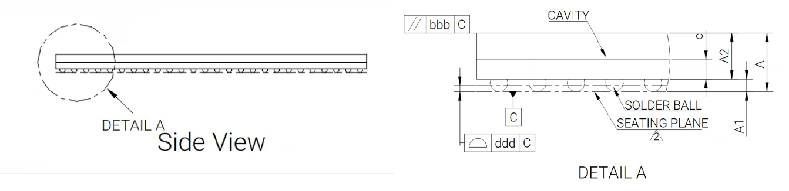
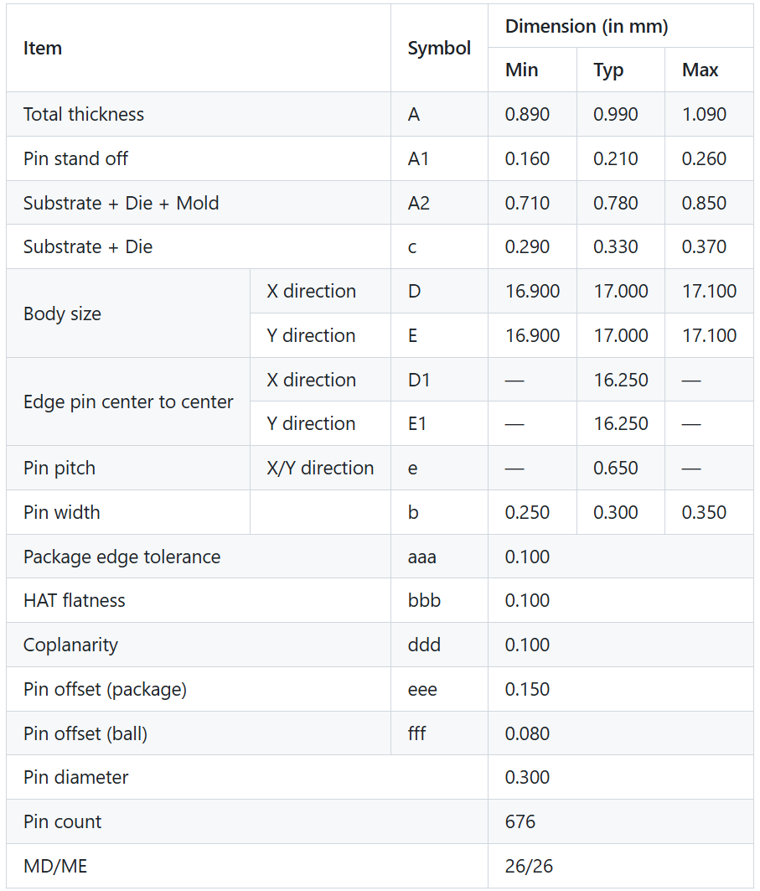

sidebar_position: 3

# 2. Package

## 2.1 Introduction

K1 is available in two packages as tabled below.

| Type   | Size (mm) | Pin Pitch (mm) | Pin Count       |
|--------|-----------|----------------|-----------------|
| FCCSP  | 17×17     | 0.65           | 676 (26×26)     |
| FCBGA  | 19×19     | 0.65           | 676 (26×26)     |

The related package outline drawing (POD) are depicted in the following sections.

## 2.2 FCCSP Type

## 2.3 FCBGA Type

