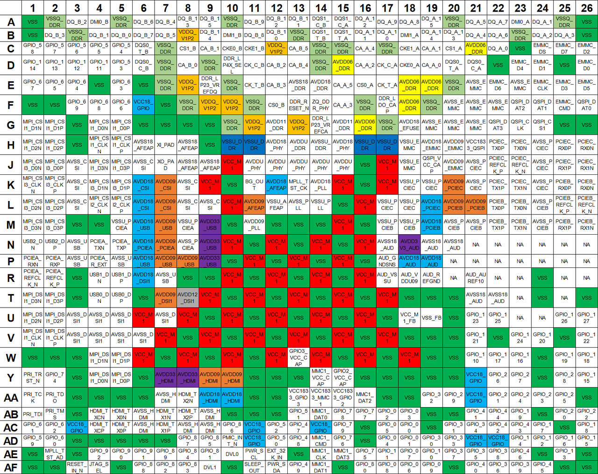

sidebar_position: 3

# 3. Pinout

## 3.1 Pinout Diagram & Description

The overall pinout diagram of K1 is depicted below.

> **Note.** Meaning of the different colors:
>
> - Power supplies (different voltages):
>   - Brown
>   - Dark Blue
>   - Grey
>   - Light Blue
>   - Orange
>   - Purple
>   - Red
>   - Yellow
> - Grounds:
>   - Dark Green
>   - Light Green
> - Signals:
>   - White

Let's consider the division into the quadrants

- (A~N, 1~13)
- (A~N, 14~26)
- (M~AF, 1~13)
- (M~AF, 14~26)

in order to provide conveniently the pinout description of K1 in the following subsections.

### (A~N, 1~13)

> **Note.** Definition of symbols used for pin type:
>
> - AO = Analog output
> - AI = Analog input
> - AIO = Analog input/output
> - G = Ground
> - I/O = Input/Output
> - P = Power
> - RO = Reference output

| Pin ID       | Name                | Type | Power Domain                          | Function                                                                 |
|--------------|---------------------|------|----------------------------------------|--------------------------------------------------------------------------|
| A1           | VSS                 | G    | 0V                                     | Digital Core Ground                                                     |
| A2           | VSSQ_DDR            | G    | 0V                                     | DDR Ground                                                              |
| A3           | DQ_B_2              | AIO  | lp3: 1.2V lp4x: 0.6V               | LPDDR4X: CHB DQ2  LPDDR3: DQ28                                      |
| A4           | DMI0_B              | AIO  | lp3: 1.2V lp4x: 0.6V               | LPDDR4X: Channel B DM0  LPDDR3: DQ25                                |
| A5           | VSSQ_DDR            | G    | 0V                                     | DDR Ground                                                              |
| A6           | DQ_B_6              | AIO  | lp3: 1.2V lp4x: 0.6V               | LPDDR4X: CHB DQ6  LPDDR3: DQ24                                      |
| A7           | DQ_B_4              | AIO  | lp3: 1.2V lp4x: 0.6V               | LPDDR4X: CHB DQ4  LPDDR3: DQ30                                      |
| A8           | DQ_B_13             | AIO  | lp3: 1.2V lp4x: 0.6V               | LPDDR4X: CHB DQ13  LPDDR3: DQ15                                     |
| A9           | DQ_B_15             | AIO  | lp3: 1.2V lp4x: 0.6V               | LPDDR4X: CHB DQ15  LPDDR3: DQ12                                     |
| A10          | VSSQ_DDR            | G    | 0V                                     | DDR Ground                                                              |
| A11          | DQ_B_9              | AIO  | lp3: 1.2V lp4x: 0.6V               | LPDDR4X: CHB DQ9 LPDDR3: DQ8                                        |
| A12          | DQ_B_12             | AIO  | lp3: 1.2V lp4x: 0.6V               | LPDDR4X: CHB DQ12 LPDDR3: DQ10                                      |
| A13          | DQ_B_11             | AIO  | lp3: 1.2V lp4x: 0.6V               | LPDDR4X: CHB DQ11 LPDDR3: DQ11                                      |
| B1           | VSS                 | G    | 0V                                     | Digital Core Ground                                                     |
| B2           | DQ_B_3              | AIO  | lp3: 1.2V lp4x: 0.6V               | LPDDR4X: CHB DQ3 LPDDR3: DQM3                                       |
| B3           | VSSQ_DDR            | G    | 0V                                     | DDR Ground                                                              |
| B4           | DQ_B_1              | AIO  | lp3: 1.2V lp4x: 0.6V               | LPDDR4X: CHB DQ1 LPDDR3: DQ27                                       |
| B5           | DQ_B_0              | AIO  | lp3: 1.2V lp4x: 0.6V               | LPDDR4X: CHB DQ0 LPDDR3: DQ31                                       |
| B6           | DQ_B_7              | AIO  | lp3: 1.2V lp4x: 0.6V               | LPDDR4X: CHB DQ7 LPDDR3: DQ29                                       |
| B7           | DQ_B_5              | AIO  | lp3: 1.2V lp4x: 0.6V               | LPDDR4X: CHB DQ5 LPDDR3: DQ26                                       |
| B8           | VDDQ_V1P2           | P    | lp3: 1.2V lp4x: 0.6V               | LPDDR3 IO power                                                         |
| B9           | DQ_B_14             | AIO  | lp3: 1.2V lp4x: 0.6V               | LPDDR4X: CHB DQ14 LPDDR3: DQ13                                      |
| B10          | DMI1_B              | AIO  | lp3: 1.2V lp4x: 0.6V               | LPDDR4X: Channel B DM1 LPDDR3: DQ14                                 |
| B11          | DQ_B_8              | AIO  | lp3: 1.2V lp4x: 0.6V               | LPDDR4X: CHA DQ12 LPDDR3: DQM1                                      |
| B12          | DQ_B_10             | AIO  | lp3: 1.2V lp4x: 0.6V               | LPDDR4X: CHB DQ10 LPDDR3: DQ9                                       |
| B13          | VSSQ_DDR            | G    | 0V                                     | DDR Ground                                                              |
| C1           | GPIO_58             | I/O  | 1.8V                                   | General Purpose I/O 58                                                  |
| C2           | GPIO_57             | I/O  | 1.8V                                   | General Purpose I/O 57                                                  |
| C3           | GPIO_56             | I/O  | 1.8V                                   | General Purpose I/O 56                                                  |
| C4           | GPIO_55             | I/O  | 1.8V                                   | General Purpose I/O 55                                                  |
| C5           | GPIO_54             | I/O  | 1.8V                                   | General Purpose I/O 54                                                  |
| C6           | DQS0_T_B            | AIO  | lp3: 1.2V lp4x: 0.6V               | LPDDR4X: Positive of CHB DQS0 LPDDR3: Positive of DQS3              |
| C7           | VSSQ_DDR            | G    | 0V                                     | DDR Ground                                                              |
| C8           | CS1_B               | AO   | lp3: 1.2V lp4x: 0.6V               | LPDDR4X: Active-low chip select 1 of CHB LPDDR3: N/A                |
| C9           | CA_B_1              | AO   | lp3: 1.2V lp4x: 0.6V               | LPDDR4X: CHB CA1 LPDDR3: CA5                                        |
| C10          | CKE0_B              | AO   | lp3: 1.2V lp4x: 1.1V               | LPDDR4X: clock enabling 0 of CHB LPDDR3: N/A                        |
| C11          | CKE1_B              | AO   | lp3: 1.2V lp4x: 1.1V               | LPDDR4X: clock enabling 1 of CHB LPDDR3: N/A                        |
| C12          | VDDQ_V1P2           | P    | lp3: 1.2V lp4x: 0.6V               | LPDDR3 IO power                                                         |
| C13          | CA_B_5              | AO   | lp3: 1.2V lp4x: 0.6V               | LPDDR4X: CHB CA5 LPDDR3: CA8                                        |
| D1           | GPIO_114            | I/O  | 1.8V                                   | General Purpose I/O 114                                                 |
| D2           | GPIO_113            | I/O  | 1.8V                                   | General Purpose I/O 113                                                 |
| D3           | GPIO_112            | I/O  | 1.8V                                   | General Purpose I/O 112                                                 |
| D4           | GPIO_111            | I/O  | 1.8V                                   | General Purpose I/O 111                                                 |
| D5           | GPIO_53             | I/O  | 1.8V                                   | General Purpose I/O 53                                                  |
| D6           | DQS0_C_B            | AIO  | lp3: 1.2V lp4x: 0.6V               | LPDDR4X: Negative of CHB DQS0 LPDDR3: Negtive of DQS3               |
| D7           | VSSQ_DDR            | G    | 0V                                     | DDR Ground                                                              |
| D8           | CA_B_0              | AO   | lp3: 1.2V lp4x: 0.6V               | LPDDR4X: CHB CA0                                                        |
| D9           | VSSQ_DDR            | G    | 0V                                     | DDR Ground                                                              |
| D10          | DDR_lp4x_SEL        | AIO  | 1.8V                                   | LPDDR4X: connect to 1.8V LP234: connect to Ground                   |
| D11          | CK_C_B              | AO   | lp3: 1.2V lp4x: 0.6V               | LPDDR4X: negative LPDDR differential clock of CHB  LPDDR3: negative LPDDR differential clock |
| D12          | CA_B_2              | AO   | lp3: 1.2V lp4x: 0.6V               | LPDDR4X: CHB CA2 LPDDR3: CA9                                        |
| D13          | CA_B_4              | AO   | lp3: 1.2V lp4x: 0.6V               | LPDDR4X: CHA CA4 LPDDR3: CA7                                        |
| E1           | GPIO_67             | I/O  | 1.8V                                   | General Purpose I/O 67                                                  |
| E2           | GPIO_65             | I/O  | 1.8V                                   | General Purpose I/O 65                                                  |
| E3           | GPIO_64             | I/O  | 1.8V                                   | General Purpose I/O 64                                                  |
| E4           | VSS                 | G    | 0V                                     | Digital Core Ground                                                     |
| E5           | GPIO_63             | I/O  | 1.8V                                   | General Purpose I/O 63                                                  |
| E6           | VSS                 | G    | 0V                                     | Digital Core Ground                                                     |
| E7           | VSSQ_DDR            | G    | 0V                                     | DDR Ground                                                              |
| E8           | VDDQ_V1P2           | P    | lp3: 1.2V lp4x: 0.6V               | LPDDR3 IO power                                                         |
| E9           | DDR_LP23_VREFDQ     | P    | lp3: 0.6V lp4: high-z              | DQ VREF for lpddr23 , LP4/4x Keep the pin NC                        |
| E10          | VSSQ_DDR            | G    | 0V                                     | DDR Ground                                                              |
| E11          | CK_T_B              | AO   | lp3: 1.2V lp4x: 0.6V               | LPDDR4X: positive LPDDR differential clock of CHB LPDDR3: positive LPDDR differential clock |
| E12          | CA_B_3              | AO   | lp3: 1.2V lp4x: 0.6V               | LPDDR4X: CHB CA3  LPDDR3: CA6                                       |
| E13          | AVSS18_DDR          | G    | 0V                                     | DDR Ground                                                              |
| F1           | VSS                 | G    | 0V                                     | Digital Core Ground                                                     |
| F2           | VSS                 | G    | 0V                                     | Digital Core Ground                                                     |
| F3           | GPIO_69             | I/O  | 1.8V                                   | General Purpose I/O 69                                                  |
| F4           | GPIO_68             | I/O  | 1.8V                                   | General Purpose I/O 68                                                  |
| F5           | GPIO_66             | I/O  | 1.8V                                   | General Purpose I/O 66                                                  |
| F6           | VCC18_GPIO          | P    | 1.8V                                   | GPIO1/4/5/PMIC I/O power                                                |
| F7           | VSS                 | G    | 0V                                     | Digital Core Ground                                                     |
| F8           | VSSQ_DDR            | G    | 0V                                     | DDR Ground                                                              |
| F9           | VDDQ_V1P2           | P    | lp3: 1.2V lp4x: 0.6V               | LPDDR3 IO power                                                         |
| F10          | VDDQ_V1P2           | P    | lp3: 1.2V lp4x: 0.6V               | LPDDR3 IO power                                                         |
| F11          | VSSQ_DDR            | G    | 0V                                     | DDR Ground                                                              |
| F12          | CS0_B               | AO   | lp3: 1.2V lp4x: 0.6V               | LPDDR4X: clock enabling 1 of CHB LPDDR3: N/A                        |
| F13          | DDR_RESET_N         | AO   | lp3: 1.2V lp4x: 1.1V               | LPDDR SDRAM reset                                                       |
| G1           | MIPI_CSI1_D1N       | AI   | 1.8V                                   | CSI1 DATA1LANEN                                                         |
| G2           | MIPI_CSI1_D1P       | AI   | 1.8V                                   | CSI1 DATA1LANEP                                                         |
| G3           | VSS                 | G    | 0V                                     | Digital Core Ground                                                     |
| G4           | MIPI_CSI1_D0N       | AI   | 1.8V                                   | CSI1 DATA0LANEN                                                         |
| G5           | MIPI_CSI1_D0P       | AI   | 1.8V                                   | CSI1 DATA0LANEP                                                         |
| G6           | VSS                 | G    | 0V                                     | Digital Core Ground                                                     |
| G7           | VSS                 | G    | 0V                                     | Digital Core Ground                                                     |
| G8           | VSS                 | G    | 0V                                     | Digital Core Ground                                                     |
| G9           | VSS                 | G    | 0V                                     | Digital Core Ground                                                     |
| G10          | VSSQ_DDR            | G    | 0V                                     | DDR Ground                                                              |
| G11          | VDDQ_V1P2           | P    | lp3: 1.2V lp4x: 0.6V               | LPDDR3 IO power                                                         |
| G12          | AVDD11_DDR          | P    | lp4x: 1.1V lp4: 1.1V lp3: 1.2V | LPDDR PHY power supply                                                  |
| G13          | VDDQ_V1P2           | P    | lp3: 1.2V lp4x: 0.6V               | LPDDR3 IO power                                                         |
| H1           | MIPI_CSI1_D2N       | AI   | 1.8V                                   | CSI1 DATA2LANEN                                                         |
| H2           | MIPI_CSI1_D2P       | AI   | 1.8V                                   | CSI1 DATA2LANEP                                                         |
| H3           | VSS                 | G    | 0V                                     | Digital Core Ground                                                     |
| H4           | MIPI_CSI1_CLKN      | AO   | 1.8V                                   | CSI1 CKLANEN                                                            |
| H5           | MIPI_CSI1_CLKP      | AO   | 1.8V                                   | CSI1 CKLANEP                                                            |
| H6           | AVSS18_AFEAP        | G    | 0V                                     | DCXO Ground                                                             |
| H7           | XI_PAD              | AI   | 1.8V                                   | DCXO crystal input                                                      |
| H8           | AVSS18_AFEAP        | G    | 0V                                     | DCXO Ground                                                             |
| H9           | VSS                 | G    | 0V                                     | Digital Core Ground                                                     |
| H10          | VSSU_DDR            | G    | 0V                                     | system DDR Ground                                                       |
| H11          | VSSU_DDR            | G    | 0V                                     | system DDR Ground                                                       |
| H12          | AVDD18_PHY          | P    | 1.8V                                   | Analog 1.8V power                                                       |
| H13          | AVDDU_DDR           | P    | 0.9V                                   | LPDDR PHY PLL logical power                                             |
| J1           | MIPI_CSI3_D0N       | AI   | 1.8V                                   | CSI3 DATA0LANEN                                                         |
| J2           | MIPI_CSI3_D0P       | AI   | 1.8V                                   | CSI3 DATA0LANEP                                                         |
| J3           | AVSS_CSI            | G    | 0V                                     | MIPI_CSI Ground                                                         |
| J4           | MIPI_CSI1_D3N       | AI   | 1.8V                                   | CSI1 DATA3LANEN                                                         |
| J5           | MIPI_CSI1_D3P       | AI   | 1.8V                                   | CSI1 DATA3LANEP                                                         |
| J6           | AVSS_CSI            | G    | 0V                                     | MIPI_CSI Ground                                                         |
| J7           | XO_PAD              | AO   | 1.8V                                   | DCXO crystal output                                                     |
| J8           | AVSS18_AFEAP        | G    | 0V                                     | DCXO Ground                                                             |
| J9           | AVSS18_AFEAP        | G    | 0V                                     | DCXO Ground                                                             |
| J10          | VCC_M1              | P    | 0.9V                                   | Digital Core power                                                      |
| J11          | AVDDU_PHY           | P    | 0.9V                                   | LPDDR PHY core logical power                                            |
| J12          | AVDDU_PHY           | P    | 0.9V                                   | LPDDR PHY core logical power                                            |
| J13          | AVDDU_PHY           | P    | 0.9V                                   | LPDDR PHY core logical power                                            |
| K1           | MIPI_CSI3_CLKN      | AO   | 1.8V                                   | CSI3 CKLANEN for CSI3 DATALANE0/1 when CSI3 is configured as two 2ch CSI;  CSI3 CKLANEN for CSI3 DATALANE0/1/2/3 when CSI3 is configured as 4ch CSI |
| K2           | MIPI_CSI3_CLKP      | AO   | 1.8V                                   | CSI3 CKLANEP for CSI3 DATALANE0/1 when CSI3 is configured as two 2ch CSI;  CSI3 CKLANEP for CSI3 DATALANE0/1/2/3 when CSI3 is configured as 4ch CSI |
| K3           | AVSS_CSI            | G    | 0V                                     | MIPI_CSI Ground                                                         |
| K4           | MIPI_CSI3_D1N       | AI   | 1.8V                                   | CSI3 DATA1LANEN                                                         |
| K5           | MIPI_CSI3_D1P       | AI   | 1.8V                                   | CSI3 DATA1LANEP                                                         |
| K6           | AVDD18_CSI          | P    | 1.8V                                   | MIPI_CSI analog power                                                   |
| K7           | AVDD09_CSI          | P    | 0.9V                                   | MIPI_CSI digtial power                                                  |
| K8           | AVSS_CSI            | G    | 0V                                     | MIPI_CSI Ground                                                         |
| K9           | VCC_M1              | P    | 0.9V                                   | Digital Core power                                                      |
| K10          | VSS                 | G    | 0V                                     | Digital Core Ground                                                     |
| K11          | BG_OUT              | AO   | 1.8V                                   | Bandgap output                                                          |
| K12          | AVDD18_AFEAP        | P    | 1.8V                                   | 1.8V power for DCXO                                                     |
| K13          | MPLL_TST_CK         | AIO  | 1.8V                                   | Analog testpin                                                          |
| L2           | MIPI_CSI3_D2P       | AI   | 1.8V                                   | CSI3 DATA2LANEP                                                         |
| L3           | AVSS_CSI            | G    | 0V                                     | MIPI_CSI Ground                                                         |
| L4           | MIPI_CSI2_CLKN      | AO   | 1.8V                                   | CKLANEN for CSI3 DATALANE2/3 when CSI3 is configured as two 2ch CSI;  Disabled when CSI3 is configured as 4ch CSI |
| L5           | MIPI_CSI2_CLKP      | AO   | 1.8V                                   | CKLANEP for CSI3 DATALANE2/3 when CSI3 is configured as two 2ch CSI;  Disabled when CSI3 is configured as 4ch CSI |
| L6           | AVDD18_CSI          | P    | 1.8V                                   | MIPI_CSI analog power                                                   |
| L7           | AVDD09_CSI          | P    | 0.9V                                   | MIPI_CSI digtial power                                                  |
| L8           | AVSS_CSI            | G    | 0V                                     | MIPI_CSI Ground                                                         |
| L9           | AVSS_CSI            | G    | 0V                                     | MIPI_CSI Ground                                                         |
| L10          | VCC_M1              | P    | 0.9V                                   | Digital Core power                                                      |
| L11          | AVDD09_AFEAP        | P    | 0.9V                                   | 0.9V power for DCXO                                                     |
| L12          | VSSU_AFEAP          | G    | 0V                                     | DCXO Ground                                                             |
| L13          | AVSS_PLL            | G    | 0V                                     | Analog Core Ground                                                      |
| M1           | MIPI_CSI3_D3N       | AI   | 1.8V                                   | CSI3 DATA3LANEN                                                         |
| M2           | MIPI_CSI3_D3P       | AI   | 1.8V                                   | CSI3 DATA3LANEP                                                         |
| M3           | VSS                 | G    | 0V                                     | Digital Core Ground                                                     |
| M4           | VSS                 | G    | 0V                                     | Digital Core Ground                                                     |
| M5           | VSSU_PCIEA          | G    | 0V                                     | PCIEA Ground                                                            |
| M6           | AVDD18_USB          | P    | 1.8V                                   | USB2.0 1.8V power                                                       |
| M7           | AVDD09_USB          | P    | 0.9V                                   | USB2.0 digital power                                                    |
| M8           | VSSU_PCIEA          | G    | 0V                                     | PCIEA Ground                                                            |
| M9           | AVDD33_USB          | P    | 3.3V                                   | USB2.0 3.3V power                                                       |
| M10          | VSS                 | G    | 0V                                     | Digital Core Ground                                                     |
| M11          | AVDD09_PLL          | P    | 0.9                                    | System PLL power supply                                                 |
| M12          | VSS                 | G    | 0V                                     | Digital Core Ground                                                     |
| M13          | VSS                 | G    | 0V                                     | Digital Core Ground                                                     |
| N1           | USB2_DN             | AIO  | 3.3V                                   | USB2.0_2 D- differential data line                                      |
| N2           | USB2_DP             | AIO  | 3.3V                                   | USB2.0_2 D+ differential data line                                      |
| N3           | AVSS_USB            | G    | 0V                                     | USB2.0 Ground                                                           |
| N4           | PCIEA_TXN           | AO   | 1.8V                                   | PCIEA TXLANEN                                                           |
| N5           | PCIEA_TXP           | AO   | 1.8V                                   | PCIEA TXLANEP                                                           |
| N6           | AVDD18_PCIEA        | P    | 1.8V                                   | PCIEA analog power                                                      |
| N7           | AVDD09_PCIEA        | P    | 0.9V                                   | PCIEA digital power                                                     |
| N8           | AVSS_PCIEA          | G    | 0V                                     | PCIEA Ground                                                            |
| N9           | AVDD33_USB          | P    | 3.3V                                   | USB2.0 3.3V power                                                       |
| N10          | VCC_M1              | P    | 0.9V                                   | Digital Core power                                                      |
| N11          | VSS                 | G    | 0V                                     | Digital Core Ground                                                     |
| N12          | VCC_M1              | P    | 0.9V                                   | Digital Core power                                                      |
| N13          | VSS                 | G    | 0V                                     | Digital Core Ground                                                     |

### (A~N, 14~26)

> **Note.** Definition of symbols used for pin type:
>
> - AO = Analog output
> - AI = Analog input
> - AIO = Analog input/output
> - G = Ground
> - I/O = Input/Output
> - P = Power
> - RO = Reference output

| Pin ID       | Name            | Type | Power Domain                     | Function                                                                 |
|--------------|-----------------|------|----------------------------------|--------------------------------------------------------------------------|
| A14          | DQS1_C_B        | AIO  | lp3: 1.2V lp4x: 0.6V         | LPDDR4X: Negative of CHB DQS1 LPDDR3: Negtive of DQS1                |
| A15          | DQS1_C_A        | AIO  | lp3: 1.2V lp4x: 0.6V         | LPDDR4X: Negative of CHA DQS1 LPDDR3: Negtive of DQS0                |
| A16          | DQ_A_12         | AIO  | lp3: 1.2V lp4x: 0.6V         | LPDDR4X: CHA DQ12 LPDDR3: DQM0                                       |
| A17          | DQ_A_9          | AIO  | lp3: 1.2V lp4x: 0.6V         | LPDDR4X: CHA DQ9 LPDDR3: DQ7                                         |
| A18          | DQ_A_8          | AIO  | lp3: 1.2V lp4x: 0.6V         | LPDDR4X: CHB DQ8 LPDDR3: DQ5                                         |
| A19          | DQ_A_15         | AIO  | lp3: 1.2V lp4x: 0.6V         | LPDDR4X: CHB DQ15 LPDDR3: DQ3                                        |
| A20          | VSSQ_DDR        | G    | 0V                               | DDR Ground                                                               |
| A21          | DQ_A_5          | AIO  | lp3: 1.2V lp4x: 0.6V         | LPDDR4X: CHA DQ5 LPDDR3: DQ21                                        |
| A22          | DQ_A_7          | AIO  | lp3: 1.2V lp4x: 0.6V         | LPDDR4X: CHA DQ7 LPDDR3: DQ17                                        |
| A23          | DMI0_A          | AIO  | lp3: 1.2V lp4x: 0.6V         | LPDDR4X: Channel A DM0 LPDDR3: DQ22                                  |
| A24          | DQ_A_1          | AIO  | lp3: 1.2V lp4x: 0.6V         | LPDDR4X: CHA DQ1 LPDDR3: DQ16                                        |
| A25          | VSSQ_DDR        | G    | 0V                               | DDR Ground                                                               |
| A26          | VSS             | G    | 0V                               | Digital Core Ground                                                      |
| B14          | DQS1_T_B        | AIO  | lp3: 1.2V lp4x: 0.6V         | LPDDR4X: Positive of CHB DQS1 LPDDR3: Positive of DQS1               |
| B15          | DQS1_T_A        | AIO  | lp3: 1.2V lp4x: 0.6V         | LPDDR4X: Positive of CHA DQS1 LPDDR3: Positive of DQS0               |
| B16          | DQ_A_11         | AIO  | lp3: 1.2V lp4x: 0.6V         | LPDDR4X: CHA DQ11 LPDDR3: DQ4                                        |
| B17          | DQ_A_10         | AIO  | lp3: 1.2V lp4x: 0.6V         | LPDDR4X: CHA DQ10 LPDDR3: DQ6                                        |
| B18          | DMI1_A          | AIO  | lp3: 1.2V lp4x: 0.6V         | LPDDR4X: Channel A DM1 LPDDR3: DQ2                                   |
| B19          | DQ_A_14         | AIO  | lp3: 1.2V lp4x: 0.6V         | LPDDR4X: CHA DQ14 LPDDR3: DQ1                                        |
| B20          | DQ_A_13         | AIO  | lp3: 1.2V lp4x: 0.6V         | LPDDR4X: CHA DQ13 LPDDR3: DQ0                                        |
| B21          | DQ_A_4          | AIO  | lp3: 1.2V lp4x: 0.6V         | LPDDR4X: CHB DQ4 LPDDR3: DQ18                                        |
| B22          | DQ_A_6          | AIO  | lp3: 1.2V lp4x: 0.6V         | LPDDR4X: CHB DQ6 LPDDR3: DQ23                                        |
| B23          | VSSQ_DDR        | G    | 0V                               | DDR Ground                                                               |
| B24          | DQ_A_2          | AIO  | lp3: 1.2V lp4x: 0.6V         | LPDDR4X: CHA DQ2 LPDDR3: DQ19                                        |
| B25          | DQ_A_3          | AIO  | lp3: 1.2V lp4x: 0.6V         | LPDDR4X: CHB DQ3 LPDDR3: DQM2                                        |
| B26          | VSS             | G    | 0V                               | Digital Core Ground                                                      |
| C14          | VSSQ_DDR        | G    | 0V                               | DDR Ground                                                               |
| C15          | VSSQ_DDR        | G    | 0V                               | DDR Ground                                                               |
| C16          | CA_A_4          | AO   | lp3: 1.2V lp4x: 0.6V         | LPDDR4X: CHA CA4 LPDDR3: CA3                                         |
| C17          | VSSQ_DDR        | G    | 0V                               | DDR Ground                                                               |
| C18          | CKE1_A          | AO   | lp3: 1.2V lp4x: 1.1V         | LPDDR4X: clock enabling 1 of CHA LPDDR3: clock enabling 1            |
| C19          | CA_A_1          | AO   | lp3: 1.2V lp4x: 0.6V         | LPDDR4X: CHA CA1 LPDDR3: CA2                                         |
| C20          | CS1_A           | AO   | lp3: 1.2V lp4x: 0.6V         | LPDDR4X: Active-low chip select 1 of CHA LPDDR3: Active-low chip select 1 |
| C21          | AVDD06_DDR      | P    | lp4x: 0.6V lp4: TBD/lp3: TBD | LPDDR4X IO power                                                         |
| C22          | DQ_A_0          | AIO  | lp3: 1.2V lp4x: 0.6V         | LPDDR4X: CHA DQ0 LPDDR3: DQ20                                        |
| C23          | VSS             | G    | 0V                               | Digital Core Ground                                                      |
| C24          | EMMC_DS         | I/O  | 1.8V                             | eMMC data strobe                                                         |
| C25          | EMMC_D7         | I/O  | 1.8V                             | eMMC data7                                                               |
| C26          | EMMC_D2         | I/O  | 1.8V                             | eMMC data2                                                               |
| D14          | VSSQ_DDR        | G    | 0V                               | DDR Ground                                                               |
| D15          | AVDD06_DDR      | P    | lp4x: 0.6V lp4: TBD lp3: TBD | LPDDR4X IO power                                                     |
| D16          | CA_A_2          | AO   | lp3: 1.2V lp4x: 0.6V         | LPDDR4X: CHA CA2                                                         |
| D17          | CK_C_A          | AO   | lp3: 1.2V lp4x: 0.6V         | LPDDR4X: negative LPDDR differential clock of CHA LPDDR3: N/A        |
| D18          | CKE0_A          | AO   | lp3: 1.2V lp4x: 1.1V         | LPDDR4X: clock enabling 0 of CHA LPDDR3: clock enabling 0            |
| D19          | CA_A_0          | AO   | lp3: 1.2V lp4x: 0.6V         | LPDDR4X: CHA CA0 LPDDR3: CA4                                         |
| D20          | DQS0_T_A        | AIO  | lp3: 1.2V lp4x: 0.6V         | LPDDR4X: Positive of CHA DQS0 LPDDR3: Positive of DQS2               |
| D21          | DQS0_C_A        | AIO  | lp3: 1.2V lp4x: 0.6V         | LPDDR4X: Negative of CHA DQS0 LPDDR3: Negative of DQS2               |
| D22          | VSS             | G    | 0V                               | Digital Core Ground                                                      |
| D23          | EMMC_D4         | I/O  | 1.8V                             | eMMC data4                                                               |
| D24          | EMMC_D1         | I/O  | 1.8V                             | eMMC data1                                                               |
| D25          | VSS             | G    | 0V                               | Digital Core Ground                                                      |
| D26          | EMMC_D0         | I/O  | 1.8V                             | eMMC data0                                                               |
| E14          | AVDD18_DDR      | P    | 1.8V                             | LPDDR PHY PLL 1.8V power                                                 |
| E15          | CA_A_5          | AO   | lp3: 1.2V lp4x: 0.6V         | LPDDR4X: CHA CA5 LPDDR3: CA1                                         |
| E16          | CS0_A           | AO   | lp3: 1.2V lp4x: 0.6V         | LPDDR4X: Active-low chip select 0 of CHA LPDDR3: Active-low chip select 0 |
| E17          | CK_T_A          | AO   | lp3: 1.2V lp4x: 0.6V         | LPDDR4X: positive LPDDR differential clock of CHA LPDDR3: N/A        |
| E18          | AVDD06_DDR      | P    | lp4x: 0.6V lp4: TBD lp3: TBD | LPDDR4X IO power                                                     |
| E19          | AVDD06_DDR      | P    | lp4x: 0.6V lp4: TBD lp3: TBD | LPDDR4X IO power                                                     |
| E20          | VSSQ_DDR        | G    | 0V                               | DDR Ground                                                               |
| E21          | AVSS_EMMC       | G    | 0V                               | eMMC Ground                                                              |
| E22          | EMMC_D6         | I/O  | 1.8V                             | eMMC data6                                                               |
| E23          | AVSS_EMMC       | G    | 0V                               | eMMC Ground                                                              |
| E24          | EMMC_CLK        | I/O  | 1.8V                             | eMMC Clock                                                               |
| E25          | EMMC_D3         | I/O  | 1.8V                             | eMMC data3                                                               |
| E26          | EMMC_D5         | I/O  | 1.8V                             | eMMC data5                                                               |
| F14          | ZQ_DDR_PHY      | AIO  | lp3: 1.2V lp4x: 0.6V         | DDR ZQ calibration                                                       |
| F15          | CA_A_3          | AO   | lp3: 1.2V lp4x: 0.6V         | LPDDR4X: CHA CA3 LPDDR3: CA0                                         |
| F16          | VSSQ_DDR        | G    | 0V                               | DDR Ground                                                               |
| F17          | DDR_LDO_CAP     | RO   | 0.7~0.9V                         | External LDO output ball; Connect to a 100nF capacitor on PCB board  |
| F18          | AVDD06_DDR      | P    | lp4x: 0.6V lp4: TBD lp3: TBD | LPDDR4X IO power                                                     |
| F19          | VSSQ_DDR        | G    | 0V                               | DDR Ground                                                               |
| F20          | AVSS_EMMC       | G    | 0V                               | eMMC Ground                                                              |
| F21          | AVSS_EMMC       | G    | 0V                               | eMMC Ground                                                              |
| F22          | AVSS_EMMC       | G    | 0V                               | eMMC Ground                                                              |
| F23          | QSPI_DAT2       | I/O  | 1.8V/3.3V                        | QSPI data2                                                               |
| F24          | QSPI_DAT1       | I/O  | 1.8V/3.3V                        | QSPI data1                                                               |
| F25          | EMMC_CMD        | I/O  | 1.8V                             | eMMC command                                                             |
| F26          | QSPI_DAT0       | I/O  | 1.8V/3.3V                        | QSPI data0                                                               |
| G14          | DDR_LP23_VREFCA | P    | lp3: 0.6V lp4: high-z        | CA VREF for lpddr23, LP4/4x Keep the pin NC                          |
| G15          | AVDD11_DDR      | P    | lp4x: 1.1V lp4: 1.1V lp3: 1.2V | LPDDR PHY power supply                                               |
| G16          | AVDD06_DDR      | P    | lp4x: 0.6V lp4: TBD lp3: TBD | LPDDR4X IO power                                                     |
| G17          | VSSQ_DDR        | G    | 0V                               | DDR Ground                                                               |
| G18          | AVDD18_EFUSE    | P    | 1.8V                             | ANAGRP                                                                   |
| G19          | AVSS_EMMC       | G    | 0V                               | eMMC Ground                                                              |
| G20          | AVSS_EMMC       | G    | 0V                               | eMMC Ground                                                              |
| G21          | AVSS_EMMC       | G    | 0V                               | eMMC Ground                                                              |
| G22          | QSPI_DAT3       | I/O  | 1.8V/3.3V                        | QSPI data3                                                               |
| G23          | QSPI_CLK        | I/O  | 1.8V/3.3V                        | QSPI CLK                                                                 |
| G24          | QSPI_CS1        | I/O  | 1.8V/3.3V                        | QSPI CS                                                                  |
| G25          | VSS             | G    | 0V                               | Digital Core Ground                                                      |
| G26          | VSS             | G    | 0V                               | Digital Core Ground                                                      |
| H14          | AVSSU_DDR       | G    | 0V                               | DDR Ground                                                               |
| H15          | AVDD18_PHY      | P    | 1.8V                             | Analog 1.8V power                                                        |
| H16          | VSSU_DDR        | G    | 0V                               | System DDR Ground                                                        |
| H17          | VSSU_DDR        | G    | 0V                               | System DDR Ground                                                        |
| H18          | VSSU_EMMC       | G    | 0V                               | eMMC Ground                                                              |
| H19          | AVDD18_EMMC     | P    | 1.8V                             | eMMC analog power                                                        |
| H20          | AVDD09_EMMC     | P    | 0.9V                             | eMMC digtial power                                                       |
| H21          | VCC1833_QSPI    | P    | 1.8V/3.3V                        | QSPI IO power                                                            |
| H22          | PCIEC_TX0P      | AO   | 1.8V                             | PCIEC TX0LANEP                                                           |
| H23          | PCIEC_TX0N      | AO   | 1.8V                             | PCIEC TX0LANEN                                                           |
| H24          | AVSS_PCIEC      | G    | 0V                               | PCIEC Ground                                                             |
| H25          | PCIEC_RX0P      | AI   | 1.8V                             | PCIEC RX0LANEP                                                           |
| H26          | PCIEC_RX0N      | AI   | 1.8V                             | PCIEC RX0LANEN                                                           |
| J14          | AVDDU_PHY       | P    | 0.9V                             | LPDDR PHY core logical power                                             |
| J15          | AVDDU_PHY       | P    | 0.9V                             | LPDDR PHY core logical power                                             |
| J16          | VSS             | G    | 0V                               | Digital Core Ground                                                      |
| J17          | VCC_M1          | P    | 0.9V                             | Digital Core power                                                       |
| J18          | VSSU_EMMC       | G    | 0V                               | eMMC Ground                                                              |
| J19          | QSPI_VCC_CAP    | RO   | 1.8V                             | QSPI 1.8V LDO cap                                                        |
| J20          | AVDD09_EMMC     | P    | 0.9V                             | eMMC digtial power                                                       |
| J21          | AVSS_PCIEC      | G    | 0V                               | PCIEC Ground                                                             |
| J22          | PCIEC_REFCLK_P  | AIO  | 1.8V                             | PCIEC CKLANEP                                                            |
| J23          | PCIEC_REFCLK_N  | AIO  | 1.8V                             | PCIEC CKLANEN                                                            |
| J24          | AVSS_PCIEC      | G    | 0V                               | PCIEC Ground                                                             |
| J25          | PCIEC_RX1P      | AI   | 1.8V                             | PCIEC RX1LANEP                                                           |
| J26          | PCIEC_RX1N      | AI   | 1.8V                             | PCIEC RX1LANEN                                                           |
| K14          | AVDD18_PLL      | P    | 1.8                              | System PLL power supply                                                  |
| K15          | VCC_M1          | P    | 0.9V                             | Digital Core power                                                       |
| K16          | VSS             | G    | 0V                               | Digital core Ground                                                      |
| K17          | VCC_M1          | P    | 0.9V                             | Digital Core power                                                       |
| K18          | VSSU_PCIEC      | G    | 0V                               | PCIEC Ground                                                             |
| K19          | VSSU_PCIEC      | G    | 0V                               | PCIEC Ground                                                             |
| K20          | AVDD09_PCIEC    | P    | 0.9V                             | PCIEC digital power                                                      |
| K21          | AVSS_PCIEC      | G    | 0V                               | PCIEC Ground                                                             |
| K22          | PCIEC_TX1P      | AO   | 1.8V                             | PCIEC TX1LANEP                                                           |
| K23          | PCIEC_TX1N      | AO   | 1.8V                             | PCIEC TX1LANEN                                                           |
| K24          | AVSS_PCIEC      | G    | 0V                               | PCIEC Ground                                                             |
| K25          | PCIEB_RX0P      | AI   | 1.8V                             | PCIEB RX0LANEP                                                           |
| K26          | PCIEB_RX0N      | AI   | 1.8V                             | PCIEB RX0LANEN                                                           |
| L14          | VSSU_PLL        | G    | 0V                               | System PLL Ground                                                        |
| L15          | VSS             | G    | 0V                               | Digital core Ground                                                      |
| L16          | VCC_M1          | P    | 0.9V                             | Digital Core power                                                       |
| L17          | VSSU_PCIEC      | G    | 0V                               | PCIEC Ground                                                             |
| L18          | VSSU_PCIEC      | G    | 0V                               | PCIEC Ground                                                             |
| L19          | AVDD18_PCIEC    | P    | 1.8V                             | PCIEC analog power                                                       |
| L20          | AVDD09_PCIEB    | P    | 0.9V                             | PCIEB digital power                                                      |
| L21          | AVDD09_PCIEB    | P    | 0.9V                             | PCIEB digital power                                                      |
| L22          | PCIEB_TX0P      | AO   | 1.8V                             | PCIEB TX0LANEP                                                           |
| L23          | PCIEB_TX0N      | AO   | 1.8V                             | PCIEB TX0LANEN                                                           |
| L24          | AVSS_PCIEB      | G    | 0V                               | PCIEB Ground                                                             |
| L25          | PCIEB_REFCLK_P  | AIO  | 1.8V                             | PCIEB CKLANEP                                                            |
| L26          | PCIEB_REFCLK_N  | AIO  | 1.8V                             | PCIEB CKLANEN                                                            |
| M14          | VSS             | G    | 0V                               | Digital Core Ground                                                      |
| M15          | VCC_M1          | P    | 0.9V                             | Digital Core power                                                       |
| M16          | VSS             | G    | 0V                               | Digital Core Ground                                                      |
| M17          | VSSU_PCIEB      | G    | 0V                               | PCIEB Ground                                                             |
| M18          | VSSU_PCIEB      | G    | 0V                               | PCIEB Ground                                                             |
| M19          | AVDD18_PCIEB    | P    | 1.8V                             | PCIEB analog power                                                       |
| M20          | AVSS_PCIEB      | G    | 0V                               | PCIEB Ground                                                             |
| M21          | AVSS_PCIEB      | G    | 0V                               | PCIEB Ground                                                             |
| M22          | PCIEB_TX1P      | AO   | 1.8V                             | PCIEB TX1LANEP                                                           |
| M23          | PCIEB_TX1N      | AO   | 1.8V                             | PCIEB TX1LANEN                                                           |
| M24          | AVSS_PCIEB      | G    | 0V                               | PCIEB Ground                                                             |
| M25          | PCIEB_RX1P      | AI   | 1.8V                             | PCIEB RX1LANEP                                                           |
| M26          | PCIEB_RX1N      | AI   | 1.8V                             | PCIEB RX1LANEN                                                           |
| N14          | VCC_M1          | P    | 0.9V                             | Digital Core power                                                       |
| N15          | VSS             | G    | 0V                               | Digital Core Ground                                                      |
| N16          | VCC_M1          | P    | 0.9V                             | Digital Core power                                                       |
| N17          | AVSS18_AUD      | G    | 0V                               | Audio Ground                                                             |
| N18          | AVDD3V3_AUD     | P    | 3.3V                             | 3.3V power for earphone driver                                           |
| N19          | AVSS18_AUD      | G    | 0V                               | Audio Ground                                                             |
| N20          | AVSS18_AUD      | G    | 0V                               | Audio Ground                                                             |
| N21          | NA              | P    | 1.8V                             | NA                                                                       |
| N22          | NA              | P    | -1.8V                            | NA                                                                       |
| N23          | NA              | AO   | +/-1.8V                          | NA                                                                       |
| N24          | NA              | AO   | +/-1.8V                          | NA                                                                       |
| N25          | NA              | AO   | 3.3V                             | NA                                                                       |
| N26          | NA              | AO   | 3.3V                             | NA                                                                       |

### (P~AF, 1~13)

> **Note.** Definition of symbols used for pin type:
>
> - AO = Analog output
> - AI = Analog input
> - AIO = Analog input/output
> - G = Ground
> - I/O = Input/Output
> - P = Power
> - RO = Reference output

| Pin ID | Name                | Type | Power Domain   | Function                                |
|--------|---------------------|------|----------------|-----------------------------------------|
| P1     | PCIEA_RXN           | AI   | 1.8V           | PCIEA RXLANEN                           |
| P2     | PCIEA_RXP           | AI   | 1.8V           | PCIEA RXLANEP                           |
| P3     | AVSS_USB            | G    | 0V             | USB2.0 Ground                           |
| P4     | PCIEA_R_EXT         | AO   | 1.8V           | PCIEA External calibration resistor     |
| P5     | AVSS_USB            | G    | 0V             | USB2.0 Ground                           |
| P6     | AVDD18_USB          | P    | 1.8V           | USB2.0 1.8V power                       |
| P7     | AVDD09_USB          | P    | 0.9V           | USB2.0 digital power                    |
| P8     | AVDD09_USB          | P    | 0.9V           | USB2.0 digital power                    |
| P9     | AVDD33_USB          | P    | 3.3V           | USB2.0 3.3V power                       |
| P10    | VSS                 | G    | 0V             | Digital Core Ground                     |
| P11    | VCC_M1              | P    | 0.9V           | Digital Core power                      |
| P12    | VSS                 | G    | 0V             | Digital Core Ground                     |
| P13    | VCC_M1              | P    | 0.9V           | Digital Core power                      |
| R1     | PCIEA_REFCLK_N      | AIO  | 1.8V           | PCIEA CKLANEN                           |
| R2     | PCIEA_REFCLK_P      | AIO  | 1.8V           | PCIEA CKLANEP                           |
| R3     | VSS                 | G    | 0V             | Digital core Ground                     |
| R4     | USB1_DN             | AIO  | 3.3V           | USB2.0_1 D- differential data line      |
| R5     | USB1_DP             | AIO  | 3.3V           | USB2.0_1 D+ differential data line      |
| R6     | AVDD18_DSI1         | P    | 1.8V           | DSI analog power                        |
| R7     | AVSS_USB            | G    | 0V             | USB2.0 Ground                           |
| R8     | VSS                 | G    | 0V             | Digital Core Ground                     |
| R9     | VSS                 | G    | 0V             | Digital Core Ground                     |
| R10    | VCC_M1              | P    | 0.9V           | Digital Core power                      |
| R11    | VSS                 | G    | 0V             | Digital Core Ground                     |
| R12    | VCC_M1              | P    | 0.9V           | Digital Core power                      |
| R13    | VSS                 | G    | 0V             | Digital Core Ground                     |
| T1     | MIPI_DSI1_D3N       | AO   | 1.2V           | DSI DATA3LANEN                          |
| T2     | MIPI_DSI1_D3P       | AO   | 1.2V           | DSI DATA3LANEP                          |
| T3     | VSS                 | G    | 0V             | Digital core ground                     |
| T4     | USB0_DN             | AIO  | 3.3V           | USB2.0_0 D- differential data line      |
| T5     | USB0_DP             | AIO  | 3.3V           | USB2.0_0 D+ differential data line      |
| T6     | VSS                 | G    | 0V             | Digital core ground                     |
| T7     | AVDD09_DSI1         | P    | 0.9V           | DSI digital power                       |
| T8     | AVDD12_DSI1         | P    | 1.2V           | DSI driver power                        |
| T9     | VCC_M1              | P    | 0.9V           | Digital Core power                      |
| T10    | VSS                 | G    | 0V             | Digital Core ground                     |
| T11    | VCC_M1              | P    | 0.9V           | Digital Core power                      |
| T12    | VSS                 | G    | 0V             | Digital Core ground                     |
| T13    | VCC_M1              | P    | 0.9V           | Digital Core power                      |
| U1     | MIPI_DSI1_D2N       | AO   | 1.2V           | DSI DATA2LANEN                          |
| U2     | MIPI_DSI1_D2P       | AO   | 1.2V           | DSI DATA2LANEP                          |
| U3     | AVSS_DSI1           | G    | 0V             | DSI Ground                              |
| U4     | AVSS_DSI1           | G    | 0V             | DSI Ground                              |
| U5     | AVSS_DSI1           | G    | 0V             | DSI Ground                              |
| U6     | VCC_M1              | P    | 0.9V           | Digital Core power                      |
| U7     | AVSS_DSI1           | G    | 0V             | DSI Ground                              |
| U8     | VCC_M1              | P    | 0.9V           | Digital Core power                      |
| U9     | VSS                 | G    | 0V             | Digital Core ground                     |
| U10    | VCC_M1              | P    | 0.9V           | Digital Core power                      |
| U11    | VSS                 | G    | 0V             | Digital Core ground                     |
| U12    | VCC_M1              | P    | 0.9V           | Digital Core power                      |
| U13    | VSS                 | G    | 0V             | Digital Core ground                     |
| V1     | MIPI_DSI1_CLKN      | AO   | 1.2V           | DSI CKLANEN                             |
| V2     | MIPI_DSI1_CLKP      | AO   | 1.2V           | DSI CKLANEP                             |
| V3     | AVSS_DSI1           | G    | 0V             | DSI Ground                              |
| V4     | AVSS_DSI1           | G    | 0V             | DSI Ground                              |
| V5     | AVSS_DSI1           | G    | 0V             | DSI Ground                              |
| V6     | AVSS_DSI1           | G    | 0V             | DSI Ground                              |
| V7     | VCC_M1              | P    | 0.9V           | Digital Core power                      |
| V8     | VSS                 | G    | 0V             | Digital Core ground                     |
| V9     | VCC_M1              | P    | 0.9V           | Digital Core power                      |
| V10    | VSS                 | G    | 0V             | Digital Core ground                     |
| V11    | VCC_M1              | P    | 0.9V           | Digital Core power                      |
| V12    | VSS                 | G    | 0V             | Digital Core ground                     |
| V13    | VCC_M1              | P    | 0.9V           | Digital Core power                      |
| W1     | VSS                 | G    | 0V             | Digital Core ground                     |
| W2     | VSS                 | G    | 0V             | Digital Core ground                     |
| W3     | VSS                 | G    | 0V             | Digital Core ground                     |
| W4     | MIPI_DSI1_D1N       | AO   | 1.2V           | DSI DATA1LANEN                          |
| W5     | MIPI_DSI1_D1P       | AO   | 1.2V           | DSI DATA1LANEP                          |
| W6     | VCC_M1              | P    | 0.9V           | Digital Core power                      |
| W7     | VSS                 | G    | 0V             | Digital Core ground                     |
| W8     | VCC_M1              | P    | 0.9V           | Digital Core power                      |
| W9     | VSS                 | G    | 0V             | Digital Core ground                     |
| W10    | VCC_M1              | P    | 0.9V           | Digital Core power                      |
| W11    | VSS                 | G    | 0V             | Digital Core ground                     |
| W12    | VCC_M1              | P    | 0.9V           | Digital Core power                      |
| W13    | GPIO3_VCC_CAP       | RO   | 1.8V           | GPIO3 1.8V LDO cap                      |
| Y1     | PRI_TRST_N          | I/O  | 1.8V           | JTAG reset                              |
| Y2     | GPIO_74             | I/O  | 1.8V           | General Purpose I/O 74                  |
| Y3     | VSS                 | G    | 0V             | Digital Core ground                     |
| Y4     | MIPI_DSI1_D0N       | AO   | 1.2V           | DSI DATA0LANEN                          |
| Y5     | MIPI_DSI1_D0P       | AO   | 1.2V           | DSI DATA0LANEP                          |
| Y6     | VSS                 | G    | 0V             | Digital Core ground                     |
| Y7     | AVDD33_HDMI         | P    | 3.3V           | HDMI 3.3V power                         |
| Y8     | AVDD33_HDMI         | P    | 3.3V           | HDMI 3.3V power                         |
| Y9     | AVDD09_HDMI         | P    | 0.9V           | HDMI digtial power                      |
| Y10    | AVDD09_HDMI         | P    | 0.9V           | HDMI digtial power                      |
| Y11    | VSS                 | G    | 0V             | Digital Core ground                     |
| Y12    | VSS                 | G    | 0V             | Digital Core ground                     |
| Y13    | VSS                 | G    | 0V             | Digital Core ground                     |
| AA1    | PRI_TCK             | I/O  | 1.8V           | JTAG clock                              |
| AA2    | PRI_TDO             | I/O  | 1.8V           | JTAG output data                        |
| AA3    | VSS                 | G    | 0V             | Digital Core ground                     |
| AA4    | VSS                 | G    | 0V             | Digital Core ground                     |
| AA5    | VSS                 | G    | 0V             | Digital Core ground                     |
| AA6    | VSS                 | G    | 0V             | Digital Core ground                     |
| AA7    | AVSS_HDMI           | G    | 0V             | HDMI Ground                             |
| AA8    | HDMI_TX2N           | AO   | 1.8V           | HDMI data2n                             |
| AA9    | AVDD18_HDMI         | P    | 1.8V           | HDMI 1.8V power                         |
| AA10   | AVDD18_HDMI         | P    | 1.8V           | HDMI 1.8V power                         |
| AA11   | VSS                 | G    | 0V             | Digital Core ground                     |
| AA12   | VSS                 | G    | 0V             | Digital Core ground                     |
| AA13   | VCC1833_GPIO3       | P    | 1.8V/3.3V      | GPIO3 IO power                          |
| AB1    | PRI_TDI             | I/O  | 1.8V           | JTAG input data                         |
| AB2    | PRI_TMS             | I/O  | 1.8V           | JTAG mode selection                     |
| AB3    | VSS                 | G    | 0V             | Digital Core ground                     |
| AB4    | HDMI_TXCN           | AO   | 1.8V           | HDMI clkn                               |
| AB5    | HDMI_TX0N           | AO   | 1.8V           | HDMI data0n                             |
| AB6    | AVSS_HDMI           | G    | 0V             | HDMI Ground                             |
| AB7    | HDMI_TX1N           | AO   | 1.8V           | HDMI data1n                             |
| AB8    | HDMI_TX2P           | AO   | 1.8V           | HDMI data2p                             |
| AB9    | AVSS_HDMI           | G    | 0V             | HDMI Ground                             |
| AB10   | VSS                 | G    | 0V             | Digital Core ground                     |
| AB11   | VSS                 | G    | 0V             | Digital Core ground                     |
| AB12   | VSS                 | G    | 0V             | Digital Core ground                     |
| AB13   | GPIO_51             | I/O  | 1.8V/3.3V      | General purpose I/O 51                  |
| AC1    | GPIO_61             | I/O  | 1.8V           | General Purpose I/O 61                  |
| AC2    | GPIO_62             | I/O  | 1.8V           | General Purpose I/O 62                  |
| AC3    | VCC18_GPIO          | P    | 1.8V           | GPIO1/4/5/PMIC I/O power                |
| AC4    | HDMI_TXCP           | AO   | 1.8V           | HDMI clkp                               |
| AC5    | HDMI_TX0P           | AO   | 1.8V           | HDMI data0p                             |
| AC6    | AVSS_HDMI           | G    | 0V             | HDMI Ground                             |
| AC7    | HDMI_TX1P           | AO   | 1.8V           | HDMI data1p                             |
| AC8    | AVSS_HDMI           | G    | 0V             | HDMI Ground                             |
| AC9    | AVSS_HDMI           | G    | 0V             | HDMI Ground                             |
| AC10   | GPIO_86             | I/O  | 1.8V           | General Purpose I/O 86                  |
| AC11   | VCC18_GPIO          | P    | 1.8V           | GPIO1/4/5/PMIC I/O power                |
| AC12   | GPIO_52             | I/O  | 1.8V/3.3V      | General Purpose I/O 52                  |
| AC13   | GPIO_47             | I/O  | 1.8V/3.3V      | General Purpose I/O 47                  |
| AD1    | GPIO_59             | I/O  | 1.8V           | General Purpose I/O 59                  |
| AD2    | GPIO_60             | I/O  | 1.8V           | General Purpose I/O 60                  |
| AD3    | VSS                 | G    | 0V             | Digital Core ground                     |
| AD4    | VSS                 | G    | 0V             | Digital Core ground                     |
| AD5    | VSS                 | G    | 0V             | Digital Core ground                     |
| AD6    | VSS                 | G    | 0V             | Digital Core ground                     |
| AD7    | VSS                 | G    | 0V             | Digital Core ground                     |
| AD8    | GPIO_87             | I/O  | 1.8V           | General Purpose I/O 87                  |
| AD9    | GPIO_85             | I/O  | 1.8V           | General Purpose I/O 85                  |
| AD10   | PMIC_INT_N          | I/O  | 1.8V           | PMIC interrupt                          |
| AD11   | VCC18_GPIO          | P    | 1.8V           | GPIO1/4/5/PMIC I/O power                |
| AD12   | GPIO_50             | I/O  | 1.8V/3.3V      | General Purpose I/O 50                  |
| AD13   | GPIO_48             | I/O  | 1.8V/3.3V      | General Purpose I/O 48                  |
| AE1    | VSS                 | G    | 0V             | Digital Core ground                     |
| AE2    | MPLL_TST_AD         | AIO  | 1.8V           | Analog testpin                          |
| AE3    | VSS                 | G    | 0V             | Digital Core ground                     |
| AE4    | GPIO_92             | I/O  | 1.8V           | General Purpose I/O 92                  |
| AE5    | GPIO_90             | I/O  | 1.8V           | General Purpose I/O 90                  |
| AE6    | GPIO_91             | I/O  | 1.8V           | General Purpose I/O 91                  |
| AE7    | GPIO_89             | I/O  | 1.8V           | General Purpose I/O 89                  |
| AE8    | GPIO_84             | I/O  | 1.8V           | General Purpose I/O 84                  |
| AE9    | GPIO_81             | I/O  | 1.8V           | General Purpose I/O 81                  |
| AE10   | DVL0                | I/O  | 1.8V           | Hardware dynamic voltage regulation signal0 |
| AE11   | PWR_SCL             | I/O  | 1.8V           | PMIC I2C bus clock                      |
| AE12   | EXT_32K_IN          | I/O  | 1.8V           | 32K clock input                         |
| AE13   | VSS                 | G    | 0V             | Digital Core ground                     |
| AF1    | VSS                 | G    | 0V             | Digital Core ground                     |
| AF2    | VSS                 | G    | 0V             | Digital Core ground                     |
| AF3    | RESET_IN_N          | I/O  | 1.8V           | Reset input                             |
| AF4    | JTAG_SEL            | I/O  | 1.8V           | Primary JTAG selection                  |
| AF5    | VSS                 | G    | 0V             | Digital Core ground                     |
| AF6    | GPIO_88             | I/O  | 1.8V           | General Purpose I/O 88                  |
| AF7    | GPIO_82             | I/O  | 1.8V           | General Purpose I/O 82                  |
| AF8    | GPIO_83             | I/O  | 1.8V           | General Purpose I/O 83                  |
| AF9    | DVL1                | I/O  | 1.8V           | Hardware dynamic voltage regulation signal1 |
| AF10   | VSS                 | G    | 0V             | Digital Core ground                     |
| AF11   | SLEEP_OUT           | I/O  | 1.8V           | VCXO enabling                           |
| AF12   | PWR_SDA             | I/O  | 1.8V           | PMIC I2C bus data/address               |
| AF13   | GPIO_49             | I/O  | 1.8V/3.3V      | General Purpose I/O 49                  |

### (P~AF, 14~26)

> **Note.** Definition of symbols used for pin type:
>
> - AO = Analog output
> - AI = Analog input
> - AIO = Analog input/output
> - G = Ground
> - I/O = Input/Output
> - P = Power
> - RO = Reference output

| Pin ID | Name             | Type | Power Domain | Function                          |
|--------|------------------|------|--------------|-----------------------------------|
| P14    | VSS              | G    | 0V           | Digital Core Ground               |
| P15    | VCC_M1           | P    | 0.9V         | Digital Core power                |
| P16    | VSS              | G    | 0V           | Digital Core Ground               |
| P17    | AUD_GNDSNS       | G    | 0V           | Headphone sense_Ground            |
| P18    | AVDD18_AUD       | P    | 1.8V         | 1.8V power for audio              |
| P19    | AVDD18_AUD       | P    | 1.8V         | 1.8V power for audio              |
| P20    | NA               | AO   | 1.8V         | NA                                |
| P21    | NA               | AO   | 1.8V         | NA                                |
| P22    | NA               | AO   | 1.8V         | NA                                |
| P23    | NA               | AI   | 1.8V         | NA                                |
| P24    | NA               | AI   | 1.8V         | NA                                |
| P25    | NA               | AI   | 1.8V         | NA                                |
| P26    | NA               | AI   | 1.8V         | NA                                |
| R14    | VCC_M1           | P    | 0.9V         | Digital Core power                |
| R15    | VSS              | G    | 0V           | Digital Core Ground               |
| R16    | VCC_M1           | P    | 0.9V         | Digital Core power                |
| R17    | AUD_VSSU         | G    | 0V           | Audio Ground                      |
| R18    | AUD_VDDU09       | P    | 0.9V         | 0.9V power for audio              |
| R19    | AUD_REFGND       | G    | 0V           | Audio Reference Ground            |
| R20    | NA               | AO   | 1.8V         | NA                                |
| R21    | AUD_AUREF10      | RO   | 1.8V         | Audio reference voltage           |
| R22    | NA               | AI   | 1.8V         | NA                                |
| R23    | NA               | AI   | 1.8V         | NA                                |
| R24    | VSS              | G    | 0V           | Digital Core Ground               |
| R25    | NA               | AI   | 1.8V         | NA                                |
| R26    | NA               | AI   | 1.8V         | NA                                |
| T14    | VSS              | G    | 0V           | Digital Core Ground               |
| T15    | VCC_M1           | P    | 0.9V         | Digital Core power                |
| T16    | VSS              | G    | 0V           | Digital Core Ground               |
| T17    | VCC_M1           | P    | 0.9V         | Digital Core power                |
| T18    | VSS              | G    | 0V           | Digital Core Ground               |
| T19    | VSS              | G    | 0V           | Digital Core Ground               |
| T20    | VSS              | G    | 0V           | Digital Core Ground               |
| T21    | AVSS18_AUD       | G    | 0V           | Audio Ground                      |
| T22    | AVSS18_AUD       | G    | 0V           | Audio Ground                      |
| T23    | NA               | AI   | 1.8V         | NA                                |
| T24    | VSS              | G    | 0V           | Digital Core Ground               |
| T25    | NA               | AO   | 3.3V         | NA                                |
| T26    | VSS              | G    | 0V           | Digital Core Ground               |
| U14    | VCC_M1           | P    | 0.9V         | Digital Core power                |
| U15    | VSS              | G    | 0V           | Digital Core Ground               |
| U16    | VCC_M1           | P    | 0.9V         | Digital Core power                |
| U17    | VSS              | G    | 0V           | Digital Core Ground               |
| U18    | VCC_M1_FB        | P    | 0.9V         | Digital Core power FeedBack       |
| U19    | VSS_FB           | G    | 0V           | Digital Core ground FeedBack      |
| U20    | VSS              | G    | 0V           | Digital Core Ground               |
| U21    | GPIO_123         | I/O  | 1.8V         | General Purpose I/O 123           |
| U22    | GPIO_125         | I/O  | 1.8V         | General Purpose I/O 125           |
| U23    | NA               | AI   | 1.8V         | NA                                |
| U24    | NA               | AO   | 3.3V         | NA                                |
| U25    | GPIO_126         | I/O  | 1.8V         | General Purpose I/O 126           |
| U26    | GPIO_127         | I/O  | 1.8V         | General Purpose I/O 127           |
| V14    | VSS              | G    | 0V           | Digital Core Ground               |
| V15    | VCC_M1           | P    | 0.9V         | Digital Core power                |
| V16    | VSS              | G    | 0V           | Digital Core Ground               |
| V17    | VCC_M1           | P    | 0.9V         | Digital Core power                |
| V18    | VSS              | G    | 0V           | Digital Core Ground               |
| V19    | VSS              | G    | 0V           | Digital Core Ground               |
| V20    | VSS              | G    | 0V           | Digital Core Ground               |
| V21    | GPIO_121         | I/O  | 1.8V         | General Purpose I/O 121           |
| V22    | VSS              | G    | 0V           | Digital Core Ground               |
| V23    | GPIO_124         | I/O  | 1.8V         | General Purpose I/O 124           |
| V24    | GPIO_120         | I/O  | 1.8V         | General Purpose I/O 120           |
| V25    | VSS              | G    | 0V           | Digital Core Ground               |
| V26    | GPIO_122         | I/O  | 1.8V         | General purpose I/O 122           |
| W14    | VCC_M1           | P    | 0.9V         | Digital Core power                |
| W15    | VSS              | G    | 0V           | Digital Core Ground               |
| W16    | VCC_M1           | P    | 0.9V         | Digital Core power                |
| W17    | VSS              | G    | 0V           | Digital Core Ground               |
| W18    | VCC_M1           | P    | 0.9V         | Digital Core power                |
| W19    | VSS              | G    | 0V           | Digital Core Ground               |
| W20    | VSS              | G    | 0V           | Digital Core Ground               |
| W21    | GPIO_110         | I/O  | 1.8V         | General Purpose I/O 110           |
| W22    | GPIO_117         | I/O  | 1.8V         | General Purpose I/O 117           |
| W23    | GPIO_116         | I/O  | 1.8V         | General Purpose I/O 116           |
| W24    | VSS              | G    | 0V           | Digital Core Ground               |
| W25    | GPIO_119         | I/O  | 1.8V         | General Purpose I/O 119           |
| W26    | GPIO_118         | I/O  | 1.8V         | General Purpose I/O 118           |
| Y14    | MMC1_VCC_CAP     | RO   | 1.8V         | SD card 1.8V LDO cap              |
| Y15    | GPIO2_VCC_CAP    | RO   | 1.8V         | GPIO2 1.8V LDO cap                |
| Y16    | VSS              | G    | 0V           | Digital Core Ground               |
| Y17    | VSS              | G    | 0V           | Digital Core Ground               |
| Y18    | VSS              | G    | 0V           | Digital Core Ground               |
| Y19    | VSS              | G    | 0V           | Digital Core Ground               |
| Y20    | VSS              | G    | 0V           | Digital Core Ground               |
| Y21    | VCC18_GPIO       | P    | 1.8V         | GPIO1/4/5/PMIC I/O power          |
| Y22    | GPIO_26          | I/O  | 1.8V         | General Purpose I/O 26            |
| Y23    | GPIO_27          | I/O  | 1.8V         | General Purpose I/O 27            |
| Y24    | VSS              | G    | 0V           | Digital Core Ground               |
| Y25    | GPIO_28          | I/O  | 1.8V         | General Purpose I/O 28            |
| Y26    | GPIO_115         | I/O  | 1.8V         | General Purpose I/O 115           |
| AA14   | VCC1833_MMC1     | P    | 1.8V/3.3V    | SD card IO power                  |
| AA15   | VCC1833_GPIO2    | P    | 1.8V/3.3V    | GPIO2 IO power                    |
| AA16   | MMC1_DAT2        | I/O  | 1.8V/3.3V    | SD card data 2                    |
| AA17   | VSS              | G    | 0V           | Digital Core Ground               |
| AA18   | VSS              | G    | 0V           | Digital Core Ground               |
| AA19   | GPIO_32          | I/O  | 1.8V         | General Purpose I/O 32            |
| AA20   | GPIO_29          | I/O  | 1.8V         | General Purpose I/O 29            |
| AA21   | VCC18_GPIO       | P    | 1.8V         | GPIO1/4/5/PMIC I/O power          |
| AA22   | GPIO_21          | I/O  | 1.8V         | General Purpose I/O 21            |
| AA23   | GPIO_24          | I/O  | 1.8V         | General Purpose I/O 24            |
| AA24   | GPIO_23          | I/O  | 1.8V         | General Purpose I/O 23            |
| AA25   | GPIO_25          | I/O  | 1.8V         | General Purpose I/O 25            |
| AA26   | VSS              | G    | 0V           | Digital Core Ground               |
| AB14   | MMC1_DAT0        | I/O  | 1.8V/3.3V    | SD card data 0                    |
| AB15   | GPIO_78          | I/O  | 1.8V/3.3V    | General Purpose I/O 78            |
| AB16   | GPIO_77          | I/O  | 1.8V/3.3V    | General Purpose I/O 77            |
| AB17   | GPIO_02          | I/O  | 1.8V         | General Purpose I/O 02            |
| AB18   | GPIO_03          | I/O  | 1.8V         | General Purpose I/O 03            |
| AB19   | VSS              | G    | 0V           | Digital Core Ground               |
| AB20   | VSS              | G    | 0V           | Digital Core Ground               |
| AB21   | GPIO_41          | I/O  | 1.8V         | General Purpose I/O 41            |
| AB22   | GPIO_44          | I/O  | 1.8V         | General Purpose I/O 44            |
| AB23   | GPIO_19          | I/O  | 1.8V         | General Purpose I/O 19            |
| AB24   | VSS              | G    | 0V           | Digital Core Ground               |
| AB25   | GPIO_20          | I/O  | 1.8V         | General Purpose I/O 20            |
| AB26   | GPIO_22          | I/O  | 1.8V         | General Purpose I/O 22            |
| AC14   | VCC18_GPIO       | P    | 1.8V         | GPIO1/4/5/PMIC I/O power          |
| AC15   | GPIO_79          | I/O  | 1.8V/3.3V    | General Purpose I/O 79            |
| AC16   | VSS              | G    | 0V           | Digital Core Ground               |
| AC17   | GPIO_05          | I/O  | 1.8V         | General Purpose I/O 05            |
| AC18   | GPIO_00          | I/O  | 1.8V         | General Purpose I/O 00            |
| AC19   | VSS              | G    | 0V           | Digital Core Ground               |
| AC20   | GPIO_31          | I/O  | 1.8V         | General Purpose I/O 31            |
| AC21   | GPIO_34          | I/O  | 1.8V         | General Purpose I/O 34            |
| AC22   | GPIO_42          | I/O  | 1.8V         | General Purpose I/O 42            |
| AC23   | GPIO_43          | I/O  | 1.8V         | General Purpose I/O 43            |
| AC24   | GPIO_17          | I/O  | 1.8V         | General Purpose I/O 17            |
| AC25   | VSS              | G    | 0V           | Digital Core Ground               |
| AC26   | GPIO_18          | I/O  | 1.8V         | General Purpose I/O 18            |
| AD14   | MMC1_CMD         | I/O  | 1.8V/3.3V    | SD card command                   |
| AD15   | GPIO_76          | I/O  | 1.8V/3.3V    | General Purpose I/O 76            |
| AD16   | VSS              | G    | 0V           | Digital Core Ground               |
| AD17   | GPIO_04          | I/O  | 1.8V         | General Purpose I/O 04            |
| AD18   | GPIO_01          | I/O  | 1.8V         | General Purpose I/O 01            |
| AD19   | GPIO_30          | I/O  | 1.8V         | General Purpose I/O 30            |
| AD20   | GPIO_33          | I/O  | 1.8V         | General Purpose I/O 33            |
| AD21   | VCC18_GPIO       | P    | 1.8V         | GPIO1/4/5/PMIC I/O power          |
| AD22   | VCC18_GPIO       | P    | 1.8V         | GPIO1/4/5/PMIC I/O power          |
| AD23   | GPIO_14          | I/O  | 1.8V         | General Purpose I/O 14            |
| AD24   | GPIO_12          | I/O  | 1.8V         | General Purpose I/O 12            |
| AD25   | GPIO_16          | I/O  | 1.8V         | General Purpose I/O 16            |
| AD26   | GPIO_15          | I/O  | 1.8V         | General Purpose I/O 15            |
| AE14   | MMC1_CLK         | I/O  | 1.8V/3.3V    | SD card clock                     |
| AE15   | MMC1_DAT3        | I/O  | 1.8V/3.3V    | SD card data 3                    |
| AE16   | GPIO_75          | I/O  | 1.8V/3.3V    | General Purpose I/O 75            |
| AE17   | GPIO_11          | I/O  | 1.8V         | General Purpose I/O 11            |
| AE18   | GPIO_07          | I/O  | 1.8V         | General Purpose I/O 07            |
| AE19   | GPIO_10          | I/O  | 1.8V         | General Purpose I/O 10            |
| AE20   | GPIO_37          | I/O  | 1.8V         | General Purpose I/O 37            |
| AE21   | GPIO_35          | I/O  | 1.8V         | General Purpose I/O 35            |
| AE22   | GPIO_38          | I/O  | 1.8V         | General Purpose I/O 38            |
| AE23   | GPIO_46          | I/O  | 1.8V         | General Purpose I/O 46            |
| AE24   | VSS              | G    | 0V           | Digital Core Ground               |
| AE25   | GPIO_13          | I/O  | 1.8V         | General Purpose I/O 13            |
| AE26   | VSS              | G    | 0V           | Digital Core Ground               |
| AF14   | MMC1_DAT1        | I/O  | 1.8V/3.3V    | SD card data 1                    |
| AF15   | VSS              | G    | 0V           | Digital Core Ground               |
| AF16   | GPIO_80          | I/O  | 1.8V/3.3V    | General Purpose I/O 80            |
| AF17   | GPIO_08          | I/O  | 1.8V         | General Purpose I/O 08            |
| AF18   | GPIO_06          | I/O  | 1.8V         | General Purpose I/O 06            |
| AF19   | GPIO_09          | I/O  | 1.8V         | General Purpose I/O 09            |
| AF20   | VSS              | G    | 0V           | Digital Core Ground               |
| AF21   | GPIO_40          | I/O  | 1.8V         | General Purpose I/O 40            |
| AF22   | GPIO_36          | I/O  | 1.8V         | General Purpose I/O 36            |
| AF23   | GPIO_39          | I/O  | 1.8V         | General Purpose I/O 39            |
| AF24   | GPIO_45          | I/O  | 1.8V         | General Purpose I/O 45            |
| AF25   | VSS              | G    | 0V           | Digital Core Ground               |
| AF26   | VSS              | G    | 0V           | Digital Core Ground               |

## 3.2 I/O Pin Parameters

### For 1.8V I/O Pins

| Power Domain | Symbol                                      | Description                                | Min         | Typ     | Max         |
|--------------|---------------------------------------------|--------------------------------------------|-------------|---------|-------------|
| **1.8V Input**   | Vih                                         | High level input                           | VCC×0.7V    | 1.8V    | VCC+0.2V    |
|   | Vil                                         | Low level input                            | -0.3V       | 0V      | VCC×0.3V    |
|    | Rpu                                         | Pull up resistor                           | 55kΩ        | 79kΩ    | 121kΩ       |
|    | Rpd                                         | Pull down resistor                         | 51kΩ        | 87kΩ    | 169kΩ       |
|    | Iil                                         | Input leakage current (Pad in input mode)  |             |         | 10µA        |
| **1.8V Output**  | Voh                                         | High level output                          | VCC−0.2V    |         |             |
|   | Vol                                         | Low level output                           |             |         | 0.2V        |
|   | Iol (DCS[1:0]=00/01/10/11)                 | Low level output current when Vpad=0.2V    | 13/25/37/49mA |         |             |
|   | Ioh (DCS[1:0]=00/01/10/11)                 | High level output current when Vpad=VCC−0.2V | 11/21/32/42mA |         |             |

### For 3.3V I/O Pins

| Power Domain | Symbol                                                                 | Description                                      | Min        | Typ   | Max         |
|--------------|------------------------------------------------------------------------|--------------------------------------------------|------------|-------|-------------|
| **3.3V Input**   | Vih                                                                    | High level input                                 | 2V         |       | VCC+0.3V    |
|    | Vil                                                                    | Low level input                                  | -0.3V      | 0V    | 0.8V        |
|    | Rpu                                                                    | Pull up resistor                                 | 26kΩ       | 47kΩ  | 72kΩ        |
|    | Rpd                                                                    | Pull down resistor                               | 27kΩ       | 54kΩ  | 267kΩ       |
|    | Iil                                                                    | Input leakage current                            |            |       | 10µA        |
| **3.3V Output**  | Voh                                                                    | High level output                                | 2.4V       |       |             |
|   | Vol                                                                    | Low level output                                 |            |       | 0.4V        |
|   | Iol (DS[2:0]=000/001/010/011/100/101/110/111)                         | Low level output current when Vpad=0.4V          | 7/10/14/18/21/24/28/31mA |       |             |
|   | Ioh (DS[2:0]=000/001/010/011/100/101/110/111)                         | High level output current when Vpad=VCC-0.5V     | 7/10/13/16/19/23/26/29mA |       |             |

## 3.3 Multiplexed Signal/Pin Functions

The **Function 0** through 7 signals is assigned to the I/O pins of K1.

Most I/O pins of K1 are multi-function allowing them to be configured for one of several available functions using Multi-Function Pin Registers (MFPRs). Additionally, some functions can be configured to be present on several different pins.

The assigned signals are organized by their functions (e.g. power supply, clock, etc.) which are arranged in groups according to their interfaces (e.g. JTAG, SPIx, etc.) as per description in the following subsections (sorted alphabetically for user convenience).

> **Note.**Definition of symbols used for signal/pin type:
>
> - I = Input
> - O = Output
> - I/O = Input/Output
> - OD = Open-Drain
> - RO = Reference output

### JTAG

#### Primary

| Signal/Pin        | Type | Description                                                                                                                                     |
|-------------|------|-------------------------------------------------------------------------------------------------------------------------------------------------|
| PRI_TCK     | I    | Primary JTAG interface 1 test clock. Used for all transfers on the JTAG test interface.                                                          |
| PRI_TDI     | I    | Primary JTAG interface 1 test data input. Used to send data from the JTAG controller to the K1 processor. This pin has an internal pullup resistor. |
| PRI_TDO     | O    | Primary JTAG Interface 1 test data output. Used to return data from the K1 processor to the JTAG controller.                                     |
| PRI_TMS     | I    | Primary JTAG Interface 1 test mode select. Used to select the test mode required from the JTAG controller. This pin has an internal pullup resistor. |
| PRI_TRSTn   | I    | Primary JTAG Interface 1 test reset. Used for IEEE 1194.1 test reset.                                                                            |
| VCXO_OUT    | O    | 24 MHz VCXO output clock                                                                                                                        |
| VCXO_REQ    | I    | OCLK1 request                                                                                                                                   |

#### Secondary

| Signal/Pin         | Type | Description               |
|--------------|------|-----------------------|
| SEC2_TCK     | I    | Secondary JTAG Interface 2 test clock. Used for all transfers on the JTAG test interface.                                                        |
| SEC2_TDI     | I    | Secondary JTAG Interface 2 test data input. Used to send data from the JTAG controller to the K1 processor. This pin has an internal pullup resistor. |
| SEC2_TDO     | O    | Secondary JTAG Interface 2 test data output. Used to return data from the K1 processor to the JTAG controller.                                   |
| SEC2_TMS     | I    | Secondary JTAG Interface 2 test mode select. Used to select the test mode required from the JTAG controller. This pin has an internal pullup resistor. |
| SEC2_TRSTn   | I    | Secondary JTAG Interface 2 test reset. Used for IEEE 1194.1 test reset.                                                                          |

### Keypad Controller

| Signal/Pin           | Type | Description                     |
|----------------|------|---------------------------------|
| KP_DK[4:0]     | I    | Keypad direct key inputs [4:0]  |
| KP_MKIN[3:0]   | I    | Keypad matrix key inputs [3:0]  |
| KP_MKOUT[3:0]  | O    | Keypad matrix key outputs [3:0] |

#### Miscellaneous

| Signal/Pin           | Type | Description    |
|----------------|------|----------------|
| MPLL_TST_CK    |      | PLL test pin                                                                                                                                                                                                |
| MN_CLK_OUT     | O    | Fractional (M/N) divided clock. Main PMU general purpose M/N fractional clock divider clock output. CLK_REQ must be set as Function 0 and pulled high for the 13 MHz clock to be output on GPIO[122] (MN_CLK_OUT). |
| Sleep_OUT      | O    | PMIC sleep setting                                                                                                                                                                                          |

### SPIx

| Signal/Pin        | Type | Description  |
|-------------|------|------------------------|
| SPIx_FRM    | I/O  | Synchronous serial port frame 0/2. The serial frame sync can be configured as an output (master mode operation) or an input (slave mode operation). |
| SPIx_RXD    | I    | Synchronous serial port receive data 0/2. Serial data latched using the bit clock.                                                               |
| SPIx_SCLK   | I/O  | Synchronous serial port clock 0/2. The serial bit clock can be configured as an output (master mode operation) or an input (slave mode operation). |
| SPIx_TXD    | O    | Synchronous serial port transmit data 0/2. Serial data driven out synchronously with the bit clock.                                              |

### TWSI

#### Dedicated

| Signal/Pin      | Type | Description                     |
|-----------|------|---------------------------------|
| PWR_SDA   | I/O  | TWSI serial data/address signal |
| PWR_SCL   | I/O  | TWSI serial clock line signal   |

#### Common

| Signal/Pin       | Type   | Description |
|------------|--------|-------------|
| I2Cx_SCL   | I/O,OD | TWSIx clock |
| I2Cx_SDA   | I/O,OD | TWSIx data  |

### UARTx

| Signal/Pin          | Type | Description           |
|---------------|------|-----------------------|
| UARTx_CTSn    | I    | UARTx clear-to-send   |
| UARTx_RTSn    | O    | UARTx request-to-send |
| UARTx_RXD     | I    | UARTx receive data    |
| UARTx_TXD     | O    | UARTx transmit data   |

### USB

| Signal/Pin | Type | Description           |
|------------|------|-----------------------|
| USBx_N     | I/O  | USB D±                |
| USBx_P     | I/O  | USB D±                |
| VBUS_ON    | I    | USB VBUS present indicator |

## 3.4 Multi-Function I/O Pin Assignments

All functions that are assigned to a pin as its primary functions are tabled below.

| Group     | Pad Name           | Default Pulling | Pad Edge Detected | Function 0                     | Function 1                        | Function 2                   | Function 3                    | Function 4            | Function 5        | Function 6        |
|-----------|--------------------|------------------|--------------------|--------------------------------|-----------------------------------|------------------------------|-------------------------------|-----------------------|-------------------|-------------------|
| **QSPI**      | QSPI_DAT3          | DOWN             | ENABLE             | QSPI_DAT[3]/strap[3]           | GPIO[98]                          |                              | UART1_TXD <secure domain>     |                       |                   |                   |
|           | QSPI_DAT2          | DOWN             | ENABLE             | QSPI_DAT[2]/strap[2]           | GPIO[99]                          |                              | UART1_RXD <secure domain>     |                       |                   |                   |
|           | QSPI_DAT1          | DOWN             | ENABLE             | QSPI_DAT[1]/strap[1]           | GPIO[100]                         |                              | UART1_CTS <secure domain>     | UART4_TXD             |                   |                   |
|           | QSPI_DAT0          | DOWN             | ENABLE             | QSPI_DAT[0]/strap[0]           | GPIO[101]                         |                              | UART1_RTS <secure domain>     | UART4_RXD             |                   |                   |
|           | QSPI_CLK           | DOWN             | ENABLE             | QSPI_CLK                       | GPIO[102]                         |                              | UART5_TXD                     |                       |                   |                   |
|           | QSPI_CS1           | UP               | ENABLE             | QSPI_CS1                       | GPIO[103]                         |                              | UART5_RXD                     |                       |                   |                   |
| **SD/MMC**    | MMC1_DAT3          | UP               | ENABLE             | MMC1_DAT[3]                    | R_I2S2_SCLK                       | SEC2_TMS                     | UART0_TXD                     | GPIO[104]             | PWM0              |                   |
|           | MMC1_DAT2          | UP               | ENABLE             | MMC1_DAT[2]                    | R_I2S2_LRCK                       | SEC2_TDI                     | UART0_RXD                     | GPIO[105]             | PWM1              |                   |
|           | MMC1_DAT1          | UP               | ENABLE             | MMC1_DAT[1]                    | R_I2S2_TXD                        | SEC2_TDO                     |                               | GPIO[106]             | PWM2              |                   |
|           | MMC1_DAT0          | UP               | ENABLE             | MMC1_DAT[0]                    | R_I2S2_RXD                        | SEC2_TRSTn                   |                               | GPIO[107]             | PWM3              |                   |
|           | MMC1_CMD           | UP               | ENABLE             | MMC1_CMD                       | UART0_TXD                         | CPU_SEL                      | R_UART0_TXD                   | GPIO[108]             | PWM4              |                   |
|           | MMC1_CLK           | DOWN             | ENABLE             | MMC1_CLK                       | R_I2S2_SYSCLK                     | SEC2_TCK                     |                               | GPIO[109]             | PWM5              |                   |
| **PMIC**      | RESET_IN_N         | UP               | NO                 | RESET_IN_N                     |                                   |                              |                               |                       |                   |                   |
|           | EXT_32K_IN         | DOWN             | NO                 | EXT_32K_IN                     |                                   |                              |                               |                       |                   |                   |
|           | PWR_SCL            | UP               | ENABLE             | PWR_SCL                        | GPIO[93]                          |                              |                               |                       |                   |                   |
|           | PWR_SDA            | UP               | ENABLE             | PWR_SDA                        | GPIO[94]                          |                              |                               |                       |                   |                   |
|           | SLEEP_OUT          | NO               | ENABLE             | SLEEP_OUT                      | GPIO[95]                          |                              |                               |                       |                   |                   |
|           | DVL0               | DOWN             | ENABLE             | DVL0                           | GPIO[96]                          | VCXO_REQ                     |                               |                       |                   |                   |
|           | DVL1               | DOWN             | ENABLE             | DVL1                           | GPIO[97]                          | IR_RX VCXO_OUT            |                               |                       |                   |                   |
|           | PMIC_INT_N         | UP               | ENABLE             | PMIC_INT_N                     |                                   |                              |                               |                       |                   |                   |
|           | GPIO[81]           | UP               | ENABLE             | GPIO[81]                       | R_I2S3_SCLK                       | UART3_TXD                    | UART4_CTS_N                   | MN_CLK                | AP_I2C5_SCL       |                   |
|           | GPIO[82]           | UP               | ENABLE             | GPIO[82]                       | R_I2S3_LRCK                       | UART3_RXD                    | UART4_RTS_N                   | UART8_TXD             | AP_I2C5_SDA       |                   |
|           | GPIO[83]           | UP               | ENABLE             | GPIO[83]                       | R_I2S3_TXD                        | UART3_CTS_N                  | UART4_TXD                     | UART8_RXD             | AP_I2C6_SCL       |                   |
|           | GPIO[84]           | UP               | ENABLE             | GPIO[84]                       | R_I2S3_RXD                        | UART3_RTS_N                  | UART4_RXD                     | AP_I2C2_SCL           |                   |                   |
|           | GPIO[85]           | UP               | ENABLE             | GPIO[85]                       | R_I2S3_SYSCLK                     | UART6_CTS_N                  | MN_CLK2                       | AP_I2C2_SDA           |                   |                   |
|           | GPIO[86]           | UP               | ENABLE             | GPIO[86]                       | HDMI_TX_HSCL                      | UART6_TXD                    | DCLK <SPI_LCD>                | UART7_CTS_N           |                   |                   |
|           | GPIO[87]           | UP               | ENABLE             | GPIO[87]                       | HDMI_TX_HSDA                      | UART6_RXD                    | DCX/DOUT1 <SPI_LCD>           | UART7_RTS_N           |                   |                   |
|           | GPIO[88]           | DOWN             | ENABLE             | GPIO[88]                       | HDMI_TX_HCEC                      | UART7_TXD                    | DIN <SPI_LCD>                 | PWM6                  |                   |                   |
|           | GPIO[89]           | DOWN             | ENABLE             | GPIO[89]                       | HDMI_TX_PDP                       | UART7_RXD                    | DOUT0 <SPI_LCD>               | VCXO_REQ              |                   |                   |
|           | GPIO[90]           | DOWN             | ENABLE             | GPIO[90]/strap[4]              |                                   | UART6_RTS_N                  | CS<SPI_LCD>                   | VCXO_OUT              | AP_I2C6_SDA       |                   |
|           | GPIO[91]           | UP               | ENABLE             | GPIO[91]                       | MN_CLK2                           | VCXO_OUT                     | DSI_TE                        | R_I2C0_SCL            |                   |                   |
|           | GPIO[92]           | UP               | ENABLE             | GPIO[92]                       | MN_CLK                            | PWM7                         | R_I2C0_SDA                    |                       |                   |                   |
|           | JTAG_SEL           | DOWN             | NO                 | JTAG_SEL                       |                                   |                              |                               |                       |                   |                   |
| **GPIO 1**    | GPIO[0]            | DOWN             | ENABLE             | GPIO[0]                        | GMAC0_RXDV                        | UART6_TXD                    | PWM8                          |                       |                   |                   |
|           | GPIO[1]            | DOWN             | ENABLE             | GPIO[1]                        | GMAC0_RX_D0                       | UART6_RXD                    | PWM9                          |                       |                   |                   |
|           | GPIO[2]            | DOWN             | ENABLE             | GPIO[2]                        | GMAC0_RX_D1                       | UART6_CTS_N                  | PWM10                         |                       |                   |                   |
|           | GPIO[3]            | DOWN             | ENABLE             | GPIO[3]                        | GMAC0_RX_CLK                      | UART6_RTS_N                  | PWM11                         |                       |                   |                   |
|           | GPIO[4]            | DOWN             | ENABLE             | GPIO[4]                        | GMAC0_RX_D2                       | UART7_TXD                    | PWM12                         |                       |                   |                   |
|           | GPIO[5]            | DOWN             | ENABLE             | GPIO[5]                        | GMAC0_RX_D3                       | UART7_RXD                    | PWM13                         |                       |                   |                   |
|           | GPIO[6]            | DOWN             | ENABLE             | GPIO[6]                        | GMAC0_TX_D0                       | UART7_CTS_N                  | PWM14                         |                       |                   |                   |
|           | GPIO[7]            | DOWN             | ENABLE             | GPIO[7]                        | GMAC0_TX_D1                       | UART7_RTS_N                  | PWM15                         |                       |                   |                   |
|           | GPIO[8]            | DOWN             | ENABLE             | GPIO[8]                        | GMAC0_TX                          | UART8_TXD                    |                               |                       |                   |                   |
|           | GPIO[9]            | DOWN             | ENABLE             | GPIO[9]                        | GMAC0_TX_D2                       | UART8_RXD                    | PWM16                         |                       |                   |                   |
|           | GPIO[10]           | DOWN             | ENABLE             | GPIO[10]                       | GMAC0_TX_D3                       | UART8_CTS_N                  | PWM17                         |                       |                   |                   |
|           | GPIO[11]           | DOWN             | ENABLE             | GPIO[11]                       | GMAC0_TX_EN                       | UART8_RTS_N                  | PWM18                         |                       |                   |                   |
|           | GPIO[12]           | DOWN             | ENABLE             | GPIO[12]                       | GMAC0_MDC                         | UART9_TXD                    | VCXO_OUT                      |                       |                   |                   |
|           | GPIO[13]           | DOWN             | ENABLE             | GPIO[13]                       | GMAC0_MDIO                        | UART9_RXD                    | PWM19                         |                       |                   |                   |
|           | GPIO[14]           | DOWN             | ENABLE             | GPIO[14]                       | GMAC0_INT_N                       | PWM0                         |                               |                       |                   |                   |
|           | GPIO[15]           | UP               | ENABLE             | GPIO[15]                       | MMC2_DATA3                        | PCIe0_PERSTN                 | PCIe1_PERSTN                  |                       |                   |                   |
|           | GPIO[16]           | UP               | ENABLE             | GPIO[16]                       | MMC2_DATA2                        | PCIe0_WAKEN VCXO_REQ      | PCIe1_WAKEN                   |                       |                   |                   |
|           | GPIO[17]           | UP               | ENABLE             | GPIO[17]                       | MMC2_DATA1                        | PCIe0_CLKREQN VCXO_OUT    | PCIe1_CLKREQN                 |                       |                   |                   |
|           | GPIO[18]           | UP               | ENABLE             | GPIO[18]                       | MMC2_DATA0                        | UART3_TXD                    | PCIe2_PERSTN                  |                       |                   |                   |
|           | GPIO[19]           | UP               | ENABLE             | GPIO[19]                       | MMC2_CMD                          | UART3_RXD                    | PCIe2_WAKEN                   |                       |                   |                   |
|           | GPIO[20]           | UP               | ENABLE             | GPIO[20]                       | MMC2_CLK                          | UART3_CTS_N MN_CLK        | PCIe2_CLKREQN                 |                       |                   |                   |
|           | GPIO[21]           | DOWN             | ENABLE             | GPIO[21]                       | UART2_TXD                         | UART3_RTS_N                  | 32K_OUT                       |                       |                   |                   |
|           | GPIO[22]           | DOWN             | ENABLE             | GPIO[22]                       | UART2_RXD                         | PWM2                         | PWM0                          |                       |                   |                   |
|           | GPIO[23]           | DOWN             | ENABLE             | GPIO[23]                       | UART2_CTS_N                       | UART4_TXD MN_CLK          | PWM1                          |                       |                   |                   |
|           | GPIO[24]           | DOWN             | ENABLE             | GPIO[24]                       | UART2_RTS_N                       | UART4_RXD I2S1_SYSCLK     | PWM2                          |                       |                   |                   |
|           | GPIO[25]           | DOWN             | ENABLE             | GPIO[25]                       | I2S1_SCLK                         | UART5_TXD                    | PWM3                          |                       |                   |                   |
|           | GPIO[26]           | DOWN             | ENABLE             | GPIO[26]                       | I2S1_LRCK                         | UART5_RXD                    |                               |                       |                   |                   |
|           | GPIO[27]           | DOWN             | ENABLE             | GPIO[27]                       | I2S1_TXD                          | UART5_CTS_N                  |                               |                       |                   |                   |
|           | GPIO[28]           | DOWN             | ENABLE             | GPIO[28]                       | I2S1_RXD                          | UART5_RTS_N                  | 32K_OUT                       |                       |                   |                   |
|           | GPIO[29]           | DOWN             | ENABLE             | GPIO[29]                       | GMAC1_RXDV                        | UART1_TXD <secure domain> PWM1 | PCIe0_PERSTN              |                       |                   |                   |
|           | GPIO[30]           | DOWN             | ENABLE             | GPIO[30]                       | GMAC1_RX_D0                       | UART1_RXD <secure domain> PWM2 | PCIe0_WAKEN               |                       |                   |                   |
|           | GPIO[31]           | DOWN             | ENABLE             | GPIO[31]                       | GMAC1_RX_D1                       | UART1_CTS_N <secure domain> 32K_OUT | PCIe0_CLKREQN         |                       |                   |                   |
|           | GPIO[32]           | DOWN             | ENABLE             | GPIO[32]                       | GMAC1_RX_CLK                      | UART1_RTS_N <secure domain> MN_CLK | PCIe1_PERSTN          |                       |                   |                   |
|           | GPIO[33]           | DOWN             | ENABLE             | GPIO[33]                       | GMAC1_RX_D2                       | UART4_TXD PWM3            | PCIe1_WAKEN                   |                       |                   |                   |
|           | GPIO[34]           | DOWN             | ENABLE             | GPIO[34]                       | GMAC1_RX_D3                       | UART4_RXD PWM4            | PCIe1_CLKREQN                 |                       |                   |                   |
|           | GPIO[35]           | DOWN             | ENABLE             | GPIO[35]                       | GMAC1_TX_D0                       | UART4_CTS_N PWM5          | PCIe2_PERSTN                  |                       |                   |                   |
|           | GPIO[36]           | DOWN             | ENABLE             | GPIO[36]                       | GMAC1_TX_D1                       | UART4_RTS_N PWM6          | PCIe2_WAKEN                   |                       |                   |                   |
|           | GPIO[37]           | DOWN             | ENABLE             | GPIO[37]                       | GMAC1_TX                          | PWM7                         | PCIe2_CLKREQN                 |                       |                   |                   |
|           | GPIO[38]           | UP               | ENABLE             | GPIO[38]                       | GMAC1_TX_D2                       | AP_I2C3_SCL <secure domain> R_I2S3_SCLK | PWM8              |                       |                   |                   |
|           | GPIO[39]           | UP               | ENABLE             | GPIO[39]                       | GMAC1_TX_D3                       | AP_I2C3_SDA <secure domain> R_I2S3_LRCK | PWM9              |                       |                   |                   |
|           | GPIO[40]           | UP               | ENABLE             | GPIO[40]                       | GMAC1_TX_EN                       | AP_I2C4_SCL R_I2S3_TXD    | PWM10                         |                       |                   |                   |
|           | GPIO[41]           | UP               | ENABLE             | GPIO[41]                       | GMAC1_MDC                         | AP_I2C4_SDA R_I2S3_RXD    | PWM11                         |                       |                   |                   |
|           | GPIO[42]           | DOWN             | ENABLE             | GPIO[42]                       | GMAC1_MDIO                        | UART5_TXD R_I2S3_SYSCLK   | PWM12                         |                       |                   |                   |
|           | GPIO[43]           | DOWN             | ENABLE             | GPIO[43]                       | GMAC1_INT_N                       | UART5_RXD                    | PWM13                         |                       |                   |                   |
|           | GPIO[44]           | DOWN             | ENABLE             | GPIO[44]                       | MN_CLK                            | UART5_CTS_N R_IR_RX       | PWM14                         |                       |                   |                   |
|           | GPIO[45]           | DOWN             | ENABLE             | GPIO[45]                       | GMAC0_CLK_REF                     | UART5_RTS_N                  | PWM15                         |                       |                   |                   |
|           | GPIO[46]           | DOWN             | ENABLE             | GPIO[46]                       | GMAC1_CLK_REF                     |                              | PWM16                         |                       |                   |                   |
|           | GPIO[110]          | DOWN             | ENABLE             | GPIO[110]                      | R_CAN_TX0                         | R_UART1_TXD                  | UART9_CTS_N                   | PCIe0_PERSTN          | ONE_WIRE          |                   |
|           | GPIO[115]          | DOWN             | ENABLE             | GPIO[115]                      | R_CAN_RX0                         | R_UART1_RXD                  | UART9_RTS_N                   | PCIe0_WAKEN           |                   |                   |
|           | GPIO[116]          | DOWN             | ENABLE             | GPIO[116]                      | R_PWM1                            | R_UART1_CTS_N                | UART9_TXD                     | PCIe0_CLKREQN         | VCXO_REQ[1]       |                   |
|           | GPIO[117]          | DOWN             | ENABLE             | GPIO[117]                      | R_PWM2                            | R_UART1_RTS_N                | UART9_RXD                     | PCIe2_CLKREQN         | VCXO_CLK_OUT      |                   |
|           | GPIO[118]          | UP               | ENABLE             | GPIO[118]                      | AP_I2C7_SCL (CAM)                 | AP_I2C6_SCL                  | I2S0_SCLK                     | R_PWM8                | KP_MKIN[0]        |                   |
|           | GPIO[119]          | UP               | ENABLE             | GPIO[119]                      | AP_I2C7_SDA (CAM)                 | AP_I2C6_SDA                  | I2S0_LRCK                     | R_PWM9                | KP_MKOUT[0]       |                   |
|           | GPIO[120]          | DOWN             | ENABLE             | GPIO[120]                      | CAM_MCLK2                         | I2S0_TXD                     | R_PWM6                        | KP_MKIN[1]            |                   |                   |
|           | GPIO[121]          | DOWN             | ENABLE             | GPIO[121]                      | CAMERA2_RST                       | VBUS_ON2                     | I2S0_RXD                      | R_PWM7                | KP_MKOUT[1]       |                   |
|           | GPIO[122]          | DOWN             | ENABLE             | GPIO[122]                      | CAMERA2_PDN                       | USB_ID2                      | I2S0_SYSCLK                   | KP_MKIN[2]            |                   |                   |
|           | GPIO[123]          | DOWN             | ENABLE             | GPIO[123]                      | DRIVE_VBUS2_ISO                   | KP_DKIN[0]                   | KP_MKIN[0]                    |                       |                   |                   |
|           | GPIO[124]          | DOWN             | ENABLE             | GPIO[124]                      | DRIVE_VBUS1_ISO                   | KP_DKIN[1]                   | KP_MKOUT[0]                   |                       |                   |                   |
|           | GPIO[125]          | DOWN             | ENABLE             | GPIO[125]                      | VBUS_ON0                          | KP_DKIN[2]                   | KP_MKIN[1]                    |                       |                   |                   |
|           | GPIO[126]          | DOWN             | ENABLE             | GPIO[126]                      | USB_ID0                           | KP_DKIN[3]                   | KP_MKOUT[1]                   |                       |                   |                   |
|           | GPIO[127]          | DOWN             | ENABLE             | GPIO[127]                      | DRIVE_VBUS0_ISO                   | KP_DKIN[4]                   | KP_MKIN[2]                    |                       |                   |                   |
| **GPIO 2**    | GPIO[75]           | UP               | ENABLE             | GPIO[75]                       | SPI2_SCLK <secure domain>         | SPI3_SCLK                    | CAN_TX0                       | UART8_TXD             | AP_I2C4_SCL       |                   |
|           | GPIO[76]           | UP               | ENABLE             | GPIO[76]                       | SPI2_FRM <secure domain>          | SPI3_FRM                     | CAN_RX0                       | UART8_RXD             | AP_I2C4_SDA       |                   |
|           | GPIO[77]           | UP               | ENABLE             | GPIO[77]                       | SPI2_TXD <secure domain>          | SPI3_TXD                     | AP_I2C3_SCL <secure domain>   | UART8_CTS_N           | R_PWM0            | KP_MKOUT[2]       |
|           | GPIO[78]           | UP               | ENABLE             | GPIO[78]                       | SPI2_RXD <secure domain>          | SPI3_RXD                     | AP_I2C3_SDA <secure domain>   | UART8_RTS_N           | R_PWM1            | KP_MKIN[3]        |
|           | GPIO[79]           | DOWN             | ENABLE             | GPIO[79]                       | IR_RX                             | R_PWM2                       |                               |                       |                   | KP_MKOUT[3]       |
|           | GPIO[80]           | DOWN             | ENABLE             | GPIO[80]                       | MMC_Card_detect                   | R_PWM3                       | UART0_RXD R_UART0_RXD      |                       |                   |                   |
| **GPIO 3**    | GPIO[47]           | UP               | ENABLE             | GPIO[47]                       | R_UART0_TXD                       | R_CAN_TX0                    | R_PWM8                        | AP_I2C3_SCL<secure domain> | ONE_WIRE          |                   |
|           | GPIO[48]           | UP               | ENABLE             | GPIO[48]                       | R_UART0_RXD                       | R_CAN_RX0                    | R_IR_RX                       | AP_I2C3_SDA<secure domain> | KP_MKOUT[2]       |                   |
|           | GPIO[49]           | UP               | ENABLE             | GPIO[49]                       | R_SPI_SCLK                        | R_UART1_CTS_N                | R_PWM4                        | R_I2C0_SCL            | KP_MKIN[3]        |                   |
|           | GPIO[50]           | UP               | ENABLE             | GPIO[50]                       | R_SPI_FRM                         | R_UART1_RTS_N                | R_PWM5                        | R_I2C0_SDA            | KP_MKOUT[3]       |                   |
|           | GPIO[51]           | UP               | ENABLE             | GPIO[51]                       | R_SPI_TXD                         | R_UART1_TXD                  | R_PWM6                        | AP_I2C4_SCL           |                   |                   |
|           | GPIO[52]           | UP               | ENABLE             | GPIO[52]                       | R_SPI_RXD                         | R_UART1_RXD                  | R_PWM7                        | AP_I2C4_SDA           |                   |                   |
| **GPIO 4**    | GPIO[53]           | DOWN             | ENABLE             | GPIO[53]                       | CAM_MCLK0                         | PWM17                        | PCIe0_CLKREQN                 | UART3_TXD             |                   |                   |
|           | GPIO[54]           | UP               | ENABLE             | GPIO[54]                       | AP_I2C0_SCL (CAM)                 | CAN_TX0                      | PCIe0_PERSTN                  | UART3_RXD             | AP_I2C5_SCL       |                   |
|           | GPIO[55]           | UP               | ENABLE             | GPIO[55]                       | AP_I2C0_SDA (CAM)                 | CAN_RX0                      | PCIe0_WAKEN                   | UART3_CTS_N           | AP_I2C5_SDA       |                   |
|           | GPIO[56]           | UP               | ENABLE             | GPIO[56]                       | AP_I2C1_SCL (CAM)                 | UART6_TXD                    | PCIe1_PERSTN                  | UART3_RTS_N           | AP_I2C6_SCL       |                   |
|           | GPIO[57]           | UP               | ENABLE             | GPIO[57]                       | AP_I2C1_SDA (CAM)                 | UART6_RXD                    | PCIe1_WAKEN                   | PWM18                 | AP_I2C6_SDA       |                   |
|           | GPIO[58]           | DOWN             | ENABLE             | GPIO[58]                       | CAM_MCLK1                         | I2S0_SYSCLK                  | PCIe1_CLKREQN                 | IR_RX                 |                   |                   |
|           | GPIO[111]          | DOWN             | ENABLE             | GPIO[111]                      | CAMERA0_RST                       | I2S0_SCLK                    | PCIe2_PERSTN                  | UART4_TXD             |                   |                   |
|           | GPIO[112]          | DOWN             | ENABLE             | GPIO[112]                      | CAMERA1_RST                       | I2S0_LRCK                    | PCIe2_WAKEN                   | UART4_RXD             |                   |                   |
|           | GPIO[113]          | DOWN             | ENABLE             | GPIO[113]                      | CAMERA0_PDN                       | I2S0_TXD                     | PCIe2_CLKREQN                 | UART4_CTS_N           |                   |                   |
|           | GPIO[114]          | DOWN             | ENABLE             | GPIO[114]                      | CAMERA1_PDN                       | I2S0_RXD                     | DSI_TE                        | UART4_RTS_N           |                   |                   |
|           | GPIO[63]           | DOWN             | ENABLE             | GPIO[63]                       | DRIVE_VBUS0_ISO                   | R_I2S2_SYSCLK                | PWM19                         | KP_DKIN[0]            |                   |                   |
|           | GPIO[64]           | DOWN             | ENABLE             | GPIO[64]                       | VBUS_ON0                          | R_I2S2_SCLK                  | SPI2_SCLK <secure domain>     | R_PWM0                | KP_DKIN[1]        |                   |
|           | GPIO[65]           | UP               | ENABLE             | GPIO[65]                       | USB_ID0                           | R_I2S2_LRCK                  | SPI2_FRM <secure domain>      | R_PWM1                | KP_DKIN[2]        |                   |
|           | GPIO[66]           | DOWN             | ENABLE             | GPIO[66]                       | DRIVE_VBUS1_ISO                   | R_I2S2_TXD                   | SPI2_TXD <secure domain>      | R_PWM2                | KP_DKIN[3]        |                   |
|           | GPIO[67]           | DOWN             | ENABLE             | GPIO[67]                       | DRIVE_VBUS2_ISO                   | R_I2S2_RXD                   | SPI2_RXD <secure domain>      | R_PWM3                | KP_DKIN[4]        |                   |
|           | GPIO[68]           | DOWN             | ENABLE             | GPIO[68]                       | VBUS_ON2                          | UART0_TXD                    | AP_I2C2_SCL                   | R_PWM4                |                   |                   |
|           | GPIO[69]           | UP               | ENABLE             | GPIO[69]                       | USB_ID2                           | UART0_RXD                    | AP_I2C2_SDA                   | R_PWM5                |                   |                   |
| **GPIO 5**    | GPIO[59]           | UP               | ENABLE             | GPIO[59]                       | HDMI_TX_HSCL                      | SPI3_SCLK                    | UART1_TXD <secure domain>     | PCIe1_PERSTN          |                   |                   |
|           | GPIO[60]           | UP               | ENABLE             | GPIO[60]                       | HDMI_TX_HSDA                      | SPI3_FRM                     | UART1_RXD <secure domain>     | PCIe1_WAKEN           |                   |                   |
|           | GPIO[61]           | UP               | ENABLE             | GPIO[61]                       | HDMI_TX_HCEC                      | SPI3_TXD                     | UART1_CTS_N <secure domain>   | PCIe1_CLKREQN         |                   |                   |
|           | GPIO[62]           | UP               | ENABLE             | GPIO[62]                       | HDMI_TX_PDP                       | SPI3_RXD                     | UART1_RTS_N <secure domain>   | PCIe2_PERSTN          |                   |                   |
|           | PRI_TDI            | UP               | NO                 | PRI_TDI                        | GPIO[70]                          | AP_I2C2_SCL                  | DCLK <SPI_LCD>                | UART5_TXD             |                   |                   |
|           | PRI_TMS            | UP               | NO                 | PRI_TMS                        | GPIO[71]                          | AP_I2C2_SDA                  | DCX/DOUT1 <SPI_LCD>           | UART5_RXD             |                   |                   |
|           | PRI_TCK            | DOWN             | NO                 | PRI_TCK                        | GPIO[72]                          | UART9_TXD                    | DIN<SPI_LCD>                  | UART5_CTS_N           |                   |                   |
|           | PRI_TDO            | UP               | NO                 | PRI_TDO                        | GPIO[73]                          | UART9_RXD                    | DOUT0 <SPI_LCD>               | UART5_RTS_N           |                   |                   |
|           | PRI_TRSTn          | UP               | NO                 | PRI_TRSTn                      |                                   |                              |                               |                       |                   |                   |
|           | GPIO[74]           | UP               | ENABLE             | GPIO[74]                       |                                   | PWM9                         | CS<SPI_LCD>                   | PCIe2_WAKEN           |                   |                   |
| **EMMC5.1**   | EMMC_D0            |                  |                    | EMMC_D0                        | GPIO[93]                          |                              |                               |                       |                   |                   |
|           | EMMC_D1            |                  |                    | EMMC_D1                        | GPIO[94]                          |                              |                               |                       |                   |                   |
|           | EMMC_D2            |                  |                    | EMMC_D2                        | GPIO[95]                          |                              |                               |                       |                   |                   |
|           | EMMC_D3            |                  |                    | EMMC_D3                        | GPIO[96]                          |                              |                               |                       |                   |                   |
|           | EMMC_D4            |                  |                    | EMMC_D4                        | GPIO[97]                          |                              |                               |                       |                   |                   |
|           | EMMC_D5            |                  |                    | EMMC_D5                        | GPIO[98]                          |                              |                               |                       |                   |                   |
|           | EMMC_D6            |                  |                    | EMMC_D6                        | GPIO[99]                          |                              |                               |                       |                   |                   |
|           | EMMC_D7            |                  |                    | EMMC_D7                        | GPIO[100]                         |                              |                               |                       |                   |                   |
|           | EMMC_DS            |                  |                    | EMMC_DS                        | GPIO[101]                         |                              |                               |                       |                   |                   |
|           | EMMC_CLK           |                  |                    | EMMC_CLK                       | GPIO[102]                         |                              |                               |                       |                   |                   |
|           | EMMC_CMD           |                  |                    | EMMC_CMD                       | GPIO[103]                         |                              |                               |                       |                   |                   |

## 3.5 Power Supply Pins

| Pin Name           | Domain Name        | Domain Voltage                     | Description                                                                 |
|--------------------|--------------------|------------------------------------|-----------------------------------------------------------------------------|
| AUD_VDDU09         | AUDIO              | 0.9V                               | 0.9V power for audio                                                        |
| AUD_VNEG           | AUDIO              | -1.8V                              | Negative voltage for headphone driver                                       |
| AUD_VPOS           | AUDIO              | 1.8V                               | Positive voltage for headphone driver                                       |
| AVDD18_AUD         | AUDIO              | 1.8V                               | 1.8V power for audio                                                        |
| AVDD3V3_AUD        | AUDIO              | 3.3V                               | 3.3V power for earphone driver                                              |
| VCC_M1             | CORE               | 0.9V                               | Digital core power                                                          |
| AVDD09_CSI         | CSI                | 0.9V                               | MIPI_CSI digital power                                                      |
| AVDD18_CSI         | CSI                | 1.8V                               | MIPI_CSI analog power                                                       |
| AVDD09_AFEAP       | DCXO               | 0.9V                               | 0.9V power for DCXO                                                         |
| AVDD18_AFEAP       | DCXO               | 1.8V                               | 1.8V power for DCXO                                                         |
| AVDD06_DDR         | DDR                | lp4x: 0.6V lp4: TBD lp3: TBD | LPDDR4X IO power                                                            |
| AVDD11_DDR         | DDR                | lp4x: 1.1V lp4: 1.1V lp3: 1.2V | LPDDR PHY power supply                                                      |
| AVDD18_DDR         | DDR                | 1.8V                               | LPDDR PHY PLL 1.8V power                                                    |
| AVDD18_PHY         | DDR                | 1.8V                               | Analog 1.8V power                                                           |
| AVDDU_DDR          | DDR                | 0.9V                               | LPDDR PHY PLL logical power                                                 |
| AVDDU_PHY          | DDR                | 0.9V                               | LPDDR PHY core logical power                                                |
| DDR_LDO_CAP        | DDR                | 0.7~0.9V                           | External LDO output ball. Connect to a 100nF capacitor on PCB board.    |
| DDR_LP23_VREFCA    | DDR                | lp3: 0.6V lp4: high-z          | CA VREF for lpddr23. LP4/4x, Keep the pin NC.                           |
| DDR_LP23_VREFDQ    | DDR                | lp3: 0.6V lp4: high-z          | DQ VREF for lpddr23. LP4/4x, keep the pin NC.                           |
| VDDQ_V1P2          | DDR                | lp3: 1.2V lp4x: 0.6V           | LPDDR3 IO power                                                             |
| AVDD09_DSI1        | DSI                | 0.9V                               | DSI digital power                                                           |
| AVDD12_DSI1        | DSI                | 1.2V                               | DSI driver power                                                            |
| AVDD18_DSI1        | DSI                | 1.8V                               | DSI analog power                                                            |
| AVDD18_EFUSE       | EFUSE              | 1.8V                               | ANAGRP                                                                      |
| AVDD09_EMMC        | EMMC               | 0.9V                               | eMMC digital power                                                          |
| AVDD18_EMMC        | EMMC               | 1.8V                               | eMMC analog power                                                           |
| VCC18_GPIO         | GPIO1/4/5/PMIC     | 1.8V                               | GPIO1/4/5/PMIC I/O power                                                    |
| VCC1833_GPIO2      | GPIO2              | 1.8V/3.3V                          | GPIO2 IO power                                                              |
| VCC1833_GPIO3      | GPIO3              | 1.8V/3.3V                          | GPIO3 IO power                                                              |
| AVDD09_HDMI        | HDMI               | 0.9V                               | HDMI digital power                                                          |
| AVDD18_HDMI        | HDMI               | 1.8V                               | HDMI 1.8V power                                                             |
| AVDD33_HDMI        | HDMI               | 3.3V                               | HDMI 3.3V power                                                             |
| AVDD09_PCIEA       | PCIEA              | 0.9V                               | PCIEA digital power                                                         |
| AVDD18_PCIEA       | PCIEA              | 1.8V                               | PCIEA analog power                                                          |
| AVDD09_PCIEB       | PCIEB              | 0.9V                               | PCIEB digital power                                                         |
| AVDD18_PCIEB       | PCIEB              | 1.8V                               | PCIEB analog power                                                          |
| AVDD09_PCIEC       | PCIEC              | 0.9V                               | PCIEC digital power                                                         |
| AVDD18_PCIEC       | PCIEC              | 1.8V                               | PCIEC analog power                                                          |
| AVDD09_PLL         | PLL                | 0.9V                               | System PLL power supply                                                     |
| AVDD18_PLL         | PLL                | 1.8V                               | System PLL power supply                                                     |
| VCC1833_QSPI       | QSPI               | 1.8V/3.3V                          | QSPI IO power                                                               |
| VCC1833_MMC1       | SD card            | 1.8V/3.3V                          | SD card IO power                                                            |
| AVDD09_USB         | USB2.0             | 0.9V                               | USB2.0 digital power                                                        |
| AVDD18_USB         | USB2.0             | 1.8V                               | USB2.0 1.8V power                                                           |
| AVDD33_USB         | USB2.0             | 3.3V                               | USB2.0 3.3V power                                                           |

## 3.6 Multi-Function Pin Registers

In K1 are defined and implemented Multi-Function Pin Registers (MFPRs). In particular, there are 129 MFPR in total, starting from the base address 0xD401E000 with a stride of 0x4, as tabled below.

| MFPR ID      | Address       | Offset |
|--------------|---------------|--------|
| GPIO_00      | 0xD401E004    | 0x4    |
| GPIO_01      | 0xD401E008    | 0x8    |
| GPIO_02      | 0xD401E00C    | 0xC    |
| GPIO_03      | 0xD401E010    | 0x10   |
| GPIO_04      | 0xD401E014    | 0x14   |
| GPIO_05      | 0xD401E018    | 0x18   |
| GPIO_06      | 0xD401E01C    | 0x1C   |
| GPIO_07      | 0xD401E020    | 0x20   |
| GPIO_08      | 0xD401E024    | 0x24   |
| GPIO_09      | 0xD401E028    | 0x28   |
| GPIO_10      | 0xD401E02C    | 0x2C   |
| GPIO_11      | 0xD401E030    | 0x30   |
| GPIO_12      | 0xD401E034    | 0x34   |
| GPIO_13      | 0xD401E038    | 0x38   |
| GPIO_14      | 0xD401E03C    | 0x3C   |
| GPIO_15      | 0xD401E040    | 0x40   |
| GPIO_16      | 0xD401E044    | 0x44   |
| GPIO_17      | 0xD401E048    | 0x48   |
| GPIO_18      | 0xD401E04C    | 0x4C   |
| GPIO_19      | 0xD401E050    | 0x50   |
| GPIO_20      | 0xD401E054    | 0x54   |
| GPIO_21      | 0xD401E058    | 0x58   |
| GPIO_22      | 0xD401E05C    | 0x5C   |
| GPIO_23      | 0xD401E060    | 0x60   |
| GPIO_24      | 0xD401E064    | 0x64   |
| GPIO_25      | 0xD401E068    | 0x68   |
| GPIO_26      | 0xD401E06C    | 0x6C   |
| GPIO_27      | 0xD401E070    | 0x70   |
| GPIO_28      | 0xD401E074    | 0x74   |
| GPIO_29      | 0xD401E078    | 0x78   |
| GPIO_30      | 0xD401E07C    | 0x7C   |
| GPIO_31      | 0xD401E080    | 0x80   |
| GPIO_32      | 0xD401E084    | 0x84   |
| GPIO_33      | 0xD401E088    | 0x88   |
| GPIO_34      | 0xD401E08C    | 0x8C   |
| GPIO_35      | 0xD401E090    | 0x90   |
| GPIO_36      | 0xD401E094    | 0x94   |
| GPIO_37      | 0xD401E098    | 0x98   |
| GPIO_38      | 0xD401E09C    | 0x9C   |
| GPIO_39      | 0xD401E0A0    | 0xA0   |
| GPIO_40      | 0xD401E0A4    | 0xA4   |
| GPIO_41      | 0xD401E0A8    | 0xA8   |
| GPIO_42      | 0xD401E0AC    | 0xAC   |
| GPIO_43      | 0xD401E0B0    | 0xB0   |
| GPIO_44      | 0xD401E0B4    | 0xB4   |
| GPIO_45      | 0xD401E0B8    | 0xB8   |
| GPIO_46      | 0xD401E0BC    | 0xBC   |
| GPIO_47      | 0xD401E0C0    | 0xC0   |
| GPIO_48      | 0xD401E0C4    | 0xC4   |
| GPIO_49      | 0xD401E0C8    | 0xC8   |
| GPIO_50      | 0xD401E0CC    | 0xCC   |
| GPIO_51      | 0xD401E0D0    | 0xD0   |
| GPIO_52      | 0xD401E0D4    | 0xD4   |
| GPIO_53      | 0xD401E0D8    | 0xD8   |
| GPIO_54      | 0xD401E0DC    | 0xDC   |
| GPIO_55      | 0xD401E0E0    | 0xE0   |
| GPIO_56      | 0xD401E0E4    | 0xE4   |
| GPIO_57      | 0xD401E0E8    | 0xE8   |
| GPIO_58      | 0xD401E0EC    | 0xEC   |
| GPIO_59      | 0xD401E0F0    | 0xF0   |
| GPIO_60      | 0xD401E0F4    | 0xF4   |
| GPIO_61      | 0xD401E0F8    | 0xF8   |
| GPIO_62      | 0xD401E0FC    | 0xFC   |
| GPIO_63      | 0xD401E100    | 0x100  |
| GPIO_64      | 0xD401E104    | 0x104  |
| GPIO_65      | 0xD401E108    | 0x108  |
| GPIO_66      | 0xD401E10C    | 0x10C  |
| GPIO_67      | 0xD401E110    | 0x110  |
| GPIO_68      | 0xD401E114    | 0x114  |
| GPIO_69      | 0xD401E118    | 0x118  |
| PRI_TDI      | 0xD401E11C    | 0x11C  |
| PRI_TMS      | 0xD401E120    | 0x120  |
| PRI_TCK      | 0xD401E124    | 0x124  |
| PRI_TDO      | 0xD401E128    | 0x128  |
| GPIO_74      | 0xD401E12C    | 0x12C  |
| GPIO_75      | 0xD401E130    | 0x130  |
| GPIO_76      | 0xD401E134    | 0x134  |
| GPIO_77      | 0xD401E138    | 0x138  |
| GPIO_78      | 0xD401E13C    | 0x13C  |
| GPIO_79      | 0xD401E140    | 0x140  |
| GPIO_80      | 0xD401E144    | 0x144  |
| GPIO_81      | 0xD401E148    | 0x148  |
| GPIO_82      | 0xD401E14C    | 0x14C  |
| GPIO_83      | 0xD401E150    | 0x150  |
| GPIO_84      | 0xD401E154    | 0x154  |
| GPIO_85      | 0xD401E158    | 0x158  |
| QSPI_DAT0    | 0xD401E168    | 0x168  |
| QSPI_DAT1    | 0xD401E16C    | 0x16C  |
| QSPI_DAT2    | 0xD401E170    | 0x170  |
| QSPI_DAT3    | 0xD401E174    | 0x174  |
| QSPI_CS1     | 0xD401E178    | 0x178  |
| QSPI_CLK     | 0xD401E17C    | 0x17C  |
| MMC1_DAT3    | 0xD401E1B8    | 0x1B8  |
| MMC1_DAT2    | 0xD401E1BC    | 0x1BC  |
| MMC1_DAT1    | 0xD401E1C0    | 0x1C0  |
| MMC1_DAT0    | 0xD401E1C4    | 0x1C4  |
| MMC1_CMD     | 0xD401E1C8    | 0x1C8  |
| MMC1_CLK     | 0xD401E1CC    | 0x1CC  |
| GPIO_110     | 0xD401E1D0    | 0x1D0  |
| PWR_SCL      | 0xD401E1D4    | 0x1D4  |
| PWR_SDA      | 0xD401E1D8    | 0x1D8  |
| VCXO_EN      | 0xD401E1DC    | 0x1DC  |
| DVL0         | 0xD401E1E0    | 0x1E0  |
| DVL1         | 0xD401E1E4    | 0x1E4  |
| PMIC_INT_N   | 0xD401E1E8    | 0x1E8  |
| GPIO_86      | 0xD401E1EC    | 0x1EC  |
| GPIO_87      | 0xD401E1F0    | 0x1F0  |
| GPIO_88      | 0xD401E1F4    | 0x1F4  |
| GPIO_89      | 0xD401E1F8    | 0x1F8  |
| GPIO_90      | 0xD401E1FC    | 0x1FC  |
| GPIO_91      | 0xD401E200    | 0x200  |
| GPIO_92      | 0xD401E204    | 0x204  |
| GPIO_111     | 0xD401E20C    | 0x20C  |
| GPIO_112     | 0xD401E210    | 0x210  |
| GPIO_113     | 0xD401E214    | 0x214  |
| GPIO_114     | 0xD401E218    | 0x218  |
| GPIO_115     | 0xD401E21C    | 0x21C  |
| GPIO_116     | 0xD401E220    | 0x220  |
| GPIO_117     | 0xD401E224    | 0x224  |
| GPIO_118     | 0xD401E228    | 0x228  |
| GPIO_119     | 0xD401E22C    | 0x22C  |
| GPIO_120     | 0xD401E230    | 0x230  |
| GPIO_121     | 0xD401E234    | 0x234  |
| GPIO_122     | 0xD401E238    | 0x238  |
| GPIO_123     | 0xD401E23C    | 0x23C  |
| GPIO_124     | 0xD401E240    | 0x240  |
| GPIO_125     | 0xD401E244    | 0x244  |
| GPIO_126     | 0xD401E248    | 0x248  |
| GPIO_127     | 0xD401E24C    | 0x24C  |

### MFPR Functional Description

#### I/O PAD Parameter Definition

The input thresholds of Buffer Mode of I/O PADs are tabled below.

**ST1:ST0 == 2'b00**

| Input Threshold | Min  | Typ  | Max  | Unit |
|-----------------|------|------|------|------|
| VT              | 0.75 | 0.91 | 1.09 | V    |
| VT PU           | 0.74 | 0.90 | 1.08 | V    |
|                 |      |      |      |      |
| VT PD           | 0.76 | 0.92 | 1.10 | V    |

Instead, the input thresholds of Schmitt Trigger Mode of I/O PADs are tabled below.

**ST1:ST0 == 2'b01**

| Input Threshold | Min  | Typ  | Max  | Unit |
|-----------------|------|------|------|------|
| VT+             | 0.82 | 0.97 | 1.13 | V    |
| VT-             | 0.72 | 0.85 | 1.02 | V    |
| VT+PU           | 0.81 | 0.96 | 1.12 | V    |
| VT-PU           | 0.71 | 0.84 | 1.01 | V    |
| VT+PD           | 0.82 | 0.98 | 1.14 | V    |
| VT-PD           | 0.73 | 0.86 | 1.03 | V    |

**ST1:ST0 == 2'b10 / 2'b11**

| Input Threshold | Min  | Typ  | Max  | Unit |
|-----------------|------|------|------|------|
| VT+             | 0.87 | 1.04 | 1.19 | V    |
| VT-             | 0.69 | 0.80 | 0.95 | V    |
| VT+PU           | 0.86 | 1.03 | 1.18 | V    |
| VT-PU           | 0.68 | 0.79 | 0.94 | V    |
| VT+PD           | 0.88 | 1.05 | 1.20 | V    |
| VT-PD           | 0.69 | 0.81 | 0.96 | V    |

#### MFPR Field Description

| Bit(s)   | Field         | Type | Reset | Description |
|----------|---------------|------|-------|-------------|
| 31:16    | RSVD          | RO   | 0     | This field is reserved for future use |
| 15       | PULL SEL      | RW   | 0x1   | This field selects between two sets of controls for the pull-up and pull-down functionality as follows: - 0: The pull-up and pull-down resistors are controlled by the selected alternate function for the pin - 1: The pull-up and pull-down resistors are controlled by the &lt;PULLUP EN&gt; and &lt;PULLDN EN&gt; fields in this register, overriding the function indicated by the selected alternate function. During low-power states, this field is overridden to 1 and controlled by the &lt;PULLUP EN&gt; and &lt;PULLDN EN&gt; fields. In these low-power states, this field is effectively 1, although the register value is not changed (refer to low-power (sleep) mode operation for more information). |
| 14       | PULLUP EN     | RW   | 0x0   | This field controls the output function while the &lt;PULL SEL&gt; field is set to 1 (or is effectively 1) as follows: - 0: The internal pull-up resistor of the pin is disabled - 1: The internal pull-up resistor of the pin is enabled The address and reset value is on a pin-by-pin basis. Do not rely on the reset value of this field. It must be configured by software to the desired settings. |
| 13       | PULLDN EN     | RW   | 0x0   | This field controls the output function while &lt;PULL SEL&gt; is set to 1 (or is effectively 1) as follows: - 0: The internal pull-down resistor of the pin is disabled - 1: The internal pull-down resistor of the pin is enabled The address and reset value is on a pin-by-pin basis. Do not rely on the reset value of this field. It must be configured by software to the desired settings. |
| 12:11    | DRIVE[1:0]    | RW   | 0x2   | This field defines the drive strength and slew rate for this pin (in functional mode when the pin is driving HIGH or LOW value) as follows: - 2'b00: SLOW - 2'b01: SLOW - 2'b10: MEDIUM - 2'b11: FAST They are the DS1 and DS0 bit of the drive strength in the current table. |
| 10       | DRIVE[2]      | RW   | 0x0   | This is the DS2 bit to program for higher level of driving strength in the current table. The address and reset value is on a pin-by-pin basis. Do not rely on the reset value of this field. It must be configured by software to the desired settings. For Medium (all GPIOs except for SD card), it is 010. For Fast (SD card I/O), it is 110. |
| 9:8      | ST[1:0]       | RW   | 0x0   | This field controls the Schmitt trigger input threshold as follows: - 2'b00: buffer input, threshold is 0.9v - 2'b01/10/11: enabled the Schmitt trigger with larger hysteresis for VT- and VT+ threshold (refer to <strong>Section 4.7</strong>) |
| 7        | SLE           | RW   | 0x0   | This field enables/disables the slew rate output control as follows: - 1'b1: Enabled - 1'b0: Disabled Enabling the slew rate output control will slow down the output ramp for EMI considerations. |
| 6        | EDGE_CLEAR    | RW   | 0x1   | This field enable/disable the edge-detection logic as follows: - 1'b0: Enabled and ready to detect an edge - 1'b1: Disabled and no edge is detected This is an enable for the &lt;EDGE_FALL_EN&gt; and &lt;EDGE_RISE_EN&gt; control fields. This field is only present when a pin has been defined as potentially waking up on an edge. If the device is not configured in this manner, this field is not present (i.e. reserved) and writing to it has no effect (refer to <strong>Section 4.5</strong> for more information about which MFPRs include or not include these bits). |
| 5        | EDGE_FALL_EN  | RW   | 0x0   | This field enables/disable to detect a falling edge as follows: - 1'b0: Disabled - 1'b1: Enable To detect a falling edge on this pin, - The pin needs not be an output - This field must be set to 1 - The &lt;EDGE_CLEAR&gt; field must be set to 0 This field is only present when a pin has been defined as potentially waking up on an edge. If the device is not configured in this manner, this field is not present (i.e. reserved) and writing to it has no effect (refer to <strong>Section 4.5</strong> for more information about which MFPRs include or not include these bits). |
| 4        | EDGE_RISE_EN  | RW   | 0x0   | This field enables/disable to detect a rising edge as follows: - 1'b0: Disables - 1'b1: Enabled To detect a rising edge on this pin, - The pin need not be an output - This field must be set to 1 - The &lt;EDGE_CLEAR&gt; field must be set to 0 This field is only present when a pin has been defined as potentially waking up on an edge. If the device is not configured in this manner, this field is not present (i.e. reserved) and writing to it has no effect (refer to <strong>Section 4.5</strong> for more information about which MFPRs include or not include these bits). |
| 3        | SPU           | RW   | 0x0   | This field enables/disables a strong pull resistor as follows: - 1'b0: Disabled - 1'b1: Enabled This field is used for I2C or SD card PADs which require a strong pull resistor. |
| 2:0      | AF SEL        | RW   | 0x0   | This field is used for the selection of an alternate function for a pin between eight possible options as follows: - 0x0: Alternate function 0 (always as the primary at reset) - 0x1: Alternate function 1 - 0x2: Alternate function 2 - 0x3: Alternate function 3 - 0x4: Alternate function 4 - 0x5: Alternate function 5 - 0x6: Alternate function 6 - 0x7: Alternate function 7 |