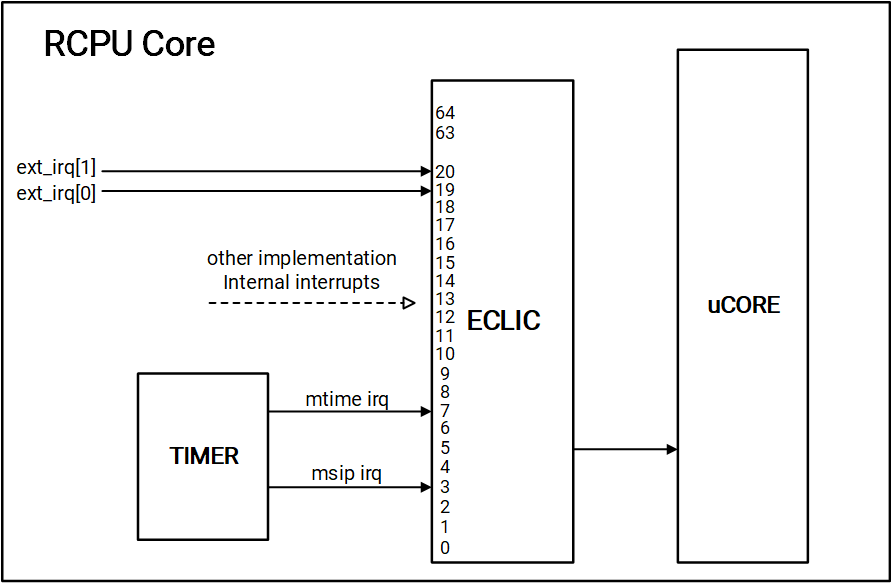
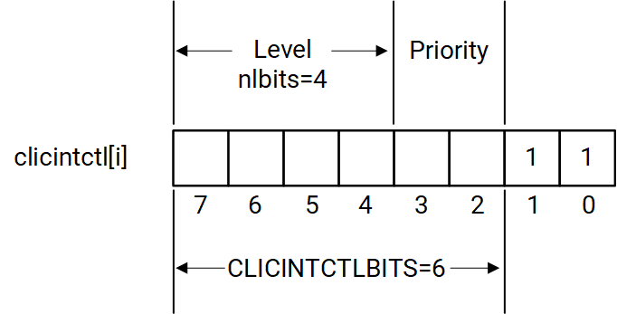
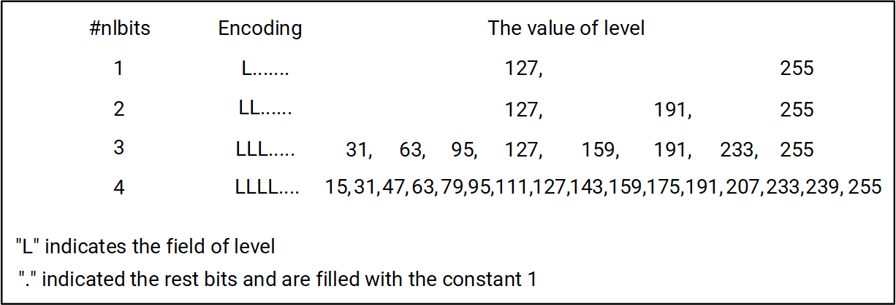

sidebar_position: 8

# 8. CPU System

## 8.1 Overview

The CPU System of K1 consists of

- A SpacemiT®X60™ RISC-V Main CPU (hereafter **CPU Subsystem**)
- A RISC-V Real-Time CPU (hereafter **RCPU**)

## 8.2 CPU Subsystem

### 8.2.1 Introduction

The **CPU Subsystem** of K1 includes the following components:

- Two X60™ clusters
- A Cache Coherency Unit
- A Dragon CIU for configuration
- Additional components to ensure high performance and system efficiency

### 8.2.2 Features

- **X60™ Clusters**

  - Each cluster contains four cores with 512KB L2 cache
  - The BOOST cluster also includes 512KB TCM
  - Each X60™ core has 32KB L1-I cache and 32KB L1-D cache

- **Cache Coherency Unit**

  - Maintenance of data coherency between X60™ clusters

- **Dragon CIU Registers**

  - Availability of multiple configuration registers for X60™ clusters and cores

- **Generic Counter Register**

  - SoC Counter Registers

### 8.2.3 Functional Description

Reserved

### 8.2.4 Generic Counter Registers Description

Starting from the **base address 0xD500_1000**, there are several **Generic Counter Registers** which configuration details are provided in the following subsections.

#### CNTCR_REG

**Offset: 0x0**

| Bits  | Field   | Type | Reset | Description |
|-------|---------|------|-------|-------------|
| 31:2  | Reserved| RO   | 0x0   | Reserved for future use |
| 1     | HDBG    | RW   | 0x0   | Halt on debug. The possible values are: - 0: HLTDBG signal into the counter has no effect - 1: HLTDBG signal into the counter halts the counter |
| 0     | EN      | RW   | 0x0   | Enable/Disable counter. The possible values are: - 0: The counter is disabled and not incrementing - 1: The counter is enabled and is incrementing |

#### CNTSR_REG

**Offset: 0x4**

| Bits  | Field    | Type | Reset | Description             |
|-------|----------|------|-------|-------------------------|
| 31:2  | Reserved | RO   | 0x0   | Reserved for future use |
| 1     | HDBG     | RW   | 0x0   | Debug halted            |
| 0     | Reserved | RO   | 0x0   | Reserved for future use |

#### CNTCVLW_REG

**Offset: 0x8**

| Bits  | Field    | Type | Reset | Description           |
|-------|----------|------|-------|-----------------------|
| 31:0  | CNTCVLW  | RW   | 0x0   | Value of counter [31:0] |

#### CNTCVUP_REG

**Offset: 0xC**

| Bits  | Field    | Type | Reset | Description             |
|-------|----------|------|-------|-------------------------|
| 31:0  | CNTCVUP  | RW   | 0x0   | Value of counter [63:32] |

#### CNTFID_REG

**Offset: 0x20**

| Bits  | Field | Type | Reset | Description                          |
|-------|-------|------|-------|--------------------------------------|
| 31:0  | FREQ  | RW   | 0x0   | Frequency in number of ticks per second |

### 8.2.5 Dragon CIU Registers Description

Starting from the **base address 0xD844_0000**, there are many **Dragon CIU Registers** which configuration details are provided in the following subsections.

#### CLUSTER0_CPU_SRAM_CTRL0_REG

**Offset: 0x14**

| Bits  | Field                        | Type | Reset      | Description                              |
|-------|------------------------------|------|------------|------------------------------------------|
| 31:0  | CLUSTER0_MEM_EMA_CFG_31_0    | RW   | 0x00035102 | MEM_EMA_CFG_31_0 for Cluster0 CPU memory |

#### CLUSTER0_CPU_SRAM_CTRL1_REG

**Offset: 0x18**

| Bits  | Field                        | Type | Reset      | Description                              |
|-------|------------------------------|------|------------|------------------------------------------|
| 31:0  | CLUSTER0_MEM_EMA_CFG_63_32   | RW   | 0x59454000 | MEM_EMA_CFG_63_32 for Cluster0 CPU memory |

#### CLUSTER1_CPU_SRAM_CTRL0_REG

**Offset: 0x54**

| Bits  | Field                        | Type | Reset      | Description                              |
|-------|------------------------------|------|------------|------------------------------------------|
| 31:0  | CLUSTER1_MEM_EMA_CFG_31_0    | RW   | 0x00035102 | MEM_EMA_CFG_31_0 for Cluster1 CPU memory |

#### CLUSTER1_CPU_SRAM_CTRL1_REG

**Offset: 0x58**

| Bits  | Field                        | Type | Reset      | Description                              |
|-------|------------------------------|------|------------|------------------------------------------|
| 31:0  | CLUSTER1_MEM_EMA_CFG_63_32   | RW   | 0x59454000 | MEM_EMA_CFG_63_32 for Cluster1 CPU memory |

#### CKG_CTRL_REG

**Offset: 0x88**

| Bits    | Field                                      | Type | Reset | Description |
|---------|--------------------------------------------|------|-------|-------------|
| 31:26   | Reserved                                   | RO   | 0x0   | Reserved for future use |
| 25:16   | CCI dynamic clock gate timer               | RW   | 0x0   | When dynamic clock gating is enabled, the CCI clock turns off after the number of cycles set by **CCI_CLKOFF_TIMER** |
| 15:4    | Reserved                                   | RO   | 0x0   | Reserved for future use |
| 3       | Dragon CIU dynamic gate enable             | RW   | 0x0   | - 0: Clock is always on - 1: Dynamic clock gating enabled |
| 2       | CCI clock dynamic gate enable              | RW   | 0x0   | - 0: Clock is always on - 1: Dynamic clock gating enabled |
| 1       | Reserved                                   | RO   | 0x0   | Reserved for future use |
| 0       | nic400_cci550_2x5 clock dynamic gate enable| RW   | 0x0   | - 0: Clock is always on - 1: Dynamic clock gating enabled |

#### CCI_DBG_CTRL_REG

**Offset: 0x90**

| Bits  | Field                                      | Type | Reset | Description |
|-------|--------------------------------------------|------|-------|-------------|
| 31:4  | Reserved                                   | RO   | 0x0   | Reserved for future use |
| 3     | Invasive debug enable                      | RW   | 0x0   | If HIGH, the counting and export of PMU events are enabled |
| 2     | Secure invasive debug enable               | RW   | 0x0   | If both SPIDEN and DBGEN are HIGH, the counting of both Non-Secure and Secure events are enabled |
| 1     | Non-Invasive debug enable                  | RW   | 0x0   | If HIGH, the counting and export of PMU events are enabled |
| 0     | Secure privileged non-invasive debug enable| RW   | 0x0   | If both SPNIDEN and NIDEN are HIGH, the counting of both Non-Secure and Secure events are enabled |

#### CCI_INF_QOS_CTRL_REG

**Offset: 0x98**

| Bits   | Field            | Type | Reset | Description                |
|--------|------------------|------|-------|----------------------------|
| 31:16  | Reserved         | RO   | 0x0   | Reserved for future use    |
| 15:12  | C1_ARQOS_CFG     | RW   | 0x0   | ALZO_ARQOS configuration   |
| 11:8   | C1_AWQOS_CFG     | RW   | 0x0   | ALZO_AWQOS configuration   |
| 7:4    | C0_ARQOS_CFG     | RW   | 0x0   | CPU ARQOS configuration    |
| 3:0    | C0_AWQOS_CFG     | RW   | 0x0   | CPU AWQOS configuration    |

#### CCI_SFRAM_CTL_REG

**Offset: 0x9C**

| Bits  | Field             | Type | Reset      | Description                     |
|-------|-------------------|------|------------|---------------------------------|
| 31:0  | MEM_EMA_CFG_31_0  | RW   | 0x00035102 | MEM_EMA_CFG_31_0 for CCI CPU memory |

#### X60_OUTER_COH_EN_CTRL_REG

**Offset: 0xF0**

| Bits  | Field                | Type | Reset | Description |
|-------|----------------------|------|-------|-------------|
| 31:2  | Reserved             | RO   | 0x0   | Reserved for future use |
| 1     | C1_cpu_outer_coh_en  | RW   | 0x1   | 0: Cluster 1 outer cache coherency disabled 1: Cluster 1 outer cache coherency enabled |
| 0     | C0_cpu_outer_coh_en  | RW   | 0x1   | 0: Cluster 1 outer cache coherency disabled 1: Cluster 0 outer cache coherency enabled |

#### FAB_TOM_RD_STS0_REG

**Offset: 0x118**

| Bits   | Field                                | Type | Reset | Description |
|--------|--------------------------------------|------|-------|-------------|
| 31:28  | Ranking number of AXI read to Monitor 1 | RO   | 0x0   | 0: No timeout occurred, write clear 1: Timeout occurred |
| 27:24  | Ranking number of AXI read to Monitor 0 | RO   | 0x0   | 0: No timeout occurred, write clear 1: Timeout occurred |
| 23:20  | Ranking number of AXI Write to Monitor 4| RO   | 0x0   | 0: No timeout occurred, write clear 1: Timeout occurred |
| 19:16  | Ranking number of AXI Write to Monitor 3| RO   | 0x0   | 0: No timeout occurred, write clear 1: Timeout occurred |
| 15:12  | Ranking number of AXI Write to Monitor 2| RO   | 0x0   | 0: No timeout occurred, write clear 1: Timeout occurred |
| 11:8   | Ranking number of AXI Write to Monitor 1| RO   | 0x0   | 0: No timeout occurred, write clear 1: Timeout occurred |
| 7:4    | Ranking number of AXI Write to Monitor 0| RO   | 0x0   | 0: No timeout occurred, write clear 1: Timeout occurred |
| 3:0    | Total timeout number                 | RO   | 0x0   | It indicates the timeout status of various ranks as follows: - RANK4: s7_sec - RANK3: s5_axidec2 - RANK2: s4_audio - RANK1: s0_mc - RANK0: s2_axidec  **Note.** 0 indicates no timeout. Write clear is required before using this register and `fab_tom_wr_sts` |

#### FAB_TOM_RD_STS1_REG

**Offset: 0x11C**

| Bits   | Field                                | Type | Reset | Description |
|--------|--------------------------------------|------|-------|-------------|
| 31:12  | Reserved                             | RO   | 0x0   | Reserved for future use |
| 11:8   | Ranking number of AXI Read to Monitor 4 | RO   | 0x0   | 0: No timeout, write clear by `FAB_TOM_RD_STS` 1: Timeout occurred |
| 7:4    | Ranking number of AXI Read to Monitor 3 | RO   | 0x0   | 0: No timeout, write clear by `FAB_TOM_RD_STS` 1: Timeout occurred |
| 3:0    | Ranking number of AXI Read to Monitor 2 | RO   | 0x0   | 0: No timeout, write clear by `FAB_TOM_RD_STS` 1: Timeout occurred |

#### FAB_TIMEOUT_CTRL_X_REG

This register controls the timeout for the AXI bus monitor on the Fabric#1 S2 port.

If there is a pending request on the AXI Fabric#1 S2 port and the request duration exceeds the timeout value, a timeout interrupt will be asserted. In particular,

- The interrupt can be de-asserted by writing a "0" to TIMEOUT_VAL
- The default timeout value is 0xC000 where one unit represents one AXI clock cycle

> **Notes.**
>
> - Only the Fabric#1 S2 port is monitored, and this feature is intended for debugging purposes
> - To ensure a proper access to the registers when a timeout occurs on the Fabric#1 S2 port, these timeout control registers should be placed alongside the SQU registers on the Fabric#1 S4 port

**Offset: 0x120–0x160 (0x10)**

| Bits    | Field                          | Type | Reset   | Description |
|---------|--------------------------------|------|---------|-------------|
| 31      | Timeout auto response type     | RW   | 0x0     | - 0: Auto response type is `SLVERR` - 1: Auto response type is `OKAY` |
| 30      | Timeout auto response enable   | RW   | 0x0     | - 0: Disable auto response when fabric timeout happens - 1: Enable auto response when fabric timeout happens (this can help taking CPU out of a hanging state) |
| 29      | Timeout interrupt mask         | RW   | 0x0     | This bit determines whether a timeout interrupt is triggered when a timeout event occurs, in particular: - 0: Interrupt is not masked (an interrupt will be asserted when the timeout event happens) - 1: Interrupt is masked (no interrupt will be asserted when the timeout event happens) |
| 28      | Fabric monitor reset           | RW   | 0x0     | - 0: Reset fabric monitor - 1: Release fabric monitor |
| 27      | Fabric monitor register clear  | RW   | 0x0     | Clear the information saved when the latest timeout occurred, in particular: - 0: The relevant registers are kept - 1: The relevant registers are cleared |
| 26      | Timeout interrupt clear        | RW   | 0x0     | - 0: No effect - 1: Auto-clear (by hardware) AXI fabric S2 port timeout interrupt |
| 25      | no_ready_check_en              | RW   | 0x0     | Enable/Disable checking `AWREADY` or `ARREADY` signals as follows: - 0: Disable - 1: Enable |
| 24      | new_feature_en                 | RW   | 0x0     | Enable/Disable the AXI fabric timeout monitor new feature as follows: - 0: Disable - 1: Enable |
| 23:16   | Reserved                       | RO   | 0x0     | Reserved for future use |
| 15      | Clock gating disable           | RW   | 0x0     | **[DOVE_A0]** Disable monitor clock gating, in particular: - 1: Clock runs freely (i.e. clock gating for monitor disabled) - 0: Clock is gated if `FAB_MON_RST == 0` |
| 14:0    | AXI fabric timeout value       | RW   | 0xC000  | This field indicates the timeout value for AXI fabric. The real timeout time is `2048 * TIMEOUT_VAL`. One unit represents one AXI clock cycle. |

#### FAB_TIMEOUT_ID_X_REG

This register provides information gathered by AXI bus monitor on the Fabric#1 S2 port, and it is updated when the first timeout event occurs.

**Offset: 0x124–0x164 (0x10)**

| Bits    | Field                     | Type | Reset | Description |
|---------|---------------------------|------|-------|-------------|
| 31      | Write timeout indicator   | RO   | 0x0   | - 0: No write request timeout - 1: Write request timeout occurs |
| 30:22   | Reserved                  | RO   | 0x0   | Reserved for future use |
| 21:16   | Timeout transaction WID   | RO   | 0x0   | It is the Write ID (WID) of a Write Transaction that triggers the first timeout event, and is valid only when bit[31], `WR_TIMEOUT_IND` is asserted |
| 15      | Read timeout indicator    | RO   | 0x0   | - 0: No read request timeout - 1: Read request timeout occurs |
| 14:6    | Reserved                  | RO   | 0x0   | Reserved for future use |
| 5:0     | Timeout transaction RID   | RO   | 0x0   | It is the Read ID (RID) of a Read Transaction that triggers the first timeout event, and is valid only when bit[15], `RD_TIMEOUT_IND` is asserted |

#### FAB_TIMEOUT_STATUS0_X_REG

This register provides information gathered by AXI bus monitor on Fabric#1 S2 port, and it is updated when the first timeout event occurs.

**Offset: 0x128–0x168 (0x10)**

| Bits   | Field                  | Type | Reset | Description |
|--------|------------------------|------|-------|-------------|
| 31:2   | Write timeout Address  | RO   | 0x0   | The write address being accessed during the first write timeout event |
| 1      | Reserved               | RO   | 0x0   | Reserved for future use |
| 0      | Write timeout Indicator| RO   | 0x0   | - 0: No write request timeout occurred - 1: Write request timeout occurred |

#### FAB_TIMEOUT_STATUS1_X_REG

This register provides information gathered by AXI bus monitor on Fabric#1 S2 port, and is updated when the first timeout event occurs.

**Offset: 0x12C–0x16C (0x10)**

| Bits   | Field                 | Type | Reset | Description |
|--------|-----------------------|------|-------|-------------|
| 31:2   | Read timeout address  | RO   | 0x0   | It is the address being accessed during the first read timeout event |
| 1      | Reserved              | RO   | 0x0   | Reserved for future use |
| 0      | Read timeout indicator| RO   | 0x0   | - 0: No read request timeout occurred - 1: Read request timeout occurred |

#### FAB_DEBUG_REG_X_REG

**Offset: 0x170–0x17C (0x4)**

| Bits  | Field                   | Type | Reset | Description |
|-------|-------------------------|------|-------|-------------|
| 31:0  | AXI fabric debug register | RO   | 0x0   | - `[0]` = `debug_axifab_cp_dec` - `[1]` = `debug_axifab_axi_dec2` - `[2]` = `debug_axifab_csap_fab` - `[3]` = `debug_axifab_vpu_lte` - `[4]` = `debug_axifab_isp_lcd` - `[5]` = `debug_axifab_cp_mfab` - `[6]` = `debug_axifab_apfab` - `[7]` = `32'h0` - `[8]` = `debug_axifab_cpu_dec` - `[9]` = `debug_axifab_cpu_gpu`  **Note.** `debug_axifab` = `mas_bready`, `mas_rready`, `slv_awready`, `slv_arready`, `slv_wready`, `clk_axi_en_nd` |

#### PAD_PIC_PLIC_INT_0_CTL_REG

**Offset: Reserved**

| Bits  | Field                    | Type | Reset | Description |
|-------|--------------------------|------|-------|-------------|
| 31:0  | pad_pic_plic_int_0_ctl_  | RW   | 0x0   | This register controls the interrupts for [31:0]. For each bit, - 0: Level-triggered interrupt - 1: Edge-triggered interrupt |

#### PAD_PIC_PLIC_INT_1_CTL_REG

**Offset: Reserved**

| Bits  | Field                    | Type | Reset | Description |
|-------|--------------------------|------|-------|-------------|
| 31:0  | pad_pic_plic_int_1_ctl_  | RW   | 0x0   | This register controls the interrupts for [63:32]. For each bit: - 0: Level-triggered interrupt - 1: Edge-triggered interrupt |

#### PAD_PIC_PLIC_INT_2_CTL_REG

**Offset: Reserved**

| Bits  | Field                    | Type | Reset | Description |
|-------|--------------------------|------|-------|-------------|
| 31:0  | pad_pic_plic_int_2_ctl_  | RW   | 0x0   | This register controls the interrupts for [95:64]. For each bit: - 0: Level-triggered interrupt - 1: Edge-triggered interrupt |

#### PAD_PIC_PLIC_INT_3_CTL_REG

**Offset: Reserved**

| Bits  | Field                    | Type | Reset | Description |
|-------|--------------------------|------|-------|-------------|
| 31:0  | pad_pic_plic_int_3_ctl_  | RW   | 0x0   | This register controls the interrupts for [127:96]. For each bit: - 0: Level-triggered interrupt - 1: Edge-triggered interrupt |

#### PAD_PIC_PLIC_INT_4_CTL_REG

**Offset: Reserved**

| Bits  | Field                    | Type | Reset | Description |
|-------|--------------------------|------|-------|-------------|
| 31:0  | pad_pic_plic_int_4_ctl_  | RW   | 0x0   | This register controls the interrupts for [159:128]. For each bit: - 0: Level-triggered interrupt - 1: Edge-triggered interrupt |

#### C0_INT_WAKEUP_MASK_REG

**Offset: 0x1A4**

| Bits   | Field                          | Type | Reset | Description |
|--------|--------------------------------|------|-------|-------------|
| 31:10  | Reserved                       | RO   | 0x0   | Reserved for future use |
| 9      | C0_ms_int_core_mask            | RW   | 0x0   | Mask for `C0_ms_int` to core: - 1: Mask - 0: Unmask |
| 8      | C0_mt_int_core_mask            | RW   | 0x0   | Mask for `C0_mt_int` to core: - 1: Mask - 0: Unmask |
| 7      | C0_ss_int_core_mask            | RW   | 0x0   | Mask for `C0_ss_int` to core: - 1: Mask - 0: Unmask |
| 6      | C0_me_int_core_mask            | RW   | 0x0   | Mask for `C0_me_int` to core: - 1: Mask - 0: Unmask |
| 5      | C0_se_int_core_mask            | RW   | 0x0   | Mask for `C0_se_int` to core: - 1: Mask - 0: Unmask |
| 4      | C0_ms_int_pmu_wakeup_mask      | RW   | 0x0   | Mask for `C0_ms_int` to PMU wakeup: - 1: Mask - 0: Unmask |
| 3      | C0_mt_int_pmu_wakeup_mask      | RW   | 0x0   | Mask for `C0_mt_int` to PMU wakeup: - 1: Mask - 0: Unmask |
| 2      | C0_ss_int_pmu_wakeup_mask      | RW   | 0x0   | Mask for `C0_ss_int` to PMU wakeup: - 1: Mask - 0: Unmask |
| 1      | C0_me_int_pmu_wakeup_mask      | RW   | 0x0   | Mask for `C0_me_int` to PMU wakeup: - 1: Mask - 0: Unmask |
| 0      | C0_se_int_pmu_wakeup_mask      | RW   | 0x0   | Mask for `C0_se_int` to PMU wakeup: - 1: Mask - 0: Unmask |

#### C1_INT_WAKEUP_MASK_REG

**Offset: 0x1A8**

| Bits   | Field                          | Type | Reset | Description |
|--------|--------------------------------|------|-------|-------------|
| 31:10  | Reserved                       | RO   | 0x0   | Reserved for future use |
| 9      | C1_ms_int_core_mask            | RW   | 0x0   | Mask for `C1_ms_int` to core: - 1: Mask - 0: Unmask |
| 8      | C1_mt_int_core_mask            | RW   | 0x0   | Mask for `C1_mt_int` to core: - 1: Mask - 0: Unmask |
| 7      | C1_ss_int_core_mask            | RW   | 0x0   | Mask for `C1_ss_int` to core: - 1: Mask - 0: Unmask |
| 6      | C1_me_int_core_mask            | RW   | 0x0   | Mask for `C1_me_int` to core: - 1: Mask - 0: Unmask |
| 5      | C1_se_int_core_mask            | RW   | 0x0   | Mask for `C1_se_int` to core: - 1: Mask - 0: Unmask |
| 4      | C1_ms_int_pmu_wakeup_mask      | RW   | 0x0   | Mask for `C1_ms_int` to PMU wakeup: - 1: Mask - 0: Unmask |
| 3      | C1_mt_int_pmu_wakeup_mask      | RW   | 0x0   | Mask for `C1_mt_int` to PMU wakeup: - 1: Mask - 0: Unmask |
| 2      | C1_ss_int_pmu_wakeup_mask      | RW   | 0x0   | Mask for `C1_ss_int` to PMU wakeup: - 1: Mask - 0: Unmask |
| 1      | C1_me_int_pmu_wakeup_mask      | RW   | 0x0   | Mask for `C1_me_int` to PMU wakeup: - 1: Mask - 0: Unmask |
| 0      | C1_se_int_pmu_wakeup_mask      | RW   | 0x0   | Mask for `C1_se_int` to PMU wakeup: - 1: Mask - 0: Unmask |

#### CPU_SYS_SW_RESET_REG

**Offset: 0x1AC**

| Bits  | Field              | Type | Reset | Description |
|-------|--------------------|------|-------|-------------|
| 31:2  | Reserved           | RO   | 0x0   | Reserved for future use |
| 1     | hap_top_sw_reset   | RW   | 0x0   | Perform a software reset on `hap_top` by first writing 1, then writing 0 |
| 0     | pic_top_sw_reset   | RW   | 0x0   | Perform a software reset on `pic_top` by first writing 1, then writing 0 |

#### C0_L2_FLUSH_CTL_RESET_REG

**Offset: 0x1B0**

| Bits | Field                        | Type | Reset | Description |
|------|------------------------------|------|-------|-------------|
| 31:5 | Reserved                     | RO   | 0x0   | Reserved for future use |
| 4    | C0_l2_hw_flush_done_mask     | RW   | 0x0   | - 0: L2 flush completion status not masked - 1: L2 flush completion status masked (i.e. `C0_l2_flush_done_status = 1`) |
| 3    | C0_l2_flush_done_status      | RO   | 0x0   | Status of the L2 flush operation: - 0: L2 flush not completed - 1: L2 flush completed |
| 2    | C0_l2_flush_hw_en            | RO   | 0x0   | Enable of hardware L2 flush: - 0: Hardware L2 flush disabled - 1: Hardware L2 flush enabled (only valid if `C0_l2_flush_ctl[0]` is 1) |
| 1    | C0_l2_flush_sw_req           | RW   | 0x0   | Software request for L2 flush: - 0: Not request a software-initiated L2 flush - 1: Request a software-initiated L2 flush (clear this bit (i.e. set to 0) after flush completes (when `C0_l2_flush_done_status = 1`)) |
| 0    | C0_l2_flush_type             | RW   | 0x0   | - 1: Hardware PMU mode - 0: Software mode |

#### C1_L2_FLUSH_CTL_RESET_REG

**Offset: 0x1B4**

| Bits | Field                        | Type | Reset | Description |
|------|------------------------------|------|-------|-------------|
| 31:5 | Reserved                     | RO   | 0x0   | Reserved for future use |
| 4    | C1_l2_hw_flush_done_mask     | RW   | 0x0   | - 0: L2 flush completion status not masked - 1: L2 flush completion status masked (i.e. `C1_l2_flush_done_status = 1`) |
| 3    | C1_l2_flush_done_status      | RO   | 0x0   | Status of the L2 flush operation: - 0: L2 flush not completed - 1: L2 flush completed |
| 2    | C1_l2_flush_hw_en            | RO   | 0x0   | Enable/Disable hardware L2 flush as follows: - 0: Disabled - 1: Enabled (only valid if `C1_l2_flush_ctl[0]` is 1) |
| 1    | C1_l2_flush_sw_req           | RW   | 0x0   | Software request for L2 flush: - 0: Not request a software-initiated L2 flush - 1: Request a software-initiated L2 flush (clear this bit (i.e. set to 0) after flush completes (when `C1_l2_flush_done_status = 1`)) |
| 0    | C1_l2_flush_type             | RW   | 0x0   | - 1: Hardware PMU mode - 0: Software mode |

#### CPU_ACCESS_DDR_REMAP_EN_RESET_REG

**Offset: 0x1B8**

| Bits  | Field                     | Type | Reset | Description |
|-------|---------------------------|------|-------|-------------|
| 31:1  | Reserved                  | RO   | 0x0   | Reserved for future use |
| 0     | cpu_access_ddr_remap_en_  | RW   | 0x1   | - 0: DDR remap disabled - 1: DDR remap enabled |

#### HAP_DM_CTL_REG

**Offset: 0x1BC**

| Bits | Field                        | Type | Reset | Description |
|------|------------------------------|------|-------|-------------|
| 31:5 | Reserved                     | RO   | 0x0   | Reserved for future use |
| 4    | C01_hap_dm_ndmreset_n_mask   | RO   | 0x0   | Enable/Disable preventing `hap_sys_apb_rst_n` and power-on cluster's `sys_apb_rst_n` from being set to 0 during SoC WDT reset caused by `hap_dm_ndmreset_n`: - 1: Enabled - 0: Disabled |
| 3    | core_iso_hold_en             | RW   | 0x0   | Enable/Disable holding the isolation of cores 1 to 7 during the SoC WDT reset caused by `hap_dm_ndmreset_n`: - 1: Enabled - 0: Disabled |
| 2    | C1_pwr_hold_en               | RW   | 0x0   | Enable/Disable holding the power to cluster 1 during the SoC WDT reset caused by `hap_dm_ndmreset_n`: - 1: Enabled - 0: Disabled |
| 1    | hap_dm_ndmreset_clr          | RW   | 0x0   | Used to clear `C01_hap_dm_ndmreset_n_mask = 1` (from `hap_dm_ctl[4]`) as follows: - First, write 1 to this bit - Then, write 0 to this bit |
| 0    | hap_dm_ndmreset_n_dis        | RW   | 0x1   | Enable/Disable the SoC WDT reset caused by `hap_dm_ndmreset_n`: - 0: Enabled - 1: Disabled |

## 8.3 Real-Time CPU

### 8.3.1 Introduction

The **Real-Time CPU (RCPU)** of K1 is a **32-bit RISC-V N308 High-Efficiency Processor Core** designed by **Nuclei System Technology Co. Ltd.**, and is used for IoT and low-power applications.

### 8.3.2 Features

- Support for 3-stage pipeline, single-issue micro-architecture
- Support for RV32I/M/A/F/D/C/P/B instruction extensions
- Support for privileged mode
- Support for low power management as follows:

  - WFI and WFE schemes to enter sleep mode
  - Two-level sleep modes: shallow & deep
- Support for 16KB D-Cache
- Support for a 64-bit Real-Time Core-Private Timer (TIMER)
- Support for an Enhanced Core-Level Interrupt Controller (ECLIC) which

  - Support for RISC-V architecturally defined software, timer and external interrupts
  - Support for configurable interrupt levels and priorities
  - Support for vectored interrupt processing mode
- Support for  Non-Maskable Interrupt (NMI)
- Support for  8 PMP entries with 4KB minimal granularity
- Support for  RISC-V debug framework

### 8.3.3 Functional Description

#### Clock Domains

The RCPU core has two asynchronous clock domains as follows:

- **Main clock domain**
  It drives most of the functional logic in RCPU, and consists of

  - The **rcpu_clk** clock as the primary working clock that drives the main domain inside RCPU, and is automatically clock-gated during sleep mode
  - The **rcpu_clk_aon** clock as an always-on clock that drives the always-on logic in RCPU, including **DEBUG**, **ECLIC**, **TIMER**
- **JTAG clock domain**
  It drives the JTAG logic of the DEBUG unit, and consist of

  - The **tck_s** clock created inside JTAG dividing by 3 the **jtag_TCK** clock

As said, both clock domains are asynchronous and an **asynchronous cross-clock domain process** has been implemented within RCPU to ensure proper operations.

The RCPU clock domains are depicted below.

#### Private Peripherals

In addition to the uCore, the RCPU hierarchy includes the following private peripherals:

- A handler of the JTAG interface and related debugging features (**DEBUG)**
- An Enhanced Core-Level Interrupt Controller (**ECLIC**)
- A Real-Time Core-Private Timer (**TIMER**)

Details are provided in the following subsections.

##### Address Spaces

Each private peripheral has its own address space as tabled below.

| Private Peripherals | Address Space Size | Offset        | Comments |
|---------------------|--------------------|---------------|----------|
| DEBUG               | 64KB               | 0x000–0xFFF   | This address space is used for debugging functionality; regular application software should **NOT** access it. |
| ECLIC               | 64KB               | 0x0000–0xFFFF |          |
| TIMER               | 64KB               | 0x000–0xFFF   |          |

##### TIMER

###### Introduction

It is used to generate the timer and software interrupts in the RCPU core. The configuration details of TIMER registers are provided in Section [Miscellaneous](3.Pinout.md#333--miscellaneous). Its key functionality are provided in the following sections.

###### Time counting

TIMER implements a 64-bit register (**mtime**) consisting of the registers

- **mtime_hi (high)**
- **mtime_lo (low)**

for counting time. In particular, **mtime** is turned on by default and continues counting time after the reset de-assertion. The increase of its frequency is controlled by

- Either the core's input signal **mtime_toggle_a**
- Or the core's always-on clock **rcpu_aon_clk**

###### Timer interrupts generation

TIMER implements a 64-bit register (**mtimecmp**) consisting of the registers

- **mtimecmp_hi (high)**
- **mtimecmp_lo (low)**

for comparing the value of **mtime**with the value of **mtimecmp**to generate or not a timer interrupt. In particular,

- If **mtimectl.CMPCLREN** = **1**, then **mtime** will be automatically cleared to zero when its value is greater than the value of **mtimecmp**, and then the timer will restart from zero.
- If **mtimectl.CMPCLREN**= **0**, then **mtime** will continue to increase normally. The software can clear the timer interrupt by modifying either the value of **mtimecmp** or **mtime**, in order to ensure that the value of **mtimecmp** is greater than the value of **mtime**.

> **Note.** The timer interrupt is connected to ECLIC for unified interrupt management.

###### Software interrupts generation

TIMER implements a register (**msip**) to generate software interrupts. With reference to its configuration details tabled in **Section 9.3.4.3.9**, only the least significant bit (LSB) is effective for this purpose, which

- Is written to **1** by the software to generate a software interrupt
- Is written to **0** by the software to clear a software interrupt

> **Note.** The software interrupt is connected to **ECLIC** as unified interrupt management.

###### Software-Reset request generation

TIMER implement a register **msftrst** to generate a software-reset request. With reference to its configuration details provided later in **Section 9.3.4.3.7**, only the most significant bit (MSB) is effective for this purpose, which

- Is written to **0x80000a5f** to generate a software-reset request (this specific value is used to avoid the random mis-operation of software writing)
- Can be clear only by a reset (when the SoC resets the core in response to a software-reset request, **msftrst** register will be reset and cleared to zero)

> **Note.** The core's output signal **sysrstreq** (active high) is used to carry out the software-reset request, and is response to it, the SoC should reset the core by asserting **rcpu_reset_n** instead of **por_reset_n**.

##### ECLIC

###### Introduction

For real-time or microcontroller applications, the fast interrupt handling scheme is very important. To address this, RCPU includes an **Enhanced Core Local Interrupt Controller (ECLIC)**, which is the optimized version of the RISC-V standard CLIC, to manage all interrupt sources. To be highlighted:

- ECLIC only serves one core and privately operates inside the core
- To enable ECLIC, set the LSB bit of CSR registers **mtvec** as ECLIC mode
- ECLIC is functionally exclusive to PLIC
- ECLIC is used to manage multiple internal and external interrupts, send interrupt requests to core, and support interrupt preemption.

The configuration details of **[ECLIC Registers](#eclic-registers)** are provided. Its key functionality are provided in the following sections.

###### Interrupt target

When ECLIC is enabled, it arbitrates interrupt sources and sends them to the processor core (the interrupt target) through a dedicated line as depicted below

###### Interrupt Source ID

ECLIC assigns a unique ID to each interrupt source for supporting up to 64 interrupts, where

- Interrupt ID from 0 to 18 are reserved for the core-specified internal interrupts. Among these, ID 3 & 7 are fixed for software interrupt and timer interrupt respectively.
- Interrupt ID greater than 18 can be used by user to connect external interrupt sources.

Details are tabled below.

| ECLIC Interrupt ID | Function             | ECLIC Interrupt Source Description |
|--------------------|----------------------|------------------------------------|
| 0                  | Reserved             | This source is not used |
| 1                  | Reserved             | This source is not used |
| 2                  | Reserved             | This source is not used |
| 3                  | Software interrupt   | Software interrupt generated by TIMER |
| 4                  | Reserved             | This source is not used |
| 5                  | Reserved             | This source is not used |
| 6                  | Reserved             | This source is not used |
| 7                  | Timer interrupt      | Timer interrupt generated by TIMER |
| 8–18               | Reserved             | This source is not used |
| 19–63              | External interrupt   | Normal external interrupt defined by user.  **Note.** Although ECLIC can support up to 4096 interrupt sources under programming mode, the actual number of supported interrupt sources is indicated in the field `clicinfo.NUM_INTERRUPT` |

###### Interrupt Level & Priority

As depicted in **[Interrupt target](#interrupt-target)**, each interrupt source of **ECLIC** can be configured with specified level and priority. The key points are as follows:

- The **clicintctl** register of each interrupt source is 8-bit width, and the number of effective bits actually implemented by the hardware is specified by the **CLICINTCTLBITS** field in the **clicinfo** register.

  **[Example]** If the value of the **clicinfo.CLICINTCTLBITS** field is 6, it means that only the upper 6-bit of the **clicintctl** register are true valid bits, and the lowest 2 bits are tied to 1, as depicted below.

  > **Note.** The **CLICINTCTLBITS** field is a constant readable value, and software cannot overwrite it. Its valid value range is **2** ≤ **CLICINTCTLBITS** ≤ **8**.
  >
- The effective bits of the **clicintctl** register are divided into

  - One dynamic field for the **interrupt level**
  - One dynamic field for the **interrupt priority**

  The width of the level field is defined by **cliccfg.nlbits**.

  **[Example]** If the value of **cliccfg.nlbits** is 4, it means that the upper 4-bit of the effective bits in **clicintctl** represent the level field, while the remaining lower effective bits represent the priority field, as depicted below.

  > **Note.** The **cliccfg.nlbits** field is both readable and writeable, which means the software can modify its value.
  >

  

About **interrupt level**:

- The value of level is read in a left-aligned manner. Except the effective bits, defined by the value of **cliccfg.nlbits**, the lower ineffective bits are all filled with the constant **1**, in particular

  - If **cliccfg.nlbits \> clicinfo.CLICINTCTLBITS**, the number of bits indicated by **nlbits** exceeds the effective bits of the **clicintctl** register, and the excess bits are filled with constant **1**
  - If **cliccfg.nlbits = 0**, the value of level will be regarded as a fixed value of **255**
  - A greater value of level corresponds to higher priority
- **Interrupt preemption**: Higher-level interrupts can preempt lower-level interrupts. When multiple interrupts are pending (**IP**=**1**), **ECLIC** performs arbitration to determine which interrupt needs to be sent to the core. The level of each interrupt source is a key factor in this arbitration process.
  An example of how the level value is decoded is depicted below.

  

Instead, about **interrupt priority:**

- The priority value is also read in a left-aligned manner. Except for the effective bits, defined by **clicinfo.CLICINTCTLBITS - cliccfg.nlbits**, the lower ineffective bits are filled with the constant **1**, in particular

  - A greater value of priority corresponds to higher priority

  > **Note.** The priority of the interrupt does not influence interrupt preemption, which means whether an interrupt can preempt another interrupt is independent of its priority value.

  When multiple interrupts are simultaneously pending, **ECLIC** needs to perform arbitration to determine which interrupt can be sent to the core. This arbitration needs to consider both the value of level and the value of priority of each interrupt source.

#### Control & Status Registers (CSRs)

Some Control & Status Registers (CSRs) are defined in the RISC-V architecture to configure or record the status of execution, where

- CSRs are internal registers within the core which uses a 12-bit encoding space to access their values
- Extended CSR registers are defined for **D-Cache Control and Maintenance (CCM)** operations, including

  - FLUSH
  - INVAL
  - LOCK
  - UNLOCK

  These operations can be performed on specific **addresses** (ADDR) or applied **globally** (ALL).

#### Performance Monitor

The RISC-V architecture defines two performance counters as follows:

- **Cycle Counter**:

  - It is a 64-bit wide clock cycle counter that tracks the number of clock cycles the core has executed. This counter continuously increases as long as the core's **rcpu_clk_aon** is on.
  - The CSR **mcycle** reflects the lower 32 bits of this counter, while the CSR **mcycleh**__reflects the upper 32 bits.

- **Instruction Retirement Counter**:

  - It is a 64-bit counter that tracks the number of instructions the core has executed successfully. The counter will increase if the processor executes an instruction successfully.
  - The CSR **minstret** reflects the lower 32 bits of this counter, while the CSR **minstreth** reflects the upper 32 bits.

Both the **Cycle Counter** and **Instruction Retirement Counter** are typically used to measure performance.

By default, the counter value starts from zero after a reset and increases continuously. In order to save power, an extra bit in the customized CSR **mcountinhibit** can pause the counter to save power when performance monitoring is not needed.

#### Low-Power Mechanism

The low-power mechanism of the RCPU core operates as follows:

- The clocks of the core's main units are automatically gated off when they are idle for reducing static power consumption.
- The core supports different sleep modes (**shallow sleep mode** or **deep sleep mode**) through **WFI (Wait For Interrupt)** and **WFE (Wait For Event)** mechanisms to achieve lower dynamic and static power consumption.

#### Clock Control

Two cases are distinguished:

- For the case that the core is waiting for an interrupt to wake up, because the core can only handle the interrupt processed and distributed by **ECLIC**, then only the interrupt, which is enabled and has a greater interrupt level than the interrupt threshold level, can wake up the core. Furthermore, whether to enable the **rcpu_clk_aon** inside the core needs to be handled carefully:

  - **TIMER** is clocked by **rcpu_clk_aon**, so if the SoC system has disabled the always-on clock **rcpu_clk_aon**, **TIMER** cannot generate timer or software interrupt because it has no working clock, and the core cannnot be woken up.
  - **ECLIC** is clocked by **rcpu_clk_aon**, so if the SoC system has disabled the always-on clock **rcpu_clk_aon**, then the external interrupt signal must keep asserted until the SoC enables the **rcpu_clk_aon** again. Otherwise, **ECLIC** cannot sample the external interrupt signal because it has no working clock, and the core cannot be woken up.
- For the case that the core is waiting for an event or NMI to wake up, if the core sampled (by the **rcpu_clk_aon**) the input signal **rx_evt** (which indicates there is one event) or the input signal **nmi** (which indicates there is one NMI), the core will be woken up. Furthermore, whether to enable the **rcpu_clk_aon** inside the core needs to be handled carefully:

  - If the SoC system has disabled the always-on clock **rcpu_clk_aon**, then the input signal **rx_evt** or **nmi** must be kept as 1 until the SoC turns on the clock **rcpu_aon_clk**. Otherwise, the core cannot sample the **rx_evt** or **nmi** as the sample logic has no working clock, and the core will not wake up.

#### Physical Memory Protection

Since the RCPU is a low-power core designed for micro-controllers, it does not support the Memory Management Unit (MMU), so all the address access operations use physical addresses. In order to perform memory access protection and isolation according to memory physical address and execution privilege mode, the RISC-V standard architecture defines a physical memory protection (PMP) mechanism.

RCPU is configured to support

- 8 PMP entries, each with 4KB minimal granularity
- The PMP TOR (Top of Range) mode

### 8.3.4 Registers Description

#### Core Control & Status Registers (CSRs)

##### mnvec

**mnvec** is a customized CSR holding the NMI entry address. When an NMI is triggered while the processor is running a program, the program is forced to jump into a new PC address, which is determined by the value of **mnvec**. And the value of **mnvec** register is controlled by the **mmisc_ctl** register.

##### msubm

**msubm** holds:

- The current machine sub-mode
- The machine sub-mode before the current trap

**Offset: 0x07C4**

| Bits   | Field | Type | Reset | Description |
|--------|-------|------|-------|-------------|
| 31:10  | Reserved | N/A | N/A | Reserved, tied to 0 |
| 9:8    | PTYP  | RW   | 0x0   | Machine sub-mode before entering the trap: - 0: Normal Machine Mode - 1: Interrupt Handling Mode - 2: Exception Handling Mode - 3: NMI Handling Mode |
| 7:6    | TYP   | RW   | 0x0   | Current sub-mode: - 0: Normal Machine Mode - 1: Interrupt Handling Mode - 2: Exception Handling Mode - 3: NMI Handling Mode |
| 5:0    | Reserved | N/A | N/A | Reserved, ties to 0. |

##### mdcause

**mdcause** is used to further record the exception difference.

**Offset: 0x07C9**

| Bits  | Field | Type | Reset | Description |
|-------|-------|------|-------|-------------|
| 31:3  | Reserved | N/A | N/A | Reserved, tied to 0 |
| 2:0   | PTYP  | RW   | 0x0   | Further record the detailed information about the exception.  When `mcause.EXCCODE=1` (instruction access fault): - 0: Reserved - 1: PMP permission violation - 2: Bus error - 3–7: Reserved  When `mcause.EXCCODE=5` (load access fault): - 0: Reserved - 1: PMP permission violation - 2: Bus error caused by core memory read - 3–7: Reserved  When `mcause.EXCCODE=7` (store/AMO access fault): - 0: Reserved - 1: PMP permission violation - 2: Bus error caused by core memory write - 3–7: Reserved |

##### mcache_ct

**mcache_ctl** is used to control the I-Cache and D-Cache features.

**Offset: 0x07CA**

| Bits    | Field  | Type | Reset | Description |
|---------|--------|------|-------|-------------|
| 31:21   | Reserved | N/A | N/A | Reserved, tied to 0. |
| 20:17   | Reserved | N/A | N/A | Reserved, tied to 0. |
| 16      | DC_EN  | RW   | 0x0   | D-Cache enable control: - 0: D-Cache disabled (default) - 1: D-Cache enabled  **Note.** When D-Cache is disabled in runtime, it just bypasses D-Cache. Users should writeback and invalidate all D-Cache before disabling it. |
| 15:1    | Reserved | N/A | N/A | Reserved, tied to 0. |
| 0       | IC_EN  | RW   | 0x0   | I-Cache enable control: - 0: I-Cache disabled (default) - 1: I-Cache enabled  **Note.** When I-Cache is disabled in runtime, it just bypasses I-Cache. Users should writeback and invalidate all I-Cache before disabling it. |

##### mmisc_ctl

**mmisc_ctl** is used to control many micro-architecture implementation-related features.

**Offset: 0x07D0**

| Bits    | Field             | Type | Reset | Description |
|---------|-------------------|------|-------|-------------|
| 31:13   | Reserved          | N/A  | N/A   | Reserved, tied to 0. |
| 12      | LDSPEC_ENABLE     | RW   | 0x0   | Enable or disable the load speculative going to memory interface: - 0: Disable - 1: Enable |
| 11      | SIJUMP_ENABLE     | RW   | 0x0   | Control the SIJUMP mode of trace: - 0: SIJUMP mode is off - 1: SIJUMP mode is on |
| 10      | IMRETURN_ENABLE   | RW   | 0x0   | Control the IMRETURN mode of trace: - 0: IMRETURN mode is off - 1: IMRETURN mode is on |
| 9       | NMI_CAUSE_FFF     | RW   | 0x0   | Control `mnvec` and `mcause.EXCCODE` of NMI: - 0: `nmvec` equals the PC address after reset, `mcause.EXCCODE` of NMI is `0x1` - 1: `nmvec` equals `mtvec`, `mcause.EXCCODE` of NMI is `0xfff` |
| 8       | CORE_BUS_ERR      | RW   | 0x0   | Control whether the bus error caused by core is an exception or interrupt: - 0: Exception - 1: Interrupt |
| 7       | Reserved          | N/A  | N/A   | Reserved, tied to 0. |
| 6       | UNALGN_ENABLE     | RW   | 0x0   | Enable or disable misaligned load/store access: - 0: Disable — accessing misaligned memory triggers an Address Misaligned exception - 1: Enable  **Note.** This field only affects load/store instructions in the I/F/D extensions. For A-extension instructions, misaligned accesses always trigger an exception. |
| 5:4     | Reserved          | N/A  | N/A   | Reserved, tied to 0. |
| 3       | BPU_ENABLE        | RW   | 0x1   | Enable or disable the BPU Unit: - 0: Disable - 1: Enable  **Note.** If BPU is disabled by software, all branches are statically predicted as taken until BPU is re-enabled. |
| 2:0     | Reserved          | N/A  | N/A   | Reserved, tied to 0. |

#### Performance Monitor CSRs

##### Introduction

RCPU supports configurable performance monitor CSR used for counting on various events for performance profiling, and their implementation follow exactly RISC-V privilege specification (user can refer to it for a detailed description).

##### mhpmcounter[i] (3 ≤ i ≤ 6)

**mhpmcounter[i] (3 ≤ i ≤ 6)** is used to record specific micro-architecture event numbers.

**Offset: 0xB00+i**

| Bits          | Field           | Type | Reset | Description |
|---------------|-----------------|------|-------|-------------|
| MXLEN-1:32    | Reserved        | RW   | 0x0   | Tied to 0 for RV32; applicable only for RV64 |
| 31:0          | mhpmcounteri    | RW   | 0x0   | Machine performance monitor counter `i`. (where 3 ≤ i ≤ 6) |

##### mhpmcounter[i] (7 ≤ i ≤ 31)

**Offset: 0xB00+i**

| Bits          | Field           | Type | Reset | Description |
|---------------|-----------------|------|-------|-------------|
| MXLEN-1:32    | Reserved        | R    | 0x0   | Tied to 0, applicable only for RV64. |
| 31:0          | mhpmcounteri    | RW   | 0x0   | Tie 0. (where 7 ≤ i ≤ 31) |

##### mhpmcounterh[i]

**mhpmcounterh[i]** is used to record the upper 32 bit numbers of specific micro-architecture event. It is only for RV32.

**Offset: 0xB80+i**

| Bits        | Field           | Type | Reset | Description |
|-------------|-----------------|------|-------|-------------|
| MXLEN-1:0   | mhpmcounterhi   | R    | 0x0   | Tied to 0, applicable only for RV32. (where 0 ≤ i ≤ 31) |

##### mcountinhibit

The counter-inhibit **mcountinhibit** CSR is a **MXLEN-bit WARL** register that controls which hardware performance-monitoring counters increment. The settings in this CSR register affect only the increment behavior of the counters, and they do not influence the accessibility of the counters, in particular:

- When the **CY**, **IR** or **HPMn** bit in the **mcountinhibit** register is clear (set to 0), the corresponding counter (**cycle**, **instret**, or **hpmcountern**) increments as usual.
- When the **CY**, **IR**, or **HPMn** bit is set (set to 1), the corresponding counter (**cycle**, **instret**, or **hpmcountern**) does not increment.

**Offset: 0x320**

| Bits        | Field   | Type | Reset | Description |
|-------------|---------|------|-------|-------------|
| MXLEN-1:7   | Reserved| R    | 0x0   | — |
| 6           | HPM6    | RW   | 0x0   | If set, the increment of the performance monitor counter 6 is stopped |
| 5           | HPM5    | RW   | 0x0   | If set, the increment of the performance monitor counter 5 is stopped |
| 4           | HPM4    | RW   | 0x0   | If set, the increment of the performance monitor counter 4 is stopped |
| 3           | HPM3    | RW   | 0x0   | If set, the increment of the performance monitor counter 3 is stopped |
| 2           | IR      | RW   | 0x0   | If set, the increment of the `instret` counter is stopped |
| 1           | Reserved| R    | 0x0   | — |
| 0           | CY      | RW   | 0x0   | If set, the increment of the `cycle` counter is stopped |

##### mhpmevent3~6

The event selector **mhpmevent3~mhpmevent31** CSR, are **MXLEN-bit WARL** registers that control which event causes the corresponding counter to increase.

### 8.3.5 Offset: 0x320+i

| Bits        | Field           | Type | Reset | Description |
|-------------|-----------------|------|-------|-------------|
| MXLEN-1:32  | Reserved        | R    | 0x0   | — |
| 31          | mevent_enable   | RW   | 0x1   | Enable the corresponding performance monitor counter increment for events in Machine Mode. |
| 30          | Reserved        | R    | 0x0   | 0 |
| 29          | sevent_enable   | RW   | 0x1   | Enable the corresponding performance monitor counter increment for events in Supervisor Mode. |
| 28          | uevent_enable   | RW   | 0x1   | Enable the corresponding performance monitor counter increment for events in User Mode. |
| 27:9        | Reserved        | R    | 0x0   | — |
| 8:4         | event_idx       | RW   | 0x0   | Detailed event selector. For instruction commit events, see **[mhpeventi[3:0]==0](#mhpeventi300)** for more details. For memory access events, see **[mhpeventi[3:0]==1](#mhpeventi301)** for more details. |
| 3:0         | event_sel       | RW   | 0x0   | - 0: Select instruction commit events (e.g., load, store, branch). See **[mhpeventi[3:0]==0](#mhpeventi300)**. - 1: Select memory access events (e.g., I-cache miss, D-cache miss). See **[mhpeventi[3:0]==1](#mhpeventi301)**. |

##### mhpmevent7~3

**Offset: 0x320+i**

| Bits        | Field    | Type | Reset | Description |
|-------------|----------|------|-------|-------------|
| MXLEN-1:0   | Reserved | R    | 0x0   | — |

##### mhpeventi[3:0]==0

Event selection value for instruction commit events are tabled below.

| `event_idx` (`mhpeventi[3:0] == 0`) | Event Name |
|---------------------------------------------|------------|
| 1   | Cycle count |
| 2   | Retired instruction count |
| 3   | Integer load instruction (includes LR) |
| 4   | Integer store instruction (includes SC) |
| 5   | Atomic memory operation (does not include LR and SC) |
| 6   | System instruction |
| 7   | Integer computational instruction (excluding multiplication/division/remainder) |
| 8   | Conditional branch |
| 9   | Taken conditional branch |
| 10  | JAL instruction |
| 11  | JALR instruction |
| 12  | Return instruction |
| 13  | Control transfer instruction (CBR + JAL + JALR) |
| 14  | — |
| 15  | Integer multiplication instruction |
| 16  | Integer division/remainder instruction |
| 17  | Floating-point load instruction |
| 18  | Floating-point store instruction |
| 19  | Floating-point addition/subtraction |
| 20  | Floating-point multiplication |
| 21  | Floating-point fused multiply-add (FMADD, FMSUB, FNMSUB, FNMADD) |
| 22  | Floating-point division or square-root |
| 23  | Other floating-point instruction |
| 24  | Conditional branch prediction fail |
| 25  | JAL prediction fail |
| 26  | JALR prediction fail |

##### mhpeventi[3:0]==1

Event selection value for instruction commit events are tabled below.

| `event_idx` (`mhpeventi[3:0] == 1`) | Event Name     |
|---------------------------------------------|----------------|
| 1                                           | Icache miss    |
| 2                                           | Dcache miss    |
| 3                                           | ITLB miss      |
| 4                                           | DTLB miss      |
| 5                                           | Main TLB miss  |

#### TIMER Registers

##### Introduction

The **base address** of **TIME** registers is **0xE003_0000**

##### mtime_lo

**Offset: 0x0000**

| Bits  | Field  | Type | Reset | Description |
|-------|--------|------|-------|-------------|
| 31:0  | mtime  | RW   | 0x0   | Reflect the lower 32-bit value of `mtime`. Shadow copy of MTIME in CLINT mode |

##### mtime_hi

**Offset: 0x0004**

| Bits  | Field  | Type | Reset | Description |
|-------|--------|------|-------|-------------|
| 31:0  | mtime  | RW   | 0x0   | Reflect the upper 32-bit value of `mtime`. Shadow copy of MTIME in CLINT mode |

##### mtimecmp_l

**Offset: 0x0008**

| Bits  | Field     | Type | Reset       | Description |
|-------|-----------|------|-------------|-------------|
| 31:0  | mtimecmp  | RW   | 0xFFFFFFFF  | Set the lower 32-bit value of `mtimecmp`. Shadow copy of MTIMECMP for Hart-0 in CLINT mode. |

##### mtimecmp_hi

**Offset: 0x000C**

| Bits  | Field     | Type | Reset       | Description |
|-------|-----------|------|-------------|-------------|
| 31:0  | mtimecmp  | RW   | 0xFFFFFFFF  | Set the upper 32-bit value of `mtimecmp`. Shadow copy of MTIMECMP for Hart-0 in CLINT mode. |

##### mtime_srw_ctrl

**Offset: 0x0FEC**

| Bits  | Field             | Type | Reset | Description |
|-------|-------------------|------|-------|-------------|
| 31:1  | Reserved          | N/A  | N/A   | Control S-mode can access this timer or not. |
| 0     | mtime_srw_ctrl    | RW   | 0x0   | Control whether S-mode can read or write timer registers: - 0: S-mode can read/write all timer registers - 1: S-mode cannot read/write timer registers |

##### msftrst

**Offset: 0x0FF0**

| Bits  | Field     | Type | Reset | Description                |
|-------|-----------|------|-------|----------------------------|
| 31    | MSFTRST   | RW   | 0x0   | Generate a software-reset request |
| 30:0  | Reserved  | N/A  | N/A   | Reserved, tied to 0.       |

##### mtimectl

**Offset: 0x0FF8**

| Bits  | Field      | Type | Reset | Description |
|-------|------------|------|-------|-------------|
| 31:3  | Reserved   | N/A  | N/A   | Reserved, tied to 0 |
| 2     | CLKSRC     | RW   | 0x0   | Select the source of increment frequency. - 1: Increment frequency is `rcpu_aon_clk` - 0: Increment frequency is controlled by `mtime_toggle_a` |
| 1     | CMPCLREN   | RW   | 0x0   | Control whether the timer count clears to zero after interrupt. - 1: `mtime` clears to zero after generating a timer interrupt - 0: Timer increases normally  **Note.** If CMPCLREN is enabled, the timer interrupt request becomes a pulse. In this case, the timer interrupt must be configured in edge-trigger mode. |
| 0     | TIMESTOP   | RW   | 0x0   | Control whether the timer counts or pauses. - 1: Timer pauses - 0: Timer increases normally |

##### msip

**Offset: 0x0FFC**

| Bits  | Field   | Type | Reset | Description |
|-------|---------|------|-------|-------------|
| 31:1  | Reserved| N/A  | N/A   | Reserved, tied to 0. |
| 0     | MSIP    | RW   | 0x0   | This bit is used to generate a software interrupt. Shadow copy of MSIP for Hart-0 in CLINT mode |

#### ECLIC Registers

##### Introduction

The **base address** of **ECLIC** registers is **0xE002_0000**

##### cliccfg

**cliccfg** is a global configurations setting register, the software can write into it.

**Offset: 0x0000**

| Bits  | Field    | Type | Reset | Description |
|-------|----------|------|-------|-------------|
| 7:5   | Reserved | R    | N/A   | Reserved, tied to 0 |
| 4:1   | nlbits   | RW   | 0x0   | Used to specify the bit-width of level and priority in the register `clicintctl[i]` |
| 0     | Reserved | R    | N/A   | Reserved, tied to 1 |

##### clicinfo

**clicinfo** is a global parameters register, the software can query it.

**Offset: 0x0004**

| Bits     | Field             | Type | Reset | Description |
|----------|-------------------|------|-------|-------------|
| 31:25    | Reserved          | R    | N/A   | Reserved, tied to 0 |
| 24:21    | CLICINTCTLBITS    | R    | N/A   | Used to specify the effective bit-width of the register `clicintctl[i]` |
| 20:13    | VERSION           | R    | N/A   | Hardware implementation version number |
| 12:0     | NUM_INTERRUPT     | R    | N/A   | Number of interrupt sources supported by the hardware |

##### mth

**mth** is used to set the target interrupt threshold level, the software can write into it.

**Offset: 0x000B**

| Bits | Field | Type | Reset | Description |
|------|-------|------|-------|-------------|
| 7:0  | mth   | RW   | N/A   | Target threshold level register. **Note.** Only when the level of the interrupt finally arbitrated by ECLIC is higher than the level in this register, the interrupt can be sent to the processor core. |

##### clicintip[i]

**clicintip[i]** is the pending flag register for the interrupt source.

**Offset: 0x1000+4*i**

| Bits | Field    | Type | Reset | Description |
|------|----------|------|-------|-------------|
| 7:1  | Reserved | RO   | N/A   | Reserved, tied to 0. |
| 0    | IP       | RW   | 0x0   | Interrupt source pending flag: - 0: interrupt is not triggered - 1: interrupt is triggered  **Note.** For edge-triggered interrupt sources, the IP bit may be cleared by the hardware automatically. |

##### clicintie[i]

**clicintie[i]** is the enable bit register for the interrupt source.

**Offset: 0x1001+4*i**

| Bits | Field    | Type | Reset | Description |
|------|----------|------|-------|-------------|
| 7:1  | Reserved | R    | N/A   | Reserved, tied to 0. |
| 0    | IE       | RW   | 0x0   | Interrupt enable bit: - 0: interrupt source is masked - 1: interrupt is enabled |

##### clicintattr[i]

**clicintattr[i]** is used to indicate the attribute of the interrupt source, the software can write into it.

**Offset: 0x1002+4*i**

| Bits  | Field   | Type | Reset | Description |
|-------|---------|------|-------|-------------|
| 7:6   | Reserved| R    | N/A   | Reserved, tied to `2'b11` |
| 5:3   | Reserved| R    | N/A   | Reserved, tied to 0 |
| 2:1   | trig    | RW   | 0x0   | Used to set the level or edge-triggered attribute of the interrupt source: - `2'b00`: Level-triggered interrupt. The IP bit reflects the interrupt source level in real time; software writes to IP are ignored and can only be cleared by deasserting the original source. - `2'b01`: Rising edge-triggered interrupt; software can set or clear the IP bit via write. - `2'b11`: Falling edge-triggered interrupt; software can set or clear the IP bit via write.  **Note.** To improve interrupt handling efficiency, when an interrupt is taken and the core jumps to the ISR, the ECLIC hardware automatically clears the IP bit—software does not need to clear it in the ISR. |
| 0     | shv     | RW   | 0x0   | Used to set whether the interrupt is vectored or non-vectored: - 0: Non-vectored mode — the core jumps to a common shared interrupt entry. - 1: Vectored mode — the core jumps directly to the target address stored in the vector table entry. |

##### clicintctl[i]

**clicintctl[i]** is the control register of the interrupt source, the software can set the level and priority into it. The level and priority field are dynamically allocated based on the value of **cliccfg.nlbits**.

**Offset: 0x1003+4*i**

| Bits                                      | Field    | Type | Reset | Description |
|-------------------------------------------|----------|------|-------|-------------|
| 7 : 7−(nlbits−1)                          | Level    | RW   | N/A   | Interrupt source level; a greater value results in higher ECLIC arbitration priority. |
| 7−(nlbits−1) : 7−(CLICINTCTLBITS−1)       | Priority | RW   | N/A   | Interrupt source priority; a greater value results in higher ECLIC arbitration priority. |
| 7−(CLICINTCTLBITS−1) : 0                  | Reserved | RO   | N/A   | Reserved, tied to 1. |
