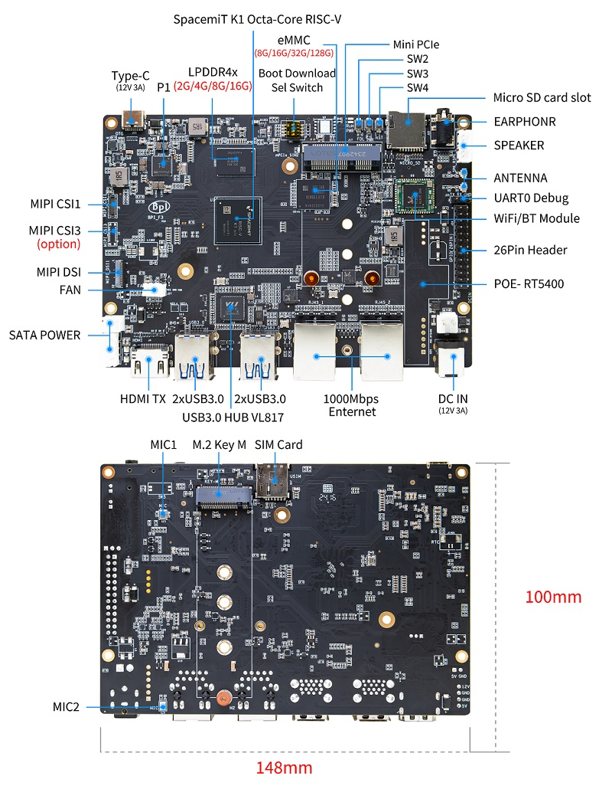
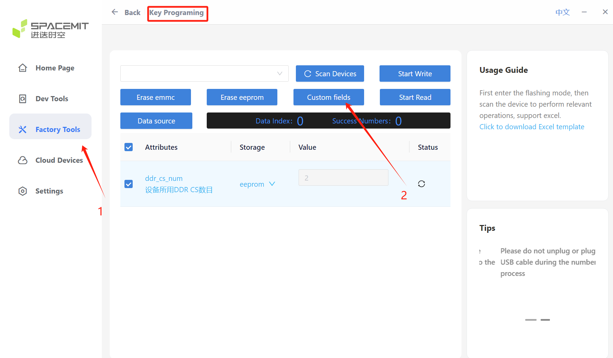
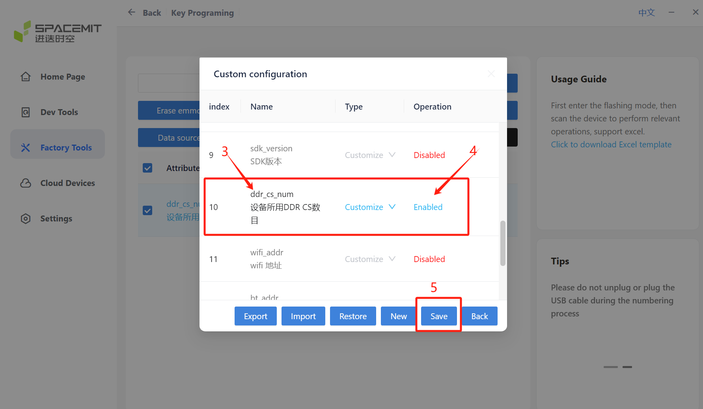
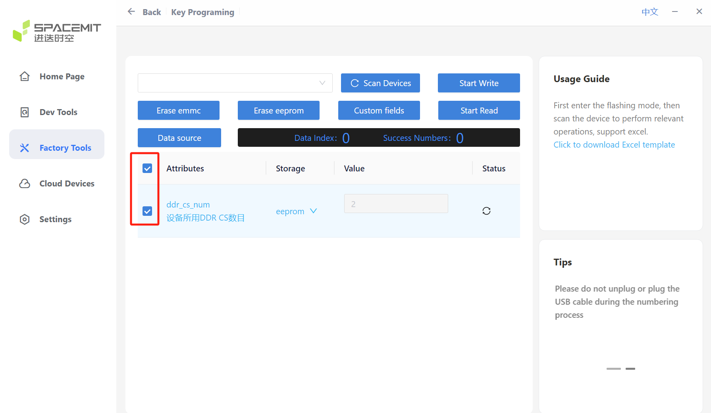

# K1 AVL Compatibility Verification Standard Operating Procedure (SOP)

## 1. Introduction

This document defines the compatibility verification methods and standard operating procedure (SOP) for key devices (LPDDR4x SDRAM, eMMC 5.1 Flash) on the Key Stone K1 platform.

### 1.1 Test Devices Requirements

- Hardware : For each device under test (LPDDR4x SDRAM, eMMC5.1 Flash), at least 10 K1 DEB1 should be configured as verification platforms.
- Cooling requirements: All test platforms should use the specified heatsink model shown below.


### 1.2 Test Environment

The test environment covers room temperature, low temperature, and temperature cycling conditions.
The operating temperature ranges are defined as follows:
- Commercial-grade devices: -20°C to 70°C
- Industrial-grade devices: -40°C to 85°C

Commercial-grade device test environment

| Environment | Conditions | Test steps and requirements |
| :--- | :--- | :--- |
| Room temperature | 25°C ± 3°C<br>Humidity: 0~90% RH | Perform testing under standard office conditions |
| Low temperature | -20°C<br>Humidity: 0% RH | Decrease temperature to -20°C at a rate of 3°C/min and maintain stability |
| High-Low temperature cycle | -20°C to 70°C<br>Humidity: 0% RH | 1. Decrease to -20°C at 3°C/min<br>2. Hold -20°C for 4 hours<br>3. Increase to 70°C at 3°C/min<br>4. Hold 70°C for 4 hours<br>5. The above steps are one cycle |

Industrial-grade device test environment

| Environment | Conditions | Test steps and requirements |
| :--- | :--- | :--- |
| Room temperature | 25°C ± 3°C<br>Humidity: 0~90% RH | Perform testing under standard office conditions |
| Low temperature | -40°C<br>Humidity: 0% RH | Decrease temperature to -40°C at a rate of 3°C/min and maintain stability |
| High-Low temperature cycle | -40°C to 85°C<br>Humidity: 0% RH | 1. Decrease to -40°C at 3°C/min<br>2. Hold -40°C for 4 hours<br>3. Increase to 85°C at 3°C/min<br>4. Hold 85°C for 4 hours<br>5. The above steps are one cycle |

## 2. Test Preparation

### 2.1 Log Recording

- Requirement: The test process must be fully monitored and serial port prints must be saved with timestamps.
- Recommended tool: [WindTerm](https://blog.csdn.net/wkd_007/article/details/130330092) (supports timestamp logging)

### 2.2 Hardware Platform Setup

- Interface definition: The interface layout of the K1 DEB1 is shown below.



- Power requirements:
  - PD 3.0 power supply or 12V DC-IN
  - Power ≥ 20W
- Debug interface:
  - Connect K1 DEB1 UART0 via 3.3V serial port
  - Used for command input and log monitoring
- Serial port settings:


### 2.3 Image Acquisition

1. Download address: [Bianbu image](https://archive.spacemit.com/image/k1/version/bianbu/)

2. Version: Select the latest release version.

   

3. Package download: Click to download one of the desktop versions (GNOME or LXQt), preferably the `.zip` package.

   

### 2.4 DDR RANK Configuration

Physical connection:

1. Connect K1 DEB1 and flashing PC with a Type-C data cable.
2. Press and hold FDL key (SW2), then press RST key (SW4) to enter flashing mode.

Flasher tool configuration for DDR CS num:

1. Click "Factory Tools".
2. In "Key Programing", click "Custom fields".

   

3. Locate ddr_cs_num.
4. Make sure it is "Enabled" (other options may show "Disabled" as pictured).
5. Click "Save".

   

6. Check ddr_cs_num as shown below.

   

### 2.5 Image Flashing

Refer to [Flasher Tool User Guide](https://spacemit.com/community/document/info?lang=zh&nodepath=tools/user_guide/flasher_user_guide.md) for image flashing details.

## 3. LPDDR4x SDRAM Compatibility Test

### 3.1 Acceptance Criteria

The test is considered passed only when all of the following conditions are met:

- Memory stress test:
  memtester runs without failure errors; the system runs stably with no error pointers or hangs.

- Cold boot test:
  The system can boot normally into the kernel shell; login is successful and lightweight memory testing runs without anomalies.

### 3.2 Test Preparation

1. Ensure the test device is connected to the Internet via Ethernet cable or Wi-Fi.
2. Install the test tool memtester:

   ```bash
   # user: root password: bianbu
   # Connect to Internet and wait for system time update before running the following command
   apt update && apt install -y memtester
   ```

### 3.3 Room-Temperature Memory Stress Test

- Environment: room temperature.
- Steps:
    1. After image flashing is completed, connect UART0 serial port and power on the system.
    2. Log in to the system shell.
    3. Run the memory stress test memtester (8 threads).
    4. Run continuously for 24 hours.
- Commands:

   ```bash
   # user: root password: bianbu
   # Test size A = (free - 100M) / 8
   memtester A &
   memtester A &
   memtester A &
   memtester A &
   memtester A &
   memtester A &
   memtester A &
   memtester A &
   ```

### 3.4 Low-Temperature Cold Boot Test

- Environment: low temperature (-20°C or -40°C).
- Steps:
    1. Place the device under test into a temperature chamber and connect power and serial port.
    2. Set the temperature chamber to target low temperature and stabilize.
    3. Power off the board and leave it off for 2 hours.
    4. Power on, boot the system, enter shell, and log in.
    5. Run a lightweight memory test.
    6. Repeat with a 2-hour interval between startups, for a total of 20 times.
- Command:

   ```bash
   # user: root password: bianbu
   memtester 10M 1
   ```

### 3.5 Low-Temperature Memory Stress Test

- Environment: low temperature (-20°C or -40°C).
- Steps:
    1. Place the device under test into a temperature chamber and connect power and serial port.
    2. Set the temperature chamber to low temperature and stabilize.
    3. Power on the system and log in.
    4. Run memory stress test (8 threads).
    5. Run continuously for 24 hours.
- Command: (same as section 3.3 Room-Temperature Memory Stress Test)

### 3.6 High-Temperature Memory Stress Test

- Environment: high temperature (70°C or 85°C).
- Steps:
    1. Place the device under test into a temperature chamber and connect power and serial port.
    2. Set the temperature chamber to high temperature.
    3. Power on the system and log in.
    4. Run memory stress test (8 threads).
    5. Run continuously for 24 hours.
- Command: (same as section 3.3 Room-Temperature Memory Stress Test)

### 3.7 High-Low Temperature Cycle Memory Stress Test

- Environment: high-low temperature cycling mode.
- Steps:
    1. Place the device under test into a temperature chamber and connect power and serial port.
    2. Set the temperature chamber to high-low temperature cycling mode.
    3. Power on the system and log in.
    4. Run memory stress test (8 threads).
    5. Follow the chamber temperature cycles and complete 10 cycles.
- Command: (same as section 3.3 Room-Temperature Memory Stress Test)

## 4. eMMC5.1 FLASH Compatibility Test

### 4.1 Acceptance Criteria

The test is considered passed only when all of the following conditions are met:

- Storage stress test:
  fio runs without crc verification errors; the system runs stably with no error pointers or hangs.

- Cold boot test:
  The system can boot normally into the kernel shell; login is successful and lightweight memory testing runs without anomalies.

### 4.2 Test Preparation

1. Ensure the test device is connected to the Internet via Ethernet cable or Wi-Fi.
2. Install the test tool fio:

   ```bash
   # user: root password: bianbu
   # Connect to Internet and wait for system time update before running the following command
   apt update && apt install -y fio
   ```

### 4.3 Image Upgrade Test

- Purpose: Verify eMMC stability during multiple image flashing cycles.
- Steps:
    1. Perform 10 consecutive image flashes on the device under test.
    2. Power on and boot the system after each flash.
    3. Check that the system can boot into Linux and log in successfully.
- Acceptance criteria:
  - All flash operations complete without exceptions.
  - The system boots normally each time.

### 4.4 Room-Temperature Read/Write Stress Test

- Environment: room temperature.
- Steps:
    1. After image flashing is completed, connect UART0 serial port and power on.
    2. Log in to the system shell.
    3. Run read/write stress test.
    4. Run continuously for 24 hours.
- Commands:

   ```bash
   # user: root password: bianbu
   # Test capacity = rootfs partition available space * 70%
   echo 2 | sudo tee /proc/sys/kernel/perf_user_access

   fio -name=rand-RW -direct=1 -iodepth=64 -rw=randrw -rwmixread=60 -rwmixwrite=40 -ioengine=libaio -bs=128k -size=10G -numjobs=1 -runtime=48h -time_based -directory=/root/ -filename=fio-rand-RW --verify=crc32
   ```

### 4.5 Low-Temperature Read/Write Stress Test

- Environment: low temperature (-20°C or -40°C).
- Steps:
    1. Place the device under test into a temperature chamber and connect power and serial port.
    2. Set the temperature chamber to low temperature and stabilize.
    3. Power on the system and log in.
    4. Run read/write stress test.
    5. Run continuously for 24 hours.
- Command: (same as section 4.4 Room-Temperature Read/Write Stress Test)

### 4.6 High-Temperature Read/Write Stress Test

- Environment: high temperature (70°C or 85°C).
- Steps:
    1. Place the device under test into a temperature chamber and connect power and serial port.
    2. Set the temperature chamber to high temperature.
    3. Power on the system and log in.
    4. Run read/write stress test.
    5. Run continuously for 24 hours.
- Command: (same as section 4.4 Room-Temperature Read/Write Stress Test)

### 4.7 Low-Temperature Cold Boot Test

- Environment: low temperature (-20°C or -40°C).
- Steps:
    1. Place the device under test into a temperature chamber and connect power and serial port.
    2. Set the temperature chamber to target low temperature and stabilize.
    3. Power off the board and leave it off for 2 hours.
    4. Power on the system and log in.
    5. Run a lightweight test command.
    6. Repeat with a 2-hour interval between startups, for a total of 20 times.
- Command:

   ```bash
   # user: root password: bianbu
   memtester 10M 1
   ```

### 4.8 High-Low Temperature Cycle Read/Write Stress Test

- Environment: high-low temperature cycling mode.
- Steps:
    1. Place the device under test into a temperature chamber and connect power and serial port.
    2. Set the temperature chamber to high-low temperature cycling mode.
    3. Power on the system and log in.
    4. Run read/write stress test.
    5. Follow the chamber temperature cycles and complete 20 cycles.
- Commands:

   ```bash
   # user: root password: bianbu
   # Test capacity = rootfs partition available space * 70%
   echo 2 | sudo tee /proc/sys/kernel/perf_user_access

   fio -name=rand-RW -direct=1 -iodepth=64 -rw=randrw -rwmixread=60 -rwmixwrite=40 -ioengine=libaio -bs=128k -size=10G -numjobs=1 -runtime=100h -time_based -directory=/root/ -filename=fio-rand-RW --verify=crc32
   ```
