# K1 Chip Hardware Design Guide

```
Latest Version: 2024/03/12
```
---

## 1. Schematic Design

### 1.1 Minimal System External Circuit Requirements

#### 1.1.1 DDR Circuit Design

- Supports LPDDR4 and LPDDR4x.
  - Pull **DDR_LP4x_SEL** down to GND for **LPDDR4** mode.
  - Pull **DDR_LP4x_SEL** up to **AVDD18_DDR** for **LPDDR4x** mode.
- Connect an external **240Ω ±1% resistor (ZQ)** from the ZQ pin to GND.

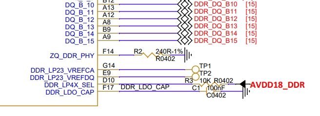

> **Important:**  
> **DDR routing must exactly match our reference design.**  
> Refer to the hardware section of the official release package for the full schematic and layout files.

#### 1.1.2 Reset Circuit

- Hardware reset is **active-low** and controlled externally.
- Add a **10nF capacitor** on the reset pin to suppress signal bounce and improve noise immunity, preventing unintended resets.
- The pull-up voltage for **RESET_IN_N** must match the I/O power domain—i.e., pull up to **VCC18_GPIO**.
- Connect **P1’s PGOOD** signal directly to **K1’s RESET_IN_N** to enable combined reset of K1 + P1 via the reset button.
- If sharing the reset line with other sources, use a **NAND gate or diode-based isolation** circuit.

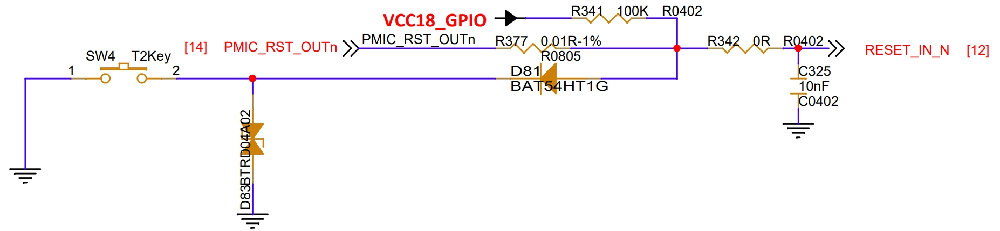


#### 1.1.3 JTAG Interface

- Supports **Primary JTAG** and **Sec2 JTAG**.
- Connect **TDI, TMS, TCK, TDO**, plus **Power** and **GND**, to a J-Link debugger. Ensure signal levels match the Power rail voltage.
- **TRSTn** should connect to the J-Link or be pulled up to Power.
- For **Sec2 JTAG**, pull **JTAG_SEL** high.
- Sec JTAG supports **X60** or **N308 CPU**, selected via **MMC1_SD_CMD**.


#### 1.1.4 Power Management (PMIC) Circuit Design

- Recommended input voltage for **P1**: **4V**.
  - **Vin3/Vin4** and **Vin5/Vin6** must follow the reference PCB layout with isolated inputs.
- Add a **220pF capacitor** by default on **SW3–SW6** outputs.
- **FB** and **FBGND** pins of **BUCK1/2** must connect directly to the corresponding pins on the main SoC. Keep these traces **away from noisy signals** during layout.

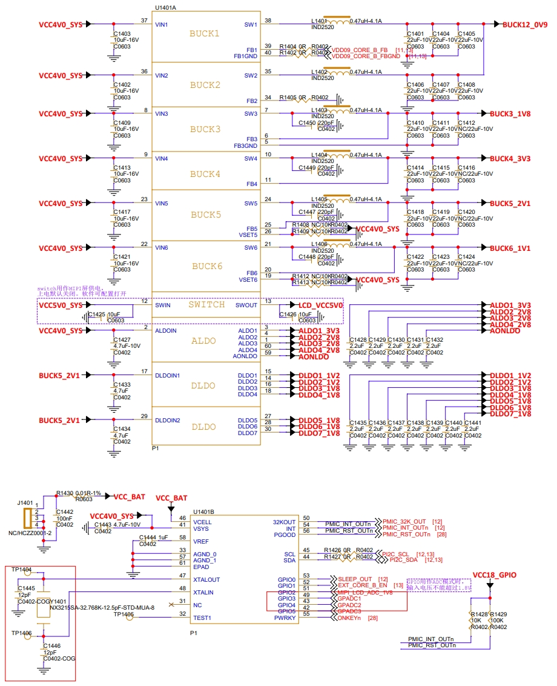

> **Important:**  
> **The entire P1 surrounding circuit must exactly copy our reference design.**  
> See the hardware section of the release package for reference files.

#### 1.1.5 Hardware Boot Configuration (Strap Pins)

| Signal Name                     | Direction | Function |
|-------------------------------|-----------|----------|
| **QSPI_DATA3 / Strap3 (FDL)** | Input     | Boot vs. Download mode<br>• `0`: Boot<br>• `1`: Download |
| **QSPI_DATA2 / Strap2**       | Input     | Download interface<br>• `0`: USB (USB0)<br>• `1`: UART (UART0) |
| **QSPI_DATA1 / Strap1**<br>**QSPI_DATA0 / Strap0** | Input | Boot device selection<br>• `00`: eMMC<br>• `01`: SPI NOR<br>• `10`: SPI NAND<br>• `11`: SD Card |
| **GPIO_90 / Strap4**          | Input     | Flash voltage selection<br>• `0`: 1.8V<br>• `1`: 3.3V |
| **JTAG_SEL**                  | Input     | Sec JTAG enable<br>• `0`: Other functions<br>• `1`: SEC JTAG |
| **MMC1_SD_CMD**               | Input     | JTAG routing<br>• `0`: X60<br>• `1`: N308 |


#### 1.1.6 Clocking Circuit

**System Clock (24MHz Crystal)**  
- The SoC uses an internal feedback loop with an external **24MHz crystal**.
- Choose load capacitors per the crystal datasheet; **12pF is recommended**.
- Place a **1MΩ resistor in parallel** between **XIN** and **XOUT** as a precaution.


> **Note:**  
> - Use **NPO/C0G-type capacitors** matched to the crystal’s specified load capacitance.  
> - Prefer a **4-pin surface-mount crystal** with two dedicated GND pins. Connect these GND pins solidly to the board ground plane to improve ESD resilience.


#### 1.1.7 FLASH Schematic Design

- The **Quad-SPI** interface supports up to four bidirectional data lines.
- Compatible with both **SPI NOR** and **SPI NAND** flash devices.
- Supports **1.8V or 3.3V** flash—set according to the **VCC1833_QSPI** supply level.
- The **QSPI_DAT[3:0]** pins are **strapped pins** used for boot configuration (see Section 1.1.5). Route them in **Fly-by topology** on the PCB.


> **Note:**  
> No external pull-ups are needed on QSPI data lines—the SoC has internal pull-ups/downs. However, because these pins double as strap inputs, you **must** add external pull-up/down resistors based on your boot configuration (refer to Section 1.1.5).


#### 1.1.8 eMMC Interface

- Compliant with **8-bit eMMC 5.1** specification.
- Also supports **SPI mode**.
- It’s recommended to **reserve pads for optional pull-up/down resistors** on **eMMC Data** and **DS** lines (leave unpopulated if unused).
- Maintain **tight length matching** during layout.


### 1.2 Power Supply Design Recommendations

#### 1.2.1 CORE Power

- Typical voltage: **0.9V – 1.05V**, dynamically adjusted via P1’s remote feedback loop.
- Powered by **merged BUCK1 + BUCK2 outputs** from P1.
- **Do not modify** the number or values of filter capacitors—they are PI-simulated. Always follow the latest reference schematic.

#### 1.2.2 DDR Power

- Supports **LPDDR4 (1.1V)** and **LPDDR4x (0.6V)**.
- DDR chip VDD and SoC DDR I/O must share the **same power net**.
- Filter capacitor count and values are PI-optimized—**strictly follow the reference schematic**.

#### 1.2.3 I/O Power

- **VCC18_GPIO**: Connect to **1.8V digital supply**.
- The following rails support **either 1.8V or 3.3V**, depending on your peripheral:
  - **VCC1833_GPIO2** (GPIO75–80)
  - **VCC1833_GPIO3** (GPIO47–52)
  - **VCC1833_MMC1** (MMC1_DAT[0:3], CMD, CLK)
  - **VCC1833_QSPI** (QSPI_DAT[0:3], CLK, CS1)
- Place **0.1µF + 1µF decoupling capacitors** close to each of these pins:


> **Note 1:**  
> **GPIO90** sets the QSPI flash voltage:
> - Pull **GPIO90 to 1.8V** → **VCC1833_QSPI = 3.3V**
> - Pull **GPIO90 to GND** → **VCC1833_QSPI = 1.8V**

> **Note 2:**  
> Even if GPIOs or modules (e.g., HDMI, PCIe, USB3.0, MIPI CSI/DSI, eMMC, USB2.0) are unused, **their power supplies must still be connected and powered**.

#### 1.2.4 PLL Power Supplies

K1 has two PLL supplies:
- **AVDD09_PLL**: Isolate using a **ferrite bead** (120Ω @ 100MHz, DC resistance ≤0.07Ω).
- **AVDD18_PLL**: Isolate the 1.8V rail using a similar ferrite bead.

Refer to the latest P1 schematic for implementation.

#### 1.2.5 Power-Up/Down Sequencing

- Sequencing of **CORE**, **DDR**, and **I/O** rails is managed by **PMIC P1**.
- Follow the reference schematic precisely.


#### 1.2.6 Remote Feedback for Dynamic Voltage Scaling

- **Core voltage must support dynamic scaling** via feedback from the SoC.
- Route:
  - **VDD09_CORE_B_FB** ← from SoC ball **VCC_M1_FB**
  - **VDD09_CORE_B_FBGND** ← from SoC ball **VSS_FB**

  
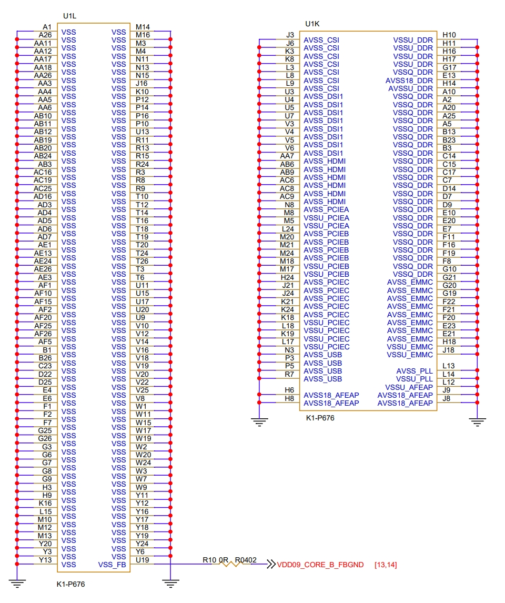


### 1.3 Analog Interface Design

#### 1.3.1 Audio Power Supplies

- **AUD_VDDU09**, **AVDD18_AUD**, and **AVDD33_AUD** must be isolated from digital supplies using **120Ω @ 100MHz ferrite beads**.

#### 1.3.2 I2S Interfaces

- Four I2S interfaces:
  - **I2S0/I2S1**: Controlled by main CPU (**X60**)
  - **R_I2S2/R_I2S3**: Controlled by RCPU (**N308**)
- Each can be configured as master or slave.

#### 1.3.3 MIPI CSI RX Interface

Supports:
- **4+4 lanes**, or
- **4+2+2 lanes** (enables 3 cameras simultaneously; ISP processes only 2 streams—the third must be raw/YUV data dumped via CCIC DMA to DDR).

Clock domains:
- **MIPI_CSI1**: All 4 data lanes clocked by **MIPI_CSI0_CK1XP/N**
- **MIPI_CSI2 (2-lane)**: Lanes **D2/D3** use **MIPI_CSI2_CKP/N**
- **MIPI_CSI3**:
  - **2-lane**: **D0/D1** use **MIPI_CSI3_CKP/N**
  - **4-lane**: **D0–D3** use **MIPI_CSI3_CKP/N**

Power filtering:
- **AVDD09_CSI**: Ferrite bead isolation + **two 1µF caps** at SoC pins.
- **AVDD18_CSI**: Ferrite bead isolation + **one 1µF cap** at SoC pins.

#### 1.3.4 MIPI DSI TX Interface

- Built-in MIPI D-PHY for LCD panels.
- **AVDD18_DSI** must be isolated from digital supply using a **ferrite bead**.
- See reference schematic for full details.

#### 1.3.5 SPI LCD Interface

- Supports 1-wire serial SPI display.
- Data line: **SPILCD_DOUT0** or **SPILCD_DIN**.
> **Note:** **LCD_TE** cannot be shared between SPI LCD and MIPI DSI LCD.

#### 1.3.6 HDMI Interface

- Includes integrated HDMI PHY.
- Analog supplies:
  - **AVDD33_HDMI** & **AVDD18_HDMI**: Isolate with ferrite beads.
  - Place **two 1µF caps** near SoC pins.
  - **AVDD33_HDMI** must be driven through a **MOSFET switch** from 3.3V.
- Add **ESD protection** near the HDMI connector:
  - Use ESD diodes with **<0.3pF parasitic capacitance**.
- Level-shift control signals:
  - **HDMI_SCL/SDA** → **5V**
  - **HDMI_CEC** → **3.3V**
  - **HDMI_HPD** (input) → shift down to **1.8V** before SoC


> Full schematic details available in the K1 reference design package.

### 1.4 Peripheral Interface Guidelines

#### 1.4.1 USB 2.0

- Three ports: **USB2.0-0**, **USB2.0-1**, **USB2.0-2**
  - **USB2.0-0** and **USB2.0-2** support OTG.
  - **USB2.0-0** is the **download port**.
- **AVDD33_USB**: Connect to 3.3V via a **3.3Ω resistor**, with **three 0.1µF caps** near the pin.
- Add **ESD protection** near the connector:
  - Parasitic capacitance **<1pF**


#### 1.4.2 PCIe

- Three interfaces:
  - **PCIEA**: x1
  - **PCIEB**: x2
  - **PCIEC**: x2
- Power rails:
  - **AVDD09_PCIE[A/B/C]**: Merge supplies, isolate with ferrite bead, place **three 1µF caps** per rail near SoC.
  - **AVDD18_PCIE[A/B/C]**: Same approach.
> **Critical:** Regardless of whether you use PCIe or USB3.0, **PCIEA_R_EXT must be pulled up to AVDD09_PCIE via a 240Ω ±1% resistor.**

Signal routing:
- **RX±**:
  - To IC/module: Add **220nF AC-coupling cap at receiver end**.
  - To PCIe slot: Connect **directly** (no cap).
- **TX±**: Always add **220nF AC-coupling cap at K1 side**.
- **REFCLK±** options:
  1. K1 provides clock → direct connection.
  2. External device provides clock → add **49.9Ω pull-down** at source. Clock tolerance: **±300ppm**.

#### 1.4.3 UART

- **12 UARTs total**:
  - **X60 UARTs (10)**: 
    - UART0: 2-wire debug
    - UART1–9: 4-wire (UART3 supports secure domain)
  - **N308 UARTs (2)**: Not currently supported—contact FAE before use.

#### 1.4.4 I²C

- **10 I²C buses**:
  - **AP I²C (8)**: I2C0–I2C7 (I2C0/1/7 for camera control)
  - **HDMI I²C (1)**: HDMI_I2C
  - **PWR I²C (1)**: For PMIC configuration

#### 1.4.5 MMC

- Two interfaces:
  - **MMC1**: Supports **1.8V or 3.3V**
  - **MMC2**: **1.8V only**
- Both support **SD card** and **SDIO Wi-Fi**.

#### 1.4.6 USB 3.0

- One USB3.0 port, **shared with PCIEA**.
- ESD protection near connector: **<0.5pF** parasitic capacitance.
- AC coupling:
  - **RX±**: 
    - To IC/module → **100nF cap at receiver**
    - To socket → **direct connection**
  - **TX±**:
    - To IC/module → **100nF cap at K1**
    - To socket → **100nF cap near socket**

> **Reminder:** **PCIEA_R_EXT must always be pulled up to AVDD09_PCIE via 240Ω ±1% resistor**, whether using USB3.0 or PCIe.

## 2. PCB Layout Guidelines

### 2.1 Stackup Design

Impedance control is critical for high-speed signals. The stackup must support all required impedances (single-ended and differential, outer and inner layers), considering manufacturing limits on min trace width/spacing.

**Design principles:**
1. Place a **solid ground plane** adjacent to component layers.
2. Keep all signal layers next to a ground plane.
3. Avoid placing two signal layers directly adjacent.
4. Route high-current power next to ground planes.
5. Use a **symmetrical stackup**.

K1 uses a **6-layer stackup** (reference shown below). If using a different stackup, recalculate impedances with your PCB vendor.

- **Signal layers**: L1, L3, L4, L6  
- **Reference planes**: L2 (GND), L5 (GND)


### 2.2 General Routing Guidelines

1. Avoid **90° or sharp angles** in traces.
2. Keep traces away from **clock sources**, **switching regulators**, and **magnetic components**.
3. Ensure **continuous reference planes** under all high-speed signals.
4. In BGA breakout zones, **stitch split planes** with traces:

   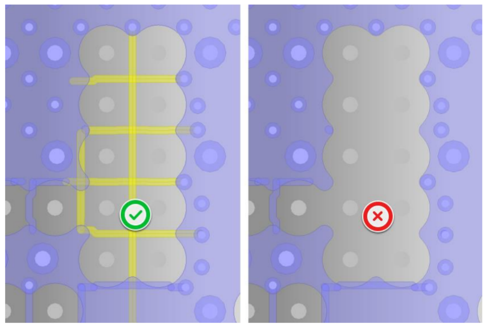

5. Minimize **stub lengths**—ideally **zero**:

   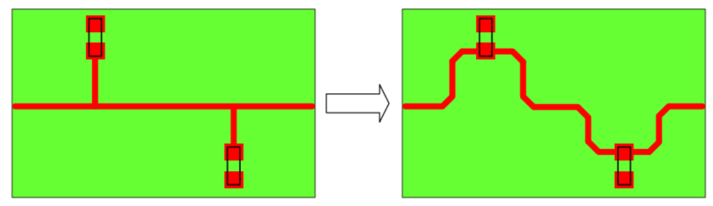

#### High-Speed Routing Best Practices

1. When changing layers, add **ground vias near signal vias** to maintain return path continuity:

   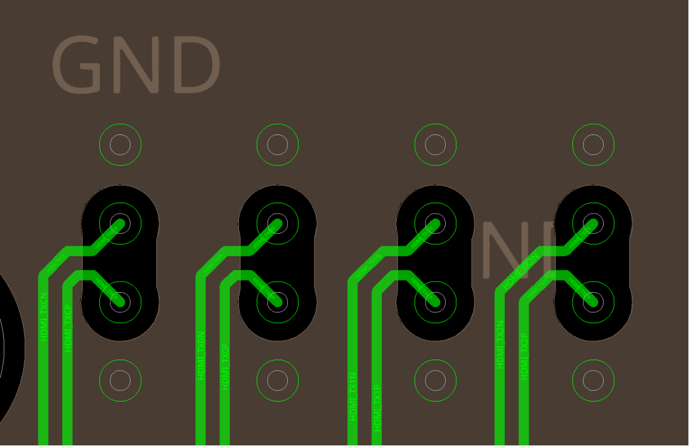

2. Under SMD pads (ESD diodes, caps, connectors, etc.), **remove reference plane copper** to reduce impedance discontinuity:

   

3. **Mitigate fiberglass weave effect** (critical at ≥8 GT/s and >1.5" traces):
   - **Option A**: Route traces at **10° angle** to weave, or rotate PCB material 10° during fabrication.
   - **Option B**: Use **zigzag routing** (W ≥ 3× weave pitch; recommended: W=60mil, θ=10°, L=340mil)

     
   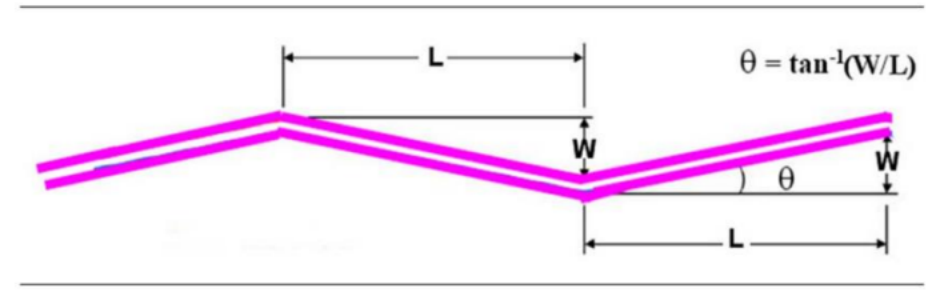

4. Minimize layer transitions; if needed, **reduce via stub length**.
5. For **8 GT/s interfaces**, use **dog-bone via structures** on differential pairs. Example (EVB HDI):
   - Drill radius: **4 mil**
   - Pad radius: **16 mil**
   - Diff pair spacing: **30 mil**
   - Anti-pad (top-bottom): **15 mil**
   - Signal-to-ground via spacing: **30 mil**

   

6. Keep **P/N skew ≤5 mil**. When adding serpentine for length matching, follow this geometry to minimize impedance impact:

   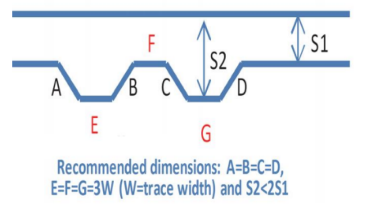

### 2.3 Power & Decoupling Design

1. Place **decoupling caps as close as possible** to pins; use **short, wide traces** to vias.
2. Keep **power delivery paths short and wide**—avoid fragmented planes.
3. **Do not remove or reduce** any capacitors from the reference design.
4. Follow reference **via patterns** for power and ground—do not omit vias.

  


### 2.4 P1 PMIC Layout

1. Fill **thermal pad** with a grid of **ground vias**:

   

2. Keep **Vin for BUCK3–6 separate** (no merged copper); **BUCK1/2 can be merged**. Use **3 vias per pin**:

   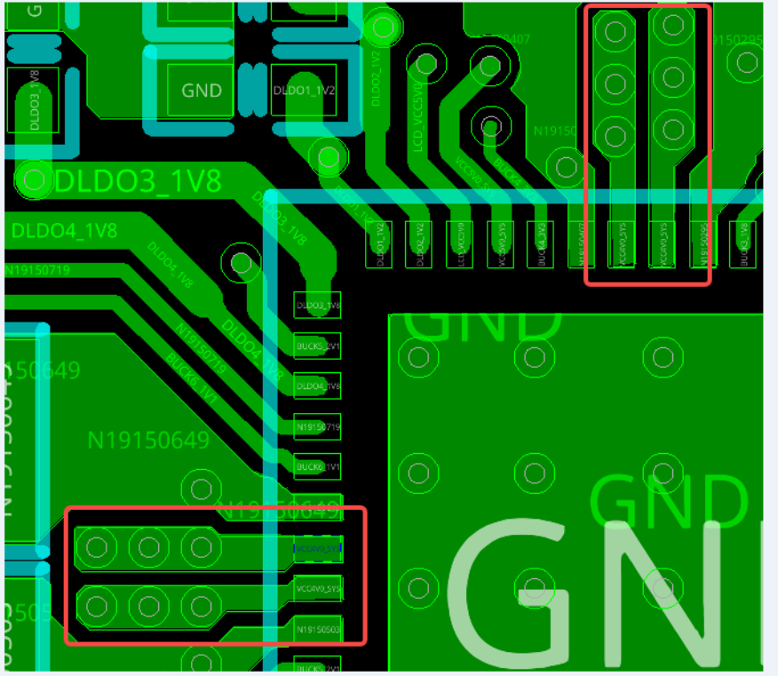

3. Route **FB traces on inner layers**, away from **SW nodes**:

   

4. Place **filter caps close to SoC**; use **wide traces**:

   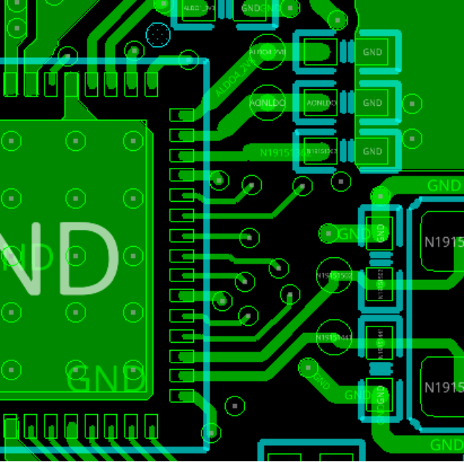

5. **Short, wide copper** for **SW nets**; keep other signals far away:

   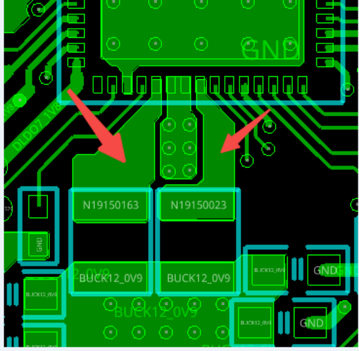

### 2.5 Minimal Subsystem (CPU + DDR + eMMC)

> **Strongly recommend using our reference board design**, which is simulation- and test-validated. Custom designs require full SI/PI simulation and carry high risk.

#### 2.5.1 CPU Layout

1. Outer ball row: fan out with **5mil traces** on top layer. Second row: route between first-row balls.
   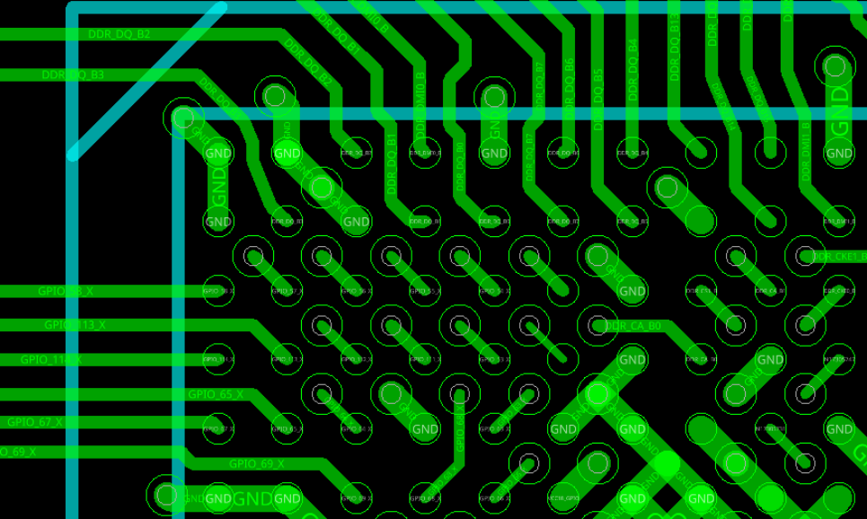 
2. Inner balls: if outer rows are used, route inner signals to **inner layers**. Place vias **regularly** to preserve large ground/power plane areas.
   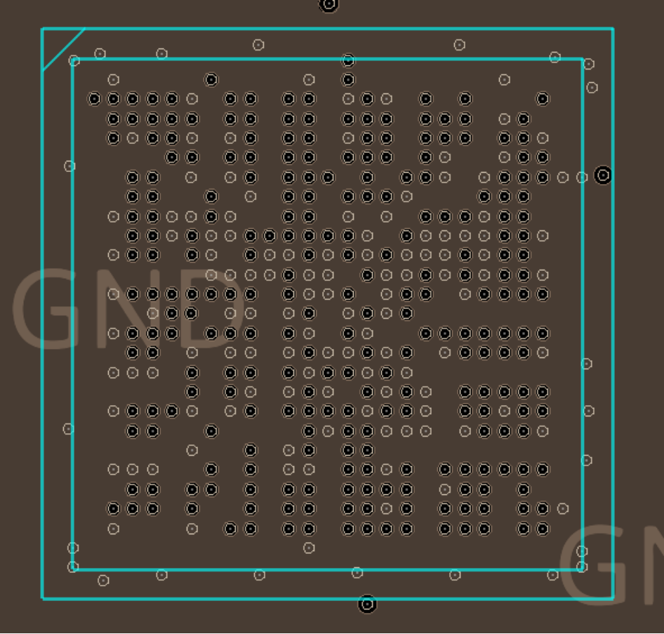
3. Maintain **large, uninterrupted power planes** with strategic via placement.
   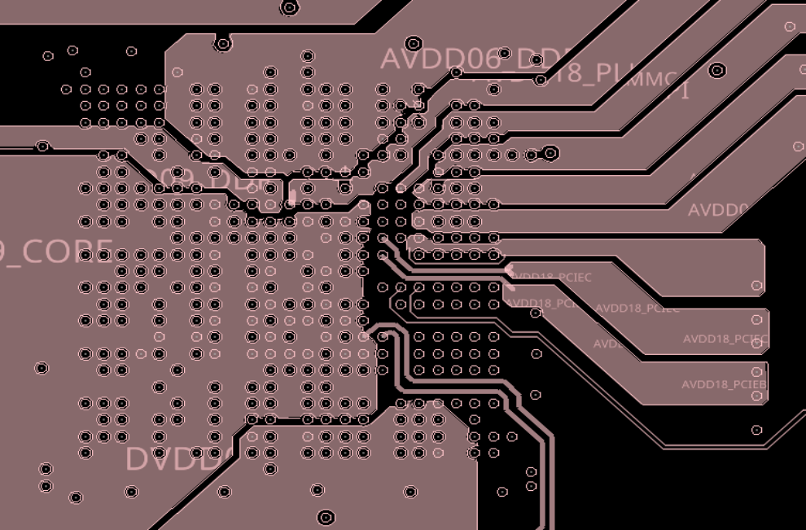
4. Place **decoupling caps on backside** under CPU—maximize count where space allows.
   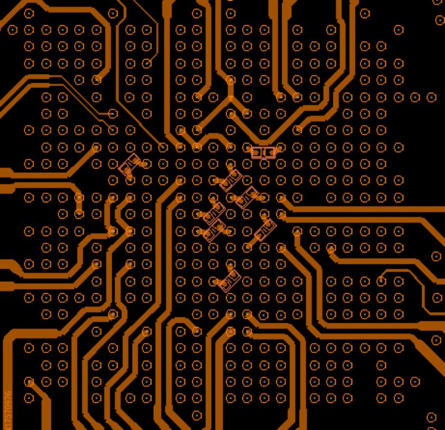
5. Use **necked traces** only within CPU escape zone; restore full width afterward.
   
6. Connect top-layer power and ground islands with **short, wide straps**.
   
7. Route **core feedback lines** from the **farthest point** of the power delivery network, with minimal layer changes.

#### 2.5.2 DDR Layout (6-layer)

- Route DDR signals on **L1 and L4**, referencing **solid GND planes on L2/L5**.
- Impedance & spacing rules:

| Parameter | Requirement |
|--------|-------------|
| Single-ended impedance | 50Ω ±10% |
| Differential impedance | 90Ω ±10% |
| Inter-byte spacing | ≥3× trace width |
| Intra-byte spacing | ≥2× trace width |
| P/N skew | ≤5 mil |
| Byte-to-CLK skew | ≤50 mil |

> **Use our validated DDR template and firmware.** If designing custom, simulate thoroughly before fabrication.

Additional tips:
- Do **not remove GND vias** at CPU/DDR—follow template exactly.
   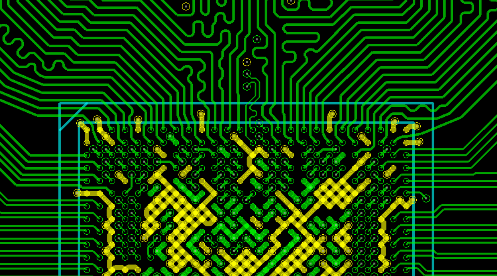
   
   

- For length tuning, maintain **S ≥ 3W** to reduce crosstalk.
   

- Place **one GND via per DDR pin**; add more where space allows.
- Optimize via placement to **minimize plane splits**.
  

- Use **≥1 via per cap pad** (2 vias for 0603/0805).
   

#### 2.5.3 eMMC Layout

- Follow reference board spacing if possible.
- If custom: keep **CPU-to-eMMC trace length ≤1500 mil**.
- Match **D0–D7, RE, WE** to **CLK** within **≤100 mil**.

### 2.6 Interface-Specific Layout Rules

#### 2.6.1 GMAC

| Parameter | Requirement |
|---------|-------------|
| Impedance | 50Ω ±10% (single-ended) |
| CLK-data skew | <100 mil |
| Max trace length | <4000 mil |
| Trace spacing | ≥3× trace width |

#### 2.6.2 SDIO

- **No stubs** allowed.
- Reference **solid GND**.
- **≤4 vias** per signal.
- **Ground shielding** recommended:
  - Ideal: each signal (CLK, CMD, D0–D3) individually shielded.
  - Acceptable: CLK/CMD shielded separately; D0–D1 grouped; D2–D3 grouped.

| Parameter | Requirement |
|---------|-------------|
| Impedance | 50Ω ±10% |
| CLK-data skew | <100 mil |
| Max length | <2500 mil |
| Spacing | ≥3× trace width |

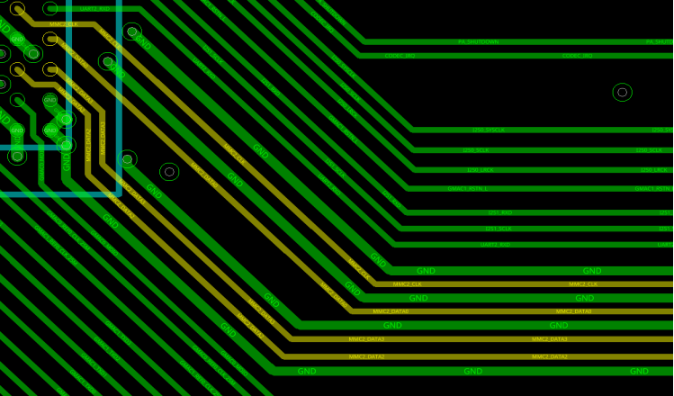

#### 2.6.3 USB 2.0

| Parameter | Requirement |
|---------|-------------|
| Impedance | 90Ω ±10% (diff) |
| P/N skew | ≤5 mil |
| Max length | <5000 mil |
| Diff pair spacing | ≥3× trace width |
| To other signals | ≥3× trace width |
| Vias | ≤3 |

#### 2.6.4 USB 3.0

| Parameter | Requirement |
|---------|-------------|
| Impedance | 90Ω ±10% |
| P/N skew | ≤5 mil |
| Max length | <5000 mil |
| Diff pair spacing | ≥4× trace width |
| To other signals | ≥4× trace width |
| Vias | ≤2 |

#### 2.6.5 PCIe

- Remove reference plane under pads (“anti-pad”).
- Ensure **no reference plane crossing**.
- Surround with **ground vias/shields**.

| Parameter | Requirement |
|---------|-------------|
| Impedance | 90Ω ±10% |
| P/N skew | ≤5 mil |
| Max length | <4000 mil |
| Diff pair spacing | ≥5× trace width |
| To other signals | ≥5× trace width |
| Vias | ≤2 |


#### 2.6.6 HDMI

| Parameter | Requirement |
|---------|-------------|
| Impedance | 90Ω ±10% |
| P/N skew | ≤5 mil |
| Max length | <4000 mil |
| Spacing | ≥5× trace width |
| Vias | ≤2 |


#### 2.6.7 MIPI

| Parameter | Requirement |
|---------|-------------|
| Impedance | 90Ω ±10% |
| P/N skew | ≤5 mil |
| CLK-data skew | ≤50 mil |
| Max length | <5000 mil |
| Spacing | ≥4× (min 3×) trace width |
| Vias | ≤2 (recommended) |


#### 2.6.8 Audio

1. Ground thermal pad with **via array**.
2. Route **GMS0/GMS1** with **10mil width**.
3. **Ground-shield** LOUT, ROUT, GMS0, GMS1.

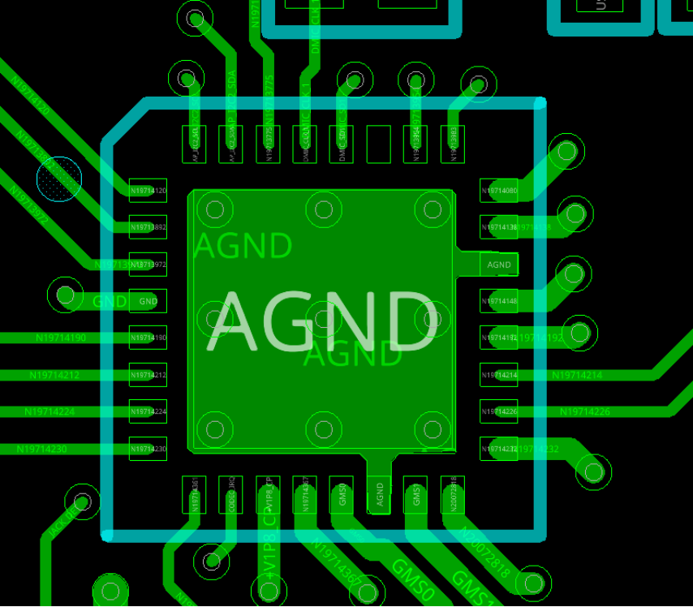

## 3. System-Level ESD Design

- Use a **4-pin SMD crystal** for the 24MHz clock. Connect both GND pins **solidly to board ground**. Keep all other traces **away from the crystal area**—no routing underneath.
- Place the **minimal subsystem (CPU/DDR/eMMC) as far as possible** from metal I/O connectors to improve ESD performance.
- Add **ESD protection** on all external connectors (audio/video, USB, Ethernet, alarm, etc.).
- For **floating-ground systems**: **do not split ground planes** under metal connectors.
- Use **metalized mounting holes** tied to **board GND** to ensure good chassis contact via screws.
- For **earth-grounded systems**: bond metal chassis to earth. Connect **chassis ground** to **digital ground** at **one point only**, located **away from the minimal subsystem** (preferably near the main power inlet).
- Use **metal-shell connectors** (e.g., HDMI/USB with mounting screws, RJ45 with spring clips) and bond them to the chassis.

## 4. Manufacturing Guidelines

**FCCSP Package (17mm × 17mm)**  
Reflow profile:  
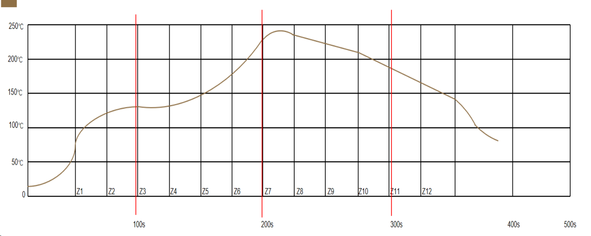

**FCBGA Package (19mm × 19mm)**  
Reflow profile:  
