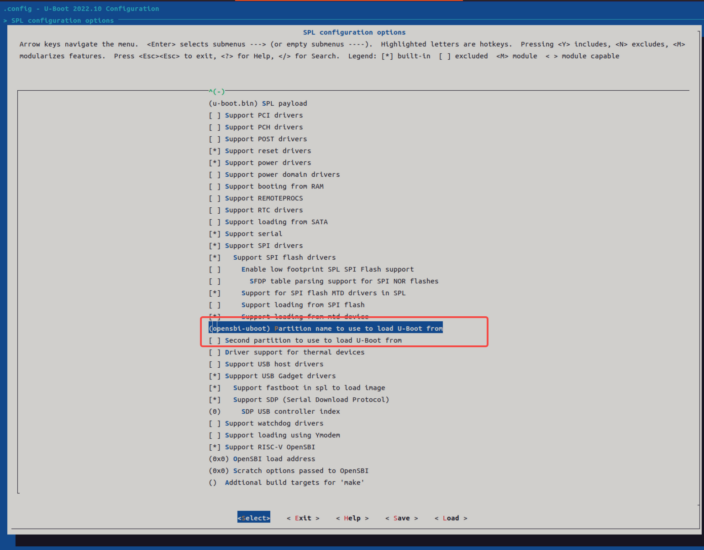
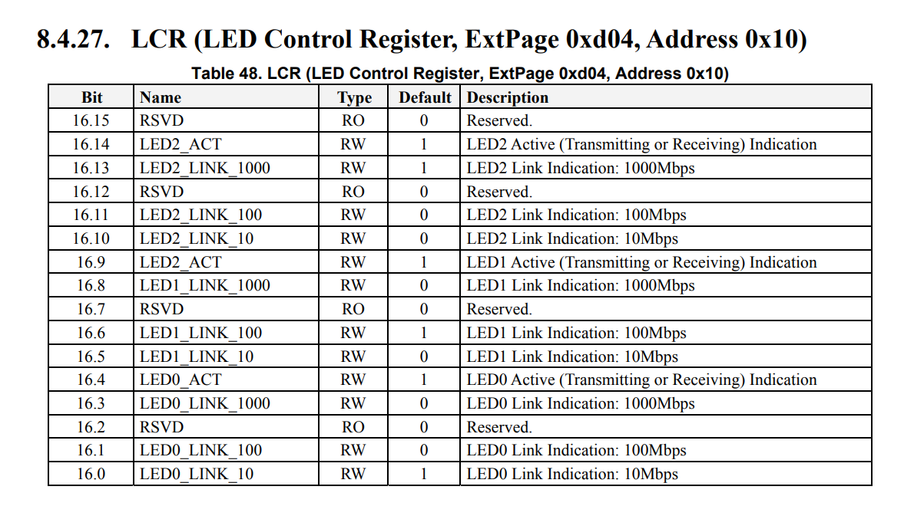
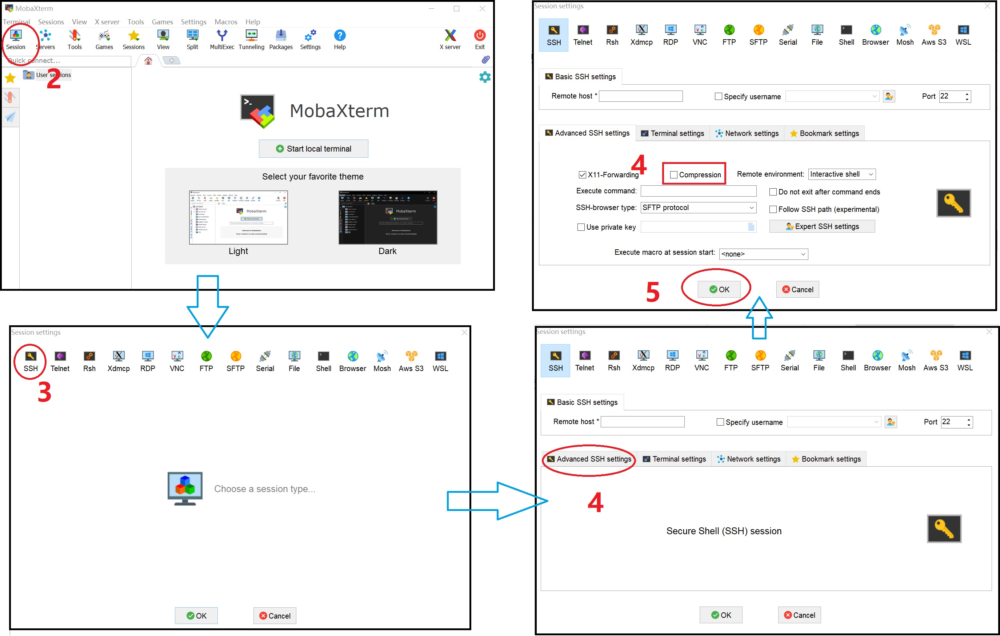

sidebar_position: 2

# K1 Software FAQ

This document compiles common software questions and their answers to provide a quick reference for developers.

## System Boot Configuration

This section describes some issues about system boot. 

1. **How to use a specified ramfs at system boot?**  
    Follow these steps to use a specified ramfs during system boot:

   - **Step 1: Prepare and load boot files**  
     Use the `fastboot` command on the PC to transfer the required boot files to the device. These files include **kernel image (vmlinuz)**, **device tree (dtb)** and **ramfs image (rootfs.cpio.gz)**, loaded as follows:
     - Transfer the kernel image (vmlinuz) to the device using the fastboot command
     - Transfer the device tree (dtb) file to the device 
     - Transfer the ramfs image file (rootfs.cpio.gz) to the device

     ```javascript
     #Note: PC-side commands correspond to the execution in the U-boot command line
     fastboot stage vmlinuz-6.6.36
     fastboot stage spacemit/6.6.36/k1-x_FusionOne.dtb
     fastboot stage linux-6.6/rootfs.cpio.gz # This file can be obtained from bsp-src/linux-6.6/
     ```

   - **Step 2: Set U-Boot command line**  
   Set the memory addresses in the U-Boot command line. These addresses will be used to load the **Kernel, ramfs and device tree**.   
     **Note.** This is an example for reference only. Please modify them according to required hardware configuration. 

     ```c
     #U-Boot command line, corresponding to the PC commands above. After fastboot is enabled, the images sent fom the PC will be stored at the specified addresses
     fastboot -l 0x20000000 0
     fastboot -l 0x30000000 0
     fastboot -l 0x32000000 0
     ```

   - **Step 3: Boot the specified ramfs**
    Boot the system using the `bootm` command, and specify memory address for kernel, ramfs and device tress. Here, `0x1251000` is the size of ramfs image file. 

     ```c
     # Boot the specified ramfs. 0x1251000 is the size of rootfs.cpio.gz.
     bootm 0x20000000 0x32000000:0x1251000 0x30000000
     ```

   - **Step 4: Verify the boot process**  
     After the system boots, verify that the ramfs has been correctly loaded and used for system startup by checking the system logs or using monitoring tools.

    These steps allow you to use a specified ramfs during system boot, enabling rapid validation of the system boot process. Adjust the configuration as needed for your specific hardware and software.

2. **How to modify the default loaded dtb configuration?**  
  In the default K1 boot flow, the system reads the product_name from the EEPROM, and selects the corresponding dtb file based on this value to match the hardware configuration and boot the system.
   To modify the default dtb loading scheme, follow these steps:

   - **Step 1: Check the EEPROM**  
     Verify whether `product_name` is already stored in the EEPROM. If stored, write the `product_name` via `titanflasher`. Refer to [Flashing Tool User Manual](https://spacemit.com/community/document/info?lang=en&nodepath=tools/user_guide/flasher_user_guide.md) for detailed information.

   - **Step 2: Modify the configuration**  
     If there is no EEPROM, or you want to change the default dtb configuration, you can specify the default `product_name` by modifying the system configuration file. The default configuration is defined by the macro `DEFAULT_PRODUCT_NAME`, for example: 

     ```c
     //uboot/include/configs/k1-x.h
     #define DEFAULT_PRODUCT_NAME "k1-x_deb1"
     ```
       If the system fails to match a valid `product_name` from the EEPROM during boot, or if no EEPROM is present, this default boot configuration will be used instead.
     

   - **Step 3: Rebuild and Deploy**  
    After modifying the configuration file, rebuild the system to apply the modifications and update the device firmware. 

   - **Step 4: Testing**
     Reboot the device to confirm the new dtb configuration is loaded correctly and the system boots properly.   
      
    You can adjust the dtb configuration loaded at system boot as needed, to adapt to different hardware setups or requirements.

3. **How to add a custom script to run at boot?**  
  The method to add a custom boot script depends on your system type. Below are the approaches for two common systems:

   - <u>For bianbu-linux systems</u>

     ```javascript
     Create a new script in the /etc/init.d/ directory. The execution order depends on the number prefix in the script filename. 
     ```

     - **Step 1: Create a script**  
       Create a custom script file in the `/etc/init.d/` directory. 
     - **Step 2: Name the script**  
       The execution order depends on the number prefix in the script filename. (The smaller the number, the earlier the script runs, such as S50\_testscript)
     - **Step 3: Reboot the system**   
       Reboot the system to apply the changes.  
       (**Note:** Ensure the script has executable permissions by running chmod a+x /etc/init.d/S50\_testscript)

   - <u>For bianbu-minimal system</u>

     - **Step 1:**   
      Create `/etc/rc.local` and build the custom script.
     - **Step 2:**   
      Create rc.local: Create `/etc/rc.local` file in the root directory.
     - **Step 3:**   
       Write the script: Write the custom script in `/etc/rc.local`.
     - **Step 4:**  
      Reboot the system to apply the changes.  
     (**Note:** Ensure the script has executable permission by running chmod a+x `/etc/rc.local`)

2. **How to execute a specified script on long press of the power key?**  
   **Background:**  
    As shown in the following code:

   - The poweroff command is provided to shut down the system from the command line.
   - Input device events can be captured by reading the `/dev/input/event0` node.

   ```c
   # Power off the system via command line
   poweroff

   # Capture key press events via the device node
   cat /dev/input/event0
   ```
   As shown in the following code:

   - To resolve the mechanical switch debounce issue, the spacemit-pwrkey.c kernel driver has been modified to eliminate switch chatter using a software delay strategy.
(Note: This code change requires local modification and is not integrated into the SDK.)

   ```c
   diff --git a/drivers/input/misc/spacemit-pwrkey.c b/drivers/input/misc/spacemit-pwrkey.c
   index ab8616dc2c56..48bbf11a7ba7 100644
   --- a/drivers/input/misc/spacemit-pwrkey.c
   +++ b/drivers/input/misc/spacemit-pwrkey.c
   @@ -18,6 +18,9 @@ static int report_event, fall_triggered;
    static struct notifier_block   pm_notify;
    static spinlock_t pm_lock;

   +cycles_t fall_cycle;
   +cycles_t rise_cycle;
   +
    static irqreturn_t pwrkey_fall_irq(int irq, void *_pwr)
    {
           unsigned long flags;
   @@ -25,9 +28,14 @@ static irqreturn_t pwrkey_fall_irq(int irq, void *_pwr)

           spin_lock_irqsave(&pm_lock, flags);
           if (report_event) {
   -               input_report_key(pwr, KEY_POWER, 1);
   -               input_sync(pwr);
   -               fall_triggered = 1;
   +               fall_cycle = get_cycles();
   +
   +               if (fall_cycle - rise_cycle >  150000) {
   +                       input_report_key(pwr, KEY_POWER, 1);
   +                       input_sync(pwr);
   +                       fall_triggered = 1;
   +               }
           }

           pm_stay_awake(pwr->dev.parent);
   @@ -45,6 +53,8 @@ static irqreturn_t pwrkey_rise_irq(int irq, void *_pwr)
           spin_lock_irqsave(&pm_lock, flags);
           /* report key up if key down has been reported */
           if (fall_triggered) {
   +               rise_cycle = get_cycles();
                   input_report_key(pwr, KEY_POWER, 0);

   ```

  <u>Two methods</u> are available to implement the execution of a specified script on long press of the power key:

   - **Method 1: Pure Shell Script Implementation**  
     This approach uses a Shell script to monitor the state of the power key. The example script `detect_powerkey.sh` below can detect a long press of the power key and trigger the corresponding action:
     - **Create the detection script:** Write a Shell script named `detect_powerkey.sh` to detect long press events of the power key, and grant it executable permissions with the command: chmod a+x `detect_powerkey.sh`.
     - **Run in the background:** Use the `evtest` command to run in the background and monitor key events from the `/dev/input/event0` device.
     - **Count key presses:** In the script, read the `/root/tmp_event_info.txt` file to count the number of power key presses.
     - **Detect long press:** If the number of presses exceeds the defined threshold (for example, 30 counts, approximately 3 seconds), a long press event is registered.
     - **Execute the target script:** After the long press is detected, run the specified script, such as `power_off.sh`.

     ```javascript
     //cat Templates/detect_powerkey.sh
     #!/bin/bash

     #This command must run in the background. It can be launched externally, so it is commented out here.
     #evtest /dev/input/event0 > /root/tmp_event_info.txt &

     count_num=0
     #detect powerkey press station ready

     echo "" > /root/tmp_event_info.txt

     while true; do 
             echo "xxxxxxxxxxxxxxxxxxxx, press count_num:$count_num"

             if [ $count_num -gt 0 ]; then
                     let count_num+=1
             fi

             if grep -q "value 1" /root/tmp_event_info.txt; then
                     echo "detect powerkey press,"
                     let count_num+=1
             fi

             if grep -q "value 0" /root/tmp_event_info.txt; then
                     echo "detect powerkey release,"
                     count_num=0
             fi

             if [ $count_num -gt 30 ]; then
                     echo "xxxxxxxxxxxxxxxxxxxxxxxx, detect long press 3s"
             fi

             #clear event info
             echo "" > /root/tmp_event_info.txt
             sleep 0.1;
     done
     ```

   - **Method 2: C Code Implementation**  
    Compile the code on bianbu-desktop (or use the bianbu toolchain for cross-compilation). This method is not supported on bianbu-linux.
     - **Write the C program**: Create a C program named`key_detect.c` to detect long press events of the power key.

     ```javascript
     //cat key_detect.c

     #include <stdio.h>
     #include <stdlib.h>
     #include <fcntl.h>
     #include <unistd.h>
     #include <linux/input.h>
     #include <errno.h>
     #include <string.h>
     #include <unistd.h>
     #include <sys/time.h>
     #include <time.h>
     #include <gio/gio.h>
     #include <glib.h>

     static void hci_op(gchar *hci_op);

     int main()
     {
             int keys_fd;
             char ret[2];
             struct input_event t;
             struct timeval tv;
             long time_powerkey_press = 0;
             long time_powerkey_up = 0;
             time_t current_time_1, current_time_2;
             time_t current_time = 0;

             int detect_time = 3;

             keys_fd = open("/dev/input/event0", O_RDONLY);
             if (keys_fd <= 0){
                     printf("open /dev/input/event0 fail\n");
                     return 0;
             }
             while(1){
                     if (read (keys_fd, &t, sizeof(t)) == sizeof (t)){
                             if (t.type == EV_KEY){
                                     current_time_1 = time(NULL);
                                     if (t.value == 1){
                                             time_powerkey_press = time(NULL);
                                             if (time_powerkey_press == ((time_t) -1)) {
                                                     printf("can not get currnt time\n");
                                             }
                                     }

                                     current_time_2 = time(NULL);
                                     if (t.value == 0){
                                             time_powerkey_up = time(NULL);
                                             if (time_powerkey_up == ((time_t) -1)) {
                                                     printf("can not get currnt time\n");
                                             }
                                     }

                                     if ((time_powerkey_up - time_powerkey_press) > detect_time && (time_powerkey_up - time_powerkey_press) < 9){
                                             hci_op("hci_start");
                                     }
                             }
                     }
             }
             close(keys_fd);
             return 0;
     }

     static void hci_op(gchar *hci_op)
     {
             GPtrArray *argv = NULL;
             gchar *stdout_str;
             gchar *stderr_str;
             gint estatus;
             GError *error = NULL;

             argv = g_ptr_array_new ();
             g_ptr_array_add (argv, (gpointer)"/usr/bin/power_off.sh");
             g_ptr_array_add (argv, (gpointer)hci_op);
             g_ptr_array_add (argv, NULL);

             g_spawn_sync (NULL, (char**)argv->pdata, NULL, G_SPAWN_DEFAULT, NULL, NULL, &stdout_str, &stderr_str, &estatus, &error);
             g_assert_no_error (error);

             g_print("%s \n", stdout_str);
             g_print("%s \n", stderr_str);

             g_free(stdout_str);
             g_free(stderr_str);
             g_ptr_array_free (argv, TRUE);

             return;
     }

     ```

     - **Compile and Run:** Build the C program in the bianbu-desktop environment to generate the executable file `detect_powerkey.bin`:

     ```javascript
     # Compile on bianbu-desktop
     gcc -o detect_powerkey.bin key_detect.c `pkg-config --cflags --libs glib-2.0`

     # It may require dependencies: apt install -y libglib2.0-dev
     ```

     - **Modify system configuration:**   
       Modify the `/etc/systemd/logind.conf` file to ignore the power key and long press events.
     - **Reboot the system:**   
       Apply the changes and reboot the device.
     - **Deploy the Executable:**   
       Copy the compiled `detect_powerkey.bin` to the target device.
     - **Create and Authorize the Script:**  
      Create the `/usr/bin/power_off.sh` script on the device, and set its executable permissions. 
     - **Run the Script:**  
      Press and hold the power key for 3 seconds, then release. The `detect_powerkey.bin` will execute the `power_off.sh` script.

     ```javascript
     # Execute
     sed -i 's/#HandlePowerKey=poweroff/HandlePowerKey=ignore/g' /etc/systemd/logind.conf
     sed -i 's/#HandlePowerKeyLongPress=ignore/HandlePowerKeyLongPress=ignore/g' /etc/systemd/logind.conf
     reboot

     #cp detect_powerkey.bin to device

     touch /usr/bin/power_off.sh
     chmod a+x /usr/bin/power_off.sh

     # Press and hold the power key for 3 seconds, then release. The power_off.sh script will be executed.
     ```

5. **How to merge U-Boot and OpenSBI image file into an itb image file?**  
By default, the K1 SDK loads U-Boot and OpenSBI separately. However, developers can merge them into a single image as needed. Below are the steps to merge U-Boot and OpenSBI. (Note: Pay close attention to the red content.)

   - **Step 1: fsbl enables configuration**
     - Disable the second partition setting in the U-Boot configuration. Ensure the option **"Second partition to use to load U-Boot from"** is unchecked, as shown in the figure below.
     - Rename the partition to `opensbi-uboot`, then recompile U-Boot. Ensure all related references are updated accordingly.
     - **Note.** If you customize the partition name, all instances of opensbi-uboot (including the red text below) must also be updated to match.
       

   - **Step 2: Create itb file**  
  Create the `uboot-opensbi.its` file to define the load parameters for U-Boot, OpenSBI, and the device tree (DTS) as follows:

     ```shell
     /dts-v1/;

     / {
             description = "U-boot FIT image for k1x";
             #address-cells = <2>;
             fit,fdt-list = "of-list";

             images {
                     uboot {
                             description = "U-Boot";
                             type = "standalone";
                             os = "U-Boot";
                             arch = "riscv";
                             compression = "none";
                             load = <0x0 0x00200000>;
                             data = /incbin/("./u-boot-nodtb.bin");
                     };

                     opensbi {
                             description = "OpenSBI fw_dynamic Firmware";
                             type = "firmware";
                             os = "opensbi";
                             arch = "riscv";
                             compression = "none";
                             load = <0x0 0x0>;
                             entry = <0x0 0x0>;
                             data = /incbin/("./fw_dynamic.bin");
                     };
                     fdt_14 {
                             description = "k1-x_MUSE-Card";
                             type = "flat_dt";
                             compression = "none";
                             data = /incbin/("./uboot/k1-x_MUSE-Card.dtb");
                     };
             };

             configurations {
                     default = "conf_14";
                     conf_14 {
                             description = "k1-x_MUSE-Card";
                             firmware = "opensbi";
                             loadables = "uboot";
                             fdt = "fdt_14";
                     };
             };
     };
     ```

   - **Step 3: Generate itb file**
     - Place the following file in the same directory: 
       `uboot-opensbi.its`  
       `u-boot-nodtb.bin`  
       `fw_dynamic.bin`  
       `k1-x_MUSE-Card.dtb`（**This is the solution device tree. Modify it according to actual solution name**）
     - Generate `uboot-opensbi.itb` file using mkimage tool as follows:

       ```shell
       uboot-2022.10/tools/mkimage -f uboot-opensbi.its -r u-boot-opensbi.itb
       ```

   - **Step 4: Modify the partition table**  
     Taking `partition_universal.json` as an example: delete the `uboot` partition, and rename the `opensbi` partition to `opensbi-uboot`. Set the partition size to the sum of the two original sizes, as shown below:

     ```c
     ~$ cat partition_universal.json 
     {
       "version": "1.0",
       "format": "gpt",
       "partitions": [
         {
           "name": "bootinfo",
           "offset": "0",
           "size": "80B",
           "image": "factory/bootinfo_sd.bin"
         },
         {
           "name": "fsbl",
           "offset": "128K",
           "size": "256K",
           "image": "factory/FSBL.bin"
         },
         {
           "name": "env",
           "offset": "384K",
           "size": "64K"
         },
         {
           "name": "opensbi-uboot",
           "offset": "1M",
           "size": "3M",
           "image": "u-boot-opensbi.itb"
         },
         {
           "name": "bootfs",
           "offset": "4M",
           "size": "256M",
           "image": "bootfs.img",
           "compress": "gzip-5"
         },
         {
           "name": "rootfs",
           "size": "-"
         }
       ]
     }
     ```

   - **Step 5: Update the Flashing Commands**   
     Using eMMC as an example, run the following commands to flash the merged U-Boot and OpenSBI image, along with other system components to the eMMC storage device:

     ```bash
     fastboot stage factory/FSBL.bin
     fastboot continue
     #sleep to wait for uboot ready
     #For linux
     sleep 1
     #For windows
     #timeout /t 1 >null   
     fastboot stage u-boot-opensbi.itb
     fastboot continue

     fastboot flash gpt partition_universal.json
     #The content of bootinfo_emmc.bin has no functional effect. Refer to Section 3.1.3 for details, but this flashing step is still required.
     fastboot flash bootinfo factory/bootinfo_emmc.bin
     fastboot flash fsbl factory/FSBL.bin
     fastboot flash env env.bin
     fastboot flash opensbi-uboot u-boot-opensbi.itb
     fastboot flash bootfs bootfs.img
     fastboot flash rootfs rootfs.ext4
     ```
     If you use the titanflasher tool provided by SpacemiT, update the `u-boot.itb` filename to `u-boot-opensbi.itb` in the `fastboot.yaml` file within the flashing package.

4. **How to configure a partition as a hidden partition?**  
   A hidden partition is a partition that is not displayed by default in the partition table. It is used to store critical system files and configurations, preventing accidental modification or deletion by users. Below are the steps to configure a partition as hidden:

   - **Step 1: Edit the partition table configuration file**
     - Open the partition table file: Use a text editor to open the <u>partition table configuration file</u>, such as `partition_universal.json`.
       `cat k1/common/flash_config/partition_universal.json`
     - Set the hidden attribute: For the partition you want to hide, add or modify the `"hidden": true` property. This instructs the system to <u>exclude these partitions</u>.

   - **Step 2: Apply the hidden partition configuration**
     - Below is an example of a partition table configuration with hidden partitions:
       In this configuration, the `bootinfo`, `fsbl`, and `env` partitions are set as hidden. This means they will not appear in the partition list, providing an additional layer of security.

       ```c
       {
         "version": "1.0",
         "format": "gpt",
         "partitions": [
           {
             "name": "bootinfo",
             "hidden": true,
             "offset": "0",
             "size": "80B",
             "image": "factory/bootinfo_sd.bin"
           },
           {
             "name": "fsbl",
             "hidden": true,
             "offset": "128K",
             "size": "256K",
             "image": "factory/FSBL.bin"
           },
           {
             "name": "env",
             "hidden": true,
             "offset": "384K",
             "size": "64K",
             "image": "u-boot-env-default.bin"
           },
           {
             "name": "opensbi",
             "offset": "1M",
             "size": "1M",
             "image": "opensbi.itb"
           },
           {
             "name": "uboot",
             "offset": "2M",
             "size": "2M",
             "image": "u-boot.itb"
           },
           {
             "name": "bootfs",
             "offset": "4M",
             "size": "256M",
             "image": "bootfs.img",
             "compress": "gzip-5"
           },
           {
             "name": "rootfs",
             "size": "-"
           }
         ]
       }
       ```

   - **Step 3: Apply the changes** 
     - Save the configuration file: Save the changes in partition table configuration file.
     - Regenerate the partition table: If required, regenerate partition table to apply these changes. 
     - Flash the updated partition table: Write the updated partition table to the storage device.  
      (**Note.** When performing these operations, ensure you fully understand the impact of each step, and back up your data if necessary.)

## SDK Compilation and Packaging

TBD

## Driver Debugging and Test Validation

1. **How to Verify Entry into PD Charging Mode?**  
  To confirm if the device has entered PD charging mode, check the <u>serial port log output</u>. If your device has PD charging support enabled, when you plug in a PD adapter, the presence of the following (or similar) serial log messages confirms successful entry into PD charging mode:

   ```javascript
   [57876.061510] husb239 4-0042: husb239_attach status: a1 status1: 0
   [57876.070579] husb239 4-0042: update sink voltage: 5000000 current: 500000
   [57876.292256] husb239 4-0042: pd detect 
   [57876.543622] husb239 4-0042: update sink voltage: 9000000 current: 3000000
   ```

   (**Note.** Ensure the device drivers and firmware support PD charging, and that you are using a compatible PD adapter.)

2. **How to Enable I2C in the Device Tree (DTS)?**  
   To enable an I2C interface in the device tree (DTS), <u>configure the DTS file</u>, to ensure the I2C controller is properly initialized and available. Below are the configuration steps, using i2c5 as an example:

   - U-Boot Configuration:
     - **Step 1: Enable the I2C Controller**   
       In the U-Boot DTS file, locate the i2c5 controller node and set its `status` property to `"okay"`.
     - **Step 2: Configure Pin Control**   
       Assign pin control settings to the i2c5 controller, which typically involves defining the `pinctrl-names` and `pinctrl-0` properties.
     - **Step 3: Add I2C Devices**   
       If required, add device nodes connected to i2c5, and configure their `reg` and `status` properties appropriately.  
      Configuration example:

     ```c
     diff --git a/arch/riscv/dts/k1-x_FusionOne.dts b/arch/riscv/dts/k1-x_FusionOne.dts
     index 6b1e594d3d..a254a45000 100644
     --- a/arch/riscv/dts/k1-x_FusionOne.dts
     +++ b/arch/riscv/dts/k1-x_FusionOne.dts
     @@ -60,6 +60,19 @@
             status = "okay";
      };

     +&i2c5 {
     +       #address-cells = <1>;
     +       #size-cells = <0>;
     +       pinctrl-names = "default";
     +       pinctrl-0 = <&pinctrl_i2c5_1>;
     +       status = "okay";
     +
     +       charge@53{
     +               reg = <0x53>;
     +               status = "okay";
     +       };
     +};
     ```

   - Linux Configuration:
     - **Step 1: Enable the I2C controller**   
       In the Linux kernel DTS file, ensure the `status` property of the i2c5 controller node is set to `"okay"`.
     - **Step 2: Configure pin control and clock frequency**    
       Assign pin control settings to the i2c5 controller, and set the `clock-frequency` property to define the I2C clock rate.  
       Configuration example:

     ```c
     diff --git a/arch/riscv/boot/dts/spacemit/k1-x_FusionOne.dts b/arch/riscv/boot/dts/spacemit/k1-x_FusionOne.dts
     index e077ddc2b..d2d38668c 100644
     --- a/arch/riscv/boot/dts/spacemit/k1-x_FusionOne.dts
     +++ b/arch/riscv/boot/dts/spacemit/k1-x_FusionOne.dts
     @@ -256,6 +244,14 @@ &i2c4 {
             status = "okay";
      };

     +&i2c5 {
     +       pinctrl-names = "default";
     +       pinctrl-0 = <&pinctrl_i2c5_1>;
     +
     +       clock-frequency = <400000>;
     +       status = "okay";
     +};
     ```

    With these configurations, the i2c5 interface can be enabled in both U-Boot and the Linux kernel, making it available for device communication.

3. **How to Read/Write I2C Devices via the Command Line?**  
  To interact with I2C devices from the command line, use the tools provided by U-Boot or the Linux kernel to perform I2C read/write operations. Below are the detailed steps:

   - **Reading/Writing I2C Devices in U-Boot**
     - **Select the I2C Bus:**   
       Choose the I2C bus for communication. In the example, the device is connected to I2C bus `2`. 
     - **Set the Default Frequency:**  
       Configure the I2C communication frequency. In the example, the default value is `100 kHz`.
     - **Read from the I2C Devices:**   
       Use the `i2c md` command to read data from the specified I2C device address. In the example, 1 byte is read from the address `0x53`.
     - **Write to the I2C Device:**  
       Use the `i2c mw` command to write down to the specified I2C device address. In the example. The value `0x11` is written to register `1` of address `0x53`.
       Example:

     ```javascript
     => i2c bus
     Bus 0:  twsi2@d4012000  (active 0)
     [   8.578]    50: eeprom@50, offset len 1, flags 0
     [   8.582] Bus 1:       twsi4@d4012800
     [   8.585] Bus 2:       twsi5@d4013800
     [   8.588] Bus 3:       twsi8@d401d800  (active 3)
     [   8.592]    41: pmic@41, offset len 1, flags 0
     => [   9.632] i2c dev 2
     Setting bus to 2
     [  16.449] Default to 100kHz
     => [  23.146] i2c md 0x53 1 1
     0001: 10    .
     => i2c mw 0x53 1 0x11
     => i2c mw 0x53 1 0x10 
     ```

   - **Reading/Writing I2C Devices in the Linux Kernel:**
     - **Detect I2C devices:**   
       Use the `i2cdetect` command to scan the specified I2C bus. In the example, the bus is `5`. 
     - **Read I2C device:**   
       Use the `i2cdump` command to read the register of the I2C device. In the example, data is read from address `0x53`.
     - **Write to I2C device:**   
       Use the `i2cset` command to write data to the registers of the I2C device. In the example, the value `0x11` is written to register `1` of address `0x53`. 
       Example：

     ```javascript
     i2cdetect -y -r 5
     i2cdump -y 5 0x53
     i2cset -f -y 5 0x53 0x1 0x11
     ```

4. **How to Control LED Brightness and Blinking with PWM?**  
  First, connect the LED to a PWM pin. For hardware design details, refer to the PWM section of the `k1-x_FusionOne` platform guide.  
  To control LED brightness and blinking via PWM, follow these steps in a Linux system:

   - **Step 1: Open a Terminal**  
   Launch a terminal window in your Linux system.
   - **Step 2: Navigate to the PWM Directory**  
   Use the `cd` command to change to the PWM device directory:

     ```bash
     cd /sys/class/pwm/
     ```

   - **Step 3: List Available PWM Chips**  
     List all available PWM controllers to confirm the PWM chip number you will use:

     ```bash
     ls
     #_Output may include pwmchip0  pwmchip1  pwmchip2  pwmchip3  pwmchip4  pwmchip5  pwmchip6_
     ```

   - **Step 4: Export the PWM Channel**  
     Select a PWM chip and export the target PWM channel you want to control. For example, to use channel `pwm0` on `pwmchip0`:

     ```bash
     echo 0 > pwmchip0/export
     ```

   - **Step 5: Set the PWM Period**  
     This defines the frequency of the PWM signal. For example, set it to `1000000`ns, which corresponds to a 1 kHz period:

     ```bash
     echo 1000000 > pwmchip0/pwm0/period
     ```

   - **Step 6: Set the PWM Duty Cycle**  
     This controls the brightness of the LED. For example, set it to 500000ns:

     ```bash
     echo 500000 > pwmchip0/pwm0/duty_cycle
     ```

   - **Step 7: Enable the PWM**  
     Start the PWM signal output:

     ```bash
     echo 1 > pwmchip0/pwm0/enable
     ```

   - **Step 8: Adjust Brightness**  
     Adjust the LED brightness by changing the `duty_cycle` value. For example, set it to ·100000· ns to reduce brightness:

     ```bash
     echo 100000 > pwmchip0/pwm0/duty_cycle
     ```

   - **Step 9: Disable the PWM**  
     After completing operation, you can stop the PWM signal:

     ```bash
     echo 0 > pwmchip0/pwm0/enable
     ```

   **Note.**
     - Ensure the LED is correctly connected to the PWM pin before running these commands.
     - Adjusting the `period` and `duty_cycle` values changes the LED blinking frequency and brightness.
     - The exact paths and commands for the PWM subsystem may vary across different Linux distributions and kernel versions. Adjust the steps to match your system configuration.

5. **How to Read Battery Voltage Value via Nodes?**  
   To read the battery voltage value through system nodes, first configure the corresponding GPADC in the device tree (DTS), then retrieve the voltage reading by accessing specific system nodes. Follow the steps below:：

   - **Step 1: Refer to DTS Configuration Example:** 
     - **Select the GPADC:**  
      Choose the GPADC channel (e.g. GPADC2), and configure it in DTS file. 
     - **Configure Pin Control:** In the DTS, assign pin control to GPADC2, specifying the compatible controller and GPIO unit.
     - **Define Pin Functionality:** Set the pin functionality for GPADC2. For example configure `PIN2` as the analog input `adcin`.

     ```javascript
     ## Select the GPADC channel to use. For GPADC2, add the following configuration to the I2C8 node in your DTS file:
                     pmic_pinctrl: pinctrl {
                             compatible = "pmic,pinctrl,spm8821";
                             gpio-controller;
                             #gpio-cells = <2>;
                             spacemit,npins = <6>;

                             gpadc2_pins: gpadc2-pins {
                                     pins = "PIN2";
                                     function = "adcin";
                             };
                     };
     ```

   - **Step 2: Read the Voltage Value** 
     - Power on the system/device.
     - Navigate to the IIO device directory using the command line. 

       ```bash
       cd /sys/bus/iio/devices/iio:device0
       ```

     - Read the <u>raw voltage value</u> measured by GPADC from the `in_voltage2_raw`.

       ```bash
       cat in_voltage2_raw
       ```

     - Read the voltage <u>scale factor</u> from the `in_voltage2_scale`.

       ```bash
       cat in_voltage2_scale
       ```

    - **Calculate the Voltage Value:**  
     Multiply the <u>raw voltage value</u> by the <u>scale factor</u> to get the actual voltage, in millivolts (mV):  
     Voltage (mV) = Raw Voltage Value × Scale Factor

6. **How to Configure ALDO2 to Stay Enabled in Suspend Mode and Output 3.3V?**  
 To ensure ALDO2 remains enabled and outputs 3.3V when the system enters suspend mode, you need to configure the device tree (DTS) in both the **U-Boot SPL stage** and the **kernel stage**.

   - **U-Boot SPL Stage Configuration**
     - **Step 1: Edit the U-Boot Device Tree Source File**:  
      Open the `arch/riscv/dts/k1-x_spm8821.dtsi` file.
     - **Step 2: Configure the ALDO2 Regulator**:  
      Locate the ALDO2 configuration section in the file, and add the following properties to set the initial voltage and ensure it is enabled at boot:

       ```javascript
       #This circuit must be enabled in the U-Boot SPL stage:
       --- a/arch/riscv/dts/k1-x_spm8821.dtsi
       +++ b/arch/riscv/dts/k1-x_spm8821.dtsi
       @@ -72,6 +72,12 @@
             regulator-name = "ldo2";
             regulator-min-microvolt = <500000>; // Minimum voltage 500mV
             regulator-max-microvolt = <3400000>; // Maximum voltage 3.4V
       +     regulator-init-microvolt = <3300000>; // Initial voltage 3.3V
       +     regulator-boot-on; // Enable at boot
       +     u-boot,dm-spl; // Enable in the SPL stage
       +     regulator-state-mem {
       +       regulator-off-in-suspend; // Disable in suspend mode
       +     };
          };

       ```

   - **Kernel Stage Configuration**
     - **Step 1: Edit the Kernel Device Tree Source File**:  
       Example: `k1-x_deb1`  
       Open the `arch/riscv/boot/dts/spacemit/k1-x_deb1.dts` file
     - **Step 2: Configure ALDO2 to Stay Enabled**:  
       Locate the ALDO2 configuration section in the file, and add the following properties to ensure ALDO2 remains enabled in all system states:

       ```javascript
       #This regulator must be configured as always-on in the kernel stage
       --- a/arch/riscv/boot/dts/spacemit/k1-x_deb1.dts
       +++ b/arch/riscv/boot/dts/spacemit/k1-x_deb1.dts
       @@ -340,6 +340,14 @@ ldo_2: LDO_REG2 {
           regulator-name = "ldo2";
           regulator-min-microvolt = <500000>;
           regulator-max-microvolt = <3400000>;
       +
       +   regulator-boot-on; // Enable at boot
       +   regulator-always-on; // Stay power-on
       +
       +   regulator-state-mem {
       +      regulator-off-in-suspend; // Disable in suspend mode
       +      regulator-suspend-microvolt = <500000>; // Suspend voltage 0.5V
       +     };
           };
       ```

     Final Steps: Save your changes, deploy the updated firmware, reboot the device, and verify the configuration.

7. **How to Read Type-C Port Status via Nodes?**  
    On a Linux system, you can retrieve the status of the Type-C port by checking specific system file nodes:

   - **Step 1:**   
      Open the device serial port and execute commands in the serial terminal.

   - **Step 2**   
     Read the `/sys/class/typec/port0/data_role` file using the `cat` command.

     ```c
     cat /sys/class/typec/port0/data_role
     ```

   - **Step 3:**   
     Determine the Type-C connection status from the output
     - When the Type-C port is not connected to <u>any device or PC</u>, the output is

       ```c
       host [device]
       ```

     - When the Type-C port is <u>connected to a USB drive</u>, the output is

       ```c
       [host] device
       ```

8. **How to Customize Ethernet LED Indicator Display?**  
   To customize the display state of the Ethernet LED indicators, please modify the value of the LED Control Register (LCR) via program.

   - **Step 1:** Understand the LED Control Register (LCR)  
     As shown in the reference diagram, the LCR register is located at extended page 0xd04, address 0x10. It contains multiple bits that control the status of different LEDs, such as the activation state and link indication for LED0, LED1, and LED2.
     

   - **Step 2:** Modify the Driver Code  
     Example:

     ```javascript
     ## git apply eth_light.diff
     diff --git a/drivers/net/phy/realtek.c b/drivers/net/phy/realtek.c
     index 337899c69..a57ac4a80 100644
     --- a/drivers/net/phy/realtek.c
     +++ b/drivers/net/phy/realtek.c
     @@ -14,6 +14,20 @@
      #include <linux/delay.h>
      #include <linux/clk.h>

     +#define RTL8211F_LCR                            0x10
     +#define LED2_ACT                                BIT(14)
     +#define LED2_LINK_1000                          BIT(13)
     +#define LED2_LINK_100                          BIT(11)
     +#define LED2_LINK_10                           BIT(10)
     +
     +#define LED1_ACT                               BIT(9)
     +#define LED1_LINK_1000                         BIT(8)
     +#define LED1_LINK_100                          BIT(6)
     +#define LED1_LINK_10                            BIT(5)
     +
     +#define MY_LED_MODE (LED1_LINK_1000 | LED1_LINK_100 | LED1_LINK_10 | \
     +                     LED1_ACT | LED2_LINK_1000)
     +
      #define RTL821x_PHYSR                          0x11
      #define RTL821x_PHYSR_DUPLEX                   BIT(13)
      #define RTL821x_PHYSR_SPEED                    GENMASK(15, 14)
     @@ -129,6 +143,12 @@ static int rtl821x_probe(struct phy_device *phydev)
                             priv->phycr2 &= ~RTL8211F_CLKOUT_EN;
             }

     +       /* Configure the LED control register (LCR) on page 0xd04 with the desired LED mode */
     +       msleep(100);
     +       ret = phy_write_paged(phydev,0xd04,RTL8211F_LCR,MY_LED_MODE);
     +       if(ret < 0)
     +               return ret;
     +
             phydev->priv = priv;

             return 0;
     ```

    - **Define the LED Mode:**  
      Define your desired LED behavior in the driver code. For example:  
       - LED1 illuminates for 1000Mbps, 100Mbps, and 10Mbps link states  
       - LED2 only illuminates for 1000Mbps link states  
       You can combine these states into a single macro `MY_LED_MODE`.

       ```c
       #define MY_LED_MODE (LED1_LINK_1000 | LED1_LINK_100 | LED1_LINK_10 | LED1_ACT | LED2_LINK_1000)
       ```

     - **Modify the Register Access Code:**  
       Locate the LED control section in your driver, then add or modify the write operation for the LCR register. This is typically done using the `phy_write_paged` function:

       ```c
       static int rtl821x_probe(struct phy_device *phydev)
                               priv->phycr2 &= ~RTL8211F_CLKOUT_EN;
               }

        /* Configure the LED control register (LCR) on page 0xd04 with the desired LED mode */
              msleep(100);
              ret = phy_write_paged(phydev,0xd04,RTL8211F_LCR,MY_LED_MODE);
              if(ret < 0)
                      return ret;

               phydev->priv = priv;

               return 0;
       ```

   - **Step 3:** Once you've finished modifying the driver code, rebuild the driver to include your custom changes, then deploy the newly compiled driver to your target device.
   - **Step 4:** Validate the implementation: check that the Ethernet LED behavior matches your custom configuration, and confirm the LEDs correctly indicate the current link speed and network connection status.

9. **How to Customize Thermal Control?**  
   Customize thermal control to protect the chip from damage during overheating. When the chip temperature reaches the set value, it will trigger a shutdown. This can be achieved by modifying the thermal control settings in the device tree source file (dts). Follow the steps below:

   - **Step 1: Edit the Thermal Configuration File** 
     - **Locate the thermal configuration file:**  
      open the thermal control related device tree file `arch/riscv/boot/dts/spacemit/k1-x_thermal_cooling.dtsi`.
     - **Modify thermal control settings:**  
      In the file, locate the thermal control nodes such as `cls0_trip4` and `cls1_trip4`, and set the `temperature` and `hysteresis` parameters. These attributes define the temperature threshold and hysteresis value for triggering shutdown. 
      As shown in the following dts configuration, set 115℃ to trigger shutdown to protect the chip:
       ```c
       //arch/riscv/boot/dts/spacemit/k1-x_thermal_cooling.dtsi

                               cls0_trip4: cls0-trip-point4 {
                                       temperature = <115000>;
                                       hysteresis = <5000>;
                                       type = "critical";
                               };


                               cls1_trip4: cls1-trip-point4 {
                                       temperature = <115000>;
                                       hysteresis = <5000>;
                                       type = "critical";
                               };
       ```

   - **Step 2:** Flash the new device tree (dts) to the device and reboot the system. 
   - **Step 3: Verify the changes:** Monitor system temperature with appropriate tools, and ensure the thermal control settings work as expected.  
     **Note.** Changing thermal control settings may affect system stability and hardware lifespan, so please be cautious.   
     It is recommended to read relevant documents or seek professional guidance before making changes (the recommended maximum temperature is 115℃).  
     To disable thermal control, you can turn off the kernel compilation configuration CONFIG\_THERMAL, but this is not recommended.

10. **How to Pull Up GPIO via Command Line?**  
   Pull up GPIO via command line, which means setting a GPIO pin to a high level state via command line. According to different running environments (Kernel and U-Boot), the operation steps are as follows:

    - <u>Kernel</u>: Pull up GPIO122 
      - **Step 1: Export GPIO122**  
       Write GPIO122 to `/sys/class/gpio/export` to make it available in user space.

        ```c
        echo 122 > /sys/class/gpio/export
        ```

      - **Step 2: Set GPIO direction**  
         Set the direction of GPIO122 to output (out), so that the GPIO pin can be configured as output mode.

        ```c
        echo out > /sys/class/gpio/gpio122/direction
        ```

      - **Step 3: Set GPIO value**   
        Pull up GPIO (1 means high level, 0 means low level)

        ```c
        echo 1 > /sys/class/gpio/gpio122/value
        ```

    - <u>U-Boot</u>: Pull up GPIO116   
      Use the `gpio set` command to directly set the GPIO pin level state.

      ```c
      gpio set 116
      ```

11. **How to Enable P1 Circuit in U-Boot Stage**  
    Example: Switch Configuration  
    To enable the P1 circuit in the U-Boot stage, you can modify the device tree (dts) file:

    - **Step 1: Locate the Device Tree File**  
      Find the target device tree file `k1-x_spm8821.dtsi`, which defines the hardware configuration parameters. If you use Git for code management, you can view the file's change history and content with the following command:

      ```c
      gitd arch/riscv/dts/k1-x_spm8821.dtsi
      ```

    - **Step 2: Modify the Device Tree (dts) File**   
      In the device tree file, locate and modify the `SWITCH_REG1` node, and add configurations such as `regulator-name` and `regulator-state-mem` to ensure the P1 circuit is enabled in the U-Boot stage: 
      Original Content:

      ```
          sw_2: SWITCH_REG1 {
               regulator-name = "switch1";
          };
      ```

      Modified Content:

      ```
          sw_2: SWITCH_REG1 {
               regulator-boot-on;    // Enable power supply automatically at boot
               regulator-name = "switch1";
               regulator-state-mem {
                    regulator-off-in-suspend; // Disable power supply in suspend state
                    };
               };
      ```

    - **Step 3: Save Changes and Recompile U-Boot** 
      - After modifying the device tree file, recompile U-Boot and flash it to the device to apply the changes.
      - Verify that the P1 circuit is enabled correctly.

## OS Application

### Display

1. **How to Play Video via Command Line?**  
   K1 supported DPU specifications: HDMI (1920x1080), MIPI DSI (1920x1200) and 1920x1440.  
   The implementation methods for video playback vary by runtime environment and requirements, including:

  - Desktop Terminal Only: **Play Video with gst-launch**  
     This method only works on a desktop terminal, and **cannot be executed over a serial port or SSH session**.  
     **Note:** Video filenames must not have duplicate extensions (e.g., `xxxmp4.mp4`).  
     Example:

     ```javascript
     gst-launch-1.0 playbin uri=file:/root/480p.mp4 video-sink='waylandsink render-rectangle="<0,0,1920,1080>"'
     ```

  - For **bianbu-linux** (Serial/Terminal Playback):
    - **<u>Method 1:</u>** Use <u>dd command</u> to write images directly to the framebuffer (fb).   
     Example:

       ```c
       dd if=argb.data of="/dev/fb0" bs=1920 count=4320
       ```

    - **<u>Method 2:</u>** Use <u>ffplay</u> to play video files.  
      This method is suitable for terminal environments and requires the GPU driver to be loaded.   
      Example:

       ```c
       export MESA_LOADER_DRIVER_OVERRIDE='pvr' //Set GPU driver
       ffplay /root/test.mp4
       ```

  - For **bianbu-minimal** or **bianbu-desktop** (Serial Port Playback Supported):
     - **<u>Method 1:</u>** Use <u>**ffplay**</u> to play

       ```c
       // Install required package
       apt install -y k1x-vpu-firmware mpp ffmpeg img-gpu-powervr weston

       // Use ffplay command to play video files
       weston & WAYLAND_DISPLAY=wayland-1 WESTON_CONFIG_FILE=/root/ SDL_VIDEODRIVER=wayland MESA_LOADER_DRIVER_OVERRIDE=pvr ffplay 480p.mp4
       ```

     - **<u>Method 2:** </u>Use <u>**mpv**</u> to play

       ```c
       // Install required package
       apt install -y k1x-vpu-firmware mpp ffmpeg img-gpu-powervr mpv

       // Use mpv command to play video files
       SDL_VIDEODRIVER=wayland MESA_LOADER_DRIVER_OVERRIDE=pvr mpv 480p.mp4
       ```

2. **How to Detect HDMI Connection Status?**  
   To detect the HDMI connection status, you can retrieve information by checking the content of specific files in the Linux system. Follow the steps below:

   - **Step 1:** Open the terminal application on your device.
   - **Step 2:** Check the HDMI connection status  
     View the `/sys/class/drm/card1-HDMI-A-1/status` file using the `cat` command. This file contains the HDMI connection status information:
     - If the output shows `connected`, the HDMI connection is established and the display is successfully connected to the system. 
     - If the output shows `disconnected` or the file does not exist, the HDMI connection is not established or the display is not connected

     ```c
     cat /sys/class/drm/card1-HDMI-A-1/status //Access the status file
     connected // HDMI connection status information
     ```

   <u>Notes for HDMI Connection Detection:</u>

   - **If the file path does not exist:**
     - Ensure the DRM driver is loaded in the system
     - The `card1-HDMI-A-1` path may vary depending on the hardware configuration. Use the following command to list all HDMI-related device paths:

       ```c
       ls /sys/class/drm/
       ```

   - **If the detection result is inaccurate:**
     - Check that the HDMI cable is securely connected
     - Ensure the external display device is powered on
     - Reconnect the HDMI cable and test again

3. **How to Disable tty1 Login Display and Cursor Display in bianbu-minimal System**
    Steps to disable the **tty1 (login screen) login display** and **cursor display**:

   - Disable tty1 Login Display:

     ```javascript
     #Disable tty1 login display
     systemctl stop getty@tty1 // Stop the tty1 login service
     systemctl disable getty@tty1 // Disable the tty1 login service (prevents automatic start on boot)
     ```

   - Disable/Enable Cursor Display:

     ```javascript
     #Disable cursor display
     echo -e "\033[?25l" > /dev/tty1
     #To re-enable cursor display
     echo -e "\033[?25h" > /dev/tty1
     ```

4. **How to Disable Weston Desktop in bianbu-linux System?**
    The bianbu-linux system comes with Weston (the reference implementation of Wayland) pre-installed by default.

   - **Method 1:** Disable Weston via command

     ```c
     /etc/init.d/S30weston-setup.sh stop
     ```

     Execute the following command to stop Weston immediately, and the graphical interface will no longer be displayed:
   - **Method 2:** Delete startup script

     ```javascript
     rm /etc/init.d/S30weston-setup.sh
     ```

   After system reboot, Weston will no longer start automatically:  
     **Note.**
    - Method 1 is **temporary disable**: you can stop Weston at any time, but it will restart automatically after system reboot.  
    - Method 2 is **permanent disable**: after deleting the startup script, Weston will not start with the system, and manual configuration is required to restore it
    - To restore the Weston desktop, you need to reinstall or manually create the startup script `/etc/init.d/S30weston-setup.sh`.
    - After disabling Weston, the system will no longer display a graphical interface, and can only be operated via terminal or serial port login.

5. **How to Check GPU Utilization?**  
   Check the GPU utilization with the following command:

   ```javascript
   cat /sys/kernel/debug/pvr/status
   ```

   **Note.** The `/sys/kernel/debug/pvr/status` file can only be accessed after the GPU driver is loaded correctly. 

### Software Installation

1. **How to Set Up Wi-Fi Software Stack in bianbu-minimal System?**  
    Follow the steps to install and configure the Wi-Fi software stack in the bianbu-minimal system and achieve wireless network connection:

   - **Step 1:** Install Required Wi-Fi Software Modules and Configuration Tools

     ```c
     apt install -y spacemit-modules-usrload wpasupplicant
     ```

   - **Step 2:** Edit the Network Configuration file `/etc/netplan/01-netcfg.yaml`

     ```javascript
     _# Modify /etc/netplan/01-netcfg.yaml _
     network:
         version: 2
         renderer: networkd
         ethernets:
             end0:
                 dhcp4: true
         wifis:
             wlan0:        //Wireless network card interface name
                 dhcp4: true
                 access-points:  //Set Wi-Fi network name (**SSID**) and password
                   "Set_WIFI_Name":
                     password: "Set_Your_PW"
     ```

   - **Step 3:** Apply Configuration and Connect to Wi-Fi

     ```c
     netplan apply
     ```

2. **How to Enable AP Hotspot？**  
     Follow the steps to install the required software and enable the AP hotspot in `bianbu-minimal`. Please ensure the device or development board is equipped with a Wi-Fi chip and the driver is configured correctly.

   - **Step 1: Install the Required Software**   
    Run the following command to install the required packages:

     ```javascript
     apt install -y hostapd udhcpd spacemit-modules-usrload net-tools
     ```

   - **Step 2: Generate the Configuration File**  
     Edit the configuration file to complete the parameter configuration for the AP hotspot.

     ```javascript
     root@k1:~# cat /etc/hostapd.conf 
     interface=wlan0
     ssid=test_ap
     channel=6
     hw_mode=g
     ignore_broadcast_ssid=0
     auth_algs=1
     wpa=2
     wpa_passphrase=12345678
     wpa_key_mgmt=WPA-PSK
     wpa_pairwise=TKIP
     rsn_pairwise=CCMP
     ```

     ```javascript
     root@k1:~# cat udhcpd.conf 
     start 192.168.1.2
     end 192.168.1.254
     interface wlan0
     ```

   - **Step 3: Enable AP Hotspot**   
     Run the following command to start the AP hotspot:

     ```javascript
     ifconfig wlan0 down
     ifconfig wlan0 up
     ifconfig wlan0 192.168.1.1

     udhcpd -fS udhcpd.conf &
     hostapd -B -d /etc/hostapd.conf
     ```

3. **How to Set Up Bluetooth Software Stack in bianbu-minimal System?**  
    Steps to set up and configure the Bluetooth software stack in the bianbu-minimal system:

   - **Step 1:** Install the Required Packages with the Following Command

     ```c
     apt install -y spacemit-uart-bt bluez bluez-cups bluez-obexd libbluetooth3 libspa-0.2-bluetooth rfkill totem-plugins
     apt install -y gnome-bluetooth-sendto gnome-bluetooth-3-common libgnome-bluetooth-3.0-13 gir1.2-gnomebluetooth-3.0 
     ```

   - **Step 2:** Disable Desktop-Related Services

     ```c
     systemctl stop apport.service accounts-daemon.service gdm.service geoclue.service gnome-remote-desktop.service
     systemctl disable apport.service accounts-daemon.service gdm.service geoclue.service gnome-remote-desktop.service
     ```

   - **Step 3:** Enable and Restart Bluetooth-Related Services

     ```c
     systemctl enable bluetooth.service && systemctl restart bluetooth.service
     systemctl --user enable obex.service && systemctl --user restart obex.service
     systemctl enable realtek-bt.service && systemctl restart realtek-bt.service
     ```

   - **Step 4:** Enable and Restart Bluetooth-Related Services

     ```c
     #Enable hci
     ./hci_init.sh start


     #Disable hci
     ./hci_init.sh stop
     ```

   Complete Execution Commands for Bluetooth Software Stack:

   ```javascript
   apt install -y spacemit-uart-bt bluez bluez-cups bluez-obexd libbluetooth3 libspa-0.2-bluetooth rfkill totem-plugins
   apt install -y gnome-bluetooth-sendto gnome-bluetooth-3-common libgnome-bluetooth-3.0-13 gir1.2-gnomebluetooth-3.0 

   #isable desktop-related applications (Bluetooth applications have dependencies on the desktop, pending dependency verification)
   systemctl stop apport.service accounts-daemon.service gdm.service geoclue.service gnome-remote-desktop.service
   systemctl disable apport.service accounts-daemon.service gdm.service geoclue.service gnome-remote-desktop.service

   # Enable and restart services
   systemctl enable bluetooth.service && systemctl restart bluetooth.service
   systemctl --user enable obex.service && systemctl --user restart obex.service
   systemctl enable realtek-bt.service && systemctl restart realtek-bt.service

   apt install -y spacemit-uart-bt bluez rfkill
   bluez-cups bluez-obexd libbluetooth3 libspa-0.2-bluetooth  totem-plugins

   #Enable hci
   ./hci_init.sh start


   #Disable hci
   ./hci_init.sh stop
   ```

4. **How to Install SSH Client in bianbu-minimal System?**

    In the **bianbu-minimal** system, run the following commands to update the system package index and install the SSH client and server:

   ```javascript
   apt update && apt install -y openssh-server openssh-client
   ```

5. **How to Install Docker and Simple Usage in bianbu-minimal System**

  - Install Docker with the following command:

     ```javascript
     apt install -y docker.io docker-buildx
     ```

  - Basic Docker usage (using Ubuntu 22.04 as an example):

     ```javascript
     docker pull ubuntu:22.04

     /*Create and Run a Docker Container*/
     docker run --name test -itd -v ~/workspace/bianbu-linux-dev/:/root ubuntu:22.04 /bin/bash

     /**
     * **--name test**: Set the container name to test
     * -itd indicates interactive terminal operation. `d`: runs the container in the background. Without the `d` parameter, the docker container will stop running after you exit the terminal.
     * **-v**: Mount the local directory into the container. The path after the colon represents the mount path inside the container. Note: Mounts can only be specified with the `run` command.
     * 
     */

     /*After running in the background with the d parameter, you can re-enter the terminal with docker exec id or name after exiting  */
     docker exec -it id /bin/bash

     /* Stop and delete docker instances*/
     docker ps -a // List all docker instances, including stopped containers
     docker stop id // Stop a container, replace id with the container ID
     docker rm -f 018f76b09d53 // Delete a docker container, 018f76b09d53 is the container ID obtained from docker ps -a

     /* Delete docker images instances */
     docker images // View Docker images

     /** Output example:
     * REPOSITORY    TAG       IMAGE ID       CREATED        SIZE
     * openwrtbuild  v1        8dc65be7189e   
     */

     docker rmi openwrtbuild:v1 // Delete specified image (format: repository:tag)

     ```


### Performance/Functional Testing

1. **How to Test Wi-Fi Performance with iperf?**  
   Please ensure Wi-Fi related software dependencies are installed correctly.

  - **Step 1:** Connect to Wi-Fi Hotspot (based on `bianbu-linux`).  
    Please refer to [Q3 in Software Installation](#software-installation) for Wi-Fi connection. 

     ```javascript
     # Run the following commands in the serial terminal
     wpa_supplicant -B -i wlan0 -c /etc/wpa_supplicant.conf

     # Add network
     wpa_cli -i wlan0 add_network

     # Connect to Wi-Fi hotspot. Note: Do NOT remove the backslash \. Replace WIFI_NAME and WIFI_PASSWORD with your actual SSID and password
     wpa_cli -i wlan0 set_network 0 ssid "\"WIFI_NAME\""
     wpa_cli -i wlan0 set_network 0 psk "\"WIFI_PASSWORD\""
     wpa_cli -i wlan0 enable_network 0
     ```

  - **Step 2:**: Start iperf Service on PC  
    After successful startup, the terminal will show output similar to the following:

     ```javascript
     # Run the following command on PC to start iperf3 service (PC and target device must be on the same network segment)
     $ iperf3 -s
     -----------------------------------------------------------
     Server listening on 5201
     -----------------------------------------------------------
     Accepted connection from 10.0.90.72, port 48540
     [  5] local 10.0.90.77 port 5201 connected to 10.0.90.72 port 48544
     [ ID] Interval           Transfer     Bitrate
     [  5]   0.00-1.00   sec  7.17 MBytes  60.1 Mbits/sec                  
     [  5]   1.00-2.00   sec  9.75 MBytes  81.8 Mbits/sec                  
     [  5]   2.00-3.00   sec  12.8 MBytes   107 Mbits/sec                  
     [  5]   3.00-4.00   sec  12.4 MBytes   104 Mbits/sec                  
     [  5]   4.00-5.00   sec  13.7 MBytes   115 Mbits/sec                  
     [  5]   5.00-6.00   sec  16.2 MBytes   136 Mbits/sec                  
     [  5]   6.00-7.00   sec  16.3 MBytes   137 Mbits/sec                  
     [  5]   7.00-8.00   sec  16.0 MBytes   134 Mbits/sec                  
     [  5]   8.00-9.00   sec  18.6 MBytes   156 Mbits/sec                  
     [  5]   9.00-10.00  sec  18.4 MBytes   154 Mbits/sec                  
     [  5]  10.00-10.04  sec   628 KBytes   136 Mbits/sec                  
     - - - - - - - - - - - - - - - - - - - - - - - - -
     [ ID] Interval           Transfer     Bitrate
     [  5]   0.00-10.04  sec   142 MBytes   118 Mbits/sec                  receiver
     -----------------------------------------------------------
     Server listening on 5201
     -----------------------------------------------------------
     ```

  - **Step 3:** Test Performance on the Target Device

     ```javascript
     # Run the following command on the target device (e.g., development board). The example execution and running results are as follows:
     # iperf3 -t 10 -c 10.0.90.77 -bidir --bind-dev wlan0
     Connecting to host 10.0.90.77, port 5201
     [  5] local 10.0.90.72 port 48544 connected to 10.0.90.77 port 5201
     [ ID] Interval           Transfer     Bitrate         Retr  Cwnd
     [  5]   0.00-1.00   sec  8.31 MBytes  69.7 Mbits/sec    8    127 KBytes       
     [  5]   1.00-2.00   sec  9.63 MBytes  80.8 Mbits/sec    0    174 KBytes       
     [  5]   2.00-3.00   sec  13.0 MBytes   109 Mbits/sec    0    225 KBytes       
     [  5]   3.00-4.00   sec  12.9 MBytes   108 Mbits/sec    0    264 KBytes       
     [  5]   4.00-5.00   sec  13.9 MBytes   117 Mbits/sec    0    300 KBytes       
     [  5]   5.00-6.00   sec  16.2 MBytes   136 Mbits/sec    0    342 KBytes       
     [  5]   6.00-7.00   sec  16.6 MBytes   139 Mbits/sec    0    376 KBytes       
     [  5]   7.00-8.00   sec  16.0 MBytes   134 Mbits/sec    0    407 KBytes       
     [  5]   8.00-9.00   sec  19.3 MBytes   162 Mbits/sec    0    441 KBytes       
     [  5]   9.00-10.00  sec  17.6 MBytes   148 Mbits/sec    0    471 KBytes       
     - - - - - - - - - - - - - - - - - - - - - - - - -
     [ ID] Interval           Transfer     Bitrate         Retr
     [  5]   0.00-10.00  sec   143 MBytes   120 Mbits/sec    8             sender
     [  5]   0.00-10.04  sec   142 MBytes   118 Mbits/sec                  receiver

     iperf Done.
     ```

2. **How to Test Ethernet Performance with iperf?**  
   Steps to test Ethernet performance with **iperf**.  
   Ensure the device and PC are on the same local area network before testing.

   - **Step 1:** Check Network Connection
     - Run the following command in the device serial terminal to confirm the IP address obtained by the device (assumed to be 192.168.3.250)

     ```c
     ifconfig
     ```

     - Run `ping`on both the device and PC to ensure the two IPs can access each other.
   - **Step 2:** Start iperf Service on PC  
     Run the following command to start the iperf server:

     ```javascript
     iperf -s -i 1 //-i 1: Output performance data once per second
     ```

   - **Step 3:** Run iperf Client Test on the Device Serial Terminal  
      Run the following example command to initiate the performance test:

     ```javascript
     iperf3 -c 192.168.3.250 -i 1 -t 10 -b 7M 
     // -t 10: Test duration is 10 seconds
     // -b 7M: Set bandwidth to 7 Mbps (adjust according to actual requirements)
     ```

   With the above steps, you can complete the Ethernet performance test and obtain key metrics such as transmission rate and packet loss rate.

3. **CPU/GPU/VPU Stress Test Commands on Bianbu Linux**  
   Stress test steps and commands for **CPU**, **GPU**, **VPU** and **eMMC**:

   - **CPU Stress Test**  
     Use the `stress-ng` tool to perform multi-core stress testing on the CPU. Example execution command: 

     ```c
     #cpu: stress test execution command 
     stress-ng --cpu 8 --cpu-method all -t 1h 
     //--cpu 8: Use 8 CPU cores for testing
     //--cpu-method all: Select comprehensive CPU stress test methods covering various algorithms
     //-t 1h: Test duration is 1 hour
     ```

   - **GPU Stress Test**  
     Use the `glmark2-es2-wayland` tool to perform stress testing on GPU performance. Example execution command:

     ```c
     #gpu: stress test execution command
     XDG_RUNTIME_DIR=/root WAYLAND_DISPLAY=wayland-1 MESA_LOADER_DRIVER_OVERRIDE=pvr glmark2-es2-wayland --run-forever
     ```

   - **VPU Stress Test**  
    Use a custom script to perform decoding stress testing on the VPU (Video Processing Unit). Example execution command:：

     ```c
     #vpu stress test:
     //Push files to the device (corresponding files can be downloaded and used here)
     adb push[ vpu.sh](https://wx2.qq.com/cgi-bin/mmwebwx-bin/webwxcheckurl?requrl=http%3A%2F%2Fvpu.sh&skey=%40crypt_7f0f58b8_5a7ee5cb320ced5c0e481ad2bb827fd8&deviceid=e048963785777114&pass_ticket=61EEy0kyecNkuVjC3qOX%252B4nUOX3Dx3NgZ%252BQHrAB9MdAAIHwcdMXzQtjHN1E8mLKYkwEbFNNC8zVORjCGCITdmA%253D%253D&opcode=2&scene=1&username=@538b5ac2047916fc84b09e047214de19748c34add7ad804c4574be9b2d317549) h264_w1920_h1080_f25_r4_p1_8bit_54f_11mb_high_cabac.264[ yuv420p_w1280_h720_30f.yuv](https://wx2.qq.com/cgi-bin/mmwebwx-bin/webwxcheckurl?requrl=http%3A%2F%2Fyuv420p_w1280_h720_30f.yuv&skey=%40crypt_7f0f58b8_5a7ee5cb320ced5c0e481ad2bb827fd8&deviceid=e048963785777114&pass_ticket=61EEy0kyecNkuVjC3qOX%252B4nUOX3Dx3NgZ%252BQHrAB9MdAAIHwcdMXzQtjHN1E8mLKYkwEbFNNC8zVORjCGCITdmA%253D%253D&opcode=2&scene=1&username=@538b5ac2047916fc84b09e047214de19748c34add7ad804c4574be9b2d317549) /root/

     #Execute VPU test command:
     chmod a+x[ vpu.sh](https://wx2.qq.com/cgi-bin/mmwebwx-bin/webwxcheckurl?requrl=http%3A%2F%2Fvpu.sh&skey=%40crypt_7f0f58b8_5a7ee5cb320ced5c0e481ad2bb827fd8&deviceid=e048963785777114&pass_ticket=61EEy0kyecNkuVjC3qOX%252B4nUOX3Dx3NgZ%252BQHrAB9MdAAIHwcdMXzQtjHN1E8mLKYkwEbFNNC8zVORjCGCITdmA%253D%253D&opcode=2&scene=1&username=@538b5ac2047916fc84b09e047214de19748c34add7ad804c4574be9b2d317549); ./vpu.sh
     ```

     **VPU** test uses H.264 encoded 1080p video files and YUV420P format video for decoding testing. Test files and scripts can be obtained via the following links: • 
     - [h264_w1920_h1080_f25_r4_p1_8bit_54f_11mb_high_cabac.264](https://cdn-resource.spacemit.com/file/chip/K1/k1-faq/h264_w1920_h1080_f25_r4_p1_8bit_54f_11mb_high_cabac.264)
     - [yuv420p_w1280_h720_30f.yuv](https://cdn-resource.spacemit.com/file/chip/K1/k1-faq/yuv420p_w1280_h720_30f.yuv)
     - [vpu.sh](https://cdn-resource.spacemit.com/file/chip/K1/k1-faq/vpu.sh)

   - **eMMC Stress Test**  
    Use the `fio` tool to perform random read/write testing on eMMC storage performance. Example execution command:

     ```c
     #emmc stress test with fio
     fio -name=rand-RW -direct=1 -iodepth=64 -rw=randrw -rwmixread=60 -rwmixwrite=4
     0 -ioengine=libaio -bs=128k -size=1G -numjobs=1 -runtime=1m -time_based -directo
     ry=/root/ -filename=fio-rand-RW --verify=crc32
     ```

4. **Bluetooth Test and Verification**  
   Test and verification steps for Bluetooth device connection, disconnection, and audio device connection on **bianbu-minimal** and **bianbu-linux** systems:

   - Bluetooth Test on **bianbu-minimal** System  
     Run the following commands:

     ```javascript
     #On the connected device, enable Bluetooth to make it discoverable
     bluetoothctl //Bluetooth control tool
     discoverable on //Make the device discoverable
     Connect to the K1 device via PC or mobile phone to complete pairing


     # Connect to Bluetooth audio device:
     bluetoothctl
     power on
     agent on
     scan on  #Start Bluetooth scanning to find the device address, e.g. 48:D8:45:46:08:D0

     pair 48:D8:45:46:08:D0 // Pair with the audio device
     trust 48:D8:45:46:08:D0 // Trust the device
     connect 48:D8:45:46:08:D0 // Connect to the audio device
     info 48:D8:45:46:08:D0 // View device information

     #Disconnect from the audio device
     disconnect 48:D8:45:46:08:D0 // Disconnect
     remove 48:D8:45:46:08:D0 // Remove the device (if no longer needed)
     ```

   - Bluetooth Test on **bianbu-linux** System  
     Run the following commands:

     ```javascript
     ./hci_init.sh start

     bluetoothctl scan on

     # Wait for a moment, after the device is scanned, view the device list

     bluetoothctl list // View connected devices
     ```

    For other Bluetooth-related commands, please refer to the `bluetoothctl` command on bianbu-minimal.

5. **Camera Function Test on bianbu Linux**  
  Steps to test camera functionality on the **bianbu Linux** system, including how to capture images from a single camera and how to run capture commands for two cameras simultaneously.

   - **Step 1:** Camera Test Preparation   
     Prepare the camera demo and json file configuration.  
     Reference [Camera Development Guide](https://spacemit.com/community/document/info?lang=zh&nodepath=software/SDK/buildroot/k1_buildroot/camera/camera_development_guide.md)
   - **Step 2:** Run the following command to test single camera image capture:

     ```javascript
     #Single camera capture, run the following command
     cam-test /opt/camtest_sensor0_mode0.json //Camera 0
     cam-test /opt/camtest_sensor2_mode0.json //Camera 2
     ```

   - **Step 3:** Run the following command to test **two** cameras capturing at the same time:

     ```javascript
     #Run capture commands for two cameras simultaneously
     dual_pipeline_online_test
     ```

### USB 

1. **How to Configure the Development Board as a USB Disk on bianbu-minimal/bianbu-desktop System?**

   - **Step 1:** Download the [`usb-gadget`](https://gitee.com/bianbu-linux/usb-gadget#mass-storage-bot%E5%8D%8F%E8%AE%AE) script from the Gitee repository to the development board.

   - **Step 2:** Install the required tool `dosfstools`.  
    Run the following command:

     ```c
     apt -y install dosfstools
     ```

   - **Step 3:** Configure USB Disk Mode . 
     The following example uses the USB3.0 port:

     ```c
     USB_UDC=c0a00000.dwc3 ./gadget-setup.sh uas:/dev/nvme0n1p1 
     ```

   Complete Execution Commands

     ```javascript
     #bianbu-minimal

     # Download the script from the Git repository to the development board
     https://gitee.com/bianbu-linux/usb-gadget#mass-storage-bot%E5%8D%8F%E8%AE%AE

     apt -y install dosfstools
     USB_UDC=c0a00000.dwc3 ./gadget-setup.sh uas:/dev/nvme0n1p1 
     ```

2. **How to Make the Partition Recognizable on Both Windows and Linux Systems After Mounting a USB Drive?**

   - **Step 1:** Install tools supporting NTFS, FAT32, and exFAT file systems on the Linux system:

     ```c
     apt install -y ntfs-3g dosfstools exfatprogs exfat-fuse
     // ntfs-3g: Supports NTFS file system read and write 
     // dosfstools: Provides tools for creating an checking FAT file systems
     // exfatprogs and exfat-fuse: Support exFAT file system
     ```

   - **Step 2:** Partition the USB Disk with `fdisk`   
     Run the following commands:

     ```c
     # Create 2 partitions
     # First partition (ext4 file system, for Linux)
     fdisk 
     g    // Create a new GPT partition table
     o    // Create a new empty partition table
     n    // Create a new partition
     p    // Create a primary partition
     1    // Partition number 1
     enter    // Default starting sector
     +16G     // Allocate 16GB of space

     # Second partition (NTFS file system, for Windows)
     n    // Create the second partition
     e    // Select extended partition
     2    // Partition number 2
     enter    // Default starting sector

     w    // Save changes and exit fdisk
     ```

   - **Step 3:** Format Partition 1 to ext4 File System  
     Run the following command

     ```c
     mkfs.ext4 /dev/nvmen0p1
     ```

   - **Step 4:** Mount the USB Drive and Configure UAS Mode with the `gadget-setup.sh` script, making it recognizable on Linux:

     ```c
     USB_UDC=c0a00000.dwc3 gadget-setup.sh uas:/dev/nvme0n1
     ```

   - **Step 5:** Format Partition 2 on Windows
     - Insert the USB drive into a Windows PC and open the Disk Management tool.
     - Create a new volume for Partition 2 and format it to the NTFS file system, which will be directly recognized when the USB drive is mounted later.

   - **Step 6:** (Optional) Continue Mounting the USB Drive   
     Run the following command on the development board:

     ```javascript
     USB_UDC=c0a00000.dwc3 gadget-setup.sh uas:/dev/nvme0n1p5
     ```

     This will make the USB drive partition 5 mount as a USB drive, which should be recognized and accessible on the Windows system.

3. **How to Detect USB Connection Status with husb239?**  
   On **Linux** systems, if you need to detect the connection status of USB devices, you can use the `husb239` device to get the status of the USB port. The `husb239` is a driver for monitoring USB power supply, which helps you obtain USB connection status information.  
   Run the following example command to check the USB connection status:
   ```javascript
   cat /sys/class/power_supply/husb239-source-psy-4-0042/online
   ```

   This command outputs a value:  
    - `1` indicates the USB device is connected  
    -  `0` indicates the USB device is disconnected

4. **How to Switch the ADB Device to a Specified USB Port on Bianbu Linux?**  
  **Execute the following command in serial terminal**

   ```javascript
   # gadget-setup.sh info
   SpacemiT gadget-setup tool v0.5-SUPPORTROLESW

   Board Model: spacemit k1-x MUSE-Pi board
   Serial Number: c3bc939586f0
   General Config Info: 0x361c/0x0007/SpacemiT/SpacemiT Composite Device.
   Config File Path: /root/.usb_config
   MSC Ramdisk Path (selected from tmpfs mounting point): /tmp/sdcard
   UASP SCSI NAA: naa.6001405c3214b06a
   UASP Target Dir: /sys/kernel/config/target/usb_gadget
   Available UDCs: c0900100.udc c0980100.udc1 
   Available DRDs: mv-otg1-role-switch c0a00000.dwc3 

   #Switch to the specified USB port, such as c0a00000.dwc3
   gadget-setup.sh role c0a00000.dwc3 device

   #Restart adbd
   ADB_UDC=c0a00000.dwc3 /etc/init.d/S50adb-setup restart
   ```

### Connection  

1. **How to Fix Failed SSH Remote Login to the Development Board via Xterm?**
  When you encounter login failures using Xterm to SSH into the development board, the `Compression` option in SSH settings is usually the cause. Please set according to the following steps:

   - **Step 1:** Open the Xterm application
   - **Step 2:** Select **Session** in the Xterm interface
   - **Step 3:** Select the **SSH** tab in **Session** settings
   - **Step 4:** Uncheck the **Compression** option under **Advanced SSH settings**
   - **Step 5:** Click **OK** to save the settings
     

2. **Failed to SSH in as root User**  
  For security reasons, SSH disables direct root login by default. You can enable root remote login by modifying the configuration file and changing the value of `PermitRootLogin` to `yes`:

   ```
   //vim /etc/ssh/sshd_config

   PermitRootLogin yes
   ```

3. **SSH Connection Drops Automatically, and Password Error is Prompted on Reconnection**

   - **Solution 1:**   
    Verify if multiple development boards are assigned the same IP address.
    When multiple devices share the same IP address, it causes network conflicts, leading to automatic SSH disconnections and password error prompts.
   - **Solution 2:**   
    If the issue is router-related, try restarting the router or replacing it to resolve potential network instability, DHCP allocation errors, and other network problems.
