# K3 Datasheet

## PDF Version

Click to download [K3 Datasheet (PDF)](https://cdn-resource.spacemit.com/file/chip/K3/k3_datasheet_en.pdf)

## Revision History

| Version | Date | Notes |
| --- | --- | --- |
| **V1.8** | 2026.08.25 | Added DPU0/DPU1 display interface support note in section 1.2 |
| **V1.7** | 2026.08.19 | Added section 4.4 cross-references to pin assignment tables |
| **V1.6** | 2026.07.15 | Updated video subsystem parameters |
| **V1.5** | 2026.07.01 | Updated A100 feature description |
| **V1.4** | 2026.06.10 | Added Part Number information |
| **V1.3** | 2026.05.21 | Updated A100 interrupt description |
| **V1.2** | 2026.05.19 | Updated video subsystem parameters|
| **V1.1** | 2026.05.08 | Updated image features |
| **V1.0** | 2026.04.30 | First Release |

---

## 1. Overview

### 1.1 Introduction

SpacemiT K3 series chips adopt RISC-V homogeneous integrated computing technology, integrating 8 high-performance computing large cores X100 and 8 ultra-wide parallel computing AI cores A100 developed by SpacemiT, which can provide 130 KDMIPS general computing power and 60 TOPS general AI computing power, and can smoothly run 30 billion parameter models.
The K3 series chips are mainly used in AI consumer hardware, such as AI smart home devices, AI-powered conference and office solutions, AI content creation tools, AI-driven e-commerce and retail systems, and other fields.

### 1.2 General Features

**Processor Subsystem**  

- 8 × X100™ 64-bit RISC-V cores (quad-issue, out-of-order)  
- Total CPU performance: 130 KDMIPS  
- SpecINT2006 > 9.0 per GHz; max frequency 2.4 GHz  
- Shared 8 MB L2 cache across 8 cores  

**AI Computing Subsystem**  

- 8 × A100™ AI cores providing 60 TOPS of compute power  
- Supports inference for models up to 30B parameters (>10 tokens/s @ 30B)  
- Compliant with RVV 1.0, RVA23, and Vector Crypto standards  
- Compatible with general CPU programming paradigm (no conversion overhead)  

**Memory Subsystem**  

- 64-bit LPDDR5 (6400 Mbps) / LPDDR4x (4266 Mbps)  
- Up to 32 GB capacity, 51 GB/s peak bandwidth  

**Real-Time Subsystem**  

- Dual-core RT24™ 64-bit RISC-V processor  
- Six-stage in-order pipeline per core  

**Virtualization and Security**  

- Supports RVH 1.0, AIA, and IOMMU extensions for CPU, memory, and I/O virtualization  
- Hardware-level protection against speculative attacks (Spectre, Meltdown)  
- Supports RISC-V PMP, ePMP, and IOPMP security frameworks  
- Secure boot, secure storage, and signature verification  
- Cryptographic algorithms: AES, SHA, RSA, SM2, SM3, SM4  
- Product lifecycle security management  

**Storage Interfaces**  

- SPI Flash, eMMC 5.1, UFS 2.2, SDIO 3.0, NVMe over PCIe  

**Multimedia and Display**  

- Integrated 3D graphics engine supporting Vulkan, OpenCL, OpenGL ES  
- 4K@180 fps decoding and 4K@90 fps encoding (H.265/H.264/VP9)
- Dual 3840×2160@60fps display outputs via MIPI-DSI (8-lane, 4.5 Gbps/lane) or DP/eDP
  > Note: DPU0 supports MIPI-DSI or DP/eDP; DPU1 supports DP/eDP only.
- 4 × MIPI-CSI interfaces (12 lanes total), supporting up to 12 camera inputs  

**Connectivity and I/O**  

- 8 × PCIe Gen3 lanes (8 Gbps/lane) with RC & EP modes, hot-plug supported  
- 3 × USB 3.0 Host, 1 × USB 3.0 DRD (Type-C), 1 × USB 2.0 Host  
- 4 × GMAC (RGMII, RMII, MII) with TSN protocol support  
- 6 × SPI, 2 × eSPI, 17 × UART, 10 × CAN, 9 × I²C, 30 × PWM  

**Power**  

- TDP: 15–25 W  

**Environmental and Reliability**  

- Operating temperature: –40 °C to +85 °C (industrial grade)

### 1.3 Block Diagram

## 2. Specifications

### 2.1 CPU Subsystem

#### 2.1.1 SpacemiT® X100™ RISC-V Core

**Introduction**  
The SpacemiT® X100™ is a high-performance, 4-issue, out-of-order, multi-core, multi-cluster RISC-V RVA23 processor optimized for demanding compute scenarios such as servers, autonomous driving systems, and cloud AI inference platforms.  
Designed for both performance and robustness, the X100 core provides comprehensive virtualization, strong security resilience, and RAS (Reliability, Availability, Serviceability) capabilities. These characteristics make it a powerful and scalable solution for data-centric and mission-critical applications.

**Features**  
- Compliance: Fully compliant with RISC-V RVA23 standards  
- Cache Architecture:  
  - 64KB L1 I-Cache and 64KB L1 D-Cache per core  
  - 4MB L2 Cache per cluster  
  - L1 D-Cache supports MESI coherence protocol  
  - L2 Cache supports MOESI coherence protocol  
- Vector Extension: RVV 1.0, VLEN = 256  
- Hypervisor Extension: RVH 1.0, GEILEN = 8  
- Advanced Interrupt Architecture (AIA):  
  - M-mode MSI: 512  
  - S-mode MSI: 512  
  - VS-mode MSI: 64  
- Interrupt Controllers: Supports ACLINT and APLIC with a total of 512 interrupts  
- Performance Monitoring: RISC-V Performance Monitoring Unit (PMU) support  
- Virtual Memory: Supports SV39 virtual memory management  
- Security Framework:  
  - 16 PMP entries in accordance with the RISC-V security framework  
  - Supports RISC-V Debug, Trace, and RERI frameworks  
- RVA23 Optional Extensions (not included in RVA23 base specification):  
  - Vector Crypto: `zvkng`, `zvksg`  
  - Other Extensions: `zvbc`, `zfh`, `zbc`, `zvfh`, `zfbmin`, `zvfbfmin`, `zvfbfwma`  
  - System and Security: `sdtri`, `svvptc`, `sspm`, `smepmp`, `smstateen`, `smcntrpmf`  

**Block Diagram**  

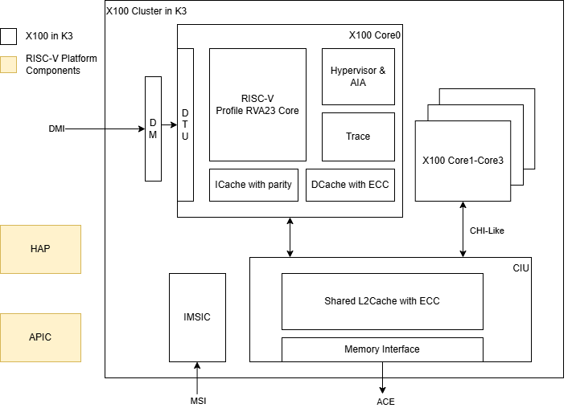

#### 2.1.2 SpacemiT® A100™ AI Core

**Introduction**  
The SpacemiT® A100™ is an AI-first RISC-V AI-CPU that delivers native AI compute capability through the SpacemiT-IME instruction set. Its microarchitecture is specifically optimized for operator-level parallelism, memory bandwidth efficiency, and data locality, enabling highly efficient execution of real-world AI workloads.  
In addition to advanced AI acceleration, the A100 fully supports general-purpose CPU functionalities defined by the RVA23* specification and leverages a standard RISC-V unified programming model to power Small-Local Language Model (SLM) and a broad range of AI-centric applications.

**Features**  
- AI Compute Performance: 60 TOPs (@INT4 sparse)  
- RISC-V Compliance: Fully compliant with RISC-V RVA23* standards  
- Cache Architecture:  
  - 32 KB L1 I-Cache and 32 KB L1 D-Cache per core  
  - 1 MB L2 Cache per cluster  
  - 1.5 MB Scratchpad per cluster  
  - L1 D-Cache supports MESI coherence protocol  
  - L2 Cache supports MOESI coherence protocol  
- Vector Extension: RVV 1.0, VLEN = 1024  
- Interrupt Controllers: ACLINT and APLIC, compliant with the AIA standard
- MSI Interrupt Count:
  - M-mode: 511
  - S-mode: 511
  - VS-mode: 7 VS interrupt files, each supporting 63 MSI interrupts
- Performance Monitoring: Integrated RISC-V Performance Monitoring Unit (PMU)  
- Virtual Memory: Supports SV39 virtual memory management  
- Security Framework:  
  - 32 PMP entries compliant with the RISC-V security framework  
  - Supports RISC-V Debug and Trace  
- RVA23* Optional Extensions (not included in the RVA23 base specification):  
  - Vector Crypto: `zvkng`, `zvksg`  
  - Other Extensions: `zvbc`, `zfh`, `zbc`, `zvfh`, `zfbmin`, `zvfbfmin`, `zvfbfwma`  
  - System and Security: `sdtri`, `svvptc`, `sspm`, `smepmp`, `smstateen`, `smcntrpmf`  

> **Note**: RVA23* (in A100 AI core) does not include the Hypervisor extension.

**Block Diagram**  

#### 2.1.3 RT24 RISC-V Core

**Introduction**  
The RT24 serves as the system management core within the K3 SoC. It is based on CVA6, the OpenHW Group’s open-source 64-bit RISC-V CPU, featuring a 6-stage, in-order, single-issue pipeline with RV64GC support and Unix-like operating system compatibility. Designed for high efficiency and reliability, the RT24 core provides essential control, coordination, and low-power management functions across the system.

**Features**  
- Ultra-low standby and active power consumption  
- Implements the RV64IMAFDC (RV64GC) instruction set  
- Supports three RISC-V privilege levels: M, S, and U  
- Provides virtual address translation through ITLB, DTLB, and PTW units  

**Block Diagram**  

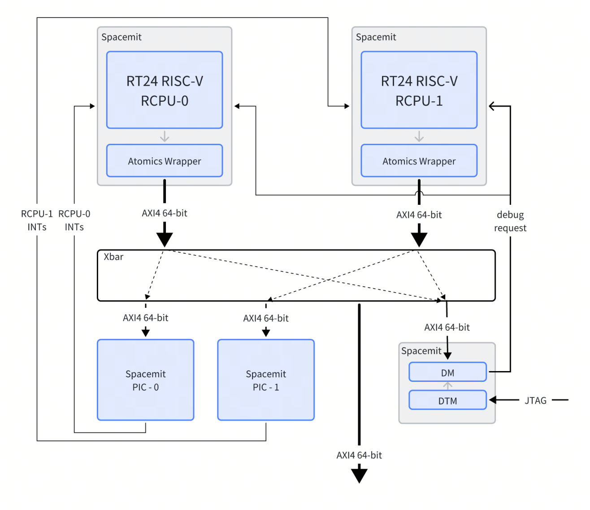

#### 2.1.4 Debug

**Introduction**  
The debugging interface serves as the channel for software to interact with the processor. Through this interface, users can access CPU registers and memory contents, as well as other on-chip device information. Additionally, tasks such as downloading programs can be performed via the debugging interface.

**Block Diagram**  
The micro-architecture of the debugging interface is depicted below.

As illustrated, the debugging system consists of  

- A debugging software (e.g., GDB)
- A debugging agent service (e.g., OpenOCD)
- A debugger (e.g., JTAG Debug Probe)
- A debugging interface (e.g., DTM)

These components are interconnected as follows:  

- The debugging software generally communicates with the debugging agent service over a network.
- The debugging agent service commonly interfaces with the debugger via USB.  
- The debugger interacts with the CPU through the JTAG interface.

The JTAG memory access method could be either **progbuf** or **sysbus** mode, where  

- The **progbuf** mode is a standard JTAG method that accesses memory through the CPU  
- The **sysbus** mode bypasses the CPU to access on-chip resources via the System Bus Access (SBA) port  

#### 2.1.5 Trace

**Introduction**  
The RISC-V Trace System provides a hardware–software interface for debugging and analyzing the execution trace of a hart, including details of its memory accesses.  
Once a RISC-V hart streams its program execution and memory-access trace through the ingress port defined by the RISC-V Trace Specification, an encoder compresses the data for efficient transmission.  
The trace data can then be stored on-chip, where host-side decoder software reconstructs the full execution flow, allowing developers to accurately observe the hart’s runtime behavior.

**Features**  
The trace components of the X100 and A100 cores on the K3 are fully compliant with the RISC-V N-Trace protocol and its associated interfaces — RISC-V Trace Control Interface and RISC-V Hart-to-Trace Interface.  
Key features include:

- Independent trace encoder connected to each X100/A100 core  
- Integrated ATB bridge for connection to the ATB bus  
- Support for BTM (Branch Trace Mode) compression  
- Optional message types such as ownership messages, and enable improved trace handling in complex OS environments.  
- Precise trace enable/disable control via debug triggers  
- Extended compression capabilities such as virtual address compression to further enhance trace efficiency  

**Block Diagram**
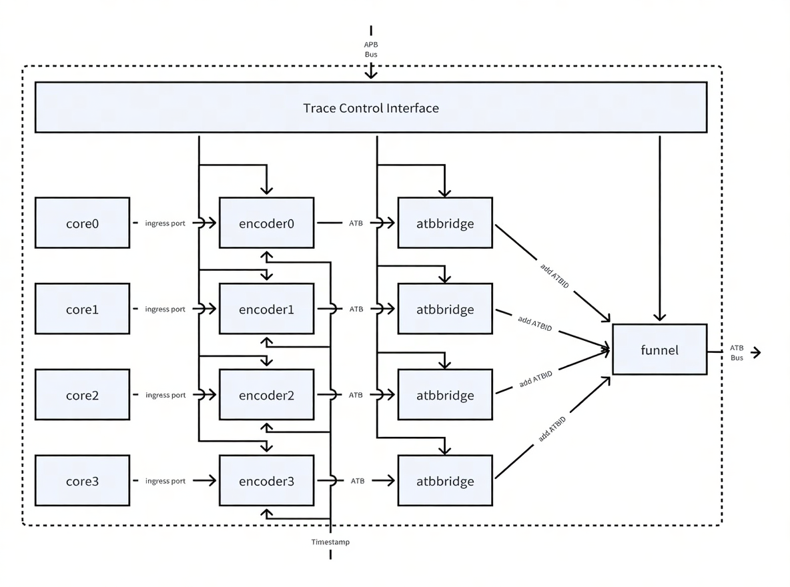

### 2.2 Memory & Storage

#### 2.2.1 On-Chip Memory

**Introduction**  
K3 integrates the following on-chip memory resources:
- 128 KB Boot ROM: stores the first-stage bootloader, supports booting from multiple external media, program download via USB and UART, and eFuse-based secure boot.
- 512 KB SRAM: shared by the main CPU and the RCPU.

#### 2.2.2 LPDDR4x/5

**Introduction**  
The Dynamic Memory Interface provides a high-performance, low-power connection to external LPDDR4x and LPDDR5 DRAM devices. It supports flexible configurations and dynamic frequency scaling to balance bandwidth and power efficiency across various application scenarios.

**Features**
- Supports LPDDR4x and LPDDR5 memory types:  
  - LPDDR4x data rate up to 4266 MT/s  
  - LPDDR5 data rate up to 6400 MT/s  
- Maximum Supported Memory Capacity: 32 GB  
- Supports two channels, each with a 32-bit data width  
- Each channel supports two ranks  
- Supports dynamic frequency scaling, allowing real-time frequency adjustment based on bandwidth demand to optimize power efficiency  

#### 2.2.3 Quad-SPI

**Introduction**  
The Quad-SPI interface provides communication between the SoC and external serial flash memory devices. It supports data transfer over up to four bidirectional data lines, offering high flexibility and compatibility with a wide range of flash devices.

**Features**  
- Supports XIP mode and Page mode  
- Independent 1/2/4 data width  
- Maximum clock frequency up to 102 MHz, minimum 13.25 MHz  
- Supports SPI NOR Flash and SPI NAND Flash  
- Supports 1.8 V and 3.3 V signal voltages  

#### 2.2.4 eMMC Interface

**Introduction**  
The eMMC interface functions as a host controller for the eMMC bus, enabling data transfer between the external eMMC card and the internal system bus master.

**Features**  
- Compliant with 8-bit eMMC 5.1 specification  
- Compatible with SDHCI register set, with additional vendor-specific registers  
- Supports 1-bit / 8-bit MMC and CE-ATA cards  
- Supports the following data transfer types as defined in the SDHCI specification:  
  - PIO  
  - SDMA  
  - ADMA  
  - ADMA2  
- Supports SPI mode operation for eMMC cards  
- Supports the following speed modes as defined in the eMMC 5.1 specification:  
  - Legacy mode: up to 26 MB/s bandwidth, 1.8 V signal voltage  
  - High-Speed SDR: up to 52 MB/s bandwidth, 1.8 V signal voltage  
  - High-Speed DDR: up to 52 MB/s bandwidth, 1.8 V signal voltage  
  - HS200: up to 200 MB/s bandwidth, 1.8 V signal voltage  
  - HS400: up to 400 MB/s bandwidth, 1.8 V signal voltage  
- Supports hardware generation of all command and data transactions, with CRC validation  
- Equipped with a 1024-byte data FIFO buffer (2 × 512-byte data blocks)  

#### 2.2.5 SD/MMC Interface

**Introduction**  
The SD/MMC interface functions as a host controller for the SD/MMC bus, enabling data transfer between the external SD/MMC card and the internal system bus master.

**Features**  
- Compliant with 4-bit SD 3.0 UHS-I specification  
- Compatible with SDHCI register set, with additional vendor-specific registers  
- Supports 1-bit / 4-bit SD storage  
- Supports the following data transfer types as defined in the SDHCI specification:  
  - PIO  
  - SDMA  
  - ADMA  
  - ADMA2  
- Supports the following speed modes as defined in the SD 3.0 specification:  
  - Default Speed: up to 12.5 MB/s bandwidth, 3.3 V signal voltage  
  - High Speed: up to 25 MB/s bandwidth, 3.3 V signal voltage  
  - SDR12: up to 25 MHz clock, 1.8 V signal voltage  
  - SDR25: up to 50 MHz clock, 1.8 V signal voltage  
  - SDR50: up to 100 MHz clock, 1.8 V signal voltage  
  - SDR104: up to 208 MHz clock, 1.8 V signal voltage  
  - DDR50: up to 50 MHz clock, 1.8 V signal voltage  
- Supports hardware generation of all command and data transactions, with CRC validation  
- Supports read-wait control and suspend/resume functions for SD/MMC cards  
- Supports card insertion/removal detection through GPIO mode  
- Equipped with a 1024-byte data FIFO buffer (2 × 512-byte data blocks)  

#### 2.2.6 UFS Interface

**Introduction**  
The UFS (Universal Flash Storage) interface provides a high-performance, low-power mass storage solution for the SoC. It complies with the JEDEC UFS 2.2, MIPI UniPro v1.6, and MIPI M-PHY v3.0 specifications.  

The UFS supports up to 2 lanes over a serial interface, providing 2 transmit (TX) and 2 receive (RX) for full-duplex communication. It supports High-Speed Mode (HS-GEAR3) and Low-Speed Mode (PWM-GEAR1), offering high bandwidth and low latency. It supports standard SCSI command set operations and allows the system to boot directly from UFS storage.

**Features**  
- Compliance with JEDEC UFS 2.2 specification  
- Compliance with MIPI UniPro v1.6 and MIPI M-PHY v3.0 specifications  
- Support for serial interface protocol:  
  - High-Speed Mode (HS-GEAR3) with up to 2 transmit (TX) and 2 receive (RX) lanes  
  - Low-Speed Mode (PWM-GEAR1)  
- Support for standard SCSI command operations  
- Support for system booting from UFS  

### 2.3 Image Subsystem

#### 2.3.1 MIPI Camera IN Interface

**Introduction**  
The MIPI Camera IN interface integrates four MIPI-CSI2 v1.1 controllers, each equipped with four data lanes supporting a maximum transfer rate of 1.5 Gbps per lane.

**Features**  
- Configurable data lanes: 1, 2, or 4  
- Independent D-PHY Resources：  
  - CSI0 and CSI1 each have a dedicated D-PHY interface  
- Shared D-PHY Resource：  
  - CSI2 and CSI3 share one 4-lane D-PHY interface. Each supports up to 4 lanes when used independently, or up to 2 lanes per interface when operating simultaneously  
- Supported input data formats:  
  - Legacy YUV420 8-bit  
  - YUV420 8-bit
  - YUV422 8-bit
  - RAW8  
  - RAW10  
  - RAW12  
  - Embedded data type  
- Supported data interleaving types:  
  - Data-type interleaving  
  - Virtual-channel interleaving  

**Block Diagram**
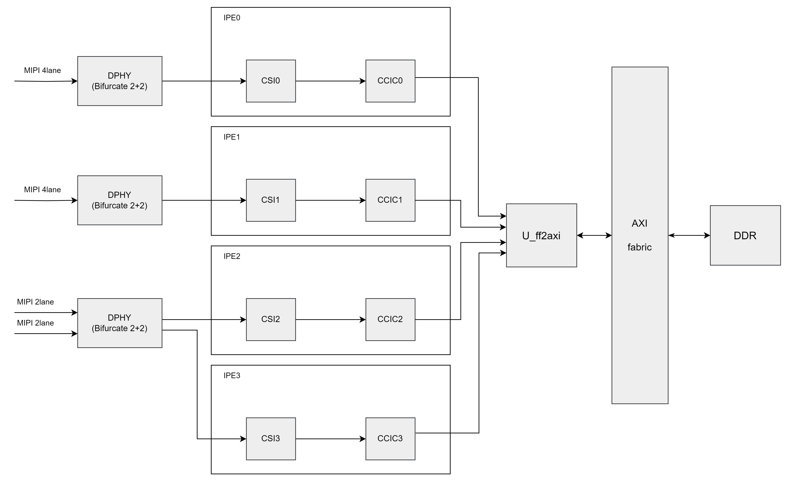

#### 2.3.2 GPU

**Introduction**  
This GPU architecture is built around multi-threaded unified shading clusters featuring a high-SIMD-efficiency ALU design. It employs a tile-based deferred rendering (TBDR) pipeline that supports concurrent processing of multiple tiles, enabling high-performance 3D graphics and compute workloads.

**Features**  
- Fully compliant with major graphics and compute APIs:  
  - OpenGL ES 1.1 / 3.2  
  - EGL 1.5  
  - OpenCL 3.0  
  - Vulkan 1.3  
- Tile-Based Deferred Rendering (TBDR) for 3D graphics, with concurrent multi-tile processing  
- Programmable, high-quality image anti-aliasing  
- Fine-grained triangle culling for improved rendering efficiency  
- Support for DRM security  
- Support for GPU virtualization, with up to 8 virtual GPU instances  
- Support for multi-lane isolation technology, providing up to 8 independent lanes  
- Separate IRQs per lane/OS context  
- Optional AI acceleration cooperation when paired with a neural network accelerator  
- Multi-threaded unified shading engine supporting:  
  - Pixel shading  
  - Vertex shading  
  - Compute shader (GPGPU) workloads  
- ALU architecture optimized for high SIMD efficiency  
- Fully virtualized memory addressing with Unified Memory Architecture (UMA)  
- Fine-grained task switching, workload balancing, and power management  
- Advanced DMA-driven operation to minimize host CPU involvement  
- 128 KB system-level cache (SLC)  
- Specialized texture cache unit  
- Compressed texture decoding  
- Lossless geometry compression performed during geometry processing  
- Lossless or visually lossless framebuffer compression for reduced bandwidth usage  
- Dedicated firmware processor for GPU core management:  
  - Single-threaded design  
  - 2 KB instruction cache + 2 KB data cache  
  - Independent power island  
- On-chip performance, power, and statistics registers for system monitoring  

#### 2.3.3 V2D

**Introduction**  
V2D is a 2D hardware acceleration module that supports common 2D image operations such as format conversion, rotation, mirroring, scaling, cropping, solid fill, and alpha blending.

**Features**  

- Scaling:  
  - Upscaling up to 8×  
  - Downscaling down to 1/8×  
- Rotation & Mirroring:  
  - 0°, 90°, 180°, 270° rotation  
  - Mirror and flip operations  
- Blending & Compositing:  
  - Simple layer and background blending  
- Image Cropping  
- Solid Color Fill  
- Color Space Conversion:  
  - RGB to and from BT.601 / BT.709 (narrow and full range)  
- Maximum Resolution: 4096×2160  
- Dithering for smoother color transitions  
- Memory Management Unit (MMU) support  
- Bus Interfaces: APB3, AXI3  
- Supported Input Formats:  
  - RGB888, RGBX888, RGBA8888, ARGB8888 (optional RB swap)  
  - RGB565, RGBA5658, ARGB8565 (optional RB swap)  
  - A8 (8-bit alpha image), Y8 (8-bit grayscale)  
  - YUV420 semi-planar (UV swappable)  
  - AFBC 16×16 RGBA8888 (Layout0 split/non-split)  
  - AFBC 16×16 NV12 (Layout1 split/non-split)  
- Supported Output Formats:  
  - Same as input formats, including RGB, ARGB, A8, Y8, YUV420, and AFBC variation  

### 2.4 Video Subsystem

#### 2.4.1 Introduction

The Video Processing Unit (VPU) is a quad-core video accelerator that supports encoding and decoding across multiple video standards. It integrates a host CPU and executes firmware to control the hardware engine, handling bitstream parsing, submodule scheduling, and error recovery.

The VPU can operate at up to 1 GHz and supports a wide range of video standards, including H.265, H.264, VP8, VP9, MPEG4, MPEG2, and H.263. Typical concurrent processing capabilities include:
- 4K@60 fps simultaneous encode and decode
- 4K@90 fps H.264/H.265 encoding
- 4K@180 fps H.264/H.265 decoding

The actual processing for each codec is implemented in dedicated hardware logic. The Macroblock Sequencer serves as the main control unit, orchestrating the processing flow of each submodule to reduce processor load and simplify firmware complexity.

In addition, multiple standard-agnostic modules share common runtime logic, ensuring high efficiency and smooth performance across different video standards.

#### 2.4.2 Video Encoder

**Encoding Features**
- Configurable Arm Frame Buffer Compression (AFBC) 1.0 or 1.2 for input
- Supports YUV422 and YUV420 AFBC block splitting (16 × 16)
- Supports stride (not applicable to AFBC input formats)
- Horizontal and vertical mirroring (not applicable to AFBC input formats)
- Optional source frame rotation in 90° steps before encoding (not applicable to AFBC input formats)

> **Note:** If YUV422 is rotated by 90° or 270° without conversion to YUV420, the output will be converted to YUV440

**Supported Source-Frame Input Formats**

- 1-plane YUV422, scan-line format, interleaved in YUYV or UYVY order
  > **Note:** YUV422 input can be converted to YUV420
- 1-plane RGB (8-bit), byte-address order: RGBA, BGRA, ARGB, ABGR
- 2-plane YUV420, scan-line format, with chroma interleaved in UV or VU order
- 3-plane YUV420, scan-line format
  > **Note:** Supported for testing purposes only; not recommended for optimal performance
- AFBC YUV422
- AFBC YUV420

**Supported Encoding Formats**
- HEVC (H.265) Main Profile
- HEVC (H.265) Main 10 Profile
- H.264 Baseline Profile (BP)
- H.264 Main Profile (MP)
- H.264 High Profile (HP)
- VP8
- VP9 Profile 0
- JPEG, baseline sequential

**HEVC (H.265) Encoding Features**
- Output bitstream compliant with HEVC Main Profile
- Encoding performance: Up to 4K@90 fps
- Maximum frame size: 4096 × 4096 pixels
- Bit depth: 8-bit, supporting I, P, and B frames
- Supports Tiled Mode, up to 4 tiles (horizontal split only)
- Motion Estimation (ME) with search range:
  - Horizontal: ±128 pixels & Vertical: ±64 pixels
  - Precision: Supports down to 1/4-pixel (QPEL) accuracy
- Intra Prediction Modes:
  - Luma: 8×8, 16×16, 32×32
  - Chroma: 4×4, 8×8, 16×16
- Inter Prediction Modes: 8×8, 16×16, 32×32
- Transform Sizes:
  - Luma: 8×8, 16×16, 32×32
  - Chroma: 4×4, 8×8, 16×16
- Supports Deblocking Filter
- Quantization modes: fixed QP, or leaky bucket model-based rate control (based on target bitrate and buffer size)
- Supports Long-Term Reference (LTR) frames
- Supports slice insertion at CTU-row granularity

> **Note:** The encoder does not enforce a maximum bit constraint per CTU.

**H.264 Encoding Features**
- Encoded bitstream compliant with Baseline, Main, and High Profiles
- Encoding performance: Up to 4K@90 fps
- Maximum frame size: 4096 × 4096 pixels
- Frame types: Supports I, P, and B frames
- Entropy coding: CABAC or CAVLC
  > **Note:** B frames are not supported by CAVLC
- Motion Estimation (ME) with search range:
  - Horizontal: ±128 pixels & Vertical: ±64 pixels
  - Precision: Supports down to 1/4-pixel (QPEL) accuracy
- Intra Prediction Modes:
  - Luma: 4×4, 8×8, 16×16
  - Chroma: 8×8
- Inter Prediction Modes: 8×8, 16×16
- Transform Sizes: 4×4, 8×8
- Supports Deblocking Filter
- Constrained intra-prediction (selectable)
- Quantization modes: fixed QP, or leaky bucket model-based rate control (based on target bitrate and buffer size)
- Long-term reference frame support
- Selectable intra-frame refresh intervals
- Slice insertion granularity: 32-pixel high rows

> **Notes:**
> 1. For further details, refer to ITU-T H.264 Annex B: VC-1 Compressed Video Bitstream Format and Decoding Process
> 2. Encoder does not prevent output from exceeding the maximum bits per macroblock

**VP8 Encoding Features**
- Encoding performance: Up to 4K@90 fps
- Maximum frame size: 2048 × 2048 pixels
- Frame types: Supports I and P frames
- Motion Estimation (ME) with search range:
  - Horizontal: ±128 pixels & Vertical: ±64 pixels
  - Precision: Supports down to 1/4-pixel (QPEL) accuracy
- Intra Prediction Modes:
  - Luma: 4×4, 8×8, 16×16
  - Chroma: 8×8
- Inter Prediction Modes: 8×8, 16×16
- Supports Deblocking Filter
- Quantization modes: fixed QP, or leaky bucket model-based rate control (based on target bitrate and buffer size)

**VP9 Encoding Features**
- Encoded bitstream compliant with VP9 Profile 0 at 8-bit depth
- Encoding performance: Up to 4K@90 fps
- Maximum frame size: 4096 × 4096 pixels
- Sample depth: 8-bit
- Frame types: Supports I and P frames
- Motion Estimation (ME) with search range:
  - Horizontal: ±128 pixels & Vertical: ±64 pixels
  - Precision: Supports down to 1/4-pixel (QPEL) accuracy
- Intra Prediction Modes:
  - Luma: 8×8, 16×16, 32×32
  - Chroma: 4×4, 8×8, 16×16
- Inter Prediction Modes: 8×8, 16×16, 32×32
- Transform sizes:
  - Luma: 8×8, 16×16, 32×32
  - Chroma: 4×4, 8×8, 16×16
- Supports Deblocking Filter
- Quantization modes: fixed QP, or leaky bucket model-based rate control (based on target bitrate and buffer size)

#### 2.4.3 Video Decoder

**Decoding Features**
- Supports the following output frame formats:
  - 2-plane YUV420, scan-line format, chroma interleaved in UV or VU order
  - 3-plane YUV420, scan-line format
    > **Note:** 3-plane format is for testing purposes only; not recommended for maximum performance in normal applications
- Ensure correct YUV buffer alignment and stride for optimal performance
- Supports YUV420 AFBC format, 8-bit color depth
- Configurable for AFBC 1.0 or AFBC 1.2 output
- Stride support for scan-line formats only
- Decoded frame rotation supported in 90-degree increments before output
  > **Note:** Not applicable for AFBC output formats
- Supports reporting of average luminance (brightness) and chrominance (color) values for each 32×32 pixel block in every displayed output frame

**Supported Decoding Formats**
- HEVC (H.265): Main Profile
- H.264: Baseline, Main, High Profiles
- VP8
- VP9: Profile 0 and Profile 2 at 10-bit
- VC-1: Simple Profile (SP), Main Profile (MP), Advanced Profile (AP)
- MPEG-4: Simple Profile (SP), Advanced Simple Profile (ASP)
- MPEG-2: Main Profile (MP)
- H.263: Profile 0

**HEVC (H.265) Decoding Features**
- Full compliance with Main Profiles
- Decoding performance: Up to 4K@180 fps
- Maximum frame size: 4096 × 4096 pixels

**H.264 Decoding Features**
- Fully compliant with Baseline, Main, High, and High 10 progressive profiles
- Decoding performance: Up to 4K@180 fps
- Escape option is always enabled to prevent emulation of a Network Abstraction Layer (NAL) unit start code, regardless of the NAL packet format setting

> **Note:** For further details, refer to ITU-T H.264 Annex B: VC-1 Compressed Video Bitstream Format and Decoding Process

**VP8 Decoding Features**
- Fully compliant with the VP8 specification
- Decoding performance: Up to 4K@180 fps
- Maximum frame size: 2048 × 2048 pixels

**VP9 Decoding Features**
- Fully compliant with Profile 0
- Decoding performance: Up to 4K@180 fps
- Maximum frame size: 4096 × 4096 pixels

**VC-1 Decoding Features**
- Fully compliant with VC-1 Simple, Main, and Advanced Profiles
- Decoding performance: Up to 4K@120 fps
- Maximum frame size: 2048 × 4096 pixels

**MPEG4 Decoding Features**
- Compliant with MPEG-4 Simple Profile (SP) and Advanced Simple Profile (ASP)
- Supports Global Motion Compensation (GMC) with a limitation of one warp point
- Decoding performance: Up to 4K@120 fps
- Maximum frame size: 2048 × 2048 pixels

**MPEG2 Decoding Features**
- Compliant with MPEG-2 Main Profile
- Decoding performance: Up to 4K@120 fps
- Maximum frame size:
  - Progressive streams: Width up to 4096 pixels
  - Interlaced streams: Width up to 2048 pixels and Height up to 4096 pixels

**H.263 Decoding Features**
- Compliant with H.263 Profile 0
- Decoding performance: Up to 4K@120 fps
- Maximum frame size: Width and height up to 2048 pixels

### 2.5 Display Subsystem

#### 2.5.1 Display Controller

**Introduction**  
The Display Controller is a hardware module that transfers display data from the internal memory to the DSI and DP/eDP controllers. It supports high-resolution panels and advanced image processing features.

**Features**  
- Resolution Support:
  - 3840×2160 @ 60fps  
  - 2560×1440 @ 144fps  
- Layer Composition:  
  - Up to 4 full-size layer composers  
  - Maximum 16 layer composers via up-down layer reuse in the RDMA channel  
- Command & Write-Back:  
  - `cmdlist` mechanism to configure hardware registers  
  - Concurrent write-back for raw and AFBC formats  
  - Dithering, cropping, and rotation supported in write-back path  
- Memory Management:  
  - Advanced MMU with nearly no page misses during 90° and 270° rotation  
- Color & Display Enhancements:  
  - Color Keying and solid color generation  
  - Advanced Error Diffusion and pattern-based dithering  
  - Color saturation and contrast enhancement  
  - Display effect adjustment  
- Input Formats:  
  - ABGR2101010, ARGB2101010, BGRA2101010, RGBA2101010  
  - ABGR8888, ARGB8888, BGRA8888, RGBA8888  
  - XBGR8888, XRGB8888, BGRX8888, RGBX8888  
  - BGR888, RGB888, ABGR1555, RGBA5551, BGR565/RGB565  
  - XYUV_444_P1_8, XYUV_444_P1_10, YVYU_422_P1_8, VYUY_422_P1_8  
  - YUV_420_P2_8, YUV_420_P3_8  
   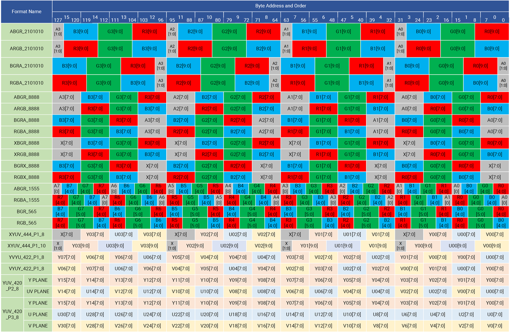
- Output Formats:  
  - RGB888, RGB565, RGB666  
- Panel & Mode Support:  
  - Video mode and command mode (frame buffer in LCM)  
  - Dynamic DDR frequency adjustment with embedded DFC buffer  
- Source Format Support:  
  - Both AFBC and raw image sources  

#### 2.5.2 MIPI DSI Interface

**Introduction**  
The MIPI Display Serial Interface (MIPI DSI) is a high-speed interface connecting the host processor to display peripherals, fully compliant with MIPI Alliance specifications for mobile and embedded devices.

**Features**  
- Standards Compliance:  
  - MIPI DSI v1.2  
  - MIPI D-PHY v1.2  
  - Display Command Set (DCS) standard  
- Lane & Speed Support:  
  - Up to 8 data lanes  
  - Maximum speed up to 4.5 Gbps per lane  
  - 1 active panel per D-PHY link  
- Resolution Support:  
  - Up to 3840×2160 @ 60fps or 2560×1440 @ 90fps  
- Operational Modes:  
  - Command Mode, Video Mode, and Video Burst Mode
- Signaling Support:  
  - HS-TX (High-Speed Transmit)  
  - LP-TX / LP-RX (Low-Power Transmit / Receive)  
  - LP-CLK / LP-CD (Low-Power Clock / Data)  
- Data & Channel Support:  
  - Support for all pixel formats defined in DSI and DCS  
  - Support for virtual channels in the MIPI link  
  - Burst video mode support with D-PHY up to 4.5 Gbps per lane  

#### 2.5.3 DP/eDP Controller

**Introduction**  
The DP/eDP Controller is a display interface controller that manages data transfer from the SoC to external DisplayPort (DP) or embedded DisplayPort (eDP) panels.

**Features**  
- Compliance with DisplayPort (DP) standard v1.2  
- Compliance with embedded DisplayPort (eDP) standard v1.4  
- Supports resolutions up to 3840×2160 @ 60fps or 2560×1440 @ 144fps  

### 2.6 Audio Subsystem

#### 2.6.1 Introduction

The K3 SoC integrates a comprehensive Audio Subsystem designed to deliver high-quality, low-latency audio performance. It incorporates multiple I²S and DisplayPort audio interfaces to support diverse playback and recording scenarios across multimedia and communication applications.  

The subsystem includes the following primary interfaces:  
- 6 × Full-Duplex I²S Interfaces  
- 4 × Half-Duplex I²S Interfaces (two connected to the DP/eDP controller)  
- 2 × DP/eDP Audio Interfaces

#### 2.6.2 Full-Duplex I²S Interfaces Features

- Support full-duplex operation with simultaneous playback and recording  
- Compliance with the standard I²S audio format  
- Fixed audio parameters:  
  - Sampling rate: 48 kHz  
  - Data depth: 16 bits  
  - Channels: 2 (stereo)  
- Configurable system clock (sysclk) modes: 64fs, 128fs, or 256fs  

#### 2.6.3 Half-Duplex I²S Interfaces Features

- Support playback or recording in half-duplex mode  
- Compliance with standard I²S, left-justified, and right-justified formats  
- Audio parameters:  
  - Sampling rate: 48 kHz  
  - Data depth: 16 bits  
  - Channels: 2 (stereo)  
- Support for TDM (Time-Division Multiplexing) mode:  
  - DSP_A / DSP_B modes  
  - Sampling rate: 48 kHz  
  - Data depth: 16-bit / 32-bit  
  - Up to 4 channels  

#### 2.6.4 DP/eDP Audio Interfaces Features

- Support audio playback over DisplayPort or Embedded DisplayPort links  
- Compliance with I²S, left-justified, and right-justified formats  
- Audio parameters:  
  - Sampling rate: up to 192 kHz  
  - Data depth: 16-bit / 20-bit / 24-bit  
  - Channels: 2 (stereo)  

### 2.7 Connectivity Subsystem

#### 2.7.1 PCIe 3.0 (IOMMU)

**Introduction**  
The K3 SoC integrates five PCIe ports — PCIeA, PCIeB, PCIeC, PCIeD, and PCIeE — each supporting PCIe Gen3 operation at 8 GT/s per lane.  

- Lane configuration:  
  - PCIeA provides eight lanes  
  - PCIeB and PCIeC provide two lanes each  
  - PCIeD and PCIeE provide one lane each  
- Mode support:  
  - PCIeA supports dual-mode operation (Root Complex / Endpoint)  
  - PCIeB, PCIeC, PCIeD, and PCIeE support Root Complex (RC) mode only  
- Virtual channels: PCIeB, PCIeC, PCIeD, and PCIeE support VC0 and VC1  
- IOMMU support: PCIeA, PCIeB, and PCIeE support IOMMU for device virtualization  
- PHY configuration:  
  - A total of six PHYs are integrated, providing eight lanes  
  - PHY0 and PHY1 are dual-lane PHYs  
  - PHY2, PHY3, PHY4, and PHY5 are single-lane PHYs  
  - PHY2, PHY3, and PHY4 are shared between PCIe and USB  

**Features**  
- Supports dual-mode operation, programmable as either Root Complex (RC) or Endpoint (EP)  
- Integrated Internal Address Translation Unit (iATU) with 8 outbound and 8 inbound entries  
- Integrated DMA engine with hardware flow control, including 4 write and 4 read channels  
- Supports ECRC generation and checking  
- Supports Maximum Payload Size up to 256 bytes  
- Supports automatic lane flip and reversal  
- Supports Active State Link Power Management (ASPM) with L0 and L1 power states  
- Supports Latency Tolerance Reporting (LTR)  
- Supports Virtual Channel 0 (VC0) and Virtual Channel 1 (VC1)  
- Supports Precision Time Measurement (PTM)
- Supports ID-Based Ordering (IDO)  
- Supports completion timeout range configuration  
- Supports Separate Reference Clock with Independent Spread (SRIS)  
- Supports up to 64 outbound non-posted requests  
- Supports up to 32 outstanding AXI slave non-posted requests  
- In Endpoint (EP) mode:  
  - Supports Function 0 with 6 size-programmable BARs  
  - Supports MSI capability  
- In Root Complex (RC) mode:  
  - Integrates MSI and MSI-X reception module  

#### 2.7.2 USB

**Introduction**  
The K3 SoC integrates multiple USB interfaces to support high-speed connectivity and flexible device configurations. The USB subsystem includes the following ports:  
- One USB 2.0 Host Port  
- One USB 3.0 DRD (Dual-Role Device) Port with an integrated USB 2.0 DRD interface (USB 3.0 Port A)  
- Three USB 3.0 Host Ports (USB 3.0 Port B/C/D) — their SuperSpeed PHYs are shared with PCIe and can operate in either USB or PCIe mode, but only one function can be selected at a time  

##### USB 2.0 Host Port Features

**Controller**  
- Supports USB 2.0 Host mode only  
- Compliant with the USB 2.0 specification  
- Host controller registers and data structures conform to the Intel xHCI specification  
- Supports High-Speed (480 Mb/s), Full-Speed (12 Mb/s), and Low-Speed (1.5 Mb/s) operation  

**Communication Interface**  
- Utilizes a UTMI+ (30/60 MHz) interface for USB 2.0 PHY  

**Clock Domains**  
- UTMI+ PHY (30/60 MHz)  
- MAC (125 MHz nominal)  
- Bus clock domain  
- RAM clock domain  

**System & Power Management**  
- Integrated DMA controller  
- Supports USB 2.0 suspend mode  

**Endpoints & Memory**  
- Supports up to 32 endpoints in Device mode  
- Flexible endpoint FIFO sizing (not restricted to powers of 2) for contiguous memory allocation  
- Supports descriptor caching and data prefetching to improve performance in high-latency systems  

**Additional Features**  
- Software-controlled USB standard commands (SETUP packets can be forwarded to the application for decoding)  
- Hardware-level error handling for USB bus and packet-level errors  
- Interrupt support  

##### USB 3.0 DRD Port Features (Port A, with USB 2.0 DRD Interface)

**Controller**  
- Supports both Host and Device modes for USB 3.0 and USB 2.0  
- Fully compliant with USB 3.0 and USB 2.0 specifications  
- USB 3.0 Host controller registers and data structures conform to the Intel xHCI specification  
- USB 3.0 Device controller registers and data structures are self-defined and require software configuration  
- Supports one USB 3.0 port and one USB 2.0 port  
- Supports SuperSpeed (5 Gb/s), High-Speed (480 Mb/s), Full-Speed (12 Mb/s), and Low-Speed (1.5 Mb/s; Host-only) operation  

**Communication Interface**  
- Utilizes PIPE3 (125 MHz) interface for USB 3.0 PHY  
- Utilizes UTMI+ (30/60 MHz) interface for USB 2.0 PHY  

**Clock Domains**  
- PIPE3 PHY (125 MHz)  
- UTMI+ PHY (30/60 MHz)  
- MAC (125 MHz nominal)  
- Bus clock domain  
- RAM clock domain  

**System & Power Management**  
- Integrated DMA controller  
- Supports USB 2.0 suspend mode  
- Supports U1/U2/U3 low-power states for USB 3.0  

**Endpoints & Memory**  
- Supports up to 32 endpoints in Device mode  
- Flexible endpoint FIFO sizing  
- Descriptor caching and data prefetching for optimized throughput  

**Additional Feature**  
- Software-controlled standard USB commands  
- Hardware-level error detection and recovery for USB bus and packet-level errors  
- Interrupt support  
- The USB 3.0 SuperSpeed PHY integrates an internal Type-C orientation switch controllable via GPIO input  

##### USB 3.0 Host Port Features (Ports B/C/D)

**Controller**  
- Supports USB 3.0 and USB 2.0 Host modes  
- Fully compliant with USB 3.0 and USB 2.0 specifications  
- USB 3.0 Host controller registers and data structures conform to the Intel xHCI specification  
- Supports one USB 3.0 port and one USB 2.0 port  
- Supports SuperSpeed (5 Gb/s), High-Speed (480 Mb/s), Full-Speed (12 Mb/s), and Low-Speed (1.5 Mb/s) operation  

**Communication Interface**  
- Utilizes PIPE3 (125 MHz) interface for USB 3.0 PHY  
- The SuperSpeed PHY is shared with the corresponding PCIe Port (only one function can be active at a time)  
- Utilizes UTMI+ (30/60 MHz) interface for USB 2.0 PHY  

**Clock Domains**  
- PIPE3 PHY (125 MHz)  
- UTMI+ PHY (30/60 MHz)  
- MAC (125 MHz nominal)  
- Bus clock domain  
- RAM clock domain  

**System & Power Management**  
- Integrated DMA controller  
- Supports USB 2.0 suspend mode  
- Supports U1/U2/U3 low-power states for USB 3.0  

**Endpoints & Memory**  
- Supports up to 32 endpoints in Device mode  
- Flexible endpoint FIFO sizing  
- Descriptor caching and data prefetching for improved performance  

**Additional Features**  
- Software-controlled USB commands  
- Hardware-level error handling for USB bus and packet-level issues  
- Interrupt support  

**Block Diagram**

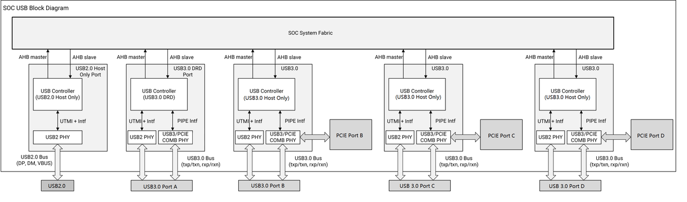

#### 2.7.3 Ethernet GMAC

**Introduction**  
The K3 integrates four Gigabit Media Access Controller (GMAC) interfaces compliant with IEEE 802.3-2015, suitable for AV bridges/nodes, switches, network interface cards (NICs), and data-center bridge applications.

**Features**  
- Supports 10/100/1000 Mbps link speeds  
- Supports MII, RMII, and RGMII interfaces  
- Provides a rich set of packet filtering features, including:  
  - Hash and perfect filtering for MAC addresses  
  - Source and destination IP address filtering  
  - Source and destination TCP/UDP port filtering  
- Compliant with IEEE 1588 v1/v2, supporting sub-microsecond synchronization accuracy  
- Supports one-step time stamping for PTP over UDP  
- Transmit flow control:  
  - IEEE Pause or Priority Flow Control (PFC) frames in full-duplex mode  
  - Backpressure mechanism in half-duplex mode  
  - Receive flow control via IEEE Pause frames  
- Provides comprehensive TCP/IP offload capabilities, including:  
  - Source address and VLAN insertion, replacement, and deletion  
  - Transmit checksum offload with hardware-based checksum calculation and insertion  
  - Receive checksum offload with hardware checksum verification  
  - IP checksum offload with hardware calculation and insertion  
  - TCP/UDP checksum offload with hardware calculation and insertion  
  - Header and payload split storage  
  - TCP/UDP segmentation offload (TSO)  
- Supports Time-Sensitive Networking (TSN) features, including:  
  - Enhancements to Scheduled Traffic (IEEE 802.1Qbv-2015)  
  - Frame Preemption (IEEE 802.1Qbu-2016)  
  - Time-based scheduling  

#### 2.7.4 CAN-FD Interface

**Introduction**  
The K3 integrates up to 10 CAN-FD interfaces. Each CAN-FD controller is a full implementation of the CAN protocol, compliant with both CAN with Flexible Data-Rate (CAN-FD) and CAN 2.0 Part B specifications, enabling high-performance automotive and industrial communication.

**Features**  
- Full compliance with CAN-FD protocol and CAN 2.0 Part B, supporting:  
  - Standard and extended data frames  
  - Data payloads from 0 to 64 bytes  
  - Programmable bit rates  
  - Content-related addressing  
- Compliant with ISO 11898-1 standard  
- Silicon-proven, passing ISO 16845-1:2016 CAN conformance tests  
- Flexible mailboxes: configurable for 0, 8, 16, 32, or 64 bytes; each mailbox can be assigned to transmit or receive standard/extended messages  
- Receive FIFO: up to 6 frames with automatic pointer handling and DMA support  
- Transmission features: abort capability, configurable priority (lowest ID, lowest buffer number, or highest priority)  
- Flexible message buffers: 128 slots (8 bytes each), configurable as transmitter or receiver  
- Programmable clock source: peripheral clock or oscillator  
- RAM usable for general-purpose storage (not required for transmission/reception)  
- Special modes:  
  - Listen-Only Mode (LOM)  
  - Loop-Back mode for self-test  
  - Pretended networking in low-power modes (Doze and Stop)  
- Timing and synchronization:  
  - 16-bit free-running timer with optional external time tick  
  - Global network time synchronization via specific messages  
  - Synchronization indication through SYNCH bit in Error Status 1 register  
- Error handling:  
  - CRC status for transmitted messages  
  - Detection and correction of memory read errors using 5 parity bits per byte (corrects single-bit errors, detects two-bit errors)  
- Advanced receive filtering:  
  - ID filtering supports 128 extended IDs, 256 standard IDs, or 512 partial (8-bit) IDs  
  - Up to 32 elements in ID Filter Table  
  - Supports Identifier Acceptance Filter Hit Indicator (IDHIT)  
- Transceiver Delay Compensation (TDC) for CAN-FD high-speed transmission  
- Low latency for high-priority messages via arbitration  
- Interrupts: maskable and independent per mailbox/FIFO  
- Fully backward compatible with previous CAN-FD versions  

#### 2.7.5 SPI Interface

**Introduction**  
The SPI (Serial Peripheral Interface) is a synchronous serial interface that enables communication with external devices using the Motorola SPI protocol. It can be configured to operate in either Master mode, where the connected device acts as a slave, or Slave mode, where the connected device functions as the master.

**Features**  
- Supports all four CPOL/CPHA combinations defined by the SPI specification.  
- Configurable for operation in either Master or Slave mode.  
- Supports receive-without-transmit operation.  
- Supports serial bit rates ranging from 6.3 Kbps (minimum recommended) to 52 Mbps (maximum allowed).  
- Data size configurable to 8, 16, 18, or 32 bits.  
- Equipped with independent transmit (TXFIFO) and receive (RXFIFO) buffers:  
  - In Non-Packed Data Mode, both FIFOs are 32 entries × 32 bits, supporting a total of 32 samples.  
  - In Packed Data Mode, double-depth FIFOs are used for 8-bit or 16-bit data, providing 64 entries × 16 bits, supporting a total of 64 samples.  
  - Both FIFOs support loading and unloading via Programmed I/O (PIO) or DMA burst transfers.  

#### 2.7.6 UART Interface

**Introduction**  
The UART (Universal Asynchronous Receiver/Transmitter) module provides asynchronous serial communication between the system and external devices. It supports flexible configuration, efficient data handling, and diagnostic features, suitable for both low- and high-speed communication scenarios.

**Features**  
- Interfaces: Supports up to 17 independent UART interfaces. It includes 11 AP domain UARTs and 6 RCPU domain UARTs  
- Compatibility: Fully compatible with industry-standard 8250 UART.  
- Asynchronous Communication: Automatic insertion and removal of start, stop, and parity bits in the serial data stream.  
- Interrupt Control: Independent control of transmit, receive, line status, and data set interrupts.  
- Modem Control: CTS and RTS supported on AP domain UART1–UART10 and RCPU domain UART1.  
- Auto Flow Control:  
  - RTS (output): automatically driven by UART receive FIFO.  
  - CTS (input): controlled by external modem transmission signal.  
- Programmable Serial Parameters:  
  - Character length: 7 or 8 bits  
  - Parity: even, odd, or none  
  - Stop bits: 1  
  - Baud rate: up to 3.6 Mbps for 4 high-speed UARTs  
  - False start-bit detection supported  
- FIFO Buffers:  
  - 256-byte transmit FIFO  
  - 256-byte receive FIFO  
- Diagnostics:  
  - Loopback mode for communication link verification  
  - Break, parity, and framing error simulation  
- DMA Support: Independent DMA request channels for transmit and receive operations.  

#### 2.7.7 I²C Bus Interface

**Introduction**  
The Inter-Integrated Circuit (I²C) bus is a true multi-master serial communication bus featuring collision detection and arbitration capabilities.  
The I²C bus interface can operate as either a master or slave device on the I²C bus. Developed by Philips Corporation, this serial interface requires only two signal lines:  
- SDA: Data line for bidirectional input and output  
- SCL: Clock line providing timing reference and bus control  

The I²C bus enables seamless communication between the I²C unit and various external I²C peripherals or microcontrollers. Its simple hardware design provides an efficient and cost-effective method for transferring control and status information between on-chip and off-chip devices.  

The I²C bus interface resides on the peripheral bus and supports:  
- Data transfer via a buffered interface for reliable communication  
- Control and status management through memory-mapped registers  

**Features**  
- Supports up to 10 independent I²C interfaces  
- Compliant with the I²C bus specification Version 2.1, except for:  
  - Hardware general call support  
  - 10-bit slave addressing  
  - CBUS compatibility  
- Supports Multi-Master operation and bus arbitration  
- Supports the following operation modes and speeds:  
  - Standard Mode: up to 100 Kbps  
  - Fast Mode: up to 400 Kbps  
  - High-Speed Slave Mode: up to 3.4 Mbps (High-Speed I²C only)  
  - High-Speed Master Mode: up to 3.3 Mbps (High-Speed I²C only)  

> **Note:**  
> 1. In High-Speed Master Mode, operational frequency is limited by the value of the pull-up resistors on the bus.  
> 2. The SCL frequency *f* is inversely proportional to the pull-up resistor *R* (i.e. *f ∝ 1/R*).  

**Block Diagram**  

The architecture of the I²C bus interface is depicted below.  

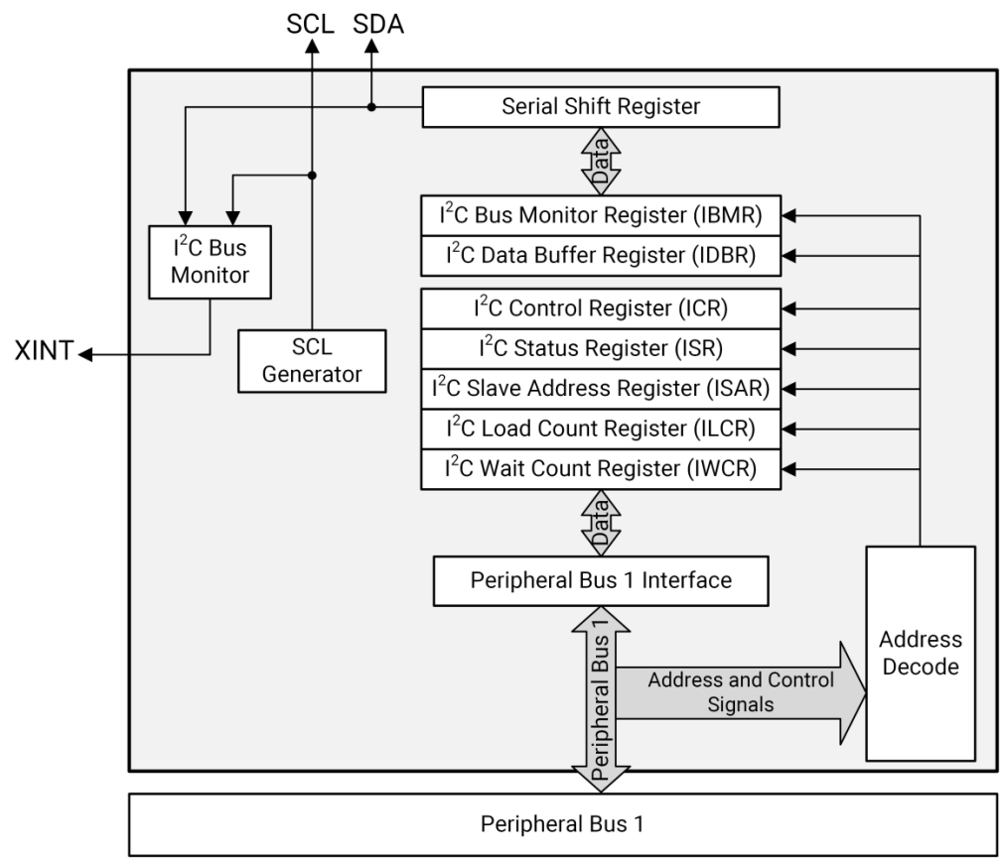

#### 2.7.8 IR-RX Interface

**Introduction**  
IRC (IR Controller) can be used to receive infrared signals from external sources.

**Features**  
- Supports up to 4 IRC modules  
- Converts incoming infrared signals into Run-Length-Code (RLC) format  
- Configurable signal width threshold for noise filtering and detection  
- 32-byte FIFO for temporary storage of received data  
- Sample clock up to 102.4 MHz with a 24-bit frequency divider in it which allows user to configure sample clock freely  

#### 2.7.9 eSPI

**Introduction**  
The eSPI Controller is a full implementation of the Enhanced Serial Peripheral Interface (eSPI) version 1.0 protocol, officially introduced by Intel in 2016. It was designed to replace the LPC interface, reducing pin count and power consumption. eSPI is widely used in Embedded Controllers (ECs), Baseboard Management Controllers (BMCs), Super I/O (SIO) devices, Port-80 debug cards, and similar components.  

eSPI is based on the electrical characteristics of the SPI bus while redefining its protocol layer. Compared with LPC, eSPI offers the following advantages:  
- Significantly reduces the number of pins by converting all LPC/SMBus/sideband signals into in-band signals.  
- Supports operating frequencies of 20 MHz, 25 MHz, 33 MHz, 50 MHz, and 66 MHz, providing higher bandwidth.  
- Uses a 1.8 V interface voltage.  

**Basic Features**  
- Fully compliant with the eSPI v1.0 (2016) specification.  
- Supports four channel types: Peripheral (PR), Out-of-Band (OOB), Virtual Wires (VW), and Flash Access.
- Supports I/O modes: 1×, 2×, and 4×.  
- Supports frequency modes of 20/25/33/50/66 MHz.  
- Supports up to one slave device (SLAVE0).  
- Supports automatic CRC insertion and checking; CRC checking can be enabled by setting `CRC_CHECK_EN` (0x68, SLAVE0_CONFIG).  
- Provides two merged interrupt outputs corresponding to controller status/error interrupts and VW interrupts; the CPU identifies the interrupt source by reading the status register.  
- Includes a watchdog and software reset to prevent bus stalls when the slave does not respond during PR-read operations through the AXI3 slave interface.  
- Supports automatic gating of the master interface to reduce power consumption during idle periods.  
- Allows rewriting of internal slave status registers for software debugging.  
- Provides a register-mapped `RESET#` signal to reset the eSPI slave.  

**PR Channel Features**  
- The PR channel provides a mechanism for software to perform read and write operations on slaves that are transparent to the software layer.  
- The AXI slave interface of the eSPI Controller can be translated into PR read/write operations on the eSPI interface, while slave requests on the eSPI bus are converted into AXI master read/write operations, simplifying PR-channel communication.  
- TX and RX data are stored in independent 32-bit × 16 FIFOs.  
- Two 32 MB address spaces are used for PR MEM read/write operations. By configuring `PR_BASE_ADDR_MEM_0` (0x38) and `PR_BASE_ADDR_MEM_1` (0x3C), the full 32-bit memory address space of the slave can be accessed.  
- One 16 KB address space is used for PR I/O read/write operations, allowing direct access to the 16-bit I/O space.  
- Message-type transmissions on the PR channel are initiated and received through operation registers, using an independent 32-byte FIFO.  
- `PR_MAX_SIZE = 64` bytes, requiring that master and slave PR channel transmissions do not cross 64-byte boundaries.  

**VW Channel Features**  

- Supports VW interrupts 0 – 23.  
- Supports up to 16 GPIOs simultaneously, divided into four groups corresponding to four indices. The mapping between GPIO groups and VW channel indices is configurable.  
- The maximum count for a single VW transmission is 16.  
- Interrupt or GPIO operations on the slave can be triggered by configuring registers.  
- Supports automatic updates of interrupt and GPIO states.  
- Supports system events with indices 2 – 7 and generates corresponding interrupts.  
- Each interrupt has an associated status register supporting interrupt masking and polarity configuration.  

**OOB Channel Features**  
- OOB request forwarding is handled by the CPU through interrupts.  
- The maximum size of a single OOB transmission is 128 bytes.  

**Flash Access Channel Features**  
- Flash Access request forwarding is handled by the CPU through interrupts.  
- The maximum size of a single Flash Access transmission is 128 bytes.  

**Block Diagram**  
The architecture of the eSPI controller is depicted below.
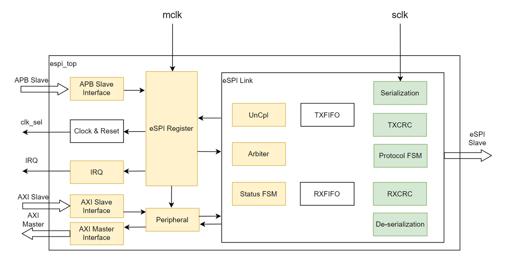

### 2.8 Security Subsystem

#### 2.8.1 Crypto Engine

**Introduction**  
Supports internationally recognized cryptographic algorithms as well as China’s commercial cryptography algorithms.

**Features**  
- Hash Algorithms: SHA1/224/256, SM3  
- Symmetric Algorithms: AES128/192/256, SM4  
- Asymmetric Algorithms: RSA1024/2048/4096, ECC128/256/512, SM2  

#### 2.8.2 TRNG

**Introduction**  
A random number generator compliant with China’s commercial cryptography standards.

**Features**  
- Built-in 32-bit TRNG  
- Ensures randomness, unpredictability, and non-reproducibility  

#### 2.8.3 eFuse

**Introduction**  
Integrated 4096-bit eFuse, divided into 16 banks of 256 bits each, with 256 bits available for user customization.

**Features**  

- Supports eFuse bank locking  
- Supports automatic hardware parameter loading  
- Supports lifecycle management  
- Supports secure boot configuration  
- Supports storage of root keys and encryption-protected keys  
- Supports 256-bit non-volatile counter (NV Counter)  

#### 2.8.4 IOPMP

**Introduction**  
The IOPMP (I/O Physical Memory Protection) module is designed in coordination with the PMP（Physical Memory Protection） to ensure secure access control across the platform’s peripherals.  
- The PMP validates bus accesses initiated by the RISC-V cores;
- The IOPMP verifies transactions issued by other bus masters or subsystems.  

Configured exclusively by the Secure World, the IOPMP defines access permissions and attributes for transactions initiated by non-CPU masters.  
All transactions are subject to IOPMP entry checks, and access is granted only when the permission verification passes.

**Features**  
- Supports access control for read, write, and execute permissions  
- Bus requests incur a one-cycle delay after permission checking  
- Supports logging of access violation information  
- Supports interrupt generation for access violation events  
- Integrates 9 IOPMPs to provide security control for hardware modules and subsystems

### 2.9 System Peripherals

#### 2.9.1 DMA

**Introduction**  
The Direct Memory Access (DMA) controller is designed to transfer data between memory and peripheral devices without CPU intervention, thereby enhancing system performance and reducing processor overhead.  
Peripheral devices do not directly issue addresses or commands to the memory controller. Instead, each DMA request from a peripheral device triggers a corresponding memory-bus transaction.  
The processor can also access the peripheral bus via the DMA controller, which serves as a DMA bridge, enabling data transfers that bypass the system’s primary DMA path when necessary.  
The DMA controller supports various data transfer types in DMA Flow-Through Mode through 16 configurable DMA channels. The supported data transfer paths are summarized below:

| Source / Destination | Internal Memory | External Memory | Internal Peripheral | External Peripheral |
| --- | --- | --- | --- | --- |
| **Internal Memory** | Flow-Through Mode | ___ | ___ | ___ |
| **External Memory** | Flow-Through Mode | Flow-Through Mode | ___ | ___ |
| **Internal Peripheral** | Flow-Through Mode | Flow-Through Mode | ___ | ___ |
| **External Peripheral** | Flow-Through Mode | Flow-Through Mode | ___ | ___ |

**Features**  
- Two independent DMA controller instances, supporting:  
  - One for secure domains  
  - One for non-secure domains  
- Support for the following data transfer types in DMA Flow-Through Mode:  
  - Memory-to-Memory  
  - Peripheral-to-Memory  
  - Memory-to-Peripheral  
- Flow-Through Mode supported for direct data transfers between Flash and DDR memory  
- Priority mechanism enabling simultaneous processing of up to 4 channels with outstanding DMA requests  
- Each of the 16 DMA channels can operate in either descriptor-fetch or non-descriptor-fetch mode  
- Support for the following special descriptor modes:  
  - Descriptor Comparison  
  - Descriptor Branching  
- Retrieval of trailing bytes from peripheral receive buffers  
- Configurable burst sizes: 8, 16, 32, or 64 bytes  
- Programmable peripheral data widths: byte, half-word, or word  
- Support for up to 8191 bytes per descriptor (larger transfers achieved by chaining multiple descriptors)  
- Flow Control Bit support to synchronize DMA requests with peripheral readiness (transfers occur only when the flow control bit is set)  
- 64-bit address bus supporting direct access to physical memory space above 4GB  

**Block Diagram**  
The architecture of the DMA controller is depicted below.

#### 2.9.2 HDMA

**Introduction**  
The K3 integrates 8 AXI DMA Controllers (HDMA). The HDMA IP core is a high-speed, high-throughput general-purpose DMA controller, designed to transfer data between system memory and peripherals such as high-speed converters.

**Features**  
- Supports Unaligned Address Transfers  
- Automatic 4K address boundary crossing  
- Zero-latency transfer switch-over architecture for continuous high-speed streaming  
- Supports Cyclic Transfers  
- Supports 2D Transfers  
- Supports Scatter-Gather Transfers  
- Framelock support for synchronized data streams  
- AutoRun mode for autonomous transfer operation  

#### 2.9.3 Timer

**Introduction**  
The K3 SoC integrates nine general-purpose 32-bit timers for system applications. Each timer has its own 32-bit Timer Counter Control Register (TCCRn) and functions as an up-counter.

**Features**  
- Programmable count modes:  
  - Fast count mode: Input clock frequency selectable from 12.8 MHz, 6.4 MHz, 3 MHz, or 1 MHz  
  - Slow count mode: Input clock frequency of 32.768 KHz  

#### 2.9.4 WatchDog

**Introduction**  
The K3 SoC integrates six 24-bit Watchdog Timers (WDTs) designed to monitor system operation and initiate recovery actions in case of software malfunctions or system hangs.

**Features**  
- Programmable count mode:  
  - WDT operates with an input clock frequency of 256 Hz  
  - Each WDT includes a 24-bit counter  

#### 2.9.5 Temperature Sensor

**Introduction**  
The K3 integrates one Temperature Sensor (TSEN) module featuring 7 temperature measurement points. It is designed to monitor thermal conditions across various on-chip locations, providing real-time temperature data that enables the system to perform dynamic thermal management and protection operations.

**Features**  
- Support for system restart temperature threshold configuration  
- Provides 7 independent temperature measurement points as follows:
  - Top sensor
  - VPU sensor
  - GPU sensor
  - Cluster 0 sensor
  - Cluster 1 sensor
  - Cluster 2 sensor
  - Cluster 3 sensor
- 12-bit temperature sampling accuracy for precise thermal monitoring  

#### 2.9.6 PWM

**Introduction**  
The PWM (Pulse Width Modulation) interface provides precise control of analog circuits and peripheral devices using digital signals. It supports programmable waveform generation with adjustable frequency, duty cycle, and phase alignment, making it suitable for applications such as motor control, LED dimming, and audio modulation.

**Features**  
- Channels: K3 includes 20 independent PWM channels, labeled PWM0–PWM19, each with its own configuration registers.  
- Independent Control: Each channel can operate autonomously, generating PWM signals via multi-function pins.  
- Timing Control:  
  - Individual control of leading-edge and trailing-edge timings for each PWM output.  
  - Continuous mode operation or dynamically adjustable waveforms to meet varying application requirements.  
- Frequency & Duty Cycle:  
  - Supports frequencies from 195.3 Hz to 12.8 MHz.  
  - 50% duty cycle supported; other duty-cycle values depend on the selected frequency.  
- Counters & Dividers:  
  - 6-bit clock divider and 10-bit period counter for fine-grained frequency control.  
  - 15-bit pulse counter for precise pulse generation.  
- Power Saving:  
  - Supports a power-saving mode by stopping the internal clock (`PSCLK_PWM`) of a channel while holding its output (`PWM_OUT`) at a constant high or low level, reducing power consumption when the PWM output is not required.  

#### 2.9.7 Mailbox

**Introduction**  
The Mailbox provides an inter-processor communication mechanism that allows on-chip processors to exchange messages efficiently.

**Features**  
- Each instance supports four mailbox channels and two users.  
- Each mailbox channel includes an 8 × 32-bit FIFO.  
- Independent threshold registers are provided to generate new-message and not-empty interrupts.  
- For each mailbox channel, the message direction can be flexibly configured through software.  

**Block Diagram**  
The architecture of the Mailbox is depicted below.
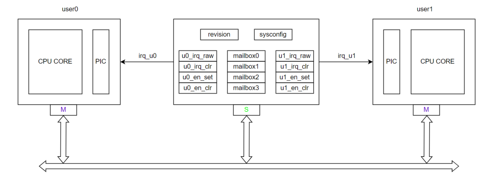

#### 2.9.8 Spinlock

**Introduction**  
Spinlock is a hardware synchronization mechanism used in multi-core systems. It prevents simultaneous access to shared resources, ensuring data consistency.

**Features**  
- Each instance supports 32 lock units.  
- Two lock states are supported: locked and unlocked.  

#### 2.9.9 GPIO

**Introduction**  
The K3 provides General-Purpose Input/Output (GPIO) ports for generating and capturing application-specific input and output. These ports are accessed through the alternate function muxing, and the GPIO unit manages their control and status.

**Features**  
- A GPIO port configured as an input can also serve as an interrupt source  
- At system reset, by default all GPIO ports are configured as an input until changed by the boot process or user software  
- Each GPIO port has a dedicated control signal  
- Supports separated interrupts over either leading-edge timing or trailing-edge timing or both  
- The GPIO port output can be individually set or cleared  
- The GPIO port input can be individually read  

#### 2.9.10 Time-Out Monitor

**Introduction**  
The Time-Out Monitor (TOM) is an AXI bus event detection module designed to monitor AXI transactions and identify timeout conditions that may occur during data transfers between system components.

**Features**  
- Configurable timeout threshold for flexible detection of stalled transactions  
- Programmable auto-response behavior when a timeout event is detected  
- Debug support: the address and ID of the first timed-out transaction are captured for analysis  
- Configurable AW/ARREADY signal monitoring to ensure bus transaction reliability  

### 2.10 Clock & Reset

#### 2.10.1 Introduction
The K3 integrates multiple on-chip clock sources and reset controls to support a wide range of operational scenarios, providing high flexibility, stability, and power efficiency.  
K3 comes with the following clocks:  
- One 24MHz OSC clock  
- One 32.768 kHz RTC clock  
- One 3MHz OSC clock  
- One 1MHz OSC clock  

#### 2.10.2 Features

- Eight integrated PLLs providing multiple frequency options for diverse system requirements  
- Dynamic Voltage and Frequency Scaling (DVFS) support for optimal power–performance balance  
- Glitch-free clock switching and programmable clock dividers to efficiently generate required frequencies while minimizing PLL resource cost  
- Fine-grained clock gating and software-controlled reset mechanisms for improved power saving and flexible system management  

#### 2.10.3 Clock System  

The K3 integrates eight Phase-Locked Loops (PLLs) designed to provide a wide range of stable and configurable frequency sources for different modules and CPU cores. Each PLL supports programmable control through the Main PMU registers and is optimized for low jitter and quick lock time.  

- **PLL1** is designed to generate fixed frequency points for CPU cores and system peripherals.  
- **PLL2** is designed to generate multiple fixed frequencies that complement PLL1, providing a full range of clock sources for peripheral modules.  
- **PLL3** provides clock frequencies for CPU Core 0 frequency scaling and dynamic switching.  
- **PLL4** provides clock frequencies for CPU Core 1 frequency scaling and switching.  
- **PLL5** provides clock frequencies for CPU Core 2 frequency scaling and switching.  
- **PLL6** generates additional fixed frequencies to extend system clock flexibility alongside PLL1.  
- **PLL7** generates supplementary fixed frequencies to support various system and peripheral modules.  
- **PLL8** provides clock frequencies for CPU Core 3 frequency scaling and dynamic switching.  

##### Resource Reset Schemes  

The K3 allows applying different schemes of resource reset as tabled below.

| No. | Resource Reset Scheme | Description |
| --- | --- | --- |
| 1 | Power-On-Reset | Reset the whole chip during power-on sequence |
| 2 | WatchDog Reset | Reset the whole chip excluding pinmux registers and debug registers |
| 3 | Module Software Reset | Reset each module individually through software |
| 4 | Power Island POR Reset | Reset the whole power island during its power-on sequence |

### 2.11 Boot Mode

#### 2.11.1 Introduction

The K3 platform supports multiple boot methods:  
1. Online Download: Downloads and boots the Bootloader using standard communication protocols.  
2. Local Boot: Loads and boots the Bootloader from various storage media.  

The boot mode is selected by configuring the Boot Strap Pins.

#### 2.11.2 Features

The K3 platform supports two categories of boot modes:

1. Download Mode
   Used for downloading images or for debugging and testing.  
   In this mode, the device communicates with a host system through a wired interface and receives data based on predefined protocols to complete system startup.  

   Download modes include:  
   - USB Fastboot Mode: Connects to the host via the USB 2.0 interface using the Fastboot protocol.  
   - UART Xmodem Mode: Connects to the host via the UART interface using the Xmodem/Xmodem-1K protocol.  

2. Normal Boot Mode
   When a valid image is preloaded, the system can boot directly from a specified storage medium.  
   K3 supports loading the Bootloader from the following storage devices:  
   - SD Card  
   - eMMC  
   - SPI NOR Flash  
   - SPI NAND Flash  
   - UFS  

**Boot Priority**:  
The K3 always first attempts to boot from the SD Card.  
If no SD card is detected or no valid Bootloader image is found, the system automatically falls back to a secondary storage device.  
The secondary boot device can be selected by configuring the Boot Strap Pins.

The K3 uses a combination of four Boot Strap pins to select the boot mode, as shown in the table below:

| Download Select GPIO_69 | Download Mode GPIO_68 | Boot Select 1 GPIO_66 | Boot Select 0 GPIO_65 | Boot Mode |
| --- | --- | --- | --- | --- |
| 1 | 0 | x | x | USB Fastboot |
| 1 | 1 | x | x | UART Xmodem |
| 0 | x | 0 | 0 | SD Card → eMMC |
| 0 | x | 0 | 1 | SD Card → SPI NOR |
| 0 | x | 1 | 0 | SD Card → SPI NAND |
| 0 | x | 1 | 1 | SD Card → UFS |

> **Note**: “x” indicates that the pin state does not affect boot mode selection.

## 3. Package

### 3.1 Introduction

K3 is available in one package as follows:

| Type | Size | Pin Pitch | Pin Count |
| --- | --- | --- | --- |
| **FBGA** | 27×27 mm | 0.650 mm | 1563 (40×40) |

The related package outline drawing (POD) is depicted in the following section.

### 3.2 Package Outline Drawing (POD)

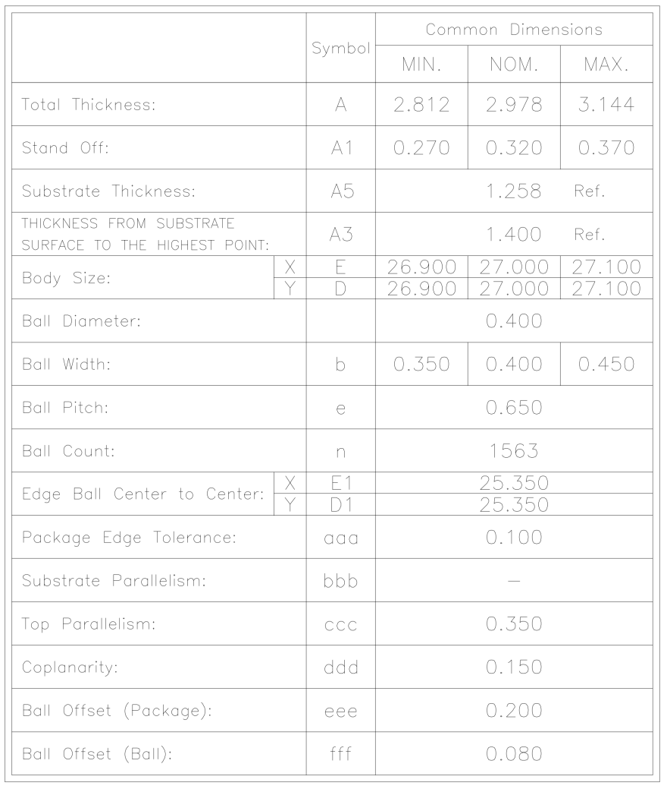

### 3.3 Part Number

The figure below shows the K3 part number structure and field definitions.

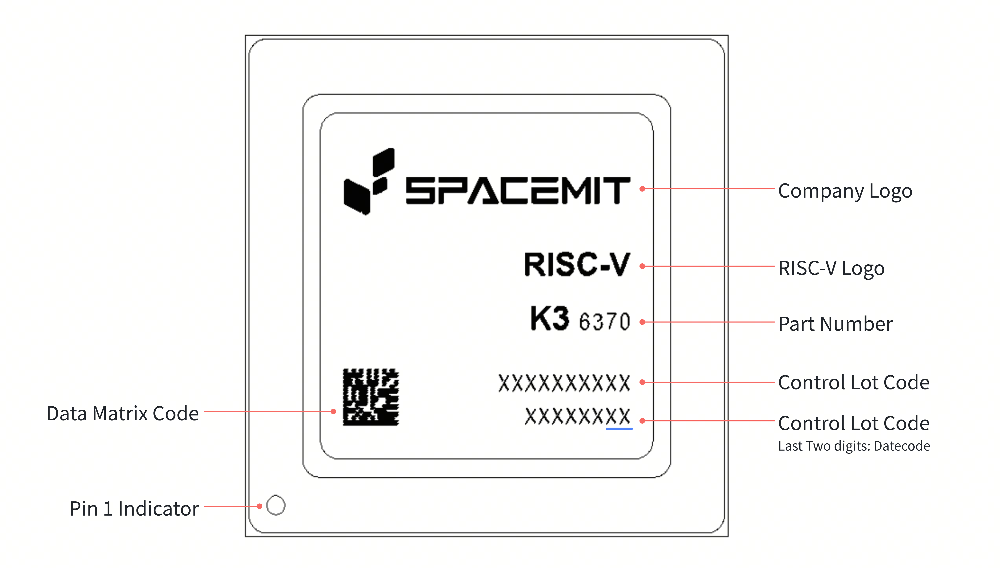

## 4. Pinout

### 4.1 Pinout Diagram & Description

The overall pinout diagram of K3 is depicted below.

Let’s consider the division into the quadrants, in order to conveniently provide the pinout description of K3 in the following subsections.

#### 4.1.1 (A~Y, 1~20)

| Pin Number | Pin Name | Pin Number | Pin Name |
| --- | --- | --- | --- |
| A2 | VSS | K20 | AVDD08_PCIE1 |
| A3 | DDR1_DQ_B_08 | L1 | DDR1_CKT_B |
| A4 | DDR1_DMI1_B | L2 | DDR1_CKC_B |
| A5 | DDR1_DQ_B_09 | L3 | VSS |
| A6 | AVSS_PCIEUSB | L4 | VSS |
| A7 | PCIE5_TX0N | L5 | VSS |
| A8 | AVSS_PCIEUSB | L6 | VSS |
| A9 | PCIE4/USB3-D_TX0N | L7 | DDR1_CA_A_01 |
| A10 | AVSS_PCIEUSB | L8 | VSS |
| A11 | PCIE3/USB3-C_TX0N | L9 | VSS |
| A12 | AVSS_PCIEUSB | L10 | VSS |
| A13 | PCIE2/USB3-B_TX0N | L11 | VSS |
| A14 | AVSS_PCIEUSB | L12 | VSS |
| A15 | PCIE1_TX1P | L13 | VSS |
| A16 | AVSS_PCIEUSB | L14 | AVSS_PCIEUSB |
| A17 | PCIE1_TX0N | L15 | AVSS_PCIEUSB |
| A18 | AVSS_PCIEUSB | L16 | AVSS_PCIEUSB |
| A19 | PCIE0_TX1P | L17 | AVSS_PCIEUSB |
| A20 | AVSS_PCIEUSB | L18 | AVSS_PCIEUSB |
| B1 | VSS | L19 | AVDD08_PCIE3/USB3-C |
| B2 | VSS | L20 | AVDD08_PCIE2/USB3-B |
| B3 | VSS | M1 | DDR1_CKT_A |
| B4 | DDR1_DQ_B_11 | M2 | DDR1_CKC_A |
| B5 | DDR1_DQ_B_10 | M3 | VSS |
| B6 | AVSS_PCIEUSB | M4 | DDR1_DQ_A_00 |
| B7 | PCIE5_TX0P | M5 | DDR1_DQ_A_02 |
| B8 | PCIE5_REFCLK_N | M6 | VSS |
| B9 | PCIE4/USB3-D_TX0P | M7 | DDR1_CA_A_00 |
| B10 | PCIE4_REFCLK_P | M8 | VDDQ_DDR |
| B11 | PCIE3/USB3-C_TX0P | M9 | VSS |
| B12 | PCIE3_REFCLK_N | M10 | VDD0V8_DDR |
| B13 | PCIE2/USB3-B_TX0P | M11 | AVDD18_PLL_DDR1 |
| B14 | PCIE2_REFCLK_P | M12 | VSS |
| B15 | PCIE1_TX1N | M13 | VSS |
| B16 | PCIE1_REFCLK_P | M14 | VSS |
| B17 | PCIE1_TX0P | M15 | VSS |
| B18 | USB20_B_USB_P | M16 | VSS |
| B19 | PCIE0_TX1N | M17 | VSS |
| B20 | PCIE0_REFCLK_P | M18 | AVSS_PCIEUSB |
| C1 | DDR1_DQ_B_00 | M19 | VSS |
| C2 | DDR1_DQ_B_02 | M20 | AVDD08_PCIE2/USB3-B |
| C3 | VSS | N1 | DDR1_DQ_A_15 |
| C4 | DDR1_DQS1_T_B | N2 | DDR1_DQ_A_14 |
| C5 | DDR1_DQS1_C_B | N3 | VSS |
| C6 | DDR1_ZN | N4 | DDR1_DQ_A_01 |
| C7 | AVSS_PCIEUSB | N5 | DDR1_DQ_A_03 |
| C8 | PCIE5_REFCLK_P | N6 | VSS |
| C9 | AVSS_PCIEUSB | N7 | DDR1_CKE0_A |
| C10 | PCIE4_REFCLK_N | N8 | VSS |
| C11 | AVSS_PCIEUSB | N9 | VDD0V8_DDR |
| C12 | PCIE3_REFCLK_P | N10 | VSS |
| C13 | AVSS_PCIEUSB | N11 | AVDD08_PLL_DDR1 |
| C14 | PCIE2_REFCLK_N | N12 | VSS |
| C15 | AVSS_PCIEUSB | N13 | VCC_SYS |
| C16 | PCIE1_REFCLK_N | N14 | VSS |
| C17 | AVSS_PCIEUSB | N15 | VCC_SYS |
| C18 | USB20_B_USB_M | N16 | VSS |
| C19 | AVSS_PCIEUSB | N17 | VCC_SYS |
| C20 | PCIE0_REFCLK_N | N18 | VSS |
| D1 | DDR1_DQ_B_03 | N19 | VCC_SYS |
| D2 | DDR1_DQ_B_01 | N20 | VSS |
| D3 | VSS | P1 | DDR1_DQ_A_13 |
| D4 | VSS | P2 | DDR1_DQ_A_12 |
| D5 | VSS | P3 | VSS |
| D6 | DDR1_CKE1_B | P4 | DDR1_DQS0_C_A |
| D7 | DDR1_CA_B_00 | P5 | DDR1_DQS0_T_A |
| D8 | AVSS_PCIEUSB | P6 | VSS |
| D9 | PCIE5_RX0P | P7 | DDR1_CS1_A |
| D10 | AVSS_PCIEUSB | P8 | VDDQ_DDR |
| D11 | USB20_D_USB_P | P9 | VSS |
| D12 | AVSS_PCIEUSB | P10 | VDD0V8_DDR |
| D13 | PCIE4/USB3-D_RX0N | P11 | VSS |
| D14 | AVSS_PCIEUSB | P12 | VSS |
| D15 | PCIE3/USB3-C_RX0N | P13 | VSS |
| D16 | AVSS_PCIEUSB | P14 | VCC_SYS |
| D17 | PCIE2/USB3-B_RX0P | P15 | VSS |
| D18 | AVSS_PCIEUSB | P16 | VCC_SYS |
| D19 | PCIE1_RX0P | P17 | VSS |
| D20 | AVSS_PCIEUSB | P18 | VCC_SYS |
| E1 | DDR1_WCK_T_B_0 | P19 | VSS |
| E2 | DDR1_WCK_C_B_0 | P20 | VCC_SYS |
| E3 | VSS | R1 | DDR1_WCK_C_A_1 |
| E4 | DDR1_WCK_T_B_1 | R2 | DDR1_WCK_T_A_1 |
| E5 | DDR1_WCK_C_B_1 | R3 | VSS |
| E6 | VSS | R4 | VSS |
| E7 | DDR1_CS1_B | R5 | VSS |
| E8 | VSS | R6 | VSS |
| E9 | PCIE5_RX0N | R7 | VDDQ_DDR |
| E10 | AVSS_PCIEUSB | R8 | VSS |
| E11 | USB20_D_USB_M | R9 | VDD0V8_DDR |
| E12 | AVSS_PCIEUSB | R10 | VSS |
| E13 | PCIE4/USB3-D_RX0P | R11 | VSS |
| E14 | AVSS_PCIEUSB | R12 | VSS |
| E15 | PCIE3/USB3-C_RX0P | R13 | VCC_SYS |
| E16 | AVSS_PCIEUSB | R14 | VSS |
| E17 | PCIE2/USB3-B_RX0N | R15 | VCC_SYS |
| E18 | AVSS_PCIEUSB | R16 | VSS |
| E19 | PCIE1_RX0N | R17 | VCC_SYS |
| E20 | AVSS_PCIEUSB | R18 | VSS |
| F1 | DDR1_DQS0_T_B | R19 | VCC_SYS |
| F2 | DDR1_DQS0_C_B | R20 | VSS |
| F3 | VSS | T1 | DDR1_DQS1_C_A |
| F4 | DDR1_DQ_B_12 | T2 | DDR1_DQS1_T_A |
| F5 | VSS | T3 | VSS |
| F6 | VSS | T4 | DDR1_WCK_C_A_0 |
| F7 | DDR1_CKE0_B | T5 | DDR1_WCK_T_A_0 |
| F8 | VSS | T6 | VSS |
| F9 | VSS | T7 | DDR1_CKE1_A |
| F10 | AVDD18_PCIE5 | T8 | VDDQ_DDR |
| F11 | AVDD18_PCIE4/USB3-D | T9 | VSS |
| F12 | AVSS_PCIEUSB | T10 | VDD0V8_DDR |
| F13 | AVDD18_B_USB20 | T11 | VSS |
| F14 | PCIE_USB_COMBO_ADTEST_0 | T12 | VCC_SYS |
| F15 | AVDD18_USB20_HOST | T13 | VSS |
| F16 | USB20_C_USB_M | T14 | VCC_SYS |
| F17 | AVSS_PCIEUSB | T15 | VSS |
| F18 | PCIE1_RX1N | T16 | VCC_SYS |
| F19 | AVSS_PCIEUSB | T19 | VSS |
| F20 | AVDD33_D_USB20 | T20 | VCC_SYS |
| G1 | DDR1_DMI0_B | U1 | DDR1_DMI1_A |
| G2 | VSS | U2 | DDR1_DQ_A_11 |
| G3 | VSS | U3 | VSS |
| G4 | DDR1_DQ_B_13 | U4 | DDR1_DMI0_A |
| G5 | DDR1_DQ_B_15 | U5 | DDR1_DQ_A_04 |
| G6 | VSS | U6 | VSS |
| G7 | DDR1_CA_B_01 | U7 | DDR1_CS0_A_CA06 |
| G8 | VSS | U8 | VSS |
| G9 | VSS | U9 | VDD0V8_DDR |
| G10 | AVDD18_PCIE5 | U10 | VSS |
| G11 | AVDD18_PCIE4/USB3-D | U11 | VSS |
| G12 | AVDD18_C_USB20 | U12 | VSS |
| G13 | AVDD18_PCIE1 | U13 | VCC_SYS |
| G14 | AVDD18_PCIE1 | U14 | VSS |
| G15 | AVSS_PCIEUSB | U15 | VCC_SYS |
| G16 | USB20_C_USB_P | U16 | VSS |
| G17 | AVDD18_PCIE0 | U19 | VCC_SYS |
| G18 | PCIE1_RX1P | U20 | VSS |
| G19 | AVSS_PCIEUSB | V1 | DDR1_DQ_A_10 |
| G20 | AVDD33_C_USB20 | V2 | DDR1_DQ_A_09 |
| H1 | DDR1_DQ_B_05 | V3 | VSS |
| H2 | DDR1_DQ_B_04 | V4 | DDR1_DQ_A_07 |
| H3 | VSS | V5 | DDR1_DQ_A_05 |
| H4 | DDR1_DQ_B_14 | V6 | VSS |
| H5 | DDR1_CA_B_03 | V7 | DDR1_CA_A_05 |
| H6 | VSS | V8 | VDDQ_DDR |
| H7 | DDR1_CA_B_02 | V9 | VSS |
| H8 | VSS | V10 | VDD0V8_DDR |
| H9 | VSS | V11 | VSS |
| H10 | VSS | V12 | VCC_SYS |
| H11 | AVSS_PCIEUSB | V13 | VSS |
| H12 | AVSS_PCIEUSB | V14 | VCC_SYS |
| H13 | AVDD18_PCIE3/USB3-C | V15 | VSS |
| H14 | AVDD18_PCIE1 | V16 | VCC_SYS |
| H15 | PCIE_USB_COMBO_ADTEST_1 | V19 | VSS |
| H16 | AVDD18_PCIE0 | V20 | VCC_SYS |
| H17 | AVDD18_PCIE0 | W1 | DDR1_DQ_A_08 |
| H18 | AVDD08_D_USB20 | W2 | VSS |
| H19 | AVDD08_C_USB20 | W3 | VSS |
| H20 | AVSS_PCIEUSB | W4 | DDR1_DQ_A_06 |
| J1 | DDR1_DQ_B_07 | W5 | VSS |
| J2 | DDR1_DQ_B_06 | W6 | VSS |
| J3 | VSS | W7 | VSS |
| J4 | DDR1_CA_A_03 | W8 | VDDQ_DDR |
| J5 | DDR1_CA_B_04 | W9 | VSS |
| J6 | VSS | W10 | VDD2H_DDR |
| J7 | DDR1_CS0_B_CA06 | W11 | VAA18_VDD2H_DDR |
| J8 | VSS | W12 | VSS |
| J9 | VSS | W13 | VCC_SYS |
| J10 | VSS | W14 | VSS |
| J11 | VSS | W15 | VCC_SYS |
| J12 | AVDD18_D_USB20 | W16 | VSS |
| J13 | AVDD18_PCIE3/USB3-C | W17 | VSS |
| J14 | AVSS_PCIEUSB | W18 | VCC_SYS |
| J15 | AVDD18_PCIE2/USB3-B | W19 | VCC_SYS |
| J16 | AVSS_PCIEUSB | W20 | VSS |
| J17 | AVDD08_PCIE5 | Y1 | DDR1_RESET_N |
| J18 | AVDD08_PCIE4/USB3-D | Y2 | DDR1_PWROK |
| J19 | AVDD08_PCIE1 | Y3 | VSS |
| J20 | AVDD08_PCIE1 | Y4 | DDR1_DTO |
| K1 | VSS | Y5 | DDR1_ATO |
| K2 | VSS | Y6 | VSS |
| K3 | VSS | Y7 | VSS |
| K4 | DDR1_CA_A_02 | Y8 | VSS |
| K5 | DDR1_CA_A_04 | Y9 | VDDQ_DDR |
| K6 | VSS | Y10 | VDD2H_DDR |
| K7 | DDR1_CA_B_05 | Y11 | VAA18_VDD2H_DDR |
| K8 | VDDQ_DDR | Y12 | VCC_SYS |
| K9 | VSS | Y13 | VSS |
| K10 | VSS | Y14 | VCC_SYS |
| K11 | VSS | Y15 | VSS |
| K12 | AVSS_PCIEUSB | Y16 | VCC_SYS |
| K13 | AVSS_PCIEUSB | Y17 | VSS |
| K14 | AVSS_PCIEUSB | Y18 | VCC_SYS |
| K15 | AVDD18_PCIE2/USB3-B | Y19 | VSS |
| K16 | AVSS_PCIEUSB | Y20 | VCC_SYS |
| K17 | AVDD08_PCIE5 | — | — |
| K18 | AVDD08_PCIE4/USB3-D | — | — |
| K19 | AVDD08_PCIE3/USB3-C | — | — |

#### 4.1.2 (A~Y, 21~40)

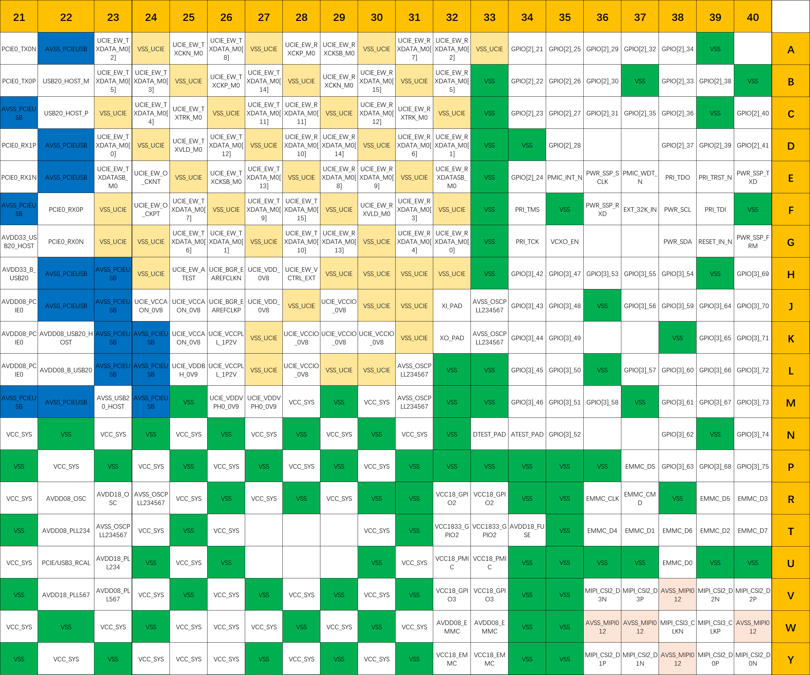

| Pin Number | Pin Name | Pin Number | Pin Name |
| --- | --- | --- | --- |
| A21 | PCIE0_TX0N | L21 | AVDD08_PCIE0 |
| A22 | AVSS_PCIEUSB | L22 | AVDD08_B_USB20 |
| A23 | UCIE_EW_TXDATA_M0[2] | L23 | AVSS_PCIEUSB |
| A24 | VSS_UCIE | L24 | AVSS_PCIEUSB |
| A25 | UCIE_EW_TXCKN_M0 | L25 | UCIE_VDDBH_0V9 |
| A26 | UCIE_EW_TXDATA_M0[8] | L26 | UCIE_VCCPLL_1P2V |
| A27 | VSS_UCIE | L27 | VSS_UCIE |
| A28 | UCIE_EW_RXCKP_M0 | L28 | UCIE_VCCIO_0V8 |
| A29 | UCIE_EW_RXCKSB_M0 | L29 | VSS_UCIE |
| A30 | VSS_UCIE | L30 | VSS_UCIE |
| A31 | UCIE_EW_RXDATA_M0[7] | L31 | AVSS_OSCPLL234567 |
| A32 | UCIE_EW_RXDATA_M0[2] | L32 | VSS |
| A33 | VSS_UCIE | L33 | VSS |
| A34 | GPIO[2]_21 | L34 | GPIO[3]_45 |
| A35 | GPIO[2]_25 | L35 | GPIO[3]_50 |
| A36 | GPIO[2]_29 | L36 | VSS |
| A37 | GPIO[2]_32 | L37 | GPIO[3]_57 |
| A38 | GPIO[2]_34 | L38 | GPIO[3]_60 |
| A39 | VSS | L39 | GPIO[3]_66 |
| B21 | PCIE0_TX0P | L40 | GPIO[3]_72 |
| B22 | USB20_HOST_M | M21 | AVSS_PCIEUSB |
| B23 | UCIE_EW_TXDATA_M0[5] | M22 | AVSS_PCIEUSB |
| B24 | UCIE_EW_TXDATA_M0[3] | M23 | AVSS_USB20_HOST |
| B25 | VSS_UCIE | M24 | AVSS_PCIEUSB |
| B26 | UCIE_EW_TXCKP_M0 | M25 | VSS |
| B27 | UCIE_EW_TXDATA_M0[14] | M26 | UCIE_VDDVPH0_0V9 |
| B28 | VSS_UCIE | M27 | UCIE_VDDVPH0_0V9 |
| B29 | UCIE_EW_RXCKN_M0 | M28 | VCC_SYS |
| B30 | UCIE_EW_RXDATA_M0[15] | M29 | VSS |
| B31 | VSS_UCIE | M30 | VCC_SYS |
| B32 | UCIE_EW_RXDATA_M0[5] | M31 | AVSS_OSCPLL234567 |
| B33 | VSS | M32 | VSS |
| B34 | GPIO[2]_22 | M33 | VSS |
| B35 | GPIO[2]_26 | M34 | GPIO[3]_46 |
| B36 | GPIO[2]_30 | M35 | GPIO[3]_51 |
| B37 | VSS | M36 | GPIO[3]_58 |
| B38 | GPIO[2]_33 | M37 | VSS |
| B39 | GPIO[2]_38 | M38 | GPIO[3]_61 |
| B40 | VSS | M39 | GPIO[3]_67 |
| C21 | AVSS_PCIEUSB | M40 | GPIO[3]_73 |
| C22 | USB20_HOST_P | N21 | VCC_SYS |
| C23 | VSS_UCIE | N22 | VSS |
| C24 | UCIE_EW_TXDATA_M0[4] | N23 | VCC_SYS |
| C25 | UCIE_EW_TXTRK_M0 | N24 | VSS |
| C26 | VSS_UCIE | N25 | VCC_SYS |
| C27 | UCIE_EW_TXDATA_M0[11] | N26 | VSS |
| C28 | UCIE_EW_RXDATA_M0[11] | N27 | VCC_SYS |
| C29 | VSS_UCIE | N28 | VSS |
| C30 | UCIE_EW_RXDATA_M0[12] | N29 | VCC_SYS |
| C31 | UCIE_EW_RXTRK_M0 | N30 | VSS |
| C32 | VSS_UCIE | N31 | VCC_SYS |
| C33 | VSS | N32 | VSS |
| C34 | GPIO[2]_23 | N33 | DTEST_PAD |
| C35 | GPIO[2]_27 | N34 | ATEST_PAD |
| C36 | GPIO[2]_31 | N35 | GPIO[3]_52 |
| C37 | GPIO[2]_35 | N38 | GPIO[3]_62 |
| C38 | GPIO[2]_36 | N39 | VSS |
| C39 | VSS | N40 | GPIO[3]_74 |
| C40 | GPIO[2]_40 | P21 | VSS |
| D21 | PCIE0_RX1P | P22 | VCC_SYS |
| D22 | AVSS_PCIEUSB | P23 | VSS |
| D23 | UCIE_EW_TXDATA_M0[0] | P24 | VCC_SYS |
| D24 | VSS_UCIE | P25 | VSS |
| D25 | UCIE_EW_TXVLD_M0 | P26 | VCC_SYS |
| D26 | UCIE_EW_TXDATA_M0[12] | P27 | VSS |
| D27 | VSS_UCIE | P28 | VCC_SYS |
| D28 | UCIE_EW_RXDATA_M0[10] | P29 | VSS |
| D29 | UCIE_EW_RXDATA_M0[14] | P30 | VCC_SYS |
| D30 | VSS_UCIE | P31 | VSS |
| D31 | UCIE_EW_RXDATA_M0[6] | P32 | VSS |
| D32 | UCIE_EW_RXDATA_M0[1] | P33 | VSS |
| D33 | VSS | P34 | VSS |
| D34 | VSS | P35 | VSS |
| D35 | GPIO[2]_28 | P36 | VSS |
| D38 | GPIO[2]_37 | P37 | EMMC_DS |
| D39 | GPIO[2]_39 | P38 | GPIO[3]_63 |
| D40 | GPIO[2]_41 | P39 | GPIO[3]_68 |
| E21 | PCIE0_RX1N | P40 | GPIO[3]_75 |
| E22 | AVSS_PCIEUSB | R21 | VCC_SYS |
| E23 | UCIE_EW_TXDATASB_M0 | R22 | AVDD08_OSC |
| E24 | UCIE_EW_O_CKNT | R23 | AVDD18_OSC |
| E25 | VSS_UCIE | R24 | AVSS_OSCPLL234567 |
| E26 | UCIE_EW_TXCKSB_M0 | R25 | VCC_SYS |
| E27 | UCIE_EW_TXDATA_M0[13] | R26 | VSS |
| E28 | VSS_UCIE | R27 | VCC_SYS |
| E29 | UCIE_EW_RXDATA_M0[8] | R28 | VSS |
| E30 | UCIE_EW_RXDATA_M0[9] | R29 | VCC_SYS |
| E31 | VSS_UCIE | R30 | VSS |
| E32 | UCIE_EW_RXDATASB_M0 | R31 | VSS |
| E33 | VSS | R32 | VCC18_GPIO2 |
| E34 | GPIO[2]_24 | R33 | VCC18_GPIO2 |
| E35 | PMIC_INT_N | R34 | VSS |
| E36 | PWR_SSP_SCLK | R35 | VSS |
| E37 | PMIC_WDT_N | R36 | EMMC_CLK |
| E38 | PRI_TDO | R37 | EMMC_CMD |
| E39 | PRI_TRST_N | R38 | VSS |
| E40 | PWR_SSP_TXD | R39 | EMMC_D5 |
| F21 | AVSS_PCIEUSB | R40 | EMMC_D3 |
| F22 | PCIE0_RX0P | T21 | VSS |
| F23 | VSS_UCIE | T22 | AVDD08_PLL234 |
| F24 | UCIE_EW_O_CKPT | T23 | AVSS_OSCPLL234567 |
| F25 | UCIE_EW_TXDATA_M0[7] | T24 | VCC_SYS |
| F26 | VSS_UCIE | T25 | VSS |
| F27 | UCIE_EW_TXDATA_M0[9] | T26 | VCC_SYS |
| F28 | UCIE_EW_TXDATA_M0[15] | T30 | VCC_SYS |
| F29 | VSS_UCIE | T31 | VSS |
| F30 | UCIE_EW_RXVLD_M0 | T32 | VCC1833_GPIO2 |
| F31 | UCIE_EW_RXDATA_M0[3] | T33 | VCC1833_GPIO2 |
| F32 | VSS_UCIE | T34 | AVDD18_FUSE |
| F33 | VSS | T35 | VSS |
| F34 | PRI_TMS | T36 | EMMC_D4 |
| F35 | VSS | T37 | EMMC_D1 |
| F36 | PWR_SSP_RXD | T38 | EMMC_D6 |
| F37 | EXT_32K_IN | T39 | EMMC_D2 |
| F38 | PWR_SCL | T40 | EMMC_D7 |
| F39 | PRI_TDI | U21 | VCC_SYS |
| F40 | VSS | U22 | PCIE/USB3_RCAL |
| G21 | AVDD33_USB20_HOST | U23 | AVDD18_PLL234 |
| G22 | PCIE0_RX0N | U24 | VSS |
| G23 | VSS_UCIE | U25 | VCC_SYS |
| G24 | VSS_UCIE | U26 | VSS |
| G25 | UCIE_EW_TXDATA_M0[6] | U30 | VSS |
| G26 | UCIE_EW_TXDATA_M0[1] | U31 | VCC_SYS |
| G27 | VSS_UCIE | U32 | VCC18_PMIC |
| G28 | UCIE_EW_TXDATA_M0[10] | U33 | VCC18_PMIC |
| G29 | UCIE_EW_RXDATA_M0[13] | U34 | VSS |
| G30 | VSS_UCIE | U35 | VSS |
| G31 | UCIE_EW_RXDATA_M0[4] | U36 | VSS |
| G32 | UCIE_EW_RXDATA_M0[0] | U37 | VSS |
| G33 | VSS | U38 | EMMC_D0 |
| G34 | PRI_TCK | U39 | VSS |
| G35 | VCXO_EN | U40 | VSS |
| G38 | PWR_SDA | V21 | VSS |
| G39 | RESET_IN_N | V22 | AVDD18_PLL567 |
| G40 | PWR_SSP_FRM | V23 | AVDD08_PLL567 |
| H21 | AVDD33_B_USB20 | V24 | VCC_SYS |
| H22 | AVSS_PCIEUSB | V25 | VSS |
| H23 | AVSS_PCIEUSB | V26 | VCC_SYS |
| H24 | VSS_UCIE | V27 | VSS |
| H25 | UCIE_EW_ATEST | V28 | VCC_SYS |
| H26 | UCIE_BGR_EAREFCLKN | V29 | VSS |
| H27 | UCIE_VDD_0V8 | V30 | VCC_SYS |
| H28 | UCIE_EW_VCTRL_EXT | V31 | VSS |
| H29 | VSS_UCIE | V32 | VCC18_GPIO3 |
| H30 | VSS_UCIE | V33 | VCC18_GPIO3 |
| H31 | VSS_UCIE | V34 | VSS |
| H32 | VSS_UCIE | V35 | VSS |
| H33 | VSS | V36 | MIPI_CSI2_D3N |
| H34 | GPIO[3]_42 | V37 | MIPI_CSI2_D3P |
| H35 | GPIO[3]_47 | V38 | AVSS_MIPI012 |
| H36 | GPIO[3]_53 | V39 | MIPI_CSI2_D2N |
| H37 | GPIO[3]_55 | V40 | MIPI_CSI2_D2P |
| H38 | GPIO[3]_54 | W21 | VCC_SYS |
| H39 | VSS | W22 | VSS |
| H40 | GPIO[3]_69 | W23 | VCC_SYS |
| J21 | AVDD08_PCIE0 | W24 | VSS |
| J22 | AVSS_PCIEUSB | W25 | VCC_SYS |
| J23 | AVSS_PCIEUSB | W26 | VCC_SYS |
| J24 | UCIE_VCCAON_0V8 | W27 | VCC_SYS |
| J25 | UCIE_VCCAON_0V8 | W28 | VSS |
| J26 | UCIE_BGR_EAREFCLKP | W29 | VCC_SYS |
| J27 | UCIE_VDD_0V8 | W30 | VSS |
| J28 | VSS_UCIE | W31 | VCC_SYS |
| J29 | UCIE_VCCIO_0V8 | W32 | AVDD08_EMMC |
| J30 | VSS_UCIE | W33 | AVDD08_EMMC |
| J31 | VSS_UCIE | W34 | VSS |
| J32 | XI_PAD | W35 | VSS |
| J33 | AVSS_OSCPLL234567 | W36 | AVSS_MIPI012 |
| J34 | GPIO[3]_43 | W37 | AVSS_MIPI012 |
| J35 | GPIO[3]_48 | W38 | MIPI_CSI3_CLKN |
| J36 | VSS | W39 | MIPI_CSI3_CLKP |
| J37 | GPIO[3]_56 | W40 | AVSS_MIPI012 |
| J38 | GPIO[3]_59 | Y21 | VSS |
| J39 | GPIO[3]_64 | Y22 | VCC_SYS |
| J40 | GPIO[3]_70 | Y23 | VSS |
| K21 | AVDD08_PCIE0 | Y24 | VCC_SYS |
| K22 | AVDD08_USB20_HOST | Y25 | VCC_SYS |
| K23 | AVSS_PCIEUSB | Y26 | VCC_SYS |
| K24 | AVSS_PCIEUSB | Y27 | VSS |
| K25 | UCIE_VCCAON_0V8 | Y28 | VCC_SYS |
| K26 | UCIE_VCCPLL_1P2V | Y29 | VSS |
| K27 | VSS_UCIE | Y30 | VCC_SYS |
| K28 | UCIE_VCCIO_0V8 | Y31 | VSS |
| K29 | UCIE_VCCIO_0V8 | Y32 | VCC18_EMMC |
| K30 | UCIE_VCCIO_0V8 | Y33 | VCC18_EMMC |
| K31 | VSS_UCIE | Y34 | VSS |
| K32 | XO_PAD | Y35 | VSS |
| K33 | AVSS_OSCPLL234567 | Y36 | MIPI_CSI2_D1P |
| K34 | GPIO[3]_44 | Y37 | MIPI_CSI2_D1N |
| K35 | GPIO[3]_49 | Y38 | AVSS_MIPI012 |
| K38 | VSS | Y39 | MIPI_CSI2_D0P |
| K39 | GPIO[3]_65 | Y40 | MIPI_CSI2_D0N |
| K40 | GPIO[3]_71 | — | — |

#### 4.1.3 (AA~AY, 1~20)

| Pin Number | Pin Name | Pin Number | Pin Name |
| --- | --- | --- | --- |
| AA1 | DDR0_DQ_B_15 | AL1 | VSS |
| AA2 | VSS | AL2 | VSS |
| AA3 | VSS | AL3 | VSS |
| AA4 | DDR0_ATO | AL4 | VSS |
| AA5 | DDR0_PWROK | AL5 | VSS |
| AA6 | DDR0_DTO | AL6 | VSS |
| AA7 | VSS | AL7 | DDR0_CA_A_05 |
| AA8 | VDDQ_DDR | AL8 | VSS |
| AA9 | VSS | AL9 | VSS |
| AA10 | VDD0V8_DDR | AL10 | AVSS_PLL1 |
| AA11 | VSS | AL11 | AVDD18_DRD_USB |
| AA12 | VSS | AL12 | VSS |
| AA13 | VCC_SYS | AL13 | VSS |
| AA14 | VSS | AL14 | AVSS_DRD |
| AA15 | VCC_SYS | AL15 | AVDD18_EDP1 |
| AA16 | VSS | AL16 | AVDD18_EDP1 |
| AA17 | VCC_SYS | AL17 | AVSS_EDP1 |
| AA18 | VSS | AL18 | VCC_SYS |
| AA19 | VCC_SYS | AL19 | VCC1833_QSPI |
| AA20 | VSS | AL20 | VCC1833_SD |
| AB1 | DDR0_DQ_B_13 | AM1 | DDR0_DQ_A_05 |
| AB2 | DDR0_DQ_B_14 | AM2 | VSS |
| AB3 | VSS | AM3 | VSS |
| AB4 | DDR0_DQ_B_02 | AM4 | DDR0_CA_A_04 |
| AB5 | DDR0_DQ_B_00 | AM5 | VSS |
| AB6 | VSS | AM6 | VSS |
| AB7 | DDR0_CA_B_00 | AM7 | DDR0_CA_A_02 |
| AB8 | VDDQ_DDR | AM8 | VSS |
| AB9 | VDD0V8_DDR | AM9 | AVDD08_DRD_USB |
| AB10 | VSS | AM10 | VSS |
| AB11 | VSS | AM11 | AVDD18_DRD_USB |
| AB12 | VCC_SYS | AM12 | VSS |
| AB13 | VSS | AM13 | AVSS_DRD |
| AB14 | VCC_SYS | AM14 | AVSS_DRD |
| AB15 | VSS | AM15 | VCC12_UFS |
| AB16 | VCC_SYS | AM16 | AVSS_UFS |
| AB17 | VSS | AM17 | AVSS_EDP1 |
| AB18 | VCC_SYS | AM18 | AVSS_EDP1 |
| AB19 | VSS | AM19 | VSS |
| AB20 | VCC_SYS | AM20 | VCC18_QSPI_CAP |
| AC1 | DDR0_DMI1_B | AN1 | DDR0_DQ_A_06 |
| AC2 | DDR0_DQ_B_12 | AN2 | DDR0_DQ_A_07 |
| AC3 | VSS | AN3 | VSS |
| AC4 | DDR0_DQ_B_03 | AN4 | VSS |
| AC5 | DDR0_DQ_B_01 | AN5 | VSS |
| AC6 | VSS | AN6 | VSS |
| AC7 | DDR0_CA_B_01 | AN7 | DDR0_CA_A_01 |
| AC8 | VDDQ_DDR | AN8 | VSS |
| AC9 | VSS | AN9 | AVDD08_DRD_USB |
| AC10 | VDD0V8_DDR | AN10 | VDD08_UFS |
| AC11 | VSS | AN11 | AVDD18_DRD_USB |
| AC12 | VSS | AN12 | VSS |
| AC13 | VCC_SYS | AN13 | AVDD33_DRD_USB |
| AC14 | VSS | AN14 | AVSS_DRD |
| AC15 | VCC_CPUX | AN15 | VCC12_UFS |
| AC16 | VSS | AN16 | AVSS_UFS |
| AC17 | VCC_CPUX | AN17 | AVSS_EDP1 |
| AC18 | VSS | AN18 | AVSS_EDP1 |
| AC19 | VCC_CPUX | AN19 | VSS |
| AC20 | VSS | AN20 | VCC1833_GPIO5 |
| AD1 | DDR0_DQS1_C_B | AP1 | DDR0_DQ_A_04 |
| AD2 | DDR0_DQS1_T_B | AP2 | DDR0_DMI0_A |
| AD3 | VSS | AP3 | VSS |
| AD4 | DDR0_WCK_T_B_0 | AP4 | DDR0_DQ_A_14 |
| AD5 | DDR0_WCK_C_B_0 | AP5 | DDR0_DQ_A_15 |
| AD6 | VSS | AP6 | VSS |
| AD7 | DDR0_CKE0_B | AP7 | DDR0_CA_A_00 |
| AD8 | VDDQ_DDR | AP8 | VSS |
| AD9 | VDD0V8_DDR | AP9 | AVDD08_DRD_USB |
| AD10 | VSS | AP10 | VDD08_UFS |
| AD11 | VSS | AP11 | VSS |
| AD12 | VSS | AP12 | AVDD18_DRD_USB |
| AD13 | VSS | AP13 | AVDD33_DRD_USB |
| AD14 | VCC_SYS | AP14 | AVDD18_UFS |
| AD15 | VSS | AP15 | AVSS_UFS |
| AD16 | VCC_CPUX | AP16 | AVSS_UFS |
| AD17 | VSS | AP17 | EDP1_EXTR |
| AD18 | VCC_CPUX | AP18 | AVSS_EDP1 |
| AD19 | VSS | AP19 | VSS |
| AD20 | VCC_CPUX | AP20 | VCC1833_GPIO5 |
| AE1 | DDR0_WCK_T_B_1 | AR1 | DDR0_WCK_T_A_0 |
| AE2 | DDR0_WCK_C_B_1 | AR2 | DDR0_WCK_C_A_0 |
| AE3 | VSS | AR3 | VSS |
| AE4 | VSS | AR4 | DDR0_DQ_A_12 |
| AE5 | VSS | AR5 | DDR0_DQ_A_13 |
| AE6 | VSS | AR6 | VSS |
| AE7 | DDR0_CA_B_02 | AR7 | DDR0_CKE0_A |
| AE8 | VDDQ_DDR | AR8 | VSS |
| AE9 | VSS | AR9 | AVDD08_DRD_USB |
| AE10 | VDD0V8_DDR | AR10 | AVDD08_DRD_USB |
| AE11 | VSS | AR11 | AVSS_DRD |
| AE12 | VSS | AR12 | AVSS_DRD |
| AE13 | VCC_SYS | AR13 | AVSS_DRD |
| AE14 | VSS | AR14 | AVDD18_UFS |
| AE15 | VCC_CPUX | AR15 | AVSS_UFS |
| AE16 | VSS | AR16 | AVSS_EDP1 |
| AE17 | VCC_CPUX | AR17 | UFS_REF_CLK |
| AE18 | VSS | AR18 | AVSS_EDP1 |
| AE19 | VCC_CPUX | AR19 | QSPI_CLK |
| AE20 | VSS | AR20 | QSPI_DAT3 |
| AF1 | DDR0_DQ_B_09 | AT1 | DDR0_DQS0_C_A |
| AF2 | DDR0_DQ_B_11 | AT2 | DDR0_DQS0_T_A |
| AF3 | VSS | AT3 | VSS |
| AF4 | DDR0_DQS0_C_B | AT4 | DDR0_DQS1_C_A |
| AF5 | DDR0_DQS0_T_B | AT5 | DDR0_DQS1_T_A |
| AF6 | VSS | AT6 | VSS |
| AF7 | DDR0_CKE1_B | AT7 | DDR0_CKE1_A |
| AF8 | VDDQ_DDR | AT8 | VSS |
| AF9 | VDD0V8_DDR | AT9 | AVDD08_DRD_USB |
| AF10 | VSS | AT10 | USB_PORTA_ADTEST |
| AF11 | VSS | AT11 | AVSS_DRD |
| AF12 | VSS | AT12 | USB30_A_DRD0_RXN |
| AF13 | VSS | AT13 | AVSS_DRD |
| AF14 | VCC_SYS | AT14 | USB20_A_DRD_USB_P |
| AF15 | VSS | AT15 | AVSS_UFS |
| AF16 | VCC_CPUX | AT16 | UFS_TXD0N |
| AF17 | VSS | AT17 | AVSS_EDP1 |
| AF18 | VCC_CPUX | AT18 | EDP1_TX0N |
| AF19 | VSS | AT19 | VSS |
| AF20 | VCC_CPUX | AT20 | QSPI_CS0 |
| AG1 | DDR0_DQ_B_08 | AU1 | DDR0_DQ_A_02 |
| AG2 | DDR0_DQ_B_10 | AU2 | DDR0_DQ_A_01 |
| AG3 | VSS | AU3 | VSS |
| AG4 | DDR0_DMI0_B | AU4 | VSS |
| AG5 | DDR0_DQ_B_04 | AU5 | VSS |
| AG6 | VSS | AU6 | VSS |
| AG7 | DDR0_CS0_B_CA06 | AU7 | DDR0_CS1_A |
| AG8 | VDDQ_DDR | AU8 | VSS |
| AG9 | VSS | AU9 | VSS |
| AG10 | VDD0V8_DDR | AU10 | AVSS_DRD |
| AG11 | AVDD08_PLL_DDR0 | AU11 | AVSS_DRD |
| AG12 | VSS | AU12 | USB30_A_DRD0_RXP |
| AG13 | VCC_SYS | AU13 | AVSS_DRD |
| AG14 | VSS | AU14 | USB20_A_DRD_USB_M |
| AG15 | VCC_SYS | AU15 | AVSS_UFS |
| AG16 | VSS | AU16 | UFS_TXD0P |
| AG17 | VCC_SYS | AU17 | AVSS_EDP1 |
| AG18 | VSS | AU18 | EDP1_TX0P |
| AG19 | VCC_SYS | AU19 | VSS |
| AG20 | VSS | AU20 | QSPI_DAT1 |
| AH1 | VSS | AV1 | DDR0_DQ_A_00 |
| AH2 | VSS | AV2 | DDR0_DQ_A_03 |
| AH3 | VSS | AV3 | VSS |
| AH4 | DDR0_DQ_B_06 | AV4 | DDR0_WCK_T_A_1 |
| AH5 | DDR0_DQ_B_05 | AV5 | DDR0_WCK_C_A_1 |
| AH6 | VSS | AV6 | VSS |
| AH7 | DDR0_CA_B_05 | AV7 | DDR0_ZN |
| AH8 | VSS | AV8 | VSS |
| AH9 | VDD0V8_DDR | AV9 | VSS |
| AH10 | VSS | AV10 | AVSS_DRD |
| AH11 | AVDD18_PLL_DDR0 | AV11 | USB30_A_DRD1_RXP |
| AH12 | VCC_SYS | AV12 | AVSS_DRD |
| AH13 | VSS | AV13 | UFS_RST_N |
| AH14 | VCC_SYS | AV14 | AVSS_UFS |
| AH15 | VSS | AV15 | UFS_TXD1N |
| AH16 | VCC_SYS | AV16 | AVSS_UFS |
| AH17 | VSS | AV17 | EDP1_AUXP |
| AH18 | VCC_SYS | AV18 | AVSS_EDP1 |
| AH19 | VSS | AV19 | EDP1_TX2P |
| AH20 | VCC_SYS | AV20 | VSS |
| AJ1 | DDR0_CKC_B | AW1 | VSS |
| AJ2 | DDR0_CKT_B | AW2 | VSS |
| AJ3 | VSS | AW3 | VSS |
| AJ4 | DDR0_DQ_B_07 | AW4 | DDR0_DQ_A_11 |
| AJ5 | DDR0_CA_B_04 | AW5 | DDR0_DQ_A_09 |
| AJ6 | VSS | AW6 | VSS |
| AJ7 | DDR0_CA_B_03 | AW7 | DDR0_RESET_N |
| AJ8 | VSS | AW8 | VSS |
| AJ9 | VSS | AW9 | AVSS_DRD |
| AJ10 | AVDD08_PLL1 | AW10 | USB30_A_DRD0_TXP |
| AJ11 | VCC_SYS | AW11 | USB30_A_DRD1_RXN |
| AJ12 | VSS | AW12 | USB30_A_DRD1_TXN |
| AJ13 | VCC_SYS | AW13 | AVSS_UFS |
| AJ14 | VSS | AW14 | UFS_RXD1P |
| AJ15 | VCC_SYS | AW15 | UFS_TXD1P |
| AJ16 | VSS | AW16 | UFS_RXD0N |
| AJ17 | DVDD08_EDP1 | AW17 | EDP1_AUXN |
| AJ18 | DVDD08_EDP1 | AW18 | EDP1_TX1N |
| AJ19 | VCC_SYS | AW19 | EDP1_TX2N |
| AJ20 | VSS | AW20 | EDP1_TX3N |
| AK1 | DDR0_CKC_A | AY2 | VSS |
| AK2 | DDR0_CKT_A | AY3 | DDR0_DMI1_A |
| AK3 | VSS | AY4 | DDR0_DQ_A_10 |
| AK4 | DDR0_CS0_A_CA06 | AY5 | DDR0_DQ_A_08 |
| AK5 | DDR0_CA_A_03 | AY6 | VSS |
| AK6 | VSS | AY7 | VSS |
| AK7 | DDR0_CS1_B | AY8 | VSS |
| AK8 | VSS | AY9 | AVSS_DRD |
| AK9 | AVDD18_PLL1 | AY10 | USB30_A_DRD0_TXN |
| AK10 | AVSS_PLL1 | AY11 | AVSS_DRD |
| AK11 | VSS | AY12 | USB30_A_DRD1_TXP |
| AK12 | VCC_SYS | AY13 | AVSS_UFS |
| AK13 | VSS | AY14 | UFS_RXD1N |
| AK14 | VSS | AY15 | AVSS_UFS |
| AK15 | VSS | AY16 | UFS_RXD0P |
| AK16 | VCC_SYS | AY17 | AVSS_EDP1 |
| AK17 | AVSS_EDP1 | AY18 | EDP1_TX1P |
| AK18 | VCC_SYS | AY19 | AVSS_EDP1 |
| AK19 | VSS | AY20 | EDP1_TX3P |
| AK20 | VCC_SYS | — | — |

#### 4.1.4 (AA~AY, 21~40)

| Pin Number | Pin Name | Pin Number | Pin Name |
| --- | --- | --- | --- |
| AA21 | VCC_SYS | AL21 | VCC18_SD_CAP |
| AA22 | VSS | AL22 | VCC18_GPIO5 |
| AA23 | VCC_SYS | AL23 | VSS |
| AA24 | VSS | AL24 | VCC18_GPIO1 |
| AA25 | VCC_SYS | AL25 | VCC18_GPIO4 |
| AA26 | VSS | AL26 | VCC18_GPIO4 |
| AA27 | VCC_SYS | AL27 | VSS |
| AA28 | VSS | AL28 | VCC_SYS |
| AA29 | VCC_SYS | AL29 | VSS |
| AA30 | AVDD08_DSI | AL30 | VCC_SYS |
| AA31 | AVDD08_DSI | AL31 | VSS |
| AA32 | VSS | AL32 | AVDD18_EDP0 |
| AA33 | VSS | AL33 | VSS |
| AA34 | VSS | AL34 | VSS |
| AA35 | VSS | AL35 | VSS |
| AA36 | AVSS_MIPI012 | AL36 | AVSS_DSI |
| AA37 | AVSS_MIPI012 | AL37 | AVSS_DSI |
| AA38 | MIPI_CSI1_D2N | AL38 | MIPI_DSI1_CLKN |
| AA39 | MIPI_CSI1_D2P | AL39 | MIPI_DSI1_CLKP |
| AA40 | AVSS_MIPI012 | AL40 | AVSS_DSI |
| AB21 | VSS | AM21 | VCC18_SD_CAP |
| AB22 | VCC_SYS | AM22 | VCC18_GPIO5 |
| AB23 | VSS | AM23 | VSS |
| AB24 | VCC_SYS | AM24 | VCC18_GPIO1 |
| AB25 | VSS | AM25 | VSS |
| AB26 | VCC_SYS | AM26 | VCC1833_GPIO4 |
| AB27 | VSS | AM27 | VCC1833_GPIO1 |
| AB28 | VCC_SYS | AM28 | VSS |
| AB29 | VSS | AM29 | VSS |
| AB30 | AVDD08_CSI2 | AM30 | VCC_SYS |
| AB31 | AVDD08_CSI2 | AM31 | VSS |
| AB32 | VSS | AM32 | AVDD18_EDP0 |
| AB33 | MIPI_CSI2_CLKN | AM33 | MIPI_DSI1_D1P |
| AB34 | MIPI_CSI2_CLKP | AM34 | MIPI_DSI1_D1N |
| AB35 | AVSS_MIPI012 | AM35 | VSS |
| AB36 | MIPI_CSI1_D3N | AM36 | MIPI_DSI1_D3P |
| AB37 | MIPI_CSI1_D3P | AM37 | MIPI_DSI1_D3N |
| AB38 | AVSS_MIPI012 | AM38 | AVSS_DSI |
| AB39 | MIPI_CSI1_CLKN | AM39 | MIPI_DSI1_D0P |
| AB40 | MIPI_CSI1_CLKP | AM40 | MIPI_DSI1_D0N |
| AC21 | VCC_SYS | AN21 | VSS |
| AC22 | VSS | AN22 | VSS |
| AC23 | VCC_SYS | AN23 | VSS |
| AC24 | VSS | AN24 | VSS |
| AC25 | VCC_SYS | AN25 | VSS |
| AC26 | VSS | AN26 | VCC1833_GPIO4 |
| AC27 | VCC_SYS | AN27 | VCC1833_GPIO1 |
| AC28 | VSS | AN28 | VSS |
| AC29 | VCC_SYS | AN29 | VSS |
| AC30 | VSS | AN30 | VSS |
| AC31 | AVSS_MIPI012 | AN31 | VSS |
| AC32 | AVSS_MIPI012 | AN32 | VSS |
| AC33 | AVSS_MIPI012 | AN33 | VSS |
| AC34 | AVSS_MIPI012 | AN34 | VSS |
| AC35 | AVSS_MIPI012 | AN35 | VSS |
| AC36 | AVSS_MIPI012 | AN36 | EDP0_EXTR |
| AC37 | AVSS_MIPI012 | AN37 | AVSS_EDP0 |
| AC38 | MIPI_CSI1_D1P | AN38 | EDP0_AUXN |
| AC39 | MIPI_CSI1_D1N | AN39 | EDP0_AUXP |
| AC40 | AVSS_MIPI012 | AN40 | AVSS_EDP0 |
| AD21 | VSS | AP21 | QSPI_DAT2 |
| AD22 | VCC_CPUX | AP22 | VSS |
| AD23 | VSS | AP23 | VSS |
| AD24 | VCC_CPUX | AP24 | GPIO[5]_119 |
| AD25 | VSS | AP25 | GPIO[5]_114 |
| AD26 | VCC_CPUX | AP26 | GPIO[5]_108 |
| AD27 | VSS | AP27 | GPIO[5]_106 |
| AD28 | VCC_SYS | AP28 | VSS |
| AD29 | VSS | AP29 | GPIO[1]_20 |
| AD30 | AVDD08_CSI0 | AP30 | GPIO[1]_16 |
| AD31 | AVDD08_CSI0 | AP31 | GPIO[1]_06 |
| AD32 | AVDD08_CSI1 | AP32 | GPIO[1]_05 |
| AD33 | AVDD08_CSI1 | AP33 | VSS |
| AD34 | AVSS_MIPI012 | AP34 | GPIO[4]_79 |
| AD35 | AVSS_MIPI012 | AP35 | GPIO[4]_78 |
| AD36 | MIPI_CSI1_D0P | AP36 | VSS |
| AD37 | MIPI_CSI1_D0N | AP37 | AVSS_EDP0 |
| AD38 | AVSS_MIPI012 | AP38 | AVSS_EDP0 |
| AD39 | MIPI_CSI0_D3N | AP39 | EDP0_TX3P |
| AD40 | MIPI_CSI0_D3P | AP40 | EDP0_TX3N |
| AE21 | VCC_CPUX | AR21 | QSPI_CS1 |
| AE22 | VSS | AR22 | VSS |
| AE23 | VCC_CPUX | AR23 | VSS |
| AE24 | VSS | AR24 | GPIO[5]_120 |
| AE25 | VCC_CPUX | AR25 | VSS |
| AE26 | VSS | AR26 | GPIO[5]_109 |
| AE27 | VCC_CPUX | AR27 | GPIO[5]_105 |
| AE28 | VSS | AR28 | GPIO[5]_99 |
| AE29 | VCC_SYS | AR29 | GPIO[1]_19 |
| AE30 | VSS | AR30 | VSS |
| AE31 | AVSS_MIPI012 | AR31 | GPIO[1]_07 |
| AE32 | AVSS_MIPI012 | AR32 | GPIO[1]_04 |
| AE33 | AVSS_MIPI012 | AR33 | GPIO[4]_76 |
| AE34 | AVSS_MIPI012 | AR34 | GPIO[4]_80 |
| AE35 | AVSS_MIPI012 | AR35 | VSS |
| AE36 | AVSS_MIPI012 | AR36 | VSS |
| AE37 | AVSS_MIPI012 | AR37 | AVSS_EDP0 |
| AE38 | MIPI_CSI0_D2N | AR38 | EDP0_TX2P |
| AE39 | MIPI_CSI0_D2P | AR39 | EDP0_TX2N |
| AE40 | AVSS_MIPI012 | AR40 | AVSS_EDP0 |
| AF21 | VSS | AT21 | QSPI_DAT0 |
| AF22 | VCC_CPUX | AT22 | VSS |
| AF23 | VSS | AT23 | GPIO[5]_124 |
| AF26 | VCC_CPUX | AT24 | GPIO[5]_121 |
| AF27 | VSS | AT25 | GPIO[5]_115 |
| AF28 | VCC_SYS | AT26 | GPIO[5]_110 |
| AF29 | VSS | AT27 | VSS |
| AF30 | AVDD18_CSI1 | AT28 | GPIO[5]_100 |
| AF31 | AVDD18_CSI1 | AT29 | GPIO[1]_18 |
| AF32 | AVDD18_CSI2 | AT30 | GPIO[1]_13 |
| AF33 | AVDD18_CSI2 | AT31 | GPIO[1]_08 |
| AF34 | AVSS_MIPI012 | AT32 | VSS |
| AF35 | AVSS_MIPI012 | AT33 | GPIO[4]_77 |
| AF36 | MIPI_CSI0_CLKN | AT34 | GPIO[4]_81 |
| AF37 | MIPI_CSI0_CLKP | AT35 | GPIO[4]_86 |
| AF38 | AVSS_MIPI012 | AT36 | GPIO[4]_90 |
| AF39 | MIPI_CSI0_D1P | AT37 | AVSS_EDP0 |
| AF40 | MIPI_CSI0_D1N | AT38 | AVSS_EDP0 |
| AG21 | VCC_CPUX | AT39 | EDP0_TX1P |
| AG22 | VSS | AT40 | EDP0_TX1N |
| AG23 | VCC_CPUX | AU21 | MMC1_DAT2 |
| AG26 | VSS | AU22 | MMC1_DAT1 |
| AG27 | VCC_CPUX | AU23 | GPIO[5]_125 |
| AG28 | VSS | AU25 | GPIO[5]_116 |
| AG29 | VCC_SYS | AU26 | GPIO[5]_111 |
| AG30 | AVSS_DSI | AU28 | GPIO[5]_101 |
| AG31 | AVSS_DSI | AU29 | VSS |
| AG32 | AVSS_DSI | AU31 | GPIO[1]_09 |
| AG33 | AVSS_DSI | AU32 | GPIO[1]_03 |
| AG34 | AVSS_MIPI012 | AU34 | VSS |
| AG35 | AVSS_MIPI012 | AU35 | GPIO[4]_87 |
| AG36 | AVSS_MIPI012 | AU37 | VSS |
| AG37 | AVSS_MIPI012 | AU38 | EDP0_TX0P |
| AG38 | MIPI_CSI0_D0P | AU39 | EDP0_TX0N |
| AG39 | MIPI_CSI0_D0N | AU40 | AVSS_EDP0 |
| AG40 | AVSS_MIPI012 | AV21 | MMC1_CLK |
| AH21 | VSS | AV22 | MMC1_DAT0 |
| AH22 | VCC_CPUX | AV23 | GPIO[5]_126 |
| AH23 | VSS | AV25 | GPIO[5]_117 |
| AH24 | VCC_CPUX | AV26 | VSS |
| AH25 | VSS | AV28 | GPIO[5]_102 |
| AH26 | VCC_CPUX | AV29 | GPIO[1]_17 |
| AH27 | VSS | AV31 | VSS |
| AH28 | VCC_SYS | AV32 | GPIO[1]_02 |
| AH29 | VSS | AV34 | GPIO[4]_82 |
| AH30 | AVDD12_DSI | AV35 | GPIO[4]_88 |
| AH31 | AVDD18_CSI0 | AV37 | VSS |
| AH32 | AVDD18_CSI0 | AV38 | VSS |
| AH33 | AVSS_DSI | AV39 | GPIO[4]_96 |
| AH34 | AVSS_DSI | AV40 | GPIO[4]_98 |
| AH35 | AVSS_DSI | AW21 | VSS |
| AH36 | MIPI_DSI0_D2P | AW22 | MMC1_CMD |
| AH37 | MIPI_DSI0_D2N | AW23 | VSS |
| AH38 | AVSS_DSI | AW24 | GPIO[5]_122 |
| AH39 | MIPI_DSI0_D1N | AW25 | GPIO[5]_118 |
| AH40 | MIPI_DSI0_D1P | AW26 | GPIO[5]_112 |
| AJ21 | VCC_SYS | AW27 | GPIO[5]_104 |
| AJ22 | VSS | AW28 | VSS |
| AJ23 | VCC_CPUX | AW29 | GPIO[1]_14 |
| AJ24 | VSS | AW30 | GPIO[1]_12 |
| AJ25 | VCC_CPUX | AW31 | GPIO[1]_10 |
| AJ26 | VSS | AW32 | GPIO[1]_01 |
| AJ27 | DVDD08_EDP0 | AW33 | VSS |
| AJ28 | DVDD08_EDP0 | AW34 | GPIO[4]_83 |
| AJ29 | VCC_SYS | AW35 | GPIO[4]_89 |
| AJ30 | AVDD12_DSI | AW36 | GPIO[4]_91 |
| AJ31 | AVDD18_DSI | AW37 | GPIO[4]_93 |
| AJ32 | VSS | AW38 | GPIO[4]_95 |
| AJ33 | AVSS_DSI | AW39 | GPIO[4]_97 |
| AJ34 | AVSS_DSI | AW40 | VSS |
| AJ35 | AVSS_DSI | AY21 | VSS |
| AJ36 | AVSS_DSI | AY22 | MMC1_DAT3 |
| AJ37 | AVSS_DSI | AY23 | GPIO[5]_127 |
| AJ38 | MIPI_DSI0_CLKN | AY24 | GPIO[5]_123 |
| AJ39 | MIPI_DSI0_CLKP | AY25 | VSS |
| AJ40 | AVSS_DSI | AY26 | GPIO[5]_113 |
| AK21 | VSS | AY27 | GPIO[5]_107 |
| AK22 | VCC_SYS | AY28 | GPIO[5]_103 |
| AK23 | VSS | AY29 | GPIO[1]_15 |
| AK24 | VCC_SYS | AY30 | VSS |
| AK25 | VSS | AY31 | GPIO[1]_11 |
| AK26 | VCC_SYS | AY32 | GPIO[1]_00 |
| AK27 | AVSS_EDP0 | AY33 | GPIO[4]_85 |
| AK28 | VCC_SYS | AY34 | GPIO[4]_84 |
| AK29 | AVSS_EDP0 | AY35 | VSS |
| AK30 | VSS | AY36 | GPIO[4]_92 |
| AK31 | AVDD18_DSI | AY37 | GPIO[4]_94 |
| AK32 | VSS | AY38 | VSS |
| AK33 | MIPI_DSI0_D0P | AY39 | VSS |
| AK34 | MIPI_DSI0_D0N | AY40 | VSS |
| AK35 | AVSS_DSI | — | — |
| AK36 | MIPI_DSI0_D3P | — | — |
| AK37 | MIPI_DSI0_D3N | — | — |
| AK38 | AVSS_DSI | — | — |
| AK39 | MIPI_DSI1_D2N | — | — |
| AK40 | MIPI_DSI1_D2P | — | — |

### 4.2 I/O Pin Parameters

#### 4.2.1 For 1.8V I/O Pins

| Power Domain | Symbol | Description | Min | Typ | Max |
| --- | --- | --- | --- | --- | --- |
| **1.8V Input** | Vih | High level input | VCC×0.7V | 1.8V | VCC+0.2V |
|  | Vil | Low level input | -0.3V | 0V | VCC×0.3V | 
|  | Rpu | Pull up resistor | 55kΩ | 79kΩ | 121kΩ | 
|  | Rpd | Pull down resistor | 51kΩ | 87kΩ | 169kΩ | 
|  | Iil | Input leakage current (Pad in input mode) | — | — | 10µA | 
| **1.8V Output** | Voh | High level output | VCC−0.2V | — | — |
|  | Vol | Low level output | — | — | 0.2V |  
|  | IolDCS[1:0] | Low level output current (Vpad=0.2V) DCS=00 | 13mA | — | — |  
|  | IolDCS[1:0] | Low level output current (Vpad=0.2V) DCS=01 | 25mA | — | — |  
|  | IolDCS[1:0] | Low level output current (Vpad=0.2V) DCS=10 | 37mA | — | — |
|  | IolDCS[1:0] | Low level output current (Vpad=0.2V) DCS=11 | 49mA | — | — |
|  | IohDCS[1:0] | High level output current (Vpad=VCC−0.2V) DCS=00 | 11mA | — | — |
|  | IohDCS[1:0] | High level output current (Vpad=VCC−0.2V) DCS=01 | 21mA | — | — |  
|  | IohDCS[1:0] |High level output current (Vpad=VCC−0.2V) DCS=10 | 32mA | — | — | 
|  | IohDCS[1:0] |High level output current (Vpad=VCC−0.2V) DCS=11 | 42mA | — | — | 

#### 4.2.2 For 3.3V I/O Pins

| Power Domain | Symbol | Description | Min | Typ | Max |
| --- | --- | --- | --- | --- | --- |
| **3.3V Input** | Vih | High level input voltage | 2V | — | VCC+0.3V |
|  | Vil | Low level input voltage | -0.3V | 0V | 0.8V |
|  | Rpu | Pull-up resistor | 26kΩ | 47kΩ | 72kΩ |
|  | Rpd | Pull-down resistor | 27kΩ | 54kΩ | 267kΩ |
|  | Iil | Input leakage current | — | — | 10µA |
| **3.3V Output** | Voh | High level output voltage | 2.4V | — | — |
|  | Vol | Low level output voltage | — | — | 0.4V | 
|  | IolDS[2:0] | Low level output current (Vpad=0.4V) DS=000 | 7mA | — | — | 
|  | IolDS[2:0] | Low level output current (Vpad=0.4V) DS=001 | 10mA | — | — |
|  | IolDS[2:0] | Low level output current (Vpad=0.4V) DS=010 | 14mA | — | — |
|  | IolDS[2:0] | Low level output current (Vpad=0.4V) DS=011 | 18mA | — | — |
|  | IolDS[2:0] | Low level output current (Vpad=0.4V) DS=100 | 21mA | — | — |
|  | IolDS[2:0] | Low level output current (Vpad=0.4V) DS=101 | 24mA | — | — |
|  | IolDS[2:0] | Low level output current (Vpad=0.4V) DS=110 | 28mA | — | — |
|  | IolDS[2:0] | Low level output current (Vpad=0.4V) DS=111 | 31mA | — | — |
|  | IohDS[2:0] | High level output current (Vpad=VCC−0.5V) DS=000 | 7mA | — | — |
|  | IohDS[2:0] | High level output current (Vpad=VCC−0.5V) DS=001 | 10mA | — | — |
|  | IohDS[2:0] | High level output current (Vpad=VCC−0.5V) DS=010 | 13mA | — | — |
|  | IohDS[2:0] | High level output current (Vpad=VCC−0.5V) DS=011 | 16mA | — | — |
|  | IohDS[2:0] | High level output current (Vpad=VCC−0.5V) DS=100 | 19mA | — | — |
|  | IohDS[2:0] | High level output current (Vpad=VCC−0.5V) DS=101 | 23mA | — | — |
|  | IohDS[2:0] | High level output current (Vpad=VCC−0.5V) DS=110 | 26mA | — | — |
|  | IohDS[2:0] | High level output current (Vpad=VCC−0.5V) DS=111 | 29mA | — | — |

### 4.3 Multiplexed Signal/Pin Functions

The **Function 0** through **7** signals is assigned to the I/O pins of K3.  
Most I/O pins of K3 are multi-function allowing them to be configured for one of several available functions using Multi-Function Pin Registers (MFPRs). Additionally, some functions can be configured to be present on several different pins.  
The assigned signals are organized by their functions (e.g. power supply, clock, etc.) which are arranged in groups according to their interfaces (e.g. JTAG, SPIx, etc.) as per description in the following subsections (sorted alphabetically for user convenience).

> **Note:** Definition of symbols used for signal/pin type:
>
> - **I** = Input  
> - **O** = Output  
> - **I/O** = Input/Output  
> - **OD** = Open-Drain  
> - **RO** = Reference output  

#### 4.3.1 JTAG – Primary

| Signal/Pin | Type | Description |
| --- | --- | --- |
| PRI_TCK | I | Primary JTAG interface 1 test clock. Used for all transfers on the JTAG test interface. |
| PRI_TDI | I | Primary JTAG interface 1 test data input. Used to send data from the JTAG controller to the K3 processor. This pin has an internal pullup resistor. |
| PRI_TDO | O | Primary JTAG Interface 1 test data output. Used to return data from the K3 processor to the JTAG controller. |
| PRI_TMS | I | Primary JTAG Interface 1 test mode select. Used to select the test mode required from the JTAG controller. This pin has an internal pullup resistor. |
| PRI_TRSTn | I | Primary JTAG Interface 1 test reset. Used for IEEE 1194.1 test reset. |
| VCXO_OUT | O | 24 MHz VCXO output clock |
| VCXO_REQ | I | OCLK1 request |

#### 4.3.2 Miscellaneous

| Signal/Pin | Type | Description |
| --- | --- | --- |
| MPLL_TST_CK | — | PLL test pin |
| MN_CLK_OUT | O | Fractional (M/N) divided clock. Main PMU general purpose M/N fractional clock divider clock output. CLK_REQ must be set as Function 0 and pulled high for the 13 MHz clock to be output on GPIO[122] (MN_CLK_OUT). |
| Sleep_OUT | O | PMIC sleep setting |

#### 4.3.3 SPIx

| Signal/Pin | Type | Description |
| --- | --- | --- |
| SPIx_FRM | I/O | Synchronous serial port frame 0/2. The serial frame sync can be configured as an output (master mode operation) or an input (slave mode operation). |
| SPIx_RXD | I | Synchronous serial port receive data 0/2. Serial data latched using the bit clock. |
| SPIx_SCLK | I/O | Synchronous serial port clock 0/2. The serial bit clock can be configured as an output (master mode operation) or an input (slave mode operation). |
| SPIx_TXD | O | Synchronous serial port transmit data 0/2. Serial data driven out synchronously with the bit clock. |

#### 4.3.4 TWSI

**Dedicated**

| Signal/Pin | Type | Description |
| --- | --- | --- |
| PWR_SDA | I/O | TWSI serial data/address signal |
| PWR_SCL | I/O | TWSI serial clock line signal |

**Common**

| Signal/Pin | Type | Description |
| --- | --- | --- |
| I²Cx_SCL | I/O,OD | TWSIx clock |
| I²Cx_SDA | I/O,OD | TWSIx data |

#### 4.3.5 UARTx

| Signal/Pin | Type | Description |
| --- | --- | --- |
| UARTx_CTSn | I | UARTx clear-to-send |
| UARTx_RTSn | O | UARTx request-to-send |
| UARTx_RXD | I | UARTx receive data |
| UARTx_TXD | O | UARTx transmit data |

#### 4.3.6 USB

| Signal/Pin | Type | Description |
| --- | --- | --- |
| USBx_N | I/O | USB D± |
| USBx_P | I/O | — |
| VBUS_ON | I | USB VBUS present indicator |

### 4.4 Multi-Function I/O Pin Assignments

The General-Purpose Input/Output (GPIO) module provides flexible pin control and signal multiplexing capabilities. Each GPIO pin can operate as a standard input/output or be configured for one of several alternate functions, allowing efficient connection between the system and on-chip peripherals.

For the complete multi-function pin assignment reference, see [K3 User Manual — Section 3.4](../k3_docs/k3_usermanual/03_pinout.md). A downloadable hard-copy version of the pin assignment table is also available at [K3 Hardware Resources](../k3_hw/k3_hw_resources.md#pin-list-and-pin-multiplexing).

## 5. Electrical Characteristics

### 5.1 Pin AC/DC Operating Conditions

The following table describes the recommended operating conditions.

| Module | Symbol/Pin | Min | Typ | Max |
| --- | --- | --- | --- | --- |
| **CPU** | VDD08_X100 | 0.72V | 0.8V | 1.05V |
| | VDD08_M1A100 | 0.72V | 0.8V | 0.88V |
| **PLL** | AVDD08_PLL1 | 0.76V | 0.8V | 0.88V |
| | AVDD08_PLL234 | 0.76V | 0.8V | 0.88V |
| | AVDD08_PLL567 | 0.76V | 0.8V | 0.88V |
| | AVDD18_PLL1 | 1.71V | 1.8V | 1.96V |
| | AVDD18_PLL234 | 1.71V | 1.8V | 1.96V |
| | AVDD18_PLL567 | 1.71V | 1.8V | 1.96V |
| **PLL-DDR** | AVDD08_PLL_DDR0 | 0.76V | 0.8V | 0.88V |
| | AVDD08_PLL_DDR1 | 0.76V | 0.8V | 0.88V |
| | AVDD1V8_PLL_DDR0 | 1.71V | 1.8V | 1.96V |
| | AVDD1V8_PLL_DDR1 | 1.71V | 1.8V | 1.96V |
| **CSI** | AVDD08_CSI0 | 0.76V | 0.8V | 0.88V |
| | AVDD08_CSI1 | 0.76V | 0.8V | 0.88V |
| | AVDD08_CSI2 | 0.76V | 0.8V | 0.88V |
| | AVDD18_CSI0 | 1.71V | 1.8V | 1.96V |
| | AVDD18_CSI1 | 1.71V | 1.8V | 1.96V |
| | AVDD18_CSI2 | 1.71V | 1.8V | 1.96V |
| **DDR** | VAA1V8_VDD2H_DDR | 1.674V | 1.8V | 1.98V |
| | VDD2H_DDR | 1.01V/1.045V (LP5/LP4x) | 1.05V/1.1V (LP5/LP4x) | 1.12V/1.155V (LP5/LP4x) |
| | VDDQ_DDR | 0.47V/0.57V (LP5/LP4x) | 0.5V/0.6V (LP5/LP4x) | 0.57V/0.63V (LP5/LP4x) |
| | VDD0V8_DDR | 0.744V | 0.8V | 0.88V |
| **DSI** | AVDD08_DSI | 0.76V | 0.8V | 0.88V |
| | AVDD12_DSI | 1.14V | 1.2V | 1.32V |
| | AVDD18_DSI | 1.71V | 1.8V | 1.96V |
| **EDP** | AVDD18_EDP0 | 1.674V | 1.8V | 1.98V |
| | DVDD08_EDP0 | 0.744V | 0.8V | 0.88V |
| **EDP1** | AVDD18_EDP1 | 1.674V | 1.8V | 1.98V |
| | DVDD08_EDP1 | 0.744V | 0.8V | 0.88V |
| **EMMC** | AVDD08_EMMC | 0.744V | 0.8V | 0.88V |
| | VCC18_EMMC | 1.674V | 1.8V | 1.98V |
| **FUSE** | FUSE_AVDD18 | 1.71V | 1.8V | 1.96V |
| **GPIO** | VCC18_GPIO1 | 1.674V | 1.8V | 1.98V |
| | VCC18_GPIO2 | 1.674V | 1.8V | 1.98V |
| | VCC18_GPIO3 | 1.674V | 1.8V | 1.98V |
| | VCC18_GPIO4 | 1.674V | 1.8V | 1.98V |
| | VCC18_GPIO5 | 1.674V | 1.8V | 1.98V |
| | VCC18_PMIC | 1.674V | 1.8V | 1.98V |
| | VCC1833_GPIO1 | 1.674V/2.97V | 1.8V/3.3V | 1.98V/3.63V |
| | VCC1833_GPIO2 | 1.674V/2.97V | 1.8V/3.3V | 1.98V/3.63V |
| | VCC1833_GPIO4 | 1.674V/2.97V | 1.8V/3.3V | 1.98V/3.63V |
| | VCC1833_GPIO5 | 1.674V/2.97V | 1.8V/3.3V | 1.98V/3.63V |
| | VCC1833_QSPI | 1.674V/2.97V | 1.8V/3.3V | 1.98V/3.63V |
| | VCC1833_MMC1 | 1.674V/2.97V | 1.8V/3.3V | 1.98V/3.63V |
| **OSC** | AVDD08_OSC | 0.76V | 0.8V | 0.88V |
| | AVDD18_OSC | 1.71V | 1.8V | 1.96V |
| **PICE PHY0** | AVDD08_PCIeA | 0.744V | 0.8V | 0.88V |
| | AVDD18_PCIeA | 1.674V | 1.8V | 1.98V |
| **PICE PHY1** | AVDD08_PCIeB | 0.744V | 0.8V | 0.88V |
| | AVDD18_PCIeB | 1.674V | 1.8V | 1.98V |
| **PICE PHY2** | AVDD08_PCIeC/USB3-B | 0.744V | 0.8V | 0.88V |
| | AVDD18_PCIeC/USB3-B | 1.674V | 1.8V | 1.98V |
| **PICE PHY3** | AVDD08_PCIeD/USB3-C | 0.744V | 0.8V | 0.88V |
| | AVDD18_PCIeD/USB3-C | 1.674V | 1.8V | 1.98V |
| **PICE PHY4** | AVDD08_PCIeE/USB3-D | 0.744V | 0.8V | 0.88V |
| | AVDD18_PCIeE/USB3-D | 1.674V | 1.8V | 1.98V |
| **PICE PHY5** | AVDD08_PCIe5 | 0.744V | 0.8V | 0.88V |
| | AVDD18_PCIe5 | 1.674V | 1.8V | 1.98V |
| **UCIE** | UCIE_VCCAON_0V8 | 0.76V | 0.8V | 0.84V |
| | UCIE_VCCIO_0V8 | 0.76V | 0.8V | 0.84V |
| | UCIE_VCCPLL_1P2V | 1.116V | 1.2V | 1.236V |
| | UCIE_VDD_0V8 | 0.76V | 0.8V | 0.84V |
| | UCIE_VDDBH_0V9 | 0.855V | 0.9V | 0.945V |
| | UCIE_VDDVPH0_0V9 | 0.855V | 0.9V | 0.945V |
| **UFS** | UFS_VCC_1V8 | 1.71V | 1.8V | 1.96V |
| | UFS_VCCQ_1V2 | 1.14V | 1.2V | 1.32V |
| | UFS_VDDU_0V8 | 0.76 | 0.8V | 0.88V |
| **USB2** | AVDD08_B_USB20 | 0.744V | 0.8V | 0.88V |
| | AVDD08_C_USB20 | 0.744V | 0.8V | 0.88V |
| | AVDD08_D_USB20 | 0.744V | 0.8V | 0.88V |
| | AVDD08_USB20_Host | 0.744V | 0.8V | 0.88V |
| | AVDD18_B_USB20 | 1.674V | 1.8V | 1.98V |
| | AVDD18_C_USB20 | 1.674V | 1.8V | 1.98V |
| | AVDD18_D_USB20 | 1.674V | 1.8V | 1.98V |
| | AVDD18_USB20_Host | 1.674V | 1.8V | 1.98V |
| | AVDD33_B_USB20 | 3.069V | 3.3V | 3.63V |
| | AVDD33_C_USB20 | 3.069V | 3.3V | 3.63V |
| | AVDD33_D_USB20 | 3.069V | 3.3V | 3.63V |
| | AVDD33_DRD_USB | 3.069V | 3.3V | 3.63V |
| | AVDD33_USB20_Host | 3.069V | 3.3V | 3.63V |
| **USB3-DRD** | AVDD08_DRD_USB | 0.744V | 0.8V | 0.88V |
| | AVDD18_DRD_USB | 1.674V | 1.8V | 1.98V |

### 5.2 Absolute Maximum DC Ratings

#### 5.2.1 For Pins

| Module | Symbol/Pin | Min | Max |
| --- | --- | --- | --- |
| **CPU** | VDD08_X100 | -0.3V | 1.05V |
| | VDD08_M1A100 | -0.3V | 0.88V |
| **Digital Power** | VCC_M1 | -0.3V | 0.88V |
| **PLL** | AVDD08_PLL1 | -0.3V | 0.88V |
| | AVDD08_PLL234 | -0.3V | 0.88V |
| | AVDD08_PLL567 | -0.3V | 0.88V |
| | AVDD18_PLL1 | -0.3V | 1.96V |
| | AVDD18_PLL234 | -0.3V | 1.96V |
| | AVDD18_PLL567 | -0.3V | 1.96V |
| **PLL-DDR** | AVDD08_PLL_DDR0 | -0.3V | 0.88V |
| | AVDD08_PLL_DDR1 | -0.3V | 0.88V |
| | AVDD1V8_PLL_DDR0 | -0.3V | 1.96V |
| | AVDD1V8_PLL_DDR1 | -0.3V | 1.96V |
| **CSI** | AVDD08_CSI0 | -0.3V | 0.88V |
| | AVDD08_CSI1 | -0.3V | 0.88V |
| | AVDD08_CSI2 | -0.3V | 0.88V |
| | AVDD18_CSI0 | -0.3V | 1.96V |
| | AVDD18_CSI1 | -0.3V | 1.96V |
| | AVDD18_CSI2 | -0.3V | 1.96V |
| **DDR** | VAA1V8_VDD2H_DDR | -0.3V | 1.98V |
| | VDD2H_DDR | -0.3V | 1.12V |
| | VDDQ_DDR | -0.3V | 0.57V |
| | VDD0V8_DDR | -0.3V | 0.88V |
| | AVDD08_DSI | -0.3V | 0.88V |
| | AVDD12_DSI | -0.3V | 1.32V |
| | AVDD18_DSI | -0.3V | 1.96V |
| **EDP** | AVDD18_EDP0 | -0.3V | 1.98V |
| | DVDD08_EDP0 | -0.3V | 0.88V |
| **EDP1** | AVDD18_EDP1 | -0.3V | 1.98V |
| | DVDD08_EDP1 | -0.3V | 0.88V |
| **EMMC** | AVDD08_EMMC | -0.3V | 0.88V |
| | VCC18_EMMC | -0.3V | 1.98V |
| **FUSE** | FUSE_AVDD18 | -0.3V | 1.96V |
| **GPIO** | VCC18_GPIO1 | -0.3V | 1.98V |
| | VCC18_GPIO2 | -0.3V | 1.98V |
| | VCC18_GPIO3 | -0.3V | 1.98V |
| | VCC18_GPIO4 | -0.3V | 1.98V |
| | VCC18_GPIO5 | -0.3V | 1.98V |
| | VCC18_PMIC | -0.3V | 1.98V |
| | VCC1833_GPIO1 | -0.3V | 1.98V/3.63V |
| | VCC1833_GPIO2 | -0.3V | 1.98V/3.63V |
| | VCC1833_GPIO4 | -0.3V | 1.98V/3.63V |
| | VCC1833_GPIO5 | -0.3V | 1.98V/3.63V |
| | VCC1833_QSPI | -0.3V | 1.98V/3.63V |
| | VCC1833_MMC1 | -0.3V | 1.98V/3.63V |
| **OSC** | AVDD08_OSC | -0.3V | 0.88V |
| | AVDD18_OSC | -0.3V | 1.96V |
| **PICE PHY0** | AVDD08_PCIeA | -0.3V | 0.88V |
| | AVDD18_PCIeA | -0.3V | 1.98V |
| **PICE PHY1** | AVDD08_PCIeB | -0.3V | 0.88V |
| | AVDD18_PCIeB | -0.3V | 1.98V |
| **PICE PHY2** | AVDD08_PCIeC/USB3-B | -0.3V | 0.88V |
| | AVDD18_PCIeC/USB3-B | -0.3V | 1.98V |
| **PICE PHY3** | AVDD08_PCIeD/USB3-C | -0.3V | 0.88V |
| | AVDD18_PCIeD/USB3-C | -0.3V | 1.98V |
| **PICE PHY4** | AVDD08_PCIeE/USB3-D | -0.3V | 0.88V |
| | AVDD18_PCIeE/USB3-D | -0.3V | 1.98V |
| **PICE PHY5** | AVDD08_PCIe5 | -0.3V | 0.88V |
| | AVDD18_PCIe5 | -0.3V | 1.98V |
| **UCIE** | UCIE_VCCAON_0V8 | -0.3V | 0.84V |
| | UCIE_VCCIO_0V8 | -0.3V | 0.84V |
| | UCIE_VCCPLL_1P2V | -0.3V | 1.236V |
| | UCIE_VDD_0V8 | -0.3V | 0.84V |
| | UCIE_VDDBH_0V9 | -0.3V | 0.945V |
| | UCIE_VDDVPH0_0V9 | -0.3V | 0.945V |
| **UFS** | UFS_VCC_1V8 | -0.3V | 1.96V |
| | UFS_VCCQ_1V2 | -0.3V | 1.32V |
| | UFS_VDDU_0V8 | -0.3V | 0.88V |
| **USB2** | AVDD08_B_USB20 | -0.3V | 0.88V |
| | AVDD08_C_USB20 | -0.3V | 0.88V |
| | AVDD08_D_USB20 | -0.3V | 0.88V |
| | AVDD08_USB20_Host | -0.3V | 0.88V |
| | AVDD18_B_USB20 | -0.3V | 1.98V |
| | AVDD18_C_USB20 | -0.3V | 1.98V |
| | AVDD18_D_USB20 | -0.3V | 1.98V |
| | AVDD18_USB20_Host | -0.3V | 1.98V |
| | AVDD33_B_USB20 | -0.3V | 3.63V |
| | AVDD33_C_USB20 | -0.3V | 3.63V |
| | AVDD33_D_USB20 | -0.3V | 3.63V |
| | AVDD33_DRD_USB | -0.3V | 3.63V |
| | AVDD33_USB20_Host | -0.3V | 3.63V |
| **USB3-DRD** | AVDD08_DRD_USB | -0.3V | 0.88V |
| | AVDD18_DRD_USB | -0.3V | 1.98V |

#### 5.2.2 For Packages

| Item | Symbol | Min | Max |
| --- | --- | --- | --- |
| Operating Temperature (Industrial Standard) | Ta | -40°C | 85°C |
| Junction Temperature | Tj | N/A | 125°C |
| Storage Temperature | Tstg | -40°C | 125°C |

### 5.3 Thermal Characteristics

Thermal Resistance (Junction-to-Case): 0.23°C/W (with integrated heat spreader)

### 5.4 Pin Maximum Currents

TBD

### 5.5 Power On/Off Sequence

TBD

## 6. Reflow Profile

TBD
