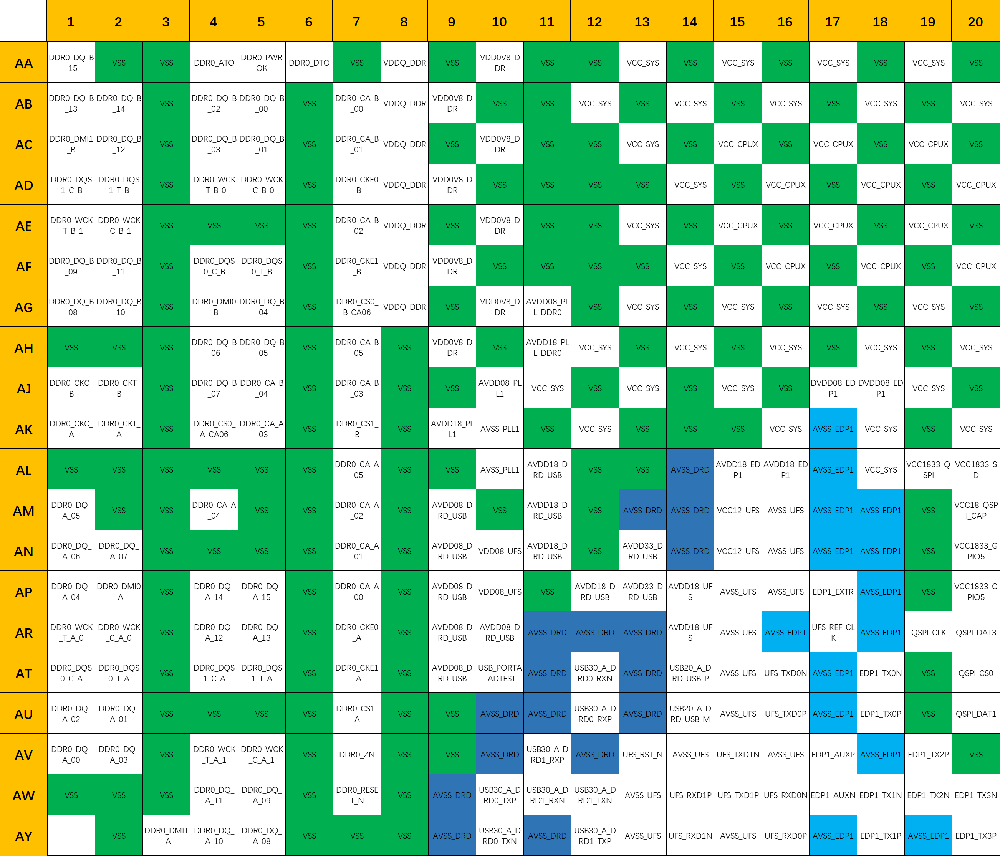

# 3. Pinout

## 3.1 Pinout Diagram & Description

The overall pinout diagram of K3 is depicted below.

Let’s consider the division into the quadrants, in order to conveniently provide the pinout description of K3 in the following subsections.

### 3.1.1 (A~Y, 1~20)

| Pin Number | Pin Name | Pin Number | Pin Name |
| --- | --- | --- | --- |
| A2 | VSS | K20 | AVDD08_PCIE1 |
| A3 | DDR1_DQ_B_08 | L1 | DDR1_CKT_B |
| A4 | DDR1_DMI1_B | L2 | DDR1_CKC_B |
| A5 | DDR1_DQ_B_09 | L3 | VSS |
| A6 | AVSS_PCIEUSB | L4 | VSS |
| A7 | PCIE5_TX0N | L5 | VSS |
| A8 | AVSS_PCIEUSB | L6 | VSS |
| A9 | PCIE4/USB3-D_TX0N | L7 | DDR1_CA_A_01 |
| A10 | AVSS_PCIEUSB | L8 | VSS |
| A11 | PCIE3/USB3-C_TX0N | L9 | VSS |
| A12 | AVSS_PCIEUSB | L10 | VSS |
| A13 | PCIE2/USB3-B_TX0N | L11 | VSS |
| A14 | AVSS_PCIEUSB | L12 | VSS |
| A15 | PCIE1_TX1P | L13 | VSS |
| A16 | AVSS_PCIEUSB | L14 | AVSS_PCIEUSB |
| A17 | PCIE1_TX0N | L15 | AVSS_PCIEUSB |
| A18 | AVSS_PCIEUSB | L16 | AVSS_PCIEUSB |
| A19 | PCIE0_TX1P | L17 | AVSS_PCIEUSB |
| A20 | AVSS_PCIEUSB | L18 | AVSS_PCIEUSB |
| B1 | VSS | L19 | AVDD08_PCIE3/USB3-C |
| B2 | VSS | L20 | AVDD08_PCIE2/USB3-B |
| B3 | VSS | M1 | DDR1_CKT_A |
| B4 | DDR1_DQ_B_11 | M2 | DDR1_CKC_A |
| B5 | DDR1_DQ_B_10 | M3 | VSS |
| B6 | AVSS_PCIEUSB | M4 | DDR1_DQ_A_00 |
| B7 | PCIE5_TX0P | M5 | DDR1_DQ_A_02 |
| B8 | PCIE5_REFCLK_N | M6 | VSS |
| B9 | PCIE4/USB3-D_TX0P | M7 | DDR1_CA_A_00 |
| B10 | PCIE4_REFCLK_P | M8 | VDDQ_DDR |
| B11 | PCIE3/USB3-C_TX0P | M9 | VSS |
| B12 | PCIE3_REFCLK_N | M10 | VDD0V8_DDR |
| B13 | PCIE2/USB3-B_TX0P | M11 | AVDD18_PLL_DDR1 |
| B14 | PCIE2_REFCLK_P | M12 | VSS |
| B15 | PCIE1_TX1N | M13 | VSS |
| B16 | PCIE1_REFCLK_P | M14 | VSS |
| B17 | PCIE1_TX0P | M15 | VSS |
| B18 | USB20_B_USB_P | M16 | VSS |
| B19 | PCIE0_TX1N | M17 | VSS |
| B20 | PCIE0_REFCLK_P | M18 | AVSS_PCIEUSB |
| C1 | DDR1_DQ_B_00 | M19 | VSS |
| C2 | DDR1_DQ_B_02 | M20 | AVDD08_PCIE2/USB3-B |
| C3 | VSS | N1 | DDR1_DQ_A_15 |
| C4 | DDR1_DQS1_T_B | N2 | DDR1_DQ_A_14 |
| C5 | DDR1_DQS1_C_B | N3 | VSS |
| C6 | DDR1_ZN | N4 | DDR1_DQ_A_01 |
| C7 | AVSS_PCIEUSB | N5 | DDR1_DQ_A_03 |
| C8 | PCIE5_REFCLK_P | N6 | VSS |
| C9 | AVSS_PCIEUSB | N7 | DDR1_CKE0_A |
| C10 | PCIE4_REFCLK_N | N8 | VSS |
| C11 | AVSS_PCIEUSB | N9 | VDD0V8_DDR |
| C12 | PCIE3_REFCLK_P | N10 | VSS |
| C13 | AVSS_PCIEUSB | N11 | AVDD08_PLL_DDR1 |
| C14 | PCIE2_REFCLK_N | N12 | VSS |
| C15 | AVSS_PCIEUSB | N13 | VCC_SYS |
| C16 | PCIE1_REFCLK_N | N14 | VSS |
| C17 | AVSS_PCIEUSB | N15 | VCC_SYS |
| C18 | USB20_B_USB_M | N16 | VSS |
| C19 | AVSS_PCIEUSB | N17 | VCC_SYS |
| C20 | PCIE0_REFCLK_N | N18 | VSS |
| D1 | DDR1_DQ_B_03 | N19 | VCC_SYS |
| D2 | DDR1_DQ_B_01 | N20 | VSS |
| D3 | VSS | P1 | DDR1_DQ_A_13 |
| D4 | VSS | P2 | DDR1_DQ_A_12 |
| D5 | VSS | P3 | VSS |
| D6 | DDR1_CKE1_B | P4 | DDR1_DQS0_C_A |
| D7 | DDR1_CA_B_00 | P5 | DDR1_DQS0_T_A |
| D8 | AVSS_PCIEUSB | P6 | VSS |
| D9 | PCIE5_RX0P | P7 | DDR1_CS1_A |
| D10 | AVSS_PCIEUSB | P8 | VDDQ_DDR |
| D11 | USB20_D_USB_P | P9 | VSS |
| D12 | AVSS_PCIEUSB | P10 | VDD0V8_DDR |
| D13 | PCIE4/USB3-D_RX0N | P11 | VSS |
| D14 | AVSS_PCIEUSB | P12 | VSS |
| D15 | PCIE3/USB3-C_RX0N | P13 | VSS |
| D16 | AVSS_PCIEUSB | P14 | VCC_SYS |
| D17 | PCIE2/USB3-B_RX0P | P15 | VSS |
| D18 | AVSS_PCIEUSB | P16 | VCC_SYS |
| D19 | PCIE1_RX0P | P17 | VSS |
| D20 | AVSS_PCIEUSB | P18 | VCC_SYS |
| E1 | DDR1_WCK_T_B_0 | P19 | VSS |
| E2 | DDR1_WCK_C_B_0 | P20 | VCC_SYS |
| E3 | VSS | R1 | DDR1_WCK_C_A_1 |
| E4 | DDR1_WCK_T_B_1 | R2 | DDR1_WCK_T_A_1 |
| E5 | DDR1_WCK_C_B_1 | R3 | VSS |
| E6 | VSS | R4 | VSS |
| E7 | DDR1_CS1_B | R5 | VSS |
| E8 | VSS | R6 | VSS |
| E9 | PCIE5_RX0N | R7 | VDDQ_DDR |
| E10 | AVSS_PCIEUSB | R8 | VSS |
| E11 | USB20_D_USB_M | R9 | VDD0V8_DDR |
| E12 | AVSS_PCIEUSB | R10 | VSS |
| E13 | PCIE4/USB3-D_RX0P | R11 | VSS |
| E14 | AVSS_PCIEUSB | R12 | VSS |
| E15 | PCIE3/USB3-C_RX0P | R13 | VCC_SYS |
| E16 | AVSS_PCIEUSB | R14 | VSS |
| E17 | PCIE2/USB3-B_RX0N | R15 | VCC_SYS |
| E18 | AVSS_PCIEUSB | R16 | VSS |
| E19 | PCIE1_RX0N | R17 | VCC_SYS |
| E20 | AVSS_PCIEUSB | R18 | VSS |
| F1 | DDR1_DQS0_T_B | R19 | VCC_SYS |
| F2 | DDR1_DQS0_C_B | R20 | VSS |
| F3 | VSS | T1 | DDR1_DQS1_C_A |
| F4 | DDR1_DQ_B_12 | T2 | DDR1_DQS1_T_A |
| F5 | VSS | T3 | VSS |
| F6 | VSS | T4 | DDR1_WCK_C_A_0 |
| F7 | DDR1_CKE0_B | T5 | DDR1_WCK_T_A_0 |
| F8 | VSS | T6 | VSS |
| F9 | VSS | T7 | DDR1_CKE1_A |
| F10 | AVDD18_PCIE5 | T8 | VDDQ_DDR |
| F11 | AVDD18_PCIE4/USB3-D | T9 | VSS |
| F12 | AVSS_PCIEUSB | T10 | VDD0V8_DDR |
| F13 | AVDD18_B_USB20 | T11 | VSS |
| F14 | PCIE_USB_COMBO_ADTEST_0 | T12 | VCC_SYS |
| F15 | AVDD18_USB20_HOST | T13 | VSS |
| F16 | USB20_C_USB_M | T14 | VCC_SYS |
| F17 | AVSS_PCIEUSB | T15 | VSS |
| F18 | PCIE1_RX1N | T16 | VCC_SYS |
| F19 | AVSS_PCIEUSB | T19 | VSS |
| F20 | AVDD33_D_USB20 | T20 | VCC_SYS |
| G1 | DDR1_DMI0_B | U1 | DDR1_DMI1_A |
| G2 | VSS | U2 | DDR1_DQ_A_11 |
| G3 | VSS | U3 | VSS |
| G4 | DDR1_DQ_B_13 | U4 | DDR1_DMI0_A |
| G5 | DDR1_DQ_B_15 | U5 | DDR1_DQ_A_04 |
| G6 | VSS | U6 | VSS |
| G7 | DDR1_CA_B_01 | U7 | DDR1_CS0_A_CA06 |
| G8 | VSS | U8 | VSS |
| G9 | VSS | U9 | VDD0V8_DDR |
| G10 | AVDD18_PCIE5 | U10 | VSS |
| G11 | AVDD18_PCIE4/USB3-D | U11 | VSS |
| G12 | AVDD18_C_USB20 | U12 | VSS |
| G13 | AVDD18_PCIE1 | U13 | VCC_SYS |
| G14 | AVDD18_PCIE1 | U14 | VSS |
| G15 | AVSS_PCIEUSB | U15 | VCC_SYS |
| G16 | USB20_C_USB_P | U16 | VSS |
| G17 | AVDD18_PCIE0 | U19 | VCC_SYS |
| G18 | PCIE1_RX1P | U20 | VSS |
| G19 | AVSS_PCIEUSB | V1 | DDR1_DQ_A_10 |
| G20 | AVDD33_C_USB20 | V2 | DDR1_DQ_A_09 |
| H1 | DDR1_DQ_B_05 | V3 | VSS |
| H2 | DDR1_DQ_B_04 | V4 | DDR1_DQ_A_07 |
| H3 | VSS | V5 | DDR1_DQ_A_05 |
| H4 | DDR1_DQ_B_14 | V6 | VSS |
| H5 | DDR1_CA_B_03 | V7 | DDR1_CA_A_05 |
| H6 | VSS | V8 | VDDQ_DDR |
| H7 | DDR1_CA_B_02 | V9 | VSS |
| H8 | VSS | V10 | VDD0V8_DDR |
| H9 | VSS | V11 | VSS |
| H10 | VSS | V12 | VCC_SYS |
| H11 | AVSS_PCIEUSB | V13 | VSS |
| H12 | AVSS_PCIEUSB | V14 | VCC_SYS |
| H13 | AVDD18_PCIE3/USB3-C | V15 | VSS |
| H14 | AVDD18_PCIE1 | V16 | VCC_SYS |
| H15 | PCIE_USB_COMBO_ADTEST_1 | V19 | VSS |
| H16 | AVDD18_PCIE0 | V20 | VCC_SYS |
| H17 | AVDD18_PCIE0 | W1 | DDR1_DQ_A_08 |
| H18 | AVDD08_D_USB20 | W2 | VSS |
| H19 | AVDD08_C_USB20 | W3 | VSS |
| H20 | AVSS_PCIEUSB | W4 | DDR1_DQ_A_06 |
| J1 | DDR1_DQ_B_07 | W5 | VSS |
| J2 | DDR1_DQ_B_06 | W6 | VSS |
| J3 | VSS | W7 | VSS |
| J4 | DDR1_CA_A_03 | W8 | VDDQ_DDR |
| J5 | DDR1_CA_B_04 | W9 | VSS |
| J6 | VSS | W10 | VDD2H_DDR |
| J7 | DDR1_CS0_B_CA06 | W11 | VAA18_VDD2H_DDR |
| J8 | VSS | W12 | VSS |
| J9 | VSS | W13 | VCC_SYS |
| J10 | VSS | W14 | VSS |
| J11 | VSS | W15 | VCC_SYS |
| J12 | AVDD18_D_USB20 | W16 | VSS |
| J13 | AVDD18_PCIE3/USB3-C | W17 | VSS |
| J14 | AVSS_PCIEUSB | W18 | VCC_SYS |
| J15 | AVDD18_PCIE2/USB3-B | W19 | VCC_SYS |
| J16 | AVSS_PCIEUSB | W20 | VSS |
| J17 | AVDD08_PCIE5 | Y1 | DDR1_RESET_N |
| J18 | AVDD08_PCIE4/USB3-D | Y2 | DDR1_PWROK |
| J19 | AVDD08_PCIE1 | Y3 | VSS |
| J20 | AVDD08_PCIE1 | Y4 | DDR1_DTO |
| K1 | VSS | Y5 | DDR1_ATO |
| K2 | VSS | Y6 | VSS |
| K3 | VSS | Y7 | VSS |
| K4 | DDR1_CA_A_02 | Y8 | VSS |
| K5 | DDR1_CA_A_04 | Y9 | VDDQ_DDR |
| K6 | VSS | Y10 | VDD2H_DDR |
| K7 | DDR1_CA_B_05 | Y11 | VAA18_VDD2H_DDR |
| K8 | VDDQ_DDR | Y12 | VCC_SYS |
| K9 | VSS | Y13 | VSS |
| K10 | VSS | Y14 | VCC_SYS |
| K11 | VSS | Y15 | VSS |
| K12 | AVSS_PCIEUSB | Y16 | VCC_SYS |
| K13 | AVSS_PCIEUSB | Y17 | VSS |
| K14 | AVSS_PCIEUSB | Y18 | VCC_SYS |
| K15 | AVDD18_PCIE2/USB3-B | Y19 | VSS |
| K16 | AVSS_PCIEUSB | Y20 | VCC_SYS |
| K17 | AVDD08_PCIE5 | — | — |
| K18 | AVDD08_PCIE4/USB3-D | — | — |
| K19 | AVDD08_PCIE3/USB3-C | — | — |

### 3.1.2 (A~Y, 21~40)

| Pin Number | Pin Name | Pin Number | Pin Name |
| --- | --- | --- | --- |
| A21 | PCIE0_TX0N | L21 | AVDD08_PCIE0 |
| A22 | AVSS_PCIEUSB | L22 | AVDD08_B_USB20 |
| A23 | UCIE_EW_TXDATA_M0[2] | L23 | AVSS_PCIEUSB |
| A24 | VSS_UCIE | L24 | AVSS_PCIEUSB |
| A25 | UCIE_EW_TXCKN_M0 | L25 | UCIE_VDDBH_0V9 |
| A26 | UCIE_EW_TXDATA_M0[8] | L26 | UCIE_VCCPLL_1P2V |
| A27 | VSS_UCIE | L27 | VSS_UCIE |
| A28 | UCIE_EW_RXCKP_M0 | L28 | UCIE_VCCIO_0V8 |
| A29 | UCIE_EW_RXCKSB_M0 | L29 | VSS_UCIE |
| A30 | VSS_UCIE | L30 | VSS_UCIE |
| A31 | UCIE_EW_RXDATA_M0[7] | L31 | AVSS_OSCPLL234567 |
| A32 | UCIE_EW_RXDATA_M0[2] | L32 | VSS |
| A33 | VSS_UCIE | L33 | VSS |
| A34 | GPIO[2]_21 | L34 | GPIO[3]_45 |
| A35 | GPIO[2]_25 | L35 | GPIO[3]_50 |
| A36 | GPIO[2]_29 | L36 | VSS |
| A37 | GPIO[2]_32 | L37 | GPIO[3]_57 |
| A38 | GPIO[2]_34 | L38 | GPIO[3]_60 |
| A39 | VSS | L39 | GPIO[3]_66 |
| B21 | PCIE0_TX0P | L40 | GPIO[3]_72 |
| B22 | USB20_HOST_M | M21 | AVSS_PCIEUSB |
| B23 | UCIE_EW_TXDATA_M0[5] | M22 | AVSS_PCIEUSB |
| B24 | UCIE_EW_TXDATA_M0[3] | M23 | AVSS_USB20_HOST |
| B25 | VSS_UCIE | M24 | AVSS_PCIEUSB |
| B26 | UCIE_EW_TXCKP_M0 | M25 | VSS |
| B27 | UCIE_EW_TXDATA_M0[14] | M26 | UCIE_VDDVPH0_0V9 |
| B28 | VSS_UCIE | M27 | UCIE_VDDVPH0_0V9 |
| B29 | UCIE_EW_RXCKN_M0 | M28 | VCC_SYS |
| B30 | UCIE_EW_RXDATA_M0[15] | M29 | VSS |
| B31 | VSS_UCIE | M30 | VCC_SYS |
| B32 | UCIE_EW_RXDATA_M0[5] | M31 | AVSS_OSCPLL234567 |
| B33 | VSS | M32 | VSS |
| B34 | GPIO[2]_22 | M33 | VSS |
| B35 | GPIO[2]_26 | M34 | GPIO[3]_46 |
| B36 | GPIO[2]_30 | M35 | GPIO[3]_51 |
| B37 | VSS | M36 | GPIO[3]_58 |
| B38 | GPIO[2]_33 | M37 | VSS |
| B39 | GPIO[2]_38 | M38 | GPIO[3]_61 |
| B40 | VSS | M39 | GPIO[3]_67 |
| C21 | AVSS_PCIEUSB | M40 | GPIO[3]_73 |
| C22 | USB20_HOST_P | N21 | VCC_SYS |
| C23 | VSS_UCIE | N22 | VSS |
| C24 | UCIE_EW_TXDATA_M0[4] | N23 | VCC_SYS |
| C25 | UCIE_EW_TXTRK_M0 | N24 | VSS |
| C26 | VSS_UCIE | N25 | VCC_SYS |
| C27 | UCIE_EW_TXDATA_M0[11] | N26 | VSS |
| C28 | UCIE_EW_RXDATA_M0[11] | N27 | VCC_SYS |
| C29 | VSS_UCIE | N28 | VSS |
| C30 | UCIE_EW_RXDATA_M0[12] | N29 | VCC_SYS |
| C31 | UCIE_EW_RXTRK_M0 | N30 | VSS |
| C32 | VSS_UCIE | N31 | VCC_SYS |
| C33 | VSS | N32 | VSS |
| C34 | GPIO[2]_23 | N33 | DTEST_PAD |
| C35 | GPIO[2]_27 | N34 | ATEST_PAD |
| C36 | GPIO[2]_31 | N35 | GPIO[3]_52 |
| C37 | GPIO[2]_35 | N38 | GPIO[3]_62 |
| C38 | GPIO[2]_36 | N39 | VSS |
| C39 | VSS | N40 | GPIO[3]_74 |
| C40 | GPIO[2]_40 | P21 | VSS |
| D21 | PCIE0_RX1P | P22 | VCC_SYS |
| D22 | AVSS_PCIEUSB | P23 | VSS |
| D23 | UCIE_EW_TXDATA_M0[0] | P24 | VCC_SYS |
| D24 | VSS_UCIE | P25 | VSS |
| D25 | UCIE_EW_TXVLD_M0 | P26 | VCC_SYS |
| D26 | UCIE_EW_TXDATA_M0[12] | P27 | VSS |
| D27 | VSS_UCIE | P28 | VCC_SYS |
| D28 | UCIE_EW_RXDATA_M0[10] | P29 | VSS |
| D29 | UCIE_EW_RXDATA_M0[14] | P30 | VCC_SYS |
| D30 | VSS_UCIE | P31 | VSS |
| D31 | UCIE_EW_RXDATA_M0[6] | P32 | VSS |
| D32 | UCIE_EW_RXDATA_M0[1] | P33 | VSS |
| D33 | VSS | P34 | VSS |
| D34 | VSS | P35 | VSS |
| D35 | GPIO[2]_28 | P36 | VSS |
| D38 | GPIO[2]_37 | P37 | EMMC_DS |
| D39 | GPIO[2]_39 | P38 | GPIO[3]_63 |
| D40 | GPIO[2]_41 | P39 | GPIO[3]_68 |
| E21 | PCIE0_RX1N | P40 | GPIO[3]_75 |
| E22 | AVSS_PCIEUSB | R21 | VCC_SYS |
| E23 | UCIE_EW_TXDATASB_M0 | R22 | AVDD08_OSC |
| E24 | UCIE_EW_O_CKNT | R23 | AVDD18_OSC |
| E25 | VSS_UCIE | R24 | AVSS_OSCPLL234567 |
| E26 | UCIE_EW_TXCKSB_M0 | R25 | VCC_SYS |
| E27 | UCIE_EW_TXDATA_M0[13] | R26 | VSS |
| E28 | VSS_UCIE | R27 | VCC_SYS |
| E29 | UCIE_EW_RXDATA_M0[8] | R28 | VSS |
| E30 | UCIE_EW_RXDATA_M0[9] | R29 | VCC_SYS |
| E31 | VSS_UCIE | R30 | VSS |
| E32 | UCIE_EW_RXDATASB_M0 | R31 | VSS |
| E33 | VSS | R32 | VCC18_GPIO2 |
| E34 | GPIO[2]_24 | R33 | VCC18_GPIO2 |
| E35 | PMIC_INT_N | R34 | VSS |
| E36 | PWR_SSP_SCLK | R35 | VSS |
| E37 | PMIC_WDT_N | R36 | EMMC_CLK |
| E38 | PRI_TDO | R37 | EMMC_CMD |
| E39 | PRI_TRST_N | R38 | VSS |
| E40 | PWR_SSP_TXD | R39 | EMMC_D5 |
| F21 | AVSS_PCIEUSB | R40 | EMMC_D3 |
| F22 | PCIE0_RX0P | T21 | VSS |
| F23 | VSS_UCIE | T22 | AVDD08_PLL234 |
| F24 | UCIE_EW_O_CKPT | T23 | AVSS_OSCPLL234567 |
| F25 | UCIE_EW_TXDATA_M0[7] | T24 | VCC_SYS |
| F26 | VSS_UCIE | T25 | VSS |
| F27 | UCIE_EW_TXDATA_M0[9] | T26 | VCC_SYS |
| F28 | UCIE_EW_TXDATA_M0[15] | T30 | VCC_SYS |
| F29 | VSS_UCIE | T31 | VSS |
| F30 | UCIE_EW_RXVLD_M0 | T32 | VCC1833_GPIO2 |
| F31 | UCIE_EW_RXDATA_M0[3] | T33 | VCC1833_GPIO2 |
| F32 | VSS_UCIE | T34 | AVDD18_FUSE |
| F33 | VSS | T35 | VSS |
| F34 | PRI_TMS | T36 | EMMC_D4 |
| F35 | VSS | T37 | EMMC_D1 |
| F36 | PWR_SSP_RXD | T38 | EMMC_D6 |
| F37 | EXT_32K_IN | T39 | EMMC_D2 |
| F38 | PWR_SCL | T40 | EMMC_D7 |
| F39 | PRI_TDI | U21 | VCC_SYS |
| F40 | VSS | U22 | PCIE/USB3_RCAL |
| G21 | AVDD33_USB20_HOST | U23 | AVDD18_PLL234 |
| G22 | PCIE0_RX0N | U24 | VSS |
| G23 | VSS_UCIE | U25 | VCC_SYS |
| G24 | VSS_UCIE | U26 | VSS |
| G25 | UCIE_EW_TXDATA_M0[6] | U30 | VSS |
| G26 | UCIE_EW_TXDATA_M0[1] | U31 | VCC_SYS |
| G27 | VSS_UCIE | U32 | VCC18_PMIC |
| G28 | UCIE_EW_TXDATA_M0[10] | U33 | VCC18_PMIC |
| G29 | UCIE_EW_RXDATA_M0[13] | U34 | VSS |
| G30 | VSS_UCIE | U35 | VSS |
| G31 | UCIE_EW_RXDATA_M0[4] | U36 | VSS |
| G32 | UCIE_EW_RXDATA_M0[0] | U37 | VSS |
| G33 | VSS | U38 | EMMC_D0 |
| G34 | PRI_TCK | U39 | VSS |
| G35 | VCXO_EN | U40 | VSS |
| G38 | PWR_SDA | V21 | VSS |
| G39 | RESET_IN_N | V22 | AVDD18_PLL567 |
| G40 | PWR_SSP_FRM | V23 | AVDD08_PLL567 |
| H21 | AVDD33_B_USB20 | V24 | VCC_SYS |
| H22 | AVSS_PCIEUSB | V25 | VSS |
| H23 | AVSS_PCIEUSB | V26 | VCC_SYS |
| H24 | VSS_UCIE | V27 | VSS |
| H25 | UCIE_EW_ATEST | V28 | VCC_SYS |
| H26 | UCIE_BGR_EAREFCLKN | V29 | VSS |
| H27 | UCIE_VDD_0V8 | V30 | VCC_SYS |
| H28 | UCIE_EW_VCTRL_EXT | V31 | VSS |
| H29 | VSS_UCIE | V32 | VCC18_GPIO3 |
| H30 | VSS_UCIE | V33 | VCC18_GPIO3 |
| H31 | VSS_UCIE | V34 | VSS |
| H32 | VSS_UCIE | V35 | VSS |
| H33 | VSS | V36 | MIPI_CSI2_D3N |
| H34 | GPIO[3]_42 | V37 | MIPI_CSI2_D3P |
| H35 | GPIO[3]_47 | V38 | AVSS_MIPI012 |
| H36 | GPIO[3]_53 | V39 | MIPI_CSI2_D2N |
| H37 | GPIO[3]_55 | V40 | MIPI_CSI2_D2P |
| H38 | GPIO[3]_54 | W21 | VCC_SYS |
| H39 | VSS | W22 | VSS |
| H40 | GPIO[3]_69 | W23 | VCC_SYS |
| J21 | AVDD08_PCIE0 | W24 | VSS |
| J22 | AVSS_PCIEUSB | W25 | VCC_SYS |
| J23 | AVSS_PCIEUSB | W26 | VCC_SYS |
| J24 | UCIE_VCCAON_0V8 | W27 | VCC_SYS |
| J25 | UCIE_VCCAON_0V8 | W28 | VSS |
| J26 | UCIE_BGR_EAREFCLKP | W29 | VCC_SYS |
| J27 | UCIE_VDD_0V8 | W30 | VSS |
| J28 | VSS_UCIE | W31 | VCC_SYS |
| J29 | UCIE_VCCIO_0V8 | W32 | AVDD08_EMMC |
| J30 | VSS_UCIE | W33 | AVDD08_EMMC |
| J31 | VSS_UCIE | W34 | VSS |
| J32 | XI_PAD | W35 | VSS |
| J33 | AVSS_OSCPLL234567 | W36 | AVSS_MIPI012 |
| J34 | GPIO[3]_43 | W37 | AVSS_MIPI012 |
| J35 | GPIO[3]_48 | W38 | MIPI_CSI3_CLKN |
| J36 | VSS | W39 | MIPI_CSI3_CLKP |
| J37 | GPIO[3]_56 | W40 | AVSS_MIPI012 |
| J38 | GPIO[3]_59 | Y21 | VSS |
| J39 | GPIO[3]_64 | Y22 | VCC_SYS |
| J40 | GPIO[3]_70 | Y23 | VSS |
| K21 | AVDD08_PCIE0 | Y24 | VCC_SYS |
| K22 | AVDD08_USB20_HOST | Y25 | VCC_SYS |
| K23 | AVSS_PCIEUSB | Y26 | VCC_SYS |
| K24 | AVSS_PCIEUSB | Y27 | VSS |
| K25 | UCIE_VCCAON_0V8 | Y28 | VCC_SYS |
| K26 | UCIE_VCCPLL_1P2V | Y29 | VSS |
| K27 | VSS_UCIE | Y30 | VCC_SYS |
| K28 | UCIE_VCCIO_0V8 | Y31 | VSS |
| K29 | UCIE_VCCIO_0V8 | Y32 | VCC18_EMMC |
| K30 | UCIE_VCCIO_0V8 | Y33 | VCC18_EMMC |
| K31 | VSS_UCIE | Y34 | VSS |
| K32 | XO_PAD | Y35 | VSS |
| K33 | AVSS_OSCPLL234567 | Y36 | MIPI_CSI2_D1P |
| K34 | GPIO[3]_44 | Y37 | MIPI_CSI2_D1N |
| K35 | GPIO[3]_49 | Y38 | AVSS_MIPI012 |
| K38 | VSS | Y39 | MIPI_CSI2_D0P |
| K39 | GPIO[3]_65 | Y40 | MIPI_CSI2_D0N |
| K40 | GPIO[3]_71 | — | — |

### 3.1.3 (AA~AY, 1~20)

| Pin Number | Pin Name | Pin Number | Pin Name |
| --- | --- | --- | --- |
| AA1 | DDR0_DQ_B_15 | AL1 | VSS |
| AA2 | VSS | AL2 | VSS |
| AA3 | VSS | AL3 | VSS |
| AA4 | DDR0_ATO | AL4 | VSS |
| AA5 | DDR0_PWROK | AL5 | VSS |
| AA6 | DDR0_DTO | AL6 | VSS |
| AA7 | VSS | AL7 | DDR0_CA_A_05 |
| AA8 | VDDQ_DDR | AL8 | VSS |
| AA9 | VSS | AL9 | VSS |
| AA10 | VDD0V8_DDR | AL10 | AVSS_PLL1 |
| AA11 | VSS | AL11 | AVDD18_DRD_USB |
| AA12 | VSS | AL12 | VSS |
| AA13 | VCC_SYS | AL13 | VSS |
| AA14 | VSS | AL14 | AVSS_DRD |
| AA15 | VCC_SYS | AL15 | AVDD18_EDP1 |
| AA16 | VSS | AL16 | AVDD18_EDP1 |
| AA17 | VCC_SYS | AL17 | AVSS_EDP1 |
| AA18 | VSS | AL18 | VCC_SYS |
| AA19 | VCC_SYS | AL19 | VCC1833_QSPI |
| AA20 | VSS | AL20 | VCC1833_SD |
| AB1 | DDR0_DQ_B_13 | AM1 | DDR0_DQ_A_05 |
| AB2 | DDR0_DQ_B_14 | AM2 | VSS |
| AB3 | VSS | AM3 | VSS |
| AB4 | DDR0_DQ_B_02 | AM4 | DDR0_CA_A_04 |
| AB5 | DDR0_DQ_B_00 | AM5 | VSS |
| AB6 | VSS | AM6 | VSS |
| AB7 | DDR0_CA_B_00 | AM7 | DDR0_CA_A_02 |
| AB8 | VDDQ_DDR | AM8 | VSS |
| AB9 | VDD0V8_DDR | AM9 | AVDD08_DRD_USB |
| AB10 | VSS | AM10 | VSS |
| AB11 | VSS | AM11 | AVDD18_DRD_USB |
| AB12 | VCC_SYS | AM12 | VSS |
| AB13 | VSS | AM13 | AVSS_DRD |
| AB14 | VCC_SYS | AM14 | AVSS_DRD |
| AB15 | VSS | AM15 | VCC12_UFS |
| AB16 | VCC_SYS | AM16 | AVSS_UFS |
| AB17 | VSS | AM17 | AVSS_EDP1 |
| AB18 | VCC_SYS | AM18 | AVSS_EDP1 |
| AB19 | VSS | AM19 | VSS |
| AB20 | VCC_SYS | AM20 | VCC18_QSPI_CAP |
| AC1 | DDR0_DMI1_B | AN1 | DDR0_DQ_A_06 |
| AC2 | DDR0_DQ_B_12 | AN2 | DDR0_DQ_A_07 |
| AC3 | VSS | AN3 | VSS |
| AC4 | DDR0_DQ_B_03 | AN4 | VSS |
| AC5 | DDR0_DQ_B_01 | AN5 | VSS |
| AC6 | VSS | AN6 | VSS |
| AC7 | DDR0_CA_B_01 | AN7 | DDR0_CA_A_01 |
| AC8 | VDDQ_DDR | AN8 | VSS |
| AC9 | VSS | AN9 | AVDD08_DRD_USB |
| AC10 | VDD0V8_DDR | AN10 | VDD08_UFS |
| AC11 | VSS | AN11 | AVDD18_DRD_USB |
| AC12 | VSS | AN12 | VSS |
| AC13 | VCC_SYS | AN13 | AVDD33_DRD_USB |
| AC14 | VSS | AN14 | AVSS_DRD |
| AC15 | VCC_CPUX | AN15 | VCC12_UFS |
| AC16 | VSS | AN16 | AVSS_UFS |
| AC17 | VCC_CPUX | AN17 | AVSS_EDP1 |
| AC18 | VSS | AN18 | AVSS_EDP1 |
| AC19 | VCC_CPUX | AN19 | VSS |
| AC20 | VSS | AN20 | VCC1833_GPIO5 |
| AD1 | DDR0_DQS1_C_B | AP1 | DDR0_DQ_A_04 |
| AD2 | DDR0_DQS1_T_B | AP2 | DDR0_DMI0_A |
| AD3 | VSS | AP3 | VSS |
| AD4 | DDR0_WCK_T_B_0 | AP4 | DDR0_DQ_A_14 |
| AD5 | DDR0_WCK_C_B_0 | AP5 | DDR0_DQ_A_15 |
| AD6 | VSS | AP6 | VSS |
| AD7 | DDR0_CKE0_B | AP7 | DDR0_CA_A_00 |
| AD8 | VDDQ_DDR | AP8 | VSS |
| AD9 | VDD0V8_DDR | AP9 | AVDD08_DRD_USB |
| AD10 | VSS | AP10 | VDD08_UFS |
| AD11 | VSS | AP11 | VSS |
| AD12 | VSS | AP12 | AVDD18_DRD_USB |
| AD13 | VSS | AP13 | AVDD33_DRD_USB |
| AD14 | VCC_SYS | AP14 | AVDD18_UFS |
| AD15 | VSS | AP15 | AVSS_UFS |
| AD16 | VCC_CPUX | AP16 | AVSS_UFS |
| AD17 | VSS | AP17 | EDP1_EXTR |
| AD18 | VCC_CPUX | AP18 | AVSS_EDP1 |
| AD19 | VSS | AP19 | VSS |
| AD20 | VCC_CPUX | AP20 | VCC1833_GPIO5 |
| AE1 | DDR0_WCK_T_B_1 | AR1 | DDR0_WCK_T_A_0 |
| AE2 | DDR0_WCK_C_B_1 | AR2 | DDR0_WCK_C_A_0 |
| AE3 | VSS | AR3 | VSS |
| AE4 | VSS | AR4 | DDR0_DQ_A_12 |
| AE5 | VSS | AR5 | DDR0_DQ_A_13 |
| AE6 | VSS | AR6 | VSS |
| AE7 | DDR0_CA_B_02 | AR7 | DDR0_CKE0_A |
| AE8 | VDDQ_DDR | AR8 | VSS |
| AE9 | VSS | AR9 | AVDD08_DRD_USB |
| AE10 | VDD0V8_DDR | AR10 | AVDD08_DRD_USB |
| AE11 | VSS | AR11 | AVSS_DRD |
| AE12 | VSS | AR12 | AVSS_DRD |
| AE13 | VCC_SYS | AR13 | AVSS_DRD |
| AE14 | VSS | AR14 | AVDD18_UFS |
| AE15 | VCC_CPUX | AR15 | AVSS_UFS |
| AE16 | VSS | AR16 | AVSS_EDP1 |
| AE17 | VCC_CPUX | AR17 | UFS_REF_CLK |
| AE18 | VSS | AR18 | AVSS_EDP1 |
| AE19 | VCC_CPUX | AR19 | QSPI_CLK |
| AE20 | VSS | AR20 | QSPI_DAT3 |
| AF1 | DDR0_DQ_B_09 | AT1 | DDR0_DQS0_C_A |
| AF2 | DDR0_DQ_B_11 | AT2 | DDR0_DQS0_T_A |
| AF3 | VSS | AT3 | VSS |
| AF4 | DDR0_DQS0_C_B | AT4 | DDR0_DQS1_C_A |
| AF5 | DDR0_DQS0_T_B | AT5 | DDR0_DQS1_T_A |
| AF6 | VSS | AT6 | VSS |
| AF7 | DDR0_CKE1_B | AT7 | DDR0_CKE1_A |
| AF8 | VDDQ_DDR | AT8 | VSS |
| AF9 | VDD0V8_DDR | AT9 | AVDD08_DRD_USB |
| AF10 | VSS | AT10 | USB_PORTA_ADTEST |
| AF11 | VSS | AT11 | AVSS_DRD |
| AF12 | VSS | AT12 | USB30_A_DRD0_RXN |
| AF13 | VSS | AT13 | AVSS_DRD |
| AF14 | VCC_SYS | AT14 | USB20_A_DRD_USB_P |
| AF15 | VSS | AT15 | AVSS_UFS |
| AF16 | VCC_CPUX | AT16 | UFS_TXD0N |
| AF17 | VSS | AT17 | AVSS_EDP1 |
| AF18 | VCC_CPUX | AT18 | EDP1_TX0N |
| AF19 | VSS | AT19 | VSS |
| AF20 | VCC_CPUX | AT20 | QSPI_CS0 |
| AG1 | DDR0_DQ_B_08 | AU1 | DDR0_DQ_A_02 |
| AG2 | DDR0_DQ_B_10 | AU2 | DDR0_DQ_A_01 |
| AG3 | VSS | AU3 | VSS |
| AG4 | DDR0_DMI0_B | AU4 | VSS |
| AG5 | DDR0_DQ_B_04 | AU5 | VSS |
| AG6 | VSS | AU6 | VSS |
| AG7 | DDR0_CS0_B_CA06 | AU7 | DDR0_CS1_A |
| AG8 | VDDQ_DDR | AU8 | VSS |
| AG9 | VSS | AU9 | VSS |
| AG10 | VDD0V8_DDR | AU10 | AVSS_DRD |
| AG11 | AVDD08_PLL_DDR0 | AU11 | AVSS_DRD |
| AG12 | VSS | AU12 | USB30_A_DRD0_RXP |
| AG13 | VCC_SYS | AU13 | AVSS_DRD |
| AG14 | VSS | AU14 | USB20_A_DRD_USB_M |
| AG15 | VCC_SYS | AU15 | AVSS_UFS |
| AG16 | VSS | AU16 | UFS_TXD0P |
| AG17 | VCC_SYS | AU17 | AVSS_EDP1 |
| AG18 | VSS | AU18 | EDP1_TX0P |
| AG19 | VCC_SYS | AU19 | VSS |
| AG20 | VSS | AU20 | QSPI_DAT1 |
| AH1 | VSS | AV1 | DDR0_DQ_A_00 |
| AH2 | VSS | AV2 | DDR0_DQ_A_03 |
| AH3 | VSS | AV3 | VSS |
| AH4 | DDR0_DQ_B_06 | AV4 | DDR0_WCK_T_A_1 |
| AH5 | DDR0_DQ_B_05 | AV5 | DDR0_WCK_C_A_1 |
| AH6 | VSS | AV6 | VSS |
| AH7 | DDR0_CA_B_05 | AV7 | DDR0_ZN |
| AH8 | VSS | AV8 | VSS |
| AH9 | VDD0V8_DDR | AV9 | VSS |
| AH10 | VSS | AV10 | AVSS_DRD |
| AH11 | AVDD18_PLL_DDR0 | AV11 | USB30_A_DRD1_RXP |
| AH12 | VCC_SYS | AV12 | AVSS_DRD |
| AH13 | VSS | AV13 | UFS_RST_N |
| AH14 | VCC_SYS | AV14 | AVSS_UFS |
| AH15 | VSS | AV15 | UFS_TXD1N |
| AH16 | VCC_SYS | AV16 | AVSS_UFS |
| AH17 | VSS | AV17 | EDP1_AUXP |
| AH18 | VCC_SYS | AV18 | AVSS_EDP1 |
| AH19 | VSS | AV19 | EDP1_TX2P |
| AH20 | VCC_SYS | AV20 | VSS |
| AJ1 | DDR0_CKC_B | AW1 | VSS |
| AJ2 | DDR0_CKT_B | AW2 | VSS |
| AJ3 | VSS | AW3 | VSS |
| AJ4 | DDR0_DQ_B_07 | AW4 | DDR0_DQ_A_11 |
| AJ5 | DDR0_CA_B_04 | AW5 | DDR0_DQ_A_09 |
| AJ6 | VSS | AW6 | VSS |
| AJ7 | DDR0_CA_B_03 | AW7 | DDR0_RESET_N |
| AJ8 | VSS | AW8 | VSS |
| AJ9 | VSS | AW9 | AVSS_DRD |
| AJ10 | AVDD08_PLL1 | AW10 | USB30_A_DRD0_TXP |
| AJ11 | VCC_SYS | AW11 | USB30_A_DRD1_RXN |
| AJ12 | VSS | AW12 | USB30_A_DRD1_TXN |
| AJ13 | VCC_SYS | AW13 | AVSS_UFS |
| AJ14 | VSS | AW14 | UFS_RXD1P |
| AJ15 | VCC_SYS | AW15 | UFS_TXD1P |
| AJ16 | VSS | AW16 | UFS_RXD0N |
| AJ17 | DVDD08_EDP1 | AW17 | EDP1_AUXN |
| AJ18 | DVDD08_EDP1 | AW18 | EDP1_TX1N |
| AJ19 | VCC_SYS | AW19 | EDP1_TX2N |
| AJ20 | VSS | AW20 | EDP1_TX3N |
| AK1 | DDR0_CKC_A | AY2 | VSS |
| AK2 | DDR0_CKT_A | AY3 | DDR0_DMI1_A |
| AK3 | VSS | AY4 | DDR0_DQ_A_10 |
| AK4 | DDR0_CS0_A_CA06 | AY5 | DDR0_DQ_A_08 |
| AK5 | DDR0_CA_A_03 | AY6 | VSS |
| AK6 | VSS | AY7 | VSS |
| AK7 | DDR0_CS1_B | AY8 | VSS |
| AK8 | VSS | AY9 | AVSS_DRD |
| AK9 | AVDD18_PLL1 | AY10 | USB30_A_DRD0_TXN |
| AK10 | AVSS_PLL1 | AY11 | AVSS_DRD |
| AK11 | VSS | AY12 | USB30_A_DRD1_TXP |
| AK12 | VCC_SYS | AY13 | AVSS_UFS |
| AK13 | VSS | AY14 | UFS_RXD1N |
| AK14 | VSS | AY15 | AVSS_UFS |
| AK15 | VSS | AY16 | UFS_RXD0P |
| AK16 | VCC_SYS | AY17 | AVSS_EDP1 |
| AK17 | AVSS_EDP1 | AY18 | EDP1_TX1P |
| AK18 | VCC_SYS | AY19 | AVSS_EDP1 |
| AK19 | VSS | AY20 | EDP1_TX3P |
| AK20 | VCC_SYS | — | — |

### 3.1.4 (AA~AY, 21~40)

| Pin Number | Pin Name | Pin Number | Pin Name |
| --- | --- | --- | --- |
| AA21 | VCC_SYS | AL21 | VCC18_SD_CAP |
| AA22 | VSS | AL22 | VCC18_GPIO5 |
| AA23 | VCC_SYS | AL23 | VSS |
| AA24 | VSS | AL24 | VCC18_GPIO1 |
| AA25 | VCC_SYS | AL25 | VCC18_GPIO4 |
| AA26 | VSS | AL26 | VCC18_GPIO4 |
| AA27 | VCC_SYS | AL27 | VSS |
| AA28 | VSS | AL28 | VCC_SYS |
| AA29 | VCC_SYS | AL29 | VSS |
| AA30 | AVDD08_DSI | AL30 | VCC_SYS |
| AA31 | AVDD08_DSI | AL31 | VSS |
| AA32 | VSS | AL32 | AVDD18_EDP0 |
| AA33 | VSS | AL33 | VSS |
| AA34 | VSS | AL34 | VSS |
| AA35 | VSS | AL35 | VSS |
| AA36 | AVSS_MIPI012 | AL36 | AVSS_DSI |
| AA37 | AVSS_MIPI012 | AL37 | AVSS_DSI |
| AA38 | MIPI_CSI1_D2N | AL38 | MIPI_DSI1_CLKN |
| AA39 | MIPI_CSI1_D2P | AL39 | MIPI_DSI1_CLKP |
| AA40 | AVSS_MIPI012 | AL40 | AVSS_DSI |
| AB21 | VSS | AM21 | VCC18_SD_CAP |
| AB22 | VCC_SYS | AM22 | VCC18_GPIO5 |
| AB23 | VSS | AM23 | VSS |
| AB24 | VCC_SYS | AM24 | VCC18_GPIO1 |
| AB25 | VSS | AM25 | VSS |
| AB26 | VCC_SYS | AM26 | VCC1833_GPIO4 |
| AB27 | VSS | AM27 | VCC1833_GPIO1 |
| AB28 | VCC_SYS | AM28 | VSS |
| AB29 | VSS | AM29 | VSS |
| AB30 | AVDD08_CSI2 | AM30 | VCC_SYS |
| AB31 | AVDD08_CSI2 | AM31 | VSS |
| AB32 | VSS | AM32 | AVDD18_EDP0 |
| AB33 | MIPI_CSI2_CLKN | AM33 | MIPI_DSI1_D1P |
| AB34 | MIPI_CSI2_CLKP | AM34 | MIPI_DSI1_D1N |
| AB35 | AVSS_MIPI012 | AM35 | VSS |
| AB36 | MIPI_CSI1_D3N | AM36 | MIPI_DSI1_D3P |
| AB37 | MIPI_CSI1_D3P | AM37 | MIPI_DSI1_D3N |
| AB38 | AVSS_MIPI012 | AM38 | AVSS_DSI |
| AB39 | MIPI_CSI1_CLKN | AM39 | MIPI_DSI1_D0P |
| AB40 | MIPI_CSI1_CLKP | AM40 | MIPI_DSI1_D0N |
| AC21 | VCC_SYS | AN21 | VSS |
| AC22 | VSS | AN22 | VSS |
| AC23 | VCC_SYS | AN23 | VSS |
| AC24 | VSS | AN24 | VSS |
| AC25 | VCC_SYS | AN25 | VSS |
| AC26 | VSS | AN26 | VCC1833_GPIO4 |
| AC27 | VCC_SYS | AN27 | VCC1833_GPIO1 |
| AC28 | VSS | AN28 | VSS |
| AC29 | VCC_SYS | AN29 | VSS |
| AC30 | VSS | AN30 | VSS |
| AC31 | AVSS_MIPI012 | AN31 | VSS |
| AC32 | AVSS_MIPI012 | AN32 | VSS |
| AC33 | AVSS_MIPI012 | AN33 | VSS |
| AC34 | AVSS_MIPI012 | AN34 | VSS |
| AC35 | AVSS_MIPI012 | AN35 | VSS |
| AC36 | AVSS_MIPI012 | AN36 | EDP0_EXTR |
| AC37 | AVSS_MIPI012 | AN37 | AVSS_EDP0 |
| AC38 | MIPI_CSI1_D1P | AN38 | EDP0_AUXN |
| AC39 | MIPI_CSI1_D1N | AN39 | EDP0_AUXP |
| AC40 | AVSS_MIPI012 | AN40 | AVSS_EDP0 |
| AD21 | VSS | AP21 | QSPI_DAT2 |
| AD22 | VCC_CPUX | AP22 | VSS |
| AD23 | VSS | AP23 | VSS |
| AD24 | VCC_CPUX | AP24 | GPIO[5]_119 |
| AD25 | VSS | AP25 | GPIO[5]_114 |
| AD26 | VCC_CPUX | AP26 | GPIO[5]_108 |
| AD27 | VSS | AP27 | GPIO[5]_106 |
| AD28 | VCC_SYS | AP28 | VSS |
| AD29 | VSS | AP29 | GPIO[1]_20 |
| AD30 | AVDD08_CSI0 | AP30 | GPIO[1]_16 |
| AD31 | AVDD08_CSI0 | AP31 | GPIO[1]_06 |
| AD32 | AVDD08_CSI1 | AP32 | GPIO[1]_05 |
| AD33 | AVDD08_CSI1 | AP33 | VSS |
| AD34 | AVSS_MIPI012 | AP34 | GPIO[4]_79 |
| AD35 | AVSS_MIPI012 | AP35 | GPIO[4]_78 |
| AD36 | MIPI_CSI1_D0P | AP36 | VSS |
| AD37 | MIPI_CSI1_D0N | AP37 | AVSS_EDP0 |
| AD38 | AVSS_MIPI012 | AP38 | AVSS_EDP0 |
| AD39 | MIPI_CSI0_D3N | AP39 | EDP0_TX3P |
| AD40 | MIPI_CSI0_D3P | AP40 | EDP0_TX3N |
| AE21 | VCC_CPUX | AR21 | QSPI_CS1 |
| AE22 | VSS | AR22 | VSS |
| AE23 | VCC_CPUX | AR23 | VSS |
| AE24 | VSS | AR24 | GPIO[5]_120 |
| AE25 | VCC_CPUX | AR25 | VSS |
| AE26 | VSS | AR26 | GPIO[5]_109 |
| AE27 | VCC_CPUX | AR27 | GPIO[5]_105 |
| AE28 | VSS | AR28 | GPIO[5]_99 |
| AE29 | VCC_SYS | AR29 | GPIO[1]_19 |
| AE30 | VSS | AR30 | VSS |
| AE31 | AVSS_MIPI012 | AR31 | GPIO[1]_07 |
| AE32 | AVSS_MIPI012 | AR32 | GPIO[1]_04 |
| AE33 | AVSS_MIPI012 | AR33 | GPIO[4]_76 |
| AE34 | AVSS_MIPI012 | AR34 | GPIO[4]_80 |
| AE35 | AVSS_MIPI012 | AR35 | VSS |
| AE36 | AVSS_MIPI012 | AR36 | VSS |
| AE37 | AVSS_MIPI012 | AR37 | AVSS_EDP0 |
| AE38 | MIPI_CSI0_D2N | AR38 | EDP0_TX2P |
| AE39 | MIPI_CSI0_D2P | AR39 | EDP0_TX2N |
| AE40 | AVSS_MIPI012 | AR40 | AVSS_EDP0 |
| AF21 | VSS | AT21 | QSPI_DAT0 |
| AF22 | VCC_CPUX | AT22 | VSS |
| AF23 | VSS | AT23 | GPIO[5]_124 |
| AF26 | VCC_CPUX | AT24 | GPIO[5]_121 |
| AF27 | VSS | AT25 | GPIO[5]_115 |
| AF28 | VCC_SYS | AT26 | GPIO[5]_110 |
| AF29 | VSS | AT27 | VSS |
| AF30 | AVDD18_CSI1 | AT28 | GPIO[5]_100 |
| AF31 | AVDD18_CSI1 | AT29 | GPIO[1]_18 |
| AF32 | AVDD18_CSI2 | AT30 | GPIO[1]_13 |
| AF33 | AVDD18_CSI2 | AT31 | GPIO[1]_08 |
| AF34 | AVSS_MIPI012 | AT32 | VSS |
| AF35 | AVSS_MIPI012 | AT33 | GPIO[4]_77 |
| AF36 | MIPI_CSI0_CLKN | AT34 | GPIO[4]_81 |
| AF37 | MIPI_CSI0_CLKP | AT35 | GPIO[4]_86 |
| AF38 | AVSS_MIPI012 | AT36 | GPIO[4]_90 |
| AF39 | MIPI_CSI0_D1P | AT37 | AVSS_EDP0 |
| AF40 | MIPI_CSI0_D1N | AT38 | AVSS_EDP0 |
| AG21 | VCC_CPUX | AT39 | EDP0_TX1P |
| AG22 | VSS | AT40 | EDP0_TX1N |
| AG23 | VCC_CPUX | AU21 | MMC1_DAT2 |
| AG26 | VSS | AU22 | MMC1_DAT1 |
| AG27 | VCC_CPUX | AU23 | GPIO[5]_125 |
| AG28 | VSS | AU25 | GPIO[5]_116 |
| AG29 | VCC_SYS | AU26 | GPIO[5]_111 |
| AG30 | AVSS_DSI | AU28 | GPIO[5]_101 |
| AG31 | AVSS_DSI | AU29 | VSS |
| AG32 | AVSS_DSI | AU31 | GPIO[1]_09 |
| AG33 | AVSS_DSI | AU32 | GPIO[1]_03 |
| AG34 | AVSS_MIPI012 | AU34 | VSS |
| AG35 | AVSS_MIPI012 | AU35 | GPIO[4]_87 |
| AG36 | AVSS_MIPI012 | AU37 | VSS |
| AG37 | AVSS_MIPI012 | AU38 | EDP0_TX0P |
| AG38 | MIPI_CSI0_D0P | AU39 | EDP0_TX0N |
| AG39 | MIPI_CSI0_D0N | AU40 | AVSS_EDP0 |
| AG40 | AVSS_MIPI012 | AV21 | MMC1_CLK |
| AH21 | VSS | AV22 | MMC1_DAT0 |
| AH22 | VCC_CPUX | AV23 | GPIO[5]_126 |
| AH23 | VSS | AV25 | GPIO[5]_117 |
| AH24 | VCC_CPUX | AV26 | VSS |
| AH25 | VSS | AV28 | GPIO[5]_102 |
| AH26 | VCC_CPUX | AV29 | GPIO[1]_17 |
| AH27 | VSS | AV31 | VSS |
| AH28 | VCC_SYS | AV32 | GPIO[1]_02 |
| AH29 | VSS | AV34 | GPIO[4]_82 |
| AH30 | AVDD12_DSI | AV35 | GPIO[4]_88 |
| AH31 | AVDD18_CSI0 | AV37 | VSS |
| AH32 | AVDD18_CSI0 | AV38 | VSS |
| AH33 | AVSS_DSI | AV39 | GPIO[4]_96 |
| AH34 | AVSS_DSI | AV40 | GPIO[4]_98 |
| AH35 | AVSS_DSI | AW21 | VSS |
| AH36 | MIPI_DSI0_D2P | AW22 | MMC1_CMD |
| AH37 | MIPI_DSI0_D2N | AW23 | VSS |
| AH38 | AVSS_DSI | AW24 | GPIO[5]_122 |
| AH39 | MIPI_DSI0_D1N | AW25 | GPIO[5]_118 |
| AH40 | MIPI_DSI0_D1P | AW26 | GPIO[5]_112 |
| AJ21 | VCC_SYS | AW27 | GPIO[5]_104 |
| AJ22 | VSS | AW28 | VSS |
| AJ23 | VCC_CPUX | AW29 | GPIO[1]_14 |
| AJ24 | VSS | AW30 | GPIO[1]_12 |
| AJ25 | VCC_CPUX | AW31 | GPIO[1]_10 |
| AJ26 | VSS | AW32 | GPIO[1]_01 |
| AJ27 | DVDD08_EDP0 | AW33 | VSS |
| AJ28 | DVDD08_EDP0 | AW34 | GPIO[4]_83 |
| AJ29 | VCC_SYS | AW35 | GPIO[4]_89 |
| AJ30 | AVDD12_DSI | AW36 | GPIO[4]_91 |
| AJ31 | AVDD18_DSI | AW37 | GPIO[4]_93 |
| AJ32 | VSS | AW38 | GPIO[4]_95 |
| AJ33 | AVSS_DSI | AW39 | GPIO[4]_97 |
| AJ34 | AVSS_DSI | AW40 | VSS |
| AJ35 | AVSS_DSI | AY21 | VSS |
| AJ36 | AVSS_DSI | AY22 | MMC1_DAT3 |
| AJ37 | AVSS_DSI | AY23 | GPIO[5]_127 |
| AJ38 | MIPI_DSI0_CLKN | AY24 | GPIO[5]_123 |
| AJ39 | MIPI_DSI0_CLKP | AY25 | VSS |
| AJ40 | AVSS_DSI | AY26 | GPIO[5]_113 |
| AK21 | VSS | AY27 | GPIO[5]_107 |
| AK22 | VCC_SYS | AY28 | GPIO[5]_103 |
| AK23 | VSS | AY29 | GPIO[1]_15 |
| AK24 | VCC_SYS | AY30 | VSS |
| AK25 | VSS | AY31 | GPIO[1]_11 |
| AK26 | VCC_SYS | AY32 | GPIO[1]_00 |
| AK27 | AVSS_EDP0 | AY33 | GPIO[4]_85 |
| AK28 | VCC_SYS | AY34 | GPIO[4]_84 |
| AK29 | AVSS_EDP0 | AY35 | VSS |
| AK30 | VSS | AY36 | GPIO[4]_92 |
| AK31 | AVDD18_DSI | AY37 | GPIO[4]_94 |
| AK32 | VSS | AY38 | VSS |
| AK33 | MIPI_DSI0_D0P | AY39 | VSS |
| AK34 | MIPI_DSI0_D0N | AY40 | VSS |
| AK35 | AVSS_DSI | — | — |
| AK36 | MIPI_DSI0_D3P | — | — |
| AK37 | MIPI_DSI0_D3N | — | — |
| AK38 | AVSS_DSI | — | — |
| AK39 | MIPI_DSI1_D2N | — | — |
| AK40 | MIPI_DSI1_D2P | — | — |

## 3.2 I/O Pin Parameters

### 3.2.1 For 1.8V I/O Pins

| Power Domain | Symbol | Description | Min | Typ | Max |
| --- | --- | --- | --- | --- | --- |
| **1.8V Input** | Vih | High level input | VCC×0.7V | 1.8V | VCC+0.2V |
|  | Vil | Low level input | -0.3V | 0V | VCC×0.3V | 
|  | Rpu | Pull up resistor | 55kΩ | 79kΩ | 121kΩ | 
|  | Rpd | Pull down resistor | 51kΩ | 87kΩ | 169kΩ | 
|  | Iil | Input leakage current (Pad in input mode) | — | — | 10µA | 
| **1.8V Output** | Voh | High level output | VCC−0.2V | — | — |
|  | Vol | Low level output | — | — | 0.2V |  
|  | IolDCS[1:0] | Low level output current (Vpad=0.2V) DCS=00 | 13mA | — | — |  
|  | IolDCS[1:0] | Low level output current (Vpad=0.2V) DCS=01 | 25mA | — | — |  
|  | IolDCS[1:0] | Low level output current (Vpad=0.2V) DCS=10 | 37mA | — | — |
|  | IolDCS[1:0] | Low level output current (Vpad=0.2V) DCS=11 | 49mA | — | — |
|  | IohDCS[1:0] | High level output current (Vpad=VCC−0.2V) DCS=00 | 11mA | — | — |
|  | IohDCS[1:0] | High level output current (Vpad=VCC−0.2V) DCS=01 | 21mA | — | — |  
|  | IohDCS[1:0] |High level output current (Vpad=VCC−0.2V) DCS=10 | 32mA | — | — | 
|  | IohDCS[1:0] |High level output current (Vpad=VCC−0.2V) DCS=11 | 42mA | — | — | 

### 3.2.2 For 3.3V I/O Pins

| Power Domain | Symbol | Description | Min | Typ | Max |
| --- | --- | --- | --- | --- | --- |
| **3.3V Input** | Vih | High level input voltage | 2V | — | VCC+0.3V |
|  | Vil | Low level input voltage | -0.3V | 0V | 0.8V |
|  | Rpu | Pull-up resistor | 26kΩ | 47kΩ | 72kΩ |
|  | Rpd | Pull-down resistor | 27kΩ | 54kΩ | 267kΩ |
|  | Iil | Input leakage current | — | — | 10µA |
| **3.3V Output** | Voh | High level output voltage | 2.4V | — | — |
|  | Vol | Low level output voltage | — | — | 0.4V | 
|  | IolDS[2:0] | Low level output current (Vpad=0.4V) DS=000 | 7mA | — | — | 
|  | IolDS[2:0] | Low level output current (Vpad=0.4V) DS=001 | 10mA | — | — |
|  | IolDS[2:0] | Low level output current (Vpad=0.4V) DS=010 | 14mA | — | — |
|  | IolDS[2:0] | Low level output current (Vpad=0.4V) DS=011 | 18mA | — | — |
|  | IolDS[2:0] | Low level output current (Vpad=0.4V) DS=100 | 21mA | — | — |
|  | IolDS[2:0] | Low level output current (Vpad=0.4V) DS=101 | 24mA | — | — |
|  | IolDS[2:0] | Low level output current (Vpad=0.4V) DS=110 | 28mA | — | — |
|  | IolDS[2:0] | Low level output current (Vpad=0.4V) DS=111 | 31mA | — | — |
|  | IohDS[2:0] | High level output current (Vpad=VCC−0.5V) DS=000 | 7mA | — | — |
|  | IohDS[2:0] | High level output current (Vpad=VCC−0.5V) DS=001 | 10mA | — | — |
|  | IohDS[2:0] | High level output current (Vpad=VCC−0.5V) DS=010 | 13mA | — | — |
|  | IohDS[2:0] | High level output current (Vpad=VCC−0.5V) DS=011 | 16mA | — | — |
|  | IohDS[2:0] | High level output current (Vpad=VCC−0.5V) DS=100 | 19mA | — | — |
|  | IohDS[2:0] | High level output current (Vpad=VCC−0.5V) DS=101 | 23mA | — | — |
|  | IohDS[2:0] | High level output current (Vpad=VCC−0.5V) DS=110 | 26mA | — | — |
|  | IohDS[2:0] | High level output current (Vpad=VCC−0.5V) DS=111 | 29mA | — | — |

## 3.3 Multiplexed Signal/Pin Functions

The **Function 0** through **7** signals is assigned to the I/O pins of K3.  
Most I/O pins of K3 are multi-function allowing them to be configured for one of several available functions using Multi-Function Pin Registers (MFPRs). Additionally, some functions can be configured to be present on several different pins.  
The assigned signals are organized by their functions (e.g. power supply, clock, etc.) which are arranged in groups according to their interfaces (e.g. JTAG, SPIx, etc.) as per description in the following subsections (sorted alphabetically for user convenience).

> **Note:** Definition of symbols used for signal/pin type:
>
> - **I** = Input  
> - **O** = Output  
> - **I/O** = Input/Output  
> - **OD** = Open-Drain  
> - **RO** = Reference output  

### 3.3.1 JTAG – Primary

| Signal/Pin | Type | Description |
| --- | --- | --- |
| PRI_TCK | I | Primary JTAG interface 1 test clock. Used for all transfers on the JTAG test interface. |
| PRI_TDI | I | Primary JTAG interface 1 test data input. Used to send data from the JTAG controller to the K3 processor. This pin has an internal pullup resistor. |
| PRI_TDO | O | Primary JTAG Interface 1 test data output. Used to return data from the K3 processor to the JTAG controller. |
| PRI_TMS | I | Primary JTAG Interface 1 test mode select. Used to select the test mode required from the JTAG controller. This pin has an internal pullup resistor. |
| PRI_TRSTn | I | Primary JTAG Interface 1 test reset. Used for IEEE 1194.1 test reset. |
| VCXO_OUT | O | 24 MHz VCXO output clock |
| VCXO_REQ | I | OCLK1 request |

### 3.3.2 Miscellaneous

| Signal/Pin | Type | Description |
| --- | --- | --- |
| MPLL_TST_CK | — | PLL test pin |
| MN_CLK_OUT | O | Fractional (M/N) divided clock. Main PMU general purpose M/N fractional clock divider clock output. CLK_REQ must be set as Function 0 and pulled high for the 13 MHz clock to be output on GPIO[122] (MN_CLK_OUT). |
| Sleep_OUT | O | PMIC sleep setting |

### 3.3.3 SPIx

| Signal/Pin | Type | Description |
| --- | --- | --- |
| SPIx_FRM | I/O | Synchronous serial port frame 0/2. The serial frame sync can be configured as an output (master mode operation) or an input (slave mode operation). |
| SPIx_RXD | I | Synchronous serial port receive data 0/2. Serial data latched using the bit clock. |
| SPIx_SCLK | I/O | Synchronous serial port clock 0/2. The serial bit clock can be configured as an output (master mode operation) or an input (slave mode operation). |
| SPIx_TXD | O | Synchronous serial port transmit data 0/2. Serial data driven out synchronously with the bit clock. |

### 3.3.4 TWSI

**Dedicated**

| Signal/Pin | Type | Description |
| --- | --- | --- |
| PWR_SDA | I/O | TWSI serial data/address signal |
| PWR_SCL | I/O | TWSI serial clock line signal |

**Common**

| Signal/Pin | Type | Description |
| --- | --- | --- |
| I²Cx_SCL | I/O,OD | TWSIx clock |
| I²Cx_SDA | I/O,OD | TWSIx data |

### 3.3.5 UARTx

| Signal/Pin | Type | Description |
| --- | --- | --- |
| UARTx_CTSn | I | UARTx clear-to-send |
| UARTx_RTSn | O | UARTx request-to-send |
| UARTx_RXD | I | UARTx receive data |
| UARTx_TXD | O | UARTx transmit data |

### 3.3.6 USB

| Signal/Pin | Type | Description |
| --- | --- | --- |
| USBx_N | I/O | USB D± |
| USBx_P | I/O | — |
| VBUS_ON | I | USB VBUS present indicator |

## 3.4 Multi-Function I/O Pin Assignments

The General-Purpose Input/Output (GPIO) module provides flexible pin control and signal multiplexing capabilities. Each GPIO pin can operate as a standard input/output or be configured for one of several alternate functions, allowing efficient connection between the system and on-chip peripherals.

The tables below provide a detailed description of the signal assignments for Function 0 through Function 6, organized according to their respective interface groups.

#### QSPI 1.8V/3.3V

| Pad Name | Default Pull | Pad Edge Wakeup | Function 0 | Function 1 | Function 2 | Function 3 | Function 4 | Function 5 | Function 6 |
| --- | --- | --- | --- | --- | --- | --- | --- | --- | --- |
| QSPI_DAT3 | DOWN | ENABLE | QSPI_DAT[3] | GPIO[0] | R.UART1_TXD | R.GPIO[0] | — | — | — |
| QSPI_DAT2 | DOWN | ENABLE | QSPI_DAT[2] | GPIO[1] | R.UART1_RXD | R.GPIO[1] | — | — | — |
| QSPI_DAT1 | DOWN | ENABLE | QSPI_DAT[1] | GPIO[2] | R.UART1_CTS | R.GPIO[2] | — | — | — |
| QSPI_DAT0 | DOWN | ENABLE | QSPI_DAT[0] | GPIO[3] | R.UART1_RTS | R.GPIO[3] | — | — | — |
| QSPI_CLK | DOWN | ENABLE | QSPI_CLK | GPIO[4] | R.CAN1_TXD | R.GPIO[4] | — | — | — |
| QSPI_CS0 | UP | ENABLE | QSPI_CS0 | GPIO[5] | R.CAN1_RXD | R.GPIO[5] | I2C3_SCL | — | — |
| QSPI_CS1 | UP | ENABLE | QSPI_CS1 | GPIO[6] | — | — | I2C3_SDA | — | — |

#### SD/MMC1 1.8V/3.3V

| Pad Name | Default Pull | Pad Edge Wakeup | Function 0 | Function 1 | Function 2 | Function 3 | Function 4 | Function 5 | Function 6 |
| --- | --- | --- | --- | --- | --- | --- | --- | --- | --- |
| MMC1_DAT3 | UP | ENABLE | MMC1_DAT[3] | GPIO[93] | UART0_TXD | R.GPIO[6] | R.UART0_TXD | PRI_TDI | — |
| MMC1_DAT2 | UP | ENABLE | MMC1_DAT[2] | GPIO[94] | UART0_RXD | R.GPIO[7] | R.UART0_RXD | PRI_TMS | — |
| MMC1_DAT1 | UP | ENABLE | MMC1_DAT[1] | GPIO[95] | UART2_TXD | R.GPIO[8] | PWM2 | PRI_TDO | — |
| MMC1_DAT0 | UP | ENABLE | MMC1_DAT[0] | GPIO[96] | UART2_RXD | R.GPIO[9] | PWM3 | — | — |
| MMC1_CMD | UP | ENABLE | MMC1_CMD | GPIO[97] | UART2_CTS | R.GPIO[10] | PWM4 | I2C4_SCL | — |
| MMC1_CLK | DOWN | ENABLE | MMC1_CLK | GPIO[98] | UART2_RTS | R.GPIO[11] | PWM5 | PRI_TCK | I2C4_SDA |

#### PMIC [1.8V only]

| Pad Name | Default Pull | Pad Edge Wakeup | Function 0 | Function 1 | Function 2 | Function 3 | Function 4 | Function 5 | Function 6 |
| --- | --- | --- | --- | --- | --- | --- | --- | --- | --- |
| RESET_IN_N | UP | NO | RESET_IN_N | — | — | — | PWM10 | — | — |
| EXT_32K_IN | DOWN | NO | EXT_32K_IN | — | — | — | PWM11 | — | — |
| PWR_SCL | UP | ENABLE | PWR_SCL | R_PWR_SCL | — | — | PWM12 | — | — |
| PWR_SDA | UP | ENABLE | PWR_SDA | R_PWR_SDA | — | — | PWM13 | — | — |
| VCXO_EN | NO | ENABLE | VCXO_EN | — | — | — | PWM14 | — | — |
| PMIC_WDT_N | UP | NO | PMIC_WDT_N | — | — | — | PWM15 | — | — |
| PMIC_INT_N | UP | ENABLE | PMIC_INT_N | — | — | — | PWM16 | — | — |
| PWR_SSP_TXD | UP | ENABLE | PWR_SSP_TXD | GPIO[120] | I2C6_SCL | — | — | — | — |
| PWR_SSP_RXD | UP | ENABLE | PWR_SSP_RXD | GPIO[121] | I2C6_SDA | — | — | — | — |
| PWR_SSP_SCLK | UP | ENABLE | PWR_SSP_SCLK | GPIO[122] | UART0_TXD | — | — | — | — |
| PWR_SSP_FRM | UP | ENABLE | PWR_SSP_FRM | GPIO[123] | UART0_RXD | — | — | — | — |
| PRI_TDI | UP | NO | PRI_TDI | GPIO[124] | R.GPIO[17] | PWM6 | UART5_TXD | UART0_TXD | R.UART0_TXD |
| PRI_TMS | UP | NO | PRI_TMS | GPIO[125] | R.GPIO[14] | PWM7 | UART5_RXD | UART0_RXD | R.UART0_RXD |
| PRI_TCK | DOWN | NO | PRI_TCK | GPIO[126] | R.GPIO[15] | PWM8 | UART9_TXD | — | — |
| PRI_TDO | UP | NO | PRI_TDO | GPIO[127] | R.GPIO[16] | PWM9 | UART9_RXD | — | — |

#### EMMC5 [1.8V only]

| Pad Name | Default Pull | Pad Edge Wakeup | Function 0 | Function 1 | Function 2 | Function 3 | Function 4 | Function 5 | Function 6 |
| --- | --- | --- | --- | --- | --- | --- | --- | --- | --- |
| RESET_IN_N | UP | NO | RESET_IN_N | — | — | — | — | PWM10 | — |
| EXT_32K_IN | DOWN | NO | EXT_32K_IN | — | — | — | — | PWM11 | — |
| PWR_SCL | UP | ENABLE | PWR_SCL | R_PWR_SCL | — | — | — | PWM12 | — |
| PWR_SDA | UP | ENABLE | PWR_SDA | R_PWR_SDA | — | — | — | PWM13 | — |
| VCXO_EN | NO | ENABLE | VCXO_EN | — | — | — | — | PWM14 | — |
| PMIC_WDT_N | UP | NO | PMIC_WDT_N | — | — | — | — | PWM15 | — |
| PMIC_INT_N | UP | ENABLE | PMIC_INT_N | — | — | — | — | PWM16 | — |
| PWR_SSP_TXD | UP | ENABLE | PWR_SSP_TXD | GPIO[120] | I2C6_SCL | — | — | — | — |
| PWR_SSP_RXD | UP | ENABLE | PWR_SSP_RXD | GPIO[121] | I2C6_SDA | — | — | — | — |
| PWR_SSP_SCLK | UP | ENABLE | PWR_SSP_SCLK | GPIO[122] | UART0_TXD | — | — | — | — |
| PWR_SSP_FRM | UP | ENABLE | PWR_SSP_FRM | GPIO[123] | UART0_RXD | — | — | — | — |
| PRI_TDI | UP | NO | PRI_TDI | GPIO[124] | R.GPIO[17] | PWM6 | UART5_TXD | UART0_TXD | R.UART0_TXD |
| PRI_TMS | UP | NO | PRI_TMS | GPIO[125] | R.GPIO[14] | PWM7 | UART5_RXD | UART0_RXD | R.UART0_RXD |
| PRI_TCK | DOWN | NO | PRI_TCK | GPIO[126] | R.GPIO[15] | PWM8 | UART9_TXD | — | — |
| PRI_TDO | UP | NO | PRI_TDO | GPIO[127] | R.GPIO[16] | PWM9 | UART9_RXD | — | — |
| PRI_TRST_N | UP | NO | PRI_TRSTn | — | — | — | — | — | — |

#### GPIO1 1.8V/3.3V

| Pad Name | Default Pull | Pad Edge Wakeup | Function 0 | Function 1 | Function 2 | Function 3 | Function 4 | Function 5 | Function 6 |
| --- | --- | --- | --- | --- | --- | --- | --- | --- | --- |
| GPIO_[0] | DOWN | ENABLE | GPIO[0] | GMAC0_RXDV | SSPA5_CLK | PWM0 | IR1_RX | eSPI0_D0 | I2C0_SCL |
| GPIO_[1] | DOWN | ENABLE | GPIO[1] | GMAC0_RX_D0 | SSPA5_FRM | PWM1 | R.IR1_RX | eSPI0_D1 | I2C0_SDA |
| GPIO_[2] | DOWN | ENABLE | GPIO[2] | GMAC0_RX_D1 | SSPA5_TXD | PWM2 | — | eSPI0_D2 | I2C1_SCL |
| GPIO_[3] | DOWN | ENABLE | GPIO[3] | GMAC0_RX_CLK | SSPA5_RXD | PWM3 | PCIeD_PERSTn | eSPI0_D3 | I2C1_SDA |
| GPIO_[4] | DOWN | ENABLE | GPIO[4] | GMAC0_RX_D2 | SSPA5_SYSCLK | PWM4 | PCIeD_WAKE n | eSPI0_CS | — |
| GPIO_[5] | DOWN | ENABLE | GPIO[5] | GMAC0_RX_D3 | — | PWM5 | PCIeD_CLKREQn | eSPI0_CLK | I2C2_SCL |
| GPIO_[6] | DOWN | ENABLE | GPIO[6] | GMAC0_TX_D0 | R.SSPA0_CLK | PWM6 | PCIeD_PRSNT2n | eSPI0_RESETN | I2C2_SDA |
| GPIO_[7] | DOWN | ENABLE | GPIO[7] | GMAC0_TX_D1 | R.SSPA0_FRM | PWM7 | PCIeD_ATNn | eSPI0_ALERT | I2C6_SCL |
| GPIO_[8] | DOWN | ENABLE | GPIO[8] | GMAC0_TX_CLK | R.SSPA0_TXD | PWM8 | PCIeD_AUXen | — | I2C6_SDA |
| GPIO_[9] | DOWN | ENABLE | GPIO[9] | GMAC0_TX_D2 | R.SSPA0_RXD | PWM9 | PCIeD_PWRCTn | — | e/DP0_HPD |
| GPIO_[10] | DOWN | ENABLE | GPIO[10] | GMAC0_TX_D3 | R.SSPA0_SYSCLK | PWM10 | PCIeD_PWRDet | — | e/DP1_HPD |
| GPIO_[11] | DOWN | ENABLE | GPIO[11] | GMAC0_TX_EN | UART7_RTSn | CAN0_TXD | UART8_RXD | I2C4_SCL | — |
| GPIO_[12] | DOWN | ENABLE | GPIO[12] | GMAC0_MDC | UART7_CTSn | CAN0_RXD | PCIeC_PERSTn | UART8_TXD | I2C4_SDA |
| GPIO_[13] | DOWN | ENABLE | GPIO[13] | GMAC0_MDIO | UART7_TXD | PWM13 | PCIeC_WAKE n | CLK_CAMCK1 | DSI0_TE |
| GPIO_[14] | DOWN | ENABLE | GPIO[14] | GMAC0_INT_N | UART7_RXD | PWM14 | PCIeC_CLKREQn | MNCLK_OUT1 | I2C6_SCL |
| GPIO_[15] | DOWN | ENABLE | GPIO[15] | GMAC0_RXER | SSPA1_CLK | R.PWM0 | PCIeC_PRSNT2n | MNCLK_OUT2 | I2C6_SDA |
| GPIO_[16] | DOWN | ENABLE | GPIO[16] | GMAC0_TXER | SSPA1_FRM | R.PWM1 | PCIeC_ATTn | — | USB20_HOST_DRV |
| GPIO_[17] | DOWN | ENABLE | GPIO[17] | GMAC0_CRS | SSPA1_TXD | R.PWM2 | PCIeC_PWRCTn | R.UART1_TXD | USB30_DRD_ID |
| GPIO_[18] | DOWN | ENABLE | GPIO[18] | GMAC0_COL | SSPA1_RXD | R.PWM3 | PCIeC_AUXen | R.UART1_RXD | USB30_DRD_VBUSON |
| GPIO_[19] | DOWN | ENABLE | GPIO[19] | GMAC0_PPS | SSPA1_SYSCLK | R.PWM4 | PCIeC_PWRDet | R.UART1_CTSn | USB30_DRD_DRV |
| GPIO_[20] | DOWN | ENABLE | GPIO[20] | GMAC0_CLK_REF | — | R.PWM5 | — | R.UART1_RTSn | USB30_D_DRV |

#### GPIO2 1.8V/3.3V

| Pad Name | Default Pull | Pad Edge Wakeup | Function 0 | Function 1 | Function 2 | Function 3 | Function 4 | Function 5 | Function 6 |
| --- | --- | --- | --- | --- | --- | --- | --- | --- | --- |
| GPIO_[21] | DOWN | ENABLE | GPIO[21] | GMAC1_RXDV | UART5_TXD | PWM15 | PCIeB_PERSTn | R.UART4_TXD | R.GPIO[28] |
| GPIO_[22] | DOWN | ENABLE | GPIO[22] | GMAC1_RX_D0 | UART5_RXD | PWM16 | PCIeB_WAKE n | R.UART4_RXD | R.GPIO[29] |
| GPIO_[23] | DOWN | ENABLE | GPIO[23] | GMAC1_RX_D1 | UART5_CTS | PWM17 | PCIeB_CLKREQn | UART7_TXD | e/DP0_HPD |
| GPIO_[24] | DOWN | ENABLE | GPIO[24] | GMAC1_RX_CLK | UART5_RTS | PWM18 | PCIeB_PRSNT2n | UART7_RXD | e/DP1_HPD |
| GPIO_[25] | DOWN | ENABLE | GPIO[25] | GMAC1_RX_D2 | — | PWM19 | PCIeC_PERSTn | UART7_CTSn | I2C5_SDA |
| GPIO_[26] | DOWN | ENABLE | GPIO[26] | GMAC1_RX_D3 | UART3_TXD | — | PCIeC_WAKE n | UART7_RTSn | I2C5_SCL |
| GPIO_[27] | DOWN | ENABLE | GPIO[27] | GMAC1_TX_D0 | UART3_RXD | R.PWM0 | PCIeC_CLKREQn | USB30_D_DRV | R.I2C0_SCL |
| GPIO_[28] | DOWN | ENABLE | GPIO[28] | GMAC1_TX_D1 | UART3_CTS | R.PWM1 | PCIeC_PRSNT2n | SSP2_TXD | R.I2C0_SDA |
| GPIO_[29] | DOWN | ENABLE | GPIO[29] | GMAC1_TX_CLK | UART3_RTS | R.PWM2 | — | SSP2_RXD | — |
| GPIO_[30] | UP | ENABLE | GPIO[30] | GMAC1_TX_D2 | — | R.PWM3 | — | SSP2_SCLK | EDP0_HPD |
| GPIO_[31] | UP | ENABLE | GPIO[31] | GMAC1_TX_D3 | UART10_TXD | R.PWM4 | PCIeE_PERSTn | SSP2_FRM | EDP1_HPD |
| GPIO_[32] | UP | ENABLE | GPIO[32] | GMAC1_TX_EN | UART10_RXD | R.PWM5 | PCIeE_WAKE n | SSP1_TXD | — |
| GPIO_[33] | UP | ENABLE | GPIO[33] | GMAC1_MDC | UART10_CTS | R.PWM6 | PCIeE_CLKREQn | SSP1_RXD | R.I2C1_SCL |
| GPIO_[34] | DOWN | ENABLE | GPIO[34] | GMAC1_MDIO | UART10_RTS | R.PWM7 | CLK_CAMCK2 | SSP1_SCLK | R.I2C1_SDA |
| GPIO_[35] | DOWN | ENABLE | GPIO[35] | GMAC1_INT_N | — | R.PWM8 | CLK_CAMCK3 | SSP1_FRM | — |
| GPIO_[36] | DOWN | ENABLE | GPIO[36] | GMAC1_CLK_REF | R.SSPA1_CLK | R.PWM9 | I2C3_SCL | — | — |
| GPIO_[37] | DOWN | ENABLE | GPIO[37] | GMAC1_RXER | R.SSPA1_FRM | — | I2C3_SDA | — | — |
| GPIO_[38] | DOWN | ENABLE | GPIO[38] | GMAC1_TXER | R.SSPA1_TXD | — | — | DSI0_TE | — |
| GPIO_[39] | DOWN | ENABLE | GPIO[39] | GMAC1_CRS | R.SSPA1_RXD | MNCLK_OUT1 | R.I2C1_SCL | USB20_HOST_DRV | — |
| GPIO_[40] | DOWN | ENABLE | GPIO[40] | GMAC1_COL | R.SSPA1_SYSCLK | MNCLK_OUT2 | R.I2C1_SDA | R.IR0_RX | CAN4_TXD |
| GPIO_[41] | DOWN | ENABLE | GPIO[41] | GMAC1_PPS | — | CLK32K_OUT | IR0_RX | CAN4_RXD | — |

#### GPIO3 [1.8V only]

| Pad Name | Default Pull | Pad Edge Wakeup | Function 0 | Function 1 | Function 2 | Function 3 | Function 4 | Function 5 | Function 6 |
| --- | --- | --- | --- | --- | --- | --- | --- | --- | --- |
| GPIO_[42] | UP | ENABLE | GPIO[42] | GMAC2_RXDV | UART0_TXD | PCIeA_PERSTn | I2C0_SCL | PWM0 | — |
| GPIO_[43] | UP | ENABLE | GPIO[43] | GMAC2_RX_D0 | UART0_RXD | CLK_CAMCK4 | I2C0_SDA | PWM1 | — |
| GPIO_[44] | UP | ENABLE | GPIO[44] | GMAC2_RX_D1 | UART10_TXD | CAN0_TXD | PCIeA_CLKREQn | PWM2 | — |
| GPIO_[45] | UP | ENABLE | GPIO[45] | GMAC2_RX_CLK | UART10_RXD | CAN0_RXD | PCIeA_PRSNT2n | PWM3 | — |
| GPIO_[46] | UP | ENABLE | GPIO[46] | GMAC2_RX_D2 | UART10_CTSn | CLK_CAMCK1 | PCIeA_ATTn | I2C2_SCL | PWM4 |
| GPIO_[47] | UP | ENABLE | GPIO[47] | GMAC2_RX_D3 | UART10_RTSn | CLK_CAMCK2 | PCIeA_PWRC Tn | I2C2_SDA | PWM5 |
| GPIO_[48] | DOWN | ENABLE | GPIO[48] | GMAC2_TX_D0 | UART6_TXD | CAN1_RXD | PCIeA_AUXen | I2C0_SCL | PWM6 |
| GPIO_[49] | DOWN | ENABLE | GPIO[49] | GMAC2_TX_D1 | UART6_RXD | CAN1_TXD | PCIeA_PWRDet | I2C0_SDA | PWM7 |
| GPIO_[50] | DOWN | ENABLE | GPIO[50] | GMAC2_TX_CLK | UART6_CTS | CAN2_TXD | PCIeA_MRLn | I2C4_SCL | PWM8 |
| GPIO_[51] | DOWN | ENABLE | GPIO[51] | GMAC2_TX_D2 | UART6_RTS | CAN2_RXD | PCIeA_ATNLED | I2C4_SDA | PWM9 |
| GPIO_[52] | DOWN | ENABLE | GPIO[52] /Strap[5] | GMAC2_TX_D3 | — | — | PCIeA_PWRLED | CLK_CAMCK3 | PWM10 |
| GPIO_[53] | DOWN | ENABLE | GPIO[53] | GMAC2_TX_EN | UART3_CTSn | SSP0_TXD | PCIeA_EINT | — | PWM11 |
| GPIO_[54] | DOWN | ENABLE | GPIO[54] | GMAC2_MDC | UART3_RTSn | SSP0_RXD | PCIeA_EINTEG | I2C1_SCL | PWM12 |
| GPIO_[55] | DOWN | ENABLE | GPIO[55] | GMAC2_MDIO | UART3_RXD | SSP0_SCLK | R.UART3_RXD | I2C1_SDA | PWM13 |
| GPIO_[56] | DOWN | ENABLE | GPIO[56] | GMAC2_INT_N | UART3_TXD | SSP0_FRM | R.UART3_TXD | — | PWM14 |
| GPIO_[57] | DOWN | ENABLE | GPIO[57] | GMAC2_CLK_REF | R.UART2_TXD | R.CAN0_RXD | EDP0_HPD | R.I2C0_SCL | PWM15 |
| GPIO_[58] | DOWN | ENABLE | GPIO[58] | GMAC2_PPS | R.UART2_RXD | R.CAN0_TXD | PCIeC_PERSTn | R.I2C0_SDA | PWM16 |
| GPIO_[59] | DOWN | ENABLE | GPIO[59] | R.GMAC3_RXDV | R.UART5_TXD | — | PCIeC_WAKE n | R.I2C1_SCL | PWM17 |
| GPIO_[60] | UP | ENABLE | GPIO[60] | R.GMAC3_RX_D0 | R.UART5_RXD | R.SSP0_TXD | PCIeC_CLKREQn | R.I2C1_SDA | PWM18 |
| GPIO_[61] | UP | ENABLE | GPIO[61] | R.GMAC3_RX_D1 | — | R.SSP0_RXD | PCIeC_PRSNT2n | I2C6_SCL | PWM19 |
| GPIO_[62] | DOWN | ENABLE | GPIO[62] | R.GMAC3_RX_CLK | — | R.SSP0_SCLK | PCIeC_ATTn | I2C6_SDA | — |
| GPIO_[63] | DOWN | ENABLE | GPIO[63] | R.GMAC3_RX_D2 | R.GPIO[18] | R.SSP0_FRM | PCIeC_PWRCTn | I2C5_SCL | — |
| GPIO_[64] | DOWN | ENABLE | GPIO[64] /Strap[4] | R.GMAC3_RX_D3 | R.GPIO[19] | R.SSP1_TXD | PCIeC_AUXen | I2C5_SDA | R.PWM0 |
| GPIO_[65] | DOWN | ENABLE | GPIO[65] /Strap[0] | R.GMAC3_TX_D0 | R.GPIO[20] | R.SSP1_RXD | — | — | R.PWM1 |
| GPIO_[66] | DOWN | ENABLE | GPIO[66] /Strap[1] | R.GMAC3_TX_D1 | R.GPIO[21] | R.SSP1_SCLK | — | — | R.PWM2 |
| GPIO_[67] | DOWN | ENABLE | GPIO[67] | R.GMAC3_TX_CLK | R.GPIO[22] | R.SSP1_FRM | CLK_CAMCK4 | PCIeC_PWRDet | R.PWM3 |
| GPIO_[68] | DOWN | ENABLE | GPIO[68] /Strap[2] | R.GMAC3_TX_D2 | — | eSPI0_D0 | — | SSP3_TXD | — |
| GPIO_[69] | DOWN | ENABLE | GPIO[69] /Strap[3] | R.GMAC3_TX_D3 | SSPA4_CLK | eSPI0_D1 | — | SSP3_RXD | — |
| GPIO_[70] | UP | ENABLE | GPIO[70] | R.GMAC3_TX_EN | SSPA4_FRM | eSPI0_D2 | IR1_RX | MNCLK_OUT1 | SSP3_SCLK |
| GPIO_[71] | UP | ENABLE | GPIO[71] | R.GMAC3_MDC | SSPA4_TXD | eSPI0_D3 | R.IR0_RX | MNCLK_OUT2 | SSP3_FRM |
| GPIO_[72] | UP | ENABLE | GPIO[72] | R.GMAC3_MDIO | SSPA4_RXD | eSPI0_CS | e/DP1_HPD | DSI0_TE | — |
| GPIO_[73] | UP | ENABLE | GPIO[73] | R.GMAC3_INT_N | SSPA4_SYSCLK | eSPI0_CLK | R.IR1_RX | USB20_HOST_DRV | — |
| GPIO_[74] | DOWN | ENABLE | GPIO[74] | R.GMAC3_CLK_REF | CLK_CAMCK2 | eSPI0_RESETN | VCXO_REQ | USB30H-1_DRV | R.I2C0_SCL |
| GPIO_[75] | DOWN | ENABLE | GPIO[75] | R.GMAC3_PPS | CLK_CAMCK1 | eSPI0_ALERT | VCXO_OUT | USB30H-2_DRV | R.I2C0_SDA |

#### GPIO4 1.8V/3.3V

| Pad Name | Default Pull | Pad Edge Wakeup | Function 0 | Function 1 | Function 2 | Function 3 | Function 4 | Function 5 | Function 6 |
| --- | --- | --- | --- | --- | --- | --- | --- | --- | --- |
| GPIO_[76] | DOWN | ENABLE | GPIO[76] | R.SSPA0_CLK | SSPA2_CLK | UART8_TXD | CAN0_TXD | PCIeE_PERSTn | I2C0_SCL |
| GPIO_[77] | DOWN | ENABLE | GPIO[77] | R.SSPA0_FRM | SSPA2_FRM | UART8_RXD | CAN0_RXD | PCIeE_WAKE n | I2C0_SDA |
| GPIO_[78] | DOWN | ENABLE | GPIO[78] | R.SSPA0_TXD | SSPA2_TXD | UART8_CTS | — | PCIeE_CLKREQn | I2C1_SCL |
| GPIO_[79] | DOWN | ENABLE | GPIO[79] | R.SSPA0_RXD | SSPA2_RXD | UART8_RTS | — | PCIeA_PERSTn | I2C1_SDA |
| GPIO_[80] | DOWN | ENABLE | GPIO[80] | R.SSPA0_SYSCLK | SSPA2_SYSCLK | R.UART4_TXD | CAN3_RXD | PCIeA_WAKE n | I2C2_SCL |
| GPIO_[81] | DOWN | ENABLE | GPIO[81] | SSP0_TXD | SSA0_CLK | R.UART4_RXD | CAN3_TXD | PCIeA_CLKREQn | I2C2_SDA |
| GPIO_[82] | DOWN | ENABLE | GPIO[82] | SSP0_RXD | SSA0_FRM | UART9_CTSn | UART5_RXD | PCIeA_PRSNT2n | I2C3_SCL |
| GPIO_[83] | DOWN | ENABLE | GPIO[83] | SSP0_SCLK | SSA0_TXD | UART9_RTSn | UART5_TXD | PCIeA_ATTn | I2C3_SDA |
| GPIO_[84] | DOWN | ENABLE | GPIO[84] | SSP0_FRM | SSA0_RXD | UART9_TXD | USB30_B_DRV | PCIeA_PWRCTn | DSI0_TE |
| GPIO_[85] | DOWN | ENABLE | GPIO[85] | CLK_CAMCK3 | SSA0_SYSCLK | UART9_RXD | USB30_C_DRV | PCIeA_AUXen | — |
| GPIO_[86] | DOWN | ENABLE | GPIO[86] | R.SSP0_TXD | R.eSPI0_D0 | UART4_TXD | CAN2_TXD | PCIeA_PWRDet | USB30_DRD_DIR |
| GPIO_[87] | DOWN | ENABLE | GPIO[87] | R.SSP0_RXD | R.eSPI0_D1 | UART4_RXD | CAN2_RXD | PCIeA_MRLn | PCIeB_PRSNT2n |
| GPIO_[88] | DOWN | ENABLE | GPIO[88] | R.SSP0_SCLK | R.eSPI0_D2 | R.UART3_TXD | PCIeB_PERSTn | PCIeA_ATNLED | CAN1_RXD |
| GPIO_[89] | DOWN | ENABLE | GPIO[89] | R.SSP0_FRM | R.eSPI0_D3 | R.UART3_RXD | PCIeB_WAKE n | PCIeA_PWRLED | CAN1_TXD |
| GPIO_[90] | DOWN | ENABLE | GPIO[90] | DSI0_TE | R.eSPI0_CS | UART4_CTSn | PCIeB_CLKREQn | PCIeA_EINT | R.CAN0_RXD |
| GPIO_[91] | DOWN | ENABLE | GPIO[91] | R.GPIO[23] | R.eSPI0_CLK | UART4_RTSn | eSPI0_D0 | PCIeA_EINTEG | R.CAN0_TXD |
| GPIO_[92] | DOWN | ENABLE | GPIO[92] | R.GPIO[24] | R.eSPI0_RESETN | — | eSPI0_D1 | R.PWM5 | DSI0_TE |
| GPIO_[93] | UP | ENABLE | GPIO[93] | R.GPIO[25] | R.eSPI0_ALERT | UART0_TXD | eSPI0_D2 | I2C5_SCL | R.PWM4 |
| GPIO_[94] | DOWN | ENABLE | GPIO[94] | R.GPIO[26] | — | UART0_RXD | eSPI0_D3 | I2C5_SDA | R.PWM6 |
| GPIO_[95] | DOWN | ENABLE | GPIO[95] | R.GPIO[27] | UART1_TXD<secure domain> | USB30_DRD_ID | eSPI0_CS | — | PWM1 |
| GPIO_[96] | DOWN | ENABLE | GPIO[96] | — | UART1_RXD<secure domain> | USB30_DRD_VBUSON | eSPI0_CLK | — | PWM2 |
| GPIO_[97] | DOWN | ENABLE | GPIO[97] | UART2_TXD | UART1_CTS<secure domain> | USB30_DRD_DRV | eSPI0_RESETN | e/DP0_HPD | PWM3 |
| GPIO_[98] | DOWN | ENABLE | GPIO[98] | UART2_RXD | UART1_RTS<secure domain> | CLK32K_OUT | eSPI0_ALERT | e/DP1_HPD | — |

#### GPIO5 1.8V/3.3V

| Pad Name | Default Pull | Pad Edge Wakeup | Function 0 | Function 1 | Function 2 | Function 3 | Function 4 | Function 5 | Function 6 |
| --- | --- | --- | --- | --- | --- | --- | --- | --- | --- |
| GPIO_[99] | DOWN | ENABLE | GPIO[99] | SSP3_TXD | SSPA3_CLK | UART4_TXD | R.CAN2_TXD | — | CLK_CAMCK4 |
| GPIO_[100] | DOWN | ENABLE | GPIO[100] | SSP3_RXD | SSPA3_FRM | UART4_RXD | R.CAN2_RXD | PCIeD_PRSNT2n | CLK32K_OUT |
| GPIO_[101] | DOWN | ENABLE | GPIO[101] | SSP3_SCLK | SSPA3_TXD | UART4_CTS | CAN4_RXD | PCIeD_ATtn | MNCLK_OUT1 |
| GPIO_[102] | DOWN | ENABLE | GPIO[102] | SSP3_FRM | SSPA3_RXD | UART4_RTS | CAN4_TXD | PCIeD_PWRCTn | I2C1_SCL |
| GPIO_[103] | DOWN | ENABLE | GPIO[103] | — | SSPA3_SYSCLK | USB20_HOST_DRV | CAN3_TXD | PCIeD_AUXen | I2C1_SDA |
| GPIO_[104] | DOWN | ENABLE | GPIO[104] | SSP0_TXD | SSP2_TXD | USB30H-1_DRV | CAN3_RXD | PCIeD_PWRDet | — |
| GPIO_[105] | DOWN | ENABLE | GPIO[105] | SSP0_RXD | SSP2_RXD | R.I2C1_SCL | I2C3_SCL | PCIeD_PERSTn | PWM17 |
| GPIO_[106] | DOWN | ENABLE | GPIO[106] | SSP0_SCLK | SSP2_SCLK | R.I2C1_SDA | I2C3_SDA | PCIeD_WAKEn | PWM18 |
| GPIO_[107] | DOWN | ENABLE | GPIO[107] | SSP0_FRM | SSP2_FRM | R.CAN4_TXD | USB30_DRD_DIR | PCIeD_CLKREQn | PWM19 |
| GPIO_[108] | DOWN | ENABLE | GPIO[108] | R.SSP1_TXD | USB20_HOST_DRV | R.CAN4_RXD | IR0_RX | PCIeA_PERSTn | — |
| GPIO_[109] | DOWN | ENABLE | GPIO[109] | R.SSP1_RXD | — | R.UART0_TXD | CAN1_TXD | PCIeA_WAKEn | R.PWM6 |
| GPIO_[110] | DOWN | ENABLE | GPIO[110] | — | — | R.UART0_RXD | CAN1_RXD | PCIeA_CLKREQn | R.PWM7 |
| GPIO_[111] | DOWN | ENABLE | GPIO[111] | SSP1_TXD | SSPA0_CLK | ucie_deSCL | I2C4_SCL | USB30_DRD_INT | R.PWM8 |
| GPIO_[112] | DOWN | ENABLE | GPIO[112] | SSP1_RXD | SSPA0_FRM | ucie_deSDA | I2C4_SDA | USB30_D_DRV | R.PWM9 |
| GPIO_[113] | DOWN | ENABLE | GPIO[113] | SSP1_SCLK | SSPA0_TXD | R.GPIO[30] | — | PCIeB_PERSTn | — |
| GPIO_[114] | DOWN | ENABLE | GPIO[114] | SSP1_FRM | SSPA0_RXD | R.GPIO[31] | — | PCIeB_WAKEn | — |
| GPIO_[115] | DOWN | ENABLE | GPIO[115] | — | SSPA0_SYSCLK | R.GPIO[32] | I2C0_SCL | PCIeB_CLKREQn | R.I2C0_SCL |
| GPIO_[116] | DOWN | ENABLE | GPIO[116] | R.SSP1_SCLK | USB30_DRD_ID | R.GPIO[33] | I2C0_SDA | PCIeB_PRSNT2n | R.I2C0_SDA |
| GPIO_[117] | DOWN | ENABLE | GPIO[117] | R.SSP1_FRM | USB30_DRD_VBUSON | R.GPIO[34] | — | PCIeB_ATIn | — |
| GPIO_[118] | DOWN | ENABLE | GPIO[118] | UART1_RTSn<secure domain> | USB30_DRD_DRV | R.GPIO[35] | — | PCIeB_PWRCTn | — |
| GPIO_[119] | DOWN | ENABLE | GPIO[119] | UART1_CTSn<secure domain> | USB30_DRD_INT | — | — | PCIeB_AUXen | — |
| GPIO_[120] | UP | ENABLE | GPIO[120] | UART1_RXD<secure domain> | I2C2_SCL | R.CAN3_TXD | CAN4_TXD | PCIeB_PWRDet | — |
| GPIO_[121] | UP | ENABLE | GPIO[121] | UART1_TXD<secure domain> | I2C2_SDA | R.CAN3_RXD | CAN4_RXD | PCIeB_MRLn | — |
| GPIO_[122] | UP | ENABLE | GPIO[122] | MMC2_DAT[3] | SSPA1_CLK | UART6_TXD | R.UART0_TXD | PCIeB_ATNLED | — |
| GPIO_[123] | UP | ENABLE | GPIO[123] | MMC2_DAT[2] | SSPA1_FRM | UART6_RXD | R.UART0_RXD | PCIeB_PWRLED | — |
| GPIO_[124] | UP | ENABLE | GPIO[124] | MMC2_DAT[1] | SSPA1_TXD | PCIeD_PERSTn | e/DP0_HPD | PCIeB_EINT | — |
| GPIO_[125] | UP | ENABLE | GPIO[125] | MMC2_DAT[0] | SSPA1_RXD | PCIeD_WAKE n | e/DP1_HPD | PCIeB_EINTEG | — |
| GPIO_[126] | UP | ENABLE | GPIO[126] | MMC2_CMD | SSPA1_SYSCLK | PCIeD_CLKREQn | I2C5_SCL | — | — |
| GPIO_[127] | DOWN | ENABLE | GPIO[127] | MMC2_CLK | — | PCIeD_PRSNT2n | I2C5_SDA | USB30_C_DRV | — |

## 3.5 Multi-Function Pin Register (MFPRs)

| MFPR ID | Address | Offset | MFPR ID | Address | Offset |
| --- | --- | --- | --- | --- | --- |
| GPIO_00 | 0xD401E000 | 0x0 | GPIO_77 | 0xD401E134 | 0x134 |
| GPIO_01 | 0xD401E004 | 0x4 | GPIO_78 | 0xD401E138 | 0x138 |
| GPIO_02 | 0xD401E008 | 0x8 | GPIO_79 | 0xD401E13C | 0x13C |
| GPIO_03 | 0xD401E00C | 0xC | GPIO_80 | 0xD401E140 | 0x140 |
| GPIO_04 | 0xD401E010 | 0x10 | GPIO_81 | 0xD401E144 | 0x144 |
| GPIO_05 | 0xD401E014 | 0x14 | GPIO_82 | 0xD401E148 | 0x148 |
| GPIO_06 | 0xD401E018 | 0x18 | GPIO_83 | 0xD401E14C | 0x14C |
| GPIO_07 | 0xD401E01C | 0x1C | GPIO_84 | 0xD401E150 | 0x150 |
| GPIO_08 | 0xD401E020 | 0x20 | GPIO_85 | 0xD401E154 | 0x154 |
| GPIO_09 | 0xD401E024 | 0x24 | GPIO_86 | 0xD401E158 | 0x158 |
| GPIO_10 | 0xD401E028 | 0x28 | GPIO_87 | 0xD401E15C | 0x15C |
| GPIO_11 | 0xD401E02C | 0x2C | GPIO_88 | 0xD401E160 | 0x160 |
| GPIO_12 | 0xD401E030 | 0x30 | GPIO_89 | 0xD401E164 | 0x164 |
| GPIO_13 | 0xD401E034 | 0x34 | GPIO_90 | 0xD401E168 | 0x168 |
| GPIO_14 | 0xD401E038 | 0x38 | GPIO_91 | 0xD401E16C | 0x16C |
| GPIO_15 | 0xD401E03C | 0x3C | GPIO_92 | 0xD401E170 | 0x170 |
| GPIO_16 | 0xD401E040 | 0x40 | GPIO_93 | 0xD401E174 | 0x174 |
| GPIO_17 | 0xD401E044 | 0x44 | GPIO_94 | 0xD401E178 | 0x178 |
| GPIO_18 | 0xD401E048 | 0x48 | GPIO_95 | 0xD401E17C | 0x17C |
| GPIO_19 | 0xD401E04C | 0x4C | GPIO_96 | 0xD401E180 | 0x180 |
| GPIO_20 | 0xD401E050 | 0x50 | GPIO_97 | 0xD401E184 | 0x184 |
| GPIO_21 | 0xD401E054 | 0x54 | GPIO_98 | 0xD401E188 | 0x188 |
| GPIO_22 | 0xD401E058 | 0x58 | GPIO_99 | 0xD401E18C | 0x18C |
| GPIO_23 | 0xD401E05C | 0x5C | GPIO_100 | 0xD401E190 | 0x190 |
| GPIO_24 | 0xD401E060 | 0x60 | GPIO_101 | 0xD401E194 | 0x194 |
| GPIO_25 | 0xD401E064 | 0x64 | GPIO_102 | 0xD401E198 | 0x198 |
| GPIO_26 | 0xD401E068 | 0x68 | GPIO_103 | 0xD401E19C | 0x19C |
| GPIO_27 | 0xD401E06C | 0x6C | GPIO_104 | 0xD401E1A0 | 0x1A0 |
| GPIO_28 | 0xD401E070 | 0x70 | GPIO_105 | 0xD401E1A4 | 0x1A4 |
| GPIO_29 | 0xD401E074 | 0x74 | GPIO_106 | 0xD401E1A8 | 0x1A8 |
| GPIO_30 | 0xD401E078 | 0x78 | GPIO_107 | 0xD401E1AC | 0x1AC |
| GPIO_31 | 0xD401E07C | 0x7C | GPIO_108 | 0xD401E1B0 | 0x1B0 |
| GPIO_32 | 0xD401E080 | 0x80 | GPIO_109 | 0xD401E1B4 | 0x1B4 |
| GPIO_33 | 0xD401E084 | 0x84 | GPIO_110 | 0xD401E1B8 | 0x1B8 |
| GPIO_34 | 0xD401E088 | 0x88 | GPIO_111 | 0xD401E1BC | 0x1BC |
| GPIO_35 | 0xD401E08C | 0x8C | GPIO_112 | 0xD401E1C0 | 0x1C0 |
| GPIO_36 | 0xD401E090 | 0x90 | GPIO_113 | 0xD401E1C4 | 0x1C4 |
| GPIO_37 | 0xD401E094 | 0x94 | GPIO_114 | 0xD401E1C8 | 0x1C8 |
| GPIO_38 | 0xD401E098 | 0x98 | GPIO_115 | 0xD401E1CC | 0x1CC |
| GPIO_39 | 0xD401E09C | 0x9C | GPIO_116 | 0xD401E1D0 | 0x1D0 |
| GPIO_40 | 0xD401E0A0 | 0xA0 | GPIO_117 | 0xD401E1D4 | 0x1D4 |
| GPIO_41 | 0xD401E0A4 | 0xA4 | GPIO_118 | 0xD401E1D8 | 0x1D8 |
| GPIO_42 | 0xD401E0A8 | 0xA8 | GPIO_119 | 0xD401E1DC | 0x1DC |
| GPIO_43 | 0xD401E0AC | 0xAC | GPIO_120 | 0xD401E1E0 | 0x1E0 |
| GPIO_44 | 0xD401E0B0 | 0xB0 | GPIO_121 | 0xD401E1E4 | 0x1E4 |
| GPIO_45 | 0xD401E0B4 | 0xB4 | GPIO_122 | 0xD401E1E8 | 0x1E8 |
| GPIO_46 | 0xD401E0B8 | 0xB8 | GPIO_123 | 0xD401E1EC | 0x1EC |
| GPIO_47 | 0xD401E0BC | 0xBC | GPIO_124 | 0xD401E1F0 | 0x1F0 |
| GPIO_48 | 0xD401E0C0 | 0xC0 | GPIO_125 | 0xD401E1F4 | 0x1F4 |
| GPIO_49 | 0xD401E0C4 | 0xC4 | GPIO_126 | 0xD401E1F8 | 0x1F8 |
| GPIO_50 | 0xD401E0C8 | 0xC8 | GPIO_127 | 0xD401E1FC | 0x1FC |
| GPIO_51 | 0xD401E0CC | 0xCC | PWR_SCL | 0xD401E200 | 0x200 |
| GPIO_52 | 0xD401E0D0 | 0xD0 | PWR_SDA | 0xD401E204 | 0x204 |
| GPIO_53 | 0xD401E0D4 | 0xD4 | VCXO_EN | 0xD401E208 | 0x208 |
| GPIO_54 | 0xD401E0D8 | 0xD8 | PMIC_INT_N | 0xD401E214 | 0x214 |
| GPIO_55 | 0xD401E0DC | 0xDC | MMC1_DAT3 | 0xD401E218 | 0x218 |
| GPIO_56 | 0xD401E0E0 | 0xE0 | MMC1_DAT2 | 0xD401E21C | 0x21C |
| GPIO_57 | 0xD401E0E4 | 0xE4 | MMC1_DAT1 | 0xD401E220 | 0x220 |
| GPIO_58 | 0xD401E0E8 | 0xE8 | MMC1_DAT0 | 0xD401E224 | 0x224 |
| GPIO_59 | 0xD401E0EC | 0xEC | MMC1_CMD | 0xD401E228 | 0x228 |
| GPIO_60 | 0xD401E0F0 | 0xF0 | MMC1_CLK | 0xD401E22C | 0x22C |
| GPIO_61 | 0xD401E0F4 | 0xF4 | QSPI_DAT0 | 0xD401E230 | 0x230 |
| GPIO_62 | 0xD401E0F8 | 0xF8 | QSPI_DAT1 | 0xD401E234 | 0x234 |
| GPIO_63 | 0xD401E0FC | 0xFC | QSPI_DAT2 | 0xD401E238 | 0x238 |
| GPIO_64 | 0xD401E100 | 0x100 | QSPI_DAT3 | 0xD401E23C | 0x23C |
| GPIO_65 | 0xD401E104 | 0x104 | QSPI_CS0 | 0xD401E240 | 0x240 |
| GPIO_66 | 0xD401E108 | 0x108 | QSPI_CS1 | 0xD401E244 | 0x244 |
| GPIO_67 | 0xD401E10C | 0x10C | QSPI_CLK | 0xD401E248 | 0x248 |
| GPIO_68 | 0xD401E110 | 0x110 | PRI_TDI | 0xD401E24C | 0x24C |
| GPIO_69 | 0xD401E114 | 0x114 | PRI_TMS | 0xD401E250 | 0x250 |
| GPIO_70 | 0xD401E118 | 0x118 | PRI_TCK | 0xD401E254 | 0x254 |
| GPIO_71 | 0xD401E11C | 0x11C | PRI_TDO | 0xD401E258 | 0x258 |
| GPIO_72 | 0xD401E120 | 0x120 | PWR_SSP_SCLK | 0xD401E25C | 0x25C |
| GPIO_73 | 0xD401E124 | 0x124 | PWR_SSP_FRM | 0xD401E260 | 0x260 |
| GPIO_74 | 0xD401E128 | 0x128 | PWR_SSP_TXD | 0xD401E264 | 0x264 |
| GPIO_75 | 0xD401E12C | 0x12C | PWR_SSP_RXD | 0xD401E268 | 0x268 |
| GPIO_76 | 0xD401E130 | 0x130 | — | — | — |
