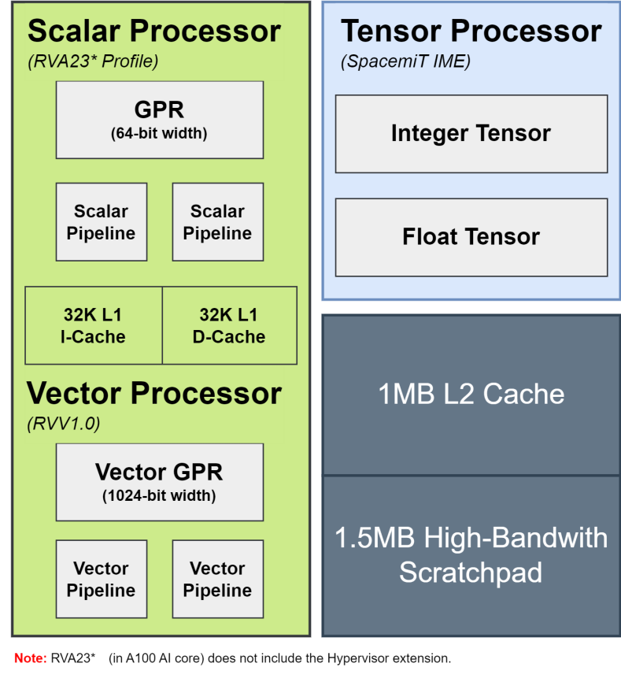

# 8. CPU System

## 8.1 SpacemiT® X100™ RISC-V Core

### 8.1.1 Overview

The SpacemiT® X100™ is a high-performance, 4-issue, out-of-order, multi-core, multi-cluster RISC-V RVA23 processor optimized for demanding compute scenarios such as servers, autonomous driving systems, and cloud AI inference.  
Designed for both performance and robustness, the X100 core provides comprehensive virtualization, strong security resilience, and RAS (Reliability, Availability, Serviceability) capabilities. These characteristics make it a powerful and scalable solution for data-centric and mission-critical applications.

### 8.1.2 Features

- Compliance: Fully compliant with the RISC-V RVA23 standard  
- Cache Architecture:  
  - 64KB L1 I-Cache and 64KB L1 D-Cache per core  
  - 4MB L2 Cache per cluster  
  - L1 D-Cache supports MESI coherence protocol  
  - L2 Cache supports MOESI coherence protocol  
- Vector Extension: RVV 1.0, VLEN = 256  
- Hypervisor Extension: RVH 1.0, GEILEN = 8  
- Advanced Interrupt Architecture (AIA):  
  - M-mode MSI: 512  
  - S-mode MSI: 512  
  - VS-mode MSI: 64  
- Interrupt Controllers: Supports ACLINT and APLIC with a total of 512 interrupts  
- Performance Monitoring: RISC-V Performance Monitoring Unit (PMU) support  
- Virtual Memory: Supports SV39 virtual memory management  
- Security Framework:  
  - 16 PMP entries in accordance with the RISC-V security framework  
  - Supports RISC-V Debug, Trace, and RERI frameworks  
- RVA23 Optional Extensions (not included in RVA23 base specification):  
  - Vector Crypto: `zvkng`, `zvksg`  
  - Other Extensions: `zvbc`, `zfh`, `zbc`, `zvfh`, `zfbmin`, `zvfbfmin`, `zvfbfwma`  
  - System and Security: `sdtri`, `svvptc`, `sspm`, `smepmp`, `smstateen`, `smcntrpmf`  

### 8.1.3 Block Diagram

## 8.2 SpacemiT® A100™ AI Core

### 8.2.1 Overview

The SpacemiT® A100™ is an AI-first RISC-V AI-CPU that delivers native AI compute capability through the SpacemiT-IME instruction set. Its microarchitecture is specifically optimized for operator-level parallelism, memory bandwidth efficiency, and data locality, enabling highly efficient execution of real-world AI workloads.  
In addition to advanced AI acceleration, the A100 fully supports general-purpose CPU functionalities defined by the RVA23* specification and leverages a standard RISC-V unified programming model to power Small-Local Language Model (SLM) and a broad range of AI-centric applications.

### 8.2.2 Features

- AI Compute Performance: 60 TOPs (@FP4 sparse)  
- RISC-V Compliance: Fully compliant with the RISC-V RVA23* standard  
- Cache Architecture:  
  - 32 KB L1 I-Cache and 32 KB L1 D-Cache per core  
  - 1 MB L2 Cache per cluster  
  - 1.5 MB Scratchpad per cluster  
  - L1 D-Cache supports MESI coherence protocol  
  - L2 Cache supports MOESI coherence protocol  
- Vector Extension: RVV 1.0, VLEN = 1024  
- Advanced Interrupt Architecture (AIA):  
  - M-mode MSI: 512  
  - S-mode MSI: 512  
- Interrupt Controllers: Supports ACLINT and APLIC with a total of 512 interrupts  
- Performance Monitoring: Integrated RISC-V Performance Monitoring Unit (PMU)  
- Virtual Memory: Supports SV39 virtual memory management  
- Security Framework:  
  - 32 PMP entries compliant with the RISC-V security framework  
  - Supports RISC-V Debug and Trace  
- RVA23* Optional Extensions (not included in the RVA23 base specification):  
  - Vector Crypto: `zvkng`, `zvksg`  
  - Other Extensions: `zvbc`, `zfh`, `zbc`, `zvfh`, `zfbmin`, `zvfbfmin`, `zvfbfwma`  
  - System and Security: `sdtri`, `svvptc`, `sspm`, `smepmp`, `smstateen`, `smcntrpmf`  

> **Note**: RVA23* (in A100 AI core) does not include the Hypervisor extension.

### 8.2.3 Block Diagram

## 8.3 RT24 RISC-V Core

### 8.3.1 Overview

The RT24 serves as the system management core within the K3 SoC. It is based on the CVA6, the OpenHW Group’s open-source 64-bit RISC-V CPU, featuring a 6-stage, in-order, single-issue pipeline with RV64GC support and Unix-like operating system compatibility. Designed for high efficiency and reliability, the RT24 core provides essential control, coordination, and low-power management functions across the system.

### 8.3.2 Features

- Ultra-low standby and active power consumption  
- Implements the RV64IMAFDC (RV64GC) instruction set  
- Supports three RISC-V privilege levels: M, S, and U  
- Provides virtual address translation through ITLB, DTLB, and PTW units  

### 8.3.3 Block Diagram

## 8.4 Debug

### 8.4.1 Overview

The debugging interface serves as the channel for software to interact with the processor. Through this interface, users can access CPU registers and memory contents, as well as other on-chip device information. Additionally, tasks such as downloading programs can be performed via the debugging interface.

### 8.4.2 Block Diagram

The micro-architecture of the debugging interface is depicted below.

As illustrated, the debugging system consists of:

- A debugging software (e.g., GDB)
- A debugging agent service (e.g., OpenOCD)
- A debugger (e.g., JTAG Debug Probe)
- A debugging interface (e.g., DTM)

These components are interconnected as follows:  

- The debugging software generally communicates with the debugging agent service over a network.
- The debugging agent service commonly interfaces with the debugger via USB.  
- The debugger interacts with the CPU through the JTAG interface.

The JTAG memory access method can be either **progbuf** or **sysbus** mode:

- The **progbuf** mode is a standard JTAG method that accesses memory through the CPU.
- The **sysbus** mode bypasses the CPU to access on-chip resources via the System Bus Access (SBA) port.

## 8.5 Trace

### 8.5.1 Overview

The RISC-V Trace System provides a hardware-software interface for debugging and analyzing the execution trace of a hart, including details of its memory accesses.  
Once a RISC-V hart streams its program execution and memory-access trace through the ingress port defined by the RISC-V Trace Specification, an encoder compresses the data for efficient transmission.  
The trace data can then be stored on-chip, where host-side decoder software reconstructs the full execution flow, allowing developers to accurately observe the hart’s runtime behavior.

### 8.5.2 Features

The trace components of the X100 and A100 cores on the K3 SoC are fully compliant with the RISC-V N-Trace protocol and its associated interfaces—the RISC-V Trace Control Interface and the RISC-V Hart-to-Trace Interface.  
Key features include:

- Independent trace encoder connected to each X100/A100 core  
- Integrated ATB bridge for connection to the ATB bus  
- Support for BTM (Branch Trace Mode) compression  
- Optional message types such as ownership messages, enabling improved trace handling in complex OS environments.  
- Precise trace enable/disable control via debug triggers  
- Extended compression capabilities such as virtual address compression to further enhance trace efficiency  

### 8.5.3 Block Diagram

