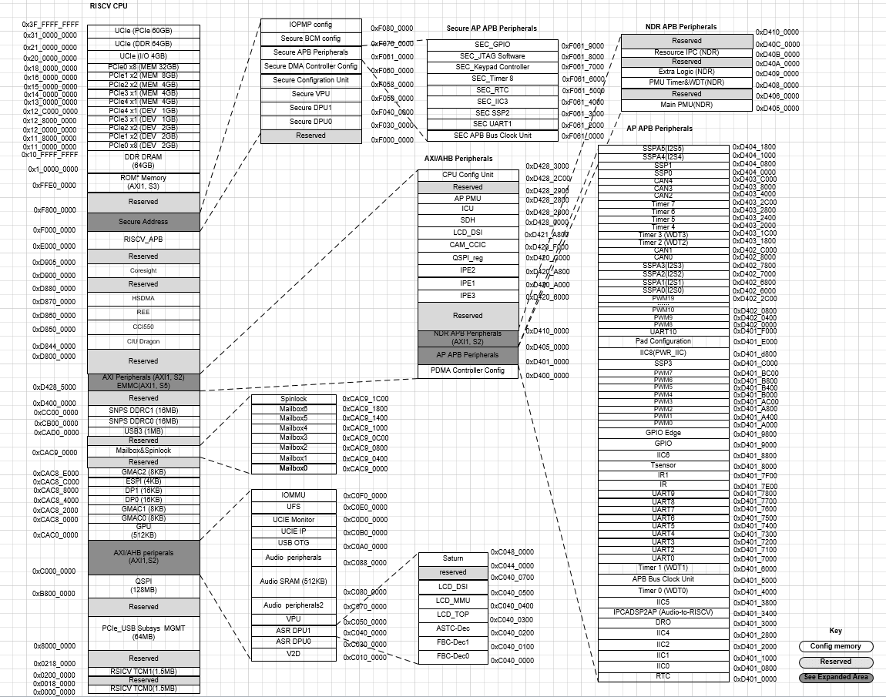
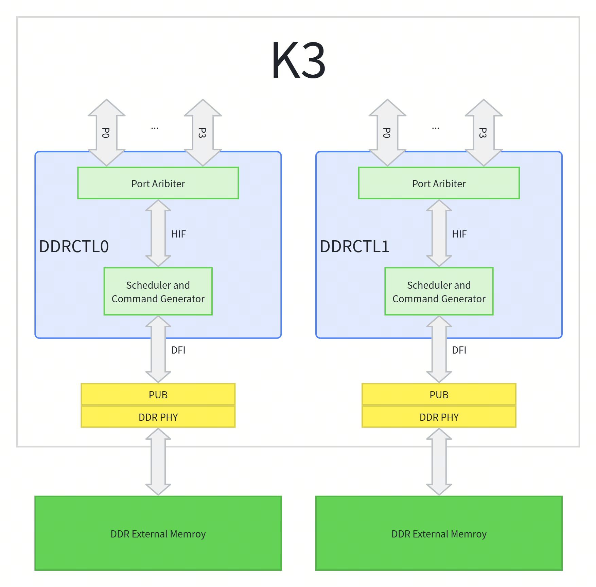
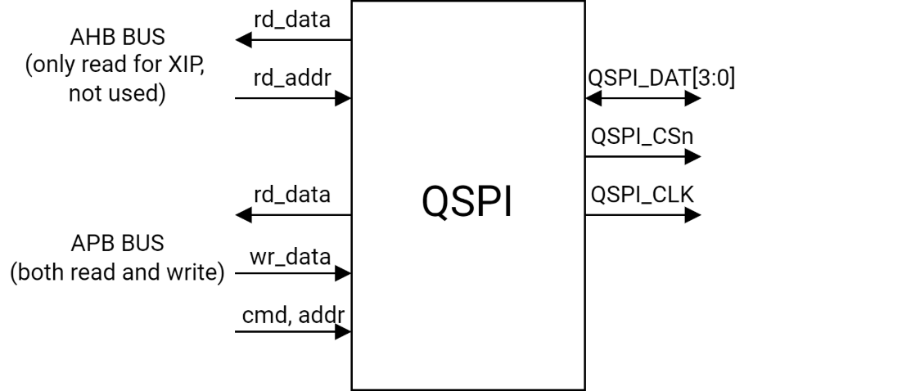
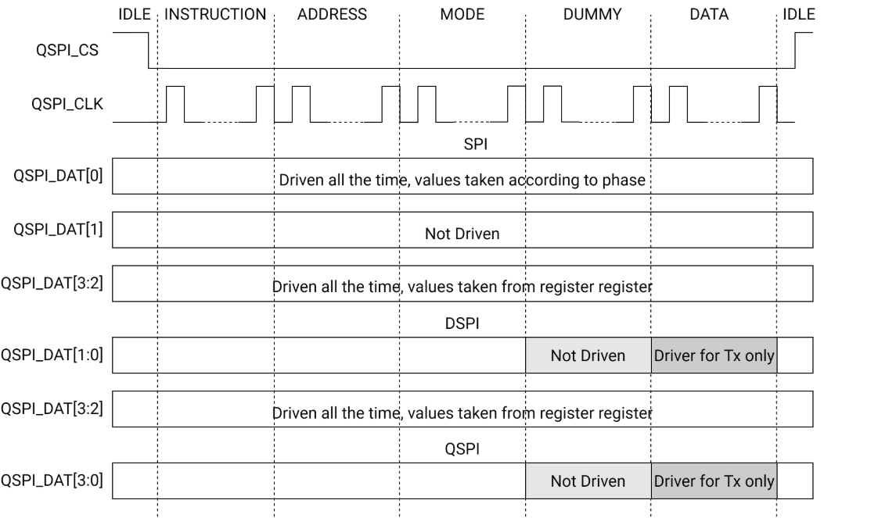
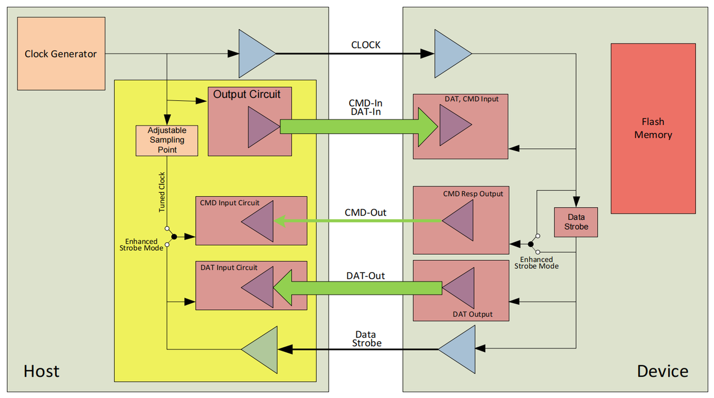
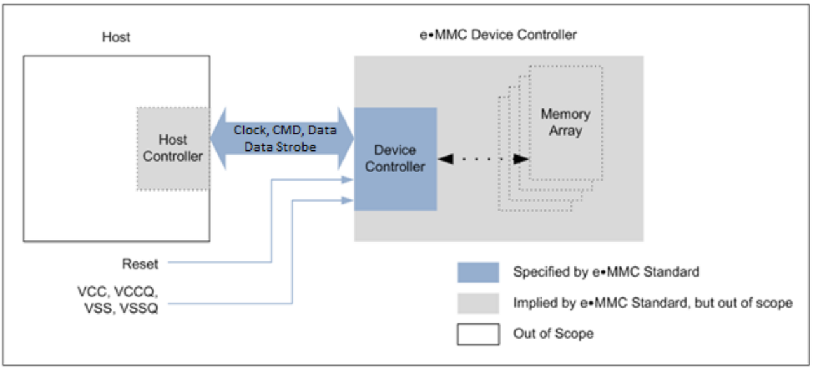
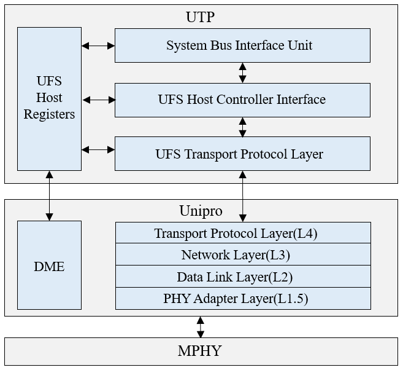
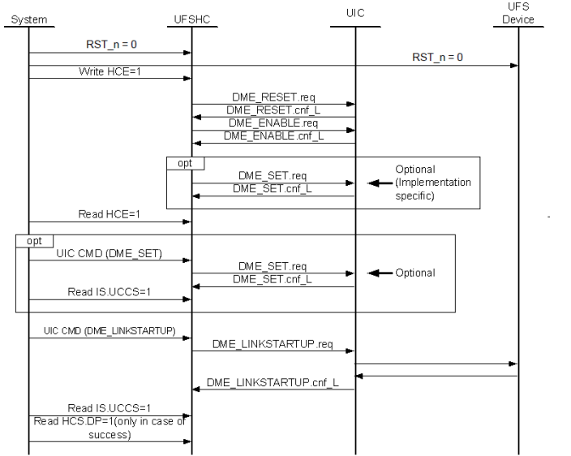
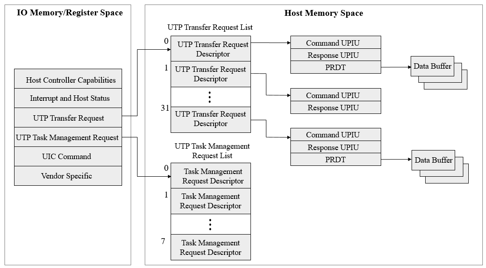

# 9. Memory & Storage

## 9.1 On-Chip Memory

K3 includes the following on-chip memory types:

- 128KB boot-ROM
- 512KB SRAM shared by Main CPU and Real CPU

The memory mapping is shown below.

## 9.2 LPDDR4x/5

### 9.2.1 Overview

There are two Memory Controllers (DDRCTLs), each combined with a Synopsys DDR PHY. The DDRCTL supports the following SDRAM types:

- LPDDR4X
- LPDDR5

The DDRCTL can accept memory access requests from up to 16 application-side host ports. External AMBA AXI manager ports can be connected to subordinate ports of DDRCTL through the standard AMBA 4 AXI bus interfaces. The configuration registers are programmed through the APB software interface.

### 9.2.2 Features

#### 9.2.2.1 General Features

- Each DDRCTL supports up to 32 GB of DDR
- Supports up to 2 chip selects (CS) / ranks per DDRCTL
- Scalable and software-controlled 1:4 (LPDDR4) or 1:1:4 (LPDDR5) frequency ratio
- Flexible address mapper logic to allow application-specific mapping of row, column, bank, and rank bits
- DDR PHY Interface (DFI) integration with industry-standard PHYs:
  - All control, write data, and read data interface signals
  - Update interface:
    - MC-initiated requests
    - PHY-initiated requests
  - Training: PHY-independent training mode
  - Low-power interface
  - DFI PHY master interface
  - DFI error interface
- For LPDDR4 protocol:
  - Direct software request control or programmable internal control for ZQ calibration
  - MPC (ZQCal Start/Latch) commands can be issued automatically after Self-Refresh-Powerdown exit
  - ZQ Reset MRW command can be issued through software
  - Dynamic scheduling to optimize bandwidth and latency
- Read and write buffers in fully associative CAMs, configurable in powers of two, from 16 up to 64 reads and 64 writes
- Delayed writes for optimum performance on SDRAM data bus
- Control options to avoid starvation of lower priorities
- Guaranteed coherency for write-after-read (WAR) and read-after-write (RAW) hazards (always on the HIF interface and on the AXI interface only if appropriate hardware configuration parameter and software register are set)

#### 9.2.2.2 Power Saving and Low-Power Features

- Automatic SDRAM power-down entry and exit caused by lack of transaction arrival for a programmable time
- Automatic Clock Stop entry and exit caused by lack of transaction arrival
- Automatic DDRCTL low-power mode operation caused by lack of transaction arrival for a programmable time through the hardware low-power interface
- Advanced power-saving design including no unnecessary toggling of command, address, and data pins (RAS/CAS/WE/BA/A hold last state after each command; DQ does not transition on writes when bytes are disabled)
- Self-refresh entry and exit:
  - Automatic self-refresh entry and exit caused by lack of transaction arrival for a programmable time
  - Self-refresh entry and exit under software control
  - Self-refresh entry and exit using dedicated DDRC hardware low-power interface control (similar to the AMBA 4 AXI protocol low-power control interface)

#### 9.2.2.3 Performance Features

- For maximum SDRAM efficiency, commands are executed out of order:
  - Read requests are accompanied by a unique token (tag) from HIF
  - Read data is returned with a token (tag) for the SoC to associate the read data with the correct read request
- Hardware configurable and software programmable Quality-of-Service (QoS) support:
  - Three traffic classes on read commands—high priority reads, variable priority reads, and low priority reads
  - Two traffic classes on write commands—normal priority writes and variable priority writes
  - Port urgent and port throttling control
- Write combine to allow multiple writes to the same address to be combined into a single write to SDRAM; supported for same starting address
- 5-clock cycle typical command latency through the DDRCTL (HIF interface)
  - Can be reduced to 4 cycles by choosing not to register DFI outputs (Configuration parameter)
- Leverages out-of-order requests with CAM to maximize throughput

#### 9.2.2.4 Programmable SDRAM Parameters

- Configurable maximum SDRAM data-bus width (denoted as “full data-bus width”)
- Programmable support for all of the following SDRAM data-bus widths:
  - Full data-bus width, or
  - Half of the full data-bus width
- Paging policy selectable by configuration registers as any of the following:
  - Leave pages open after access, or
  - Close page when there are no further accesses available in the controller for that page, or
  - Auto-precharge with each access, with an optimization for page-close mode which leaves the page open after a flush for read-write and write-read collision cases
- Explicit SDRAM mode register updates under software control

#### 9.2.2.5 Refresh Control Features

- Controller-generated auto-refreshes at programmable average intervals.
- In multi-rank designs, an offset can be applied to the refresh timer for each rank to allow refreshes to expire at different times (this can increase efficiency by allowing traffic to continue to other ranks while a given rank is being refreshed).
- Ability to group up to eight controller-generated refreshes together to be issued consecutively (this reduces the frequency of page closings, increases overall efficiency).
  - Per-bank refreshes are scheduled for banks with no traffic in the CAM to minimize impact of refreshes on throughput.
- When controller-generated refreshes are grouped, some refreshes can be issued speculatively when the controller is idle for a programmable period of time.
- Ability to disable controller-generated auto-refreshes.
- Ability to issue a refresh through direct software request.
- Selectable ability to perform per-bank refreshes rather than all-banks refreshes.

### 9.2.3 Functional Description

#### 9.2.3.1 Arbitration and Scheduling

##### Port Arbitration (PA)

- The Port Arbiter (PA) block arbitrates command requests from AXI ports to the HIF of the DDR Controller (DDRC). PA is comprised of multiple tiers of arbitration stages which include:
  - 2-priority level arbitration based on port aging and expired-VPR/expired-VPW commands (timeout - priority0)
  - 2-priority level arbitration for read requests based on DDRC read priorities (HPR/LPR-VPR)
  - 32-priority level arbitration based on internal port aging or 16-priority level arbitration based on external AXI QoS inputs (selectable by hardware parameter)
  - Round-robin arbitration to resolve ports having the same priority after passing all stages of arbitration

##### Command Scheduling

The command scheduling mechanism in the DDRC allows you to carefully manage the following:

- Costly read/write bus turnaround
- Priorities of read requests to generally favor high priority traffic while also preventing starvation of low priority traffic
  This functionality is implemented in a simple 2-state machine for each traffic type with completely configurable controls. The states of the 2-state machine determine when reads/writes are serviced and the relative priority (high priority versus low priority reads) at any given moment.
  In this controller, the enhanced RD/WR switching features are always enabled.
  The key features of the command scheduling mechanism are:
- During read mode, issue ACT commands proactively for a write request as page preparation in certain conditions so that the write command can be issued soon after switching to write mode (and vice versa).
- Prefer a page hit on the other direction rather than executing a page-miss command on the current direction to reduce the number of PRE-ACT cycles in certain conditions.
- Automatically switch to write mode when the Write CAM reaches a certain fill level to avoid a full Write CAM, while keeping read mode to optimize read latency if the WR CAM has enough space.

#### 9.2.3.2 Low-Power and Power-Saving

The DDRCTL supports various methods to save power within the system:

- Power saving opportunities within the SDRAM. The DDRCTL supports various SDRAM power saving modes such as:
  - [Precharge power-down](#precharge-power-down)
  - [Self-refresh](#self-refresh)
  - [Deep sleep mode](#deep-sleep-mode-lpddr5)
  - [DRAM clock disable](#assertion-of-dfi_dram_clk_disable)
- Power saving opportunities within the PHY.
- Power saving opportunities from an external SoC low-power controller driven through an external hardware low-power interface (based on AMBA 4 AXI protocol low-power control interface).
- Power saving opportunities within the internal module BSM (Bank State Machine), whose clock can be gated while SDRAM is idle.

##### Precharge Power-Down

When PWRCTL.powerdown_en=1, DDRCTL automatically enters precharge power-down when the period specified by PWRTMG.powerdown_to_x32 has passed while the DDRCTL is idle (except for issuing refreshes).
Entering precharge power-down mode involves the following steps:

1. If there is a self-refresh exit previously, wait for at least one refresh command (or 8 per-bank refresh commands if per-bank refresh is enabled) to all active ranks. Auto-refresh logic must be enabled, or refresh must be issued using direct software requests of refresh command through OPREFCTRL*.rank*_refresh.
2. Precharging (closing) all open pages. Pages are closed one-at-a-time in no specified order.
3. Waiting for tRP (row precharge) idle period.
4. Issuing the command to enter precharge power-down. For multi-rank systems, all chip-selects are asserted so that all ranks enter precharge power-down simultaneously. Power-down entry commands are issued separately for even and odd ranks.
5. This step occurs only if DFI low-power interface for power-down is enabled (DFILPCFG0.dfi_lp_en_pd). Attempts an entry to low-power mode through DFI low-power interface and with both dfi_lp_ctrl_wakeup and DRAMSET1TMG5.t_cksre set by DFILPTMG0.dfi_lp_wakeup_pd. The low-power entry attempt is delayed with DFITMG0.dfi_t_ctrl_delay + DRAMSET1TMG7.t_cksre clock cycles, this is needed to satisfy SDRAM timings related to disabling clocks when the PHY is programmed to gate the clock to save maximum power.

If the DDRCTL receives a read or write request from the SoC during step 2 or step 3, the power-down entry is immediately canceled. The same is true if PWRCTL.powerdown_en is driven to '0' during step 2 or step 3. Once the power-down entry command is issued, then proper power-down exit is required.

##### Self-Refresh

The DDRCTL puts the DDR SDRAM devices into Self-Refresh mode in the following cases:

- When the PWRCTL.selfref_en bit is set and no reads or writes are pending in the DDRCTL for the period specified by PWRTMG.selfref_to_x32. This is referred to as automatic Self-Refresh.
- When the PHY Master Interface is enabled by setting DFIPHYMSTR.dfi_phymstr_en bit and there is a dfi_phymstr_req coming from the PHY. In this case the DDRC's hif_cmd_stall is not driven high (the controller can accept commands on HIF) and existing controller commands in the DDRC are not executed before the Self-Refresh mode sequence occurs.
- When the PWRCTL.selfref_sw bit is set and there are no outstanding read or write commands in the DDRC, this is referred to as the software self-refresh entry. This means that the DDRCTL cannot put SDRAM into Self-Refresh as long as write/read commands are being entered into the DDRCTL.
- When a hardware low-power entry request occurs (on csysreq_ddrc/csysack_ddrc) with cactive_in_ddrc=0, no outstanding commands, and as long as the DDRCTL is not in init or deep sleep mode. This is referred to as an accepted hardware low-power self-refresh entry. When accepted, the DDRC's hif_cmd_stall is driven high to stop new commands from being accepted and existing controller commands in the DDRC are performed before the following sequence occurs.

Entering Self-Refresh mode involves the following steps:

1. If there is a self-refresh exit previously, wait for at least one refresh command (or 8 per-bank refresh commands if per-bank refresh is enabled) to all active ranks. Auto-refresh logic must be enabled, or refresh must be issued using direct software requests of refresh command through OPREFCTRL*.rank*_refresh.
2. Precharging (closing) all open pages. Pages are closed one-at-a-time in no specified order.
3. Waiting for tRP (row precharge) idle period. If a new command is received on the HIF during this time, the self-refresh entry is canceled.
4. Issuing the command to enter self-refresh mode. For multi-rank systems, all chip-selects are asserted so that all ranks enter self-refresh simultaneously.
5. If PWRCTL.stay_in_selfref is set to '1' before the SRE command is issued, DDRCTL does not enter the Self-Refresh Power-Down mode. In this case, right after PWRCTL.stay_in_selfref is set to '0', DDRCTL enters the Self-Refresh Power-Down mode. When PWRCTL.stay_in_selfref is '0' before SRE command issued, DDRCTL enters the Self-Refresh Power-Down mode automatically.
6. If the PHY Master Interface is enabled and dfi_phymstr_req comes before the SRE command is issued, DDRCTL does not enter the Self-Refresh Power-Down mode. In this case, right after dfi_phymstr_req is dropped, DDRCTL enters Self-Refresh Power-Down mode.
7. This step occurs only if DFI low-power interface for self-refresh is enabled (DFILPCFG0.dfi_lp_en_sr). Attempts an entry to low-power mode through DFI low-power interface with both dfi_lp_ctrl_wakeup and dfi_lp_data_wakeup set by DFILPTMG0.dfi_lp_wakeup_sr. The low-power entry attempt is delayed with DFITMG0.dfi_t_ctrl_delay + DRAMSET1TMG5.t_cksre clock cycles, this is needed to satisfy SDRAM timings related to disabling clocks when the PHY is programmed to gate the clock, to save maximum power.

Note, that STAT.selfref_type register field is 2'b11 if automatic self-refresh feature is the only cause of self-refresh. If software self-refresh or hardware low-power self-refresh occurs, STAT.selfref_type=2'b10.

If Self-refresh entry is triggered by a PHY Master request, this step is skipped because DFI low-power interface is disabled when there is a dfi_phymstr_req.

Automatic self-refresh has the lowest priority followed by both software and hardware low-power self-refresh, PHY Master Interface has the highest priority. A software self-refresh entry means that a self-refresh exit occurs only if a software self-refresh exit occurs. Similarly, a hardware low-power self-refresh entry means a self-refresh exit occurs only if a hardware low-power self-refresh exit occurs.

If both software and hardware low-power self-refresh entry occurs, self-refresh exit occurs only if both software and hardware low-power self-refresh exits occur. A self-refresh entry triggered by a PHY Master request means a self-refresh exit occurs only if the PHY Master request is de-asserted.

##### Deep Sleep Mode (LPDDR5)

Entering Deep Sleep Mode involves the following steps:

1. If there is a self-refresh exit previously, wait for at least one refresh command (or 8 per-bank refresh commands if per-bank refresh is enabled) to all active ranks. Auto-refresh logic must be enabled, or refresh must be issued using direct software requests of refresh command through OPREFCTRL*.rank*_refresh.
2. Precharging (closing) all open pages. Pages are closed one-at-a-time (not in a specified order).
3. Waiting for tRP (row precharge) idle period.
4. Issuing the SRE command with DSM=1 to enter Deep Sleep Mode. For multi-rank systems, SRE commands must be sent to all ranks. This happens simultaneously.
5. This step occurs only if DFI low-power interface for Deep Sleep Mode is enabled (DFILPCFG0.dfi_lp_en_dsm). It attempts an entry to low-power mode through DFI low-power interface with both dfi_lp_ctrl_wakeup and dfi_lp_data_wakeup set by DFILPTMG0.dfi_lp_wakeup_dsm. The low-power entry attempt is delayed with DFITMG0.dfi_t_ctrl_delay + DRAMSET1TMG11.t_ckmpe clock cycles, this is needed to satisfy SDRAM timings related to disabling clocks when the PHY is programmed to gate the clock, to save maximum power.

If the DDRCTL receives a read or write request from the SoC during step 1 or step 2, the Deep Sleep Mode entry is immediately canceled. The same is true if PWRCTL.dsm_en is driven to '0' during step 1 or step 2. Once the Deep Sleep Mode entry command is issued, proper Deep Sleep Mode exit is required as described in the following section.

##### Assertion of dfi_dram_clk_disable

Assertion of dfi_dram_clk_disable occurs only if PWRTL.en_dfi_dram_clk_disable=1. dfi_dram_clk_disable is also dependent on the operating mode:

- dfi_dram_clk_disable can be asserted in the following modes:
  - Deep Sleep Mode (LPDDR5 only)
  - Self-refresh power-down
  - Power-down
  - Normal mode
  This is the "Clock Stop" feature.
  The timing of the assertion and de-assertion of dfi_dram_clk_disable in various modes is as follows:
- In Self-Refresh and Self-Refresh power-down:
  - Asserted at least DFITMG0.dfi_t_ctrl_delay + DRAMSET1TMG5.t_cksre - DFITMG1.dfi_t_dram_clk_disable cycles after SRE command.
  - De-asserted at least DFITMG1.dfi_t_dram_clk_enable + DRAMSET1TMG5.t_cksrx - DFITMG0.dfi_t_ctrl_delay cycles before SRX command.
- In Power-down:
  - Asserted at least DFITMG0.dfi_t_ctrl_delay + DRAMSET1TMG5.t_cksre - DFITMG1.dfi_t_dram_clk_disable cycles after PDE command.
  - De-asserted at least DFITMG1.dfi_t_dram_clk_enable + DRAMSET1TMG5.t_cksrx - DFITMG0.dfi_t_ctrl_delay cycles before PDX command.
- In Normal mode (Clock Stop):
  - Asserted at least DFITMG0.dfi_t_ctrl_delay - DFITMG0.dfi_t_dram_clk_disable cycles after any command other than SRPDE/PDE/DSME.
  - De-asserted at least DFITMG1.dfi_t_dram_clk_enable + DRAMSET1TMG6.t_ckcsx - DFITMG0.dfi_t_ctrl_delay cycles before any command other than SRPDX/PDX/DSMX.

#### 9.2.3.3 Fast Frequency Change

The DDRCTL supports Fast Frequency Change, using up to four sets of timing registers. The alternative sets of timing registers can be found in REGB_FREQf_CHc registers. These registers may be written while the traffic is in progress using the first set of timing registers, thus reducing the software overhead at the time of frequency change.

## 9.3 Quad-SPI

### 9.3.1 Overview

Quad-SPI acts as an interface to external serial flash devices with up to four bidirectional data lines.

### 9.3.2 Features

- Flexible sequence engine to support various flash vendor devices
- Single, dual and quad mode operation
- DMA supports reading RX buffer data via AMBA AHB bus (64-bit width interface) or IP register space (32-bit access), and filling TX buffer via IP register space (32-bit access)
- Configurable DMA inner loop size
- Fifteen interrupt conditions
- Memory-mapped read access for connected flash devices
- Programmable sequence engine for future command/protocol changes, and able to support all existing vendor commands and operations
- Support for all types of addressing
- Support for standard SPI, Fast, Dual, Dual I/O, Quad, Quad I/O mode
- Operation up to 102MHz clock frequency

### 9.3.3 Functional Description

The QSPI block diagram is shown below, where:

- AHB BUS is used for XIP transfer (not used in current design)
- APB BUS is used to configure registers and write/read/erase external serial flash.

The different phases of the serial flash access scheme are shown below.

The different phases and the I/O driving characteristics of the QuadSPI module are described below:

- IDLE
  Serial flash device is not selected, and there is no interaction. All QSPI_DATx signals remain undriven.
- INSTRUCTION
  The serial flash device is selected, and the instruction is sent to the serial flash device.
- ADDRESS
  The serial flash address is sent to the device.
  > Note: This phase is not applicable to all SFM Commands.
- MODE
  Mode bytes are sent to the serial flash device, and all QSPI_DATx signals are driven.
  > Note: This phase is not applicable to all SFM Commands.
- DUMMY
  Dummy clocks are provided to the serial flash device.
  > Note: This phase is not applicable to all SFM Commands.
- DATA
  Serial flash data is sent to or received from the serial flash device.
  > Note: This phase is not applicable to all SFM Commands.
QSPI_CS and QSPI_CLK signals are driven permanently throughout all phases.

## 9.4 eMMC Interface

### 9.4.1 Overview

The eMMC Interface is a hardware block that acts as a host of the eMMC bus to transfer data between the eMMC card and the internal bus master.

### 9.4.2 Features

The eMMC interface supports the following features:

- Compatible with the 8-bit eMMC 5.1 protocol specification
- Uses the same SD-HCI register set for eMMC transfers, with some vendor-related registers added
- Supports 1-bit/8-bit MMC and CE-ATA cards
- Supports the following data transfer types defined in the SD-HCI spec:
  - PIO
  - SDMA
  - ADMA1
  - ADMA2
- SPI mode is supported for the eMMC card
- Supports the following speed modes defined in the eMMC 5.1 Specification:
  - Legacy, up to 26MHz, 1.8V signaling
  - High-speed SDR, up to 52MHz, 1.8V signaling
  - High-speed DDR, up to 52MHz, 1.8V signaling
  - HS200, up to 200MHz, 1.8V signaling
  - HS400, up to 400MHz, 1.8V signaling
- Hardware generation/checking of CRC on all command and data transaction on the card bus
- 1024 Bytes (2 x 512 Bytes data block) FIFO is used to send and receive data

### 9.4.3 Block Diagram

### 9.4.4 Interface Description

The eMMC device transfers data via a configurable number of data bus signals. The communication signals are:

- CLK
  - Each cycle of this signal directs a one-bit transfer on the command and either a one-bit (1x) or a two-bit transfer (2x) on all the data lines.
  - The frequency may vary between zero and the maximum clock frequency.

- Data Strobe
  - This signal is generated by the device and used for output in HS400 mode.
  - The frequency of this signal follows the frequency of CLK.
  - For data output, each cycle of this signal directs a two-bit transfer (2x) on the data - one bit for the positive edge and the other bit for the negative edge.
  - For CRC status response output and CMD response output (enabled only in HS400 enhanced strobe mode), the CRC status and CMD Response are latched on the positive edge only, and are don't-care on the negative edge.

- CMD
  - This signal is a bidirectional command channel used for device initialization and transfer of commands.
  - The CMD signal has two operation modes: open-drain for initialization mode, and push-pull for fast command transfer.
  - Commands are sent from the eMMC host controller to the eMMC device, and responses are sent from the device to the host.

- DAT0-DAT7
  - These are bidirectional data channels.
  - The DAT signals operate in push-pull mode.
  - Only the device or the host drives these signals at a time.
  - By default, after power-up or reset, only DAT0 is used for data transfer.
  - A wider data bus can be configured for data transfer, using either DAT0-DAT3 or DAT0-DAT7, by the eMMC host controller.
  - The eMMC device includes internal pull-ups for data lines DAT1-DAT7. Immediately after entering the 4-bit mode, the device disconnects the internal pull-ups of lines DAT1, DAT2, and DAT3. Correspondingly, immediately after entering the 8-bit mode, the device disconnects the internal pull-ups of lines DAT1–DAT7.

The signals on the eMMC interface are described below:

| Name | Type | Description |
| --- | --- | --- |
| CLK | I | Clock |
| DS | O/PP | Data Strobe |
| DAT0 | I/O/PP | Data |
| DAT1 | I/O/PP | Data |
| DAT2 | I/O/PP | Data |
| DAT3 | I/O/PP | Data |
| DAT4 | I/O/PP | Data |
| DAT5 | I/O/PP | Data |
| DAT6 | I/O/PP | Data |
| DAT7 | I/O/PP | Data |
| CMD | I/O/PP/OD | Command/Response |

### 9.4.5 Registers

This controller instance uses the common SD/SDIO/eMMC register interface.
The register definitions are described in [Register Section](#963-registers).

## 9.5 SDIO Interface

### 9.5.1 Overview

The SDIO Interface is a hardware block that acts as a host of the SD bus to transfer data between the SDIO card and the internal bus master.

### 9.5.2 Features

The SDIO interface supports the following features:

- Compatible with the 4-bit SD 3.0 UHS-I protocol specification
- Consistent with the register set in the SD-HCI spec, with some vendor-related registers added
- Supports 1-bit/4-bit
- Supports the following data transfer types defined in the SD-HCI spec:
  - PIO
  - SDMA
  - ADMA1
  - ADMA2
- Supports the following speed modes defined in the SD 3.0 Specification:
  - Default Speed mode, up to 25MHz, 3.3V signaling
  - High Speed mode, up to 50MHz, 3.3V signaling
  - SDR12, SDR up to 25MHz, 1.8V signaling
  - SDR25, SDR up to 50MHz, 1.8V signaling
  - SDR50, SDR up to 100MHz, 1.8V signaling
  - DDR50, SDR up to 50MHz, 1.8V signaling
  - SDR104, SDR up to 208MHz, 1.8V signaling
- Hardware generation/checking of CRC on all command and data transaction on the card bus
- Supports read-wait control in SDIO cards
- Supports suspend resume in SDIO cards
- 1024 Bytes (2 x 512 Bytes data block) FIFO is used to send and receive data

### 9.5.3 Registers

This controller instance uses the common SD/SDIO/eMMC register interface.
The register definitions are described in [Register Section](#963-registers).

## 9.6 SD Interface

### 9.6.1 Overview

The SD Interface is a hardware block that acts as a host of the SD bus to transfer data between the SD card and the internal bus master.

### 9.6.2 Features

The SD interface supports the following features:

- Compatible with the 4-bit SD 3.0 UHS-I protocol specification
- Consistent with the register set in the SD-HCI spec, with some vendor-related registers added
- Supports 1-bit/4-bit SD memory
- Supports the following data transfer types defined in the SD-HCI spec:
  - PIO
  - SDMA
  - ADMA1
  - ADMA2
- Supports the following speed modes defined in the SD 3.0 Specification:
  - Default Speed mode, up to 25MHz, 3.3V signaling
  - High Speed mode, up to 50MHz, 3.3V signaling
  - SDR12, SDR up to 25MHz, 1.8V signaling
  - SDR25, SDR up to 50MHz, 1.8V signaling
  - SDR50, SDR up to 100MHz, 1.8V signaling
  - DDR50, SDR up to 50MHz, 1.8V signaling
  - SDR104, SDR up to 208MHz, 1.8V signaling
- Hardware generation/checking of CRC on all command and data transaction on the card bus
- Card insertion/removal detection based on GPIO
- 1024 Bytes (2 x 512 Bytes data block) FIFO is used to send and receive data
- Supports 3.3V and 1.8V signaling switch

### 9.6.3 Registers

SD Host Controller Registers:

The base addresses of the Host Controller registers are:

- SD1: 0xD4280000
- SD2: 0xD4280800
- SD3: 0xD4281000
- SD4: reserved

#### 9.6.3.1 Register Descriptions

##### SYSTEM ADDRESS REGISTER
SD_SYS_ADDR
Offset: 0x0

| Bits | Field | Type | Reset | Description |
| --- | --- | --- | --- | --- |
| 31:16 | DMA_ADDR_H | RW | 0x0000 | DMA Address High.  (1)16 MSb of DMA system buffer starting byte address. (2) This register is used with the Auto Cmd 23 to set a 32-bit block count value to the argument of cmd23. This register would hold the upper 16bits of the cmd23 argument. |
| 15:0 | DMA_ADDR_L | RW | 0x0000 | DMA Address Low.  (1) 16 LSb of DMA system buffer starting byte address. (2) This register is used with the Auto Cmd 23 to set a 32-bit block count value to the argument of cmd23. This register would hold the lower 16bits of the cmd23 argument. |

##### BLOCK SIZE REGISTER
SD_BLOCK_SIZE_CNT
Offset: 0x4

| Bits | Field | Type | Reset | Description |
| --- | --- | --- | --- | --- |
| 31:16 | BLOCK_COUNT | RW | 0x0000 | Block Count. The host controller decrements the block count after each block transfer. 0x1 = 1 block. ... 0xFFFF = 65535 blocks. The current value of block count is reflected in the Current Block Count Register. |
| 15 | RSVD | RO | 0 | Reserved for future use |
| 14:12 | HOST_DMA_BDRY | RW | 0x0 | Host DMA Buffer Boundary. This field specifies the host memory buffer boundary. If this boundary is crossed, an interrupt (dma_int) is generated. This interrupt is reflected in the <Tx Ready> field in the Normal Interrupt Status Register. 0x0 = 4 KB. 0x1 = 8 KB. 0x2 = 16 KB. 0x3 = 32 KB. 0x4 = 64 KB. 0x5 = 128 KB. 0x6 = 256 KB. 0x7 = 512 KB. |
| 11:0 | BLOCK_SIZE | RW | 0x000 | Block Size |

##### ARGUMENT REGISTER
SD_ARG
Offset: 0x8

| Bits | Field | Type | Reset | Description |
| --- | --- | --- | --- | --- |
| 31:16 | ARG_H | RW | 0x0000 | Argument High. 16 MSb of Command Argument. This value is inserted into 48 bits command token bits[39:24]. |
| 15:0 | ARG_L | RW | 0x0000 | Argument Low. 16 LSb of Command Argument. This value is inserted into 48 bits command token bits[23:8]. |

##### TRANSFER MODE AND COMMAND REGISTER
SD_TRANSFER_MODE_CMD
Offset: 0xC

| Bits | Field | Type | Reset | Description |
| --- | --- | --- | --- | --- |
| 31:30 | RSVD | RO | 0 | Reserved for future use |
| 29:24 | CMD_INDEX | RW | 0x00 | Command Index. These bits are inserted into command token bits[45:40]. |
| 23:22 | CMD_TYPE | RW | 0x0 | Command Type. 0x0 = Normal command. 0x1 = Suspend command. 0x2 = Resume command. 0x3 = Abort command. |
| 21 | DATA_PRESENT | RW | 0x0 | Data Present. 1 = Indicates that data is present and will be transferred using the MMC1_DAT[3:0] line. 0 = Commands using only MMC1_CMD lines or commands with no data transfer but using busy signal on MMC1_DAT[0] line (for example, CMD 38). |
| 20 | CMD_INDEX_CHK_EN | RW | 0x0 | Command Index Check Enable. 1 = The host controller checks whether the index field in the response has the same value as the command index. If not, it is reported as a Command Index Error. |
| 19 | CMD_CRC_CHK_EN | RW | 0x0 | Command CRC Check Enable. 1 = The host controller checks the CRC field in the response. If an error is detected, it is reported as a command CRC error. The number of bits checked by the CRC field value changes according to the response length. |
| 18 | RSVD | RO | 0 | Reserved for future use |
| 17:16 | RESP_TYPE | RW | 0x0 | Response Type Select for SD/SD in SPI Modes. For SD mode: 0x0 = No response. 0x1 = Response length is 136 bits. 0x2 = Response length is 48 bits. 0x3 = Response length is 48 bits and check busy after response. CRC field for R3 and R4 is expected to be all 1 bits. CRC check should be disabled for these response types. For SD in SPI mode: 0x0 = Response length is 8 bits. 0x1 = Response length is 16 bits. 0x2 = Response length is 40 bits. 0x3 = Reserved. |
| 15:6 | RSVD | RO | 0 | Reserved for future use |
| 5 | MULTI_BLK_SEL | RW | 0x0 | Multiple Block Select. This bit should be set to 1 only when multiple blocks are to be transferred. |
| 4 | TO_HOST_DIR | RW | 0x0 | Data Transfer Direction Select. This bit defines the direction of data transfer on the MMC1_DAT[3:0] lines. This bit is set to 1 by the host driver to transfer data from the SD card to the SD host controller, and it is set to 0 for all other commands. |
| 3:2 | AUTO_CMD_EN | RW | 0x0 | Auto CMD Enable. This field determines use of auto command functions. 0x0 = Auto Command disabled. 0x1 = Auto CMD12 Enable. 0x2 = Auto CMD23 Enable. 0x3 = Reserved. |
| 1 | BLK_CNT_EN | RW | 0x0 | Block Count Enable. This bit validates the value in the Block Count Register. |
| 0 | DMA_EN | RW | 0x0 | DMA Enable. If Programmed Input/Output (PIO) mode is required, this bit should be reset to 0. |

##### RESPONSE REGISTER 0
SD_RESP_0
Offset: 0x10

| Bits | Field | Type | Reset | Description |
| --- | --- | --- | --- | --- |
| 31:16 | RESP1 | RO | 0x0000 | Response 1 This register contains bits[39:24] of the response token. |
| 15:0 | RESP0 | RO | 0x0000 | Response 0 This register contains bits[23:8] of the response token. |

##### RESPONSE REGISTER 1
SD_RESP_1
Offset: 0x14

| Bits | Field | Type | Reset | Description |
| --- | --- | --- | --- | --- |
| 31:16 | RESP3 | RO | 0x0000 | Response 3 For a 48-bit response token, this register is don't-care. For a 136-bit response token, this register contains bits[71:56] of the response token. |
| 15:0 | RESP2 | RO | 0x0000 | Response 2 For a 48-bit response token, this register is don't-care. For a 136-bit response token, this register contains bits[55:40] of the response token. |

##### RESPONSE REGISTER 2
SD_RESP_2
Offset: 0x18

| Bits | Field | Type | Reset | Description |
| --- | --- | --- | --- | --- |
| 31:16 | RESP5 | RO | 0x0000 | Response 5. For a 48-bit response token, this register is don't-care. For a 136-bit response token, this register contains bits[103:88] of the response token. |
| 15:0 | RESP4 | RO | 0x0000 | Response 4. For a 48-bit response token, this register is don't-care. For a 136-bit response token, this register contains bits[87:72] of the response token. |

##### RESPONSE REGISTER 3
SD_RESP_3
Offset: 0x1C
| Bits | Field | Type | Reset | Description |
| --- | --- | --- | --- | --- |
| 31:16 | RESP7 | RO | 0x0000 | Response 7. For a 48-bit response token, this register is don't-care. For a 136-bit response token, this register contains bits[127:120] of the response token. For Auto CMD12 response, this register contains bits[39:24] of the response token. |
| 15:0 | RESP6 | RO | 0x0000 | Response 6. For a 48-bit response token, this register is don't-care. For a 136-bit response token, this register contains bits[119:104] of the response token. For Auto CMD12 response, this register contains bits[23:8] of the response token. |

##### BUFFER DATA PORT 01 REGISTER
SD_BUFFER_DATA_PORT_01
Offset: 0x20

| Bits | Field | Type | Reset | Description |
| --- | --- | --- | --- | --- |
| 31:16 | CPU_DATA1 | RW | 0x0 | Processor Data 1. 16 MSb of the buffer. |
| 15:0 | CPU_DATA0 | RW | 0x0 | Processor Data 0. 16 LSb of the buffer. |

##### PRESENT STATE REGISTER 1
SD_PRESENT_STATE_1
Offset: 0x24

| Bits | Field | Type | Reset | Description |
| --- | --- | --- | --- | --- |
| 31:25 | RSVD | RO | 0 | Reserved for future use |
| 24 | CMD_LEVEL | RO | 0x1 | MMC1_CMD Line Signal Level. This status is used to check the MMC1_CMD line level to recover from errors and for debugging. |
| 23:20 | DAT_LEVEL | RO | 0xF | MMC1_DAT[3:0] Line Signal Level. This status is used to check the MMC1_DAT[3:0] line level to recover from errors and for debugging. This is especially useful in detecting the busy signal level from MMC1_DAT[0]. |
| 19 | WRITE_PROT | RO | 0x0 | Write Protect. This field reflects the position of the write_protect latch on the SD card. This field should be ignored if there is no such feature being provided by the card in use. |
| 18 | CARD_DET | RO | 0x0 | Card Detect. This field reflects the value of the MMC1_CD pin. This field is only used for testing. 0 = Card not detected. 1 = Card detected. |
| 17 | CARD_STABLE | RO | 0x0 | Card Stable. This field is only used for testing. It indicates the debounced value of the card present condition. 0 = Card unstable. 1 = Card stable. |
| 16 | CARD_INSERTED | RO | 0x0 | Card Inserted. This field indicates the presence of an SD card. 0 = Card not inserted. 1 = Card inserted. |
| 15:12 | RSVD | RO | 0 | Reserved for future use |
| 11 | BUFFER_RD_EN | RO | 0x0 | Buffer Read Enable. This field changes from 0x0 to 0x1 when block data is ready in the buffer and from 0x1 to 0x0 when all the block data is read from the buffer. |
| 10 | BUFFER_WR_EN | RO | 0x1 | Buffer Write Enable. This field changes from 0x0 to 0x1 when block data can be written to the buffer. If this bit is set to 0x1, the entire block can be written to the buffer. This field changes from 0x1 to 0x0 when all the block data is written to the buffer. |
| 9 | RX_ACTIVE | RO | 0x0 | Rx Active. This field indicates read transfer is active. 1 = Set. |
| 8 | TX_ACTIVE | RO | 0x0 | Tx Active. Indicates that a write transfer is active. 0 = No valid write data exists in the host controller. 1 = Set. |
| 7:4 | RSVD | RO | 0 | Reserved for future use |
| 3 | RETUNING_REQ | RO | 0x0 | Re-Tuning Request. This field provides the status of the sampling clock. 0x0 = Fixed or well tuned sampling clock. 1 = Sampling clock needs re-tuning. |
| 2 | _DAT_ACTIVE | RO | 0x0 | Data Line Active. This field provides the status of the data line. 0 = Data line is free. 1 = Data line is in use. |
| 1 | CMD_INHIBIT_DAT | RO | 0x0 | Command Inhibit Data. This field provides the host driver status for issuing data commands. 0 = Data command can be issued. 1 = Data command cannot be issued. |
| 0 | CMD_INHIBIT_CMD | RO | 0x0 | Command Inhibit Command. If this bit is 0, it indicates that the MMC1_CMD line is not in use, and the host controller can issue a command using the MMC1_CMD line. This bit is set after the command register is written. This bit is cleared when the command response is received. Even if the <Command Inhibit Data> field is set to 1, commands using only the MMC1_CMD line can be issued if this bit is 0. Changing from 1 to 0 generates a command complete interrupt in the Normal Interrupt Status Register. If the host controller cannot issue the command because of a command conflict error, this bit remains 1, and command complete is not set. |

##### HOST CONTROL REGISTER
SD_HOST_CTRL
Offset: 0x28

| Bits | Field | Type | Reset | Description |
| --- | --- | --- | --- | --- |
| 31:27 | RSVD | RO | 0 | Reserved for future use |
| 26 | W_REMOVAL | RW | 0x0 | Wakeup on Card Removal. 1 = Enable wakeup event on card removal detection. 0 = No wakeup event. |
| 25 | W_INSERTION | RW | 0x0 | Wakeup on Card Insertion. 1 = Enable wakeup event on card insertion detection. 0 = No wakeup event. |
| 24 | W_CARD_INT | RW | 0x0 | Wakeup on Card Interrupt. 1 = Enable wakeup event on card interrupt detection. 0 = No wakeup event. |
| 23:20 | RSVD | RO | 0 | Reserved for future use |
| 19 | INT_BLK_GAP | RW | 0x0 | Block Gap Interrupt. This field is only valid for 4-bit mode. 1 = Enables interrupt detection at block gap for multiple block transfers. |
| 18 | RD_WAIT_CTL | RW | 0x0 | Read Wait Control. If the card supports read wait, set this bit to enable use of the read wait protocol to stop read data using the MMC1_DAT[2] line by host hardware. Otherwise, the host controller has to stop the SD clock to hold read data. When the host driver detects a card insertion, it sets this bit according to the CCCR of the SDIO card. This field is checked only at a block gap. Within a block, hardware stalls the clock to stop read data if the host cannot accept any more data because of a full FIFO, etc. When this field is cleared by software, operation continues. During read wait, software can issue a different command for another operation as long as it does not require the MMC1_DAT[3:0] lines. To continue the waiting operation, software needs to write 0 to this register. |
| 17 | CONT_REQ | RWAC | 0x0 | Continue Request. This field is used to restart a transaction that was stopped using <Stop At Block Gap Request>. To cancel stop at the block gap, set the <Stop At Block Gap Request> field to 0 and set this field to 1 to restart the transfer. The host controller automatically clears this field in either of the following cases: in the case of a read transaction, MMC1_DAT[3:0] Line Active changes from 0 to 1 as the read transaction restarts; in the case of a write transaction, Write Transfer Active changes from 0 to 1 as the write transaction restarts. Therefore, it is not necessary for the host driver to set this bit to 0. If <Stop At Block Gap Request> is set to 1, any write to this bit is ignored. |
| 16 | STOP_AT_BLOCK_GAP_REQ | RW | 0x0 | Stop at Block Gap Request. This field is used to stop execution of a transaction at the next block gap for both DMA and non-DMA transfers. Until transfer complete is set to 1, indicating transfer completion, the host driver leaves this bit set to 1. Clearing both this field and the <Continue Request> field does not cause the transaction to restart. Read Wait is used to stop the read transaction at the block gap. The host controller stops the clock at the block gap request for a write transfer, but for a read transfer, it stops the clock if <Read Wait Control> is 0. Otherwise, the host controller issues a Read Wait command to stop read data. |
| 15:12 | RSVD | RO | 0 | Reserved for future use |
| 11:9 | SD_BUS_VLT | RW | 0x0 | SD Bus Voltage. This field reflects the voltage at operating conditions. 0x7 = 3.3V. 0x6 = 3.0V. 0x5 = 1.8V. 0x0 to 0x4 = Reserved. |
| 8 | SD_BUS_POWER | RW | 0x0 | SD Bus Power. This field controls the power going out to the SD card. It will be cleared if one of the following occurs: the sd_bus_vlt and the voltage support in the Capabilities Register 1 do not match or if a card removal state was detected. |
| 7 | CARD_DET_S | RW | 0x0 | Card Detect Signal Selection. This field selects the source for card detection. 0 = Card detect input pin. 1 = Card detect test level (for debugging purposes only). When the source for card detection is switched, the interrupt should be disabled during the switching period by clearing the Normal Interrupt Status Enable Register in order to mask unexpected interrupts being caused by the glitch. This signal should be disabled via the Normal Interrupt Status Enable Register during debounce period. |
| 6 | CARD_DET_L | RW | 0x0 | Card Detect Test Level. 1 = Card inserted. 0 = No card inserted. |
| 5 | EX_DATA_WIDTH | RW | 0x0 | This bit controls the 8-bit mode. 0x0 = Data width for bus mode is determined by <DATA_WIDTH>. 0x1 = 8-bit data width. |
| 4:3 | DMA_SEL | RW | 0x0 | DMA Select. One of the supported DMA modes is selected. The host driver checks DMA mode support using Capabilities Register 1. Use of the selected DMA mode is determined by the <DMA Enable> field in the Transfer Mode Register. 0x0 = SDMA. 0x1 = ADMA 1. 0x2 = 32-bit address ADMA2. 0x3 = Reserved. |
| 2 | HI_SPEED_EN | RW | 0x0 | Extend Data Output Enable. 0 = Normal. 1 = MMC1_CMD and MMC1_DAT[3:0] are driven from rising edge of clock. |
| 1 | DATA_WIDTH | RW | 0x0 | Data Width. 1 = 4-bit data mode. 0 = 1-bit data mode, using only MMC1_DAT[0]. Refer to the CE-ATA Register 2 for 8-bit mode support. |
| 0 | LED_CTRL | RW | 0x0 | LED Control. 1 = LED on. 0 = LED off. |

##### CLOCK CONTROL REGISTER
SD_CLOCK_CTRL
Offset: 0x2C

| Bits | Field | Type | Reset | Description |
| --- | --- | --- | --- | --- |
| 31:27 | RSVD | RO | 0 | Reserved for future use |
| 26 | SW_RST_DAT | RWAC | 0x0 | Soft Reset for Data Port of Logic |
| 25 | SW_RST_CMD | RWAC | 0x0 | Soft Reset for Command Part of Logic |
| 24 | SW_RST_ALL | RWAC | 0x0 | Software Reset for All. This reset affects the status, state machine, and FIFOs synchronously. This field also resets all private registers. |
| 23:20 | RSVD | RO | 0 | Reserved for future use |
| 19:16 | TIMEOUT_VALUE | RW | 0x0 | Timeout Value. Determines the interval used to detect timeouts on the MMC1_DAT[3:0] lines. This timeout is initiated in the following cases: for a read transaction, while waiting for data from the card. This is referred to as the NAC timing value in the SD specification, which specifies the maximum time from a read command to read data (card data access time); for a write transaction, while waiting for data from the AXI slave, AXI master, or processor, or while waiting for the CRC status of a write block. 0x0 = SDCLK x 2^13. 0x1 = SDCLK x 2^14. ... 0xE = SDCLK x 2^27. (For example, if sd_clk_frequency = base value, which is 200MHz, then timeout base = 50MHz (period = 20ns), and for the 0xE setting, timeout value = 2^27 * 20ns ≈ 2.684 seconds. If sd_clk_freq = base value/4, which is 50MHz, then timeout base = 50MHz/4 = 12.5MHz (period = 80ns), and for the 0xE setting, timeout value = 2^27 * 80ns ≈ 10.73 seconds.) 0xF = Reserved. For other transactions, there are fixed timeouts defined as follows (unit in SDCLK cycles): On the card: NCR = 64, maximum timing value from command to response; NID = 64 (5 in specification), maximum timing value from command to OCR response. On the Host: NRC = 8, minimum timing value from response to next command; NCC = 8, minimum timing value from command to next command; NWR = 2, minimum timing value from data CRC status (from card in write transaction) to next write data in multiple write blocks; NST = 2, minimum timing from STOP command to end of write data. Refer to the SD specification for more information on these fixed values. |
| 15:8 | SD_FREQ_SEL_LO | RW | 0x00 | SDCLK Frequency Select Lower bits. This field, along with &lt;SD_FREQ_SEL_HI&gt;, defines the clock divider value used by the host controller. Therefore, the final SD_FREQ_SEL = {SD_FREQ_SEL_HI[1:0], SD_FREQ_SEL_LO[7:0]}. The selected value is multiplied by 2 to get the actual divide value. For example: SD_FREQ_SEL = 0x00 = Base clock. SD_FREQ_SEL = 0x01 = Divide by 2 of base clock. SD_FREQ_SEL = 0x02 = Divide by 4 of base clock. SD_FREQ_SEL = 0x3 = Divide by 6 of base clock. ... SD_FREQ_SEL = 0x3FF = Divide by 2046 of base clock. |
| 7:6 | SD_FREQ_SEL_HI | RW | 0x0 | SDCLK Frequency Select Upper bits. This field, along with &lt;SD_FREQ_SEL_LO&gt;, defines the clock divider value used by the host controller. Therefore, the final SD_FREQ_SEL = {SD_FREQ_SEL_HI[1:0], SD_FREQ_SEL_LO[7:0]}. The selected value is multiplied by 2 to get the actual divide value. For example: SD_FREQ_SEL = 0x00 = Base clock. SD_FREQ_SEL = 0x01 = Divide by 2 of base clock. SD_FREQ_SEL = 0x02 = Divide by 4 of base clock. SD_FREQ_SEL = 0x3 = Divide by 6 of base clock. ... SD_FREQ_SEL = 0x3FF = Divide by 2046 of base clock. |
| 5 | CLK_GEN_SEL | RW | 0x0 | Clock Generator Select. This field is used to select the clock generator mode. 0x1 = Programmable Clock Mode. 0x0 = Divided Clock mode. |
| 4:3 | RSVD | RO | 0 | Reserved for future use |
| 2 | SD_CLK_EN | RW | 0x0 | SDCLK Clock Enable. This bit controls the SDCLK to the card. Before using the card, this bit should be set during the initialization phase. |
| 1 | INT_CLK_STABLE | RO | 0x0 | Internal Clock Stable. This field is set to 1 once the controller detects that the internal clock is stable after setting of the &lt;Internal Clock Enable&gt; field. |
| 0 | INT_CLK_EN | RW | 0x0 | Internal Clock Enable. This field controls the SDCLK to the internal logic. 1 = Enable clock. 0 = Disable. |

##### NORMAL INTERRUPT STATUS REGISTER
SD_NORMAL_INT_STATUS
Offset: 0x30

| Bits | Field | Type | Reset | Description |
| --- | --- | --- | --- | --- |
| 31 | CRC_STATUS_ERR | RW1C | 0x0 | CRC Status Error 1 = CRC status start bit or CRC status end bit or boot ack status, returned from the card in write transaction has errors |
| 30 | CPL_TIMEOUT_ERR | RW1C | 0x0 | Command Completion Signal Timeout Error This field is applicable for CE-ATA mode only. 1 = A command completion signal timeout occurred |
| 29 | AXI_RESP_ERR | RW1C | 0x0 | AXI Bus Response Error 1 = A response other than "OKAY" was received on the AXI bus. |
| 28 | SPI_ERR | RW1C | 0x0 | SPI Mode Error 1 = Error occurred in SPI mode for which cause can be determined by reading the &lt;SPI Error Token&gt; field in the SPI Mode Register. 0 = No error has occurred. |
| 27:26 | RSVD | RO | 0 | Reserved for future use |
| 25 | ADMA_ERR | RW1C | 0x0 | ADMA (Advanced Direct Memory Access) Error This bit is set when the host controller detects any errors during an ADMA-based data transfer. The ADMA state at the time an error occurs is saved in the ADMA Error Status Register. The host controller also generates this interrupt when it detects any invalid descriptor data. The &lt;ADMA Error State&gt; field in the ADMA Error Status Register indicates the state in which an error occurred. The host driver may find that a Valid bit is not set at the error descriptor. 1 = Error 0 = No error |
| 24 | AUTO_CMD12_ERR | RW1C | 0x0 | Auto CMD12 Error Occurs when detecting that one of the bits in Auto CMD12 Error Status Register has changed from 0 to 1. |
| 23 | CUR_LIMIT_ERR | RW1C | 0x0 | Current Limit Error This feature is not supported and this bit will always be read as 0. |
| 22 | RD_DATA_END_BIT_ERR | RW1C | 0x0 | ReadData End Bit Error 1 = 0 detected at the end bit position of read data which uses the MMC1_DAT[3:0] line or at the end bit position of the CRC status |
| 21 | RD_DATA_CRC_ERR | RW1C | 0x0 | Read Data CRC Error 1 = read data which uses the MMC1_DAT[3:0] line transferred or Write CRC status having a value other than 010 detected |
| 20 | DATA_TIMEOUT_ERR | RW1C | 0x0 | Data Timeout Error 1 = Set when one of the following is detected: Busy timeout after write CRC status; Write CRC status timeout; Read data timeout |
| 19 | CMD_INDEX_ERR | RW1C | 0x0 | Command Index Error 0 = No command index error has occurred in the command response. 1 = Command index error has occurred in the command response. |
| 18 | CMD_END_BIT_ERR | RW1C | 0x0 | Command End Bit Error 0 = Detection of end bit of a command response in 1. 1 = Detection of end bit of a command response is 0. |
| 17 | CMD_CRC_ERR | RW1C | 0x0 | Command CRC Error 1 = Set in two cases: - A CRC error is detected in the command response; - The Host controller detects a MMC1_CMD line conflict by monitoring the MMC1_CMD line when a command is issued. The Host controller will abort the command (stops driving MMC1_CMD line). The &lt;Command Timeout Error&gt; field will also be set to 1 to distinguish MMC1_CMD line conflict. |
| 16 | CMD_TIMEOUT_ERR | RW1C | 0x0 | Command Timeout Error 1 = No response is returned within 64 SDCLK cycles from the end bit of the command |
| 15 | ERR_INT | RO | 0x0 | Error Interrupt If any of bits in the Error Interrupt Status Register are set, then this bit is set. |
| 14 | CQ_INT | ROC | 0x0 | Command Queuing Interrupt This interrupt is asserted when at least one bit in the CQIS register is set. This interrupt is cleared only by clearing the source interrupt in the CQIS register. |
| 13 | RSVD | RO | 0 | Reserved for future use |
| 12 | RETUNING_INT | RW1C | 0x0 | Re-tuning Event Interrupt This status is set if Re-Tuning Request in the &lt;Present State Register&gt; changes from 0x0 to 0x1. The host controller requests the host driver to perform re-tuning for the next data transfer. The current data transfer can be completed without re-tuning. |
| 11 | INT_C | RW1C | 0x0 | This status is set if INT_C is enabled and INT_C# pin is in low level. Writing this bit to 0x1 does not clear this bit. It is cleared by resetting the INT_C interrupt factor. Refer to shared bus control register. |
| 10 | INT_B | RW1C | 0x0 | This status is set if INT_B is enabled and INT_B# pin is in low level. Writing this bit to 0x1 does not clear this bit. It is cleared by resetting the INT_B interrupt factor. Refer to shared bus control register. |
| 9 | INT_A | RW1C | 0x0 | This status is set if INT_A is enabled and INT_A# pin is in low level. Writing this bit to 0x1 does not clear this bit. It is cleared by resetting the INT_A interrupt factor. Refer to shared bus control register. |
| 8 | CARD_INT | RO | 0x0 | Card Interrupt 1 = The host controller detects an interrupt from the card. |
| 7 | CARD_REM_INT | RW1C | 0x0 | Card Removal Interrupt 1 = Card removal event detected. |
| 6 | CARD_INS_INT | RW1C | 0x0 | Card Insertion Interrupt 1 = Card insertion event detected. |
| 5 | RX_RDY | RW1C | 0x0 | Rx Ready This status is set if the &lt;Buffer Read Enable&gt; field in the Present State Register 1 changes from 0x0 to 0x1. |
| 4 | TX_RDY | RW1C | 0x1 | Tx Ready This status is set if the &lt;Buffer Write Enable&gt; field in the Present State Register 1 changes from 0x0 to 0x1. |
| 3 | DMA_INT | RW1C | 0x0 | DMA Interrupt This status is set if the host controller detects DMA crossing over the &lt;Host DMA Buffer Boundary&gt; field in the Block Size Register. |
| 2 | BLOCK_GAP_EVT | RW1C | 0x0 | Block Gap Event If the &lt;Stop At Block Gap Request&gt; field in the Block Gap Control Register is set, this field is set when a read/write transaction is stopped at a block gap. If the &lt;Stop At Block Gap Request&gt; field is not set to 1, this bit is not set to 1. |
| 1 | XFER_COMPLETE | RW1C | 0x0 | Transfer Complete This bit is set when a read/write transaction is completed. For read transaction, this bit is set at the falling edge of Read Transfer Active Status. There are two cases in which this occurs: - data transfer is completed as specified by data length; - data stopped at the block gap and completed data transfer by setting the &lt;Stop At Block Gap Request&gt; field in the SD Block Gap Control Register field; For write transaction, this bit is set at the falling edge of the MMC1_DAT[3:0] Line Active status. There are two cases in which this occurs: - data transfer is completed as specified by data length and the busy signal released; - data stopped at the block gap and completed data transfer by setting the &lt;Stop At Block Gap Request&gt; field |
| 0 | CMD_COMPLETE | RW1C | 0x0 | Command Complete This bit is set when the end bit of the command response (except Auto CMD12) is received. Note that Command Timeout Error has higher priority than Command Complete. |

##### NORMAL INTERRUPT STATUS ENABLE REGISTER
SD_NORMAL_INT_STATUS_EN
Offset: 0x34

| Bits | Field | Type | Reset | Description |
| --- | --- | --- | --- | --- |
| 31 | CRC_STATUS_ERR_EN | RW | 0x0 | CRC Status Error Enable. 0 = Disabled; 1 = Enabled. |
| 30 | CPL_TIMEOUT_ERR_EN | RW | 0x0 | CPL Timeout Error Enable. 0 = Disabled; 1 = Enabled. |
| 29 | AXI_RESP_ERR_EN | RW | 0x0 | AXI Response Error Enable. 0 = Disabled; 1 = Enabled. |
| 28 | SPI_ERR_EN | RW | 0x0 | SPI Error Enable. 0 = Disabled; 1 = Enabled. |
| 27 | RSVD | RO | 0 | Reserved for future use |
| 26 | TUNING_ERR_EN | RW | 0x0 | Tuning Error Enable. 0 = Disabled; 1 = Enabled. |
| 25 | ADMA_ERR_EN | RW | 0x0 | ADMA Error Enable. 0 = Disabled; 1 = Enabled. |
| 24 | AUTO_CMD12_ERR_EN | RW | 0x0 | Auto CMD12 Error Enable. 0 = Disabled; 1 = Enabled. |
| 23 | CUR_LIM_ERR_EN | RW | 0x0 | Current Limit Error Enable. 0 = Disabled; 1 = Enabled. |
| 22 | RD_DATA_END_BIT_ERR_EN | RW | 0x0 | Data End Bit Error Enable. 0 = Disabled; 1 = Enabled. |
| 21 | RD_DATA_CRC_ERR_EN | RW | 0x0 | Data CRC Error Enable. 0 = Disabled; 1 = Enabled. |
| 20 | DATA_TIMEOUT_ERR_EN | RW | 0x0 | Data Timeout Error Enable. 0 = Disabled; 1 = Enabled. |
| 19 | CMD_INDEX_ERR_EN | RW | 0x0 | Command Index Error Enable. 0 = Disabled; 1 = Enabled. |
| 18 | CMD_END_BIT_ERR_EN | RW | 0x0 | Command End Bit Error Enable. 0 = Disabled; 1 = Enabled. |
| 17 | CMD_CRC_ERR_EN | RW | 0x0 | Command CRC Error Enable. 0 = Disabled; 1 = Enabled. |
| 16 | CMD_TIMEOUT_ERR_EN | RW | 0x0 | Command Timeout Error Enable. 0 = Disabled; 1 = Enabled. |
| 15 | RSVD | RO | 0 | Reserved for future use |
| 14 | CQ_STATUS_EN | RW | 0x0 | Command Queuing Status Enable |
| 13 | RSVD | RO | 0 | Reserved for future use |
| 12 | RETUNE_INT_EN | RW | 0x0 | Re-tuning Interrupt Enable. 0 = Disabled; 1 = Enabled. |
| 11 | INT_C_INT_EN | RW | 0x0 | INT_C Enable. 0 = Disabled; 1 = Enabled. |
| 10 | INT_B_INT_EN | RW | 0x0 | INT_B Enable. 0 = Disabled; 1 = Enabled. |
| 9 | INT_A_INT_EN | RW | 0x0 | INT_A Enable. 0 = Disabled; 1 = Enabled. |
| 8 | CARD_INT_EN | RW | 0x0 | Card Interrupt Enable. 0 = Disabled; 1 = Enabled. |
| 7 | CARD_REM_EN | RW | 0x0 | Card Removal Status Enable. 0 = Disabled; 1 = Enabled. |
| 6 | CARD_INS_EN | RW | 0x0 | Card Insertion Status Enable. 0 = Disabled; 1 = Enabled. |
| 5 | RD_RDY_EN | RW | 0x0 | Buffer Read Ready Enable. 0 = Disabled; 1 = Enabled. |
| 4 | TX_RDY_EN | RW | 0x0 | Buffer Write Ready Enable. 0 = Disabled; 1 = Enabled. |
| 3 | DMA_INT_EN | RW | 0x0 | DMA Interrupt Enable. 0 = Disabled; 1 = Enabled. |
| 2 | BLOCK_GAP_EVT_EN | RW | 0x0 | Block Gap Event Enable. 0 = Disabled; 1 = Enabled. |
| 1 | XFER_COMPLETE_EN | RW | 0x0 | Transfer Complete Enable. 0 = Disabled; 1 = Enabled. |
| 0 | CMD_COMPLETE_EN | RW | 0x0 | Command Complete Enable. 0 = Disabled; 1 = Enabled. |

##### NORMAL INTERRUPT STATUS INTERRUPT ENABLE REGISTER
SD_NORMAL_INT_STATUS_INT_EN
Offset: 0x38

| Bits | Field | Type | Reset | Description |
| --- | --- | --- | --- | --- |
| 31 | CRC_STATUS_ERR_INT_EN | RW | 0x0 | CRC Status Error Interrupt Enable. 0 = Disabled; 1 = Enabled. |
| 30 | CPL_TIMEOUT_ERR_INT_EN | RW | 0x0 | CPL Timeout Error Interrupt Enable. 0 = Disabled; 1 = Enabled. |
| 29 | AXI_RESP_ERR_INT_EN | RW | 0x0 | AXI Response Error Interrupt Enable. 0 = Disabled; 1 = Enabled. |
| 28 | SPI_ERR_INT_EN | RW | 0x0 | SPI Error Interrupt Enable. 0 = Disabled; 1 = Enabled. |
| 27 | RSVD | RO | 0 | Reserved for future use |
| 26 | TUNE_ERR_INT_EN | RW | 0x0 | Tuning Error Interrupt Enable. 0 = Disabled; 1 = Enabled. |
| 25 | ADMA_ERR_INT_EN | RW | 0x0 | ADMA Error Interrupt Enable. 0 = Disabled; 1 = Enabled. |
| 24 | AUTO_CMD12_ERR_INT_EN | RW | 0x0 | Auto CMD12 Error Interrupt Enable. 0 = Disabled; 1 = Enabled. |
| 23 | CUR_LIM_ERR_INT_EN | RW | 0x0 | Current Limit Error Interrupt Enable. 0 = Disabled; 1 = Enabled. |
| 22 | RD_DATA_END_BIT_ERR_INT_EN | RW | 0x0 | Data End Bit Error Interrupt Enable. 0 = Disabled; 1 = Enabled. |
| 21 | RD_DATA_CRC_ERR_INT_EN | RW | 0x0 | Data CRC Error Interrupt Enable. 0 = Disabled; 1 = Enabled. |
| 20 | DATA_TIMEOUT_ERR_INT_EN | RW | 0x0 | Data Timeout Error Interrupt Enable. 0 = Disabled; 1 = Enabled. |
| 19 | CMD_INDEX_ERR_INT_EN | RW | 0x0 | Command Index Error Interrupt Enable. 0 = Disabled; 1 = Enabled. |
| 18 | CMD_END_BIT_ERR_INT_EN | RW | 0x0 | Command End Bit Interrupt Error Enable. 0 = Disabled; 1 = Enabled. |
| 17 | CMD_CRC_ERR_INT_EN | RW | 0x0 | Command CRC Error Interrupt Enable. 0 = Disabled; 1 = Enabled. |
| 16 | CMD_TIMEOUT_ERR_INT_EN | RW | 0x0 | Command Timeout Error Interrupt Enable. 0 = Disabled; 1 = Enabled. |
| 15 | RSVD | RO | 0 | Reserved for future use |
| 14 | CQ_SIGNAL_ENABLE | RW | 0x0 | Command Queuing Signal Enable |
| 13 | CARD_ASYNC_INT_INT_EN | RW | 0x0 | SDIO Card Async INT without AXI/SD function clock running Interrupt Enable. 0 = Disabled. 1 = Enabled. |
| 12 | RETUNE_INT_INT_EN | RW | 0x0 | Re-Tuning Interrupt Interrupt Enable. 0 = Disabled. 1 = Enabled. |
| 11 | INT_C_INT_INT_EN | RW | 0x0 | INT_C Interrupt Interrupt Enable. 0 = Disabled. 1 = Enabled. |
| 10 | INT_B_INT_INT_EN | RW | 0x0 | INT_B Interrupt Interrupt Enable. 0 = Disabled. 1 = Enabled. |
| 9 | INT_A_INT_INT_EN | RW | 0x0 | INT_A Interrupt Interrupt Enable. 0 = Disabled. 1 = Enabled. |
| 8 | CARD_INT_INT_EN | RW | 0x0 | Card Interrupt Interrupt Enable. 0 = Disabled. 1 = Enabled. |
| 7 | CARD_REM_INT_EN | RW | 0x0 | Card Removal Interrupt Enable. 0 = Disabled. 1 = Enabled. |
| 6 | CARD_INS_INT_EN | RW | 0x0 | Card Insertion Interrupt Enable. 0 = Disabled. 1 = Enabled. |
| 5 | RX_RDY_INT_EN | RW | 0x0 | Buffer Read Ready Interrupt Enable. 0 = Disabled. 1 = Enabled. |
| 4 | TX_RDY_INT_EN | RW | 0x0 | Buffer Write Ready Interrupt Enable. 0 = Disabled. 1 = Enabled. |
| 3 | DMA_INT_INT_EN | RW | 0x0 | DMA Interrupt Interrupt Enable. 0 = Disabled. 1 = Enabled. |
| 2 | BLOCK_GAP_EVT_INT_EN | RW | 0x0 | Block Gap Event Interrupt Enable. 0 = Disabled. 1 = Enabled. |
| 1 | XFER_COMPLETE_INT_EN | RW | 0x0 | Transfer Complete Interrupt Enable. 0 = Disabled. 1 = Enabled. |
| 0 | CMD_COMPLETE_INT_EN | RW | 0x0 | Command Complete Interrupt Enable. 0 = Disabled. 1 = Enabled. |

##### AUTO CMD12 ERROR STATUS REGISTER
SD_AUTO_CMD12_ERROR_STATUS
Offset: 0x3C

| Bits | Field | Type | Reset | Description |
| --- | --- | --- | --- | --- |
| 31 | PRE_VAL_EN | RW | 0x0 | Preset Value Enable 0x1 = Automatic selection by Preset Value is enabled. 0x0 = SDCLK and driver strength are controlled by the host driver. |
| 30 | ASYNC_INT_EN | RW | 0x1 | Asynchronous Interrupt Enable This bit can be set to 0x1 if a card supports asynchronous interrupts and &lt;async_int_support&gt; is set to 0x1 in the Capabilities Register. Asynchronous interrupt is effective when the DAT[1] interrupt is used in 4-bit SD mode (and zero is set to &lt;int_pin_sel&gt; in the Shared Bus Control Register). If this bit is set to 0x1, the host driver can stop SDCLK during the asynchronous interrupt period to save power. During this period, the host controller continues to deliver the Card Interrupt to the host when it is asserted by the card. 0x1 = Enabled. 0x0 = Disabled. |
| 29:24 | RSVD | RO | 0 | Reserved for future use |
| 23 | SAMPLING_CLK_SEL | RW | 0x0 | Sampling Clock Select The host controller uses this bit to select the sampling clock for receiving CMD and DAT. This bit is set by the tuning procedure and is valid after tuning is completed (when &lt;exe_tuning&gt; is cleared). Setting 0x1 means that tuning completed successfully, and setting 0x0 means that tuning failed. Writing 0x1 to this bit is meaningless and ignored. The tuning circuit is reset by writing 0x0. This bit can be cleared by setting &lt;exe_tuning&gt;. Once the tuning circuit is reset, it takes time to complete the tuning sequence. Therefore, the host driver should keep this bit at 0x1 to perform a re-tuning sequence in a short time. This bit must not be changed while the Host Controller is receiving a response or a read data block. 0x1 = Tuned clock is used to sample data. 0x0 = Fixed clock is used to sample data. |
| 22 | EXE_TUNING | RWAC | 0x0 | Execute Tuning. This bit is set to 0x1 to start the tuning procedure and is automatically cleared when the tuning procedure is completed. The result of tuning is indicated by &lt;sampling_clk_sel&gt;. The tuning procedure is aborted by writing 0x0. 0x1 = Execute Tuning. 0x0 = Not tuned or Tuning completed. |
| 21:20 | DRV_STRENGTH_SEL | RW | 0x0 | Driver Strength Select. The Host Controller output driver in 1.8V signaling is selected by this field. In 3.3V signaling, this field is not effective. This field can be set depending on the Driver Type A, C, and D support bits in the Capabilities Register. This bit depends on the setting of &lt;pre_val_en&gt;. If &lt;pre_val_en&gt; = 0x0, this field is set by the host driver. If &lt;pre_val_en&gt; = 0x1, this field is automatically set to a value specified in one of the Preset Value registers. 0x0 = Driver Type B. 0x1 = Driver Type A. 0x2 = Driver Type C. 0x3 = Driver Type D. |
| 19 | SDH_V18_EN | RW | 0x0 | 1.8V Signaling Enable 0x1 = 1.8V Signaling enable. 0x0 = 3.3V Signaling enable. |
| 18:16 | UHS_MODE_SEL | RW | 0x0 | UHS Mode Select. This field is used to select one of the UHS-I modes and is effective when &lt;sdh_v18_en&gt; = 0x1. If &lt;pre_val_en&gt; in the Host Control2 register is set to 0x1, the host controller sets SDCLK Frequency Select, Clock Generator Select in the Clock Control Register, and driver strength select according to the Preset Value registers. In this case, one of the Preset Value registers is selected by this field. The host driver should reset &lt;sd_clk_en&gt; before changing this field to avoid generating a clock glitch. 0x0 = SDR12. 0x1 = SDR25. 0x2 = SDR50. 0x3 = SDR104. 0x4 = DDR50. All other values are Reserved. For MMC mode, added two backdoor defined modes: 5 (101) = HS200 mode. 6 (110) = HS400 mode. Normally, software only needs to set Rx114 HS200/HS400 modes. |
| 15:8 | RSVD | RO | 0 | Reserved for future use |
| 7 | CMD_NOT_ISSUED | ROC | 0x0 | Command Not Issued Due to Auto CMD12 Error |
| 6:5 | RSVD | RO | 0 | Reserved for future use |
| 4 | AUTO_CMD_INDEX_ERR | RW1C | 0x0 | Auto CMD12 or Auto CMD23 Error This error occurs if the command index error occurs in response to a command. 0 = Disabled (No error). 1 = Enabled (Error occurred). |
| 3 | AUTO_CMD_END_BIT_ERR | RW1C | 0x0 | Auto CMD12 or Auto CMD23 End Bit Error This error occurs when detecting that the end bit of command response is 0. 0 = Disabled (No error). 1 = Enabled (Error occurred). |
| 2 | AUTO_CMD_CRC_ERR | RW1C | 0x0 | Auto CMD12 or Auto CMD23 CRC Error This error occurs when detecting CRC error in the command response. 0 = Disabled (No error). 1 = Enabled (Error occurred). |
| 1 | AUTO_CMD_TIMEOUT_ERR | RW1C | 0x0 | Auto CMD12 or Auto CMD23 Timeout Error This error occurs if no response is returned within 64 SDCLK cycles from the end bit of command. 0 = Disabled (No error). 1 = Enabled (Error occurred). |
| 0 | AUTO_CMD12_NOT_EXE | RW1C | 0x0 | Auto CMD12 Not Executed This error occurs when the host controller cannot issue Auto CMD12 to stop multiple-block data transfer because of an error. 0 = Disabled (No error). 1 = Enabled (Error occurred). |

##### CAPABILITIES REGISTER 1
SD_CAPABILITIES_1
Offset: 0x40

| Bits | Field | Type | Reset | Description |
| --- | --- | --- | --- | --- |
| 31:30 | CFG_SLOT_TYPE | RW | 0x0 | Slot Type This field indicates what type of slot the host controller is connected to. 0x0 = Removable card slot 0x1 = Embedded slot for one device 0x2 = Shared bus slot 0x3 = Reserved |
| 29 | ASYNC_INT_SUPPORT | RO | 0x1 | Asynchronous Interrupt Support. 0x1 = Asynchronous Interrupt Supported 0x0 = Asynchronous Interrupt not supported |
| 28 | SYS_BUS_64_SUPPORT | RO | 0x0 | 64-bit System Bus Support This bit indicates whether the host controller supports a 64-bit system bus. 0x1 = 64-bit system bus supported 0x0 = 64-bit system bus not supported |
| 27 | RSVD | RO | 0 | Reserved for future use |
| 26 | VLG_18_SUPPORT | RO | 0x1 | Voltage Support 1.8V This bit indicates whether the host controller supports 1.8V. 0x1 = 1.8V Supported 0x0 = 1.8V not supported |
| 25 | VLG_30_SUPPORT | RO | 0x0 | Voltage Support 3.0V This bit indicates whether the host controller supports 3.0V. 0x1 = 3.0V Supported 0x0 = 3.0V not supported |
| 24 | VLG_33_SUPPORT | RO | 0x1 | Voltage Support 3.3V This bit indicates whether the host controller supports 3.3V. 0x1 = 3.3V Supported 0x0 = 3.3V not supported |
| 23 | SUS_RES_SUPPORT | RO | 0x1 | Suspend Resume Support This bit indicates whether the host controller supports suspend/resume commands. 0x1 = Suspend/Resume Supported 0x0 = Suspend/Resume not supported |
| 22 | SDMA_SUPPORT | RO | 0x1 | SDMA Support This bit indicates whether the host controller supports SDMA. 0x1 = SDMA Supported 0x0 = SDMA not supported |
| 21 | HI_SPEED_SUPPORT | RO | 0x1 | High Speed Support This bit indicates whether the host controller supports high-speed mode (25-50MHz). 0x1 = High speed mode Supported 0x0 = High speed mode not supported |
| 20 | ADMA1_SUPPORT | RO | 0x1 | ADMA1 Support This bit indicates whether the host controller supports ADMA1. 0x1 = ADMA1 Supported 0x0 = ADMA1 not supported |
| 19 | ADMA2_SUPPORT | RO | 0x1 | ADMA2 Support This bit indicates whether the host controller supports ADMA2. 0x1 = ADMA2 Supported 0x0 = ADMA2 not supported |
| 18 | EX_DATA_WIDTH_SUPPORT | RO | 0x1 | 8-bit Support This bit indicates whether the host controller supports 8-bit bus operation. 0x1 = 8-bit Supported. 0x0 = 8-bit not supported. |
| 17:16 | MAX_BLK_LEN | RO | 0x0 | Maximum Block Length The maximum block length in bytes. 0x0 = 512 Bytes. |
| 15:8 | BASE_FREQ | RO | 0x00 | Base Frequency The base clock frequency for SDCLK. 0xC8 = 200MHz (actually 198.24MHz). 0x0 means the information is obtained by another method. |
| 7 | TIMEOUT_UNIT | RO | 0x1 | Timeout Unit The unit of base clock used to detect timeouts. 1 = MHz. 0 = kHz. |
| 6 | RSVD | RO | 0 | Reserved for future use |
| 5:0 | TIMEOUT_FREQ | RO | 0x00 | Timeout Frequency This value indicates the base clock frequency used to detect timeouts. 0x32 = 50MHz (actually 49.56MHz). 0x0 means the information is obtained by another method. |

##### CAPABILITIES REGISTER 3
SD_CAPABILITIES_3
Offset: 0x44

| Bits | Field | Type | Reset | Description |
| --- | --- | --- | --- | --- |
| 31:24 | RSVD | RO | 0 | Reserved for future use |
| 23:16 | CLK_MULTIPLIER | RO | 0x0 | Clock Multiplier This field indicates the clock multiplier value of the programmable clock generator. 0x0 means that the host controller does not support a programmable clock generator. |
| 15:14 | RETUNE_MODES | RO | 0x0 | Re-tuning modes. This field selects the re-tuning method and limits the maximum data length. 0x0 = Mode1 = Timer. 0x1 = Mode2 = Timer and Re-Tuning Request. 0x2 = Mode3 = Auto Re-Tuning (for transfer) Timer and Re-Tuning Request. 0x3 = Reserved. |
| 13 | SDR50_TUNE | RO | 0x1 | Use Tuning for SDR50 mode. 0x1 = SDR50 requires tuning. 0x0 = SDR50 does not require tuning. |
| 12 | RSVD | RO | 0 | Reserved for future use |
| 11:8 | TMR_RETUNE | RO | 0xf | Timer count for Re-Tuning. This field indicates the initial value of the Re-Tuning Timer for Modes 1 to 3. 0xF = Get information from another source. |
| 7 | RSVD | RO | 0 | Reserved for future use |
| 6 | DRV_TYPE_D | RO | 0x1 | Driver Type D Support 0x1 = Driver Type D is supported. 0x0 = Driver Type D is not supported. |
| 5 | DRV_TYPE_C | RO | 0x1 | Driver Type C Support 0x1 = Driver Type C is supported. 0x0 = Driver Type C is not supported. |
| 4 | DRV_TYPE_A | RO | 0x1 | Driver Type A Support 0x1 = Driver Type A is supported. 0x0 = Driver Type A is not supported. |
| 3 | RSVD | RO | 0 | Reserved for future use |
| 2 | DDR50_SUPPORT | RO | 0x1 | DDR50 Support 0x1 = DDR50 is supported. 0x0 = DDR50 is not supported. |
| 1 | SDR104_SUPPORT | RO | 0x1 | SDR104 Support 0x1 = SDR104 is supported. 0x0 = SDR104 is not supported. |
| 0 | SDR50_SUPPORT | RO | 0x1 | SDR50 Support 0x1 = SDR50 is supported. 0x0 = SDR50 is not supported. |

##### MAXIMUM CURRENT REGISTER 1
SD_MAX_CURRENT_1
Offset: 0x48

| Bits | Field | Type | Reset | Description |
| --- | --- | --- | --- | --- |
| 31:24 | RSVD | RO | 0 | Reserved for future use |
| 23:16 | MAX_CUR_18 | RO | 0x0 | Maximum Current for 1.8V 0x0 = Get information by another method. 0x1 = 4mA. 0x2 = 8mA. ... 0xFF = 1020mA. |
| 15:8 | MAX_CUR_30 | RO | 0x0 | Maximum Current for 3.0V 0x0 = Get information by another method. 0x1 = 4mA. 0x2 = 8mA. ... 0xF = 1020mA. |
| 7:0 | MAX_CUR_33 | RO | 0x0 | Maximum Current for 3.3V 0x0 = Get information by another method. 0x1 = 4mA. 0x2 = 8mA. ... 0xF = 1020mA. |

##### MAXIMUM CURRENT REGISTER 3
SD_MAX_CURRENT_3
Offset: 0x4C

| Bits | Field | Type | Reset | Description |
| --- | --- | --- | --- | --- |
| 31:0 | RSVD | RO | 0 | Reserved for future use |

##### FORCE EVENT AUTO CMD12 ERROR REGISTER
SD_FORCE_EVENT_AUTO_CMD12_ERROR
Offset: 0x50

| Bits | Field | Type | Reset | Description |
| --- | --- | --- | --- | --- |
| 31 | F_CRC_STATUS_ERR | WO | 0x0 | Force Event for CRC Status Error When 1 is written at this location, it sets the &lt;CRC Status Error&gt; field in the Error Interrupt Status Register. |
| 30 | F_CPL_TIMEOUT_ERR | WO | 0x0 | Force Event for CPL Timeout Error When 1 is written at this location, it sets the &lt;Command Completion Signal Timeout Error&gt; field in the Error Interrupt Status Register. |
| 29 | F_AXI_RESP_ERR | WO | 0x0 | Force Event for AXI Response Bit Error When 1 is written at this location, it sets the &lt;AXI Bus Response Error&gt; field in the Error Interrupt Status Register. |
| 28 | F_SPI_ERR | WO | 0x0 | Force Event for SPI Error When 1 is written at this location, it sets the &lt;SPI Mode Error&gt; field in the Error Interrupt Status Register. |
| 27:26 | RSVD | RO | 0 | Reserved for future use |
| 25 | F_ADMA_ERR | WO | 0x0 | Force Event for ADMA Error When 1 is written at this location, it sets the &lt;ADMA Error&gt; field in the Error Interrupt Status Register. |
| 24 | F_ACMD12_ERR | WO | 0x0 | Force Event for Auto CMD12 Error When 1 is written at this location, it sets the &lt;Auto CMD12 Error&gt; field in the Error Interrupt Status Register. |
| 23 | F_CURRENT_ERR | WO | 0x0 | Force Event for Current Limit Error When 1 is written at this location, it sets the &lt;Current Limit Error&gt; field in the Error Interrupt Status Register. |
| 22 | F_DAT_END_BIT_ERR | WO | 0x0 | Force Event for Data End Bit Error When 1 is written at this location, it sets the &lt;Read Data End Bit Error&gt; field in the Error Interrupt Status Register. |
| 21 | F_DAT_CRC_ERR | WO | 0x0 | Force Event for Data CRC Error When 1 is written at this location, it sets the &lt;Read Data CRC Error&gt; field in the Error Interrupt Status Register. |
| 20 | F_DAT_TO_ERR | WO | 0x0 | Force Event for Data Timeout Error When 1 is written at this location, it sets the &lt;Read Data CRC Error&gt; field in the Error Interrupt Status Register. |
| 19 | F_CMD_INDEX_ERR | WO | 0x0 | Force Event for Command Index Error When 1 is written at this location, it sets the &lt;Data Timeout Error&gt; field in the Error Interrupt Status Register. |
| 18 | F_CMD_END_BIT_ERR | WO | 0x0 | Force Event for Command End Bit Error When 1 is written at this location, it sets the &lt;Command Index Error&gt; field in the Error Interrupt Status Register. |
| 17 | F_CMD_CRC_ERR | WO | 0x0 | Force Event for Command CRC Error When 1 is written at this location, it sets the &lt;Command CRC Error&gt; field in the Error Interrupt Status Register. |
| 16 | F_CMD_TO_ERR | WO | 0x0 | Force Event for Command Timeout Error When 1 is written at this location, it sets the &lt;Command Timeout Error&gt; field in the Error Interrupt Status Register. |
| 15:8 | RSVD | RO | 0 | Reserved for future use |
| 7 | F_ACMD12_ISSUE_ERR | WO | 0x0 | Force Event for Command not Issued by Auto Cmd12 Error When 1 is written at this location, it sets the &lt;Command Not Issued Due to Auto CMD12 Error&gt; field in the Auto CMD12 Error Status Register. |
| 6:5 | RSVD | RO | 0 | Reserved for future use |
| 4 | F_ACMD_INDEX_ERR | WO | 0x0 | Force Event for Auto CMD Index Error When 1 is written at this location, it sets the &lt;Auto CMD Error&gt; field in the Auto CMD Error Status Register. |
| 3 | F__ACMD_EBIT_ERR | WO | 0x0 | Force Event for Auto CMD End Bit Error When 1 is written at this location, it sets the &lt;Auto CMD End Bit Error&gt; field in the Auto CMD Error Status Register. |
| 2 | F_ACMD_CRC_ERR | WO | 0x0 | Force Event for Auto CMD CRC Error When 1 is written at this location, it sets the &lt;Auto CMD CRC Error&gt; field in the Auto CMD Error Status Register. |
| 1 | F_ACMD_TO_ERR | WO | 0x0 | Force Event for Auto CMD Timeout Error When 1 is written at this location, it sets the &lt;Auto CMD Timeout Error&gt; field in the Auto CMD Error Status Register. |
| 0 | F_ACMD12_NEXE_ERR | WO | 0x0 | Force Event for Auto CMD12 Not Executed Error When 1 is written at this location, it sets the &lt;Auto CMD12 Not Executed&gt; field in the Auto CMD12 Error Status Register. |

##### ADMA ERROR STATUS REGISTER
SD_ADMA_ERROR_STATUS
Offset: 0x54

| Bits | Field | Type | Reset | Description |
| --- | --- | --- | --- | --- |
| 31:3 | RSVD | RO | 0 | Reserved for future use |
| 2 | ADMA_LEN_ERR | RW | 0x0 | ADMA Length Mismatch Error This error occurs in the following two cases: |
| 1:0 | ADMA_STATE | RW | 0x0 | ADMA Error State This field indicates the state of ADMA when an error occurred during ADMA transfer. This field never indicates 0x2 because ADMA never stops in this state. |

##### ADMA SYSTEM ADDRESS REGISTER 1
SD_ADMA_SYS_ADDR_1
Offset: 0x58

| Bits | Field | Type | Reset | Description |
| --- | --- | --- | --- | --- |
| 31:16 | ADMA_SYS_ADDR | RW | 0x0 | ADMA System Address This register holds the byte address of the executing command in the Descriptor table. At the start of ADMA, this register should be programmed to point to the start address of the Descriptor table. This register is incremented whenever a descriptor line is fetched. When an ADMA Error Interrupt is generated, this register holds a valid Descriptor address depending on the ADMA state. |
| 15:0 | ADMA_SYS_ADDR | RW | 0x0 | ADMA System Address This register holds the byte address of the executing command in the Descriptor table. At the start of ADMA, this register should be programmed to point to the start address of the Descriptor table. This register is incremented whenever a descriptor line is fetched. When an ADMA Error Interrupt is generated, this register holds a valid Descriptor address depending on the ADMA state. |

##### ADMA SYSTEM ADDRESS REGISTER 3
SD_ADMA_SYS_ADDR_3
Offset: 0x5C

| Bits | Field | Type | Reset | Description |
| --- | --- | --- | --- | --- |
| 31:16 | ADMA_SYS_ADDR | RW | 0x0 | ADMA System Address This register holds the byte address of the executing command in the Descriptor table. At the start of ADMA, this register should be programmed to point to the start address of the Descriptor table. This register is incremented whenever a descriptor line is fetched. When an ADMA Error Interrupt is generated, this register holds a valid Descriptor address depending on the ADMA state. |
| 15:0 | ADMA_SYS_ADDR | RW | 0x0 | ADMA System Address This register holds the byte address of the executing command in the Descriptor table. At the start of ADMA, this register should be programmed to point to the start address of the Descriptor table. This register is incremented whenever a descriptor line is fetched. When an ADMA Error Interrupt is generated, this register holds a valid Descriptor address depending on the ADMA state. |

##### PRESET VALUE REGISTER FOR INITIALIZATION
PRESET_VALUE_FOR_INIT
Offset: 0x60

| Bits | Field | Type | Reset | Description |
| --- | --- | --- | --- | --- |
| 31:30 | DRV_STRENGTH_VAL | RO | 0x0 | Driver Strength Select Value Driver strength is supported in 1.8V signaling bus speed modes. This field is meaningless for 3.3V signaling. 0x0 = Driver Type B. 0x1 = Driver Type A. 0x2 = Driver Type C. 0x3 = Driver Type D. |
| 29:27 | RSVD | RO | 0 | Reserved for future use |
| 26 | CLKGEN_SEL_VAL | RO | 0x0 | Clock Generator Select Value. This bit is effective when the host controller supports a programmable clock generator. 0x1 = Programmable clock generator. 0x0 = Divided clock. |
| 25:16 | SDCLK_FREQ_SEL_VAL | RO | 0x004 | SDCLK Frequency Select Value. 10-bit preset value used to set &lt;sdclk_freq_sel&gt; in the Clock Control register. |
| 15:14 | DRV_STRENGTH_VAL | RO | 0x0 | Driver Strength Select Value Driver strength is supported in 1.8V signaling bus speed modes. This field is meaningless for 3.3V signaling. 0x0 = Driver Type B. 0x1 = Driver Type A. 0x2 = Driver Type C. 0x3 = Driver Type D. |
| 13:11 | RSVD | RO | 0 | Reserved for future use |
| 10 | CLKGEN_SEL_VAL | RO | 0x0 | Clock Generator Select Value. This bit is effective when the host controller supports a programmable clock generator. 0x1 = Programmable clock generator. 0x0 = Divided clock. |
| 9:0 | SDCLK_FREQ_SEL_VAL | RO | 0x100 | SDCLK Frequency Select Value 10-bit preset value used to set &lt;sdclk_freq_sel&gt; in the Clock Control register. |

##### PRESET VALUE REGISTER FOR HIGH SPEED
PRESET_VALUE_FOR_HS
Offset: 0x64

| Bits | Field | Type | Reset | Description |
| --- | --- | --- | --- | --- |
| 31:30 | DRV_STRENGTH_VAL | RO | 0x0 | Driver Strength Select Value Driver strength is supported in 1.8V signaling bus speed modes. This field is meaningless for 3.3V signaling. 0x0 = Driver Type B. 0x1 = Driver Type A. 0x2 = Driver Type C. 0x3 = Driver Type D. |
| 29:27 | RSVD | RO | 0 | Reserved for future use |
| 26 | CLKGEN_SEL_VAL | RO | 0x0 | Clock Generator Select Value This bit is effective when the host controller supports a programmable clock generator. 0x1 = Programmable clock generator. 0x0 = Divided clock. |
| 25:16 | SDCLK_FREQ_SEL_VAL | RO | 0x004 | SDCLK Frequency Select Value 10-bit preset value used to set &lt;sdclk_freq_sel&gt; in the Clock Control register. |
| 15:14 | DRV_STRENGTH_VAL | RO | 0x0 | Driver Strength Select Value Driver strength is supported in 1.8V signaling bus speed modes. This field is meaningless for 3.3V signaling. 0x0 = Driver Type B. 0x1 = Driver Type A. 0x2 = Driver Type C. 0x3 = Driver Type D. |
| 13:11 | RSVD | RO | 0 | Reserved for future use |
| 10 | CLKGEN_SEL_VAL | RO | 0x0 | Clock Generator Select Value This bit is effective when the host controller supports a programmable clock generator. 0x1 = Programmable clock generator. 0x0 = Divided clock. |
| 9:0 | SDCLK_FREQ_SEL_VAL | RO | 0x002 | SDCLK Frequency Select Value 10-bit preset value used to set &lt;sdclk_freq_sel&gt; in the Clock Control register. |

##### PRESET VALUE REGISTER FOR SDR25
PRESET_VALUE_FOR_SDR25
Offset: 0x68

| Bits | Field | Type | Reset | Description |
| --- | --- | --- | --- | --- |
| 31:30 | DRV_STRENGTH_VAL | RO | 0x0 | Driver Strength Select Value Driver strength is supported in 1.8V signaling bus speed modes. This field is meaningless for 3.3V signaling. 0x0 = Driver Type B. 0x1 = Driver Type A. 0x2 = Driver Type C. 0x3 = Driver Type D. |
| 29:27 | RSVD | RO | 0 | Reserved for future use |
| 26 | CLKGEN_SEL_VAL | RO | 0x0 | Clock Generator Select Value This bit is effective when the host controller supports a programmable clock generator. 0x1 = Programmable clock generator. 0x0 = Divided clock. |
| 25:16 | SDCLK_FREQ_SEL_VAL | RO | 0x001 | SDCLK Frequency Select Value 10-bit preset value used to set &lt;sdclk_freq_sel&gt; in the Clock Control register. |
| 15:14 | DRV_STRENGTH_VAL | RO | 0x0 | Driver Strength Select Value Driver strength is supported in 1.8V signaling bus speed modes. This field is meaningless for 3.3V signaling. 0x0 = Driver Type B. 0x1 = Driver Type A. 0x2 = Driver Type C. 0x3 = Driver Type D. |
| 13:11 | RSVD | RO | 0 | Reserved for future use |
| 10 | CLKGEN_SEL_VAL | RO | 0x0 | Clock Generator Select Value This bit is effective when the host controller supports a programmable clock generator. 0x1 = Programmable clock generator. 0x0 = Divided clock. |
| 9:0 | SDCLK_FREQ_SEL_VAL | RO | 0x002 | SDCLK Frequency Select Value 10-bit preset value used to set &lt;sdclk_freq_sel&gt; in the Clock Control register. |

##### PRESET VALUE REGISTER FOR SDR104
PRESET_VALUE_FOR_SDR104
Offset: 0x6C

| Bits | Field | Type | Reset | Description |
| --- | --- | --- | --- | --- |
| 31:30 | DRV_STRENGTH_VAL | RO | 0x0 | Driver Strength Select Value Driver strength is supported in 1.8V signaling bus speed modes. This field is meaningless for 3.3V signaling. 0x0 = Driver Type B. 0x1 = Driver Type A. 0x2 = Driver Type C. 0x3 = Driver Type D. |
| 29:27 | RSVD | RO | 0 | Reserved for future use |
| 26 | CLKGEN_SEL_VAL | RO | 0x0 | Clock Generator Select Value This bit is effective when the host controller supports a programmable clock generator. 0x1 = Programmable clock generator. 0x0 = Divided clock. |
| 25:16 | SDCLK_FREQ_SEL_VAL | RO | 0x002 | SDCLK Frequency Select Value 10-bit preset value to set &lt;sdclk_freq_sel&gt; in the Clock Control register. |
| 15:14 | DRV_STRENGTH_VAL | RO | 0x0 | Driver Strength Select Value Driver strength is supported by 1.8V signaling bus speed modes. This field is meaningless for 3.3V signaling. 0x0 = Driver Type B. 0x1 = Driver Type A. 0x2 = Driver Type C. 0x3 = Driver Type D. |
| 13:11 | RSVD | RO | 0 | Reserved for future use |
| 10 | CLKGEN_SEL_VAL | RO | 0x0 | Clock Generator Select Value This bit is effective when Host Controller supports programmable clock generator. 0x1 = Programmable clock generator. 0x0 = Divided clock. |
| 9:0 | SDCLK_FREQ_SEL_VAL | RO | 0x0 | SDCLK Frequency Select Value 10-bit preset value to set &lt;sdclk_freq_sel&gt; in the Clock Control register. |

##### SHARED BUS CONTROL REGISTER
SHARED_BUS_CTRL
Offset: 0xE0

| Bits | Field | Type | Reset | Description |
| --- | --- | --- | --- | --- |
| 31 | RSVD | RO | 0 | Reserved for future use |
| 30:24 | BEND_PWR_CTRL | RW | 0x0 | Back-End Power Control Each bit of this field controls back-end power supply for an embedded device. Host interface voltage is not controlled by this field. The number of devices supported is specified by &lt;num_clk_pins&gt; and a maximum of 7 devices can be controlled. Each bit corresponds to each device. bit[24] corresponds to Device 1 and bit[30] corresponds to device 7. The function of each bit is: 0x0 = Back-end power is off. 0x1 = Back-end power is supplied. |
| 23 | RSVD | RO | 0 | Reserved for future use |
| 22:20 | INT_PIN_SEL | RW | 0x0 | Interrupt Pin Select Interrupt pin inputs are enabled by this field. Enabling an unsupported interrupt pin has no effect. 0x0 = Interrupt is detected by interrupt cycle. |
| 19 | RSVD | RO | 0 | Reserved for future use |
| 18:16 | CLK_PIN_SEL | RW | 0x0 | Clock Pin Select One of the clock pin outputs is selected by this field. 0x0 = Clock Pins are disabled. |
| 15 | RSVD | RO | 0 | Reserved for future use |
| 14:8 | BUS_WIDTH_PRESET | RO | 0x0 | Bus Width Preset This field defines the bus width preset for devices on a shared bus. 0x0 = Bus width defined by &lt;data_transfer_width&gt;. 0x1 = 8-bit mode. |
| 7:6 | RSVD | RO | 0 | Reserved for future use |
| 5:4 | NUM_INT_PINS | RO | 0x0 | Number of interrupt input pins This field defines the number of interrupt input pins supported on the shared bus system. 0x0 = Interrupt input pins are not supported. |
| 3 | RSVD | RO | 0 | Reserved for future use |
| 2:0 | NUM_CLK_PINS | RO | 0x0 | Number of clock pins This field indicates the supported clock pins used to select one of the devices on the shared bus. 0x0 = Shared bus is not supported. |

##### SLOT INTERRUPT STATUS REGISTER
SD_SLOT_INT_STATUS
Offset: 0xFC

| Bits | Field | Type | Reset | Description |
| --- | --- | --- | --- | --- |
| 31:24 | VENDOR_VER | RO | 0x0 | Version Number |
| 23:16 | SD_VER | RO | 0x2 | SD Host Specification Number 0x0 = Supports version 1.0. 0x1 = Supports version 2.0. 0x2 = Supports version 3.0. All other values are reserved. |
| 15:2 | RSVD | RO | 0 | Reserved for future use |
| 1 | SLOT_INT1 | RO | 0x0 | Interrupt Line for Slot 1 |
| 0 | SLOT_INT0 | RO | 0x0 | Interrupt Line for Slot 0 |

##### SD HOST CTRL VENDOR ID/PROJECT ID/VERSION ID REGISTER
SDHC_VID_PID
Offset: 0x100

| Bits | Field | Type | Reset | Description |
| --- | --- | --- | --- | --- |
| 31:28 | VERSION_ID | RO | 0x1 | 0x1 means the first IP version in project "Aquila". |
| 27:20 | PROJECT_ID | RO | 0x1 | 0x1 means the first project, "Aquila," for vendor ASR. |
| 19:0 | VENDOR_ID | RO | 0xa1312 | Represents the vendor name "ASR" and contains three fields. Each field uses one or two hexadecimal digits to represent the English character's position in the alphabet. bit[19:16]: a (A, 10th letter of the alphabet) bit[15:8]: 0x13 (S, 19th letter of the alphabet) bit[7:0]: 0x12 (R, 18th letter of the alphabet) |

##### SDHC OPEARTION CONTROL REGISTER (CLOCK AND BURST SIZE SETUP REGISTER)
SDHC_OP_CTRL
Offset: 0x104

| Bits | Field | Type | Reset | Description |
| --- | --- | --- | --- | --- |
| 31:16 | RSVD | RO | 0 | Reserved for future use |
| 15 | WR_OSTDG | RW | 0x0 | This field controls the outstanding write requests on AXI. 0x0 = Allow outstanding requests on AXI. 0x1 = Do not allow outstanding requests on AXI. |
| 14 | RD_OSTDG | RW | 0x0 | This field controls the outstanding read requests on AXI. 0x0 = Allow outstanding requests on AXI. 0x1 = Do not allow outstanding requests on AXI. |
| 13:8 | RSVD | RO | 0 | Reserved for future use |
| 7 | WR_ENDIAN | RW | 0x1 | Write Endian Data being written to the card is in the following format. 1 = Little Endian. 0 = Big Endian. |
| 6 | RD_ENDIAN | RW | 0x1 | Read Endian Data being read from the card is in the following format. 1 = Little Endian. 0 = Big Endian. |
| 5 | AXI_NON_POST_WR | RW | 0x0 | AXI Non-post Write 1 = All AXI master write requests are non-post write. 0 = Only the last request is issued as non-post write. |
| 4 | PRIORITY | RW | 0x0 | This is a static bit that is passed along as the most significant bit of the ID when AXI requests are made. This bit should be changed only before and after completion of a data command, and not in between. 0x0 = Low priority. 0x1 = High priority. |
| 3:2 | DMA_SIZE | RW | 0x3 | FIFO Threshold This field sets the FIFO threshold for the internal FSM to generate a DMA request to the AXI master. Supports only 256 bytes. |
| 1:0 | BRST_SIZE | RW | 0x2 | DMA Burst Size on the AXI Fabric Supports only 128 bytes. |

##### SDHC OPERATION EXTEND CTRL REGISTER
SDHC_OP_EXT_REG
Offset: 0x108

| Bits | Field | Type | Reset | Description |
| --- | --- | --- | --- | --- |
| 31 | CEN_DEASSERT | RW | 0x0 | Backdoor control bit to deassert the DPSRAM CENA/CENB port. By setting this bit, software gives DPSRAM CLKPA/CLKPB some extra clock cycles. 0 = CEN deasserted disable. 1 = CEN deasserted enable. |
| 30:28 | ARM_EMA | RW | 0x7 | ARM Artisan SRAM extra time for memory read and write 000 is the fastest, and 111 is the slowest |
| 27:26 | ARM_EMAW | RW | 0x1 | ARM Artisan SRAM delay for the write operation by extending the internal write pulse. 00 is the fastest, and 11 is the slowest |
| 25 | ARM_EMAS | RW | 0x0 | This field extends the pulse width of the ARM Artisan SRAM sense-amplifier enable signal. The default setting is low, but when driven high, the pulse is extended. |
| 24 | ARM_RET1N | RW | 0x1 | Retention mode 1 enable, active low. |
| 23:20 | RSVD | RO | 0 | Reserved for future use |
| 19:16 | PRE_GATE_CLK_CNT | RW | 0x9 | This field controls the number of clock cycles provided before clock gating is enabled on the sd_clk I/O pad. |
| 15 | AUTOCMD12_XFER_ENABLE | RW | 0x0 | This is a backdoor enable bit. When software performs CMD25 with Auto CMD12, two transfer interrupt generation conditions can be triggered: one is the write-operation busy-bit check, and the other is completion of the normal data transfer with Auto CMD12. In theory, only completion of the busy-bit check generates the transfer complete interrupt. If software wants to enable the other interrupt trigger condition, set this bit to 1. By default, software can keep this bit at 0. |
| 14 | PDLVMC | RW | 0x0 | This field controls a power-down function for the internal 64x64 memory. |
| 13 | PDFVSSM | RW | 0x0 | This field controls a power-down function for the internal 64x64 memory. |
| 12 | FORCE_CLK_ON | RW | 0x0 | Force SD I/O Pad Clock On Setting this field to 0x1 overrides the SD Clock I/O pad clock gate and forces the clock on. This field is meant to be used in conjunction with the &lt;OVRRD_CLK_OEN&gt; field. Bit [11] &nbsp; Bit [12] &nbsp; Setting 0 &nbsp;&nbsp;&nbsp;&nbsp;&nbsp;&nbsp;&nbsp;&nbsp;&nbsp;&nbsp;&nbsp;&nbsp; -- &nbsp;&nbsp;&nbsp;&nbsp;&nbsp;&nbsp;&nbsp;&nbsp;&nbsp;&nbsp;&nbsp;&nbsp; &lt;Force SD I/O Pad Clock On&gt; setting is ignored (not used) 1 &nbsp;&nbsp;&nbsp;&nbsp;&nbsp;&nbsp;&nbsp;&nbsp;&nbsp;&nbsp;&nbsp;&nbsp; 0 &nbsp;&nbsp;&nbsp;&nbsp;&nbsp;&nbsp;&nbsp;&nbsp;&nbsp;&nbsp;&nbsp;&nbsp; Clocks are forced off 1 &nbsp;&nbsp;&nbsp;&nbsp;&nbsp;&nbsp;&nbsp;&nbsp;&nbsp;&nbsp;&nbsp;&nbsp; 1 &nbsp;&nbsp;&nbsp;&nbsp;&nbsp;&nbsp;&nbsp;&nbsp;&nbsp;&nbsp;&nbsp;&nbsp; Clocks are forced on |
| 11 | OVRRD_CLK_OEN | RW | 0x0 | Override Pad Clock Output Enable Setting this field to 0x1 overrides the SD Pad clock output enable. This field is meant to be used in conjunction with the &lt;FORCE_CLK_ON&gt; field. Bit [11] &nbsp; Bit [12] &nbsp; Setting 0 &nbsp;&nbsp;&nbsp;&nbsp;&nbsp;&nbsp;&nbsp;&nbsp;&nbsp;&nbsp;&nbsp;&nbsp; -- &nbsp;&nbsp;&nbsp;&nbsp;&nbsp;&nbsp;&nbsp;&nbsp;&nbsp;&nbsp;&nbsp;&nbsp; &lt;Force SD I/O Pad Clock On&gt; setting is ignored (not used) 1 &nbsp;&nbsp;&nbsp;&nbsp;&nbsp;&nbsp;&nbsp;&nbsp;&nbsp;&nbsp;&nbsp;&nbsp; 0 &nbsp;&nbsp;&nbsp;&nbsp;&nbsp;&nbsp;&nbsp;&nbsp;&nbsp;&nbsp;&nbsp;&nbsp; Clocks are forced off 1 &nbsp;&nbsp;&nbsp;&nbsp;&nbsp;&nbsp;&nbsp;&nbsp;&nbsp;&nbsp;&nbsp;&nbsp; 1 &nbsp;&nbsp;&nbsp;&nbsp;&nbsp;&nbsp;&nbsp;&nbsp;&nbsp;&nbsp;&nbsp;&nbsp; Clocks are forced on |
| 10 | CLK_OE_USE_POS | RW | 0x1 | 0 = Use the internal clock falling-edge output (to eliminate the clock-signal tri-state issue). 1 = Use the internal clock rising-edge output. This field controls whether the SD/eMMC bus CLK PAD output enable signal uses the clock rising-edge output or the clock falling-edge output. Note: if software sets Rx160[31] = 1, the host runs in legacy mode and uses the external PHY only as GPIO. In this condition, the bus clock signal is output directly to the PHY I/O through the test-mode interfaces, so it is recommended that software clear this bit. |
| 9 | CLK_GATE_ON | RW | 0x0 | Clock Gate On 0 = Enable dynamic clock gate. 1 = Enable clock free running. This field affects all clock gates in the SD design if the &lt;Clock Gate Ctl&gt; field is set to 1. |
| 8 | CLK_GATE_CTL | RW | 0x0 | Clock Gate Ctl 0 = Disable software clock gating override. 1 = Enable software clock gating override. |
| 7 | USE_DAT3 | RW | 0x0 | This field allows the card detect functionality to be detected using the DAT[3] pin. 0x0 = Use dedicated pin. 0x1 = Use DAT[3]. |
| 6 | PDWN | RW | 0x0 | Power Down This bit controls the Power Down port on the internal 2 port 64x64 FIFO. |
| 5 | FIFO_CS | RW | 0x0 | FIFO CS This field should be written to 0x1 before any toggling of the PDWN bit. |
| 4 | FIFO_CLK | RW | 0x0 | FIFO Clock This field should be set to 0x1 before any toggling of the PDWN bit. |
| 3:2 | WTC | RW | 0x0 | WTC This field is used for FIFO speed setting. |
| 1:0 | RTC | RW | 0x0 | RTC This field is used for FIFO speed setting. |

##### SDHC LEGACY CTRL PARAMETERS REGISTER
SDHC_LEGACY_CTRL_REG
Offset: 0x10C

| Bits | Field | Type | Reset | Description |
| --- | --- | --- | --- | --- |
| 31:24 | GEN_PAD_CLK_CNT | RW | 0x4a | Pad Clock Count This field should be used in conjunction with &lt;gen_pad_clk_on&gt;. This field configures the number of clock cycles generated on the IO pad. The default value of 0x4a will generate 75 clock cycles. |
| 23:14 | RSVD | RO | 0 | Reserved for future use |
| 13:9 | SPI_ERR_TOKEN | RW | 0x0 | SPI Error Token This is the SPI Error token received in command response when SPI mode is enabled. |
| 8 | SPI_EN | RW | 0x0 | Enable SPI Mode This field indicates that SPI mode has been enabled. This will cause the host controller to drive the signals on the interface in accordance with SPI protocol. 1 = SPI mode enabled. 0 = SPI mode disabled. |
| 7 | RSVD | RO | 0 | Reserved for future use |
| 6 | GEN_PAD_CLK_ON | RWAC | 0x0 | Generate Pad Clock This bit should be set in conjunction with the field &lt;gen_pad_clk_cnt&gt;. Setting this bit to 0x1 will generate the programmed number of clock cycles on the IO pad. |
| 5 | SQU_FULL_CHK | RW | 0x0 | SQU Full Check This bit should be set to 0x1 only when a certain piece of memory in SQU is used in FIFO mode and a "read" transaction is going to be performed on the SD device. |
| 4 | SQU_EMPTY_CHK | RW | 0x0 | SQU Empty Check This bit should be set to 0x1 only when a certain piece of memory in SQU is used in FIFO mode and a "write" transaction is going to be performed on the SD device. |
| 3 | BOOT_ACK | RW | 0x0 | Boot Ack If boot ACK mode is enabled in the MMC device, this field should be written to 0x1 before issuing the alternate boot CMD0. |
| 2 | INAND_SEL | RW | 0x1 | When the driver programs the highest byte of Rx0C, the registers related to the host DAT/CMD lines are reset. 0x1 = Enable soft reset when a command is triggered. 0x0 = Disable soft reset when a command is triggered. |
| 1 | ASYNC_IO_EN | RW | 0x0 | Asynchronous Read Interface Enable This bit enables the asynchronous latching of input data. 0x1 = Async interface is enabled. The clock used to latch the input data and the internal logic clock are asynchronous. 0x0 = Async interface is disabled. |
| 0 | PIO_RDFC | RW | 0x1 | PIO mode read-operation FIFO check. 0x0 = Check whether all FIFO data has been read by the CPU. If not, the bus clock stops and the state stops at the beginning of the block read, then waits until all FIFO data for the last block has been read by the CPU. After that, the next block of data starts transferring (although with this method, the clock stop is still not in the block gap). 0x1 = Do not check whether the PIO-mode FIFO has been read by the CPU. It is recommended that software set this bit to 1 before using PIO mode. In very high-speed bus modes such as HS200/SDR104, software must set this bit. |

##### SDHC LEGACY CTRL FOR CEATA DEVICE REGISTER
SDHC_LEGACY_CEATA_REG
Offset: 0x110

| Bits | Field | Type | Reset | Description |
| --- | --- | --- | --- | --- |
| 31:30 | RSVD | RO | 0 | Reserved for future use |
| 29:16 | CPL_TIMEOUT | RW | 0x3FFF | Command Completion Signal Timeout Value |
| 15:3 | RSVD | RO | 0 | Reserved for future use |
| 2 | CHK_CPL | RW | 0x0 | Check Command Completion Signal When this field is set to 0x1 and the &lt;CE-ATA Card&gt; field is set to 1, indication is sent to the host controller to check for command completion signal from the CE-ATA card. |
| 1 | SND_CPL | RW | 0x0 | Send Command Completion Disable Signal When this field is set to 1 and the &lt;CE-ATA Card&gt; field is set to 1, indication is sent to the host controller to send the command completion disable signal to the CE-ATA card. |
| 0 | CEATA_CARD | RW | 0x0 | CE-ATA Card 1 = CE-ATA Card mode. 0 = Non CE-ATA card mode. |

##### SDHC MMC DEVICE CTRL REGISTERS
SDHC_MMC_CTRL_REG
Offset: 0x114

| Bits | Field | Type | Reset | Description |
| --- | --- | --- | --- | --- |
| 31:24 | DAT_LEVEL | RO | 0xFF | MMC1_DAT[7:0] Line Signal Level This status is used to check the MMC_DAT[7:0] line level for error recovery and debugging. This is especially useful for detecting the busy signal level on MMC_DAT[0]. The lower 4 bits are the same as Rx26[7:4]. |
| 23:13 | RSVD | RO | 0 | Reserved for future use |
| 12 | MMC_CARD | RW | 0x0 | MMC Card 1 = MMC Card mode. 0 = SD Card mode. |
| 11 | MMC_RESETN | RW | 0x1 | MMC Resetn This bit controls the value of the pin MMC_RESETN going to the eMMC device. |
| 10 | MMC_HS200 | RW | 0x0 | This bit is set when the host reads the DEVICE_TYPE[196] field of the Extended CSD register in the MMC card and the card supports HS200 mode. Set this bit before the host clock changes to 200MHz; see Chapter 6.6.4 of the eMMC 4.5 spec. 1 = MMC HS200 mode enabled. 0 = MMC HS200 mode disabled. Other backdoor registers can be used to enable HS200 mode; refer to the Rx3E registers. |
| 9 | MMC_HS400 | RW | 0x0 | This bit is set when the host reads the DEVICE_TYPE[196] field of the Extended CSD register in the MMC card and the card supports HS400 mode. Set this bit before the host clock changes to 200MHz; follow the eMMC 5.0 spec. 1 = MMC HS400 mode enabled. 0 = MMC HS400 mode disabled. Other backdoor registers can be used to enable HS200 mode; refer to the Rx3E registers. |
| 8 | ENHANCE_STROBE_EN | RW | 0x0 | This bit controls whether the host/PHY uses the (delayed) strobe signal to sample the CMD response. This feature is for the enhanced HS400 mode in the eMMC 5.1 spec. Software should check the device-related EXT register to decide whether the host/PHY should support this feature. |
| 7 | RSVD | RO | 0 | Reserved for future use |
| 6 | CPL_COMPLETE | RW1C | 0x0 | cpl_complete This bit is set to 1 when a command completion signal is detected and the &lt;cpl_complete Enable&gt; field has been set to 1. This field is cleared by writing 0x1. A write of 0x0 has no effect. |
| 5 | CPL_COMPLETE_EN | RW | 0x0 | cpl_complete Enable 1 = When this bit is set to 0x1, it enables the cpl_complete bit to be set to 0x1 when a command completion signal is detected. |
| 4 | CPL_COMPLETE_INT_EN | RW | 0x0 | cpl_complete Interrupt Enable 1 = An interrupt will be generated whenever the &lt;cpl_complete&gt; field is set. |
| 3 | RSVD | RO | 0 | Reserved for future use |
| 2 | MISC_INT | RW1C | 0x0 | misc_int This status bit is set to 1 when the programmed number of clocks in &lt;gen_pad_clk_cnt&gt; has completed and the &lt;misc_int_en&gt; field has been set to 0x1. This field is cleared by writing 0x1. A write of 0x0 has no effect. |
| 1 | MISC_INT_EN | RW | 0x0 | misc_int status enable 1 = When this bit is set to 0x1, it enables the misc_int bit to be set to 0x1 when the programmed number of clocks has been generated on the pad. |
| 0 | MISC_INT_INT_EN | RW | 0x0 | misc_int Interrupt Enable 0x1 = An interrupt will be generated whenever the &lt;misc_int&gt; field is set to 0x1. |

##### SDHC RX CONFIGURATION REGISTER
SDHC_RX_CFG_REG
Offset: 0x118

| Bits | Field | Type | Reset | Description |
| --- | --- | --- | --- | --- |
| 31:28 | RSVD | RO | 0 | Reserved for future use |
| 27:18 | TUNING_DLY_INC | RW | 0x0 | When HW auto-tuning is being performed, the host controller takes over control of the delay value programmed in the delay element. This field defines the value by which the delay is incremented for each step. |
| 17:8 | SDCLK_DELAY | RW | 0x0 | This field controls the delay value to the delay element. |
| 7:4 | RSVD | RO | 0 | Reserved for future use |
| 3:2 | SDCLK_SEL1 | RW | 0x0 | This field is used for Rx data/CMD sample clock selection. This field controls the second mux selection. 0x0 = Select clock from GPIO pad feedback. 0x1 = Select the clock output from DDL. For software tuning, software should set this field to 0x1. 0x2, 0x3 = Select internal clock. |
| 1:0 | SDCLK_SEL0 | RW | 0x0 | This field is used for the software tuning process. This field controls the first mux selection. 0x0 = Select clock from pad. 0x1 = Select inverted clock from pad. 0x2 = Select internal clock. 0x3 = Select inverted internal clock. |

##### SDHC TX CONFIGURATION REGISTER
SDHC_TX_CFG_REG
Offset: 0x11C

| Bits | Field | Type | Reset | Description |
| --- | --- | --- | --- | --- |
| 31 | TX_MUX_SEL | RW | 0x0 | TX output clock selection. 0x0 = Select clock from inverter of base clock input. 0x1 = Select clock from DDLL output clock. |
| 30 | TX_INT_CLK_SEL | RW | 0x0 | TX output clock selection. 0x0 = Select clock from the original inverter of base clock or DDLL output clock. 0x1 = Select clock from the inverter of the internal working clock. This guarantees hold time in default-speed mode or high-speed mode. |
| 29 | TX_DLINE_SRC_SEL | RW | 0x0 | TX delay-line clock source selection. 0x0 = Select the base clock as the TX delay-line input source clock. 0x1 = Select the internal working clock as the TX delay-line input source clock. Normally, this bit only works in HS200 mode, but if DDR mode needs TX tuning, this TX delay-line input clock source bit should be forced to 0. |
| 28:26 | RSVD | RO | 0 | Reserved for future use |
| 25:16 | TX_HOLD_DELAY1 | RW | 0x37 | This field controls the delay value for the TX delay element in SDR104 mode. |
| 15:10 | RSVD | RO | 0 | Reserved for future use |
| 9:0 | TX_HOLD_DELAY0 | RW | 0xc5 | This field controls the delay value for the TX delay element for all modes other than SDR104 mode. |

##### SDHC HW TUNING CONFIGURATION REGISTER
SDHC_HWTUNE_CFG_REG
Offset: 0x120

| Bits | Field | Type | Reset | Description |
| --- | --- | --- | --- | --- |
| 31:30 | RSVD | RO | 0 | Reserved for future use |
| 29:20 | TUNING_CLK_DLY | RO | 0x0 | This RO field indicates the final DDLL delay counter value after tuning completes. During the tuning process, this field increases step by step, so it normally has no meaning if read during HW tuning. |
| 19:10 | TUNING_WD_CNT | RW | 0x0a | This field controls the tuning success window width. If the number of successful tuning attempts is &gt;= TUNING_WD_CNT, tuning is successful, and HW chooses the middle of the window as the final tuning DDLL delay counter value. The default is 10 times per the spec requirement; the driver can adjust the total tuning count according to actual conditions. |
| 9:0 | TUNING_TT_CNT | RW | 0x27 | This field controls the total number of tuning attempts. The default is 40 times per the spec requirement; the driver can adjust the total tuning count according to actual conditions. The total tuning count equals TUNING_TT_CNT + 1. |

##### SDHC HW TUNING CONFIGURATION2 REGISTER
SDHC_HWTUNE_CFG2_REG
Offset: 0x124

| Bits | Field | Type | Reset | Description |
| --- | --- | --- | --- | --- |
| 31:30 | RSVD | RO | 0 | Reserved for future use |
| 29:20 | TUNING_CLK_DLY | RO | 0x0 | This RO field indicates the final DDLL delay counter value after tuning completes. During the tuning process, this field increases step by step, so it normally has no meaning if read during HW tuning. |
| 19:10 | TUNING_WD_CNT | RW | 0x0a | This field controls the tuning success window width. If the number of successful tuning attempts is &gt;= TUNING_WD_CNT, tuning is successful, and HW chooses the middle of the window as the final tuning DDLL delay counter value. The default is 10 times per the spec requirement; the driver can adjust the total tuning count according to actual conditions. |
| 9:0 | TUNING_TT_CNT | RW | 0x27 | This field controls the total number of tuning attempts. The default is 40 times per the spec requirement; the driver can adjust the total tuning count according to actual conditions. The total tuning count equals TUNING_TT_CNT + 1. |

##### SDHC ROUND TRIP(TRANSIMIT TO RECEIVE) TIMING PARAM REGSITER
SDHC_ROUNDTRIP_TIMING_REG
Offset: 0x128

| Bits | Field | Type | Reset | Description |
| --- | --- | --- | --- | --- |
| 31:28 | RSVD | RO | 0 | Reserved for future use |
| 27:24 | DATA0BUSY_WAIT_CYCLES | RW | 0x2 | This field controls how many cycles after the end bit of CRC status in a write operation the host checks the DATA0 busy signal. Normally, only HS200/SDR104/HS400 should use this field. |
| 23:20 | RSVD | RO | 0 | Reserved for future use |
| 19:16 | WRDATA0_WAIT_CYCLES | RW | 0x5 | This field is valid only when bit[2], bit[1], or bit[0] of this register is set for the corresponding speed mode. If bit[1] or bit[0] is set, this field indicates how many cycles the host controller internal DATA FSM should wait during the bus driving direction turnaround from the DATA0 end bit to the start bit of CRC status when performing a bus write operation. |
| 15:12 | RSVD | RO | 0 | Reserved for future use |
| 11:8 | CMD2RESP_WAIT_CYCLES | RW | 0x5 | This field is valid only when bit[2], bit[1], or bit[0] of this register is set for the corresponding speed mode. If bit[1] or bit[0] is set, this field indicates how many clock cycles the host controller internal CMD FSM should wait during the bus driving direction turnaround from the CMD end bit to the response start bit. |
| 7:3 | RSVD | RO | 0 | Reserved for future use |
| 2 | TRS2RCV_PARAM_EN2 | RW | 0x0 | This field controls whether, in HS400 mode, software is enabled to control the wait cycles inserted during the CMD/DATA transmit-to-receive direction turnaround period. In theory, HS400 mode needs this enabled because of PHY output and input DLL latency. |
| 1 | TRS2RCV_PARAM_EN1 | RW | 0x0 | This field controls whether, in DDR50/SDR50 mode, software is enabled to control the wait cycles inserted during the CMD/DATA transmit-to-receive direction turnaround period. |
| 0 | TRS2RCV_PARAM_EN0 | RW | 0x0 | This field controls whether, in HS200/SDR104 mode, software is enabled to control the wait cycles inserted during the CMD/DATA transmit-to-receive direction turnaround period. |

##### SDHC GPIO CFG REGISTER
SDHC_GPIO_CFG_REG
Offset: 0x12C

| Bits | Field | Type | Reset | Description |
| --- | --- | --- | --- | --- |
| 31:16 | SDHC_GPO | RO | 0x0 | Value to be driven to the GPO pins. Software programs these 16 bits, and the value is shown on the GPO output ports on the SDHC top module. |
| 15:0 | SDHC_GPI | RO | 0x0 | Value on GPI input ports. These 16-bit fields are read-only. |

##### SDHC DELAYLINE CONTROL REGISTER
SDHC_DLINE_CTRL_REG
Offset: 0x130

| Bits | Field | Type | Reset | Description |
| --- | --- | --- | --- | --- |
| 31:24 | TX_DLINE_CODE | RW | 0x0 | Delay-line DTC delay control signals. Software programs this field for the tuning process. For the detailed delay-line equation, refer to the delay-line documentation. |
| 23:16 | RX_DLINE_CODE | RW | 0x0 | Delay-line DTC delay control signals. Software programs this field for the tuning process. For the detailed delay-line equation, refer to the delay-line documentation. |
| 15:1 | RSVD | RO | 0 | Reserved for future use |
| 0 | DLINE_PU | RW | 0x0 | Power-up signal: 0 = Power down. 1 = Power up. The time period from when the Power up signal is set to when the internal regulator output voltage becomes stable is about 100ns. |

##### SDHC DELAYLINE CFG REGISTER
SDHC_DLINE_CFG_REG
Offset: 0x134

| Bits | Field | Type | Reset | Description |
| --- | --- | --- | --- | --- |
| 31:24 | RSVD | RO | 0 | Reserved for future use |
| 23:16 | TX_DLINE_REG | RW | 0x0 | Set delay line parameter for tuned clock in HS200 and DDR52 mode. &lt;7:3&gt;: Reserved reg bits &lt;2&gt;: Bypass delay code synchronization (default: 1'b0) &lt;1:0&gt;: Delay step per code: &nbsp;&nbsp;2'b00 : 28.14ps &nbsp;&nbsp;2'b01 : 37.9ps &nbsp;&nbsp;2'b10 : 42.91ps &nbsp;&nbsp;2'b11 : 52.76ps |
| 15:8 | RSVD | RO | 0 | Reserved for future use |
| 7:0 | RX_DLINE_REG | RW | 0x1F | Set delay line parameter for tuned clock in HS200 and DDR52 mode. &lt;7:3&gt;: Reserved reg bits &lt;2&gt;: Bypass delay code synchronization (default: 1'b0) &lt;1:0&gt;: Delay step per code: &nbsp;&nbsp;2'b00 : 28.14ps &nbsp;&nbsp;2'b01 : 37.9ps &nbsp;&nbsp;2'b10 : 42.91ps &nbsp;&nbsp;2'b11 : 52.76ps |

##### SDHC PHY CONTROL REGISTER
SDHC_PHY_CTRL_REG
Offset: 0x160

| Bits | Field | Type | Reset | Description |
| --- | --- | --- | --- | --- |
| 31 | HOST_LEGACY_MODE | RW | 0x0 | This field is a backdoor register that allows software to use the old legacy-topology host mode. By default, because of eMMC5 PHY/host topology changes, the clock generation logic moves into the PHY, and the PHY outputs the working clock to the host. If software sets this bit, the following are true: 1. Host will use internal clock divider to generate clock. 2. Affects software/HW RX tuning; the host uses the Rx118/Rx130 setting for DLL slave delay-line control. Otherwise, it keeps using the newly added Rx168 setting for DLL slave delay-line control. 3. The host treats the PHY only as GPIO, using only the PHY test-mode interface signals TDI/TDO/TDOE to output/input data/CMD/CLK. 4. If software sets host_legacy_mode, it is recommended not to support HS400 mode; the base clock frequency should be set to ≤200MHz and only up to HS200 mode. 5. TBD: Whether to add backdoor delayline in RX/TX tuning path for clock tuning not using PHY internal delayline.  0x0 = Host legacy mode disabled (default: use the new external eMMC5.0/SD PHY topology). 0x1 = Host legacy mode enable. |
| 30:24 | RSVD | RO | 0 | Reserved for future use |
| 23:16 | PHY_DCHNL_STATUS | RO | 0x01 | Current PHY 8-data-channel enable status. On reset, HW logic enables the 1-bit mode data channel by default. |
| 15:8 | PHY_DCHNL_SW | RW | 0x0 | Software-programmed 8-data-channel enable signals. Each bit represents one data channel. The meaning of each bit value is as follows: 0x1 = This data channel is enabled. 0x0 = This data channel is disabled. Note: CMD channel is always enabled inside PHY. |
| 7:3 | RSVD | RO | 0 | Reserved for future use |
| 2 | PHY_DCHNL_SEL | RW | 0x0 | PHY 8-data-channel software-enable selection. If software wants to control PHY data-channel function enable, it should first set this bit and then set the corresponding bits in bit[15:8]. 0x1 = PHY data-channel function enable is controlled by the software-programmed register bits in bit[15:8]. If this bit is set, software should set bit[15:8] before using the PHY for data transfer. 0x0 = PHY data-channel function enable is automatically controlled by host hardware logic. In this mode, software can read bit[23:16] for the current HW data-channel control status. Normally, for the eMMC protocol, host HW automatically sets 8 data-channel function enables during initialization; for the SD protocol, HW sets 4 data-channel function enables during initialization. |
| 1 | PHY_PLL_LOCK | RW | 0x0 | When software follows the PHY programming sequence, after software enables the PHY input source clock from APMU offset 0xE0, software should also program this bit to 1 so the PHY knows the internal 400MHz input clock source is stable. 0x1 = PHY 400MHz clock source input stable signal. 0x0 = PHY 400MHz clock source input unstable. |
| 0 | PHY_FUNC_EN | RW | 0x0 | PHY function enable signal. The PHY uses this enable signal for internal circuit reset. If the host core logic enters lower-power mode, power gating (udr_latch) should keep phy_en = 0. For normal operation, software should configure the other PHY-related settings before setting this bit and using the PHY. 0x1 = PHY function enable / PHY power up. 0x0 = PHY function disable / PHY enter lower power mode. |

##### SDHC PHY FUNCTION CONFIGURATION REGISTER
SDHC_PHY_FUNC_REG
Offset: 0x164

| Bits | Field | Type | Reset | Description |
| --- | --- | --- | --- | --- |
| 31:19 | RSVD | RO | 0 | Reserved for future use |
| 18 | RX_USE_STROBE | RO | 0x0 | From host, indicates HS400 DDR mode. rx_use_strobe = (uhs_mode[2:0] == 110b) &#124; hs400_mode &#124; enhance_strobe_en. |
| 17 | RX_USE_DLYLINE | RO | 0x0 | From host, indicates HS200 or SDR104. The host also has a backdoor register (bit3) for setting this bit in SDR50/DDR50(52) modes. |
| 16 | TX_USE_INVERT | RO | 0x0 | This field is set when one of the below two conditions is met: 1. Rx3E&lt;2:0&gt; is set to all SDR mode. 2. Rx118&lt;30&gt; = 0 is set. (Note: Rx118&lt;30&gt; set to 1 only affects PHY Test mode output paths (TDO/TDOE) signals; all functional output data/cmd and output enable signals are controlled by PHY logic). |
| 15 | HS200_USE_RFIFO | RW | 0x1 | Controls whether SW enables CMD line RFIFO when running at HS200/HS400 mode: 0x0 = Disable CMD line use of RFIFO in HS200/HS400 (default: HS200 mode uses Delayline output clock to sample data and directly sampled again by host internal core clock). 0x1 = Enable CMD line RFIFO in HS200/HS400 (if enabled, delayline output clock sampled data will go to Async FIFO, then pop out of FIFO and go to host). |
| 14 | RX_DIS_CKSTOP | RW | 0x0 | Due to PHY addition, input data latency increases. This backdoor register disables stopping clock behavior in the middle of a data block when FIFO overflow conditions occur; only permits stopping clock at block gaps. This field is actually a backdoor register for only SDR25/HS50/DDR50 or lower modes, since for HS200/HS400 higher modes, the SPEC claims the bus clock cannot stop in the middle of a data block. |
| 13 | PHY_TDI_SEL | RW | 0x1 | Controls PHY test mode input signal TDI source selection: 0x0 = TDI will be sampled by PHY internal clock signal (normally same as host working clock cclk_in from PHY). 0x1 = TDI directly from PHY internal IO pad DI port. |
| 12 | TX_CKOUT_REVERSE | RW | 0x0 | Backdoor register to control whether host controller reverses the output data phase: 0x0 = Keep original design clock odd/even output phase (odd phase always 0, even phase = card_clk_en). 0x1 = Reverse odd phase data to even output port, reverse even phase data to odd output port. |
| 11 | TX_DDR_REVERSE | RW | 0x0 | Backdoor register to control whether host controller reverses the output data phase: 0x0 = Keep original design data odd/even output phase. 0x1 = Reverse odd phase data to even output port, reverse even phase data to odd output port. |
| 10 | RX_DDR_BKEN | RW | 0x0 | Backdoor register to control DDR mode RX direction (whenever DDR50 mode). Forces PHY to use delayline output clock's both edges to sample bus data in PHY, and then output dqin_o[7:0] and dqin_e[7:0] to host. Delayline's input clock is cki. 0x1 = Backdoor mode is enabled. 0x0 = Backdoor mode is disabled. |
| 9 | RFIFO_BYPASS | RW | 0x0 | If set, Host will bypass PHY interface Read FIFO on HS400 mode. Otherwise, host will use ck_rx_cmd to directly sample CMD in certain modes. Normally, RFIFO is needed in HS400 mode since the internal clock is async with PHY output data/CMD Rx clock. Note: This bit only works at HS400 mode. For tuning mode using free-running clock cases, DATA/CMD Async read path can choose data async FIFO put in host RX interface (use async_io_en, Rx10C&lt;1&gt;). |
| 8 | CMD_USE_EVEN | RW | 0x1 | Indicates whether CMD uses 3/4T DS sampled signal as controller input when in enhanced HS400 mode. Default uses 1/4T DS sampled signal. |
| 7 | PHY_TEST_EN | RW | 0x0 | PHY test mode enable signal, controls pad output and output enable signals' source: If PHY_TEST_EN=1, Test mode enabled (PHY bypass mode) - Pad output is controlled directly by TDO (output data) and TDOE (output enable) from host normal function. This field has a different meaning than Rx160&lt;31&gt; host_legacy_mode. host_legacy_mode has strong effects, but this field only affects data/cmd/clk input/output paths. If SW sets this bit, only item 3 of Rx160&lt;31&gt;=1 takes effect: 0x1 = Host will treat PHY just as GPIO, only using PHY test mode interface signals TDI/TDO/TDOE to output/input data/CMD/CLK. 0x0 = Host will use EMMC normal function data/cmd/clk paths. Note: Recommended SW to set this bit in Bootrom for safety purposes. APMU also has a backdoor register which can configure PHY to enter bypass mode, but setting APMU registers will let TDO/TDOE come from other MFPI functions, not the EMMC controller. If SW wants to use this mode, it assumes PHY internal clock generation logic is OK. This bit is not suitable for DDR mode backup methods; otherwise, please use Rx160&lt;31&gt; for using the whole pure backup method (just using PHY's IO pad). |
| 6:4 | PHY_MODE_STATUS | RO | 0x0 | These 3 bits reflect current PHY working mode selection in host design: If PHY_MODE_SWEN = 1, this field value equals PHY_MODE_SW[2:0]. If PHY_MODE_SWEN = 0, this field value equals HW internal logic controlled signal PHY_MODE_HW[2:0]. |
| 3:1 | PHY_MODE_SW | RW | 0x0 | These 3 bits only work when SW sets PHY_MODE_SWEN=1. SW can program these 3 bits to force host controller to use "PHY_MODE_SW" field and ignore host internal HW generated mode selection signal "PHY_MODE_HW": 0x000 = MMC default speed mode (≤26MHz), SD DS/SDR12/SDR25 (≤50MHz). 0x001 = MMC HS mode (≤50MHz, SDR protocol), SD mode SDR50 (≤100MHz). 0x010 = DDR50 (or DDR52). 0x011 = HS200 (or SDR104). 0x100 = HS400. 0x101 = HS400 CMD enhanced mode. All other values are Reserved. |
| 0 | PHY_MODE_SWEN | RW | 0x0 | This bit gives SW the ability to control PHY working mode selection. If set, SW should synchronously set bit[3:1] (PHY_MODE_SW). |

##### SDHC PHY DLL CONFIGURATION REGISTER
SDHC_PHY_DLLCFG_REG
Offset: 0x168

| Bits | Field | Type | Reset | Description |
| --- | --- | --- | --- | --- |
| 31 | DLL_ENABLE | RW | 0x0 | Enable DLL. 0 = DLL function disabled (power down). 1 = DLL function enabled (power up). |
| 30 | DLL_DELAY_SRC | RW | 0x0 | PHY internal dedicated delay-line input clock source selection. 0: The delay-line input clock defaults to PCLK (bus clock feedback) as the source. 1: Provides another option for the PHY to change the delay-line input clock source to the PHY internal cki (cclk_in). This option normally works only in HS200 mode for the host manual tuning method. |
| 29 | DLL_REFRESH_SW | RW | 0x0 | 1 = Software requests a manual update of the DLL_REFRESH signal. 0 = Software keeps the manual-update DLL_REFRESH signal invalid. |
| 28 | DLL_REFRESH_SWEN | RW | 0x0 | 1 = Software controls enabling of the manual-update DLL_REFRESH signal. 0 = Host HW controls the manual-update DLL_REFRESH signal. |
| 27 | DLL_REFRESH_ENABLE | RW | 0x1 | 1 = The host controller generates the DLL_REFRESH signal to manually adjust the delay of the strobe signal. 0 = DLL_REFRESH signal will be always 0. |
| 26:16 | RSVD | RO | 0 | Reserved for future use |
| 15:8 | DLL_DELAY_CTRL | RW | 0x0 | PHY DLL slave delay-line tuning delay-value control for HS400 mode if the PHY does not use the internal DLL master counter value to update the DLL slave. This field only works when dll_reg1&lt;1&gt; (Rx168&lt;1&gt;) = 1. Note: Due to the new eMMC5.x topology, the DLL slave delay line is inside the PHY. Therefore, if the old topology is used with host_legacy_mode (Rx160&lt;31&gt;=1), or for HS200/DDR50 tuning, use the Rx114/Rx130/Rx134 registers to control the HW/software tuning process. |
| 7:6 | DLL_VREG_CTRL | RW | 0x1 | DLL regulator output voltage control |
| 5:4 | DLL_FULLDLY_RANGE | RW | 0x1 | DLL delayline full delay range |
| 3:2 | DLL_PREDLY_NUM | RW | 0x1 | DLL delayline Pre-delay numbers |
| 1 | DLL_BYPASS_ENABLE | RW | 0x0 | DLL Master Bypass Enable for HS400: 1 = DLL master is bypassed, and DLL_DELAY_CTRL directly controls the slave DLL. 0 = DLL on. Use delay value from master DLL. |
| 0 | DLL_REFRESH_METHOD | RW | 0x0 | DLL master code refresh method: 1 = Always refreshed by ck_refresh synchronized to filter clock. 0 = Before locked: refreshed by ck_refresh. After locked: refreshed by host generated dll_refresh rising edge. |

##### SDHC PHY DLL CONFIGURATION1 REGISTER
SDHC_PHY_DLLCFG1_REG
Offset: 0x16C

| Bits | Field | Type | Reset | Description |
| --- | --- | --- | --- | --- |
| 31:24 | DLL_REG4_CTRL | RW | 0x00 | For detailed bits, refer to the analog PHY pinlist descriptions for 'dll_reg4' |
| 23:16 | DLL_REG3_CTRL | RW | 0x0e | For detailed bits, refer to the analog PHY pinlist descriptions for 'dll_reg3' |
| 15:8 | DLL_REG2_CTRL | RW | 0x4a | For detailed bits, refer to the analog PHY pinlist descriptions for 'dll_reg2' |
| 7:0 | DLL_REG1_CTRL | RW | 0x00 | For detailed bits, refer to the analog PHY pinlist descriptions for 'dll_reg1' |

##### SDHC PHY DLL STATUS & RESERVED CONFIGURATION REGISTER
SDHC_PHY_DLLSTS_REG
Offset: 0x170

| Bits | Field | Type | Reset | Description |
| --- | --- | --- | --- | --- |
| 31:16 | RSVD | RO | 0 | Reserved for future use |
| 15:8 | PHY_WORK_MODE | RO | 0x0 | This field indicates the current PHY working-mode flags from PHY output signal rdo_reg2&lt;7:0&gt;: &lt;7&gt;: SDR26 &lt;6&gt;: SDR52 &lt;5&gt;: DDR52 &lt;4&gt;: HS200 &lt;3&gt;: HS400 &lt;2&gt;: cmd__extd_mode &lt;1&gt;: start_dll &lt;0&gt;: dll_error |
| 7:2 | RSVD | RO | 0 | Reserved for future use |
| 1 | DLL_REFRESH_STATE | RO | 0x0 | This bit indicates the refresh-signal state in DLL manual-refresh mode. This bit is valid only when DLL_REFRESH_EN is set. 0: No refresh. 1: Manual refresh state (from DLL_REFRESH_HW host HW control logic). |
| 0 | DLL_LOCK_STATE | RO | 0x0 | This bit indicates whether the master DLL is in the LOCK state. 0: UNLOCK state. 1: LOCK state. Only if dll_lk is 1'b1, the RX path works in HS400 and HS400_extend mode. |

##### SDHC PHY DLL STATUS1 REGISTER
SDHC_PHY_DLLSTS1_REG
Offset: 0x174

| Bits | Field | Type | Reset | Description |
| --- | --- | --- | --- | --- |
| 31:24 | RSVD | RO | 0 | Reserved for future use |
| 23:16 | DLL_MASTER_DELAY | RO | 0x0 | The latest delay value for the delay line in the master DLL. Unit: 1 Delay unit. Note: This field always reflects the up-to-date value no matter whether DLL is locked or not. |
| 15:8 | RSVD | RO | 0 | Reserved for future use |
| 7:0 | DLL_SLAVE_DELAY | RO | 0x0 | This field reflects the delay value currently used for the strobe signal, or the final delay value used by the software/HW tuning process. |

##### SDHC PHY PAD CONFIGURATION REGISTER
SDHC_PHY_PADCFG_REG
Offset: 0x178

| Bits | Field | Type | Reset | Description |
| --- | --- | --- | --- | --- |
| 31:22 | RSVD | RO | 0 | Reserved for future use |
| 21:20 | CLK_PU | RW | 0x0 | CLK pull-up 2-bit resistor selection: 00 = high-Z. 01 = 50K ohms. 10 = 40K ohms. 11 = 33K ohms. |
| 19:18 | DS_PU | RW | 0x0 | DS pull-up 2-bit resistor selection: 00 = high-Z. 01 = 50K ohms. 10 = 40K ohms. 11 = 33K ohms. |
| 17:16 | CMD_PU | RW | 0x2 | CMD pull-up 2-bit resistor selection: 00 = high-Z. 01 = 50K ohms. 10 = 40K ohms. 11 = 33K ohms. |
| 15:14 | RSVD | RO | 0 | Reserved for future use |
| 13:12 | CLK_PD | RW | 0x2 | CLK pull-down 2-bit resistor selection: 00 = high-Z. 01 = 50K ohms. 10 = 40K ohms. 11 = 33K ohms. |
| 11:10 | DS_PD | RW | 0x2 | DS pull-down 2-bit resistor selection: 00 = high-Z. 01 = 50K ohms. 10 = 40K ohms. 11 = 33K ohms. |
| 9:8 | CMD_PD | RW | 0x0 | CMD pull-down 2-bit resistor selection: 00 = high-Z. 01 = 50K ohms. 10 = 40K ohms. 11 = 33K ohms. |
| 7 | RSVD | RO | 0 | Reserved for future use |
| 6 | IO_DRV_HZ | RW | 0x0 | This backdoor bit can enable the bus I/O high-Z state after the analog eMMC PHY fixes the AutoCMD23 timeout issue (I/O floating or uncontrollable) when PHY_EN switches. 1'b1 = Enable High-Z state. 1'b0 = Disable High-Z state. |
| 5 | RX_BIAS | RW | 0x1 | 1'b0 = High current mode. 1'b1 = Low current mode. |
| 4:3 | SLEW_RATE | RW | 0x0 | PAD slew-rate control: 00 = low. 01 = medium. 10 = high. 11 = very high. |
| 2:0 | DRIVE_SEL | RW | 0x4 | Drive nominal impedance selection: 000 = high-Z. 001 = 200. 010 = 100. 011 = 66. 100 = 50. 101 = 40. 110 = 33. 111 = 33. |

##### SDHC PHY PAD CONFIGURATION1 REGISTER
SDHC_PHY_PADCFG1_REG
Offset: 0x17C

| Bits | Field | Type | Reset | Description |
| --- | --- | --- | --- | --- |
| 31:16 | DQX_PU | RW | 0xaaaa | DQ pull-up resistor value selection. Every two bits represent one I/O (x represents 7~0). 00 = high-Z. 01 = 50K ohms. 10 = 40K ohms. 11 = 33K ohms. |
| 15:0 | DQX_PD | RW | 0x0 | DQ pull-down resistor value selection. Every two bits represent one I/O (x represents 7~0). 00 = high-Z. 01 = 50K ohms. 10 = 40K ohms. 11 = 33K ohms. |

##### SDHC PHY LOOPBACK CONTROL REGISTER
SDHC_PHY_LBCTRL_REG
Offset: 0x180

| Bits | Field | Type | Reset | Description |
| --- | --- | --- | --- | --- |
| 31 | CLEAR_LB_ERR_STATUS | WO | 0x0 | Write 1 to clear the SDHC_PHY_LBSTS_REG register. |
| 30:3 | RSVD | RO | 0 | Reserved for future use |
| 2 | START_STUCK0_DET_CLK | RWAC | 0x0 | After the operation finishes, check the EMMC_LB_Err_Status register. |
| 1 | START_STUCK1_DET_CLK | RWAC | 0x0 | After the operation finishes, check the EMMC_LB_Err_Status register. |
| 0 | LB_TEST_TRIGGER | RWAC | 0x0 | Start loopback testing immediately. Before setting this bit, the host driver should program the SDHC_PHY_LBCNT_REG register (offset: 0x188). When the SDHC_PHY_LBCNT_REG register reaches 0, loopback testing stops and this bit is cleared automatically. Takes effect only when Loopback Mode Enable is set. |

##### SDHC PHY LOOPBACK FUNCTION CONFIGURATION REGISTER
SDHC_PHY_LBFUNC_REG
Offset: 0x184

| Bits | Field | Type | Reset | Description |
| --- | --- | --- | --- | --- |
| 31:28 | RSVD | RO | 0 | Reserved for future use |
| 27:24 | LB_DS_CNT | RW | 0x0 | This field represents the total latency from TX to RX through the PHY loopback path. Software should program this field to synchronize with the PHY characteristics. It is recommended that software set this field to 5 in HS400 or HS200 with RFIFO mode; for other modes, set it to 4. Note: This field should be &gt; 1. |
| 23:20 | LB_FILTER_CNT | RW | 0x0 | Do not compare the first LB_FILTER_CNT data bits or the last LB_FILTER_CNT data bits when performing loopback testing. |
| 19:17 | RSVD | RO | 0 | Reserved for future use |
| 16 | LB_CMD_MASK | RW | 0x0 | If set, the corresponding path does not perform the loopback test. |
| 15:8 | LB_DQ_MASK | RW | 0x0 | If set, the corresponding path does not perform the loopback test. |
| 7:4 | RSVD | RO | 0 | Reserved for future use |
| 3 | LB_INVERT_CLK | RW | 0x0 | Normally, when loopback test is triggered and data pattern starts to be driven, Ckout_e will become 1 and Ckout_o stays at 0. If this bit is set, Ckout_e will become 1 and Ckout_o stays at 0. (Note: Description logic appears identical to normal state in source, likely implies inversion behavior.) Only valid when bit[28] is set. |
| 2 | CLK_PASSTH_DS | RW | 0x0 | Loopback mode requires the host to send the clock control signals wr_ck_o/wr_ck_e/wr_ck_oe to the PHY: 0: No need to output clock control signals to the PHY. For the HS400-mode DS test, since DS in loopback comes from the PHY internal free-running clock cki, no clock control signals are needed. 1: For other working modes with loopback enabled, this bit should be set. In loopback mode, wr_ck_oe is 1T earlier than wr_ck_o/wr_ck_e. |
| 1 | LB_PATTERN_SEL | RW | 0x0 | 0: Use programmable 32-bit pattern. 1: PRBS7. |
| 0 | LB_MODE_EN | RW | 0x0 | Enter Loopback Mode. Normally, the host driver should change this bit only when no other operation is in progress. |

##### SDHC PHY LOOPBACK COMPARISON COUNT REGISTER
SDHC_PHY_LBCNT_REG
Offset: 0x188

| Bits | Field | Type | Reset | Description |
| --- | --- | --- | --- | --- |
| 31:0 | LB_COMP_CNT | RW | 0x0 | This field records how many bits are to be compared for the current loopback test. After loopback testing starts, the host controller decrements this register until it reaches 0. Note that after software writes this field, the host dynamically controls this counter value. During the loopback test process, this counter may change cycle by cycle. |

##### SDHC PHY LOOPBACK ERROR STATUS REGISTER
SDHC_PHY_LBSTS_REG
Offset: 0x18C

| Bits | Field | Type | Reset | Description |
| --- | --- | --- | --- | --- |
| 31:22 | RSVD | RO | 0 | Reserved for future use |
| 21 | LB_CLK_STUCK0_ERR | ROC | 0x0 | CLK path is stuck at 0 |
| 20 | LB_CLK_STUCK1_ERR | ROC | 0x0 | CLK path is stuck at 1 |
| 19:18 | RSVD | RO | 0 | Reserved for future use |
| 17 | LB_CMD_EVEN_ERR | ROC | 0x0 | If set, the CMD line path does not pass loopback testing |
| 16 | LB_CMD_ODD_ERR | ROC | 0x0 | If set, the CMD line path does not pass loopback testing |
| 15:8 | LB_DQ_EVEN_ERR | ROC | 0x0 | If set, the corresponding data path does not pass loopback testing |
| 7:0 | LB_DQ_ODD_ERR | ROC | 0x0 | If set, the corresponding data path does not pass loopback testing |

##### SDHC PHY LOOPBACK DATA PATTERN CONFIGURATION REGISTER
SDHC_PHY_LBDATA_REG
Offset: 0x190

| Bits | Field | Type | Reset | Description |
| --- | --- | --- | --- | --- |
| 31 | LB_PATTERN_RST | WO | 0x0 | Reset data pattern FIFO. |
| 30 | LB_PATTERN_WRITE | WO | 0x0 | Push a new data pattern into FIFO. |
| 29:18 | RSVD | RO | 0 | Reserved for future use |
| 17:16 | LB_CMD_PATTERN | RW | 0x0 | bit[17:16]: even/odd pattern for the CMD line. |
| 15:0 | LB_DATA_PATTERN | RW | 0x0 | bit[7:0]: odd data pattern for the data line bit[15:8]: even data pattern for the data line |

##### SDHC COMMAND QUEUE BUS DEBUG CONTROL REGISTERS
CQE_CQBDCTRL_REG0
Offset: 0x1F0

| Bits | Field | Type | Reset | Description |
| --- | --- | --- | --- | --- |
| 31 | CQE_FSM_RST | RW | 0x0 | A backdoor register that allows software to force the CQE state machine to a stable IDLE state if HW encounters a problem. Write 1: Force the CQE FSM into the IDLE state. Write 0: Has no effect. |
| 30:4 | RSVD | RO | 0 | Reserved for future use |
| 3:0 | CQE_DEBUG_SEL | RW | 0x0 | This 4-bit field indicates which internal 32-bit debug bus signals are shown in the 0x1F4 register: [0000]: slot index and FSM information [0001]: slot index information [0010]: internal task slot fetch signals [0011]: internal task ready signals This field is for HW designer debug purposes. |

##### SDHC COMMAND QUEUE DEBUG INFORMATION CONTENT REGISTERS
CQE_CQBDCTRL_REG1
Offset: 0x1F4

| Bits | Field | Type | Reset | Description |
| --- | --- | --- | --- | --- |
| 31:0 | CQE_DEBUG_INFO | RO | 0x0 | 32-bit debug signal information output to software. Note that these register values may change cycle by cycle because the CQE HW internal logic may still be running while software reads this value. See 0x1F0&lt;3:0&gt; to check which 32-bit debug bus information will be selected for output to this field. |

##### SDHC COMMAND QUEUE VERSION REGISTERS
CQE_CQVER_REG
Offset: 0x200

| Bits | Field | Type | Reset | Description |
| --- | --- | --- | --- | --- |
| 31:12 | RSVD | RO | 0 | Reserved for future use |
| 11:8 | EMMC_MAJOR_VER | RO | 0x5 | eMMC Major Version Number (digit left of decimal point), in BCD format |
| 7:4 | EMMC_MINOR_VER | RO | 0x1 | eMMC Minor Version Number (digit right of decimal point), in BCD format |
| 3:0 | EMMC_VER_SUFFIX | RO | 0x0 | eMMC Version Suffix (2nd digit right of decimal point), in BCD format |

##### SDHC COMMAND QUEUE CAPABILITIES REGISTERS
CQE_CQCAP_REG
Offset: 0x204

| Bits | Field | Type | Reset | Description |
| --- | --- | --- | --- | --- |
| 31:16 | RSVD | RO | 0 | Reserved for future use |
| 15:12 | INTERNAL_TIMER_CLKFREQ_MULTI | RO | 0x3 | ITCFMUL and ITCFVAL indicate the frequency of the clock used for interrupt coalescing timer and for determining the SQS polling period. See ITCFVAL definition for details. <b>Field Value Description:</b> 0h = 0.001 MHz. 1h = 0.01 MHz. 2h = 0.1 MHz. 3h = 1 MHz. 4h = 10 MHz. Other values are reserved. |
| 11:10 | RSVD | RO | 0 | Reserved for future use |
| 9:0 | INTERNAL_TIMER_CLKFREQ | RO | 0x19 | ITCFMUL and ITCFVAL indicate the frequency of the clock used for interrupt coalescing timer and for determining the polling period when using periodic SEND_QUEUE_STATUS (CMD13) polling. The clock frequency is calculated as <b>ITCFVAL × ITCFMUL</b>. <i>Example:</i> To encode 19.2 MHz, ITCFVAL shall be C0h (= 192 decimal) and ITCFMUL shall be 2h (0.1 MHz): 192 × 0.1 MHz = 19.2 MHz. |

##### SDHC COMMAND QUEUE CONFIG REGISTERS
CQE_CQCFG_REG
Offset: 0x208

| Bits | Field | Type | Reset | Description |
| --- | --- | --- | --- | --- |
| 31:13 | RSVD | RO | 0 | Reserved for future use |
| 12 | DCMD_ENABLE | RW | 0x0 | This bit indicates to the hardware whether the Task Descriptor in slot #31 of the TDL is a Data Transfer Task Descriptor or a Direct Command Task Descriptor. CQE uses this bit when a task is issued in slot #31 to determine how to decode the Task Descriptor. <b>Bit Value Description:</b> 1 = Task descriptor in slot #31 is a DCMD Task Descriptor. 0 = Task descriptor in slot #31 is a Data Transfer Task Descriptor. |
| 11:9 | RSVD | RO | 0 | Reserved for future use |
| 8 | TASK_DESC_SIZE | RW | 0x0 | This bit indicates whether the task descriptor size is 128 bits or 64 bits, as detailed in the Data Structures section. This bit can only be configured when the Command Queuing Enable bit is 0 (command queuing is disabled). <b>Bit Value Description:</b> 1 = Task descriptor size is 128 bits. 0 = Task descriptor size is 64 bits. |
| 7:1 | RSVD | RO | 0 | Reserved for future use |
| 0 | CQE_ENABLE | RW | 0x0 | Software shall write '1' to this bit to enable command queuing mode (that is, enable CQE). When this bit is 0, CQE is disabled and software controls the eMMC bus using the legacy eMMC host controller. Before software writes '1' to this bit, it shall verify that the eMMC host controller is in the idle state and that no commands or data transfers are ongoing. When software wants to exit command queuing mode, it shall clear all previous tasks, if any exist, before setting this bit to 0. |

##### SDHC COMMAND QUEUE CONTROL REGISTERS
CQE_CQCTL_REG
Offset: 0x20C

| Bits | Field | Type | Reset | Description |
| --- | --- | --- | --- | --- |
| 31:9 | RSVD | RO | 0 | Reserved for future use |
| 8 | CLR_ALL_TASKS | RWAC | 0x0 | Software shall write '1' to this bit when it wants to clear all tasks sent to the device. This bit can only be written when CQE is in the halt state (that is, the Halt bit is 1). When software writes '1', the register value is updated to 1, and CQE shall reset the CQTDBR register and all other context information for all unfinished tasks. CQE then clears this bit. Software should poll this bit until it is cleared back to 0 and may then resume normal operation by clearing the Halt bit. <b>Note:</b> CQE does not communicate to the device that the tasks were cleared. It is software's responsibility to order the device to discard the tasks in its queue using the CMDQ_TASK_MGMT command. Writing '0' to this register has no effect. |
| 7:1 | RSVD | RO | 0 | Reserved for future use |
| 0 | HALT | RO | 0x0 | Host software shall write '1' to the <b>Halt</b> control bit (in the corresponding control register) when it wants to acquire software control over the eMMC bus and disable CQE from issuing commands on the bus (for example, to issue a Discard Task command, CMDQ_TASK_MGMT). When software requests a halt, CQE shall complete the ongoing task if such a task is in progress. Once the task is complete and CQE is in the idle state, CQE shall not issue new commands and shall indicate this to software by setting this bit to '1'. Software may poll this bit until it is set to '1', and only then may it send commands on the eMMC bus. To exit the halt state (that is, resume CQE activity), software shall clear this bit (write '0'). Writing '0' when the value is already '0' has no effect. |

##### SDHC COMMAND QUEUE INTERRUPT STATUS REGISTERS
CQE_CQIS_REG
Offset: 0x210

| Bits | Field | Type | Reset | Description |
| --- | --- | --- | --- | --- |
| 31:6 | RSVD | RO | 0 | Reserved for future use |
| 5 | INVALID_CRYPTO_CFG_ERR | RW1C | 0x0 | Indicates an invalid crypto configuration error. Write 1 to clear. |
| 4 | GENERAL_CRYPTO_ERR | RW1C | 0x0 | Indicates a general crypto error. Write 1 to clear. |
| 3 | TASK_CLEARED | RW1C | 0x0 | This status bit is asserted (if CQISTE.TCL=1) when a task-clear operation is completed by CQE. The completed operation may be either an individual task clear (CQTCLR) or a clear-all-tasks operation (CQCTL). |
| 2 | RESP_ERR_DETECTED | RW1C | 0x0 | This status bit is asserted (if CQISTE.RED=1) when a response is received with an error bit set in the device status field. The contents of the device status field are listed in Section 6.13. Software uses the CQRMEM register to configure which device status bit fields may trigger an interrupt and which are masked. |
| 1 | TASK_COMPLETE | RW1C | 0x0 | This status bit is asserted (if CQISTE.TCC=1) when at least one of the following two conditions is met: 1. A task is completed and the INT bit is set in its Task Descriptor. 2. An interrupt is caused by the interrupt coalescing logic. |
| 0 | HALT_COMPLETE | RW1C | 0x0 | This status bit is asserted (if CQISTE.HAC=1) when the Halt bit in the CQCTL register transitions from 0 to 1, indicating that the host controller has completed its current task and has entered the halt state. |

##### SDHC COMMAND QUEUE INTERRUPT ENABLE REGISTERS
CQE_CQISTE_REG
Offset: 0x214

| Bits | Field | Type | Reset | Description |
| --- | --- | --- | --- | --- |
| 31:4 | RSVD | RO | 0 | Reserved for future use |
| 3 | TASK_CLEARED_EN | RW | 0x0 | Enable bit for Task Cleared interrupt. 1 = CQIS.TCL will be set when its interrupt condition is active. 0 = CQIS.TCL is disabled. |
| 2 | RESP_ERR_DETECTED_EN | RW | 0x0 | Enable bit for Response Error Detected interrupt. 1 = CQIS.RED will be set when its interrupt condition is active. 0 = CQIS.RED is disabled. |
| 1 | TASK_COMPLETE_EN | RW | 0x0 | Enable bit for Task Complete interrupt. 1 = CQIS.TCC will be set when its interrupt condition is active. 0 = CQIS.TCC is disabled. |
| 0 | HALT_COMPLETE_EN | RW | 0x0 | Enable bit for Halt Complete interrupt. 1 = CQIS.HAC will be set when its interrupt condition is active. 0 = CQIS.HAC is disabled. |

##### SDHC COMMAND QUEUE INTERRUPT SIGNAL ENABLE REGISTERS
CQE_CQISGE_REG
Offset: 0x218

| Bits | Field | Type | Reset | Description |
| --- | --- | --- | --- | --- |
| 31:4 | RSVD | RO | 0 | Reserved for future use |
| 3 | TASK_CLEARED_SIG_EN | RW | 0x0 | When set and CQIS.TCL is asserted, the CQE shall generate an interrupt. |
| 2 | RESP_ERR_DETECTED_SIG_EN | RW | 0x0 | When set and CQIS.RED is asserted, the CQE shall generate an interrupt. |
| 1 | TASK_COMPLETE_SIG_EN | RW | 0x0 | When set and CQIS.TCC is asserted, the CQE shall generate an interrupt. |
| 0 | HALT_COMPLETE_SIG_EN | RW | 0x0 | When set and CQIS.HAC is asserted, the CQE shall generate an interrupt. |

##### SDHC COMMAND QUEUE INTERRUPT COALESCING REGISTERS
CQE_CQIC_REG
Offset: 0x21C

| Bits | Field | Type | Reset | Description |
| --- | --- | --- | --- | --- |
| 31 | INT_COALESCING_EN | RW | 0x0 | When set to '0' by software, command responses are neither counted nor timed. Interrupts are still triggered by completion of tasks with INT=1 in the Task Descriptor. When set to '1', the interrupt coalescing mechanism is enabled and coalesced interrupts are generated. |
| 30:21 | RSVD | RO | 0 | Reserved for future use |
| 20 | INT_COALESCING_STATUS | RO | 0x0 | This bit indicates to software whether any tasks (with INT=0) have completed and counted towards interrupt coalescing (i.e., ICSB is set if and only if IC counter > 0). <b>Bit Value Description:</b> 1 = At least one task completion has been counted (IC counter > 0). 0 = No task completions have occurred since last counter reset (IC counter = 0). |
| 19:17 | RSVD | RO | 0 | Reserved for future use |
| 16 | CNT_TIMER_RST | WO | 0x0 | When the host driver writes '1', the interrupt coalescing timer and counter are reset. |
| 15 | IC_CNT_TRSH_WRITE_EN | WO | 0x0 | When software writes '1', the ICCTH value is updated with the contents written in the same cycle. When software writes '0', the value in ICCTH is not updated. <b>NOTE:</b> Write operations to ICCTH are only allowed when the task queue is empty. |
| 14:13 | RSVD | RO | 0 | Reserved for future use |
| 12:8 | IC_CNT_THRESHOLD | RW | 0x0 | Software uses this field to configure the number of task completions (only tasks with INT=0 in the Task Descriptor) required to generate an interrupt. <b>Counter Operation:</b> As data transfer tasks with INT=0 complete, they are counted by CQE. The counter is reset by software during the interrupt service routine. The counter stops counting when it reaches the value configured in ICCTH. The maximum allowed value is 31. <b>NOTE:</b> When ICCTH is 0, task completions are not counted, and counting-based interrupts are not generated. In order to write to this field, the ICCTHWEN bit must be set at the same write operation. |
| 7 | IC_TIMEOUT_EN | WO | 0x0 | When software writes '1', the ICTOVAL value is updated with the contents written in the same cycle. When software writes '0', the value in ICTOVAL is not updated. <b>NOTE:</b> Write operations to ICTOVAL are only allowed when the task queue is empty. |
| 6:0 | IC_TIMEOUT_VALUE | RW | 0x0 | Software uses this field to configure the maximum time allowed between the completion of a task on the bus and the generation of an interrupt. <b>Timer Operation:</b> The timer is reset by software during the interrupt service routine. It starts running when a data transfer task with INT=0 is completed, after the timer was reset. When the timer reaches the value configured in ICTOVAL field it generates an interrupt and stops. The timer's unit is equal to 1024 clock periods of the clock whose frequency is specified in the Internal Timer Clock Frequency field (CQCAP register). The minimum value is 01h (1024 clock periods) and the maximum value is 7Fh (127*1024 clock periods). <b>Example:</b> A CQCAP field value of 0 indicates a 19.2 MHz clock frequency (period = 52.08 ns). If the setting in ICTOVAL is 10h, the calculated polling period is 16*1024*52.08ns = 853.33 us. <b>NOTE:</b> When ICTOVAL is 0, the timer is not running, and timer-based interrupts are not generated. In order to write to this field, the ICTOVALWEN bit must be set at the same write operation. |

##### SDHC COMMAND QUEUE TASK DESCRIPTOR LIST BASE ADDRESS REGISTERS
CQE_CQTDLBA_REG
Offset: 0x220

| Bits | Field | Type | Reset | Description |
| --- | --- | --- | --- | --- |
| 31:0 | CQE_CQTDL_BA | RW | 0x0 | This register stores the LSBs (bits 31:0) of the byte address of the head of the Task Descriptor List in system memory. The size of the task descriptor list is 32 * (Task Descriptor size + Transfer Descriptor size) as configured by the Host driver. <b>Alignment Requirement:</b> This address shall be set on a 1 KByte boundary. The lower 10 bits of this register shall be set to 0 by software and shall be ignored by CQE. |

##### SDHC COMMAND QUEUE TASK DESCRIPTOR LIST UPPER BASE ADDRESS REGISTERS
CQE_CQTDLBAU_REG
Offset: 0x224

| Bits | Field | Type | Reset | Description |
| --- | --- | --- | --- | --- |
| 31:0 | CQE_CQTDL_BAU | RW | 0x0 | This register stores the upper bits (bits 63:32) of the byte address of the head of the Task Descriptor List in system memory. The size of the task descriptor list is 32 * (Task Descriptor size + Transfer Descriptor size) as configured by the Host driver. <b>Alignment Requirement:</b> This address shall be set on a 1 KByte boundary. The lower 10 bits of the full 64-bit address (which corresponds to bits [9:0] of this register) shall be set to 0 by software and shall be ignored by CQE. |

##### SDHC COMMAND QUEUE TASK DOORBELL REGISTERS
CQE_CQTDBR_REG
Offset: 0x228

| Bits | Field | Type | Reset | Description |
| --- | --- | --- | --- | --- |
| 31:0 | CQE_DOORBELL_REG | RW1S | 0x0 | Software shall configure TDLBA and TDLBAU, and enable CQE in CQCFG before using this register. Writing 1 to bit *n* of this register triggers CQE to start processing the task encoded in slot *n* of the Task Descriptor List (TDL). CQE always processes tasks in order according to the order submitted to the list by CQTDBR write transactions. <b>Task Processing:</b> - Data Transfer tasks: CQE reads the Task Descriptor and sends QUEUED_TASK_PARAMS (CMD44) and QUEUED_TASK_ADDRESS (CMD45) commands to the device. - DCMD tasks: (in slot #31, when enabled) CQE reads the Task Descriptor and generates the command encoded by its index and argument. <b>Bit Clearing Conditions:</b> a) When a task execution is completed (with success or error) b) The task is cleared using the CQTCLR register c) All tasks are cleared using the CQCTL register d) CQE is disabled using the CQCFG register <b>Batch Submission:</b> Software may initiate multiple tasks at the same time by writing 1 to multiple bits of this register in the same transaction. In this case: - CQE shall process the tasks in order of the task index, starting with the lowest index. - If one or more tasks in the batch are marked with QBR, the ordering of execution will be based on said processing order. <b>Note:</b> Writing 0 by software has no effect on the hardware and does not change the value of the register bit. |

##### SDHC COMMAND QUEUE TASK COMPLETE NOTIFICATION REGISTERS
CQE_CQTCN_REG
Offset: 0x22C

| Bits | Field | Type | Reset | Description |
| --- | --- | --- | --- | --- |
| 31:0 | CQE_TCN_REG | RW1C | 0x0 | CQE shall set bit <i>n</i> of this register (at the same time it clears bit <i>n</i> of CQTDBR) when task execution is completed (with success or error). When receiving an interrupt for task completion, software may read this register to determine which tasks have finished. After reading this register, software may clear the relevant bit fields by writing '1' to the corresponding bits. |

##### SDHC COMMAND QUEUE DEVICE QUEUE STATUS REGISTERS
CQE_CQDQS_REG
Offset: 0x230

| Bits | Field | Type | Reset | Description |
| --- | --- | --- | --- | --- |
| 31:0 | DEVICE_QUEUE_STATUS | RO | 0x0 | Each time the host controller receives a Queue Status Register (QSR) from the device, it updates this register with the status-command response, reflecting the device's current queue status. |

##### SDHC COMMAND QUEUE DEVICE PENDING TASKS REGISTERS
CQE_CQDPT_REG
Offset: 0x234

| Bits | Field | Type | Reset | Description |
| --- | --- | --- | --- | --- |
| 31:0 | CQE_DPT_REG | RO | 0x0 | Bit <i>n</i> of this register is set if and only if <b>QUEUED_TASK_PARAMS</b> (CMD44) and <b>QUEUED_TASK_ADDRESS</b> (CMD45) were sent for this specific task, and the task has not yet been executed. <b>State Transitions:</b> The CQE sets this bit after receiving a successful response for CMD45. It clears this bit once the task has completed execution. <b>Usage in Task Discard:</b> Software must read this register during the task-discard procedure (when the controller is halted) to determine if the task is currently queued in the device. - If the task is queued (bit is set), the driver sends a <b>CMDQ_TASK_MGMT</b> (CMD48) to the device to order the discard. - Then, software clears the task in the CQE. - Only after these steps should software order the CQE to resume operation using the <b>CQCTL</b> register. |

##### SDHC COMMAND QUEUE TASK CLEAR REGISTERS
CQE_CQTCLR_REG
Offset: 0x238

| Bits | Field | Type | Reset | Description |
| --- | --- | --- | --- | --- |
| 31:0 | CQE_CQTCLR_REG | RW | 0x0 | Writing '1' to bit <i>n</i> of this register orders the Command Queue Engine (CQE) to clear a task which software has previously issued. <b>Constraint:</b> This bit can only be written when the CQE is in the <b>Halt state</b>, as indicated by the Halt bit in the CQCFG register. <b>Operation:</b> When software writes '1' to a bit, CQE updates the value to '1' and starts clearing the data structures related to the task. Once the clear operation is complete, CQE clears the corresponding bit fields (sets them to '0') in both <b>CQTCLR</b> and <b>CQTDBR</b>. Software should poll the CQTCLR register until the bit is cleared to verify that the operation is complete. <b>Scope:</b> Writing to this register only clears the task in the CQE and does not impact the device. To discard the task in the device, host software must send a <b>CMDQ_TASK_MGMT</b> command while the CQE is still in the Halt state. <b>Limitations:</b> Host drivers are not allowed to use this register to clear multiple tasks simultaneously. Clearing multiple tasks must be done using the CQCTL register. <b>Note:</b> Writing '0' to a register bit has no effect. |

##### SDHC COMMAND QUEUE SEND STATUS CONFIGURATION REGISTERS1
CQE_CQSSC1_REG
Offset: 0x240

| Bits | Field | Type | Reset | Description |
| --- | --- | --- | --- | --- |
| 31:20 | RSVD | RO | 0 | Reserved for future use. |
| 19:16 | SQS_BLK_CNT | RW | 0x1 | This field configures when the Command Queue Engine (CQE) sends the <b>SEND_QUEUE_STATUS</b> (CMD13) command to check the device's task queue status during a data transfer. <b>Value <i>n</i>:</b> The CQE sends the status command on the CMD line during the transfer of data block number <i>BLOCK_CNT - n</i>, where <i>BLOCK_CNT</i> is the total number of blocks in the current transaction. <b>Value 0:</b> The SEND_QUEUE_STATUS command is <b>not</b> sent during the data transaction. It is deferred until the data lines are idle. <b>Value 1:</b> The status command is sent during the <b>last block</b> of the transaction. |
| 15:0 | SQS_TIMER | RW | 0x1000 | This field sets the polling period for periodic <b>SEND_QUEUE_STATUS</b> (CMD13) operations when tasks are pending in the device but no data transfer is active. <b>Mechanism:</b> If a SEND_QUEUE_STATUS response indicates no task is ready, the CQE waits for the configured time before issuing the next command. <b>Units:</b> Clock periods of the internal timer clock (frequency defined in the <b>CQCAP</b> register). <b>Range:</b> Minimum <code>0x0001</code> (1 clock period) to Maximum <code>0xFFFF</code> (65,535 clock periods). <b>Default:</b> 4,096 clock periods. <b>Example:</b> A CQCAP field value of 0 indicates a 19.2 MHz clock frequency (period = 52.08 ns). If the setting in CQSSC1.CIT is 1000h, the calculated polling period is 4096 * 52.08 ns = 213.33 us. |

##### SDHC COMMAND QUEUE SEND STATUS CONFIGURATION REGISTERS2
CQE_CQSSC2_REG
Offset: 0x244

| Bits | Field | Type | Reset | Description |
| --- | --- | --- | --- | --- |
| 31:16 | RSVD | RO | 0 | Reserved for future use. |
| 15:0 | SQS_RCA | RW | 0x0 | This field holds the 16-bit <b>RCA</b> value used in the argument of the <b>SEND_QUEUE_STATUS</b> (CMD13) command. <b>Operation:</b> CQE shall copy this field to bits 31:16 of the argument when transmitting the <b>SEND_QUEUE_STATUS</b> (CMD13) command. |

##### SDHC COMMAND QUEUE COMMAND RESPONSE FOR DIRECT-COMMAND TASK REGISTERS
CQE_CQCRDCT_REG
Offset: 0x248

| Bits | Field | Type | Reset | Description |
| --- | --- | --- | --- | --- |
| 31:0 | DCMD_LAST_RESP | RO | 0x0 | This register contains the response of the command generated by the last direct-command (DCMD) task that was sent. <b>Update Mechanism:</b> CQE shall update this register when it receives the response for a DCMD task. <b>Validity Condition:</b> This register is considered valid only after bit 31 of CQTDBR register is cleared by CQE. |

##### SDHC COMMAND QUEUE RESPONSE MODE ERROR MASK REGISTERS
CQE_CQRMEM_REG
Offset: 0x250

| Bits | Field | Type | Reset | Description |
| --- | --- | --- | --- | --- |
| 31:0 | RED_MASK | RW | 0xFDF9A080 | Interrupt mask for device status bits received in R1/R1b responses. <b>Bit <i>i</i> Behavior:</b> <b>1:</b> Generates a RED interrupt if bit <i>i</i> is set in the device status. <b>0:</b> Ignores bit <i>i</i> in the device status. The reset value enables interrupts for all standard "Error" type bits. <b>Note:</b> CMD13 (SQS) responses, which encode the Queue Status Register (QSR), are ignored by this logic. |

##### SDHC COMMAND QUEUE TASK ERROR INFORMATION REGISTERS
CQE_CQTERRI_REG
Offset: 0x254

| Bits | Field | Type | Reset | Description |
| --- | --- | --- | --- | --- |
| 31 | DAT_ERR_FIELD_VALID | RO | 0x0 | This bit is updated when an error is detected by CQE or indicated by the eMMC controller. If a data transfer is in progress when the error is detected/indicated, the bit is set to 1. If no data transfer is in progress when the error is detected/indicated, the bit is cleared to 0. |
| 30 | RSVD | RO | 0 | Reserved for future use. |
| 29:24 | DAT_XFER_ERR_TASK_ID | RO | 0x0 | This field indicates the ID of the task that was executed on the data lines when an error occurred. The field is updated if a data transfer is in progress when an error is detected by CQE or indicated by the eMMC controller. |
| 23:22 | RSVD | RO | 0 | Reserved for future use. |
| 21:16 | DAT_ERR_CMD_INDEX | RO | 0x0 | This field indicates the index of the command that was executed on the data lines when an error occurred. The index shall be set to EXECUTE_READ_TASK (CMD46) or EXECUTE_WRITE_TASK (CMD47) according to the data direction. The field is updated if a data transfer is in progress when an error is detected by CQE or indicated by the eMMC controller. |
| 15 | RESP_ERR_FIELD_VALID | RO | 0x0 | This bit is updated when an error is detected by CQE or indicated by the eMMC controller. If a command transaction is in progress when the error is detected/indicated, the bit is set to 1. If no command transaction is in progress when the error is detected/indicated, the bit is cleared to 0. |
| 14:13 | RSVD | RO | 0 | Reserved for future use. |
| 12:8 | RESP_ERR_TASK_ID | RO | 0x0 | This field indicates the ID of the task that was executed on the command line when an error occurred. The field is updated if a command transaction is in progress when an error is detected by CQE or indicated by the eMMC controller. |
| 7:6 | RSVD | RO | 0 | Reserved for future use. |
| 5:0 | RESP_ERR_CMD_INDEX | RO | 0x0 | This field indicates the index of the command that was executed on the command line when an error occurred. The field is updated if a command transaction is in progress when an error is detected by CQE or indicated by the eMMC controller. |

##### SDHC COMMAND QUEUE COMMAND RESPONSE INDEX REGISTERS
CQE_CQCRI_REG
Offset: 0x258

| Bits | Field | Type | Reset | Description |
| --- | --- | --- | --- | --- |
| 31:6 | RSVD | RO | 0 | Reserved for future use. |
| 5:0 | LCMD_RESP_INDEX | RO | 0x0 | This field stores the index of the last received command response. CQE shall update the value every time a command response is received. |

##### SDHC COMMAND QUEUE COMMAND RESPONSE ARGUMENT REGISTERS
CQE_CQCRA_REG
Offset: 0x25C

| Bits | Field | Type | Reset | Description |
| --- | --- | --- | --- | --- |
| 31:0 | LCMD_RESP_ARGU | RO | 0x0 | This field stores the argument of the last received command. CQE shall update the value every time a command response is received. |

## 9.7 UFS Interface

### 9.7.1 Overview

UFS (Universal Flash Storage) is a high-performance serial storage interface standard widely used in mobile and embedded systems. It comprises several protocol layers between real applications and physical devices. The UFS host controller is a hardware block that acts as a bridge, exchanging data between the UFS device and system memory.

### 9.7.2 Features

- Compliant with MIPI UniPro v1.61 specification.
- Compliant with M-PHY v3.0 specification.
- Supports up to 2 Tx lanes and 2 Rx lanes, with up to HS-GEAR3 5.8 Gbps per lane.
- Supports standard low-power Hibernate entry/exit, which can reduce power consumption for the host and devices.
- Compliant with UFS HCI v2.1 specification.
- Compatible with AXI3 protocol:
  - Supports a maximum burst length of 128 Bytes.
  - Supports a maximum of eight AXI outstanding requests.
- Supports AHB slave interface for accessing UFS host registers.
- Supports 32 transfer request slots and 8 task management slots for multiple commands and tasks.

### 9.7.3 Block Diagram

The principal components of the UFS host controller are the System Bus Interface Unit, UFS Host Controller Interface, UFS Transport Protocol Layer, UFS Host Registers, Device Management Entity (DME), Transport Layer, Network Layer, Data Link Layer, PHY Adapter Layer, and M-PHY Interface. The functional block diagram of the UFS host controller is shown below.

### 9.7.4 UFS Operation

This section describes a few fundamental operations including host controller initialization, write data operation, and read data operation.

#### 9.7.4.1 Host Controller Initialization

When the host controller comes out of power-up reset, all registers are in their power-on default state, and the link is inactive. The following sequence describes the operations that the host software performs to initialize the host controller:
1. Write a 1 to the HCE register in order to enable the host controller. This triggers an autonomous basic initialization of the local UIC layer. The initialization sequence shall consist of a DME_RESET and a DME_ENABLE command. During the basic initialization sequence, the HCE is read as 0.
2. Wait until HCE reads as 1 before continuing. This indicates that the basic initialization sequence is complete.
3. Send DME_LINKSTARTUP command to start the link startup procedure.
When this register bit is not written as 1, DME_RESET and DME_ENABLE are written by software through the registers.

The following figure shows the link startup process.

#### 9.7.4.2 Write Data Operation

1. Host software builds a write command. The command shall have a PRD table that describes a scatter/gather list of the memory buffers to send data.
2. After the command is built, host SW sets the corresponding DBR bit to 1 to notify the host controller that the command is available for processing.
3. Depending on the command type, the host controller invokes the corresponding protocol engine to process the command. The UniPro protocol engine may break the command UPIU into one or more UniPro T_PDUs and send them to the target UFS device, then wait for a "Ready to Transfer" UPIU from the target UFS device indicating that it is ready to accept data from the host.
4. Once the "Ready to Transfer" UPIU is received, the protocol engine wraps the data with Data-out UPIUs and sends it to the target UFS device. The protocol engine sends the data from the memory buffer as provided in the PRD table (that is, the scatter/gather list). The protocol engine waits for the "Ready to Transfer" UPIU before it sends a Data-out UPIU to the target device.
5. When the data transfer is completed, the protocol engine waits for a response UPIU from the target UFS device that provides a status on the transfer. Once the response UPIU arrives at the host, the controller stores the Response UPIU in the response buffer of the corresponding transfer request descriptor and updates the completion status (and extended status data if necessary within the UTP protocol).
6. Afterward, it updates the corresponding status register and generates an interrupt if the host software requested it.

#### 9.7.4.3 Read Data Operation

1. Host software builds a read command. The command shall have a PRD table that describes a scatter/gather list of the memory buffers to receive data.
2. After the command is built, host SW sets the corresponding DBR bit to 1 to notify the host controller that the command is available for processing.
3. Depending on the command type, the host controller invokes the corresponding protocol engine to process the command. The UniPro protocol engine may break the command UPIU into one or more UniPro T_PDUs and send them to the target UFS device, then wait for a Data-in UPIU from the target UFS device.
4. The controller writes the received data into the host memory buffers described by the PRDT entries. The controller continues receiving Data-In UPIUs until the transfer described by the PRDT is complete. Once the transfer is complete, the protocol engine waits for a Response UPIU from the target device.
5. Afterward, it updates the corresponding status register and generates an interrupt if the host software requested it.

In order to correctly transfer data between the UFS device and system memory, the UFS host software must properly maintain both the host memory space and IO memory/register space, which is shown in the figure below.

### 9.7.5 Registers

#### 9.7.5.1 Register Descriptions (UFS Host Controller)

The base address of UFS Host Controller Registers is: 0xC0E00000.

##### HOST CONTROLLER CAPABILITIES REGISTER
HOST_CONTROLLER_CAPABILITIES
Offset:0x0

| Bits | Field | Type | Reset | Description |
| --- | --- | --- | --- | --- |
| 31:29 | RSVD | RO | 0 | Reserved for future use. |
| 28 | CS | RO | 0x0 | Indicates whether the host controller supports cryptographic operations. |
| 27 | RSVD | RO | 0 | Reserved for future use. |
| 26 | UICDMETMS | RO | 0x1 | Indicates whether the host controller supports the UniPro DME_TEST_MODE.req SAP primitive. |
| 25 | OODDS | RO | 0x0 | The number of crypto capabilities that the host controller provides. The values allowed are between 1 and 255. |
| 24 | 64AS | RO | 0x1 | Indicates whether the host controller can access 64-bit data structures. |
| 23 | AUTOH8 | RO | 0x1 | Indicates whether the host controller supports auto-hibernation. |
| 22:19 | RSVD | RO | 0 | Reserved for future use. |
| 18:16 | NUTMRS | RO | 0x7 | 0-based value indicating the number of slots provided by the UTP Task Management Request List. A minimum of 1 and maximum of 8 slots may be supported. |
| 15:8 | NORTT | RO | 0x2 | Indicates whether the host controller supports auto-hibernation. |
| 7:5 | RSVD | RO | 0 | Reserved for future use. |
| 4:0 | NUTRS | RO | 0x1f | Indicates whether the host controller supports auto-hibernation. |

##### UFS VERSION REGISTER(VER)
UFS_VERSION
Offset:0x8

| Bits | Field | Type | Reset | Description |
| --- | --- | --- | --- | --- |
| 31:16 | RSVD | RO | 0 | Reserved for future use. |
| 15:8 | MJR | RO | 0x2 | Major version in BCD format. |
| 7:4 | MNR | RO | 0x0 | Minor version in BCD format. |
| 3:0 | VS | RO | 0x0 | Version suffix in BCD format. |

##### HOST CONTROLLER IDENTIFICATION DESCRIPTOR - PRODUCT ID REGISTER(HCPID)
HOST_CONTROLLER_IDENTIFICATION_DESCRIPTOR_PRODUCT_ID
Offset:0x10

| Bits | Field | Type | Reset | Description |
| --- | --- | --- | --- | --- |
| 31:0 | PID | RO | 0x0 | Product ID assigned to the host controller by the host controller manufacturer. This is vendor-specific. |

##### HOST CONTROLLER IDENTIFICATION DESCRIPTOR - MANUFACTURER ID REGISTER(HCMID)
HOST_CONTROLLER_IDENTIFICATION_DESCRIPTOR_MANUFACTURER_ID
Offset:0x14

| Bits | Field | Type | Reset | Description |
| --- | --- | --- | --- | --- |
| 31:16 | RSVD | RO | 0 | Reserved for future use. |
| 15:8 | BI | RO | 0x0 | This field contains the index value of the bank that contains the Manufacturer Identification Code. The BI value shall be equal to the number of continuation fields that precede the MIC, as specified by [JEDECJEP106]. |
| 7:0 | MIC | RO | 0x0 | Manufacturer Identification Code as defined by JEDEC in the Standard Manufacturer's Identification Code [JEDEC-JEP106]. |

##### AUTO-HIBERNATE IDLE TIMER REGISTER(AHIT)
AUTO_HIBERNATE_IDLE_TIMER
Offset:0x18

| Bits | Field | Type | Reset | Description |
| --- | --- | --- | --- | --- |
| 31:13 | RSVD | RO | 0 | Reserved for future use. |
| 12:10 | BI | RW | 0x0 | Timer scale: 000 - Value times 1 us. 001 - Value times 10 us. 010 - Value times 100 us. 011 - Value times 1 ms. 100 - Value times 10 ms. 101 - Value times 100 ms. 110 - 111 - reserved. |
| 9:0 | AH8ITV | RO | 0x0 | This is the time that the UFS subsystem must remain idle before the UFS host controller may autonomously put the UniPro link into the Hibernate state. |

##### INTERRUPT STATUS REGISTER(IS)
INTERRUPT_STATUS
Offset:0x20

| Bits | Field | Type | Reset | Description |
| --- | --- | --- | --- | --- |
| 31 | TFRD | RWC | 0x0 | This field indicates that message reception was completed. |
| 30 | TFTD | RWC | 0x0 | This field indicates that the programmed number of messages in the message count register has been transmitted. In the case of infinite transfer, it will be asserted after `tstsrc_on` is disabled. |
| 29 | TFEI | RWC | 0x0 | This field indicates an error has been generated in the test destination. |
| 28:18 | RSVD | RO | 0 | Reserved for future use. |
| 17 | SBFES | RWC | 0x0 | Indicates that the host controller encountered a system bus error that it cannot recover from, such as a bad software pointer. Host software shall reset the device and the host controller whenever this error occurs. The host controller is RESET by setting register HCE Register (offset 0x34) to '0'. |
| 16 | HCFES | RWC | 0x0 | Indicates that the host controller encountered a fatal error that it cannot recover from. When the error occurs, the host controller stops and both UTRRSR and UTMRRSR are cleared to '0' by the host controller. If this error occurs, host software should reset the controller by setting the HCE register (offset 0x34) to '0'. |
| 15:13 | RSVD | RO | 0 | Reserved for future use. |
| 12 | UTPES | RWC | 0x0 | Indicates that the host controller encountered an error at the UTP layer that it cannot recover from. When the error occurs, the host controller updates the UTP error-code field within the Host Controller Status register. It is up to host software to decide how to handle the error condition. |
| 11 | DFES | RWC | 0x0 | Indicates that the host controller encountered a fatal error from the device that it cannot recover from. If this error occurs, host software should reset only the device or reset the host controller by setting the HCE register (offset 0x34) to '0' and resetting the device. |
| 10 | UCCS | RWC | 0x0 | This bit is set to '1' by the host controller upon completion of a UIC command. |
| 9 | UTMRCS | RWC | 0x0 | This bit is set to '1' by the host controller upon completion of a task management function whose UTMRD.I bit is set. |
| 8 | ULSS | RWC | 0x0 | Indicates that the link start-up process has been initiated by the remote end of the link. This bit corresponds to the UniPro DME_LINKSTARTUP.ind SAP primitive. |
| 7 | ULLS | RWC | 0x0 | This indicates a condition where the remote end is trying to re-establish a link and the link is lost. This bit corresponds to the UniPro DME_LINKLOST.ind SAP primitive. If this error occurs, host software should reset the controller by setting the HCE register (offset 0x34) to '0'. |
| 6 | UHES | RWC | 0x0 | When the hibernate entry process is initiated by host software, this field indicates that the UniPro hibernate entry process has completed. If the process is successful, the link state changes to the Hibernate state. Register HCS.UPMCRS indicates the status of the hibernation entry process. |
| 5 | UHXS | RWC | 0x0 | When the hibernate exit process is initiated by host software, this field indicates that the link has exited the UniPro Hibernate state. Register HCS.UPMCRS indicates the status of the hibernation exit process. |
| 4 | UPMS | RWC | 0x0 | Indicates that the UniPro/PA/DL part of the power-mode change has completed. Register HCS.UPMCRS contains the power-mode change status. This bit corresponds to the UniPro DME_POWER_MODE.ind SAP primitive. |
| 3 | UTMS | RWC | 0x0 | Indicates that the peer UniPro stack has been set to a given UniPro test mode. This bit corresponds to the UniPro DME_TEST_MODE.ind SAP primitive. |
| 2 | UE | RWC | 0x0 | Indicates that a layer in the UniPro stack has encountered an error condition. Register HCS.UEC contains the error code for the condition. Error code in any of the following registers asserts this error: Host UIC Error Code PHY Adapter Layer (UECPA) - 0x038 Host UIC Error Code Data Link Layer (UECDL) - 0x03C Host UIC Error Code Network Layer (UECN) - 0x040 Host UIC Error Code Transport Layer (UECT) - 0x044 Host UIC Error Code DME (UECDME) - 0x048 |
| 1 | UDEPRI | RWC | 0x0 | Indicates that the attached device has issued a DME_ENDPOINTRESET indication, which is not allowed. The recovery mechanism for DME ENDPOINT RESET is implementation-specific. No automatic reset shall be performed, and it is up to the DME user to respond accordingly. |
| 0 | UTRCS | RWC | 0x0 | This bit is set to '1' by the host controller upon one of the following: Completion of a UTP transfer request with its UTRD Interrupt bit set to '1' Interrupt caused by the UTR interrupt aggregation logic |

##### INTERRUPT ENABLE REGISTER(IE)
INTERRUPT_ENABLE
Offset:0x24

| Bits | Field | Type | Reset | Description |
| --- | --- | --- | --- | --- |
| 31 | TFRDE | RWC | 0x0 | When set and IS.TFRD is set, the controller shall generate an interrupt. |
| 30 | TFTDE | RWC | 0x0 | When set and IS.TFTD is set, the controller shall generate an interrupt. |
| 29 | TFEIE | RWC | 0x0 | This field indicates an error has been generated in the test destination. |
| 28:18 | RSVD | RO | 0 | Reserved for future use. |
| 17 | SBFEE | RWC | 0x0 | When set and IS.SBFES is set, the controller shall generate an interrupt. |
| 16 | HCFEE | RWC | 0x0 | When set and IS.HCFES is set, the controller shall generate an interrupt. |
| 15:13 | RSVD | RO | 0 | Reserved for future use. |
| 12 | UTPEE | RWC | 0x0 | When set and IS.UTPES is set, the controller shall generate an interrupt. |
| 11 | DFEE | RWC | 0x0 | When set and IS.DFES is set, the host controller shall generate an interrupt. |
| 10 | UCCE | RWC | 0x0 | When set and IS.UCCS is set, the host controller shall generate an interrupt. |
| 9 | UTMRCE | RWC | 0x0 | When set and IS.UTMRCS is set, the host controller shall generate an interrupt. |
| 8 | ULSSE | RWC | 0x0 | When set and IS.ULSS is set, the controller shall generate an interrupt. |
| 7 | ULLSE | RWC | 0x0 | When set and IS.ULLS is set, the controller shall generate an interrupt. |
| 6 | UHESE | RWC | 0x0 | When set and IS.UHES is set, the controller shall generate an interrupt. |
| 5 | UHXSE | RWC | 0x0 | When set and IS.UHXS is set, the controller shall generate an interrupt. |
| 4 | UPMSE | RWC | 0x0 | When set and IS.UPMS is set, the controller shall generate an interrupt. |
| 3 | UTMSE | RWC | 0x0 | When set and IS.UTMS is set, the controller shall generate an interrupt. |
| 2 | UEE | RWC | 0x0 | When set and IS.UE is set, the controller shall generate an interrupt. |
| 1 | UDEPRIE | RWC | 0x0 | When set and IS.UDEPRI is set, the controller shall generate an interrupt. |
| 0 | UTRCE | RWC | 0x0 | When set and IS.UTRCS is set, the host controller shall generate an interrupt. |

##### HOST CONTROLLER STATUS REGISTER(HCS)
HOST_CONTROLLER_STATUS
Offset:0x30

| Bits | Field | Type | Reset | Description |
| --- | --- | --- | --- | --- |
| 31:12 | UTP_ERROR_STATUS | RO | 0x0 | The following fields are provided by the host controller for an error condition detected within the UTP layer. They are valid only when UTPES is set. They are automatically reset by the host controller when UTPES is cleared: Bit[31:24] - Target LUN of UTP error (TLUNUTPE): The LUN of the command during whose execution a UTP error occurs. Bit[23:16] - Task Tag of UTP error (TTAGUTPE): The Task Tag of the command during whose execution a UTP error occurs. Bit[15:12] - UTP Error Code (UTPEC): Indicates the error code of a UTP layer error: &nbsp;&nbsp;0h - Reserved. &nbsp;&nbsp;1h - Invalid UPIU type. &nbsp;&nbsp;2h-Fh - Reserved. |
| 11 | RSVD | RO | 0 | Reserved for future use. |
| 10:8 | UPMCRS | RO | 0x0 | Indicates the status of a UIC layer request for power-mode change: &nbsp;&nbsp;0h - PWR_OK. The request was accepted. &nbsp;&nbsp;1h - PWR_LOCAL. The local request was successfully applied. &nbsp;&nbsp;2h - PWR_REMOTE. The remote request was successfully applied. &nbsp;&nbsp;3h - PWR_BUSY. The request was aborted due to concurrent requests. &nbsp;&nbsp;4h - PWR_ERROR_CAP. The request was rejected because the requested configuration exceeded the Link’s capabilities. &nbsp;&nbsp;5h - PWR_FATAL_ERROR. The request was aborted due to a communication problem. The Link may be inoperable. &nbsp;&nbsp;6h - 7h Reserved. |
| 7:4 | RSVD | RO | 0 | Reserved for future use. |
| 3 | UCRDY | RO | 0x1 | This field indicates whether the host controller is ready to process a UIC command. Host software shall set UICCMD only if HCS.UCRDY is set to '1'. |
| 2 | UTMRLRDY | RO | 0x0 | This field is set to '1' when the host controller is ready to process Task Management requests. This field is cleared to '0' by the host controller when one of the following conditions occurs: - The device presence is not detected; - UTP Task Management Request List is full; - There is an error with host controller or device that is not command specific. Host software shall only set the UTMRLRSR register if HCS.UTMRLRDY is set to '1'. |
| 1 | UTRLRDY | RO | 0x0 | This field indicates whether the host controller is ready to process a UTP Transfer Request. This field is cleared to '0' by the host controller when one of the following conditions occurs: - The device presence is not detected; - UTP Transfer Request List is full; - There is an error with host controller or device that is not command specific. Host software shall only set the UTRLRSR bit to '1' if HCS.UTRLRDY is set to '1'. |
| 0 | DP | RO | 0x0 | This field is set to '1' when a UFS device is attached to the controller. This field is cleared to '0' when no UFS device is attached to this controller. Set to '0': 1) After reset, and   2) When the link is lost, indicated by no UFS device being detected or the host controller being unable to communicate successfully with the attached device. Set to '1': When the return code is "SUCCESS" in the response to the DME_LINKSTARTUP UIC CMD during host-controller initialization, when a UFS device is detected on the physical link attached to the controller. |

##### HOST CONTROLLER ENABLE REGISTER(HCE)
HOST_CONTROLLER_ENABLE
Offset:0x34

| Bits | Field | Type | Reset | Description |
| --- | --- | --- | --- | --- |
| 31:1 | RSVD | RO | 0 | Reserved for future use. |
| 0 | HCE | RW | 0x0 | Host Controller Enable (HCE): - When HCE is '0' and software writes '1', the host controller hardware shall execute the initialization procedure, including reset of the host UTP and UIC layers. When the initialization process is complete, the host controller sets the register to '1'. - When HCE is '1' and software writes '0', the host controller disables the host controller hardware and the attached device. The host controller clears the register to '0' after completing the disable operation. Software shall wait until HCE = '0' to conclude host-controller disable. |

##### HOST UIC ERROR CODE PHY ADAPTER LAYER REGISTER(HECPA)
HOST_UIC_ERROR_CODE_PHY_ADAPTER_LAYER
Offset:0x38

| Bits | Field | Type | Reset | Description |
| --- | --- | --- | --- | --- |
| 31 | ERR | ROC | 0x0 | Indicates whether an error was generated by the PHY Adapter Layer. |
| 30:5 | RSVD | RO | 0 | Reserved for future use. |
| 4:0 | EC | RW | 0x0 | Error code generated when IS.UE and UECPA.ERR are set to '1'. Bit Description: &nbsp;&nbsp;00 - Error reported by the M-PHY layer: PHY error on Lane 0. &nbsp;&nbsp;01 - Error reported by the M-PHY layer: PHY error on Lane 1. &nbsp;&nbsp;02 - Error reported by the M-PHY layer: PHY error on Lane 2. &nbsp;&nbsp;03 - Error reported by the M-PHY layer: PHY error on Lane 3. &nbsp;&nbsp;04 - Generic PHY Adapter error: This should be the LINERESET indication. It is categorized as "ERROR" (not FATAL). Software is informed that MPHY has been reset and that all M-PHY attributes (that are not handled by UniPro) need to be restored in order to keep the link optimized. |

##### HOST UIC ERROR CODE DATA LINK LAYER REGISTER(HECDL) 
HOST_UIC_ERROR_CODE_DATA_LINK_LAYER
Offset:0x3C

| Bits | Field | Type | Reset | Description |
| --- | --- | --- | --- | --- |
| 31 | ERR | ROC | 0x0 | Indicates whether an error was generated by the Data Link Layer. |
| 30:15 | RSVD | RO | 0 | Reserved for future use. |
| 14:0 | EC | ROC | 0x0 | Error code generated when IS.UE and UECDL.ERR are set to '1'. Bit Description: &nbsp;&nbsp;00 - NAC_RECEIVED. &nbsp;&nbsp;01 - TCx_REPLAY_TIMER_EXPIRED. &nbsp;&nbsp;02 - AFCx_REQUEST_TIMER_EXPIRED. &nbsp;&nbsp;03 - FCx_PROTECTION_TIMER_EXPIRED. &nbsp;&nbsp;04 - CRC_ERROR. &nbsp;&nbsp;05 - RX_BUFFER_OVERFLOW. &nbsp;&nbsp;06 - MAX_FRAME_LENGTH_EXCEEDED. &nbsp;&nbsp;07 - WRONG_SEQUENCE_NUMBER. &nbsp;&nbsp;08 - AFC_FRAME_SYNTAX_ERROR. &nbsp;&nbsp;09 - NAC_FRAME_SYNTAX_ERROR. &nbsp;&nbsp;10 - EOF_SYNTAX_ERROR. &nbsp;&nbsp;11 - FRAME_SYNTAX_ERROR. &nbsp;&nbsp;12 - BAD_CTRL_SYMBOL_TYPE. &nbsp;&nbsp;13 - PA_INIT_ERROR. &nbsp;&nbsp;14 - PA_ERROR_IND_RECEIVED. |

##### HOST UIC ERROR CODE NETWORK LAYER REGISTER(UECN) 
HOST_UIC_ERROR_CODE_NETWORK_LAYER
Offset:0x40

| Bits | Field | Type | Reset | Description |
| --- | --- | --- | --- | --- |
| 31 | ERR | ROC | 0x0 | Indicates whether an error was generated by the Network Layer. |
| 30:4 | RSVD | RO | 0 | Reserved for future use. |
| 3:0 | EC | ROC | 0x0 | Error code generated when IS.UE and UECN.ERR are set to '1'. Bit Description: &nbsp;&nbsp;00 - UNSUPPORTED_HEADER_TYPE. &nbsp;&nbsp;01 - BAD_DEVICEID_ENC. &nbsp;&nbsp;02 - LHDR_TRAP_PACKET_DROPPING. &nbsp;&nbsp;03 - MAX_N_PDU_LENGTH_EXCEEDED. |

##### HOST UIC ERROR CODE NETWORK LAYER REGISTER(UECT) 
HOST_UIC_ERROR_CODE_TRANSPORT_LAYER
Offset:0x44

| Bits | Field | Type | Reset | Description |
| --- | --- | --- | --- | --- |
| 31 | ERR | ROC | 0x0 | Indicates whether an error was generated by the Transport Layer. |
| 30:8 | RSVD | RO | 0 | Reserved for future use. |
| 7:0 | EC | ROC | 0x0 | Error code generated when IS.UE and UECT.ERR are set to '1'. Bit Description: &nbsp;&nbsp;00 - UNSUPPORTED_HEADER_TYPE. &nbsp;&nbsp;01 - UNKNOWN_CPORTID. &nbsp;&nbsp;02 - NO_CONNECTION_RX. &nbsp;&nbsp;03 - Reserved. &nbsp;&nbsp;04 - BAD_TC. &nbsp;&nbsp;05 - E2E_CREDIT_OVERFLOW. &nbsp;&nbsp;06 - Reserved. &nbsp;&nbsp;07 - MAX_T_PDU_LENGTH_EXCEEDED. |

##### HOST UIC ERROR CODE DME REGISTER(UECDME) 
HOST_UIC_ERROR_CODE_DME
Offset:0x48

| Bits | Field | Type | Reset | Description |
| --- | --- | --- | --- | --- |
| 31 | ERR | ROC | 0x0 | Indicates whether an error was generated by the DME. |
| 30:1 | RSVD | RO | 0 | Reserved for future use. |
| 0 | EC | ROC | 0x0 | Error code generated when IS.UE and UECDME.ERR are set to '1'. Bit Description: &nbsp;&nbsp;00 - Generic DME error. |

##### UTP TRANSFER REQUEST INTERRUPT AGGREGATION CONTROL REGISTER(UTRIACR) 
UTP_TRANSFER_REQUEST_INTERRUPT_AGGREGATION_CONTROL
Offset:0x4C

| Bits | Field | Type | Reset | Description |
| --- | --- | --- | --- | --- |
| 31 | IAEN | RW | 0x0 | When set to '0' by host software, command responses are neither counted nor timed. Interrupts are still triggered by responses to Interrupt Commands. When set to '1', the interrupt aggregation mechanism is enabled and aggregation-based interrupts are generated. Bit Value Description: &nbsp;&nbsp;0 - Disable. &nbsp;&nbsp;1 - Enable. |
| 30:25 | RSVD | RO | 0 | Reserved for future use. |
| 24 | IAPWEN | WO | 0x0 | When host software writes '1', the values in IACTH and IATOVAL are updated with the contents written in the same cycle. When host software writes '0', the values in IACTH and IATOVAL are not updated. |
| 23:21 | RSVD | RO | 0 | Reserved for future use. |
| 20 | IASB | RO | 0x0 | This bit indicates to host software whether any responses have been received and counted toward interrupt aggregation. That is, IASB is set if the IA counter > 0. Bit Value Description: &nbsp;&nbsp;0 - No commands have been received since the last counter reset (IA counter == 0). &nbsp;&nbsp;1 - At least one command has been received and counted (IA counter > 0). |
| 19:17 | RSVD | RO | 0 | Reserved for future use. |
| 16 | CTR | WO | 0x0 | When host software writes '1', the interrupt aggregation timer and counter are reset. It is recommended that host software use this field to reset the timer and counter each time it services newly received UTP responses. |
| 15:13 | RSVD | RO | 0 | Reserved for future use. |
| 12:8 | IACTH | RW | 0x0 | Host software uses this field to configure the number of responses required to generate an interrupt. Counter Operation: As UTP responses are received by the host controller, they are counted. The counter is reset by software during the interrupt service routine. It increments with every response to a Regular Transfer Request Command received by the host controller. The counter stops counting when it reaches the value configured in IACTH and sets the IS.UTRCS bit. The maximum allowed value is 31. |
| 7:0 | IATOVAL | RW | 0x0 | Host software uses this field to configure the maximum time allowed between a response arriving at the host controller and the generation of an interrupt. Timer Operation: The timer is reset by software during the interrupt service routine. It starts running when the host controller receives the first response to a Regular Transfer Request Command after the timer was reset. The timer stops when it reaches the value configured in the IATOVAL field, and the IS.UTRCS bit is set. |

##### UTP TRANSFER REQUEST LIST BASE ADDRESS REGISTER 
UTP_TRANSFER_REQUEST_LIST_BASE_ADDRESS
Offset:0x50

| Bits | Field | Type | Reset | Description |
| --- | --- | --- | --- | --- |
| 31:10 | UTRLBA | RW | 0x0 | Indicates the 32-bit physical base address for the UTP Transfer Request list. This base is used when fetching commands for execution. The structure pointed to by this address range is 1 KB in length. This address shall be 1 KB aligned, as indicated by bits 9:0 being read-only. |
| 9:0 | RSVD | RO | 0 | Reserved for future use. |

##### UTP TRANSFER REQUEST LIST BASE ADDRESS UPPER 32BITS REGISTER 
UTP_TRANSFER_REQUEST_LIST_BASE_ADDRESS_UPPER_32BITS
Offset:0x54

| Bits | Field | Type | Reset | Description |
| --- | --- | --- | --- | --- |
| 31:10 | UTRLBAU | RW | 0x0 | Indicates the upper 32-bit physical base address for the UTP Transfer Request list. This base is used when fetching commands for execution. |
| 9:0 | RSVD | RO | 0 | Reserved for future use. |

##### UTP TRANSFER REQUEST LIST DOOR BELL REGISTER 
UTP_TRANSFER_REQUEST_LIST_DOOR_BELL
Offset:0x58

| Bits | Field | Type | Reset | Description |
| --- | --- | --- | --- | --- |
| 31:0 | UTRLDBR | RWS | 0x0 | This field is bit-significant. Each bit corresponds to a slot in the UTP Transfer Request List, where bit 0 corresponds to request slot 0. This field is set by host software to indicate to the host controller that a transfer request has been built in system memory for a transfer request slot and may be ready for execution. When a transfer request is completed (with success or error), the corresponding bit is cleared to '0' by the host controller. Bits in this field shall only be set to '1' by host software when UTRLRSR is set to '1'. The host controller always processes transfer requests in order according to the order submitted to the list. In the case of multiple commands with a single doorbell-register write (batch mode), the dispatch order for these transfer requests by the host controller is based on their index in the list. A transfer with a lower index value is executed before a transfer request with a higher index value. This field is also cleared when UTRLRSR is written from a '1' to a '0' by host software. |

##### UTP TRANSFER REQUEST LIST CLEAR REGISTER 
UTP_TRANSFER_REQUEST_LIST_CLEAR
Offset:0x5C

| Bits | Field | Type | Reset | Description |
| --- | --- | --- | --- | --- |
| 31:0 | UTRLCLR | WO | 0x0 | This field is bit-significant. Each bit corresponds to a slot in the UTP Transfer Request List, where bit 0 corresponds to request slot 0. A bit in this field is set to '0' by host software to indicate to the host controller that a transfer request slot is cleared. The host controller shall immediately free any resources associated with the request slot and shall set the associated bit in UTRLDBR to '0'. The host software indicates no change to request slots by setting the associated bits in this field to '1'. Bits in this field shall only be set to '1' or '0' by host software when UTRLRSR is set to '1'. The host software shall use this field only when a UTP Transfer Request is expected to not be completed, e.g., when the host software receives a "FUNCTION COMPLETE" Task Management response which means a Transfer Request was aborted, or in case of a system bus error, such as an invalid UTRD. |

##### UTP TRANSFER REQUEST LIST RUN STOP REGISTER 
UTP_TRANSFER_REQUEST_LIST_RUN_STOP
Offset:0x60

| Bits | Field | Type | Reset | Description |
| --- | --- | --- | --- | --- |
| 31:1 | RSVD | RO | 0 | Reserved for future use. |
| 0 | UTRLRSR | RW | 0x0 | When set to '1', the host controller may process the list. The host controller starts processing the list at entry 0. The host controller continues processing the list as long as this bit is set to '1'. When cleared to '0', the host controller shall continue to complete all the outstanding transfer requests in the list and then stop. This bit shall only be set to '1' when HCS.UTRLRDY is set to '1'. |

##### UTP TRANSFER REQUEST LIST COMPLETION NOTIFICATION REGISTER(UTRLCNR) 
UTP_TRANSFER_REQUEST_LIST_NOTIFICATION
Offset:0x64

| Bits | Field | Type | Reset | Description |
| --- | --- | --- | --- | --- |
| 31:0 | UTRLCNR | RWC | 0x0 | This field is bit-significant. Each bit corresponds to a slot in the UTP Transfer Request List, where bit 0 corresponds to request slot 0. A bit in this field is set to '1' by the host controller when a transfer request from the associated transfer request slot has completed (with success or error). The host controller sets the bit at the same time it clears the bit with the same index in UTRLDBR. Host software is expected to clear the bit by writing '1' to it after processing the completed task. Clearing a bit in this register shall have no effect on the hardware, other than changing the value of this register. The host controller shall clear this register when UTRLRSR is written from a '0' to a '1' by host software. |

##### UTP TASK MANAGEMENT REQUEST LIST BASE ADDRESS REGISTER 
UTP_TASK_MANAGEMENT_REQUEST_LIST_BASE_ADDRESS
Offset: 0x70

| Bits | Field | Type | Reset | Description |
| --- | --- | --- | --- | --- |
| 31:10 | UTMRLBA | RW | 0x0 | Indicates the 32-bit physical base address for the UTP Task Management list. This base is used when fetching Task Management Functions for execution. The structure pointed to by this address range is 640 Bytes in length. This address shall be 1KB aligned as indicated by bits 9:0 being read-only. |
| 9:0 | RSVD | RO | 0 | Reserved for future use. |

##### UTP TASK MANAGEMENT REQUEST LIST BASE ADDRESS UPPER 32-BITS REGISTER 
UTP_TASK_MANAGEMENT_REQUEST_LIST_BASE_ADDRESS_UPPER_32BITS
Offset: 0x74

| Bits | Field | Type | Reset | Description |
| --- | --- | --- | --- | --- |
| 31:0 | UTMRLBAU | RW | 0x0 | Indicates the upper 32 bits of the physical base address for the list. This base is used when fetching task-management functions for execution. |

##### UTP TASK MANAGEMENT REQUEST LIST DOOR BELL REGISTER(UTMRLDBR) 
UTP_TASK_MANAGEMENT_REQUEST_LIST_DOOR_BELL
Offset: 0x78

| Bits | Field | Type | Reset | Description |
| --- | --- | --- | --- | --- |
| 31:8 | RSVD | RO | 0 | Reserved for future use. |
| 7:0 | UTMRLDBR | RWS | 0x0 | This field is bit-significant. Each bit corresponds to a task-management request slot in the list, where bit 0 corresponds to task slot 0. This field is set by host software to indicate to the host controller that a task management request has been built in system memory and may be ready for execution. When a task management request is completed (with success or error), the corresponding bit is cleared to '0' by the host controller. Bits in this field shall only be set to '1' by host software when UTMRLRSR is set to '1'. The host controller always processes task-management requests in order according to the order submitted to the list. In the case of multiple requests with a single doorbell-register write (batch mode), the dispatch order for these requests by the host controller is based on their index in the list. A task-management request with a lower index value is executed before a task-management request with a higher index value. This field is also cleared when UTMRLRSR is written from a '1' to a '0' by host software. |

##### UTP TASK MANAGEMENT REQUEST LIST CLEAR REGISTER(UTMRLCLR) 
UTP_TASK_MANAGEMENT_REQUEST_LIST_CLEAR
Offset: 0x7C

| Bits | Field | Type | Reset | Description |
| --- | --- | --- | --- | --- |
| 31:8 | RSVD | RO | 0 | Reserved for future use. |
| 7:0 | UTMRLCLR | RWS | 0x0 | This field is bit-significant. Each bit corresponds to a slot in the task-management request list, where bit 0 corresponds to slot 0. A bit in this field is set to '0' by host software to indicate to the host controller that a task management request slot is cleared. The host controller shall immediately free any resources associated with the task-management request slot and shall set the associated bit in UTMRLDBR to '0'. The host software indicates no change to task management request slots by setting the associated bits in this field to '1'. Bits in this field shall only be set to '1' or '0' by host software when UTMRLRSR is set to '1'. The host software shall use this field only when a UTP Task Management Request is expected to not be completed, e.g., in case of a system bus error, such as an invalid UTMRD. |

##### UTP TASK MANAGEMENT REQUEST LIST RUN STOP REGISTER(UTMRLRSR) 
UTP_TASK_MANAGEMENT_REQUEST_LIST_RUN_STOP
Offset: 0x80

| Bits | Field | Type | Reset | Description |
| --- | --- | --- | --- | --- |
| 31:1 | RSVD | RO | 0 | Reserved for future use. |
| 0 | UTMRLRSR | RW | 0x0 | When set to '1', the host controller may process the list. The host controller starts processing the list at entry 0. The host controller continues to process the list as long as this bit is set to '1'. When cleared to '0', the host controller shall continue to complete all the outstanding task management requests in the list and then stop. This bit shall only be set to '1' when HCS.UTMRLRDY is set to '1'. |

##### UIC COMMAND REGISTER(UICCMD) 
UIC_COMMAND
Offset: 0x90

| Bits | Field | Type | Reset | Description |
| --- | --- | --- | --- | --- |
| 31:8 | RSVD | RO | 0 | Reserved for future use. |
| 7:0 | CMDOP | RW | 0x0 | Indicates the opcode of a UIC command to be dispatched to the local UIC layer. When this register is set, the host controller shall take the values of UICCMDARGx as the corresponding parameters (input and output) that are part of the UIC command. |

##### UIC COMMAND ARGUMENT 1 REGISTER(UICCMDARG1) 
UIC_COMMAND_ARGUMENT_1
Offset: 0x94

| Bits | Field | Type | Reset | Description |
| --- | --- | --- | --- | --- |
| 31:0 | ARG1 | RW | 0x0 | This register contains the value for the 1st argument of the UIC command, if applicable. |

##### UIC COMMAND ARGUMENT 2 REGISTER(UICCMDARG2) 
UIC_COMMAND_ARGUMENT_2
Offset: 0x98

| Bits | Field | Type | Reset | Description |
| --- | --- | --- | --- | --- |
| 31:0 | ARG1 | RW | 0x0 | This register contains the value for the 2nd argument of the UIC command, if applicable. |

##### UIC COMMAND ARGUMENT 3 REGISTER(UICCMDARG3) 
UIC_COMMAND_ARGUMENT_3
Offset: 0x9C

| Bits | Field | Type | Reset | Description |
| --- | --- | --- | --- | --- |
| 31:0 | ARG1 | RW | 0x0 | This register contains the value for the 3rd argument of the UIC command, if applicable. |

##### SYS1CLK 1US REGISTER 
SYS1CLK_1US
Offset: 0xC0

| Bits | Field | Type | Reset | Description |
| --- | --- | --- | --- | --- |
| 31:9 | RSVD | RO | 0 | Reserved for future use. |
| 8:0 | SYS1CLK_1US_REG | RW | 0x12c | This register value represents the number of SYS1 clock cycles required for 1 microsecond. For example, if the frequency is 300 MHz (period = 0.003 µs), then the number of clock cycles required is 1 / 0.003 = 300 cycles. This value, when multiplied by the corresponding timeout attribute, gives the actual timeout value. |

##### TX SYMBOL CLK NS 1US REGISTER 
TX_SYMBOL_CLK_NS_1US
Offset: 0xC4

| Bits | Field | Type | Reset | Description |
| --- | --- | --- | --- | --- |
| 31:24 | RSVD | RO | 0 | Reserved for future use. |
| 23:10 | CLK_NS_REG | RW | 0x5 | This register value represents the period of the system clock in nanoseconds. For example: If the frequency is 200 MHz, then the period of one system clock is 5 ns. |
| 9:0 | RSVD | RO | 0 | Reserved for future use. |

##### LOCAL CPORT ID REGISTER 
LOCAL_CPORT_ID
Offset: 0xC8

| Bits | Field | Type | Reset | Description |
| --- | --- | --- | --- | --- |
| 31:11 | RSVD | RO | 0 | Reserved for future use. |
| 10:0 | CLK_NS_REG | RW | 0x0 | This field contains the ID value of the local CPort. |

##### PA ERROR CODE REGISTER 
PA_ERROR_CODE
Offset: 0xCC

| Bits | Field | Type | Reset | Description |
| --- | --- | --- | --- | --- |
| 31:4 | RSVD | RO | 0 | Reserved for future use. |
| 3:0 | PA_ERR_CODE | ROC | 0x0 | This field indicates the error type when the 14th bit of the Host UIC Error Code Data Link Layer at offset 0x03C is set. <b>Bit Description:</b> 0 - BAD PHY SYMBOL. 1 - UNMAPPED_PHY_ESC_SYMBOL. 2 - UNEXPECTED_PHY_ESC_SYMBOL. 3 - BAD_PA_PARAM. |

##### RETRY TIMER REGISTER 
RETRY_TIMER
Offset: 0xD0

| Bits | Field | Type | Reset | Description |
| --- | --- | --- | --- | --- |
| 31:0 | RETRY_TIMER | RW | 0x2 | When a NAC frame is received for the transmitted data frame or the replay timer in the DL layer expires, the data frame must be re-transmitted. This register contains the count for the number of retries to be performed. When this count is reached, the DL signals a retry error, which is mapped to the Device Fatal Error Status (DFES) in the Interrupt Status register (IS, offset 0x020h). |

##### PA LINKSTARTUP TIMER REGISTER 
PA_LINKSTARTUP_TIMER
Offset: 0xD8

| Bits | Field | Type | Reset | Description |
| --- | --- | --- | --- | --- |
| 31:28 | RSVD | RO | 0 | Reserved for future use. |
| 27:0 | PA_LINK_STARTUP_TIMER | RW | 0x1CA38CE | This register value represents the number of system clock cycles required for 100 milliseconds. For example: If the frequency is 300 MHz (3.33 ns period), then the number of clock cycles required for 100 ms is calculated as: 100 ms / 3.33 ns ≈ 30,030,030 cycles. |

#### 9.7.5.2 Register Descriptions (UFS Management)

The base address of UFS MNG Register is: 0xC0E01B00

##### UFS MPHY RESET CONTROL REGISTER
UFS_MPHY_RST_CTRL
Offset:0x0

| Bits | Field | Type | Reset | Description |
| --- | --- | --- | --- | --- |
| 31:2 | RSVD | RO | 0 | Reserved for future use. |
| 1 | HOST2MPHY_RSTN_CORE | RW | 0x0 | MPHY core logic reset signal: 0 = Reset asserted 1 = Reset deasserted This signal resets only the core logic in the MPHY hierarchy, excluding RX/TX and Analog registers. |
| 0 | HOST2MPHY_RSTN | RW | 0x0 | MPHY all logic reset signal: 0 = Reset asserted 1 = Reset deasserted This signal resets all logic in the MPHY hierarchy. |

##### UFS MPHY POWER UP CONTROL REGISTER
UFS_MPHY_PU_CTRL
Offset:0x4

| Bits | Field | Type | Reset | Description |
| --- | --- | --- | --- | --- |
| 31 | MPHY_PLL_LOCK | RO | 0x0 | MPHY PLL lock status directly from analog PHY. |
| 30:12 | RSVD | RO | 0 | Reserved for future use. |
| 11:10 | MPHY_REF_CLK_SEL | RW | 0x2 | MPHY reference-clock frequency selections: 00 = 26 MHz 01 = 19.2 MHz 10 = 38.4 MHz 11 = 52 MHz |
| 9:8 | MPHY_HB8_RX_RESET | RW | 0x0 | Direct reset control in host space for the MPHY Hibern8 detectors on RX LANE1 and LANE0. (The MPHY internal space also has certain register bits to configure power-up.) 0 = Reset deasserted 1 = Reset asserted |
| 7 | RSVD | RO | 0 | Reserved for future use. |
| 6:5 | MPHY_HB8_PU_RX | RW | 0x0 | Direct power-up control in host space for the MPHY Hibern8 detectors on RX LANE1 and LANE0. (The MPHY internal space also has certain register bits to configure power-up.) 0 = Power down 1 = Power up enable |
| 4:3 | MPHY_PU_RX | RW | 0x0 | Direct power-up control in host space for MPHY RX LANE1 and LANE0. (The MPHY internal space also has certain register bits to configure MPHY RX lane power-up.) 0 = Power down 1 = Power up enable |
| 2:1 | MPHY_PU_TX | RW | 0x0 | Direct power-up control in host space for MPHY TX LANE1 and LANE0. (The MPHY internal space also has certain register bits to configure MPHY TX lane power-up.) 0 = Power down 1 = Power up enable |
| 0 | MPHY_PU_PLL | RW | 0x0 | Direct MPHY PLL power-up control in host space. (The MPHY internal space also has certain register bits to configure MPHY PLL power-up.) 0 = Power down 1 = Power up enable |

##### UFS MPHY BACKDOOR CONTROL REGISTER
UFS_MPHY_BACKDOOR_CTRL
Offset:0x8

| Bits | Field | Type | Reset | Description |
| --- | --- | --- | --- | --- |
| 31:1 | RSVD | RO | 0 | Reserved for future use. |
| 0 | HOST_ACCESS_EN | RW | 0x0 | Backdoor register control that allows software to directly configure MPHY analog registers (ATOP registers) from the host AXI slave space. If this bit is set to 1, software can use base address `0xC0A8_1C00` to access MPHY analog registers. <b>Note:</b> Certain register offsets are mapped using bits [9:2] (8-bit offset address). For example, if the analog PHY register offset in ATOP is `0xC1` and this bit is set to 1, software should access `0xC0A8_1F40` to reach register `0xC1`. The lower two bits of the address are always `2'b0`, meaning all mapped ATOP registers in the `0xC0A8_1C00` space must be 4-byte aligned. Since ATOP registers are only 8-bit wide, only `BE[0]` (Byte Enable 0) will be valid in the AXI slave interface.  <b>Values:</b> 0 = Host direct access to analog PHY registers via backdoor is disabled. Analog PHY registers must still be configured through the standard RMMI interface at TX LANE0. 1 = Host direct access to analog PHY registers via backdoor is enabled. Analog PHY registers can be directly accessed from the UFS Host AXI slave space at `0xC0A8_1C00`. |

##### UFS DEVICE IO CONTROL REGISTER
UFS_DEVICE_IO_CTRL
Offset:0xC

| Bits | Field | Type | Reset | Description |
| --- | --- | --- | --- | --- |
| 31:19 | RSVD | RO | 0 | Reserved for future use. |
| 18:16 | STM_BUS_SEL | RW | 0x0 | STM debug-signal group selection. |
| 15:9 | RSVD | RO | 0 | Reserved for future use. |
| 8 | REFCLK_OE | RW | 0x0 | UFS Device REF_CLK output enable control register: 0 = Disable REF_CLK output to UFS device 1 = Enable REF_CLK output to UFS device |
| 7:2 | RSVD | RO | 0 | Reserved for future use. |
| 1 | BYPASS_RST_N_EARLY | RW | 0x0 | UFS Device RST_N IO control register: 0 = Enable `reset_in_n_early` to reset UFS device function 1 = Bypass `reset_in_n_early` reset of UFS device function |
| 0 | HW_RST_N | RW | 0x0 | UFS Device RST_N IO control register: 0 = Reset asserted 1 = Reset deasserted |