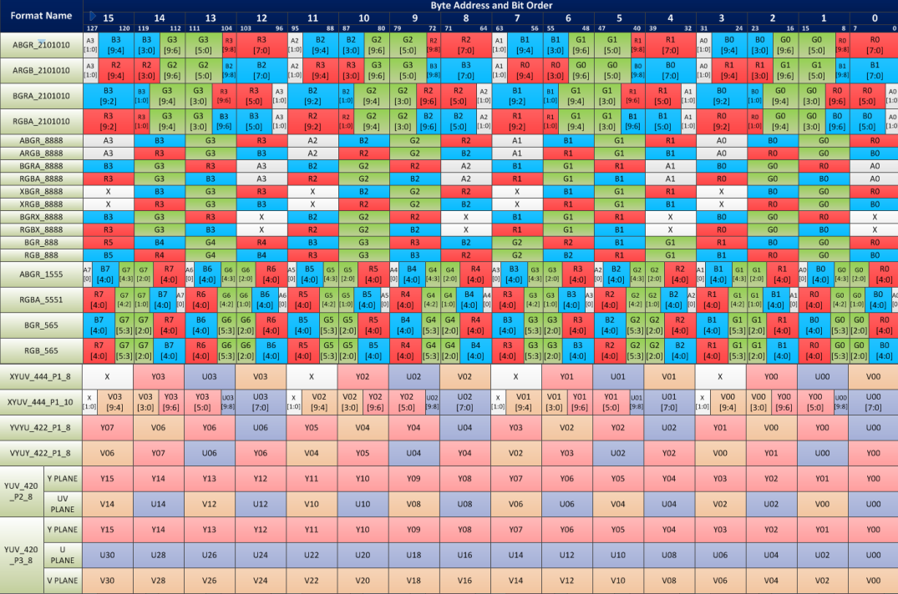

# 12. Display Subsystem

## 12.1 Display Controller

### 12.1.1 Overview

The Display Controller is a hardware block used to transfer display data from the display memory to the DSI controller. It supports one independent display device through MIPI DSI.

### 12.1.2 Features

- Supports dual DPUs: DPU0 with MIPI DSI-8lane/DP&eDP, and DPU1 with DP/eDP.
- Supports up to 4K (3840 x 2160 @ 60 fps).
- Supports color/contrast enhancement.
- Supports an 8-full-size-layer composer (including solid-color layers) and a maximum 16-layer composer by upper/lower layer reuse in the RDMA channel.
- Supports a scaler for each layer.
- Supports the cmdlist mechanism, which can configure register parameters by hardware.
- Supports concurrent write-back with raw format and supports dithering/cropping in the write-back path.
- Supports offline write-back with both raw and AFBC formats and supports dithering/cropping/rotation in the write-back path.
- Supports an advanced MMU (virtual-address) mechanism.
- Supports color key and solid color.
- Supports dithering.
- Supports both AFBC and raw-format image sources.
- Supports color saturation/contrast enhancement.
- Supports dynamic DDR frequency changing with the embedded DFC buffer.
- Supports the following input formats, as shown in the map below:
  
- Supports output formats: RGB888/RGB565/RGB666.

## 12.2 MIPI DSI Interface

### 12.2.1 Features

Complies with the MIPI Display Serial Interface (DSI) standard:

- Supports MIPI D-PHY with up to 8 data lanes, up to 4.5 Gbps.
- Supports the split function for DSI dual link.
- Supports one active panel in one D-PHY link.
- Supports the Display Command Set (DCS) standard.
- Supports all pixel formats defined in DSI and DCS.
- Supports virtual channels in the MIPI link.
- Supports up to 4K (3840 x 2160 @ 60 fps).
- Supports command, video, and burst modes.
- Supports HS-TX, LP-TX, LP-RX, and LP-CD.
- DSI input interface: CLK, HSYNC, VSYNC, HDE, VDE, and data[23:0].
- Smart-panel interface from the LCD controller as a DMA agent.
- Register interface: AHB slave.

### 12.2.2 Register Description

The base address of the DSI00 module is 0xD421_a000.
The base address of the DSI01 module is 0xD421_aa00.

DSI00 and DSI01 share the same register description, as shown below.

#### DSI CONTROL REGISTER 0

DSI_CTRL_0
Offset:0x0

| Bits     | Field               | Type | Reset | Description |
|----------|----------------------------|------|-------|-------------|
| 31       | CFG_SOFT_RST               | RW   | 0x0   | Software Reset DSI Module 1 = Reset DSI module 0 = De-assert software reset |
| 30       | CFG_SOFT_RST_REG           | RW   | 0x0   | Software Reset Config Registers 1 = Reset DSI config registers to default values 0 = De-assert reset |
| 29       | CFG_CLR_PHY_FIFO           | RW   | 0x0   | Configure Clear PHY Tx FIFO 1 = Clear FIFO data to 0 0 = De-assert clear. It is NOT used currently and reserved for future use. |
| 28       | CFG_RST_TXLP               | RW   | 0x0   | Software Reset LP TX submodule 1 = Reset LP TX module 0 = De-assert software reset |
| 27       | CFG_RST_CPU                | RW   | 0x0   | Software Reset CPU TX submodule 1 = Reset CPU TX module 0 = De-assert software reset |
| 26       | CFG_RST_CPN                | RW   | 0x0   | Software Reset CPN TX submodule 1 = Reset CPN TX module 0 = De-assert software reset |
| 25       | RSVD                       | RO   | 0     | Reserved for future use. |
| 24       | CFG_RST_VPN                | RW   | 0x0   | Software Reset Video Panel submodule 1 = Reset VPN module 0 = De-assert software reset |
| 23       | CFG_DSI_PHY_RST            | RW   | 0x0   | Software Reset DPHY submodule 1 = Reset DPHY 0 = De-assert software reset |
| 22:18    | RSVD                       | RO   | 0     | Reserved for future use. |
| 17       | CFG_DSI_HCLK_DIS           | RW   | 0x0   | DSI AHB Clock Disable. DSI config registers can still be written or read even if DSI AHB clock is disabled. 1 = DSI AHB clock will be gated 0 = DSI AHB clock is passed to DSI module |
| 16       | CFG_DSI_CLK_DIS            | RW   | 0x0   | DSI Clock Disable 1 = DSI clock will be gated 0 = DSI clock is passed to DSI module |
| 15:9     | RSVD                       | RO   | 0     | Reserved for future use. |
| 8        | CFG_VPN_TX_EN              | RW   | 0x1   | Video Panel Interface TX Enable 1 = Enable Video Panel TX packet to DPHY. DSI will send video packets to peripheral. 0 = Disable Video Panel interface TX. |
| 7:5      | RSVD                       | RO   | 0     | Reserved for future use. |
| 4        | CFG_VPN_SLV                | RW   | 0x1   | Video Panel Interface in slave mode 1 = Video Panel works in slave mode, and it will receive VSYNC from the input LCD interface and use it to control the internal timing. 0 = Video Panel interface works in master mode. DSI will send VSYNC to the LCD module and control the V timing and H timing. This bit must be set to 1; VPN supports slave mode only. |
| 3        | RSVD                       | RO   | 0     | Reserved for future use. |
| 2        | CFG_CPN_EN                 | RW   | 0x0   | Command Panel Interface Enable 1 = Command panel is running and can accept data from the Command Panel interface 0 = Disable Command Panel interface. |
| 1        | RSVD                       | RO   | 0     | Reserved for future use. |
| 0        | CFG_VPN_EN                 | RW   | 0x0   | Video Panel Interface Enable 1 = Video Panel is running. 0 = Disable Video Panel interface. Setting this field to 1 will start the Video Panel timing. |

#### DSI CONTROL REGISTER 1

DSI_CTRL_1
Offset:0x4

| Bits     | Field            | Type | Reset | Description |
|----------|-------------------------|------|-------|-------------|
| 31:9     | RSVD                    | RO   | 0     | Reserved for future use. |
| 8        | CFG_EOTP_EN             | RW   | 0x0   | EOTP Enable 1 = Enable EOTP packet 0 = Disable EOTP packet |
| 7:6      | CFG_CPN_VCH_NO          | RW   | 0x3   | Command Panel Virtual Channel Number |
| 5:2      | RSVD                    | RO   | 0     | Reserved for future use. |
| 1:0      | CFG_VPN_VCH_NO          | RW   | 0x0   | Video Panel Virtual Channel Number for Active Panel 1 This parameter defines the virtual channel number for VPN |

#### DSI INTERRUPT STATUS REGISTER 1
DSI_IRQ_ST1
Offset:0x8

| Bits | Field                 | Type | Reset | Description |
|------|------------------------------|------|-------|-------------|
| 31:5 | RSVD                         | RO   | 0     | Reserved for future use. |
| 4    | IRQ_TX_SK_LAST_BYTE          | RW   | 0x0   | All calibration done. |
| 3    | IRQ_DPHY_ERR_HS_RXP          | RW   | 0x0   | DPHY HSTX contention RXP Error 1 = Clear interrupt 0 = No effect |
| 2    | IRQ_DPHY_ERR_HS_RXN          | RW   | 0x0   | DPHY HSTX contention RXN Error 1 = Clear interrupt 0 = No effect |
| 1    | IRQ_DPHY_ERR_HS_CONTP        | RW   | 0x0   | DPHY HSTX contention contp Error 1 = Clear interrupt 0 = No effect |
| 0    | IRQ_DPHY_ERR_HS_CONTN        | RW   | 0x0   | DPHY HSTX contention contn Error 1 = Clear interrupt 0 = No effect |

#### DSI INTERRUPT MASK REGISTER 1
DSI_IRQ_MASK1
Offset:0xC

| Bits | Field      | Type | Reset | Description |
|------|-------------------|------|-------|-------------|
| 31:8 | RSVD              | RO   | 0     | Reserved for future use. |
| 7:0  | CFG_IRQ_MASK1     | RW   | 0x0   | DSI interrupt mask This field is used to mask interrupt requests. If one bit is set to 0x1, the corresponding interrupt status is masked. |

#### DSI INTERRUPT STATUS REGISTER
DSI_IRQ_ST
Offset:0x10

| Bits | Field                     | Type | Reset | Description |
|------|----------------------------------|------|-------|-------------|
| 31   | IRQ_LAST_LINE                    | RW   | 0x0   | Last Line interrupt 1 = Clear interrupt 0 = No effect |
| 30   | IRQ_CPN_TE                       | RW   | 0x0   | Command Panel Tearing Effect. 1 = Clear interrupt 0 = No effect |
| 29   | IRQ_TA_TIMEOUT                   | RW   | 0x0   | Turnaround Acknowledge Timeout for DPHY 1 = Clear interrupt 0 = No effect |
| 28   | IRQ_RX_TIMEOUT                   | RW   | 0x0   | LP-RX Timeout for DPHY 1 = Clear interrupt 0 = No effect |
| 27   | IRQ_TX_TIMEOUT                   | RW   | 0x0   | HS TX Timeout for DPHY 1 = Clear interrupt 0 = No effect |
| 26   | IRQ_RX_STATE_ERR                 | RW   | 0x0   | Peripheral Status Error After DSI receives an ACK with error report packet from slave, it will mark this bit if there is error status reported. 1 = Clear interrupt 0 = No effect |
| 25   | IRQ_RX_ERR                       | RW   | 0x0   | DSI RX Packet Error DSI receives a packet from slave and the received packet has error status (ECC error/CRC error/unknown packet) 1 = Clear interrupt 0 = No effect |
| 24   | IRQ_RX_FIFO_FULL_ERR             | RW   | 0x0   | RX FIFO Full Error 1 = Clear interrupt 0 = No effect |
| 23   | IRQ_PHY_FIFO_UNDERRUN            | RW   | 0x0   | PHY FIFO Underrun Error 1 = Clear interrupt 0 = No effect |
| 22   | IRQ_REQ_CNT_ERR                  | RW   | 0x0   | TX Request Count Error The delays between an Active Panel TX request to the DPHY ready are not consistent. 1 = Clear interrupt 0 = No effect |
| 21   | IRQ_RXPSR_FIFO_FULL_ERR          | RW   | 0x0   | RX Parser FIFO Full Error 1 = Clear interrupt 0 = No effect |
| 20   | IRQ_VPN_REQ_PHY_DLY_ERR          | RW   | 0x0   | VPN Request Delay Error at PHY Interface VPN packets are delayed at the PHY interface. 1 = Clear interrupt 0 = No effect |
| 19   | IRQ_VPN_BF_UNDERRUN_ERR          | RW   | 0x0   | VPN Buffer Underrun Error 1 = Clear interrupt 0 = No effect |
| 18   | IRQ_VPN_REQ_ARB_DLY_ERR          | RW   | 0x0   | VPN Request Delay Error at Arbiter Interface VPN packets are delayed at arbiter point. 1 = Clear interrupt 0 = No effect |
| 17   | IRQ_VPN_BF_OVERRUN_ERR           | RW   | 0x0   | VPN Buffer Overrun Error 1 = Clear interrupt 0 = No effect |
| 16   | IRQ_VPN_TIMING_ERR               | RW   | 0x0   | VPN Data Timing Error Pixel data may be incorrect. Data FIFO for VPN path is read too early or too late, and FIFO is empty when it is read. 1 = Clear interrupt 0 = No effect |
| 15   | IRQ_VPN_VACT_DONE                | RW   | 0x0   | VPN VACT Done 1 = Clear interrupt 0 = No effect |
| 14   | IRQ_VPN_BF_FULL                  | RW   | 0x0   | VPN Buffer Full Error Pixel data may be incorrect. 1 = Clear interrupt 0 = No effect |
| 13   | IRQ_CPN_BF_FULL                  | RW   | 0x0   | CPN Buffer Full Error Pixel data may be incorrect. 1 = Clear interrupt 0 = No effect |
| 12   | IRQ_DPHY_ERR_CONT_LP1            | RW   | 0x0   | DPHY LP1 Contention Detect PPI ErrContertionLP1 1 = Clear interrupt 0 = No effect |
| 11   | IRQ_DPHY_ERR_CONT_LP0            | RW   | 0x0   | DPHY LP0 Contention Detect PPI ErrContertionLP0 1 = Clear interrupt 0 = No effect |
| 10   | IRQ_DPHY_ERR_SYNC_ESC            | RW   | 0x0   | DPHY Sync Error PPI ErrSyncEsc, partial byte detected 1 = Clear interrupt 0 = No effect |
| 9    | IRQ_DPHY_ERR_ESC                 | RW   | 0x0   | DPHY Invalid Command Detect PPI ErrEsc, invalid esc command detected 1 = Clear interrupt 0 = No effect |
| 8    | IRQ_DPHY_RX_LINE_ERR             | RW   | 0x0   | DPHY Invalid Line State Detect PPI ErrControl 1 = Clear interrupt 0 = No effect |
| 7    | IRQ_RX_TRG3                      | RW   | 0x0   | DPHY RX Trigger 3 Received By default, the value of trigger 3 is 0x05, and its meaning is not defined by Specification. 1 = Clear interrupt 0 = No effect |
| 6    | IRQ_RX_TRG2                      | RW   | 0x0   | DPHY RX Trigger 2 Received By default, trigger 2 is for Acknowledge Trigger, and its value is 0x84. 1 = Clear interrupt 0 = No effect |
| 5    | IRQ_RX_TRG1                      | RW   | 0x0   | DPHY RX Trigger 1 Received By default, trigger 1 is for TE Trigger, and its value is 0xBA. 1 = Clear interrupt 0 = No effect |
| 4    | IRQ_RX_TRG0                      | RW   | 0x0   | DPHY RX Trigger 0 Received By default, trigger 0 is for Reset Trigger, and its value is 0x46. 1 = Clear interrupt 0 = No effect |
| 3    | IRQ_RX_ULPS                      | RW   | 0x0   | DPHY RX ULPS Received 1 = Clear interrupt 0 = No effect |
| 2    | IRQ_RX_PKT                       | RW   | 0x0   | DPHY RX Packet Received 1 = Clear interrupt 0 = No effect |
| 1    | IRQ_CPN_TX_DONE                  | RW   | 0x0   | Command Panel Data Transmission Done 1 = Clear interrupt 0 = No effect |
| 0    | IRQ_CPU_TX_DONE                  | RW   | 0x0   | CPU Packet Transmission Done 1 = Clear interrupt 0 = No effect |

#### DSI INTERRUPT MASK REGISTER
DSI_IRQ_MASK
Offset:0x14

| Bits  | Field     | Type | Reset | Description |
|-------|------------------|------|-------|-------------|
| 31:0  | CFG_IRQ_MASK     | RW   | 0x0   | DSI interrupt mask This field is used to mask interrupt requests. If one bit is set to 0x1, the corresponding interrupt status is masked. |

#### DSI FPGA PHY CONTROL REGISTER 0
DSI_FPGA_PHY_CTRL_0
Offset:0x18

| Bits   | Field                | Type | Reset | Description |
|--------|-----------------------------|------|-------|-------------|
| 31:15  | RSVD                        | RO   | 0     | Reserved for future use. |
| 14     | CFG_DPHY_FCLK_REV           | RW   | 0x0   | FPGA DPHY FCLK reverse |
| 13     | CFG_DPHY_TXRX_BYTECLK_REV   | RW   | 0x0   | FPGA DPHY TXRX_ByteCLK reverse |
| 12     | CFG_DPHY_HSREQ_LANE3        | RW   | 0x0   | FPGA DPHY Lane3 HS Request |
| 11     | CFG_DPHY_HSREQ_LANE2        | RW   | 0x0   | FPGA DPHY Lane2 HS Request |
| 10     | CFG_DPHY_HSREQ_LANE1        | RW   | 0x0   | FPGA DPHY Lane1 HS Request |
| 9      | CFG_DPHY_HSREQ_LANE0        | RW   | 0x0   | FPGA DPHY Lane0 HS Request |
| 8      | CFG_DPHY_HSREQ_LANECLK      | RW   | 0x0   | FPGA DPHY LaneCLK HS Request |
| 7      | CFG_DPHY_ENABLECLK          | RW   | 0x0   | FPGA DPHY ENABLE CLK Lane |
| 6      | CFG_DPHY_ENABLE1            | RW   | 0x1   | FPGA DPHY ENABLE1 |
| 5      | CFG_DPHY_ENABLE0            | RW   | 0x1   | FPGA DPHY ENABLE0 |
| 4      | CFG_DPHY_MASSLVZ            | RW   | 0x1   | FPGA DPHY Master/Slave Z |
| 3      | CFG_DPHY_TXRXZ              | RW   | 0x1   | Reserved for future use |
| 2      | CFG_DPHY_RSTZCAL            | RW   | 0x0   | FPGA DPHY Rstzcal |
| 1      | CFG_DPHY_SHUTDOWN           | RW   | 0x0   | FPGA DPHY Shutdown |
| 0      | CFG_DPHY_RESETZ             | RW   | 0x0   | FPGA DPHY Resetz |

#### DSI FPGA PHY CONTROL REGISTER 1
DSI_FPGA_PHY_CTRL_1
Offset:0x1C

| Bits   | Field           | Type | Reset | Description         |
|--------|------------------------|------|-------|---------------------|
| 31:25  | RSVD                   | RO   | 0     | Reserved for future use. |
| 24     | CFG_DPHY_ENABLE1       | RO   | 0x0   | FPGA DPHY Lock      |
| 23:16  | CFG_DPHY_ENABLE0       | RO   | 0x0   | FPGA DPHY TestDout  |
| 15:8   | CFG_DPHY_MASSLVZ       | RW   | 0x0   | FPGA DPHY TestDin   |
| 7:3    | RSVD                   | RO   | 0     | Reserved for future use. |
| 2      | CFG_DPHY_RSTZCAL       | RW   | 0x0   | FPGA DPHY TestEn    |
| 1      | CFG_DPHY_SHUTDOWN      | RW   | 0x0   | FPGA DPHY TestClr   |
| 0      | CFG_DPHY_RESETZ        | RW   | 0x0   | FPGA DPHY TestClk   |

#### DSI CPU PACKET COMMAND REGISTER 0
DSI_CPU_CMD_0
Offset:0x20

| Bits   | Field         | Type | Reset | Description |
|--------|----------------------|------|-------|-------------|
| 31     | CFG_CPU_CMD_REQ      | RW   | 0x0   | CPU Command Request 1 = CPU packet request 0 = No request or request done After software writes a command with this bit set to 1, the DSI module sends out a packet as requested. DSI de-asserts this field after packet is sent. |
| 30     | CFG_CPU_SP           | RW   | 0x0   | CPU Short Packet 1 = CPU packet is a short packet 0 = CPU packet is a long packet |
| 29     | CFG_CPU_TURN         | RW   | 0x0   | CPU Turn Around 1 = After CPU packet, turn around the bus 0 = Don’t turn around bus after CPU packet |
| 28     | RSVD                 | RO   | 0     | Reserved for future use. |
| 27     | CFG_CPU_TXLP         | RW   | 0x0   | Low Power TX for CPU Packets 1 = Transfer CPU packets through Low Power mode 0 = Use high-speed mode to send CPU packets |
| 26:16  | RSVD                 | RO   | 0     | Reserved for future use. |
| 15:0   | CFG_CPU_WC           | RW   | 0x0   | CPU Packet Byte Count For high speed transfer and low power transfer, this is the byte count for the whole packet transmission, including CRC bytes, and CFG_CPU_SP is ignored. For high speed short packet transfer, this parameter is ignored. |

#### DSI CPU PACKET COMMAND REGISTER 1
DSI_CPU_CMD_1
Offset:0x24

| Bits   | Field              | Type | Reset | Description |
|--------|---------------------------|------|-------|-------------|
| 31:24  | RSVD                      | RO   | 0     | Reserved for future use. |
| 23:20  | CFG_TXLP_LPDT             | RW   | 0x0   | LPDT TX Enable LPDT TX enable signals for Low Power TX |
| 19:16  | CFG_TXLP_ULPS             | RW   | 0x0   | ULPS TX Enable ULPS TX enable signals for Low Power TX |
| 15:0   | CFG_TXLP_TRIGGER_CODE     | RW   | 0x0   | Low Power TX Trigger Code |

#### DSI CPU PACKET COMMAND REGISTER 3
DSI_CPU_CMD_3
Offset:0x2C

| Bits   | Field            | Type | Reset | Description |
|--------|-------------------------|------|-------|-------------|
| 31     | CFG_CPU_DAT_REQ         | RW   | 0x0   | CPU Packet Data Buffer Read/Write Request 1 = CPU packet data request 0 = No request or request done After software writes a command with this bit set to 1, the DSI module will write data to the packet data buffer or read data from the data buffer as requested. DSI will de-assert this bit after write/read operation is done. Read data will be valid after this bit is reset to zero. |
| 30     | CFG_CPU_DAT_RW          | RW   | 0x0   | CPU Packet Data Buffer Read/Write Operation 1 = CPU packet data write operation 0 = CPU packet data read operation |
| 29:24  | RSVD                    | RO   | 0     | Reserved for future use. |
| 23:16  | CFG_CPU_DAT_ADDR        | RW   | 0x0   | CPU Packet Data Address This is the byte address for packet data. Every write/read operation, 4 bytes of data will be written or read. Software should increase address by 4 after each operation. Packet data start from packet header. Address 0: bits [7:0] are for Type_id, bits [23:8] are for length, and bits [31:24] are for ECC. Address 4: payload data if packet is a long packet, and so on. The maximum packet data buffer is 256 bytes. |
| 15:0   | RSVD                    | RO   | 0     | Reserved for future use. |

#### DSI CPU PACKET DATA REGISTER
DSI_CPU_WDAT
Offset:0x30

| Bits   | Field     | Type | Reset | Description |
|--------|------------------|------|-------|-------------|
| 31:0   | CFG_CPU_WDAT     | RW   | 0x0   | CPU wdata 0 The DSI can generate packets based on CPU programmed data. This register defines the CPU packet data. This register is the CPU packet data to be written to the packet data buffer. Software should program packet data to this register and then program the DSI CPU Packet Command Register 3 to put the packet data into the Tx packet data buffer. For every write/read operation, 4-byte data is written/read. Bits [7:0] are the LSb and bits [31:24] are the MSb. For packet data at address 0, bits [7:0] are for Type_id, bits [23:8] are for length, and bits [31:24] are for ECC. For data at address 4, payload data if packet is a long packet, and so on. If packet is transmitted in high speed, hardware generates ECC and CRC to replace this ECC/CRC code in the packet data buffer. Under Low Power TX, hardware does not insert ECC/CRC and sends out the ECC/CRC code in the packet data buffer. |

#### DSI CPU COMMAND STATUS 0
DSI_CPU_STATUS_0
Offset:0x34

| Bits   | Field        | Type | Reset | Description |
|--------|---------------------|------|-------|-------------|
| 31:16  | RSVD                | RO   | 0     | Reserved for future use. |
| 15:0   | CFG_CPU_PKT_CNT     | RW   | 0x0   | CPU Packet Counter This counter counts how many CPU packets are sent out through DSI. This register is write clear. |

#### DSI CPU COMMAND STATUS 1
DSI_CPU_STATUS_1
Offset:0x38

| Bits   | Field           | Type | Reset | Description |
|--------|------------------------|------|-------|-------------|
| 31:0   | CFG_CPU_CMD_TX_CNT     | RO   | 0x0   | CPU CMD TX Counter This counter counts how many byte clock cycles it takes to transfer the current CPU command. It begins to count after CPU command is received, and stops to counter after DPHY gets ready for another TX request. This counter could help to decide the CFG_L*_SLOT_**_CNT values of register 0x130, 0x134, 0x1B0, and 0x1B4. |

#### DSI CPU COMMAND STATUS 2
DSI_CPU_STATUS_2
Offset:0x3C

| Bits   | Field          | Type | Reset | Description |
|--------|-----------------------|------|-------|-------------|
| 31:0   | CFG_CPU_CMD_CNT       | RO   | 0x0   | CPU CMD Execution Counter This counter counts how many byte clock cycles it takes to execute the current CPU command. This counter only counts the cycles which CPU engine is busy. This counter could help to decide the CFG_L*_SLOT_**_CNT values of register 0x130, 0x134, 0x1B0, and 0x1B4. |

#### DSI CPU COMMAND STATUS 3
DSI_CPU_STATUS_3
Offset:0x40

| Bits   | Field     | Type | Reset | Description |
|--------|------------------|------|-------|-------------|
| 31:0   | CFG_TXLP_CNT     | RO   | 0x0   | Low Power TX byte clock count. This counter counts how many byte clock cycles it takes to transfer a Low Power packet. |

#### DSI CPU COMMAND STATUS 4
DSI_CPU_STATUS_4
Offset:0x44

| Bits   | Field    | Type | Reset | Description |
|--------|-----------------|------|-------|-------------|
| 31:0   | CFG_BTA_CNT     | RO   | 0x0   | Bus Turn Around byte clock count. This counter counts how many byte clock cycles it takes to do a bus turn around operation. |

#### DSI COMMAND PANEL PATH STATUS 1
DSI_CPN_STATUS_1
Offset:0x4C

| Bits   | Field         | Type | Reset | Description |
|--------|----------------------|------|-------|-------------|
| 31:0   | CFG_CPN_STATUS_1     | RO   | 0x10c | Command Panel Path Status 1. {smt_bf_cnt[5:0], smt_fifo_bcnt[9:0], 3'b0, smt_cs[4:0], 2'b0, smt_wr_on, smt_dma_on, smt_fifo_empty, smt_bf_empty, smt_fifo_full_r, smt_bf_full_r} |

#### DSI COMMAND PANEL COMMAND REGISTER
DSI_CPN_CMD
Offset:0x50

| Bits     | Field                     | Type | Reset | Description |
|----------|----------------------------------|------|-------|-------------|
| 31:28    | CFG_CPN_TE_EN                    | RW   | 0x0   | Command Panel Tearing Effect Signal Enable |
| 27       | CFG_SMT_RGB565_OLD               | RW   | 0x0   | RGB565 old layout for smart panel |
| 26:24    | CFG_CPN_RGB_TYPE                 | RW   | 0x0   | Command Panel Data RGB Type 0x0 = 888 mode 0x1 = 666 unpacked mode 0x2 = 565 mode 0x3 = 444 mode 0x4 = 332 mode 0x5 = 111 mode 0x6 = 101010 mode 0x7 = DSC mode |
| 23:4     | RSVD                             | RO   | 0     | Reserved for future use. |
| 3        | CFG_CPN_BURST_MODE               | RW   | 0x1   | Command Panel Interface Burst Mode Enable 0 = Enable Previous Command Panel interface. 1 = Burst mode interface between LCD and DSI will take effect. This interface is more efficient than the previous one. |
| 2        | CFG_CPN_FIRSTP_SEL               | RW   | 0x0   | Command Panel first packet select 0 = FIFO empty 1 = Vsync from DP650 |
| 1        | CFG_CPN_DMA_DIS                  | RW   | 0x0   | Command Panel dma_on Disable 1 = Disable smt_dma_on signal from LCD controller. DSI will not receive Command Panel interface data from LCD even smt_dma_on signal is active high. 0 = Receive LCD Command Panel interface data when smt_dma_on is high. |
| 0        | CFG_CPN_ADDR0_EN                 | RW   | 0x0   | Command Panel Address Bit Indicator 0 = When smt_addr = 1, bus data are for pixel RGB data. When smt_addr = 0, bus data are ignored 1 = When smt_addr = 0, bus data are for pixel RGB data. When smt_addr = 1, bus data are ignored. |

#### DSI COMMAND PANEL CONTROL 0 REGISTER
DSI_CPN_CTRL_0
Offset:0x54

| Bits     | Field                | Type | Reset | Description |
|----------|-----------------------------|------|-------|-------------|
| 31:22    | RSVD                        | RO   | 0    | Reserved for future use. |
| 21:16    | CFG_DCS_LONGWR_CODE         | RW   | 0x39 | DSI Command Code for Writing Command Panel Data The default data is 0x39 from DSI specification. |
| 15:8     | CFG_DCS_WR_CON_CODE         | RW   | 0x3C | DCS Command for Continuous Write The default value is 0x3C in MIPI Alliance Standard for Display Command Set Specification. |
| 7:0      | CFG_DCS_WR_STR_CODE         | RW   | 0x2C | DCS Command for First Write The default value is 0x2C in the MIPI Alliance Standard for Display Command Set Specification. |

#### DSI COMMAND PANEL CONTROL 1 REGISTER
DSI_CPN_CTRL_1
Offset:0x58

| Bits     | Field                   | Type | Reset   | Description |
|----------|--------------------------------|------|---------|-------------|
| 31:30    | RSVD                           | RO   | 0       | Reserved for future use. |
| 29:16    | CFG_CPN_PKT_CNT                | RW   | 0x1681  | Command Panel Packet Length This field defines the packet length for Command Panel packets. |
| 15:14    | RSVD                           | RO   | 0       | Reserved for future use. |
| 13:0     | CFG_CPN_FIFO_FULL_LEVEL        | RW   | 0x2d00  | Command Panel FIFO Full Level, in byte count |

#### DSI COMMAND PANEL CONTROL STATUS 0
DSI_CPN_STATUS_0
Offset:0x5C

| Bits | Field           | Type | Reset | Description |
|------|------------------------|------|-------|-------------|
| 31:0 | CFG_CPN_FRM_CNT        | RO   | 0x0   | Command Panel Frame Counter This counter counts how many Command Panel frames are sent out through DSI. This register is write clear. |

#### DSI RX PACKET 0 STATUS REGISTER
DSI_RX_PKT_ST_0
Offset:0x60

| Bits     | Field                | Type | Reset | Description |
|----------|-----------------------------|------|-------|-------------|
| 31       | RX_PKT0_ST_VLD              | RWC  | 0x0   | Rx Packet 0 Status Valid 1 = Valid status 0 = Invalid status |
| 30:27    | RSVD                        | RO   | 0     | Reserved for future use. |
| 26       | RX_PKT0_ST_EOTP             | RWC  | 0x0   | Rx Packet 0 is EOTP 1 = Received packet is EOTP packet 0 = Other packet It is valid only when RX_PKT0_ST_VLD = 1. |
| 25       | RX_PKT0_ST_ACK              | RWC  | 0x0   | Rx Packet 0 is ACK Packet 1 = Received packet is an ACK packet with or without error 0 = Other packet It is valid only when RX_PKT0_ST_VLD = 1. |
| 24       | RX_PKT0_ST_SP               | RWC  | 0x0   | Rx Packet 0 Short Packet 1 = Received packet is a short packet 0 = Long packet It is valid only when RX_PKT0_ST_VLD = 1. |
| 23:22    | RSVD                        | RO   | 0     | Reserved for future use. |
| 21:16    | RX_PKT0_PKT_PTR             | RWC  | 0x0   | Rx Packet 0 Data Pointer Packet header in FIFO is the raw data from DPHY and is before ECC correction. It is valid only when RX_PKT0_ST_VLD = 1. |
| 15:14    | RX_PKT0_VCH                 | RWC  | 0x0   | Rx Packet 0 Virtual Channel Number It is valid only when RX_PKT0_ST_VLD = 1. |
| 13:12    | RSVD                        | RO   | 0     | Reserved for future use. |
| 11:8     | RX_PKT0_ECC_FLAGS           | RWC  | 0x0   | Rx Packet 0 ECC Error Flags Bit [11]: 1 = No ECC error 0 = ECC error  Bit [10]: 1 = Correctable error in data bits  Bit [9]: 1 = Correctable error happens at parity bits  Bit [8]: 1 = Uncorrectable error It is valid only when RX_PKT0_ST_VLD = 1. |
| 7:5      | RSVD                        | RO   | 0     | Reserved for future use. |
| 4        | RX_PKT0_NO_CRC              | RWC  | 0x0   | Rx Packet 0 Without CRC Rx packet doesn't contain CRC and CRC part contains 0x0000. It is valid only when RX_PKT0_ST_VLD = 1. |
| 3        | RX_PKT0_UNKNOWN_ERR         | RWC  | 0x0   | Rx Packet 0 Type Unknown Error It is valid only when RX_PKT0_ST_VLD = 1. |
| 2        | RX_PKT0_ST_ERR              | RWC  | 0x0   | Rx Packet 0 ACK Status Error The ACK packet has error status. The DSI_RX_PKT_HDR_0 should be checked to see what error happens. It is valid only when RX_PKT0_ST_VLD = 1. |
| 1        | RX_PKT0_ECC_ERR             | RWC  | 0x0   | Rx Packet 0 ECC Error It is valid only when RX_PKT0_ST_VLD = 1. |
| 0        | RX_PKT0_CRC_ERR             | RWC  | 0x0   | Rx Packet CRC Error It is valid only when RX_PKT0_ST_VLD = 1. |

#### DSI RX PACKET 0 HEADER REGISTER
DSI_RX_PKT_HDR_0
Offset:0x64

| Bits | Field     | Type | Reset | Description |
|------|------------------|------|-------|-------------|
| 31:0 | RX_PKT0_HDR      | RW   | 0x0   | Rx Packet 0 Header Bits [7:0]: DataID Bits [23:8]: Length Bits [31:23]: ECC—Corrected if error detected. |

#### DSI RX PACKET 1 STATUS REGISTER
DSI_RX_PKT_ST_1
Offset:0x68

| Bits     | Field                | Type | Reset | Description |
|----------|-----------------------------|------|-------|-------------|
| 31       | RX_PKT1_ST_VLD              | RWC  | 0x0   | Rx Packet 1 Status Valid 1 = Valid status 0 = Invalid status |
| 30:27    | RSVD                        | RO   | 0     | Reserved for future use. |
| 26       | RX_PKT1_ST_EOTP             | RWC  | 0x0   | Rx Packet 1 is EOTP 1 = Received packet is EOTP packet 0 = Other packet It is valid only when RX_PKT1_ST_VLD = 1. |
| 25       | RX_PKT1_ST_ACK              | RWC  | 0x0   | Rx Packet 1 is ACK Packet 1 = Received packet is an ACK packet with or without error 0 = Other packet It is valid only when RX_PKT1_ST_VLD = 1. |
| 24       | RX_PKT1_ST_SP               | RWC  | 0x0   | Rx Packet 1 Short Packet 1 = Received packet is a short packet 0 = Long packet Valid only when RX_PKT1_ST_VLD = 1. |
| 23:22    | RSVD                        | RO   | 0     | Reserved for future use. |
| 21:16    | RX_PKT1_PKT_PTR             | RWC  | 0x0   | Rx Packet 1 Data Pointer Packet header in FIFO is the raw data from DPHY and is before ECC correction. Valid only when RX_PKT1_ST_VLD = 1. |
| 15:14    | RX_PKT1_VCH                 | RWC  | 0x0   | Rx Packet 1 Virtual Channel Number Valid only when RX_PKT1_ST_VLD = 1. |
| 13:12    | RSVD                        | RO   | 0     | Reserved for future use. |
| 11:8     | RX_PKT1_ECC_FLAGS           | RWC  | 0x0   | Rx Packet 1 ECC Error Flags Bit [11]: 1 = No ECC error 0 = ECC error  Bit [10]: 1 = Correctable error in data bits  Bit [9]: 1 = Correctable error happens at parity bits  Bit [8]: 1 = Uncorrectable error It is valid only when RX_PKT1_ST_VLD = 1. |
| 7:5      | RSVD                        | RO   | 0     | Reserved for future use. |
| 4        | RX_PKT1_NO_CRC              | RWC  | 0x0   | Rx Packet 1 Without CRC Rx packet doesn't contain CRC and CRC part contains 0x0000. It is valid only when RX_PKT1_ST_VLD = 1. |
| 3        | RX_PKT1_UNKNOWN_ERR         | RWC  | 0x0   | Rx Packet Type Unknown Error It is valid only when RX_PKT1_ST_VLD = 1. |
| 2        | RX_PKT1_ST_ERR              | RWC  | 0x0   | Rx Packet 1 ACK Status Error The DSI_RX_PKT_HDR_0 should be checked to see what error happens. It is valid only when RX_PKT1_ST_VLD = 1. |
| 1        | RX_PKT1_ECC_ERR             | RWC  | 0x0   | Rx Packet 1 ECC Error It is valid only when RX_PKT1_ST_VLD = 1. |
| 0        | RX_PKT1_CRC_ERR             | RWC  | 0x0   | Rx Packet 1 CRC Error It is valid only when RX_PKT1_ST_VLD = 1. |

#### DSI RX PACKET 1 HEADER REGISTER
DSI_RX_PKT_HDR_1
Offset:0x6C

| Bits | Field     | Type | Reset | Description     |
|------|------------------|------|-------|-----------------|
| 31:0 | RX_PKT1_HDR      | RW   | 0x0   | Rx Packet 1 Header |

#### DSI RX PACKET READ CONTROL REGISTER
DSI_RX_PKT_CTRL
Offset:0x70

| Bits     | Field              | Type | Reset | Description |
|----------|---------------------------|------|-------|-------------|
| 31       | RX_PKT_RD_REQ             | RW   | 0x0   | Rx Packet FIFO Read Request 1 = Read request 0 = Invalid req This bit will be cleared to 0 after read operation is done and Rx data valid. |
| 30:22    | RSVD                      | RO   | 0     | Reserved for future use. |
| 21:16    | RX_PKT_RD_PTR             | RW   | 0x0   | Rx Packet Data FIFO Read Pointer For every read operation, the hardware will return the data from the pointer address. Software must increment this pointer for the next data after each byte is read. |
| 15:8     | RSVD                      | RO   | 0     | Reserved for future use. |
| 7:0      | RX_PKT_RD_DATA            | RW   | 0x0   | Rx FIFO Read Data Valid when RX_PKT_RD_REQ = 0. First byte: DataID Second byte: wc0 Third byte: wc1 Fourth byte: raw ECC received from DPHY, not corrected Fifth byte and beyond: long packet data |

#### DSI RX PACKET READ CONTROL 1 REGISTER
DSI_RX_PKT_CTRL_1
Offset:0x74

| Bits     | Field        | Type | Reset | Description |
|----------|---------------------|------|-------|-------------|
| 31:12    | RSVD                | RO   | 0     | Reserved for future use. |
| 11:8     | RX_PKT_CNT          | RWC  | 0x0   | RX Packet Count in Rx FIFO All LP RX packets are stored in the FIFO and start from address 0. |
| 7:0      | RX_PKT_BCNT         | RWC  | 0x0   | RX Byte Count in Rx FIFO The whole LP RX data are stored in the FIFO and start from address 0. |

#### DSI RX PACKET 2 STATUS REGISTER
DSI_RX_PKT_ST_2
Offset:0x78

| Bits     | Field                | Type | Reset | Description |
|----------|-----------------------------|------|-------|-------------|
| 31       | RX_PKT2_ST_VLD              | RWC  | 0x0   | Rx Packet 2 Status Valid 1 = Valid status 0 = Invalid status |
| 30:27    | RSVD                        | RO   | 0     | Reserved for future use. |
| 26       | RX_PKT2_ST_EOTP             | RWC  | 0x0   | Rx Packet 2 is EOTP 1 = Received packet is EOTP packet 0 = Other packet It is valid only when RX_PKT2_ST_VLD = 1. |
| 25       | RX_PKT2_ST_ACK              | RWC  | 0x0   | Rx Packet 2 is an ACK Packet 1 = Received packet is an ACK packet with or without error 0 = Other packet It is valid only when RX_PKT2_ST_VLD = 1. |
| 24       | RX_PKT2_ST_SP               | RWC  | 0x0   | Rx Packet 2 Short Packet 1 = Received packet is a short packet 0 = Long packet Valid only when RX_PKT2_ST_VLD = 1. |
| 23:22    | RSVD                        | RO   | 0     | Reserved for future use. |
| 21:16    | RX_PKT2_PKT_PTR             | RWC  | 0x0   | Rx Packet 2 Data Pointer Packet header in FIFO is the raw data from DPHY and is before ECC correction. Valid only when RX_PKT2_ST_VLD = 1. |
| 15:14    | RX_PKT2_VCH                 | RWC  | 0x0   | Rx Packet 2 Virtual Channel Number Valid only when RX_PKT2_ST_VLD = 1. |
| 13:12    | RSVD                        | RO   | 0     | Reserved for future use. |
| 11:8     | RX_PKT2_ECC_FLAGS           | RWC  | 0x0   | Rx Packet 2 ECC Error Flags Bit [11]: 1 = No ECC error 0 = ECC error  Bit [10]: 1 = Correctable error in data bits  Bit [9]: 1 = Correctable error happens at parity bits  Bit [8]: 1 = Uncorrectable error It is valid only when RX_PKT2_ST_VLD = 1. |
| 7:5      | RSVD                        | RO   | 0     | Reserved for future use. |
| 4        | RX_PKT2_NO_CRC              | RWC  | 0x0   | Rx Packet 2 Without CRC Rx packet doesn't contain CRC and CRC part contains 0x0000. It is valid only when RX_PKT2_ST_VLD = 1. |
| 3        | RX_PKT2_UNKNOWN_ERR         | RWC  | 0x0   | Rx Packet 2 Type Unknown Error It is valid only when RX_PKT2_ST_VLD = 1. |
| 2        | RX_PKT2_ST_ERR              | RWC  | 0x0   | Rx Packet 2 ACK Status Error The DSI_RX_PKT_HDR_0 should be checked to see what error happens. It is valid only when RX_PKT2_ST_VLD = 1. |
| 1        | RX_PKT2_ECC_ERR             | RWC  | 0x0   | Rx Packet 2 ECC Error It is valid only when RX_PKT2_ST_VLD = 1. |
| 0        | RX_PKT2_CRC_ERR             | RWC  | 0x0   | Rx Packet 2 CRC Error It is valid only when RX_PKT2_ST_VLD = 1. |

#### DSI RX PACKET 2 HEADER REGISTER
DSI_RX_PKT_HDR_2
Offset:0x7C

| Bits | Field     | Type | Reset | Description     |
|------|------------------|------|-------|-----------------|
| 31:0 | RX_PKT2_HDR      | RW   | 0x0   | Rx Packet 2 Header |

#### DSI LCD BRIDGE CONTROL REGISTER 0
DSI_LCD_BDG_CTRL0
Offset:0x84

| Bits     | Field                  | Type | Reset | Description |
|----------|-------------------------------|------|-------|-------------|
| 31:30    | RSVD                          | RO   | 0     | Reserved for future use. |
| 29:26    | LCD_VBLANK_FLAG_START         | RW   | 0x1   | LCD Vblank flag start after vertical line number 0 |
| 25:16    | LCD_VBLANK_FLAG_END           | RW   | 0x020 | LCD Vblank flag end after vertical blank line number 1 |
| 15       | RSVD                          | RO   | 0     | Reserved for future use. |
| 14       | FIX_LINE_MISSING              | RW   | 0x0   | Fix line-missing issue when the next-line hsync comes ahead of the current hlp timing slot (LP enable) or hfp timing slot (LP enable) |
| 13       | FIX_ISSUE                     | RW   | 0x0   | Fix issue when HS and LP is issued at the same time |
| 12       | BYPASS_PN_BF_AFULL            | RW   | 0x0   | Bypass pn_bf_afull in video mode; do not stall Mali DP550 output READY even when the buffer is nearly full |
| 11       | CFG_SMT_BYPASS_TE             | RW   | 0x0   | — |
| 10       | CFG_SMT_TE_EDGE               | RW   | 0x0   | — |
| 9        | PXLEL_SWAP                    | RW   | 0x0   | — |
| 8        | PN_TIMING_CNT_FIX_DP550       | RW   | 0x1   | — |
| 7        | MAS_MODE_FIX_DP550            | RW   | 0x1   | — |
| 6:3      | AFULL_CNT                     | RW   | 0x4   | — |
| 2:1      | CFG_SMT_WR_CYCLE              | RW   | 0x0   | — |
| 0        | FRAME_START_TRIGGER           | RW   | 0x0   | Frame start trigger for smart panel. |

#### DSI LCD BRIDGE CONTROL REGISTER 1
DSI_LCD_BDG_CTRL1
Offset:0x88

| Bits     | Field              | Type | Reset | Description |
|----------|---------------------------|------|-------|-------------|
| 31:16    | CFG_CPN_TE_DLY_CNT        | RW   | 0x10  | CPN Tearing Effect Delay Count The LCD output pixel data will delay CFG_CPN_TE_DLY_CNT cycles after TE pulse |
| 15:0     | CFG_CPN_TE_LINE_CNT       | RW   | 0x0   | CPN Tearing Effect line count. When TE_MODE = 2, this field takes effect. The LCD output pixel data will wait for the CFG_CPN_TE_LINE_CNT TE pulse |

#### DSI TX TIMER REGISTER
DSI_TX_TIMER
Offset:0xE4

| Bits | Field        | Type | Reset       | Description |
|------|---------------------|------|-------------|-------------|
| 31:0 | CFG_TX_TIMER_CNT    | RW   | 0xffffffff  | Tx Transmission Timer Value This timer monitors the Tx operation on the DSI output side. It could generate IRQ after timer timeout. By default setting, timeout will not happen because the reset value is the maximum value (0xffffffff). |

#### DSI RX TIMER REGISTER
DSI_RX_TIMER
Offset:0xE8

| Bits | Field        | Type | Reset       | Description |
|------|---------------------|------|-------------|-------------|
| 31:0 | CFG_RX_TIMER_CNT    | RW   | 0xffffffff  | Rx Timer Value This timer monitors the Rx operation on the DSI operation. It could generate IRQ after timer timeout. By default setting, timeout will not happen because the reset value is the maximum value (0xffffffff). |

#### DSI TURN AROUND TIMER REGISTER
DSI_TURN_TIMER
Offset:0xEC

| Bits | Field            | Type | Reset       | Description |
|------|-------------------------|------|-------------|-------------|
| 31:0 | CFG_TURN_TIMER_CNT      | RW   | 0xffffffff  | Bus Turn Around Timer Value This timer monitors the turn around operation on the DSI. It could generate IRQ after timer timeout. By default setting, timeout will not happen because the reset value is the maximum value (0xffffffff). |

#### DSI VIDEO PANEL CONTROL REGISTER 0
DSI_VPN_CTRL_0
Offset:0x100

| Bits     | Field                   | Type | Reset   | Description |
|----------|--------------------------------|------|---------|-------------|
| 31:16    | CFG_VPN_DLY_CNT                | RW   | 0x100   | VPN VSYNC Delay Count in slave mode. In slave mode, DSI will start H/V timing depending on input VSYNC timing from LCD module. In slave mode, after DSI receives a VSYNC from LCD Controller, it will start a VSYNC timing by delaying this count of clock. |
| 15:12    | RSVD                           | RO   | 0x0     | Reserved for future use. |
| 11       | CFG_VFP_HSS_DIS                | RW   | 0x0     | HSS disabled in VFP. |
| 10       | CFG_VPN_HSYNC_GRANTEE_EN       | RW   | 0x0     | 1 = HSYNC number is guaranteed; 0 = HSYNC number is not guaranteed |
| 9        | CFG_VPN_LBUF_DEP_FULL          | RW   | 0x0     | 1: VPN Line buffer depth is 1440; 0: VPN Line buffer depth is one line |
| 8        | CFG_VPN_1LN_DLY                | RW   | 0x1     | VPN output delay 1 line. |
| 7:0      | CFG_VPN_TX_DLY_CNT             | RW   | 0x10    | VPN TX Delay Count After DSI starts a HSYNC timing, delay this count of DPHY byte clock count to start a VSS packet transfer. This is a DSI internal delay to guarantee a fixed TX timing at DPHY interface. |

#### DSI VIDEO PANEL CONTROL REGISTER 1
DSI_VPN_CTRL_1
Offset:0x104

| Bits     | Field                          | Type | Reset   | Description |
|----------|---------------------------------------|------|---------|-------------|
| 31       | CFG_VPN_VSYNC_RST_EN                  | RW   | 0x0     | LCD VSYNC Reset Enable in slave mode 1 = Reset DSI vertical state machine when LCD VSYNC comes. This will only take effect when LCD is in slave mode. 0 = Don't reset DSI vertical state machine |
| 30       | RSVD                                  | RO   | 0x0     | Reserved for future use. |
| 29       | CFG_AUTO_HBP_WC_DIS                   | RW   | 0x0     | HBP Auto Word Count Disable |
| 28       | CFG_HTIMING_GATE_EN                   | RW   | 0x0     | Horizontal timing gate enable |
| 27       | CFG_VPN_AUTO_WC_DIS                   | RW   | 0x0     | VPN Auto Word Count Disable This bit has lower priority than CFG_VPN_HACT_WC_EN 0x0 = Enable auto word count calculation, and hardware automatically calculates how many bytes will be sent in each H line slot 0x1 = Auto word count calculation will not be effective |
| 26       | CFG_VPN_HACT_WC_EN                    | RW   | 0x0     | VPN Hact Word Count Enable This bit has higher priority than CFG_VPN_AUTO_WC_EN 0x0 = CFG_HACT_WC will not be effective if CFG_VPN_AUTO_WC_DIS is 0 0x1 = Enable Hact word count parameter, and CFG_HACT_WC will be used to decide how many bytes are sent |
| 25       | CFG_VPN_TIMING_CHECK_DIS              | RW   | 0x0     | VPN Hss/Hse/Hact TX Timing Check Disable 0x0 = Check timing before requesting DPHY for TX 0x1 = Don't check timing before requesting DPHY for TX |
| 24       | CFG_VPN_AUTO_DLY_DIS                  | RW   | 0x0     | VPN Auto VSYNC Delay Count Disable 0x0 = Enable auto VSYNC delay count calculation, and hardware will automatically use half of cfg_htotal_cnt to replace CFG_VPN_DLY_CNT 0x1 = Auto VSYNC delay count disabled, hardware will use the CFG_VPN_DLY_CNT for VSYNC delay |
| 23       | RSVD                                  | RO   | 0x0     | Reserved for future use. |
| 22       | CFG_VPN_HLP_PKT_EN                    | RW   | 0x0     | Long Blanking Packet Enable 1 = DSI will send out a long blanking packet during hlp time slot 0 = Long blanking packet is disabled, DSI will go to low power during this time slot In most cases, this field should be programmed to 0x0. |
| 21       | CFG_VPN_HEX_PKT_EN                    | RW   | 0x0     | Extra Long Blanking Packet Enable 1 = DSI will send out a long blanking packet after pixel data transmission and before hfp 0 = Extra long blanking packet is disabled, DSI will go to low power during this time slot In most cases, this field should be programmed to 0x0. |
| 20       | CFG_VPN_HFP_PKT_EN                    | RW   | 0x0     | Front Porch Packet Enable 1 = DSI will send out a long blanking packet during hfp time slot 0 = hfp long blanking packet is disabled, DSI will go to low power during this time slot If front porch period is not long enough for DPHY to go to low power state and come back to HS again timely for next Hss packet, this field should be programmed to 0x1. |
| 19       | RSVD                                  | RO   | 0x0     | Reserved for future use. |
| 18       | CFG_VPN_HBP_PKT_EN                    | RW   | 0x0     | Back Porch Packet Enable 1 = DSI will send out a long blanking packet during hbp time slot 0 = hbp long blanking packet is disabled, DSI will go to low power during this time slot If back porch period is not long enough for DPHY to go to low power state and come back to HS again timely for next pixel data packet, this field should be programmed to 0x1. |
| 17       | CFG_VPN_HSE_PKT_EN                    | RW   | 0x0     | Hse Packet Enable 1 = DSI will send out hse packet during hbp time slot 0 = hse packet is disabled, DSI will go to low power during this time slot Enable this bit when transmission mode is in Non-burst mode with sync pulse. |
| 16       | CFG_VPN_HSA_PKT_EN                    | RW   | 0x0     | Hsa Packet Enable 1 = DSI will send out hsa long blanking packet during hbp time slot 0 = hsa packet is disabled, DSI will go to low power during this time slot If transmission mode is non-burst mode with sync event or burst mode, this field should be disabled. If transmission mode is non-burst mode with sync pulse, this field can be programmed to 0x1. |
| 15       | RSVD                                  | RO   | 0x0     | Reserved for future use. |
| 14       | CFG_VPN_HEX_SLOT_EN                   | RW   | 0x0     | Extra Long Packet Enable after Pixel Data 1 = Enable extra long packet after pixel data transfer, this will insert a long blanking packet before hfp 0 = No extra long packet is inserted after pixel data transfer This field takes effect only in burst mode. In most cases, this field should be programmed to 0x0. |
| 13:11    | RSVD                                  | RO   | 0x0     | Reserved for future use. |
| 10       | CFG_VPN_LAST_LINE_TURN                | RW   | 0x0     | Turn Around Bus at Last h Line 1 = DSI will turn around the bus every frame during the last h line, this will request slave to return an acknowledge or acknowledge with error 0 = DSI will not turn around the bus during the last h line In most cases, this field should be programmed to 0x0. |
| 9        | CFG_VPN_LPM_FRAME_EN                  | RW   | 0x0     | Go to Low Power Every Frame 1 = DSI will go to low power mode every frame during the last h line 0 = DSI will not go to low power mode during the last h line In most cases, this field should be programmed to 0x0. |
| 8:5      | RSVD                                  | RO   | 0x0     | Reserved for future use. |
| 4:3      | CFG_VPN_BURST_MODE                    | RW   | 0x0     | DSI Transmission Mode for LCD 1 0x0 = Non-burst mode with sync pulse 0x1 = Non-burst mode with sync event 0x2 = Burst mode |
| 2:0      | CFG_VPN_RGB_TYPE                      | RW   | 0x0     | LCD 1 Input Data RGB Mode for LCD 1 0x0 = 565 RGB mode 0x1 = 666 packet mode 0x2 = 666 un-packet mode 0x3 = 888 RGB mode 0x4 = 101010 RGB mode 0x5 = DSC mode |

#### DSI VIDEO PANEL TIMING REGISTER 0
DSI_VPN_TIMING_0
Offset:0x110

| Bits     | Field            | Type | Reset   | Description |
|----------|-------------------------|------|---------|-------------|
| 31:16    | CFG_VPN_HACT_CNT        | RW   | 0x0     | VPN hact Clock Count in byte clock domain. This parameter defines the byte clock cycle numbers for horizontal line pixel data period The data byte number for this period is `hact_byte_cnt = HACT_CNT * lane_num` |
| 15:0     | CFG_VPN_HTOTAL_CNT      | RW   | 0x0     | VPN htotal Clock Count in byte clock domain. This parameter defines the byte clock cycle numbers for horizontal line period The data byte number for this period is `htotal_byte_cnt = HTOTAL_CNT * lane_num` |

#### DSI VIDEO PANEL TIMING REGISTER 1
DSI_VPN_TIMING_1
Offset:0x114

| Bits     | Field            | Type | Reset   | Description |
|----------|-------------------------|------|---------|-------------|
| 31:16    | CFG_VPN_HSYNC_CNT       | RW   | 0x0     | VPN HSYNC Clock Count in byte clock domain. This parameter defines the byte clock cycle numbers for horizontal line HSYNC period The data byte number for this period is `hsync_byte_cnt = HSYNC_CNT * lane_num` |
| 15:0     | CFG_VPN_HBP_CNT         | RW   | 0x0     | VPN hbp Clock Count in byte clock domain. This parameter defines the byte clock cycle numbers for horizontal line back porch period The data byte number for this period is `hbp_byte_cnt = HBP_CNT * lane_num` Front porch clock count can be calculated by: `HFP_CNT = HTOTAL_CNT - HSYNC_CNT - HACT_CNT - HBP_CNT` The data byte number for front porch period is `hfp_byte_cnt = HFP_CNT * lane_num` |

#### DSI VIDEO PANEL TIMING REGISTER 2
DSI_VPN_TIMING_2
Offset:0x118

| Bits     | Field            | Type | Reset   | Description           |
|----------|-------------------------|------|---------|-----------------------|
| 31:16    | CFG_VPN_VACT_CNT        | RW   | 0x0     | VPN vact Line Count   |
| 15:0     | CFG_VPN_VTOTAL_CNT      | RW   | 0x0     | VPN vtotal Line Count |

#### DSI VIDEO PANEL TIMING REGISTER 3
DSI_VPN_TIMING_3
Offset:0x11C

| Bits     | Field            | Type | Reset   | Description          |
|----------|-------------------------|------|---------|----------------------|
| 31:16    | CFG_VPN_VSYNC_CNT       | RW   | 0x0     | VPN VSYNC Line Count |
| 15:0     | CFG_VPN_VBP_CNT         | RW   | 0x0     | VPN vbp Line Count   |

#### DSI VIDEO PANEL WORD COUNT REGISTER 0
DSI_VPN_WC_0
Offset:0x120

| Bits     | Field            | Type | Reset   | Description |
|----------|-------------------------|------|---------|-------------|
| 31:16    | CFG_VPN_HBP_WC          | RW   | 0x0     | VPN hbp packet payload data Byte Count This parameter must be programmed if `HBP_PKT_EN` is `0x1`, otherwise it can be kept as `0x0`. If transmission mode is non-burst mode with sync pulse, `HBP_WC = hbp_byte_cnt - hse_byte_cnt(4) - hbp_pkt_overhead(6)` If transmission mode is non-burst mode with sync event or burst mode, `HBP_WC = hsync_byte_cnt + hbp_byte_cnt - hss_byte_cnt(4) - hbp_pkt_overhead(6)` |
| 15:0     | CFG_VPN_HSA_WC          | RW   | 0x0     | VPN hsa packet payload data Byte Count This parameter must be programmed if `HSA_PKT_EN` is `0x1`, otherwise it can be kept as `0x0`. If transmission mode is non-burst mode with sync pulse, `HSA_WC = hsync_byte_cnt - hss_byte_cnt(4) - hsa_pkt_overhead(6)`, otherwise it is `0x0` |

#### DSI VIDEO PANEL WORD COUNT REGISTER 1
DSI_VPN_WC_1
Offset:0x124

| Bits     | Field            | Type | Reset   | Description |
|----------|-------------------------|------|---------|-------------|
| 31:16    | CFG_VPN_HFP_WC          | RW   | 0x0     | VPN hfp packet payload data Byte Count This parameter must be programmed if `HFP_PKT_EN` is `0x1`, otherwise it can be kept as `0x0`. If transmission mode is non-burst mode with sync pulse, or non-burst mode with sync event, `HFP_WC = hfp_byte_cnt - hact_pkt_overhead(6) - hfp_pkt_overhead(6)` If transmission mode is burst mode and `HEX_PKT_EN = 1`, `HFP_WC = hfp_byte_cnt - hact_pkt_overhead(6) - hfp_pkt_overhead(6)` If transmission mode is burst mode and `HEX_PKT_EN = 0`, `HFP_WC = hfp_byte_cnt + (hact_byte_cnt - HACT_WC) - hact_pkt_overhead(6) - hfp_pkt_overhead(6)` |
| 15:0     | CFG_VPN_HACT_WC         | RW   | 0x0     | VPN hact packet payload data Byte Count This parameter is equal to Active pixel RGB data total byte count |

#### DSI VIDEO PANEL WORD COUNT REGISTER 2
DSI_VPN_WC_2
Offset:0x128

| Bits     | Field            | Type | Reset   | Description |
|----------|-------------------------|------|---------|-------------|
| 31:16    | CFG_VPN_HEX_WC          | RW   | 0x0     | VPN hex packet payload data Byte Count This parameter must be programmed if `HEX_PKT_EN` is `0x1`, otherwise it can be kept as `0x0`. If transmission mode is burst mode, `HEX_WC = hact_byte_cnt - HACT_WC - hex_pkt_overhead(6)` Otherwise, `HEX_WC = 0` |
| 15:0     | CFG_VPN_HLP_WC          | RW   | 0x0     | VPN hlp packet payload data Byte Count This parameter must be programmed if `HLP_PKT_EN` is `0x1`, otherwise it can be kept as `0x0`. If transmission mode is non-burst mode with sync pulse, `HLP_WC = htotal_byte_cnt - hsync_byte_cnt - hse_byte_cnt(4) - hlp_pkt_overhead(6)` If transmission mode is non-burst mode with sync event or burst mode, `HLP_WC = htotal_byte_cnt - hss_byte_cnt(4) - hlp_pkt_overhead(6)` |

#### DSI VIDEO PANEL TIME SLOT COUNT 0 REGISTER
DSI_VPN_SLOT_CNT_0
Offset:0x130

| Bits     | Field                | Type | Reset   | Description |
|----------|-----------------------------|------|---------|-------------|
| 31:16    | CFG_VPN_SLOT_SP_CNT         | RW   | 0x0     | VPN Time Slot Count for Short Packet. This parameter defines a MIN slot period for short packet transmission, which should ensure DPHY can go to low power, send the short packet, and return to HS again in time for next active panel packet which has a strict timing requirement. If any DSI active panel data flow is working, and CPU or smart interface wants to send short packet between the active panel packets, the internal state machine will try to find a time slot between active panel packets which has a larger period than the defined value. DSI will only send CPU or Command Panel short packet during such slot to ensure DPHY has enough time to go to low power, send the packet, and return to HS again in time for next active panel packet which has a strict timing requirement. The programming of this parameter is necessary only when multiple panels or data paths are working simultaneously. |
| 15:0     | CFG_VPN_SLOT_LP_CNT         | RW   | 0x0     | VPN Time Slot Count for Long Packet. This parameter defines a MIN slot period for long packet transmission, which should ensure DPHY can go to low power, send the long packet, and return to HS again in time for next active panel packet which has a strict timing requirement. The programming of this parameter is necessary only when multiple panels or data paths are working simultaneously. |

#### DSI VIDEO PANEL TIME SLOT COUNT REGISTER 1
DSI_VPN_SLOT_CNT_1
Offset:0x134

| Bits     | Field                | Type | Reset   | Description |
|----------|-----------------------------|------|---------|-------------|
| 31:16    | CFG_VPN_SLOT_TXLP_CNT       | RW   | 0x0     | VPN Time Slot Count for Low Power packet TX. This parameter defines a MIN slot period for Low Power packet transmission, which should ensure DPHY can go to low power, send the Low Power packet, and return to HS again in time for next active panel packet which has a strict timing requirement. The programming of this parameter is necessary only when multiple panels or data paths are working simultaneously. |
| 15:0     | CFG_VPN_SLOT_TN_CNT         | RW   | 0x0     | VPN Time Slot Count for Bus Turn Around. This parameter defines a MIN slot period for short packet transmission, which should ensure DPHY can go to low power, turn around the bus, and return to HS again in time for next active panel packet which has a strict timing requirement. |

#### DSI VIDEO PANEL SYNC CODE REGISTER
DSI_VPN_SYNC_CODE
Offset:0x138

| Bits     | Field            | Type | Reset   | Description              |
|----------|-------------------------|------|---------|--------------------------|
| 31:30    | RSVD                    | RO   | 0       | Reserved for future use. |
| 29:24    | CFG_VPN_HSE_CODE        | RW   | 0x31    | MIPI DSI Hsync End Code  |
| 23:22    | RSVD                    | RO   | 0       | Reserved for future use. |
| 21:16    | CFG_VPN_HSS_CODE        | RW   | 0x21    | MIPI DSI Hsync Start Code|
| 15:14    | RSVD                    | RO   | 0       | Reserved for future use. |
| 13:8     | CFG_VPN_VSE_CODE        | RW   | 0x11    | MIPI DSI Vsync End Code  |
| 7:6      | RSVD                    | RO   | 0       | Reserved for future use. |
| 5:0      | CFG_VPN_VSS_CODE        | RW   | 0x01    | MIPI DSI Vsync Start Code|

#### DSI VPN STATUS REGISTER 0
DSI_VPN_STATUS_0
Offset:0x140

| Bits     | Field                | Type | Reset   | Description |
|----------|-----------------------------|------|---------|-------------|
| 31       | CFG_VPN_RD_ERR              | RO   | 0x0     | VPN input buffer read error. This includes `CFG_VPN_RD_2EARLY`, `CFG_VPN_LINE_MISS`, and `CFG_VPN_RD_UNDERRUN`. |
| 30       | CFG_VPN_LINE_MISS           | RO   | 0x0     | VPN input buffer line miss. This indicates a whole H line pixel data missed. |
| 29       | CFG_VPN_RD_2EARLY           | RO   | 0x0     | VPN input buffer read too early. |
| 28       | CFG_VPN_RD_UNDERRUN         | RO   | 0x0     | VPN input buffer underrun. |
| 27       | CFG_VPN_BF_FULL             | RO   | 0x0     | VPN input buffer full. |
| 26       | CFG_VPN_RD_DELAY_ERR        | RO   | 0x0     | VPN request delay error at arbiter. |
| 25:21    | RSVD                        | RO   | 0       | Reserved for future use. |
| 20:0     | CFG_VPN_STATUS_0            | RO   | 0x811   | DSI VPN Status Register for debugging purposes `{l1_lcd[4:0]_cs, l1_vst[6:0], l1_hst[8:0]}` |

#### DSI VPN STATUS REGISTER 1
DSI_VPN_STATUS_1
Offset:0x144

| Bits     | Field                   | Type | Reset   | Description |
|----------|--------------------------------|------|---------|-------------|
| 31:16    | CFG_VPN_WRDONE_RDDONE_CNT      | RO   | 0x0     | VPN input buffer write done to input buffer read done clock count This could help to tune the VSYNC delay count. |
| 15:0     | CFG_VPN_WR2RD_CNT              | RO   | 0x0     | VPN input buffer write to input buffer read clock count This could help to tune the VSYNC delay count. |

#### DSI VPN STATUS REGISTER 2
DSI_VPN_STATUS_2
Offset:0x148

| Bits     | Field                | Type | Reset   | Description |
|----------|-----------------------------|------|---------|-------------|
| 31:16    | CFG_VPN_UNDERRUN_CNT        | RO   | 0x0     | VPN input buffer underrun count. |
| 15:0     | CFG_VPN_RD_DATWR_CNT        | RO   | 0x0     | VPN input buffer read-to-data-write count. |

#### DSI VPN STATUS REGISTER 3
DSI_VPN_STATUS_3
Offset:0x14C

| Bits     | Field                   | Type | Reset   | Description |
|----------|--------------------------------|------|---------|-------------|
| 31:16    | CFG_VPN_REQ_ARB_DLY_CNT        | RO   | 0x0     | VPN TX request delay count at arbiter interface. |
| 15:0     | CFG_VPN_REQ_PHY_DLY_CNT        | RO   | 0x0     | VPN TX request delay count at DPHY interface. |

#### DSI VPN STATUS REGISTER 4
DSI_VPN_STATUS_4
Offset:0x150

| Bits     | Field         | Type | Reset   | Description           |
|----------|----------------------|------|---------|-----------------------|
| 31:0     | CFG_VPN_FRM_CNT      | RO   | 0x0     | DSI VPN TX frame count. |

#### DSI VPN STATUS REGISTER 5
DSI_VPN_STATUS_5
Offset:0x154

| Bits     | Field        | Type | Reset   | Description              |
|----------|---------------------|------|---------|--------------------------|
| 31:16    | RSVD                | RO   | 0       | Reserved for future use. |
| 15:0     | CFG_VTOTAL_SHD      | RO   | 0x0     | Shadowed Vtotal count. |

#### DPHY CONTROL REGISTER 0
DSI_PHY_CTRL_0
Offset:0x180

| Bits     | Field            | Type | Reset   | Description |
|----------|-------------------------|------|---------|-------------|
| 31       | CFG_RX_TRG_REG_DIS      | RW   | 0x0     | Disable register for Low Power RX trigger signals. Internal use. |
| 30       | CFG_TX_LANE_0           | RW   | 0x0     | New packet TX starts from lane 0 0 = If two packets are transferred continuously, all data are packed and distributed to all enabled lanes, and the second packet could start from any lane 1 = Transmission of every new packet starts from lane 0. If two packets are transferred continuously and the first packet does not occupy all lanes, then an extra byte of 0 will be inserted at the end of the first packet to ensure the second packet starts from lane 0. This is a debug option and should be set to 0 |
| 29:28    | RSVD                    | RO   | 0       | Reserved for future use. |
| 27       | CFG_FCLK_NOT            | RW   | 0x0     | Reverse the input byte clk from DPHY to DSI control logic. The output data to DPHY should be valid at the falling edge of byte clk. |
| 26:24    | RSVD                    | RO   | 0       | Reserved for future use. |
| 23:16    | CFG_STOP_ST_CNT         | RW   | 0x10    | DPHY stop-state count for TXLP and PHY control. |
| 15:8     | CFG_RX_DLY_CNT          | RW   | 0x30    | DPHY RX delay count for RX control. |
| 7:0      | RSVD                    | RO   | 0       | Reserved for future use. |

#### DPHY CONTROL REGISTER 1
DSI_PHY_CTRL_1
Offset:0x184

| Bits     | Field               | Type | Reset   | Description                              |
|----------|----------------------------|------|---------|------------------------------------------|
| 31:18    | RSVD                       | RO   | 0       | Reserved for future use.                 |
| 17       | CFG_VDD_ANA_VALID          | RW   | 0x0     | DPHY Analog VDD Valid                    |
| 16       | CFG_VDD_DVM_VALID          | RW   | 0x0     | DPHY Digital VDD Valid                   |
| 15:3     | RSVD                       | RO   | 0       | Reserved for future use.                 |
| 2        | CFG_ULPS_REQ_BYTE          | RW   | 0x0     | DPHY All Lane Force to ULPS              |
| 1        | CFG_TX_ULPS_CLK_ESC        | RW   | 0x0     | DPHY clk lane Force to ULPS              |
| 0        | CFG_CONT_CLK_HS            | RW   | 0x0     | DPHY Clock Lane Continuous Clocking in HS|

#### DPHY CONTROL REGISTER 2
DSI_PHY_CTRL_2
Offset:0x188

| Bits     | Field             | Type | Reset   | Description |
|----------|--------------------------|------|---------|-------------|
| 31:15    | RSVD                     | RO   | 0       | Reserved for future use. |
| 14       | CFG_CSR_HSTX_RX_EN       | RW   | 0x0     | RX enable when DPHY HSTX 0x0 = disable 0x1 = enable |
| 13:12    | CFG_CSR_LANE_MAP         | RW   | 0x0     | DPHY Data map to lane order 0x0 = Lane0, Lane1, Lane2, Lane3 0x1 = Lane0, Lane3, Lane1, Lane2 0x2 = Lane0, Lane2, Lane3, Lane1 0x3 = Reserved |
| 11:8     | CFG_CSR_LANE_RESC_EN     | RW   | 0x0     | DPHY LP Receiver Enable Enable the reverse escape LP receiver. Lane immediately transmits to receive mode. |
| 7:4      | CFG_CSR_LANE_EN          | RW   | 0x0     | DPHY data lane enable. |
| 3:0      | CFG_CSR_LANE_TURN        | RW   | 0x0     | DPHY Bus Turn Around This field indicates that the protocol desires to turn the lane around, allowing the other side to begin transmitting. |

#### DPHY CONTROL REGISTER 3
DSI_PHY_CTRL_3
Offset:0x18C

| Bits     | Field               | Type | Reset   | Description                                      |
|----------|----------------------------|------|---------|--------------------------------------------------|
| 31:10    | RSVD                       | RO   | 0       | Reserved for future use.                         |
| 9        | CFG_FORCECLK_HIZ_HS        | RW   | 0x0     | DPHY clk lane Force to High-Z in HS Mode         |
| 8        | CFG_FORCECLK_HIZ_LP        | RW   | 0x0     | DPHY clk lane Force to High-Z in LP mode         |
| 7:4      | CFG_FORCE_HIZ_HS           | RW   | 0x0     | DPHY Force Data Lane to High-Z in HS Mode        |
| 3:0      | CFG_FORCE_HIZ_LP           | RW   | 0x0     | DPHY Data Lane Force to High-Z in LP Mode        |

#### DPHY STATUS REGISTER 0
DSI_PHY_STATUS_0
Offset:0x190

| Bits     | Field               | Type | Reset   | Description                                      |
|----------|----------------------------|------|---------|--------------------------------------------------|
| 31:28    | DPHY_RDY_HS_BYTE           | RWC  | 0x0     | DPHY HS TX ready signals                         |
| 27:24    | TX_REQ_HS_BYTE             | RWC  | 0x0     | DPHY HS TX request signals                       |
| 23:20    | RSVD                       | RO   | 0       | Reserved for future use.                         |
| 19:16    | DPHY_LANE_RX_LINE_ERR      | RWC  | 0x0     | PPI ErrControl Illegal line state detected    |
| 15:12    | DPHY_ERR_SYNC_ESC          | RWC  | 0x0     | PPI ErrSyncEsc Partial byte detected          |
| 11:8     | DPHY_ERR_ESC               | RWC  | 0x0     | PPI ErrEsc Invalid esc command detected       |
| 7:4      | DPHY_ERR_CONT_LP0          | RWC  | 0x0     | PPI ErrContentionLP0 Contention detect        |
| 3:0      | DPHY_ERR_CONT_LP1          | RWC  | 0x0     | PPI ErrContentionLP1 Contention detect        |

#### DPHY STATUS REGISTER 1
DSI_PHY_STATUS_1
Offset:0x194

| Bits     | Field               | Type | Reset   | Description                                      |
|----------|----------------------------|------|---------|--------------------------------------------------|
| 31       | DPHY_ULP_STATE_BYTE        | RO   | 0x1     | All lanes are ULPS.                              |
| 30       | DPHY_STOP_STATE_BYTE       | RO   | 0x1     | PPI Stopstate - All lanes in stop state          |
| 29       | DPHY_CLK_ULPS_ACTIVE_N     | RO   | 0x1     | PPI clock UlpsActiveNot                          |
| 28       | DPHY_RX_CLK_ULPS_N         | RO   | 0x1     | PPI RxUlpsClkNot                                 |
| 27:24    | DPHY_LANE_DIR              | RO   | 0x0     | PPI Direction                                    |
| 23:20    | DPHY_ULPS_ACTIVE_N         | RO   | 0xf     | PPI UlpsActiveNot                                |
| 19:16    | DPHY_LANE_RX_LINE_ERR      | RO   | 0x0     | PPI ErrControl - Illegal line state detected     |
| 15:12    | DPHY_ERR_ESC               | RO   | 0x0     | PPI ErrEsc - Invalid esc command detected        |
| 11:8     | DPHY_ERR_SYNC_ESC          | RO   | 0x0     | PPI ErrSyncEsc - Partial byte detected           |
| 7:4      | DPHY_ERR_CONT_LP0          | RO   | 0x0     | PPI ErrContentionLP0 - Contention detect         |
| 3:0      | DPHY_ERR_CONT_LP1          | RO   | 0x0     | PPI ErrContentionLP1 - Contention detect         |

#### DPHY LP RX REGISTER 0
DSI_PHY_LPRX_0
Offset:0x198

| Bits     | Field             | Type | Reset   | Description               |
|----------|--------------------------|------|---------|---------------------------|
| 31:28    | DPHY_LANE_RX_TRG3        | RO   | 0x0     | dphy_lane_rx_trg3         |
| 27:24    | DPHY_LANE_RX_TRG2        | RO   | 0x0     | dphy_lane_rx_trg2         |
| 23:20    | DPHY_LANE_RX_TRG1        | RO   | 0x0     | dphy_lane_rx_trg1         |
| 19:16    | DPHY_LANE_RX_TRG0        | RO   | 0x0     | dphy_lane_rx_trg0         |
| 15:12    | DPHY_LANE_RX_ULPS        | RO   | 0x0     | dphy_lane_rx_ulps         |
| 11:8     | DPHY_LANE_RX_LPDT        | RO   | 0x0     | dphy_lane_rx_lpdt         |
| 7:4      | DPHY_LANE_RX_DVALID      | RO   | 0x0     | dphy_lane_rx_dvalid       |
| 3:0      | DPHY_LANE_RX_CLK         | RO   | 0x0     | dphy_lane_rx_clk          |

#### DPHY LP RX REGISTER 1
DSI_PHY_LPRX_1
Offset:0x19C

| Bits   | Field         | Type | Reset   | Description         |
|--------|----------------------|------|---------|---------------------|
| 31:0   | DPHY_LANE_DOUT_RX    | RO   | 0x0     | dphy_lane_dout_rx   |

#### DYN_PLL_CTRL_DSI
DYN_PLL_CTRL_DSI
Offset:0x200

| Bits   | Field       | Type | Reset   | Description                                                  |
|--------|--------------------|------|---------|--------------------------------------------------------------|
| 31:0   | DYN_PLL_CTRL_REG   | RW   | 0x0     | Please read file://fileserver/ASIC_Startup/APCP_project/Lark/.../dyn_pll_reg.v1.20240201.html |

#### DPHY LP TX REGISTER 0
DSI_PHY_LPTX_0
Offset:0x1A0

| Bits     | Field            | Type | Reset   | Description             |
|----------|-------------------------|------|---------|-------------------------|
| 31:20    | DPHY_TX_TRIGGER_ESC_L   | RO   | 0x0     | tx_trigger_esc[11:0]    |
| 19:16    | DPHY_TX_ULPS_ESC        | RO   | 0x0     | tx_ulps_esc             |
| 15:12    | DPHY_TX_LPDT_ESC        | RO   | 0x0     | tx_lpdt_esc             |
| 11:8     | DPHY_TX_VALID_ESC       | RO   | 0x0     | tx_valid_esc            |
| 7:4      | DPHY_TX_REQ_ESC         | RO   | 0x0     | tx_req_esc              |
| 3:0      | DPHY_LANE_RDY_ESC       | RO   | 0x0     | dphy_lane_rdy_esc       |

#### DPHY LP TX REGISTER 1
DSI_PHY_LPTX_1
Offset:0x1A4

| Bits   | Field            | Type | Reset   | Description                |
|--------|-------------------------|------|---------|----------------------------|
| 31:4   | RSVD                    | RO   | 0       | Reserved for future use.   |
| 3:0    | DPHY_TX_TRIGGER_ESC_H   | RO   | 0x0     | tx_trigger_esc[15:12]      |

#### DPHY LP TX REGISTER 2
DSI_PHY_LPTX_2
Offset:0x1A8

| Bits   | Field        | Type | Reset   | Description     |
|--------|---------------------|------|---------|-----------------|
| 31:0   | DPHY_TX_DATA_ESC    | RO   | 0x0     | tx_data_esc     |

#### DPHY STATUS REGISTER 2
DSI_PHY_STATUS_2
Offset:0x1AC

| Bits     | Field          | Type | Reset   | Description                      |
|----------|-----------------------|------|---------|----------------------------------|
| 31:16    | CFG_TX_REQ_CNT_R      | RO   | 0x0     | TX previous request-to-ready delay count. |
| 15:0     | CFG_TX_REQ_CNT        | RO   | 0x0     | TX request-to-ready delay count. |

#### DPHY TIMING CONTROL REGISTER 0
DSI_PHY_TIME_0
Offset:0x1C0

| Bits     | Field                | Type | Reset   | Description                                                                                                                                                                                                 |
|----------|-----------------------------|------|---------|-------------------------------------------------------------------------------------------------------------------------------------------------------------------------------------------------------------|
| 31:24    | CFG_CSR_TIME_HS_EXIT        | RW   | 0x0     | Length of HS Exit Period in tx_clk_esc Cycles This field is used for the time to drive LP-11 after HS burst. HS Exit Period = (1 + CFG_CSR_HS_EXIT) / 66 MHz By default, DPHY esc clock frequency is 66 MHz. From MIPI spec, the minimum value is 100 ns. |
| 23:16    | CFG_CSR_TIME_HS_TRAIL       | RW   | 0x0     | DPHY HS Trail Period Length This field is used for the time to drive flipped differential state after the last payload data bit of a HS transmission burst. Length of HS trail period is in tx_clk_esc cycles. HS Trail Time = (1 + CFG_CSR_HS_TRAIL) / 66 MHz From MIPI spec, the minimum value is defined by max(8×UI, 60 ns + 4×UI). |
| 15:8     | CDG_CSR_TIME_HS_ZERO        | RW   | 0x0     | DPHY HS Zero State Length This field is used for the time to drive HS-0 before the sync sequence. Length of HS zero state is in tx_clk_esc cycles. HS zero state length ≥ (CFG_CSR_TIME_ZERO − 2) / 66 MHz + 3×Tbyte_clk From MIPI spec, the minimum value for (Time HS Prep + Time HS Zero) is 145 ns + 10×UI. |
| 7:0      | CFG_CSR_TIME_HS_PREP        | RW   | 0x0     | DPHY HS Prepare State Length This field is used for the time to drive LP-00 to prepare for HS transmission. It is the length of HS prepare state period in tx_clk_esc cycles. Time HS Prep = (1 + CFG_CSR_TIME_HS_PREP) / 66 MHz From MIPI specification for DPHY, the minimum value for this parameter is 40 ns + 4×UI, and the maximum value is 85 ns − 6×UI. |

#### DPHY TIMING CONTROL REGISTER 1
DSI_PHY_TIME_1
Offset:0x1C4

| Bits     | Field             | Type | Reset   | Description                                                                                                                                                             |
|----------|--------------------------|------|---------|-------------------------------------------------------------------------------------------------------------------------------------------------------------------------|
| 31:24    | CFG_CSR_TIME_TA_GET      | RW   | 0x0     | Time to Drive LP-00 by New Transmitter in tx_clk_esc cycles TA Get Time = (1 + CFG_CSR_TIME_TA_GET) / 66 MHz From MIPI spec, the typical value is 5×Tlpx, where Tlpx is DPHY LP length: Tlpx = (1 + CFG_CSR_TIME_LPX) / 66 MHz |
| 23:16    | CFG_CSR_TIME_TA_GO       | RW   | 0x0     | Time to Drive LP-00 after Turn Request in tx_clk_esc Cycles TA Go Time = (1 + TA_GO) / 66 MHz From MIPI spec, the typical value is 4×Tlpx.            |
| 15:0     | CFG_CSR_TIME_WAKEUP      | RW   | 0x0     | DPHY HS Wakeup Period Length This field is the recovery time from Ultra-Low Power State (ULPS). Twakeup = (1 + CFG_CSR_TIME_WAKEUP) × 4 / 66 MHz From MIPI spec, the minimum value is 1 ms. |

#### DPHY TIMING CONTROL REGISTER 2
DSI_PHY_TIME_2
Offset:0x1C8

| Bits     | Field              | Type | Reset   | Description                                                                                                                                                                                                 |
|----------|---------------------------|------|---------|-------------------------------------------------------------------------------------------------------------------------------------------------------------------------------------------------------------|
| 31:24    | CFG_CSR_TIME_CK_EXIT      | RW   | 0x0     | DPHY CLK Exit Period Length in tx_clk_esc cycles Tck_exit = (1 + CFG_CSR_TIME_CK_EXIT) / 66 MHz This field should use the same value as CFG_CSR_TIME_HS_EXIT.                                 |
| 23:16    | CFG_CSR_TIME_CK_TRAIL     | RW   | 0x0     | DPHY CLK Trail Period Length in tx_clk_esc cycles This field is the time to drive HS differential state after the last payload clock bit of a HS transmission burst. CLK Trail Time = (1 + CFG_CSR_TIME_CK_TRAIL) / 66 MHz From MIPI spec, the minimum value is 60 ns. |
| 15:8     | CFG_CSR_TIME_CK_ZERO      | RW   | 0x0     | DPHY CLK Zero State Length in tx_clk_esc cycles This field is the time for lead HS-0 drive period before starting the clock. Tck_zero = (1 + CFG_CSR_TIME_CK_ZERO) / 66 MHz From MIPI spec, the minimum value for (Tck_prep + Tck_zero) is 300 ns, where in <var Product Number> Tck_prep is the same as Time HS Prep defined by CFG_CST_TIME_HS_PREP. |
| 7:0      | CFG_CSR_TIME_CK_LPX       | RW   | 0x0     | DPHY CLK LP Length This field is the length of CLK Low Power state period in tx_clk_esc cycles. CLK Lpx Time = Tck_lpx = (1 + CFG_CSR_TIME_CK_LPX) / 66 MHz This field should be set to the same value as CFG_CST_TIME_LPX. |

#### DPHY TIMING CONTROL REGISTER 3
DSI_PHY_TIME_3
Offset:0x1CC

| Bits     | Field            | Type | Reset   | Description                                                                                                                                                                                                                                                                                                                                                                                                                                                                                                      |
|----------|-------------------------|------|---------|------------------------------------------------------------------------------------------------------------------------------------------------------------------------------------------------------------------------------------------------------------------------------------------------------------------------------------------------------------------------------------------------------------------------------------------------------------------------------------------------------------------|
| 31:16    | RSVD                    | RO   | 0       | Reserved for future use.                                                                                                                                                                                                                                                                                                                                                                                                                                                                                         |
| 15:8     | CFG_CSR_TIME_LPX        | RW   | 0x0     | DPHY LP Length This field is the length of any Low Power state period in tx_clk_esc cycles. Lpx Time = Tlpx = (1 + CFG_CSR_TIME_LPX) / 66 MHz From MIPI spec, the minimum value is 50 ns.                                                                                                                                                                                                                                                                                                     |
| 7:0      | CFG_CSR_TIME_REQRDY     | RW   | 0x0     | DPHY HS req to rdy Length This field is the minimum byte clock cycles of DSI HS TX request to DPHY ready. Sometimes it may be important for this length to be consistent to maintain precise Vertical and Horizontal timing. In most cases, this parameter should be kept at the default of 0x0. Total cycles between DSI HS TX request to DPHY ready is composed by DPHY “clock lane timing,” “gap,” “data lane timing” and some other items inside DPHY. Clock lane timing = (2×(CFG_CSR_TIME_CK_LPX + 1) + (CFG_CSR_TIME_HS_PREP + 1) + (CFG_CSR_TIME_CK_ZERO + 1)) / 66 MHz Gap = (16UI + 2) / 66 MHz Data lane timing = ((2×CFG_CSR_TIME_LPX + 1) + (CFG_CSR_TIME_HS_PREP + 1) + (CFG_CSR_TIME_HS_ZERO + 1)) / 66 MHz (1 + CFG_CSR_TIME_REQRDY) / frequencybyte_clk = (clock lane timing + gap + data lane timing + 10 / 66 MHz) One other way to get a value for this parameter is: after DSI active panel data flow is running, read back the value of register DSI_PHY_STATUS_2 (0x1AC). Bits [7:0] of this register is the current clock cycle value of delay between DSI TX request and DPHY ready. Add 2 to this value and program it to CFG_CSR_TIME_REQRDY. |

#### DPHY TIMING CONTROL REGISTER 8
DSI_PHY_TIME_8
Offset:0x1F0

| Bits     | Field   | Type | Reset    | Description                     |
|----------|----------------|------|----------|---------------------------------|
| 31:16    | RSVD           | RO   | 0        | Reserved for future use.        |
| 15:0     | CALB_TIME      | RW   | 0x1000   | Calibration time in fclk unit.  |

#### DPHY CODE REGISTER 0
DSI_PHY_CODE_0
Offset:0x1D0

| Bits     | Field        | Type | Reset   | Description           |
|----------|---------------------|------|---------|-----------------------|
| 31:24    | CFG_TRIG3_CODE      | RW   | 0x05    | DPHY Trigger 3 Code.  |
| 23:16    | CFG_TRIG2_CODE      | RW   | 0x84    | DPHY Trigger 2 Code.  |
| 15:8     | CFG_TRIG1_CODE      | RW   | 0xBA    | DPHY Trigger 1 Code.  |
| 7:0      | CFG_TRIG0_CODE      | RW   | 0x46    | DPHY Trigger 0 Code.  |

#### DPHY CODE REGISTER 1
DSI_PHY_CODE_1
Offset:0x1D4

| Bits     | Field                | Type | Reset   | Description                                                                                             |
|----------|-----------------------------|------|---------|---------------------------------------------------------------------------------------------------------|
| 31:24    | CFG_CSR_ULPS_CODE           | RW   | 0x78    | DPHY Ultra Low Power Code                                                                               |
| 23:16    | CFG_CSR_LPDT_CODE           | RW   | 0x87    | DPHY Low Power Data Transfer Code                                                                       |
| 15:8     | RSVD                        | RO   | 0       | Reserved for future use.                                                                                |
| 7:4      | CALB_LANE_EN                | RW   | 0x0     | Calibration lane enable                                                                                 |
| 3        | RSVD                        | RO   | 0       | Reserved for future use.                                                                                |
| 2:1      | CALB_LANE_SYNC_LEN          | RW   | 0x1     | Calibration lane SYNC TX length (byte) - 1                                                              |
| 0        | TX_REQ_SK_BYTE_SET          | W1C  | 0x0     | DPHY(CH3-CH0) Tx Calibration set Each bit Write 1 to trigger tx calibration. This field is hardware cleared when tx calibration done. |

#### DPHY ANALOG POWER CONTROLLER REGISTER
DSI_PHY_ANA_PWR_CTRL
Offset:0x1E0

| Bits     | Field             | Type | Reset   | Description                                                                 |
|----------|--------------------------|------|---------|-----------------------------------------------------------------------------|
| 31:9     | RSVD                     | RO   | 0       | Reserved for future use.                                                    |
| 8        | CFG_DPHY_ANA_RESETB      | RW   | 0x0     | DPHY Analog reset 0 = reset DPHY analog 1 = de-reset DPHY analog      |
| 7:1      | RSVD                     | RO   | 0       | Reserved for future use.                                                    |
| 0        | CFG_DPHY_ANA_PU          | RW   | 0x0     | DPHY Analog power up 0 = power down DPHY analog 1 = power up DPHY analog |

#### DPHY ANALOG CONTROLLER REGISTER 0
DSI_PHY_ANA_CTRL0
Offset:0x1E4

| Bits     | Field        | Type | Reset   | Description        |
|----------|---------------------|------|---------|--------------------|
| 31:24    | DSI_MIPITX_REG3     | RW   | 0x80    | dsi analog reg3    |
| 23:16    | DSI_MIPITX_REG2     | RW   | 0x6a    | dsi analog reg2    |
| 15:8     | DSI_MIPITX_REG1     | RW   | 0x03    | dsi analog reg1    |
| 7:0      | DSI_MIPITX_REG0     | RW   | 0xfc    | dsi analog reg0    |

#### DPHY ANALOG CONTROLLER REGISTER 1
DSI_PHY_ANA_CTRL1
Offset:0x1E8

| Bits     | Field        | Type | Reset   | Description        |
|----------|---------------------|------|---------|--------------------|
| 31:24    | DSI_MIPITX_REG7     | RW   | 0x08    | dsi analog reg7    |
| 23:16    | DSI_MIPITX_REG6     | RW   | 0x09    | dsi analog reg6    |
| 15:8     | DSI_MIPITX_REG5     | RW   | 0x00    | dsi analog reg5    |
| 7:0      | DSI_MIPITX_REG4     | RW   | 0x00    | dsi analog reg4    |

#### DPHY DEBUG
DSI_PHY_DEBUG
Offset:0x1EC

| Bits     | Field        | Type | Reset   | Description                                                                 |
|----------|---------------------|------|---------|-----------------------------------------------------------------------------|
| 31:1     | RSVD                | RO   | 0       | Reserved for future use.                                                    |
| 0        | CFG_DDR_CLK_SEL     | RW   | 0x1     | DDR Clock Select 0: first bit is sent on DDR clock falling edge 1: first bit is sent on DDR clock rising edge |

#### PLL_CTRL_REG0
PLL_CTRL_REG0
Offset:0xC0

| Bits     | Field   | Type | Reset   | Description |
|----------|----------------|------|---------|-------------|
| 31:24    | PLL_REG3       | RW   | 0x52    |             |
| 23:16    | PLL_REG2       | RW   | 0x60    |             |
| 15:8     | PLL_REG1       | RW   | 0x69    |             |
| 7:0      | PLL_REG0       | RW   | 0x07    |             |

#### PLL_CTRL_REG1
PLL_CTRL_REG1
Offset:0xC4

| Bits     | Field   | Type | Reset   | Description |
|----------|----------------|------|---------|-------------|
| 31:24    | PLL_REG7       | RW   | 0x25    |             |
| 23:16    | PLL_REG6       | RW   | 0x9f    |             |
| 15:8     | PLL_REG5       | RW   | 0x9f    |             |
| 7:0      | PLL_REG4       | RW   | 0x20    |             |

#### PLL_CTRL_REG2
PLL_CTRL_REG2
Offset:0xC8

| Bits     | Field      | Type | Reset   | Description                                                                 |
|----------|-------------------|------|---------|-----------------------------------------------------------------------------|
| 31       | PLL_PU            | RW   | 0x0     |                                                                             |
| 30:29    | PLL_IN_SEL        | RW   | 0x0     | <ul><li>0: pll_div1 sel</li><li>1: pll_div2 sel</li><li>2: pll_div8 sel</li><li>3: pll_divm sel</li></ul> |
| 28:20    | RSVD              | RO   | 0       | Reserved for future use.                                                    |
| 19:15    | CK_POSR_MMD       | RW   | 0x0     |                                                                             |
| 14:11    | PLL_DIV_SEL       | RW   | 0x0     | <ul><li>[11]: en_div1</li><li>[12]: en_div2</li><li>[13]: en_div8</li><li>[14]: en_divm</li></ul> |
| 10       | EN_DTEST          | RW   | 0x0     |                                                                             |
| 9        | EN_CLK_TST        | RW   | 0x0     |                                                                             |
| 8        | EN_ATEST          | RW   | 0x0     |                                                                             |
| 7:0      | PLL_REG8          | RW   | 0xa0    |                                                                             |

#### PLL_CTRL_REG3
PLL_CTRL_REG3
Offset:0xCC

| Bits     | Field    | Type | Reset   | Description           |
|----------|-----------------|------|---------|-----------------------|
| 31       | F_ERR_UPDATE    | RW   | 0x0     | f_err_update          |
| 30       | PLL_LK_ANA      | R    | 0x0     | pll_lk_ana            |
| 29       | PLL_LK          | R    | 0x0     | pll_lk                |
| 28:12    | RSVD            | RO   | 0       | Reserved for future use. |
| 11:0     | F_ERR           | RW   | 0x0     | f_err.                |

## 12.3 DP/eDP Controller

### 12.3.1 Features

- Compliant with DP 1.2 and eDP 1.4 specifications
- Supports 1/2/4-lane configuration
- Up to 5.4 Gbps data rate per data channel
- Supports an 8-channel standard I2S or 2-channel S/PDIF audio interface with sampling rate up to 192 kHz for IEC60958
- Supports full link training mode
- Supports hot-plug detection and interruption from the DP sink device
- Supports AUX channel working in 1 MHz Manchester-II coding mode
- Supports SSC modulation
- Supports programmable output swing, termination and pre-emphasis
- Supports BIST logic and color bar self-test

