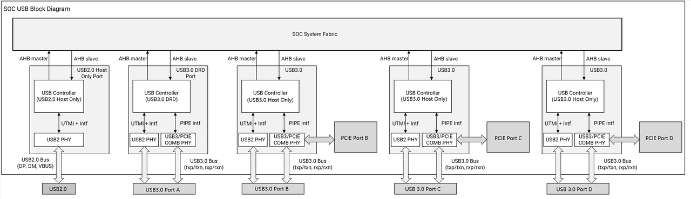

# 14.2 USB

## 14.2.1 Overview

The K3 SoC integrates multiple USB interfaces to support high-speed connectivity and flexible device configurations. The USB subsystem includes the following ports:  
- One USB 2.0 Host Port.
- One USB 3.0 DRD (Dual-Role Device) Port with an integrated USB 2.0 DRD interface (USB 3.0 Port A).  
- Three USB 3.0 Host Ports (USB 3.0 Port B/C/D) — their SuperSpeed PHYs are shared with PCIe and can operate in either USB or PCIe mode, but only one function can be selected at a time.

## 14.2.2 Features

### 14.2.2.1 USB 2.0 Host Port Key Features

- Supports High-Speed (480 Mbps), Full-Speed (12 Mbps), and Low-Speed (1.5 Mbps) operation.
- Dedicated UTMI+ PHY interface.
- Provides a VBUS_DRV pin for controlling external VBUS power supply.
- Supports operation as a system wake-up source.

### 14.2.2.2 USB 3.0 DRD Port (Port A) Key Features

- Supports SuperSpeed (5 Gb/s), High-Speed (480 Mb/s), Full-Speed (12 Mb/s), and Low-Speed (1.5 Mb/s, Host mode only).
- Supports Dual-Role Device (DRD) operation, enabling both Host and Device modes.
  - USB 2.0 Low-Speed is supported in Host mode only.
- Dedicated USB 2.0 UTMI+ PHY interface, configurable for USB 2.0-only mode.
- Dedicated dual USB 3.0 SuperSpeed PIPE3 PHY interfaces, with an integrated Type-C orientation switch, configurable via hardware GPIO or software.
- Provides:
  - A VBUS_DRV pin for controlling external VBUS power supply;
  - Sideband pins for interfacing with a Type-C CC logic device.
- In Device mode, supports connection and disconnection detection via the VBUS_ON pin.
- Supports operation as a system wake-up source.

### 14.2.2.3 USB 3.0 Host Ports (Port B / C / D) Key Features

- Supports SuperSpeed (5 Gb/s), High-Speed (480 Mb/s), Full-Speed (12 Mb/s), and Low-Speed (1.5 Mb/s) operation.
- Dedicated UTMI+ PHY interface, configurable for USB 2.0-only mode.
- Shares a USB 3.0 SuperSpeed / PCIe Combo PHY, selectable between USB 3.0 and PCIe interfaces.
- Provides a VBUS_DRV pin for controlling external VBUS power supply.
- Supports operation as a system wake-up source.

## 14.2.3 Block Diagram

## 14.2.4 Sideband IO for USB

- USB20_HOST_DRV: For External VBUS Switch Control of USB2.0 Host Only Controller, controlled by PMU_USB_SD_ROT_WAKE_CLR, or use GPIO mode.
- USB30_DRD_DIR: For DRD Port A Dual PHY Direction select Input, controlled by PMUA_USB_PHY_CTRL0 register.
- USB30_DRD_INT: For TypeC CC logic chip interrupt Input, controlled by PMUA_USB_PHY_CTRL0, or use GPIO interrupt mode.
- USB30_DRD_DRV: For External VBUS Switch Control of USB3.0 Port A Controller, controlled by PMU_USB3_WAKE_CLR_A, or use GPIO mode.
- USB30_DRD_ID: For MicroUSB ID Pin Input, the status could be read at PMUA_USB_PHY_READ register.
- USB30_DRD_VBUSON: For MicroUSB VBUS Pin Input, the status could be read at PMUA_USB_PHY_READ register.
- USB30_B_DRV/USB30H-1_DRV: For External VBUS Switch Control of USB3.0 Port B Controller, controlled by PMU_USB3_WAKE_CLR_B, or use GPIO mode.
- USB30_C_DRV/USB30H-2_DRV: For External VBUS Switch Control of USB3.0 Port C Controller, controlled by PMU_USB3_WAKE_CLR_C, or use GPIO mode.
- USB30_D_DRV: For External VBUS Switch Control of USB3.0 Port D Controller,  controlled by PMU_USB3_WAKE_CLR_D, or use GPIO mode.

## 14.2.5 Interrupt List

| Interrupt Number | Description |
|------------------|-------------|
| 105 | USB2.0 Host Only Controller |
| 155 | USB2.0 Host Only Controller Sideband |
| 118 | USB3.0 DRD Port A Controller |
| 156 | USB3.0 DRD PortA Controller Sideband |
| 125 | USB3.0 Host Only Port B Controller |
| 157 | USB3.0 Host Only Port B Controller Sideband |
| 148 | USB3.0 Host Only Port C Controller |
| 158 | USB3.0 Host Only Port C Controller Sideband |
| 149 | USB3.0 Host Only Port D Controller |
| 159 | USB3.0 Host Only Port D Controller Sideband |

## 14.2.6 Register Descriptions

### 14.2.6.1 Power Management Registers

#### PMU_USB_CLK_RES_CTRL

Base: 0xd4282800
Offset: 0x5C

| Bits | Field | Type | Reset | Description |
|------|-------|------|-------|-------------|
| 31:20 | RSVD | RO | 0 | Reserved for future use |
| 19 | USB3_PORTD_PHY_RESETN | RW | 0x0 | phy_resetn 1: de-assert |
| 18 | USB3_PORTD_VCC_RESETN | RW | 0x0 | usb3_0_vcc_resetn |
| 17 | USB3_PORTD_AHB_RSTN | RW | 0x0 | usb3_0_ahb_rstn |
| 16 | USB3_PORTD_BUS_CLK_EN | RW | 0x0 | usb3_0_bus_clk_en 1=enable |
| 15 | USB3_PORTC_PHY_RESETN | RW | 0x0 | phy_resetn 1: de-assert |
| 14 | USB3_PORTC_VCC_RESETN | RW | 0x0 | usb3_0_vcc_resetn |
| 13 | USB3_PORTC_AHB_RSTN | RW | 0x0 | usb3_0_ahb_rstn |
| 12 | USB3_PORTC_BUS_CLK_EN | RW | 0x0 | usb3_0_bus_clk_en |
| 11 | USB3_PORTB_PHY_RESETN | RW | 0x0 | phy_resetn 1: de-assert |
| 10 | USB3_PORTB_VCC_RESETN | RW | 0x0 | usb3_0_vcc_resetn |
| 9 | USB3_PORTB_AHB_RSTN | RW | 0x0 | usb3_0_ahb_rstn |
| 8 | USB3_PORTB_BUS_CLK_EN | RW | 0x0 | usb3_0_bus_clk_en |
| 7 | USB3_PORTA_PHY_RESETN | RW | 0x0 | phy_resetn 1: de-assert |
| 6 | USB3_PORTA_VCC_RESETN | RW | 0x0 | usb3_0_vcc_resetn |
| 5 | USB3_PORTA_AHB_RSTN | RW | 0x0 | usb3_0_ahb_rstn |
| 4 | USB3_PORTA_BUS_CLK_EN | RW | 0x0 | usb3_0_bus_clk_en |
| 3 | USB2_PORT_PHY_RESETN | RW | 0x0 | phy_resetn 1: de-assert |
| 2 | USB2_PORT_VCC_RESETN | RW | 0x0 | usb3_0_vcc_resetn |
| 1 | USB2_PORT_AHB_RSTN | RW | 0x0 | usb3_0_ahb_rstn |
| 0 | USB2_PORT_BUS_CLK_EN | RW | 0x0 | usb3_0_bus_clk_en |

#### PMU_USB_SD_ROT_WAKE_CLR

Base: 0xd4282800
Offset: 0x7C

Wakeup control register and Vbus Drv Register for USB2.0 Host Port.

| Bits | Field | Type | Reset | Description |
|------|-------|------|-------|-------------|
| 31 | USB_WK_INT_STATUS | RO | 0x0 | USB Wake up status |
| 30:29 | RSVD | RO | 0 | Reserved for future use |
| 28 | USB_CHGDET_WK_STATUS | RO | 0x0 | USB Line charge detect wake up status |
| 27 | USB_ID_WK_STATUS | RO | 0x0 | USB Line ID wake up status |
| 26 | USB_VBUS_WK_STATUS | RO | 0x0 | USB Line vbus valid wake up status |
| 25 | USB_LINE1_WK_STATUS | RO | 0x0 | USB Line state1 wake up status |
| 24 | USB_LINE0_WK_STATUS | RO | 0x0 | USB Line state0 wake up status |
| 23 | USB_IDDIG_OVRD_VALUE | RO | 0x0 | USB IDDIG OVERRIDE VALUE |
| 22 | USB_IDDIG_OVRD_EN | RO | 0x0 | USB IDDIG OVERRIDE ENABLE |
| 21 | USB_VBUS_DRV | RW | 0x0 | USB VBUS DRV |
| 20 | USB_CHGDET_WK_CLR | RW | 0x0 | USB Line charge detect wake up Clear 1 = Clear This bit is self-cleared by hardware |
| 19 | USB_ID_WK_CLR | RW | 0x0 | USB Line ID wake up Clear 1 = Clear This bit is self-cleared by hardware |
| 18 | USB_VBUS_WK_CLR | RW | 0x0 | USB Line vbus valid wake up Clear 1 = Clear This bit is self-cleared by hardware |
| 17 | USB_LINE1_WK_CLR | RW | 0x0 | USB Line state1 wake up Clear 1 = Clear This bit is self-cleared by hardware |
| 16 | USB_LINE0_WK_CLR | RW | 0x0 | USB Line state0 wake up Clear 1 = Clear This bit is self-cleared by hardware |
| 15 | USB_WK_INT_MASK | RW | 0x0 | USB Wakeup Interrupt Enable 1 = Enable |
| 14:13 | RSVD | RO | 0 | Reserved for future use |
| 12 | USB_CHGDET_WK_MASK | RW | 0x0 | USB Line charge detect wake up Enable 1 = Enable |
| 11 | USB_ID_WK_MASK | RW | 0x0 | USB Line ID wake up Enable 1 = Enable |
| 10 | USB_VBUS_WK_MASK | RW | 0x0 | USB Line vbus valid wake up Enable 1 = Enable |
| 9 | USB_LINE1_WK_MASK | RW | 0x0 | USB Line state1 wake up Enable 1 = Enable |
| 8 | USB_LINE0_WK_MASK | RW | 0x0 | USB Line state0 wake up Enable 1 = Enable |
| 7 | CS_WK_STATUS | RO | 0x0 | CS wake up status |
| 6 | SDH2_WK_CLR | RW | 0x1 | SDH2 Wake Clear 1 = SDH2 wake event clear This bit is self-cleared by hardware |
| 5 | CS_WK_CLR | RW | 0x0 | Clear of dap Power Wake Up Request (DAP CSYSPWRUPREQ) 1 = Clear DAP_REQ wakeup |
| 4 | CS_WK_MASK | RW | 0x0 | Dap Power Wake Up Enable (DAP CSYSPWRUPREQ) 1 = Enable |
| 3 | KB_WK_CLR | RW | 0x1 | Keypad Wake Clear 1 = ROT wake event clear This bit is self-cleared by hardware |
| 2 | ROT_WK_CLR | RW | 0x1 | Rotary Wake Clear 1 = ROT wake event clear This bit is self-cleared by hardware |
| 1 | SDH1_WK_CLR | RW | 0x1 | SDH1 Wake Clear 1 = SDH1 wake event clear This bit is self-cleared by hardware |
| 0 | SDH0_WK_CLR | RW | 0x1 | SDH0 Wake Clear 1 = SDH0 wake event clear This bit is self-cleared by hardware |

#### PMU_USB3_WAKE_CLR_A/B/C/D
Base: 0xd4282800
Offset:0x3C4/0x3C8/0x3CC/0x3D0

Wakeup control register and Vbus Drv Register for USB3.0 DRD PortA, USB3.0 Host Only Port B/C/D.

| Bits | Field | Type | Reset | Description |
|------|-------|------|-------|-------------|
| 31 | USB3_WK_INT_STATUS | RO | 0x0 | USB3 Wake up status |
| 30 | RSVD | RO | 0 | Reserved for future use |
| 29 | USB3_LFPS_WK_STATUS | RO | 0x0 | USB3 LFPS wake up status |
| 28 | USB3_CHGDET_WK_STATUS | RO | 0x0 | USB3 Line charge detect wake up status |
| 27 | USB3_ID_WK_STATUS | RO | 0x0 | USB3 Line ID wake up status |
| 26 | USB3_VBUS_WK_STATUS | RO | 0x0 | USB3 Line vbus valid wake up status |
| 25 | USB3_LINE1_WK_STATUS | RO | 0x0 | USB3 Line state1 wake up status |
| 24 | USB3_LINE0_WK_STATUS | RO | 0x0 | USB3 Line state0 wake up status |
| 23 | USB3_IDDIG_OVRD_VALUE | RO | 0x0 | USB3 IDDIG OVERRIDE VALUE |
| 22 | USB3_IDDIG_OVRD_EN | RO | 0x0 | USB3 IDDIG OVERRIDE ENABLE |
| 21 | USB3_VBUS_DRV | RW | 0x0 | USB3 VBUS DRV |
| 20 | USB3_CHGDET_WK_CLR | RW | 0x0 | USB3 Line charge detect wake up Clear 1 = Clear This bit is self-cleared by hardware |
| 19 | USB3_ID_WK_CLR | RW | 0x0 | USB3 Line ID wake up Clear 1 = Clear This bit is self-cleared by hardware |
| 18 | USB3_VBUS_WK_CLR | RW | 0x0 | USB3 Line vbus valid wake up Clear 1 = Clear This bit is self-cleared by hardware |
| 17 | USB3_LINE1_WK_CLR | RW | 0x0 | USB3 Line state1 wake up Clear 1 = Clear This bit is self-cleared by hardware |
| 16 | USB3_LINE0_WK_CLR | RW | 0x0 | USB3 Line state0 wake up Clear 1 = Clear This bit is self-cleared by hardware |
| 15 | USB3_WK_INT_MASK | RW | 0x0 | USB3 Wakeup Interrupt Enable 1 = Enable |
| 14 | USB3_LFPS_WK_CLR | RW | 0x0 | USB3 LFPS wake up Clear 1 = Clear This bit is self-cleared by hardware |
| 13 | USB3_LFPS_WK_MASK | RW | 0x0 | USB3 LFPS wake up Enable 1 = Enable |
| 12 | USB3_CHGDET_WK_MASK | RW | 0x0 | USB3 Line charge detect wake up Enable 1 = Enable |
| 11 | USB3_ID_WK_MASK | RW | 0x0 | USB3 Line ID wake up Enable 1 = Enable |
| 10 | USB3_VBUS_WK_MASK | RW | 0x0 | USB3 Line vbus valid wake up Enable 1 = Enable |
| 9 | USB3_LINE1_WK_MASK | RW | 0x0 | USB3 Line state1 wake up Enable 1 = Enable |
| 8 | USB3_LINE0_WK_MASK | RW | 0x0 | USB3 Line state0 wake up Enable 1 = Enable |
| 7:0 | RSVD | RO | 0x0 | RSVD |

#### PMUA_USB_PHY_READ
Base: 0xd4282800
Offset: 0x118

| Bits | Field | Type | Reset | Description |
|------|-------|------|-------|-------------|
| 31:30 | RSVD | RO | 0x0 | RSVD |
| 29 | USB3_PORT_RSVD | RO | 0x0 | RSVD |
| 28 | USB3_PORT_RX_ELEC_DLE | RO | 0x0 | USB3_PORT RxELEC_DLE output |
| 27:26 | USB3_PORT_PHY_LINE_STATE | RO | 0x0 | USB3_PORT PHY line_state [1:0] output |
| 25 | USB3_PORT_PHY_VBUS_VALID | RO | 0x0 | USB3_PORT PHY VbusValid output. Tie to 0 |
| 24 | USB3_PORT_PHY_ID_DIG | RO | 0x0 | USB3_PORT PHY ID DIG output. Tie to 1 |
| 23 | USB3_PORT_RSVD | RO | 0x0 | RSVD |
| 22 | USB3_PORT_RX_ELEC_DLE | RO | 0x0 | USB3_PORT RxELEC_DLE output |
| 21:20 | USB3_PORT_PHY_LINE_STATE | RO | 0x0 | USB3_PORT PHY line_state [1:0] output |
| 19 | USB3_PORT_PHY_VBUS_VALID | RO | 0x0 | USB3_PORT PHY VbusValid output. Tie to 0 |
| 18 | USB3_PORT_PHY_ID_DIG | RO | 0x0 | USB3_PORT PHY ID DIG output. Tie to 1 |
| 17 | USB3_PORT_RSVD | RO | 0x0 | RSVD |
| 16 | USB3_PORT_RX_ELEC_DLE | RO | 0x0 | USB3_PORT RxELEC_DLE output |
| 15:14 | USB3_PORT_PHY_LINE_STATE | RO | 0x0 | USB3_PORT PHY line_state [1:0] output |
| 13 | USB3_PORT_PHY_VBUS_VALID | RO | 0x0 | USB3_PORT PHY VbusValid output. Tie to 0 |
| 12 | USB3_PORT_PHY_ID_DIG | RO | 0x0 | USB3_PORT PHY ID DIG output. Tie to 1 |
| 11 | USB3_PORTA_TYPECNT | RO | 0x0 | USB3_PORTA TYPECNT input from GPIO |
| 10 | USB3_PORTA_RX_ELEC_DLE | RO | 0x0 | USB3_PORTA RxELEC_DLE output |
| 9:8 | USB3_PORTA_PHY_LINE_STATE | RO | 0x0 | USB3_PORTA PHY line_state [1:0] output |
| 7 | USB3_PORTA_PHY_VBUS_VALID | RO | 0x0 | USB3_PORTA PHY VbusValid output |
| 6 | USB3_PORTA_PHY_ID_DIG | RO | 0x0 | USB3_PORTA PHY ID DIG output |
| 5:4 | USB3_PORT_RSVD | RO | 0x0 | RSVD |
| 3:2 | USB2_PORT_PHY_LINE_STATE | RO | 0x0 | USB2_PORT PHY line_state[1:0] output |
| 1 | USB2_PORT_PHY_VBUS_VALID | RO | 0x0 | USB2_PORT PHY VbusValid output. Tie to 0 |
| 0 | USB2_PORT_PHY_ID_DIG | RO | 0x0 | USB2_PORT PHY ID DIG output. Tie to 1 |

#### PMUA_USB_PHY_CTRL0
Base: 0xd4282800
Offset: 0x110

| Bits | Field | Type | Reset | Description |
|------|-------|------|-------|-------------|
| 31:20 | RSVD | RO | 0x0 | Reserved for future use |
| 19 | USB_TYPEC_WAKEUP_INT | RO | 0x0 | usb_typec_wakeup_int |
| 18 | USB_TYPEC_INT_DEB | RO | 0x0 | usb_typec_int_deb |
| 17 | USB_TYPEC_DIR_STATUS | RO | 0x0 | usb_typec_dir_status |
| 16 | USB_TYPEC_DIR_DEB | RO | 0x0 | usb_typec_dir_deb |
| 15:12 | RSVD | RO | 0x0 | Reserved for future use |
| 11 | USB_TYPEC_INT_WAKEUP_INT_MASK | RW | 0x0 | usb_typec_int_wakeup_int_mask |
| 10 | USB_TYPEC_INT_CLR | RW | 0x0 | usb_typec_int_clr |
| 9 | USB_TYPEC_INT_WAKEUP_MASK | RW | 0x0 | usb_typec_int_wakeup_mask |
| 8 | USB_TYPEC_INT_RISE_MASK | RW | 0x0 | usb_typec_int_rise_mask |
| 7 | USB_TYPEC_INT_FALL_MASK | RW | 0x0 | usb_typec_int_fall_mask |
| 6:5 | USB_TYPEC_INT_DEB_CFG | RW | 0x0 | usb_typec_int_deb_cfg |
| 4 | USB_TYPEC_DIR_OVRD_VAL | RW | 0x0 | usb_typec_dir_ovrd_val. This is valid to choose from phy8/phy9 only when usb_typec_dir_ovrd_en is 1b. |
| 3 | USB_TYPEC_DIR_OVRD_EN | RW | 0x0 | usb_typec_dir_ovrd_en. 1b: will choose phy8/phy9 according to usb_typec_dir_ovrd_val. 0b: will choose phy8/phy9 according to USB30_DRD_DIR Pin Input. |
| 2 | USB_TYPEC_DIR_FLIP | RW | 0x0 | usb_typec_dir_flip. 1b: will flip selection result of phy8/phy9 based on USB30_DRD_DIR input. |
| 1:0 | USB_TYPEC_DIR_DEB_CFG | RW | 0x0 | usb_typec_dir_deb_cfg |

#### PCIE_SUBSYS_MGMT
Base: 0xd4282800
Offset: 0x1D8

To select USB mode for Combo PHY, BIT 4 of PCIE_SUBSYS_MGMT must set to 1b.

| Bits | Field | Type | Reset | Description |
|------|-------|------|-------|-------------|
| 31:24 | RSVD | RO | 0x0 | Reserved for future use |
| 23:16 | PCIE_USB_MEM_LPW_DSLP_MASK | RW | 0xff | PCIe USB Subsystem Memory Low Power program: pcie_usb_mem_lpw [7:0] is top DSLP's mask signal of memory in each controller (PCIe A to E and USB B to D). When it is cleared to 0, the DSLP signal of this controller memory is not controlled by the app_top. |
| 15:11 | RSVD | RO | 0x0 | Reserved for future use |
| 10 | PCIE_USB_MEM_LPW_SD | RW | 0x0 | PCIe USB Subsystem Memory Low Power program: pcie_usb_mem_lpw [8] is shut down of memory |
| 9:8 | PCIE_EMAC_PTP_SRC_SEL | RW | 0x0 | PCIe EMAC PTP Source Selection 00: Disable. 01: EMAC0. 10: EMAC1. 11: EMAC2. |
| 7:5 | PCIE_IOMMU_BYPASS | RW | 0x7 | PCIe Controller A, B and C IOMMU bypass. [5]: PortA. [6]: PortB. [7]: PortC. |
| 4:0 | PCIE_USB_COMBO_MODE | RW | 0x0 | PHY Matrix Configuration [4] PCIe Controller A X8: 1: Non X8, 0: PCIe A X8 [3] PCIe Controller B X2: 1: PCIe B X2, 0: PCIe A X4 [2] PCIe Controller C X1: 1: USB, 0: PCIe [1] PCIe Controller C X1: 1: USB, 0: PCIe [0] PCIe Controller D X1: 1: USB, 0: PCIe |

### 14.2.6.2 USB2 PHY Registers

| Base Address | Description |
|--------------|-------------|
| 0xC0A20000 | USB2.0 Host UTMI registers |
| 0xCAD20000 | USB3 Port A UTMI registers |
| 0x81500000 | USB3 Port B UTMI registers |
| 0x81800000 | USB3 Port C UTMI registers |
| 0x81B00000 | USB3 Port D UTMI registers |

#### USB2PHYREGISTER08
Base: PHY Base 
Offset:0x20

| Bits | Field | Type | Reset | Description |
|------|-------|------|-------|-------------|
| 31:9 | RSVD | RO | 0x0 | Reserved for future use |
| 8 | CFG_HSDIS_CLR_IMT | RW | 0x0 | SW must set this bit to 1 to clear host disconnect status for next connect |
| 7:0 | RSVD | RO | 0x0 | Reserved for future use |

#### USB2PHYREGISTER05
Base: PHY Base 
Offset:0x14
This register is functional on USB3.0 PortA Only.
| Bits | Field | Type | Reset | Description |
|------|-------|------|-------|-------------|
| 31:10 | RSVD | RO | 0x0 | Reserved for future use |
| 9 | CFG_UTMIOTG_VBUSVALID | RW | 0x0 | cfg_utmiotg_vbusvalid; default 0. set to 1 to enable vbus generate disconnect event |
| 8 | CFG_UTMISRP_BVALID | RW | 0x1 | cfg_utmisrp_bvalid; default 1, always bvalid, no disconnect. set to 0 to enable vbus generate disconnect event |
| 7 | CFG_UTMIOTG_AVALID | RW | 0x0 | cfg_utmiotg_avalid; default 0. set to 1 = force a valid |
| 6:0 | RSVD | RO | 0x0 | Reserved for future use |

### 14.2.6.3 USB3 PHY and Combo PHY

| Port | PHY Base Address | Description |
|------|------------------|-------------|
| USB3 Port A | 0xCAD30000, 0xCAD40000 | Dual PHY for Type-C orientation (phy8, phy9 of K3). Only one can be enabled at a time. |
| USB3 Port B | 0x81F00000 | PCIe/USB3 PortB combo PHY (phy2 of K3) |
| USB3 Port C | 0x82000000 | PCIe/USB3 PortC combo PHY (phy3 of K3) |
| USB3 Port D | 0x82100000 | PCIe/USB3 PortD combo PHY (phy4 of K3) |

#### PHY Calibration

##### APB_SPARE31_REG
Base: 0xD4090000
Offset: 0x178
This register is to control the USB3/PCIe PHY calibration.

| Bits | Field | Type | Reset | Description |
|------|-------|------|-------|-------------|
| 31:18 | RSVD | RO | 0x0 | Reserved for future use |
| 17 | PU_CAL | RW | 0x0 | pu_cal. Set PU_CAL bit to enable PHY calibration, when it's done, the PU_CAL_DONE of APB_SPARE32_REG would be set. |
| 16 | EN_ATEST_RCAL | RW | 0x0 | en_atest_rcal |
| 15:0 | R_REG | RW | 0x1087 | r_reg |

##### APB_SPARE32_REG
Base: 0xD4090000
Offset: 0x17c
This register is to control the USB3/PCIe PHY calibration.

| Bits | Field | Type | Reset | Description |
|------|-------|------|-------|-------------|
| 31:9 | RSVD | RO | 0x0 | Reserved for future use |
| 8 | PU_CAL_DONE | RO | 0x0 | hsio_rcal_done_stable |
| 7:0 | RSVD | RO | 0x0 | Reserved for future use |

#### PCIE_PHY_VERSION
Base: PHY Base
Offset: 0x0

| Bits | Field | Type | Reset | Description |
|------|-------|------|-------|-------------|
| 31:0 | PCIE_PHY_VERSION_ID | RO | 0x302 | pcie_phy version ID |

#### PCIE_PHY_CLK_CFG
Base PHY Base
Offset: 0x8
SW can enable CFG_PU_SSC_OUT to enable SSC.

| Bits | Field | Type | Reset | Description |
|------|-------|------|-------|-------------|
| 31:25 | RSVD | RO | 0x0 | Reserved for future use |
| 24 | PU_SSC_IN | RO | 0x0 | indicates if current lane's ssc feature is enabled |
| 23 | CFG_PU_SSC_OUT | RW | 0x0 | SW can enable this bit to enable PMA SSC |
| 22 | OVRD_PIPE_RX_STANDBYSTATUS | RW | 0x0 | if ovrd_pipe_rx_standbystatus is set to 1, the pipe rx_standbystatus is driven by cfg_pipe_rx_standbystatus |
| 21 | CFG_PIPE_RX_STANDBYSTATUS | RW | 0x0 | if ovrd_pipe_rx_standbystatus is set to 1, the pipe rx_standbystatus is driven by this field |
| 20 | IGNORE_RXSTATUS_ERR | RW | 0x0 | if this bit is set to 1, phy will not notify controller of errors such as decode error |
| 19 | OVRD_LOOPBACK_EN | RW | 0x0 | if ovrd_loopback_en is set to 1, the loopback_en is driven by cfg_loopback_en |
| 18 | CFG_LOOPBACK_EN | RW | 0x0 | if ovrd_loopback_en is set to 1, the loopback_en is driven by this field |
| 17 | OVRD_RXELECIDLE | RW | 0x0 | if this bit is set to 1, the pipe_rxelecidle is driven by value of cfg_rxelecidle |
| 16 | CFG_RXELECIDLE | RW | 0x0 | refer to ovrd_rxelecidle |
| 15:14 | RSVD | RO | 0x0 | Reserved for future use |
| 13:12 | CFG_PLL_SEL_MODE | RW | 0x0 |  |
| 11 | CFG_SW_PHY_INIT_DONE | RW | 0x0 | SW shall set this bit to 1 after all pll-related configuration is done. PHY PLL will not work until this bit is set to 1 |
| 10:7 | CFG_REFCLK_FREQ | RW | 0x2 | Indicate the reference clock frequency 4'h0 : 26 MHz 4'h1 : 19.2 MHz 4'h2 : 24 MHz 4'h3 : 25 MHz 4'h4 : 27 MHz 4'h5 : 30 MHz 4'h6 : 38.4 MHz 4'h7 : 100 MHz |
| 6 | CFG_PIPE_PCLK_EN | RW | 0x1 | pipe_pclk clock gating enable |
| 5 | CFG_PCLK_EN | RW | 0x1 | pclk clock gating enable |
| 4 | CFG_TXCLK_EN | RW | 0x1 | txclk clock gating enable |
| 3 | CFG_RXCLK_EN | RW | 0x1 | rxclk clock gating enable |
| 2 | CFG_TXCLK_INV | RW | 0x0 | txclk inverter enable |
| 1 | CFG_RXCLK_INV | RW | 0x0 | rxclk inverter enable |
| 0 | PLL_READY | RO | 0x0 | Indicate the pll is locked |

### 14.2.6.4 USB Controller Registers

All USB Host Controller registers and data structures are compliant with the Intel xHCI specification, please refer to the specification documents.
The USB3.0 Device controller (DRD Port A only) registers and data structures are self-defined requiring software configuration.