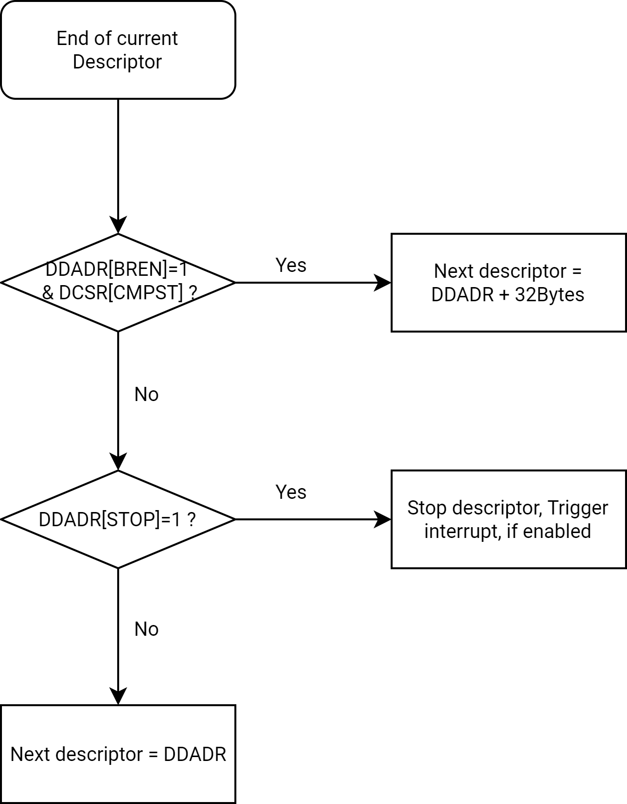

# 16.1 DMA

## 16.1.1 Overview

The Direct Memory Access (DMA) controller is designed to transfer data between memory and peripheral devices without CPU intervention, thereby enhancing system performance and reducing processor overhead.  
Peripheral devices do not directly issue addresses or commands to the memory controller. Instead, each DMA request from a peripheral device triggers a corresponding memory-bus transaction.  
The processor can also access the peripheral bus through the DMA controller, which serves as a DMA bridge and enables data transfers that bypass the system's primary DMA path when necessary.  
The DMA controller supports various data transfer types in DMA Flow-Through Mode through 16 configurable DMA channels. The supported data transfer paths are summarized below:

| Source / Destination | Internal Memory | External Memory | Internal Peripheral | External Peripheral |
| --- | --- | --- | --- | --- |
| Internal Memory | Flow-Through Mode | ___ | ___ | ___ |
| External Memory | Flow-Through Mode | Flow-Through Mode | ___ | ___ |
| Internal Peripheral | Flow-Through Mode | Flow-Through Mode | ___ | ___ |
| External Peripheral | Flow-Through Mode | Flow-Through Mode | ___ | ___ |

## 16.1.2 Features

- Two independent DMA controller instances, supporting:  
  - One for secure domains  
  - One for non-secure domains  
- Supports the following data transfer types in DMA Flow-Through Mode:  
  - Memory-to-Memory  
  - Peripheral-to-Memory  
  - Memory-to-Peripheral  
- Supports direct data transfers between Flash and DDR memory in Flow-Through Mode  
- Provides a priority mechanism that enables simultaneous processing of up to 4 channels with outstanding DMA requests  
- Each of the 16 DMA channels can operate in either descriptor-fetch mode or non-descriptor-fetch mode  
- Supports the following special descriptor modes:  
  - Descriptor Comparison  
  - Descriptor Branching  
- Supports retrieval of trailing bytes from peripheral receive buffers  
- Supports configurable burst sizes of 8, 16, 32, or 64 bytes  
- Supports programmable peripheral data widths of byte, half-word, or word  
- Supports up to 8191 bytes per descriptor (larger transfers are achieved by chaining multiple descriptors)  
- Supports the Flow Control Bit to synchronize DMA requests with peripheral readiness (transfers occur only when the flow control bit is set)  
- Provides a 64-bit address bus that supports direct access to physical memory space above 4 GB  

## 16.1.3 Block Diagram

The architecture of the DMA controller is shown below.

## 16.1.4 Functional Description

### 16.1.4.1 DMA Channel

Each one of the 16 DMA channels can be controlled by eight 32-bit registers which are categorized as follows:

- DMA Descriptor Address Registers
- DMA Source Address Registers
- DMA Target Address Registers
- DMA Command Registers

Each channel can be configured for different types of transfers, and processes data in increments of the device’s burst size and delivers it according to the device port width, both of which are set in the channel registers based on FIFO depth and bandwidth requirements.

When multiple channels are active, the DMA Controller services them in bursts. After each burst, DMA Controller switches context to another active channel. The switching is determined by whether the channel is active, if its target device is requesting service, and by its priority level.

#### DMA Channel-Priority Scheme

The DMA channel-priority scheme ensures peripherals are serviced based on their bandwidth requirements. Higher-priority channels handle high-bandwidth peripherals more frequently, while lower-priority channels manage lower-bandwidth peripherals.

DMA channels are divided into **4 sets**, each containing **4 channels**, as follows:

- **Set 0** → Highest priority (for peripherals with strict latency needs)
- **Set 1** → Higher priority (for memory-to-memory transfer and peripherals with latency needs)
- **Set 2** → Lower priority (for memory-to-memory transfers and low-bandwidth peripherals)
- **Set 3** → Lowest priority (for memory-to-memory transfers and low-bandwidth peripherals)

Details about channel priority are shown below.

| Set | Channels | Priority | Number of Times Served |
| --- | --- | --- | --- |
| 0 | 0, 1, 2, 3 | Highest | 4 / 8 |
| 1 | 4, 5, 6, 7 | Higher than 2 and 3. Lower than 0. | 2 / 8 |
| 2 | 8, 9, 10, 11 | Higher than 3. Lower than 0 and 1. | 1 / 8 |
| 3 | 12, 13, 14, 15 | Lowest | 1 / 8 |

Channels within each set follow a **round-robin priority**. When all channels are active:

- **Set 0** is serviced **four** times in every **eight servicing cycles**
- **Set 1** is serviced **twice**
- **Sets 2 and 3** are each serviced **once**

**[Example]** If all channels request data transfers, the servicing pattern is as follows:

**Set 0 → Set 1 → Set 0 → Set 2 → Set 0 → Set 1 → Set 0 → Set 3**, then repeats.

#### Channel States

The following states apply to the DMA channels:

- **Uninitialized**
  Occurs after a reset. The \<STOPINTR\> field in the DMA Channel Control/Status Registers is set.
- **Not Running**
  The channel is configured but not yet active because the \<RUN\> field in the DMA Channel Control/Status Registers is not set, then two transfers are possible as follows:

  - **Descriptor-fetch transfer**
    A valid descriptor is loaded into the DMA Descriptor Address Registers. The \<STOPINTR\> field is cleared when the DMA Controller updates the DMA Descriptor Address Registers.
  
  - **No-Descriptor-fetch transfer**
    The DMA Source Address Registers, DMA Target Address Registers and DMA Command Registers are programmed, but \<STOPINTR\> remains set until the channel starts running.
  
- **Running**, then two transfers are possible as follows:

  - **Descriptor-fetch transfer**
    After programming DDADR_H/DDADR_L and setting \<RUN\>, the DMA fetches eight words of descriptors from memory, keeping \<STOPINTR\> clear.
  
  - **No-Descriptor-fetch transfer**
    After programming the DMA Source Address Registers, DMA Target Address Registers, and DMA Command Registers (if accessing memory beyond the 4 GB limit, then configure the high-level address registers in the same sequence as the first four address registers) and setting \<RUN\>, the channel clears \<STOPINTR\>, skips the Descriptor-fetch Running state, and enters either the "Wait for Request" or "Transfer Data" state.

- **Wait for a request**
  Occurs as the channel waits for a request before starting data transfer. \<STOPINTR\> is clear.

- **Transfer data**
  Data is transferred between the source and the target. \<STOPINTR\> is clear.

- **Channel error**
  The channel with the error remains in the stopped state until software clears the error condition, re-initializes the channel and sets the \<RUN\> field and the \<BUSERRINTR\> field in the DMA Channel Control/Status Registers.

- **Stopped**
  The channel is stopped. The \<STOPINTR\> field is set. Then two transfers are possible as follows:

  - **No-Descriptor-fetch transfer**
    A stopped channel is re-initialized by updating the DMA Source Address Registers, DMA Target Address Registers, DMA Command Registers (including the next four registers (i.e. high-address registers) if required), then setting the \<RUN\> field.
  - **Descriptor-fetch transfer**
    A stopped channel is re-initialized by updating the DMA Descriptor Address Registers and setting \<RUN\>.

The summary of the DMA channel states is shown below.

| Descriptor Mode | Software Configuration | &lt;Run&gt; | &lt;Stop interrupt&gt; | Resulting Channel State |
| --- | --- | --- | --- | --- |
| Descriptor-Fetch mode | Power-up | 0 | 1 | Uninitialized |
| Descriptor-Fetch mode | Write to DDADR before DCSR[RUN] is set **(recommended)** | 0 | 0 | Valid Descriptor, not running |
| Descriptor-Fetch mode | Set DCSR[RUN] after writing to DDADR **(recommended)** | 1 | 0 | Running |
| Descriptor-Fetch mode | Set DCSR[RUN] before writing to DDADR **(not recommended)** | 1 | 1 | Invalid |
| Descriptor-Fetch mode | Write to DDADR after DCSR[RUN] is set **(not recommended)** | 1 | 0 | Descriptor fetch, running. |
| Descriptor-Fetch mode | Stop running channel by clearing DCSR[RUN] and DCSR[MASKRUN] | 0 | 0 -&gt; 1 | Channel, if not immediately, eventually switches to a stopped state (identified by DCSR[STOPINTR] toggling from low to high). |
| No-Descriptor-Fetch mode | Power-on | 0 | 1 | Uninitialized |
| No-Descriptor-Fetch mode | Write to DSADR, DTADR and DCMD before DCSR[RUN] is set **(recommended)** | 0 | 1 | Valid Descriptor, not running |
| No-Descriptor-Fetch mode | Set DCSR[RUN] after configuring DSADR, DTADR, and DCMD **(recommended)** | 1 | 0 | Running |
| No-Descriptor-Fetch mode | Set DCSR[RUN] before configuring DSADR, DTADR, and DCMD **(not recommended)** | 1 | 0 | Wait for Request, running. Channel uses current DSADR, DTADR and DCMD for the transfer, potentially leading to unpredictable results. |
| No-Descriptor-Fetch mode | Stop running channel by clearing DCSR[RUN] and DCSR[MASKRUN] | 0 | 0 -&gt; 1 | Channel, if not immediately, eventually switches to a stopped state (identified by DCSR[STOPINTR] toggling from low to high). |

### 16.1.4.2 DMA Descriptors

A DMA Descriptor is an 8-word block (32-bits per word) aligned to a 32-byte boundary in memory. Details are shown below.

| Word Index | Description |
| --- | --- |
| Word [0] | DMA Descriptor Address Register + Flag Bit |
| Word [1] | DMA Source Address Register |
| Word [2] | DMA Target Address Register |
| Word [3] | DMA Command Register |
| Word [4] | High 32-bit Descriptor Address Register |
| Word [5] | High 32-bit Source Address Register |
| Word [6] | High 32-bit Target Address Register |
| Word [7] | Reserved |

The DMAC can operate in two distinct modes based on the `DCSR[NODESCFETCH]` bit:

- `DCSR[NODESCFETCH] = 0` - Descriptor-fetch transfer
- `DCSR[NODESCFETCH] = 1` - No-Descriptor-fetch transfer

The `DCSR[LPAE_EN]` bit controls Long Physical Address Extension (LPAE):

- `DCSR[LPAE_EN] = 0` - 4-word descriptor
- `DCSR[LPAE_EN] = 1` - 8-word descriptor

#### Descriptor-Fetch Transfer Operation

The descriptor-fetch transfer (\<NODESCFETCH\> field in the DMA Channel Control/Status Registers = 0) operates in the following manner:

- **Setting up the descriptor fetch**

  - First, the software must clear the \<RUN\> field and then clear the \<NODESCFETCH\> field
  - Next, the software writes a valid Descriptor address to the DMA Descriptor Address Register
  - Finally, the software sets \<RUN\>, allowing the DMAC to fetch the Descriptor (four-word or eight-word) from memory, as indicated by the DMA Descriptor Address Register.

- **Starting the data transfer**

  - The channel either waits for a request or starts the transfer, depending on DCMD[FLOWSRC] or DCMD[FLOWTRG].
  - The channel transfers data until reaching the smaller of \<DMA_SIZE\> or \<LEN\> (from the DMA Command Registers).
  - After reaching this limit, the channel will
    - Either wait for the next request
    - Or continue transferring until \<LEN\> reaches zero.

- **Fetching the next descriptor or stopping**

  - Once the transfer completes, the channel will
    - Either fetch a new descriptor from memory
    - Or stop, based on the \<STOP\> field in the DMA Descriptor Address Registers

- **Handling Errors**

  - If an error occurs during descriptor fetching, the channel enters the "Stopped" state
  - To resume, software must:
    - Clear the error condition
    - Re-initialize the channel
    - Set the \<RUN\> field again

- **Switching Modes**

  - If switching between Descriptor-Fetch Mode and No-Descriptor-Fetch Mode, the channel must be stopped first before changing the mode.
  - A Descriptor-fetch transfer will only occur if the **DMA Descriptor Address Register** is loaded and the \<RUN\> field is set.

- **Loading DMA Descriptors**

  - Although the DMA Descriptor Address Register is loaded by software, other registers (DMA Source Address, Target Address and Command Registers) are loaded indirectly from the DMA Descriptors
  - When the \<RUN\> field is set, the DMA Descriptors are transferred into the corresponding DMA channel registers

- **Special Stop Condition**

  - Bit [0] (\<STOP\>) of word [0] in a DMA Descriptor marks the final Descriptor in the list
  - When a Descriptor with the stop bit is loaded into a Channel register, the channel will stop after completing the transfer, but the stop bit itself does not affect how Descriptor fields are loaded

The summary of the operations is depicted below.

#### Descriptor Branching

The Descriptor Branching operates in the following manner:

- **Determining the Next Descriptor Address**

  - If both \<BREN\> (in the DMA Descriptor Address Registers) and \<CMPEN\> (in the DMA Channel Control/Status Registers) are set, the DMAC fetches the next descriptor from Current Descriptor Address + 32 bytes.
  - If these bits are cleared, the DMAC fetches the next Descriptor from the same address in the DMA Descriptor Address Register

- **Applicability of \<BREN\>**

  - The \<BREN\> field is only relevant for Descriptor-fetch transfers when the \<NODESCFETCH\> field (in the DMA Channel Control/Status Registers) is cleared.

The summary of the operations is depicted below.

#### No-Descriptor-Fetch Transfer Operation

The typical no-Descriptor-fetch transfer (\<NODESCFETCH\> = 1) operates in the following manner:

- **Initialization**

  - After a reset, the channel is in an uninitialized state
  - The software must:
    - Clear the \<RUN\> field
    - Set the \<NODESCFETCH\> field
    - Write a valid source physical address to the DMA Source Address Registers
    - Write a target physical address to the DMA Target Address Registers
    - Write a command to the DMA Command Registers
  - Finally, software must set the \<RUN\> field to start the operation

  > **Note.** The DMA Descriptor Address Registers are reserved in this mode and must not be written.
  >
- **Data Transfer**

  - No Descriptor fetch occurs
  - Based on the \<FLOWSRC\> and \<FLOWTAG\> fields in the DMA Command Registers, the channel will
    - Either wait for a request
    - Or start the data transfer immediately
  - The channel transfers data until it reaches the smaller value between \<DMA_SIZE\> and \<LEN\>
  - After this, the channel will
    - Either wait for the next request
    - Or continue the data transfer (depending on the priority of enabled DMA channels).
  - The channel stops automatically when \<LEN\> reaches zero.

- **Handling Stop Interrupts (\<STOPIRQEN\>)**

  - Setting the \<STOPIRQEN\> field in the DMA Channel Control/Status Registers may cause the DMAC to trigger a stop interrupt prematurely, potentially even before the channel enters active-run mode
  - Refer to the \<STOPIRQEN\> and \<STOPINTR\> fields in the DMA Channel Control/Status Registers for details on the RUN condition.

- **End-of-Receive (\<EOR\>) Detection**

  - To detect if a channel stops due to an End-of-Receive (EOR) from a peripheral, software must check the \<EORINT\> field in the DMA Channel Control/Status Registers
  - The EOR signal, sent from the peripheral when transferring the last byte, informs the DMA to stop once the trailing byte is completely transferred
  - If an EOR condition stops the channel, \<EORINT\> is set

  > **Note.** Refer to DMA Channel Control/Status Registers for more details.
  >
- **Normal Stop Detection**

  - To detect a normal stop, use the end interrupt (\<ENDINTR\>) instead of the stop interrupt (\<STOPINTR\>).

  > **Note.** Refer to DMA Channel Control/Status Registers for more details.
  >
- **Handling Errors**

  - If an **error occurs**, the channel enters the **Stopped state** and remains there **until** software:
    - **Clears** the error condition
    - **Sets** the \<RUN\> field again

The summary of the operations is depicted below.

### 16.1.4.3 Transferring Data

The on-chip peripherals connected to the DMA via the peripheral bus operate as flowthrough transfers. Although the source or destination of a DMA transfer is usually a peripheral intended to be used as a source or sink of DMA data, the DMAC can transfer data to or from any memory location through memory-to-memory moves.

#### Servicing Internal Peripherals

The DMAC provides DMA requests to the DMA Request-to-Channel Map Registers (0-63 and 64-99), each containing a 5-bit channel number for every possible DMA request.

These possible peripheral requests are mapped to 16 available channels.

- If the on-chip peripheral address is located in the DMA Source Address Registers, the \<FLOWSRC\> field must be set to allow the processor to wait for the request before it initiates the transfer.
- If the on-chip peripheral address is located in the DMA Target Address Registers, the \<FLOWTAG\> field must be set.

Additionally, if the \<ENDIRQEN\> field is set, a DMA interrupt will be requested at the end of the last cycle, corresponding to the byte that caused the \<LEN\> field to decrease to zero.

#### Servicing Internal Peripherals Using Flowthrough DMA Read Cycles

A flowthrough DMA Read begins when an on-chip peripheral sends a request to a channel in the DMAC while the channel is running. The number of bytes to be transferred is specified using the \<LEN\>. The following process begins when the request is recognized:

- The DMAC instructs the Memory Controller to read the required number of bytes addressed by DMA Source Address Registers into a 32-byte buffer in the DMAC.
- The DMAC transfers the data to the peripheral device addressed in the DMA Target Address Registers. The \<WIDTH\> field in the DMA Command Registers specifies the width of the internal peripheral to which the transfer is being made.
- At the end of the transfer, DMA Source Address Registers is incremented, and the \<LEN\> field is decreased by the smaller of \<LEN\> and \<DMA_SIZE\>.

Use the following settings for the DMAC register bits for a flowthrough DMA Read from an internal peripheral:

- \<SRCADDR_H\> field and \<SRCADDR_L\> in the DMA Source Address High/Low Registers = memory address
- \<TRGADDR_H\> field and \<TRGADDR_L\> in the DMA Target Address High/Low Registers = internal peripheral address
- \<INCSRCADDR\> field in the DMA Command Registers = 1
- \<INCTAGADDR\> field in the DMA Command Registers = 0
- \<FLOWSRC\> field in the DMA Command Registers = 0
- \<FLOWTAG\> field in the DMA Command Registers = 1

#### Servicing Internal Peripherals Using Flowthrough DMA Write Cycles

A flowthrough-DMA Write begins when an on-chip peripheral sends a request to a channel in the DMAC while the channel is running. The number of bytes to be transferred is specified using the \<DMA_SIZE\> field.

When the request is recognized, the following process begins:

- The DMAC processes the request by transferring the required number of bytes from the peripheral device addressed by DMA Source Address Registers into a DMAC buffer
- The DMAC transfers the data to the Memory Controller. The \<WIDTH\> field specifies the width of the internal peripheral from which the transfer is being made
- At the end of the transfer, DTADRx is increased and \<Length of the transfer in bytes\> is decreased by the smaller of \<Length of the transfer in bytes\> and \<Maximum burst size\>

Use the following settings for the DMAC register bits for a flowthrough-DMA Write from an internal peripheral:

- \<SRCADDR_H\> field and \<SRCADDR_L\> = internal peripheral address
- \<TRGADDR_H\> field and \<TRGADDR_L\> = memory address
- \<INCSRCADDR\> = 0
- \<INCSRCADDR\> = 1
- \<FLOWSRC\> = 1
- \<FLOWTAG\> = 0

Memory-to-memory moves do not involve request signals. For a memory-to-memory move, the processor writes to the \<RUN\> field indicated by the channel that is configured to perform a memory-to-memory move. The \<FLOWSRC\> and \<FLOWTAG\> fields must be cleared by software once the Descriptor is fetched. The transfer then begins.

If \<ENDIRQEN\> is set, a DMA interrupt is requested at the end of the last cycle, corresponding to the byte that causes the \<LEN\> field to decrease to zero.

#### Memory-to-Memory Moves: Flowthrough DMA Read/Write Cycles

A flowthrough DMA memory-to-memory Read or Write begins when the processor sets the `DCSR[RUN]` bit. If the channel is in a Descriptor-fetch transfer, it fetches the four-word Descriptor. The \<FLOWSRC\> and \<FLOWTAG\> fields must be cleared for a memory-to-memory move. The channel starts transferring data without waiting for a PREQ or DREQ assertion. The number of bytes to be transferred is specified using \<LEN\>. Processing proceeds as follows:

- The DMAC instructs the Memory Controller to read the required number of bytes addressed by the DMA Source Address Registers into a 16-byte buffer in the DMAC
- The DMAC generates a Write cycle to the location addressed by the DMA Target Address Registers
- At the end of the transfer, both DMA Source Address Registers and DMA Target Address Registers are incremented, and the \<LEN\> field is decreased by the smaller of \<LEN\> and \<DMA_SIZE\>

Use the following settings for the DMAC register bits for flowthrough memory-to-memory moves:

- \<SRCADDR_H\> field and \<SRCADDR_L\> = source memory address
- \<TRGADDR_H\> field and \<TRGADDR_L\> = target memory address
- \<INCSRCADDR\> = 1
- \<INCSRCADDR\> = 1
- \<FLOWSRC\> = 0
- \<FLOWTAG\> = 0

### 16.1.4.4 Programming Tips

#### Software Management Requirements

Information that must be maintained on a per-stream basis (such as the memory address, the peripheral address, the transfer count, and the implied direction of data flow) is stored in Descriptor registers in the DMAC. These Descriptor registers are loaded from memory locations specified by the software. Multiple DMA Descriptors can be chained together in a list, allowing a DMA channel to transfer data to and from multiple separate locations.

The Descriptor-based DMA design allows Descriptors to be added dynamically to an active DMA channel Descriptor chain, which is particularly useful in applications that involve network-transmit lists and network-receiver buffer-free lists.

Each data demand generated by a peripheral involves either a memory data Read or Write operation. A peripheral must not request a DMA transfer unless it is ready to read or write the entire data block (8, 16, or 32 bytes) and can handle any trailing bytes that may occur at the end of a DMA transfer.

#### Programmed I/O Operations

The processor can read from and write to the peripheral registers and FIFOs on the peripheral bus. Internal registers of the peripheral must be accessed using word-access loads and stores. Both the internal register space and FIFO space must be mapped as non-cacheable. Byte and half-word accesses to internal registers are not allowed.

However, some peripherals on the peripheral bus allow their FIFOs to be accessed using byte, half-word, or word-access loads and stores. For specific details, refer to the individual peripheral sections.

#### Instruction Ordering

The DMAC executes programmed I/O instructions in the order specified by the software. References to internal addresses generally complete faster than those issued to external addresses. This means that memory accesses can be sent in one order and completed in a different order.

The DMAC ensures that memory references made by a single DMA channel are presented to memory in the specified order, with Descriptor fetches occurring between data blocks. However, the order in which accesses are completed cannot be guaranteed unless the channels refer to only one type of memory (either external memory or internal SRAM).
The channel references must not involve both internal and external memory in a DMA Descriptor chain for the following operations:

- Self-modifying DMA Descriptor chains.
- Channels that write data blocks followed by status blocks while another channel (typically the processor) polls a field in the status block.

#### Misaligned Memory Accesses

The DMAC is a 64-bit device that can access memory on byte-aligned boundaries. The DMAC may encounter misaligned addresses (i.e., addresses not aligned to a 64-bit boundary) while it accesses memory.

Only the following type of data transfers may involve misaligned addresses:

- Memory-to-memory transfers
- Memory-to-peripheral transfers or peripheral-to-memory transfers. In this case, the peripheral addresses are 32-bit aligned

In compare-descriptor mode, addresses must be 64-bit aligned.

To handle misaligned data, the DMAC uses channel-specific alignment buffers, which hold either the leading or lagging misaligned data. These buffers must be empty when the DMAC performs a context switch to service the next pending channel. Once a Descriptor transfer is completed, the DMAC ensures that all data in the alignment buffers is properly flushed to its respective targets.

Because the DMAC incurs overhead when working with misaligned data, it is recommended to restrict memory addresses to 8-byte boundaries. For optimal DMAC and Memory Controller performance, align the source and target addresses to 32-byte boundaries.

By default, during data transfers, the DMA Controller forces the least significant 3 bits of all external addresses and the least significant 2 bits of all peripheral addresses to zero. To enable byte-aligned addressing, software must activate the Alignment Register. Refer to the DMA Alignment Register for further details.

### 16.1.4.5 How DMA Handles Trailing Bytes

DMA normally transfers bytes equal to the transaction size specified by \<DMA_SIZE\>. However, when the Descriptor is reaching its end, the number of trailing bytes in the \<LEN\> field could be smaller than the transfer size. In this case, the DMA can transfer the exact number of trailing bytes if both the \<FLOWSRC\> and \<FLOWTAG\> fields are 0, or if it receives a corresponding request from the on-chip/off-chip peripheral or companion chip. The following cases are possible:

- **Memory-to-memory moves**
  The DMA transfers bytes equal to the smaller of \<LEN\> or \<DMA_SIZE\>.

- **Companion-chip-related transfers (flowthrough)**
  The companion chip must assert the request to allow the DMA to handle the trailing bytes. If the request is asserted, the DMA transfers a number of bytes equal to the smaller of \<LEN\> and \<DMA_SIZE\>.

- **Memory-to-on-chip-peripheral transfers**
  Most of the on-chip peripherals send a request for trailing bytes. The DMA transfers a number of bytes equal to the smaller of \<LEN\> and \<DMA_SIZE\>.

- **On-chip-peripheral-to-memory transfers**
  Special handshaking signals and interrupts are employed for transferring trailing bytes from an on-chip peripheral to memory. The conditions that use the handshaking signals and interrupts are explained below:

  - **End of Packet (EOP)**
    The peripheral receives its last data sample from an external codec and detects an EOP based on its Receive protocol. Any remaining data samples in the peripheral Receive FIFO are treated as trailing bytes. The peripheral can be programmed to initiate a DMA request, even if it has fewer bytes than its Receive trigger threshold. The DMA responds to this request and reads out the trailing bytes. CPU intervention is not required as long as the Descriptor chain has not ended.
  
  - **Time Out (TO)**
    Peripherals that do not support EOP protocols use a time-out mechanism to determine if they have received their last data sample. Any remaining data samples in the peripheral Receive FIFO are treated as trailing bytes. The peripheral can be programmed to initiate a DMA request, even if it has fewer bytes than its Receive trigger threshold. The DMA responds to the DMA request and reads out the trailing bytes. CPU intervention is not required as long as the Descriptor chain has not ended.
  
  - **End-of-Descriptor chain (EOC)**
    Indicates that a DMA channel is at the end of its last Descriptor. After the current transfer, \<Length of the transfer in bytes\> = 0 and \<Stop\> = 1. The DMA signals the peripheral on an EOC, and the peripheral interrupts the CPU to retrieve any trailing bytes. EOC is the only trailing-bytes case that requires programmed I/O to retrieve data.
    
  - **Request-after-channel-stops (RAS)**
    Status bit in the DMA Channel Control/Status Register 0-15. This bit is set when a peripheral asserts a DMA request after the channel to which the peripheral is mapped has stopped. Refer to Section [RNG BYTE COUNT REGISTER](#rng-byte-count-register) for DMA Channel Control/Status Register 0-15 for details.

  > **Note.** When a peripheral signals either an EOP or a TO from an external device, the DMAC sets the end-of-receive (EOR) status bit in the corresponding channel Control Status register (DCSR).
  >

**[Example]** Handling of various trailing bytes using EOR, EOC, and RAS. The peripheral signals a DMA request to service trailing bytes in its Receive FIFO (RxFIFO). If the current Descriptor \<LEN\> is equal to or greater than the trailing-byte count, then:

- The peripheral signals a Receive DMA request.
- The DMAC responds and reads out all trailing bytes, including the last byte.
- The peripheral signals an EOR.
- The DMAC transfers all trailing bytes to the channel target and then updates the \<EORINT\> field.
- The DMA channel can be configured to stop, jump, or wait for another request after receiving EOR, depending on the \<EORSTOPEN\> and \<EORJMPEN\> fields in the DMA Channel Control/Status Registers. The \<EORSTOPEN\> field must be cleared before restarting a channel.
- Setting the \<EORSTOPEN\> field indicates that all trailing bytes were read and transferred to the required target.

### 16.1.4.6 DMA Connectivity & Assignments

There are two DMAs in the K3 SoC, as follows:

- Non-secure DMA
- Secure DMA

Both have the same features. However, secure DMA is used in the secure environment, while non-secure DMA is used in the non-secure environment.

The Direct Memory Access Controller (DMAC) transfers data to and from memory in response to requests generated by peripheral devices or companion chips. Peripheral devices do not directly provide addresses or commands to the Memory Controller. Instead, the states required to manage a data stream are maintained within DMA channels. Each DMA request from a peripheral device triggers a memory-bus transaction. The processor can directly access the peripheral bus by using the DMA controller, which acts as a DMA bridge to bypass the system DMA.

The DMA request numbers for non-secure DMA (AP DMA) peripherals are listed below.

| DRQ | Description | Base Address |
| :--- | :--- | :--- |
| 3 | Request for UART0 TxReq | 0xD4017000 |
| 4 | Request for UART0 RxReq | 0xD4017000 |
| 5 | Request for UART2 TxReq | 0xD4017100 |
| 6 | Request for UART2 RxReq | 0xD4017100 |
| 7 | Request for UART3 TxReq | 0xD4017200 |
| 8 | Request for UART3 RxReq | 0xD4017200 |
| 9 | Request for UART4 TxReq | 0xD4017300 |
| 10 | Request for UART4 RxReq | 0xD4017300 |
| 11 | Request for I2C0 TxReq | 0xD4010800 |
| 12 | Request for I2C0 RxReq | 0xD4010800 |
| 13 | Request for I2C1 TxReq | 0xD4011000 |
| 14 | Request for I2C1 RxReq | 0xD4011000 |
| 15 | Request for I2C2 TxReq | 0xD4012000 |
| 16 | Request for I2C2 RxReq | 0xD4012000 |
| 17 | Request for I2C4 TxReq | 0xD4012800 |
| 18 | Request for I2C4 RxReq | 0xD4012800 |
| 19 | Request for SSP3 TxReq | 0xD401C000 |
| 20 | Request for SSP3 RxReq | 0xD401C000 |
| 21 | Request for SSPA0 TxReq | 0xD4026000 |
| 22 | Request for SSPA0 RxReq | 0xD4026000 |
| 23 | Request for SSPA1 TxReq | 0xD4026800 |
| 24 | Request for SSPA1 RxReq | 0xD4026800 |
| 25 | Request for UART5 TxReq | 0xD4017400 |
| 26 | Request for UART5 RxReq | 0xD4017400 |
| 27 | Request for UART6 TxReq | 0xD4017500 |
| 28 | Request for UART6 RxReq | 0xD4017500 |
| 29 | Request for UART7 TxReq | 0xD4017600 |
| 30 | Request for UART7 RxReq | 0xD4017600 |
| 31 | Request for UART8 TxReq | 0xD4017700 |
| 32 | Request for UART8 RxReq | 0xD4017700 |
| 33 | Request for UART9 TxReq | 0xD4017800 |
| 34 | Request for UART9 RxReq | 0xD4017800 |
| 35 | Request for I2C5 TxReq | 0xD4013800 |
| 36 | Request for I2C5 RxReq | 0xD4013800 |
| 37 | Request for I2C6 TxReq | 0xD4018800 |
| 38 | Request for I2C6 RxReq | 0xD4018800 |
| 41 | Request for I2C8 TxReq | 0xD401D800 |
| 42 | Request for I2C8 RxReq | 0xD401D800 |
| 43 | Request for CAN0 RxReq | 0xD4028000 |
| 44 | Request for CAN1 RxReq | 0xD4028000 |
| 51 | Request for CAN2 RxReq | 0xD4029000 |
| 52 | Request for CAN3 RxReq | 0xD4029800 |
| 53 | Request for UART10 TxReq | 0xD4017900 |
| 54 | Request for UART10 RxReq | 0xD4017900 |
| 56 | Request for SSPA2 TxReq | 0xD4027000 |
| 57 | Request for SSPA2 RxReq | 0xD4027000 |
| 58 | Request for SSPA3 TxReq | 0xD4027800 |
| 59 | Request for SSPA3 RxReq | 0xD4027800 |
| 60 | Request for SSPA4 TxReq | 0xD4041000 |
| 61 | Request for SSPA4 RxReq | 0xD4041000 |
| 62 | Request for SSPA5 TxReq | 0xD4041800 |
| 63 | Request for SSPA5 RxReq | 0xD4041800 |
| 0x1104 | Request for SSP0 TxReq | 0xD4040000 |
| 0x1108 | Request for SSP0 RxReq | 0xD4040000 |
| 0x110C | Request for SSP1 TxReq | 0xD4040800 |
| 0x1110 | Request for SSP1 RxReq | 0xD4040800 |
| 0x1154 | Request for QSPI RxReq | 0xD420C000 |
| 0x1158 | Request for QSPI TxReq | 0xD420C000 |

The DMA request numbers for secure DMA (AP DMA2) peripherals are listed below.

| DRQ | Description | Base Address |
| :--- | :--- | :--- |
| 3 | Request for UART1 RxReq | 0xF0612000 |
| 4 | Request for UART1 TxReq | 0xF0612000 |
| 5 | Request for SSP2 RxReq | 0xF0613000 |
| 6 | Request for SSP2 TxReq | 0xF0613000 |
| 7 | Request for I2C3 TxReq | 0xF0614000 |
| 8 | Request for I2C3 RxReq | 0xF0614000 |

## 16.1.5 Register Description

The base addresses of DMA registers are tabled below.

| Name | Address |
| --- | --- |
| DMA_BASE | 0xD4000000 |
| DMA2_BASE | 0xF0600000 |

### DCSR_x REGISTER

DMA channel control/status registers. These read/write registers contain the control and status bits for the channels.

**Offset:** `0x0/0x4/0x8/0xC/0x10/0x14/0x18/0x1C/0x20/0x24/0x28/0x2C/0x30/0x34/0x38/0x3C`

| Bits | Field | Type | Reset | Description |
| --- | --- | --- | --- | --- |
| 31 | RUN | R/W | 0x0 | This field allows software to start or stop the DMA channel. 0: Stop the channel 1: Start the channel. If it is cleared during a burst transfer, the burst completes before stopping. If the channel is in a descriptor-fetch transfer and this field is set before writing a valid descriptor address to the DMA Descriptor Address Registers, no descriptor fetch occurs. This bit automatically resets when cleared or when the channel stops normally. After stopping, the &lt;STOPINTR&gt; field is set. Software must poll &lt;STOPINTR&gt; to check the channel status or set &lt;STOPIRQEN&gt; to receive an interrupt when the channel stops. |
| 30 | NODESCFETCH | R/W | 0x0 | No-Descriptor Fetch 0: Descriptor-fetch transfer 1: No-descriptor-fetch transfer This bit determines whether the channel operates with or without descriptors: - When set (1), the channel functions as a simple channel with no descriptors. The DMA does not fetch descriptors when the &lt;RUN&gt; field is set or when the current transfer’s byte count reaches zero. 1. In this mode, software must manually configure the channel by writing to the DMA Source Address Registers, DMA Target Address Registers, and DMA Command Registers. 2. The DMA Descriptor Address Registers are not used and must not be written. 3. The &lt;RUN&gt; field must be set to start the transfer. - When cleared (0), the DMAC initiates descriptor fetches: 1. When software writes to the DMA Descriptor Address Registers. 2. When the byte count for the current transfer reaches zero. |
| 29 | STOPIRQEN | R/W | 0x0 | Stop Interrupt Enabled This field controls whether an interrupt is generated when the &lt;STOPINTR&gt; field is set. 0: No interrupt is generated if the channel is uninitialized or stopped. 1: An interrupt is generated when the channel is uninitialized or stopped. > **Note.** After a system reset, &lt;STOPINTR&gt; is set. If &lt;STOPIRQEN&gt; is already enabled before starting the channel, an interrupt is triggered immediately. |
| 28 | EORIRQEN | R/W | 0x0 | Setting the End-of-Receive interrupt enable This field triggers an interrupt on an EOR condition. Clearing this bit does not generate an EOR-related interrupt. 0: No interrupt is triggered even if the &lt;EORINT&gt; field is set 1: An interrupt is triggered when &lt;EORINT&gt; is set |
| 27 | EORJMPEN | R/W | 0x0 | Jump to the next descriptor on EOR This field controls the descriptor flow when the mapped peripheral signals an EOR to the DMAC. See Descriptor Behavior on End-of-Receive (EOR) for the behavior of the descriptor during this condition. > **Note.** This control bit has no effect on the channel for no-descriptor-fetch transfers (&lt;NODESCFETCH&gt; set). The DMAC completes the peripheral-to-memory data transfer on an EOR, regardless of this field. 0: DMAC holds the current descriptor and waits for the mapped peripheral to make another receive request. 1 = DMAC jumps to the channel's next descriptor on receiving an EOR from the mapped peripheral. |
| 26 | EORSTOPEN | R/W | 0x0 | Stop channel on EOR > **Note.** This field has no effect on the channel for no-descriptor-fetch transfers (&lt;NODESCFETCH&gt; set). The DMAC completes the peripheral-to-memory data transfer on an EOR, regardless of this field. Setting this field causes the DMAC to stop the channel on an EOR and set the corresponding &lt;STOPINTR&gt; field. If the &lt;STOPIRQEN&gt; field is set when this field is set, an interrupt occurs. 0: DMAC holds the current descriptor and waits for the mapped peripheral to make another receive request. 1: DMAC stops the channel that receives an EOR from the mapped peripheral. |
| 25 | SETCMPST | W | 0x0 | Set descriptor Compare Status 0: No effect on &lt;CMPST&gt; 1: Set &lt;CMPST&gt;，regardless of whether the descriptor is in compare mode (&lt;CMPEN&gt; = 0 in DMA Command Registers). |
| 24 | CLRCMPST | W | 0x0 | Clear descriptor Compare Status 0: No effect on &lt;CMPST&gt; 1: Clear &lt;CMPST&gt;，regardless of compare mode configuration |
| 23 | RASIRQEN | R/W | 0x0 | Request after channel stopped interrupt enable 0: No interrupt when a peripheral requests DMA after the channel stops 1: Triggers an interrupt in &lt;CHLINTR&gt; (DMA Interrupt Register) when a peripheral requests DMA after the channel stops. |
| 22 | MASKRUN | W | 0x0 | Mask &lt;RUN&gt; during a programmed I/O write to this register 0: Software (programmed I/O write) can modify &lt;RUN&gt; during a write transaction 1: Software (programmed I/O write) can not modify &lt;RUN&gt; during a write transaction |
| 21 | LPAE_EN | R/W | 0x0 | Long Physical Address Extension (LPAE) enable This bit enable Long Physical Address Extension feature for both descriptor mode and nondescriptor modes. 0: LPAE feature is disabled. - For Descriptor mode, no need to program DDADR_H register. Descriptors should remain 4 words (32bits per word, aligned on a 16-byte boundary in memory). - For Non-descriptor mode, no need to program DTADR_H and DSADR_H registers. No software SW changes required. 1: LPAE feature is enabled. - For Descriptor mode, Software must program DADR_H register and prepare the 8 words (32bits per word, aligned on a 32-byte boundary in memory). - For Non-descriptor mode, Software must program DTADR_H and DSADR_H registers. - LPAE is a feature that can enable or disable DMA transfer. LPAE and non-LPAE transfers can be interleaved. |
| 20:11 | RSVD | R | 0 | Reserved for future use |
| 10 | CMPST | R | 0x0 | Descriptor Compare Status This field reflects the result of the most recent source and target compare operation in descriptor compare mode (CMPEN = 1 in the DMA Command Registers) 0: Indicates an unsuccessful address compare in descriptor-compare mode. 1: Indicates a successful compare of the current descriptor source and target addresses in descriptor-compare mode. |
| 9 | EORINT | R/W1C | 0x0 | End of Receive Interrupt EORINT pertains only to internal peripherals. This field indicates the status of the mapped peripheral's receive data. It is set after the DMAC reads out the last trailing sample from the peripheral's receive FIFO. The Descriptor Behavior on End-of-Receive (EOR) figure illustrates the behavior of the descriptor during this condition. 0 = DMA continues with current descriptor because the internal peripheral is still actively receiving data 1 = Channel mapped internal peripheral has no data remaining in its receive FIFO and has completed all receive transactions. Refer to the description of &lt;EORJMPEN&gt; for the behavior of the DMAC during this condition. - CMPST is updated only when CMPEN = 1. - This field can be manually set by SETCMPST and cleared by CLRCMPST. - If both SETCMPST and CLRCMPST are written simultaneously, SETCMPST takes priority. - Do not modify this field while the channel is running (RUN = 1), as it may cause faulty descriptor behavior. Always stop the channel before updating this field. |
| 8 | REQPEND | R | 0x0 | Request Pending This field indicates a pending request for the DMA channel. 0: No request is pending for the channel 1: A request is pending for the channel - REQPEND is cleared for a channel if that channel has no pending request or the request has just been issued to the memory interface in case of a read or write from the external companion chip to memory. - If the DREQ assertion sets REQPEND and &lt;RUN&gt; is cleared to stop that channel, REQPEND and the internal registers that hold the DREQ assertion information, do not remain set. - If the channel is restarted, REQPEND must be reset by a descriptor that transfers dummy data (for example, a memory-to-memory transfer from a temporary location to another temporary location). |
| 7:5 | RSVD | R | 0 | Reserved for future use |
| 4 | RASINTR | R/W | 0x0 | Request after channel stopped 0: No interrupt 1: Interrupt occurred due to a peripheral request after the channel stopped - This bit is reset by writing a 1. |
| 3 | STOPINTR | R | 0x1 | Stop Interrupt This bit indicates the current state of the channel: 0: Channel is running 1: Channel is in uninitialized or stopped state This is a read-only bit that reflects the channel state. - Software must clear &lt;STOPIRQEN&gt; to reset the interrupt. - Reprogramming the DMA Descriptor Address Registers and setting &lt;RUN&gt; restarts the channel. - If &lt;STOPIRQEN&gt; is set, the DMAC generates an interrupt. |
| 2 | ENDINTR | R/W1C | 0x0 | End Interrupt This field indicates that the current descriptor finished successfully and &lt;ENDIRQEN&gt; in the DMA Command Registers is set. This field indicates the successful completion of the current descriptor in a DMA operation 0: No interrupt 1: An interrupt occurred due to the successful completion of the current transaction, and &lt;LEN&gt; field in DMA Command Registers is set to 0 |
| 1 | STARTINTR | R/W1C | 0x0 | Start Interrupt This field indicates the successful loading of the current descriptor in a DMA operation 0: No interrupt 1: An interrupt occurred due to the successful descriptor fetching, and &lt;STARTIRQEN&gt; in the DMA Command Registers is set |
| 0 | BUSERRINTR | R/W1C | 0x0 | Bus Error Interrupt This field indicates an error during data transfer on the internal bus, potentially caused by an invalid descriptor source or target address (any address that is in the non-burstable or reserved space can cause a bus error on the system bus). Only one error per channel is logged, and the affected channel will not be updated until it is reprogrammed and the corresponding &lt;RUN&gt; field is set. 0 = No interrupt 1 = An interrupt occurred due to a bus error |

### DALGN REGISTER

DMA Alignment Register. This register activates byte alignment for source and target addresses. Each bit in this register corresponds to a DMA channel. By default, during data transfers, the DMAC

- Forces the least-significant three bits of all external addresses to zero
- Forces the least-significant two bits of all peripheral addresses to zero

Setting a channel-specific bit in this register causes the corresponding channel to access the complete user-specified address (none of the LSB bits of the address will be forced to zeros). For example, if channel 15 is programmed to transfer data involving a misaligned address, software must write 1 to bit 15 of this register.

Clearing a bit position in this register causes the DMAC to treat the corresponding channel as the default 64-bit-aligned channel. The source and target addresses are forced to zero as explained earlier.

This register must be updated before setting the \<RUN\> field in the DMA Channel Control/Status Registers and then must not be altered until the channel stops.

**Offset:** `0xA0`

| Bits | Field | Type | Reset | Description |
| --- | --- | --- | --- | --- |
| 31:16 | RSVD | R | 0 | Reserved for future use |
| 15:0 | DALGNX | R/W | 0x0 | Alignment control for channel x 0: Source and target addresses of channel x follow the default alignment (internal peripherals default to 4 byte alignment, external bus addresses default to 8 byte alignment) 1: Source and target addresses of channel x follow user-defined alignment (byte aligned) |

### DPCSR REGISTER

DMA programmed I/O control/status register.

**Offset:** `0xA4`

| Bits | Field | Type | Reset | Description |
| --- | --- | --- | --- | --- |
| 31 | BRGSPLIT | R/W | 0x1 | Activate posted writes and split reads. Don't care |
| 30:1 | RSVD | R | 0 | Reserved for future use |
| 0 | BRGBUSY | R | 0x0 | Bridge busy status. Don't care |

### DRQSR REGISTER

DMA Request Status Register. This register tracks the number of pending requests made by an external companion chip on the corresponding DREQ pin. The register reflects the status of a 5-bit counter that is controlled by the DMAC in the following manner:

- The DMAC increments the counter each time the external companion chip toggles the DREQ pin from low to high (positive edge trigger).
- For a write to an external peripheral, the DMAC decreases the counter after it completes the write.
- For a read from an external peripheral, the DMAC decreases the counter after it sends the corresponding read request to the memory controller.
- The external companion chip must not exceed 31 pending requests at a given time.
- This is a read/write register. Ignore reads from reserved bits. Write 0x0 to reserved bits.

**Offset:** `0xE0`

| Bits | Field | Type | Reset | Description |
| --- | --- | --- | --- | --- |
| 31:9 | RSVD | R | 0 | Reserved for future use |
| 8 | CLR | W | 0x0 | Clearing pending request This field clears all pending requests registered in &lt;REQPEND&gt;, which were made by the external DMA request pin (DREQ). - Writing 0x1 to this field clears the &lt;REQPEND&gt; field to remove all pending requests. - Writing 0x0 to this field has no effect. Notes: - This field can be used for clearing the requests if the channel mapped to DREQ was prematurely stopped by software. - This field must be set only after the mapped channel has stopped (&lt;STOPINTR&gt; field in the DMA Channel Control/Status Registers is set). - Clearing the requests of a running channel can cause unpredictable behavior. 0 = No effect on &lt;REQPEND&gt; 1 = Clear all pending requests registered in &lt;REQPEND&gt; |
| 7:5 | RSVD | R | 0 | Reserved for future use |
| 4:0 | REQPEND | R | 0x0 | Request pending Indicates the number of pending requests on DREQ. |

### DINT REGISTER

DMA Interrupt Register. This read-only register tracks the interrupt information for each channel. An interrupt is generated if any of the following conditions occurs:

- Any transaction error occurs on the internal bus associated with the relevant channel.
- The current transfer finishes successfully and the \<ENDIRQEN\> field in the DMA Command Registers is set.
- The current descriptor is loaded successfully and the \<STARTIRQEN\> field in the DMA Command Registers 0-15 is set.
- The \<STOPIRQEN\> field in the DMA Channel Control/Status Registers is set and the channel is in an uninitialized or stopped state.
- The \<EORIRQEN\> and \<EORINT\> (EOR signaled by a peripheral) fields in the DMA Channel Control/Status Registers are set.
- The \<RASINTR\> field in the DMA Channel Control/Status Registers is set and the peripheral makes a DMA request after the channel has stopped.

All DMAC interrupts, except the one that corresponds to the \<STOPINTR\> field in the DMA Channel Control/Status Registers, are cleared by writing 1 to the corresponding interrupt bit in the DMA Channel Control/Status Registers.

**Offset:** `0xF0`

| Bits | Field | Type | Reset | Description |
| --- | --- | --- | --- | --- |
| 31:16 | RSVD | R | 0 | Reserved for future use |
| 15:0 | CHLINTRX | R | 0x0 | Channel interrupt This field indicates that DMA channel x has been interrupted. 0: No interrupt 1: Interrupt |

### DRCMR_x REGISTER

DMA request to channel mapping registers. These registers map the DMA request to a channel.

**Offset:** `0x100/0x104/0x108/0x10C/0x110/0x114/0x118/0x11C/0x120/0x124/0x128/0x12C/0x130/0x134/0x138/0x13C/0x140/0x144/0x148/0x14C/0x150/0x154/0x158/0x15C/0x160/0x164/0x168/0x16C/0x170/0x174/0x178/0x17C/0x180/0x184/0x188/0x18C/0x190/0x194/0x198/0x19C/0x1A0/0x1A4/0x1A8/0x1AC/0x1B0/0x1B4/0x1B8/0x1BC/0x1C0/0x1C4/0x1C8/0x1CC`

| Bits | Field | Type | Reset | Description |
| --- | --- | --- | --- | --- |
| 31:8 | RSVD | R | 0 | Reserved for future use |
| 7 | MAPVLD | R/W | 0x0 | Map valid channel Defines whether the request is mapped to a valid channel. 0: Request is unmapped 1: Request is mapped to a valid channel indicated by &lt;Channel number&gt; This bit can also be used to mask the request. |
| 6:5 | RSVD | R | 0 | Reserved for future use |
| 4:0 | CHLNUM | R/W | 0x0 | Channel number Indicates the valid channel number if &lt;Map valid channel&gt; is set. Note: Do not map two active requests to the same channel since it produces unpredictable results. |

### DDADR_L_x REGISTER

DMA Descriptor Address Registers. These registers store the memory address of the next descriptor for a given DMA channel, in particular:

- The fields in this register (except \<STOP\>) are undefined on power-up.
- \<STOP\> is cleared on power-up.
- The address must be aligned to either a 128-bit (4-word) boundary or a 256-bit (8-word) boundary, depending on \<LPAE_EN\>.

> **Note.** These registers must not contain the address of any other internal peripheral register or DMA register as this causes a bus error.

These registers are reserved if the channel is performing a no-descriptor-fetch transaction.

**Offset:** `0x200/0x210/0x220/0x230/0x240/0x250/0x260/0x270/0x280/0x290/0x2A0/0x2B0/0x2C0/0x2D0/0x2E0/0x2F0`

| Bits | Field | Type | Reset | Description |
| --- | --- | --- | --- | --- |
| 31:4 | DDADR_L | R/W | 0x0 | Descriptor address It contains the address of the next descriptor. |
| 3:2 | RSVD | R | 0 | Reserved for future use |
| 1 | BREN | R/W | 0x0 | Enable Descriptor Branch This field controls descriptor branching and works with the &lt;Descriptor compare status&gt; field in the DMA Channel Control/Status Registers (0-31) to determine which descriptor is fetched next. - If both this field and &lt;Descriptor compare status&gt; are set, the DMAC fetches the next descriptor from (DDADRx + 32 bytes). - If either of the bits is cleared, DMAC fetches the next descriptor from the DMA Descriptor Address Registers. - This field is relevant only for descriptor-fetch transactions (when &lt;No-Descriptor Fetch&gt; field in the DMA Channel Control/Status Registers 0-31 = 0). 0: Disable descriptor branching. Fetch the next descriptor from DDADRx. 1: Enable descriptor branching. Fetch the next descriptor from DDADRx + 32 bytes |
| 0 | STOP | R/W | 0x0 | Stop Controls whether the channel stops after processing the current descriptor. 0: Continue running. 1: Stop after completing the current descriptor (when the &lt;LEN&gt; field in the DMA Command Registers = 0). |

### DSADR_L_x REGISTER

DMA source address registers. These registers are read-only for descriptor-fetch transactions and read/write for no-descriptor-fetch transactions. They store the source address of the current descriptor for a channel. The source address can refer to:

- An on-chip peripheral
- An external peripheral
- A companion chip
- A memory location

> **Note.** These registers cannot contain addresses of any other internal DMA registers, as this causes a bus error.

If the source address refers to a memory location and the Alignment register is properly configured, it can be aligned to a byte boundary (refer to Section [RNG SOURCE ADDRESS REGISTER](#rng-source-address-register) for DMA Alignment Register for more details). Otherwise, if the Alignment register is not configured correctly, the source address defaults to an 8-byte boundary.

**Offset:** `0x204/0x214/0x224/0x234/0x244/0x254/0x264/0x274/0x284/0x294/0x2A4/0x2B4/0x2C4/0x2D4/0x2E4/0x2F4`

| Bits | Field | Type | Reset | Description |
| --- | --- | --- | --- | --- |
| 31:3 | SRCADDR | R/W | 0x0 | Source address of the on-chip peripheral, external peripheral, companion chip, or address of a memory location |
| 2 | SRCADDR2 | R/W | 0x0 | Relevant if &lt;Source address&gt; is a memory location and the Alignment Register is configured. Refer to Section [RNG SOURCE ADDRESS REGISTER](#rng-source-address-register) for DMA Alignment Register programming details and restrictions. |
| 1:0 | SRCADDR0 | R/W | 0x0 | Relevant if &lt;Source address&gt; is a memory location and alignment register is configured. Refer to Section [RNG SOURCE ADDRESS REGISTER](#rng-source-address-register) for DMA Alignment Register for programming details and restrictions. |

### DTADR_L_x REGISTER

DMA Target Address registers. These registers are read-only for descriptor-fetch transfers and read/write for no-descriptor-fetch transfers. They store the target address of the current descriptor for a channel. The target address can refer to:

- An on-chip peripheral
- An external peripheral
- A companion chip
- A memory location

> **Note.** These registers cannot contain addresses of any other internal DMA registers, as this causes a bus error.

If the target address refers to a memory location and the Alignment Register is properly configured, it can be aligned to a byte boundary (refer to Section [RNG SOURCE ADDRESS REGISTER](#rng-source-address-register) for DMA Alignment Register details). Otherwise, if the Alignment Register is not configured correctly, the target address defaults to an 8-byte boundary.

**Offset:** `0x208/0x218/0x228/0x238/0x248/0x258/0x268/0x278/0x288/0x298/0x2A8/0x2B8/0x2C8/0x2D8/0x2E8/0x2F8`

| Bits | Field | Type | Reset | Description |
| --- | --- | --- | --- | --- |
| 31:3 | TRGADDR | R/W | 0x0 | Target address of the on-chip peripheral, external peripheral, companion chip, or address of a memory location |
| 2 | TRGADDR2 | R/W | 0x0 | Relevant if &lt;Target address&gt; is a memory location and alignment register is configured. Refer to Section [RNG SOURCE ADDRESS REGISTER](#rng-source-address-register) for DMA Alignment Register for programming details and restrictions. |
| 1:0 | TRGADDR0 | R/W | 0x0 | Relevant if &lt;Target address&gt; is a memory location and alignment register is configured. Refer to Section [RNG SOURCE ADDRESS REGISTER](#rng-source-address-register) for DMA Alignment Register for programming details and restrictions. |

### DCMD_x REGISTER

DMA Command registers. These read-only registers are for descriptor-fetch transfers and read/write for no-descriptor-fetch transfers.

**Offset:** `0x20C/0x21C/0x22C/0x23C/0x24C/0x25C/0x26C/0x27C/0x28C/0x29C/0x2AC/0x2BC/0x2CC/0x2DC/0x2EC/0x2FC`

| Bits | Field | Type | Reset | Description |
| --- | --- | --- | --- | --- |
| 31 | INCSRCADDR | R/W | 0x0 | Source address increment Controls whether the source address increments on each successive access. 0: No increment (use for internal peripheral FIFO or external I/O addresses). 1: Increment source address. |
| 30 | INCTRGADDR | R/W | 0x0 | Target address increment Controls whether the target address increments on each successive access. 0: No increment (use for internal peripheral FIFO or external I/O addresses). 1: Increment target address. |
| 29 | FLOWSRC | R/W | 0x0 | Source flow control Use when the source is an on-chip peripheral or external companion chip. 0: Start data transfer without waiting for request signals 1: Wait for a request signal before initiating the data transfer > **Note.** Do not set this field if &lt;FLOWSRC&gt; is already set, as it may cause unpredictable behavior. |
| 28 | FLOWTRG | R/W | 0x0 | Target flow control Use when the target is an on-chip peripheral or external companion chip. 0: Start data transfer without waiting for request signals 1: Wait for a request signal before initiating the data transfer > **Note.** Do not set this field if &lt;FLOWSRC&gt; is already set, as it may cause unpredictable behavior. |
| 27:26 | RSVD | R | 0 | Reserved for future use |
| 25 | CMPEN | R/W | 0x0 | Descriptor Compare enable This field must be cleared for normal DMA operations. Setting the field enables the descriptor-compare mode, in which the DMAC treats the current descriptor as a special case and compares data that corresponds to the source and target fields. &lt;ADDRMODE&gt; is used to determine the addressing mode before the Compare operation. 0: DMA does not perform any address-compare operations 1: DMA recognizes the current descriptor as a special case and compares data based on the source address and target address fields. - If the compare is true, the channel's &lt;CMPST&gt; field in the DMA Channel Control/Status Registers is set. - If the compare is false, &lt;CMPST&gt; is cleared. |
| 24 | RSVD | R | 0 | Reserved for future use |
| 23 | ADDRMODE | R/W | 0x0 | Addressing mode This field controls the addressing mode for descriptor comparison and is valid only in the descriptor compare mode (&lt;CMPEN&gt; = 1). - Reserved if &lt;CMPEN&gt; = 0. - If &lt;CMPEN&gt; is set, this bit specifies the addressing modes of the source address and target address fields. - If either field contains an address, the DMAC fetches the data at that address and uses it for the compare operation. 0: Source address field contains address, and target address field contains address 1: Source address field contains address, and target address field contains data - If DALGN is clear, then the lowest three bits of immediate data are forced to be 0 before comparison. - If DALGN is set, then the lowest three bits of immediate data are not forced to be 0 before comparison. |
| 22 | STARTIRQEN | R/W | 0x0 | Start interrupt enable This field indicates that the interrupt is enabled when the descriptor is loaded. In no-descriptor-fetch transfers, this field is reserved. 0: Interrupt is not triggered after descriptor is loaded 1: Sets interrupt bit for the channel in the &lt;CHLINTRX&gt; field in the DMA Interrupt Register when the descriptor for the channel is loaded |
| 21 | ENDIRQEN | R/W | 0x0 | End interrupt enable 0: Interrupt is not triggered when LENGTH decrements to zero. 1: Sets the DINT interrupt bit for the channel when LENGTH decrements to zero. |
| 20:19 | RSVD | R | 0 | Reserved for future use |
| 18:16 | DMA_SIZE | R/W | 0x0 | Maximum burst size Maximum burst size of each data transfer - 0x0 = Reserved - 0x1 = 8 bytes - 0x2 = 16 bytes - 0x3 = 32 bytes - 0x4 = 64 bytes The size must be less than or equal to the serviced peripheral FIFO trigger threshold to properly handle the respective FIFO trailing bytes. |
| 15:14 | WIDTH | R/W | 0x0 | Width of the on-chip peripheral This field is reserved for operations that do not involve on-chip peripherals, such as memory-to-memory moves and companion-chip-related operations. 0x0 = Reserved for on-chip peripheral-related transactions 0x1 = 1 byte 0x2 = half-word (2 bytes) 0x3 = word (4 bytes) Note: For memory-to-memory moves or companion-chip-related operations, this field must be set to 0x0. |
| 13 | RSVD | R | 0 | Reserved for future use |
| 12:0 | LEN | R/W | 0x0 | Length of the transfer in bytes This field is the length of transfer in bytes. - **LEN = 0**: 1. In descriptor-fetch mode, LEN = 0 signifies no byte transfer. When &lt;CMPEN&gt; is clear (normal data transfer mode), the channel immediately discards the descriptor after it is fetched from memory. If the descriptor chain has more descriptors, the channel fetches the next valid descriptor. The channel stops if the descriptor chain has no more descriptors. 2. In no-descriptor-fetch mode, LEN = 0 is an invalid setting. - **Maximum Transfer Length**: 1. The maximum transfer length is (8K - 1) bytes. 2. If the transfer is of the memory-to-memory type, the transfer length may be any value (except for the LEN = 0 restriction in no-descriptor-fetch mode) up to a maximum of (8K - 1) bytes. - **For memory-to-memory**: 1. The transfer length may be any value (except for the LEN = 0 restriction in no-descriptor-fetch mode) up to a maximum of (8K - 1) bytes. - **For Peripherals**: 1. The transfer length must be an integer multiple of the peripheral FIFO threshold (or water-mark). |

### DDADR_H_x REGISTER

DMA descriptor address higher-bit registers. These registers contain the upper 8 bits of the memory address of the next descriptor for a channel. The address must be aligned to a 128-bit (4-word) boundary when \<LPAE_EN\> is clear, and to a 256-bit (8-word) boundary when \<LPAE_EN\> is set.

> **Note.** These registers cannot contain addresses of any other internal peripheral register or DMA register, as this causes a bus error.

**Offset:** `0x300/0x310/0x320/0x330/0x340/0x350/0x360/0x370/0x380/0x390/0x3A0/0x3B0/0x3C0/0x3D0/0x3E0/0x3F0`

| Bits | Field | Type | Reset | Description |
| --- | --- | --- | --- | --- |
| 31:8 | RSVD | R | 0 | Reserved for future use |
| 7:0 | DDADR_H | R/W | 0x0 | Descriptor address higher bits [39:32]. Contains the next descriptor address bits [39:32]. |

### DSADR_H_x REGISTER

DMA source address higher bits registers. These registers are read-only for descriptor-fetch transactions and read/write for no-descriptor-fetch transactions. These registers store the source address higher bits [39:32] of the current descriptor for a channel. The source address can refer to:

- An on-chip peripheral
- An external peripheral
- A companion chip
- A memory location

> **Note.** These registers cannot contain addresses of any other internal peripheral register or DMA register, as this causes a bus error.

**Offset:** `0x304/0x314/0x324/0x334/0x344/0x354/0x364/0x374/0x384/0x394/0x3A4/0x3B4/0x3C4/0x3D4/0x3E4/0x3F4`

| Bits | Field | Type | Reset | Description |
| --- | --- | --- | --- | --- |
| 31:8 | RSVD | R | 0 | Reserved for future use |
| 7:0 | SOURCE_ADD_RESS_H | R/W | 0x0 | Source address higher bits [39:32]. Contains source address bits [39:32]. |

### DTADR_H_x REGISTER

DMA target address higher-bit registers. These registers are read-only for descriptor-fetch transactions and read/write for no-descriptor-fetch transactions. These registers store the target address higher bits [39:32] of the current descriptor for a channel. The target address can refer to:

- An on-chip peripheral
- An external peripheral
- A companion chip
- A memory location

> **Note.** These registers cannot contain addresses of any other internal peripheral register or DMA register, as this causes a bus error.

**Offset:** `0x308/0x318/0x328/0x338/0x348/0x358/0x368/0x378/0x388/0x398/0x3A8/0x3B8/0x3C8/0x3D8/0x3E8/0x3F8`

| Bits | Field | Type | Reset | Description |
| --- | --- | --- | --- | --- |
| 31:8 | RSVD | R | 0 | Reserved for future use |
| 7:0 | TARGET_ADD_RESS_H | R/W | 0x0 | Target address higher bits [39:32]. Contains target address bits [39:32]. |