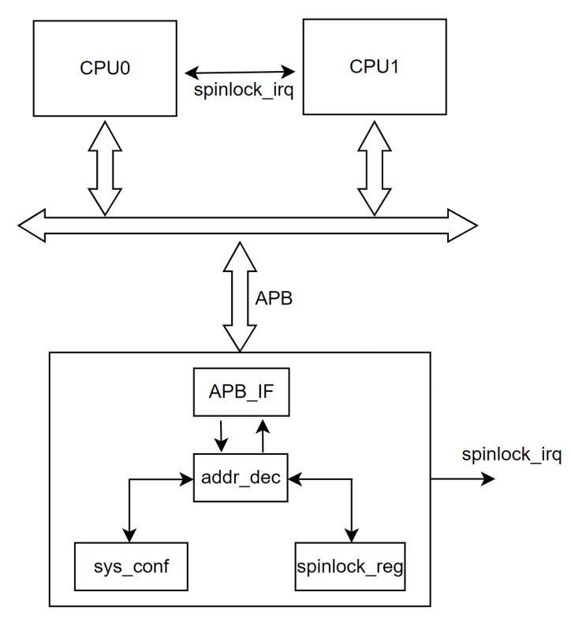

# 16.7 Spinlock

## 16.7.1 Overview

A spinlock is a hardware synchronization mechanism used in multi-core systems. The lock operation prevents concurrent access to shared data and helps ensure data consistency.
The spinlock provides the following characteristics:

- Two lock states: locked and unlocked
- Predictable lock acquisition time (less than 200 cycles), allowing software to manage lock handling deterministically

A typical application diagram of the spinlock is shown below:

## 16.7.2 Features

The spinlock supports the following features:

- APB2 interface with 32-bit data width
- Up to 32 lock units
- Optional interrupt signal for unlock notification

## 16.7.3 Functional Description

The CPU accesses the spinlock through the APB interface to read and write internal registers for lock and unlock operations. When a spinlock is unlocked, it can optionally generate an IRQ signal to the CPU.

The functional block diagram of the spinlock is shown below:

- After reset, all spinlock units default to the unlocked state.
- Before using a spinlock, the CPU should read `SPINLOCK_STATUS_REG` to obtain the status of all spinlock units.

For a spinlock unit in the unlocked state:

- The corresponding `SPINLOCKN_LOCK_REG` (`N = 0` to `31`) holds `0`.
- Reading this register returns `0` and sets the register to `1`, placing the spinlock unit in the locked state.
- At the same time, `SPINLOCK_STATUS_REG` is updated.

For a spinlock unit in the locked state:

- The corresponding `SPINLOCKN_LOCK_REG` (`N = 0` to `31`) holds `1`.
- Reading this register returns `1`. Writing `0` to the register clears it, returning the spinlock unit to the unlocked state.
- `SPINLOCK_STATUS_REG` is updated, and an interrupt is generated.

The state transition diagram is shown below:

### 16.7.3.1 Operating Modes

The spinlock can be used in two modes:

- Polling Mode
- Interrupt Mode

#### Polling Mode

1. CPU0 repeatedly reads `SPINLOCKN_LOCK_REG` (`N = 0` to `31`) to acquire a spinlock.
2. If the corresponding bit is `1`, the spinlock unit is locked and occupied by another CPU.
3. If the corresponding bit is `0`, the spinlock unit is unlocked. The read operation sets it to the locked state, and CPU0 then owns the spinlock.
4. CPU0 executes the critical section, while the corresponding bit in `SPINLOCK_STATUS_REG` remains `1`.
5. After completing the critical section, CPU0 writes `0` to the corresponding `SPINLOCKN_LOCK_REG`, releasing the spinlock and returning it to the unlocked state.

#### Interrupt Mode

1. CPU0 attempts to acquire a spinlock by reading `SPINLOCKN_LOCK_REG` (`N = 0` to `31`). If the corresponding bit is `1`, the unit is locked by another CPU.
2. CPU0 writes to `SPINLOCK_IRQ_EN_REG`, enabling the unlock interrupt for the target spinlock unit.
3. When the spinlock unit transitions from locked to unlocked, an interrupt is triggered, and the corresponding bit in `SPINLOCK_IRQ_STA_REG` is set.
4. CPU0 enters the interrupt service routine, checks `SPINLOCK_IRQ_STA_REG`, confirms that the spinlock is now unlocked, and clears the status bit manually.
5. CPU0 executes the critical section and, upon completion, writes `0` to the corresponding `SPINLOCKN_LOCK_REG`, releasing the spinlock.

## 16.7.4 Registers

| Register Name | Offset | Description |
| :--- | :--- | :--- |
| SPINLOCK_LOCK_REG_N | 0x0000 + N * 0x0004 | Spinlock Register N (`N = 0` to `31`) |
| SPINLOCK_VER_REG | 0x0100 | Spinlock Version Register |
| SPINLOCK_SSTATUS_REG | 0x0104 | System Status Register |
| SPINLOCK_STATUS_REG | 0x0108 | Spinlock Status Register |
| SPINLOCK_IRQ_EN_REG | 0x0110 | Spinlock IRQ Enable Register |
| SPINLOCK_IRQ_STA_REG | 0x0114 | Spinlock IRQ Status Register |

### 16.7.4.1 Register Description

#### SPINLOCKN_LOCK_REG

Offset: 0x0000 + N * 0x0004

| Bits | Field | Type | Reset | Description |
| :--- | :--- | :--- | :--- | :--- |
| 31:1 | RESERVED | R | 0x0 | Reserved |
| 0 | LOCK_STATUS | R/W | 0x0 | Lock status. Read `0x0`: The spinlock is unlocked, and the requester changes it to the locked state. Read `0x1`: The spinlock is locked. Write `0x0`: The requester changes this spinlock to the unlocked state. Write `0x1`: No action. |

#### SPINLOCK_VER_REG

Offset: 0x0100

| Bits | Field | Type | Reset | Description |
| :--- | :--- | :--- | :--- | :--- |
| 31:0 | VERSION | R | 0x312E_3030 | Spinlock version |

#### SPINLOCK_SSTATUS_REG

Offset: 0x0104

| Bits | Field | Type | Reset | Description |
| :--- | :--- | :--- | :--- | :--- |
| 31:0 | SYSTEM_STATUS | R | 0x0000_0020 | System status. A value of `32` indicates that this module contains 32 spinlocks. |

#### SPINLOCK_STATUS_REG

Offset: 0x0108

| Bits | Field | Type | Reset | Description |
| :--- | :--- | :--- | :--- | :--- |
| 31:0 | SPINLOCK_STATUS | R | 0x0 | Spinlock status. Bit `n = 1` indicates that spinlock `n` is locked. This register is updated automatically. |

#### SPINLOCK_IRQ_EN_REG

Offset: 0x0110

| Bits | Field | Type | Reset | Description |
| :--- | :--- | :--- | :--- | :--- |
| 31:0 | SPINLOCK_INTR_ENABLE | W/R | 0x0 | Spinlock interrupt enable. Bit `n = 1` indicates that an IRQ for spinlock `n` is generated when the spinlock changes from locked to unlocked. |

#### SPINLOCK_IRQ_STA_REG

Offset: 0x0114

| Bits | Field | Type | Reset | Description |
| :--- | :--- | :--- | :--- | :--- |
| 31:0 | SPINLOCK_STATUS | W/R | 0x0 | Spinlock interrupt status. Bit `n = 1` indicates that an IRQ for spinlock `n` has been generated. Write `1` to clear the interrupt. |

## 16.7.5 Programming Model

### 16.7.5.1 Polling Mode

#### Unlock → Lock

1. Read `SPINLOCK_STATUS_REG` (`base + 0x108`) → `0x0` (all spinlocks are in the unlocked state).
2. Sequentially read `SPINLOCKN_LOCK_REG` (`base + 0x000 + N × 0x4`, `N = 0` to `31`) → returns `0x0` (this operation changes the spinlock from unlocked to locked).
3. Read `SPINLOCKN_LOCK_REG` (`base + 0x000 + N × 0x4`, `N = 0` to `31`) again → returns `0xFFFFFFFF` (this operation verifies that all spinlocks are in the locked state).

#### Lock → Unlock

1. Read `SPINLOCK_STATUS_REG` (`base + 0x108`) → `0x1` (the spinlocks are in the locked state).
2. Sequentially write `0x0` to `SPINLOCKN_LOCK_REG` (`base + 0x000 + N × 0x4`, `N = 0` to `31`) ← `0x0` (this operation changes the spinlock from locked to unlocked).
3. Read `SPINLOCK_STATUS_REG` (`base + 0x108`) → `0x0` (all spinlocks are now unlocked).

### 16.7.5.2 Interrupt Mode

1. Write `0x1` to `SPINLOCK_IRQ_EN_REG` (`base + 0x110`) ← `0x1` (enable the interrupt for `spinlock[0]`).
2. Read `SPINLOCKN_LOCK_REG` (`base + 0x000 + N × 0x4`, `N = 1`) → `0x0` (`spinlock[0]` changes from unlocked to locked).
3. Write `0x0` to `SPINLOCKN_LOCK_REG` (`base + 0x000 + N × 0x4`, `N = 1`) ← `0x0` (`spinlock[0]` changes from locked to unlocked).
4. The CPU receives the corresponding interrupt.
   Write `0x0` to `SPINLOCK_IRQ_STA_REG` (`base + 0x114`) ← `0x0` (clear the interrupt status bit for `spinlock[0]`).