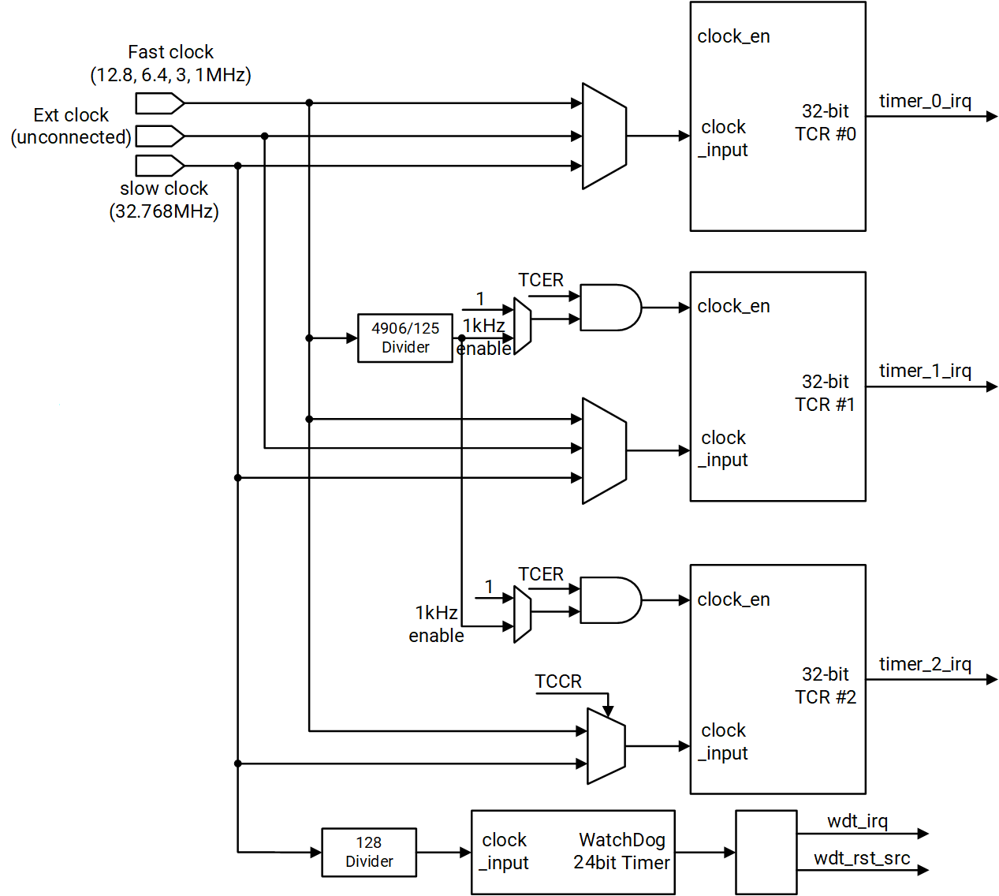

# 16.3 Timer and Watchdog

## 16.3.1 Introduction

The K3 includes:

- Three 32-bit general-purpose timers with programmable clock frequencies
- One 24-bit watchdog timer with a programmable clock frequency

## 16.3.2 Features

### 16.3.2.1 General-Purpose Timers

- Each timer consists of a 32-bit timer clock control register (`TCCRn`) and operates as an up-counter.
- Programmable clock frequency with the following two clock inputs:
  - Fast clock: 12.8 MHz, 6.4 MHz, 3 MHz, and 1 MHz
  - Slow clock: 32.768 kHz

### 16.3.2.2 Watchdog Timer

- Operates as an up-counter.
- Programmable clock frequency with the following two clock inputs:
  - Fast clock: 12.8 MHz, 6.4 MHz, 3 MHz, and 1 MHz
  - Slow clock: 32.768 kHz

## 16.3.3 Functional Description

### 16.3.3.1 Timer Unit

- **Fast Clock Selection**
  The fast clock is selectable via the Functional Clock Select field in the Clock/Reset Control Register for Timers (`APBC_TIMERS_CLK_RST`). All three timers (Timer 0, Timer 1, and Timer 2) can operate using either the fast clock or the slow clock.

- **Timer Count Registers (`TCRn`)**
  Each of the three timer count registers (`TCRn`, where `n = 0, 1, or 2`) is associated with three 32-bit timer match registers (`TMR_Tn_Mm`). When the value in a timer count register matches a value in any match register and the interrupt-enable bit is set, the corresponding bit in the timer status register (`TSR`) is set.

- **Interrupt Generation**
  These bits in the `TSR` are routed to the interrupt controller, which can be programmed to generate an interrupt when triggered.

- **Reprogramming Timers**
  Reprogramming any timer control register (`TCCR`, `TPLVRn`, `TMR_Tn_Mm`, `TPLCRn`, `TCMRn`, or `TILRn`) while the timer is running is not guaranteed to be valid. To safely reprogram these registers:

  - Disable the timer
  - Reprogram the timer
  - Re-enable the timer

  The functionality of one enabled timer is not affected by the programming of another timer.

The architecture of the timer unit is shown below.

#### Watchdog Timer

The 24-bit watchdog timer operates with a timer-module-derived clock at 256 Hz.

The watchdog timer initiates a reset event when its value matches the value in `TWMR` and the `TWMER[WE]` bit is set. This causes the `wdt_rst_src#` signal to be asserted, which initiates a watchdog timer reset event in the system.

- **Watchdog Timer Reset Mode**: This mode is activated when software does not properly manage the WDT timeout, indicating a potential software malfunction or data corruption. In this mode, most internal system registers are reset to their default values, except for the real-time clock, which remains unaffected.
- To avoid a watchdog timer reset, software must restart the WDT before it reaches the match value by setting `TWCR[WCR]` to restart the WDT.

> **Note.** The `TWSR` register (and some other internal WDT flops), which determines whether a match event has occurred, is reset upon assertion of power-on reset or external master reset. All other registers are reset upon assertion of power-on reset, external master reset, or watchdog timer reset.

When a WDT reset event occurs, the WDT generates a 4 ms-wide pulse on the `wdt_rst_src#` output. This keeps the system in a reset state during that period. The system goes through a reset sequence once the reset signal is deasserted.

Writing to all WDT registers is protected by two access registers: `TWFAR` and `TWSAR`. Follow the steps below to enable writes to any WDT register:

- Write the proper key value to the `TWFAR` register.
- Write the proper key value to the `TWSAR` register.
- Perform the write operation on the target WDT register.

Once the write operation is completed, the WDT registers are locked again. This process must be repeated for each subsequent write operation.

## 16.3.4 Register Description

The base addresses of the timer and watchdog registers are listed below.

| Name                | Address     |
|---------------------|-------------|
| APB_TIMERS1_BASE    | 0xD4014000  |
| APB_TIMERS2_BASE    | 0xD4016000  |
| PMU_TIMERS_BASE     | 0xD4080000  |
| SEC_TIMERS_BASE     | 0xF0616000  |

### Timer Count Enable Register

This register contains one count-enable bit for each timer. After the timer is enabled, the corresponding `TCR` restarts counting from the value specified by `TPLVR`.

Offset: 0x0

| Bits   | Field                    | Type | Reset | Description |
|--------|--------------------------|------|-------|-------------|
| 31:3   | Reserved                 | RO   | 0x0   | Reserved for future use. |
| 2      | Timer #2 count enable    | RW   | 0x0   | Controls whether Timer #2 counts. `0`: Counting is disabled. `1`: Counting is enabled. **Note.** Changes do not take effect immediately because of synchronization across clock domains. |
| 1      | Timer #1 count enable    | RW   | 0x0   | Controls whether Timer #1 counts. `0`: Counting is disabled. `1`: Counting is enabled. **Note.** Changes do not take effect immediately because of synchronization across clock domains. |
| 0      | Timer #0 count enable    | RW   | 0x0   | Controls whether Timer #0 counts. `0`: Counting is disabled. `1`: Counting is enabled. **Note.** Changes do not take effect immediately because of synchronization across clock domains. |

### Timer Count Mode Register

The `TCMR` contains one count mode bit for each timer. The processor `TCR` operates only in periodic timer mode; it does not operate in one-shot mode.

Offset: 0x4

| Bits   | Field                   | Type | Reset | Description |
|--------|-------------------------|------|-------|-------------|
| 31:3   | Reserved                | RO   | 0x0   | Reserved for future use. |
| 2      | Timer #2 count mode     | RW   | 0x0   | Defines the mode of Timer #2. `0`: Periodic timer mode: the timer reloads if a match occurs and `PLCR != 0`. `1`: Free-run mode: the timer wraps to `0` when it reaches `0xFFFFFFFF`. |
| 1      | Timer #1 count mode     | RW   | 0x0   | Defines the mode of Timer #1. `0`: Periodic timer mode: the timer reloads if a match occurs and `PLCR != 0`. `1`: Free-run mode: the timer wraps to `0` when it reaches `0xFFFFFFFF`. |
| 0      | Timer #0 count mode     | RW   | 0x0   | Defines the mode of Timer #0. `0`: Periodic timer mode: the timer reloads if a match occurs and `PLCR != 0`. `1`: Free-run mode: the timer wraps to `0` when it reaches `0xFFFFFFFF`. |

### Timer Count Restart Register

Offset: 0x8

| Bits   | Field | Type | Reset | Description |
|--------|-------|------|-------|-------------|
| 31:3   | Reserved | RO   | 0x0   | Reserved for future use. |
| 2      | T2RS     | RW   | 0x0   | Timer #2 count restart. `0`: No effect. `1`: Counting is restarted. **Note.** Configure other registers before setting this bit to `1`. |
| 1      | T1RS     | RW   | 0x0   | Timer #1 count restart. `0`: No effect. `1`: Counting is restarted. **Note.** Configure other registers before setting this bit to `1`. |
| 0      | T0RS     | RW   | 0x0   | Timer #0 count restart. `0`: No effect. `1`: Counting is restarted. **Note.** Configure other registers before setting this bit to `1`. |

### Timer Clock Control Register

Offset: 0xC

| Bits   | Field  | Type | Reset | Description |
|--------|--------|------|-------|-------------|
| 31:7   | Reserved | RO   | 0x0   | Reserved for future use. |
| 6:5    | CS_2   | RW   | 0x0   | Clock source for Timer #2. - `0x0`: Fast clock (AP APB timer clock depending on `APBC_TIMERSx_CLK_RST[6:4]`; the CP APB timer fast clock can only be 12.8 MHz) - `0x1`: 32.768 kHz - `0x2`: 32.768 kHz - `0x3`: Fast clock |
| 4      | Reserved | RO   | 0x0   | Reserved for future use. |
| 3:2    | CS_1   | RW   | 0x0   | Clock source for Timer #1. - `0x0`: Fast clock (AP APB timer clock depending on `APBC_TIMERSx_CLK_RST[6:4]`; the CP APB timer fast clock can only be 12.8 MHz) - `0x1`: 32.768 kHz - `0x2`: 32.768 kHz - `0x3`: Reserved |
| 1:0    | CS_0   | RW   | 0x0   | Clock source for Timer #0. - `0x0`: Fast clock (AP APB timer clock depending on `APBC_TIMERSx_CLK_RST[6:4]`; the CP APB timer fast clock can only be 12.8 MHz) - `0x1`: 32.768 kHz - `0x2`: Reserved - `0x3`: Fast clock |

### Timer Match Register

Offset: 0x10~0x18 (0x4) / 0x20~0x28 (0x4) / 0x30~0x38 (0x4)

| Bits | Field | Type | Reset | Description |
| --- | --- | --- | --- | --- |
| 31:0 | TMR_TN_MM | RW | 0xFFFFFFFF | Timer n match register m value. This register holds the value used for the match comparison for Timer n (where n is the timer number, such as Timer 0, Timer 1, or Timer 2). When the timer counter reaches this value, a match event occurs. |

### Timer Preload Value Register

Each `TCR` has a 32-bit-wide preload value register that loads `TCRn` when a match occurs between `TMR_Tn_Mm` and `TCRn`. The corresponding `TPLCRn` register selects the match comparator.

Offset: 0x40~0x48 (0x4)

| Bits | Field | Type | Reset | Description |
| --- | --- | --- | --- | --- |
| 31:0 | TPLVRn | RW | 0x0 | Timer n preload value that is loaded into TCRn when a match occurs between TMR_Tn_Mm and TCRn. The corresponding TPLCRn register selects the match comparator. |

### Timer Preload Control Register

Each `TCR` has a preload control register.

Offset: 0x50~0x58 (0x4)

| Bits | Field | Type | Reset | Description |
| --- | --- | --- | --- | --- |
| 31:3 | Reserved | RO | 0x0 | Reserved for future use. |
| 2 | CRPD | RW | 0x0 | Disable preload when the counter restarts. - `0x0`: Preload `PLCR` into the counter when the restart bit is set. - `0x1`: Disable preloading `PLCR` into the counter when the restart bit is set. |
| 1:0 | MCS | RW | 0x0 | Match comparator selection. - `0x0`: Free-running mode (up to the maximum value). - `0x1`: Enable preload with match comparator 0. - `0x2`: Enable preload with match comparator 1. - `0x3`: Enable preload with match comparator 2. |

### Timer Interrupt Enable Register

Each of these three control registers contains one enable bit, which determines whether a match between a match register and the operating-system timer counter sets a status bit in the timer status register (`TSR`) and asserts the corresponding `timer#_irq` output.

> **Note.** Clearing an enable bit does not reset the corresponding interrupt status bit if it has already been set.

Offset: 0x60~0x68 (0x4)

| Bits | Field | Type | Reset | Description |
| --- | --- | --- | --- | --- |
| 31:3 | Reserved | RO | 0x0 | Reserved for future use. |
| 2 | IE2 | RW | 0x0 | Interrupt enable for match comparator 2. `0`: Disable the interrupt for a match between match register 2 and its OS timer (no interrupt assertion). `1`: Enable the interrupt for a match between match register 2 and its OS timer (interrupt assertion in `TSRn` or on the `timer#_irq` output). |
| 1 | IE1 | RW | 0x0 | Interrupt enable for match comparator 1. `0`: Disable the interrupt for a match between match register 1 and its OS timer (no interrupt assertion). `1`: Enable the interrupt for a match between match register 1 and its OS timer (interrupt assertion in `TSRn` or on the `timer#_irq` output). |
| 0 | IE0 | RW | 0x0 | Interrupt enable for match comparator 0. `0`: Disable the interrupt for a match between match register 0 and its OS timer (no interrupt assertion). `1`: Enable the interrupt for a match between match register 0 and its OS timer (interrupt assertion in `TSRn` or on the `timer#_irq` output). |

### Timer Interrupt Clear Register

These three registers contain a separate clear bit for each interrupt source, which is used to reset the level-sensitive interrupt request directed to the interrupt controller. Each match register has its own corresponding clear bit. The interrupt is cleared by writing to the respective bit position.

> **Note.** This register is not applicable for edge-sensitive interrupts.

Offset: 0x70~0x78 (0x4)

| Bits | Field | Type | Reset | Description |
| --- | --- | --- | --- | --- |
| 31:3 | Reserved | RO | 0x0 | Reserved for future use. |
| 2 | TCLR2 | WO | 0x0 | Interrupt clear for match comparator 2. `0`: No effect. `1`: Clear the level interrupt and the corresponding status bit. |
| 1 | TCLR1 | WO | 0x0 | Interrupt clear for match comparator 1. `0`: No effect. `1`: Clear the level interrupt and the corresponding status bit. |
| 0 | TCLR0 | WO | 0x0 | Interrupt clear for match comparator 0. `0`: No effect. `1`: Clear the level interrupt and the corresponding status bit. |

### Timer Status Register

These three status registers contain status bits indicating whether a match has occurred on any of the three match registers of a given timer count register. In particular:

- These bits are set when a match event occurs on the next rising edge of the respective clock.
- They are cleared by writing a logical one to the corresponding bit position of `TICLRn`.

This register reflects level-sensitive interrupt status only, edge-sensitive interrupts are not captured in this register.

Offset: 0x80~0x88 (0x4)

| Bits | Field | Type | Reset | Description |
| --- | --- | --- | --- | --- |
| 31:3 | Reserved | RO | 0x0 | Reserved for future use. |
| 2 | M2 | RO | 0x0 | Match status of `TMR_Tn_M2`. `0`: Timer Match register `TMR_Tn_M2` has not matched the counter since the last interrupt clear. `1`: Timer Match register `TMR_Tn_M2` has matched the counter since the last interrupt clear. |
| 1 | M1 | RO | 0x0 | Match status of `TMR_Tn_M1`. `0`: Timer Match register `TMR_Tn_M1` has not matched the counter since the last interrupt clear. `1`: Timer Match register `TMR_Tn_M1` has matched the counter since the last interrupt clear. |
| 0 | M0 | RO | 0x0 | Match status of `TMR_Tn_M0`. `0`: Timer match register `TMR_Tn_M0` has not matched the counter since the last interrupt clear. `1`: Timer match register `TMR_Tn_M0` has matched the counter since the last interrupt clear. |

### Timer Count Register

The three read-only timer count registers (`TCRn`, where `n = 0, 1, 2`) are 32-bit counters that increment on the rising edge of their selected clocks. In particular:

- The Timer Count registers are synchronized from the timer clock domain to the APB clock domain, so software can read them directly.
- The counters are preloaded with a value from the `TPLVR` register. When enabled, the counters start from the preloaded values defined in the corresponding `TPLCRn` register and count up to either the maximum value or a match value.
- This request requires up to three timer clock cycles. If the selected timer is working at a slow clock, the request could take longer.

Offset: 0x90~0x98 (0x4)

| Bits | Field | Type | Reset | Description |
| --- | --- | --- | --- | --- |
| 31:0 | TCRN | RO | 0x0 | Timer n count register. - The counter is incremented on the rising edge of the selected clock. - This register is synchronized to the APB clock domain. |

### Timer Watchdog First Access Register

Offset: 0xB0

| Bits | Field | Type | Reset | Description |
| --- | --- | --- | --- | --- |
| 31:16 | Reserved | RO | 0x0 | Reserved for future use. |
| 15:0 | KEY | WO | 0x0 | Watchdog access key. Writing the value of 0xBABA to this register matches the key. |

### Timer Watchdog Second Access Register

Offset: 0xB4

| Bits | Field | Type | Reset | Description |
| --- | --- | --- | --- | --- |
| 31:16 | Reserved | RO | 0x0 | Reserved for future use. |
| 15:0 | KEY | WO | 0x0 | Watchdog access key. Writing the value of 0xEB10 to this register matches the key. |

### Timer Watchdog Match Enable Register

This register contains a WDT enable bit that can only be set by the user. Write access to this register is protected by the `TWFAR` and `TWSAR` access registers.

Offset: 0xB8

| Bits | Field | Type | Reset | Description |
| --- | --- | --- | --- | --- |
| 31:2 | Reserved | RO | 0x0 | Reserved for future use. |
| 1 | WRIE | RW | 0x0 | Watchdog reset/interrupt enable. `0`: Watchdog timer expiration generates a watchdog interrupt (no watchdog timer reset). `1`: Watchdog timer expiration generates a watchdog timer reset (no watchdog interrupt). |
| 0 | WE | RW | 0x0 | WDT count enable. `0`: Disable WDT counting and reset the WDT value to zero. `1`: Enable counting; the WDT always starts from zero. **Note.** Due to the chain of synchronizers that transfers this signal from domain to domain, WDT enable and disable operations do not occur immediately. |

### Timer Watchdog Match Register

This match register is compared with the watchdog timer. The watchdog timer resets the processor when a match occurs and the `TWER[WRIE]` bit is set.

Offset: 0xBC

| Bits | Field | Type | Reset | Description |
| --- | --- | --- | --- | --- |
| 31:16 | Reserved | RO | 0x0 | Reserved for future use. |
| 15:0 | WTM | RW | 0xFFFF | 16-bit watchdog timer match value. |

### Timer Watchdog Status Register

This register indicates whether a WDT reset has occurred and caused a system reset, in particular:

- This bit is set when `wdt_src_rst#` is asserted.
- It is cleared by writing a logical `0` to this register.
- Clearing this bit is not required for the WDT to be reactivated after a WDT reset event.

Offset: 0xC0

| Bits | Field | Type | Reset | Description |
| --- | --- | --- | --- | --- |
| 31:1 | Reserved | RO | 0x0 | Reserved for future use. |
| 0 | WTS | RW | 0x0 | Watchdog timer reset indication. Indicates that the reset was caused by the WDT. Read: `0`: The watchdog timer did not cause the reset because this bit was cleared. `1`: The watchdog timer caused a reset. Write: `0`: Clear the WDT reset status. `1`: No effect. |

### Timer Watchdog Interrupt Clear Register

Offset: 0xC4

| Bits | Field | Type | Reset | Description |
| --- | --- | --- | --- | --- |
| 31:1 | Reserved | RO | 0x0 | Reserved for future use. |
| 0 | WICLR | WO | 0x0 | WDT interrupt clear. Write: `0`: No effect. `1`: Clear the interrupt. |

### Timer Watchdog Counter Reset Register

Offset: 0xC8

| Bits | Field | Type | Reset | Description |
| --- | --- | --- | --- | --- |
| 31:1 | Reserved | RO | 0x0 | Reserved for future use. |
| 0 | WCR | WO | 0x0 | Watchdog timer counter value reset. Write: `0`: No effect. `1`: Clears the value of the WDT counter. |

### Timer Watchdog Value Register

Offset: 0xCC

| Bits | Field | Type | Reset | Description |
| --- | --- | --- | --- | --- |
| 31:16 | Reserved | RO | 0x0 | Reserved for future use. |
| 15:0 | WTV | RO | 0x0 | Watchdog timer value. Reads the current value of the WDT. Since the register may be in transition during a read operation, software must perform a double read and compare the two values to ensure accuracy. |

