# K3 Hardware Design Guidelines and PCB Layout Manual

**[PDF Version]()**

## Revision History

| Version | Date       | Description     |
| ------- | ---------- | --------------- |
| V1.0    | 2026.04.30 | Initial release |

## Foreword

This document describes the key considerations and design guidelines for K3 processor hardware development. It is intended to help engineers become familiar with the chip quickly and shorten product design cycles.

Please follow this guideline for hardware design and strictly comply with both schematic design requirements and PCB layout rules during product development.

This document is intended for the following roles:

- Hardware design engineers
- PCB layout engineers
- Technical support engineers

## 1. Schematic Design

### 1.1 Small System External Circuit Requirements

#### 1.1.1 DDR Circuit Design

- The K3 chip supports LPDDR5 and LPDDR4x, with 2 channels and a maximum 64-bit data bus width.
  Different channel capacities are not supported within the same configuration.

- The external ZQ resistor for LPDDR5/4x must be a **120 Ω ±1% precision resistor connected to GND**.
  The circuit design must strictly follow the reference design, including power decoupling capacitors.
  
  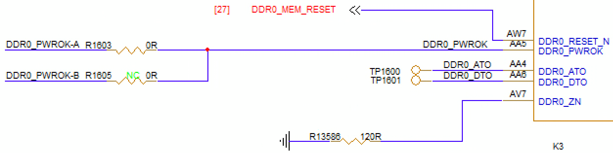

- PowerOK
  - PWROK is a PHY input signal from the always-on VDD2H power domain, used to indicate that all PHY power supplies and clocks are stable.
  - When IO retention is supported, BP_PWROK must be externally controlled and asserted low in advance before power-down, in accordance with the JEDEC specification.
  - If IO retention is not required, BP_PWROK can be pulled high through the VDD2H_TIEHI output pin.
  - The reference design uses a MOSFET-based circuit with a reserved pull-up resistor to VDD2.
    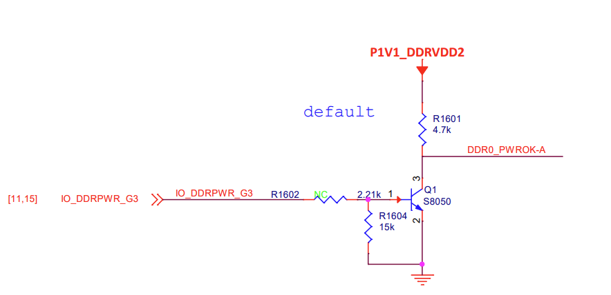

- LPDDR IO Map
  
| Signal Name           | LPDDR5               | LPDDR4X              |
|--------------------|----------------------|----------------------|
| DDR0_ATO           | LP5_DDR0_CA_A_00     | LP4_DDR0_CA_A_00     |
| CA_A_0             | LP5_DDR0_CA_A_01     | LP4_DDR0_CA_A_01     |
| CA_A_1             | LP5_DDR0_CA_A_02     | LP4_DDR0_CA_A_02     |
| CA_A_2             | LP5_DDR0_CA_A_03     | LP4_DDR0_CA_A_03     |
| CA_A_3             | LP5_DDR0_CA_A_04     | LP4_DDR0_CA_A_04     |
| CA_A_4             | LP5_DDR0_CA_A_05     | LP4_DDR0_CA_A_05     |
| CA_A_5             | LP5_DDR0_CA_B_00     | LP4_DDR0_CA_B_00     |
| CA_B_0             | LP5_DDR0_CA_B_01     | LP4_DDR0_CA_B_01     |
| CA_B_1             | LP5_DDR0_CA_B_02     | LP4_DDR0_CA_B_02     |
| CA_B_2             | LP5_DDR0_CA_B_03     | LP4_DDR0_CA_B_03     |
| CA_B_3             | LP5_DDR0_CA_B_04     | LP4_DDR0_CA_B_04     |
| CA_B_4             | LP5_DDR0_CA_B_05     | LP4_DDR0_CA_B_05     |
| CA_B_5             | LP5_DDR0_CKC_A       | LP4_DDR0_CKC_A       |
| CK_C_A             | LP5_DDR0_CKC_B       | LP4_DDR0_CKC_B       |
| CK_C_B             | LP5_DDR0_CS0_A       | LP4_DDR0_CKE0_A      |
| CKE0_A             | LP5_DDR0_CS0_B       | LP4_DDR0_CKE0_B      |
| CKE0_B             | LP5_DDR0_CS1_A       | LP4_DDR0_CKE1_A      |
| CKE1_A             | LP5_DDR0_CS1_B       | LP4_DDR0_CKE1_B      |
| CKE1_B             | LP5_DDR0_CKT_A       | LP4_DDR0_CKT_A       |
| CK_T_A             | LP5_DDR0_CKT_B       | LP4_DDR0_CKT_B       |
| CK_T_B             | LP5_DDR0_CA_A_06     | LP4_DDR0_CS0_A       |
| CS0_A              | LP5_DDR0_CA_B_06     | LP4_DDR0_CS0_B       |
| CS0_B              | NA                   | LP4_DDR0_CS1_A       |
| CS1_A              | NA                   | LP4_DDR0_CS1_B       |
| CS1_B              | LP5_DDR0_DMI0_A      | LP4_DDR0_DMI0_A      |
| DMI0_A             | LP5_DDR0_DMI0_B      | LP4_DDR0_DMI0_B      |
| DMI0_B             | LP5_DDR0_DMI1_A      | LP4_DDR0_DMI1_A      |
| DMI1_A             | LP5_DDR0_DMI1_B      | LP4_DDR0_DMI1_B      |
| DMI1_B             | LP5_DDR0_DQ_A_00     | LP4_DDR0_DQ_A_00     |
| DQ_A_0             | LP5_DDR0_DQ_A_01     | LP4_DDR0_DQ_A_01     |
| DQ_A_1             | LP5_DDR0_DQ_A_02     | LP4_DDR0_DQ_A_02     |
| DQ_A_2             | LP5_DDR0_DQ_A_03     | LP4_DDR0_DQ_A_03     |
| DQ_A_3             | LP5_DDR0_DQ_A_04     | LP4_DDR0_DQ_A_04     |
| DQ_A_4             | LP5_DDR0_DQ_A_05     | LP4_DDR0_DQ_A_05     |
| DQ_A_5             | LP5_DDR0_DQ_A_06     | LP4_DDR0_DQ_A_06     |
| DQ_A_6             | LP5_DDR0_DQ_A_07     | LP4_DDR0_DQ_A_07     |
| DQ_A_7             | LP5_DDR0_DQ_A_08     | LP4_DDR0_DQ_A_08     |
| DQ_A_8             | LP5_DDR0_DQ_A_09     | LP4_DDR0_DQ_A_09     |
| DQ_A_9             | LP5_DDR0_DQ_A_10     | LP4_DDR0_DQ_A_10     |
| DQ_A_10            | LP5_DDR0_DQ_A_11     | LP4_DDR0_DQ_A_11     |
| DQ_A_11            | LP5_DDR0_DQ_A_12     | LP4_DDR0_DQ_A_12     |
| DQ_A_12            | LP5_DDR0_DQ_A_13     | LP4_DDR0_DQ_A_13     |
| DQ_A_13            | LP5_DDR0_DQ_A_14     | LP4_DDR0_DQ_A_14     |
| DQ_A_14            | LP5_DDR0_DQ_A_15     | LP4_DDR0_DQ_A_15     |
| DQ_A_15            | LP5_DDR0_DQ_B_00     | LP4_DDR0_DQ_B_00     |
| DQ_B_0             | LP5_DDR0_DQ_B_01     | LP4_DDR0_DQ_B_01     |
| DQ_B_1             | LP5_DDR0_DQ_B_02     | LP4_DDR0_DQ_B_02     |
| DQ_B_2             | LP5_DDR0_DQ_B_03     | LP4_DDR0_DQ_B_03     |
| DQ_B_3             | LP5_DDR0_DQ_B_04     | LP4_DDR0_DQ_B_04     |
| DQ_B_4             | LP5_DDR0_DQ_B_05     | LP4_DDR0_DQ_B_05     |
| DQ_B_5             | LP5_DDR0_DQ_B_06     | LP4_DDR0_DQ_B_06     |
| DQ_B_6             | LP5_DDR0_DQ_B_07     | LP4_DDR0_DQ_B_07     |
| DQ_B_7             | LP5_DDR0_DQ_B_08     | LP4_DDR0_DQ_B_08     |
| DQ_B_8             | LP5_DDR0_DQ_B_09     | LP4_DDR0_DQ_B_09     |
| DQ_B_9             | LP5_DDR0_DQ_B_10     | LP4_DDR0_DQ_B_10     |
| DQ_B_10            | LP5_DDR0_DQ_B_11     | LP4_DDR0_DQ_B_11     |
| DQ_B_11            | LP5_DDR0_DQ_B_12     | LP4_DDR0_DQ_B_12     |
| DQ_B_12            | LP5_DDR0_DQ_B_13     | LP4_DDR0_DQ_B_13     |
| DQ_B_13            | LP5_DDR0_DQ_B_14     | LP4_DDR0_DQ_B_14     |
| DQ_B_14            | LP5_DDR0_DQ_B_15     | LP4_DDR0_DQ_B_15     |
| DQ_B_15            | LP5_DDR0_DQS0_C_A    | LP4_DDR0_DQS0_C_A    |
| DQS0_C_A           | LP5_DDR0_DQS0_C_B    | LP4_DDR0_DQS0_C_B    |
| DQS0_C_B           | LP5_DDR0_DQS0_T_A    | LP4_DDR0_DQS0_T_A    |
| DQS0_T_A           | LP5_DDR0_DQS0_T_B    | LP4_DDR0_DQS0_T_B    |
| DQS0_T_B           | LP5_DDR0_DQS1_C_A    | LP4_DDR0_DQS1_C_A    |
| DQS1_C_A           | LP5_DDR0_DQS1_C_B    | LP4_DDR0_DQS1_C_B    |
| DQS1_C_B           | LP5_DDR0_DQS1_T_A    | LP4_DDR0_DQS1_T_A    |
| DQS1_T_A           | LP5_DDR0_DQS1_T_B    | LP4_DDR0_DQS1_T_B    |
| DQS1_T_B           | LP5_DDR0_WCK_C_A_0   | N/A                  |
| DDR0_DTO           | LP5_DDR0_WCK_C_A_1   | N/A                  |
| DDR0_PWROK         | LP5_DDR0_WCK_C_B_0   | N/A                  |
| RESET_N            | LP5_DDR0_WCK_C_B_1   | N/A                  |
| WCK_C_A_0          | LP5_DDR0_WCK_T_A_0   | N/A                  |
| WCK_C_A_1          | LP5_DDR0_WCK_T_A_1   | N/A                  |
| WCK_C_B_0          | LP5_DDR0_WCK_T_B_0   | N/A                  |
| WCK_C_B_1          | LP5_DDR0_WCK_T_B_1   | N/A                  |
| WCK_T_A_0          | LP5_DDR0_ZN          | LP4_DDR0_ZN          |
| WCK_T_A_1          | LP5_DDR0_ATO         | LP4_DDR0_ATO         |
| WCK_T_B_0          | LP5_DDR0_DTO         | LP4_DDR0_DTO         |
| WCK_T_B_1          | LP5_DDR0_PWROK       | LP4_DDR0_PWROK       |
| DDR0_ZN            | LP5_DDR0_RESET_N     | LP4_DDR0_RESET_N     |
| DDR1_ATO           | LP5_DDR1_CA_A_00     | LP4_DDR1_CA_A_00     |
| DDR1_CA_A_0        | LP5_DDR1_CA_A_01     | LP4_DDR1_CA_A_01     |
| DDR1_CA_A_1        | LP5_DDR1_CA_A_02     | LP4_DDR1_CA_A_02     |
| DDR1_CA_A_2        | LP5_DDR1_CA_A_03     | LP4_DDR1_CA_A_03     |
| DDR1_CA_A_3        | LP5_DDR1_CA_A_04     | LP4_DDR1_CA_A_04     |
| DDR1_CA_A_4        | LP5_DDR1_CA_A_05     | LP4_DDR1_CA_A_05     |
| DDR1_CA_A_5        | LP5_DDR1_CA_B_00     | LP4_DDR1_CA_B_00     |
| DDR1_CA_B_0        | LP5_DDR1_CA_B_01     | LP4_DDR1_CA_B_01     |
| DDR1_CA_B_1        | LP5_DDR1_CA_B_02     | LP4_DDR1_CA_B_02     |
| DDR1_CA_B_2        | LP5_DDR1_CA_B_03     | LP4_DDR1_CA_B_03     |
| DDR1_CA_B_3        | LP5_DDR1_CA_B_04     | LP4_DDR1_CA_B_04     |
| DDR1_CA_B_4        | LP5_DDR1_CA_B_05     | LP4_DDR1_CA_B_05     |
| DDR1_CA_B_5        | LP5_DDR1_CKC_A       | LP4_DDR1_CKC_A       |
| DDR1_CK_C_A        | LP5_DDR1_CKC_B       | LP4_DDR1_CKC_B       |
| DDR1_CK_C_B        | LP5_DDR1_CS0_A       | LP4_DDR1_CKE0_A      |
| DDR1_CKE0_A        | LP5_DDR1_CS0_B       | LP4_DDR1_CKE0_B      |
| DDR1_CKE0_B        | LP5_DDR1_CS1_A       | LP4_DDR1_CKE1_A      |
| DDR1_CKE1_A        | LP5_DDR1_CS1_B       | LP4_DDR1_CKE1_B      |
| DDR1_CKE1_B        | LP5_DDR1_CKT_A       | LP4_DDR1_CKT_A       |
| DDR1_CK_T_A        | LP5_DDR1_CKT_B       | LP4_DDR1_CKT_B       |
| DDR1_CK_T_B        | LP5_DDR1_CA_A_06     | LP4_DDR1_CS0_A       |
| DDR1_CS0_A         | LP5_DDR1_CA_B_06     | LP4_DDR1_CS0_B       |
| DDR1_CS0_B         | NA                   | LP4_DDR1_CS1_A       |
| DDR1_CS1_A         | NA                   | LP4_DDR1_CS1_B       |
| DDR1_CS1_B         | LP5_DDR1_DMI0_A      | LP4_DDR1_DMI0_A      |
| DDR1_DMI0_A        | LP5_DDR1_DMI0_B      | LP4_DDR1_DMI0_B      |
| DDR1_DMI0_B        | LP5_DDR1_DMI1_A      | LP4_DDR1_DMI1_A      |
| DDR1_DMI1_A        | LP5_DDR1_DMI1_B      | LP4_DDR1_DMI1_B      |
| DDR1_DMI1_B        | LP5_DDR1_DQ_A_00     | LP4_DDR1_DQ_A_00     |
| DDR1_DQ_A_0        | LP5_DDR1_DQ_A_01     | LP4_DDR1_DQ_A_01     |
| DDR1_DQ_A_1        | LP5_DDR1_DQ_A_02     | LP4_DDR1_DQ_A_02     |
| DDR1_DQ_A_2        | LP5_DDR1_DQ_A_03     | LP4_DDR1_DQ_A_03     |
| DDR1_DQ_A_3        | LP5_DDR1_DQ_A_04     | LP4_DDR1_DQ_A_04     |
| DDR1_DQ_A_4        | LP5_DDR1_DQ_A_05     | LP4_DDR1_DQ_A_05     |
| DDR1_DQ_A_5        | LP5_DDR1_DQ_A_06     | LP4_DDR1_DQ_A_06     |
| DDR1_DQ_A_6        | LP5_DDR1_DQ_A_07     | LP4_DDR1_DQ_A_07     |
| DDR1_DQ_A_7        | LP5_DDR1_DQ_A_08     | LP4_DDR1_DQ_A_08     |
| DDR1_DQ_A_8        | LP5_DDR1_DQ_A_09     | LP4_DDR1_DQ_A_09     |
| DDR1_DQ_A_9        | LP5_DDR1_DQ_A_10     | LP4_DDR1_DQ_A_10     |
| DDR1_DQ_A_10       | LP5_DDR1_DQ_A_11     | LP4_DDR1_DQ_A_11     |
| DDR1_DQ_A_11       | LP5_DDR1_DQ_A_12     | LP4_DDR1_DQ_A_12     |
| DDR1_DQ_A_12       | LP5_DDR1_DQ_A_13     | LP4_DDR1_DQ_A_13     |
| DDR1_DQ_A_13       | LP5_DDR1_DQ_A_14     | LP4_DDR1_DQ_A_14     |
| DDR1_DQ_A_14       | LP5_DDR1_DQ_A_15     | LP4_DDR1_DQ_A_15     |
| DDR1_DQ_A_15       | LP5_DDR1_DQ_B_00     | LP4_DDR1_DQ_B_00     |
| DDR1_DQ_B_0        | LP5_DDR1_DQ_B_01     | LP4_DDR1_DQ_B_01     |
| DDR1_DQ_B_1        | LP5_DDR1_DQ_B_02     | LP4_DDR1_DQ_B_02     |
| DDR1_DQ_B_2        | LP5_DDR1_DQ_B_03     | LP4_DDR1_DQ_B_03     |
| DDR1_DQ_B_3        | LP5_DDR1_DQ_B_04     | LP4_DDR1_DQ_B_04     |
| DDR1_DQ_B_4        | LP5_DDR1_DQ_B_05     | LP4_DDR1_DQ_B_05     |
| DDR1_DQ_B_5        | LP5_DDR1_DQ_B_06     | LP4_DDR1_DQ_B_06     |
| DDR1_DQ_B_6        | LP5_DDR1_DQ_B_07     | LP4_DDR1_DQ_B_07     |
| DDR1_DQ_B_7        | LP5_DDR1_DQ_B_08     | LP4_DDR1_DQ_B_08     |
| DDR1_DQ_B_8        | LP5_DDR1_DQ_B_09     | LP4_DDR1_DQ_B_09     |
| DDR1_DQ_B_9        | LP5_DDR1_DQ_B_10     | LP4_DDR1_DQ_B_10     |
| DDR1_DQ_B_10       | LP5_DDR1_DQ_B_11     | LP4_DDR1_DQ_B_11     |
| DDR1_DQ_B_11       | LP5_DDR1_DQ_B_12     | LP4_DDR1_DQ_B_12     |
| DDR1_DQ_B_12       | LP5_DDR1_DQ_B_13     | LP4_DDR1_DQ_B_13     |
| DDR1_DQ_B_13       | LP5_DDR1_DQ_B_14     | LP4_DDR1_DQ_B_14     |
| DDR1_DQ_B_14       | LP5_DDR1_DQ_B_15     | LP4_DDR1_DQ_B_15     |
| DDR1_DQ_B_15       | LP5_DDR1_DQS0_C_A    | LP4_DDR1_DQS0_C_A    |
| DDR1_DQS0_C_A      | LP5_DDR1_DQS0_C_B    | LP4_DDR1_DQS0_C_B    |
| DDR1_DQS0_C_B      | LP5_DDR1_DQS0_T_A    | LP4_DDR1_DQS0_T_A    |
| DDR1_DQS0_T_A      | LP5_DDR1_DQS0_T_B    | LP4_DDR1_DQS0_T_B    |
| DDR1_DQS0_T_B      | LP5_DDR1_DQS1_C_A    | LP4_DDR1_DQS1_C_A    |
| DDR1_DQS1_C_A      | LP5_DDR1_DQS1_C_B    | LP4_DDR1_DQS1_C_B    |
| DDR1_DQS1_C_B      | LP5_DDR1_DQS1_T_A    | LP4_DDR1_DQS1_T_A    |
| DDR1_DQS1_T_A      | LP5_DDR1_DQS1_T_B    | LP4_DDR1_DQS1_T_B    |
| DDR1_DQS1_T_B      | LP5_DDR1_WCK_C_A_0   | N/A                  |
| DDR1_DTO           | LP5_DDR1_WCK_C_A_1   | N/A                  |
| DDR1_PWROK         | LP5_DDR1_WCK_C_B_0   | N/A                  |
| DDR1_RESET_N       | LP5_DDR1_WCK_C_B_1   | N/A                  |
| DDR1_WCK_C_A_0     | LP5_DDR1_WCK_T_A_0   | N/A                  |
| DDR1_WCK_C_A_1     | LP5_DDR1_WCK_T_A_1   | N/A                  |
| DDR1_WCK_C_B_0     | LP5_DDR1_WCK_T_B_0   | N/A                  |
| DDR1_WCK_C_B_1     | LP5_DDR1_WCK_T_B_1   | N/A                  |
| DDR1_WCK_T_A_0     | LP5_DDR1_ZN          | LP4_DDR1_ZN          |
| DDR1_WCK_T_A_1     | LP5_DDR1_ATO         | LP4_DDR1_ATO         |
| DDR1_WCK_T_B_0     | LP5_DDR1_DTO         | LP4_DDR1_DTO         |
| DDR1_WCK_T_B_1     | LP5_DDR1_PWROK       | LP4_DDR1_PWROK       |
| DDR1_ZN            | LP5_DDR1_RESET_N     | LP4_DDR1_RESET_N     |

#### 1.1.2 Reset

- The chip hardware reset is controlled by the Power Good (PG) signal from the external PMIC and is active low.

- A 10 nF to 100 nF capacitor must be added on the reset pin to suppress signal bounce and prevent false triggering that may cause unintended system resets.

- The pull-up supply for the RESET_IN_N net must be consistent with the IO power domain (i.e., pulled up to VCC18_PMIC).

- If the reset signal is shared with other reset sources, isolation must be implemented using a NAND gate or diode to prevent interference between sources.

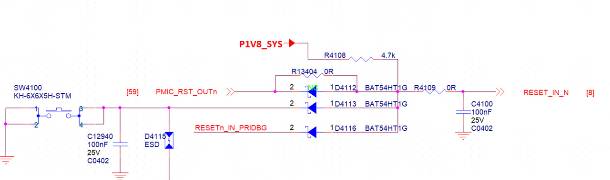

#### 1.1.3 JTAG Interface

- JTAG is supported.

- TDI, TMS, TCK, TDO, as well as Power and GND, should be connected to the J-Link debugger. The signal voltage level must match the debugger supply voltage. The TRSTn signal can be either connected to the J-Link debugger or pulled up to the Power rail.

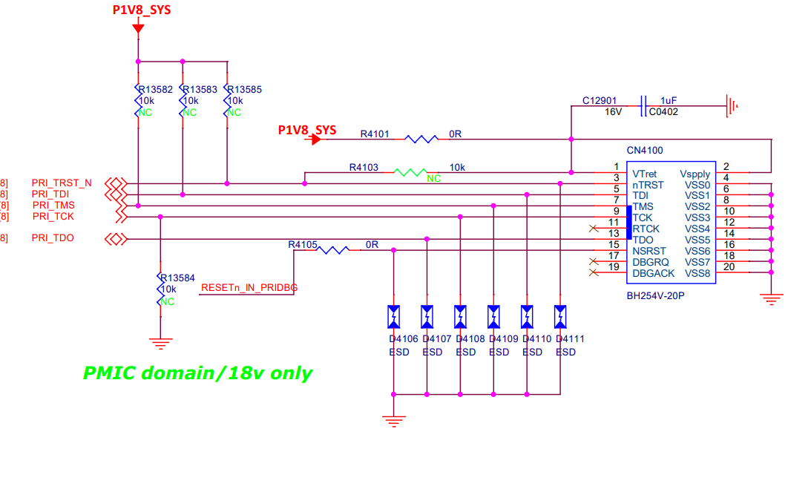

#### 1.1.4 Power Management (PMIC) Circuit Design

- The recommended input supply for **P1** is **4 V**.
  Vin3 and Vin4 should follow the reference PCB design with isolated inputs.
  Vin5 and Vin6 should also follow the reference PCB design with isolated inputs.

- A **220 pF capacitor** must be added by default on SW1 to SW6 of P1.

- The **FB and FBGND pins of BUCK1/BUCK2** must be connected to the corresponding FB and FBGND pins of the main controller.
  In the PCB layout, these feedback traces must be kept away from noise-sensitive or high-interference signals.

- The following diagrams show the power solution for the **LPDDR5 version**:

  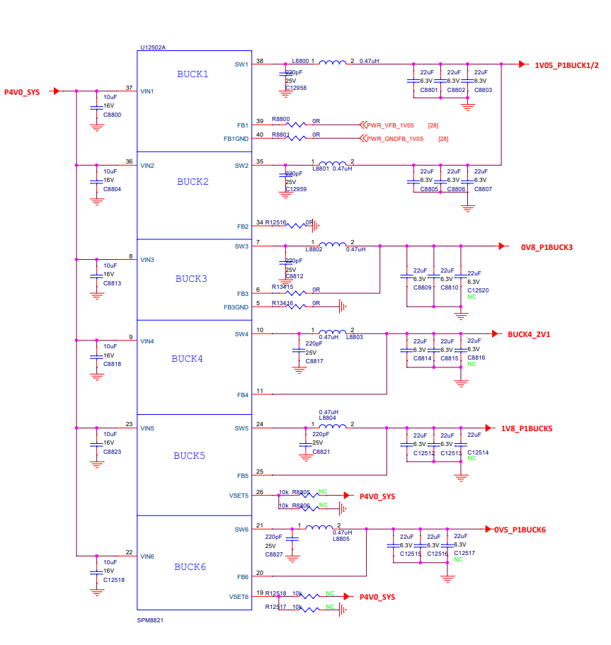
  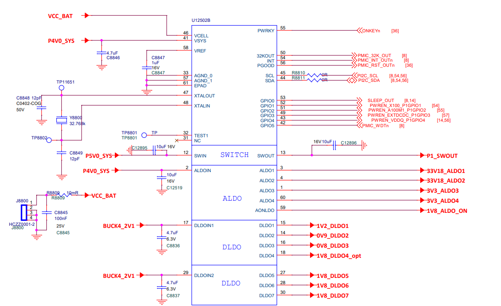

- The following diagrams show the power solution for the **LPDDR4x version**:

  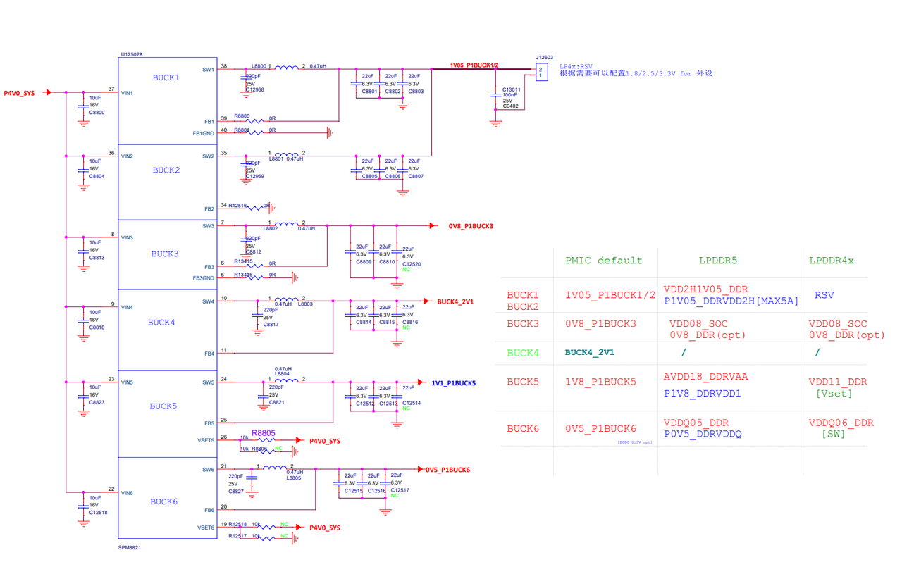
  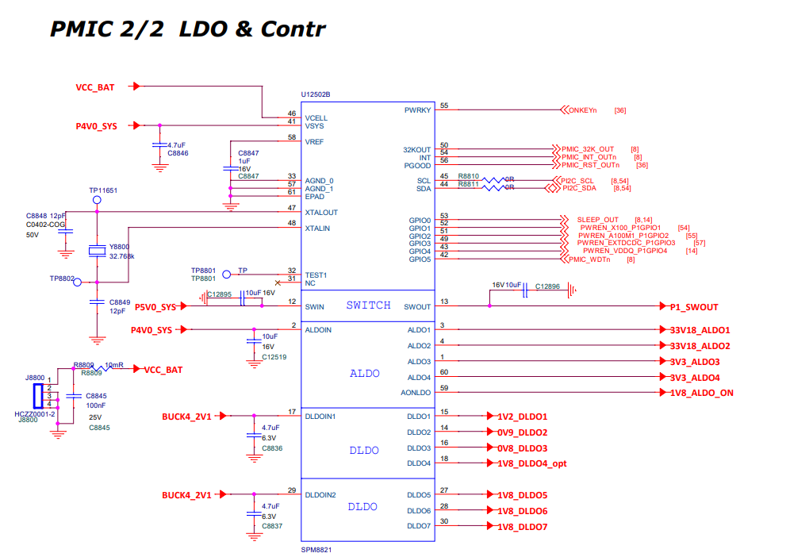

> Note: The PMIC (P1) peripheral circuitry must strictly follow the reference design provided by SpacemiT.
> Related design files are included in the hardware package of the release.

#### 1.1.5 Hardware Initialization and System Configuration Circuit

There are 5 strap pins: GPIO65, GPIO66, GPIO68, GPIO69, and GPIO90.
The configuration combinations are defined as follows:

1. Boot

   | Mode | GPIO[66] (Strap 1) <br> [default down] | GPIO[65] (Strap 0) <br> [default down] | Function |
   |------|----------------------------------------|----------------------------------------|----------|
   | 1    | 0                                      | 0                                      | TF card → eMMC [default] |
   | 2    | 1                                      | 0                                      | TF card → SPI NOR |
   | 3    | 0                                      | 1                                      | TF card → SPI NAND |
   | 4    | 1                                      | 1                                      | TF card → UFS |

2. Download selection

   | GPIO[68] (Strap 2) <br> [default down] | Function      | Notes |
   |----------------------------------------|---------------|-------|
   | 0                                      | USB [default] | USB DRD interface / Type-C |
   | 1                                      | UART          | — |

3. Boot / Download selection

   | GPIO[69] (Strap 3) <br> [default down] | Function       | Notes |
   |----------------------------------------|----------------|-------|
   | 0                                      | Boot [default] |       |
   | 1                                      | Download       |       |

4. QSPI mode selection

   | GPIO[64] (Strap 4) <br> [default down] | Function |
   |----------------------------------------|----------|
   | 0                                      | 3.3 V [default] |
   | 1                                      | 1.8 V |

5. LPDDR strap

   | GPIO[52] (Strap 5) <br> [default down] | Function |
   |----------------------------------------|----------|
   | 0                                      | LPDDR5 |
   | 1                                      | LPDDR4x |

#### 1.1.6 System Clock

The chip has two clock inputs: 24 MHz and 32.768 kHz.

The main system clock is generated from the internal oscillator together with an external 24 MHz crystal. The chip also integrates an internal 1 MΩ resistor.

The 32.768 kHz clock is used as an external RTC clock input. Since the PMIC already integrates an RTC clock source, the 32.768 kHz clock can also be provided by the PMIC.

The load capacitors should be selected according to the crystal oscillator datasheet. The recommended value is 12 pF.

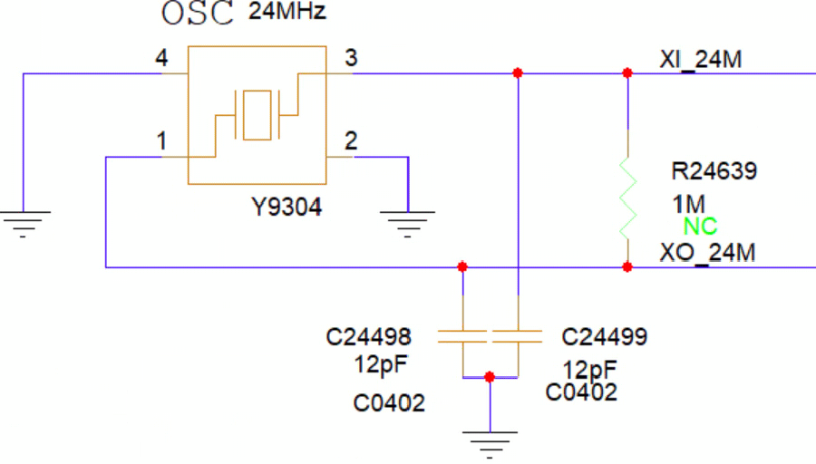

> Note: The selected capacitors must match the crystal load capacitance. NPO dielectric is recommended. A 4-pin SMD crystal is preferred, with two GND pins well tied to board ground to improve the ESD robustness of the system clock.

#### 1.1.7 Flash

- Quad-SPI serves as the interface for external serial flash devices and supports up to four bidirectional data lines.
- The Flash controller supports both SPI NOR Flash and SPI NAND Flash.
- Both 1.8 V and 3.3 V Flash devices are supported. The interface voltage level should follow the VCC1833_QSPI power domain configuration. For level selection details, see [1.1.5 Hardware Initialization and System Configuration Circuit](#115-hardware-initialization-and-system-configuration-circuit).
- Dual CS is supported.

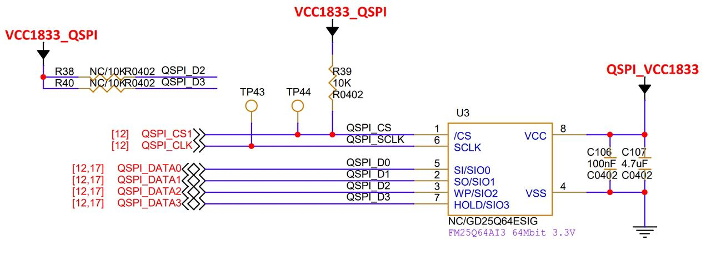

#### 1.1.8 eMMC

- Complies with the 8-bit eMMC 5.1 specification.
- It is recommended to reserve external pull-up / pull-down options for the eMMC Data and DS signals, and leave them as NC in production.

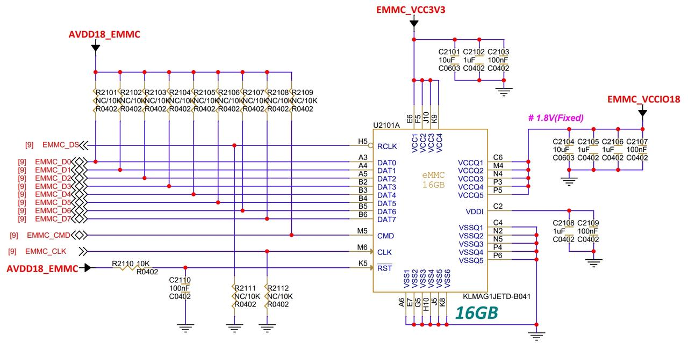

#### 1.1.9 UFS

- Supports UFS 2.2.
- The reference design is compatible with a 1.2 V UFS design.
  If 1.2 V UFS is not required, the corresponding circuitry does not need to be reserved.

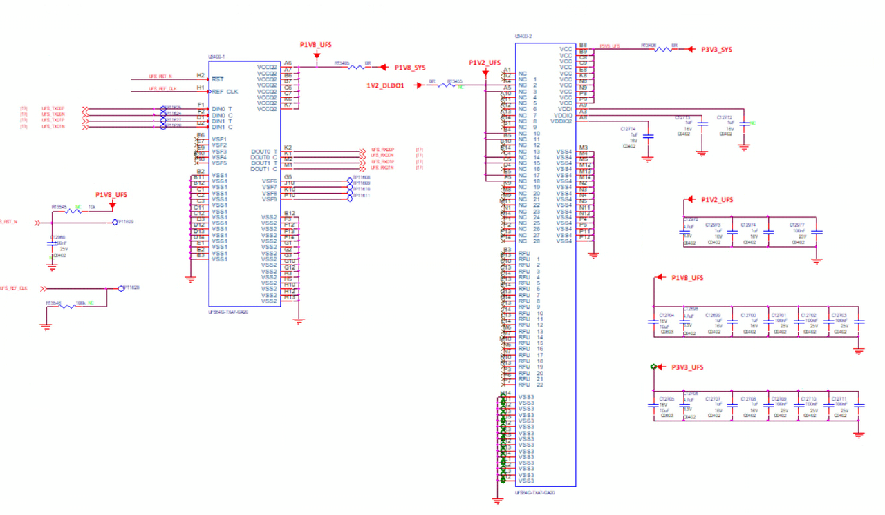

### 1.2 Power Design Recommendations

#### 1.2.1 Chip Power Topology

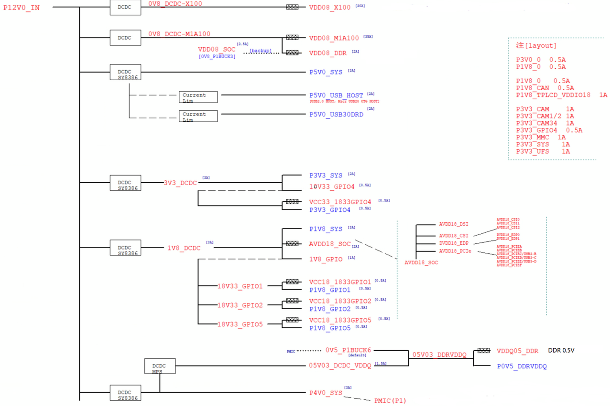

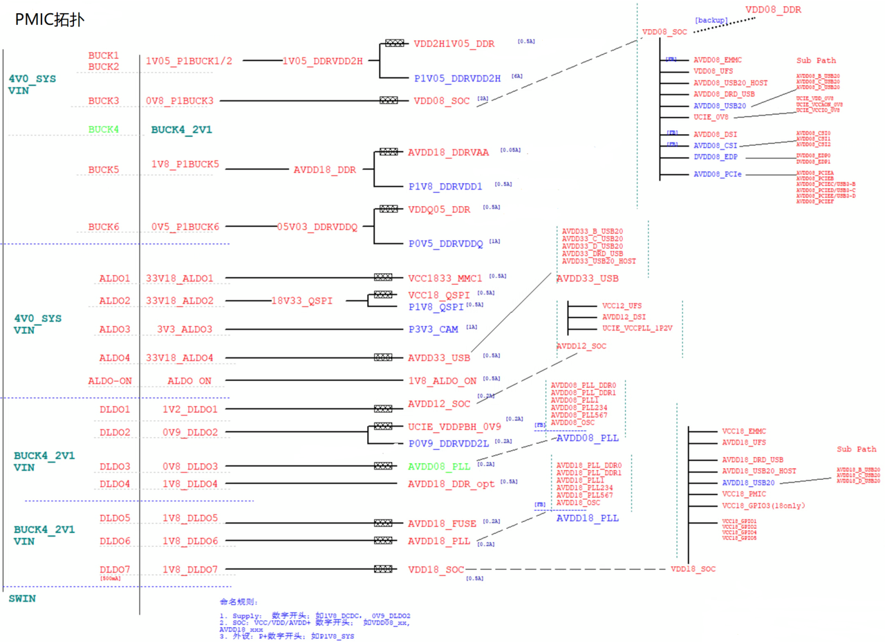

#### 1.2.2 Chip Power Input Description

| Module | Power Pins | Description |
| --- | --- | --- |
| DDR_PLL | DDR0_AVDD08_PLL, DDR1_AVDD08_PLL, DDR0_AVDD18_PLL, DDR1_AVDD18_PLL | DDR PLL power supply |
| SYS_PLL | AVDD08_PLL1, AVDD08_PLL234, AVDD08_PLL567, AVDD18_PLL1, AVDD18_PLL234, AVDD18_PLL567 | System PLL power supply |
| DDR | VAA18_VDD2H_DDR, VAA18_VDD2H_DDR, VDD0V8_DDR, VDD2H_DDR, VDDQ_DDR | DDR IO power, DDR digital logic power, DDR VAA power |
| QSPI | VCC1833_QSPI | QSPI flash power supply |
| SD | VCC1833_SD | SD interface power supply |
| GPIO | VCC18_GPIO1, VCC1833_GPIO1, VCC18_GPIO2, VCC1833_GPIO2, VCC18_GPIO3, VCC18_GPIO4, VCC1833_GPIO4, VCC18_GPIO5, VCC1833_GPIO5 | GPIO power supply |
| eMMC | AVDD08_EMMC, VCC18_EMMC | eMMC storage power supply |
| MIPI-DSI | AVDD08_DSI, AVDD12_DSI, AVDD18_DSI | MIPI DSI power supply |
| DP/eDP | AVDD18_EDP0, DDD08_EDP0, AVDD18_EDP1, DDD08_EDP1 | DP/eDP power supply |
| MIPI-CSI | AVDD08_CSIO, AVDD18_CSIO, AVDD08_CSI1, AVDD18_CSI1, AVDD08_CSI2, AVDD18_CSI2 | MIPI CSI power supply |
| USB2.0-HOST | AVDD08_USB20_HOST, AVDD18_USB20_HOST, AVDD33_USB20_HOST | USB power supply |
| USB3.0-DRD | AVDD08_DRD_USB, AVDD18_DRD_USB, AVDD33_DRD_USB | USB power supply |
| PCIe3.0 combo USB | AVDD08_B_USB20, AVDD08_C_USB20, AVDD08_D_USB20, AVDD18_B_USB20, AVDD18_C_USB20, AVDD18_D_USB20, AVDD33_B_USB20, AVDD33_C_USB20, AVDD33_D_USB20, AVDD18_PCIE0, AVDD08_PCIE0, AVDD18_PCIE1, AVDD08_PCIE1, AVDD18_PCIE2/USB3-B, AVDD08_PCIE2/USB3-B, AVDD18_PCIE3/USB3-B, AVDD08_PCIE3/USB3-B, AVDD18_PCIE4/USB3-B, AVDD08_PCIE4/USB3-B, AVDD18_PCIE5, AVDD08_PCIE5 | PCIe and USB combo module power supply |
| UFS | AVDD18_UFS, VCC12_UFS, VDD08_UFS | UFS power supply |
| eFUSE | AVDD18_FUSE | eFUSE power supply, can be left unconnected |
| OSC | AVDD08_OSC, AVDD18_OSC | System clock power supply |
| CPU & SYS | VCC_CPUX, VCC_SYS | CPU and system power supply |

#### 1.2.3 Power-On Sequence

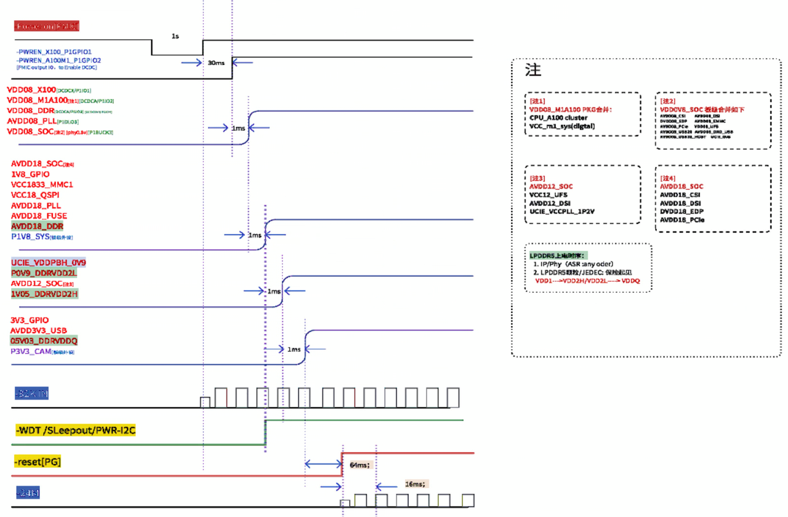

#### 1.2.4 Power-Off Sequence

After reset is asserted low, each power rail is powered down in the reverse order of the power-on sequence.

#### 1.2.5 CPU Power Design

The chip integrates 16 high-performance CPU cores, consisting of 8 X100 cores and 8 A100 cores.

- The X100 and A100 clusters are powered independently, with each rail supplied by a separate output of the multiphase controller.
- The A100 cluster shares its power rail with the system (SYS) power domain.

Special attention must be paid to decoupling capacitor count, capacitance values, and PCB layout, which must strictly follow the reference design.

When selecting the power solution, the following requirements must be met:

- The power supply slew rate must be greater than 70 A/us.
- Due to the high current demand of the CPU, the regulator must support remote sensing, and the feedback (FB) must be taken from the chip ball (load point).
- Power efficiency and thermal performance must be carefully considered to manage heat dissipation.

For detailed implementation, refer to the K3 reference schematic design.

#### 1.2.6 DDR Power Design

The K3 chip supports LPDDR5 and LPDDR4x, with two channels.

For the supply voltages, refer to [1.2.1](#121-chip-power-topology) and [1.2.2](#122-chip-power-input-description).

- The LPDDR power-on sequence must follow the memory device requirements.
- The PHY itself has no specific power-on sequence requirement.

> Note: Some supply voltages differ between LPDDR5 and LPDDR4x devices. Refer to the schematic design for the exact requirements.

The number and values of the decoupling capacitors must strictly follow the schematic and PCB layout design.
For detailed circuit implementation, refer to the K3 reference schematic design.

#### 1.2.7 IO Power Design

The K3 chip provides a total of 128 GPIOs. Among them, 34 GPIOs support only 1.8 V, while the remaining GPIOs support either 1.8 V or 3.3 V.

- Pins named VCC18_GPIO must be connected to a 1.8 V digital power supply.
- Pins named VCC1833_GPIO should be connected to either a 3.3 V or 1.8 V digital power supply, depending on the external device requirements.
  The GPIO voltage level must be determined during hardware design and cannot be configured by software.
- GPIO domains:
  - GPIO1 / GPIO2 / GPIO4 / GPIO5: dual-voltage domains (1.8 V / 3.3 V)
  - GPIO3: 1.8 V only domain

#### 1.2.8 PLL Power Design

The K3 PLL power is divided into two voltage domains:

- AVDD08_PLL: This rail must be isolated with a ferrite bead in the design (120 Ω @ 100 MHz, DC resistance ≤ 0.07 Ω; the same ferrite bead requirement applies below).
- AVDD18_PLL: The 1.8 V supply must also be isolated using a ferrite bead.

For detailed implementation, refer to the K3 reference design schematics.

#### 1.2.9 DP/eDP/MIPI-DSI Power Design

The K3 chip supports two DP/eDP interfaces and one MIPI-DSI interface.
DP0/eDP0 and MIPI-DSI share a combo PHY.

- Decoupling capacitors must not be removed and should be placed as close as possible to the corresponding pins during layout.

Power supply noise (ripple) requirements:

- AVDD18_EDP, DVDD08_EDP: ripple must be within ±3%
- AVDD08_DSI, AVDD12_DSI, AVDD18_DSI: ripple must be within ±3%

For detailed circuit implementation, refer to the K3 reference schematic design.

#### 1.2.10 PCIe/USB Power Design

The power supply noise (ripple) requirements for PCIe and USB are as follows:

- 0.8 V rails: within ±3%
- 1.2 V rails: within ±3%
- 1.8 V rails: within ±3%
- 3.3 V rails: within ±3%

For detailed circuit implementation, refer to the K3 reference schematic design.

> Note: Even if a PHY is not used, its corresponding power rails must still be powered.

### 1.3 Analog Interface Design Guidelines

#### 1.3.1 I2S Interface

- The K3 chip supports 8 I2S interfaces.
  I2S0–I2S5 are controlled by the main CPU, while R_I2S0 / R_I2S1 are controlled by the RCPU.
- Each I2S interface can be configured as master or slave, and supports both TDM and PCM modes.

#### 1.3.2 MIPI CSI RX Configuration Interface Design

K3 supports the following CSI input configurations:

- 4-lane + 4-lane + 4-lane, or
- 4-lane + 4-lane + 2-lane + 2-lane


- MIPI CSI0 differential data is sampled using the MIPI_CSI0_CLK differential clock.
- MIPI CSI1 differential data is sampled using the MIPI_CSI1_CLK differential clock.
- MIPI_CSI2
  - [2-lane mode]:
    MIPI_CSI2_D2P/N and MIPI_CSI2_D3P/N are sampled using MIPI_CSI3_CLKP/N.
  - [2-lane mode]:
    MIPI_CSI2_D0P/N and MIPI_CSI2_D1P/N are sampled using MIPI_CSI2_CKP/N.
  - [4-lane mode]:
    MIPI_CSI2_D0P/N, D1P/N, D2P/N, and D3P/N are all sampled using MIPI_CSI2_CKP/N.
- Power supply variation must be controlled within ±3%.

For detailed circuit implementation, refer to the K3 reference schematic design.

#### 1.3.3 MIPI DSI Interface Design

K3 provides one MIPI TX PHY, which is shared (combo) with DP/eDP0.

- Supports both 8-lane and 4-lane modes
- The maximum data rate: 4.5 Gbps/lane
- For power ripple requirements, refer to [1.2.9](#129-dpedpmipi-dsi-power-design)

For detailed circuit implementation, refer to the K3 reference schematic design.

#### 1.3.4 DP/eDP Interface Design

K3 supports two DP/eDP PHYs, enabling dual-display independent output.

- Maximum resolution: 3840 × 2160 @ 60 fps
- Supported link rates: 1.6 / 2.7 / 5.4 Gbps
- For power ripple requirements, refer to [1.2.9](#129-dpedpmipi-dsi-power-design)

For detailed circuit implementation, refer to the K3 reference schematic design.

### 1.4 Peripheral Interface Design Guidelines

#### 1.4.1 PCIe/USB2.0/USB3.0

K3 supports

- 4 USB 3.0 interfaces
- 5 USB 2.0 interfaces

Among them:

- 3 USB 3.0 interfaces are multiplexed with PCIe Combo
- 4 USB 2.0 interfaces are multiplexed with USB 3.0 Combo
- One dedicated USB 2.0 interface supports OTG

- USB 3.0 signals require ESD protection.
  The ESD device must have parasitic capacitance < 0.5 pF and should be placed close to the USB connector.
- When interfacing USB3.0 devices or modules, AC coupling capacitors (100 nF) must be placed in series with the differential pairs:
  - RX capacitors: placed near the external device
  - TX capacitors: placed near the K3 chip
- USB20_A_DRD_USB_M is used as the chip download interface.
- The K3 PCIe interfaces are multiplexed with USB 3.0 combo interfaces. The multiplexing relationship is shown below:

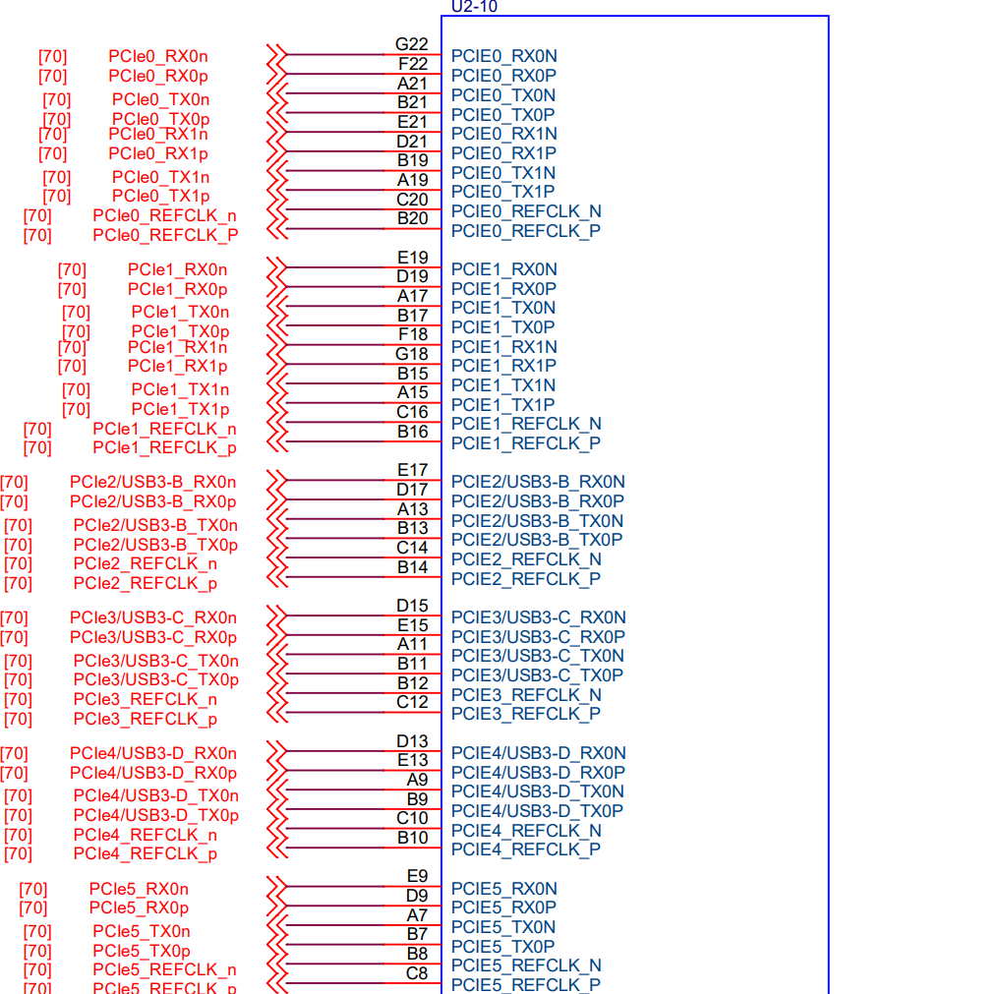

- The PCIe sideband signal names for the controllers are listed below. Among them, PCIeA/B support hot-plug, while PCIeC/D support partial hot-plug functionality.

| PCIeA | PCIeC | PCIeB | PCIeD | PCIeE |
| --- | --- | --- | --- | --- |
| PCIeA_PERSTn | PCIeC_PERSTn | PCIeB_PERSTn | PCIeD_PERSTn | PCIeE_PERSTn |
| PCIeA_WAKEn | PCIeC_WAKEn | PCIeB_WAKEn | PCIeD_WAKEn | PCIeE_WAKEn |
| PCIeA_CLKREQn | PCIeC_CLKREQn | PCIeB_CLKREQn | PCIeD_CLKREQn | PCIeE_CLKREQn |
| PCIeA_PRSNT2n | PCIeC_PRSNT2n | PCIeB_PRSNT2n | PCIeD_PRSNT2n | PCIeE_ATTN |
| PCIeA_ATTN | PCIeC_ATTN | PCIeB_ATTN | PCIeD_ATTN | PCIeA_PWRCTn |
| PCIeA_PWRCTn | PCIeC_PWRCTn | PCIeB_PWRCTn | PCIeD_PWRCTn | PCIeA_AUXEn |
| PCIeA_AUXEn | PCIeC_AUXEn | PCIeB_AUXEn | PCIeD_AUXEn | PCIeA_PWRDet |
| PCIeA_MRLn | PCIeC_PWRDet | PCIeB_PWRDet | PCIeD_PWRDet | PCIeA_MRLn |
| PCIeA_ATNLED | PCIeC_ATNLED | PCIeB_ATNLED | PCIeD_ATNLED | PCIeA_PWRLED |
| PCIeA_EINT | PCIeC_EINT | PCIeB_EINT | PCIeD_EINT | PCIeA_EINTEG |
| PCIeB_EINTEG | PCIeC_EINTEG | PCIeB_EINTEG | PCIeD_EINTEG | PCIeE_EINTEG |

- The mapping relationship between PCIe/USB controllers and PCIe/USB PHY interfaces is shown below:

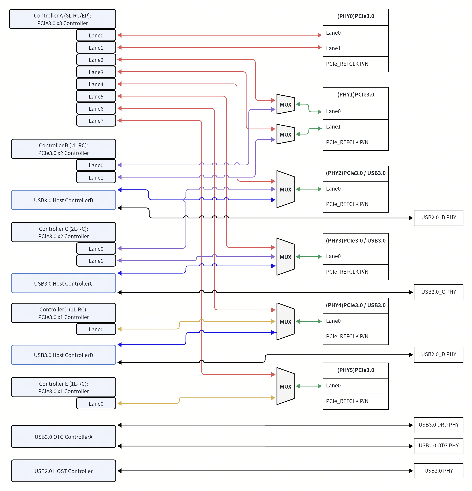

- PCIe controller A supports EP mode with up to 8 lanes. Its usage is as follows:
  - The 8 lanes are composed of 6 PHYs: x2 + x2 + x1 + x1 + x1 + x1
  - Each PHY requires a reference clock (clkref) input. All clkref signals must be source-synchronous and meet the jitter requirements.
  - An internal clkref is integrated. When used in EP mode, if the internal clkref is selected, only one PHY can be used, either x2 or x1.

> Note: Regardless of which PCIe interface is used, PCIe/USB3_RCAL must be pulled up to AVDD08_OSC through a 240 Ω ±1% resistor.

#### 1.4.2 UART

The K3 provides 17 UART interfaces, divided into two categories: X100 UART and RCPU UART.

- X100 UART: 11 ports
  - UART0: 2-wire debug interface
  - UART1–UART10: 4-wire interfaces
  - UART1 can be used in the secure domain
- RCPU UART: 6 ports

#### 1.4.3 IIC

The K3 provides 11 IIC interfaces.

- 9 x general-purpose I2C interfaces.
- 1 × PWR I2C and 1 × RCPU PWR I2C, used for power IC configuration and control

#### 1.4.4 MMC

The K3 chip provides 2 MMC interfaces (MMC1 / MMC2).

- MMC1 supports dynamic voltage switching between 3.3 V and 1.8 V.
- Both MMC1 and MMC2 support SDIO devices.
- `MMC2` supports only a single fixed voltage level (3.3 V or 1.8 V), which is determined by the hardware design.

SD card usage:

- MMC1 supports all SD card features, including switching between high-speed mode and default-speed mode, and supports dynamic voltage switching.
- MMC2 does not support dynamic voltage switching for SD cards. It supports only low-speed mode, or SD cards that operate only at 1.8 V.

#### 1.4.5 GMAC Interface

The K3 chip supports 4 GMAC controllers, providing RMII, RGMII, and MII interfaces for connection to external PHYs. Among them, 3 are in the ACPU and 1 is in the RCPU.

- GMAC0 and GMAC1 support RGMII, RMII, and MII.
- GMAC2 and GMAC3 support RGMII and RMII.
- The chip can provide a 25 MHz clock to the GMAC PHY.

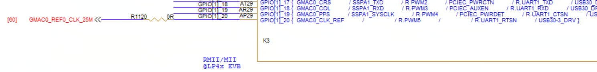

#### 1.4.6 CAN Interface

The K3 provides 10 CAN controllers, with 5 in the X100 CPU domain and 5 in the RCPU domain.

When board-to-board connection is implemented through a connector, it is recommended to place a series resistor with an appropriate value (22 Ω to 100 Ω, selected based on signal integrity (SI) validation), and reserve space for TVS protection devices.

## 2. PCB Design

### 2.1 PCB Stackup Design

To minimize signal reflections during high-speed signal transmission, impedance matching must be maintained at the signal source, receiver, and along the transmission path.

The impedance of a single-ended trace depends on its width and its position relative to the reference plane.

For differential pairs with specific impedance requirements, trace width and spacing depend on the selected PCB stackup.

Since the minimum trace width and spacing are constrained by PCB fabrication type and cost, the chosen stackup must be able to meet all impedance requirements on the board, including inner and outer layers, and both single-ended and differential routing.

Principles for defining the layer stack:

1. The layer adjacent to the component side should be a ground plane to provide a routing reference for component-side traces.
2. All signal layers should be adjacent to a ground plane whenever possible.
3. Avoid placing two signal layers directly adjacent to each other.
4. High-current power planes should be adjacent to a ground plane whenever possible.
5. The stackup should use a symmetrical structure.

K3 uses a 10-layer, 2-stage stackup design. The figure below shows the recommended reference stackup.
If a different stackup is used, impedance must be recalculated based on the PCB vendor specifications.

In the 10-layer design:

- Routing layers: L1 / L3 / L6 / L8 / L10
- Reference planes: L2 / L4 / L5 / L7 / L9

For DDR routing, control single-ended impedance to 45 Ω and differential impedance to 85 Ω.
For other signals, control single-ended impedance to 50 Ω and differential impedance to 90 Ω.

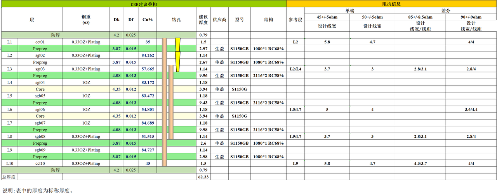

K3 CPU fanout design:

- The first two rows of balls can be fanned out on the top layer.
- For traces fanned out from the second row on the top layer, a neck-down width of 3 mil can be used, then restored to the normal trace width after leaving the CPU breakout area.

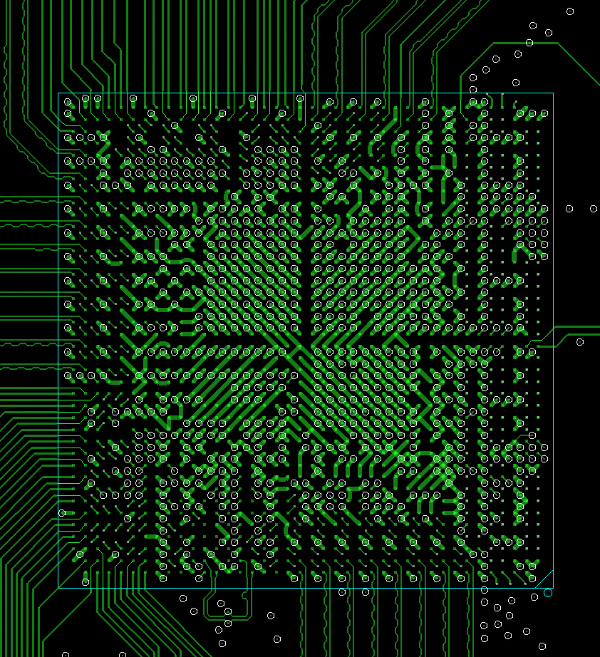

If signals are used in both the first and second rings, then starting from the third row, routing must switch layers and fan out through inner layers.
Arrange vias in the CPU area uniformly, preserve large continuous regions for ground and power planes. As shown below, after copper is poured on the ground plane, multiple channels remain connected to the external ground, which benefits SI/PI performance and heat dissipation.

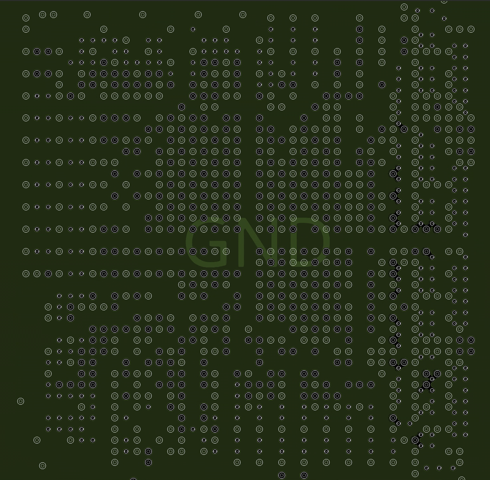

### 2.2 General Routing Guidelines

1. Avoid right-angle and acute-angle corners in routing.
2. Avoid routing near clock-related components (crystals, oscillators, clock generators/distributors), switching power supplies, and magnetic components.
3. Ensure all traces have a complete and continuous reference plane.
4. Use traces to bridge plane splits in the BGA area.
5. Minimize via stub length. A via stub length of 0 is recommended.
6. Trace length calculations should include vias and package effects.
7. For differential signals:

- Intra-pair skew is the delay difference between the two traces within the same differential pair.
- Inter-pair skew is the delay difference between different differential pairs.
- Signal spacing refers to air gap.

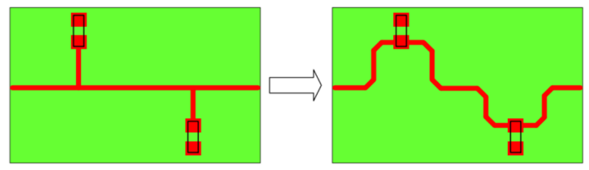

Recommendations for high-speed signal routing:

1. When changing layers for high-speed signals, add a nearby GND stitching via next to the signal via to maintain return-path continuity.

  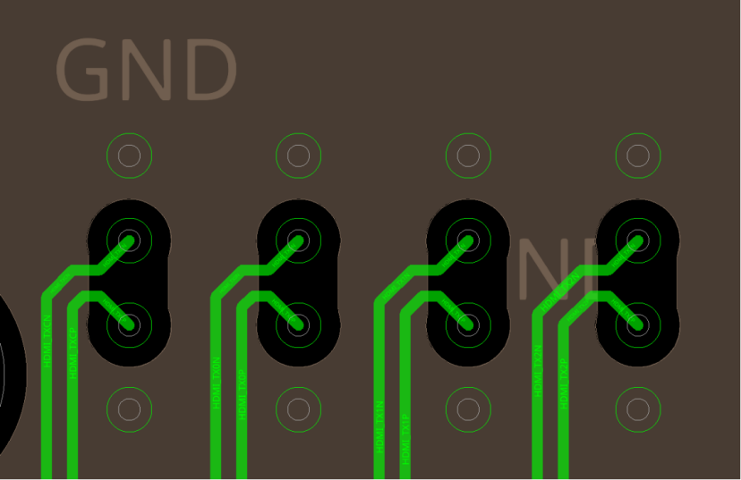

2. SMT pads can reduce impedance. To minimize the impact of impedance discontinuities, it is recommended to clear one reference-plane layer directly beneath the SMT pad, sized to match the pad.
   Common SMT components include:
   - ESD devices
   - Capacitors
   - Common-mode chokes
   - Connectors

   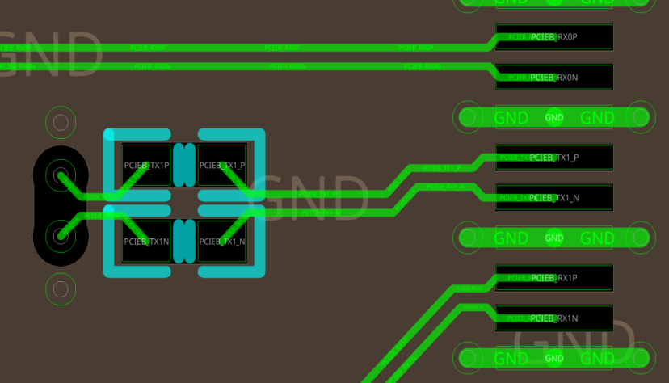

3. Avoid fiberglass weave effect.

   The fiber weave effect refers to the local variation in the dielectric constant of the PCB substrate, caused by the gaps within the woven glass fiber structure used as the reinforcing material.

   The PCB dielectric is typically composed of glass fiber fabric and resin. The voids within the glass fiber weave are filled with resin. Because the dielectric constants of glass fiber and resin differ significantly:

   - Traces routed over glass fiber bundles experience a higher effective dielectric constant
   - Traces routed over resin-rich regions (between fiber bundles) experience a lower effective dielectric constant

   This variation leads to the fiber weave effect.

   For high-speed signals, the fiber weave effect introduces two primary issues:

   1. Periodic impedance variation along the trace
   2. Intra-pair skew between the P and N traces of a differential pair

   When interface data rates reach 8 GT/s or higher, and trace lengths exceed 1.5 inches, the fiber weave effect must be carefully managed.

   The following methods are recommended to mitigate its impact.
   - **Method 1:** Adjust the routing angle by introducing a ~10° skew to the trace direction, or rotate the PCB panel by 10° during fabrication, ensuring that traces are not routed parallel to the glass fiber weave.

    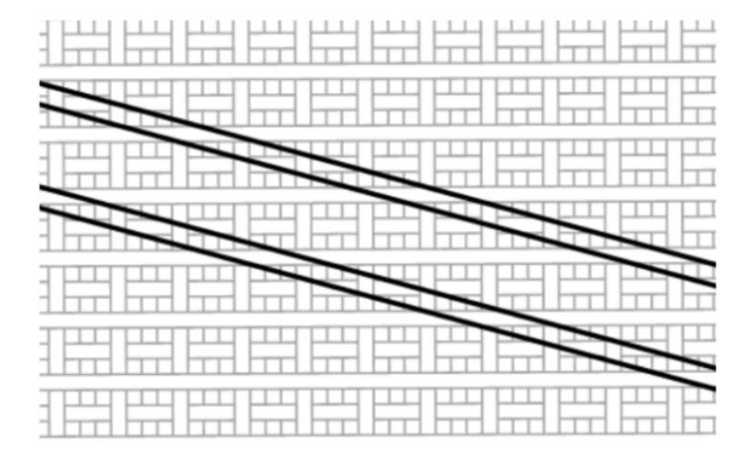

   - **Method 2:** Use ZigZag routing.
     In the figure below, W should be at least 3 times the fiberglass weave pitch. Recommended values:
      - W = 60 mil
      - θ = 10°
      - L = 340 mil

    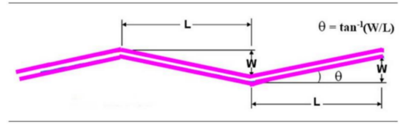

4. Minimize layer changes during routing. If a layer change is necessary:

   - Consider via stub impact
   - Keep via stub length as short as possible

5. Recommendation for differential vias:

   If the interface speed is 8 GT/s, it is recommended to add a dog-bone structure to the vias of those differential pairs, and optimize the dog-bone dimensions through simulation based on the actual stackup.

   The following dimensions are reference values for a 10-layer, 2-stage HDI design:

   - R Drill = 4 mil (drill radius)
   - R Pad = 8 mil (via pad radius)
   - D1 = 30 mil, center-to-center spacing of the differential vias
   - D2 = 15 mil, anti-pad size from top layer to bottom layer
   - D3 = 30 mil, center-to-center spacing between the signal via and the return GND via

    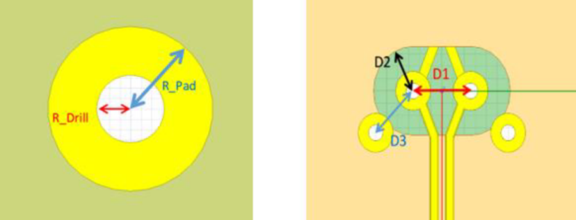

6. It is recommended to keep P/N length matching within a differential pair to ≤ 5 mil.

   If serpentine tuning is needed for P/N length compensation, the serpentine geometry must be carefully controlled to meet the requirements shown below, so as to minimize the impact of impedance discontinuities.

   

### 2.3 Power and Decoupling Capacitor Design

1. Place decoupling capacitors as close as possible to the corresponding pins.
   Use short, wide traces for both power and GND connections to the vias.

2. The power plane from the supply source to the load should:
   - have a short path
   - cover a large area
   - avoid being excessively fragmented by vias

3. To achieve better PI performance:
   - select capacitors according to the reference design
   - do not reduce the number of capacitors

4. For via placement:
   - follow the reference design
   - do not remove power vias or GND vias

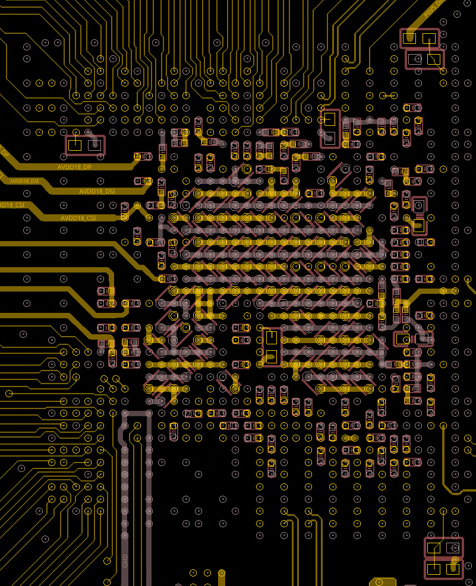
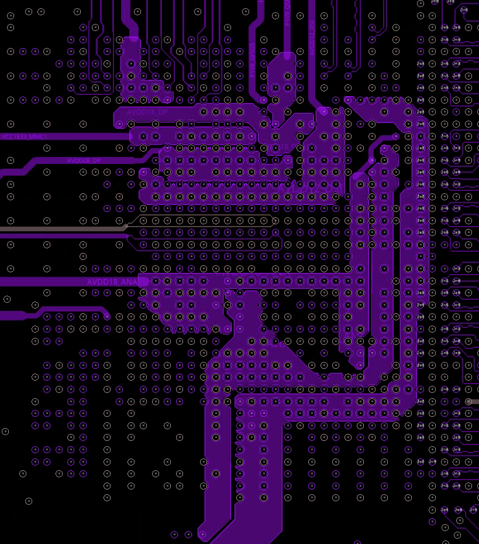
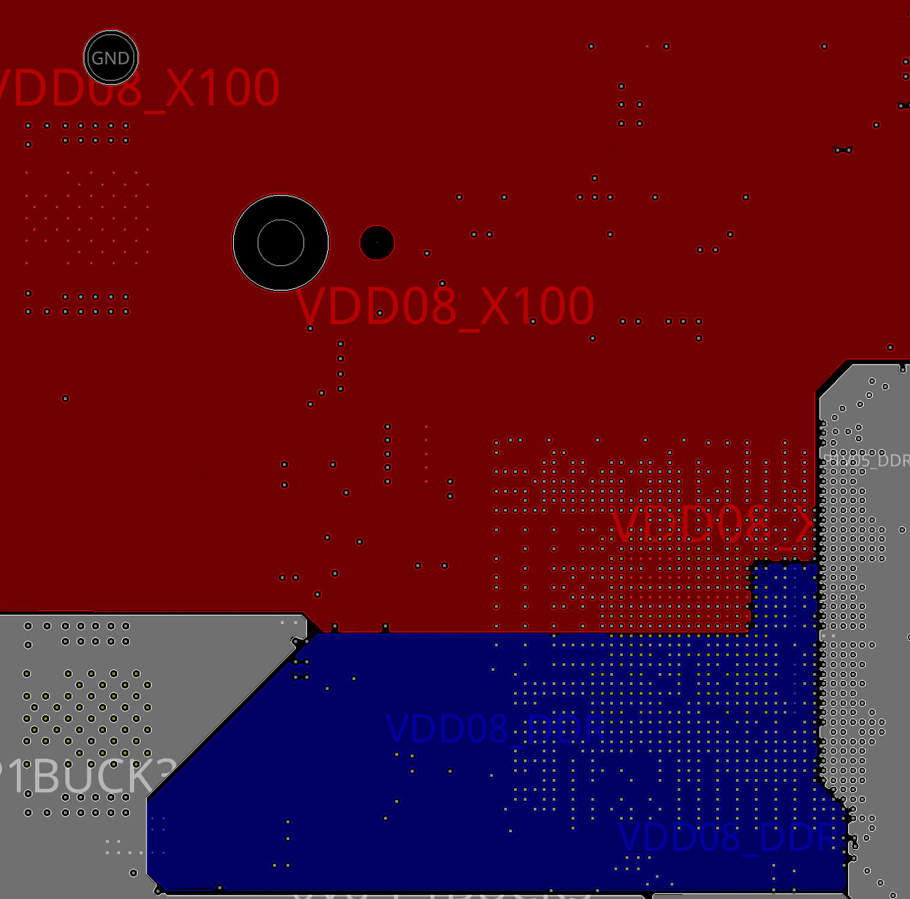
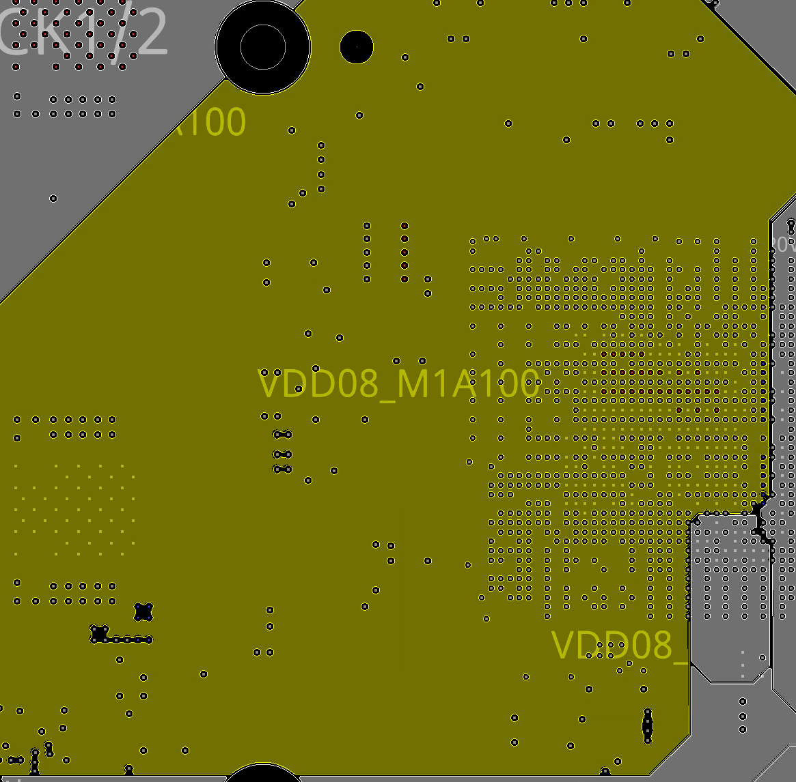
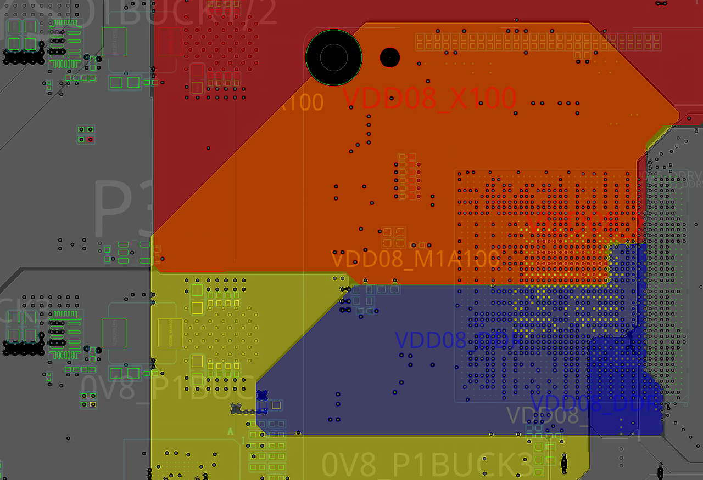

### 2.4 P1 Power Layout Design

1. Add an evenly distributed array of GND vias on the center thermal pad:

   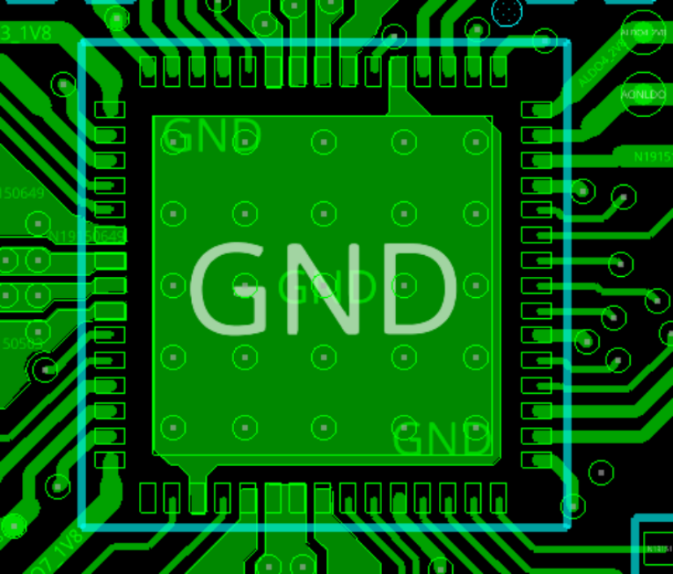

2. Route the input copper for BUCK3 / BUCK4 / BUCK5 / BUCK6 separately.
   Do not merge their Vin copper pours.

   BUCK1 / BUCK2 may share a merged copper pour. Use three vias per pin.

   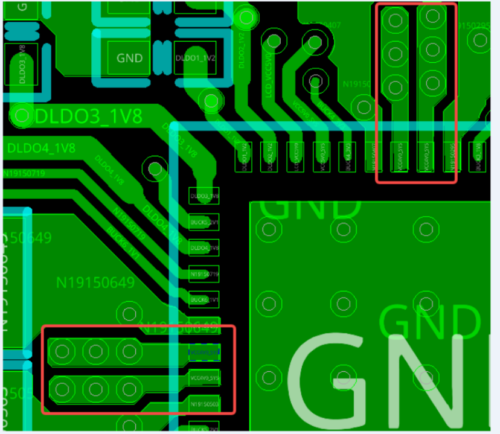

3. Route the FB trace on an inner layer when changing layers.
   Avoid long parallel routing with the SW node on the same layer.

   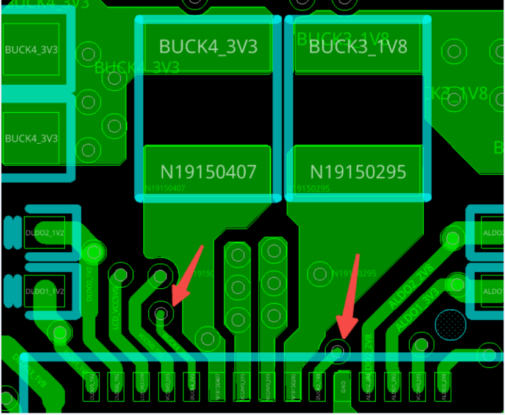

4. Place decoupling capacitors close to the main chip, and ensure the power trace width matches the reference design

   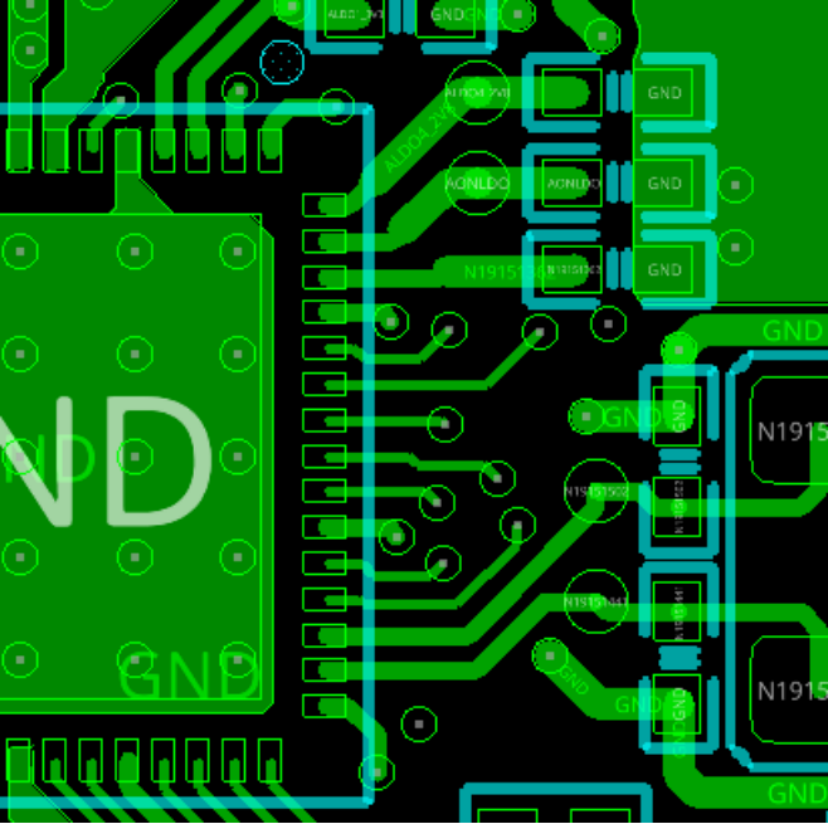

5. Apply copper pour on the SW node, and keep the path short, and ensure other signals are kept away from SW nodes

   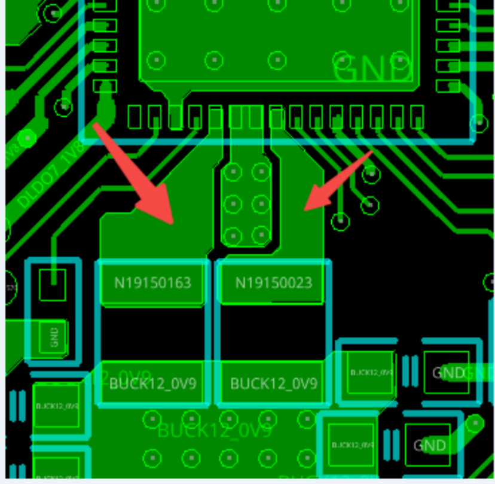

### 2.5 Minimal System Design

For minimal systems consisting of CPU, DDR, and UFS, it is strongly recommended to use the reference board design provided by SpacemiT.

This design has been validated through both simulation and actual testing.

If a custom design is required, rigorous simulation validation is required, as the risk is significant.

#### 2.5.1 DDR - PCB Layout Recommendations

For 10-layer PCBs, DDR data signals should be routed on layer 3 and layer 8, referencing the solid ground planes on Layer 2/4 and Layer 7/9, respectively.

If the GND plane is incomplete, signal quality will be significantly affected.

DDR spacing and length matching requirements for DDR design are shown in the table below:

| Parameter | Requirement |
| --- | --- |
| DDR single-ended signal impedance | 45 Ω ±10% |
| Differential signal impedance | 85 Ω ±10% |
| Spacing between different Bytes (air gap) | >= 2× trace width |
| Spacing within the same Byte (air gap) | >= 2× trace width |
| Length matching between differential pair P/N | <= 5 mil |
| Byte group matching (referenced to CLK) | <= 40 mil |

Due to the high speed of the DDR interface, PCB design is challenging. It is highly recommended to use the DDR template and corresponding DDR firmware provided by SpacemiT, which has been released after rigorous simulation and testing validation.

If designing independently, follow the guidelines below and complete simulation verification before fabrication:

1. GND via design (CPU and DDR sides). 
   Follow the reference template strictly. Do not arbitrarily remove GND vias. 
   The template pin GND via design is shown below:

    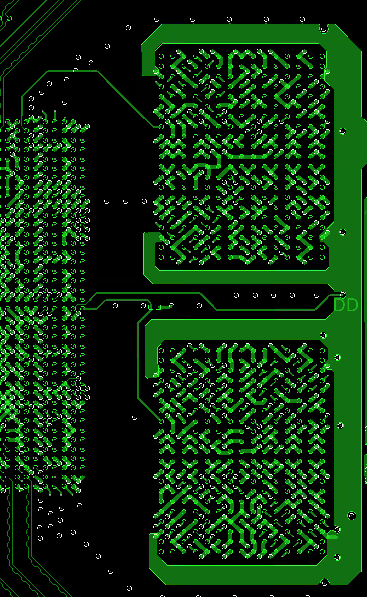

2. Crosstalk from the trace itself affects signal delay. When routing for length matching, it is recommended that S ≥ 3W.

    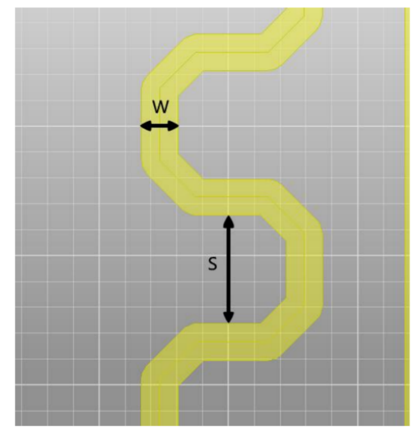

3. In the DDR chip area, it is recommended to have one GND via per pin. Add additional GND vias wherever space permits.
  
4. Adjust via positions to optimize plane splits and improve return paths.

    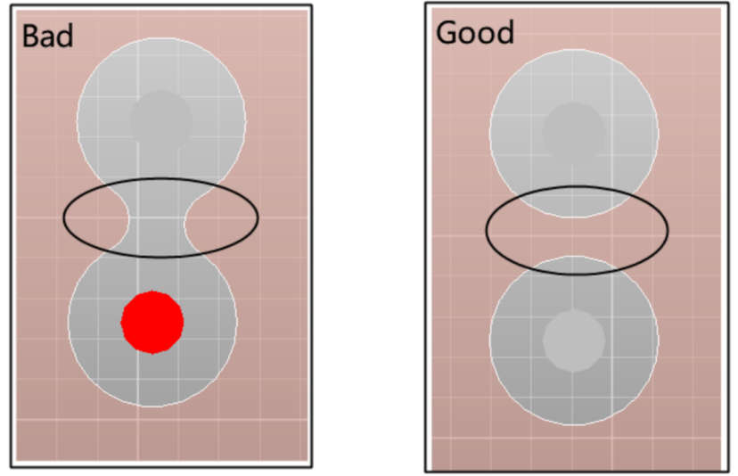

5. Each capacitor pad should have at least one via. For 0603/0805 package capacitors:
   - Use two vias per pad
   - Place vias close to the pin location to reduce loop inductance

    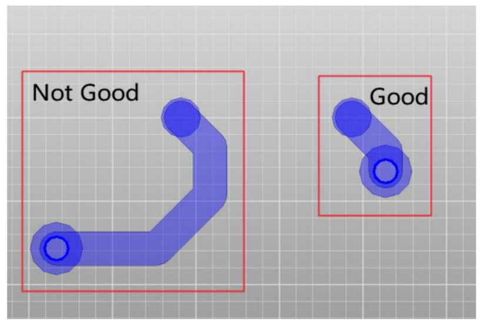

6. For DDR module power supplies with FB (feedback) lines:
   - The FB line feedback point should be close to the far-end power supply point of the MCU and DDR ball
   - If there are vias for layer changes in between, cutouts should be made to avoid them

#### 2.5.2 eMMC - PCB Layout Recommendations

The spacing between eMMC and CPU should follow the reference board design provided by SpacemiT.

If space constraints require a custom design:
- Minimize the trace distance from CPU to eMMC
- Keep it within 1500 mil

For length matching:
- Match D0-D7, CMD, and DS relative to CLK
- Control within ≤ 100 mil

| Parameter | Requirement |
| --- | --- |
| Trace impedance | Single-ended 50 Ω ±10% |
| Data-to-clock length matching | < 120 mil |
| Trace length | < 3 inch |
| Spacing between eMMC signal lines | ≥ 2× eMMC trace width |
| Spacing between eMMC and other signals | ≥ 2× eMMC trace width |
| Number of layer transition vias | ≤ 2 |

#### 2.5.3 UFS Signal PCB Design

Insertion loss requirement: < 2 dB @ 3 GHz

Return loss requirements:
- < -13 dB @ 600 MHz
- < -5 dB @ 3 GHz
- < -3 dB @ 6 GHz

| Parameter | Requirement |
| --- | --- |
| Trace impedance | Differential 90 Ω ±10% |
| Maximum P/N skew within differential pair | ≤ 5 mil |
| Clock-to-data length matching | ≤ 50 mil |
| Trace length | < 1500 mil |
| Spacing between differential pairs | ≥ 4× UFS trace width |
| Spacing between UFS and other signals | ≥ 4× UFS trace width |
| Number of layer transition vias | No more than 2 |

### 2.6 Interface Design

#### 2.6.1 GMAC Signal PCB Design

Keep GMAC signal traces as short as possible and minimize layer transitions.

Specific routing requirements:

| Parameter | Requirement |
| --- | --- |
| Trace impedance | Single-ended 50 Ω ±10% |
| Clock-to-data length matching | < 120 mil |
| Trace length | < 5000 mil |
| Spacing between GMAC signal lines | ≥ 2× GMAC trace width |
| Spacing between GMAC and other signals | ≥ 2× GMAC trace width |

#### 2.6.2 SDIO Signal PCB Design

| Parameter | Requirement |
| --- | --- |
| Trace impedance | Single-ended 50 Ω ±10% |
| Clock-to-data length matching | < 120 mil |
| Trace length | < 4000 mil |
| Spacing between SDIO and other signals | ≥ 2× SDIO trace width |

#### 2.6.3 USB2.0 Signal PCB Design

| Parameter | Requirement |
| --- | --- |
| Trace impedance | Differential 90 Ω ±10% |
| Maximum P/N skew within differential pair | ≤ 5 mil |
| Trace length | < 6000 mil |
| Spacing between differential pairs | ≥ 3× USB trace width |
| Spacing between USB2.0 and other signals | ≥ 3× USB trace width |
| Number of vias (layer transitions) | ≤ 3 |

#### 2.6.4 USB3.0 Signal PCB Design

| Parameter | Requirement |
| --- | --- |
| Trace impedance | Differential 90 Ω ±10% |
| Maximum P/N skew within differential pair | ≤ 5 mil |
| Trace length | < 6000 mil |
| Spacing between differential pairs | ≥ 4× USB trace width |
| Spacing between USB3.0 and other signals | ≥ 4× USB trace width |
| Number of vias (layer transitions) | ≤ 2 |

#### 2.6.5 PCIe Signal PCB Design

| Parameter | Requirement |
| --- | --- |
| Trace impedance | Differential 90 Ω ±10% |
| Maximum P/N skew within differential pair | ≤ 5 mil |
| Trace length | < 6000 mil |
| Capacitor requirement | 220 nF ±20% |
| Spacing between differential pairs | ≥ 5× PCIe trace width |
| Spacing between PCIe and other signals | ≥ 5× PCIe trace width |
| Number of vias (layer transitions) | ≤ 2 |

#### 2.6.6 MIPI Signal PCB Design

Insertion loss requirement: < 2 dB @ 2.25 GHz

Return loss requirement: < -12 dB @ 2.25 GHz

Minimize inter-lane crosstalk. When performing length matching, import pin_delay values.

| Parameter | Requirement |
| --- | --- |
| Trace impedance | Differential 90 Ω ±10% |
| Maximum P/N skew within differential pair | ≤ 5 mil |
| Clock-to-data length matching | v 12 mil |
| Trace length | < 6000 mil |
| Spacing between differential pairs | ≥ 4× MIPI trace width |
| Spacing between MIPI and other signals | ≥ 4× MIPI trace width |
| Number of vias (layer transitions) | ≤ 2 |

#### 2.6.7 DP/eDP Signal PCB Design

PCB insertion loss requirement: < 2 dB @ 2.7 GHz

| Parameter | Requirement |
| --- | --- |
| Trace impedance | Differential 90 Ω ±10% |
| Maximum P/N skew within differential pair | ≤ 5 mil |
| Clock-to-data length matching | ≤ 50 mil |
| Trace length (standard material DK:3.9 DF:0.02) | < 3000 mil |
| Trace length (IT-170GRA1BS DK:3.5 DF:0.008) | < 6000 mil |
| Spacing between differential pairs | ≥ 5× DP trace width |
| Spacing between DP and other signals | ≥ 5× DP trace width |
| Number of vias (layer transitions) | ≤ 2 |

## 3. Thermal Design

### 3.1 Thermal Resistance Simulation Results

| Package | Jc (℃/W) | Jb (℃/W) |
| --- | --- | --- |
| Thermal resistance | 0.17 |  |

> Note: The values shown are derived from simulation and are for reference purposes only. Final validation shall be performed using actual measurement data.

### 3.2 Chip Thermal Control Strategy

#### 3.2.1 Basic Information

Thermal control strategy: step_wise (temperature rise triggers gradual frequency reduction, temperature drop triggers gradual frequency recovery)

Key parameters:
- OPP index starts from 0. Lower index = higher frequency
- Hysteresis: 2 ℃ (trigger temperature - 2 ℃ = exit temperature)

Dual cluster configuration:
- Cluster1 (CPU0–7): opp_table0_x100
- Cluster2 (CPU8–15): opp_table0_a100

OPP index to frequency mapping (per DTS order):

```
Cluster1 (CPU0–7)
OPP0: 2400 MHz
OPP1: 2300 MHz
OPP2: 2200 MHz
OPP3: 2150 MHz
OPP4: 2100 MHz
OPP5: 2000 MHz
OPP6: 1900 MHz
OPP7: 1850 MHz
OPP8: 1800 MHz

Cluster2 (CPU8–15)
OPP0: 2000 MHz
OPP1: 1900 MHz
OPP2: 1850 MHz
OPP3: 1800 MHz
OPP4: 1700 MHz
OPP5: 1600 MHz
OPP6: 1500 MHz
OPP7: 1400 MHz
OPP8: 1300 MHz
```

#### 3.2.2 Full Temperature Range Strategy (Heating + Cooling)

1. Temperature < 83 ℃

   Status: No limitation (maximum performance)
   - Cluster1: 2400 MHz (OPP0)
   - Cluster2: 2000 MHz (OPP0)

   Temperature rise: ≥85 ℃ → enter 85 ℃ frequency lock

   Temperature drop: maintain full performance, no action

2. 83 ℃ ≤ Temperature < 93 ℃ (85 ℃ active thermal control)

   Limit: Fixed frequency lock
   - Cluster1: OPP2 = 2200 MHz
   - Cluster2: OPP3 = 1800 MHz

   Temperature rise: ≥95 ℃ → enter 95 ℃ dynamic throttling

   Temperature drop: ≤83 ℃ → release lock, restore full performance (OPP0)

3. 93 ℃ ≤ Temperature < 103 ℃ (95 ℃ passive thermal control)

   Limit: Dynamic frequency scaling within range
   - Cluster1: OPP3 ~ OPP5 → 2150 MHz ~ 2000 MHz
   - Cluster2: OPP4 ~ OPP5 → 1700 MHz ~ 1600 MHz

   step_wise behavior:
   - Temperature rise: hotter → higher OPP index → lower frequency
   - Temperature drop: cooler → lower OPP index → higher frequency

   Temperature rise: ≥105 ℃ → enter 105 ℃ deep throttling

   Temperature drop: ≤93 ℃ → return to 85 ℃ fixed frequency lock

4. 103 ℃ ≤ Temperature < 113 ℃ (105 ℃ deep passive thermal control)

   Limit: Deep aggressive throttling
   - Cluster1: OPP6 ~ OPP8 → 1900 MHz ~ 1800 MHz
   - Cluster2: OPP6 ~ OPP8 → 1500 MHz ~ 1300 MHz

   step_wise behavior:
   - Temperature rise: hotter → throttle to lowest frequency in range
   - Temperature drop: cooler → gradually return to higher frequency in range

   Temperature rise: ≥115 ℃ → emergency shutdown

   Temperature drop: ≤103 ℃ → return to 95 ℃ dynamic throttling

5. Temperature ≥ 113 ℃ (115 ℃ critical)

   Action: System immediately shuts down / reboots

   No automatic recovery, manual power-on required

#### 3.2.3 Quick Reference Table

Note: After K3 system boot, the default maximum frequencies are
- X100: 2.2 GHz 
- A100: 1.8 GHz

| Temperature Range | Control Method | Cluster1 | Cluster2 | Temperature Rise Trigger (Enter Next Stage) | Temperature Drop Trigger (Return to Previous Stage) |
| --- | --- | --- | --- | --- | --- |
| < 83℃ | Full performance | 2400 MHz | 2000 MHz | ≥85℃ → frequency lock | None |
| 83~93℃ | Fixed frequency lock | 2200 MHz | 1800 MHz | ≥95℃ → dynamic throttling | ≤83℃ → restore full performance |
| 93~103℃ | Dynamic throttling | 2150~2000 MHz | 1700~1600 MHz | ≥105℃ → deep throttling | ≤93℃ → return to frequency lock |
| 103~113℃ | Deep throttling | 1900~1800 MHz | 1500~1300 MHz | ≥115℃ → shutdown | ≤103℃ → return to dynamic |
| ≥115℃ | Emergency shutdown | Shutdown | Shutdown | Immediate shutdown | No automatic recovery |

### 3.3 PCB Thermal Design Reference

In K3-based systems, the K3 chip is the primary heat source. All thermal management should focus primarily on the chip. Other major heat sources are PMIC, DCDC, and DRMOS.

Key thermal design recommendations:

- Use proper mechanical design to ensure heat exchange pathways between internal components and external air
- Distribute high-power or heat-generating components evenly across the layout to avoid localized hotspots
- Use 8-layer or higher PCB stack-up. Maximize copper content. 10 oz copper thickness is recommended. In addition to meeting signal and power routing requirements, maximize ground plane layers and use large copper pours to assist heat dissipation
- K3 CPU and similar components draw high current. Traces and copper pours must meet current-carrying capacity requirements, otherwise temperature may rise
- Route K3 chip GND pins on the top layer in a grid pattern with cross-connections. Recommended trace width: 10 mil for improved thermal spreading
- For K3 GND balls:
  - Ideally one GND via per ball
  - Minimum: one via per 1.5 balls
  - Adjacent layers must be solid ground planes to enhance heat conduction
- For decoupling capacitor ground pads on the K3 chip backside:
  - Use solid copper pour. Do not use thermal relief connections. 
  - Maintain continuous ground copper for better heat dissipation
- In open areas, add as many GND vias as possible (without breaking power planes) to improve thermal conduction paths

## 4. ESD Design

System 24 MHz clock design:
- Use a 4-pin SMD crystal oscillator
- Connect both GND pins firmly to board ground to enhance system clock immunity
- Keep other traces away from the crystal area
- Do not route traces under the crystal

PCB layout considerations:
- Keep the core subsystem away from metal interface areas to improve overall ESD performance
- Add ESD protection devices to all external connectors (e.g., audio/video I/O, USB, Ethernet, alarm ports, etc.) to strengthen interface immunity

Grounding design:
- For floating ground systems: Do not use split-ground structures in metallized interface areas
- For mounting holes: use plated mounting holes connected to board GND to ensure proper connection between board GND and metal chassis through mounting screws
- For grounded systems:
  - Metal chassis must be properly grounded
  - Use single-point connection between isolated protective ground and board digital ground
  - Place the connection point away from minimal system circuits, preferably near the main power connector

Connector design:
- Use metal-shielded connectors and ensure solid connection to the metal chassis (e.g., HDMI and USB with mounting screws, RJ45 with spring contacts)

## 5. Production Temperature Profile

K3 chips use environmentally friendly materials. Pb-Free process is recommended. The reflow profile below provides process recommendations only. Adjust according to actual production conditions.

**Reflow Profile**

| Material / Parameter / Tool | Criteria | 49VP03 |
| --- | --- | --- |
| Soaking time (127~170 ℃) | 60~90 sec | 61~64 sec |
| Ramp up rate (170~245 ℃) | 0.5~1.2 (℃/sec) | 0.81~0.86 (℃/sec) |
| Peak temperature | 235~245 ℃ | 235.94~238.3 ℃ |
| Reflow time (> 220 ℃) | 35~55 sec | 44~47 sec |
| Cooling rate (245~120 ℃) | ≤ 2.5 (℃/sec) | 1.23~1.28 (℃/sec) |
