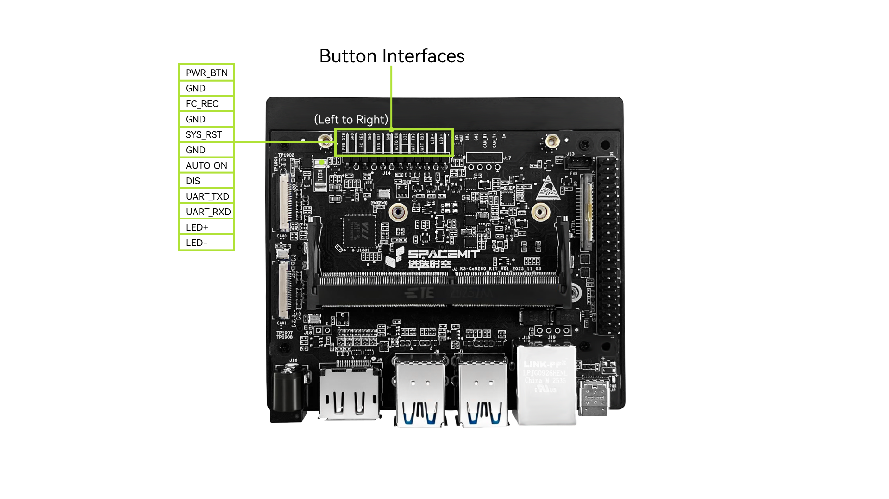
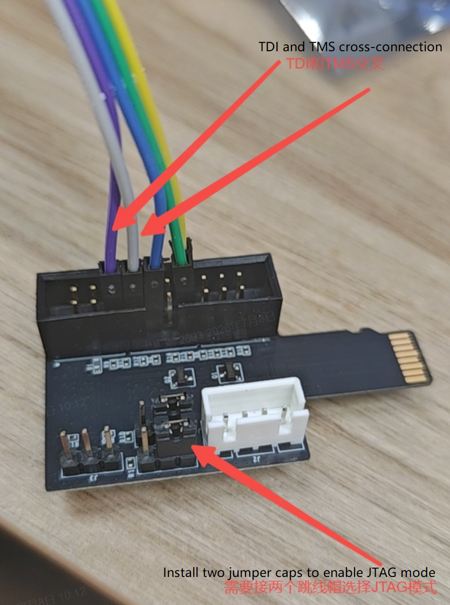
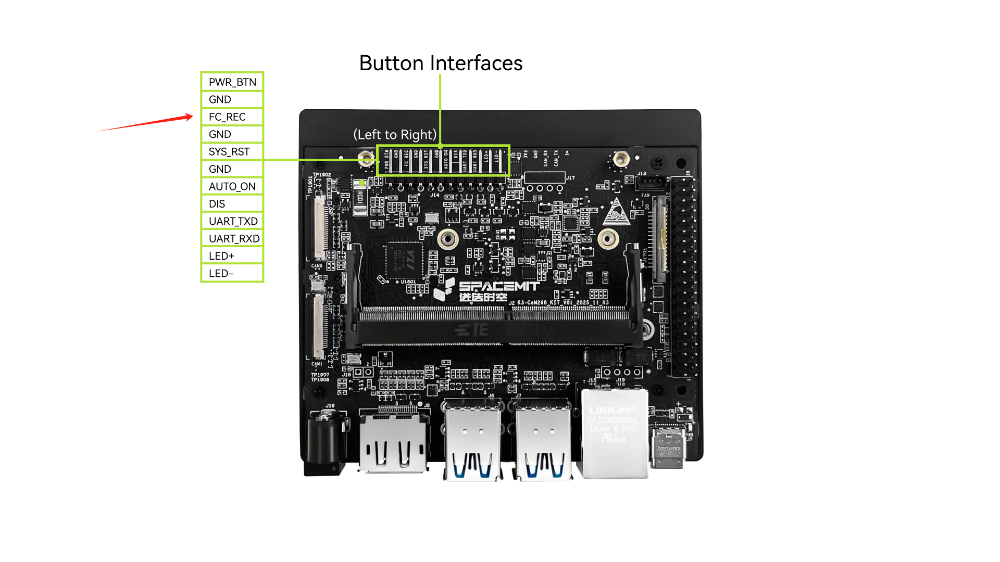

# K3 Hardware FAQ

## Development and Debugging

1. How to get the user guides for the K3 Pico-ITX and K3 CoM260 development kits?

    They are available at the following links:

    - [K3 Pico-ITX User Guide](https://spacemit.com/community/document/info?lang=en&nodepath=hardware/eco/k3_pico/pico_user_guide.md)
    - [K3 CoM260 Development Kit User Guide](https://spacemit.com/community/document/info?lang=en&nodepath=hardware/eco/k3_com260/com260_user_guide.md)

2. How should the serial port and JTAG be connected for debugging on K3 Pico-ITX?

    - Serial port location:
     
    - Connection method: Connect the TX pin of the serial cable to the RX pin of the K3 Pico-ITX, and connect the RX pin of the serial cable to the TX pin of the K3 Pico-ITX.
    - Serial debugging requirements: A 3.3 V serial cable is required.
    - PRI JTAG debugging:
     

3. How should the serial port and JTAG be connected for debugging on the K3 CoM260 development kit?

    - Serial port location:
    

    - Connection method: Connect the TX pin of the serial cable to the RX pin of the K3 CoM260 kit, and connect the RX pin of the serial cable to the TX pin of the K3 CoM260 kit.
    - Serial debugging requirements: A 3.3 V serial cable is required.
    - PRI JTAG debugging: JTAG debugging is supported by means of a TF-card-to-JTAG adapter.
      > Note: TDI and TDO must be cross-connected between the JTAG debugger and the adapter board (debugger TDI → adapter TDO, debugger TDO → adapter TDI); TMS connects straight through. See the diagram below.
     

## Power System

This section answers common questions about the power system, including DCIN, P1 (the multi-channel power management IC), power domains, DCDC, battery, charger, and fuel gauge.

1. What is the accuracy of the RTC integrated in P1?

    The RTC in P1 has an accuracy of 20 ppm.

2. Which power rails remain powered during sleep and shutdown?

    > TBD

3. Can the ferrite beads in the K3 power supply design be removed?

    No. Ferrite beads are used to isolate the analog PHY power supply from the digital power supply, helping maintain power integrity and stability. Removing them may introduce power noise and reduce chip performance.

4. Can unused LDOs on P1 be reassigned to other functions?

    Yes, but the following points should be verified:
    - Confirm that the default LDO output voltage meets the application requirements.
    - Confirm that the target peripheral can tolerate the LDO output voltage.

5. Can the PMIC automatically power on the system at a scheduled time while the system is powered off?

    Yes.
    - The PMIC supports RTC alarm wake-up.
    - When the scheduled time is reached, P1 starts directly without any additional interrupt output signal.

6. Does P1 support automatic power-on when an adapter is connected?

    In the current design, P1 powers up automatically when the adapter is connected, and no manual action is required.
    On K3 CoM260, the board powers on automatically by default when the adapter is connected. If `AUTO ON` and `DIS` on the 12-pin key header are shorted, the board powers on only after the `PWR_BTN` button is pressed.

7. If P1 does not use a dedicated adapter detection circuit, how is adapter insertion detected?

    Detection is handled by the internal detection mechanism integrated into P1.
    - P1 detects the VIN input through its internal circuitry and then triggers power-on.

8. If the battery still has charge and the system is powered off, will connecting the adapter automatically power on the system?

    No. In this case, connecting the adapter will not automatically start the system. Manual power-on through the button is required.

9. Can P1 be powered directly from a 3.7 V battery?

    Yes. P1 can be powered directly from a 3.7 V battery.

10. Is the on/off timing of the integrated SW switch in P1 configurable?

    No. The on/off timing of the integrated switch in P1 is fixed and cannot be adjusted.

11. Why does the integrated SW switch in P1 still conduct even when it is off?

    - This is a known design characteristic. When SW is off, current can still flow through the body diode of the MOSFET integrated in the P1 SW path, but the current capability is very limited.
    - Recommendation: To ensure normal operation and expected performance, SW should be enabled during standard use.

12. Does P1 provide an always-on LDO that becomes active immediately after power is applied?

    Yes. P1 includes an always-on LDO called AONLDO. It begins outputting as soon as P1 is powered, and its default output voltage is 1.8 V.

13. Can all ALDO-series LDOs be configured to 3.3 V, switched quickly to 3.3 V during startup, and kept enabled during sleep to provide continuous power?

    - Yes, all ALDO-series LDOs can be configured for 3.3 V output.
    - During system startup, ALDO can be set to 3.3 V in the SPL stage through rapid configuration. This takes about 490 ms.
    - ALDO can also be kept enabled during sleep so that critical circuits remain powered.

14. Can the output voltage of every LDO on P1 be adjusted?

    Yes. The output voltage can be customized as needed, but the default enable state and default voltage setting of each LDO must be taken into account.

15. The K3 reference design includes multiple current measurement resistors, resulting in a star-routed PCB power layout. If these resistors are removed and all AVDD and DVDD rails are connected directly to the same 1.8 V power plane, would that cause any issues?

    No. The series power-consumption test circuits on the power rails can be removed and shorted directly without causing issues.

16. Can the 1.8 V supplies for CSI, eDP, and GPIO all be connected to the same 1.8 V power plane? Do the analog AVDD and digital GPIO 1.8 V supplies need to remain separate?

    In the reference design, any path that uses ferrite beads must retain them and should not be merged directly. Paths that use only series resistors may be merged.

## Storage System

This section answers common questions about the storage system, including DRAM, eMMC, TF card, SSD, SPI Flash, and EEPROM.

1. What is the purpose of adding an EEPROM? Must the EEPROM I2C interface use K3 I2C2?

    It is used to identify different hardware configurations, allowing a single firmware image to support multiple hardware variants.
    Either I2C2 or I2C6 can be used.

2. What is the minimum Flash capacity required for K3?

    The minimum NOR Flash capacity is 8 MB for a UEFI boot solution, or 4 MB for a standard U-Boot boot solution.

3. Is the boot method selected by software priority by default, or can it also be switched using DIP switches?

    The chip provides strap pins, so the boot method can be switched through DIP switch design.

4. If K3 uses a 64-bit DDR interface, can only 32 bits be used while leaving the other 32 bits unconnected?

    No.

5. Besides LPDDR5, does K3 support any other DDR types?

    K3 supports both LPDDR5 and LPDDR4x.

6. How is firmware programmed into eMMC or UFS?

    By default, firmware is downloaded and programmed through USB 3.0 or USB 2.0.

## Clock System

This section answers common questions about the clock system, including DCXO and PLL.

## Reset System

This section answers common questions about the reset system.

## Display System

This section answers common questions about the display system, including MIPI DSI and HDMI.

1. If DSI is not used, does the DSI block still need power?

    Yes. Even when the DSI module is not used, it still requires power.

## Audio System

This section answers common questions about the audio system, including codec, speaker, PA, and MIC.

## Camera System

This section answers common questions about the camera system, including MIPI CSI and USB.

1. If CSI is not used, does the CSI block still need power?

    Yes. Even when the CSI module is not used, it still requires power.

## Networking System

This section answers common questions about the networking system, including Ethernet, Wi-Fi, BT, 4G, and 5G.

1. If 100M Ethernet is used and the PHY supply voltage is only 3.3 V, how should the connection be made?

    > TBD

2. In a single-port Ethernet application, does selecting GMAC0, GMAC1, GMAC2, or GMAC3 affect software behavior?

    No. In a single-port application, using GMAC0, GMAC1, GMAC2, or GMAC3 does not affect software functionality.

## Peripherals and Interfaces

This section answers common questions about peripherals and interfaces, including USB, SPI, I2C, I2S, UART, PCIe, ADC, PWM, CAN, GPIO, key input, CTP, sensors, and LEDs.

1. Do all K3 IOs support interrupt input?

    No. Only IOs multiplexed to GPIO functions support interrupt input.

2. Does K3 provide a SATA interface?

    K3 does not provide a native SATA interface. However, SATA can be added through a PCIe-to-SATA bridge, and ASM1061 and JMB582 adapter cards are already supported.

3. Does USB0 default to device mode at power-up? Besides firmware download, can it also operate in host mode?

    USB0 defaults to device mode at power-up for firmware download.
    It also supports host mode for connecting other USB devices.

4. After a PCIe-to-SD card interface is used, is TF-card-based firmware download still supported?

    No. TF-card-based firmware download is not supported when a PCIe-to-SD card interface is used.

5. Does K3 support ADC functionality?

    K3 does not support ADC functionality, but P1 does.

6. Are any GPIOs restricted, or are all GPIOs available for use?

    All GPIOs can be used. However, RCPU-related development support may progress more slowly, so it is recommended to prioritize X100 functions first and then consider the R_xxx RCPU functions.

7. The K3 Pico-ITX schematic includes EC control. If no EC is used, what can be used instead for power-sequencing control?

    If power sequencing needs to be controlled, the four GPIO enable signals from P1 or the enable signal from the previous power stage can be used. If power management is required and rails need to be switched on or off under different scenarios, K3 GPIOs should be used. There is no restriction on which IO is selected; FAE guidance can be requested if needed.

8. If the CS1 chip select of the QSPI interface is not used, can it be repurposed as GPIO or PWM, or can it only be used as QSPI CS1?

    If it is not used as CS1, it can be repurposed as GPIO or PWM.

9. For GPIO1, GPIO2, GPIO4, and GPIO5 on K3, what are the two supply rails `VCCxx_1833GPIOx` and `VCC18_GPIOx`, and what do they power?

    - `VCC18_GPIOx` is the reference voltage for the internal LDO of the GPIO bank. It can be regarded as the IO reference voltage and is fixed at 1.8 V.
    - `VCCxx_1833GPIOx` is the supply voltage for the GPIO bank. When `VCCxx_1833GPIOx` is 1.8 V, the GPIO bank IO level is 1.8 V. When `VCCxx_1833GPIOx` is 3.3 V, the GPIO bank IO level is 3.3 V. No software configuration is required.

10. Is pin 214 (`FORCE_RECOVERY`) on the K3 CoM260 used as an upgrade/recovery pin?

    Yes. Pull this pin down to GND and then power on the board to enter firmware download mode. On the baseboard shown below, this is the firmware download pin.
    

11. Can MMC2 on the K3 CoM260 core board be used for TF-card firmware upgrade? Can MMC2 be used as a standard SD-card storage interface?

    No. MMC2 cannot be used for TF-card firmware upgrade. Firmware upgrade must use MMC1, which is the TF card interface on the core board. MMC2 also cannot be used as a standard SD-card storage interface.

12. Can `USB20_HOST` on K3 be combined with `USB3-C` or `USB3-D` to form a USB 3.0 interface?

    Yes. Either `USB3-C` or `USB3-D` can be paired with `USB20_HOST`.

13. Does K3 CoM260 have any power-off sequencing requirements?

    No.

14. Is the PCIe reference clock an input or an output? Can EP mode be used?

    In RC mode, the PCIe reference clock is an output. Only `PCIEA` supports EP mode.

15. What is the purpose of the UCIE function?

    The UCIE function is not used on K3. The related signals can be left floating.

16. Is `SSPA` an I2S signal?

    Yes.

17. Can eSPI be used as a standard SPI interface?

    No.

18. What do functions prefixed with `R.` indicate in the K3 symbol?

    K3 includes a real-time core. Functions prefixed with `R.` indicate functions that can be controlled by the real-time core. X100 can also control these `R.` functions.

19. Is the K3 PCIe `REFCLK` output from the K3 CPU? If PCIe 3.0 is used, is the `REFCLK` stable enough to meet requirements, or is an external clock chip needed?

    Yes, `REFCLK` is output by K3. Its stability is sufficient for PCIe 3.0, so no external clock chip is required.

20. In the K3 PCIe schematic symbol, lanes are labeled `PCIE0`, `PCIE1`, and so on, while the multiplexed sideband GPIO functions are labeled `PCIEA`, `PCIEB`, and so on. How do they correspond to each other?

    As shown below, `PCIE0` to `PCIE5` indicate the PCIe PHY order, while `PCIEA` to `PCIEE` indicate the PCIe controller order. The multiplexed sideband GPIO functions correspond to the controller order.

    

## Reliability

This section answers common questions about reliability, including ESD, high and low temperature operation, humidity, lifetime, and EMI.

## Product Certification

This section answers common questions about product certification, including RoHS, CE, CCC, and FCC.

## Other

This section answers miscellaneous questions that do not fall into the categories above, including PCB, mechanical structure, power consumption, thermal design measures, and surface temperature.

1. What is the power consumption of K3 in sleep mode?

    > TBD

2. What are the impedance control requirements for K3 single-ended and differential traces?

    - For single-ended traces, the impedance target is 50Ω±10% (45Ω±10% for DDR).
    - For differential traces, the impedance target is 90Ω±10% (85Ω±10% for DDR).

3. Where can the locating hole information for the K3 CoM260 heatsink be found?

    Refer to the [K3 CoM260 mechanical DXF drawing](https://cdn-resource.spacemit.com/file/chip/K3/K3_COM260_P1_LP5315B_10151900_PCB174_dxf.zip). The top-side reserved height is 3 mm.

4. Is a 3D mechanical model of K3 CoM260 available?

    Yes. The [K3 CoM260 3D mechanical model](https://cdn-resource.spacemit.com/file/chip/K3/hexinban0911_asm.stp) is available for download.

5. What is the board thickness of K3 CoM260?

    The front-side height is 2.8 mm, the back-side height is 2.2 mm, the PCB thickness is 1.2 mm, and the total height is 6.2 mm.
