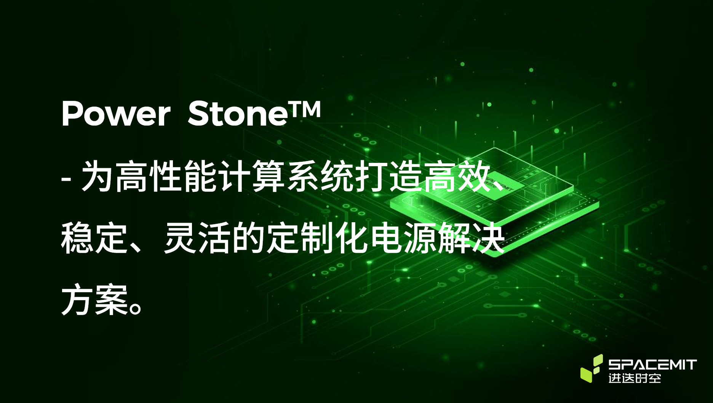

# Power Stone

Power Stone 系列 PMIC 产品将 Buck 降压、线性调整器、负载开关，以及 RTC 等众多电路和功能集成到单颗芯片，超高的芯片集成度显著简化了系统设计；同时为了满足不同应用场景下的客户需求，Power stone PMIC 提供 I2C/ SPMI 接口，以及 OTP/MTP 存储器，可以根据客户具体场景定制上下电时序、默认电压，以及休眠唤醒模式等，让复杂的电源管理变得简单、方便。

## Power Stone 系列

- **[P1](./p1/index.md)**
- **[P1S](./p1s/index.md)**

## 合作请联系

商务微信：SpacemiT1102

商务电话：189–6649–8607

商务邮箱：[business@spacemit.com](mailto:business@spacemit.com)