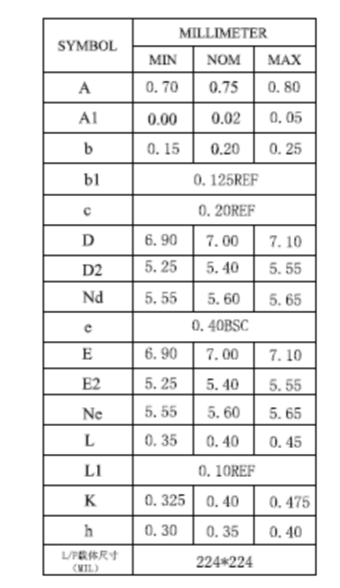
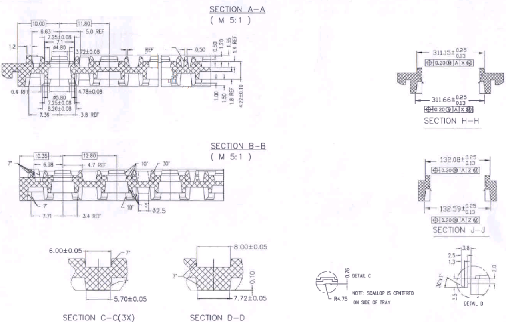
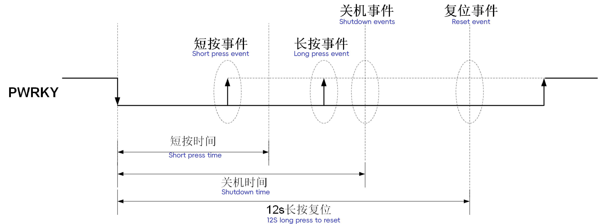
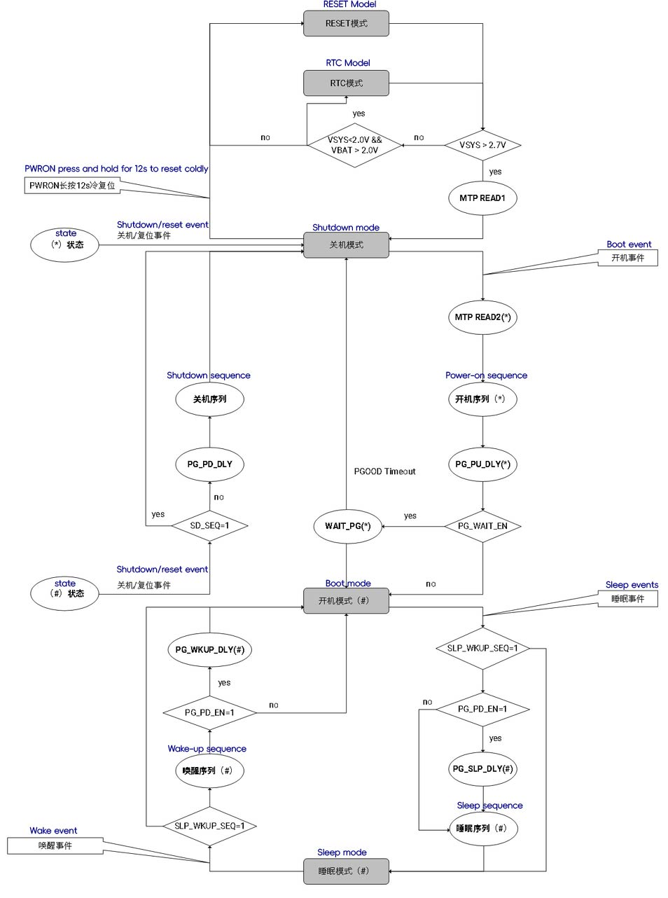
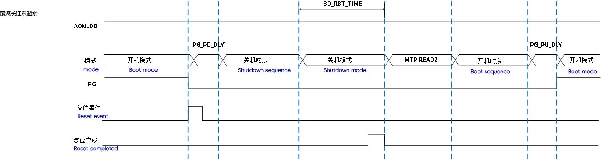
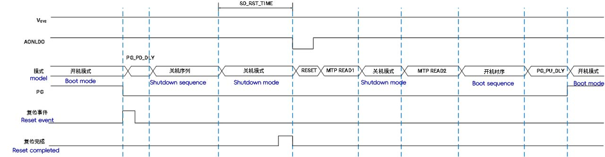

# P1 DataSheet

```
Last Version: 2025/03/31
```

## 1. Overview

### 1.1 Introduction

The **SpacemiT Power Stone® P1** is a high-performance multi-channel **Power Management IC (PMIC)** designed to meet diverse power requirements across various applications, providing customers with a comprehensive power solution. The chip integrates the following functional modules:

- Six constant on-time (COT) control mode buck converters
- Twelve low-dropout regulators (LDOs)
- One I²C interface
- Multi-time programmable (MTP) non-volatile memory

The **P1 **chip is suitable for a wide range of mobile devices and embedded systems, offering highly flexible power management capabilities. It comes with the following most relevant advantages:

- **High-efficiency power conversion**
  The six fully integrated buck converters support multiple target voltage rails, ensuring stable power supply.
- **Fast dynamic response**
  The constant on-time (COT) control mode enables rapid transient load response.
- **Compact design**
  Operating in continuous conduction mode (CCM) with a default switching frequency of 1.5MHz, significantly reducing external inductor and capacitor values.
- **Comprehensive protection mechanisms**
  Includes undervoltage lockout (UVLO), overcurrent protection (OCP), overvoltage protection (OVP), and thermal shutdown**.**
- **Dynamic Voltage Control (DVC)**
  Support for real-time power voltage adjustment based on application requirements.

Additionally, the output voltage and power-up/shutdown sequencing of the P1 chip can be pre-configured via the multi-time programmable (MTP) non-volatile memory interface and controlled through the I²C bus.

The P1 chip requires minimal external components and is housed in a compact QFN-60 package (7mm × 7mm), making it ideal for space-constrained applications.

### 1.2 General Features

- Input Voltage (VIN): 2.7V – 5.5V
- Six high-efficiency buck converters:

  - Buck1/2: 0.5V – 3.4V, 4A, supporting dual-phase operation
  - Buck3/4: 0.5V – 3.4V, 2.5A, supporting dual-phase operation
  - Buck5/6: 0.5V – 3.4V, 2.5A
  - Adjustable output voltage: All buck converters support two regulation ranges:
    - 0.5V – 1.35V (5mV step)
    - 1.375V – 3.4V (25mV step)
  - Adjustable current limit threshold: Optimized basing on different application load currents
  - Dedicated pin for VDDQ voltage selection to support various DDR memory modules
- Twelve programmable LDO regulators:

  - One dedicated always-on LDO
  - Eleven low-noise LDOs
  - Output voltage range: 0.5V – 3.4V, 25mV step
  - Output current range: 0.3A – 0.5A
- One load switch: Maximum output current of 1A
- Communication Interface: I²C interface
- User-programmable memory: MTP (Multi-Time Programmable Memory)
- System monitoring features:

  - Watchdog timer
  - Coin cell battery support
  - Ultra-low-power RTC (2µA) with alarm function
  - 12-bit ADC with 8 channels and configurable alarm thresholds
- Flexible Configuration:

  - Output voltage and power-up/shutdown sequencing can be pre-configured via MTP
  - Six GPIO pins for peripheral device control
- Operating temperature range: -40°C to 125°C
- Package: QFN-60 (7×7mm), 0.4mm pin pitch

### 1.3 Applications

The **P1 PMIC** is designed for a wide range of high-performance devices and systems, including:

- Ultrabooks
- Tablets
- E-readers
- Virtual Reality (VR) / Augmented Reality (AR) devices
- Industrial equipment
- Navigation devices
- Drones

### 1.4 Block Diagram

The architecture of P1 (modules) is depicted below.


## 2. Package Information

### 2.1 Package




### 2.2 Tray Plate




## 3. Pinout Diagram & Description


> **Note.** The definition of the symbols used for the pin type are tabled below.

<table>
<tbody>
<tr>
<td><strong>Pin type</strong></td>
<td><strong>Definition</strong></td>
</tr>
<tr>
<td>DI</td>
<td>Digital input</td>
</tr>
<tr>
<td>DO</td>
<td>Digital output</td>
</tr>
<tr>
<td>DIO</td>
<td>Digital input/output</td>
</tr>
<tr>
<td>PWR</td>
<td>Power supply</td>
</tr>
<tr>
<td>AI</td>
<td>Analog input</td>
</tr>
<tr>
<td>AO</td>
<td>Analog output</td>
</tr>
<tr>
<td>AIO</td>
<td>Analog input/output</td>
</tr>
<tr>
<td>GND</td>
<td>Ground</td>
</tr>
</tbody>
</table>

<table>
<tbody>
<tr>
<td><strong>Pin No.</strong></td>
<td><strong>Name</strong></td>
<td><strong>Type</strong></td>
<td><strong>Description</strong></td>
<td><strong>Reuse function</strong></td>
</tr>
<tr>
<td>1</td>
<td>ALDO3</td>
<td>AO</td>
<td>ALDO3 voltage output</td>
<td> </td>
</tr>
<tr>
<td>2</td>
<td>ALDOIN</td>
<td>PWR</td>
<td>ALDO1~4 power input</td>
<td> </td>
</tr>
<tr>
<td>3</td>
<td>ALDO1</td>
<td>AO</td>
<td>ALDO1 voltage output</td>
<td> </td>
</tr>
<tr>
<td>4</td>
<td>ALDO2</td>
<td>AO</td>
<td>ALDO2 voltage output</td>
<td> </td>
</tr>
<tr>
<td>5</td>
<td>FB3GND</td>
<td>GND</td>
<td>Buck3 output voltage ground feedback</td>
<td> </td>
</tr>
<tr>
<td>6</td>
<td>FB3</td>
<td>AIN</td>
<td>Buck3 output voltage feedback</td>
<td> </td>
</tr>
<tr>
<td>7</td>
<td>SW3</td>
<td>AIO</td>
<td>Buck3 switch node</td>
<td> </td>
</tr>
<tr>
<td>8</td>
<td>VIN3</td>
<td>PWR</td>
<td>Buck3 power input</td>
<td> </td>
</tr>
<tr>
<td>9</td>
<td>VIN4</td>
<td>PWR</td>
<td>Buck4 power input</td>
<td> </td>
</tr>
<tr>
<td>10</td>
<td>SW4</td>
<td>AIO</td>
<td>Buck4 switch node</td>
<td> </td>
</tr>
<tr>
<td>11</td>
<td>FB4</td>
<td>AIN</td>
<td>Buck4 output voltage feedback</td>
<td> </td>
</tr>
<tr>
<td>12</td>
<td>SWIN</td>
<td>AIN</td>
<td>Load switch input</td>
<td> </td>
</tr>
<tr>
<td>13</td>
<td>SWOUT</td>
<td>AO</td>
<td>Load switch output</td>
<td> </td>
</tr>
<tr>
<td>14</td>
<td>DLDO2</td>
<td>AO</td>
<td>DLDO2 voltage output</td>
<td> </td>
</tr>
<tr>
<td>15</td>
<td>DLDO1</td>
<td>AO</td>
<td>DLDO1 voltage output</td>
<td> </td>
</tr>
<tr>
<td>16</td>
<td>DLDO3</td>
<td>AO</td>
<td>DLDO3 voltage output</td>
<td> </td>
</tr>
<tr>
<td>17</td>
<td>DLDOIN1</td>
<td>PWR</td>
<td>DLDO1~4 power input</td>
<td> </td>
</tr>
<tr>
<td>18</td>
<td>DLDO4</td>
<td>AO</td>
<td>DLDO4 voltage output</td>
<td> </td>
</tr>
<tr>
<td>19</td>
<td>VSET6</td>
<td>AIN</td>
<td>Buck6 default output voltage setting</td>
<td> </td>
</tr>
<tr>
<td>20</td>
<td>FB6</td>
<td>AIN</td>
<td>Buck6 output voltage feedback</td>
<td> </td>
</tr>
<tr>
<td>21</td>
<td>SW6</td>
<td>AIN</td>
<td>Buck6 switch node</td>
<td> </td>
</tr>
<tr>
<td>22</td>
<td>VIN6</td>
<td>PWR</td>
<td>Buck6 power input</td>
<td> </td>
</tr>
<tr>
<td>23</td>
<td>VIN5</td>
<td>PWR</td>
<td>Buck5 power input</td>
<td> </td>
</tr>
<tr>
<td>24</td>
<td>SW5</td>
<td>AIO</td>
<td>Buck5 switch node</td>
<td> </td>
</tr>
<tr>
<td>25</td>
<td>FB5</td>
<td>AIN</td>
<td>Buck5 output voltage feedback</td>
<td> </td>
</tr>
<tr>
<td>26</td>
<td>VSET5</td>
<td>AIN</td>
<td>Buck5 default output voltage setting</td>
<td> </td>
</tr>
<tr>
<td>27</td>
<td>DLDO5</td>
<td>AO</td>
<td>DLDO5 voltage output</td>
<td> </td>
</tr>
<tr>
<td>28</td>
<td>DLDO6</td>
<td>AO</td>
<td>DLDO6 voltage output</td>
<td> </td>
</tr>
<tr>
<td>29</td>
<td>DLDOIN2</td>
<td>PWR</td>
<td>DLDO5~7 power input</td>
<td> </td>
</tr>
<tr>
<td>30</td>
<td>DLDO7</td>
<td>AO</td>
<td>DLDO7 voltage output</td>
<td> </td>
</tr>
<tr>
<td>31</td>
<td>TEST2</td>
<td>DIO</td>
<td>Test pin</td>
<td> </td>
</tr>
<tr>
<td>32</td>
<td>TEST1</td>
<td>DIO</td>
<td>Test pin</td>
<td> </td>
</tr>
<tr>
<td>33</td>
<td>AGND</td>
<td>GND</td>
<td>Analogly</td>
<td> </td>
</tr>
<tr>
<td>34</td>
<td>FB2</td>
<td>AIN</td>
<td>Buck2 output voltage feedback</td>
<td> </td>
</tr>
<tr>
<td>35</td>
<td>SW2</td>
<td>AIO</td>
<td>Buck2 output voltage feedback</td>
<td> </td>
</tr>
<tr>
<td>36</td>
<td>VIN2</td>
<td>PWR</td>
<td>Buck2 power input</td>
<td> </td>
</tr>
<tr>
<td>37</td>
<td>VIN1</td>
<td>PWR</td>
<td>Power input for Buck1</td>
<td> </td>
</tr>
<tr>
<td>38</td>
<td>SW1</td>
<td>AIO</td>
<td>Buck1 switch node</td>
<td> </td>
</tr>
<tr>
<td>39</td>
<td>FB1</td>
<td>AIN</td>
<td>Buck1 output voltage feedback</td>
<td> </td>
</tr>
<tr>
<td>40</td>
<td>FB1GND</td>
<td>GND</td>
<td>Buck1 output voltage ground feedback</td>
<td> </td>
</tr>
<tr>
<td>41</td>
<td>VSYS</td>
<td>PWR</td>
<td>Internal circuit power input</td>
<td> </td>
</tr>
<tr>
<td>42</td>
<td>GPIO5</td>
<td>DIO/AIN</td>
<td>Multi-function multiplexed GPIO</td>
<td>EXT_EN/SLEEP_WKUP/PWRCTRL/nRESET/ADC input</td>
</tr>
<tr>
<td>43</td>
<td>GPIO4</td>
<td>DIO/AIN</td>
<td>Multi-function multiplexed GPIO</td>
<td>EXT_EN/SLEEP_WKUP/PWRCTRL/nRESET/ADC input</td>
</tr>
<tr>
<td>44</td>
<td>SDA</td>
<td>DIO</td>
<td>IIC communication interface data signal</td>
<td> </td>
</tr>
<tr>
<td>45</td>
<td>SCL</td>
<td>DIN</td>
<td>IIC communication interface clock signal</td>
<td> </td>
</tr>
<tr>
<td>46</td>
<td>VCELL</td>
<td>AIN</td>
<td>Button battery voltage input port</td>
<td> </td>
</tr>
<tr>
<td>47</td>
<td>XTALOUT</td>
<td>AIN</td>
<td>External crystal oscillator</td>
<td> </td>
</tr>
<tr>
<td>48</td>
<td>XTALIN</td>
<td>AIN</td>
<td>External crystal oscillator</td>
<td> </td>
</tr>
<tr>
<td>49</td>
<td>GPIO3</td>
<td>DIO/AIN</td>
<td>Multi-function multiplexed GPIO</td>
<td>EXT_EN/SLEEP_WKUP/PWRCTRL/nRESET/ADC input</td>
</tr>
<tr>
<td>50</td>
<td>32KOUT</td>
<td>DO</td>
<td>Clock output</td>
<td> </td>
</tr>
<tr>
<td>51</td>
<td>GPIO2</td>
<td>DIO/AIN</td>
<td>Multi-function multiplexed GPIO</td>
<td>EXT_EN/SLEEP_WKUP/PWRCTRL/nRESET/ADC input</td>
</tr>
<tr>
<td>52</td>
<td>GPIO1</td>
<td>DIO/AIN</td>
<td>Multifunctional multiplexed GPIO</td>
<td>EXT_EN/SLEEP_WKUP/PWRCTRL/nRESET/ADC input</td>
</tr>
<tr>
<td>53</td>
<td>GPIO0</td>
<td>DIO/AIN</td>
<td>Multi-function multiplexed GPIO</td>
<td>EXT_EN/SLEEP_WKUP/PWRCTRL/nRESET/ADC input</td>
</tr>
<tr>
<td>54</td>
<td>INT</td>
<td>DIO</td>
<td>Interrupt output</td>
<td> </td>
</tr>
<tr>
<td>55</td>
<td>PWRKY</td>
<td>AIN</td>
<td>Power on/off/reset button</td>
<td> </td>
</tr>
<tr>
<td>56</td>
<td>PGOOD</td>
<td>DIO</td>
<td>Power good indication bit/reset source</td>
<td> </td>
</tr>
<tr>
<td>57</td>
<td>AGND</td>
<td>GND</td>
<td>Analogly</td>
<td> </td>
</tr>
<tr>
<td>58</td>
<td>VREF</td>
<td>AO</td>
<td>Chip internal reference voltage</td>
<td> </td>
</tr>
<tr>
<td>59</td>
<td>AONLDO</td>
<td>AO</td>
<td>AONLDO voltage output</td>
<td> </td>
</tr>
<tr>
<td>60</td>
<td>ALDO4</td>
<td>AO</td>
<td>AONLDO voltage output</td>
<td></td>
</tr>
</tbody>
</table>

## 4. Electrical Characteristics

### 4.1 Absolute Max Ratings

<table>
<tbody>
<tr>
<td><strong>Parameter</strong></td>
<td><strong>Description</strong></td>
<td><strong>Conditions</strong></td>
<td><strong>Min</strong></td>
<td><strong>Typ</strong></td>
<td><strong>Max</strong></td>
<td><strong>Unit</strong></td>
</tr>
<tr>
<td>T(STG)</td>
<td>Storage temperature</td>
<td> </td>
<td>-40</td>
<td> </td>
<td>150</td>
<td>°C</td>
</tr>
<tr>
<td>T(J)</td>
<td>Junction temperature</td>
<td> </td>
<td>-40</td>
<td> </td>
<td>125</td>
<td>°C</td>
</tr>
<tr>
<td>V(SYS)</td>
<td>System supply voltage</td>
<td> </td>
<td>-0.3</td>
<td> </td>
<td>7.0</td>
<td>V</td>
</tr>
<tr>
<td>V(CELL)</td>
<td>Button battery supply voltage</td>
<td> </td>
<td>-0.3</td>
<td> </td>
<td>7.0</td>
<td>V</td>
</tr>
<tr>
<td>V(ESD_HBM)</td>
<td>ESD Protection-HBM</td>
<td> </td>
<td>2</td>
<td> </td>
<td> </td>
<td>kV</td>
</tr>
<tr>
<td>V(ESD_CDM)</td>
<td>ESD Protection-CDM</td>
<td> </td>
<td>500</td>
<td> </td>
<td> </td>
<td>V</td>
</tr>
</tbody>
</table>

### 4.2 Recommended Working Conditions

<table>
<tbody>
<tr>
<td><strong>Parameter</strong></td>
<td><strong>Description</strong></td>
<td><strong>Conditions</strong></td>
<td><strong>Min</strong></td>
<td><strong>Typ</strong></td>
<td><strong>Max</strong></td>
<td><strong>Unit</strong></td>
</tr>
<tr>
<td>T(J)</td>
<td>Junction temperature</td>
<td> </td>
<td>-40</td>
<td> </td>
<td>125</td>
<td>℃</td>
</tr>
<tr>
<td>V(SYS)</td>
<td>System supply voltage</td>
<td> </td>
<td>2.7</td>
<td> </td>
<td>5.5</td>
<td>V</td>
</tr>
<tr>
<td>P(DIS)</td>
<td>Chip maximum power consumption</td>
<td> </td>
<td> </td>
<td> </td>
<td>2</td>
<td>W</td>
</tr>
<tr>
<td>R(JA)</td>
<td>Junction to ambient thermal resistance</td>
<td> </td>
<td> </td>
<td>38</td>
<td> </td>
<td>℃/W</td>
</tr>
<tr>
<td>R(JC)</td>
<td>Junction to chip surface thermal resistance</td>
<td> </td>
<td> </td>
<td>12</td>
<td> </td>
<td>℃/W</td>
</tr>
<tr>
<td>R(JB)</td>
<td>Junction to PCB board thermal resistance</td>
<td> </td>
<td> </td>
<td>9</td>
<td> </td>
<td>℃/W</td>
</tr>
</tbody>
</table>

### 4.3 Power Consumption For Each Mode

<table>
<tbody>
<tr>
<td><strong>Parameter</strong></td>
<td><strong>Description</strong></td>
<td><strong>Conditions</strong></td>
<td><strong>Min</strong></td>
<td><strong>Typ</strong></td>
<td><strong>Max</strong></td>
<td><strong>Unit</strong></td>
</tr>
<tr>
<td rowspan=5 colspan=1>Power consumption</td>
<td>RESET mode</td>
<td>-</td>
<td> </td>
<td> </td>
<td> </td>
<td>μA</td>
</tr>
<tr>
<td>RTC mode</td>
<td>Vin=5V, Ta=25℃</td>
<td> </td>
<td>1.5</td>
<td> </td>
<td>μA</td>
</tr>
<tr>
<td>Shutdown mode (SHUTDOWN)</td>
<td>Vin=5V, Ta=25℃</td>
<td> </td>
<td>35</td>
<td> </td>
<td>μA</td>
</tr>
<tr>
<td>Power on mode (ACTIVE)</td>
<td>-</td>
<td> </td>
<td> </td>
<td> </td>
<td>μA</td>
</tr>
<tr>
<td>Sleep mode (SLEEP)</td>
<td>-</td>
<td> </td>
<td> </td>
<td> </td>
<td>μA</td>
</tr>
</tbody>
</table>

### 4.4 Digital Pin Electrical Characteristics

<table>
<tbody>
<tr>
<td><strong>Parameter</strong></td>
<td><strong>Description</strong></td>
<td><strong>Conditions</strong></td>
<td><strong>Min</strong></td>
<td><strong>Typ</strong></td>
<td><strong>Max</strong></td>
<td><strong>Unit</strong></td>
</tr>
<tr>
<td>V(IH)</td>
<td>High level input</td>
<td>2.7 ～ 5.5 V，-40 ~ 105 ℃</td>
<td> </td>
<td> </td>
<td>0.3 x AONLDO</td>
<td>V</td>
</tr>
<tr>
<td>V(IL)</td>
<td>low level input</td>
<td>2.7 ～ 5.5 V，-40 ~ 105 ℃</td>
<td>0.7 x AONLDO</td>
<td> </td>
<td> </td>
<td>V</td>
</tr>
<tr>
<td>V(OH)</td>
<td>High level output</td>
<td>5 V，25  ℃,<br/>AONLDO = 1.8 V，I(LOAD)=1 mA</td>
<td> </td>
<td>AONLDO - 0.1</td>
<td> </td>
<td>V</td>
</tr>
<tr>
<td>V(OL)</td>
<td>Low level output</td>
<td>5V，25 ℃,<br/>AONLDO  = 1.8 V，I(LOAD)=1 mA</td>
<td> </td>
<td>0.1</td>
<td> </td>
<td>V</td>
</tr>
<tr>
<td>I(DRIVE)</td>
<td>Source current drive</td>
<td>5V，25 ℃,<br/>AONLDO = 1.8 V，PAD = 1.3 V</td>
<td> </td>
<td>10</td>
<td> </td>
<td>mA</td>
</tr>
<tr>
<td>I(SINK)</td>
<td>Sink current driver</td>
<td>5V，25 ℃,<br/>AONLDO = 1.8 V，PAD = 0.5 V</td>
<td> </td>
<td>25</td>
<td> </td>
<td>mA</td>
</tr>
<tr>
<td>R(PU)</td>
<td>Weak pull-up resistor</td>
<td> </td>
<td> </td>
<td>20</td>
<td> </td>
<td>kΩ</td>
</tr>
<tr>
<td>R(PD)</td>
<td>Weak pull-down resistor</td>
<td> </td>
<td> </td>
<td>20</td>
<td> </td>
<td>kΩ</td>
</tr>
</tbody>
</table>

### 4.5 Watchdog

<table>
<tbody>
<tr>
<td><strong>Parameter</strong></td>
<td><strong>Description</strong></td>
<td><strong>Conditions</strong></td>
<td><strong>Min</strong></td>
<td><strong>Typ</strong></td>
<td><strong>Max</strong></td>
<td><strong>Unit</strong></td>
</tr>
<tr>
<td>T(WD_MIN)</td>
<td>Minimum watchdog time</td>
<td> </td>
<td> </td>
<td>1</td>
<td> </td>
<td>s</td>
</tr>
<tr>
<td>T(WD_MAX)</td>
<td>Maximum watchdog time</td>
<td> </td>
<td> </td>
<td>16</td>
<td> </td>
<td>s</td>
</tr>
</tbody>
</table>

### 4.6 LDO

#### AONLDO

<table>
<tbody>
<tr>
<td><strong>Parameter</strong></td>
<td><strong>Description</strong></td>
<td><strong>Conditions</strong></td>
<td><strong>Min</strong></td>
<td><strong>Typ</strong></td>
<td><strong>Max</strong></td>
<td><strong>Unit</strong></td>
</tr>
<tr>
<td>V(DD)</td>
<td>Input voltage range</td>
<td>V(IN) = V(SYS)</td>
<td>2.7</td>
<td> </td>
<td>5.5</td>
<td>V</td>
</tr>
<tr>
<td>V(LDO)</td>
<td>Output voltage range</td>
<td> </td>
<td>0.5</td>
<td> </td>
<td>3.4</td>
<td>V</td>
</tr>
<tr>
<td rowspan=2 colspan=1>V(LDO_ACC)<br/></td>
<td rowspan=2 colspan=1>Output voltage accuracy</td>
<td>V(OUT) &gt; 1.2V</td>
<td> </td>
<td> </td>
<td>±1</td>
<td>%</td>
</tr>
<tr>
<td>V(OUT) &lt; 1.2V</td>
<td> <br/></td>
<td> </td>
<td>±12</td>
<td>mV</td>
</tr>
<tr>
<td>I(OUT_MAX)</td>
<td>Output current</td>
<td> </td>
<td> </td>
<td> </td>
<td>0.2</td>
<td>A</td>
</tr>
<tr>
<td>I(OCP)</td>
<td>Overcurrent protection</td>
<td> </td>
<td> </td>
<td>0.3</td>
<td> </td>
<td>A</td>
</tr>
<tr>
<td>I(SHORT)</td>
<td>Short circuit current</td>
<td> </td>
<td> </td>
<td>0.15</td>
<td> </td>
<td>A</td>
</tr>
<tr>
<td>V(DROPOUT)</td>
<td>Voltage drop</td>
<td>V(OUT)=1.8 V, I(OUT_MAX)</td>
<td> </td>
<td>0.3</td>
<td> </td>
<td>V</td>
</tr>
<tr>
<td>V(S_LINE)</td>
<td>Static linear adjustment</td>
<td>V(IN )= 3 ~ 5 V</td>
<td> </td>
<td>10</td>
<td> </td>
<td>mV</td>
</tr>
<tr>
<td>V(S_LOAD)</td>
<td>Static load adjustment</td>
<td>I(LOAD) = 10 ~ 100 mA</td>
<td> </td>
<td>15</td>
<td> </td>
<td>mV</td>
</tr>
<tr>
<td>PSRR</td>
<td>PSRR</td>
<td>I(OUT )= I(MAX) / 2, V(IN ) - V(OUT ) &gt; 1 V</td>
<td> </td>
<td>60</td>
<td> </td>
<td>dB</td>
</tr>
<tr>
<td>Noise</td>
<td>Output noise</td>
<td>V(OUT) = 1.8 V, I(OUT) = 5 mA - I(MAX)</td>
<td> </td>
<td>35</td>
<td> </td>
<td>μVrms</td>
</tr>
<tr>
<td> </td>
<td> </td>
<td>V(OUT )= 2.5 V, I(OUT) = 5 mA - I(MAX)</td>
<td> </td>
<td>35</td>
<td> </td>
<td>μVrms</td>
</tr>
<tr>
<td>I(Q_ON)</td>
<td>Power-on mode quiescent current</td>
<td> </td>
<td> </td>
<td>15</td>
<td> </td>
<td>μA</td>
</tr>
<tr>
<td>R(OFF)</td>
<td>Shutdown mode pull-down resistor</td>
<td> </td>
<td> </td>
<td>160</td>
<td> </td>
<td>Ohm</td>
</tr>
<tr>
<td>OV</td>
<td>Overvoltage</td>
<td>Vout/Vout_target-1</td>
<td> </td>
<td>20</td>
<td> </td>
<td>%</td>
</tr>
<tr>
<td>UV</td>
<td>Undervoltage</td>
<td>1- Vout/Vout_target</td>
<td> </td>
<td>15</td>
<td> </td>
<td>%</td>
</tr>
</tbody>
</table>

#### ALDO1~4

<table>
<tbody>
<tr>
<td><strong>Parameter</strong></td>
<td><strong>Description</strong></td>
<td><strong>Conditions</strong></td>
<td><strong>Min</strong></td>
<td><strong>Typ</strong></td>
<td><strong>Max</strong></td>
<td><strong>Unit</strong></td>
</tr>
<tr>
<td>V(DD)</td>
<td>Input voltage range</td>
<td>V(IN) = V(SYS)</td>
<td>2.7</td>
<td> </td>
<td>5.5</td>
<td>V</td>
</tr>
<tr>
<td>V(LDO)</td>
<td>Output voltage range</td>
<td> </td>
<td>0.5</td>
<td> </td>
<td>3.4</td>
<td>V</td>
</tr>
<tr>
<td>V(LDO_ACC)</td>
<td>Output voltage accuracy</td>
<td>V(OUT) &gt; 1.2 V</td>
<td> </td>
<td> </td>
<td>±1</td>
<td>%</td>
</tr>
<tr>
<td> </td>
<td> </td>
<td>V(OUT) &lt; 1.2 V</td>
<td> </td>
<td> </td>
<td>±12</td>
<td>mV</td>
</tr>
<tr>
<td>I(OUT_MAX)</td>
<td>Output current</td>
<td> </td>
<td> </td>
<td> </td>
<td>0.3</td>
<td>A</td>
</tr>
<tr>
<td>I(OCP)</td>
<td>Overcurrent protection</td>
<td> </td>
<td> </td>
<td>0.5</td>
<td> </td>
<td>A</td>
</tr>
<tr>
<td>I(SHORT)</td>
<td>Short circuit current</td>
<td> </td>
<td> </td>
<td>0.25</td>
<td> </td>
<td>A</td>
</tr>
<tr>
<td>V(DROPOUT)</td>
<td>Voltage drop</td>
<td>V(IN)=2.0 V，I(OUT_MAX)</td>
<td> </td>
<td>0.3</td>
<td> </td>
<td>V</td>
</tr>
<tr>
<td>V(S_LINE)</td>
<td>Satic linear adjustment</td>
<td>V(IN )= 3 ~ 5 V</td>
<td> </td>
<td>10</td>
<td> </td>
<td>mV</td>
</tr>
<tr>
<td>V(S_LOAD)</td>
<td>Static load adjustment</td>
<td>I(LOAD) = 10 ~ 100 mA</td>
<td> </td>
<td>15</td>
<td> </td>
<td>mV</td>
</tr>
<tr>
<td>PSRR</td>
<td>PSRR</td>
<td>I(OUT )= I(MAX) / 2，V(IN )- V(OUT )&gt; 1 V</td>
<td> </td>
<td>70</td>
<td> </td>
<td>dB</td>
</tr>
<tr>
<td>Noise</td>
<td>Output noise</td>
<td>V(OUT) = 1.8 V，I(OUT) = 5 mA - I(MAX)</td>
<td> </td>
<td>30</td>
<td> </td>
<td>μVrms</td>
</tr>
<tr>
<td> </td>
<td> </td>
<td>V(OUT )= 2.5 V，I(OUT) = 5 mA - I(MAX)</td>
<td> </td>
<td>30</td>
<td> </td>
<td>μVrms</td>
</tr>
<tr>
<td>I(Q_ON)</td>
<td>Power-on mode quiescent current</td>
<td> </td>
<td> </td>
<td>15</td>
<td> </td>
<td>μA</td>
</tr>
<tr>
<td>R(OFF)</td>
<td>Shutdown mode pull-down resistor</td>
<td> </td>
<td> </td>
<td>160</td>
<td> </td>
<td>Ohm</td>
</tr>
<tr>
<td>OV</td>
<td>Overvoltage</td>
<td>Vout/Vout_target-1</td>
<td> </td>
<td>20</td>
<td> </td>
<td>%</td>
</tr>
<tr>
<td>UV</td>
<td>Undervoltage</td>
<td>1- Vout/Vout_target</td>
<td> </td>
<td>15</td>
<td> </td>
<td>%</td>
</tr>
</tbody>
</table>

#### DLDO1/2/3/5/6

<table>
<tbody>
<tr>
<td><strong>Parameter</strong></td>
<td><strong>Description</strong></td>
<td><strong>Conditions</strong></td>
<td><strong>Min</strong></td>
<td><strong>Typ</strong></td>
<td><strong>Max</strong></td>
<td><strong>Unit</strong></td>
</tr>
<tr>
<td>V(DD)</td>
<td>Input voltage range</td>
<td>V(IN) = V(SYS)</td>
<td>2.7</td>
<td> </td>
<td>5.5</td>
<td>V</td>
</tr>
<tr>
<td> </td>
<td> </td>
<td>V(IN) from buck</td>
<td>2.1</td>
<td> </td>
<td> </td>
<td>V</td>
</tr>
<tr>
<td>V(LDO)</td>
<td>Output voltage range</td>
<td> </td>
<td>0.5</td>
<td> </td>
<td>3.4</td>
<td>V</td>
</tr>
<tr>
<td>V(LDO_ACC)</td>
<td>Output voltage accuracy</td>
<td>V(OUT) &gt; 1.2 V</td>
<td> </td>
<td> </td>
<td>±1</td>
<td>%</td>
</tr>
<tr>
<td> </td>
<td> </td>
<td>V(OUT) &lt; 1.2 V</td>
<td> </td>
<td> </td>
<td>±12</td>
<td>%</td>
</tr>
<tr>
<td>I(OUT_MAX)</td>
<td>Output current</td>
<td> </td>
<td> </td>
<td> </td>
<td>0.3</td>
<td>A</td>
</tr>
<tr>
<td>I(OCP)</td>
<td>Overcurrent protection</td>
<td> </td>
<td> </td>
<td>0.5</td>
<td> </td>
<td>A</td>
</tr>
<tr>
<td>I(SHORT)</td>
<td>Short circuit current</td>
<td> </td>
<td> </td>
<td>0.25</td>
<td> </td>
<td>A</td>
</tr>
<tr>
<td>V(DROPOUT)</td>
<td>Voltage drop</td>
<td>V(IN)=2.1 V，I(OUT_MAX)</td>
<td> </td>
<td>0.3</td>
<td> </td>
<td>V</td>
</tr>
<tr>
<td>V(S_LINE)</td>
<td>Static linear adjustment</td>
<td>V(IN )= 3 ~ 5 V</td>
<td> </td>
<td>10</td>
<td> </td>
<td>mV</td>
</tr>
<tr>
<td>V(S_LOAD)</td>
<td>Static load adjustment</td>
<td>I(LOAD) = 10 ~ 100 mA</td>
<td> </td>
<td>15</td>
<td> </td>
<td>mV</td>
</tr>
<tr>
<td>PSRR</td>
<td>PSRR</td>
<td>I(OUT )= I(MAX) / 2，V(IN )- V(OUT )&gt; 1 V</td>
<td> </td>
<td>60</td>
<td> </td>
<td>dB</td>
</tr>
<tr>
<td>Noise</td>
<td>Output noise</td>
<td>V(OUT) = 1.8 V，I(OUT) = 5 mA - I(MAX)</td>
<td> </td>
<td>35</td>
<td> </td>
<td>μVrms</td>
</tr>
<tr>
<td> </td>
<td> </td>
<td>V(OUT )= 2.5 V，I(OUT) = 5 mA - I(MAX)</td>
<td> </td>
<td>35</td>
<td> </td>
<td>μVrms</td>
</tr>
<tr>
<td>I(Q_ON)</td>
<td>Power-on mode quiescent current</td>
<td> </td>
<td> </td>
<td>15</td>
<td> </td>
<td>μA</td>
</tr>
<tr>
<td>R(OFF)</td>
<td>Shutdown mode pull-down resistor</td>
<td> </td>
<td> </td>
<td>160</td>
<td> </td>
<td>Ohm</td>
</tr>
<tr>
<td>OV</td>
<td>Overvoltage</td>
<td>Vout/Vout_target-1</td>
<td> </td>
<td>20</td>
<td> </td>
<td>%</td>
</tr>
<tr>
<td>UV</td>
<td>Undervoltage</td>
<td>1- Vout/Vout_target</td>
<td> </td>
<td>15</td>
<td> </td>
<td>%</td>
</tr>
</tbody>
</table>

#### DLDO4/7

<table>
<tbody>
<tr>
<td><strong>Parameter</strong></td>
<td><strong>Description</strong></td>
<td><strong>Conditions</strong></td>
<td><strong>Min</strong></td>
<td><strong>Typ</strong></td>
<td><strong>Max</strong></td>
<td><strong>Unit</strong></td>
</tr>
<tr>
<td>V(DD)</td>
<td>Input voltage range</td>
<td>V(IN) = V(SYS)</td>
<td>2.7</td>
<td> </td>
<td>5.5</td>
<td>V</td>
</tr>
<tr>
<td> </td>
<td> </td>
<td>V(IN) from buck</td>
<td>2.1</td>
<td> </td>
<td> </td>
<td>V</td>
</tr>
<tr>
<td>V(LDO)</td>
<td>Output voltage range</td>
<td> </td>
<td>0.5</td>
<td> </td>
<td>3.4</td>
<td>V</td>
</tr>
<tr>
<td>V(LDO_ACC)</td>
<td>Output voltage accuracy</td>
<td>V(OUT) &gt; 1.2 V</td>
<td> </td>
<td> </td>
<td>±1</td>
<td>%</td>
</tr>
<tr>
<td> </td>
<td> </td>
<td>V(OUT) &lt; 1.2 V</td>
<td> </td>
<td> </td>
<td>±12</td>
<td>%</td>
</tr>
<tr>
<td>I(OUT_MAX)</td>
<td>Output current</td>
<td> </td>
<td> </td>
<td> </td>
<td>0.5</td>
<td>A</td>
</tr>
<tr>
<td>I(OCP)</td>
<td>Overcurrent protection</td>
<td> </td>
<td> </td>
<td>0.8</td>
<td> </td>
<td>A</td>
</tr>
<tr>
<td>I(SHORT)</td>
<td>Short circuit current</td>
<td> </td>
<td> </td>
<td>0.4</td>
<td> </td>
<td>A</td>
</tr>
<tr>
<td>V(DROPOUT)</td>
<td>Voltage drop</td>
<td>V(IN)=2.1 V，I(OUT_MAX)</td>
<td> </td>
<td>0.4</td>
<td> </td>
<td>V</td>
</tr>
<tr>
<td>V(S_LINE)</td>
<td>Static linear adjustment</td>
<td>V(IN )= 3 ~ 5 V</td>
<td> </td>
<td>10</td>
<td> </td>
<td>mV</td>
</tr>
<tr>
<td>V(S_LOAD)</td>
<td>Static load adjustment</td>
<td>I(LOAD) = 10 ~ 100 mA</td>
<td> </td>
<td>15</td>
<td> </td>
<td>mV</td>
</tr>
<tr>
<td>PSRR</td>
<td>PSRR</td>
<td>I(OUT )= I(MAX) / 2，V(IN )- V(OUT )&gt; 1 V</td>
<td> </td>
<td>60</td>
<td> </td>
<td>dB</td>
</tr>
<tr>
<td>Noise</td>
<td>Output noise</td>
<td>V(OUT) = 1.8 V，I(OUT) = 5 mA - I(MAX)</td>
<td> </td>
<td>35</td>
<td> </td>
<td>μVrms</td>
</tr>
<tr>
<td> </td>
<td> </td>
<td>V(OUT )= 2.5 V，I(OUT) = 5 mA - I(MAX)</td>
<td> </td>
<td>35</td>
<td> </td>
<td>μVrms</td>
</tr>
<tr>
<td>I(Q_ON)</td>
<td>Power-on mode quiescent current</td>
<td> </td>
<td> </td>
<td>15</td>
<td> </td>
<td>μA</td>
</tr>
<tr>
<td>R(OFF)</td>
<td>Shutdown mode pull-down resistor</td>
<td> </td>
<td> </td>
<td>160</td>
<td> </td>
<td>Ohm</td>
</tr>
<tr>
<td>OV</td>
<td>Overvoltage</td>
<td>Vout/Vout_target-1</td>
<td> </td>
<td>20</td>
<td> </td>
<td>%</td>
</tr>
<tr>
<td>UV</td>
<td>Undervoltage</td>
<td>1- Vout/Vout_target</td>
<td> </td>
<td>15</td>
<td> </td>
<td>%</td>
</tr>
</tbody>
</table>

### 4.7 BUCK1~6

<table>
<tbody>
<tr>
<td><strong>Parameter</strong></td>
<td><strong>Description</strong></td>
<td><strong>Conditions</strong></td>
<td><strong>Min</strong></td>
<td><strong>Typ</strong></td>
<td><strong>Max</strong></td>
<td><strong>Unit</strong></td>
</tr>
<tr>
<td rowspan=1 colspan=7><strong>Buck overall</strong></td>
</tr>
<tr>
<td>V(IN_MIN)</td>
<td>Minimum input voltage</td>
<td> <br/></td>
<td> </td>
<td>2.7</td>
<td> </td>
<td>V</td>
</tr>
<tr>
<td>V(IN_MAX)</td>
<td>Maximum input voltage</td>
<td> </td>
<td> </td>
<td>5.5</td>
<td> </td>
<td>V</td>
</tr>
<tr>
<td>V(OUT_MIN)</td>
<td>Minimum output voltage</td>
<td> </td>
<td> </td>
<td>0.5</td>
<td> </td>
<td>V</td>
</tr>
<tr>
<td>V(OUT_MAX)</td>
<td>Maximum output voltage</td>
<td> </td>
<td> </td>
<td>3.4</td>
<td> </td>
<td>V</td>
</tr>
<tr>
<td rowspan=2 colspan=1>V(OUT_STEPS) </td>
<td rowspan=2 colspan=1>Voltage regulation step</td>
<td>V(OUT) = 0.5 ~ 1.35 V</td>
<td> </td>
<td>5</td>
<td> </td>
<td>mV</td>
</tr>
<tr>
<td>V(OUT) = 1.35 ~ 3.4 V</td>
<td> </td>
<td>25</td>
<td> </td>
<td>mV</td>
</tr>
<tr>
<td>V(SLEW)</td>
<td>DVS gear</td>
<td> </td>
<td> </td>
<td>5/10/25/50</td>
<td> </td>
<td>mV/us</td>
</tr>
<tr>
<td>T(SFST)</td>
<td>Soft start time</td>
<td> </td>
<td> </td>
<td>1</td>
<td> </td>
<td>ms</td>
</tr>
<tr>
<td>T(SFST_SET)</td>
<td>Soft start gear setting</td>
<td> </td>
<td> </td>
<td>0.78/0.9/1.12</td>
<td> </td>
<td>ms</td>
</tr>
<tr>
<td>R(DIDCHG)</td>
<td>Bleeder resistor</td>
<td> </td>
<td> </td>
<td>45</td>
<td> </td>
<td>ohm</td>
</tr>
<tr>
<td>fsw</td>
<td>Working frequency</td>
<td>CCM</td>
<td> </td>
<td>1.5</td>
<td> </td>
<td>MHz</td>
</tr>
<tr>
<td>OV</td>
<td>Overvoltage</td>
<td>Vout/Vout_target-1</td>
<td> </td>
<td>20</td>
<td> </td>
<td>%</td>
</tr>
<tr>
<td>UV</td>
<td>Undervoltage</td>
<td>1- Vout/Vout_target</td>
<td> </td>
<td>15</td>
<td> </td>
<td>%</td>
</tr>
<tr>
<td rowspan=2 colspan=1>V(BUCK_ACC) </td>
<td rowspan=2 colspan=1>Output voltage accuracy </td>
<td>Does not include line/load adjustment<br/>V(OUT) &gt; 1 V</td>
<td> </td>
<td> </td>
<td>±1</td>
<td>%</td>
</tr>
<tr>
<td>Does not include line/load adjustment<br/>V(OUT) &lt; 1 V</td>
<td> </td>
<td> </td>
<td>±10</td>
<td>mV</td>
</tr>
<tr>
<td>V(S_LOAD)</td>
<td>Static load adjustment</td>
<td>I(OUT )= 0.1 ~ 2 A，V(OUT )= 1 V</td>
<td> </td>
<td> </td>
<td>±1</td>
<td>%</td>
</tr>
<tr>
<td>V(S_LINE)</td>
<td>Static linear adjustment</td>
<td>V(IN) = 3 ~ 5 V，V(OUT) = 1 V</td>
<td> </td>
<td> </td>
<td>±1</td>
<td>%</td>
</tr>
<tr>
<td rowspan=4 colspan=1>V(TR_LD) <br/> </td>
<td rowspan=4 colspan=1>Load transient response<br/>(Cout=44uF，Iout=0.02 ~ 2.7 A)<br/> </td>
<td>undershoot，V(OUT )&lt; 1.2 V<br/></td>
<td> </td>
<td>30</td>
<td>60</td>
<td>mV</td>
</tr>
<tr>
<td>undershoot，V(OUT )&gt; 1.2 V</td>
<td> </td>
<td>3</td>
<td>5</td>
<td>%</td>
</tr>
<tr>
<td>overshoot，V(OUT) &lt; 1.6 V</td>
<td> </td>
<td>72</td>
<td>80</td>
<td>mV</td>
</tr>
<tr>
<td>overshoot，V(OUT )&gt; 1.6 V</td>
<td> </td>
<td> </td>
<td>5</td>
<td>%</td>
</tr>
<tr>
<td rowspan=2 colspan=1>V(RIPPLE) </td>
<td rowspan=2 colspan=1>Output ripple </td>
<td>I(OUT) = 0.1 A，V(OUT) = 1.1 V</td>
<td> </td>
<td>13</td>
<td>25</td>
<td>mV</td>
</tr>
<tr>
<td>I(OUT) &gt; 1 A，V(OUT )= 1.1 V</td>
<td> </td>
<td>7</td>
<td>20</td>
<td>mV</td>
</tr>
<tr>
<td rowspan=1 colspan=7><strong>Buck 1 ~ 2, single buck</strong></td>
</tr>
<tr>
<td>I(OUT_MAX)</td>
<td>Output current</td>
<td>OCP large=1</td>
<td>4.0</td>
<td></td>
<td> </td>
<td>A</td>
</tr>
<tr>
<td rowspan=2 colspan=1>Efficiency </td>
<td rowspan=2 colspan=1>Efficiency </td>
<td>V(IN) = 4 V，V(OUT) = 0.9 V<br/>I(OUT) = 0.5 A</td>
<td> </td>
<td>86.3</td>
<td> </td>
<td>%</td>
</tr>
<tr>
<td>V(IN) = 4 V，V(OUT) = 0.9 V<br/>I(OUT )= 2.5 A</td>
<td> </td>
<td>78.2</td>
<td> </td>
<td> </td>
</tr>
<tr>
<td>D(ACC)</td>
<td>Dual phase accuracy</td>
<td>Iout=6A</td>
<td> </td>
<td>10.0</td>
<td>20.0</td>
<td>%</td>
</tr>
<tr>
<td>R(PU)</td>
<td>Weak pull-up resistor</td>
<td rowspan=2 colspan=1>V(IN) = 4 V </td>
<td> </td>
<td>80</td>
<td> </td>
<td>MOhm</td>
</tr>
<tr>
<td>R(PD)</td>
<td>Weak pull-down resistor</td>
<td> </td>
<td>40</td>
<td> </td>
<td>MOhm</td>
</tr>
<tr>
<td rowspan=1 colspan=7><strong>Buck 3 ~ 4</strong></td>
</tr>
<tr>
<td>I(OUT_MAX)</td>
<td>Output current</td>
<td> </td>
<td>2.5</td>
<td>3.5</td>
<td> </td>
<td>A</td>
</tr>
<tr>
<td>I(VALLEY_LIMIT)</td>
<td> </td>
<td>Normal level</td>
<td>3.0</td>
<td> </td>
<td> </td>
<td>A</td>
</tr>
<tr>
<td rowspan=2 colspan=1>Efficiency </td>
<td rowspan=2 colspan=1>Efficiency </td>
<td>V(IN) = 4 V，V(OUT) = 1.8 V<br/>I(OUT) = 0.5 A</td>
<td> </td>
<td>90.6</td>
<td> </td>
<td>%</td>
</tr>
<tr>
<td>V(IN) = 4 V，V(OUT) = 1.8 V<br/>I(OUT )= 2.5 A</td>
<td> </td>
<td>83.4</td>
<td> </td>
<td> </td>
</tr>
<tr>
<td>D(ACC)</td>
<td>Dual phase accuracy</td>
<td>Iout=5A</td>
<td> </td>
<td> </td>
<td>20.0</td>
<td>%</td>
</tr>
<tr>
<td>R(PU)</td>
<td>Weak pull-up resistor</td>
<td rowspan=2 colspan=1>V(IN) = 4 V </td>
<td> </td>
<td>100</td>
<td> </td>
<td>MOhm</td>
</tr>
<tr>
<td>R(PD)</td>
<td>Weak pull-down resistor</td>
<td> </td>
<td>50</td>
<td> </td>
<td>MOhm</td>
</tr>
<tr>
<td rowspan=1 colspan=7><strong>Buck 5 ~ 6</strong></td>
</tr>
<tr>
<td>I(OUT_MAX)</td>
<td>Output current</td>
<td> </td>
<td>2.5</td>
<td> </td>
<td> </td>
<td>A</td>
</tr>
<tr>
<td>I(VALLEY_LIMIT)</td>
<td> </td>
<td>Normal level</td>
<td>3.0</td>
<td> </td>
<td> </td>
<td>A</td>
</tr>
<tr>
<td rowspan=4 colspan=1>Efficiency<br/> </td>
<td rowspan=4 colspan=1>Efficiency <br/> </td>
<td>V(IN) = 4 V，V(OUT) = 1.1 V<br/>I(OUT) = 0.5 A</td>
<td> </td>
<td>87.7</td>
<td> </td>
<td>%</td>
</tr>
<tr>
<td>V(IN) = 4 V，V(OUT) = 1.1 V<br/>I(OUT )= 2.5 A</td>
<td> </td>
<td>79.9</td>
<td> </td>
<td> </td>
</tr>
<tr>
<td>V(IN) = 4 V，V(OUT) = 2.1 V<br/>I(OUT) = 0.5 A</td>
<td> </td>
<td>91.6</td>
<td> </td>
<td> </td>
</tr>
<tr>
<td>V(IN) = 4 V，V(OUT) = 2.1 V<br/>I(OUT )= 2.5 A</td>
<td> </td>
<td>86.8</td>
<td> </td>
<td> </td>
</tr>
<tr>
<td>R(PU)</td>
<td>Weak pull-up resistor</td>
<td rowspan=2 colspan=1>V(IN) = 4 V </td>
<td> </td>
<td>100</td>
<td> </td>
<td>MOhm</td>
</tr>
<tr>
<td>R(PD)</td>
<td>弱下拉电阻Weak pull-down resistor</td>
<td> </td>
<td>50</td>
<td> </td>
<td>MOhm</td>
</tr>
</tbody>
</table>

### 4.8 Load switch

<table>
<tbody>
<tr>
<td><strong>Parameter</strong></td>
<td><strong>Description</strong></td>
<td><strong>Conditions</strong></td>
<td><strong>Min</strong></td>
<td><strong>Typ</strong></td>
<td><strong>Max</strong></td>
<td><strong>Unit</strong></td>
</tr>
<tr>
<td>SW(IN-MIN)</td>
<td>Minimum input voltage</td>
<td>Vsys=4V</td>
<td> </td>
<td>2.7</td>
<td> </td>
<td>V</td>
</tr>
<tr>
<td>SW(IN-MAX)</td>
<td>Maximum input voltage</td>
<td>Vsys=4V</td>
<td> </td>
<td>5.5</td>
<td> </td>
<td>V</td>
</tr>
<tr>
<td>R(ON) </td>
<td>On-resistance</td>
<td>SWIN=5V</td>
<td> </td>
<td>140</td>
<td> </td>
<td>MOhm</td>
</tr>
<tr>
<td>I_SC</td>
<td>Short circuit</td>
<td> </td>
<td> </td>
<td>0.5</td>
<td> </td>
<td>A </td>
</tr>
<tr>
<td>I_MAX</td>
<td>Maximum current</td>
<td> </td>
<td> </td>
<td>1.6</td>
<td> </td>
<td>A</td>
</tr>
</tbody>
</table>

### 4.9 ADC

<table>
<tbody>
<tr>
<td><strong>Parameter</strong></td>
<td><strong>Description</strong></td>
<td><strong>Conditions</strong></td>
<td><strong>Min</strong></td>
<td><strong>Typ</strong></td>
<td><strong>Max</strong></td>
<td><strong>Unit</strong></td>
</tr>
<tr>
<td>Resolution</td>
<td>Resolution</td>
<td> </td>
<td> </td>
<td>12</td>
<td> </td>
<td>Bits</td>
</tr>
<tr>
<td>VDD</td>
<td>Supply voltage</td>
<td> </td>
<td>2.7</td>
<td> </td>
<td>5.5</td>
<td>V</td>
</tr>
<tr>
<td>DNL</td>
<td>Differential nonlinearity</td>
<td>2.7 ~ 5.5 V<br/>-40 ~ 105 ℃</td>
<td>-3</td>
<td> </td>
<td>3</td>
<td>LSB</td>
</tr>
<tr>
<td>INL</td>
<td>Integral nonlinearity<br/></td>
<td>2.7 ~ 5.5 V<br/>-40 ~ 105 ℃</td>
<td>-4</td>
<td> </td>
<td>4</td>
<td>LSB</td>
</tr>
<tr>
<td>Offset error</td>
<td>Offset error</td>
<td>2.7 ~ 5.5 V<br/>-40 ~ 105 ℃</td>
<td>-4</td>
<td> </td>
<td>4</td>
<td>LSB</td>
</tr>
<tr>
<td>Gain error</td>
<td>Gain error</td>
<td>2.7 ~ 5.5 V<br/>-40 ~ 105 ℃</td>
<td>-4</td>
<td> </td>
<td>4</td>
<td>LSB</td>
</tr>
<tr>
<td>Sample rate</td>
<td>Sampling rate</td>
<td>25 ℃</td>
<td>0.1</td>
<td> </td>
<td>25</td>
<td>ksps</td>
</tr>
<tr>
<td>I(WORK)</td>
<td>Working current</td>
<td>5V，25 ℃</td>
<td> </td>
<td>190</td>
<td> </td>
<td>μA</td>
</tr>
</tbody>
</table>

### 4.10 ADC Internal References

<table>
<tbody>
<tr>
<td><strong>Parameter</strong></td>
<td><strong>Description</strong></td>
<td><strong>Conditions</strong></td>
<td><strong>Min</strong></td>
<td><strong>Typ</strong></td>
<td><strong>Max</strong></td>
<td><strong>Unit</strong></td>
</tr>
<tr>
<td>V(REF_2V)</td>
<td>2V reference voltage</td>
<td>2.7 ~ 5.5 V，25 ℃</td>
<td>1.995</td>
<td>2</td>
<td>2.005</td>
<td>V</td>
</tr>
<tr>
<td>V(REF_3V)</td>
<td>3V reference voltage</td>
<td>3.5 ~ 5.5 V，25 ℃</td>
<td>2.995</td>
<td>3</td>
<td>3.005</td>
<td>V</td>
</tr>
<tr>
<td>I(WORK)</td>
<td>Working current</td>
<td>5.0V，-40 ~ 105 ℃</td>
<td> </td>
<td>400</td>
<td> </td>
<td>μA</td>
</tr>
</tbody>
</table>

### 4.11 Internal clock  (Internal LSI)

<table>
<tbody>
<tr>
<td><strong>Parameter</strong></td>
<td><strong>Description</strong></td>
<td><strong>Conditions</strong></td>
<td><strong>Min</strong></td>
<td><strong>Typ</strong></td>
<td><strong>Max</strong></td>
<td><strong>Unit</strong></td>
</tr>
<tr>
<td>F(ACC)</td>
<td>Frequency Accuracy</td>
<td>5 V，25 ℃<br/></td>
<td>30</td>
<td>32</td>
<td>34</td>
<td>kHz</td>
</tr>
<tr>
<td>V(C)</td>
<td>Voltage Coefficient</td>
<td>2.0 ~ 5.5 V，25 ℃</td>
<td>-7</td>
<td> </td>
<td>7</td>
<td>%</td>
</tr>
<tr>
<td>T(C)</td>
<td>Temperature Coefficient</td>
<td>5V，-40 ~ 105 ℃</td>
<td>-10</td>
<td> </td>
<td>10</td>
<td>%</td>
</tr>
<tr>
<td>I(WORK)</td>
<td>Operating Current</td>
<td>2.0 ~ 5.5 V，-40 ~ 105 ℃</td>
<td>0.4</td>
<td>0.9</td>
<td>1.5</td>
<td>μA</td>
</tr>
</tbody>
</table>

### 4.12 Internal clock  (Internal HSI)

<table>
<tbody>
<tr>
<td><strong>Parameter</strong></td>
<td><strong>Description</strong></td>
<td><strong>Conditions</strong></td>
<td><strong>Min</strong></td>
<td><strong>Typ</strong></td>
<td><strong>Max</strong></td>
<td><strong>Unit</strong></td>
</tr>
<tr>
<td>F(ACC)</td>
<td>Frequency accuracy</td>
<td>5 V，25 ℃</td>
<td>1.98</td>
<td>2</td>
<td>2.02</td>
<td>MHz</td>
</tr>
<tr>
<td>V(C)</td>
<td>Voltage coefficient</td>
<td>2.0 ~ 5.5 V，25 ℃</td>
<td>-0.5</td>
<td> </td>
<td>0.5</td>
<td>%</td>
</tr>
<tr>
<td>T(C)</td>
<td>Temperature coefficient</td>
<td>5V，-40 ~ 105 ℃</td>
<td>-3</td>
<td> </td>
<td>3</td>
<td>%</td>
</tr>
<tr>
<td>I(WORK)</td>
<td>Operating Current</td>
<td>2.0 ~ 5.5 V，-40 ~ 105 ℃</td>
<td>45</td>
<td>80</td>
<td>120</td>
<td>μA</td>
</tr>
</tbody>
</table>

### 4.13 32 kHz crystal oscillator

<table>
<tbody>
<tr>
<td><strong>Parameter</strong></td>
<td><strong>Description</strong></td>
<td><strong>Conditions</strong></td>
<td><strong>Min</strong></td>
<td><strong>Typ</strong></td>
<td><strong>Max</strong></td>
<td><strong>Unit</strong></td>
</tr>
<tr>
<td>C(LOAD)</td>
<td>External load capacitor</td>
<td>2.7 ~ 5.5 V，-40 ~ 105 ℃</td>
<td>7</td>
<td>22.5<br/></td>
<td>30</td>
<td>pF</td>
</tr>
<tr>
<td>I(WORK)</td>
<td>Working current</td>
<td>5 V，25 ℃，C(LOAD) = 12.5 pF</td>
<td> </td>
<td>1</td>
<td> </td>
<td>μA</td>
</tr>
<tr>
<td>T(SETUP)</td>
<td>Start time</td>
<td>5 V，25 ℃</td>
<td> </td>
<td>0.6</td>
<td> </td>
<td>s</td>
</tr>
</tbody>
</table>

### 4.14 Power-On/Power-Off Reset

<table>
<tbody>
<tr>
<td><strong>Parameter</strong></td>
<td><strong>Description</strong></td>
<td><strong>Conditions</strong></td>
<td><strong>Min</strong></td>
<td><strong>Typ</strong></td>
<td><strong>Max</strong></td>
<td><strong>Unit</strong></td>
</tr>
<tr>
<td>POR</td>
<td>Power on reset voltage</td>
<td>-40 ~ 105 ℃</td>
<td>1.75</td>
<td>2.0</td>
<td>2.25</td>
<td>V</td>
</tr>
<tr>
<td>PDR</td>
<td>Power down reset voltage</td>
<td>-40 ~ 105 ℃</td>
<td>1.75</td>
<td>2.0</td>
<td>2.25</td>
<td>V</td>
</tr>
<tr>
<td>T(FILTER)</td>
<td>POR pulse interference filter length</td>
<td>25 ℃，3 V ~ 1.5 V</td>
<td> </td>
<td>2.0</td>
<td> </td>
<td>us</td>
</tr>
<tr>
<td>I(WORK)</td>
<td>Working current</td>
<td>2.0 ~ 5.5 V，-40 ~ 105 ℃</td>
<td>0.1</td>
<td>0.3</td>
<td>1</td>
<td>μA</td>
</tr>
</tbody>
</table>

### 4.15 RTC module Power-On/Power-Off Reset

<table>
<tbody>
<tr>
<td><strong>Parameter</strong></td>
<td><strong>Description</strong></td>
<td><strong>Conditions</strong></td>
<td><strong>Min</strong></td>
<td><strong>Typ</strong></td>
<td><strong>Max</strong></td>
<td><strong>Unit</strong></td>
</tr>
<tr>
<td>POR</td>
<td>Power on reset voltage</td>
<td>-40 ~ 105 ℃</td>
<td>1.55</td>
<td>1.7</td>
<td>1.85</td>
<td>V</td>
</tr>
<tr>
<td>PDR</td>
<td>Power down reset voltage</td>
<td>-40 ~ 105 ℃</td>
<td>1.55</td>
<td>1.7</td>
<td>1.85</td>
<td>V</td>
</tr>
<tr>
<td>I(WORK)</td>
<td>Working current</td>
<td>2.0 ~ 5.5 V，-40 ~ 105 ℃</td>
<td>0.1</td>
<td>0.3</td>
<td>1</td>
<td>μA</td>
</tr>
</tbody>
</table>

## 5. Core Power Management Functions

The P1 is a low-voltage, multi-channel Power Management IC (PMIC) designed to meet the power requirements of various SoC platforms. It integrates **six high-speed transient response buck converters (BUCK)** and **twelve low-noise low-dropout regulators (LDO)**, providing an efficient power management solution for a wide range of applications.

### 5.1 Power Management Pins

<table>
<tbody>
<tr>
<td><strong>Pin</strong></td>
<td><strong>Power Supply</strong></td>
<td><strong>Description</strong></td>
</tr>
<tr>
<td>PWRKY</td>
<td>VSYS<br/></td>
<td>Power on and off, PMIC reset button;<br/>Power off/short press/long press/rising edge/falling edge interrupt</td>
</tr>
<tr>
<td>INT</td>
<td>OPEN DRAIN</td>
<td>INT pull-down pull-down, INT interrupt pin</td>
</tr>
<tr>
<td>PGOOD</td>
<td>OPEN DRAIN</td>
<td>Input：Detects PGOOD pin release; serves as reset source<br/>Output：PMIC shutdown/reset pull-down PGOOD, reset SoC</td>
</tr>
<tr>
<td>PWRCTRL</td>
<td>AONLDO</td>
<td>GPIO multiplexes input functions to control power on and off, sleep and wake-up processes</td>
</tr>
<tr>
<td>SLEEP/WKUP</td>
<td>AONLDO</td>
<td>GPIO multiplexed input function, sleep or wake-up pin</td>
</tr>
<tr>
<td>nRESET</td>
<td>AONLDO</td>
<td>GPIO multiplexing input function as reset source (shut down first and then restart)</td>
</tr>
<tr>
<td>EXT_EN</td>
<td>AONLDO</td>
<td>GPIO multiplexed output function can be used with another PMIC</td>
</tr>
<tr>
<td>VSET5</td>
<td>VSYS</td>
<td>BUCK5 voltage control gear selection</td>
</tr>
<tr>
<td>VSET6</td>
<td>VSYS</td>
<td>BUCK6 voltage control gear selection</td>
</tr>
<tr>
<td>OUT_32K</td>
<td>AONLDO</td>
<td>Internal slow clock or crystal oscillator clock output pin</td>
</tr>
</tbody>
</table>

Details about each power management pin are provided in the following subsections.

#### PWRKY PIN

The PWRKY pin is internally pulled up to the VSYS voltage and can be used as a power-on source, a shutdown source and a reset source. It can also generate shutdown/short press/long press/rising edge/falling edge interrupts. There are the following modes:

1. **Shutdown mode:**
   PWRKY pin can be used as a power-on source. The PWRKY pin is pulled low for a certain period of time to trigger the boot process. The time can be configured as 0.5s/1s/2s/3s (**Table 7-91 PWR\_KEY\_TIME[1:0]**).
2. **Non-shutdown mode:**
   The PWRKY pin can be used as a shutdown source (**Table 7-88 PWR\_CTRL2[6]=0). The shutdown process is triggered after the PWRKY pin is pulled low for a certain period of time. The time can be configured as 4s/6s/8s/10s (Table 7 -91 PWR\_KEY\_TIME[3:2]**).
3. **Shutdown mode:**
   The PWRKY pin is used as a shutdown source and the shutdown mode is enabled by long pressing to shut down (**Table 7-126 SYS\_CFG1[0] =1). If the PWRKY pin is pulled low until it exits the shutdown mode, if it is still in shutdown mode at this time, If it continues to be pulled low and the pull-down time continues to exceed Table 7-91 PWR\_KEY\_TIME[3:2]**, a shutdown is triggered.
4. **Non-shutdown mode:**
   The PWRKY pin can be used as a long press reset source (**Table 7-88 PWR\_CTRL2[6]=1**). The PMIC reset is triggered after the PWRKY pin is pulled low for 12 seconds. This reset will reset all logic, including all module enable and configuration, including the RTC module, which is equivalent to a cold start.
5. **Non-shutdown mode:**
   The PWRKY pin is used as a reset source and the shutdown mode is enabled by long pressing to shut down (**Table 7-126 SYS\_CFG1[1]=1**). If the PWRKY pin is pulled low in the shutdown mode until it exits the shutdown mode, if If it continues to be pulled low at this time and the pull-down time lasts for more than 12s, a cold reset is triggered.
6. **Power on mode or sleep mode：**

   1. A falling edge event occurs when pulled low. If interrupt is enabled (**Table 7-120 IRQ\_PWRKY\_EN[4]**), a falling edge interrupt is generated；
   2. A rising edge event occurs when pulled low and released. If interrupt is enabled (**Table 7-120 IRQ\_PWRKY\_EN[0]**), a rising edge interrupt is generated；
   3. When pulling down and then releasing, if the release is within the short press time range, a short press event will occur. If interrupt is enabled (**Table 7-120 IRQ\_PWRKY\_EN[2]**), a short press interrupt is generated；
   4. When pulling down and then releasing, if the release is within the short press and shutdown time range, a long press event will occur. If interrupt is enabled (**Table 7-120 IRQ\_PWRKY\_EN[3]**), a long press interrupt is generated；
   5. The short press time can be configured as 0.5s/1s/1.5s/2s (**Table 7-91 PWR\_KEY\_TIME[5:4]**).

The PWRKY pin is internally pulled up to the VSYS voltage and serves multiple functions, including:

- Acting as a power-on, power-off, and reset source
- Generating various interrupt events, such as shutdown, short press, long press, rising edge, and falling edge interrupts

To be highlighted:

**1.** **PWRKY Pin Behavior in Shutdown Mode**

- **Power-On Function**

  - Pulling the PWRKY pin low for a specified duration triggers the power-on sequence.
  - The duration can be configured to 0.5s, 1s, 2s or 3s (refer to **Table 7-91 PWR\_KEY\_TIME[1:0]**).
- **Long-Press Power-Off Function**

  - If the long-press power-off function is enabled (**Table 7-126 SYS\_CFG1[0] = 1**), in shutdown mode, the PWRKY pin must remain low until the system exits shutdown mode.
  - If the PWRKY pin remains low after exiting shutdown mode for more than 4s, 6s, 8s, or 10s (configured via **Table 7-91 PWR\_KEY\_TIME[3:2]**), the system will trigger a power-off event.

**2.** **PWRKY Pin Behavior in Non-Shutdown Mode**

- **Power-Off Function**

  - The PWRKY pin can be used as a power-off source (**Table 7-88 PWR\_CTRL2[6] = 0**).
  - Pulling the PWRKY pin low for a configured duration triggers a shutdown event.
  - The duration can be set to 4s, 6s, 8s or 10s (refer to **Table 7-91 PWR\_KEY\_TIME[3:2]**).
- **Long-Press Reset Function**

  - If the PWRKY pin is configured as a long-press reset source (**Table 7-88 PWR\_CTRL2[6] = 1**), holding it low for 12s triggers a PMIC cold reset.
  - This reset reinitializes all logic, including module enable states and configurations (including the RTC module), equivalent to a cold boot.
- **Long-Press Reset in Combination with Shutdown Mode**

  - If the long-press reset function is enabled (**Table 7-126 SYS\_CFG1[1] = 1**), the PWRKY pin must remain low until exiting shutdown mode.
  - If the PWRKY pin remains low after exiting shutdown mode for more than 12s, a cold reset is triggered.

**3.** **Interrupt Events in Power-On or Sleep Mode**

- **Falling Edge Event**

  - When the PWRKY pin is pulled low, a falling edge event is generated.
  - If the interrupt is enabled (**Table 7-120 IRQ\_PWRKY\_EN[4]**), a falling edge interrupt is triggered.
- **Rising Edge Event**

  - When the PWRKY pin is released after being pulled low, a rising edge event occurs.
  - If the interrupt is enabled (**Table 7-120 IRQ\_PWRKY\_EN[0]**), a rising edge interrupt is triggered.
- **Short-Press Event**

  - If the PWRKY pin is briefly pulled low and then released, within the short-press duration, a short-press event is generated.
  - If the interrupt is enabled (**Table 7-120 IRQ\_PWRKY\_EN[2]**), a short-press interrupt is triggered.
  - The short-press duration can be configured to 0.5s, 1s, 1.5s or 2s (refer to **Table 7-91 PWR\_KEY\_TIME[5:4]**).
- **Long-Press Event**

  - If the PWRKY pin is held low and then released, within the long-press duration (between short-press and power-off time), a long-press event is generated.
  - If the interrupt is enabled (**Table 7-120 IRQ\_PWRKY\_EN[3]**), a long-press interrupt is triggered.

The event triggering related to PWRKY button power-on mode is depicted below



Instead. the event triggering related to PWRKY button shutdown mode is depicted below


#### INT Pin

The INT pin is an open-drain output and operates with an internal Schmitt trigger input circuit powered by AONLDO voltage.

- **INT Pin Behavior in Shutdown Mode**

  - If the INT pin is configured as a power-on source (**Table 7-86 PWR\_CTRL0[2] = 1**), holding the INT pin low for 16 ms triggers the power-on sequence.
- **INT Pin Behavior in Power-On Mode**

  - In the powered-on state, when an internal event occurs and the corresponding interrupt is enabled (e.g., button interrupt event), the INT pin will be pulled low, outputting an interrupt signal.

#### 5.2.3 PGOOD Pin

The PGOOD pin is an open-drain output, and the internal Schmitt input circuit operates at the AONLDO voltage.

- Shutdown process or shutdown mode: PMIC pulls the PGOOD pin low to reset the external module. In shutdown mode, the PGOOD pin remains low.
- The boot process ends: Release the PGOOD pin immediately. If **Table 7-87 PWR\_CTRL1[3]=0**, enter the boot mode directly. Otherwise, wait for the PGOOD pin to be high before entering the boot mode. If the waiting time times out, it will immediately enter shutdown mode, and the powered rail will immediately shut down.
- Power-on mode: If the PGOOD pin is pulled low for more than 200 us, and the PGOOD pull-down reset is enabled (PG\_RST\_EN), the reset process is triggered (first shut down and then on).
- Sleep mode and sleep process: The PGOOD pin status can be configured through **Table 7-87 PWR\_CTRL1[5]**. In the default state, the PGOOD pin remains high.
- The wake-up process ends: immediately release the PGOOD pin and enter the power-on mode.

The PGOOD pin is an open-drain output and operates with an internal Schmitt trigger input circuit powered by AONLDO voltage.

- **PGOOD Pin in Shutdown Process or Shutdown Mode**

  - During shutdown mode or shutdown process, the PMIC pulls the PGOOD pin low to reset external modules.
  - The PGOOD pin remains low throughout shutdown mode.
- **PGOOD Pin After Power-On Sequence Completion**

  - Once the power-on sequence completes, the PMIC releases the PGOOD pin.
  - If **Table 7-87 PWR\_CTRL1[3] = 0**, the system immediately enters power-on mode.
  - If **Table 7-87 PWR\_CTRL1[3] = 1**, the system waits for the PGOOD pin to go high before entering power-on mode.
  - If the waiting time exceeds the timeout, the system immediately enters shutdown mode, and all enabled power rails will turn off.
- **PGOOD Pin in Power-On Mode**

  - If the PGOOD pin is pulled low for more than 200 µs, and PGOOD reset is enabled (PG\_RST\_EN), the reset sequence will be triggered (shutdown first, then restart).
- **PGOOD Pin in Sleep Mode and Sleep Process**

  - The PGOOD pin state can be configured via **PWR\_CTRL1[5] (Table 7-87)**. By default, the PGOOD pin remains high in sleep mode.
- **PGOOD Pin After Wake-Up Process**

  - Once the wake-up process completes, the PMIC releases the PGOOD pin and enters power-on mode.

#### PWRCTRL Pin

The PWRCTRL pin features a multiplexed GPIO input function and operates with an internal Schmitt trigger circuit powered by AONLDO voltage.

PWRCTRL Pin for Power-On, Power-Off, Sleep and Wake-Up Sequences:

- **Power-On Event**
  In shutdown mode, the PWRCTRL pin triggers the power-on sequence when the following conditions are met:

  - All BUCKs and LDOs, except AONLDO, are bound to the PWRCTRL pin.
  - PWRCTRL full-binding power-on function is enabled (**Table 7-86 PWR\_CTRL0[4] = 1**).
- **Power-Off Event**
  In non-shutdown mode, the PWRCTRL pin triggers the power-off sequence when the following conditions are met:

  - All BUCKs and LDOs are bound to the PWRCTRL pin.
  - PWRCTRL full-binding power-off function is enabled (**Table 7-86 PWR\_CTRL0[5] = 1**).
- **Power-On and Wake-Up Process**
  When a BUCK or LDO is bound to the PWRCTRL pin, the following rules apply:

  - If the PWRCTRL pin is active, the power-on and wake-up process continues with the activation of the corresponding BUCK or LDO.
  - If the PWRCTRL pin is inactive, the process pauses and waits for the pin to become active.
- **Sleep Process**
  When a BUCK or LDO is bound to the PWRCTRL pin, and the following conditions are met, the system must wait for the PWRCTRL pin to become inactive before entering sleep mode:

  - Reverse-order sleep is configured (**Table 7-87 PWR\_CTRL1[1] = 1**).
  - Wait for PWRCTRL pin is enabled (**Table 7-88 PWR\_CTRL2[4] = 1**).
  - If the wait time exceeds the value in **Table 7-88 PWR\_CTRL2[5]**, the system forcibly puts the corresponding BUCK and LDO into sleep mode and continues the sleep process.
- **Shutdown Process**
  When a BUCK or LDO is bound to the PWRCTRL pin, and the following conditions are met, the system must wait for the PWRCTRL pin to become inactive before executing the shutdown process:

  - Reverse-order shutdown is configured (**Table 7-87 PWR\_CTRL1[0] = 0**).
  - Wait for PWRCTRL pin is enabled (**Table 7-88 PWR\_CTRL2[4] = 1**).
  - If the wait time exceeds the value in **Table 7-88 PWR\_CTRL2[5]**, the system forcibly shuts down the corresponding BUCK and LDO and continues the shutdown process.
- **PWRCTRL Pin in Power-On Mode**
  When a BUCK or LDO is bound to the PWRCTRL pin, the following rules apply:

  - If the PWRCTRL pin is inactive, the corresponding BUCK and LDO are turned off.
  - If the PWRCTRL pin is active, and the enable bit for the corresponding BUCK and LDO is set, they will be turned on.
- **PWRCTRL Pin Polarity Configuration**

  - The active polarity of the PWRCTRL pin can be configured via the GPIOx\_ODR register.

#### SLEEP/WKUP Pin

The SLEEP/WKUP pin supports GPIO multiplexed input functionality and operates with an internal Schmitt trigger circuit powered by the AONLDO voltage domain.

**SLEEP/WKUP Pin for Sleep and Wake-Up Control**

- Power-On Mode: When the SLEEP/WKUP pin is active, the system executes the sleep process and enters sleep mode.
- Sleep Mode: When the SLEEP/WKUP pin is inactive, the system executes the wake-up process and enters power-on mode.

The active polarity of the SLEEP/WKUP pin can be configured via the GPIO\_ODR register (**Table 7-5**).

#### nRESET Pin

The nRESET pin serves as a multiplexed GPIO input function, with its internal Schmitt trigger circuit operating in the AONLDO voltage domain.

- **In Non-Shutdown Mode**

  - If nRESET pin reset enable is set (**Table 7-86 PWR\_CTRL0[6] = 1**), when the nRESET pin transitions from inactive to active and remains active for more than 250 μs, the system will trigger the reset process (shutdown followed by power-on).
  - If GPIO debounce enable is activated, the reset trigger time for the nRESET pin will be extended by an additional debounce delay, calculated as follows:
    250 μs + (configured value in **Table 7-8 GPIO\_DEB\_EN[7:6]**).
- **After the Reset Process is Triggered**

  - If the nRESET pin remains active, the system will not retrigger a reset.
  - A new reset operation can only be processed once the nRESET pin is released (returns to inactive state).

The active polarity of the nRESET pin can be configured through the GPIO\_ODR register (**Table 7-5**).

#### EXT\_EN Pin

The EXT\_EN pin is a GPIO multiplexed output function, and the internal Schmitt input circuit works at the AONLDO voltage.

The EXT\_EN pin is controlled by the power-on, power-off, sleep, and wake-up processes. For details, please refer to the relevant register description and power-on and power-off process chapters.

- Power-on and wake-up process: When EXT\_EN is bound to a certain timing slot (SLOT) through **Table 7-102 PWR\_SLOT9 ~ Table 7-104 PWR\_SLOT11**, the corresponding EXT\_EN operation will only be performed when the process reaches the SLOT.
- Sleep process: When EXT\_EN is bound to a certain timing slot (SLOT) through **Table 7-102 PWR\_SLOT9 ~ Table 7-104 PWR\_SLOT11, only the process goes to the SLOT and is configured to be controlled by the sleep timing (Table 7-106 PWR\_EXT\_CTRL[5:0]**), the operation of closing the corresponding EXT\_EN will be performed.
- Shutdown process: When EXT\_EN is bound to a certain timing slot (SLOT) through **Table 7-102 PWR\_SLOT9 ~ Table 7-104 PWR\_SLOT11**, the operation of closing the corresponding EXT\_EN will only be performed when the process reaches the SLOT.
- Power on mode: **Table 7-104 PWR\_EXT\_EN control**.
- Sleep mode: EXT\_EN is controlled by **Table 7-104 PWR\_EXT\_EN and Table 7-106 PWR\_EXT\_CTRL**.

The effective polarity of the EXT\_EN pin can be configured through the **Table 7-5 GPIO\_ODR** register.

The EXT\_EN pin functions as a multiplexed GPIO output, with its internal Schmitt trigger circuit operating in the AONLDO voltage domain.

The behavior of this pin is governed by the Power-On, Shutdown, Sleep and Wake-Up processes, with specific logic as described below (refer to the relevant register descriptions and power sequence sections).

- **Power-On and Wake-Up Process**
  When EXT\_EN is bound to a sequence slot (SLOT) via PWR\_SLOT9 to PWR\_SLOT11 (**Tables 7-102 to 7-104**):

  - The EXT\_EN operation is executed only when the process reaches the designated SLOT.
- **Sleep Process**
  When EXT\_EN is bound to a SLOT:

  - The EXT\_EN output is turned off only when the process reaches the SLOT and it is configured as controlled by sleep sequence (**Table 7-106 PWR\_EXT\_CTRL[5:0]**).
- **Shutdown Process**
  When EXT\_EN is bound to a sequence slot (SLOT) via PWR\_SLOT9 to PWR\_SLOT11 (**Tables 7-102 to 7-104**):

  - The EXT\_EN output is turned off only when the process reaches the designated SLOT.
- **Power-On Mode**

  - Controlled by PWR\_EXT\_EN (**Table 7-104**).
- **Sleep Mode**

  - Controlled by both PWR\_EXT\_EN (**Table 7-104) and PWR\_EXT\_CTRL (Table 7-106**).

The active polarity of the EXT\_EN pin can be configured through the GPIO\_ODR register (**Table 7-5**).

The EXT\_EN status control across different modes is tabled below.

<table>
<tbody>
<tr>
<td><strong>(x = 0 ~ 5)</strong></td>
<td><strong>Boot process</strong></td>
<td><strong>Boot mode</strong></td>
<td><strong>Sleep routine</strong></td>
<td><strong>Sleep mode</strong></td>
<td><strong>Wake-up process</strong></td>
<td><strong>Shutdown process</strong></td>
<td><strong>Shutdown mode</strong></td>
</tr>
<tr>
<td>EXTx_EN</td>
<td>x</td>
<td>x</td>
<td>-</td>
<td>x</td>
<td>x</td>
<td>-</td>
<td>-</td>
</tr>
<tr>
<td>EXTx_EN_SLOT</td>
<td>x</td>
<td>-</td>
<td>x</td>
<td>-</td>
<td>x</td>
<td>x</td>
<td>-</td>
</tr>
<tr>
<td>EXTx_SLP_SD</td>
<td>-</td>
<td>-</td>
<td>x</td>
<td>x</td>
<td>-</td>
<td>-</td>
<td>-</td>
</tr>
</tbody>
</table>

#### VSET5/VSET6 Pin

The VSET5/VSET6 pin status (GND, VSYS, FLOAT) determines the output voltage status of BUCK5 and BUCK6 to adapt to the needs of different application scenarios.

<table>
<tbody>
<tr>
<td><strong>Table 7-74 BUCK_LDO_CFG[2]</strong></td>
<td><strong>VDD</strong></td>
<td><strong>FLOAT</strong></td>
<td><strong>GND</strong></td>
</tr>
<tr>
<td>0</td>
<td>1.1 V</td>
<td>VBUCKx_VOLT(x=5/6)</td>
<td>1.2 V</td>
</tr>
<tr>
<td>1</td>
<td>0.6 V</td>
<td>VBUCKx_VOLT(x=5/6)</td>
<td>1.5 V</td>
</tr>
</tbody>
</table>

#### OUT\_32K Pin

The OUT\_32K pin can output either the internal slow clock or the crystal oscillator clock, configurable via the RTC\_CTRL[3] register (**Table 7-33**).

- **Clock Output Control:**

  - Can be pre-configured as a clock output mode through MTP.
  - Provides a clock source for external modules even before the power-on process begins.
- **Power State Impact:**

  - Normal operation mode: Clock output remains active.
  - Shutdown mode: Clock output is disabled.

### 5.2 Working Modes

The system has a total of five operating modes as follows:

- RESET mode
- RTC mode
- Shutdown mode
- Power-on mode
- Sleep mode

Mode transitions occur based on different events as follows:

- Power-on event
- Shutdown event
- Reset event
- Sleep event
- Wake-up event

The mode transition state diagram is depicted below.



Details about each operating mode are provided in the following subsections.

#### Reset Mode

- When VSYS \< 2.7V, the PMIC enters Reset Mode, and all functions stop operating.
- The system exits Reset Mode and resumes normal operation only when VSYS ≥ 2.7V.
- If VSYS drops below 2.55V during operation, the system immediately re-enters Reset Mode.

#### RTC Mode

- **Ultra-low power mode** of the PMIC.
- Only the **RTC module** and **crystal oscillator circuit** remain active to maintain timekeeping.

Entry Conditions:

- VSYS \< 2.0V (No main power supply)
- VBAT \> 2.0V (Battery power is sufficient)

Exit Conditions:

- Same as reset mode: VSYS ≥ 2.7V (Power-on reset released)

#### Shutdown Mode

Most modules do not work in this mode. The modules that keep working include: AONLDO, Bandgap, VSYS voltage detection, RTC, crystal oscillator circuit, button detection, etc.

- **Power consumption can be further reduced in shutdown mode (SHUTDOWN\_LP):**
  When **Table 7-87 PWR\_CTRL1[7] = 1**, AONLDO and Bandgap will be additionally closed when entering shutdown mode.

  - **To enter this mode:**
    - After PMIC power-on reset is released (VSYS \> 2.7 V).
    - During the boot process: all shutdown and reset events will be entered directly.
    - Other situations: All shutdown and reset events will trigger the shutdown process before returning to shutdown mode.
  - **To exit this mode:**
    - **Table 7-87 PWR\_CTRL1[7] = 0**: all boot events.
    - **Table 7-87 PWR\_CTRL1[7] = 1**: PWRKY button power-on event, RTC alarm and TICK event.
      When the reset event enters this mode, it will stay for a period of time (**Table 7-88 PWR\_CTRL2[7]**). During this period, all power-on sources are invalid:
  - When the PWRKY pin is pulled low for 12 seconds to force a reset, the PMIC will immediately switch from the current state to shutdown mode and wait for the time shown in **Table 7-88 PWR\_CTRL2[7]** before entering reset mode
  - After other reset events enter the shutdown mode, wait for the time shown in **Table 7-88 PWR\_CTRL2[7] **and the VSYS voltage is higher than the set startup threshold, and then automatically execute the startup process again
  - Most modules are inactive in this mode
  - The following modules remain active: AONLDO, Bandgap, VSYS voltage detection, RTC, crystal oscillator circuit, and key detection
- **Low-Power Shutdown Mode (SHUTDOWN\_LP):**
  If **Table 7-87 PWR\_CTRL1[7] = 1**, AONLDO and Bandgap will also be turned off in shutdown mode.

  - **To enter this mode:**
    - After power-on reset is released (VSYS \> 2.7V).
    - During the power-on process: Any shutdown or reset event leads directly to shutdown mode.
    - Other cases: Any shutdown or reset event will trigger the shutdown process before entering shutdown mode.
  - **To exit this mode:**
    - If **Table 7-87 PWR\_CTRL1[7] = 0** → Any power-on event exits shutdown mode.
    - If **Table 7-87 PWR\_CTRL1[7] = 1** → Only PWRKY key press, RTC alarm, or TICK event can exit shutdown mode.
- **Reset Event Handling in Shutdown Mode:**

  - When entering shutdown mode due to a reset event, the system remains in shutdown mode for a defined duration (**Table 7-88 PWR\_CTRL2[7]**). During this period, all power-on sources are disabled.
  - If the PWRKY pin is held low for 12s, the PMIC immediately switches to shutdown mode and waits for **Table 7-88 PWR\_CTRL2[7]** duration before entering reset mode.
  - For other reset events, after **Table 7-88 PWR\_CTRL2[7]** duration, if VSYS is above the power-on threshold, the system automatically initiates the power-on process.

#### Boot Mode

All modules can operate normally in this mode, including all power rails, load switches, battery charging, voltage detection, internal reference, power rail over/under voltage/short circuit/open circuit detection, over temperature detection, internal clock, crystal oscillator circuit, ADC, RTC, communication interface, GPIO module, key detection, interrupt, etc.

- **To enter this mode:**

  - After the boot process is completed
  - Wake up from sleep mode
- **To exit this mode:**

  - Shutdown
  - Reset
  - Sleep events

#### Sleep Mode

This mode can step down or shut down some power rails, and can also be configured to pull the PGOOD pin low to reset the SoC.

- **To enter this mode:**

  - Sleep event in power-on mode
- **To exit this mode:**

  - Shutdown
  - Reset
  - Wake-up event

#### Working Status Of Each Mode

The PMIC mode management is tabled below.

<table>
<tbody>
<tr>
<td><strong>Power domain</strong></td>
<td><strong>Module</strong></td>
<td><strong>RESET</strong></td>
<td><strong>RTC</strong></td>
<td><strong>SHUTDOWN-LP</strong></td>
<td><strong>SHUTDOWN</strong></td>
<td><strong>ACTIVE</strong></td>
<td><strong>SLEEP</strong></td>
</tr>
<tr>
<td rowspan=15 colspan=1>VSYS</td>
<td>BUCK/LDO</td>
<td>-</td>
<td>-</td>
<td>-</td>
<td>-</td>
<td>x(if enable)</td>
<td>x(if enable)</td>
</tr>
<tr>
<td>SWITCH</td>
<td>-</td>
<td>-</td>
<td>-</td>
<td>-</td>
<td>x(if enable)</td>
<td>x(if enable)</td>
</tr>
<tr>
<td>BCHG</td>
<td>-</td>
<td>-</td>
<td>-</td>
<td>-</td>
<td>x(if enable)</td>
<td>x(if enable)</td>
</tr>
<tr>
<td>MTP</td>
<td>-</td>
<td>-</td>
<td>-</td>
<td>-</td>
<td>x</td>
<td>x</td>
</tr>
<tr>
<td>AONLDO</td>
<td>-</td>
<td>-</td>
<td>-</td>
<td>x</td>
<td>x</td>
<td>x</td>
</tr>
<tr>
<td>BG</td>
<td>-</td>
<td>-</td>
<td>-</td>
<td>x</td>
<td>x</td>
<td>x</td>
</tr>
<tr>
<td>VSYS DET</td>
<td>-</td>
<td>-</td>
<td>x</td>
<td>x</td>
<td>x</td>
<td>x</td>
</tr>
<tr>
<td>VREF</td>
<td>-</td>
<td>-</td>
<td>-</td>
<td>-</td>
<td>x</td>
<td>x</td>
</tr>
<tr>
<td>IREF</td>
<td>-</td>
<td>-</td>
<td>-</td>
<td>-</td>
<td>x</td>
<td>x</td>
</tr>
<tr>
<td>SOSC</td>
<td>-</td>
<td>-</td>
<td>x</td>
<td>x</td>
<td>x</td>
<td>x</td>
</tr>
<tr>
<td>FOSC</td>
<td>-</td>
<td>-</td>
<td>-</td>
<td>-</td>
<td>x</td>
<td>x</td>
</tr>
<tr>
<td>ADC</td>
<td>-</td>
<td>-</td>
<td>-</td>
<td>-</td>
<td>x(if enable)</td>
<td>x(if enable)</td>
</tr>
<tr>
<td>TS</td>
<td>-</td>
<td>-</td>
<td>-</td>
<td>-</td>
<td>x</td>
<td>x</td>
</tr>
<tr>
<td>OT-P</td>
<td>-</td>
<td>-</td>
<td>-</td>
<td>-</td>
<td>x</td>
<td>x</td>
</tr>
<tr>
<td>KEY</td>
<td>-</td>
<td>-</td>
<td>x</td>
<td>x</td>
<td>x</td>
<td>x</td>
</tr>
<tr>
<td rowspan=2 colspan=1>VSYS/<br/>VBAT<br/> </td>
<td>XTAL</td>
<td>-</td>
<td>x(if enable)</td>
<td>x(if enable)</td>
<td>x(if enable)</td>
<td>x(if enable)</td>
<td>x(if enable)</td>
</tr>
<tr>
<td>RTC</td>
<td>-</td>
<td>x(if enable)</td>
<td>x(if enable)</td>
<td>x(if enable)</td>
<td>x(if enable)</td>
<td>x(if enable)</td>
</tr>
<tr>
<td>VSYS</td>
<td>DIGITAL</td>
<td>-</td>
<td>-</td>
<td>x</td>
<td>x</td>
<td>x</td>
<td>x</td>
</tr>
<tr>
<td rowspan=3 colspan=1>AONLDO</td>
<td>GPIO</td>
<td>-</td>
<td>-</td>
<td>-</td>
<td>-</td>
<td>x</td>
<td>x</td>
</tr>
<tr>
<td>INT</td>
<td>-</td>
<td>-</td>
<td>-</td>
<td>-</td>
<td>x</td>
<td>x</td>
</tr>
<tr>
<td>IIC</td>
<td>-</td>
<td>-</td>
<td>-</td>
<td>-</td>
<td>x</td>
<td>x</td>
</tr>
</tbody>
</table>

### 5.3 PMIC Related Events & Behaviors

Below is tabled a summary of PMIC events. The 'forced' behavior in the behavior column means that the PMIC will forcefully switch to shutdown mode immediately from the current state.

<table>
<tbody>
<tr>
<td><strong>Type</strong></td>
<td><strong>Event</strong></td>
<td><strong>Action range</strong></td>
<td><strong>Behavior</strong></td>
</tr>
<tr>
<td rowspan=5 colspan=1>Boot event<br/></td>
<td>VSYS Super threshold</td>
<td rowspan=5 colspan=1>Shutdown mode</td>
<td rowspan=5 colspan=1>Wake up after power on</td>
</tr>
<tr>
<td>PWRKY Power on</td>
</tr>
<tr>
<td>INT pull-down 16ms</td>
</tr>
<tr>
<td>ALARM/TICK</td>
</tr>
<tr>
<td>PWRCTRL Full binding boot</td>
</tr>
<tr>
<td rowspan=6 colspan=1>Shutdown event</td>
<td>PWRKY Shut down</td>
<td rowspan=4 colspan=1>See "#" state as depicted in <strong>Section 5.2</strong><br/></td>
<td rowspan=5 colspan=1>Shut down as configured</td>
</tr>
<tr>
<td>VSYS Low threshold</td>
</tr>
<tr>
<td>PWRCTRL Shut down</td>
</tr>
<tr>
<td>Power rail abnormality</td>
</tr>
<tr>
<td>Software shutdown</td>
<td>See "#" state as depicted in <strong>Section 5.2</strong></td>
</tr>
<tr>
<td>Chip over temperature/VSYS over voltage</td>
<td>ALL</td>
<td>Force shutdown</td>
</tr>
<tr>
<td rowspan=2 colspan=1>Sleep events</td>
<td>Software sleep</td>
<td>Boot mode</td>
<td rowspan=2 colspan=1>Enter sleep as configured</td>
</tr>
<tr>
<td>GPIO sleep</td>
<td>Boot mode</td>
</tr>
<tr>
<td rowspan=4 colspan=1>Wake event</td>
<td>Software wake up</td>
<td>Sleep mode</td>
<td rowspan=4 colspan=1><br/>Exit sleep as configured</td>
</tr>
<tr>
<td>GPIO wake up</td>
<td>Sleep mode</td>
</tr>
<tr>
<td>PWRKY Interrupt wake-up</td>
<td>Sleep mode</td>
</tr>
<tr>
<td>ALARM/TICK</td>
<td>Sleep mode</td>
</tr>
<tr>
<td rowspan=5 colspan=1>Reset event</td>
<td>PWRKY Reset</td>
<td>ALL</td>
<td>Forced cold reset</td>
</tr>
<tr>
<td>Software reset</td>
<td>See "#" state as depicted in <strong>Section 5.2</strong></td>
<td rowspan=4 colspan=1>Reset by configuration</td>
</tr>
<tr>
<td>nRESET is invalid</td>
<td rowspan=3 colspan=1>See "*" state as depicted in <strong>Section 5.2</strong><br/></td>
</tr>
<tr>
<td>PGOOD pulls low</td>
</tr>
<tr>
<td>watchdog timeout</td>
</tr>
</tbody>
</table>

### 5.4 Sequence Controller

The power-up, shutdown, sleep and wake-up processes for the PMIC power rails (except for AONLDO) are controlled by a programmable sequence controller. This controller consists of **16 programmable SLOTs**, with the following features:

**1.** **Power Rail Control**

- Each power rail is assigned a **SLOT ID** (can point to any of the 16 SLOTs).
- Power rail switching is controlled by **PWRCTRL** (configuration registers are:

  - **BUCK: Table 7-75 BUCKx\_CTRL[5:3]**
  - **ALDO: Table 7-80 ALDOx\_CTRL[3:1]**
  - **DLDO: Table 7-83 DLDOx\_CTRL[3:1])**
- After entering a SLOT, the system must wait for the **PWRCTRL signal** to be valid to enable the corresponding BUCK and LDO, or wait until **PWRCTRL signal becomes invalid** to turn off or adjust the corresponding BUCK and LDO voltages.

**2.** **EXT\_EN Control**

- **GPIO0~5** can be configured as **EXT\_EN output**.
- Each EXT\_EN is assigned an **independent SLOT ID** (configuration registers: **Table 7-102 PWR\_SLOT9 ~ Table 7-104 PWR\_SLOT11**).

**3.** **SLOT Timing Rules**

- If a power rail is controlled by **PWRCTRL**, the SLOT timing must wait for all **PWRCTRL signals** to reach the target state (either all valid or invalid).

The sequence controller's **SLOT0~SLOT14** are valid control sequences, while **SLOT15** is an invalid control sequence.

- **During Power-On or Wake-Up Processes**

  - **SLOT0~SLOT14**: The corresponding BUCK and LDO are enabled, and **EXT\_EN** becomes valid. Power rails and EXT\_EN pointed to by **SLOT15** are not enabled or become valid.
- **During Sleep Mode**

  - **SLOT0~SLOT15**: The corresponding BUCK and LDO maintain their current state. If the power rail's sleep voltage is set to 0, the corresponding power rail will be disabled during sleep.
  - If **EXT\_EN** is configured to be controlled by sleep timing (**Table 7-106 PWR\_EXT\_CTRL[5:0]**), EXT\_EN will become invalid during sleep; otherwise, it maintains its current state.
- **During Shutdown Process**

  - **SLOT0~SLOT15**: The corresponding BUCK and LDO are disabled, and **EXT\_EN** becomes invalid.
- **Control Scale**

  - The system can support up to **23 SLOT IDs** (6 EXT\_EN + 6 BUCK + 11 LDO).
  - **Typical application example**: **DLDO1/DLDO4** are bound to a specific **PWRCTRL** as depicted below.


The power rail status and output voltage in each mode and process are tabled below.

<table>
<tbody>
<tr>
<td><strong>Model</strong></td>
<td><strong>SLOT_ID</strong></td>
<td><strong>PWRCTRLx</strong></td>
<td><strong>Software</strong></td>
<td><strong>Power rail status</strong></td>
<td><strong>Power rail output voltage</strong></td>
</tr>
<tr>
<td>Shutdown mode</td>
<td>-</td>
<td>-</td>
<td>-</td>
<td>closure</td>
<td>-</td>
</tr>
<tr>
<td>Boot process</td>
<td>x</td>
<td>x（option）</td>
<td>x</td>
<td>enable</td>
<td>Normal</td>
</tr>
<tr>
<td>Boot mode</td>
<td>-</td>
<td>x（option）</td>
<td>x</td>
<td>enable</td>
<td>Normal</td>
</tr>
<tr>
<td>Sleep routine</td>
<td>x</td>
<td>x（option）</td>
<td>x</td>
<td>enable</td>
<td>Normal –&gt;Sleep</td>
</tr>
<tr>
<td>Sleep mode</td>
<td>-</td>
<td>x（option）</td>
<td>x</td>
<td>enable</td>
<td>Sleep</td>
</tr>
<tr>
<td>Wake-up process</td>
<td>x</td>
<td>x（option）</td>
<td>x</td>
<td>enable</td>
<td>Sleep -&gt;Normal</td>
</tr>
<tr>
<td>Shutdown process</td>
<td>x</td>
<td>x（option）</td>
<td>-</td>
<td>closure</td>
<td>-</td>
</tr>
</tbody>
</table>

#### Boot Event

PMIC boot events include:

- VSYS exceeds the power-on threshold (can be masked via MTP).
- PWRKY long press for power-on (normally open).
- INT pin pulled low for over 16ms (can be masked via MTP).
- RTC ALARM and TICK events (can be masked via MTP).
- PWRCTRL fully bound power-on events (can be masked via MTP).
- Automatic restart event after shutdown.

> **Note. **Except for the VSYS exceeds threshold event, the premise for all other boot events to trigger booting is that VSYS is higher than the boot threshold.

To be highlighted:

- **Wake-Up Requirements**

  - VSYS Voltage Range: 2.9V ~ 5.5V (must be stable).
- **Power-On Threshold**

  - Can be configured via **MTP**.
  - In addition to the MTP configuration, the PMIC hardware will also adjust the power-on threshold based on conditions to prevent incorrect power-on/power-off cycles due to weak power supply, as depicted below. The adjustment process is as follows:
- **Power-On Threshold Dynamic Adjustment Process**

  - **Initial State:**
    After PMIC reset is released, it enters shutdown mode. If VSYS event is not masked, when VSYS \> default power-on threshold, it triggers power-on mode.
  - **Low Voltage Protection Mechanism:**
    If VSYS \< shutdown threshold within 16 seconds of power-on:
    - The shutdown process is triggered and enters shutdown mode.
  - **Adjusting the Power-On Threshold:**
    If the current threshold is not at the maximum value (3.6V), it will be incremented in steps of 0.1V or 0.2V (selectable via **Table 7-127 SYS\_CFG2[7]**).
    If the threshold reaches 3.6V, VSYS power-on events will be masked.
  - **Threshold Recovery Conditions:**
    If VSYS remains normal (i.e. does not drop below the shutdown threshold) within 16 seconds after power-on, the threshold will return to its default value.
  - **Disable Function:**
    The threshold adjustment can be disabled by setting **Table 7-127 SYS\_CFG2[6]**.

The power-on and power-off threshold switching diagram is depicted below


#### Boot Process

Start the boot process after encountering a boot event in shutdown mode:

- Load the required configuration from MTP, such as the configuration related to the voltage of each power rail.
- After loading the configuration, PMIC will start a series of pre-boot detection, such as VSET pin status detection, abnormal events (power rail overvoltage, undervoltage, short circuit and open circuit), etc. The power supply will be started when the detection is completed and no abnormalities occur. track boot sequence, otherwise it will immediately return to shutdown mode.
- After the power-on sequence is completed, there will be a programmable controlled delay (**Table 7-92 PWR\_SEQ\_TIME[5:4]**). After the delay, the PMIC actively releases the PGOOD pin:

  - If configured so that there is no need to wait for external PGOOD to be released at this time (**Table 7-87 PWR\_CTRL1[3] =0**), it will directly enter the power-on mode. Otherwise, it will need to wait for PGOOD to be released before entering power-on mode.
  - If the PMIC detects that PGOOD has not been released for a long time (**Table 7-87 PWR\_CTRL1[4]**), it will directly return to shutdown mode.

In the above process (before entering the power-on mode, see the state marked with \* as depicted in **Section 5.3**), if an abnormal event, shutdown or reset event is encountered, the power-on process will be interrupted immediately, and the PMIC will return to the power-off mode and wait. A wake-up call.

All BUCKs (BUCK1~6) and 11 LDOs, as well as all EXT\_EN have their own independently programmable SLOT ID. The SLOT ID is determined by the MTP configuration content inside the PMIC. After waking up in shutdown mode, it will be read from the MTP corresponding memory. Get configuration in unit.

Multiple power rails or EXTx\_EN can be bound to the same SLOT at the same time, that is, the power rails can be turned on in the same SLOT.

When there is no power rail or EXTx\_EN points to a certain SLOT, the SLOT is the DUMMY SLOT. The sequence controller does not operate within the DUMMY SLOT and skips the SLOT. At this time, the DUMMY SLOT only lasts for one internal slow clock cycle (about 32 us).

During the boot process, the sequence controller starts from SLOT0. The timing of all SLOTs is uniformly programmable, with four gear selections (**Table 7-92 PWR\_SEQ\_TIME[1:0]**). According to different PWRCTRL pin binding conditions, there are the following scenarios:

- If no power rail in SLOT0~14 is configured to wait for PWRCTRL, after entering this SLOT, the corresponding power rail and EXTx\_EN will be enabled immediately and the timing will start. After the SLOT timing is completed, the sequence controller enters the next SLOT.
- If SLOT0~14 has power rails configured to wait for PWRCTRL, then after entering the SLOT:
- Other power rails without waiting and EXTx\_EN are enabled and turned on immediately after entering the SLOT, but the timing of the SLOT does not start.
- The power rail corresponding to PWRCTRL will be enabled directly after PWRCTRL is valid.
- All power rails wait for the PWRCTRL to be valid before starting the timing. After the timing is completed, the next SLOT is entered.
- When the timing is not completed, PWRCTRL becomes invalid, the SLOT count stops and is cleared, and the power rail corresponding to PWRCTRL is turned off. It will not start timing again and turn on until all PWRCTRL becomes valid again.
- When the timing has completed and the next SLOT is entered, if PWRCRTL becomes invalid again, the relevant power rail corresponding to PWRCTRL will no longer be affected. However, the power rail controlled by PWRCTRL will be turned off when entering boot mode. When PWRCTRL becomes valid again, the corresponding power rail will be turned back on.
- If SLOT15 has a power rail configured to wait for PWRCTRL, then after entering the SLOT:

  - The power rail or EXTx\_EN enable is not turned on, that is, there is no operation under this SLOT.
  - If the power rail is bound to PWRCTRL, SLOT timing is also controlled by PWRCTRL, that is, need to wait until PWRCTRL is valid before starting timing.

The boot process timing diagram is depicted below.


#### Shutdown Event

The PMIC supports the following shutdown trigger conditions:

- **Hardware Triggers**

  - PWRKY long press shutdown (enabled when `PWR_CTRL2[6] = 0`).
  - VSYS voltage falls below the threshold (hardware-enforced shutdown).
- **Software Triggers**

  - Shutdown by software command (configured via registers).
- **Power Management Events**

  - All power rails bound to PWRCTRL become invalid (can be masked via MTP).
- **Fault Protection Events (can be masked via software/MTP)**

  - Power rail faults:
    - Overvoltage (OV)
    - Undervoltage (UV)
    - Short circuit (SC)
  - Chip overheating
  - VSYS overvoltage

#### Shutdown Process

After entering the power-on mode, when a shutdown or reset event is encountered and the system starts the shutdown process or the reset process, the PMIC jumps from the current mode to the shutdown mode through the shutdown process control. The shutdown process is opposite to the startup process, that is, the shutdown process sequence starts from SLOT15 and goes to SLOT0 in reverse order. The behaviors involved in each SLOT are the same as the startup process, but the events and result polarities that trigger related behaviors are opposite.

When a shutdown or reset event is encountered during the sleep and wake-up process (the state with **# **as depicted in **Section 5.3**), the sleep and wake-up process is interrupted, and then the corresponding shutdown process is followed according to the current configuration (**Table 7-87 PWR\_CTRL1 [0]**).

When walking to a SLOT in reverse order, the power rail bound to the SLOT is turned off and EXT\_EN becomes invalid; when the power rail is configured to wait for PWRCTRL (**Table 7-88 PWR\_CTRL2[4] = 1), the timing and power supply of the SLOT To close the rail, need to wait for PWRCTRL to become invalid. If waiting for PWRCTRL to time out (Table 7-88 PWR\_CTRL2[5]**), start the SLOT timing and turn off the corresponding power rail.

If an emergency event occurs during the shutdown process, including VSYS overvoltage (**Table 7-113 PWRKY\_EVNET[5]) and chip overtemperature (Table 7-109 EVENT2[6]), and enable related protection operations (Table 7-120 IRQ\_PWRKY\_EN [7:6]**), it immediately returns to shutdown mode and all power rails and EXT\_EN are immediately turned off or inactive.

**[Process Overview]**

When the PMIC is in power-on mode and a shutdown/reset event is triggered, the system follows a reverse shutdown sequence:

- **Sequence Control**

  - The shutdown process starts from SLOT15 and executes in reverse order to SLOT0.
  - Each SLOT behaves similarly to the power-on sequence, but with opposite trigger conditions and results
- **Interrupt Handling During Sleep/Wake Transitions**

  - If a shutdown event occurs during sleep/wake transitions (marked # as depicted in **Section 5.3**):
    - The current process is immediately interrupted.
    - The system executes the shutdown process as configured in `PWR_CTRL1[0]` (**Table 7-87**).

When reaching a specific SLOT in the shutdown process:

- The power rail linked to that SLOT is turned off.
- The EXT\_EN signal becomes inactive.
- If a power rail is set to wait for PWRCTRL (`PWR_CTRL2[4] = 1`, **Table 7-88**):

  - The SLOT timing and power rail shutdown will wait until PWRCTRL becomes inactive.
  - If PWRCTRL times out (`PWR_CTRL2[5]`), the system forces the SLOT timing to continue and shuts down the power rail.

**[Emergency Event Handling]**

- **Trigger Conditions (any of the following):**

  - VSYS Overvoltage (`PWRKY_EVENT[5]`, **Table 7-113**).
  - Chip Overtemperature (`EVENT2[6]`, **Table 7-109**).
- **Response Actions:**

  - If protection is enabled (`IRQ_PWRKY_EN[7:6] = 1`):
    - The system immediately enters shutdown mode.
    - All power rails and EXT\_EN signals are forcibly turned off.

The shutdown process timing diagram is depicted below.


#### Sleep Events

The sleep event as depicted in **Section 5.3** is the condition for entering sleep mode in power-on mode:

- The software enters sleep (**Table 7-88 PWR\_CTRL2[0] = 1**)
- GPIO multiplexing input function (Sleep/Wake up) pin valid event

#### Sleep Routine

The timing of entering sleep mode from boot mode is the same as the boot process, but the behavior is different.

- The enable of each power rail remains unchanged. Unless its sleep voltage is set to 0, each power rail will only adjust its voltage to the sleep voltage during this process.
- EXT\_EN is only controlled by **Table 7-104 PWR\_EXT\_EN and Table 7-106 PWR\_EXT\_CTRL**, that is, only when EXTx\_SLP\_SD=1, the sleep process will be closed when it reaches the corresponding SLOT, otherwise it will remain unchanged.
- During the sleep process, the wake-up event will not interrupt the sleep process. After entering the sleep mode, if the wake-up condition is still established, the wake-up process will be started. The software and GPIO pin trigger the sleep condition in a level manner, and only Effective in boot mode.
- When multiple GPIOs are configured as SLEEP/WKUP pins,if any pin is valid in power-on mode,it will enter the sleep process.

#### Wake Event

The wake-up event as depicted in **Section 5.3** is the condition for exiting from sleep mode:

- Software wake-u
- GPIO multiplexing input function (Sleep/Wake up) pin invalid event
- PWRKY interrupt wake-up (short press/long press/rising/falling edge interrupt)
- RTC ALARM and TICK (can be shielded by MTP)

#### Wake-Up Process

The behavior of waking up from sleep mode is the same as the boot process, with the following differences:

- During the wake-up process, the voltage of the power rail is adjusted from the sleep voltage to the normal voltage.
- If the user turns off a power rail through software in sleep mode, the power rail remains off when entering the wake-up process.
- When a sleep event is encountered during the wake-up process, the ongoing process will not be interrupted at this time. After entering the power-on mode, if the sleep condition is still true, the sleep process will be started.
- When entering sleep through software, but exiting sleep through other means, other wake-up sources will also clear the software trigger conditions, that is, clear the relevant registers.
- When multiple GPIOs are configured as SLEEP/WKUP pins, in sleep mode all SLEEP/WKUP pins need to become invalid before entering the wake-up process.
- When any SLEEP/WKUP pin is in a valid state, PWRKY interrupt wake-up related events, RTC ALARM and TICK events cannot wake up the PMIC from sleep mode.

##### Reset Event

The reset events are as follows:

- PWRKY long press for 12s cold reset event (**Table 7-88 PWR\_CTRL2[6]=1**)
- PWRKY automatically restarts after long pressing to shut down (**Table 7-88 PWR\_CTRL2[6]=0 and Table 7-87 PWR\_CTRL1[2]=1**)
- Software reset event
- nRESET (GPIO multiplexing input function) invalid event (can be shielded by software)
- PGOOD is pulled low (can be blocked by software or MTP)
- Watchdog timeout reset event (can be shielded by software)

##### Reset Process

The behavior when encountering a reset event is the same in boot mode and sleep mode. Then proceed to the next step according to the configuration. The reset process requires a shutdown process.

After entering the shutdown mode through the shutdown process, the PMIC will stay in this mode for a period of time (**Table 7-88 PWR\_CTRL2[7]**) to ensure sufficient reset time. There are two possible results after the timing is completed:

- The entire PMIC logic is reset and enters RESET mode, as depicted below (reset process)
- Exit shutdown mode and enter MTP READ2, as depicted below (cold reset process).

The former is only triggered when the PWRKY button is configured to be reset by long pressing for 12 seconds and a long press event occurs, while the latter is triggered after other reset events are triggered. During the SD\_RST\_TIME when the reset source triggers the shutdown mode, the power-on source is blocked, that is, the power-on source is invalid.

The reset process is depicted below.



The cold reset process is depicted below



### 5.5 LDO

PMIC integrates three types of LDOs:

- AONLDO
- ALDO1~4
- DLDO1~7

Their related controls are tabled below.

<table>
<tbody>
<tr>
<td><strong>Power rail</strong></td>
<td><strong>Sequencer</strong></td>
<td><strong>PWRCTRL</strong></td>
<td><strong>Software</strong></td>
<td><strong>DVS</strong></td>
<td><strong>STEP</strong></td>
<td><strong>SLEEP Voltage</strong></td>
</tr>
<tr>
<td>AONLDO</td>
<td>-</td>
<td>-</td>
<td>-</td>
<td>-</td>
<td>25 mV</td>
<td>-</td>
</tr>
<tr>
<td>ALDO1~4</td>
<td>x</td>
<td>x</td>
<td>x</td>
<td>-</td>
<td>25 mV</td>
<td>x</td>
</tr>
<tr>
<td>DLDO1~7</td>
<td>x</td>
<td>x</td>
<td>x</td>
<td>-</td>
<td>25 mV</td>
<td>x</td>
</tr>
</tbody>
</table>

The enablement of all LDOs (except AONLDO) and voltage adjustment can be modified through software, that is, the host accesses the PMIC internal registers through IIC. AONLDO remains normally open after VSYS is powered on (VSYS \> 2.7 V). AONLDO has no sleep voltage to set, while other LDOs do, and the step size of all LDO voltage adjustments is 25 mV.

ALDO1~4 and DLDO1~7 can also be controlled by hardware:

- **Sequencer**
  **Table 7-96 PWR\_SLOT3 ~ Table 7-101 PWR\_SLOT8** can be used to configure the LDO in the Sequencer position to control the LDO opening or closing sequence.
- **PWRCTRL** (GPIO multiplexing input function)
  Configuration **Table 7-80 ALDOx\_CTRL[3:1] and Table 7-83 DLDOx\_CTRL[3:1]** can determine whether the LDO is controlled by the PWRCTRL signal.

Only when the Sequencer reaches the corresponding SLOT and the bound PWRCTRL signal is valid or invalid, the corresponding LDO can be enabled or closed.

All LDO outputs have a pull-down resistor control. When the LDO enable is turned on, the LDO pull-down resistor is turned off. When the LDO is turned off, whether the LDO pull-down resistor is turned on depends on LDO\_PD\_DIS. See the register description for details.

ALDO1~4 and DLDO1~7 have two configurable voltages, corresponding to the voltage in power-on mode and sleep mode respectively, while AONLDO has no sleep voltage setting.

### 5.6 BUCK

There are 6 BUCKs inside the PMIC, and their related controls are tabled below.

<table>
<tbody>
<tr>
<td><strong>Power rail</strong></td>
<td><strong>Sequencer</strong></td>
<td><strong>PWRCTRL</strong></td>
<td><strong>Software</strong></td>
<td><strong>DVS</strong></td>
<td><strong>STEP</strong></td>
<td><strong>SLEEP Voltage</strong></td>
<td><strong>Soft start</strong></td>
<td><strong>VSET</strong></td>
<td><strong>DUAL</strong></td>
</tr>
<tr>
<td>BUCK1~2</td>
<td>x</td>
<td>x</td>
<td>x</td>
<td>x</td>
<td>5/25 mV</td>
<td>x</td>
<td>x</td>
<td>-</td>
<td>x</td>
</tr>
<tr>
<td>BUCK3~4</td>
<td>x</td>
<td>x</td>
<td>x</td>
<td>x</td>
<td>5/25 mV</td>
<td>x</td>
<td>x</td>
<td>-</td>
<td>x</td>
</tr>
<tr>
<td>BUCK5</td>
<td>x</td>
<td>x</td>
<td>x</td>
<td>x</td>
<td>5/25 mV</td>
<td>x</td>
<td>x</td>
<td>x</td>
<td>-</td>
</tr>
<tr>
<td>BUCK6</td>
<td>x</td>
<td>x</td>
<td>x</td>
<td>x</td>
<td>5/25 mV</td>
<td>x</td>
<td>x</td>
<td>x</td>
<td>-</td>
</tr>
</tbody>
</table>

All BUCKs have a soft start when starting up, and the soft start time is 1ms.

After BUCK is enabled and DVS is enabled, when the voltage needs to be adjusted, the voltage will dynamically adjust the current voltage according to the set step (**Table 7-74 BUCK\_LDO\_CFG[4:3]**) until the target voltage. The following situations can trigger DVS:

- Change table 7-76 BUCKx\_VOLT in boot mode
- Change table 7-77 BUCKx\_SLP\_VOLT in sleep mode
- The voltage is switched by the sequence controller during the sleep process and wake-up process.

The two groups of BUCKs BUCK1~2 and BUCK3~4 can be configured in bi-phase mode to meet the needs of different application scenarios.

All BUCK output terminals have a pull-down resistor control. When BUCK enable is turned on, the BUCK pull-down resistor is turned off. When BUCK is turned off, whether the BUCK pull-down resistor is turned on depends on **Table 7-74 BUCK\_LDO\_CFG[6]**.

BUCK5 and BUCK6 have a VSET5 and VSET6 pin respectively. The status of the VSET5/6 pin and the BUCK\_VSET\_CTRL register determine the output voltage status of these two BUCKs. For details, see the register description and VSET5/VSET6 pin description.

### 5.7 Shutdown Protection

PMIC has the following protection operations:

- Overvoltage, undervoltage, short circuit and open circuit protection for all power rails (BUCK and LDO).
- Chip over-temperature protection; VSYS over-voltage protection; Switch short-circuit protection.

#### Power Rail Anomaly Protection

When the shutdown protection operation of the power rail is enabled (**Table 7-121 PROT\_EN[5:0]**), when a corresponding abnormality occurs in any power rail abnormality, the shutdown process will be executed. Among them, the undervoltage and overvoltage detection events of the power rail have filtering time selection and shielding time selection:

- Filter time: configured through OVUV\_DELAY as: 100/375/750 us/shield filtering (**Table 7-127 SYS\_CFG2[4:3]**).
- Shielding time: Within a certain time range, the PMIC internal detection circuit may produce abnormal overvoltage and undervoltage events. At this time, if do not want abnormal events to occur at this stage and lead to corresponding consequences (shutdown or interruption), it is possible to pass the setting of the shielding time to shield overvoltage and undervoltage events that occur during this stage:

  - The above-mentioned specific time range: after the power rail is turned on to its stabilization stage; the power rail voltage changes stage.
  - Masking time: **Table 7-127 SYS\_CFG2[2:0]**.

#### Other Exception Protection

VSYS overvoltage protection, chip overtemperature protection and Switch short circuit protection have separate enable bits: **Table 7-120 IRQ\_PWRKY\_EN[7:6], Table 7-121 PROT\_EN[7:6].**

All the above events can set the filter time through register **Table 7-127 SYS\_CFG2[5]**: 100 us/disable filter function.

The over-temperature protection gears are tabled below.

<table>
<tbody>
<tr>
<td><strong>Table 7-125 SYS_CFG0[7]</strong></td>
<td><strong>Temperature alarm（Warning）/ ℃</strong></td>
<td><strong>Severe overheating（Severe）/ ℃</strong></td>
<td><strong>Shut down and overheat（Critical）/ ℃</strong></td>
</tr>
<tr>
<td>0</td>
<td>95</td>
<td>115</td>
<td>135</td>
</tr>
<tr>
<td>1</td>
<td>110</td>
<td>130</td>
<td>150</td>
</tr>
<tr>
<td>Event</td>
<td><strong>Table 7-109 EVENT2[4]</strong></td>
<td><strong>Table 7-109 EVENT2[5]</strong></td>
<td><strong>Table 7-109 EVENT2[5]</strong></td>
</tr>
<tr>
<td>Enable</td>
<td>-</td>
<td><strong>Table 7-121 PROT_EN[6]</strong></td>
<td><strong>Table 7-121 PROT_EN[6]</strong></td>
</tr>
<tr>
<td>Behavior</td>
<td>Interrupt</td>
<td>Shut down</td>
<td>Shut down</td>
</tr>
</tbody>
</table>

### 5.8 Load switch

The SWITCH enable inside the PMIC is controlled by software.

The SWITCH inside the PMIC has a pull-down resistor control. When the SWITCH enable is turned on, the SWITCH pull-down resistor is turned off. When SWITCH is turned off, whether the SWITCH pull-down resistor is turned on depends on **Table 7-78 SWITCH\_CTRL[1].**

In shutdown mode, SWITCH does not work.

### 5.9 Battery Charging

After the host configures the charging voltage and charging current and turns on the enable (**Table 7-73 BBAT\_CTRL[0]=1**), the battery can be charged. The behavior is as follows:

- When the battery is fully charged, the PMIC stops charging after an internal timer of 20 ms.
- When the battery voltage is lower than the set value, the PMIC restarts charging the battery until it is full, and repeats step 1.
- After the charging enable is turned off (BCHG\_EN=0), charging will stop.

In shutdown mode, the battery charging circuit is turned off and enabled, and the enable needs to be reconfigured after re-entering startup mode.

## 6. System Control & Interface Functions

This chapter introduces the system-level features of the P1 PMIC, covering modules such as communication interfaces (I²C/GPIO), safety monitoring (watchdog/ADC), and the real-time clock (RTC), enabling seamless coordination with external systems.

### 6.1 Watchdog

In power-on mode and sleep mode, the host can enable the watchdog and configure the timeout through the IIC communication interface (**Table 7-72 WDT\_CTRL[2:1]**).

If the host does not perform a dog feeding operation within the set timeout period (**Table 7-72 WDT\_CTRL[0]=1), a watchdog timeout event will occur and the relevant flag bit will be set (Table 7-108 EVENT1[3]**).

If the watchdog timeout reset is enabled (**Table 7-86 PWR\_CTRL0[7]**), the PMIC reset process is triggered.

If the watchdog interrupt enable is turned on (**Table 7-115 IRQ\_EN1[3]**), the watchdog interrupt is generated and the INT pin is pulled low.

After the watchdog enters shutdown mode, it turns off the enable and stops working. To re-enter the startup mode, need to configure the watchdog enable again.

### 6.2 GPIO

PMIC has a total of 6 GPIOs, which can be used as general-purpose IO or configured as multiplexed input or output functions. For details, see register** Table 7-12 GPIO\_MODE0 ~ Table 7-13 GPIO\_MODE1** and **Table 7-14 GPIO\_AF01 ~ Table 7-16 GPIO\_AF45** . Other features of GPIO are as follows:

- In addition to serving as a multiplexed ADC input function, the polarity, pull-up and pull-down, open-drain and filtering functions of GPIO are all valid.
- The GPIO filtering time is 100 us ~ 1.5 ms (**Table 7-8 GPIO\_DEB\_EN[7:6]**), and GPIOx\_IDR can reflect the current port status.
- When used as a GPIO input function, **Table 7-4 GPIO\_IDR, Table 7-10 GPIO\_ITYPE0, Table 7-11 GPIO\_ITYPE1 can generate Table 7-107 EVENT0[5:0] **events in cooperation with each other.

GPIOx\_ODR multiplexes two functions:

- When used as a GPIO output (GPIOx\_MODE=2’b01), GPIOx\_ODR is the GPIO output state.
- When used as a multiplexing function (GPIOx\_MODE=2’b1x), GPIOx\_ODR is the effective status configuration bit of the relevant multiplexing function.

### 6.3 IIC Communication Interface

The communication interface of PMIC is IIC, the maximum supported speed is 1MHz, this PMIC can only be used as a slave.

In shutdown mode, the SCL and SDA interfaces do not work. Only after entering power-on mode and sleep mode can the host operate the PMIC register through the IIC interface. This IIC slave address can be configured through MTP: **Table 7-125 SYS\_CFG0[6:0]**.

### 6.4 ADC Control Circuit

Function introduction:

- 12bit ADC, sampling rate 100 Hz ~ 50 KHz, register configurable
- 6 external scanning channels and 20 internal scanning channels selection
- ADC reference voltage register configurable
- Support for manual and automatic scanning mode
- The manual mode measurement channel register is configurable and can measure up to 6 external scanning channels and 20 internal scanning channels.
- The automatic mode measurement channel register is configurable and can measure up to 1 internal channel (chip junction temperature Tj) and 6 external scanning channels (6 GPIOs are configured in ADC scanning input mode), that is, 7 automatic scanning channels.
- 7 independent automatic channel result registers and one multiplexed manual channel result register
- 7 independent automatic scanning channel monitoring, high threshold and low threshold can be configured respectively
- The high/low threshold flags of the 7 automatic scanning channels each have a filtering function (set after ADC\_DEB\_NUM is triggered continuously for a number of times)
- Maskable ADC single conversion completion interrupt, sequence conversion completion interrupt, and threshold comparison interrupt

#### Channel Selection


Each ADC measurement channel is as follows:

- Channel 0: It is possible to choose measuring the VSYS voltage, all BUCK voltages and all LDO voltages; each register is individually configurable; the VSYS voltage is measured by using VSYS/4 as the input of the ADC and using the internal reference.
- Channel 1: V(TJ), internal junction temperature of the chip
- Channel 2: ADCIN0 and GPIO0 are configured as ADC analog input multiplexing functions.
- Channel 3: ADCIN1, GPIO1 are configured as ADC analog input multiplexing function
- Channel 4: ADCIN2, GPIO2 are configured as ADC analog input multiplexing function
- Channel 5: ADCIN3, GPIO3 configured as ADC analog input multiplexing function
- Channel 6: ADCIN4, GPIO4 configured as ADC analog input multiplexing function
- Channel 7: ADCIN5, GPIO5 configured as ADC analog input multiplexing function

#### Manual Mode

Manual mode configuration process:

- Reset the ADC\_AUTO register, disable all automatic scan channels, and enable ADC (**Table 7-34 ADC\_CTRL[0]=1**).
- Select the ADC conversion channel, that is, configuration **Table 7-36 ADC\_CFG1 [5:3].**
- If selecting channel 0, need to select the manual channel of channel 0, that is, **Table 7-39 ADC\_MAN\_EN0 ~ Table 7-41 ADC\_MAN\_EN2.**
- Configure other required configurations, such as ADC result filtering, sampling frequency, CHOP function, reference voltage, and ADC channel thresholds, etc.
- Set ADC\_GO to start a conversion

When the ADC is enabled for the first time, it requires a stabilization time of about \>30 us. After the ADC is stable, the internal operation of the ADC actually starts.

Each time a conversion is completed in manual mode:

- When scanning channel 0, the 12-bit result is stored in **Table 7-42 ADC\_MAN\_RES\_H and Table 7-43 ADC\_MAN\_RES\_L.**
- When scanning other channels, the 12-bit results are stored in the corresponding result registers (from **Table 7-44 ADC\_TJ\_RES\_H to Table 7-57 ADC\_IN5\_RES\_L**).
- ADC\_GO is cleared by hardware
- ADC single conversion completion event **Table 7-108 EVENT1[1]** will be set
- If the interrupt is enabled (**Table 7-115 IRQ\_EN1[1]**), an interrupt event will be generated (pulling the INT pin low) until the software clears the event or clears the interrupt enable bit.

If channel 0 is selected in manual mode:

- After configuring the corresponding channel enablement, each time a conversion is completed, the ADC internal channel selection automatically switches to the next enabled channel of channel 0. After completing a round of scanning, it switches to the first enabled channel, as depicted below.
- When need to switch the scan sequence, configure the corresponding channel enable before starting the next conversion.
- If need to start scanning from scratch, there are two methods:

  - ADC\_EN is turned off and on again;
  - First switch to automatic mode, and then switch back to manual mode: configure any register in ADC\_AUTO to 1, and then clear them all.
- **Table 7-39 ADC\_MAN\_EN0 ~ Table 7-41 After all channels enabled by ADC\_MAN\_EN2 are scanned and converted, event Table 7-108 EVENT1[2] will be generated. If interrupts are enabled (Table 7-115 IRQ\_EN1[2 ]**), an interrupt event will be generated (pulling the INT pin low) until the software clears the event or clears the interrupt enable bit.

To be noted that during the channel conversion process, it is not possible to change the configuration at will, such as changing channel selection, sampling frequency, ADC\_AUTO, etc., otherwise the correctness of the conversion results is not guaranteed; if the software clears ADC\_GO during the conversion process, the current conversion will be interrupted and the results will not be saved. and updated, channel scanning starts from scratch.


#### Automatic Mode

Automatic mode configuration process:

- Configure the required automatic scanning channel, enable the channel corresponding to ADC\_AUTO, and enable ADC (**Table 7-34 ADC\_CTRL[0]=1**).
- Configure other required configurations, such as ADC result filtering, sampling frequency, CHOP function, reference voltage, high-speed mode and ADC channel thresholds, etc.
- Set ADC\_GO to start conversion.

When the ADC is enabled for the first time, it requires a stabilization time of about \>30 us. After the ADC is stable, the internal operation of the ADC actually starts.

Each time a conversion is completed in automatic mode:

- The 12-bit result will be stored in the corresponding result register.
- ADC\_GO is not cleared in automatic scan mode.
- ADC single conversion completion event **Table 7-108 EVENT1[1]** will be set.
- If the interrupt is enabled (**Table 7-115 IRQ\_EN1[1]**), an interrupt event will be generated (pulling the INT pin low) until the software clears the event or clears the interrupt enable bit.

Each time a sequence of scans is completed (all channels enabled by ADC\_AUTO are scanned), the sequence conversion completion event **Table 7-108 EVENT1[2] will be set, if the interrupt is enabled (Table 7-115 IRQ\_EN1[2]**) , an interrupt event will be generated (pulling the INT pin low) until the software clears the event or clears the interrupt enable bit.

After configuring the corresponding channel enablement, each time a conversion is completed, the ADC internal channel selection automatically switches to the next enabled channel. After completing a round of scanning, it switches to the first enabled channel, as depicted below

When need to switch the scanning order or start scanning from the beginning, there are two methods:

- After ADC\_EN is turned off, reconfigure according to the automatic mode configuration process.
- When the software clears ADC\_GO, the current conversion will be interrupted, the results will not be saved and updated, and the channel scan will start from the beginning after setting ADC\_GO next time.

To be noted that during the channel conversion process, it is not possible to change the configuration at will, such as changing channel selection, sampling frequency, ADC\_AUTO, etc., otherwise the correctness of the conversion results is not guaranteed.


#### ADC Result Filtering

If the thresholds of channels 1~7 are configured:

- When the result filtering is not turned on (the corresponding bit of ADC\_CFG0 in **Table 7-35 is 0), when the conversion result exceeds or falls below the set threshold, the event of the corresponding channel (Table 7-107 EVENT0[5:0], Table 7-108 EVENT1[0]**) flag will be set.
- When result filtering is enabled, the corresponding flag bit will be set only after the number of consecutive super-threshold events or low-threshold events reaches the number set in **Table 7-37 ADC\_CFG2[6:4]**.

If the corresponding interrupt is enabled, an interrupt event will be generated (pulling the INT pin low) until the software clears the event or clears the interrupt enable bit.

The ADC result filtering diagram is depicted below.


### 6.5 RTC Module

The RTC module has three functions: calendar, alarm clock and second counting function.

RTC is powered by 2 sources: VSYS and backup button battery. When VSYS is connected, RTC is powered by VSYS. Only when VSYS is lower than 2.0 V, the internal circuit will switch to button battery power supply.

The RTC clock source can select the internal slow clock (LSI) or external crystal oscillator, see register **Table 7-33 RTC\_CTRL[3]** for details.

Before starting the power-on process, the internal slow clock or crystal oscillator clock can be output through the MTP enable register **Table 7-33 **RTC\_CTRL[1].

#### RTC Calendar

The internal timing logic of the RTC module provides seconds, minutes, hours, days, months and years by counting the 32 kHz clock, see register **Table 7-17 RTC\_COUNT\_S ~ Table 7-22 RTC\_COUNT\_Y.** RTC\_COUNT\_Y=0 corresponds to the year 2000, so the calendar time that can be measured is up to 2063. If need to read the calendar value currently recorded inside the PMIC, need to read RTC\_COUNT\_S first. At the same time, this operation will latch all current calendar values to the registers RTC\_COUNT\_S ~ RTC\_COUNT\_Y.

If need to reset the current calendar value, need to configure each calendar value (RTC\_COUNT\_S ~ RTC\_COUNT\_Y) in order. After finally writing the register RTC\_COUNT\_Y, PMIC will update the calendar value configured by the current user to the internal timer of the RTC module, and so on. Start a new timing based on this.

#### RTC Alarm Clock

The RTC module provides the alarm clock value of **Table 7-23 RTC\_ALARM\_S ~ Table 7-28 RTC\_ALARM\_Y.** When the current internal calendar value of RTC matches both RTC\_ALARM\_S ~ RTC\_ALARM\_Y:

- If **Table 7-33 RTC\_CTRL[5]=1, an alarm event Table 7-108 EVENT1[4] will be generated. If Table 7-115 IRQ\_EN1[4]=1**, an interrupt will also be generated, pull it low INT pin until the host clears E\_ALARM or IRQ\_EN\_ALARM.
- If **Table 7-33 RTC\_CTRL[6]=1, a TICK event Table 7-108 EVENT1[5] will be generated. If Table 7-115 IRQ\_EN1[5] =1**, an interrupt will also be generated and pulled low. INT pin until the host clears E\_TICK or IRQ\_EN\_TICK.

The generation of TICK is cyclical. After triggering, it can be configured to trigger once in 1s or 1min (**Table 7-33 RTC\_CTRL[4]**). Therefore, when the TICK event is triggered, the host only clears the flag bit (E\_TICK) and does not Turn off periodic triggering events. Only TICK\_EN=0 can turn off this periodic triggering event.

Matching the current calendar value and the set alarm value can also block the corresponding calendar unit to generate alarms and TICK events in a fixed time period:

- MASK\_ALARM\_Y ~ MASK\_ALARM\_S respectively correspond to the year, month, day, hour, minute and second mask bits.
- Setting the corresponding bit to 1 will block the matching of the corresponding RTC\_ALARM\_Y ~ RTC\_ALARM\_S with the current calendar value.

In shutdown mode, both the RTC alarm clock and the TICK event can be used as the power-on source.

In sleep mode, both the RTC alarm clock and the TICK event can be used as wake-up sources.

#### Seconds Count

**Table 7-29 RTC\_SECOND\_A ~ Table 7-32 RTC\_SECOND\_D** forms a 32-bit second counter. After RTC\_EN=1, the second count starts, otherwise the second count is cleared.


# 7. Registers

## (Table 7-1) Register Basic Parameter Definition

The definition of the **basic parameters** used in the registers description are tabled below.

<table>
<tbody>
<tr>
<td><strong>Parameter</strong></td>
<td><strong>Abbreviation</strong></td>
<td><strong>Description</strong></td>
</tr>
<tr>
<td>Read Only</td>
<td>R</td>
<td>This bit can be read by software, but writing is invalid</td>
</tr>
<tr>
<td>Read/Write</td>
<td>RW</td>
<td>This bit can be read and written through software</td>
</tr>
<tr>
<td>Write Only</td>
<td>W</td>
<td>This bit can only be written by software</td>
</tr>
<tr>
<td>reReserved</td>
<td>RV</td>
<td>This bit is a reserved bit and cannot be modified by software</td>
</tr>
</tbody>
</table>

## (Table 7-2) Register Special Parameter Definition

The definition of the **special parameters** used in the registers description (some) are tabled below.

<table>
<tbody>
<tr>
<td><strong>Parameter</strong></td>
<td><strong>Abbreviation</strong></td>
<td><strong>Description</strong></td>
</tr>
<tr>
<td>Write 1 Only</td>
<td>IO</td>
<td>This bit can only be written to 1 through software, writing 0 has no effect.</td>
</tr>
<tr>
<td>Protected</td>
<td>P</td>
<td>This bit is protected by the unlock register <strong>Table 7-128 MTP_KEY</strong>. When the unlock sequence is not written to the unlock register, this bit cannot be modified by software.</td>
</tr>
<tr>
<td>MTP Loaded</td>
<td>E</td>
<td>This bit can be modified through MTP.</td>
</tr>
</tbody>
</table>

## (Table 7-3) Register Map

<table>
<tbody>
<tr>
<td><strong>Module</strong></td>
<td><strong>Table Name</strong></td>
<td><strong>Register Address(hex)</strong></td>
<td><strong>Attribute</strong></td>
<td><strong>Description</strong></td>
</tr>
<tr>
<td rowspan=13 colspan=1><strong>GPIO</strong></td>
<td>Table 7-4</td>
<td>0x00</td>
<td>R</td>
<td>GPIO port input value</td>
</tr>
<tr>
<td>Table 7-5</td>
<td>0x01</td>
<td>RW</td>
<td>GPIO data output; effective level configuration</td>
</tr>
<tr>
<td>Table 7-6</td>
<td>0x02</td>
<td>RWE</td>
<td>GPIO0 ~ 2 pull-down configuration</td>
</tr>
<tr>
<td>Table 7-7</td>
<td>0x03</td>
<td>RWE</td>
<td>GPIO3 ~ 5 pull-down configuration</td>
</tr>
<tr>
<td>Table 7-8</td>
<td>0x04</td>
<td>RW</td>
<td>GPIO filter enable and filter time configuration</td>
</tr>
<tr>
<td>Table 7-9</td>
<td>0x05</td>
<td>RW</td>
<td>GPIO output open drain configuration</td>
</tr>
<tr>
<td>Table 7-10</td>
<td>0x06</td>
<td>RWE</td>
<td>GPIO0 ~ 2 interrupt type configuration</td>
</tr>
<tr>
<td>Table 7-11</td>
<td>0x07</td>
<td>RWE</td>
<td>GPIO3 ~ 5 interrupt type configuration</td>
</tr>
<tr>
<td>Table 7-12</td>
<td>0x08</td>
<td>RWE</td>
<td>GPIO0 ~ 2 mode configuration</td>
</tr>
<tr>
<td>Table 7-13</td>
<td>0x09</td>
<td>RWE</td>
<td>GPIO3 ~ 5 mode configuration</td>
</tr>
<tr>
<td>Table 7-14</td>
<td>0x0A</td>
<td>RWE</td>
<td>GPIO0 ~ 1 multiplex function selection</td>
</tr>
<tr>
<td>Table 7-15</td>
<td>0x0B</td>
<td>RWE</td>
<td>GPIO2 ~ 3Reuse function selection</td>
</tr>
<tr>
<td>Table 7-16</td>
<td>0x0C</td>
<td>RWE</td>
<td>GPIO4 ~ 5Reuse function selection</td>
</tr>
<tr>
<td rowspan=17 colspan=1><strong>RTC</strong></td>
<td>Table 7-17</td>
<td>0x0D</td>
<td>RW</td>
<td>RTC seconds read register</td>
</tr>
<tr>
<td>Table 7-18</td>
<td>0x0E</td>
<td>RW</td>
<td>RTC minutes Read register</td>
</tr>
<tr>
<td>Table 7-19</td>
<td>0x0F</td>
<td>RW</td>
<td>RTC hours read register</td>
</tr>
<tr>
<td>Table 7-20</td>
<td>0x10</td>
<td>RW</td>
<td>RTC days Read register</td>
</tr>
<tr>
<td>Table 7-21</td>
<td>0x11</td>
<td>RW</td>
<td>RTC months Read register</td>
</tr>
<tr>
<td>Table 7-22</td>
<td>0x12</td>
<td>RW</td>
<td>RTC years Read register</td>
</tr>
<tr>
<td>Table 7-23</td>
<td>0x13</td>
<td>RW</td>
<td>RTC_ALARM seconds set up</td>
</tr>
<tr>
<td>Table 7-24</td>
<td>0x14</td>
<td>RW</td>
<td>RTC_ALARM minutes set up</td>
</tr>
<tr>
<td>Table 7-25</td>
<td>0x15</td>
<td>RW</td>
<td>RTC_ALARM hours set up</td>
</tr>
<tr>
<td>Table 7-26</td>
<td>0x16</td>
<td>RW</td>
<td>RTC_ALARM days set up</td>
</tr>
<tr>
<td>Table 7-27</td>
<td>0x17</td>
<td>RW</td>
<td>RTC_ALARM months set up</td>
</tr>
<tr>
<td>Table 7-28</td>
<td>0x18</td>
<td>RW</td>
<td>RTC_ALARM years set up</td>
</tr>
<tr>
<td>Table 7-29</td>
<td>0x19</td>
<td>R</td>
<td>RTC seconds count[7:0]</td>
</tr>
<tr>
<td>Table 7-30</td>
<td>0x1A</td>
<td>R</td>
<td>RTC seconds count[15:8]</td>
</tr>
<tr>
<td>Table 7-31</td>
<td>0x1B</td>
<td>R</td>
<td>RTC seconds count[23:16]</td>
</tr>
<tr>
<td>Table 7-32</td>
<td>0X1C</td>
<td>R</td>
<td>RTC seconds count[31:24]</td>
</tr>
<tr>
<td>Table 7-33</td>
<td>0x1D</td>
<td>RWE</td>
<td>RTC control register</td>
</tr>
<tr>
<td rowspan=38 colspan=1><strong>ADC</strong></td>
<td>Table 7-34</td>
<td>0x1E</td>
<td>RW</td>
<td>ADC control register</td>
</tr>
<tr>
<td>Table 7-35</td>
<td>0x1F</td>
<td>RW</td>
<td>ADC Configuration register 0</td>
</tr>
<tr>
<td>Table 7-36</td>
<td>0x20</td>
<td>RW</td>
<td>ADC Configuration register 1</td>
</tr>
<tr>
<td>Table 7-37</td>
<td>0x21</td>
<td>RW</td>
<td>ADC Configuration register 2</td>
</tr>
<tr>
<td>Table 7-38</td>
<td>0x22</td>
<td>RW</td>
<td>ADC Automatic mode scan channel selection</td>
</tr>
<tr>
<td>Table 7-39</td>
<td>0x23</td>
<td>RW</td>
<td>ADC Channel 0 manual scan channel selection</td>
</tr>
<tr>
<td>Table 7-40</td>
<td>0x24</td>
<td>RW</td>
<td>ADC Channel 0 manual scan channel selection</td>
</tr>
<tr>
<td>Table 7-41</td>
<td>0x25</td>
<td>RW</td>
<td>ADC Channel 0 manual scan channel selection</td>
</tr>
<tr>
<td>Table 7-42</td>
<td>0x26</td>
<td>R</td>
<td>ADC Channel 0 conversion result high 8 bits</td>
</tr>
<tr>
<td>Table 7-43</td>
<td>0x27</td>
<td>R</td>
<td>ADC Channel 0 conversion result high 4 bits</td>
</tr>
<tr>
<td>Table 7-44</td>
<td>0x28</td>
<td>R</td>
<td>Junction temperature monitoring automatic conversion results (8 MSBs)</td>
</tr>
<tr>
<td>Table 7-45</td>
<td>0x29</td>
<td>R</td>
<td>Junction temperature monitoring automatic conversion results (4 LSBs)</td>
</tr>
<tr>
<td>Table 7-46</td>
<td>0x2A</td>
<td>R</td>
<td>ADCIN0 monitors automatic conversion results（8 MSBs）</td>
</tr>
<tr>
<td>Table 7-47</td>
<td>0x2B</td>
<td>R</td>
<td>ADCIN0 monitors automatic conversion results（4 LSBs）</td>
</tr>
<tr>
<td>Table 7-48</td>
<td>0X2C</td>
<td>R</td>
<td>ADCIN1 monitors automatic conversion results（8 MSBs）</td>
</tr>
<tr>
<td>Table 7-49</td>
<td>0x2D</td>
<td>R</td>
<td>ADCIN1 monitors automatic conversion results（4 LSBs）</td>
</tr>
<tr>
<td>Table 7-50</td>
<td>0x2E</td>
<td>R</td>
<td>ADCIN2 monitors automatic conversion results（8 MSBs）</td>
</tr>
<tr>
<td>Table 7-51</td>
<td>0x2F</td>
<td>R</td>
<td>ADCIN2 monitors automatic conversion results（4 LSBs）</td>
</tr>
<tr>
<td>Table 7-52</td>
<td>0x30</td>
<td>R</td>
<td>ADCIN3 monitors automatic conversion results（8 MSBs）</td>
</tr>
<tr>
<td>Table 7-53</td>
<td>0x31</td>
<td>R</td>
<td>ADCIN3 monitors automatic conversion results（4 LSBs）</td>
</tr>
<tr>
<td>Table 7-54</td>
<td>0x32</td>
<td>R</td>
<td>ADCIN4 monitors automatic conversion results（8 MSBs）</td>
</tr>
<tr>
<td>Table 7-55</td>
<td>0x33</td>
<td>R</td>
<td>ADCIN4 monitors automatic conversion results（4 LSBs）</td>
</tr>
<tr>
<td>Table 7-56</td>
<td>0x34</td>
<td>R</td>
<td>ADCIN5 monitors automatic conversion results（8 MSBs）</td>
</tr>
<tr>
<td>Table 7-57</td>
<td>0x35</td>
<td>R</td>
<td>ADCIN5 monitors automatic conversion results（4 LSBs）</td>
</tr>
<tr>
<td>Table 7-58</td>
<td>0x36</td>
<td>RW</td>
<td>Junction temperature monitoring upper limit threshold setting（8 MSBs）</td>
</tr>
<tr>
<td>Table 7-59</td>
<td>0x37</td>
<td>RW</td>
<td>Junction temperature monitoring upper limit threshold setting（8 MSBs）</td>
</tr>
<tr>
<td>Table 7-60</td>
<td>0x38</td>
<td>RW</td>
<td>ADCIN0 monitoring upper limit threshold setting（8 MSBs）</td>
</tr>
<tr>
<td>Table 7-61</td>
<td>0x39</td>
<td>RW</td>
<td>ADCIN0 monitoring upper limit threshold setting（8 MSBs）</td>
</tr>
<tr>
<td>Table 7-62</td>
<td>0x3A</td>
<td>RW</td>
<td>ADCIN1 monitoring upper limit threshold setting（8 MSBs）</td>
</tr>
<tr>
<td>Table 7-63</td>
<td>0x3B</td>
<td>RW</td>
<td>ADCIN1 monitoring upper limit threshold setting（8 MSBs）</td>
</tr>
<tr>
<td>Table 7-64</td>
<td>0X3C</td>
<td>RW</td>
<td>ADCIN2 monitoring upper limit threshold setting（8 MSBs）</td>
</tr>
<tr>
<td>Table 7-65</td>
<td>0x3D</td>
<td>RW</td>
<td>ADCIN2 monitoring upper limit threshold setting（8 MSBs）</td>
</tr>
<tr>
<td>Table 7-66</td>
<td>0x3E</td>
<td>RW</td>
<td>ADCIN3 monitoring upper limit threshold setting（8 MSBs）</td>
</tr>
<tr>
<td>Table 7-67</td>
<td>0x3F</td>
<td>RW</td>
<td>ADCIN3 monitoring upper limit threshold setting（8 MSBs）</td>
</tr>
<tr>
<td>Table 7-68</td>
<td>0x40</td>
<td>RW</td>
<td>ADCIN4 monitoring upper limit threshold setting (8 MSBs)</td>
</tr>
<tr>
<td>Table 7-69</td>
<td>0x44</td>
<td>RW</td>
<td>ADCIN4 monitoring upper limit threshold setting (8 MSBs)</td>
</tr>
<tr>
<td>Table 7-70</td>
<td>0x42</td>
<td>RW</td>
<td>ADCIN5 monitoring upper limit threshold setting (8 MSBs)</td>
</tr>
<tr>
<td>Table 7-71</td>
<td>0x43</td>
<td>RW</td>
<td>ADCIN5 monitoring upper limit threshold setting (8 MSBs)</td>
</tr>
<tr>
<td><strong>WDT</strong></td>
<td>Table 7-72</td>
<td>0x44</td>
<td>RW</td>
<td>Watchdog control register</td>
</tr>
<tr>
<td><strong>Battery Charge</strong></td>
<td>Table 7-73</td>
<td>0x45</td>
<td>RW</td>
<td>Battery Charge Control Register</td>
</tr>
<tr>
<td rowspan=33 colspan=1><strong>Power on/off control</strong></td>
<td>Table 7-74</td>
<td>0x46</td>
<td>RWE</td>
<td>Power rail configuration register</td>
</tr>
<tr>
<td>Table 7-75</td>
<td>0x47 + 3*n</td>
<td>RWE</td>
<td>BUCKn control register, n=0 ~ 5</td>
</tr>
<tr>
<td>Table 7-76</td>
<td>0x48 + 3*n</td>
<td>RWE</td>
<td>BUCK voltage setting</td>
</tr>
<tr>
<td>Table 7-77</td>
<td>0x49 + 3*n</td>
<td>RWE</td>
<td>BUCK sleep voltage setting</td>
</tr>
<tr>
<td>Table 7-78</td>
<td>0x59</td>
<td>RW</td>
<td>Switch control register</td>
</tr>
<tr>
<td>Table 7-79</td>
<td>0x5A</td>
<td>RE</td>
<td>AONLDO control register</td>
</tr>
<tr>
<td>Table 7-80</td>
<td>0x5B</td>
<td>RWE</td>
<td>ALDO control register</td>
</tr>
<tr>
<td>Table 7-81</td>
<td>0x5C</td>
<td>RWE</td>
<td>ALDO voltage setting</td>
</tr>
<tr>
<td>Table 7-82</td>
<td>0x5D</td>
<td>RWE</td>
<td>ALDO sleep voltage setting</td>
</tr>
<tr>
<td>Table7-83</td>
<td>0x67</td>
<td>RWE</td>
<td>DLDO control register</td>
</tr>
<tr>
<td>Table 7-84</td>
<td>0x68</td>
<td>RWE</td>
<td>DLDO voltage setting</td>
</tr>
<tr>
<td>Table 7-85</td>
<td>0x69</td>
<td>RWE</td>
<td>DLDO sleep voltage setting</td>
</tr>
<tr>
<td>Table 7-86</td>
<td>0x7C</td>
<td>RWE</td>
<td>Power on and off control register 0</td>
</tr>
<tr>
<td>Table 7-87</td>
<td>0x7D</td>
<td>RWE</td>
<td>Power on and off control register 1</td>
</tr>
<tr>
<td>Table 7-88</td>
<td>0x7E</td>
<td>RWE</td>
<td>Power on and off control register 2</td>
</tr>
<tr>
<td>Table 7-89</td>
<td>0x7F</td>
<td>R</td>
<td>Power on and off status register 0</td>
</tr>
<tr>
<td>Table 7-90</td>
<td>0x80</td>
<td>R</td>
<td>Power on and off status register 1</td>
</tr>
<tr>
<td>Table 7-91</td>
<td>0x81</td>
<td>RWE</td>
<td>Key press time configuration register</td>
</tr>
<tr>
<td>Table 7-92</td>
<td>0x82</td>
<td>RWE</td>
<td>Power on and off control time configuration</td>
</tr>
<tr>
<td>Table 7-93</td>
<td>0x88</td>
<td>RE</td>
<td>Power rail SLOT ID configuration</td>
</tr>
<tr>
<td>Table 7-94</td>
<td>0x84</td>
<td>RE</td>
<td>Power rail SLOT ID configuration</td>
</tr>
<tr>
<td>Table 7-95</td>
<td>0x85</td>
<td>RE</td>
<td>Power rail SLOT ID configuration</td>
</tr>
<tr>
<td>Table 7-96</td>
<td>0x86</td>
<td>RE</td>
<td>Power rail SLOT ID configuration</td>
</tr>
<tr>
<td>Table 7-97</td>
<td>0x87</td>
<td>RE</td>
<td>Power rail SLOT ID configuration</td>
</tr>
<tr>
<td>Table 7-98</td>
<td>0x88</td>
<td>RE</td>
<td>Power rail SLOT ID configuration</td>
</tr>
<tr>
<td>Table 7-99</td>
<td>0x89</td>
<td>RE</td>
<td>Power rail SLOT ID configuration</td>
</tr>
<tr>
<td>Table 7-100</td>
<td>0x8A</td>
<td>RE</td>
<td>Power rail SLOT ID configuration</td>
</tr>
<tr>
<td>Table 7-101</td>
<td>0x8B</td>
<td>RE</td>
<td>Power rail SLOT ID configuration</td>
</tr>
<tr>
<td>Table 7-102</td>
<td>0X8C</td>
<td>RE</td>
<td>EXT_EN SLOT ID configuration</td>
</tr>
<tr>
<td>Table 7-103</td>
<td>0x8D</td>
<td>RE</td>
<td>EXT_EN SLOT ID configuration</td>
</tr>
<tr>
<td>Table 7-104</td>
<td>0x8E</td>
<td>RE</td>
<td>EXT_EN SLOT ID configuration</td>
</tr>
<tr>
<td>Table 7-105</td>
<td>0x8F</td>
<td>RWE</td>
<td>EXT_EN software enable control</td>
</tr>
<tr>
<td>Table 7-106</td>
<td>0x90</td>
<td>RWE</td>
<td>EXT_EN sleep process control</td>
</tr>
<tr>
<td rowspan=7 colspan=1><strong>Events</strong></td>
<td>Table 7-107</td>
<td>0x91</td>
<td>RIO</td>
<td>PMIC System events</td>
</tr>
<tr>
<td>Table 7-108</td>
<td>0x92</td>
<td>RIO</td>
<td>PMIC System events</td>
</tr>
<tr>
<td>Table 7-109</td>
<td>0x99</td>
<td>RIO</td>
<td>PMIC System events</td>
</tr>
<tr>
<td>Table 7-110</td>
<td>0x94</td>
<td>RIO</td>
<td>BUCK Overvoltage event</td>
</tr>
<tr>
<td>Table 7-111</td>
<td>0x95</td>
<td>RIO</td>
<td>BUCK Undervoltage event</td>
</tr>
<tr>
<td>Table 7-112</td>
<td>0x96</td>
<td>RIO</td>
<td>BUCK Short circuit/open circuit event</td>
</tr>
<tr>
<td>Table 7-113</td>
<td>0x97</td>
<td>RIO</td>
<td>PWRKY Key event</td>
</tr>
<tr>
<td rowspan=7 colspan=1><strong>Interrupt enable</strong></td>
<td>Table 7-114</td>
<td>0x98</td>
<td>RW</td>
<td>PMIC System event interrupt enable</td>
</tr>
<tr>
<td>Table 7-115</td>
<td>0x99</td>
<td>RW</td>
<td>PMIC System event interrupt enable</td>
</tr>
<tr>
<td>Table 7-116</td>
<td>0x9A</td>
<td>RW</td>
<td>PMIC System event interrupt enable</td>
</tr>
<tr>
<td>Table 7-117</td>
<td>0x9B</td>
<td>RW</td>
<td>BUCK Overvoltage event interrupt enable</td>
</tr>
<tr>
<td>Table 7-118</td>
<td>0X9C</td>
<td>RW</td>
<td>BUCK Overvoltage event interrupt enable</td>
</tr>
<tr>
<td>Table 7-119</td>
<td>0x9D</td>
<td>RW</td>
<td>BUCK Short circuit/open circuit event interrupt enable</td>
</tr>
<tr>
<td>Table 7-120</td>
<td>0x9E</td>
<td>RWE</td>
<td>PWRKY key event interrupt enable</td>
</tr>
<tr>
<td><strong>Protection enabled</strong></td>
<td>Table 7-121</td>
<td>0x9F</td>
<td>RWE</td>
<td>System exception event protection enable</td>
</tr>
<tr>
<td rowspan=3 colspan=1><strong>ID</strong></td>
<td>Table 7-122</td>
<td>0xA0</td>
<td>RE</td>
<td>Device ID</td>
</tr>
<tr>
<td>Table 7-123</td>
<td>0xA1</td>
<td>RE</td>
<td>Version ID</td>
</tr>
<tr>
<td>Table 7-124</td>
<td>0xA2</td>
<td>RE</td>
<td>User ID</td>
</tr>
<tr>
<td rowspan=3 colspan=1><strong>System configuration</strong></td>
<td>Table 7-125</td>
<td>0xAA</td>
<td>RE</td>
<td>System configuration register 0</td>
</tr>
<tr>
<td>Table 7-126</td>
<td>0xA4</td>
<td>RE</td>
<td>System configuration register 1</td>
</tr>
<tr>
<td>Table 7-127</td>
<td>0xA5</td>
<td>RE</td>
<td>System configuration register 2</td>
</tr>
<tr>
<td rowspan=5 colspan=1><strong>MTP</strong><br/> </td>
<td>Table 7-128</td>
<td>0xA6</td>
<td>RW</td>
<td>MTP unlock register</td>
</tr>
<tr>
<td>Table 7-129</td>
<td>0xA7</td>
<td>RWP</td>
<td>MTP address register</td>
</tr>
<tr>
<td>Table 7-130</td>
<td>0xA8</td>
<td>RWP</td>
<td>MTP read and write data register</td>
</tr>
<tr>
<td>Table 7-131</td>
<td>0xA9</td>
<td>RWP</td>
<td>MTP configuration register</td>
</tr>
<tr>
<td>Table 7-132</td>
<td>0xAA</td>
<td>RWP</td>
<td>MTP configuration register</td>
</tr>
</tbody>
</table>

## Register description

### (Table 7-4) GPIO\_IDR


<table>
<tbody>
<tr>
<td><strong>Addr</strong></td>
<td><strong>Bits</strong></td>
<td><strong>Field Name</strong></td>
<td><strong>Attr</strong></td>
<td><strong>Default</strong></td>
<td><strong>Description</strong></td>
</tr>
<tr>
<td rowspan=7 colspan=1>0x0</td>
<td>7:6</td>
<td>Reserved</td>
<td>RV</td>
<td>0</td>
<td>Reserved</td>
</tr>
<tr>
<td>5</td>
<td>GPIO5_IDR</td>
<td>R</td>
<td>0x0</td>
<td>GPIO5 Enter value</td>
</tr>
<tr>
<td>4</td>
<td>GPIO4_IDR</td>
<td>R</td>
<td>0x0</td>
<td>GPIO4 Enter value</td>
</tr>
<tr>
<td>3</td>
<td>GPIO3_IDR</td>
<td>R</td>
<td>0x0</td>
<td>GPIO3 Enter value</td>
</tr>
<tr>
<td>2</td>
<td>GPIO2_IDR</td>
<td>R</td>
<td>0x0</td>
<td>GPIO2 Enter value</td>
</tr>
<tr>
<td>1</td>
<td>GPIO1_IDR</td>
<td>R</td>
<td>0x0</td>
<td>GPIO1 Enter value</td>
</tr>
<tr>
<td>0</td>
<td>GPIO0_IDR</td>
<td>R</td>
<td>0x0</td>
<td>GPIO0Enter value</td>
</tr>
</tbody>
</table>

### (Table 7-5) GPIO\_ODR


<table>
<tbody>
<tr>
<td><strong>Addr</strong></td>
<td><strong>Bits</strong></td>
<td><strong>Field Name</strong></td>
<td><strong>Attr</strong></td>
<td><strong>Default</strong></td>
<td><strong>Description</strong></td>
</tr>
<tr>
<td rowspan=7 colspan=1>0x1</td>
<td>7:6</td>
<td>Reserved</td>
<td>RV</td>
<td>0</td>
<td>Reserved</td>
</tr>
<tr>
<td>5</td>
<td>GPIO5_ODR</td>
<td>RWE</td>
<td>0x0</td>
<td rowspan=6 colspan=1>When used as GPIO output, it is configured for data output;<br/>When used as a multiplexing function, it is a valid polarity configuration.<br/>0: Output low level / effective polarity is low level<br/>1: Output high level / effective polarity is high level</td>
</tr>
<tr>
<td>4</td>
<td>GPIO4_ODR</td>
<td>RWE</td>
<td>0x0</td>
</tr>
<tr>
<td>3</td>
<td>GPIO3_ODR</td>
<td>RWE</td>
<td>0x0</td>
</tr>
<tr>
<td>2</td>
<td>GPIO2_ODR</td>
<td>RWE</td>
<td>0x0</td>
</tr>
<tr>
<td>1</td>
<td>GPIO1_ODR</td>
<td>RWE</td>
<td>0x0</td>
</tr>
<tr>
<td>0</td>
<td>GPIO0_ODR</td>
<td>RWE</td>
<td>0x0</td>
</tr>
</tbody>
</table>

### (Table 7-6) GPIO\_PUPD0


<table>
<tbody>
<tr>
<td><strong>Addr</strong></td>
<td><strong>Bits</strong></td>
<td><strong>Field Name</strong></td>
<td><strong>Attr</strong></td>
<td><strong>Default</strong></td>
<td><strong>Description</strong></td>
</tr>
<tr>
<td rowspan=4 colspan=1>0x2</td>
<td>7:6</td>
<td>Reserved</td>
<td>RV</td>
<td>0</td>
<td>Reserved</td>
</tr>
<tr>
<td>5:4</td>
<td>GPIO2_PUPD</td>
<td>RWE</td>
<td>0x0</td>
<td>GPIO2 pull-down configuration:<br/>00: Invalid operation<br/>01: Pull-up resistor enabled<br/>10: Pull-down resistor enabled<br/>1x: invalid operation</td>
</tr>
<tr>
<td>3:2</td>
<td>GPIO1_PUPD</td>
<td>RWE</td>
<td>0x0</td>
<td>GPIO1 pull-down configuration:<br/>00: Invalid operation<br/>01: Pull-up resistor enabled<br/>10: Pull-down resistor enabled<br/>1x: invalid operation</td>
</tr>
<tr>
<td>1:0</td>
<td>GPIO0_PUPD</td>
<td>RWE</td>
<td>0x0</td>
<td>GPIO0 pull-down configuration:<br/>00: Invalid operation<br/>01: Pull-up resistor enabled<br/>10: Pull-down resistor enabled<br/>1x: invalid operation</td>
</tr>
</tbody>
</table>

### (Table 7-7) GPIO\_PUPD1


<table>
<tbody>
<tr>
<td><strong>Addr</strong></td>
<td><strong>Bits</strong></td>
<td><strong>Field Name</strong></td>
<td><strong>Attr</strong></td>
<td><strong>Default</strong></td>
<td><strong>Description</strong></td>
</tr>
<tr>
<td rowspan=4 colspan=1>0x3</td>
<td>7:6</td>
<td>Reserved</td>
<td>RV</td>
<td>0</td>
<td>Reserved</td>
</tr>
<tr>
<td>5:4</td>
<td>GPIO5_PUPD</td>
<td>RWE</td>
<td>0x0</td>
<td>GPIO5 pull-down configuration:<br/>00: Invalid operation<br/>01: Pull-up resistor enabled<br/>10: Pull-down resistor enabled<br/>1x: invalid operation</td>
</tr>
<tr>
<td>3:2</td>
<td>GPIO4_PUPD</td>
<td>RWE</td>
<td>0x0</td>
<td>GPIO4 pull-down configuration:<br/>00: Invalid operation<br/>01: Pull-up resistor enabled<br/>10: Pull-down resistor enabled<br/>1x: invalid operation</td>
</tr>
<tr>
<td>1:0</td>
<td>GPIO3_PUPD</td>
<td>RWE</td>
<td>0x0</td>
<td>GPIO3 pull-down configuration:<br/>00: Invalid operation<br/>01: Pull-up resistor enabled<br/>10: Pull-down resistor enabled<br/>1x: invalid operation</td>
</tr>
</tbody>
</table>

### (Table 7-8) GPIO\_DEB\_EN


<table>
<tbody>
<tr>
<td><strong>Addr</strong></td>
<td><strong>Bits</strong></td>
<td><strong>Field Name</strong></td>
<td><strong>Attr</strong></td>
<td><strong>Default</strong></td>
<td><strong>Description</strong></td>
</tr>
<tr>
<td rowspan=7 colspan=1>0x4</td>
<td>7:6<br/></td>
<td>GPIO_DEB_TIME<br/></td>
<td>RW</td>
<td>0x0</td>
<td>GPIO0 ~ 5Filter time selection<br/>00：100 us<br/>01：375 us<br/>10：750 us<br/>11：1.5 ms</td>
</tr>
<tr>
<td>5</td>
<td>GPIO5_DEB_EN</td>
<td>RW</td>
<td>0x0</td>
<td>GPIO5 Filter enable:<br/>0: Prohibited<br/>1: enable</td>
</tr>
<tr>
<td>4</td>
<td>GPIO4_DEB_EN</td>
<td>RW</td>
<td>0x0</td>
<td>GPIO4 filter enable:<br/>0: Prohibited<br/>1: enable</td>
</tr>
<tr>
<td>3</td>
<td>GPIO3_DEB_EN</td>
<td>RW</td>
<td>0x0</td>
<td>GPIO3 filter enable:<br/>0: Prohibited<br/>1: enable</td>
</tr>
<tr>
<td>2</td>
<td>GPIO2_DEB_EN</td>
<td>RW</td>
<td>0x0</td>
<td>GPIO2 filter enable:<br/>0: Prohibited<br/>1: enable</td>
</tr>
<tr>
<td>1</td>
<td>GPIO1_DEB_EN</td>
<td>RW</td>
<td>0x0</td>
<td>GPIO1 filter enable:<br/>0: Prohibited<br/>1: enable</td>
</tr>
<tr>
<td>0</td>
<td>GPIO0_DEB_EN</td>
<td>RW</td>
<td>0x0</td>
<td>GPIO0 filter enable:<br/>0: Prohibited<br/>1: enable</td>
</tr>
</tbody>
</table>

### (Table 7-9) GPIO\_OD


<table>
<tbody>
<tr>
<td><strong>Addr</strong></td>
<td><strong>Bits</strong></td>
<td><strong>Field Name</strong></td>
<td><strong>Attr</strong></td>
<td><strong>Default</strong></td>
<td><strong>Description</strong></td>
</tr>
<tr>
<td rowspan=7 colspan=1>0x5 <br/> <br/></td>
<td>7:6</td>
<td>Reserved</td>
<td>RV</td>
<td>0</td>
<td>Reserved</td>
</tr>
<tr>
<td>5</td>
<td>GPIO5_OD</td>
<td>RW</td>
<td>0x0</td>
<td>GPIO5 output open drain configuration<br/>0: push-pull output<br/>1: Open drain output</td>
</tr>
<tr>
<td>4<br/></td>
<td>GPIO4_OD</td>
<td>RW</td>
<td>0x0</td>
<td>GPIO4 output open drain configuration<br/>0: push-pull output<br/>1: Open drain output</td>
</tr>
<tr>
<td>3</td>
<td>GPIO3_OD</td>
<td>RW</td>
<td>0x0</td>
<td>GPIO3 output open drain configuration<br/>0: push-pull output<br/>1: Open drain output</td>
</tr>
<tr>
<td>2</td>
<td>GPIO2_OD</td>
<td>RW</td>
<td>0x0</td>
<td>GPIO2 output open drain configuration<br/>0: push-pull output<br/>1: Open drain output</td>
</tr>
<tr>
<td>1</td>
<td>GPIO1_OD</td>
<td>RW</td>
<td>0x0</td>
<td>GPIO1 output open drain configuration<br/>0: push-pull output<br/>1: Open drain output</td>
</tr>
<tr>
<td>0</td>
<td>GPIO0_OD</td>
<td>RW</td>
<td>0x0</td>
<td>GPIO0 output open drain configuration<br/>0: push-pull output<br/>1: Open drain output</td>
</tr>
</tbody>
</table>

### (Table 7-10) GPIO\_ITYPE0


<table>
<tbody>
<tr>
<td><strong>Addr</strong></td>
<td><strong>Bits</strong></td>
<td><strong>Field Name</strong></td>
<td><strong>Attr</strong></td>
<td><strong>Default</strong></td>
<td><strong>Description</strong></td>
</tr>
<tr>
<td rowspan=4 colspan=1>0x6</td>
<td>7:6</td>
<td>Reserved</td>
<td>RV</td>
<td>0</td>
<td>Reserved</td>
</tr>
<tr>
<td>5:4</td>
<td>GPIO2_ITYPE</td>
<td>RWE</td>
<td>0x0</td>
<td>GPIO2 interrupt type<br/>00: rising edge interrupt<br/>01: Falling edge interrupt<br/>10: High level interrupt<br/>11: Low level interrupt</td>
</tr>
<tr>
<td>3:2</td>
<td>GPIO1_ITYPE</td>
<td>RWE</td>
<td>0x0</td>
<td>GPIO1 interrupt type<br/>00: rising edge interrupt<br/>01: Falling edge interrupt<br/>10: High level interrupt<br/>11: Low level interrupt</td>
</tr>
<tr>
<td>1:0</td>
<td>GPIO0_ITYPE</td>
<td>RWE</td>
<td>0x0</td>
<td>GPIO0 interrupt type<br/>00: rising edge interrupt<br/>01: Falling edge interrupt<br/>10: High level interrupt<br/>11: Low level interrupt</td>
</tr>
</tbody>
</table>

### (Table 7-11) GPIO\_ITYPE1


<table>
<tbody>
<tr>
<td><strong>Addr</strong></td>
<td><strong>Bits</strong></td>
<td><strong>Field Name</strong></td>
<td><strong>Attr</strong></td>
<td><strong>Default</strong></td>
<td><strong>Description</strong></td>
</tr>
<tr>
<td rowspan=4 colspan=1>0x7</td>
<td>7:6</td>
<td>Reserved</td>
<td>RV</td>
<td>0</td>
<td>Reserved</td>
</tr>
<tr>
<td>5:4</td>
<td>GPIO5_ITYPE</td>
<td>RWE</td>
<td>0x0</td>
<td>GPIO5 interrupt type<br/>00: rising edge interrupt<br/>01: Falling edge interrupt<br/>10: High level interrupt<br/>11: Low level interrupt</td>
</tr>
<tr>
<td>3:2</td>
<td>GPIO4_ITYPE</td>
<td>RWE</td>
<td>0x0<br/></td>
<td>GPIO4 interrupt type<br/>00: rising edge interrupt<br/>01: Falling edge interrupt<br/>10: High level interrupt<br/>11: Low level interrupt</td>
</tr>
<tr>
<td>1:0</td>
<td>GPIO3_ITYPE</td>
<td>RWE</td>
<td>0x0</td>
<td>GPIO3 interrupt type<br/>00: rising edge interrupt<br/>01: Falling edge interrupt<br/>10: High level interrupt<br/>11: Low level interrupt</td>
</tr>
</tbody>
</table>

### (Table 7-12) GPIO\_MODE0


<table>
<tbody>
<tr>
<td><strong>Addr</strong></td>
<td><strong>Bits</strong></td>
<td><strong>Field Name</strong></td>
<td><strong>Attr</strong></td>
<td><strong>Default</strong></td>
<td><strong>Description</strong></td>
</tr>
<tr>
<td rowspan=4 colspan=1>0x8</td>
<td>7:6</td>
<td>Reserved</td>
<td>RV</td>
<td>0</td>
<td>Reserved</td>
</tr>
<tr>
<td>5:4</td>
<td>GPIO2_MODE</td>
<td>RWE</td>
<td>0x0</td>
<td>GPIO2 mode selection<br/>00: Input mode<br/>01: Output mode<br/>1x: reuse mode</td>
</tr>
<tr>
<td>3:2</td>
<td>GPIO1_MODE<br/></td>
<td>RWE</td>
<td>0x0</td>
<td>GPIO1 mode selection<br/>00: Input mode<br/>01: Output mode<br/>1x: reuse mode</td>
</tr>
<tr>
<td>1:0</td>
<td>GPIO0_MODE</td>
<td>RWE</td>
<td>0x0</td>
<td>GPIO0 mode selection<br/>00: Input mode<br/>01: Output mode<br/>1x: reuse mode</td>
</tr>
</tbody>
</table>

### (Table 7-13) GPIO\_MODE1


<table>
<tbody>
<tr>
<td><strong>Addr</strong></td>
<td><strong>Bits</strong></td>
<td><strong>Field Name</strong></td>
<td><strong>Attr</strong></td>
<td><strong>Default</strong></td>
<td><strong>Description</strong></td>
</tr>
<tr>
<td rowspan=4 colspan=1>0x9</td>
<td>7:6</td>
<td>Reserved</td>
<td>RV</td>
<td>0</td>
<td>Reserved</td>
</tr>
<tr>
<td>5:4</td>
<td>GPIO5_MODE</td>
<td>RWE</td>
<td>0x0</td>
<td>GPIO5 mode selection<br/>00: Input mode<br/>01: Output mode<br/>1x: reuse mode</td>
</tr>
<tr>
<td>3:2</td>
<td>GPIO4_MODE</td>
<td>RWE</td>
<td>0x0</td>
<td>GPIO4 mode selection<br/>00: Input mode<br/>01: Output mode<br/>1x: reuse mode</td>
</tr>
<tr>
<td>1:0</td>
<td>GPIO3_MODE</td>
<td>RWE</td>
<td>0x0</td>
<td>GPIO3 mode selection<br/>00: Input mode<br/>01: Output mode<br/>1x: reuse mode</td>
</tr>
</tbody>
</table>

### (Table 7-14) GPIO\_AF01


<table>
<tbody>
<tr>
<td><strong>Addr</strong></td>
<td><strong>Bits</strong></td>
<td><strong>Field Name</strong></td>
<td><strong>Attr</strong></td>
<td><strong>Default</strong></td>
<td><strong>Description</strong></td>
</tr>
<tr>
<td rowspan=3 colspan=1>0xA</td>
<td>7:6</td>
<td>Reserved</td>
<td>RV</td>
<td>0</td>
<td>Reserved</td>
</tr>
<tr>
<td>5:3</td>
<td>GPIO1_AFR</td>
<td>RWE</td>
<td>0x0</td>
<td>GPIO1 multiplexing function selection<br/>000: External power enables output signal (EXT_EN)<br/>001: External power-on sequence control input signal (PWRCTRL)<br/>010: External sleep and wakeup control input signal (Sleep/Wakeup)<br/>011: External reset control input signal (nReset)<br/>1xx: ADC input signal (ADCIN)</td>
</tr>
<tr>
<td>2:0</td>
<td>GPIO0_AFR</td>
<td>RWE</td>
<td>0x0</td>
<td>GPIO0 multiplexing function selection<br/>000: External power enables output signal (EXT_EN)<br/>001: External power-on sequence control input signal (PWRCTRL)<br/>010: External sleep and wakeup control input signal (Sleep/Wakeup)<br/>011: External reset control input signal (nReset)<br/>1xx: ADC input signal (ADCIN)</td>
</tr>
</tbody>
</table>

### (Table 7-15) GPIO\_AF23


<table>
<tbody>
<tr>
<td><strong>Addr</strong></td>
<td><strong>Bits</strong></td>
<td><strong>Field Name</strong></td>
<td><strong>Attr</strong></td>
<td><strong>Default</strong></td>
<td><strong>Description</strong></td>
</tr>
<tr>
<td rowspan=3 colspan=1>0xB<br/> <br/> </td>
<td>7:6</td>
<td>Reserved</td>
<td>RV</td>
<td>0</td>
<td>Reserved</td>
</tr>
<tr>
<td>5:3</td>
<td>GPIO3_AFR</td>
<td>RWE</td>
<td>0x0</td>
<td>GPIO3 multiplexing function selection<br/>000: External power enable output signal (EXT_EN)<br/>001: External power-on sequence control input signal (PWRCTRL)<br/>010: External sleep and wakeup control input signal (Sleep/Wakeup)<br/>011: External reset control input signal (nReset)<br/>1xx: ADC input signal (ADCIN)</td>
</tr>
<tr>
<td>2:0</td>
<td>GPIO2_AFR</td>
<td>RWE</td>
<td>0x0</td>
<td>GPIO2 multiplexing function selection<br/>000: External power enable output signal (EXT_EN)<br/>001: External power-on sequence control input signal (PWRCTRL)<br/>010: External sleep and wakeup control input signal (Sleep/Wakeup)<br/>011: External reset control input signal (nReset)<br/>1xx: ADC input signal (ADCIN)</td>
</tr>
</tbody>
</table>

### (Table 7-16) GPIO\_AF45


<table>
<tbody>
<tr>
<td><strong>Addr</strong></td>
<td><strong>Bits</strong></td>
<td><strong>Field Name</strong></td>
<td><strong>Attr</strong></td>
<td><strong>Default</strong></td>
<td><strong>Description</strong></td>
</tr>
<tr>
<td rowspan=3 colspan=1>0xC<br/> <br/> </td>
<td>7:6</td>
<td>Reserved</td>
<td>RV</td>
<td>0</td>
<td>Reserved</td>
</tr>
<tr>
<td>5:3</td>
<td>GPIO5_AFR</td>
<td>RWE</td>
<td>0x0</td>
<td>GPIO5 multiplexing function selection<br/>000: External power enables output signal (EXT_EN)<br/>001: External power-on sequence control input signal (PWRCTRL)<br/>010: External sleep and wakeup control input signal (Sleep/Wakeup)<br/>011: External reset control input signal (nReset)<br/>1xx: ADC input signal (ADCIN)</td>
</tr>
<tr>
<td>2:0</td>
<td>GPIO4_AFR</td>
<td>RWE</td>
<td>0x0</td>
<td>GPIO4 multiplexing function selection<br/>000: External power enables output signal (EXT_EN)<br/>001: External power-on sequence control input signal (PWRCTRL)<br/>010: External sleep and wakeup control input signal (Sleep/Wakeup)<br/>011: External reset control input signal (nReset)<br/>1xx: ADC input signal (ADCIN)</td>
</tr>
</tbody>
</table>

### (Table 7-17) RTC\_COUNT\_S


<table>
<tbody>
<tr>
<td><strong>Addr</strong></td>
<td><strong>Bits</strong></td>
<td><strong>Field Name</strong></td>
<td><strong>Attr</strong></td>
<td><strong>Default</strong></td>
<td><strong>Description</strong></td>
</tr>
<tr>
<td rowspan=2 colspan=1>0xD </td>
<td>7:6</td>
<td>Reserved</td>
<td>RV</td>
<td>0</td>
<td>Reserved</td>
</tr>
<tr>
<td>5:0</td>
<td>COUNT_S</td>
<td>RW</td>
<td>0x00</td>
<td>RTC seconds read register.<br/>Reading this register will update the current calendar data to COUNT_S ~ COUNT_Y</td>
</tr>
</tbody>
</table>

### (Table 7-18) RTC\_COUNT\_MI


<table>
<tbody>
<tr>
<td><strong>Addr</strong></td>
<td><strong>Bits</strong></td>
<td><strong>Field Name</strong></td>
<td><strong>Attr</strong></td>
<td><strong>Default</strong></td>
<td><strong>Description</strong></td>
</tr>
<tr>
<td rowspan=2 colspan=1>0xE</td>
<td>7:6</td>
<td>Reserved</td>
<td>RV</td>
<td>0</td>
<td>Reserved</td>
</tr>
<tr>
<td>5:0</td>
<td>COUNT_MI</td>
<td>RW</td>
<td>0x00</td>
<td>RTC minutes Read register</td>
</tr>
</tbody>
</table>

### (Table 7-19) RTC\_COUNT\_H


<table>
<tbody>
<tr>
<td><strong>Addr</strong></td>
<td><strong>Bits</strong></td>
<td><strong>Field Name</strong></td>
<td><strong>Attr</strong></td>
<td><strong>Default</strong></td>
<td><strong>Description</strong></td>
</tr>
<tr>
<td rowspan=2 colspan=1>0xF</td>
<td>7:5</td>
<td>Reserved</td>
<td>RV</td>
<td>0</td>
<td>Reserved</td>
</tr>
<tr>
<td>4:0</td>
<td>COUNT_H</td>
<td>RW</td>
<td>0x00</td>
<td>RTC hours Read register</td>
</tr>
</tbody>
</table>

### (Table 7-20) RTC\_COUNT\_D


<table>
<tbody>
<tr>
<td><strong>Addr</strong></td>
<td><strong>Bits</strong></td>
<td><strong>Field Name</strong></td>
<td><strong>Attr</strong></td>
<td><strong>Default</strong></td>
<td><strong>Description</strong></td>
</tr>
<tr>
<td rowspan=2 colspan=1>0x10 </td>
<td>7:5</td>
<td>Reserved</td>
<td>RV</td>
<td>0</td>
<td>Reserved</td>
</tr>
<tr>
<td>4:0</td>
<td>COUNT_D</td>
<td>RW</td>
<td>0x00</td>
<td>RTC days Read register</td>
</tr>
</tbody>
</table>

### (Table 7-21) RTC\_COUNT\_MO


<table>
<tbody>
<tr>
<td><strong>Addr</strong></td>
<td><strong>Bits</strong></td>
<td><strong>Field Name</strong></td>
<td><strong>Attr</strong></td>
<td><strong>Default</strong></td>
<td><strong>Description</strong></td>
</tr>
<tr>
<td rowspan=2 colspan=1>0x11</td>
<td>7:4</td>
<td>Reserved</td>
<td>RV</td>
<td>0</td>
<td>Reserved</td>
</tr>
<tr>
<td>3:0</td>
<td>COUNT_MO</td>
<td>RW</td>
<td>0x00</td>
<td>RTC months Read register</td>
</tr>
</tbody>
</table>

### (Table 7-22) RTC\_COUNT\_Y


<table>
<tbody>
<tr>
<td><strong>Addr</strong></td>
<td><strong>Bits</strong></td>
<td><strong>Field Name</strong></td>
<td><strong>Attr</strong></td>
<td><strong>Default</strong></td>
<td><strong>Description</strong></td>
</tr>
<tr>
<td rowspan=2 colspan=1>0x12</td>
<td>7:6</td>
<td>Reserved</td>
<td>RV</td>
<td>0</td>
<td>Reserved</td>
</tr>
<tr>
<td>5:0</td>
<td>COUNT_Y</td>
<td>RW</td>
<td>0x00</td>
<td>RTC years readout register.<br/>Writing this register will update the current COUNT_S ~ COUNT_Y to the calendar counter;<br/>And RTC_SECOND_A ~ RTC_SECOND_D are reset.</td>
</tr>
</tbody>
</table>

### (Table 7-23) RTC\_ALARM\_S


<table>
<tbody>
<tr>
<td><strong>Addr</strong></td>
<td><strong>Bits</strong></td>
<td><strong>Field Name</strong></td>
<td><strong>Attr</strong></td>
<td><strong>Default</strong></td>
<td><strong>Description</strong></td>
</tr>
<tr>
<td rowspan=3 colspan=1>0x13</td>
<td>7</td>
<td>MASK_ALARM_S</td>
<td>RW</td>
<td>0x0</td>
<td>ALARM_S Match mask<br/>0：Not blocked<br/>1：Shield</td>
</tr>
<tr>
<td>6</td>
<td>Reserved</td>
<td>RV</td>
<td>0</td>
<td>Reserved</td>
</tr>
<tr>
<td>5:0</td>
<td>ALARM_S</td>
<td>RW</td>
<td>0x00</td>
<td>RTC_ALARM seconds setting, setting range 0x00 ~ 0x3B</td>
</tr>
</tbody>
</table>

### (Table 7-24) RTC\_ALARM\_MI


<table>
<tbody>
<tr>
<td><strong>Addr</strong></td>
<td><strong>Bits</strong></td>
<td><strong>Field Name</strong></td>
<td><strong>Attr</strong></td>
<td><strong>Default</strong></td>
<td><strong>Description</strong></td>
</tr>
<tr>
<td rowspan=3 colspan=1>0x14 </td>
<td>7</td>
<td>MASK_ALARM_MI</td>
<td>RW</td>
<td>0x0</td>
<td>ALARM_MI Match mask<br/>0：Not blocked<br/>1：Shield</td>
</tr>
<tr>
<td>6</td>
<td>Reserved</td>
<td>RV</td>
<td>0</td>
<td>Reserved</td>
</tr>
<tr>
<td>5:0</td>
<td>ALARM_MI</td>
<td>RW</td>
<td>0x00</td>
<td>RTC_ALARM minutes setting, setting range 0x00 ~ 0x3B</td>
</tr>
</tbody>
</table>

### (Table 7-25) RTC\_ALARM\_H


<table>
<tbody>
<tr>
<td><strong>Addr</strong></td>
<td><strong>Bits</strong></td>
<td><strong>Field Name</strong></td>
<td><strong>Attr</strong></td>
<td><strong>Default</strong></td>
<td><strong>Description</strong></td>
</tr>
<tr>
<td rowspan=3 colspan=1>0x15</td>
<td>7</td>
<td>MASK_ALARM_H</td>
<td>RW</td>
<td>0x0</td>
<td>ALARM_H Match mask<br/>0：Not blocked<br/>1：Shield</td>
</tr>
<tr>
<td>6:5</td>
<td>Reserved</td>
<td>RV</td>
<td>0</td>
<td>Reserved</td>
</tr>
<tr>
<td>4:0</td>
<td>ALARM_H</td>
<td>RW</td>
<td>0x00</td>
<td>RTC_ALARM hours setting, setting range 0x00 ~ 0x17</td>
</tr>
</tbody>
</table>

### (Table 7-26) RTC\_ALARM\_D


<table>
<tbody>
<tr>
<td><strong>Addr</strong></td>
<td><strong>Bits</strong></td>
<td><strong>Field Name</strong></td>
<td><strong>Attr</strong></td>
<td><strong>Default</strong></td>
<td><strong>Description</strong></td>
</tr>
<tr>
<td rowspan=3 colspan=1>0x16</td>
<td>7</td>
<td>MASK_ALARM_D</td>
<td>RW</td>
<td>0x0</td>
<td>ALARM_D Match mask<br/>0：Not blocked<br/>1：Shield</td>
</tr>
<tr>
<td>6:5</td>
<td>Reserved</td>
<td>RV</td>
<td>0</td>
<td>Reserved</td>
</tr>
<tr>
<td>4:0</td>
<td>ALARM_D</td>
<td>RW</td>
<td>0x00</td>
<td>RTC_ALARM days setting, setting range 0x00 ~ 0x1F</td>
</tr>
</tbody>
</table>

### (Table 7-27) RTC\_ALARM\_MO


<table>
<tbody>
<tr>
<td><strong>Addr</strong></td>
<td><strong>Bits</strong></td>
<td><strong>Field Name</strong></td>
<td><strong>Attr</strong></td>
<td><strong>Default</strong></td>
<td><strong>Description</strong></td>
</tr>
<tr>
<td rowspan=3 colspan=1>0x17<br/> <br/> </td>
<td>7</td>
<td>MASK_ALARM_MO</td>
<td>RW</td>
<td>0x0</td>
<td>ALARM_MO Match mask<br/>0：Not blocked<br/>1：Shield</td>
</tr>
<tr>
<td>6:4</td>
<td>Reserved</td>
<td>RV</td>
<td>0</td>
<td>Reserved</td>
</tr>
<tr>
<td>3:0</td>
<td>ALARM_MO</td>
<td>RW</td>
<td>0x00</td>
<td>RTC_ALARM months setting, setting range 0x00 ~ 0x0C</td>
</tr>
</tbody>
</table>

### (Table 7-28) RTC\_ALARM\_Y


<table>
<tbody>
<tr>
<td><strong>Addr</strong></td>
<td><strong>Bits</strong></td>
<td><strong>Field Name</strong></td>
<td><strong>Attr</strong></td>
<td><strong>Default</strong></td>
<td><strong>Description</strong></td>
</tr>
<tr>
<td rowspan=3 colspan=1>0x18<br/> <br/> </td>
<td>7</td>
<td>MASK_ALARM_Y</td>
<td>RW</td>
<td>0x0</td>
<td>ALARM_MO Match mask<br/>0：Not blocked<br/>1：Shield</td>
</tr>
<tr>
<td>6</td>
<td>Reserved</td>
<td>RV</td>
<td>0</td>
<td>Reserved</td>
</tr>
<tr>
<td>5:0</td>
<td>ALARM_Y</td>
<td>RW</td>
<td>0x00</td>
<td>RTC_ALARM years setting, setting range 0x00 ~ 0x3F</td>
</tr>
</tbody>
</table>

### (Table 7-29) RTC\_SECOND\_A


<table>
<tbody>
<tr>
<td><strong>Addr</strong></td>
<td><strong>Bits</strong></td>
<td><strong>Field Name</strong></td>
<td><strong>Attr</strong></td>
<td><strong>Default</strong></td>
<td><strong>Description</strong></td>
</tr>
<tr>
<td>0x19</td>
<td>7:0</td>
<td>SECOND_A</td>
<td>R</td>
<td>0x00</td>
<td>RTC seconds count[7:0].<br/>Reading this register will update the current 32-bit seconds counter value to SECOND_A ~ SECOND_D</td>
</tr>
</tbody>
</table>

### (Table 7-30) RTC\_SECOND\_B


<table>
<tbody>
<tr>
<td><strong>Addr</strong></td>
<td><strong>Bits</strong></td>
<td><strong>Field Name</strong></td>
<td><strong>Attr</strong></td>
<td><strong>Default</strong></td>
<td><strong>Description</strong></td>
</tr>
<tr>
<td>0x1A</td>
<td>7:0</td>
<td>SECOND_B</td>
<td>R</td>
<td>0x00</td>
<td>RTC seconds count[15:8]</td>
</tr>
</tbody>
</table>

### (Table 7-31) RTC\_SECOND\_C


<table>
<tbody>
<tr>
<td><strong>Addr</strong></td>
<td><strong>Bits</strong></td>
<td><strong>Field Name</strong></td>
<td><strong>Attr</strong></td>
<td><strong>Default</strong></td>
<td><strong>Description</strong></td>
</tr>
<tr>
<td>0x1B</td>
<td>7:0</td>
<td>SECOND_C</td>
<td>R</td>
<td>0x00</td>
<td>RTC seconds count[23:16]</td>
</tr>
</tbody>
</table>

### (Table 7-32) RTC\_SECOND\_D


<table>
<tbody>
<tr>
<td><strong>Addr</strong></td>
<td><strong>Bits</strong></td>
<td><strong>Field Name</strong></td>
<td><strong>Attr</strong></td>
<td><strong>Default</strong></td>
<td><strong>Description</strong></td>
</tr>
<tr>
<td>0x1C</td>
<td>7:0</td>
<td>SECOND_D</td>
<td>R</td>
<td>0x00</td>
<td>RTC seconds count[31:24]</td>
</tr>
</tbody>
</table>

### (Table 7-33) RTC\_CTRL


<table>
<tbody>
<tr>
<td><strong>Addr</strong></td>
<td><strong>Bits</strong></td>
<td><strong>Field Name</strong></td>
<td><strong>Attr</strong></td>
<td><strong>Default</strong></td>
<td><strong>Description</strong></td>
</tr>
<tr>
<td rowspan=8 colspan=1>0x1D<br/> <br/> <br/> <br/> <br/> <br/> <br/> </td>
<td>7</td>
<td>Reserved</td>
<td>RV</td>
<td>0</td>
<td>Reserved</td>
</tr>
<tr>
<td>6</td>
<td>TICK_EN</td>
<td>RW</td>
<td>0x0</td>
<td>TICK enable<br/>0: Prohibited<br/>1: enable</td>
</tr>
<tr>
<td>5</td>
<td>ALARM_EN</td>
<td>RW</td>
<td>0x0</td>
<td>ALARM enable<br/>0: Prohibited<br/>1: enable</td>
</tr>
<tr>
<td>4<br/></td>
<td>TICK_TYPE</td>
<td>RW</td>
<td>0x0</td>
<td>TICK cycle selection:<br/>0：1s<br/>1：1min</td>
</tr>
<tr>
<td>3</td>
<td>RTC_CLK_SEL</td>
<td>RW</td>
<td>0x0</td>
<td>RTC Clock selection<br/>0: Internal clock (32 kHz)<br/>1：External crystal clock</td>
</tr>
<tr>
<td>2</td>
<td>RTC_EN</td>
<td>RW</td>
<td>0x0</td>
<td>RTC enable<br/>0：prohibit<br/>1：enable</td>
</tr>
<tr>
<td>1</td>
<td>OUT_32K_EN</td>
<td>RWE</td>
<td>0x0</td>
<td>RTC Clock output enable<br/>0：prohibit<br/>1：enable</td>
</tr>
<tr>
<td>0</td>
<td>CRYSTAL_EN</td>
<td>RWE</td>
<td>0x0</td>
<td>External crystal oscillator enable<br/>0：prohibit<br/>1：enable</td>
</tr>
</tbody>
</table>

### (Table 7-34) ADC\_CTRL


<table>
<tbody>
<tr>
<td><strong>Addr</strong></td>
<td><strong>Bits</strong></td>
<td><strong>Field Name</strong></td>
<td><strong>Attr</strong></td>
<td><strong>Default</strong></td>
<td><strong>Description</strong></td>
</tr>
<tr>
<td rowspan=3 colspan=1>0x1E<br/> <br/> </td>
<td>7:2</td>
<td>Reserved</td>
<td>RV</td>
<td>0</td>
<td>Reserved</td>
</tr>
<tr>
<td>1</td>
<td>ADC_GO<strong>(1)</strong></td>
<td>RW</td>
<td>0</td>
<td>ADC conversion start bit<br/>0: AD conversion completed/not in progress<br/>1: AD conversion is in progress</td>
</tr>
<tr>
<td>0</td>
<td>ADC_EN</td>
<td>RW</td>
<td>0</td>
<td>ADC enable bit<br/>0: Disable ADC<br/>1: Enable ADC</td>
</tr>
</tbody>
</table>

### (Table 7-35) ADC\_CFG0


<table>
<tbody>
<tr>
<td><strong>Addr</strong></td>
<td><strong>Bits</strong></td>
<td><strong>Field Name</strong></td>
<td><strong>Attr</strong></td>
<td><strong>Default</strong></td>
<td><strong>Description</strong></td>
</tr>
<tr>
<td rowspan=8 colspan=1>0x1F<br/> </td>
<td>7</td>
<td>Reserved</td>
<td>RV</td>
<td>0</td>
<td>Reserved</td>
</tr>
<tr>
<td>6</td>
<td>ADCTJ_DEB_EN(1)</td>
<td>RW</td>
<td>0x0</td>
<td>ADC junction temperature exceeds threshold interrupt flag filtering<br/>0: Prohibited<br/>1: enable</td>
</tr>
<tr>
<td>5<br/></td>
<td>ADCIN5_DEB_EN(1)<br/></td>
<td>RW</td>
<td>0x0</td>
<td>ADCIN5 interrupt flag filtering<br/>0: Prohibited<br/>1: enable</td>
</tr>
<tr>
<td>4</td>
<td>ADCIN4_DEB_EN(1)</td>
<td>RW</td>
<td>0x0</td>
<td>ADCIN4 interrupt flag filtering<br/>0: Prohibited<br/>1: enable</td>
</tr>
<tr>
<td>3</td>
<td>ADCIN3_DEB_EN(1)</td>
<td>RW</td>
<td>0x0</td>
<td>ADCIN3 interrupt flag filtering<br/>0: Prohibited<br/>1: enable</td>
</tr>
<tr>
<td>2</td>
<td>ADCIN2_DEB_EN(1)</td>
<td>RW</td>
<td>0x0</td>
<td>ADCIN2 interrupt flag filtering<br/>0: Prohibited<br/>1: enable</td>
</tr>
<tr>
<td>1</td>
<td>ADCIN1_DEB_EN(1)</td>
<td>RW</td>
<td>0x0</td>
<td>ADCIN1 interrupt flag filtering<br/>0: Prohibited<br/>1: enable</td>
</tr>
<tr>
<td>0</td>
<td>ADCIN0_DEB_EN(1)</td>
<td>RW</td>
<td>0x0</td>
<td>ADCIN0 interrupt flag filtering<br/>0: Prohibited<br/>1: enable</td>
</tr>
</tbody>
</table>

> **Note.** If the ADC conversion result of ADC\_DEB\_NUM consecutive times exceeds or is below the threshold, the corresponding flag is set.

### (Table 7-36) ADC\_CFG1


<table>
<tbody>
<tr>
<td><strong>Addr</strong></td>
<td><strong>Bits</strong></td>
<td><strong>Field Name</strong></td>
<td><strong>Attr</strong></td>
<td><strong>Default</strong></td>
<td><strong>Description</strong></td>
</tr>
<tr>
<td rowspan=4 colspan=1>0x20<br/> <br/> <br/> </td>
<td>7</td>
<td>ADC_CHOP_SEL</td>
<td>RW</td>
<td>0x0</td>
<td>ADC chop Clock selection<br/>0：31.25 kHz<br/>1：62.5 kHz</td>
</tr>
<tr>
<td>6</td>
<td>ADC_CHOP_EN</td>
<td>RW</td>
<td>0x0</td>
<td>ADC chop Enable<br/>0: Prohibited<br/>1: enable</td>
</tr>
<tr>
<td>5:3</td>
<td>ADC_CHNL_SEL</td>
<td>RW</td>
<td>0x0</td>
<td>ADC Manual mode scan channel selection<br/>000: Channel 0 – Vsys, BUCK, LDO voltage<br/>001: Channel 1 - Tj, internal junction temperature of the chip<br/>010: Channel 2 - GPIO0 as ADC input (ADCIN0)<br/>011: Channel 3 - GPIO1 as ADC input (ADCIN1)<br/>100: Channel 4 - GPIO2 as ADC input (ADCIN2)<br/>101: Channel 5 - GPIO3 as ADC input (ADCIN3)<br/>110: Channel 6 - GPIO4 as ADC input (ADCIN4)<br/>111: Channel 7 - GPIO5 as ADC input (ADCIN5)</td>
</tr>
<tr>
<td>2:0</td>
<td>ADC_SAMP_FREQ</td>
<td>RW</td>
<td>0x0</td>
<td>Sampling frequency selection for automatic scanning<br/>000: The sampling frequency is 100 Hz<br/>001: The sampling frequency is 781.25 Hz<br/>010: The sampling frequency is 1.5625 kHz<br/>011: The sampling frequency is 3.125 kHz<br/>100: Sampling frequency is 6.25 kHz<br/>101: Sampling frequency is 12.5 kHz<br/>110: Sampling frequency is 25 kHz<br/>111: Sampling frequency is 50 kHz</td>
</tr>
</tbody>
</table>

### (Table 7-37) ADC\_CFG2


<table>
<tbody>
<tr>
<td><strong>Addr</strong></td>
<td><strong>Bits</strong></td>
<td><strong>Field Name</strong></td>
<td><strong>Attr</strong></td>
<td><strong>Default</strong></td>
<td><strong>Description</strong></td>
</tr>
<tr>
<td rowspan=4 colspan=1>0x21</td>
<td>7</td>
<td>Reserved</td>
<td>RV</td>
<td>0</td>
<td>Reserved</td>
</tr>
<tr>
<td>6:4</td>
<td>ADC_DEB_NUM<br/></td>
<td>RW</td>
<td>0x0</td>
<td>ADC result filtering gear selection<br/>000: Triggered 2 times in a row<br/>001: Triggered 3 times in a row<br/>010: Triggered 4 times in a row<br/>011: Triggered 5 times in a row<br/>100: Triggered 6 times in a row<br/>Others: Triggered 7 times in a row</td>
</tr>
<tr>
<td>3:2</td>
<td>ADC_VREFH_SEL</td>
<td>RW</td>
<td>0x0</td>
<td>ADC positive terminal reference voltage selection<br/>00：Int<br/>01：VCC<br/>10：Ext<br/>11：Int + Cap</td>
</tr>
<tr>
<td>1:0</td>
<td>ADC_REF_SEL</td>
<td>RW</td>
<td>0x0</td>
<td>ADC reference voltage selection<br/>01: 2V internal reference voltage<br/>10: 3V internal reference voltage<br/>Others:disalbe</td>
</tr>
</tbody>
</table>

### (Table 7-38) ADC\_AUTO


<table>
<tbody>
<tr>
<td><strong>Addr</strong></td>
<td><strong>Bits</strong></td>
<td><strong>Field Name</strong></td>
<td><strong>Attr</strong></td>
<td><strong>Default</strong></td>
<td><strong>Description</strong></td>
</tr>
<tr>
<td rowspan=8 colspan=1>0x22<br/></td>
<td>7</td>
<td>Reserved</td>
<td>RV</td>
<td>0</td>
<td>Reserved</td>
</tr>
<tr>
<td>6</td>
<td>AUTO_IN5_EN(1)</td>
<td>RW</td>
<td>0x0</td>
<td>ADCIN5 automatic sampling enable<br/>0: Disable automatic sampling<br/>1: Enable automatic sampling</td>
</tr>
<tr>
<td>5</td>
<td>AUTO_IN4_EN(1)</td>
<td>RW</td>
<td>0x0</td>
<td>ADCIN4 automatic sampling enable<br/>0: Disable automatic sampling<br/>1: Enable automatic sampling</td>
</tr>
<tr>
<td>4</td>
<td>AUTO_IN3_EN(1)</td>
<td>RW</td>
<td>0x0</td>
<td>ADCIN3 automatic sampling enable<br/>0: Disable automatic sampling<br/>1: Enable automatic sampling</td>
</tr>
<tr>
<td>3</td>
<td>AUTO_IN2_EN(1)</td>
<td>RW</td>
<td>0x0</td>
<td>ADCIN2 automatic sampling enable<br/>0: Disable automatic sampling<br/>1: Enable automatic sampling</td>
</tr>
<tr>
<td>2</td>
<td>AUTO_IN1_EN(1)</td>
<td>RW</td>
<td>0x0</td>
<td>ADCIN1 automatic sampling enable<br/>0: Disable automatic sampling<br/>1: Enable automatic sampling</td>
</tr>
<tr>
<td>1</td>
<td>AUTO_IN0_EN(1)</td>
<td>RW</td>
<td>0x0</td>
<td>ADCIN0 automatic sampling enable<br/>0: Disable automatic sampling<br/>1: Enable automatic sampling</td>
</tr>
<tr>
<td>0</td>
<td>AUTO_TJ_EN(1)</td>
<td>RW</td>
<td>0x0</td>
<td>Junction temperature channel automatic sampling enable<br/>0: Disable automatic sampling<br/>1: Enable automatic sampling</td>
</tr>
</tbody>
</table>

> **Note.** As long as any 1bit is enabled in ADC\_AUTO[6:0], it will enter the automatic scan mode after starting the conversion.

### (Table 7-39) ADC\_MAN\_EN0


<table>
<tbody>
<tr>
<td><strong>Addr</strong></td>
<td><strong>Bits</strong></td>
<td><strong>Field Name</strong></td>
<td><strong>Attr</strong></td>
<td><strong>Default</strong></td>
<td><strong>Description</strong></td>
</tr>
<tr>
<td rowspan=8 colspan=1>0x23<br/></td>
<td>7</td>
<td>Reserved</td>
<td>RV</td>
<td>0</td>
<td>Reserved</td>
</tr>
<tr>
<td>6</td>
<td>ADC_VSYS_EN</td>
<td>RW<br/></td>
<td>0x0</td>
<td>VSYS voltage monitoring enable<br/>0: Disabled monitoring<br/>1: Enable monitoring</td>
</tr>
<tr>
<td>5</td>
<td>ADC_BUCK6_EN</td>
<td>RW</td>
<td>0x0</td>
<td>BUCK6 output voltage monitoring enable<br/>0: Disabled monitoring<br/>1: Enable monitoring</td>
</tr>
<tr>
<td>4</td>
<td>ADC_BUCK5_EN</td>
<td>RW</td>
<td>0x0</td>
<td>BUCK5 output voltage monitoring enable<br/>0: Disabled monitoring<br/>1: Enable monitoring</td>
</tr>
<tr>
<td>3</td>
<td>ADC_BUCK4_EN</td>
<td>RW</td>
<td>0x0</td>
<td>BUCK4 output voltage monitoring enable<br/>0: Disabled monitoring<br/>1: Enable monitoring</td>
</tr>
<tr>
<td>2</td>
<td>ADC_BUCK3_EN</td>
<td>RW</td>
<td>0x0</td>
<td>BUCK3 output voltage monitoring enable<br/>0: Disable monitoring<br/>1: Enable monitoring</td>
</tr>
<tr>
<td>1</td>
<td>ADC_BUCK2_EN</td>
<td>RW</td>
<td>0x0</td>
<td>BUCK2 output voltage monitoring enable<br/>0: Disabled monitoring<br/>1: Enable monitoring</td>
</tr>
<tr>
<td>0</td>
<td>ADC_BUCK1_EN</td>
<td>RW</td>
<td>0x0</td>
<td>BUCK1 output voltage monitoring enable<br/>0: Disabled monitoring<br/>1: Enable monitoring</td>
</tr>
</tbody>
</table>

### (Table 7-40) ADC\_MAN\_EN1


<table>
<tbody>
<tr>
<td><strong>Addr</strong></td>
<td><strong>Bits</strong></td>
<td><strong>Field Name</strong></td>
<td><strong>Attr</strong></td>
<td><strong>Default</strong></td>
<td><strong>Description</strong></td>
</tr>
<tr>
<td rowspan=8 colspan=1>0x24</td>
<td>7</td>
<td>ADC_DLDO3_EN(1)</td>
<td>RW</td>
<td>0x0</td>
<td>DLDO3 output voltage monitoring enable<br/>0: Forbidden<br/>1: Enable</td>
</tr>
<tr>
<td>6</td>
<td>ADC_DLDO2_EN(1)</td>
<td>RW</td>
<td>0x0</td>
<td>DLDO2 output voltage monitoring enable<br/>0: Forbidden<br/>1: Enable</td>
</tr>
<tr>
<td>5</td>
<td>ADC_DLDO1_EN(1)</td>
<td>RW</td>
<td>0x0</td>
<td>DLDO1 output voltage monitoring enable<br/>0: Forbidden<br/>1: Enable</td>
</tr>
<tr>
<td>4</td>
<td>ADC_ALDO4_EN(1)</td>
<td>RW</td>
<td>0x0</td>
<td>ALDO4 output voltage monitoring enable<br/>0: Forbidden<br/>1: Enable</td>
</tr>
<tr>
<td>3</td>
<td>ADC_ALDO3_EN(1)</td>
<td>RW</td>
<td>0x0</td>
<td>ALDO3 output voltage monitoring enable<br/>0: Forbidden<br/>1: Enable</td>
</tr>
<tr>
<td>2</td>
<td>ADC_ALDO2_EN(1)</td>
<td>RW</td>
<td>0x0</td>
<td>ALDO2 output voltage monitoring enable<br/>0: Forbidden<br/>1: Enable</td>
</tr>
<tr>
<td>1</td>
<td>ADC_ALDO1_EN(1)</td>
<td>RW</td>
<td>0x0</td>
<td>ALDO1 output voltage monitoring enable<br/>0: Forbidden<br/>1: Enable</td>
</tr>
<tr>
<td>0</td>
<td>ADC_AONLDO_EN(1)</td>
<td>RW</td>
<td>0x0</td>
<td>AONLDO output voltage monitoring enable<br/>0: Forbidden<br/>1: Enable</td>
</tr>
</tbody>
</table>

> **Note.** When there is no automatic channel enabled in ADC\_AUTO, as long as any manual channel in ADC\_MAN\_EN0 ~ ADC\_MAN\_EN2 is enabled, the manual mode will be entered after starting the conversion.

### (Table 7-41) ADC\_MAN\_EN2


<table>
<tbody>
<tr>
<td><strong>Addr</strong></td>
<td><strong>Bits</strong></td>
<td><strong>Field Name</strong></td>
<td><strong>Attr</strong></td>
<td><strong>Default</strong></td>
<td><strong>Description</strong></td>
</tr>
<tr>
<td rowspan=5 colspan=1>0x25</td>
<td>7:4</td>
<td>Reserved</td>
<td>RV</td>
<td>0</td>
<td>Reserved</td>
</tr>
<tr>
<td>3</td>
<td>ADC_DLDO_7_EN(1)</td>
<td>RW</td>
<td>0x0</td>
<td>DLDO7 output voltage monitoring enable<br/>0: Forbidden<br/>1: Enable</td>
</tr>
<tr>
<td>2</td>
<td>ADC_DLDO_6_EN(1)<br/></td>
<td>RW</td>
<td>0x0</td>
<td>DLDO6 output voltage monitoring enable<br/>0: Forbidden<br/>1: Enable</td>
</tr>
<tr>
<td>1</td>
<td>ADC_DLDO_5_EN(1)</td>
<td>RW</td>
<td>0x0</td>
<td>DLDO5 output voltage monitoring enable<br/>0: Forbidden<br/>1: Enable</td>
</tr>
<tr>
<td>0</td>
<td>ADC_DLDO_4_EN(1)</td>
<td>RW</td>
<td>0x0</td>
<td>DLDO4 output voltage monitoring enable<br/>0: Forbidden<br/>1: Enable</td>
</tr>
</tbody>
</table>

> **Note.** When there is no automatic channel enable in ADC\_AUTO, as long as any manual channel in ADC\_MAN\_EN0 ~ ADC\_MAN\_EN2 is enabled, the manual mode will be entered after starting the conversion.

### (Table 7-42) ADC\_MAN\_RES\_H


<table>
<tbody>
<tr>
<td><strong>Addr</strong></td>
<td><strong>Bits</strong></td>
<td><strong>Field Name</strong></td>
<td><strong>Attr</strong></td>
<td><strong>Default</strong></td>
<td><strong>Description</strong></td>
</tr>
<tr>
<td>0x26</td>
<td>7:0</td>
<td>ADC_RES_H</td>
<td>R</td>
<td>0x00</td>
<td>12-bit ADC manual conversion results (8 MSBs).<br/>Reading this register will latch the 12-bit results of the current manual conversion channel to ADC_MAN_RES_H and DC_MAN_RES_L to prevent subsequent reading of low-bit results from being overwritten by new conversion results, resulting in data inconsistency.</td>
</tr>
</tbody>
</table>

### (Table 7-43) ADC\_MAN\_RES\_L


<table>
<tbody>
<tr>
<td><strong>Addr</strong></td>
<td><strong>Bits</strong></td>
<td><strong>Field Name</strong></td>
<td><strong>Attr</strong></td>
<td><strong>Default</strong></td>
<td><strong>Description</strong></td>
</tr>
<tr>
<td rowspan=2 colspan=1>0x27</td>
<td>7:4</td>
<td>ADC_RES_L</td>
<td>R</td>
<td>0x0</td>
<td>12-bit ADC manual conversion results (4 LSBs)</td>
</tr>
<tr>
<td>3:0</td>
<td>Reserved</td>
<td>RV</td>
<td>0</td>
<td>Reserved</td>
</tr>
</tbody>
</table>

### (Table 7-44) ADC\_TJ\_RES\_H


<table>
<tbody>
<tr>
<td><strong>Addr</strong></td>
<td><strong>Bits</strong></td>
<td><strong>Field Name</strong></td>
<td><strong>Attr</strong></td>
<td><strong>Default</strong></td>
<td><strong>Description</strong></td>
</tr>
<tr>
<td>0x28</td>
<td>7:0</td>
<td>TJ_RES_H</td>
<td>R</td>
<td>0x00</td>
<td>Junction temperature monitoring automatic conversion results (8 MSBs).<br/>Reading this register will latch the current Junction register result to ADC_TJ_RES_H and ADC_TJ_RES_L to prevent subsequent reading of low-order results from being overwritten by new conversion results, resulting in data inconsistency.</td>
</tr>
</tbody>
</table>

### (Table 7-45) ADC\_TJ\_RES\_L


<table>
<tbody>
<tr>
<td><strong>Addr</strong></td>
<td><strong>Bits</strong></td>
<td><strong>Field Name</strong></td>
<td><strong>Attr</strong></td>
<td><strong>Default</strong></td>
<td><strong>Description</strong></td>
</tr>
<tr>
<td rowspan=2 colspan=1>0x29</td>
<td>7:4</td>
<td>TJ_RES_L</td>
<td>R</td>
<td>0x0</td>
<td>Junction temperature monitoring automatic conversion results (4 LSBs)</td>
</tr>
<tr>
<td>3:0</td>
<td>Reserved</td>
<td>RV</td>
<td>0</td>
<td>Reserved</td>
</tr>
</tbody>
</table>

### (Table 7-46) ADC\_IN0\_RES\_H


<table>
<tbody>
<tr>
<td><strong>Addr</strong></td>
<td><strong>Bits</strong></td>
<td><strong>Field Name</strong></td>
<td><strong>Attr</strong></td>
<td><strong>Default</strong></td>
<td><strong>Description</strong></td>
</tr>
<tr>
<td>0x2A</td>
<td>7:0</td>
<td>ADCIN0_RES_H</td>
<td>R</td>
<td>0x00</td>
<td>ADCIN0 monitors automatic conversion results (8 MSBs)<br/>Reading this register will latch the current channel 0 result to ADC_IN0_RES_H and ADC_IN0_RES_L to prevent subsequent reading of low-order results from being overwritten by new conversion results, resulting in data inconsistency.</td>
</tr>
</tbody>
</table>

### (Table 7-47) ADC\_IN0\_RES\_L


<table>
<tbody>
<tr>
<td><strong>Addr</strong></td>
<td><strong>Bits</strong></td>
<td><strong>Field Name</strong></td>
<td><strong>Attr</strong></td>
<td><strong>Default</strong></td>
<td><strong>Description</strong></td>
</tr>
<tr>
<td rowspan=2 colspan=1>0x2B</td>
<td>7:4</td>
<td>ADCIN0_RES_L</td>
<td>R</td>
<td>0x0</td>
<td>ADCIN0 monitors automatic conversion results (4 LSBs)</td>
</tr>
<tr>
<td>3:0</td>
<td>Reserved</td>
<td>RV</td>
<td>0</td>
<td>Reserved</td>
</tr>
</tbody>
</table>

### (Table 7-48) ADC\_IN1\_RES\_L


<table>
<tbody>
<tr>
<td><strong>Addr</strong></td>
<td><strong>Bits</strong></td>
<td><strong>Field Name</strong></td>
<td><strong>Attr</strong></td>
<td><strong>Default</strong></td>
<td><strong>Description</strong></td>
</tr>
<tr>
<td>0x2C</td>
<td>7:0</td>
<td>ADCIN1_RES_H</td>
<td>R</td>
<td>0x0</td>
<td>The ADCIN2 monitors the automatic conversion result (8 MSBs). Reading this register will latch the current result of channel 2 into ADC_IN2_RES_H and ADC_IN2_RES_L, preventing the new conversion results from overwriting the lower bits when subsequently reading, which could lead to data inconsistency.</td>
</tr>
</tbody>
</table>

### (Table 7-49) ADC\_IN1\_RES\_L


<table>
<tbody>
<tr>
<td><strong>Addr</strong></td>
<td><strong>Bits</strong></td>
<td><strong>Field Name</strong></td>
<td><strong>Attr</strong></td>
<td><strong>Default</strong></td>
<td><strong>Description</strong></td>
</tr>
<tr>
<td rowspan=2 colspan=1>0x2D</td>
<td>7:4</td>
<td>ADCIN1_RES_L</td>
<td>R</td>
<td>0x0</td>
<td>ADCIN1 monitors automatic conversion results (4 LSBs)</td>
</tr>
<tr>
<td>3:0</td>
<td>Reserved</td>
<td>RV</td>
<td>0</td>
<td>Reserved</td>
</tr>
</tbody>
</table>

### (Table 7-50) ADC\_IN2\_RES\_H


<table>
<tbody>
<tr>
<td><strong>Addr</strong></td>
<td><strong>Bits</strong></td>
<td><strong>Field Name</strong></td>
<td><strong>Attr</strong></td>
<td><strong>Default</strong></td>
<td><strong>Description</strong></td>
</tr>
<tr>
<td>0x2E</td>
<td>7:0</td>
<td>ADCIN2_RES_H</td>
<td>R</td>
<td>0x00</td>
<td>ADCIN2 monitors automatic conversion results (8 MSBs)<br/>Reading this register will latch the current channel 2 results to ADC_IN2_RES_H and ADC_IN2_RES_L to prevent subsequent reading of low-order results from being overwritten by new conversion results, resulting in data inconsistency.</td>
</tr>
</tbody>
</table>

### (Table 7-51) ADC\_IN2\_RES\_L


<table>
<tbody>
<tr>
<td><strong>Addr</strong></td>
<td><strong>Bits</strong></td>
<td><strong>Field Name</strong></td>
<td><strong>Attr</strong></td>
<td><strong>Default</strong></td>
<td><strong>Description</strong></td>
</tr>
<tr>
<td rowspan=2 colspan=1>0x2F</td>
<td>7:4</td>
<td>ADCIN2_RES_L</td>
<td>R</td>
<td>0x0</td>
<td>ADCIN2 monitors automatic conversion results (4 LSBs)</td>
</tr>
<tr>
<td>3:0</td>
<td>Reserved</td>
<td>RV</td>
<td>0</td>
<td>Reserved</td>
</tr>
</tbody>
</table>

### (Table 7-52) ADC\_IN3\_RES\_H


<table>
<tbody>
<tr>
<td><strong>Addr</strong></td>
<td><strong>Bits</strong></td>
<td><strong>Field Name</strong></td>
<td><strong>Attr</strong></td>
<td><strong>Default</strong></td>
<td><strong>Description</strong></td>
</tr>
<tr>
<td>0x30</td>
<td>7:0</td>
<td>ADCIN3_RES_H</td>
<td>R</td>
<td>0x00</td>
<td>ADCIN3 monitors automatic conversion results (8 MSBs)<br/>Reading this register will latch the current channel 3 results to ADC_IN3_RES_H and ADC_IN3_RES_L to prevent subsequent reading of low-order results from being overwritten by new conversion results, resulting in data inconsistency.</td>
</tr>
</tbody>
</table>

### (Table 7-53) ADC\_IN3\_RES\_L


<table>
<tbody>
<tr>
<td><strong>Addr</strong></td>
<td><strong>Bits</strong></td>
<td><strong>Field Name</strong></td>
<td><strong>Attr</strong></td>
<td><strong>Default</strong></td>
<td><strong>Description</strong></td>
</tr>
<tr>
<td rowspan=2 colspan=1>0x31</td>
<td>7:4</td>
<td>ADCIN3_RES_L</td>
<td>R</td>
<td>0x0</td>
<td>ADCIN3 monitors automatic conversion results (4 LSBs)</td>
</tr>
<tr>
<td>3:0</td>
<td>Reserved</td>
<td>RV</td>
<td>0</td>
<td>Reserved</td>
</tr>
</tbody>
</table>

### (Table 7-54) ADC\_IN4\_RES\_H


<table>
<tbody>
<tr>
<td><strong>Addr</strong></td>
<td><strong>Bits</strong></td>
<td><strong>Field Name</strong></td>
<td><strong>Attr</strong></td>
<td><strong>Default</strong></td>
<td><strong>Description</strong></td>
</tr>
<tr>
<td>0x32</td>
<td>7:0</td>
<td>ADCIN4_RES_H</td>
<td>R</td>
<td>0x00</td>
<td>ADCIN4 monitors automatic conversion results (8 MSBs)<br/>Reading this register will latch the current channel 4 results to ADC_IN4_RES_H and ADC_IN4_RES_L to prevent subsequent reading of low-order results from being overwritten by new conversion results, resulting in data inconsistency.</td>
</tr>
</tbody>
</table>

### (Table 7-55) ADC\_IN4\_RES\_L


<table>
<tbody>
<tr>
<td><strong>Addr</strong></td>
<td><strong>Bits</strong></td>
<td><strong>Field Name</strong></td>
<td><strong>Attr</strong></td>
<td><strong>Default</strong></td>
<td><strong>Description</strong></td>
</tr>
<tr>
<td rowspan=2 colspan=1>0x33</td>
<td>7:4</td>
<td>ADCIN4_RES_L</td>
<td>R</td>
<td>0x0</td>
<td>ADCIN4 monitors automatic conversion results (4 LSBs)</td>
</tr>
<tr>
<td>3:0</td>
<td>Reserved</td>
<td>RV</td>
<td>0</td>
<td>Reserved</td>
</tr>
</tbody>
</table>

### (Table 7-56) ADC\_IN5\_RES\_H


<table>
<tbody>
<tr>
<td><strong>Addr</strong></td>
<td><strong>Bits</strong></td>
<td><strong>Field Name</strong></td>
<td><strong>Attr</strong></td>
<td><strong>Default</strong></td>
<td><strong>Description</strong></td>
</tr>
<tr>
<td>0x34</td>
<td>7:0</td>
<td>ADCIN5_RES_H</td>
<td>R</td>
<td>0x00</td>
<td>ADCIN5 monitors automatic conversion results (8 MSBs)<br/>Reading this register will latch the current channel 5 results to ADC_IN5_RES_H and ADC_IN5_RES_L to prevent subsequent reading of low-order results from being overwritten by new conversion results, resulting in data inconsistency.</td>
</tr>
</tbody>
</table>

### (Table 7-57) ADC\_IN5\_RES\_L


<table>
<tbody>
<tr>
<td><strong>Addr</strong></td>
<td><strong>Bits</strong></td>
<td><strong>Field Name</strong></td>
<td><strong>Attr</strong></td>
<td><strong>Default</strong></td>
<td><strong>Description</strong></td>
</tr>
<tr>
<td rowspan=2 colspan=1>0x35</td>
<td>7:4</td>
<td>ADCIN5_RES_L</td>
<td>R</td>
<td>0x0</td>
<td>ADCIN5 monitors automatic conversion results (5 LSBs)</td>
</tr>
<tr>
<td>3:0</td>
<td>Reserved</td>
<td>RV</td>
<td>0</td>
<td>Reserved</td>
</tr>
</tbody>
</table>

### (Table 7-58) ADC\_VTH\_TJ\_H


<table>
<tbody>
<tr>
<td><strong>Addr</strong></td>
<td><strong>Bits</strong></td>
<td><strong>Field Name</strong></td>
<td><strong>Attr</strong></td>
<td><strong>Default</strong></td>
<td><strong>Description</strong></td>
</tr>
<tr>
<td>0x36</td>
<td>7:0</td>
<td>VTH_TJ_H</td>
<td>RW</td>
<td>0x00</td>
<td>Junction temperature monitoring upper limit threshold setting (8 MSBs)</td>
</tr>
</tbody>
</table>

### (Table 7-59) ADC\_VTH\_TJ\_L


<table>
<tbody>
<tr>
<td><strong>Addr</strong></td>
<td><strong>Bits</strong></td>
<td><strong>Field Name</strong></td>
<td><strong>Attr</strong></td>
<td><strong>Default</strong></td>
<td><strong>Description</strong></td>
</tr>
<tr>
<td>0x37</td>
<td>7:0</td>
<td>VTH_TJ_L</td>
<td>RW</td>
<td>0x00</td>
<td>Junction temperature monitoring lower threshold setting (8 MSBs)</td>
</tr>
</tbody>
</table>

### (Table 7-60) ADC\_IN0\_VTH\_H


<table>
<tbody>
<tr>
<td><strong>Addr</strong></td>
<td><strong>Bits</strong></td>
<td><strong>Field Name</strong></td>
<td><strong>Attr</strong></td>
<td><strong>Default</strong></td>
<td><strong>Description</strong></td>
</tr>
<tr>
<td>0x38</td>
<td>7:0</td>
<td>ADCIN0_VTH_H</td>
<td>RW</td>
<td>0x00</td>
<td>ADCIN0 monitoring upper limit threshold setting (8 MSBs)</td>
</tr>
</tbody>
</table>

### (Table 7-61) ADC\_IN0\_VTH\_L


<table>
<tbody>
<tr>
<td><strong>Addr</strong></td>
<td><strong>Bits</strong></td>
<td><strong>Field Name</strong></td>
<td><strong>Attr</strong></td>
<td><strong>Default</strong></td>
<td><strong>Description</strong></td>
</tr>
<tr>
<td>0x39</td>
<td>7:0</td>
<td>ADCIN0_VTH_L</td>
<td>RW</td>
<td>0x00</td>
<td>ADCIN0 monitoring lower threshold setting (8 MSBs)</td>
</tr>
</tbody>
</table>

### (Table 7-62) ADC\_IN1\_VTH\_H


<table>
<tbody>
<tr>
<td><strong>Addr</strong></td>
<td><strong>Bits</strong></td>
<td><strong>Field Name</strong></td>
<td><strong>Attr</strong></td>
<td><strong>Default</strong></td>
<td><strong>Description</strong></td>
</tr>
<tr>
<td>0x3A</td>
<td>7:0</td>
<td>ADCIN1_VTH_H</td>
<td>RW</td>
<td>0x00</td>
<td>ADCIN1 monitoring upper limit threshold setting (8 MSBs)</td>
</tr>
</tbody>
</table>

### (Table 7-63) ADC\_IN1\_VTH\_L


<table>
<tbody>
<tr>
<td><strong>Addr</strong></td>
<td><strong>Bits</strong></td>
<td><strong>Field Name</strong></td>
<td><strong>Attr</strong></td>
<td><strong>Default</strong></td>
<td><strong>Description</strong></td>
</tr>
<tr>
<td>0x3B</td>
<td>7:0</td>
<td>ADCIN1_VTH_L</td>
<td>RW</td>
<td>0x00</td>
<td>ADCIN1监控下限阈值设置（8 MSBs）</td>
</tr>
</tbody>
</table>

### (Table 7-64) ADC\_IN2\_VTH\_H


<table>
<tbody>
<tr>
<td><strong>Addr</strong></td>
<td><strong>Bits</strong></td>
<td><strong>Field Name</strong></td>
<td><strong>Attr</strong></td>
<td><strong>Default</strong></td>
<td><strong>Description</strong></td>
</tr>
<tr>
<td>0x3C</td>
<td>7:0</td>
<td>ADCIN2_VTH_H</td>
<td>RW</td>
<td>0x00</td>
<td>ADCIN2 monitoring upper limit threshold setting (8 MSBs)</td>
</tr>
</tbody>
</table>

### (Table 7-65) ADC\_IN2\_VTH\_L


<table>
<tbody>
<tr>
<td><strong>Addr</strong></td>
<td><strong>Bits</strong></td>
<td><strong>Field Name</strong></td>
<td><strong>Attr</strong></td>
<td><strong>Default</strong></td>
<td><strong>Description</strong></td>
</tr>
<tr>
<td>0x3D</td>
<td>7:0</td>
<td>ADCIN2_VTH_L</td>
<td>RW</td>
<td>0x00</td>
<td>ADCIN2 monitoring lower threshold setting (8 MSBs)</td>
</tr>
</tbody>
</table>

### (Table 7-66) ADC\_IN3\_VTH\_H


<table>
<tbody>
<tr>
<td><strong>Addr</strong></td>
<td><strong>Bits</strong></td>
<td><strong>Field Name</strong></td>
<td><strong>Attr</strong></td>
<td><strong>Default</strong></td>
<td><strong>Description</strong></td>
</tr>
<tr>
<td>0x3E</td>
<td>7:0</td>
<td>ADCIN3_VTH_H</td>
<td>RW</td>
<td>0x00</td>
<td>ADCIN3 monitoring upper limit threshold setting (8 MSBs)</td>
</tr>
</tbody>
</table>

### (Table 7-67) ADC\_IN3\_VTH\_L


<table>
<tbody>
<tr>
<td><strong>Addr</strong></td>
<td><strong>Bits</strong></td>
<td><strong>Field Name</strong></td>
<td><strong>Attr</strong></td>
<td><strong>Default</strong></td>
<td><strong>Description</strong></td>
</tr>
<tr>
<td>0x3F</td>
<td>7:0</td>
<td>ADCIN3_VTH_L</td>
<td>RW</td>
<td>0x00</td>
<td>ADCIN3 monitoring lower threshold setting (8 MSBs)</td>
</tr>
</tbody>
</table>

### (Table 7-68) ADC\_IN4\_VTH\_H


<table>
<tbody>
<tr>
<td><strong>Addr</strong></td>
<td><strong>Bits</strong></td>
<td><strong>Field Name</strong></td>
<td><strong>Attr</strong></td>
<td><strong>Default</strong></td>
<td><strong>Description</strong></td>
</tr>
<tr>
<td>0x40</td>
<td>7:0</td>
<td>ADCIN4_VTH_H</td>
<td>RW</td>
<td>0x00</td>
<td>ADCIN4 monitoring upper limit threshold setting (8 MSBs)</td>
</tr>
</tbody>
</table>

### (Table 7-69) ADC\_IN4\_VTH\_L


<table>
<tbody>
<tr>
<td><strong>Addr</strong></td>
<td><strong>Bits</strong></td>
<td><strong>Field Name</strong></td>
<td><strong>Attr</strong></td>
<td><strong>Default</strong></td>
<td><strong>Description</strong></td>
</tr>
<tr>
<td>0x41</td>
<td>7:0</td>
<td>ADCIN4_VTH_L</td>
<td>RW</td>
<td>0x00</td>
<td>ADCIN4 monitoring upper limit threshold setting (8 MSBs)</td>
</tr>
</tbody>
</table>

### (Table 7-70) ADC\_IN5\_VTH\_H


<table>
<tbody>
<tr>
<td><strong>Addr</strong></td>
<td><strong>Bits</strong></td>
<td><strong>Field Name</strong></td>
<td><strong>Attr</strong></td>
<td><strong>Default</strong></td>
<td><strong>Description</strong></td>
</tr>
<tr>
<td>0x42</td>
<td>7:0</td>
<td>ADCIN5_VTH_H</td>
<td>RW</td>
<td>0x00</td>
<td>ADCIN5 monitoring upper limit threshold setting (8 MSBs)</td>
</tr>
</tbody>
</table>

### (Table 7-71) ADC\_IN5\_VTH\_L


<table>
<tbody>
<tr>
<td><strong>Addr</strong></td>
<td><strong>Bits</strong></td>
<td><strong>Field Name</strong></td>
<td><strong>Attr</strong></td>
<td><strong>Default</strong></td>
<td><strong>Description</strong></td>
</tr>
<tr>
<td>0x43</td>
<td>7:0</td>
<td>ADCIN5_VTH_L</td>
<td>RW</td>
<td>0x00</td>
<td>ADCIN5 monitoring lower threshold setting (8 MSBs)</td>
</tr>
</tbody>
</table>

### (Table 7-72) WDT\_CTRL


<table>
<tbody>
<tr>
<td><strong>Addr</strong></td>
<td><strong>Bits</strong></td>
<td><strong>Field Name</strong></td>
<td><strong>Attr</strong></td>
<td><strong>Default</strong></td>
<td><strong>Description</strong></td>
</tr>
<tr>
<td rowspan=4 colspan=1>0x44</td>
<td>7:4</td>
<td>Reserved</td>
<td>RV</td>
<td>0</td>
<td>Reserved</td>
</tr>
<tr>
<td>3</td>
<td>WDT_EN</td>
<td>RW</td>
<td>0x0</td>
<td>Watchdog enabled<br/>0: Prohibited<br/>1: enable</td>
</tr>
<tr>
<td>2:1</td>
<td>WDT_SCALE</td>
<td>RW</td>
<td>0x0</td>
<td>Watchdog timeout configuration<br/>00：1 s<br/>01：4 s<br/>10：8 s<br/>11：16 s</td>
</tr>
<tr>
<td>0</td>
<td>WDT_FEED</td>
<td>RW</td>
<td>0x0</td>
<td>Watchdog count clear<br/>Set to 1 to clear the WDT counter. Hardware automatically clears 0</td>
</tr>
</tbody>
</table>

### (Table 7-73) BBAT\_CTRL


<table>
<tbody>
<tr>
<td><strong>Addr</strong></td>
<td><strong>Bits</strong></td>
<td><strong>Field Name</strong></td>
<td><strong>Attr</strong></td>
<td><strong>Default</strong></td>
<td><strong>Description</strong></td>
</tr>
<tr>
<td rowspan=4 colspan=1>0x45</td>
<td>7:5</td>
<td>Reserved</td>
<td>RV</td>
<td>0</td>
<td>Reserved</td>
</tr>
<tr>
<td>4:3</td>
<td>BCHG_ISET</td>
<td>RW</td>
<td>0x0</td>
<td>Button battery charging current level<br/>100：500uA<br/>101：1mA<br/>110：2mA<br/>111：4A</td>
</tr>
<tr>
<td>2:1</td>
<td>BCHG_VSET</td>
<td>RW</td>
<td>0x0</td>
<td>Button battery charging voltage<br/>100：2.8 V<br/>101：2.9 V<br/>110：3 V<br/>111：3.1 V</td>
</tr>
<tr>
<td>0</td>
<td>BCHG_EN</td>
<td>RW</td>
<td>0x0</td>
<td>Button battery charging enable<br/>0: Disabled<br/>1: Enabled</td>
</tr>
</tbody>
</table>

### (Table 7-74) BUCK\_LDO\_CFG


<table>
<tbody>
<tr>
<td><strong>Addr</strong></td>
<td><strong>Bits</strong></td>
<td><strong>Field Name</strong></td>
<td><strong>Attr</strong></td>
<td><strong>Default</strong></td>
<td><strong>Description</strong></td>
</tr>
<tr>
<td rowspan=7 colspan=1>0x46</td>
<td>7</td>
<td>LDO_PD_EN</td>
<td>RWE</td>
<td>0</td>
<td>LDO pull-down resistor enable<br/>0: Disabled<br/>1: Enabled<br/>When LDO is enabled, this bit has no effect, that is, the pull-down resistor is turned off;<br/>When the LDO is turned off, the pull-down resistor is affected by this bit.</td>
</tr>
<tr>
<td>6</td>
<td>BUCK_PD_EN</td>
<td>RWE</td>
<td>0x0</td>
<td>BUCK pull-down resistor enable<br/>0: Prohibited<br/>1: enable<br/>When BUCK is enabled, this bit has no effect, that is, the pull-down resistor is turned off;<br/>When BUCK is turned off, the pull-down resistor is affected by this bit.</td>
</tr>
<tr>
<td>5</td>
<td>BUCK_DVS_EN</td>
<td>RWE</td>
<td>0x0</td>
<td>BUCK DVS enabled<br/>0: Disabled<br/>1: Enabled<br/>During the power-on process, BUCK does not have DVS function; it only has DVS in power-on/off mode and sleep/wake-up process.</td>
</tr>
<tr>
<td>4:3</td>
<td>BUCK_DVS_SEL</td>
<td>RWE</td>
<td>0x0</td>
<td>BUCK DVS slope gear<br/>00：5 mV/us<br/>01：10 mV/us<br/>10：25 mV/us<br/>11：50 mV/us</td>
</tr>
<tr>
<td>2</td>
<td>BUCK_VSET_CTRL</td>
<td>RWE</td>
<td>0x0</td>
<td>BUCK5/6 VSET pin voltage range selection<br/>VSET     VDD       FLOATING        GND<br/>   <strong>0</strong>      1.1 V       BUCKx_VOLT    1.2 V<br/>   <strong>1</strong>      0.6 V       BUCKx_VOLT    1.5 V</td>
</tr>
<tr>
<td>1</td>
<td>BUCK_34_DUAL</td>
<td>RWE</td>
<td>0x0</td>
<td>BUCK3 and BUCK4 biphase mode enabled<br/>0: Disabled<br/>1: Enabled</td>
</tr>
<tr>
<td>0</td>
<td>BUCK_12_DUAL</td>
<td>RWE</td>
<td>0x0</td>
<td>BUCK1 and BUCK2 biphase mode enabled<br/>0: Disabled<br/>1: Enabled</td>
</tr>
</tbody>
</table>

### (Table 7-75) BUCKx\_CTRL


<table>
<tbody>
<tr>
<td><strong>Addr</strong></td>
<td><strong>Bits</strong></td>
<td><strong>Field Name</strong></td>
<td><strong>Attr</strong></td>
<td><strong>Default</strong></td>
<td><strong>Description</strong></td>
</tr>
<tr>
<td rowspan=5 colspan=1>0x47+3*N(1)</td>
<td>7:6</td>
<td>Reserved</td>
<td>RV</td>
<td>0</td>
<td>Reserved</td>
</tr>
<tr>
<td>5:3</td>
<td>BUCKx_GPIO_SEL</td>
<td>RE</td>
<td>0x0</td>
<td>GPIO (PWRCTRL) controls BUCK enable<br/>000: Not controlled by GPIO<br/>001: GPIO0 control<br/>010: GPIO1 control<br/>011: GPIO2 control<br/>100: GPIO3 control<br/>101: GPIO4 control<br/>110: GPIO5 control<br/>111: Not controlled by GPIO</td>
</tr>
<tr>
<td>2</td>
<td>BUCKx_MODE</td>
<td>RWE</td>
<td>0x0</td>
<td>BUCK working mode<br/>0: PFM/PWM automatic switching mode<br/>1: Forced PWM mode</td>
</tr>
<tr>
<td>1</td>
<td>BUCKx_ILIM</td>
<td>RWE</td>
<td>0x0</td>
<td>BUCK Current limiting gear<br/>0：BUCK1 ~ 2，5000 mA； BUCK3 ~ 6，3500 mA<br/>1：BUCK1 ~ 2，7500 mA； BUCK3 ~ 6，5000 mA</td>
</tr>
<tr>
<td>0</td>
<td>BUCKx_EN</td>
<td>RWE</td>
<td>0x0</td>
<td>BUCK enabled<br/>0: Disabled<br/>1: Enabled</td>
</tr>
</tbody>
</table>

> **Note.** N=0 ~ 5，x=1 ~ 6，corresponds to BUCK1 ~ BUCK6 in sequence.

### (Table 7-76) BUCKx\_VOLT


<table>
<tbody>
<tr>
<td><strong>Addr</strong></td>
<td><strong>Bits</strong></td>
<td><strong>Field Name</strong></td>
<td><strong>Attr</strong></td>
<td><strong>Default</strong></td>
<td><strong>Description</strong></td>
</tr>
<tr>
<td>0x48+3*N(1)</td>
<td>7:0</td>
<td>BUCKx_VOLT</td>
<td>RWE</td>
<td>0x00</td>
<td>BUCK voltage output level (8 MSBs)<br/>0.5V ~ 1.35V 5mV/step，1.375V ~ 3.45V 25mV/step<br/>00000000：0.500V<br/>00000001：0.505V<br/>00000010：0.510V<br/>...<br/>11111110：3.450V<br/>11111111: Writing for this position is not allowed.</td>
</tr>
</tbody>
</table>

> **Note.** N=0 ~ 5，x=1 ~ 6，corresponds to BUCK1 ~ BUCK6 in sequence.

### (Table 7-77) BUCKx\_SLP\_VOLT


<table>
<tbody>
<tr>
<td><strong>Addr</strong></td>
<td><strong>Bits</strong></td>
<td><strong>Field Name</strong></td>
<td><strong>Attr</strong></td>
<td><strong>Default</strong></td>
<td><strong>Description</strong></td>
</tr>
<tr>
<td>0x49+3*N(1)</td>
<td>7:0</td>
<td>BUCKx_SLP_VOLT</td>
<td>RWE</td>
<td>0x00</td>
<td>BUCK Sleep voltage output level (8 MSBs)<br/>0.5V ~ 1.35V 5mV/step，1.375V ~ 3.45V 25mV/step<br/>00000000： 0.500V<br/>00000001： 0.505V<br/>00000010： 0.510V<br/>...<br/>11111110： 3.450V<br/>11111111： 0V（Disable BUCKx）</td>
</tr>
</tbody>
</table>

> **Note.** N=0 ~ 5，x=1 ~ 6，corresponds to BUCK1 ~ BUCK6 in sequence.

### (Table 7-78) SWITCH\_CTRL


<table>
<tbody>
<tr>
<td><strong>Addr</strong></td>
<td><strong>Bits</strong></td>
<td><strong>Field Name</strong></td>
<td><strong>Attr</strong></td>
<td><strong>Default</strong></td>
<td><strong>Description</strong></td>
</tr>
<tr>
<td rowspan=3 colspan=1>0x59</td>
<td>7:2</td>
<td>Reserved</td>
<td>RV</td>
<td>0</td>
<td>Reserved</td>
</tr>
<tr>
<td>1<br/></td>
<td>SWITCH_PD_EN</td>
<td>RW</td>
<td>0x0</td>
<td>SWITCH pull-down resistor enable<br/>0: Prohibited<br/>1: enable<br/>When SWITCH_EN is enabled, the pull-down resistor is disabled, that is, this bit is invalid; the pull-down resistor is controlled by this bit only when SWITCH_EN is 0.</td>
</tr>
<tr>
<td>0</td>
<td>SWITCH_EN</td>
<td>RW</td>
<td>0x0</td>
<td>SWITCH enabled<br/>0: off<br/>1: enable</td>
</tr>
</tbody>
</table>

### (Table 7-79) AONLDO\_CTRL


<table>
<tbody>
<tr>
<td><strong>Addr</strong></td>
<td><strong>Bits</strong></td>
<td><strong>Field Name</strong></td>
<td><strong>Attr</strong></td>
<td><strong>Default</strong></td>
<td><strong>Description</strong></td>
</tr>
<tr>
<td rowspan=2 colspan=1>0x5A</td>
<td>7:1</td>
<td>AONLDO_VOLT</td>
<td>RE</td>
<td>0x00</td>
<td>AONLDO Voltage output range (7 MSBs)<br/>0.5V ~ 3.4V 25mV/step<br/>0001011：0.500 V<br/>0001100：0.525 V<br/>0001101：0.550 V<br/>...<br/>1111111：3.400 V<br/>others：0.5V</td>
</tr>
<tr>
<td>0</td>
<td>Reserved</td>
<td>RV</td>
<td>1</td>
<td>Reserved</td>
</tr>
</tbody>
</table>

### (Table 7-80) ALDOx\_CTRL


<table>
<tbody>
<tr>
<td><strong>Addr</strong></td>
<td><strong>Bits</strong></td>
<td><strong>Field Name</strong></td>
<td><strong>Attr</strong></td>
<td><strong>Default</strong></td>
<td><strong>Description</strong></td>
</tr>
<tr>
<td rowspan=3 colspan=1>0x5B+3*N(1)</td>
<td>7:4</td>
<td>Reserved</td>
<td>RV</td>
<td>0</td>
<td>Reserved</td>
</tr>
<tr>
<td>3:1</td>
<td>ALDOx_GPIO_SEL</td>
<td>RE</td>
<td>0x0</td>
<td>GPIO (PWRCTRL) controls ALDOx enable<br/>000: Not controlled by GPIO<br/>001: GPIO0 control<br/>010: GPIO1 control<br/>011: GPIO2 control<br/>100: GPIO3 control<br/>101: GPIO4 control<br/>110: GPIO5 control<br/>111: Not controlled by GPIO</td>
</tr>
<tr>
<td>0</td>
<td>ALDOx_EN</td>
<td>RWE</td>
<td>0x0</td>
<td>ALDOx enabled<br/>0: off<br/>1: enable</td>
</tr>
</tbody>
</table>

> **Note.** N=0 ~ 3，x=1 ~ 4，corresponds to ALDO1 ~ ALDO4 in sequence.

### (Table 7-81) ALDOx\_VOLT


<table>
<tbody>
<tr>
<td><strong>Addr</strong></td>
<td><strong>Bits</strong></td>
<td><strong>Field Name</strong></td>
<td><strong>Attr</strong></td>
<td><strong>Default</strong></td>
<td><strong>Description</strong></td>
</tr>
<tr>
<td rowspan=2 colspan=1>0x5C+3*N(1)</td>
<td>7</td>
<td>Reserved</td>
<td>RV</td>
<td>0</td>
<td>Reserved</td>
</tr>
<tr>
<td>6:0</td>
<td>ALDOx_VOLT</td>
<td>RWE</td>
<td>0x0</td>
<td>ALDOx voltage output range (7 MSBs)<br/>0.5V～3.4V 25mV/step<br/>0001011：0.500 V<br/>0001100：0.525 V<br/>0001101：0.550 V<br/>...<br/>1111111：3.400 V<br/>others：0.5 V</td>
</tr>
</tbody>
</table>

> **Note.** N=0 ~ 3，x=1 ~ 4，corresponds to ALDO1 ~ ALDO4 in sequence.

### (Table 7-82) ALDOx\_SLP\_VOLT


<table>
<tbody>
<tr>
<td><strong>Addr</strong></td>
<td><strong>Bits</strong></td>
<td><strong>Field Name</strong></td>
<td><strong>Attr</strong></td>
<td><strong>Default</strong></td>
<td><strong>Description</strong></td>
</tr>
<tr>
<td rowspan=2 colspan=1>0x5D+3*N(1)</td>
<td>7</td>
<td>Reserved</td>
<td>RV</td>
<td>0</td>
<td>Reserved</td>
</tr>
<tr>
<td>6:0</td>
<td>ALDOx_SLP_VOLT</td>
<td>RWE</td>
<td>0x0</td>
<td>ALDOx sleep voltage output level (7 MSBs)<br/>0.5V ~ 3.4V 25mV/step<br/>0001011：0.500 V<br/>0001100：0.525 V<br/>0001101：0.550 V<br/>...<br/>1111111：3.400 V<br/>others：0.5 V</td>
</tr>
</tbody>
</table>

> **Note. **N=0 ~ 3，x=1 ~ 4，corresponds to ALDO1 ~ ALDO4 in sequence.

### (Table 7-83) DLDOx\_CTRL


<table>
<tbody>
<tr>
<td><strong>Addr</strong></td>
<td><strong>Bits</strong></td>
<td><strong>Field Name</strong></td>
<td><strong>Attr</strong></td>
<td><strong>Default</strong></td>
<td><strong>Description</strong></td>
</tr>
<tr>
<td rowspan=3 colspan=1>0x67+3*N(1)</td>
<td>7:4</td>
<td>Reserved</td>
<td>RV</td>
<td>0</td>
<td>Reserved</td>
</tr>
<tr>
<td>3:1</td>
<td>DLDOx_GPIO_SEL</td>
<td>RE</td>
<td>0x0</td>
<td>GPIO (PWRCTRL) controls DLDOx enable<br/>000: Not controlled by GPIO<br/>001: GPIO0 control<br/>010: GPIO1 control<br/>011: GPIO2 control<br/>100: GPIO3 control<br/>101: GPIO4 control<br/>110: GPIO5 control<br/>111: Not controlled by GPIO</td>
</tr>
<tr>
<td>0</td>
<td>DLDOx_EN</td>
<td>RWE</td>
<td>0x0</td>
<td>DLDOx enabled<br/>0: off<br/>1: enable</td>
</tr>
</tbody>
</table>

> **Note.** N=0 ~ 6，x=1 ~ 7，corresponds to DLDO1 ~ DLDO7 in sequence.

### (Table 7-84) DLDOx\_VOLT


<table>
<tbody>
<tr>
<td><strong>Addr</strong></td>
<td><strong>Bits</strong></td>
<td><strong>Field Name</strong></td>
<td><strong>Attr</strong></td>
<td><strong>Default</strong></td>
<td><strong>Description</strong></td>
</tr>
<tr>
<td rowspan=2 colspan=1>0x68+3*N(1)</td>
<td>7</td>
<td>Reserved</td>
<td>RV</td>
<td>0</td>
<td>Reserved</td>
</tr>
<tr>
<td>6:0</td>
<td>DLDOx_VOLT</td>
<td>RWE</td>
<td>0x0</td>
<td>DLDOx voltage output range (7 MSBs)<br/>0.5V～3.4V 25mV/step<br/>0001011：0.500 V<br/>0001100：0.525 V<br/>0001101：0.550 V<br/>...<br/>1111111：3.400 V<br/>others：0.5 V</td>
</tr>
</tbody>
</table>

> **Note.** N=0 ~ 6，x=1 ~ 7，corresponds to DLDO1 ~ DLDO7 in sequence.

### (Table 7-85) DLDOx\_SLP\_VOLT


<table>
<tbody>
<tr>
<td><strong>Addr</strong></td>
<td><strong>Bits</strong></td>
<td><strong>Field Name</strong></td>
<td><strong>Attr</strong></td>
<td><strong>Default</strong></td>
<td><strong>Description</strong></td>
</tr>
<tr>
<td rowspan=2 colspan=1>0x69+3*N(1)</td>
<td>7</td>
<td>Reserved</td>
<td>RV</td>
<td>0</td>
<td>Reserved</td>
</tr>
<tr>
<td>6:0</td>
<td>DLDOx_SLP_VOLT</td>
<td>RWE</td>
<td>0x0</td>
<td>DLDOx sleep voltage output level (7 MSBs)<br/>0.5V ~ 3.4V 25mV/step<br/>0001011：0.500 V<br/>0001100：0.525 V<br/>0001101：0.550 V<br/>...<br/>1111111：3.400 V<br/>others：0.5 V</td>
</tr>
</tbody>
</table>

> **Note.** N=0 ~ 6，x=1 ~ 7，corresponds to DLDO1 ~ DLDO7 in sequence.

### (Table 7-86) PWR\_CTRL0


<table>
<tbody>
<tr>
<td><strong>Addr</strong></td>
<td><strong>Bits</strong></td>
<td><strong>Field Name</strong></td>
<td><strong>Attr</strong></td>
<td><strong>Default</strong></td>
<td><strong>Description</strong></td>
</tr>
<tr>
<td rowspan=8 colspan=1>0x7C</td>
<td>7</td>
<td>WDT_RST_EN</td>
<td>RW</td>
<td>0x0</td>
<td>WDT timeout trigger reset enable<br/>0: Prohibited<br/>1: enable</td>
</tr>
<tr>
<td>6</td>
<td>NRESET_RST_EN</td>
<td>RW</td>
<td>0x0</td>
<td>nRESET pin pull-down triggers reset function<br/>0: Prohibited<br/>1: enable</td>
</tr>
<tr>
<td>5</td>
<td>PWRCTRL_SHUT_EN</td>
<td>RWE</td>
<td>0x0</td>
<td>PWRCTRL full binding invalid shutdown enable<br/>0: Prohibited<br/>1: enable</td>
</tr>
<tr>
<td>4</td>
<td>PWRCTRL_STA_EN</td>
<td>RE</td>
<td>0x0</td>
<td>PWRCTRL fully bound effective boot enable<br/>0: Prohibited<br/>1: enable</td>
</tr>
<tr>
<td>3</td>
<td>RTC_STA_EN</td>
<td>RE</td>
<td>0x0</td>
<td>RTC TICK, ALARM trigger boot enable<br/>0: Prohibited<br/>1: enable</td>
</tr>
<tr>
<td>2</td>
<td>INT_STA_EN</td>
<td>RE</td>
<td>0x0</td>
<td>INT pin triggers power-on enable<br/>0: Prohibited<br/>1: enable</td>
</tr>
<tr>
<td>1</td>
<td>VSYS_STA_EN</td>
<td>RE</td>
<td>0x0</td>
<td>Vsys rising edge triggers power-on enable<br/>0: Prohibited<br/>1: enable<br/>After this bit is enabled, when the VSYS voltage exceeds the set threshold after the first power-on, the computer will be turned on.</td>
</tr>
<tr>
<td>0</td>
<td>Reserved</td>
<td>RV</td>
<td>1</td>
<td>Reserved</td>
</tr>
</tbody>
</table>

### (Table 7-87) PWR\_CTRL1


<table>
<tbody>
<tr>
<td><strong>Addr</strong></td>
<td><strong>Bits</strong></td>
<td><strong>Field Name</strong></td>
<td><strong>Attr</strong></td>
<td><strong>Default</strong></td>
<td><strong>Description</strong></td>
</tr>
<tr>
<td rowspan=8 colspan=1>0x7D</td>
<td>7</td>
<td>SD_LOW_POWER</td>
<td>RW</td>
<td>0x0</td>
<td>Whether to enter standby mode in shutdown mode (SHUTDOWN):<br/>0: Do not enter<br/>1: Enter<br/>In standby mode, the PMIC internal Bangap and AONLDO are turned off. At this time, only the PWRKY button and RTC wake up.</td>
</tr>
<tr>
<td>6</td>
<td>PG_RST_EN</td>
<td>RWE</td>
<td>0x0</td>
<td>PGOOD pin pull-down triggers reset function<br/>0: Prohibited<br/>1: enable</td>
</tr>
<tr>
<td>5</td>
<td>PG_PD_EN</td>
<td>RWE</td>
<td>0x0</td>
<td>When entering sleep, the PGOOD pin is pulled down to enable<br/>0: When the sleep event is triggered, the PGOOD pin does not pull down.<br/>1: When the sleep event is triggered, the PGOOD pin is pulled down</td>
</tr>
<tr>
<td>4</td>
<td>PG_WAIT_TO</td>
<td>RWE</td>
<td>0x0</td>
<td>Power on and wait for PGOOD external release timeout gear selection<br/>0：128 ms<br/>1：1 s</td>
</tr>
<tr>
<td>3</td>
<td>PG_WAIT_EN</td>
<td>RWE</td>
<td>0x0</td>
<td>After the PMIC power-on process is completed and PGOOD is released, whether to wait for PGOOD to be released externally?<br/>0: Don’t wait<br/>1: Wait</td>
</tr>
<tr>
<td>2</td>
<td>AUTO_BOOT_EN</td>
<td>RWE</td>
<td>0x0</td>
<td>Shutdown event triggers restart enable bit after shutdown<br/>0: Do not restart after shutdown<br/>1: Shut down and then restart</td>
</tr>
<tr>
<td>1</td>
<td>SLP_WKUP_SEQ</td>
<td>RWE</td>
<td>0x0</td>
<td>sleep/wake sequence<br/>0: Directly enter/exit sleep<br/>1: Enter/exit sleep according to the shutdown/start sequence</td>
</tr>
<tr>
<td>0</td>
<td>SD_SEQ</td>
<td>RWE</td>
<td>0x0</td>
<td>Shutdown sequence<br/>0: Shutdown in reverse order<br/>1: Quick shutdown</td>
</tr>
</tbody>
</table>

### (Table 7-88) PWR\_CTRL2


<table>
<tbody>
<tr>
<td><strong>Addr</strong></td>
<td><strong>Bits</strong></td>
<td><strong>Field Name</strong></td>
<td><strong>Attr</strong></td>
<td><strong>Default</strong></td>
<td><strong>Description</strong></td>
</tr>
<tr>
<td rowspan=8 colspan=1>0x7E</td>
<td>7</td>
<td>SD_RST_TIME</td>
<td>RE</td>
<td>0x0</td>
<td>Dwell time selection when resetting into shutdown mode<br/>0：200 ms<br/>1：1 s</td>
</tr>
<tr>
<td>6</td>
<td>PWRKY_SD_DIS</td>
<td>RWE</td>
<td>0x0</td>
<td>PWRKY button shutdown function shielding bit<br/>0: Turn on the PWRKY button shutdown function (at this time, the reset of the PWRKY button will be invalid if pressing and holding the PWRKY button for 12 seconds)<br/>1: Disable the PWRKY button shutdown function (at this time, press and hold the PWRKY button for 12 seconds to enable reset)</td>
</tr>
<tr>
<td>5</td>
<td>PWRCTRL_SDTO_TIME</td>
<td>RWE</td>
<td>0x0</td>
<td>Shutdown and sleep sequence waiting for PWRCTRL timeout gear selection<br/>0：128 ms<br/>1：1 s</td>
</tr>
<tr>
<td>4</td>
<td>PWRCTRL_WAIT_EN</td>
<td>RWE</td>
<td>0x0</td>
<td>Whether to wait for PWRCTRL during shutdown and sleep sequence<br/>0: Don’t wait<br/>1: Wait</td>
</tr>
<tr>
<td>3</td>
<td>Reserved</td>
<td>RV</td>
<td>0</td>
<td>Reserved</td>
</tr>
<tr>
<td>2</td>
<td>SW_SD</td>
<td>RW</td>
<td>0x0</td>
<td>Software shutdown<br/>0: No operation<br/>1: Trigger software shutdown (software trigger, hardware clear)</td>
</tr>
<tr>
<td>1</td>
<td>SW_RST</td>
<td>RW</td>
<td>0x0</td>
<td>software reset<br/>0: No operation<br/>1: Trigger software reset (software trigger, hardware clear)</td>
</tr>
<tr>
<td>0</td>
<td>SW_SLP_WKUP</td>
<td>RW</td>
<td>0x0</td>
<td>Software sleep/wake<br/>In boot mode:<br/>0: No operation<br/>1: Trigger software sleep (software trigger, hardware cleared)<br/>In shutdown mode:<br/>0: Trigger software wake-up (software trigger, hardware cleared)<br/>1: No operation</td>
</tr>
</tbody>
</table>

### (Table 7-89) PWR\_STS0


<table>
<tbody>
<tr>
<td><strong>Addr</strong></td>
<td><strong>Bits</strong></td>
<td><strong>Field Name</strong></td>
<td><strong>Attr</strong></td>
<td><strong>Default</strong></td>
<td><strong>Description</strong></td>
</tr>
<tr>
<td rowspan=6 colspan=1>0x7F</td>
<td>7:5</td>
<td>Reserved</td>
<td>RV</td>
<td>0</td>
<td>Reserved</td>
</tr>
<tr>
<td>4</td>
<td>FLAG_PWRCTRL_WKUP</td>
<td>R，IO</td>
<td>0x0</td>
<td>Power-on source indication bit (cleared by software writing 1)<br/>0: Non-PWRCTRL fully bound to wake up at power on<br/>1: PWRCTRL fully bound to wake up at power on</td>
</tr>
<tr>
<td>3</td>
<td>FLAG_PWRKY_WKUP</td>
<td>R，IO</td>
<td>0x0</td>
<td>Power-on source indication bit (cleared by software writing 1)<br/>0: Non-PWRKY long press to wake up<br/>1: Press and hold PWRKY to wake up</td>
</tr>
<tr>
<td>2</td>
<td>FLAG_VSYS_WKUP</td>
<td>R，IO</td>
<td>0x0</td>
<td>Power-on source indication bit (cleared by software writing 1)<br/>0: Non-VSYS super-threshold wake-up<br/>1: VSYS exceeds the threshold and wakes up after power on</td>
</tr>
<tr>
<td>1</td>
<td>FLAG_INT_WKUP</td>
<td>R，IO</td>
<td>0x0</td>
<td>Power-on source indication bit (cleared by software writing 1)<br/>0: Non-INT pin wake-up<br/>1: INT pin wakes up when power on</td>
</tr>
<tr>
<td>0</td>
<td>FLAG_RTC_WKUP</td>
<td>R，IO</td>
<td>0x0</td>
<td>Power-on source indication bit (cleared by software writing 1)<br/>0: Non-RTC wake-up<br/>1: RTC wakes up after power on</td>
</tr>
</tbody>
</table>

### (Table 7-90) PWR\_STS1


<table>
<tbody>
<tr>
<td><strong>Addr</strong></td>
<td><strong>Bits</strong></td>
<td><strong>Field Name</strong></td>
<td><strong>Attr</strong></td>
<td><strong>Default</strong></td>
<td><strong>Description</strong></td>
</tr>
<tr>
<td rowspan=7 colspan=1>0x80</td>
<td>7:6</td>
<td>Reserved</td>
<td>RV</td>
<td>0</td>
<td>Reserved</td>
</tr>
<tr>
<td>5</td>
<td>WORK_STS</td>
<td>R</td>
<td>0x0</td>
<td>Working mode status indicator bit<br/>0: Power on mode<br/>1: Shutdown mode</td>
</tr>
<tr>
<td>4</td>
<td>FLAG_PWRCTRL_SHUT</td>
<td>R，IO</td>
<td>0x0</td>
<td>Shutdown source indication bit (cleared by software writing 1)<br/>0: Non-PWRCTRL invalid shutdown<br/>1: PWRCTRL invalid shutdown</td>
</tr>
<tr>
<td>3</td>
<td>FLAG_PWRKY_SHUT</td>
<td>R，IO</td>
<td>0x0</td>
<td>Shutdown source indication bit (cleared by software writing 1)<br/>0: Non-PWRKY long press to shut down<br/>1: Long press PWRKY to shut down</td>
</tr>
<tr>
<td>2</td>
<td>FLAG_VSYS_SHUT</td>
<td>R，IO</td>
<td>0x0</td>
<td>Shutdown source indication bit (cleared by software writing 1)<br/>0: Non-VSYS low threshold<br/>1: VSYS low threshold shutdown</td>
</tr>
<tr>
<td>1</td>
<td>FLAG_ERR_SHUT</td>
<td>R，IO</td>
<td>0x0</td>
<td>Shutdown source indication bit (cleared by software writing 1)<br/>0: Non-abnormal shutdown<br/>1: Abnormal shutdown<br/>Abnormal events include: VSYS overvoltage, chip overtemperature, overvoltage/undervoltage/short circuit of all bucks, overvoltage/undervoltage/short circuit of all LDOs.</td>
</tr>
<tr>
<td>0</td>
<td>FLAG_SW_SHUT</td>
<td>R，IO</td>
<td>0x0</td>
<td>Shutdown source indication bit (cleared by software writing 1)<br/>0: Non-software hangup<br/>1: Software shutdown）</td>
</tr>
</tbody>
</table>

### (Table 7-91) PWR\_KEY\_TIME


<table>
<tbody>
<tr>
<td><strong>Addr</strong></td>
<td><strong>Bits</strong></td>
<td><strong>Field Name</strong></td>
<td><strong>Attr</strong></td>
<td><strong>Default</strong></td>
<td><strong>Description</strong></td>
</tr>
<tr>
<td rowspan=4 colspan=1>0x81</td>
<td>7:6</td>
<td>Reserved</td>
<td>RV</td>
<td>0</td>
<td>Reserved</td>
</tr>
<tr>
<td>5:4</td>
<td>PWRKY_INT_TIME</td>
<td>RWE</td>
<td>0x0</td>
<td>PWRKY button short press interruption time<br/>00： 0.5 s<br/>01： 1 s<br/>10： 1.5 s<br/>11： 2 s</td>
</tr>
<tr>
<td>3:2</td>
<td>PWRKY_SD_TIME</td>
<td>RWE</td>
<td>0x0</td>
<td>PWRKY button shutdown time<br/>00： 4 s<br/>01： 6 s<br/>10： 8 s<br/>11： 10 s</td>
</tr>
<tr>
<td>1:0</td>
<td>PWRKY_STA_TIME</td>
<td>RWE</td>
<td>0x0</td>
<td>PWRKY button boot time<br/>00： 0.5 s<br/>01： 1 s<br/>10： 2 s<br/>11： 3 s</td>
</tr>
</tbody>
</table>

### (Table 7-92) PWR\_SEQ\_TIME


<table>
<tbody>
<tr>
<td><strong>Addr</strong></td>
<td><strong>Bits</strong></td>
<td><strong>Field Name</strong></td>
<td><strong>Attr</strong></td>
<td><strong>Default</strong></td>
<td><strong>Description</strong></td>
</tr>
<tr>
<td rowspan=4 colspan=1>0x82</td>
<td>7:6</td>
<td>PDN_SEQ_PG_DLY</td>
<td>RWE</td>
<td>0x0</td>
<td>PGOOD Pull down to the time interval until each power rail starts to lose power.<br/>00：4 ms<br/>01：16 ms<br/>10：64 ms<br/>11：128 ms</td>
</tr>
<tr>
<td>5:4</td>
<td>PUP_SEQ_PG_DLY</td>
<td>RWE</td>
<td>0x0</td>
<td>The time interval between the completion of startup of all power rails and the release of PGOOD signal<br/>00：4 ms<br/>01：16 ms<br/>10：64 ms<br/>11：128 ms</td>
</tr>
<tr>
<td>3:2</td>
<td>PDN_SEQ_SLOT_TIME</td>
<td>RWE</td>
<td>0x0</td>
<td>The power-off interval time of each power rail<br/>00：1 ms<br/>01：4 ms<br/>10：8 ms<br/>11：16 ms</td>
</tr>
<tr>
<td>1:0</td>
<td>PUP_SEQ_SLOT_TIME</td>
<td>RWE</td>
<td>0x0</td>
<td>Power-on interval of each power rail<br/>00：1 ms<br/>01：4 ms<br/>10：8 ms<br/>11：16 ms</td>
</tr>
</tbody>
</table>

### (Table 7-93) PWR\_SLOT0


<table>
<tbody>
<tr>
<td><strong>Addr</strong></td>
<td><strong>Bits</strong></td>
<td><strong>Field Name</strong></td>
<td><strong>Attr</strong></td>
<td><strong>Default</strong></td>
<td><strong>Description</strong></td>
</tr>
<tr>
<td rowspan=2 colspan=1>0x83</td>
<td>7:4</td>
<td>BUCK2_SLOT</td>
<td>RE</td>
<td>0x0</td>
<td>BUCK2 power-on and power-off timing slot<br/>0000: 1st timing slot<br/>0001: 2nd timing slot<br/>. . .<br/>1101: 14th timing slot<br/>1110: 15th timing slot<br/>1111: Does not participate in the power on and off process</td>
</tr>
<tr>
<td>3:0</td>
<td>BUCK1_SLOT</td>
<td>RE</td>
<td>0x0</td>
<td>BUCK1 power-on and power-off timing slot<br/>0000: 1st timing slot<br/>0001: 2nd timing slot<br/>. . .<br/>1101: 14th timing slot<br/>1110: 15th timing slot<br/>1111: Does not participate in the power on and off process</td>
</tr>
</tbody>
</table>

### (Table 7-94) PWR\_SLOT1


<table>
<tbody>
<tr>
<td><strong>Addr</strong></td>
<td><strong>Bits</strong></td>
<td><strong>Field Name</strong></td>
<td><strong>Attr</strong></td>
<td><strong>Default</strong></td>
<td><strong>Description</strong></td>
</tr>
<tr>
<td rowspan=2 colspan=1>0x84</td>
<td>7:4</td>
<td>BUCK4_SLOT</td>
<td>RE</td>
<td>0x0</td>
<td>BUCK4 power-on and power-off timing slot<br/>0000: 1st timing slot<br/>0001: 2nd timing slot<br/>. . .<br/>1101: 14th timing slot<br/>1110: 15th timing slot<br/>1111: Does not participate in the power on and off process</td>
</tr>
<tr>
<td>3:0</td>
<td>BUCK3_SLOT</td>
<td>RE</td>
<td>0x0</td>
<td>BUCK3 power-on and power-off timing slot<br/>0000: 1st timing slot<br/>0001: 2nd timing slot<br/>. . .<br/>1101: 14th timing slot<br/>1110: 15th timing slot<br/>1111: Does not participate in the power on and off process</td>
</tr>
</tbody>
</table>

### (Table 7-95) PWR\_SLOT2


<table>
<tbody>
<tr>
<td><strong>Addr</strong></td>
<td><strong>Bits</strong></td>
<td><strong>Field Name</strong></td>
<td><strong>Attr</strong></td>
<td><strong>Default</strong></td>
<td><strong>Description</strong></td>
</tr>
<tr>
<td rowspan=2 colspan=1>0x85</td>
<td>7:4</td>
<td>BUCK6_SLOT<br/></td>
<td>RE</td>
<td>0x0</td>
<td>BUCK6 power-on and power-off timing slot<br/>0000: 1st timing slot<br/>0001: 2nd timing slot<br/>. . .<br/>1101: 14th timing slot<br/>1110: 15th timing slot<br/>1111: Does not participate in the power on and off process</td>
</tr>
<tr>
<td>3:0</td>
<td>BUCK5_SLOT</td>
<td>RE</td>
<td>0x0</td>
<td>BUCK5 power-on and power-off timing slot<br/>0000: 1st timing slot<br/>0001: 2nd timing slot<br/>. . .<br/>1101: 14th timing slot<br/>1110: 15th timing slot<br/>1111: Does not participate in the power on and off process</td>
</tr>
</tbody>
</table>

### (Table 7-96) PWR\_SLOT3


<table>
<tbody>
<tr>
<td><strong>Addr</strong></td>
<td><strong>Bits</strong></td>
<td><strong>Field Name</strong></td>
<td><strong>Attr</strong></td>
<td><strong>Default</strong></td>
<td><strong>Description</strong></td>
</tr>
<tr>
<td rowspan=2 colspan=1>0x86</td>
<td>7:4</td>
<td>ALDO2_SLOT</td>
<td>RE</td>
<td>0x0</td>
<td>ALDO2 power on and off timing slot<br/>0000: 1st timing slot<br/>0001: 2nd timing slot<br/>. . .<br/>1101: 14th timing slot<br/>1110: 15th timing slot<br/>1111: Does not participate in the power on and off process</td>
</tr>
<tr>
<td>3:0</td>
<td>ALDO1_SLOT</td>
<td>RE</td>
<td>0x0</td>
<td>ALDO1 power on and off timing slot<br/>0000: 1st timing slot<br/>0001: 2nd timing slot<br/>. . .<br/>1101: 14th timing slot<br/>1110: 15th timing slot<br/>1111: Does not participate in the power on and off process</td>
</tr>
</tbody>
</table>

### (Table 7-97) PWR\_SLOT4


<table>
<tbody>
<tr>
<td><strong>Addr</strong></td>
<td><strong>Bits</strong></td>
<td><strong>Field Name</strong></td>
<td><strong>Attr</strong></td>
<td><strong>Default</strong></td>
<td><strong>Description</strong></td>
</tr>
<tr>
<td rowspan=2 colspan=1>0x87</td>
<td>7:4</td>
<td>ALDO4_SLOT</td>
<td>RE</td>
<td>0x0</td>
<td>ALDO4 power on and off timing slot<br/>0000: 1st timing slot<br/>0001: 2nd timing slot<br/>. . .<br/>1101: 14th timing slot<br/>1110: 15th timing slot<br/>1111: Does not participate in the power on and off process</td>
</tr>
<tr>
<td>3:0</td>
<td>ALDO3_SLOT</td>
<td>RE</td>
<td>0x0</td>
<td>ALDO3 power on and off timing slot<br/>0000: 1st timing slot<br/>0001: 2nd timing slot<br/>. . .<br/>1101: 14th timing slot<br/>1110: 15th timing slot<br/>1111: Does not participate in the power on and off process</td>
</tr>
</tbody>
</table>

### (Table 7-98) PWR\_SLOT5


<table>
<tbody>
<tr>
<td><strong>Addr</strong></td>
<td><strong>Bits</strong></td>
<td><strong>Field Name</strong></td>
<td><strong>Attr</strong></td>
<td><strong>Default</strong></td>
<td><strong>Description</strong></td>
</tr>
<tr>
<td rowspan=2 colspan=1>0x88</td>
<td>7:4</td>
<td>DLDO2_SLOT</td>
<td>RE</td>
<td>0x0</td>
<td>DLDO2 power on and power off timing slot<br/>0000: 1st timing slot<br/>0001: 2nd timing slot<br/>. . .<br/>1101: 14th timing slot<br/>1110: 15th timing slot<br/>1111: Does not participate in the power on and off process</td>
</tr>
<tr>
<td>3:0</td>
<td>DLDO1_SLOT</td>
<td>RE</td>
<td>0x0</td>
<td>DLDO1 power on and power off timing slot<br/>0000: 1st timing slot<br/>0001: 2nd timing slot<br/>. . .<br/>1101: 14th timing slot<br/>1110: 15th timing slot<br/>1111: Does not participate in the power on and off process</td>
</tr>
</tbody>
</table>

### (Table 7-99) PWR\_SLOT6


<table>
<tbody>
<tr>
<td><strong>Addr</strong></td>
<td><strong>Bits</strong></td>
<td><strong>Field Name</strong></td>
<td><strong>Attr</strong></td>
<td><strong>Default</strong></td>
<td><strong>Description</strong></td>
</tr>
<tr>
<td rowspan=2 colspan=1>0x89</td>
<td>7:4</td>
<td>DLDO4_SLOT</td>
<td>RE</td>
<td>0x0</td>
<td>DLDO4 power on and power off timing slot<br/>0000: 1st timing slot<br/>0001: 2nd timing slot<br/>. . .<br/>1101: 14th timing slot<br/>1110: 15th timing slot<br/>1111: Does not participate in the power on and off process</td>
</tr>
<tr>
<td>3:0</td>
<td>DLDO3_SLOT</td>
<td>RE</td>
<td>0x0</td>
<td>DLDO3 power on and power off timing slot<br/>0000: 1st timing slot<br/>0001: 2nd timing slot<br/>. . .<br/>1101: 14th timing slot<br/>1110: 15th timing slot<br/>1111: Does not participate in the power on and off process</td>
</tr>
</tbody>
</table>

### (Table 7-100) PWR\_SLOT7


<table>
<tbody>
<tr>
<td><strong>Addr</strong></td>
<td><strong>Bits</strong></td>
<td><strong>Field Name</strong></td>
<td><strong>Attr</strong></td>
<td><strong>Default</strong></td>
<td><strong>Description</strong></td>
</tr>
<tr>
<td rowspan=2 colspan=1>0x8A</td>
<td>7:4<br/></td>
<td>DLDO6_SLOT<br/></td>
<td>RE</td>
<td>0x0</td>
<td>DLDO6 power on and power off timing slot<br/>0000: 1st timing slot<br/>0001: 2nd timing slot<br/>. . .<br/>1101: 14th timing slot<br/>1110: 15th timing slot<br/>1111: Does not participate in the power on and off process</td>
</tr>
<tr>
<td>3:0</td>
<td>DLDO5_SLOT<br/></td>
<td>RE</td>
<td>0x0</td>
<td>DLDO5 power on and power off timing slot<br/>0000: 1st timing slot<br/>0001: 2nd timing slot<br/>. . .<br/>1101: 14th timing slot<br/>1110: 15th timing slot<br/>1111: Does not participate in the power on and off process</td>
</tr>
</tbody>
</table>

### (Table 7-101) PWR\_SLOT8


<table>
<tbody>
<tr>
<td><strong>Addr</strong></td>
<td><strong>Bits</strong></td>
<td><strong>Field Name</strong></td>
<td><strong>Attr</strong></td>
<td><strong>Default</strong></td>
<td><strong>Description</strong></td>
</tr>
<tr>
<td rowspan=2 colspan=1>0x8B</td>
<td>7:4</td>
<td>Reserved</td>
<td>RV</td>
<td>0</td>
<td>Reserved</td>
</tr>
<tr>
<td>3:0</td>
<td>DLDO7_SLOT</td>
<td>RE</td>
<td>0x0</td>
<td>DLDO7 power-on and power-off timing slot<br/>0000: 1st timing slot<br/>0001: 2nd timing slot<br/>. . .<br/>1101: 14th timing slot<br/>1110: 15th timing slot<br/>1111: Does not participate in the power on and off process</td>
</tr>
</tbody>
</table>

### (Table 7-102) PWR\_SLOT9


<table>
<tbody>
<tr>
<td><strong>Addr</strong></td>
<td><strong>Bits</strong></td>
<td><strong>Field Name</strong></td>
<td><strong>Attr</strong></td>
<td><strong>Default</strong></td>
<td><strong>Description</strong></td>
</tr>
<tr>
<td rowspan=2 colspan=1>0x8C</td>
<td>7:4</td>
<td>EXT1_EN_SLOT</td>
<td>RE</td>
<td>0x0</td>
<td>EXT1 power on and power off timing slot<br/>0000: 1st timing slot<br/>0001: 2nd timing slot<br/>. . .<br/>1101: 14th timing slot<br/>1110: 15th timing slot<br/>1111: Does not participate in the power on and off process</td>
</tr>
<tr>
<td>3:0</td>
<td>EXT0_EN_SLOT</td>
<td>RE</td>
<td>0x0</td>
<td>EXT0 power on and power off timing slot<br/>0000: 1st timing slot<br/>0001: 2nd timing slot<br/>. . .<br/>1101: 14th timing slot<br/>1110: 15th timing slot<br/>1111: Does not participate in the power on and off process</td>
</tr>
</tbody>
</table>

### (Table 7-103) PWR\_SLOT10


<table>
<tbody>
<tr>
<td><strong>Addr</strong></td>
<td><strong>Bits</strong></td>
<td><strong>Field Name</strong></td>
<td><strong>Attr</strong></td>
<td><strong>Default</strong></td>
<td><strong>Description</strong></td>
</tr>
<tr>
<td rowspan=2 colspan=1>0x8D</td>
<td>7:4</td>
<td>EXT3_EN_SLOT</td>
<td>RE</td>
<td>0x0</td>
<td>EXT3 power-on and power-off timing slot<br/>0000: 1st timing slot<br/>0001: 2nd timing slot<br/>. . .<br/>1101: 14th timing slot<br/>1110: 15th timing slot<br/>1111: Does not participate in the power on and off process</td>
</tr>
<tr>
<td>3:0</td>
<td>EXT2_EN_SLOT</td>
<td>RE</td>
<td>0x0</td>
<td>EXT2 power-on and power-off timing slot<br/>0000: 1st timing slot<br/>0001: 2nd timing slot<br/>. . .<br/>1101: 14th timing slot<br/>1110: 15th timing slot<br/>1111: Does not participate in the power on and off process</td>
</tr>
</tbody>
</table>

### (Table 7-104) PWR\_SLOT11


<table>
<tbody>
<tr>
<td><strong>Addr</strong></td>
<td><strong>Bits</strong></td>
<td><strong>Field Name</strong></td>
<td><strong>Attr</strong></td>
<td><strong>Default</strong></td>
<td><strong>Description</strong></td>
</tr>
<tr>
<td rowspan=2 colspan=1>0x8E</td>
<td>7:4</td>
<td>EXT5_EN_SLOT<br/></td>
<td>RE</td>
<td>0x0</td>
<td>EXT5 power on and power off timing slot<br/>0000: 1st timing slot<br/>0001: 2nd timing slot<br/>. . .<br/>1101: 14th timing slot<br/>1110: 15th timing slot<br/>1111: Does not participate in the power on and off process</td>
</tr>
<tr>
<td>3:0</td>
<td>EXT4_EN_SLOT</td>
<td>RE</td>
<td>0x0</td>
<td>EXT4 power on and power off timing slot<br/>0000: 1st timing slot<br/>0001: 2nd timing slot<br/>. . .<br/>1101: 14th timing slot<br/>1110: 15th timing slot<br/>1111: Does not participate in the power on and off process</td>
</tr>
</tbody>
</table>

### (Table 7-105) PWR\_EXT\_EN


<table>
<tbody>
<tr>
<td><strong>Addr</strong></td>
<td><strong>Bits</strong></td>
<td><strong>Field Name</strong></td>
<td><strong>Attr</strong></td>
<td><strong>Default</strong></td>
<td><strong>Description</strong></td>
</tr>
<tr>
<td rowspan=7 colspan=1>0x8F</td>
<td>7:6</td>
<td>Reserved</td>
<td>RV</td>
<td>0</td>
<td>Reserved</td>
</tr>
<tr>
<td>5</td>
<td>EXT5_EN</td>
<td>RWE</td>
<td>0x0</td>
<td>EXT_EN5 software enable bit<br/>0: Prohibited<br/>1: enable</td>
</tr>
<tr>
<td>4</td>
<td>EXT4_EN</td>
<td>RWE</td>
<td>0x0</td>
<td>EXT_EN4 software enable bit<br/>0: Prohibited<br/>1: enable</td>
</tr>
<tr>
<td>3</td>
<td>EXT3_EN</td>
<td>RWE</td>
<td>0x0</td>
<td>EXT_EN3 software enable bit<br/>0: Prohibited<br/>1: enable</td>
</tr>
<tr>
<td>2</td>
<td>EXT2_EN</td>
<td>RWE</td>
<td>0x0</td>
<td>EXT_EN2 software enable bit<br/>0: Prohibited<br/>1: enable</td>
</tr>
<tr>
<td>1</td>
<td>EXT1_EN</td>
<td>RWE</td>
<td>0x0</td>
<td>EXT_EN1 software enable bit<br/>0: Prohibited<br/>1: enable</td>
</tr>
<tr>
<td>0</td>
<td>EXT0_EN</td>
<td>RWE</td>
<td>0x0</td>
<td>EXT_EN0 software enable bit<br/>0: Prohibited<br/>1: enable</td>
</tr>
</tbody>
</table>

### (Table 7-106) PWR\_EXT\_CTRL


<table>
<tbody>
<tr>
<td><strong>Addr</strong></td>
<td><strong>Bits</strong></td>
<td><strong>Field Name</strong></td>
<td><strong>Attr</strong></td>
<td><strong>Default</strong></td>
<td><strong>Description</strong></td>
</tr>
<tr>
<td rowspan=7 colspan=1>0x90</td>
<td>7:6</td>
<td>Reserved</td>
<td>RV</td>
<td>0</td>
<td>Reserved</td>
</tr>
<tr>
<td>5</td>
<td>EXT5_SLP_SD</td>
<td>RWE</td>
<td>0x0</td>
<td>EXT_EN5 is in sleep mode and the sleep process is closed<br/>0: Prohibited<br/>1: enable</td>
</tr>
<tr>
<td>4</td>
<td>EXT4_SLP_SD</td>
<td>RWE</td>
<td>0x0</td>
<td>EXT_EN4 is in sleep mode and the sleep process is closed<br/>0: Prohibited<br/>1: enable</td>
</tr>
<tr>
<td>3</td>
<td>EXT3_SLP_SD</td>
<td>RWE</td>
<td>0x0</td>
<td>EXT_EN3 is in sleep mode and the sleep process is closed<br/>0: Prohibited<br/>1: enable</td>
</tr>
<tr>
<td>2</td>
<td>EXT2_SLP_SD</td>
<td>RWE</td>
<td>0x0</td>
<td>EXT_EN2 is in sleep mode and the sleep process is closed<br/>0: Prohibited<br/>1: enable</td>
</tr>
<tr>
<td>1</td>
<td>EXT1_SLP_SD</td>
<td>RWE</td>
<td>0x0</td>
<td>EXT_EN1 is in sleep mode and the sleep process is closed<br/>0: Prohibited<br/>1: enable</td>
</tr>
<tr>
<td>0</td>
<td>EXT0_SLP_SD</td>
<td>RWE</td>
<td>0x0</td>
<td>EXT_EN0 is in sleep mode and the sleep process is closed<br/>0: Prohibited<br/>1: enable</td>
</tr>
</tbody>
</table>

### (Table 7-107) EVENT0


<table>
<tbody>
<tr>
<td><strong>Addr</strong></td>
<td><strong>Bits</strong></td>
<td><strong>Field Name</strong></td>
<td><strong>Attr</strong></td>
<td><strong>Default</strong></td>
<td><strong>Description</strong></td>
</tr>
<tr>
<td rowspan=7 colspan=1>0x91</td>
<td>7:6</td>
<td>Reserved</td>
<td>RV</td>
<td>0</td>
<td>Reserved</td>
</tr>
<tr>
<td>5</td>
<td>E_GPI5</td>
<td>R，IO</td>
<td>0x0</td>
<td>Generate GPI5 input valid event or ADCIN5 over/low threshold event according to the valid level setting<br/>0: No event occurs<br/>1: An event occurs (cleared by software writing 1)</td>
</tr>
<tr>
<td>4</td>
<td>E_GPI4</td>
<td>R，IO</td>
<td>0x0</td>
<td>Generate GPI4 input valid event or ADCIN5 over/low threshold event according to the valid level setting<br/>0: No event occurs<br/>1: An event occurs (cleared by software writing 1)</td>
</tr>
<tr>
<td>3</td>
<td>E_GPI3</td>
<td>R，IO</td>
<td>0x0</td>
<td>Generate GPI3 input valid event or ADCIN5 over/low threshold event according to the valid level setting<br/>0: No event occurs<br/>1: An event occurs (cleared by software writing 1)</td>
</tr>
<tr>
<td>2</td>
<td>E_GPI2</td>
<td>R，IO</td>
<td>0x0</td>
<td>Generate GPI2 input valid event or ADCIN5 over/low threshold event according to the valid level setting<br/>0: No event occurs<br/>1: An event occurs (cleared by software writing 1)</td>
</tr>
<tr>
<td>1</td>
<td>E_GPI1</td>
<td>R，IO</td>
<td>0x0</td>
<td>Generate GPI1 input valid event or ADCIN5 over/low threshold event according to the valid level setting<br/>0: No event occurs<br/>1: An event occurs (cleared by software writing 1)</td>
</tr>
<tr>
<td>0</td>
<td>E_GPI0</td>
<td>R，IO</td>
<td>0x0</td>
<td>Generate GPI0 input valid event or ADCIN5 over/low threshold event according to the valid level setting<br/>0: No event occurs<br/>1: An event occurs (cleared by software writing 1)</td>
</tr>
</tbody>
</table>

### (Table 7-108) EVENT1


<table>
<tbody>
<tr>
<td><strong>Addr</strong></td>
<td><strong>Bits</strong></td>
<td><strong>Field Name</strong></td>
<td><strong>Attr</strong></td>
<td><strong>Default</strong></td>
<td><strong>Description</strong></td>
</tr>
<tr>
<td rowspan=7 colspan=1>0x92<br/></td>
<td>7:6</td>
<td>Reserved</td>
<td>RV</td>
<td>0</td>
<td>Reserved</td>
</tr>
<tr>
<td>5</td>
<td>E_TICK</td>
<td>R，IO<br/></td>
<td>0x0</td>
<td>RTC TICK event<br/>0: RTC alarm clock has not reached the set value<br/>1: The RTC alarm clock has reached the set value and the event is triggered according to the set period.<br/>The software writes 1 to clear it, but the tick event in the next cycle will still set this bit. To turn off the cycle tick event, need to clear TICK_EN.</td>
</tr>
<tr>
<td>4</td>
<td>E_ALARM</td>
<td>R，IO</td>
<td>0x0</td>
<td>RTC alarm event<br/>0: RTC alarm clock has not reached the set value<br/>1: The RTC alarm clock has reached the set value (cleared by software writing 1)</td>
</tr>
<tr>
<td>3</td>
<td>E_WDT_TO</td>
<td>R，IO</td>
<td>0x0</td>
<td>Watchdog timeout event<br/>0: The watchdog has not timed out.<br/>1: Watchdog timeout (cleared by software writing 1)</td>
</tr>
<tr>
<td>2</td>
<td>E_ADC_EOS</td>
<td>R，IO</td>
<td>0x0</td>
<td>ADC automatic mode sequence conversion completion event<br/>0: A sequence conversion has not been completed<br/>1: A sequence conversion has been completed (cleared by software writing 1)</td>
</tr>
<tr>
<td>1</td>
<td>E_ADC_EOC</td>
<td>R，IO</td>
<td>0x0</td>
<td>ADC conversion completion event<br/>0: Conversion not completed<br/>1: The conversion has been completed once (cleared by software writing 1)</td>
</tr>
<tr>
<td>0</td>
<td>E_ADC_TEMP</td>
<td>R，IO</td>
<td>0x0</td>
<td>ADC channel 1 (Junction junction temperature) over/low threshold event<br/>0: No over-temperature event occurs<br/>1: ADC channel 1 over/low threshold event (cleared by software writing 1)</td>
</tr>
</tbody>
</table>

### (Table 7-109) EVENT2


<table>
<tbody>
<tr>
<td><strong>Addr</strong></td>
<td><strong>Bits</strong></td>
<td><strong>Field Name</strong></td>
<td><strong>Attr</strong></td>
<td><strong>Default</strong></td>
<td><strong>Description</strong></td>
</tr>
<tr>
<td rowspan=8 colspan=1>0x93</td>
<td>7</td>
<td>Reserved</td>
<td>RV</td>
<td>0</td>
<td>Reserved</td>
</tr>
<tr>
<td>6</td>
<td>E_TEMP_CRIT</td>
<td>R，IO</td>
<td>0x0</td>
<td>Chip triggers shutdown over-temperature alarm event<br/>0: No shutdown over-temperature alarm occurs<br/>1: A shutdown over-temperature alarm has occurred (software writes 1 to clear)</td>
</tr>
<tr>
<td>5</td>
<td>E_TEMP_SEVERE</td>
<td>R，IO</td>
<td>0x0</td>
<td>Chip serious overheating alarm event<br/>0: No serious over-temperature alarm occurs<br/>1: A serious over-temperature alarm has occurred (cleared by software writing 1)</td>
</tr>
<tr>
<td>4</td>
<td>E_TEMP_WARN</td>
<td>R，IO</td>
<td>0x0</td>
<td>Chip over temperature alarm event<br/>0: No over-temperature alarm occurs<br/>1: An over-temperature alarm has occurred (cleared by software writing 1)</td>
</tr>
<tr>
<td>3</td>
<td>E_SW_SC</td>
<td>R，IO</td>
<td>0x0</td>
<td>SWITCH short circuit event<br/>0: No short circuit/open circuit occurs<br/>1: A short circuit occurred in SWITCH (software writes 1 to clear)</td>
</tr>
<tr>
<td>2</td>
<td>E_LDO_SC</td>
<td>R，IO</td>
<td>0x0</td>
<td>LDO short/open event<br/>0: No short circuit/open circuit occurs<br/>1: Any LDO has a short circuit/open circuit (cleared by software writing 1)</td>
</tr>
<tr>
<td>1</td>
<td>E_LDO_UV</td>
<td>R，IO</td>
<td>0x0</td>
<td>LDO short/open event<br/>0: No short circuit/open circuit occurs<br/>1: Any LDO has a short circuit/open circuit (cleared by software writing 1)</td>
</tr>
<tr>
<td>0</td>
<td>E_LDO_OV</td>
<td>R，IO</td>
<td>0x0</td>
<td>LDO short/open event<br/>0: No short circuit/open circuit occurs<br/>1: Any LDO has a short circuit/open circuit (cleared by software writing 1)</td>
</tr>
</tbody>
</table>

### (Table 7-110) BUCK\_EVNET0


<table>
<tbody>
<tr>
<td><strong>Addr</strong></td>
<td><strong>Bits</strong></td>
<td><strong>Field Name</strong></td>
<td><strong>Attr</strong></td>
<td><strong>Default</strong></td>
<td><strong>Description</strong></td>
</tr>
<tr>
<td rowspan=7 colspan=1>0x94</td>
<td>7:6</td>
<td>Reserved</td>
<td>RV</td>
<td>0</td>
<td>Reserved</td>
</tr>
<tr>
<td>5</td>
<td>E_BUCK6_OV</td>
<td>R，IO</td>
<td>0x0</td>
<td>BUCK6 overvoltage event<br/>0: No overvoltage occurs in BUCK6<br/>1: Overvoltage occurs in BUCK6</td>
</tr>
<tr>
<td>4</td>
<td>E_BUCK5_OV</td>
<td>R，IO</td>
<td>0x0</td>
<td>BUCK5 overvoltage event<br/>0: No overvoltage occurs in BUCK6<br/>1: Overvoltage occurs in BUCK6</td>
</tr>
<tr>
<td>3</td>
<td>E_BUCK4_OV</td>
<td>R，IO</td>
<td>0x0</td>
<td>BUCK4 overvoltage event<br/>0: No overvoltage occurs in BUCK6<br/>1: Overvoltage occurs in BUCK6</td>
</tr>
<tr>
<td>2</td>
<td>E_BUCK3_OV</td>
<td>R，IO</td>
<td>0x0</td>
<td>BUCK3 overvoltage event<br/>0: No overvoltage occurs in BUCK6<br/>1: Overvoltage occurs in BUCK6</td>
</tr>
<tr>
<td>1</td>
<td>E_BUCK2_OV</td>
<td>R，IO</td>
<td>0x0</td>
<td>BUCK2 overvoltage event<br/>0: No overvoltage occurs in BUCK6<br/>1: Overvoltage occurs in BUCK6</td>
</tr>
<tr>
<td>0</td>
<td>E_BUCK1_OV</td>
<td>R，IO</td>
<td>0x0</td>
<td>BUCK1 overvoltage event<br/>0: No overvoltage occurs in BUCK6<br/>1: Overvoltage occurs in BUCK6</td>
</tr>
</tbody>
</table>

### (Table 7-111) BUCK\_EVNET1


<table>
<tbody>
<tr>
<td><strong>Addr</strong></td>
<td><strong>Bits</strong></td>
<td><strong>Field Name</strong></td>
<td><strong>Attr</strong></td>
<td><strong>Default</strong></td>
<td><strong>Description</strong></td>
</tr>
<tr>
<td rowspan=7 colspan=1>0x95</td>
<td>7:6</td>
<td>Reserved</td>
<td>RV</td>
<td>0</td>
<td>Reserved</td>
</tr>
<tr>
<td>5</td>
<td>E_BUCK6_UV<br/></td>
<td>R，IO</td>
<td>0x0</td>
<td>BUCK6 Under-Voltage Event<br/>0: No under-voltage event occurred for BUCK6<br/>1: Under-voltage event occurred for BUCK6</td>
</tr>
<tr>
<td>4</td>
<td>E_BUCK5_UV</td>
<td>R，IO</td>
<td>0x0</td>
<td>BUCK5 Under-Voltage Event<br/>0: No under-voltage event occurred for BUCK5<br/>1: Under-voltage event occurred for BUCK5</td>
</tr>
<tr>
<td>3</td>
<td>E_BUCK4_UV</td>
<td>R，IO</td>
<td>0x0</td>
<td>BUCK4 Under-Voltage Event<br/>0: No under-voltage event occurred for BUCK4<br/>1: Under-voltage event occurred for BUCK4</td>
</tr>
<tr>
<td>2</td>
<td>E_BUCK3_UV</td>
<td>R，IO</td>
<td>0x0</td>
<td>BUCK3 Under-Voltage Event<br/>0: No under-voltage event occurred for BUCK3<br/>1: Under-voltage event occurred for BUCK3</td>
</tr>
<tr>
<td>1</td>
<td>E_BUCK2_UV</td>
<td>R，IO</td>
<td>0x0</td>
<td>BUCK2 Under-Voltage Event<br/>0: No under-voltage event occurred for BUCK2<br/>1: Under-voltage event occurred for BUCK2</td>
</tr>
<tr>
<td>0</td>
<td>E_BUCK1_UV</td>
<td>R，IO</td>
<td>0x0</td>
<td>BUCK1 Under-Voltage Event<br/>0: No under-voltage event occurred for BUCK1<br/>1: Under-voltage event occurred for BUCK1</td>
</tr>
</tbody>
</table>

### (Table 7-112) BUCK\_EVNET2


<table>
<tbody>
<tr>
<td><strong>Addr</strong></td>
<td><strong>Bits</strong></td>
<td><strong>Field Name</strong></td>
<td><strong>Attr</strong></td>
<td><strong>Default</strong></td>
<td><strong>Description</strong></td>
</tr>
<tr>
<td rowspan=7 colspan=1>0x96</td>
<td>7:6</td>
<td>Reserved</td>
<td>RV</td>
<td>0</td>
<td>Reserved</td>
</tr>
<tr>
<td>5</td>
<td>E_BUCK6_SC</td>
<td>R，IO</td>
<td>0x0</td>
<td>BUCK6 short circuit/open circuit event<br/>0: No short circuit/open circuit occurs in BUCK6<br/>1: BUCK6 is short-circuited/open-circuited</td>
</tr>
<tr>
<td>4</td>
<td>E_BUCK5_SC</td>
<td>R，IO</td>
<td>0x0</td>
<td>BUCK5 short/open event<br/>0: BUCK5 does not have short circuit/open circuit<br/>1: BUCK5 is short-circuited/open-circuited</td>
</tr>
<tr>
<td>3</td>
<td>E_BUCK4_SC</td>
<td>R，IO</td>
<td>0x0</td>
<td>BUCK4 short/open event<br/>0: BUCK4 does not have short circuit/open circuit<br/>1: BUCK4 is short-circuited/open-circuited</td>
</tr>
<tr>
<td>2</td>
<td>E_BUCK3_SC</td>
<td>R，IO</td>
<td>0x0</td>
<td>BUCK3 short/open event<br/>0: BUCK3 does not have short circuit/open circuit<br/>1: BUCK3 is short-circuited/open-circuited</td>
</tr>
<tr>
<td>1</td>
<td>E_BUCK2_SC</td>
<td>R，IO</td>
<td>0x0</td>
<td>BUCK2 short/open event<br/>0: BUCK2 does not have short circuit/open circuit<br/>1: BUCK2is short-circuited/open-circuited</td>
</tr>
<tr>
<td>0</td>
<td>E_BUCK1_SC</td>
<td>R，IO</td>
<td>0x0</td>
<td>BUCK1 short/open event<br/>0: BUCK1 does not have short circuit/open circuit<br/>1: BUCK1 is short-circuited/open-circuited</td>
</tr>
</tbody>
</table>

### (Table 7-113) PWRKY\_EVNET


<table>
<tbody>
<tr>
<td><strong>Addr</strong></td>
<td><strong>Bits</strong></td>
<td><strong>Field Name</strong></td>
<td><strong>Attr</strong></td>
<td><strong>Default</strong></td>
<td><strong>Description</strong></td>
</tr>
<tr>
<td rowspan=7 colspan=1>0x97</td>
<td>7:6</td>
<td>Reserved</td>
<td>RV</td>
<td>0</td>
<td>Reserved</td>
</tr>
<tr>
<td>5</td>
<td>E_VSYS_OV</td>
<td>R，IO</td>
<td>0x0</td>
<td>VSYS overvoltage event<br/>0: VSYS is not overvoltage<br/>1: VSYS overvoltage (VSYS &gt; 5.9 V)</td>
</tr>
<tr>
<td>4</td>
<td>E_PWRKY_SDINTR</td>
<td>R，IO</td>
<td>0x0</td>
<td>PRWON shutdown event<br/>0: No shutdown event detected by key press<br/>1: Key press detects shutdown event</td>
</tr>
<tr>
<td>3</td>
<td>E_PWRKY_LINTR</td>
<td>R，IO</td>
<td>0x0</td>
<td>PRWON button long press event<br/>0: Long press is not detected on the button<br/>1: The key detects a long press</td>
</tr>
<tr>
<td>2</td>
<td>E_PWRKY_SINTR</td>
<td>R，IO</td>
<td>0x0</td>
<td>PRWON key press event<br/>0: No short press is detected on the button<br/>1: A short press is detected on the button</td>
</tr>
<tr>
<td>1</td>
<td>E_PWRKY_FINTR</td>
<td>R，IO</td>
<td>0x0</td>
<td>PRWON key falling edge event<br/>0: The key does not detect the falling edge<br/>1: The key detects the falling edge</td>
</tr>
<tr>
<td>0</td>
<td>E_PWRKY_RINTR</td>
<td>R，IO</td>
<td>0x0</td>
<td>PRWON key rising edge event<br/>0: The key does not detect the rising edge<br/>1: The key detects a rising edge</td>
</tr>
</tbody>
</table>

### (Table 7-114) IRQ\_EN0


<table>
<tbody>
<tr>
<td><strong>Addr</strong></td>
<td><strong>Bits</strong></td>
<td><strong>Field Name</strong></td>
<td><strong>Attr</strong></td>
<td><strong>Default</strong></td>
<td><strong>Description</strong></td>
</tr>
<tr>
<td rowspan=7 colspan=1>0x98</td>
<td>7:6</td>
<td>Reserved</td>
<td>RV</td>
<td>0</td>
<td>Reserved</td>
</tr>
<tr>
<td>5</td>
<td>IRQ_EN_GPI5</td>
<td>RW</td>
<td>0x0</td>
<td>E_GPI5 event interrupt enable<br/>0: Prohibited<br/>1: enable</td>
</tr>
<tr>
<td>4</td>
<td>IRQ_EN_GPI4</td>
<td>RW</td>
<td>0x0</td>
<td>E_GPI4 event interrupt enable<br/>0: Prohibited<br/>1: enable</td>
</tr>
<tr>
<td>3</td>
<td>IRQ_EN_GPI3</td>
<td>RW</td>
<td>0x0</td>
<td>E_GPI3 event interrupt enable<br/>0: Prohibited<br/>1: enable</td>
</tr>
<tr>
<td>2</td>
<td>IRQ_EN_GPI2</td>
<td>RW</td>
<td>0x0</td>
<td>E_GPI2 event interrupt enable<br/>0: Prohibited<br/>1: enable</td>
</tr>
<tr>
<td>1</td>
<td>IRQ_EN_GPI1</td>
<td>RW</td>
<td>0x0</td>
<td>E_GPI1 event interrupt enable<br/>0: Prohibited<br/>1: enable</td>
</tr>
<tr>
<td>0</td>
<td>IRQ_EN_GPI0</td>
<td>RW</td>
<td>0x0</td>
<td>E_GPI0 event interrupt enable<br/>0: Prohibited<br/>1: enable</td>
</tr>
</tbody>
</table>

### (Table 7-115) IRQ\_EN1


<table>
<tbody>
<tr>
<td><strong>Addr</strong></td>
<td><strong>Bits</strong></td>
<td><strong>Field Name</strong></td>
<td><strong>Attr</strong></td>
<td><strong>Default</strong></td>
<td><strong>Description</strong></td>
</tr>
<tr>
<td rowspan=7 colspan=1>0x99</td>
<td>7:6</td>
<td>Reserved</td>
<td>RV</td>
<td>0</td>
<td>Reserved</td>
</tr>
<tr>
<td>5</td>
<td>IRQ_EN_TICK</td>
<td>RW</td>
<td>0x0</td>
<td>E_TICK event interrupt enable<br/>0: Prohibited<br/>1: enable</td>
</tr>
<tr>
<td>4</td>
<td>IRQ_EN_ALARM</td>
<td>RW</td>
<td>0x0</td>
<td>E_ALARM event interrupt enable<br/>0: Prohibited<br/>1: enable</td>
</tr>
<tr>
<td>3</td>
<td>IRQ_EN_WDT_TO</td>
<td>RW</td>
<td>0x0</td>
<td>E_WDT_TO event interrupt enable<br/>0: Prohibited<br/>1: enable</td>
</tr>
<tr>
<td>2</td>
<td>IRQ_EN_ADC_EOS</td>
<td>RW</td>
<td>0x0</td>
<td>E_ADC_EOS event interrupt enable<br/>0: Prohibited<br/>1: enable</td>
</tr>
<tr>
<td>1</td>
<td>IRQ_EN_ADC_EOC</td>
<td>RW</td>
<td>0x0</td>
<td>E_ADC_EOC event interrupt enable<br/>0: Prohibited<br/>1: enable</td>
</tr>
<tr>
<td>0</td>
<td>IRQ_EN_ADC_TEMP</td>
<td>RW</td>
<td>0x0</td>
<td>E_ADC_TEMP event interrupt enable<br/>0: Prohibited<br/>1: enable</td>
</tr>
</tbody>
</table>

### (Table 7-116) IRQ\_EN2


<table>
<tbody>
<tr>
<td><strong>Addr</strong></td>
<td><strong>Bits</strong></td>
<td><strong>Field Name</strong></td>
<td><strong>Attr</strong></td>
<td><strong>Default</strong></td>
<td><strong>Description</strong></td>
</tr>
<tr>
<td rowspan=8 colspan=1>0x9A</td>
<td>7</td>
<td>Reserved</td>
<td>RV</td>
<td>0</td>
<td>Reserved</td>
</tr>
<tr>
<td>6</td>
<td>IRQ_EN_TEMP_CRIT<br/></td>
<td>RW</td>
<td>0x0</td>
<td>E_TEMP_CRIT event interrupt enable<br/>0: Prohibited<br/>1: enable</td>
</tr>
<tr>
<td>5</td>
<td>IRQ_EN_TEMP_SEVERE</td>
<td>RW</td>
<td>0x0</td>
<td>E_TEMP_SEVERE event interrupt enable<br/>0: Prohibited<br/>1: enable</td>
</tr>
<tr>
<td>4</td>
<td>IRQ_EN_TEMP_WARN</td>
<td>RW</td>
<td>0x0</td>
<td>E_TEMP_WARN event interrupt enable<br/>0: Prohibited<br/>1: enable</td>
</tr>
<tr>
<td>3</td>
<td>IRQ_EN_SW_SC</td>
<td>RW</td>
<td>0x0</td>
<td>E_SW_SC event interrupt enable<br/>0: Prohibited<br/>1: enable</td>
</tr>
<tr>
<td>2</td>
<td>IRQ_EN_LDO_SC</td>
<td>RW</td>
<td>0x0</td>
<td>E_LDO_SC event interrupt enable<br/>0: Prohibited<br/>1: enable</td>
</tr>
<tr>
<td>1</td>
<td>IRQ_EN_LDO_UV</td>
<td>RW</td>
<td>0x0</td>
<td>E_LDO_UV event interrupt enable<br/>0: Prohibited<br/>1: enable</td>
</tr>
<tr>
<td>0</td>
<td>IRQ_EN_LDO_OV</td>
<td>RW</td>
<td>0x0</td>
<td>E_LDO_OV event interrupt enable<br/>0: Prohibited<br/>1: enable</td>
</tr>
</tbody>
</table>

### (Table 7-117) IRQ\_BUCK\_EN0


<table>
<tbody>
<tr>
<td><strong>Addr</strong></td>
<td><strong>Bits</strong></td>
<td><strong>Field Name</strong></td>
<td><strong>Attr</strong></td>
<td><strong>Default</strong></td>
<td><strong>Description</strong></td>
</tr>
<tr>
<td rowspan=7 colspan=1>0x9B</td>
<td>7:6</td>
<td>Reserved</td>
<td>RV</td>
<td>0</td>
<td>Reserved</td>
</tr>
<tr>
<td>5</td>
<td>IRQ_EN_BUCK6_OV</td>
<td>RW</td>
<td>0x0</td>
<td>E_BUCK6_OV Event interrupt enable<br/>0: Prohibited<br/>1: enable</td>
</tr>
<tr>
<td>4</td>
<td>IRQ_EN_BUCK5_OV</td>
<td>RW</td>
<td>0x0<br/></td>
<td>E_BUCK5_OV Event interrupt enable<br/>0: Prohibited<br/>1: enable</td>
</tr>
<tr>
<td>3</td>
<td>IRQ_EN_BUCK4_OV</td>
<td>RW</td>
<td>0x0</td>
<td>E_BUCK4_OV Event interrupt enable<br/>0: Prohibited<br/>1: enable</td>
</tr>
<tr>
<td>2</td>
<td>IRQ_EN_BUCK3_OV</td>
<td>RW</td>
<td>0x0</td>
<td>E_BUCK3_OV Event interrupt enable<br/>0: Prohibited<br/>1: enable</td>
</tr>
<tr>
<td>1</td>
<td>IRQ_EN_BUCK2_OV</td>
<td>RW</td>
<td>0x0</td>
<td>E_BUCK2_OV Event interrupt enable<br/>0: Prohibited<br/>1: enable</td>
</tr>
<tr>
<td>0</td>
<td>IRQ_EN_BUCK1_OV</td>
<td>RW</td>
<td>0x0</td>
<td>E_BUCK1_OV Event interrupt enable<br/>0: Prohibited<br/>1: enable</td>
</tr>
</tbody>
</table>

### (Table 7-118) IRQ\_BUCK\_EN1


<table>
<tbody>
<tr>
<td><strong>Addr</strong></td>
<td><strong>Bits</strong></td>
<td><strong>Field Name</strong></td>
<td><strong>Attr</strong></td>
<td><strong>Default</strong></td>
<td><strong>Description</strong></td>
</tr>
<tr>
<td rowspan=7 colspan=1>0x9C</td>
<td>7:6</td>
<td>Reserved</td>
<td>RV</td>
<td>0</td>
<td>Reserved</td>
</tr>
<tr>
<td>5</td>
<td>IRQ_EN_BUCK6_UV</td>
<td>RW</td>
<td>0x0</td>
<td>E_BUCK6_UV Event interrupt enable<br/>0: Prohibited<br/>1: enable</td>
</tr>
<tr>
<td>4</td>
<td>IRQ_EN_BUCK5_UV</td>
<td>RW</td>
<td>0x0<br/></td>
<td>E_BUCK5_UV Event interrupt enable<br/>0: Prohibited<br/>1: enable</td>
</tr>
<tr>
<td>3</td>
<td>IRQ_EN_BUCK4_UV</td>
<td>RW</td>
<td>0x0</td>
<td>E_BUCK4_UV Event interrupt enable<br/>0: Prohibited<br/>1: enable</td>
</tr>
<tr>
<td>2</td>
<td>IRQ_EN_BUCK3_UV</td>
<td>RW</td>
<td>0x0</td>
<td>E_BUCK3_UV Event interrupt enable<br/>0: Prohibited<br/>1: enable</td>
</tr>
<tr>
<td>1</td>
<td>IRQ_EN_BUCK2_UV</td>
<td>RW</td>
<td>0x0</td>
<td>E_BUCK2_UV Event interrupt enable<br/>0: Prohibited<br/>1: enable</td>
</tr>
<tr>
<td>0</td>
<td>IRQ_EN_BUCK1_UV</td>
<td>RW</td>
<td>0x0</td>
<td>E_BUCK1_UV Event interrupt enable<br/>0: Prohibited<br/>1: enable</td>
</tr>
</tbody>
</table>

### (Table 7-119) IRQ\_BUCK\_EN1


<table>
<tbody>
<tr>
<td><strong>Addr</strong></td>
<td><strong>Bits</strong></td>
<td><strong>Field Name</strong></td>
<td><strong>Attr</strong></td>
<td><strong>Default</strong></td>
<td><strong>Description</strong></td>
</tr>
<tr>
<td rowspan=7 colspan=1>0x9D</td>
<td>7:6</td>
<td>Reserved</td>
<td>RV</td>
<td>0</td>
<td>Reserved</td>
</tr>
<tr>
<td>5</td>
<td>IRQ_EN_BUCK6_SC</td>
<td>RW</td>
<td>0x0</td>
<td>E_BUCK6_SC Event interrupt enable<br/>0: Prohibited<br/>1: enable</td>
</tr>
<tr>
<td>4</td>
<td>IRQ_EN_BUCK5_SC</td>
<td>RW</td>
<td>0x0</td>
<td>E_BUCK5_SC Event interrupt enable<br/>0: Prohibited<br/>1: enable</td>
</tr>
<tr>
<td>3</td>
<td>IRQ_EN_BUCK4_SC</td>
<td>RW</td>
<td>0x0</td>
<td>E_BUCK4_SC Event interrupt enable<br/>0: Prohibited<br/>1: enable</td>
</tr>
<tr>
<td>2</td>
<td>IRQ_EN_BUCK3_SC</td>
<td>RW</td>
<td>0x0</td>
<td>E_BUCK3_SC Event interrupt enable<br/>0: Prohibited<br/>1: enable</td>
</tr>
<tr>
<td>1</td>
<td>IRQ_EN_BUCK2_SC</td>
<td>RW</td>
<td>0x0</td>
<td>E_BUCK2_SC Event interrupt enable<br/>0: Prohibited<br/>1: enable</td>
</tr>
<tr>
<td>0</td>
<td>IRQ_EN_BUCK1_SC</td>
<td>RW</td>
<td>0x0</td>
<td>E_BUCK1_SC Event interrupt enable<br/>0: Prohibited<br/>1: enable</td>
</tr>
</tbody>
</table>

### (Table 7-120) IRQ\_PWRKY\_EN


<table>
<tbody>
<tr>
<td><strong>Addr</strong></td>
<td><strong>Bits</strong></td>
<td><strong>Field Name</strong></td>
<td><strong>Attr</strong></td>
<td><strong>Default</strong></td>
<td><strong>Description</strong></td>
</tr>
<tr>
<td rowspan=8 colspan=1>0x9E</td>
<td>7</td>
<td>VSYS_OVP_EN</td>
<td>RWE</td>
<td>0x0</td>
<td>VSYS overvoltage (5.9V) shutdown protection enabled<br/>0: Prohibited<br/>1: enable</td>
</tr>
<tr>
<td>6</td>
<td>TEMP_CRIT_PROT</td>
<td>RWE</td>
<td>0x0</td>
<td>Over temperature (135℃/150℃) shutdown protection enabled<br/>0: Prohibited<br/>1: enable</td>
</tr>
<tr>
<td>5</td>
<td>IRQ_EN_VSYS_OV</td>
<td>RW</td>
<td>0x0</td>
<td>VSYS overvoltage event interrupt enable<br/>0: Prohibited<br/>1: enable</td>
</tr>
<tr>
<td>4</td>
<td>IRQ_EN_PWRKY_SDINTR</td>
<td>RW</td>
<td>0x0</td>
<td>E_PWRKY_SDINTR Event interrupt enable<br/>0: Prohibited<br/>1: enable</td>
</tr>
<tr>
<td>3</td>
<td>IRQ_EN_PWRKY_LINTR</td>
<td>RW</td>
<td>0x0</td>
<td>E_PWRKY_LINTR Event interrupt enable<br/>0: Prohibited<br/>1: enable</td>
</tr>
<tr>
<td>2</td>
<td>IRQ_EN_PWRKY_SINTR</td>
<td>RW</td>
<td>0x0</td>
<td>E_PWRKY_SINTR Event interrupt enable<br/>0: Prohibited<br/>1: enable</td>
</tr>
<tr>
<td>1</td>
<td>IRQ_EN_PWRKY_FINTR</td>
<td>RW</td>
<td>0x0</td>
<td>E_PWRKY_FINTR Event interrupt enable<br/>0: Prohibited<br/>1: enable</td>
</tr>
<tr>
<td>0</td>
<td>IRQ_EN_PWRKY_RINTR</td>
<td>RW</td>
<td>0x0</td>
<td>E_PWRKY_RINTR Event interrupt enable<br/>0: Prohibited<br/>1: enable</td>
</tr>
</tbody>
</table>

### (Table 7-121) PROT\_EN


<table>
<tbody>
<tr>
<td><strong>Addr</strong></td>
<td><strong>Bits</strong></td>
<td><strong>Field Name</strong></td>
<td><strong>Attr</strong></td>
<td><strong>Default</strong></td>
<td><strong>Description</strong></td>
</tr>
<tr>
<td rowspan=8 colspan=1>0x9F</td>
<td>7</td>
<td>SW_SCP_DIS<br/></td>
<td>RWE<br/></td>
<td>0x0</td>
<td>Switch short circuit protection prohibited<br/>0: enabled<br/>1: Forbidden</td>
</tr>
<tr>
<td>6</td>
<td>TEMP_SEVERE_PROT</td>
<td>RWE</td>
<td>0x0</td>
<td>Severe over-temperature protection function (shutdown protection)<br/>0: Disable severe over-temperature protection<br/>1: Enable severe over-temperature protection</td>
</tr>
<tr>
<td>5</td>
<td>BUCK_SCP_EN</td>
<td>RWE</td>
<td>0x0</td>
<td>Any BUCK short circuit/open circuit protection (for shutdown protection)<br/>0: Disable protection<br/>1: Enable protection</td>
</tr>
<tr>
<td>4</td>
<td>BUCK_UVP_EN</td>
<td>RWE</td>
<td>0x0</td>
<td>Any BUCK output under-voltage protection (for shutdown protection)<br/>0: Disable protection<br/>1: Enable protection</td>
</tr>
<tr>
<td>3</td>
<td>BUCK_OVP_EN</td>
<td>RWE</td>
<td>0x0</td>
<td>Any BUCK output overvoltage protection (shutdown protection)<br/>0: Disable protection<br/>1: Enable protection</td>
</tr>
<tr>
<td>2</td>
<td>LDO_SCP_EN</td>
<td>RWE</td>
<td>0x0</td>
<td>Any LDO output short circuit/open circuit protection (for shutdown protection)<br/>0: Disable protection<br/>1: Enable protection</td>
</tr>
<tr>
<td>1</td>
<td>LDO_UVP_EN</td>
<td>RWE</td>
<td>0x0</td>
<td>Any LDO output overvoltage protection (for shutdown protection)<br/>0: Disable protection<br/>1: Enable protection</td>
</tr>
<tr>
<td>0</td>
<td>LDO_OVP_EN</td>
<td>RWE</td>
<td>0x0</td>
<td>Any LDO overcurrent and short circuit protection (shutdown protection)<br/>0: Disable protection<br/>1: Enable protection</td>
</tr>
</tbody>
</table>

### (Table 7-122) DEVICE\_ID


<table>
<tbody>
<tr>
<td><strong>Addr</strong></td>
<td><strong>Bits</strong></td>
<td><strong>Field Name</strong></td>
<td><strong>Attr</strong></td>
<td><strong>Default</strong></td>
<td><strong>Description</strong></td>
</tr>
<tr>
<td>0xA0</td>
<td>7:0</td>
<td>DEVICE_ID</td>
<td>RE</td>
<td>0x00</td>
<td>Device ID number</td>
</tr>
</tbody>
</table>

### (Table 7-123) VERSION\_ID


<table>
<tbody>
<tr>
<td><strong>Addr</strong></td>
<td><strong>Bits</strong></td>
<td><strong>Field Name</strong></td>
<td><strong>Attr</strong></td>
<td><strong>Default</strong></td>
<td><strong>Description</strong></td>
</tr>
<tr>
<td>0xA1</td>
<td>7:0</td>
<td>VERSION_ID</td>
<td>RE</td>
<td>0x00</td>
<td>Version ID number</td>
</tr>
</tbody>
</table>

### (Table 7-124) CUSTOMER\_ID


<table>
<tbody>
<tr>
<td><strong>Addr</strong></td>
<td><strong>Bits</strong></td>
<td><strong>Field Name</strong></td>
<td><strong>Attr</strong></td>
<td><strong>Default</strong></td>
<td><strong>Description</strong></td>
</tr>
<tr>
<td>0xA2</td>
<td>7:0</td>
<td>CUSTOMER_ID</td>
<td>RE</td>
<td>0x00</td>
<td>User ID number</td>
</tr>
</tbody>
</table>

### (Table 7-125) SYS\_CFG0


<table>
<tbody>
<tr>
<td><strong>Addr</strong></td>
<td><strong>Bits</strong></td>
<td><strong>Field Name</strong></td>
<td><strong>Attr</strong></td>
<td><strong>Default</strong></td>
<td><strong>Description</strong></td>
</tr>
<tr>
<td rowspan=2 colspan=1>0xA3</td>
<td>7</td>
<td>TEMP_LEVEL</td>
<td>RE</td>
<td>0x0</td>
<td>Temperature range selection<br/>            warn             severe               critical<br/>0：       95 ℃            115 ℃               135℃<br/>1：      110 ℃            130 ℃               150℃</td>
</tr>
<tr>
<td>6:0</td>
<td>IF_ADDR</td>
<td>RE</td>
<td>0x55</td>
<td>IIC slave address configuration</td>
</tr>
</tbody>
</table>

### (Table 7-126) SYS\_CFG1


<table>
<tbody>
<tr>
<td><strong>Addr</strong></td>
<td><strong>Bits</strong></td>
<td><strong>Field Name</strong></td>
<td><strong>Attr</strong></td>
<td><strong>Default</strong></td>
<td><strong>Description</strong></td>
</tr>
<tr>
<td rowspan=4 colspan=1>0xA4</td>
<td>7:5</td>
<td>VSYS_STA_VTH</td>
<td>RE</td>
<td>0x0</td>
<td>Power on threshold<br/>000：Vsys&gt;2.9V，Start the boot process<br/>001：Vsys&gt;3.0V，Start the boot process<br/>010：Vsys&gt;3.1V，Start the boot process<br/>011：Vsys&gt;3.2V，Start the boot process<br/>100：Vsys&gt;3.3V，Start the boot process<br/>101：Vsys&gt;3.4V，Start the boot process<br/>110：Vsys&gt;3.5V，Start the boot process<br/>111：Vsys&gt;3.6V，Start the boot process</td>
</tr>
<tr>
<td>4:2</td>
<td>VSYS_SHUT_VTH</td>
<td>RE</td>
<td>0x0</td>
<td>Shutdown threshold<br/>000：Vsys&lt;2.6V，Start the shutdown process<br/>001：Vsys&lt;2.7V，Start the shutdown process<br/>010：Vsys&lt;2.8V，Start the shutdown process程<br/>011：Vsys&lt;2.9V，Start the shutdown process<br/>100：Vsys&lt;3.0V，Start the shutdown process<br/>101：Vsys&lt;3.1V，Start the shutdown process<br/>110：Vsys&lt;3.2V，Start the shutdown process<br/>111：Vsys&lt;3.3V，Start the shutdown process</td>
</tr>
<tr>
<td>1</td>
<td>KEY_RST_EN</td>
<td>RE</td>
<td>0x0</td>
<td>After long pressing the PWRKY button in shutdown mode triggers the power on, whether to continue pressing and holding the button triggers a reset.<br/>0: Not triggered<br/>1: Triggered (when PWRKY_SD_DIS=1)</td>
</tr>
<tr>
<td>0</td>
<td>KEY_SD_EN</td>
<td>RE</td>
<td>0x0</td>
<td>After long pressing the PWRKY button in shutdown mode triggers the power on, whether to continue pressing and holding the button triggers the shutdown.<br/>0: Not triggered<br/>1: Trigger (when PWRKY_SD_DIS=0)</td>
</tr>
</tbody>
</table>

### (Table 7-127) SYS\_CFG2


<table>
<tbody>
<tr>
<td><strong>Addr</strong></td>
<td><strong>Bits</strong></td>
<td><strong>Field Name</strong></td>
<td><strong>Attr</strong></td>
<td><strong>Default</strong></td>
<td><strong>Description</strong></td>
</tr>
<tr>
<td rowspan=5 colspan=1>0xA5</td>
<td>7</td>
<td>VSYS_STEP</td>
<td>RE<br/></td>
<td>0x0</td>
<td>Hot-swap boot threshold increase step<br/>0：0.1 V<br/>1：0.2 V</td>
</tr>
<tr>
<td>6</td>
<td>HOT_SWAP_DIS</td>
<td>RE</td>
<td>0x0</td>
<td>Hot-swap raises power-on threshold control<br/>0: enable<br/>1: Prohibited<br/>After disabling it, the power-on threshold will not increase when hot plugging occurs.</td>
</tr>
<tr>
<td>5</td>
<td>EVENT_DELAY</td>
<td>RE</td>
<td>0x0</td>
<td>Over-temperature, vsys over-voltage, and buck and LDO short-circuit event filtering.<br/>0：100 us<br/>1：disable</td>
</tr>
<tr>
<td>4:3</td>
<td>OVUV_DELAY</td>
<td>RE</td>
<td>0x0</td>
<td>Abnormal events (buck and ldo's uv, ov) filter time<br/>00：100 us<br/>01：375 us<br/>10：750 us<br/>11: disable this function</td>
</tr>
<tr>
<td>2:0</td>
<td>OVUV_MASK_DELAY</td>
<td>RE</td>
<td>0x0</td>
<td>Overvoltage and undervoltage event shielding time of BUCK and LDO<br/>000:125 us<br/>001:250us<br/>010: 1 ms<br/>000：125 us<br/>001：250 us<br/>010：1 ms<br/>011：8 ms<br/>100：64 ms<br/>101：256 ms<br/>110：512 ms<br/>111: disable this function<br/>When BUCK and LDO are turned on, or when the voltages of BUCK and LDO change, the overvoltage and undervoltage events of BUCK and LDO will be shielded within the UVOV_MASK_DELAY time.</td>
</tr>
</tbody>
</table>

### (Table 7-128) MTP\_KEY


<table>
<tbody>
<tr>
<td><strong>Addr</strong></td>
<td><strong>Bits</strong></td>
<td><strong>Field Name</strong></td>
<td><strong>Attr</strong></td>
<td><strong>Default</strong></td>
<td><strong>Description</strong></td>
</tr>
<tr>
<td>0xA6</td>
<td>7:0</td>
<td>MTP_KEY</td>
<td>RW</td>
<td>0x00</td>
<td>MTP registers (MTP_ADDR, MTP_DATA, MTP_CFG, MTP_CTRL) unlocked.<br/>The unlocking operation is: write 0xAA to this register.<br/>After unlocking, this register reads 0x1.</td>
</tr>
</tbody>
</table>

### (Table 7-129) MTP\_ADDR


<table>
<tbody>
<tr>
<td><strong>Addr</strong></td>
<td><strong>Bits</strong></td>
<td><strong>Field Name</strong></td>
<td><strong>Attr</strong></td>
<td><strong>Default</strong></td>
<td><strong>Description</strong></td>
</tr>
<tr>
<td rowspan=2 colspan=1>0xA7</td>
<td>7</td>
<td>Reserved</td>
<td>RV</td>
<td>0</td>
<td>Reserved</td>
</tr>
<tr>
<td>6:0</td>
<td>MTP_ADDR</td>
<td>RW，P</td>
<td>0x0</td>
<td>MTP address register (read, program, erase)</td>
</tr>
</tbody>
</table>

### (Table 7-130) MTP\_DATA


<table>
<tbody>
<tr>
<td><strong>Addr</strong></td>
<td><strong>Bits</strong></td>
<td><strong>Field Name</strong></td>
<td><strong>Attr</strong></td>
<td><strong>Default</strong></td>
<td><strong>Description</strong></td>
</tr>
<tr>
<td>0xA8</td>
<td>7:0</td>
<td>MTP_DATA</td>
<td>RW，P</td>
<td>0x0</td>
<td>MTP data register (the read data is stored in this register, and the data is prepared in this register before programming)</td>
</tr>
</tbody>
</table>

### (Table 7-131) MTP\_CFG


<table>
<tbody>
<tr>
<td><strong>Addr</strong></td>
<td><strong>Bits</strong></td>
<td><strong>Field Name</strong></td>
<td><strong>Attr</strong></td>
<td><strong>Default</strong></td>
<td><strong>Description</strong></td>
</tr>
<tr>
<td rowspan=5 colspan=1>0xA9</td>
<td>7:6</td>
<td>Reserved</td>
<td>RV</td>
<td>0</td>
<td>Reserved</td>
</tr>
<tr>
<td>5:4</td>
<td>MTP_PG_TIME_SEL</td>
<td>RW，P</td>
<td>0x0</td>
<td>MTP programming time selection<br/>00：30 us<br/>01：20 us<br/>1x：40 us</td>
</tr>
<tr>
<td>3</td>
<td>MTP_PDN</td>
<td>RW，P</td>
<td>0x0</td>
<td>MTP Low-Power Mode Selection<br/>0：Disable MTP<br/>1：Enable MTP<br/>MTP read operations, program and erase operations require this bit to be set to 1</td>
</tr>
<tr>
<td>2:1</td>
<td>MTP_TRIM</td>
<td>RW，P</td>
<td>0x2</td>
<td>Configure the output voltage value of the power module inside the MTP<br/>01：for programming and erasing<br/>10：for MTP reading</td>
</tr>
<tr>
<td>0</td>
<td>MTP_VRFCG_SEL</td>
<td>RW，P</td>
<td>0x1</td>
<td>Configure MTP internal CG voltage<br/>0：CG = 0<br/>1：CG = 1.2 V</td>
</tr>
</tbody>
</table>

### (Table 7-132) MTP\_CTRL


<table>
<tbody>
<tr>
<td><strong>Addr</strong></td>
<td><strong>Bits</strong></td>
<td><strong>Field Name</strong></td>
<td><strong>Attr</strong></td>
<td><strong>Default</strong></td>
<td><strong>Description</strong></td>
</tr>
<tr>
<td rowspan=4 colspan=1>0xAA</td>
<td>7:3</td>
<td>Reserved</td>
<td>RV</td>
<td>0</td>
<td>Reserved</td>
</tr>
<tr>
<td>2</td>
<td>MTP_ER</td>
<td>RW，P</td>
<td>0x0</td>
<td>MTP erase enable<br/>0: Prohibited<br/>1: enable</td>
</tr>
<tr>
<td>1</td>
<td>MTP_PG</td>
<td>RW，P</td>
<td>0x0</td>
<td>MTP programming enable<br/>0: Prohibited<br/>1: enable</td>
</tr>
<tr>
<td>0</td>
<td>MTP_RD</td>
<td>RW，P</td>
<td>0x0</td>
<td>MTP read enable<br/>0: Prohibited<br/>1: enable</td>
</tr>
</tbody>
</table>
