sidebar_position: 2

# P1 Datasheet

> English Version is coming soon ...

## PDF 版本下载

点击下载 PDF 版本 [P1 Datasheet (PDF)](https://cdn-resource.spacemit.com/file/%E8%8A%AF%E7%89%87/P1/P1%20Datasheet_CN_V1.3_20251111.pdf)

## 1. 产品介绍

### 1.1 概述

SpacemiT® Power Stone™ P1 是一款多通道电源管理芯片（PMIC），旨在满足各种应用的不同电源需求，为客户提供完整的电源解决方案。它具有 6 个恒定导通时间（COT）控制模式降压转换器，12 个低压差稳压器（LDO），一个 I²C 接口，以及多次可编程非易失性存储器（MTP），为各种移动设备和嵌入式系统提供高度灵活的电源管理功能。

六个全集成的降压转换器为各种目标电压轨道提供稳定电源。恒定导通时间（COT）控制能够提供快速的负载瞬态性能。在连续导通模式（CCM）下，1.5 MHz 的默认固定切换频率大大减少了外部电感和电容值。全面的保护功能包括欠压锁定（UVLO）、过电流保护（OCP）、过压保护（OVP）和热关断。动态电压控制（DVC）允许根据应用需求对电源电压进行实时控制。

各输出电压和启动/关闭顺序可以通过多次可编程非易失性存储器（MTP）接口进行预设，并通过 I²C 总线进行控制。P1 仅需要最少数量的外部元件，并提供紧凑的 QFN-60（7 mm × 7 mm）封装。

### 1.2 关键特性

- **供电电压（VIN）**：2.7 V ～ 5.5 V  
- **6 个高效降压转换器**  
  - Buck1/2：0.5 V ～ 3.4 V，4 A，支持双相操作  
  - Buck3/4：0.5 V ～ 3.4 V，3 A，支持双相操作  
  - Buck5/6：0.5 V ～ 3.4 V，2.5 A  
  - 所有降压转换器可选择的输出电压范围：  
    - 0.5 V ～ 1.35 V，5 mV/step  
    - 1.375 V ～ 3.4 V，25 mV/step  
  - 电流限制阈值可调，允许根据不同应用的不同负载电流进行优化  
  - 专用引脚用于选择不同 DDR 颗粒的 VDDQ 电压  
- **12 个可编程的 LDO 稳压器**  
  - 1 个专用常开 LDO  
  - 11 个低噪声 LDO  
  - 输出电压：0.5 V ～ 3.4 V，25 mV/step  
  - 输出电流：0.3 ～ 0.5 A  
- **1 个负载开关**，最大输出电流 1 A  
- **I²C 通信接口**  
- **用户可编程 MTP**  
- **带有看门狗定时器的系统监视器**  
- **纽扣电池支持**  
- **2 µA 超低功耗 RTC**，带警报功能  
- **12 位 ADC**，具有 8 个通道和可配置的警报阈值  
- **输出电压和启动/关闭顺序可由 MTP 预设**  
- **6 个用于外围控制的 GPIO 引脚**  
- **芯片结温**：-40 ℃ 至 125 ℃  
- **封装**：QFN-60，7 mm × 7 mm，0.4 mm 间距  

### 1.3 应用

- 超级本  
- 平板电脑  
- 电子书  
- 虚拟现实 / 增强现实设备  
- 工业设备  
- 导航设备  
- 无人机

### 2. 模块框图

## 3. 引脚封装图

P1 引脚封装图如下

P1 引脚类型定义如下表描述

| 引脚类型 | 描述         | 引脚类型 | 描述         |
|----------|--------------|----------|--------------|
| DI       | 数字输入     | AI       | 模拟输入     |
| DO       | 数字输出     | AO       | 模拟输出     |
| DIO      | 数字输入/输出| AIO      | 模拟输入/输出|
| PWR      | 电源         | GND      | 地           |

P1 引脚描述如下表描述

| 引脚 | 引脚名称   | 类型      | 描述                     | 复用功能                                      |
|------|------------|-----------|--------------------------|-----------------------------------------------|
| 1    | ALDO3      | AO        | ALDO3电压输出            | -                                             |
| 2    | ALDOIN     | PWR       | ALDO1~4电源输入          | -                                             |
| 3    | ALDO1      | AO        | ALDO1电压输出            | -                                             |
| 4    | ALDO2      | AO        | ALDO2电压输出            | -                                             |
| 5    | FB3GND     | GND       | Buck3输出电压地端反馈    | -                                             |
| 6    | FB3        | AIN       | Buck3输出电压反馈        | -                                             |
| 7    | SW3        | AIO       | Buck3的开关节点          | -                                             |
| 8    | VIN3       | PWR       | Buck3的电源输入          | -                                             |
| 9    | VIN4       | PWR       | Buck4的电源输入          | -                                             |
| 10   | SW4        | AIO       | Buck4的开关节点          | -                                             |
| 11   | FB4        | AIN       | Buck4输出电压反馈        | -                                             |
| 12   | SWIN       | AIN       | 负载开关输入端           | -                                             |
| 13   | SWOUT      | AO        | 负载开关输出端           | -                                             |
| 14   | DLDO2      | AO        | DLDO2电压输出            | -                                             |
| 15   | DLDO1      | AO        | DLDO1电压输出            | -                                             |
| 16   | DLDO3      | AO        | DLDO3电压输出            | -                                             |
| 17   | DLDOIN1    | PWR       | DLDO1~4电源输入          | -                                             |
| 18   | DLDO4      | AO        | DLDO4电压输出            | -                                             |
| 19   | VSET6      | AIN       | Buck6默认输出电压设定    | -                                             |
| 20   | FB6        | AIN       | Buck6输出电压反馈        | -                                             |
| 21   | SW6        | AIN       | Buck6的开关节点          | -                                             |
| 22   | VIN6       | PWR       | Buck6的电源输入          | -                                             |
| 23   | VIN5       | PWR       | Buck5的电源输入          | -                                             |
| 24   | SW5        | AIO       | Buck5的开关节点          | -                                             |
| 25   | FB5        | AIN       | Buck5输出电压反馈        | -                                             |
| 26   | VSET5      | AIN       | Buck5默认输出电压设定    | -                                             |
| 27   | DLDO5      | AO        | DLDO5电压输出            | -                                             |
| 28   | DLDO6      | AO        | DLDO6电压输出            | -                                             |
| 29   | DLDOIN2    | PWR       | DLDO5~7电源输入          | -                                             |
| 30   | DLDO7      | AO        | DLDO7电压输出            | -                                             |
| 31   | TEST2      | DIO       | 测试引脚                 | -                                             |
| 32   | TEST1      | DIO       | 测试引脚                 | -                                             |
| 33   | AGND       | GND       | 模拟地                   | -                                             |
| 34   | FB2        | AIN       | Buck2输出电压反馈        | -                                             |
| 35   | SW2        | AIO       | Buck2的开关节点          | -                                             |
| 36   | VIN2       | PWR       | Buck2的电源输入          | -                                             |
| 37   | VIN1       | PWR       | Buck1的电源输入          | -                                             |
| 38   | SW1        | AIO       | Buck1的开关节点          | -                                             |
| 39   | FB1        | AIN       | Buck1输出电压反馈        | -                                             |
| 40   | FB1GND     | GND       | Buck1输出电压地端反馈    | -                                             |
| 41   | VSYS       | PWR       | 内部电路电源输入         | -                                             |
| 42   | GPIO5      | DIO/AIN   | 多功能复用GPIO           | EXT_EN/SLEEP_WKUP/PWRCTRL/nRESET/ADC input    |
| 43   | GPIO4      | DIO/AIN   | 多功能复用GPIO           | EXT_EN/SLEEP_WKUP/PWRCTRL/nRESET/ADC input    |
| 44   | SDA        | DIO       | I²C通信接口数据信号      | -                                             |
| 45   | SCL        | DIN       | I²C通信接口时钟信号      | -                                             |
| 46   | VCELL      | AIN       | 纽扣电池电压输入端口     | -                                             |
| 47   | XTALOUT    | AIN       | 外部晶振                 | -                                             |
| 48   | XTALIN     | AIN       | 外部晶振                 | -                                             |
| 49   | GPIO3      | DIO/AIN   | 多功能复用GPIO           | EXT_EN/SLEEP_WKUP/PWRCTRL/nRESET/ADC input    |
| 50   | 32KOUT     | DO        | 时钟输出                 | -                                             |
| 51   | GPIO2      | DIO/AIN   | 多功能复用GPIO           | EXT_EN/SLEEP_WKUP/PWRCTRL/nRESET/ADC input    |
| 52   | GPIO1      | DIO/AIN   | 多功能复用GPIO           | EXT_EN/SLEEP_WKUP/PWRCTRL/nRESET/ADC input    |
| 53   | GPIO0      | DIO/AIN   | 多功能复用GPIO           | EXT_EN/SLEEP_WKUP/PWRCTRL/nRESET/ADC input    |
| 54   | INT        | DIO       | 中断输出                 | -                                             |
| 55   | PWRKY      | AIN       | 开机/关机/复位按键       | -                                             |
| 56   | PGOOD      | DIO       | Power good指示位/复位源  | -                                             |
| 57   | AGND       | GND       | 模拟地                   | -                                             |
| 58   | VREF       | AO        | 芯片内部参考电压         | -                                             |
| 59   | AONLDO     | AO        | AONLDO电压输出           | -                                             |
| 60   | ALDO4      | AO        | ALDO4电压输出            | -                                             |

## 4. 绝对最大额定值

绝对最大额定值如下表描述

| 参数         | 描述               | 条件 | 最小值 | 典型值 | 最大值 | 单位 |
|--------------|--------------------|------|--------|--------|--------|------|
| T(STG)       | 存储温度           | -    | -40    | -      | 150    | °C   |
| T(J)         | 结温               | -    | -40    | -      | 125    | °C   |
| V(SYS)       | 系统供电电压       | -    | -0.3   | -      | 7.0    | V    |
| V(CELL)      | 纽扣电池供电电压   | -    | -0.3   | -      | 7.0    | V    |
| V(ESD_HBM)   | ESD保护-HBM        | -    | 2      | -      | -      | kV   |
| V(ESD_CDM)   | ESD保护-CDM        | -    | 500    | -      | -      | V    |

## 5. 电气特性参数

### 5.1 推荐工作条件

推荐工作条件如下表描述

| 参数     | 描述                     | 条件 | 最小值 | 典型值 | 最大值 | 单位   |
|----------|--------------------------|------|--------|--------|--------|--------|
| T(J)     | 结温                     | -    | -40    | -      | 125    | ℃      |
| V(SYS)   | 系统供电电压             | -    | 2.7    | -      | 5.5    | V      |
| P(DIS)   | 芯片最大功耗             | -    | -      | -      | 2      | W      |
| R(JA)    | Junction到环境热阻       | -    | -      | 38     | -      | ℃/W    |
| R(JC)    | Junction到芯片表面热阻   | -    | -      | 12     | -      | ℃/W    |
| R(JB)    | Junction到PCB板热阻      | -    | -      | 9      | -      | ℃/W    |

### 5.2 各模式功耗情况

各模式**功耗**情况如下表描述

| 描述                 | 条件                | 最小值 | 典型值 | 最大值 | 单位 |
|----------------------|---------------------|--------|--------|--------|------|
| RESET模式            | -                   | -      | -      | -      | μA   |
| RTC模式              | V(IN)=5V, Ta=25℃    | -      | 2    | -      | μA   |
| 关机模式-SHUTDOWN    | V(IN)=5V, Ta=25℃    | -      | 40     | -      | μA   |
| 开机模式-ACTIVE      | -                   | -      | -      | -      | μA   |
| 睡眠模式-SLEEP       | -                   | -      | -      | -      | μA   |

### 5.3 数字引脚电气特性

数字引脚电气特性如下表描述

| 参数      | 描述           | 条件                                      | 最小值 | 典型值          | 最大值        | 单位 |
|-----------|----------------|-------------------------------------------|--------|-----------------|---------------|------|
| V(IH)     | 高电平输入     | 2.7 ～ 5.5 V，-40 ~ 105 ℃                | -      | -               | 0.3 * AONLDO  | V    |
| V(IL)     | 低电平输入     | 2.7 ～ 5.5 V，-40 ~ 105 ℃                | 0.7 * AONLDO | -         | -             | V    |
| V(OH)     | 高电平输出     | 5 V，25 ℃ AONLDO = 1.8 V，I(LOAD)=1 mA | -      | AONLDO - 0.1    | -             | V    |
| V(OL)     | 低电平输出     | 5 V，25 ℃ AONLDO = 1.8 V，I(LOAD)=1 mA | -      | 0.1             | -             | V    |
| I(DRIVE)  | 源电流驱动     | 5 V，25 ℃ AONLDO = 1.8 V，PAD = 1.3 V  | -      | 10              | -             | mA   |
| I(SINK)   | 灌电流驱动     | 5 V，25 ℃ AONLDO = 1.8 V，PAD = 0.5 V  | -      | 25              | -             | mA   |
| R(PU)     | 弱上拉电阻     | -                                         | -      | 20 k            | -             | Ω    |
| R(PD)     | 弱下拉电阻     | -                                         | -      | 20 k            | -             | Ω    |

### 5.4 看门狗

看门狗数字引脚电气特性如下表描述

| 参数         | 描述             | 条件 | 最小值 | 典型值 | 最大值 | 单位 |
|--------------|------------------|------|--------|--------|--------|------|
| T(WD_MIN)    | 最小看门狗时间   | -    | -      | 1      | -      | s    |
| T(WD_MAX)    | 最大看门狗时间   | -    | -      | 16     | -      | s    |

### 5.5 LDO

#### 5.5.1 AONLDO

AONLDO 电气特性如下表描述

| 参数         | 描述               | 条件                                      | 最小值 | 典型值 | 最大值 | 单位    |
|--------------|--------------------|-------------------------------------------|--------|--------|--------|---------|
| V(DD)        | 输入电压范围       | V(IN) = V(SYS)                            | 2.7    | -      | 5.5    | V       |
| V(LDO)       | 输出电压范围       | -                                         | 0.5    | -      | 3.4    | V       |
| V(LDO_ACC)   | 输出电压精度 (V(OUT) > 1.2V) | -                                         | -      | -      | ±1     | %       |
| V(LDO_ACC)   | 输出电压精度 (V(OUT) < 1.2V) | -                                         | -      | -      | ±12    | mV      |
| I(OUT_MAX)   | 输出电流           | -                                         | -      | -      | 0.2    | A       |
| I(OCP)       | 过流保护           | -                                         | -      | 0.3    | -      | A       |
| I(SHORT)     | 短路电流           | -                                         | -      | 0.15   | -      | A       |
| V(DROPOUT)   | 电压降             | V(OUT) = 1.8 V, I(OUT_MAX)                | -      | 0.3    | -      | V       |
| V(S_LINE)    | 静态线性调整       | V(IN) = 3 ~ 5 V                           | -      | 10     | -      | mV      |
| V(S_LOAD)    | 静态负载调整       | I(LOAD) = 10 ~ 100 mA                     | -      | 15     | -      | mV      |
| PSRR         | PSRR               | I(OUT) = I(MAX) / 2, V(IN) - V(OUT) > 1 V | -      | 60     | -      | dB      |
| Noise        | 输出噪声 (V(OUT) = 1.8 V) | V(OUT) = 1.8 V, I(OUT) = 5 mA - I(MAX)    | -      | 35     | -      | μVrms   |
| Noise        | 输出噪声 (V(OUT) = 2.5 V) | V(OUT) = 2.5 V, I(OUT) = 5 mA - I(MAX)    | -      | 35     | -      | μVrms   |
| I(Q_ON)      | 开机模式静态电流   | -                                         | -      | 15     | -      | μA      |
| R(OFF)       | 关机模式下拉电阻   | -                                         | -      | 160    | -      | ohm     |
| OV           | 过压               | V(OUT)/V(OUT_TARGET)-1                    | -      | 20     | -      | %       |
| UV           | 欠压               | 1- V(OUT)/V(OUT_TARGET)                   | -      | 15     | -      | %       |

#### 5.5.2 ALDO1~4

ALDO1~4 电气特性如下表描述

| 参数         | 描述               | 条件                                               | 最小值 | 典型值 | 最大值 | 单位    |
|--------------|--------------------|----------------------------------------------------|--------|--------|--------|---------|
| V(DD)        | 输入电压范围       | V(IN) = V(SYS)                                     | 2.7    | -      | 5.5    | V       |
| V(LDO)       | 输出电压范围       | -                                                  | 0.5    | -      | 3.4    | V       |
| V(LDO_ACC)   | 输出电压精度 (V(OUT) > 1.2V) | V(OUT) > 1.2 V                                      | -      | -      | ±1     | %       |
| V(LDO_ACC)   | 输出电压精度 (V(OUT) < 1.2V) | V(OUT) < 1.2 V                                      | -      | -      | ±12    | mV      |
| I(OUT_MAX)   | 输出电流           | -                                                  | -      | -      | 0.3    | A       |
| I(OCP)       | 过流保护           | -                                                  | -      | 0.5    | -      | A       |
| I(SHORT)     | 短路电流           | -                                                  | -      | 0.25   | -      | A       |
| V(DROPOUT)   | 电压降             | V(IN)=2.0 V, I(OUT_MAX)                            | -      | 0.3    | -      | V       |
| V(S_LINE)    | 静态线性调整       | V(IN)= 3 ~ 5 V                                     | -      | 10     | -      | mV      |
| V(S_LOAD)    | 静态负载调整       | I(LOAD) = 10 ~ 100 mA                              | -      | 15     | -      | mV      |
| PSRR         | PSRR               | I(OUT)= I(MAX) / 2, V(IN ) - V(OUT ) > 1 V         | -      | 70     | -      | dB      |
| Noise        | 输出噪声 (V(OUT) = 1.8 V) | V(OUT) = 1.8 V, I(OUT) = 5 mA - I(MAX)              | -      | 30     | -      | μVrms   |
| Noise        | 输出噪声 (V(OUT) = 2.5 V) | V(OUT) = 2.5 V, I(OUT) = 5 mA - I(MAX)              | -      | 30     | -      | μVrms   |
| I(Q_ON)      | 开机模式静态电流   | -                                                  | -      | 15     | -      | μA      |
| R(OFF)       | 关机模式下拉电阻   | -                                                  | -      | 160    | -      | Ω       |
| OV           | 过压               | V(OUT)/V(OUT_TARGET)-1                             | -      | 20     | -      | %       |
| UV           | 欠压               | 1- V(OUT)/V(OUT_TARGET)                            | -      | 15     | -      | %       |

#### 5.5.3 DLDO1/2/3/5/6

DLDO1/2/3/5/6 电气特性如下表描述

| 参数         | 描述               | 条件                                               | 最小值 | 典型值 | 最大值 | 单位    |
|--------------|--------------------|----------------------------------------------------|--------|--------|--------|---------|
| V(DD)        | 输入电压范围 (V(IN) = V(SYS))  | V(IN) = V(SYS)                                     | 2.7    | -      | 5.5    | V       |
| V(DD)        | 输入电压范围 (来自Buck的输入电压V(IN)) | 来自Buck的输入电压V(IN)                           | 2.1    | -      | -      | V       |
| V(LDO)       | 输出电压范围       | -                                                  | 0.5    | -      | 3.4    | V       |
| V(LDO_ACC)   | 输出电压精度 (V(OUT) > 1.2V)     | V(OUT) > 1.2 V                                      | -      | -      | ±1     | %       |
| V(LDO_ACC)   | 输出电压精度 (V(OUT) < 1.2V)     | V(OUT) < 1.2 V                                      | -      | -      | ±12    | %       |
| I(OUT_MAX)   | 输出电流           | -                                                  | -      | -      | 0.3    | A       |
| I(OCP)       | 过流保护           | -                                                  | -      | 0.5    | -      | A       |
| I(SHORT)     | 短路电流           | -                                                  | -      | 0.25   | -      | A       |
| V(DROPOUT)   | 电压降             | V(IN) = 2.1 V, I(OUT_MAX)                          | -      | 0.3    | -      | V       |
| V(S_LINE)    | 静态线性调整       | V(IN) = 3 ~ 5 V                                     | -      | 10     | -      | mV      |
| V(S_LOAD)    | 静态负载调整       | I(LOAD) = 10 ~ 100 mA                              | -      | 15     | -      | mV      |
| PSRR         | PSRR               | I(OUT) = I(MAX) / 2, V(IN) - V(OUT) > 1 V          | -      | 60     | -      | dB      |
| Noise        | 输出噪声 (V(OUT) = 1.8 V) | V(OUT) = 1.8 V, I(OUT) = 5 mA - I(MAX)              | -      | 35     | -      | μVrms   |
| Noise        | 输出噪声 (V(OUT) = 2.5 V) | V(OUT) = 2.5 V, I(OUT) = 5 mA - I(MAX)              | -      | 35     | -      | μVrms   |
| I(Q_ON)      | 开机模式静态电流   | -                                                  | -      | 15     | -      | μA      |
| R(OFF)       | 关机模式下拉电阻   | -                                                  | -      | 160    | -      | Ω       |
| OV           | 过压               | V(OUT)/V(OUT_TARGET)-1                             | -      | 20     | -      | %       |
| UV           | 欠压               | 1- V(OUT)/V(OUT_TARGET)                            | -      | 15     | -      | %       |

#### 5.5.4 DLDO4/7

DLDO4/7 电气特性如下表描述

| 参数         | 描述               | 条件                                               | 最小值 | 典型值 | 最大值 | 单位    |
|--------------|--------------------|----------------------------------------------------|--------|--------|--------|---------|
| V(DD)        | 输入电压范围 (V(IN) = V(SYS))  | V(IN) = V(SYS)                                     | 2.7    | -      | 5.5    | V       |
| V(DD)        | 输入电压范围 (来自Buck的输入电压V(IN)) | 来自Buck的输入电压V(IN)                           | 2.1    | -      | -      | V       |
| V(LDO)       | 输出电压范围       | -                                                  | 0.5    | -      | 3.4    | V       |
| V(LDO_ACC)   | 输出电压精度 (V(OUT) > 1.2V)     | V(OUT) > 1.2 V                                      | -      | -      | ±1     | %       |
| V(LDO_ACC)   | 输出电压精度 (V(OUT) < 1.2V)     | V(OUT) < 1.2 V                                      | -      | -      | ±12    | %       |
| I(OUT_MAX)   | 输出电流           | -                                                  | -      | -      | 0.5    | A       |
| I(OCP)       | 过流保护           | -                                                  | -      | 0.8    | -      | A       |
| I(SHORT)     | 短路电流           | -                                                  | -      | 0.4    | -      | A       |
| V(DROPOUT)   | 电压降             | V(IN) = 2.1 V, I(OUT_MAX)                          | -      | 0.4    | -      | V       |
| V(S_LINE)    | 静态线性调整       | V(IN) = 3 ~ 5 V                                     | -      | 10     | -      | mV      |
| V(S_LOAD)    | 静态负载调整       | I(LOAD) = 10 ~ 100 mA                              | -      | 15     | -      | mV      |
| PSRR         | PSRR               | I(OUT) = I(MAX) / 2, V(IN) - V(OUT) > 1 V          | -      | 60     | -      | dB      |
| Noise        | 输出噪声 (V(OUT) = 1.8 V) | V(OUT) = 1.8 V, I(OUT) = 5 mA - I(MAX)              | -      | 35     | -      | μVrms   |
| Noise        | 输出噪声 (V(OUT) = 2.5 V) | V(OUT) = 2.5 V, I(OUT) = 5 mA - I(MAX)              | -      | 35     | -      | μVrms   |
| I(Q_ON)      | 开机模式静态电流   | -                                                  | -      | 15     | -      | μA      |
| R(OFF)       | 关机模式下拉电阻   | -                                                  | -      | 160    | -      | Ω       |
| OV           | 过压               | V(OUT)/V(OUT_TARGET)-1                             | -      | 20     | -      | %       |
| UV           | 欠压               | 1 - V(OUT)/V(OUT_TARGET)                           | -      | 15     | -      | %       |

### 5.6 BUCK1~6

BUCK1~6 电气特性如下表描述

#### Buck 的整体参数

| 参数         | 描述               | 条件                                               | 最小值 | 典型值 | 最大值 | 单位    |
|--------------|--------------------|----------------------------------------------------|--------|--------|--------|---------|
| V(IN_MIN)    | 最小输入电压       | -                                                  | -      | 2.7    | -      | V       |
| V(IN_MAX)    | 最大输入电压       | -                                                  | -      | 5.5    | -      | V       |
| V(OUT_MIN)   | 最小输出电压       | -                                                  | -      | 0.5    | -      | V       |
| V(OUT_MAX)   | 最大输出电压       | -                                                  | -      | 3.4    | -      | V       |
| V(OUT_STEPS) | 调压步幅  | V(OUT) = 0.5 ~ 1.35 V                                                  | -      | 5      | -      | mV      |
| V(OUT_STEPS) | 调压步幅  | V(OUT) = 1.35 ~ 3.4 V                                                 | -      | 25     | -      | mV      |
| V(SLEW)      | DVS档位            | -                                                  | -      | 5/10/25/50 | -    | mV/us   |
| T(SFST)      | 软启动时间         | -                                                  | -      | 1      | -      | ms      |
| T(SFST_SET)  | 软启动档位设置     | -                                                  | -      | 0.78/0.9/1.12 | - | ms      |
| R(DIDCHG)    | 泄放电阻           | -                                                  | -      | 45     | -      | Ω       |
| fsw          | 工作频率           | CCM                                                | -      | 1.5    | -      | MHz     |
| OV           | 过压               | V(OUT)/V(OUT_TARGET)-1                             | -      | 20     | -      | %       |
| UV           | 欠压               | 1- V(OUT)/V(OUT_TARGET)                            | -      | 15     | -      | %       |
| V(BUCK_ACC)  | 输出电压精度  | (不含线性/负载调整) (V(OUT) > 1 V)                                                  | -      | -      | ±1     | %       |
| V(BUCK_ACC)  | 输出电压精度  | (不含线性/负载调整) (V(OUT) < 1 V)                                                  | -      | -      | ±10    | mV      |
| V(S_LOAD)    | 静态负载调整       | I(OUT) = 0.1 ~ 2 A, V(OUT)= 1 V                    | -      | -      | ±1     | %       |
| V(S_LINE)    | 静态线性调整       | V(IN) = 3 ~ 5 V, V(OUT) = 1 V                      | -      | -      | ±1     | %       |
| V(TR_LD)     | 负载瞬态响应  C(OUT)=44uF, I(OUT)=0.02 ~ 2.7 A  |  (undershoot，V(OUT)< 1.2 V)                  | -      | 30     | 60     | mV      |
|     |   | (undershoot，V(OUT)> 1.2 V)                   | -      | 3      | 5      | %       |
|      |   | (overshoot，V(OUT) < 1.6 V)                   | -      | 72     | 80     | mV      |
|      |   | (overshoot，V(OUT) > 1.6 V)                  | -      | -      | 5      | %       |
| V(RIPPLE)    | 输出纹波 (I(OUT) = 0.1 A, V(OUT) = 1.1 V) | -                                                  | -      | 13     | 25     | mV      |
| V(RIPPLE)    | 输出纹波 (I(OUT) > 1 A, V(OUT) = 1.1 V) | -                                                  | -      | 7      | 20     | mV      |

#### Buck 1 ~ 2 Single Buck

| 参数         | 描述               | 条件                                               | 最小值 | 典型值 | 最大值 | 单位    |
|--------------|--------------------|----------------------------------------------------|--------|--------|--------|---------|
| I(OUT_MAX)   | 输出电流           | OCP large=1                                       | -    | 4.0      | -      | A       |
| Efficiency   | 效率  | V(IN) = 4 V, V(OUT) = 0.9 V, I(OUT) = 0.5 A      | -      | 86.3   | -      | %       |
| Efficiency   | 效率  | V(IN) = 4 V, V(OUT) = 0.9 V, I(OUT) = 2.5 A        | -      | 78.2   | -      | %       |
| D(ACC)       | 双相精度           | I(OUT) = 6A                                       | -      | 10.0   | 20.0   | %       |
| R(PU)        | 弱上拉电阻         | V(IN) = 4 V                                        | -      | 80     | -      | mΩ      |
| R(PD)        | 弱下拉电阻         | V(IN) = 4 V                                        | -      | 40     | -      | mΩ      |

#### Buck 3 ~ 4

| 参数  | 描述  | 条件  | 最小值 | 典型值 | 最大值 | 单位    |
|-------|------|----|-----|----|---|---|
| I(OUT_MAX)   | 输出电流           | -                                                  | 2.5    | 3.5    | -      | A       |
| I(VALLEY_LIMIT) | 正常电平           | -                                                  | 3.0    | -      | -      | A       |
| Efficiency   | 效率  | V(IN) = 4 V, V(OUT) = 1.8 V, I(OUT) = 0.5 A  | -      | 90.6   | -      | %       |
| Efficiency   | 效率  | V(IN) = 4 V, V(OUT) = 1.8 V, I(OUT) = 2.5 A | -      | 83.4   | -      | %       |
| D(ACC)       | 双相精度           | I(OUT) = 5A                                       | -      | -      | 20.0   | %       |
| R(PU)        | 弱上拉电阻         | V(IN) = 4 V                                        | -      | 100    | -      | mΩ      |
| R(PD)        | 弱下拉电阻         | V(IN) = 4 V                                        | -      | 50     | -      | mΩ      |

#### Buck 5 ~ 6

| 参数         | 描述               | 条件                                               | 最小值 | 典型值 | 最大值 | 单位    |
|--------------|--------------------|----------------------------------------------------|--------|--------|--------|---------|
| I(OUT_MAX)   | 输出电流           | -                                                  | 2.5    | -      | -      | A       |
| I(VALLEY_LIMIT) | 正常电平           | -                                                  | 3.0    | -      | -      | A       |
| Efficiency   | 效率  | V(IN) = 4 V, V(OUT) = 1.1 V, I(OUT) = 0.5 A | -      | 87.7   | -      | %       |
| Efficiency   | 效率  | V(IN) = 4 V, V(OUT) = 1.1 V, I(OUT) = 2.5 A | -      | 79.9   | -      | %       |
| Efficiency   | 效率  | V(IN) = 4 V, V(OUT) = 2.1 V, I(OUT) = 0.5 A | -      | 91.6   | -      | %       |
| Efficiency   | 效率  | V(IN) = 4 V, V(OUT) = 2.1 V, I(OUT) = 2.5 A | -      | 86.8   | -      | %       |
| R(PU)        | 弱上拉电阻         | V(IN) = 4 V                                        | -      | 100    | -      | mΩ      |
| R(PD)        | 弱下拉电阻         | V(IN) = 4 V                                        | -      | 50     | -      | mΩ      |

### 5.7 负载开关

负载开关电气特性如下表描述

| 参数       | 描述         | 条件           | 最小值 | 典型值 | 最大值 | 单位   |
|------------|--------------|----------------|--------|--------|--------|--------|
| SW(IN-MIN) | 最小输入电压 | V(SYS) = 4V    | -      | 2.7    | -      | V      |
| SW(IN-MAX) | 最大输入电压 | V(SYS) = 4V    | -      | 5.5    | -      | V      |
| R(ON)      | 导通电阻     | SWIN = 5V      | -      | 140    | -      | mΩ     |
| I_SC       | 短路电流     | -              | -      | 0.5    | -      | A      |
| I_MAX      | 最大电流     | -              | -      | 1.6    | -      | A      |

### 5.8 ADC

#### ADC 电气特性

| 参数          | 描述         | 条件                        | 最小值 | 典型值 | 最大值 | 单位   |
|---------------|--------------|-----------------------------|--------|--------|--------|--------|
| Resolution    | 分辨率       | -                           | -      | 12     | -      | Bits   |
| VDD           | 供电电压     | -                           | 2.7    | -      | 5.5    | V      |
| DNL           | 微分非线性   | 2.7 ~ 5.5 V, -40 ~ 105 ℃    | -3     | -      | 3      | LSB    |
| INL           | 积分非线性   | 2.7 ~ 5.5 V, -40 ~ 105 ℃    | -4     | -      | 4      | LSB    |
| Offset error  | 偏移误差     | 2.7 ~ 5.5 V, -40 ~ 105 ℃    | -4     | -      | 4      | LSB    |
| Gain error    | 增益误差     | 2.7 ~ 5.5 V, -40 ~ 105 ℃    | -4     | -      | 4      | LSB    |
| Sample rate   | 采样率       | 25 ℃                       | 0.1    | -      | 25     | Ksps   |
| I(WORK)       | 工作电流     | 5V, 25 ℃                   | -      | 190    | -      | μA     |

#### ADC内部基准电气特性

| 参数         | 描述         | 条件                  | 最小值 | 典型值 | 最大值 | 单位 |
|--------------|--------------|-----------------------|--------|--------|--------|------|
| V(REF_2V)    | 2V基准电压   | 2.7 ~ 5.5 V, 25 ℃     | 1.995  | 2      | 2.005  | V    |
| V(REF_3V)    | 3V基准电压   | 3.5 ~ 5.5 V, 25 ℃     | 2.995  | 3      | 3.005  | V    |
| I(WORK)      | 工作电流     | 5.0 V, -40 ~ 105 ℃    | -      | 400    | -      | μA   |

### 5.9 内部时钟

#### 内部LSI电气特性

| 参数      | 描述         | 条件                     | 最小值 | 典型值 | 最大值 | 单位 |
|-----------|--------------|--------------------------|--------|--------|--------|------|
| F(ACC)    | 频率精度     | 5 V, 25 ℃                | 30     | 32     | 34     | kHz  |
| V(C)      | 电压系数     | 2.0 ~ 5.5 V, 25 ℃        | -5     | -      | 2      | %    |
| T(C)      | 温度系数     | 5 V, -40 ~ 105 ℃         | 0    | -      | 5     | %    |
| I(WORK)   | 工作电流     | 2.0 ~ 5.5 V, -40 ~ 105 ℃ | 0.4    | 0.9    | 1.5    | μA   |

#### 内部HSI电气特性

| 参数      | 描述         | 条件                     | 最小值 | 典型值 | 最大值 | 单位 |
|-----------|--------------|--------------------------|--------|--------|--------|------|
| F(ACC)    | 频率精度     | 5 V, 25 ℃                | 1.98   | 2      | 2.02   | MHz  |
| V(C)      | 电压系数     | 2.0 ~ 5.5 V, 25 ℃        | -0.2   | -      | 0.2    | %    |
| T(C)      | 温度系数     | 5 V, -40 ~ 105 ℃         | -2     | -      | 2      | %    |
| I(WORK)   | 工作电流     | 2.0 ~ 5.5 V, -40 ~ 105 ℃ | 45     | 80     | 120    | μA   |

### 5.10 32 kHz 晶振

晶体振荡器电气特性如下表描述

| 参数       | 描述         | 条件                              | 最小值 | 典型值 | 最大值 | 单位 |
|------------|--------------|-----------------------------------|--------|--------|--------|------|
| C(LOAD)    | 外挂负载电容 | 2.7 ~ 5.5 V, -40 ~ 105 ℃          | 7      | 22.5   | 30     | pF   |
| I(WORK)    | 工作电流     | 5 V, 25 ℃, C(LOAD) = 12.5 pF      | -      | 1      | -      | μA   |
| T(SETUP)   | 起振时间     | 5 V, 25 ℃                         | -      | 0.6    | -      | s    |

### 5.11 POR/PDR

上电掉电复位电气特性如下表描述

| 参数         | 描述             | 条件                        | 最小值 | 典型值 | 最大值 | 单位 |
|--------------|------------------|-----------------------------|--------|--------|--------|------|
| POR          | 上电复位电压     | -40 ~ 105 ℃                | 1.75   | 2.0    | 2.25   | V    |
| PDR          | 掉电复位电压     | -40 ~ 105 ℃                | 1.75   | 2.0    | 2.25   | V    |
| T(FILTER)    | POR脉冲干扰滤波长度 | 25 ℃, 3 V ~ 1.5 V          | -      | 2.0    | -      | us   |
| I(WORK)      | 工作电流         | 2.0 ~ 5.5 V, -40 ~ 105 ℃    | 0.1    | 0.3    | 1      | μA   |

### 5.12 RTC 模块 POR/PDR

RTC 上电掉电复位电气特性如下表描述

| 参数     | 描述         | 条件                        | 最小值 | 典型值 | 最大值 | 单位 |
|----------|--------------|-----------------------------|--------|--------|--------|------|
| POR      | 上电复位电压 | -40 ~ 105 ℃                | 1.55   | 1.7    | 1.85   | V    |
| PDR      | 掉电复位电压 | -40 ~ 105 ℃                | 1.55   | 1.7    | 1.85   | V    |
| I(WORK)  | 工作电流     | 2.0 ~ 5.5 V, -40 ~ 105 ℃    | 0.1    | 0.3    | 1      | μA   |

## 6. 功能描述

P1是一款低压多通道电源管理芯片（PMIC），内部集成6路快速瞬态响应BUCK，12路低噪声LDO；同时内部集成MTP，可根据不同使用场景，灵活定制各路输出默认电压和开关机时序，以满足不同SoC平台对电源时序的要求。

### 6.1 电源管理引脚

电源管理引脚说明如下表描述

| 引脚           | 电源       | 描述                                                                 |
|----------------|------------|----------------------------------------------------------------------|
| **PWRKY**      | VSYS       | 开关机控制引脚，同时作为 PMIC 复位按键；支持关机、短按、长按、上升沿、下降沿中断功能。 |
| **INT**        | OPEN DRAIN | 中断引脚，支持 INT 下拉以开机。                                      |
| **PGOOD**      | OPEN DRAIN | - Input：检测 PGOOD 引脚释放，可作为复位源。 - Output：PMIC 关机或复位时下拉 PGOOD，用于复位 SoC。 |
| **PWRCTRL**    | AONLDO     | GPIO 复用输入功能，用于控制上下电、睡眠和唤醒流程。                  |
| **SLEEP/WKUP** | AONLDO     | GPIO 复用输入功能，用于控制睡眠或唤醒操作。                          |
| **nRESET**     | AONLDO     | GPIO 复用输入功能，作为复位源（先关机再重启）。                      |
| **EXT_EN**     | AONLDO     | GPIO 复用输出功能，可与其他 PMIC 配合使用。                          |
| **VSET5**      | VSYS       | 用于 BUCK5 电压控制档位选择。                                        |
| **VSET6**      | VSYS       | 用于 BUCK6 电压控制档位选择。                                        |
| **OUT_32K**    | AONLDO     | 内部慢时钟或晶振时钟输出引脚。                                       |

#### 6.1.1 PWRKY 引脚

PWRKY 引脚内部上拉至 VSYS 电压，具备以下多功能性：

- **作为开机源、关机源、复位源**
- **生成多种中断事件**（包括关机、短按、长按、上升沿、下降沿中断）

1. **关机模式**下的 PWRKY 引脚行为

   - **开机功能**
     - PWRKY 引脚拉低一定时间后触发开机流程
     - 时间可配置为 **0.5s/1s/2s/3s**（参见表 7-91 PWR_KEY_TIME[1:0]）
   - **长按关机功能**
     - 若启用长按关机功能（表 7-126 SYS_CFG1[0]=1），在关机模式下，PWRKY 引脚需持续拉低直至退出关机模式。
     - 如果退出关机模式后，PWRKY 引脚仍保持拉低状态，并且拉低时间超过 **4s/6s/8s/10s**（由表 7-91 PWR_KEY_TIME[3:2] 配置），则触发关机。
2. **非关机模式**下的 PWRKY 引脚行为

   - **关机功能**
     - PWRKY 引脚可作为关机源（表 7-88 PWR_CTRL2[6]=0）
     - PWRKY 引脚拉低一定时间后触发关机，时间可配置为 **4s/6s/8s/10s**（参见表 7-91 PWR_KEY_TIME[3:2]）
   - **长按复位功能**
     - 若 PWRKY 引脚作为长按复位源（表 7-88 PWR_CTRL2[6]=1），拉低 **12s** 将触发 PMIC 冷复位
     - 此复位操作会重置所有逻辑，包括所有模块的使能和配置（包括 RTC 模块），等效于冷启动
   - **长按复位结合关机模式**
     - 若启用长按复位功能（表 7-126 SYS_CFG1[1]=1），在关机模式下 PWRKY 引脚持续拉低至退出关机模式
     - 如果退出关机模式后，PWRKY 引脚仍保持拉低状态，并且拉低时间超过 **12s**，将触发冷复位
3. **开机模式或睡眠模式**下的中断事件

   - **下降沿事件**
     - PWRKY 引脚拉低时产生下降沿事件
     - 若使能中断（表 7-120 IRQ_PWRKY_EN[4]），将触发 **下降沿中断**
   - **上升沿事件**
     - PWRKY 引脚拉低后释放时产生上升沿事件
     - 若使能中断（表 7-120 IRQ_PWRKY_EN[0]），将触发 **上升沿中断**
   - **短按事件**
     - PWRKY 引脚拉低再释放，且持续时间在短按时间范围内，产生短按事件
     - 若使能中断（表 7-120 IRQ_PWRKY_EN[2]），将触发 **短按中断**
     - 短按时间可配置为 **0.5s/1s/1.5s/2s**（表 7-91 PWR_KEY_TIME[5:4]）
   - **长按事件**
     - PWRKY 引脚拉低再释放，且持续时间介于短按和关机时间之间，产生长按事件
     - 若使能中断（表 7-120 IRQ_PWRKY_EN[3]），将触发 **长按中断**

PWRKY 按键开机模式相关事件触发示意图如下图所示

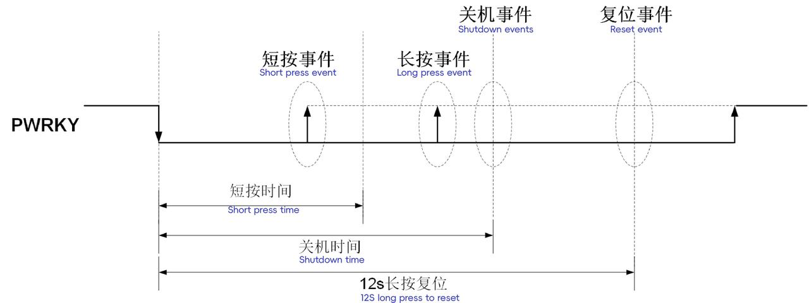

PWRKY 按键关机模式相关事件触发示意图如下图所示

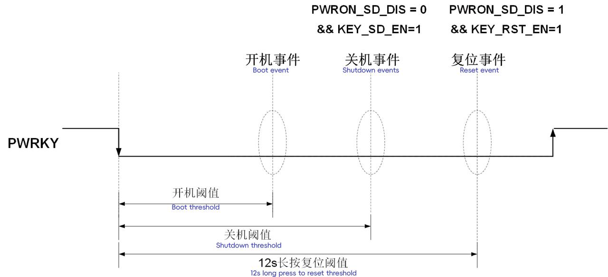

图 6-2 PWRKY 按键关机模式相关事件触发示意图

#### 6.1.2 INT 引脚

INT 引脚为开漏输出，内部施密特输入电路工作在 AONLDO 电压。

- **关机模式**

  - 若设置 INT 引脚作为开机源（表 7-86 PWR_CTRL0[2]=1），当 INT 引脚拉低持续 16 ms 后，将触发开机流程。
- **开机模式**

  - 在开机状态下，当芯片内部事件触发且相应中断已使能时（例如按键中断事件），INT 引脚将被拉低，输出中断信号。

#### 6.1.3 PGOOD 引脚

PGOOD 引脚为开漏输出，内部施密特输入电路工作在 AONLDO 电压。

- **关机流程或关机模式**

  - 在关机流程或关机模式下，PMIC 将 PGOOD 引脚拉低以复位外部模块，且在关机模式中 PGOOD 引脚始终保持低电平。
- **开机流程结束**

  - 开机流程完成后，PMIC 立即释放 PGOOD 引脚。
  - 如果 PWR_CTRL1[3]=0（表 7-87），芯片直接进入开机模式；
  - 如果 PWR_CTRL1[3]=1，需等待 PGOOD 引脚变为高电平后才能进入开机模式。
  - 若等待时间超时，芯片将立即进入关机模式，已开启的电源轨也会随之关闭。
- **开机模式**

  - 在开机模式下，若 PGOOD 引脚被拉低超过 200 µs，且 PGOOD 下拉复位 已使能（PG_RST_EN），将触发复位流程（先关机再开机）。
- **睡眠模式和睡眠流程**

  - PGOOD 引脚状态可通过 PWR_CTRL1[5]（表 7-87）进行配置，默认情况下，PGOOD 引脚保持高电平。
- **唤醒流程结束**

  - 唤醒流程完成后，PMIC 立即释放 PGOOD 引脚并进入开机模式。

#### 6.1.4 PWRCTRL 引脚

PWRCTRL 引脚具有 GPIO 复用输入功能，内部施密特触发器工作在 AONLDO 电压下。

PWRCTRL 引脚主要用于控制 **开机**、**关机**、**睡眠** 和 **唤醒** 流程：

- **开机事件**
  在关机模式下，若满足以下条件，则 PWRCTRL 引脚有效时触发开机流程：

  - 除 AONLDO 外，其他所有 BUCK 和 LDO 均绑定至 PWRCTRL 引脚；
  - PWRCTRL 全绑定开机 功能已使能（表 7-86 PWR_CTRL0[4]=1）。
- **关机事件**
  在非关机模式下，若满足以下条件，则 PWRCTRL 引脚无效时触发关机流程：

  - 所有 BUCK 和 LDO 均绑定至 PWRCTRL 引脚；
  - PWRCTRL 全绑定关机 功能已使能（表 7-86 PWR_CTRL0[5]=1）。
- **开机和唤醒流程**
  当某个 BUCK 或 LDO 绑定到 PWRCTRL 引脚时，以下规则适用：

  - PWRCTRL 引脚有效 时，开机和唤醒流程可继续执行对应 BUCK 或 LDO 的开启操作；
  - 若 PWRCTRL 引脚无效，流程将暂停并持续等待该引脚有效。
- **睡眠流程**
  当某个 BUCK 或 LDO 绑定到 PWRCTRL 引脚，且符合以下条件时，执行睡眠操作需等待 PWRCTRL 引脚无效：

  - 反序睡眠 已配置（表 7-87 PWR_CTRL1[1]=1）；
  - 等待 PWRCTRL 引脚 已使能（表 7-88 PWR_CTRL2[4]=1）。
    如果等待时间超过表 7-88 PWR_CTRL2[5]，则强制执行对应 BUCK 和 LDO 的睡眠操作，并继续流程进入睡眠模式。
- **关机流程**
  当某个 BUCK 或 LDO 绑定到 PWRCTRL 引脚，且符合以下条件时，执行关机操作需等待 PWRCTRL 引脚无效：

  - 反序关机 已配置（表 7-87 PWR_CTRL1[0]=0）；
  - 等待 PWRCTRL 引脚 已使能（表 7-88 PWR_CTRL2[4]=1）。
    若等待时间超过表 7-88 PWR_CTRL2[5]，则强制执行对应 BUCK 和 LDO 的关闭操作，并继续关机流程。
- **开机模式**

在开机模式下，若某个 BUCK 或 LDO 绑定到 PWRCTRL 引脚，遵循以下规则：

- PWRCTRL 引脚无效 时，相关 BUCK 和 LDO 将直接关闭；
- PWRCTRL 引脚有效 且对应 BUCK 和 LDO 的使能位有效时，相关 BUCK 和 LDO 将直接开启。

PWRCTRL 引脚的有效极性 可通过 GPIOx_ODR 寄存器进行配置。

#### 6.1.5 SLEEP/WKUP 引脚

SLEEP/WKUP 引脚为 GPIO 复用输入功能，其内部施密特触发器电路工作在 **AONLDO 电压域**。

该引脚用于控制设备进入和退出 **睡眠模式**，具体行为如下：

1. 开机模式：SLEEP/WKUP 引脚有效时，执行睡眠流程并进入睡眠模式。
2. 睡眠模式：SLEEP/WKUP 引脚无效时，执行唤醒流程并进入开机模式。

SLEEP/WKUP 引脚有效极性可通过**表 7-5 **GPIO_ODR 寄存器配置。

#### 6.1.6 nRESET 引脚

nRESET 引脚为 GPIO 复用输入功能，其内部施密特输入电路工作在 **AONLDO 电压****域**。

1. **非关机模式下**：

   - 若 **nRESET 引脚复位使能**（PWR_CTRL0[6] = 1，见表 7-86），当 **nRESET 引脚从无效状态变为有效状态并持续超过 250 μs** 时，系统将触发复位流程（**先关机再开机**）。
   - 若 **GPIO 滤波使能开启**，则 nRESET 引脚的复位触发时间需额外增加滤波延迟，计算公式为：
     **250 μs +（表 7-8 **GPIO_DEB_EN[7:6]** 配置值）**。
2. **复位流程触发后**：

   - 若 **nRESET 引脚保持有效状态**，系统不会重复触发复位。
   - 仅当 **nRESET 引脚释放（恢复无效状态）** 后，才能响应下一次复位操作。

**nRESET 引脚的有效极性** 可通过 **GPIO_ODR 寄存器**（见表 7-5）配置。

#### 6.1.7 EXT_EN 引脚

**EXT_EN** 引脚为复用的 **GPIO 输出功能**，其内部施密特触发器电路工作在 **AONLDO 电压域**。

该引脚的行为受 **开机、关机、睡眠、唤醒流程** 控制，（结合相关寄存器描述和上下电流程章节）具体逻辑如下：

1. **开机和唤醒流程**

- 当 **EXT_EN** 通过 **PWR_SLOT9 ~ PWR_SLOT11**（表 7-102 ~ 表 7-104）绑定至某一 **时序槽（SLOT）** 时：
  - 仅当流程执行到该 SLOT 时，才会对 **EXT_EN** 执行相应操作。

1. **睡眠流程**

- 当 **EXT_EN** 绑定至某一 SLOT 时：
  - 仅当流程执行到该 SLOT **且** 配置为 **受睡眠时序控制**（PWR_EXT_CTRL[5:0]，表 7-106）时，才会关闭相应的 **EXT_EN** 输出。

1. **关机流程**

- 当 **EXT_EN** 通过 **PWR_SLOT9 ~ PWR_SLOT11**（表 7-102 ~ 表 7-104）绑定至某一 **时序槽（SLOT）** 时：
  - 仅当流程执行到该 SLOT 时，才会关闭相应的 **EXT_EN** 输出。

1. **开机模式**

- 由 **表 7-104** PWR_EXT_EN 控制。

1. 睡眠模式

- EXT_EN 受**表 7-104** PWR_EXT_EN 和 **表 7-106** PWR_EXT_CTRL 共同控制。

EXT_EN 引脚有效极性可通过**表 7-5 **GPIO_ODR 寄存器配置。

下表展示了 EXT_EN 各模式状态控制

<table>
<tbody>
<tr>
<td>(x = 0 ~ 5)</td>
<td>开机流程</td>
<td>开机模式</td>
<td>睡眠流程</td>
<td>睡眠模式</td>
<td>唤醒流程</td>
<td>关机流程</td>
<td>关机模式</td>
</tr>
<tr>
<td>EXTx_EN</td>
<td>x</td>
<td>x</td>
<td>-</td>
<td>x</td>
<td>x</td>
<td>-</td>
<td>-</td>
</tr>
<tr>
<td>EXTx_EN_SLOT</td>
<td>x</td>
<td>-</td>
<td>x</td>
<td>-</td>
<td>x</td>
<td>x</td>
<td>-</td>
</tr>
<tr>
<td>EXTx_SLP_SD</td>
<td>-</td>
<td>-</td>
<td>x</td>
<td>x</td>
<td>-</td>
<td>-</td>
<td>-</td>
</tr>
</tbody>
</table>

#### 5.1.8 VSET5/VSET6 引脚

**VSET5/VSET6** 引脚通过其状态（**GND、VSYS 或 FLOAT**）配置 **BUCK5/BUCK6 的输出电压**，以满足不同应用场景需求。

**VSET 电压控制逻辑**

<table>
<tbody>
<tr>
<td>表 7-74 BUCK_LDO_CFG[2]</td>
<td>VDD</td>
<td>FLOAT</td>
<td>GND</td>
</tr>
<tr>
<td>0</td>
<td>1.1 V</td>
<td>VBUCKx_VOLT(x=5/6)</td>
<td>1.2 V</td>
</tr>
<tr>
<td>1</td>
<td>0.6 V</td>
<td>VBUCKx_VOLT(x=5/6)</td>
<td>1.5 V</td>
</tr>
</tbody>
</table>

#### 5.1.9 OUT_32K 引脚

**OUT_32K** 引脚可输出 **内部慢时钟** 或 **晶振时钟**，通过 **RTC_CTRL[3]**（表 7-33）寄存器配置。

1. **时钟输出控制**：

   - 可通过 **MTP** 预先配置为时钟输出模式
   - 在开机流程前即可为外部模块提供时钟源
2. **电源状态影响**：

   - **正常工作模式**：保持时钟输出
   - **关机模式**：关闭时钟输出

### 6.2 工作模式

系统工作模式总共有 5 种：RESET 模式，RTC 模式，关机模式，开机模式和睡眠模式，会根据不同的事件进行模式切换，下图为**模式切换状态图**。对应的切换事件主要有：开机事件、关机事件、复位事件、睡眠事件、唤醒事件。

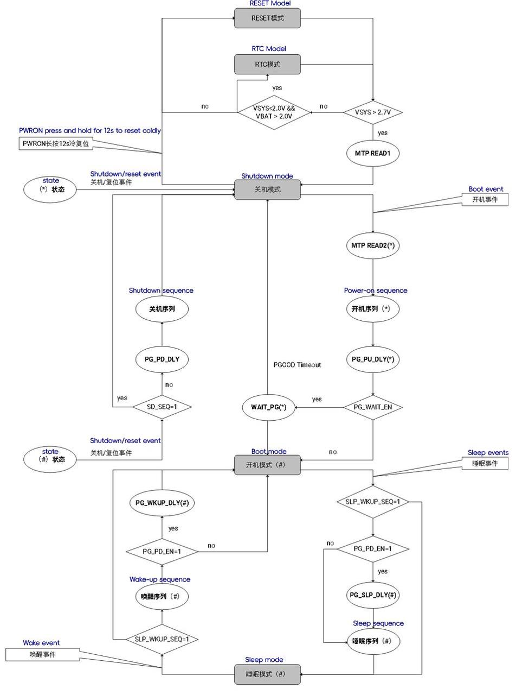

#### 6.2.1 复位模式

- 当 **VSYS \< 2.7V** 时，PMIC 处于复位模式，所有功能停止工作
- 仅当 **VSYS ≥ 2.7V** 后，系统才退出复位模式并开始正常工作
- 若运行中 **VSYS 跌落至 \< 2.55V**，系统立即重新进入复位模式

#### 6.2.2 RTC 模式

- PMIC 的超低功耗工作模式
- 仅维持 **RTC 模块**和**晶振电路**运行（保持计时功能）

**进入条件**：

- **VSYS \< 2.0V**（无主电源供电）
- **VBAT \> 2.0V**（电池供电正常）

**退出条件**：

- 与复位模式相同：**VSYS ≥ 2.7V**（上电复位释放）

#### 6.2.3 关机模式

该模式下大部分模块不工作，保持工作的模块有：AONLDO，Bandgap，VSYS 电压检测，RTC，晶振电路，按键检测等。

**关机模式下可进一步降低功耗（SHUTDOWN_LP）：**

- 当**表 7-87 **PWR_CTRL1[7] = 1，则进入关机模式时还会额外关闭 AONLDO 和 Bandgap。

**进入该模式：**

- PMIC 上电复位释放后（VSYS \> 2.7 V）。
- 开机流程过程中：所有的关机和复位事件会直接进入。
- 其他情况：所有的关机和复位事件会触发关机流程，才会回到关机模式。

**退出该模式：**

- **表 7-87** PWR_CTRL1[7] = 0 时：所有开机事件。
- **表 7-87** PWR_CTRL1[7] = 1 时：PWRKY 按键开机事件，RTC 闹钟和 TICK 事件。

**复位事件进入该模式时会停留一段时间（****表 7-88 **PWR_CTRL2[7]**），在这段时间内所有开机源无效：**

- 当 PWRKY 引脚拉低 12s 强制复位时，PMIC 会从当前状态立即切换到关机模式，等待**表 7-88 **PWR_CTRL2[7]时间后再进入复位模式。
- 其余复位事件进入关机模式后，等待**表 7-88 **PWR_CTRL2[7]时间后并且此时 VSYS 电压高于设定开机阈值，则自动再执行开机流程。

#### 6.2.4 开机模式

该模式下所有模块都可正常工作，包括所有电源轨，负载开关，电池充电，电压检测，内部参考，电源轨过压/欠压/短路/开路检测，过温检测，内部时钟，晶振电路，ADC，RTC，通信接口，GPIO 模块，按键检测，中断等。

**进入该模式：**

- 开机流程执行完
- 睡眠模式下唤醒

**退出该模式：**

- 关机、复位、睡眠事件

#### 6.2.5 睡眠模式

该模式可以将部分电源轨做降压或关闭处理，还可以配置拉低 PGOOD 引脚来复位 SoC。

- 进入该模式：开机模式下睡眠事件。
- 退出该模式：关机、复位、唤醒事件。

#### 6.2.6 各模式工作状态

表 6-4 PMIC 模式管理

<table>
<tbody>
<tr>
<td>电源域</td>
<td>模块</td>
<td>RESET</td>
<td>RTC</td>
<td>SHUTDOWN-LP</td>
<td>SHUTDOWN</td>
<td>ACTIVE</td>
<td>SLEEP</td>
</tr>
<tr>
<td rowspan=15 colspan=1>VSYS</td>
<td>BUCK/LDO</td>
<td>-</td>
<td>-</td>
<td>-</td>
<td>-</td>
<td>x(if enable)</td>
<td>x(if enable)</td>
</tr>
<tr>
<td>SWITCH</td>
<td>-</td>
<td>-</td>
<td>-</td>
<td>-</td>
<td>x(if enable)</td>
<td>x(if enable)</td>
</tr>
<tr>
<td>BCHG</td>
<td>-</td>
<td>-</td>
<td>-</td>
<td>-</td>
<td>x(if enable)</td>
<td>x(if enable)</td>
</tr>
<tr>
<td>MTP</td>
<td>-</td>
<td>-</td>
<td>-</td>
<td>-</td>
<td>x</td>
<td>x</td>
</tr>
<tr>
<td>AONLDO</td>
<td>-</td>
<td>-</td>
<td>-</td>
<td>x</td>
<td>x</td>
<td>x</td>
</tr>
<tr>
<td>BG</td>
<td>-</td>
<td>-</td>
<td>-</td>
<td>x</td>
<td>x</td>
<td>x</td>
</tr>
<tr>
<td>VSYS DET</td>
<td>-</td>
<td>-</td>
<td>x</td>
<td>x</td>
<td>x</td>
<td>x</td>
</tr>
<tr>
<td>VREF</td>
<td>-</td>
<td>-</td>
<td>-</td>
<td>-</td>
<td>x</td>
<td>x</td>
</tr>
<tr>
<td>IREF</td>
<td>-</td>
<td>-</td>
<td>-</td>
<td>-</td>
<td>x</td>
<td>x</td>
</tr>
<tr>
<td>SOSC</td>
<td>-</td>
<td>-</td>
<td>x</td>
<td>x</td>
<td>x</td>
<td>x</td>
</tr>
<tr>
<td>FOSC</td>
<td>-</td>
<td>-</td>
<td>-</td>
<td>-</td>
<td>x</td>
<td>x</td>
</tr>
<tr>
<td>ADC</td>
<td>-</td>
<td>-</td>
<td>-</td>
<td>-</td>
<td>x(if enable)</td>
<td>x(if enable)</td>
</tr>
<tr>
<td>TS</td>
<td>-</td>
<td>-</td>
<td>-</td>
<td>-</td>
<td>x</td>
<td>x</td>
</tr>
<tr>
<td>OT-P</td>
<td>-</td>
<td>-</td>
<td>-</td>
<td>-</td>
<td>x</td>
<td>x</td>
</tr>
<tr>
<td>KEY</td>
<td>-</td>
<td>-</td>
<td>x</td>
<td>x</td>
<td>x</td>
<td>x</td>
</tr>
<tr>
<td rowspan=2 colspan=1>VSYS/ VBAT  </td>
<td>XTAL</td>
<td>-</td>
<td>x(if enable)</td>
<td>x(if enable)</td>
<td>x(if enable)</td>
<td>x(if enable)</td>
<td>x(if enable)</td>
</tr>
<tr>
<td>RTC</td>
<td>-</td>
<td>x(if enable)</td>
<td>x(if enable)</td>
<td>x(if enable)</td>
<td>x(if enable)</td>
<td>x(if enable)</td>
</tr>
<tr>
<td>VSYS</td>
<td>DIGITAL</td>
<td>-</td>
<td>-</td>
<td>x</td>
<td>x</td>
<td>x</td>
<td>x</td>
</tr>
<tr>
<td rowspan=3 colspan=1>AONLDO</td>
<td>GPIO</td>
<td>-</td>
<td>-</td>
<td>-</td>
<td>-</td>
<td>x</td>
<td>x</td>
</tr>
<tr>
<td>INT</td>
<td>-</td>
<td>-</td>
<td>-</td>
<td>-</td>
<td>x</td>
<td>x</td>
</tr>
<tr>
<td>IIC</td>
<td>-</td>
<td>-</td>
<td>-</td>
<td>-</td>
<td>x</td>
<td>x</td>
</tr>
</tbody>
</table>

### 6.3 PMIC 相关事件及行为

表 6-5 为 PMIC 事件汇总，行为中的‘强制’行为是指 PMIC 会从当前状态立即强制切换到关机模式。

表 6-5 PMIC 事件汇总

<table>
<tbody>
<tr>
<td>类型</td>
<td>事件</td>
<td>作用区间</td>
<td>行为</td>
</tr>
<tr>
<td rowspan=5 colspan=1>开机事件 </td>
<td>VSYS超阈值</td>
<td rowspan=5 colspan=1>关机模式</td>
<td rowspan=5 colspan=1>开机唤醒</td>
</tr>
<tr>
<td>PWRKY开机</td>
</tr>
<tr>
<td>INT下拉16ms</td>
</tr>
<tr>
<td>ALARM/TICK</td>
</tr>
<tr>
<td>PWRCTRL全绑定开机</td>
</tr>
<tr>
<td rowspan=6 colspan=1>关机事件</td>
<td>PWRKY关机</td>
<td rowspan=4 colspan=1>小节5.2内图的 * 状态，# 状态</td>
<td rowspan=5 colspan=1>按配置关机</td>
</tr>
<tr>
<td>VSYS低阈值</td>
</tr>
<tr>
<td>PWRCTRL关机</td>
</tr>
<tr>
<td>电源轨异常</td>
</tr>
<tr>
<td>软件关机</td>
<td>小节5.2内图的 # 状态</td>
</tr>
<tr>
<td>芯片过温/VSYS过压</td>
<td>ALL</td>
<td>强制关机</td>
</tr>
<tr>
<td rowspan=2 colspan=1>睡眠事件</td>
<td>软件睡眠</td>
<td>开机模式</td>
<td rowspan=2 colspan=1>按配置进入睡眠</td>
</tr>
<tr>
<td>GPIO睡眠</td>
<td>开机模式</td>
</tr>
<tr>
<td rowspan=4 colspan=1>唤醒事件</td>
<td>软件唤醒</td>
<td>睡眠模式</td>
<td rowspan=4 colspan=1>按配置退出睡眠</td>
</tr>
<tr>
<td>GPIO唤醒</td>
<td>睡眠模式</td>
</tr>
<tr>
<td>PWRKY中断唤醒</td>
<td>睡眠模式</td>
</tr>
<tr>
<td>ALARM/TICK</td>
<td>睡眠模式</td>
</tr>
<tr>
<td rowspan=5 colspan=1>复位事件</td>
<td>PWRKY复位</td>
<td>ALL</td>
<td>强制冷复位</td>
</tr>
<tr>
<td>软件复位</td>
<td>小节5.2内图的 # 状态</td>
<td rowspan=4 colspan=1>按配置复位</td>
</tr>
<tr>
<td>nRESET无效</td>
<td rowspan=3 colspan=1>小节5.2内图的 * 状态，# 状态 </td>
</tr>
<tr>
<td>PGOOD拉低</td>
</tr>
<tr>
<td>看门狗超时</td>
</tr>
</tbody>
</table>

### 6.4 序列控制器

PMIC 电源轨（除了 AONLDO）的开机、关机、睡眠、唤醒流程都由一个可编程的序列控制器控制，该序列控制器包含了 **16** 个可编程的 SLOT，特性如下：

1. **电源轨控制**

   - 每个电源轨绑定一个 **SLOT ID**（可指向 16 个 SLOT 中的任意一个）
   - 电源轨开关受 **PWRCTRL** 控制（配置寄存器：
     - BUCK：表 7-75 BUCKx_CTRL[5:3]
     - ALDO：表 7-80 ALDOx_CTRL[3:1]
     - DLDO：表 7-83 DLDOx_CTRL[3:1]
   - 进入 SLOT 后需等待 PWRCTRL 有效才能打开对应 BUCK 和 LDO 使能，或者等到 PWRCTRL 无效才关闭或调整对应 BUCK 和 LDO 电压。
2. **EXT_EN 控制**

   - GPIO0~5 可配置为 **EXT_EN** 输出功能
   - 每个 EXT_EN 绑定独立 **SLOT ID**（配置寄存器：表 7-102 PWR_SLOT9~表 7-104 PWR_SLOT11）
3. **SLOT 计时规则**

   - 若电源轨受 PWRCTRL 控制，其 SLOT 计时需等待**所有绑定的 PWRCTRL 信号达到目标状态**（全部有效/无效）

序列控制器的 SLOT0~SLOT14 为有效控制序列，SLOT15 为无效控制序列：

- 在开机流程或唤醒流程中，

  - SLOT0~SLOT14 阶段相应的 BUCK 和 LDO 使能打开，并且 EXT_EN 变有效，指向 SLOT15 的电源轨和 EXT_EN 并不使能或变有效。
- 在睡眠过程中，

  - SLOT0~SLOT15 阶段相应的 BUCK 和 LDO 使能保持当前状态不变，但当电源轨的睡眠电压设置成 0，睡眠过程中相应电源轨使能关闭；
  - 当 EXT_EN 配置为受睡眠时序控制（**表 7-106 **PWR_EXT_CTRL[5:0]），则在睡眠过程中 EXT_EN 变无效，否则保持当前状态不变。
- 在关机流程中，

  - SLOT0~SLOT15 各阶段对应的 BUCK 和 LDO 使能关闭，EXT_EN 变无效。

**控制规模**

- 最大支持 **23 个 SLOT ID**（6 个 EXT_EN + 6 个 BUCK + 11 个 LDO）
- 典型应用示例：DLDO1/DLDO4 绑定至特定 PWRCTRL（见下图 序列控制器时序控制示意图）

下表罗列各模式和流程下电源轨状态和输出电压表

<table>
<tbody>
<tr>
<td>模式</td>
<td>SLOT_ID</td>
<td>PWRCTRLx</td>
<td>软件</td>
<td>电源轨状态</td>
<td>电源轨输出电压</td>
</tr>
<tr>
<td>关机模式</td>
<td>-</td>
<td>-</td>
<td>-</td>
<td>关闭</td>
<td>-</td>
</tr>
<tr>
<td>开机流程</td>
<td>x</td>
<td>x（option）</td>
<td>x</td>
<td>使能</td>
<td>Normal</td>
</tr>
<tr>
<td>开机模式</td>
<td>-</td>
<td>x（option）</td>
<td>x</td>
<td>使能</td>
<td>Normal</td>
</tr>
<tr>
<td>睡眠流程</td>
<td>x</td>
<td>x（option）</td>
<td>x</td>
<td>使能</td>
<td>Normal –&gt;Sleep</td>
</tr>
<tr>
<td>睡眠模式</td>
<td>-</td>
<td>x（option）</td>
<td>x</td>
<td>使能</td>
<td>Sleep</td>
</tr>
<tr>
<td>唤醒流程</td>
<td>x</td>
<td>x（option）</td>
<td>x</td>
<td>使能</td>
<td>Sleep -&gt;Normal</td>
</tr>
<tr>
<td>关机流程</td>
<td>x</td>
<td>x（option）</td>
<td>-</td>
<td>关闭</td>
<td>-</td>
</tr>
</tbody>
</table>

#### 6.4.1 开机事件

PMIC 支持以下开机唤醒事件：

1. VSYS 超过开机阈值唤醒（可通过 MTP 屏蔽）
2. PWRKY 长按开机唤醒（常开）
3. INT 引脚下拉超 16ms 唤醒（可 MTP 屏蔽）
4. RTC 的 ALARM 和 TICK 事件唤醒（可 MTP 屏蔽）
5. PWRCTRL 全绑定开机事件唤醒（可 MTP 屏蔽）
6. 关机后的自动重启事件

> **触发条件**：除 VSYS 阈值事件外，其余事件均需 **VSYS 高于开机阈值**才会生效。

**唤醒要求**

- **VSYS 电压范围**：2.9V ~ 5.5V（需稳定）
- **开机阈值**：

  - 可通过 MTP 配置

PMIC 的开机阈值除了通过 MTP 配置外，硬件本身也会根据情况调整开机阈值，防止由于较弱供电导致的错误开关机流程，如下**图****（开机和关机阈值切换示意图）**所示。调整过程如下：

**开机阈值动态调整流程**

1. **初始状态**：

   - PMIC 复位释放后进入**关机模式**
   - 若 VSYS 事件未屏蔽，当 VSYS \> **默认开机阈值**时触发开机模式
2. **低电压保护机制**：

   - 若开机后 **16 秒内 VSYS \< 关机阈值**：
     - 执行关机流程并进入关机模式
     - **调整开机阈值**：
       - 若当前阈值未达最大值（3.6V），按 **0.1V/0.2V** 步进提升（由表 7-127 SYS_CFG2[7]选择）
       - 若已达 3.6V，则**屏蔽 VSYS 开机事件**
3. **阈值恢复条件**：

   - 若开机后 **16 秒内 VSYS 持续正常**（即未低于关机阈值），阈值恢复为默认值
4. **功能关闭**：

   - 可通过置位表 7-127 SYS_CFG2[6]禁用阈值调整

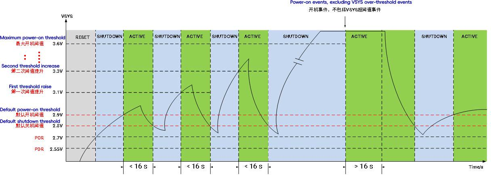

#### 6.4.2 开机流程

**关机模式**下检测到**开机事件**时，按以下顺序执行开机流程：

1. 从 MTP **加载所需配置**，如各电源轨电压相关配置
2. 加载完配置后，PMIC 会启动一系列**开机前检测**，包括：

   - VSET 引脚状态
   - 异常事件（电源轨过压，欠压，短路和开路）
     检测完成并无异常发生时即启动**电源轨开机序列**；否则，立即回到关机模式。
3. 开机序列完成后，会经过一段**可编程控制的延时**（**表 7-92 **PWR_SEQ_TIME[5:4]），延时结束后，PMIC 主动释放 PGOOD 引脚：

   - 若配置为**无需等待 PGOOD 释放**（表 7-87 PWR_CTRL1[3] = 0），则系统直接进入开机模式。
   - 若需**等待 PGOOD 释放**，则必须等 PGOOD 释放后才能进入开机模式。
   - 若 PGOOD 长时间未释放（表 7-87 PWR_CTRL1[4]），PMIC 直接回到关机模式。

在进入开机模式前（见 6.2 小节**模式切换示意图**中带 \* 号的状态），若发生异常事件、关机或复位事件，PMIC 会立即终止开机流程并回到关机模式，等待下一次唤醒。

**SLOT 机制与电源轨控制**

- **电源轨管理**：所有 BUCK（BUCK1~6）、11 个 LDO 及所有 EXTx_EN 具有各自独立的 SLOT ID，该 ID 由 MTP 配置决定。在关机模式下唤醒后，PMIC 从 MTP 读取相应配置。
- **SLOT 绑定**：多个电源轨或 EXTx_EN 可绑定至同一 SLOT，即同一 SLOT 内的电源轨可同时打开。
- **DUMMY SLOT**：若某个 SLOT 未绑定任何电源轨或 EXT_EN，则该 SLOT 被视为 DUMMY SLOT，序列控制器会跳过该 SLOT，仅持续一个内部慢时钟周期（约 32μs）。

**开机序列与 PWRCTRL 绑定情况**

开机过程中序列控制器从 SLOT0 开始，所有 SLOT 的计时是统一可编程的，有四个档位选择（**表 7-92 **PWR_SEQ_TIME[1:0]）。根据不同的 PWRCTRL 引脚绑定情况，有如下几种场景：

1. 假如 **SLOT0~14 无 PWRCTRL 绑定**

   - 进入该 SLOT 后，电源轨和 EXTx_EN 会立即使能，并且立即开启并开始计时。
   - 计时完成后，进入下一个 SLOT。
2. 假如 **SLOT0~14 绑定了 PWRCTRL**，进入该 SLOT 后：

   - 其它无等待的电源轨和 EXTx_EN 进入该 SLOT 后立即将其使能打开，但 SLOT 的计时不启动。
   - 对应 PWRCTRL 的电源轨在 PWRCTRL 有效后会直接使能。
   - 所有电源轨等待的 PWRCTRL 都有效后才开始计时，计时完成后即进入下一 SLOT。
   - 当计时未完成时，PWRCTRL 变无效，SLOT 计数停止并清零，对应 PWRCTRL 的电源轨关闭，直至所有 PWRCTRL 重新变有效后才开始重新计时并打开。
   - 当计时已完成并进入下一 SLOT 后，若 PWRCRTL 再变无效，则对应 PWRCTRL 的相关电源轨不再受影响。但进入开机模式时受 PWRCTRL 控制的电源轨会关闭，当 PWRCTRL 重新变有效时，相应电源轨重新打开。
3. 假如 SLOT15 绑定了 PWRCTRL，则进入该 SLOT 后：

   - 电源轨或 EXTx_EN 使能不打开，即该 SLOT 下无操作。
   - 若电源轨绑定了 PWRCTRL，SLOT 计时也受 PWRCTRL 控制，即需等到 PWRCTRL 有效后才开始计时。

下图为**开机流程时序图**

#### 6.4.3 关机事件**类型**

PMIC 支持以下关机触发条件：

1. **硬件触发**

   - **PWRKY 长按关机**（PWR_CTRL2[6]=0 时使能）
   - **VSYS 电压低于阈值**（硬件强制关机）
2. **软件触发**

   - **软件指令关机**（通过寄存器配置）
3. **电源管理事件**

   - **所有电源轨绑定的 PWRCTRL 均无效**（可 MTP 屏蔽）
4. **异常保护事件**（可软件/MTP 屏蔽）

   - 电源轨故障：**过压（OV）**、**欠压（UV）**、**短路（SC）**
   - **芯片过温**
   - **VSYS 过压**

#### 6.4.4 关机流程

**流程概述**

当 PMIC 在**开机模式**下触发**关机/复位事件**时，系统执行反向关机流程：

1. **时序控制**：

   - 从 **SLOT15** 开始，**反向执行**至 **SLOT0**
   - 各 SLOT 内行为逻辑与开机流程相同，但**触发条件及结果极性相反**（见图 6-4、图 6-7）
2. **异常中断处理**：

   - 若在**睡眠/唤醒过程**（图 6-3 标#状态）中触发关机事件：
     - 立即中断当前流程
     - 按 **PWR_CTRL1[0]**（表 7-87）配置执行对应关机流程

反序走到某个 SLOT 时，与该 SLOT 绑定的电源轨关闭，EXT_EN 变无效；当电源轨配置成等待 PWRCTRL（**表 7-88 **PWR_CTRL2[4] = 1），则该 SLOT 的计时以及电源轨的关闭需等待 PWRCTRL 无效，若等待 PWRCTRL 超时（**表 7-88 **PWR_CTRL2[5]），则启动 SLOT 计时并关闭相应电源轨。

**紧急事件处理**

- 触发条件（任一满足）：

  - **VSYS 过压**（表 7-113 PWRKY_EVENT[5]）
  - **芯片过温**（表 7-109 EVENT2[6]）
- 响应动作：

  - 若使能保护（IRQ_PWRKY_EN[7:6]=1），**立即跳转至关机模式**
  - **强制关闭所有电源轨与 EXT_EN**

关机流程时序图如下图所示

#### 6.4.5 睡眠事件

**图 6-3** 的睡眠事件即开机模式下进入睡眠模式的条件：

1. 软件进入睡眠（**表 7-88 **PWR_CTRL2[0] = 1）
2. GPIO 复用输入功能（Sleep/Wake up）引脚有效事件

#### 6.4.6 睡眠流程

从开机模式进入睡眠模式的时序与开机流程时序一致，但具体行为不同。以下是睡眠流程的关键点：

1. **电源轨调节**
   各电源轨的使能状态保持不变。如果睡眠电压设置为 0，则电源轨会关闭；否则，电源轨会将其电压调节到设定的睡眠电压。
2. **EXT_EN 控制**
   EXT_EN 的状态仅受表 7-104（PWR_EXT_EN）和表 7-106（PWR_EXT_CTRL）的控制。只有当 EXTx_SLP_SD 设置为 1 时，EXT_EN 才会在对应的 SLOT 阶段关闭；否则，EXT_EN 保持不变。
3. **唤醒事件处理**
   在睡眠流程中，唤醒事件不会中断睡眠过程。如果进入睡眠模式后，唤醒条件仍然成立，则会启动唤醒流程。

   - 软件和 GPIO 引脚触发的睡眠条件采用电平方式，并仅在开机模式下生效。
4. **多 GPIO 配置**
   当多个 GPIO 被配置为 SLEEP/WKUP 引脚时，在开机模式下，只要任一引脚有效，系统就会进入睡眠流程。

#### 6.4.7 唤醒事件

如小节 5.2 图的唤醒事件即睡眠模式下退出的条件：

1. 软件唤醒
2. GPIO 复用输入功能（Sleep/Wake up）引脚无效事件
3. PWRKY 中断唤醒（短按/长按/上升/下降沿中断）
4. RTC ALARM 和 TICK（可 MTP 屏蔽）

#### 6.4.8 唤醒流程

从睡眠模式唤醒的行为与开机流程一致，但存在以下区别：

1. **电源轨电压调节**
   在唤醒流程中，电源轨的电压会从睡眠电压调节到正常电压。
2. **软件关闭的电源轨状态**
   如果在睡眠模式下，用户通过软件关闭了某电源轨，则进入唤醒流程时，该电源轨保持关闭状态。
3. **睡眠事件处理**
   在唤醒流程中，若遇到睡眠事件，不会中断当前流程。若进入开机模式后睡眠条件仍成立，则启动睡眠流程。
4. **软件触发条件清除**
   若通过软件进入睡眠，但通过其他方式退出睡眠，则其他唤醒源会清除软件触发条件，即清零相关寄存器。
5. **多 GPIO 配置要求**
   当多个 GPIO 被配置为 SLEEP/WKUP 引脚时，在睡眠模式下需所有 SLEEP/WKUP 引脚均无效，才能进入唤醒流程。
6. **特定唤醒源限制**
   若任一 SLEEP/WKUP 引脚有效，则 PWRKY 中断唤醒相关事件，RTC ALARM 和 TICK 事件无法唤醒 PMIC。

#### 6.4.9 复位事件

复位事件如下：

1. PWRKY 长按 12s 冷复位事件（**表 7-88 **`PWR_CTRL2[6]` = 1）
2. PWRKY 长按关机后自动重启（**表 7-88 **`PWR_CTRL2[6]` = 0 且**表 7-87 **`PWR_CTRL1[2]` = 1）
3. 软件复位事件
4. nRESET（GPIO 复用输入功能）无效事件（可软件屏蔽）
5. PGOOD 拉低（可软件或 MTP 屏蔽）
6. 看门狗超时复位事件（可软件屏蔽）

#### 6.4.10 复位流程

在开机模式和睡眠模式下，复位事件的行为一致，并根据配置执行下一步操作。所有复位流程均需经过关机流程。

1. **关机模式停留时间**
   经过关机流程进入关机模式后，PMIC 会在关机模式下停留一段时间（由表 7-88 PWR_CTRL2[7] 配置），以确保足够的复位时间。计时完成后有两种可能的结果：
   - **进入 RESET 模式**
     当 PWRKY 按键配置为长按 12 秒复位且发生按键长按事件时，PMIC 将复位所有逻辑并进入 RESET 模式（如下图 **图复位流程** 所示）。

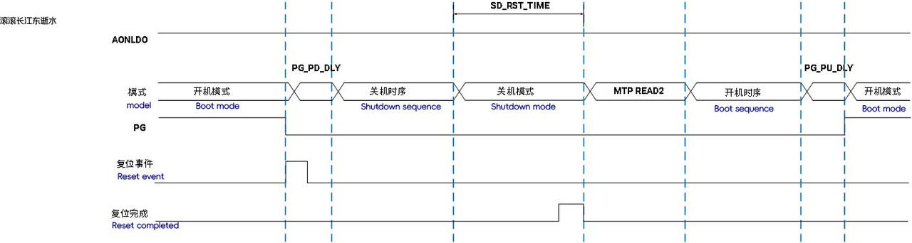

- **进入 MTP READ2 模式**
  对于其他复位事件，PMIC 将退出关机模式并进入 MTP READ2 模式（如下图 **冷复位流程** 所示）。

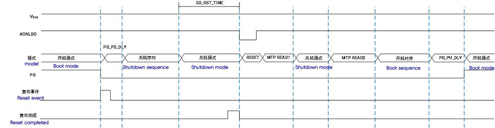

1. **复位源屏蔽行为**
   在复位源触发进入关机模式的 SD_RST_TIME 期间，所有开机源将被屏蔽，即开机源无效。

### 6.5 LDO

PMIC 内部集成了三种 LDO：**AONLDO**，**ALDO1~4** 和 **DLDO1~7**，其相关控制如下表所示：

表 6-7 LDO 控制参数

<table>
<tbody>
<tr>
<td>电源轨</td>
<td>Sequencer</td>
<td>PWRCTRL</td>
<td>软件</td>
<td>DVS</td>
<td>STEP</td>
<td>SLEEP Voltage</td>
</tr>
<tr>
<td>AONLDO</td>
<td>-</td>
<td>-</td>
<td>-</td>
<td>-</td>
<td>25 mV</td>
<td>-</td>
</tr>
<tr>
<td>ALDO1~4</td>
<td>x</td>
<td>x</td>
<td>x</td>
<td>-</td>
<td>25 mV</td>
<td>x</td>
</tr>
<tr>
<td>DLDO1~7</td>
<td>x</td>
<td>x</td>
<td>x</td>
<td>-</td>
<td>25 mV</td>
<td>x</td>
</tr>
</tbody>
</table>

- **LDO 使能与电压调节**

  - **AONLDO**
    - 在 VSYS 上电（VSYS \> 2.7 V）后保持常开。
    - 无睡眠电压设置。
  - **ALDO1~4 和 DLDO1~7**
    - 使能和电压调节可通过软件修改（主机通过 IIC 访问 PMIC 内部寄存器）。
    - 所有 LDO 的电压调节步幅为 25 mV。
    - 支持两种电压配置：开机模式和睡眠模式下的电压。
- **硬件控制**
  ALDO1~4 和 DLDO1~7 可受以下硬件控制：

  - **序列控制器（Sequencer）**
    - 通过表 7-96（PWR_SLOT3）至表 7-101（PWR_SLOT8）配置 LDO 在 Sequencer 中的位置，以控制 LDO 的开启或关闭时序。
  - **PWRCTRL（GPIO 复用输入功能）**
    - 通过表 7-80（ALDOx_CTRL[3:1]）和表 7-83（DLDOx_CTRL[3:1]）配置，决定 LDO 是否受 PWRCTRL 信号控制。
    - 当 Sequencer 到达对应 SLOT 且绑定的 PWRCTRL 信号有效或无效时，对应 LDO 使能或关闭
- **下拉电阻控制**
  所有 LDO 输出端均有一个下拉电阻。

  - 当 LDO 使能打开时，下拉电阻关闭。
  - 当 LDO 关闭时，下拉电阻是否打开取决于 LDO_PD_DIS（详见寄存器描述）。

### 6.6 BUCK

PMIC 内部有 6 个 BUCK，其相关控制如下表所示：

表 6-8 BUCK 控制参数

<table>
<tbody>
<tr>
<td>电源轨</td>
<td>Sequencer</td>
<td>PWRCTRL</td>
<td>软件</td>
<td>DVS</td>
<td>STEP</td>
<td>SLEEP Voltage</td>
<td>软启</td>
<td>VSET</td>
<td>DUAL</td>
</tr>
<tr>
<td>BUCK1~2</td>
<td>x</td>
<td>x</td>
<td>x</td>
<td>x</td>
<td>5/25 mV</td>
<td>x</td>
<td>x</td>
<td>-</td>
<td>x</td>
</tr>
<tr>
<td>BUCK3~4</td>
<td>x</td>
<td>x</td>
<td>x</td>
<td>x</td>
<td>5/25 mV</td>
<td>x</td>
<td>x</td>
<td>-</td>
<td>x</td>
</tr>
<tr>
<td>BUCK5</td>
<td>x</td>
<td>x</td>
<td>x</td>
<td>x</td>
<td>5/25 mV</td>
<td>x</td>
<td>x</td>
<td>x</td>
<td>-</td>
</tr>
<tr>
<td>BUCK6</td>
<td>x</td>
<td>x</td>
<td>x</td>
<td>x</td>
<td>5/25 mV</td>
<td>x</td>
<td>x</td>
<td>x</td>
<td>-</td>
</tr>
</tbody>
</table>

- **软启动特性**
  所有 BUCK 在启动时均具备软启动功能，软启动时间为 1ms。
- **动态电压调节（DVS）**

  - 当 BUCK 使能且启用了 DVS 功能时，电压会按照设定的步幅（表 7-74 BUCK_LDO_CFG[4:3]）动态调节，直至达到目标电压。
  - **触发 DVS 的情况**：
    - 在开机模式下修改表 7-76（BUCKx_VOLT）。
    - 在睡眠模式下修改表 7-77（BUCKx_SLP_VOLT）。
    - 在睡眠流程和唤醒流程中，由序列控制器切换电压。
- **双相模式配置**
  BUCK1 和 BUCK2、BUCK3 和 BUCK4 可配置为双相模式，以满足不同应用场景的需求。
- **下拉电阻控制**
  所有 BUCK 输出端均有一个下拉电阻。

  - 当 BUCK 使能打开时，下拉电阻关闭。
  - 当 BUCK 关闭时，下拉电阻是否打开取决于表 7-74（BUCK_LDO_CFG[6]）的配置
- **BUCK5 和 BUCK6 的特殊配置**

  - BUCK5 和 BUCK6 分别具有 VSET5 和 VSET6 引脚。
  - VSET5 和 VSET6 引脚的状态与 BUCK_VSET_CTRL 寄存器共同决定了这两个 BUCK 的输出电压状态。具体细节请参见相关寄存器描述和 VSET5/VSET6 引脚说明。

### 6.7 关机保护

PMIC 有以下保护操作：

1. 所有电源轨（BUCK 和 LDO）的过压，欠压，短路和开路保护。
2. 芯片过温保护；VSYS 过压保护；Switch 短路保护。

#### 6.7.1 电源轨异常保护

当使能电源轨的关机保护操作（表 7-121 PROT_EN[5:0]）时，若任一电源轨发生异常，将触发关机流程。以下是电源轨异常保护的详细配置：

1. **欠压和过压检测事件**

   - **滤波时间配置**
     滤波时间通过 OVUV_DELAY 配置，可选择以下选项：
     - 100 μs
     - 375 μs
     - 750 μs
     - 屏蔽滤波（表 7-127 SYS_CFG2[4:3]）
   - **屏蔽时间配置**
     在某些特定时间范围内，PMIC 内部检测电路可能会产生异常的过压或欠压事件。如果不希望这些异常事件导致关机或中断，可通过设置屏蔽时间来屏蔽这些事件：
     - **特定时间范围**：
       - 电源轨开启后至其稳定阶段。
       - 电源轨电压改变阶段。
     - **屏蔽时间设置**：通过表 7-127 SYS_CFG2[2:0] 配置。
2. **异常保护机制**

- 当检测到电源轨异常时，PMIC 会根据配置执行关机流程。
- 滤波时间和屏蔽时间的设置可以帮助用户根据实际需求灵活调整异常保护机制，以确保系统的稳定性和可靠性。

#### 6.7.2 其它异常保护

VSYS 过压保护，芯片过温保护和 Switch 短路保护分别有单独的使能位：**表 7-120 **IRQ_PWRKY_EN[7:6]，**表 7-121 **PROT_EN[7:6]。

上述所有事件可通过寄存器**表 7-127 **SYS_CFG2[5]设置滤波时间：100 us/屏蔽滤波功能。

过温保护的档位如下：

**表 6-9 过温保护档位及其行为**

<table>
<tbody>
<tr>
<td>表 7125 SYS_CFG0[7]</td>
<td>温度报警（warning）/ ℃</td>
<td>严重过温（severe）/ ℃</td>
<td>关机过温（critical）/ ℃</td>
</tr>
<tr>
<td>0</td>
<td>95</td>
<td>115</td>
<td>135</td>
</tr>
<tr>
<td>1</td>
<td>110</td>
<td>130</td>
<td>150</td>
</tr>
<tr>
<td>事件</td>
<td>表 7109 EVENT2[4]</td>
<td>表 7109 EVENT2[5]</td>
<td>表 7109 EVENT2[6]</td>
</tr>
<tr>
<td>使能</td>
<td>-</td>
<td>表 7121 PROT_EN[6]</td>
<td>表 7120 IRQ_PWRKY_EN[6]</td>
</tr>
<tr>
<td>行为</td>
<td>中断</td>
<td>关机</td>
<td>关机</td>
</tr>
</tbody>
</table>

### 6.8 负载开关

PMIC 内部的负载开关（SWITCH）受软件控制，其行为如下：

1. **下拉电阻控制**
   SWITCH 输出端有一个下拉电阻。

- 当 SWITCH 使能打开时，下拉电阻关闭。
- 当 SWITCH 关闭时，下拉电阻是否打开取决于表 7-78（SWITCH_CTRL[1]）的配置。

2. **关机模式行为**

- 在关机模式下，SWITCH 不工作。

### 6.9 电池充电

主机配置好充电电压和充电电流，并打开使能（**表 7-73 **BBAT_CTRL[0]=1）后，可给电池充电，行为如下：

1. 当电池充满电后，PMIC 内部计时 20 ms 后停止充电。
2. 当电池电压低于设定值时，PMIC 重新开始给电池充电，直至充满，重复步骤 1。
3. 充电使能关闭后（BCHG_EN=0），充电即停止。

在关机模式下，电池充电电路关闭使能，重新进入开机模式后需重新配置使能。

## 6. 系统控制与接口功能

本章介绍 P1 PMIC 的系统级功能，涵盖通信接口（I²C/GPIO）、安全监控（看门狗/ADC）和实时时钟（RTC）等模块，实现与外部系统的无缝协同。

### 6.1 看门狗

在开机模式和睡眠模式下，主机可通过 IIC 通信接口使能看门狗并配置超时时间（**表 7-72 **WDT_CTRL[2:1]）。

如果在设定超时时间内主机未进行喂狗操作（**表 7-72 **WDT_CTRL[0]=1），则产生看门狗超时事件并置起相关标志位（**表 7-108 **EVENT1[3]）。

假如看门狗超时复位使能（**表 7-86 **PWR_CTRL0[7]），则触发 PMIC 的复位流程。

假如看门狗中断使能打开（**表 7-115 **IRQ_EN1[3]），则产生看门狗中断并拉低 INT 引脚。

看门狗进入关机模式后关闭使能并停止工作，重新进入开机模式需再次配置看门狗使能。

### 6.2 GPIO

PMIC 总共有 6 个 GPIO，既可作为通用 IO，也可配置成复用输入或输出功能，详见寄存器**表 7-12 **GPIO_MODE0 ~ **表 7-13 **GPIO_MODE1 和** 表 7-14 **GPIO_AF01 ~ **表 7-16 **GPIO_AF45。GPIO 其它特性如下：

1. 除了作为复用 ADC 输入功能外，GPIO 的极性、上下拉、开漏和滤波功能都有效。
2. 其中 GPIO 滤波时间为 100 us ~ 1.5 ms（**表 7-8 **GPIO_DEB_EN[7:6]），并且 GPIOx_IDR 都可反映当前端口状态。
3. 作为 GPIO 输入功能时，**表 7-4 **GPIO_IDR 和** 表 7-10 **GPIO_ITYPE0，**表 7-11 **GPIO_ITYPE1 相互配合可产生** 表 7-107 **EVENT0[5:0]事件。

GPIOx_ODR 复用两种功能：

1. 作为 GPIO 输出时（GPIOx_MODE=2’b01），GPIOx_ODR 即为 GPIO 输出状态。
2. 作为复用功能时（GPIOx_MODE=2’b1x），GPIOx_ODR 即为相关复用功能的有效状态配置位。

### 6.3 IIC 通信接口

PMIC 的通信接口为 IIC，最大支持速度为 1MHz，此 PMIC 只作为从机使用。

在关机模式下 SCL 和 SDA 接口不工作，只有进入开机模式和睡眠模式后主机才能通过 IIC 接口操作 PMIC 寄存器。该 IIC 从机地址可通过 MTP 配置：**表 7-125 **SYS_CFG0[6:0]。

### 6.13 ADC 控制电路

功能简介：

1. 12bit ADC，采样速率 100 Hz ~ 50 KHz，寄存器可配
2. 6 路外部扫描通道和 20 路内部扫描通道选择
3. ADC 参考电压寄存器可配置
4. 支持手动和自动扫描模式
5. 手动模式测量通道寄存器可配置，最多可测量 6 路外部扫描通道和 20 路内部扫描通道
6. 自动模式测量通道寄存器可配置，最多可测量 1 路内部通道（芯片结温 Tj）和 6 路外部扫描通道（6 路 GPIO 配置成 ADC 扫描输入模式），即 7 路自动扫描通道
7. 7 路独立的自动通道结果寄存器和一路复用手动通道结果寄存器
8. 7 路独立的自动扫描通道监控，高阈值和低阈值分别可配
9. 7 路自动扫描通道的高/低阈值标志位各自具备滤波功能（连续触发 ADC_DEB_NUM 次数后即置起）
10. 可屏蔽的 ADC 单次转换完成中断、序列转换完成中断、阈值比较中断

#### 6.13.1 通道选择

ADC 模块工作示意图如下图所示

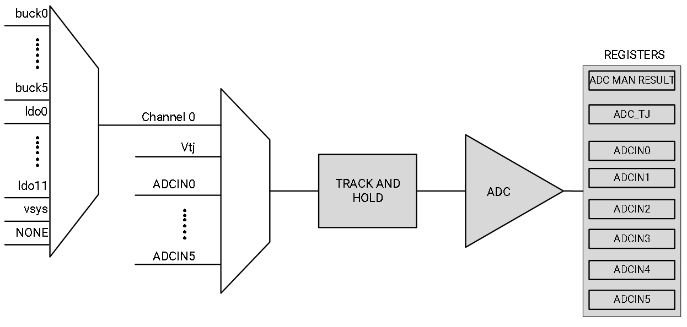

ADC 各测量通道如下：

1. 通道 0：可选择测量 VSYS 电压，所有 BUCK 的电压和所有 LDO 电压；每路寄存器单独可配置；VSYS 电压是把 VSYS/4 作为 ADC 的输入并选用内部基准来测量
2. 通道 1：V(TJ)，芯片内部 Junction 温度
3. 通道 2：ADCIN0，GPIO0 配置成 ADC 模拟输入复用功能
4. 通道 3：ADCIN1，GPIO1 配置成 ADC 模拟输入复用功能
5. 通道 4：ADCIN2，GPIO2 配置成 ADC 模拟输入复用功能
6. 通道 5：ADCIN3，GPIO3 配置成 ADC 模拟输入复用功能
7. 通道 6：ADCIN4，GPIO4 配置成 ADC 模拟输入复用功能
8. 通道 7：ADCIN5，GPIO5 配置成 ADC 模拟输入复用功能

#### 6.13.2 手动模式

手动模式配置流程：

1. 复位 ADC_AUTO 寄存器，禁止所有自动扫描通道使能，并使能 ADC（**表 7-34 **ADC_CTRL[0]=1）。
2. 选择 ADC 转换通道，即配置**表 7-36 **ADC_CFG1 [5:3]。
3. 若选择通道 0，则需选择通道 0 的手动通道，即**表 7-39 **ADC_MAN_EN0 ~ **表 7-41 **ADC_MAN_EN2。
4. 配置其它所需配置，如 ADC 结果滤波，采样频率，CHOP 功能，参考电压，和 ADC 各通道阈值等。
5. 置位 ADC_GO 启动一次转换。

首次使能 ADC，其需要约\> 30 us 的稳定时间，ADC 稳定后 ADC 内部才真正开始工作。

手动模式下每完成一次转换：

1. 扫描通道 0 时 12 bit 结果存放在**表 7-42** ADC_MAN_RES_H 和**表 7-43** ADC_MAN_RES_L 里面；
2. 扫描其它通道时，12bit 结果放在对应的结果寄存器里（**表** **7-44** ADC_TJ_RES_H ~ **表 7-57 **ADC_IN5_RES_L）
3. ADC_GO 被硬件清零
4. ADC 单次转换完成事件**表 7-108 **EVENT1[1]会被置位
5. 如果使能了中断（**表 7-115 **IRQ_EN1[1]），会产生一个中断事件（拉低 INT 引脚）直至软件清除该事件或清零中断使能位。

手动模式下如果选择了通道 0：

1. 在配置完对应的通道使能后，每完成一次转换，ADC 内部通道选择自动切换到通道 0 下一次使能的通道，完成一轮扫描后，切换到最开始使能的通道，如下图** ADC 通道 0 扫描示意图 **所示。
2. 当需要切换扫描顺序，在下一次转换启动前配置好对应的通道使能即可
3. 如需要从头开始扫描，有两种方法：

   - ADC_EN 关闭再打开；
   - 先切换自动模式，再切回手动模式：ADC_AUTO 内任意寄存器配置成 1，然后再将其全清零。
4. **表 7-39 **ADC_MAN_EN0 ~ **表 7-41 **ADC_MAN_EN2 使能的通道全被扫描并转换完成后，会产生事件** 表 7-108 **EVENT1[2]，如果使能了中断（**表 7-115 **IRQ_EN1[2]），会产生一个中断事件（拉低 INT 引脚）直至软件清除该事件或清零中断使能位。

> **注意****:** 通道转换过程中不可随意更改配置，如改变通道选择，采样频率和 ADC_AUTO 等，否则不保证转换结果的正确性；若转换过程中软件清零 ADC_GO，将会打断当前转换，结果不保存和更新，通道扫描从头开始。

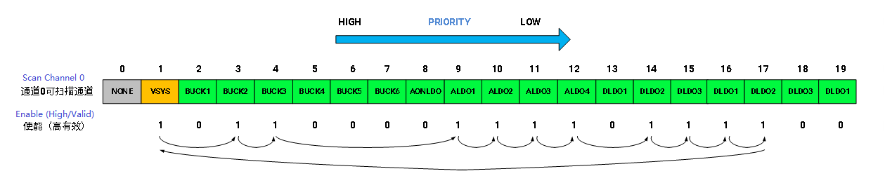

#### 6.13.3 自动模式

自动模式配置流程：

1. 配置所需自动扫描通道，ADC_AUTO 对应的通道使能，并使能 ADC（**表 7-34 **ADC_CTRL[0]=1）。
2. 配置好其它所需配置，如 ADC 结果滤波，采样频率，CHOP 功能，参考电压，高速模式和 ADC 各通道阈值等。
3. 置位 ADC_GO 启动转换。

首次使能 ADC，其需要约\> 30 us 的稳定时间，ADC 稳定后 ADC 内部才真正开始工作。

自动模式下每完成一次转换：

1. 12bit 结果会存放在对应的结果寄存器里。
2. ADC_GO 在自动扫描模式下不被清零。
3. ADC 单次转换完成事件**表 7-108 **EVENT1[1]会被置位。
4. 如果使能了中断（**表 7-115 **IRQ_EN1[1]），会产生一个中断事件（拉低 INT 引脚）直至软件清除该事件或清零中断使能位。

每完成一个序列的扫描（ADC_AUTO 使能的通道都被扫描完成），序列转换完成事件**表 7-108 **EVENT1[2]会被置位，如果使能了中断（**表 7-115 **IRQ_EN1[2]），会产生一个中断事件（拉低 INT 引脚）直至软件清除该事件或清零中断使能位。

在配置完对应的通道使能后，每完成一次转换，ADC 内部通道选择自动切换到下一次使能的通道，完成一轮扫描后，切换到最开始使能的通道，如下图 **ADC 自动扫描示意图** 所示。

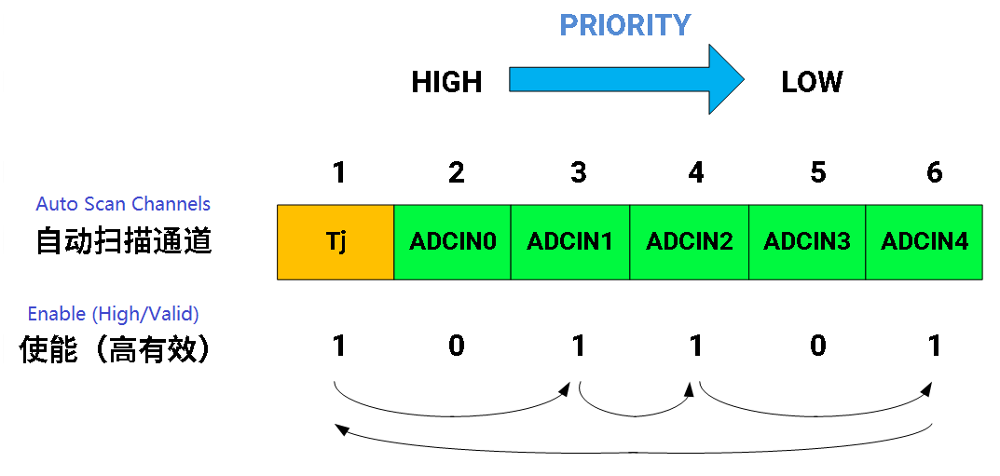

当需要切换扫描顺序或从头开始扫描，有两种方法：

1. ADC_EN 关闭后重新按照自动模式配置流程重新配置，
2. 软件清零 ADC_GO，当前转换将被打断，结果不保存和更新，下一次置位 ADC_GO 后通道扫描从头开始。

注意，通道转换过程中不可随意更改配置，如改变通道选择，采样频率和 ADC_AUTO 等，否则不保证转换结果的正确性。

#### 6.13.4 ADC 结果滤波

如果配置了通道 1~7 的阈值：

1. 在未开启结果滤波时（**表 7-35 **ADC_CFG0 对应 bit 为 0），当本次转换结果超过或低于所设阈值，相应通道的事件（**表 7-107 **EVENT0[5:0]，**表 7-108 **EVENT1[0]）标志位将被置起。
2. 当开启了结果滤波时，只有连续遇到超阈值事件或低阈值事件达到**表 7-37 **ADC_CFG2[6:4]设置的次数后才会置起相应标志位。

如果使能了对应的中断，会产生一个中断事件（拉低 INT 引脚）直至软件清除该事件或清零中断使能位。

下图为 **ADC 结果滤波示意图**

### 6.14 RTC 模块

RTC 模块有三个功能：

- 日历
- 闹钟
- 秒计数

RTC 供电由 2 个来源：VSYS 和 备用纽扣电池

- 当 VSYS 接入时，RTC 供电为 VSYS
- 当 VSYS 低于 2.0 V 时内部电路才会切换到纽扣电池供电

RTC 时钟源可选择内部慢时钟（LSI）或外部晶振，详见寄存器**表 7-33 **RTC_CTRL[3]。

在开启上电流程前，可通过 MTP 使能寄存器**表 7-33 **RTC_CTRL[1]输出内部慢时钟或者晶振时钟。

#### 6.14.1 RTC 日历

RTC 模块内部计时逻辑通过计数 32 kHz 时钟，分别提供秒，分，时，日，月和年，见寄存器**表 7-17 **RTC_COUNT_S ~ **表 7-22 **RTC_COUNT_Y。RTC_COUNT_Y=0 对应 2000 年，因此可计时的日历时间最高可至 2063 年。如需读取当前 PMIC 内部记录的日历值，则需先读 RTC_COUNT_S，与此同时该操作会锁存当前所有日历值分别至寄存器 RTC_COUNT_S ~ RTC_COUNT_Y。

如需要重新设置当前日历值，则需按顺序配置好各日历值（RTC_COUNT_S ~ RTC_COUNT_Y），最后写完寄存器 RTC_COUNT_Y 后，PMIC 会将当前用户配置好的日历值更新到 RTC 模块内部计时器当中，依此为基础开始新的计时。

#### 6.14.2 RTC 闹钟

RTC 模块提供**表 7-23 **RTC_ALARM_S ~ **表 7-28 **RTC_ALARM_Y 的闹钟值，当 RTC 内部当前日历值与 RTC_ALARM_S ~ RTC_ALARM_Y 都匹配时：

1. 若**表 7-33 **RTC_CTRL[5]=1，此时产生一个闹钟事件** 表 7-108 **EVENT1[4]，如果**表 7-115 **IRQ_EN1[4]=1，则也会产生一个中断，拉低 INT 引脚，直至主机清零 E_ALARM 或 IRQ_EN_ALARM。
2. 若**表 7-33 **RTC_CTRL[6]=1，此时产生一个 TICK 事件** 表 7-108 **EVENT1[5]，如果**表 7-115 **IRQ_EN1[5] =1，则也会产生一个中断，拉低 INT 引脚，直至主机清零 E_TICK 或 IRQ_EN_TICK。

TICK 的产生是周期性的，触发后可配置成 1s 或 1min（**表 7-33 **RTC_CTRL[4]）周期内触发一次，因此当 TICK 事件触发后，主机只清零标志位（E_TICK）并不会关闭周期性的触发事件，只有 TICK_EN=0 才能关闭此周期性触发的事件。

当前日历值和设定闹钟值匹配还可以屏蔽对应的日历单位，以实现固定时间段产生闹钟和 TICK 事件：

1. MASK_ALARM_Y ~ MASK_ALARM_S 分别对应年月日时分秒屏蔽位。
2. 对应 bit 置 1 则屏蔽相应 RTC_ALARM_Y ~ RTC_ALARM_S 与当前日历值的匹配。

在关机模式下，RTC 闹钟和 TICK 事件都可作为开机源。

在睡眠模式下，RTC 闹钟和 TICK 事件都可作为唤醒源。

#### 6.14.3 秒计数

**表 7-29 **RTC_SECOND_A ~ **表 7-32 **RTC_SECOND_D 组成一个 32bit 秒计数器，RTC_EN=1 后，秒计数开始计时，否则秒计数清零。

## 7. 寄存器

### 7.1 寄存器参数定义

寄存器基本参数定义如表格 [表 7-1](#表-7-1-register-base-attributes) 所示。部分寄存器特殊的参数定义如表表 [7-2](#表-7-2-register-attribute-modifier) 所示。

#### 表 7-1 Register Base Attributes

| 参数           | 简称 | 描述                             |
|----------------|------|----------------------------------|
| Read Only      | R    | 该 bit 可通过软件读，写无效。     |
| Read/Write     | RW   | 该 bit 可通过软件读写。           |
| Write Only     | W    | 该 bit 只能软件写。               |
| Reserved       | RV   | 该 bit 为保留位，软件不可修改。   |

### 表 7-2 Register Attribute Modifier

| 参数            | 简称 | 描述            |
|-----------------|------|---------------------------|
| Write 1 Only    | IO   | 该 bit 只能通过软件写 1，写 0 无效。          |
| Protected       | P    | 该 bit 受解锁寄存器表 7128 MTP_KEY 保护。 当未向解锁寄存器写解锁序列时，该 bit 不能通过软件修改。 |
| MTP Loaded      | E    | 该 bit 可通过 MTP 修改。       |

### 7.2 寄存器映射表

### 7.2.1 寄存器映射表

#### 表 7-3 Register Map

| Module             | Table Name   | Register Address (hex) | Attribute | Description    |
|--------------------|--------------|-------------------------|-----------|---------------------|
| **GPIO**           | [表 7-4](#表-7-4-gpio_idr)       | 0x00                    | R         | GPIO端口输入值                                            |
| **GPIO**           | [表 7-5](#表-7-5-gpio_odr)       | 0x01                    | RW        | GPIO数据输出； 有效电平配置                            |
| **GPIO**           | [表 7-6](#表-7-6-gpio_pupd0)       | 0x02                    | RWE       | GPIO0 ~ 2上下拉配置                                       |
| **GPIO**           | [表 7-7](#表-7-7-gpio_pupd1)       | 0x03                    | RWE       | GPIO3 ~ 5上下拉配置                                       |
| **GPIO**           | [表 7-8](#表-7-8-gpio_deb_en)       | 0x04                    | RW        | GPIO滤波使能及滤波时间配置                                |
| **GPIO**           | [表 7-9](#表-7-9-gpio_od)       | 0x05                    | RW        | GPIO输出开漏配置                                          |
| **GPIO**           | [表 7-10](#表-7-10-gpio_itype0)      | 0x06                    | RWE       | GPIO0 ~ 2中断类型配置                                     |
| **GPIO**           | [表 7-11](#表-7-11-gpio_itype1)      | 0x07                    | RWE       | GPIO3 ~ 5中断类型配置                                     |
| **GPIO**           | [表 7-12](#表-7-12-gpio_mode0)      | 0x08                    | RWE       | GPIO0 ~ 2模式配置                                         |
| **GPIO**           | [表 7-13](#表-7-13-gpio_mode1)      | 0x09                    | RWE       | GPIO3 ~ 5模式配置                                         |
| **GPIO**           | [表 7-14](#表-7-14-gpio_af01)      | 0x0A                    | RWE       | GPIO0 ~ 1复用功能选择                                     |
| **GPIO**           | [表 7-15](#表-7-15-gpio_af23)      | 0x0B                    | RWE       | GPIO2 ~ 3复用功能选择                                     |
| **GPIO**           | [表 7-16](#表-7-16-gpio_af45)      | 0x0C                    | RWE       | GPIO4 ~ 5复用功能选择                                     |
| **RTC**            | [表 7-17](#表-7-17-rtc_count_s)      | 0x0D                    | RW        | RTC seconds 读出寄存器                                    |
| **RTC**            | [表 7-18](#表-7-18-rtc_count_mi)      | 0x0E                    | RW        | RTC minutes 读出寄存器                                    |
| **RTC**            | [表 7-19](#表-7-19-rtc_count_h)      | 0x0F                    | RW        | RTC hours 读出寄存器                                      |
| **RTC**            | [表 7-20](#表-7-20-rtc_count_d)      | 0x10                    | RW        | RTC days 读出寄存器                                       |
| **RTC**            | [表 7-21](#表-7-21-rtc_count_mo)      | 0x11                    | RW        | RTC months 读出寄存器                                     |
| **RTC**            | [表 7-22](#表-7-22-rtc_count_y)      | 0x12                    | RW        | RTC years 读出寄存器                                      |
| **RTC**            | [表 7-23](#表-7-23-rtc_alarm_s)      | 0x13                    | RW        | RTC_ALARM seconds 设置                                    |
| **RTC**            | [表 7-24](#表-7-24-rtc_alarm_mi)      | 0x14                    | RW        | RTC_ALARM minutes 设置                                    |
| **RTC**            | [表 7-25](#表-7-25-rtc_alarm_h)      | 0x15                    | RW        | RTC_ALARM hours 设置                                      |
| **RTC**            | [表 7-26](#表-7-26-rtc_alarm_d)      | 0x16                    | RW        | RTC_ALARM days 设置                                       |
| **RTC**            | [表 7-27](#表-7-27-rtc_alarm_mo)      | 0x17                    | RW        | RTC_ALARM months 设置                                     |
| **RTC**            | [表 7-28](#表-7-28-rtc_alarm_y)      | 0x18                    | RW        | RTC_ALARM years 设置                                      |
| **RTC**            | [表 7-29](#表-7-29-rtc_second_a)      | 0x19                    | R         | RTC 秒计数[7:0]                                           |
| **RTC**            | [表 7-30](#表-7-30-rtc_second_b)      | 0x1A                    | R         | RTC 秒计数[15:8]                                          |
| **RTC**            | [表 7-31](#表-7-31-rtc_second_c)      | 0x1B                    | R         | RTC 秒计数[23:16]                                         |
| **RTC**            | [表 7-32](#表-7-32-rtc_second_d)      | 0x1C                    | R         | RTC 秒计数[31:24]                                         |
| **RTC**            | [表 7-33](#表-7-33-rtc_ctrl)      | 0x1D                    | RWE       | RTC 控制寄存器                                            |
| **ADC**            | [表 7-34](#表-7-34-adc_ctrl1)      | 0x1E                    | RW        | ADC控制寄存器                                             |
| **ADC**            | [表 7-35](#表-7-35-adc_cfg01)      | 0x1F                    | RW        | ADC配置寄存器0                                            |
| **ADC**            | [表 7-36](#表-7-36-adc_cfg11)      | 0x20                    | RW        | ADC配置寄存器1                                            |
| **ADC**            | [表 7-37](#表-7-37-adc_cfg21)      | 0x21                    | RW        | ADC配置寄存器2                                            |
| **ADC**            | [表 7-38](#表-7-38-adc_auto1)      | 0x22                    | RW        | ADC自动模式扫描通道选择                                   |
| **ADC**            | [表 7-39](#表-7-39-adc_man_en01)      | 0x23                    | RW        | ADC通道0手动扫描通道选择                                  |
| **ADC**            | [表 7-40](#表-7-40-adc_man_en11)      | 0x24                    | RW        | ADC通道0手动扫描通道选择                                  |
| **ADC**            | [表 7-41](#表-7-41-adc_man_en21)      | 0x25                    | RW        | ADC通道0手动扫描通道选择                                  |
| **ADC**            | [表 7-42](#表-7-42-adc_man_res_h1)      | 0x26                    | R         | ADC通道0转换结果高8位                                     |
| **ADC**            | [表 7-43](#表-7-43-adc_man_res_l1)      | 0x27                    | R         | ADC通道0转换结果低4位                                     |
| **ADC**            | [表 7-44](#表-7-44-adc_tj_res_h1)      | 0x28                    | R         | Junction温度监控自动转换结果（8 MSBs）                    |
| **ADC**            | [表 7-45](#表-7-45-adc_tj_res_l1)      | 0x29                    | R         | Junction温度监控自动转换结果（4 LSBs）                    |
| **ADC**            | [表 7-46](#表-7-46-adc_in0_res_h1)      | 0x2A                    | R         | ADCIN0监控自动转换结果（8 MSBs）                          |
| **ADC**            | [表 7-47](#表-7-47-adc_in0_res_l1)      | 0x2B                    | R         | ADCIN0监控自动转换结果（4 LSBs）                          |
| **ADC**            | [表 7-48](#表-7-48-adc_in1_res_l1)      | 0x2C                    | R         | ADCIN1监控自动转换结果（8 MSBs）                          |
| **ADC**            | [表 7-49](#表-7-49-adc_in1_res_l1)      | 0x2D                    | R         | ADCIN1监控自动转换结果（4 LSBs）                          |
| **ADC**            | [表 7-50](#表-7-50-adc_in2_res_h1)      | 0x2E                    | R         | ADCIN2监控自动转换结果（8 MSBs）                          |
| **ADC**            | [表 7-51](#表-7-51-adc_in2_res_l1)      | 0x2F                    | R         | ADCIN2监控自动转换结果（4 LSBs）                          |
| **ADC**            | [表 7-52](#表-7-52-adc_in3_res_h1)      | 0x30                    | R         | ADCIN3监控自动转换结果（8 MSBs）                          |
| **ADC**            | [表 7-53](#表-7-53-adc_in3_res_l1)      | 0x31                    | R         | ADCIN3监控自动转换结果（4 LSBs）                          |
| **ADC**            | [表 7-54](#表-7-54-adc_in4_res_h1)      | 0x32                    | R         | ADCIN4监控自动转换结果（8 MSBs）                          |
| **ADC**            | [表 7-55](#表-7-55-adc_in4_res_l1)      | 0x33                    | R         | ADCIN4监控自动转换结果（4 LSBs）                          |
| **ADC**            | [表 7-56](#表-7-56-adc_in5_res_h1)      | 0x34                    | R         | ADCIN5监控自动转换结果（8 MSBs）                          |
| **ADC**            | [表 7-57](#表-7-57-adc_in5_res_l1)      | 0x35                    | R         | ADCIN5监控自动转换结果（4 LSBs）                          |
| **ADC**            | [表 7-58](#表-7-58-adc_vth_tj_h1)      | 0x36                    | RW        | Junction温度监控上限阈值设置（8 MSBs）                    |
| **ADC**            | [表 7-59](#表-7-59-adc_vth_tj_l1)      | 0x37                    | RW        | Junction温度监控下限阈值设置（8 MSBs）                    |
| **ADC**            | [表 7-60](#表-7-60-adc_in0_vth_h1)      | 0x38                    | RW        | ADCIN0监控上限阈值设置（8 MSBs）                          |
| **ADC**            | [表 7-61](#表-7-61-adc_in0_vth_l1)      | 0x39                    | RW        | ADCIN0监控下限阈值设置（8 MSBs）                          |
| **ADC**            | [表 7-62](#表-7-62-adc_in1_vth_h1)      | 0x3A                    | RW        | ADCIN1监控上限阈值设置（8 MSBs）                          |
| **ADC**            | [表 7-63](#表-7-63-adc_in1_vth_l1)      | 0x3B                    | RW        | ADCIN1监控下限阈值设置（8 MSBs）                          |
| **ADC**            | [表 7-64](#表-7-64-adc_in2_vth_h1)      | 0x3C                    | RW        | ADCIN2监控上限阈值设置（8 MSBs）                          |
| **ADC**            | [表 7-65](#表-7-65-adc_in2_vth_l1)     | 0x3D                    | RW        | ADCIN2监控下限阈值设置（8 MSBs）                          |
| **ADC**            | [表 7-66](#表-7-66-adc_in3_vth_h1)      | 0x3E                    | RW        | ADCIN3监控上限阈值设置（8 MSBs）                          |
| **ADC**            | [表 7-67](#表-7-67-adc_in3_vth_l1)      | 0x3F                    | RW        | ADCIN3监控下限阈值设置（8 MSBs）                          |
| **ADC**            | [表 7-68](#表-7-68-adc_in4_vth_h1)      | 0x40                    | RW        | ADCIN4监控上限阈值设置（8 MSBs）                          |
| **ADC**            | [表 7-69](#表-7-69-adc_in4_vth_l1)      | 0x44                    | RW        | ADCIN4监控下限阈值设置（8 MSBs）                          |
| **ADC**            | [表 7-70](#表-7-70-adc_in5_vth_h1)      | 0x42                    | RW        | ADCIN5监控上限阈值设置（8 MSBs）                          |
| **ADC**            | [表 7-71](#表-7-71-adc_in5_vth_l1)      | 0x43                    | RW        | ADCIN5监控下限阈值设置（8 MSBs）                          |
| **WDT**            | [表 7-72](#表-7-72-wdt_ctrl1)      | 0x44                    | RW        | 看门狗控制寄存器                                          |
| **Battery Charge** | [表 7-73](#表-7-73-bbat_ctrl1)      | 0x45                    | RW        | 电池充电控制寄存器                                        |
| **上下电控制**     | [表 7-74](#表-7-74-buck_ldo_cfg1)      | 0x46                    | RWE       | 电源轨配置寄存器                                          |
| **上下电控制**     | [表 7-75](#表-7-75-buckx_ctrl1)      | 0x47 + 3xn              | RWE       | BUCKn控制寄存器，n=0 ~ 5                                  |
| **上下电控制**     | [表 7-76](#表-7-76-buckx_volt1)      | 0x48 + 3xn              | RWE       | BUCK电压设置                                              |
| **上下电控制**     | [表 7-77](#表-7-77-buckx_slp_volt1)      | 0x49 + 3xn              | RWE       | BUCK睡眠电压设置                                          |
| **上下电控制**     | [表 7-78](#表-7-78-switch_ctrl1)      | 0x59                    | RW        | Switch控制寄存器                                          |
| **上下电控制**     | [表 7-79](#表-7-79-aonldo_ctrl1)      | 0x5A                    | RE        | AONLDO控制寄存器                                          |
| **上下电控制**     | [表 7-80](#表-7-80-aldox_ctrl1)      | 0x5B                    | RWE       | ALDO控制寄存器                                            |
| **上下电控制**     | [表 7-81](#表-7-81-aldox_volt1)      | 0x5C                    | RWE       | ALDO电压设置                                              |
| **上下电控制**     | [表 7-82](#表-7-82-aldox_slp_volt1)      | 0x5D                    | RWE       | ALDO睡眠电压设置                                          |
| **上下电控制**     | [表 7-83](#表-7-83-dldox_ctrl)      | 0x67                    | RWE       | DLDO控制寄存器                                            |
| **上下电控制**     | [表 7-84](#表-7-84-dldox_volt)      | 0x68                    | RWE       | DLDO电压设置                                              |
| **上下电控制**     | [表 7-85](#表-7-85-dldox_slp_volt)      | 0x69                    | RWE       | DLDO睡眠电压设置                                          |
| **上下电控制**     | [表 7-86](#表-7-86-pwr_ctrl0)      | 0x7C                    | RWE       | 上下电控制寄存器0                                         |
| **上下电控制**     | [表 7-87](#表-7-87-pwr_ctrl1)      | 0x7D                    | RWE       | 上下电控制寄存器1                                         |
| **上下电控制**     | [表 7-88](#表-7-88-pwr_ctrl2)      | 0x7E                    | RWE       | 上下电控制寄存器2                                         |
| **上下电控制**     | [表 7-89](#表-7-89-pwr_sts0)      | 0x7F                    | R         | 上下电状态寄存器0                                         |
| **上下电控制**     | [表 7-90](#表-7-90-pwr_sts1)      | 0x80                    | R         | 上下电状态寄存器1                                         |
| **上下电控制**     | [表 7-91](#表-7-91-pwr_key_time)      | 0x81                    | RWE       | 按键时间配置寄存器                                        |
| **上下电控制**     | [表 7-92](#表-7-92-pwr_seq_time)      | 0x82                    | RWE       | 上下电控制时间配置                                        |
| **上下电控制**     | [表 7-93](#表-7-93-pwr_slot0)      | 0x88                    | RE        | 电源轨SLOT ID配置                                         |
| **上下电控制**     | [表 7-94](#表-7-94-pwr_slot1)      | 0x84                    | RE        | 电源轨SLOT ID配置                                         |
| **上下电控制**     | [表 7-95](#表-7-95-pwr_slot2)      | 0x85                    | RE        | 电源轨SLOT ID配置                                         |
| **上下电控制**     | [表 7-96](#表-7-96-pwr_slot3)      | 0x86                    | RE        | 电源轨SLOT ID配置                                         |
| **上下电控制**     | [表 7-97](#表-7-97-pwr_slot4)      | 0x87                    | RE        | 电源轨SLOT ID配置                                         |
| **上下电控制**     | [表 7-98](#表-7-98-pwr_slot5)      | 0x88                    | RE        | 电源轨SLOT ID配置                                         |
| **上下电控制**     | [表 7-99](#表-7-99-pwr_slot6)      | 0x89                    | RE        | 电源轨SLOT ID配置                                         |
| **上下电控制**     | [表 7-100](#表-7-110-buck_evnet0)     | 0x8A                    | RE        | 电源轨SLOT ID配置                                         |
| **上下电控制**     | [表 7-101](#表-7-101-pwr_slot8)     | 0x8B                    | RE        | 电源轨SLOT ID配置                                         |
| **上下电控制**     | [表 7-102](#表-7-102-pwr_slot9)     | 0x8C                    | RE        | EXT_EN SLOT ID配置                                        |
| **上下电控制**     | [表 7-103](#表-7-103-pwr_slot10)     | 0x8D                    | RE        | EXT_EN SLOT ID配置                                        |
| **上下电控制**     | [表 7-104](#表-7-104-pwr_slot11)     | 0x8E                    | RE        | EXT_EN SLOT ID配置                                        |
| **上下电控制**     | [表 7-105](#表-7-105-pwr_ext_en)     | 0x8F                    | RWE       | EXT_EN软件使能控制                                        |
| **上下电控制**     | [表 7-106](#表-7-106-pwr_ext_ctrl)     | 0x90                    | RWE       | EXT_EN睡眠流程控制                                        |
| **事件**           | [表 7-107](#表-7-107-event0)     | 0x91                    | RIO       | PMIC系统事件                                              |
| **事件**           | [表 7-108](#表-7-108-event1)     | 0x92                    | RIO       | PMIC系统事件                                              |
| **事件**           | [表 7-109](#表-7-109-event2)     | 0x99                    | RIO       | PMIC系统事件                                              |
| **事件**           | [表 7-110](#表-7-110-buck_evnet0)     | 0x94                    | RIO       | BUCK过压事件                                              |
| **事件**           | [表 7-111](#表-7-111-buck_evnet1)     | 0x95                    | RIO       | BUCK欠压事件                                              |
| **事件**           | [表 7-112](#表-7-112-buck_evnet2)     | 0x96                    | RIO       | BUCK短路/开路事件                                         |
| **事件**           | [表 7-113](#表-7-113-pwrky_evnet)     | 0x97                    | RIO       | PWRKY按键事件                                             |
| **中断使能**       | [表 7-114](#表-7-114-irq_en0)     | 0x98                    | RW        | PMIC系统事件中断使能                                      |
| **中断使能**       | [表 7-115](#表-7-115-irq_en1)     | 0x99                    | RW        | PMIC系统事件中断使能                                      |
| **中断使能**       | [表 7-116](#表-7-116-irq_en2)     | 0x9A                    | RW        | PMIC系统事件中断使能                                      |
| **中断使能**       | [表 7-117](#表-7-117-irq_buck_en0)     | 0x9B                    | RW        | BUCK过压事件中断使能                                      |
| **中断使能**       | [表 7-118](#表-7-118-irq_buck_en1)     | 0x9C                    | RW        | BUCK欠压事件中断使能                                      |
| **中断使能**       | [表 7-119](#表-7-119-irq_buck_en1)     | 0x9D                    | RW        | BUCK短路/开路事件中断使能                                 |
| **中断使能**       | [表 7-120](#表-7-120-irq_pwrky_en)     | 0x9E                    | RWE       | PWRKY按键事件中断使能                                     |
| **保护使能**       | [表 7-121](#表-7-121-prot_en)     | 0x9F                    | RWE       | 系统异常事件保护使能                                      |
| **ID**             | [表 7-122](#表-7-122-device_id)     | 0xA0                    | RE        | 设备ID                                                    |
| **ID**             | [表 7-123](#表-7-123-version_id)     | 0xA1                    | RE        | 版本ID                                                    |
| **ID**             | [表 7-124](#表-7-124-customer_id)     | 0xA2                    | RE        | 用户ID                                                    |
| **系统配置**       | [表 7-125](#表-7-125-sys_cfg0)     | 0xAA                    | RE        | 系统配置寄存器0                                           |
| **系统配置**       | [表 7-126](#表-7-126-sys_cfg1)     | 0xA4                    | RE        | 系统配置寄存器1                                           |
| **系统配置**       | [表 7-127](#表-7-127-sys_cfg2)     | 0xA5                    | RE        | 系统配置寄存器2                                           |
| **MTP**            | [表 7-128](#表-7-128-mtp_key)     | 0xA6                    | RW        | MTP解锁寄存器                                             |
| **MTP**            | [表 7-129](#表-7-129-mtp_addr)     | 0xA7                    | RWP       | MTP地址寄存器                                             |
| **MTP**            | [表 7-130](#表-7-130-mtp_data)     | 0xA8                    | RWP       | MTP读写数据寄存器                                         |
| **MTP**            | [表 7-131](#表-7-131-mtp_cfg)     | 0xA9                    | RWP       | MTP配置寄存器                                             |
| **MTP**            | [表 7-132](#表-7-132-mtp_ctrl)     | 0xAA                    | RWP       | MTP控制寄存器                                             |

### 7.2.2 寄存器描述

#### 表 7-4 GPIO_IDR

<table>
<tbody>
<tr>
<td>Addr</td>
<td>Bits</td>
<td>Field Name</td>
<td>Attr</td>
<td>Default</td>
<td>Description</td>
</tr>
<tr>
<td rowspan=7 colspan=1>0x0</td>
<td>7:6</td>
<td>Reserved</td>
<td>RV</td>
<td>0</td>
<td>Reserved</td>
</tr>
<tr>
<td>5</td>
<td>GPIO5_IDR</td>
<td>R</td>
<td>0x0</td>
<td>GPIO5输入值</td>
</tr>
<tr>
<td>4</td>
<td>GPIO4_IDR</td>
<td>R</td>
<td>0x0</td>
<td>GPIO4输入值</td>
</tr>
<tr>
<td>3</td>
<td>GPIO3_IDR</td>
<td>R</td>
<td>0x0</td>
<td>GPIO3输入值</td>
</tr>
<tr>
<td>2</td>
<td>GPIO2_IDR</td>
<td>R</td>
<td>0x0</td>
<td>GPIO2输入值</td>
</tr>
<tr>
<td>1</td>
<td>GPIO1_IDR</td>
<td>R</td>
<td>0x0</td>
<td>GPIO1输入值</td>
</tr>
<tr>
<td>0</td>
<td>GPIO0_IDR</td>
<td>R</td>
<td>0x0</td>
<td>GPIO0输入值</td>
</tr>
</tbody>
</table>

#### 表 7-5 GPIO_ODR

<table>
<tbody>
<tr>
<td>Addr</td>
<td>Bits</td>
<td>Field Name</td>
<td>Attr</td>
<td>Default</td>
<td>Description</td>
</tr>
<tr>
<td rowspan=7 colspan=1>0x1 </td>
<td>7:6</td>
<td>Reserved</td>
<td>RV</td>
<td>0</td>
<td>Reserved</td>
</tr>
<tr>
<td>5</td>
<td>GPIO5_ODR</td>
<td>RWE</td>
<td>0x0</td>
<td rowspan=6 colspan=1>作为GPIO输出时，为数据输出配置； 作为复用功能时，为有效极性配置。 - 0：输出低电平 / 有效极性为低电平 - 1：输出高电平 / 有效极性为高电平 </td>
</tr>
<tr>
<td>4</td>
<td>GPIO4_ODR</td>
<td>RWE</td>
<td>0x0</td>
</tr>
<tr>
<td>3</td>
<td>GPIO3_ODR</td>
<td>RWE</td>
<td>0x0</td>
</tr>
<tr>
<td>2</td>
<td>GPIO2_ODR</td>
<td>RWE</td>
<td>0x0</td>
</tr>
<tr>
<td>1</td>
<td>GPIO1_ODR</td>
<td>RWE</td>
<td>0x0</td>
</tr>
<tr>
<td>0</td>
<td>GPIO0_ODR</td>
<td>RWE</td>
<td>0x0</td>
</tr>
</tbody>
</table>

#### 表 7-6 GPIO_PUPD0

<table>
<tbody>
<tr>
<td>Addr</td>
<td>Bits</td>
<td>Field Name</td>
<td>Attr</td>
<td>Default</td>
<td>Description</td>
</tr>
<tr>
<td rowspan=4 colspan=1>0x2</td>
<td>7:6</td>
<td>Reserved</td>
<td>RV</td>
<td>0</td>
<td>Reserved</td>
</tr>
<tr>
<td>5:4</td>
<td>GPIO2_PUPD</td>
<td>RWE</td>
<td>0x0</td>
<td>GPIO2上下拉配置： 00：无效操作 01：上拉电阻使能 10：下拉电阻使能 1x：无效操作</td>
</tr>
<tr>
<td>3:2</td>
<td>GPIO1_PUPD</td>
<td>RWE</td>
<td>0x0</td>
<td>GPIO1上下拉配置： 00：无效操作 01：上拉电阻使能 10：下拉电阻使能 1x：无效操作</td>
</tr>
<tr>
<td>1:0</td>
<td>GPIO0_PUPD</td>
<td>RWE</td>
<td>0x0</td>
<td>GPIO0上下拉配置： 00：无效操作 01：上拉电阻使能 10：下拉电阻使能 1x：无效操作</td>
</tr>
</tbody>
</table>

#### 表 7-7 GPIO_PUPD1

<table>
<tbody>
<tr>
<td>Addr</td>
<td>Bits</td>
<td>Field Name</td>
<td>Attr</td>
<td>Default</td>
<td>Description</td>
</tr>
<tr>
<td rowspan=4 colspan=1>0x3</td>
<td>7:6</td>
<td>Reserved</td>
<td>RV</td>
<td>0</td>
<td>Reserved</td>
</tr>
<tr>
<td>5:4</td>
<td>GPIO5_PUPD</td>
<td>RWE</td>
<td>0x0</td>
<td>GPIO5上下拉配置： 00：无效操作 01：上拉电阻使能 10：下拉电阻使能 1x：无效操作</td>
</tr>
<tr>
<td>3:2</td>
<td>GPIO4_PUPD</td>
<td>RWE</td>
<td>0x0</td>
<td>GPIO4上下拉配置： 00：无效操作 01：上拉电阻使能 10：下拉电阻使能 1x：无效操作</td>
</tr>
<tr>
<td>1:0</td>
<td>GPIO3_PUPD</td>
<td>RWE</td>
<td>0x0</td>
<td>GPIO3上下拉配置： 00：无效操作 01：上拉电阻使能 10：下拉电阻使能 1x：无效操作</td>
</tr>
</tbody>
</table>

#### 表 7-8 GPIO_DEB_EN

<table>
<tbody>
<tr>
<td>Addr</td>
<td>Bits</td>
<td>Field Name</td>
<td>Attr</td>
<td>Default</td>
<td>Description</td>
</tr>
<tr>
<td rowspan=7 colspan=1>0x4</td>
<td>7:6 </td>
<td>GPIO_DEB_TIME </td>
<td>RW</td>
<td>0x0</td>
<td>GPIO0 ~ 5滤波时间选择 00：100 us 01：375 us 10：750 us 11：1.5 ms</td>
</tr>
<tr>
<td>5</td>
<td>GPIO5_DEB_EN</td>
<td>RW</td>
<td>0x0</td>
<td>GPIO5滤波使能： 0：禁止 1：使能</td>
</tr>
<tr>
<td>4</td>
<td>GPIO4_DEB_EN</td>
<td>RW</td>
<td>0x0</td>
<td>GPIO4滤波使能： 0：禁止 1：使能</td>
</tr>
<tr>
<td>3</td>
<td>GPIO3_DEB_EN</td>
<td>RW</td>
<td>0x0</td>
<td>GPIO3滤波使能： 0：禁止 1：使能</td>
</tr>
<tr>
<td>2</td>
<td>GPIO2_DEB_EN</td>
<td>RW</td>
<td>0x0</td>
<td>GPIO2滤波使能： 0：禁止 1：使能</td>
</tr>
<tr>
<td>1</td>
<td>GPIO1_DEB_EN</td>
<td>RW</td>
<td>0x0</td>
<td>GPIO1滤波使能： 0：禁止 1：使能</td>
</tr>
<tr>
<td>0</td>
<td>GPIO0_DEB_EN</td>
<td>RW</td>
<td>0x0</td>
<td>GPIO0滤波使能： 0：禁止 1：使能</td>
</tr>
</tbody>
</table>

#### 表 7-9 GPIO_OD

<table>
<tbody>
<tr>
<td>Addr</td>
<td>Bits</td>
<td>Field Name</td>
<td>Attr</td>
<td>Default</td>
<td>Description</td>
</tr>
<tr>
<td rowspan=7 colspan=1>0x5    </td>
<td>7:6</td>
<td>Reserved</td>
<td>RV</td>
<td>0</td>
<td>Reserved</td>
</tr>
<tr>
<td>5</td>
<td>GPIO5_OD</td>
<td>RW</td>
<td>0x0</td>
<td>GPIO5输出开漏配置 0：推挽输出 1：开漏输出</td>
</tr>
<tr>
<td>4 </td>
<td>GPIO4_OD</td>
<td>RW</td>
<td>0x0</td>
<td>GPIO4输出开漏配置 0：推挽输出 1：开漏输出</td>
</tr>
<tr>
<td>3</td>
<td>GPIO3_OD</td>
<td>RW</td>
<td>0x0</td>
<td>GPIO3输出开漏配置 0：推挽输出 1：开漏输出</td>
</tr>
<tr>
<td>2</td>
<td>GPIO2_OD</td>
<td>RW</td>
<td>0x0</td>
<td>GPIO2输出开漏配置 0：推挽输出 1：开漏输出</td>
</tr>
<tr>
<td>1</td>
<td>GPIO1_OD</td>
<td>RW</td>
<td>0x0</td>
<td>GPIO1输出开漏配置 0：推挽输出 1：开漏输出</td>
</tr>
<tr>
<td>0</td>
<td>GPIO0_OD</td>
<td>RW</td>
<td>0x0</td>
<td>GPIO0输出开漏配置 0：推挽输出 1：开漏输出</td>
</tr>
</tbody>
</table>

#### 表 7-10 GPIO_ITYPE0

<table>
<tbody>
<tr>
<td>Addr</td>
<td>Bits</td>
<td>Field Name</td>
<td>Attr</td>
<td>Default</td>
<td>Description</td>
</tr>
<tr>
<td rowspan=4 colspan=1>0x6</td>
<td>7:6</td>
<td>Reserved</td>
<td>RV</td>
<td>0</td>
<td>Reserved</td>
</tr>
<tr>
<td>5:4</td>
<td>GPIO2_ITYPE</td>
<td>RWE</td>
<td>0x0</td>
<td>GPIO2中断类型 00：上升沿中断 01：下降沿中断 10：高电平中断 11：低电平中断</td>
</tr>
<tr>
<td>3:2</td>
<td>GPIO1_ITYPE</td>
<td>RWE</td>
<td>0x0</td>
<td>GPIO1中断类型 00：上升沿中断 01：下降沿中断 10：高电平中断 11：低电平中断</td>
</tr>
<tr>
<td>1:0</td>
<td>GPIO0_ITYPE</td>
<td>RWE</td>
<td>0x0</td>
<td>GPIO0中断类型 00：上升沿中断 01：下降沿中断 10：高电平中断 11：低电平中断</td>
</tr>
</tbody>
</table>

#### 表 7-11 GPIO_ITYPE1

<table>
<tbody>
<tr>
<td>Addr</td>
<td>Bits</td>
<td>Field Name</td>
<td>Attr</td>
<td>Default</td>
<td>Description</td>
</tr>
<tr>
<td rowspan=4 colspan=1>0x7</td>
<td>7:6</td>
<td>Reserved</td>
<td>RV</td>
<td>0</td>
<td>Reserved</td>
</tr>
<tr>
<td>5:4</td>
<td>GPIO5_ITYPE</td>
<td>RWE</td>
<td>0x0</td>
<td>GPIO5中断类型 00：上升沿中断 01：下降沿中断 10：高电平中断 11：低电平中断</td>
</tr>
<tr>
<td>3:2</td>
<td>GPIO4_ITYPE</td>
<td>RWE</td>
<td>0x0 </td>
<td>GPIO4中断类型 00：上升沿中断 01：下降沿中断 10：高电平中断 11：低电平中断</td>
</tr>
<tr>
<td>1:0</td>
<td>GPIO3_ITYPE</td>
<td>RWE</td>
<td>0x0</td>
<td>GPIO3中断类型 00：上升沿中断 01：下降沿中断 10：高电平中断 11：低电平中断</td>
</tr>
</tbody>
</table>

#### 表 7-12 GPIO_MODE0

<table>
<tbody>
<tr>
<td>Addr</td>
<td>Bits</td>
<td>Field Name</td>
<td>Attr</td>
<td>Default</td>
<td>Description</td>
</tr>
<tr>
<td rowspan=4 colspan=1>0x8</td>
<td>7:6</td>
<td>Reserved</td>
<td>RV</td>
<td>0</td>
<td>Reserved</td>
</tr>
<tr>
<td>5:4</td>
<td>GPIO2_MODE</td>
<td>RWE</td>
<td>0x0</td>
<td>GPIO2模式选择 00：输入模式 01：输出模式 1x：复用模式</td>
</tr>
<tr>
<td>3:2</td>
<td>GPIO1_MODE</td>
<td>RWE</td>
<td>0x0</td>
<td>GPIO1模式选择 00：输入模式 01：输出模式 1x：复用模式</td>
</tr>
<tr>
<td>1:0</td>
<td>GPIO0_MODE</td>
<td>RWE</td>
<td>0x0</td>
<td>GPIO0模式选择 00：输入模式 01：输出模式 1x：复用模式</td>
</tr>
</tbody>
</table>

#### 表 7-13 GPIO_MODE1

<table>
<tbody>
<tr>
<td>Addr</td>
<td>Bits</td>
<td>Field Name</td>
<td>Attr</td>
<td>Default</td>
<td>Description</td>
</tr>
<tr>
<td rowspan=4 colspan=1>0x9</td>
<td>7:6</td>
<td>Reserved</td>
<td>RV</td>
<td>0</td>
<td>Reserved</td>
</tr>
<tr>
<td>5:4</td>
<td>GPIO5_MODE</td>
<td>RWE</td>
<td>0x0</td>
<td>GPIO5模式选择 00：输入模式 01：输出模式 1x：复用模式</td>
</tr>
<tr>
<td>3:2</td>
<td>GPIO4_MODE</td>
<td>RWE</td>
<td>0x0</td>
<td>GPIO4模式选择 00：输入模式 01：输出模式 1x：复用模式</td>
</tr>
<tr>
<td>1:0</td>
<td>GPIO3_MODE</td>
<td>RWE</td>
<td>0x0</td>
<td>GPIO3模式选择 00：输入模式 01：输出模式 1x：复用模式</td>
</tr>
</tbody>
</table>

#### 表 7-14 GPIO_AF01

<table>
<tbody>
<tr>
<td>Addr</td>
<td>Bits</td>
<td>Field Name</td>
<td>Attr</td>
<td>Default</td>
<td>Description</td>
</tr>
<tr>
<td rowspan=3 colspan=1>0xA</td>
<td>7:6</td>
<td>Reserved</td>
<td>RV</td>
<td>0</td>
<td>Reserved</td>
</tr>
<tr>
<td>5:3</td>
<td>GPIO1_AFR</td>
<td>RWE</td>
<td>0x0</td>
<td>GPIO1复用功能选择 000：外部电源使能输出信号（EXT_EN） 001：外部上电时序控制输入信号（PWRCTRL） 010：外部休眠、唤醒控制输入信号（Sleep/Wakeup） 011：外部复位控制输入信号（nReset） 1xx：ADC输入信号（ADCIN）</td>
</tr>
<tr>
<td>2:0</td>
<td>GPIO0_AFR</td>
<td>RWE</td>
<td>0x0</td>
<td>GPIO0复用功能选择 000：外部电源使能输出信号（EXT_EN） 001：外部上电时序控制输入信号（PWRCTRL） 010：外部休眠、唤醒控制输入信号（Sleep/Wakeup） 011：外部复位控制输入信号（nReset） 1xx：ADC输入信号（ADCIN）</td>
</tr>
</tbody>
</table>

#### 表 7-15 GPIO_AF23

<table>
<tbody>
<tr>
<td>Addr</td>
<td>Bits</td>
<td>Field Name</td>
<td>Attr</td>
<td>Default</td>
<td>Description</td>
</tr>
<tr>
<td rowspan=3 colspan=1>0xB    </td>
<td>7:6</td>
<td>Reserved</td>
<td>RV</td>
<td>0</td>
<td>Reserved</td>
</tr>
<tr>
<td>5:3</td>
<td>GPIO3_AFR</td>
<td>RWE</td>
<td>0x0</td>
<td>GPIO3复用功能选择 000：外部电源使能输出信号（EXT_EN） 001：外部上电时序控制输入信号（PWRCTRL） 010：外部休眠、唤醒控制输入信号（Sleep/Wakeup） 011：外部复位控制输入信号（nReset） 1xx：ADC输入信号（ADCIN）</td>
</tr>
<tr>
<td>2:0</td>
<td>GPIO2_AFR</td>
<td>RWE</td>
<td>0x0</td>
<td>GPIO2复用功能选择 000：外部电源使能输出信号（EXT_EN） 001：外部上电时序控制输入信号（PWRCTRL） 010：外部休眠、唤醒控制输入信号（Sleep/Wakeup） 011：外部复位控制输入信号（nReset） 1xx：ADC输入信号（ADCIN）</td>
</tr>
</tbody>
</table>

#### 表 7-16 GPIO_AF45

<table>
<tbody>
<tr>
<td>Addr</td>
<td>Bits</td>
<td>Field Name</td>
<td>Attr</td>
<td>Default</td>
<td>Description</td>
</tr>
<tr>
<td rowspan=3 colspan=1>0xC    </td>
<td>7:6</td>
<td>Reserved</td>
<td>RV</td>
<td>0</td>
<td>Reserved</td>
</tr>
<tr>
<td>5:3</td>
<td>GPIO5_AFR</td>
<td>RWE</td>
<td>0x0</td>
<td>GPIO5复用功能选择 000：外部电源使能输出信号（EXT_EN） 001：外部上电时序控制输入信号（PWRCTRL） 010：外部休眠、唤醒控制输入信号（Sleep/Wakeup） 011：外部复位控制输入信号（nReset） 1xx：ADC输入信号（ADCIN）</td>
</tr>
<tr>
<td>2:0</td>
<td>GPIO4_AFR</td>
<td>RWE</td>
<td>0x0</td>
<td>GPIO4复用功能选择 000：外部电源使能输出信号（EXT_EN） 001：外部上电时序控制输入信号（PWRCTRL） 010：外部休眠、唤醒控制输入信号（Sleep/Wakeup） 011：外部复位控制输入信号（nReset） 1xx：ADC输入信号（ADCIN）</td>
</tr>
</tbody>
</table>

#### 表 7-17 RTC_COUNT_S

<table>
<tbody>
<tr>
<td>Addr</td>
<td>Bits</td>
<td>Field Name</td>
<td>Attr</td>
<td>Default</td>
<td>Description</td>
</tr>
<tr>
<td rowspan=2 colspan=1>0xD </td>
<td>7:6</td>
<td>Reserved</td>
<td>RV</td>
<td>0</td>
<td>Reserved</td>
</tr>
<tr>
<td>5:0</td>
<td>COUNT_S</td>
<td>RW</td>
<td>0x00</td>
<td>RTC seconds 读出寄存器。 读此寄存器会将当前日历数据更新到COUNT_S ~ COUNT_Y</td>
</tr>
</tbody>
</table>

#### 表 7-18 RTC_COUNT_MI

<table>
<tbody>
<tr>
<td>Addr</td>
<td>Bits</td>
<td>Field Name</td>
<td>Attr</td>
<td>Default</td>
<td>Description</td>
</tr>
<tr>
<td rowspan=2 colspan=1>0xE</td>
<td>7:6</td>
<td>Reserved</td>
<td>RV</td>
<td>0</td>
<td>Reserved</td>
</tr>
<tr>
<td>5:0</td>
<td>COUNT_MI</td>
<td>RW</td>
<td>0x00</td>
<td>RTC minutes 读出寄存器</td>
</tr>
</tbody>
</table>

#### 表 7-19 RTC_COUNT_H

<table>
<tbody>
<tr>
<td>Addr</td>
<td>Bits</td>
<td>Field Name</td>
<td>Attr</td>
<td>Default</td>
<td>Description</td>
</tr>
<tr>
<td rowspan=2 colspan=1>0xF</td>
<td>7:5</td>
<td>Reserved</td>
<td>RV</td>
<td>0</td>
<td>Reserved</td>
</tr>
<tr>
<td>4:0</td>
<td>COUNT_H</td>
<td>RW</td>
<td>0x00</td>
<td>RTC hours 读出寄存器</td>
</tr>
</tbody>
</table>

#### 表 7-20 RTC_COUNT_D

<table>
<tbody>
<tr>
<td>Addr</td>
<td>Bits</td>
<td>Field Name</td>
<td>Attr</td>
<td>Default</td>
<td>Description</td>
</tr>
<tr>
<td rowspan=2 colspan=1>0x10 </td>
<td>7:5</td>
<td>Reserved</td>
<td>RV</td>
<td>0</td>
<td>Reserved</td>
</tr>
<tr>
<td>4:0</td>
<td>COUNT_D</td>
<td>RW</td>
<td>0x00</td>
<td>RTC days 读出寄存器</td>
</tr>
</tbody>
</table>

#### 表 7-21 RTC_COUNT_MO

<table>
<tbody>
<tr>
<td>Addr</td>
<td>Bits</td>
<td>Field Name</td>
<td>Attr</td>
<td>Default</td>
<td>Description</td>
</tr>
<tr>
<td rowspan=2 colspan=1>0x11</td>
<td>7:4</td>
<td>Reserved</td>
<td>RV</td>
<td>0</td>
<td>Reserved</td>
</tr>
<tr>
<td>3:0</td>
<td>COUNT_MO</td>
<td>RW</td>
<td>0x00</td>
<td>RTC months 读出寄存器</td>
</tr>
</tbody>
</table>

#### 表 7-22 RTC_COUNT_Y

<table>
<tbody>
<tr>
<td>Addr</td>
<td>Bits</td>
<td>Field Name</td>
<td>Attr</td>
<td>Default</td>
<td>Description</td>
</tr>
<tr>
<td rowspan=2 colspan=1>0x12</td>
<td>7:6</td>
<td>Reserved</td>
<td>RV</td>
<td>0</td>
<td>Reserved</td>
</tr>
<tr>
<td>5:0</td>
<td>COUNT_Y</td>
<td>RW</td>
<td>0x00</td>
<td>RTC years 读出寄存器。 写此寄存器，会将当前COUNT_S ~ COUNT_Y更新到日历计数器； 并且RTC_SECOND_A ~ RTC_SECOND_D复位。</td>
</tr>
</tbody>
</table>

#### 表 7-23 RTC_ALARM_S

<table>
<tbody>
<tr>
<td>Addr</td>
<td>Bits</td>
<td>Field Name</td>
<td>Attr</td>
<td>Default</td>
<td>Description</td>
</tr>
<tr>
<td rowspan=3 colspan=1>0x13</td>
<td>7</td>
<td>MASK_ALARM_S</td>
<td>RW</td>
<td>0x0</td>
<td>ALARM_S匹配屏蔽 0：不屏蔽 1：屏蔽</td>
</tr>
<tr>
<td>6</td>
<td>Reserved</td>
<td>RV</td>
<td>0</td>
<td>Reserved</td>
</tr>
<tr>
<td>5:0</td>
<td>ALARM_S</td>
<td>RW</td>
<td>0x00</td>
<td>RTC_ALARM seconds 设置，设置范围0x00 ~ 0x3B</td>
</tr>
</tbody>
</table>

#### 表 7-24 RTC_ALARM_MI

<table>
<tbody>
<tr>
<td>Addr</td>
<td>Bits</td>
<td>Field Name</td>
<td>Attr</td>
<td>Default</td>
<td>Description</td>
</tr>
<tr>
<td rowspan=3 colspan=1>0x14 </td>
<td>7</td>
<td>MASK_ALARM_MI</td>
<td>RW</td>
<td>0x0</td>
<td>ALARM_MI匹配屏蔽 0：不屏蔽 1：屏蔽</td>
</tr>
<tr>
<td>6</td>
<td>Reserved</td>
<td>RV</td>
<td>0</td>
<td>Reserved</td>
</tr>
<tr>
<td>5:0</td>
<td>ALARM_MI</td>
<td>RW</td>
<td>0x00</td>
<td>RTC_ALARM minutes 设置 设置范围0x00 ~ 0x3B</td>
</tr>
</tbody>
</table>

#### 表 7-25 RTC_ALARM_H

<table>
<tbody>
<tr>
<td>Addr</td>
<td>Bits</td>
<td>Field Name</td>
<td>Attr</td>
<td>Default</td>
<td>Description</td>
</tr>
<tr>
<td rowspan=3 colspan=1>0x15</td>
<td>7</td>
<td>MASK_ALARM_H</td>
<td>RW</td>
<td>0x0</td>
<td>ALARM_H匹配屏蔽 0：不屏蔽 1：屏蔽</td>
</tr>
<tr>
<td>6:5</td>
<td>Reserved</td>
<td>RV</td>
<td>0</td>
<td>Reserved</td>
</tr>
<tr>
<td>4:0</td>
<td>ALARM_H</td>
<td>RW</td>
<td>0x00</td>
<td>RTC_ALARM hours 设置 设置范围0x00 ~ 0x17</td>
</tr>
</tbody>
</table>

#### 表 7-26 RTC_ALARM_D

<table>
<tbody>
<tr>
<td>Addr</td>
<td>Bits</td>
<td>Field Name</td>
<td>Attr</td>
<td>Default</td>
<td>Description</td>
</tr>
<tr>
<td rowspan=3 colspan=1>0x16</td>
<td>7</td>
<td>MASK_ALARM_D</td>
<td>RW</td>
<td>0x0</td>
<td>ALARM_D匹配屏蔽 0：不屏蔽 1：屏蔽</td>
</tr>
<tr>
<td>6:5</td>
<td>Reserved</td>
<td>RV</td>
<td>0</td>
<td>Reserved</td>
</tr>
<tr>
<td>4:0</td>
<td>ALARM_D</td>
<td>RW</td>
<td>0x00</td>
<td>RTC_ALARM days 设置 设置范围0x00 ~ 0x1F</td>
</tr>
</tbody>
</table>

#### 表 7-27 RTC_ALARM_MO

<table>
<tbody>
<tr>
<td>Addr</td>
<td>Bits</td>
<td>Field Name</td>
<td>Attr</td>
<td>Default</td>
<td>Description</td>
</tr>
<tr>
<td rowspan=3 colspan=1>0x17    </td>
<td>7</td>
<td>MASK_ALARM_MO</td>
<td>RW</td>
<td>0x0</td>
<td>ALARM_MO匹配屏蔽 0：不屏蔽 1：屏蔽</td>
</tr>
<tr>
<td>6:4</td>
<td>Reserved</td>
<td>RV</td>
<td>0</td>
<td>Reserved</td>
</tr>
<tr>
<td>3:0</td>
<td>ALARM_MO</td>
<td>RW</td>
<td>0x00</td>
<td>RTC_ALARM months 设置 设置范围0x00 ~ 0x0C</td>
</tr>
</tbody>
</table>

#### 表 7-28 RTC_ALARM_Y

<table>
<tbody>
<tr>
<td>Addr</td>
<td>Bits</td>
<td>Field Name</td>
<td>Attr</td>
<td>Default</td>
<td>Description</td>
</tr>
<tr>
<td rowspan=3 colspan=1>0x18</td>
<td>7</td>
<td>MASK_ALARM_Y</td>
<td>RW</td>
<td>0x0</td>
<td>ALARM_Y匹配屏蔽 0：不屏蔽 1：屏蔽</td>
</tr>
<tr>
<td>6</td>
<td>Reserved</td>
<td>RV</td>
<td>0</td>
<td>Reserved</td>
</tr>
<tr>
<td>5:0</td>
<td>ALARM_Y</td>
<td>RW</td>
<td>0x00</td>
<td>RTC_ALARM years 设置 设置范围0x00 ~ 0x3F</td>
</tr>
</tbody>
</table>

#### 表 7-29 RTC_SECOND_A

<table>
<tbody>
<tr>
<td>Addr</td>
<td>Bits</td>
<td>Field Name</td>
<td>Attr</td>
<td>Default</td>
<td>Description</td>
</tr>
<tr>
<td>0x19</td>
<td>7:0</td>
<td>SECOND_A</td>
<td>R</td>
<td>0x00</td>
<td>RTC 秒计数[7:0]。 读此寄存器会将当前32bit秒计数器数值更新到SECOND_A ~ SECOND_D</td>
</tr>
</tbody>
</table>

#### 表 7-30 RTC_SECOND_B

<table>
<tbody>
<tr>
<td>Addr</td>
<td>Bits</td>
<td>Field Name</td>
<td>Attr</td>
<td>Default</td>
<td>Description</td>
</tr>
<tr>
<td>0x1A</td>
<td>7:0</td>
<td>SECOND_B</td>
<td>R</td>
<td>0x00</td>
<td>RTC 秒计数[15:8]</td>
</tr>
</tbody>
</table>

#### 表 7-31 RTC_SECOND_C

<table>
<tbody>
<tr>
<td>Addr</td>
<td>Bits</td>
<td>Field Name</td>
<td>Attr</td>
<td>Default</td>
<td>Description</td>
</tr>
<tr>
<td>0x1B</td>
<td>7:0</td>
<td>SECOND_C</td>
<td>R</td>
<td>0x00</td>
<td>RTC 秒计数[23:16]</td>
</tr>
</tbody>
</table>

#### 表 7-32 RTC_SECOND_D

<table>
<tbody>
<tr>
<td>Addr</td>
<td>Bits</td>
<td>Field Name</td>
<td>Attr</td>
<td>Default</td>
<td>Description</td>
</tr>
<tr>
<td>0x1C</td>
<td>7:0</td>
<td>SECOND_D</td>
<td>R</td>
<td>0x00</td>
<td>RTC 秒计数[31:24]</td>
</tr>
</tbody>
</table>

#### 表 7-33 RTC_CTRL

<table>
<tbody>
<tr>
<td>Addr</td>
<td>Bits</td>
<td>Field Name</td>
<td>Attr</td>
<td>Default</td>
<td>Description</td>
</tr>
<tr>
<td rowspan=8 colspan=1>0x1D              </td>
<td>7</td>
<td>Reserved</td>
<td>RV</td>
<td>0</td>
<td>Reserved</td>
</tr>
<tr>
<td>6</td>
<td>TICK_EN(*1)</td>
<td>RW</td>
<td>0x0</td>
<td>TICK使能 0：禁止 1：使能</td>
</tr>
<tr>
<td>5</td>
<td>ALARM_EN(*1)</td>
<td>RW</td>
<td>0x0</td>
<td>ALARM使能 0：禁止 1：使能</td>
</tr>
<tr>
<td>4 </td>
<td>TICK_TYPE(*1)</td>
<td>RW</td>
<td>0x0</td>
<td>TICK周期选择： 0：1s 1：1min</td>
</tr>
<tr>
<td>3</td>
<td>RTC_CLK_SEL(*1)</td>
<td>RW</td>
<td>0x0</td>
<td>RTC时钟选择 0：内部时钟（32 kHz） 1：外部晶振时钟</td>
</tr>
<tr>
<td>2</td>
<td>RTC_EN(*1)</td>
<td>RW</td>
<td>0x0</td>
<td>RTC使能 0：禁止 1：使能</td>
</tr>
<tr>
<td>1</td>
<td>OUT_32K_EN(*2)</td>
<td>RWE</td>
<td>0x0</td>
<td>RTC时钟输出使能 0：禁止 1：使能</td>
</tr>
<tr>
<td>0</td>
<td>CRYSTAL_EN(*3)</td>
<td>RWE</td>
<td>0x0</td>
<td>外部晶振使能 0：禁止 1：使能</td>
</tr>
</tbody>
</table>

> **注：**
> 1：关机模式保持不变
> 2：进入关机模式=0，遇到开机事件后恢复为MTP内的数值
> 3：关机模式保持不变，遇到开机事件后恢复为MTP内的数值

#### 表 7-34 ADC_CTRL(*1)

<table>
<tbody>
<tr>
<td>Addr</td>
<td>Bits</td>
<td>Field Name</td>
<td>Attr</td>
<td>Default</td>
<td>Description</td>
</tr>
<tr>
<td rowspan=3 colspan=1>0x1E    </td>
<td>7:2</td>
<td>Reserved</td>
<td>RV</td>
<td>0</td>
<td>Reserved</td>
</tr>
<tr>
<td>1</td>
<td>ADC_GO(*2)</td>
<td>RW</td>
<td>0</td>
<td>ADC转换启动位 0：AD转换完成/未进行 1：AD转换正在进行</td>
</tr>
<tr>
<td>0</td>
<td>ADC_EN</td>
<td>RW</td>
<td>0</td>
<td>ADC使能位 0：禁止ADC 1：使能ADC</td>
</tr>
</tbody>
</table>

> **注：**
> 1：进入关机模式恢复默认值
> 2：手动模式下，该 bit 软件置 1 后，转换每完成一次即硬件清零；自动模式下，该 bit 软件置 1 后，由软件清零停止自动转换；任何模式下，转换过程中清零该 bit，都会停止并打断转换过程。

#### 表 7-35 ADC_CFG0(*1)

<table>
<tbody>
<tr>
<td>Addr</td>
<td>Bits</td>
<td>Field Name</td>
<td>Attr</td>
<td>Default</td>
<td>Description</td>
</tr>
<tr>
<td rowspan=8 colspan=1>0x1F  </td>
<td>7</td>
<td>Reserved</td>
<td>RV</td>
<td>0</td>
<td>Reserved</td>
</tr>
<tr>
<td>6</td>
<td>ADCTJ_DEB_EN(*1)</td>
<td>RW</td>
<td>0x0</td>
<td>ADC结温超阈值中断标志滤波 0：禁止 1：使能</td>
</tr>
<tr>
<td>5 </td>
<td>ADCIN5_DEB_EN(*1) </td>
<td>RW</td>
<td>0x0</td>
<td>ADCIN5中断标志滤波 0：禁止 1：使能</td>
</tr>
<tr>
<td>4</td>
<td>ADCIN4_DEB_EN(*1)</td>
<td>RW</td>
<td>0x0</td>
<td>ADCIN4中断标志滤波 0：禁止 1：使能</td>
</tr>
<tr>
<td>3</td>
<td>ADCIN3_DEB_EN(*1)</td>
<td>RW</td>
<td>0x0</td>
<td>ADCIN3中断标志滤波 0：禁止 1：使能</td>
</tr>
<tr>
<td>2</td>
<td>ADCIN2_DEB_EN(*1)</td>
<td>RW</td>
<td>0x0</td>
<td>ADCIN2中断标志滤波 0：禁止 1：使能</td>
</tr>
<tr>
<td>1</td>
<td>ADCIN1_DEB_EN(*1)</td>
<td>RW</td>
<td>0x0</td>
<td>ADCIN1中断标志滤波 0：禁止 1：使能</td>
</tr>
<tr>
<td>0</td>
<td>ADCIN0_DEB_EN(*1)</td>
<td>RW</td>
<td>0x0</td>
<td>ADCIN0中断标志滤波 0：禁止 1：使能</td>
</tr>
</tbody>
</table>

> **注：**
> 1：进入关机模式恢复默认值
> 2：连续ADC_DEB_NUM次ADC转换结果超阈值或低阈值即置起相应标志位。

#### 表 7-36 ADC_CFG1(*1)

<table>
<tbody>
<tr>
<td>Addr</td>
<td>Bits</td>
<td>Field Name</td>
<td>Attr</td>
<td>Default</td>
<td>Description</td>
</tr>
<tr>
<td rowspan=4 colspan=1>0x20      </td>
<td>7</td>
<td>ADC_CHOP_SEL</td>
<td>RW</td>
<td>0x0</td>
<td>ADC chop时钟选择 0：31.25 kHz 1：62.5 kHz</td>
</tr>
<tr>
<td>6</td>
<td>ADC_CHOP_EN</td>
<td>RW</td>
<td>0x0</td>
<td>ADC chop使能 0：禁止 1：使能</td>
</tr>
<tr>
<td>5:3</td>
<td>ADC_CHNL_SEL</td>
<td>RW</td>
<td>0x0</td>
<td>ADC手动模式扫描通道选择 000：通道0 – Vsys、BUCK、LDO电压 001：通道1 - Tj，芯片内部Junction温度 010：通道2 - GPIO0作为ADC输入（ADCIN0） 011：通道3 - GPIO1作为ADC输入（ADCIN1） 100：通道4 - GPIO2作为ADC输入（ADCIN2） 101：通道5 - GPIO3作为ADC输入（ADCIN3） 110：通道6 - GPIO4作为ADC输入（ADCIN4） 111：通道7 - GPIO5作为ADC输入（ADCIN5）</td>
</tr>
<tr>
<td>2:0</td>
<td>ADC_SAMP_FREQ</td>
<td>RW</td>
<td>0x0</td>
<td>自动扫描的采样频率选择 000：采样频率为100 Hz 001：采样频率为781.25 Hz 010：采样频率为1.5625 kHz 011：采样频率为3.125 kHz 100：采样频率为6.25 kHz 101：采样频率为12.5 kHz 110：采样频率为25 kHz 111：采样频率为50 kHz</td>
</tr>
</tbody>
</table>

> **注：**
> 1：进入关机模式恢复默认值

#### 表 7-37 ADC_CFG2(*1)

<table>
<tbody>
<tr>
<td>Addr</td>
<td>Bits</td>
<td>Field Name</td>
<td>Attr</td>
<td>Default</td>
<td>Description</td>
</tr>
<tr>
<td rowspan=4 colspan=1>0x21</td>
<td>7</td>
<td>Reserved</td>
<td>RV</td>
<td>0</td>
<td>Reserved</td>
</tr>
<tr>
<td>6:4</td>
<td>ADC_DEB_NUM </td>
<td>RW</td>
<td>0x0</td>
<td>ADC结果滤波档位选择 000：连续2次触发 001：连续3次触发 010：连续4次触发 011：连续5次触发 100：连续6次触发 其它：连续7次触发</td>
</tr>
<tr>
<td>3:2</td>
<td>ADC_VREFH_SEL</td>
<td>RW</td>
<td>0x0</td>
<td>ADC正端参考电压选择 00：Int 01：VCC 10：Ext 11：Int + Cap</td>
</tr>
<tr>
<td>1:0</td>
<td>ADC_REF_SEL</td>
<td>RW</td>
<td>0x0</td>
<td>ADC参考电压选择 01：2V内部参考电压 10：3V内部参考电压 其它：disalbe</td>
</tr>
</tbody>
</table>

> **注：**
> 1：进入关机模式恢复默认值

#### 表 7-38 ADC_AUTO(*1)

<table>
<tbody>
<tr>
<td>Addr</td>
<td>Bits</td>
<td>Field Name</td>
<td>Attr</td>
<td>Default</td>
<td>Description</td>
</tr>
<tr>
<td rowspan=8 colspan=1>0x22 </td>
<td>7</td>
<td>Reserved</td>
<td>RV</td>
<td>0</td>
<td>Reserved</td>
</tr>
<tr>
<td>6</td>
<td>AUTO_IN5_EN(*2)</td>
<td>RW</td>
<td>0x0</td>
<td>ADCIN5自动采样使能 0：禁止自动采样 1：使能自动采样</td>
</tr>
<tr>
<td>5</td>
<td>AUTO_IN4_EN(*2)</td>
<td>RW</td>
<td>0x0</td>
<td>ADCIN4自动采样使能 0：禁止自动采样 1：使能自动采样</td>
</tr>
<tr>
<td>4</td>
<td>AUTO_IN3_EN(*2)</td>
<td>RW</td>
<td>0x0</td>
<td>ADCIN3自动采样使能 0：禁止自动采样 1：使能自动采样</td>
</tr>
<tr>
<td>3</td>
<td>AUTO_IN2_EN(*2)</td>
<td>RW</td>
<td>0x0</td>
<td>ADCIN2自动采样使能 0：禁止自动采样 1：使能自动采样</td>
</tr>
<tr>
<td>2</td>
<td>AUTO_IN1_EN(*2)</td>
<td>RW</td>
<td>0x0</td>
<td>ADCIN1自动采样使能 0：禁止自动采样 1：使能自动采样</td>
</tr>
<tr>
<td>1</td>
<td>AUTO_IN0_EN(*2)</td>
<td>RW</td>
<td>0x0</td>
<td>ADCIN0自动采样使能 0：禁止自动采样 1：使能自动采样</td>
</tr>
<tr>
<td>0</td>
<td>AUTO_TJ_EN(*2)</td>
<td>RW</td>
<td>0x0</td>
<td>Junction温度通道自动采样使能 0：禁止自动采样 1：使能自动采样</td>
</tr>
</tbody>
</table>

> **注：**
> 1：进入关机模式恢复默认值
> 2：连 ADC_AUTO[6:0]只要有任 1bit 使能，启动转换之后即进入自动扫描模式。

#### 表 7-39 ADC_MAN_EN0(*1)

<table>
<tbody>
<tr>
<td>Addr</td>
<td>Bits</td>
<td>Field Name</td>
<td>Attr</td>
<td>Default</td>
<td>Description</td>
</tr>
<tr>
<td rowspan=8 colspan=1>0x23 </td>
<td>7</td>
<td>Reserved</td>
<td>RV</td>
<td>0</td>
<td>Reserved</td>
</tr>
<tr>
<td>6</td>
<td>ADC_VSYS_EN</td>
<td>RW </td>
<td>0x0</td>
<td>VSYS电压监控使能 0： 禁止监控 1： 使能监控</td>
</tr>
<tr>
<td>5</td>
<td>ADC_BUCK6_EN</td>
<td>RW</td>
<td>0x0</td>
<td>BUCK6输出电压监控使能 0： 禁止监控 1： 使能监控</td>
</tr>
<tr>
<td>4</td>
<td>ADC_BUCK5_EN</td>
<td>RW</td>
<td>0x0</td>
<td>BUCK5输出电压监控使能 0： 禁止监控 1： 使能监控</td>
</tr>
<tr>
<td>3</td>
<td>ADC_BUCK4_EN</td>
<td>RW</td>
<td>0x0</td>
<td>BUCK4输出电压监控使能 0： 禁止监控 1： 使能监控</td>
</tr>
<tr>
<td>2</td>
<td>ADC_BUCK3_EN</td>
<td>RW</td>
<td>0x0</td>
<td>BUCK3输出电压监控使能 0： 禁止监控 1： 使能监控</td>
</tr>
<tr>
<td>1</td>
<td>ADC_BUCK2_EN</td>
<td>RW</td>
<td>0x0</td>
<td>BUCK2输出电压监控使能 0： 禁止监控 1： 使能监控</td>
</tr>
<tr>
<td>0</td>
<td>ADC_BUCK1_EN</td>
<td>RW</td>
<td>0x0</td>
<td>BUCK1输出电压监控使能 0： 禁止监控 1： 使能监控</td>
</tr>
</tbody>
</table>

> **注：**
> 1：进入关机模式恢复默认值

#### 表 7-40 ADC_MAN_EN1(*1)

<table>
<tbody>
<tr>
<td>Addr</td>
<td>Bits</td>
<td>Field Name</td>
<td>Attr</td>
<td>Default</td>
<td>Description</td>
</tr>
<tr>
<td rowspan=8 colspan=1>0x24</td>
<td>7</td>
<td>ADC_DLDO3_EN(*2)</td>
<td>RW</td>
<td>0x0</td>
<td>DLDO3输出电压监控使能 0： 禁止 1： 使能</td>
</tr>
<tr>
<td>6</td>
<td>ADC_DLDO2_EN(*2)</td>
<td>RW</td>
<td>0x0</td>
<td>DLDO2输出电压监控使能 0： 禁止 1： 使能</td>
</tr>
<tr>
<td>5</td>
<td>ADC_DLDO1_EN(*2)</td>
<td>RW</td>
<td>0x0</td>
<td>DLDO1输出电压监控使能 0： 禁止 1： 使能</td>
</tr>
<tr>
<td>4</td>
<td>ADC_ALDO4_EN(*2)</td>
<td>RW</td>
<td>0x0</td>
<td>ALDO4输出电压监控使能 0： 禁止 1： 使能</td>
</tr>
<tr>
<td>3</td>
<td>ADC_ALDO3_EN(*2)</td>
<td>RW</td>
<td>0x0</td>
<td>ALDO3输出电压监控使能 0： 禁止 1： 使能</td>
</tr>
<tr>
<td>2</td>
<td>ADC_ALDO2_EN(*2)</td>
<td>RW</td>
<td>0x0</td>
<td>ALDO2输出电压监控使能 0： 禁止 1： 使能</td>
</tr>
<tr>
<td>1</td>
<td>ADC_ALDO1_EN(*2)</td>
<td>RW</td>
<td>0x0</td>
<td>ALDO1输出电压监控使能 0： 禁止 1： 使能</td>
</tr>
<tr>
<td>0</td>
<td>ADC_AONLDO_EN(*2)</td>
<td>RW</td>
<td>0x0</td>
<td>AONLDO输出电压监控使能 0： 禁止 1： 使能</td>
</tr>
</tbody>
</table>

> **注：**
> 1：进入关机模式恢复默认值
> 2：ADC_AUTO 无自动通道使能时，只要 ADC_MAN_EN0 ~ ADC_MAN_EN2 中任意手动通道使能后，启动转换之后即进入手动模式。

#### 表 7-41 ADC_MAN_EN2(*1)

<table>
<tbody>
<tr>
<td>Addr</td>
<td>Bits</td>
<td>Field Name</td>
<td>Attr</td>
<td>Default</td>
<td>Description</td>
</tr>
<tr>
<td rowspan=5 colspan=1>0x25</td>
<td>7:4</td>
<td>Reserved</td>
<td>RV</td>
<td>0</td>
<td>Reserved</td>
</tr>
<tr>
<td>3</td>
<td>ADC_DLDO_7_EN(*2)</td>
<td>RW</td>
<td>0x0</td>
<td>DLDO7输出电压监控使能 0： 禁止 1： 使能</td>
</tr>
<tr>
<td>2</td>
<td>ADC_DLDO_6_EN(*2) </td>
<td>RW</td>
<td>0x0</td>
<td>DLDO6输出电压监控使能 0： 禁止 1： 使能</td>
</tr>
<tr>
<td>1</td>
<td>ADC_DLDO_5_EN(*2)</td>
<td>RW</td>
<td>0x0</td>
<td>DLDO5输出电压监控使能 0： 禁止 1： 使能</td>
</tr>
<tr>
<td>0</td>
<td>ADC_DLDO_4_EN(*2)</td>
<td>RW</td>
<td>0x0</td>
<td>DLDO4输出电压监控使能 0： 禁止 1： 使能</td>
</tr>
</tbody>
</table>

> **注：**
> 1：进入关机模式恢复默认值
> 2：ADC_AUTO 无自动通道使能时，只要 ADC_MAN_EN0 ~ ADC_MAN_EN2 中任意手动通道使能后，启动转换之后即进入手动模式。

#### 表 7-42 ADC_MAN_RES_H(*1)

<table>
<tbody>
<tr>
<td>Addr</td>
<td>Bits</td>
<td>Field Name</td>
<td>Attr</td>
<td>Default</td>
<td>Description</td>
</tr>
<tr>
<td>0x26</td>
<td>7:0</td>
<td>ADC_RES_H</td>
<td>R</td>
<td>0x00</td>
<td>12-bit ADC手动转换结果（8 MSBs）。 读该寄存器，会将当前手动转换通道的12bit结果锁存到ADC_MAN_RES_H和DC_MAN_RES_L，防止后续读取低位结果时被新的转换结果给覆盖，导致数据的不一致性。</td>
</tr>
</tbody>
</table>

> **注：**
> 1：进入关机模式恢复默认值

#### 表 7-43 ADC_MAN_RES_L(*1)

<table>
<tbody>
<tr>
<td>Addr</td>
<td>Bits</td>
<td>Field Name</td>
<td>Attr</td>
<td>Default</td>
<td>Description</td>
</tr>
<tr>
<td rowspan=2 colspan=1>0x27</td>
<td>7:4</td>
<td>ADC_RES_L</td>
<td>R</td>
<td>0x0</td>
<td>12-bit ADC手动转换结果（4 LSBs）</td>
</tr>
<tr>
<td>3:0</td>
<td>Reserved</td>
<td>RV</td>
<td>0</td>
<td>Reserved</td>
</tr>
</tbody>
</table>

> **注：**
> 1：进入关机模式恢复默认值

#### 表 7-44 ADC_TJ_RES_H(*1)

<table>
<tbody>
<tr>
<td>Addr</td>
<td>Bits</td>
<td>Field Name</td>
<td>Attr</td>
<td>Default</td>
<td>Description</td>
</tr>
<tr>
<td>0x28</td>
<td>7:0</td>
<td>TJ_RES_H</td>
<td>R</td>
<td>0x00</td>
<td>Junction温度监控自动转换结果（8 MSBs）。 读该寄存器，会将当前Junction寄存器结果锁存到ADC_TJ_RES_H和ADC_TJ_RES_L，防止后续读取低位结果时被新的转换结果覆盖，导致数据的不一致性。</td>
</tr>
</tbody>
</table>

> **注：**
> 1：进入关机模式恢复默认值

#### 表 7-45 ADC_TJ_RES_L(*1)

<table>
<tbody>
<tr>
<td>Addr</td>
<td>Bits</td>
<td>Field Name</td>
<td>Attr</td>
<td>Default</td>
<td>Description</td>
</tr>
<tr>
<td rowspan=2 colspan=1>0x29</td>
<td>7:4</td>
<td>TJ_RES_L</td>
<td>R</td>
<td>0x0</td>
<td>Junction温度监控自动转换结果（4 LSBs）</td>
</tr>
<tr>
<td>3:0</td>
<td>Reserved</td>
<td>RV</td>
<td>0</td>
<td>Reserved</td>
</tr>
</tbody>
</table>

> **注：**
> 1：进入关机模式恢复默认值

#### 表 7-46 ADC_IN0_RES_H(*1)

<table>
<tbody>
<tr>
<td>Addr</td>
<td>Bits</td>
<td>Field Name</td>
<td>Attr</td>
<td>Default</td>
<td>Description</td>
</tr>
<tr>
<td>0x2A</td>
<td>7:0</td>
<td>ADCIN0_RES_H</td>
<td>R</td>
<td>0x00</td>
<td>ADCIN0监控自动转换结果（8 MSBs） 读该寄存器，会将当前通道0结果锁存到ADC_IN0_RES_H和ADC_IN0_RES_L，防止后续读取低位结果时被新的转换结果覆盖，导致数据的不一致性。</td>
</tr>
</tbody>
</table>

> **注：**
> 1：进入关机模式恢复默认值

#### 表 7-47 ADC_IN0_RES_L(*1)

<table>
<tbody>
<tr>
<td>Addr</td>
<td>Bits</td>
<td>Field Name</td>
<td>Attr</td>
<td>Default</td>
<td>Description</td>
</tr>
<tr>
<td rowspan=2 colspan=1>0x2B</td>
<td>7:4</td>
<td>ADCIN0_RES_L</td>
<td>R</td>
<td>0x0</td>
<td>ADCIN0监控自动转换结果（4 LSBs）</td>
</tr>
<tr>
<td>3:0</td>
<td>Reserved</td>
<td>RV</td>
<td>0</td>
<td>Reserved</td>
</tr>
</tbody>
</table>

> **注：**
> 1：进入关机模式恢复默认值

#### 表 7-48 ADC_IN1_RES_L(*1)

<table>
<tbody>
<tr>
<td>Addr</td>
<td>Bits</td>
<td>Field Name</td>
<td>Attr</td>
<td>Default</td>
<td>Description</td>
</tr>
<tr>
<td>0x2C</td>
<td>7:0</td>
<td>ADCIN1_RES_H</td>
<td>R</td>
<td>0x0</td>
<td>ADCIN2监控自动转换结果（8 MSBs） 读该寄存器，会将当前通道2结果锁存到ADC_IN2_RES_H和ADC_IN2_RES_L，防止后续读取低位结果时被新的转换结果覆盖，导致数据的不一致性。</td>
</tr>
</tbody>
</table>

> **注：**
> 1：进入关机模式恢复默认值

#### 表 7-49 ADC_IN1_RES_L(*1)

<table>
<tbody>
<tr>
<td>Addr</td>
<td>Bits</td>
<td>Field Name</td>
<td>Attr</td>
<td>Default</td>
<td>Description</td>
</tr>
<tr>
<td rowspan=2 colspan=1>0x2D</td>
<td>7:4</td>
<td>ADCIN1_RES_L</td>
<td>R</td>
<td>0x0</td>
<td>ADCIN1监控自动转换结果（4 LSBs）</td>
</tr>
<tr>
<td>3:0</td>
<td>Reserved</td>
<td>RV</td>
<td>0</td>
<td>Reserved</td>
</tr>
</tbody>
</table>

> **注：**
> 1：进入关机模式恢复默认值

#### 表 7-50 ADC_IN2_RES_H(*1)

<table>
<tbody>
<tr>
<td>Addr</td>
<td>Bits</td>
<td>Field Name</td>
<td>Attr</td>
<td>Default</td>
<td>Description</td>
</tr>
<tr>
<td>0x2E</td>
<td>7:0</td>
<td>ADCIN2_RES_H</td>
<td>R</td>
<td>0x00</td>
<td>ADCIN2监控自动转换结果（8 MSBs） 读该寄存器，会将当前通道2结果锁存到ADC_IN2_RES_H和ADC_IN2_RES_L，防止后续读取低位结果时被新的转换结果覆盖，导致数据的不一致性。</td>
</tr>
</tbody>
</table>

> **注：**
> 1：进入关机模式恢复默认值

#### 表 7-51 ADC_IN2_RES_L(*1)

<table>
<tbody>
<tr>
<td>Addr</td>
<td>Bits</td>
<td>Field Name</td>
<td>Attr</td>
<td>Default</td>
<td>Description</td>
</tr>
<tr>
<td rowspan=2 colspan=1>0x2F</td>
<td>7:4</td>
<td>ADCIN2_RES_L</td>
<td>R</td>
<td>0x0</td>
<td>ADCIN2监控自动转换结果（4 LSBs）</td>
</tr>
<tr>
<td>3:0</td>
<td>Reserved</td>
<td>RV</td>
<td>0</td>
<td>Reserved</td>
</tr>
</tbody>
</table>

> **注：**
> 1：进入关机模式恢复默认值

#### 表 7-52 ADC_IN3_RES_H(*1)

<table>
<tbody>
<tr>
<td>Addr</td>
<td>Bits</td>
<td>Field Name</td>
<td>Attr</td>
<td>Default</td>
<td>Description</td>
</tr>
<tr>
<td>0x30</td>
<td>7:0</td>
<td>ADCIN3_RES_H</td>
<td>R</td>
<td>0x00</td>
<td>ADCIN3监控自动转换结果（8 MSBs） 读该寄存器，会将当前通道3结果锁存到ADC_IN3_RES_H和ADC_IN3_RES_L，防止后续读取低位结果时被新的转换结果覆盖，导致数据的不一致性。</td>
</tr>
</tbody>
</table>

> **注：**
> 1：进入关机模式恢复默认值

#### 表 7-53 ADC_IN3_RES_L(*1)

<table>
<tbody>
<tr>
<td>Addr</td>
<td>Bits</td>
<td>Field Name</td>
<td>Attr</td>
<td>Default</td>
<td>Description</td>
</tr>
<tr>
<td rowspan=2 colspan=1>0x31</td>
<td>7:4</td>
<td>ADCIN3_RES_L</td>
<td>R</td>
<td>0x0</td>
<td>ADCIN3监控自动转换结果（4 LSBs）</td>
</tr>
<tr>
<td>3:0</td>
<td>Reserved</td>
<td>RV</td>
<td>0</td>
<td>Reserved</td>
</tr>
</tbody>
</table>

> **注：**
> 1：进入关机模式恢复默认值

#### 表 7-54 ADC_IN4_RES_H(*1)

<table>
<tbody>
<tr>
<td>Addr</td>
<td>Bits</td>
<td>Field Name</td>
<td>Attr</td>
<td>Default</td>
<td>Description</td>
</tr>
<tr>
<td>0x32</td>
<td>7:0</td>
<td>ADCIN4_RES_H</td>
<td>R</td>
<td>0x00</td>
<td>ADCIN4监控自动转换结果（8 MSBs） 读该寄存器，会将当前通道4结果锁存到ADC_IN4_RES_H和ADC_IN4_RES_L，防止后续读取低位结果时被新的转换结果覆盖，导致数据的不一致性。</td>
</tr>
</tbody>
</table>

> **注：**
> 1：进入关机模式恢复默认值

#### 表 7-55 ADC_IN4_RES_L(*1)

<table>
<tbody>
<tr>
<td>Addr</td>
<td>Bits</td>
<td>Field Name</td>
<td>Attr</td>
<td>Default</td>
<td>Description</td>
</tr>
<tr>
<td rowspan=2 colspan=1>0x33</td>
<td>7:4</td>
<td>ADCIN4_RES_L</td>
<td>R</td>
<td>0x0</td>
<td>ADCIN4监控自动转换结果（4 LSBs）</td>
</tr>
<tr>
<td>3:0</td>
<td>Reserved</td>
<td>RV</td>
<td>0</td>
<td>Reserved</td>
</tr>
</tbody>
</table>

> **注：**
> 1：进入关机模式恢复默认值

#### 表 7-56 ADC_IN5_RES_H(*1)

<table>
<tbody>
<tr>
<td>Addr</td>
<td>Bits</td>
<td>Field Name</td>
<td>Attr</td>
<td>Default</td>
<td>Description</td>
</tr>
<tr>
<td>0x34</td>
<td>7:0</td>
<td>ADCIN5_RES_H</td>
<td>R</td>
<td>0x00</td>
<td>ADCIN5监控自动转换结果（8 MSBs） 读该寄存器，会将当前通道5结果锁存到ADC_IN5_RES_H和ADC_IN5_RES_L，防止后续读取低位结果时被新的转换结果覆盖，导致数据的不一致性。</td>
</tr>
</tbody>
</table>

> **注：**
> 1：进入关机模式恢复默认值

#### 表 7-57 ADC_IN5_RES_L(*1)

<table>
<tbody>
<tr>
<td>Addr</td>
<td>Bits</td>
<td>Field Name</td>
<td>Attr</td>
<td>Default</td>
<td>Description</td>
</tr>
<tr>
<td rowspan=2 colspan=1>0x35</td>
<td>7:4</td>
<td>ADCIN5_RES_L</td>
<td>R</td>
<td>0x0</td>
<td>ADCIN5监控自动转换结果（5 LSBs）</td>
</tr>
<tr>
<td>3:0</td>
<td>Reserved</td>
<td>RV</td>
<td>0</td>
<td>Reserved</td>
</tr>
</tbody>
</table>

> **注：**
> 1：进入关机模式恢复默认值

#### 表 7-58 ADC_VTH_TJ_H(*1)

<table>
<tbody>
<tr>
<td>Addr</td>
<td>Bits</td>
<td>Field Name</td>
<td>Attr</td>
<td>Default</td>
<td>Description</td>
</tr>
<tr>
<td>0x36</td>
<td>7:0</td>
<td>VTH_TJ_H</td>
<td>RW</td>
<td>0x00</td>
<td>Junction温度监控上限阈值设置（8 MSBs）</td>
</tr>
</tbody>
</table>

> **注：**
> 1：进入关机模式恢复默认值

#### 表 7-59 ADC_VTH_TJ_L(*1)

<table>
<tbody>
<tr>
<td>Addr</td>
<td>Bits</td>
<td>Field Name</td>
<td>Attr</td>
<td>Default</td>
<td>Description</td>
</tr>
<tr>
<td>0x37</td>
<td>7:0</td>
<td>VTH_TJ_L</td>
<td>RW</td>
<td>0x00</td>
<td>Junction温度监控下限阈值设置（8 MSBs）</td>
</tr>
</tbody>
</table>

> **注：**
> 1：进入关机模式恢复默认值

#### 表 7-60 ADC_IN0_VTH_H(*1)

<table>
<tbody>
<tr>
<td>Addr</td>
<td>Bits</td>
<td>Field Name</td>
<td>Attr</td>
<td>Default</td>
<td>Description</td>
</tr>
<tr>
<td>0x38</td>
<td>7:0</td>
<td>ADCIN0_VTH_H</td>
<td>RW</td>
<td>0x00</td>
<td>ADCIN0监控上限阈值设置（8 MSBs）</td>
</tr>
</tbody>
</table>

> **注：**
> 1：进入关机模式恢复默认值

#### 表 7-61 ADC_IN0_VTH_L(*1)

<table>
<tbody>
<tr>
<td>Addr</td>
<td>Bits</td>
<td>Field Name</td>
<td>Attr</td>
<td>Default</td>
<td>Description</td>
</tr>
<tr>
<td>0x39</td>
<td>7:0</td>
<td>ADCIN0_VTH_L</td>
<td>RW</td>
<td>0x00</td>
<td>ADCIN0监控下限阈值设置（8 MSBs）</td>
</tr>
</tbody>
</table>

> **注：**
> 1：进入关机模式恢复默认值

#### 表 7-62 ADC_IN1_VTH_H(*1)

<table>
<tbody>
<tr>
<td>Addr</td>
<td>Bits</td>
<td>Field Name</td>
<td>Attr</td>
<td>Default</td>
<td>Description</td>
</tr>
<tr>
<td>0x3A</td>
<td>7:0</td>
<td>ADCIN1_VTH_H</td>
<td>RW</td>
<td>0x00</td>
<td>ADCIN1监控上限阈值设置（8 MSBs）</td>
</tr>
</tbody>
</table>

> **注：**
> 1：进入关机模式恢复默认值

#### 表 7-63 ADC_IN1_VTH_L(*1)

<table>
<tbody>
<tr>
<td>Addr</td>
<td>Bits</td>
<td>Field Name</td>
<td>Attr</td>
<td>Default</td>
<td>Description</td>
</tr>
<tr>
<td>0x3B</td>
<td>7:0</td>
<td>ADCIN1_VTH_L</td>
<td>RW</td>
<td>0x00</td>
<td>ADCIN1监控下限阈值设置（8 MSBs）</td>
</tr>
</tbody>
</table>

> **注：**
> 1：进入关机模式恢复默认值

#### 表 7-64 ADC_IN2_VTH_H(*1)

<table>
<tbody>
<tr>
<td>Addr</td>
<td>Bits</td>
<td>Field Name</td>
<td>Attr</td>
<td>Default</td>
<td>Description</td>
</tr>
<tr>
<td>0x3C</td>
<td>7:0</td>
<td>ADCIN2_VTH_H</td>
<td>RW</td>
<td>0x00</td>
<td>ADCIN2监控上限阈值设置（8 MSBs）</td>
</tr>
</tbody>
</table>

> **注：**
> 1：进入关机模式恢复默认值

#### 表 7-65 ADC_IN2_VTH_L(*1)

<table>
<tbody>
<tr>
<td>Addr</td>
<td>Bits</td>
<td>Field Name</td>
<td>Attr</td>
<td>Default</td>
<td>Description</td>
</tr>
<tr>
<td>0x3D</td>
<td>7:0</td>
<td>ADCIN2_VTH_L</td>
<td>RW</td>
<td>0x00</td>
<td>ADCIN2监控下限阈值设置（8 MSBs）</td>
</tr>
</tbody>
</table>

> **注：**
> 1：进入关机模式恢复默认值

#### 表 7-66 ADC_IN3_VTH_H(*1)

<table>
<tbody>
<tr>
<td>Addr</td>
<td>Bits</td>
<td>Field Name</td>
<td>Attr</td>
<td>Default</td>
<td>Description</td>
</tr>
<tr>
<td>0x3E</td>
<td>7:0</td>
<td>ADCIN3_VTH_H</td>
<td>RW</td>
<td>0x00</td>
<td>ADCIN3监控上限阈值设置（8 MSBs）</td>
</tr>
</tbody>
</table>

> **注：**
> 1：进入关机模式恢复默认值

#### 表 7-67 ADC_IN3_VTH_L(*1)

<table>
<tbody>
<tr>
<td>Addr</td>
<td>Bits</td>
<td>Field Name</td>
<td>Attr</td>
<td>Default</td>
<td>Description</td>
</tr>
<tr>
<td>0x3F</td>
<td>7:0</td>
<td>ADCIN3_VTH_L</td>
<td>RW</td>
<td>0x00</td>
<td>ADCIN3监控下限阈值设置（8 MSBs）</td>
</tr>
</tbody>
</table>

> **注：**
> 1：进入关机模式恢复默认值

#### 表 7-68 ADC_IN4_VTH_H(*1)

<table>
<tbody>
<tr>
<td>Addr</td>
<td>Bits</td>
<td>Field Name</td>
<td>Attr</td>
<td>Default</td>
<td>Description</td>
</tr>
<tr>
<td>0x40</td>
<td>7:0</td>
<td>ADCIN4_VTH_H</td>
<td>RW</td>
<td>0x00</td>
<td>ADCIN4监控上限阈值设置（8 MSBs）</td>
</tr>
</tbody>
</table>

> **注：**
> 1：进入关机模式恢复默认值

#### 表 7-69 ADC_IN4_VTH_L(*1)

<table>
<tbody>
<tr>
<td>Addr</td>
<td>Bits</td>
<td>Field Name</td>
<td>Attr</td>
<td>Default</td>
<td>Description</td>
</tr>
<tr>
<td>0x41</td>
<td>7:0</td>
<td>ADCIN4_VTH_L</td>
<td>RW</td>
<td>0x00</td>
<td>ADCIN4监控下限阈值设置（8 MSBs）</td>
</tr>
</tbody>
</table>

> **注：**
> 1：进入关机模式恢复默认值

#### 表 7-70 ADC_IN5_VTH_H(*1)

<table>
<tbody>
<tr>
<td>Addr</td>
<td>Bits</td>
<td>Field Name</td>
<td>Attr</td>
<td>Default</td>
<td>Description</td>
</tr>
<tr>
<td>0x42</td>
<td>7:0</td>
<td>ADCIN5_VTH_H</td>
<td>RW</td>
<td>0x00</td>
<td>ADCIN5监控上限阈值设置（8 MSBs）</td>
</tr>
</tbody>
</table>

> **注：**
> 1：进入关机模式恢复默认值

#### 表 7-71 ADC_IN5_VTH_L(*1)

<table>
<tbody>
<tr>
<td>Addr</td>
<td>Bits</td>
<td>Field Name</td>
<td>Attr</td>
<td>Default</td>
<td>Description</td>
</tr>
<tr>
<td>0x43</td>
<td>7:0</td>
<td>ADCIN5_VTH_L</td>
<td>RW</td>
<td>0x00</td>
<td>ADCIN5监控下限阈值设置（8 MSBs）</td>
</tr>
</tbody>
</table>

> **注：**
> 1：进入关机模式恢复默认值

#### 表 7-72 WDT_CTRL(*1)

<table>
<tbody>
<tr>
<td>Addr</td>
<td>Bits</td>
<td>Field Name</td>
<td>Attr</td>
<td>Default</td>
<td>Description</td>
</tr>
<tr>
<td rowspan=4 colspan=1>0x44</td>
<td>7:4</td>
<td>Reserved</td>
<td>RV</td>
<td>0</td>
<td>Reserved</td>
</tr>
<tr>
<td>3</td>
<td>WDT_EN</td>
<td>RW</td>
<td>0x0</td>
<td>看门狗使能 0：禁止 1：使能</td>
</tr>
<tr>
<td>2:1</td>
<td>WDT_SCALE</td>
<td>RW</td>
<td>0x0</td>
<td>看门狗超时时间配置 00：1 s 01：4 s 10：8 s 11：16 s</td>
</tr>
<tr>
<td>0</td>
<td>WDT_FEED</td>
<td>RW</td>
<td>0x0</td>
<td>看门狗计数清除 置1，清零WDT计数器。硬件自动清0</td>
</tr>
</tbody>
</table>

> **注：**
> 1：进入关机模式恢复默认值

#### 表 7-73 BBAT_CTRL(*1)

<table>
<tbody>
<tr>
<td>Addr</td>
<td>Bits</td>
<td>Field Name</td>
<td>Attr</td>
<td>Default</td>
<td>Description</td>
</tr>
<tr>
<td rowspan=4 colspan=1>0x45</td>
<td>7:5</td>
<td>Reserved</td>
<td>RV</td>
<td>0</td>
<td>Reserved</td>
</tr>
<tr>
<td>4:3</td>
<td>BCHG_ISET</td>
<td>RW</td>
<td>0x0</td>
<td>纽扣电池充电电流档位 100：500uA 101：1mA 110：2mA 111：4A</td>
</tr>
<tr>
<td>2:1</td>
<td>BCHG_VSET</td>
<td>RW</td>
<td>0x0</td>
<td>纽扣电池充电电压 100：2.8 V 101：2.9 V 110：3 V 111：3.1 V</td>
</tr>
<tr>
<td>0</td>
<td>BCHG_EN</td>
<td>RW</td>
<td>0x0</td>
<td>纽扣电池充电使能 0：禁止 1：使能</td>
</tr>
</tbody>
</table>

> **注：**
> 1：进入关机模式恢复默认值

#### 表 7-74 BUCK_LDO_CFG(*1)

<table>
<tbody>
<tr>
<td>Addr</td>
<td>Bits</td>
<td>Field Name</td>
<td>Attr</td>
<td>Default</td>
<td>Description</td>
</tr>
<tr>
<td rowspan=7 colspan=1>0x46</td>
<td>7</td>
<td>LDO_PD_EN</td>
<td>RWE</td>
<td>0</td>
<td>LDO下拉电阻使能 0：禁止 1：使能 LDO使能时，该bit不起作用，即关闭下拉电阻； LDO关闭时，下拉电阻受此bit影响。</td>
</tr>
<tr>
<td>6</td>
<td>BUCK_PD_EN</td>
<td>RWE</td>
<td>0x0</td>
<td>BUCK下拉电阻使能 0：禁止 1：使能 BUCK使能时，该bit不起作用，即关闭下拉电阻； BUCK关闭时，下拉电阻受此bit影响。</td>
</tr>
<tr>
<td>5</td>
<td>BUCK_DVS_EN</td>
<td>RWE</td>
<td>0x0</td>
<td>BUCK DVS使能 0：禁止 1：使能 上电过程中，BUCK无DVS功能；在开机/关机模式，睡眠/唤醒流程中才有DVS。</td>
</tr>
<tr>
<td>4:3</td>
<td>BUCK_DVS_SEL</td>
<td>RWE</td>
<td>0x0</td>
<td>BUCK DVS斜率档位 00：5 mV/us 01：10 mV/us 10：25 mV/us 11：50 mV/us</td>
</tr>
<tr>
<td>2</td>
<td>BUCK_VSET_CTRL</td>
<td>RWE</td>
<td>0x0</td>
<td>BUCK5/6 VSET引脚的电压档位选择 VSET     VDD       FLOATING        GND    <strong>0</strong>      1.1 V       BUCKx_VOLT    1.2 V    <strong>1</strong>      0.6 V       BUCKx_VOLT    1.5 V</td>
</tr>
<tr>
<td>1</td>
<td>BUCK_34_DUAL</td>
<td>RWE</td>
<td>0x0</td>
<td>BUCK3和BUCK4双相模式使能 0：禁止 1：使能</td>
</tr>
<tr>
<td>0</td>
<td>BUCK_12_DUAL</td>
<td>RWE</td>
<td>0x0</td>
<td>BUCK1和BUCK2双相模式使能 0：禁止 1：使能</td>
</tr>
</tbody>
</table>

> **注：**
> 1：进入关机模式保持不变，遇到开机事件后恢复为MTP内的数值

#### 表 7-75 BUCKx_CTRL(*1)

<table>
<tbody>
<tr>
<td>Addr</td>
<td>Bits</td>
<td>Field Name</td>
<td>Attr</td>
<td>Default</td>
<td>Description</td>
</tr>
<tr>
<td rowspan=5 colspan=1>0x47+3xN(*2)</td>
<td>7:6</td>
<td>Reserved</td>
<td>RV</td>
<td>0</td>
<td>Reserved</td>
</tr>
<tr>
<td>5:3</td>
<td>BUCKx_GPIO_SEL</td>
<td>RE</td>
<td>0x0</td>
<td>GPIO（PWRCTRL）控制BUCK使能 000：不由GPIO控制 001：GPIO0控制 010： GPIO1控制 011： GPIO2控制 100： GPIO3控制 101： GPIO4控制 110： GPIO5控制 111： 不由GPIO控制</td>
</tr>
<tr>
<td>2</td>
<td>BUCKx_MODE</td>
<td>RWE</td>
<td>0x0</td>
<td>BUCK工作模式 0：PFM/PWM自动切换模式 1：强制PWM模式</td>
</tr>
<tr>
<td>1</td>
<td>BUCKx_ILIM</td>
<td>RWE</td>
<td>0x0</td>
<td>BUCK限流档位 0：BUCK1 ~ 2，5000 mA； BUCK3 ~ 6，3500 mA 1：BUCK1 ~ 2，7500 mA； BUCK3 ~ 6，5000 mA</td>
</tr>
<tr>
<td>0</td>
<td>BUCKx_EN</td>
<td>RWE</td>
<td>0x0</td>
<td>BUCK使能 0：关闭 1：使能</td>
</tr>
</tbody>
</table>

> **注：**
> 1：进入关机模式保持不变，遇到开机事件后恢复为MTP内的数值
> 2：N=0 ~ 5，x=1 ~ 6，依次对应 BUCK1 ~ BUCK6。

#### 表 7-76 BUCKx_VOLT(*1)

<table>
<tbody>
<tr>
<td>Addr</td>
<td>Bits</td>
<td>Field Name</td>
<td>Attr</td>
<td>Default</td>
<td>Description</td>
</tr>
<tr>
<td>0x48+3xN(*2)</td>
<td>7:0</td>
<td>BUCKx_VOLT</td>
<td>RWE</td>
<td>0x00</td>
<td>BUCK电压输出档位（8 MSBs） 0.5V ~ 1.35V 5mV/step，1.375V ~ 3.45V 25mV/step 00000000：0.500V 00000001：0.505V 00000010：0.510V ... 11111110：3.450V 11111111：不允许写该档位</td>
</tr>
</tbody>
</table>

> **注：**
> 1：进入关机模式保持不变，遇到开机事件后恢复为MTP内的数值
> 2： N=0 ~ 5，x=1 ~ 6，依次对应 BUCK1 ~ BUCK6。

#### 表 7-77 BUCKx_SLP_VOLT(*1)

<table>
<tbody>
<tr>
<td>Addr</td>
<td>Bits</td>
<td>Field Name</td>
<td>Attr</td>
<td>Default</td>
<td>Description</td>
</tr>
<tr>
<td>0x49+3xN(*2)</td>
<td>7:0</td>
<td>BUCKx_SLP_VOLT</td>
<td>RWE</td>
<td>0x00</td>
<td>BUCK睡眠电压输出档位（8 MSBs） 0.5V ~ 1.35V 5mV/step，1.375V ~ 3.45V 25mV/step 00000000： 0.500V 00000001： 0.505V 00000010： 0.510V ... 11111110： 3.450V 11111111： 0V（关闭BUCKx）</td>
</tr>
</tbody>
</table>

> **注：**
> 1：进入关机模式保持不变，遇到开机事件后恢复为MTP内的数值
> 2：N=0 ~ 5，x=1 ~ 6，依次对应 BUCK1 ~ BUCK6。

#### 表 7-78 SWITCH_CTRL(*1)

<table>
<tbody>
<tr>
<td>Addr</td>
<td>Bits</td>
<td>Field Name</td>
<td>Attr</td>
<td>Default</td>
<td>Description</td>
</tr>
<tr>
<td rowspan=3 colspan=1>0x59</td>
<td>7:2</td>
<td>Reserved</td>
<td>RV</td>
<td>0</td>
<td>Reserved</td>
</tr>
<tr>
<td>1 </td>
<td>SWITCH_PD_EN</td>
<td>RW</td>
<td>0x0</td>
<td>SWITCH下拉电阻使能 0：禁止 1：使能 SWITCH_EN使能时，下拉电阻禁止，即该bit无效；仅当SWITCH_EN为0时下拉电阻才受该bit控制。</td>
</tr>
<tr>
<td>0</td>
<td>SWITCH_EN</td>
<td>RW</td>
<td>0x0</td>
<td>SWITCH使能 0：关闭 1：使能</td>
</tr>
</tbody>
</table>

> **注：**
> 1：进入关机模式恢复默认值

#### 表 7-79 AONLDO_CTRL(*1)

<table>
<tbody>
<tr>
<td>Addr</td>
<td>Bits</td>
<td>Field Name</td>
<td>Attr</td>
<td>Default</td>
<td>Description</td>
</tr>
<tr>
<td rowspan=2 colspan=1>0x5A</td>
<td>7:1</td>
<td>AONLDO_VOLT</td>
<td>RE</td>
<td>0x00</td>
<td>AONLDO电压输出档位（7 MSBs） 0.5V ~ 3.4V 25mV/step 0001011：0.500 V 0001100：0.525 V 0001101：0.550 V ... 1111111：3.400 V others：0.5V</td>
</tr>
<tr>
<td>0</td>
<td>Reserved</td>
<td>RV</td>
<td>1</td>
<td>Reserved</td>
</tr>
</tbody>
</table>

> **注：**
> 1：进入关机模式保持不变，遇到开机事件后恢复为MTP内的数值

#### 表 7-80 ALDOx_CTRL(*1)

<table>
<tbody>
<tr>
<td>Addr</td>
<td>Bits</td>
<td>Field Name</td>
<td>Attr</td>
<td>Default</td>
<td>Description</td>
</tr>
<tr>
<td rowspan=3 colspan=1>0x5B+3xN(*2)</td>
<td>7:4</td>
<td>Reserved</td>
<td>RV</td>
<td>0</td>
<td>Reserved</td>
</tr>
<tr>
<td>3:1</td>
<td>ALDOx_GPIO_SEL</td>
<td>RE</td>
<td>0x0</td>
<td>GPIO（PWRCTRL）控制ALDOx使能 000： 不由GPIO控制 001： GPIO0控制 010： GPIO1控制 011： GPIO2控制 100： GPIO3控制 101： GPIO4控制 110： GPIO5控制 111： 不由GPIO控制</td>
</tr>
<tr>
<td>0</td>
<td>ALDOx_EN</td>
<td>RWE</td>
<td>0x0</td>
<td>ALDOx使能 0：关闭 1：使能</td>
</tr>
</tbody>
</table>

> **注：**
> 1：进入关机模式保持不变，遇到开机事件后恢复为MTP内的数值
> 2：N=0 ~ 3，x=1 ~ 4，依次对应 ALDO1 ~ ALDO4。

#### 表 7-81 ALDOx_VOLT(*1)

<table>
<tbody>
<tr>
<td>Addr</td>
<td>Bits</td>
<td>Field Name</td>
<td>Attr</td>
<td>Default</td>
<td>Description</td>
</tr>
<tr>
<td rowspan=2 colspan=1>0x5C+3xN(*2)</td>
<td>7</td>
<td>Reserved</td>
<td>RV</td>
<td>0</td>
<td>Reserved</td>
</tr>
<tr>
<td>6:0</td>
<td>ALDOx_VOLT</td>
<td>RWE</td>
<td>0x0</td>
<td>ALDOx电压输出档位（7 MSBs） 0.5V～3.4V 25mV/step 0001011：0.500 V 0001100：0.525 V 0001101：0.550 V ... 1111111：3.400 V others：0.5 V</td>
</tr>
</tbody>
</table>

> **注：**
> 1：进入关机模式保持不变，遇到开机事件后恢复为MTP内的数值
> 2：N=0 ~ 3，x=1 ~ 4，依次对应 ALDO1 ~ ALDO4。

#### 表 7-82 ALDOx_SLP_VOLT(*1)

<table>
<tbody>
<tr>
<td>Addr</td>
<td>Bits</td>
<td>Field Name</td>
<td>Attr</td>
<td>Default</td>
<td>Description</td>
</tr>
<tr>
<td rowspan=2 colspan=1>0x5D+3xN(*2)</td>
<td>7</td>
<td>Reserved</td>
<td>RV</td>
<td>0</td>
<td>Reserved</td>
</tr>
<tr>
<td>6:0</td>
<td>ALDOx_SLP_VOLT</td>
<td>RWE</td>
<td>0x0</td>
<td>ALDOx睡眠电压输出档位（7 MSBs） 0.5V ~ 3.4V 25mV/step 0001011：0.500 V 0001100：0.525 V 0001101：0.550 V ... 1111111：3.400 V others：0.5 V</td>
</tr>
</tbody>
</table>

> **注：**
> 1：进入关机模式保持不变，遇到开机事件后恢复为MTP内的数值
> 2：N=0 ~ 3，x=1 ~ 4，依次对应 ALDO1 ~ ALDO4。

#### 表 7-83 DLDOx_CTRL

<table>
<tbody>
<tr>
<td>Addr</td>
<td>Bits</td>
<td>Field Name</td>
<td>Attr</td>
<td>Default</td>
<td>Description</td>
</tr>
<tr>
<td rowspan=3 colspan=1>0x67+3xN(*1)</td>
<td>7:4</td>
<td>Reserved</td>
<td>RV</td>
<td>0</td>
<td>Reserved</td>
</tr>
<tr>
<td>3:1</td>
<td>DLDOx_GPIO_SEL</td>
<td>RE</td>
<td>0x0</td>
<td>GPIO（PWRCTRL）控制DLDOx使能 000： 不由GPIO控制 001： GPIO0控制 010： GPIO1控制 011： GPIO2控制 100： GPIO3控制 101： GPIO4控制 110： GPIO5控制 111： 不由GPIO控制</td>
</tr>
<tr>
<td>0</td>
<td>DLDOx_EN</td>
<td>RWE</td>
<td>0x0</td>
<td>DLDOx使能 0：关闭 1：使能</td>
</tr>
</tbody>
</table>

> **注：**
> 1：N=0 ~ 6，x=1 ~ 7，依次对应 DLDO1 ~ DLDO7。

#### 表 7-84 DLDOx_VOLT

<table>
<tbody>
<tr>
<td>Addr</td>
<td>Bits</td>
<td>Field Name</td>
<td>Attr</td>
<td>Default</td>
<td>Description</td>
</tr>
<tr>
<td rowspan=2 colspan=1>0x68+3xN(*1)</td>
<td>7</td>
<td>Reserved</td>
<td>RV</td>
<td>0</td>
<td>Reserved</td>
</tr>
<tr>
<td>6:0</td>
<td>DLDOx_VOLT</td>
<td>RWE</td>
<td>0x0</td>
<td>DLDOx电压输出档位（7 MSBs） 0.5V～3.4V 25mV/step 0001011：0.500 V 0001100：0.525 V 0001101：0.550 V ... 1111111：3.400 V others：0.5 V</td>
</tr>
</tbody>
</table>

> **注：**
> 1：N=0 ~ 6，x=1 ~ 7，依次对应 DLDO1 ~ DLDO7。

#### 表 7-85 DLDOx_SLP_VOLT

<table>
<tbody>
<tr>
<td>Addr</td>
<td>Bits</td>
<td>Field Name</td>
<td>Attr</td>
<td>Default</td>
<td>Description</td>
</tr>
<tr>
<td rowspan=2 colspan=1>0x69+3xN(*1)</td>
<td>7</td>
<td>Reserved</td>
<td>RV</td>
<td>0</td>
<td>Reserved</td>
</tr>
<tr>
<td>6:0</td>
<td>DLDOx_SLP_VOLT</td>
<td>RWE</td>
<td>0x0</td>
<td>DLDOx睡眠电压输出档位（7 MSBs） 0.5V ~ 3.4V 25mV/step 0001011：0.500 V 0001100：0.525 V 0001101：0.550 V ... 1111111：3.400 V others：0.5 V</td>
</tr>
</tbody>
</table>

> **注：**
> 1：N=0 ~ 6，x=1 ~ 7，依次对应 DLDO1 ~ DLDO7。

#### 表 7-86 PWR_CTRL0

<table>
<tbody>
<tr>
<td>Addr</td>
<td>Bits</td>
<td>Field Name</td>
<td>Attr</td>
<td>Default</td>
<td>Description</td>
</tr>
<tr>
<td rowspan=8 colspan=1>0x7C</td>
<td>7</td>
<td>WDT_RST_EN</td>
<td>RW</td>
<td>0x0</td>
<td>WDT超时触发复位使能 0：禁止 1：使能</td>
</tr>
<tr>
<td>6</td>
<td>NRESET_RST_EN</td>
<td>RW</td>
<td>0x0</td>
<td>nRESET引脚下拉触发复位功能 0：禁止 1：使能</td>
</tr>
<tr>
<td>5</td>
<td>PWRCTRL_SHUT_EN</td>
<td>RWE</td>
<td>0x0</td>
<td>PWRCTRL全绑定无效关机使能 0：禁止 1：使能</td>
</tr>
<tr>
<td>4</td>
<td>PWRCTRL_STA_EN</td>
<td>RE</td>
<td>0x0</td>
<td>PWRCTRL全绑定有效开机使能 0：禁止 1：使能</td>
</tr>
<tr>
<td>3</td>
<td>RTC_STA_EN</td>
<td>RE</td>
<td>0x0</td>
<td>RTC TICK、ALARM触发开机使能 0：禁止 1：使能</td>
</tr>
<tr>
<td>2</td>
<td>INT_STA_EN</td>
<td>RE</td>
<td>0x0</td>
<td>INT引脚触发开机使能 0：禁止 1：使能</td>
</tr>
<tr>
<td>1</td>
<td>VSYS_STA_EN</td>
<td>RE</td>
<td>0x0</td>
<td>Vsys上升沿触发开机使能 0：禁止 1：使能 该bit使能后，初次上电后，VSYS电压超过设定阈值即开机</td>
</tr>
<tr>
<td>0</td>
<td>Reserved</td>
<td>RV</td>
<td>1</td>
<td>Reserved</td>
</tr>
</tbody>
</table>

#### 表 7-87 PWR_CTRL1

<table>
<tbody>
<tr>
<td>Addr</td>
<td>Bits</td>
<td>Field Name</td>
<td>Attr</td>
<td>Default</td>
<td>Description</td>
</tr>
<tr>
<td rowspan=8 colspan=1>0x7D</td>
<td>7</td>
<td>SD_LOW_POWER</td>
<td>RW</td>
<td>0x0</td>
<td>关机模式下（SHUTDOWN）是否进入standby模式： 0：不进入 1：进入 standby模式下，PMIC内部Bangap和AONLDO关闭，此时只有PWRKY按键和RTC唤醒</td>
</tr>
<tr>
<td>6</td>
<td>PG_RST_EN</td>
<td>RWE</td>
<td>0x0</td>
<td>PGOOD引脚下拉触发复位功能 0：禁止 1：使能</td>
</tr>
<tr>
<td>5</td>
<td>PG_PD_EN</td>
<td>RWE</td>
<td>0x0</td>
<td>进入睡眠时，PGOOD引脚下拉使能 0：睡眠事件触发时，PGOOD引脚不下拉 1：睡眠事件触发时，PGOOD引脚下拉</td>
</tr>
<tr>
<td>4</td>
<td>PG_WAIT_TO</td>
<td>RWE</td>
<td>0x0</td>
<td>上电等待PGOOD外部释放超时档位选择 0：128 ms 1：1 s</td>
</tr>
<tr>
<td>3</td>
<td>PG_WAIT_EN</td>
<td>RWE</td>
<td>0x0</td>
<td>PMIC上电流程完成并释放PGOOD后，是否等待PGOOD被外部释放 0：不等待 1：等待</td>
</tr>
<tr>
<td>2</td>
<td>AUTO_BOOT_EN</td>
<td>RWE</td>
<td>0x0</td>
<td>关机事件触发关机后重启使能位 0：关机后不重启 1：关机后重启</td>
</tr>
<tr>
<td>1</td>
<td>SLP_WKUP_SEQ</td>
<td>RWE</td>
<td>0x0</td>
<td>睡眠/唤醒时序 0：直接进入/退出睡眠 1：按照关机/开机的时序进入/退出睡眠</td>
</tr>
<tr>
<td>0</td>
<td>SD_SEQ</td>
<td>RWE</td>
<td>0x0</td>
<td>关机时序 0：反序关机 1：快速关机</td>
</tr>
</tbody>
</table>

#### 表 7-88 PWR_CTRL2

<table>
<tbody>
<tr>
<td>Addr</td>
<td>Bits</td>
<td>Field Name</td>
<td>Attr</td>
<td>Default</td>
<td>Description</td>
</tr>
<tr>
<td rowspan=8 colspan=1>0x7E</td>
<td>7</td>
<td>SD_RST_TIME</td>
<td>RE</td>
<td>0x0</td>
<td>复位进入关机模式时停留时间选择 0：200 ms 1：1 s</td>
</tr>
<tr>
<td>6</td>
<td>PWRKY_SD_DIS</td>
<td>RWE</td>
<td>0x0</td>
<td>PWRKY按键关机功能屏蔽位 0：开启PWRKY按键关机功能（此时PWRKY按键12s长按复位失效） 1：禁止PWRKY按键关机功能（此时PWRKY按键12s长按复位使能）</td>
</tr>
<tr>
<td>5</td>
<td>PWRCTRL_SDTO_TIME</td>
<td>RWE</td>
<td>0x0</td>
<td>关机和睡眠时序等待PWRCTRL超时档位选择 0：128 ms 1：1 s</td>
</tr>
<tr>
<td>4</td>
<td>PWRCTRL_WAIT_EN</td>
<td>RWE</td>
<td>0x0</td>
<td>关机和睡眠时序等待是否等待PWRCTRL 0：不等待 1：等待</td>
</tr>
<tr>
<td>3</td>
<td>Reserved</td>
<td>RV</td>
<td>0</td>
<td>Reserved</td>
</tr>
<tr>
<td>2</td>
<td>SW_SD</td>
<td>RW</td>
<td>0x0</td>
<td>软件关机 0：无操作 1：触发软件关机（软件触发，硬件清零）</td>
</tr>
<tr>
<td>1</td>
<td>SW_RST</td>
<td>RW</td>
<td>0x0</td>
<td>软件复位 0：无操作 1：触发软件复位（软件触发，硬件清零）</td>
</tr>
<tr>
<td>0</td>
<td>SW_SLP_WKUP</td>
<td>RW</td>
<td>0x0</td>
<td>软件睡眠/唤醒 开机模式下： 0：无操作 1：触发软件睡眠（软件触发，硬件清零） 关机模式下： 0：触发软件唤醒（软件触发，硬件清零） 1：无操作</td>
</tr>
</tbody>
</table>

#### 表 7-89 PWR_STS0

<table>
<tbody>
<tr>
<td>Addr</td>
<td>Bits</td>
<td>Field Name</td>
<td>Attr</td>
<td>Default</td>
<td>Description</td>
</tr>
<tr>
<td rowspan=6 colspan=1>0x7F</td>
<td>7:5</td>
<td>Reserved</td>
<td>RV</td>
<td>0</td>
<td>Reserved</td>
</tr>
<tr>
<td>4</td>
<td>FLAG_PWRCTRL_WKUP</td>
<td>R，IO</td>
<td>0x0</td>
<td>开机源指示位（软件写1清零） 0：非PWRCTRL全绑定开机唤醒 1：PWRCTRL全绑定开机唤醒</td>
</tr>
<tr>
<td>3</td>
<td>FLAG_PWRKY_WKUP</td>
<td>R，IO</td>
<td>0x0</td>
<td>开机源指示位（软件写1清零） 0：非PWRKY长按唤醒 1：PWRKY长按开机唤醒</td>
</tr>
<tr>
<td>2</td>
<td>FLAG_VSYS_WKUP</td>
<td>R，IO</td>
<td>0x0</td>
<td>开机源指示位（软件写1清零） 0：非VSYS超阈值唤醒 1：VSYS超阈值开机唤醒</td>
</tr>
<tr>
<td>1</td>
<td>FLAG_INT_WKUP</td>
<td>R，IO</td>
<td>0x0</td>
<td>开机源指示位（软件写1清零） 0：非INT引脚唤醒 1：INT引脚开机唤醒</td>
</tr>
<tr>
<td>0</td>
<td>FLAG_RTC_WKUP</td>
<td>R，IO</td>
<td>0x0</td>
<td>开机源指示位（软件写1清零） 0：非RTC唤醒 1：RTC开机唤醒</td>
</tr>
</tbody>
</table>

#### 表 7-90 PWR_STS1

<table>
<tbody>
<tr>
<td>Addr</td>
<td>Bits</td>
<td>Field Name</td>
<td>Attr</td>
<td>Default</td>
<td>Description</td>
</tr>
<tr>
<td rowspan=7 colspan=1>0x80</td>
<td>7:6</td>
<td>Reserved</td>
<td>RV</td>
<td>0</td>
<td>Reserved</td>
</tr>
<tr>
<td>5</td>
<td>WORK_STS</td>
<td>R</td>
<td>0x0</td>
<td>工作模式状态指示位 0：开机模式 1：关机模式</td>
</tr>
<tr>
<td>4</td>
<td>FLAG_PWRCTRL_SHUT</td>
<td>R，IO</td>
<td>0x0</td>
<td>关机源指示位（软件写1清零） 0：非PWRCTRL无效关机 1：PWRCTRL无效关机</td>
</tr>
<tr>
<td>3</td>
<td>FLAG_PWRKY_SHUT</td>
<td>R，IO</td>
<td>0x0</td>
<td>关机源指示位（软件写1清零） 0：非PWRKY长按关机  1：PWRKY长按关机</td>
</tr>
<tr>
<td>2</td>
<td>FLAG_VSYS_SHUT</td>
<td>R，IO</td>
<td>0x0</td>
<td>关机源指示位（软件写1清零） 0：非VSYS低阈值 1：VSYS低阈值关机</td>
</tr>
<tr>
<td>1</td>
<td>FLAG_ERR_SHUT</td>
<td>R，IO</td>
<td>0x0</td>
<td>关机源指示位（软件写1清零） 0：非异常关机  1：异常关机 异常事件包括：VSYS过压，芯片过温，所有buck的过压/欠压/短路，所有LDO的过压/欠压/短路。</td>
</tr>
<tr>
<td>0</td>
<td>FLAG_SW_SHUT</td>
<td>R，IO</td>
<td>0x0</td>
<td>关机源指示位（软件写1清零） 0：非软件挂机  1：软件关机</td>
</tr>
</tbody>
</table>

#### 表 7-91 PWR_KEY_TIME

<table>
<tbody>
<tr>
<td>Addr</td>
<td>Bits</td>
<td>Field Name</td>
<td>Attr</td>
<td>Default</td>
<td>Description</td>
</tr>
<tr>
<td rowspan=4 colspan=1>0x81</td>
<td>7:6</td>
<td>Reserved</td>
<td>RV</td>
<td>0</td>
<td>Reserved</td>
</tr>
<tr>
<td>5:4</td>
<td>PWRKY_INT_TIME</td>
<td>RWE</td>
<td>0x0</td>
<td>PWRKY按键短按中断时间 00： 0.5 s 01： 1 s 10： 1.5 s 11： 2 s</td>
</tr>
<tr>
<td>3:2</td>
<td>PWRKY_SD_TIME</td>
<td>RWE</td>
<td>0x0</td>
<td>PWRKY按键关机时间 00： 4 s 01： 6 s 10： 8 s 11： 10 s</td>
</tr>
<tr>
<td>1:0</td>
<td>PWRKY_STA_TIME</td>
<td>RWE</td>
<td>0x0</td>
<td>PWRKY按键开机时间 00： 0.5 s 01： 1 s 10： 2 s 11： 3 s</td>
</tr>
</tbody>
</table>

#### 表 7-92 PWR_SEQ_TIME

<table>
<tbody>
<tr>
<td>Addr</td>
<td>Bits</td>
<td>Field Name</td>
<td>Attr</td>
<td>Default</td>
<td>Description</td>
</tr>
<tr>
<td rowspan=4 colspan=1>0x82</td>
<td>7:6</td>
<td>PDN_SEQ_PG_DLY</td>
<td>RWE</td>
<td>0x0</td>
<td>PGOOD下拉到各路电源轨开始掉电的时间间隔 00：4 ms 01：16 ms 10：64 ms 11：128 ms</td>
</tr>
<tr>
<td>5:4</td>
<td>PUP_SEQ_PG_DLY</td>
<td>RWE</td>
<td>0x0</td>
<td>所有电源轨启动完成后与PGOOD信号释放的间隔时间 00：4 ms 01：16 ms 10：64 ms 11：128 ms</td>
</tr>
<tr>
<td>3:2</td>
<td>PDN_SEQ_SLOT_TIME</td>
<td>RWE</td>
<td>0x0</td>
<td>各路电源轨掉电间隔时间 00：1 ms 01：4 ms 10：8 ms 11：16 ms</td>
</tr>
<tr>
<td>1:0</td>
<td>PUP_SEQ_SLOT_TIME</td>
<td>RWE</td>
<td>0x0</td>
<td>各路电源轨上电间隔时间 00：1 ms 01：4 ms 10：8 ms 11：16 ms</td>
</tr>
</tbody>
</table>

#### 表 7-93 PWR_SLOT0

<table>
<tbody>
<tr>
<td>Addr</td>
<td>Bits</td>
<td>Field Name</td>
<td>Attr</td>
<td>Default</td>
<td>Description</td>
</tr>
<tr>
<td rowspan=2 colspan=1>0x83</td>
<td>7:4</td>
<td>BUCK2_SLOT</td>
<td>RE</td>
<td>0x0</td>
<td>BUCK2上电掉电时序槽 0000： 第1个时序槽 0001： 第2个时序槽 . . . 1101： 第14个时序槽 1110： 第15个时序槽 1111： 不参与上下电流程</td>
</tr>
<tr>
<td>3:0</td>
<td>BUCK1_SLOT</td>
<td>RE</td>
<td>0x0</td>
<td>BUCK1上电掉电时序槽 0000： 第1个时序槽 0001： 第2个时序槽 . . . 1101： 第14个时序槽 1110： 第15个时序槽 1111： 不参与上下电流程</td>
</tr>
</tbody>
</table>

#### 表 7-94 PWR_SLOT1

<table>
<tbody>
<tr>
<td>Addr</td>
<td>Bits</td>
<td>Field Name</td>
<td>Attr</td>
<td>Default</td>
<td>Description</td>
</tr>
<tr>
<td rowspan=2 colspan=1>0x84</td>
<td>7:4</td>
<td>BUCK4_SLOT</td>
<td>RE</td>
<td>0x0</td>
<td>BUCK4上电掉电时序槽 0000： 第1个时序槽 0001： 第2个时序槽 . . . 1101： 第14个时序槽 1110： 第15个时序槽 1111： 不参与上下电流程</td>
</tr>
<tr>
<td>3:0</td>
<td>BUCK3_SLOT</td>
<td>RE</td>
<td>0x0</td>
<td>BUCK3上电掉电时序槽 0000： 第1个时序槽 0001： 第2个时序槽 . . . 1101： 第14个时序槽 1110： 第15个时序槽 1111： 不参与上下电流程</td>
</tr>
</tbody>
</table>

#### 表 7-95 PWR_SLOT2

<table>
<tbody>
<tr>
<td>Addr</td>
<td>Bits</td>
<td>Field Name</td>
<td>Attr</td>
<td>Default</td>
<td>Description</td>
</tr>
<tr>
<td rowspan=2 colspan=1>0x85</td>
<td>7:4</td>
<td>BUCK6_SLOT </td>
<td>RE</td>
<td>0x0</td>
<td>BUCK6上电掉电时序槽 0000： 第1个时序槽 0001： 第2个时序槽 . . . 1101： 第14个时序槽 1110： 第15个时序槽 1111： 不参与上下电流程</td>
</tr>
<tr>
<td>3:0</td>
<td>BUCK5_SLOT</td>
<td>RE</td>
<td>0x0</td>
<td>BUCK5上电掉电时序槽 0000： 第1个时序槽 0001： 第2个时序槽 . . . 1101： 第14个时序槽 1110： 第15个时序槽 1111： 不参与上下电流程</td>
</tr>
</tbody>
</table>

#### 表 7-96 PWR_SLOT3

<table>
<tbody>
<tr>
<td>Addr</td>
<td>Bits</td>
<td>Field Name</td>
<td>Attr</td>
<td>Default</td>
<td>Description</td>
</tr>
<tr>
<td rowspan=2 colspan=1>0x86</td>
<td>7:4</td>
<td>ALDO2_SLOT</td>
<td>RE</td>
<td>0x0</td>
<td>ALDO2上电掉电时序槽 0000： 第1个时序槽 0001： 第2个时序槽 . . . 1101： 第14个时序槽 1110： 第15个时序槽 1111： 不参与上下电流程</td>
</tr>
<tr>
<td>3:0</td>
<td>ALDO1_SLOT</td>
<td>RE</td>
<td>0x0</td>
<td>ALDO1上电掉电时序槽 0000： 第1个时序槽 0001： 第2个时序槽 . . . 1101： 第14个时序槽 1110： 第15个时序槽 1111： 不参与上下电流程</td>
</tr>
</tbody>
</table>

#### 表 7-97 PWR_SLOT4

<table>
<tbody>
<tr>
<td>Addr</td>
<td>Bits</td>
<td>Field Name</td>
<td>Attr</td>
<td>Default</td>
<td>Description</td>
</tr>
<tr>
<td rowspan=2 colspan=1>0x87</td>
<td>7:4</td>
<td>ALDO4_SLOT</td>
<td>RE</td>
<td>0x0</td>
<td>ALDO4上电掉电时序槽 0000： 第1个时序槽 0001： 第2个时序槽 . . . 1101： 第14个时序槽 1110： 第15个时序槽 1111： 不参与上下电流程</td>
</tr>
<tr>
<td>3:0</td>
<td>ALDO3_SLOT</td>
<td>RE</td>
<td>0x0</td>
<td>ALDO3上电掉电时序槽 0000： 第1个时序槽 0001： 第2个时序槽 . . . 1101： 第14个时序槽 1110： 第15个时序槽 1111： 不参与上下电流程</td>
</tr>
</tbody>
</table>

#### 表 7-98 PWR_SLOT5

<table>
<tbody>
<tr>
<td>Addr</td>
<td>Bits</td>
<td>Field Name</td>
<td>Attr</td>
<td>Default</td>
<td>Description</td>
</tr>
<tr>
<td rowspan=2 colspan=1>0x88</td>
<td>7:4</td>
<td>DLDO2_SLOT</td>
<td>RE</td>
<td>0x0</td>
<td>DLDO2上电掉电时序槽 0000： 第1个时序槽 0001： 第2个时序槽 . . . 1101： 第14个时序槽 1110： 第15个时序槽 1111： 不参与上下电流程</td>
</tr>
<tr>
<td>3:0</td>
<td>DLDO1_SLOT</td>
<td>RE</td>
<td>0x0</td>
<td>DLDO1上电掉电时序槽 0000： 第1个时序槽 0001： 第2个时序槽 . . . 1101： 第14个时序槽 1110： 第15个时序槽 1111： 不参与上下电流程</td>
</tr>
</tbody>
</table>

#### 表 7-99 PWR_SLOT6

<table>
<tbody>
<tr>
<td>Addr</td>
<td>Bits</td>
<td>Field Name</td>
<td>Attr</td>
<td>Default</td>
<td>Description</td>
</tr>
<tr>
<td rowspan=2 colspan=1>0x89</td>
<td>7:4</td>
<td>DLDO4_SLOT</td>
<td>RE</td>
<td>0x0</td>
<td>DLDO4上电掉电时序槽 0000： 第1个时序槽 0001： 第2个时序槽 . . . 1101： 第14个时序槽 1110： 第15个时序槽 1111： 不参与上下电流程</td>
</tr>
<tr>
<td>3:0</td>
<td>DLDO3_SLOT</td>
<td>RE</td>
<td>0x0</td>
<td>DLDO3上电掉电时序槽 0000： 第1个时序槽 0001： 第2个时序槽 . . . 1101： 第14个时序槽 1110： 第15个时序槽 1111： 不参与上下电流程</td>
</tr>
</tbody>
</table>

#### 表 7-100 PWR_SLOT7

<table>
<tbody>
<tr>
<td>Addr</td>
<td>Bits</td>
<td>Field Name</td>
<td>Attr</td>
<td>Default</td>
<td>Description</td>
</tr>
<tr>
<td rowspan=2 colspan=1>0x8A</td>
<td>7:4 </td>
<td>DLDO6_SLOT </td>
<td>RE</td>
<td>0x0</td>
<td>DLDO6上电掉电时序槽 0000： 第1个时序槽 0001： 第2个时序槽 . . . 1101： 第14个时序槽 1110： 第15个时序槽 1111： 不参与上下电流程</td>
</tr>
<tr>
<td>3:0</td>
<td>DLDO5_SLOT </td>
<td>RE</td>
<td>0x0</td>
<td>DLDO5上电掉电时序槽 0000： 第1个时序槽 0001： 第2个时序槽 . . . 1101： 第14个时序槽 1110： 第15个时序槽 1111： 不参与上下电流程</td>
</tr>
</tbody>
</table>

#### 表 7-101 PWR_SLOT8

<table>
<tbody>
<tr>
<td>Addr</td>
<td>Bits</td>
<td>Field Name</td>
<td>Attr</td>
<td>Default</td>
<td>Description</td>
</tr>
<tr>
<td rowspan=2 colspan=1>0x8B</td>
<td>7:4</td>
<td>Reserved</td>
<td>RV</td>
<td>0</td>
<td>Reserved</td>
</tr>
<tr>
<td>3:0</td>
<td>DLDO7_SLOT</td>
<td>RE</td>
<td>0x0</td>
<td>DLDO7上电掉电时序槽 0000： 第1个时序槽 0001： 第2个时序槽 . . . 1101： 第14个时序槽 1110： 第15个时序槽 1111： 不参与上下电流程</td>
</tr>
</tbody>
</table>

#### 表 7-102 PWR_SLOT9

<table>
<tbody>
<tr>
<td>Addr</td>
<td>Bits</td>
<td>Field Name</td>
<td>Attr</td>
<td>Default</td>
<td>Description</td>
</tr>
<tr>
<td rowspan=2 colspan=1>0x8C</td>
<td>7:4</td>
<td>EXT1_EN_SLOT</td>
<td>RE</td>
<td>0x0</td>
<td>EXT1上电掉电时序槽 0000： 第1个时序槽 0001： 第2个时序槽 . . . 1101： 第14个时序槽 1110： 第15个时序槽 1111： 不参与上下电流程</td>
</tr>
<tr>
<td>3:0</td>
<td>EXT0_EN_SLOT</td>
<td>RE</td>
<td>0x0</td>
<td>EXT0上电掉电时序槽 0000： 第1个时序槽 0001： 第2个时序槽 . . . 1101： 第14个时序槽 1110： 第15个时序槽 1111： 不参与上下电流程</td>
</tr>
</tbody>
</table>

#### 表 7-103 PWR_SLOT10

<table>
<tbody>
<tr>
<td>Addr</td>
<td>Bits</td>
<td>Field Name</td>
<td>Attr</td>
<td>Default</td>
<td>Description</td>
</tr>
<tr>
<td rowspan=2 colspan=1>0x8D</td>
<td>7:4</td>
<td>EXT3_EN_SLOT</td>
<td>RE</td>
<td>0x0</td>
<td>EXT3上电掉电时序槽 0000： 第1个时序槽 0001： 第2个时序槽 . . . 1101： 第14个时序槽 1110： 第15个时序槽 1111： 不参与上下电流程</td>
</tr>
<tr>
<td>3:0</td>
<td>EXT2_EN_SLOT</td>
<td>RE</td>
<td>0x0</td>
<td>EXT2上电掉电时序槽 0000： 第1个时序槽 0001： 第2个时序槽 . . . 1101： 第14个时序槽 1110： 第15个时序槽 1111： 不参与上下电流程</td>
</tr>
</tbody>
</table>

#### 表 7-104 PWR_SLOT11

<table>
<tbody>
<tr>
<td>Addr</td>
<td>Bits</td>
<td>Field Name</td>
<td>Attr</td>
<td>Default</td>
<td>Description</td>
</tr>
<tr>
<td rowspan=2 colspan=1>0x8E</td>
<td>7:4</td>
<td>EXT5_EN_SLOT </td>
<td>RE</td>
<td>0x0</td>
<td>EXT5上电掉电时序槽 0000： 第1个时序槽 0001： 第2个时序槽 . . . 1101： 第14个时序槽 1110： 第15个时序槽 1111： 不参与上下电流程</td>
</tr>
<tr>
<td>3:0</td>
<td>EXT4_EN_SLOT</td>
<td>RE</td>
<td>0x0</td>
<td>EXT4上电掉电时序槽 0000： 第1个时序槽 0001： 第2个时序槽 . . . 1101： 第14个时序槽 1110： 第15个时序槽 1111： 不参与上下电流程</td>
</tr>
</tbody>
</table>

#### 表 7-105 PWR_EXT_EN

<table>
<tbody>
<tr>
<td>Addr</td>
<td>Bits</td>
<td>Field Name</td>
<td>Attr</td>
<td>Default</td>
<td>Description</td>
</tr>
<tr>
<td rowspan=7 colspan=1>0x8F</td>
<td>7:6</td>
<td>Reserved</td>
<td>RV</td>
<td>0</td>
<td>Reserved</td>
</tr>
<tr>
<td>5</td>
<td>EXT5_EN</td>
<td>RWE</td>
<td>0x0</td>
<td>EXT_EN5软件使能位 0：禁止 1：使能</td>
</tr>
<tr>
<td>4</td>
<td>EXT4_EN</td>
<td>RWE</td>
<td>0x0</td>
<td>EXT_EN4软件使能位 0：禁止 1：使能</td>
</tr>
<tr>
<td>3</td>
<td>EXT3_EN</td>
<td>RWE</td>
<td>0x0</td>
<td>EXT_EN3软件使能位 0：禁止 1：使能</td>
</tr>
<tr>
<td>2</td>
<td>EXT2_EN</td>
<td>RWE</td>
<td>0x0</td>
<td>EXT_EN2软件使能位 0：禁止 1：使能</td>
</tr>
<tr>
<td>1</td>
<td>EXT1_EN</td>
<td>RWE</td>
<td>0x0</td>
<td>EXT_EN1软件使能位 0：禁止 1：使能</td>
</tr>
<tr>
<td>0</td>
<td>EXT0_EN</td>
<td>RWE</td>
<td>0x0</td>
<td>EXT_EN0软件使能位 0：禁止 1：使能</td>
</tr>
</tbody>
</table>

#### 表 7-106 PWR_EXT_CTRL

<table>
<tbody>
<tr>
<td>Addr</td>
<td>Bits</td>
<td>Field Name</td>
<td>Attr</td>
<td>Default</td>
<td>Description</td>
</tr>
<tr>
<td rowspan=7 colspan=1>0x90</td>
<td>7:6</td>
<td>Reserved</td>
<td>RV</td>
<td>0</td>
<td>Reserved</td>
</tr>
<tr>
<td>5</td>
<td>EXT5_SLP_SD</td>
<td>RWE</td>
<td>0x0</td>
<td>EXT_EN5是否在睡眠模式和睡眠流程关闭 0：禁止 1：使能</td>
</tr>
<tr>
<td>4</td>
<td>EXT4_SLP_SD</td>
<td>RWE</td>
<td>0x0</td>
<td>EXT_EN4是否在睡眠模式和睡眠流程关闭 0：禁止 1：使能</td>
</tr>
<tr>
<td>3</td>
<td>EXT3_SLP_SD</td>
<td>RWE</td>
<td>0x0</td>
<td>EXT_EN3是否在睡眠模式和睡眠流程关闭 0：禁止 1：使能</td>
</tr>
<tr>
<td>2</td>
<td>EXT2_SLP_SD</td>
<td>RWE</td>
<td>0x0</td>
<td>EXT_EN2是否在睡眠模式和睡眠流程关闭 0：禁止 1：使能</td>
</tr>
<tr>
<td>1</td>
<td>EXT1_SLP_SD</td>
<td>RWE</td>
<td>0x0</td>
<td>EXT_EN1是否在睡眠模式和睡眠流程关闭 0：禁止 1：使能</td>
</tr>
<tr>
<td>0</td>
<td>EXT0_SLP_SD</td>
<td>RWE</td>
<td>0x0</td>
<td>EXT_EN0是否在睡眠模式和睡眠流程关闭 0：禁止 1：使能</td>
</tr>
</tbody>
</table>

#### 表 7-107 EVENT0

<table>
<tbody>
<tr>
<td>Addr</td>
<td>Bits</td>
<td>Field Name</td>
<td>Attr</td>
<td>Default</td>
<td>Description</td>
</tr>
<tr>
<td rowspan=7 colspan=1>0x91</td>
<td>7:6</td>
<td>Reserved</td>
<td>RV</td>
<td>0</td>
<td>Reserved</td>
</tr>
<tr>
<td>5</td>
<td>E_GPI5</td>
<td>R，IO</td>
<td>0x0</td>
<td>根据有效电平设置，产生GPI5输入有效事件或ADCIN5超/低阈值事件 0：无事件发生 1：有事件发生（软件写1清零）</td>
</tr>
<tr>
<td>4</td>
<td>E_GPI4</td>
<td>R，IO</td>
<td>0x0</td>
<td>根据有效电平设置，产生GPI4输入有效事件或ADCIN4超/低阈值事件 0：无事件发生 1：有事件发生（软件写1清零）</td>
</tr>
<tr>
<td>3</td>
<td>E_GPI3</td>
<td>R，IO</td>
<td>0x0</td>
<td>根据有效电平设置，产生GPI3输入有效事件或ADCIN3超/低阈值事件 0：无事件发生 1：有事件发生（软件写1清零）</td>
</tr>
<tr>
<td>2</td>
<td>E_GPI2</td>
<td>R，IO</td>
<td>0x0</td>
<td>根据有效电平设置，产生GPI2输入有效事件或ADCIN2超/低阈值事件 0：无事件发生 1：有事件发生（软件写1清零）</td>
</tr>
<tr>
<td>1</td>
<td>E_GPI1</td>
<td>R，IO</td>
<td>0x0</td>
<td>根据有效电平设置，产生GPI1输入有效事件或ADCIN1超/低阈值事件 0：无事件发生 1：有事件发生（软件写1清零）</td>
</tr>
<tr>
<td>0</td>
<td>E_GPI0</td>
<td>R，IO</td>
<td>0x0</td>
<td>根据有效电平设置，产生GPI0输入有效事件或ADCIN0超/低阈值事件 0：无事件发生 1：有事件发生（软件写1清零）</td>
</tr>
</tbody>
</table>

#### 表 7-108 EVENT1

<table>
<tbody>
<tr>
<td>Addr</td>
<td>Bits</td>
<td>Field Name</td>
<td>Attr</td>
<td>Default</td>
<td>Description</td>
</tr>
<tr>
<td rowspan=7 colspan=1>0x92 </td>
<td>7:6</td>
<td>Reserved</td>
<td>RV</td>
<td>0</td>
<td>Reserved</td>
</tr>
<tr>
<td>5</td>
<td>E_TICK</td>
<td>R，IO </td>
<td>0x0</td>
<td>RTC TICK事件 0：RTC闹钟未达设定值 1：RTC闹钟已达设定值，并按照设定周期触发该事件 软件写1清零，但下一周期tick事件仍会置起该bit，关闭周期tick事件需清零TICK_EN。</td>
</tr>
<tr>
<td>4</td>
<td>E_ALARM</td>
<td>R，IO</td>
<td>0x0</td>
<td>RTC闹钟事件 0：RTC闹钟未达设定值 1：RTC闹钟已达设定值（软件写1清零）</td>
</tr>
<tr>
<td>3</td>
<td>E_WDT_TO</td>
<td>R，IO</td>
<td>0x0</td>
<td>看门狗超时事件 0：看门狗未超时 1：看门狗超时（软件写1清零）</td>
</tr>
<tr>
<td>2</td>
<td>E_ADC_EOS</td>
<td>R，IO</td>
<td>0x0</td>
<td>ADC自动模式序列转换完成事件 0：未完成一次序列转换 1：已完成一次序列转换（软件写1清零）</td>
</tr>
<tr>
<td>1</td>
<td>E_ADC_EOC</td>
<td>R，IO</td>
<td>0x0</td>
<td>ADC转换完成事件 0：未转换完成 1：已转换完成一次（软件写1清零）</td>
</tr>
<tr>
<td>0</td>
<td>E_ADC_TEMP</td>
<td>R，IO</td>
<td>0x0</td>
<td>ADC通道1（Junction结温）超/低阈值事件 0：无过温事件发生 1：ADC通道1超/低阈值事件（软件写1清零）</td>
</tr>
</tbody>
</table>

#### 表 7-109 EVENT2

<table>
<tbody>
<tr>
<td>Addr</td>
<td>Bits</td>
<td>Field Name</td>
<td>Attr</td>
<td>Default</td>
<td>Description</td>
</tr>
<tr>
<td rowspan=8 colspan=1>0x93</td>
<td>7</td>
<td>Reserved</td>
<td>RV</td>
<td>0</td>
<td>Reserved</td>
</tr>
<tr>
<td>6</td>
<td>E_TEMP_CRIT</td>
<td>R，IO</td>
<td>0x0</td>
<td>芯片触发关机过温报警事件 0：未发生关机过温报警 1：已发生关机过温报警（软件写1清零）</td>
</tr>
<tr>
<td>5</td>
<td>E_TEMP_SEVERE</td>
<td>R，IO</td>
<td>0x0</td>
<td>芯片严重过温报警事件 0：未发生严重过温报警 1：已发生严重过温报警（软件写1清零）</td>
</tr>
<tr>
<td>4</td>
<td>E_TEMP_WARN</td>
<td>R，IO</td>
<td>0x0</td>
<td>芯片过温报警事件 0：未发生过温报警 1：已发生过温报警（软件写1清零）</td>
</tr>
<tr>
<td>3</td>
<td>E_SW_SC</td>
<td>R，IO</td>
<td>0x0</td>
<td>SWITCH短路事件 0：未发生短路/开路 1：SWITCH发生了短路（软件写1清零）</td>
</tr>
<tr>
<td>2</td>
<td>E_LDO_SC</td>
<td>R，IO</td>
<td>0x0</td>
<td>LDO短路/开路事件 0：未发生短路/开路 1：任意一个LDO发生了短路/开路（软件写1清零）</td>
</tr>
<tr>
<td>1</td>
<td>E_LDO_UV</td>
<td>R，IO</td>
<td>0x0</td>
<td>LDO欠压事件 0：未发生欠压 1：任意一个LDO发生了欠压（软件写1清零）</td>
</tr>
<tr>
<td>0</td>
<td>E_LDO_OV</td>
<td>R，IO</td>
<td>0x0</td>
<td>LDO过压事件 0：未发生过压 1：任意一个LDO发生了过压（软件写1清零）</td>
</tr>
</tbody>
</table>

#### 表 7-110 BUCK_EVNET0

<table>
<tbody>
<tr>
<td>Addr</td>
<td>Bits</td>
<td>Field Name</td>
<td>Attr</td>
<td>Default</td>
<td>Description</td>
</tr>
<tr>
<td rowspan=7 colspan=1>0x94</td>
<td>7:6</td>
<td>Reserved</td>
<td>RV</td>
<td>0</td>
<td>Reserved</td>
</tr>
<tr>
<td>5</td>
<td>E_BUCK6_OV</td>
<td>R，IO</td>
<td>0x0</td>
<td>BUCK6过压事件 0：BUCK6未发生过压 1：BUCK6发生过压</td>
</tr>
<tr>
<td>4</td>
<td>E_BUCK5_OV</td>
<td>R，IO</td>
<td>0x0</td>
<td>BUCK5过压事件 0：BUCK5未发生过压 1：BUCK5发生过压</td>
</tr>
<tr>
<td>3</td>
<td>E_BUCK4_OV</td>
<td>R，IO</td>
<td>0x0</td>
<td>BUCK4过压事件 0：BUCK4未发生过压 1：BUCK4发生过压</td>
</tr>
<tr>
<td>2</td>
<td>E_BUCK3_OV</td>
<td>R，IO</td>
<td>0x0</td>
<td>BUCK3过压事件 0：BUCK3未发生过压 1：BUCK3发生过压</td>
</tr>
<tr>
<td>1</td>
<td>E_BUCK2_OV</td>
<td>R，IO</td>
<td>0x0</td>
<td>BUCK2过压事件 0：BUCK2未发生过压 1：BUCK2发生过压</td>
</tr>
<tr>
<td>0</td>
<td>E_BUCK1_OV</td>
<td>R，IO</td>
<td>0x0</td>
<td>BUCK1过压事件 0：BUCK1未发生过压 1：BUCK1发生过压</td>
</tr>
</tbody>
</table>

#### 表 7-111 BUCK_EVNET1

<table>
<tbody>
<tr>
<td>Addr</td>
<td>Bits</td>
<td>Field Name</td>
<td>Attr</td>
<td>Default</td>
<td>Description</td>
</tr>
<tr>
<td rowspan=7 colspan=1>0x95</td>
<td>7:6</td>
<td>Reserved</td>
<td>RV</td>
<td>0</td>
<td>Reserved</td>
</tr>
<tr>
<td>5</td>
<td>E_BUCK6_UV </td>
<td>R，IO</td>
<td>0x0</td>
<td>BUCK6欠压事件 0：BUCK6未发生欠压 1：BUCK6发生欠压</td>
</tr>
<tr>
<td>4</td>
<td>E_BUCK5_UV</td>
<td>R，IO</td>
<td>0x0</td>
<td>BUCK5欠压事件 0：BUCK5未发生欠压 1：BUCK5发生欠压</td>
</tr>
<tr>
<td>3</td>
<td>E_BUCK4_UV</td>
<td>R，IO</td>
<td>0x0</td>
<td>BUCK4欠压事件 0：BUCK4未发生欠压 1：BUCK4发生欠压</td>
</tr>
<tr>
<td>2</td>
<td>E_BUCK3_UV</td>
<td>R，IO</td>
<td>0x0</td>
<td>BUCK3欠压事件 0：BUCK3未发生欠压 1：BUCK3发生欠压</td>
</tr>
<tr>
<td>1</td>
<td>E_BUCK2_UV</td>
<td>R，IO</td>
<td>0x0</td>
<td>BUCK2欠压事件 0：BUCK2未发生欠压 1：BUCK2发生欠压</td>
</tr>
<tr>
<td>0</td>
<td>E_BUCK1_UV</td>
<td>R，IO</td>
<td>0x0</td>
<td>BUCK1欠压事件 0：BUCK1未发生欠压 1：BUCK1发生欠压</td>
</tr>
</tbody>
</table>

#### 表 7-112 BUCK_EVNET2

<table>
<tbody>
<tr>
<td>Addr</td>
<td>Bits</td>
<td>Field Name</td>
<td>Attr</td>
<td>Default</td>
<td>Description</td>
</tr>
<tr>
<td rowspan=7 colspan=1>0x96</td>
<td>7:6</td>
<td>Reserved</td>
<td>RV</td>
<td>0</td>
<td>Reserved</td>
</tr>
<tr>
<td>5</td>
<td>E_BUCK6_SC</td>
<td>R，IO</td>
<td>0x0</td>
<td>BUCK6短路/开路事件 0：BUCK6未发生短路/开路 1：BUCK6发生短路/开路</td>
</tr>
<tr>
<td>4</td>
<td>E_BUCK5_SC</td>
<td>R，IO</td>
<td>0x0</td>
<td>BUCK5短路/开路事件 0：BUCK5未发生短路/开路 1：BUCK5发生短路/开路</td>
</tr>
<tr>
<td>3</td>
<td>E_BUCK4_SC</td>
<td>R，IO</td>
<td>0x0</td>
<td>BUCK4短路/开路事件 0：BUCK4未发生短路/开路 1：BUCK4发生短路/开路</td>
</tr>
<tr>
<td>2</td>
<td>E_BUCK3_SC</td>
<td>R，IO</td>
<td>0x0</td>
<td>BUCK3短路/开路事件 0：BUCK3未发生短路/开路 1：BUCK3发生短路/开路</td>
</tr>
<tr>
<td>1</td>
<td>E_BUCK2_SC</td>
<td>R，IO</td>
<td>0x0</td>
<td>BUCK2短路/开路事件 0：BUCK2未发生短路/开路 1：BUCK2发生短路/开路</td>
</tr>
<tr>
<td>0</td>
<td>E_BUCK1_SC</td>
<td>R，IO</td>
<td>0x0</td>
<td>BUCK1短路/开路事件 0：BUCK1未发生短路/开路 1：BUCK1发生短路/开路</td>
</tr>
</tbody>
</table>

#### 表 7-113 PWRKY_EVNET

<table>
<tbody>
<tr>
<td>Addr</td>
<td>Bits</td>
<td>Field Name</td>
<td>Attr</td>
<td>Default</td>
<td>Description</td>
</tr>
<tr>
<td rowspan=7 colspan=1>0x97</td>
<td>7:6</td>
<td>Reserved</td>
<td>RV</td>
<td>0</td>
<td>Reserved</td>
</tr>
<tr>
<td>5</td>
<td>E_VSYS_OV</td>
<td>R，IO</td>
<td>0x0</td>
<td>VSYS过压事件 0：VSYS未过压 1：VSYS过压（VSYS &gt; 5.9 V）</td>
</tr>
<tr>
<td>4</td>
<td>E_PWRKY_SDINTR</td>
<td>R，IO</td>
<td>0x0</td>
<td>PRWKY关机事件 0：按键未检测到关机事件 1：按键检测到关机事件</td>
</tr>
<tr>
<td>3</td>
<td>E_PWRKY_LINTR</td>
<td>R，IO</td>
<td>0x0</td>
<td>PRWKY按键长按事件 0：按键未检测到长按 1：按键检测到长按</td>
</tr>
<tr>
<td>2</td>
<td>E_PWRKY_SINTR</td>
<td>R，IO</td>
<td>0x0</td>
<td>PRWKY按键短按事件 0：按键未检测到短按 1：按键检测到短按</td>
</tr>
<tr>
<td>1</td>
<td>E_PWRKY_FINTR</td>
<td>R，IO</td>
<td>0x0</td>
<td>PRWKY按键下降沿事件 0：按键未检测到下降沿 1：按键检测到下降沿</td>
</tr>
<tr>
<td>0</td>
<td>E_PWRKY_RINTR</td>
<td>R，IO</td>
<td>0x0</td>
<td>PRWKY按键上升沿事件 0：按键未检测到上升沿 1：按键检测到上升沿</td>
</tr>
</tbody>
</table>

#### 表 7-114 IRQ_EN0

<table>
<tbody>
<tr>
<td>Addr</td>
<td>Bits</td>
<td>Field Name</td>
<td>Attr</td>
<td>Default</td>
<td>Description</td>
</tr>
<tr>
<td rowspan=7 colspan=1>0x98</td>
<td>7:6</td>
<td>Reserved</td>
<td>RV</td>
<td>0</td>
<td>Reserved</td>
</tr>
<tr>
<td>5</td>
<td>IRQ_EN_GPI5</td>
<td>RW</td>
<td>0x0</td>
<td>E_GPI5事件中断使能 0：禁止 1：使能</td>
</tr>
<tr>
<td>4</td>
<td>IRQ_EN_GPI4</td>
<td>RW</td>
<td>0x0</td>
<td>E_GPI4事件中断使能 0：禁止 1：使能</td>
</tr>
<tr>
<td>3</td>
<td>IRQ_EN_GPI3</td>
<td>RW</td>
<td>0x0</td>
<td>E_GPI3事件中断使能 0：禁止 1：使能</td>
</tr>
<tr>
<td>2</td>
<td>IRQ_EN_GPI2</td>
<td>RW</td>
<td>0x0</td>
<td>E_GPI2事件中断使能 0：禁止 1：使能</td>
</tr>
<tr>
<td>1</td>
<td>IRQ_EN_GPI1</td>
<td>RW</td>
<td>0x0</td>
<td>E_GPI1事件中断使能 0：禁止 1：使能</td>
</tr>
<tr>
<td>0</td>
<td>IRQ_EN_GPI0</td>
<td>RW</td>
<td>0x0</td>
<td>E_GPI0事件中断使能 0：禁止 1：使能</td>
</tr>
</tbody>
</table>

#### 表 7-115 IRQ_EN1

<table>
<tbody>
<tr>
<td>Addr</td>
<td>Bits</td>
<td>Field Name</td>
<td>Attr</td>
<td>Default</td>
<td>Description</td>
</tr>
<tr>
<td rowspan=7 colspan=1>0x99</td>
<td>7:6</td>
<td>Reserved</td>
<td>RV</td>
<td>0</td>
<td>Reserved</td>
</tr>
<tr>
<td>5</td>
<td>IRQ_EN_TICK</td>
<td>RW</td>
<td>0x0</td>
<td>E_TICK事件中断使能 0：禁止 1：使能</td>
</tr>
<tr>
<td>4</td>
<td>IRQ_EN_ALARM</td>
<td>RW</td>
<td>0x0</td>
<td>E_ALARM事件中断使能 0：禁止 1：使能</td>
</tr>
<tr>
<td>3</td>
<td>IRQ_EN_WDT_TO</td>
<td>RW</td>
<td>0x0</td>
<td>E_WDT_TO事件中断使能 0：禁止 1：使能</td>
</tr>
<tr>
<td>2</td>
<td>IRQ_EN_ADC_EOS</td>
<td>RW</td>
<td>0x0</td>
<td>E_ADC_EOS事件中断使能 0：禁止 1：使能</td>
</tr>
<tr>
<td>1</td>
<td>IRQ_EN_ADC_EOC</td>
<td>RW</td>
<td>0x0</td>
<td>E_ADC_EOC事件中断使能 0：禁止 1：使能</td>
</tr>
<tr>
<td>0</td>
<td>IRQ_EN_ADC_TEMP</td>
<td>RW</td>
<td>0x0</td>
<td>E_ADC_TEMP事件中断使能 0：禁止 1：使能</td>
</tr>
</tbody>
</table>

#### 表 7-116 IRQ_EN2

<table>
<tbody>
<tr>
<td>Addr</td>
<td>Bits</td>
<td>Field Name</td>
<td>Attr</td>
<td>Default</td>
<td>Description</td>
</tr>
<tr>
<td rowspan=8 colspan=1>0x9A</td>
<td>7</td>
<td>Reserved</td>
<td>RV</td>
<td>0</td>
<td>Reserved</td>
</tr>
<tr>
<td>6</td>
<td>IRQ_EN_TEMP_CRIT </td>
<td>RW</td>
<td>0x0</td>
<td>E_TEMP_CRIT事件中断使能 0：禁止 1：使能</td>
</tr>
<tr>
<td>5</td>
<td>IRQ_EN_TEMP_SEVERE</td>
<td>RW</td>
<td>0x0</td>
<td>E_TEMP_SEVERE事件中断使能 0：禁止 1：使能</td>
</tr>
<tr>
<td>4</td>
<td>IRQ_EN_TEMP_WARN</td>
<td>RW</td>
<td>0x0</td>
<td>E_TEMP_WARN事件中断使能 0：禁止 1：使能</td>
</tr>
<tr>
<td>3</td>
<td>IRQ_EN_SW_SC</td>
<td>RW</td>
<td>0x0</td>
<td>E_SW_SC事件中断使能 0：禁止 1：使能</td>
</tr>
<tr>
<td>2</td>
<td>IRQ_EN_LDO_SC</td>
<td>RW</td>
<td>0x0</td>
<td>E_LDO_SC事件中断使能 0：禁止 1：使能</td>
</tr>
<tr>
<td>1</td>
<td>IRQ_EN_LDO_UV</td>
<td>RW</td>
<td>0x0</td>
<td>E_LDO_UV事件中断使能 0：禁止 1：使能</td>
</tr>
<tr>
<td>0</td>
<td>IRQ_EN_LDO_OV</td>
<td>RW</td>
<td>0x0</td>
<td>E_LDO_OV事件中断使能 0：禁止 1：使能</td>
</tr>
</tbody>
</table>

#### 表 7-117 IRQ_BUCK_EN0

<table>
<tbody>
<tr>
<td>Addr</td>
<td>Bits</td>
<td>Field Name</td>
<td>Attr</td>
<td>Default</td>
<td>Description</td>
</tr>
<tr>
<td rowspan=7 colspan=1>0x9B</td>
<td>7:6</td>
<td>Reserved</td>
<td>RV</td>
<td>0</td>
<td>Reserved</td>
</tr>
<tr>
<td>5</td>
<td>IRQ_EN_BUCK6_OV</td>
<td>RW</td>
<td>0x0</td>
<td>E_BUCK6_OV事件中断使能 0：禁止 1：使能</td>
</tr>
<tr>
<td>4</td>
<td>IRQ_EN_BUCK5_OV</td>
<td>RW</td>
<td>0x0 </td>
<td>E_BUCK5_OV事件中断使能 0：禁止 1：使能</td>
</tr>
<tr>
<td>3</td>
<td>IRQ_EN_BUCK4_OV</td>
<td>RW</td>
<td>0x0</td>
<td>E_BUCK4_OV事件中断使能 0：禁止 1：使能</td>
</tr>
<tr>
<td>2</td>
<td>IRQ_EN_BUCK3_OV</td>
<td>RW</td>
<td>0x0</td>
<td>E_BUCK3_OV事件中断使能 0：禁止 1：使能</td>
</tr>
<tr>
<td>1</td>
<td>IRQ_EN_BUCK2_OV</td>
<td>RW</td>
<td>0x0</td>
<td>E_BUCK2_OV事件中断使能 0：禁止 1：使能</td>
</tr>
<tr>
<td>0</td>
<td>IRQ_EN_BUCK1_OV</td>
<td>RW</td>
<td>0x0</td>
<td>E_BUCK1_OV事件中断使能 0：禁止 1：使能</td>
</tr>
</tbody>
</table>

#### 表 7-118 IRQ_BUCK_EN1

<table>
<tbody>
<tr>
<td>Addr</td>
<td>Bits</td>
<td>Field Name</td>
<td>Attr</td>
<td>Default</td>
<td>Description</td>
</tr>
<tr>
<td rowspan=7 colspan=1>0x9C</td>
<td>7:6</td>
<td>Reserved</td>
<td>RV</td>
<td>0</td>
<td>Reserved</td>
</tr>
<tr>
<td>5</td>
<td>IRQ_EN_BUCK6_UV</td>
<td>RW</td>
<td>0x0</td>
<td>E_BUCK6_UV事件中断使能 0：禁止 1：使能</td>
</tr>
<tr>
<td>4</td>
<td>IRQ_EN_BUCK5_UV</td>
<td>RW</td>
<td>0x0 </td>
<td>E_BUCK5_UV事件中断使能 0：禁止 1：使能</td>
</tr>
<tr>
<td>3</td>
<td>IRQ_EN_BUCK4_UV</td>
<td>RW</td>
<td>0x0</td>
<td>E_BUCK4_UV事件中断使能 0：禁止 1：使能</td>
</tr>
<tr>
<td>2</td>
<td>IRQ_EN_BUCK3_UV</td>
<td>RW</td>
<td>0x0</td>
<td>E_BUCK3_UV事件中断使能 0：禁止 1：使能</td>
</tr>
<tr>
<td>1</td>
<td>IRQ_EN_BUCK2_UV</td>
<td>RW</td>
<td>0x0</td>
<td>E_BUCK2_UV事件中断使能 0：禁止 1：使能</td>
</tr>
<tr>
<td>0</td>
<td>IRQ_EN_BUCK1_UV</td>
<td>RW</td>
<td>0x0</td>
<td>E_BUCK1_UV事件中断使能 0：禁止 1：使能</td>
</tr>
</tbody>
</table>

#### 表 7-119 IRQ_BUCK_EN1

<table>
<tbody>
<tr>
<td>Addr</td>
<td>Bits</td>
<td>Field Name</td>
<td>Attr</td>
<td>Default</td>
<td>Description</td>
</tr>
<tr>
<td rowspan=7 colspan=1>0x9D</td>
<td>7:6</td>
<td>Reserved</td>
<td>RV</td>
<td>0</td>
<td>Reserved</td>
</tr>
<tr>
<td>5</td>
<td>IRQ_EN_BUCK6_SC</td>
<td>RW</td>
<td>0x0</td>
<td>E_BUCK6_SC事件中断使能 0：禁止 1：使能</td>
</tr>
<tr>
<td>4</td>
<td>IRQ_EN_BUCK5_SC</td>
<td>RW</td>
<td>0x0</td>
<td>E_BUCK5_SC事件中断使能 0：禁止 1：使能</td>
</tr>
<tr>
<td>3</td>
<td>IRQ_EN_BUCK4_SC</td>
<td>RW</td>
<td>0x0</td>
<td>E_BUCK4_SC事件中断使能 0：禁止 1：使能</td>
</tr>
<tr>
<td>2</td>
<td>IRQ_EN_BUCK3_SC</td>
<td>RW</td>
<td>0x0</td>
<td>E_BUCK3_SC事件中断使能 0：禁止 1：使能</td>
</tr>
<tr>
<td>1</td>
<td>IRQ_EN_BUCK2_SC</td>
<td>RW</td>
<td>0x0</td>
<td>E_BUCK2_SC事件中断使能 0：禁止 1：使能</td>
</tr>
<tr>
<td>0</td>
<td>IRQ_EN_BUCK1_SC</td>
<td>RW</td>
<td>0x0</td>
<td>E_BUCK1_SC事件中断使能 0：禁止 1：使能</td>
</tr>
</tbody>
</table>

#### 表 7-120 IRQ_PWRKY_EN

<table>
<tbody>
<tr>
<td>Addr</td>
<td>Bits</td>
<td>Field Name</td>
<td>Attr</td>
<td>Default</td>
<td>Description</td>
</tr>
<tr>
<td rowspan=8 colspan=1>0x9E</td>
<td>7</td>
<td>VSYS_OVP_EN</td>
<td>RWE</td>
<td>0x0</td>
<td>VSYS过压（5.9V）关机保护使能 0：禁止 1：使能</td>
</tr>
<tr>
<td>6</td>
<td>TEMP_CRIT_PROT</td>
<td>RWE</td>
<td>0x0</td>
<td>过温（135℃/150℃）关机保护使能 0：禁止 1：使能</td>
</tr>
<tr>
<td>5</td>
<td>IRQ_EN_VSYS_OV</td>
<td>RW</td>
<td>0x0</td>
<td>VSYS过压事件中断使能 0：禁止 1：使能</td>
</tr>
<tr>
<td>4</td>
<td>IRQ_EN_PWRKY_SDINTR</td>
<td>RW</td>
<td>0x0</td>
<td>E_PWRKY_SDINTR事件中断使能 0：禁止 1：使能</td>
</tr>
<tr>
<td>3</td>
<td>IRQ_EN_PWRKY_LINTR</td>
<td>RW</td>
<td>0x0</td>
<td>E_PWRKY_LINTR事件中断使能 0：禁止 1：使能</td>
</tr>
<tr>
<td>2</td>
<td>IRQ_EN_PWRKY_SINTR</td>
<td>RW</td>
<td>0x0</td>
<td>E_PWRKY_SINTR事件中断使能 0：禁止 1：使能</td>
</tr>
<tr>
<td>1</td>
<td>IRQ_EN_PWRKY_FINTR</td>
<td>RW</td>
<td>0x0</td>
<td>E_PWRKY_FINTR事件中断使能 0：禁止 1：使能</td>
</tr>
<tr>
<td>0</td>
<td>IRQ_EN_PWRKY_RINTR</td>
<td>RW</td>
<td>0x0</td>
<td>E_PWRKY_RINTR事件中断使能 0：禁止 1：使能</td>
</tr>
</tbody>
</table>

#### 表 7-121 PROT_EN

<table>
<tbody>
<tr>
<td>Addr</td>
<td>Bits</td>
<td>Field Name</td>
<td>Attr</td>
<td>Default</td>
<td>Description</td>
</tr>
<tr>
<td rowspan=8 colspan=1>0x9F</td>
<td>7</td>
<td>SW_SCP_DIS </td>
<td>RWE </td>
<td>0x0</td>
<td>Switch短路保护禁止 0： 使能 1： 禁止</td>
</tr>
<tr>
<td>6</td>
<td>TEMP_SEVERE_PROT</td>
<td>RWE</td>
<td>0x0</td>
<td>严重过温保护功能（进行关机保护） 0： 禁止严重过温保护 1： 使能严重过温保护</td>
</tr>
<tr>
<td>5</td>
<td>BUCK_SCP_EN</td>
<td>RWE</td>
<td>0x0</td>
<td>任一BUCK短路/开路保护（进行关机保护） 0： 禁止保护 1： 使能保护</td>
</tr>
<tr>
<td>4</td>
<td>BUCK_UVP_EN</td>
<td>RWE</td>
<td>0x0</td>
<td>任一BUCK输出欠压保护（进行关机保护） 0： 禁止保护 1： 使能保护</td>
</tr>
<tr>
<td>3</td>
<td>BUCK_OVP_EN</td>
<td>RWE</td>
<td>0x0</td>
<td>任一BUCK输出过压保护（进行关机保护） 0： 禁止保护 1： 使能保护</td>
</tr>
<tr>
<td>2</td>
<td>LDO_SCP_EN</td>
<td>RWE</td>
<td>0x0</td>
<td>任一LDO输出短路/开路保护（进行关机保护） 0： 禁止保护 1： 使能保护</td>
</tr>
<tr>
<td>1</td>
<td>LDO_UVP_EN</td>
<td>RWE</td>
<td>0x0</td>
<td>任一LDO输出过压保护（进行关机保护） 0： 禁止保护 1： 使能保护</td>
</tr>
<tr>
<td>0</td>
<td>LDO_OVP_EN</td>
<td>RWE</td>
<td>0x0</td>
<td>任一LDO过流、短路保护（进行关机保护） 0： 禁止保护 1： 使能保护</td>
</tr>
</tbody>
</table>

#### 表 7-122 DEVICE_ID

<table>
<tbody>
<tr>
<td>Addr</td>
<td>Bits</td>
<td>Field Name</td>
<td>Attr</td>
<td>Default</td>
<td>Description</td>
</tr>
<tr>
<td>0xA0</td>
<td>7:0</td>
<td>DEVICE_ID</td>
<td>RE</td>
<td>0x00</td>
<td>设备ID号</td>
</tr>
</tbody>
</table>

#### 表 7-123 VERSION_ID

<table>
<tbody>
<tr>
<td>Addr</td>
<td>Bits</td>
<td>Field Name</td>
<td>Attr</td>
<td>Default</td>
<td>Description</td>
</tr>
<tr>
<td>0xA1</td>
<td>7:0</td>
<td>VERSION_ID</td>
<td>RE</td>
<td>0x00</td>
<td>版本ID号</td>
</tr>
</tbody>
</table>

#### 表 7-124 CUSTOMER_ID

<table>
<tbody>
<tr>
<td>Addr</td>
<td>Bits</td>
<td>Field Name</td>
<td>Attr</td>
<td>Default</td>
<td>Description</td>
</tr>
<tr>
<td>0xA2</td>
<td>7:0</td>
<td>CUSTOMER_ID</td>
<td>RE</td>
<td>0x00</td>
<td>用户ID号</td>
</tr>
</tbody>
</table>

#### 表 7-125 SYS_CFG0

<table>
<tbody>
<tr>
<td>Addr</td>
<td>Bits</td>
<td>Field Name</td>
<td>Attr</td>
<td>Default</td>
<td>Description</td>
</tr>
<tr>
<td rowspan=2 colspan=1>0xA3</td>
<td>7</td>
<td>TEMP_LEVEL</td>
<td>RE</td>
<td>0x0</td>
<td>温度档位选择 温度报警（warn） 严重过温（severe）   关机过温（critical） 0：   95 ℃            115 ℃                    135℃ 1：  110 ℃            130 ℃                    150℃</td>
</tr>
<tr>
<td>6:0</td>
<td>IF_ADDR</td>
<td>RE</td>
<td>0x55</td>
<td>IIC从机地址配置</td>
</tr>
</tbody>
</table>

#### 表 7-126 SYS_CFG1

<table>
<tbody>
<tr>
<td>Addr</td>
<td>Bits</td>
<td>Field Name</td>
<td>Attr</td>
<td>Default</td>
<td>Description</td>
</tr>
<tr>
<td rowspan=4 colspan=1>0xA4</td>
<td>7:5</td>
<td>VSYS_STA_VTH</td>
<td>RE</td>
<td>0x0</td>
<td>开机阈值 000：Vsys&gt;2.9V，启动开机流程 001：Vsys&gt;3.0V，启动开机流程 010：Vsys&gt;3.1V，启动开机流程 011：Vsys&gt;3.2V，启动开机流程 100：Vsys&gt;3.3V，启动开机流程 101：Vsys&gt;3.4V，启动开机流程 110：Vsys&gt;3.5V，启动开机流程 111：Vsys&gt;3.6V，启动开机流程</td>
</tr>
<tr>
<td>4:2</td>
<td>VSYS_SHUT_VTH</td>
<td>RE</td>
<td>0x0</td>
<td>关机阈值 000：Vsys&lt;2.6V，启动关机流程 001：Vsys&lt;2.7V，启动关机流程 010：Vsys&lt;2.8V，启动关机流程 011：Vsys&lt;2.9V，启动关机流程 100：Vsys&lt;3.0V，启动关机流程 101：Vsys&lt;3.1V，启动关机流程 110：Vsys&lt;3.2V，启动关机流程 111：Vsys&lt;3.3V，启动关机流程</td>
</tr>
<tr>
<td>1</td>
<td>KEY_RST_EN</td>
<td>RE</td>
<td>0x0</td>
<td>关机模式下长按PWRKY按键触发开机后，继续长按是否触发复位 0：不触发 1：触发（当PWRKY_SD_DIS=1）</td>
</tr>
<tr>
<td>0</td>
<td>KEY_SD_EN</td>
<td>RE</td>
<td>0x0</td>
<td>关机模式下长按PWRKY按键触发开机后，继续长按是否触发关机 0：不触发 1：触发（当PWRKY_SD_DIS=0）</td>
</tr>
</tbody>
</table>

#### 表 7-127 SYS_CFG2

<table>
<tbody>
<tr>
<td>Addr</td>
<td>Bits</td>
<td>Field Name</td>
<td>Attr</td>
<td>Default</td>
<td>Description</td>
</tr>
<tr>
<td rowspan=5 colspan=1>0xA5</td>
<td>7</td>
<td>VSYS_STEP</td>
<td>RE </td>
<td>0x0</td>
<td>热插拔开机阈值提升步幅 0：0.1 V 1：0.2 V</td>
</tr>
<tr>
<td>6</td>
<td>HOT_SWAP_DIS</td>
<td>RE</td>
<td>0x0</td>
<td>热插拔抬高开机阈值控制 0：使能 1：禁止 禁止后，当发生热插拔后，开机阈值不会提高</td>
</tr>
<tr>
<td>5</td>
<td>EVENT_DELAY</td>
<td>RE</td>
<td>0x0</td>
<td>过温，vsys过压，buck和ldo短路事件滤波 0：100 us 1：disable</td>
</tr>
<tr>
<td>4:3</td>
<td>OVUV_DELAY</td>
<td>RE</td>
<td>0x0</td>
<td>异常事件（buck和ldo的uv，ov）滤波时间 00：100 us 01：375 us 10：750 us 11: disable this function</td>
</tr>
<tr>
<td>2:0</td>
<td>OVUV_MASK_DELAY</td>
<td>RE</td>
<td>0x0</td>
<td>BUCK和LDO的过压欠压事件屏蔽时间 000：125 us 001：250 us 010：1 ms 011：8 ms 100：64 ms 101：256 ms 110：512 ms 111: disable this function BUCK和LDO开启时，或者BUCK和LDO电压发生改变时，在UVOV_MASK_DELAY的时间内，将屏蔽BUCK和LDO的过压欠压事件</td>
</tr>
</tbody>
</table>

#### 表 7-128 MTP_KEY

<table>
<tbody>
<tr>
<td>Addr</td>
<td>Bits</td>
<td>Field Name</td>
<td>Attr</td>
<td>Default</td>
<td>Description</td>
</tr>
<tr>
<td>0xA6</td>
<td>7:0</td>
<td>MTP_KEY</td>
<td>RW</td>
<td>0x00</td>
<td>MTP寄存器（MTP_ADDR，MTP_DATA，MTP_CFG，MTP_CTRL）解锁。 解锁操作为：向该寄存器写0xAA。 解锁后该寄存器读出为0x1。</td>
</tr>
</tbody>
</table>

#### 表 7-129 MTP_ADDR

<table>
<tbody>
<tr>
<td>Addr</td>
<td>Bits</td>
<td>Field Name</td>
<td>Attr</td>
<td>Default</td>
<td>Description</td>
</tr>
<tr>
<td rowspan=2 colspan=1>0xA7</td>
<td>7</td>
<td>Reserved</td>
<td>RV</td>
<td>0</td>
<td>Reserved</td>
</tr>
<tr>
<td>6:0</td>
<td>MTP_ADDR</td>
<td>RW，P</td>
<td>0x0</td>
<td>MTP地址寄存器（读，编程，擦除）</td>
</tr>
</tbody>
</table>

#### 表 7-130 MTP_DATA

<table>
<tbody>
<tr>
<td>Addr</td>
<td>Bits</td>
<td>Field Name</td>
<td>Attr</td>
<td>Default</td>
<td>Description</td>
</tr>
<tr>
<td>0xA8</td>
<td>7:0</td>
<td>MTP_DATA</td>
<td>RW，P</td>
<td>0x0</td>
<td>MTP数据寄存器（读取数据存放在此寄存器，编程前将数据提前准备在此寄存器）</td>
</tr>
</tbody>
</table>

#### 表 7-131 MTP_CFG

<table>
<tbody>
<tr>
<td>Addr</td>
<td>Bits</td>
<td>Field Name</td>
<td>Attr</td>
<td>Default</td>
<td>Description</td>
</tr>
<tr>
<td rowspan=5 colspan=1>0xA9</td>
<td>7:6</td>
<td>Reserved</td>
<td>RV</td>
<td>0</td>
<td>Reserved</td>
</tr>
<tr>
<td>5:4</td>
<td>MTP_PG_TIME_SEL</td>
<td>RW，P</td>
<td>0x0</td>
<td>MTP编程时间选择 00：30 us 01：20 us 1x：40 us</td>
</tr>
<tr>
<td>3</td>
<td>MTP_PDN</td>
<td>RW，P</td>
<td>0x0</td>
<td>MTP低功耗模式选择 0：关闭MTP 1：打开MTP MTP的读操作，编程和擦除操作都需将此位置1</td>
</tr>
<tr>
<td>2:1</td>
<td>MTP_TRIM</td>
<td>RW，P</td>
<td>0x2</td>
<td>配置MTP内部的电源模块的输出电压值 01： 用于编程和擦除 10：用于MTP读</td>
</tr>
<tr>
<td>0</td>
<td>MTP_VRFCG_SEL</td>
<td>RW，P</td>
<td>0x1</td>
<td>配置MTP内部CG电压 0：CG = 0 1：CG = 1.2 V</td>
</tr>
</tbody>
</table>

#### 表 7-132 MTP_CTRL

<table>
<tbody>
<tr>
<td>Addr</td>
<td>Bits</td>
<td>Field Name</td>
<td>Attr</td>
<td>Default</td>
<td>Description</td>
</tr>
<tr>
<td rowspan=4 colspan=1>0xAA</td>
<td>7:3</td>
<td>Reserved</td>
<td>RV</td>
<td>0</td>
<td>Reserved</td>
</tr>
<tr>
<td>2</td>
<td>MTP_ER</td>
<td>RW，P</td>
<td>0x0</td>
<td>MTP擦除使能 0：禁止 1：使能</td>
</tr>
<tr>
<td>1</td>
<td>MTP_PG</td>
<td>RW，P</td>
<td>0x0</td>
<td>MTP编程使能 0：禁止 1：使能</td>
</tr>
<tr>
<td>0</td>
<td>MTP_RD</td>
<td>RW，P</td>
<td>0x0</td>
<td>MTP读使能 0：禁止 1：使能</td>
</tr>
</tbody>
</table>

## 8. 封装信息

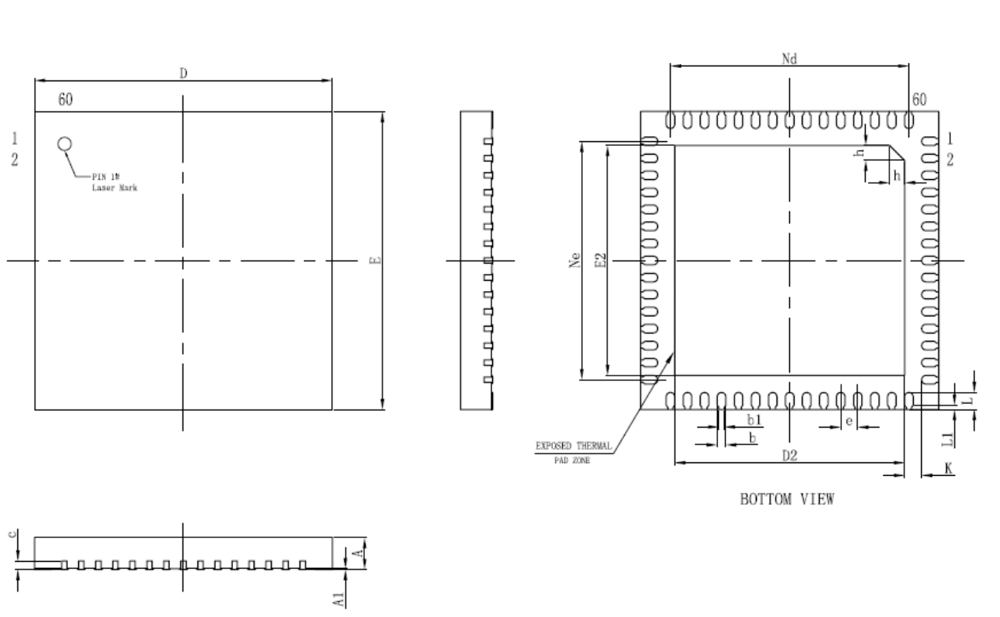
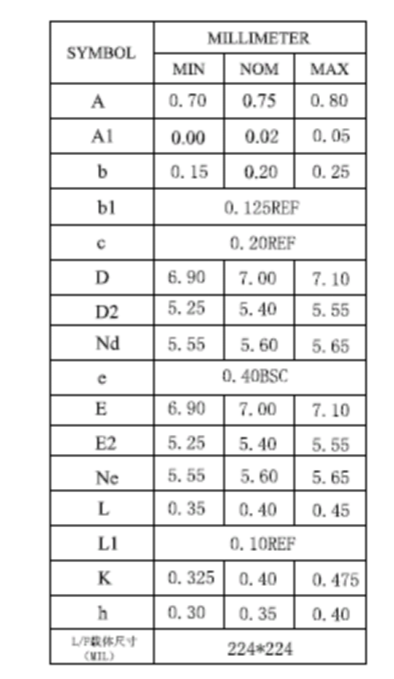

## 9. Tray 盘

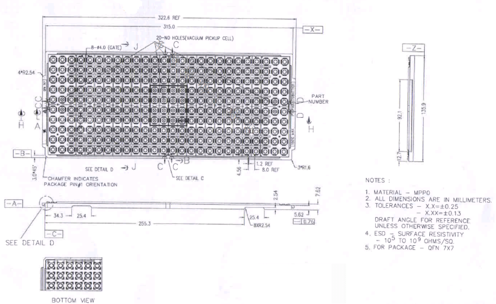
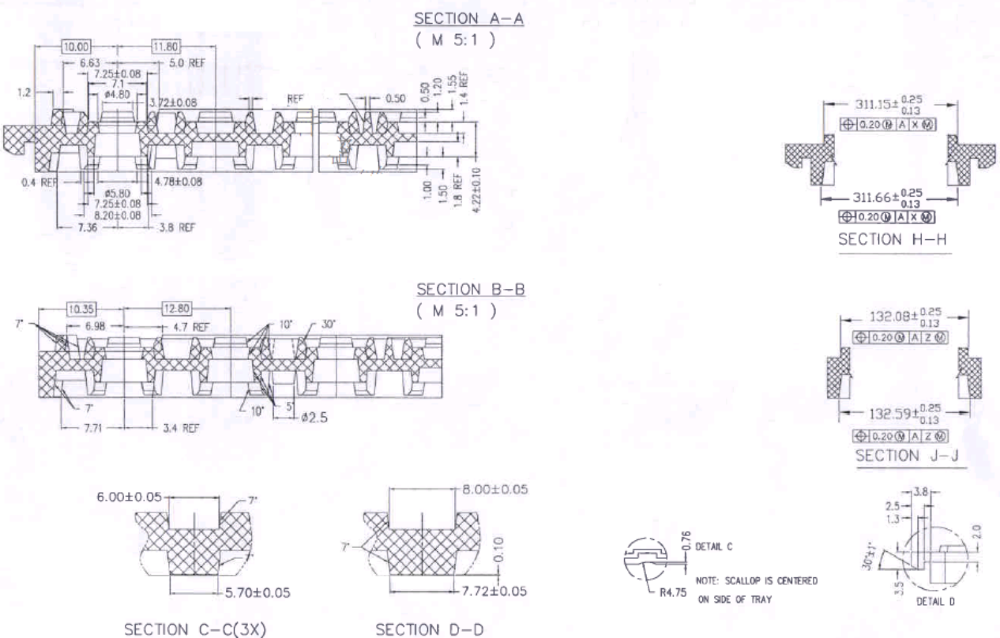
