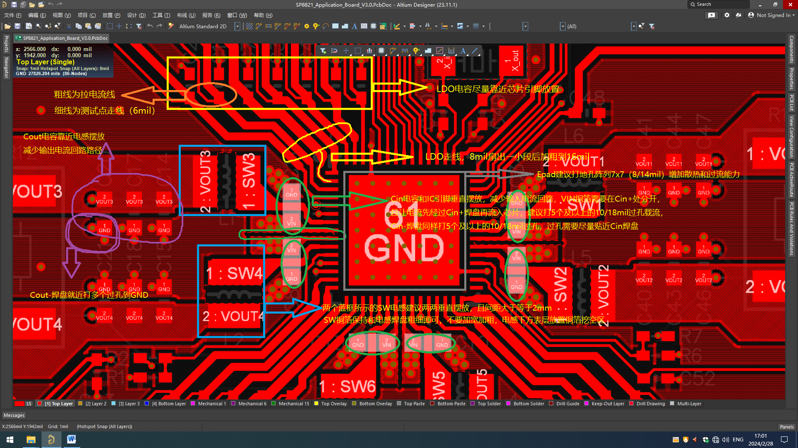
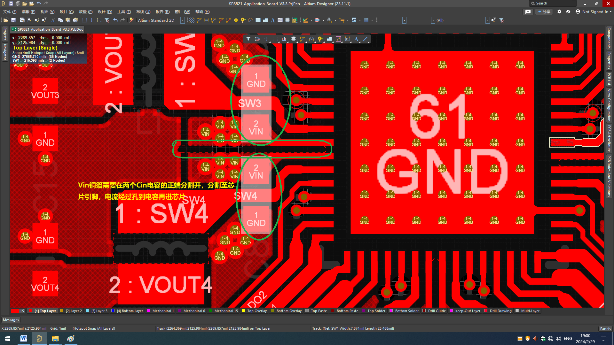
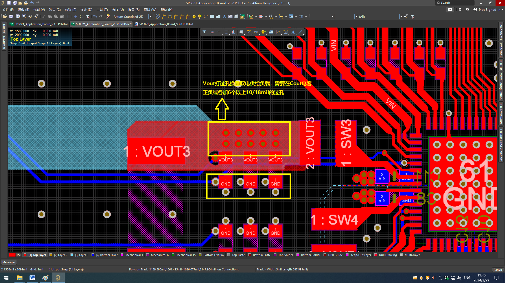
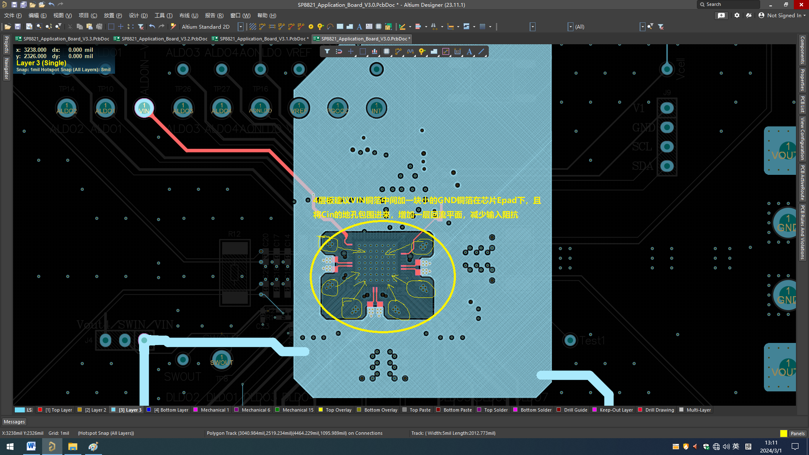

# P1 PCB Layout 指南

```
最新版本：2024/03/15
```

## PCB 叠层与基础布线

PCB 建议为四层以上 PCB，Demo 板为 4 层 PCB，具体叠层信息如下：

<table>
<tbody>
<tr>
<td>层名</td>
<td>材料</td>
<td>厚度（mil）</td>
<td>厚度（mm）</td>
</tr>
<tr>
<td>L1</td>
<td>外层铜厚2oz</td>
<td>2.76</td>
<td>0.0700</td>
</tr>
<tr>
<td>PP</td>
<td>7628 RC49% 8.6mil</td>
<td>7.99</td>
<td>0.2030</td>
</tr>
<tr>
<td>L2</td>
<td>内层铜厚</td>
<td>1.18</td>
<td>0.0300</td>
</tr>
<tr>
<td>芯板</td>
<td>1.1mm 1/1OZ 含铜</td>
<td>40.55</td>
<td>1.0300</td>
</tr>
<tr>
<td>L3</td>
<td>内层铜厚</td>
<td>1.18</td>
<td>0.0300</td>
</tr>
<tr>
<td>PP</td>
<td>7628 RC49% 8.6mil</td>
<td>7.99</td>
<td>0.2030</td>
</tr>
<tr>
<td>L4</td>
<td>外层铜厚2oz</td>
<td>2.76</td>
<td>0.0700</td>
</tr>
</tbody>
</table>

PCB 的整体间距为 4mil（all-all），在此基础上，将 VIN、SW、Vout 网络元素的间距设置为 8mil。

- 过孔：
  - 10/18mil（0.25/0.5mm）：用于大电路路径。
  - 8/14mil（0.2/0.35mm）：用于其他信号线。
- 走线宽度：
  - 信号线：统一为 6mil。
  - 大电流网络：先走 8mil 线宽，然后扇出一小段线后尽量加宽加粗。
  - LDO 网络：走线至少 16mil，推荐 20mil。
  - VIN/SW 网络：使用动态铺铜加宽加粗进行连接。

## 单面贴片布局指南

如果 PCB 为单面贴片， P1 外围器件布局建议参考下图：



1. 输入电容 Cin（绿圈处）和芯片相应的 Vin 引脚垂直摆放，并尽量靠近芯片，使输入电流回路尽可能短。如果 Cin 放在底层，应该和相应的 Vin 引脚平行放置，而且 Cin 电容的 GND 端应该指向芯片 EPAD。
2. Buck1/Buck2，Buck3/Buck4，Buck5/Buck6 的 Vin 线路（铜箔）在顶层分开，Cin 也各自独立，如上图 绿线处所示。Vin 的流向：从内层（L3）过孔流出，经过 Cin+，再到芯片 Vin 引脚。Vin 铜箔上的过孔推荐：5 个及以上 0.25/0.5mm 的过孔（具体可以根据工作电流选择过孔尺寸和数量），如下图（相邻 BUCK VIN 走线及 Cin 电容摆放示意图）所示：
   

3. 芯片散热焊盘 EPAD（灰框所示）建议打 7x7 过孔到下面各层 GND 铜箔，过孔尺寸为 0.25/0.5mm，以达到最佳散热性能。
4. Cin 电容的地端应该就近打孔到内层的 GND，过孔推荐使用 5 个及以上 0.25/0.5mm 的过孔。
5. 2 个 AGND 引脚就近连接到芯片 epad。
6. 对于 SW 走线，建议只在表层（顶层）进行，不能打孔走内层。从芯片引脚走线（宽度为 8mil）扇出后，尽量使用铜箔加宽。Demo 板的 SW 线路是从芯片引脚出线（8mil），穿过 Cin 电容（15mil），再到 SW 电感。SW 电感的线路宽度应尽可能加宽到电感焊盘宽度，但不要过度加粗。
7. SW 电感（蓝色框处）应平行摆放，间距大于 2mm，推荐相互垂直摆放，以减小相互干扰。SW 电感下面的表层铜箔建议挖空，内层铜箔建议保留。
8. Cout 电容（紫色圈记处）应尽可能靠近电感摆放，以缩短输出电流回路。建议在 Cout 正负端就近打孔，推荐各打 6 个及以上的过孔（0.25/0.5mm），如下图 （Buck 输出电容走线示意图）所示。demo 板的各 Vout 就在表层的香蕉头插座处取电，Cout 电容正端未打过孔。



## 关键电源与反馈网络布线

1. 反馈信号的走线从最外侧（远离芯片，靠近负载）的 Cout 电容焊盘处拉线到芯片引脚及测试点焊盘。
2. PCB 第 2 层建议作为 GND 平面，不走线，其他过孔通过该层建议做过孔消盘，保证地平完整。
3. PCB 第 3 层作为芯片 Vin 的输入层，如下图（电源层 VIN 铺铜走线—1）所示：
   
4. 高亮部分为 Vin 铜箔及走线，两条分支左右分别为：ALDIN-Vin 和 Vsys-Vin。建议从 Vin 铜箔打过孔到表层，然后分别经过各自的滤波电容，最终连接到芯片引脚。
5. Vin 铜箔不要覆盖芯片的 epad 下方区域，建议走出一个环形，为 Cin 电容负端的 GND 过孔到 pad 增加一层回流路径，以减少 Cin 寄生电感，如下图（电源层 VIN 铺铜走线—2）所示：



## 双面贴片布局

如果 PCB 为双面贴片板，为了节省空间，可以将 Buck 的输入电容 Cin 放在 PCB 板背面，此时，Cin 电容应该和相应的 Vin 引脚平行放置，而且 Cin 电容的 GND 端应该指向芯片 epad，如下图所示：


Buck1/Buck2、Buck3/Buck4、Buck5/Buck6 的 Vin 线路（铜箔）在底层分开，Cin 也各自独立，如图 6 黄线处所示。建议铺铜隔离线从 Cin 正端划过其负端，直至 Epad，以减少各 Buck 之间的相互影响。
