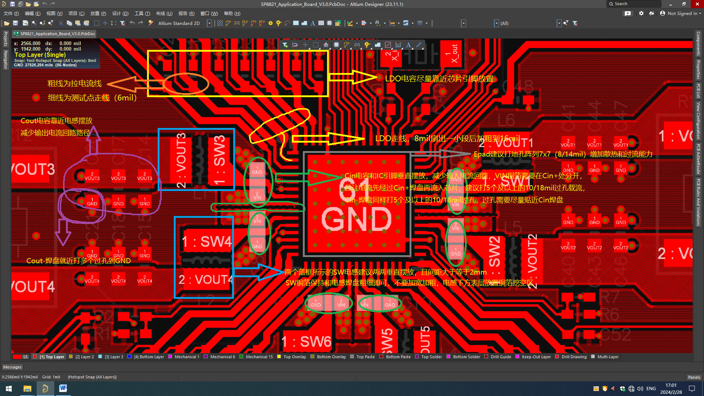
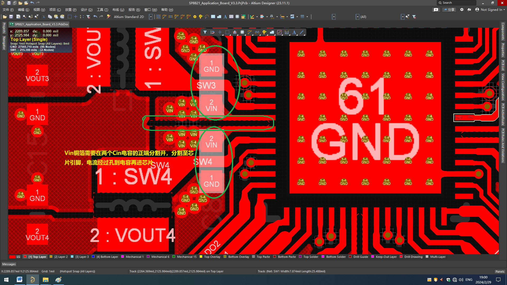
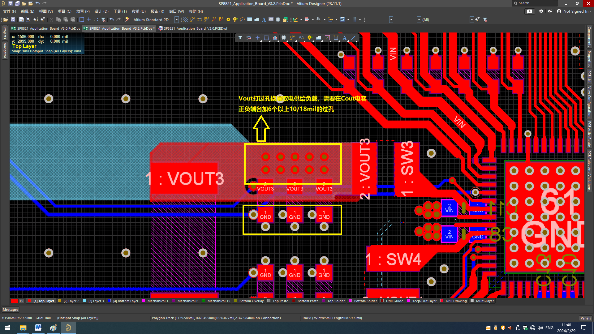
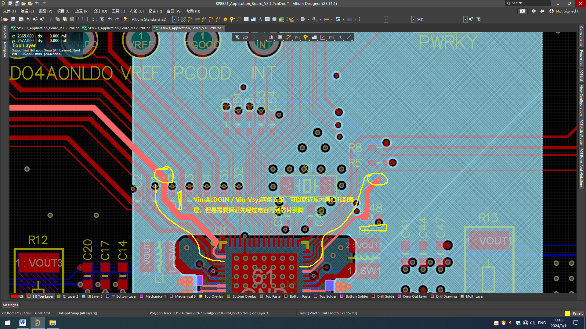
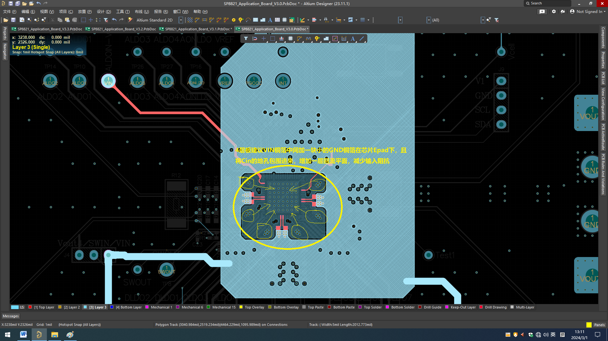
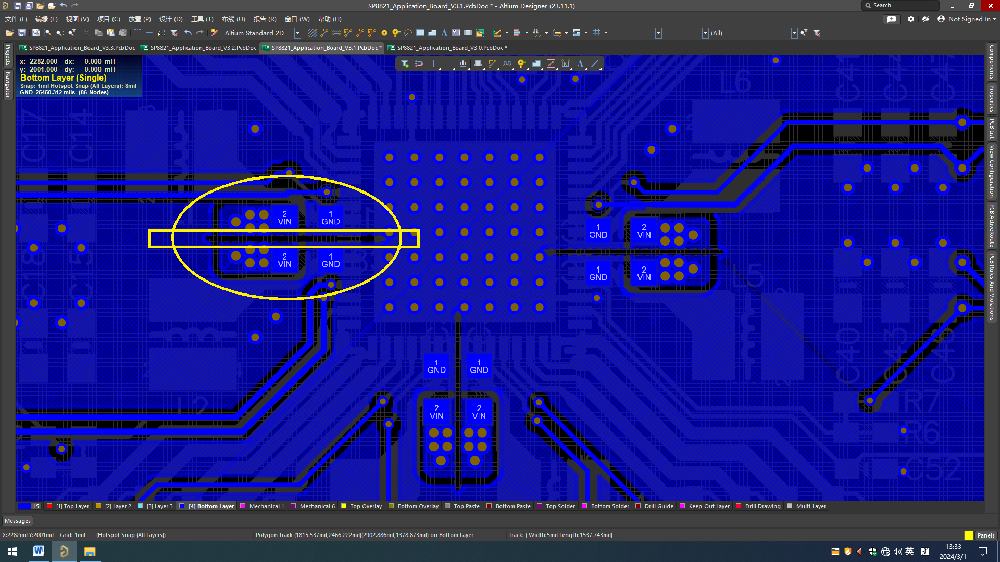

sidebar_position: 1

# P1 PCB Layout Guidelines

**[PDF Version](https://cdn-resource.spacemit.com/file/chip/P1/P1_PCB_Layout_Guide_en.pdf)**

## Version History

| Version | Date       | Notes |
|---------|------------|----------------|
| V1.0    | 2024.03.15 | Initial release |

## PCB Stack-Up and Basic Routing

A PCB with **four or more layers** is recommended.
The reference demo board uses a **4-layer PCB**. The recommended stack-up is shown below.

| Layer | Material                   | Thickness (mil) | Thickness (mm) |
| ----- | -------------------------- | --------------- | -------------- |
| L1    | Outer layer, 2 oz copper   | 2.76            | 0.0700         |
| PP    | 7628, RC49%, 8.6 mil       | 7.99            | 0.2030         |
| L2    | Inner layer copper         | 1.18            | 0.0300         |
| Core  | 1.1 mm core, 1/1 oz copper | 40.55           | 1.0300         |
| L3    | Inner layer copper         | 1.18            | 0.0300         |
| PP    | 7628, RC49%, 8.6 mil       | 7.99            | 0.2030         |
| L4    | Outer layer, 2 oz copper   | 2.76            | 0.0700         |

### Spacing and Routing Rules

- **Global spacing**: `4 mil` (all-to-all).
- **VIN, SW, and VOUT nets**: increase spacing to `8 mil`.

**Vias**

- `10/18 mil (0.25/0.5 mm)`: for high-current paths.
- `8/14 mil (0.2/0.35 mm)`: for general signal routing.

**Trace width**

- Signal traces: `6 mil`.
- High-current nets: start with `8 mil`, then fan out and widen as much as possible.
- LDO nets: minimum `16 mil`, `20 mil` recommended.
- VIN / SW nets: use dynamic copper pour to widen and thicken traces.

## Single-Side Assembly Layout Guidelines

If the PCB is assembled on **one side only**, the recommended placement of external components around P1 is shown below.

1. **Input capacitor (Cin)**
   Place Cin (green circle) vertically aligned with the corresponding VIN pin and as close to the device as possible.
   This minimizes the input current loop.
   If Cin is placed on the bottom layer, align it parallel to the VIN pin.
   The GND terminal of Cin should face the chip EPAD.

2. **VIN routing for BUCK pairs**
   VIN copper for Buck1/Buck2, Buck3/Buck4, and Buck5/Buck6 must be separated on the top layer.
   Each Buck pair must have its own independent Cin, as shown by the green traces in the figure.

   VIN current path:

   - From inner layer (L3) via
   - To Cin positive terminal
   - Then to the chip VIN pin

   Recommended VIN vias:

   - At least **five** `0.25/0.5 mm` vias
   - Exact size and count depend on operating current

   Example layout is shown below.
   

3. **EPAD thermal vias**
   The exposed thermal pad (EPAD, gray box) should use a **7 × 7 via array** connected to GND planes on lower layers.
   Recommended via size: `0.25/0.5 mm`.
   This provides optimal thermal performance.

4. **Cin GND vias**
   The GND terminal of Cin should connect to the inner GND layer using vias placed as close as possible.
   Use at least **five** `0.25/0.5 mm` vias.

5. **AGND pins**
   The two AGND pins should connect directly to the chip EPAD with the shortest possible routing.

6. **SW routing**
   SW traces must remain on the **top layer only**.
   Do not route SW signals through vias or inner layers.

   Recommended approach:

   - Exit the chip pin with `8 mil` trace width
   - Fan out and widen using copper pour
   - On the demo board, the SW trace goes from the chip pin (`8 mil`), passes near Cin (`15 mil`), and then connects to the SW inductor

   The trace width at the inductor should match the inductor pad width.
   Avoid excessive widening.

7. **SW inductor placement**
   Place SW inductors (blue box) parallel with spacing greater than `2 mm`.
   Perpendicular placement is recommended to reduce magnetic coupling.

   - Remove top-layer copper under the inductor
   - Keep inner-layer copper intact

8. **Output capacitors (Cout)**
   Place Cout (purple circle) as close as possible to the inductor to minimize the output current loop.
   Add vias near both the positive and negative terminals.
   Recommended: **six or more** `0.25/0.5 mm` vias per terminal.

   Example routing is shown below.

   

   On the demo board, VOUT is taken from banana connectors on the top layer.
   The positive terminal of Cout does not use vias in this design.

## Critical Power and Feedback Routing

1. **Feedback routing**
   Route the feedback signal from the **outermost Cout pad**, close to the load, back to the chip pin and test point.

2. **Layer 2 (GND plane)**
   Use Layer 2 as a solid GND plane with no signal routing.
   Use via antipads to preserve plane integrity.

3. **Layer 3 (VIN plane)**
   Use Layer 3 as the VIN input plane, as shown below.

   

4. **VIN branches**
   The highlighted copper shows the VIN plane and routing.
   The two branches correspond to:

   - ALDIN-VIN
   - VSYS-VIN

   Route vias from the VIN plane to the top layer.
   Then pass through the respective filter capacitors before reaching the chip VIN pins.

5. **VIN copper near EPAD**
   Do not place VIN copper directly under the chip EPAD.
   Instead, form a ring-shaped copper area.
   This provides an additional return path for Cin GND vias and reduces Cin parasitic inductance.

   

## Double-Side Assembly Layout

For **double-sided assembly**, Buck input capacitors (Cin) may be placed on the **bottom layer** to save space.

- Cin must be aligned parallel to the corresponding VIN pin.
- The GND terminal of Cin must face the chip EPAD.

Example layout is shown below.

VIN copper for Buck1/Buck2, Buck3/Buck4, and Buck5/Buck6 must remain separated on the bottom layer.
Each Buck uses its own Cin, as shown by the yellow traces.

To reduce coupling between Bucks:

- Add a copper isolation strip
- Route it from the positive terminal of Cin, across the negative terminal, and toward the EPAD
