# P3 Datasheet

## Revision History

| Version | Date | Notes |
| --- | --- | --- |
| **V1.0** | 2026.08.28 | First Release |

---

## 1. Overview

**High-Performance Four-Phase BUCK Power Management Chip**

P3 is a high-performance four-phase BUCK power management Chip (PMIC) featuring four key advantages: up to 32A output current (40A peak), 91% peak efficiency, ultra-small WLCSP package, and MTP-programmable power sequencing. It provides a complete power management solution for high-current, space-constrained applications such as edge computing, drones, AR/VR devices, and optical modules.

- **32 A High Current Capability × 5 Flexible Phase Configurations**
  Supports up to 32A output current (40A peak) in four-phase parallel mode with five configurable phase modes: 4+0, 3+1, 2+2, 2+1+1, and 1+1+1+1, enabling flexible power delivery configurations.

- **91% Peak Efficiency × Fast Transient Response**
  Features a COT control architecture for fast load transient response and stable voltage regulation. Supports automatic PFM/PWM mode switching for improved light-load efficiency and high-load performance.

- **Ultra-Compact WLCSP Package**
  Features an 80-ball WLCSP package with 0.4mm pitch, delivering high-current power management in compact applications such as AR/VR devices and optical modules.

### Features

- Input voltage range: 2.5V ~ 5.5V 
- Output voltage range: 0.25V ~ 1.20V(5mV/step);  1.20V ~ 1.83V(10mV/step)
- Supports five output phase configurations: 4+0, 3+1, 2+2, 2+1+1, and 1+1+1+1
- Supports four-phase parallel operation with up to 32A continuous output current and 40A peak output current
- Maximum efficiency: 91%（VIN = 3.6V, VOUT = 0.85V）
- Supports Automatic PFM/PWM mode transition or Forced PWM mode
- COT control architecture with fast load transient response
- Adjustable Ramp-up and Ramp-down slopes for each buck output voltage
- Supports MTP for flexible power-on/power-off sequence configuration
- High-speed 3.4MHz I2C or 30MHz SPI interface with dynamic voltage scaling support
- UVLO, short-circuit, and thermal protection
- 8-channel configurable 12-bit ADC
- Four flexible GPIOs for multi-function expansion
- Operating temperature range: -40°C ~ 125°C
- Package: 80-ball WLCSP with 0.4mm ball pitch

## 2. Blockdiagram

## 3. Pin Package

### 3.1 Pin Package Diagram

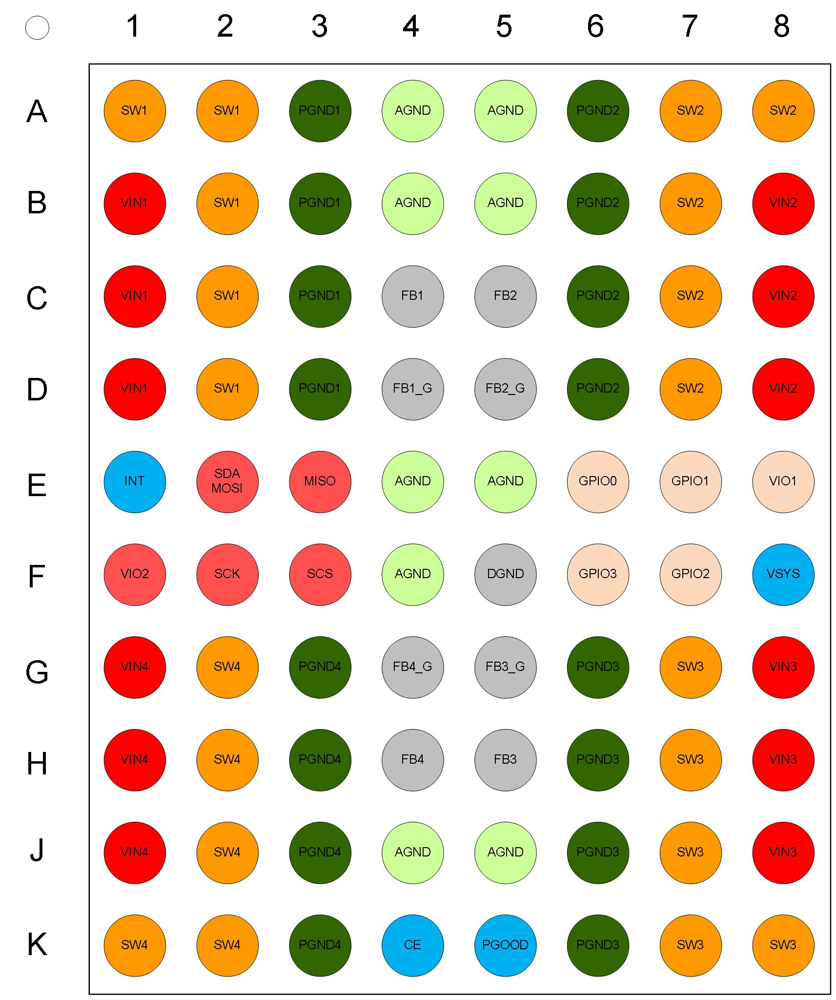

### 3.2 Pin Description

P3 Pin Type Definitions

|Pin Type|Description|Pin Type|Description|
|:---:|:---:|:---:|:---:|
|DI|Digital Input|AI|Analog Input|
|DO|Digital Output|AO|Analog Output|
|DIO|Digital Input/Output|AIO|Analog Input/Output|
|PWR|Power|GND|Ground|

P3 Pin Description

|Pin|Pin Name|Type|Description|Alternate Function|
|:---:|:---:|:---:|:---:|:---:|
|A1, A2, B2, C2, D2|SW1|AI|BUCK1 switching node|-|
|A3, B3, C3, D3|PGND1|GND|BUCK1 power GND|-|
|A4, A5, B4, B5, E4, E5, F4, J4, J5|AGND|GND|Analog ground|-|
|A6, B6, C6, D6|PGND2|GND|BUCK2 power GND|-|
|A7, A8, B7, C7, D7|SW2|AI|BUCK2 switching node|-|
|B1, C1, D1|VIN1|PWR|BUCK1 power input|-|
|B8, C8, D8|VIN2|PWR|BUCK2 power input|-|
|C4|FB1|AI|BUCK1 differential positive remote sense input|-|
|C5|FB2|AI|BUCK2 differential positive remote sense input|-|
|D4|FB1_G|AI|BUCK1 differential negative remote sense input|-|
|D5|FB2_G|AI|BUCK2 differential negative remote sense input|-|
|E1|INT|DIO|Interrupt output|-|
|E2|SDA/MOSI|DIO|I2C interface data signal; SPI data input signal|-|
|E3|MISO|DO|SPI data output signal|-|
|E6|GPIO0|DIO/AI|Multi-function GPIO|EXT_EN/SLEEP_WKUP/ PWRCTRL/WARM_RESET/ ADC external channel input/multi-phase control/DVS voltage scaling|
|E7|GPIO1|DIO/AI|Multi-function GPIO|EXT_EN/SLEEP_WKUP/ PWRCTRL/WARM_RESET/ ADC external channel input/multi-phase control/DVS voltage scaling|
|E8|VIO1|PWR|GPIO circuit power input|-|
|F1|VIO2|PWR|I2C/SPI power input|-|
|F2|SCK|DI|I2C/SPI clock signal|-|
|F3|SCS|DI|SPI chip select signal, active low|-|
|F5|DGND|GND|Digital ground|-|
|F6|GPIO3|DIO/AI|Multi-function GPIO|EXT_EN/SLEEP_WKUP/ PWRCTRL/WARM_RESET/ ADC external channel input/DVS voltage scaling|
|F7|GPIO2|DIO/AI|Multi-function GPIO|EXT_EN/SLEEP_WKUP/ PWRCTRL/WARM_RESET/ ADC external channel input/multi-phase control/DVS voltage scaling|
|F8|VSYS|PWR|Internal circuit power input|-|
|G1, H1, J1|VIN4|PWR|BUCK4 power input|-|
|G2, H2, J2, K1, K2|SW4|AI|BUCK4 switching node|-|
|G3, H3, J3, K3|PGND4|GND|BUCK4 power GND|-|
|G4|FB4_G|AI|BUCK4 differential negative remote sense input|-|
|G5|FB3_G|AI|BUCK4 differential negative remote sense input|-|
|G6, H6, J6, K6|PGND3|GND|BUCK3 power GND|-|
|G7, H7, J7, K7, K8|SW3|AI|BUCK3 switching node|-|
|G8, H8, J8|VIN3|PWR|BUCK3 power input|-|
|H4|FB4|AI|BUCK4 differential positive remote sense input|-|
|H5|FB3|AI|BUCK3 differential positive remote sense input|-|
|K4|CE|DI|Chip enable input (power-on source), active high|-|
|K5|PGOOD|DIO|Power good indicator/reset source|-|

## 4. Electrical Characteristics

### 4.1 Absolute Maximum Ratings

|Parameter|Description|Condition|Min|Typ|Max|Unit|
|:---:|:---:|:---:|:---:|:---:|:---:|:---:|
|TSTG|Storage temperature|-|- 40|-|150|℃|
|TJ|Junction temperature|-|-40|-|125|℃|
|VSYS|System supply voltage|-|-0.3|-|5.8|V|
|VESD_HBM|ESD protection - HBM|-|2|-|-|kV|
|VESD_CDM|ESD protection - CDM|-|500|-|-|V|

### 4.2 Recommended Operating Conditions

|Parameter|Description|Condition|Min|Typ|Max|Unit|
|:---:|:---:|:---:|:---:|:---:|:---:|:---:|
|TJ|Junction temperature|-|-|-|85|℃|
|VSYS|System supply voltage|-|3.3|5.0|5.5|V|
|PDIS|Maximum chip power dissipation|-|-|-|2|W|
|RJA|Junction-to-ambient thermal resistance|-|-|31|-|℃/W|
|RJC|Junction-to-case thermal resistance|-|-|-|-|℃/W|
|RJB|Junction-to-board thermal resistance|-|-|-|-|℃/W|
|ISHDN|Shutdown mode current|CE = 0|-|17|-|μA|

### 4.3 Digital Pin Electrical Characteristics

#### Top-Level Electrical Characteristics

(VSYS = +2.5 ~ +5.5 V, VVIO1 = +1.8 V, VVIO2 = +1.8 V, TJ = -40 ~ 105 ℃; typical values are at VSYS = 5 V, TJ = +25 ℃)

**LOGIC AND CONTROL INPUTS**

|Parameter|Description|Condition|Min|Typ|Max|Unit|
|:---:|:---:|:---:|:---:|:---:|:---:|:---:|
|VVIO1||-|1.2|1.8|VSYS|V|
|VIH|High-level input|(GPIO0, GPIO1, GPIO2, GPIO3)|0.32*VIO1|0.52*VIO1|0.71*VIO1|V|
|VIH|High-level input|CE|0.32*VSYS|0.52*VSYS|0.71*VSYS|V|
|VIH|High-level input|PWR_good|0.6|1.1|1.3|V|
|VIL|Low-level input|(GPIO0, GPIO1, GPIO2, GPIO3)|0.31*VIO1|0.47*VIO1|0.58*VIO1|V|
|VIL|Low-level input|CE|0.31*VSYS|0.47*VSYS|0.58*VSYS|V|
|VIL|Low-level input|PWR_good|0.3|0.6|0.8|V|
|Vhys|Hysteresis voltage|(GPIO0, GPIO1, GPIO2, GPIO3)|0.01*VIO1|0.05*VIO1|0.17*VIO1|V|
|Vhys|Hysteresis voltage|CE|0.01*VSYS|0.05*VSYS|0.17*VSYS|V|
|Vhys|Hysteresis voltage|PWR_good|0.3|0.5|0.5|V|
|VOH|High-level output|GPIO0, GPIO1, GPIO2, GPIO3 (IOH = 1 mA)|-|-|VIO1 - 0.01|V|
|VOH|High-level output|PWR_good (IOH = 1 mA)|-|VIO2 - 0.03|-|V|
|VOL|Low-level output|INT, PWR_good, GPIO0, GPIO1, GPIO2, GPIO3 (IOL = 1 mA)|-|-|0.1|V|

**INTERNAL PULL–UP / DOWN RESISTANCE**

|Parameter|Description|Condition|Min|Typ|Max|Unit|
|:---:|:---:|:---:|:---:|:---:|:---:|:---:|
|RPU|Weak pull-up resistance|GPIO0, GPIO1, GPIO2, GPIO3,  Pullup resistance to VIO1,  REG: GPIO_PUPD, GPIOX_PUPD[1:0] = 01|-|50 k|-|Ω|
|RPU|Weak pull-up resistance|PWR_good,  Pullup resistance to VIO2,  REG: PMU_CTRL4, PG_PU_EN = 1|-|1 k|-|Ω|
|RPD|Weak pull-down resistance|GPIO0, GPIO1, GPIO2, GPIO3,  Pulldown resistance to DGND,  REG: GPIO_PUPD, GPIOX_PUPD[1:0] = 10|-|870 k|-|Ω|
|RPD|Weak pull-down resistance|CE Pulldown resistance to DGND|-|1000 k|-|Ω|

**I2C Electrical Characteristics**

(VSYS = +2.5 ~ +5.5 V, VVIO1 = +1.8 V, VVIO2 = +1.8 V, TJ = -40 ~ 105 ℃; typical values are at VSYS = 5 V, TJ = +25 ℃)

**POWER SUPPLY**

|Parameter|Description|Condition|Min|Typ|Max|Unit|
|:---:|:---:|:---:|:---:|:---:|:---:|:---:|
|VVIO2|-|-|1.2|1.8|VSYS|V|

**SDA AND SCL I/O STAGES**

|Parameter|Description|Condition|Min|Typ|Max|Unit|
|:---:|:---:|:---:|:---:|:---:|:---:|:---:|
|VIH|High-level input|Normal mode|0.32*VIO2|0.52*VIO2|0.71*VIO2|V|
|VIL|Low-level input|Normal mode|0.31*VIO2|0.47*VIO2|0.58*VIO2|V|
|VIL|Low-level input|HS mode|0.30*VIO2|0.45*VIO2|0.55*VIO2|V|
|Vhys|Hysteresis voltage|Normal mode|0.01*VIO2|0.05*VIO2|0.17*VIO2|V|
|Vhys|Hysteresis voltage|HS mode|0.02*VIO2|0.07*VIO2|0.18*VIO2|V|
|VOL|Low-level output|Isink = 5 mA|0.05|0.09|0.32|V|
|CIN|Input capacitance|-|-|18|-|pF|

**I2C-COMPATIBLE INTERFACE TIMING (STANDARD, FAST AND FAST MODE PLUS)**

|Parameter|Description|Condition|Min|Typ|Max|Unit|
|:---:|:---:|:---:|:---:|:---:|:---:|:---:|
|fscl|Clock frequency|-|0|-|1000|kHz|
|tF_TRA|SCL, SDA Transmitting Fall Time|-|9|18|57|ns|
|CB|Bus Capacitance|-|-|-|550|pF|

**I2C-COMPATIBLE INTERFACE TIMING (HIGH-SPEED MODE, CB = 100 pF)**

|Parameter|Description|Condition|Min|Typ|Max|Unit|
|:---:|:---:|:---:|:---:|:---:|:---:|:---:|
|fscl|Clock frequency|-|-|0|-|3.4|MHz|
|TR_SDA|SDA Rise Time|-|-|22|-|ns|
|TF_SDA|SDA Fall Time|-|-|1|2|9|ns|
|CB|Bus Capacitance|-|-|-|100|pF|

**I2C-COMPATIBLE INTERFACE TIMING (HIGH-SPEED MODE, CB = 400 pF)**

|Parameter|Description|Condition|Min|Typ|Max|Unit|
|:---:|:---:|:---:|:---:|:---:|:---:|:---:|
|fscl|Clock frequency|-|-|0|-|1.7|MHz|
|TR_SDA|SDA Rise Time|-|-|70|-|ns|
|TF_SDA|SDA Fall Time|-|-|4|9|36|ns|
|CB|Bus Capacitance|-|-|-|400|pF|

#### SPI Electrical Characteristics

(VSYS = +2.5 ~ +5.5 V, VVIO1 = +1.8 V, VVIO2 = +1.8 V, TJ = -40 ~ 105 ℃; typical values are at VSYS = 5 V, TJ = +25 ℃)

**POWER SUPPLY AND I/O STAGES**

|Parameter|Description|Condition|Min|Typ|Max|Unit|
|:---:|:---:|:---:|:---:|:---:|:---:|:---:|
|VVIO2||-|1.2|1.8|VSYS|V|
|CIN|Input capacitance|(SCS, SCL, MOSI)|-|18|-|-|
|VIH|High-level input|-|-|0.32*VIO2|0.52*VIO2|0.71*VIO2|V|
|VIL|Low-level input|-|-|0.30*VIO2|0.45*VIO2|0.55*VIO2|V|
|Vhys|Hysteresis voltage|-|-|0.02*VIO2|0.07*VIO2|0.18*VIO2|V|
|VOL|Low-level output|IOL = 1 mA|-|-|0.1|V|
|VOH|High-level output|IOH = 1 mA|-|-|VIO2 - 0.01|V|

**SPI INTERFACE TIMING**

|Parameter|Description|Condition|Min|Typ|Max|Unit|
|:---:|:---:|:---:|:---:|:---:|:---:|:---:|
|fscl|Clock frequency|-|-|26|30|MHz|
|TD_MOSI|MISO valid from SCL rising edge|CL = 50 pF|-|9|-|ns|
|TR,TF|MISO Rising/Falling Time|CL = 20 pF|0.6|1.3|4.0|ns|

### 4.4 Watchdog

Watchdog characteristics

|Parameter|Description|Condition|Min|Typ|Max|Unit|
|:---:|:---:|:---:|:---:|:---:|:---:|:---:|
|TWD_MIN|Minimum watchdog time|-|-|1|-|s|
|TWD_MAX|Maximum watchdog time|-|-|16|-|s|

### 4.5 BUCK

BUCK1~4 Electrical Characteristics

|Parameter|Description|Condition|Min|Typ|Max|Unit|
|:---:|:---:|:---:|:---:|:---:|:---:|:---:|
|VIN_MIN|Minimum input voltage|-|-|2.5|-|V|
|VIN_MAX|Maximum input voltage|-|-|5.5|-|V|
|VOUT_MIN|Minimum output voltage|-|-|0.25|-|V|
|VOUT_MAX|Maximum output voltage|-|-|1.83|-|V|
|VOUT_STEP|Voltage step|VOUT = 0.25 ~ 1.2 V|-|5|-|mV|
|VOUT_STEP|Voltage step|VOUT = 1.2 ~ 1.83 V|-|10|-|mV|
|DVS Slew|DVS setting|DVS_R_SLEW / DVS_R_DIS DVS_F_SLEW / DVS_F_DIS|-|2.5|-|mV/μs|
|DVS Slew|DVS setting|DVS_R_SLEW / DVS_R_DIS DVS_F_SLEW / DVS_F_DIS|-|10|-|mV/μs|
|DVS Slew|DVS setting|DVS_R_SLEW / DVS_R_DIS DVS_F_SLEW / DVS_F_DIS|-|25|-|mV/μs|
|DVS Slew|DVS setting|DVS_R_SLEW / DVS_R_DIS DVS_F_SLEW / DVS_F_DIS|-|50|-|mV/μs|
|DVS Slew|DVS setting|DVS_R_SLEW / DVS_R_DIS DVS_F_SLEW / DVS_F_DIS|-|Free|-|mV/μs|
|Soft on / off Slow|Soft-start/soft-stop time|SOFT_STA_SLEW / SOFT_STP_SLEW|-|2.5|-|mV/μs|
|Soft on / off Slow|Soft-start/soft-stop time|SOFT_STA_SLEW / SOFT_STP_SLEW|-|10|-|mV/μs|
|Soft on / off Slow|Soft-start/soft-stop time|SOFT_STA_SLEW / SOFT_STP_SLEW|-|25|-|mV/μs|
|Soft on / off Slow|Soft-start/soft-stop time|SOFT_STA_SLEW / SOFT_STP_SLEW|-|50|-|mV/μs|
|VBUCK_ACC|Output voltage accuracy|VOUT > 0.8 V, VIN = 4 V,  IOUT = 1 A, TA = 25 ℃|-|-|±1|%|
|VBUCK_ACC|Output voltage accuracy|VOUT < 0.8 V, VIN = 4 V,  IOUT = 1 A, TA = 25 ℃|-|-|±8|mV|
|Load Regulation|Load regulation|IOUT = 0.1 ~ 8 A, VOUT > 0.8 V, CCM|-|-|±1|%|
|Load Regulation|Load regulation|IOUT = 0.1 ~ 8 A, VOUT < 0.8 V, CCM|-|-|±8|mV|
|Line Regulation|Line regulation|VIN = 3.0 ~ 5.5 V, VOUT > 0.8 V, CCM|-|-|±1|%|
|Line Regulation|Line regulation|VIN = 3.0 ~ 5.5 V, VOUT < 0.8 V, CCM|-|-|±8|mV|
|Load Transient Undershoot|Load transient undershoot Cout = 88 μF/Phase,  VIN = 5 V, 0.22 μH|IOUT = 0.1 ~ 8 A, VOUT < 1 V|-|-|60|mV|
|Load Transient Undershoot|Load transient undershoot Cout = 88 μF/Phase,  VIN = 5 V, 0.22 μH|IOUT = 0.1 ~ 8 A, VOUT > 1 V|-|-|6|%|
|Load Transient Overshoot|Load transient overshoot Cout = 88 μF/Phase,  VIN = 5 V, 0.22 μH|IOUT = 8 ~ 0.1 A, VOUT < 1 V|-|-|120|mV|
|Load Transient Overshoot|Load transient overshoot Cout = 88 μF/Phase,  VIN = 5 V, 0.22 μH|IOUT = 8 ~ 0.1 A, VOUT > 1 V|-|-|12|%|
|VRIPPLE|Cout = 88 μF/Phase,  VIN = 5 V, 0.22 μH|IOUT = 0.1 A, VOUT = 0.9 V|-|10|-|mV|
|VRIPPLE|Cout = 88 μF/Phase,  VIN = 5 V, 0.22 μH|IOUT > 1 A, VOUT = 0.9 V|-|8|-|mV|
|RUP|High-side switch on-resistance|VIN = 4 V|-|16|-|mΩ|
|RDN|Low-side switch on-resistance|VIN = 4 V|-|8|-|mΩ|
|Switching Frequency|Switching frequency|VIN = 4 V|-|2|-|MHz|
|IOUT_MAX|Output current|DC|8|-|-|A/Phase|
|IOUT_MAX|Output current|200ms, D = 50%|10.0|-|-|A/Phase|
|IValley_LIMIT||BUCKx_ILIMIT|-|9|-|A/Phase|
|IPeak_Limit||BUCKx_ILIMIT|-|12|-|A/Phase|
|INegative Limit||-|-|3|-|A/Phase|
|OV||VOUT/VOUT_target - 1|-|12.5|-|%|
|UV||VOUT/VOUT_target - 1||-10.0|-|%|
|Power Down resistor||-|-|120|-|Ω|
|SWx Leakage Current|SW pin leakage current|CE = 0, VLXx = 0 or 5.5 V, 25 ℃|-0.3|-|0.3|uA|
|SWx Leakage Current|SW pin leakage current|CE = 0, VLXx = 0 or 5.5 V, 85 ℃|-3|-|3|-|
|Efficiency|Efficiency|VIN = 4 V, VOUT = 0.9 V IOUT = 1 A/Phase|-|90|-|%|
|Efficiency|Efficiency|VIN = 4 V, VOUT = 0.9 V IOUT = 6.0 A/Phase|-|80|-|-|
|Efficiency|Efficiency|VIN = 4 V, VOUT = 0.9 V IOUT = 8.0 A/Phase|-|77|-|-|

### 4.6 ADC

ADC Electrical Characteristics

|Parameter|Description|Condition|Min|Typ|Max|Unit|
|:---:|:---:|:---:|:---:|:---:|:---:|:---:|
|Resolution|Resolution|-|-|-|12|Bits|
|VDD|Supply voltage|-|2.5|-|5.5|V|
|DNL|Differential non-linearity|VDD = 4.25 V, T = 25 ℃, Freq = 1 MHz|-|±3|-|LSB|
|INL|Integral non-linearity|VDD = 4.25 V, T = 25 ℃, Freq = 1 MHz|-|±3|-|LSB|
|Offset error|Offset error|VDD = 4.25 V, T = 25 ℃, Freq = 1 MHz|-|±5|-|LSB|
|Gain error|Gain error|VDD = 4.25 V, T = 25 ℃, Freq = 1 MHz|-|±5|-|LSB|
|Sample rate|Sample rate|T = 25 ℃, Freq = 1 MHz|-|76|-|Ksps|
|IWORK|Operating current|T = 25 ℃, Freq = 0.5 MHz|-|180|-|μA|

ADC Internal Reference Electrical Characteristics

|Parameter|Description|Condition|Min|Typ|Max|Unit|
|:---:|:---:|:---:|:---:|:---:|:---:|:---:|
|VREF_2V|2V reference voltage|VDD = 4.25 V, T = 25 ℃|2.046|2.048|2.050|V|
|VREF_3V|3V reference voltage|VDD = 4.25 V, T = 25 ℃|3.070|3.072|3.074|V|
|VC|Voltage coefficient|VDD = 4.25 V, T = 25 ℃|-|-|-|%|
|TC|Temperature coefficient|VDD = 4.25 V|-|-|-|%|
|IWORK|Operating current|VDD = 4.25 V, T = 25 ℃|-|200|-|μA|

### 4.7 Clocks

Internal LSI Electrical Characteristics

|Parameter|Description|Condition|Min|Typ|Max|Unit|
|:---:|:---:|:---:|:---:|:---:|:---:|:---:|
|FACC|Frequency accuracy|5 V, 25 ℃|-|64|-|kHz|
|VC|Voltage coefficient|2.7 ~ 5.5 V, 25 ℃|-|-|-|%|
|TC|Temperature coefficient|5 V, -40 ~ 105 ℃|-|-|-|%|
|IWORK|Operating current|2.7 ~ 5.5 V, -40 ~ 105 ℃|-|-|-|μA|

Internal HSI Electrical Characteristics

|Parameter|Description|Condition|Min|Typ|Max|Unit|
|:---:|:---:|:---:|:---:|:---:|:---:|:---:|
|FACC|Frequency accuracy|5 V, 25 ℃|-|8|-|MHz|
|VC|Voltage coefficient|2.7 ~ 5.5 V, 25 ℃|-|-|-|%|
|TC|Temperature coefficient|5 V, -40 ~ 105 ℃|-|-|-|%|
|IWORK|Operating current|2.0 ~ 5.5 V, -40 ~ 105 ℃|-|-|-|μA|

### 4.8 POR/PDR

Power-On Reset / Power-Down Reset Electrical Characteristics

|Parameter|Description|Condition|Min|Typ|Max|Unit|
|:---:|:---:|:---:|:---:|:---:|:---:|:---:|
|POR|Power-on reset voltage|-|-|1.9|-|V|
|PDR|Power-down reset voltage|-|-|2.2|-|V|
|TFILTER|POR glitch filter length|-|-|-|-|μs|
|IWORK|Operating current|-|-|-|-|μA|

## 5. Functional Description

P3 is a low-voltage, multi-channel power management chip (PMIC) with four integrated BUCK converters featuring fast transient response. It also integrates MTP, which enables flexible customization of the default output voltage and power-on/power-off sequence for each channel according to different application scenarios and the power sequencing requirements of different SoC platforms.

**Table 5-1 Terminology**

|Term|Description|
|---|---|
|Reset mode|A P3 operating mode, as shown in the mode switching diagram in [Figure 5-1](#mode-switching-diagram)|
|Shutdown mode|A P3 operating mode, as shown in the mode switching diagram in [Figure 5-1](#mode-switching-diagram)|
|Power-on mode|A P3 operating mode, as shown in the mode switching diagram in [Figure 5-1](#mode-switching-diagram)|
|Sleep mode|A P3 operating mode, as shown in the mode switching diagram in [Figure 5-1](#mode-switching-diagram)|
|MTP_READ1|The first loading of all MTP configurations after power-on|
|MTP_READ2|Loading of user-related MTP configurations after the power-on sequence is triggered|
|PG_PUP_DLY / PG_WKUP_DLY|The time before PGOOD is released after the power-on or wake-up sequence is complete|
|PG_PD_DLY /  PG_SLP_DLY|The delay between PGOOD being pulled low and the start of the power-off or sleep sequence|
|WAIT_PG|The phase in which the system waits for PGOOD to be released|
|Non-shutdown mode|The power-on mode, sleep mode, and the states marked with \* or # in [Figure 5-1](#mode-switching-diagram)|
|Non-reset mode|The power-on mode, sleep mode, the states marked with \* or # in [Figure 5-1](#mode-switching-diagram),  PG_PD_DLY, and the power-off sequence|
|Operating mode|The state marked with # in [Figure 5-1](#mode-switching-diagram)|
|Power-on sequence|Shutdown mode -> MTP_READ2 -> power-on sequence -> PG_PUP_DLY -> power-on mode; shutdown mode -> MTP_READ2 -> power-on sequence -> PG_PUP_DLY -> WAIT_PG -> power-on mode|
|Power-off sequence|The state marked with # in [Figure 5-1](#mode-switching-diagram) -> shutdown mode; the state marked with # in [Figure 5-1](#mode-switching-diagram) -> PG_PD_DLY -> power-off sequence -> shutdown mode|
|Power-on complete|The end of the PG_PUP_DLY state in [Figure 5-1](#mode-switching-diagram)|
|Sleep sequence|Power-on mode -> sleep mode; power-on mode -> sleep sequence -> sleep mode; power-on mode -> PG_SLP_DLY -> sleep sequence -> sleep mode|
|Wake-up sequence|Sleep mode -> power-on mode; sleep mode -> wake-up sequence -> power-on mode; sleep mode -> wake-up sequence -> PG_WKUP_DLY -> power-on mode|
|Wake-up complete|The end of the PG_WKUP_DLY state in [Figure 5-1](#mode-switching-diagram)|
|Warm-reset sequence|A warm-reset event in the state marked with # in [Figure 5-1](#mode-switching-diagram) -> warm reset -> MTP_READ2 -> power-on sequence -> PG_PUP_DLY -> power-on mode A warm-reset event in the state marked with # in [Figure 5-1](#mode-switching-diagram) -> warm reset -> MTP_READ2 -> power-on sequence -> PG_PUP_DLY -> WAIT_PG -> power-on mode|
|Power rail|All BUCK converters|
|Timing slot|SLOT0 ~ SLOT15|
|DUMMY SLOT|A timing slot with no BUCK or EXT binding|
|VSYS voltage domain|The power network supplied by VSYS|
|VIO1 voltage domain|The power network supplied by VIO1|
|VIO2 voltage domain|The power network supplied by VIO2|

### 5.1 Power Management Pins

**Table 5-2 Power Management Pin Description**

|Pin|Voltage Domain|Description|
|---|---|---|
|CE|VSYS|Chip-enable input; power-on and power-off source|
|INT|VSYS|INT interrupt pin|
|PGOOD|VIO2|Input: PGOOD pin timeout detection and reset source Output: PGOOD is pulled low during PMIC shutdown/reset sequences to reset the SoC|
|PWRCTRL|VIO1|GPIO alternate-function input that controls power-on, power-off, sleep, and wake-up sequences|
|SLEEP/WKUP|VIO1|GPIO alternate-function input for sleep and wake-up control|
|WARM_RESET|VIO1|GPIO alternate-function input that restores the chip to its power-on state without going through the shutdown sequence|
|EXT_EN|VIO1|GPIO alternate-function output for use with another PMIC|
|DVS0|VIO1|GPIO alternate-function input; the SoC uses GPIO input logic to adjust the BUCK voltage|
|DVS1|VIO1|GPIO alternate-function input; the SoC uses GPIO input logic to adjust the BUCK voltage|
|PH_CFG2|VIO1|GPIO2 alternate-function input; the SoC uses GPIO input logic for multi-phase control|
|PH_CFG1|VIO1|GPIO1 alternate-function input; the SoC uses GPIO input logic for multi-phase control|
|PH_CFG0|VIO1|GPIO0 alternate-function input; the SoC uses GPIO input logic for multi-phase control|

#### 5.1.1 CE Pin

**Table 5-3 CE Pin Function Description**

|Mode|Function|Description|
|---|---|---|
|Shutdown mode|Power-on source|After configuration read 1 is complete, the PMIC enters shutdown mode. Driving CE high starts the power-on sequence.|
|Non-shutdown/reset mode|Power-on source|After power-on is complete, driving CE low starts the power-off sequence. If power-on is not complete, driving CE low directly enters shutdown mode.|

#### 5.1.2 INT Pin

The INT pin is an open-drain output. When an interrupt event is triggered and the corresponding interrupt is enabled, the INT pin is pulled low.

**Table 5-4 INT Pin Function Description by Mode**

|Mode|Function|Description|Register Configuration|
|---|---|---|---|
|Power-on mode|Interrupt source|Interrupt event triggered & interrupt enabled  -> INT pin is pulled low|Interrupt events listed in [Table 5-27](#table-5-27)|

#### 5.1.3 PGOOD Pin

The PGOOD pin is an open-drain output, and its internal Schmitt-trigger input circuit operates at the VIO2 voltage. The PGOOD pin has an internal pull-up resistor. Configure PMU_CTRL4[6] in [Table 6-20](#table-6-20-pmu_ctrl4) to 1 to pull the PGOOD level up to VIO2.

**Table 5-5 PGOOD Pin Function Description by Mode**

|Mode|Function|Description|Register Configuration|
|---|---|---|---|
|Power-off sequence/ shutdown mode|Output|The PMIC pulls the PGOOD pin low to reset external modules|-|
|Power-on complete|Input|The PMIC releases the PGOOD pin and enters power-on mode|[Table 6-20](#table-6-20-pmu_ctrl4) PMU_CTRL4[1] [Table 6-19](#table-6-19-pmu_ctrl3) PMU_CTRL3[0]|
|Power-on complete|Input|The PMIC releases the PGOOD pin and waits for the external circuit to release PGOOD|[Table 6-20](#table-6-20-pmu_ctrl4) PMU_CTRL4[1]|
|Operating mode|Reset source|1. The PGOOD pin is pulled low from the high level for more than 100 μs 2. PGOOD pull-down reset is enabled 1 & 2 -> The reset sequence is triggered|[Table 6-16](#table-6-16-pmu_ctrl0) PMU_CTRL0[0]|
|Sleep mode/ sleep sequence|Output|The PGOOD pin can be configured to be pulled low in this mode|[Table 6-20](#table-6-20-pmu_ctrl4) PMU_CTRL4[0]|
|Warm-reset sequence|Output|The PGOOD pin is pulled low in this mode|-|

#### 5.1.4 PWRCTRL Pin

The PWRCTRL pin is a GPIO alternate-function input, and its internal Schmitt-trigger input circuit operates at the VIO1 voltage.

PWRCTRL pin configuration:

1. Set GPIOx_AFR = 4’b0011 in [Table 6-12 GPIO_AFR0](#table-6-12-gpio_afr0) and [Table 6-13 GPIO_AFR1](#table-6-13-gpio_afr1).

2. Configure other GPIO settings as required, such as pull-up/pull-down and polarity.

**Table 5-6 PWRCTRL Pin Function Description by Mode**

|Mode|Function|Description|Register Configuration|
|---|---|---|---|
|**Power-on sequence/ wake-up sequence**|Sequence control|1. A BUCK is bound to a PWRCTRL pin 2. The PWRCTRL pin is asserted 1 & 2 -> The power-on or wake-up sequence continues with the operation for the corresponding BUCK 1 & !2 -> The sequence waits until the corresponding PWRCTRL pin is asserted|[Table 6-33](#table-6-33-buckx_pwrctrl_io) BUCKx_PWRCTRL_IO[2:0] [Table 6-20](#table-6-20-pmu_ctrl4) PMU_CTRL4[5] [Table 6-7](#table-6-7-gpio_dr) GPIO_DR[7:4]|
|**Sleep sequence**|Sequence control|1. A BUCK is bound to a PWRCTRL pin 2. Reverse sleep is enabled 3. Sleep PWRCTRL-waiting is enabled 4. The PWRCTRL pin is deasserted 1 & 2 & 3 & 4 -> The sleep sequence continues with the operation for the corresponding BUCK. 1 & 2 & 3 & !4 -> The sequence waits for PWRCTRL. If the wait exceeds the timeout configured in [Table 6-19](#table-6-19-pmu_ctrl3) PMU_CTRL3[7], the operation for the corresponding BUCK continues and the device enters sleep mode according to the sequence.|[Table 6-33](#table-6-33-buckx_pwrctrl_io) BUCKx_PWRCTRL_IO[2:0] [Table 6-20](#table-6-20-pmu_ctrl4) PMU_CTRL4[5] [Table 6-18](#table-6-18-pmu_ctrl2) PMU_CTRL2[2] [Table 6-19](#table-6-19-pmu_ctrl3) PMU_CTRL3[7] [Table 6-7](#table-6-7-gpio_dr) GPIO_DR[7:4]|
|**Power-off sequence**|Sequence control|1. A BUCK is bound to a PWRCTRL pin 2. Reverse power-off is enabled 3. PWRCTRL waiting is enabled 4. The PWRCTRL pin is deasserted 1 & 2 & 3 & 4 -> The power-off sequence continues with the operation for the corresponding BUCK or LDO. Otherwise, the sequence waits for PWRCTRL. If the wait exceeds the timeout configured in [Table 6-19](#table-6-19-pmu_ctrl3) PMU_CTRL3[7], the operation for the corresponding BUCK continues and the device enters shutdown mode according to the sequence.|[Table 6-33](#table-6-33-buckx_pwrctrl_io) BUCKx_PWRCTRL_IO[2:0] [Table 6-20](#table-6-20-pmu_ctrl4) PMU_CTRL4[4] [Table 6-18](#table-6-18-pmu_ctrl2) PMU_CTRL2[2] [Table 6-19](#table-6-19-pmu_ctrl3) PMU_CTRL3[7] [Table 6-7](#table-6-7-gpio_dr) GPIO_DR[7:4]|
|**Power-on mode**|Enable control|BUCK bound to a PWRCTRL pin: Software enable bit & PWRCTRL asserted -> power rail enabled Without a PWRCTRL binding: Software enable bit -> power rail enabled|[Table 6-33](#table-6-33-buckx_pwrctrl_io) BUCKx_PWRCTRL_IO[2:0] [Table 6-32](#table-6-32-buckx_ctrl) BUCKx_CTRL[6] [Table 6-7](#table-6-7-gpio_dr) GPIO_DR[7:4]|

Configure the PWRCTRL pin active polarity through GPIO_DR[7:4] in [Table 6-7](#table-6-7-gpio_dr).

#### 5.1.5 SLEEP/WKUP Pin

The SLEEP/WKUP pin is a GPIO alternate-function input, and its internal Schmitt-trigger input circuit operates at the VIO voltage.

SLEEP/WKUP pin configuration:

1. Set GPIOx_AFR = 4’b0100 in [Table 6-12](#table-6-12-gpio_afr0) GPIO_AFR0 and [Table 6-13](#table-6-13-gpio_afr1) GPIO_AFR1.

2. Configure other GPIO settings as required, such as pull-up/pull-down and interrupt type.

**Table 5-7 SLEEP/WKUP Pin Function Description by Mode**

|Mode|Function|Description|Register Configuration|
|---|---|---|---|
|Power-on mode|Sleep source|SLEEP/WKUP pin asserted -> sleep sequence|[Table 6-7](#table-6-7-gpio_dr) GPIO_DR[7:4]|
|Sleep mode|Wake-up source|SLEEP/WKUP pin deasserted -> wake-up sequence|[Table 6-7](#table-6-7-gpio_dr) GPIO_DR[7:4]|

Configure the SLEEP/WKUP pin active polarity through GPIO_DR[7:4] in [Table 6-7](#table-6-7-gpio_dr).

#### 5.1.6 WARM_RESET Pin

The WARM_RESET pin is a GPIO alternate-function input, and its internal Schmitt-trigger input circuit operates at the VIO1 voltage.

WARM_RESET pin configuration:

1. Set GPIOx_AFR = 4’b0101 in [Table 6-12](#table-6-12-gpio_afr0) GPIO_AFR0 and [Table 6-13](#table-6-13-gpio_afr1) GPIO_AFR1.

2. Configure other GPIO settings as required, such as pull-up/pull-down and polarity.

**Table 5-8 WARM_RESET Pin Function Description by Mode**

|Mode|Function|Description|Register Configuration|
|---|---|---|---|
|Operating mode|Warm reset|WARM_RESET pin changes from the deasserted state to the asserted state and remains asserted for longer than WARM_RESET_TIME1 -> Warm reset is triggered -> PG is pulled low -> BUCK outputs are restored to their power-on defaults according to the power-on sequence|[Table 6-9](#table-6-9-gpio_deb) GPIO_DEB[6:4] [Table 6-7](#table-6-7-gpio_dr) GPIO_DR[7:4]|

> Note: When GPIO filtering is enabled: WARM_RESET_TIME = 250 μs + [Table 6-9](#table-6-9-gpio_deb) GPIO_DEB[6:4]
>
> 1. When GPIO filtering is disabled: WARM_RESET_TIME = 250 μs.
> 2. Configure the WARM_RESET pin active polarity through GPIO_DR[7:4] in [Table 6-7](#table-6-7-gpio_dr).

#### 5.1.7 EXT_EN Pin

The EXT_EN pin is a GPIO alternate-function output, and its internal Schmitt-trigger input circuit operates at the VIO1 voltage.

EXT_EN pin configuration:

1. Set GPIOx_AFR = 4’b0010 in [Table 6-12](#table-6-12-gpio_afr0) GPIO_AFR0 and [Table 6-13](#table-6-13-gpio_afr1) GPIO_AFR1.

2. Configure other GPIO settings as required, such as pull-up/pull-down and polarity.

**Table 5-9 EXT_EN Pin Function Description by Mode**

|Mode|Function|Description|Register Configuration|
|---|---|---|---|
|Power-on sequence / wake-up sequence|Output|1. Bind the pin to a timing slot 2. The power-on or wake-up sequence reaches the corresponding timing slot 1 & 2 -> The EXT_EN pin is asserted|[Table 6-14](#table-6-14-gpio_ext_slot0) GPIO_EXT_SLOT0 [Table 6-15](#table-6-15-gpio_ext_slot1) GPIO_EXT_SLOT1 [Table 6-25](#table-6-25-ext_ctrl) EXT_CTRL [Table 6-7](#table-6-7-gpio_dr) GPIO_DR[7:4]|
|Sleep sequence|Output|1. Bind the pin to a timing slot 2. The sleep sequence reaches the corresponding timing slot 3. Sleep-sequence control is enabled (EXTx_SLP_SD = 1) 1 & 2 & 3 -> The EXT_EN pin is deasserted|[Table 6-14](#table-6-14-gpio_ext_slot0) GPIO_EXT_SLOT0 [Table 6-15](#table-6-15-gpio_ext_slot1) GPIO_EXT_SLOT1 [Table 6-25](#table-6-25-ext_ctrl) EXT_CTRL [Table 6-7](#table-6-7-gpio_dr) GPIO_DR[7:4]|
|Power-off sequence|Output|1. Bind the pin to a timing slot 2. The power-off sequence reaches the corresponding timing slot 1 & 2 -> The EXT_EN pin is deasserted; if the conditions are not met, it retains its previous state|[Table 6-14](#table-6-14-gpio_ext_slot0) GPIO_EXT_SLOT0 [Table 6-15](#table-6-15-gpio_ext_slot1) GPIO_EXT_SLOT1 [Table 6-25](#table-6-25-ext_ctrl) EXT_CTRL [Table 6-7](#table-6-7-gpio_dr) GPIO_DR[7:4]|
|Power-on mode|Output|EXTx_EN = 1 -> The EXT_EN pin is asserted EXTx_EN = 0 -> The EXT_EN pin is deasserted|[Table 6-25](#table-6-25-ext_ctrl) EXT_CTRL[3:0] [Table 6-7](#table-6-7-gpio_dr) GPIO_DR[7:4]|
|Sleep mode|Output|1. EXTx_EN = 1 2. EXTx_SLP_SD = 0 1 & 2 -> The EXT_EN pin is asserted; otherwise, it is deasserted|[Table 6-25](#table-6-25-ext_ctrl) EXT_CTRL [Table 6-7](#table-6-7-gpio_dr) GPIO_DR[7:4]|

Configure the EXT_EN pin active polarity through GPIO_DR[7:4] in [Table 6-7](#table-6-7-gpio_dr).

**Table 5-10 EXT_EN Pin State Control Summary**

|(x = 0 ~ 3)|Power-on sequence|Power-on mode|Sleep sequence|Sleep mode|Wake-up sequence|Power-off sequence|Shutdown mode|
|:---:|:---:|:---:|:---:|:---:|:---:|:---:|:---:|
|EXTx_EN|x|x|-|x|x|-|-|
|EXTx_SLOT|x|-|x|-|x|x|-|
|EXTx_SLP_SD|-|-|x|x|-|-|-|
|GPIOx_ODR|x|x|x|x|x|x|x|

The EXT_EN pin state is controlled by EXTx_EN, EXTx_SLOT, EXTx_SLP_SD, and GPIOx_ODR. Different control combinations apply in different modes.

#### 5.1.8 DVS Pin

The DVS pin is a GPIO alternate-function input, and its internal Schmitt-trigger input circuit operates at the VIO1 voltage.

DVS pin configuration:

1. Set GPIOx_AFR = 4’b1000 or 4’b1001 in [Table 6-12](#table-6-12-gpio_afr0) GPIO_AFR0 and [Table 6-13](#table-6-13-gpio_afr1) GPIO_AFR1.

2. Configure other GPIO settings as required, such as pull-up/pull-down and polarity.

BUCKx_DVS_IO[2:0] in [Table 6-34](#table-6-34-buckx_dvs_io) selects the DVS0 GPIO bound to BUCKx, and BUCKx_DVS1_IO[2:0] selects the DVS1 GPIO bound to BUCKx. The SoC can use these GPIO pins to control the corresponding BUCK voltage. The configuration takes effect only when the bound GPIO is configured for the DVS0/1 alternate function; otherwise, the corresponding DVS control logic is 0. For a description of BUCK voltage control using the DVS pins, see [5.5.3 Voltage Configuration and Dynamic Voltage Scaling](#553-voltage-configuration-and-dynamic-voltage-scaling).

#### 5.1.9 PH_CFG Pin

The PH_CFG pin is a GPIO alternate-function input, and its internal Schmitt-trigger input circuit operates at the VIO1 voltage.

PH_CFG pin configuration:

1. Set BUCK_GLB_CTRL[5] in [Table 6-28](#table-6-28-buck_glb_ctrl) to 1 to select the GPIO alternate function as PH_CFGx.

2. When the GPIO2_AFR, GPIO1_AFR, and GPIO0_AFR fields in [Table 6-12](#table-6-12-gpio_afr0) GPIO_AFR0 and [Table 6-13](#table-6-13-gpio_afr1) GPIO_AFR1 are all set to 4’b0111, GPIO2 functions as PH_CFG2, GPIO1 functions as PH_CFG1, and GPIO0 functions as PH_CFG0. Otherwise, PH_CFGx defaults to 0 for any GPIO that is not configured for the multi-phase alternate function. For example, when none of the three I/Os is configured as PH_CFGx, mode 000 (four-phase 4 + 0 mode) is selected.

3. Configure other GPIO settings as required, such as pull-up/pull-down and polarity.

The PH_CFGx pins allow the SoC to control PMIC multi-phase operation through GPIO pins. For a detailed description of multi-phase control, see [5.5.4 Multiphase Control](#554-multiphase-control).

### 5.2 Operating Modes

**Figure 5-1 Mode Switching Diagram**

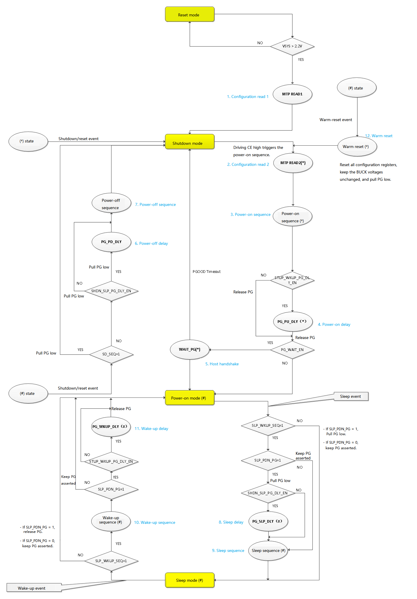

- The PMIC has four operating modes:

   reset mode, shutdown mode, power-on mode, and sleep mode.

- The PMIC has 12 intermediate states:

   configuration read 1, configuration read 2, power-on sequence, power-on delay, host handshake, power-off delay, power-off sequence, sleep delay, sleep sequence, wake-up sequence, wake-up delay, and warm reset.

   The intermediate states are used for system configuration and to implement specific sequencing requirements.

**Table 5-11 Operating Mode Description**

|Mode/State|Entry|Exit|Behavior|
|---|---|---|---|
|**Reset mode**|Non-reset mode & VSYS ≤ 2.0 V|VSYS ≥ 2.2 V|Resets all registers and control signals|
|**Shutdown mode**|1. MTP configuration read 1 is complete 2. Non-shutdown mode & shutdown event 3. Non-shutdown mode & reset event|1. Non-reset-to-shutdown transition & power-on event 2. Automatically exits after a reset event (PG or software reset) enters shutdown mode|1. Turns off all BUCK converters 2. Resets some registers 3. Turns off some modules|
|**Power-on mode**|1. Host handshake succeeds 2. Wake-up sequence is complete|Any shutdown, reset, sleep, or warm-reset event|All modules operate normally|
|**Sleep mode**|Power-on mode & sleep event|Any shutdown, reset, wake-up, or warm-reset event|Turns off BUCK converters or adjusts their voltages according to the configuration|
|**Configuration read 1**|VSYS ≥ 2.2 V \| CRC check fails|The final MTP data read is complete & the CRC check passes|Loads all MTP data into the corresponding mapped registers|
|**Configuration read 2**|Configuration read 1 is complete & CE is high|The final user MTP data read is complete|Loads user MTP data into the corresponding mapped registers|
|**Power-on sequence**|Configuration read 2 is complete|All BUCK sequences are complete|Turns on BUCK converters according to the configuration|
|**Power-on delay**|Power-on sequence is complete & PMU_CTRL2[1] in [Table 6-18](#table-6-18-pmu_ctrl2) is enabled|Power-on delay counter expires|Releases the PG signal after the delay expires|
|**Host handshake**|1. PMU_CTRL4[1] in [Table 6-20](#table-6-20-pmu_ctrl4) is enabled  2. Power-on delay is complete & PMU_CTRL2[1] in [Table 6-18](#table-6-18-pmu_ctrl2) is 1 3. Power-on sequence is complete & PMU_CTRL2[1] in [Table 6-18](#table-6-18-pmu_ctrl2) is 0 1 & (2 \| 3) -> Host handshake|1. Host pulls PG low 2. Host pull-down timeout expires|1. Waits for the host to pull PG low 2. Enters power-on mode if the handshake succeeds 3. Enters shutdown mode if the wait times out|
|**Power-off delay**|Power-on is complete & a shutdown/reset event occurs & PMU_CTRL4[4] in [Table 6-20](#table-6-20-pmu_ctrl4) is 0 (reverse power-off) & PMU_CTRL2[0] in [Table 6-18](#table-6-18-pmu_ctrl2) is 1|Power-off delay counter expires|Pulls PG low and enters the power-off sequence after the delay expires|
|**Power-off sequence**|1. Power-on is complete and a shutdown/reset event occurs 2. PMU_CTRL4[4] in [Table 6-20](#table-6-20-pmu_ctrl4) is 0 & power-off delay is complete 3. PMU_CTRL2[0] in [Table 6-18](#table-6-18-pmu_ctrl2) is 0 4. PMU_CTRL2[0] in [Table 6-18](#table-6-18-pmu_ctrl2) is 1 & power-off delay is complete 1 & 2 & (3 \| 4) -> Power-off sequence|BUCK shutdown according to the configuration is complete|Turns off BUCK converters in reverse order according to the configuration|
|**Sleep delay**|Power-on mode & sleep event & PMU_CTRL4[5] in [Table 6-20](#table-6-20-pmu_ctrl4) is enabled & PMU_CTRL2[0] in [Table 6-18](#table-6-18-pmu_ctrl2) is enabled|Sleep delay counter expires|Pulls PG low and enters the sleep sequence after the delay expires|
|**Sleep sequence**|1. Power-on mode & sleep event & PMU_CTRL4[5] in [Table 6-20](#table-6-20-pmu_ctrl4) is enabled  2. PMU_CTRL4[0] in [Table 6-20](#table-6-20-pmu_ctrl4) is 0 3. PMU_CTRL4[0] in [Table 6-20](#table-6-20-pmu_ctrl4) is 1 & PMU_CTRL2[0] in [Table 6-18](#table-6-18-pmu_ctrl2) is 0 4. PMU_CTRL4[0] in [Table 6-20](#table-6-20-pmu_ctrl4) is 1 & PMU_CTRL2[0] in [Table 6-18](#table-6-18-pmu_ctrl2) is 1 & sleep delay is complete 1 & (2 \| 3 \| 4) -> Sleep sequence|BUCK voltage adjustment or shutdown according to the configuration is complete|Adjusts BUCK voltages or turns off BUCK converters according to the configuration|
|**Wake-up sequence**|Sleep mode & wake-up event & PMU_CTRL4[5] in [Table 6-20](#table-6-20-pmu_ctrl4) is enabled|BUCK voltage adjustment or turn-on according to the configuration is complete|Adjusts BUCK voltages or turns on BUCK converters according to the configuration|
|**Wake-up delay**|Wake-up sequence is complete & PMU_CTRL4[0] in [Table 6-20](#table-6-20-pmu_ctrl4) is enabled & PMU_CTRL2[0] in [Table 6-18](#table-6-18-pmu_ctrl2) is enabled|Wake-up delay counter expires|Releases PG and enters power-on mode after the delay expires|
|**Warm reset**|Power-on is complete & a warm-reset event occurs|Warm-reset event is deasserted|Resets all configuration registers without changing BUCK voltages. After configuration read 2 is complete, restores BUCK voltages according to the configuration read 2 settings during the power-on sequence|

#### 5.2.1 Reset Mode

Before the VSYS power-on reset is released (VSYS > 2.2 V), the PMIC remains in this mode and does not operate. The system starts operating normally only after the VSYS voltage exceeds 2.2 V. If VSYS falls below the 2.2 V power-on reset threshold at any time, the PMIC immediately returns to this mode.

#### 5.2.2 Shutdown Mode

**Table 5-12 Shutdown Mode Entry and Exit**

|Condition|Description|
|---|---|
|**Entry conditions**|1. The PMIC enters this state after the power-on reset is released (VSYS > 2.2 V) and MTP configuration read 1 is complete 2. Immediately when any shutdown or reset event occurs during the power-on sequence 3. After the power-off sequence when any shutdown or reset event occurs in operating mode|
|**Exit condition**|Any power-on event|

Most modules are inactive in this mode. The Bandgap, VSYS voltage detector, and other specified modules remain active. When a reset event causes the PMIC to enter this mode, it remains here for a configured period ([Table 6-19](#table-6-19-pmu_ctrl3) PMU_CTRL3[2:1]):

- After a reset event causes the PMIC to enter shutdown mode, it automatically starts the power-on sequence after the period configured in [Table 6-19](#table-6-19-pmu_ctrl3) PMU_CTRL3[2:1] expires, provided that the VSYS voltage is above the configured power-on threshold ([Table 6-42](#table-6-42-prot_cfg) PROT_CFG[5:3]).

- After releasing PGOOD, the PMIC enters power-on mode directly if configured not to wait for external PGOOD release ([Table 6-20](#table-6-20-pmu_ctrl4) PMU_CTRL4[1] = 0). Otherwise, it waits for PGOOD to be released before entering power-on mode. If the PMIC detects that PGOOD has not been released for too long ([Table 6-19](#table-6-19-pmu_ctrl3) PMU_CTRL3[0]), it returns directly to shutdown mode.

#### 5.2.3 Power-On Mode

All modules operate normally in this mode, including all power rails, voltage detectors, internal references, power-rail overvoltage/undervoltage detectors, overtemperature detector, internal clocks, oscillator circuits, ADC, communication interfaces, GPIO module, and interrupts.

Entry: The power-on sequence or sleep sequence is complete.

Exit: Any shutdown, reset, sleep, or warm-reset event.

#### 5.2.4 Sleep Mode

In this mode, selected power rails can be stepped down or turned off. The PGOOD pin can also be configured to be pulled low to reset the SoC.

Entry: A sleep event occurs in power-on mode.

Exit: Any shutdown, reset, wake-up, or warm-reset event.

#### 5.2.5 Operating Status by Mode

**Table 5-13 Operating Status by Mode**

|Voltage Domain|Module|Reset Mode|Shutdown Mode (CE = 0)|Power-On Mode|Sleep Mode|
|:---:|:---:|:---:|:---:|:---:|:---:|
|**VSYS**|BUCK|-|-|x(if enabled)|x(if enabled)|
||MTP|-|-|x(if enable)|x(if enable)|
||Bandgap|-|√|√|√|
||VSYS Detect|-|√|√|√|
||VREF|-|-|x(if enable)|x(if enable)|
||IREF|-|-|x(if enable)|x(if enable)|
||SOSC|-|-|√|√|
||FOSC|-|-|√|√|
||ADC|-|-|x(if enable)|x(if enable)|
||TS|-|-|x(if enable)|x(if enable)|
||OT-P|-|-|√|√|
||DIGITAL|-|√|√|√|
||INT|-|-|x(if enable)|x(if enable)|
|**VIO**|GPIO|-|-|√|√|
||I2C/SPI|-|-|√|√|

### 5.3 PMIC Events and Behavior

The following table summarizes PMIC events. A "forced" action means that the PMIC immediately transitions from its current state to shutdown mode.

**Table 5-14 PMIC Events and Behavior**

|Type|Event|Applicable States|Behavior|
|:---:|:---:|:---:|:---:|
|**Power-on event**|CE is high|Shutdown mode|Power-on and wake-up|
|**Shutdown event**|CE is low|States marked with \* or # in [Figure 5-1](#mode-switching-diagram)|Shutdown according to the configuration|
||VSYS below threshold|States marked with \* or # in [Figure 5-1](#mode-switching-diagram)|Shutdown according to the configuration|
||VIO below threshold|States marked with \* or # in [Figure 5-1](#mode-switching-diagram)|Shutdown according to the configuration|
||Power-rail fault|States marked with \* or # in [Figure 5-1](#mode-switching-diagram)|Shutdown according to the configuration|
||Software shutdown|States marked with # in [Figure 5-1](#mode-switching-diagram)|Shutdown according to the configuration|
||Chip overtemperature/VSYS overvoltage|Non-reset mode|Forced shutdown|
|**Sleep event**|Software sleep|Power-on mode|Enter sleep mode according to the configuration|
||GPIO sleep|Power-on mode|Enter sleep mode according to the configuration|
|**Wake-up event**|Software wake-up|Sleep mode|Exit sleep mode according to the configuration|
||GPIO (SLEEP/WKUP) wake-up|Sleep mode|Exit sleep mode according to the configuration|
||WDT wake-up|Sleep mode|Exit sleep mode according to the configuration|
||GPIO interrupt wake-up|Sleep mode|Exit sleep mode according to the configuration|
|**Reset event**|PGOOD reset|Non-reset mode|Reset according to the configuration|
||Software reset|States marked with # in [Figure 5-1](#mode-switching-diagram)|Reset according to the configuration|
|**Warm-reset event**|GPIO (WARM_RESET) event|States marked with # in [Figure 5-1](#mode-switching-diagram)|Restore the power-on default state without entering shutdown mode|

### 5.4 Sequencer

The power-on, power-off, sleep, and wake-up sequences for the power rails use a programmable sequencer. The sequencer contains 16 programmable SLOTs (timing slots) with the following features:

**Table 5-15. Sequencer Functions**

|Function|Description|Registers|
|---|---|---|
|**BUCK ID binding**|1. Each BUCK has a programmable SLOT ID. 2. The SLOT ID can point to any of the 16 timing slots, SLOT0 ~ SLOT15.|[Table 6-23](#table-6-23-slot_ctrl0) SLOT_CTRL0 [Table 6-24](#table-6-24-slot_ctrl1) SLOT_CTRL1 [Table 6-26](#table-6-26-stup_slot_dlyx) STUP_SLOT_DLYx [Table 6-27](#table-6-27-shut_slot_dlyx) SHUT_SLOT_DLYx|
|**EXT_EN ID binding**|1. Each EXT_EN pin has a programmable SLOT ID. 2. The SLOT ID can point to any of the 16 timing slots, SLOT0 ~ SLOT15.|[Table 6-14](#table-6-14-gpio_ext_slot0) GPIO_EXT_SLOT0 [Table 6-15](#table-6-15-gpio_ext_slot1) GPIO_EXT_SLOT1 [Table 6-26](#table-6-26-stup_slot_dlyx) STUP_SLOT_DLYx [Table 6-27](#table-6-27-shut_slot_dlyx) SHUT_SLOT_DLYx|
|**PWRCTRL sequence control**|1. Each power rail can be controlled by PWRCTRL. 2. A power rail can be assigned to one or more PWRCTRL alternate-function pins. Power-on/wake-up sequence: waits for all bound PWRCTRL pins to assert before enabling the power rail. - Power-off/sleep sequence: waits for PWRCTRL to deassert before disabling the power rail. - Warm-reset sequence: PWRCTRL has no function.|[Table 6-23](#table-6-23-slot_ctrl0) SLOT_CTRL0 [Table 6-24](#table-6-24-slot_ctrl1) SLOT_CTRL1 [Table 6-26](#table-6-26-stup_slot_dlyx) STUP_SLOT_DLYx [Table 6-27](#table-6-27-shut_slot_dlyx) SHUT_SLOT_DLYx|
|**PWRCTRL timing control**|When a power rail bound to a SLOT is also bound to PWRCTRL, the timing of that SLOT is controlled by PWRCTRL: - Power-on/wake-up sequence: timing starts after all PWRCTRL pins assert. - Power-off/sleep sequence: timing starts after all PWRCTRL pins deassert.|[Table 6-23](#table-6-23-slot_ctrl0) SLOT_CTRL0 [Table 6-24](#table-6-24-slot_ctrl1) SLOT_CTRL1 [Table 6-26](#table-6-26-stup_slot_dlyx) STUP_SLOT_DLYx [Table 6-27](#table-6-27-shut_slot_dlyx) SHUT_SLOT_DLYx|
|**DUMMY SLOT**|A timing slot with no BUCK or EXT_EN binding: - If this SLOT and all following SLOTs have no BUCK or EXT_EN bindings, the timing for this SLOT and all following SLOTs is skipped. - If any following SLOT has a binding, this SLOT is skipped only after its timing is complete. - During the warm-reset sequence, timing is not skipped for any of the 16 slots, SLOT0 ~ SLOT15, regardless of whether a slot is a DUMMY SLOT.|-|

1. During the power-on or wake-up sequence, the corresponding BUCKs are enabled and EXT_EN is asserted at each SLOT from SLOT0 through SLOT15.

2. During the sleep sequence, the corresponding BUCK enable states remain unchanged at each SLOT from SLOT0 through SLOT15. However, if the sleep voltage of a power rail is set to 0, the corresponding power rail is disabled during the sleep sequence. When EXT_EN is configured for sleep-sequence control ([Table 6-25](#table-6-25-ext_ctrl) EXT_CTRL[7:4]), EXT_EN is deasserted during sleep; otherwise, it retains its previous state.

3. During the power-off sequence, the corresponding BUCKs are disabled and EXT_EN is deasserted at each SLOT from SLOT15 through SLOT0.

4. During the warm-reset sequence, each SLOT from SLOT0 through SLOT15 turns the corresponding BUCKs and EXT_EN on, off, or leaves them unchanged according to the MTP-configured BUCK enable and EXT_EN power-on default states.

5. The delay for each SLOT can be configured independently. Configure power-on/wake-up delays through [Table 6-26](#table-6-26-stup_slot_dlyx) STUP_SLOT_DLYx and power-off/sleep delays through [Table 6-26](#table-6-26-stup_slot_dlyx) STUP_SLOT_DLYx. The available intervals are 0.5/1/2/4/8/16 ms.

The sequencer can control up to eight SLOT IDs, including four EXT_EN signals and four BUCKs. Its operation is shown in the figure below; BUCK2 and BUCK3 are each bound to a PWRCTRL pin.

**Figure 5-2 Sequencer Timing Control Diagram**

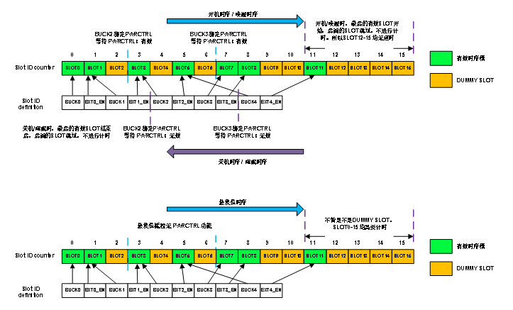

**Table 5-16 Power Rail State and Output Voltage by Mode and Sequence**

|Mode|SLOT_ID|PWRCTRLx|Software|Power Rail State|Power Rail Output Voltage|
|:---:|:---:|:---:|:---:|:---:|:---:|
|**Shutdown mode**|-|-|-|Disabled|0 V|
|**Power-on sequence**|x|x (optional)|x|Enabled|0 V -> BUCKx_VOUTn|
|**Power-on mode**|-|x (optional)|x|Enabled|BUCKx_VOUTn|
|**Sleep sequence**|x|x (optional)|x|Enabled|BUCKx_VOUTn -> BUCKx_SLP_VOUT|
|**Sleep mode**|-|x (optional)|x|Enabled|BUCKx_SLP_VOUT|
|**Wake-up sequence**|x|x (optional)|x|Enabled|BUCKx_SLP_VOUT -> BUCKx_VOUTn|
|**Power-off sequence**|x|x (optional)|-|Disabled|BUCKx_VOUTn -> 0 V|
|**Warm-reset sequence**|x|-|x|Enabled/Disabled|Restored to the power-on default state|

#### 5.4.1 Power-On Events

The PMIC power-on events are as follows:

1. CE pin pulled high.

2. Restart event after shutdown (software reset, PG pull-down, or WDT timeout reset).

All power-on events require VSYS to be higher than the power-on threshold before they can trigger power-on.

System wake-up requires a sufficient and stable VSYS voltage (2.9 V ~ 5.5 V) and any wake-up event. The power-on threshold can be configured through MTP ([Table 6-42](#table-6-42-prot_cfg) PROT_CFG[5:3]). In addition to the MTP setting, the hardware adjusts the power-on threshold according to operating conditions to prevent erroneous power-on and power-off sequences caused by a weak power supply, as shown in the figure below. The adjustment process is as follows:

1. The PMIC releases system reset and enters shutdown mode.

2. If the VSYS power-on event is not masked, the PMIC starts the power-on sequence and enters power-on mode when VSYS exceeds the default power-on threshold.

3. After entering power-on mode, if VSYS falls below the shutdown threshold within 16s, the PMIC starts the power-off sequence and enters shutdown mode.

4. At the same time, the PMIC checks whether the power-on threshold has reached its maximum value. If it has, the PMIC masks the VSYS power-on event. Otherwise, the PMIC increases the power-on threshold by 0.1 V or 0.2 V ([Table 6-20](#table-6-20-pmu_ctrl4) PMU_CTRL4[2]), but never above 3.6 V.

5. If the VSYS power-on event is masked, the PMIC waits for another power-on event. Otherwise, when VSYS again exceeds the new power-on threshold, the PMIC starts the power-on sequence and enters power-on mode.

**Figure 5-3 Power-On and Shutdown Threshold Switching Diagram**

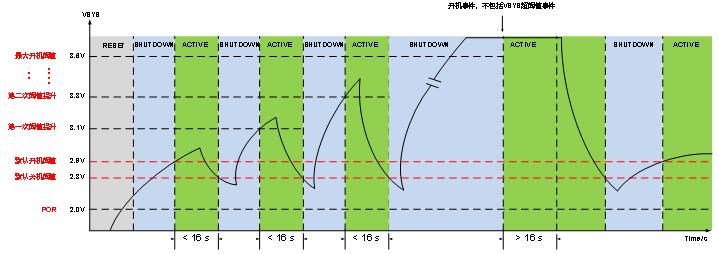

Once the PMIC enters power-on mode, if VSYS does not fall below the shutdown threshold within 16s, the power-on threshold is restored to the default power-on threshold, as shown above. The threshold adjustment process can be disabled by setting PMU_CTRL4[3] in [Table 6-20](#table-6-20-pmu_ctrl4) to 1.

#### 5.4.2 Power-On Sequence

The power-on sequence starts when a power-on event occurs in shutdown mode:

1. Load the required configuration from MTP, including the power rail voltage settings (MTP READ2).

2. After loading the configuration, the PMIC performs a series of pre-power-on checks for abnormal conditions, such as power rail overvoltage, undervoltage, short circuit, and chip overtemperature. If no abnormal condition is detected, the PMIC starts the power rail power-on sequence; otherwise, it immediately returns to shutdown mode.

3. After the power-on sequence is complete, configure [Table 6-18](#table-6-18-pmu_ctrl2) PMU_CTRL2[1] to select whether the PMIC waits for a programmable delay ([Table 6-19](#table-6-19-pmu_ctrl3) PMU_CTRL3 [6:5]) before actively releasing the PGOOD pin:

    1. If configured not to wait for external PGOOD release ([Table 6-20](#table-6-20-pmu_ctrl4) PMU_CTRL4[1] = 0), the PMIC enters power-on mode directly. Otherwise, it enters power-on mode only after PGOOD is released.

    2. If the PMIC detects that PGOOD has not been released for an extended period ([Table 6-19](#table-6-19-pmu_ctrl3) PMU_CTRL3 [0]), it returns directly to shutdown mode.

During the above process, before entering power-on mode (the states marked with * in [Figure 5-1](#mode-switching-diagram)), any abnormal, power-off, or reset event immediately interrupts the power-on sequence and returns the PMIC to shutdown mode, where it waits for the next wake-up event.

Each BUCK (BUCK1 ~ BUCK4) and EXT_EN has an independent programmable SLOT ID. The SLOT ID is determined by the PMIC's internal MTP configuration and is loaded from the corresponding MTP memory location after the PMIC wakes from shutdown mode.

Multiple power rails or EXTx_EN signals can be bound to the same SLOT, allowing them to be enabled in the same SLOT.

The power-on sequence starts at SLOT0. The timing of each SLOT can be programmed independently with one of six settings ([Table 6-26](#table-6-26-stup_slot_dlyx) STUP_SLOT_DLYx). The following scenarios apply according to the PWRCTRL pin bindings:

**Table 5-17 Power-On Sequence Behavior**

|Scenario|Configuration|Power Rail Enable|SLOT Timing|
|---|---|---|---|
|1|Active timing slot No PWRCTRL binding|When entering this SLOT: 1. All power rails are enabled immediately. 2. All EXT_EN signals are asserted.|When entering this SLOT: 1. The SLOT timer starts. 2. The sequence proceeds to the next SLOT when timing is complete.|
|2|Inactive timing slot No PWRCTRL binding|When entering this SLOT: All power rails and EXT_EN signals remain disabled or deasserted.|When entering this SLOT: 1. The SLOT timer starts. 2. The sequence proceeds to the next state when timing is complete.|
|3|Active timing slot With PWRCTRL binding|When entering this SLOT: 1. Power rails and EXT_EN signals that do not wait for PWRCTRL are enabled or asserted immediately. 2. Power rails that wait for PWRCTRL are enabled immediately after PWRCTRL asserts.|After entering this SLOT: 1. The timer starts only after all PWRCTRL signals awaited by this SLOT assert. 2. The sequence proceeds to the next SLOT when timing is complete.|
|4|Inactive timing slot With PWRCTRL binding|When entering this SLOT: All power rails and EXT_EN signals remain disabled or deasserted.|After entering this SLOT: 1. The timer starts only after all PWRCTRL signals awaited by this SLOT assert. 2. The sequence proceeds to the next state when timing is complete.|

> Note:
>
> 1. Scenario 3: If any bound PWRCTRL deasserts before SLOT timing is complete, the SLOT counter stops and resets to zero. The power rail bound to that PWRCTRL is disabled until PWRCTRL asserts again, and SLOT timing does not start until all bound PWRCTRL signals assert.
> 2. Scenario 3: If a SLOT has completed timing and the sequence has entered the next SLOT, a subsequent PWRCTRL deassertion does not affect the power rails that have already been enabled. However, if PWRCTRL is still deasserted after entering power-on mode, all power rails controlled by PWRCTRL are disabled immediately and are enabled again only when PWRCTRL asserts.
> 3. After all active timing slots have completed, the delays for subsequent inactive timing slots are skipped.

**Figure 5-4 Power-On Sequence Timing Diagram**

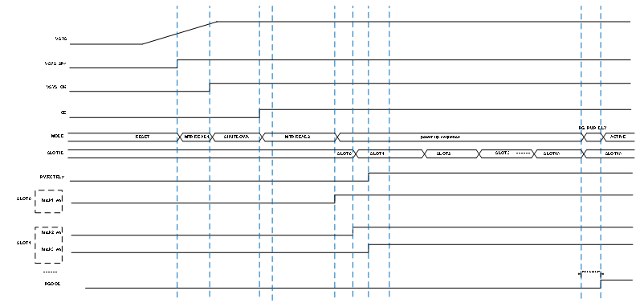

#### 5.4.3 Shutdown Events

The shutdown events are as follows:

1. CE pin pulled low.

2. Software shutdown event.

3. VSYS low-threshold shutdown event.

4. VIO undervoltage shutdown event (can be masked by software or MTP).

5. VSYS overvoltage (can be masked by software or MTP), power rail abnormal events (such as overvoltage (OV) or undervoltage (UV), which can be masked by software or MTP), and chip overtemperature (can be masked by software or MTP).

For power rail abnormal events, [Table 6-28](#table-6-28-buck_glb_ctrl) BUCK_GLB_CTRL[1] can be configured to select whether to shutdown the PMIC or disable only the BUCK where the abnormal event occurred.

#### 5.4.4 Power-Off Sequence

The power-off timing is the reverse of the power-on timing. The power-off sequence runs in reverse from SLOT15 to SLOT0. The objects operated in each SLOT (BUCK, LDO, or EXT_EN) are the same as in the power-on sequence, but the event polarity that triggers the behavior (PWRCTRL polarity) and the resulting action (enabling or disabling the power rail) are reversed, as shown in the **power-on sequence timing diagram ([5.4.2 Power-On Sequence](#542-power-on-sequence))** and the **power-off sequence timing diagram (below)**.

If a shutdown or reset event occurs during sleep or wake-up (the states marked with # in [Figure 5-1](#mode-switching-diagram)), the sleep or wake-up process is interrupted and the corresponding power-off sequence is executed according to the current configuration ([Table 6-20](#table-6-20-pmu_ctrl4) PMU_CTRL4[0]).

When the reverse sequence reaches a SLOT, the power rails bound to that SLOT are disabled and EXT_EN is deasserted. If a power rail is configured to wait for PWRCTRL ([Table 6-18](#table-6-18-pmu_ctrl2) PMU_CTRL2[2] = 1), the SLOT timing and power rail shutdown wait for PWRCTRL to deassert. If the PWRCTRL wait times out ([Table 6-19](#table-6-19-pmu_ctrl3) PMU_CTRL3[7]), SLOT timing starts and the corresponding power rail is disabled.

If an emergency event occurs during the power-off sequence, including VSYS overvoltage ([Table 6-77](#table-6-77-sys_status) SYS_STATUS[5]) or severe chip overtemperature ([Table 6-77](#table-6-77-sys_status) SYS_STATUS[3]), and the corresponding protection operation is enabled ([Table 6-43](#table-6-43-prot_en) PROT_EN[4][6]), the PMIC immediately returns to shutdown mode, and all power rails and EXT_EN signals are immediately disabled or deasserted.

**Figure 5-5 Power-Off Sequence Timing Diagram**

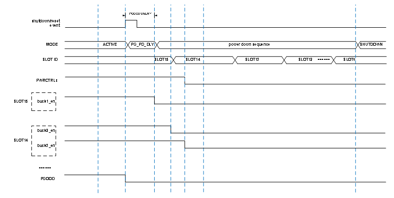

#### 5.4.5 Sleep Events

The sleep events shown in [Figure 5-1](#mode-switching-diagram) are conditions for entering sleep mode from power-on mode:

1. Software-initiated sleep ([Table 6-17](#table-6-17-pmu_ctrl1) PMU_CTRL1[1] = 1).

2. An active event on a GPIO alternate-function input (SLEEP/WKUP) pin.

#### 5.4.6 Sleep Sequence

The SLOT order in the sleep sequence is the same as in the power-off sequence, but the behavior is different:

1. The enable state of each power rail remains unchanged. If the sleep voltage in [Table 6-39](#table-6-39-buckx_slp_vout) BUCKx_SLP_VOUT is set to 0, the corresponding BUCK is disabled. Otherwise, each power rail only adjusts its voltage to the sleep voltage during this process.

2. EXT_EN is controlled by [Table 6-25](#table-6-25-ext_ctrl) EXT_CTRL. When the sleep sequence reaches the corresponding SLOT, EXT_EN is disabled only if EXTx_SLP_SD = 1; otherwise, it remains unchanged.

3. A wake-up event does not interrupt the sleep sequence. If a wake-up condition is still present after the PMIC enters sleep mode, the wake-up sequence starts. Software- and GPIO-pin-triggered sleep conditions are level-sensitive and take effect only in power-on mode.

4. When multiple GPIOs are configured as SLEEP/WKUP pins, the PMIC enters the sleep sequence when any one of the pins is active in power-on mode.

#### 5.4.7 Wake-Up Events

The wake-up events shown in [Figure 5-1](#mode-switching-diagram) are conditions for exiting sleep mode:

1. Software wake-up.

2. An inactive event on a GPIO alternate-function input (SLEEP/WKUP) pin. When multiple SLEEP/WKUP pins are configured, the PMIC exits sleep mode only after all SLEEP/WKUP pins become inactive.

3. If sleep was triggered by a SLEEP/WKUP pin, no interrupt can wake the PMIC while the sleep state of the SLEEP/WKUP pin remains active.

4. If sleep was entered through software, enabling the WDT and GPIO interrupts and triggering the corresponding interrupt event can wake the PMIC.

#### 5.4.8 Wake-Up Sequence

The SLOT order in the wake-up sequence is the same as in the power-on sequence, with the following differences:

1. During the wake-up sequence, the power rail voltage is adjusted from the sleep voltage to the normal voltage.

2. If the user disables a power rail through software in sleep mode, that power rail remains disabled when the wake-up sequence starts.

3. A sleep event does not interrupt the wake-up sequence. If the sleep condition is still present after the PMIC enters power-on mode, the sleep sequence starts.

4. If sleep was entered through software but exited through another method, the other wake-up source also clears the software-triggered condition by clearing the corresponding register.

5. When multiple GPIOs are configured as SLEEP/WKUP pins, all SLEEP/WKUP pins must become inactive in sleep mode before the wake-up sequence can start.

6. If any SLEEP/WKUP pin is active, neither a WDT wake-up event nor a GPIO interrupt wake-up event can wake the PMIC from sleep mode.

#### 5.4.9 Reset Events

The reset events are as follows:

1. Software reset event.

2. PGOOD pulled low (can be masked by software or MTP).

3. Watchdog timeout reset event (can be masked by software).

#### 5.4.10 Reset Sequence

The behavior is the same when a reset event occurs in power-on mode or sleep mode. The next operation is then performed according to the configuration, and every reset sequence passes through the power-off sequence.

After passing through the power-off sequence and entering shutdown mode, the PMIC remains in this mode for 20/100/200/500 ms ([Table 6-19](#table-6-19-pmu_ctrl3) PMU_CTRL3[2:1]) to ensure sufficient reset time. When the timer expires, the PMIC exits shutdown mode and enters MTP_READ2, as shown in [Figure 5-1](#mode-switching-diagram). During the interval configured for the reset source to enter shutdown mode ([Table 6-19](#table-6-19-pmu_ctrl3) PMU_CTRL3[2:1]), power-on sources are masked and therefore inactive.

#### 5.4.11 Warm Reset

The PMIC also supports warm reset. Warm reset differs from a normal reset in the following ways:

1. The warm-reset process does not pass through shutdown mode.

2. The BUCK voltages are restored directly to their power-on default values according to the power-on sequence.

3. The operating states of other modules are also restored to their power-on default states.

Warm reset is triggered by an active event on WARM_RESET (GPIO alternate-function input) and can be masked by software. As shown in [Figure 5-1](#mode-switching-diagram), after warm reset occurs, the PMIC resets all configuration registers and some peripheral flags (see [6.2.2 Register Descriptions](#622-register-descriptions)) and pulls PGOOD low. After executing MTP_READ2, it restores all BUCK output voltages to their power-on default values without waiting for PWRCTRL. Power rails that are not enabled during power-on remain disabled. After warm reset is complete, subsequent behavior is the same as for a normal power-on.

**Figure 5-6 Warm-Reset Sequence Timing Diagram**

**Table 5-18 Power Rail State and Output Voltage by Mode and Sequence**

|Mode|SLOT_ID|PWRCTRLx|Software|Power Rail State|Power Rail Output Voltage|
|---|---|---|---|---|---|
|Shutdown mode|-|-|-|Disabled|0 V|
|Power-on sequence|x|x (optional)|x|Enabled|0 V -> BUCKx_VOUTn|
|Power-on mode|-|x (optional)|x|Enabled|BUCKx_VOUTn|
|Sleep sequence|x|x (optional)|x|Enabled|BUCKx_VOUTn -> BUCKx_SLP_VOUT|
|Sleep mode|-|x (optional)|x|Enabled|BUCKx_SLP_VOUT|
|Wake-up sequence|x|x (optional)|x|Enabled|BUCKx_SLP_VOUT -> BUCKx_VOUTn|
|Power-off sequence|x|x (optional)|-|Disabled|BUCKx_VOUTn -> 0 V|
|Warm reset|x|-|-|Enabled|Restored to the power-on default state|

### 5.5 Power Rails - BUCK Converters

The PMIC integrates four high-performance BUCK converters with an output voltage range of 0.25 ~ 1.83 V and a maximum output current of 8 A. It supports multiphase parallel output and cascading two PMICs to increase the output current and meet the requirements of different applications.

#### 5.5.1 Soft Start

Soft start is the process in which a BUCK transitions from the disabled state to the enabled state and reaches a specified voltage.

Soft start is triggered in the following situations:

1. The power-on sequence enables a BUCK that is configured to be enabled by default.

2. An I2C/SPI configuration enables a disabled BUCK in power-on mode or sleep mode.

3. During wake-up from sleep, the sleep voltage is 0 V and the post-wake-up voltage is nonzero.

4. The warm-reset sequence enables a BUCK that is configured to be enabled by default.

The soft-start voltage slew rate has four settings (2.5/10/25/50 mV/μs) and can be configured through [Table 6-21](#table-6-21-slew_ctrl0) SLEW_CTRL0[3:2].

#### 5.5.2 Soft Shutdown

Soft shutdown is the process in which a BUCK transitions from an enabled voltage to the disabled state.

Soft shutdown is triggered in the following situations:

1. The power-off sequence disables an enabled BUCK.

2. An I2C/SPI configuration disables an enabled BUCK in power-on mode or sleep mode.

3. The sleep voltage is 0 V when entering sleep mode.

4. The warm-reset sequence disables a BUCK that is configured to be disabled by default.

The soft-shutdown voltage slew rate has four settings (2.5/10/25/50 mV/μs) and can be configured through [Table 6-21](#table-6-21-slew_ctrl0) SLEW_CTRL0[1:0].

All BUCK outputs have a pull-down resistor control. When a BUCK is enabled, its pull-down resistor is disabled. When a BUCK is disabled, whether its pull-down resistor is enabled depends on [Table 6-28](#table-6-28-buck_glb_ctrl) BUCK_GLB_CTRL[0].

#### 5.5.3 Voltage Configuration and Dynamic Voltage Scaling

Each BUCK has five voltage configuration registers:

1. [Table 6-35](#table-6-35-buckx_vout0) BUCKx_VOUT0

2. [Table 6-36](#table-6-36-buckx_vout1) BUCKx_VOUT1

3. [Table 6-37](#table-6-37-buckx_vout2) BUCKx_VOUT2

4. [Table 6-38](#table-6-38-buckx_vout3) BUCKx_VOUT3

5. [Table 6-39](#table-6-39-buckx_slp_vout) BUCKx_SLP_VOUT

BUCKx_SLP_VOUT takes effect in sleep mode. In power-on mode, the active voltage register is determined by the DVS pin states; see [Table 5-19](#table-5-19) “DVS1 Pin Configuration” and [Table 5-20](#table-5-20) “DVS0 Pin Configuration”.

Dynamic voltage scaling can be implemented in two ways:

1. Use the I2C/SPI communication interface to modify BUCKx_VOUTx in power-on mode or BUCKx_SLP_VOUT, the sleep-mode voltage configuration register, in sleep mode.

2. Use a GPIO alternate-function DVS pin to adjust the voltage. [Table 6-34](#table-6-34-buckx_dvs_io) BUCKx_DVS_IO[5:0] selects the corresponding I/O pin for DVS1/0. [Table 6-12](#table-6-12-gpio_afr0) GPIO_AFR0 and [Table 6-13](#table-6-13-gpio_afr1) GPIO_AFR1 must be configured for the corresponding DVS function.

**Table 5-19 DVS1 Pin Configuration**

|BUCKx_DVS1_IO[2:0]|Description|
|:---:|---|
|000|The BUCKx DVS1 logic is 0.|
|001|Selects GPIO0 as BUCKx DVS1.|
|010|Selects GPIO1 as BUCKx DVS1.|
|011|Selects GPIO2 as BUCKx DVS1.|
|100|Selects GPIO3 as BUCKx DVS1.|
|101|The BUCKx DVS1 logic is 0.|
|110|The BUCKx DVS1 logic is 0.|
|111|The BUCKx DVS1 logic is 0.|

**Table 5-20 DVS0 Pin Configuration**

|BUCKx_DVS0_IO[2:0]|Description|
|:---:|---|
|000|The BUCKx DVS0 logic is 0.|
|001|Selects GPIO0 as BUCKx DVS0.|
|010|Selects GPIO1 as BUCKx DVS0.|
|011|Selects GPIO2 as BUCKx DVS0.|
|100|Selects GPIO3 as BUCKx DVS0.|
|101|The BUCKx DVS0 logic is 0.|
|110|The BUCKx DVS0 logic is 0.|
|111|The BUCKx DVS0 logic is 0.|

**Table 5-21 DVS Pin Functions and Power-On-Mode Voltage Output**

|BUCKx｛DVS1,DVS0｝|Active BUCKx DVS Voltage Register|
|:---:|---|
|00|[Table 6-35](#table-6-35-buckx_vout0) BUCKx_VOUT0|
|01|[Table 6-36](#table-6-36-buckx_vout1) BUCKx_VOUT1|
|10|[Table 6-37](#table-6-37-buckx_vout2) BUCKx_VOUT2|
|11|[Table 6-38](#table-6-38-buckx_vout3) BUCKx_VOUT3|

DVS1/DVS0 pin logic is shown in **DVS0/DVS1 Logic** below. When using the DVS function, configure the DVS pins and GPIO pins appropriately. GPIO can control the BUCK voltage only when the GPIO alternate-function configuration matches the DVS pin assignment; otherwise, the corresponding DVS logic is 0. For example, if BUCK1_DVS0_IO is set to 010 (GPIO0) and GPIO1_AFR is set to 1000 (DVS0), but BUCK1_DVS1_IO is set to 100 (GPIO3) and GPIO3_AFR is set to 0000 (general-purpose input), BUCK1 DVS1 is always 0. In this case, BUCKx_VOUT0 and BUCKx_VOUT1 can be selected only by changing DVS0.

**Figure 5-7 DVS0/DVS1 Logic**

For voltage-scaling speed, [5.5.1 Soft Start](#551-soft-start) and [5.5.2 Soft Shutdown](#552-soft-shutdown) describe the soft-start and soft-shutdown cases, respectively. Both use one of four selectable slew rates: 2.5/10/25/50 mV/μs. During soft start, the voltage-scaling speed is controlled by [Table 6-21](#table-6-21-slew_ctrl0) SLEW_CTRL0[3:2]. During soft shutdown, it is controlled by [Table 6-21](#table-6-21-slew_ctrl0) SLEW_CTRL0[1:0]. In addition to soft start and soft shutdown, voltage scaling occurs in the following situations:

1. In power-on mode, an I2C/SPI configuration changes the active voltage register for an enabled BUCK: [Table 6-35](#table-6-35-buckx_vout0) BUCKx_VOUT0, [Table 6-36](#table-6-36-buckx_vout1) BUCKx_VOUT1, [Table 6-37](#table-6-37-buckx_vout2) BUCKx_VOUT2, or [Table 6-38](#table-6-38-buckx_vout3) BUCKx_VOUT3.

2. In sleep mode, an I2C/SPI configuration changes [Table 6-39](#table-6-39-buckx_slp_vout) BUCKx_SLP_VOUT for an enabled BUCK.

3. In power-on mode, the DVS pins control BUCK voltage selection.

4. BUCK voltage changes during the sleep and wake-up sequences that do not involve soft start or soft shutdown.

5. BUCK voltage changes during the warm-reset sequence that do not involve soft start or soft shutdown.

When the voltage before the change is greater than the voltage after the change, voltage scaling is masked by [Table 6-22](#table-6-22-slew_ctrl1) SLEW_CTRL1[4], and the voltage-scaling speed is configured through [Table 6-22](#table-6-22-slew_ctrl1) SLEW_CTRL1[1:0].

When the voltage before the change is less than the voltage after the change, voltage scaling is masked by [Table 6-22](#table-6-22-slew_ctrl1) SLEW_CTRL1[5], and the voltage-scaling speed is configured through [Table 6-22](#table-6-22-slew_ctrl1) SLEW_CTRL1[3:2].

After voltage scaling is complete in power-on mode or sleep mode, when soft shutdown and soft start are not involved, the voltage-scaling completion flag in [Table 6-80](#table-6-80-buck_status0) BUCK_STATUS0[3:0] is set. If the corresponding interrupt is enabled, INT also notifies the SoC. Note that the voltage-scaling completion flag is cleared during the warm-reset sequence.

#### 5.5.4 Multiphase Control

The PMIC supports 4+0, 3+1, 2+2, 2+1+1, and 1+1+1+1 output configurations. The configuration can be selected through MTP or PH_CFGx (GPIO alternate function). When [Table 6-28](#table-6-28-buck_glb_ctrl) BUCK_GLB_CTRL[5] is 0, the multiphase configuration is completed through MTP during MTP_READ2.

When [Table 6-28](#table-6-28-buck_glb_ctrl) BUCK_GLB_CTRL[5] is 1, the multiphase configuration is controlled after MTP_READ2 through GPIO, [Table 6-28](#table-6-28-buck_glb_ctrl) BUCK_GLB_CTRL[4:2], GPIO alternate-function control, and GPIO input.

Note that both multiphase-control methods apply only during the first power-on sequence after the PMIC powers up. Subsequent power-off and power-on cycles retain the selected multiphase configuration.

**Table 5-22 Multiphase Control Settings**

|[Table 6-28](#table-6-28-buck_glb_ctrl) BUCK_GLB_CTRL[5]|PH_CFG2, PG_CFG1, PH_CFG0 (GPIO alternate function)|[Table 6-28](#table-6-28-buck_glb_ctrl) BUCK_GLB_CTRL[4:2]|BUCK Multiphase Configuration|Notes|
|:---:|:---:|:---:|:---:|:---:|
|**0**|-|000|4+0|BUCK1 is the master|
||-|001|3+1|BUCK1 is the master|
||-|010|2+2|BUCK1 and BUCK3 are the masters|
||-|011|2+1+1|BUCK1 is the master|
||-|1xx|1+1+1+1|The four BUCKs are controlled independently|
|**1**|000|-|4+0|BUCK1 is the master|
||001|-|3+1|BUCK1 is the master|
||010|-|2+2|BUCK1 and BUCK3 are the masters|
||011|-|2+1+1|BUCK1 is the master|
||1xx|-|1+1+1+1|The four BUCKs are controlled independently|

When BUCK1 or BUCK3 is used as the master, the following registers of the slave BUCK are invalid. The corresponding controls for the slave BUCK are determined by the master BUCK.

[Table 6-32](#table-6-32-buckx_ctrl) BUCKx_CTRL

[Table 6-23](#table-6-23-slot_ctrl0) SLOT_CTRL0

[Table 6-24](#table-6-24-slot_ctrl1) SLOT_CTRL1

[Table 6-34](#table-6-34-buckx_dvs_io) BUCKx_DVS_IO

[Table 6-35](#table-6-35-buckx_vout0) BUCKx_VOUT0

[Table 6-36](#table-6-36-buckx_vout1) BUCKx_VOUT1

[Table 6-37](#table-6-37-buckx_vout2) BUCKx_VOUT2

[Table 6-38](#table-6-38-buckx_vout3) BUCKx_VOUT3

[Table 6-39](#table-6-39-buckx_slp_vout) BUCKx_SLP_VOUT

In multiphase parallel mode, only the master BUCK generates the corresponding abnormal events; abnormal events from the slave BUCKs are masked.

#### 5.5.5 PMIC Cascading

The PMIC integrates four BUCK converters and supports cascading two PMICs in a master-slave configuration through the GPIO3 pin. This expands the total number of output phases to 5, 6, 7, or 8 to meet the requirements of high-current loads, such as CPU/GPU core power supplies.

1. PMIC as the master. As the cascading master, the PMIC controls its own four BUCKs (the master must be configured for four-phase operation), generates and outputs a phase-synchronization clock, and outputs it through GPIO3. The MTP configuration is as follows:

   Configure GPIO3 for general-purpose output mode: configure [Table 6-13](#table-6-13-gpio_afr1) GPIO_AFR1[7:4] to 1000.

   Set the PMIC to master mode: configure [Table 6-29](#table-6-29-buck_cascade_ctrl0) BUCK_CASCADE_CTRL0[1:0] to 11.

   Select the number of slave cascading phases through [Table 6-29](#table-6-29-buck_cascade_ctrl0) BUCK_CASCADE_CTRL0[3:2]: 4+1 (00), 4+2 (01), 4+3 (10), or 4+4 (11). The master's four BUCK channels correspond to phases 1 through 4 in BUCK1 ~ BUCK4 order by default and are not affected by cas_sel. cas_sel determines only how many phases are included in the synchronization signal output to the slave.

   Configure the output cascading-signal pulse width through [Table 6-31](#table-6-31-buck_cascade_ctrl2) BUCK_CASCADE_CTRL2[1:0].

    

    **Figure 5-8 PMIC Cascading Master Output Phase Count and GPIO3 Output Phase Timing**

    

2. PMIC as the slave. As the cascading slave, the PMIC receives the input synchronization signal from the cascading master through GPIO3 and assigns its internal BUCK channels to the specified phases to operate in parallel with the master. The MTP configuration is as follows:

   Configure GPIO3 for general-purpose input mode: configure [Table 6-13](#table-6-13-gpio_afr1) GPIO_AFR1[7:4] to 0000.

   Set the PMIC to slave mode: configure [Table 6-29](#table-6-29-buck_cascade_ctrl0) BUCK_CASCADE_CTRL0[1:0] to 10.

   Enable BUCKx for slave cascading through [Table 6-29](#table-6-29-buck_cascade_ctrl0) BUCK_CASCADE_CTRL0[7:4].

   Select which phase of the cascading signal controls slave BUCKx through [Table 6-30](#table-6-30-buck_cascade_ctrl1) BUCK_CASCADE_CTRL1.

    

    **Figure 5-9 Phase Control of PMIC Cascading Slave BUCKx (4+4)**

    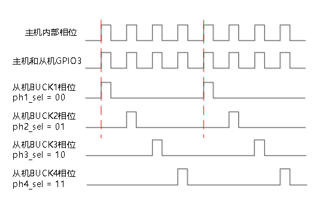

#### 5.5.6 VOUT Register Configuration and Voltage Mapping

The BUCKx voltage in power-on mode and sleep mode can be modified by configuring [Table 6-35](#table-6-35-buckx_vout0) BUCKx_VOUT0, [Table 6-36](#table-6-36-buckx_vout1) BUCKx_VOUT1, [Table 6-37](#table-6-37-buckx_vout2) BUCKx_VOUT2, [Table 6-38](#table-6-38-buckx_vout3) BUCKx_VOUT3, and [Table 6-39](#table-6-39-buckx_slp_vout) BUCKx_SLP_VOUT. The configuration-to-voltage mapping is shown below:

**Table 5-23 BUCKx_VOUT and BUCKx_SLP_VOUT Configuration and Voltage Mapping (Unit: V)**

Each cell in the table uses the format “register code / output voltage”.

> Note:
>
> - **5 mV/step** - plain
> - **10 mV/step** - blue
> - **Special voltage** - red

|0x0x|0x1x|0x2x|0x3x|0x4x|0x5x|0x6x|0x7x|0x8x|0x9x|0xAx|0xBx|0xCx|0xDx|0xEx|0xFx|
|---|---|---|---|---|---|---|---|---|---|---|---|---|---|---|---|
|0x00 0.800|0x10 0.325|0x20 0.405|0x30 0.485|0x40 0.565|0x50 0.645|0x60 0.725|0x70 0.805|0x80 0.885|0x90 0.965|0xA0 1.045|0xB0 1.125|0xC0 1.210|0xD0 1.370|0xE0 1.530|0xF0 1.690|
|0x01 0.250|0x11 0.330|0x21 0.410|0x31 0.490|0x41 0.570|0x51 0.650|0x61 0.730|0x71 0.810|0x81 0.890|0x91 0.970|0xA1 1.050|0xB1 1.130|0xC1 1.220|0xD1 1.380|0xE1 1.540|0xF1 1.700|
|0x02 0.255|0x12 0.335|0x22 0.415|0x32 0.495|0x42 0.575|0x52 0.655|0x62 0.735|0x72 0.815|0x82 0.895|0x92 0.975|0xA2 1.055|0xB2 1.135|0xC2 1.230|0xD2 1.390|0xE2 1.550|0xF2 1.710|
|0x03 0.260|0x13 0.340|0x23 0.420|0x33 0.500|0x43 0.580|0x53 0.660|0x63 0.740|0x73 0.820|0x83 0.900|0x93 0.980|0xA3 1.060|0xB3 1.140|0xC3 1.240|0xD3 1.400|0xE3 1.560|0xF3 1.720|
|0x04 0.265|0x14 0.345|0x24 0.425|0x34 0.505|0x44 0.585|0x54 0.665|0x64 0.745|0x74 0.825|0x84 0.905|0x94 0.985|0xA4 1.065|0xB4 1.145|0xC4 1.250|0xD4 1.410|0xE4 1.570|0xF4 1.730|
|0x05 0.270|0x15 0.350|0x25 0.430|0x35 0.510|0x45 0.590|0x55 0.670|0x65 0.750|0x75 0.830|0x85 0.910|0x95 0.990|0xA5 1.070|0xB5 1.150|0xC5 1.260|0xD5 1.420|0xE5 1.580|0xF5 1.740|
|0x06 0.275|0x16 0.355|0x26 0.435|0x36 0.515|0x46 0.595|0x56 0.675|0x66 0.755|0x76 0.835|0x86 0.915|0x96 0.995|0xA6 1.075|0xB6 1.155|0xC6 1.270|0xD6 1.430|0xE6 1.590|0xF6 1.750|
|0x07 0.280|0x17 0.360|0x27 0.440|0x37 0.520|0x47 0.600|0x57 0.680|0x67 0.760|0x77 0.840|0x87 0.920|0x97 1.000|0xA7 1.080|0xB7 1.160|0xC7 1.280|0xD7 1.440|0xE7 1.600|0xF7 1.760|
|0x08 0.285|0x18 0.365|0x28 0.445|0x38 0.525|0x48 0.605|0x58 0.685|0x68 0.765|0x78 0.845|0x88 0.925|0x98 1.005|0xA8 1.085|0xB8 1.165|0xC8 1.290|0xD8 1.450|0xE8 1.610|0xF8 1.770|
|0x09 0.290|0x19 0.370|0x29 0.450|0x39 0.530|0x49 0.610|0x59 0.690|0x69 0.770|0x79 0.850|0x89 0.930|0x99 1.010|0xA9 1.090|0xB9 1.170|0xC9 1.300|0xD9 1.460|0xE9 1.620|0xF9 1.780|
|0x0A 0.295|0x1A 0.375|0x2A 0.455|0x3A 0.535|0x4A 0.615|0x5A 0.695|0x6A 0.775|0x7A 0.855|0x8A 0.935|0x9A 1.015|0xAA 1.095|0xBA 1.175|0xCA 1.310|0xDA 1.470|0xEA 1.630|0xFA 1.790|
|0x0B 0.300|0x1B 0.380|0x2B 0.460|0x3B 0.540|0x4B 0.620|0x5B 0.700|0x6B 0.780|0x7B 0.860|0x8B 0.940|0x9B 1.020|0xAB 1.100|0xBB 1.180|0xCB 1.320|0xDB 1.480|0xEB 1.640|0xFB 1.800|
|0x0C 0.305|0x1C 0.385|0x2C 0.465|0x3C 0.545|0x4C 0.625|0x5C 0.705|0x6C 0.785|0x7C 0.865|0x8C 0.945|0x9C 1.025|0xAC 1.105|0xBC 1.185|0xCC 1.330|0xDC 1.490|0xEC 1.650|0xFC 1.810|
|0x0D 0.310|0x1D 0.390|0x2D 0.470|0x3D 0.550|0x4D 0.630|0x5D 0.710|0x6D 0.790|0x7D 0.870|0x8D 0.950|0x9D 1.030|0xAD 1.110|0xBD 1.190|0xCD 1.340|0xDD 1.500|0xED 1.660|0xFD 1.820|
|0x0E 0.315|0x1E 0.395|0x2E 0.475|0x3E 0.555|0x4E 0.635|0x5E 0.715|0x6E 0.795|0x7E 0.875|0x8E 0.955|0x9E 1.035|0xAE 1.115|0xBE 1.195|0xCE 1.350|0xDE 1.510|0xEE 1.670|0xFE 1.830|
|0x0F 0.320|0x1F 0.400|0x2F 0.480|0x3F 0.560|0x4F 0.640|0x5F 0.720|0x6F 0.800|0x7F 0.880|0x8F 0.960|0x9F 1.040|0xAF 1.120|0xBF 1.200|0xCF 1.360|0xDF 1.520|0xEF 1.680|0xFF 0.000|

#### 5.5.7 LPM (Low-Power) Mode

Each BUCK includes an LPM (low-power mode) function that minimizes quiescent current after the host enters sleep mode. In LPM mode, enhanced transient response (ETR), adaptive dead-time control (ADT), and the POK comparator are disabled, which reduces the BUCK load-transient response performance. LPM mode is enabled globally for the BUCKs through [Table 6-28](#table-6-28-buck_glb_ctrl) BUCK_GLB_CTRL[6].

### 5.6 Fault Protection

The PMIC provides the following protection functions:

1. BUCK overvoltage and undervoltage protection.

2. Severe chip overtemperature protection.

3. Critical chip overtemperature protection.

4. VIO undervoltage protection.

5. VSYS overvoltage protection.

6. VSYS undervoltage protection.

**Table 5-24 Fault Protection and Related Registers**

|Protection Type|Related Registers|Behavior|
|---|---|---|
|**BUCK Undervoltage**|[Table 6-43](#table-6-43-prot_en) PROT_EN[1] [Table 6-28](#table-6-28-buck_glb_ctrl) BUCK_GLB_CTRL[0] [Table 6-44](#table-6-44-sys_deb) SYS_DEB[4:3] [Table 6-44](#table-6-44-sys_deb) SYS_DEB[2:0] [Table 6-76](#table-6-76-shut_status) SHUT_STATUS[1] [Table 6-81](#table-6-81-buck_status1) BUCK_STATUS1[7:4] [Table 6-87](#table-6-87-buck_irq_en1) BUCK_IRQ_EN1[7:4]|Shutdown according to the shutdown configuration or disable the affected BUCK.|
|**BUCK Overvoltage**|[Table 6-43](#table-6-43-prot_en) PROT_EN[2] [Table 6-28](#table-6-28-buck_glb_ctrl) BUCK_GLB_CTRL[0] [Table 6-44](#table-6-44-sys_deb) SYS_DEB[4:3] [Table 6-44](#table-6-44-sys_deb) SYS_DEB[2:0] [Table 6-76](#table-6-76-shut_status) SHUT_STATUS[2] [Table 6-82](#table-6-82-buck_status2) BUCK_STATUS2[7:4] [Table 6-88](#table-6-88-buck_irq_en2) BUCK_IRQ_EN2[7:4]|Shutdown according to the shutdown configuration or disable the affected BUCK.|
|**Severe Chip Overtemperature**|[Table 6-43](#table-6-43-prot_en) PROT_EN[3] [Table 6-42](#table-6-42-prot_cfg) PROT_CFG[6] [Table 6-44](#table-6-44-sys_deb) SYS_DEB[6:4] [Table 6-76](#table-6-76-shut_status) SHUT_STATUS[3] [Table 6-77](#table-6-77-sys_status) SYS_STATUS[2] [Table 6-83](#table-6-83-sys_irq_en) SYS_IRQ_EN[2]|Shutdown according to the shutdown configuration.|
|**Critical Chip Overtemperature**|[Table 6-43](#table-6-43-prot_en) PROT_EN[4] [Table 6-42](#table-6-42-prot_cfg) PROT_CFG[6] [Table 6-44](#table-6-44-sys_deb) SYS_DEB[6:4] [Table 6-76](#table-6-76-shut_status) SHUT_STATUS[3] [Table 6-77](#table-6-77-sys_status) SYS_STATUS[3] [Table 6-83](#table-6-83-sys_irq_en) SYS_IRQ_EN[3]|Enter shutdown mode directly.|
|**VIO Undervoltage**|[Table 6-43](#table-6-43-prot_en) PROT_EN[5] [Table 6-44](#table-6-44-sys_deb) SYS_DEB[6:4] [Table 6-76](#table-6-76-shut_status) SHUT_STATUS[4] [Table 6-77](#table-6-77-sys_status) SYS_STATUS[4] [Table 6-83](#table-6-83-sys_irq_en) SYS_IRQ_EN[4]|Shutdown according to the shutdown configuration.|
|**VSYS Overvoltage**|[Table 6-43](#table-6-43-prot_en) PROT_EN[6] [Table 6-44](#table-6-44-sys_deb) SYS_DEB[6:4] [Table 6-76](#table-6-76-shut_status) SHUT_STATUS[6] [Table 6-77](#table-6-77-sys_status) SYS_STATUS[5] [Table 6-83](#table-6-83-sys_irq_en) SYS_IRQ_EN[5]|Enter shutdown mode directly.|
|**VSYS Undervoltage**|[Table 6-44](#table-6-44-sys_deb) SYS_DEB[6:4] [Table 6-76](#table-6-76-shut_status) SHUT_STATUS[5]|Shutdown according to the shutdown configuration.|

#### 5.6.1 Power Rail Fault Protection

[Table 6-43](#table-6-43-prot_en) PROT_EN[2:1] enables power rail shutdown protection (UV/OV). When any power rail experiences the corresponding fault:

If [Table 6-28](#table-6-28-buck_glb_ctrl) BUCK_GLB_CTRL[0] is configured to 1, the power-off sequence is executed.

If [Table 6-28](#table-6-28-buck_glb_ctrl) BUCK_GLB_CTRL[0] is configured to 0, only the BUCK affected by the fault is disabled.

Power rail OV/UV faults provide selectable filtering and masking times:

1. Filtering time: configure [Table 6-44](#table-6-44-sys_deb) SYS_DEB[4:3] to select 100/375/750 μs or filtered.

2. Masking time: During power rail startup and power rail voltage changes, the PMIC internal detection circuit may generate false overvoltage or undervoltage events. These events are masked for the corresponding BUCK during this period. After power-on or voltage scaling is complete, the BUCK also requires a period for its voltage to stabilize. [Table 6-44](#table-6-44-sys_deb) SYS_DEB[2:0] can mask false BUCK overvoltage and undervoltage events during the interval from completion of voltage scaling until stabilization.

#### 5.6.2 Other Fault Protection

VSYS undervoltage protection cannot be disabled. When a VSYS undervoltage event occurs, the power-off sequence is always executed to prevent abnormal PMIC control caused by an insufficient supply voltage.

VSYS overvoltage, VIO undervoltage, and chip temperature protection each have an independent enable bit:

[Table 6-43](#table-6-43-prot_en) PROT_EN[3] (severe chip overtemperature protection enable)

[Table 6-43](#table-6-43-prot_en) PROT_EN[4] (critical chip overtemperature protection enable)

[Table 6-43](#table-6-43-prot_en) PROT_EN[5] (VIO undervoltage protection enable)

[Table 6-43](#table-6-43-prot_en) PROT_EN[6] (VSYS overvoltage protection enable)

The filtering time for all the events above can be configured through [Table 6-44](#table-6-44-sys_deb) SYS_DEB[6:4]: 100/375/750 μs or filtered.

As shown in table below, temperature-related events include temperature warning, severe overtemperature, and critical overtemperature, depending on the temperature level ([Table 6-77](#table-6-77-sys_status) SYS_STATUS[3:1]). [Table 6-42](#table-6-42-prot_cfg) PROT_CFG[6] (TEMP_LEVEL) selects the temperature-protection level. The temperature warning has only an interrupt enable bit, while severe overtemperature and critical overtemperature have both an interrupt enable bit and a shutdown-protection enable bit. When a corresponding event occurs, the PMIC performs an interrupt or shutdown operation according to the enable-bit configuration.

**Table 5-25 Overtemperature Protection Levels and Behavior**

|[Table 6-42](#table-6-42-prot_cfg) PROT_CFG[6]|Temperature Warning / °C|Severe Overtemperature / °C|Critical Overtemperature / °C|
|:---:|:---:|:---:|:---:|
|0|95|115|135|
|1|110|130|150|
|Event|[Table 6-77](#table-6-77-sys_status) SYS_STATUS[1] E_TEMP_WARN|[Table 6-77](#table-6-77-sys_status) SYS_STATUS[2] E_TEMP_SEVERE|[Table 6-77](#table-6-77-sys_status) SYS_STATUS[3] E_TEMP_CRIT|
|Interrupt/Protection Enable|[Table 6-83](#table-6-83-sys_irq_en) SYS_IRQ_EN[1]|[Table 6-83](#table-6-83-sys_irq_en) SYS_IRQ_EN[2] [Table 6-43](#table-6-43-prot_en) PROT_EN[3]|[Table 6-83](#table-6-83-sys_irq_en) SYS_IRQ_EN[3] [Table 6-43](#table-6-43-prot_en) PROT_EN[4]|
|Behavior|Interrupt|Shutdown/interrupt configurable|Shutdown/interrupt configurable|

### 5.7 Analog-to-Digital Converter (ADC)

#### 5.7.1 Features

1. Supports selection of four external scan channels and 11 internal scan channels. Each channel has an independent result register.

2. Supports manual and automatic scan modes.

3. ADC control registers are stored in MTP, enabling automatic ADC scanning after power-on.

4. In automatic mode, the monitored channels can be configured, with eight selectable data-update intervals.

5. Each of the four external scan channels supports independent automatic-scan monitoring, with separately configurable high and low thresholds.

6. BUCK current supports automatic-scan monitoring with a configurable low threshold.

7. In automatic mode, the ADC supports BUCK power-consumption statistics and total power-consumption statistics. Power consumption supports automatic-scan monitoring with a configurable low threshold.

8. The TJ channel supports automatic-scan monitoring, with separately configurable high and low thresholds.

9. Supports masking of the ADC single-conversion-complete interrupt, sequence-conversion-complete interrupt, and threshold-comparison interrupt.

#### 5.7.2 Channel Selection

**Figure 5-10 ADC Module Operation**

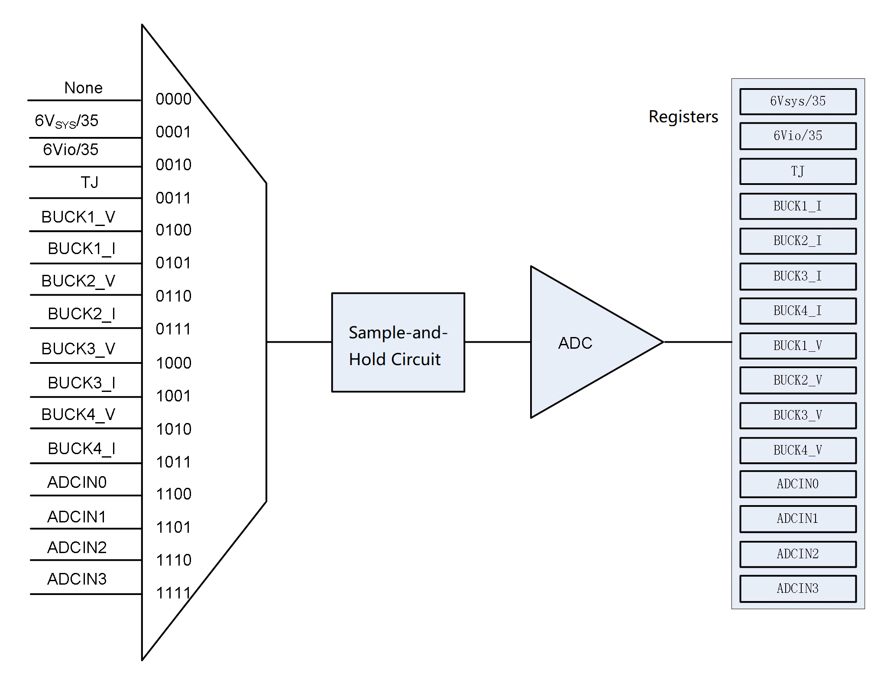

The ADC measurement channels are listed below:

**Table 5-26 ADC Conversion Channels**

|ADC_CHNL_SEL|Channel Description|Threshold Comparison|
|:---:|:---:|:---:|
|0000|None|None|
|0001|VSYS/4 voltage|No|
|0010|VIO/4 voltage|No|
|0011|TJ|Yes|
|0100|BUCK1 voltage|No|
|0101|BUCK1 current/power consumption/total BUCK power consumption|Yes|
|0110|BUCK2 voltage|No|
|0111|BUCK2 current/power consumption|Yes|
|1000|BUCK3 voltage|No|
|1001|BUCK3 current/power consumption|Yes|
|1010|BUCK4 voltage|No|
|1011|BUCK4 current/power consumption|Yes|
|1100|ADCIN0 voltage|Yes|
|1101|ADCIN1 voltage|Yes|
|1110|ADCIN2 voltage|Yes|
|1111|ADCIN3 voltage|Yes|

#### 5.7.3 Manual Mode

Manual-mode configuration procedure:

1. Configure both [Table 6-48](#table-6-48-adc_auto0) ADC_AUTO0 and [Table 6-49](#table-6-49-adc_auto1) ADC_AUTO1 to 0x00 for manual mode.

2. Enable the ADC: [Table 6-45](#table-6-45-adc_ctrl) ADC_CTRL[1] = 1.

3. Select the ADC conversion channel by configuring [Table 6-46](#table-6-46-adc_cfg0) ADC_CFG0[3:0].

4. Set ADC_GO to 1 to start one conversion ([Table 6-45](#table-6-45-adc_ctrl) ADC_CTRL[0] = 1).

After each conversion is completed in manual mode:

1. The result is stored in the corresponding register.

2. ADC_GO is cleared by hardware.

3. The ADC single-conversion-complete event, [Table 6-78](#table-6-78-adc_gpio_status) ADC_GPIO_STATUS[6] (ADC_EOC), is set.

4. If the interrupt [Table 6-84](#table-6-84-adc_gpio_irq_en) ADC_GPIO_IRQ_EN[6] (IRQ_EN_ADC_EOC) is enabled, an interrupt event is generated by pulling the INT pin low. The event remains active until software clears the event or clears the interrupt-enable bit.

> Note:
>
> 1. To ensure accurate conversion results, do not change the configuration arbitrarily during channel conversion.
> 2. If software clears ADC_GO during conversion, the current conversion is interrupted and the result is neither saved nor updated.
> 3. If ADC enable is not active, ADC_GO cannot be set.
> 4. Manual mode does not support BUCK power-consumption conversion or threshold comparison.

#### 5.7.4 ADC Result Filtering

When channel threshold comparison is configured:

1. When result filtering is disabled ([Table 6-50](#table-6-50-adc_deb0) ADC_DEB0 and [Table 6-51](#table-6-51-adc_deb1) ADC_DEB1[4:0]), the corresponding channel event flags ([Table 6-78](#table-6-78-adc_gpio_status) ADC_GPIO_STATUS[4:0] and [Table 6-79](#table-6-79-adc_status) ADC_STATUS) are set when the conversion result exceeds or falls below the configured threshold.

2. When result filtering is enabled, the corresponding flag is set only after consecutive over-threshold or under-threshold events reach the count configured by [Table 6-51](#table-6-51-adc_deb1) ADC_DEB1[7:5].

If the corresponding interrupt is enabled, an interrupt event is generated by pulling the INT pin low. The event remains active until software clears the event or clears the interrupt-enable bit.

**Figure 5-11 ADC Result Filtering Diagram**

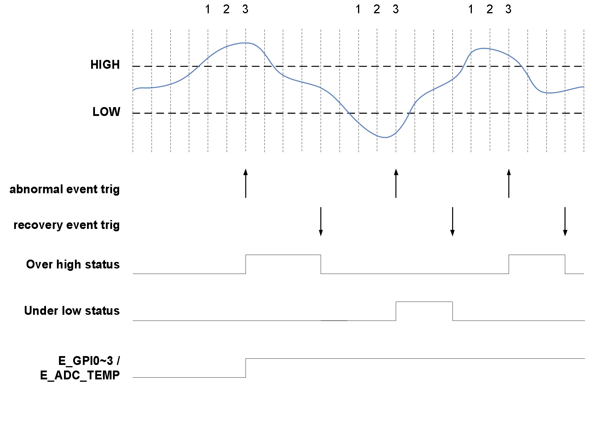

#### 5.7.5 Automatic Mode

Automatic-mode configuration procedure:

1. Configure the automatic-scan channels: [Table 6-48](#table-6-48-adc_auto0) ADC_AUTO0 and [Table 6-49](#table-6-49-adc_auto1) ADC_AUTO1.

2. Configure the following options as needed. Use [Table 6-47](#table-6-47-adc_cfg1) ADC_CFG1[0] to select the current or power-consumption result. Use [Table 6-47](#table-6-47-adc_cfg1) ADC_CFG1[1] to select whether to convert the total power-consumption result and store it in the BUCK1 current/power-consumption channel result registers:

   [Table 6-66](#table-6-66-adc_buckx_cur_pwr_rdout_h) ADC_BUCKx_CUR_PWR_RDOUT_H[7:0] (x=1)

   [Table 6-67](#table-6-67-adc_buckx_cur_pwr_rdout_l) ADC_BUCKx_CUR_PWR_RDOUT_L[7:4] (x=1)

   Use [Table 6-47](#table-6-47-adc_cfg1) ADC_CFG1[4:2] to select the data-update interval: 1.5/3/6/12/50/100/300/1500 ms.

3. Enable the ADC: [Table 6-45](#table-6-45-adc_ctrl) ADC_CTRL[1] = 1. The hardware performs all subsequent scan operations.

4. Set [Table 6-45](#table-6-45-adc_ctrl) ADC_CTRL[1] = 0 at any time to end automatic ADC scanning.

**Figure 5-12 ADC Automatic-Scan Diagram**

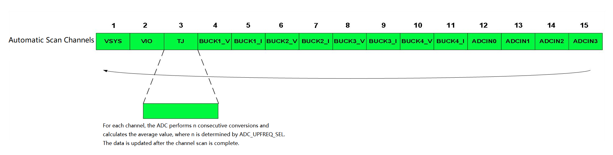

**Figure 5-13 ADC Automatic-Mode Timing**

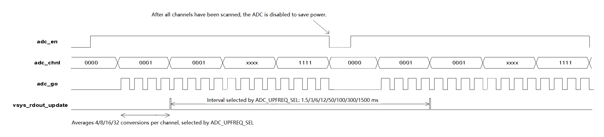

After each channel scan is completed in automatic mode:

1. The data is updated in the corresponding result register. Channels not enabled in [Table 6-48](#table-6-48-adc_auto0) ADC_AUTO0 or [Table 6-49](#table-6-49-adc_auto1) ADC_AUTO1 are not updated. If [Table 6-47](#table-6-47-adc_cfg1) ADC_CFG1[1] is configured to calculate total BUCK power consumption, the result is updated in the BUCK1 current/power-consumption channel result registers after the BUCK4_1 channel conversion is complete.

2. Threshold comparison is performed for the TJ, BUCKx_I, and ADCINx channels. If the corresponding interrupt is enabled and the threshold is outside the configured range, an interrupt event is generated by pulling the INT pin low. The event remains active until software clears the event or clears the interrupt-enable bit.

    The related interrupt status bits are: [Table 6-78](#table-6-78-adc_gpio_status) ADC_GPIO_STATUS[4:0] and [Table 6-79](#table-6-79-adc_status) ADC_STATUS[7:0].

    The related interrupt-enable bits are: [Table 6-84](#table-6-84-adc_gpio_irq_en) ADC_GPIO_IRQ_EN[4:0] and [Table 6-85](#table-6-85-adc_irq_en) ADC_IRQ_EN[7:0].

After each scan sequence is completed in automatic mode (all channels enabled by ADC_AUTO have been scanned):

1. The sequence-conversion-complete event, [Table 6-78](#table-6-78-adc_gpio_status) ADC_GPIO_STATUS[5] (ADC_EOS), is set. If the interrupt [Table 6-84](#table-6-84-adc_gpio_irq_en) ADC_GPIO_IRQ_EN[5] (IRQ_EN_ADC_EOS) is enabled, an interrupt event is generated by pulling the INT pin low. The event remains active until software clears the event or clears the interrupt-enable bit.

2. The hardware disables the ADC to save power and enables it again after the interval configured by [Table 6-47](#table-6-47-adc_cfg1) ADC_CFG1[4:2] (ADC_UPFREQ_SEL) expires.

> Note:
>
> 1. To ensure accurate conversion results, do not change the configuration arbitrarily during channel conversion.
> 2. For each channel, the ADC scans the channel n consecutive times and calculates the average value, where n varies with ADC_UPFREQ_SEL (see [Table 6-47](#table-6-47-adc_cfg1) ADC_CFG1[4:2]). The data is updated after the channel scan is complete.
> 3. If [Table 6-47](#table-6-47-adc_cfg1) ADC_CFG1[0] is configured to convert power consumption, automatic scanning of both the BUCK voltage and current channels must be enabled.
> 4. If [Table 6-47](#table-6-47-adc_cfg1) ADC_CFG1[1] is configured to calculate total BUCK power consumption, only the power consumption of BUCKs with enabled automatic scanning for both voltage and current channels is included.
> 5. ADC-related flags are cleared during the warm-reset sequence.

#### 5.7.6 Power-Consumption Measurement

**Power Measurement for an Individual BUCK**

If [Table 6-47](#table-6-47-adc_cfg1) ADC_CFG1[0] is configured to select the power-consumption result and automatic scanning is enabled for a BUCK's voltage and current channels, the power consumption is calculated after the BUCK's voltage and current have been scanned and is stored in the following registers:

- [Table 6-66](#table-6-66-adc_buckx_cur_pwr_rdout_h) ADC_BUCKx_CUR_PWR_RDOUT_H[7:0] (x=1~4)
- [Table 6-67](#table-6-67-adc_buckx_cur_pwr_rdout_l) ADC_BUCKx_CUR_PWR_RDOUT_L[7:4] (x=1~4)

**Total BUCK Power-Consumption Measurement**

If [Table 6-47](#table-6-47-adc_cfg1) ADC_CFG1[1] is configured to convert total power consumption, the result is stored in the BUCK1 current/power-consumption channel result registers:

- [Table 6-66](#table-6-66-adc_buckx_cur_pwr_rdout_h) ADC_BUCKx_CUR_PWR_RDOUT_H[7:0] (x=1)
- [Table 6-67](#table-6-67-adc_buckx_cur_pwr_rdout_l) ADC_BUCKx_CUR_PWR_RDOUT_L[7:4] (x=1)

### 5.8 Watchdog

In power-on mode and sleep mode, the host can enable the watchdog and configure its timeout through the I2C interface ([Table 6-70](#table-6-70-wdt_ctrl) WDT_CTRL[2:1]).

If the host services the watchdog within the timeout period, the timer is cleared and counting restarts.

If the host does not service the watchdog within the configured timeout period ([Table 6-70](#table-6-70-wdt_ctrl) WDT_CTRL[0] = 1):

1. A watchdog timeout event is generated and the corresponding status flag is set ([Table 6-77](#table-6-77-sys_status) SYS_STATUS[0]).

2. If watchdog timeout reset is enabled ([Table 6-16](#table-6-16-pmu_ctrl0) PMU_CTRL0[1]), the PMIC reset sequence is triggered.

3. If the watchdog interrupt is enabled ([Table 6-83](#table-6-83-sys_irq_en) SYS_IRQ_EN[0]), a watchdog interrupt is generated and the INT pin is pulled low.

> Note:
>
> 1. After the watchdog enters shutdown mode, it is disabled and stops operating. Its enable setting must be configured again when the PMIC re-enters power-on mode.
> 2. Do not modify the watchdog timeout while the watchdog is operating.
> 3. If sleep mode is entered through software, the watchdog interrupt can wake the PMIC from sleep.

### 5.9 General-Purpose I/O

The PMIC has four GPIOs that can be used as general-purpose I/O or configured for alternate functions. For details, see [Table 6-12](#table-6-12-gpio_afr0) GPIO_AFR0 and [Table 6-13](#table-6-13-gpio_afr1) GPIO_AFR1.

#### GPIO Basic Features

1. **Supported functions**: Except when configured as an ADC alternate-function input, GPIO polarity, pull-up/pull-down, open-drain, and filtering functions are available.

2. **Filtering**:
   - Enable control: [Table 6-9](#table-6-9-gpio_deb) GPIO_DEB[3:0]
   - Filtering time: 15.625 μs ~ 1.0 ms ([Table 6-9](#table-6-9-gpio_deb) GPIO_DEB[6:4])
   - Port state: [Table 6-7](#table-6-7-gpio_dr) GPIO_DR[3:0] indicates the current port state.

3. **Input interrupt function**: When configured as a GPIO input, GPIOx_IDR ([Table 6-7](#table-6-7-gpio_dr) GPIO_DR[3:0]) and [Table 6-11](#table-6-11-gpio_itype) GPIO_ITYPE work together to generate a GPIOx_INT event ([Table 6-78](#table-6-78-adc_gpio_status) ADC_GPIO_STATUS[3:0]). If sleep mode is entered through software, a GPIOx_INT interrupt can wake the PMIC from sleep.

#### GPIOx_ODR Alternate Function

GPIOx_ODR ([Table 6-7](#table-6-7-gpio_dr) GPIO_DR[7:4]) has two functions:

1. When used as a GPIO output (GPIOx_AFR = 4'b0001), GPIOx_ODR is the GPIO output state.

2. When used for an alternate function, the available settings include:

   - GPIOx_AFR = 4'b0010 (EXT_EN)
   - GPIOx_AFR = 4'b0011 (PWRCTRL)
   - GPIOx_AFR = 4'b0100 (SLEEP/WKUP)
   - GPIOx_AFR = 4'b0101 (WARM_RESET)
   - GPIOx_AFR = 4'b0111 (PH_CFG)
   - GPIOx_AFR = 4'b1000 (DVS0)
   - GPIOx_AFR = 4'b1001 (DVS1)

   In this case, GPIOx_ODR is the active-state configuration bit for the corresponding alternate function.

### 5.10 Communication Interfaces

The PMIC supports I2C and SPI communication interfaces, selected through [Table 6-40](#table-6-40-interface_cfg) INTERFACE_CFG[2]. The PMIC operates only as a slave.

#### 5.10.1 SPI

The SPI communication interface is compatible with SPI Mode 0 and supports a maximum data rate of 30 MHz. It supports single-byte read/write operations and multi-byte read/write operations with consecutive addresses.

**Figure 5-14 SPI Communication Commands**

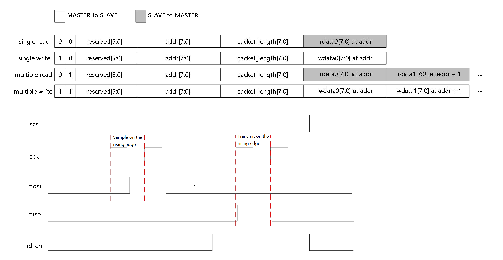

**Figure 5-15 SPI Read/Write Timing**

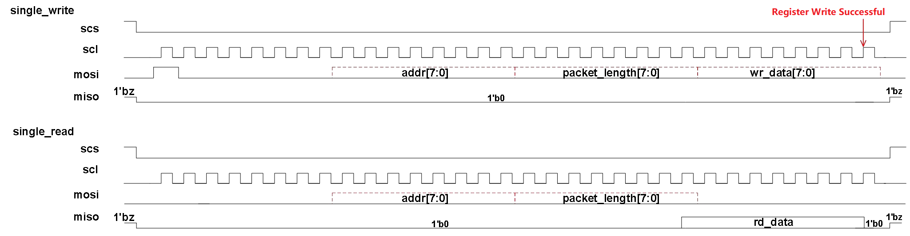

#### 5.10.2 I2C

The I2C slave address can be configured through MTP: [Table 6-41](#table-6-41-i2c_slv_addr) I2C_SLV_ADDR[6:0].

The PMIC supports single-byte reads, multi-byte reads with consecutive addresses, single-byte writes, and multi-byte writes with consecutive addresses ([Table 6-40](#table-6-40-interface_cfg) INTERFACE_CFG[0] = 0). It also supports pair-mode writes ([Table 6-40](#table-6-40-interface_cfg) INTERFACE_CFG[0] = 1).

**Figure 5-16 I2C Communication Commands**

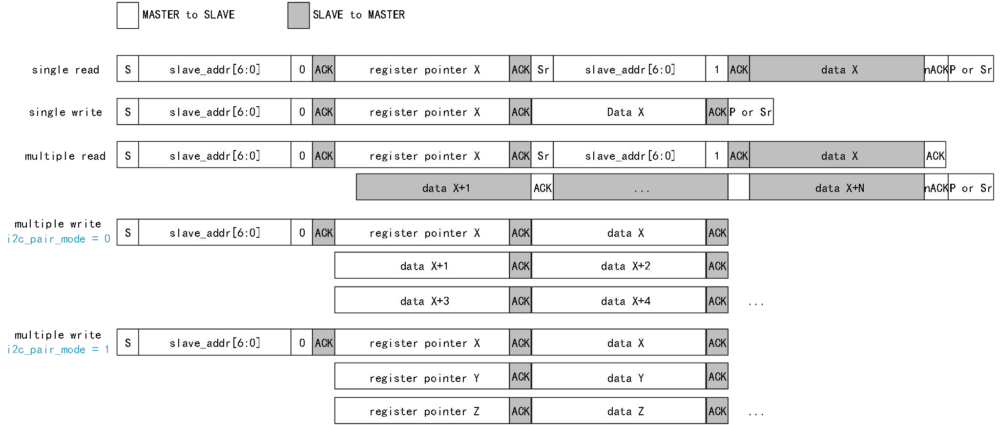

**Figure 5-17 I2C Read/Write Timing**

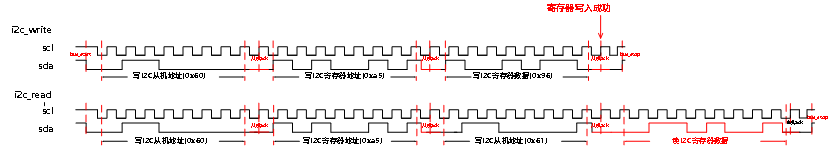

In LS_MODE, the I2C communication interface supports a maximum frequency of 1 MHz, filters glitches shorter than 50 ns, and provides 120 ns of START and STOP margin.

In HS_MODE, the I2C communication interface supports a maximum frequency of 3.4 MHz, filters glitches shorter than 10 ns, and provides 80 ns of START and STOP margin.

The LS_MODE and HS_MODE switching logic uses the I2C_HS_MODE and HS_MASTER_CODE registers. The switching process is as follows:

**Figure 5-18 I2C HS_MODE and LS_MODE Switching**

### 5.11 Interrupts

The PMIC interrupt events are listed in [Table 5-27](#table-5-27). When an interrupt event occurs, its flag is set. If the corresponding interrupt-enable bit is enabled, the INT pin is pulled low to report the interrupt event to the host controller.

**Table 5-27 Interrupt Events**

|Interrupt Flag|Enable Bit|Filtering|Description|
|---|---|---|---|
|E_VSYS_OV|IRQ_EN_VSYS_OV|EVT_DEB[1:0]|VSYS overvoltage; shutdown possible|
|E_VIO_UV|IRQ_EN_VIO_UV|EVT_DEB[1:0]|VIO undervoltage; shutdown possible|
|E_TEMP_WARN|IRQ_EN_TEMP_WARN|EVT_DEB[1:0]|Temperature warning|
|E_TEMP_SEVERE|IRQ_EN_TEMP_SEVERE|EVT_DEB[1:0]|Severe overtemperature; shutdown possible|
|E_TEMP_CRIT|IRQ_EN_TEMP_CRIT|EVT_DEB[1:0]|Critical overtemperature; shutdown possible|
|E_WDT_TO|IRQ_EN_WDT_TO|None|Watchdog timeout; reset possible|
|E_ADC_EOC|IRQ_EN_ADC_EOC|None|ADC single-conversion complete|
|E_ADC_EOS|IRQ_EN_ADC_EOS|None|ADC sequence conversion complete|
|E_ADC_TEMP|IRQ_EN_ADC_TEMP|None|ADC junction-temperature threshold interrupt|
|E_GPI0|IRQ_EN_GPI0|For external interrupts, GPIO_DEB For over-threshold interrupts, none|GPIO0 external interrupt or ADCIN0 over-threshold interrupt|
|E_GPI1|IRQ_EN_GPI1|For external interrupts, GPIO_DEB For over-threshold interrupts, none|GPIO1 external interrupt or ADCIN1 over-threshold interrupt|
|E_GPI2|IRQ_EN_GPI2|For external interrupts, GPIO_DEB For over-threshold interrupts, none|GPIO2 external interrupt or ADCIN2 over-threshold interrupt|
|E_GPI3|IRQ_EN_GPI3|For external interrupts, GPIO_DEB For over-threshold interrupts, none|GPIO3 external interrupt or ADCIN3 over-threshold interrupt|
|E_ADC_BUCK1_OPWR|IRQ_EN_ADC_BUCK1_OPWR|None|BUCK1 power-consumption or total power-consumption over-threshold interrupt|
|E_ADC_BUCK2_OPWR|IRQ_EN_ADC_BUCK2_OPWR|None|BUCK2 power-consumption over-threshold interrupt|
|E_ADC_BUCK3_OPWR|IRQ_EN_ADC_BUCK3_OPWR|None|BUCK3 power-consumption over-threshold interrupt|
|E_ADC_BUCK4_OPWR|IRQ_EN_ADC_BUCK4_OPWR|None|BUCK4 power-consumption over-threshold interrupt|
|E_ADC_BUCK1_OC|IRQ_EN_ADC_BUCK1_OC|None|BUCK1 overcurrent interrupt|
|E_ADC_BUCK2_OC|IRQ_EN_ADC_BUCK2_OC|None|BUCK2 overcurrent interrupt|
|E_ADC_BUCK3_OC|IRQ_EN_ADC_BUCK3_OC|None|BUCK3 overcurrent interrupt|
|E_ADC_BUCK4_OC|IRQ_EN_ADC_BUCK4_OC|None|BUCK4 overcurrent interrupt|
|E_BUCK1_DVS_DONE|IRQ_EN_BUCK1_DVS_DONE|None|BUCK1 DVS voltage complete|
|E_BUCK2_DVS_DONE|IRQ_EN_BUCK2_DVS_DONE|None|BUCK2 DVS voltage complete|
|E_BUCK3_DVS_DONE|IRQ_EN_BUCK3_DVS_DONE|None|BUCK3 DVS voltage complete|
|E_BUCK4_DVS_DONE|IRQ_EN_BUCK4_DVS_DONE|None|BUCK4 DVS voltage complete|
|E_BUCK1_OV|IRQ_EN_BUCK1_OV|BUCK_EVT_DEB[1:0]|BUCK1 overvoltage; shutdown possible|
|E_BUCK2_OV|IRQ_EN_BUCK2_OV|BUCK_EVT_DEB[1:0]|BUCK2 overvoltage; shutdown possible|
|E_BUCK3_OV|IRQ_EN_BUCK3_OV|BUCK_EVT_DEB[1:0]|BUCK3 overvoltage; shutdown possible|
|E_BUCK4_OV|IRQ_EN_BUCK4_OV|BUCK_EVT_DEB[1:0]|BUCK4 overvoltage; shutdown possible|
|E_BUCK1_PGH|IRQ_EN_BUCK1_PGH|BUCK_EVT_DEB[1:0]|BUCK1 overvoltage warning interrupt|
|E_BUCK2_PGH|IRQ_EN_BUCK2_PGH|BUCK_EVT_DEB[1:0]|BUCK2 overvoltage warning interrupt|
|E_BUCK3_PGH|IRQ_EN_BUCK3_PGH|BUCK_EVT_DEB[1:0]|BUCK3 overvoltage warning interrupt|
|E_BUCK4_PGH|IRQ_EN_BUCK4_PGH|BUCK_EVT_DEB[1:0]|BUCK4 overvoltage warning interrupt|
|E_BUCK1_UV|IRQ_EN_BUCK1_UV|BUCK_EVT_DEB[1:0]|BUCK1 undervoltage; shutdown possible|
|E_BUCK2_UV|IRQ_EN_BUCK2_UV|BUCK_EVT_DEB[1:0]|BUCK2 undervoltage; shutdown possible|
|E_BUCK3_UV|IRQ_EN_BUCK3_UV|BUCK_EVT_DEB[1:0]|BUCK3 undervoltage; shutdown possible|
|E_BUCK4_UV|IRQ_EN_BUCK4_UV|BUCK_EVT_DEB[1:0]|BUCK4 undervoltage; shutdown possible|
|E_BUCK1_PGL|IRQ_EN_BUCK1_PGL|BUCK_EVT_DEB[1:0]|BUCK1 undervoltage warning interrupt|
|E_BUCK2_PGL|IRQ_EN_BUCK2_PGL|BUCK_EVT_DEB[1:0]|BUCK2 undervoltage warning interrupt|
|E_BUCK3_PGL|IRQ_EN_BUCK3_PGL|BUCK_EVT_DEB[1:0]|BUCK3 undervoltage warning interrupt|
|E_BUCK4_PGL|IRQ_EN_BUCK4_PGL|BUCK_EVT_DEB[1:0]|BUCK4 undervoltage warning interrupt|

When a GPIO external interrupt or WDT_TO event occurs with the corresponding interrupt enable active, it can serve as a wake-up source in sleep mode. However, if sleep was triggered by a SLEEP/WKUP pin and the pin's sleep state remains active, no interrupt can wake the system.

## 6. Registers

### 6.1 Register Parameter Definitions

The basic register parameter definitions are shown in Table 6-1. Special parameter definitions for some registers are shown in Table 6-2.

**Table 6-1 Basic Register Parameter Definitions**

|Parameter|Abbreviation|Description|
|---|---|---|
|Read Only|R|The bit can be read by software; writes are ignored.|
|Read/Write|RW|The bit can be read and written by software.|
|Write Only|W|The bit can only be written as 1 by software; writing 0 has no effect.|
|Reserved|RV|The bit is reserved and cannot be modified by software.|

**Table 6-2 Special Register Parameter Definitions**

|Parameter|Abbreviation|Description|
|---|---|---|
|Write 1 Only|IO|The bit can only be written as 1 by software; writing 0 has no effect.|
|Protected|P|The bit is protected by the unlock register [Table 6-71](#table-6-71-mtp_key). The bit cannot be modified by software until the unlock sequence is written to the unlock register.|
|MTP Loaded|E|The bit can be modified through MTP.|

### 6.2 Register Tables

#### 6.2.1 Register Map

**Table 6-3 User Register Map**

|**Module**|Name|Address|Description|
|---|---|---|---|
|**ID**|DEVICE_ID|0x00|Device ID|
||VERSION_ID|0x01|Version ID|
||CUSTOMER_ID|0x02|Customer ID|
|**GPIO**|GPIO_DR|0x03|GPIO0 ~ GPIO3 input/output|
||GPIO_PUPD|0x04|GPIO0 ~ GPIO3 pull-up/pull-down|
||GPIO_DEB|0x05|GPIO0 ~ GPIO3 filtering control|
||GPIO_OD|0x06|GPIO0 ~ GPIO3 open-drain|
||GPIO_ITYPE|0x07|GPIO0 ~ GPIO3 interrupt type|
||GPIO_AFR0|0x08|GPIO0 ~ GPIO1 alternate functions|
||GPIO_AFR1|0x09|GPIO2 ~ GPIO3 alternate functions|
||GPIO_EXT_SLOT0|0x0A|GPIO0 ~ GPIO1 EXT_EN power rail|
||GPIO_EXT_SLOT1|0x0B|GPIO2 ~ GPIO3 EXT_EN power rail|
|**PMU**|PMU_CTRL0|0x0C|Power-on and power-off source enables|
||PMU_CTRL1|0x0D|Software power-off, power-on, sleep, and wake-up control|
||PMU_CTRL2|0x0E|PG output type and wait/delay enables for each operating mode|
||PMU_CTRL3|0x0F|Time configuration for each operating mode|
||PMU_CTRL4|0x10|Reverse sequencing, hot-plug, and PG wait configuration|
||SLEW_CTRL0|0x11|Soft power-on and soft power-off slew rates|
||SLEW_CTRL1|0x12|DVS voltage rise and fall slew rates|
||SLOT_CTRL0|0x13|BUCK1 and BUCK2 SLOT binding|
||SLOT_CTRL1|0x14|BUCK3 and BUCK4 SLOT binding|
||EXT_CTRL|0x15|EXT_EN enable|
||STUP_SLOT_DLYx|0x16 ~ 0x1D|Power rail timing configuration for power-on/wake-up sequences|
||SHUT_SLOT_DLYx|0x1E ~ 0x25|Power rail timing configuration for power-off/sleep sequences|
|**BUCK**|BUCK_GLB_CTRL|0x26|BUCK global configuration: multiphase, pull-down, and fault-event behavior control|
||BUCK_CASCADE_CTRL0|0x27|PMIC cascading register|
||BUCK_CASCADE_CTRL1|0x28|PMIC cascading register|
||BUCK_CASCADE_CTRL2|0x29|PMIC cascading register|
||BUCKx_CTRL|0x2A/0x32/0x3A/0x42|BUCKx enable, forced PWM, and peak/valley current-limit configuration|
||BUCKx_PWRCTRL_IO|0x2B/0x33/0x3B/0x43|BUCKx PWRCTRL GPIO configuration|
||BUCKx_DVS_IO|0x2C/0x34/0x3C/0x44|BUCKx DVS GPIO configuration|
||BUCKx_VOUT0|0x2D/0x35/0x3D/0x45|BUCKx default output voltage|
||BUCKx_VOUT1|0x2E/0x36/0x3E/0x46|BUCKx DVS-controlled output voltage|
||BUCKx_VOUT2|0x2F/0x37/0x3F/0x47|BUCKx DVS-controlled output voltage|
||BUCKx_VOUT3|0x30/0x38/0x40/0x48|BUCKx DVS-controlled output voltage|
||BUCKx_SLP_VOUT|0x31/0x39/0x41/0x49|BUCKx sleep output voltage|
|**INTERFACE**|INTERFACE_CFG|0x4A|Communication interface configuration|
||I2C_SLV_ADDR|0x4B|I2C slave address|
|**PROTECT**|PROT_CFG|0x4C|Temperature levels and power-on/power-off thresholds|
||PROT_EN|0x4D|Protection enables|
|**FILTER**|SYS_DEB|0x4E|Event filtering|
|**ADC**|ADC_CTRL|0x4F|ADC enable and conversion start|
||ADC_CFG0|0x50|ADC mode and channel selection|
||ADC_CFG1|0x51|ADC update frequency and output data format|
||ADC_AUTO0|0x52|Automatic-mode VSYS, VIO, TJ, and GPIO channel selection|
||ADC_AUTO1|0x53|Automatic-mode BUCK current and voltage channel selection|
||ADC_DEB0|0x54|Result-filtering register|
||ADC_DEB1|0x55|Result-filtering register|
||ADC_TJ_H_VTH|0x56|Upper threshold for junction-temperature monitoring|
||ADC_TJ_L_VTH|0x57|Lower threshold for junction-temperature monitoring|
||ADC_BUCK1_OC_VTH|0x58|BUCK1 overcurrent-monitoring threshold|
||ADC_BUCK2_OC_VTH|0x59|BUCK2 overcurrent-monitoring threshold|
||ADC_BUCK3_OC_VTH|0x5A|BUCK3 overcurrent-monitoring threshold|
||ADC_BUCK4_OC_VTH|0x5B|BUCK4 overcurrent-monitoring threshold|
||ADC_BUCK1_PWR_VTH|0x5C|BUCK1 power-consumption monitoring threshold|
||ADC_BUCK2_PWR_VTH|0x5D|BUCK2 power-consumption monitoring threshold|
||ADC_BUCK3_PWR_VTH|0x5E|BUCK3 power-consumption monitoring threshold|
||ADC_BUCK4_PWR_VTH|0x5F|BUCK4 power-consumption monitoring threshold|
||ADCIN0_H_VTH|0x60|ADCIN0 upper voltage-monitoring threshold|
||ADCIN0_L_VTH|0x61|ADCIN0 lower voltage-monitoring threshold|
||ADCIN1_H_VTH|0x62|ADCIN1 upper voltage-monitoring threshold|
||ADCIN1_L_VTH|0x63|ADCIN1 lower voltage-monitoring threshold|
||ADCIN2_H_VTH|0x64|ADCIN2 upper voltage-monitoring threshold|
||ADCIN2_L_VTH|0x65|ADCIN2 lower voltage-monitoring threshold|
||ADCIN3_H_VTH|0x66|ADCIN3 upper voltage-monitoring threshold|
||ADCIN3_L_VTH|0x67|ADCIN3 lower voltage-monitoring threshold|
||ADC_VSYS_RDOUT|0x68~0x69|Automatic-mode VSYS conversion result|
||ADC_VIO_RDOUT|0x6A~0x6B|Automatic-mode VIO conversion result|
||ADC_TJ_RDOUT|0x6C~0x6D|Automatic-mode junction-temperature conversion result|
||ADC_BUCK1_VOL_RDOUT|0x6E~0x6F|Automatic-mode BUCK1 voltage conversion result|
||ADC_BUCK2_VOL_RDOUT|0x70~0x71|Automatic-mode BUCK2 voltage conversion result|
||ADC_BUCK3_VOL_RDOUT|0x72~0x73|Automatic-mode BUCK3 voltage conversion result|
||ADC_BUCK4_VOL_RDOUT|0x74~0x75|Automatic-mode BUCK4 voltage conversion result|
||ADC_BUCK1_CUR_PWR_RDOUT|0x76~0x77|Automatic-mode BUCK1 current or power-consumption conversion result|
||ADC_BUCK2_CUR_PWR_RDOUT|0x78~0x79|Automatic-mode BUCK2 current or power-consumption conversion result|
||ADC_BUCK3_CUR_PWR_RDOUT|0x7A~0x7B|Automatic-mode BUCK3 current or power-consumption conversion result|
||ADC_BUCK4_CUR_PWR_RDOUT|0x7C~0x7D|Automatic-mode BUCK4 current or power-consumption conversion result|
||ADCIN0_RDOUT|0x7E~0x7F|Automatic-mode ADCIN0 conversion result|
||ADCIN1_RDOUT|0x80~0x81|Automatic-mode ADCIN1 conversion result|
||ADCIN2_RDOUT|0x82~0x83|Automatic-mode ADCIN2 conversion result|
||ADCIN3_RDOUT|0x84~0x85|Automatic-mode ADCIN3 conversion result|
|**WDT**|WDT_CTRL|0x86|WDT configuration|
|**MTP**|MTP_KEY|0x87|MTP unlock|
||MTP_ADDR|0x88|MTP operation address|
||MTP_DATA|0x89|MTP read/write data|
||MTP_CFG|0x8A|MTP configuration|
||MTP_CTRL|0x8B|MTP control|
|**INTERRUPT**|SHUT_STATUS|0x8C|Shutdown-source indication bits|
||SYS_STATUS|0x8D|System events|
||ADC_GPIO_STATUS|0x8E|ADC and GPIOx events|
||ADC_STATUS|0x8F|ADC events|
||BUCK_STATUS0|0x90|DVS voltage-scaling-complete events|
||BUCK_STATUS1|0x91|BUCKx undervoltage events|
||BUCK_STATUS2|0x92|BUCKx overvoltage events|
||SYS_IRQ_EN|0x93|System-event interrupt enables|
||ADC_GPIO_IRQ_EN|0x94|ADC and GPIOx event interrupt enables|
||ADC_IRQ_EN|0x95|ADC event interrupt enables|
||BUCK_IRQ_EN0|0x96|DVS voltage-scaling-complete interrupt enables|
||BUCK_IRQ_EN1|0x97|BUCKx undervoltage interrupt enables|
||BUCK_IRQ_EN2|0x98|BUCKx overvoltage interrupt enables|
|**USER_DATA**|USER_DATA|0x99 ~ 0x9C|User-data registers|

#### 6.2.2 Register Descriptions

##### Table 6-4 DEVICE_ID

|Address|Bits|Name|Attr|Default|Description|
|---|---|---|---|---|---|
|0x00|7:0|DEVICE_ID1|RE|0x00|Device ID|

> 1: Remains unchanged in shutdown mode and is restored to the MTP value when a power-on event occurs.

##### Table 6-5 VERSION_ID

|Address|Bits|Name|Attr|Default|Description|
|---|---|---|---|---|---|
|0x01|7:0|VERSION_ID1|RE|0x00|Version ID|

> 1: Remains unchanged in shutdown mode and is restored to the MTP value when a power-on event occurs.

##### Table 6-6 CUSTOMER_ID

|Address|Bits|Name|Attr|Default|Description|
|---|---|---|---|---|---|
|0x02|7:0|CUSTOMER_ID1|RE|0x00|Customer ID|

> 1: Remains unchanged in shutdown mode and is restored to the MTP value when a power-on or warm-reset event occurs.

##### Table 6-7 GPIO_DR

|Address|Bits|Name|Attr|Default|Description|
|---|---|---|---|---|---|
|0x03|7|GPIO3_ODR1|RWE|0x0|When used as a GPIO output, configures the data output; when used for an alternate function, configures the active polarity. 0: Output low / active-low polarity 1: Output high / active-high polarity|
||6|GPIO2_ODR1|RWE|0x0|Same as above|
||5|GPIO1_ODR1|RWE|0x0|Same as above|
||4|GPIO0_ODR1|RWE|0x0|Same as above|
||3|GPIO3_IDR|R|0x0|GPIO3 input value|
||2|GPIO2_IDR|R|0x0|GPIO2 input value|
||1|GPIO1_IDR|R|0x0|GPIO1 input value|
||0|GPIO0_IDR|R|0x0|GPIO0 input value|

> 1: Remains unchanged in shutdown mode and is restored to the MTP value when a power-on or warm-reset event occurs.

##### Table 6-8 GPIO_PUPD

|Address|Bits|Name|Attr|Default|Description|
|---|---|---|---|---|---|
|0x04|7:6|GPIO3_PUPD1|RWE|0x0|GPIO3 pull-up/pull-down configuration: 00: No pull-up or pull-down 01: Pull-up resistor enabled 10: Pull-down resistor enabled 11: No pull-up or pull-down|
||5:4|GPIO2_PUPD1|RWE|0x0|GPIO2 pull-up/pull-down configuration: 00: No pull-up or pull-down 01: Pull-up resistor enabled 10: Pull-down resistor enabled 11: No pull-up or pull-down|
||3:2|GPIO1_PUPD1|RWE|0x0|GPIO1 pull-up/pull-down configuration: 00: No pull-up or pull-down 01: Pull-up resistor enabled 10: Pull-down resistor enabled 11: No pull-up or pull-down|
||1:0|GPIO0_PUPD1|RWE|0x0|GPIO0 pull-up/pull-down configuration: 00: No pull-up or pull-down 01: Pull-up resistor enabled 10: Pull-down resistor enabled 11: No pull-up or pull-down|

> 1: Remains unchanged in shutdown mode and is restored to the MTP value when a power-on or warm-reset event occurs.

##### Table 6-9 GPIO_DEB

|Address|Bits|Name|Attr|Default|Description|
|---|---|---|---|---|---|
|0x05|7|Reserved|RV|0x0|Reserved|
||6:4|GPIO_DEB_TIME1|RW|0x0|GPIO0 ~ GPIO3 filtering-time selection 000: 15.625 μs 001: 15.625 μs 010: 31.25 μs 011: 62.5 μs 100: 125 μs 101: 250 μs 110: 500 μs 111: 1 ms|
||3|GPIO3_DEB_EN1|RW|0x0|GPIO3 filtering enable: 0: Disabled 1: Enabled|
||2|GPIO2_DEB_EN1|RW|0x0|GPIO2 filtering enable: 0: Disabled 1: Enabled|
||1|GPIO1_DEB_EN1|RW|0x0|GPIO1 filtering enable: 0: Disabled 1: Enabled|
||0|GPIO0_DEB_EN1|RW|0x0|GPIO0 filtering enable: 0: Disabled 1: Enabled|

> 1: Restored to the default value when entering shutdown mode or on a warm-reset event.

##### Table 6-10 GPIO_OD

|Address|Bits|Name|Attr|Default|Description|
|---|---|---|---|---|---|
|0x06|7:4|Reserved|RV|0x0|Reserved|
||3|GPIO3_OD1|RW|0x0|GPIO3 open-drain output configuration 0: Push-pull output 1: Open-drain output|
||2|GPIO2_OD1|RW|0x0|GPIO2 open-drain output configuration 0: Push-pull output 1: Open-drain output|
||1|GPIO1_OD1|RW|0x0|GPIO1 open-drain output configuration 0: Push-pull output 1: Open-drain output|
||0|GPIO0_OD1|RW|0x0|GPIO0 open-drain output configuration 0: Push-pull output 1: Open-drain output|

> 1: Restored to the default value when entering shutdown mode or on a warm-reset event.

##### Table 6-11 GPIO_ITYPE

|Address|Bits|Name|Attr|Default|Description|
|---|---|---|---|---|---|
|0x07|7:6|GPIO3_ITYPE1|RWE|0x0|GPIO3 interrupt type 00: Rising-edge interrupt 01: Falling-edge interrupt 10: High-level interrupt 11: Low-level interrupt|
||5:4|GPIO2_ITYPE1|RWE|0x0|GPIO2 interrupt type 00: Rising-edge interrupt 01: Falling-edge interrupt 10: High-level interrupt 11: Low-level interrupt|
||3:2|GPIO1_ITYPE1|RWE|0x0|GPIO1 interrupt type 00: Rising-edge interrupt 01: Falling-edge interrupt 10: High-level interrupt 11: Low-level interrupt|
||1:0|GPIO0_ITYPE1|RWE|0x0|GPIO0 interrupt type 00: Rising-edge interrupt 01: Falling-edge interrupt 10: High-level interrupt 11: Low-level interrupt|

> 1: Retained when entering shutdown mode; restored to the MTP value after a power-on event or warm-reset event.

##### Table 6-12 GPIO_AFR0

|Address|Bits|Name|Attr|Default|Description|
|---|---|---|---|---|---|
|0x8|7:4|GPIO1_AFR1|RWE|0x0|GPIO1 alternate-function selection 0000: GPIO general-purpose input 0001: GPIO general-purpose output 0010: External power-enable output signal (EXT_EN) 0011: Power-on sequence control input signal (PWRCTRL) 0100: External sleep/wakeup control input signal (Sleep/Wakeup) 0101: External warm-reset control input signal (WARM_RESET) 0110: ADC input signal (ADCIN1) 0111: External multiphase control selection (PH_CFG1) 1000: External DVS control input (DVS0) 1001: External DVS control input (DVS1) 1010/1011/1100/1101/1110/1111: Same as 0000|
||3:0|GPIO0_AFR1|RWE|0x0|GPIO0 alternate-function selection 0000: GPIO general-purpose input 0001: GPIO general-purpose output 0010: External power-enable output signal (EXT_EN) 0011: Power-on sequence control input signal (PWRCTRL) 0100: External sleep/wakeup control input signal (Sleep/Wakeup) 0101: External warm-reset control input signal (WARM_RESET) 0110: ADC input signal (ADCIN0) 0111: External multiphase control selection (PH_CFG0) 1000: External DVS control input (DVS0) 1001: External DVS control input (DVS1) 1010/1011/1100/1101/1110/1111: Same as 0000|

> 1: Retained when entering shutdown mode; restored to the MTP value after a power-on event or warm-reset event.

##### Table 6-13 GPIO_AFR1

|Address|Bits|Name|Attr|Default|Description|
|---|---|---|---|---|---|
|0x09|7:4|GPIO3_AFR1|RWE|0x0|GPIO3 alternate-function selection 0000: GPIO general-purpose input 0001: GPIO general-purpose output 0010: External power-enable output signal (EXT_EN) 0011: Power-on sequence control input signal (PWRCTRL) 0100: External sleep/wakeup control input signal (Sleep/Wakeup) 0101: External warm-reset control input signal (WARM_RESET) 0110: ADC input signal (ADCIN3) 0111: Invalid 1000: External DVS control input (DVS0) 1001: External DVS control input (DVS1) 1010/1011/1100/1101/1110/1111: Same as 0000|
||3:0|GPIO2_AFR1|RWE|0x0|GPIO2 alternate-function selection 0000: GPIO general-purpose input 0001: GPIO general-purpose output 0010: External power-enable output signal (EXT_EN) 0011: Power-on sequence control input signal (PWRCTRL) 0100: External sleep/wakeup control input signal (Sleep/Wakeup) 0101: External warm-reset control input signal (WARM_RESET) 0110: ADC input signal (ADCIN2) 0111: External multiphase control selection (PH_CFG2) 1000: External DVS control input (DVS0) 1001: External DVS control input (DVS1) 1010/1011/1100/1101/1110/1111: Same as 0000|

> 1: Retained when entering shutdown mode; restored to the MTP value after a power-on event or warm-reset event.

##### Table 6-14 GPIO_EXT_SLOT0

|Address|Bits|Name|Attr|Default|Description|
|---|---|---|---|---|---|
|0x0A|7:4|EXT1_SLOT1|RE|0x0|EXT1 power-up/power-down timing slot 0000: Timing slot 1 0001: Timing slot 2 . . . 1101: Timing slot 14 1110: Timing slot 15 1111: Timing slot 16|
||3:0|EXT0_SLOT1|RE|0x0|EXT0 power-up/power-down timing slot 0000: Timing slot 1 0001: Timing slot 2 . . . 1101: Timing slot 14 1110: Timing slot 15 1111: Timing slot 16|

> 1: Retained when entering shutdown mode; restored to the MTP value after a power-on event or warm-reset event.

##### Table 6-15 GPIO_EXT_SLOT1

|Address|Bits|Name|Attr|Default|Description|
|---|---|---|---|---|---|
|0x0B|7:4|EXT3_SLOT1|RE|0x0|EXT3 power-up/power-down timing slot 0000: Timing slot 1 0001: Timing slot 2 . . . 1101: Timing slot 14 1110: Timing slot 15 1111: Timing slot 16|
||3:0|EXT2_SLOT1|RE|0x0|EXT2 power-up/power-down timing slot 0000: Timing slot 1 0001: Timing slot 2 . . . 1101: Timing slot 14 1110: Timing slot 15 1111: Timing slot 16|

> 1: Retained when entering shutdown mode; restored to the MTP value after a power-on event or warm-reset event.

##### Table 6-16 PMU_CTRL0

|Address|Bits|Name|Attr|Default|Description|
|---|---|---|---|---|---|
|0x0C|7:2|Reserved|RV|0x00|Reserved|
||1|WDT_RST_EN2|RW|0x0|Enable reset triggered by a WDT timeout 0: Disabled 1: Enabled|
||0|PG_RST_EN1|RWE|0x0|Enable reset triggered by pulling down the PGOOD pin 0: Disabled 1: Enabled|

> 1: Retained when entering shutdown mode; restored to the MTP value after a power-on event or warm-reset event.
> 2: Restored to the default value when entering shutdown mode or on a warm-reset event.

##### Table 6-17 PMU_CTRL1

|Address|Bits|Name|Attr|Default|Description|
|---|---|---|---|---|---|
|0x0D|7:3|Reserved|RV|0x0|Reserved|
||2|SW_SD1|RW|0x0|Software shutdown 0: No operation 1: Trigger software shutdown (software-triggered, hardware-cleared)|
||1|SW_RST1|RW|0x0|Software reset 0: No operation 1: Trigger software reset (software-triggered, hardware-cleared)|
||0|SW_SLP_WKUP1|RW|0x0|Software sleep/wakeup In power-on mode: 0: No operation 1: Trigger software sleep (software-triggered, hardware-cleared) In sleep mode: 0: Trigger software wakeup (software-triggered, hardware-cleared) 1: No operation|

> 1: Restored to the default value when entering shutdown mode or on a warm-reset event.

##### Table 6-18 PMU_CTRL2

|Address|Bits|Name|Attr|Default|Description|
|---|---|---|---|---|---|
|0x0E|7:3|Reserved|RV|0x0|Reserved|
||2|PWRCTRL_WAIT_EN1|RWE|0x0|Whether shutdown or sleep waits for PWRCTRL 0: Does not wait for PWRCTRL 1: Waits for PWRCTRL|
||1|STUP_WKUP_PG_DLY_EN1|RE|0x1|Whether to delay PGOOD release after the last output completes startup during power-up or wakeup 0: No; release directly 1: Yes; release after a delay|
||0|SHUT_SLP_PG_DLY_EN1|RE|0x1|Whether to delay between PGOOD pull-down and the start of output shutdown during shutdown or sleep In power-on mode: 0: No; start shutdown directly 1: Yes; start shutdown after a delay|

> 1: Retained when entering shutdown mode; restored to the MTP value after a power-on event or warm-reset event.

##### Table 6-19 PMU_CTRL3

|Address|Bits|Name|Attr|Default|Description|
|---|---|---|---|---|---|
|0x0F|7|PWRCTRL_SDTO_TIME1|RWE|0x0|PWRCTRL timeout selection for shutdown and sleep sequences 0: 128 ms 1: 1 s|
||6:5|PUP_SEQ_PG_DLY1|RWE|0x0|Interval between completion of all power-rail startup and PGOOD signal release during power-up or sleep wakeup 00: 4 ms 01: 16 ms 10: 64 ms 11: 128 ms|
||4:3|PDN_SEQ_PG_DLY1|RWE|0x0|Interval between PGOOD pull-down and the start of power-rail power-down during shutdown or sleep 00: 4 ms 01: 16 ms 10: 64 ms 11: 128 ms|
||2:1|SD_RST_TIME1|RE|0x2|Time spent in shutdown mode when a reset other than a warm reset enters shutdown mode 00: 20 ms 01: 100 ms 10: 200 ms 11: 500 ms|
||0|PG_WAIT_TO1|RWE|0x0|Timeout selection for waiting for external PGOOD release during power-up 0: 128 ms 1: 1 s|

> 1: Retained when entering shutdown mode; restored to the MTP value after a power-on event or warm-reset event.

##### Table 6-20 PMU_CTRL4

|Address|Bits|Name|Attr|Default|Description|
|---|---|---|---|---|---|
|0x10|7:6|Reserved|RV|0x0|Reserved|
||5|SLP_WKUP_SEQ1|RWE|0x0|Sleep/wakeup sequence 0: Enter/exit sleep according to the shutdown/power-up sequence 1: Enter/exit sleep directly|
||4|SD_SEQ1|RWE|0x0|Shutdown sequence 0: Reverse-order shutdown 1: Fast shutdown|
||3|HOT_SWAP_DIS1|RE|0x0|Control for increasing the power-on threshold after hot-plugging 0: Enabled 1: Disabled When disabled, the power-on threshold is not increased after a hot-plug event|
||2|VSYS_STEP1|RE|0x0|Power-on threshold increment after hot-plugging 0: 0.1 V 1: 0.2 V|
||1|PG_WAIT_EN1|RWE|0x0|Whether to wait for external PGOOD release after the PMIC power-up process is complete and PGOOD has been released 0: Does not wait 1: Waits|
||0|SLP_PDN_PG1|RWE|0x0|Enable PGOOD pin pull-down when entering sleep 0: Do not pull down the PGOOD pin when a sleep event is triggered 1: Pull down the PGOOD pin when a sleep event is triggered|

> 1: Retained when entering shutdown mode; restored to the MTP value after a power-on event or warm-reset event.

##### Table 6-21 SLEW_CTRL0

|Address|Bits|Name|Attr|Default|Description|
|---|---|---|---|---|---|
|0x11|7:4|Reserved|RV|0x0|Reserved|
||3:2|SOFT_STA_SLEW1|RWE|0x0|BUCK soft-start slew-rate selection 00: 2.5 mV/μs 01: 10 mV/μs 10: 25 mV/μs 11: 50 mV/μs|
||1:0|SOFT_STP_SLEW1|RWE|0x0|BUCK soft-shutdown slew-rate selection 00: 2.5 mV/μs 01: 10 mV/μs 10: 25 mV/μs 11: 50 mV/μs|

> 1: Retained when entering shutdown mode; restored to the MTP value after a power-on event or warm-reset event.

##### Table 6-22 SLEW_CTRL1

|Address|Bits|Name|Attr|Default|Description|
|---|---|---|---|---|---|
|0x12|7:6|Reserved|RV|0x0|Reserved|
||5|DVS_R_DIS1|RWE|0x0|Disable BUCK DVS during upward voltage adjustment 0: DVS is enabled during upward voltage adjustment; the slew rate is BUCK_DVS_R_SLEW 1: DVS is disabled during upward voltage adjustment; voltage adjustment is free-running|
||4|DVS_F_DIS1|RWE|0x0|Disable BUCK DVS during downward voltage adjustment 0: DVS is enabled during downward voltage adjustment; the slew rate is BUCK_DVS_F_SLEW 1: DVS is disabled during downward voltage adjustment; voltage adjustment is free-running|
||3:2|DVS_R_SLEW1|RWE|0x0|BUCK DVS voltage-increase slew-rate selection 00: 2.5 mV/μs 01: 10 mV/μs 10: 25 mV/μs 11: 50 mV/μs|
||1:0|DVS_F_SLEW1|RWE|0x0|BUCK DVS voltage-decrease slew-rate selection 00: 2.5 mV/μs 01: 10 mV/μs 10: 25 mV/μs 11: 50 mV/μs|

> 1: Retained when entering shutdown mode; restored to the MTP value after a power-on event or warm-reset event.

##### Table 6-23 SLOT_CTRL0

|Address|Bits|Name|Attr|Default|Description|
|---|---|---|---|---|---|
|0x13|7:4|BUCK2_SLOT1|RE|0x0|BUCK2 power-up/power-down/sleep/wakeup timing slot 0000: Timing slot 1 0001: Timing slot 2 . . . 1101: Timing slot 14 1110: Timing slot 15 1111: Timing slot 16|
||3:0|BUCK1_SLOT1|RE|0x0|BUCK1 power-up/power-down/sleep/wakeup timing slot 0000: Timing slot 1 0001: Timing slot 2 . . . 1101: Timing slot 14 1110: Timing slot 15 1111: Timing slot 16|

> 1: Retained when entering shutdown mode; restored to the MTP value after a power-on event or warm-reset event.

##### Table 6-24 SLOT_CTRL1

|Address|Bits|Name|Attr|Default|Description|
|---|---|---|---|---|---|
|0x14|7:4|BUCK4_SLOT1|RE|0x0|BUCK4 power-up/power-down/sleep/wakeup timing slot 0000: Timing slot 1 0001: Timing slot 2 . . . 1101: Timing slot 14 1110: Timing slot 15 1111: Timing slot 16|
||3:0|BUCK3_SLOT1|RE|0x0|BUCK3 power-up/power-down/sleep/wakeup timing slot 0000: Timing slot 1 0001: Timing slot 2 . . . 1101: Timing slot 14 1110: Timing slot 15 1111: Timing slot 16|

> 1: Retained when entering shutdown mode; restored to the MTP value after a power-on event or warm-reset event.

##### Table 6-25 EXT_CTRL

|Address|Bits|Name|Attr|Default|Description|
|---|---|---|---|---|---|
|0x15|7|EXT3_SLP_SD1|RWE|0x0|Whether EXT_EN3 is shutdown in sleep mode and during the sleep sequence 0: Disabled 1: Enabled|
||6|EXT2_SLP_SD1|RWE|0x0|Whether EXT_EN2 is shutdown in sleep mode and during the sleep sequence 0: Disabled 1: Enabled|
||5|EXT1_SLP_SD1|RWE|0x0|Whether EXT_EN1 is shutdown in sleep mode and during the sleep sequence 0: Disabled 1: Enabled|
||4|EXT0_SLP_SD1|RWE|0x0|Whether EXT_EN0 is shutdown in sleep mode and during the sleep sequence 0: Disabled 1: Enabled|
||3|EXT3_EN1|RWE|0x0|EXT_EN3 software enable bit 0: Disabled 1: Enabled|
||2|EXT2_EN1|RWE|0x0|EXT_EN2 software enable bit 0: Disabled 1: Enabled|
||1|EXT1_EN1|RWE|0x0|EXT_EN1 software enable bit 0: Disabled 1: Enabled|
||0|EXT0_EN1|RWE|0x0|EXT_EN0 software enable bit 0: Disabled 1: Enabled|

> 1: Retained when entering shutdown mode; restored to the MTP value after a power-on event or warm-reset event.

##### Table 6-26 STUP_SLOT_DLYx

|Address|Bits|Name|Attr|Default|Description|
|---|---|---|---|---|---|
|0x16~0x1D|7:6|Reserved|RV|0x0|Reserved|
||5:3|STUP_SLOTn_DLY1|RWE|0x0|SLOTn power-up/wakeup interval (n = 2x + 1, x = 0~7) 000: 0.5 ms 001: 1 ms 010: 2 ms 011: 4 ms 100: 8 ms 101~111: 16 ms|
||2:0|STUP_SLOTm_DLY1|RWE|0x0|SLOTm power-up/wakeup interval (m = 2x, x = 0~7) 000: 0.5 ms 001: 1 ms 010: 2 ms 011: 4 ms 100: 8 ms 101~111: 16 ms|

> 1: Retained when entering shutdown mode; restored to the MTP value after a power-on event or warm-reset event.

##### Table 6-27 SHUT_SLOT_DLYx

|Address|Bits|Name|Attr|Default|Description|
|---|---|---|---|---|---|
|0x1E~0x25|7:6|Reserved|RV|0x0|Reserved|
||5:3|SHUT_SLOTn_DLY1|RWE|0x0|SLOTn shutdown/sleep interval (n = 2x + 1, x = 0~7) 000: 0.5 ms 001: 1 ms 010: 2 ms 011: 4 ms 100: 8 ms 101~111: 16 ms|
||2:0|SHUT_SLOTm_DLY1|RWE|0x0|SLOTm shutdown/sleep interval (m = 2x, x = 0~7) 000: 0.5 ms 001: 1 ms 010: 2 ms 011: 4 ms 100: 8 ms 101~111: 16 ms|

> 1: Retained when entering shutdown mode; restored to the MTP value after a power-on event or warm-reset event.

##### Table 6-28 BUCK_GLB_CTRL

|Address|Bits|Name|Attr|Default|Description|
|---|---|---|---|---|---|
|0x26|7|Reserved|RV|0x0|Reserved|
||6|BUCK_LPM1|RWE|0x0|BUCK low-power mode 0: Disable BUCK low-power mode 1: Enable BUCK low-power mode|
||5|BUCK_PHASE_CFG_SEL1|RE|0x0|BUCK multiphase configuration control source selection 0: BUCK_PHASE_CFG (MTP) 1: PG_CFGx (GPIO alternate function; if the corresponding GPIO does not enable the PG_CFGx function, PG_CFGx is 0)|
||4:2|BUCK_PHASE_CFG1|RE|0x100|BUCK multiphase configuration when BUCK_PHASE_CFG_SEL is 0 000: 4-phase 001: 3+1 010: 2+2 011: 2+1+1 1xx: 1+1+1+1|
||1|BUCK_EVT_DIS_SEL1|RE|0x0|BUCK OV/UV protection behavior selection 0: Shutdown 1: Only shutdown the BUCK with OV/UV|
||0|BUCK_PD_EN1|RWE|0x0|BUCK pull-down resistor enable 0: Disabled 1: Enabled When the BUCK is enabled, this bit has no effect (i.e., the pull-down resistor is disabled). When the BUCK is disabled, the pull-down resistor is controlled by this bit.|

> 1: Retained when entering shutdown mode; restored to the MTP value after a power-on event or warm-reset event.

##### Table 6-29 BUCK_CASCADE_CTRL0

|Address|Bits|Name|Attr|Default|Description|
|---|---|---|---|---|---|
|0x27|7:4|CAS_PH_SEL1|RE|0x0|When CAS_PH_SEL[x-1] = 0, BUCKx is independent and does not operate as a cascaded slave (x = 1, 2, 3, 4). When CAS_PH_SEL[x-1] = 1, enable BUCKx cascaded slave operation (x = 1, 2, 3, 4).|
||3:2|CAS_SEL1|RE|0x0|Number of phases output on GPIO3 when operating as a master in cascade mode 00: 1-phase 01: 2-phase 10: 3-phase 11: 4-phase|
||1:0|CASCADE1|RE|0x0|Master/slave selection in cascade mode 0x: No cascade function 10: Slave (GPIO3 receives cascade phase control from the master) 11: Master (GPIO3 outputs cascade phase control)|

> 1: Retained when entering shutdown mode; restored to the MTP value after a power-on event or warm-reset event.

##### Table 6-30 BUCK_CASCADE_CTRL1

|Address|Bits|Name|Attr|Default|Description|
|---|---|---|---|---|---|
|0x28|7:6|PH4_SEL1|RE|0x0|BUCK4 phase selection when operating as a cascaded slave 00: Phase 1 from GPIO3 01: Phase 2 from GPIO3 10: Phase 3 from GPIO3 11: Phase 4 from GPIO3|
||5:4|PH3_SEL1|RE|0x0|BUCK3 phase selection when operating as a cascaded slave 00: Phase 1 from GPIO3 01: Phase 2 from GPIO3 10: Phase 3 from GPIO3 11: Phase 4 from GPIO3|
||3:2|PH2_SEL1|RE|0x0|BUCK2 phase selection when operating as a cascaded slave 00: Phase 1 from GPIO3 01: Phase 2 from GPIO3 10: Phase 3 from GPIO3 11: Phase 4 from GPIO3|
||1:0|PH1_SEL1|RE|0x0|BUCK1 phase selection when operating as a cascaded slave 00: Phase 1 from GPIO3 01: Phase 2 from GPIO3 10: Phase 3 from GPIO3 11: Phase 4 from GPIO3|

> 1: Retained when entering shutdown mode; restored to the MTP value after a power-on event or warm-reset event.

##### Table 6-31 BUCK_CASCADE_CTRL2

|Address|Bits|Name|Attr|Default|Description|
|---|---|---|---|---|---|
|0x29|7:2|Reserved|RV|0x0|Reserved|
||1:0|DELAY_SEL1|RE|0x0|Pulse-width selection for the cascade signal output when operating as a master in cascade mode 00: 5 ns 01: 10 ns 10: 15 ns 11: 20 ns|

> 1: Retained when entering shutdown mode; restored to the MTP value after a power-on event or warm-reset event.

##### Table 6-32 BUCKx_CTRL

|Address|Bits|Name|Attr|Default|Description|
|---|---|---|---|---|---|
|0x2A/0x32 /0x3A/0x42|7:6|Reserved|RV|0x0|Reserved|
||5|BUCKx_EN1|RWE|0x0|BUCKx enable 0: Disabled 1: Enabled|
||4|Reserved|RV|0x0|Reserved|
||3|BUCKx_MODE1|RWE|0x0|BUCKx operating mode 0: PFM/PWM automatic switching mode 1: Forced PWM mode|
||2:0|BUCKx_ILIMIT1|RWE|0x0|BUCKx peak and valley current-limit selection Valley current 000: 4.4 A 001: 5.5 A 010: 6.7 A 011: 7.8 A 100: 8.9 A 101: 10.0 A 110: 11.1 A 111: 12.3 A Peak current 000: 8.01 A 001: 9.07 A 010: 10.13 A 011: 11.19 A 100: 12.24 A 101: 13.28 A 110: 14.33 A 111: 15.36 A|

> 1: Retained when entering shutdown mode; restored to the MTP value after a power-on event or warm-reset event.

##### Table 6-33 BUCKx_PWRCTRL_IO

|Address|Bits|Name|Attr|Default|Description|
|---|---|---|---|---|---|
|0x2B/0x33 /0x3B/0x43|7:3|Reserved|RV|0x0|Reserved|
||2:0|BUCKx_PWRCTRL_IO1|RE|0x0|GPIO (PWRCTRL) control selection for BUCKx 000: Not controlled by GPIO 001: Controlled by GPIO0 010: Controlled by GPIO1 011: Controlled by GPIO2 100: Controlled by GPIO3 101~111: Not controlled by GPIO|

> 1: Retained when entering shutdown mode; restored to the MTP value after a power-on event or warm-reset event.

##### Table 6-34 BUCKx_DVS_IO

|Address|Bits|Name|Attr|Default|Description|
|---|---|---|---|---|---|
|0x2C/0x34 /0x3C/0x44|7:6|Reserved|RV|0x0|Reserved|
||5:3|BUCKx_DVS1_IO1|RE|0x0|GPIO DVS1 control selection for BUCKx (if the corresponding GPIO does not enable the DVS1 function, BUCKx_DVS1 is 0) 000: Not controlled by GPIO (BUCKx_DVS1 is 0) 001: Controlled by GPIO0 010: Controlled by GPIO1 011: Controlled by GPIO2 100: Controlled by GPIO3 101~111: Not controlled by GPIO (BUCKx_DVS1 is 0)|
||2:0|BUCKx_DVS0_IO1|RE|0x0|GPIO DVS0 control selection for BUCKx (if the corresponding GPIO does not enable the DVS0 function, BUCKx_DVS0 is 0) 000: Not controlled by GPIO (BUCKx_DVS0 is 0) 001: Controlled by GPIO0 010: Controlled by GPIO1 011: Controlled by GPIO2 100: Controlled by GPIO3 101~111: Not controlled by GPIO (BUCKx_DVS0 is 0)|

> 1: Retained when entering shutdown mode; restored to the MTP value after a power-on event or warm-reset event.

##### Table 6-35 BUCKx_VOUT0

|Address|Bits|Name|Attr|Default|Description|
|---|---|---|---|---|---|
|0x2D/0x35 /0x3D/0x45|7:0|BUCKx_VOUT0[7:0]1|RWE|0x0|When {DVS1:DVS0} is 2'b00, this register is the active voltage control register for BUCKx For voltage definitions, see [Table 5-23](#table-5-23) "BUCKx_VOUT and BUCKx_SLP_VOUT Configuration and Voltage Mapping"|

> 1: Retained when entering shutdown mode; restored to the MTP value after a power-on event or warm-reset event.

##### Table 6-36 BUCKx_VOUT1

|Address|Bits|Name|Attr|Default|Description|
|---|---|---|---|---|---|
|0x2E/0x36 /0x3E/0x46|7:0|BUCKx_VOUT1[7:0]1|RWE|0x0|When {DVS1:DVS0} is 2'b01, this register is the active voltage control register for BUCKx For voltage definitions, see [Table 5-23](#table-5-23) "BUCKx_VOUT and BUCKx_SLP_VOUT Configuration and Voltage Mapping"|

> 1: Retained when entering shutdown mode; restored to the MTP value after a power-on event or warm-reset event.

##### Table 6-37 BUCKx_VOUT2

|Address|Bits|Name|Attr|Default|Description|
|---|---|---|---|---|---|
|0x2F/0x37 /0x3F/0x47|7:0|BUCKx_VOUT2[7:0]1|RWE|0x0|When {DVS1:DVS0} is 2'b10, this register is the active voltage control register for BUCKx For voltage definitions, see [Table 5-23](#table-5-23) "BUCKx_VOUT and BUCKx_SLP_VOUT Configuration and Voltage Mapping"|

> 1: Retained when entering shutdown mode; restored to the MTP value after a power-on event or warm-reset event.

##### Table 6-38 BUCKx_VOUT3

|Address|Bits|Name|Attr|Default|Description|
|---|---|---|---|---|---|
|0x30/0x38 /0x40/0x48|7:0|BUCKx_VOUT3[7:0]1|RWE|0x0|When {DVS1:DVS0} is 2'b11, this register is the active voltage control register for BUCKx For voltage definitions, see [Table 5-23](#table-5-23) "BUCKx_VOUT and BUCKx_SLP_VOUT Configuration and Voltage Mapping"|

> 1: Retained when entering shutdown mode; restored to the MTP value after a power-on event or warm-reset event.

##### Table 6-39 BUCKx_SLP_VOUT

|Address|Bits|Name|Attr|Default|Description|
|---|---|---|---|---|---|
|0x31/0x39 /0x41/0x49|7:0|BUCKx_SLP_VOUT [7:0]1|RWE|0x0|During sleep, this register is the active voltage control register for BUCKx For voltage definitions, see [Table 5-23](#table-5-23) "BUCKx_VOUT and BUCKx_SLP_VOUT Configuration and Voltage Mapping"|

> 1: Retained when entering shutdown mode; restored to the MTP value after a power-on event or warm-reset event.

##### Table 6-40 INTERFACE_CFG

|Address|Bits|Name|Attr|Default|Description|
|---|---|---|---|---|---|
|0x4A|7:3|Reserved|RV|0|Reserved|
||2|INTERFACE_SEL1|RE|0x0|Communication interface selection 0: I2C 1: SPI|
||1|I2C_HS_MODE2|RW|0x0|Whether a stop operation exits HS mode after entering HS mode 0: Exits HS mode 1: Does not exit HS mode|
||0|I2C_PAIR_MODE2|RW|0x0|I2C write command data-pair enable 0: Disabled (write command sequential mode) 1: Enabled|

> 1: Retained when entering shutdown mode; restored to the MTP value after a power-on event or warm-reset event.
> 2: Restored to the default value when entering shutdown mode or on a warm-reset event.

##### Table 6-41 I2C_SLV_ADDR

|Address|Bits|Name|Attr|Default|Description|
|---|---|---|---|---|---|
|0x4B|7|Reserved|RV|0x0|Reserved|
||6:0|I2C_SLV_ADDR1|RE|0x30|I2C slave address|

> 1: Retained when entering shutdown mode; restored to the MTP value after a power-on event or warm-reset event.
##### Table 6-42 PROT_CFG

|Address|Bits|Name|Attr|Default|Description|
|---|---|---|---|---|---|
|0x4C|7|Reserved|RV|0|Reserved|
||6|TEMP_LEVEL1|RE|0x0|Temperature level selection: 0: Temperature warning (warn) 95 °C / Severe overtemperature (severe) 115 °C / Shutdown overtemperature (critical) 135 °C 1: Temperature warning (warn) 110 °C / Severe overtemperature (severe) 130 °C / Shutdown overtemperature (critical) 150 °C|
||5:3|VSYS_RDY_VTH1|RE|0x0|Power-on threshold 000: VSYS > 2.9 V, start power-on sequence 001: VSYS > 3.0 V, start power-on sequence 010: VSYS > 3.1 V, start power-on sequence 011: VSYS > 3.2 V, start power-on sequence 100: VSYS > 3.3 V, start power-on sequence 101: VSYS > 3.4 V, start power-on sequence 110: VSYS > 3.5 V, start power-on sequence 111: VSYS > 3.6 V, start power-on sequence|
||2:0|VSYS_SHUT_VTH1|RE|0x0|Shutdown threshold 000: VSYS < 2.6 V, start shutdown sequence 001: VSYS < 2.7 V, start shutdown sequence 010: VSYS < 2.8 V, start shutdown sequence 011: VSYS < 2.9 V, start shutdown sequence 100: VSYS < 3.0 V, start shutdown sequence 101: VSYS < 3.1 V, start shutdown sequence 110: VSYS < 3.2 V, start shutdown sequence 111: VSYS < 3.3 V, start shutdown sequence|

> 1: Retained when entering shutdown mode; restored to the MTP value after a power-on event or warm-reset event.

##### Table 6-43 PROT_EN

|Address|Bits|Name|Attr|Default|Description|
|---|---|---|---|---|---|
|0x4D|7|Reserved|RV|0|Reserved|
||6|VSYS_OV_PROT_EN1|RWE|0x0|VSYS overvoltage (5.9 V) shutdown protection enable 0: Disabled 1: Enabled|
||5|VIO_UV_PROT_EN1|RWE|0x0|VIO undervoltage shutdown protection enable 0: Disabled 1: Enabled|
||4|TEMP_CRIT_PROT_EN1|RWE|0x0|Shutdown overtemperature (135 °C / 150 °C) shutdown protection enable 0: Disabled 1: Enabled|
||3|TEMP_SEVERE_PROT_EN1|RWE|0x0|Severe overtemperature (115 °C / 130 °C) shutdown protection enable 0: Disabled 1: Enabled|
||2|BUCK_OV_PROT_EN1|RWE|0x0|Any BUCK output overvoltage protection (shutdown protection is performed) 0: Protection disabled 1: Protection enabled|
||1|BUCK_UV_PROT_EN1|RWE|0x0|Any BUCK output undervoltage protection (shutdown protection is performed) 0: Protection disabled 1: Protection enabled|
||0|Reserved|RV|0|Reserved|

> 1: Retained when entering shutdown mode; restored to the MTP value after a power-on event or warm-reset event.

##### Table 6-44 SYS_DEB

|Address|Bits|Name|Attr|Default|Description|
|---|---|---|---|---|---|
|0x4E|7|Reserved|RV|0|Reserved|
||6:5|EVT_DEB1|RE|0x0|Overtemperature, VSYS overvoltage, VIO undervoltage event filtering 00: 100 μs 01: 375 μs 10: 750 μs 11: Disabled|
||4:3|BUCK_EVT_DEB1|RE|0x0|BUCK overvoltage and undervoltage event filtering time 00: 100 μs 01: 375 μs 10: 750 μs 11: Disabled|
||2:0|OVUV_MASK_DELAY1|RE|0x0|BUCK overvoltage and undervoltage event mask time 000: 125 μs 001: 250 μs 010: 1 ms 011: 8 ms 100: 64 ms 101: 256 ms 110: 512 ms 111: Disabled When a BUCK is turned on or a BUCK voltage changes, BUCK overvoltage and undervoltage events are masked for OVUV_MASK_DELAY time after voltage adjustment completes|

> 1: Retained when entering shutdown mode; restored to the MTP value after a power-on event or warm-reset event.

##### Table 6-45 ADC_CTRL

|Address|Bits|Name|Attr|Default|Description|
|---|---|---|---|---|---|
|0x4F|7:4|ADC_CHSEL|R|0x0|ADC current conversion channel indicator|
||3:2|Reserved|RV|0|Reserved|
||1|ADC_EN1|RWE|0|ADC enable bit 0: Disable ADC 1: Enable ADC|
||0|ADC_GO2|RW|0|Manual-mode ADC conversion start bit 0: AD conversion complete / not in progress 1: AD conversion in progress|

> 1: Retained when entering shutdown mode; restored to the MTP value after a power-on event or warm-reset event.
> 2: In manual mode, after this bit is set to 1 by software, it is cleared by hardware each time a conversion completes; in automatic mode, this bit has no effect and does not need to be configured.

##### Table 6-46 ADC_CFG0

|Address|Bits|Name|Attr|Default|Description|
|---|---|---|---|---|---|
|0x50|7:4|Reserved|RV|0|Reserved|
||3:0|ADC_MAN_CHNL1|RW|0x0|ADC manual-mode channel selection 0000: Undefined 0001: Channel 1 – VSYS 0010: Channel 2 – VIO 0011: Channel 3 – TJ, chip internal junction temperature 0100: Channel 4 – BUCK1 voltage 0101: Channel 5 – BUCK1 current/power 0110: Channel 6 – BUCK2 voltage 0111: Channel 7 – BUCK2 current/power 1000: Channel 8 – BUCK3 voltage 1001: Channel 9 – BUCK3 current/power 1010: Channel 10 – BUCK4 voltage 1011: Channel 11 – BUCK4 current/power 1100: Channel 12 – GPIO0 as ADC input (ADCIN0) 1101: Channel 13 – GPIO1 as ADC input (ADCIN1) 1110: Channel 14 – GPIO2 as ADC input (ADCIN2) 1111: Channel 15 – GPIO3 as ADC input (ADCIN3)|

> 1: Retained when entering shutdown mode; restored to the MTP value after a power-on event or warm-reset event.

##### Table 6-47 ADC_CFG1

|Address|Bits|Name|Attr|Default|Description|
|---|---|---|---|---|---|
|0x51|7|Reserved|RV|0|Reserved|
||6:5|ADC_INTVREF_SEL1|RWE|0x0|ADC reference voltage selection 01: 2 V internal reference voltage 10: 3 V internal reference voltage Other: Disabled|
||4:2|ADC_UPFREQ_SEL1|RWE|0x0|ADC result update interval in automatic mode 000: 1.5 ms (average of 4 results per channel) 001: 3.0 ms (average of 8 results per channel) 010: 6.0 ms (average of 16 results per channel) 011: 12 ms (average of 32 results per channel) 100: 50 ms (average of 32 results per channel) 101: 100 ms (average of 32 results per channel) 110: 300 ms (average of 32 results per channel) 111: 1 s (average of 32 results per channel)|
||1|ADC_TOTPWR_SEL1|RWE|0x0|ADC current or power channel selection (used with ADC_PWRCUR_SEL) When ADC_PWRCUR_SEL = 0 0 or 1: ADC channel 5 result is BUCK1 current When ADC_PWRCUR_SEL = 1 0: ADC channel 5 result is BUCK1 power 1: ADC channel 5 result is total BUCK power|
||0|ADC_PWRCUR_SEL1|RWE|0x0|ADC current or power channel selection 0: ADC channels 5/7/9/11 are BUCK current channels 1: ADC channels 5/7/9/11 are BUCK power channels|

> 1: Retained when entering shutdown mode; restored to the MTP value after a power-on event or warm-reset event.

##### Table 6-48 ADC_AUTO0

|Address|Bits|Name|Attr|Default|Description|
|---|---|---|---|---|---|
|0x52|7|Reserved|RV|0|Reserved|
||6|VSYS_AUTO_EN1|RWE|0|VSYS voltage channel automatic sampling enable 0: Disable automatic sampling 1: Enable automatic sampling|
||5|VIO_AUTO_EN1|RWE|0|VIO voltage channel automatic sampling enable 0: Disable automatic sampling 1: Enable automatic sampling|
||4|TJ_AUTO_EN1|RWE|0|Junction temperature channel automatic sampling enable 0: Disable automatic sampling 1: Enable automatic sampling|
||3|ADCIN3_AUTO_EN1|RWE|0|ADCIN3 automatic sampling enable 0: Disable automatic sampling 1: Enable automatic sampling|
||2|ADCIN2_AUTO_EN1|RWE|0|ADCIN2 automatic sampling enable 0: Disable automatic sampling 1: Enable automatic sampling|
||1|ADCIN1_AUTO_EN1|RWE|0|ADCIN1 automatic sampling enable 0: Disable automatic sampling 1: Enable automatic sampling|
||0|ADCIN0_AUTO_EN1|RWE|0|ADCIN0 automatic sampling enable 0: Disable automatic sampling 1: Enable automatic sampling|

> 1: Retained when entering shutdown mode; restored to the MTP value after a power-on event or warm-reset event.

##### Table 6-49 ADC_AUTO1

|Address|Bits|Name|Attr|Default|Description|
|---|---|---|---|---|---|
|0x53|7|BUCK4_CUR_AUTO_EN1|RWE|0x0|BUCK4 current (power) automatic sampling enable 0: Disable automatic sampling 1: Enable automatic sampling|
||6|BUCK3_CUR_AUTO_EN1|RWE|0x0|BUCK3 current (power) automatic sampling enable 0: Disable automatic sampling 1: Enable automatic sampling|
||5|BUCK2_CUR_AUTO_EN1|RWE|0x0|BUCK2 current (power) automatic sampling enable 0: Disable automatic sampling 1: Enable automatic sampling|
||4|BUCK1_CUR_AUTO_EN1|RWE|0x0|BUCK1 current (power) automatic sampling enable 0: Disable automatic sampling 1: Enable automatic sampling|
||3|BUCK4_VOL_AUTO_EN1|RWE|0x0|BUCK4 voltage automatic sampling enable 0: Disable automatic sampling 1: Enable automatic sampling|
||2|BUCK3_VOL_AUTO_EN1|RWE|0x0|BUCK3 voltage automatic sampling enable 0: Disable automatic sampling 1: Enable automatic sampling|
||1|BUCK2_VOL_AUTO_EN1|RWE|0x0|BUCK2 voltage automatic sampling enable 0: Disable automatic sampling 1: Enable automatic sampling|
||0|BUCK1_VOL_AUTO_EN1|RWE|0x0|BUCK1 voltage automatic sampling enable 0: Disable automatic sampling 1: Enable automatic sampling|

> 1: Retained when entering shutdown mode; restored to the MTP value after a power-on event or warm-reset event.

##### Table 6-50 ADC_DEB0

|Address|Bits|Name|Attr|Default|Description|
|---|---|---|---|---|---|
|0x54|7:4|Reserved|RV|0|Reserved|
||3|BUCK4_OC_OPWR_DEB_EN1|RWE|0x0|BUCK4 current/power over-threshold interrupt filtering enable 0: Disabled 1: Enabled|
||2|BUCK3_OC_OPWR_DEB_EN1|RWE|0x0|BUCK3 current/power over-threshold interrupt filtering enable 0: Disabled 1: Enabled|
||1|BUCK2_OC_OPWR_DEB_EN1|RWE|0x0|BUCK2 current/power over-threshold interrupt filtering enable 0: Disabled 1: Enabled|
||0|BUCK1_OC_OPWR_DEB_EN1|RWE|0x0|BUCK1 current/power over-threshold interrupt filtering enable 0: Disabled 1: Enabled|

> 1: Retained when entering shutdown mode; restored to the MTP value after a power-on event or warm-reset event.

##### Table 6-51 ADC_DEB1

|Address|Bits|Name|Attr|Default|Description|
|---|---|---|---|---|---|
|0x55|7:5|ADC_DEB_NUM1|RWE|0x0|ADC result filtering level selection 000: Triggered 2 consecutive times 001: Triggered 3 consecutive times 010: Triggered 4 consecutive times 011: Triggered 5 consecutive times 100: Triggered 6 consecutive times Other: Triggered 7 consecutive times|
||4|TJ_DEB_EN1|RWE|0x0|ADC junction-temperature over-threshold interrupt-flag filtering 0: Disabled 1: Enabled|
||3|ADCIN3_DEB_EN1|RWE|0x0|ADCIN3 over-threshold interrupt-flag filtering 0: Disabled 1: Enabled|
||2|ADCIN2_DEB_EN1|RWE|0x0|ADCIN2 over-threshold interrupt-flag filtering 0: Disabled 1: Enabled|
||1|ADCIN1_DEB_EN1|RWE|0x0|ADCIN1 over-threshold interrupt-flag filtering 0: Disabled 1: Enabled|
||0|ADCIN0_DEB_EN1|RWE|0x0|ADCIN0 over-threshold interrupt-flag filtering 0: Disabled 1: Enabled|

> 1: Retained when entering shutdown mode; restored to the MTP value after a power-on event or warm-reset event.

##### Table 6-52 ADC_TJ_H_VTH

|Addr|Bits|Field Name|Attr|Default|Description|
|---|---|---|---|---|---|
|0x56|7:0|ADC_TJ_H_VTH1|RW|0x00|TJ upper monitoring threshold setting (8 MSBs)|

> 1: Retained when entering shutdown mode; restored to the MTP value after a power-on event or warm-reset event.

##### Table 6-53 ADC_TJ_L_VTH

|Addr|Bits|Field Name|Attr|Default|Description|
|---|---|---|---|---|---|
|0x57|7:0|ADC_TJ_L_VTH1|RW|0x00|TJ lower monitoring threshold setting (8 MSBs)|

> 1: Retained when entering shutdown mode; restored to the MTP value after a power-on event or warm-reset event.

##### Table 6-54 ADC_BUCKx_OC_VTH

|Addr|Bits|Field Name|Attr|Default|Description|
|---|---|---|---|---|---|
|0x57+x|7:0|ADC_BUCKx_OC_VTH1|RW|0x00|BUCKx overcurrent monitoring upper-threshold setting (8 MSBs)|

> 1: Retained when entering shutdown mode; restored to the MTP value after a power-on event or warm-reset event; x = 1~4.

##### Table 6-55 ADC_BUCKx_PWR_VTH

|Addr|Bits|Field Name|Attr|Default|Description|
|---|---|---|---|---|---|
|0x5B+x|7:0|ADC_BUCKx_PWR_VTH1|RW|0x00|BUCKx power monitoring upper-threshold setting (8 MSBs)|

> 1: Retained when entering shutdown mode; restored to the MTP value after a power-on event or warm-reset event; x = 1~4.

##### Table 6-56 ADCINx_H_VTH

|Addr|Bits|Field Name|Attr|Default|Description|
|---|---|---|---|---|---|
|0x60+2x|7:0|ADCINx_H_VTH1|RW|0x00|ADCINx overcurrent monitoring upper-threshold setting (8 MSBs)|

> 1: Restored to the default value when entering shutdown mode or on a warm-reset event; x = 0~3.

##### Table 6-57 ADCINx_L_VTH

|Addr|Bits|Field Name|Attr|Default|Description|
|---|---|---|---|---|---|
|0x61+2x|7:0|ADCIN0_L_VTH1|RW|0x00|ADCINx overcurrent monitoring lower-threshold setting (8 MSBs)|

> 1: Restored to the default value when entering shutdown mode or on a warm-reset event; x = 0~3.

##### Table 6-58 ADC_VSYS_RDOUT_H

|Addr|Bits|Field Name|Attr|Default|Description|
|---|---|---|---|---|---|
|0x68|7:0|ADC_VSYS_RDOUT_H1|R|0x00|12-bit ADC VSYS conversion result (8 MSBs). Reading this register latches the 12-bit result of channel 1 into ADC_VSYS_RDOUT_H and ADC_VSYS_RDOUT_L, preventing a new conversion result from overwriting the lower bits during a subsequent read and causing inconsistent data.|

> 1: Restored to the default value when entering reset mode.

##### Table 6-59 ADC_VSYS_RDOUT_L

|Addr|Bits|Field Name|Attr|Default|Description|
|---|---|---|---|---|---|
|0x69|7:4|ADC_VSYS_RDOUT_L1|R|0x0|12-bit ADC VSYS conversion result (4 LSBs)|
||3:0|Reserved|RV|0|Reserved|

> 1: Restored to the default value when entering reset mode.

##### Table 6-60 ADC_VIO_RDOUT_H

|Addr|Bits|Field Name|Attr|Default|Description|
|---|---|---|---|---|---|
|0x6A|7:0|ADC_VIO_RDOUT_H1|R|0x00|12-bit ADC VIO conversion result (8 MSBs). Reading this register latches the 12-bit result of channel 2 into ADC_VIO_RDOUT_H and ADC_VIO_RDOUT_L, preventing a new conversion result from overwriting the lower bits during a subsequent read and causing inconsistent data.|

> 1: Restored to the default value when entering reset mode.

##### Table 6-61 ADC_VIO_RDOUT_L

|Addr|Bits|Field Name|Attr|Default|Description|
|---|---|---|---|---|---|
|0x6B|7:4|ADC_VIO_RDOUT_L1|R|0x0|12-bit ADC VIO conversion result (4 LSBs)|
||3:0|Reserved|RV|0|Reserved|

> 1: Restored to the default value when entering reset mode.

##### Table 6-62 ADC_TJ_RDOUT_H

|Addr|Bits|Field Name|Attr|Default|Description|
|---|---|---|---|---|---|
|0x6C|7:0|ADC_TJ_RDOUT_H1|R|0x00|12-bit ADC TJ conversion result (8 MSBs). Reading this register latches the 12-bit result of channel 3 into ADC_TJ_RDOUT_H and ADC_TJ_RDOUT_L, preventing a new conversion result from overwriting the lower bits during a subsequent read and causing inconsistent data.|

> 1: Restored to the default value when entering reset mode.

##### Table 6-63 ADC_TJ_RDOUT_L

|Addr|Bits|Field Name|Attr|Default|Description|
|---|---|---|---|---|---|
|0x6D|7:4|ADC_TJ_RDOUT_L1|R|0x0|12-bit ADC TJ conversion result (4 LSBs)|
||3:0|Reserved|RV|0|Reserved|

> 1: Restored to the default value when entering reset mode.

##### Table 6-64 ADC_BUCKx_VOL_RDOUT_H

|Addr|Bits|Field Name|Attr|Default|Description|
|---|---|---|---|---|---|
|0x6C+2x|7:0|ADC_BUCKx_VOL_RDOUT_H1|R|0x00|12-bit ADC BUCKx voltage conversion result (8 MSBs). Reading this register latches the 12-bit result of channel (2 + 2x) into ADC_BUCKx_VOL_RDOUT_H and ADC_BUCKx_VOL_RDOUT_L, preventing a new conversion result from overwriting the lower bits during a subsequent read and causing inconsistent data.|

> 1: Restored to the default value when entering reset mode; x = 1~4.

##### Table 6-65 ADC_BUCKx_VOL_RDOUT_L

|Addr|Bits|Field Name|Attr|Default|Description|
|---|---|---|---|---|---|
|0x6D+2x|7:4|ADC_BUCKx_VOL_RDOUT_L1|R|0x0|12-bit ADC BUCKx voltage conversion result (4 LSBs) LSB: 0.9375 mV Range: 0~3.84 V|
||3:0|Reserved|RV|0|Reserved|

> 1: Restored to the default value when entering reset mode; x = 1~4.

##### Table 6-66 ADC_BUCKx_CUR_PWR_RDOUT_H

|Addr|Bits|Field Name|Attr|Default|Description|
|---|---|---|---|---|---|
|0x74+2x|7:0|ADC_BUCKx_CUR_ PWR_RDOUT_H1|R|0x00|12-bit ADC BUCKx current/power conversion result (8 MSBs). Reading this register latches the 12-bit result of channel (3 + 2x) into ADC_BUCKx_CUR_PWR_RDOUT_H and ADC_BUCKx_CUR_PWR_RDOUT_L, preventing a new conversion result from overwriting the lower bits during a subsequent read and causing inconsistent data.|

> 1: Restored to the default value when entering reset mode; x = 1~4.

##### Table 6-67 ADC_BUCKx_CUR_PWR_RDOUT_L

|Addr|Bits|Field Name|Attr|Default|Description|
|---|---|---|---|---|---|
|0x75+2x|7:4|ADC_BUCKx_CUR_ PWR_RDOUT_L1|R|0x0|12-bit ADC BUCKx current/power conversion result (4 LSBs) ADC_BUCK1_CUR_ PWR_RDOUT_L and ADC_BUCK1_CUR_ PWR_RDOUT_H can store the total power of BUCK1~BUCK4 according to ADC_TOTPWR_SEL and ADC_CURPWR_SEL BUCK1 current/power: LSB: 3.90625 mA/mW Range: 0~16 A/W Total power: LSB: 15.625 mW Range: 0~64 W|
||3:0|Reserved|RV|0|Reserved|

> 1: Restored to the default value when entering reset mode; x = 1~4.

##### Table 6-68 ADCINx_RDOUT_H

|Addr|Bits|Field Name|Attr|Default|Description|
|---|---|---|---|---|---|
|0x7E+2x|7:0|ADCINx_RDOUT_H1|R|0x00|12-bit ADC ADCINx conversion result (8 MSBs). Reading this register latches the 12-bit result of channel (12 + x) into ADCINx_RDOUT_H and ADCINx_RDOUT_L, preventing a new conversion result from overwriting the lower bits during a subsequent read and causing inconsistent data.|

> 1: Restored to the default value when entering reset mode; x = 0~3.

##### Table 6-69 ADCINx_RDOUT_L

|Addr|Bits|Field Name|Attr|Default|Description|
|---|---|---|---|---|---|
|0x7F+2x|7:4|ADCINx_RDOUT_L1|R|0x0|12-bit ADC ADCINx conversion result (4 LSBs)|
||3:0|Reserved|RV|0|Reserved|

> 1: Restored to the default value when entering reset mode; x = 0~3.

##### Table 6-70 WDT_CTRL

|Address|Bits|Name|Attr|Default|Description|
|---|---|---|---|---|---|
|0x86|7:4|Reserved|RV|0|Reserved|
||3|WDT_EN1|RW|0x0|Watchdog enable 0: Disabled 1: Enabled|
||2:1|WDT_SCALE1|RW|0x0|Watchdog timeout configuration 00: 1 s 01: 4 s 10: 8 s 11: 16 s|
||0|WDT_FEED1|RW|0x0|Watchdog counter clear Set to 1 to clear the WDT counter. Automatically cleared to 0 by hardware|

> 1: Restored to the default value when entering shutdown mode or on a warm-reset event.

##### Table 6-71 MTP_KEY

|Address|Bits|Name|Attr|Default|Description|
|---|---|---|---|---|---|
|0x87|7:0|MTP_KEY1|RW|0x00|Unlock the MTP registers (MTP_ADDR, MTP_DATA, MTP_CFG, and MTP_CTRL). To unlock, write 0xAA to this register. After unlocking, this register reads 0x1.|

> 1: Restored to the default value in reset mode or after a warm-reset event.

##### Table 6-72 MTP_ADDR

|Address|Bits|Name|Attr|Default|Description|
|---|---|---|---|---|---|
|0x88|7:0|MTP_ADDR1|RW, P|0x0|MTP address register (read, program, and erase operations)|

> 1: Restored to the default value in reset mode or after a warm-reset event.

##### Table 6-73 MTP_DATA

|Address|Bits|Name|Attr|Default|Description|
|---|---|---|---|---|---|
|0x89|7:0|MTP_DATA1|RW, P|0x0|MTP data register (read data is stored in this register; prepare data in this register before programming)|

> 1: Restored to the default value in reset mode or after a warm-reset event.

##### Table 6-74 MTP_CFG

|Address|Bits|Name|Attr|Default|Description|
|---|---|---|---|---|---|
|0x8A|7|MTP_PG_MODE1|RW, P|0x0|MTP programming-mode selection 0: Byte programming 1: Bit programming|
||6:4|MTP_PG_TIME_SEL1|RW, P|0x0|MTP programming-time selection 000: 20 μs 001: 40 μs 010: 60 μs 011: 80 μs 100: 120 μs 101: 160 μs 110: 200 μs 111: 240 μs|
||3|MTP_PDN1|RW, P|0x0|MTP low-power-mode selection 0: Disable MTP 1: Enable MTP This bit must be set to 1 for MTP read, program, and erase operations|
||2:1|MTP_TRIM1|RW, P|0x2|PUMP voltage trim 00: 103% of base value 01: 106% of base value (typically used for programming and erasing) 10: Base value (typically used for MTP reads) 11: 97% of base value|
||0|MTP_VRFCG_SEL1|RW, P|0x1|Configure the internal MTP CG voltage 0: CG = 0 1: CG = 1.2 V|

> 1: Restored to the default value in reset mode or after a warm-reset event.

##### Table 6-75 MTP_CTRL

|Address|Bits|Name|Attr|Default|Description|
|---|---|---|---|---|---|
|0x8B|7:6|Reserved|RV|0|Reserved|
||5:3|MTP_IOSEL1|RW, P|0x0|Select the bit to program during MTP bit programming 000: MTP_DATA[0] 001: MTP_DATA[1] 010: MTP_DATA[2] 011: MTP_DATA[3] 100: MTP_DATA[4] 101: MTP_DATA[5] 110: MTP_DATA[6] 111: MTP_DATA[7]|
||2|MTP_ER|RW, P|0x0|MTP erase enable 0: Disabled 1: Enabled|
||1|MTP_PG|RW, P|0x0|MTP programming enable 0: Disabled 1: Enabled (automatically cleared to 0 by hardware)|
||0|MTP_RD|RW, P|0x0|MTP read enable 0: Disabled 1: Enabled (automatically cleared to 0 by hardware)|

> 1: Restored to the default value in reset mode or after a warm-reset event.

##### Table 6-76 SHUT_STATUS

|Address|Bits|Name|Attr|Default|Description|
|---|---|---|---|---|---|
|0x8C|7|FLAG_CE_SHUT1|R|0x0|Shutdown-source indicator (cleared when software writes 1) 0: Shutdown was not caused by CE 1: Shutdown was caused by CE|
||6|FLAG_VSYS_OV_SHUT1|R|0x0|Shutdown-source indicator (cleared when software writes 1) 0: Shutdown was not caused by VSYS overvoltage 1: Shutdown was caused by VSYS overvoltage|
||5|FLAG_VSYS_UV_SHUT1|R|0x0|Shutdown-source indicator (cleared when software writes 1) 0: Shutdown was not caused by VSYS undervoltage 1: Shutdown was caused by VSYS undervoltage|
||4|FLAG_VIO_UV_SHUT1|R|0x0|Shutdown-source indicator (cleared when software writes 1) 0: Shutdown was not caused by VIO undervoltage 1: Shutdown was caused by VIO undervoltage|
||3|FLAG_OT_SHUT1|R|0x0|Shutdown-source indicator (cleared when software writes 1) 0: Shutdown was not caused by overtemperature (temp_severe or temp_crit) 1: Shutdown was caused by overtemperature (temp_severe or temp_crit)|
||2|FLAG_BUCK_OV_SHUT1|R|0x0|Shutdown-source indicator (cleared when software writes 1) 0: Shutdown was not caused by BUCK overvoltage 1: Shutdown was caused by BUCK overvoltage|
||1|FLAG_BUCK_UV_SHUT1|R|0x0|Shutdown-source indicator (cleared when software writes 1) 0: Shutdown was not caused by BUCK undervoltage 1: Shutdown was caused by BUCK undervoltage|
||0|Reserved|RV|0|Reserved|

> 1: Restored to the default value when entering reset mode.

##### Table 6-77 SYS_STATUS

|Address|Bits|Name|Attr|Default|Description|
|---|---|---|---|---|---|
|0x8D|7|FLAG_SW_SHUT1|R|0x0|Shutdown-source indicator (cleared when software writes 1) 0: Shutdown was not caused by software 1: Shutdown was caused by software|
||6|WORK_STS1|R|0x0|Operating-mode status indicator 0: Power-on mode 1: Shutdown mode|
||5|E_VSYS_OV1|R, IO|0x0|Chip VSYS overvoltage event 0: VSYS overvoltage event has not occurred 1: VSYS overvoltage event has occurred (VSYS > 5.9 V) (cleared when software writes 1)|
||4|E_VIO_UV1|R, IO|0x0|Chip VIO undervoltage event 0: VIO undervoltage event has not occurred 1: VIO undervoltage event has occurred (VIO < 1.0 V) (cleared when software writes 1)|
||3|E_TEMP_CRIT1|R, IO|0x0|Chip critical overtemperature shutdown alarm event 0: Critical overtemperature alarm has not occurred 1: Critical overtemperature alarm has occurred (cleared when software writes 1)|
||2|E_TEMP_SEVERE1|R, IO|0x0|Chip severe overtemperature alarm event 0: Severe overtemperature alarm has not occurred 1: Severe overtemperature alarm has occurred (cleared when software writes 1)|
||1|E_TEMP_WARN1|R, IO|0x0|Chip overtemperature warning event 0: Overtemperature warning has not occurred 1: Overtemperature warning has occurred (cleared when software writes 1)|
||0|E_WDT_TO1|R, IO|0x0|Watchdog timeout event 0: Watchdog has not timed out 1: Watchdog has timed out (cleared when software writes 1)|

> 1: Restored to the default value when entering reset mode.

##### Table 6-78 ADC_GPIO_STATUS

|Address|Bits|Name|Attr|Default|Description|
|---|---|---|---|---|---|
|0x8E|7|Reserved|RV|0x0|Reserved|
||6|E_ADC_EOC1|R, IO|0x0|ADC conversion-complete event 0: Conversion not complete 1: Conversion has completed once (cleared when software writes 1)|
||5|E_ADC_EOS1|R, IO|0x0|ADC automatic-mode sequence conversion-complete event 0: Sequence conversion not complete 1: Sequence conversion has completed once (cleared when software writes 1)|
||4|E_ADC_TEMP1|R, IO|0x0|Junction temperature over/under-threshold event 0: No overtemperature event has occurred 1: ADC channel 1 over/under-threshold event (cleared when software writes 1)|
||3|E_GPI31|R, IO|0x0|According to the valid-level setting, generates a GPIO3 input-valid event or an ADCIN3 over/under-threshold event 0: No event has occurred 1: Event has occurred (cleared when software writes 1)|
||2|E_GPI21|R, IO|0x0|According to the valid-level setting, generates a GPIO2 input-valid event or an ADCIN2 over/under-threshold event 0: No event has occurred 1: Event has occurred (cleared when software writes 1)|
||1|E_GPI11|R, IO|0x0|According to the valid-level setting, generates a GPIO1 input-valid event or an ADCIN1 over/under-threshold event 0: No event has occurred 1: Event has occurred (cleared when software writes 1)|
||0|E_GPI01|R, IO|0x0|According to the valid-level setting, generates a GPIO0 input-valid event or an ADCIN0 over/under-threshold event 0: No event has occurred 1: Event has occurred (cleared when software writes 1)|

> 1: Restored to the default value when entering shutdown mode or warm-reset mode.

##### Table 6-79 ADC_STATUS

|Address|Bits|Name|Attr|Default|Description|
|---|---|---|---|---|---|
|0x8F|7|E_ADC_BUCK4_OPWR1|R, IO|0x0|ADC BUCK4 power over-threshold event 0: No event has occurred 1: Event has occurred (cleared when software writes 1)|
||6|E_ADC_BUCK3_OPWR1|R, IO|0x0|ADC BUCK3 power over-threshold event 0: No event has occurred 1: Event has occurred (cleared when software writes 1)|
||5|E_ADC_BUCK2_OPWR1|R, IO|0x0|ADC BUCK2 power over-threshold event 0: No event has occurred 1: Event has occurred (cleared when software writes 1)|
||4|E_ADC_BUCK1_OPWR1|R, IO|0x0|ADC BUCK1 power over-threshold event 0: No event has occurred 1: Event has occurred (cleared when software writes 1)|
||3|E_ADC_BUCK4_OC1|R, IO|0x0|ADC BUCK4 current-channel over-threshold event 0: No event has occurred 1: Event has occurred (cleared when software writes 1)|
||2|E_ADC_BUCK3_OC1|R, IO|0x0|ADC BUCK3 current-channel over-threshold event 0: No event has occurred 1: Event has occurred (cleared when software writes 1)|
||1|E_ADC_BUCK2_OC1|R, IO|0x0|ADC BUCK2 current-channel over-threshold event 0: No event has occurred 1: Event has occurred (cleared when software writes 1)|
||0|E_ADC_BUCK1_OC1|R, IO|0x0|ADC BUCK1 current-channel over-threshold event 0: No event has occurred 1: Event has occurred (cleared when software writes 1)|

> 1: Restored to the default value when entering shutdown mode.

##### Table 6-80 BUCK_STATUS0

|Address|Bits|Name|Attr|Default|Description|
|---|---|---|---|---|---|
|0x90|7:4|Reserved|RV|0x0|Reserved|
||3|E_BUCK4_DVS_DONE1|R, IO|0x0|BUCK4 DVS voltage-regulation-complete event 1: BUCK4 DVS voltage regulation not complete 0: BUCK4 DVS voltage regulation complete (cleared when software writes 1)|
||2|E_BUCK3_DVS_DONE1|R, IO|0x0|BUCK3 DVS voltage-regulation-complete event 1: BUCK3 DVS voltage regulation not complete 0: BUCK3 DVS voltage regulation complete (cleared when software writes 1)|
||1|E_BUCK2_DVS_DONE1|R, IO|0x0|BUCK2 DVS voltage-regulation-complete event 1: BUCK2 DVS voltage regulation not complete 0: BUCK2 DVS voltage regulation complete (cleared when software writes 1)|
||0|E_BUCK1_DVS_DONE1|R, IO|0x0|BUCK1 DVS voltage-regulation-complete event 1: BUCK1 DVS voltage regulation not complete 0: BUCK1 DVS voltage regulation complete (cleared when software writes 1)|

> 1: Restored to the default value when entering shutdown mode or warm-reset mode.

##### Table 6-81 BUCK_STATUS1

|Address|Bits|Name|Attr|Default|Description|
|---|---|---|---|---|---|
|0x91|7|E_BUCK4_UV1|R, IO|0x0|BUCK4 undervoltage event (7.5% below normal voltage) 1: BUCK4 undervoltage event has occurred 0: BUCK4 undervoltage event has not occurred (cleared when software writes 1)|
||6|E_BUCK3_UV1|R, IO|0x0|BUCK3 undervoltage event (7.5% below normal voltage) 1: BUCK3 undervoltage event has occurred 0: BUCK3 undervoltage event has not occurred (cleared when software writes 1)|
||5|E_BUCK2_UV1|R, IO|0x0|BUCK2 undervoltage event (7.5% below normal voltage) 1: BUCK2 undervoltage event has occurred 0: BUCK2 undervoltage event has not occurred (cleared when software writes 1)|
||4|E_BUCK1_UV1|R, IO|0x0|BUCK1 undervoltage event (7.5% below normal voltage) 1: BUCK1 undervoltage event has occurred 0: BUCK1 undervoltage event has not occurred (cleared when software writes 1)|
||3|E_BUCK4_PGL1|R, IO|0x0|BUCK4 low-voltage warning (5% below normal voltage) 1: BUCK4 low-voltage warning has occurred 0: BUCK4 low-voltage warning has not occurred (cleared when software writes 1)|
||2|E_BUCK3_PGL1|R, IO|0x0|BUCK3 low-voltage warning (5% below normal voltage) 1: BUCK3 low-voltage warning has occurred 0: BUCK3 low-voltage warning has not occurred (cleared when software writes 1)|
||1|E_BUCK2_PGL1|R, IO|0x0|BUCK2 low-voltage warning (5% below normal voltage) 1: BUCK2 low-voltage warning has occurred 0: BUCK2 low-voltage warning has not occurred (cleared when software writes 1)|
||0|E_BUCK1_PGL1|R, IO|0x0|BUCK1 low-voltage warning (5% below normal voltage) 1: BUCK1 low-voltage warning has occurred 0: BUCK1 low-voltage warning has not occurred (cleared when software writes 1)|

> 1: Restored to the default value when entering reset mode.

##### Table 6-82 BUCK_STATUS2

|Address|Bits|Name|Attr|Default|Description|
|---|---|---|---|---|---|
|0x92|7|E_BUCK4_OV1|R, IO|0x0|BUCK4 overvoltage event (10% above normal voltage) 1: BUCK4 overvoltage event has occurred 0: BUCK4 overvoltage event has not occurred (cleared when software writes 1)|
||6|E_BUCK3_OV1|R, IO|0x0|BUCK3 overvoltage event (10% above normal voltage) 1: BUCK3 overvoltage event has occurred 0: BUCK3 overvoltage event has not occurred (cleared when software writes 1)|
||5|E_BUCK2_OV1|R, IO|0x0|BUCK2 overvoltage event (10% above normal voltage) 1: BUCK2 overvoltage event has occurred 0: BUCK2 overvoltage event has not occurred (cleared when software writes 1)|
||4|E_BUCK1_OV1|R, IO|0x0|BUCK1 overvoltage event (10% above normal voltage) 1: BUCK1 overvoltage event has occurred 0: BUCK1 overvoltage event has not occurred (cleared when software writes 1)|
||3|E_BUCK4_PGH1|R, IO|0x0|BUCK4 overvoltage warning (5% above normal voltage) 1: BUCK4 overvoltage warning has occurred 0: BUCK4 overvoltage warning has not occurred (cleared when software writes 1)|
||2|E_BUCK3_PGH1|R, IO|0x0|BUCK3 overvoltage warning (5% above normal voltage) 1: BUCK3 overvoltage warning has occurred 0: BUCK3 overvoltage warning has not occurred (cleared when software writes 1)|
||1|E_BUCK2_PGH1|R, IO|0x0|BUCK2 overvoltage warning (5% above normal voltage) 1: BUCK2 overvoltage warning has occurred 0: BUCK2 overvoltage warning has not occurred (cleared when software writes 1)|
||0|E_BUCK1_PGH1|R, IO|0x0|BUCK1 overvoltage warning (5% above normal voltage) 1: BUCK1 overvoltage warning has occurred 0: BUCK1 overvoltage warning has not occurred (cleared when software writes 1)|

> 1: Restored to the default value when entering reset mode.

##### Table 6-83 SYS_IRQ_EN

|Address|Bits|Name|Attr|Default|Description|
|---|---|---|---|---|---|
|0x93|7:6|Reserved|RV|0x0|Reserved|
||5|IRQ_EN_VSYS_OV1|RW|0x0|VSYS overvoltage event interrupt enable 0: Disabled 1: Enabled|
||4|IRQ_EN_VIO_UV1|RW|0x0|VIO undervoltage event interrupt enable 0: Disabled 1: Enabled|
||3|IRQ_EN_TEMP_CRIT1|RW|0x0|Chip critical overtemperature shutdown alarm event interrupt enable 0: Disabled 1: Enabled|
||2|IRQ_EN_TEMP_SEVERE1|RW|0x0|Chip severe overtemperature alarm event interrupt enable 0: Disabled 1: Enabled|
||1|IRQ_EN_TEMP_WARN1|RW|0x0|Chip overtemperature warning event interrupt enable 0: Disabled 1: Enabled|
||0|IRQ_EN_WDT_TO1|RW|0x0|Watchdog timeout event interrupt enable 0: Disabled 1: Enabled|

> 1: Restored to the default value when entering shutdown mode or on a warm-reset event.

##### Table 6-84 ADC_GPIO_IRQ_EN

|Address|Bits|Name|Attr|Default|Description|
|---|---|---|---|---|---|
|0x94|7|Reserved|RV|0x0|Reserved|
||6|IRQ_EN_ADC_EOC1|RW|0x0|ADC conversion-complete event interrupt enable 0: Disabled 1: Enabled|
||5|IRQ_EN_ADC_EOS1|RW|0x0|ADC automatic-mode sequence conversion-complete event interrupt enable 0: Disabled 1: Enabled|
||4|IRQ_EN_ADC_TEMP1|RW|0x0|TJ over/under-threshold event interrupt enable 0: Disabled 1: Enabled|
||3|IRQ_EN_GPI31|RW|0x0|According to the valid-level setting, generates GPIO3 input-valid event interrupt enable or ADCIN3 over/under-threshold event interrupt enable 0: Disabled 1: Enabled|
||2|IRQ_EN_GPI21|RW|0x0|According to the valid-level setting, generates GPIO2 input-valid event interrupt enable or ADCIN2 over/under-threshold event interrupt enable 0: Disabled 1: Enabled|
||1|IRQ_EN_GPI11|RW|0x0|According to the valid-level setting, generates GPIO1 input-valid event interrupt enable or ADCIN1 over/under-threshold event interrupt enable 0: Disabled 1: Enabled|
||0|IRQ_EN_GPI01|RW|0x0|According to the valid-level setting, generates GPIO0 input-valid event interrupt enable or ADCIN0 over/under-threshold event interrupt enable 0: Disabled 1: Enabled|

> 1: Restored to the default value when entering shutdown mode or on a warm-reset event.

##### Table 6-85 ADC_IRQ_EN

|Address|Bits|Name|Attr|Default|Description|
|---|---|---|---|---|---|
|0x95|7|IRQ_EN_ADC_BUCK4_OPWR1|RW|0x0|ADC BUCK4 power-channel over-threshold event interrupt enable 0: Disabled 1: Enabled|
||6|IRQ_EN_ADC_BUCK3_OPWR1|RW|0x0|ADC BUCK3 power-channel over-threshold event interrupt enable 0: Disabled 1: Enabled|
||5|IRQ_EN_ADC_BUCK2_OPWR1|RW|0x0|ADC BUCK2 power-channel over-threshold event interrupt enable 0: Disabled 1: Enabled|
||4|IRQ_EN_ADC_BUCK1_OPWR1|RW|0x0|ADC BUCK1 power-channel over-threshold event interrupt enable 0: Disabled 1: Enabled|
||3|IRQ_EN_ADC_BUCK4_OC1|RW|0x0|ADC BUCK4 current-channel over-threshold event interrupt enable 0: Disabled 1: Enabled|
||2|IRQ_EN_ADC_BUCK3_OC1|RW|0x0|ADC BUCK3 current-channel over-threshold event interrupt enable 0: Disabled 1: Enabled|
||1|IRQ_EN_ADC_BUCK2_OC1|RW|0x0|ADC BUCK2 current-channel over-threshold event interrupt enable 0: Disabled 1: Enabled|
||0|IRQ_EN_ADC_BUCK1_OC1|RW|0x0|ADC BUCK1 current-channel over-threshold event interrupt enable 0: Disabled 1: Enabled|

> 1: Restored to the default value when entering shutdown mode or on a warm-reset event.

##### Table 6-86 BUCK_IRQ_EN0

|Address|Bits|Name|Attr|Default|Description|
|---|---|---|---|---|---|
|0x96|7:4|Reserved|RV|0x0|Reserved|
||3|IRQ_EN_BUCK4_DVS_DONE1|RW|0x0|BUCK4 DVS voltage-regulation-complete event interrupt enable 0: Disabled 1: Enabled|
||2|IRQ_EN_BUCK3_DVS_DONE1|RW|0x0|BUCK3 DVS voltage-regulation-complete event interrupt enable 0: Disabled 1: Enabled|
||1|IRQ_EN_BUCK2_DVS_DONE1|RW|0x0|BUCK2 DVS voltage-regulation-complete event interrupt enable 0: Disabled 1: Enabled|
||0|IRQ_EN_BUCK1_DVS_DONE1|RW|0x0|BUCK1 DVS voltage-regulation-complete event interrupt enable 0: Disabled 1: Enabled|

> 1: Restored to the default value when entering shutdown mode or on a warm-reset event.

##### Table 6-87 BUCK_IRQ_EN1

|Address|Bits|Name|Attr|Default|Description|
|---|---|---|---|---|---|
|0x97|7|IRQ_EN_BUCK4_UV1|RW|0x0|BUCK4 undervoltage event interrupt enable 0: Disabled 1: Enabled|
||6|IRQ_EN_BUCK3_UV1|RW|0x0|BUCK3 undervoltage event interrupt enable 0: Disabled 1: Enabled|
||5|IRQ_EN_BUCK2_UV1|RW|0x0|BUCK2 undervoltage event interrupt enable 0: Disabled 1: Enabled|
||4|IRQ_EN_BUCK1_UV1|RW|0x0|BUCK1 undervoltage event interrupt enable 0: Disabled 1: Enabled|
||3|IRQ_EN_BUCK4_PGL1|RW|0x0|BUCK4 low-voltage warning interrupt enable 0: Disabled 1: Enabled|
||2|IRQ_EN_BUCK3_PGL1|RW|0x0|BUCK3 low-voltage warning interrupt enable 0: Disabled 1: Enabled|
||1|IRQ_EN_BUCK2_PGL1|RW|0x0|BUCK2 low-voltage warning interrupt enable 0: Disabled 1: Enabled|
||0|IRQ_EN_BUCK1_PGL1|RW|0x0|BUCK1 low-voltage warning interrupt enable 0: Disabled 1: Enabled|

> 1: Restored to the default value when entering shutdown mode or on a warm-reset event.

##### Table 6-88 BUCK_IRQ_EN2

|Address|Bits|Name|Attr|Default|Description|
|---|---|---|---|---|---|
|0x98|7|IRQ_EN_BUCK4_OV1|RW|0x0|BUCK4 overvoltage event interrupt enable 0: Disabled 1: Enabled)|
||6|IRQ_EN_BUCK3_OV1|RW|0x0|BUCK3 overvoltage event interrupt enable 0: Disabled 1: Enabled|
||5|IRQ_EN_BUCK2_OV1|RW|0x0|BUCK2 overvoltage event interrupt enable 0: Disabled 1: Enabled|
||4|IRQ_EN_BUCK1_OV1|RW|0x0|BUCK1 overvoltage event interrupt enable 0: Disabled 1: Enabled|
||3|IRQ_EN_BUCK4_UV1|RW|0x0|BUCK4 undervoltage event interrupt enable 0: Disabled 1: Enabled|
||2|IRQ_EN_BUCK3_UV1|RW|0x0|BUCK3 undervoltage event interrupt enable 0: Disabled 1: Enabled|
||1|IRQ_EN_BUCK2_UV1|RW|0x0|BUCK2 undervoltage event interrupt enable 0: Disabled 1: Enabled|
||0|IRQ_EN_BUCK1_UV1|RW|0x0|BUCK1 undervoltage event interrupt enable 0: Disabled 1: Enabled|

> 1: Restored to the default value when entering shutdown mode or on a warm-reset event.

##### Table 6-89 USER_DATA_REG0

|Address|Bits|Name|Attr|Default|Description|
|---|---|---|---|---|---|
|0x99|7:0|USER_DATA_REG01|RW|0x00|User data register|

> 1: Restored to the default value when entering reset mode.

##### Table 6-90 USER_DATA_REG1

|Address|Bits|Name|Attr|Default|Description|
|---|---|---|---|---|---|
|0x9A|7:0|USER_DATA_REG11|RW|0x00|User data register|

> 1: Restored to the default value when entering reset mode.

##### Table 6-91 USER_DATA_REG2

|Address|Bits|Name|Attr|Default|Description|
|---|---|---|---|---|---|
|0x9B|7:0|USER_DATA_REG21|RW|0x00|User data register|

> 1: Restored to the default value when entering reset mode.

##### Table 6-92 USER_DATA_REG3

|Address|Bits|Name|Attr|Default|Description|
|---|---|---|---|---|---|
|0x9C|7:0|USER_DATA_REG31|RW|0x00|User data register|

> 1: Restored to the default value when entering reset mode.

## 7. Package Information

(To be supplemented)

## 8. Carrier

(To be supplemented)
