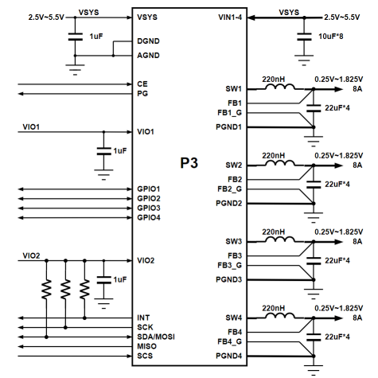
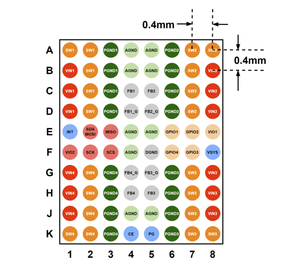

# P3 Brief

Click to download [P3 Brief (PDF)](https://cdn-resource.spacemit.com/file/chip/P3/P3_brief_en.pdf)

## Overview

**High-Performance Four-Phase Buck Power Management Chip**

P3 is a high-performance four-phase buck power management Chip (PMIC) featuring four key advantages: up to 32A output current (40A peak), 91% peak efficiency, ultra-small WLCSP package, and MTP-programmable power sequencing. It provides a complete power management solution for high-current, space-constrained applications such as edge computing, drones, AR/VR devices, and optical modules.

- **32 A High Current Capability × 5 Flexible Phase Configurations**
  Supports up to 32A output current (40A peak) in four-phase parallel mode with five configurable phase modes: 4+0, 3+1, 2+2, 2+1+1, and 1+1+1+1, enabling flexible power delivery configurations.

- **91% Peak Efficiency × Fast Transient Response**
  Features a COT control architecture for fast load transient response and stable voltage regulation. Supports automatic PFM/PWM mode switching for improved light-load efficiency and high-load performance.

- **Ultra-Compact WLCSP Package**
  Features an 80-ball WLCSP package with 0.4mm pitch, delivering high-current power management in compact applications such as AR/VR devices and optical modules.

## Features

- Input voltage range: 2.5V ~ 5.5V 
- Output voltage range: 0.25V ~ 1.20V(5mV/step);  1.20V ~ 1.83V(10mV/step)
- Supports five output phase configurations: 4+0, 3+1, 2+2, 2+1+1, and 1+1+1+1
- Supports four-phase parallel operation with up to 32A continuous output current and 40A peak output current
- Maximum efficiency: 91%（VIN = 3.6V, VOUT = 0.85V）
- Supports Automatic PFM/PWM mode transition or Forced PWM mode
- COT control architecture with fast load transient response
- Adjustable Ramp-up and Ramp-down slopes for each buck output voltage
- Supports MTP for flexible power-on/power-off sequence configuration
- High-speed 3.4MHz I2C or 30MHz SPI interface with dynamic voltage scaling support
- UVLO, short-circuit, and thermal protection
- 8-channel configurable 12-bit ADC
- Four flexible GPIOs for multi-function expansion
- Operating temperature range: -40°C ~ 85°C
- Package: 80-ball WLCSP with 0.4mm ball pitch

## P3 Four-Phase Independent Output Simplified Circuit Diagram

## P3 Four-Phase Parallel Single-Output Simplified Circuit Diagram

## P3 Pin Diagram (Top View)

