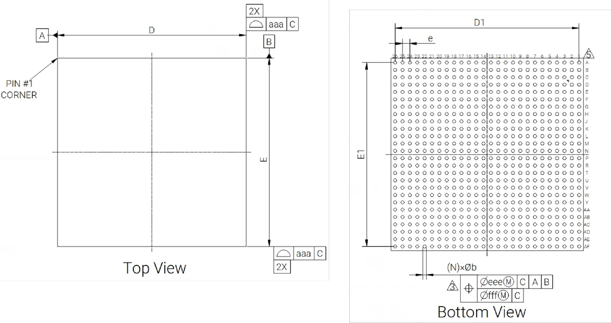

# 3. Package

```
Last Version: 2025/11/18
```

## 3.1 Introduction

K1 is available in two packages as tabled below.

<table>
<tbody>
<tr>
<td><strong>Type</strong></td>
<td><strong>Size</strong></td>
<td><strong>Pin P</strong><strong>itch</strong></td>
<td><strong>Pin Count</strong></td>
</tr>
<tr>
<td>FCCSP</td>
<td>17×17 mm</td>
<td>0.65 mm</td>
<td>676<br/>(26x26)</td>
</tr>
<tr>
<td>FCBGA</td>
<td>19×19 mm</td>
<td>0.65 mm</td>
<td>676<br/>(26x26)</td>
</tr>
</tbody>
</table>

The related package outline drawing (POD) are depicted in the following sections.

## 3.2 FCCSP Type




<table>
<tbody>
<tr>
<td rowspan=3 colspan=2><strong>Item</strong></td>
<td rowspan=3 colspan=1><strong>Symbol</strong></td>
<td rowspan=2 colspan=3><strong>Dimen</strong><strong>sion (in mm)</strong></td>
</tr>
<tr>
</tr>
<tr>
<td><strong>M</strong><strong>in</strong></td>
<td><strong>Typ</strong></td>
<td><strong>M</strong><strong>ax</strong></td>
</tr>
<tr>
<td rowspan=1 colspan=2>Total thickness</td>
<td>A</td>
<td>0.890 </td>
<td>0.990 </td>
<td>1.090 </td>
</tr>
<tr>
<td rowspan=1 colspan=2>Pin stand off</td>
<td>A1</td>
<td>0.160 </td>
<td>0.210 </td>
<td>0.260 </td>
</tr>
<tr>
<td rowspan=1 colspan=2>Substrate + Die + Mold</td>
<td>A2</td>
<td>0.710 </td>
<td>0.780 </td>
<td>0.850 </td>
</tr>
<tr>
<td rowspan=1 colspan=2>Substrate + Die</td>
<td>c</td>
<td>0.290 </td>
<td>0.330 </td>
<td>0.370 </td>
</tr>
<tr>
<td rowspan=2 colspan=1>Body size</td>
<td>X direction</td>
<td>D</td>
<td>16.900 </td>
<td>17.000 </td>
<td>17.100 </td>
</tr>
<tr>
<td>Y direction</td>
<td>E</td>
<td>16.900 </td>
<td>17.000 </td>
<td>17.100 </td>
</tr>
<tr>
<td rowspan=2 colspan=1>Edge pin center to center</td>
<td>X direction</td>
<td>D1</td>
<td>—</td>
<td>16.250 </td>
<td>—</td>
</tr>
<tr>
<td>Y direction</td>
<td>E1</td>
<td>—</td>
<td>16.250</td>
<td>—</td>
</tr>
<tr>
<td>Pin pitch </td>
<td>X/Y direction</td>
<td>e</td>
<td>—</td>
<td>0.650 </td>
<td>—</td>
</tr>
<tr>
<td>Pin width</td>
<td></td>
<td>b</td>
<td>0.250 </td>
<td>0.300 </td>
<td>0.350 </td>
</tr>
<tr>
<td rowspan=1 colspan=2>Package edge tolerance</td>
<td>aaa</td>
<td rowspan=1 colspan=3>0.100 </td>
</tr>
<tr>
<td rowspan=1 colspan=2>HAT flatness</td>
<td>bbb</td>
<td rowspan=1 colspan=3>0.100 </td>
</tr>
<tr>
<td rowspan=1 colspan=2>Coplanarity</td>
<td>ddd</td>
<td rowspan=1 colspan=3>0.100 </td>
</tr>
<tr>
<td rowspan=1 colspan=2>Pin offset (package)</td>
<td>eee</td>
<td rowspan=1 colspan=3>0.150 </td>
</tr>
<tr>
<td rowspan=1 colspan=2>Pin offset (ball)</td>
<td>fff</td>
<td rowspan=1 colspan=3>0.080 </td>
</tr>
<tr>
<td rowspan=1 colspan=3>Pin diameter</td>
<td rowspan=1 colspan=3>0.300 </td>
</tr>
<tr>
<td rowspan=1 colspan=3>Pin count</td>
<td rowspan=1 colspan=3>676 </td>
</tr>
<tr>
<td rowspan=1 colspan=3>MD/ME</td>
<td rowspan=1 colspan=3>26/26</td>
</tr>
</tbody>
</table>

## 3.3 FCBGA Type


<table>
<tbody>
<tr>
<td rowspan=2 colspan=2><strong>Item </strong></td>
<td rowspan=2 colspan=1><strong>Symbol </strong></td>
<td rowspan=1 colspan=3><strong>Dimension</strong><strong> (in mm)</strong></td>
</tr>
<tr>
<td><strong>M</strong><strong>in</strong></td>
<td><strong>Typ</strong></td>
<td><strong>M</strong><strong>ax</strong></td>
</tr>
<tr>
<td rowspan=2 colspan=1>Body size</td>
<td>X direction</td>
<td>D</td>
<td>18.900</td>
<td>19.000</td>
<td>19.100</td>
</tr>
<tr>
<td>Y direction</td>
<td>E</td>
<td>18.900</td>
<td>19.000</td>
<td>19.100</td>
</tr>
<tr>
<td rowspan=2 colspan=1>Pin pitch </td>
<td>X direction</td>
<td>eD</td>
<td rowspan=1 colspan=3>0.650</td>
</tr>
<tr>
<td>Y direction</td>
<td>eE</td>
<td rowspan=1 colspan=3>0.650</td>
</tr>
<tr>
<td rowspan=1 colspan=2>Total thickness</td>
<td>A</td>
<td>2.157</td>
<td>2.257</td>
<td>2.357</td>
</tr>
<tr>
<td rowspan=1 colspan=2>Hat + Adhesive</td>
<td>A3</td>
<td>1.322</td>
<td>1.375</td>
<td>1.428</td>
</tr>
<tr>
<td rowspan=1 colspan=2>Substrate thickness</td>
<td>c</td>
<td>0.602</td>
<td>0.672</td>
<td>0.742</td>
</tr>
<tr>
<td rowspan=1 colspan=2>Pin stand off</td>
<td>A1</td>
<td>0.169</td>
<td>0.210</td>
<td>0.260</td>
</tr>
<tr>
<td rowspan=1 colspan=2>Pin width</td>
<td>b</td>
<td>0.250</td>
<td>0.300</td>
<td>0.350</td>
</tr>
<tr>
<td rowspan=1 colspan=2>Package edge tolerance</td>
<td>aaa</td>
<td rowspan=1 colspan=3>0.150</td>
</tr>
<tr>
<td rowspan=1 colspan=2>HAT flatness</td>
<td>ccc</td>
<td rowspan=1 colspan=3>0.350</td>
</tr>
<tr>
<td rowspan=1 colspan=2>Coplanarity</td>
<td>ddd</td>
<td rowspan=1 colspan=3>0.080</td>
</tr>
<tr>
<td rowspan=1 colspan=2>Pin offset (package)</td>
<td>eee</td>
<td rowspan=1 colspan=3>0.150</td>
</tr>
<tr>
<td rowspan=1 colspan=2>Pin offset (ball)</td>
<td>fff</td>
<td rowspan=1 colspan=3>0.080</td>
</tr>
<tr>
<td rowspan=1 colspan=2>Pin count</td>
<td>n</td>
<td rowspan=1 colspan=3>676</td>
</tr>
<tr>
<td rowspan=2 colspan=1>Edge pin center to center</td>
<td>X direction</td>
<td>D1</td>
<td rowspan=1 colspan=3>16.250</td>
</tr>
<tr>
<td>Y direction</td>
<td>E1</td>
<td rowspan=1 colspan=3>16.250</td>
</tr>
<tr>
<td rowspan=2 colspan=1>Edge pin center to package edge</td>
<td>X direction</td>
<td>gD</td>
<td rowspan=1 colspan=3>1.375</td>
</tr>
<tr>
<td>Y direction</td>
<td>gE</td>
<td rowspan=1 colspan=3>1.375</td>
</tr>
</tbody>
</table>
