sidebar_position: 2

# K1 数据手册

**[PDF 版本](https://cdn-resource.spacemit.com/file/chip/K1/K1_datasheet_zh.pdf)**

## 版本

| 版本   | 日期       | 修订说明   |
|--------|------------|---------|
| V7.0   | 2025.05.20 | 更新了 K1 架构框图：<br>- DDR 时钟频率变更<br>- RCPU 模块变更<br>更新了 K1 通用特性：<br>- 与 RCPU 模块相关的内容 |
| V6.0   | 2025.05.09 | 更新引脚定义     |
| V5.1   | 2025.05.08 | 修正多个章节中的拼写错误   |
| V5.0   | 2025.04.28 | 根据在线版本编辑 PDF   |
| V4.0   | 2025.04.16 | 移除了音频子系统，并进行了相关更新   |
| V3.0   | 2025.03.19 | 重构并全面提升整份文档的内容质量  |
| V2.0   | 2025.02.25 | 更新安全算法，特别是移除了 SM2、SM3、SM4  |
| V1.6   | 2025.01.20 | 对全文档进行审校，优化语法、清晰度和一致性  |
| V1.5   | 2024.07.24 | 新增 V2D 内容    |
| V1.4   | 2024.06.07 | 更新数据   |
| V1.3   | 2024.05.09 | 补充封装信息  |
| V1.2   | 2024.03.08 | 更新数据    |
| V1.1   | 2024.02.08 | 补充封装信息 |

## 1. 概述

### 1.1 简介

进迭时空的 Key Stone® K1 是一款高性能、超低功耗的片上系统（SoC），集成了 8 个 RISC-V CPU 核，并融合了 进迭时空的道义 AI 计算能力。其主要优势包括：

- 集成进迭时空自主研发的 X60™ RISC-V 核处理器，符合 **RISC-V 64GCVB 指令集架构** 和 **RVA22 标准**；
- 通过定制化 RISC-V 指令实现 **CPU-AI 融合计算架构**，可提供高达 **2.0 TOPS（INT8）** 的 AI 算力；
- 支持主流 AI 推理框架，包括 **TensorFlow Lite、TensorFlow** 和 **ONNX Runtime**；
- 采用多粒度电源岛设计与动态电源状态调节技术，实现超低功耗运行，在能效方面具备显著竞争优势；
- 提供完整的外设接口组合，支持各类创新应用与产品开发；
- 兼容主流操作系统，满足多样化的应用场景需求；
- 符合工业级可靠性标准，适用于严苛环境下的稳定运行。

### 1.2 主要特性

- **应用处理器（Application Processor, AP）**
  - 进迭时空 X60™ RISC-V 双簇八核处理器
  - 符合 **RISC-V 64GCVB 指令集架构** 与 **RVA22 标准**
  - **簇 0（Cluster 0）**
    - 四核配置，集成 **2.0 TOPS（INT8）AI 算力**
    - 每核配备 **32 KB L1 缓存**
    - 共享 **512 KB L2 缓存**
    - 配置 **512 KB TCM（紧耦合存储器）**
    - 支持 **256 位向量扩展（Vector Extension）**
  - **簇 1（Cluster 1）**
    - 四核配置
    - 每核配备 **32 KB L1 缓存**
    - 共享 **512 KB L2 缓存**
    - 支持 **256 位向量扩展（Vector Extension）**
  - 支持 **动态电压频率调节（DVFS）**，工作电压自适应范围为 **0.6 V 至 1.05 V**

- **DDR 内存**
  - 支持双芯片片选，**32 位 LPDDR4/LPDDR4x SDRAM**，传输速率高达 **2666 Mbps**，最大支持 **16 GB 容量**
  - 支持双芯片片选，**32 位 LPDDR3 SDRAM**，传输速率高达 **1866 Mbps**，最大支持 **4 GB 容量**

- **实时处理器（Real-Time CPU, RCPU）**
  - **256 KB SRAM ×1**
  - **R_CAN-FD ×1**
  - **R_I²C ×1**
  - **R_SPI ×2**
  - **HDMI 音频接口**
  - **R_Debug 调试接口**
  - **R_UART ×2**
  - **R_PWM ×10**
  - **DMA 控制器 ×1**
  - **R_IR_RX（红外接收）×1**

- **外设控制器（Peripheral Controller）**
  - **GPIO（×128）**
    - 共 128 个引脚
    - 支持可编程上拉/下拉电阻
    - 其中 104 个为 **1.8 V IO8** 引脚
    - 其余 24 个支持 **1.8 V / 3.3 V** 双电压 IO

  - **UART（×10）**
    - 用于应用处理器（AP）、蓝牙（BT）及调试打印等用途

  - **I²C（×10）**
    - 用于连接摄像头、重力传感器（G-Sensor）、电子罗盘（E-Compass）、接近传感器（Proximity Sensor）、环境光传感器（Light Sensor）、陀螺仪（Gyro）、指纹模组、NFC、电源管理芯片（PMIC）、触摸屏等外设
    - 包含：
      - **8 路 AP_I²C**（其中 AP I²C0/1/7 专用于摄像头）
      - **1 路 HDMI I²C**
      - **1 路 PWR I²C**

  - **SPI（×4）**
    - 支持主/从模式
    - 用于 IMU、音频编解码器（Codec）等外设
    - 平台配置包括：
      - **1 路 QSPI**
      - **1 路 SPI LCD**
      - **2 路通用 SPI**

  - **USB（×3）**
    - **1 路 USB 2.0 OTG**
    - **1 路 USB 2.0 Host**
    - **1 路 USB 3.0**（与 PCIe PortA 复用）

  - **PCIe（×3）**
    - **PortA：Gen2 ×1**
    - **PortB：Gen2 ×2**
    - **PortC：Gen2 ×2**

  - **GMAC（×2）**
    - 支持 **10/100/1000 Mbps** 速率
    - 接口标准为 **RGMII**

  - **SDIO（×1，用于 Wi-Fi）**
    - 兼容 **4 位 SDIO 3.0 UHS-I** 协议，最高支持 **SDR104 模式（208 MHz）**

  - **SD 卡接口（×1，用于 TF 卡）**
    - 兼容 **4 位 SD 3.0 UHS-I** 协议，最高支持 **SDR104 模式（208 MHz）**

  - **eMMC（×1）**
    - 兼容 **8 位 eMMC 5.1** 标准，最高支持 **HS400 模式（200 MHz）**

  - **MIPI CSI（CSI-2 v1.1，×2）**
    - 支持多种组合模式：
      - **4-Lane + 4-Lane**
      - **4-Lane + 2-Lane**
      - **4-Lane + 2-Lane + 2-Lane**（三路图像传感器）

  - **MIPI DSI（DSI v1.1，×1）**
    - **4-Lane DSI** 接口

  - **PWM（×20）**

  - **CAN-FD（×1）**

  - **红外接收（IR-RX，×1）**

- **安全系统（Security System）**
  - 支持 **RISC-V PMP（Physical Memory Protection）** 安全机制
  - 支持 **安全启动（Secure Boot）**
  - 集成 **4 Kbit 安全 eFuse**
  - 内置 **硬件加密引擎**，支持以下算法：
    - **TRNG（真随机数发生器）**
    - **AES**
    - **RSA**
    - **ECC（椭圆曲线密码）**
    - **SHA-2**
    - **HMAC**

- **调试系统（Debug System）**
  - 提供 **两路 JTAG 接口**，分别用于 **CPU 子系统** 和 **MCU 子系统**
  - 支持通过 **UART** 进行调试输出
  - 在看门狗复位后，可自动保存 **CPU/IO 寄存器快照**

- **启动系统（Boot System）**
  - 应用处理器（AP）支持从以下介质启动：
    - **SPI NAND Flash**
    - **SPI NOR Flash**
    - **eMMC**
    - **SD 卡**
  - 内置 **128 KB Boot ROM**

- **辅助系统（Aided System）**
  - 为每个 **CPU/MCU 子系统** 独立配置 **看门狗定时器（Watchdog）**

- **工作温度范围（Operating Temperature）**
  - **-40°C ~ +85°C**，符合 **工业级标准**

### 1.3 多媒体特性

- **GPU**
  - 集成 **IMG BXE-2-32 GPU**，主频 **819 MHz**，配备 **32 KB SLC（系统级缓存）**
  - 支持图形 API：
    - **OpenCL 3.0**
    - **OpenGL ES 3.2**
    - **Vulkan 1.3**

- **VPU（视频处理单元）**
  - **解码能力**：支持 **H.265 / H.264 / VP8 / VP9 / MPEG-4 / MPEG-2**，最高达 **4K@60fps**
  - **编码能力**：支持 **H.265 / H.264 / VP8 / VP9**，最高达 **4K@30fps**
  - 支持 **1080p@60fps 同时编解码**
  - 支持 **1080p@30fps H.264/H.265 编码 + 4K@30fps H.264/H.265 解码** 并行处理

- **显示（Display）**
  - 输出接口：**1 路 MIPI DSI（4-lane）** 或 **SPI 接口**
  - 最高分辨率支持：**HD+（1920×1080@60fps）**
  - 支持最多 **4 个全尺寸图层合成**，通过 RDMA 通道的上下层复用机制可扩展至 **8 层合成**
  - 支持 **cmdlist 硬件机制**，可由硬件自动配置寄存器参数
  - 支持 **回写（Write-back）功能**，同时兼容 **原始格式（Raw）** 与 **AFBC 压缩格式**
  - 回写路径支持 **抖动（Dither）、裁剪（Crop）、旋转（Rotation）**
  - 采用 **高级 MMU（虚拟地址）机制**，在 **90°/270° 旋转** 场景下几乎无页缺失（page miss）
  - 支持 **色键（Color Key）** 与 **纯色填充（Solid Color）**
  - 面板输出支持 **高级误差扩散抖动（Error Diffusion Dither）** 和 **基于图案的抖动（Pattern-based Dither）**
  - 图像源支持 **Raw 格式** 与 **AFBC 压缩格式**
  - 支持 **色彩饱和度与对比度增强**
  - 面板支持 **视频模式（Video Mode）** 与 **命令模式（Command Mode）**
  - 支持 **DDR 频率动态切换**，内置 **DFC 缓冲区** 以保障显示流畅性
  - 集成 **HDMI 1.4** 输出接口

- **摄像头（Camera）**
  - **双 ISP 架构**
    - 最高支持 **1600 万像素 @30fps 双路 ISP 并行处理**
    - CSI 接口组合灵活：
      - **4-Lane + 4-Lane**
      - 或 **4-Lane + 2-Lane + 2-Lane**（支持三摄）
    - 支持 **RAW 格式图像传感器**，输出 **YUV 数据至 DRAM**
    - 内置 **硬件 JPEG 编码器**，最高支持 **2300 万像素**
    - 支持输出格式：**YUV / EXIF / JFIF**
    - 支持 **自动对焦（AF）、自动曝光（AE）、自动白平衡（AWB）**
    - 支持 **人脸检测**
    - 支持 **数字变焦、全景拼接（Panorama View）**
    - 支持 **相位检测自动对焦（PDAF）**
    - 支持 **画中画（PiP, Picture-in-Picture）**
    - 支持 **连续视频自动对焦**
    - 支持 **硬件加速 3D 降噪（3D Denoise）**

- **音频（Audio）**
  - **2 路全双工 I²S 接口**
  - **1 路 HDMI 音频接口**

### 1.4 架构框图

K1 的系统架构如下图所示。


## 2. 规格参数

### 2.1 CPU 子系统

- 采用 **双非对称 CPU 簇架构**，其中：
  - **簇 0（Cluster 0）**：包含 **4 个 SpacemiT® X60™ RISC-V 核**，集成 **2.0 TOPS AI 算力扩展单元**
  - **簇 1（Cluster 1）**：包含 **4 个 SpacemiT® X60™ RISC-V 核**，**不带 AI 加速能力**
- 高性能、低功耗的 **SpacemiT® X60™ CPU 核**，符合 **RISC-V 64GCVB 指令集架构** 与 **RVA22 标准**
- 支持 **核本地中断控制器（CLINT）** 与 **平台级中断控制器（PLIC）**
- 符合 **RISC-V Debug 规范 v0.13.2**
- 在看门狗复位触发时，可自动捕获 **关键 CPU 状态快照**，便于故障诊断与调试
- 采用 **电源岛（Power Island）设计** 与 **两级功耗管理策略**（针对每个 CPU 核及整个簇），实现 **超低功耗运行**

#### SpacemiT® X60™ RISC-V 核

##### 简介

X60™ 是一款创新型高能效处理器核，集成了 进迭时空自主研发的 **道义 AI 创新部署方案**，严格遵循 **RISC-V 64GCVB 指令集架构** 与 **RVA22 标准**。

为满足当前及未来在人工智能、机器学习、SLAM（即时定位与地图构建）等场景下的计算需求，X60™ 引入了多项 **领域专用架构（DSA）技术** 与 **微架构优化**，提供强劲且高效的通用与 AI 融合计算能力。

##### 特性

- 符合 **RISC-V 64GCVB 架构** 与 **RVA22 标准**
- 每个核配备：
  - **32 KB L1 指令缓存（L1-I）**
  - **32 KB L1 数据缓存（L1-D）**
- 每个簇（Cluster）共享 **512 KB L2 缓存**
- **簇 0 （Cluster 0）额外集成 512 KB TCM（紧耦合存储器）**，专用于 AI 扩展加速
- 缓存一致性协议：
  - **L1 缓存支持 MESI 协议**
  - **L2 缓存支持 MOESI 协议**
- 向量扩展：**RVV 1.0**，支持 **VLEN = 256/128 位**，具备 **双发射（x2）执行宽度**
- **簇 0 （Cluster 0）实现了定制化的 AI 指令扩展**
- 支持 **CLINT（核本地中断控制器）** 与 **PLIC（平台级中断控制器）**，共支持 **256 个中断源**
- 支持 **RISC-V 性能监控单元（PMU）**
- 支持 **SV39 虚拟内存机制**
- 支持 **32 项 PMP（物理内存保护）条目**，符合 RISC-V 安全框架
- 支持 **RISC-V 调试框架（Debug Spec v0.13.2）**
- 支持以下标准 RISC-V 扩展指令集：
  - `RV64I`
  - `M`
  - `A`
  - `F`
  - `D`
  - `C`
  - `V`
  - `Sscofpmf`
  - `Sstc`
  - `Svinval`
  - `Svnapot`
  - `Svpbmt`
  - `Zicbom`
  - `Zicbop`
  - `Zicboz`
  - `Zicntr`
  - `Zicond`
  - `Zicsr`
  - `Zifencei`
  - `Zihintpause`
  - `Zihpm`
  - `Zfh`
  - `Zfhmin`
  - `Zkt`
  - `Zba`
  - `Zbb`
  - `Zbc`
  - `Zbs`
  - `Zbkc`
  - `Zvfh`
  - `Zvfhmin`
  - `Zvkt`
- 支持以下 **AI 定制指令**：
  - **类别：<u>整型点积矩阵乘加（int8 类型）</u>**，包括：
    - `smt.vmadot`
    - `smt.vmadotu`
    - `smt.vmadotsu`
    - `smt.vmadotus`
  - **类别：<u>整型滑动窗口点积矩阵乘加（int8 类型）</u>**，包括：
    - `smt.vmadot1` / `smt.vmadot1u` / `smt.vmadot1su` / `smt.vmadot1us`
    - `smt.vmadot2` / `smt.vmadot2u` / `smt.vmadot2su` / `smt.vmadot2us`
    - `smt.vmadot3` / `smt.vmadot3u` / `smt.vmadot3su` / `smt.vmadot3us`

> **注**：有关上述所有 AI 定制指令的详细定义，请参阅官方规范文档：  
> [https://github.com/spacemit-com/riscv-ime-extension-spec](https://github.com/spacemit-com/riscv-ime-extension-spec)

##### 架构框图

X60™ 的微架构如下图所示。

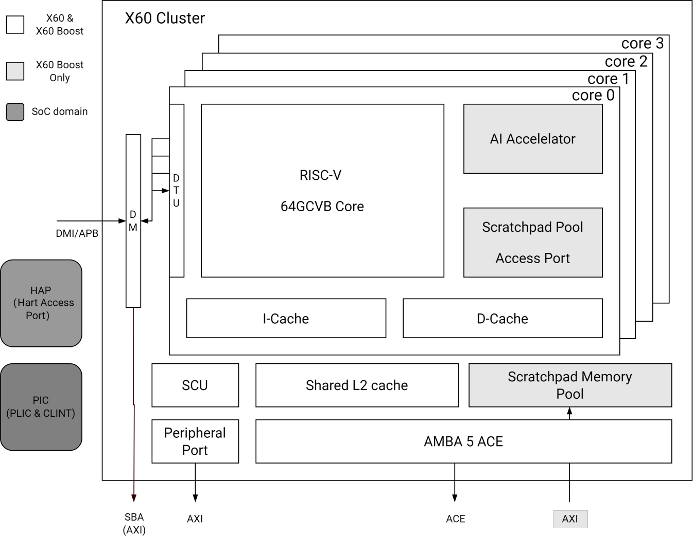

#### 中断控制器

##### 简介

K1 集成了以下两类中断控制器，用于管理两个处理器簇的中断请求：

- **1 个处理器核本地中断控制器（CLINT）**
- **1 个平台级中断控制器（PLIC）**

异常处理（包括异常和外部中断）是处理器的关键功能之一。当特定事件（如硬件故障、指令执行错误、用户程序系统调用请求等）发生时，处理器会跳转至相应的异常处理程序进行响应。

- **CLINT** 是一个基于内存映射的模块，主要用于处理 **软件中断** 和 **定时器中断**。
- **PLIC** 负责采集 **外部中断源**，并根据优先级进行仲裁后分发至目标处理器核。在 PLIC 架构中，每个核的 **机器模式（Machine Mode）** 和 **监督模式（Supervisor Mode）** 均可作为有效的中断目标。PLIC 最多支持 **256 个外部中断源**，且每个中断源均支持 **电平触发（Level-triggered）** 和 **边沿触发（Edge-triggered）** 两种格式。

#### 调试与追踪（Debug & Trace）

##### 简介

调试接口是软件与处理器交互的通道。通过该接口，用户可访问 CPU 寄存器、内存内容以及其他片上设备信息，并可执行程序下载等操作。

##### 架构框图

调试接口的微架构如下图所示：


如图所示，调试系统由以下组件构成：

- **调试软件（Debugging Software）**
- **调试代理服务（Debugging Agent Service）**
- **调试器（Debugger）**
- **调试接口（Debugging Interface）**

各组件之间的连接关系如下：

- **调试软件** 通过网络与 **调试代理服务** 通信；
- **调试代理服务** 通过 **USB** 连接至 **调试器**；
- **调试器** 通过 **JTAG 接口** 与 CPU 交互。

JTAG 内存访问支持两种模式：**`progbuf`** 和 **`sysbus`**，具体如下：

- **`progbuf` 模式**：标准 JTAG 访问方式，通过 CPU 执行指令来访问内存；
- **`sysbus` 模式**：绕过 CPU，直接通过 **系统总线访问端口（System Bus Access, SBA）** 访问片上资源，提升调试效率。

### 2.2 内存与存储

#### 片上存储器（On-Chip Memory）

##### 简介

K1 集成以下片上存储器资源：

- **128 KB Boot ROM**：用于存放一级引导代码，支持从多种外部介质启动；
- **256 KB SRAM**：由主应用处理器（Main CPU）与实时处理器（RCPU）共享使用。

#### DDR 控制器

##### 简介

DDR 控制器采用前沿架构设计，通过 **重排序缓冲区（Re-ordering Buffers, ROBs）** 对 DRAM 访问请求进行智能重排，以提升内存带宽利用率和访问效率。该设计不按原始请求顺序处理事务，而是根据地址局部性和 DRAM 物理特性优化调度顺序，同时在 AXI 接口上对相同 ID 的请求保持原有事务顺序，确保系统一致性。

此外，控制器内置 **统一写入池（Unified Write Pool）**，用于暂存写事务。该机制有效降低写入延迟，并减少因 DDR 接口频繁切换读/写操作带来的性能损失。结合 **启发式写缓冲控制** 与 **用户可编程写缓冲策略**，DDR 控制器可在运行时动态平衡读写性能。

该 DDR 控制器完全兼容 **AMBA AXI4 总线协议**，具备高度可扩展性，最多支持 **4 个 AXI 主端口**。

##### 特性

- 支持 **基于优先级的仲裁机制**，并配备 **防饥饿（Starvation Prevention）策略**
- 利用 **写缓冲合并（Write Buffer Merge）** 同一地址的多次写操作，显著降低 DDR 写流量
- 对写缓冲中的读请求可 **直接转发至 ROB**，无需访问 DDR，提升响应速度
- 支持 **两级动态调度机制**，并提供 **带宽保障（Bandwidth Guarantee）**
- 支持多种 **低功耗特性**：
  - 激活/预充电断电（Active/Pre-charge Power-off）
  - 自刷新（Self-refresh）
  - 控制方式支持：
    - **自动模式**（通过空闲计时器触发）
    - **手动模式**（通过寄存器配置）
    - **外部控制**（通过专用引脚）
- 支持 **动态频率切换（Dynamic Frequency Change）**
- 兼容 **JEDEC 标准的 LPDDR3 与 LPDDR4/LPDDR4x 存储器件**
- 支持 DRAM 容量范围：**64 MB 至 16 GB**
- 单通道 DDR PHY，**x32 位宽**，可通过软件配置为 **x32 / x16 / x8** 数据宽度
- 支持 **x16 与 x32 DRAM 芯片**（每 8 位数据对应 1 路 DQS）
- 每通道支持最多 **2 个片选（Chip Select, CS）或 Rank**
- 每个 CS 最多支持 **8 个 Bank**（适用于 LPDDRx）
- 每个 CS 可映射至 **独立的起始地址**
- 每个 CS 容量可配置为 **8 MB 至 16 GB**
- 支持 **Bank 保持开启（No Auto-Precharge）**，提升连续访问效率
- 支持 **突发长度（Burst Length）8 和 16**（依 DDR 类型而定）
- 支持 **可编程地址映射顺序**
- 支持 **CS 与数据宽度之间的灵活 Bank 布局**
- 集成 **内存控制器性能计数器（Performance Counters）**
- 支持 **RISC-V 独占加载/存储（Exclusive Load/Store）的全局监控**
- 提供 **DDR 事务的安全访问管理机制**
- 实现 **频率切换后的寄存器自动更新机制**：通过硬件触发的寄存器表，在频率变更后自动完成时序参数重配置

##### 架构框图

DDR 控制器接口架构如下图所示：

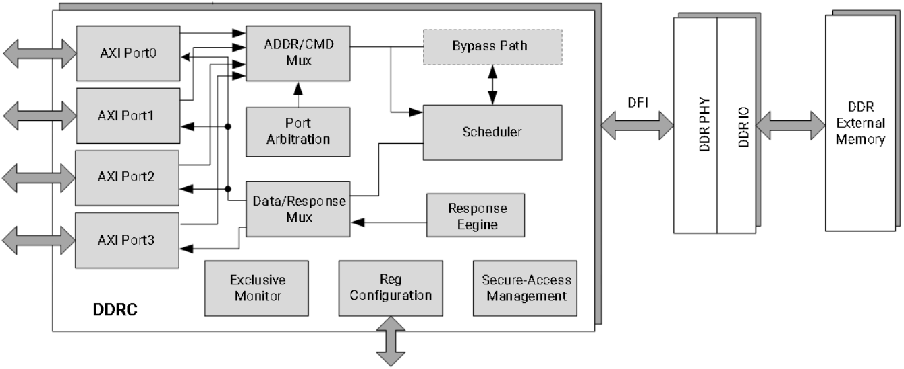

#### Quad-SPI 控制器

##### 简介

Quad-SPI 控制器用于连接外部串行闪存（Serial Flash）设备，支持最多 **四条双向数据线**，实现高速、灵活的 SPI 通信。

##### 特性

- 内置 **灵活的序列引擎（Sequence Engine）**，可适配多种厂商的 Flash 器件；
- 支持 **单线（Single）、双线（Dual）和四线（Quad）** 操作模式；
- **DMA 支持**：
  - 通过 **AMBA AHB 总线（64 位宽接口）** 或 **IP 寄存器空间（32 位访问）** 读取 RX 缓冲区数据；
  - 通过 **IP 寄存器空间（32 位访问）** 填充 TX 缓冲区；
- DMA **内层循环大小可配置**；
- 支持 **15 种中断触发条件**；
- 支持对连接的 Flash 设备进行 **内存映射读取（Memory-Mapped Read Access）**，简化软件访问；
- **序列引擎可编程**，便于未来扩展新命令或协议，同时兼容所有现有厂商的指令与操作；
- 支持 **所有类型的地址模式**；
- 兼容多种 SPI 模式：
  - 标准 SPI（Standard SPI）
  - 快速读（Fast Read）
  - Dual / Dual I/O
  - Quad / Quad I/O
- 最高工作时钟频率达 **104 MHz**。

#### eMMC 接口

##### 简介

eMMC 接口是一个硬件模块，作为 eMMC 总线的主机（Host），用于在 eMMC 卡与内部总线主控之间传输数据。

##### 特性

- 符合 **8 位 eMMC 5.1 协议规范**；
- 使用与 SD-HCI 兼容的寄存器集进行 eMMC 数据传输，并扩展了厂商自定义寄存器；
- 支持 **1 位 / 8 位 MMC 卡** 以及 **CE-ATA 卡**；
- 支持 SD-HCI 规范中定义的以下数据传输方式：
  - **PIO（Programmed I/O）**
  - **SDMA（Simple DMA）**
  - **ADMA（Advanced DMA）**
  - **ADMA2**
- 支持 eMMC 卡的 **SPI 模式**；
- 支持 eMMC 5.1 定义的以下速度模式：
  - **Legacy 模式**：最高 **26 MB/s**（1.8 V 信号）
  - **High-Speed SDR**：最高 **52 MB/s**（1.8 V 信号）
  - **High-Speed DDR**：最高 **52 MB/s**（1.8 V 信号）
  - **HS200**：最高 **200 MB/s**（1.8 V 信号）
  - **HS400**：最高 **400 MB/s**（1.8 V 信号）
- 对卡总线上的所有命令与数据事务，**硬件自动生成并校验 CRC**；
- 配备 **1024 字节 FIFO**（由 2 个 512 字节数据块组成），用于数据收发缓冲。

#### SD/MMC 接口

##### 简介

SD/MMC 接口是一个硬件模块，作为 SD/MMC 总线的主机（Host），用于在 SD/MMC 卡与内部总线主控之间进行数据传输。

##### 特性

- 符合 **4 位 SD 3.0 UHS-I 协议规范**；
- 采用 **SD-HCI 寄存器集**，并扩展了厂商自定义寄存器；
- 支持 **1 位 / 4 位 SD 存储卡**；
- 支持 SD-HCI 规范中定义的以下数据传输方式：
  - **PIO（Programmed I/O）**
  - **SDMA（Simple DMA）**
  - **ADMA（Advanced DMA）**
  - **ADMA2**
- 支持 SD 3.0 规范定义的以下速度模式：
  - **Default Speed**：最高 **12.5 MB/s**（3.3 V 信号）
  - **High Speed**：最高 **25 MB/s**（3.3 V 信号）
  - **SDR12**：最高 **25 MHz**（1.8 V 信号）
  - **SDR25**：最高 **50 MHz**（1.8 V 信号）
  - **SDR50**：最高 **100 MHz**（1.8 V 信号）
  - **SDR104**：最高 **208 MHz**（1.8 V 信号）
  - **DDR50**：最高 **50 MHz**（1.8 V 信号，双倍数据速率）
- 对卡总线上的所有命令与数据事务，**硬件自动生成并校验 CRC**；
- 支持 **读等待控制（Read-Wait Control）** 功能，适用于低速或响应延迟的 SD/MMC 卡；
- 支持 **挂起/恢复（Suspend/Resume）** 功能，提升系统能效；
- 通过 **GPIO 实现 SD/MMC 卡插拔检测**；
- 配备 **1024 字节 FIFO**（由 2 个 512 字节数据块组成），用于高效的数据收发缓冲。

### 2.3 图像子系统

#### MIPI 摄像头输入接口（MIPI Camera IN Interface）

##### 简介

MIPI 摄像头输入接口包含 **两个 MIPI CSI-2 v1.1 控制器**，每个控制器均配备 **4 条数据通道（Lanes）**，每通道最高支持 **1.5 Gbps** 传输速率。

##### 特性

- 支持以下 **多摄像头 Lane 分配模式**：

  - **4-Lane + 4-Lane 模式**：支持双摄像头（双传感器）
  - **4-Lane + 2-Lane 模式**：支持双摄像头（不同带宽需求）
  - **4-Lane + 2-Lane + 2-Lane 模式**：支持三摄像头（三传感器）

  > **注**：在 **“4-Lane + 2-Lane + 2-Lane（三传感器）”** 模式下，仅支持 **2 路 Bayer RAW 格式** 和 **1 路 YUV 格式** 输入。

- 支持以下 **图像输入格式**：
  - Legacy YUV420 8-bit
  - YUV420 8-bit
  - RAW8
  - RAW10
  - RAW12
  - RAW14
  - 嵌入式数据类型（Embedded Data Type）

- 支持以下 **数据交织（Interleaving）方式**：
  - **数据类型交织（Data Type Interleaving）**
  - **虚拟通道交织（Virtual Channel Interleaving）**

#### ISP（图像信号处理器）

##### 简介

K1 集成高性能 **图像信号处理器（ISP）**，支持 **最多两路 RAW 视频流并发处理**，总处理能力达 **2100 万像素 @30fps**。

##### 特性

- 支持 **视频模式** 与 **拍照模式**
- 可处理 **RAW 格式传感器数据**，并将 **YUV 数据输出至 DRAM**
- 内置 **硬件 JPEG 编解码器**，最高支持 **2300 万像素**
- 支持输出格式：**YUV、EXIF、JFIF**
- 支持 **自动对焦（AF）、自动曝光（AE）、自动白平衡（AWB）**
- 支持 **人脸检测**
- 支持 **数字变焦** 与 **全景拼接（Panorama View）**
- 支持 **相位检测自动对焦（PDAF）**
- 支持 **画中画（PiP, Picture-in-Picture）**
- 支持 **连续视频自动对焦**
- 支持 **硬件加速 3D 降噪**
- 支持 **多层 2D YUV 降噪**
- 支持 **镜头阴影校正（Lens Shading Correction）** 后处理
- 支持 **边缘增强（Edge Enhancement）**

> **注意事项（限制说明）**：
>
> - 系统支持 **双路 RAW 摄像头视频流处理**。在 **[MIPI 摄像头输入接口](#mipi-摄像头输入接口mipi-camera-in-interface)** 章节中所述的 **“4-Lane + 2-Lane + 2-Lane（三传感器）”** 模式下，其中一路传感器必须为 **YUV 输入格式**，且该通路的写入路径 **不得使用 MMU**。
> - 在处理 **双路 RAW 摄像头视频流** 时，每通道输入图像的 **总宽度不得超过 4750 像素**，且两路传感器输出像素的 **瞬时速率之和必须小于 “ISP 时钟频率 / 6”**。
> - **视频录制** 时，无论输入分辨率如何，**输出视频最大宽度限制为 1920 像素**。
> - **拍照模式** 下，输出图像尺寸可与输入分辨率一致。

#### GPU

##### 简介

GPU 围绕多线程统一着色集群（USCs）构建，采用高效 SIMD 架构的 ALU 设计，并支持基于分块的延迟渲染（Tile-based Deferred Rendering），能够同时处理多个图块。

GPU 引擎可以处理多种不同类型的工作负载，包括：

- **3D 图形工作负载**：用于渲染 3D 场景的顶点和像素数据处理；
- **计算工作负载（GP-GPU）**：通用目的的数据处理；

> **注意**：3D 图形与计算（带有屏障）工作负载不能同时进行。

GPU 核通过 **AXI 128 位总线** 访问 SOC 的 DDR 内存，核频率最高可达 **819 MHz**。

##### 通用特性

- 基础架构完全符合以下 API 标准：
  - **OpenGL ES 1.1/3.2**
  - **EGL 1.5**
  - **OpenCL 3.0**
  - **Vulkan 1.3**
- **基于分块的延迟渲染架构（TBDR）** 用于 3D 图形工作负载，支持同时处理多个图块，数据处理分为两个阶段：
  - **几何处理阶段**：涉及顶点操作如变换、顶点光照以及将 3D 场景分割成图块；
  - **片段处理阶段**：涉及像素操作如光栅化、纹理映射及像素着色；
- 可编程高质量图像抗锯齿；
- 细粒度三角形剔除；
- 支持数字版权管理（DRM）安全；
- 支持 GPU 虚拟化，如下：
  - 最多支持 **8 个虚拟 GPU**；
  - IMG HyperLane 技术，提供 **8 条 HyperLanes**；
  - 每个 OSI 分离的 IRQ 支持；
- 多线程统一着色集群（USC）引擎，集成了像素着色器、顶点着色器及 GP-GPU（计算着色器）功能；
- USC 采用了具有高 SIMD 效率的 ALU 架构；
- 完全虚拟化的内存寻址（最多支持 64 GB 地址空间），支持统一内存架构；
- 细粒度的任务切换、工作负载平衡和电源管理；
- 先进的 DMA 驱动操作以最小化主机 CPU 的交互；
- 缓存类型如下：
  - **32 KB 系统级缓存（SLC）**；
  - 专用纹理缓存单元（TCU）；
- 压缩纹理解码；
- 使用 Imagination 帧缓冲压缩和解压缩（TFBC）算法实现无损或视觉上无损的低面积图像压缩；
- 专用处理器用于 B 系列固件执行；
- 单线程固件处理器，配备 **2 KB 指令缓存** 和 **2 KB 数据缓存**；
- 固件处理器独立的电源岛；
- 片上性能、功耗及统计寄存器。

##### 3D 图形特性

- **光栅化（Rasterization）**

  - 延迟像素着色；
  - 芯片内图块浮点深度缓冲区；
  - 具有芯片内图块模板缓冲区的 **8 位模板**；
  - 每个 ISP 最大支持 **2 个在飞图块**；
  - 每时钟周期 **16 个并行深度/模板测试**；
  - **1 条固定功能光栅化管线**；

- **纹理查找（Texture Lookups）**

  - 支持从源指令加载；
  - 通过纹理处理单元（TPU）启用纹理写入；

- **过滤（Filtering）**

  - 点采样、双线性及三线性过滤；
  - 各向异性过滤；
  - 对于立方环境映射纹理和跨面过滤的支持，包括角过滤；

- **纹理格式（Texture Formats）**

  - 支持 ASTC LDR 压缩纹理格式；
  - 对非压缩纹理和 YUV 纹理的 TFBC 无损或有损压缩格式支持；
  - ETC 格式；
  - YUV 平面支持；

- **分辨率支持（Resolution Support）**

  - 最大帧缓冲区尺寸：**8K×8K**；
  - 最大纹理尺寸：**8K×8K**；

- **抗锯齿（Anti-Aliasing）**

  - 最高支持 **4x 多重采样抗锯齿**；

- **图元装配（Primitive Assembly）**

  - 早期隐藏物体剔除；
  - 图块加速；

- **渲染至缓冲区（Render to Buffers）**

  - 扭曲格式支持；
  - 多个片上渲染目标（MRT）；
  - 无损或有损帧缓冲压缩/解压缩；
  - 可编程几何着色器支持；
  - 直接几何流输出（变换反馈）；

- **计算（Compute）**

  - 支持一维、二维和三维计算图元；
  - 块 DMA 到/自 USC 公共存储（用于局部数据）；
  - 每任务输入数据 DMA（到 USC 统一存储）；
  - 条件执行；
  - 执行围栏；
  - 计算工作负载可以与其他任何工作负载重叠；
  - 四舍五入到最近偶数。

##### 统一着色集群（USC）特性

- **2 条 ALU 流水线**  
- 每时钟周期支持 **8 个并行实例**  
- 配备 **本地数据缓存、纹理缓存和指令缓存**  
- 支持 **可变长度指令集编码**  
- 完整支持 **OpenCL™ 原子操作**  
- 采用 **标量与向量混合的 SIMD 执行模型**  
- 集成 **USC F16 累积乘加（SOPMAD）算术逻辑单元（ALU）**，用于高效半精度浮点计算

#### V2D（2D 视频加速引擎）

##### 特性

- 支持 **图像缩放**：
  - 最大 **8 倍放大（Upscaling）**
  - 最小 **1/8 倍缩小（Downscaling）**
- 支持 **旋转与翻转**：
  - 旋转角度：**0°、90°、180°、270°**
  - 支持 **镜像（Mirror）** 与 **翻转（Flip）** 操作
- 支持 **简单图层混合** 与 **背景合成**
- 支持 **图像裁剪（Cropping）**
- 支持 **纯色填充（Fetch Solid Color）**
- 支持 **色彩空间转换**，包括：
  - **RGB ↔ BT.601（窄域/全域）**
  - **RGB ↔ BT.709（窄域/全域）**
- 最大 **NV12 分辨率** 支持：
  - **4656 × 3596** 或 **4672 × 3504**
- 支持 **抖动（Dithering）**，实现更平滑的色彩过渡
- 支持 **MMU（内存管理单元）**
- 支持 **APB3** 与 **AXI3** 总线接口

- 支持以下 **输入格式**：

  - RGB888（可选 R/B 交换）
  - RGBX888（可选 R/B 交换）
  - RGBA8888（可选 R/B 交换）
  - ARGB8888（可选 R/B 交换）
  - RGB565（可选 R/B 交换）
  - RGBA5658（可选 R/B 交换）
  - ARGB8565（可选 R/B 交换）
  - A8（8 位 Alpha 图像）
  - Y8（8 位灰度图像）
  - YUV420 半平面格式（支持 UV 交换）
  - AFBC 16×16 RGBA8888（layerout0，支持 split 与 non-split 模式）
  - AFBC 16×16 NV12（layerout1，支持 split 与 non-split 模式）

- 支持以下 **输出格式**：

  - RGB888（可选 R/B 交换）
  - RGBX888（可选 R/B 交换）
  - RGBA8888（可选 R/B 交换）
  - ARGB8888（可选 R/B 交换）
  - RGB565（可选 R/B 交换）
  - RGBA5658（可选 R/B 交换）
  - ARGB8565（可选 R/B 交换）
  - A8（8 位 Alpha 图像）
  - Y8（8 位灰度图像）
  - YUV420 半平面格式（支持 UV 交换）
  - AFBC 16×16 RGBA8888（layerout0，支持 split 与 non-split 模式）
  - AFBC 16×16 NV12（layerout1，支持 split 与 non-split 模式）

##### 架构框图

V2D 子系统的微架构如下图所示：


典型的 V2D 工作场景如下图所示：


##### 功能

###### 获取数据（Fetch Data）

从源帧（src frame）中获取 16×16 块的数据，并将其映射到目标超级块（dst superblock）的过程如下图所示，其中：

- **AFBC**：获取矩形区域的左、上、宽度、高度需为 4 的倍数对齐；
- **非 AFBC**：获取矩形区域的左、上、宽度、高度需为 1 的倍数对齐；


用于显示的数据获取代码如下所示，具体涉及的变量和寄存器详情紧接在表格后列出。

```
Input param: Rect_left, Rect_top, Rect_width, Rect_height
Rect_width = Rect_left%4 + Rect_width;
Rect_height = Rect_top%4 + Rect_height;
Rect_left = Rect_left/4 × 4;
Rect_top = Rect_top/4 × 4;
if LayerX_format == YUV420 
{
    Rect_width  = ALIGN(Rect_left %2 + Rect_width, 2);
    Rect_height   = ALIGN(Rect_top%2 + Rect_height, 2);
    Rect_left = Rect_left/2 × 2;
    Rect_top = Rect_top/2 × 2;
}
Take the data in the Rect
Loop every pixel in Rect
{
    if LayerX_format == YUV420
    {
        upsample YUV420 to YUV444;
        c0 = channel 0; // Y
        c1 = channel 1; // U
        c2 = channel 2; // V
        c3 = 0xff;
    }
    if LayerX_format == RGB888
    {
        c0 = channel 0; // R
        c1 = channel 1; // G
        c2 = channel 2; // B
        c3 = 0xff; // A
    }
    if LayerX_format == RGBX8888
    {
        c0 = channel 0; // R
        c1 = channel 1; // G
        c2 = channel 2; // B
        c3 = 0xff; // A
    }
    if LayerX_format == RGBA8888
    {
        c0 = channel 0; // R
        c1 = channel 1; // G
        c2 = channel 2; // B
        c3 = channel 3; // A
    }
    if LayerX_format == ARGB8888
    {
        c0 = channel 1; // R
        c1 = channel 2; // G
        c2 = channel 3; // B
        c3 = channel 0; // A
    }
    if LayerX_format == RGB565
    {
        c0 = byte_low &0x1f; // R5
        c1 = ((byte_high << 3) | (byte_low >> 5)) & 0x3f; // G6
        c2 = (byte_high >> 3) &0x1f; // B5
        c0 = (c0 << 3) | (c0 >> 2); // R8
        c1 = (c1 << 2) | (c1 >> 4); // G8
        c2 = (c2 << 3) | (c2 >> 2); // B8
        c3 = 0xff; // A8
    }
    if LayerX_format == YUV420 && LayerX_swap == 1
        Swap(c1, c2);
    else if LayerX_swap == 1
        Swap(c0, c2);
    Index = Rect_y%16 × 16 + Rect_x;
    data[0][index] = c0;
    data[1][index] = c1;
    data[2][index] = c2;
    data[3][index] = c3;
}
```

**变量详情**

| 变量名           | 位宽                    | 注释        |
|------------------|------------------------|--------------------------|
| Rect_left<br/>Rect_top | 16位无符号整数         | 范围 [0, 65535]                                                        |
| Rect_width<br/>Rect_height | 5位无符号整数          | 范围 [1, 16]                                                           |
| Rect_x<br/>Rect_y | 16位无符号整数         | 范围 [0, 65535]<br/>像素全局位置                              |
| c0, c1, c2, c3   | 8位无符号整数          | 范围 [0, 255]                                                          |
| byte_low<br/>byte_high | 8位无符号整数          | 范围 [0, 255]<br/>`byte_low`: RGB565格式中的低位字节<br/>`byte_high`: RGB565格式中的高位字节 |
| data[4][256]     | 8位无符号整数 × 4 × 256 | 范围 [0, 255]                                                          |
| index            | 8位无符号整数          | 范围 [0, 255]                                                          |

**寄存器详情**

| 寄存器名        | 注释                              |
|-----------------|------------------------------------|
| LayerX_format   | X 可以是 0 或 1，参见模块寄存器说明 |
| LayerX_swap     | X 可以是 0 或 1，参见模块寄存器说明 |

###### 纯色填充（Solid Color）

用于在特定矩形区域内应用纯色的代码如下所示，具体涉及的变量和寄存器详情紧接在表格后列出。

> **注意：**
>
> - 如果启用了寄存器 `LayerX_solid`，获取的数据将被设置为固定的 R、G、B、A 值。
> - 获取矩形和纯色矩形的坐标在旋转后会更新。

```sql
Input param: Rect_left, Rect_top, Rect_width, Rect_height.
if LayerX_solid_enable = 1
{
    c0 = LayerX_solid_R;
    c1 = LayerX_solid_G;
    c2 = LayerX_solid_B;
    c3 = LayerX_solid_A;
    Loop all pixels in Rect
    {
        Index = Rect_y%16 × 16 + Rect_x;
        data[0][index] = c0;
        data[1][index] = c1;
        data[2][index] = c2;
        data[3][index] = c3;
    }
    Skip fetch data from ddr
}
```

**变量定义**

| 变量名                  | 位宽               | 说明                                     |
|------------------------|--------------------|------------------------------------------|
| Rect_left, Rect_top    | 16 位无符号整数     | 范围 [0, 65535]                          |
| Rect_width, Rect_height| 5 位无符号整数      | 范围 [1, 16]                             |
| Rect_x, Rect_y         | 16 位无符号整数     | 范围 [0, 65535]<br/>像素的全局坐标位置   |
| c0, c1, c2, c3         | 8 位无符号整数      | 范围 [0, 255]                            |
| data[4][256]           | 8 位无符号 × 4 × 256| 范围 [0, 255]                            |
| index                  | 8 位无符号整数      | 范围 [0, 255]                            |

**寄存器定义**

| 寄存器名               | 描述                                      |
|------------------------|-------------------------------------------|
| LayerX_solid_enable    | X 为 0 或 1，具体定义参见模块寄存器文档   |
| LayerX_solid_R         | X 为 0 或 1，表示图层 X 的纯色红色分量    |
| LayerX_solid_G         | X 为 0 或 1，表示图层 X 的纯色绿色分量    |
| LayerX_solid_B         | X 为 0 或 1，表示图层 X 的纯色蓝色分量    |
| LayerX_solid_A         | X 为 0 或 1，表示图层 X 的纯色 Alpha 分量 |

##### 旋转（Rotation）

支持 **0°、90°、180°、270°**（顺时针方向）的图像旋转，以及 **镜像（Mirror）** 和 **翻转（Flip）** 操作，如下图所示（示例）：

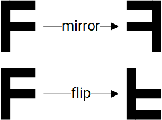

用于执行图形内容旋转、镜像和翻转的代码逻辑如下所示，具体涉及的变量与寄存器定义紧随其后。

```sql
Input param: Rect_left, Rect_top, Rect_width, Rect_height, data_in[4][256].
Output: Block_rect_left, Block_rect_top,  Block_rect_width,  Block_rect_height, data_out[4][256].
Block_rect_left = Rect_left;
Block_rect_top = Rect_top;
Block_rect_width = Rect_width;
Block_rect_height = Rect_height;
if LayerX_degree == ROT_0{
    Org_rect_left = Rect_left;
    Org_rect_top = Rect_top;
    Org_rect_width = Rect_width;
    Org_rect_height = Rect_height;
}
if LayerX_degree == ROT_90{
    Org_rect_left = Rect_top;
    Org_rect_top = ALIGN(LayerX_height,16) - Rect_left - Rect_width;
    Org_rect_width = Rect_height;
    Org_rect_height = Rect_width;
} 
if LayerX_degree == ROT_180{
    Org_rect_left = ALIGN(LayerX_width,16) - Rect_left - Rect_width;
    Org_rect_top = ALIGN(LayerX_height,16) - Rect_top - Rect_height;
    Org_rect_width = Rect_width;
    Org_rect_height = Rect_height;
}
if LayerX_degree == ROT_270{
    Org_rect_left = ALIGN(LayerX_width,16)-Rect_top-Rect_height;
    Org_rect_top = Rect_left;
    Org_rect_width = Rect_height;
    Org_rect_height = Rect_width;
}
if LayerX_degree == ROT_MIRROR{
    Org_rect_left = ALIGN(LayerX_width,16) - Rect_left - Rect_width;
    Org_rect_top = Rect_top;
    Org_rect_width = Rect_width;
    Org_rect_height = Rect_height;
}
if LayerX_degree == ROT_FLIP{
    Org_rect_left = Rect_left;
    Org_rect_top = ALIGN(LayerX_height,16) - Rect_top - Rect_height;
    Org_rect_width = Rect_width;
    Org_rect_height = Rect_height;
}
//fetch data in Org_rect
Fetch_data(Org_rect, &data_in[4][256]);
Loop all pixels in data_in{
    dst_index=jx16 + i;
    if LayerX_degree == ROT_0
        src_index=jx16 + i;
    if LayerX_degree == ROT_90
        src_index=(15-i)x16 + j;
    if LayerX_degree == ROT_180
        src_index=(15-j)x16 + (15-i);
    if LayerX_degree == ROT_270
        src_index= ix16+(15-j);
    if LayerX_degree == ROT_MIRROR
        src_index = jx16 + (15-i);
    if LayerX_degree == ROT_FLIP
        src_index = (15-j)x16 + i;
    data_out[0][dst_index]= data_in[0][src_index];
    data_out[1][dst_index]= data_in[1][src_index];
    data_out[2][dst_index]= data_in[2][src_index];
    data_out[3][dst_index]= data_in[3][src_index];
}
```

**变量定义**

| 变量名                              | 位宽               | 描述                                     |
|-------------------------------------|--------------------|------------------------------------------|
| Rect_left, Rect_top                | 16 位无符号整数     | 源矩形区域左上角坐标，范围 [0, 65535]    |
| Rect_width, Rect_height            | 5 位无符号整数      | 源矩形区域尺寸，范围 [1, 16]             |
| Block_rect_left, Block_rect_top    | 16 位无符号整数     | 块矩形区域左上角坐标，范围 [0, 65535]    |
| Block_rect_width, Block_rect_height| 5 位无符号整数      | 块矩形区域尺寸，范围 [1, 16]             |
| data_in[4][256],<br/>data_out[4][256] | 8 位无符号 × 4 × 256 | 输入和输出像素数据缓存（RGBA），范围 [0, 255] |

**寄存器定义**

| 寄存器名                    | 位宽               | 描述                                      |
|-----------------------------|--------------------|-------------------------------------------|
| LayerX_degree               | 3 位无符号整数      | X 是 0 或 1，用于指定图层 X 的旋转角度：<br> - 000 = 0°<br> - 001 = 90°<br> - 010 = 180°<br> - 011 = 270°<br>具体定义参见模块寄存器文档 |
| LayerX_width, LayerX_height | 16 位无符号整数     | X 是 0 或 1，分别表示图层 X 的宽度和高度，具体定义参见模块寄存器文档 |

###### 色彩空间转换（CSC）

支持以下格式的 **色彩空间转换（Color Space Conversion, CSC）**：

- **BT.601 与 BT.709**：支持窄域（Narrow Range）与全域（Full Range）之间的相互转换；
- **RGB ↔ YUV**：支持 RGB 到 YUV 及 YUV 到 RGB 的双向转换。

转换过程通过一个 **3×3 变换矩阵** 对输入通道进行线性变换，并对结果进行 **限幅（Clamping）**，以确保输出值始终处于有效范围 **[0, 255]** 内。

为此，系统实现如下公式，具体涉及的变量与寄存器定义紧随其后。

**第一步：计算中间通道值**

$$
C0_{inter} = (Layer_matrix[0][0]*C0_{in} + Layer_matrix[0][1]*C1_{in} + Layer_matrix[0][2]*C2_{in} + 512)>>(10+Layer_matrix[0][3])
$$

$$
C1_{inter} = (Layer_matrix[1][0]*C0_{in} + Layer_matrix[1][1]*C1_{in} + Layer_matrix[1][2]*C2_{in} + 512)>>(10+Layer_matrix[1][3])
$$

$$
C2_{inter} = (Layer_matrix[2][0]*C0_{in} + Layer_matrix[2][1]*C1_{in} + Layer_matrix[2][2]*C2_{in} + 512)>>(10+Layer_matrix[2][3])
$$

**第二步：限幅处理以确保合法输出**

$$
C0_{out}=clamp(C0_{inter},0,255)
$$

$$
C1_{out}=clamp(C1_{inter},0,255)
$$

$$
C2_{out}=clamp(C2_{inter},0,255)
$$

$$
C3_{out}=clamp(C3_{in},0,255)
$$

**变量定义**

| 变量名                          | 位宽             | 描述                     |
|----------------------------------|------------------|--------------------------|
| C0in, C1in, C2in, C3in          | 8 位无符号整数    | 输入通道（如 R/G/B/A 或 Y/U/V/A） |
| C0inter, C1inter, C2inter       | 10 位有符号整数   | 中间通道值               |
| C0out, C1out, C2out, C3out      | 8 位无符号整数    | 输出通道                 |

**寄存器定义**

| 寄存器名              | 索引     | 位宽           | 说明                                      |
|-----------------------|----------|----------------|-------------------------------------------|
| LayerX_CSC_enable     | —        | 1 位无符号整数  | 0：禁用 CSC<br/>1：启用 CSC               |
| Layer_matrix[#][#]    | 0–11     | 13 位有符号整数 | 共 12 个系数（3×4），取值范围 [-4096, 4095] |

在代码中，CSC 功能按以下条件执行：

```
if LayerX_CSC_enable == 0
    skip CSC function
```

###### 缩放（Scaling）

缩放操作采用基于超级块（superblock）的系统化处理方式，具体流程如下：

- 首先按 **水平方向** 输出前四个超级块，随后按 **垂直方向** 继续输出；
- 当 **垂直方向输出完成** 后，处理流程将重新从 **第一行超级块** 开始。

###### 存储（Storing）

一个 16×16 的图像块可被写入 DDR 内存，但**仅位于输出裁剪区域（output crop region）内的部分会被实际存储**。该部分数据在存储前会转换为指定的输出色彩格式（如 YUV、RGB 等）。

用于存储图像块的代码逻辑如下所示，具体涉及的变量与寄存器定义紧随其后。

```sql
Input param: Rect_left, Rect_top, Rect_width, Rect_height, data_in[4][256]
if output_format == YUV420
{
    s0=0;
    s1=1;
    s2=2;
    if(output_swap){
        Swap(s1, s2);
    }
    Loop all pixels by 2x2{
        if(pixel in output_crop_rect){
            Y00=data_in[s0][pixel_index00];
            Y01=data_in[s0][pixel_index01];
            Y10=data_in[s0][pixel_index10];
            Y11=data_in[s0][pixel_index11];
            U00=data_in[s1][pixel_index00];
            U01=data_in[s1][pixel_index01];
            U10=data_in[s1][pixel_index10];
            U11=data_in[s1][pixel_index11];
            V00=data_in[s2][pixel_index00];
            V01=data_in[s2][pixel_index01];
            V10=data_in[s2][pixel_index10];
            V11=data_in[s2][pixel_index11];
            Downsample and store to output frame
            U=(U00+U01+U10+U11+2)>>2;
            V=(V00+V01+V10+V11+2)>>2;
        }
    }
}
if output_format == RGB888 
{
    s0=0;
    s1=1;
    s2=2;
    if(output_swap){
        Swap(s0, s2);
    }
    Loop all pixels{
        if(pixel in output_crop_rect){
            R=data_in[s0][pixel_index];
            G=data_in[s1][pixel_index];
            B=data_in[s2][pixel_index];
            store to output frame.
        }
    }
}
if output_format == RGBX888 || output_format == RGBA888
{
    s0=0;
    s1=1;
    s2=2;
    s3=3;
    if(output_swap){
        Swap(s0, s2);
    }
    Loop all pixels{
        if(pixel in output_crop_rect){
            R=data_in[s0][pixel_index];
            G=data_in[s1][pixel_index];
            B=data_in[s2][pixel_index];
            A=data_in[s3][pixel_index];
            store to output frame.
        }
    }
}
if output_format == ARGB8888 
{
    s0=3;
    s1=0;
    s2=1;
    s3=2;
    if(output_swap){
        Swap(s1, s3);
    }
    Loop all pixels{
        if(pixel in output_crop_rect){
            R=data_in[s0][pixel_index];
            G=data_in[s1][pixel_index];
            B=data_in[s2][pixel_index];
            A=data_in[s3][pixel_index];
            store to output frame.
        }
    }
}
```

**变量定义**

| 变量名        | 位宽               | 说明         |
|----------------|--------------------|------------|
| Rect_left<br/>Rect_top                     | 16 位无符号整数     | 范围 [0, 65535]                          |
| Rect_width<br/>Rect_height                 | 5 位无符号整数      | 范围 [1, 16]                             |
| pixel_index                                | 8 位无符号整数      | 范围 [0, 65535]（注：实际有效范围受 16×16 块限制） |
| s0, s1, s2, s3                             | 8 位无符号整数      | 范围 [0, 255]，通常用于中间或通道数据    |
| Y00, Y01, Y10, Y11,<br/>U00, U01, U10, U11,<br/>V00, V01, V10, V11,<br/>U, V, R, G, B, A | 8 位无符号整数 | 范围 [0, 255]，表示像素的色彩分量（YUV/RGB/Alpha） |
| data_in[4][256]                            | 8 位无符号 × 4 × 256 | 输入像素数据缓存（RGBA 或其他四通道格式），范围 [0, 255] |

**寄存器定义**

| 寄存器名           | 位宽             | 说明                |
|--------------------|------------------|--------------------|
| Output_format      | 3 位无符号整数    | 指定输出色彩格式：<br/>• 0: RGB888（低地址为 R，高地址为 B）<br/>• 1: RGBX8888<br/>• 2: RGBA8888<br/>• 3: ARGB8888（低地址为 A，高地址为 B）<br/>• 5: YUV420 半平面格式（UV 交错，低地址为 U，高地址为 V） |
| Output_swap        | 1 位无符号整数    | 通道交换控制：<br/>• 0: 不交换<br/>• 1: RGB 模式下交换 R/B；YUV 模式下交换 U/V |
| Output_layout      | 1 位无符号整数    | 存储布局：<br/>• 0: 线性（Linear）<br/>• 1: FBC 压缩格式（Frame Buffer Compression） |
| Output_crop_left   | 16 位无符号整数   | 裁剪区域左边界，范围 [0, 65534]；需满足 `crop_left < output_left + output_width` |
| Output_crop_top    | 16 位无符号整数   | 裁剪区域上边界，范围 [0, 65534]；需满足 `crop_top < output_top + output_height` |
| Output_crop_width  | 16 位无符号整数   | 裁剪区域宽度，范围 [1, 65535]；需满足 `crop_left + crop_width ≤ output_left + output_width` |
| Output_crop_height | 16 位无符号整数   | 裁剪区域高度，范围 [1, 65535]；需满足 `crop_top + crop_height ≤ output_top + output_height` |

### 2.4 视频子系统

#### 概述

视频处理单元（Video Processing Unit, VPU）是一个配备双核的视频加速引擎，专为多种视频标准的**解码与编码**而设计。VPU 内置一个主机 CPU，用于运行固件以控制硬件引擎的各项功能，包括**码流解析**、**视频硬件子模块控制**以及**错误恢复机制**等。

VPU 最高可运行在 **819 MHz** 的时钟频率下，支持广泛的视频编解码标准，包括：**H.265（HEVC）**、**H.264（AVC）**、**VP8**、**VP9**、**MPEG-4**、**MPEG-2** 和 **H.263**。

VPU 支持以下并发工作模式：

- **1080p@60fps 的同时编码与解码**
- **H.264/H.265 编码 @1080p@30fps** 与 **H.264/H.265 解码 @4K@30fps** 同时进行

视频编解码核模块通过**全硬件逻辑（hardwired logic）** 实现各标准的具体编解码操作。其中，**宏块序列器（Macroblock Sequencer）** 作为主控制器，负责调度各子模块的处理流程，旨在**降低处理器负载**并**简化固件复杂度**。

如前所述，多个与具体标准无关的通用功能模块在运行时共享公共逻辑，以确保整体处理效率和性能的流畅性。

#### 视频编码器（Video Encoder）

##### 编码特性

- 支持可配置的 **ARM 帧缓冲压缩（AFBC）1.0 或 1.2** 作为输入格式；
- 支持 **YUV422 和 YUV420** 格式的 AFBC **16×16 块拆分（block split）**；
- 支持 **跨距（stride）** 配置（**不适用于 AFBC 输入格式**）；
- 支持 **水平与垂直镜像**（**不适用于 AFBC 输入格式**）；
- 支持在编码前对源帧进行 **90 度步进的旋转**（**不适用于 AFBC 输入格式**）：

  > **注意**：若 YUV422 输入被旋转 90° 或 270°，且未转换为 YUV420，则输出将自动转换为 **YUV440** 格式。

- 支持以下源帧输入格式的编码：

  - **单平面 YUV422**，逐行扫描格式，色度分量交错排列，顺序为 **YUYV** 或 **UYVY**  
    > **注意**：YUV422 输入可选转换为 YUV420 进行编码。

  - **单平面 RGB（8 位）**，按字节地址顺序排列，支持 **RGBA、BGRA、ARGB 或 ABGR**；

  - **双平面 YUV420**，逐行扫描格式，色度分量交错排列，顺序为 **UV** 或 **VU**；

  - **三平面 YUV420**，逐行扫描格式  
    > **注意**：三平面格式**仅用于测试目的**，**不推荐用于追求最佳性能的场景**。

  - **AFBC YUV422**

  - **AFBC YUV420**

##### 支持的编码格式

- **HEVC（H.265）Main** 档案
- **H.264 Baseline Profile（BP）** 基础档
- **H.264 Main Profile（MP）** 主档
- **H.264 High Profile（HP）** 高级档
- **VP8**
- **VP9 Profile 0** 档案 0

###### HEVC（H.265）编码特性

- 编码输出的码流符合 **HEVC（H.265）Main Profile** 规范；
- 支持 **1080p@60fps** 编码性能（双核运行，频率约 300 MHz）；
- 单核在 300 MHz 下可支持最高 **50 Mbps** 码率；
- 最大帧宽与帧高：**4096 像素**；
- 支持 **8 位** 编码，包含 **I 帧、P 帧和 B 帧**；
- 仅支持 **逐行扫描（Progressive）** 编码，最大 **CTU（Coding Tree Unit）尺寸为 64×64**；
- 支持 **平铺模式（Tiled Mode）**，最多 **4 个水平方向切片（仅支持水平分割）**；
- 支持 **波前并行处理（Wavefront Parallel Processing, WPP）**；
- 运动估计（ME）搜索窗口范围：
  - 水平方向：±128 像素  
  - 垂直方向：±64 像素；
- ME 搜索精度可达 **四分之一像素（QPEL, Quarter-Pixel）**；
- 亮度（Luma）帧内预测块尺寸：**8×8、16×16、32×32**；
- 色度（Chroma）帧内预测块尺寸：**4×4、8×8、16×16**；
- 帧间预测（Inter-mode）块尺寸：**8×8、16×16、32×32**；
- 亮度变换块尺寸：**8×8、16×16、32×32**；
- 色度变换块尺寸：**4×4、8×8、16×16**；
- 支持 **跳过 CU（Skipped CUs）** 与 **Merge 模式**；
- 支持 **去块滤波（Deblocking Filter）**；
- 支持 **样本自适应偏移（Sample Adaptive Offset, SAO）**；
- 可选启用 **受限帧内预测（Constrained Intra Prediction）**；
- 支持 **固定量化参数（Fixed QP）** 或 **基于码率控制的动态 QP** 操作；
  - 码率控制采用基于 **漏桶模型（Leaky Bucket Model）**，依据设定的码率与缓冲区大小进行调节；
- 支持 **长期参考帧（Long Term Reference Frames）**；
- 可配置 **帧内刷新间隔（Intra-frame Refresh Interval）**；
- 支持以 **CTU 行粒度** 插入切片（Slice）；
- 可配置运动估计的 **搜索窗口范围** 与 **分割选项上限**；
- **注意**：编码器 **不会阻止单个 CTU 输出比特数超过标准规定的最大值**。

###### H.264 编码特性

- 编码输出的码流符合 **H.264 Baseline、Main 和 High Profile** 规范；
- 支持 **1080p@60fps** 编码性能（双核运行，频率约 300 MHz）；
- 单核在 300 MHz 下可支持最高 **50 Mbps** 码率；
- 最大帧宽与帧高：**4096 像素**；
- 支持 **I 帧、P 帧和 B 帧**；
- 仅支持 **逐行扫描（Progressive）** 编码；
- 支持两种熵编码方式：
  - **CABAC**（Context Adaptive Binary Arithmetic Coding）
  - **CAVLC**（Context Adaptive Variable Length Coding）  
  > **注意**：使用 CAVLC 时 **不支持 B 帧**。

- 运动估计（ME）搜索窗口范围：
  - 水平方向：±128 像素  
  - 垂直方向：±64 像素；
- ME 搜索精度可达 **四分之一像素（QPEL, Quarter-Pixel）**；
- 亮度（Luma）帧内预测块尺寸：**4×4、8×8、16×16**；
- 色度（Chroma）帧内预测块尺寸：**8×8**；
- 帧间预测（Inter-mode）块尺寸：**8×8、16×16**；
- 变换块尺寸：**4×4 和 8×8**；
- 支持 **跳过宏块（Skipped Macroblocks）**；
- 支持 **去块滤波（Deblocking Filter）**；
- 可选启用 **受限帧内预测（Constrained Intra Prediction）**；
- 支持 **固定量化参数（Fixed QP）** 或 **基于码率控制的动态 QP** 操作；
  - 码率控制采用基于 **漏桶模型（Leaky Bucket Model）**，依据设定的码率与缓冲区大小进行调节；
- 支持 **长期参考帧（Long Term Reference Frames）**；
- 可配置 **帧内刷新间隔（Intra-frame Refresh Interval）**；
- 切片（Slice）插入粒度为 **每 32 像素高的行**；
- 可限制运动估计的 **搜索窗口范围** 与 **宏块分割选项**；
- **始终启用转义机制（Escape Option）**，以防止在任何 NAL 单元包格式下出现 **NAL 起始码（Start Code）的误匹配（Emulation Prevention）**。

> **注**：
>
> - 更多细节请参阅 ITU-T H.264 附录 B：[VC-1 Compressed Video Bitstream Format and Decoding Process](https://multimedia.cx/mirror/VC-1_Compressed_Video_Bitstream_Format_and_Decoding_Process.pdf)  
> - 编码器 **不会阻止单个宏块输出比特数超过标准规定的最大值**，需由上层应用确保合规性。

###### VP8 编码特性

- 支持 **1080p@60fps** 编码性能（双核运行，频率约 400 MHz）；
- 单核在 400 MHz 下可支持最高 **50 Mbps** 码率；
- 最大帧宽与帧高：**2048 像素**；
- 支持 **I 帧和 P 帧**；
- 仅支持 **逐行扫描（Progressive）** 编码；
- 运动估计（ME）搜索窗口范围：
  - 水平方向：±128 像素  
  - 垂直方向：±64 像素；
- ME 搜索精度可达 **四分之一像素（QPEL, Quarter-Pixel）**；
- 亮度（Luma）帧内预测块尺寸：**4×4、8×8、16×16**；
- 色度（Chroma）帧内预测块尺寸：**8×8**；
- 帧间预测（Inter-mode）块尺寸：**8×8、16×16**；
- 支持 **跳过宏块（Macroblock Skipping）**；
- 支持 **去块滤波（Deblocking Filter）**；
- 支持 **固定量化参数（Fixed QP）** 或 **基于码率控制的动态 QP** 操作；
  - 码率控制采用基于 **漏桶模型（Leaky Bucket Model）**，依据设定的码率与缓冲区大小进行调节；
- 可配置 **帧内刷新间隔（Intra-frame Refresh Interval）**；
- 可限制运动估计的 **搜索窗口范围** 与 **宏块分割选项**。

###### VP9 编码特性

- 编码输出的码流符合 **VP9 Profile 0** 规范，支持 **8 位色深**；
- 支持 **1080p@60fps** 编码性能（双核运行，频率约 300 MHz）；
- 单核在 300 MHz 下可支持最高 **50 Mbps** 码率；
- 最大帧宽与帧高：**4096 像素**；
- 仅支持 **8 位样本精度**；
- 支持 **I 帧和 P 帧**；
- 仅支持 **逐行扫描（Progressive）** 编码；
- 支持 **平铺行与列（Tiled Rows and Columns）**，提升并行处理能力；
- 运动估计（ME）搜索窗口范围：
  - 水平方向：±128 像素  
  - 垂直方向：±64 像素；
- ME 搜索精度可达 **四分之一像素（QPEL, Quarter-Picture Element）**；
- 亮度（Luma）帧内预测块尺寸：**8×8、16×16、32×32**；
- 色度（Chroma）帧内预测块尺寸：**4×4、8×8、16×16**；
- 帧间预测（Inter-mode）块尺寸：**8×8、16×16、32×32**；
- 亮度变换块尺寸：**8×8、16×16、32×32**；
- 色度变换块尺寸：**4×4、8×8、16×16**；
- 支持 **超级块跳过（Superblock Skipping）**；
- 支持 **去块滤波（Deblocking Filter）**；
- 支持 **固定量化参数（Fixed QP）** 或 **基于码率控制的动态 QP** 操作；
  - 码率控制采用基于 **漏桶模型（Leaky Bucket Model）**，依据设定的码率与缓冲区大小进行调节；
- 可配置 **帧内刷新间隔（Intra-frame Refresh Interval）**；
- 支持使用延迟上下文（delayed contexts）进行 **隐式或显式概率更新（Implicit or Explicit Probability Update）**。

#### 视频解码器（Video Decoder）

##### 解码特性

- 支持以下源帧输出格式：
  - **双平面 YUV420** 逐行扫描格式：色度分量交错排列，顺序为 **UV 或 VU**；
  - **三平面 YUV420** 逐行扫描格式  
    > **注意**：
    > - 三平面格式的支持仅用于测试目的，不建议在追求高性能的应用中使用；
    > - 确保 YUV 缓冲区的正确对齐和跨距（stride）设置以获得最佳性能。

- 支持 **YUV420 AFBC 格式**，8 位色彩深度；
- 可配置输出为 **AFBC 1.0 或 AFBC 1.2** 标准；
- 仅对逐行扫描格式支持 **跨距（stride）** 配置；
- 在输出前支持对解码帧进行 **90 度步进的旋转**：

  > **注意**：该功能不适用于 AFBC 输出格式。

- 支持输出每个显示帧中每 **32×32 像素块** 的平均亮度（亮度值）和色度（颜色值）。

##### 支持的解码格式

- **HEVC（H.265）**：Main Profile  
- **H.264**：Baseline Profile、Main Profile、High Profile  
- **VP8**  
- **VP9**：Profile 0  
- **VC-1**：Simple Profile（SP）、Main Profile（MP）、Advanced Profile（AP）  
- **MPEG-4**：Simple Profile（SP）、Advanced Simple Profile（ASP）  
- **MPEG-2**：Main Profile（MP）  
- **H.263**：Profile 0

###### HEVC（H.265）解码特性

- 完全符合 **HEVC Main Profile** 规范；
- 支持 **2160p@30fps** 解码性能（双核运行，频率约 300 MHz）；
- 单核在 600 MHz 下可处理最高 **100 Mbps** 的平均码率；
- 最大帧宽与帧高：**4096 像素**；
- 支持 **错误隐藏（Error Concealment）** 机制，用于应对码流中的比特错误；
- 解码过程中可输出相关的 **码流参数信息**（如分辨率、Profile、Level 等）。

###### H.264 解码特性

- 完全符合 **H.264 Baseline、Main、High 以及 High 10 Progressive Profile** 规范；
- 对于使用 **灵活宏块排序（FMO）** 或 **任意切片排序（ASO）** 的 Baseline Profile 码流，支持 **WVGA 分辨率下 30fps** 的解码性能（单核运行，频率 400 MHz）；
- 对于 **未使用 FMO 和 ASO** 的码流，解码性能如下：

  - **2160p@30fps**（双核运行，频率约 300 MHz）  
  - **1080i@120fps**（双核运行，频率 400 MHz）

- 对于 **逐行扫描（Progressive）** 码流：
  - 单核在 600 MHz 下可处理最高 **100 Mbps** 的平均码率；
  - 最大帧宽与帧高：**4096 像素**；

- 对于 **隔行扫描（Interlaced）** 码流：
  - 单核在 400 MHz 下可处理最高 **50 Mbps** 的平均码率；
  - 最大帧宽：**2048 像素**；
  - 最大帧高：**4096 像素**；

- 支持 **错误隐藏（Error Concealment）** 机制，用于处理码流中的传输或解析错误；
- 解码过程中可输出相关的 **码流参数信息**（如 Profile、Level、分辨率、帧率等）；
- **始终启用转义机制（Escape Option）**，以防止在任何 NAL 单元包格式下出现 **NAL 起始码（Start Code）的误匹配（Emulation Prevention）**。

> **注**：  
> 更多细节请参阅 ITU-T H.264 Annex B。  

###### VP8 解码特性

- 完全符合 **VP8 规范**；
- 支持 **1080p@60fps** 解码性能（双核运行，频率约 400 MHz）；
- 单核在 400 MHz 下可处理最高 **50 Mbps** 的平均码率；
- 最大帧宽与帧高：**2048 像素**；
- 支持 **错误隐藏（Error Concealment）** 机制，用于处理码流中的传输或解析错误。

###### VP9 解码特性

- 完全符合 **VP9 Profile 0** 规范；
- 在 **不包含不可见帧（non-visible frames）且无 Alt-Ref 帧** 的前提下，支持 **2160p@30fps** 解码性能（双核运行，频率约 300 MHz）；
- 在 **Alt-Ref 帧间隔为 4** 的典型配置下，支持 **2160p@30fps** 解码性能（双核运行，频率约 400 MHz）；
- 单核在 600 MHz 下可处理最高 **60 Mbps** 的平均码率；
- 最大帧宽与帧高：**4096 像素**；
- 支持 **错误隐藏（Error Concealment）** 机制，用于处理码流中的传输或解析错误；
- 解码过程中可输出相关的 **码流参数信息**（如 Profile、分辨率、色深、参考帧结构等）。

###### VC-1 解码特性

- 完全符合 **VC-1 Simple Profile（SP）、Main Profile（MP）和 Advanced Profile（AP）** 规范；
- 支持以下解码性能（双核运行，频率约 400 MHz）：
  - **1080p@60fps**（逐行扫描）
  - **1080i@120fps**（隔行扫描）
- 单核在 400 MHz 下可处理最高 **40 Mbps** 的平均码率；
- 最大帧宽：**2048 像素**；
- 最大帧高：**4096 像素**；
- 支持 **错误隐藏（Error Concealment）** 机制，用于处理码流中的传输或解析错误。

> **注意**：
>
> - 无论 NAL 包格式如何设置，**Advanced Profile** 的码流数据 **必须始终包含封装机制（Encapsulation Mechanism）**；
> - 更多细节请参阅 **SMPTE-421M-2006 附录 E**；
> - **VC-1 Advanced Profile 中的范围映射（Range Mapping）功能不适用于 AFBC 输出格式**。

###### MPEG-4 解码特性

- 符合 **MPEG-4 Simple Profile（SP）** 和 **Advanced Simple Profile（ASP）** 规范；
- 支持 **全局运动补偿（Global Motion Compensation, GMC）**，限制为 **最多一个变形点（warp point）**；
- 支持以下解码性能（双核运行，频率 400 MHz）：
  - **1080p@60fps**
  - **1080i@120fps**
- 单核在 400 MHz 下可处理最高 **20 Mbps** 的平均码率；
- 最大帧宽与帧高：**2048 像素**；
- 支持 **错误隐藏（Error Concealment）** 机制，用于处理码流中的传输或解析错误。

###### MPEG-2 解码特性

- 符合 **MPEG-2 Main Profile（MP）** 规范；
- 支持以下解码性能（双核运行，频率 400 MHz）：
  - **1080p@60fps**
  - **1080i@120fps**
- 单核在 400 MHz 下可处理最高 **20 Mbps** 的平均码率；
- 最大帧宽：
  - **4096 像素**
  - **2048 像素**
- 最大帧高：**4096 像素**；
- 支持 **错误隐藏（Error Concealment）** 机制，用于处理码流中的传输或解析错误。

###### H.263 解码特性

- 符合 **H.263 Profile 0** 规范；
- 支持 **1080p@60fps** 解码性能（双核运行，频率约 400 MHz）；
- 单核在 400 MHz 下可处理最高 **20 Mbps** 的平均码率；
- 最大帧宽与帧高：**2048 像素**；
- 支持 **错误隐藏（Error Concealment）** 机制，用于处理码流中的传输或解析错误。

### 2.5 显示子系统

#### 显示控制器（Display Controller）

##### 概述

显示控制器是一个硬件模块，用于将显示数据从内部显存传输至 **MIPI DSI 控制器**。它通过 MIPI DSI 接口支持一路独立的显示设备。

##### 特性

- 支持最高 **HD+ 分辨率（1920×1080@60fps）**；
- 支持最多 **4 个全尺寸图层合成器（full-size layer composer）**，通过 RDMA 通道的上下图层复用机制，最多可扩展至 **8 个图层合成器**；
- 支持 **cmdlist 机制**，允许通过命令列表配置硬件寄存器参数；
- 支持 **回写（Write-back）路径** 中同时输出 **原始格式（Raw）** 和 **AFBC 压缩格式**；
- 回写路径支持 **抖动（Dithering）**、**裁剪（Cropping）** 和 **旋转（Rotation）**；
- 采用 **高级 MMU（虚拟地址）机制**，在执行 90° 和 270° 旋转时几乎无页缺失（page miss）；
- 支持 **色键（Color Keying）** 与 **纯色生成（Solid Color Generation）**；
- 面板输出支持 **高级误差扩散抖动（Advanced Error Diffusion Dithering）** 和 **基于图案的抖动（Pattern-based Dithering）**；
- 支持 **AFBC 格式** 与 **原始格式（Raw）** 的图像源输入；
- 支持 **色彩饱和度** 与 **对比度增强**；
- 面板支持 **视频模式（Video Mode）** 与 **命令模式（Command Mode，LCM 内置帧缓冲）**；
- 支持通过内置 **DFC 缓冲区** 实现 **动态 DDR 频率调节**；
- 支持以下 **输入格式**（参见下图格式映射）：

  - A2BGR101010, A2RGB101010, BGR101010A2, RGB101010A2  
  - ABGR8888, ARGB8888, BGRA8888, RGBA8888  
  - XBGR8888, XRGB8888, BGRX8888, RGBX8888  
  - BGR888, RGB888, ABGR1555, RGBA5551, BGR565 / RGB565  
  - XYUV_444_P1_8, XYUV_444_P1_10, YVYU_422_P1_8, VYUY_422_P1_8  
  - YUV_420_P2_8, YUV_420_P3_8  

  

- 支持以下 **输出格式**：

  - RGB888, RGB565, RGB666

##### 架构框图

显示子系统的微架构如下图所示：


#### HDMI 接口

##### 特性

- 符合 **HDMI 规范 v1.4**；
- 支持 **双声道音频流**，采样率范围为 **32 kHz 至 192 kHz**；
- 物理通道速率最高达 **2.4 Gbps/通道 × 3 通道**；
- 支持最高分辨率 **1920×1440@60Hz**；
- 支持 **RGB** 和 **YCbCr 4:2:2 / 4:4:4** 格式的输入视频；
- 支持 **RGB** 和 **YCbCr 4:2:2 / 4:4:4** 格式的输出视频；
- 支持 **8 bpc / 10 bpc / 12 bpc** 的输入与输出色彩深度；
- 支持 **EIA/CEA-861-F** 视频时序标准及 **InfoFrame** 结构；
- 支持 **L-PCM（IEC 60958）** 音频格式，双声道，采样率 32~192 kHz；
- 支持 **消费电子控制（CEC）** 标准数据包及用户自定义数据包；
- 内置 **I²C 主控制器**，用于远程访问 EDID，支持 **100~400 kbps** 通信速率。

##### 架构框图

HDMI 接口的架构如下图所示：


#### MIPI DSI 接口

##### 概述

MIPI 显示串行接口（MIPI Display Serial Interface, MIPI DSI）是一种主机处理器与外设之间高速通信的接口，遵循 **MIPI 联盟** 针对移动设备接口制定的标准规范。

##### 特性

- 符合 **MIPI DSI 标准 v1.0**；
- 符合 **MIPI D-PHY 规范 v1.1**；
- 支持最多 **4 条数据通道（Data Lanes）** 的 MIPI D-PHY，每通道速率最高达 **1200 Mbps**；
- 每个 D-PHY 链路支持 **1 个激活显示面板**；
- 符合 **显示命令集（Display Command Set, DCS）** 标准；
- 支持 DSI 与 DCS 规范中定义的 **全部像素格式**；
- 支持 **视频突发模式（Video Burst Mode）**，D-PHY 每通道速率最高达 **1.2 Gbps**；
- 支持 MIPI 链路上的 **虚拟通道（Virtual Channels）**；
- 支持最高 **1080p 分辨率**；
- 支持 **命令模式（Command Mode）**、**视频模式（Video Mode）** 和 **突发模式（Burst Mode）**；
- 支持以下信号类型：
  - **HS-TX**（高速发送）
  - **LP-TX**（低功耗发送）
  - **LP-RX**（低功耗接收）
  - **LP-CD**（低功耗内容检测）

#### SPI LCD 显示接口

##### 概述

SPI LCD 显示接口用于：

- 发送图像数据命令  
- 读取图像数据  
- 传输图像数据  

该接口支持以下操作模式：

- **单数据线模式（Single data line mode）**  
- **双数据线模式（Dual data line mode）**

在上述每种模式下，均进一步支持以下工作模式：

- **3 线 / 9 位模式（3-line/9bit mode）**  
- **4 线 / 8 位模式（4-line/8bit mode）**

通过软件可配置：

- 哪条数据线作为**首条传输线**；
- 选择以下**传输模式**之一：
  - **打包传输模式（Packet transfer mode）**
  - **非打包传输模式（Unpacked transfer mode）**

以下图示展示了不同色彩格式下的数据组织与传输方式示例：

**[RGB565 的打包传输模式]**


**[RGB666 的打包传输模式]**

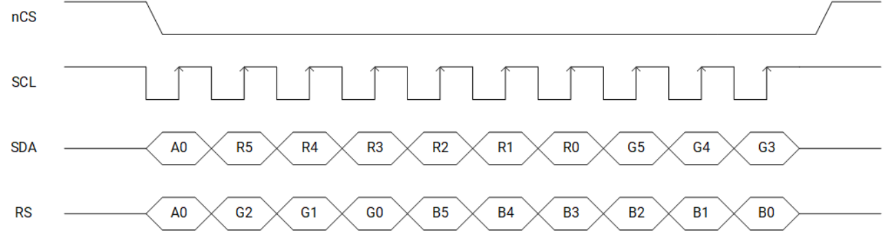

**[RGB888 的打包传输模式]**


**[RGB666 的非打包传输模式]**

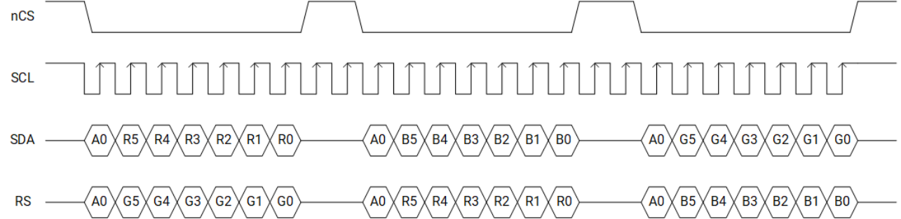

**[RGB888 的非打包传输模式]**


##### 特性

- 支持最高分辨率为 **320×240** 的 SPI LCD 模块；
- 支持 **3 线 / 4 线 SPI** 以及 **2 线 SPI 数据传输**；
- 支持最多 **3 路同时叠加层（Overlays）**（其中 2 路用于 RGB，1 路支持 YUV 与 RGB）；
- 支持 **抖动（Dithering）**；
- 支持 **伽马曲线（Gamma Curve）** 调整；
- 支持 **Alpha 混合**，可配置全局 Alpha 值或 **逐像素 Alpha 混合（Per-pixel Alpha Blending）**；
- 支持 **YUV 到 RGB 色彩空间转换**；
- 支持 **图像缩放（Scaling）**；
- 支持 **色键（Color Keying）**；
- 支持 **内存回写（Memory Write-back）**；

- **图像层（Image Layer）** 支持以下输入格式：

  - YUV422 平面格式（Planar）  
  - YUV422 打包格式（Packet）  
  - YUV420 平面格式（Planar）  
  - RGB888  
  - RGB565  
  - RGB666  
  - BGR888  
  - BGR565  
  - BGR666  

  > **注**：如上所示，为提升灵活性，支持 **R/B 通道交换（R-B Swap）选项**。

- **OSD 层（OSD Layer）** 支持以下输入格式：

  - RGB888  
  - RGB565  
  - RGB666  
  - BGR888  
  - BGR565  
  - BGR666  

  > **注**：同样支持 **R/B 通道交换（R-B Swap）选项**，以增强格式适配能力。

##### 架构框图

SPI LCD 显示接口的架构如下图所示。

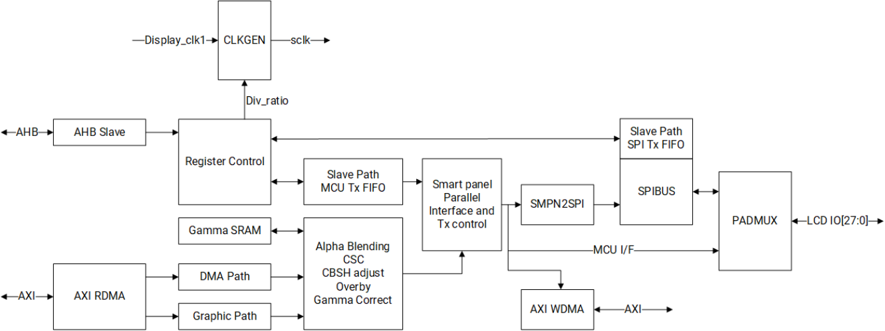

从图中可以清晰地了解到显示数据是如何被高效处理，然后转换为 SPI 兼容信号，并最终传输到连接的 LCD 显示屏上的。

##### 功能

###### 混合功能（Blending Function）

DSI 控制器的混合功能用于结合多个具有不同透明度（alpha 值）的图像层或叠加层。

下面展示了各层及其相应的 alpha 值的一个例子，其中：

- **L0**：底层，基础图像；
- **L1**：中间层，alpha 值为 **a1**；
- **L2**：顶层，alpha 值为 **a2**；


支持以下几种混合模式：

- 正常 Alpha 混合模式（Normal Alpha Blending Mode）
- 预乘 Alpha 混合模式（Pre-Multiple Alpha Blending Mode）
- 特殊 Alpha 混合模式（Special Alpha Blending Mode）

在代码中，根据以下条件为每个混合模式实现了不同的公式使用 alpha 值 **a1**：

```c
if (L1 == color_key)
a1 = 8’h0;
else if (layer_alpha_sel == 1)
a1 = layer_alpha;
else
a1 = pixel_alpha;
```

每种混合模式的详细信息将在接下来的小节中解释。

**[正常 Alpha 混合模式]**

参照上面所示的例子，

- 对于 **2 层**，实现的公式为：

   $$
    L'=L1×a1+L0×(1-a1)
    $$

- 对于 **3 层**（不推荐），实现的公式为：

   $$
    L'=L2×a2+L1×a1×(1-a2)+L0×(1-a1)×(1-a2)
    $$

  > **注意：** 在这种情况下，写回（write-back）不支持 alpha 值。
  
在代码中，像素值 **L'** 根据以下条件依赖于 alpha 值 **a1**：

```c
if (a1 == 8’hFF)
L' = L1;
else if (a1 == 8’h00)
L' = L0;
else
L' = (L1-L0) × a1/256 + L0
```

**[预乘 Alpha 混合模式]**

参照上面所示的例子，

- 对于 **2 层**，实现的公式为：

   $$
    L'=L1+L0×(1−a1)
    $$

- 对于 **3 层**（不推荐），实现的公式为：

   $$
    L'=L2+L1×(1−a2)+L0×(1−a1)×(1−a2)
    $$

  > **注意：** 在这种情况下，写回支持 alpha 值，其值由公式 $a'=a1+a2−a1×a2$ 给出。

在代码中，像素值 **L'** 根据以下条件依赖于 alpha 值 **a1**：

```c
if (a1 == 8’hFF)
L' = L1;
else if (a1 == 8’h00)
L' = L0;
else
L' = L1-L0 × (1-a1)/256;
```

**[特殊 Alpha 混合模式]**

参照上面所示的例子，

- 对于 **2 层**，实现的公式为：

   $$
    L'=L1+L0×a1
    $$

- 对于 **3 层**（不推荐），实现的公式为：

   $$
    L'=L2+L1×a2+L0×a1×a2
    $$

  > **注意：** 在这种情况下，写回不支持 alpha 值。
  
在代码中，像素值 **L'** 根据以下条件依赖于 alpha 值 **a1**：

```c
if (a1 == 8’hFF)
L' = L0;
else
L' = L1 + L0 × a1/256;
```

###### 抖动功能（Dither Function）

抖动功能的处理流程如下图所示：


该功能可通过软件**启用或禁用**。

###### 帧标记功能（Fmark Function）

Fmark 功能用于控制显示输出的起始时机。具体行为如下：

- 若 **启用 Fmark 功能**，显示输出将等待 **Fmark 信号** 到达后才开始；
- 若 **禁用 Fmark 功能**，显示输出将在软件发起后**立即开始**。

通过软件可配置：

- **启用/禁用 Fmark 功能**；
- **Fmark 信号的极性（Polarity）**。

建议设置一个寄存器，用于配置 **LCDC 接收到 Fmark 信号后，显示输出延迟启动的时间**。

###### 背景颜色显示功能（Background Color Display Function）

当所有图层均未启用时，可直接显示由软件配置的**背景色**，无需从 DDR 中读取图像数据。

###### 图像捕获功能（Image Capture Function）

要启用图像捕获功能，需先通过软件配置以下参数：

- **startx**：捕获区域起始点的 X 坐标  
- **starty**：捕获区域起始点的 Y 坐标  
- **width**：从起始点 (X, Y) 开始的捕获宽度（单位：像素）  
- **height**：从起始点 (X, Y) 开始的捕获高度（单位：像素）  
- **base_addr**：用于存储捕获图像的内存起始地址  
- **pitch**：内存中连续两行像素起始地址之间的字节距离（包含为对齐或硬件要求而添加的填充字节）

图像捕获功能的处理流程如下图所示：


### 2.6 音频子系统

#### 概述

音频子系统集成了两个主要接口：

- 2 × 全双工 I2S 接口
- 1 × HDMI 音频接口

#### 特性

- **I2S 接口**

  - 支持全双工操作，同时支持播放和录音；
  - 符合标准 I2S 格式，具有固定参数：
    - 采样率为 **48 kHz**；
    - 数据深度为 **16 位**；
    - 2 个声道；
  - 可配置的系统时钟（sysclk）模式：64fs、128fs 或 256fs；

- **HDMI 音频接口**

  - 仅支持播放功能，具有固定参数：
    - 采样率为 **48 kHz**；
    - 数据深度为 **16 位**；
    - 2 个声道。

### 2.7 互联子系统

#### PCIe 2.0

##### 概述

K1 实现了 **三个 PCIe 双模端口**，每个端口均可配置为 **根联合体（Root Complex, RC）** 或 **端点设备（Endpoint, EP）**。

所有端口均支持 **PCIe Gen2**，每通道数据传输速率为 **5 GT/s**。其中：

- 一个端口仅支持 **1 通道（x1）**；
- 两个端口各支持 **2 通道（x2）**。

##### 特性

- 支持 **双模配置**，可通过软件编程为 **RC 或 EP 设备**；
- 支持 **PCI Express Base Specification Rev 5.0 v1.0** 中所有非可选功能（限于 Gen2 速率范围）；
- 集成 **内部地址转换单元（iATU）**，包含 **8 个出站（outbound）条目** 和 **8 个入站（inbound）条目**；
- 支持 **嵌入式 DMA（Embedded DMA）**，具备硬件流控机制，包含 **4 个写通道** 和 **4 个读通道**；
- 支持 **ECRC（End-to-End CRC）生成与校验**；
- 最大有效载荷（Max Payload Size）支持至 **256 字节**；
- 支持 **自动通道翻转与极性反转（Automatic Lane Flip and Reversal）**；
- 支持 **Active State Power Management (ASPM)** 的 **L0 和 L1 电源状态**；
- 支持 **延迟容忍度报告（Latency Tolerance Reporting, LTR）**；
- 仅支持 **虚拟通道 0（Virtual Channel 0）**；
- 支持 **基于 ID 的排序（ID Based Ordering, IDO）**；
- 支持 **完成超时范围（Completion Timeout Ranges）**；
- 支持 **独立参考时钟带独立扩频（Separate Reference Clock with Independent Spread, SRIS）**；
- 支持最多 **64 个出站 Non-Posted 请求**；
- 支持最多 **32 个未完成的 AXI 从设备 Non-Posted 请求**；
- 在 EP 模式下，仅支持 **Function 0**，并提供 **6 个可编程大小的 BAR（Base Address Register）**；
- 在 EP 模式下支持 **MSI（Message Signaled Interrupt）能力**；
- 在 RC 模式下集成 **MSI 接收模块（Integrated MSI Reception Module）**。

##### 架构框图

PCIe 双模端口组的架构如下图所示：

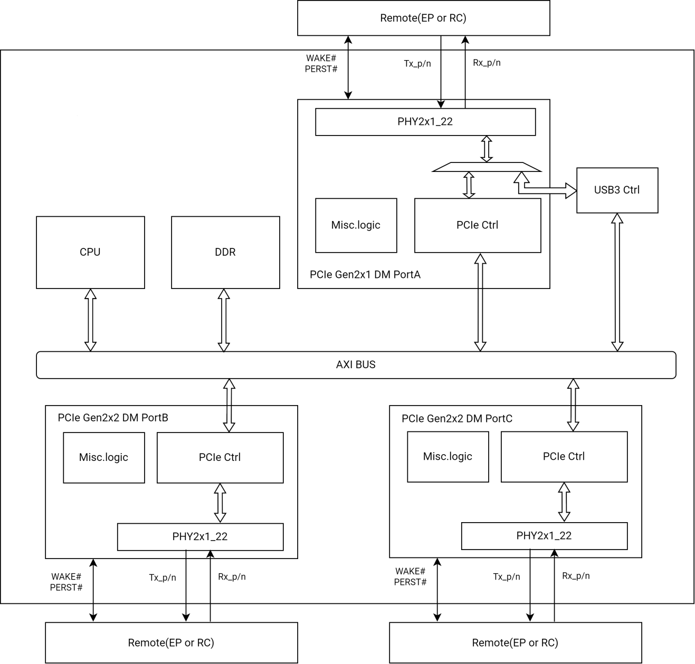

如图所示，包含以下组件：

- **1 个 PCIe Gen2 x1 双模端口**（以下简称 **Port A**）
- **2 个 PCIe Gen2 x2 双模端口**（以下简称 **Port B** 和 **Port C**）

各端口均由以下部分构成：

- **控制器（Controller）**：通过 **3 个 AXI 接口** 集成到 SoC 中，具体包括：
  - **AXI 主端口（AXI Master Port）**：用于处理入站流量（即来自远程设备或通过 PCIe 控制器内部 DMA 的数据），可访问 DDR 内存以实现与远程设备之间的双向数据传输；
  - **AXI 数据从端口（AXI Data Slave Port）**：供本地 CPU 访问，用于发起出站流量；
  - **AXI DBI 从端口（AXI DBI Slave Port）**：用于 PCIe 控制器的配置接口。

- **物理层（PHY）**：符合 **PIPE 3.0 规范**，分为两类：
  - **Phy2x1_22**
    - 支持 Gen2 ×1 通道；
    - 采用 **22nm 工艺** 制造；
    - **Port A 与 USB3 控制器共享该 PHY**，但 **不能同时使用**（即 Port A 与 USB3 可分别工作，但不可并发）；
  - **Phy2x2_22**
    - 支持 Gen2 ×2 通道；
    - 采用 **22nm 工艺** 制造；
    - **Port B 与 Port C 各自拥有独立的 PHY**（即不共享）。

- **辅助逻辑（Miscellaneous Logic）**，主要包括与远端链路伙伴连接的 **芯片 I/O 信号**：
  - **差分数据信号**：Rx_p/n、Tx_p/n  
    （Port B/C 为 ×2 通道，Port A 为 ×1 通道）
  - **参考时钟信号**：refclk_p/n（支持输入或输出模式）
  - **热复位信号**：PERST#  
    （EP 模式下为输入，RC 模式下为输出）
  - **唤醒信号**：WAKE#  
    （EP 模式下为输出，RC 模式下为输入）

#### USB

##### 概述

K1 集成了三个 USB 端口，具体如下：

- 1 个 **USB 2.0 OTG 端口**
- 1 个 **USB 2.0 仅主机（Host-Only）端口**
- 1 个 **USB 3.0 端口**，同时集成 **USB 2.0 双角色设备（DRD）接口**

##### 特性

###### USB 2.0 OTG 端口特性

- **控制器（Controller）**
  - 支持 **USB 2.0 主机（Host）与设备（Device）双模式**
  - 符合 **USB 2.0 标准**
  - 在主机和设备模式下均支持：
    - **高速（High Speed, HS）480 Mbps**
    - **全速（Full Speed, FS）12 Mbps**
  - 仅在主机模式下支持 **低速（Low Speed, LS）1.5 Mbps**
  - 主机控制器寄存器及数据结构符合 **Intel EHCI 规范**
  - 设备控制器寄存器及数据结构基于 **EHCI 编程接口扩展实现**
  - 总线接口符合 **AMBA-AHB 规范**

- **通信接口（Communication Interface）**
  - 采用 **UTMI+ 接口** 与 USB 2.0 PHY 通信

- **协议支持（Protocols）**
  - 支持 **会话请求协议（Session Request Protocol, SRP）**
  - 支持 **主机协商协议（Host Negotiation Protocol, HNP）**

- **通道与端点（Channel & Endpoint）**
  - 支持最多 **16 个主机通道（Host Channels）**
  - 设备模式下支持 **16 个 IN 端点** 和 **16 个 OUT 端点**，其中：
    - **16 KB 缓冲区** 用于发送数据
    - **2 KB 缓冲区** 用于接收数据

###### USB 2.0 仅主机端口特性

- **控制器（Controller）**
  - 支持 **USB 2.0 HS / FS / LS 主机模式**
  - 符合 **USB 2.0 标准**
  - 主机模式下支持：
    - **高速（480 Mbps）**
    - **全速（12 Mbps）**
    - **低速（1.5 Mbps）**
  - 主机控制器寄存器及数据结构符合 **Intel EHCI 规范**
  - 总线接口符合 **AMBA-AHB 规范**

- **通信接口（Communication Interface）**
  - 采用 **UTMI+ 接口** 与 USB 2.0 PHY 通信

- **通道支持（Channel Support）**
  - 支持最多 **16 个主机通道**

###### 带 USB 2.0 DRD 接口的 USB 3.0 端口特性

- **控制器（Controller）**
  - 支持 **USB 3.0 主机与设备双模式**
  - 同时支持 **USB 2.0 主机与设备双模式**
  - 符合 **USB 3.0 与 USB 2.0 标准**
  - 支持 **USB 3.0 SuperSpeed（5 Gbps）** 以及 **USB 2.0 主机/设备模式**
  - USB 3.0 主机控制器寄存器及数据结构符合 **Intel xHCI 规范**
  - USB 3.0 设备控制器寄存器及数据结构为 **自定义实现**，需软件配置
  - 支持 **1 个 USB 3.0 端口** 和 **1 个 USB 2.0 端口**
  - 主机与设备模式下支持：
    - **高速（480 Mbps）**
    - **全速（12 Mbps）**
  - 仅在主机模式下支持 **低速（1.5 Mbps）**

- **通信接口（Communication Interface）**
  - USB 3.0 PHY 使用 **PIPE3 接口（125 MHz）**
  - USB 2.0 PHY 使用 **UTMI+ 接口（30/60 MHz）**

- **时钟域（Clock Domains）**
  - PIPE3 PHY：125 MHz  
  - UTMI+ PHY：30/60 MHz  
  - MAC：标称 125 MHz  
  - 总线（BUS）时钟域  
  - RAM 时钟域  

- **系统与电源管理（System & Power Management）**
  - 内置 **DMA 控制器**
  - 支持 **USB 2.0 挂起（Suspend）模式**
  - 支持 **USB 3.0 U1 / U2 / U3 低功耗状态**

- **端点与内存（Endpoint & Memory）**
  - 设备模式下支持最多 **32 个端点**
  - 端点 FIFO 大小 **灵活可配**（不限于 2 的幂次），支持使用连续内存区域
  - 支持 **描述符缓存** 与 **数据预取**，以提升高延迟系统中的性能

- **附加功能（Additional Features）**
  - 支持 **软件控制的标准 USB 命令**（USB SETUP 命令由应用层解码）
  - 提供 **硬件级错误处理**，覆盖 USB 总线及包层级异常
  - 支持 **中断机制**

##### 架构框图

USB 端口组的架构如下图所示，其中：

- **USB#0 端口 = USB 2.0 OTG 端口**  
- **USB#1 端口 = USB 2.0 仅主机端口**  
- **USB#2 端口 = 带 USB 2.0 DRD 接口的 USB 3.0 端口**

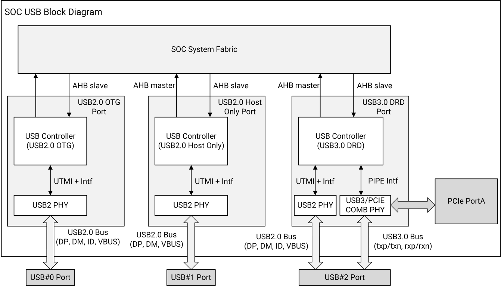

#### 以太网 GMAC

##### 概述

K1 集成了一个 **GMAC IP 核**，该核满足 **10/100/1000 Mbps 以太网（符合 IEEE 802.3-2012 标准）节点** 所需的基本协议功能。

GMAC IP 核支持以下速率：

- **10 Mbps**
- **100 Mbps（快速以太网）**
- **1000 Mbps（千兆以太网）**

此外，该核集成了一个高性能的 **64 位 Scatter-Gather DMA 引擎**，用于在 **主机内存（HOST Memory）** 与 **内部 FIFO** 之间高效传输数据包，从而实现高吞吐性能。

##### 特性

- 支持 **发送/接收数据封装功能**，包括：
  - **帧定界（Framing）**：帧边界识别与帧同步；
  - **错误检测（Error Detection）**：物理介质传输错误检测；
- 在 **半双工模式（Half-Duplex Mode）** 下（10/100 Mbps），支持：
  - **介质访问管理**：包括介质分配（冲突避免）和争用仲裁（冲突处理）；
  - **冲突帧重传机制**；
- 在 **全双工模式（Full Duplex Mode）** 下支持 **流控（Flow Control）功能**：
  - 解码 **PAUSE 控制帧**；
  - 暂停发送器；
  - 主动生成 **PAUSE 控制帧**；
- 支持 **4 位数据通路的 RGMII 接口**，用于连接 RGMII 兼容的 PHY 芯片；
- 提供 **管理接口（Management Interface）**，通过 **MDC/MDIO 引脚** 生成管理帧，与外部 PHY 设备通信；
- 在 **AXI 总线** 上具备 **总线主控（Bus Mastering）能力**，支持以 **64 位传输模式** 在主机内存与内部 FIFO 之间搬运数据包；
- 基于描述符（Descriptor-based）自动完成主机内存与内部 FIFO 之间的数据包传输，**显著降低 CPU 开销**。

##### 架构框图

以太网 GMAC 单元的微架构如下图所示：

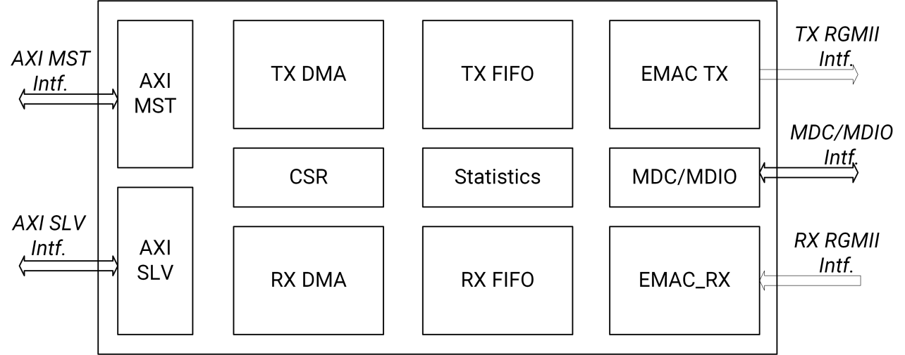

#### SDIO 接口

##### 概述

SDIO 接口是一个硬件模块，作为 SDIO 总线的主机，用于在 **SDIO Wi-Fi 模块** 和 **内部总线主控** 之间传输数据。

##### 特性

- 符合 **SDIO 4.10 协议规范** 的 **4 位模式**；
- 与 **SD-HCI 规范** 中定义的寄存器集保持一致，并包含额外的供应商特定寄存器；
- 支持 **1 位和 4 位 SDIO 总线**；
- 支持 SD-HCI 规范中定义的以下数据传输类型：
  - **PIO（Programmed I/O）**
  - **SDMA（Single DMA）**
  - **ADMA（Advanced DMA）**
  - **ADMA2（Advanced DMA 2）**
- 支持 SD 3.0 规范中定义的以下速度模式：
  - **默认速度模式（Default Speed Mode）**：最高可达 **12.5 MB/s**，信号电平为 **3.3V**；
  - **高速模式（High Speed Mode）**：最高可达 **25 MB/s**，信号电平为 **3.3V**；
  - **SDR12（Single Data Rate 12）**：最高频率 **25 MHz**，信号电平为 **1.8V**；
  - **SDR25（Single Data Rate 25）**：最高频率 **50 MHz**，信号电平为 **1.8V**；
  - **SDR50（Single Data Rate 50）**：最高频率 **100 MHz**，信号电平为 **1.8V**；
  - **SDR104（Single Data Rate 104）**：最高频率 **208 MHz**，信号电平为 **1.8V**；
  - **DDR50（Dual Data Rate 50）**：最高频率 **100 MHz**，信号电平为 **1.8V**；
- 对卡总线上所有命令和数据事务提供基于硬件的 **CRC 生成与校验**；
- 支持 SDIO 卡中的 **读等待控制（Read-wait Control）**；
- 支持 SDIO 卡中的 **挂起/恢复（Suspend/Resume）功能**；
- 提供 **1024 字节（2 x 512 字节数据块）FIFO**，用于发送和接收数据。

#### CAN-FD 接口

##### 概述

CAN-FD 控制器完整实现了 CAN 协议规范，同时兼容 **支持灵活数据速率的 CAN（CAN-FD）协议** 和 **CAN 2.0 Part B 协议**。

##### 特性

- 完整支持 **CAN-FD 协议** 与 **CAN 2.0 Part B 规范**，包括：
  - 标准数据帧（Standard Data Frames）
  - 扩展数据帧（Extended Data Frames）
  - 数据长度范围：**0 至 64 字节**
  - 可编程比特率（Programmable Bit Rate）
  - 基于内容的寻址（Content-Related Addressing）
- 符合 **ISO 11898-1** 标准；
- 经硅验证（Silicon-Proven），通过 **ISO 16845-1:2016** CAN 一致性测试；
- 邮箱（Mailbox）结构灵活，可配置为存储 **0、8、16、32 或 64 字节** 的数据；
- 每个邮箱均可独立配置为 **接收或发送模式**，并支持标准帧与扩展帧；
- 每个邮箱配备 **独立的接收掩码寄存器（Receive Mask Register）**；
- 内置功能完整的 **接收 FIFO**，最多可缓存 **6 帧**，具备自动内部指针管理及 **DMA 支持**；
- 支持 **传输中止（Transmission Abort）** 功能；
- 提供 **128 个消息缓冲区槽位（每个槽位 8 字节）**，可灵活配置为发送或接收用途；
- CAN 协议引擎的时钟源可选：**外设时钟** 或 **振荡器时钟**；
- **不使用 RAM 进行收发操作**，但可将该 RAM 用作通用 RAM 空间；
- 支持 **监听模式（Listen-Only Mode, LOM）**；
- 支持 **可编程回环模式（Loop-Back Mode）**，用于自检；
- 可编程的 **传输优先级策略**，支持以下方式：
  - 最低 ID 优先
  - 最低缓冲区编号优先
  - 最高优先级优先
- 集成 **16 位自由运行定时器**，用于时间戳生成，支持可选的外部时间滴答（Time Tick）输入；
- 支持通过特定消息实现 **全局网络时间同步**；
- 支持 **可屏蔽中断（Maskable Interrupts）**；
- 与传输介质无关（需外接收发器）；
- 采用仲裁机制，确保 **高优先级消息具有极短延迟**；
- 支持 **低功耗模式**，可通过总线活动或帧匹配（Pretended Networking）触发唤醒；
- 在高速 CAN-FD 数据段传输时，支持 **收发器延迟补偿（Transceiver Delay Compensation, TDC）**；
- 远程请求帧（Remote Request Frame）可由软件自动处理；
- **CAN 比特时序参数与配置寄存器仅在 Freeze 模式下可写**；
- 可配置传输邮箱状态选择策略：**最低优先级缓冲区** 或 **空缓冲区**；
- 支持 **标识符接收过滤命中指示寄存器（IDHIT）**，用于标记接收到的帧匹配结果；
- 错误状态寄存器 1 中的 **SYNCH 位** 表示是否已与 CAN 总线同步；
- 支持 **发送消息的 CRC 状态反馈**；
- 支持 **接收 FIFO 全局掩码寄存器（Global Mask Register）**；
- 在匹配过程中，可选择 **邮箱与接收 FIFO 之间的优先级**；
- 高级接收 FIFO ID 过滤功能，支持以下匹配能力：
  - 最多 **128 个扩展 ID**
  - 最多 **256 个标准 ID**
  - 最多 **512 个部分 ID（8 位）**
  - ID 过滤表最多包含 **32 个条目**
- 完全向后兼容早期版本的 CAN-FD 实现；
- 支持 **内存读取访问中的错误检测与纠正**：
  - 每字节 CAN-FD 内存配对 **5 位奇偶校验位**，构成 **13 位字**；
  - 错误纠正机制可：
    - **检测并纠正单比特错误（可纠正错误）**
    - **检测但无法纠正双比特错误（不可纠正错误）**
- 在低功耗模式（**Doze 模式** 和 **Stop 模式**）下支持 **伪网络（Pretended Networking）功能**。

#### SPI 接口

##### 概述

SPI 接口是一种同步串行接口，支持通过 **Motorola 串行外设接口（SPI）协议** 与外部设备进行数据通信。该接口可配置为以下两种工作模式：

- **主模式（Master Mode）**：连接的外设作为从设备；
- **从模式（Slave Mode）**：连接的外设作为主设备。

##### 特性

- 支持 SPI 协议中 **CPOL 与 CPHA 的全部四种组合**；
- 可配置为 **主模式** 或 **从模式**；
- 支持 **仅接收（Receive-without-Transmit）操作**；
- 串行比特率范围：**6.3 kbps（最小推荐值）至 52 Mbps（最大值）**；
- 数据位宽可配置为 **8 位、16 位、18 位或 32 位**；
- 配备独立的 **发送 FIFO（TXFIFO）** 和 **接收 FIFO（RXFIFO）**，具体特性如下：
  - **非打包数据模式（Non-Packed Data Mode）**：
    - 两个 FIFO 均为 **32 行 × 32 位** 宽度，共支持 **32 个数据样本**；
  - **打包数据模式（Packed Data Mode）**：
    - 当数据样本宽度为 **8 位或 16 位** 时，使用 **双倍深度 FIFO**；
    - 两个 FIFO 均为 **64 个位置 × 16 位** 宽度，共支持 **64 个数据样本**；
  - 两个 FIFO 均可通过 **程序化 I/O（PIO）** 或 **DMA 突发传输** 进行填充或清空。

#### UART 接口

##### 概述

通用异步收发器（UART）接口可通过 **直接内存访问（DMA）** 或 **程序化 I/O（PIO）** 进行控制。

##### 特性

- 最多支持 **10 个 UART 接口**；
- 兼容 **16550A** 和 **16750 UART 标准**；
- 支持在串行数据流中 **自动添加或移除标准异步通信位**（起始位、停止位和校验位）；
- **独立控制** 发送、接收、线路状态及数据集相关中断；
- 提供 **调制解调器控制功能**（仅 UART2 和 UART3 支持 CTSn 与 RTSn 信号）；
- 支持 **自动流控（Auto-flow）**，无需产生中断即可管理数据 I/O：
  - **RTSn（输出）** 由 UART 接收 FIFO 状态自动控制；
  - **CTSn（输入）** 来自 UART 调制解调器的发送控制信号；
- 可编程串行接口，支持以下配置选项：
  - 数据位长度：**7 位或 8 位**；
  - 校验方式：**偶校验、奇校验或无校验**；
  - 停止位：**1 位**；
  - 波特率生成：**4 个高速 UART 最高支持 3.6 Mbps**；
  - 支持 **伪起始位检测（False Start-Bit Detection）**；
- 配备 **64 字节发送 FIFO**；
- 配备 **64 字节接收 FIFO**；
- 支持 **完整的状态报告**；
- 支持 **生成与检测线路中断（Line Break）**；
- 内置 **诊断功能**，包括：
  - **回环控制（Loopback Control）**：用于通信链路故障隔离；
  - 支持模拟 **中断、校验错误和帧错误**；
- 具备 **完全优先级化的中断系统**；
- 支持 **独立的 DMA 请求通道**，分别用于发送和接收数据服务；
- 支持 **红外串行异步接口**，符合 **红外数据协会（IrDA）规范**。

#### 总线接口

##### 概述

Inter-Integrated Circuit（I2C）总线是一种真正的 **多主设备总线**，具备 **冲突检测** 与 **仲裁机制**。

系统中包含一个专用的 I2C 模块，称为 **电源 I2C 模块（Power I2C Module）**，用于连接 **电源管理 IC（PMIC）**。

该 I2C 总线接口可在 I2C 总线上作为 **主设备（Master）** 或 **从设备（Slave）** 工作。此串行总线由 Philips 公司开发，采用 **两线制接口**，定义如下：

- **SDA**：数据引脚，用于输入和输出；
- **SCL**：时钟引脚，提供时序参考并控制 I2C 总线操作。

I2C 总线允许 I2C 单元与其它 I2C 外设及微控制器进行通信。其硬件需求极简，为芯片间及与外部设备之间传输状态和控制信息提供了一种经济高效的解决方案。

该 I2C 总线接口作为一个外设模块挂载在 **外设总线（Peripheral Bus）** 上，主要实现以下功能：

- **数据传输**：通过带缓冲的接口实现可靠通信；
- **控制与状态管理**：通过内存映射寄存器（Memory-Mapped Registers）进行访问。

##### 特性

- 符合 **I2C 总线规范**，但 **不支持以下特性**：
  - 硬件通用呼叫（Hardware General Call）
  - 10 位从设备地址（10-bit Slave Addressing）
  - CBUS 兼容性
- 支持 **多主设备模式（Multi-Master）** 与 **总线仲裁（Arbitration）**
- 支持以下 **工作模式与速率**：

  - **标准模式（Standard Mode）**：最高 **100 kbps**  
  - **快速模式（Fast Mode）**：最高 **400 kbps**  
  - **高速从设备模式（High-Speed Slave Mode）**：最高 **3.4 Mbps**（仅限高速 I2C）  
  - **高速主设备模式（High-Speed Master Mode）**：最高 **3.3 Mbps**（仅限高速 I2C）

  > **注**：在高速主设备模式下，由于总线上存在上拉电阻，实际 I2C 工作频率会有所下降。SCL 时钟频率与上拉电阻值成反比（∝ 1/R）。

##### 架构框图

I2C 总线接口的架构如下图所示：


#### 红外接收接口（IR-RX Interface）

##### 特性

- 将红外输入信号转换为 **游程编码（Run-Length Code, RLC）格式**；
- 支持 **可配置的信号宽度阈值**，用于噪声检测；
- 配备 **32 字节 FIFO**，用于存储接收到的数据。

#### 单总线主控接口（One-Wire Bus Master Interface）

##### 概述

单总线主控接口控制器负责在 **单总线（One-Wire）** 上接收和发送数据。该控制器通过 **8 位命令** 完全控制单总线操作。处理器通过 **5 个专用寄存器** 与控制器交互，用于：

- 加载命令  
- 读写数据  
- 配置中断控制  

一旦主机加载命令或数据，**所有单总线时序与控制信号** 均由单总线主控接口控制器内部自动生成。

当总线上发生需要 CPU 响应的事件时，控制器会：

- 置位相应的 **状态位**；
- 若中断使能，则向 CPU 发出 **中断请求**。

关于具体从设备（Slave）实现的详细信息，请参考 **《iButton® 标准手册》（Book of iButton® Standards）**，其中详细描述了单总线主控接口的操作方式。

##### 架构框图

单总线主控接口的架构如下图所示：

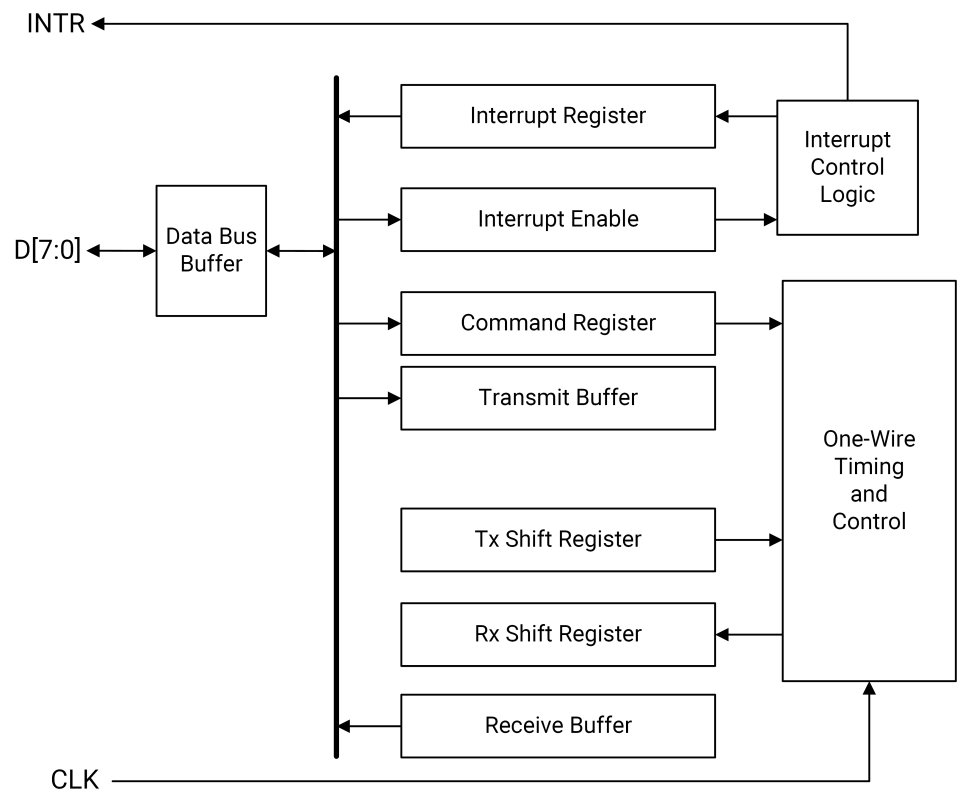

#### I2S 接口

##### 概述

I2S 接口是一种同步串行接口，专为连接各类外部设备而设计，包括 **模数转换器（ADC）**、**音频编解码器** 和 **电信编解码器**。该接口原生支持 **Inter-IC Sound（I2S）协议** 用于数据传输。

##### 特性

- 可配置为 **主模式（Master Mode）**（外设作为从设备）或 **从模式（Slave Mode）**（外设作为主设备）；
- 支持 **仅接收（Receive-without-Transmit）操作**；
- 串行比特率范围：**6.3 kbps（最小推荐值）至 52 Mbps（最大值）**；
- 数据位宽可配置为 **8 位、16 位、18 位或 32 位**；
- 配备独立的 **发送 FIFO（TXFIFO）** 和 **接收 FIFO（RXFIFO）**，具体特性如下：
  - **非打包数据模式（Non-Packed Data Mode）**：
    - 两个 FIFO 均为 **32 行 × 32 位** 宽度，共支持 **32 个数据样本**；
  - **打包数据模式（Packed Data Mode）**：
    - 当数据样本宽度为 **8 位或 16 位** 时，使用 **双倍深度 FIFO**；
    - 两个 FIFO 均为 **64 个位置 × 16 位** 宽度，共支持 **64 个数据样本**；
  - 两个 FIFO 均可通过 **程序化 I/O（PIO）** 或 **DMA 突发传输** 进行填充或清空；
- 支持最多 **8 个时隙（Time Slots）**，可在任意、全部或无时隙中独立进行 **发送/接收操作**；
- 音频时钟控制模块提供 **4 倍或 8 倍输出时钟**，以支持大多数标准音频采样频率。

### 2.8 安全子系统

#### 加密引擎（Encryption Engine）

##### 特性

- 支持对称加密算法，包括 **AES**；
- 支持公钥加密算法，包括 **RSA** 和 **ECC**；
- 支持哈希（HASH）算法，包括 **SHA-2** 系列。

#### 真随机数发生器（TRNG）

##### 特性

- 支持用于安全应用的 **真随机数发生器（True Random Number Generator, TRNG）**。

#### eFuse

##### 特性

- 共提供 **4 Kbit eFuse 存储空间**，划分为 **16 个 Bank**；
- 支持 **用户密钥存储**；
- 提供 **防回滚（Anti-Rollback）位**，用于实现安全固件升级；
- 包含 **生命周期阶段（Life Cycle Stage, LCS）位**，用于安全生命周期管理；
- 每个 eFuse Bank 均配备 **硬件写保护锁（Hardware Lock）**。

#### AES 引擎（AES Engine）

##### 特性

- 集成专用的 **高性能 AES 引擎**，适用于大规模数据的 **加密与解密** 操作。

### 2.9 系统外设

#### DMA 控制器

##### 概述

直接内存访问（DMA）控制器用于在 **内存与外设之间传输数据**，无需 CPU 干预。

外设 **不能直接向内存控制器提供地址或命令**。每个来自外设的 DMA 请求都会触发一次内存总线事务。处理器可通过 DMA 控制器作为 **DMA 桥接器** 直接访问外设总线，从而绕过系统级的 DMA 机制。

DMA 控制器通过 **16 个可配置的 DMA 通道**，在 **DMA 直通模式（Flow-Through Mode）** 下支持多种数据传输类型，如下表所示：

|                          | **内部内存**       | **外部内存**         | **内部外设**     | **外部外设**     |
|--------------------------|--------------------|----------------------|------------------|------------------|
| **内部内存**             | 直通模式           | —                    | —                | —                |
| **外部内存**             | 直通模式           | 直通模式             | —                | —                |
| **内部外设**             | 直通模式           | 直通模式             | —                | —                |
| **外部外设**             | 直通模式           | 直通模式             | —                | —                |

> 注：表中 “—” 表示当前不支持该类传输。

##### 特性

- 配备 **两个独立的 DMA 控制器实例**，分别用于：
  - **安全域（Secure Domain）**
  - **非安全域（Non-Secure Domain）**
- 在 **DMA 直通模式** 下支持以下数据传输类型：
  - **内存到内存（Memory-to-Memory）**
  - **外设到内存（Peripheral-to-Memory）**
  - **内存到外设（Memory-to-Peripheral）**
- 支持 **Flash 与 DDR 之间的 DMA 直通模式数据传输**；
- 实现 **优先级仲裁机制**，可同时处理最多 **4 个具有未决请求的活跃通道**；
- 所有 **16 个 DMA 通道** 均支持：
  - **带描述符获取（Descriptor-Fetch）传输**
  - **无描述符（Non-Descriptor-Fetch）传输**
- 支持以下 **高级描述符模式**：
  - **描述符比较（Descriptor Comparison）**
  - **描述符跳转（Descriptor Branching）**
- 支持从接收外设的缓冲区中 **提取尾部字节（Trailing Bytes）**；
- 支持 **可编程数据突发长度**：**8、16、32 或 64 字节**；
- 支持 **可配置外设数据宽度**：**字节（Byte）、半字（Half-Word）或字（Word）**；
- 单个描述符最大支持 **8191 字节** 的数据传输；更大传输可通过 **多描述符链式（Chaining）** 实现；
- 提供 **流控位（Flow Control Bit）**，用于管理外设请求（仅当流控位置位时，请求才会被处理）。

##### 架构框图

DMA 控制器的架构如下图所示：

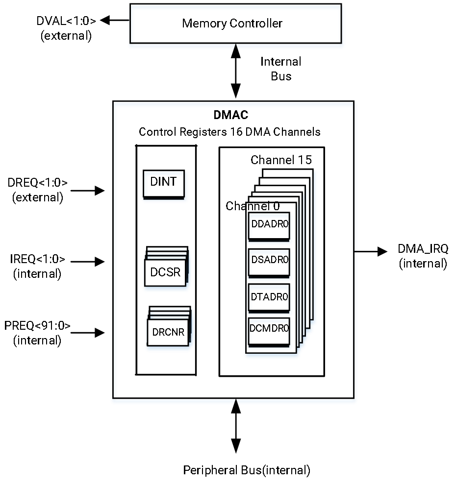

#### 定时器（Timer）

##### 概述

K1 集成了 **三个通用 32 位定时器**，用于系统级应用。每个定时器均配备一个独立的 **32 位定时器计数控制寄存器（TCCRn）**，作为向上计数器（Up Counter）使用。

##### 特性

- 支持可编程计数模式，包括：
  - **快速计数模式**：输入时钟频率可选 **12.8 MHz、6.4 MHz、3 MHz 或 1 MHz**
  - **慢速计数模式**：输入时钟频率为 **32.768 kHz**

#### 看门狗定时器（Watchdog Timer, WDT）

##### 概述

K1 集成了 **一个 16 位看门狗定时器（WDT）**，用于系统可靠性监控与自动恢复。

##### 特性

- 支持可编程计数模式，包括：
  - **快速计数模式**：输入时钟频率可选 **12.8 MHz、6.4 MHz、3 MHz 或 1 MHz**
  - **慢速计数模式**：输入时钟频率为 **32.768 kHz**

#### 温度传感器（Temperature Sensor）

##### 概述

温度传感器模块（TSEN）提供温度感知与转换功能，采用 **基于温度相关电压-时间转换** 的方法实现测温。

TSEN 具备 **报警功能**：当芯片温度超过设定的告警阈值时，会触发中断。此外，模块支持 **可编程的自动重复模式**，可按软件配置的时间间隔自动执行温度采样。

软件可通过 TSEN 监控芯片内部（on-die）温度，并在温度中断触发时采取必要措施，例如 **降低 CPU 核频率** 以防止过热。

##### 特性

- 支持通过软件 **开启或关闭 TSEN 模块**；
- 支持通过软件 **配置 BJT 温度的高/低告警阈值**，用于触发相应的中断；
- 自动记录 **检测到的最高 BJT 温度及其对应的 ID**，并持续跟踪 **最近两次检测到的温度值**；
- 支持通过软件 **启用紧急系统复位/重启功能**：当检测温度超过配置阈值时，温度传感器将触发 **系统复位或重启**（行为类似于看门狗超时复位）。

##### 架构框图

温度传感器模块的架构如下图所示：

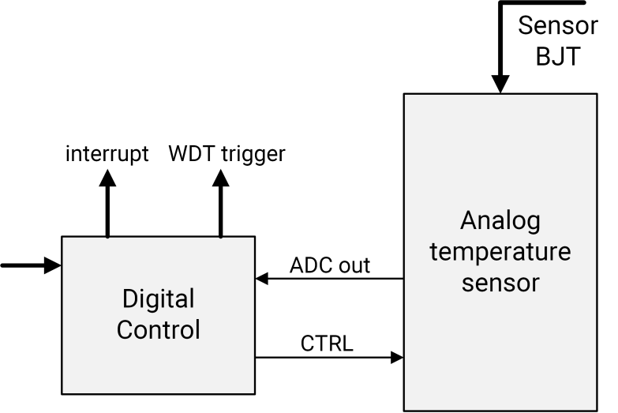

#### PWM（脉宽调制）

##### 概述

K1 集成了 **20 个独立的脉宽调制（PWM）通道**，编号为 **PWMx（x = 0 至 19）**。

每个 PWM 通道均拥有 **独立的配置寄存器**，并通过多功能引脚输出 PWM 信号。  
用户可分别控制其输出信号的 **上升沿（leading-edge）** 和 **下降沿（trailing-edge）** 时序。

各 PWM 通道的时序可配置为 **连续运行模式**，也可 **动态调整** 以适应实时需求变化。

在 **低功耗模式** 下，可通过关闭 PWM 通道的内部时钟（PSCLK_PWM），使对应输出信号（PWM_OUT）锁定为 **恒定高电平或低电平**，从而在无需 PWM 输出时有效降低功耗。

##### 特性

- 支持 **50% 占空比** 的输出频率范围为 **198.4 Hz 至 6.5 MHz**（其他占空比选项取决于所选频率）；
- 周期时间由 **6 位时钟分频器** 与 **10 位周期计数器** 联合精确控制；
- 脉冲宽度由 **15 位脉冲计数器** 进行精细调节。

#### 邮箱（Mailbox）

##### 概述

邮箱模块用于在 **SoC** 与 **MCU 子系统** 之间传递消息或信号，实现高效、低延迟的跨处理器通信。

##### 特性

- 支持一个处理器向另一个处理器 **触发中断**，以通知消息到达或事件发生；
- 提供 **轮询字（Polling Word）** 机制，允许一方在 **不使用中断** 的情况下向另一方发送事件信号；
- 接收到 **ACK 中断** 表示对端处理器处于活跃状态，通信链路正常；
- 支持一个处理器 **唤醒另一个处理器**（Wake-up 功能）。

##### 架构框图

邮箱模块的架构如下图所示：

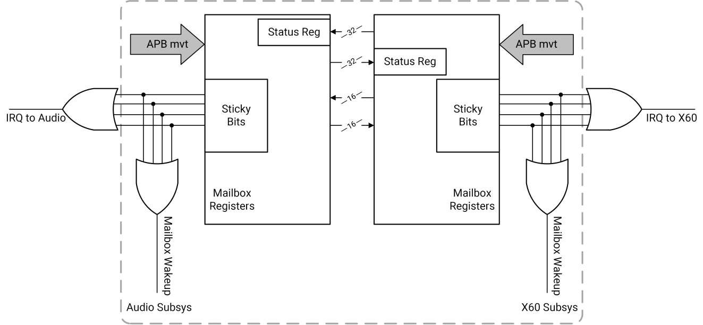

#### GPIO（通用输入/输出）

##### 概述

K1 提供 **通用输入/输出（GPIO）端口**，用于生成和捕获应用特定的输入与输出信号。这些端口通过 **复用功能选择器（Alternate Function Muxing）** 接入系统，由 GPIO 单元统一管理其控制与状态。

##### 特性

- 配置为 **输入模式** 的 GPIO 端口可作为 **中断源**；
- 系统复位后，默认所有 GPIO 端口均配置为 **输入模式**，直至引导程序或用户软件显式修改；
- 每个 GPIO 端口均配备 **独立的控制信号**；
- 支持 **边沿触发中断**，可单独配置为：
  - 上升沿（Leading-edge）
  - 下降沿（Trailing-edge）
  - 或两者同时触发；
- GPIO 输出可 **单独置位或清零**；
- GPIO 输入可 **单独读取**。

#### RTC（实时时钟）

##### 特性

- 基于内部 **1 Hz 时钟** 进行 **秒级计数**；
- 支持对 **内部振荡器频率进行校准**；
- 支持 **闹钟中断** 和 **1 Hz 周期中断**。

#### 超时监控器（Time-Out Monitor）

##### 特性

- 支持 **可配置的超时阈值**；
- 支持 **可配置的超时事件自动响应机制**（如复位、中断等）；
- 可记录 **首个超时事务的地址与发起方 ID**，便于调试分析；
- 支持对 **AWREADY / ARREADY 信号** 的可配置监控检查，用于检测总线挂死或响应异常。

### 2.10 传感器中枢子（Sensor-Hub）系统

#### 特性

- 支持 **1 路 I2C** 接口
- 支持 **1 路 SPP** 接口
- 支持 **2 路 UART** 接口
- 支持 **1 路 CAN** 接口


### 2.11 时钟与复位（Clock & Reset）

#### 概述

K1 提供以下基础时钟源：

- **1 个 32 kHz RTC 时钟**
- **1 个 24 MHz 晶振（OSC）时钟**

#### 特性

- 内部集成 **三个锁相环（PLL）**，可生成多种频率，满足不同应用场景的需求；
- 支持 **动态电压与频率调节（DVFS）**，在功耗与性能之间实现优化平衡；
- 实现 **无毛刺（Glitch-Free）时钟切换** 与 **时钟分频器**，在有限 PLL 资源下灵活提供系统所需全部频率；
- 对各功能模块采用 **细粒度时钟门控（Clock Gating）** 与 **软件复位机制**，以实现低功耗与灵活的模块管理。

#### 架构框图

##### 时钟系统

下图展示了详细的 **时钟树结构**，清晰说明了时钟信号如何在系统内生成、管理并分发至各功能模块：


此外，下图展示了时钟系统的 **高层架构**：

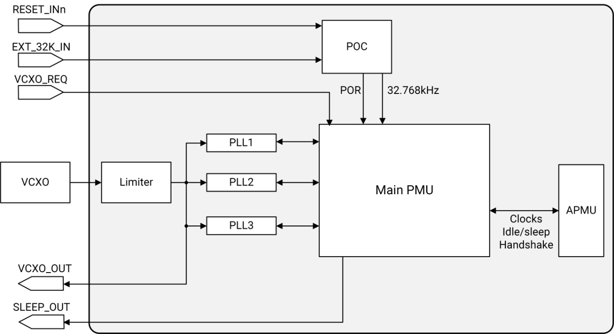

当满足以下任一条件时，**VCXO_OUT** 将输出 OSC 频率：

- **VCXO_REQ** 信号被置位，且 VCXO 软件请求控制寄存器中的相应 **REQ_EN 位域已使能**；
- VCXO 软件请求控制寄存器中的 **软件请求位域被启用**。

系统内设计有 **三个锁相环（PLL）**，支持宽范围输入频率，并可生成广泛的输出频率，确保各模块在不同应用场景下正常工作。各 PLL 的详细规格将在后续小节中分别说明。

###### PLL（锁相环）

- **PLL1** 用于为 CPU 核及其他外设生成 **固定频率点**，其特性如下：
  - PLL1 输出频率在运行时的更改 **仅限调试用途**，**不得用于量产系统**；
  - 系统复位后，PLL1 **默认启用**，仅当整个芯片进入睡眠模式且 **VCXO 关断功能已使能** 时才会关闭；
  - PLL1 及振荡器控制寄存器（位于主 PMU 中）的配置决定了系统复位或关断后，PLL1 输出时钟 **稳定所需的延迟时间**；
  - **不建议** 在正常运行过程中通过更新 PLL1 配置寄存器来改变输出频率。
  
- **PLL2** 用于生成多种 **固定频率**，与 PLL1 协同工作，为不同模块提供完整的频率覆盖，其特性如下：
  - PLL2 输出频率在运行时的更改 **仅限调试用途**，**不得用于量产系统**；
  - 系统复位后，PLL2 **默认禁用**，需通过软件显式使能；
  - PLL2 及振荡器控制寄存器（位于主 PMU 中）的配置决定了系统复位或关断后，PLL2 输出时钟 **稳定所需的延迟时间**；
  - **不建议** 在正常运行过程中通过更新 PLL2 配置寄存器来改变输出频率。

- **PLL3** 专为 **CPU 频率调节与切换（如 DVFS 场景）** 提供可变频率支持，其特性如下：
  - 系统复位后，PLL3 **默认禁用**，需通过软件按需使能；
  - PLL3 及振荡器控制寄存器（位于主 PMU 中）的配置决定了系统复位或关断后，PLL3 输出时钟 **稳定所需的延迟时间**；
  - **不建议** 在正常运行过程中通过更新 PLL3 配置寄存器来改变输出频率。

##### 资源复位方案（Resource Reset Scheme）

K1 支持多种资源复位方案，具体如下表所示：

| 编号 | 复位方案                   | 说明          |
|------|-----------|-------------------------|
| 1    | 上电复位（Power-On-Reset） | 在芯片上电过程中对 **整个芯片** 执行复位                             |
| 2    | 看门狗复位（WatchDog Reset） | 对 **整个芯片** 执行复位，但 **保留引脚复用（Pinmux）寄存器和调试寄存器** 的内容 |
| 3    | 模块级软件复位（Module Software Reset） | 通过软件 **单独复位各个模块**                                         |
| 4    | 电源域上电复位（Power Island POR Reset） | 在某一 **电源域上电过程中**，对该 **整个电源域** 执行复位               |

### 2.12 启动模式（Boot Modes）

#### 概述

K1 支持从以下存储介质启动：

- **SPI NAND Flash**  
- **SPI NOR Flash**  
- **eMMC**  
- **SD/TF 卡**

具体的启动模式由硬件引脚 **QSPI_DATA[1:0]**（亦称 **STRAP[1:0]**）的状态决定，如下表所示：

| 编号 | QSPI_DATA[1] / STRAP[1] | QSPI_DATA[0] / STRAP[0] | 启动模式                              |
|------|--------------------------|--------------------------|---------------------------------------|
| 1    | 下拉（Down）             | 下拉（Down）             | **SD/TF 卡 → eMMC**（默认启动顺序）   |
| 2    | 上拉（Up）               | 下拉（Down）             | **SD/TF 卡 → SPI NAND Flash**         |
| 3    | 下拉（Down）             | 上拉（Up）               | **SD/TF 卡 → SPI NOR Flash**          |
| 4    | 上拉（Up）               | 上拉（Up）               | **仅从 SD/TF 卡启动**                 |

### 2.13 电源管理单元（Power Management Unit, PMU）

#### 概述

K1 采用 **两级电源管理策略**，以实现不同粒度的功耗控制。系统定义了多个 **电源域（Power Domain）** 与 **电源状态（Power State）**，从而达成超低功耗目标。

共实现 **9 个电源域**，分别对应以下功能模块：

- **CPU 核（CPU Cores）**  
  > **注**：每个 CPU 核拥有独立的电源域，可单独控制。

- **CPU 集群（CPU Clusters）**  
  > **注**：每个 CPU 集群拥有独立的电源域，可单独控制。

- 视频编解码器（Video Encoder/Decoder）  
- GPU  
- HDMI 显示子系统（HDMI Display Subsystem）  
- MIPI DSI 子系统（MIPI DSI Subsystem）  
- 视频输入子系统（Video Input Subsystem）  
- RCPU（包含 N308、音频编解码器、RCPU 外设）  
- 常开域（Always-On Domain, AON）

除 **AON 域** 外，其余所有电源域均可根据具体应用场景 **动态关闭供电**。

为实现最低功耗，系统定义了以下 **电源状态**：

| 编号 | 电源状态名称             | 描述          |
|------|--------------------------|-------------|
| 1    | **ACTIVE**               | 系统处于活跃运行状态，所有电源域均上电（除部分可通过电源开关独立关闭的域外）。   |
| 2    | **CORE-IDLE**            | 各 CPU 核停止执行指令，进入空闲状态；执行 `WFI`（Wait-for-Interrupt）后自动进行时钟门控。当接收到路由至该核的中断时，退出此状态并继续执行。    |
| 3    | **Core-Power-Off**       | 在 CORE-IDLE 状态基础上，经投票（voted）后，各核可进一步进入断电状态。当中断到来时，重新上电并释放复位，恢复执行。  |
| 4    | **CPU-Cluster-Power-Off**| 当集群内所有核均进入 Core-Power-Off 状态后，整个 CPU 集群（含 L2/TCM 内存）可经投票进入此低功耗状态。<br/>任何路由至该集群内核的中断将唤醒集群：上电、恢复时钟、释放复位。   |
| 5    | **Home-Screen**          | 当两个 CPU 集群均进入 CPU-Cluster-Power-Off 状态后，主总线（AXI）时钟可经投票被门控关闭。<br/>任意中断将唤醒芯片：恢复 AXI 总线时钟，并为对应 CPU 集群和核上电、恢复时钟、释放复位以执行中断服务程序。 |
| 6    | **Chip-Sleep**           | 这是 **超低功耗状态**：所有 PLL 与电源岛关闭，仅保留 **32 kHz RTC 时钟**；24 MHz VCXO 可配置为开启或关闭。<br/>仅 AON 域的逻辑与 I/O 保持工作；PMIC 控制引脚 `SLEEP_OUT` 被拉低，通知 PMIC 降低 VCC 电压以进一步省电。 |
| 7    | **RCPU with SoC LP**     | RCPU 电源域为独立电源岛，可在上述任一 PMU 状态下独立运行。RCPU 可根据自身场景需求，投票使 SoC 进入不同低功耗状态。<br/>RCPU 自身支持四种低功耗状态：<br/>- **Active Mode**：时钟运行<br/>- **ClkGate Mode**：时钟门控<br/>- **PLL Off Mode**：PLL 关闭<br/>- **Power Off Mode**：RCPU 主电源关闭，但 RCPU 的 AON 域仍保持工作 |

> **注**：VPU、GPU、ISP、DPU 等电源岛可由软件独立控制开关，其状态 **不受上表中状态 1~5 的约束**。

在 **Chip-Sleep 状态**（见上表编号 6）下，以下中断或事件可唤醒芯片：

- 引脚边沿检测（Pad edge detection）  
- 按键按下（Keypad press）  
- RTC / 定时器 / 看门狗（RTC/Timer/WDT）  
- USB / RCPU / AP2AUDIO_IPC  
- SD / eMMC / PCIe  
- PMIC 中断  

在 **RCPU 断电状态**（见上表编号 7 中的 Power Off Mode）下，以下中断或事件可唤醒 RCPU PMU 并恢复其供电：

- 音频插拔中断 / 挂机键中断 / Class-G 短路电源中断 / 音频过流保护（OCP）中断  
- 应用处理器（AP）通过 IPC 发起的上电请求  
- RCPU AON 定时器唤醒请求  
- Sensor-Hub GPIO 唤醒请求

## 3 芯片封装（Package）

### 3.1 概述

K1 提供以下两种封装形式：

| 封装类型 | 尺寸（mm） | 引脚间距（mm） | 引脚数量         |
|----------|------------|----------------|------------------|
| FCCSP    | 17×17      | 0.65           | 676（26×26 阵列）|
| FCBGA    | 19×19      | 0.65           | 676（26×26 阵列）|

相关封装外形图（Package Outline Drawing, POD）详见以下章节。

### 3.2 FCCSP 封装

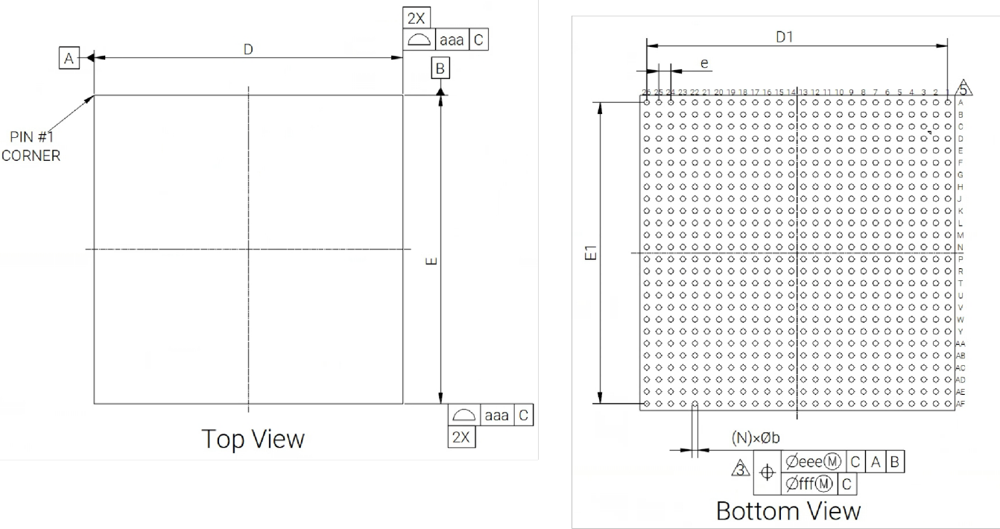  
  


### 3.3 FCBGA 封装

  


## 4 引脚定义（Pinout）

### 4.1 引脚分布图与说明

K1 的完整引脚分布图如下所示：


> **注**：图中不同颜色代表以下含义：
>
> - **电源引脚**（不同电压域）：
>   - 棕色（Brown）
>   - 深蓝色（Dark Blue）
>   - 灰色（Grey）
>   - 浅蓝色（Light Blue）
>   - 橙色（Orange）
>   - 紫色（Purple）
>   - 红色（Red）
>   - 黄色（Yellow）
> - **接地引脚（GND）**：
>   - 深绿色（Dark Green）
>   - 浅绿色（Light Green）
> - **信号引脚**：
>   - 白色（White）

为便于描述，K1 的 26×26 引脚阵列按以下四个象限划分：

- **象限 1**：行 A~N，列 1~13  
- **象限 2**：行 A~N，列 14~26  
- **象限 3**：行 M~AF，列 1~13  
- **象限 4**：行 M~AF，列 14~26  

后续小节将按上述象限结构依次提供详细的引脚功能说明。

#### 象限 1：(A~N, 1~13)

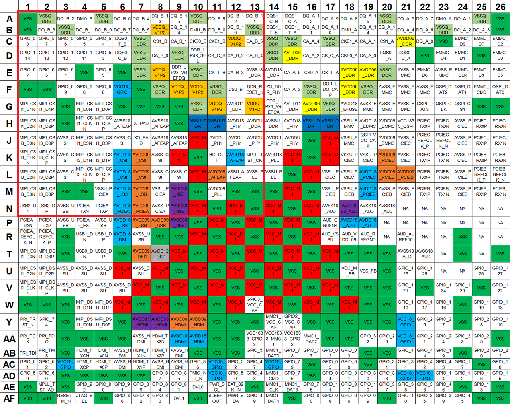

> **注**：引脚类型符号定义：
>
> - AO = 模拟输出（Analog Output）
> - AI = 模拟输入（Analog Input）
> - AIO = 模拟输入/输出（Analog Input/Output）
> - G = 接地（Ground）
> - I/O = 输入/输出（Input/Output）
> - P = 电源（Power）
> - RO = 参考输出（Reference Output）

| 引脚编号     | 名称                | 类型 | 电源域                              | 功能说明                                                                 |
|--------------|---------------------|------|-------------------------------------|--------------------------------------------------------------------------|
| A1           | VSS                 | G    | 0V                                     | Digital Core Ground                                                     |
| A2           | VSSQ_DDR            | G    | 0V                                     | DDR Ground                                                              |
| A3           | DQ_B_2              | AIO  | lp3: 1.2V<br/>lp4x: 0.6V               | LPDDR4X: CHB DQ2 <br/>LPDDR3: DQ28                                      |
| A4           | DMI0_B              | AIO  | lp3: 1.2V<br/>lp4x: 0.6V               | LPDDR4X: Channel B DM0 <br/>LPDDR3: DQ25                                |
| A5           | VSSQ_DDR            | G    | 0V                                     | DDR Ground                                                              |
| A6           | DQ_B_6              | AIO  | lp3: 1.2V<br/>lp4x: 0.6V               | LPDDR4X: CHB DQ6 <br/>LPDDR3: DQ24                                      |
| A7           | DQ_B_4              | AIO  | lp3: 1.2V<br/>lp4x: 0.6V               | LPDDR4X: CHB DQ4 <br/>LPDDR3: DQ30                                      |
| A8           | DQ_B_13             | AIO  | lp3: 1.2V<br/>lp4x: 0.6V               | LPDDR4X: CHB DQ13 <br/>LPDDR3: DQ15                                     |
| A9           | DQ_B_15             | AIO  | lp3: 1.2V<br/>lp4x: 0.6V               | LPDDR4X: CHB DQ15 <br/>LPDDR3: DQ12                                     |
| A10          | VSSQ_DDR            | G    | 0V                                     | DDR Ground                                                              |
| A11          | DQ_B_9              | AIO  | lp3: 1.2V<br/>lp4x: 0.6V               | LPDDR4X: CHB DQ9<br/>LPDDR3: DQ8                                        |
| A12          | DQ_B_12             | AIO  | lp3: 1.2V<br/>lp4x: 0.6V               | LPDDR4X: CHB DQ12<br/>LPDDR3: DQ10                                      |
| A13          | DQ_B_11             | AIO  | lp3: 1.2V<br/>lp4x: 0.6V               | LPDDR4X: CHB DQ11<br/>LPDDR3: DQ11                                      |
| B1           | VSS                 | G    | 0V                                     | Digital Core Ground                                                     |
| B2           | DQ_B_3              | AIO  | lp3: 1.2V<br/>lp4x: 0.6V               | LPDDR4X: CHB DQ3<br/>LPDDR3: DQM3                                       |
| B3           | VSSQ_DDR            | G    | 0V                                     | DDR Ground                                                              |
| B4           | DQ_B_1              | AIO  | lp3: 1.2V<br/>lp4x: 0.6V               | LPDDR4X: CHB DQ1<br/>LPDDR3: DQ27                                       |
| B5           | DQ_B_0              | AIO  | lp3: 1.2V<br/>lp4x: 0.6V               | LPDDR4X: CHB DQ0<br/>LPDDR3: DQ31                                       |
| B6           | DQ_B_7              | AIO  | lp3: 1.2V<br/>lp4x: 0.6V               | LPDDR4X: CHB DQ7<br/>LPDDR3: DQ29                                       |
| B7           | DQ_B_5              | AIO  | lp3: 1.2V<br/>lp4x: 0.6V               | LPDDR4X: CHB DQ5<br/>LPDDR3: DQ26                                       |
| B8           | VDDQ_V1P2           | P    | lp3: 1.2V<br/>lp4x: 0.6V               | LPDDR3 IO power                                                         |
| B9           | DQ_B_14             | AIO  | lp3: 1.2V<br/>lp4x: 0.6V               | LPDDR4X: CHB DQ14<br/>LPDDR3: DQ13                                      |
| B10          | DMI1_B              | AIO  | lp3: 1.2V<br/>lp4x: 0.6V               | LPDDR4X: Channel B DM1<br/>LPDDR3: DQ14                                 |
| B11          | DQ_B_8              | AIO  | lp3: 1.2V<br/>lp4x: 0.6V               | LPDDR4X: CHA DQ12<br/>LPDDR3: DQM1                                      |
| B12          | DQ_B_10             | AIO  | lp3: 1.2V<br/>lp4x: 0.6V               | LPDDR4X: CHB DQ10<br/>LPDDR3: DQ9                                       |
| B13          | VSSQ_DDR            | G    | 0V                                     | DDR Ground                                                              |
| C1           | GPIO_58             | I/O  | 1.8V                                   | General Purpose I/O 58                                                  |
| C2           | GPIO_57             | I/O  | 1.8V                                   | General Purpose I/O 57                                                  |
| C3           | GPIO_56             | I/O  | 1.8V                                   | General Purpose I/O 56                                                  |
| C4           | GPIO_55             | I/O  | 1.8V                                   | General Purpose I/O 55                                                  |
| C5           | GPIO_54             | I/O  | 1.8V                                   | General Purpose I/O 54                                                  |
| C6           | DQS0_T_B            | AIO  | lp3: 1.2V<br/>lp4x: 0.6V               | LPDDR4X: Positive of CHB DQS0<br/>LPDDR3: Positive of DQS3              |
| C7           | VSSQ_DDR            | G    | 0V                                     | DDR Ground                                                              |
| C8           | CS1_B               | AO   | lp3: 1.2V<br/>lp4x: 0.6V               | LPDDR4X: Active-low chip select 1 of CHB<br/>LPDDR3: N/A                |
| C9           | CA_B_1              | AO   | lp3: 1.2V<br/>lp4x: 0.6V               | LPDDR4X: CHB CA1<br/>LPDDR3: CA5                                        |
| C10          | CKE0_B              | AO   | lp3: 1.2V<br/>lp4x: 1.1V               | LPDDR4X: clock enabling 0 of CHB<br/>LPDDR3: N/A                        |
| C11          | CKE1_B              | AO   | lp3: 1.2V<br/>lp4x: 1.1V               | LPDDR4X: clock enabling 1 of CHB<br/>LPDDR3: N/A                        |
| C12          | VDDQ_V1P2           | P    | lp3: 1.2V<br/>lp4x: 0.6V               | LPDDR3 IO power                                                         |
| C13          | CA_B_5              | AO   | lp3: 1.2V<br/>lp4x: 0.6V               | LPDDR4X: CHB CA5<br/>LPDDR3: CA8                                        |
| D1           | GPIO_114            | I/O  | 1.8V                                   | General Purpose I/O 114                                                 |
| D2           | GPIO_113            | I/O  | 1.8V                                   | General Purpose I/O 113                                                 |
| D3           | GPIO_112            | I/O  | 1.8V                                   | General Purpose I/O 112                                                 |
| D4           | GPIO_111            | I/O  | 1.8V                                   | General Purpose I/O 111                                                 |
| D5           | GPIO_53             | I/O  | 1.8V                                   | General Purpose I/O 53                                                  |
| D6           | DQS0_C_B            | AIO  | lp3: 1.2V<br/>lp4x: 0.6V               | LPDDR4X: Negative of CHB DQS0<br/>LPDDR3: Negtive of DQS3               |
| D7           | VSSQ_DDR            | G    | 0V                                     | DDR Ground                                                              |
| D8           | CA_B_0              | AO   | lp3: 1.2V<br/>lp4x: 0.6V               | LPDDR4X: CHB CA0                                                        |
| D9           | VSSQ_DDR            | G    | 0V                                     | DDR Ground                                                              |
| D10          | DDR_lp4x_SEL        | AIO  | 1.8V                                   | LPDDR4X: connect to 1.8V<br/>LP234: connect to Ground                   |
| D11          | CK_C_B              | AO   | lp3: 1.2V<br/>lp4x: 0.6V               | LPDDR4X: negative LPDDR differential clock of CHB <br/>LPDDR3: negative LPDDR differential clock |
| D12          | CA_B_2              | AO   | lp3: 1.2V<br/>lp4x: 0.6V               | LPDDR4X: CHB CA2<br/>LPDDR3: CA9                                        |
| D13          | CA_B_4              | AO   | lp3: 1.2V<br/>lp4x: 0.6V               | LPDDR4X: CHA CA4<br/>LPDDR3: CA7                                        |
| E1           | GPIO_67             | I/O  | 1.8V                                   | General Purpose I/O 67                                                  |
| E2           | GPIO_65             | I/O  | 1.8V                                   | General Purpose I/O 65                                                  |
| E3           | GPIO_64             | I/O  | 1.8V                                   | General Purpose I/O 64                                                  |
| E4           | VSS                 | G    | 0V                                     | Digital Core Ground                                                     |
| E5           | GPIO_63             | I/O  | 1.8V                                   | General Purpose I/O 63                                                  |
| E6           | VSS                 | G    | 0V                                     | Digital Core Ground                                                     |
| E7           | VSSQ_DDR            | G    | 0V                                     | DDR Ground                                                              |
| E8           | VDDQ_V1P2           | P    | lp3: 1.2V<br/>lp4x: 0.6V               | LPDDR3 IO power                                                         |
| E9           | DDR_LP23_VREFDQ     | P    | lp3: 0.6V<br/>lp4: high-z              | DQ VREF for lpddr23 , LP4/4x<br/>Keep the pin NC                        |
| E10          | VSSQ_DDR            | G    | 0V                                     | DDR Ground                                                              |
| E11          | CK_T_B              | AO   | lp3: 1.2V<br/>lp4x: 0.6V               | LPDDR4X: positive LPDDR differential clock of CHB<br/>LPDDR3: positive LPDDR differential clock |
| E12          | CA_B_3              | AO   | lp3: 1.2V<br/>lp4x: 0.6V               | LPDDR4X: CHB CA3 <br/>LPDDR3: CA6                                       |
| E13          | AVSS18_DDR          | G    | 0V                                     | DDR Ground                                                              |
| F1           | VSS                 | G    | 0V                                     | Digital Core Ground                                                     |
| F2           | VSS                 | G    | 0V                                     | Digital Core Ground                                                     |
| F3           | GPIO_69             | I/O  | 1.8V                                   | General Purpose I/O 69                                                  |
| F4           | GPIO_68             | I/O  | 1.8V                                   | General Purpose I/O 68                                                  |
| F5           | GPIO_66             | I/O  | 1.8V                                   | General Purpose I/O 66                                                  |
| F6           | VCC18_GPIO          | P    | 1.8V                                   | GPIO1/4/5/PMIC I/O power                                                |
| F7           | VSS                 | G    | 0V                                     | Digital Core Ground                                                     |
| F8           | VSSQ_DDR            | G    | 0V                                     | DDR Ground                                                              |
| F9           | VDDQ_V1P2           | P    | lp3: 1.2V<br/>lp4x: 0.6V               | LPDDR3 IO power                                                         |
| F10          | VDDQ_V1P2           | P    | lp3: 1.2V<br/>lp4x: 0.6V               | LPDDR3 IO power                                                         |
| F11          | VSSQ_DDR            | G    | 0V                                     | DDR Ground                                                              |
| F12          | CS0_B               | AO   | lp3: 1.2V<br/>lp4x: 0.6V               | LPDDR4X: clock enabling 1 of CHB<br/>LPDDR3: N/A                        |
| F13          | DDR_RESET_N         | AO   | lp3: 1.2V<br/>lp4x: 1.1V               | LPDDR SDRAM reset                                                       |
| G1           | MIPI_CSI1_D1N       | AI   | 1.8V                                   | CSI1 DATA1LANEN                                                         |
| G2           | MIPI_CSI1_D1P       | AI   | 1.8V                                   | CSI1 DATA1LANEP                                                         |
| G3           | VSS                 | G    | 0V                                     | Digital Core Ground                                                     |
| G4           | MIPI_CSI1_D0N       | AI   | 1.8V                                   | CSI1 DATA0LANEN                                                         |
| G5           | MIPI_CSI1_D0P       | AI   | 1.8V                                   | CSI1 DATA0LANEP                                                         |
| G6           | VSS                 | G    | 0V                                     | Digital Core Ground                                                     |
| G7           | VSS                 | G    | 0V                                     | Digital Core Ground                                                     |
| G8           | VSS                 | G    | 0V                                     | Digital Core Ground                                                     |
| G9           | VSS                 | G    | 0V                                     | Digital Core Ground                                                     |
| G10          | VSSQ_DDR            | G    | 0V                                     | DDR Ground                                                              |
| G11          | VDDQ_V1P2           | P    | lp3: 1.2V<br/>lp4x: 0.6V               | LPDDR3 IO power                                                         |
| G12          | AVDD11_DDR          | P    | lp4x: 1.1V<br/>lp4: 1.1V<br/>lp3: 1.2V | LPDDR PHY power supply                                                  |
| G13          | VDDQ_V1P2           | P    | lp3: 1.2V<br/>lp4x: 0.6V               | LPDDR3 IO power                                                         |
| H1           | MIPI_CSI1_D2N       | AI   | 1.8V                                   | CSI1 DATA2LANEN                                                         |
| H2           | MIPI_CSI1_D2P       | AI   | 1.8V                                   | CSI1 DATA2LANEP                                                         |
| H3           | VSS                 | G    | 0V                                     | Digital Core Ground                                                     |
| H4           | MIPI_CSI1_CLKN      | AO   | 1.8V                                   | CSI1 CKLANEN                                                            |
| H5           | MIPI_CSI1_CLKP      | AO   | 1.8V                                   | CSI1 CKLANEP                                                            |
| H6           | AVSS18_AFEAP        | G    | 0V                                     | DCXO Ground                                                             |
| H7           | XI_PAD              | AI   | 1.8V                                   | DCXO crystal input                                                      |
| H8           | AVSS18_AFEAP        | G    | 0V                                     | DCXO Ground                                                             |
| H9           | VSS                 | G    | 0V                                     | Digital Core Ground                                                     |
| H10          | VSSU_DDR            | G    | 0V                                     | system DDR Ground                                                       |
| H11          | VSSU_DDR            | G    | 0V                                     | system DDR Ground                                                       |
| H12          | AVDD18_PHY          | P    | 1.8V                                   | Analog 1.8V power                                                       |
| H13          | AVDDU_DDR           | P    | 0.9V                                   | LPDDR PHY PLL logical power                                             |
| J1           | MIPI_CSI3_D0N       | AI   | 1.8V                                   | CSI3 DATA0LANEN                                                         |
| J2           | MIPI_CSI3_D0P       | AI   | 1.8V                                   | CSI3 DATA0LANEP                                                         |
| J3           | AVSS_CSI            | G    | 0V                                     | MIPI_CSI Ground                                                         |
| J4           | MIPI_CSI1_D3N       | AI   | 1.8V                                   | CSI1 DATA3LANEN                                                         |
| J5           | MIPI_CSI1_D3P       | AI   | 1.8V                                   | CSI1 DATA3LANEP                                                         |
| J6           | AVSS_CSI            | G    | 0V                                     | MIPI_CSI Ground                                                         |
| J7           | XO_PAD              | AO   | 1.8V                                   | DCXO crystal output                                                     |
| J8           | AVSS18_AFEAP        | G    | 0V                                     | DCXO Ground                                                             |
| J9           | AVSS18_AFEAP        | G    | 0V                                     | DCXO Ground                                                             |
| J10          | VCC_M1              | P    | 0.9V                                   | Digital Core power                                                      |
| J11          | AVDDU_PHY           | P    | 0.9V                                   | LPDDR PHY core logical power                                            |
| J12          | AVDDU_PHY           | P    | 0.9V                                   | LPDDR PHY core logical power                                            |
| J13          | AVDDU_PHY           | P    | 0.9V                                   | LPDDR PHY core logical power                                            |
| K1           | MIPI_CSI3_CLKN      | AO   | 1.8V                                   | CSI3 CKLANEN for CSI3 DATALANE0/1 when CSI3 is configured as two 2ch CSI; <br/>CSI3 CKLANEN for CSI3 DATALANE0/1/2/3 when CSI3 is configured as 4ch CSI |
| K2           | MIPI_CSI3_CLKP      | AO   | 1.8V                                   | CSI3 CKLANEP for CSI3 DATALANE0/1 when CSI3 is configured as two 2ch CSI; <br/>CSI3 CKLANEP for CSI3 DATALANE0/1/2/3 when CSI3 is configured as 4ch CSI |
| K3           | AVSS_CSI            | G    | 0V                                     | MIPI_CSI Ground                                                         |
| K4           | MIPI_CSI3_D1N       | AI   | 1.8V                                   | CSI3 DATA1LANEN                                                         |
| K5           | MIPI_CSI3_D1P       | AI   | 1.8V                                   | CSI3 DATA1LANEP                                                         |
| K6           | AVDD18_CSI          | P    | 1.8V                                   | MIPI_CSI analog power                                                   |
| K7           | AVDD09_CSI          | P    | 0.9V                                   | MIPI_CSI digtial power                                                  |
| K8           | AVSS_CSI            | G    | 0V                                     | MIPI_CSI Ground                                                         |
| K9           | VCC_M1              | P    | 0.9V                                   | Digital Core power                                                      |
| K10          | VSS                 | G    | 0V                                     | Digital Core Ground                                                     |
| K11          | BG_OUT              | AO   | 1.8V                                   | Bandgap output                                                          |
| K12          | AVDD18_AFEAP        | P    | 1.8V                                   | 1.8V power for DCXO                                                     |
| K13          | MPLL_TST_CK         | AIO  | 1.8V                                   | Analog testpin                                                          |
| L2           | MIPI_CSI3_D2P       | AI   | 1.8V                                   | CSI3 DATA2LANEP                                                         |
| L3           | AVSS_CSI            | G    | 0V                                     | MIPI_CSI Ground                                                         |
| L4           | MIPI_CSI2_CLKN      | AO   | 1.8V                                   | CKLANEN for CSI3 DATALANE2/3 when CSI3 is configured as two 2ch CSI; <br/>Disabled when CSI3 is configured as 4ch CSI |
| L5           | MIPI_CSI2_CLKP      | AO   | 1.8V                                   | CKLANEP for CSI3 DATALANE2/3 when CSI3 is configured as two 2ch CSI; <br/>Disabled when CSI3 is configured as 4ch CSI |
| L6           | AVDD18_CSI          | P    | 1.8V                                   | MIPI_CSI analog power                                                   |
| L7           | AVDD09_CSI          | P    | 0.9V                                   | MIPI_CSI digtial power                                                  |
| L8           | AVSS_CSI            | G    | 0V                                     | MIPI_CSI Ground                                                         |
| L9           | AVSS_CSI            | G    | 0V                                     | MIPI_CSI Ground                                                         |
| L10          | VCC_M1              | P    | 0.9V                                   | Digital Core power                                                      |
| L11          | AVDD09_AFEAP        | P    | 0.9V                                   | 0.9V power for DCXO                                                     |
| L12          | VSSU_AFEAP          | G    | 0V                                     | DCXO Ground                                                             |
| L13          | AVSS_PLL            | G    | 0V                                     | Analog Core Ground                                                      |
| M1           | MIPI_CSI3_D3N       | AI   | 1.8V                                   | CSI3 DATA3LANEN                                                         |
| M2           | MIPI_CSI3_D3P       | AI   | 1.8V                                   | CSI3 DATA3LANEP                                                         |
| M3           | VSS                 | G    | 0V                                     | Digital Core Ground                                                     |
| M4           | VSS                 | G    | 0V                                     | Digital Core Ground                                                     |
| M5           | VSSU_PCIEA          | G    | 0V                                     | PCIEA Ground                                                            |
| M6           | AVDD18_USB          | P    | 1.8V                                   | USB2.0 1.8V power                                                       |
| M7           | AVDD09_USB          | P    | 0.9V                                   | USB2.0 digital power                                                    |
| M8           | VSSU_PCIEA          | G    | 0V                                     | PCIEA Ground                                                            |
| M9           | AVDD33_USB          | P    | 3.3V                                   | USB2.0 3.3V power                                                       |
| M10          | VSS                 | G    | 0V                                     | Digital Core Ground                                                     |
| M11          | AVDD09_PLL          | P    | 0.9                                    | System PLL power supply                                                 |
| M12          | VSS                 | G    | 0V                                     | Digital Core Ground                                                     |
| M13          | VSS                 | G    | 0V                                     | Digital Core Ground                                                     |
| N1           | USB2_DN             | AIO  | 3.3V                                   | USB2.0_2 D- differential data line                                      |
| N2           | USB2_DP             | AIO  | 3.3V                                   | USB2.0_2 D+ differential data line                                      |
| N3           | AVSS_USB            | G    | 0V                                     | USB2.0 Ground                                                           |
| N4           | PCIEA_TXN           | AO   | 1.8V                                   | PCIEA TXLANEN                                                           |
| N5           | PCIEA_TXP           | AO   | 1.8V                                   | PCIEA TXLANEP                                                           |
| N6           | AVDD18_PCIEA        | P    | 1.8V                                   | PCIEA analog power                                                      |
| N7           | AVDD09_PCIEA        | P    | 0.9V                                   | PCIEA digital power                                                     |
| N8           | AVSS_PCIEA          | G    | 0V                                     | PCIEA Ground                                                            |
| N9           | AVDD33_USB          | P    | 3.3V                                   | USB2.0 3.3V power                                                       |
| N10          | VCC_M1              | P    | 0.9V                                   | Digital Core power                                                      |
| N11          | VSS                 | G    | 0V                                     | Digital Core Ground                                                     |
| N12          | VCC_M1              | P    | 0.9V                                   | Digital Core power                                                      |
| N13          | VSS                 | G    | 0V                                     | Digital Core Ground                                                     |

#### 象限 2：(A~N, 14~26)

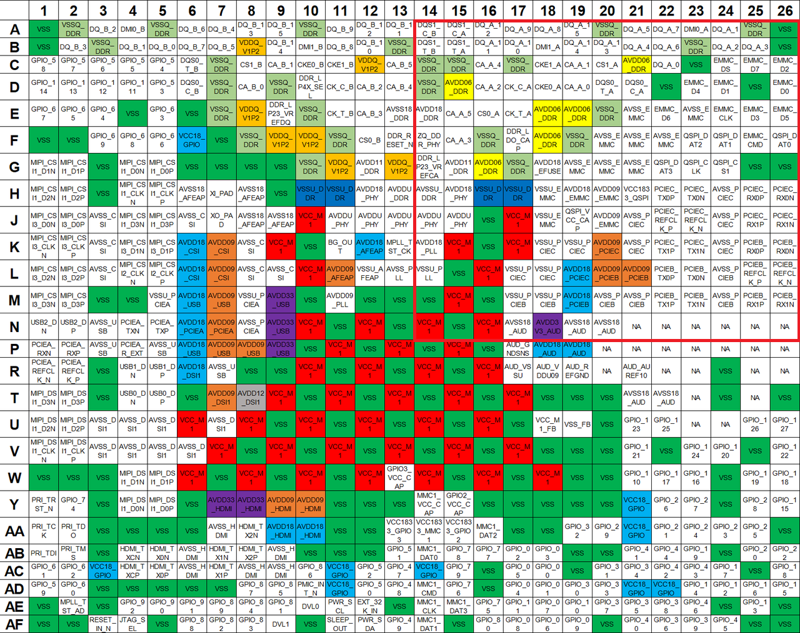

> **注**：引脚类型符号定义：
>
> - AO = 模拟输出（Analog Output）  
> - AI = 模拟输入（Analog Input）  
> - AIO = 模拟输入/输出（Analog Input/Output）  
> - G = 接地（Ground）  
> - I/O = 输入/输出（Input/Output）  
> - P = 电源（Power）  
> - RO = 参考输出（Reference Output）

| 引脚编号     | 名称            | 类型 | 电源域                          | 功能说明                                                                 |
|--------------|-----------------|------|----------------------------------|--------------------------------------------------------------------------|
| A14          | DQS1_C_B        | AIO  | lp3: 1.2V<br/>lp4x: 0.6V         | LPDDR4X: Negative of CHB DQS1<br/>LPDDR3: Negtive of DQS1                |
| A15          | DQS1_C_A        | AIO  | lp3: 1.2V<br/>lp4x: 0.6V         | LPDDR4X: Negative of CHA DQS1<br/>LPDDR3: Negtive of DQS0                |
| A16          | DQ_A_12         | AIO  | lp3: 1.2V<br/>lp4x: 0.6V         | LPDDR4X: CHA DQ12<br/>LPDDR3: DQM0                                       |
| A17          | DQ_A_9          | AIO  | lp3: 1.2V<br/>lp4x: 0.6V         | LPDDR4X: CHA DQ9<br/>LPDDR3: DQ7                                         |
| A18          | DQ_A_8          | AIO  | lp3: 1.2V<br/>lp4x: 0.6V         | LPDDR4X: CHB DQ8<br/>LPDDR3: DQ5                                         |
| A19          | DQ_A_15         | AIO  | lp3: 1.2V<br/>lp4x: 0.6V         | LPDDR4X: CHB DQ15<br/>LPDDR3: DQ3                                        |
| A20          | VSSQ_DDR        | G    | 0V                               | DDR Ground                                                               |
| A21          | DQ_A_5          | AIO  | lp3: 1.2V<br/>lp4x: 0.6V         | LPDDR4X: CHA DQ5<br/>LPDDR3: DQ21                                        |
| A22          | DQ_A_7          | AIO  | lp3: 1.2V<br/>lp4x: 0.6V         | LPDDR4X: CHA DQ7<br/>LPDDR3: DQ17                                        |
| A23          | DMI0_A          | AIO  | lp3: 1.2V<br/>lp4x: 0.6V         | LPDDR4X: Channel A DM0<br/>LPDDR3: DQ22                                  |
| A24          | DQ_A_1          | AIO  | lp3: 1.2V<br/>lp4x: 0.6V         | LPDDR4X: CHA DQ1<br/>LPDDR3: DQ16                                        |
| A25          | VSSQ_DDR        | G    | 0V                               | DDR Ground                                                               |
| A26          | VSS             | G    | 0V                               | Digital Core Ground                                                      |
| B14          | DQS1_T_B        | AIO  | lp3: 1.2V<br/>lp4x: 0.6V         | LPDDR4X: Positive of CHB DQS1<br/>LPDDR3: Positive of DQS1               |
| B15          | DQS1_T_A        | AIO  | lp3: 1.2V<br/>lp4x: 0.6V         | LPDDR4X: Positive of CHA DQS1<br/>LPDDR3: Positive of DQS0               |
| B16          | DQ_A_11         | AIO  | lp3: 1.2V<br/>lp4x: 0.6V         | LPDDR4X: CHA DQ11<br/>LPDDR3: DQ4                                        |
| B17          | DQ_A_10         | AIO  | lp3: 1.2V<br/>lp4x: 0.6V         | LPDDR4X: CHA DQ10<br/>LPDDR3: DQ6                                        |
| B18          | DMI1_A          | AIO  | lp3: 1.2V<br/>lp4x: 0.6V         | LPDDR4X: Channel A DM1<br/>LPDDR3: DQ2                                   |
| B19          | DQ_A_14         | AIO  | lp3: 1.2V<br/>lp4x: 0.6V         | LPDDR4X: CHA DQ14<br/>LPDDR3: DQ1                                        |
| B20          | DQ_A_13         | AIO  | lp3: 1.2V<br/>lp4x: 0.6V         | LPDDR4X: CHA DQ13<br/>LPDDR3: DQ0                                        |
| B21          | DQ_A_4          | AIO  | lp3: 1.2V<br/>lp4x: 0.6V         | LPDDR4X: CHB DQ4<br/>LPDDR3: DQ18                                        |
| B22          | DQ_A_6          | AIO  | lp3: 1.2V<br/>lp4x: 0.6V         | LPDDR4X: CHB DQ6<br/>LPDDR3: DQ23                                        |
| B23          | VSSQ_DDR        | G    | 0V                               | DDR Ground                                                               |
| B24          | DQ_A_2          | AIO  | lp3: 1.2V<br/>lp4x: 0.6V         | LPDDR4X: CHA DQ2<br/>LPDDR3: DQ19                                        |
| B25          | DQ_A_3          | AIO  | lp3: 1.2V<br/>lp4x: 0.6V         | LPDDR4X: CHB DQ3<br/>LPDDR3: DQM2                                        |
| B26          | VSS             | G    | 0V                               | Digital Core Ground                                                      |
| C14          | VSSQ_DDR        | G    | 0V                               | DDR Ground                                                               |
| C15          | VSSQ_DDR        | G    | 0V                               | DDR Ground                                                               |
| C16          | CA_A_4          | AO   | lp3: 1.2V<br/>lp4x: 0.6V         | LPDDR4X: CHA CA4<br/>LPDDR3: CA3                                         |
| C17          | VSSQ_DDR        | G    | 0V                               | DDR Ground                                                               |
| C18          | CKE1_A          | AO   | lp3: 1.2V<br/>lp4x: 1.1V         | LPDDR4X: clock enabling 1 of CHA<br/>LPDDR3: clock enabling 1            |
| C19          | CA_A_1          | AO   | lp3: 1.2V<br/>lp4x: 0.6V         | LPDDR4X: CHA CA1<br/>LPDDR3: CA2                                         |
| C20          | CS1_A           | AO   | lp3: 1.2V<br/>lp4x: 0.6V         | LPDDR4X: Active-low chip select 1 of CHA<br/>LPDDR3: Active-low chip select 1 |
| C21          | AVDD06_DDR      | P    | lp4x: 0.6V<br/>lp4: TBD/lp3: TBD | LPDDR4X IO power                                                         |
| C22          | DQ_A_0          | AIO  | lp3: 1.2V<br/>lp4x: 0.6V         | LPDDR4X: CHA DQ0<br/>LPDDR3: DQ20                                        |
| C23          | VSS             | G    | 0V                               | Digital Core Ground                                                      |
| C24          | EMMC_DS         | I/O  | 1.8V                             | eMMC data strobe                                                         |
| C25          | EMMC_D7         | I/O  | 1.8V                             | eMMC data7                                                               |
| C26          | EMMC_D2         | I/O  | 1.8V                             | eMMC data2                                                               |
| D14          | VSSQ_DDR        | G    | 0V                               | DDR Ground                                                               |
| D15          | AVDD06_DDR      | P    | lp4x: 0.6V<br/>lp4: TBD<br/>lp3: TBD | LPDDR4X IO power                                                     |
| D16          | CA_A_2          | AO   | lp3: 1.2V<br/>lp4x: 0.6V         | LPDDR4X: CHA CA2                                                         |
| D17          | CK_C_A          | AO   | lp3: 1.2V<br/>lp4x: 0.6V         | LPDDR4X: negative LPDDR differential clock of CHA<br/>LPDDR3: N/A        |
| D18          | CKE0_A          | AO   | lp3: 1.2V<br/>lp4x: 1.1V         | LPDDR4X: clock enabling 0 of CHA<br/>LPDDR3: clock enabling 0            |
| D19          | CA_A_0          | AO   | lp3: 1.2V<br/>lp4x: 0.6V         | LPDDR4X: CHA CA0<br/>LPDDR3: CA4                                         |
| D20          | DQS0_T_A        | AIO  | lp3: 1.2V<br/>lp4x: 0.6V         | LPDDR4X: Positive of CHA DQS0<br/>LPDDR3: Positive of DQS2               |
| D21          | DQS0_C_A        | AIO  | lp3: 1.2V<br/>lp4x: 0.6V         | LPDDR4X: Negative of CHA DQS0<br/>LPDDR3: Negative of DQS2               |
| D22          | VSS             | G    | 0V                               | Digital Core Ground                                                      |
| D23          | EMMC_D4         | I/O  | 1.8V                             | eMMC data4                                                               |
| D24          | EMMC_D1         | I/O  | 1.8V                             | eMMC data1                                                               |
| D25          | VSS             | G    | 0V                               | Digital Core Ground                                                      |
| D26          | EMMC_D0         | I/O  | 1.8V                             | eMMC data0                                                               |
| E14          | AVDD18_DDR      | P    | 1.8V                             | LPDDR PHY PLL 1.8V power                                                 |
| E15          | CA_A_5          | AO   | lp3: 1.2V<br/>lp4x: 0.6V         | LPDDR4X: CHA CA5<br/>LPDDR3: CA1                                         |
| E16          | CS0_A           | AO   | lp3: 1.2V<br/>lp4x: 0.6V         | LPDDR4X: Active-low chip select 0 of CHA<br/>LPDDR3: Active-low chip select 0 |
| E17          | CK_T_A          | AO   | lp3: 1.2V<br/>lp4x: 0.6V         | LPDDR4X: positive LPDDR differential clock of CHA<br/>LPDDR3: N/A        |
| E18          | AVDD06_DDR      | P    | lp4x: 0.6V<br/>lp4: TBD<br/>lp3: TBD | LPDDR4X IO power                                                     |
| E19          | AVDD06_DDR      | P    | lp4x: 0.6V<br/>lp4: TBD<br/>lp3: TBD | LPDDR4X IO power                                                     |
| E20          | VSSQ_DDR        | G    | 0V                               | DDR Ground                                                               |
| E21          | AVSS_EMMC       | G    | 0V                               | eMMC Ground                                                              |
| E22          | EMMC_D6         | I/O  | 1.8V                             | eMMC data6                                                               |
| E23          | AVSS_EMMC       | G    | 0V                               | eMMC Ground                                                              |
| E24          | EMMC_CLK        | I/O  | 1.8V                             | eMMC Clock                                                               |
| E25          | EMMC_D3         | I/O  | 1.8V                             | eMMC data3                                                               |
| E26          | EMMC_D5         | I/O  | 1.8V                             | eMMC data5                                                               |
| F14          | ZQ_DDR_PHY      | AIO  | lp3: 1.2V<br/>lp4x: 0.6V         | DDR ZQ calibration                                                       |
| F15          | CA_A_3          | AO   | lp3: 1.2V<br/>lp4x: 0.6V         | LPDDR4X: CHA CA3<br/>LPDDR3: CA0                                         |
| F16          | VSSQ_DDR        | G    | 0V                               | DDR Ground                                                               |
| F17          | DDR_LDO_CAP     | RO   | 0.7~0.9V                         | External LDO output ball;<br/>Connect to a 100nF capacitor on PCB board  |
| F18          | AVDD06_DDR      | P    | lp4x: 0.6V<br/>lp4: TBD<br/>lp3: TBD | LPDDR4X IO power                                                     |
| F19          | VSSQ_DDR        | G    | 0V                               | DDR Ground                                                               |
| F20          | AVSS_EMMC       | G    | 0V                               | eMMC Ground                                                              |
| F21          | AVSS_EMMC       | G    | 0V                               | eMMC Ground                                                              |
| F22          | AVSS_EMMC       | G    | 0V                               | eMMC Ground                                                              |
| F23          | QSPI_DAT2       | I/O  | 1.8V/3.3V                        | QSPI data2                                                               |
| F24          | QSPI_DAT1       | I/O  | 1.8V/3.3V                        | QSPI data1                                                               |
| F25          | EMMC_CMD        | I/O  | 1.8V                             | eMMC command                                                             |
| F26          | QSPI_DAT0       | I/O  | 1.8V/3.3V                        | QSPI data0                                                               |
| G14          | DDR_LP23_VREFCA | P    | lp3: 0.6V<br/>lp4: high-z        | CA VREF for lpddr23, LP4/4x<br/>Keep the pin NC                          |
| G15          | AVDD11_DDR      | P    | lp4x: 1.1V<br/>lp4: 1.1V<br/>lp3: 1.2V | LPDDR PHY power supply                                               |
| G16          | AVDD06_DDR      | P    | lp4x: 0.6V<br/>lp4: TBD<br/>lp3: TBD | LPDDR4X IO power                                                     |
| G17          | VSSQ_DDR        | G    | 0V                               | DDR Ground                                                               |
| G18          | AVDD18_EFUSE    | P    | 1.8V                             | ANAGRP                                                                   |
| G19          | AVSS_EMMC       | G    | 0V                               | eMMC Ground                                                              |
| G20          | AVSS_EMMC       | G    | 0V                               | eMMC Ground                                                              |
| G21          | AVSS_EMMC       | G    | 0V                               | eMMC Ground                                                              |
| G22          | QSPI_DAT3       | I/O  | 1.8V/3.3V                        | QSPI data3                                                               |
| G23          | QSPI_CLK        | I/O  | 1.8V/3.3V                        | QSPI CLK                                                                 |
| G24          | QSPI_CS1        | I/O  | 1.8V/3.3V                        | QSPI CS                                                                  |
| G25          | VSS             | G    | 0V                               | Digital Core Ground                                                      |
| G26          | VSS             | G    | 0V                               | Digital Core Ground                                                      |
| H14          | AVSSU_DDR       | G    | 0V                               | DDR Ground                                                               |
| H15          | AVDD18_PHY      | P    | 1.8V                             | Analog 1.8V power                                                        |
| H16          | VSSU_DDR        | G    | 0V                               | System DDR Ground                                                        |
| H17          | VSSU_DDR        | G    | 0V                               | System DDR Ground                                                        |
| H18          | VSSU_EMMC       | G    | 0V                               | eMMC Ground                                                              |
| H19          | AVDD18_EMMC     | P    | 1.8V                             | eMMC analog power                                                        |
| H20          | AVDD09_EMMC     | P    | 0.9V                             | eMMC digtial power                                                       |
| H21          | VCC1833_QSPI    | P    | 1.8V/3.3V                        | QSPI IO power                                                            |
| H22          | PCIEC_TX0P      | AO   | 1.8V                             | PCIEC TX0LANEP                                                           |
| H23          | PCIEC_TX0N      | AO   | 1.8V                             | PCIEC TX0LANEN                                                           |
| H24          | AVSS_PCIEC      | G    | 0V                               | PCIEC Ground                                                             |
| H25          | PCIEC_RX0P      | AI   | 1.8V                             | PCIEC RX0LANEP                                                           |
| H26          | PCIEC_RX0N      | AI   | 1.8V                             | PCIEC RX0LANEN                                                           |
| J14          | AVDDU_PHY       | P    | 0.9V                             | LPDDR PHY core logical power                                             |
| J15          | AVDDU_PHY       | P    | 0.9V                             | LPDDR PHY core logical power                                             |
| J16          | VSS             | G    | 0V                               | Digital Core Ground                                                      |
| J17          | VCC_M1          | P    | 0.9V                             | Digital Core power                                                       |
| J18          | VSSU_EMMC       | G    | 0V                               | eMMC Ground                                                              |
| J19          | QSPI_VCC_CAP    | RO   | 1.8V                             | QSPI 1.8V LDO cap                                                        |
| J20          | AVDD09_EMMC     | P    | 0.9V                             | eMMC digtial power                                                       |
| J21          | AVSS_PCIEC      | G    | 0V                               | PCIEC Ground                                                             |
| J22          | PCIEC_REFCLK_P  | AIO  | 1.8V                             | PCIEC CKLANEP                                                            |
| J23          | PCIEC_REFCLK_N  | AIO  | 1.8V                             | PCIEC CKLANEN                                                            |
| J24          | AVSS_PCIEC      | G    | 0V                               | PCIEC Ground                                                             |
| J25          | PCIEC_RX1P      | AI   | 1.8V                             | PCIEC RX1LANEP                                                           |
| J26          | PCIEC_RX1N      | AI   | 1.8V                             | PCIEC RX1LANEN                                                           |
| K14          | AVDD18_PLL      | P    | 1.8                              | System PLL power supply                                                  |
| K15          | VCC_M1          | P    | 0.9V                             | Digital Core power                                                       |
| K16          | VSS             | G    | 0V                               | Digital core Ground                                                      |
| K17          | VCC_M1          | P    | 0.9V                             | Digital Core power                                                       |
| K18          | VSSU_PCIEC      | G    | 0V                               | PCIEC Ground                                                             |
| K19          | VSSU_PCIEC      | G    | 0V                               | PCIEC Ground                                                             |
| K20          | AVDD09_PCIEC    | P    | 0.9V                             | PCIEC digital power                                                      |
| K21          | AVSS_PCIEC      | G    | 0V                               | PCIEC Ground                                                             |
| K22          | PCIEC_TX1P      | AO   | 1.8V                             | PCIEC TX1LANEP                                                           |
| K23          | PCIEC_TX1N      | AO   | 1.8V                             | PCIEC TX1LANEN                                                           |
| K24          | AVSS_PCIEC      | G    | 0V                               | PCIEC Ground                                                             |
| K25          | PCIEB_RX0P      | AI   | 1.8V                             | PCIEB RX0LANEP                                                           |
| K26          | PCIEB_RX0N      | AI   | 1.8V                             | PCIEB RX0LANEN                                                           |
| L14          | VSSU_PLL        | G    | 0V                               | System PLL Ground                                                        |
| L15          | VSS             | G    | 0V                               | Digital core Ground                                                      |
| L16          | VCC_M1          | P    | 0.9V                             | Digital Core power                                                       |
| L17          | VSSU_PCIEC      | G    | 0V                               | PCIEC Ground                                                             |
| L18          | VSSU_PCIEC      | G    | 0V                               | PCIEC Ground                                                             |
| L19          | AVDD18_PCIEC    | P    | 1.8V                             | PCIEC analog power                                                       |
| L20          | AVDD09_PCIEB    | P    | 0.9V                             | PCIEB digital power                                                      |
| L21          | AVDD09_PCIEB    | P    | 0.9V                             | PCIEB digital power                                                      |
| L22          | PCIEB_TX0P      | AO   | 1.8V                             | PCIEB TX0LANEP                                                           |
| L23          | PCIEB_TX0N      | AO   | 1.8V                             | PCIEB TX0LANEN                                                           |
| L24          | AVSS_PCIEB      | G    | 0V                               | PCIEB Ground                                                             |
| L25          | PCIEB_REFCLK_P  | AIO  | 1.8V                             | PCIEB CKLANEP                                                            |
| L26          | PCIEB_REFCLK_N  | AIO  | 1.8V                             | PCIEB CKLANEN                                                            |
| M14          | VSS             | G    | 0V                               | Digital Core Ground                                                      |
| M15          | VCC_M1          | P    | 0.9V                             | Digital Core power                                                       |
| M16          | VSS             | G    | 0V                               | Digital Core Ground                                                      |
| M17          | VSSU_PCIEB      | G    | 0V                               | PCIEB Ground                                                             |
| M18          | VSSU_PCIEB      | G    | 0V                               | PCIEB Ground                                                             |
| M19          | AVDD18_PCIEB    | P    | 1.8V                             | PCIEB analog power                                                       |
| M20          | AVSS_PCIEB      | G    | 0V                               | PCIEB Ground                                                             |
| M21          | AVSS_PCIEB      | G    | 0V                               | PCIEB Ground                                                             |
| M22          | PCIEB_TX1P      | AO   | 1.8V                             | PCIEB TX1LANEP                                                           |
| M23          | PCIEB_TX1N      | AO   | 1.8V                             | PCIEB TX1LANEN                                                           |
| M24          | AVSS_PCIEB      | G    | 0V                               | PCIEB Ground                                                             |
| M25          | PCIEB_RX1P      | AI   | 1.8V                             | PCIEB RX1LANEP                                                           |
| M26          | PCIEB_RX1N      | AI   | 1.8V                             | PCIEB RX1LANEN                                                           |
| N14          | VCC_M1          | P    | 0.9V                             | Digital Core power                                                       |
| N15          | VSS             | G    | 0V                               | Digital Core Ground                                                      |
| N16          | VCC_M1          | P    | 0.9V                             | Digital Core power                                                       |
| N17          | AVSS18_AUD      | G    | 0V                               | Audio Ground                                                             |
| N18          | AVDD3V3_AUD     | P    | 3.3V                             | 3.3V power for earphone driver                                           |
| N19          | AVSS18_AUD      | G    | 0V                               | Audio Ground                                                             |
| N20          | AVSS18_AUD      | G    | 0V                               | Audio Ground                                                             |
| N21          | NA              | P    | 1.8V                             | NA                                                                       |
| N22          | NA              | P    | -1.8V                            | NA                                                                       |
| N23          | NA              | AO   | +/-1.8V                          | NA                                                                       |
| N24          | NA              | AO   | +/-1.8V                          | NA                                                                       |
| N25          | NA              | AO   | 3.3V                             | NA                                                                       |
| N26          | NA              | AO   | 3.3V                             | NA                                                                       |

#### 象限 3：(P~AF, 1~13)


> **注**：引脚类型符号定义：
>
> - AO = 模拟输出（Analog Output）  
> - AI = 模拟输入（Analog Input）  
> - AIO = 模拟输入/输出（Analog Input/Output）  
> - G = 接地（Ground）  
> - I/O = 输入/输出（Input/Output）  
> - P = 电源（Power）  
> - RO = 参考输出（Reference Output）

| 引脚编号     | 名称            | 类型 | 电源域                          | 功能说明                                                                 |
|--------------|-----------------|------|----------------------------------|--------------------------------------------------------------------------|
| P1     | PCIEA_RXN           | AI   | 1.8V           | PCIEA RXLANEN                           |
| P2     | PCIEA_RXP           | AI   | 1.8V           | PCIEA RXLANEP                           |
| P3     | AVSS_USB            | G    | 0V             | USB2.0 Ground                           |
| P4     | PCIEA_R_EXT         | AO   | 1.8V           | PCIEA External calibration resistor     |
| P5     | AVSS_USB            | G    | 0V             | USB2.0 Ground                           |
| P6     | AVDD18_USB          | P    | 1.8V           | USB2.0 1.8V power                       |
| P7     | AVDD09_USB          | P    | 0.9V           | USB2.0 digital power                    |
| P8     | AVDD09_USB          | P    | 0.9V           | USB2.0 digital power                    |
| P9     | AVDD33_USB          | P    | 3.3V           | USB2.0 3.3V power                       |
| P10    | VSS                 | G    | 0V             | Digital Core Ground                     |
| P11    | VCC_M1              | P    | 0.9V           | Digital Core power                      |
| P12    | VSS                 | G    | 0V             | Digital Core Ground                     |
| P13    | VCC_M1              | P    | 0.9V           | Digital Core power                      |
| R1     | PCIEA_REFCLK_N      | AIO  | 1.8V           | PCIEA CKLANEN                           |
| R2     | PCIEA_REFCLK_P      | AIO  | 1.8V           | PCIEA CKLANEP                           |
| R3     | VSS                 | G    | 0V             | Digital core Ground                     |
| R4     | USB1_DN             | AIO  | 3.3V           | USB2.0_1 D- differential data line      |
| R5     | USB1_DP             | AIO  | 3.3V           | USB2.0_1 D+ differential data line      |
| R6     | AVDD18_DSI1         | P    | 1.8V           | DSI analog power                        |
| R7     | AVSS_USB            | G    | 0V             | USB2.0 Ground                           |
| R8     | VSS                 | G    | 0V             | Digital Core Ground                     |
| R9     | VSS                 | G    | 0V             | Digital Core Ground                     |
| R10    | VCC_M1              | P    | 0.9V           | Digital Core power                      |
| R11    | VSS                 | G    | 0V             | Digital Core Ground                     |
| R12    | VCC_M1              | P    | 0.9V           | Digital Core power                      |
| R13    | VSS                 | G    | 0V             | Digital Core Ground                     |
| T1     | MIPI_DSI1_D3N       | AO   | 1.2V           | DSI DATA3LANEN                          |
| T2     | MIPI_DSI1_D3P       | AO   | 1.2V           | DSI DATA3LANEP                          |
| T3     | VSS                 | G    | 0V             | Digital core ground                     |
| T4     | USB0_DN             | AIO  | 3.3V           | USB2.0_0 D- differential data line      |
| T5     | USB0_DP             | AIO  | 3.3V           | USB2.0_0 D+ differential data line      |
| T6     | VSS                 | G    | 0V             | Digital core ground                     |
| T7     | AVDD09_DSI1         | P    | 0.9V           | DSI digital power                       |
| T8     | AVDD12_DSI1         | P    | 1.2V           | DSI driver power                        |
| T9     | VCC_M1              | P    | 0.9V           | Digital Core power                      |
| T10    | VSS                 | G    | 0V             | Digital Core ground                     |
| T11    | VCC_M1              | P    | 0.9V           | Digital Core power                      |
| T12    | VSS                 | G    | 0V             | Digital Core ground                     |
| T13    | VCC_M1              | P    | 0.9V           | Digital Core power                      |
| U1     | MIPI_DSI1_D2N       | AO   | 1.2V           | DSI DATA2LANEN                          |
| U2     | MIPI_DSI1_D2P       | AO   | 1.2V           | DSI DATA2LANEP                          |
| U3     | AVSS_DSI1           | G    | 0V             | DSI Ground                              |
| U4     | AVSS_DSI1           | G    | 0V             | DSI Ground                              |
| U5     | AVSS_DSI1           | G    | 0V             | DSI Ground                              |
| U6     | VCC_M1              | P    | 0.9V           | Digital Core power                      |
| U7     | AVSS_DSI1           | G    | 0V             | DSI Ground                              |
| U8     | VCC_M1              | P    | 0.9V           | Digital Core power                      |
| U9     | VSS                 | G    | 0V             | Digital Core ground                     |
| U10    | VCC_M1              | P    | 0.9V           | Digital Core power                      |
| U11    | VSS                 | G    | 0V             | Digital Core ground                     |
| U12    | VCC_M1              | P    | 0.9V           | Digital Core power                      |
| U13    | VSS                 | G    | 0V             | Digital Core ground                     |
| V1     | MIPI_DSI1_CLKN      | AO   | 1.2V           | DSI CKLANEN                             |
| V2     | MIPI_DSI1_CLKP      | AO   | 1.2V           | DSI CKLANEP                             |
| V3     | AVSS_DSI1           | G    | 0V             | DSI Ground                              |
| V4     | AVSS_DSI1           | G    | 0V             | DSI Ground                              |
| V5     | AVSS_DSI1           | G    | 0V             | DSI Ground                              |
| V6     | AVSS_DSI1           | G    | 0V             | DSI Ground                              |
| V7     | VCC_M1              | P    | 0.9V           | Digital Core power                      |
| V8     | VSS                 | G    | 0V             | Digital Core ground                     |
| V9     | VCC_M1              | P    | 0.9V           | Digital Core power                      |
| V10    | VSS                 | G    | 0V             | Digital Core ground                     |
| V11    | VCC_M1              | P    | 0.9V           | Digital Core power                      |
| V12    | VSS                 | G    | 0V             | Digital Core ground                     |
| V13    | VCC_M1              | P    | 0.9V           | Digital Core power                      |
| W1     | VSS                 | G    | 0V             | Digital Core ground                     |
| W2     | VSS                 | G    | 0V             | Digital Core ground                     |
| W3     | VSS                 | G    | 0V             | Digital Core ground                     |
| W4     | MIPI_DSI1_D1N       | AO   | 1.2V           | DSI DATA1LANEN                          |
| W5     | MIPI_DSI1_D1P       | AO   | 1.2V           | DSI DATA1LANEP                          |
| W6     | VCC_M1              | P    | 0.9V           | Digital Core power                      |
| W7     | VSS                 | G    | 0V             | Digital Core ground                     |
| W8     | VCC_M1              | P    | 0.9V           | Digital Core power                      |
| W9     | VSS                 | G    | 0V             | Digital Core ground                     |
| W10    | VCC_M1              | P    | 0.9V           | Digital Core power                      |
| W11    | VSS                 | G    | 0V             | Digital Core ground                     |
| W12    | VCC_M1              | P    | 0.9V           | Digital Core power                      |
| W13    | GPIO3_VCC_CAP       | RO   | 1.8V           | GPIO3 1.8V LDO cap                      |
| Y1     | PRI_TRST_N          | I/O  | 1.8V           | JTAG reset                              |
| Y2     | GPIO_74             | I/O  | 1.8V           | General Purpose I/O 74                  |
| Y3     | VSS                 | G    | 0V             | Digital Core ground                     |
| Y4     | MIPI_DSI1_D0N       | AO   | 1.2V           | DSI DATA0LANEN                          |
| Y5     | MIPI_DSI1_D0P       | AO   | 1.2V           | DSI DATA0LANEP                          |
| Y6     | VSS                 | G    | 0V             | Digital Core ground                     |
| Y7     | AVDD33_HDMI         | P    | 3.3V           | HDMI 3.3V power                         |
| Y8     | AVDD33_HDMI         | P    | 3.3V           | HDMI 3.3V power                         |
| Y9     | AVDD09_HDMI         | P    | 0.9V           | HDMI digtial power                      |
| Y10    | AVDD09_HDMI         | P    | 0.9V           | HDMI digtial power                      |
| Y11    | VSS                 | G    | 0V             | Digital Core ground                     |
| Y12    | VSS                 | G    | 0V             | Digital Core ground                     |
| Y13    | VSS                 | G    | 0V             | Digital Core ground                     |
| AA1    | PRI_TCK             | I/O  | 1.8V           | JTAG clock                              |
| AA2    | PRI_TDO             | I/O  | 1.8V           | JTAG output data                        |
| AA3    | VSS                 | G    | 0V             | Digital Core ground                     |
| AA4    | VSS                 | G    | 0V             | Digital Core ground                     |
| AA5    | VSS                 | G    | 0V             | Digital Core ground                     |
| AA6    | VSS                 | G    | 0V             | Digital Core ground                     |
| AA7    | AVSS_HDMI           | G    | 0V             | HDMI Ground                             |
| AA8    | HDMI_TX2N           | AO   | 1.8V           | HDMI data2n                             |
| AA9    | AVDD18_HDMI         | P    | 1.8V           | HDMI 1.8V power                         |
| AA10   | AVDD18_HDMI         | P    | 1.8V           | HDMI 1.8V power                         |
| AA11   | VSS                 | G    | 0V             | Digital Core ground                     |
| AA12   | VSS                 | G    | 0V             | Digital Core ground                     |
| AA13   | VCC1833_GPIO3       | P    | 1.8V/3.3V      | GPIO3 IO power                          |
| AB1    | PRI_TDI             | I/O  | 1.8V           | JTAG input data                         |
| AB2    | PRI_TMS             | I/O  | 1.8V           | JTAG mode selection                     |
| AB3    | VSS                 | G    | 0V             | Digital Core ground                     |
| AB4    | HDMI_TXCN           | AO   | 1.8V           | HDMI clkn                               |
| AB5    | HDMI_TX0N           | AO   | 1.8V           | HDMI data0n                             |
| AB6    | AVSS_HDMI           | G    | 0V             | HDMI Ground                             |
| AB7    | HDMI_TX1N           | AO   | 1.8V           | HDMI data1n                             |
| AB8    | HDMI_TX2P           | AO   | 1.8V           | HDMI data2p                             |
| AB9    | AVSS_HDMI           | G    | 0V             | HDMI Ground                             |
| AB10   | VSS                 | G    | 0V             | Digital Core ground                     |
| AB11   | VSS                 | G    | 0V             | Digital Core ground                     |
| AB12   | VSS                 | G    | 0V             | Digital Core ground                     |
| AB13   | GPIO_51             | I/O  | 1.8V/3.3V      | General purpose I/O 51                  |
| AC1    | GPIO_61             | I/O  | 1.8V           | General Purpose I/O 61                  |
| AC2    | GPIO_62             | I/O  | 1.8V           | General Purpose I/O 62                  |
| AC3    | VCC18_GPIO          | P    | 1.8V           | GPIO1/4/5/PMIC I/O power                |
| AC4    | HDMI_TXCP           | AO   | 1.8V           | HDMI clkp                               |
| AC5    | HDMI_TX0P           | AO   | 1.8V           | HDMI data0p                             |
| AC6    | AVSS_HDMI           | G    | 0V             | HDMI Ground                             |
| AC7    | HDMI_TX1P           | AO   | 1.8V           | HDMI data1p                             |
| AC8    | AVSS_HDMI           | G    | 0V             | HDMI Ground                             |
| AC9    | AVSS_HDMI           | G    | 0V             | HDMI Ground                             |
| AC10   | GPIO_86             | I/O  | 1.8V           | General Purpose I/O 86                  |
| AC11   | VCC18_GPIO          | P    | 1.8V           | GPIO1/4/5/PMIC I/O power                |
| AC12   | GPIO_52             | I/O  | 1.8V/3.3V      | General Purpose I/O 52                  |
| AC13   | GPIO_47             | I/O  | 1.8V/3.3V      | General Purpose I/O 47                  |
| AD1    | GPIO_59             | I/O  | 1.8V           | General Purpose I/O 59                  |
| AD2    | GPIO_60             | I/O  | 1.8V           | General Purpose I/O 60                  |
| AD3    | VSS                 | G    | 0V             | Digital Core ground                     |
| AD4    | VSS                 | G    | 0V             | Digital Core ground                     |
| AD5    | VSS                 | G    | 0V             | Digital Core ground                     |
| AD6    | VSS                 | G    | 0V             | Digital Core ground                     |
| AD7    | VSS                 | G    | 0V             | Digital Core ground                     |
| AD8    | GPIO_87             | I/O  | 1.8V           | General Purpose I/O 87                  |
| AD9    | GPIO_85             | I/O  | 1.8V           | General Purpose I/O 85                  |
| AD10   | PMIC_INT_N          | I/O  | 1.8V           | PMIC interrupt                          |
| AD11   | VCC18_GPIO          | P    | 1.8V           | GPIO1/4/5/PMIC I/O power                |
| AD12   | GPIO_50             | I/O  | 1.8V/3.3V      | General Purpose I/O 50                  |
| AD13   | GPIO_48             | I/O  | 1.8V/3.3V      | General Purpose I/O 48                  |
| AE1    | VSS                 | G    | 0V             | Digital Core ground                     |
| AE2    | MPLL_TST_AD         | AIO  | 1.8V           | Analog testpin                          |
| AE3    | VSS                 | G    | 0V             | Digital Core ground                     |
| AE4    | GPIO_92             | I/O  | 1.8V           | General Purpose I/O 92                  |
| AE5    | GPIO_90             | I/O  | 1.8V           | General Purpose I/O 90                  |
| AE6    | GPIO_91             | I/O  | 1.8V           | General Purpose I/O 91                  |
| AE7    | GPIO_89             | I/O  | 1.8V           | General Purpose I/O 89                  |
| AE8    | GPIO_84             | I/O  | 1.8V           | General Purpose I/O 84                  |
| AE9    | GPIO_81             | I/O  | 1.8V           | General Purpose I/O 81                  |
| AE10   | DVL0                | I/O  | 1.8V           | Hardware dynamic voltage regulation signal0 |
| AE11   | PWR_SCL             | I/O  | 1.8V           | PMIC I2C bus clock                      |
| AE12   | EXT_32K_IN          | I/O  | 1.8V           | 32K clock input                         |
| AE13   | VSS                 | G    | 0V             | Digital Core ground                     |
| AF1    | VSS                 | G    | 0V             | Digital Core ground                     |
| AF2    | VSS                 | G    | 0V             | Digital Core ground                     |
| AF3    | RESET_IN_N          | I/O  | 1.8V           | Reset input                             |
| AF4    | JTAG_SEL            | I/O  | 1.8V           | Primary JTAG selection                  |
| AF5    | VSS                 | G    | 0V             | Digital Core ground                     |
| AF6    | GPIO_88             | I/O  | 1.8V           | General Purpose I/O 88                  |
| AF7    | GPIO_82             | I/O  | 1.8V           | General Purpose I/O 82                  |
| AF8    | GPIO_83             | I/O  | 1.8V           | General Purpose I/O 83                  |
| AF9    | DVL1                | I/O  | 1.8V           | Hardware dynamic voltage regulation signal1 |
| AF10   | VSS                 | G    | 0V             | Digital Core ground                     |
| AF11   | SLEEP_OUT           | I/O  | 1.8V           | VCXO enabling                           |
| AF12   | PWR_SDA             | I/O  | 1.8V           | PMIC I2C bus data/address               |
| AF13   | GPIO_49             | I/O  | 1.8V/3.3V      | General Purpose I/O 49                  |

#### 象限 4：(P~AF, 14~26)


> **注**：引脚类型符号定义：
>
> - AO = 模拟输出（Analog Output）  
> - AI = 模拟输入（Analog Input）  
> - AIO = 模拟输入/输出（Analog Input/Output）  
> - G = 接地（Ground）  
> - I/O = 输入/输出（Input/Output）  
> - P = 电源（Power）  
> - RO = 参考输出（Reference Output）

| 引脚编号     | 名称            | 类型 | 电源域                          | 功能说明                                                                 |
|--------------|-----------------|------|----------------------------------|--------------------------------------------------------------------------|
| P14    | VSS              | G    | 0V           | Digital Core Ground               |
| P15    | VCC_M1           | P    | 0.9V         | Digital Core power                |
| P16    | VSS              | G    | 0V           | Digital Core Ground               |
| P17    | AUD_GNDSNS       | G    | 0V           | Headphone sense_Ground            |
| P18    | AVDD18_AUD       | P    | 1.8V         | 1.8V power for audio              |
| P19    | AVDD18_AUD       | P    | 1.8V         | 1.8V power for audio              |
| P20    | NA               | AO   | 1.8V         | NA                                |
| P21    | NA               | AO   | 1.8V         | NA                                |
| P22    | NA               | AO   | 1.8V         | NA                                |
| P23    | NA               | AI   | 1.8V         | NA                                |
| P24    | NA               | AI   | 1.8V         | NA                                |
| P25    | NA               | AI   | 1.8V         | NA                                |
| P26    | NA               | AI   | 1.8V         | NA                                |
| R14    | VCC_M1           | P    | 0.9V         | Digital Core power                |
| R15    | VSS              | G    | 0V           | Digital Core Ground               |
| R16    | VCC_M1           | P    | 0.9V         | Digital Core power                |
| R17    | AUD_VSSU         | G    | 0V           | Audio Ground                      |
| R18    | AUD_VDDU09       | P    | 0.9V         | 0.9V power for audio              |
| R19    | AUD_REFGND       | G    | 0V           | Audio Reference Ground            |
| R20    | NA               | AO   | 1.8V         | NA                                |
| R21    | AUD_AUREF10      | RO   | 1.8V         | Audio reference voltage           |
| R22    | NA               | AI   | 1.8V         | NA                                |
| R23    | NA               | AI   | 1.8V         | NA                                |
| R24    | VSS              | G    | 0V           | Digital Core Ground               |
| R25    | NA               | AI   | 1.8V         | NA                                |
| R26    | NA               | AI   | 1.8V         | NA                                |
| T14    | VSS              | G    | 0V           | Digital Core Ground               |
| T15    | VCC_M1           | P    | 0.9V         | Digital Core power                |
| T16    | VSS              | G    | 0V           | Digital Core Ground               |
| T17    | VCC_M1           | P    | 0.9V         | Digital Core power                |
| T18    | VSS              | G    | 0V           | Digital Core Ground               |
| T19    | VSS              | G    | 0V           | Digital Core Ground               |
| T20    | VSS              | G    | 0V           | Digital Core Ground               |
| T21    | AVSS18_AUD       | G    | 0V           | Audio Ground                      |
| T22    | AVSS18_AUD       | G    | 0V           | Audio Ground                      |
| T23    | NA               | AI   | 1.8V         | NA                                |
| T24    | VSS              | G    | 0V           | Digital Core Ground               |
| T25    | NA               | AO   | 3.3V         | NA                                |
| T26    | VSS              | G    | 0V           | Digital Core Ground               |
| U14    | VCC_M1           | P    | 0.9V         | Digital Core power                |
| U15    | VSS              | G    | 0V           | Digital Core Ground               |
| U16    | VCC_M1           | P    | 0.9V         | Digital Core power                |
| U17    | VSS              | G    | 0V           | Digital Core Ground               |
| U18    | VCC_M1_FB        | P    | 0.9V         | Digital Core power FeedBack       |
| U19    | VSS_FB           | G    | 0V           | Digital Core ground FeedBack      |
| U20    | VSS              | G    | 0V           | Digital Core Ground               |
| U21    | GPIO_123         | I/O  | 1.8V         | General Purpose I/O 123           |
| U22    | GPIO_125         | I/O  | 1.8V         | General Purpose I/O 125           |
| U23    | NA               | AI   | 1.8V         | NA                                |
| U24    | NA               | AO   | 3.3V         | NA                                |
| U25    | GPIO_126         | I/O  | 1.8V         | General Purpose I/O 126           |
| U26    | GPIO_127         | I/O  | 1.8V         | General Purpose I/O 127           |
| V14    | VSS              | G    | 0V           | Digital Core Ground               |
| V15    | VCC_M1           | P    | 0.9V         | Digital Core power                |
| V16    | VSS              | G    | 0V           | Digital Core Ground               |
| V17    | VCC_M1           | P    | 0.9V         | Digital Core power                |
| V18    | VSS              | G    | 0V           | Digital Core Ground               |
| V19    | VSS              | G    | 0V           | Digital Core Ground               |
| V20    | VSS              | G    | 0V           | Digital Core Ground               |
| V21    | GPIO_121         | I/O  | 1.8V         | General Purpose I/O 121           |
| V22    | VSS              | G    | 0V           | Digital Core Ground               |
| V23    | GPIO_124         | I/O  | 1.8V         | General Purpose I/O 124           |
| V24    | GPIO_120         | I/O  | 1.8V         | General Purpose I/O 120           |
| V25    | VSS              | G    | 0V           | Digital Core Ground               |
| V26    | GPIO_122         | I/O  | 1.8V         | General purpose I/O 122           |
| W14    | VCC_M1           | P    | 0.9V         | Digital Core power                |
| W15    | VSS              | G    | 0V           | Digital Core Ground               |
| W16    | VCC_M1           | P    | 0.9V         | Digital Core power                |
| W17    | VSS              | G    | 0V           | Digital Core Ground               |
| W18    | VCC_M1           | P    | 0.9V         | Digital Core power                |
| W19    | VSS              | G    | 0V           | Digital Core Ground               |
| W20    | VSS              | G    | 0V           | Digital Core Ground               |
| W21    | GPIO_110         | I/O  | 1.8V         | General Purpose I/O 110           |
| W22    | GPIO_117         | I/O  | 1.8V         | General Purpose I/O 117           |
| W23    | GPIO_116         | I/O  | 1.8V         | General Purpose I/O 116           |
| W24    | VSS              | G    | 0V           | Digital Core Ground               |
| W25    | GPIO_119         | I/O  | 1.8V         | General Purpose I/O 119           |
| W26    | GPIO_118         | I/O  | 1.8V         | General Purpose I/O 118           |
| Y14    | MMC1_VCC_CAP     | RO   | 1.8V         | SD card 1.8V LDO cap              |
| Y15    | GPIO2_VCC_CAP    | RO   | 1.8V         | GPIO2 1.8V LDO cap                |
| Y16    | VSS              | G    | 0V           | Digital Core Ground               |
| Y17    | VSS              | G    | 0V           | Digital Core Ground               |
| Y18    | VSS              | G    | 0V           | Digital Core Ground               |
| Y19    | VSS              | G    | 0V           | Digital Core Ground               |
| Y20    | VSS              | G    | 0V           | Digital Core Ground               |
| Y21    | VCC18_GPIO       | P    | 1.8V         | GPIO1/4/5/PMIC I/O power          |
| Y22    | GPIO_26          | I/O  | 1.8V         | General Purpose I/O 26            |
| Y23    | GPIO_27          | I/O  | 1.8V         | General Purpose I/O 27            |
| Y24    | VSS              | G    | 0V           | Digital Core Ground               |
| Y25    | GPIO_28          | I/O  | 1.8V         | General Purpose I/O 28            |
| Y26    | GPIO_115         | I/O  | 1.8V         | General Purpose I/O 115           |
| AA14   | VCC1833_MMC1     | P    | 1.8V/3.3V    | SD card IO power                  |
| AA15   | VCC1833_GPIO2    | P    | 1.8V/3.3V    | GPIO2 IO power                    |
| AA16   | MMC1_DAT2        | I/O  | 1.8V/3.3V    | SD card data 2                    |
| AA17   | VSS              | G    | 0V           | Digital Core Ground               |
| AA18   | VSS              | G    | 0V           | Digital Core Ground               |
| AA19   | GPIO_32          | I/O  | 1.8V         | General Purpose I/O 32            |
| AA20   | GPIO_29          | I/O  | 1.8V         | General Purpose I/O 29            |
| AA21   | VCC18_GPIO       | P    | 1.8V         | GPIO1/4/5/PMIC I/O power          |
| AA22   | GPIO_21          | I/O  | 1.8V         | General Purpose I/O 21            |
| AA23   | GPIO_24          | I/O  | 1.8V         | General Purpose I/O 24            |
| AA24   | GPIO_23          | I/O  | 1.8V         | General Purpose I/O 23            |
| AA25   | GPIO_25          | I/O  | 1.8V         | General Purpose I/O 25            |
| AA26   | VSS              | G    | 0V           | Digital Core Ground               |
| AB14   | MMC1_DAT0        | I/O  | 1.8V/3.3V    | SD card data 0                    |
| AB15   | GPIO_78          | I/O  | 1.8V/3.3V    | General Purpose I/O 78            |
| AB16   | GPIO_77          | I/O  | 1.8V/3.3V    | General Purpose I/O 77            |
| AB17   | GPIO_02          | I/O  | 1.8V         | General Purpose I/O 02            |
| AB18   | GPIO_03          | I/O  | 1.8V         | General Purpose I/O 03            |
| AB19   | VSS              | G    | 0V           | Digital Core Ground               |
| AB20   | VSS              | G    | 0V           | Digital Core Ground               |
| AB21   | GPIO_41          | I/O  | 1.8V         | General Purpose I/O 41            |
| AB22   | GPIO_44          | I/O  | 1.8V         | General Purpose I/O 44            |
| AB23   | GPIO_19          | I/O  | 1.8V         | General Purpose I/O 19            |
| AB24   | VSS              | G    | 0V           | Digital Core Ground               |
| AB25   | GPIO_20          | I/O  | 1.8V         | General Purpose I/O 20            |
| AB26   | GPIO_22          | I/O  | 1.8V         | General Purpose I/O 22            |
| AC14   | VCC18_GPIO       | P    | 1.8V         | GPIO1/4/5/PMIC I/O power          |
| AC15   | GPIO_79          | I/O  | 1.8V/3.3V    | General Purpose I/O 79            |
| AC16   | VSS              | G    | 0V           | Digital Core Ground               |
| AC17   | GPIO_05          | I/O  | 1.8V         | General Purpose I/O 05            |
| AC18   | GPIO_00          | I/O  | 1.8V         | General Purpose I/O 00            |
| AC19   | VSS              | G    | 0V           | Digital Core Ground               |
| AC20   | GPIO_31          | I/O  | 1.8V         | General Purpose I/O 31            |
| AC21   | GPIO_34          | I/O  | 1.8V         | General Purpose I/O 34            |
| AC22   | GPIO_42          | I/O  | 1.8V         | General Purpose I/O 42            |
| AC23   | GPIO_43          | I/O  | 1.8V         | General Purpose I/O 43            |
| AC24   | GPIO_17          | I/O  | 1.8V         | General Purpose I/O 17            |
| AC25   | VSS              | G    | 0V           | Digital Core Ground               |
| AC26   | GPIO_18          | I/O  | 1.8V         | General Purpose I/O 18            |
| AD14   | MMC1_CMD         | I/O  | 1.8V/3.3V    | SD card command                   |
| AD15   | GPIO_76          | I/O  | 1.8V/3.3V    | General Purpose I/O 76            |
| AD16   | VSS              | G    | 0V           | Digital Core Ground               |
| AD17   | GPIO_04          | I/O  | 1.8V         | General Purpose I/O 04            |
| AD18   | GPIO_01          | I/O  | 1.8V         | General Purpose I/O 01            |
| AD19   | GPIO_30          | I/O  | 1.8V         | General Purpose I/O 30            |
| AD20   | GPIO_33          | I/O  | 1.8V         | General Purpose I/O 33            |
| AD21   | VCC18_GPIO       | P    | 1.8V         | GPIO1/4/5/PMIC I/O power          |
| AD22   | VCC18_GPIO       | P    | 1.8V         | GPIO1/4/5/PMIC I/O power          |
| AD23   | GPIO_14          | I/O  | 1.8V         | General Purpose I/O 14            |
| AD24   | GPIO_12          | I/O  | 1.8V         | General Purpose I/O 12            |
| AD25   | GPIO_16          | I/O  | 1.8V         | General Purpose I/O 16            |
| AD26   | GPIO_15          | I/O  | 1.8V         | General Purpose I/O 15            |
| AE14   | MMC1_CLK         | I/O  | 1.8V/3.3V    | SD card clock                     |
| AE15   | MMC1_DAT3        | I/O  | 1.8V/3.3V    | SD card data 3                    |
| AE16   | GPIO_75          | I/O  | 1.8V/3.3V    | General Purpose I/O 75            |
| AE17   | GPIO_11          | I/O  | 1.8V         | General Purpose I/O 11            |
| AE18   | GPIO_07          | I/O  | 1.8V         | General Purpose I/O 07            |
| AE19   | GPIO_10          | I/O  | 1.8V         | General Purpose I/O 10            |
| AE20   | GPIO_37          | I/O  | 1.8V         | General Purpose I/O 37            |
| AE21   | GPIO_35          | I/O  | 1.8V         | General Purpose I/O 35            |
| AE22   | GPIO_38          | I/O  | 1.8V         | General Purpose I/O 38            |
| AE23   | GPIO_46          | I/O  | 1.8V         | General Purpose I/O 46            |
| AE24   | VSS              | G    | 0V           | Digital Core Ground               |
| AE25   | GPIO_13          | I/O  | 1.8V         | General Purpose I/O 13            |
| AE26   | VSS              | G    | 0V           | Digital Core Ground               |
| AF14   | MMC1_DAT1        | I/O  | 1.8V/3.3V    | SD card data 1                    |
| AF15   | VSS              | G    | 0V           | Digital Core Ground               |
| AF16   | GPIO_80          | I/O  | 1.8V/3.3V    | General Purpose I/O 80            |
| AF17   | GPIO_08          | I/O  | 1.8V         | General Purpose I/O 08            |
| AF18   | GPIO_06          | I/O  | 1.8V         | General Purpose I/O 06            |
| AF19   | GPIO_09          | I/O  | 1.8V         | General Purpose I/O 09            |
| AF20   | VSS              | G    | 0V           | Digital Core Ground               |
| AF21   | GPIO_40          | I/O  | 1.8V         | General Purpose I/O 40            |
| AF22   | GPIO_36          | I/O  | 1.8V         | General Purpose I/O 36            |
| AF23   | GPIO_39          | I/O  | 1.8V         | General Purpose I/O 39            |
| AF24   | GPIO_45          | I/O  | 1.8V         | General Purpose I/O 45            |
| AF25   | VSS              | G    | 0V           | Digital Core Ground               |
| AF26   | VSS              | G    | 0V           | Digital Core Ground               |

### 4.2 I/O 引脚参数（I/O Pin Parameters）

#### 1.8V I/O 引脚

| 电源域       | 符号     | 描述                        | 最小值      | 典型值 | 最大值      |
|--------------|----------|-----------------------------|-------------|---------|-------------|
| **1.8V 输入** | Vih      | 高电平输入电压               | VCC×0.7V    | 1.8V    | VCC+0.2V    |
|              | Vil      | 低电平输入电压               | -0.3V       | 0V      | VCC×0.3V    |
|              | Rpu      | 上拉电阻                    | 55kΩ        | 79kΩ    | 121kΩ       |
|              | Rpd      | 下拉电阻                    | 51kΩ        | 87kΩ    | 169kΩ       |
|              | Iil      | 输入漏电流（引脚处于输入模式）|             |         | 10µA        |
| **1.8V 输出** | Voh      | 高电平输出电压               | VCC−0.2V    |         |             |
|              | Vol      | 低电平输出电压               |             |         | 0.2V        |
|              | Iol (DCS[1:0]=00/01/10/11) | 当 Vpad=0.2V 时的低电平输出电流 | 13/25/37/49mA |         |             |
|              | Ioh (DCS[1:0]=00/01/10/11) | 当 Vpad=VCC−0.2V 时的高电平输出电流 | 11/21/32/42mA |         |             |

#### 3.3V I/O 引脚

| 电源域       | 符号     | 描述                        | 最小值      | 典型值 | 最大值      |
|--------------|----------|-----------------------------|-------------|---------|-------------|
| **3.3V 输入** | Vih      | 高电平输入电压               | 2V          |         | VCC+0.3V    |
|              | Vil      | 低电平输入电压               | -0.3V       | 0V      | 0.8V        |
|              | Rpu      | 上拉电阻                    | 26kΩ        | 47kΩ    | 72kΩ        |
|              | Rpd      | 下拉电阻                    | 27kΩ        | 54kΩ    | 267kΩ       |
|              | Iil      | 输入漏电流                   |             |         | 10µA        |
| **3.3V 输出** | Voh      | 高电平输出电压               | 2.4V        |         |             |
|              | Vol      | 低电平输出电压               |             |         | 0.4V        |
|              | Iol (DS[2:0]=000/001/010/011/100/101/110/111) | 当 Vpad=0.4V 时的低电平输出电流 | 7/10/14/18/21/24/28/31mA |         |             |
|              | Ioh (DS[2:0]=000/001/010/011/100/101/110/111) | 当 Vpad=VCC-0.5V 时的高电平输出电流 | 7/10/13/16/19/23/26/29mA |         |             |

### 4.3 多功能信号/引脚功能（Multiplexed Signal/Pin Functions）

K1 的 I/O 引脚支持 **Function 0 至 Function 7** 共 8 种功能配置。

大多数 I/O 引脚为 **多功能引脚**，可通过 **多功能引脚寄存器（Multi-Function Pin Registers, MFPRs）** 配置为多种可用功能之一。此外，部分功能信号可映射到多个不同的物理引脚上。

所有分配的信号按其功能类别（如电源、时钟等）进行组织，并进一步按接口类型（如 JTAG、SPIx 等）分组。为便于用户查阅，以下各小节按 **字母顺序排列**。

> **注**：信号/引脚类型符号定义：
>
> - I = 输入（Input）  
> - O = 输出（Output）  
> - I/O = 输入/输出（Input/Output）  
> - OD = 开漏（Open-Drain）  
> - RO = 参考输出（Reference Output）

#### JTAG

##### 主 JTAG 接口（Primary）

| 信号/引脚名   | 类型 | 描述         |
|---------------|------|----------------------------|
| PRI_TCK       | I    | 主 JTAG 接口 1 的测试时钟。用于 JTAG 测试接口上的所有数据传输。                                                                           |
| PRI_TDI       | I    | 主 JTAG 接口 1 的测试数据输入。用于将数据从 JTAG 调试器发送至 K1 处理器。该引脚内置上拉电阻。                                              |
| PRI_TDO       | O    | 主 JTAG 接口 1 的测试数据输出。用于将数据从 K1 处理器返回至 JTAG 调试器。                                                                  |
| PRI_TMS       | I    | 主 JTAG 接口 1 的测试模式选择。用于从 JTAG 调试器选择所需的测试模式。该引脚内置上拉电阻。                                                  |
| PRI_TRSTn     | I    | 主 JTAG 接口 1 的测试复位信号（低电平有效）。符合 IEEE 1149.1 标准（注：原文 “1194.1” 应为笔误，标准号为 **IEEE 1149.1**）。               |
| VCXO_OUT      | O    | 24 MHz VCXO 输出时钟  |
| VCXO_REQ      | I    | OCLK1 时钟请求信号  |

##### 次 JTAG 接口（Secondary）

| 信号/引脚名   | 类型 | 描述        |
|---------------|------|---------------------------|
| SEC2_TCK      | I    | 次 JTAG 接口 2 的测试时钟。用于 JTAG 测试接口上的所有数据传输。                                                                           |
| SEC2_TDI      | I    | 次 JTAG 接口 2 的测试数据输入。用于将数据从 JTAG 调试器发送至 K1 处理器。该引脚内置上拉电阻。                                              |
| SEC2_TDO      | O    | 次 JTAG 接口 2 的测试数据输出。用于将数据从 K1 处理器返回至 JTAG 调试器。                                                                  |
| SEC2_TMS      | I    | 次 JTAG 接口 2 的测试模式选择。用于从 JTAG 调试器选择所需的测试模式。该引脚内置上拉电阻。                                                  |
| SEC2_TRSTn    | I    | 次 JTAG 接口 2 的测试复位信号（低电平有效）。符合 IEEE 1149.1 标准。                                                                      |

#### 键盘控制器（Keypad Controller）

| 信号/引脚名        | 类型 | 描述                     |
|--------------------|------|--------------------------|
| KP_DK[4:0]         | I    | 键盘直连按键输入 [4:0]   |
| KP_MKIN[3:0]       | I    | 键盘矩阵按键输入 [3:0]   |
| KP_MKOUT[3:0]      | O    | 键盘矩阵按键输出 [3:0]   |

#### 其他功能（Miscellaneous）

| 信号/引脚名     | 类型 | 描述   |
|-----------------|------|---------------------------|
| MPLL_TST_CK     | —    | PLL 测试引脚    |
| MN_CLK_OUT      | O    | 分数分频（M/N）时钟输出。为主 PMU 提供的通用 M/N 分数分频器的时钟输出。<br/>若需在 GPIO[122]（即 MN_CLK_OUT）上输出 13 MHz 时钟，必须将 CLK_REQ 配置为 **Function 0** 并拉高。                         |
| Sleep_OUT       | O    | PMIC 睡眠控制信号 |

#### SPIx

| 信号/引脚名     | 类型   | 描述                                                                 |
|-----------------|--------|----------------------------------------------------------------------|
| SPIx_FRM        | I/O    | 同步串口帧信号 0/2。帧同步信号可配置为输出（主模式操作）或输入（从模式操作）。 |
| SPIx_RXD        | I      | 同步串口接收数据 0/2。使用位时钟锁存串行数据。                         |
| SPIx_SCLK       | I/O    | 同步串口时钟 0/2。串行位时钟可配置为输出（主模式操作）或输入（从模式操作）。 |
| SPIx_TXD        | O      | 同步串口发送数据 0/2。与位时钟同步驱动出的串行数据。                   |

#### TWSI

##### 专用接口（Dedicated）

| 信号/引脚名   | 类型   | 描述                     |
|---------------|--------|--------------------------|
| PWR_SDA       | I/O    | TWSI 串行数据/地址信号   |
| PWR_SCL       | I/O    | TWSI 串行时钟线信号      |

##### 公用接口（Common）

| 信号/引脚名   | 类型         | 描述          |
|---------------|--------------|---------------|
| I2Cx_SCL      | I/O, OD      | TWSIx 时钟    |
| I2Cx_SDA      | I/O, OD      | TWSIx 数据    |

#### UARTx

| 信号/引脚名       | 类型   | 描述               |
|-------------------|--------|--------------------|
| UARTx_CTSn        | I      | UARTx 清除发送信号 |
| UARTx_RTSn        | O      | UARTx 请求发送信号 |
| UARTx_RXD         | I      | UARTx 接收数据     |
| UARTx_TXD         | O      | UARTx 发送数据     |

#### USB

| 信号/引脚名   | 类型   | 描述                       |
|---------------|--------|----------------------------|
| USBx_N        | I/O    | USB D± 数据线（负极）      |
| USBx_P        | I/O    | USB D± 数据线（正极）      |
| VBUS_ON       | I      | 指示 USB VBUS 是否存在     |

### 4.4 多功能 I/O 引脚分配

下表列出了各引脚默认配置下的所有主功能（Function 0）及其可复用的替代功能（Function 1 ~ Function 6）。


### 4.5 电源引脚

| 引脚名称           | 电源域             | 域电压                              | 描述                                                                 |
|--------------------|--------------------|-------------------------------------|----------------------------------------------------------------------|
| AUD_VDDU09         | AUDIO（音频）       | 0.9V                                | 音频模块 0.9V 电源                                                  |
| AUD_VNEG           | AUDIO（音频）       | -1.8V                               | 耳机驱动器负电源                                                    |
| AUD_VPOS           | AUDIO（音频）       | 1.8V                                | 耳机驱动器正电源                                                    |
| AVDD18_AUD         | AUDIO（音频）       | 1.8V                                | 音频模块 1.8V 电源                                                  |
| AVDD3V3_AUD        | AUDIO（音频）       | 3.3V                                | 耳机驱动器 3.3V 电源                                                |
| VCC_M1             | CORE（数字核）    | 0.9V                                | 数字核电源                                                        |
| AVDD09_CSI         | CSI（摄像头串行接口）| 0.9V                                | MIPI CSI 数字电源                                                   |
| AVDD18_CSI         | CSI（摄像头串行接口）| 1.8V                                | MIPI CSI 模拟电源                                                   |
| AVDD09_AFEAP       | DCXO（温补晶体振荡器）| 0.9V                               | DCXO 0.9V 电源                                                      |
| AVDD18_AFEAP       | DCXO（温补晶体振荡器）| 1.8V                               | DCXO 1.8V 电源                                                      |
| AVDD06_DDR         | DDR（内存）         | LPDDR4X: 0.6V<br/>LPDDR4: TBD<br/>LPDDR3: TBD | LPDDR4X I/O 电源                                                    |
| AVDD11_DDR         | DDR（内存）         | LPDDR4X: 1.1V<br/>LPDDR4: 1.1V<br/>LPDDR3: 1.2V | LPDDR PHY 电源                                                      |
| AVDD18_DDR         | DDR（内存）         | 1.8V                                | LPDDR PHY PLL 1.8V 电源                                             |
| AVDD18_PHY         | DDR（内存）         | 1.8V                                | 模拟 1.8V 电源                                                      |
| AVDDU_DDR          | DDR（内存）         | 0.9V                                | LPDDR PHY PLL 逻辑电源                                              |
| AVDDU_PHY          | DDR（内存）         | 0.9V                                | LPDDR PHY 核逻辑电源                                              |
| DDR_LDO_CAP        | DDR（内存）         | 0.7~0.9V                            | 外部 LDO 输出引脚。<br/>PCB 上需连接一个 100nF 电容。               |
| DDR_LP23_VREFCA    | DDR（内存）         | LPDDR3: 0.6V<br/>LPDDR4: 高阻态      | LPDDR2/3 的 CA 参考电压。<br/>LPDDR4/4X 时，此引脚悬空（NC）。     |
| DDR_LP23_VREFDQ    | DDR（内存）         | LPDDR3: 0.6V<br/>LPDDR4: 高阻态      | LPDDR2/3 的 DQ 参考电压。<br/>LPDDR4/4X 时，此引脚悬空（NC）。     |
| VDDQ_V1P2          | DDR（内存）         | LPDDR3: 1.2V<br/>LPDDR4X: 0.6V      | LPDDR3 I/O 电源                                                     |
| AVDD09_DSI1        | DSI（显示串行接口） | 0.9V                                | DSI 数字电源                                                        |
| AVDD12_DSI1        | DSI（显示串行接口） | 1.2V                                | DSI 驱动器电源                                                      |
| AVDD18_DSI1        | DSI（显示串行接口） | 1.8V                                | DSI 模拟电源                                                        |
| AVDD18_EFUSE       | EFUSE（电子熔丝）   | 1.8V                                | 模拟电源组（ANAGRP）                                                |
| AVDD09_EMMC        | eMMC                | 0.9V                                | eMMC 数字电源                                                       |
| AVDD18_EMMC        | eMMC                | 1.8V                                | eMMC 模拟电源                                                       |
| VCC18_GPIO         | GPIO1/4/5/PMIC      | 1.8V                                | GPIO1/4/5/PMIC I/O 电源                                             |
| VCC1833_GPIO2      | GPIO2               | 1.8V / 3.3V                         | GPIO2 I/O 电源                                                      |
| VCC1833_GPIO3      | GPIO3               | 1.8V / 3.3V                         | GPIO3 I/O 电源                                                      |
| AVDD09_HDMI        | HDMI                | 0.9V                                | HDMI 数字电源                                                       |
| AVDD18_HDMI        | HDMI                | 1.8V                                | HDMI 1.8V 电源                                                      |
| AVDD33_HDMI        | HDMI                | 3.3V                                | HDMI 3.3V 电源                                                      |
| AVDD09_PCIEA       | PCIEA               | 0.9V                                | PCIEA 数字电源                                                      |
| AVDD18_PCIEA       | PCIEA               | 1.8V                                | PCIEA 模拟电源                                                      |
| AVDD09_PCIEB       | PCIEB               | 0.9V                                | PCIEB 数字电源                                                      |
| AVDD18_PCIEB       | PCIEB               | 1.8V                                | PCIEB 模拟电源                                                      |
| AVDD09_PCIEC       | PCIEC               | 0.9V                                | PCIEC 数字电源                                                      |
| AVDD18_PCIEC       | PCIEC               | 1.8V                                | PCIEC 模拟电源                                                      |
| AVDD09_PLL         | PLL（锁相环）       | 0.9V                                | 系统 PLL 电源                                                       |
| AVDD18_PLL         | PLL（锁相环）       | 1.8V                                | 系统 PLL 电源                                                       |
| VCC1833_QSPI       | QSPI                | 1.8V / 3.3V                         | QSPI I/O 电源                                                       |
| VCC1833_MMC1       | SD 卡               | 1.8V / 3.3V                         | SD 卡 I/O 电源                                                      |
| AVDD09_USB         | USB 2.0             | 0.9V                                | USB 2.0 数字电源                                                    |
| AVDD18_USB         | USB 2.0             | 1.8V                                | USB 2.0 1.8V 电源                                                   |
| AVDD33_USB         | USB 2.0             | 3.3V                                | USB 2.0 3.3V 电源                                                   |

### 4.6 多功能引脚寄存器（MFPR）

K1 芯片中定义并实现了多功能引脚寄存器（Multi-Function Pin Registers, MFPR）。  
具体而言，共有 129 个 MFPR，起始基地址为 `0xD401E000`，寄存器间距（stride）为 `0x4`，如下表所示。

| MFPR ID | 地址（Address） | 偏移量（Offset） |
|--------------|---------------|--------|
| GPIO_00      | 0xD401E004    | 0x4    |
| GPIO_01      | 0xD401E008    | 0x8    |
| GPIO_02      | 0xD401E00C    | 0xC    |
| GPIO_03      | 0xD401E010    | 0x10   |
| GPIO_04      | 0xD401E014    | 0x14   |
| GPIO_05      | 0xD401E018    | 0x18   |
| GPIO_06      | 0xD401E01C    | 0x1C   |
| GPIO_07      | 0xD401E020    | 0x20   |
| GPIO_08      | 0xD401E024    | 0x24   |
| GPIO_09      | 0xD401E028    | 0x28   |
| GPIO_10      | 0xD401E02C    | 0x2C   |
| GPIO_11      | 0xD401E030    | 0x30   |
| GPIO_12      | 0xD401E034    | 0x34   |
| GPIO_13      | 0xD401E038    | 0x38   |
| GPIO_14      | 0xD401E03C    | 0x3C   |
| GPIO_15      | 0xD401E040    | 0x40   |
| GPIO_16      | 0xD401E044    | 0x44   |
| GPIO_17      | 0xD401E048    | 0x48   |
| GPIO_18      | 0xD401E04C    | 0x4C   |
| GPIO_19      | 0xD401E050    | 0x50   |
| GPIO_20      | 0xD401E054    | 0x54   |
| GPIO_21      | 0xD401E058    | 0x58   |
| GPIO_22      | 0xD401E05C    | 0x5C   |
| GPIO_23      | 0xD401E060    | 0x60   |
| GPIO_24      | 0xD401E064    | 0x64   |
| GPIO_25      | 0xD401E068    | 0x68   |
| GPIO_26      | 0xD401E06C    | 0x6C   |
| GPIO_27      | 0xD401E070    | 0x70   |
| GPIO_28      | 0xD401E074    | 0x74   |
| GPIO_29      | 0xD401E078    | 0x78   |
| GPIO_30      | 0xD401E07C    | 0x7C   |
| GPIO_31      | 0xD401E080    | 0x80   |
| GPIO_32      | 0xD401E084    | 0x84   |
| GPIO_33      | 0xD401E088    | 0x88   |
| GPIO_34      | 0xD401E08C    | 0x8C   |
| GPIO_35      | 0xD401E090    | 0x90   |
| GPIO_36      | 0xD401E094    | 0x94   |
| GPIO_37      | 0xD401E098    | 0x98   |
| GPIO_38      | 0xD401E09C    | 0x9C   |
| GPIO_39      | 0xD401E0A0    | 0xA0   |
| GPIO_40      | 0xD401E0A4    | 0xA4   |
| GPIO_41      | 0xD401E0A8    | 0xA8   |
| GPIO_42      | 0xD401E0AC    | 0xAC   |
| GPIO_43      | 0xD401E0B0    | 0xB0   |
| GPIO_44      | 0xD401E0B4    | 0xB4   |
| GPIO_45      | 0xD401E0B8    | 0xB8   |
| GPIO_46      | 0xD401E0BC    | 0xBC   |
| GPIO_47      | 0xD401E0C0    | 0xC0   |
| GPIO_48      | 0xD401E0C4    | 0xC4   |
| GPIO_49      | 0xD401E0C8    | 0xC8   |
| GPIO_50      | 0xD401E0CC    | 0xCC   |
| GPIO_51      | 0xD401E0D0    | 0xD0   |
| GPIO_52      | 0xD401E0D4    | 0xD4   |
| GPIO_53      | 0xD401E0D8    | 0xD8   |
| GPIO_54      | 0xD401E0DC    | 0xDC   |
| GPIO_55      | 0xD401E0E0    | 0xE0   |
| GPIO_56      | 0xD401E0E4    | 0xE4   |
| GPIO_57      | 0xD401E0E8    | 0xE8   |
| GPIO_58      | 0xD401E0EC    | 0xEC   |
| GPIO_59      | 0xD401E0F0    | 0xF0   |
| GPIO_60      | 0xD401E0F4    | 0xF4   |
| GPIO_61      | 0xD401E0F8    | 0xF8   |
| GPIO_62      | 0xD401E0FC    | 0xFC   |
| GPIO_63      | 0xD401E100    | 0x100  |
| GPIO_64      | 0xD401E104    | 0x104  |
| GPIO_65      | 0xD401E108    | 0x108  |
| GPIO_66      | 0xD401E10C    | 0x10C  |
| GPIO_67      | 0xD401E110    | 0x110  |
| GPIO_68      | 0xD401E114    | 0x114  |
| GPIO_69      | 0xD401E118    | 0x118  |
| PRI_TDI      | 0xD401E11C    | 0x11C  |
| PRI_TMS      | 0xD401E120    | 0x120  |
| PRI_TCK      | 0xD401E124    | 0x124  |
| PRI_TDO      | 0xD401E128    | 0x128  |
| GPIO_74      | 0xD401E12C    | 0x12C  |
| GPIO_75      | 0xD401E130    | 0x130  |
| GPIO_76      | 0xD401E134    | 0x134  |
| GPIO_77      | 0xD401E138    | 0x138  |
| GPIO_78      | 0xD401E13C    | 0x13C  |
| GPIO_79      | 0xD401E140    | 0x140  |
| GPIO_80      | 0xD401E144    | 0x144  |
| GPIO_81      | 0xD401E148    | 0x148  |
| GPIO_82      | 0xD401E14C    | 0x14C  |
| GPIO_83      | 0xD401E150    | 0x150  |
| GPIO_84      | 0xD401E154    | 0x154  |
| GPIO_85      | 0xD401E158    | 0x158  |
| QSPI_DAT0    | 0xD401E168    | 0x168  |
| QSPI_DAT1    | 0xD401E16C    | 0x16C  |
| QSPI_DAT2    | 0xD401E170    | 0x170  |
| QSPI_DAT3    | 0xD401E174    | 0x174  |
| QSPI_CS1     | 0xD401E178    | 0x178  |
| QSPI_CLK     | 0xD401E17C    | 0x17C  |
| MMC1_DAT3    | 0xD401E1B8    | 0x1B8  |
| MMC1_DAT2    | 0xD401E1BC    | 0x1BC  |
| MMC1_DAT1    | 0xD401E1C0    | 0x1C0  |
| MMC1_DAT0    | 0xD401E1C4    | 0x1C4  |
| MMC1_CMD     | 0xD401E1C8    | 0x1C8  |
| MMC1_CLK     | 0xD401E1CC    | 0x1CC  |
| GPIO_110     | 0xD401E1D0    | 0x1D0  |
| PWR_SCL      | 0xD401E1D4    | 0x1D4  |
| PWR_SDA      | 0xD401E1D8    | 0x1D8  |
| VCXO_EN      | 0xD401E1DC    | 0x1DC  |
| DVL0         | 0xD401E1E0    | 0x1E0  |
| DVL1         | 0xD401E1E4    | 0x1E4  |
| PMIC_INT_N   | 0xD401E1E8    | 0x1E8  |
| GPIO_86      | 0xD401E1EC    | 0x1EC  |
| GPIO_87      | 0xD401E1F0    | 0x1F0  |
| GPIO_88      | 0xD401E1F4    | 0x1F4  |
| GPIO_89      | 0xD401E1F8    | 0x1F8  |
| GPIO_90      | 0xD401E1FC    | 0x1FC  |
| GPIO_91      | 0xD401E200    | 0x200  |
| GPIO_92      | 0xD401E204    | 0x204  |
| GPIO_111     | 0xD401E20C    | 0x20C  |
| GPIO_112     | 0xD401E210    | 0x210  |
| GPIO_113     | 0xD401E214    | 0x214  |
| GPIO_114     | 0xD401E218    | 0x218  |
| GPIO_115     | 0xD401E21C    | 0x21C  |
| GPIO_116     | 0xD401E220    | 0x220  |
| GPIO_117     | 0xD401E224    | 0x224  |
| GPIO_118     | 0xD401E228    | 0x228  |
| GPIO_119     | 0xD401E22C    | 0x22C  |
| GPIO_120     | 0xD401E230    | 0x230  |
| GPIO_121     | 0xD401E234    | 0x234  |
| GPIO_122     | 0xD401E238    | 0x238  |
| GPIO_123     | 0xD401E23C    | 0x23C  |
| GPIO_124     | 0xD401E240    | 0x240  |
| GPIO_125     | 0xD401E244    | 0x244  |
| GPIO_126     | 0xD401E248    | 0x248  |
| GPIO_127     | 0xD401E24C    | 0x24C  |

#### MFPR 功能描述

##### I/O PAD 参数定义

I/O PAD 的缓冲模式输入阈值如下表所示。

**当 ST1:ST0 == 2'b00**

| 输入阈值       | 最小值（Min） | 典型值（Typ） | 最大值（Max） | 单位（Unit） |
|----------------|---------------|---------------|---------------|--------------|
| VT             | 0.75          | 0.91          | 1.09          | V            |
| VT PU          | 0.74          | 0.90          | 1.08          | V            |
|                |               |               |               |              |
| VT PD          | 0.76          | 0.92          | 1.10          | V            |

而 I/O PAD 的施密特触发器模式输入阈值如下表所示。

**当 ST1:ST0 == 2'b01**

| 输入阈值       | 最小值（Min） | 典型值（Typ） | 最大值（Max） | 单位（Unit） |
|----------------|---------------|---------------|---------------|--------------|
| VT+            | 0.82          | 0.97          | 1.13          | V            |
| VT-            | 0.72          | 0.85          | 1.02          | V            |
| VT+PU          | 0.81          | 0.96          | 1.12          | V            |
| VT-PU          | 0.71          | 0.84          | 1.01          | V            |
| VT+PD          | 0.82          | 0.98          | 1.14          | V            |
| VT-PD          | 0.73          | 0.86          | 1.03          | V            |

**当 ST1:ST0 == 2'b10 / 2'b11**

| 输入阈值       | 最小值（Min） | 典型值（Typ） | 最大值（Max） | 单位（Unit） |
|----------------|---------------|---------------|---------------|--------------|
| VT+            | 0.87          | 1.04          | 1.19          | V            |
| VT-            | 0.69          | 0.80          | 0.95          | V            |
| VT+PU          | 0.86          | 1.03          | 1.18          | V            |
| VT-PU          | 0.68          | 0.79          | 0.94          | V            |
| VT+PD          | 0.88          | 1.05          | 1.20          | V            |
| VT-PD          | 0.69          | 0.81          | 0.96          | V            |

##### MFPR 字段说明

| 位（Bit(s)） | 字段名（Field）     | 类型（Type） | 复位值（Reset） | 描述（Description） |
|--------------|---------------------|--------------|------------------|----------------------|
| 31:16        | RSVD                | RO           | 0                | 保留字段，供将来使用。 |
| 15           | PULL SEL            | RW           | 0x1              | 该字段用于在两种上拉/下拉控制模式之间进行选择：<br/>- **0**：上拉和下拉电阻由该引脚所选的复用功能控制。<br/>- **1**：上拉和下拉电阻由本寄存器中的 `<PULLUP EN>` 和 `<PULLDN EN>` 字段控制，覆盖复用功能的默认设置。<br/>在低功耗状态下，此字段被强制为 **1**，并由 `<PULLUP EN>` 和 `<PULLDN EN>` 控制（尽管寄存器值本身不会改变）。具体行为请参考低功耗（睡眠）模式相关说明。 |
| 14           | PULLUP EN           | RW           | 0x0              | 当 `<PULL SEL>` 为 1（或在低功耗状态下等效为 1）时，该字段控制内部上拉电阻：<br/>- **0**：禁用内部上拉电阻<br/>- **1**：启用内部上拉电阻<br/>注意：该字段的地址和复位值因引脚而异，请勿依赖其复位值，必须通过软件显式配置为所需状态。 |
| 13           | PULLDN EN           | RW           | 0x0              | 当 `<PULL SEL>` 为 1（或在低功耗状态下等效为 1）时，该字段控制内部下拉电阻：<br/>- **0**：禁用内部下拉电阻<br/>- **1**：启用内部下拉电阻<br/>注意：该字段的地址和复位值因引脚而异，请勿依赖其复位值，必须通过软件显式配置为所需状态。 |
| 12:11        | DRIVE[1:0]          | RW           | 0x2              | 该字段定义引脚在功能模式下输出高/低电平时的驱动强度和压摆率（slew rate）：<br/>- **2'b00**：SLOW（慢速）<br/>- **2'b01**：SLOW（慢速）<br/>- **2'b10**：MEDIUM（中速）<br/>- **2'b11**：FAST（快速）<br/>对应当前驱动强度表中的 DS1 和 DS0 位。 |
| 10           | DRIVE[2]            | RW           | 0x0              | 该位为 DS2，用于编程更高驱动强度等级。<br/>注意：该字段的地址和复位值因引脚而异，请勿依赖其复位值，必须通过软件显式配置为所需状态。<br/>- 对于普通 GPIO（除 SD 卡外）的 **Medium** 模式，应设为 **010**。<br/>- 对于 SD 卡 I/O 的 **Fast** 模式，应设为 **110**。 |
| 9:8          | ST[1:0]             | RW           | 0x0              | 该字段控制施密特触发器输入阈值：<br/>- **2'b00**：缓冲器输入模式，阈值约为 0.9V<br/>- **2'b01 / 10 / 11**：启用具有更大迟滞（hysteresis）的施密特触发器，具体 VT- 和 VT+ 阈值参见 **第 4.7 节**。 |
| 7            | SLE                 | RW           | 0x0              | 该字段用于启用/禁用压摆率（slew rate）输出控制：<br/>- **1**：启用（减缓输出边沿斜率，用于降低 EMI）<br/>- **0**：禁用 |
| 6            | EDGE_CLEAR          | RW           | 0x1              | 该字段用于启用/禁用边沿检测逻辑：<br/>- **0**：启用，可检测边沿<br/>- **1**：禁用，不检测边沿<br/>此字段是 `<EDGE_FALL_EN>` 和 `<EDGE_RISE_EN>` 的使能开关。<br/>仅当该引脚被定义为支持边沿唤醒功能时，此字段才存在；否则为保留位，写入无效。详见 **第 4.5 节** 中关于哪些 MFPR 包含此字段的说明。 |
| 5            | EDGE_FALL_EN        | RW           | 0x0              | 该字段用于启用/禁用下降沿检测：<br/>- **0**：禁用<br/>- **1**：启用<br/>要使能下降沿检测，需满足：<br/>- 引脚不能配置为输出<br/>- 本字段设为 **1**<br/>- `<EDGE_CLEAR>` 设为 **0**<br/>仅当该引脚支持边沿唤醒时，此字段才有效；否则为保留位，写入无效。详见 **第 4.5 节**。 |
| 4            | EDGE_RISE_EN        | RW           | 0x0              | 该字段用于启用/禁用上升沿检测：<br/>- **0**：禁用<br/>- **1**：启用<br/>要使能上升沿检测，需满足：<br/>- 引脚不能配置为输出<br/>- 本字段设为 **1**<br/>- `<EDGE_CLEAR>` 设为 **0**<br/>仅当该引脚支持边沿唤醒时，此字段才有效；否则为保留位，写入无效。详见 **第 4.5 节**。 |
| 3            | SPU                 | RW           | 0x0              | 该字段用于启用/禁用强上拉电阻：<br/>- **0**：禁用<br/>- **1**：启用<br/>主要用于 I²C 或 SD 卡 PAD，这些接口需要较强的上拉能力。 |
| 2:0          | AF SEL              | RW           | 0x0              | 该字段用于在 8 种复用功能中选择一种：<br/>- **0x0**：复用功能 0（复位后默认）<br/>- **0x1**：复用功能 1<br/>- **0x2**：复用功能 2<br/>- **0x3**：复用功能 3<br/>- **0x4**：复用功能 4<br/>- **0x5**：复用功能 5<br/>- **0x6**：复用功能 6<br/>- **0x7**：复用功能 7 |

## 5. 电气特性

### 5.1 引脚交流/直流工作条件

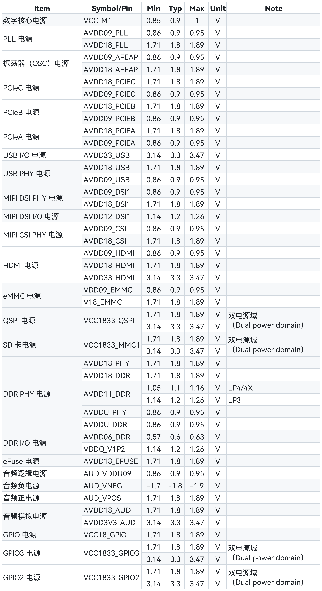

### 5.2 绝对最大额定值

#### 引脚参数

| 项目（Item）           | 符号/引脚（Symbol/Pin） | 最小值（Min） | 最大值（Max） | 单位（Unit） |
|------------------------|--------------------------|---------------|---------------|--------------|
| Digital Power    | VCC_M1            | -0.1  | 1.035  | V    |
| PLL              | AVDD09_PLL        | -0.1  | 1.035  | V    |
| PLL              | AVDD18_PLL        | -0.1  | 2.07   | V    |
| OSC              | AVDD09_AFEAP      | -0.1  | 1.035  | V    |
| OSC              | AVDD18_AFEAP      | -0.1  | 2.07   | V    |
| PCIeC            | AVDD18_PCIEC      | -0.1  | 2.07   | V    |
| PCIeC            | AVDD09_PCIEC      | -0.1  | 1.035  | V    |
| PCIeB            | AVDD18_PCIEB      | -0.1  | 2.07   | V    |
| PCIeB            | AVDD09_PCIEB      | -0.1  | 1.035  | V    |
| PCIeA            | AVDD18_PCIEA      | -0.1  | 2.07   | V    |
| PCIeA            | AVDD09_PCIEA      | -0.1  | 1.035  | V    |
| USB IO           | AVDD33_USB        | -0.1  | 3.795  | V    |
| USB PHY          | AVDD18_USB        | -0.1  | 2.07   | V    |
| USB PHY          | AVDD09_USB        | -0.1  | 1.035  | V    |
| MIPI DSI IO      | AVDD12_DSI1       | -0.1  | 1.38   | V    |
| MIPI DSI PHY     | AVDD09_DSI1       | -0.1  | 1.035  | V    |
| MIPI DSI PHY     | AVDD18_DSI1       | -0.1  | 2.07   | V    |
| MIPI CSI PHY     | AVDD09_CSI        | -0.1  | 1.035  | V    |
| MIPI CSI PHY     | AVDD18_CSI        | -0.1  | 2.07   | V    |
| HDMI             | AVDD09_HDMI       | -0.1  | 1.035  | V    |
| HDMI             | AVDD18_HDMI       | -0.1  | 2.07   | V    |
| HDMI             | AVDD33_HDMI       | -0.1  | 3.795  | V    |
| eMMC             | VDD09_EMMC        | -0.1  | 1.035  | V    |
| eMMC             | V18_EMMC          | -0.1  | 2.07   | V    |
| QSPI             | VCC1833_QSPI      | -0.1  | 2.07   | V    |
| QSPI             | VCC1833_QSPI      | -0.1  | 3.795  | V    |
| SD               | VCC1833_MMC1      | -0.1  | 2.07   | V    |
| SD               | VCC1833_MMC1      | -0.1  | 3.795  | V    |
| DDR PHY          | AVDD18_PHY        | -0.1  | 2.07   | V    |
| DDR PHY          | AVDD18_DDR        | -0.1  | 2.07   | V    |
| DDR PHY          | AVDD11_DDR        | -0.1  | 1.265  | V    |
| DDR PHY          | AVDD11_DDR        | -0.1  | 1.38   | V    |
| DDR PHY          | AVDDU_PHY         | -0.1  | 1.035  | V    |
| DDR PHY          | AVDDU_DDR         | -0.1  | 1.035  | V    |
| DDR IO           | AVDD06_DDR        | -0.1  | 0.69   | V    |
| DDR IO           | VDDQ_V1P2         | -0.1  | 1.38   | V    |
| eFuse            | AVDD18_EFUSE      | -0.1  | 2.07   | V    |
| Audio Logic      | AUD_VDDU09        | -0.1  | 1.035  | V    |
| Audio Power NEG  | AUD_VNEG          | N/A   | -2.07  | V    |
| Audio Power POS  | AUD_VPOS          | -0.1  | 2.07   | V    |
| Audio Analog     | AVDD18_AUD        | -0.1  | 2.07   | V    |
| Audio Analog     | AVDD3V3_AUD       | -0.1  | 3.795  | V    |
| GPIO             | VCC18_GPIO        | -0.1  | 2.07   | V    |
| GPIO3            | VCC1833_GPIO3     | -0.1  | 2.07   | V    |
| GPIO3            | VCC1833_GPIO3     | -0.1  | 3.795  | V    |
| GPIO2            | VCC1833_GPIO2     | -0.1  | 2.07   | V    |
| GPIO2            | VCC1833_GPIO2     | -0.1  | 3.795  | V    |

#### 封装参数

| 项目（Item）                              | 符号（Symbol） | 最小值（Min） | 最大值（Max） | 单位（Unit） |
|-------------------------------------------|----------------|---------------|---------------|--------------|
| 工作温度<br>（工业级标准）                | Ta             | -40           | +85           | °C           |
| 结温                                      | Tj             | N/A           | 125           | °C           |
| 存储温度                                  | Tstg           | -40           | 125           | °C           |

### 5.3 引脚最大电流

| 项目（Item）           | 符号/引脚（Symbol/Pin） | 最大值（Max） | 单位（Unit） |
|------------------------|--------------------------|---------------|--------------|
| Digital Power    | VCC_M1           | 10000 | mA   |
| PLL              | AVDD09_PLL       | 5     | mA   |
| PLL              | AVDD18_PLL       | 5     | mA   |
| OSC              | AVDD09_AFEAP     | 5     | mA   |
| OSC              | AVDD18_AFEAP     | 5     | mA   |
| PCIeC            | AVDD18_PCIEC     | 50    | mA   |
| PCIeC            | AVDD09_PCIEC     | 100   | mA   |
| PCIeB            | AVDD18_PCIEB     | 50    | mA   |
| PCIeB            | AVDD09_PCIEB     | 100   | mA   |
| PCIeA            | AVDD18_PCIEA     | 50    | mA   |
| PCIeA            | AVDD09_PCIEA     | 100   | mA   |
| USB IO           | AVDD33_USB       | 90    | mA   |
| USB PHY          | AVDD18_USB       | 90    | mA   |
| USB PHY          | AVDD09_USB       | 15    | mA   |
| MIPI DSI PHY     | AVDD09_DSI1      | 20    | mA   |
| MIPI DSI PHY     | AVDD18_DSI1      | 50    | mA   |
| MIPI DSI IO      | AVDD12_DSI1      | 50    | mA   |
| MIPI CSI PHY     | AVDD09_CSI       | 70    | mA   |
| MIPI CSI PHY     | AVDD18_CSI       | 100   | mA   |
| HDMI             | AVDD09_HDMI      | 10    | mA   |
| HDMI             | AVDD18_HDMI      | 10    | mA   |
| HDMI             | AVDD33_HDMI      | 10    | mA   |
| eMMC             | VDD09_EMMC       | 50    | mA   |
| eMMC             | V18_EMMC         | 50    | mA   |
| QSPI             | VCC1833_QSPI     | 150   | mA   |
| SD               | VCC1833_MMC1     | 150   | mA   |
| DDR PHY          | AVDD18_PHY       | 200   | mA   |
| DDR PHY          | AVDD18_DDR       | 20    | mA   |
| DDR PHY          | AVDD11_DDR       | 100   | mA   |
| DDR PHY          | AVDDU_PHY        | 100   | mA   |
| DDR PHY          | AVDDU_DDR        | 100   | mA   |
| DDR IO           | AVDD06_DDR       | 100   | mA   |
| DDR IO           | VDDQ_V1P2        | 600   | mA   |
| eFuse            | AVDD18_EFUSE     | 150   | mA   |
| Audio Logic      | AUD_VDDU09       | 1     | mA   |
| Audio Power NEG  | AUD_VNEG         | 102   | mA   |
| Audio Power POS  | AUD_VPOS         | 102   | mA   |
| Audio Analog     | AVDD18_AUD       | 10    | mA   |
| Audio Analog     | AVDD3V3_AUD      | 100   | mA   |

### 5.4 上电/断电时序

#### 上电时序

- 若 K1 处理器处于关机状态（冷启动），短按电源键（例如 1 秒）将自动开启处理器。
- 电源管理芯片（PMIC）将**首先**开启核心逻辑电源，**随后**再开启外部 I/O 电源，以确保正确的初始化顺序。
- PMIC 会发出上电复位信号（Power-On-Reset, POR），用于初始化系统并确保其进入确定的初始状态。

下图展示了上电过程中相关引脚的状态变化顺序：


#### 断电时序

- 长按电源键（例如 6 秒）将关闭 K1 处理器。

下图展示了断电过程中相关引脚的状态变化顺序：


### 5.5 功耗特性

#### 典型应用场景下

> 待定（TBD）

#### 特定应用场景下

> 待定（TBD）
