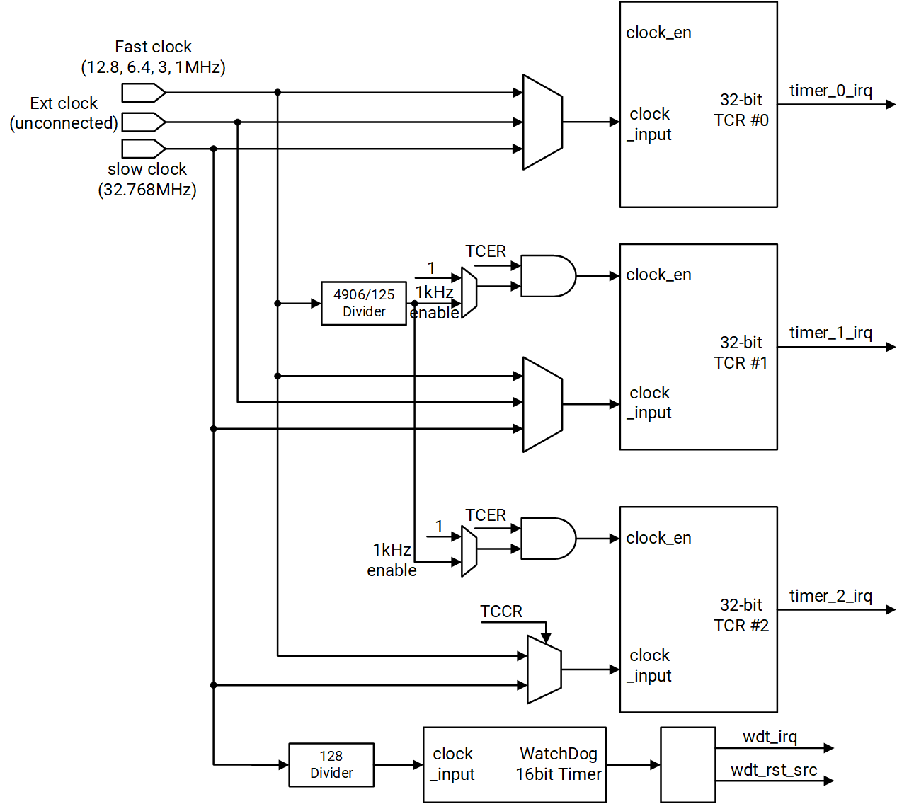
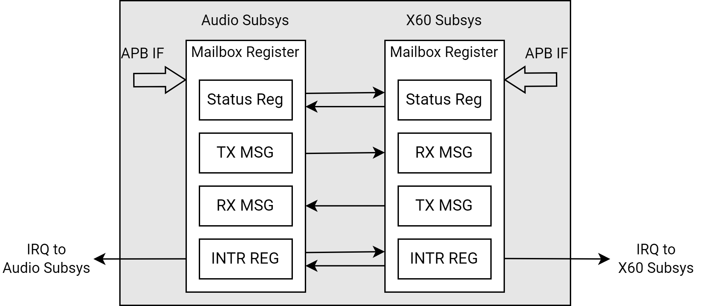

sidebar_position: 10

# 10. 顶层系统（2/2）

## 10.1 定时器与看门狗（Timer & Watchdog）

### 概述

K1 芯片包含以下定时器资源：

- 三个 32 位通用定时器，支持可编程时钟频率  
- 一个 16 位看门狗定时器，支持可编程时钟频率

### 特性

**[通用定时器]**

- 每个通用定时器包含一个 32 位定时器时钟控制寄存器（TCCRn），并以向上计数模式工作  
- 支持可编程时钟频率，提供以下两种时钟源选项：

  - **【高速时钟】**：12.8 MHz、6.4 MHz、3 MHz、1 MHz  
  - **【低速时钟】**：32.768 kHz

**[看门狗定时器]**

- 以向上计数模式工作  
- 支持可编程时钟频率，提供以下两种时钟源选项：

  - **【高速时钟】**：12.8 MHz、6.4 MHz、3 MHz、1 MHz  
  - **【低速时钟】**：32.768 kHz

### 功能描述

#### 定时器单元

- **高速时钟选择**
  高速时钟可以通过定时器的时钟/复位控制寄存器（APBC_TIMERS_CLK_RST）中的功能时钟选择字段进行选择。所有三个定时器（Timer 0/1/2）都可以使用高速或低速时钟工作。

- **定时器计数寄存器（TCRn）**
  每个定时器计数寄存器（TCRn，其中 n = 0, 1 或 2）与三个 32 位定时器匹配寄存器（TMR_Tn_Mm）相关联。当操作系统计数寄存器（TCRn）中的值与任何一个匹配寄存器中的值匹配，并且中断使能位被设置时，定时器状态寄存器（TSR）中相应的位会被置位。

- **中断生成**
  TSR 中的这些位会路由到中断控制器，该控制器可以编程为在触发时生成中断。

- **重新编程定时器**
  在定时器运行时重新编程任何定时器控制寄存器（TCCR、TPLVRn、TMR_Tn_Mm、TPLCRn、TCMRn 或 TILRn）并不保证有效。为了安全地重新编程这些寄存器，请执行以下步骤：

  - 禁用定时器
  - 重新编程定时器
  - 重新启用定时器

  启用一个定时器的功能不会受到另一个定时器编程的影响。

下图展示了定时器单元的架构。

#### 看门狗定时器（Watchdog Timer）

16 位看门狗定时器使用由定时器模块提供的时钟工作，频率为 256 Hz。

当看门狗定时器的值与 TWMR 中的值匹配且 TWMER[WE] 位被设置时，会触发一个复位事件。这将导致 wdt_rst_src# 信号被置位，从而在系统中启动一个看门狗定时器复位事件。

- **看门狗定时器复位模式**：当软件未能正确管理 WDT 超时，表明可能存在软件故障或数据损坏时，此模式被激活。在此模式下，大多数内部系统寄存器将被重置为其默认值，但实时时钟不受影响。
- **避免看门狗定时器复位**：为了避免看门狗定时器复位，软件必须在 WDT 达到匹配值之前通过设置 TWCR[WCR] 字段重启 WDT。

> **注意**：TWSR 寄存器（以及一些其他内部 WDT 触发器），用于确定是否发生匹配事件，在上电复位或外部主复位信号置位时会被复位。所有其他寄存器在上电复位、外部主复位或看门狗定时器复位信号置位时也会被复位。

当发生 WDT 复位事件时，WDT 会在 wdt_rst_src# 输出端生成一个宽度为 4 毫秒的脉冲。这使得系统在此期间保持复位状态。一旦复位信号被解除置位，系统将经历一个复位序列。

对所有 WDT 寄存器的写入操作受到两个访问寄存器 TWFAR 和 TWSAR 的保护。按照以下步骤启用对任意 WDT 寄存器的写入：

- 向 TWFAR 寄存器写入正确的键值
- 向 TWSAR 寄存器写入正确的键值
- 对所需的 WDT 寄存器执行写入操作

一旦完成写入操作，WDT 寄存器将再次被锁定。对于每个后续的写入操作，都必须重复此过程。

### 寄存器描述

定时器/看门狗寄存器的基地址如下表所示：

| 名称                | 地址         |
|---------------------|--------------|
| APB_TIMERS1_BASE    | 0xD4014000   |
| APB_TIMERS2_BASE    | 0xD4016000   |
| PMU_TIMERS_BASE     | 0xD4080000   |
| SEC_TIMERS_BASE     | 0xF0616000   |

#### 定时器计数使能寄存器（Timer Count Enable Register）

该寄存器为每个定时器包含一个计数使能位。使能后，对应的定时器计数寄存器（TCR）将从 TPLVR 寄存器指定的值重新开始计数。

偏移地址（Offset）：0x0  

位域 | 字段 | 类型 | 复位值 | 说明  
------|------|------|--------|------  
31:3 | Reserved | RO | 0x0 | 保留供将来使用。  
2 | Timer #2 count enable | RW | 0x0 | 控制 Timer #2 是否计数： `0`：计数禁用。 `1`：计数启用。 **注意**：由于跨时钟域同步的原因，更改不会立即生效。  
1 | Timer #1 count enable | RW | 0x0 | 控制 Timer #1 是否计数： `0`：计数禁用。 `1`：计数启用。 **注意**：由于跨时钟域同步的原因，更改不会立即生效。  
0 | Timer #0 count enable | RW | 0x0 | 控制 Timer #0 是否计数： `0`：计数禁用。 `1`：计数启用。 **注意**：由于跨时钟域同步的原因，更改不会立即生效。

#### 定时器计数模式寄存器（Timer Count Mode Register）

TCMR 为每个定时器包含一个计数模式位。处理器的 TCR 仅支持周期定时器模式，不支持单次触发（one-shot）模式。

偏移地址（Offset）：0x4  

位域 | 字段 | 类型 | 复位值 | 说明  
------|------|------|--------|------  
31:3 | Reserved | RO | 0x0 | 保留供将来使用。  
2 | Timer #2 count mode | RW | 0x0 | 定义 Timer #2 的模式： `0`：周期定时器模式：如果匹配发生且 `PLCR` != `0`，则重新加载定时器。 `1`：自由运行模式：当定时器达到 `0xFFFFFFFF` 时回绕至 `0`。  
1 | Timer #1 count mode | RW | 0x0 | 定义 Timer #1 的模式： `0`：周期定时器模式：如果匹配发生且 `PLCR` != `0`，则重新加载定时器。 `1`：自由运行模式：当定时器达到 `0xFFFFFFFF` 时回绕至 `0`。  
0 | Timer #0 count mode | RW | 0x0 | 定义 Timer #0 的模式： `0`：周期定时器模式：如果匹配发生且 `PLCR` != `0`，则重新加载定时器。 `1`：自由运行模式：当定时器达到 `0xFFFFFFFF` 时回绕至 `0`。

### 计数器重启寄存器（Timer Count Restart Register）  

偏移地址（Offset）：0x8  

位域 | 字段 | 类型 | 复位值 | 说明  
------|------|------|--------|------  
31:3 | Reserved | RO | 0x0 | 保留供将来使用。  
2 | T2RS | RW | 0x0 | Timer #2 计数重启 `0`：无影响 `1`：计数重新开始 **注意**：在将此位设置为 `1` 之前，请配置其他寄存器。  
1 | T1RS | RW | 0x0 | Timer #1 计数重启 `0`：无影响 `1`：计数重新开始 **注意**：在将此位设置为 `1` 之前，请配置其他寄存器。  
0 | T0RS | RW | 0x0 | Timer #0 计数重启 `0`：无影响 `1`：计数重新开始 **注意**：在将此位设置为 `1` 之前，请配置其他寄存器。

### 定时器时钟控制寄存器（Timer Clock Control Register）  

偏移地址（Offset）：0xC  

位域 | 字段 | 类型 | 复位值 | 说明  
------|------|------|--------|------  
31:7 | Reserved | RO | 0x0 | 保留供将来使用。  
6:5 | CS_2 | RW | 0x0 | Timer #2 的时钟源。 - `0x0`：快速时钟（AP APB 定时器时钟取决于 `APBC_TIMERSx_CLK_RST[6:4]`，CP APB 定时器快速只能为 12.8M） - `0x1`：32.768 kHz - `0x2`：32.768 kHz - `0x3`：快速时钟  
4 | Reserved | RO | 0x0 | 保留供将来使用。  
3:2 | CS_1 | RW | 0x0 | Timer #1 的时钟源 - `0x0`：快速时钟（AP APB 定时器时钟取决于 `APBC_TIMERSx_CLK_RST[6:4]`，CP APB 定时器快速只能为 12.8M） - `0x1`：32.768 kHz - `0x2`：32.768 kHz - `0x3`：保留  
1:0 | CS_0 | RW | 0x0 | Timer #0 的时钟源 - `0x0`：快速时钟（AP APB 定时器时钟取决于 `APBC_TIMERSx_CLK_RST[6:4]`，CP APB 定时器快速只能为 12.8M） - `0x1`：32.768 kHz - `0x2`：保留 - `0x3`：快速时钟

### 定时器匹配寄存器（Timer Match Register）  

偏移地址（Offset）：0x10~0x18(0x4)/0x20~0x28(0x4)/0x30~0x38(0x4)  

位域 | 字段 | 类型 | 复位值 | 说明  
------|------|------|--------|------  
31:0 | TMR_TN_MM | RW | 0xFFFFFFFF | 定时器 n 匹配寄存器 m 值。 此寄存器保存用于定时器 n（n 代表定时器编号，例如 Timer 0、Timer 1 或 Timer 2）匹配比较的值。当定时器计数器达到此值时，将发生匹配事件。

#### 定时器预载值寄存器（Timer Preload Value Register）

每个 TCR 配备一个 32 位宽的预载值寄存器，当 TMR_Tn_Mm 与 TCRn 发生匹配时，该寄存器的值将加载到 TCRn 中。对应的 TPLCRn 寄存器用于选择匹配比较器。

偏移地址（Offset）：0x40~0x48(0x4)  

位域 | 字段 | 类型 | 复位值 | 说明  
------|------|------|--------|------  
31:0 | TPLVRn | RW | 0x0 | 当 TMR_Tn_Tm 和 TCRn 之间发生匹配时，将此定时器 n 预加载值加载到 TCRn 中。对应的 TPLCRn 寄存器选择匹配比较器。

#### 定时器预载控制寄存器（Timer Preload Control Register）

每个 TCR 配备一个预载控制寄存器。

### 定时器预加载控制寄存器（Timer Preload Control Register）  

偏移地址（Offset）：0x50~0x58(0x4)  

位域 | 字段 | 类型 | 复位值 | 说明  
------|------|------|--------|------  
31:3 | Reserved | RO | 0x0 | 保留供将来使用  
2 | CRPD | RW | 0x0 | 禁用计数器重启时的预加载 - `0x0`：当设置重启位时，将 PLCR 预加载到计数器； - `0x1`：当设置重启位时，禁用将 PLCR 预加载到计数器。  
1:0 | MCS | RW | 0x0 | 匹配比较器选择： - `0x0`：自由运行模式（直到最大值） - `0x1`：启用与匹配比较器 0 的预加载 - `0x2`：启用与匹配比较器 1 的预加载 - `0x3`：启用与匹配比较器 2 的预加载

#### 定时器中断使能寄存器（Timer Interrupt Enable Register）

这三个计数器寄存器各自包含一个使能位，用于控制当匹配寄存器与操作系统定时器计数器（TCRn）发生匹配时，是否在定时器状态寄存器（TSR）中置位对应的状态位，并触发相应的 timer#_irq 中断输出。

> **注意**：清除使能位不会复位已置位的对应中断状态位。

### 定时器中断使能寄存器（Timer Interrupt Enable Register）  

偏移地址（Offset）：0x60~0x68(0x4)  

位域 | 字段 | 类型 | 复位值 | 说明  
------|------|------|--------|------  
31:3 | Reserved | RO | 0x0 | 保留供将来使用。  
2 | IE2 | RW | 0x0 | 匹配比较器 2 的中断使能。 `0`：禁用匹配寄存器 2 和其 OS 定时器之间的匹配中断（不产生中断）。 `1`：启用匹配寄存器 2 和其 OS 定时器之间的匹配中断（在 TSRn 或 timer#_irq 输出中产生中断）。  
1 | IE1 | RW | 0x0 | 匹配比较器 1 的中断使能。 `0`：禁用匹配寄存器 1 和其 OS 定时器之间的匹配中断（不产生中断）。 `1`：启用匹配寄存器 1 和其 OS 定时器之间的匹配中断（在 TSRn 或 timer#_irq 输出中产生中断）。  
0 | IE0 | RW | 0x0 | 匹配比较器 0 的中断使能。 `0`：禁用匹配寄存器 0 和其 OS 定时器之间的匹配中断（不产生中断）。 `1`：启用匹配寄存器 0 和其 OS 定时器之间的匹配中断（在 TSRn 或 timer#_irq 输出中产生中断）。

#### 定时器中断清除寄存器（Timer Interrupt Clear Register）

这三个寄存器为每个中断源分别提供一个清除位，用于复位发送至中断控制器的电平触发中断请求。每个匹配寄存器均对应一个独立的清除位，通过向相应位写入 1 即可清除对应的中断。

> **注意**：本寄存器不适用于边沿触发中断。

偏移地址（Offset）：0x70~0x78(0x4)  

位域 | 字段 | 类型 | 复位值 | 说明  
------|------|------|--------|------  
31:3 | Reserved | RO | 0x0 | 保留供将来使用。  
2 | TCLR2 | WO | 0x0 | 匹配比较器 2 的中断清除 `0`：无影响 `1`：清除电平中断和对应的状态位  
1 | TCLR1 | WO | 0x0 | 匹配比较器 1 的中断清除 `0`：无影响 `1`：清除电平中断和对应的状态位  
0 | TCLR0 | WO | 0x0 | 匹配比较器 0 的中断清除 `0`：无影响 `1`：清除电平中断和对应的状态位

#### 定时器状态寄存器（Timer Status Register）

这三个状态寄存器包含状态位，用于指示对应定时器计数寄存器（TCRn）的三个匹配寄存器中是否发生过匹配事件，具体如下：

- 当匹配事件发生后，在相应时钟的下一个上升沿，对应状态位被置位；
- 通过向 TICLRn 寄存器中对应位写入逻辑 1 可清除该状态位。

本寄存器仅反映**电平触发中断**的状态，**边沿触发中断**不会被捕获到此寄存器中。

偏移地址（Offset）：0x80~0x88(0x4)  

位域 | 字段 | 类型 | 复位值 | 说明  
------|------|------|--------|------  
31:3 | Reserved | RO | 0x0 | 保留供将来使用。  
2 | M2 | RO | 0x0 | TMR_Tn_M2 的匹配状态。 `0`：自上次中断清除以来，定时器匹配寄存器 TMR_Tn_M2 未与计数器匹配。 `1`：自上次中断清除以来，定时器匹配寄存器 TMR_Tn_M2 已与计数器匹配。  
1 | M1 | RO | 0x0 | TMR_Tn_M1 的匹配状态。 `0`：自上次中断清除以来，定时器匹配寄存器 TMR_Tn_M1 未与计数器匹配。 `1`：自上次中断清除以来，定时器匹配寄存器 TMR_Tn_M1 已与计数器匹配。  
0 | M0 | RO | 0x0 | TMR_Tn_M0 的匹配状态。 `0`：自上次中断清除以来，定时器匹配寄存器 TMR_Tn_M0 未与计数器匹配。 `1`：自上次中断清除以来，定时器匹配寄存器 TMR_Tn_M0 已与计数器匹配。

#### 定时器计数寄存器（Timer Count Register）

三个只读的定时器计数寄存器（TCRn，其中 n = 0、1、2）均为 32 位计数器，在所选时钟的上升沿递增，具体特性如下：

- 定时器计数寄存器已从定时器时钟域同步至 APB 时钟域，软件可直接读取使用；
- 计数器初始值由 TPLVR 寄存器预加载。使能后，计数器从预加载值（由对应 TPLCRn 寄存器定义）开始向上计数，直至达到最大值或匹配值；
- 该读取操作最多需要三个定时器时钟周期。若所选定时器工作在低速时钟下，则读取延迟可能更长。

偏移地址（Offset）：0x90~0x98(0x4)  

位域 | 字段 | 类型 | 复位值 | 说明  
------|------|------|--------|------  
31:0 | TCRn | RO | 0x0 | 定时器 n 计数值寄存器。 - 计数器在所选时钟的上升沿递增。 - 该寄存器已同步至 APB 时钟域。

#### 看门狗首次访问寄存器（Timer Watchdog First Access Register）  

偏移地址（Offset）：0xB0  

位域 | 字段 | 类型 | 复位值 | 说明  
------|------|------|--------|------  
31:16 | Reserved | RO | 0x0 | 保留供将来使用。  
15:0 | KEY | WO | 0x0 | 看门狗访问密钥。 写入值 `0xBABA` 到此寄存器以匹配密钥。

#### 看门狗二次访问寄存器（Timer Watchdog Second Access Register）  

偏移地址（Offset）：0xB4  

位域 | 字段 | 类型 | 复位值 | 说明  
------|------|------|--------|------  
31:16 | Reserved | RO | 0x0 | 保留供将来使用。  
15:0 | KEY | WO | 0x0 | 看门狗访问密钥。 写入值 `0xEB10` 到此寄存器以匹配密钥。

#### 看门狗匹配使能寄存器（Timer Watchdog Match Enable Register）

看门狗使能寄存器包含一个 WDT 使能位，该位仅可由用户置位。对该寄存器的写访问受 TWFAR 和 TWSAR 访问寄存器保护。

偏移地址（Offset）：0xB8  

位域 | 字段 | 类型 | 复位值 | 说明  
------|------|------|--------|------  
31:2 | Reserved | RO | 0x0 | 保留供将来使用。  
1 | WRIE | RW | 0x0 | 看门狗复位/中断使能。 `0`：看门狗定时器到期生成看门狗中断（不生成看门狗定时器复位）。 `1`：看门狗定时器到期生成看门狗定时器复位（不生成看门狗中断）。  
0 | WE | RW | 0x0 | WDT 计数使能。 `0`：禁用 WDT 计数，将 WDT 的值重置为零。 `1`：启用计数，WDT 总是从零开始。 **注意**：由于信号从一个时钟域到另一个时钟域的同步链，WDT 定时器的使能和禁用操作不会立即生效。

#### 看门狗匹配寄存器（Timer Watchdog Match Register）

该匹配寄存器与看门狗定时器进行比较。当发生匹配且 TWER[WRIE] 位被置位时，看门狗定时器将触发处理器复位。

偏移地址（Offset）：0xBC  

位域 | 字段 | 类型 | 复位值 | 说明  
------|------|------|--------|------  
31:16 | Reserved | RO | 0x0 | 保留供将来使用。  
15:0 | WTM | RW | 0xFFFF | 16 位看门狗定时器匹配值。

#### 看门狗状态寄存器（Timer Watchdog Status Register）

该寄存器用于指示是否已发生看门狗定时器（WDT）复位并导致系统复位，具体如下：

- 当 wdt_src_rst# 信号被置位时，该位被置 1；
- 通过向该寄存器写入逻辑 0 可清除该状态位；
- 在 WDT 复位事件后，无需清除该位即可重新激活看门狗定时器。

偏移地址（Offset）：0xC0  

位域 | 字段 | 类型 | 复位值 | 说明  
------|------|------|--------|------  
31:1 | Reserved | RO | 0x0 | 保留供将来使用。  
0 | WTS | RW | 0x0 | 看门狗定时器复位指示。 指示复位是否由 WDT 引起。 读取： `0`：看门狗定时器未引起复位，因为此位被清除。 `1`：看门狗定时器引起了复位。 写入： `0`：清除 WDT 复位状态。 `1`：无影响。

#### 看门狗中断清除寄存器（Timer Watchdog Interrupt Clear Register）  

偏移地址（Offset）：0xC4  

位域 | 字段 | 类型 | 复位值 | 说明  
------|------|------|--------|------  
31:1 | Reserved | RO | 0x0 | 保留供将来使用。  
0 | WICLR | WO | 0x0 | WDT 中断清除。 写入： `0`：无影响。 `1`：清除中断。

#### 看门狗计数器重置寄存器（Timer Watchdog Counter Reset Register）  

偏移地址（Offset）：0xC8  

位域 | 字段 | 类型 | 复位值 | 说明  
------|------|------|--------|------  
31:1 | Reserved | RO | 0x0 | 保留供将来使用。  
0 | WCR | WO | 0x0 | 看门狗定时器计数值重置。 写入： `0`：无影响。 `1`：清除 WDT 计数器的值。

#### 看门狗值寄存器（Timer Watchdog Value Register）  

偏移地址（Offset）：0xCC  

位域 | 字段 | 类型 | 复位值 | 说明  
------|------|------|--------|------  
31:16 | Reserved | RO | 0x0 | 保留供将来使用。  
15:0 | WTV | RO | 0x0 | 看门狗定时器值。 读取当前 WDT 的值。 由于在读取操作期间寄存器可能处于转换状态，软件必须执行两次读取并比较这两个值以确保准确性。

## 10.2 实时时钟（RTC）

### 概述

RTC 模块能够以秒为单位独立于系统时钟频率进行实时时钟计数。

### 特性

- 基于内部 1 Hz 时钟对秒数进行计数  
- 支持对内部振荡器频率进行校准  
- 支持闹钟中断和 1 Hz 周期中断

### 功能描述

RTC 模块包含一个 32 位计数器，用于以秒为单位记录实时时钟。系统时钟经分频后生成内部 1 Hz 时钟，用于实时时钟计数。用户可根据需要配置 RTC 的初始值。该计数器的值在系统进入或退出睡眠模式、空闲模式时均不受影响。

RTC 可配置生成以下两类中断：

- 闹钟中断（Alarm interrupt）  
- 1 Hz 中断（1-Hz interrupt）

系统中包含两个 RTC 模块：

- 非安全 RTC（Non-secure RTC）  
- 安全 RTC（Secure RTC）

其中，安全 RTC 仅可由安全核访问，且仅在上电复位（Power-on Reset）时复位，不受 APB 总线复位影响。

### 寄存器描述

RTC 寄存器的基地址如下表所示。

| 名称             | 地址           |
|------------------|----------------|
| 非安全 RTC       | 0xD401_0000    |
| 安全 RTC         | 0xD401_0400    |

#### RTC 计数寄存器（RTC Counter Register）  

偏移地址（Offset）：0x0  

位域 | 字段 | 类型 | 复位值 | 说明  
------|------|------|--------|------  
31:0 | Time Count | RW | 0x0 | 实时时钟计数值，以 1 Hz 时钟频率更新。

### RTC 报警寄存器（RTC Alarm Register）  
偏移地址（Offset）：0x4  

位域 | 字段 | 类型 | 复位值 | 说明  
------|------|------|--------|------  
31:0 | Alarm Time | RW | 0x0 | 用于产生中断的报警时间。

#### RTC 状态寄存器（RTC Status Register）  
偏移地址（Offset）：0x8  

位域 | 字段 | 类型 | 复位值 | 说明  
------|------|------|--------|------  
31:4 | Reserved | RO | 0x0 | 保留  
3 | 1-Hz 中断使能 | RW | 0x0 | 启用 1-Hz 中断： `0x0`：未启用 `0x1`：已启用  
2 | RTC 报警中断使能 | RW | 0x0 | 启用 RTC 报警中断： `0x0`：未启用 `0x1`：已启用  
1 | 1-Hz 上升沿检测 | W1C | 0x0 | 标记指示检测到 1-Hz 上升沿。 写入 `1` 清除 1-Hz 中断。  
0 | RTC 报警检测 | W1C | 0x0 | 标记指示检测到 RTC 报警。 写入 `1` 清除 RTC 报警中断。

#### RTC 校准寄存器（RTC Trim Register, RTC_TR）  
偏移地址（Offset）：0xC  

位域 | 字段 | 类型 | 复位值 | 说明  
------|------|------|--------|------  
31 | 校准值锁定位 | RW | 0x0 | 校准值的锁定位。  
30:26 | Reserved | RO | 0x0 | 保留  
25:16 | 校准删除计数 | RW | 0x0 | 此值表示时钟校准时要删除的 32-kHz 时钟的数量。  
15:0 | 时钟分频计数 | RW | 0x7FFF | 此值是时钟校准逻辑的整数部分。

#### RTC 控制寄存器（RTC Control Registers）  

偏移地址（Offset）：0x10  

位域 | 字段 | 类型 | 复位值 | 说明  
------|------|------|--------|------  
31:1 | Reserved | RO | 0x0 | 保留  
0 | ALARM信号控制 | RW | 0x0 | 此位允许软件控制由处理器生成的ALARM信号，该信号通知任何当前正在运行的外部设备。因此，ALARM信号可以由软件或硬件断言。 `0x0`：关闭（ALARM 无效） `0x1`：开启（ALARM 生效）

#### RTC 备份寄存器（RTC Backup Registers）  

偏移地址（Offset）：0x14~0x24  

位域 | 字段 | 类型 | 复位值 | 说明  
------|------|------|--------|------  
31:0 | 备份数据 | RW | 0x0 | 处理器 RTC 提供五个备份寄存器，用于存储可擦写数据。处理器可读写全部五个 32 位寄存器。

## 10.3 邮箱（Mailbox）

### 概述

邮箱模块用于在 SoC 与 MCU 子系统之间传递消息或信号。

### 特性

- 支持一个处理器向另一个处理器触发中断  
- 提供轮询字（polling word），可在无需中断的情况下实现一方对另一方的事件通知  
- 接收到 ACK 中断表明对方处于活跃状态  
- 支持一个处理器唤醒另一个处理器

### 功能描述

邮箱模块的架构如下图所示。

### 寄存器描述

可参考这些章节 **[6. 地址映射](6.Address_Mapping.md)** 与 **[7. 中断分配](7.Interrupt_Assignments.md)**：

- 在 X60™ 子系统中，邮箱基地址为 0xD4013400，中断号为 52  
- 在音频子系统（Audio subsystem）中，邮箱基地址为 0xC088A000，中断号为 30

#### ISRR寄存器（ISRR Register, ISRR）  

偏移地址（Offset）：0x0  

位域 | 字段 | 类型 | 复位值 | 说明  
------|------|------|--------|------  
31:16 | reserved | R | 0x0 | 保留  
15:0 | APB_MBOX_ISRR | R | 0x0 | 用于获取另一边Mailbox的ISRW值。

#### 写数据寄存器（Write Data Register, WDR）  

偏移地址（Offset）：0x4  

位域 | 字段 | 类型 | 复位值 | 说明  
------|------|------|--------|------  
31:0 | APB_MBOX_WDR | W | 0x0 | 写入数据 包含一个 32 位控制字，用于传输到对端（对端将轮询该值）。该控制字的具体内容由应用定义。

#### 中断设置寄存器（Interrupt Set Register, ISRW）  
偏移地址（Offset）：0x8  

位域 | 字段 | 类型 | 复位值 | 说明  
------|------|------|--------|------  
31:16 | reserved | R | 0x0 | 保留  
15:0 | APB_MBOX_ISRW | W | 0x0 | 中断设置 此寄存器允许在对端的中断控制器中设置 4 种不同的中断。 通过向该寄存器中对应的中断位写入 `1` 来设置中断，具体如下： - 设置位 `[10]` 将在对端的中断控制器中生成 SET_GP_INT 中断。 - 设置位 `[9]` 将在对端的中断控制器中生成 SET_MSG_INT 中断。 - 设置位 `[8]` 将在对端的中断控制器中生成 SET_CMD_INT 中断。 - 设置位 `[7:0]` 中的任意一位将生成一个称为 DATA_ACK 的单个中断。 一旦设置了中断，相应的位会由硬件自动清除。

#### 中断清除寄存器（Interrupt Clear Register, ICR）  
偏移地址（Offset）：0xC  

位域 | 字段 | 类型 | 复位值 | 说明  
------|------|------|--------|------  
31:16 | reserved | R | 0x0 | 保留  
15:0 | APB_MBOX_ICR | W | 0x0 | 中断清除 用于清除由对端触发的中断。 - 向特定比特写入 **1** 可清除对应的中断。 - 不需要在写入 **1** 后再写入 **0** — 比特会自动被清除。

#### 中断识别寄存器（Interrupt Identification Register, IIR）  
偏移地址（Offset）：0xC  

位域 | 字段 | 类型 | 复位值 | 说明  
------|------|------|--------|------  
31:16 | reserved | RSVD | 0xX | 保留 保留字段。总是写入 0。忽略读取值。  
15:0 | APB_MBOX_IIR | RO | 0x0 | 此寄存器用于读取从对端接收到的中断源。如果 Mailbox 被识别为中断源，可以读取中断识别寄存器来确定是 11 种可能的 Mailbox 中断中的哪一种被触发。 **注意**： - 当只有 [10:8] 位被触发时，读取中断识别寄存器是多余的，因为中断源与中断表示之间存在一对一映射。然而，当接收到的中断是 DATA_ACK 中断时，必须读取中断识别寄存器以确定中断的原因。 - 在读取此寄存器之前，必须执行一个虚拟写操作（到任何 Mailbox 地址范围），以将数据锁存到读寄存器。如果不先执行写操作就进行读取，数据不会更新，会读取到旧的数据。

#### 读数据寄存器（Read Data Register, RDR）  
偏移地址（Offset）：0x14  

位域 | 字段 | 类型 | 复位值 | 说明  
------|------|------|--------|------  
31:0 | APB_MBOX_RDR | RO | 0x0 | 此寄存器用于轮询对端的写数据寄存器。 **注意**：在读取此寄存器之前，必须执行一个虚拟写操作（到任何 Mailbox 地址范围），以将数据锁存到读寄存器。如果不先执行写操作就进行读取，数据不会更新，会读取到旧的数据。

## 10.4 电源管理与低功耗模式控制（Power Management & Lower Power Mode Control）

### 概述

芯片上定义并实现了多种电源域和细粒度的电源状态，以实现显著的功耗节省。

### 特性

- 芯片上分布有两个电源管理单元，用于控制电源开启/关闭顺序  
- 实现了不同的电源域以适应不同场景下的功耗节省需求  
- 定义了多种电源状态和唤醒事件，以满足各种产品应用的需求  

### 功能描述

#### 电源管理单元（Power Management Unit, PMU）

采用两级电源管理策略来控制不同级别的功耗。定义了不同的电源域和电源状态以实现超低功耗。两个电源管理单元如下：

- **主电源管理单元（Main PMU, MPMU）**
  主 PMU 负责芯片级电源管理。一旦应用程序子系统 PMU（APMU）进入最低功耗状态，主 PMU 将接管芯片级低功耗状态的控制。
  关于电源开/关顺序的详细信息，请参阅 **[上电/断电时序](4.Electrical_Characteristics.md#44-上电断电时序)**。

- **应用程序子系统 PMU（Application Subsystem PMU, APMU）**
  应用程序子系统 PMU 包括以下几个主要部分：
  
  - RISCV X60™ 处理器时钟和低功耗模式状态机。
    此状态机控制 RISCV X60™ 处理器的时钟生成，并生成进入和退出 RISCV X60™ 处理器低功耗模式的序列。
  - AXI 结构和 DDR 时钟及低功耗模式状态机。
    此状态机控制总线矩阵和 DDR 的时钟生成。一旦 RISCV X60™ 处理器状态机进入低功耗模式，它将控制进入和退出总线及 DDR 低功耗模式的序列。

应用程序子系统 PMU 负责 X60™ 和 AXI/DDR 的电源管理。一旦应用程序子系统 PMU 进入低功耗模式，主 PMU 就会接管控制权，并根据主 PMU 的控制将 K1 置于芯片级睡眠模式。

#### 电源域与状态（Power Domains & States）

总共实现了9个电源域，分别为：
- CPU核心
   > 注意：每个CPU核心都有其独立控制的电源域
- CPU集群
   > 注意：每个CPU集群都有其独立控制的电源域
- 视频编码/解码器
- GPU
- HDMI显示子系统
- MIPI DSI子系统
- 视频输入子系统
- RCPU（包括N308、音频编解码器、RCPU外设）
- 始终开启域（AON）

除了AON域之外，所有这些电源域都可以根据具体应用场景关闭。

为了实现最低功耗，设计了不同的电源状态，如下表所示：

| 编号 | 电源状态名称                     | 描述  |
|------|----------------------------------|----------------|
| 1    | 活动状态（ACTIVE）               | 系统处于活动状态，所有电源域均开启，除非某些具有电源开关的电源域被选择性地独立关闭。                                                                                                                 |
| 2    | 核心空闲（CORE-IDLE）            | 每个核心停止执行指令并进入空闲状态，在执行等待中断（WFI）后自动进行时钟门控。接收路由到该核心的中断后退出此状态继续执行。                                                                             |
| 3    | 核心断电（Core-Power-Off）       | 在进入核心空闲睡眠模式后，每个核心在投票后进入断电状态。接收中断时，打开电源并释放复位以退出此状态。                                                                                                   |
| 4    | CPU集群断电（CPU-Cluster-Power-Off） | 当集群内的所有核心进入核心断电状态后，每个CPU集群在投票后进入这种低功耗状态，同时L2/TCM内存也被关闭。 任何路由到该集群CPU核心的活跃中断将唤醒CPU集群，然后供电、恢复时钟并释放复位。                 |
| 5    | 主屏（Home-Screen）              | 在两个CPU集群都进入CPU集群断电模式后，主总线AXI时钟（如果投票通过）会被门控关闭。 任何中断都会通过恢复主总线AXI时钟来唤醒芯片，并为中断路由的目标CPU集群和CPU核心供电，恢复CPU时钟并释放复位以服务中断例程。 |
| 6    | 芯片睡眠（Chip-Sleep）           | 这是最超低功耗的状态，所有PLL/电源岛关闭，只有32K RTC时钟保持运行，24M VCXO可根据配置开启或关闭。 在此状态下，仅AON域中的逻辑/IO保持活跃，连接到PMIC的一个名为SLEEP_OUT的引脚会取消置位，指示PMIC降低VCC电源电压以减少功耗。 |
| 7    | RCPU与SOC LP                     | RCPU电源域是一个独立的电源岛，可以在上述任意PMU状态下工作。RCPU可以根据特定场景需求对不同的SoC低功耗状态进行投票。 RCPU本身有以下四种低功耗状态： - 活动模式：时钟运行 - 时钟门控模式：时钟门控 - PLL关闭模式：PLL断电 - 断电模式：RCPU电源关闭，但RCPU AON域保持活跃 |

> **注意：** VPU、GPU、ISP、DPU电源岛可以通过软件开启或关闭，并且独立于上述表格中的第1~5种电源状态。

#### 唤醒资源（Wake-Up Resource）

在 **芯片睡眠低功耗状态**（Chip-Sleep Low Power State）下，以下中断或事件可唤醒芯片：

- 引脚边沿检测（Pad edge detection）  
- 按键按下（Keypad press）  
- RTC / 定时器 / 看门狗定时器（WDT）  
- USB / RCPU / AP2AUDIO_IPC  
- SD / eMMC / PCIe  
- PMIC  

在 **RCPU断电状态**（RCPU Power-Off State）下，以下中断或事件可唤醒 RCPU PMU 以恢复其电源供应：

- 音频插拔中断 / 挂机键中断 / Class-G 短路电源中断 / 音频过流保护（OCP）中断  
- 应用处理器（AP）通过 IPC 发起的上电请求  
- RCPU AON 定时器唤醒请求  
- Sensor-Hub GPIO 唤醒请求

### 寄存器描述

#### 电源模式状态寄存器（Power Mode Status Register）  
偏移地址（Offset）：0xD4050000+0x1030  

位域 | 字段 | 类型 | 复位值 | 说明  
------|------|------|--------|------  
31:16 | PWRMODE_STATUS | RO | 0x0 | 此字段指示系统进入或退出了哪种低功耗状态。每个比特对应一种不同的低功耗模式。如果设置为 `1`，则表示相应的低功耗模式已发生。通过在 CLR_PWRMODE_STATUS 中将相应比特设置为 `1` 来清除状态。 - bit0: D1P 模式 - bit1: D1PP 模式 - bit2: D1 模式 - bit3: D2 模式 - bit4: D2P - bit5: D2PP 模式 - bit6: cluster0 M2 - bit7: cluster1 M2 - bit8: cluster2 M2 - bit9: cr5 C2 - bit10: comm_top D2  
15:0 | CLR_PWRMODE_STATUS | RW | 0x0 | 清除电源模式状态。 设置 `1` 以清除对应的 PWRMODE_STATUS 比特。

#### 唤醒与恢复时钟线路状态寄存器（WAKEUP AND CLOCK RESUME LINES STATUS REGISTER，AWUCRS）  
偏移地址（Offset）：0xD4050000+0x1048  

位域 | 字段 | 类型 | 复位值 | 说明  
------|------|------|--------|------  
31 | Audio | RW | 0x0 | 音频唤醒  
30 | RSVD | RO | 0x0 | 保留  
29 | RSVD | RO | 0x0 | 保留  
28 | RSVD | RO | 0x0 | 保留  
27 | RSVD | RO | 0x0 | 保留  
26 | RSVD | RO | 0x0 | 保留  
25 | RSVD | RO | 0x0 | 保留  
24 | RSVD | RO | 0x0 | 保留  
23 | SDH1_AUDIO | RO | 0x0 | SDH1 唤醒  
22 | SDH2_SDH3 | RO | 0x0 | SDH2/SDH3 唤醒  
21 | KEYPRESS | RO | 0x0 | 按键按下  
20 | RSVD | RO | 0x0 | 保留  
19 | RSVD | RO | 0x0 | 保留  
18 | WDT | RO | 0x0 | 看门狗定时器  
17 | RTC_ALARM | RO | 0x0 | 实时时钟报警  
16 | PMU_TIMER_3 | RO | 0x0 | PMU 定时器 3  
15 | PMU_TIMER_2 | RO | 0x0 | PMU 定时器 2  
14 | PMU_TIMER_1 | RO | 0x0 | PMU 定时器 1  
13 | AP2_TIMER_3 | RO | 0x0 | AP2 定时器 3  
12 | AP2_TIMER_2 | RO | 0x0 | AP2 定时器 2  
11 | AP2_TIMER_1 | RO | 0x0 | AP2 定时器 1  
10 | AP1_2_TIMER_3 | RO | 0x0 | AP1 定时器 3 和 SEC 定时器 3  
9 | AP1_2_TIMER_2 | RO | 0x0 | AP1 定时器 2 和 SEC 定时器 2  
8 | AP1_2_TIMER_1 | RO | 0x0 | AP1 定时器 1 和 SEC 定时器 1  
7 | WAKEUP7 | RO | 0x0 | 唤醒 7 线路状态  
6 | WAKEUP6 | RO | 0x0 | 唤醒 6 线路状态  
5 | WAKEUP5 | RO | 0x0 | 唤醒 5 线路状态  
4 | WAKEUP4 | RO | 0x0 | 唤醒 4 线路状态  
3 | WAKEUP3 | RO | 0x0 | 唤醒 3 线路状态  
2 | WAKEUP2 | RO | 0x0 | 唤醒 2 线路状态  
1 | WAKEUP1 | RO | 0x0 | 唤醒 1 线路状态  
0 | WAKEUP0 | RO | 0x0 | 唤醒 0 线路状态

#### 唤醒与恢复时钟线路屏蔽寄存器 1（WAKEUP AND CLOCK RESUME LINES MASK REGISTER，AWUCRM1）  
偏移地址（Offset）：0xD4050000+0x1044  

位域 | 字段 | 类型 | 复位值 | 说明  
------|------|------|--------|------  
31:1 | RSVD | RO | 0x0 | 保留  
0 | IPC_AP2AUD_INT | RW | 0x0 | 启用 ipc_ap2aud_int 中断

#### 唤醒与恢复时钟线路屏蔽寄存器 0（WAKEUP AND CLOCK RESUME LINES STATUS REGISTER，AWUCRM0）  
偏移地址（Offset）：0xD4050000+0x104C  

位域 | 字段 | 类型 | 复位值 | 说明  
------|------|------|--------|------  
31 | AUDIO_WAKEUP | RW | 0x0 | 启用音频唤醒  
30 | RSVD | RW | 0x0 | 保留  
29 | RSVD | RW | 0x0 | 保留  
28 | RSVD | RW | 0x0 | 保留  
27 | RSVD | RW | 0x0 | 保留  
26 | RSVD | RW | 0x0 | 保留  
25 | RSVD | RW | 0x0 | 保留  
24 | RSVD | RW | 0x0 | 保留  
23 | SDH1_AUDIO | RW | 0x0 | 启用 SDH1 唤醒  
22 | SDH2_SDH3 | RW | 0x0 | 启用 SDH2/SDH3 唤醒  
21 | KEYPRESS | RW | 0x0 | 启用按键按下唤醒  
20 | RSVD | RW | 0x0 | 保留  
19 | RSVD | RW | 0x0 | 保留  
18 | WDT | RW | 0x0 | 启用看门狗定时器  
17 | RTC_ALARM | RW | 0x0 | 启用实时时钟报警  
16 | PMU_TIMER_3 | RW | 0x0 | 启用 PMU 定时器 3  
15 | PMU_TIMER_2 | RW | 0x0 | 启用 PMU 定时器 2  
14 | PMU_TIMER_1 | RW | 0x0 | 启用 PMU 定时器 1  
13 | AP2_TIMER_3 | RW | 0x0 | 启用 AP2 定时器 3  
12 | AP2_TIMER_2 | RW | 0x0 | 启用 AP2 定时器 2  
11 | AP2_TIMER_1 | RW | 0x0 | 启用 AP2 定时器 1  
10 | AP1_2_TIMER_3 | RW | 0x0 | 启用 AP1 定时器 3 和 SEC 定时器 3  
9 | AP1_2_TIMER_2 | RW | 0x0 | 启用 AP1 定时器 2 和 SEC 定时器 2  
8 | AP1_2_TIMER_1 | RW | 0x0 | 启用 AP1 定时器 1 和 SEC 定时器 1  
7 | WAKEUP7 | RW | 0x0 | 启用 Wakeup7 输入到 Pm_clkres  
6 | WAKEUP6 | RW | 0x0 | 启用 Wakeup6 输入到 Pm_clkres  
5 | WAKEUP5 | RW | 0x0 | 启用 Wakeup5 输入到 Pm_clkres  
4 | WAKEUP4 | RW | 0x0 | 启用 Wakeup4 输入到 Pm_clkres  
3 | WAKEUP3 | RW | 0x0 | 启用 Wakeup3 输入到 Pm_clkres  
2 | WAKEUP2 | RW | 0x0 | 启用 Wakeup2 输入到 Pm_clkres  
1 | WAKEUP1 | RW | 0x0 | 启用 Wakeup1 输入到 Pm_clkres  
0 | WAKEUP0 | RW | 0x0 | 启用 Wakeup0 输入到 Pm_clkres

#### 唤醒与恢复时钟线路状态寄存器 1（WAKEUP AND CLOCK RESUME LINES STATUS REGISTER，AWUCRS1）  
偏移地址（Offset）：0xD4050000+0x1064  

位域 | 字段 | 类型 | 复位值 | 说明  
------|------|------|--------|------  
31:1 | RSVD | RO | 0x0 | 保留供将来使用  
0 | IPC_AP2AUD_INT | RO | 0x0 | IPC_AP2AUD_INT 中断状态标志位，用于指示 ipc_ap2aud_int 中断的发生。

#### 集群 0 电源控制寄存器（APCR_CLUSTER0）  
偏移地址（Offset）：0xD4050000+0x1090  

位域 | 字段 | 类型 | 复位值 | 说明  
------|------|------|--------|------  
31 | AXISDD | RW | 0x0 | 允许 AXI 总线及其代理在 ASR<var>处理器：应用</var>核心进入空闲状态后关闭。 `1'b0`：不允许 AXI 关闭 `1'b1`：允许 AXI 关闭  
30 | RSVD | RO | 0 | 必须为 1  
29 | RSVD | RO | 0 | 必须为 1  
28 | RSVD | RO | 0 | 保留  
27 | DDRCORSD | RW | 0x0 | 允许 ASR<var>处理器：应用 MP</var>核心和 TC DDR 时钟关闭。 当时钟 CPCR[DDRCORSD]、APCR[DDRCORSD] 和 DPCR[DDRCORSD] 被设置，且 ASR<var>处理器：应用 MP</var> 核心处于空闲模式时，时钟停止。 `1'b0`：不允许 ASR<var>处理器：应用 MP</var> 核心和 TC DDR 时钟关闭 `1'b1`：允许 ASR<var>处理器：应用 MP</var> 核心和 TC DDR 时钟关闭  
26 | APBSD | RW | 0x0 | 允许 PMU 关闭其所有接收者的 APB 时钟，覆盖其他模块字段。 一旦 ASR<var>处理器：应用</var>核心处于空闲状态并且设置了 CPCR[APBSD]、APCR[APBSD] 和 DPCR[APBSD]，APB 时钟将被关闭。 `1'b0`：不允许 APB 时钟关闭 `1'b1`：允许 APB 时钟关闭  
25 | RSVD | RO | 0 | 必须为 1  
24:20 | RSVD | RO | 0 | 保留  
19 | VCTCXOSD | RW | 0x0 | 当系统处于睡眠模式时，允许 VCTCXO 关闭。 VCTCXO 在设置了 CPCR[VCTCXOSD]、APCR[VCTCXOSD] 和 DPCR[VCTCXOSD] 并且系统进入睡眠模式时关闭。 `1'b0`：不允许 VCTCXO 关闭 `1'b1`：允许 VCTCXO 关闭  
18:15 | RSVD | RO | 0 | 保留  
14 | RSVD | RO | 0 | 必须为 1  
13 | STBYEN | RW | 0x1 | 允许应用程序子系统在 AP 子系统处于睡眠模式时关闭并进入 UDR 模式。 当设置了 CPCR[STBYEN]、APCR[STBYEN] 并且 AP 子系统进入 AP 睡眠时，UDR 被启用。  
12:4 | RSVD | RO | 0 | 保留  
3 | C0_VOTE_AP_SLPEN | RW | 0x1 | 集群 1 投票 APMU 睡眠使能  
2:0 | RSVD | RO | 0 | 保留

#### 集群 1 电源控制寄存器（APCR_CLUSTER1）  
偏移地址（Offset）：0xD4050000+0x1094  

位域 | 字段 | 类型 | 复位值 | 说明  
------|------|------|--------|------  
31 | AXISDD | RW | 0x0 | 允许 AXI 总线及其代理在 ASR<var>处理器：应用</var>核心进入空闲状态后关闭。 `1'b0`：不允许 AXI 关闭 `1'b1`：允许 AXI 关闭  
30 | RSVD | RO | 0 | 必须为 1  
29 | RSVD | RO | 0 | 必须为 1  
28 | RSVD | RO | 0 | 保留  
27 | DDRCORSD | RW | 0x0 | 允许 ASR<var>处理器：应用 MP</var> 核心和 TC DDR 时钟关闭。 当时钟 CPCR[DDRCORSD]、APCR[DDRCORSD] 和 DPCR[DDRCORSD] 被设置，且 ASR<var>处理器：应用 MP</var> 核心处于空闲模式时，时钟停止。 `1'b0`：不允许 ASR<var>处理器：应用 MP</var> 核心和 TC DDR 时钟关闭 `1'b1`：允许 ASR<var>处理器：应用 MP</var> 核心和 TC DDR 时钟关闭  
26 | APBSD | RW | 0x0 | 允许 PMU 关闭其所有接收者的 APB 时钟，覆盖其他模块字段。 一旦 ASR<var>处理器：应用</var>核心处于空闲状态并且设置了 CPCR[APBSD]、APCR[APBSD] 和 DPCR[APBSD]，APB 时钟将被关闭。 `1'b0`：不允许 APB 时钟关闭 `1'b1`：允许 APB 时钟关闭  
25 | RSVD | RO | 0 | 必须为 1  
24:20 | RSVD | RO | 0 | 保留  
19 | VCTCXOSD | RW | 0x0 | 当系统处于睡眠模式时，允许 VCTCXO 关闭。 VCTCXO 在设置了 CPCR[VCTCXOSD]、APCR[VCTCXOSD] 和 DPCR[VCTCXOSD] 并且系统进入睡眠模式时关闭。 `1'b0`：不允许 VCTCXO 关闭 `1'b1`：允许 VCTCXO 关闭  
18:15 | RSVD | RO | 0 | 保留  
14 | RSVD | RO | 0 | 必须为 1  
13 | STBYEN | RW | 0x1 | 允许应用程序子系统在 AP 子系统处于睡眠模式时关闭并进入 UDR 模式。 当设置了 CPCR[STBYEN]、APCR[STBYEN] 并且 AP 子系统进入 AP 睡眠时，UDR 被启用。  
12:4 | RSVD | RO | 0 | 保留  
3 | C1_VOTE_AP_SLPEN | RW | 0x1 | 集群 1 投票 APMU 睡眠使能  
2:0 | RSVD | RO | 0 | 保留

#### ASR 外设 1 电源控制寄存器（ASR PERIPHERAL 1 POWER CONTROL REGISTER，APCR_PER）

偏移地址（Offset）：0xD4050000 + 0x1098

| 位域    | 字段               | 类型 | 复位值 | 说明    |
| ----- | ---------------- | -- | --- | --------------------------------------- |
| 31    | AXISDD           | RW | 0x0 | 允许在 ASR 应用处理器内核进入空闲状态后关闭 AXI 总线及其代理。 **`1'b0`**：不允许 AXI 关闭 **`1'b1`**：允许 AXI 关闭   |
| 30    | RSVD             | RO | 0x0 | 必须为 1   |
| 29    | RSVD             | RO | 0x0 | 必须为 1     |
| 28    | RSVD             | RO | 0x0 | 保留     |
| 27    | DDRCORSD         | RW | 0x0 | 允许 ASR 应用多核处理器核心及 TC DDR 时钟关闭。 当 CPCR[DDRCORSD]、APCR[DDRCORSD] 和 DPCR[DDRCORSD] 均置位，且 ASR 应用多核处理器核心处于空闲模式时，相关时钟被停止。 **`1'b0`**：不允许关闭 ASR 应用多核处理器核心及 TC DDR 时钟 **`1'b1`**：允许关闭 ASR 应用多核处理器核心及 TC DDR 时钟 |
| 26    | APBSD            | RW | 0x0 | 允许 PMU 关闭 APB 时钟并覆盖各模块的独立控制字段。 当 ASR 通信处理器 / 应用处理器内核均处于空闲状态，且 CPCR[APBSD]、APCR[APBSD] 和 DPCR[APBSD] 均置位时，APB 时钟实际关闭。 **`1'b0`**：不允许 APB 时钟关闭 **`1'b1`**：允许 APB 时钟关闭                                    |
| 25    | RSVD             | RO | 0x0 | 必须为 1     |
| 24:20 | RSVD             | RO | 0x0 | 保留     |
| 19    | VCTCXOSD         | RW | 0x0 | 允许系统进入睡眠模式时关闭 VCTCXO。 当 CPCR[VCTCXOSD]、APCR[VCTCXOSD] 和 DPCR[VCTCXOSD] 均置位，且系统进入睡眠模式时，VCTCXO 被关闭。 **`1'b0`**：不允许关闭 VCTCXO **`1'b1`**：允许关闭 VCTCXO   |
| 18:15 | RSVD             | RO | 0x0 | 保留    |
| 14    | RSVD             | RO | 0x0 | 必须为 1  |
| 13    | STBYEN           | RW | 0x1 | 允许应用子系统在 AP 子系统进入睡眠模式时关闭并进入 UDR 模式。 当 CPCR[STBYEN] 与 APCR[STBYEN] 均置位，且 AP 子系统进入 AP Sleep 时，UDR 模式使能。   |
| 12:4  | RSVD             | RO | 0x0 | 保留  |
| 3     | PE_VOTE_AP_SLPEN | RW | 0x1 | PE 对 APMU 睡眠使能的投票控制   |
| 2:0   | RSVD             | RO | 0x0 | 保留  |

#### 基于 PMU_BASE(0xD4282800)

##### SDIO / 旋转编码器唤醒清除寄存器（SDIO/ROTARY WAKE CLEAR REGISTER，PMU_USB_SD_ROT_WAKE_CLR）

偏移地址（Offset）：0xD4282800 + 0x7C

| 位域    | 字段                   | 类型 | 复位值 | 说明                                                          |
| ----- | -------------------- | -- | --- | ----------------------------------------------------------- |
| 31    | USB_WK_INT_STATUS    | RO | 0x0 | USB 唤醒中断状态                                                  |
| 30:29 | RSVD                 | RO | 0x0 | 保留                                                          |
| 28    | USB_CHGDET_WK_STATUS | RO | 0x0 | USB 线路充电检测唤醒状态                                              |
| 27    | USB_ID_WK_STATUS     | RO | 0x0 | USB 线路 ID 唤醒状态                                              |
| 26    | USB_VBUS_WK_STATUS   | RO | 0x0 | USB 线路 VBUS 有效唤醒状态                                          |
| 25    | USB_LINE1_WK_STATUS  | RO | 0x0 | USB 线路状态 1 唤醒状态                                             |
| 24    | USB_LINE0_WK_STATUS  | RO | 0x0 | USB 线路状态 0 唤醒状态                                             |
| 23    | USB_IDDIG_OVRD_VALUE | RO | 0x0 | USB IDDIG 覆盖值                                               |
| 22    | USB_IDDIG_OVRD_EN    | RO | 0x0 | USB IDDIG 覆盖使能                                              |
| 21    | USB_VBUS_DRV         | RO | 0x0 | USB VBUS 驱动状态                                               |
| 20    | USB_CHGDET_WK_CLR    | RW | 0x0 | USB 线路充电检测唤醒清除。 **`1'b1`**：清除 该位由硬件自动清零               |
| 19    | USB_ID_WK_CLR        | RW | 0x0 | USB 线路 ID 唤醒清除。 **`1'b1`**：清除 该位由硬件自动清零               |
| 18    | USB_VBUS_WK_CLR      | RW | 0x0 | USB 线路 VBUS 有效唤醒清除。 **`1'b1`**：清除 该位由硬件自动清零           |
| 17    | USB_LINE1_WK_CLR     | RW | 0x0 | USB 线路状态 1 唤醒清除。 **`1'b1`**：清除 该位由硬件自动清零              |
| 16    | USB_LINE0_WK_CLR     | RW | 0x0 | USB 线路状态 0 唤醒清除。 **`1'b1`**：清除 该位由硬件自动清零              |
| 15    | USB_WK_INT_MASK      | RW | 0x0 | USB 唤醒中断使能。 **`1'b1`**：使能                                |
| 14:13 | RSVD                 | RO | 0x0 | 保留                                                          |
| 12    | USB_CHGDET_WK_MASK   | RW | 0x0 | USB 线路充电检测唤醒使能。 **`1'b1`**：使能                            |
| 11    | USB_ID_WK_MASK       | RW | 0x0 | USB 线路 ID 唤醒使能。 **`1'b1`**：使能                            |
| 10    | USB_VBUS_WK_MASK     | RW | 0x0 | USB 线路 VBUS 有效唤醒使能。 **`1'b1`**：使能                        |
| 9     | USB_LINE1_WK_MASK    | RW | 0x0 | USB 线路状态 1 唤醒使能。 **`1'b1`**：使能                           |
| 8     | USB_LINE0_WK_MASK    | RW | 0x0 | USB 线路状态 0 唤醒使能。 **`1'b1`**：使能                           |
| 7     | CS_WK_STATUS         | RO | 0x0 | CS 唤醒状态                                                     |
| 6     | SDH2_WK_CLR          | RW | 0x1 | SDH2 唤醒清除。 **`1'b1`**：清除 SDH2 唤醒事件 该位由硬件自动清零          |
| 5     | CS_WK_CLR            | RW | 0x0 | DAP 电源唤醒请求清除（DAP CSYSPWRUPREQ）。 **`1'b1`**：清除 DAP_REQ 唤醒 |
| 4     | CS_WK_MASK           | RW | 0x0 | DAP 电源唤醒使能（DAP CSYSPWRUPREQ）。 **`1'b1`**：使能              |
| 3     | KB_WK_CLR            | RW | 0x1 | 键盘唤醒清除。 **`1'b1`**：清除键盘唤醒事件 该位由硬件自动清零                 |
| 2     | ROT_WK_CLR           | RW | 0x1 | 旋转编码器唤醒清除。 **`1'b1`**：清除旋转唤醒事件 该位由硬件自动清零              |
| 1     | SDH1_WK_CLR          | RW | 0x1 | SDH1 唤醒清除。 **`1'b1`**：清除 SDH1 唤醒事件 该位由硬件自动清零          |
| 0     | SDH0_WK_CLR          | RW | 0x1 | SDH0 唤醒清除。 **`1'b1`**：清除 SDH0 唤醒事件 该位由硬件自动清零          |

##### 电源稳定定时器寄存器（POWER STABLE TIMER REGISTER，PMU_PWR_STBL_TIMER）

偏移地址（Offset）：0xD4282800 + 0x7C

| 位域    | 字段                 | 类型 | 复位值  | 说明                                                               |
| ----- | ------------------ | -- | ---- | ---------------------------------------------------------------- |
| 31:24 | RSVD               | RO | 0x0  | 保留                                                               |
| 23:16 | PWR_CLK_PRE        | RW | 0x02 | 定时器计数时钟预分频器。 0x0：除以 1 0x1：除以 1 0x2：除以 2 其余取值采用递增分频方式 |
| 15:8  | PWR_UP_STBL_TIMER  | RW | 0x40 | 上电稳定定时器。 定义内核空闲模式下，上电所需的稳定时间，单位为 24 MHz 时钟周期                  |
| 7:0   | PWR_DWN_STBL_TIMER | RW | 0x00 | 下电稳定定时器。 定义内核空闲模式下，下电所需的稳定时间，单位为 24 MHz 时钟周期                  |

##### 内核状态寄存器（CORE STATUS REGISTER，PMU_CORE_STATUS）

偏移地址（Offset）：0xD4282800 + 0x90

| 位域 | 字段                    | 类型 | 复位值 | 说明                                                                                                                            |
| -- | --------------------- | -- | --- | ----------------------------------------------------------------------------------------------------------------------------- |
| 31 | AP_CORE7_C2           | RO | 0x1 | CORE7 处于 C2 模式指示。 指示 CORE7 是否处于 C2 模式。 **`1'b1`**：CORE7 处于 C2 模式                                                        |
| 30 | AP_CORE7_C1           | RO | 0x0 | CORE7 处于 C1 模式指示。 指示 CORE7 是否处于 C1 模式（外部空闲模式）。 **`1'b1`**：CORE7 处于 C1 模式                                                |
| 29 | AP_CORE7_WFI_FLAG     | RO | 0x1 | CORE7 的 WFI 标志。 反映 CORE7 产生的 WFI 标志。 当 CORE7 进入 WFI 时，该位被置位                                                             |
| 28 | AP_CORE6_C2           | RO | 0x1 | CORE6 处于 C2 模式指示。 指示 CORE6 是否处于 C2 模式。 **`1'b1`**：CORE6 处于 C2 模式                                                        |
| 27 | AP_CORE6_C1           | RO | 0x0 | CORE6 处于 C1 模式指示。 指示 CORE6 是否处于 C1 模式（外部空闲模式）。 **`1'b1`**：CORE6 处于 C1 模式                                                |
| 26 | AP_CORE6_WFI_FLAG     | RO | 0x1 | CORE6 的 WFI 标志。 反映 CORE6 产生的 WFI 标志。 当 CORE6 进入 WFI 时，该位被置位                                                             |
| 25 | AP_CORE5_C2           | RO | 0x1 | CORE5 处于 C2 模式指示。 指示 CORE5 是否处于 C2 模式。 **`1'b1`**：CORE5 处于 C2 模式                                                        |
| 24 | AP_CORE5_C1           | RO | 0x0 | CORE5 处于 C1 模式指示。 指示 CORE5 是否处于 C1 模式（外部空闲模式）。 **`1'b1`**：CORE5 处于 C1 模式                                                |
| 23 | AP_CORE5_WFI_FLAG     | RO | 0x1 | CORE5 的 WFI 标志。 反映 CORE5 产生的 WFI 标志。 当 CORE5 进入 WFI 时，该位被置位                                                             |
| 22 | AP_CORE4_C2           | RO | 0x1 | CORE4 处于 C2 模式指示。 指示 CORE4 是否处于 C2 模式。 **`1'b1`**：CORE4 处于 C2 模式                                                        |
| 21 | AP_CORE4_C1           | RO | 0x0 | CORE4 处于 C1 模式指示。 指示 CORE4 是否处于 C1 模式（外部空闲模式）。 **`1'b1`**：CORE4 处于 C1 模式                                                |
| 20 | AP_CORE4_WFI_FLAG     | RO | 0x1 | CORE4 的 WFI 标志。 反映 CORE4 产生的 WFI 标志。 当 CORE4 进入 WFI 时，该位被置位                                                             |
| 19 | AP_C1_MPSUB_M2        | RO | 0x1 | Cluster1 子系统空闲模式指示。 指示 Cluster1 子系统是否处于 M2 模式。 **`1'b1`**：Cluster1 子系统处于 M2 模式                                          |
| 18 | AP_C1_MPSUB_M1        | RO | 0x0 | Cluster1 子系统处于 M1 模式指示。 指示 Cluster1 子系统是否处于 M1 模式（外部空闲模式）。 **`1'b1`**：Cluster1 子系统处于 M1 模式                              |
| 17 | AP_C1_MPSUB_IDLE_FLAG | RO | 0x1 | Cluster1 子系统空闲标志。 反映 Cluster1 子系统中 SCU_IDLE 与 L2CLKSTOPPED 的与逻辑结果。 **`1'b1`**：core0/core1/core2/core3/SCU/L2 均处于空闲状态    |
| 16 | SP_IDLE               | RO | 0x1 | 内核空闲模式指示。 指示内核是否处于“核心空闲模式”。 **`1'b1`**：内核处于核心空闲模式                                                                       |
| 15 | AP_CORE3_C2           | RO | 0x1 | CORE3 处于 C2 模式指示。 指示 CORE3 是否处于 C2 模式。 **`1'b1`**：CORE3 处于 C2 模式                                                        |
| 14 | AP_CORE3_C1           | RO | 0x0 | CORE3 处于 C1 模式指示。 指示 CORE3 是否处于 C1 模式（外部空闲模式）。 **`1'b1`**：CORE3 处于 C1 模式                                                |
| 13 | AP_CORE3_WFI_FLAG     | RO | 0x1 | CORE3 的 WFI 标志。 反映 CORE3 产生的 WFI 标志。 当 CORE3 进入 WFI 时，该位被置位                                                             |
| 12 | AP_CORE2_C2           | RO | 0x1 | CORE2 处于 C2 模式指示。 指示 CORE2 是否处于 C2 模式。 **`1'b1`**：CORE2 处于 C2 模式                                                        |
| 11 | AP_CORE2_C1           | RO | 0x0 | CORE2 处于 C1 模式指示。 指示 CORE2 是否处于 C1 模式（外部空闲模式）。 **`1'b1`**：CORE2 处于 C1 模式                                                |
| 10 | AP_CORE2_WFI_FLAG     | RO | 0x1 | CORE2 的 WFI 标志。 反映 CORE2 产生的 WFI 标志。 当 CORE2 进入 WFI 时，该位被置位                                                             |
| 9  | AP_CORE1_C2           | RO | 0x1 | CORE1 处于 C2 模式指示。 指示 CORE1 是否处于 C2 模式。 **`1'b1`**：CORE1 处于 C2 模式                                                        |
| 8  | AP_CORE1_C1           | RO | 0x0 | CORE1 处于 C1 模式指示。 指示 CORE1 是否处于 C1 模式（外部空闲模式）。 **`1'b1`**：CORE1 处于 C1 模式                                                |
| 7  | AP_CORE1_WFI_FLAG     | RO | 0x1 | CORE1 的 WFI 标志。 反映 CORE1 产生的 WFI 标志。 当 CORE1 进入 WFI 时，该位被置位                                                             |
| 6  | AP_CORE0_C2           | RO | 0x0 | CORE0 处于 C2 模式指示。 指示 CORE0 是否处于 C2 模式。 **`1'b1`**：CORE0 处于 C2 模式                                                        |
| 5  | AP_CORE0_C1           | RO | 0x0 | CORE0 处于 C1 模式指示。 指示 CORE0 是否处于 C1 模式（外部空闲模式）。 **`1'b1`**：CORE0 处于 C1 模式                                                |
| 4  | AP_CORE0_WFI_FLAG     | RO | 0x0 | CORE0 的 WFI 标志。 反映 CORE0 产生的 WFI 标志。 当 CORE0 进入 WFI 时，该位被置位                                                             |
| 3  | AP_C0_MPSUB_M2        | RO | 0x0 | Cluster0 子系统空闲模式指示。 指示 Cluster0 MP 子系统是否处于 M2 模式。 **`1'b1`**：Cluster0 MP 子系统处于 M2 模式                                    |
| 2  | AP_C0_MPSUB_M1        | RO | 0x0 | Cluster0 子系统处于 M1 模式指示。 指示 Cluster0 MP 子系统是否处于 M1 模式（外部空闲模式）。 **`1'b1`**：Cluster0 MP 子系统处于 M1 模式                        |
| 1  | AP_C0_MPSUB_IDLE_FLAG | RO | 0x0 | Cluster0 子系统空闲标志。 反映 Cluster0 MP 子系统中 SCU_IDLE 与 L2CLKSTOPPED 的与逻辑结果。 **`1'b1`**：core0/core1/core2/core3/SCU/L2 均处于空闲状态 |
| 0  | RSVD                  | RO | 0x0 | 保留                                                                                                                            |

##### 从睡眠恢复清除寄存器（RESUME FROM SLEEP CLEAR REGISTER，PMU_RES_FRM_SLP_CLR）

偏移地址（Offset）：0xD4282800 + 0x94

| 位域   | 字段              | 类型 | 复位值 | 说明                                                         |
| ---- | --------------- | -- | --- | ---------------------------------------------------------- |
| 31:1 | RSVD            | RO | 0x0 | 保留                                                         |
| 0    | CLR_RSM_FRM_SLP | RW | 0x0 | 清除从睡眠恢复指示信号。 **`1'b1`**：清除 CIU sys_boot_cntr[14] 中的状态信号 |

##### VPU 电源控制寄存器（VPU POWER CONTROL REGISTER，PMU_VPU_PWR_CTRL）

偏移地址（Offset）：0xD4282800 + 0xA8

| 位域   | 字段         | 类型 | 复位值 | 说明                                                                  |
| ---- | ---------- | -- | --- | ------------------------------------------------------------------- |
| 31:5 | RSVD       | RO | 0x0 | 保留                                                                  |
| 4    | RSVD       | RW | 0x0 | 保留                                                                  |
| 3    | VPU_SLEEP2 | RW | 0x0 | VPU 电源开关 Sleep2 控制                                                  |
| 2    | VPU_SLEEP1 | RW | 0x0 | VPU 电源开关 Sleep1 控制                                                  |
| 1    | VPU_ISOB   | RW | 0x0 | VPU 隔离控制。 **`1'b0`**：使能隔离（VPU 掉电模式） **`1'b1`**：关闭隔离（VPU 工作模式） |
| 0    | RSVD       | RW | 0x0 | 保留                                                                  |

### GPU 电源控制寄存器（GPU POWER CONTROL REGISTER，PMU_GPU_PWR_CTRL）

偏移地址（Offset）：0xD4282800 + 0xD0

| 位域   | 字段         | 类型 | 复位值 | 说明                                                                  |
| ---- | ---------- | -- | --- | ------------------------------------------------------------------- |
| 31:5 | RSVD       | RO | 0x0 | 保留                                                                  |
| 4    | RSVD       | RW | 0x0 | 保留                                                                  |
| 3    | GPU_SLEEP2 | RW | 0x0 | GPU 电源开关 Sleep2 控制                                                  |
| 2    | GPU_SLEEP1 | RW | 0x0 | GPU 电源开关 Sleep1 控制                                                  |
| 1    | GPU_ISOB   | RW | 0x0 | GPU 隔离控制。 **`1'b0`**：使能隔离（GPU 掉电模式） **`1'b1`**：关闭隔离（GPU 工作模式） |
| 0    | RSVD       | RW | 0x0 | 保留                                                                  |

##### 模块电源定时器寄存器（BLOCK POWER TIMER REGISTER，PMUA_PWR_BLK_TMR_REG）

偏移地址（Offset）：0xD4282800 + 0xDC

| 位域    | 字段            | 类型 | 复位值  | 说明                                                |
| ----- | ------------- | -- | ---- | ------------------------------------------------- |
| 31:16 | PWR_ON1_TIMER | RW | 0x8  | GPU / VPU / ISP / Audio 从 Sleep1 自动上电到 Sleep2 的延时 |
| 15:8  | PWR_ON2_TIMER | RW | 0x64 | GPU / VPU / ISP / Audio 从 Sleep2 自动上电到时钟使能的延时     |
| 7:0   | PWR_OFF_TIMER | RW | 0x0  | GPU / VPU / ISP / Audio 从 Sleep2 自动掉电到 Sleep1 的延时 |

##### Cluster0 MP Core X 空闲配置寄存器（CLUSTER0 MP IDLE CONFIGURATION REGISTER FOR CORE X，PMU_C0_CAPMP_IDLE_CFGX_X）

该寄存器由 Cluster0 的 Core x 使用，用于对 MP 子系统的低功耗模式进行投票控制。

PMU_C0_IDLE_CFGx（x = 0、1、2、3）寄存器在功能上完全对称。只有当所有 PMU_C0_IDLE_CFGx 中对应的位均被置为 1 时，该寄存器中的相应位设置才会生效。

偏移地址（Offset）：0xD4282800 + 0x120 / 0xE4 / 0x150 / 0x154（X = 0 / 1 / 2 / 3）

| 位域    | 字段                          | 类型 | 复位值 | 说明                                                                                                                  |
| ----- | --------------------------- | -- | --- | ------------------------------------------------------------------------------------------------------------------- |
| 31:20 | RSVD                        | RO | 0x0 | 保留                                                                                                                  |
| 19    | DIS_MP_L2_SLP               | RW | 0x0 | 禁止 L2 电源开关。 在 MP 掉电模式下禁止 MP L2 电源开关进入休眠。 **`1'b1`**：禁止 MP L2 电源开关                                             |
| 18    | DIS_MP_SLP                  | RW | 0x0 | 禁止 MP 电源开关。 在 MP 子系统掉电模式下禁止 MP 电源开关进入休眠。 **`1'b1`**：禁止 MP 电源开关休眠                                              |
| 17    | RSVD                        | RO | 0x0 | 保留                                                                                                                  |
| 16    | FRC_L2_SRAM_Off             | RW | 0x0 | 频率切换时关闭 L2 SRAM。 **`1'b1`**：L2 频率切换关闭                                                                            |
| 15:14 | RSVD                        | RO | 0x0 | 保留                                                                                                                  |
| 13    | L2_HW_CACHE_FLUSH_EN        | RW | 0x0 | L2 硬件 Cache Flush 使能。 **`1'b1`**：使能                                                                              |
| 12    | MASK_SRAM_REPAIR_DONE_CHECK | RW | 0x0 | 屏蔽 SRAM 修复完成检查。 **`1'b1`**：屏蔽 SRAM 修复完成检查                                                                        |
| 11    | MASK_CLK_OFF_CHECK          | RW | 0x0 | 屏蔽 MP 时钟关闭状态检查。 在 MP 进入空闲过程中屏蔽 MP 时钟关闭检查                                                                         |
| 10    | MASK_CLK_STBL_CHECK         | RW | 0x0 | 屏蔽 MP 时钟稳定状态检查。 在 MP 唤醒过程中屏蔽 MP 时钟稳定检查                                                                           |
| 9     | MASK_JTAG_IDLE_CHECK        | RW | 0x0 | 屏蔽 JTAG 空闲状态检查。 在 MP 进入空闲过程中屏蔽 JTAG 空闲检查。 **`1'b1`**：屏蔽 JTAG 空闲检查                                             |
| 8     | MASK_IDLE_CHECK             | RW | 0x0 | 屏蔽 MP 空闲状态检查                                                                                                        |
| 7     | ACINACTM_HW_CTRL            | RW | 0x0 | ACINACTM 硬件控制。 **`1'b0`**：低功耗状态机不控制 ACINACTM 端口 **`1'b1`**：低功耗状态机控制 MP 的 ACINACTM 端口；进入 M2/M1 模式时 ACINACTM 拉高 |
| 6     | RSVD                        | RO | 0x0 | 保留                                                                                                                  |
| 5     | DIS_MC_SW_REQ               | RW | 0x0 | 禁止内存控制器软件请求。 禁止通过软件请求使内存控制器进入空闲模式，内存控制器仅由硬件状态机控制                                                                 |
| 4     | MP_WAKE_MC_EN               | RW | 0x0 | MP 唤醒内存控制器使能。 MP 从空闲模式唤醒时唤醒内存控制器，且在中断释放给核心之前完成                                                                   |
| 3     | MP_SCU_SRAM_PWRDWN          | RW | 0x0 | 未使用。 SCU SRAM 不支持保持                                                                                              |
| 2     | L2_SRAM_PWRDWN              | RW | 0x0 | L2 Cache SRAM 掉电控制。 当 MP_IDLE 为 **`1'b0`** 时无效。 **`1'b1`**：MP 空闲时 L2 SRAM 掉电 **`1'b0`**：MP 空闲时 L2 SRAM 保持  |
| 1     | MP_PWRDWN                   | RW | 0x0 | MP 掉电控制。 当 MP_IDLE 为 **`1'b0`** 时无效。 **`1'b1`**：MP 空闲时进入深度睡眠，MP 逻辑断电                                          |
| 0     | MP_IDLE                     | RW | 0x0 | MP 空闲控制。 **`1'b1`**：MP 空闲时，MP 时钟被外部关断                                                                            |

##### 电源状态寄存器（POWER STATUS REGISTER，PMUA_PWR_STATUS_REG）

偏移地址（Offset）：0xD4282800 + 0xF0

| 位域    | 字段                | 类型 | 复位值 | 说明                                                                                   |
| ----- | ----------------- | -- | --- | ------------------------------------------------------------------------------------ |
| 31:13 | RSVD              | RO | 0x0 | 保留                                                                                   |
| 12    | LCD_HW_PWR_STAT   | RO | 0x0 | LCD 进入/退出低功耗模式（LPM）时，由硬件电源模式更新的状态指示                                                  |
| 11    | AUDIO_HW_PWR_STAT | RO | 0x0 | Audio 进入/退出低功耗模式（LPM）时，由硬件电源模式更新的状态指示。 **`1'b0`**：Audio 断电 **`1'b1`**：Audio 上电 |
| 10    | ISP_HW_PWR_STAT   | RO | 0x0 | ISP 进入/退出低功耗模式（LPM）时，由硬件电源模式更新的状态指示                                                  |
| 9     | VPU_HW_PWR_STAT   | RO | 0x0 | VPU 进入/退出低功耗模式（LPM）时，由硬件电源模式更新的状态指示                                                  |
| 8     | GPU_HW_PWR_STAT   | RO | 0x0 | GPU 进入/退出低功耗模式（LPM）时，由硬件电源模式更新的状态指示                                                  |
| 7:5   | RSVD              | RO | 0x0 | 保留                                                                                   |
| 4     | LCD_PWR_STATUS    | RO | 0x0 | LCD 电源状态，包含硬件与软件电源模式。 **`1'b1`**：上电 **`1'b0`**：断电                              |
| 3     | AUDIO_PWR_STATUS  | RO | 0x0 | Audio 电源状态，包含硬件与软件电源模式。 **`1'b1`**：上电 **`1'b0`**：断电                            |
| 2     | ISP_PWR_STATUS    | RO | 0x0 | ISP 电源状态，包含硬件与软件电源模式。 **`1'b1`**：上电 **`1'b0`**：断电                              |
| 1     | VPU_PWR_STATUS    | RO | 0x0 | VPU 电源状态，包含硬件与软件电源模式。 **`1'b1`**：上电 **`1'b0`**：断电                              |
| 0     | GPU_PWR_STATUS    | RO | 0x0 | GPU 电源状态，包含硬件与软件电源模式。 **`1'b1`**：上电 **`1'b0`**：断电                              |

##### USB PHY 读取寄存器（USB PHY READ REGISTER，PMUA_USB_PHY_READ）

偏移地址（Offset）：0xD4282800 + 0x118

| 位域    | 字段                  | 类型 | 复位值 | 说明                           |
| ----- | ------------------- | -- | --- | ---------------------------- |
| 31:22 | RSVD3               | RO | 0x0 | 保留                           |
| 21    | USB3_PHY_RXELECIDLE | RO | 0x0 | USB3 PHY RXELECIDLE 输出       |
| 20:19 | USB3_PHY_LINESTATE  | RO | 0x0 | USB3 PHY line_state[1:0] 输出  |
| 18    | USB3_PHY_VBUSVALID  | RO | 0x0 | USB3 PHY VBUS 有效状态输出         |
| 17    | USB3_PHY_IDDIG      | RO | 0x0 | USB3 PHY IDDIG 输出            |
| 16    | USB3_PHY_CHGDECT    | RO | 0x0 | USB3 PHY 充电检测（CHGDECT）输出     |
| 15:13 | RSVD1               | RO | 0x0 | 保留                           |
| 12:11 | USBP1_PHY_LINESTATE | RO | 0x0 | USBP1 PHY line_state[1:0] 输出 |
| 10    | USBP1_PHY_VBUSVALID | RO | 0x0 | USBP1 PHY VBUS 有效状态输出        |
| 9     | USBP1_PHY_IDDIG     | RO | 0x0 | USBP1 PHY IDDIG 输出           |
| 8     | USBP1_PHY_CHGDECT   | RO | 0x0 | USBP1 PHY 充电检测（CHGDECT）输出    |
| 7:5   | RSVD0               | RO | 0x0 | 保留                           |
| 4:3   | USB_PHY_LINESTATE   | RO | 0x0 | USB2 PHY line_state[1:0] 输出  |
| 2     | USB_PHY_VBUSVALID   | RO | 0x0 | USB2 PHY VBUS 有效状态输出         |
| 1     | USB_PHY_IDDIG       | RO | 0x0 | USB2 PHY IDDIG 输出            |
| 0     | USB_PHY_CHGDECT     | RO | 0x0 | USB2 PHY 充电检测（CHGDECT）输出     |

##### Core X 空闲配置寄存器（CORE X IDLE CONFIGURATION REGISTER，PMU_CAP_COREX_IDLE_CFG_X）

偏移地址（Offset）：0xD4282800 + 0x124 / 0x128 / 0x160 / 0x164 / 0x304 / 0x308 / 0x30C / 0x310

| 位域    | 字段                       | 类型 | 复位值 | 说明                                                                                                                  |
| ----- | ------------------------ | -- | --- | ------------------------------------------------------------------------------------------------------------------- |
| 31:12 | RSVD                     | RO | 0x0 | 保留                                                                                                                  |
| 11    | MASK_CLK_OFF_CHECK       | RW | 0x0 | 在 Core 空闲流程中，屏蔽 Core 时钟关闭状态检查                                                                                       |
| 10    | MASK_CLK_STBL_CHECK      | RW | 0x0 | 在 Core 唤醒过程中，屏蔽 Core 时钟稳定性检查                                                                                        |
| 9     | MASK_JTAG_IDLE_CHECK     | RW | 0x0 | 在 MP 进入空闲时，屏蔽 JTAG 空闲状态检查。 **`1'b1`**：屏蔽 JTAG 空闲检查                                                               |
| 8     | MASK_CORE_WFI_IDLE_CHECK | RW | 0x0 | 在 MP 进入空闲时，屏蔽 Core WFI 空闲检查。 **`1'b1`**：屏蔽 Core 等待中断（WFI）空闲检查                                                    |
| 7:5   | RSVD                     | RO | 0x0 | 保留                                                                                                                  |
| 4     | MASK_GIC_NFIQ_TO_CORE    | RW | 0x0 | 屏蔽由 GIC 产生并送往 Core 的 nFIQ 中断。 软件可在 Core 进入 C2 前置位；当 Core 进入 C2 后，由 APMU 硬件自动清零                                   |
| 3     | MASK_GIC_NIRQ_TO_CORE    | RW | 0x0 | 屏蔽由 GIC 产生并送往 Core 的 nIRQ 中断。 软件可在 Core 进入 C2 前置位；当 Core 进入 C2 后，由 APMU 硬件自动清零                                   |
| 2     | RSVD                     | RO | 0x0 | 保留                                                                                                                  |
| 1     | CORE_PWRDWN              | RW | 0x0 | Core 掉电控制。 当 CORE_IDLE 为 **`1'b0`** 时无效。 **`1'b1`**：Core 发出 WFI 后进入深度睡眠，Core 电源关闭。 若 dbgnopwrdwn 置位，则该位不生效 |
| 0     | CORE_IDLE                | RW | 0x0 | Core 空闲控制。 **`1'b1`**：Core 发出 WFI 后，Core 时钟被外部门控。 若 dbgnopwrdwn 置位，则该位不生效                                     |

##### Core X 唤醒寄存器（CORE X WAKEUP REGISTER，PMU_CAP_COREX_WAKEUP_X）

该寄存器由 Core x 软件使用，用于唤醒 Cluster0/1 中的其他 Core。
为避免软件死锁问题，MP 子系统中的其他 Core 不应写该寄存器。

偏移地址（Offset）：0xD4282800 + 0x12C / 0x130 / 0x134 / 0x138 / 0x324 / 0x328 / 0x32C / 0x330

| 位域   | 字段           | 类型 | 复位值 | 说明                                                                                                                              |
| ---- | ------------ | -- | --- | ------------------------------------------------------------------------------------------------------------------------------- |
| 31:8 | RSVD         | RO | 0x0 | 保留                                                                                                                              |
| 7    | WAKEUP_CORE7 | RW | 0x0 | 唤醒 Core7。 写 **`1'b1`**： 1）唤醒 Core7； 2）若 Core7 处于 C0 模式，则无效果。 写 **`1'b0`**：无效果。 当 Core3 退出 C1/C2 模式时，PMU 硬件自动清除此位 |
| 6    | WAKEUP_CORE6 | RW | 0x0 | 唤醒 Core6。 写 **`1'b1`**： 1）唤醒 Core6； 2）若 Core6 处于 C0 模式，则无效果。 写 **`1'b0`**：无效果。 当 Core3 退出 C1/C2 模式时，PMU 硬件自动清除此位 |
| 5    | WAKEUP_CORE5 | RW | 0x0 | 唤醒 Core5。 写 **`1'b1`**： 1）唤醒 Core5； 2）若 Core5 处于 C0 模式，则无效果。 写 **`1'b0`**：无效果。 当 Core3 退出 C1/C2 模式时，PMU 硬件自动清除此位 |
| 4    | WAKEUP_CORE4 | RW | 0x0 | 唤醒 Core4。 写 **`1'b1`**： 1）唤醒 Core4； 2）若 Core4 处于 C0 模式，则无效果。 写 **`1'b0`**：无效果。 当 Core3 退出 C1/C2 模式时，PMU 硬件自动清除此位 |
| 3    | WAKEUP_CORE3 | RW | 0x0 | 唤醒 Core3。 写 **`1'b1`**： 1）唤醒 Core3； 2）若 Core3 处于 C0 模式，则无效果。 写 **`1'b0`**：无效果。 当 Core3 退出 C1/C2 模式时，PMU 硬件自动清除此位 |
| 2    | WAKEUP_CORE2 | RW | 0x0 | 唤醒 Core2。 写 **`1'b1`**： 1）唤醒 Core2； 2）若 Core2 处于 C0 模式，则无效果。 写 **`1'b0`**：无效果。 当 Core3 退出 C1/C2 模式时，PMU 硬件自动清除此位 |
| 1    | WAKEUP_CORE1 | RW | 0x0 | 唤醒 Core1。 写 **`1'b1`**： 1）唤醒 Core1； 2）若 Core1 处于 C0 模式，则无效果。 写 **`1'b0`**：无效果。 当 Core3 退出 C1/C2 模式时，PMU 硬件自动清除此位 |
| 0    | WAKEUP_CORE0 | RW | 0x0 | 唤醒 Core0。 写 **`1'b1`**： 1）唤醒 Core0； 2）若 Core0 处于 C0 模式，则无效果。 写 **`1'b0`**：无效果。 当 Core3 退出 C1/C2 模式时，PMU 硬件自动清除此位 |

##### Cluster1 Core X MP 空闲配置寄存器（CLUSTER1 MP IDLE CONFIGURATION REGISTER FOR CORE X，PMU_C1_CAPMP_IDLE_CFGX_X）

该寄存器由 Cluster1 的 Core x 使用，用于对 MP 子系统低功耗模式进行投票控制。
PMU_C1_IDLE_CFGx（x = 0、1、2、3）寄存器在功能上完全对称。
仅当 PMU_C1_IDLE_CFGx 中对应位均被置为 **`1'b1`** 时，本寄存器中相应位配置才会生效。

偏移地址（Offset）：0xD4282800 + 0x314 / 0x318 / 0x31C / 0x320

| 位域    | 字段                          | 类型 | 复位值 | 说明                                                                                    |
| ----- | --------------------------- | -- | --- | ------------------------------------------------------------------------------------- |
| 31:20 | RSVD                        | RO | 0x0 | 保留                                                                                    |
| 19    | DIS_MP_L2_SLP               | RW | 0x0 | 禁止 MP L2 电源开关休眠掉电。 **`1'b1`**：禁止 MP L2 电源开关休眠                                      |
| 18    | DIS_MP_SLP                  | RW | 0x0 | 禁止 MP 电源开关休眠掉电。 **`1'b1`**：禁止 MP 电源开关休眠                                            |
| 17    | RSVD                        | RO | 0x0 | 保留                                                                                    |
| 16    | FRC_L2_SRAM_Off             | RW | 0x0 | 强制关闭 L2 SRAM 频率切换。 **`1'b1`**：关闭 L2 频率切换                                           |
| 15:14 | RSVD                        | RO | 0x0 | 保留                                                                                    |
| 13    | L2_HW_CACHE_FLUSH_EN        | RW | 0x0 | L2 硬件 Cache Flush 使能。 **`1'b1`**：使能                                                |
| 12    | MASK_SRAM_REPAIR_DONE_CHECK | RW | 0x0 | 屏蔽 SRAM 修复完成检测。 **`1'b1`**：屏蔽检测                                                    |
| 11    | MASK_CLK_OFF_CHECK          | RW | 0x0 | 屏蔽 MP 时钟关闭状态检测                                                                        |
| 10    | MASK_CLK_STBL_CHECK         | RW | 0x0 | 屏蔽 MP 唤醒过程中的时钟稳定检测                                                                    |
| 9     | MASK_JTAG_IDLE_CHECK        | RW | 0x0 | 屏蔽 MP 进入 Idle 时的 JTAG Idle 检测                                                         |
| 8     | MASK_IDLE_CHECK             | RW | 0x0 | 屏蔽 MP Idle 状态检测                                                                       |
| 7     | ACINACTM_HW_CTRL            | RW | 0x0 | ACINACTM 硬件控制。 **`1'b0`**：低功耗状态机不控制 ACINACTM； **`1'b1`**：低功耗状态机控制 MP 的 ACINACTM |
| 6     | RSVD                        | RO | 0x0 | 保留                                                                                    |
| 5     | DIS_MC_SW_REQ               | RW | 0x0 | 禁止内存控制器软件请求进入 Idle 模式                                                                 |
| 4     | MP_WAKE_MC_EN               | RW | 0x0 | MP 唤醒内存控制器使能。 **`1'b0`**：MP 唤醒后内存控制器再唤醒                                            |
| 3     | MP_SCU_SRAM_PWRDWN          | RW | 0x0 | 未使用。SCU SRAM 不支持保持                                                                    |
| 2     | L2_SRAM_PWRDWN              | RW | 0x0 | L2 Cache SRAM 掉电控制。 **`1'b1`**：Idle 时 L2 SRAM 掉电； **`1'b0`**：Idle 时 L2 SRAM 保持  |
| 1     | MP_PWRDWN                   | RW | 0x0 | MP 掉电控制。 **`1'b1`**：Idle 时 MP 进入深度休眠并断电                                            |
| 0     | MP_IDLE                     | RW | 0x0 | MP Idle 控制。 **`1'b1`**：Idle 时 MP 时钟被门控                                             |

##### 音频电源控制寄存器（AUDIO POWER CONTROL REGISTER，PMUA_PWR_CTRL_AUDIO）

偏移地址（Offset）：0xD4282800 + 0x378

| 位域   | 字段              | 类型 | 复位值 | 说明                                             |
| ---- | --------------- | -- | --- | ---------------------------------------------- |
| 31:5 | RSVD            | RO | 0x0 | 保留                                             |
| 4    | HW_MODE         | RW | 0x0 | 音频电源上下电硬件控制模式                                  |
| 3    | AUD_SLEEP2      | RW | 0x0 | 音频电源开关 Sleep2                                  |
| 2    | AUD_SLEEP1      | RW | 0x0 | 音频电源开关 Sleep1                                  |
| 1    | AUD_ISOB        | RW | 0x0 | 音频隔离控制。 **`1'b0`**：使能隔离； **`1'b1`**：关闭隔离 |
| 0    | AUD_AUTO_PWR_ON | RW | 0x0 | 音频自动上电控制                                       |

##### ISP 电源控制寄存器（ISP POWER CONTROL REGISTER，PMUA_PWR_CTRL_ISP）

偏移地址（Offset）：0xD4282800 + 0x37C

| 位域   | 字段              | 类型 | 复位值 | 说明                                               |
| ---- | --------------- | -- | --- | ------------------------------------------------ |
| 31:5 | RSVD            | RO | 0x0 | 保留                                               |
| 4    | HW_MODE         | RW | 0x0 | ISP 电源上下电硬件控制模式                                  |
| 3    | ISP_SLEEP2      | RW | 0x0 | ISP 电源开关 Sleep2                                  |
| 2    | ISP_SLEEP1      | RW | 0x0 | ISP 电源开关 Sleep1                                  |
| 1    | ISP_ISOB        | RW | 0x0 | ISP 隔离控制。 **`1'b0`**：使能隔离； **`1'b1`**：关闭隔离 |
| 0    | ISP_AUTO_PWR_ON | RW | 0x0 | ISP 自动上电控制                                       |

##### LCD 电源控制寄存器（LCD POWER CONTROL REGISTER，PMUA_PWR_CTRL_LCD）

偏移地址（Offset）：0xD4282800 + 0x380

| 位域   | 字段              | 类型 | 复位值 | 说明                                               |
| ---- | --------------- | -- | --- | ------------------------------------------------ |
| 31:5 | RSVD            | RO | 0x0 | 保留                                               |
| 4    | HW_MODE         | RW | 0x0 | LCD 电源上下电硬件控制模式                                  |
| 3    | LCD_SLEEP2      | RW | 0x0 | LCD 电源开关 Sleep2                                  |
| 2    | LCD_SLEEP1      | RW | 0x0 | LCD 电源开关 Sleep1                                  |
| 1    | LCD_ISOB        | RW | 0x0 | LCD 隔离控制。 **`1'b0`**：使能隔离； **`1'b1`**：关闭隔离 |
| 0    | LCD_AUTO_PWR_ON | RW | 0x0 | LCD 自动上电控制                                       |

##### HDMI 电源控制寄存器（HDMI POWER CONTROL REGISTER，PMUA_PWR_CTRL_HDMI）

偏移地址（Offset）：0xD4282800 + 0x3F4

| 位域   | 字段               | 类型 | 复位值 | 说明                                                |
| ---- | ---------------- | -- | --- | ------------------------------------------------- |
| 31:5 | RSVD             | RO | 0x0 | 保留                                                |
| 4    | HW_MODE          | RW | 0x0 | HDMI 电源上下电硬件控制模式                                  |
| 3    | HDMI_SLEEP2      | RW | 0x0 | HDMI 电源开关 Sleep2                                  |
| 2    | HDMI_SLEEP1      | RW | 0x0 | HDMI 电源开关 Sleep1                                  |
| 1    | HDMI_ISOB        | RW | 0x0 | HDMI 隔离控制。 **`1'b0`**：使能隔离； **`1'b1`**：关闭隔离 |
| 0    | HDMI_AUTO_PWR_ON | RW | 0x0 | HDMI 自动上电控制                                       |

##### USBP1 唤醒清除寄存器（USB WAKE CLEAR REGISTER，PMU_USBP1_WAKE_CLR）

偏移地址（Offset）：0xD4282800 + 0x3C4

| 位域    | 字段                     | 类型 | 复位值 | 说明                           |
| ----- | ---------------------- | -- | --- | ---------------------------- |
| 31    | USBP1_WK_INT_STATUS    | RO | 0x0 | USBP1 唤醒中断状态                 |
| 30:29 | RSVD                   | RO | 0x0 | 保留                           |
| 28    | USBP1_CHGDET_WK_STATUS | RO | 0x0 | USBP1 充电检测唤醒状态               |
| 27    | USBP1_ID_WK_STATUS     | RO | 0x0 | USBP1 ID 唤醒状态                |
| 26    | USBP1_VBUS_WK_STATUS   | RO | 0x0 | USBP1 VBUS 唤醒状态              |
| 25    | USBP1_LINE1_WK_STATUS  | RO | 0x0 | USBP1 Line1 唤醒状态             |
| 24    | USBP1_LINE0_WK_STATUS  | RO | 0x0 | USBP1 Line0 唤醒状态             |
| 20    | USBP1_CHGDET_WK_CLR    | RW | 0x0 | 清除充电检测唤醒。 **`1'b1`**：清除   |
| 19    | USBP1_ID_WK_CLR        | RW | 0x0 | 清除 ID 唤醒。 **`1'b1`**：清除   |
| 18    | USBP1_VBUS_WK_CLR      | RW | 0x0 | 清除 VBUS 唤醒。 **`1'b1`**：清除 |
| 17    | USBP1_LINE1_WK_CLR     | RW | 0x0 | 清除 Line1 唤醒                  |
| 16    | USBP1_LINE0_WK_CLR     | RW | 0x0 | 清除 Line0 唤醒                  |

##### USB3 唤醒清除寄存器（USB3 WAKE CLEAR REGISTER，PMU_USB3_WAKE_CLR）

偏移地址（Offset）：0xD4282800 + 0x3C8

| 位域 | 字段                    | 类型 | 复位值 | 说明              |
| -- | --------------------- | -- | --- | --------------- |
| 31 | USB3_WK_INT_STATUS    | RO | 0x0 | USB3 唤醒中断状态     |
| 29 | USB3_LFPS_WK_STATUS   | RO | 0x0 | USB3 LFPS 唤醒状态  |
| 28 | USB3_CHGDET_WK_STATUS | RO | 0x0 | USB3 充电检测唤醒状态   |
| 27 | USB3_ID_WK_STATUS     | RO | 0x0 | USB3 ID 唤醒状态    |
| 26 | USB3_VBUS_WK_STATUS   | RO | 0x0 | USB3 VBUS 唤醒状态  |
| 25 | USB3_LINE1_WK_STATUS  | RO | 0x0 | USB3 Line1 唤醒状态 |
| 24 | USB3_LINE0_WK_STATUS  | RO | 0x0 | USB3 Line0 唤醒状态 |
| 20 | USB3_CHGDET_WK_CLR    | RW | 0x0 | 清除充电检测唤醒        |
| 19 | USB3_ID_WK_CLR        | RW | 0x0 | 清除 ID 唤醒        |
| 18 | USB3_VBUS_WK_CLR      | RW | 0x0 | 清除 VBUS 唤醒      |
| 17 | USB3_LINE1_WK_CLR     | RW | 0x0 | 清除 Line1 唤醒     |
| 16 | USB3_LINE0_WK_CLR     | RW | 0x0 | 清除 Line0 唤醒     |
| 15 | USB3_WK_INT_MASK      | RW | 0x0 | USB3 唤醒中断使能     |
| 14 | USB3_LFPS_WK_CLR      | RW | 0x0 | 清除 LFPS 唤醒      |
| 13 | USB3_LFPS_WK_MASK     | RW | 0x0 | LFPS 唤醒使能       |
| 12 | USB3_CHGDET_WK_MASK   | RW | 0x0 | 充电检测唤醒使能        |
| 11 | USB3_ID_WK_MASK       | RW | 0x0 | ID 唤醒使能         |
| 10 | USB3_VBUS_WK_MASK     | RW | 0x0 | VBUS 唤醒使能       |
| 9  | USB3_LINE1_WK_MASK    | RW | 0x0 | Line1 唤醒使能      |
| 8  | USB3_LINE0_WK_MASK    | RW | 0x0 | Line0 唤醒使能      |

