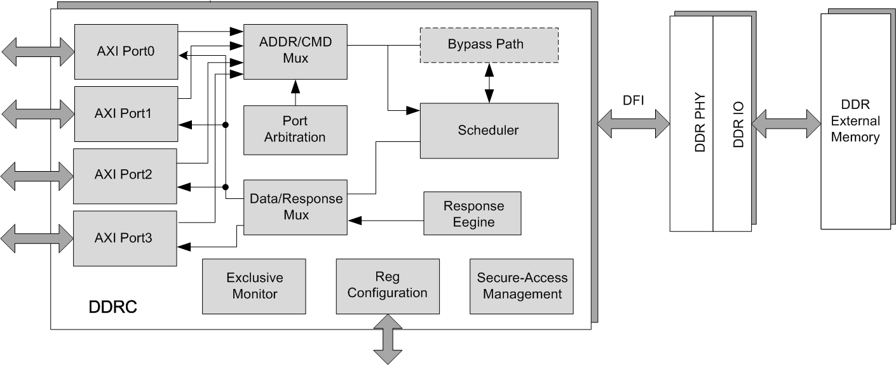
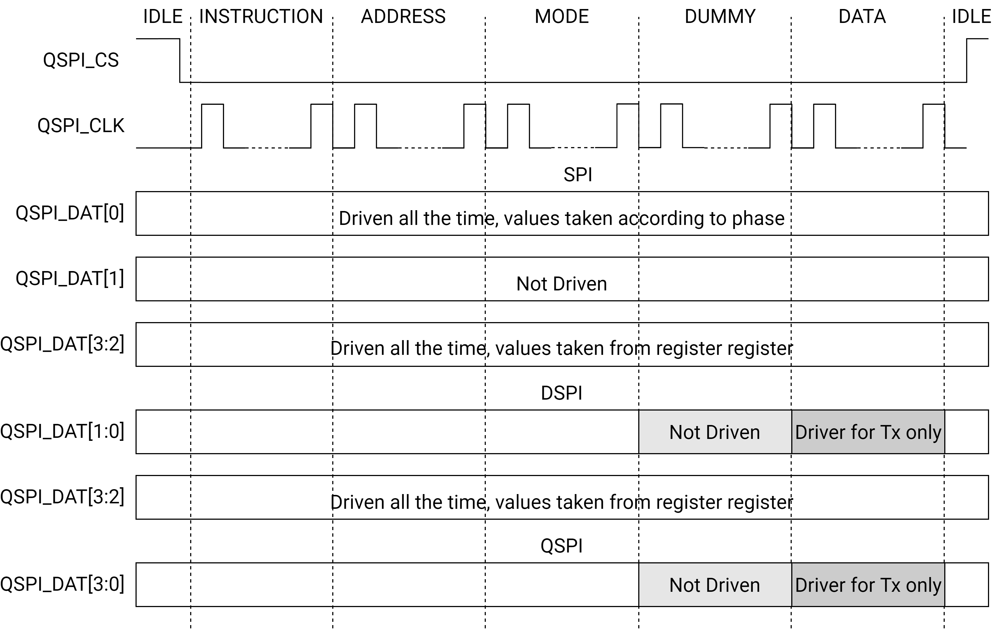
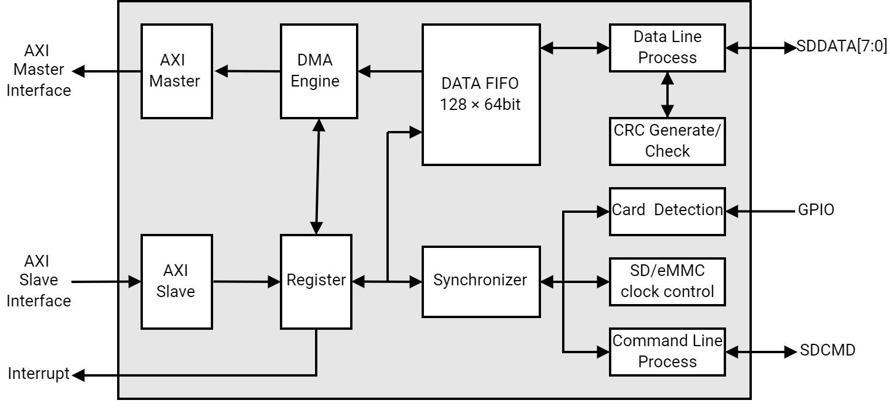
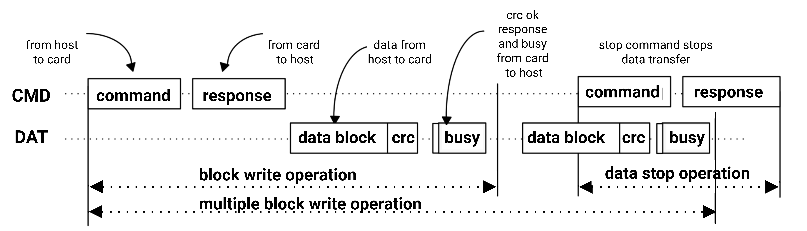
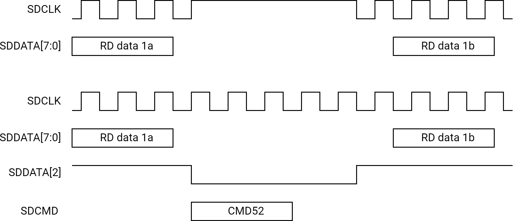

sidebar_position: 11

# 11. 存储与内存（Memory & Storage）

## 11.1 概述

K1 支持片上存储资源，并通过多种外设接口连接不同类型的存储器器件，例如 DDR 以及 NAND/NOR Flash。

## 11.2 片上存储（On-Chip Memory）

### 简介

K1 集成了以下片上存储类型：

- 128KB 启动只读存储器（Boot ROM）
- 256KB 由主 CPU 与实时 CPU 共享的 SRAM

## 11.3 DDR

### 简介（Introduction）

DDR 控制器采用了先进的体系结构设计，通过对访问请求进行**重排序**而非按原始顺序处理，从而显著提升 DRAM 访问效率。该控制器使用**重排序缓冲区（ROB, Re-Ordering Buffer）**对发往存储器设备的访问进行重新组织，以提升整体性能；同时，对于 AXI 接口上具有相同 ID 的事务，仍然严格保持其原始事务顺序不变。

此外，DDR 控制器内部集成了**统一写缓冲池（Unified Write Pool）**，用于临时存储写事务。该写缓冲池能够有效降低写访问延迟，并减少 DRAM 接口在读写切换过程中带来的性能损失。结合**内建的启发式写缓冲控制机制**以及**用户可编程的写缓冲控制策略**，DDR 控制器可以在运行过程中动态平衡读写操作的性能，实现实时优化。

DDR 控制器同时支持 **AMBA AXI4 总线协议**，具有良好的可扩展性，最多支持 **4 个 AXI 端口**。

DDR 控制器接口的体系结构如下图所示。

### 特性（Features）

- 基于优先级的仲裁机制，并具备防止请求饥饿（starvation prevention）的设计
- 通过写缓冲区合并对同一地址的写操作，减少 DDR 写访问流量
- 写缓冲区中的读请求可直接转发至 ROB，而无需实际访问 DDR
- 两级动态调度机制，并支持带宽保障
- 支持多种省电特性，包括：
  - 激活 / 预充电掉电（Active / Pre-charge Power-off）
  - 自刷新（Self-Refresh）
  - 省电模式可通过空闲定时器自动控制、寄存器手动控制或专用端口外部控制
- 支持动态频率切换（Dynamic Frequency Change）
- 支持符合 JEDEC 标准的 LPDDR3 与 LPDDR4 存储器
- 支持 64MB 至 16GB 容量范围的 DRAM
- 单 DRAM 通道，配备 x32 DDR PHY，可通过软件配置为 x32、x16 或 x8 数据位宽
- 支持 x16、x32 DRAM 器件（每 8 个 DQ 对应 1 个 DQS）
- 每通道最多支持 2 个片选（CS）或 Rank
- 对于 LPDDRx，每个 CS 最多支持 8 个 Bank
- 每个 CS 均可映射到不同的起始地址
- 每个 CS 可配置的容量范围为 8MB 至 16GB
- 支持访问后保持 Bank 打开（无自动预充电）
- 支持突发长度为 8 和 16（依据具体 DDR 类型）
- 支持可编程的地址映射顺序
- 支持在 CS 与数据位宽之间灵活配置 Bank 布局
- 集成内存控制器性能计数器
- 提供用于 RISC-V 独占加载 / 存储访问的全局监控机制
- 支持 DDR 事务的安全访问管理
- 支持频率切换后的寄存器更新机制：通过寄存器表实现硬件触发的顺序化更新

### 功能描述

#### DDR 控制器端口分配

DDR 控制器支持 **4 个 AXI 从端口**，并在这些端口之间进行仲裁。各端口与 DDR 控制器的连接关系如下表所示。

| Port0                         | Port1                         | Port2                     | Port3           |
|------------------------------|-------------------------------|---------------------------|-----------------|
| RISC-V X60 集群和 GPU         | GMAC0、GMAC1 以及 AXI Fabric1 端口 | VPU 和 PCIe PortA/B/C     | Display 和 ISP  |

#### 动态调度

DDR 控制器采用**基于优先级的仲裁机制**，并配合**防饥饿（starvation prevention）方案**，以管理关键访问的时延。

DDR 控制器基于以下因素对事务进行调度：

- 当前 DRAM 页状态
- 事务优先级，该优先级由 AXI 接口上的 **AxQoS[2:0]** 信号决定

AxQoS 的解码方式如下：

- `b100`：CRITICAL
- `b011`：TOP
- `b010`：HIGH
- `b001`：MED（Guaranteed Bandwidth Feature）
- `b000`：LOW

DDR 控制器可以在不同 Bank 之间进行交错访问，以实现对不同 Bank 的流式事务达到 **100% 总线利用率**，从而有效隐藏读写命令之间的预充电（precharge）和激活（activate）开销。

**CRITICAL** 优先级的事务始终会被尽可能快速地处理。该类事务不会检查 DRAM 页状态，并会作为下一个待处理事务执行。然而，当存在多个 **CRITICAL** 优先级事务时，仍会考虑 DRAM 页状态。

当不存在更高优先级事务处于等待状态时，事务才会被服务。如果低优先级事务指向的是一个已经打开的页，则当前的高优先级事务会首先关闭该页。

#### 防饥饿机制

为防止事务发生饥饿，系统引入了**老化（aging）机制**：当事务对应的计数器到期时，其优先级会被提升。用于读池（reading pool）和调度池（scheduling pool）的防饥饿计数器值可通过以下寄存器进行配置：

- RPP 防饥饿控制寄存器（RPP_Starvation_Control）
- Spool 控制寄存器（Spool_Control）

#### 调度算法

DDR 控制器内部实现了调度算法，用于对以下事件赋予不同的权重：

- 与当前事务相关的 DRAM 页状态，具体取决于以下情况：
  - 页已打开
  - 页已关闭
  - 页缺失（该页在另一个 Bank 中处于打开状态）
- CS
- 相同 CS
- 不同 CS

调度器通过对数据进行重新排序，以适配 AXI 的有序模型，从而支持 DRAM 的乱序执行。调度器会综合队列状态和 Bank 状态作出决策，以最大化 DDR 总线带宽的利用率。

#### 端口仲裁（Ports Arbitration）

当采用多端口配置时，DDR 控制器使用 **AXI QoS** 信号在不同 AXI 端口之间进行仲裁。如果各端口具有相同的 QoS 优先级，则采用**轮询（Round-Robin）**仲裁机制。

#### 省电模式（Power-Down Mode）

省电模式会关闭 DRAM 模块上的大多数 I/O 缓冲器，主要包括以下两种模式：

- **预充电省电模式（Precharge Power-Down）**  
  当所有 Bank 均处于关闭状态时进入该模式。如果仍有 Bank 处于打开状态，则在进入该模式之前会先发出 **Precharge-All** 命令。

- **激活省电模式（Active Power-Down）**  
  当至少有一个 Bank 保持打开状态时进入该模式。如果所有 Bank 已经关闭，则激活省电请求的行为等同于预充电省电模式。

与激活省电模式相比，预充电省电模式能够节省更多功耗，但在退出该模式时需要重新打开所有 Bank，这可能会对性能产生一定影响。

省电模式的持续时间受 **自动刷新（Auto-Refresh）周期**限制。如果当前没有数据请求，DDR 内存控制器将唤醒 DRAM，执行一次自动刷新操作，然后再次进入省电模式。

对于 **DDR3**，支持选择**快速退出（Fast-Exit）**或**慢速退出（Slow-Exit）**省电模式，该选项决定在省电期间 DRAM 的 **DLL** 是保持工作状态还是被冻结。

#### 自刷新模式（Self-Refresh Mode）

在自刷新模式下，DRAM 会自动对其各个 Bank 进行刷新，具体说明如下：

- 在单个刷新周期内，**预充电省电模式**与**自刷新模式**在功耗节省方面效果相近，但自刷新模式的退出延迟更长。从较长时间尺度来看，自刷新模式更加高效，因为预充电省电模式需要周期性唤醒并执行自动刷新命令。
- **LPDDR** 和 **DDR3** 支持 **部分阵列自刷新（Partial-Array Self-Refresh，PASR）**，用于控制在自刷新期间需要刷新的 Bank 数量。每个 **Chip Select** 都可以在 **SDRAM Configuration Register** 中单独配置 PASR。
- 由于 PASR 允许部分 Bank 在自刷新期间不进行刷新，软件必须对内存使用情况进行跟踪管理，以避免未刷新的 Bank 中的数据丢失。

#### 自动停钟（Automatic Clock-Stop）

当不存在待处理的 DRAM 操作时，**LPDDR** 允许停止 DRAM 时钟。

**自动停钟（Automatic Clock Stop，ACS）** 独立运行，并且可以与其他省电模式同时使用。

#### 省电控制（Power Saving Control）

DDR 内存控制器支持完整的省电特性，包括 **停钟（Clock Stop）**、**预充电省电（Precharge Power-Down）**、**活动省电（Active Power-Down）**、**自刷新（Self-Refresh）** 以及 **深度省电（Deep Power-Down）**。

省电命令可通过以下三种方式发出：

- **外部控制（External control）**
- **手动触发（Manual issue）**
- **自动触发（Automatic issue）**

省电命令可通过 **用户发起命令寄存器（User-Initiated Command Register）** 手动触发，每个请求仅执行一次。新的请求会将内存控制器从当前省电状态中唤醒。

内存控制器也可以在设定数量的空闲周期后，自动进入省电状态（活动省电或预充电省电）。但 **深度省电模式** 必须手动进入，因为该模式会关闭存储阵列的电源，从而导致内存复位。

#### 动态频率切换（Dynamic Frequency Change，DFC）

DDR 频率切换可以通过 **硬件方式（边界引脚握手）** 或 **软件方式（AHB 编程）** 实现，具体如下：

- **硬件 DFC**

  - 系统需要预先将 DFC 表（预定义的频率切换序列）加载到 SRAM 中。每张表对应一个目标频率（例如：表 1 对应 800 MHz，表 2 对应 300 MHz）。
  - 进行频率切换时，SoC 的 PMU 驱动边界引脚并选择相应的 DFC 表。内存控制器随后自动执行 DFC 序列，并在可以安全切换时钟以及整个流程完成时向 PMU 发送指示信号。

- **软件 DFC**

  - 通过对内存控制器寄存器进行编程来启动 DFC 序列，不依赖 SRAM。
  - 软件需要逐步执行整个序列，并通过轮询方式确认流程完成。

## 11.4 QSPI Flash

### 简介

Quad-SPI 用作外部串行 Flash 设备的接口，最多支持四条双向数据线。

### 特性

- 灵活的序列引擎，支持多种 Flash 厂商设备
- 支持单线、双线和四线工作模式
- DMA 支持通过 AMBA AHB 总线（64 位宽接口）或 IP 寄存器空间（32 位访问）读取 RX 缓冲区数据，并通过 IP 寄存器空间（32 位访问）填充 TX 缓冲区
- 可配置的 DMA 内部循环大小
- 支持十五种中断条件
- 支持对已连接 Flash 设备的存储器映射读访问
- 可编程序列引擎，支持未来命令/协议变更，并能够支持所有现有厂商的命令和操作
- 支持所有类型的寻址方式
- 支持标准 SPI、Fast、Dual、Dual I/O、Quad、Quad I/O 模式
- 最高支持 104 MHz 时钟频率运行

### 功能描述

QSPI 模块框图如下所示，其中：

- AHB BUS 用于 XIP 传输（当前设计中未使用）
- APB BUS 用于寄存器配置以及对外部串行 Flash 的写 / 读 / 擦除操作

串行 Flash 访问方案的不同阶段如下所示。

QuadSPI 模块的不同阶段及其 I/O 驱动特性定义如下：

- **IDLE**
  串行 Flash 设备未被选中，且无任何交互。所有 QSPI_DATx 信号均处于非驱动状态。

- **INSTRUCTION**
  串行 Flash 设备被选中，并向串行 Flash 设备发送指令。

- **ADDRESS**
  向设备发送串行 Flash 地址。

  > **Note.** 该阶段并非适用于所有 SFM 命令。

- **MODE**
  向串行 Flash 设备发送模式字节，所有 QSPI_DATx 信号均被驱动。

  > **Note.** 该阶段并非适用于所有 SFM 命令。

- **DUMMY**
  向串行 Flash 设备提供 Dummy 时钟周期。

  > **Note.** 该阶段并非适用于所有 SFM 命令。

- **DATA**
  向串行 Flash 设备发送数据或从串行 Flash 设备接收数据。

  > **Note.** 该阶段并非适用于所有 SFM 命令。

QSPI_CS 和 QSPI_CLK 信号在所有阶段中始终保持驱动状态。

## 11.5 SD/eMMC

### Introduction

SD/eMMC 主控制器是一个硬件模块，作为 SD/eMMC 接口的主机，用于在 MMC、SDIO、SD 卡与内部总线主设备之间进行数据传输。

### Features

- 符合 MMC/eMMC 5.1 规范，支持 Socket 3（eMMC）

- 支持 PIO 模式和 SDMA 模式的数据传输

- 支持 ADMA1 和 ADMA2（64 位地址）数据传输

- 支持 1-bit / 4-bit SD 存储卡和 SDIO

- 支持 1-bit / 8-bit MMC 和 CE-ATA 卡

- 支持 eMMC 卡的 SPI 模式

- eMMC 设备支持以下工作模式：

  - Legacy（最高 26MB/s，1.8V 信号）
  - High-speed SDR（最高 52MB/s，1.8V 信号）
  - High-speed DDR（最高 52MB/s，1.8V 信号）
  - HS200（最高 200MB/s，1.8V 信号）
  - HS400（最高 400MB/s，1.8V 信号）

- SD 设备支持以下工作模式：

  - Default Speed（最高 12.5MB/s，3.3V 信号）
  - High Speed（最高 25MB/s，3.3V 信号）
  - SDR12（最高 25 MHz，1.8V 信号）
  - SDR25（最高 50 MHz，1.8V 信号）
  - SDR50（最高 100 MHz，1.8V 信号）
  - SDR104（最高 208 MHz，1.8V 信号）
  - DDR50（最高 50 MHz，1.8V 信号）

- 支持 SDIO 卡的读等待（read-wait）控制

- 支持 SDIO 卡的挂起 / 恢复（suspend / resume）

- 在卡总线上的所有命令和数据传输中，支持 CRC 的硬件生成与校验

- 支持 Socket 1（SD）的卡插入 / 移除检测

> **Note.** 有关 AXI Fabric 规范的更多信息，请参见以下说明：
>
> - SD AXI 主设备始终产生 INCR 类型突发（AWBURST/ARBURST = 0x1），突发大小为 8 字节（AWSIZE/ARSIZE = 0x3）
> - SD AXI 主设备的突发访问为普通、非安全数据访问（AWPROT/ARPROT = 0x2）
> - SD AXI 主设备不会产生原子访问（AWLOCK/ARLOCK = 0x0）
> - SD AXI 从设备不支持独占、受保护或原子访问，其响应信号始终为 “OKAY”（RRESP/BRESP = 0x0）或 “DECERR”（RRESP/BRESP = 0x2）。当访问不存在寄存器的地址时，将返回 “DECERR” 响应。

### 功能描述

#### 模块框图

SD/eMMC 主控制器的体系结构如下图所示。

重点说明如下：

- 系统互连（System Fabric）通过两个 AXI 接口连接：

  - AXI Slave
  - AXI Master

- AHB Slave 用于寄存器配置以及 PIO 模式下的读 / 写操作

- AHB Master 用于 SDMA / ADMA 模式下的数据传输管理

- 一个 128 × 64-bit FIFO，用于数据缓冲，最多可存储两个 512 字节的数据包

- 配置寄存器通过同步器与 SD/eMMC 时钟域进行同步，用于配置时钟、数据位宽等参数

- 卡插入 / 移除通过 GPIO 进行检测，并触发中断以通知 CPU

#### SD/eMMC 总线协议描述

SD 总线上的通信基于命令和数据比特流，这些比特流由起始位开始，并以停止位结束，具体如下：

- **Command**
  命令是启动一次操作的令牌，由主机发送至卡（或多张卡），通过 SDCMD 线以串行方式传输（1 bit）。

- **Command Response**
  命令响应是被寻址卡对先前接收到的主机命令所返回的应答令牌。由于 SDCMD 为双向信号，命令响应同样通过 SDCMD 线以串行方式传输。

- **Data**
  数据线共有 4 条。数据可以从卡传输至主机，或从主机传输至卡，数据通过 Data 线传输，且这些信号均为双向信号。在 1-bit 模式下，仅使用 SDDATA[0]，其余数据线处于高阻态（Z-state）。

SD/eMMC 卡的基本操作过程如下图所示。

**[无响应 & 无数据操作]**

**[多块读操作]**

**[多块写操作]**

#### 特殊总线事务

##### 读等待命令（Read Wait Command）

在读操作过程中，如果主机无法继续接收更多数据，通常会通过停止时钟的方式来暂停卡侧的数据输出。但这种方式同时也会阻止主机继续发出任何命令。

为避免该限制，引入了 **Read Wait** 命令。该命令允许主机在保持时钟继续运行的情况下暂停读数据传输。该命令在一个数据块结束后发出，从而确保主机在不中断整体通信的前提下对数据流进行管理。

通过停止时钟实现读等待控制的时序如下图所示。

##### 数据包格式

主机发送的命令格式以及卡返回的响应格式如下图所示。

**[命令令牌格式]**

**[响应令牌格式]**

##### 主机与卡交互时序

SD 卡通过专用接口与主机相连，包括独立的 SDCLK、SDCMD 以及 SDDATA[3:0] 信号线。

在 **上电复位、软件复位或新卡插入** 之后，主机与 SD 卡将依次经历以下两个阶段：

- **阶段 1 —— 卡识别阶段（Card Identification Phase）**：

  - 主机在总线上搜索新插入的卡
  - 在该阶段，主机会对所有处于卡识别模式的卡进行复位；已完成识别的卡不会被复位
  - 随后，主机将：

    - 发送命令以验证工作电压范围
    - 识别每一张卡，并请求其相对卡地址（RCA）
    - 通过 **SDCMD 信号线** 分别与每一张卡进行通信（针对 SD 存储卡）
  - 该阶段内的所有数据通信均仅使用 SDCMD 信号线

- **阶段 2 —— 数据传输阶段（Data Transfer Phase）**：

  - 当所有卡均完成识别后，主机进入该阶段，系统已准备好进行数据传输
  - 主机驱动完成 Host Controller 配置后，通过向 Command Register 写入命令（该寄存器最后写入）来启动传输
  - 对于 R1b 类型命令，只要忙信号保持为低电平，Command Inhibit 将一直保持置位
  - 当 Command Inhibit 从 1 变为 0 时，将置位 CMD_COMPLETE

> **Note.** 更多信息请参考 *SD Host Controller Simplified Specification V3.00*

#### 卡检测（Card Detection）

SD/eMMC Host Controller 支持通过 GPIO 电平翻转并结合软件操作实现卡检测（插入 / 拔出）。

卡检测相关功能可通过 **Normal Interrupt Status Enable** 位进行访问。当该功能使能后，如果在卡检测开关输入端检测到逻辑电平变化，将产生中断。为避免误触发，在生成中断之前会对该逻辑变化进行去抖处理。

#### SPI 模式（SPI Mode）

通过设置 Legacy Register（0x10C）中的 `<spi_en>` 字段可使能 SPI 模式。除错误中断处理不同外，其余流程与 SD 模式基本一致。

当 SPI 模式下发生错误时，**Error Interrupt Status Register** 中的 `<spi_err>` 字段将被置位。错误的具体原因可通过 Legacy Register 中的 `<spi_err_token>` 字段进行识别。

### 寄存器说明（Register Description）

SD/eMMC Host Controller 寄存器的基地址如下表所示。

| 名称                | 地址         |
| ----------------- | ---------- |
| SD1_BASE（SD Card） | 0xD4280000 |
| SD2_BASE（SDIO）    | 0xD4280800 |
| SD3_BASE（eMMC）    | 0xD4281000 |

#### SD 系统地址寄存器（SD_SYS_ADDR）

偏移地址（Offset）：0x0

| 位域    | 字段         | 类型  | 复位值    | 说明                                                                                                                 |
| ----- | ---------- | --- | ------ | ------------------------------------------------------------------------------------------------------------------ |
| 31:16 | DMA_ADDR_H | R/W | 0x0000 | DMA 地址高位：包含 DMA 系统缓冲区起始字节地址的高 16 位（MSb）。 该字段与 Auto Cmd 23 配合使用，用于将 32 位块计数值设置为 cmd23 的参数，本字段保存 cmd23 参数的高 16 位。 |
| 15:0  | DMA_ADDR_L | R/W | 0x0000 | DMA 地址低位：包含 DMA 系统缓冲区起始字节地址的低 16 位（LSb）。 该字段与 Auto Cmd 23 配合使用，用于将 32 位块计数值设置为 cmd23 的参数，本字段保存 cmd23 参数的低 16 位。 |

#### SD 块大小与计数寄存器（SD Block Size and Count Register, SD_BLOCK_SIZE_CNT）  

偏移地址（Offset）：0x4  

位域 | 字段 | 类型 | 复位值 | 说明  
|---|----|----|---|---|  
31:16 | BLOCK_COUNT | R/W | 0x0000 | 块计数 主机控制器在每次块传输后递减该计数值。 `0x1` = 1 个块 ... `0xFFFF` = 65535 个块 当前块计数值反映在“当前块计数寄存器”中。  
15 | RSVD | R | 0 | 保留供将来使用  
14:12 | HOST_DMA_BDRY | R/W | 0x0 | 主机 DMA 缓冲区边界 此字段指定主机内存缓冲区的边界。 当跨越该边界时，将产生一个中断（dma_int），该中断反映在“正常中断状态寄存器”的 &lt;Tx Ready&gt; 字段中。 `0x0`：4 KB `0x1`：8 KB `0x2`：16 KB `0x3`：32 KB `0x4`：64 KB `0x5`：128 KB `0x6`：256 KB `0x7`：512 KB  
11:0 | BLOCK_SIZE | R/W | 0x000 | 块大小

#### SD 命令参数寄存器（SD Argument Register, SD_ARG）  

偏移地址（Offset）：0x8  

位域 | 字段 | 类型 | 复位值 | 说明  
|---|----|----|---|---|  
31:16 | ARG_H | R/W | 0x0000 | 命令参数高 16 位（MSB） 该值被插入到 48 位命令令牌的 bit[39:24] 中。  
15:0 | ARG_L | R/W | 0x0000 | 命令参数低 16 位（LSB） 该值被插入到 48 位命令令牌的 bit[23:8] 中

#### SD 传输模式与命令寄存器（SD Transfer Mode and Command Register, SD_TRANSFER_MODE_CMD）  

偏移地址（Offset）：0xC  

位域 | 字段 | 类型 | 复位值 | 说明  
|---|----|----|---|---|  
31:30 | RSVD | R | 0 | 保留供将来使用  
29:24 | CMD_INDEX | R/W | 0x00 | 命令索引 这些位将被插入到命令令牌的 bit[45:40] 中。  
23:22 | CMD_TYPE | R/W | 0x0 | 命令类型 `0x0`：普通命令 `0x1`：挂起命令 `0x2`：恢复命令 `0x3`：中止命令  
21 | DATA_PRESENT | R/W | 0x0 | 数据存在标志 `1`：表示存在数据，并将通过 MMC1_DAT[3:0] 线路传输。 `0`：仅使用 MMC1_CMD 线路的命令，或无数据传输但使用 MMC1_DAT[0] 线路忙信号的命令（例如 CMD 38）。  
20 | CMD_INDEX_CHK_EN | R/W | 0x0 | 命令索引检查使能 `1`：主机控制器检查响应中的索引字段是否与命令索引匹配。 - 若不匹配，则报告为命令索引错误。  
19 | CMD_CRC_CHK_EN | R/W | 0x0 | 命令 CRC 检查使能 `1`：主机控制器检查响应中的 CRC 字段。 - 若检测到错误，则报告为命令 CRC 错误。CRC 检查的位数根据响应长度变化。  
18 | RSVD | R | 0 | 保留供将来使用  
17:16 | RESP_TYPE | R/W | 0x0 | 响应类型选择（适用于 SD 模式及 SD 的 SPI 模式） **SD 模式：** `0x0`：无响应 `0x1`：响应长度为 136 位 `0x2`：响应长度为 48 位 `0x3`：响应长度为 48 位，且在响应 CRC 字段后检查忙信号；R3 和 R4 的预期值应全为 `1`，此类响应类型应禁用 CRC 检查。 **SD SPI 模式：** `0x0`：响应长度为 8 位 `0x1`：响应长度为 16 位 `0x2`：响应长度为 40 位 `0x3`：保留  
15:6 | RSVD | R | 0 | 保留供将来使用  
5 | MULTI_BLK_SEL | R/W | 0x0 | 多块选择 仅当需要传输多个块时，此位应置为 `1`。  
4 | TO_HOST_DIR | R/W | 0x0 | 数据传输方向选择 该位定义 MMC1_DAT[3:0] 线路的数据传输方向。 `1`：从 SD 卡向 SD 主机控制器传输数据 `0`：用于所有其他命令  
3:2 | AUTO_CMD_EN | R/W | 0x0 | 自动命令使能 该字段决定是否启用自动命令功能。 `0x0`：禁用自动命令 `0x1`：使能自动 CMD12 `0x2`：使能自动 CMD23 `0x3`：保留  
1 | BLK_CNT_EN | R/W | 0x0 | 块计数使能 该位用于使能“块计数寄存器”中的值。  
0 | DMA_EN | R/W | 0x0 | DMA 使能 若需使用可编程输入/输出（PIO）模式，此位应清零为 `0`。

#### SD 响应 0 寄存器（SD Response 0 Register, SD_RESP_0）  

偏移地址（Offset）：0x10  

位域 | 字段 | 类型 | 复位值 | 说明  
|---|----|----|---|---|  
31:16 | RESP1 | R | 0x0000 | 响应 1 该寄存器包含响应令牌的 bit[39:24]。  
15:0 | RESP0 | R | 0x0000 | 响应 0 该寄存器包含响应令牌的 bit[23:8]。

#### SD 响应 1 寄存器（SD Response 1 Register, SD_RESP_1）  

偏移地址（Offset）：0x14  

位域 | 字段 | 类型 | 复位值 | 说明  
|---|----|----|---|---|  
31:16 | RESP3 | R | 0x0000 | 响应 3 - 对于 48 位响应令牌：未使用。 - 对于 136 位响应令牌：存储响应令牌的 bit[71:56]。  
15:0 | RESP2 | R | 0x0000 | 响应 2 - 对于 48 位响应令牌：未使用。 - 对于 136 位响应令牌：存储响应令牌的 bit[55:40]。

#### SD 响应 2 寄存器（SD Response 2 Register, SD_RESP_2）  

偏移地址（Offset）：0x18  

位域 | 字段 | 类型 | 复位值 | 说明  
|---|----|----|---|---|  
31:16 | RESP5 | R | 0x0000 | 响应 5 - 对于 48 位响应令牌：未使用。 - 对于 136 位响应令牌：存储响应令牌的 bit[103:88]。  
15:0 | RESP4 | R | 0x0000 | 响应 4 - 对于 48 位响应令牌：未使用。 - 对于 136 位响应令牌：存储响应令牌的 bit[87:72]。

#### SD 响应 3 寄存器（SD Response 3 Register, SD_RESP_3）  

偏移地址（Offset）：0x1C  

位域 | 字段 | 类型 | 复位值 | 说明  
|---|----|----|---|---|  
31:16 | RESP7 | R | 0x0000 | 响应 7 - 对于 48 位响应令牌：未使用。 - 对于 136 位响应令牌：存储响应令牌的 bit[127:120]。 - 对于自动 CMD12 响应：存储响应令牌的 bit[39:24]。  
15:0 | RESP6 | R | 0x0000 | 响应 6 - 对于 48 位响应令牌：未使用。 - 对于 136 位响应令牌：存储响应令牌的 bit[119:104]。 - 对于自动 CMD12 响应：存储响应令牌的 bit[23:8]。

#### SD 缓冲数据端口寄存器（SD Buffer Data Port Register, SD_BUFFER_DATA_PORT）  

偏移地址（Offset）：0x20  

位域 | 字段 | 类型 | 复位值 | 说明  
|---|----|----|---|---|  
31:0 | BUF_DATA | R/W | 0x0 | 缓冲数据

#### SD 当前状态 1 寄存器（SD Present State 1 Register, SD_PRESENT_STATE_1）  

偏移地址（Offset）：0x24  

位域 | 字段 | 类型 | 复位值 | 说明  
|---|----|----|---|---|  
31:25 | RSVD | R | 0 | 保留供将来使用  
24 | CMD_LEVEL | R | 0x1 | MMC1_CMD 线信号电平 用于检查 MMC1_CMD 线的电平以从错误中恢复和调试。  
23:20 | DAT_LEVEL | R | 0xF | MMC1_DAT[3:0] 线信号电平 用于检查 MMC1_DAT[3:0] 线的电平以从错误中恢复和调试。 特别适用于检测 MMC1_DAT[0] 上的忙信号电平。  
19 | WRITE_PROT | R | 0x0 | 写保护 该字段反映 SD 卡上写保护锁存器的位置。 如果所使用的卡不提供此功能，应忽略该字段。  
18 | CARD_DET | R | 0x0 | 卡检测 该字段反映 MMC1_CD 引脚的值。 `0`：未检测到卡 `1`：检测到卡 注意：此字段仅用于测试。  
17 | CARD_STABLE | R | 0x0 | 卡稳定 指示卡存在条件的去抖动值。 `0`：卡不稳定 `1`：卡稳定 注意：此字段仅用于测试。  
16 | CARD_INSERTED | R | 0x0 | 卡插入 指示是否存在 SD 卡： `0`：卡未插入 `1`：卡已插入  
15:12 | RSVD | R | 0 | 保留供将来使用  
11 | BUFFER_RD_EN | R | 0x0 | 缓冲读使能 当块数据准备好缓冲时，该字段从 `0x0` 变为 `0x1`；当所有块数据从缓冲区读取后，从 `0x1` 变为 `0x0`。  
10 | BUFFER_WR_EN | R | 0x1 | 缓冲写使能 当可以将块数据写入缓冲区时，该字段从 `0x0` 变为 `0x1`。因此，如果此位设置为 `0x1`，则整个块可以写入缓冲区。当所有块数据写入缓冲区后，该字段从 `0x1` 变为 `0x0`。  
9 | RX_ACTIVE | R | 0x0 | 接收激活 指示读传输是否活跃。 `1`：活跃 `0`：非活跃  
8 | TX_ACTIVE | R | 0x0 | 发送激活 指示写传输是否活跃。 `0`：主机控制器中没有有效的写数据 `1`：活跃  
7:4 | RSVD | R | 0 | 保留供将来使用  
3 | RETUNING_REQ | R | 0x0 | 重新调谐请求 提供采样时钟的状态。 `0`：固定或良好调谐的采样时钟 `1`：采样时钟需要重新调谐  
2 | _DAT_ACTIVE | R | 0x0 | 数据线活跃 提供数据线的状态。 `0`：数据线空闲 `1`：数据线忙碌  
1 | CMD_INHIBIT_DAT | R | 0x0 | 命令抑制数据 提供发出数据命令的主机驱动状态。 `0`：可以发出数据命令 `1`：不能发出数据命令  
0 | CMD_INHIBIT_CMD | R | 0x0 | 命令抑制命令 `0`：MMC1_CMD 线可用以发出新命令。 - 主机控制器可以使用 MMC1_CMD 线发出命令。 - 当从设备接收到命令响应时，清除该位（设置为 `0`）。 - 如果 `<命令抑制数据>` 字段设置为 `1`，但此位为 `0`，则仍可以发出仅使用 MMC1_CMD 线的命令。 `1`：MMC1_CMD 线正在使用或不可用。 - 在命令寄存器被写入后设置该位，表示命令正在进行。 - 直到接收到命令响应才清除该位。 当该位从 `1` 变为 `0`（表示已接收到命令响应），将在正常中断状态寄存器中生成一个命令完成中断。 如果由于命令冲突错误（例如，在前一个命令仍在进行时尝试发出新命令），主机控制器无法发出命令，则此位保持设置为 `1`。

#### SD 主机控制寄存器（SD Host Control Register, SD_HOST_CTRL）  

偏移地址（Offset）：0x28  

位域 | 字段 | 类型 | 复位值 | 说明  
|---|----|----|---|---|  
31:27 | RSVD | R | 0 | 保留供将来使用  
26 | W_REMOVAL | R/W | 0x0 | 卡移除唤醒 `1`：启用卡移除检测时的唤醒事件 `0`：无唤醒事件  
25 | W_INSERTION | R/W | 0x0 | 卡插入唤醒 `1`：启用卡插入检测时的唤醒事件 `0`：无唤醒事件  
24 | W_CARD_INT | R/W | 0x0 | 卡中断唤醒 `1`：启用卡中断检测时的唤醒事件 `0`：无唤醒事件  
23:20 | RSVD | R | 0 | 保留供将来使用  
19 | INT_BLK_GAP | R/W | 0x0 | 块间隙中断 此字段仅在 4 位模式下有效。 `1`：启用多块传输中块间隙处的中断检测 `0`：禁用多块传输中块间隙处的中断检测  
18 | RD_WAIT_CTL | R/W | 0x0 | 读等待控制 - 如果卡支持读等待，设置此位以启用使用 MMC1_DAT[2] 线通过主机硬件停止读数据的读等待协议。否则，主机控制器必须停止 SD 时钟以保持读数据。 - 当主机驱动程序检测到卡插入时，将根据 SDIO 卡的 CCCR 设置此位。 - 此字段仅在块间隙阶段考虑。在一个块内，如果主机无法接受更多数据（例如由于 FIFO 已满等），硬件会暂停时钟以停止读数据。 - 当软件清除此字段时，操作继续正常进行。 - 在读等待期间，软件可以为不同的操作发出不同的命令，只要不需要使用 MMC1_DAT[3:0] 线。 - 要在等待后恢复读取操作，软件必须清除该位（设置为 `0`）。  
17 | CONT_REQ | R/WAC | 0x0 | 继续请求 - 此字段用于重新启动使用 `<Stop At Block Gap Request>` 停止的事务。 - 要取消块间隙处的停止，将 `<Stop At Block Gap Request>` 字段设置为 `0` 并将此字段设置为 `1` 以重新启动传输。 - 在以下任一情况下，主机控制器会自动清除此字段： 1. 对于读事务，当 MMC1_DAT[3:0] 线活动从 `0` 变为 `1`，指示读事务重新开始。 2. 对于写事务，当写传输活动从 `0` 变为 `1`，指示写事务重新开始。 因此，主机驱动程序无需将此位设置为 `0`。 - 如果 `<Stop At Block Gap Request>` 设置为 `1`，对此位的任何写入都将被忽略。  
16 | STOP_AT_BLOCK_GAP_REQ | R/W | 0x0 | 在块间隙处停止请求 - 此字段用于在下一个块间隙处停止执行事务，适用于 DMA 和非 DMA 传输。 - 主机驱动程序会将此位设置为 `1`，直到传输完成（当传输完成设置为 `1` 时）。 - 清除此字段和 `<Continue Request>` 字段不会导致事务重新开始。 - 对于读事务，可使用读等待在块间隙处停止事务。 - 对于写事务，主机控制器会在块间隙请求时停止时钟。 - 对于读事务，如果读等待控制设置为 `0`，主机控制器将停止时钟；否则，主机控制器将发出读等待命令以停止读数据。  
15:12 | RSVD | R | 0 | 保留供将来使用  
11:9 | SD_BUS_VLT | R/W | 0x0 | SD 总线电压 此字段反映工作条件下的电压 `0x7`: 3.3V `0x6`: 3.0V `0x5`: 1.8V `0x0` 至 `0x4`: 保留  
8 | SD_BUS_POWER | R/W | 0x0 | SD 总线电源 此字段控制流向 SD 卡的电源。 如果满足以下条件之一，则清除此字段： - `sd_bus_vlt` 不匹配 Capabilities Register 1 中的电压支持，或 - 检测到卡移除状态。  
7 | CARD_DET_S | R/W | 0x0 | 卡检测信号选择 此字段选择卡检测的源。 `0`: 卡检测输入引脚 `1`: 卡检测测试电平（仅用于调试目的） - 当切换卡检测源时，在切换期间应通过清除 Normal Interrupt Status Enable 寄存器来禁用中断，以屏蔽由瞬变引起的意外中断。 - 在去抖动期间应通过 Normal Interrupt Status Enable 寄存器禁用此信号。  
6 | CARD_DET_L | R/W | 0x0 | 卡检测测试电平 `1`: 插入卡 `0`: 未插入卡  
5 | EX_DATA_WIDTH | R/W | 0x0 | 此位控制 8 位模式。 `0x0`: 总线模式的数据宽度由 `<DATA_WIDTH>` 决定 `0x1`: 8 位数据宽度。  
4:3 | DMA_SEL | R/W | 0x0 | DMA 选择 选择一个支持的 DMA 模式。 主机驱动程序使用 Capabilities Register 1 检查对 DMA 模式的支持。所选 DMA 的使用由 Transfer Mode Register 中的 `<DMA Enable>` 字段决定。 `0x0`: SDMA `0x1`: ADMA 1 `0x2`: 32 位地址 ADMA2 `0x3`: 保留  
2 | HI_SPEED_EN | R/W | 0x0 | 扩展数据输出使能 `0`: 正常 `1`: MMC1_CMD 和 MMC1_DAT[3:0] 从时钟上升沿驱动  
1 | DATA_WIDTH | R/W | 0x0 | 数据宽度 `1`: 4 位数据模式 `0`: 1 位数据模式，仅使用 MMC1_DAT[0] 有关 8 位模式支持，请参阅位 `[5]` EX_DATA_WIDTH。  
0 | LED_CTRL | R/W | 0x0 | LED 控制 `1`: LED 开 `0`: LED 关

#### SD 时钟控制寄存器（SD Clock Control Register, SD_CLOCK_CTRL）  

偏移地址（Offset）：0x2C  

位域 | 字段 | 类型 | 复位值 | 说明  
|---|----|----|---|---|  
31:27 | RSVD | R | 0 | 保留供将来使用  
26 | SW_RST_DAT | R/WAC | 0x0 | 数据端口逻辑软复位  
25 | SW_RST_CMD | R/WAC | 0x0 | 命令部分逻辑软复位  
24 | SW_RST_ALL | R/WAC | 0x0 | 全部软件复位 此复位同步影响状态、状态机和 FIFO。 此字段同时重置所有私有寄存器。  
23:20 | RSVD | R | 0 | 保留供将来使用  
19:16 | TIMEOUT_VALUE | R/W | 0x0 | 超时值 确定 MMC1_DAT[3:0] 线路超时检测的间隔。此超时在以下情况下启动： - 对于读事务，此超时是指等待来自卡的数据。它指的是 SD 规范中的时间值，规定了从读命令到读数据的最大时间（即卡数据访问时间）； - 对于写事务，此超时是指等待来自 AXI 从设备、AXI 主设备或处理器的数据，或等待写块的 CRC 状态。 - 超时计算： `0x0`: SDCLK x 2^13 `0x1`: SDCLK x 2^14 ... `0xE`: SDCLK x 2^27 例如，如果 sd_clk 频率为 200 MHz（基值），则超时基 = 50 MHz（周期 = 20 ns）。对于 `0xE` 设置： 超时 = 2^27 * 20 ns ≈ 2.684 秒。 如果 sd_clk 频率为 50 MHz（基值除以 4），则超时基 = 12.5 MHz（周期 = 80 ns）。对于 `0xE` 设置： 超时 = 2^27 * 80 ns ≈ 10.73 秒。 `0xF` 保留供将来使用。 对于其他事务，请参阅 SD 规范以获取这些固定值的更多信息。  
15:8 | SD_FREQ_SEL_LO | R/W | 0x00 | SD 时钟频率选择低字节 此字段与 `<SD_FREQ_SEL_HI>` 字段一起定义主机控制器使用的时钟分频值。SD 时钟频率分频器的最终值通过组合两个字段如下确定： SD_FREQ_SEL = {SD_FREQ_SEL_HI[1:0],SD_FREQ_SEL_LO[7:0]} 所选值乘以 2 计算实际分频值。可能的 SD 时钟频率设置为： - SD_FREQ_SEL = 0x00：基本时钟 - SD_FREQ_SEL = 0x01：基本时钟除以 2 - SD_FREQ_SEL = 0x02：基本时钟除以 4 - SD_FREQ_SEL = 0x3：基本时钟除以 6 ... - SD_FREQ_SEL = 0x3FF：基本时钟除以 2046  
7:6 | SD_FREQ_SEL_HI | R/W | 0x0 | SD 时钟频率选择高字节 此字段与 `<SD_FREQ_SEL_LO>` 字段一起定义主机控制器使用的时钟分频值。SD 时钟频率分频器的最终值通过组合两个字段如下确定： SD_FREQ_SEL = {SD_FREQ_SEL_HI[1:0],SD_FREQ_SEL_LO[7:0]}。  
5 | CLK_GEN_SEL | R/W | 0x0 | 时钟生成器选择 此字段用于选择时钟生成器模式。 `0x1`：可编程时钟模式 `0x0`：分频时钟模式  
4:3 | RSVD | R | 0 | 保留供将来使用  
2 | SD_CLK_EN | R/W | 0x0 | SD 时钟使能 此位控制提供给卡的 SDCLK。 在初始化阶段期间应设置此位以便使用卡。  
1 | INT_CLK_STABLE | R | 0x0 | 内部时钟稳定 一旦控制器在设置 `<内部时钟使能>` 字段后检测到内部时钟稳定，则设置此字段为 1。  
0 | INT_CLK_EN | R/W | 0x0 | 内部时钟使能 此字段控制提供给内部逻辑的 SDCLK。 `1`：使能 `0`：禁用

#### SD 正常中断状态寄存器（SD Normal Interrupt Status Register, SD_NORMAL_INT_STATUS）  

偏移地址（Offset）：0x30  

位域 | 字段 | 类型 | 复位值 | 说明  
|---|----|----|---|---|  
31 | CRC_STATUS_ERR | R/W1C | 0x0 | CRC 状态错误 如果以下任一情况出现错误，则设置为 `1`： - CRC 状态起始位 - CRC 状态结束位 - 启动 ACK 状态 这些错误是在写事务中从卡返回的。  
30 | CPL_TIMEOUT_ERR | R/W1C | 0x0 | 命令完成信号超时错误 此字段仅适用于 CE-ATA 模式。 `1`: 发生了命令完成信号超时。  
29 | AXI_RESP_ERR | R/W1C | 0x0 | AXI 总线响应错误 `1`: 在 AXI 总线上接收到了非 OKAY 的响应。  
28 | SPI_ERR | R/W1C | 0x0 | SPI 模式错误 `1`: 在 SPI 模式下发生了可以确定原因的错误，通过读取 SPI 模式寄存器中的 `<SPI 错误令牌>` 字段来判断。 `0`: 无错误。  
27:26 | RSVD | R | 0 | 保留供将来使用  
25 | ADMA_ERR | R/W1C | 0x0 | ADMA（高级直接存储器访问）错误 当主机控制器在基于 ADMA 的数据传输期间检测到任何错误时，设置此位。 错误发生时 ADMA 的状态记录在 ADMA 错误状态寄存器中。 当主机控制器检测到无效描述符数据时也会触发此中断。 ADMA 错误状态寄存器中的 `<ADMA 错误状态>` 字段指示发生错误的状态。 主机驱动程序可能会发现错误描述符的 Valid 位未设置。 `1` = 错误 `0` = 无错误  
24 | AUTO_CMD12_ERR | R/W1C | 0x0 | Auto CMD12 错误，在检测到 Auto CMD12 错误状态寄存器中的某个位从 `0` 变为 `1` 时发生。  
23 | CUR_LIMIT_ERR | R/W1C | 0x0 | 当前限制错误 注意：此功能当前不支持，因此此位将始终读取为 `0`。  
22 | RD_DATA_END_BIT_ERR | R/W1C | 0x0 | 读数据结束位错误 当在使用 MMC1_DAT[3:0] 线路的读数据或 CRC 状态的结束位位置检测到 `0` 时，设置为 `1`。  
21 | RD_DATA_CRC_ERR | R/W1C | 0x0 | 读数据 CRC 错误 当通过 MMC1_DAT[3:0] 线路传输的读数据中检测到 CRC 错误，或当写 CRC 状态不是 `010` 时，设置为 `1`。  
20 | DATA_TIMEOUT_ERR | R/W1C | 0x0 | 数据超时错误 当数据传输过程中发生超时错误时设置为 `1`，可能发生在以下场景： - 写 CRC 状态后的忙等待超时 - 写 CRC 状态超时 - 读数据超时  
19 | CMD_INDEX_ERR | R/W1C | 0x0 | 命令索引错误 `0`: 命令响应中没有发生命令索引错误 `1`: 命令响应中发生了命令索引错误  
18 | CMD_END_BIT_ERR | R/W1C | 0x0 | 命令结束位错误 `0`: 命令响应的结束位检测为 `1` `1`: 命令响应的结束位检测为 `0`  
17 | CMD_CRC_ERR | R/W1C | 0x0 | 命令 CRC 错误 在两种情况下设置为 `1`： - 在命令响应中检测到 CRC 错误。 - 主机控制器在发出命令时检测到 MMC1_CMD 线路上的冲突。在这种情况下，主机控制器将停止 MMC1_CMD 线路以中止命令，并且 `<命令超时错误>` 字段也将设置为 `1` 以区分 MMC1_CMD 线路冲突。  
16 | CMD_TIMEOUT_ERR | R/W1C | 0x0 | 命令超时错误 `1`: 在命令的结束位之后的 64 个 SDCLK 周期内没有返回响应。  
15 | ERR_INT | R | 0x0 | 错误中断 如果错误中断状态寄存器中的任何位被设置，则此位也被设置。  
14 | CQ_INT | RC | 0x0 | 命令排队中断 当 CQIS 寄存器中的至少一个位被设置时，此中断被断言。 只有当 CQIS 寄存器中的源中断被清除时，此中断才会被清除。  
13 | RSVD | R | 0 | 保留供将来使用  
12 | RETUNING_INT | R/W1C | 0x0 | 重新调谐事件中断 当 `<当前状态寄存器>` 中的 Re-Tuning Request 从 `0x0` 变为 `0x1` 时，设置此状态。这表示主机控制器请求主机驱动程序从下一个数据传输开始执行重新调谐。当前的数据传输可以在不需要重新调谐的情况下完成。  
11 | INT_C | R/W1C | 0x0 | 此状态在 INT_C 已启用并且 INT_C# 引脚处于低电平时设置。 将此位写为 `0x1` 不会清除此位。 它通过重置共享总线控制寄存器 (SHARED_BUS_CTRL) 中的 INT_C 中断因素来清除。  
10 | INT_B | R/W1C | 0x0 | 此状态在 INT_B 已启用并且 INT_B# 引脚处于低电平时设置。 将此位写为 `0x1` 不会清除此位。 它通过重置共享总线控制寄存器 (SHARED_BUS_CTRL) 中的 INT_B 中断因素来清除。  
9 | INT_A | R/W1C | 0x0 | 如果 INT_A 已启用并且 INT_A# 引脚处于低电平，设置此状态。 将此位写为 `0x1` 不会清除此位。 它通过重置共享总线控制寄存器 (SHARED_BUS_CTRL) 中的 INT_A 中断因素来清除。  
8 | CARD_INT | R | 0x0 | 卡中断 `1`: 主机控制器检测到来自卡的中断  
7 | CARD_REM_INT | R/W1C | 0x0 | 卡移除中断 `1`: 检测到卡移除事件  
6 | CARD_INS_INT | R/W1C | 0x0 | 卡插入中断 `1`: 检测到卡插入事件  
5 | RX_RDY | R/W1C | 0x0 | Rx 准备好 当当前状态寄存器 1 中的 `<缓冲区读使能>` 字段从 `0x0` 变为 `0x1` 时，设置此状态。  
4 | TX_RDY | R/W1C | 0x1 | Tx 准备好 当当前状态寄存器 1 中的 `<缓冲区写使能>` 字段从 `0x0` 变为 `0x1` 时，设置此状态。  
3 | DMA_INT | R/W1C | 0x0 | DMA 中断 当主机控制器检测到 DMA 越过块大小寄存器中的 `<主机 DMA 缓冲区边界>` 字段时，设置此状态。  
2 | BLOCK_GAP_EVT | R/W1C | 0x0 | 块间隙事件 当下一个读或写事务在块间隙处停止时，设置此字段，但仅当块间隙控制寄存器中的 `<停止在块间隙请求>` 字段被设置为 `1` 时。 如果 `<停止在块间隙请求>` 字段未设置为 `1`，则此位保持为 `0`。  
1 | XFER_COMPLETE | R/W1C | 0x0 | 传输完成 当读/写事务完成时设置此位。 对于读事务： 当读传输活动状态的下降沿时设置此位，它可以发生在两个情况下： 1. 数据传输按照指定的数据长度完成。 2. 数据传输在块间隙处停止并在设置 SD 块间隙控制寄存器中的 `<停止在块间隙请求>` 字段后完成。 对于写事务： 当 MMC1_DAT[3:0] 线路活跃状态的下降沿时设置此位，它可以发生在两个情况下： 1. 数据传输按照指定的数据长度完成，并且释放忙信号。 2. 数据传输在块间隙处停止并在设置 `<停止在块间隙请求>` 字段后完成。  
0 | CMD_COMPLETE | R/W1C | 0x0 | 命令完成 当收到命令响应（除了 Auto CMD12）的结束位时，设置此位。 **注意**：命令超时错误比命令完成具有更高的优先级。

#### SD 正常中断状态使能寄存器（SD Normal Interrupt Status Enable Register, SD_NORMAL_INT_STATUS_EN）  

偏移地址（Offset）：0x34  

位域 | 字段 | 类型 | 复位值 | 说明  
|---|----|----|---|---|  
31 | CRC_STATUS_ERR_EN | R/W | 0x0 | CRC 状态错误使能 `0`: 禁用 `1`: 使能  
30 | CPL_TIMEOUT_ERR_EN | R/W | 0x0 | 命令完成超时错误使能 `0`: 禁用 `1`: 使能  
29 | AXI_RESP_ERR_EN | R/W | 0x0 | AXI 响应错误使能 `0`: 禁用 `1`: 使能  
28 | SPI_ERR_EN | R/W | 0x0 | SPI 错误使能 `0`: 禁用 `1`: 使能  
27 | RSVD | R | 0 | 保留供将来使用  
26 | TUNING_ERR_EN | R/W | 0x0 | 调谐错误使能 `0`: 禁用 `1`: 使能  
25 | ADMA_ERR_EN | R/W | 0x0 | ADMA 错误使能 `0`: 禁用 `1`: 使能  
24 | AUTO_CMD12_ERR_EN | R/W | 0x0 | Auto CMD12 错误使能 `0`: 禁用 `1`: 使能  
23 | CUR_LIM_ERR_EN | R/W | 0x0 | 当前限制错误使能 `0`: 禁用 `1`: 使能  
22 | RD_DATA_END_BIT_ERR_EN | R/W | 0x0 | 数据结束位错误使能 `0`: 禁用 `1`: 使能  
21 | RD_DATA_CRC_ERR_EN | R/W | 0x0 | 数据 CRC 错误使能 `0`: 禁用 `1`: 使能  
20 | DATA_TIMEOUT_ERR_EN | R/W | 0x0 | 数据超时错误使能 `0`: 禁用 `1`: 使能  
19 | CMD_INDEX_ERR_EN | R/W | 0x0 | 命令索引错误使能 `0`: 禁用 `1`: 使能  
18 | CMD_END_BIT_ERR_EN | R/W | 0x0 | 命令结束位错误使能 `0`: 禁用 `1`: 使能  
17 | CMD_CRC_ERR_EN | R/W | 0x0 | 命令 CRC 错误使能 `0`: 禁用 `1`: 使能  
16 | CMD_TIMEOUT_ERR_EN | R/W | 0x0 | 命令超时错误使能 `0`: 禁用 `1`: 使能  
15 | RSVD | R | 0 | 保留供将来使用  
14 | CQ_STATUS_EN | R/W | 0x0 | 命令排队状态使能 `0`: 禁用 `1`: 使能  
13 | RSVD | R | 0 | 保留供将来使用  
12 | RETUNE_INT_EN | R/W | 0x0 | 重新调谐中断使能 `0`: 禁用 `1`: 使能  
11 | INT_C_INT_EN | R/W | 0x0 | INT_C 中断使能 `0`: 禁用 `1`: 使能  
10 | INT_B_INT_EN | R/W | 0x0 | INT_B 中断使能 `0`: 禁用 `1`: 使能  
9 | INT_A_INT_EN | R/W | 0x0 | INT_A 中断使能 `0`: 禁用 `1`: 使能  
8 | CARD_INT_EN | R/W | 0x0 | 卡中断使能 `0`: 禁用 `1`: 使能  
7 | CARD_REM_EN | R/W | 0x0 | 卡移除状态使能 `0`: 禁用 `1`: 使能  
6 | CARD_INS_EN | R/W | 0x0 | 卡插入状态使能 `0`: 禁用 `1`: 使能  
5 | RD_RDY_EN | R/W | 0x0 | 缓冲区读准备好使能 `0`: 禁用 `1`: 使能  
4 | TX_RDY_EN | R/W | 0x0 | 缓冲区写准备好使能 `0`: 禁用 `1`: 使能  
3 | DMA_INT_EN | R/W | 0x0 | DMA 中断使能 `0`: 禁用 `1`: 使能  
2 | BLOCK_GAP_EVT_EN | R/W | 0x0 | 块间隙事件使能 `0`: 禁用 `1`: 使能  
1 | XFER_COMPLETE_EN | R/W | 0x0 | 传输完成使能 `0`: 禁用 `1`: 使能  
0 | CMD_COMPLETE_EN | R/W | 0x0 | 命令完成使能 `0`: 禁用 `1`: 使能

#### SD 正常中断状态中断使能寄存器（SD Normal Interrupt Status Interrupt Enable Register, SD_NORMAL_INT_STATUS_INT_EN）  

偏移地址（Offset）：0x38  

位域 | 字段 | 类型 | 复位值 | 说明  
|---|----|----|---|---|  
31 | CRC_STATUS_ERR_INT_EN | R/W | 0x0 | CRC 状态错误中断使能 `0`: 禁用 `1`: 使能  
30 | CPL_TIMEOUT_ERR_INT_EN | R/W | 0x0 | 命令完成超时错误中断使能 `0`: 禁用 `1`: 使能  
29 | AXI_RESP_ERR_INT_EN | R/W | 0x0 | AXI 响应错误中断使能 `0`: 禁用 `1`: 使能  
28 | SPI_ERR_INT_EN | R/W | 0x0 | SPI 错误中断使能 `0`: 禁用 `1`: 使能  
27 | RSVD | R | 0 | 保留供将来使用  
26 | TUNE_ERR_INT_EN | R/W | 0x0 | 调谐错误中断使能 `0`: 禁用 `1`: 使能  
25 | ADMA_ERR_INT_EN | R/W | 0x0 | ADMA 错误中断使能 `0`: 禁用 `1`: 使能  
24 | AUTO_CMD12_ERR_INT_EN | R/W | 0x0 | Auto CMD12 错误中断使能 `0`: 禁用 `1`: 使能  
23 | CUR_LIM_ERR_INT_EN | R/W | 0x0 | 当前限制错误中断使能 `0`: 禁用 `1`: 使能  
22 | RD_DATA_END_BIT_ERR_INT_EN | R/W | 0x0 | 数据结束位错误中断使能 `0`: 禁用 `1`: 使能  
21 | RD_DATA_CRC_ERR_INT_EN | R/W | 0x0 | 数据 CRC 错误中断使能 `0`: 禁用 `1`: 使能  
20 | DATA_TIMEOUT_ERR_INT_EN | R/W | 0x0 | 数据超时错误中断使能 `0`: 禁用 `1`: 使能  
19 | CMD_INDEX_ERR_INT_EN | R/W | 0x0 | 命令索引错误中断使能 `0`: 禁用 `1`: 使能  
18 | CMD_END_BIT_ERR_INT_EN | R/W | 0x0 | 命令结束位错误中断使能 `0`: 禁用 `1`: 使能  
17 | CMD_CRC_ERR_INT_EN | R/W | 0x0 | 命令 CRC 错误中断使能 `0`: 禁用 `1`: 使能  
16 | CMD_TIMEOUT_ERR_INT_EN | R/W | 0x0 | 命令超时错误中断使能 `0`: 禁用 `1`: 使能  
15 | RSVD | R | 0 | 保留供将来使用  
14 | CQ_SIGNAL_ENABLE | R/W | 0x0 | 命令排队信号使能 `0`: 禁用 `1`: 使能  
13 | CARD_ASYNC_INT_INT_EN | R/W | 0x0 | SDIO 卡异步中断，无 AXI/SD 功能时钟运行中断使能 `0`: 禁用 `1`: 使能  
12 | RETUNE_INT_INT_EN | R/W | 0x0 | 重新调谐中断使能 `0`: 禁用 `1`: 使能  
11 | INT_C_INT_INT_EN | R/W | 0x0 | INT_C 中断使能 `0`: 禁用 `1`: 使能  
10 | INT_B_INT_INT_EN | R/W | 0x0 | INT_B 中断使能 `0`: 禁用 `1`: 使能  
9 | INT_A_INT_INT_EN | R/W | 0x0 | INT_A 中断使能 `0`: 禁用 `1`: 使能  
8 | CARD_INT_INT_EN | R/W | 0x0 | 卡中断使能 `0`: 禁用 `1`: 使能  
7 | CARD_REM_INT_EN | R/W | 0x0 | 卡移除中断使能 `0`: 禁用 `1`: 使能  
6 | CARD_INS_INT_EN | R/W | 0x0 | 卡插入中断使能 `0`: 禁用 `1`: 使能  
5 | RX_RDY_INT_EN | R/W | 0x0 | 缓冲区读准备好中断使能 `0`: 禁用 `1`: 使能  
4 | TX_RDY_INT_EN | R/W | 0x0 | 缓冲区写准备好中断使能 `0`: 禁用 `1`: 使能  
3 | DMA_INT_INT_EN | R/W | 0x0 | DMA 中断使能 `0`: 禁用 `1`: 使能  
2 | BLOCK_GAP_EVT_INT_EN | R/W | 0x0 | 块间隙事件中断使能 `0`: 禁用 `1`: 使能  
1 | XFER_COMPLETE_INT_EN | R/W | 0x0 | 传输完成中断使能 `0`: 禁用 `1`: 使能  
0 | CMD_COMPLETE_INT_EN | R/W | 0x0 | 命令完成中断使能 `0`: 禁用 `1`: 使能

#### SD 自动 CMD12 错误状态寄存器（SD Auto CMD12 Error Status Register, SD_AUTO_CMD12_ERROR_STATUS）  

偏移地址（Offset）：0x3C  

位域 | 字段 | 类型 | 复位值 | 说明  
|---|----|----|---|---|  
31 | PRE_VAL_EN | R/W | 0x0 | 预设值使能 `0x1`: 自动选择预设值已启用 `0x0`: SDCLK 和驱动强度由主机驱动程序控制  
30 | ASYNC_INT_EN | R/W | 0x1 | 异步中断使能 如果卡支持异步中断且在功能寄存器中的 `<async_int_support>` 被设置为 `0x1`，此位可以被设置为 `0x1`。 当 DAT[1] 中断在 4 位 SD 模式中使用时（并且共享总线控制寄存器中的 `<int_pin_sel>` 被设置为 `0`），异步中断生效。 当此位被设置为 `0x1` 时，在异步中断期间，主机驱动程序可以通过停止 SDCLK 来节省电力。在此期间，当卡断言时，主机控制器继续向主机发送卡中断。 `0x1`: 已启用 `0x0`: 已禁用  
29:24 | RSVD | R | 0 | 保留供将来使用  
23 | SAMPLING_CLK_SEL | R/W | 0x0 | 采样时钟选择 主机控制器使用此位来选择接收 CMD 和 DAT 的采样时钟。 此位由调谐过程设置，并在完成调谐后有效（当 `<exe_tuning>` 被清除时）。 `0x1`: 使用调谐后的时钟来采样数据（表示调谐成功）。 `0x0`: 使用固定时钟来采样数据（表示调谐失败）。 如果调谐尚未完成，将此位写入 `0x1` 是无意义的并会被忽略。如果该位被写入 `0x0`，则会重置调谐电路。然而，重置调谐电路需要时间来完成调谐序列。主机驱动程序应保持此位设置为 `0x1` 以便在必要时快速执行重新调谐。 在主机控制器正在接收响应或读取数据块期间不允许更改此位。  
22 | EXE_TUNING | R/WAC | 0x0 | 执行调谐 将此位置为 `0x1` 开始调谐过程并在调谐过程完成后自动清除。调谐的结果反映在 `<sampling_clk_sel>` 中。通过写入 `0x0` 可以中止调谐过程。 `0x1`: 执行调谐 `0x0`: 未调谐或调谐已完成  
21:20 | DRV_STRENGTH_SEL | R/W | 0x0 | 驱动强度选择。 主机控制器输出驱动器在 1.8V 信号电平时由此字段选择。在 3.3V 信号电平时，此字段无效。根据功能寄存器中的 Driver Type A、C 和 D 支持位，可以设置此字段。 此位取决于 `<pre_val_en>` 的设置。 - 如果 `<pre_val_en>` = `0x0`，则此字段由主机驱动程序设置。 - 如果 `<pre_val_en>` = `0x1`，则此字段由预设值寄存器中的一个指定值自动设置。 `0x0`: 驱动类型 B `0x1`: 驱动类型 A `0x2`: 驱动类型 C `0x3`: 驱动类型 D  
19 | SDH_V18_EN | R/W | 0x0 | 1.8V 信号使能 `0x1`: 启用 1.8V 信号 `0x0`: 启用 3.3V 信号  
18:16 | UHS_MODE_SEL | R/W | 0x0 | UHS 模式选择 此字段用于选择 UHS-I 模式之一，并且当 `<sdh_v18_en>` = `0x1` 时有效。 如果主机控制2寄存器中的 `<pre_val_en>` 被设置为 `0x1`，主机控制器根据预设值寄存器设置 SDCLK 频率选择、时钟发生器选择在时钟控制寄存器和驱动强度选择。 在这种情况下，预设值寄存器之一由该字段选择。 主机驱动程序应在更改此字段之前重置 `<sd_clk_en>` 以避免生成时钟毛刺。 `0x0`: SDR12 `0x1`: SDR25 `0x2`: SDR50 `0x3`: SDR104 `0x4`: DDR50 对于 MMC 模式，增加了两个后台定义的模式： `0x5`: HS200 模式 `0x6`: HS400 模式 所有其他值均为保留  
15:8 | RSVD | R | 0 | 保留供将来使用  
7 | CMD_NOT_ISSUED | RC | 0x0 | 命令未发出 这是由于 auto_cmd12 错误导致  
6:5 | RSVD | R | 0 | 保留供将来使用  
4 | AUTO_CMD_INDEX_ERR | R/W1C | 0x0 | 自动 CMD12 或自动 CMD23 错误 当命令响应中出现命令索引错误时发生此错误。 `0`: 禁用 `1`: 使能  
3 | AUTO_CMD_END_BIT_ERR | R/W1C | 0x0 | 自动 CMD12 或自动 CMD23 结束位错误 当检测到命令响应的结束位是 `0` 时发生此错误。 `0`: 禁用 `1`: 使能  
2 | AUTO_CMD_CRC_ERR | R/W1C | 0x0 | 自动 CMD12 或自动 CMD23 CRC 错误 当检测到命令响应中的 CRC 错误时发生此错误。 `0`: 禁用 `1`: 使能  
1 | AUTO_CMD_TIMEOUT_ERR | R/W1C | 0x0 | 自动 CMD12 或自动 CMD23 超时错误 当从命令的结束位起 64 个 SDCLK 周期内没有返回响应时发生此错误。 `0`: 禁用 `1`: 使能  
0 | AUTO_CMD12_NOT_EXE | R/W1C | 0x0 | 自动 CMD12 未执行 当主机控制器由于某些错误无法发出自动 CMD12 来停止多块数据传输时发生此错误。 `0`: 禁用 `1`: 使能

#### SD 功能寄存器1（SD Capabilities Register 1, SD_CAPABILITIES_1）  

偏移地址（Offset）：0x40  

位域 | 字段 | 类型 | 复位值 | 说明  
|---|----|----|---|---|  
31:30 | CFG_SLOT_TYPE | R/W | 0x0 | 插槽类型 此字段指示主机控制器连接的插槽类型。 `0x0`: 可移动卡插槽 `0x1`: 内置一个设备的嵌入式插槽 `0x2`: 共享总线插槽 `0x3`: 保留  
29 | ASYNC_INT_SUPPORT | R | 0x1 | 异步中断支持。 `0x1`: 支持异步中断 `0x0`: 不支持异步中断  
28 | SYS_BUS_64_SUPPORT | R | 0x0 | 64位系统总线支持 此位指示主机控制器是否能够支持64位系统总线。 `0x1`: 支持64位系统总线 `0x0`: 不支持64位系统总线  
27 | RSVD | R | 0 | 保留供将来使用  
26 | VLG_18_SUPPORT | R | 0x1 | 电压支持 1.8V 此位指示主机控制器是否能够支持1.8V。 `0x1`: 支持1.8V `0x0`: 不支持1.8V  
25 | VLG_30_SUPPORT | R | 0x0 | 电压支持 3.0V 此位指示主机控制器是否能够支持3.0V。 `0x1`: 支持3.0V `0x0`: 不支持3.0V  
24 | VLG_33_SUPPORT | R | 0x1 | 电压支持 3.3V 此位指示主机控制器是否能够支持3.3V。 `0x1`: 支持3.3V `0x0`: 不支持3.3V  
23 | SUS_RES_SUPPORT | R | 0x1 | 挂起恢复支持 此位指示主机控制器是否能够支持挂起恢复命令。 `0x1`: 支持挂起/恢复 `0x0`: 不支持挂起/恢复  
22 | SDMA_SUPPORT | R | 0x1 | SDMA 支持 此位指示主机控制器是否能够支持SDMA。 `0x1`: 支持SDMA `0x0`: 不支持SDMA  
21 | HI_SPEED_SUPPORT | R | 0x1 | 高速支持 此位指示主机控制器是否能够支持高速模式（25 - 50MHz）。 `0x1`: 支持高速模式 `0x0`: 不支持高速模式  
20 | ADMA1_SUPPORT | R | 0x1 | ADMA1 支持 此位指示主机控制器是否能够支持ADMA1。 `0x1`: 支持ADMA1 `0x0`: 不支持ADMA1  
19 | ADMA2_SUPPORT | R | 0x1 | ADMA2 支持 此位指示主机控制器是否能够支持ADMA2。 `0x1`: 支持ADMA2 `0x0`: 不支持ADMA2  
18 | EX_DATA_WIDTH_SUPPORT | R | 0x1 | 8位支持 此位指示主机控制器是否能够支持8位总线操作。 `0x1`: 支持8位 `0x0`: 不支持8位  
17:16 | MAX_BLK_LEN | R | 0x0 | 最大块长度 最大块长度，以字节为单位。 `0x0`: 512 字节  
15:8 | BASE_FREQ | R | 0x00 | 基础频率 SDCLK 的基础时钟频率 `0xC8`: 200 MHz（实际频率：198.24 MHz） `0x0`: 通过其他方法获取频率信息  
7 | TIMEOUT_UNIT | R | 0x1 | 超时单位 用于检测超时时的基本时钟单位。 `1`: MHz `0`: kHz  
6 | RSVD | R | 0 | 保留供将来使用  
5:0 | TIMEOUT_FREQ | R | 0x00 | 超时频率 此值表示用于检测超时的基础时钟频率。 `0x32`: 50 MHz（实际频率：49.56 MHz） `0x0`: 通过其他方法获取频率信息

#### SD 功能寄存器3（SD Capabilities Register 3, SD_CAPABILITIES_3）  

偏移地址（Offset）：0x44  

位域 | 字段 | 类型 | 复位值 | 说明  
|---|----|----|---|---|  
31:24 | RSVD | R | 0 | 保留供将来使用  
23:16 | `<CLK_MULTIPLIER>` | R | 0x0 | 时钟倍频器 此字段指示可编程时钟发生器的时钟倍频值。 `0x0`: 主机控制器不支持可编程时钟发生器。  
15:14 | RETUNE_MODES | R | 0x0 | 重新调谐模式。 此字段选择重新调谐方法并限制最大数据长度。 `0x0`: 模式1，定时器 `0x1`: 模式2，定时器和重新调谐请求 `0x2`: 模式3，自动重新调谐（用于传输）定时器和重新调谐请求 `0x3`: 保留  
13 | SDR50_TUNE | R | 0x1 | 使用调谐进行 SDR50 模式。 `0x1`: SDR50 需要调谐 `0x0`: SDR50 不需要调谐  
12 | RSVD | R | 0 | 保留供将来使用  
11:8 | TMR_RETUNE | R | 0xf | 重新调谐计时器 此字段表示模式1至模式3的重新调谐计时器的初始值。 `0xf`: 从其他来源获取信息  
7 | RSVD | R | 0 | 保留供将来使用  
6 | DRV_TYPE_D | R | 0x1 | 驱动类型 D 支持 `0x1`: 支持驱动类型 D `0x0`: 不支持驱动类型 D  
5 | DRV_TYPE_C | R | 0x1 | 驱动类型 C 支持。 `0x1`: 支持驱动类型 C `0x0`: 不支持驱动类型 C  
4 | DRV_TYPE_A | R | 0x1 | 驱动类型 A 支持 `0x1`: 支持驱动类型 A `0x0`: 不支持驱动类型 A  
3 | RSVD | R | 0 | 保留供将来使用  
2 | DDR50_SUPPORT | R | 0x1 | DDR50 支持 `0x1`: 支持 DDR50 `0x0`: 不支持 DDR50  
1 | SDR104_SUPPORT | R | 0x1 | SDR104 支持 `0x1`: 支持 SDR104 `0x0`: 不支持 SDR104  
0 | SDR50_SUPPORT | R | 0x1 | SDR50 支持 `0x1`: 支持 SDR50 `0x0`: 不支持 SDR50

#### SD 最大电流寄存器1（SD Max Current Register 1, SD_MAX_CURRENT_1）  

偏移地址（Offset）：0x48  

位域 | 字段 | 类型 | 复位值 | 说明  
|---|----|----|---|---|  
31:24 | RSVD | R | 0 | 保留供将来使用  
23:16 | MAX_CUR_18 | R | 0x0 | 1.8V下的最大电流 `0x0`: 通过其他方法获取信息 `0x1`: 4 mA `0x2`: 8 mA ... `0xFF`: 1020 mA  
15:8 | MAX_CUR_30 | R | 0x0 | 3.0V下的最大电流 `0x0`: 通过其他方法获取信息 `0x1`: 4 mA `0x2`: 8 mA ... `0xF`: 1020 mA  
7:0 | MAX_CUR_33 | R | 0x0 | 3.3V下的最大电流 `0x0`: 通过其他方法获取信息 `0x1`: 4 mA `0x2`: 8 mA ... `0xF`: 1020 mA

#### SD 最大电流寄存器3（SD Max Current Register 3, SD_MAX_CURRENT_3）  

偏移地址（Offset）：0x4C  

位域 | 字段 | 类型 | 复位值 | 说明  
|---|----|----|---|---|  
31:0 | RSVD | R | 0 | 保留供将来使用

#### SD 强制事件自动CMD12错误寄存器（SD Force Event Auto CMD12 Error Register, SD_FORCE_EVENT_AUTO_CMD12_ERROR）  

偏移地址（Offset）：0x50  

位域 | 字段 | 类型 | 复位值 | 说明  
|---|----|----|---|---|  
31 | F_CRC_STATUS_ERR | W | 0x0 | CRC 状态错误强制事件 当在此位置写入 `1` 时，它将在错误中断状态寄存器的 `<CRC Status Error>` 字段中设置。  
30 | F_CPL_TIMEOUT_ERR | W | 0x0 | CPL 超时错误强制事件 当在此位置写入 `1` 时，它将在错误中断状态寄存器的 `<Command Completion Signal Timeout Error>` 字段中设置。  
29 | F_AXI_RESP_ERR | W | 0x0 | AXI 响应位错误强制事件 当在此位置写入 `1` 时，它将在错误中断状态寄存器的 `<AXI Bus Response Error>` 字段中设置。  
28 | F_SPI_ERR | W | 0x0 | SPI 错误强制事件 当在此位置写入 `1` 时，它将在错误中断状态寄存器的 `<SPI Mode Error>` 字段中设置。  
27:26 | RSVD | R | 0 | 保留供将来使用  
25 | F_ADMA_ERR | W | 0x0 | ADMA 错误强制事件 当在此位置写入 `1` 时，它将在错误中断状态寄存器的 `<ADMA Error>` 字段中设置。  
24 | F_ACMD12_ERR | W | 0x0 | 自动 CMD12 错误强制事件 当在此位置写入 `1` 时，它将在错误中断状态寄存器的 `<Auto CMD12 Error>` 字段中设置。  
23 | F_CURRENT_ERR | W | 0x0 | 当前限制错误强制事件 当在此位置写入 `1` 时，它将在错误中断状态寄存器的 `<Current Limit Error>` 字段中设置。  
22 | F_DAT_END_BIT_ERR | W | 0x0 | 数据结束位错误强制事件 当在此位置写入 `1` 时，它将在错误中断状态寄存器的 `<ReadDataEnd Bit Error>` 字段中设置。  
21 | F_DAT_CRC_ERR | W | 0x0 | 数据 CRC 错误强制事件 当在此位置写入 `1` 时，它将在错误中断状态寄存器的 `<Read Data CRC Error>` 字段中设置。  
20 | F_DAT_TO_ERR | W | 0x0 | 数据超时错误强制事件 当在此位置写入 `1` 时，它将在错误中断状态寄存器的 `<Read Data CRC Error>` 字段中设置。  
19 | F_CMD_INDEX_ERR | W | 0x0 | 命令索引错误强制事件 当在此位置写入 `1` 时，它将在错误中断状态寄存器的 `<Data Timeout Error>` 字段中设置。  
18 | F_CMD_END_BIT_ERR | W | 0x0 | 命令结束位错误强制事件 当在此位置写入 `1` 时，它将在错误中断状态寄存器的 `<Command Index Error>` 字段中设置。  
17 | F_CMD_CRC_ERR | W | 0x0 | 命令 CRC 错误强制事件 当在此位置写入 `1` 时，它将在错误中断状态寄存器的 `<Command CRC Error>` 字段中设置。  
16 | F_CMD_TO_ERR | W | 0x0 | 命令超时错误强制事件 当在此位置写入 `1` 时，它将在错误中断状态寄存器的 `<Command Timeout Error>` 字段中设置。  
15:8 | RSVD | R | 0 | 保留供将来使用  
7 | F_ACMD12_ISSUE_ERR | W | 0x0 | 由于自动 CMD12 错误未发出命令的强制事件 当在此位置写入 `1` 时，它将在自动 CMD12 错误状态寄存器的 `<Command Not Issued Due to auto_cmd12 Error>` 字段中设置。  
6:5 | RSVD | R | 0 | 保留供将来使用  
4 | F_ACMD_INDEX_ERR | W | 0x0 | 自动 CMD 索引错误强制事件 当在此位置写入 `1` 时，它将在自动 CMD 错误状态寄存器的 `<Auto CMD Error>` 字段中设置。  
3 | F__ACMD_EBIT_ERR | W | 0x0 | 自动 CMD 结束位错误强制事件 当在此位置写入 `1` 时，它将在自动 CMD 错误状态寄存器的 `<Auto CMD End Bit Error>` 字段中设置。  
2 | F_ACMD_CRC_ERR | W | 0x0 | 自动 CMD CRC 错误强制事件 当在此位置写入 `1` 时，它将在自动 CMD 错误状态寄存器的 `<Auto CMD CRC Error>` 字段中设置。  
1 | F_ACMD_TO_ERR | W | 0x0 | 自动 CMD 超时错误强制事件 当在此位置写入 `1` 时，它将在自动 CMD 错误状态寄存器的 `<Auto CMD Timeout Error>` 字段中设置。  
0 | F_ACMD12_NEXE_ERR | W | 0x0 | 自动 CMD12 未执行错误强制事件 当在此位置写入 `1` 时，它将在自动 CMD12 错误状态寄存器的 `<Auto CMD12 Not Executed>` 字段中设置。

#### SD ADMA 错误状态寄存器（SD ADMA Error Status Register, SD_ADMA_ERROR_STATUS）  

偏移地址（Offset）：0x54  

位域 | 字段 | 类型 | 复位值 | 说明  
|---|----|----|---|---|  
31:3 | RSVD | R | 0 | 保留供将来使用  
2 | ADMA_LEN_ERR | R/W | 0x0 | ADMA 长度不匹配错误 在以下两种情况下会发生此错误： - 当设置了块计数启用（在 SD_TRANSFER_MODE_CMD 的 Bit[1] 中），总数据长度由描述符表指定，这与由块计数和块长度指定的不同。 - 总数据长度不能被块长度整除。  
1:0 | ADMA_STATE | R/W | 0x0 | ADMA 错误状态 此字段指示发生 ADMA 传输错误时的 ADMA 状态。 此字段永远不会指示 `0x2`，因为 ADMA 永远不会在此状态下停止。

#### ADMA 系统地址寄存器1（ADMA System Address Register 1, ADMA_SYSTEM_ADDRESS_REGISTER_1）  

偏移地址（Offset）：0x58  

位域 | 字段 | 类型 | 复位值 | 说明  
|---|----|----|---|---|  
31:16 | ADMA_SYS_ADDR | R/W | 0x0 | ADMA 系统地址 此寄存器保存描述符表中执行命令的字节地址。 - 在 ADMA 开始时，应编程此寄存器以指向描述符表的起始地址。 - 随着系统获取每个描述符行，此寄存器将递增。 - 如果发生 ADMA 错误中断，根据当时的 ADMA 状态，此寄存器将包含有效的描述符地址。  
15:0 | ADMA_SYS_ADDR | R/W | 0x0 | ADMA 系统地址 此寄存器保存描述符表中执行命令的字节地址。 - 在 ADMA 开始时，应编程此寄存器以指向描述符表的起始地址。 - 随着系统获取每个描述符行，此寄存器将递增。 - 如果发生 ADMA 错误中断，根据当时的 ADMA 状态，此寄存器将包含有效的描述符地址。  

#### ADMA 系统地址寄存器3（ADMA System Address Register 3, SD_ADMA_SYS_ADDR_3）  

偏移地址（Offset）：0x5C  

位域 | 字段 | 类型 | 复位值 | 说明  
|---|----|----|---|---|  
31:16 | ADMA_SYS_ADDR | R/W | 0x0 | ADMA 系统地址 此寄存器保存描述符表中执行命令的字节地址。 - 在 ADMA 开始时，应编程此寄存器以指向描述符表的起始地址。 - 随着系统获取每个描述符行，此寄存器将递增。 - 如果发生 ADMA 错误中断，根据当时的 ADMA 状态，此寄存器将包含有效的描述符地址。  
15:0 | ADMA_SYS_ADDR | R/W | 0x0 | ADMA 系统地址 此寄存器保存描述符表中执行命令的字节地址。 - 在 ADMA 开始时，应编程此寄存器以指向描述符表的起始地址。 - 随着系统获取每个描述符行，此寄存器将递增。 - 如果发生 ADMA 错误中断，根据当时的 ADMA 状态，此寄存器将包含有效的描述符地址。  

#### 初始化预设值寄存器（Preset Value for Init Register, PRESET_VALUE_FOR_INIT）  

偏移地址（Offset）：0x60  

位域 | 字段 | 类型 | 复位值 | 说明  
|---|----|----|---|---|  
31:30 | DRV_STRENGTH_VAL | R | 0x0 | 驱动强度选择值 驱动强度支持1.8V信号总线速度模式。此字段对3.3V信号无效。 `0x0`: 驱动类型 B `0x1`: 驱动类型 A `0x2`: 驱动类型 C `0x3`: 驱动类型 D  
29:27 | RSVD | R | 0 | 保留供将来使用  
26 | CLKGEN_SEL_VAL | R | 0x0 | 时钟生成器选择值。 当主机控制器支持可编程时钟生成器时，此位有效。 `0x1`: 可编程时钟生成器 `0x0`: 分频时钟  
25:16 | SDCLK_FREQ_SEL_VAL | R | 0x004 | SDCLK 频率选择值 用于设置时钟控制寄存器中的 `<sdclk_freq_sel>` 的10位预设值。  
15:14 | DRV_STRENGTH_VAL | R | 0x0 | 驱动强度选择值 驱动强度支持1.8V信号总线速度模式。此字段对3.3V信号无效。 `0x0`: 驱动类型 B `0x1`: 驱动类型 A `0x2`: 驱动类型 C `0x3`: 驱动类型 D  
13:11 | RSVD | R | 0 | 保留供将来使用  
10 | CLKGEN_SEL_VAL | R | 0x0 | 时钟生成器选择值。 当主机控制器支持可编程时钟生成器时，此位有效。 `0x1`: 可编程时钟生成器 `0x0`: 分频时钟  
9:0 | SDCLK_FREQ_SEL_VAL | R | 0x100 | SDCLK 频率选择值 用于设置时钟控制寄存器中的 `<sdclk_freq_sel>` 的10位预设值。  

#### 高速预设值寄存器（Preset Value for HS Register, PRESET_VALUE_FOR_HS）  

偏移地址（Offset）：0x64  

位域 | 字段 | 类型 | 复位值 | 说明  
|---|----|----|---|---|  
31:30 | DRV_STRENGTH_VAL | R | 0x0 | 驱动强度选择值 驱动强度支持1.8V信号总线速度模式。此字段对3.3V信号无效。 `0x0`: 驱动类型 B `0x1`: 驱动类型 A `0x2`: 驱动类型 C `0x3`: 驱动类型 D  
29:27 | RSVD | R | 0 | 保留供将来使用  
26 | CLKGEN_SEL_VAL | R | 0x0 | 时钟生成器选择值 当主机控制器支持可编程时钟生成器时，此位有效。 `0x1`: 可编程时钟生成器 `0x0`: 分频时钟  
25:16 | SDCLK_FREQ_SEL_VAL | R | 0x004 | SDCLK 频率选择值 用于设置时钟控制寄存器中的 `<sdclk_freq_sel>` 的10位预设值。  
15:14 | DRV_STRENGTH_VAL | R | 0x0 | 驱动强度选择值 驱动强度支持1.8V信号总线速度模式。此字段对3.3V信号无效。 `0x0`: 驱动类型 B `0x1`: 驱动类型 A `0x2`: 驱动类型 C `0x3`: 驱动类型 D  
13:11 | RSVD | R | 0 | 保留供将来使用  
10 | CLKGEN_SEL_VAL | R | 0x0 | 时钟生成器选择值 当主机控制器支持可编程时钟生成器时，此位有效。 `0x1`: 可编程时钟生成器 `0x0`: 分频时钟  
9:0 | SDCLK_FREQ_SEL_VAL | R | 0x002 | SDCLK 频率选择值 用于设置时钟控制寄存器中的 `<sdclk_freq_sel>` 的10位预设值。  

#### SDR25预设值寄存器（Preset Value for SDR25 Register, PRESET_VALUE_FOR_SDR25）  

偏移地址（Offset）：0x68  

位域 | 字段 | 类型 | 复位值 | 说明  
|---|----|----|---|---|  
31:30 | DRV_STRENGTH_VAL | R | 0x0 | 驱动强度选择值 驱动强度支持1.8V信号总线速度模式。此字段对3.3V信号无效。 `0x0`: 驱动类型 B `0x1`: 驱动类型 A `0x2`: 驱动类型 C `0x3`: 驱动类型 D  
29:27 | RSVD | R | 0 | 保留供将来使用  
26 | CLKGEN_SEL_VAL | R | 0x0 | 时钟生成器选择值 当主机控制器支持可编程时钟生成器时，此位有效。 `0x1`: 可编程时钟生成器 `0x0`: 分频时钟  
25:16 | SDCLK_FREQ_SEL_VAL | R | 0x004 | SDCLK 频率选择值 用于设置时钟控制寄存器中的 `<sdclk_freq_sel>` 的10位预设值。  
15:14 | DRV_STRENGTH_VAL | R | 0x0 | 驱动强度选择值 驱动强度支持1.8V信号总线速度模式。此字段对3.3V信号无效。 `0x0`: 驱动类型 B `0x1`: 驱动类型 A `0x2`: 驱动类型 C `0x3`: 驱动类型 D  
13:11 | RSVD | R | 0 | 保留供将来使用  
10 | CLKGEN_SEL_VAL | R | 0x0 | 时钟生成器选择值 当主机控制器支持可编程时钟生成器时，此位有效。 `0x1`: 可编程时钟生成器 `0x0`: 分频时钟  
9:0 | SDCLK_FREQ_SEL_VAL | R | 0x002 | SDCLK 频率选择值 用于设置时钟控制寄存器中的 `<sdclk_freq_sel>` 的10位预设值。  

#### SDR104预设值寄存器（Preset Value for SDR104 Register, PRESET_VALUE_FOR_SDR104）  

偏移地址（Offset）：0x6C  

位域 | 字段 | 类型 | 复位值 | 说明  
|---|----|----|---|---|  
31:30 | DRV_STRENGTH_VAL | R | 0x0 | 驱动强度选择值 驱动强度支持1.8V信号总线速度模式。此字段对3.3V信号无效。 `0x0`: 驱动类型 B `0x1`: 驱动类型 A `0x2`: 驱动类型 C `0x3`: 驱动类型 D  
29:27 | RSVD | R | 0 | 保留供将来使用  
26 | CLKGEN_SEL_VAL | R | 0x0 | 时钟生成器选择值 当主机控制器支持可编程时钟生成器时，此位有效。 `0x1`: 可编程时钟生成器 `0x0`: 分频时钟  
25:16 | SDCLK_FREQ_SEL_VAL | R | 0x004 | SDCLK 频率选择值 用于设置时钟控制寄存器中的 `<sdclk_freq_sel>` 的10位预设值。  
15:14 | DRV_STRENGTH_VAL | R | 0x0 | 驱动强度选择值 驱动强度支持1.8V信号总线速度模式。此字段对3.3V信号无效。 `0x0`: 驱动类型 B `0x1`: 驱动类型 A `0x2`: 驱动类型 C `0x3`: 驱动类型 D  
13:11 | RSVD | R | 0 | 保留供将来使用  
10 | CLKGEN_SEL_VAL | R | 0x0 | 时钟生成器选择值 当主机控制器支持可编程时钟生成器时，此位有效。 `0x1`: 可编程时钟生成器 `0x0`: 分频时钟  
9:0 | SDCLK_FREQ_SEL_VAL | R | 0x002 | SDCLK 频率选择值 用于设置时钟控制寄存器中的 `<sdclk_freq_sel>` 的10位预设值。  

#### 共享总线控制寄存器（Shared Bus Control Register, SHARED_BUS_CTRL）  

偏移地址（Offset）：0xE0  

位域 | 字段 | 类型 | 复位值 | 说明  
|---|----|----|---|---|  
31 | RSVD | R | 0 | 保留供将来使用  
30:24 | BEND_PWR_CTRL | R/W | 0x0 | 后端电源控制 此字段的每一位控制一个嵌入式设备的后端电源。 可控制的最大设备数量为7，如 `<num_clk_pins>` 所指定。 每位对应一个特定设备，其中 - bit[24] 对应设备1 - bit[30] 对应设备7 注意：主机接口电压不由该字段控制。 每个位的功能： `0x0`: 后端电源关闭 `0x1`: 提供后端电源  
23 | RSVD | R | 0 | 保留供将来使用  
22:20 | INT_PIN_SEL | R/W | 0x0 | 中断引脚选择 通过此字段启用中断引脚输入。启用不支持的中断引脚不会产生效果。 `0x0`: 中断由中断周期检测  
19 | RSVD | R | 0 | 保留供将来使用  
18:16 | CLK_PIN_SEL | R/W | 0x0 | 时钟引脚选择 通过此字段选择其中一个时钟引脚输出。 `0x0`: 时钟引脚禁用  
15 | RSVD | R | 0 | 保留供将来使用  
14:8 | BUS_WIDTH_PRESET | R | 0x0 | 总线宽度预设 此字段定义共享总线上设备的总线宽度预设。 `0x0`: 总线宽度由 `<data_transfer_width>` 定义 `0x1`: 8位模式  
7:6 | RSVD | R | 0 | 保留供将来使用  
5:4 | NUM_INT_PINS | R | 0x0 | 中断输入引脚的数量 此字段定义在共享总线系统中支持的中断输入引脚数量。 `0x0`: 不支持中断输入引脚  
3 | RSVD | R | 0 | 保留供将来使用  
2:0 | NUM_CLK_PINS | R | 0x0 | 时钟引脚的数量 此字段指示是否支持时钟引脚以选择共享总线上的其中一个设备。 `0x0`: 不支持共享总线  

#### SD 插槽中断状态寄存器（SD Slot Interrupt Status Register, SD_SLOT_INT_STATUS）  

偏移地址（Offset）：0xFC  

位域 | 字段 | 类型 | 复位值 | 说明  
|---|----|----|---|---|  
31:24 | VENDOR_VER | R | 0x0 | 版本号  
23:16 | SD_VER | R | 0x2 | SD 主机规范编号 `0x0`: 支持版本 1.0 `0x1`: 支持版本 2.0 `0x2`: 支持版本 3.0 所有其他值均保留。  
15:2 | RSVD | R | 0 | 保留供将来使用  
1 | SLOT_INT1 | R | 0x0 | 插槽 1 的中断线  
0 | SLOT_INT0 | R | 0x0 | 插槽 0 的中断线  

#### SDHC VID PID 寄存器（SDHC Vendor ID and Product ID Register, SDHC_VID_PID）  

偏移地址（Offset）：0x100  

位域 | 字段 | 类型 | 复位值 | 说明  
|---|----|----|---|---|  
31:28 | VERSION_ID | R | 0x1 | `0x1`: IP 版本  
27:20 | PROJECT_ID | R | 0x1 | `0x1`: 项目版本  
19:0 | VENDOR_ID | R | 0xa1312 | 表示供应商名称  

#### SDHC 操作控制寄存器（SDHC Operation Control Register, SDHC_OP_CTRL）  

偏移地址（Offset）：0x104  

位域 | 字段 | 类型 | 复位值 | 说明  
|---|----|----|---|---|  
31:16 | RSVD | R | 0 | 保留供将来使用  
15 | WR_OSTDG | R/W | 0x0 | 此字段控制是否允许AXI上的写入未决请求。 `0x0`: 允许AXI上的未决请求。 `0x1`: 不允许AXI上的未决请求。  
14 | RD_OSTDG | R/W | 0x0 | 此字段控制是否允许AXI上的读取未决请求。 `0x0`: 允许AXI上的未决请求。 `0x1`: 不允许AXI上的未决请求。  
13:8 | RSVD | R | 0 | 保留供将来使用  
7 | WR_ENDIAN | R/W | 0x1 | 此字段决定写入卡的数据的字节序格式。 `1`: 小端字节序 `0`: 大端字节序  
6 | RD_ENDIAN | R/W | 0x1 | 此字段决定从卡读取的数据的字节序格式。 `1`: 小端字节序 `0`: 大端字节序  
5 | AXI_NON_POST_WR | R/W | 0x0 | AXI非后写 `1`: 所有AXI主写请求为非后写 `0`: 仅最后一个请求作为非后写发出  
4 | PRIORITY | R/W | 0x0 | 此字段控制AXI请求的优先级级别，作为ID的最高有效位在请求时起作用。 `0x0`: 低优先级 `0x1`: 高优先级 注意：此位应在数据命令完成之前或之后修改，而不是在事务期间。  
3:2 | DMA_SIZE | R/W | 0x3 | FIFO阈值 此字段设置内部FSM生成DMA请求到AXI主机的FIFO阈值。 `0x0`: 64字节 `0x1`: 128字节 `0x2`: 192字节 `0x3`: 256字节  
1:0 | BRST_SIZE | R/W | 0x2 | AXI织物上的DMA突发大小 `0x0`: 32字节突发 `0x1`: 64字节突发 `0x2`: 128字节 `0x3`: 256字节  

#### SDHC 操作扩展寄存器（SDHC Operation Extended Register, SDHC_OP_EXT_REG）  

偏移地址（Offset）：0x108  

位域 | 字段 | 类型 | 复位值 | 说明  
|---|----|----|---|---|  
31 | CEN_DEASSERT | R/W | 0x0 | 控制DPSRAM CENA/CENB端口取消断言的后门控制位。设置此位允许DPSRAM CLKPA/CLKPB接收额外的时钟周期。 `0`: 禁用CEN取消断言 `1`: 启用CEN取消断言  
30:28 | EMA | R/W | 0x7 | DPSRAM读写额外时间 `000`: 最快 `111`: 最慢  
27:26 | EMAW | R/W | 0x1 | 通过延长内部写脉冲来延迟DPSRAM写操作。 `2'b00`: 最快 `2'b11`: 最慢  
25 | EMAS | R/W | 0x0 | 此字段控制DPSRAM感测放大器使能信号脉冲宽度的扩展。默认设置为低，但当驱动高时，脉冲被扩展。  
24 | RET1N | R/W | 0x1 | 保留模式1启用，低电平有效。  
23:20 | RSVD | R | 0 | 保留供将来使用  
19:16 | PRE_GATE_CLK_CNT | R/W | 0x9 | 此字段控制在sd_clk io pad上启用时钟门控之前提供的时钟周期数。  
15 | AUTOCMD12_XFER_ENABLE | R/W | 0x0 | 当软件执行带有AutoCMD12的CMD25时的后门启用位。有两种情况可以触发传输中断： - 写操作忙位检查 - 正常数据传输AUTOCMD12完成 通常，传输中断仅在写操作忙位检查完成后触发。但是，启用此位允许在正常数据传输AutoCMD12完成后添加一个中断触发条件。 默认情况下，软件可以保持此位设置为0。  
14 | PDLVMC | R/W | 0x0 | 此字段控制一些内部存储器的掉电功能。  
13 | PDFVSSM | R/W | 0x0 | 此字段控制一些内部存储器的掉电功能。  
12 | FORCE_CLK_ON | R/W | 0x0 | 强制SD I/O垫时钟保持开启。 将此字段设置为`0x1`覆盖SD时钟I/O垫时钟门控，确保时钟连续激活。通常与`<OVRRD_CLK_OEN>`字段一起使用。 Bit[12:11] 设置： `2'bx0`: 设置被忽略（不使用） `2'b01`: 时钟强制关闭 `2'b11`: 时钟强制开启  
11 | OVRRD_CLK_OEN | R/W | 0x0 | 覆盖Pad时钟输出使能 将此字段设置为`0x1`覆盖SD Pad时钟输出使能。通常与`<FORCE_CLK_ON>`字段一起使用。  
10 | CLK_OE_USE_POS | R/W | 0x1 | 此字段控制SD/eMMC总线CLK PAD输出使能信号是使用时钟上升沿输出还是使用时钟下降沿输出。 `0`: 使用内部时钟下降沿输出（以消除时钟信号三态问题） `1`: 使用内部时钟上升沿输出  
9 | CLK_GATE_ON | R/W | 0x0 | 时钟门控开启 `0`: 启用动态时钟门控 `1`: 启用时钟自由运行 如果`<Clock Gate Ctl>`字段设置为1，此字段影响SD设计中的所有时钟门控。  
8 | CLK_GATE_CTL | R/W | 0x0 | 时钟门控控制 `0`: 禁用软件时钟门控覆盖 `1`: 启用软件时钟门控覆盖  
7 | USE_DAT3 | R/W | 0x0 | 此字段允许使用DAT[3]引脚进行卡检测功能。 此字段控制是否使用DAT[3]引脚用于卡检测。 `0x0`: 使用专用引脚进行卡检测 `0x1`: 使用DAT[3]进行卡检测  
6 | PDWN | R/W | 0x0 | 掉电 此位控制内部DPFIFO上的掉电端口。  
5 | FIFO_CS | R/W | 0x0 | FIFO CS 在任何PDWN位切换之前，应将此字段写为0x1。  
4 | FIFO_CLK | R/W | 0x0 | FIFO Clock 在任何PDWN位切换之前，应将此字段设置为0x1。  
3:2 | WTC | R/W | 0x0 | WTC 此字段用于FIFO速度设置。  
1:0 | RTC | R/W | 0x0 | RTC 此字段用于FIFO速度设置。  

#### SDHC 传统控制寄存器（SDHC Legacy Control Register, SDHC_LEGACY_CTRL_REG）  

偏移地址（Offset）：0x10C  

位域 | 字段 | 类型 | 复位值 | 说明  
|---|----|----|---|---|  
31:24 | GEN_PAD_CLK_CNT | R/W | 0x4a | 垫时钟计数 此字段应与`<gen_pad_clk_on>`一起使用。 此字段配置在IO垫上生成的时钟周期数。 默认值0x4A生成75个时钟周期。  
23:14 | RSVD | R | 0 | 保留供将来使用  
13:9 | SPI_ERR_TOKEN | R/W | 0x0 | SPI错误令牌 这是在启用SPI模式时，在命令响应中接收到的SPI错误令牌。  
8 | SPI_EN | R/W | 0x0 | 启用SPI模式 此字段指示是否启用了SPI模式。当启用时，主机控制器根据SPI协议驱动信号。 `1`: SPI模式已启用 `0`: SPI模式已禁用  
7 | RSVD | R | 0 | 保留供将来使用  
6 | GEN_PAD_CLK_ON | R/WAC | 0x0 | 生成垫时钟 此位与`<gen_pad_clk_cnt>`字段协同工作。 将此位置为`0x1`将在IO垫上生成编程数量的时钟周期。  
5 | SQU_FULL_CHK | R/W | 0x0 | SQU满检查 仅当在FIFO模式下使用SQU中的特定内存并执行SD设备上的“读取”事务时，才应将此位置为`0x1`。  
4 | SQU_EMPTY_CHK | R/W | 0x0 | SQU空检查 仅当在FIFO模式下使用SQU中的特定内存并执行SD设备上的“写入”事务时，才应将此位置为`0x1`。  
3 | BOOT_ACK | R/W | 0x0 | 引导确认 如果在MMC设备中启用了引导确认模式，则应在发出备用引导CMD0之前将此字段写为`0x1`。  
2 | INAND_SEL | R/W | 0x1 | 当驱动程序对Rx0c的最高字节进行编程时，将重置与主机DAT/CMD线相关的寄存器。 `0x1`: 触发命令时启用软复位。 `0x0`: 触发命令时禁用软复位。  
1 | ASYNC_IO_EN | R/W | 0x0 | 异步读接口使能 此位启用输入数据的异步锁存。 `0x1`: 异步接口已启用。用于锁存输入数据的时钟与内部逻辑时钟不同步。 `0x0`: 异步接口已禁用。  
0 | PIO_RDFC | R/W | 0x1 | PIO模式读操作FIFO检查。 `0x0`: 系统检查CPU是否已读取所有FIFO数据。如果没有，总线时钟将停止，并等待状态直到CPU读取FIFO的最后一块数据后才会开始下一个块的传输。 `0x1`: 系统不检查CPU是否已读取FIFO数据。建议在使用PIO模式前将此位设置为`1`。这在高速模式如HS200/SDR104中尤为重要，软件必须将此位设置为`1`以确保正确操作。  

#### SDHC 传统CEATA寄存器（SDHC Legacy CEATA Register, SDHC_LEGACY_CEATA_REG）  

偏移地址（Offset）：0x110  

位域 | 字段 | 类型 | 复位值 | 说明  
|---|----|----|---|---|  
31:30 | RSVD | R | 0 | 保留供将来使用  
29:16 | CPL_TIMEOUT | R/W | 0x3FFF | 命令完成信号超时值  
15:3 | RSVD | R | 0 | 保留供将来使用  
2 | CHK_CPL | R/W | 0x0 | 检查命令完成信号 当此字段设置为`0x1`且`<CE-ATA Card>`字段设置为1时，会向主机控制器发送指示以检查来自CE-ATA卡的命令完成信号。  
1 | SND_CPL | R/W | 0x0 | 发送命令完成禁用信号 当此字段设置为`1`且`<CE-ATA Card>`字段设置为1时，会向主机控制器发送指示以向CE-ATA卡发送命令完成禁用信号。  
0 | CEATA_CARD | R/W | 0x0 | CE-ATA卡 `1`: CE-ATA卡模式 `0`: 非CE-ATA卡模式  

#### SDHC MMC控制寄存器（SDHC MMC Control Register, SDHC_MMC_CTRL_REG）  

偏移地址（Offset）：0x114  

位域 | 字段 | 类型 | 复位值 | 说明  
|---|----|----|---|---|  
31:24 | DAT_LEVEL | R | 0xFF | MMC1_DAT[7:0]线信号电平 此状态用于检查MMC_DAT[7:0]线电平。它对错误恢复和调试很有用。 这有助于检测问题，特别是来自MMC_DAT[0]的忙信号电平。  
23:13 | RSVD | R | 0 | 保留供将来使用  
12 | MMC_CARD | R/W | 0x0 | MMC卡 `1`: MMC卡模式 `0`: SD卡模式  
11 | MMC_RESETN | R/W | 0x1 | MMC复位n 此位控制发送到eMMC设备的MMC_RESETN引脚的值。  
10 | MMC_HS200 | R/W | 0x0 | 当主机读取MMC卡中扩展CSD寄存器的DEVICE_TYPE[196]字段且卡片支持HS200模式时设置此位。应在主机时钟更改为200MHz之前设置。 `1`: 启用MMC HS200模式 `0`: 禁用MMC HS200模式  
9 | MMC_HS400 | R/W | 0x0 | 当主机读取MMC卡中扩展CSD寄存器的DEVICE_TYPE[196]字段且卡片支持HS400模式时设置此位。根据eMMC 5.0规范，在主机时钟更改为200MHz之前应设置此位。 `1`: 启用MMC HS400模式 `0`: 禁用MMC HS400模式  
8 | ENHANCE_STROBE_EN | R/W | 0x0 | 增强型选通使能 此位控制主机/PHY是否使用延迟的选通信号来采样CMD响应。这是eMMC 5.1规范的一部分，用于增强HS400模式。软件(SW)应检查与设备相关的EXT以决定主机/PHY是否应支持此功能。  
7 | RSVD | R | 0 | 保留供将来使用  
6 | CPL_COMPLETE | R/W1C | 0x0 | 当检测到命令完成信号且`<cpl_complete Enable>`字段已设置为1时，此位置1。 通过写入`0x1`清除该字段。写入`0x0`无效。  
5 | CPL_COMPLETE_EN | R/W | 0x0 | 此位控制当检测到命令完成信号时，是否设置CPL_COMPLETE位。 当设置为`1`时，检测到命令完成信号时，CPL_COMPLETE位将被设置为`1`。  
4 | CPL_COMPLETE_INT_EN | R/W | 0x0 | cpl_complete中断使能 `1`: 当`<cpl_complete>`字段设置时将产生一个中断  
3 | RSVD | R | 0 | 保留供将来使用  
2 | MISC_INT | R/W1C | 0x0 | 杂项中断 当在`<gen_pad_clk_cnt>`字段中编程的时钟数完成且`<misc_int_en>`字段已设置为`0x1`时，此状态位设置为`1`。 通过写入`0x1`清除该字段。写入`0x0`无效。  
1 | MISC_INT_EN | R/W | 0x0 | 杂项中断状态使能 当此位设置为`0x1`时，将在Pad上生成编程数量的时钟后，将misc_int位设置为`0x1`。  
0 | MISC_INT_INT_EN | R/W | 0x0 | misc_int中断使能 `0x1`: 当`<misc_int>`字段设置为`0x1`时将产生一个中断  

#### SDHC 接收配置寄存器（SDHC RX Configuration Register, SDHC_RX_CFG_REG）  

偏移地址（Offset）：0x118  

位域 | 字段 | 类型 | 复位值 | 说明  
|---|----|----|---|---|  
31:28 | RSVD | R | 0 | 保留供将来使用  
27:18 | TUNING_DLY_INC | R/W | 0x0 | 调谐延迟增量 此字段定义硬件执行自动调谐时每个步骤使用的增量值。当主机控制器在自动调谐期间控制延迟值时，此字段指定每次递增的延迟值大小。  
17:8 | SDCLK_DELAY | R/W | 0x0 | 此字段控制延迟元素的延迟值。  
7:4 | RSVD | R | 0 | 保留供将来使用  
3:2 | SDCLK_SEL1 | R/W | 0x0 | 此字段用于Rx数据/CMD采样时钟选择。 此字段控制第二个多路复用器的选择。 `0x0`: 选择来自GPIO垫反馈的时钟。 `0x1`: 选择来自DDL的时钟输出。如果是软件调谐，请将此值设置为`0x1`。 `0x2`: 选择内部时钟 `0x3`: 选择内部时钟  
1:0 | SDCLK_SEL0 | R/W | 0x0 | 此字段用于软件调谐过程。 此字段控制第一个多路复用器的选择。 `0x0`: 选择来自垫的时钟 `0x1`: 选择来自垫的反相时钟 `0x2`: 选择内部时钟 `0x3`: 选择反相的内部时钟  

#### SDHC 发送配置寄存器（SDHC TX Configuration Register, SDHC_TX_CFG_REG）  

偏移地址（Offset）：0x11C  

位域 | 字段 | 类型 | 复位值 | 说明  
|---|----|----|---|---|  
31 | TX_MUX_SEL | RW | 0x0 | TX输出时钟选择 `0x0`: 选择来自基时钟输入反相器的时钟 `0x1`: 选择来自DDLL输出时钟的时钟  
30 | TX_INT_CLK_SEL | RW | 0x0 | TX输出时钟选择。 `0x0`: 选择来自基时钟原始反相器或DDLL输出时钟的时钟 `0x1`: 选择来自内部工作时钟反相器的时钟，确保默认速度模式或高速模式下的保持时间。  
29 | TX_DLINE_SRC_SEL | RW | 0x0 | TX延迟线时钟源选择。 `0x0`: 选择基时钟作为TX延迟线输入源时钟 `0x1`: 选择内部工作时钟作为TX延迟线输入源时钟。通常，此位仅在HS200模式下工作，但在DDR模式下，如果需要进行TX调谐，则应强制设置此TX延迟线输入时钟源位为`0`  
28:26 | RSVD | R | 0 | 保留供将来使用  
25:16 | TX_HOLD_DELAY1 | RW | 0x37 | 此字段控制SDR104模式下TX延迟元素的延迟值。  
15:10 | RSVD | R | 0 | 保留供将来使用  
9:0 | TX_HOLD_DELAY0 | RW | 0xc5 | 此字段控制除SDR104模式外所有模式下的TX延迟元素的延迟值。  

#### SDHC 硬件调谐配置寄存器（SDHC Hardware Tune Configuration Register, SDHC_HWTUNE_CFG_REG）  

偏移地址（Offset）：0x120  

位域 | 字段 | 类型 | 复位值 | 说明  
|---|----|----|---|---|  
31:30 | RSVD | R | 0 | 保留供将来使用  
29:20 | TUNING_CLK_DLY | R | 0x0 | 此只读字段指示调谐过程完成后最终DDLL延迟计数值。在调谐过程中，此字段逐步递增。因此，在硬件调谐期间读取此值通常没有意义。  
19:10 | TUNING_WD_CNT | R/W | 0x0a | 此字段控制调谐成功窗口宽度。 如果调谐成功次数≥TUNING_WD_CNT，则认为调谐成功。然后，硬件会选择窗口中间作为最终调谐DDLL延迟计数值。 默认值为10，符合规范，但驱动程序可以根据实际情况调整此计数。  
9:0 | TUNING_TT_CNT | R/W | 0x27 | 此字段控制总调谐次数。 默认值为40，如规范所述。驱动程序可以根据实际情况调整此计数。 调谐尝试的总次数计算为TUNING_TT_CNT + 1  

#### SDHC 硬件调谐配置寄存器2（SDHC Hardware Tune Configuration Register 2, SDHC_HWTUNE_CFG2_REG）  

偏移地址（Offset）：0x124  

位域 | 字段 | 类型 | 复位值 | 说明  
|---|----|----|---|---|  
31:26 | RSVD | R | 0 | 保留供将来使用  
25:16 | TUNING_HW_START_CNT | R/W | 0x0 | 此字段允许软件配置硬件自动调谐的起始DLL计数值。在此设置的值决定了硬件自动调谐过程将从何处开始。  
15:6 | _TUNING_SUCCESS_CNT | R | 0x0 | 此字段为软件提供参考，以确定是否需要调整调谐步骤(TUNING_DLY_INC)或调谐窗口计数(TUNING_WD_CNT)。仅在调谐过程完成后且失败时有效。在调谐过程中读取此字段没有意义。  
5:4 | RSVD | R | 0 | 保留供将来使用  
3:2 | TUNING_HW_SDCLK_SEL1 | R | 0x0 | 此字段用于硬件自动调谐，其功能类似于0x118<3:2>处的SW调谐定义。  
1:0 | TUNING_HW_SDCLK_SEL0 | R/W | 0x0 | 此字段允许软件配置硬件自动调谐DLL源时钟选择。它提供了在调谐过程中选择时钟源的灵活性。  

#### SDHC 往返时间调节寄存器（SDHC Roundtrip Timing Register, SDHC_ROUNDTRIP_TIMING_REG）  

偏移地址（Offset）：0x128  

位域 | 字段 | 类型 | 复位值 | 说明  
|---|----|----|---|---|  
31:28 | RSVD | R | 0 | 保留供将来使用  
27:24 | DATA0BUSY_WAIT_CYCLES | R/W | 0x2 | 此字段控制在检测到写操作中CRC状态的结束位之后，主机应等待多少个时钟周期才检查DATA0忙信号。此设置主要适用于HS200、SDR104和HS400等高速模式。  
23:20 | RSVD | R | 0 | 保留供将来使用  
19:16 | WRDATA0_WAIT_CYCLES | R/W | 0x5 | 此字段仅在对应速度模式下本寄存器的位[2]、位[1]或位[0]被设置时有效。 - 如果设置了位[1]或位[0]，该字段指定在写操作期间，从DATA0的结束位到CRC状态的开始位之间，主机控制器内部逻辑应等待多少个周期来改变总线驱动方向。  
15:12 | RSVD | R | 0 | 保留供将来使用  
11:8 | CMD2RESP_WAIT_CYCLES | R/W | 0x5 | 此字段仅在对应速度模式下本寄存器的位[2]、位[1]或位[0]被设置时有效。 - 如果设置了位[1]或位[0]，该字段指示在CMD的结束位到响应的开始位之间，主机控制器内部逻辑CMD FSM应等待多少个时钟周期来改变总线驱动方向。  
7:3 | RSVD | R | 0 | 保留供将来使用  
2 | TRS2RCV_PARAM_EN2 | R/W | 0x0 | 此字段控制在HS400模式下，软件是否可以手动配置在方向转换期间应插入CMD/DATA传输与接收之间的等待周期数。 在HS400模式下，设置此字段时应启用PHY输出和输入DLL延迟。  
1 | TRS2RCV_PARAM_EN1 | R/W | 0x0 | 此字段控制在DDR50/SDR50模式下，软件是否可以手动配置在方向转换期间应插入CMD/DATA传输与接收之间的等待周期数。  
0 | TRS2RCV_PARAM_EN0 | R/W | 0x0 | 此字段控制在HS200/SDR104模式下，软件是否可以手动配置在方向转换期间应插入CMD/DATA传输与接收之间的等待周期数。  

#### SDHC GPIO配置寄存器（SDHC GPIO Configuration Register, SDHC_GPIO_CFG_REG）  

偏移地址（Offset）：0x12C  

位域 | 字段 | 类型 | 复位值 | 说明  
|---|----|----|---|---|  
31:16 | SDHC_GPO | R | 0x0 | 驱动到GPO引脚的值。软件编程这16位字段，值将出现在SDHC顶层模块的GPO输出端口上。  
15:0 | SDHC_GPI | R | 0x0 | GPI端口上的值。这些16位字段为只读，并反映GPI输入端口的当前状态。  

#### SDHC 延迟线控制寄存器（SDHC Delayline Control Register, SDHC_DLINE_CTRL_REG）  

偏移地址（Offset）：0x130  

位域 | 字段 | 类型 | 复位值 | 说明  
|---|----|----|---|---|  
31:24 | TX_DLINE_CODE | R/W | 0x0 | 传输用延迟线DTC延迟控制信号。在调谐过程中由软件编程此字段。  
23:16 | RX_DLINE_CODE | R/W | 0x0 | 接收用延迟线DTC延迟控制信号。在调谐过程中由软件编程此字段。  
15:1 | RSVD | R | 0 | 保留供将来使用  
0 | DLINE_PU | R/W | 0x0 | 延迟线电源启动信号： `0`: 断电 `1`: 上电 从设置电源启动信号到内部调节器电压稳定的时间大约是100ns。  

#### SDHC 延迟线配置寄存器（SDHC Delayline Configuration Register, SDHC_DLINE_CFG_REG）  

偏移地址（Offset）：0x134  

位域 | 字段 | 类型 | 复位值 | 说明  
|---|----|----|---|---|  
31:25 | RSVD | R | 0 | 保留供将来使用  
24 | TX_DLINE_GAIN | R/W | 0x0 | 此字段仅在TX_DLINE_REG[6]被设置时有效。 `1`: 扩展延迟线延迟范围但分辨率降低。通常用于100 MHz频率下，仍然需要DLL延迟线。 `0`: 默认设置（适用于200 MHz）  
23:16 | TX_DLINE_REG | R/W | 0x0 | 设置HS200和DDR52模式下的调谐时钟的延迟线参数。 - 位7:6: 保留 - 位5:4: 延迟线调谐范围（默认：2'b01）。 - 位3:2: 延迟线LDO输出电压（默认：2'b11）：   1. 2'b00: 0.7V   2. 2'b01: 0.8V   3. 2'b10: 0.85V   4. 2'b11: 0.9V - 位1: 启用延迟线LDO电阻负载（默认：`1'b1`）。 - 位0: 启用延迟线LDO软启动（默认：`1'b1`）。  
15:9 | RSVD | R | 0 | 保留供将来使用  
8 | RX_DLINE_GAIN | R/W | 0x0 | 此字段仅在RX_DLINE_REG[6]被设置时有效。 `1`: 扩展延迟线延迟范围但分辨率降低。通常用于100 MHz频率下，仍然需要DLL延迟线。 `0`: 默认设置（适用于200 MHz情况）  
7:0 | RX_DLINE_REG | R/W | 0x1F | 设置HS200和DDR52模式下的调谐时钟的延迟线参数。 - 位7:6: 保留 - 位5:4: 延迟线调谐范围（默认：2'b01）。 - 位3:2: 延迟线LDO输出电压（默认：2'b11）：   1. 2'b00: 0.7V   2. 2'b01: 0.8V   3. 2'b10: 0.85V   4. 2'b11: 0.9V - 位1: 启用延迟线LDO电阻负载（默认：`1'b1`）。 - 位0: 启用延迟线LDO软启动（默认：`1'b1`）。  

#### SDHC 物理层控制寄存器（SDHC PHY Control Register, SDHC_PHY_CTRL_REG）  

偏移地址（Offset）：0x160  

位域 | 字段 | 类型 | 复位值 | 说明  
|---|----|----|---|---|  
31 | HOST_LEGACY_MODE | R/W | 0x0 | 此字段是软件用于启用旧版拓扑主机模式的后门寄存器。默认情况下，由于EMMC5 PHY/主机拓扑变化，时钟生成逻辑将移到PHY内部，PHY将输出工作时钟给主机。如果软件设置此位，则会发生以下情况： - 主机将使用内部时钟分频器生成时钟。 - SW/HW RX调谐将受到影响。主机将使用0x118/0x130寄存器设置进行DLL从延迟线控制，而不是新的0x168设置。 - 主机将PHY视为GPIO，并使用PHY测试模式接口信号（TDI/TDO/TDOE）输出/输入数据、CMD和CLK。 - 如果设置了主机旧版模式，建议不支持HS400模式。基本时钟频率应≤200MHz，最大为HS200模式。 `0x0`: 禁用主机旧版模式（默认，使用新的外部EMMC5.0/SD PHY拓扑）。 `0x1`: 启用主机旧版模式。  
30:24 | RSVD | R | 0 | 保留供将来使用  
23:16 | PHY_DCHNL_STATUS | R | 0x01 | 表示PHY 8个数据通道使能设置的当前状态。 复位后，硬件逻辑默认启用1位模式数据通道。  
15:8 | PHY_DCHNL_SW | R/W | 0x0 | 软件编程的8个数据通道使能信号。每个位表示一个数据通道： `0x1`: 此数据通道已启用。 `0x0`: 此数据通道已禁用。 **注意**：CMD通道在PHY内总是启用的。  
7:3 | RSVD | R | 0 | 保留供将来使用  
2 | PHY_DCHNL_SEL | R/W | 0x0 | 控制启用PHY 8个数据通道的选择方法： `0x1`: PHY数据通道功能由软件通过位[15:8]控制。如果设置此位，软件必须在使用PHY进行数据传输前配置[15:8]。 `0x0`: PHY数据通道功能由主机硬件自动管理。 - 在此模式下，软件可以读取[23:16]获取当前硬件数据通道状态。 - 通常对于eMMC，在初始化期间主机硬件启用所有8个数据通道。 - 对于SD，在初始化期间主机硬件启用4个数据通道。  
1 | PHY_PLL_LOCK | R/W | 0x0 | 当按照PHY编程顺序操作时，在启用来自APMU偏移0xE0的PHY输入源时钟后，软件应将此位设置为1以通知PHY内部400MHz时钟源稳定。 `0x1`: PHY 400MHz时钟源稳定。 `0x0`: PHY 400MHz时钟源不稳定。  
0 | PHY_FUNC_EN | R/W | 0x0 | 此位控制PHY功能使能信号，用于内部电路复位。如果主机核心逻辑进入带有电源门控的低功耗模式（UDR锁存），phy_en应保持为0。 对于正常操作，软件应在使用PHY之前设置此位并预先配置其他与PHY相关的设置。 - `0x1`: PHY功能已启用 / PHY已上电。 - `0x0`: PHY功能已禁用 / PHY进入低功耗模式。  

#### SDHC 物理层功能寄存器（SDHC PHY Function Register, SDHC_PHY_FUNC_REG）  

偏移地址（Offset）：0x164  

位域 | 字段 | 类型 | 复位值 | 说明  
|---|----|----|---|---|  
31:19 | RSVD | R | 0 | 保留供将来使用  
18 | RX_USE_STROBE | R | 0x0 | 指示主机是否处于HS400 DDR模式。该值由以下条件决定： rx_use_strobe = (uhs_mode[2:0] == 110b) | hs400_mode | enhance_strobe_en; 这意味着当以下任一条件满足时**RX strobe被使用**： - **UHS模式**设置为110b - **HS400模式**已启用 - **增强strobe**已启用  
17 | RX_USE_DLYLINE | R | 0x0 | 指示主机处于HS200或SDR104模式。主机还有一个后门寄存器（位3）可以在SDR50/DDR50(52)模式下设置此位。  
16 | TX_USE_INVERT | R | 0x0 | 当满足以下任一条件时设置此位： - 0x3E<2:0>设置为所有SDR模式。 - 0x118<30>=0设置。然而，当0x118<30>=1时，仅影响PHY测试模式输出路径（TDO/TDOE信号），而所有功能输出数据、CMD和输出使能信号仍由PHY逻辑控制。  
15 | HS200_USE_RFIFO | R/W | 0x1 | 此位控制软件是否在HS200/HS400模式下启用CMD线RFIFO： `0x0`: 禁用HS200/HS400模式下的CMD线RFIFO（HS200模式默认）。在这种情况下，数据使用延迟线输出时钟采样，并直接由主机内部核心时钟再次采样。 `0x1`: 启用HS200/HS400模式下的CMD线RFIFO。当RFIFO启用时，从延迟线输出时钟采样的数据发送到异步FIFO，然后从FIFO弹出并发送到主机。  
14 | RX_DIS_CKSTOP | R/W | 0x0 | 这是一个后门寄存器，添加来防止在FIFO溢出条件下数据块中间停止时钟。时钟只能在块间隙期间停止。 此字段实际上是仅针对SDR25/HS50/DDR50或更低模式的后门寄存器，因为对于HS200/HS400更高模式，SPEC声明不能在数据块中间停止总线时钟。  
13 | PHY_TDI_SEL | R/W | 0x1 | 此字段控制PHY测试模式输入信号TDI源选择： `0x0`: TDI由PHY内部时钟信号采样，这与来自PHY的主机工作时钟（cclk_in）相同。 `0x1`: TDI直接来自PHY内部IO垫DI端口。  
12 | TX_CKOUT_REVERSE | R/W | 0x0 | 这是一个后门寄存器，控制主机控制器是否反转输出数据相位： `0x0`: 保持原始时钟相位设计。奇数相位始终为0，偶数相位由card_clk_en控制。 `0x1`: 将奇数相位数据反转到偶数输出端口，并将偶数相位数据反转到奇数输出端。  
11 | TX_DDR_REVERSE | R/W | 0x0 | 这是一个后门寄存器，控制主机控制器是否反转输出数据相位： `0x0`: 保持原始设计数据奇偶输出相位。 `0x1`: 将奇数相位数据反转到偶数输出端口并将偶数相位数据反转到奇数输出端。  
10 | RX_DDR_BKEN | R/W | 0x0 | 此后门寄存器控制DDR50模式下的DDR模式RX方向。它强制PHY使用延迟线输出时钟在两个边缘对总线数据进行采样，然后输出dq_in_o[7:0]和dq_in_e[7:0]到主机。延迟线的输入时钟是cki。 `0x1`: 后门模式已启用。 `0x0`: 后门模式已禁用。  
9 | RFIFO_BYPASS | R/W | 0x0 | 设置时，主机在HS400模式下绕过PHY接口读FIFO。如果没有设置，在某些模式下主机使用ck_rx_cmd直接采样CMD。通常，RFIFO在HS400模式下使用，因为内部时钟与PHY输出数据/CMD Rx时钟异步。 **注意**：此位仅在HS400模式下有效。在自由运行时钟的调谐模式中，DATA/CMD异步读取路径可以选择使用主机RX接口中的数据异步FIFO（通过async_io_en，0x10C<1>）。  
8 | CMD_USE_EVEN | R/W | 0x1 | 此位指示CMD在增强HS400模式下是否使用3/4T DS采样信号作为控制器输入。 默认情况下，它使用1/4T DS采样信号。  
7 | PHY_TEST_EN | R/W | 0x0 | 此位启用PHY测试模式并控制pad输出和输出使能信号的来源。 - `0x1`: 启用测试模式（PHY旁路模式），其中pad输出由主机的TDO（输出数据）和TDOE（输出使能）控制。在此模式下，主机将PHY视为GPIO，并使用测试模式接口信号TDI/TDO/TDOE进行数据、CMD和CLK输入/输出。 - `0x0`: 使用正常EMMC功能的数据、CMD和CLK路径。 此字段的工作方式不同于`0x160<31> (host_legacy_mode)`。虽然`host_legacy_mode`有更广泛的影响，但此字段仅影响数据、CMD和CLK输入/输出路径。如果设置此位，只有`0x160<31>`项3生效，即： - `0x1`: 主机将PHY视为GPIO，并使用测试模式接口信号（TDI/TDO/TDOE）进行I/O。 - `0x0`: 主机使用正常EMMC数据/CMD/CLK路径。 **注意**：建议在Bootrom中安全地设置此位。APMU也有一个后门寄存器来配置PHY旁路模式，但是设置APMU寄存器会让TDO/TDOE来自其他MFPI功能，而非EMMC控制器。如果使用此模式，假定PHY的内部时钟生成逻辑正在工作，且此位不适合DDR模式备份。对于完整备份模式，使用`0x160<31>`依赖于PHY的IO pad。  
6:4 | PHY_MODE_STATUS | R | 0x0 | 这3位反映当前PHY工作模式选择在主机设计中： - 如果PHY_MODE_SWEN=1，则其值等于PHY_MODE_SW[2:0]。 - 如果PHY_MODE_SWEN=0，则其值反映硬件控制信号PHY_MODE_HW[2:0]。  
3:1 | PHY_MODE_SW | R/W | 0x0 | 这3位仅在PHY_MODE_SWEN=1时有效。当启用时，主机控制器使用此字段而不是内部生成的PHY_MODE_HW信号。 `0x000`: MMC默认速度模式（≤26 MHz），SD DS/SDR12/SDR25（≤50 MHz） `0x001`: MMC HS模式（≤50 MHz，SDR协议），SD SDR50（≤100 MHz） `0x010`: DDR50（或DDR52） `0x011`: HS200（或SDR104） `0x100`: HS400 `0x101`: HS400 CMD增强模式 其他：保留  
0 | PHY_MODE_SWEN | R/W | 0x0 | 此位允许软件控制PHY工作模式选择。如果设置，软件应在设置此位时确保适当的同步。  

#### SDHC 物理层DLL配置寄存器（SDHC PHY DLL Configuration Register, SDHC_PHY_DLLCFG_REG）  

偏移地址（Offset）：0x168  

位域 | 字段 | 类型 | 复位值 | 说明  
|---|----|----|---|---|  
31 | DLL_ENABLE | R/W | 0x0 | 启用DLL。 `0`: 禁用DLL功能（断电） `1`: 启用DLL功能（上电）  
30 | DLL_DELAY_SRC | R/W | 0x0 | PHY内部专用延迟线输入时钟源选择。 `0`: 使用PCLK（总线时钟反馈）作为默认源。 `1`: 切换到PHY内部cki（cclk_in），通常用于HS200模式的手动调谐。  
29 | DLL_REFRESH_SW | R/W | 0x0 | 控制对DLL_REFRESH信号的手动更新： `1`: 触发手动更新。 `0`: 保持DLL_REFRESH信号无效。  
28 | DLL_REFRESH_SWEN | R/W | 0x0 | `1`: 软件手动控制DLL_REFRESH更新。 `0`: 主机硬件手动控制DLL_REFRESH更新。  
27 | DLL_REFRESH_ENABLE | R/W | 0x1 | `1`: 主机控制器生成DLL_REFRESH信号，用于手动调整选通信号的延迟； `0`: DLL_REFRESH保持非激活状态  
26:16 | RSVD | R | 0 | 保留供将来使用  
15:8 | DLL_DELAY_CTRL | R/W | 0x0 | 控制HS400模式下PHY DLL从延迟线调谐的延迟值，在PHY不使用内部DLL主计数器更新DLL从设备时使用。此字段仅在dll_reg1<1> (0x168<1>) = 1时有效。 **注意**：在新的EMMC5.x拓扑中，DLL从延迟线集成到了PHY中。对于旧拓扑（如host_legacy_mode下的0x160<31>=1）或HS200/DDR50调谐，将使用0x114/0x130/0x134寄存器来控制调谐过程。  
7:6 | DLL_VREG_CTRL | R/W | 0x1 | DLL调节器输出电压控制  
5:4 | DLL_FULLDLY_RANGE | R/W | 0x1 | DLL延迟线全延迟范围  
3:2 | DLL_PREDLY_NUM | R/W | 0x1 | DLL延迟线预延迟数量  
1 | DLL_BYPASS_ENABLE | R/W | 0x0 | DLL主旁路使能，用于HS400 `1`: DLL主设备被旁路，DLL_DELAY_CTRL直接控制从DLL。 `0`: DLL已启用。使用主DLL的延迟值。  
0 | DLL_REFRESH_METHOD | R/W | 0x0 | DLL主代码刷新方法： 锁定后：由主机生成的dll_refresh上升沿刷新。 `1`: 总是由ck_refresh刷新，同步到滤波时钟。 `0`: 锁定前：由ck_refresh刷新。锁定后：由主机生成的dll_refresh上升沿刷新。

#### SDHC 物理层DLL配置寄存器1（SDHC PHY DLL Configuration Register 1, SDHC_PHY_DLLCFG1_REG）  

偏移地址（Offset）：0x16C  

位域 | 字段 | 类型 | 复位值 | 说明  
|---|----|----|---|---|  
31:24 | DLL_REG4_CTRL | R/W | 0x00 | 详细位参见模拟PHY引脚列表'dll_reg4'描述  
23:16 | DLL_REG3_CTRL | R/W | 0x0E | 详细位参见模拟PHY引脚列表'dll_reg3'描述  
15:8 | DLL_REG2_CTRL | R/W | 0x4A | 详细位参见模拟PHY引脚列表'dll_reg2'描述  
7:0 | DLL_REG1_CTRL | R/W | 0x00 | 详细位参见模拟PHY引脚列表'dll_reg1'描述  

#### SDHC 物理层DLL状态寄存器（SDHC PHY DLL Status Register, SDHC_PHY_DLLSTS_REG）  

偏移地址（Offset）：0x170  

位域 | 字段 | 类型 | 复位值 | 说明  
|---|----|----|---|---|  
31:16 | RSVD | R | 0 | 保留供将来使用  
15:8 | PHY_WORK_MODE | R | 0x0 | 此字段指示当前PHY工作模式标志，来自PHY输出信号rdo_reg2[7:0]： - [7]: SDR26 - [6]: SDR52 - [5]: DDR52 - [4]: HS200 - [3]: HS400 - [2]: cmd__extd_mode - [1]: start_dll - [0]: dll_error  
7:2 | RSVD | R | 0 | 保留供将来使用  
1 | DLL_REFRESH_STATE | R | 0x0 | 此位指示DLL手动刷新模式刷新信号状态，仅当DLL_REFRESH_EN设置时有效。 `0`: 无刷新 `1`: 手动刷新状态，来自DLL_REFRESH_HW（主机硬件控制逻辑）  
0 | DLL_LOCK_STATE | R | 0x0 | 此位指示主DLL是否处于锁定状态 `0`: 解锁状态 `1`: 锁定状态。RX路径仅在**HS400**和**HS400_extend**模式下工作，当**dll_lk**设置为`1'b1`时。

#### SDHC 物理层DLL状态寄存器1（SDHC PHY DLL Status Register 1, SDHC_PHY_DLLSTS1_REG）  

偏移地址（Offset）：0x174  

位域 | 字段 | 类型 | 复位值 | 说明  
|---|----|----|---|---|  
31:24 | RSVD | R | 0 | 保留供将来使用  
23:16 | DLL_MASTER_DELAY | R | 0x0 | 主DLL中延迟线的最新延迟值。 注意：此字段始终反映最近的值，无论DLL是否已锁定。  
15:8 | RSVD | R | 0 | 保留供将来使用  
7:0 | DLL_SLAVE_DELAY | R | 0x0 | 此字段反映用于选通信号或最终从SW/HW调谐过程中得到的延迟值。

#### SDHC 物理层PAD配置寄存器（SDHC PHY PAD Configuration Register, SDHC_PHY_PADCFG_REG）  

偏移地址（Offset）：0x178  

位域 | 字段 | 类型 | 复位值 | 说明  
|---|----|----|---|---|  
31:22 | RSVD | R | 0 | 保留供将来使用  
21:20 | CLK_PU | R/W | 0x0 | CLK上拉电阻选择2位： - 2'b00: 高阻态 - 2'b01: 50K欧姆 - 2'b10: 40K欧姆 - 2'b11: 33K欧姆  
19:18 | DS_PU | R/W | 0x0 | DS上拉电阻选择2位： - 2'b00: 高阻态 - 2'b01: 50K欧姆 - 2'b10: 40K欧姆 - 2'b11: 33K欧姆  
17:16 | CMD_PU | R/W | 0x2 | CMD上拉电阻选择2位： - 2'b00: 高阻态 - 2'b01: 50K欧姆 - 2'b10: 40K欧姆 - 2'b11: 33K欧姆  
15:14 | RSVD | R | 0 | 保留供将来使用  
13:12 | CLK_PD | R/W | 0x2 | CLK下拉电阻选择2位： - 2'b00: 高阻态 - 2'b01: 50K欧姆 - 2'b10: 40K欧姆 - 2'b11: 33K欧姆  
11:10 | DS_PD | R/W | 0x2 | DS下拉电阻选择2位： - 2'b00: 高阻态 - 2'b01: 50K欧姆 - 2'b10: 40K欧姆 - 2'b11: 33K欧姆  
9:8 | CMD_PD | R/W | 0x0 | CMD下拉电阻选择2位： - 2'b00: 高阻态 - 2'b01: 50K欧姆 - 2'b10: 40K欧姆 - 2'b11: 33K欧姆  
7 | RSVD | R | 0 | 保留供将来使用  
6 | IO_DRV_HZ | R/W | 0x0 | 此后门位在模拟EMMC PHY修复AutoCMD23超时问题后启用总线IO高阻态（当IO变为浮动或不可控时）在PHY_EN切换期间。 - `1'b1`: 启用高阻态 - `1'b0`: 禁用高阻态  
5 | RX_BIAS | R/W | 0x1 | - `1'b0`: 高电流模式 - `1'b1`: 低电流模式  
4:3 | SLEW_RATE | R/W | 0x0 | PAD摆率控制： - 2'b00: 低 - 2'b01: 中等 - 2'b10: 高 - 2'b11: 非常高  
2:0 | DRIVE_SEL | R/W | 0x4 | 驱动标称阻抗选择： - 3'b000: 高阻态 - 3'b001: 200 - 3'b010: 100 - 3'b011: 66 - 3'b100: 50 - 3'b101: 40 - 3'b110: 33 - 3'b111: 33  

#### SDHC 物理层PAD配置寄存器1（SDHC PHY PAD Configuration Register 1, SDHC_PHY_PADCFG1_REG）  

偏移地址（Offset）：0x17C  

位域 | 字段 | 类型 | 复位值 | 说明  
|---|----|----|---|---|  
31:16 | DQX_PU | R/W | 0xAAAA | DQ上拉电阻值选择，每两个位代表一个IO选择： - 2'b00: 高阻态 - 2'b01: 50K欧姆 - 2'b10: 40K欧姆 - 2'b11: 33K欧姆  
15:0 | DQX_PD | R/W | 0x0 | DQ下拉电阻值选择，每两个位代表一个IO选择： - 2'b00: 高阻态 - 2'b01: 50K欧姆 - 2'b10: 40K欧姆 - 2'b11: 33K欧姆  

#### SDHC 物理层回环控制寄存器（SDHC PHY Loopback Control Register, SDHC_PHY_LBCTRL_REG）  

偏移地址（Offset）：0x180  

位域 | 字段 | 类型 | 复位值 | 说明  
|---|----|----|---|---|  
31 | CLEAR_LB_ERR_STATUS | W | 0x0 | 写1以清除SDHC_PHY_LBSTS_REG寄存器  
30:3 | RSVD | R | 0 | 保留供将来使用  
2 | START_STUCK0_DET_CLK | R/WAC | 0x0 | 操作完成后，检查EMMC_LB_Err_Status寄存器。  
1 | START_STUCK1_DET_CLK | R/WAC | 0x0 | 操作完成后，检查EMMC_LB_Err_Status寄存器。  
0 | LB_TEST_TRIGGER | R/WAC | 0x0 | 立即触发回环测试。在设置此位之前，主机驱动程序应配置SDHC_PHY_LBCNT_REG寄存器（偏移量：0x188）。 - 测试将运行直到SDHC_PHY_LBCNT_REG达到0，此时测试停止且此位自动清除。 - 此位仅在启用回环模式时有效。  

#### SDHC 物理层回环功能寄存器（SDHC PHY Loopback Function Register, SDHC_PHY_LBFUNC_REG）  

偏移地址（Offset）：0x184  

位域 | 字段 | 类型 | 复位值 | 说明  
|---|----|----|---|---|  
31:28 | RSVD | R | 0 | 保留供将来使用  
27:24 | LB_DS_CNT | R/W | 0x0 | 表示通过PHY回环路径从TX到RX的总延迟。 - 软件应编程此字段以匹配PHY特性。 - 推荐值： 1. HS400或带有RFIFO模式的HS200：设置为5 2. 其他模式：设置为4 - 必须大于1。 注意：此字段应 > 1。  
23:20 | LB_FILTER_CNT | R/W | 0x0 | 在比较过程中忽略前LB_FILTER_CNT位和最后LB_FILTER_CNT位。  
19:17 | RSVD | R | 0 | 保留供将来使用  
16 | LB_CMD_MASK | R/W | 0x0 | 如果设置，则相应的路径不会执行回环测试。  
15:8 | LB_DQ_MASK | R/W | 0x0 | 如果设置，则相应的路径不会执行回环测试。  
7:4 | RSVD | R | 0 | 保留供将来使用  
3 | LB_INVERT_CLK | R/W | 0x0 | 正常情况下，当回环测试被触发且数据模式开始驱动时，Ckout_e将变为1而Ckout_o保持为0。 如果设置了此位，Ckout_e将变为1而Ckout_o保持为0。 仅在位[28]设置时有效。  
2 | CLK_PASSTH_DS | R/W | 0x0 | 控制在回环模式期间主机是否需要向PHY发送时钟控制信号（wr_ck_o/wr_ck_e/wr_ck_oe）。 `0`: 不需要输出时钟控制信号给PHY。用于带有DS测试的HS400模式，因为在回环模式下的DS来自PHY内部的自由运行时钟（cki）。 `1`: 回环模式下的其他工作模式所需。在这种情况下，wr_ck_oe将比wr_ck_o/wr_ck_e提前1T。  
1 | LB_PATTERN_SEL | R/W | 0x0 | `0`: 使用可编程的32位模式； `1`: PRBS7  
0 | LB_MODE_EN | R/W | 0x0 | 进入回环模式。 通常，主机驱动程序仅在没有其他操作处理时更改此位。  

#### SDHC 物理层回环计数寄存器（SDHC PHY Loopback Count Register, SDHC_PHY_LBCNT_REG）  

偏移地址（Offset）：0x188  

位域 | 字段 | 类型 | 复位值 | 说明  
|---|----|----|---|---|  
31:0 | LB_COMP_CNT | R/W | 0x0 | 此字段指定当前回环测试期间要比较的位数。 - 一旦回环测试开始，主机控制器递减此计数器直到它达到0。 - 请注意，在软件写入此字段后，主机将动态控制此计数值。 - 在回环测试过程中，此计数器可能会逐周期更改。

#### SDHC 物理层回环状态寄存器（SDHC PHY Loopback Status Register, SDHC_PHY_LBSTS_REG）  

偏移地址（Offset）：0x18C  

位域 | 字段 | 类型 | 复位值 | 说明  
|---|----|----|---|---|  
31:22 | RSVD | R | 0 | 保留供将来使用  
21 | LB_CLK_STUCK0_ERR | RC | 0x0 | CLK路径卡在0  
20 | LB_CLK_STUCK1_ERR | RC | 0x0 | CLK路径卡在1  
19:18 | RSVD | R | 0 | 保留供将来使用  
17 | LB_CMD_EVEN_ERR | RC | 0x0 | 如果设置，则CMD线路路径未能通过回环测试  
16 | LB_CMD_ODD_ERR | RC | 0x0 | 如果设置，则CMD线路路径未能通过回环测试  
15:8 | LB_DQ_EVEN_ERR | RC | 0x0 | 如果设置，则相应的数据路径未能通过回环测试  
7:0 | LB_DQ_ODD_ERR | RC | 0x0 | 如果设置，则相应的数据路径未能通过回环测试  

#### CQE命令队列引擎调试控制寄存器0（CQE Command Queue Engine Debug Control Register 0, CQE_CQBDCTRL_REG0）  

偏移地址（Offset）：0x1F0  

位域 | 字段 | 类型 | 复位值 | 说明  
|---|----|----|----|---|  
31 | CQE_FSM_RST | R/W | 0x0 | - 这是一个后门寄存器，允许软件在硬件遇到问题时强制CQE状态机进入稳定的IDLE状态。 - `1`: 强制CQE FSM进入IDLE状态。 - `0`: 无影响。  
30:4 | RSVD | R | 0 | 保留供将来使用  
3:0 | CQE_DEBUG_SEL | R/W | 0x0 | 这个4位字段寄存器选择哪个内部32位调试总线信号被呈现在0x1f4寄存器： - 4'b0000: 插槽索引和FSM信息 - 4'b0001: 插槽索引信息 - 4'b0010: 内部任务插槽获取信号 - 4'b0011: 内部任务就绪信号 **注意**：此字段主要针对硬件设计者用于调试。

#### CQE命令队列引擎调试控制寄存器1（CQE Command Queue Engine Debug Control Register 1, CQE_CQBDCTRL_REG1）  

偏移地址（Offset）：0x1F4  

位域 | 字段 | 类型 | 复位值 | 说明  
|---|----|----|----|---|  
31:0 | CQE_DEBUG_INFO | R | 0x0 | 32位调试信号信息输出到软件。 **注意**：由于当软件读取这些值时，CQE硬件的内部设计逻辑可能仍在运行，因此这些寄存器值可能每个周期都会变化。要确定为输出到此字段选择了哪个32位调试总线信息，请参阅0x1F0<3:0>。  

