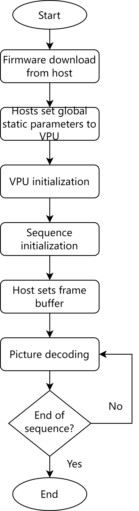
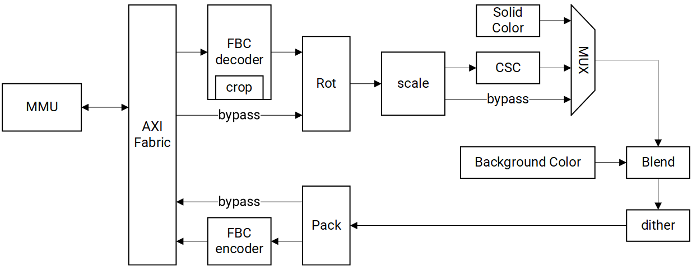
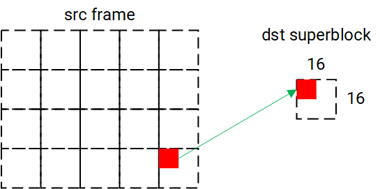

sidebar_position: 12

# 12. 视频与图形

## 12.1 视频子系统

### 视频处理单元（VPU）

#### 概述

视频处理单元（VPU）是一个具备双核的视频加速引擎，专为解码和编码多种视频标准而设计。它包含一个主机 CPU，用于运行固件以控制硬件引擎的各项功能，例如比特流解析、视频硬件子模块的控制以及错误恢复。

此外，VPU 在设计上对视频处理中通用的大部分子模块进行了高效共享，从而实现了超低功耗和较低的逻辑门数。

VPU 通过系统 AXI 总线连接以访问系统 DDR，并通过 APB 总线进行配置。

VPU 最高可工作在 819 MHz 时钟频率下，支持广泛的视频标准，包括 H.265、H.264、VP8、VP9、MPEG4、MPEG2 和 H.263。它支持以下并发操作：

- 1080P@60fps 的同时编码与解码  
- H.264/H.265 编码（1080P@30fps）与 H.264/H.265 解码（4K@30fps）同时进行

#### VPU 执行（VPU Execution）

视频编解码核心模块通过使用硬连线逻辑执行每个标准的实际解码和编码。其中，宏块序列器（Macroblock Sequencer）是主要控制器，负责调度子模块的处理流程，旨在减少处理器负载和固件复杂性。

如前所述，几个独立于标准的模块在运行时共享通用逻辑，以确保效率和流畅性能。

APB3 和 AXI 总线作为 VPU 与外部系统之间的主要接口，具体如下：

- APB3 处理控制接口  
- AXI 用于 DDR 数据传输  

VPU 具有 128 位 AXI 总线接口。VPU 的基本工作流程如下图所示。



需特别指出的是：

- 主机将固件下载到 VPU 的内部程序存储器中  
- 主机设置全局静态参数，例如代码、工作区、初始化 VPU 的参数缓冲区  
- 初始化 VPU  
- 主机命令 VPU 开始序列初始化过程（SEQ INIT 过程）  
- 主机向 VPU 注册帧缓冲信息（FRAME BUF 设置过程）  
- 主机依次给 VPU 发送图片解码或编码命令（PIC RUN 过程）  
- 如果没有比特流需要解码，VPU 将终止解码（PIC END 过程）

#### 视频编码器（Video Encoder）

##### 编码特性

- 输入支持可配置的 Arm 帧缓冲压缩（AFBC）1.0 或 1.2  
- 支持 YUV422 和 YUV420 格式的 AFBC 16×16 块分割  
- 支持跨距（stride）（不适用于 AFBC 输入格式）  
- 支持水平和垂直镜像（不适用于 AFBC 输入格式）  
- 可选在编码前以 90 度为步长对源帧进行旋转（不适用于 AFBC 输入格式）

  > 注意：若 YUV422 格式被旋转 90 度或 270 度且未转换为 YUV420，则结果将被转换为 YUV440。

- 支持以下源帧输入格式的编码：

  - 单平面 YUV422，逐行扫描格式，YUYV 或 UYVY 交错排列  
    > 注意：YUV422 输入可转换为 YUV420  

  - 单平面 RGB（8 位），按字节地址顺序排列：RGBA、BGRA、ARGB 或 ABGR  
  - 双平面 YUV420，逐行扫描格式，色度分量以 UV 或 VU 交错排列  
  - 三平面 YUV420，逐行扫描格式  
    > 注意：三平面格式仅用于测试目的，不建议用于追求最佳性能的场景  

  - AFBC YUV422  
  - AFBC YUV420

##### 支持的编码格式

- HEVC（H.265）主配置文件（Main Profile）
- H.264 基础配置文件（Baseline Profile, BP）
- H.264 主配置文件（Main Profile, MP）
- H.264 高级配置文件（High Profile, HP）
- VP8
- VP9 配置文件 0（Profile 0）

###### HEVC（H.265）编码特性

- 编码比特流符合 HEVC（H.265）主配置文件标准  
- 编码速度为 1080p@60fps（双核工作在约 300 MHz 下）  
- 使用单核工作在 300 MHz 时，最高支持 50 MBit/s 的比特率  
- 最大帧宽和帧高：4096 像素  
- 8 位编码，支持 I、P 和 B 帧  
- 进行逐行扫描编码，CTU 大小为 64×64  
- 支持最多四块水平分割的分块模式  
- 波前并行编码（Wave front parallel encoding）  
- 运动估计（ME）搜索窗口尺寸：水平 ±128 像素，垂直 ±64 像素  
- ME 搜索精度：低至四分之一像素分辨率（QPEL）  
- 亮度帧内模式：8×8、16×16 和 32×32  
- 色度帧内模式：4×4、8×8 和 16×16  
- 帧间模式：8×8、16×16 和 32×32  
- 亮度变换大小：8×8、16×16 和 32×32  
- 色度变换大小：4×4、8×8 和 16×16  
- 跳过 CU 和 Merge 模式  
- 去块滤波（Deblocking）  
- 样本自适应偏移（Sample Adaptive Offset, SAO）  
- 可选的受限帧内预测  
- 固定量化参数（QP）或基于速率控制的操作  
- 速率控制使用基于比特率和缓冲区大小设置的漏桶模型  
- 长期参考帧支持  
- 可选的帧内刷新间隔  
- 在 CTU 行粒度上插入片（Slice insertion on a CTU row granularity）  
- 可选的搜索窗口和分割选项限制  
- 编码器不会阻止输出超过每个 CTU 的最大比特数

###### H.264 编码特性

- 编码比特流符合 Baseline、Main 和 High 配置文件标准  
- 编码速度为 1080p@60fps（双核工作在约 300 MHz 下）  
- 使用单核工作在 300 MHz 时，最高支持 50 MBit/s 的比特率  
- 最大帧宽和帧高：4096 像素  
- 支持 I、P 和 B 帧  
- 支持逐行扫描编码  
- 支持上下文自适应二进制算术编码（CABAC）或上下文自适应变长编码（CAVLC）熵编码  

  > 注意：使用 CAVLC 熵编码时不支持 B 帧  

- 运动估计（ME）搜索窗口尺寸：水平 ±128 像素，垂直 ±64 像素  
- ME 搜索精度：低至四分之一像素分辨率（QPEL）  
- 亮度帧内模式：4×4、8×8、16×16  
- 色度帧内模式：8×8  
- 帧间模式：8×8 和 16×16  
- 变换块大小：4×4 和 8×8  
- 支持跳过宏块（skipped macroblocks）  
- 去块滤波（Deblocking）  
- 可选的受限帧内预测  
- 支持固定量化参数（QP）操作或基于速率控制的操作  
- 速率控制使用基于比特率和缓冲区大小设置的漏桶模型  
- 支持长期参考帧  
- 可选的帧内刷新间隔  
- 片（Slice）插入粒度为 32 像素高的行  
- 可限制搜索窗口范围和宏块分割选项  
- 始终启用转义机制，以防止无论 NAL 包格式如何设置，均不会出现网络抽象层（NAL）单元起始码的误匹配  

  > 注意：  
  > - 更多详情请参见 ITU-T H.264 附录 B：[VC-1 Compressed Video Bitstream Format and Decoding Process](https://multimedia.cx/mirror/VC-1_Compressed_Video_Bitstream_Format_and_Decoding_Process.pdf)  
  > - 编码器不会阻止输出超过每个宏块的最大比特数

###### VP8 编码特性

- 编码速度为 1080p@60fps（双核工作在约 400 MHz 下）  
- 使用单核工作在 400 MHz 时，最高支持 50 MBit/s 的比特率  
- 最大帧宽和帧高：2048 像素  
- 支持 I 和 P 帧  
- 支持逐行扫描编码  
- 运动估计（ME）搜索窗口尺寸：水平 ±128 像素，垂直 ±64 像素  
- ME 搜索精度：低至四分之一像素分辨率（QPEL）  
- 亮度帧内模式：4×4、8×8、16×16  
- 色度帧内模式：8×8  
- 帧间模式：8×8 和 16×16  
- 支持宏块跳过  
- 去块滤波（Deblocking）  
- 固定量化参数（QP）操作或基于速率控制的操作  
- 速率控制使用基于比特率和缓冲区大小设置的漏桶模型  
- 可选的帧内刷新间隔  
- 可限制搜索窗口范围和宏块分割选项  

###### VP9 编码特性

- 编码比特流符合 VP9 Profile 0 标准，采样深度为 8 位  
- 编码速度为 1080p@60fps（双核工作在约 300 MHz 下）  
- 使用单核工作在 300 MHz 时，最高支持 50 MBit/s 的比特率  
- 最大帧宽和帧高：4096 像素  
- 支持 8 位采样深度  
- 支持 I 和 P 帧  
- 支持逐行扫描编码  
- 支持分块行列（Tiled rows and columns）  
- 运动估计（ME）搜索窗口尺寸：水平 ±128 像素，垂直 ±64 像素  
- ME 搜索精度：低至四分之一像素分辨率（QPEL）  
- 亮度帧内模式：8×8、16×16 和 32×32  
- 色度帧内模式：4×4、8×8 和 16×16  
- 帧间模式：8×8、16×16 和 32×32  
- 亮度变换大小：8×8、16×16 和 32×32  
- 色度变换大小：4×4、8×8 和 16×16  
- 支持超级块跳过（Superblocks skipping）  
- 去块滤波（Deblocking）  
- 固定量化参数（QP）操作或基于速率控制的操作  
- 速率控制使用基于比特率和缓冲区大小设置的漏桶模型  
- 可选的帧内刷新间隔  
- 支持使用延迟上下文进行隐式或显式的概率更新  

#### 视频解码器（Video Decoder）

##### 解码特性

- 支持以下源帧输出格式：
  - 双平面 YUV420，逐行扫描格式：色度分量以 UV 或 VU 交错排列  
  - 三平面 YUV420，逐行扫描格式  

  > 注意：  
  > - 三平面格式仅用于测试目的，正常应用中不应使用此类格式以追求最高性能  
  > - 为获得最佳性能，请确保 YUV 缓冲区和跨距（stride）正确对齐  

- YUV420 AFBC 格式，8 位色深  
- 输出可配置为 AFBC 1.0 或 AFBC 1.2  
- 仅对逐行扫描格式支持跨距（stride）  
- 支持在输出前以 90 度为步长对解码帧进行旋转  

  > 注意：该旋转功能不适用于 AFBC 输出格式  

- 支持在每个显示输出帧中，为每个 32×32 像素块输出平均亮度（brightness）和色度（chrominance）值  

##### 支持的解码格式

- HEVC（H.265）：主配置文件（Main Profile）  
- H.264：基础配置文件（Baseline）、主配置文件（Main）、高级配置文件（High Profile）  
- VP8  
- VP9：配置文件 0（Profile 0）  
- VC-1：简单配置文件（SP）、主配置文件（MP）、高级配置文件（AP）  
- MPEG4：简单配置文件（SP）、高级简单配置文件（ASP）  
- MPEG2：主配置文件（MP）  
- H.263：配置文件 0（Profile 0）

###### HEVC（H.265）解码特性

- 完全符合主配置文件（Main Profile）规范  
- 支持 2160p@30fps 解码（双核工作在约 300 MHz 下）  
- 单核工作在 600 MHz 时，可处理平均比特率高达 100 MBit/s 的码流  
- 最大帧宽和帧高：4096 像素  
- 支持错误隐藏（Error concealment）机制以处理比特错误  
- 解码过程中输出相关的码流参数信息  

###### H.264 解码特性

- 完全符合 H.264 基础配置文件（Baseline）、主配置文件（Main）、高级配置文件（High）及 High 10 逐行扫描配置文件  
- 对于使用灵活宏块排序（FMO）或任意片排序（ASO）的 Baseline 配置文件码流，支持 WVGA 分辨率下以单核 400 MHz 实现 30 fps 解码  
- 对于未使用 FMO 和 ASO 的码流，解码性能如下：

  - 2160p@30fps（双核工作在约 300 MHz 下）  
  - 1080i@120fps（双核工作在 400 MHz 下）  

- 对于逐行扫描码流：

  - 单核工作在 600 MHz 时，平均比特率最高可达 100 MBit/s  
  - 最大帧宽和帧高：4096 像素  

- 对于隔行扫描码流：

  - 单核工作在 400 MHz 时，平均比特率最高可达 50 MBit/s  
  - 最大帧宽：2048 像素  
  - 最大帧高：4096 像素  

- 支持错误隐藏机制以处理码流错误  
- 解码过程中输出相关的码流参数信息  
- 无论 NAL 包格式如何设置，始终启用转义机制，以防止误匹配网络抽象层（NAL）单元起始码  

> 注意：更多详情请参见 ITU-T H.264 附录 B：[VC-1 Compressed Video Bitstream Format and Decoding Process](https://multimedia.cx/mirror/VC-1_Compressed_Video_Bitstream_Format_and_Decoding_Process.pdf)

###### VP8 解码特性

- 完全符合 VP8 规范  
- 支持 1080p@60fps 的解码速度（双核工作在约 400 MHz 下）  
- 单核工作在 400 MHz 时，平均比特率最高可达 50 MBit/s  
- 最大帧宽和帧高：2048 像素  
- 支持错误隐藏机制以处理码流错误  

###### VP9 解码特性

- 完全符合 Profile 0 标准  
- 支持 2160p@30fps 的解码速度（双核工作在约 300 MHz 下，并假设无不可见帧和 Alt-Ref 帧）  
- 支持 2160p@30fps 的解码速度（双核工作在约 400 MHz 下，并假设 Alt-Ref 帧距离为 4）  
- 单核工作在 600 MHz 时，平均比特率最高可达 60 MBit/s  
- 最大帧宽和帧高：4096 像素  
- 支持错误隐藏机制以处理码流错误  
- 解码过程中输出相关的码流参数信息  

###### VC-1 解码特性

- 完全符合 VC-1 简单配置文件（Simple）、主配置文件（Main）和高级配置文件（Advanced Profiles）  
- 支持 1080p@60fps 和 1080i@120fps 的解码速度（双核工作在约 400 MHz 下）  
- 单核工作在 400 MHz 时，平均比特率最高可达 40 MBit/s  
- 最大帧宽：2048 像素  
- 最大帧高：4096 像素  
- 支持错误隐藏机制以处理码流错误  

  > 注意：  
  > - 高级配置文件（Advanced Profile）的码流数据必须始终包含封装机制（Encapsulation Mechanism），无论 NAL 包格式如何设置。  
  > - 更多详情请参见 SMPTE-421M-2006 附录 E。  
  > - VC-1 高级配置文件的范围映射功能不适用于 AFBC 输出。

###### MPEG4 解码特性

- 符合 MPEG4 简单配置文件（Simple Profile）和高级简单配置文件（Advanced Simple Profile）  
- 支持全局运动补偿（Global Motion Compensation, GMC），限制为仅支持单个变形点（warp point）  
- 支持 1080p@60fps 或 1080i@120fps 的解码速度（双核工作在 400 MHz 下）  
- 单核工作在 400 MHz 时，可处理平均比特率最高达 20 MBit/s 的码流  
- 最大帧宽和帧高：2048 像素  
- 支持错误隐藏机制以处理码流错误  

###### MPEG2 解码特性

- 符合 MPEG2 主配置文件（Main Profile）  
- 支持 1080p@60fps 或 1080i@120fps 的解码速度（双核工作在 400 MHz 下）  
- 单核工作在 400 MHz 时，可处理平均比特率最高达 20 MBit/s 的码流  
- 最大帧宽：4096 像素（隔行扫描码流为 2048 像素）  
- 最大帧高：4096 像素  
- 支持错误隐藏机制以处理码流错误  

###### H.263 解码特性

- 符合 H.263 配置文件 0（Profile 0）  
- 支持 1080p@60fps 的解码速度（双核工作在约 400 MHz 下）  
- 单核工作在 400 MHz 时，可处理平均比特率最高达 20 MBit/s 的码流  
- 最大帧宽和帧高：2048 像素  
- 支持错误隐藏机制以处理码流错误

## 12.2 图像子系统（Image Subsystem）

### 图形处理单元（GPU）

#### 概述

GPU 围绕多线程统一着色集群（USCs）构建，具有高 SIMD 效率的 ALU 架构，并支持基于图块的延迟渲染（Tile-based Deferred Rendering），可同时处理多个图块。

GPU 引擎处理多种不同的工作负载，包括：

- 3D 图形工作负载：用于渲染 3D 场景的顶点和像素数据处理  
- 计算工作负载（GP-GPU）：通用数据处理  

> 注意：3D 图形和计算（带有屏障）工作负载不能同时重叠执行

GPU 核心拥有一个 128 位的 AXI 总线，用于访问 SOC 的 DDR 内存，核心频率最高可达 819 MHz。

#### 通用特性

- 基础架构完全符合以下 API：

  - OpenGL ES 1.1/3.2  
  - EGL 1.5  
  - OpenCL 3.0  
  - Vulkan 1.3  

- 针对 3D 图形工作负载的基于图块的延迟渲染架构（TBDR），可同时处理多个图块，数据处理分为两个阶段如下：

  - 几何处理阶段：涉及顶点操作如变换和顶点照明以及将 3D 场景划分为图块  
  - 片段处理阶段：涉及像素操作如光栅化、纹理映射和像素着色  

- 可编程高质量图像抗锯齿  
- 细粒度三角形剔除  
- 支持数字版权管理（DRM）安全  
- 支持 GPU 虚拟化如下：

  - 最多支持 8 个虚拟 GPU  
  - IMG HyperLane 技术，提供 8 条 HyperLanes  
  - 每个 OSI 独立中断（IRQs）  

- 多线程统一着色集群（USC）引擎集成像素着色器、顶点着色器和 GP-GPU（计算着色器）功能  
- USC 集成了高 SIMD 效率的 ALU 架构  
- 完全虚拟化的内存寻址（最多 64 GB 地址空间），支持统一内存架构  
- 细粒度的任务切换、工作负载平衡和电源管理  
- 先进的 DMA 驱动操作以最小化主机 CPU 交互  
- 缓存类型如下：

  - 32KB 系统级缓存（SLC）  
  - 专用纹理缓存单元（TCU）  

- 压缩纹理解码  
- 使用 Imagination 帧缓冲区压缩和解压缩（TFBC）算法进行无损或视觉上无损的低区域图像压缩  
- 专用于 B 系列核心固件执行的处理器  
- 单线程固件处理器，配有 2KB 指令缓存和 2KB 数据缓存  
- 固件处理器的独立电源域  
- 芯片上的性能、功耗和统计寄存器

#### 3D 图形特性

- **光栅化（Rasterization）**

  - 延迟像素着色  
  - 芯片上的图块浮点深度缓冲区  
  - 8 位模板缓冲区，芯片上的图块模板缓冲区  
  - 每个 ISP 最多 2 个图块同时处理  
  - 每时钟周期 16 个并行深度/模板测试  
  - 1 条固定功能光栅化流水线  

- **纹理查找（Texture Lookups）**

  - 支持从源指令加载  
  - 通过纹理处理单元（TPU）启用纹理写入  

- **过滤（Filtering）**

  - 点采样、双线性过滤和三线性过滤  
  - 各向异性过滤  
  - 支持立方环境映射纹理的角过滤以及跨面过滤  

- **纹理格式（Texture Formats）**

  - 支持 ASTC LDR 压缩纹理格式  
  - 支持非压缩纹理和 YUV 纹理的 TFBC 无损或有损压缩格式  
  - ETC  
  - YUV 平面支持  

- **分辨率支持（Resolution Support）**

  - 最大帧缓冲区大小：8K×8K  
  - 最大纹理大小：8K×8K  

- **抗锯齿（Anti-Aliasing）**

  - 最大 4x 多重采样  

- **图元装配（Primitive Assembly）**

  - 提前隐藏物体移除  
  - 图块加速  

- **渲染到缓冲区（Render to Buffers）**

  - 扭曲格式支持  
  - 多个芯片上渲染目标（MRT）  
  - 无损或有损帧缓冲区压缩/解压缩  
  - 可编程几何着色器支持  
  - 直接几何流输出（变换反馈）  

- **计算（Compute）**

  - 一维、二维和三维计算原语  
  - 块 DMA 到/从 USC 公共存储（用于本地数据）  
  - 每任务输入数据 DMA（到 USC 统一存储）  
  - 条件执行  
  - 执行围栏  
  - 计算工作负载可以与其他任何工作负载重叠  
  - 四舍五入至最接近的偶数  

#### 统一着色集群（USC）特性

- 2 条 ALU 流水线  
- 每时钟周期 8 个并行实例  
- 本地数据、纹理和指令缓存  
- 可变长度指令集编码  
- 完整支持 OpenCL™ 原子操作  
- 标量和矢量 SIMD 执行模型  
- USC F16 积之和乘加（SOPMAD）算术逻辑单元（ALU）

### V2D

#### 特性

- 支持放大（最高 8 倍）和缩小（最低 1/8 倍）  
- 支持 0°、90°、180°、270° 旋转以及镜像和翻转选项  
- 支持简单的层和背景混合  
- 支持图像裁剪  
- 支持获取纯色  
- 支持 RGB、BT601 和 BT709（包括窄范围和全范围）之间的颜色空间转换  
- 最大 NV12 分辨率为 4656x3596 或 4672x3504  
- 支持抖动以实现更平滑的颜色过渡  
- 支持 MMU  
- 支持 APB3 和 AXI3 总线接口  
- 支持以下**输入格式**：

  - RGB888（可选 RB 交换）  
  - RGBX888（可选 RB 交换）  
  - RGBA8888（可选 RB 交换）  
  - ARGB8888（可选 RB 交换）  
  - RGB565（可选 RB 交换）  
  - RGBA5658（可选 RB 交换）  
  - ARGB8565（可选 RB 交换）  
  - A8（8 位 alpha 图像）  
  - Y8（8 位灰度图像）  
  - YUV420 半平面（UV 可交换）  
  - AFBC 16x16 RGBA8888（layout0 分割和不分割）  
  - AFBC 16x16 NV12（layout1 分割和不分割）  

- 支持以下**输出格式**：

  - RGB888（可选 RB 交换）  
  - RGBX888（可选 RB 交换）  
  - RGBA8888（可选 RB 交换）  
  - ARGB8888（可选 RB 交换）  
  - RGB565（可选 RB 交换）  
  - RGBA5658（可选 RB 交换）  
  - ARGB8565（可选 RB 交换）  
  - A8（8 位 alpha 图像）  
  - Y8（8 位灰度图像）  
  - YUV420 半平面（UV 可交换）  
  - AFBC 16x16 RGBA8888（layout0 分割和不分割）  
  - AFBC 16x16 NV12（layout1 分割和不分割）  

#### 模块图

V2D 子系统的微架构如下图所示。



典型的 V2D 工作场景如下图所示。


#### 功能

##### 数据获取

从源帧（src frame）中获取一个 16×16 数据块并映射到目标超级块（dst superblock）的过程如下图所示，其中：

- **AFBC**：获取区域的左、上、宽、高需按 4 字节对齐  
- **非 AFBC**：获取区域的左、上、宽、高按 1 字节对齐  



用于显示的数据获取代码如下所示，所涉及的具体变量和寄存器详情列于其后的表格中。

```
Input param: Rect_left, Rect_top, Rect_width, Rect_height
Rect_width = Rect_left%4 + Rect_width;
Rect_height = Rect_top%4 + Rect_height;
Rect_left = Rect_left/4 × 4;
Rect_top = Rect_top/4 × 4;
if LayerX_format == YUV420 
{
    Rect_width  = ALIGN(Rect_left %2 + Rect_width, 2);
    Rect_height   = ALIGN(Rect_top%2 + Rect_height, 2);
    Rect_left = Rect_left/2 × 2;
    Rect_top = Rect_top/2 × 2;
}
Take the data in the Rect
Loop every pixel in Rect
{
    if LayerX_format == YUV420
    {
        upsample YUV420 to YUV444;
        c0 = channel 0; // Y
        c1 = channel 1; // U
        c2 = channel 2; // V
        c3 = 0xff;
    }
    if LayerX_format == RGB888
    {
        c0 = channel 0; // R
        c1 = channel 1; // G
        c2 = channel 2; // B
        c3 = 0xff; // A
    }
    if LayerX_format == RGBX8888
    {
        c0 = channel 0; // R
        c1 = channel 1; // G
        c2 = channel 2; // B
        c3 = 0xff; // A
    }
    if LayerX_format == RGBA8888
    {
        c0 = channel 0; // R
        c1 = channel 1; // G
        c2 = channel 2; // B
        c3 = channel 3; // A
    }
    if LayerX_format == ARGB8888
    {
        c0 = channel 1; // R
        c1 = channel 2; // G
        c2 = channel 3; // B
        c3 = channel 0; // A
    }
    if LayerX_format == RGB565
    {
        c0 = byte_low &0x1f; // R5
        c1 = ((byte_high << 3) | (byte_low >> 5)) & 0x3f; // G6
        c2 = (byte_high >> 3) &0x1f; // B5
        c0 = (c0 << 3) | (c0 >> 2); // R8
        c1 = (c1 << 2) | (c1 >> 4); // G8
        c2 = (c2 << 3) | (c2 >> 2); // B8
        c3 = 0xff; // A8
    }
    if LayerX_format == YUV420 && LayerX_swap == 1
        Swap(c1, c2);
    else if LayerX_swap == 1
        Swap(c0, c2);
    Index = Rect_y%16 × 16 + Rect_x;
    data[0][index] = c0;
    data[1][index] = c1;
    data[2][index] = c2;
    data[3][index] = c3;
}
```

| 变量                | 位数                    | 注释                                             |
|---------------------|------------------------|--------------------------------------------------|
| Rect_left<br>Rect_top | 16位无符号             | 范围 [0, 65535]                                   |
| Rect_width<br>Rect_height | 5位无符号           | 范围 [1, 16]                                      |
| Rect_x<br>Rect_y    | 16位无符号             | 范围 [0, 65535]<br>像素全局位置                     |
| c0, c1, c2, c3      | 8位无符号              | 范围 [0, 255]                                     |
| byte_low<br>byte_high | 8位无符号             | 范围 [0, 255]<br>byte_low: RGB565中的低位字节<br>byte_high: RGB565中的高位字节 |
| data[4][256]        | 8位无符号 × 4 × 256     | 范围 [0, 255]                                     |
| index               | 8位无符号              | 范围 [0, 255]                                     |

| 寄存器       | 注释                              |
|--------------|-----------------------------------|
| LayerX_format | X 为 0 或 1，参见模块寄存器          |
| LayerX_swap   | X 为 0 或 1，参见模块寄存器          |

##### 纯色（Solid Color）

在指定矩形区域内应用纯色的代码如下所示，所涉及的具体变量和寄存器详情列于其后的表格中。

> 注意：  
> - 如果寄存器 `LayerX_solid` 被启用，则获取的数据将被设置为纯色 R、G、B、A  
> - 获取矩形和纯色矩形的坐标在旋转后会更新

```sql
Input param: Rect_left, Rect_top, Rect_width, Rect_height.
if LayerX_solid_enable = 1
{
    c0 = LayerX_solid_R;
    c1 = LayerX_solid_G;
    c2 = LayerX_solid_B;
    c3 = LayerX_solid_A;
    Loop all pixels in Rect
    {
        Index = Rect_y%16 × 16 + Rect_x;
        data[0][index] = c0;
        data[1][index] = c1;
        data[2][index] = c2;
        data[3][index] = c3;
    }
    Skip fetch data from ddr
}
```

| 变量                | 位数                    | 注释                             |
|---------------------|------------------------|----------------------------------|
| Rect_left, Rect_top | 16位无符号             | 范围 [0, 65535]                    |
| Rect_width, Rect_height | 5位无符号          | 范围 [1, 16]                        |
| Rect_x, Rect_y      | 16位无符号             | 范围 [0, 65535]<br>像素全局位置       |
| c0, c1, c2, c3      | 8位无符号              | 范围 [0, 255]                      |
| data[4][256]        | 8位无符号 × 4 × 256     | 范围 [0, 255]                      |
| index               | 8位无符号              | 范围 [0, 255]                      |

| 寄存器                  | 注释                                |
|-------------------------|-------------------------------------|
| LayerX_solid_enable     | X 为 0 或 1，参见模块寄存器            |
| LayerX_solid_R          | X 为 0 或 1，参见模块寄存器            |
| LayerX_solid_G          | X 为 0 或 1，参见模块寄存器            |
| LayerX_solid_B          | X 为 0 或 1，参见模块寄存器            |
| LayerX_solid_A          | X 为 0 或 1，参见模块寄存器            |

##### 旋转（Rotation）

支持 0°、90°、180°、270° 顺时针旋转，以及镜像和翻转选项，如下图所示（示例）。


用于图形内容旋转、镜像和翻转的代码如下所示，所涉及的具体变量和寄存器详情列于其后的表格中。

```sql
Input param: Rect_left, Rect_top, Rect_width, Rect_height, data_in[4][256].
Output: Block_rect_left, Block_rect_top,  Block_rect_width,  Block_rect_height, data_out[4][256].
Block_rect_left = Rect_left;
Block_rect_top = Rect_top;
Block_rect_width = Rect_width;
Block_rect_height = Rect_height;
if LayerX_degree == ROT_0{
    Org_rect_left = Rect_left;
    Org_rect_top = Rect_top;
    Org_rect_width = Rect_width;
    Org_rect_height = Rect_height;
}
if LayerX_degree == ROT_90{
    Org_rect_left = Rect_top;
    Org_rect_top = ALIGN(LayerX_height,16) - Rect_left - Rect_width;
    Org_rect_width = Rect_height;
    Org_rect_height = Rect_width;
} 
if LayerX_degree == ROT_180{
    Org_rect_left = ALIGN(LayerX_width,16) - Rect_left - Rect_width;
    Org_rect_top = ALIGN(LayerX_height,16) - Rect_top - Rect_height;
    Org_rect_width = Rect_width;
    Org_rect_height = Rect_height;
}
if LayerX_degree == ROT_270{
    Org_rect_left = ALIGN(LayerX_width,16)-Rect_top-Rect_height;
    Org_rect_top = Rect_left;
    Org_rect_width = Rect_height;
    Org_rect_height = Rect_width;
}
if LayerX_degree == ROT_MIRROR{
    Org_rect_left = ALIGN(LayerX_width,16) - Rect_left - Rect_width;
    Org_rect_top = Rect_top;
    Org_rect_width = Rect_width;
    Org_rect_height = Rect_height;
}
if LayerX_degree == ROT_FLIP{
    Org_rect_left = Rect_left;
    Org_rect_top = ALIGN(LayerX_height,16) - Rect_top - Rect_height;
    Org_rect_width = Rect_width;
    Org_rect_height = Rect_height;
}
//fetch data in Org_rect
Fetch_data(Org_rect, &data_in[4][256]);
Loop all pixels in data_in{
    dst_index=jx16 + i;
    if LayerX_degree == ROT_0
        src_index=jx16 + i;
    if LayerX_degree == ROT_90
        src_index=(15-i)x16 + j;
    if LayerX_degree == ROT_180
        src_index=(15-j)x16 + (15-i);
    if LayerX_degree == ROT_270
        src_index= ix16+(15-j);
    if LayerX_degree == ROT_MIRROR
        src_index = jx16 + (15-i);
    if LayerX_degree == ROT_FLIP
        src_index = (15-j)x16 + i;
    data_out[0][dst_index]= data_in[0][src_index];
    data_out[1][dst_index]= data_in[1][src_index];
    data_out[2][dst_index]= data_in[2][src_index];
    data_out[3][dst_index]= data_in[3][src_index];
}
```

| 变量                                      | 位数                    | 注释             |
|------------------------------------------|------------------------|------------------|
| Rect_left, Rect_top                      | 16位无符号             | 范围 [0, 65535]    |
| Rect_width, Rect_height                  | 5位无符号              | 范围 [1, 16]       |
| Block_rect_left, Block_rect_top          | 16位无符号             | 范围 [0, 65535]    |
| Block_rect_width, Block_rect_height      | 5位无符号              | 范围 [1, 16]       |
| data_in[4][256], data_out[4][256]        | 8位无符号 × 4 × 256     | 范围 [0, 255]      |

| 寄存器                        | 位数           | 注释                                |
|-------------------------------|---------------|-------------------------------------|
| LayerX_degree                 | 3位无符号      | X 为 0 或 1，参见模块寄存器           |
| LayerX_width, LayerX_height   | 16位无符号     | X 为 0 或 1，参见模块寄存器           |

##### 颜色空间转换（CSC）

支持以下格式的颜色空间转换（Color Space Conversion, CSC）：

- BT.601 与 BT.709：窄范围与全范围之间的相互转换  
- RGB 转 YUV  
- YUV 转 RGB  

转换过程通过使用一个变换矩阵对输入通道进行运算，并结合限幅（clamping）操作，以确保输出值有效，即保持在 [0, 255] 范围内。

为此，系统实现了以下公式，所涉及的具体变量和寄存器详情列于其后的表格中。

**[首先用于计算中间通道值]**

$$
C0_{inter} = (Layer_matrix[0][0]*C0_{in} + Layer_matrix[0][1]*C1_{in} + Layer_matrix[0][2]*C2_{in} + 512)>>10+Layer_matrix[0][3]
$$

$$
C1_{inter} = (Layer_matrix[1][0]*C0_{in} + Layer_matrix[1][1]*C1_{in} + Layer_matrix[1][2]*C2_{in} + 512)>>10+Layer_matrix[1][3]
$$

$$
C2_{inter} = (Layer_matrix[2][0]*C0_{in} + Layer_matrix[2][1]*C1_{in} + Layer_matrix[2][2]*C2_{in} + 512)>>10+Layer_matrix[2][3]
$$

**[然后进行限幅以确保输出值有效]**

$$
C0_{out}=clamp(C0_{inter},0,255)
$$

$$
C1_{out}=clamp(C1_{inter},0,255)
$$

$$
C2_{out}=clamp(C2_{inter},0,255)
$$

$$
C3_{out}=clamp(C3_{in},0,255)
$$

| 变量                              | 位数           | 注释                |
|-----------------------------------|----------------|---------------------|
| C0(in), C1(in), C2(in), C3(in)    | 8位无符号       | 输入通道            |
| C0(inter), C1(inter), C2(inter)   | 10位有符号      | 中间通道值          |
| C0(out), C1(out), C2(out), C3(out)| 8位无符号       | 输出通道            |

| 寄存器                | 索引   | 位数           | 注释                     |
|-----------------------|--------|----------------|--------------------------|
| LayerX_CSC_enable     | -      | 1位无符号       | 0：禁用<br>1：启用        |
| Layer_matrix[#][#]    | 0–11   | 13位有符号      | 范围 [−4096, 4095]        |

在代码中，颜色空间转换过程在以下条件下执行：

```
if LayerX_CSC_enable == 0
    skip CSC function
```

##### 缩放

缩放操作采用基于超级块的系统化方法，其中：

- 前四个超级块先按水平方向输出，再按垂直方向输出  
- 垂直方向输出完成后，处理流程从第一行超级块重新开始  

##### 存储

一个 16×16 的图像块可存储至 DDR 内存中，但仅位于输出裁剪区域内的部分会被实际存储，并转换为指定的输出颜色格式（如 YUV、RGB 等）。

用于存储图像块的代码如下所示，所涉及的具体变量和寄存器详情列于其后的表格中。

```sql
Input param: Rect_left, Rect_top, Rect_width, Rect_height, data_in[4][256]
if output_format == YUV420
{
    s0=0;
    s1=1;
    s2=2;
    if(output_swap){
        Swap(s1, s2);
    }
    Loop all pixels by 2x2{
        if(pixel in output_crop_rect){
            Y00=data_in[s0][pixel_index00];
            Y01=data_in[s0][pixel_index01];
            Y10=data_in[s0][pixel_index10];
            Y11=data_in[s0][pixel_index11];
            U00=data_in[s1][pixel_index00];
            U01=data_in[s1][pixel_index01];
            U10=data_in[s1][pixel_index10];
            U11=data_in[s1][pixel_index11];
            V00=data_in[s2][pixel_index00];
            V01=data_in[s2][pixel_index01];
            V10=data_in[s2][pixel_index10];
            V11=data_in[s2][pixel_index11];
            Downsample and store to output frame
            U=(U00+U01+U10+U11+2)>>2;
            V=(V00+V01+V10+V11+2)>>2;
        }
    }
}
if output_format == RGB888 
{
    s0=0;
    s1=1;
    s2=2;
    if(output_swap){
        Swap(s0, s2);
    }
    Loop all pixels{
        if(pixel in output_crop_rect){
            R=data_in[s0][pixel_index];
            G=data_in[s1][pixel_index];
            B=data_in[s2][pixel_index];
            store to output frame.
        }
    }
}
if output_format == RGBX888 || output_format == RGBA888
{
    s0=0;
    s1=1;
    s2=2;
    s3=3;
    if(output_swap){
        Swap(s0, s2);
    }
    Loop all pixels{
        if(pixel in output_crop_rect){
            R=data_in[s0][pixel_index];
            G=data_in[s1][pixel_index];
            B=data_in[s2][pixel_index];
            A=data_in[s3][pixel_index];
            store to output frame.
        }
    }
}
if output_format == ARGB8888 
{
    s0=3;
    s1=0;
    s2=1;
    s3=2;
    if(output_swap){
        Swap(s1, s3);
    }
    Loop all pixels{
        if(pixel in output_crop_rect){
            R=data_in[s0][pixel_index];
            G=data_in[s1][pixel_index];
            B=data_in[s2][pixel_index];
            A=data_in[s3][pixel_index];
            store to output frame.
        }
    }
}
```

| 变量                              | 位数                    | 注释             |
|-----------------------------------|------------------------|------------------|
| Rect_left<br>Rect_top             | 16位无符号             | 范围 [0, 65535]    |
| Rect_width<br>Rect_height         | 5位无符号              | 范围 [1, 16]       |
| pixel_index                       | 8位无符号              | 范围 [0, 65535]    |
| s0, s1, s2, s3                    | 8位无符号              | 范围 [0, 255]      |
| Y00, Y01, Y10, Y11, U00, U01,<br>U10, U11, V00, V01, V10, V11,<br>U, V, R, G, B, A | 8位无符号  | 范围 [0, 255]      |
| data_in[4][256]                   | 8位无符号 × 4 × 256     | 范围 [0, 255]      |

| 寄存器                | 位数           | 注释                                                                 |
|-----------------------|----------------|----------------------------------------------------------------------|
| Output_format         | 3位无符号       | 0: RGB888（R 在低位，B 在高位）<br>1: RGBX8888<br>2: RGBA8888<br>3: ARGB8888（A 在低位，B 在高位）<br>5: yuv420sp（U 在低位，V 在高位） |
| Output_swap           | 1位无符号       | 0: 不交换<br>1: RGB 交换 RB，YUV 交换 UV                               |
| Output_layout         | 1位无符号       | 0: 线性<br>1: FBC 压缩                                                |
| Output_crop_left      | 16位无符号      | 范围 [0, 65534]; <br>crop_left < output_left + output_width               |
| Output_crop_top       | 16位无符号      | 范围 [0, 65534]; <br>crop_top < output_top + output_height                |
| Output_crop_width     | 16位无符号      | 范围 [1, 65535]; <br>crop_left + crop_width ≤ output_left + output_width   |
| Output_crop_height    | 16位无符号      | 范围 [1, 65535]; <br>crop_top + crop_height ≤ output_top + output_height   |