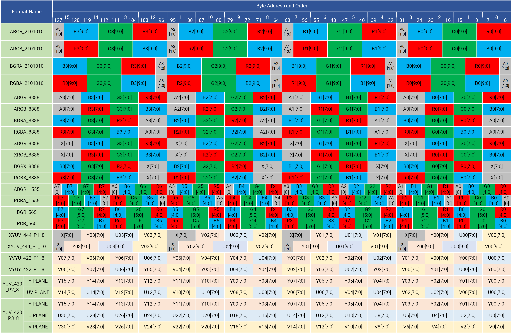
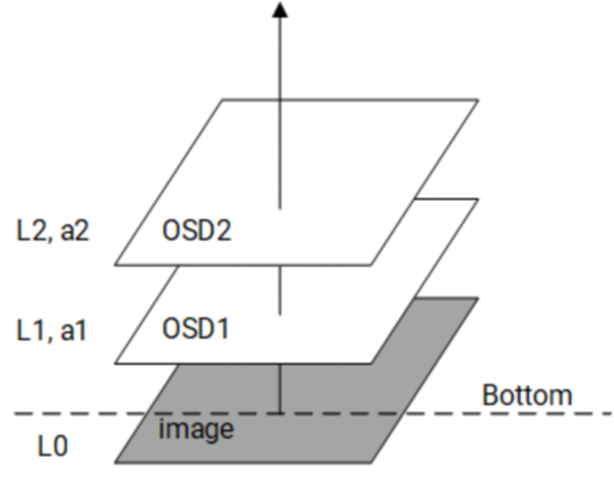
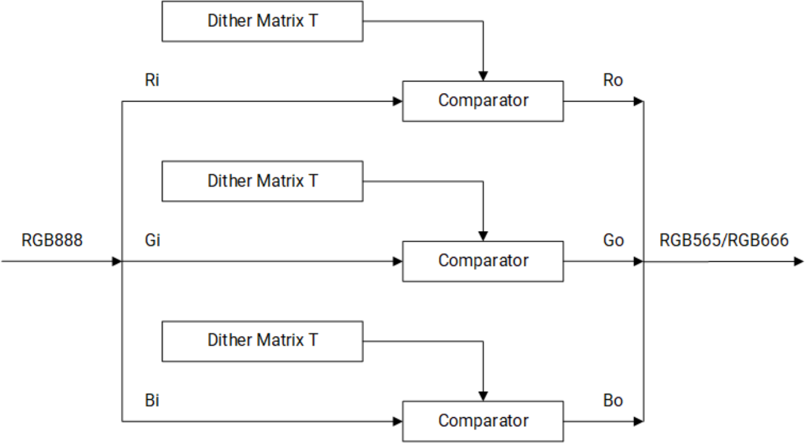
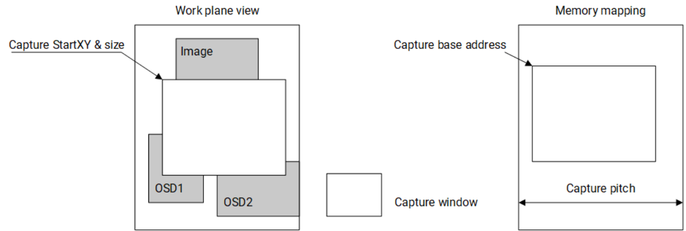

sidebar_position: 13

# 13. 显示子系统

## 13.1 显示控制器（Display Controller）

### 概述

显示控制器是一个硬件模块，用于将显示数据从显示器的内部存储器传输到 DSI 控制器。它通过 MIPI DSI 支持一个独立的显示设备。

### 特性

- 支持最高 Full HD（1920x1080@60fps）
- 通过 RDMA 通道中的上下层重用支持最多 4 个全尺寸图层合成器和最多 8 个图层合成器
- 支持 _cmdlist_ 机制，允许配置硬件寄存器参数
- 支持同时使用原始格式和 AFBC 格式的回写操作
- 在回写路径中支持抖动、裁剪和旋转
- 先进的 MMU（虚拟地址）机制，在 90° 和 270° 旋转期间几乎不会出现页面丢失
- 支持颜色键控和纯色生成
- 面板支持高级误差扩散和基于模式的抖动
- 支持 AFBC 和原始格式图像源
- 色彩饱和度和对比度增强
- 面板支持视频模式和 _cmd_ 模式（带 LCM 中的帧缓冲区）
- 嵌入式 DFC 缓冲区支持动态 DDR 频率调整
- 支持以下**输入格式**（请参阅以下的映射图）：

  - A2BGR101010, A2RGB101010, BGR101010A2, RGB101010A2
  - ABGR8888, ARGB8888, BGRA8888, RGBA8888
  - XBGR8888, XRGB8888, BGRX8888, RGBX8888
  - BGR888, RGB888, ABGR1555, RGBA5551, BGR565/RGB565
  - XYUV_444_P1_8, XYUV_444_P1_10, YVYU_422_P1_8, VYUY_422_P1_8
  - YUV_420_P2_8, YUV_420_P3_8

    

- 支持以下**输出格式**：

  - RGB888, RGB565, RGB666

### 模块图

显示子系统的微架构如下图所示。


## 13.2 HDMI 接口

### 特性

- 符合HDMI Specification v1.4标准
- 支持双通道音频流，频率范围为32～192KHz
- 物理通道速率高达2.4Gbps/通道 × 3通道
- 支持最高1920x1440@60Hz分辨率
- 支持RGB和YCbCr 4:2:2 / 4:4:4输入视频格式
- 支持RGB和YCbCr 4:2:2 / 4:4:4输出视频格式
- 支持8bpc / 10bpc / 12bpc输入和输出色彩深度
- 支持EIA/CEA-861-F视频定时和InfoFrame结构
- 支持L-PCM(IEC 60958)、32～192KHz双通道音频数据
- 支持消费者电子控制(CEC)标准包和用户自定义包
- 内置I2C主控，用于远程ED访问，支持100～400Kbps速率

### 模块图

HDMI接口的架构如下图所示。


## 13.3 MIPI-DSI

### 概述

MIPI Display Serial Interface (MIPI DSI) 是一种高速接口，用于主机处理器与外围设备之间的通信，并遵循 MIPI 联盟为移动设备接口制定的标准。

### 特性

- 符合 MIPI DSI 标准 v1.0
- 符合 MIPI DPHY 规范 v1.1
- 支持最多 4 条数据通道，每条通道速度最高可达 1200Mbps
- 每个 DPHY 链路支持 1 个活动面板
- 符合 Display Command Set (DCS) 标准
- 支持 DSI 和 DCS 中定义的所有像素格式
- 支持视频突发模式，DPHY 每条通道最高可达 1.2Ghz
- 支持 MIPI 链路中的虚拟通道
- 支持最高 1080p 分辨率
- 支持命令模式、视频模式和突发模式
- 支持 HS-TX、LP-TX、LP-RX 和 LP-CD 信号

### 功能描述

DSI 数据包仲裁如下图所示。


如图所示，DSI 数据包仲裁基于 DSI 内部定时控制的定时周期，将 H 行时间分为 4 个时期，具体包括：

- **控制数据包时期**（Control packet period）：HSS、HSA 和 HSE
- **消隐期 1**（Blanking period 1）：BL 或智能面板数据包 + LP
- **有效视频**（Active video）：RGB
- **消隐期 2**（Blanking period 2）：BL 或智能面板数据包 + LP

BL 数据包字数是可编程的，并以字节时钟中的字节数定义。如果插入了智能面板数据包，DSI 硬件将在发送智能面板数据包后切换到 LP 模式。

DSI 与 LCD 定时的关系如下：

- DSI 控制器根据 LCD 的 vsync 生成其定时
- DSI 每帧同步一次与 LCD 控制器
- DSI 和 LCD 共享相同的 H total 值，并以相同的像素时钟速率运行。因此，DSI 和 LCD 控制器的水平线时间相同。
- 此外，LCD 控制器行与 DSI 行之间的偏移是可编程的。

### 寄存器描述（Register Description）

> **注意**：基地址 = **0xD421_A800**

#### DSI_CTRL_0 寄存器

偏移地址（Offset）：0x0

| 位域                   | 字段                  | 类型 | 复位值 | 说明 |
|----------------------|-----------------------|------|--------|------|
| 31                   | CFG_SOFT_RST          | RW   | 0x0    | 软件复位 DSI 模块 <br/>`1`: 复位 DSI 模块 <br/>`0`: 取消软件复位 |
| 30                   | CFG_SOFT_RST_REG      | RW   | 0x0    | 软件复位配置寄存器 <br/>`1`: 将 DSI 配置寄存器重置为默认值 <br/>`0`: 取消复位 |
| 29                   | CFG_CLR_PHY_FIFO      | RW   | 0x0    | 配置清除 PHY 发送 FIFO <br/>`1`: 清除 FIFO 数据为 0 <br/>`0`: 取消清除 <br/>当前未使用，预留未来使用 |
| 28                   | CFG_RST_TXLP          | RW   | 0x0    | 软件复位 LP TX 子模块 <br/>`1`: 复位 LP TX 模块 <br/>`0`: 取消软件复位 |
| 27                   | CFG_RST_CPU           | RW   | 0x0    | 软件复位 CPU TX 子模块 <br/>`1`: 复位 CPU TX 模块 <br/>`0`: 取消软件复位 |
| 26                   | CFG_RST_CPN           | RW   | 0x0    | 软件复位 CPN TX 子模块 <br/>`1`: 复位 CPN TX 模块 <br/>`0`: 取消软件复位 |
| 25                   | RSVD                  | RO   | 0      | 预留未来使用 |
| 24                   | CFG_RST_VPN           | RW   | 0x0    | 软件复位 Video Panel 子模块 <br/>`1`: 复位 VPN 模块 <br/>`0`: 取消软件复位 |
| 23                   | CFG_DSI_PHY_RST       | RW   | 0x0    | 软件复位 DPHY 子模块 <br/>`1`: 复位 DPHY <br/>`0`: 取消软件复位 |
| 22:18                | RSVD                  | RO   | 0      | 预留未来使用 |
| 17                   | CFG_DSI_HCLK_DIS      | RW   | 0x0    | DSI AHB 时钟禁用<br/>**注意**：即使禁用了 DSI AHB 时钟，DSI 配置寄存器仍然可以读写。<br/>`1`: DSI AHB 时钟将被门控 <br/>`0`: DSI AHB 时钟传递到 DSI 模块 |
| 16                   | CFG_DSI_CLK_DIS       | RW   | 0x0    | DSI 时钟禁用 <br/>`1`: DSI 时钟将被门控 <br/>`0`: DSI 时钟传递到 DSI 模块 |
| 15:9                 | RSVD                  | RO   | 0      | 预留未来使用 |
| 8                    | CFG_VPN_TX_EN         | RW   | 0x1    | 视频面板接口 TX 启用 <br/>`1`: 启用视频面板 TX 数据包到 DPHY。DSI 将发送视频数据包到外围设备。<br/>`0`: 禁用视频面板接口 TX。 |
| 7:5                  | RSVD                  | RO   | 0      | 预留未来使用 |
| 4                    | CFG_VPN_SLV           | RW   | 0x1    | 视频面板接口从模式 <br/>`1`: 视频面板工作在从模式。它从输入 LCD 接口接收 VSYNC，并用于控制内部定时。<br/>`0`: 视频面板接口工作在主模式。DSI 发送 VSYNC 到 LCD 模块，并控制垂直和水平定时。<br/>**注意**：此位必须设置为 1，VPN 仅支持从模式。 |
| 3                    | RSVD                  | RO   | 0      | 预留未来使用 |
| 2                    | CFG_CPN_EN            | RW   | 0x0    | 命令面板接口启用 <br/>`1`: 命令面板运行并可以从命令面板接口接受数据 <br/>`0`: 禁用命令面板接口 |
| 1                    | RSVD                  | RO   | 0      | 预留未来使用 |
| 0                    | CFG_VPN_EN            | RW   | 0x0    | 视频面板接口启用 <br/>`1`: 视频面板激活并运行。<br/>`0`: 禁用视频面板接口。<br/>**注意**：将此字段设置为 1 以启动视频面板定时。 |

#### DSI 控制寄存器1（DSI Control Register 1, DSI_CTRL_1）  

偏移地址（Offset）：0x4  

位域 | 字段 | 类型 | 复位值 | 说明  
|---|----|----|----|---|  
31:9 | RSVD | RO | 0 | 保留供将来使用  
8 | CFG_EOTP_EN | RW | 0x0 | EOTP使能<br>`1`: 启用EOTP包<br>`0`: 禁用EOTP包  
7:6 | CFG_CPN_VCH_NO | RW | 0x3 | 命令面板虚拟通道编号  
5:2 | RSVD | RO | 0 | 保留供将来使用  
1:0 | CFG_VPN_VCH_NO | RW | 0x0 | 视频面板虚拟通道编号，用于活动面板1<br>此参数定义VPN的虚拟通道编号   

#### DSI 中断状态寄存器1（DSI Interrupt Status Register 1, DSI_IRQ_ST1）  

偏移地址（Offset）：0x8  

位域 | 字段 | 类型 | 复位值 | 说明  
|---|----|----|----|---|  
31:4 | RSVD | RO | 0 | 保留供将来使用  
3 | IRQ_DPHY_ERR_HS_RXP | RO | 0x0 | DPHY HSTX争用RXP错误  
2 | IRQ_DPHY_ERR_HS_RXN | RO | 0x0 | DPHY HSTX争用RXN错误  
1 | IRQ_DPHY_ERR_HS_CONTP | RO | 0x0 | DPHY HSTX争用contp错误  
0 | IRQ_DPHY_ERR_HS_CONTN | RO | 0x0 | DPHY HSTX争用contn错误  

#### DSI 中断掩码寄存器1（DSI Interrupt Mask Register 1, DSI_IRQ_MASK1）  

偏移地址（Offset）：0xC  

位域 | 字段 | 类型 | 复位值 | 说明  
|---|----|----|----|---|  
31:4 | RSVD | RO | 0 | 保留供将来使用  
3:0 | CFG_IRQ_MASK1 | RW | 0x0 | DSI中断掩码此字段用于屏蔽中断请求。如果一位设置为`1`，则对应的中断状态被屏蔽。  

#### DSI 中断状态寄存器（DSI Interrupt Status Register, DSI_IRQ_ST）  

偏移地址（Offset）：0x10  

位域 | 字段 | 类型 | 复位值 | 说明  
|---|----|----|----|---|  
31 | IRQ_LAST_LINE | RO | 0x0 | 最后一行中断  
30 | IRQ_CPN_TE | RO | 0x0 | 命令面板撕裂效果  
29 | IRQ_TA_TIMEOUT | RO | 0x0 | DPHY 转换确认超时  
28 | IRQ_RX_TIMEOUT | RO | 0x0 | DPHY LP-RX 超时  
27 | IRQ_TX_TIMEOUT | RO | 0x0 | DPHY HS TX 超时  
26 | IRQ_RX_STATE_ERR | RO | 0x0 | 外设状态错误<br>当DSI从从设备接收到带有错误报告包的确认时，如果报告了错误状态，则会标记此位。  
25 | IRQ_RX_ERR | RO | 0x0 | DSI RX 数据包错误<br>DSI 接收到来自从设备的数据包（带有错误状态，如ECC错误/CRC错误/未知数据包）  
24 | IRQ_RX_FIFO_FULL_ERR | RO | 0x0 | RX FIFO 满错误  
23 | IRQ_PHY_FIFO_UNDERRUN | RO | 0x0 | PHY FIFO 下溢错误  
22 | IRQ_REQ_CNT_ERR | RO | 0x0 | TX 请求计数错误<br>当活动面板TX请求与DPHY准备信号之间的延迟不一致时发生此错误。  
21 | IRQ_RXPSR_FIFO_FULL_ERR | RO | 0x0 | RX 解析器FIFO满错误  
20 | IRQ_VPN_REQ_PHY_DLY_ERR | RO | 0x0 | VPN 请求在PHY接口上的延迟错误<br>VPN 数据包在PHY接口上被延迟。  
19 | IRQ_VPN_BF_UNDERRUN_ERR | RO | 0x0 | VPN 缓冲区下溢错误  
18 | IRQ_VPN_REQ_ARB_DLY_ERR | RO | 0x0 | 在仲裁接口处的VPN请求延迟错误<br>VPN 数据包在仲裁点被延迟。  
17 | IRQ_VPN_BF_OVERRUN_ERR | RO | 0x0 | VPN 缓冲区上溢错误  
16 | IRQ_VPN_TIMING_ERR | RO | 0x0 | VPN 数据时间错误<br>该错误表示像素数据可能不正确。它发生在为VPN路径的数据FIFO读取得太早或太晚时，导致访问时FIFO为空。  
15 | IRQ_VPN_VACT_DONE | RO | 0x0 | VPN VACT 完成  
14 | IRQ_VPN_BF_FULL | RO | 0x0 | VPN 缓冲区满错误<br>像素数据可能不正确。  
13 | IRQ_CPN_BF_FULL | RO | 0x0 | CPN 缓冲区满错误<br>像素数据可能不正确。  
12 | IRQ_DPHY_ERR_CONT_LP1 | RO | 0x0 | DPHY LP1 竞争检测 PPI 错误竞争LP1  
11 | IRQ_DPHY_ERR_CONT_LP0 | RO | 0x0 | DPHY LP0 竞争检测 PPI 错误竞争LP0  
10 | IRQ_DPHY_ERR_SYNC_ESC | RO | 0x0 | DPHY 同步错误 PPI ErrSyncEsc<br>检测到部分字节  
9 | IRQ_DPHY_ERR_ESC | RO | 0x0 | DPHY 无效命令检测 PPI ErrEsc<br>检测到无效ESC命令  
8 | IRQ_DPHY_RX_LINE_ERR | RO | 0x0 | DPHY 无效线路状态检测 PPI ErrControl  
7 | IRQ_RX_TRG3 | RO | 0x0 | DPHY RX 触发3接收<br>默认情况下，触发3的值为0x05,<br>注意：其确切含义未由规范定义。  
6 | IRQ_RX_TRG2 | RO | 0x0 | DPHY RX 触发2接收<br>默认情况下，触发2用于确认触发，其值为0x84。  
5 | IRQ_RX_TRG1 | RO | 0x0 | DPHY RX 触发1接收<br>默认情况下，触发1用于TE触发，其值为0xBA。  
4 | IRQ_RX_TRG0 | RO | 0x0 | DPHY RX 触发0接收<br>默认情况下，触发0用于复位触发，其值为0x46。  
3 | IRQ_RX_ULPS | RO | 0x0 | DPHY RX ULPS 接收  
2 | IRQ_RX_PKT | RO | 0x0 | DPHY RX 数据包接收  
1 | IRQ_CPN_TX_DONE | RO | 0x0 | 命令面板数据传输完成  
0 | IRQ_CPU_TX_DONE | RO | 0x0 | CPU 数据包传输完成  

#### DSI 中断掩码寄存器（DSI Interrupt Mask Register, DSI_IRQ_MASK）  
偏移地址（Offset）：0x14  

位域 | 字段 | 类型 | 复位值 | 说明  
|---|----|----|----|---|  
31:0 | CFG_IRQ_MASK | RW | 0x0 | DSI中断掩码<br>此字段用于屏蔽中断请求。<br>如果一位设置为`1`，则对应的中断状态被屏蔽。    

#### DSI CPU命令寄存器0（DSI CPU Command Register 0, DSI_CPU_CMD_0）  
偏移地址（Offset）：0x20  

位域 | 字段 | 类型 | 复位值 | 说明  
|---|----|----|----|---|  
31 | CFG_CPU_CMD_REQ | RW | 0x0 | CPU命令请求<br>`1`: CPU数据包请求<br>`0`: 无请求或请求完成<br>在软件写入带有此位设置为1的命令后，DSI模块根据请求发送数据包。数据包发送后，DSI取消此字段的置位。  
30 | CFG_CPU_SP | RW | 0x0 | CPU短包<br>`1`: CPU数据包是短包<br>`0`: CPU数据包是长包  
29 | CFG_CPU_TURN | RW | 0x0 | CPU转换总线<br>`1`: 在CPU数据包之后，转换总线<br>`0`: 在CPU数据包之后不转换总线  
28 | RSVD | RO | 0 | 保留供将来使用  
27 | CFG_CPU_TXLP | RW | 0x0 | CPU数据包低功耗传输<br>`1`: 使用低功耗模式传输CPU数据包<br>`0`: 使用高速模式发送CPU数据包  
26:16 | RSVD | RO | 0 | 保留供将来使用  
15:0 | CFG_CPU_WC | RW | 0x0 | CPU数据包字节数<br>对于高速传输，这表示长包的有效载荷字节数（不包括CRC字节）。<br>对于高速短包传输，此字段被忽略。<br>对于低功耗传输，这是整个数据包的字节数，包括CRC字节，并且忽略CFG_CPU_SP。

#### DSI CPU命令寄存器1（DSI CPU Command Register 1, DSI_CPU_CMD_1）  
偏移地址（Offset）：0x24  

位域 | 字段 | 类型 | 复位值 | 说明  
|---|----|----|----|---|  
31:24 | RSVD | RO | 0 | 保留供将来使用  
23:20 | CFG_TXLP_LPDT | RW | 0x0 | LPDT TX使能<br>LPDT TX使能信号用于低功耗TX  
19:16 | CFG_TXLP_ULPS | RW | 0x0 | ULPS TX使能<br>ULPS TX使能信号用于低功耗TX  
15:0 | CFG_TXLP_TRIGGER_CODE | RW | 0x0 | 低功耗TX触发代码  

#### DSI CPU命令寄存器3（DSI CPU Command Register 3, DSI_CPU_CMD_3）  
偏移地址（Offset）：0x2C  

位域 | 字段 | 类型 | 复位值 | 说明  
|---|----|----|----|---|  
31 | CFG_CPU_DAT_REQ | RW | 0x0 | CPU数据包数据缓冲读/写请求<br>`1`: CPU数据包数据请求<br>`0`: 无请求或请求完成<br>在软件写入带有此位设置为1的命令后，DSI模块将根据请求向数据包数据缓冲区写入数据或从中读取数据。在读/写操作完成后，DSI会取消此位的置位。读取的数据将在该位重置为`0`后有效。  
30 | CFG_CPU_DAT_RW | RW | 0x0 | CPU数据包数据缓冲读/写操作<br>`1`: CPU数据包数据写操作<br>`0`: CPU数据包数据读操作  
29:24 | RSVD | RO | 0 | 保留供将来使用  
23:16 | CFG_CPU_DAT_ADDR | RW | 0x0 | CPU数据包数据地址<br>这是数据包数据的字节地址。<br>- 对于每次读/写操作，写入或读取4字节数据。每次操作后，软件应将地址增加4。<br>- 数据包数据从数据包头开始：<br>  - 地址0处：<br>    - 位[7:0]表示Type_id<br>    - 位[23:8]表示Length<br>    - 位[31:24]表示ECC<br>  - 地址4处：如果是长包，则为有效载荷数据，依此类推。<br>- 最大数据包数据缓冲区大小为256字节。  
15:0 | RSVD | RO | 0 | 保留供将来使用  


#### DSI CPU数据写寄存器（DSI CPU Data Write Register, DSI_CPU_WDAT）  
偏移地址（Offset）：0x30  

位域 | 字段 | 类型 | 复位值 | 说明  
|---|----|----|----|---|  
31:0 | CFG_CPU_WDAT | RW | 0x0 | CPU数据写寄存器（wdata 0）<br>此寄存器定义CPU数据包的数据。它保存将写入数据包数据缓冲区的CPU数据包数据。<br>- 软件应首先将数据包数据编程到此寄存器中，然后配置DSI CPU命令寄存器3以将数据包数据加载到Tx数据包数据缓冲区。<br>- 对于每次读/写操作，写入或读取4字节数据。<br>  - 位[7:0]: LSB<br>  - 位[31:24]: MSB<br>- 对于地址0处的数据包：<br>  - 位[7:0]: Type_id<br>  - 位[23:8]: Length<br>  - 位[31:24]: ECC<br>- 对于地址4处的数据：如果是长包，则为有效载荷数据，依此类推。<br>- 高速传输：硬件自动生成ECC和CRC代码，并替换数据包数据缓冲区中的这些代码。<br>- 低功耗传输：硬件不插入ECC/CRC，而是发送出数据包数据缓冲区中的ECC/CRC  

#### DSI CPU状态寄存器0（DSI CPU Status Register 0, DSI_CPU_STATUS_0）  
偏移地址（Offset）：0x34  

位域 | 字段 | 类型 | 复位值 | 说明  
|---|----|----|----|---|  
31:16 | RSVD | RO | 0 | 保留供将来使用  
15:0 | CFG_CPU_PKT_CNT | RW | 0x0 | CPU数据包计数器<br>此计数器计算通过DSI发出的CPU数据包的数量。<br>此寄存器是写清除的。  

#### DSI CPU状态寄存器1（DSI CPU Status Register 1, DSI_CPU_STATUS_1）  
偏移地址（Offset）：0x38  

位域 | 字段 | 类型 | 复位值 | 说明  
|---|----|----|----|---|  
31:0 | CFG_CPU_CMD_TX_CNT | RO | 0x0 | CPU CMD TX计数器<br>此计数器计算传输当前CPU命令所需的字节时钟周期数。<br>它在接收到CPU命令后开始计数，并在DPHY准备好另一个TX请求后停止计数。<br>此计数器可以帮助确定DSI_VPN_SLOT_CNT_0和DSI_VPN_SLOT_CNT_1寄存器的值。  

#### DSI CPU状态寄存器2（DSI CPU Status Register 2, DSI_CPU_STATUS_2）  
偏移地址（Offset）：0x3C  

位域 | 字段 | 类型 | 复位值 | 说明  
|---|----|----|----|---|  
31:0 | CFG_CPU_CMD_CNT | RW | 0x0 | CPU命令执行计数器<br>此计数器计算执行当前CPU命令所需的字节时钟周期数。<br>该计数器仅计算CPU引擎忙碌的周期数。<br>此计数器可以帮助确定DSI_VPN_SLOT_CNT_0和DSI_VPN_SLOT_CNT_1寄存器的值。  

#### DSI CPU状态寄存器3（DSI CPU Status Register 3, DSI_CPU_STATUS_3）  
偏移地址（Offset）：0x40  

位域 | 字段 | 类型 | 复位值 | 说明  
|---|----|----|----|---|  
31:0 | CFG_TXLP_CNT | RO | 0x0 | 低功耗TX字节时钟计数<br>此计数器计算传输一个低功耗数据包所需的字节时钟周期数。  

#### DSI CPU状态寄存器4（DSI CPU Status Register 4, DSI_CPU_STATUS_4）  
偏移地址（Offset）：0x44  

位域 | 字段 | 类型 | 复位值 | 说明  
|---|----|----|----|---|  
31:0 | CFG_BTA_CNT | RO | 0x0 | 总线转换字节时钟计数<br>此计数器计算完成一次总线转换操作所需的字节时钟周期数。    

#### DSI命令面板状态寄存器1（DSI Command Panel Status Register 1, DSI_CPN_STATUS_1）  
偏移地址（Offset）：0x4C  

位域 | 字段 | 类型 | 复位值 | 说明  
|---|----|----|----|---|  
31:0 | CFG_CPN_STATUS_1 | RW | 0x0 | 命令面板路径状态1<br>包括以下字段：<br>- smt_bf_cnt[5:0]<br>- smt_fifo_bcnt[9:0]<br>- smt_cs[4:0]<br>- smt_wr_on<br>- smt_dma_on<br>- smt_fifo_empty<br>- smt_bf_empty<br>- smt_fifo_full_r<br>- smt_bf_full_r  

#### DSI命令面板命令寄存器（DSI Command Panel Command Register, DSI_CPN_CMD）  
偏移地址（Offset）：0x50  

位域 | 字段 | 类型 | 复位值 | 说明  
|---|----|----|----|---|  
31:28 | CFG_CPN_TE_EN | RW | 0x0 | 命令面板撕裂效果信号使能  
27 | RSVD | RO | 0 | 保留供将来使用  
26:24 | CFG_CPN_RGB_TYPE | RW | 0x0 | 命令面板数据RGB类型<br>`0x0`: 888模式<br>`0x1`: 666非打包模式<br>`0x2`: 565模式<br>`0x3`: 444模式<br>`0x4`: 332模式<br>`0x5`: 111模式  
23:4 | RSVD | RO | 0 | 保留供将来使用  
3 | CFG_CPN_BURST_MODE | RW | 0x1 | 命令面板接口突发模式使能<br>`0`: 启用先前的命令面板接口。<br>`1`: LCD和DSI之间的突发模式接口将生效。此接口比之前的模式提供更高效的连接。  
2 | CFG_CPN_FIRSTP_SEL | RW | 0x0 | 命令面板第一个包选择<br>`0`: FIFO空<br>`1`: 来自DP650的vsync  
1 | CFG_CPN_DMA_DIS | RW | 0x0 | 命令面板dma_on禁用<br>`1`: 禁用来自LCD控制器的smt_dma_on信号。即使smt_dma_on信号为高电平，DSI也不会接收来自LCD的命令面板接口数据。<br>`0`: 当smt_dma_on为高时接收LCD命令面板接口数据。  
0 | CFG_CPN_ADDR0_EN | RW | 0x0 | 命令面板地址位指示符<br>`0`: 当smt_addr = 1时，总线数据用于像素RGB数据。当smt_addr = 0时，忽略总线数据。<br>`1`: 当smt_addr = 0时，总线数据用于像素RGB数据。当smt_addr = 1时，忽略总线数据。  

#### DSI命令面板控制寄存器0（DSI Command Panel Control Register 0, DSI_CPN_CTRL_0）  
偏移地址（Offset）：0x54  

位域 | 字段 | 类型 | 复位值 | 说明  
|---|----|----|----|---|  
31:22 | RSVD | RO | 0 | 保留供将来使用  
21:16 | CFG_DCS_LONGWR_CODE | RW | 0x39 | 写入命令面板数据的DSI命令代码<br>默认数据为0x39，来自DSI规范。  
15:8 | CFG_DCS_WR_CON_CODE | RW | 0x3C | 连续写入的DCS命令<br>默认值是MIPI联盟标准显示命令集规范中的0x3C。  
7:0 | CFG_DCS_WR_STR_CODE | RW | 0x2C | 第一次写入的DCS命令<br>默认值是MIPI联盟标准显示命令集规范中的0x2C。   

#### DSI命令面板控制寄存器1（DSI Command Panel Control Register 1, DSI_CPN_CTRL_1）  
偏移地址（Offset）：0x58  

位域 | 字段 | 类型 | 复位值 | 说明  
|---|----|----|----|---|  
31:26 | RSVD | RO | 0 | 保留供将来使用  
25:16 | CFG_CPN_PKT_CNT | RW | 0x100 | 命令面板数据包长度<br>此字段定义命令面板数据包的长度。  
15:10 | RSVD | RO | 0 | 保留供将来使用  
9:0 | CFG_CPN_FIFO_FULL_LEVEL | RW | 0x200 | 命令面板FIFO满级别，按字节数计   

#### DSI命令面板状态寄存器0（DSI Command Panel Status Register 0, DSI_CPN_STATUS_0）  
偏移地址（Offset）：0x5C  

位域 | 字段 | 类型 | 复位值 | 说明  
|---|----|----|----|---|  
31:0 | CFG_CPN_FRM_CNT | RW | 0x0 | 命令面板帧计数器<br>此计数器计算通过DSI发送的命令面板帧的数量。<br>此寄存器是写清除的。  

#### DSI接收数据包状态寄存器0（DSI Receive Packet Status Register 0, DSI_RX_PKT_ST_0）  
偏移地址（Offset）：0x60  

位域 | 字段 | 类型 | 复位值 | 说明  
|---|----|----|----|---|  
31 | RX_PKT0_ST_VLD | RWC | 0x0 | Rx 数据包0状态有效<br>`1`: 有效状态<br>`0`: 无效状态  
30:27 | RSVD | RO | 0 | 保留供将来使用  
26 | RX_PKT0_ST_EOTP | RWC | 0x0 | Rx 数据包0是EOTP<br>`1`: 接收到的数据包是EOTP数据包<br>`0`: 其他数据包。仅当RX_PKT0_ST_VLD = `1`时有效。  
25 | RX_PKT0_ST_ACK | RWC | 0x0 | Rx 数据包0是ACK数据包<br>`1`: 接收到的数据包是ACK数据包，无论有无错误。<br>`0`: 其他数据包。仅当RX_PKT0_ST_VLD = `1`时有效。  
24 | RX_PKT0_ST_SP | RWC | 0x0 | Rx 数据包0短包<br>`1`: 接收到的数据包是短包。<br>`0`: 长包，仅当RX_PKT0_ST_VLD = `1`时有效。  
23:22 | RSVD | RO | 0 | 保留供将来使用  
21:16 | RX_PKT0_PKT_PTR | RWC | 0x0 | Rx 数据包0数据指针<br>FIFO中的数据包头是从DPHY来的原始数据，并且在ECC校正之前。<br>仅当RX_PKT0_ST_VLD = `1`时有效。  
15:14 | RX_PKT0_VCH | RWC | 0x0 | Rx 数据包0虚拟通道编号<br>仅当RX_PKT0_ST_VLD = `1`时有效。  
13:12 | RSVD | RO | 0 | 保留供将来使用  
11:8 | RX_PKT0_ECC_FLAGS | RWC | 0x0 | Rx 数据包0 ECC错误标志<br>位[11]:<br>`1`: 无ECC错误<br>`0`: ECC错误<br>位[10]:<br>`1`: 数据位中可纠正错误<br>位[9]:<br>`1`: 校验位中发生可纠正错误<br>位[8]:<br>`1`: 不可纠正错误<br>仅当RX_PKT0_ST_VLD = `1`时有效。  
7:5 | RSVD | RO | 0 | 保留供将来使用  
4 | RX_PKT0_NO_CRC | RWC | 0x0 | Rx 数据包0无CRC<br>Rx数据包不包含CRC，且CRC部分包含0x0000。<br>仅当RX_PKT0_ST_VLD = `1`时有效。  
3 | RX_PKT0_UNKNOWN_ERR | RWC | 0x0 | Rx 数据包0类型未知错误<br>仅当RX_PKT0_ST_VLD = `1`时有效。  
2 | RX_PKT0_ST_ERR | RWC | 0x0 | Rx 数据包0 ack状态错误<br>表示确认数据包状态中的错误。<br>应检查DSI_RX_PKT_HDR_0以识别具体错误。<br>仅当RX_PKT0_ST_VLD = `1`时有效。  
1 | RX_PKT0_ECC_ERR | RWC | 0x0 | Rx 数据包0 ECC错误<br>仅当RX_PKT0_ST_VLD = `1`时有效。  
0 | RX_PKT0_CRC_ERR | RWC | 0x0 | Rx 数据包CRC错误<br>仅当RX_PKT0_ST_VLD = `1`时有效。

#### DSI接收数据包头寄存器0（DSI Receive Packet Header Register 0, DSI_RX_PKT_HDR_0）  
偏移地址（Offset）：0x64  

位域 | 字段 | 类型 | 复位值 | 说明  
|---|----|----|----|---|  
31:0 | RX_PKT0_HDR | RW | 0x0 | Rx 数据包0头部<br>位[7:0]: DataID<br>位[23:8]: Length<br>位[31:23]: ECC——如果检测到错误则进行校正  

### DSI接收数据包状态寄存器1（DSI Receive Packet Status Register 1, DSI_RX_PKT_ST_1）  
偏移地址（Offset）：0x68  

位域 | 字段 | 类型 | 复位值 | 说明  
|---|----|----|----|---|  
31 | RX_PKT1_ST_VLD | RWC | 0x0 | Rx 数据包1状态有效<br>`1`: 有效状态<br>`0`: 无效状态  
30:27 | RSVD | RO | 0 | 保留供将来使用  
26 | RX_PKT1_ST_EOTP | RWC | 0x0 | Rx 数据包1是EOTP<br>`1`: 接收到的数据包是EOTP数据包。<br>`0`: 其他数据包。仅当RX_PKT0_ST_VLD = `1`时有效。  
25 | RX_PKT1_ST_ACK | RWC | 0x0 | Rx 数据包1是ACK数据包<br>`1`: 接收到的数据包是ACK数据包，无论有无错误。<br>`0`: 其他数据包。仅当RX_PKT0_ST_VLD = `1`时有效。  
24 | RX_PKT1_ST_SP | RWC | 0x0 | Rx 数据包1短包<br>`1`: 接收到的数据包是短包。<br>`0`: 长包，仅当RX_PKT0_ST_VLD = `1`时有效。  
23:22 | RSVD | RO | 0 | 保留供将来使用  
21:16 | RX_PKT1_PKT_PTR | RWC | 0x0 | Rx 数据包1数据指针<br>FIFO中的数据包头是从DPHY来的原始数据，并且在ECC校正之前。<br>仅当RX_PKT0_ST_VLD = `1`时有效。  
15:14 | RX_PKT1_VCH | RWC | 0x0 | Rx 数据包1虚拟通道编号<br>仅当RX_PKT0_ST_VLD = `1`时有效。  
13:12 | RSVD | RO | 0 | 保留供将来使用  
11:8 | RX_PKT1_ECC_FLAGS | RWC | 0x0 | Rx 数据包1 ECC错误标志<br>位[11]:<br>`1`: 无ECC错误<br>`0`: ECC错误<br>位[10]:<br>`1`: 数据位中可纠正错误<br>位[9]:<br>`1`: 校验位中发生可纠正错误<br>位[8]:<br>`1`: 不可纠正错误<br>仅当RX_PKT0_ST_VLD = `1`时有效。  
7:5 | RSVD | RO | 0 | 保留供将来使用  
4 | RX_PKT1_NO_CRC | RWC | 0x0 | Rx 数据包1无CRC<br>Rx数据包不包含CRC，且CRC部分包含0x0000。<br>仅当RX_PKT0_ST_VLD = `1`时有效。  
3 | RX_PKT1_UNKNOWN_ERR | RWC | 0x0 | Rx 数据包类型未知错误<br>仅当RX_PKT0_ST_VLD = `1`时有效。  
2 | RX_PKT1_ST_ERR | RWC | 0x0 | Rx 数据包1 ack状态错误<br>应检查DSI_RX_PKT_HDR_0以识别具体错误。<br>仅当RX_PKT0_ST_VLD = `1`时有效。  
1 | RX_PKT1_ECC_ERR | RWC | 0x0 | Rx 数据包1 ECC错误<br>仅当RX_PKT0_ST_VLD = `1`时有效。  
0 | RX_PKT1_CRC_ERR | RWC | 0x0 | Rx 数据包1 CRC错误<br>仅当RX_PKT0_ST_VLD = `1`时有效。

#### DSI接收数据包头寄存器1（DSI Receive Packet Header Register 1, DSI_RX_PKT_HDR_1）  
偏移地址（Offset）：0x6C  

位域 | 字段 | 类型 | 复位值 | 说明  
|---|----|----|----|---|  
31:0 | RX_PKT1_HDR | RW | 0x0 | Rx 数据包1头部<br>位[7:0]: DataID<br>位[23:8]: Length<br>位[31:23]: ECC——如果检测到错误则进行校正

#### DSI接收数据包控制寄存器（DSI Receive Packet Control Register, DSI_RX_PKT_CTRL）  
偏移地址（Offset）：0x70  

位域 | 字段 | 类型 | 复位值 | 说明  
|---|----|----|----|---|  
31 | RX_PKT_RD_REQ | RW | 0x0 | Rx 数据包FIFO读请求<br>`1`: 读请求<br>`0`: 无效请求<br>此位在读操作完成后将被清除为`0`，并且Rx数据有效。  
30:22 | RSVD | RO | 0 | 保留供将来使用  
21:16 | RX_PKT_RD_PTR | RW | 0x0 | Rx 数据包数据FIFO读指针<br>对于每次读操作，硬件从当前指针地址返回数据。软件必须在每次读取字节后递增此指针以获取下一个数据。  
15:8 | RSVD | RO | 0 | 保留供将来使用  
7:0 | RX_PKT_RD_DATA | RW | 0x0 | Rx FIFO读数据，当RX_PKT_RD_REQ = `0`时有效。<br>- 第一字节：DataID<br>- 第二字节：wc0<br>- 第三字节：wc1<br>- 第四字节：从DPHY接收到的原始ECC，未校正<br>- 第五字节及以后：长包数据  

#### DSI接收数据包控制寄存器1（DSI Receive Packet Control Register 1, DSI_RX_PKT_CTRL_1）  
偏移地址（Offset）：0x74  

位域 | 字段 | 类型 | 复位值 | 说明  
|---|----|----|----|---|  
31:12 | RSVD | RO | 0 | 保留供将来使用  
11:8 | RX_PKT_CNT | RWC | 0x0 | Rx FIFO中所有LP的RX数据包计数<br>RX数据包存储在FIFO中，并从地址0开始。  
7:0 | RX_PKT_BCNT | RWC | 0x0 | Rx FIFO中的RX字节数<br>整个LP RX数据存储在FIFO中，并从地址0开始。    

#### DSI接收数据包状态寄存器2（DSI Receive Packet Status Register 2, DSI_RX_PKT_ST_2）  
偏移地址（Offset）：0x78  

位域 | 字段 | 类型 | 复位值 | 说明  
|---|----|----|----|---|  
31 | RX_PKT2_ST_VLD | RWC | 0x0 | Rx 数据包2状态有效<br>`1`: 有效状态<br>`0`: 无效状态  
30:27 | RSVD | RO | 0 | 保留供将来使用  
26 | RX_PKT2_ST_EOTP | RWC | 0x0 | Rx 数据包2是EOTP<br>`1`: 接收到的数据包是EOTP数据包<br>`0`: 其他数据包。仅当RX_PKT0_ST_VLD = `1`时有效。  
25 | RX_PKT2_ST_ACK | RWC | 0x0 | Rx 数据包2是ACK数据包<br>`1`: 接收到的数据包是ACK数据包，无论有无错误<br>`0`: 其他数据包。仅当RX_PKT0_ST_VLD = `1`时有效。  
24 | RX_PKT2_ST_SP | RWC | 0x0 | Rx 数据包2短包<br>`1`: 接收到的数据包是短包<br>`0`: 长包，仅当RX_PKT0_ST_VLD = `1`时有效  
23:22 | RSVD | RO | 0 | 保留供将来使用  
21:16 | RX_PKT2_PKT_PTR | RWC | 0x0 | Rx 数据包2数据指针<br>FIFO中的数据包头是从DPHY来的原始数据，并且在ECC校正之前。<br>仅当RX_PKT0_ST_VLD = `1`时有效。  
15:14 | RX_PKT2_VCH | RWC | 0x0 | Rx 数据包2虚拟通道编号<br>仅当RX_PKT0_ST_VLD = `1`时有效  
13:12 | RSVD | RO | 0 | 保留供将来使用  
11:8 | RX_PKT2_ECC_FLAGS | RWC | 0x0 | Rx 数据包2 ECC错误标志<br>位[11]:<br>`1`: 无ECC错误<br>`0`: ECC错误<br>位[10]:<br>`1`: 数据位中可纠正错误<br>位[9]:<br>`1`: 校验位中发生可纠正错误<br>位[8]:<br>`1`: 不可纠正错误。仅当RX_PKT0_ST_VLD = `1`时有效。  
7:5 | RSVD | RO | 0 | 保留供将来使用  
4 | RX_PKT2_NO_CRC | RWC | 0x0 | Rx 数据包2无CRC<br>Rx数据包不包含CRC，且CRC部分包含0x0000。<br>仅当RX_PKT0_ST_VLD = `1`时有效。  
3 | RX_PKT2_UNKNOWN_ERR | RWC | 0x0 | Rx 数据包2类型未知错误<br>仅当RX_PKT0_ST_VLD = `1`时有效。  
2 | RX_PKT2_ST_ERR | RWC | 0x0 | Rx 数据包2 ack状态错误<br>应检查DSI_RX_PKT_HDR_0以识别具体错误。<br>仅当RX_PKT0_ST_VLD = `1`时有效。  
1 | RX_PKT2_ECC_ERR | RWC | 0x0 | Rx 数据包2 ECC错误<br>仅当RX_PKT0_ST_VLD = `1`时有效。  
0 | RX_PKT2_CRC_ERR | RWC | 0x0 | Rx 数据包2 CRC错误<br>仅当RX_PKT0_ST_VLD = `1`时有效。    

#### DSI接收数据包头寄存器2（DSI Receive Packet Header Register 2, DSI_RX_PKT_HDR_2）  
偏移地址（Offset）：0x7C  

位域 | 字段 | 类型 | 复位值 | 说明  
|---|----|----|----|---|  
31:0 | RX_PKT2_HDR | RW | 0x0 | Rx 数据包2头部  

#### DSI LCD桥接控制寄存器0（DSI LCD Bridge Control Register 0, DSI_LCD_BDG_CTRL0）  
偏移地址（Offset）：0x84  

位域 | 字段 | 类型 | 复位值 | 说明  
|---|----|----|----|---|  
31:28 | RSVD | RO | 0 | 保留供将来使用  
27:16 | CFG_VPN_FIFO_AFULL_CNT | RW | 0x0 | DSI VPN FIFO几乎满计数<br>读指针和写指针之间的差值必须大于此值。  
15:10 | RSVD | RO | 0 | 保留供将来使用  
9 | CFG_HSYNC_MISSING_FIX | RW | 0x0 | 修复Hsync丢失的bug  
8 | CFG_TXLP_LANE_TURN_FIX | RW | 0x0 | 修复TXLP通道转换的bug  
7 | RSVD | RO | 0 | 保留供将来使用  
6 | CFG_VPN_FIFO_AFULL_BYPASS | RW | 0x0 | 绕过VPN FIFO几乎满<br>`0`: 不绕过<br>`1`: 绕过（LCD输出像素数据到VPN FIFO，无论几乎满信号如何）  
5 | CFG_CPN_VSYNC_EDGE | RW | 0x0 | CPN Vsync信号边沿选择<br>`0`: posedge (正边沿) 选择<br>`1`: negedge (负边沿) 选择  
4 | CFG_CPN_TE_EDGE | RW | 0x0 | CPN撕裂效果信号边沿选择<br>`0`: posedge (正边沿) 选择<br>`1`: negedge (负边沿) 选择  
3:2 | CFG_CPN_TE_MODE | RW | 0x0 | CPN撕裂效果模式选择<br>`0`: 无撕裂效果<br>`1`: 模式A – 撕裂效果信号仅包含V-Blanking<br>`2`: 模式B – 撕裂效果信号包含V-Blanking和H-Blanking<br>`3`: 模式C – 撕裂效果信号输出N个H-Blanking  
1 | CFG_PIXEL_SWAP | RW | 0x0 | LCD输出像素交换<br>`0`: 不交换LCD输出像素数据<br>`1`: 交换LCD输出像素数据  
0 | CFG_SPLIT_EN | RW | 0x0 | 分屏模式使能<br>此位应与LCD分屏模式设置相同<br>`0`: 分屏模式禁用，仅使用DSIA进行显示<br>`1`: 分屏模式启用，同时使用DSIA和DSIB进行显示  

#### DSI LCD桥接控制寄存器1（DSI LCD Bridge Control Register 1, DSI_LCD_BDG_CTRL1）  
偏移地址（Offset）：0x88  

位域 | 字段 | 类型 | 复位值 | 说明  
|---|----|----|----|---|  
31:16 | CFG_CPN_TE_DLY_CNT | RW | 0x10 | CPN撕裂效果延迟计数<br>LCD输出像素数据将在TE脉冲后被此字段指定的周期数延迟。  
15:0 | CFG_CPN_TE_LINE_CNT | RW | 0x0 | CPN撕裂效果行计数<br>当TE_MODE = 2时，此字段生效。<br>LCD输出像素数据将根据此字段指定的TE脉冲数量进行延迟。    

#### DSI发送定时器寄存器（DSI Transmit Timer Register, DSI_TX_TIMER）  
偏移地址（Offset）：0xE4  

位域 | 字段 | 类型 | 复位值 | 说明  
|---|----|----|----|---|  
31:0 | CFG_TX_TIMER_CNT | RW | 0xFFFFFFFF | 发送传输定时器值<br>此定时器监控DSI输出侧的发送操作。<br>定时器超时后可以生成IRQ。<br>默认设置下不会发生超时，因为复位值设为最大值（`0xFFFFFFFF`）。    

#### DSI接收定时器寄存器（DSI Receive Timer Register, DSI_RX_TIMER）  
偏移地址（Offset）：0xE8  

位域 | 字段 | 类型 | 复位值 | 说明  
|---|----|----|----|---|  
31:0 | CFG_RX_TIMER_CNT | RW | 0xFFFFFFFF | 接收定时器值<br>此定时器监控DSI操作中的接收操作。<br>定时器超时后可以生成IRQ。<br>默认设置下不会发生超时，因为复位值设为最大值（`0xFFFFFFFF`）。  

#### DSI总线转换定时器寄存器（DSI Bus Turn Around Timer Register, DSI_TURN_TIMER）  
偏移地址（Offset）：0xEC  

位域 | 字段 | 类型 | 复位值 | 说明  
|---|----|----|----|---|  
31:0 | CFG_TURN_TIMER_CNT | RW | 0xFFFFFFFF | 总线转换定时器值<br>此定时器监控DSI上的总线转换操作。<br>定时器超时后可以生成IRQ。<br>默认设置下不会发生超时，因为复位值设为最大值（`0xFFFFFFFF`）。  

#### DSI视频端口控制寄存器0（DSI Video Port Control Register 0, DSI_VPN_CTRL_0）  
偏移地址（Offset）：0x100  

位域 | 字段 | 类型 | 复位值 | 说明  
|---|----|----|----|---|  
31:16 | CFG_VPN_DLY_CNT | RW | 0x100 | 在从模式下的VPN Vsync延迟计数。<br>在从模式下，DSI根据来自LCD模块的输入Vsync开始H/V计时。接收到LCD控制器的Vsync后，DSI将通过延迟指定字段中的时钟周期数来启动Vsync计时。  
15:8 | RSVD | RO | 0 | 保留供将来使用  
7:0 | CFG_VPN_TX_DLY_CNT | RW | 0x10 | VPN TX延迟计数<br>DSI启动Hsync计时后，此字段定义在发起VSS包传输前的DPHY字节时钟周期延迟。此内部延迟确保了DPHY接口处固定的TX计时。    

#### DSI_VPN_CTRL_1 REGISTER

<table>
<tbody>
<tr>
<td rowspan=1 colspan=5><strong>Offset: 0x104</strong></td>
</tr>
<tr>
<td><strong>Bits</strong></td>
<td><strong>Field</strong></td>
<td><strong>Type</strong></td>
<td><strong>Reset</strong></td>
<td><strong>Description</strong></td>
</tr>
<tr>
<td>31</td>
<td>CFG_VPN_VSYNC_RST_EN</td>
<td>RW</td>
<td>0x0</td>
<td>LCD Vsync Reset Enable in slave mode <br/>1: Reset DSI vertical state machine when LCD Vsync comes. This will only take effect when LCD is in slave mode. <br/>0: Do not reset the DSI vertical state machine </td>
</tr>
<tr>
<td>30:28</td>
<td>RSVD</td>
<td>RO</td>
<td>0</td>
<td>Reserved for future use</td>
</tr>
<tr>
<td>27</td>
<td>CFG_VPN_AUTO_WC_DIS</td>
<td>RW</td>
<td>0x0</td>
<td>VPN Auto Word Count Disable <br/>This bit has lower priority than CFG_VPN_HACT_WC_EN <br/>0x0: Enable auto word count calculation, and hardware automatically calculates the number of bytes that will be sent in each H line slot <br/>0x1: Auto word count calculation will not be effective </td>
</tr>
<tr>
<td>26</td>
<td>CFG_VPN_HACT_WC_EN</td>
<td>RW</td>
<td>0x0</td>
<td>VPN Hact Word Count Enable <br/>This bit has higher priority than CFG_VPN_AUTO_WC_EN <br/>0x0: CFG_HACT_WC will not be effective if CFG_VPN_AUTO_WC_DIS is set to 0 <br/>0x1: Enable Hact word count parameter, and CFG_HACT_WC will be used to decide the number of bytes that are sent </td>
</tr>
<tr>
<td>25</td>
<td>CFG_VPN_TIMING_CHECK_DIS</td>
<td>RW</td>
<td>0x0</td>
<td>VPN Hss/Hse/Hact TX Timing Check Disable<br/>0x0: Check timing before requesting DPHY for TX <br/>0x1: No check timing before requesting DPHY for TX </td>
</tr>
<tr>
<td>24</td>
<td>CFG_VPN_AUTO_DLY_DIS</td>
<td>RW</td>
<td>0x0</td>
<td>VPN Auto Vsync Delay Count Disable <br/>0x0: Enable automatic Vsync delay count calculation, and hardware will automatically use half of CFG_HTOTAL_CNT to replace CFG_VPN_DLY_CNT for Vsync delay.<br/>0x1: Disables the auto Vsync delay count. The hardware will use the value in CFG_VPN_DLY_CNT for Vsync delay.</td>
</tr>
<tr>
<td>23</td>
<td>RSVD</td>
<td>RO</td>
<td>0</td>
<td>Reserved for future use</td>
</tr>
<tr>
<td>22</td>
<td>CFG_VPN_HLP_PKT_EN<br/></td>
<td>RW</td>
<td>0x0</td>
<td>Long Blanking Packet Enable <br/>1: DSI sends out a long blanking packet during the HLP time slot.<br/>0: Long blanking packet is disabled. DSI will enter low power during this time slot (In most cases, this field should be programmed to 0x0) </td>
</tr>
<tr>
<td>21</td>
<td>CFG_VPN_HEX_PKT_EN</td>
<td>RW</td>
<td>0x0</td>
<td>Extra Long Blanking Packet Enable <br/>1: DSI sends out a long blanking packet after pixel data transmission and before the hfp.<br/>0: Extra long blanking packet is disabled. DSI enter low power during this time slot (In most cases, this field should be programmed to 0x0)</td>
</tr>
<tr>
<td>20</td>
<td>CFG_VPN_HFP_PKT_EN</td>
<td>RW</td>
<td>0x0</td>
<td>Front Porch Packet Enable <br/>1: DSI sends out a long blanking packet during the hfp time slot <br/>0: hfp long blanking packet is disabled<br/>DSI will go to low power during this time slot If front porch period is not long enough for DPHY to go to low power state and come back to HS again timely for next Hss packet, this field should be programmed to 0x1. </td>
</tr>
<tr>
<td>19</td>
<td>RSVD</td>
<td>RO</td>
<td>0</td>
<td>Reserved for future use</td>
</tr>
<tr>
<td>18</td>
<td>CFG_VPN_HBP_PKT_EN</td>
<td>RW</td>
<td>0x0</td>
<td>Back Porch Packet Enable <br/>1: DSI sends out a long blanking packet during the hbp time slot <br/>0: hbp long blanking packet is disabled. DSI will enter low power during this time slot <br/>If the back porch period is not long enough for DPHY to go to low power state and return to HS mode in time for next pixel data packet, this field should be programmed to 0x1. </td>
</tr>
<tr>
<td>17</td>
<td>CFG_VPN_HSE_PKT_EN</td>
<td>RW</td>
<td>0x0</td>
<td>Hse Packet Enable <br/>1: DSI will send out hse packet during hbp time slot <br/>0: hse packet is disabled<br/>DSI will go to low power during this time slot <br/>> <strong>Note</strong><strong>.</strong><strong> </strong>Enable this bit when transmission mode is in Non-burst mode with sync pulse. </td>
</tr>
<tr>
<td>16</td>
<td>CFG_VPN_HSA_PKT_EN</td>
<td>RW</td>
<td>0x0</td>
<td>Hsa Packet Enable <br/>1: DSI sends out hsa long blanking packet during the hbp time slot <br/>0: hsa packet is disabled. DSI will go to low power during this time slot <br/>- If transmission mode is in non-burst mode (with sync event) or burst mode, this field should be disabled. <br/>- If transmission mode is non-burst mode (with sync pulse), this field can be programmed to 0x1.  </td>
</tr>
<tr>
<td>15</td>
<td>RSVD</td>
<td>RO</td>
<td>0</td>
<td>Reserved for future use</td>
</tr>
<tr>
<td>14</td>
<td>CFG_VPN_HEX_SLOT_EN</td>
<td>RW</td>
<td>0x0</td>
<td>Extra Long Packet Enable after Pixel Data <br/>1: Enable extra long packet after pixel data transfer, this will insert a long blanking packet before hfp <br/>0: No extra long packet is inserted after pixel data transfer <br/>This field takes effect only in burst mode. In most cases, this field should be programmed to 0x0. </td>
</tr>
<tr>
<td>13:11</td>
<td>RSVD</td>
<td>RO</td>
<td>0</td>
<td>Reserved for future use</td>
</tr>
<tr>
<td>10</td>
<td>CFG_VPN_LAST_LINE_TURN</td>
<td>RW</td>
<td>0x0</td>
<td>Turn Around Bus at Last h Line <br/>1: DSI will turn around the bus at the last horizontal line of each frame. This will request the slave to return an acknowledgment or an acknowledgment with an error.<br/>0: DSI will not turn around the bus during the last horizontal line of the frame.<br/>In most cases, this field should be set to 0x0.</td>
</tr>
<tr>
<td>9</td>
<td>CFG_VPN_LPM_FRAME_EN</td>
<td>RW</td>
<td>0x0</td>
<td>Go to Low Power Every Frame <br/>1: DSI will go to low power mode during the last horizontal line of every frame  <br/>0: DSI will not go to low power mode during the last h line <br/>In most cases, this field should be programmed to 0x0. </td>
</tr>
<tr>
<td>8:4</td>
<td>RSVD</td>
<td>RO</td>
<td>0</td>
<td>Reserved for future use</td>
</tr>
<tr>
<td>3:2</td>
<td>CFG_VPN_BURST_MODE</td>
<td>RW</td>
<td>0x0</td>
<td>DSI Transmission Mode for LCD 1 <br/>0x0: Non-burst mode with sync pulse <br/>0x1: Non-burst mode with sync event <br/>0x2: Burst mode </td>
</tr>
<tr>
<td>1:0</td>
<td>CFG_VPN_RGB_TYPE</td>
<td>RW</td>
<td>0x0</td>
<td>LCD 1 Input Data RGB Mode for LCD 1 <br/>0x0: 565 RGB mode <br/>0x1: 666 packet mode <br/>0x2: 666 un-packet mode <br/>0x3: 888 RGB mode </td>
</tr>
</tbody>
</table>

#### DSI_VPN_TIMING_0 REGISTER

<table>
<tbody>
<tr>
<td rowspan=1 colspan=5><strong>Offset: 0x110</strong></td>
</tr>
<tr>
<td><strong>Bits</strong></td>
<td><strong>Field</strong></td>
<td><strong>Type</strong></td>
<td><strong>Reset</strong></td>
<td><strong>Description</strong></td>
</tr>
<tr>
<td>31:16</td>
<td>CFG_VPN_HACT_CNT</td>
<td>RW</td>
<td>0x0</td>
<td>VPN hact Clock Count in byte clock domain<br/>This parameter defines the byte clock cycle numbers for horizontal line pixel data period   <br/>The data byte number for this period is <br/>HACT_BYTE_CNT= HACT_CNT*lane_num </td>
</tr>
<tr>
<td>15:0</td>
<td>CFG_VPN_HTOTAL_CNT</td>
<td>RW</td>
<td>0x0</td>
<td>VPN htotal Clock Count in byte clock domain. <br/>This parameter defines the byte clock cycle numbers for horizontal line period   <br/>The data byte number for this period is <br/>HTOTAL_BYTE_CNT = HTOTAL_CNT*lane_num </td>
</tr>
</tbody>
</table>

#### DSI_VPN_TIMING_1 REGISTER

<table>
<tbody>
<tr>
<td rowspan=1 colspan=5><strong>Offset: 0x114</strong></td>
</tr>
<tr>
<td><strong>Bits</strong></td>
<td><strong>Field</strong></td>
<td><strong>Type</strong></td>
<td><strong>Reset</strong></td>
<td><strong>Description</strong></td>
</tr>
<tr>
<td>31:16<br/></td>
<td>CFG_VPN_HSYNC_CNT</td>
<td>RW</td>
<td>0x0</td>
<td>VPN hsync Clock Count in byte clock domain. <br/>This parameter defines the byte clock cycle numbers for horizontal line hsync period   <br/>The data byte number for this period is <br/>HSYNC__BYTE_CNT= HSYNC_CNT*lane_num </td>
</tr>
<tr>
<td>15:0</td>
<td>CFG_VPN_HBP_CNT</td>
<td>RW</td>
<td>0x0</td>
<td>VPN hbp Clock Count in byte clock domain. <br/>This parameter defines the byte clock cycle numbers for horizontal line back porch period   <br/>- The data byte number for this period is <br/> HBP_BYTE_CNT= HBP_CNT*lane_num   <br/>- Front porch clock count can be calculated by: <br/> HFP_CNT = HTOTAL_CNT - HSYNC_CNT - HACT_CNT - HBP_CNT   <br/>- The data byte number for front porch period is <br/> HFP_BYTE_CNT= HFP_CNT*lane_num </td>
</tr>
</tbody>
</table>

#### DSI_VPN_TIMING_2 REGISTER

<table>
<tbody>
<tr>
<td rowspan=1 colspan=5><strong>Offset: 0x118</strong></td>
</tr>
<tr>
<td><strong>Bits</strong></td>
<td><strong>Field</strong></td>
<td><strong>Type</strong></td>
<td><strong>Reset</strong></td>
<td><strong>Description</strong></td>
</tr>
<tr>
<td>31:16</td>
<td>CFG_VPN_VACT_CNT</td>
<td>RW</td>
<td>0x0</td>
<td> VPN vact Line Count </td>
</tr>
<tr>
<td>15:0</td>
<td>CFG_VPN_VTOTAL_CNT</td>
<td>RW</td>
<td>0x0</td>
<td> VPN vtotal Line Count </td>
</tr>
</tbody>
</table>

#### DSI_VPN_TIMING_3 REGISTER

<table>
<tbody>
<tr>
<td rowspan=1 colspan=5><strong>Offset: 0x11c</strong></td>
</tr>
<tr>
<td><strong>Bits</strong></td>
<td><strong>Field</strong></td>
<td><strong>Type</strong></td>
<td><strong>Reset</strong></td>
<td><strong>Description</strong></td>
</tr>
<tr>
<td>31:16</td>
<td>CFG_VPN_VSYNC_CNT</td>
<td>RW</td>
<td>0x0</td>
<td> VPN vsync Line Count </td>
</tr>
<tr>
<td>15:0</td>
<td>CFG_VPN_VBP_CNT</td>
<td>RW</td>
<td>0x0</td>
<td> VPN vbp Line Count </td>
</tr>
</tbody>
</table>

#### DSI_VPN_WC_0 REGISTER

<table>
<tbody>
<tr>
<td rowspan=1 colspan=5><strong>Offset: 0x120</strong></td>
</tr>
<tr>
<td><strong>Bits</strong></td>
<td><strong>Field</strong></td>
<td><strong>Type</strong></td>
<td><strong>Reset</strong></td>
<td><strong>Description</strong></td>
</tr>
<tr>
<td>31:16</td>
<td>CFG_VPN_HBP_WC</td>
<td>RW</td>
<td>0x0</td>
<td>VPN hbp packet payload data Byte Count <br/>This parameter must be programmed if HBP_PKT_EN is 0x1, otherwise it can be kept as 0x0  <br/>- If transmission mode is non-burst mode with sync pulse, the formula is:<br/> HBP_WC=HBP_BYTE_CNT−HSE_BYTE_CNT(4)−HBP_PKT_OVERHEAD(6)<br/>- If transmission mode is non-burst mode with sync event or burst mode, the formula is:<br/> HBP_WC=HSYNC_BYTE_CNT+HBP_BYTE_CNT−HSS_BYTE_CNT(4)−HBP_PKT_OVERHEAD(6)</td>
</tr>
<tr>
<td>15:0</td>
<td>CFG_VPN_HSA_WC</td>
<td>RW</td>
<td>0x0</td>
<td>VPN hsa packet payload data Byte Count <br/>This parameter must be programmed if HSA_PKT_EN is 0x1, otherwise it can be kept as 0x0  <br/>- If transmission mode is non-burst mode with sync pulse, the formula is:<br/> HSA_WC = HSYNC_BYTE_CNT - HSS_BYTE_CNT(4) - HSA_PKT_OVERHEAD(6)<br/>- Otherwise it is 0x0 </td>
</tr>
</tbody>
</table>

#### DSI_VPN_WC_1 REGISTER

<table>
<tbody>
<tr>
<td rowspan=1 colspan=5><strong>Offset: 0x124</strong></td>
</tr>
<tr>
<td><strong>Bits</strong></td>
<td><strong>Field</strong></td>
<td><strong>Type</strong></td>
<td><strong>Reset</strong></td>
<td><strong>Description</strong></td>
</tr>
<tr>
<td>31:16</td>
<td>CFG_VPN_HFP_WC</td>
<td>RW</td>
<td>0x0</td>
<td>VPN hfp packet payload data Byte Count <br/>This parameter must be programmed if HFP_PKT_EN is 0x1, otherwise it can be kept as 0x0  <br/>- If transmission mode is non-burst mode with sync pulse, or non-burst mode with sync event, the formula is:<br/> HFP_WC = HFP_BYTE_CNT - HACT_PKT_OVERHEAD(6) - HFP_PKT_OVERHEAD(6)<br/>- If transmission mode is burst mode and HEX_PKT_EN = 1, the formula is:<br/> HFP_WC = HFP_BYTE_CNT - HACT_PKT_OVERHEAD(6) - HFP_PKT_OVERHEAD(6)<br/>- If transmission mode is burst mode and HEX_PKT_EN = 0, the formula is:<br/> HFP_WC = HFP_BYTE_CNT + (HACT_BYTE_CNT - HACT_WC) - HACT_PKT_OVERHEAD(6) - HFP_PKT_OVERHEAD(6)</td>
</tr>
<tr>
<td>15:0</td>
<td>CFG_VPN_HACT_WC</td>
<td>RW</td>
<td>0x0</td>
<td>VPN hact packet payload data Byte Count   <br/>This parameter is equal to Active pixel RGB data total byte count </td>
</tr>
</tbody>
</table>

#### DSI_VPN_WC_2 REGISTER

<table>
<tbody>
<tr>
<td rowspan=1 colspan=5><strong>Offset: 0x128</strong></td>
</tr>
<tr>
<td><strong>Bits</strong></td>
<td><strong>Field</strong></td>
<td><strong>Type</strong></td>
<td><strong>Reset</strong></td>
<td><strong>Description</strong></td>
</tr>
<tr>
<td>31:16<br/></td>
<td>CFG_VPN_HEX_WC</td>
<td>RW</td>
<td>0x0</td>
<td>VPN hex packet payload data Byte Count <br/>This parameter must be programmed if HEX_PKT_EN is 0x1, otherwise it can be kept as 0x0  <br/>- If transmission mode is burst mode, the formula is:<br/> HEX_WC = HACT_BYTE_CNT - HACT_WC - HEX_PKT_OVERHEAD(6)<br/>- Otherwise HEX_WC = 0 </td>
</tr>
<tr>
<td>15:0</td>
<td>CFG_VPN_HLP_WC</td>
<td>RW</td>
<td>0x0</td>
<td>VPN hlp packet payload data Byte Count <br/>This parameter must be programmed if HLP_PKT_EN is 0x1, otherwise it can be kept as 0x0  <br/>- If transmission mode is non-burst mode with sync pulse, the formula is:<br/> HLP_WC = HTOTAL_BYTE_CNT - HSYNC_BYTE_CNT - HSE_BYTE_CNT(4) - HLP_PKT_OVERHEAD(6)<br/>- If transmission mode is non-burst mode with sync event or burst mode, the formula is:<br/> HLP_WC = HTOTAL_BYTE_CNT - HSS_BYTE_CNT(4) - HLP_PKT_OVERHEAD(6) </td>
</tr>
</tbody>
</table>

#### DSI_VPN_SLOT_CNT_0 REGISTER

<table>
<tbody>
<tr>
<td rowspan=1 colspan=5><strong>Offset: 0x130</strong></td>
</tr>
<tr>
<td><strong>Bits</strong></td>
<td><strong>Field</strong></td>
<td><strong>Type</strong></td>
<td><strong>Reset</strong></td>
<td><strong>Description</strong></td>
</tr>
<tr>
<td>31:16</td>
<td>CFG_VPN_SLOT_SP_CNT</td>
<td>RW</td>
<td>0x0</td>
<td>VPN Time Slot Count for Short Packet. <br/>This parameter defines a MIN slot period for short packet transmission, which should ensure DPHY can go to low power, send the short packet, and return to HS again in time for the next active panel packet which has a strict timing requirement.  <br/>If any DSI active panel data flow is working, and CPU or smart interface wants to send short packet between the active panel packets, the internal state machine will try to find a time slot between active panel packets which has a larger period than the defined value. <br/>DSI will only send CPU or Command Panel short packet during such slot to ensure DPHY has enough time to go to low power, send the packet, and return to HS again in time for next active panel packet which has a strict timing requirement. <br/>The programming of this parameter is necessary only when multiple panels or data paths are working simultaneously. </td>
</tr>
<tr>
<td>15:0</td>
<td>CFG_VPN_SLOT_LP_CNT</td>
<td>RW</td>
<td>0x0</td>
<td>VPN Time Slot Count for Long Packet. <br/>This parameter defines a minimum slot period for long packet transmission, which should ensure DPHY can enter low power mode, send the long packet, and return to HS again in time for the next active panel packet which has a strict timing requirement.  <br/>The programming of this parameter is necessary only when multiple panels or data paths are working simultaneously. </td>
</tr>
</tbody>
</table>

#### DSI_VPN_SLOT_CNT_1 REGISTER

<table>
<tbody>
<tr>
<td rowspan=1 colspan=5><strong>Offset: 0x134</strong></td>
</tr>
<tr>
<td><strong>Bits</strong></td>
<td><strong>Field</strong></td>
<td><strong>Type</strong></td>
<td><strong>Reset</strong></td>
<td><strong>Description</strong></td>
</tr>
<tr>
<td>31:16</td>
<td>CFG_VPN_SLOT_TXLP_CNT</td>
<td>RW</td>
<td>0x0</td>
<td>VPN Time Slot Count for Low Power packet TX. <br/>This parameter defines a minimum slot period for Low Power packet transmission, which should ensure DPHY can enter low power mode, send the Low Power packet, and return to HS again in time for the next active panel packet which has a strict timing requirement.  <br/>The programming of this parameter is necessary only when multiple panels or data paths are working simultaneously. </td>
</tr>
<tr>
<td>15:0</td>
<td>CFG_VPN_SLOT_TN_CNT</td>
<td>RW</td>
<td>0x0</td>
<td>VPN Time Slot Count for Bus Turn Around. <br/>This parameter defines a minimum slot period for short packet transmission, which should ensure DPHY can enter low power mode, turn around the bus, and return to HS again in time for the next active panel packet which has a strict timing requirement.  </td>
</tr>
</tbody>
</table>

#### DSI_VPN_SYNC_CODE REGISTER

<table>
<tbody>
<tr>
<td rowspan=1 colspan=5><strong>Offset: 0x138</strong></td>
</tr>
<tr>
<td><strong>Bits</strong></td>
<td><strong>Field</strong></td>
<td><strong>Type</strong></td>
<td><strong>Reset</strong></td>
<td><strong>Description</strong></td>
</tr>
<tr>
<td>31:30</td>
<td>RSVD</td>
<td>RO</td>
<td>0</td>
<td>Reserved for future use</td>
</tr>
<tr>
<td>29:24</td>
<td>CFG_VPN_HSE_CODE</td>
<td>RW</td>
<td>0x31</td>
<td>MIPI DSI Hsync End Code </td>
</tr>
<tr>
<td>23:22</td>
<td>RSVD</td>
<td>RO</td>
<td>0</td>
<td>Reserved for future use</td>
</tr>
<tr>
<td>21:16</td>
<td>CFG_VPN_HSS_CODE</td>
<td>RW</td>
<td>0x21</td>
<td>MIPI DSI Hsync Start Code </td>
</tr>
<tr>
<td>15:14</td>
<td>RSVD</td>
<td>RO</td>
<td>0</td>
<td>Reserved for future use</td>
</tr>
<tr>
<td>13:8</td>
<td>CFG_VPN_VSE_CODE</td>
<td>RW</td>
<td>0x11</td>
<td>MIPI DSI Vsync End Code </td>
</tr>
<tr>
<td>7:6</td>
<td>RSVD</td>
<td>RO</td>
<td>0</td>
<td>Reserved for future use</td>
</tr>
<tr>
<td>5:0</td>
<td>CFG_VPN_VSS_CODE</td>
<td>RW</td>
<td>0x01</td>
<td>MIPI DSI Vsync Start Code </td>
</tr>
</tbody>
</table>

#### DSI_VPN_STATUS_0 REGISTER

<table>
<tbody>
<tr>
<td rowspan=1 colspan=5><strong>Offset: 0x140</strong></td>
</tr>
<tr>
<td><strong>Bits</strong></td>
<td><strong>Field</strong></td>
<td><strong>Type</strong></td>
<td><strong>Reset</strong></td>
<td><strong>Description</strong></td>
</tr>
<tr>
<td>31</td>
<td>CFG_VPN_RD_ERR</td>
<td>RO</td>
<td>0x0</td>
<td>VPN input buffer read error<br/>It includes <br/>- CFG_VPN_RD_2EARLY <br/>- CFG_VPN_LINE_MISS<br/>- CFG_VPN_RD_UNDERRUN</td>
</tr>
<tr>
<td>30</td>
<td>CFG_VPN_LINE_MISS</td>
<td>RO</td>
<td>0x0</td>
<td>VPN input buffer line miss<br/>This indicates a whole H line pixel data is missed. </td>
</tr>
<tr>
<td>29</td>
<td>CFG_VPN_RD_2EARLY</td>
<td>RO</td>
<td>0x0</td>
<td>VPN input buffer read too early </td>
</tr>
<tr>
<td>28</td>
<td>CFG_VPN_RD_UNDERRUN</td>
<td>RO</td>
<td>0x0</td>
<td>VPN input buffer underrun  </td>
</tr>
<tr>
<td>27</td>
<td>CFG_VPN_BF_FULL</td>
<td>RO</td>
<td>0x0</td>
<td>VPN input buffer full  </td>
</tr>
<tr>
<td>26</td>
<td>CFG_VPN_RD_DELAY_ERR</td>
<td>RO</td>
<td>0x0</td>
<td>VPN Request Delay Error at arbiter </td>
</tr>
<tr>
<td>25:21</td>
<td>RSVD</td>
<td>RO</td>
<td>0</td>
<td>Reserved for future use</td>
</tr>
<tr>
<td>20:0</td>
<td>CFG_VPN_STATUS_0</td>
<td>RO</td>
<td>0x811</td>
<td>DSI VPN Status Register for debug purpose<br/>It includes the following fields:<br/>- l1_lcd 4:0_cs<br/>- l1_vst 6:0<br/>- l1_hst 8:0</td>
</tr>
</tbody>
</table>

#### DSI_VPN_STATUS_1 REGISTER

<table>
<tbody>
<tr>
<td rowspan=1 colspan=5><strong>Offset: 0x144</strong></td>
</tr>
<tr>
<td><strong>Bits</strong></td>
<td><strong>Field</strong></td>
<td><strong>Type</strong></td>
<td><strong>Reset</strong></td>
<td><strong>Description</strong></td>
</tr>
<tr>
<td>31:16</td>
<td>CFG_VPN_WRDONE_RDDONE_CNT</td>
<td>RO</td>
<td>0x0</td>
<td>VPN Input Buffer Write Done to input buffer Read Done Clock Count <br/>This could help to tune the vsync delay count.  </td>
</tr>
<tr>
<td>15:0</td>
<td>CFG_VPN_WR2RD_CNT</td>
<td>RO</td>
<td>0x0</td>
<td>VPN Input Buffer Write to input buffer Read Clock Count. <br/>This could help to tune the vsync delay count.  </td>
</tr>
</tbody>
</table>

#### DSI_VPN_STATUS_2 REGISTER

<table>
<tbody>
<tr>
<td rowspan=1 colspan=5><strong>Offset: 0x148</strong></td>
</tr>
<tr>
<td><strong>Bits</strong></td>
<td><strong>Field</strong></td>
<td><strong>Type</strong></td>
<td><strong>Reset</strong></td>
<td><strong>Description</strong></td>
</tr>
<tr>
<td>31:16</td>
<td>CFG_VPN_UNDERRUN_CNT</td>
<td>RO</td>
<td>0x0</td>
<td>VPN input buffer underrun count </td>
</tr>
<tr>
<td>15:0<br/></td>
<td>CFG_VPN_RD_DATWR_CNT</td>
<td>RO</td>
<td>0x0</td>
<td>VPN input buffer read to data write count </td>
</tr>
</tbody>
</table>

#### DSI_VPN_STATUS_3 REGISTER

<table>
<tbody>
<tr>
<td rowspan=1 colspan=5><strong>Offset: 0x14c</strong></td>
</tr>
<tr>
<td><strong>Bits</strong></td>
<td><strong>Field</strong></td>
<td><strong>Type</strong></td>
<td><strong>Reset</strong></td>
<td><strong>Description</strong></td>
</tr>
<tr>
<td>31:16</td>
<td>CFG_VPN_REQ_ARB_DLY_CNT</td>
<td>RO</td>
<td>0x0</td>
<td>VPN tx request delay count at arbiter interface </td>
</tr>
<tr>
<td>15:0</td>
<td>CFG_VPN_REQ_PHY_DLY_CNT</td>
<td>RO</td>
<td>0x0</td>
<td>VPN tx request delay count at dphy interface </td>
</tr>
</tbody>
</table>

#### DSI_VPN_STATUS_4 REGISTER

<table>
<tbody>
<tr>
<td rowspan=1 colspan=5><strong>Offset: 0x150</strong></td>
</tr>
<tr>
<td><strong>Bits</strong></td>
<td><strong>Field</strong></td>
<td><strong>Type</strong></td>
<td><strong>Reset</strong></td>
<td><strong>Description</strong></td>
</tr>
<tr>
<td>31:0</td>
<td>CFG_VPN_FRM_CNT</td>
<td>RO</td>
<td>0x0</td>
<td>DSI VPN TX frame count </td>
</tr>
</tbody>
</table>

#### DSI_PHY_CTRL_0 REGISTER

<table>
<tbody>
<tr>
<td rowspan=1 colspan=5><strong>Offset: 0x180</strong></td>
</tr>
<tr>
<td><strong>Bits</strong></td>
<td><strong>Field</strong></td>
<td><strong>Type</strong></td>
<td><strong>Reset</strong></td>
<td><strong>Description</strong></td>
</tr>
<tr>
<td>31</td>
<td>CFG_RX_TRG_REG_DIS</td>
<td>RW</td>
<td>0x0</td>
<td>Disable Register for low power rx trigger signals. <br/>Note: Internal use only</td>
</tr>
<tr>
<td>30</td>
<td>CFG_TX_LANE_0</td>
<td>RW</td>
<td>0x0</td>
<td>New packet tx start from lane <br/>0: If two packets are transferred continuously, all data is packed and distributed to all enabled lanes. The second packet could start from any lane.<br/>1: Transmission of every new packet starts from lane 0. If two packets are transferred continuously, and the first packet doesn't occupy all lanes, then extra byte of 0 will be inserted in at the end of first packet to ensure the second packet start from lane 0 <br/>This is an debug option and should be set to 0  </td>
</tr>
<tr>
<td>29:28</td>
<td>RSVD</td>
<td>RO</td>
<td>0</td>
<td>Reserved for future use</td>
</tr>
<tr>
<td>27</td>
<td>CFG_FCLK_NOT</td>
<td>RW</td>
<td>0x0</td>
<td>Reverse Input Byte Clock from DPHY to DSI Control Logic<br/>The output data to DPHY should be valid at the falling edge of the byte clock. </td>
</tr>
<tr>
<td>26:24</td>
<td>RSVD</td>
<td>RO</td>
<td>0</td>
<td>Reserved for future use</td>
</tr>
<tr>
<td>23:16</td>
<td>CFG_STOP_ST_CNT</td>
<td>RW</td>
<td>0x10</td>
<td>DPHY stops state count<br/>Defines the stop state count for TXLP and PHY control</td>
</tr>
<tr>
<td>15:8</td>
<td>CFG_RX_DLY_CNT</td>
<td>RW</td>
<td>0x30</td>
<td>DPHY rx_delay count<br/>Defines the delay state count for RX control </td>
</tr>
<tr>
<td>7:0</td>
<td>RSVD</td>
<td>RO</td>
<td>0</td>
<td>Reserved for future use</td>
</tr>
</tbody>
</table>

#### DSI_PHY_CTRL_1 REGISTER

<table>
<tbody>
<tr>
<td rowspan=1 colspan=5><strong>Offset: 0x184</strong></td>
</tr>
<tr>
<td><strong>Bits</strong></td>
<td><strong>Field</strong></td>
<td><strong>Type</strong></td>
<td><strong>Reset</strong></td>
<td><strong>Description</strong></td>
</tr>
<tr>
<td>31:18</td>
<td>RSVD</td>
<td>RO</td>
<td>0</td>
<td>Reserved for future use</td>
</tr>
<tr>
<td>17</td>
<td>CFG_VDD_ANA_VALID</td>
<td>RW</td>
<td>0x1</td>
<td>DPHY Analog VDD Valid </td>
</tr>
<tr>
<td>16</td>
<td>CFG_VDD_DVM_VALID</td>
<td>RW</td>
<td>0x1</td>
<td>DPHY Digital VDD Valid </td>
</tr>
<tr>
<td>15:3</td>
<td>RSVD</td>
<td>RO</td>
<td>0</td>
<td>Reserved for future use</td>
</tr>
<tr>
<td>2</td>
<td>CFG_ULPS_REQ_BYTE</td>
<td>RW</td>
<td>0x0</td>
<td>DPHY All Lane Force to ULPS </td>
</tr>
<tr>
<td>1</td>
<td>CFG_TX_ULPS_CLK_ESC</td>
<td>RW</td>
<td>0x0</td>
<td>DPHY clk Lane Force to ULPS </td>
</tr>
<tr>
<td>0</td>
<td>CFG_CONT_CLK_HS</td>
<td>RW</td>
<td>0x0</td>
<td>DPHY Clock Lane Continuous Clocking in HS </td>
</tr>
</tbody>
</table>

#### DSI_PHY_CTRL_2 REGISTER

<table>
<tbody>
<tr>
<td rowspan=1 colspan=5><strong>Offset: 0x188</strong></td>
</tr>
<tr>
<td><strong>Bits</strong></td>
<td><strong>Field</strong></td>
<td><strong>Type</strong></td>
<td><strong>Reset</strong></td>
<td><strong>Description</strong></td>
</tr>
<tr>
<td>31:15</td>
<td>RSVD</td>
<td>RO</td>
<td>0</td>
<td>Reserved for future use</td>
</tr>
<tr>
<td>14</td>
<td>CFG_CSR_HSTX_RX_EN</td>
<td>RW</td>
<td>0x0</td>
<td>RX enable when DPHY HSTX  <br/>0x0: Disable  <br/>0x1: Enable </td>
</tr>
<tr>
<td>13:12</td>
<td>CFG_CSR_LANE_MAP</td>
<td>RW</td>
<td>0x0</td>
<td>DPHY Data map to lane order  <br/>0x0: Lane0, Lane1, Lane2, Lane3   <br/>0x1: Lane0, Lane3, Lane1, lane2   <br/>0x2: Lane0, Lane2, Lane3, Lane1  <br/>0x3: Reserved</td>
</tr>
<tr>
<td>11:8</td>
<td>CFG_CSR_LANE_RESC_EN</td>
<td>RW</td>
<td>0x0</td>
<td>DPHY LP Receiver Enable <br/>Enable the reverse escape LP receiver. <br/>Lane immediately transmits to receive mode. </td>
</tr>
<tr>
<td>7:4</td>
<td>CFG_CSR_LANE_EN</td>
<td>RW</td>
<td>0x0</td>
<td> DPHY Data Lane Enable </td>
</tr>
<tr>
<td>3:0</td>
<td>CFG_CSR_LANE_TURN</td>
<td>RW</td>
<td>0x0</td>
<td>DPHY Bus Turn Around <br/>This field indicates that the protocol desires to turn the lane around, allowing the other side to begin transmitting. </td>
</tr>
</tbody>
</table>

#### DSI_PHY_CTRL_3 REGISTER

<table>
<tbody>
<tr>
<td rowspan=1 colspan=5><strong>Offset: 0x18c</strong></td>
</tr>
<tr>
<td><strong>Bits</strong></td>
<td><strong>Field</strong></td>
<td><strong>Type</strong></td>
<td><strong>Reset</strong></td>
<td><strong>Description</strong></td>
</tr>
<tr>
<td>31:10</td>
<td>RSVD</td>
<td>RO</td>
<td>0</td>
<td>Reserved for future use</td>
</tr>
<tr>
<td>9</td>
<td>CFG_FORCECLK_HIZ_HS</td>
<td>RW</td>
<td>0x0</td>
<td>DPHY clk Lane Force to High-Z in HS Mode </td>
</tr>
<tr>
<td>8</td>
<td>CFG_FORCECLK_HIZ_LP</td>
<td>RW</td>
<td>0x0</td>
<td>DPHY clk Lane Force to High-Z in LP mode </td>
</tr>
<tr>
<td>7:4</td>
<td>CFG_FORCE_HIZ_HS</td>
<td>RW</td>
<td>0x0</td>
<td>DPHY Force Data Lane to High-Z in HS Mode </td>
</tr>
<tr>
<td>3:0</td>
<td>CFG_FORCE_HIZ_LP</td>
<td>RW</td>
<td>0x0</td>
<td>DPHY Data Lane Force to High-Z in LP Mode </td>
</tr>
</tbody>
</table>

#### DSI_PHY_STATUS_0 REGISTER

<table>
<tbody>
<tr>
<td rowspan=1 colspan=5><strong>Offset: 0x190</strong></td>
</tr>
<tr>
<td><strong>Bits</strong></td>
<td><strong>Field</strong></td>
<td><strong>Type</strong></td>
<td><strong>Reset</strong></td>
<td><strong>Description</strong></td>
</tr>
<tr>
<td>31:28</td>
<td>DPHY_RDY_HS_BYTE</td>
<td>RWC</td>
<td>0x0</td>
<td>DPHY HS TX ready signals </td>
</tr>
<tr>
<td>27:24</td>
<td>TX_REQ_HS_BYTE</td>
<td>RWC</td>
<td>0x0</td>
<td>DPHY HS TX request signals </td>
</tr>
<tr>
<td>23:20</td>
<td>RSVD</td>
<td>RO</td>
<td>0</td>
<td>Reserved for future use</td>
</tr>
<tr>
<td>19:16</td>
<td>DPHY_LANE_RX_LINE_ERR</td>
<td>RWC</td>
<td>0x0</td>
<td>PPI ErrControl Illegal line state detected </td>
</tr>
<tr>
<td>15:12</td>
<td>DPHY_ERR_SYNC_ESC</td>
<td>RWC</td>
<td>0x0</td>
<td>PPI ErrSyncEsc Partial byte detected </td>
</tr>
<tr>
<td>11:8</td>
<td>DPHY_ERR_ESC</td>
<td>RWC</td>
<td>0x0</td>
<td>PPI ErrEsc Invalid esc command detected </td>
</tr>
<tr>
<td>7:4</td>
<td>DPHY_ERR_CONT_LP0</td>
<td>RWC</td>
<td>0x0</td>
<td>PPI ErrContentionLP0 Contention detect </td>
</tr>
<tr>
<td>3:0</td>
<td>DPHY_ERR_CONT_LP1</td>
<td>RWC</td>
<td>0x0</td>
<td>PPI ErrContentionLP0 Contention detect </td>
</tr>
</tbody>
</table>

#### DSI_PHY_STATUS_1 REGISTER

<table>
<tbody>
<tr>
<td rowspan=1 colspan=5><strong>Offset: 0x194</strong></td>
</tr>
<tr>
<td><strong>Bits</strong></td>
<td><strong>Field</strong></td>
<td><strong>Type</strong></td>
<td><strong>Reset</strong></td>
<td><strong>Description</strong></td>
</tr>
<tr>
<td>31</td>
<td>DPHY_ULP_STATE_BYTE</td>
<td>RO</td>
<td>0x1</td>
<td>All lanes are in ULP state <br/></td>
</tr>
<tr>
<td>30</td>
<td>DPHY_STOP_STATE_BYTE</td>
<td>RO</td>
<td>0x1</td>
<td>PPI Stopstate - All lanes in stop state </td>
</tr>
<tr>
<td>29</td>
<td>DPHY_CLK_ULPS_ACTIVE_N</td>
<td>RO</td>
<td>0x1</td>
<td>PPI clock UlpsActiveNot </td>
</tr>
<tr>
<td>28</td>
<td>DPHY_RX_CLK_ULPS_N</td>
<td>RO</td>
<td>0x1</td>
<td>PPI RxUlpsClkNot </td>
</tr>
<tr>
<td>27:24</td>
<td>DPHY_LANE_DIR</td>
<td>RO</td>
<td>0x0</td>
<td>PPI Direction </td>
</tr>
<tr>
<td>23:20</td>
<td>DPHY_ULPS_ACTIVE_N</td>
<td>RO</td>
<td>0xf</td>
<td>PPI UlpsActiveNot </td>
</tr>
<tr>
<td>19:16</td>
<td>DPHY_LANE_RX_LINE_ERR</td>
<td>RO</td>
<td>0x0</td>
<td>PPI ErrControl - Illegal line state detected</td>
</tr>
<tr>
<td>15:12</td>
<td>DPHY_ERR_ESC</td>
<td>RO</td>
<td>0x0</td>
<td>PPI ErrEsc - Invalid ESC command detected </td>
</tr>
<tr>
<td>11:8</td>
<td>DPHY_ERR_SYNC_ESC</td>
<td>RO</td>
<td>0x0</td>
<td>PPI ErrSyncEsc - Partial byte detected </td>
</tr>
<tr>
<td>7:4</td>
<td>DPHY_ERR_CONT_LP0</td>
<td>RO</td>
<td>0x0</td>
<td>PPI ErrContentionLP0 - Contention detect </td>
</tr>
<tr>
<td>3:0</td>
<td>DPHY_ERR_CONT_LP1</td>
<td>RO</td>
<td>0x0</td>
<td>PPI ErrContentionLP0 - Contention detect </td>
</tr>
</tbody>
</table>

#### DSI_PHY_LPRX_0 REGISTER

<table>
<tbody>
<tr>
<td rowspan=1 colspan=5><strong>Offset: 0x198</strong></td>
</tr>
<tr>
<td><strong>Bits</strong></td>
<td><strong>Field</strong></td>
<td><strong>Type</strong></td>
<td><strong>Reset</strong></td>
<td><strong>Description</strong></td>
</tr>
<tr>
<td>31:28</td>
<td>DPHY_LANE_RX_TRG3</td>
<td>RO</td>
<td>0x0</td>
<td>dphy_lane_rx_trg3 </td>
</tr>
<tr>
<td>27:24</td>
<td>DPHY_LANE_RX_TRG2</td>
<td>RO</td>
<td>0x0</td>
<td>dphy_lane_rx_trg2 </td>
</tr>
<tr>
<td>23:20</td>
<td>DPHY_LANE_RX_TRG1</td>
<td>RO</td>
<td>0x0</td>
<td>dphy_lane_rx_trg1 </td>
</tr>
<tr>
<td>19:16</td>
<td>DPHY_LANE_RX_TRG0</td>
<td>RO</td>
<td>0x0</td>
<td>dphy_lane_rx_trg0 </td>
</tr>
<tr>
<td>15:12</td>
<td>DPHY_LANE_RX_ULPS</td>
<td>RO</td>
<td>0x0</td>
<td>dphy_lane_rx_ulps </td>
</tr>
<tr>
<td>11:8</td>
<td>DPHY_LANE_RX_LPDT</td>
<td>RO</td>
<td>0x0</td>
<td>dphy_lane_rx_lpdt </td>
</tr>
<tr>
<td>7:4</td>
<td>DPHY_LANE_RX_DVALID</td>
<td>RO</td>
<td>0x0</td>
<td>dphy_lane_rx_dvalid </td>
</tr>
<tr>
<td>3:0</td>
<td>DPHY_LANE_RX_CLK</td>
<td>RO</td>
<td>0x0</td>
<td>dphy_lane_rx_clk </td>
</tr>
</tbody>
</table>

#### DSI_PHY_LPRX_1 REGISTER

<table>
<tbody>
<tr>
<td rowspan=1 colspan=5><strong>Offset: 0x19c</strong></td>
</tr>
<tr>
<td><strong>Bits</strong></td>
<td><strong>Field</strong></td>
<td><strong>Type</strong></td>
<td><strong>Reset</strong></td>
<td><strong>Description</strong></td>
</tr>
<tr>
<td>31:0</td>
<td>DPHY_LANE_DOUT_RX</td>
<td>RO</td>
<td>0x0</td>
<td>dphy_lane_dout_rx </td>
</tr>
</tbody>
</table>

#### DSI_PHY_LPTX_0 REGISTER

<table>
<tbody>
<tr>
<td rowspan=1 colspan=5><strong>Offset: 0x1a0</strong></td>
</tr>
<tr>
<td><strong>Bits</strong></td>
<td><strong>Field</strong></td>
<td><strong>Type</strong></td>
<td><strong>Reset</strong></td>
<td><strong>Description</strong></td>
</tr>
<tr>
<td>31:20</td>
<td>DPHY_TX_TRIGGER_ESC_L</td>
<td>RO</td>
<td>0x0</td>
<td>tx_trigger_esc[11:0] </td>
</tr>
<tr>
<td>19:16</td>
<td>DPHY_TX_ULPS_ESC</td>
<td>RO</td>
<td>0x0</td>
<td>tx_ulps_esc </td>
</tr>
<tr>
<td>15:12</td>
<td>DPHY_TX_LPDT_ESC</td>
<td>RO</td>
<td>0x0</td>
<td>tx_lpdt_esc </td>
</tr>
<tr>
<td>11:8</td>
<td>DPHY_TX_VALID_ESC</td>
<td>RO</td>
<td>0x0</td>
<td>tx_valid_esc </td>
</tr>
<tr>
<td>7:4</td>
<td>DPHY_TX_REQ_ESC</td>
<td>RO</td>
<td>0x0</td>
<td>tx_req_esc </td>
</tr>
<tr>
<td>3:0</td>
<td>DPHY_LANE_RDY_ESC</td>
<td>RO</td>
<td>0x0</td>
<td>dphy_lane_rdy_esc </td>
</tr>
</tbody>
</table>

#### DSI_PHY_LPTX_1 REGISTER

<table>
<tbody>
<tr>
<td rowspan=1 colspan=5><strong>Offset: 0x1a4</strong></td>
</tr>
<tr>
<td><strong>Bits</strong></td>
<td><strong>Field</strong></td>
<td><strong>Type</strong></td>
<td><strong>Reset</strong></td>
<td><strong>Description</strong></td>
</tr>
<tr>
<td>31:4</td>
<td>RSVD</td>
<td>RO</td>
<td>0</td>
<td>Reserved for future use</td>
</tr>
<tr>
<td>3:0</td>
<td>DPHY_TX_TRIGGER_ESC_H</td>
<td>RO</td>
<td>0x0</td>
<td>tx_trigger_esc[15:12] </td>
</tr>
</tbody>
</table>

#### DSI_PHY_LPTX_2 REGISTER

<table>
<tbody>
<tr>
<td rowspan=1 colspan=5><strong>Offset: 0x1a8</strong></td>
</tr>
<tr>
<td><strong>Bits</strong></td>
<td><strong>Field</strong></td>
<td><strong>Type</strong></td>
<td><strong>Reset</strong></td>
<td><strong>Description</strong></td>
</tr>
<tr>
<td>31:0</td>
<td>DPHY_TX_DATA_ESC</td>
<td>RO</td>
<td>0x0</td>
<td>tx_data_esc </td>
</tr>
</tbody>
</table>

#### DSI_PHY_STATUS_2 REGISTER

<table>
<tbody>
<tr>
<td rowspan=1 colspan=5><strong>Offset: 0x1ac</strong></td>
</tr>
<tr>
<td><strong>Bits</strong></td>
<td><strong>Field</strong></td>
<td><strong>Type</strong></td>
<td><strong>Reset</strong></td>
<td><strong>Description</strong></td>
</tr>
<tr>
<td>31:16</td>
<td>CFG_TX_REQ_CNT_R</td>
<td>RO</td>
<td>0x0</td>
<td>TX previous request to ready delay count </td>
</tr>
<tr>
<td>15:0</td>
<td>CFG_TX_REQ_CNT</td>
<td>RO</td>
<td>0x0</td>
<td>TX request to ready delay count </td>
</tr>
</tbody>
</table>

#### DSI_PHY_TIME_0 REGISTER

<table>
<tbody>
<tr>
<td rowspan=1 colspan=5><strong>Offset: 0x1c0</strong></td>
</tr>
<tr>
<td><strong>Bits</strong></td>
<td><strong>Field</strong></td>
<td><strong>Type</strong></td>
<td><strong>Reset</strong></td>
<td><strong>Description</strong></td>
</tr>
<tr>
<td>31:24</td>
<td>CFG_CSR_TIME_HS_EXIT</td>
<td>RW</td>
<td>0x0</td>
<td>Length of HS Exit Period in tx_clk_esc Cycles <br/>This field is used for the time to drive LP-11 after a HS burst. The HS exit period is calculated as: <br/>HS Exit Period = (1 + CFG_CSR_HS_EXIT) / 66 MHz<br/>By default, the DPHY escape clock frequency is 66 MHz. According to the MIPI specification, the minimum value for this period is 100 ns.</td>
</tr>
<tr>
<td>23:16</td>
<td>CFG_CSR_TIME_HS_TRAIL</td>
<td>RW</td>
<td>0x0</td>
<td>DPHY HS Trail Period Length  <br/>This field is used for the time to drive the flipped differential state after the last payload data bit of a HS transmission burst. The length of the HS trail period is in tx_clk_esc cycles.<br/>HS Trail Time = (1 + CFG_CSR_HS_TRAIL) / 66 MHz<br/>According to the MIPI specification, the minimum value is defined by:<br/>max(8 * UI, 60 ns + 4 * UI)</td>
</tr>
<tr>
<td>15:8</td>
<td>CDG_CSR_TIME_HS_ZERO</td>
<td>RW</td>
<td>0x0</td>
<td>DPHY HS Zero State Length <br/>This field is used for the time to drive HS-0 before the sync sequence. The length of the HS zero state is in tx_clk_esc cycles.<br/>The HS zero state length should be:<br/>HS Zero State Length ≥ (CFG_CSR_TIME_ZERO/ 66 MHz + 3 * Tbyte_clk<br/>According to the MIPI specification, the minimum value for the sum of Time HS Prep and Time HS Zero is 145 ns + 10 * UI.</td>
</tr>
<tr>
<td>7:0</td>
<td>CFG_CSR_TIME_HS_PREP</td>
<td>RW</td>
<td>0x0</td>
<td>DPHY HS Prepare State Length <br/>This field is used for the time to drive LP-00 to prepare for HS transmission.  <br/>It represents the length of the HS prepare state period in tx_clk_esc cycles.<br/>Time HS Prep = (1 + CFG_CSR_TIME_HS_PREP) / 66 MHz<br/>According to the MIPI specification for DPHY <br/>- the minimum value for this parameter is 40 ns + 4 * UI, and <br/>- the maximum value is 85 ns + 6 * UI.</td>
</tr>
</tbody>
</table>

#### DSI_PHY_TIME_1 REGISTER

<table>
<tbody>
<tr>
<td rowspan=1 colspan=5><strong>Offset: 0x1c4</strong></td>
</tr>
<tr>
<td><strong>Bits</strong></td>
<td><strong>Field</strong></td>
<td><strong>Type</strong></td>
<td><strong>Reset</strong></td>
<td><strong>Description</strong></td>
</tr>
<tr>
<td>31:24</td>
<td>CFG_CSR_TIME_TA_GET</td>
<td>RW</td>
<td>0x0</td>
<td>Time to Drive LP-00 by New Transmitter in tx_clk_esc cycles <br/>TA Get Time = (1 + CFG_CSR_TIME_TA_GET)/66 MHz <br/>According to the MIPI specification, the typical value is 5 * Tlpx, where Tlpx is the DPHY LP length:<br/>Tlpx = (1 + CFG_CSR_TIME_LPX) / 66 MHz.</td>
</tr>
<tr>
<td>23:16</td>
<td>CFG_CSR_TIME_TA_GO</td>
<td>RW</td>
<td>0x0</td>
<td>Time to Drive LP-00 after Turn Request in tx_clk_esc Cycles <br/>TA Go Time = (1 + TA_GO)/66 MHz <br/>According to the MIPI specification, the typical value is 4*Tlpx. </td>
</tr>
<tr>
<td>15:0</td>
<td>CFG_CSR_TIME_WAKEUP</td>
<td>RW</td>
<td>0x0</td>
<td>DPHY HS Wakeup Period Length <br/>This field is the recovery time from Ultra-Low Power State (ULPS). <br/>Twakeup = (1 + CFG_CSR_TIME_WAKEUP)/66 MHz <br/>According to the MIPI specification, the minimum value is 1 ms. </td>
</tr>
</tbody>
</table>

#### DSI_PHY_TIME_2 REGISTER

<table>
<tbody>
<tr>
<td rowspan=1 colspan=5><strong>Offset: 0x1c8</strong></td>
</tr>
<tr>
<td><strong>Bits</strong></td>
<td><strong>Field</strong></td>
<td><strong>Type</strong></td>
<td><strong>Reset</strong></td>
<td><strong>Description</strong></td>
</tr>
<tr>
<td>31:24</td>
<td>CFG_CSR_TIME_CK_EXIT</td>
<td>RW</td>
<td>0x0</td>
<td>DPHY CLK Exit Period Length in tx_clk_esc cycles <br/>Tck_exit = (1 + CFG_CSR_TIME_CK_EXIT)/66 MHz <br/>This field should use the same value as CFG_CSR_TIME_HS_EXIT </td>
</tr>
<tr>
<td>23:16</td>
<td>CFG_CSR_TIME_CK_TRAIL</td>
<td>RW</td>
<td>0x0</td>
<td>DPHY CLK Trail Period Length in tx_clk_esc cycles <br/>This field is the time to drive HS differential state after the last payload clock bit of an HS transmission burst. <br/>CLK Trail Time = (1 + CFG_CSR_TIME_CK_TRAIL)/66 MHz <br/>According to the MIPI specification, the minimum value is 60 ns. </td>
</tr>
<tr>
<td>15:8</td>
<td>CFG_CSR_TIME_CK_ZERO</td>
<td>RW</td>
<td>0x0</td>
<td>DPHY CLK Zero State Length in tx_clk_esc cycles <br/>This field is the time for lead HS-0 drive period before starting the clock. <br/>Tck_zero = (1 + CFG_CSR_TIME_CK_ZERO)/66 MHz <br/>According to the MIPI specification, the minimum value for (Tck_prep+Tck_zero) is 300 ns, where in &lt;var Product Number&gt; Tck_prep is the same as Time HS Prep defined by CFG_CST_TIME_HS_PREP. </td>
</tr>
<tr>
<td>7:0</td>
<td>CFG_CSR_TIME_CK_LPX</td>
<td>RW</td>
<td>0x0</td>
<td>DPHY CLK LP Length <br/>This field is the length of CLK Low Power state period in tx_clk_esc cycles. <br/>CLK Lpx Time = Tck_lpx = (1 + CFG_CSR_TIME_CK_LPX) / 66 MHz <br/>This field should be set to the same value as CFG_CST_TIME_LPX. </td>
</tr>
</tbody>
</table>

#### DSI_PHY_TIME_3 REGISTER

<table>
<tbody>
<tr>
<td rowspan=1 colspan=5><strong>Offset: 0x1cc</strong></td>
</tr>
<tr>
<td><strong>Bits</strong></td>
<td><strong>Field</strong></td>
<td><strong>Type</strong></td>
<td><strong>Reset</strong></td>
<td><strong>Description</strong></td>
</tr>
<tr>
<td>31:16</td>
<td>RSVD</td>
<td>RO</td>
<td>0</td>
<td>Reserved for future use</td>
</tr>
<tr>
<td>15:8</td>
<td>CFG_CSR_TIME_LPX</td>
<td>RW</td>
<td>0x0</td>
<td>DPHY LP Length <br/>This field is the length of any Low Power state period in tx_clk_esc cycles. <br/>Lpx Time = Tlpx = (1 + CFG_CSR_TIME_LPX) / 66 MHz <br/>According to the MIPI specification, the minimum value is 50 ns. </td>
</tr>
<tr>
<td>7:0</td>
<td>CFG_CSR_TIME_REQRDY</td>
<td>RW</td>
<td>0x0</td>
<td>DPHY HS Request to Ready Length <br/>This field is the minimum byte clock cycles of DSI HS TX request to DPHY ready. <br/>Sometimes it may be important for this length to be consistent to maintain precise Vertical and Horizontal timing. In most cases, this parameter should be kept at the default of 0x0. <br/>Total cycles between DSI HS TX request to DPHY ready are composed by DPHY: clock lane timing, gap, data lane timing, and some other items inside DPHY.<br/>- Clock lane timing = (2*(CFG_CSR_TIME_CK_LPX + 1) + (CFG_CSR_TIME_HS_PREP + 1) + (CFG_CSR_TIME_CK_ZERO + 1))/66 MHz  <br/>- Gap = (16UI +2)/66 MHz <br/>- Data lane timing = ((2*CFG_CSR_TIME_LPX + 1) + (CFG_CSR_TIME_HS_PREP + 1) + (CFG_CSR_TIME_HS_ZERO + 1))/66 MHz  <br/>The formula to calculate the total cycles is:<br/>(1 + CFG_CSR_TIME_REQRDY)/frequecy_byte_clk = (clock lane timing + gap + data lane timing + 10/66 MHz)  <br/>Alternative method to get the value: <br/>- After the DSI active panel data flow is running, read the value from Bits [7:0] of the DSI_PHY_STATUS_2 register. This gives the current clock cycle delay between the DSI TX request and DPHY ready.<br/>- Add 2 to the value obtained from the DSI_PHY_STATUS_2 register<br/>The formula is: <br/>CFG_CSR_TIME_REQRDY=(Value read from DSI_PHY_STATUS_2)+2</td>
</tr>
</tbody>
</table>

#### DSI_PHY_CODE_0 REGISTER

<table>
<tbody>
<tr>
<td rowspan=1 colspan=5><strong>Offset: 0x1d0</strong></td>
</tr>
<tr>
<td><strong>Bits</strong></td>
<td><strong>Field</strong></td>
<td><strong>Type</strong></td>
<td><strong>Reset</strong></td>
<td><strong>Description</strong></td>
</tr>
<tr>
<td>31:24</td>
<td>CFG_TRIG3_CODE</td>
<td>RW</td>
<td>0x05</td>
<td>DPHY Trigger 3 Code </td>
</tr>
<tr>
<td>23:16</td>
<td>CFG_TRIG2_CODE</td>
<td>RW</td>
<td>0x84</td>
<td>DPHY Trigger 2 Code </td>
</tr>
<tr>
<td>15:8</td>
<td>CFG_TRIG1_CODE</td>
<td>RW</td>
<td>0xBA</td>
<td>DPHY Trigger 1 Code </td>
</tr>
<tr>
<td>7:0</td>
<td>CFG_TRIG0_CODE</td>
<td>RW</td>
<td>0x46</td>
<td>DPHY Trigger 0 Code </td>
</tr>
</tbody>
</table>

#### DSI_PHY_CODE_1 REGISTER

<table>
<tbody>
<tr>
<td rowspan=1 colspan=5><strong>Offset: 0x1d4</strong></td>
</tr>
<tr>
<td><strong>Bits</strong></td>
<td><strong>Field</strong></td>
<td><strong>Type</strong></td>
<td><strong>Reset</strong></td>
<td><strong>Description</strong></td>
</tr>
<tr>
<td>31:24</td>
<td>CFG_CSR_ULPS_CODE</td>
<td>RW</td>
<td>0x78</td>
<td>DPHY Ultra Low Power Code </td>
</tr>
<tr>
<td>23:16</td>
<td>CFG_CSR_LPDT_CODE</td>
<td>RW</td>
<td>0x87</td>
<td>DPHY Low Power Data Transfer Code </td>
</tr>
<tr>
<td>15:0</td>
<td>RSVD</td>
<td>RO</td>
<td>0</td>
<td>Reserved for future use</td>
</tr>
</tbody>
</table>

#### DSI_PHY_ANA_PWR_CTRL REGISTER

<table>
<tbody>
<tr>
<td rowspan=1 colspan=5><strong>Offset: 0x1e0</strong></td>
</tr>
<tr>
<td><strong>Bits</strong></td>
<td><strong>Field</strong></td>
<td><strong>Type</strong></td>
<td><strong>Reset</strong></td>
<td><strong>Description</strong></td>
</tr>
<tr>
<td>31:9</td>
<td>RSVD</td>
<td>RO</td>
<td>0</td>
<td>Reserved for future use</td>
</tr>
<tr>
<td>8</td>
<td>CFG_DPHY_ANA_RESETB</td>
<td>RW</td>
<td>0x1</td>
<td>DPHY Analog reset <br/>0: Reset DPHY analog  <br/>1: De-reset DPHY analog </td>
</tr>
<tr>
<td>7:1</td>
<td>RSVD</td>
<td>RO</td>
<td>0</td>
<td>Reserved for future use</td>
</tr>
<tr>
<td>0</td>
<td>CFG_DPHY_ANA_PU</td>
<td>RW</td>
<td>0x1</td>
<td>DPHY Analog power up <br/>0: Power down DPHY analog <br/>1: Power up DPHY analog </td>
</tr>
</tbody>
</table>

#### DSI_PHY_ANA_CTRL0 REGISTER

<table>
<tbody>
<tr>
<td rowspan=1 colspan=5><strong>Offset: 0x1e4</strong></td>
</tr>
<tr>
<td><strong>Bits</strong></td>
<td><strong>Field</strong></td>
<td><strong>Type</strong></td>
<td><strong>Reset</strong></td>
<td><strong>Description</strong></td>
</tr>
<tr>
<td>31:29</td>
<td>CFG_DPHY_LPRX_VTTH</td>
<td>RW</td>
<td>0x2</td>
<td>LPRX reference voltage high   (20mV per stage)<br/>000: 760mV  <br/>001: 780mV<br/>010: 800mV  <br/>111: 900 mV </td>
</tr>
<tr>
<td>28:26</td>
<td>CFG_DPHY_LPRX_VTHL</td>
<td>RW</td>
<td>0x3</td>
<td>LPRX reference voltage low  (20mV per stage)<br/>000: 540mV  <br/>001: 560mV  <br/>010: 580mV  <br/>011: 600mV  <br/>111: 680 mV </td>
</tr>
<tr>
<td>25:24</td>
<td>CFG_DPHY_LPTX_RES</td>
<td>RW</td>
<td>0x2</td>
<td>LPRX driver impedance control  <br/>10: 200 Ohm</td>
</tr>
<tr>
<td>23:21</td>
<td>CFG_DPHY_HSTX_RES</td>
<td>RW</td>
<td>0x4</td>
<td>HSTX driver impedance control.  <br/>000: 120 Ohm (differential @TT)  <br/>100: 100 Ohm  <br/>111:  89  ohm </td>
</tr>
<tr>
<td>20</td>
<td>CFG_DPHY_HSTX_LP</td>
<td>RW</td>
<td>0x0</td>
<td>Low power mode for hstx drivers.  <br/>1 = Lower power  <br/>0 = Normal </td>
</tr>
<tr>
<td>19:17</td>
<td>CFG_DPHY_ADJ_DLY_CK</td>
<td>RW</td>
<td>0x0</td>
<td>Adjust delay of CH_CK hstx driver output to manage skew between channels. The delay is 30ps per stage (@tt) . <br/>000: 0 stage   <br/>111: 7 stages </td>
</tr>
<tr>
<td>16</td>
<td>CFG_DPHY_EN_CH_CK</td>
<td>RW</td>
<td>0x1</td>
<td>Enable for CH_CK.   <br/>When disabled, CH_CK is power down mode, pad_ckp and pad_ckn are in high-z mode <br/>0: Disable <br/>1: Enable </td>
</tr>
<tr>
<td>15:13</td>
<td>CFG_DPHY_ADJ_DLY3</td>
<td>RW</td>
<td>0x0</td>
<td>Adjust delay of CH3 hstx driver output to manage skew between channels. The delay is 30ps per stage (@tt) .<br/>000: 0 stage     <br/>111: 7 stages </td>
</tr>
<tr>
<td>12</td>
<td>CFG_DPHY_EN_CH3</td>
<td>RW</td>
<td>0x1</td>
<td>Enable for CH3.   <br/>When disabled, CH3 is power down mode, pad_dn3 and pad_p3 are in high-z mode <br/>0: Disable <br/>1: Enable </td>
</tr>
<tr>
<td>11:9</td>
<td>CFG_DPHY_ADJ_DLY2</td>
<td>RW</td>
<td>0x0</td>
<td>Adjust delay of CH2 hstx driver output to manage skew between channels. The delay is 30ps per stage (@tt) .<br/>000: 0 stage      <br/>111: 7 stages </td>
</tr>
<tr>
<td>8</td>
<td>CFG_DPHY_EN_CH2</td>
<td>RW</td>
<td>0x1</td>
<td>Enable for CH2. <br/>When disabled, CH2 is power down mode, pad_dn2 and pad_p2 are in high-z mode<br/>0: Disable<br/>1: Enable</td>
</tr>
<tr>
<td>7:5</td>
<td>CFG_DPHY_ADJ_DLY1</td>
<td>RW</td>
<td>0x0</td>
<td>Adjust delay of CH1 hstx driver output to manage skew between channels. The delay is 30ps per stage (@tt) .<br/>000: 0 stage<br/>111: 7 stages</td>
</tr>
<tr>
<td>4<br/></td>
<td>CFG_DPHY_EN_CH1</td>
<td>RW</td>
<td>0x1</td>
<td>Enable for CH1. <br/>When disabled, CH1 is power down mode, pad_dn1 and pad_p1 are in high-z mode<br/>0: Disable<br/>1: Enable</td>
</tr>
<tr>
<td>3:1</td>
<td>CFG_DPHY_ADJ_DLY0</td>
<td>RW</td>
<td>0x0</td>
<td>Adjust delay of CH0 hstx driver output to manage skew between channels. The delay is 30ps per stage (@tt) .<br/>000: 0 stage<br/>111: 7 stages</td>
</tr>
<tr>
<td>0</td>
<td>CFG_DPHY_EN_CH0</td>
<td>RW</td>
<td>0x1</td>
<td>Enable for CH0. <br/>When disabled, CH0 is power down mode, pad_dn0 and pad_p0 are in high-z mode<br/>0: Disable<br/>1: Enable</td>
</tr>
</tbody>
</table>

#### DSI_PHY_ANA_CTRL1 REGISTER

<table>
<tbody>
<tr>
<td rowspan=1 colspan=5><strong>Offset: 0x1e8</strong></td>
</tr>
<tr>
<td><strong>Bits</strong></td>
<td><strong>Field</strong></td>
<td><strong>Type</strong></td>
<td><strong>Reset</strong></td>
<td><strong>Description</strong></td>
</tr>
<tr>
<td>31:24</td>
<td>RSVD</td>
<td>RO</td>
<td>0</td>
<td>Reserved for future use</td>
</tr>
<tr>
<td>23</td>
<td>CFG_CLK_SEL<br/></td>
<td>RW</td>
<td>0x0</td>
<td>DPHY bit clk select   <br/>0: PLL_DIV output   <br/>1: mipi_bit_clk mux output </td>
</tr>
<tr>
<td>22:21</td>
<td>RSVD</td>
<td>RO</td>
<td>0</td>
<td>Reserved for future use</td>
</tr>
<tr>
<td>20</td>
<td>CFG_SWAP_PN_CH3</td>
<td>RW</td>
<td>0x0</td>
<td>swap pn polarity for ch3 <br/></td>
</tr>
<tr>
<td>19</td>
<td>CFG_SWAP_PN_CH2</td>
<td>RW</td>
<td>0x0</td>
<td>swap pn polarity for ch2 </td>
</tr>
<tr>
<td>18</td>
<td>CFG_SWAP_PN_CHCK</td>
<td>RW</td>
<td>0x0</td>
<td>swap pn polarity for ch ck </td>
</tr>
<tr>
<td>17</td>
<td>CFG_SWAP_PN_CH1</td>
<td>RW</td>
<td>0x0</td>
<td>swap pn polarity for ch1 </td>
</tr>
<tr>
<td>16</td>
<td>CFG_SWAP_PN_CH0</td>
<td>RW</td>
<td>0x0</td>
<td>swap pn polarity for ch0 </td>
</tr>
<tr>
<td>15</td>
<td>CFG_SET_TEST</td>
<td>RW</td>
<td>0x0</td>
<td>Select analog phy self-test  <br/>1: enable phy self-test. At this mode, phybypass all control signal  0: disable phy self-test. </td>
</tr>
<tr>
<td>14</td>
<td>DFG_SET_TEST_LP</td>
<td>RW</td>
<td>0x0</td>
<td>Select LP or HS self-test mode. It is only valid when sel_test is high. <br/>1: LP mode self test  <br/>0: HS mode self test </td>
</tr>
<tr>
<td>13:12</td>
<td>DFG_TEST_PATTERN</td>
<td>RW</td>
<td>0x0</td>
<td> select self-test pattern generation  <br/>00: All 0  <br/>01: All 1  <br/>10: CK pattern (0101)  <br/>11: PRBS7 </td>
</tr>
<tr>
<td>11</td>
<td>CFG_EN_CLK_DIV2</td>
<td>RW</td>
<td>0x0</td>
<td>enable half rate HSTX mode. <br/>When enabled, PHY will work at half the data rate of PLL input clock.  <br/>1: enable  <br/>0: disable </td>
</tr>
<tr>
<td>10:8</td>
<td>CFG_DPHY_HSTX_VREF</td>
<td>RW</td>
<td>0x3</td>
<td>hstx vreg control  (20mV per stage)<br/>000: 340mV  <br/>001: 360mV  <br/>011: 400mV  <br/>111: 480 mV </td>
</tr>
<tr>
<td>7:5</td>
<td>CFG_DPHY_LPCD_VTHH</td>
<td>RW</td>
<td>0x5</td>
<td>lpcd reference voltage high  (20mV per stage)<br/>000: 300mV  <br/>001: 320mV<br/>101: 400mV  <br/>111: 440 mV </td>
</tr>
<tr>
<td>4:2</td>
<td>CFG_DPHY_LPCD_VTHL</td>
<td>RW</td>
<td>0x2</td>
<td>lpcd reference voltage low  (20mV per stage)<br/>000: 200mV  <br/>001: 220mV <br/>010: 240mV  <br/>111: 340 mV </td>
</tr>
<tr>
<td>1</td>
<td>CFG_DPHY_PULL_DN</td>
<td>RW</td>
<td>0x1</td>
<td>Pull down enable:  <br/>1: Enable pull down PAD IO for ch1,ch2,ch3, check when both HSTX and LPTX are not enabled.  <br/>0: Disable pull down PAD IO for ch1,ch2,ch3, check when both HSTX and LPTX are not enabled. It's high z in this state. </td>
</tr>
<tr>
<td>0</td>
<td>CFG_DPHY_PULL_DN_CH0</td>
<td>RW</td>
<td>0x1</td>
<td>Pull down enable for ch0  <br/>1: Enable pull down PAD IO when all HSTX, LPTX and LPRX are not enabled.  <br/>0: Disable pull down  PAD IO when both HSTX and LPTX are not enabled. It's high z in this state. </td>
</tr>
</tbody>
</table>

#### DSI_PHY_DEBUG REGISTER

<table>
<tbody>
<tr>
<td rowspan=1 colspan=5><strong>Offset: 0x1ec</strong></td>
</tr>
<tr>
<td><strong>Bits</strong></td>
<td><strong>Field</strong></td>
<td><strong>Type</strong></td>
<td><strong>Reset</strong></td>
<td><strong>Description</strong></td>
</tr>
<tr>
<td>31:1</td>
<td>RSVD</td>
<td>RO</td>
<td>0</td>
<td>Reserved for future use</td>
</tr>
<tr>
<td>0</td>
<td>CFG_DDR_CLK_SEL</td>
<td>RW</td>
<td>0x1</td>
<td>DDR Clock Select   <br/>0: First bit is sent on DDR clock falling edge  <br/>1: First bit is sent on DDR clock rising edge </td>
</tr>
</tbody>
</table>

## 13.4 SPI-LCD Display Interface

### Introduction

The SPI LCD Display Interface is used to

- Send image data commands
- Read image data
- Transmit image data

It supports the operational modes

- Single data line mode
- Dual data line mode

where each of which support the work modes

- 3-line/9bit mode
- 4-line/8bit mode

By software, it is possible to configure which line will be the first for transmitting data. Further, it is possible to configure the transfer mode choosing between

- Packet transfer mode
- Unpacked transfer mode

As example, below are depicted the transfers modes for some color formats, highlighting how data are organized and transmitted.

**[Packet transfer mode for RGB565]**


**[Packet transfer mode for RGB666]**


**[Packet transfer mode for RGB888]**


**[Unpacked transfer mode for RGB666]**


**[Unpacked transfer mode for RGB888]**


### Features

- Support for SPI LCD module with resolution up to 320x240
- Support for 3-/4-line Serial Peripheral Interface (SPI) and 2-line SPI data transmission
- Support for up to 3 simultaneous overlays (2 for RGB, 1 for YUV & RGB)
- Support for dithering
- Support for gamma curve
- Alpha blending with configurable alpha values or per-pixel alpha blending
- Support for YUV to RGB color space conversion
- Support for image scaling
- Support for color keying
- Support for memory write-back
- Support for the following **input formats** for **image layer**:

  - YUV422 planar
  - YUV422 packet
  - YUV420 planar
  - RGB888
  - RGB565
  - RGB666
  - BGR888
  - BGR565
  - BGR666

  > **Note.** As can be seen, it is supported **R-B swap option** for the sake of flexibility
  >
- Support for the following **input formats** for **OSD layer**:

  - RGB888
  - RGB565
  - RGB666
  - BGR888
  - BGR565
  - BGR666

  > **Note.** As can be seen, it is supported **R-B swap option** for the sake of flexibility
  >

### Block Diagram

The architecture of the SPI LCD Display Interface is depicted below.


It is clearly understandable how the display data are efficiently processed, then converted into SPI-compatible signals, then transmitted to the connected LCD display.

### Functions

#### Blending Function

The blending function of the DSI controller is used to combine multiple layers of images or overlays with different levels of transparency (alpha values).

An example of layers and their respective alpha values is depicted below, where

- **L0**: Bottom layer, base image
- **L1**: Middle layer, alpha value **a1**
- **L2**: Top layer, alpha value **a2**



The following blending modes are supported:

- Normal Alpha Blending Mode
- Pre-Multiple Alpha Blending Mode
- Special Alpha Blending Mode

In the code, a different formula is implemented for each blending mode that uses the alpha value **a1** as per the following conditions:

```c
if (L1 == color_key)
a1 = 8’h0;
else if (layer_alpha_sel == 1)
a1 = layer_alpha;
else
a1 = pixel_alpha;
```

Details for each blending mode are explained in the following subsections.

##### Normal Alpha Blending Mode

With reference to the example figure shown above,

- For **2 layers**, the formula implemented is

  - $$
    L'=L1×a1+L0×(1-a1)
    $$
- For **3 layers** (<u>not recommended</u>), the formula implemented is

  - $$
    L'=L2×a2+L1×a1×(1-a2)+L0×(1-a1)×(1-a2)
    $$

  > **Note.** Alpha value is not supported for write-back in this case
  >

In the code, the pixel value **L'** depends on the alpha value **a1** as per the following conditions:

```c
if (a1 == 8’hFF)
L' = L1;
else if (a1 == 8’h00)
L' = L0;
else
L' = (L1-L0) × a1/256 + L0
```

##### Pre-Multiple Alpha Blending Mode

With reference to the example figure shown above,

- For **2 layers**, the formula implemented is

  - $$
    L'=L1+L0×(1−a1)
    $$
- For **3 layers** (<u>not recommended</u>), the formula implemented is

  - $$
    L'=L2+L1×(1−a2)+L0×(1−a1)×(1−a2)
    $$

  > **Note.** Alpha value is supported for write-back and its value is given by the formula $a'=a1+a2−a1×a2$
  >

In the code, the pixel value **L'** depends on the alpha value **a1** as per the following conditions:

```c
if (a1 == 8’hFF)
L' = L1;
else if (a1 == 8’h00)
L' = L0;
else
L' = L1-L0 × (1-a1)/256;
```

##### Special Alpha Blending Mode

With reference to the example figure shown above,

- For **2 layers**, the formula implemented is

  - $$
    L'=L1+L0×a1
    $$
- For **3 layers** (<u>not recommended</u>), the formula implemented is

  - $$
    L'=L2+L1×a2+L0×a1×a2
    $$

  > **Note.**Alpha value is not supported for write-back in this case
  >

In the code, the pixel value **L'** depends on the alpha value **a1** as per the following conditions:

```c
if (a1 == 8’hFF)
L' = L0;
else
L' = L1 + L0 × a1/256;
```

#### Dither Function

The process of the Dither function is depicted below.



The Dither function can be enabled/disabled by software.

#### Fmark Function

The Fmark function controls the start of displaying output. In particular,

- If Fmark function is **enabled**, displaying output will wait until the Fmark signal is received
- If Fmark function is **disabled**, displaying output will start immediately after initiated by software

By software is possible to enable/disable Fmark function as well as control the polarity of the Fmark signal.

It is recommended to have a register to set how long displaying output is delayed after LCDC received the Fmark signal.

#### Background Color Display Function

When no layer is enabled, a background color can be displayed without fetching data from DDR. The background color can be configured by software.

#### Image Capture Function

To apply the image capture function, the following parameters should be configured by software firstly:

- **startx**= X coordinate of the start point of the capture
- **starty** = Y coordinate of the start point of the capture
- **width** = Width (in pixels) of the capture from (X,Y) start point
- **height** = Height (in pixels) of the capture from (X, Y) start point
- **base_addr** = Memory start address for storing the capture
- **pitch** = Distance (in bytes) between the start of two consecutive rows of pixels stored in the memory, including any padding for alignment or hardware requirements

The process of the image capture function is depicted below.



### Register Description

> **Note.** Base address = **0xD420A000**

#### SHADOW_CTRL_REG REGISTER

<table>
<tbody>
<tr>
<td rowspan=1 colspan=5><strong>Offset: 0x00C</strong></td>
</tr>
<tr>
<td><strong>Bits</strong></td>
<td><strong>Field</strong></td>
<td><strong>Type</strong></td>
<td><strong>Reset</strong></td>
<td><strong>Description</strong></td>
</tr>
<tr>
<td>31</td>
<td>SHADOW_FLAG</td>
<td>RW</td>
<td>0x0</td>
<td>0x0: No change<br/>0x1: Update parameters </td>
</tr>
<tr>
<td>30:1</td>
<td>Reserved</td>
<td>RO</td>
<td>0</td>
<td>Reserved for future use</td>
</tr>
<tr>
<td>0</td>
<td>DIS_SHADOW</td>
<td>RW</td>
<td>0x0</td>
<td>0x0: Shadow swap mode<br/>0x1: Direct swap mode </td>
</tr>
</tbody>
</table>

#### LCD_TVG_START_ADDR0_REG REGISTER

<table>
<tbody>
<tr>
<td rowspan=1 colspan=5><strong>Offset: 0x034</strong></td>
</tr>
<tr>
<td><strong>Bits</strong></td>
<td><strong>Field</strong></td>
<td><strong>Type</strong></td>
<td><strong>Reset</strong></td>
<td><strong>Description</strong></td>
</tr>
<tr>
<td>31:0</td>
<td>TV Path Graphic Frame 0 Starting Address</td>
<td>RW</td>
<td>0x0</td>
<td>TV Path Graphic Frame 0 Starting Address in bytes</td>
</tr>
</tbody>
</table>

#### LCD_TVG_PITCH_REG REGISTER

<table>
<tbody>
<tr>
<td rowspan=1 colspan=5><strong>Offset: 0x3C</strong></td>
</tr>
<tr>
<td><strong>Bits</strong></td>
<td><strong>Field</strong></td>
<td><strong>Type</strong></td>
<td><strong>Reset</strong></td>
<td><strong>Description</strong></td>
</tr>
<tr>
<td>31:28</td>
<td>TV Backlight Duty Cycle Control</td>
<td>RW</td>
<td>0x0</td>
<td>Controls the duty cycle percentage of the TV path backlight clock.<br/>- When the &lt;TV Path Backlight Clock Divider&gt; field (i.e., Bit[27:16]) is not 0x0, the backlight is controlled by the clock. <br/>- This field determines the duty cycle: <br/> 1. This Field/16 of the cycle is high<br/> 2. the rest is low</td>
</tr>
<tr>
<td>27:16</td>
<td>TV Path Backlight Clock Divider</td>
<td>RW</td>
<td>0x0</td>
<td>Configures the clock divider to generate the TV path backlight control clock.<br/>0xFFF: Generates 32 kHz divided by 4096.<br/>0x1: Generates 32 kHz divided by 2.<br/>If both this field and the &lt;TV Backlight Duty Cycle Control&gt; field (i.e., Bit[31:28]) are 0x0000<br/>- The backlight clock function is disabled;<br/>- The backlight is controlled by the &lt;Dumb LCD TV GPIO Control Pin&gt; field in the Dumb LCD TV Control Register.</td>
</tr>
<tr>
<td>15:0</td>
<td>TV Path Graphic Memory Pitch</td>
<td>RW</td>
<td>0x0</td>
<td>Specifies the TV Path Graphic Memory Pitch in bytes </td>
</tr>
</tbody>
</table>

#### LCD_TVG_OVSA_HPXL_VLN_REG REGISTER

<table>
<tbody>
<tr>
<td rowspan=1 colspan=5><strong>Offset: 0x040</strong></td>
</tr>
<tr>
<td><strong>Bits</strong></td>
<td><strong>Field</strong></td>
<td><strong>Type</strong></td>
<td><strong>Reset</strong></td>
<td><strong>Description</strong></td>
</tr>
<tr>
<td>31</td>
<td>TV Path Graphic DMA Frame Selection Enable</td>
<td>RW</td>
<td>0x0</td>
<td>This field enables selection of a start frame.  </td>
</tr>
<tr>
<td>30:28</td>
<td>Reserved</td>
<td>RO</td>
<td>0</td>
<td>Reserved for future use</td>
</tr>
<tr>
<td>27:16</td>
<td>TV Path Graphic Destination Starting Vertical Line on Screen</td>
<td>RW</td>
<td>0x0</td>
<td>Field Sum Constraint Formula:<br/>This Field Value+"Graphic Vertical Line Number after Zooming" ≤ "Screen Active Vertical Lines"<br/>Where:<br/>- "Graphic Vertical Line Number after Zooming" is from the Graphic Destination Size (after Zooming) Register.<br/>- "Screen Active Vertical Lines" is the value defined in the Total Screen Active Size Register</td>
</tr>
<tr>
<td>15:13</td>
<td>Reserved</td>
<td>RO</td>
<td>0</td>
<td>Reserved for future use</td>
</tr>
<tr>
<td>12</td>
<td>TV Path Graphic DMA Frame</td>
<td>RW</td>
<td>0x0</td>
<td>This field is only valid if the &lt;TV Path Graphic DMA Frame Selection Enable&gt;  field (i.e. Bit[31])is enabled. <br/>0x0: Select frame 0<br/>0x1: Select frame 1 </td>
</tr>
<tr>
<td>11:0</td>
<td>TV Path Graphic Destination Starting Horizontal Pixel on Screen</td>
<td>RW</td>
<td>0x0</td>
<td>Field Sum Constraint Formula:<br/>This Field Value+"Graphic Horizontal Pixel Number after Zooming" ≤ "Screen Horizontal Active Pixels"<br/>Where:<br/>- "Graphic Horizontal Pixel Number after Zooming" is from the Graphic Destination Size (after Zooming) Register..<br/>- "Screen Horizontal Active Pixels" is the value defined in the Total Screen Active Size Register.</td>
</tr>
</tbody>
</table>

#### LCD_TVG_HPXL_VLN_REG REGISTER

<table>
<tbody>
<tr>
<td rowspan=1 colspan=5><strong>Offset: 0x044</strong></td>
</tr>
<tr>
<td><strong>Bits</strong></td>
<td><strong>Field</strong></td>
<td><strong>Type</strong></td>
<td><strong>Reset</strong></td>
<td><strong>Description</strong></td>
</tr>
<tr>
<td>31:28</td>
<td>Reserved</td>
<td>RO</td>
<td>0</td>
<td>Reserved for future use</td>
</tr>
<tr>
<td>27:16</td>
<td>TV Path Graphic Source Vertical Line Number</td>
<td>RW</td>
<td>0x0</td>
<td>This field sets the source vertical size of the graphic object in memory before zooming. </td>
</tr>
<tr>
<td>15:12</td>
<td>Reserved</td>
<td>RO</td>
<td>0</td>
<td>Reserved for future use</td>
</tr>
<tr>
<td>11:0</td>
<td>TV Path Graphic Source Horizontal Pixel Number</td>
<td>RW</td>
<td>0x0</td>
<td>This field sets the source horizontal size of the graphic object in memory before zooming. </td>
</tr>
</tbody>
</table>

#### LCD_TVGZM_HPXL_VLN_REG REGISTER

<table>
<tbody>
<tr>
<td rowspan=1 colspan=5><strong>Offset: 0x048</strong></td>
</tr>
<tr>
<td><strong>Bits</strong></td>
<td><strong>Field</strong></td>
<td><strong>Type</strong></td>
<td><strong>Reset</strong></td>
<td><strong>Description</strong></td>
</tr>
<tr>
<td>31:28</td>
<td>Reserved</td>
<td>RO</td>
<td>0</td>
<td>Reserved for future use</td>
</tr>
<tr>
<td>27:16</td>
<td>TV Path Graphic Destination Vertical Line Number after Zooming</td>
<td>RW</td>
<td>0x0</td>
<td>This field sets the vertical display size. <br/>- Zooming Down: <br/> If the &lt;Graphic Vertical Line Number&gt; field in the Graphic Source Size Register is greater than this field, the image is scaled down (made smaller).<br/>- Zooming Up: <br/> If the &lt;Graphic Vertical Line Number&gt; field in the Graphic Source Size Register is less than this field, the image is scaled up (made larger).<br/>- No Zooming: <br/> If the &lt;Graphic Vertical Line Number&gt; field in the Graphic Source Size Register is equal to this field, no zooming is performed.</td>
</tr>
<tr>
<td>15:12</td>
<td>Reserved</td>
<td>RO</td>
<td>0</td>
<td>Reserved for future use</td>
</tr>
<tr>
<td>11:0</td>
<td>TV Path Graphic Destination Horizontal Pixel Number after Zooming</td>
<td>RW</td>
<td>0x0</td>
<td>This field sets the horizontal display size. <br/>- Zooming Down: <br/> If the &lt;Graphic Horizontal Pixel Number&gt; in the Graphic Source Size Register is greater than this field, the image is scaled down (made smaller).<br/>- Zooming Up: <br/> If the &lt;Graphic Horizontal Pixel Number&gt; in the Graphic Source Size Register is less than this field, the image is scaled up (made larger).<br/>- No Zooming: <br/> If the &lt;Graphic Horizontal Pixel Number&gt; in the Graphic Source Size Register is equal to this field, no zooming is performed.</td>
</tr>
</tbody>
</table>

#### LCD_TV_COLORKEY_Y_REG REGISTER

> **Note.** Definition of symbols used:
>
> - Y: Luminance value of a pixel in the YUV color model
> - Y1 (\<CFG_TV_CKEY_Y1\>): Lower threshold for color keying
> - Y2 (\<CFG_TV_CKEY_Y2\>): Upper threshold for color keying
> - R: Red component in the RGB color model, used as a replacement if graphic color keying is enabled

<table>
<tbody>
<tr>
<td rowspan=1 colspan=5><strong>Offset: 0x070</strong></td>
</tr>
<tr>
<td><strong>Bits</strong></td>
<td><strong>Field</strong></td>
<td><strong>Type</strong></td>
<td><strong>Reset</strong></td>
<td><strong>Description</strong></td>
</tr>
<tr>
<td>31:24</td>
<td>TV Path Color Key Y2</td>
<td>RW</td>
<td>0x0<br/></td>
<td>Defines the maximum Y value (Y2) for color keying. If a pixel’s Y component falls within Y1 to Y2, the system: <br/>- Applies an alpha value &lt;CFG_TV_ALPHA_Y&gt; <br/>- Replaces Y with &lt;CFG_TV_CKEY_Y&gt; <br/>- If graphic color keying is enabled, Y is replaced with R</td>
</tr>
<tr>
<td>23:16</td>
<td>TV Path Color Key Y1</td>
<td>RW</td>
<td>0x0</td>
<td>Defines the minimum Y value (Y1) for color keying. If a pixel’s Y component falls within Y1 to Y2, the system: <br/>- Applies an alpha value &lt;CFG_TV_ALPHA_Y&gt; <br/>- Replaces Y with &lt;CFG_TV_CKEY_Y&gt; <br/>- If graphic color keying is enabled, Y is replaced with R</td>
</tr>
<tr>
<td>15:8</td>
<td>TV Path Color Key Y</td>
<td>RW</td>
<td>0x0</td>
<td>Specifies the replacement Y value (&lt;CFG_TV_CKEY_Y&gt;) used when the pixel’s Y component is within Y1 to Y2. <br/>If graphic color keying is enabled, Y is replaced with R.</td>
</tr>
<tr>
<td>7:0</td>
<td>TV Path Color Alpha Y</td>
<td>RW</td>
<td>0x0</td>
<td>Defines the alpha transparency level (&lt;CFG_TV_ALPHA_Y&gt;) applied when a pixel’s Y component is within Y1 to Y2. <br/>If graphic color keying is enabled, Y is replaced with R.</td>
</tr>
</tbody>
</table>

#### LCD_TV_COLORKEY_U_REG REGISTER

> **Note.** Definition of symbols used:
>
> - U: Chrominance blue component in the YUV color model
> - U1 (\<TV Path Color Key U1\>): Lower threshold for color keying
> - U2 (\<TV Path Color Key U2\>): Upper threshold for color keying
> - G: Green component in the RGB color model, used as a replacement if graphic color keying is enabled

<table>
<tbody>
<tr>
<td rowspan=1 colspan=5><strong>Offset: 0x074</strong></td>
</tr>
<tr>
<td><strong>Bits</strong></td>
<td><strong>Field</strong></td>
<td><strong>Type</strong></td>
<td><strong>Reset</strong></td>
<td><strong>Description</strong></td>
</tr>
<tr>
<td>31:24</td>
<td>TV Path Color Key U2</td>
<td>RW</td>
<td>0x0</td>
<td>Defines the maximum U value (U2) for color keying. If a pixel’s U component falls within U1 to U2, the system:<br/>- Applies an alpha value &lt;Color Alpha U&gt; <br/>- Replaces U with &lt;TV Path Color Key U&gt; <br/>- If graphic color keying is enabled, U is replaced with G</td>
</tr>
<tr>
<td>23:16</td>
<td>TV Path Color Key U1</td>
<td>RW</td>
<td>0x0</td>
<td>Defines the minimum U value (U1) for color keying. If a pixel’s U component falls within U1 to U2, the system:<br/>- Applies an alpha value &lt;Color Alpha U&gt; <br/>- Replaces U with &lt;TV Path Color Key U&gt; <br/>- If graphic color keying is enabled, U is replaced with G</td>
</tr>
<tr>
<td>15:8</td>
<td>TV Path Color Key U</td>
<td>RW</td>
<td>0x0</td>
<td>Specifies the replacement U value (&lt;TV Path Color Key U&gt;) applied when the pixel’s U component is within U1 to U2. <br/>If graphic color keying is enabled, U is replaced with G.</td>
</tr>
<tr>
<td>7:0</td>
<td>TV Path Color Alpha U</td>
<td>RW</td>
<td>0x0</td>
<td>Defines the alpha transparency level (&lt;Color Alpha U&gt;) used when a pixel’s U component is within U1 to U2. <br/>If graphic color keying is enabled, U is replaced with G.</td>
</tr>
</tbody>
</table>

#### LCD_TV_COLORKEY_V_REG REGISTER

> **Note.**Definition of symbols used:
>
> - V: Chrominance red component in the YUV color model
> - V1 (\<TV Path Color Key V1\>): Lower threshold for color keying
> - V2 (\<TV Path Color Key V2\>): Upper threshold for color keying
> - B: Blue component in the RGB color model, used as a replacement if graphic color keying is enabled

<table>
<tbody>
<tr>
<td rowspan=1 colspan=5><strong>Offset: 0x078</strong></td>
</tr>
<tr>
<td><strong>Bits</strong></td>
<td><strong>Field</strong></td>
<td><strong>Type</strong></td>
<td><strong>Reset</strong></td>
<td><strong>Description</strong></td>
</tr>
<tr>
<td>31:24</td>
<td>TV Path Color Key V2</td>
<td>RW</td>
<td>0x0</td>
<td>Defines the maximum V value (V2) for color keying. If a pixel’s V component falls within V1 to V2, the system:<br/>- Applies an alpha value &lt;Color Alpha V&gt; <br/>- Replaces V with &lt;TV Path Color Key V&gt; <br/>- If graphic color keying is enabled, V is replaced with B<br/></td>
</tr>
<tr>
<td>23:16</td>
<td>TV Path Color Key V1</td>
<td>RW</td>
<td>0x0</td>
<td>Defines the minimum V value (V1) for color keying. If a pixel’s V component falls within V1 to V2, the system:<br/>- Applies an alpha value &lt;Color Alpha V&gt; <br/>- Replaces V with &lt;TV Path Color Key V&gt; <br/>- If graphic color keying is enabled, V is replaced with B.</td>
</tr>
<tr>
<td>15:8</td>
<td>TV Path Color Key V</td>
<td>RW</td>
<td>0x0</td>
<td>Specifies the replacement V value (&lt;TV Path Color Key V&gt;) applied when the pixel’s V component is within V1 to V2. <br/>If graphic color keying is enabled, V is replaced with B.</td>
</tr>
<tr>
<td>7:0</td>
<td>TV Path Color Alpha V</td>
<td>RW</td>
<td>0x0</td>
<td>Defines the alpha transparency level (&lt;Color Alpha V&gt;) used when a pixel’s V component is within V1 to V2. <br/>If graphic color keying is enabled, V is replaced with B.</td>
</tr>
</tbody>
</table>

#### LCD_TV_CTRL0_REG REGISTER

<table>
<tbody>
<tr>
<td rowspan=1 colspan=5><strong>Offset: 0x80</strong></td>
</tr>
<tr>
<td><strong>Bits</strong></td>
<td><strong>Field</strong></td>
<td><strong>Type</strong></td>
<td><strong>Reset</strong></td>
<td><strong>Description</strong></td>
</tr>
<tr>
<td>31:30</td>
<td>Reserved</td>
<td>RO</td>
<td>0</td>
<td>Reserved for future use</td>
</tr>
<tr>
<td>29</td>
<td>TV Path Video Contrast/Saturation/Brightness/Hue Adjust Enable</td>
<td>RW</td>
<td>0x0</td>
<td>1: Enabled<br/>0: Disabled</td>
</tr>
<tr>
<td>28</td>
<td>TV Path Palette Color Enable</td>
<td>RW</td>
<td>0x0</td>
<td>1: Enabled<br/>0: Disabled <br/>This field enables the palette color SRAM table when the selected Memory Color Format is palette4bit or palette8bit. <br/>Palette mode can be selected via video or graphic DMA.<br/>> <strong>Note</strong><strong>.</strong> Only one palette table in the TV path. </td>
</tr>
<tr>
<td>27:20</td>
<td>Reserved</td>
<td>RO</td>
<td>0</td>
<td>Reserved for future use</td>
</tr>
<tr>
<td>19:16</td>
<td>TV Path Graphic DMA Memory Color Format</td>
<td>RW</td>
<td>0x0</td>
<td>Defines the graphic DMA memory color format. Options: <br/>0x0: RGB565; <br/>0x1: RGB1555; <br/>0x2: RGB888; <br/>0x3: RGB888 unpacked; <br/>0x4: RGBA888; <br/>0x5: YUV422packed; <br/>0x9: Palette color 4-bit; <br/>0xA: Palette color 8-bit; <br/>0xB: RGB888A; <br/>Others: Reserved.</td>
</tr>
<tr>
<td>15</td>
<td>Reserved</td>
<td>RO</td>
<td>0</td>
<td>Reserved for future use</td>
</tr>
<tr>
<td>14</td>
<td>TV Path Graphic Horizontal Smooth Enable</td>
<td>RW</td>
<td>0x0</td>
<td>1: Enabled<br/>0: Disabled</td>
</tr>
<tr>
<td>13</td>
<td>TV Path Graphic DMA Test Mode Enable</td>
<td>RW</td>
<td>0x0</td>
<td>1: Enabled<br/>0: Disabled </td>
</tr>
<tr>
<td>12</td>
<td>TV Path Graphic DMA Swap R and B</td>
<td>RW</td>
<td>0x0</td>
<td>1: Swap enabled<br/>0: Swap disabled<br/>Swaps the red (R) and blue (B) channels in the RGB color model (e.g., RGB → BGR).</td>
</tr>
<tr>
<td>11</td>
<td>TV Path Graphic DMA Swap U and V</td>
<td>RW</td>
<td>0x0</td>
<td>1: Swap enabled<br/>0: Disabled<br/>Swaps the U and V components in YUV color space (e.g., YUYV → YVYU).</td>
</tr>
<tr>
<td>10</td>
<td>TV Path Graphic DMA Swap Y and U/V</td>
<td>RW</td>
<td>0x0</td>
<td>1: Swap enabled<br/>0: Disabled<br/>Swaps the Y component with U/V in YUV color space (e.g., UYVY → YUYV).</td>
</tr>
<tr>
<td>9</td>
<td>TV Path Graphic DMA YUV to RGB Color Space Conversion</td>
<td>RW</td>
<td>0x0</td>
<td>TV Path Graphic DMA YUV to RGB Color Space Conversion, 1 = Enabled; 0 = Disabled. There is only one CSC in the TV path, so either this field or the &lt;TV Path Video DMA YUV to RGB Color Space Conversion&gt; field can be enabled. Both cannot be enabled simultaneously. <br/>1: Enabled <br/>0: Disabled<br/>Converts YUV to RGB color space. <br/>> <strong>Note</strong><strong>.</strong> Either this field or the &lt;TV Path Video DMA YUV to RGB Color Space Conversion&gt; field can be enabled at a time.</td>
</tr>
<tr>
<td>8</td>
<td>TV Path Graphic DMA Transfer Enable</td>
<td>RW</td>
<td>0x0</td>
<td>1: Enable<br/>0: Disabled</td>
</tr>
<tr>
<td>7:0</td>
<td>Reserved</td>
<td>RO</td>
<td>0</td>
<td>Reserved for future use.</td>
</tr>
</tbody>
</table>

#### LCD_TV_CTRL1_REG REGISTER

<table>
<tbody>
<tr>
<td rowspan=1 colspan=5><strong>Offset: 0x084</strong></td>
</tr>
<tr>
<td><strong>Bits</strong></td>
<td><strong>Field</strong></td>
<td><strong>Type</strong></td>
<td><strong>Reset</strong></td>
<td><strong>Description</strong></td>
</tr>
<tr>
<td>31:27</td>
<td>Reserved</td>
<td>RO</td>
<td>0</td>
<td>Reserved for future use</td>
</tr>
<tr>
<td>26:24</td>
<td>TV Path Color Key Mode</td>
<td>RW</td>
<td>0x0</td>
<td>0x0: Disabled color key function<br/>0x1: Video Y (or Graphic R) color key is enabled<br/>0x2: Video U color key is enabled<br/>0x3: Graphic RGB color key is enabled<br/>0x4: Video V color key is enabled<br/>0x5: Video YUV color key is enabled<br/>0x6: Video Luma key is enabled <br/>0x7: Graphic B color key is enabled</td>
</tr>
<tr>
<td>23</td>
<td>TV Path Configure Low Bits</td>
<td>RW</td>
<td>0x0</td>
<td>1: Low bits are the extension of the maximum bit when converting RGB565/1555/4-bit color into 24-bit RGB color.<br/>0: Fill zeros into low bits when converting RGB565/1555/4-bit color into 24-bit RGB color. </td>
</tr>
<tr>
<td>22</td>
<td>Reserved</td>
<td>RO</td>
<td>0</td>
<td>Reserved for future use</td>
</tr>
<tr>
<td>21</td>
<td>TV Path Graphic DMA Color Key Enable</td>
<td>RW</td>
<td>0x0</td>
<td>1: Enabled<br/>0: Disabled </td>
</tr>
<tr>
<td>20</td>
<td>TV Path Video DMA Color Key Enable</td>
<td>RW</td>
<td>0x0</td>
<td>1: Enabled<br/>0: Disabled </td>
</tr>
<tr>
<td>19</td>
<td>Panel Path Graphic DMA Color Key Enable</td>
<td>RW</td>
<td>0x0</td>
<td>1: Enabled<br/>0: Disabled </td>
</tr>
<tr>
<td>18</td>
<td>Panel Path Video DMA Color Key Enable</td>
<td>RW</td>
<td>0x0</td>
<td>1: Enabled<br/>0: Disabled </td>
</tr>
<tr>
<td>17</td>
<td>Reserved</td>
<td>RO</td>
<td>0</td>
<td>Reserved for future use</td>
</tr>
<tr>
<td>16</td>
<td>TV Path Configure Video/Graphic Path</td>
<td>RW</td>
<td>0x0</td>
<td>Selects the panel path graphic alpha for overlay.<br/>0x0: Software configuration,<br/>0x1: Pixel-based configuration.</td>
</tr>
<tr>
<td>15:8</td>
<td>TV Path Configure Alpha</td>
<td>RW</td>
<td>0x0</td>
<td>This field specifies the alpha value for blending graphics and video in the TV path when no color key alpha or alpha combined with pixel.<br/>- 0xFF: Selects all video, no graphics.<br/>- Other Values: Proportionally blends video and graphics. </td>
</tr>
<tr>
<td>7</td>
<td>Reserved</td>
<td>RO</td>
<td>0</td>
<td>Reserved for future use</td>
</tr>
<tr>
<td>6</td>
<td>Re-synchronize Panel Path and TV Path Timing</td>
<td>RW</td>
<td>0x0</td>
<td>This field resynchronizes both timing generation modules when Panel path and TV path are using the same clock. <br/>1: Disable both together, no display<br/>0: Enable both at the same time after setting to 1 and back to 0</td>
</tr>
<tr>
<td>5</td>
<td>LCD I/O Pads Panel Signals to TV</td>
<td>RW</td>
<td>0x0</td>
<td>Output on LCD I/O Signals [39:0]:<br/>Panel pad signals connect to TV output.<br/>- Bits [3:2]:<br/>The entire path is swapped, including MIPI DSI1, DSI2, and HDMI.<br/>- Bits [5:4]:<br/>The swap only occurs on 40 digital I/O signals.</td>
</tr>
<tr>
<td>4<br/></td>
<td>LCD I/O Pads TV Signals to Panel</td>
<td>RW</td>
<td>0x0</td>
<td>On the LCD I/O signals [39:0], TV output signals connect to the Panel path. <br/>- Bits [3:2]:<br/>Swaps the entire signal path, including MIPI DSI1, DSI2, and HDMI.<br/>- Bits [5:4]:<br/>Swaps only 40 digital I/O signals.</td>
</tr>
<tr>
<td>3</td>
<td>Panel Path Occupies TV Interface</td>
<td>RW</td>
<td>0x0</td>
<td>By default, the TV interface is reserved for TV path data. However, this field allows Panel path data to use the TV interface when enabled. <br/>1: Enable Panel path pass-through via TV interface.<br/>0: Disabled (default).<br/>> <strong>Note</strong><strong>.</strong> This feature is only used for testing.</td>
</tr>
<tr>
<td>2</td>
<td>TV Path Occupies Digital Panel Interface</td>
<td>RW</td>
<td>0x0</td>
<td>By default, the digital panel interface is reserved for Panel path data. However, enabling this field allows TV path data to occupy the digital panel interface instead.<br/>1: Enable TV path pass-through via the Panel interface.<br/>0: Disabled (default).<br/>> <strong>Note</strong><strong>.</strong> This feature is only used for testing.</td>
</tr>
<tr>
<td>1</td>
<td>Reserved</td>
<td>RO</td>
<td>0</td>
<td>Reserved for future use.</td>
</tr>
<tr>
<td>0</td>
<td>Enable Interlaced Mode on TV Interface</td>
<td>RW</td>
<td>0x0</td>
<td>Enables interlaced mode on the TV interface.<br/>1: Interlaced mode enabled,<br/>0: Disabled.</td>
</tr>
</tbody>
</table>

#### LCD_TV_CONTRAST_REG REGISTER

<table>
<tbody>
<tr>
<td rowspan=1 colspan=5><strong>Offset: 0x088</strong></td>
</tr>
<tr>
<td><strong>Bits</strong></td>
<td><strong>Field</strong></td>
<td><strong>Type</strong></td>
<td><strong>Reset</strong></td>
<td><strong>Description</strong></td>
</tr>
<tr>
<td>31:16</td>
<td>TV Path Video Brightness Control</td>
<td>RW</td>
<td>0x0</td>
<td>Bits [15:8] are used for sign extension. Bits [7:0] are used for integer brightness control. All adjustments are performed before CSC, brightness change range is +/- 0 to 255. These bits are 2's complement code.<br/>- Bits [15:8]: Used for sign extension.<br/>- Bits [7:0]: Define the integer brightness level.<br/>Adjustments are applied before color space conversion (CSC).<br/>Brightness control range: ±0 to 255 (represented in two’s complement format).</td>
</tr>
<tr>
<td>15:0</td>
<td>TV Path Video Contrast Control</td>
<td>RW</td>
<td>0x0</td>
<td>- Bit [15]: Sign bit.<br/>- Bit [14]: Integer part.<br/>- Bits [13:0]: Fractional contrast value.<br/>Contrast control is represented in two’s complement format.<br/>Example contrast settings:<br/>- 0x4000 → Ratio 1.0 (no change)<br/>- 0x6000 → Ratio 1.5 (increase)<br/>- 0x2000 → Ratio 0.5 (decrease)</td>
</tr>
</tbody>
</table>

#### LCD_TV_SATURATION_REG REGISTER

<table>
<tbody>
<tr>
<td rowspan=1 colspan=5><strong>Offset: 0x08C</strong></td>
</tr>
<tr>
<td><strong>Bits</strong></td>
<td><strong>Field</strong></td>
<td><strong>Type</strong></td>
<td><strong>Reset</strong></td>
<td><strong>Description</strong></td>
</tr>
<tr>
<td>31:16</td>
<td>TV Path Configure Multiplier</td>
<td>RW</td>
<td>0x0</td>
<td>- Bit [15]: Sign bit.<br/>- Bits [14:13]: Integer part.<br/>- Bits [12:0]: Fractional multiplier value.<br/>Values are represented in two’s complement format.</td>
</tr>
<tr>
<td>15:0</td>
<td>TV Path Configure Saturation</td>
<td>RW</td>
<td>0x0</td>
<td>- Bit [15]: Sign bit.<br/>- Bit [14]: Integer part.<br/>- Bits [13:0]: Fractional saturation value.<br/>Values are represented in two’s complement format.</td>
</tr>
</tbody>
</table>

#### LCD_TV_CBSH_HUE_REG REGISTER

<table>
<tbody>
<tr>
<td rowspan=1 colspan=5><strong>Offset: 0x090</strong></td>
</tr>
<tr>
<td><strong>Bits</strong></td>
<td><strong>Field</strong></td>
<td><strong>Type</strong></td>
<td><strong>Reset</strong></td>
<td><strong>Description</strong></td>
</tr>
<tr>
<td>31:16</td>
<td>TV Path Video HUE Sine Correction</td>
<td>RW</td>
<td>0x0</td>
<td>Adjusts the HUE of the TV path video using Sine correction.<br/>- Bit [15]: Sign bit.<br/>- Bit [14]: Integer part.<br/>- Bits [13:0]: Fractional sine (delta phase).<br/>Values are represented in two’s complement format.<br/>Formula for Hue Correction:<br/>- Corrected U = U × cos + V × sin<br/>- Corrected V = V × cos - U × sin<br/>Example:<br/>- If CFG_SIN = 0 and CFG_COS = 0x4000, no correction is applied.</td>
</tr>
<tr>
<td>15:0</td>
<td>TV Path Video HUE Cosine Correction</td>
<td>RW</td>
<td>0x0</td>
<td>Adjusts the HUE of the TV path video using Cosine correction.<br/>- Bit [15]: Sign bit.<br/>- Bit [14]: Integer part.<br/>- Bits [13:0]: Fractional cosine (delta phase).<br/>Values are represented in two’s complement format.<br/>Formula for Hue Correction:<br/>- Corrected U = U × cos + V × sin<br/>- Corrected V = V × cos - U × sin<br/>Example:<br/>- If CFG_SIN = 0x2000 and CFG_COS = 0x376D, a 30-degree HUE correction is applied.</td>
</tr>
</tbody>
</table>

#### LCD_DMA_START_ADDR_Y0_REG REGISTER

<table>
<tbody>
<tr>
<td rowspan=1 colspan=5><strong>Offset: 0x0C0</strong></td>
</tr>
<tr>
<td><strong>Bits</strong></td>
<td><strong>Field</strong></td>
<td><strong>Type</strong></td>
<td><strong>Reset</strong></td>
<td><strong>Description</strong></td>
</tr>
<tr>
<td>31:0</td>
<td>Panel Path Video Frame 0 Y Starting Address</td>
<td>RW</td>
<td>0x0</td>
<td>Panel Path Video Frame 0 Y Starting Address in bytes </td>
</tr>
</tbody>
</table>

#### LCD_DMA_START_ADDR_U0_REG REGISTER

<table>
<tbody>
<tr>
<td rowspan=1 colspan=5><strong>Offset: 0x0C4</strong></td>
</tr>
<tr>
<td><strong>Bits</strong></td>
<td><strong>Field</strong></td>
<td><strong>Type</strong></td>
<td><strong>Reset</strong></td>
<td><strong>Description</strong></td>
</tr>
<tr>
<td>31:0</td>
<td>Panel Path Video Frame 0 U Starting Address in bytes</td>
<td>RW</td>
<td>0x0</td>
<td>Panel Path Video Frame 0 U Starting Address in bytes <br/></td>
</tr>
</tbody>
</table>

#### LCD_DMA_START_ADDR_V0_REG REGISTER

<table>
<tbody>
<tr>
<td rowspan=1 colspan=5><strong>Offset: 0x0C8</strong></td>
</tr>
<tr>
<td><strong>Bits</strong></td>
<td><strong>Field</strong></td>
<td><strong>Type</strong></td>
<td><strong>Reset</strong></td>
<td><strong>Description</strong></td>
</tr>
<tr>
<td>31:0</td>
<td>Panel Path Video Frame 0 V Starting Address</td>
<td>RW</td>
<td>0x0</td>
<td>Panel Path Video Frame 0 V Starting Address in bytes </td>
</tr>
</tbody>
</table>

#### LCD_DMA_PITCH_YC_REG REGISTER

<table>
<tbody>
<tr>
<td rowspan=1 colspan=5><strong>Offset: 0x0E0</strong></td>
</tr>
<tr>
<td><strong>Bits</strong></td>
<td><strong>Field</strong></td>
<td><strong>Type</strong></td>
<td><strong>Reset</strong></td>
<td><strong>Description</strong></td>
</tr>
<tr>
<td>31:16</td>
<td>Reserved</td>
<td>RO</td>
<td>0</td>
<td>Reserved for future use</td>
</tr>
<tr>
<td>15:0</td>
<td>Panel Path Video Y Pitch</td>
<td>RW</td>
<td>0x0</td>
<td>Panel Path Video Y Pitch in bytes </td>
</tr>
</tbody>
</table>

#### LCD_DMA_PITCH_UV_REG REGISTER

<table>
<tbody>
<tr>
<td rowspan=1 colspan=5><strong>Offset: 0x0E4</strong></td>
</tr>
<tr>
<td><strong>Bits</strong></td>
<td><strong>Field</strong></td>
<td><strong>Type</strong></td>
<td><strong>Reset</strong></td>
<td><strong>Description</strong></td>
</tr>
<tr>
<td>31:16</td>
<td>Panel Path Video V Pitch</td>
<td>RW</td>
<td>0x0</td>
<td>Panel Path Video V Pitch in bytes </td>
</tr>
<tr>
<td>15:0</td>
<td>Panel Path Video U Pitch</td>
<td>RW</td>
<td>0x0</td>
<td>Panel Path Video U Pitch in bytes </td>
</tr>
</tbody>
</table>

#### LCD_DMA_OVSA_HPXL_VLN_REG REGISTER

<table>
<tbody>
<tr>
<td rowspan=1 colspan=5><strong>Offset: 0x0E8</strong></td>
</tr>
<tr>
<td><strong>Bits</strong></td>
<td><strong>Field</strong></td>
<td><strong>Type</strong></td>
<td><strong>Reset</strong></td>
<td><strong>Description</strong></td>
</tr>
<tr>
<td>31</td>
<td>Panel Path Video DMA Frame Selection Enable</td>
<td>RW</td>
<td>0x0</td>
<td>This field is used to enable Panel Path video DMA to select either frame0 or frame1. <br/>The frame number is controlled by bits [15:13]. <br/>1: Enable to select; <br/>0: Disable the function </td>
</tr>
<tr>
<td>30:28</td>
<td>Reserved</td>
<td>RO</td>
<td>0</td>
<td>Reserved for future use</td>
</tr>
<tr>
<td>27:16</td>
<td>Panel Path Video Starting Vertical Line on Screen</td>
<td>RW</td>
<td>0x0</td>
<td>Defines the starting vertical line for Panel Path Video on the screen.<br/>Valid Range: 0 to 0xFFF.<br/>The sum of this field and &lt;Video Vertical Line Number after Zooming&gt; (from the <em>Video Destination Size (After Zooming) Register</em>) must not exceed the active display lines set in &lt;Screen Active Vertical Lines&gt; (from the <em>Total Screen Active Size Register</em>).</td>
</tr>
<tr>
<td>15</td>
<td>Panel Path Video Y DMA Frame</td>
<td>RW</td>
<td>0x0</td>
<td>0: frame0 <br/>1: frame1 <br/>> <strong>Note</strong><strong>.</strong> This field is only used if the &lt;Panel Path Video DMA Frame Selection Enable&gt; field is disabled. </td>
</tr>
<tr>
<td>14</td>
<td>Panel Path video U frame</td>
<td>RW</td>
<td>0x0</td>
<td>0: frame0<br/>1: frame1<br/>> <strong>Note</strong><strong>.</strong> This field is only used if the &lt;Panel Path Video DMA Frame Selection Enable&gt; field is enabled. </td>
</tr>
<tr>
<td>13</td>
<td>Panel Path Video V DMA Frame</td>
<td>RW</td>
<td>0x0</td>
<td>0: frame0<br/>1: frame1<br/>> <strong>Note</strong>. This field is only used if the &lt;Panel Path Video DMA Frame Selection Enable&gt; field is enabled. </td>
</tr>
<tr>
<td>12</td>
<td>Panel Path Smart Panel Command DMA Frame</td>
<td>RW</td>
<td>0x0</td>
<td>0: frame0<br/>1: frame1<br/>> <strong>Note</strong><strong>.</strong> This field is only used if the &lt;Panel Path Video DMA Frame Selection Enable&gt; field is enabled. </td>
</tr>
<tr>
<td>11:0</td>
<td>Panel Path Video Starting Horizontal Pixel on Screen</td>
<td>RW</td>
<td>0x0</td>
<td>Specifies the starting horizontal pixel position for Panel Path Video on the screen.<br/>Valid Range: 0x0 to 0xFFF <br/>The sum of this field and the &lt;Video Horizontal Pixel Number after Zooming&gt; field (from the Video Destination Size [After Zooming] Register) must not exceed the active display horizontal width defined in the &lt;Screen Horizontal Active Pixels&gt; field (from the Total Screen Active Size Register).</td>
</tr>
</tbody>
</table>

#### LCD_DMA_HPXL_VLN_REG REGISTER

<table>
<tbody>
<tr>
<td rowspan=1 colspan=5><strong>Offset: 0x0EC</strong></td>
</tr>
<tr>
<td><strong>Bits</strong></td>
<td><strong>Field</strong></td>
<td><strong>Type</strong></td>
<td><strong>Reset</strong></td>
<td><strong>Description</strong></td>
</tr>
<tr>
<td>31:28</td>
<td>Reserved</td>
<td>RO</td>
<td>0</td>
<td>Reserved for future use</td>
</tr>
<tr>
<td>27:16</td>
<td>Panel Path Video Vertical Line Number</td>
<td>RW</td>
<td>0x0</td>
<td>This field is used for the source vertical size of the video object in memory before zooming. </td>
</tr>
<tr>
<td>15:12</td>
<td>Reserved</td>
<td>RO</td>
<td>0</td>
<td>Reserved for future use</td>
</tr>
<tr>
<td>11:0</td>
<td>Panel Path Video Horizontal Pixel Number</td>
<td>RW</td>
<td>0x0</td>
<td>This field is used for the source horizontal size of the video object in memory before zooming. </td>
</tr>
</tbody>
</table>

#### LCD_DMAZM_HPXL_VLN_REG REGISTER

<table>
<tbody>
<tr>
<td rowspan=1 colspan=5><strong>Offset: 0x0F0</strong></td>
</tr>
<tr>
<td><strong>Bits</strong></td>
<td><strong>Field</strong></td>
<td><strong>Type</strong></td>
<td><strong>Reset</strong></td>
<td><strong>Description</strong></td>
</tr>
<tr>
<td>31:28</td>
<td>Reserved</td>
<td>RO</td>
<td>0</td>
<td>Reserved for future use</td>
</tr>
<tr>
<td>27:16</td>
<td>Panel Path Video Vertical Line Destination Number after Zooming</td>
<td>RW</td>
<td>0x0</td>
<td>Sets the vertical display size after zooming.<br/>- Zoom Down (shrink image): <br/> If the source vertical lines &gt; this field<br/>- Zoom Up (enlarge image): <br/> If the source vertical lines &lt; this field<br/>- No Zoom: <br/> If the source vertical lines = this field<br/>Where the source vertical lines are from the &lt;Video Vertical Line Number&gt; field in the Video Source Size Register</td>
</tr>
<tr>
<td>15:12</td>
<td>Reserved</td>
<td>RO</td>
<td>0</td>
<td>Reserved for future use</td>
</tr>
<tr>
<td>11:0</td>
<td>Panel Path Video Horizontal Pixel Destination Number after Zooming</td>
<td>RW</td>
<td>0x0</td>
<td>Sets the horizontal display size after zooming.<br/>- Zoom Down (shrink image): <br/> If the source horizontal pixels &gt; this field<br/>- Zoom Up (enlarge image): <br/> If the source horizontal pixels &lt; this field<br/>- No Zoom: <br/> If the source horizontal pixels = this field<br/>Where the source horizontal pixels are from the &lt;Video Horizontal Pixel Number&gt; field in Video Source Size Register</td>
</tr>
</tbody>
</table>

#### LCD_GRA_START_ADDR0_REG REGISTER

<table>
<tbody>
<tr>
<td rowspan=1 colspan=5><strong>Offset: 0x0F4</strong></td>
</tr>
<tr>
<td><strong>Bits</strong></td>
<td><strong>Field</strong></td>
<td><strong>Type</strong></td>
<td><strong>Reset</strong></td>
<td><strong>Description</strong></td>
</tr>
<tr>
<td>31:0</td>
<td>Panel Path Graphic Frame 0 Starting Address</td>
<td>RW</td>
<td>0x0</td>
<td>Panel Path Graphic Frame 0 Starting Address in bytes.</td>
</tr>
</tbody>
</table>

#### LCD_GRA_PITCH_REG REGISTER

<table>
<tbody>
<tr>
<td rowspan=1 colspan=5><strong>Offset: 0x0FC</strong></td>
</tr>
<tr>
<td><strong>Bits</strong></td>
<td><strong>Field</strong></td>
<td><strong>Type</strong></td>
<td><strong>Reset</strong></td>
<td><strong>Description</strong></td>
</tr>
<tr>
<td>31:28</td>
<td>Panel Backlight Duty Cycle Control</td>
<td>RW</td>
<td>0x0</td>
<td>When the &lt;Dumb Panel Backlight Clock Divider&gt; field is not 0x0, the Dumb Panel backlight is controlled by clock, and this field controls the clock duty cycle percentage. This field/16 of the cycle is high, others is low. <br/>Controls the duty cycle percentage for the Dumb Panel backlight when the &lt;Dumb Panel Backlight Clock Divider&gt; field is not 0x0.<br/>- The duty cycle is Field/16 of the cycle (high), with the rest low.</td>
</tr>
<tr>
<td>27:16</td>
<td>Panel Backlight Clock Divider</td>
<td>RW</td>
<td>0x0</td>
<td>Configures the clock divider to generate the Dumb Panel backlight control clock.<br/>- 0xFFF: Generates 32 kHz divided by 4096.<br/>- 0x1: Generates 32 kHz divided by 2.<br/>If both this field and the &lt;Duty Cycle Control&gt; field&gt; are 0x0000, the backlight clock function is disabled, and the backlight is controlled by the &lt;Dumb LCD Panel GPIO Control Pin&gt; field in the Dumb LCD Panel Control Register.</td>
</tr>
<tr>
<td>15:0</td>
<td>Panel Path Graphic Memory Pitch</td>
<td>RW</td>
<td>0x0</td>
<td>Panel Path Graphic Memory Pitch in bytes </td>
</tr>
</tbody>
</table>

#### LCD_GRA_OVSA_HPXL_VLN_REG REGISTER

<table>
<tbody>
<tr>
<td rowspan=1 colspan=5><strong>Offset: 0x100</strong></td>
</tr>
<tr>
<td><strong>Bits</strong></td>
<td><strong>Field</strong></td>
<td><strong>Type</strong></td>
<td><strong>Reset</strong></td>
<td><strong>Description</strong></td>
</tr>
<tr>
<td>31</td>
<td>Panel Path Graphic DMA Select Frame 0 or 1</td>
<td>RW</td>
<td>0x0</td>
<td>1: Enabled<br/>0: Disabled</td>
</tr>
<tr>
<td>30:28</td>
<td>Reserved</td>
<td>RO</td>
<td>0</td>
<td>Reserved for future use</td>
</tr>
<tr>
<td>27:16</td>
<td>Panel Path Graphic Destination Starting Vertical Line on Screen</td>
<td>RW</td>
<td>0x0</td>
<td>The sum of this field and the &lt;Graphic Vertical Line Number after Zooming&gt; field (from the Graphic Destination Size (after Zooming) Register) must not exceed the Screen Active Vertical Lines field (from the Total Screen Active Size Register).</td>
</tr>
<tr>
<td>15:13</td>
<td>Reserved</td>
<td>RO</td>
<td>0</td>
<td>Reserved for future use</td>
</tr>
<tr>
<td>12</td>
<td>Panel Path Graphic DMA Frame</td>
<td>RW</td>
<td>0x0</td>
<td>Specifies the frame used for DMA transfer. <br/>1: Frame1 <br/>0: Frame0 <br/>Note: This field is only valid if the &lt;Panel Path Graphic DMA Select Frame 0 or 1&gt; field is enabled</td>
</tr>
<tr>
<td>11:0</td>
<td>Panel Path Graphic Destination Starting Horizontal Pixel on Screen</td>
<td>RW</td>
<td>0x0</td>
<td>The sum of this field and the &lt;Graphic Horizontal Pixel Number after Zooming&gt; field (from the Graphic Destination Size (after Zooming) Register) must not exceed the &lt;Screen Horizontal Active Pixels&gt; field (from the Total Screen Active Size Register).</td>
</tr>
</tbody>
</table>

#### LCD_GRA_HPXL_VLN_REG REGISTER

<table>
<tbody>
<tr>
<td rowspan=1 colspan=5><strong>Offset: 0x104</strong></td>
</tr>
<tr>
<td><strong>Bits</strong></td>
<td><strong>Field</strong></td>
<td><strong>Type</strong></td>
<td><strong>Reset</strong></td>
<td><strong>Description</strong></td>
</tr>
<tr>
<td>31:28</td>
<td>Reserved</td>
<td>RO</td>
<td>0</td>
<td>Reserved for future use</td>
</tr>
<tr>
<td>27:16</td>
<td>Panel Path Graphic Source Vertical Line Number</td>
<td>RW</td>
<td>0x0</td>
<td>This field sets the source vertical size of the graphic object in memory before zooming. <br/></td>
</tr>
<tr>
<td>15:12</td>
<td>Reserved</td>
<td>RO</td>
<td>0</td>
<td>Reserved for future use</td>
</tr>
<tr>
<td>11:0</td>
<td>Panel Path Graphic Source Horizontal Pixel Number</td>
<td>RW</td>
<td>0x0</td>
<td>This field sets the source horizontal size of the graphic object in memory before zooming. </td>
</tr>
</tbody>
</table>

#### LCD_GRAZM_HPXL_VLN_REG REGISTER

<table>
<tbody>
<tr>
<td rowspan=1 colspan=5><strong>Offset: 0x108</strong></td>
</tr>
<tr>
<td><strong>Bits</strong></td>
<td><strong>Field</strong></td>
<td><strong>Type</strong></td>
<td><strong>Reset</strong></td>
<td><strong>Description</strong></td>
</tr>
<tr>
<td>31:28</td>
<td>Reserved</td>
<td>RO</td>
<td>0</td>
<td>Reserved for future use</td>
</tr>
<tr>
<td>27:16</td>
<td>Panel Path Graphic Destination Vertical Line Number after Zooming</td>
<td>RW</td>
<td>0x0</td>
<td>Sets the vertical display size after zooming.<br/>- Zoom Out (smaller image): <br/> If "the graphic vertical lines" &gt; this field<br/>- Zoom In (larger image): <br/> If "the graphic vertical lines" &lt; this field<br/>- No Zoom: <br/> If "the graphic vertical lines" = this field<br/>Where "the graphic vertical lines" is the &lt;Graphic Vertical Line Number&gt; field from the Graphic Source Size Register</td>
</tr>
<tr>
<td>15:12</td>
<td>Reserved</td>
<td>RO</td>
<td>0</td>
<td>Reserved for future use</td>
</tr>
<tr>
<td>11:0</td>
<td>Panel Path Graphic Destination Horizontal Pixel Number after Zooming</td>
<td>RW</td>
<td>0x0</td>
<td>Sets the horizontal display size after zooming.<br/>- Zoom Out (smaller image): <br/> If "the pixel number" &gt; this field<br/>- Zoom In (larger image): <br/> If "the pixel number" &lt; this field<br/>- No Zoom: <br/> If "the pixel number" = this field<br/>Where "the pixel number" is the &lt;Graphic Horizontal Pixel Number&gt; field from the Graphic Source Size Register.</td>
</tr>
</tbody>
</table>

#### LCD_PN_V_H_ACTIVE_REG REGISTER

<table>
<tbody>
<tr>
<td rowspan=1 colspan=5><strong>Offset: 0x118</strong></td>
</tr>
<tr>
<td><strong>Bits</strong></td>
<td><strong>Field</strong></td>
<td><strong>Type</strong></td>
<td><strong>Reset</strong></td>
<td><strong>Description</strong></td>
</tr>
<tr>
<td>31:28</td>
<td>Reserved</td>
<td>RO</td>
<td>0</td>
<td>Reserved for future use</td>
</tr>
<tr>
<td>27:16</td>
<td>Panel Path Screen Active Vertical Lines</td>
<td>RW</td>
<td>0x0</td>
<td>This field sets the active vertical screen display size for both Dumb Panel and Smart Panel. </td>
</tr>
<tr>
<td>15:12</td>
<td>Reserved</td>
<td>RO</td>
<td>0</td>
<td>Reserved for future use</td>
</tr>
<tr>
<td>11:0</td>
<td>Panel Path Screen Horizontal Active Pixels</td>
<td>RW</td>
<td>0x0</td>
<td>This field sets the active horizontal screen display width for both Dumb Panel and Smart Panel. </td>
</tr>
</tbody>
</table>

#### LCD_PN_BLANKCOLOR_REG REGISTER

<table>
<tbody>
<tr>
<td rowspan=1 colspan=5><strong>Offset: 0x124</strong></td>
</tr>
<tr>
<td><strong>Bits</strong></td>
<td><strong>Field</strong></td>
<td><strong>Type</strong></td>
<td><strong>Reset</strong></td>
<td><strong>Description</strong></td>
</tr>
<tr>
<td>31:24</td>
<td>Reserved</td>
<td>RO</td>
<td>0</td>
<td>Reserved for future use</td>
</tr>
<tr>
<td>23:0</td>
<td>Panel Path Background Color</td>
<td>RW</td>
<td>0x0</td>
<td>Defines the background color displayed when no objects overlay it or when no valid pixels exist within the active area. <br/>- Bits [7:0]: Red component. <br/>- Bits [15:8]: Green component. <br/>- Bits [23:16]: Blue component.</td>
</tr>
</tbody>
</table>

#### LCD_PN_ALPHA_COLOR1_REG REGISTER

<table>
<tbody>
<tr>
<td rowspan=1 colspan=5><strong>Offset: 0x128</strong></td>
</tr>
<tr>
<td><strong>Bits</strong></td>
<td><strong>Field</strong></td>
<td><strong>Type</strong></td>
<td><strong>Reset</strong></td>
<td><strong>Description</strong></td>
</tr>
<tr>
<td>31:24</td>
<td>Reserved</td>
<td>RO</td>
<td>0</td>
<td>Reserved for future use</td>
</tr>
<tr>
<td>23:0</td>
<td>Panel Path Hardware Cursor Color 1</td>
<td>RW</td>
<td>0x0</td>
<td>- Bits [7:0]: Red component. <br/>- Bits [15:8]: Green component. <br/>- Bits [23:16]: Blue component.</td>
</tr>
</tbody>
</table>

#### LCD_PN_ALPHA_COLOR2_REG REGISTER

<table>
<tbody>
<tr>
<td rowspan=1 colspan=5><strong>Offset: 0x12C</strong></td>
</tr>
<tr>
<td><strong>Bits</strong></td>
<td><strong>Field</strong></td>
<td><strong>Type</strong></td>
<td><strong>Reset</strong></td>
<td><strong>Description</strong></td>
</tr>
<tr>
<td>31:24</td>
<td>Reserved</td>
<td>RO</td>
<td>0</td>
<td>Reserved for future use</td>
</tr>
<tr>
<td>23:0</td>
<td>Panel Path Hardware Cursor Color 2</td>
<td>RW</td>
<td>0x0</td>
<td>- Bits [7:0]: Red component. <br/>- Bits [15:8]: Green component. <br/>- Bits [23:16]: Blue component.</td>
</tr>
</tbody>
</table>

#### LCD_PN_COLORKEY_Y_REG REGISTER

> **Note**. Definition of symbols used:
>
> - Y: Luminance value of a pixel in the YUV color model
> - Y1 (\<CFG_PN_CKEY_Y1\>): Lower threshold for color keying
> - Y2 (\<CFG_PN_CKEY_Y2\>): Upper threshold for color keying
> - R: Red component in the RGB color model, used as a replacement if graphic color keying is enabled

<table>
<tbody>
<tr>
<td rowspan=1 colspan=5><strong>Offset: 0x130</strong></td>
</tr>
<tr>
<td><strong>Bits</strong></td>
<td><strong>Field</strong></td>
<td><strong>Type</strong></td>
<td><strong>Reset</strong></td>
<td><strong>Description</strong></td>
</tr>
<tr>
<td>31:24</td>
<td>Panel Path Color Key Y2</td>
<td>RW</td>
<td>0x0</td>
<td>Defines the maximum Y value (Y2) for color keying. If a pixel’s Y component falls within Y1 to Y2, the system:<br/>- Applies an alpha value &lt;CFG_PN_ALPHA_Y&gt; <br/>- Replaces Y with &lt;CFG_PN_CKEY_Y&gt; <br/>- If graphic color keying is enabled, Y is replaced with R</td>
</tr>
<tr>
<td>23:16</td>
<td>Panel Path Color Key Y1</td>
<td>RW</td>
<td>0x0</td>
<td>Defines the minimum Y value (Y1) for color keying. If a pixel’s Y component falls within Y1 to Y2, the system:<br/>- Applies an alpha value &lt;CFG_PN_ALPHA_Y&gt; <br/>- Replaces Y with &lt;CFG_PN_CKEY_Y&gt; <br/>- If graphic color keying is enabled, Y is replaced with R</td>
</tr>
<tr>
<td>15:8</td>
<td>Panel Path Color Key Y</td>
<td>RW</td>
<td>0x0</td>
<td>Specifies the replacement Y value (&lt;CFG_PN_CKEY_Y&gt;) used when the pixel’s Y component is within Y1 to Y2.<br/>If graphic color keying is enabled, Y is replaced with R.</td>
</tr>
<tr>
<td>7:0</td>
<td>Panel Path Color Alpha Y</td>
<td>RW</td>
<td>0x0</td>
<td>Defines the alpha transparency level (&lt;CFG_PN_ALPHA_Y&gt;) applied when a pixel’s Y component is within Y1 to Y2.<br/>If graphic color keying is enabled, Y is replaced with R.</td>
</tr>
</tbody>
</table>

#### LCD_PN_COLORKEY_U_REG REGISTER

> **Note.** Definition of symbols used:
>
> - U: Chrominance blue component in the YUV color model
> - U1 (\<Panel Path Color Key U1\>): Lower threshold for color keying
> - U2 (\<Panel Path Color Key U2\>): Upper threshold for color keying
> - G: Green component in the RGB color model, used as a replacement if graphic color keying is enabled

<table>
<tbody>
<tr>
<td rowspan=1 colspan=5><strong>Offset: 0x134</strong></td>
</tr>
<tr>
<td><strong>Bits</strong></td>
<td><strong>Field</strong></td>
<td><strong>Type</strong></td>
<td><strong>Reset</strong></td>
<td><strong>Description</strong></td>
</tr>
<tr>
<td>31:24</td>
<td>Panel Path Color Key U2</td>
<td>RW</td>
<td>0x0</td>
<td>Defines the maximum U value (U2) for color keying. If a pixel’s U component falls within U1 to U2, the system:<br/>- Applies an alpha value &lt;Color Alpha U&gt;<br/>- Replaces U with &lt;Panel Path Color Key U&gt;<br/>- If graphic color keying is enabled, U is replaced with G</td>
</tr>
<tr>
<td>23:16</td>
<td>Panel Path Color Key U1</td>
<td>RW</td>
<td>0x0</td>
<td>Defines the minimum U value (U1) for color keying. If a pixel’s U component falls within U1 to U2, the system:<br/>- Applies an alpha value &lt;Color Alpha U&gt;<br/>- Replaces U with &lt;Panel Path Color Key U&gt;<br/>- If graphic color keying is enabled, U is replaced with G</td>
</tr>
<tr>
<td>15:8</td>
<td>Panel Path Color Key U</td>
<td>RW</td>
<td>0x0</td>
<td>Specifies the replacement U value (&lt;Panel Path Color Key U&gt;) applied when the pixel’s U component is within U1 to U2.<br/>If graphic color keying is enabled, U is replaced with G.</td>
</tr>
<tr>
<td>7:0</td>
<td>Panel Path Color Alpha U</td>
<td>RW</td>
<td>0x0</td>
<td>Defines the alpha transparency level (&lt;Color Alpha U&gt;) used when a pixel’s U component is within U1 to U2.<br/>If graphic color keying is enabled, U is replaced with G.</td>
</tr>
</tbody>
</table>

#### LCD_PN_COLORKEY_V_REG REGISTER

> **Note.** Definition of symbols used:
>
> - V: Chrominance red component in the YUV color model
> - V1 (\<Panel Path Color Key V1\>): Lower threshold for color keying
> - V2 (\<Panel Path Color Key V2\>): Upper threshold for color keying
> - B: Blue component in the RGB color model, used as a replacement if graphic color keying is enabled

<table>
<tbody>
<tr>
<td rowspan=1 colspan=5><strong>Offset: 0x138</strong></td>
</tr>
<tr>
<td><strong>Bits</strong></td>
<td><strong>Field</strong></td>
<td><strong>Type</strong></td>
<td><strong>Reset</strong></td>
<td><strong>Description</strong></td>
</tr>
<tr>
<td>31:24</td>
<td>Panel Path Color Key V2</td>
<td>RW</td>
<td>0x0</td>
<td>Defines the maximum V value (V2) for color keying. If a pixel’s V component falls within V1 to V2, the system:<br/>- Applies an alpha value &lt;Color Alpha V&gt;<br/>- Replaces V with &lt;Panel Path Color Key V&gt;<br/>- If graphic color keying is enabled, V is replaced with B</td>
</tr>
<tr>
<td>23:16</td>
<td>Panel Path Color Key V1</td>
<td>RW</td>
<td>0x0</td>
<td>Defines the minimum V value (V1) for color keying. If a pixel’s V component falls within V1 to V2, the system:<br/>- Applies an alpha value &lt;Color Alpha V&gt;<br/>- Replaces V with &lt;Panel Path Color Key V&gt;<br/>- If graphic color keying is enabled, V is replaced with B.</td>
</tr>
<tr>
<td>15:8</td>
<td>Panel Path Color Key V</td>
<td>RW</td>
<td>0x0</td>
<td>Specifies the replacement V value (&lt;Panel Path Color Key V&gt;) applied when the pixel’s V component is within V1 to V2.<br/>If graphic color keying is enabled, V is replaced with B.</td>
</tr>
<tr>
<td>7:0</td>
<td>Panel Path Color Alpha V</td>
<td>RW</td>
<td>0x0</td>
<td>Defines the alpha transparency level (&lt;Color Alpha V&gt;) used when a pixel’s V component is within V1 to V2.<br/>If graphic color keying is enabled, V is replaced with B.</td>
</tr>
</tbody>
</table>

#### LCD_PN_SEPXLCNT_REG REGISTER

<table>
<tbody>
<tr>
<td rowspan=1 colspan=5><strong>Offset: 0x13C</strong></td>
</tr>
<tr>
<td><strong>Bits</strong></td>
<td><strong>Field</strong></td>
<td><strong>Type</strong></td>
<td><strong>Reset</strong></td>
<td><strong>Description</strong></td>
</tr>
<tr>
<td>31:28</td>
<td>Debug Read Index</td>
<td>RW</td>
<td>0x0</td>
<td>Specifies the read port index for the Panel Slave Path Status and Debug Register.<br/>0: Normal function</td>
</tr>
<tr>
<td>27:16</td>
<td>Panel Path VSYNC Falling Edge Pixel Position of the Line</td>
<td>RW</td>
<td>0x0</td>
<td>This field is used for the Panel Path horizontal pixel count from the first valid pixel to the VSYNC pulse falling edge point. VSYNC pulse is configured by both line number and pixel number. </td>
</tr>
<tr>
<td>15:12</td>
<td>Reserved</td>
<td>RO</td>
<td>0</td>
<td>Reserved for future use</td>
</tr>
<tr>
<td>11:0</td>
<td>Panel Path VSYNC Rising Edge Pixel Position of the Line</td>
<td>RW</td>
<td>0x0</td>
<td>This field is used for the Panel Path horizontal pixel count from the first valid pixel to the VSYNC pulse rising edge point. VSYNC pulse is configured by both line number and pixel number. <br/></td>
</tr>
</tbody>
</table>

#### LCD_SPI_RXDATA_REG REGISTER

<table>
<tbody>
<tr>
<td rowspan=1 colspan=5><strong>Offset: 0x140</strong></td>
</tr>
<tr>
<td><strong>Bits</strong></td>
<td><strong>Field</strong></td>
<td><strong>Type</strong></td>
<td><strong>Reset</strong></td>
<td><strong>Description</strong></td>
</tr>
<tr>
<td>31:0</td>
<td>SPI Read Data</td>
<td>RO</td>
<td>0x0</td>
<td>SPI Read Data </td>
</tr>
</tbody>
</table>

#### LCD_ISA_RXDATA_REG REGISTER

<table>
<tbody>
<tr>
<td rowspan=1 colspan=5><strong>Offset: 0x144</strong></td>
</tr>
<tr>
<td><strong>Bits</strong></td>
<td><strong>Field</strong></td>
<td><strong>Type</strong></td>
<td><strong>Reset</strong></td>
<td><strong>Description</strong></td>
</tr>
<tr>
<td>31:0</td>
<td>16-bit or 8-bit Smart Panel Read Data</td>
<td>RO</td>
<td>0x0</td>
<td>If the &lt;Configure Command Format&gt; field in the Smart Panel 8-bit Bus Control Register is set to 16-bit format: <br/>- Bits [7:0] contain the last read data<br/>- Bits [15:8] contain the second last read data</td>
</tr>
</tbody>
</table>

#### LCD_READ_IOPAD_REG REGISTER

<table>
<tbody>
<tr>
<td rowspan=1 colspan=5><strong>Offset: 0x148</strong></td>
</tr>
<tr>
<td><strong>Bits</strong></td>
<td><strong>Field</strong></td>
<td><strong>Type</strong></td>
<td><strong>Reset</strong></td>
<td><strong>Description</strong></td>
</tr>
<tr>
<td>31:28</td>
<td>Reserved</td>
<td>RO</td>
<td>0</td>
<td>Reserved for future use</td>
</tr>
<tr>
<td>27:0</td>
<td>I/O Pad Read Value</td>
<td>RO</td>
<td>0x0</td>
<td>This field contains the read value of the Digital Panel interface I/O pad [27:0]. <br/>This is useful for I/O pad checking and GPIO read data. </td>
</tr>
</tbody>
</table>

#### LCD_DMAVLD_YC_REG REGISTER

<table>
<tbody>
<tr>
<td rowspan=1 colspan=5><strong>Offset: 0x14C</strong></td>
</tr>
<tr>
<td><strong>Bits</strong></td>
<td><strong>Field</strong></td>
<td><strong>Type</strong></td>
<td><strong>Reset</strong></td>
<td><strong>Description</strong></td>
</tr>
<tr>
<td>31</td>
<td>Panel Video Path Y Starting Address Update Flag</td>
<td>RO</td>
<td>0x0</td>
<td>0: Update enabled <br/>1: Update disabled</td>
</tr>
<tr>
<td>30</td>
<td>Panel Video Path U Starting Address Update Flag</td>
<td>RO</td>
<td>0x0</td>
<td>0: Update enabled <br/>1: Update disabled</td>
</tr>
<tr>
<td>29</td>
<td>Panel Video Path V Starting Address Update Flag</td>
<td>RO</td>
<td>0x0</td>
<td>0: Update enabled <br/>1: Update disabled</td>
</tr>
<tr>
<td>28</td>
<td>Panel Graphic Path Starting Address Update Flag</td>
<td>RO</td>
<td>0x0</td>
<td>0: Update enabled <br/>1: Update disabled</td>
</tr>
<tr>
<td>27</td>
<td>TV Video Path Y Starting Address Update Flag</td>
<td>RO</td>
<td>0x0</td>
<td>0: Update enabled <br/>1: Update disabled</td>
</tr>
<tr>
<td>26</td>
<td>TV Video Path U Starting Address Update Flag</td>
<td>RO</td>
<td>0x0</td>
<td>0: Update enabled <br/>1: Update disabled</td>
</tr>
<tr>
<td>25</td>
<td>TV Video Path V Starting Address Update Flag</td>
<td>RO</td>
<td>0x0</td>
<td>0: Update enabled <br/>1: Update disabled</td>
</tr>
<tr>
<td>24</td>
<td>TV Graphic Path Starting Address Update Flag</td>
<td>RO</td>
<td>0x0</td>
<td>0: Update enabled <br/>1: Update disabled</td>
</tr>
<tr>
<td>23</td>
<td>Panel Path Smart Panel Command Starting Address Update Flag</td>
<td>RO</td>
<td>0x0</td>
<td>0: Update enabled <br/>1: Update disabled</td>
</tr>
<tr>
<td>22</td>
<td>tvd_sa_cflag</td>
<td>RW</td>
<td>0x0</td>
<td>  </td>
</tr>
<tr>
<td>21:16</td>
<td>Reserved</td>
<td>RO</td>
<td>0</td>
<td>Reserved for future use</td>
</tr>
<tr>
<td>15:0</td>
<td>Panel Path Video Actual Y Line Length in Memory</td>
<td>RO</td>
<td>0x0</td>
<td>Panel video Path Y valid length in bytes, generated from color format and pixel number of each line </td>
</tr>
</tbody>
</table>

#### LCD_DMAVLD_UV_REG REGISTER

<table>
<tbody>
<tr>
<td rowspan=1 colspan=5><strong>Offset: 0x150</strong></td>
</tr>
<tr>
<td><strong>Bits</strong></td>
<td><strong>Field</strong></td>
<td><strong>Type</strong></td>
<td><strong>Reset</strong></td>
<td><strong>Description</strong></td>
</tr>
<tr>
<td>31:20</td>
<td>Reserved</td>
<td>RO</td>
<td>0</td>
<td>Reserved for future use</td>
</tr>
<tr>
<td>19:10</td>
<td>Panel Path Video Actual V Line Length in Memory</td>
<td>RO</td>
<td>0x0</td>
<td>Panel video Path U valid length in bytes, generated from color format and pixel number of each line. </td>
</tr>
<tr>
<td>9:0</td>
<td>Panel Path Video Actual U Line Length in Memory</td>
<td>RO</td>
<td>0x0</td>
<td>Panel video Path V valid length in bytes, generated from color format and pixel number of each line. </td>
</tr>
</tbody>
</table>

#### LCD_TVGGRAVLD_HLEN_REG REGISTER

<table>
<tbody>
<tr>
<td rowspan=1 colspan=5><strong>Offset: 0x154</strong></td>
</tr>
<tr>
<td><strong>Bits</strong></td>
<td><strong>Field</strong></td>
<td><strong>Type</strong></td>
<td><strong>Reset</strong></td>
<td><strong>Description</strong></td>
</tr>
<tr>
<td>31:16</td>
<td>TV Path Graphic Actual Line Length in Memory</td>
<td>RO</td>
<td>0x0</td>
<td>TV graphic Path Y valid length in bytes, generated from color format and pixel number of each line. </td>
</tr>
<tr>
<td>15:0</td>
<td>Panel Path Graphic Actual Line Length in Memory</td>
<td>RO</td>
<td>0x0</td>
<td>Panel graphic Path Y valid length in bytes, generated from color format and pixel number of each line. </td>
</tr>
</tbody>
</table>

#### LCD_PN_GAMMA_RDDAT_REG REGISTER

<table>
<tbody>
<tr>
<td rowspan=1 colspan=5><strong>Offset: 0x15C</strong></td>
</tr>
<tr>
<td><strong>Bits</strong></td>
<td><strong>Field</strong></td>
<td><strong>Type</strong></td>
<td><strong>Reset</strong></td>
<td><strong>Description</strong></td>
</tr>
<tr>
<td>31:8</td>
<td>Reserved</td>
<td>RO</td>
<td>0</td>
<td>Reserved for future use</td>
</tr>
<tr>
<td>7:0</td>
<td>Panel Path Gamma Table SRAM Read Data</td>
<td>RO</td>
<td>0x0</td>
<td>Panel Path Gamma Table SRAM Read Data </td>
</tr>
</tbody>
</table>

#### LCD_PN_PALETTE_RDDAT_REG REGISTER

<table>
<tbody>
<tr>
<td rowspan=1 colspan=5><strong>Offset: 0x160</strong></td>
</tr>
<tr>
<td><strong>Bits</strong></td>
<td><strong>Field</strong></td>
<td><strong>Type</strong></td>
<td><strong>Reset</strong></td>
<td><strong>Description</strong></td>
</tr>
<tr>
<td>31:24</td>
<td>Reserved</td>
<td>RO</td>
<td>0</td>
<td>Reserved for future use</td>
</tr>
<tr>
<td>23:0</td>
<td>Panel Path Palette Table SRAM Read Data</td>
<td>RO</td>
<td>0x0</td>
<td>Panel Path Palette Table SRAM Read Data </td>
</tr>
</tbody>
</table>

#### LCD_SLV_DBG_REG REGISTER

<table>
<tbody>
<tr>
<td rowspan=1 colspan=5><strong>Offset: 0x164</strong></td>
</tr>
<tr>
<td><strong>Bits</strong></td>
<td><strong>Field</strong></td>
<td><strong>Type</strong></td>
<td><strong>Reset</strong></td>
<td><strong>Description</strong></td>
</tr>
<tr>
<td>31:20</td>
<td>Reserved</td>
<td>RO</td>
<td>0</td>
<td>Reserved for future use</td>
</tr>
<tr>
<td>19:12</td>
<td>AHB Slave Path FIFO Space Count</td>
<td>RO</td>
<td>0x20</td>
<td>Indicates the available space count (in bytes) in the AHB Slave Path FIFO for the Smart Panel.<br/>This value shows the total bytes of data can be written to the AHB Slave Path Data Port Register. <br/>It’s recommended to check this value before writing to ensure space availability.<br/>The maximum value is 128 bytes.</td>
</tr>
<tr>
<td>11:4</td>
<td>AHB Slave Path FIFO Data Count</td>
<td>RO</td>
<td>0x0</td>
<td>Indicates the data count (in bytes) in the AHB Slave Path FIFO for the Smart Panel. <br/>The sum of this field and the &lt;AHB Slave Path FIFO Space Count&gt; should equal 0x80, which is the FIFO size.</td>
</tr>
<tr>
<td>3:0</td>
<td>Reserved</td>
<td>RO</td>
<td>0</td>
<td>Reserved for future use</td>
</tr>
</tbody>
</table>

#### LCD_TV_GAMMA_RDDAT_REG REGISTER

<table>
<tbody>
<tr>
<td rowspan=1 colspan=5><strong>Offset: 0x174</strong></td>
</tr>
<tr>
<td><strong>Bits</strong></td>
<td><strong>Field</strong></td>
<td><strong>Type</strong></td>
<td><strong>Reset</strong></td>
<td><strong>Description</strong></td>
</tr>
<tr>
<td>31:8</td>
<td>Reserved</td>
<td>RO</td>
<td>0</td>
<td>Reserved for future use</td>
</tr>
<tr>
<td>7:0</td>
<td>TV Path Gamma Table SRAM Read Data</td>
<td>RO</td>
<td>0x0</td>
<td>TV Path Gamma Table SRAM Read Data </td>
</tr>
</tbody>
</table>

#### LCD_TV_PALETTE_RDDAT_REG REGISTER

<table>
<tbody>
<tr>
<td rowspan=1 colspan=5><strong>Offset: 0x178</strong></td>
</tr>
<tr>
<td><strong>Bits</strong></td>
<td><strong>Field</strong></td>
<td><strong>Type</strong></td>
<td><strong>Reset</strong></td>
<td><strong>Description</strong></td>
</tr>
<tr>
<td>31:24</td>
<td>Reserved</td>
<td>RO</td>
<td>0</td>
<td>Reserved for future use</td>
</tr>
<tr>
<td>23:0</td>
<td>TV Path Palette Table SRAM Read Data</td>
<td>RO</td>
<td>0x0</td>
<td>TV Path Palette Table SRAM Read Data </td>
</tr>
</tbody>
</table>

#### LCD_FRAME_CNT_REG REGISTER

<table>
<tbody>
<tr>
<td rowspan=1 colspan=5><strong>Offset: 0x17C</strong></td>
</tr>
<tr>
<td><strong>Bits</strong></td>
<td><strong>Field</strong></td>
<td><strong>Type</strong></td>
<td><strong>Reset</strong></td>
<td><strong>Description</strong></td>
</tr>
<tr>
<td>31:16</td>
<td>Reserved</td>
<td>RO</td>
<td>0</td>
<td>Reserved for future use</td>
</tr>
<tr>
<td>15:14</td>
<td>Current IRE Frame Number for TV Path</td>
<td>RO</td>
<td>0x0</td>
<td>Current IRE Frame Number for TV Path</td>
</tr>
<tr>
<td>13:12</td>
<td>Current CCIC Frame Number for TV Path</td>
<td>RO</td>
<td>0x0</td>
<td>Current CCIC Frame Number for TV Path </td>
</tr>
<tr>
<td>11:10</td>
<td>Current IRE Frame Number for Panel Path</td>
<td>RO</td>
<td>0x0</td>
<td>Current IRE Frame Number for Panel Path </td>
</tr>
<tr>
<td>9:8</td>
<td>Current CCIC Frame Number for Panel Path</td>
<td>RO</td>
<td>0x0</td>
<td>Current CCIC Frame Number for Panel Path </td>
</tr>
<tr>
<td>7:6</td>
<td>TV Current Graphic Frame Number</td>
<td>RO</td>
<td>0x0</td>
<td>TV Path Current Graphic Frame Number </td>
</tr>
<tr>
<td>5:4</td>
<td>TV Current Video Frame Number</td>
<td>RO</td>
<td>0x0</td>
<td>TV Path Current Video Frame Number </td>
</tr>
<tr>
<td>3:2</td>
<td>Panel Current Graphic Frame Number</td>
<td>RO</td>
<td>0x0</td>
<td>Panel Path Current Graphic Frame Number </td>
</tr>
<tr>
<td>1:0</td>
<td>Panel Current Video Frame Number</td>
<td>RO</td>
<td>0x0</td>
<td>Panel Path Current Video Frame Number </td>
</tr>
</tbody>
</table>

#### LCD_SPI_CTRL_REG REGISTER

<table>
<tbody>
<tr>
<td rowspan=1 colspan=5><strong>Offset: 0x180</strong></td>
</tr>
<tr>
<td><strong>Bits</strong></td>
<td><strong>Field</strong></td>
<td><strong>Type</strong></td>
<td><strong>Reset</strong></td>
<td><strong>Description</strong></td>
</tr>
<tr>
<td>31</td>
<td>Configure SPI dcx</td>
<td>RW</td>
<td>0x0</td>
<td>Configures the dcx bit for SPI 4-wire mode, either in command or data mode.</td>
</tr>
<tr>
<td>30:24</td>
<td>Configure SPI Clock Divider</td>
<td>RW</td>
<td>0x0</td>
<td>Defines the SPI clock divider with the valid values ranging from 0xFF to 0x02, used to generate the SPI clock from the panel path pixel clock.</td>
</tr>
<tr>
<td>23:16</td>
<td>Configure SPI Receive</td>
<td>RW</td>
<td>0x0</td>
<td>0x1F: Read/receive 32 bits<br/>0x01: Read/receive 2 bits<br/>0x00: Receive disabled<br/>- If the &lt;Configure SPI Transmit&gt; field is set to 0x00, only receive operations are allowed. The maximum length per trigger (write 0x01 to the &lt;Start SPI Transfer&gt; field) is 32 bits, but unlimited read length can be achieved by triggering repeatedly when the &lt;Configure Continuous Transfer&gt; field is set to 0x1.<br/>- If the &lt;Configure SPI Transmit&gt; field is not 0x00, it will first transmit serial bits, then receive serial bits. </td>
</tr>
<tr>
<td>15:8</td>
<td>Configure SPI Transmit</td>
<td>RW</td>
<td>0x0</td>
<td>0x1F = Write/transmit 32 bits<br/>0x01 = Write/transmit 2 bits<br/>0x00 = Do not transfer<br/>- If the &lt;Configure SPI Receive&gt; field is set to 0x00, only transmission occurs. The maximum write length is 32 bits per trigger, but unlimited write length is possible when triggering repeatedly when the &lt;Configure Continuous Transfer&gt; field is set to 0x1. <br/>- If the &lt;Configure SPI Receive&gt; field is not 0x00, it will first transmit serial bits, and then receive incoming bits.    </td>
</tr>
<tr>
<td>7</td>
<td>Configure Clock Inverse</td>
<td>RW</td>
<td>0x0</td>
<td>0: SPI clock rising edge samples the data, falling edge sends out data. <br/>1: SPI clock falling edge samples the data, rising edge sends out data. </td>
</tr>
<tr>
<td>6</td>
<td>Configure continuous Transfer</td>
<td>RW</td>
<td>0x0</td>
<td>When set to 1, the SPI chip select is kept low until this bit is cleared, allowing continuous shifting of bits (in or out).</td>
</tr>
<tr>
<td>5</td>
<td>Configure Receive order</td>
<td>RW</td>
<td>0x0</td>
<td>0: Receive from higher bit to bit 0. <br/>1: Receive from bit 0 to higher bit. </td>
</tr>
<tr>
<td>4</td>
<td>Configure Transmit order</td>
<td>RW</td>
<td>0x0</td>
<td>0: Transfer from higher bit to bit 0. <br/>1: Transfer from bit 0 to higher bit.</td>
</tr>
<tr>
<td>3</td>
<td>Enable SPI</td>
<td>RW</td>
<td>0x0</td>
<td>0: Disabled<br/>1: Enabled</td>
</tr>
<tr>
<td>2</td>
<td>Configure SPI Port</td>
<td>RW</td>
<td>0x0</td>
<td>0: SPI port 0<br/>1: SPI port 1</td>
</tr>
<tr>
<td>1</td>
<td>Configure 3-/4-Wire SPI</td>
<td>RW</td>
<td>0x0</td>
<td>1: 3-wire SPI (SPI_DIN used for both transmit and receive). <br/>0: 4-wire SPI (SPI_DIN for data from the product to the SPI panel, SPI_DOUT for data from the SPI panel to the product).</td>
</tr>
<tr>
<td>0</td>
<td>Start SPI Transfer</td>
<td>RW</td>
<td>0x0</td>
<td>1: Start the transfer (requires the &lt;Enable SPI&gt; field is set to be 1). <br/>0: Transfer not started.</td>
</tr>
</tbody>
</table>

#### LCD_SPI_TXDATA_REG REGISTER

<table>
<tbody>
<tr>
<td rowspan=1 colspan=5><strong>Offset: 0x184</strong></td>
</tr>
<tr>
<td><strong>Bits</strong></td>
<td><strong>Field</strong></td>
<td><strong>Type</strong></td>
<td><strong>Reset</strong></td>
<td><strong>Description</strong></td>
</tr>
<tr>
<td>31:0</td>
<td>SPI Transfer Data</td>
<td>RW</td>
<td>0x0</td>
<td>SPI Transfer Data Up to 32 bits are shifted out by each trigger. It is configurable from high to low or low to high and to shift any length. 0 = MSb to LSb; 1 = LSb to MSb. <br/>Defines the data to be shifted out during SPI transfer. <br/>The transfer length is configurable up to 32 bits per trigger. <br/>The shifting direction can be set to either high to low (MSb to LSb) or low to high (LSb to MSb). <br/>0: Shifts from MSb to LSb. <br/>1: Shifts from LSb to MSb.</td>
</tr>
</tbody>
</table>

#### LCD_SMPN_CTRL_REG REGISTER

<table>
<tbody>
<tr>
<td rowspan=1 colspan=5><strong>Offset: 0x188</strong></td>
</tr>
<tr>
<td><strong>Bits</strong></td>
<td><strong>Field</strong></td>
<td><strong>Type</strong></td>
<td><strong>Reset</strong></td>
<td><strong>Description</strong></td>
</tr>
<tr>
<td>31:28</td>
<td>Configure ISA Receive Low</td>
<td>RW</td>
<td>0x0</td>
<td>This field programs the bus read active low time. <br/>0xF: 6 clock cycles<br/>0x0: 1 clock cycle.</td>
</tr>
<tr>
<td>27:24</td>
<td>Configure ISA Receive High</td>
<td>RW</td>
<td>0x0</td>
<td>This field programs the bus read hold time. <br/>0xF: 16 clock cycles<br/>0x0: 1 clock cycle</td>
</tr>
<tr>
<td>23:20</td>
<td>Configure ISA Transmit Low</td>
<td>RW</td>
<td>0x0</td>
<td>This field programs the bus write active low time.<br/>0xF: 16 clock cycles<br/>0x0: 1 clock cycle</td>
</tr>
<tr>
<td>19:16</td>
<td>Configure ISA Transmit High</td>
<td>RW</td>
<td>0x0</td>
<td>This field programs the bus read hold time. <br/>0xF: 16 clock cycles<br/>0x0: 1 clock cycle</td>
</tr>
<tr>
<td>15:14</td>
<td>Select Smart Panel VSYNC Trigger</td>
<td>RW</td>
<td>0x0</td>
<td>This field is used when the &lt;Panel Path VSYNC Input Trigger Modes&gt; field (in the Panel Path DMA Control 1 Register) is set to 0x0 or 0x1. <br/>0x0: Parallel bus I/O pad input as Smart panel DMA VSYNC trigger signal. <br/>0x1: MIPI DSI1 as Smart panel DMA VSYNC trigger signal. <br/>0x2: MIPI DSI2 as Smart panel DMA VSYNC trigger signal. <br/>All other values: Reserved</td>
</tr>
<tr>
<td>13</td>
<td>Configure ISA iordy Mask</td>
<td>RW</td>
<td>0x0</td>
<td>0x0: The I/O ready signal is always active high on the Smart Panel parallel bus.<br/>0x1: The Smart Panel parallel bus is held when the I/O ready signal is low. The I/O ready signal goes high when the bus is ready.<br/>- Note: Set this bit to 1 when using the SPI interface to connect to a display device.</td>
</tr>
<tr>
<td>12</td>
<td>Configure Slave Only Mode</td>
<td>RW</td>
<td>0x0</td>
<td>- This field allows the Smart Panel to operate without DMA mode.<br/>- When both the Panel Path (HDMI) and TV Path (MIPI DSI) are enabled, no extra FIFO is available for Smart Panel DMA mode.<br/>- In slave-only mode, up to three panels can be supported simultaneously.<br/>- When set high, the Smart Panel operates in slave mode only.</td>
</tr>
<tr>
<td>11:8</td>
<td>Configure Pixel Format</td>
<td>RW</td>
<td>0x0</td>
<td>When in DMA transfer, this field defines the pixel format. <br/>0x0: RGB888, 3 cycles per pixel; <br/>0x1: RGB666, 3 cycles per pixel; <br/>0x2: RGB565, 2 cycles per pixel; <br/>0x3: RGB888, 1 cycle per pixel; <br/>0x4: RGB666, 1 cycle per pixel; <br/>0x5: RGB565 1 cycle per pixel; <br/>0x6: RGB666_GC, 3 cycles per pixel.</td>
</tr>
<tr>
<td>7</td>
<td>Configure Command Format</td>
<td>RW</td>
<td>0x0</td>
<td>1: 32-bit command format, used for up to 24-bit bus width (I/O pins limited to 18-bit). <br/>0: 16-bit command format, used for 8-bit bus width.</td>
</tr>
<tr>
<td>6</td>
<td>Write Byte Order</td>
<td>RW</td>
<td>0x0</td>
<td>Configures the byte order for writing.<br/>0: Write 8-bit bus from low byte to high byte. <br/>1: Write 8-bit bus from high byte to low byte. <br/>This field is used when writing one pixel across 2 or 3 byte writes.</td>
</tr>
<tr>
<td>5</td>
<td>Smart Panel Parallel Bus Chip Select</td>
<td>RW</td>
<td>0x0</td>
<td>Selects the chip select line for the Smart Panel parallel bus.<br/>0: CSB[0]<br/>1: CSB[1]</td>
</tr>
<tr>
<td>4</td>
<td>AHB Slave Path Enable</td>
<td>RW</td>
<td>0x0</td>
<td>0: Disabled<br/>1: Enabled</td>
</tr>
<tr>
<td>3</td>
<td>Smart Panel Reset</td>
<td>RW</td>
<td>0x0</td>
<td>0: Reset pin is high<br/>1: Reset pin is low</td>
</tr>
<tr>
<td>2</td>
<td>Configure 8086/6800</td>
<td>RW</td>
<td>0x0</td>
<td>0: 8-bit bus read/write conforming to 8086 series<br/>1: 8-bit bus read/write conforming to 6800 series</td>
</tr>
<tr>
<td>1</td>
<td>Configure Transfer</td>
<td>RW</td>
<td>0x0</td>
<td>1: Force chip select to low until this bit is set to 0. <br/>This field is useful when a Smart Panel requires the chip select to remain low during read and write.</td>
</tr>
<tr>
<td>0</td>
<td>Smart Panel Enable<br/></td>
<td>RW</td>
<td>0x0</td>
<td>1: Enabled<br/>0: Disabled<br/>When both this field and the &lt;AHB Slave Path Enable&gt; field are high, writing a command word to the AHB Slave Path Data Port Register initiates Smart Panel parallel bus cycles. <br/>- If the &lt;Configure Command Format&gt; field = 1 (High):  <br/> 1. Commands are in 16-bit format.  <br/> 2. Two 16-bit commands are packed into a single 32-bit word (e.g., Command 0 in bits 0–15, Command 1 in bits 16–31).<br/>- If the &lt;Configure Command Format&gt; field = 0 (Low):  <br/> 1. Commands are in 32-bit format.  <br/> 2. Only one 32-bit command fits per 32-bit word.</td>
</tr>
</tbody>
</table>

#### LCD_SLV_PORT_REG REGISTER

<table>
<tbody>
<tr>
<td rowspan=1 colspan=5><strong>Offset: 0x18C</strong></td>
</tr>
<tr>
<td><strong>Bits</strong></td>
<td><strong>Field</strong></td>
<td><strong>Type</strong></td>
<td><strong>Reset</strong></td>
<td><strong>Description</strong></td>
</tr>
<tr>
<td>31</td>
<td>Command 1 A0</td>
<td>WO</td>
<td>0x0</td>
<td>Command 1 A0</td>
</tr>
<tr>
<td>30:26</td>
<td>Reserved</td>
<td>RO</td>
<td>0</td>
<td>Reserved for future use</td>
</tr>
<tr>
<td>25</td>
<td>Command 1 Read</td>
<td>WO</td>
<td>0x0</td>
<td>Command 1 Read</td>
</tr>
<tr>
<td>24</td>
<td>Command 1 Write</td>
<td>WO</td>
<td>0x0</td>
<td>Command 1 Write</td>
</tr>
<tr>
<td>23:16</td>
<td>Command 1 Data</td>
<td>WO</td>
<td>0x0</td>
<td>- If the &lt;Configure Command Format&gt; field is set to 16-bit format, this field holds the 8-bit command 1 data. <br/>- If the &lt;Configure Command Format&gt; field is set to 32-bit format, bits [23:0] represent Smart Panel data[23:0].</td>
</tr>
<tr>
<td>15</td>
<td>Command 0 A0</td>
<td>WO</td>
<td>0x0</td>
<td>- If the &lt;Configure Command Format&gt; field is set to 16-bit format, this field holds the command 0 A0. <br/>- If the &lt;Configure Command Format&gt; field is set to 32-bit format, bits [23:0] represent Smart Panel data[23:0].</td>
</tr>
<tr>
<td>14:10</td>
<td>32-bit Command Format Data</td>
<td>WO</td>
<td>0x0</td>
<td>- If the &lt;Configure Command Format&gt; field is set to 16-bit format, this field is reserved. <br/>- If the &lt;Configure Command Format&gt; field is set to 32-bit format, bits [23:0] represent Smart Panel data[23:0].</td>
</tr>
<tr>
<td>9</td>
<td>Command 0 Read</td>
<td>WO</td>
<td>0x0</td>
<td>- If the &lt;Configure Command Format&gt; field is set to 16-bit format, this field holds the command 0 read. <br/>- If the &lt;Configure Command Format&gt; field is set to 32-bit format, bits [23:0] represent Smart Panel data[23:0].</td>
</tr>
<tr>
<td>8</td>
<td>Command 0 Write</td>
<td>WO</td>
<td>0x0</td>
<td>- If the &lt;Configure Command Format&gt; field is set to 16-bit format, this field holds the command 0 write. <br/>- If the &lt;Configure Command Format&gt; field is set to 32-bit format, bits [23:0] represent Smart Panel data[23:0].</td>
</tr>
<tr>
<td>7:0</td>
<td>Command 0 Data</td>
<td>WO</td>
<td>0x0</td>
<td>- If the &lt;Configure Command Format&gt; field is set to 16-bit format, this field holds the command 0 data. <br/>- If the &lt;Configure Command Format&gt; field is set to 32-bit format, bits [23:0] represent Smart Panel data[23:0].</td>
</tr>
</tbody>
</table>

#### LCD_PN_CTRL0_REG REGISTER

<table>
<tbody>
<tr>
<td rowspan=1 colspan=5><strong>Offset: 0x190</strong></td>
</tr>
<tr>
<td><strong>Bits</strong></td>
<td><strong>Field</strong></td>
<td><strong>Type</strong></td>
<td><strong>Reset</strong></td>
<td><strong>Description</strong></td>
</tr>
<tr>
<td>31</td>
<td>Reserved</td>
<td>RO</td>
<td>0</td>
<td>Reserved for future use</td>
</tr>
<tr>
<td>30</td>
<td>Panel Path Gamma Correction Enable</td>
<td>RW</td>
<td>0x0</td>
<td>1: Enabled<br/>0: Disabled<br/></td>
</tr>
<tr>
<td>29</td>
<td>Panel Path Video Contrast/Saturation/Brightness/Hue Adjust Enable</td>
<td>RW</td>
<td>0x0</td>
<td>1: Enabled<br/>0: Disabled<br/></td>
</tr>
<tr>
<td>28</td>
<td>Panel Path Palette Color Enable</td>
<td>RW</td>
<td>0x0</td>
<td>This field enables the palette color SRAM table. <br/>1: Enabled<br/>0: Disabled<br/>When the color format selected in the &lt;Video Memory Color Format&gt; field is palette4bit or palette8bit, this field should be 1. Either video or graphic DMA can select palette mode. There is only one palette table in the Panel Path.<br/>- This field must be set to 1 when the color format selected in the &lt;Video Memory Color Format&gt; field is palette4bit or palette8bit.<br/>- Either video or graphic DMA can use palette mode.<br/>- There is only one palette table in the Panel Path, shared between video and graphic DMA.</td>
</tr>
<tr>
<td>27</td>
<td>AXI Bus Arbiter Fast Mode Enable</td>
<td>RW</td>
<td>0x0</td>
<td>1: DMA AXI bus arbiter allows multiple burst requests. <br/>0: Arbiter switches after one request is done.<br/>For faster read, enable this bit in normal case.</td>
</tr>
<tr>
<td>26</td>
<td>Reserved</td>
<td>RO</td>
<td>0</td>
<td>Reserved for future use</td>
</tr>
<tr>
<td>25</td>
<td>Panel Path CS Low Delay Enable</td>
<td>RW</td>
<td>0x0</td>
<td>1: Enabled<br/>0: Disabled<br/></td>
</tr>
<tr>
<td>24</td>
<td>Panel Path Force Blank-Color Enable</td>
<td>RW</td>
<td>0x0</td>
<td>1: Enabled<br/>0: Disabled<br/></td>
</tr>
<tr>
<td>23:20</td>
<td>Panel Path Video Memory Color Format</td>
<td>RW</td>
<td>0x0</td>
<td>0x0: RGB565<br/>0x1: RGB1555<br/>0x2: RGB888 packed<br/>0x3: RGB888 unpacked<br/>0x4: RGBA888<br/>0x5: YUV422 packed<br/>0x6: YUV422 planar<br/>0x7: YUV420 planar<br/>0x8: Smart Panel command<br/>0x9:  Palette color 4-bit per pixel<br/>0xA: Palette color 8-bit per pixel<br/>0xB: RGB888A<br/>All other values: Reserved</td>
</tr>
<tr>
<td>19:16</td>
<td>Panel Path Graphic Memory Color Format</td>
<td>RW</td>
<td>0x0</td>
<td>0x0: RGB565<br/>0x1: RGB1555<br/>0x2: RGB888 packed<br/>0x3: RGB888 unpacked<br/>0x4: RGBA888 <br/>0x5: YUV422 packed<br/>0x6 to 0x8 = Reserved<br/>0x9: Palette color 4-bit per pixel<br/>0xA: Palette color 8-bit per pixel<br/>0xb: RGB888A<br/>All other values: Reserved</td>
</tr>
<tr>
<td>15</td>
<td>Reserved</td>
<td>RO</td>
<td>0</td>
<td>Reserved for future use</td>
</tr>
<tr>
<td>14</td>
<td>Panel Path Graphic Horizontal Smooth Enable</td>
<td>RW</td>
<td>0x0</td>
<td>1: Enabled<br/>0: Disabled<br/></td>
</tr>
<tr>
<td>13</td>
<td>Panel Path Graphic DMA Test Mode Enable</td>
<td>RW</td>
<td>0x0</td>
<td>1: Enabled<br/>0: Disabled<br/></td>
</tr>
<tr>
<td>12</td>
<td>Panel Path graphic DMA Swap R and B</td>
<td>RW</td>
<td>0x0</td>
<td>Swap R and B (e.g., RGB to BGR).<br/>1: Swap enabled<br/>0: Swap disabled</td>
</tr>
<tr>
<td>11</td>
<td>Panel Path Graphic DMA Swap U and V</td>
<td>RW</td>
<td>0x0</td>
<td>Swap U and V (e.g., YUYV to YVYU).<br/>1: Swap enabled<br/>0: Swap disabled</td>
</tr>
<tr>
<td>10</td>
<td>Panel Path Graphic DMA Swap Y and U/V</td>
<td>RW</td>
<td>0x0</td>
<td>Swap Y and U/V (e.g., UYVY to YUYV).<br/>1: Swap enabled<br/>0: Swap disabled</td>
</tr>
<tr>
<td>9</td>
<td>Panel Path Graphic YUV to RGB Color Space Conversion</td>
<td>RW</td>
<td>0x0</td>
<td>1: Enabled <br/>0: Disabled <br/>Either this or the &lt;Panel Path Video YUV to RGB Color Space Conversion&gt; field can be enabled, but both cannot be enabled simultaneously.</td>
</tr>
<tr>
<td>8</td>
<td>Panel Path Graphic Transfer Enable</td>
<td>RW</td>
<td>0x0</td>
<td>1: Enabled<br/>0: Disabled<br/></td>
</tr>
<tr>
<td>7</td>
<td>Reserved</td>
<td>RO</td>
<td>0</td>
<td>Reserved for future use</td>
</tr>
<tr>
<td>6</td>
<td>Panel Path Video Horizontal Smooth Enable</td>
<td>RW</td>
<td>0x0</td>
<td>1: Enabled<br/>0: Disabled<br/></td>
</tr>
<tr>
<td>5</td>
<td>Panel Path Video Path Test Mode Enable</td>
<td>RW</td>
<td>0x0</td>
<td>1: Enabled<br/>0: Disabled<br/></td>
</tr>
<tr>
<td>4</td>
<td>Panel Path Video DMA Swap R and B</td>
<td>RW</td>
<td>0x0</td>
<td>Swap R and B (e.g., RGB to BGR).<br/>1: Swap enabled<br/>0: Swap disabled</td>
</tr>
<tr>
<td>3</td>
<td>Panel Path Video DMA Swap U and V</td>
<td>RW</td>
<td>0x0</td>
<td>Swap U and V (e.g., YUYV to YVYU).<br/>1: Swap enabled<br/>0: Swap disabled</td>
</tr>
<tr>
<td>2</td>
<td>Panel Path Video DMA Swap Y and U/V</td>
<td>RW</td>
<td>0x0</td>
<td>Swap Y and U/V (e.g., UYVY to YUYV).<br/>1: Swap enabled<br/>0: Swap disabled</td>
</tr>
<tr>
<td>1</td>
<td>Panel Path Video YUV to RGB Color Space Conversion</td>
<td>RW</td>
<td>0x0</td>
<td>1: Enabled<br/>0: Disabled <br/>Either this or the &lt;Panel Path Graphic YUV to RGB Color Space Conversion&gt; field can be enabled, but both cannot be enabled simultaneously.</td>
</tr>
<tr>
<td>0</td>
<td>Panel Path Video and Command Transfer Enable</td>
<td>RW</td>
<td>0x0</td>
<td>1: Enabled<br/>0: Disabled<br/></td>
</tr>
</tbody>
</table>

#### LCD_PN_CTRL1_REG REGISTER

<table>
<tbody>
<tr>
<td rowspan=1 colspan=5><strong>Offset: 0x194</strong></td>
</tr>
<tr>
<td><strong>Bits</strong></td>
<td><strong>Field</strong></td>
<td><strong>Type</strong></td>
<td><strong>Reset</strong></td>
<td><strong>Description</strong></td>
</tr>
<tr>
<td>31</td>
<td>Panel Path DMA Transfer Trigger</td>
<td>RW</td>
<td>0x0</td>
<td>1: DMA transfer is triggered, this is equivalent to VSYNC pulse.<br/>This field is useful when Smart Panel VSYNC input is not available.</td>
</tr>
<tr>
<td>30:28</td>
<td>Panel Path VSYNC Input Trigger Modes</td>
<td>RW</td>
<td>0x0</td>
<td>0x0: Smart Panel VSYNC input triggers DMA start transfer. <br/>0x1: Smart Panel VSYNC input triggers DMA transfer, and generates asynchronous interrupt to processor. <br/>0x7: Write 1 to the &lt;Panel Path DMA Transfer Trigger&gt; field triggers DMA transfer <br/>All other values: Reserved</td>
</tr>
<tr>
<td>27</td>
<td>Panel Path Rising/Falling Edge Triggers DMA Transfer</td>
<td>RW</td>
<td>0x0</td>
<td>0: Rising edge triggers<br/>1: Falling edge</td>
</tr>
<tr>
<td>26:24</td>
<td>Panel Path Color Key Mode</td>
<td>RW</td>
<td>0x0</td>
<td>0x0: Disable color key function<br/>0x1: Video Y (or Graphic R) color key is enabled<br/>0x2: Video U color key is enabled<br/>0x3: Graphic RGB color key is enabled<br/>0x4: Video V color key is enabled<br/>0x5: Video YUV color key  is enabled<br/>0x6: Video Luma key is enabled<br/>0x7: Graphic B color key is enabled</td>
</tr>
<tr>
<td>23</td>
<td>Panel Path Configure Low Bits</td>
<td>RW</td>
<td>0x0</td>
<td>1: Low bits are the extension of the maximum bit when converting RGB565/1555/4-bit color into 24-bit RGB color. <br/>0: Fill zeros into low bits when converting RGB565/1555/4-bit color into 24-bit RGB color.</td>
</tr>
<tr>
<td>22:20</td>
<td>Reserved</td>
<td>RO</td>
<td>0</td>
<td>Reserved for future use</td>
</tr>
<tr>
<td>19:18</td>
<td>Configure Scaling</td>
<td>RW</td>
<td>0x0</td>
<td>This field controls scaling down when Smart Panel DMA mode is enabled.<br/>- 0x0 – No scaling down<br/>- 0x1 – Scale down by 1/2 (in addition to any zooming applied)<br/>- 0x2 – Scale down by 1/4 (in addition to any zooming applied)<br/>Example:<br/>If the original image is 160 × 120 and the target size is 80 × 60, setting this field to 0x1 will further reduce the final output to 40 × 30.</td>
</tr>
<tr>
<td>17</td>
<td>Reserved</td>
<td>RO</td>
<td>0</td>
<td>Reserved for future use</td>
</tr>
<tr>
<td>16</td>
<td>Panel Path Alpha Selection</td>
<td>RW</td>
<td>0x0</td>
<td>This field determines how the graphic alpha is selected for the overlaid area in the Panel Path.<br/>- 0x0: Software-configured alpha<br/>- 0x1: Alpha is taken from the pixel data</td>
</tr>
<tr>
<td>15:8</td>
<td>Panel Path Configure Alpha</td>
<td>RW</td>
<td>0x0</td>
<td>This field configures the alpha blending in the Panel Path when neither color key alpha nor pixel-based alpha is used.<br/>- 0xFF – Full video display, no graphics<br/>- Other values – Blends video and graphics proportionally based on the set value</td>
</tr>
<tr>
<td>7:0</td>
<td>Pixel Command</td>
<td>RW</td>
<td>0x0</td>
<td>This field should be set to 0x81. <br/>All other values are reserved.</td>
</tr>
</tbody>
</table>

#### LCD_SRAM_CTRL_REG REGISTER

<table>
<tbody>
<tr>
<td rowspan=1 colspan=5><strong>Offset: 0x198</strong></td>
</tr>
<tr>
<td><strong>Bits</strong></td>
<td><strong>Field</strong></td>
<td><strong>Type</strong></td>
<td><strong>Reset</strong></td>
<td><strong>Description</strong></td>
</tr>
<tr>
<td>31:16</td>
<td>Reserved</td>
<td>RO</td>
<td>0</td>
<td>Reserved for future use</td>
</tr>
<tr>
<td>15:14</td>
<td>SRAM Init Write/Read</td>
<td>RW</td>
<td>0x0</td>
<td>0x0: Read SRAM<br/>0x2: Write SRAM<br/>0x3: Initialize SRAM to default value</td>
</tr>
<tr>
<td>13:12</td>
<td>Reserved</td>
<td>RO</td>
<td>0</td>
<td>Reserved for future use</td>
</tr>
<tr>
<td>11:8</td>
<td>SRAM Address LCD ID</td>
<td>RW</td>
<td>0x0</td>
<td>0x0: Panel ID_gamma_yr<br/>0x1: Panel ID_gamma_ug <br/>0x2: Panel ID_gamma_vb</td>
</tr>
<tr>
<td>7:0</td>
<td>SRAM Address[7:0]</td>
<td>RW</td>
<td>0x0</td>
<td>SRAM Address[7:0]</td>
</tr>
</tbody>
</table>

#### LCD_SRAM_WRDAT_REG REGISTER

<table>
<tbody>
<tr>
<td rowspan=1 colspan=5><strong>Offset: 0x19C</strong></td>
</tr>
<tr>
<td><strong>Bits</strong></td>
<td><strong>Field</strong></td>
<td><strong>Type</strong></td>
<td><strong>Reset</strong></td>
<td><strong>Description</strong></td>
</tr>
<tr>
<td>31:0</td>
<td>SRAM Write Data</td>
<td>RW</td>
<td>0x0</td>
<td>SRAM Write Data. When generating an SRAM write command, this write data will be moved into SRAM.</td>
</tr>
</tbody>
</table>

#### LCD_SCLK_DIV_REG REGISTER

<table>
<tbody>
<tr>
<td rowspan=1 colspan=5><strong>Offset: 0x1A8</strong></td>
</tr>
<tr>
<td><strong>Bits</strong></td>
<td><strong>Field</strong></td>
<td><strong>Type</strong></td>
<td><strong>Reset</strong></td>
<td><strong>Description</strong></td>
</tr>
<tr>
<td>31:30</td>
<td>Panel Path Clock Source Select</td>
<td>RW</td>
<td>0x0</td>
<td>This field selects the pixel clock source<br/>0x0: Select AXI bus clock<br/>0x1: Select LCD Display clock 1<br/>0x2: Select LCD Display clock 2<br/>0x3: Select DSI PLL clock.</td>
</tr>
<tr>
<td>29</td>
<td>Reserved</td>
<td>RO</td>
<td>0</td>
<td>Reserved for future use</td>
</tr>
<tr>
<td>28</td>
<td>Panel Path Pixel Clock Disable</td>
<td>RW</td>
<td>0x0</td>
<td>0: Clock enabled<br/>1: Clock disabled.</td>
</tr>
<tr>
<td>27:16</td>
<td>Panel Path Pixel Clock Fraction Divider</td>
<td>RW</td>
<td>0x0</td>
<td>This field fine-tunes the pixel clock when the desired clock rate cannot be achieved using only an integer divider.<br/>- Example:<br/>To obtain 80 MHz from 83 MHz, this register should be set to (83-80)/83*4096 = &lt;0x094&gt;<br/> Three clocks are suppressed and 80 clocks are used, and the duty cycle is not 50%.<br/>> <strong>Notes</strong><strong>.</strong><br/>> - This feature is useful for Smart Panels.<br/>> - It is not recommended for Dumb Panels.<br/>> - For basic clock adjustments, refer to the the &lt;Clock Integer Divider&gt; field.</td>
</tr>
<tr>
<td>15:12</td>
<td>Reserved</td>
<td>RO</td>
<td>0</td>
<td>Reserved for future use</td>
</tr>
<tr>
<td>11:8</td>
<td>Panel Path MIPI bit Clock Divider</td>
<td>RW</td>
<td>0x0</td>
<td>0x0: Clock disabled<br/>0x1: Clock bypass (no division)<br/>0x2 to 0x15: Panel path MIPI PLL clock is divided by 2 up to 15.</td>
</tr>
<tr>
<td>7:0</td>
<td>Panel Path Pixel Clock Integer Divider</td>
<td>RW</td>
<td>0x0</td>
<td>This field sets the integer divider to generate the required pixel clock for Smart Panel and Dumb Panel after selecting the pixel clock source. <br/>0x0: Clock disabled<br/>0x1: Clock bypass (no division)<br/>0x2 to 0xFF: Divides the pixel clock source by 2 to 255<br/>> <strong>Note</strong><strong>.</strong> For the TV path, 0x2 to 0x15 divides the MIPI PLL clock by 2 to 15.<br/>For example, when the source AXI bus clock is 166 MHz, setting this register to 0x2 generates an 83 MHz (166 ÷ 2) clock.</td>
</tr>
</tbody>
</table>

#### LCD_PN_CONTRAST_REG REGISTER

<table>
<tbody>
<tr>
<td rowspan=1 colspan=5><strong>Offset: 0x1AC</strong></td>
</tr>
<tr>
<td><strong>Bits</strong></td>
<td><strong>Field</strong></td>
<td><strong>Type</strong></td>
<td><strong>Reset</strong></td>
<td><strong>Description</strong></td>
</tr>
<tr>
<td>31:16</td>
<td>Panel Path Video Brightness Control</td>
<td>RW</td>
<td>0x0</td>
<td>Bits [15:8]: Used for sign extension (for positive or negative values).<br/>Bits [7:0]: Used for the integer value of brightness control.<br/>- Brightness adjustments are applied before the Color Space Conversion (CSC).<br/>- The brightness change range is +/- 0 to 255.<br/>- The value is represented in 2's complement:<br/> Example:<br/> 1. Set this field to 0x10 to make the video brighter.<br/> 2. Set this field to 0xFFF0 to make the video darker.</td>
</tr>
<tr>
<td>15:0</td>
<td>Panel Path Video Contrast Control</td>
<td>RW</td>
<td>0x0</td>
<td>Bit [15]: Used for the sign (for positive or negative values).<br/>Bit [14]: Used for the integer part.<br/>Bits [13:0]: Used for the fractional part of contrast control.<br/>- The value is represented in 2's complement:<br/> Example:<br/> 1. Set this field to 0x4000 for a ratio of 1.0 (No change)<br/> 2. Set this field to 0x6000 for a ratio of 1.5 (Increase contrast)<br/> 3. Set this field to 0x2000 for a ratio of 0.5 (Decrease contrast)</td>
</tr>
</tbody>
</table>

#### LCD_PN_SATURATION_REG REGISTER

<table>
<tbody>
<tr>
<td rowspan=1 colspan=5><strong>Offset: 0x1B0</strong></td>
</tr>
<tr>
<td><strong>Bits</strong></td>
<td><strong>Field</strong></td>
<td><strong>Type</strong></td>
<td><strong>Reset</strong></td>
<td><strong>Description</strong></td>
</tr>
<tr>
<td>31:16</td>
<td>Panel Path Configure Multiplier</td>
<td>RW</td>
<td>0x0</td>
<td>Bit [15]: Used for the sign (for positive or negative values). <br/>Bits [14:13]: Used for integer. <br/>Bits [12:0] Used for fraction of multiplier of contrast and saturation. <br/>These bits are 2's complement code.</td>
</tr>
<tr>
<td>15:0</td>
<td>Panel Path Configure Saturation</td>
<td>RW</td>
<td>0x0</td>
<td>Bit [15]: Used for the sign (for positive or negative values). <br/>Bit [14]: Used for integer. <br/>Bits [13:0]: Used for fraction of saturation control. <br/>These bits are 2's complement code.</td>
</tr>
</tbody>
</table>

#### LCD_PN_CBSH_HUE_REG REGISTER

<table>
<tbody>
<tr>
<td rowspan=1 colspan=5><strong>Offset: 0x1B4</strong></td>
</tr>
<tr>
<td><strong>Bits</strong></td>
<td><strong>Field</strong></td>
<td><strong>Type</strong></td>
<td><strong>Reset</strong></td>
<td><strong>Description</strong></td>
</tr>
<tr>
<td>31:16</td>
<td>Panel Path Video HUE Sine Correction</td>
<td>RW</td>
<td>0x0</td>
<td>Bit [15]: Used for the sign (positive or negative correction). <br/>Bit [14]: Used for integer. <br/>Bits [13:0]: Used for fraction of sine (delta phase). <br/>These bits are 2's complement code. <br/>Formula:<br/>Corrected U = U * cos + V * sin<br/>Corrected V = V * cos - U * sin<br/>- For example, <br/> CFG_SIN=0x0, CFG_COS=0x4000 makes no correction. </td>
</tr>
<tr>
<td>15:0</td>
<td>Panel Path Video HUE Cosine Correction</td>
<td>RW</td>
<td>0x0</td>
<td>Bit [15]: Used for the sign (positive or negative correction). <br/>Bit [14]: Used for integer. <br/>Bits [13:0]: Used for fraction of sine (delta phase). <br/>These bits are 2's complement code. <br/>Formula:<br/>Corrected U = U * cos + V * sin<br/>Corrected V = V * cos - U * sin<br/>- For example, <br/> CFG_SIN=0x2000, CFG_COS=0x376D makes  a 30 degree correction. </td>
</tr>
</tbody>
</table>

#### LCD_DUMB_CTRL_REG REGISTER

<table>
<tbody>
<tr>
<td rowspan=1 colspan=5><strong>Offset: 0x1B8</strong></td>
</tr>
<tr>
<td><strong>Bits</strong></td>
<td><strong>Field</strong></td>
<td><strong>Type</strong></td>
<td><strong>Reset</strong></td>
<td><strong>Description</strong></td>
</tr>
<tr>
<td>31:28</td>
<td>Panel Path Configure Dumb Panel Color Mode</td>
<td>RW</td>
<td>0x0</td>
<td>This field is used for the Panel Path to convert internal RGB888 pixels into the destination color format. <br/>0x0: LDD[15:0] is 16-bit RGB565; <br/>0x1: LDD[23:8] is 16-bit RGB565; <br/>0x2: LDD[17:0] is 18-bit RGB666; <br/>0x3: LDD[23:6] is 18-bit RGB666; <br/>0x4: LDD[11:0] is 12-bit RGB444; <br/>0x5: LDD[23:12] is 12-bit RGB444; <br/>0x6: LDD[23:0] is RGB888; <br/>Other values: Output blank color (as set by the Panel Screen Blank Color Register) to the I/O.</td>
</tr>
<tr>
<td>27:20</td>
<td>LCD GPIO Output Data</td>
<td>RW</td>
<td>0x0</td>
<td>LCD GPIO Output Data</td>
</tr>
<tr>
<td>19:12</td>
<td>LCD GPIO Output Data Enable</td>
<td>RW</td>
<td>0x0</td>
<td>LCD GPIO Output Data Enable</td>
</tr>
<tr>
<td>11</td>
<td>Panel Path Delay Graphic DMA</td>
<td>RW</td>
<td>0x0</td>
<td>- This field is used to reduce AXI bus activity by delaying graphic DMA until sufficient FIFO space is available for multiple bursts. <br/>- It is only applicable when:<br/> 1. The graphic path is enabled.<br/> 2. The AXI bus traffic is low.<br/>- If not used properly, FIFO underflow could occur, which would disrupt the data flow.</td>
</tr>
<tr>
<td>10</td>
<td>Reserved</td>
<td>RO</td>
<td>0</td>
<td>Reserved for future use</td>
</tr>
<tr>
<td>9</td>
<td>Panel Path I/O Pads Output Disable</td>
<td>RW</td>
<td>0x0</td>
<td>1: Disabled after next VSYNC<br/>0x0: Enabled after next VSYNC</td>
</tr>
<tr>
<td>8</td>
<td>Panel Path Dumb LCD Panel GPIO Control Pin</td>
<td>RW</td>
<td>0x0</td>
<td>This field controls the backlight of a Dumb LCD Panel.<br/>Active only when both the &lt;Dumb Panel Backlight Clock Divider&gt; and &lt;Duty Cycle Control&gt; fields in the Graphic Line Length (Pitch) Register are 0x0000. </td>
</tr>
<tr>
<td>7</td>
<td>Panel Path Configure Reverse RGB Bit Order</td>
<td>RW</td>
<td>0x0</td>
<td>1: Reverse the RGB bit order<br/>1. For example, R[7:0] G[7:0] B[7:0] are reversed to R[0:7] G[0:7] B[0:7]. <br/>0: Do not reverse.</td>
</tr>
<tr>
<td>6</td>
<td>Panel Path Invert Composite Blank Signal</td>
<td>RW</td>
<td>0x0</td>
<td>1: Invert <br/>0: Do not invert.</td>
</tr>
<tr>
<td>5</td>
<td>Panel Path Invert Composite Sync Signal</td>
<td>RW</td>
<td>0x0</td>
<td>1: Invert <br/>0: Do not invert.</td>
</tr>
<tr>
<td>4</td>
<td>Panel Path Invert Pixel Valid Enable</td>
<td>RW</td>
<td>0x0</td>
<td>1: Invert <br/>0: Do not invert.</td>
</tr>
<tr>
<td>3</td>
<td>Panel Path Invert VSYNC</td>
<td>RW</td>
<td>0x0</td>
<td>1: Invert <br/>0: Do not invert.</td>
</tr>
<tr>
<td>2</td>
<td>Panel Path Invert HSYNC</td>
<td>RW</td>
<td>0x0</td>
<td>1: Invert <br/>0: Do not invert.</td>
</tr>
<tr>
<td>1</td>
<td>Panel Path Invert Pixel Clock</td>
<td>RW</td>
<td>0x0</td>
<td>1: Invert <br/>0: Do not invert.</td>
</tr>
<tr>
<td>0</td>
<td>Panel Path Enable Dumb LCD Panel</td>
<td>RW</td>
<td>0x0</td>
<td>1: Enabled <br/>> <strong>Note</strong><strong>.</strong><strong> </strong>Smart Panel should be disabled when this bit is 1<br/>0: Disabled.</td>
</tr>
</tbody>
</table>

#### PN_IOPAD_CONTROL_REG REGISTER

<table>
<tbody>
<tr>
<td rowspan=1 colspan=5><strong>Offset: 0x1BC</strong></td>
</tr>
<tr>
<td><strong>Bits</strong></td>
<td><strong>Field</strong></td>
<td><strong>Type</strong></td>
<td><strong>Reset</strong></td>
<td><strong>Description</strong></td>
</tr>
<tr>
<td>31</td>
<td>Mask Panel Path Video Y SA Update</td>
<td>RW</td>
<td>0x0</td>
<td>1: Masks Y Starting Address (SA) update for Panel Path Video.<br/>Updates can occur once after writing both this bit and the &lt;Enable SA Update&gt; field to 1. <br/>0 = Updates SA on each frame.</td>
</tr>
<tr>
<td>30</td>
<td>Mask Panel Path Video U SA Update</td>
<td>RW</td>
<td>0x0</td>
<td>1: Masks Y Starting Address (SA) update for Panel Path Video.<br/>Updates can occur once after writing both this bit and the &lt;Enable SA Update&gt; field to 1. <br/>0 = Updates SA on each frame.</td>
</tr>
<tr>
<td>29</td>
<td>Mask Panel Path Video V SA Update</td>
<td>RW</td>
<td>0x0</td>
<td>1: Masks Y Starting Address (SA) update for Panel Path Video.<br/>Updates can occur once after writing both this bit and the &lt;Enable SA Update&gt; field to 1. <br/>0 = Updates SA on each frame.</td>
</tr>
<tr>
<td>28</td>
<td>Mask Panel Path Graphic Y SA Update</td>
<td>RW</td>
<td>0x0</td>
<td>1: Masks Y Starting Address (SA) update for Panel Path Video.<br/>Updates can occur once after writing both this bit and the &lt;Enable SA Update&gt; field to 1. <br/>0 = Updates SA on each frame.</td>
</tr>
<tr>
<td>27</td>
<td>Mask TV Path Video Y SA Update</td>
<td>RW</td>
<td>0x0</td>
<td>1: Masks Y Starting Address (SA) update for Panel Path Video.<br/>Updates can occur once after writing both this bit and the &lt;Enable SA Update&gt; field to 1. <br/>0 = Updates SA on each frame.</td>
</tr>
<tr>
<td>26</td>
<td>Mask TV Path Video U SA Update</td>
<td>RW</td>
<td>0x0</td>
<td>1: Masks Y Starting Address (SA) update for Panel Path Video.<br/>Updates can occur once after writing both this bit and the &lt;Enable SA Update&gt; field to 1. <br/>0 = Updates SA on each frame.</td>
</tr>
<tr>
<td>25</td>
<td>Mask TV Path Video V SA Update</td>
<td>RW</td>
<td>0x0</td>
<td>1: Masks Y Starting Address (SA) update for Panel Path Video.<br/>Updates can occur once after writing both this bit and the &lt;Enable SA Update&gt; field to 1. <br/>0 = Updates SA on each frame.</td>
</tr>
<tr>
<td>24</td>
<td>Mask TV Path Graphic Y SA Update</td>
<td>RW</td>
<td>0x0</td>
<td>1: Masks Y Starting Address (SA) update for Panel Path Video.<br/>Updates can occur once after writing both this bit and the &lt;Enable SA Update&gt; field to 1. <br/>0 = Updates SA on each frame.</td>
</tr>
<tr>
<td>23</td>
<td>Mask Panel Path Command SA Update</td>
<td>RW</td>
<td>0x0</td>
<td>1: Masks Y Starting Address (SA) update for Panel Path Video.<br/>Updates can occur once after writing both this bit and the &lt;Enable SA Update&gt; field to 1. <br/>0 = Updates SA on each frame.</td>
</tr>
<tr>
<td>22</td>
<td>Mask TV Path Command SA Update</td>
<td>RW</td>
<td>0x0</td>
<td>1: Masks Y Starting Address (SA) update for Panel Path Video.<br/>Updates can occur once after writing both this bit and the &lt;Enable SA Update&gt; field to 1. <br/>0 = Updates SA on each frame.</td>
</tr>
<tr>
<td>21</td>
<td>Reserved</td>
<td>RO</td>
<td>0</td>
<td>Reserved for future use</td>
</tr>
<tr>
<td>20<br/></td>
<td>Enable SA Update</td>
<td>RW</td>
<td>0x0</td>
<td>- When set to 1, and the mask function is enabled, the Starting Address will be updated only once after VSYNC.<br/>- If the mask function is disabled, this field is not used.</td>
</tr>
<tr>
<td>19</td>
<td>TV Path Graphic Vertical Mirror Enable</td>
<td>RW</td>
<td>0x0</td>
<td>1: Enables vertical mirroring. <br/>DMA fetches from the last line to the first line.<br/>Note: The starting address for DMA must be set to the last line's starting address.<br/>0: Disable</td>
</tr>
<tr>
<td>18</td>
<td>Reserved</td>
<td>RO</td>
<td>0</td>
<td>Reserved for future use</td>
</tr>
<tr>
<td>17</td>
<td>TV Path Video Image Vertical Mirror Enable</td>
<td>RW</td>
<td>0x0</td>
<td>1: Enables vertical mirroring. <br/>DMA fetches from the last line to the first line.<br/>Note: The starting address for DMA must be set to the last line's starting address.<br/>0: Disable</td>
</tr>
<tr>
<td>16</td>
<td>Reserved</td>
<td>RO</td>
<td>0</td>
<td>Reserved for future use</td>
</tr>
<tr>
<td>15</td>
<td>Panel Path Graphic Vertical Mirror Enable</td>
<td>RW</td>
<td>0x0</td>
<td>1: Enables vertical mirroring. <br/>DMA fetches from the last line to the first line.<br/>Note: The starting address for DMA must be set to the last line's starting address.<br/>0: Disable</td>
</tr>
<tr>
<td>14</td>
<td>Reserved</td>
<td>RO</td>
<td>0</td>
<td>Reserved for future use</td>
</tr>
<tr>
<td>13</td>
<td>Panel Path Video Image Vertical Mirror Enable</td>
<td>RW</td>
<td>0x0</td>
<td>1: Enables vertical mirroring. <br/>DMA fetches from the last line to the first line.<br/>Note: The starting address for DMA must be set to the last line's starting address.<br/>0: Disable</td>
</tr>
<tr>
<td>12</td>
<td>Panel Path Command Vertical Mirror Enable</td>
<td>RW</td>
<td>0x0</td>
<td>1: Enables vertical mirroring. <br/>DMA fetches from the last line to the first line.<br/>Note: The starting address for DMA must be set to the last line's starting address.<br/>0: Disable</td>
</tr>
<tr>
<td>11:10</td>
<td>TV Path Configure Color Space Conversion</td>
<td>RW</td>
<td>0x0</td>
<td>Configures color space conversion for TV Path: <br/>0x0: CCIR601 YUV → Computer RGB <br/>0x1: CCIR601 YUV → Studio RGB <br/>0x2: CCIR709 YUV → Computer RGB <br/>0x3: CCIR709 YUV → Studio RGB</td>
</tr>
<tr>
<td>9:8</td>
<td>Panel Path Configure Color Space Conversion</td>
<td>RW</td>
<td>0x0</td>
<td>Configures color space conversion for Panel Path: <br/>0x0: CCIR601 YUV → Computer RGB <br/>0x1: CCIR601 YUV → Studio RGB <br/>0x2: CCIR709 YUV → Computer RGB <br/>0x3: CCIR709 YUV → Studio RGB</td>
</tr>
<tr>
<td>7:6</td>
<td>Reserved</td>
<td>RO</td>
<td>0</td>
<td>Reserved for future use</td>
</tr>
<tr>
<td>5</td>
<td>Indicates Boundary</td>
<td>RW</td>
<td>0x0</td>
<td>0: No crossing 4 KB boundary <br/>1: No crossing 1 KB boundary (usually for DDR memory).</td>
</tr>
<tr>
<td>4</td>
<td>Indicates Cycle Burst Length</td>
<td>RW</td>
<td>0x0</td>
<td>0: 8-cycle burst <br/>1: 16-cycle burst (recommended for better performance).</td>
</tr>
<tr>
<td>3:0</td>
<td>Reserved</td>
<td>RO</td>
<td>0</td>
<td>Reserved for future use.</td>
</tr>
</tbody>
</table>

#### SPU_IRQ_ENA_REG REGISTER

<table>
<tbody>
<tr>
<td rowspan=1 colspan=5><strong>Offset: 0x1C0</strong></td>
</tr>
<tr>
<td><strong>Bits</strong></td>
<td><strong>Field</strong></td>
<td><strong>Type</strong></td>
<td><strong>Reset</strong></td>
<td><strong>Description</strong></td>
</tr>
<tr>
<td>31</td>
<td>Panel Path DMA Frame 0 Done IRQ Enable</td>
<td>RW</td>
<td>0x0</td>
<td>1: Enabled<br/>0: Disabled</td>
</tr>
<tr>
<td>30</td>
<td>smt tx done IRQ Enable</td>
<td>RW</td>
<td>0x0</td>
<td>1: Enabled<br/>0: Disabled</td>
</tr>
<tr>
<td>29</td>
<td>Panel Path DMA FIFO Underflow IRQ Enable</td>
<td>RW</td>
<td>0x0</td>
<td>1: Enabled<br/>0: Disabled</td>
</tr>
<tr>
<td>28</td>
<td>AXI Bus Error IRQ Enable</td>
<td>RW</td>
<td>0x0</td>
<td>1: Enabled<br/>0: Disabled</td>
</tr>
<tr>
<td>27</td>
<td>Panel Path Graphic Frame 0 IRQ Enable</td>
<td>RW</td>
<td>0x0</td>
<td>1: Enabled<br/>0: Disabled</td>
</tr>
<tr>
<td>26</td>
<td>Panel Path Graphic Frame 1 IRQ Enable</td>
<td>RW</td>
<td>0x0</td>
<td>1: Enabled<br/>0: Disabled</td>
</tr>
<tr>
<td>25</td>
<td>Panel Path Graphic FIFO Underflow IRQ Enable</td>
<td>RW</td>
<td>0x0</td>
<td>1: Enabled<br/>0: Disabled</td>
</tr>
<tr>
<td>24</td>
<td>TV Path Hardware Cursor/OSD Frame Done IRQ Enable</td>
<td>RW</td>
<td>0x0</td>
<td>1: Enabled<br/>0: Disabled</td>
</tr>
<tr>
<td>23</td>
<td>Panel Path VSYNC Input Rising Edge IRQ Enable</td>
<td>RW</td>
<td>0x0</td>
<td>1: Enabled<br/>0: Disabled</td>
</tr>
<tr>
<td>22</td>
<td>Panel Path Dumb LCD Panel Frame Done IRQ Enable</td>
<td>RW</td>
<td>0x0</td>
<td>1: Enabled<br/>0: Disabled</td>
</tr>
<tr>
<td>21</td>
<td>Panel Path Smart Panel Frame Done IRQ Enable</td>
<td>RW</td>
<td>0x0</td>
<td>1: Enabled<br/>0: Disabled</td>
</tr>
<tr>
<td>20</td>
<td>SPI Transfer Frame Done IRQ Enable</td>
<td>RW</td>
<td>0x0</td>
<td>1: Enabled<br/>0: Disabled</td>
</tr>
<tr>
<td>19</td>
<td>AHB Slave Path All Command Empty IRQ Enable</td>
<td>RW</td>
<td>0x0</td>
<td>1: Enabled<br/>0: Disabled</td>
</tr>
<tr>
<td>18</td>
<td>SPI Bus Transfer Complete IRQ Enable</td>
<td>RW</td>
<td>0x0</td>
<td>1: Enabled<br/>0: Disabled</td>
</tr>
<tr>
<td>17</td>
<td>Power Down Request IRQ Enable</td>
<td>RW</td>
<td>0x0</td>
<td>1: Enabled<br/>0: Disabled</td>
</tr>
<tr>
<td>16</td>
<td>AXI Bus Latency Too Long IRQ Enable</td>
<td>RW</td>
<td>0x0</td>
<td>1: Enabled<br/>0: Disabled</td>
</tr>
<tr>
<td>15</td>
<td>Write Back fifo overrun Enable</td>
<td>RW</td>
<td>0x0</td>
<td>1: Enabled<br/>0: Disabled</td>
</tr>
<tr>
<td>14</td>
<td>Write Back Dma Done IRQ Enable</td>
<td>RW</td>
<td>0x0</td>
<td>1: Enabled<br/>0: Disabled</td>
</tr>
<tr>
<td>13</td>
<td>Write Back fifo underrun IRQ Enable</td>
<td>RW</td>
<td>0x0</td>
<td>1: Enabled<br/>0: Disabled</td>
</tr>
<tr>
<td>12</td>
<td>TV Path VSYNC Input Rising Edge IRQ Enable</td>
<td>RW</td>
<td>0x0</td>
<td>1: Enabled<br/>0: Disabled</td>
</tr>
<tr>
<td>11</td>
<td>TV Path Graphic Frame 0 IRQ Enable</td>
<td>RW</td>
<td>0x0</td>
<td>1: Enabled<br/>0: Disabled</td>
</tr>
<tr>
<td>10</td>
<td>TV Path Graphic Frame 1 IRQ Enable</td>
<td>RW</td>
<td>0x0</td>
<td>1: Enabled<br/>0: Disabled</td>
</tr>
<tr>
<td>9</td>
<td>TV Path Graphic FIFO Underflow IRQ Enable</td>
<td>RW</td>
<td>0x0</td>
<td>1: Enabled<br/>0: Disabled</td>
</tr>
<tr>
<td>8</td>
<td>TV Path Display Frame Done IRQ Enable</td>
<td>RW</td>
<td>0x0</td>
<td>1: Enabled<br/>0: Disabled</td>
</tr>
<tr>
<td>7:0</td>
<td>Reserved</td>
<td>RO</td>
<td>0</td>
<td>Reserved for future use</td>
</tr>
</tbody>
</table>

#### SPU_IRQ_ISR_RAW_REG REGISTER

<table>
<tbody>
<tr>
<td rowspan=1 colspan=5><strong>Offset: 0x1C4</strong></td>
</tr>
<tr>
<td><strong>Bits</strong></td>
<td><strong>Field</strong></td>
<td><strong>Type</strong></td>
<td><strong>Reset</strong></td>
<td><strong>Description</strong></td>
</tr>
<tr>
<td>31</td>
<td>Panel Path Video Frame 0 Done Rising Edge IRQ</td>
<td>RW</td>
<td>0x0</td>
<td>Panel Path Video Frame 0 Done Rising Edge IRQ (before masking). 0: Clear interrupt<br/>1: No effect<br/></td>
</tr>
<tr>
<td>30</td>
<td>smt tx done IRQ</td>
<td>RW</td>
<td>0x0</td>
<td>SMT TX Done IRQ (before masking)<br/>0: Clear interrupt<br/>1: No effect</td>
</tr>
<tr>
<td>29</td>
<td>Reserved</td>
<td>RO</td>
<td>0</td>
<td>Reserved for future use</td>
</tr>
<tr>
<td>28</td>
<td>AXI Bus Error IRQ</td>
<td>RW</td>
<td>0x0</td>
<td>AXI Bus Error IRQ (before masking)<br/>0: Clear interrupt <br/>1: No effect</td>
</tr>
<tr>
<td>27</td>
<td>Panel Path Graphic Frame 0 Done Rising Edge IRQ</td>
<td>RW</td>
<td>0x0</td>
<td>Panel Path Graphic Frame 0 Done Rising Edge IRQ (before masking) <br/>0: Clear interrupt<br/>1: No effect</td>
</tr>
<tr>
<td>26</td>
<td>Panel Path Graphic Frame 1 Done Rising Edge IRQ</td>
<td>RW</td>
<td>0x0</td>
<td>Panel Path Graphic Frame 1 Done Rising Edge IRQ (before masking)<br/>0: Clear interrupt<br/>1: No effect</td>
</tr>
<tr>
<td>25</td>
<td>Panel Path Graphic FIFO Underflow IRQ</td>
<td>RW</td>
<td>0x0</td>
<td>Panel Path Graphic FIFO Underflow IRQ (before masking)<br/>0: Clear interrupt<br/>1: No effect</td>
</tr>
<tr>
<td>24</td>
<td>Reserved</td>
<td>RO</td>
<td>0</td>
<td>Reserved for future use</td>
</tr>
<tr>
<td>23</td>
<td>Panel Path VSYNC Input Rising Edge IRQ</td>
<td>RW</td>
<td>0x0</td>
<td>Panel Path VSYNC Input Rising Edge IRQ (before masking)<br/>0: Clear interrupt<br/>1: No effect</td>
</tr>
<tr>
<td>22</td>
<td>Reserved</td>
<td>RO</td>
<td>0</td>
<td>Reserved for future use</td>
</tr>
<tr>
<td>21</td>
<td>Panel Path Smart Panel Display Area DMA Done IRQ</td>
<td>RW</td>
<td>0x0</td>
<td>Panel Path Smart Panel Display Area DMA Done IRQ (before masking)<br/>0: Clear interrupt<br/>1: No effect</td>
</tr>
<tr>
<td>20</td>
<td>SPI Transfer Frame Done IRQ</td>
<td>RW</td>
<td>0x0</td>
<td>SPI Frame data Transfer Done IRQ (before masking)<br/>0: Clear interrupt<br/>1: No effect</td>
</tr>
<tr>
<td>19</td>
<td>AHB Slave Path All Commands Output Done IRQ</td>
<td>RW</td>
<td>0x0</td>
<td>AHB Slave Path All Commands Output Done IRQ (before masking)<br/>0: Clear interrupt<br/>1: No effect</td>
</tr>
<tr>
<td>18</td>
<td>SPI Bus Transfer Done IRQ</td>
<td>RW</td>
<td>0x0</td>
<td>SPI Bus Transfer Done IRQ (before masking)<br/>0: Clear interrupt<br/>1: No effect</td>
</tr>
<tr>
<td>17</td>
<td>Reserved</td>
<td>RO</td>
<td>0</td>
<td>Reserved for future use</td>
</tr>
<tr>
<td>16</td>
<td>AXI Bus Latency Too Long IRQ</td>
<td>RW</td>
<td>0x0</td>
<td>AXI Bus Latency Too Long IRQ <br/>This interrupt occurs when the response time exceeds 512 bus clocks (before masking). <br/>0: Clear interrupt<br/>1: No effect</td>
</tr>
<tr>
<td>15</td>
<td>Write Back fifo overrun</td>
<td>RW</td>
<td>0x0</td>
<td>Write Back FIFO underrun</td>
</tr>
<tr>
<td>14</td>
<td>Write Back Dma Done</td>
<td>RW</td>
<td>0x0</td>
<td>Write Back DMA Done</td>
</tr>
<tr>
<td>13</td>
<td>Write Back fifo underrun</td>
<td>RW</td>
<td>0x0</td>
<td>Write Back FIFO underrun</td>
</tr>
<tr>
<td>12</td>
<td>TV Path VSYNC Input Rising Edge IRQ</td>
<td>RW</td>
<td>0x0</td>
<td>TV Path VSYNC Input Rising Edge IRQ (before masking). <br/>0: Clear interrupt<br/>1: No effect</td>
</tr>
<tr>
<td>11</td>
<td>TV Path Graphic Frame 0 Done Rising Edge IRQ</td>
<td>RW</td>
<td>0x0</td>
<td>TV Path Graphic Frame 0 Done Rising Edge IRQ (before masking)<br/>0: Clear interrupt<br/>1: No effect<br/></td>
</tr>
<tr>
<td>10</td>
<td>TV Path Graphic Frame 1 Done Rising Edge IRQ</td>
<td>RW</td>
<td>0x0</td>
<td>TV Path Graphic Frame 1 Done Rising Edge IRQ (before masking)<br/>0: Clear interrupt<br/>1: No effect</td>
</tr>
<tr>
<td>9</td>
<td>TV Path Graphic FIFO Underflow IRQ</td>
<td>RW</td>
<td>0x0</td>
<td>TV Path Graphic FIFO Underflow IRQ (before masking) <br/>0: Clear interrupt <br/>1: No effect</td>
</tr>
<tr>
<td>8</td>
<td>TV Path Display Screen Done IRQ</td>
<td>RW</td>
<td>0x0</td>
<td>TV Path Display Screen Done IRQ. <br/>0: Clear interrupt<br/>1: No effect</td>
</tr>
<tr>
<td>7:4</td>
<td>Reserved</td>
<td>RO</td>
<td>0</td>
<td>Reserved for future use</td>
</tr>
<tr>
<td>3</td>
<td>Level of DMA_FF_EMPY</td>
<td>RW</td>
<td>0x0</td>
<td>Level of DMA_FF_EMPY (before masking)</td>
</tr>
<tr>
<td>2</td>
<td>Level of GRA_FF_EMPTY</td>
<td>RW</td>
<td>0x0</td>
<td>Level of GRA_FF_EMPTY (before masking)</td>
</tr>
<tr>
<td>1</td>
<td>Reserved</td>
<td>RO</td>
<td>0</td>
<td>Reserved for future use</td>
</tr>
<tr>
<td>0</td>
<td>Level of TVG_FF_EMPTY</td>
<td>RW</td>
<td>0x0</td>
<td>Level of TVG_FF_EMPTY (before masking)</td>
</tr>
</tbody>
</table>

#### SPU_IRQ_RSR_REG REGISTER

<table>
<tbody>
<tr>
<td rowspan=1 colspan=5><strong>Offset: 0x1C8</strong></td>
</tr>
<tr>
<td><strong>Bits</strong></td>
<td><strong>Field</strong></td>
<td><strong>Type</strong></td>
<td><strong>Reset</strong></td>
<td><strong>Description</strong></td>
</tr>
<tr>
<td>31:8</td>
<td>Read to Reset Status Register (Clean ISR[31:8])</td>
<td>RW</td>
<td>0x0</td>
<td>- When SPU_IRQ_RSR[i] = 1: <br/> 1. Reading SPU_IRQ_ISR[i] clears the status and masks the interrupt. <br/> 2. If a new event occurs, the status is updated, but no new interrupt is triggered unless 0 is written to SPU_IRQ_ISR[i]. <br/>- When SPU_IRQ_RSR[i] = 0:<br/> 1. Reading SPU_IRQ_ISR[i] does not clear the status; <br/> 2. To clear both the status and the interrupt mask, write 0 to SPU_IRQ_ISR[i]. <br/>This mechanism is useful for systems that use status polling. </td>
</tr>
<tr>
<td>7:0</td>
<td>Reserved</td>
<td>RO</td>
<td>0</td>
<td>Reserved for future use</td>
</tr>
</tbody>
</table>

#### LCD_GRA_CUTHPXL_REG REGISTER

<table>
<tbody>
<tr>
<td rowspan=1 colspan=5><strong>Offset: 0x1CC</strong></td>
</tr>
<tr>
<td><strong>Bits</strong></td>
<td><strong>Field</strong></td>
<td><strong>Type</strong></td>
<td><strong>Reset</strong></td>
<td><strong>Description</strong></td>
</tr>
<tr>
<td>31:28</td>
<td>Graphic Color [7:4]</td>
<td>RW</td>
<td>0x0</td>
<td>- Defines the upper 4 bits of the Graphic Color used in the Partial Display Disable area.<br/>- In the disabled area, the graphic is covered by video, so there is no need to read graphic memory.<br/>- The disabled rectangle hollow area is defined by horizontal starting pixel, ending pixel and vertical starting line, ending line.<br/>- Within the Partial Display Disable area, the pseudo 64-bit read data is formed as: {2{2{GRA_CUTCOLOR[15:0]}}}. <br/>- This field is part of a spare area that defines the pseudo 64-bit read data color.<br/>- By default: All bits are 0.</td>
</tr>
<tr>
<td>27:16</td>
<td>Partial Display Disable Horizontal Ending Pixel Number</td>
<td>RW</td>
<td>0x0</td>
<td>- Specifies the horizontal ending pixel number of the Partial Display Disable area.<br/>- This value must be less than the source graphic horizontal pixel number defined in the the &lt;Panel Path Graphic Source Horizontal Pixel Number&gt; field (in the Panel Graphic Source Size Register).<br/>- The area between the starting pixel number and ending pixel number is the horizontal gap where graphic memory reads are disabled to reduce bandwidth.</td>
</tr>
<tr>
<td>15:12</td>
<td>Graphic Color [3:0]</td>
<td>RW</td>
<td>0x0</td>
<td>- Defines the lower 4 bits of the Graphic Color used in the Partial Display Disable area.<br/>- Similar to Bits [31:28], this field is part of the pseudo 64-bit read data color definition.</td>
</tr>
<tr>
<td>11:0</td>
<td>Partial Display Disable Horizontal Starting Pixel Number</td>
<td>RW</td>
<td>0x0</td>
<td>- Specifies the horizontal starting pixel number of the Partial Display Disable area.<br/>- This value must be less than the source graphic horizontal pixel number defined in the the &lt;Panel Path Graphic Source Horizontal Pixel Number&gt; field (in the Panel Graphic Source Size Register).<br/>- The area between the starting pixel number and ending pixel number is the horizontal gap where graphic memory reads are disabled to reduce bandwidth.</td>
</tr>
</tbody>
</table>

#### LCD_GRA_CUTVLN_REG REGISTER

<table>
<tbody>
<tr>
<td rowspan=1 colspan=5><strong>Offset: 0x1D0</strong></td>
</tr>
<tr>
<td><strong>Bits</strong></td>
<td><strong>Field</strong></td>
<td><strong>Type</strong></td>
<td><strong>Reset</strong></td>
<td><strong>Description</strong></td>
</tr>
<tr>
<td>31:28</td>
<td>Graphic Color [15:12]</td>
<td>RW</td>
<td>0x0</td>
<td>- Defines bits [15:12] of the Graphic Color (GRA_CUTCOLOR[15:0]) used in the Partial Display Disable area.<br/>- In the disabled area, the graphic is covered by video, so there is no need to read graphic memory.<br/>- The disabled rectangle hollow area is defined by horizontal starting pixel, ending pixel and vertical starting line, ending line.<br/>- The pseudo 64-bit read data in this area is composed of {2{2{GRA_CUTCOLOR[15:0]}}}.<br/>- This field is part of a spare area that defines the pseudo 64-bit read data color.<br/>- By default: All bits are 0.</td>
</tr>
<tr>
<td>27:16</td>
<td>Partial Display Disable Vertical Ending Pixel Number</td>
<td>RW</td>
<td>0x0</td>
<td>- Specifies the vertical ending line number of the Partial Display Disable area.<br/>- This value must be less than the source graphic vertical line number defined in the &lt;Panel Path Graphic Source Vertical Line Number&gt; field (in the Panel Graphic Source Size Register).<br/>- The area between the starting line number and ending line number is the vertical gap where graphic memory reads are disabled to reduce bandwidth.</td>
</tr>
<tr>
<td>15:12</td>
<td>Graphic Color [11:8]</td>
<td>RW</td>
<td>0x0</td>
<td>- Defines bits [11:8] of the Graphic Color (GRA_CUTCOLOR[15:0]) used in the Partial Display Disable area.<br/>- Similar to Bits 31:28, this field is part of the pseudo 64-bit read data color definition.</td>
</tr>
<tr>
<td>11:0</td>
<td>Partial Display Disable Vertical Starting Pixel Number</td>
<td>RW</td>
<td>0x0</td>
<td>- Specifies the vertical starting line number of the Partial Display Disable area.<br/>- This value must be less than the source graphic vertical line number defined in the &lt;Panel Path Graphic Source Vertical Line Number&gt; field (in the Panel Graphic Source Size Register).<br/>- The area between the starting line number and ending line number is the vertical gap where graphic memory reads are disabled to reduce bandwidth.</td>
</tr>
</tbody>
</table>

#### LCD_TVG_CUTHPXL_REG REGISTER

<table>
<tbody>
<tr>
<td rowspan=1 colspan=5><strong>Offset: 0x1D4</strong></td>
</tr>
<tr>
<td><strong>Bits</strong></td>
<td><strong>Field</strong></td>
<td><strong>Type</strong></td>
<td><strong>Reset</strong></td>
<td><strong>Description</strong></td>
</tr>
<tr>
<td>31:28</td>
<td>Graphic Color [7:4]</td>
<td>RW</td>
<td>0x0</td>
<td>- Defines bits [7:4] of the Graphic Color (TVG_CUTCOLOR[15:0]) used in the Partial Display Disable area.<br/>- In the disabled area, the graphic is covered by video, so there is no need to read graphic memory.<br/>- The disabled rectangle hollow area is defined by horizontal starting pixel, ending pixel and vertical starting line, ending line. <br/>- The pseudo 64-bit read data in this area is composed of {2{2{TVG_CUTCOLOR[15:0]}}}.<br/>- This field is part of a spare area that defines the pseudo 64-bit read data color.<br/>- By default: All bits are 0.</td>
</tr>
<tr>
<td>27:16</td>
<td>Partial Display Disable Horizontal Ending Pixel Number</td>
<td>RW</td>
<td>0x0</td>
<td>- Specifies the horizontal ending pixel number of the Partial Display Disable area.<br/>- This value must be less than the source graphic horizontal pixel number defined in the &lt;TV Path Graphic Source Horizontal Pixel Number&gt; field (in the TV Graphic Source Size Register). <br/>- The area between the starting pixel number and ending pixel number is the horizontal gap where graphic memory reads are disabled to reduce bandwidth.</td>
</tr>
<tr>
<td>15:12</td>
<td>Graphic Color [3:0]</td>
<td>RW</td>
<td>0x0</td>
<td>- Defines bits [3:0] of the Graphic Color (TVG_CUTCOLOR[15:0]) used in the Partial Display Disable area.<br/>- Similar to Bits 31:28, this field is part of the pseudo 64-bit read data color definition.</td>
</tr>
<tr>
<td>11:0</td>
<td>Partial Display Disable Horizontal Starting Pixel Number</td>
<td>RW</td>
<td>0x0</td>
<td>- Specifies the horizontal starting pixel number of the Partial Display Disable area.<br/>- This value must be less than the source graphic horizontal pixel number defined in the &lt;TV Path Graphic Source Horizontal Pixel Number&gt; field (in the TV Graphic Source Size Register). <br/>- The area between the starting pixel number and ending pixel number is the horizontal gap where graphic memory reads are disabled to reduce bandwidth.</td>
</tr>
</tbody>
</table>

#### LCD_TVG_CUTVLN_REG REGISTER

<table>
<tbody>
<tr>
<td rowspan=1 colspan=5><strong>Offset: 0x1D8</strong></td>
</tr>
<tr>
<td><strong>Bits</strong></td>
<td><strong>Field</strong></td>
<td><strong>Type</strong></td>
<td><strong>Reset</strong></td>
<td><strong>Description</strong></td>
</tr>
<tr>
<td>31:28</td>
<td>Graphic Color [15:12]</td>
<td>RW</td>
<td>0x0</td>
<td>- Defines bits [15:12] of the Graphic Color (GRA_CUTCOLOR[15:0]) used in the Partial Display Disable area.<br/>- In the disabled area, the graphic is covered by video, so there is no need to read graphic memory.<br/>- The disabled rectangle hollow area is defined by horizontal starting pixel, ending pixel and vertical starting line, ending line.<br/>- The pseudo 64-bit read data in this area is composed of {2{2{GRA_CUTCOLOR[15:0]}}}.<br/>- This field is part of a spare area that defines the pseudo 64-bit read data color.</td>
</tr>
<tr>
<td>27:16</td>
<td>Partial Display Disable Vertical Ending Pixel Number</td>
<td>RW</td>
<td>0x0</td>
<td>- Specifies the vertical ending line number of the Partial Display Disable area.<br/>- This value must be less than the source graphic vertical line number defined in the &lt;Panel Path Graphic Source Vertical Line Number&gt; field (in the Panel Graphic Source Size Register).<br/>- The area between the starting line number and ending line number is the vertical gap where graphic memory reads are disabled to reduce bandwidth.</td>
</tr>
<tr>
<td>15:12</td>
<td>Graphic Color [11:8]</td>
<td>RW</td>
<td>0x0</td>
<td>- Defines bits [11:8] of the Graphic Color (GRA_CUTCOLOR[15:0]) used in the Partial Display Disable area.<br/>- Similar to Bits 31:28, this field is part of the pseudo 64-bit read data color definition.</td>
</tr>
<tr>
<td>11:0</td>
<td>Partial Display Disable Vertical Starting Pixel Number</td>
<td>RW</td>
<td>0x0</td>
<td>- Specifies the vertical starting line number of the Partial Display Disable area.<br/>- This value must be less than the source graphic vertical line number defined in the in the &lt;Source Vertical Line Number&gt; field (in the Panel Graphic Source Size Register).<br/>- The area between the starting line number and ending line number is the vertical gap where graphic memory reads are disabled to reduce bandwidth.</td>
</tr>
</tbody>
</table>

#### LCD_TOP_CTRL_REG REGISTER

<table>
<tbody>
<tr>
<td rowspan=1 colspan=5><strong>Offset: 0x1DC</strong></td>
</tr>
<tr>
<td><strong>Bits</strong></td>
<td><strong>Field</strong></td>
<td><strong>Type</strong></td>
<td><strong>Reset</strong></td>
<td><strong>Description</strong></td>
</tr>
<tr>
<td>31</td>
<td>Invert I/O Pad VSYNC</td>
<td>RW</td>
<td>0x0</td>
<td>1: Invert dumb panel I/O pad VSYNC signal<br/>0: No change</td>
</tr>
<tr>
<td>30</td>
<td>Invert I/O Pad HSYNC</td>
<td>RW</td>
<td>0x0</td>
<td>1: Invert Dumb panel IO pad HSYNC signal<br/>0: No change</td>
</tr>
<tr>
<td>29</td>
<td>Invert I/O Pad PCLK</td>
<td>RW</td>
<td>0x0</td>
<td>1: Invert Dumb panel IO pad PCLK signal<br/>0: No change</td>
</tr>
<tr>
<td>28</td>
<td>Invert I/O Pad DENA</td>
<td>RW</td>
<td>0x0</td>
<td>1: Invert Dumb panel IO pad DENA signal<br/>0: No change</td>
</tr>
<tr>
<td>27:24</td>
<td>Panel Path Configure MIPI DSI1 or CMU Input Color Mode</td>
<td>RW</td>
<td>0x0</td>
<td>This field is used for the Panel Path to convert internal RGB888 pixels into the MIPI DSI1 color format. <br/>0x0: 24-bit RGB88<br/>0x1: 24-bit RGB88, but swap R and B<br/>Others: Reserved</td>
</tr>
<tr>
<td>23:22</td>
<td>Select All Objects for Panel or TV Interface</td>
<td>RW</td>
<td>0x0</td>
<td>This field selects all four DMA objects to go to Panel or HDMI TV. <br/>0x0: Auto-detect<br/>0x1: All DMA objects go to Panel<br/>0x2: All DMA objects go to HDMI TV<br/>0x3: Panel path DMA to Panel, TV path DMA to TV</td>
</tr>
<tr>
<td>21</td>
<td>Select Clock when One Clock Domain is Enabled</td>
<td>RW</td>
<td>0x0</td>
<td>0: Select panel clock for TV when one clock domain is enabled. <br/>1: Select TV clock for Panel when one clock domain is enabled.<br/></td>
</tr>
<tr>
<td>20</td>
<td>Clock Domain Selection</td>
<td>RW</td>
<td>0x0</td>
<td>This field enables one clock domain for both TV and Panel. <br/>1: One clock domain is selected<br/>0: TV path and Panel path use different clock domains.</td>
</tr>
<tr>
<td>19</td>
<td>Swap TV Path Processing</td>
<td>RW</td>
<td>0x0</td>
<td>0: TV path video processing is for video DMA, palette table is for graphic DMA. <br/>1: TV path video processing is for graphic DMA, palette table is for video DMA.</td>
</tr>
<tr>
<td>18</td>
<td>Swap TV Path Enable</td>
<td>RW</td>
<td>0x0</td>
<td>0: Auto detect TV path video processing path (&lt;Swap TV Path Processing&gt; field is ignored)<br/>1: TV path video processing is selected by the &lt;Swap TV Path Processing&gt; field.</td>
</tr>
<tr>
<td>17</td>
<td>Swap Panel Path Processing</td>
<td>RW</td>
<td>0x0</td>
<td>0: Panel path video processing is for video DMA, palette table is for graphic DMA. <br/>1: Panel path video processing is for graphic DMA, palette table is for video DMA.</td>
</tr>
<tr>
<td>16</td>
<td>Swap Panel Path Enable</td>
<td>RW</td>
<td>0x0</td>
<td>0: Auto detect Panel path video processing path (&lt;Swap Panel Path Processing&gt; field is ignored). <br/>1: Panel path video processing is selected by the &lt;Swap Panel Path Processing&gt; field.</td>
</tr>
<tr>
<td>15:14</td>
<td>Select TV Path Graphic DMA Burst Length</td>
<td>RW</td>
<td>0x0</td>
<td>0x0: One burst (64 bytes)<br/>0x1: Two bursts (128 bytes)<br/>0x2: Three bursts (192 bytes)<br/>0x3: Four bursts (256 bytes)</td>
</tr>
<tr>
<td>13:12</td>
<td>Select TV Path Video DMA Burst Length</td>
<td>RW</td>
<td>0x0</td>
<td>0x0: One burst (64 bytes)<br/>0x1: Two bursts(128 bytes)<br/>0x2: Three bursts (192 bytes)<br/>0x3: Four bursts (256 bytes)</td>
</tr>
<tr>
<td>11:10</td>
<td>Select Panel Path Graphic DMA Burst Length</td>
<td>RW</td>
<td>0x0</td>
<td>0x0: One burst (64 bytes)<br/>0x1: Two bursts (128 bytes)<br/>0x2: Three bursts(192 bytes)<br/>0x3: Four bursts (256 bytes)</td>
</tr>
<tr>
<td>9:8</td>
<td>Select Panel Path Video DMA Burst Length</td>
<td>RW</td>
<td>0x0</td>
<td>0x0: One burst (64 bytes)<br/>0x1: Two bursts (128 bytes)<br/>0x2: Three bursts(192 bytes)<br/>0x3: Four bursts (256 bytes)</td>
</tr>
<tr>
<td>7:6</td>
<td>AHB Slave Read Wait Cycles</td>
<td>RW</td>
<td>0x0</td>
<td>0x0: One AHB read wait cycle<br/>0x1: Two AHB read wait cycles<br/>0x2: Three AHB read wait cycles<br/>0x3: Four AHB read wait cycles</td>
</tr>
<tr>
<td>5:4</td>
<td>AHB Slave Write Wait Cycles</td>
<td>RW</td>
<td>0x0</td>
<td>0x0: One AHB read wait cycle<br/>0x1: Two AHB read wait cycles<br/>0x2: Three AHB read wait cycles<br/>0x3: Four AHB read wait cycles</td>
</tr>
<tr>
<td>3:0</td>
<td>Reserved</td>
<td>RO</td>
<td>0</td>
<td>Reserved for future use.</td>
</tr>
</tbody>
</table>

#### LCD_AFA_ALL2ONE_REG REGISTER

<table>
<tbody>
<tr>
<td rowspan=1 colspan=5><strong>Offset: 0x1E8</strong></td>
</tr>
<tr>
<td><strong>Bits</strong></td>
<td><strong>Field</strong></td>
<td><strong>Type</strong></td>
<td><strong>Reset</strong></td>
<td><strong>Description</strong></td>
</tr>
<tr>
<td>31:24</td>
<td>Reserved</td>
<td>RO</td>
<td>0</td>
<td>Reserved for future use</td>
</tr>
<tr>
<td>23</td>
<td>Enable Two-Level Zoom Down in TV Path Graphic DMA</td>
<td>RW</td>
<td>0x0</td>
<td>Enables two-level zoom down for the TV Path Graphic DMA.<br/>The source horizontal pixel (defined in the &lt;TV Path Graphic Source Horizontal Pixel Number&gt; field (in the TV Graphic Source Size Register)) must be an even number.<br/>The zoom down is performed in two stages:<br/>- First, the image is divided by 2.<br/>- Then, it is further shrunk to the exact destination pixel number.<br/>0x0: Disabled (direct zoom down, limited by 64-bit/pixel clock).<br/>0x1: Enabled (allows higher zoom down ratios, e.g., for RGB565 mode, zoom down is limited by 4x, while two-level zoom down can make it to 8x).</td>
</tr>
<tr>
<td>22</td>
<td>Enable Two-Level Zoom Down in TV Path Video DMA</td>
<td>RW</td>
<td>0x0</td>
<td>Enables two-level zoom down for the TV Path Video DMA.<br/>Similar to Bit [23], but applies to the Video DMA.<br/>0x0: Disabled (direct zoom down, limited by 64-bit/pixel clock).<br/>0x1: Enabled (allows higher zoom down ratios, e.g., for RGB565 mode, zoom down is limited by 4x, while two-level zoom down can make it to 8x).</td>
</tr>
<tr>
<td>21</td>
<td>Enable Two-Level Zoom Down in Panel Path Graphic DMA</td>
<td>RW</td>
<td>0x0</td>
<td>Enables two-level zoom down for the Panel Path Graphic DMA.<br/>The source horizontal pixel (defined in the &lt;TV Path Graphic Source Horizontal Pixel Number&gt; field (in the TV Graphic Source Size Register)) must be an even number.<br/>The zoom down is performed in two stages:<br/>- First, the image is divided by 2.<br/>- Then, it is further shrunk to the exact destination pixel number.<br/>0x0: Disabled (direct zoom down, limited by 64-bit/pixel clock).<br/>0x1: Enabled (allows higher zoom down ratios, e.g., for RGB565 mode, zoom down is limited by 4x, while two-level zoom down can make it to 8x).</td>
</tr>
<tr>
<td>20</td>
<td>Enable Two-Level Zoom Down in Panel Path Video DMA</td>
<td>RW</td>
<td>0x0</td>
<td>Enables two-level zoom down for the Panel Path Video DMA.<br/>Similar to Bit [21], but applies to the Video DMA.<br/>0x0: Disabled (direct zoom down, limited by 64-bit/pixel clock).<br/>0x1: Enabled (allows higher zoom down ratios, e.g., for RGB565 mode, zoom down is limited by 4x, while two-level zoom down can make it to 8x).</td>
</tr>
<tr>
<td>19:18</td>
<td>Enable Graphic DMA Vertical Smooth</td>
<td>RW</td>
<td>0x0</td>
<td>Enables vertical smoothing for graphic DMA.<br/>Two graphic DMA channels are used to read two lines near the resampling line and apply smooth filtering.<br/>0x0: Disabled (Graphic vertical smooth is not done).<br/>0x1: Reserved.<br/>0x2: Panel graphic vertical smooth (TV graphic DMA filters Panel graphic).<br/>0x3: TV graphic vertical smooth (Panel graphic DMA filters TV graphic).</td>
</tr>
<tr>
<td>17:16</td>
<td>Enable Video DMA Vertical Smooth</td>
<td>RW</td>
<td>0x0</td>
<td>Enables vertical smoothing for video DMA.<br/>Two video DMA channels are used to read two lines near the resampling line and apply smooth filtering.<br/>0x0: Disabled (Video vertical smooth is not done).<br/>0x1: Reserved.<br/>0x2: Panel video vertical smooth (TV video DMA filters Panel video).<br/>0x3: TV video vertical smooth (Panel video DMA filters TV video).</td>
</tr>
<tr>
<td>15:14</td>
<td>Select Alpha when Panel and TV Path Graphics Overlaid</td>
<td>RW</td>
<td>0x0</td>
<td>Selects the alpha blending source when Panel and TV Path graphics are overlaid.<br/>0x0: TV path graphic DMA alpha.<br/>0x1: Panel path graphic DMA alpha.<br/>0x2: Panel path configured alpha.<br/>0x3: TV path configured alpha.</td>
</tr>
<tr>
<td>13:12</td>
<td>Select Alpha when Panel Path Graphic and TV Path Video Overlaid</td>
<td>RW</td>
<td>0x0</td>
<td>Selects the alpha blending source when Panel Path graphic and TV Path video are overlaid.<br/>0x0: TV path video DMA alpha.<br/>0x1: Panel path graphic DMA alpha.<br/>0x2: Panel path configured alpha.<br/>0x3: TV path configured alpha.</td>
</tr>
<tr>
<td>11:10</td>
<td>Select Alpha when Panel and TV Path Graphics Overlaid</td>
<td>RW</td>
<td>0x0</td>
<td>Selects the alpha blending source when Panel and TV Path graphics are overlaid.<br/>0x0: Panel path video DMA alpha.<br/>0x1: TV path graphic DMA alpha.<br/>0x2: Panel path configured alpha.<br/>0x3: TV path configured alpha.</td>
</tr>
<tr>
<td>9:8</td>
<td>Select Alpha when Panel and TV Path Videos Overlaid</td>
<td>RW</td>
<td>0x0</td>
<td>Selects the alpha blending source when Panel and TV Path videos are overlaid.<br/>0x0: Panel path video DMA alpha.<br/>0x1: TV path video DMA alpha.<br/>0x2: Panel path configured alpha.<br/>0x3: TV path configured alpha.</td>
</tr>
<tr>
<td>7:5</td>
<td>Reserved</td>
<td>RO</td>
<td>0</td>
<td>Reserved for future use</td>
</tr>
<tr>
<td>4</td>
<td>Select Hardware Cursor when Cursor Overlaid</td>
<td>RW</td>
<td>0x0</td>
<td>When one path is disabled, all four objects and two cursor objects can be overlaid together. <br/>Selects the hardware cursor when two cursors are overlaid.<br/>0x0: Use Panel path cursor<br/>0x1: Use TV path cursor</td>
</tr>
<tr>
<td>3:2</td>
<td>Reserved</td>
<td>RO</td>
<td>0</td>
<td>Reserved for future use</td>
</tr>
<tr>
<td>1:0</td>
<td>Alpha Blending Mode</td>
<td>RW</td>
<td>0x0</td>
<td>Alpha Blending Mode Selection. 0x0 = L0*(1-A1)+L1*A1, 0x1 = L0*(1-A1)+L1, 0x2 =L0*A1+L1, 0x3 = reserved.<br/>Selects the alpha blending mode.<br/>0x0: L0*(1-A1) + L1*A1<br/>0x1: L0*(1-A1) + L1<br/>0x2: L0*A1 + L1<br/>0x3: Reserved</td>
</tr>
</tbody>
</table>

#### LCD_DITHER_CTRL_REG REGISTER

<table>
<tbody>
<tr>
<td rowspan=1 colspan=5><strong>Offset: 0x1EC</strong></td>
</tr>
<tr>
<td><strong>Bits</strong></td>
<td><strong>Field</strong></td>
<td><strong>Type</strong></td>
<td><strong>Reset</strong></td>
<td><strong>Description</strong></td>
</tr>
<tr>
<td>31:18</td>
<td>Reserved</td>
<td>RO</td>
<td>0</td>
<td>Reserved for future use</td>
</tr>
<tr>
<td>17:16</td>
<td>Dither Table Index Selection</td>
<td>RW</td>
<td>0x0</td>
<td>Dither Table Index Selection. This field is used when software needs to read from or write to the dither table. <br/>Selects the dither table index for software access.<br/>0x0: Access dither table index 0.<br/>0x1: Access dither table index 1.<br/>0x2: Access dither table index 2.<br/>0x3: Access dither table index 3.</td>
</tr>
<tr>
<td>15</td>
<td>Reserved</td>
<td>RO</td>
<td>0</td>
<td>Reserved for future use</td>
</tr>
<tr>
<td>14:12</td>
<td>Dither Mode Selection For TV Path</td>
<td>RW</td>
<td>0x0</td>
<td>Selects the dither mode for the TV Path.<br/>0x0: RGB 444 mode.<br/>0x1: RGB 565 mode.<br/>0x2: RGB 666 mode.</td>
</tr>
<tr>
<td>11:10</td>
<td>Reserved</td>
<td>RO</td>
<td>0</td>
<td>Reserved for future use</td>
</tr>
<tr>
<td>9</td>
<td>Dither Table 4x4 or 4x8 for TV Path</td>
<td>RW</td>
<td>0x0</td>
<td>Selects the dither table size for the TV Path.<br/>0x0: 4x4 dither table.<br/>0x1: 4x8 dither table.</td>
</tr>
<tr>
<td>8</td>
<td>Dither Enable for TV Path</td>
<td>RW</td>
<td>0x0</td>
<td>Enables or disables dithering for the TV Path.<br/>0x0: Disable dithering.<br/>0x1: Enable dithering.</td>
</tr>
<tr>
<td>7</td>
<td>Reserved</td>
<td>RO</td>
<td>0</td>
<td>Reserved for future use</td>
</tr>
<tr>
<td>6:4</td>
<td>Dither Mode Selection for Panel Path</td>
<td>RW</td>
<td>0x0</td>
<td>Selects the dither mode for the Panel Path.<br/>0x0: RGB 444 mode.<br/>0x1: RGB 565 mode.<br/>0x2: RGB 666 mode.</td>
</tr>
<tr>
<td>3:2</td>
<td>Reserved</td>
<td>RO</td>
<td>0</td>
<td>Reserved for future use</td>
</tr>
<tr>
<td>1</td>
<td>Dither Table 4x4 or 4x8 for Panel Path</td>
<td>RW</td>
<td>0x0</td>
<td>Selects the dither table size for the Panel Path.<br/>0x0: 4x4 dither table.<br/>0x1: 4x8 dither table.</td>
</tr>
<tr>
<td>0</td>
<td>Dither Enable for Panel Path</td>
<td>RW</td>
<td>0x0</td>
<td>Enables or disables dithering for the Panel Path.<br/>0x0: Disable dithering.<br/>0x1: Enable dithering.</td>
</tr>
</tbody>
</table>

#### LCD_DITHER_TBL_DATA_REG REGISTER

<table>
<tbody>
<tr>
<td rowspan=1 colspan=5><strong>Offset: 0x1F0</strong></td>
</tr>
<tr>
<td><strong>Bits</strong></td>
<td><strong>Field</strong></td>
<td><strong>Type</strong></td>
<td><strong>Reset</strong></td>
<td><strong>Description</strong></td>
</tr>
<tr>
<td>31:0</td>
<td>LCD Dither Table Data Port</td>
<td>RW</td>
<td>0x0</td>
<td>There is a total of 128 bits for the dither table. <br/>To access the dither table, use the &lt;Dither Table Select Index&gt; in the Dither Control Register.</td>
</tr>
</tbody>
</table>

#### LCD_MISC_CTRL_REG REGISTER

<table>
<tbody>
<tr>
<td rowspan=1 colspan=5><strong>Offset: 0x1F8</strong></td>
</tr>
<tr>
<td><strong>Bits</strong></td>
<td><strong>Field</strong></td>
<td><strong>Type</strong></td>
<td><strong>Reset</strong></td>
<td><strong>Description</strong></td>
</tr>
<tr>
<td>31:24</td>
<td>Configure SPI Transmit  HW</td>
<td>RW</td>
<td>0x0</td>
<td>hw control tx ibits, only for spi fast mode image. Configure SPI Transmit. 0x1F = Write/transmit 32 bits, 0x01 = Write/transmit 2 bits, 0x00 = Do not transfer. If the &lt;Configure SPI Receive&gt; field is set to 0x00, there is no receiving, only transmit. The maximum write length is 32 bits per trigger , and unlimited write length can be reached if triggering one after another and if the &lt;Configure Continuous Transfer&gt; field is set to 0x01. If the &lt;Configure SPI Receive&gt; field is not 0x00, it will first transmit serial bits, and then receive incoming bits.<br/>Hardware-Controlled SPI Transmit (Fast Mode Only):<br/>This field configures SPI data transmission in fast mode.<br/>0x1F: Write/transmit 32 bits.<br/>0x01: Write/transmit 2 bits.<br/>0x00: Do not transfer.<br/>- If the &lt;Configure SPI Receive&gt; field is set to `0x00`, only data transmission occurs without receiving. <br/> 1. The maximum write length is 32 bits per trigger. <br/> 2. Continuous transmission is possible if triggers are sent consecutively and the &lt;Configure Continuous Transfer&gt; field is set to 0x01.<br/>- If the Configure SPI Receive field is not 0x00, the system will first transmit the serial bits and then receive incoming data.</td>
</tr>
<tr>
<td>23:21</td>
<td>cfg_ch_time</td>
<td>RW</td>
<td>0x0</td>
<td>cs hold time = (cfg_ch_time+1)*period_sclk</td>
</tr>
<tr>
<td>20:19</td>
<td>cfg_csu_time</td>
<td>RW</td>
<td>0x0</td>
<td>cs setup time = (cfg_csu_time+2)*period_sclk</td>
</tr>
<tr>
<td>18</td>
<td>Reserved</td>
<td>RO</td>
<td>0</td>
<td>Reserved for future use</td>
</tr>
<tr>
<td>17</td>
<td>slv_fast_mode</td>
<td>RW</td>
<td>0x0</td>
<td>indicate cmd in burst mode</td>
</tr>
<tr>
<td>16</td>
<td>slv_burst_trigger</td>
<td>RW</td>
<td>0x0</td>
<td>Set to 1 to trigger burst mode after command is settled (for slv_fast_mode).</td>
</tr>
<tr>
<td>15:12</td>
<td>burst_length_hw</td>
<td>RW</td>
<td>0x0</td>
<td>Hardware-controlled burst length (actual length is burst_length_hw + 1) for fast mode.</td>
</tr>
<tr>
<td>11:8</td>
<td>burst_length_sw</td>
<td>RW</td>
<td>0x0</td>
<td>Software-controlled burst length (actual length is burst_length_sw + 1).</td>
</tr>
<tr>
<td>7</td>
<td>spi cmd trigger</td>
<td>RW</td>
<td>0x0</td>
<td>Write 1 before setting cmd only for fast mode</td>
</tr>
<tr>
<td>6</td>
<td>spi_fast_mode</td>
<td>RW</td>
<td>0x0</td>
<td>SPI fast mode control: <br/> 0x1: Software does not wait for SPI command completion IRQ. <br/> 0x0: Software waits.</td>
</tr>
<tr>
<td>5:4</td>
<td>smpn2spi_mode</td>
<td>RW</td>
<td>0x0</td>
<td>0x0: 1 data lane mode <br/>0x1: 2 data lane RGB888-3cycle mode<br/>0x2: 2 data lane RGB666-3cycle mode</td>
</tr>
<tr>
<td>3</td>
<td>Configure 3-/4-line SPI</td>
<td>RW</td>
<td>0x0</td>
<td>1: 3-line SPI, 9bit serial data<br/>0: 4-line SPI, 8bit serial data+D/CX pin.</td>
</tr>
<tr>
<td>2</td>
<td>spi_2ln_mode</td>
<td>RW</td>
<td>0x0</td>
<td>0x0: 1 data lane mode<br/>0x1: 2 data lane mode.</td>
</tr>
<tr>
<td>1</td>
<td>Smart Panel RB swap</td>
<td>RW</td>
<td>0x0</td>
<td>0x0: No swap<br/>0x1: Swap RB (Set 1 for GC9305).</td>
</tr>
<tr>
<td>0</td>
<td>SPI data path swap to hw</td>
<td>RW</td>
<td>0x0</td>
<td>0x0: CPU control <br/>0x1: Hareware control</td>
</tr>
</tbody>
</table>

#### LCD_WDMA_CTRL1_REG REGISTER

<table>
<tbody>
<tr>
<td rowspan=1 colspan=5><strong>Offset: 0x200</strong></td>
</tr>
<tr>
<td><strong>Bits</strong></td>
<td><strong>Field</strong></td>
<td><strong>Type</strong></td>
<td><strong>Reset</strong></td>
<td><strong>Description</strong></td>
</tr>
<tr>
<td>31:16</td>
<td>wdma_img_pitch</td>
<td>RW</td>
<td>0x0</td>
<td>wdma pitch by bytes</td>
</tr>
<tr>
<td>15:13</td>
<td>Reserved</td>
<td>RO</td>
<td>0</td>
<td>Reserved for future use</td>
</tr>
<tr>
<td>12:8</td>
<td>wdma_burst_len</td>
<td>RW</td>
<td>0x0</td>
<td>wdma burst length by bytes</td>
</tr>
<tr>
<td>7:6</td>
<td>Reserved</td>
<td>RO</td>
<td>0</td>
<td>Reserved for future use</td>
</tr>
<tr>
<td>5:4</td>
<td>wdma_pix_fmt</td>
<td>RW</td>
<td>0x0</td>
<td>0: 16bit RGB565<br/>1: 24bit RGB888<br/>2: 32bit ARGB8888<br/>3: 32bit RGBA8888</td>
</tr>
<tr>
<td>3:1</td>
<td>Reserved</td>
<td>RO</td>
<td>0</td>
<td>Reserved for future use</td>
</tr>
<tr>
<td>0</td>
<td>wdma_ena</td>
<td>RW</td>
<td>0x0</td>
<td>1: Valid</td>
</tr>
</tbody>
</table>

#### LCD_WDMA_CTRL2_REG REGISTER

<table>
<tbody>
<tr>
<td rowspan=1 colspan=5><strong>Offset: 0x204</strong></td>
</tr>
<tr>
<td><strong>Bits</strong></td>
<td><strong>Field</strong></td>
<td><strong>Type</strong></td>
<td><strong>Reset</strong></td>
<td><strong>Description</strong></td>
</tr>
<tr>
<td>31:28</td>
<td>Reserved</td>
<td>RO</td>
<td>0</td>
<td>Reserved for future use</td>
</tr>
<tr>
<td>27:16</td>
<td>wdma_img_height</td>
<td>RW</td>
<td>0x0</td>
<td>wdma_img_height</td>
</tr>
<tr>
<td>15:13</td>
<td>Reserved</td>
<td>RO</td>
<td>0</td>
<td>Reserved for future use</td>
</tr>
<tr>
<td>12:0</td>
<td>wdma_img_width</td>
<td>RW</td>
<td>0x0</td>
<td>wdma_img_width</td>
</tr>
</tbody>
</table>

#### LCD_WDMA_CTRL3_REG REGISTER

<table>
<tbody>
<tr>
<td rowspan=1 colspan=5><strong>Offset: 0x208</strong></td>
</tr>
<tr>
<td><strong>Bits</strong></td>
<td><strong>Field</strong></td>
<td><strong>Type</strong></td>
<td><strong>Reset</strong></td>
<td><strong>Description</strong></td>
</tr>
<tr>
<td>31:0</td>
<td>wdma_base_addr</td>
<td>RW</td>
<td>0x0</td>
<td>wdma_base_addr</td>
</tr>
</tbody>
</table>

#### LCD_WDMA_CTRL4_REG REGISTER

<table>
<tbody>
<tr>
<td rowspan=1 colspan=5><strong>Offset: 0x20C</strong></td>
</tr>
<tr>
<td><strong>Bits</strong></td>
<td><strong>Field</strong></td>
<td><strong>Type</strong></td>
<td><strong>Reset</strong></td>
<td><strong>Description</strong></td>
</tr>
<tr>
<td>31:21</td>
<td>Reserved</td>
<td>RO</td>
<td>0</td>
<td>Reserved for future use</td>
</tr>
<tr>
<td>20</td>
<td>dmac_wr_err</td>
<td>RO</td>
<td>0x0</td>
<td>dmac_wr_err</td>
</tr>
<tr>
<td>19</td>
<td>dmac_rst_n_pwr</td>
<td>RW</td>
<td>0x0</td>
<td>dmac_rst_n_pwr</td>
</tr>
<tr>
<td>18</td>
<td>dmac_rst_req</td>
<td>RW</td>
<td>0x0</td>
<td>dmac_rst_req</td>
</tr>
<tr>
<td>17</td>
<td>dmac_wr_int_clr</td>
<td>RW</td>
<td>0x0</td>
<td>dmac_wr_int_clr</td>
</tr>
<tr>
<td>16</td>
<td>dmac_axi_sec</td>
<td>RW</td>
<td>0x0</td>
<td>dmac_axi_sec</td>
</tr>
<tr>
<td>15</td>
<td>dmac_wr_post_en</td>
<td>RW</td>
<td>0x0</td>
<td>dmac_wr_post_en</td>
</tr>
<tr>
<td>14:12</td>
<td>dmac_max_req_num</td>
<td>RW</td>
<td>0x0</td>
<td>dmac_max_req_num</td>
</tr>
<tr>
<td>11:8</td>
<td>dmac_arqos</td>
<td>RW</td>
<td>0x0</td>
<td>dmac_awqos</td>
</tr>
<tr>
<td>7:4</td>
<td>dmac_awqos</td>
<td>RW</td>
<td>0x0</td>
<td>dmac_awqos</td>
</tr>
<tr>
<td>3:0</td>
<td>dmac_user_id</td>
<td>RW</td>
<td>0x0</td>
<td>dmac_user_id</td>
</tr>
</tbody>
</table>
