# 17. Low-Speed Interface System

```
Last Version: 2025/11/19
```

## 17.1 I2C Bus Interface

### Introduction

The Inter-Integrated Circuit (I2C) bus is a true multi-master bus including collision detection and arbitration.

A dedicated I2C module, referred to as the power I2C module, is used to interface to the power management IC.

The I2C bus interface can function as both a master and a slave device on the I2C bus. This serial bus, developed by Philips Corporation, uses a 2-pin interface as follows:

- SDA: Data pin for input and output functions
- SCL: Clock pin for timing reference and control of the I2C bus

The I2C bus allows the I2C unit to interface with other I2C peripherals and microcontrollers. It requires minimal hardware, providing an economical solution for communicating status and control information between chips and external devices.

The I2C bus interface is a peripheral device residing on the peripheral bus that performs

- Data transfer, handled through a buffered interface for reliable communication
- Control and status management, accessed via memory-mapped registers

### Features

- Compliance with I2C bus specification with the exception of the support for the hardware general call, 10-bit slave addressing and CBUS compatibility
- Support for Multi-Master and Arbitration
- Operation modes and speeds as follows:

  - Standard Operation Mode: up to 100 Kbps
  - Fast Operation Mode: up to 400 Kbps
  - High-Speed Slave Operation Mode: up to 3.4 Mbps (High-Speed I2C only)
  - High-Speed Master Operation Mode: up to 3.3 Mbps (High-Speed I2C only)

  > **Note.** In High-Speed Master Operation Mode, I2C operational frequencies decrease due to the pull-up resistors on the bus. The SCL frequency is inversely proportional to the pull-up resistor value (1/R).
  >

### Functional Description

I2C is a serial protocol used for communication between devices (agents) on the bus. It operates through a 2-pin interface as follows:

- **SDA (Serial Data and Address)**: Carries data and address information.
- **SCL (Serial Clock Line)**: Provides the clock signal to synchronize communication.

Each device on the I2C bus is identified by a unique 7-bit address and can function as either a transmitter or receiver in Master or Slave mode.

The key I2C terminology is tabled below.

<table>
<tbody>
<tr>
<td><strong>I2C terminology</strong></td>
<td><strong>Definition </strong></td>
</tr>
<tr>
<td>Transmitter</td>
<td>Sends data over the I2C bus</td>
</tr>
<tr>
<td>Receiver</td>
<td>Receives data over the I2C bus</td>
</tr>
<tr>
<td>Master</td>
<td>Initiates transfers, generates clock signals, and terminates transactions</td>
</tr>
<tr>
<td>Slave</td>
<td>Responds to the master's requests by transmitting or receiving data</td>
</tr>
<tr>
<td>Multi-master</td>
<td>Allows multiple masters to control the bus without corrupting messages</td>
</tr>
<tr>
<td>Arbitration</td>
<td>Ensures that only one master controls the bus when multiple masters compete. This technique avoids message corruption</td>
</tr>
<tr>
<td>Acknowledge</td>
<td>A response by the receiver to the master’s acknowledge clock pulse on SCL<br/>The acknowledge can be either positive (ACK) or negative (NAK)</td>
</tr>
<tr>
<td>ACK</td>
<td>Positive Acknowledge: The receiver pulls SDA low during the clock pulse</td>
</tr>
<tr>
<td>NAK</td>
<td>Negative Acknowledge: The receiver keeps SDA high during the clock pulse</td>
</tr>
</tbody>
</table>

#### Block Diagram

The architecture of I2C bus interface is depicted below.


The I2C unit is a peripheral device that resides on the peripheral bus, and it interacts with the CPU through an interrupt mechanism or software polling:

- Interrupts notify the CPU about specific events on the I2C bus
- Software polling involves checking the I2C Status Register to track I2C activity without using interrupts

The I2C consists of:

- Two-wire interface to the I2C bus
- An 8-bit buffer for passing data
- A set of Control and Status registers
- A Shift register for parallel/serial conversions
- FIFO Mode:

  - TX FIFO: 8-entry buffer for outgoing data
  - RX FIFO: 16-entry buffer for incoming data
  - FIFO Pointers: Read/Write registers that can be cleared by software to flush the FIFOs after a critical interrupt

For the interrupt mechanism, the I2C unit can generate interrupts to notify the CPU of specific events, such as:

- Buffer full/empty.
- Stop condition detected (as a slave).
- I2C slave address detected.
- Arbitration lost.
- Bus error condition.

> **Note.** All interrupt conditions must be explicitly cleared by software.

About the Memory-Mapped Registers:

- The I2C unit's Control, Status, and Data registers are located in the I2C memory-mapped address space
- I2C Data Buffer Register (IDBR): 8-bit register used for transmitting and receiving data via the internal Shift register

#### I2C Master-Slave Operation

**[Example]**

The I2C can act as a master on the bus to communicate with an EEPROM as the slave:

- **Master Transmitter**: When the I2C sends data to the EEPROM, it operates as a master transmitter, and the EEPROM functions as a slave receiver.
- **Master Receiver:** When the I2C reads data from the EEPROM, it operates as a master receiver, and the EEPROM functions as a slave transmitter.

Regardless of the direction (transmitter or receiver), the master is responsible for:

- Generating the clock (SCL)
- Initiating the transaction
- Terminating the transaction

#### I2C Bus Structure & Clock Control

The I2C bus uses an open-drain wired-AND structure, allowing multiple devices to share and control the bus. This structure supports communication about key events, including:

- Arbitration
- Wait States
- Error Conditions

During data transfers, the master drives the SCL line:

- Data is transmitted when the clock is high
- If a slave cannot keep up with the master’s clock rate, it can hold SCL low to insert wait intervals (clock stretching)

The SCL line can be altered only in two cases:

- Another master during arbitration
- A slow slave holding the clock low to delay communication

#### Multi-Master & Arbitration

The I2C bus supports multi-master operation, allowing more than one device to initiate data transfers simultaneously. When two or more masters try to control the bus, arbitration resolves the conflict:

- If two masters send the same data, both remain in control.
- A master loses arbitration if it attempts to drive SDA high while another master is driving it low.

The SCL line is a synchronized signal formed by combining the clocks generated by all active masters through the wired-AND connection.

#### I2C Transaction Typ

I2C transactions can be initiated by the I2C as a master or received by the I2C as a slave. Both roles can involve:

- Read operations
- Write operations
- Combined Read/Write operations

#### I2C Bus Interface Mode

The I2C unit can accomplish a transfer in different operational modes as summarized below.

<table>
<tbody>
<tr>
<td><strong>Mode </strong></td>
<td><strong>Description </strong></td>
</tr>
<tr>
<td>Master-Transmit</td>
<td>- I2C acts as a master<br/>- Used to transmit operations<br/>- I2C sends the data<br/>- I2C generates the clock<br/>- Slave device is in Slave-Receive mode</td>
</tr>
<tr>
<td>Master-Receive</td>
<td>- I2C acts as a master<br/>- Used to receive operations<br/>- I2C receives the data<br/>- I2C generates the clock<br/>- Slave device is in Slave-Transmit mode</td>
</tr>
<tr>
<td>Slave-Transmit</td>
<td>- I2C acts as a slave<br/>- Responds to a master Read operation<br/>- I2C sends the data<br/>- Master device is in Master-Receive mode</td>
</tr>
<tr>
<td>Slave-Receive (default)</td>
<td>- I2C acts as a slave<br/>- Responds to a master Write operation<br/>- I2C receives the data<br/>- Master device is in Master-Transmit mode</td>
</tr>
</tbody>
</table>

##### Default Mode: Slave-Receive

- When the I2C unit is idle, it defaults to Slave-Receive mode. This allows the I2C interface to:
  - Monitor the bus for activity.
  - Receive any matching slave addresses.

##### High-Speed Mode Entry

- The I2C unit enters **high-speed mode** under the following conditions:
  - It detects a HS-mode master code (slave address 00001XX, where X is either 0 or 1).
  - Bit [9] of the I2C Control Register is set to 0x1 (enabling HS-mode).
    While in **HS-mode**, the I2C remains in **Slave-Receive mode** until further action.

##### Slave Address Detection/Matching

- When the I2C unit detects a matching 7-bit address in the I2C Slave Address Register (ISAR), it either:
  - Stays in Slave-Receive mode (for Write operations).
  - Switches to Slave-Transmit mode (for Read operations).
    The transition depends on the Read/Write (R/nW) bit:
  - R/nW is clear (0): Master intends to write → I2C remains in Slave-Receive mode.
  - R/nW is set (1): Master intends to read → I2C switches to Slave-Transmit mode.
  - Note: The R/nW bit is the least significant bit (LSb) in the byte containing the slave address.

##### Master Mode Transitions

- When a peripheral initiates a transaction (Read or Write) on the I2C bus:
  - The I2C unit switches from the default Slave-Receive mode to Master-Transmit mode.
  - For Write Transactions:
    - The I2C unit remains in Master-Transmit mode after the address transfer is completed.
  - For Read Transactions:
    - The I2C unit transmits the slave address and then switches to Master-Receive mode.

#### 18.1.3.7  Start & Stop Bus States

The I2C bus specification defines a Start transaction used at the beginning of a transfer and a Stop transaction used at the end of a transfer as follows:

- A Start condition occurs if a high-to-low transition occurs on the SDA line when SCL is high
- A Stop condition occurs if a low-to-high transition occurs on the SDA line when SCL is high

The relationship between the SDA and SCL lines for Start and Stop is depicted below.

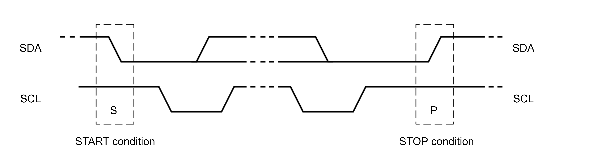

The I2C unit uses the ICR[START] and ICR[STOP] bits to:

- Initiate an additional byte transfer
- Initiate a Start condition on the I2C bus
- Enable data chaining (repeated Start)
- Initiate a Stop condition on the I2C bus

The definitions of the START and STOP bits in the ICR are tabled below.

<table>
<tbody>
<tr>
<td><strong>STOP Bit</strong></td>
<td><strong>START Bit</strong></td>
<td><strong>Condition </strong></td>
<td><strong>Notes </strong></td>
</tr>
<tr>
<td>0</td>
<td>0</td>
<td>No Start or Stop</td>
<td>- Used for continuous data transfer without sending a Start or Stop condition.</td>
</tr>
<tr>
<td>0</td>
<td>1</td>
<td>Start condition and repeated Start</td>
<td>Starting condition:<br/>- The I2C sends a Start condition and transmits the IDBR 8-bit contents. <br/>- IDBR must contain the 7-bit slave address and the R/nW bit before a Start is initiated.<br/>For a repeated start:<br/>- The IDBR contains the target slave address and the R/nW bit.<br/>- Allows the master to perform multiple transfers to different slaves without releasing the bus.<br/>- The interface stays in Master-Transmit mode for Writes and switches to Master-Receive mode for Reads.</td>
</tr>
<tr>
<td>1</td>
<td>X</td>
<td>Stop condition</td>
<td>In Master-Transmit mode: <br/>- the I2C transmits the IDBR 8-bit contents and sends a Stop condition on the I2C bus.<br/>In Master-Receive mode:<br/>- ICR[ACKNAK] must be set to define a Negative-Acknowledge (NAK) pulse. <br/>- The I2C transmits the NAK pulse, places the received data byte into the IDBR, and sends a Stop condition on the I2C bus.</td>
</tr>
</tbody>
</table>

The Start and Stop Conditions of I2C are depicted below.

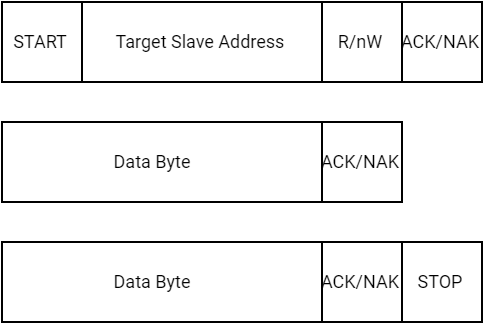

##### Start Condition

- **Control Bits:**

  - ICR[START] = 1
  - ICR[STOP] = 0

- **Purpose:**

  - Initiates a master transaction or a repeated Start.

- **Procedure:**

  - **Software Preparation**:
    - Load the target slave address and the R/nW bit into the IDBR.
  
  - **Transmission:**
    - Set ICR[TB] to transmit the Start condition and the IDBR contents on the I2C bus.
  
  - **Mode Transition:**
    - For Write requests: The I2C bus remains in Master-Transmit mode.
    - For Read requests: The I2C bus switches to Master-Receive mode.
  
  - **Repeated Start:**
    - Used to change the R/nW bit or the target slave address without releasing the bus.
    - The IDBR must contain the updated slave address and R/nW bit.

- **Arbitration Loss Handling**:

  - If the I2C loses arbitration while initiating a Start, it may re-attempt the Start when the bus is free.

- **Clearing:**

  - The Start condition is not cleared automatically by the I2C.

##### No Start or Stop Condition

- **Control Bits:**

  - ICR[START] = 0
  - ICR[STOP] = 0

- **Purpose:**

  - Used in Master-Transmit mode for continuous data transfer (multiple bytes).

- **Procedure:**

  - **Data Transfer:**
    - Software writes a data byte to the IDBR.
    - The I2C sets ISR[ITE] and clears ICR[TB].
  
  - **Next Byte:**
    - Software writes the next byte to the IDBR and sets ICR[TB] to initiate the next byte transmission.
  
  - **Continuation:**
    - This process repeats until software sets ICR[START] or ICR[STOP].
  
  - **Acknowledge Pulse:**
    - The I2C issues an ACK/NAK as defined by ICR[ACKNAK].
  
  - **Wait States:**
    - After each byte transfer (including the acknowledge pulse), the I2C holds the SCL line low to insert wait states until ICR[TB] is set.
    - This allows software to prepare the next byte for transmission.

- **Clearing:**

  - ICR[START] and ICR[STOP] are not cleared automatically after transmission.

##### Stop Condition

The Stop condition (ICR[START]=X, ICR[STOP]=1) terminates a data transfer. In Master-Transmit mode, ICR[STOP] and ICR[TB] must be set to initiate the last byte transfer. In Master-Receive mode, the I2C must set ICR[ACKNAK], ICR[STOP], and ICR[TB] to initiate the last transfer. Software must clear ICR[STOP] after the Stop condition is transmitted.

- **Control Bits:**

  - ICR[START] = X (don't care)
  - ICR[STOP] = 1

- **Purpose:**

  - Terminates a data transfer.

- **Procedure:**

  - **Master-Transmit Mode:**
    - Set ICR[STOP] and ICR[TB] to initiate the last byte transfer.
    - The I2C transmits the IDBR contents and sends a Stop condition.
  
  - **Master-Receive Mode:**
    - Set ICR[ACKNAK] to define a Negative-Acknowledge (NAK) pulse.
    - Set ICR[STOP] and ICR[TB] to initiate the last transfer.

- **Clearing:**

  - Software must clear ICR[STOP] after the Stop condition is transmitted.

#### Data Transfer Sequence

The I2C unit transfers data in 1-byte increments and always follows this sequence:

- Start
- 7-bit slave address
- R/nW bit
- Acknowledge pulse
- 8 bits of data
- Acknowledge pulse
- Repeat of steps 5 and 6 for the required number of bytes
- Repeated Start (repeat step 1) or Stop

#### Data & Addressing Management

The I2C Data Buffer register (IDBR) and the I2C Slave Address register (ISAR) are used for managing data transfer and slave addressing. Each register plays a specific role in handling I2C communication:

- IDBR: Stores 1 byte of data or a 7-bit slave address plus the Read/Not Write (R/nW) bit
- ISAR: Holds the programmable slave address for the I2C device

##### Data Handling Overview

- Receiving Data: The I2C controller places incoming data into the IDBR after receiving and acknowledging a full byte
- Transmitting Data: The CPU writes data to the IDBR, and the I2C controller sends it to the serial bus when ICR[TB] is set

##### Master or Slave Transmit Mode

- **Data Transmission:**
  
  - **Software Writes Data:**
    - Software writes data to the IDBR over the internal bus
    - This initiates a master transaction or sends the next data byte after ISR[ITE] is set
  
  - **I2C Transmits Data:**
    - The I2C transmits data from the IDBR when ICR[TB] is set
  
  - **Interrupts:**
    - If ICR[ITEIE] is set, an IDBR transmit-empty interrupt is signaled when a byte is transferred and the acknowledge cycle is complete
  
  - **Wait States:**
    - If the I2C is ready to transfer the next byte but the CPU has not written to the IDBR, the I2C inserts wait states until the CPU writes a new value to the IDBR and sets ICR[TB]

##### FIFO Mode

In FIFO mode, software writes control + data information to the TX FIFO instead of the IDBR.

##### Master or Slave Receive Mode

- **Data Reception:**

  - **Software Reads Data**: Software reads data from the IDBR over the internal bus after the IDBR receive-full interrupt is signaled (if ICR[DRFIE] is set)
  
  - **I2C Transfers Data:** The I2C transfers data from the Shift register to the IDBR after the acknowledge cycle completes
  
  - **Wait States: **The I2C inserts wait states until the IDBR is read by the CPU
  
  - **Next Byte Transfer:** After the CPU reads the IDBR, the I2C unit updates the ICR[ACKNAK] and ICR[TB] bits, allowing the next byte transfer to proceed

- **FIFO Mode:**

  - In FIFO mode, software reads from the RX FIFO instead of the IDBR

##### Addressing a Slave Device

Addressing a slave device is an important step in I2C communication.

A detailed explanation of how the **I2C master** addresses a slave device, different transaction types and the behavior of the I2C unit in different modes is provided in the following subsections.

###### Master Device Addressing a Slave

- **First Byte of Transaction (as depicted below)**:
  - The master composes and sends the **first byte** of the transaction
  - This byte consists of:
    - **7-bit slave address**: Identifies the target slave device
    - **R/nW bit**: Defines the transaction type (Read or Write)
  - The first byte can also be a **master code** indicating the start of a high-speed transaction
  - **Procedure**:
    - **Write to IDBR**: The master writes the **slave address** and **R/nW bit** to the** IDBR**
    - **Transmit First Byte**: The I2C transmits the first byte on the bus
    - **Acknowledge (ACK)**: The addressed slave responds with a **positive-acknowledge (ACK)** pulse

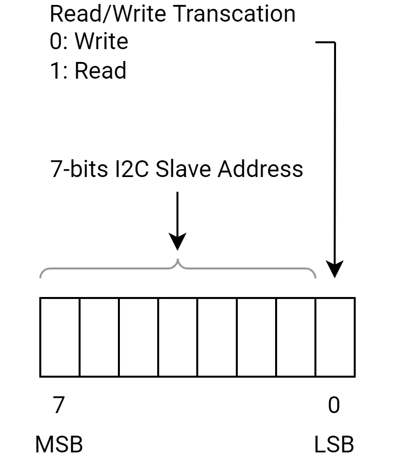

###### Transaction Types

- **When the transaction is a Write (R/nW = 0)**

  - The I2C remains in **Master-Transmit mode**
  - The slave remains in **Slave-Receive mode**
  - The master sends data to the slave

- **When the transaction is a Read (R/nW = 1)**

  - The I2C switches to **Master-Receive mode** after the ACK
  - The slave switches to **Slave-Transmit mode**
  - The master reads data from the slave

- If the slave responds with a **NAK**, the I2C:

  - Aborts the transaction
  - Automatically sends a **Stop condition**
  - Sets the **ISR[BED]** (Bus Error Detected) bit

###### Slave Device Behavior

- **Idle State**:

  - When the I2C is enabled and idle, it remains in **Slave-Receive mode**
  - It monitors the I2C bus for a **Start condition**

- **Start Condition Detection**:

  - When a Start condition is detected, the I2C:
    - Reads the **first 7 bits** (slave address) and compares them to the value in the **I2C Slave Address Register (ISAR)**
    - Reads the **8th bit** (R/nW bit)
    - Transmits an **ACK pulse** if the address matches

- **Mode Transition**:

  - If the address matches:
    - **R/nW = 0**: The I2C remains in **Slave-Receive mode**
    - **R/nW = 1**: The I2C switches to **Slave-Transmit mode**

#### I2C Acknowledge

Every I2C byte transfer must be accompanied by an acknowledge (ACK) pulse that the receiver (master or slave) generates. The transmitter must release the SDA line for the receiver to transmit the acknowledge pulse. The acknowledge pulse on the I2C bus is depicted below.

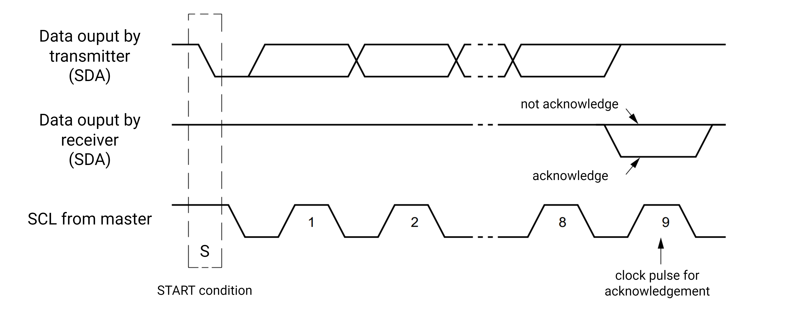

##### Master-Transmit Mode

- If the target slave receiver cannot generate the Acknowledge (ACK) pulse, the SDA line remains high, which indicates a Not-Acknowledge (NAK)
- The lack of ACK causes

  - The I2C sets ISR[BED]
  - The associated interrupt is generated (if enabled)
  - The I2C automatically generates a Stop condition and aborts the transaction

##### Master-Receive Mod

- The I2C sends a negative-acknowledge (NAK) pulse to signal the slave transmitter to stop sending data
- The ICR[ACKNAK] bit controls the ACK/NAK pulse value driven onto the I2C bus

**Procedure: **

- The master receives a byte from the slave
- The I2C automatically transmits the ACK pulse after receiving each byte from the serial bus, unless it is the last bytes
- Before receiving the last byte, software must set ICR[ACKNAK] to generate a NAK
- The NAK pulse is sent after the last byte has been sent, to signals the end of data reception (and to  stop sending data)

> **Note****. **As required by the I2C bus protocol, ISR[BED] is not set for a Master-Receive mode NAK

##### Slave mode

- The I2C automatically acknowledges its own slave address, regardless of the **ICR[ACKNAK]** setting
- In **Slave-Receive mode**,

  - After receiving a data byte, the slave sends an **ACK** automatically, regardless of the **ICR[ACKNAK]** setting
  - The I2C unit sends the **ACK **pulse after receiving the 8th data bit of the byte

- In **Slave-Transmit mode**,

  - If the master sends a **NAK**, it indicates the last byte is transferred
  - After sending a **NAK**, the master may issue either a Stop or repeated Start
  - The **ISR[UB]** remains set until a Stop or repeated Start is detected

#### Arbitration

I2C bus arbitration is required due to the multi-master capabilities of the I2C bus. Arbitration is used when 2 or more masters simultaneously generate a Start condition within the minimum I2C hold time of the Start condition.

##### Arbitration Process

- Arbitration can continue for an extended period if the **address field** and **R/nW bit** are the same.
- If the address, R/nW bit, or data differ, the master whose data does not match the **SDA line **(i.e., the master is driving a high state while SDA is low) loses arbitration.

##### Wired-AND Nature of I2C

- The I2C bus uses a **wired-AND** configuration, meaning:
  - If multiple masters output the same data, no data is lost.
  - If a master outputs a high state while the bus is low, it loses arbitration.

##### Behavior on Arbitration Loss

When a master loses arbitration:

- The I2C unit disables the SDA and SCL drivers for the remainder of the byte transfer.
- The arbitration loss detected bit ISR[ALD] is set.
- The I2C returns to idle (Slave-Receive) mode.

##### Handling Arbitration Loss in FIFO mode

Software must flush the FIFOs after arbitration loss. That can be done by clearing the Read and Write pointer registers for both the Transmit and Receive FIFOs.

- WFIFO_RPTR
- WFIFO_WPTR
- RFIFO_RPTR
- RFIFO_WPTR

##### SCL (Serial Clock Line) Arbitration

Each master on the I2C bus generates its own clock on the SCL line for data transfers. This means that different masters may have different clock frequencies.

Since data is valid during the high period of the clock, a defined clock synchronization procedure is necessary to ensure proper communication. This is achieved through bit-by-bit arbitration.

Clock Synchronization Mechanism (as depicted below)**:**

- Clock synchronization is achieved through the **wired-AND connection** of the I2C devices to the SCL line.
- **High to Low Transition**: When a master's clock transitions from **high to low**, it holds the SCL line for its own clock period.
- **Low to High Transition**:  A clock cannot switch from **low to high** until all masters complete their low periods.
- The master with the **longest** low period holds the SCL line low. Masters with shorter low periods enter a **high wait-state** until the master with the longest low period completes.
- Once the master with the longest low period completes, the **SCL line** transitions to high, and other masters with shorter periods can continue their data cycles.
  The master with the longest clock period controls the SCL line, ensuring synchronized data transfer.


##### SDA Arbitration

Arbitration on the **SDA (Serial Data Line)** can extend over a significant duration, as it begins with the transmission of the **address** and **R/nW bits** and continues through the **data bits**. Below is depicted the arbitration procedure for two masters, although more than two masters may participate if connected to the bus.


###### Address & R/nW Checking

- **Condition 1:**,If the **address** and **R/nW bit** transmitted by multiple masters are identical, arbitration proceeds to the **data bits**.

  - Due to the **wired-AND nature** of the I2C bus, no data is lost if multiple masters signal the same bus states.
- **Condition 2:** If the **address**, **R/nW bit**, or **data** differ, the master that transmits the first **high data bit** loses arbitration.

  - If the I2C loses arbitration:
    - Stop sending by shutting off its **SDA** and **SCL drivers** for the remainder of the byte transfer.
    - Sets the **ISR[ALD]** (Arbitration Loss Detected) bit.
    - Returns to **Slave-Receive mode**.

###### Arbitration Loss Case 1: Re-send

- If arbitration is lost during the transfer of **address bits** and the I2C unit is not addressed, it re-sends the address when the bus becomes free.
- This is possible because the **IDBR** (I2C Data Buffer Register) and **ICR** (I2C Control Register) are not overwritten during arbitration loss.

###### Arbitration Loss Case 2: Addressed as a Slave

If the I2C loses arbitration because another bus master addresses the I2C unit as a **slave device**, the I2C

- Switches to Slave-Receive mode
- Overwrites the original data in register IDBR.

Software must clear the Start and re-initiate the master transaction.

> **Note.** Software must ensure that the I2C unit does not write to its own slave address, as this cause the I2C bus to enter an **indeterminate **state.

###### Boundary conditions

**Boundary conditions** exist for arbitration when an arbitration process is in progress and a repeated Start or Stop condition is transmitted on the I2C bus.

To prevent errors, the I2C unit, acting as a master, no arbitration occurs in these cases:

- Between a **repeated Start condition** and a **data bit**
- Between a **data bit** and a **Stop condition**
- Between a **repeated Start condition** and a **Stop condition**

These situations arise only when different masters write the **same data to the same target slave** simultaneously and arbitration is not resolved after the first data-byte transfer.

> **Note.** The software must ensure that arbitration is resolved promptly. For example:
>
> - The software can ensure that masters send unique data by requiring each master to transmit its **I2C address** as the first data byte of any transaction.
> - When arbitration is resolved, the winning master sends a **restart** and begins a valid data transfer.
> - The slave discards the master's address and processes the remaining data.

#### High Speed Mode

##### Introduction

The I2C unit supports the HS-mode of operation with

- The slave data transfer rates up to 3.4 Mbps
- The master data transfer rates up to 3.3 Mbps

HS-mode devices maintain backward compatibility with Fast and Standard mode (F/S-mode) devices.

When operating in HS-mode, the bus protocol and data format remain the same as in F/S mode, except for the following:

- **No Clock synchronization and arbitration** are performed in HS-mode. These processes are completed before HS-mode is entered.

HS-mode is entered when a master running in F/S-mode sends a master code and wins arbitration. At this point,

- The master switches to HS-mode and generates I2C transactions.

HS-mode ends when a **Stop condition** is generated by the master.

The master codes are a set of reserved slave addresses that are used to indicate the start of a HS-mode transfer. The master codes always win arbitration against other slave addresses. In the case of a multi-master, HS-mode system,

- Each master is assigned a unique master code. This ensures that the clock synchronization and bus arbitration finishes in F/S-mode.
- There are 8 possible master codes of the form: 8’b0000_1xxx (where x is either 0 or 1). Thus, a maximum of 8 masters are allowed in a multi-master HS-mode system.

##### Data Transfer in HS-mode

HS-mode is entered when a master running in F/S-mode sends and detects the following:

- send Start condition
- send Master Code (0x0000_1xxx)
- Detect not-acknowledge bit (A)

During this sequence, clock sync and arbitration have completed in Fast-mode and only one winning master remains. The master then switches to HS-mode and begins a bus transaction by issuing a repeated Start condition. Additional high speed data transfers can be linked by separating them with repeated start conditions. HS-mode ends when a Stop condition is sent. This sequence is depicted below.

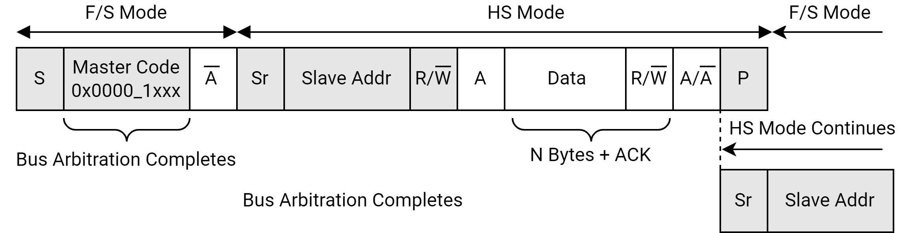

To use the I2C unit in HS-mode as either a master or a slave, set the **ICR[MODE]** bits as follows:

- When MODE = 2'b10, all non-high speed transmits occur in Standard-mode.
- When MODE = 0b11, all non-high speed transmits occur in Fast-mode.

##### HS-mode Data Rate

According to I2C Bus Specification, the maximum data rate supported in HS-mode is dependent on the capacitive load of each bus line.

**Capacitive Load**:

- **\<100 pF**: Max data rate speed (**3.4 Mbps** slave / **3.3 Mbps** master).
- **400 pF**: Data rate speed halves (**1.7 Mbps** slave / **1.65 Mbps** master).

> **Note.** For capacitive loads between 100 pF and 400 pF, the maximum data rate is **linearly interpolated**. Capacitive loads must not exceed **400 pF**.

#### Master Operations

When software initiates a Read or Write on the I2C bus, the I2C unit switches from the default Slave-Receive mode to Master-Transmit mode. The 7-bit slave address and the R/nW bit follow the Start pulsen.

After the master receives an ACK, the I2C enters 1 of 2 Master modes:

- Master-transmit - I2C writes data
- Master-receive - I2C reads data

When transmitting the master code, the master should receive a NAK and then enter HS-mode. The 7-bit slave address and the R/nW bit follow a repeated Start condition. The master receives an ACK and the I2C unit enters 1 of 2 Master modes listed above.

The CPU writes to the ICR register to initiate a master transaction. Data is read and written from the I2C unit through the memory-mapped registers. The I2C unit responsibilities as a master device are tabled below.

<table>
<tbody>
<tr>
<td><strong>I2C Master Action </strong></td>
<td><strong>Mode of Operation</strong></td>
<td><strong>Definition </strong></td>
</tr>
<tr>
<td>Generate clock output</td>
<td>Master-transmit Master-receive</td>
<td>- The master drives the SCL line.<br/>- ICR[SCLE] and ICR[IUE] must be set.</td>
</tr>
<tr>
<td>Write target slave address to IDBR</td>
<td>Master-transmit Master-receive</td>
<td>- The CPU writes to IDBR bits [7:1] before enabling a Start condition.<br/>- The first 7 bits are sent on the I2C bus after the Start. <br/>See <strong>Section 1</strong><strong>8</strong><strong>.1.3.</strong><strong>7</strong>, Start and Stop Bus States.</td>
</tr>
<tr>
<td>Write R/nW bit to IDBR</td>
<td>Master-transmit Master-receive</td>
<td>- CPU writes to least significant IDBR bit with R/nW control bit<br/>- If the R/nW bit is low, the master remains a Master-Transmitter. If high, the master switches to a master receiver.<br/>See <strong>Section 1</strong><strong>8.1.3.9</strong>, Data and Addressing Management.</td>
</tr>
<tr>
<td>Signal Start condition</td>
<td>Master-transmit Master-receive</td>
<td>See Generate clock output action in this table.<br/>After the target slave address and R/nW bit are in the IDBR,<br/>- Software sets ICR[START].<br/>- Software sets ICR[TB] to initiate the Start condition. <br/>See <strong>Section 18.1.3.7</strong>, Start and Stop Bus States.</td>
</tr>
<tr>
<td>Initiate first data byte transfer</td>
<td>Master-transmit Master-receive</td>
<td>- The CPU writes a data byte to the IDBR<br/>- The I2C transmits the byte when ICR[TB] is set.<br/>- The I2C clears ICR[TB] and sets ISR[ITE] when the transfer is complete.</td>
</tr>
<tr>
<td>Arbitrate for I2C bus</td>
<td>Master-transmit Master-receive</td>
<td>If 2 or more masters signal a Start within the same clock period, arbitration must occur.<br/>- The I2C arbitrates for as long as needed. Arbitration takes place during slave address and R/nW bit or data transmission and continues until all but one master loses the bus. No data is lost.<br/>- If the I2C loses arbitration, it sets ISR[ALD] after the byte transfer is completed and switches to Slave-Receive mode.<br/>- If the I2C loses arbitration as it attempts to send the target address byte, it attempts to resend the byte when the bus becomes free.<br/>Software must ensure that the boundary conditions described in <strong>Section 1</strong><strong>8</strong><strong>.1.3.</strong><strong>11.6.4</strong>, Operation do not occur.</td>
</tr>
<tr>
<td>Write one data byte to the IDBR</td>
<td>Master-transmit only</td>
<td>- Occurs when ISR[ITE] is set and ICR[TB] is clear. If the IDBR transmit-empty interrupt is enabled, the interrupt is generated.<br/>- The CPU writes 1 data byte to the IDBR, sets the appropriate START/STOP bit combination, and sets ICR[TB] to send the data. Eight bits are taken from the Shift register and written to the serial bus. The eight bits are followed by a Stop, if requested by ICR[STOP] being set.</td>
</tr>
<tr>
<td>Wait for Acknowledge from slave receiver<br/></td>
<td>Master-transmit only<br/></td>
<td>As a master transmitter, the JINDIE I2C generates the clock for the acknowledge pulse. The JINDIE I2C releases the SDA line to allow Slave-Receiver acknowledge transmission.<br/>See <strong>Section 1</strong><strong>8</strong><strong>.1.3.</strong><strong>10, </strong>I2C Acknowledge.</td>
</tr>
<tr>
<td>Read one byte of I2C data from the IDBR</td>
<td>Master-receive only</td>
<td>Eight bits are read from the serial bus, collected in the Shift register, then transferred to the IDBR after the ICR[ACKNAK] bit is read.<br/>- The CPU reads the IDBR when ISR[IRF] is set and ICR[TB] is clear. If the IDBR receive-full interrupt is enabled, it is signalled to the CPU.<br/>- When the IDBR is read, if ISR[ACKNAK] is clear (indicating ACK), the software must clear the ICR[ACKNAK] bit and set ICR[TB] to initiate the next byte Read.<br/>- If ISR[ACKNAK] is set (indicating NAK), ICR[TB] is clear, ICR[STOP] is set, and ISR[UB] is set, then the last data byte has been read into the IDBR, and the I2C is sending the Stop.<br/>- If ISR[ACKNAK] is set (indicating NAK) and ICR[TB] is clear, but ICR[STOP] is clear, then the software has 2 options:<br/>	1. Set ICR[START], write a new target address to the IDBR, and set ICR[TB], which sends a repeated Start.<br/>	2. Set ICR[MA] and leave ICR[TB] clear, which sends a Stop only.</td>
</tr>
<tr>
<td>Transmit acknowledge to slave transmitter</td>
<td>Master-receive only</td>
<td>- As a master receiver, the JINDIE I2C generates the clock for the acknowledge pulse and drives the SDA line during the acknowledge cycle.<br/>- If the next data byte is to be the last transaction, the user software sets ICR[ACKNAK] for NAK generation.<br/>See <strong>Section 18.1.3.10, </strong>I2C Acknowledge.</td>
</tr>
<tr>
<td>Generate a repeated Start to chain I2C transactions</td>
<td>Master-transmit Master-receive</td>
<td>Data chaining takes place by using a repeated Start condition instead of a Stop condition.<br/>- The repeated Start is generated after the last data byte of a transaction has been transmitted on the I2C bus, as described in <strong>Section 1</strong><strong>8.1.3.8</strong>, Data Transfer Sequence.<br/>- The software must write the next target slave address and the R/nW bit to the IDBR, sets ICR[START], and sets ICR[TB].<br/>See <strong>Section 18.1.3.7,</strong> Start and Stop Bus States.</td>
</tr>
<tr>
<td>Generate a Stop</td>
<td>Master-transmit Master-receive</td>
<td>- A Stop is generated after the last data byte of a transaction has been transmitted on the I2C bus, as described in <strong>Section 18.1.3.8</strong>, Data Transfer Sequence.<br/>- ICR[STOP] must be set in order to generate the Stop condition.<br/>See <strong>Section 18.1.3.7,</strong> Start and Stop Bus States.</td>
</tr>
</tbody>
</table>

#### FIFO mode

FIFO mode is an extension to the I2C module. The main features of FIFO mode are:

- FIFOs are added on both transmit and receive sides.

This helps reducing the number of IDBR empty/full interrupts. Instead of the core writing or reading to/from the IDBR 1 byte at a time, the FIFOs allow reading and writing multiple bytes without interrupting the core after each Byte.

- DMA mode is added.

DMA mode allows improvement in long I2C transactions (typically more than 8 bytes) where complete transaction can be programmed in DMA and allows reducing number of FIFO interrupts.

> **Note.** FIFO mode is completely backward compatible. It is allowed to disable FIFO mode and work in I2C legacy mode by writing ICR[FIFO_EN] = 0.

##### Transmit FIFO (Tx FIFO)

- **Structure:**

  - Width: 12 bits (4-bit control word + 8-bit data)
  - Number of entries: 8
  - Each entry consists of a data byte concatenated with a 4-bit control word

- **Control Word:**

  - The control word corresponds to the **ICR[3:0]** bits, which required for each transmitted data byte.

- **Data Transmission Process:**

  - After a byte is transferred, the next byte is copied from the Tx FIFO into the shift register.
  - Simultaneously, the associated control word is copied into the **ICR** register.
  - This process continues until the **STOP** bit is set, signaling the end of transmission.

##### Receive FIFO (Rx FIFO)

- **Structure:**

  - Width: 8 bits (only data)
  - Number of entries: 16
  - Each entry stores one received byte

- **Data Handling Process:**

  - When the Rx FIFO is **half full**, it triggers either an **interrupt** or a **DMA request**.
  - At this point, the stored data must be read from the FIFO.
  - Any additional incoming data is stored in the remaining free entries until the FIFO is full.

##### FIFO Mode Support

In order to support the FIFO mode and fully utilize its capabilities, the following status and control bits were added:

- **ICR[FIFO_EN]:** enables FIFO mode.
- **ICR[TXBEGIN]:** starts a transaction.
- New status bits in ISR have been added for FIFO mode interrupts and also a bit to flag Transaction done. ICR has the enable bits for all these interrupts.
- TXDONE interrupt generated at the end of each transaction (when STOP bit is send).
- **ICR[DMA_EN]:** Enables or disables **DMA mode** and switches between **DMA** and **PIO mode**

In **DMA mode**, all the FIFO related interrupts have to be disabled in ICR and ICR[DMA_EN] bit has to be set. And only DMA requests are sent to the DMA and not any interrupts to the core.

Similarly in **PIO mode**, interrupts have to enabled and ICR[DMA_EN] bit cleared. So only interrupts to the core are generated when the Transmit FIFO is full or when the Receive FIFO is half full, full or overrun. ICR[TXDONE_IE] is for enabling Transaction Done Interrupt and needs to be set in both PIO and DMA modes. The core needs to get an interrupt after each transaction is done.

**Note**: This FIFO mode should only be used when the I2C is in Master mode. This FIFO mode is not for Slave mode.

#### I2C Serial Clock Programming Guidelines

Before each of the I2C modules has been initialized, set the clock:

1. Open and select the I2C clock by setting the Clock/Reset Control Register for I2C.
2. Set the I2C Load Count Register (ILCR) to the desired frequency.

#### Master Mode Programming Examples

##### Initialize Unit

1. Set the slave address in the ISAR
2. Enable the preferred interrupts in the ICR. Do not enable the arbitration-loss-detected interrupt
3. Set ICR[MODE] to the desired bus rate. For HS-mode bus rate, the master-code must be transmitted before HS-mode bus timing is enabled. Software should always set the HS mode bit (ICR[16]) as that bit makes the I2C HS capable. This bit does not affect the non-HS transfers
4. Set the ICR[IUE] and ICR[SCLE] bits to enable the I2C and SCL

##### Write 1 Byte as a Master

1. Load target slave address and R/nW bit in the IDBR. R/nW must be 0 for a Write
2. Initiate the Write
3. Set ICR[START], clear ICR[STOP], clear ICR[ALDIE], set ICR[TB]
4. When an IDBR transmit-empty interrupt occurs
5. Read ISR register: ISR[ITE] = 1, ISR[UB] = 1, ISR[RWM] = 0
6. Write a 1 to the ISR[ITE] bit to clear interrupt
7. Write a 1 to the ISR[ALD] bit if set
8. If the master loses arbitration, it performs an address retry when the bus becomes free. The arbitration-loss-detected interrupt is disabled to allow the address retry.
9. Load data byte to be transferred in the IDBR
10. Initiate the Write
11. Clear ICR[START], set ICR[STOP], set ICR[ALDIE], set ICR[TB]
12. When an IDBR transmit-empty interrupt occurs (unit is sending Stop). Read ISR register: ISR[ITE] = 1, ISR[UB] = x, ISR[RWM] = 0
13. Write a 1 to the ISR[ITE] bit to clear the interrupt
14. Clear ICR[STOP] bit

##### Read 1 Byte as a Master

1. Load target slave address and R/nW bit in the IDBR. R/nW must be 1 for a Read
2. Initiate the Write
3. Set ICR[START], clear ICR[STOP], clear ICR[ALDIE], set ICR[TB]
4. When an IDBR transmit-empty interrupt occurs
5. Read ISR register: ISR[ITE] = 1, ISR[UB] = 1, ISR[RWM] = 1
6. Write a 1 to the ISR[ITE] bit to clear the interrupt
7. Initiate the Read
8. Clear ICR[START], set ICR[STOP], set ICR[ALDIE], set ICR[ACKNAK], set ICR[TB]
9. When an IDBR receive-full interrupt occurs (unit is sending Stop)
10. Read ISR register: IDBR receive full (1), ISR[UB] = x, ISR[RWM] = 1, ACK/NAK bit (1)
11. Write a 1 to the ISR[IRF] bit to clear the interrupt
12. Read IDBR data
13. Clear ICR[STOP] and ICR[ACKNAK] bits

##### Write 2 Bytes and Repeated Start Read 1 Byte as a Master

1. Load target slave address and R/nW bit in the IDBR. R/nW must be 0 for a Write
2. Initiate the Write
3. Set ICR[START], clear ICR[STOP], clear ICR[ALDIE], set ICR[TB]
4. When an IDBR transmit-empty interrupt occurs
5. Read ISR register: ISR[ITE] = 1, ISR[UB] = 1, ISR[RWM] = 0
6. Write a 1 to the ISR[ITE] bit to clear interrupt
7. Load data byte to be transferred in the IDBR
8. Initiate the Write
9. Clear ICR[START], clear ICR[STOP], set ICR[ALDIE], set ICR[TB]
10. When an IDBR transmit-empty interrupt occurs
11. Read ISR register: ISR[ITE] = 1, ISR[UB] = 1, ISR[RWM] = 0
12. Write a 1 to the ISR[ITE] bit to clear interrupt
13. Repeat step 5 to 8 one time
14. Load target slave address and R/nW bit in the IDBR. R/nW must be 1 for a Read
15. Send repeated Start as a master
16. Set ICR[START], clear ICR[STOP], clear ICR[ALDIE], set ICR[TB]
17. When an IDBR transmit-empty interrupt occurs
18. Read ISR register: ISR[ITE] = 1, ISR[UB] = 1, ISR[RWM] = 1
19. Write a 1 to the ISR[ITE] bit to clear interrupt
20. Initiate the Read
21. Clear ICR[START], set ICR[STOP], set ICR[ALDIE], set ICR[ACKNAK], set ICR[TB]
22. When an IDBR receive-full interrupt occurs (unit is sending Stop
23. Read ISR register: ISR[IRF] = 1, ISR[UB] = x, ISR[RWM] = 1, ISR[ACKNAK] = 1
24. Write a 1 to the ISR[IRF] bit to clear the interrupt
25. Read IDBR data
26. Clear ICR[STOP] and ICR[ACKNAK] bits

##### Read 2 Bytes as a Master - Send Stop Using the Abor

1. Load target slave address and R/nW bit in the IDBR. R/nW must be 1 for a Read
2. Initiate the Write
3. Set ICR[START], clear ICR[STOP], clear ICR[ALDIE], set ICR[TB]
4. When an IDBR transmit-empty interrupt occurs
5. Read ISR register: ISR[ITE] = 1, ISR[UB] = 1, ISR[RWM] = 1
6. Write a 1 to the ISR[ITE] bit to clear interrupt
7. Initiate the Read
8. Clear ICR[START], clear ICR[STOP], set ICR[ALDIE], clear ICR[ACKNAK], set ICR[TB]
9. When an IDBR receive-full interrupt occurs
10. Read ISR register: ISR[IRF] = 1, ISR[UB] = 1, ISR[RWM] = 1, ACK/NAK bit (0)
11. Write a 1 to the ISR[IRF] bit to clear the interrupt
12. Read IDBR data
13. Clear ICR[STOP] and ICR[ACKNAK] bits
14. Initiate the Read
15. Clear ICR[START], clear ICR[STOP], set ICR[ALDIE], set ICR[ACKNAK], set ICR[TB]
16. ICR[STOP] is not set because Stop or repeated Start is determined on the byte Read
17. When an IDBR receive-full interrupt occurs
18. Read ISR register: ISR[IRF] = 1, ISR[UB] = 1, ISR[RWM] = 1, ISR[ACKNAK] = 1
19. Write a 1 to the ISR[IRF] bit to clear the interrupt
20. Read IDBR data
21. Initiate Stop abort condition (Stop with no data transfer). Set ICR[MA]

##### High-speed Mode: Write 1 Byte as a Master

1. Load master code in the IDBR
2. Enable interrupts. Set ICR[ITEIE]
3. Enable high speed mode
4. Set ICR[MODE] = 0b10 or 0b11
5. Initiate the Write
6. Set ICR[MODE], set ICR[START], clear ICR[STOP], set ICR[TB]
7. When an IDBR transmit-empty interrupt occurs
8. Read ISR: IDBR transmit empty (1), unit busy (1), ACKNAK (1)
9. Write a 1 to the ISR[ITE] bit to clear interrupt
10. Send a repeated start and slave address
11. Load the slave address and the R/W bit in the IDBR
12. Initiate the Write
13. Set ICR[START], clear ICR[STOP], set ICR[TB]
14. Wait for the IDBR transmit empty interrupt
15. Write a 1 to the ISR[ITE] bit to clear interrupt
16. Load data byte to be transferred in the IDBR
17. Initiate the Write
18. Clear ICR[START], set ICR[STOP], set ICR[TB]
19. When an IDBR transmit-empty interrupt occurs (unit is sending Stop). Read ISR: IDBR transmit empty (1), unit busy (x), R/nW bit (0)
20. Write a 1 to the ISR[ITE] bit to clear the interrupt

##### High-speed Mode: Read 1 Byte as a Master

1. Load master code in the IDBR
2. Enable interrupts. Set ICR[ITEIE]
3. Initiate the Write
4. Set ICR[MODE], set ICR[START], clear ICR[STOP], set ICR[TB]
5. When an IDBR transmit-empty interrupt occurs
6. Read ISR: IDBR transmit empty (1), unit busy (1), ACKNAK (1)
7. Write a 1 to the ISR[ITE] bit to clear interrupt
8. Send a repeated start and slave address
9. Load the slave address and the R/W bit (1) in the IDBR
10. Initiate the Write
11. Set ICR[START], clear ICR[STOP], set ICR[TB]
12. Wait for the IDBR transmit empty interrupt
13. Write a 1 to the ISR[ITE] bit to clear interrupt
14. Initiate the Read
15. Clear ICR[START], set ICR[STOP], set ICR[ACKNAK], set ICR[TB]
16. When an IDBR receive-full interrupt occurs (unit is sending Stop)
17. Read ISR: IDBR receive full (1), unit busy (x), R/nW bit (1), ACKNAK (1)
18. Write a 1 to the ISR[IRF] bit to clear the interrupt
19. Read IDBR data
20. Clear ICR[STOP] and ICR[ACKNAK] bits

##### FIFO mode: Write/Read n Bytes as a Master in PIO mode

1. Program I2C slave address
2. Write ICR[FIFOEN] to enable FIFO mode and enable the FIFO interrupts. An interrupt is generated here if the TX FIFO Empty interrupt is enabled.
3. Fill up the TX FIFO with control + data in proper format as depicted below
4. Write a 1 to the ISR[TXE] bit to clear the TX FIFO empty interrupt
5. While the data transfer is happening, wait for the TX FIFO empty interrupt
6. When TX FIFO empty interrupt is seen, refill the FIFO with more control+data and then write 1 to the ISR[TXE] bit to clear the TX FIFO empty interrupt.
7. Wait for TX DONE or TX empty again (depending on the transaction)
8. If TX DONE interrupt is received, program ICR for the next transaction and once the FIFO has the control+data, set the ICR[TXBEGIN] bit. This bit starts the next transaction.
9. If the RX FIFO becomes half full during this sequence, RX FIFO Half Full Interrupt is generated (If enabled)
10. Read the RX FIFO data and then write 1 to the ISR[RXF] bit to clear the RX FIFO Half Full interrupt

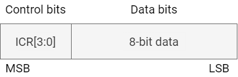

##### FIFO mode: Write/Read n Bytes as a Master in DMA mode

1. Program DMA descriptors and put control + data in memory in the proper format as depicted above
2. Program I2C slave address
3. Write 1 to the ICR[FIFOEN] bit to enable FIFO mode and the ICR[DMAEN] bit to enable DMA mode (disable TX FIFO empty & RX full interrupts, but enable Transmit Done interrupt)
4. TX FIFO empty DMA request is generated immediately since the TX FIFO is empty when I2C comes out of reset
5. DMA services the request and fills up the TX FIFO with control+data
6. The I2C starts the transaction on the bus and when the TX FIFO becomes empty, a TX FIFO empty DMA request is generated
7. Repeat #5 and #6 until a TX DONE interrupt is received
8. When TX DONE is received (this means a STOP occurred), CPU must write to ISR and ICR registers to reconfigure them for the next transaction and also set the ICR[TXBEGIN] bit for the next transaction to start.
9. Transaction continues and when TX FIFO is empty, the TX FIFO empty DMA request is generated once again
10. If the RX FIFO ever becomes half full during this sequence it sends a RX FIFO Half Full DMA request to the DMA
11. DMA reads the RX FIFO contents
12. After receiving a TXDONE interrupt, if there are any trailing bytes (Only for Read Transactions) it is up to the software to handle them. The hardware does not handle trailing bytes.
13. Each entry in the Tx FIFO has the format as shown in Figure-9 - . The LSB 8 bits are for data and the MSB 4 bits are for control bits. For a Write transaction, data consists of the Slave address followed by actual Write data.The control bits are nothing but ICR[3:0] bits.
14. For a Read transaction,  Data consists of the Slave address followed by dummy data (actual Read data from the slave goes into the Rx FIFO). Again, the control bits are ICR[3:0] bits.

##### FIFO Programming Examples

Transmit and Receive FIFOs are depicted below.


Each control word (CTRL) is 4 bit length:

- [TB]
- [ACKNACK]
- [STOP]
- [START]

Each entry in the Tx FIFO has a control word concatenated with Address/Data byte. The control word has control information to send/receive that particular byte. Note that Transmit FIFO has 8 entries and RX FIFO has 16 entries. Interrupt/DMA requests are made when the Tx FIFO is empty or when Rx FIFO is half full.

###### Programming model for Case 1

1. Core initially programs the ICR for FIFO mode. It then receives a Tx FIFO empty interrupt if in PIO mode or a DMA request if in DMA mode.
2. The core/DMA then writes 1 address byte + 7 data bytes (Byte1-Byte7) to the Tx FIFO (with each byte having a corresponding control word).
3. I2C starts sending out the bytes and when the Tx FIFO is empty, it generates a Tx FIFO empty interrupt/DMA request.
4. The core/DMA then writes the last 3 bytes (Byte8-Byte10) to the Tx FIFO.
5. I2C sends out the last 3 bytes, and when it sees that STOP has been sent out, it sets the ISR[TX_DONE] bit and generates an interrupt.
6. The core then cleans up the control and status registers (example: Clear ICR[STOP] bit, clear ISR[TX_DONE] bit) and starts the next transaction (set ICR[TX_BEGIN] bit).


###### Programming Model for Case 2

1. Core initially programs the ICR for FIFO mode. It then receives a Tx FIFO empty interrupt if in PIO mode or a DMA request if in DMA mode.
2. The core/DMA then writes 1 Addr + 7 Data Bytes to the TX FIFO (control word + dummy data since it is a Read transaction).
3. After the address is sent out on the bus, for each control word, a Read byte is received and saved off in the Rx FIFO. Once the Tx FIFO is empty (mote that there are 7 bytes in the Rx FIFO by now), an interrupt/DMA request is made and the remaining bytes (1 data byte from Read transaction and 3 bytes from the next Write transaction) are loaded into the Tx FIFO.
4. After the 8 byte is received into the Rx FIFO, the Rx FIFO Half full interrupt/DMA request is set. This Read data now needs to be read out of the FIFO.
5. By now, the Read transaction is also done. But since there is NO stop bit after the Read and instead Repeated Start is used for the Write Transaction, the ISR[TX_DONE]  status bit is NOT set as it would have normally been set at the end of a transaction.
6. I2C now starts the Write transaction by sending out the Address followed by the 2 Write bytes.
7. Once the Write transaction is done, ICR[TX_BEGIN] is automatically cleared and ISR[TX_DONE] bit is set, which generates an interrupt to the core.


#### Slave Operations

How I2C unit operates as a slave device is tabled below.

<table>
<tbody>
<tr>
<td><strong>I2C Slave Action </strong></td>
<td><strong>Mode of Operation</strong></td>
<td><strong>Definition </strong></td>
</tr>
<tr>
<td>Slave-receive (default mode)</td>
<td>Slave-receive only</td>
<td>- The I2C monitors all slave address transactions.<br/>- ICR[IUE] must be set.<br/>- The I2C monitors bus for Start conditions. When a Start is detected, the interface reads the first 8 bits and compares the most significant 7 bits with the 7-bit ISAR. If there is a match, the I2C sends an ACK.<br/>- If the eighth bit of the first byte (R/nW bit) is low, the I2C stays in Slave-Receive mode, and ISR[SAD] is cleared. If R/nW bit is high, the I2C unit switches to Slave-Transmit mode, and ISR[SAD] is set.</td>
</tr>
<tr>
<td>Set the slave address - detected bit</td>
<td>Slave-receive Slave-transmit<br/></td>
<td>- Indicates the interface has detected an I2C operation that addresses current I2C. <br/>- An interrupt is generated, if enabled, after the matching slave address is received and acknowledged.</td>
</tr>
<tr>
<td>Read one byte of I2C data from the IDBR</td>
<td>Slave-receive only</td>
<td>- This operation occurs when ISR[IRF] is set and ICR[TB] is clear. If enabled, the IDBR receive-full interrupt is generated.<br/>- Eight bits are read from the serial bus into the shift register. When a full byte has been received and the ACK/NAK bit is completed, the byte is transferred from the Shift register to the IDBR.<br/>- Occurs when the IDBR receive full bit in the ISR is set and the transfer byte bit is clear. If enabled, the IDBR receive-full interrupt is signalled to the CPU.<br/>- Software reads one data byte from the IDBR. When the IDBR is read, the software must write the preferred ICR[ACKNAK] bit and sets ICR[TB]. This causes the I2C to stop inserting wait states and let the master transmitter transmit the next chunk of information.</td>
</tr>
<tr>
<td>Transmit Acknowledge to master transmitter</td>
<td>Slave-receive only</td>
<td>- As a slave receiver, the I2C pulls the SDA line low to generate the ACK pulse during the high SCL period.<br/>- ICR[ACKNAK] controls the acknowledge pulse that the I2C drives. See <strong>Section 18.1.3.10,</strong> I2C Acknowledge.</td>
</tr>
<tr>
<td>Write one byte of I2C data to the IDBR</td>
<td>Slave-transmit only</td>
<td>- This operation occurs when ISR[ITE] is set and ICR[TB] is clear. If enabled, the IDBR transmit-empty interrupt is generated.<br/>- The software must write a data byte to IDBR and sets ICR[TB] to start the transfer.</td>
</tr>
<tr>
<td>Wait for Acknowledge from master receiver</td>
<td>Slave-transmit only</td>
<td>- As a slave transmitter, the I2C releases the SDA line to allow the master receiver to pull the line low for the ACK. See <strong>Section 18.1.3.10,</strong> I2C Acknowledge.</td>
</tr>
</tbody>
</table>

#### Mode Programming Examples

##### Initialize Unit

1. Set the slave address in the ISAR
2. Enable preferred interrupts in the ICR
3. If the I2C unit is a HS-mode slave, set ICR[MODE] = 0b10 or 0b11. Software should always set the HS mode bit (ICR[16]) as that bit makes the I2C HS capable. This bit does not affect the non-HS transfers.
4. Set the ICR[IUE] bit to enable the I2C

##### Transmit n Bytes as a Slave

1. When a slave-address-detected interrupt occurs. Read ISR register: ISR[SAD] = 1, ISR[UB] = 1, ISR[RWM] = 1, ISR[ACKNAK] = 0
2. Write a 1 to the ISR[SAD] bit to clear the interrupt
3. Return from interrupt
4. Load data byte to transfer in the IDBR
5. Set ICR[TB] bit
6. When an IDBR transmit-empty interrupt occurs. Read ISR register: ISR[ITE] = 1, ISR[ACKNAK] = 0, ISR[RWM] = 0
7. Load data byte to transfer in the IDBR
8. Set the ICR[TB] bit
9. Write a 1 to the ISR[ITE] bit to clear interrupt
10. Return from interrupt
11. Repeat steps 6 to 10 for _n_-1 times. If, at any time, the slave does not have data, the I2C keeps SCL low until data is available
12. When a IDBR transmit-empty interrupt occurs
13. Read ISR register: ISR[ITE] = 1, ISR[ACKNAK] = 1, ISR[RWM] = 0
14. Write a 1 to the ISR[ITE] bit to clear interrupt
15. Return from interrupt
16. When a slave-Stop-detected interrupt occurs. Read ISR register: ISR[UB] = 0, ISR[SSD] = 1
17. Write a 1 to the ISR[SSD] bit to clear interrupt

##### Receive n Bytes as a Slave

1. When a slave-address-detected interrupt occurs. Read ISR register: ISR[SAD] = 1, ISR[UB] = 1, ISR[RWM] = 0
2. Write a 1 to the ISR[SAD] bit to clear the interrupt
3. Return from interrupt
4. Set ICR[TB] bit to initiate the transfer
5. When an IDBR receive-full interrupt occurs. Read ISR register: ISR[IRF] = 1, ISR[ACKNAK] = 0, ISR[RWM] = 0
6. Read IDBR to get the received byte
7. Write a 1 to the ISR[IRF] bit to clear interrupt
8. Return from interrupt
9. Repeat steps 5 to 8 for _n_-1 times. Once the IDBR is full, the I2C keeps SCL low until the data is read.
10. Set ICR[TB] bit to release I2C bus and allow next transfer
11. When a slave-stop-detected interrupt occurs. Read ISR register: ISR[UB] = 0, ISR[SSD] = 1. Write a 1 to the ISR[SSD] bit to clear interrupt

##### High-speed Mode: Transmit 1 Byte as a Slave

1. Enable slave address detect interrupts. Set ICR[SADIE]
2. Enable high speed mode
3. Set ICR[MODE] = 0b10 or 0b11
4. A master sends a master code at the standard-mode or fast-mode data rate. Then, a slave address is sent at the high speed mode data rate.
5. Wait for the slave address detect interrupt
6. Read the ISR: slave address detect (1), Unit Busy (1), R/nW bit (1), ACK/NAK (0)
7. Write a 1 to the ISR[SAD] bit to clear the interrupt
8. Load the IDBR with the data to be written (read by the master)
9. Set the ICR[TB] bit
10. When an IDBR transmit-empty interrupt occurs
11. Read ISR: IDBR transmit empty (1), unit busy (1), ACKNAK (1), R/nW bit (0)
12. Write a 1 to the ISR[ITE] bit to clear interrupt
13. Return from interrupt
14. Wait for a slave stop detect interrupt
15. Read ISR: slave stop detect (1), Unit Busy (0)
16. Write a 1 to the ISR[SSD] bit to clear interrupt

##### High-speed Mode: Receive 1 Byte as a Slave

1. Enable slave address detect interrupts. Set ICR[SADIE]
2. Enable high speed mode
3. Set ICR[MODE] = 0b10 or 0b11
4. A master sends a master code at the standard-mode or fast-mode data rate. Then a slave address is sent at the high speed mode data rate.
5. Wait for the slave address detect interrupt
6. Read the ISR: slave address detect (1), Unit Busy (1), R/nW bit (0), ACK/NAK (0)
7. Write a 1 to the ISR[SAD] bit to clear the interrupt
8. Set the ICR[TB] bit to initiate transfer
9. When an IDBR receive-full interrupt occurs
10. Read ISR: IDBR receive full (1), unit busy (1), ACKNAK (0), R/nW bit (0)
11. Read IDBR to get the received byte
12. Write a 1 to the ISR[IRF] bit to clear interrupt
13. Return from interrupt
14. Set ICR[TB] bit to release I2C bus and allow the next transfer
15. Wait for a slave stop detect interrupt
16. Read ISR: slave stop detect (1), Unit Busy (0)
17. Write a 1 to the ISR[SSD] bit to clear interrupt

#### Glitch Suppression Logi

The I2C unit has built-in glitch-suppression logic. The glitch suppression logic is implemented differently depending on whether the I2C unit is in **Fast/Standard (F/S) mode** or **High-speed (HS) mode**.

For **F/S mode**, the glitch suppression specification is **50ns**.

- Glitches are suppressed for a length of time given by the formula:

  - Suppression time = 4 \* (1 / I2C input clock frequency)
- For example, with a 31.5 MHz input clock frequency, glitches of 127 ns or shorter are suppressed.

For **HS** mode**, the glitch suppression specification is **10 ns**.

- Glitches are suppressed for a length of time given by the formula:

  - Suppression time = 1\* (1 / I2C input clock frequency)
- For example, with a 61.44 MHz internal input clock frequency, glitches of 16.3 ns or shorter are suppressed.

#### Reset Conditions

When performing a reset on the I2C unit, the following conditions must be met to ensure proper operation:

- **Bus and Unit Status Checks:**

  - Ensure the I2C unit is **not busy** by verifying ISR[UB] = 0 before asserting a reset.
  - After the reset, confirm that the **I2C bus is idle** by checking ISR[IBB] = 0 before enabling the unit.
- **Reset Behavior:**

  - When a reset is triggered, **all registers** return to their **default reset values** except for the **ISAR** register, which remains unchanged.
  - Setting the ICR[UR] bit initiates a reset while preserving the **I2C Memory-Mapped Registers (MMRs)**.

To reset the I2C unit using the **ICR** register, follow these steps:

- Set the reset bit in the ICR register and clear the remainder of the register
- Clear the ISR register
- Clear reset in the ICR

### Register Description

> **Note.** The base address of I2C registers are tabled below.

<table>
<tbody>
<tr>
<td><strong>Name</strong></td>
<td><strong>Address</strong></td>
</tr>
<tr>
<td>SHUB_I2C_BASE </td>
<td>0xC0887000</td>
</tr>
<tr>
<td>I2C0_BASE</td>
<td>0xD4010800</td>
</tr>
<tr>
<td>I2C1_BASE</td>
<td>0xD4011000</td>
</tr>
<tr>
<td>I2C2_BASE </td>
<td>0xD4012000</td>
</tr>
<tr>
<td>I2C3_BASE(SEC_I2C)</td>
<td>0xF0614000</td>
</tr>
<tr>
<td>I2C4_BASE </td>
<td>0xD4012800</td>
</tr>
<tr>
<td>I2C5_BASE </td>
<td>0xD4013800</td>
</tr>
<tr>
<td>I2C6_BASE </td>
<td>0xD4018800</td>
</tr>
<tr>
<td>I2C7_BASE </td>
<td>0xD401d000</td>
</tr>
<tr>
<td>I2C8_BASE (PWR_I2C)</td>
<td>0xD401d800</td>
</tr>
</tbody>
</table>

#### ICR REGISTER

The bits in the I2C Control register (ICR) are used to control the I2C unit. These are read/write registers. Ignore reads from reserved bits.

<table>
<tbody>
<tr>
<td rowspan=1 colspan=5><strong>Offset: 0x0</strong></td>
</tr>
<tr>
<td><strong>Bits</strong></td>
<td><strong>Field</strong></td>
<td><strong>Type</strong></td>
<td><strong>Reset</strong></td>
<td><strong>Description</strong></td>
</tr>
<tr>
<td>31</td>
<td>RXOV_IE</td>
<td>R/W<br/></td>
<td>0x0</td>
<td>Receive FIFO overrun Interrupt Enable.<br/>0: Receive FIFO overrun (ISR[RXOV]) interrupt is not enabled;<br/>1: Receive FIFO overrun (ISR[RXOV]) interrupt is enabled.</td>
</tr>
<tr>
<td>30</td>
<td>RXF_IE</td>
<td>R/W</td>
<td>0x0</td>
<td>Receive FIFO full Interrupt Enable.<br/>0: Receive FIFO full (ISR[RXF]) interrupt is not enabled;<br/>1: Receive FIFO full (ISR[RXF]) interrupt is enabled.</td>
</tr>
<tr>
<td>29</td>
<td>RXHF_IE</td>
<td>R/W</td>
<td>0x0</td>
<td>Receive FIFO half full Interrupt Enable.<br/>0: Receive FIFO half full (ISR[RXHF]) interrupt is not enabled;<br/>1: Receive FIFO half full (ISR[RXHF]) interrupt is enabled.</td>
</tr>
<tr>
<td>28</td>
<td>TXE_IE</td>
<td>R/W</td>
<td>0x0</td>
<td>Transmit FIFO empty Interrupt Enable.<br/>0: Transmit FIFO empty (ISR[TXE]) interrupt is not enabled;<br/>1: Transmit FIFO empty (ISR[TXE]) interrupt is enabled.</td>
</tr>
<tr>
<td>27</td>
<td>TXDONE_IE</td>
<td>R/W</td>
<td>0x0</td>
<td>Transaction Done Interrupt Enable.<br/>0: Transaction done (ISR[TXD]) interrupt is not enabled.;<br/>1: Transaction done (ISR[TXD]) interrupt is enabled. </td>
</tr>
<tr>
<td>26</td>
<td>MSDE</td>
<td>R/W</td>
<td>0x0</td>
<td>Master Stop Detected Enable: <br/>0: Master Stop Detect (ISR[MSD]) status is not enabled. <br/>1: Master Stop Detect (ISR[MSD]) status is enabled. </td>
</tr>
<tr>
<td>25</td>
<td>MSDIE</td>
<td>R/W</td>
<td>0x0</td>
<td>Master Stop Detected Interrupt Enable:<br/>0: Disable interrupt. <br/>1: Enables the I2C unit to interrupt the upon detecting a Master Stop sent by the I2C unit.</td>
</tr>
<tr>
<td>24</td>
<td>SSDIE</td>
<td>R/W</td>
<td>0x0</td>
<td>Slave Stop Detected Interrupt Enable: <br/>0: Disable interrupt. <br/>1: Enables the I2C to interrupt the when it detects a Stop condition while in slave mode. </td>
</tr>
<tr>
<td>23</td>
<td>SADIE</td>
<td>R/W</td>
<td>0x0</td>
<td>Slave Address Detected Interrupt Enable: <br/>0: Disable interrupt. <br/>1: Enables the I2C to interrupt the upon detecting a slave address match or a general call address. </td>
</tr>
<tr>
<td>22</td>
<td>BEIE</td>
<td>R/W</td>
<td>0x0</td>
<td>Bus Error Interrupt Enable: <br/>0: Disable interrupt. <br/>1: Enables the I2C to interrupt the for the following I2C bus errors: </td>
</tr>
<tr>
<td>21</td>
<td>GCD</td>
<td>R/W</td>
<td>0x0</td>
<td>General Call Disable: <br/>0: Enable the I2C to respond to general call messages. <br/>1: Disable I2C response to general call messages as a slave. <br/>This bit must be set when sending a master mode general call message from the I2C. </td>
</tr>
<tr>
<td>20</td>
<td>DRFIE</td>
<td>R/W</td>
<td>0x0</td>
<td>DBR Receive Full Interrupt Enable: <br/>0: Disable interrupt. <br/>1: Enables the I2C to interrupt the when the IDBR has received a data byte from the I2C bus. </td>
</tr>
<tr>
<td>19</td>
<td>ITEIE</td>
<td>R/W</td>
<td>0x0</td>
<td>IDBR Transmit Empty Interrupt Enable: <br/>0: Disable interrupt<br/>1: Enables the I2C to interrupt the  after transmitting a byte onto the I2C bus</td>
</tr>
<tr>
<td>18</td>
<td>ALDIE</td>
<td>R/W</td>
<td>0x0</td>
<td>Arbitration Loss Detected Interrupt Enable: <br/>0: Disable interrupt. <br/>1: Enables the I2C to interrupt the upon losing arbitration while in master mode. </td>
</tr>
<tr>
<td>17</td>
<td>CURSRC_FIX_BYPASS</td>
<td>R/W</td>
<td>0x0</td>
<td>Bypass the cursrc fix : <br/>0: cursrc fix effective<br/>1: bypass the cursrc fix</td>
</tr>
<tr>
<td>16</td>
<td>HS_STRETCH_FIX_BYPASS</td>
<td>R/W</td>
<td>0x0</td>
<td>Bypass the hs stretch  fix :<br/>0: hs stretch  fix effective <br/>1: bypass the  hs stretch fix </td>
</tr>
<tr>
<td>15</td>
<td>RSVD</td>
<td>R</td>
<td>0</td>
<td>Reserved for future use</td>
</tr>
<tr>
<td>14</td>
<td>IUE</td>
<td>R/W</td>
<td>0x0</td>
<td>I2C Unit Enable:<br/>0: Disables the unit and does not master any transactions or respond to any slave transactions. <br/>1: Enables the I2C (defaults to slave-receive mode). <br/>Software must ensure the I2C bus is idle before setting this bit. Software must ensure that the internal clock to the I2C unit is enabled (D0CKEN_B[4] must be set) before setting or clearing this bit. </td>
</tr>
<tr>
<td>13</td>
<td>SCLE</td>
<td>R/W</td>
<td>0x0</td>
<td>SCL Enable: <br/>0: Disables the I2C from driving the SCL line. <br/>1: Enables the I2C clock output for master-mode operation. </td>
</tr>
<tr>
<td>12</td>
<td>MA</td>
<td>R/W</td>
<td>0x0</td>
<td>Master Abort: <br/>Used by the I2C in master mode to generate a Stop without transmitting another data byte: <br/>0: The I2C transmits Stop on if ICR[STOP] is set. <br/>1: The I2C sends Stop without data transmission. <br/>In Master-Transmit Mode:<br/>- After transmitting a data byte:<br/>	1. The ICR[TB] bit is cleared.<br/>	2. The IDBR[ITE] bit is set.<br/>- When no more data needs to be sent:<br/>	1. Set the Master Abort (MA) bit to send a Stop condition.<br/>	2. Ensure the ICR[TB] bit remains clear during this operation.<br/>In Master-Receive Mode:<br/>- If a NAK is sent without a Stop (because ICR[STOP] was not set) and the unit does not send a repeated Start:<br/>	1. Setting the MA bit forces a Stop.<br/>	2. Again, the ICR[TB] bit must remain clear.</td>
</tr>
<tr>
<td>11</td>
<td>I2C_BUS_RESET_REQ_</td>
<td>R/W</td>
<td>0x0</td>
<td> The I2C will do bus reset upon this bit set.this bit is self-cleared  </td>
</tr>
<tr>
<td>10</td>
<td>UR</td>
<td>R/W</td>
<td>0x0</td>
<td>Unit Reset<br/>0: No reset<br/>1: Reset the I2C only</td>
</tr>
<tr>
<td>9:8</td>
<td>MODE</td>
<td>R/W</td>
<td>0x2</td>
<td>Bus Mode (Master operation): <br/>00: Standard-mode: Supports up to 100 Kbps<br/>01: Fast-mode: Supports up to 400 Kbps<br/>10: High-speed (HS) mode: Supports up to 3.3 Mbps in master mode and 3.4 Mbps in slave mode; operates in Standard mode when not performing a high-speed transfer.<br/>11: High-speed (HS) mode: Supports up to 3.3 Mbps in master mode and 3.4 Mbps in slave mode; operates in Fast mode when not performing a high-speed transfer.<br/><br/>Bus Mode (Slave operation): <br/>0X: HS-mode Disabled: I2C unit uses Standard/Fast mode timing on the SDA pin.<br/>1X: HS-mode Enabled: I2C unit uses HS-mode timing on the SDA pin when a master code is received.</td>
</tr>
<tr>
<td>7</td>
<td>DMA_EN</td>
<td>R/W</td>
<td>0x0</td>
<td>DMA Enable for both TX and RX FIFOs:<br/>0: DMA mode is NOT enabled;<br/>1: DMA mode enabled;</td>
</tr>
<tr>
<td>6</td>
<td>GPIOEN</td>
<td>R/W</td>
<td>0x0</td>
<td>GPIO mode Enable for SCL during HS mode. <br/>0: GPIO mode disabled: SCL operates as an open-collector output.<br/>1: GPIO mode enabled: SCL is directly driven by the I2C unit.</td>
</tr>
<tr>
<td>5</td>
<td>FIFOEN</td>
<td>R/W</td>
<td>0x0</td>
<td>FIFO mode:<br/>0: FIFO mode disabled; Data is read from or written to the IDBR directly.<br/>1: FIFO mode enabled; Data is managed through the Transmit and Receive FIFOs.</td>
</tr>
<tr>
<td>4</td>
<td>TXBEGIN</td>
<td>R/W</td>
<td>0x0</td>
<td>Transaction Begin<br/>Set this for a new Transaction only after ISR[TXDONE] is set:<br/>0: No transaction starting;<br/>1: A new transaction begins.<br/>This is cleared by the hardware at the end of each transaction after a STOP bit is sent out. <br/>The software has to set it again to start a new transaction. </td>
</tr>
<tr>
<td>3</td>
<td>TB</td>
<td>R/W</td>
<td>0x0</td>
<td>Transfer Byte: <br/>Used to send or receive a byte on the I2C bus: <br/>0: Cleared by I2C when the byte is sent/received. <br/>1: Send/receive a byte.  <br/>Monitoring this bit can determine when the byte transfer has completed. <br/>In master or slave mode, after each byte transfer including acknowledge pulse, the I2C holds the SCL line low (inserting wait states) until TB is set. </td>
</tr>
<tr>
<td>2</td>
<td>ACKNAK</td>
<td>R/W</td>
<td>0x0</td>
<td>The positive/negative acknowledge control bit, ACK/NAK, defines the type of acknowledge pulse sent by the I2C when in master receive mode: <br/>0: Send a positive acknowledge (ACK) pulse after receiving a data byte;<br/>1: Send a negative acknowledge (NAK) pulse after receiving a data byte. <br/>The I2C automatically sends an ACK pulse when responding to its slave address or when responding in slave-receive mode, regardless of the ACKNAK control-bit setting. </td>
</tr>
<tr>
<td>1</td>
<td>STOP</td>
<td>R/W</td>
<td>0x0</td>
<td>Stop<br/>Used to initiate a Stop condition after transferring the next data byte on the I2C bus when in master mode. <br/>In master-receive mode, the ACKNAK control bit must be set in conjunction with the STOP bit. <br/>0: Do not send a Stop. <br/>1: Send a Stop. </td>
</tr>
<tr>
<td>0</td>
<td>START</td>
<td>R/W</td>
<td>0x0</td>
<td>Start<br/>Used to initiate a Start condition to the I2C unit when in master mode. <br/>0: Do not send a Start pulse. <br/>1: Send a Start pulse. </td>
</tr>
</tbody>
</table>

#### ISR REGISTER

I2C interrupts are signaled to the  interrupt controller by the I2C Interrupt Status register. Software uses the ISR bits to check the status of the I2C unit and bus. ISR bits (bits 9-5) are updated after the ACK/NAK bit has completed on the I2C bus.

The I2C has transmitted a STOP signal when configured as a master when :

- IDBR receive full
- IDBR transmit empty
- Slave address detected
- Bus error detected
- Stop condition detect
- Arbitration lost

<table>
<tbody>
<tr>
<td rowspan=1 colspan=5><strong>Offset: 0x4</strong></td>
</tr>
<tr>
<td><strong>Bits</strong></td>
<td><strong>Field</strong></td>
<td><strong>Type</strong></td>
<td><strong>Reset</strong></td>
<td><strong>Description</strong></td>
</tr>
<tr>
<td>31</td>
<td>RXOV</td>
<td>R/W1C</td>
<td>0x0</td>
<td>Receive FIFO Overrun (Used in FIFO mode) .<br/>0: Transmit FIFO NOT overrun;<br/>1: Transmit FIFO overrun happened.</td>
</tr>
<tr>
<td>30</td>
<td>RXF</td>
<td>R/W1C</td>
<td>0x0</td>
<td>Receive FIFO Full (Used in FIFO mode).<br/>0: Receive FIFO in NOT full;<br/>1: Receive FIFO is full;</td>
</tr>
<tr>
<td>29</td>
<td>RXHF</td>
<td>R/W1C</td>
<td>0x0</td>
<td>Receive FIFO Half Full (Used in FIFO mode):<br/>0: Receive FIFO in NOT half full;<br/>1: Receive FIFO is half full.</td>
</tr>
<tr>
<td>28</td>
<td>TXE</td>
<td>R/W1C</td>
<td>0x0</td>
<td>Transmit FIFO Empty (Used in FIFO mode).<br/>0: Transmit FIFO is NOT empty;<br/>1: Transmit FIFO is empty.</td>
</tr>
<tr>
<td>27</td>
<td>TXDONE</td>
<td>R/W1C</td>
<td>0x0</td>
<td>Transaction Done (Used in FIFO mode):<br/>0: Transaction is NOT done. <br/>1: Transaction is done.</td>
</tr>
<tr>
<td>26</td>
<td>MSD</td>
<td>R/W1C</td>
<td>0x0</td>
<td>Master Stop Detected: <br/>0: No Master Stop Detected. <br/>1: Set when the I2C detects a Stop while in master-receive or master-transmit mode. </td>
</tr>
<tr>
<td>25</td>
<td>RSVD</td>
<td>R</td>
<td>0</td>
<td>Reserved for future use</td>
</tr>
<tr>
<td>24</td>
<td>SSD</td>
<td>R/W1C</td>
<td>0x0</td>
<td>Slave Stop Detected: <br/>0: No Stop detected. <br/>1: Set when the I2C detects a Stop while in slave-receive or slave-transmit mode.  </td>
</tr>
<tr>
<td>23</td>
<td>SAD</td>
<td>R/W1C</td>
<td>0x0</td>
<td>Slave Address Detected: <br/>0: No slave address was detected.<br/>1: The I2C detected a seven-bit address that matches the general call address or ISAR. An interrupt is signaled when enabled in the ICR.  </td>
</tr>
<tr>
<td>22</td>
<td>BED</td>
<td>R/W1C</td>
<td>0x0</td>
<td>Bus Error Detected: <br/>0: No error detected.<br/>1: The I2C sets this bit when it detects one of the following error conditions:<br/>- As a master transmitter, no ACK is detected on the interface after a byte is sent. <br/>- As a slave receiver, the I2C generates a NAK pulse. </td>
</tr>
<tr>
<td>21</td>
<td>GCAD</td>
<td>R/W1C</td>
<td>0x0</td>
<td>General Call Address Detected: <br/>0: No general call address received. <br/>1: I2C received a general call address.  </td>
</tr>
<tr>
<td>20</td>
<td>IRF</td>
<td>R/W1C</td>
<td>0x0</td>
<td>IDBR Receive Full: <br/>0: The IDBR has not received a new data byte or the I2C is idle. <br/>1: The IDBR register received a new data byte from the I2C bus. An interrupt is signaled when enabled in the ICR.  </td>
</tr>
<tr>
<td>19</td>
<td>ITE</td>
<td>R/W1C</td>
<td>0x0</td>
<td>IDBR Transmit Empty: <br/>0: The data byte is still being transmitted. <br/>1: The I2C has finished transmitting a data byte on the I2C bus. An interrupt is signaled when enabled in the ICR. </td>
</tr>
<tr>
<td>18</td>
<td>ALD</td>
<td>R/W1C</td>
<td>0x0</td>
<td>Arbitration Loss Detected: Used during multi-master operation: <br/>0: Cleared when arbitration is won or never took place. <br/>1: Set when the I2C loses arbitration.  </td>
</tr>
<tr>
<td>17</td>
<td>EBB</td>
<td>R</td>
<td>0x0</td>
<td>Early Bus Busy:<br/>0: Bus is idle or the I2C unit is actively using the bus (unit busy). <br/>1: Early Bus Busy: SCL or SDA is low without detecting a START condition. <br/>Bit will remain set until the I2C unit detects the bus is idle by detecting a STOP condition. Bit will also be set whenever the IBB bit is set. </td>
</tr>
<tr>
<td>16</td>
<td>IBB</td>
<td>R</td>
<td>0x0</td>
<td>I2C Bus Busy: <br/>0: I2C bus is idle or the I2C unit is actively using the bus (unit busy). <br/>1: Bus is busy due to external activity (another master using the bus).</td>
</tr>
<tr>
<td>15</td>
<td>UB</td>
<td>R</td>
<td>0x0</td>
<td>Unit Busy<br/>0: I2C not busy. <br/>1: I2C is busy. This is defined as the time between the first Start and Stop.  </td>
</tr>
<tr>
<td>14</td>
<td>ACKNAK</td>
<td>R</td>
<td>0x0<br/></td>
<td>ACK/NACK Status: <br/>0: The I2C received or sent an ACK on the bus.  <br/>1: The I2C received or sent a NAK. <br/>On the bus, this bit is used in slave-transmit mode to determine when the byte transferred is the last one. <br/>This bit is updated after each byte and ACK/NAK information is received. </td>
</tr>
<tr>
<td>13</td>
<td>RWM</td>
<td>R</td>
<td>0x0</td>
<td>Read/write Mode: <br/>0: The I2C is in master-transmit or slave-receive mode. <br/>1: The I2C is in master-receive or slave-transmit mode. <br/>This is the R/nW bit of the slave address. It is cleared automatically by hardware after a Stop state. </td>
</tr>
<tr>
<td>12:0</td>
<td>RSVD</td>
<td>R</td>
<td>0</td>
<td>Reserved for future use</td>
</tr>
</tbody>
</table>

#### ISAR REGISTER

- The ISAR defines the I2C' s seven-bit slave address.
- In slave-receive mode, the device responds only when the seven-bit address matches the value stored in the ISAR.
- The system writes to the ISAR before enabling I2C operations.
- The ISAR is fully programmable (no address is assigned to the I2C) so it can be set to a value other than those of hard-wired I2C slave peripherals in the system.

These are read/write registers. Ignore reads from reserved bits.

<table>
<tbody>
<tr>
<td rowspan=1 colspan=5><strong>Offset: 0x8</strong></td>
</tr>
<tr>
<td><strong>Bits</strong></td>
<td><strong>Field</strong></td>
<td><strong>Type</strong></td>
<td><strong>Reset</strong></td>
<td><strong>Description</strong></td>
</tr>
<tr>
<td>31:7</td>
<td>RSVD</td>
<td>R</td>
<td>0</td>
<td>Reserved for future use</td>
</tr>
<tr>
<td>6:0</td>
<td>SLAVE_ADDRESS</td>
<td>R/W</td>
<td>0x0</td>
<td>The seven-bit address to which the I2C responds when in slave-receive mode </td>
</tr>
</tbody>
</table>

#### IDBR REGISTER

The I2C Data Buffer Register (IDBR) is used to transmit and receive data from the I2C bus. It is accessed by programmed I/O on one side and the I2C Shift register on the other side.

- **Receiving Data:**

  - The IDBR receives data coming into the I2C unit after a full byte is received and acknowledged.

- **Transmitting Data:**

  - The core writes data going out of the I2C to the IDBR, which then sends it to the serial bus.

##### IDBR Operation in Transmit Mode (Master or Slave)

- **Data Writing to IDBR:**

  - When the I2C is in transmit mode (master or slave), the core writes data to the IDBR over the internal bus.
  - Data is written to the IDBR either when a master transaction is initiated or when the IDBR transmit-empty interrupt is signaled.

- **Data Transfer from IDBR to Shift Register:**

  - Data moves from the IDBR to the Shift register when the transfer byte bit is set.

- **Transmit-Empty Interrupt:**

  - The IDBR transmit-empty interrupt (if enabled) is signaled when a byte is transferred on the I2C bus and the acknowledge cycle is complete.

- **Wait States:**

  - If the IDBR is not written by the core and a Stop condition is not in place before the I2C bus is ready to transfer the next byte packet, the I2C unit inserts wait states until the core writes the IDBR and sets the transfer byte bit.

##### IDBR Operation in Receive Mode (Master or Slave)

- **Data Reading from IDBR:**

  - When the I2C is in receive mode (master or slave), the core reads data from the IDBR over the internal bus.

- **Receive-Full Interrupt:**

  - The core reads data from the IDBR when the IDBR receive-full interrupt is signaled.

- **Data Movement from Shift Register to IDBR:**

  - Data moves from the Shift register to the IDBR when the acknowledge cycle is complete.

- **Wait States:**

  - The I2C unit inserts wait states until the IDBR is read.

- **Acknowledge Pulse:**

  - For more information on the acknowledge pulse in receive mode, check **Section 18.1.3.10**.

- **Next Byte Transfer:**

  - After the software reads the IDBR, the ICR[ACKNAK] register is written by the software to allow the next byte transfer to proceed on the I2C bus.

These are read/write registers. Ignore reads from reserved bits.

<table>
<tbody>
<tr>
<td rowspan=1 colspan=5><strong>Offset: 0xC</strong></td>
</tr>
<tr>
<td><strong>Bits</strong></td>
<td><strong>Field</strong></td>
<td><strong>Type</strong></td>
<td><strong>Reset</strong></td>
<td><strong>Description</strong></td>
</tr>
<tr>
<td>31:8</td>
<td>RSVD</td>
<td>R</td>
<td>0</td>
<td>Reserved for future use</td>
</tr>
<tr>
<td>7:0</td>
<td>DATA_BUFFER</td>
<td>R/W</td>
<td>0x0</td>
<td> Buffer for I2C bus send/receive data. </td>
</tr>
</tbody>
</table>

#### REGISTER

The I2C must generate the SCL in master mode and the Load Count Monitor register (ILCR) allows minor adjustments to this clock.

The reset value of this register are determined based on a 31.5 MHz I2C input clock which allows the maximum frequency to be derived for

- Fast mode (up to 400 Kbps)
- Normal mode (up to 100 Kbps)

Due to input clock frequency limitations, the default values of ILCR only generate an SCL than can support up to **1.8 Mbps** for **HS mode**.

For alternate clock setting, an alternate **6****1.44**** MHz I2C input clock** is selected (via writing CCU ACCR1[8] to 1 while the I2C is disabled), the recommended value of ILCR to achieve the proper Fast, Normal and High-Speed SCL frequencies is

- 32'5 h 082CBB56

This register must also be written while the I2C is disabled.

**The SCL Frequency adjustment:**

- **Increasing** the load value **decreases** the SCL frequency.
- **Decreasing** the load value **increases** the SCL frequency.
- Each increment or decrement corresponds to **one I2C clock period**.

Reset values are designed to allow the highest possible SCL frequency while meeting the **I2C Bus Specification Version 2.1** minimum requirements. This register should be written before enabling the I2C and should not be modified during bus activity.

**Writing all zeros** to any of the four individual Load Values prevents the I2C from generating an SCL for that specific mode when operating as a master.

**Extreme caution** is required when modifying this register to avoid disrupting I2C operations.

<table>
<tbody>
<tr>
<td rowspan=1 colspan=5><strong>Offset: 0x10</strong></td>
</tr>
<tr>
<td><strong>Bits</strong></td>
<td><strong>Field</strong></td>
<td><strong>Type</strong></td>
<td><strong>Reset</strong></td>
<td><strong>Description</strong></td>
</tr>
<tr>
<td>31:27</td>
<td>HLVL</td>
<td>R/W</td>
<td>0x1</td>
<td>- Load value for High-Speed Mode SCL (master mode) – Low phase. <br/>- With the reset value, the I2C in master mode generates an SCL supporting data rates up to 1.8 Mbps.</td>
</tr>
<tr>
<td>26:18</td>
<td>HLVH</td>
<td>R/W</td>
<td>0xb</td>
<td>- Load value for High-Speed Mode SCL (master mode) – High phase. <br/>- With the reset value, the I2C in master mode generates an SCL supporting data rates up to 1.8 Mbps.</td>
</tr>
<tr>
<td>17:9</td>
<td>FLV</td>
<td>R/W</td>
<td>0x5d</td>
<td>- Load value for Fast Mode SCL (master mode) – Both high and low phases. <br/>- With the reset value, the I2C in master mode generates an SCL supporting data rates up to 400 Kbps.</td>
</tr>
<tr>
<td>8:0</td>
<td>SLV</td>
<td>R/W</td>
<td>0x156</td>
<td>- Load value for Standard Mode SCL (master mode) – Both high and low phases. <br/>- With the reset value, the I2C in master mode generates an SCL supporting data rates up to 100 Kbps.</td>
</tr>
</tbody>
</table>

#### IWCR REGISTER

The I2C Wait Count register controls the setup and hold times during slave mode (standard, fast, or high speed).

This register works together with the ILCR register control the setup and hold times for all modes.

<table>
<tbody>
<tr>
<td rowspan=1 colspan=5><strong>Offset: 0x14</strong></td>
</tr>
<tr>
<td><strong>Bits</strong></td>
<td><strong>Field</strong></td>
<td><strong>Type</strong></td>
<td><strong>Reset</strong></td>
<td><strong>Description</strong></td>
</tr>
<tr>
<td>31:15</td>
<td>RSVD</td>
<td>R</td>
<td>0</td>
<td>Reserved for future use</td>
</tr>
<tr>
<td>14:10</td>
<td>HS_COUNT2</td>
<td>R/W</td>
<td>0x5</td>
<td>Count value for defining high speed mode STOP bit setup and hold times. <br/>Default: Decimal 5 </td>
</tr>
<tr>
<td>9:5</td>
<td>HS_COUNT1</td>
<td>R/W</td>
<td>0x01</td>
<td>Count value for defining high speed mode START bit setup and hold times. <br/>Default: Decimal 1 </td>
</tr>
<tr>
<td>4:0</td>
<td>COUNT</td>
<td>R/W</td>
<td>0x1A</td>
<td>Controls the counter values defining the setup and hold times in standard and fast mode.<br/>Recommended values: <br/>01010 =&gt; 33 MHz I2C functional clock;<br/>10100 =&gt; 66 MHz I2C functional clock;<br/>Default: Decimal 26.</td>
</tr>
</tbody>
</table>

#### IRCR REGISTER

The I2C  bus reset cycle counter defines the cycles of SCL during bus reset

<table>
<tbody>
<tr>
<td rowspan=1 colspan=5><strong>Offset: 0x18</strong></td>
</tr>
<tr>
<td><strong>Bits</strong></td>
<td><strong>Field</strong></td>
<td><strong>Type</strong></td>
<td><strong>Reset</strong></td>
<td><strong>Description</strong></td>
</tr>
<tr>
<td>31:8</td>
<td>RSVD</td>
<td>R</td>
<td>0</td>
<td>Reserved for future use</td>
</tr>
<tr>
<td>7</td>
<td>I2C_SDA_GLITCH_FIX_BYPASS</td>
<td>R/W</td>
<td>0x0</td>
<td>Bypass the SDA glitch fix:<br/>0: The SDA glitch fix effective;<br/>1: Bypass the SDA glitch  fix.</td>
</tr>
<tr>
<td>6</td>
<td>I2C_READ_HANG_FIX_BYPASS</td>
<td>R/W</td>
<td>0x0</td>
<td>Bypass the read hang fix.<br/>0: The read hang fix effective;<br/>1: Bypass the read hang fix.</td>
</tr>
<tr>
<td>5</td>
<td>SCL_SW_CTRL</td>
<td>R/W</td>
<td>0x0</td>
<td>1: The SCL output is controlled by SW_SCL</td>
</tr>
<tr>
<td>4</td>
<td>SW_SCL</td>
<td>R/W</td>
<td>0x0</td>
<td>0: SCL output set to 0;<br/>1: SCL output set to 1;</td>
</tr>
<tr>
<td>3:0</td>
<td>RST_CYC</td>
<td>R/W</td>
<td>0x9</td>
<td>The cycles of SCL during bus reset.</td>
</tr>
</tbody>
</table>

#### IBMR REGISTER

The I2C Bus Monitor register (IBMR) tracks the status of the SCL and SDA pins. The values of these pins are recorded in this read-only IBMR, so software can determine when the I2C bus is hung and the I2C unit must be reset.

This a read-only register. Ignore reads from reserved bits.

<table>
<tbody>
<tr>
<td rowspan=1 colspan=5><strong>Offset: 0x1C</strong></td>
</tr>
<tr>
<td><strong>Bits</strong></td>
<td><strong>Field</strong></td>
<td><strong>Type</strong></td>
<td><strong>Reset</strong></td>
<td><strong>Description</strong></td>
</tr>
<tr>
<td>31:2</td>
<td>RSVD</td>
<td>R</td>
<td>0</td>
<td>Reserved for future use</td>
</tr>
<tr>
<td>1</td>
<td>SCL</td>
<td>R</td>
<td>0x1</td>
<td> IBMR[SCL] continuously reflects the value of the SCL pin. </td>
</tr>
<tr>
<td>0</td>
<td>SDA</td>
<td>R</td>
<td>0x1</td>
<td> IBMR[SDA] continuously reflects the value of the SDA pin. </td>
</tr>
</tbody>
</table>

#### WFIFO REGISTER

The I2C Write FIFO has 8 entries and each entry is 12-bit wide (4-bit control + 8-bit data).

This FIFO can be filled up in PIO or DMA mode.

If this FIFO is empty, an interrupt or a DMA request is generated.

<table>
<tbody>
<tr>
<td rowspan=1 colspan=5><strong>Offset: 0x20</strong></td>
</tr>
<tr>
<td><strong>Bits</strong></td>
<td><strong>Field</strong></td>
<td><strong>Type</strong></td>
<td><strong>Reset</strong></td>
<td><strong>Description</strong></td>
</tr>
<tr>
<td>31:12</td>
<td>RSVD</td>
<td>R</td>
<td>0</td>
<td>Reserved for future use</td>
</tr>
<tr>
<td>11:8</td>
<td>CONTROL</td>
<td>R</td>
<td>0x0</td>
<td>I2C Bus send/receive data control bits. <br/>These control bits are essential for ICR[3:0] bits. </td>
</tr>
<tr>
<td>7:0</td>
<td>DATA</td>
<td>R</td>
<td>0x00</td>
<td>I2C Bus send data for Write Transactions and dummy data for Read Transactions </td>
</tr>
</tbody>
</table>

#### WFIFO_WPTR REGISTER

The I2C Write FIFO Pointer has the TX FIFO write entry location information.

This is a read/write register.

Software can write '0' to this register to flush the FIFO after handling interrupts like Bus error, Arbitration loss, etc.

<table>
<tbody>
<tr>
<td rowspan=1 colspan=5><strong>Offset: 0x24</strong></td>
</tr>
<tr>
<td><strong>Bits</strong></td>
<td><strong>Field</strong></td>
<td><strong>Type</strong></td>
<td><strong>Reset</strong></td>
<td><strong>Description</strong></td>
</tr>
<tr>
<td>31:4</td>
<td>RSVD</td>
<td>R</td>
<td>0</td>
<td>Reserved for future use</td>
</tr>
<tr>
<td>3:0</td>
<td>DATA</td>
<td>R/W</td>
<td>0x0</td>
<td>This is the location in the TX FIFO where the next entry will be written to by the software. </td>
</tr>
</tbody>
</table>

#### WFIFO_RPTR REGISTER

The I2C Write FIFO Read Pointer has the TX FIFO read entry location information.

This is a read/write register.

Software can write '0' to this register to flush the FIFO after an interrupt.

<table>
<tbody>
<tr>
<td rowspan=1 colspan=5><strong>Offset: 0x28</strong></td>
</tr>
<tr>
<td><strong>Bits</strong></td>
<td><strong>Field</strong></td>
<td><strong>Type</strong></td>
<td><strong>Reset</strong></td>
<td><strong>Description</strong></td>
</tr>
<tr>
<td>31:4</td>
<td>RSVD</td>
<td>R</td>
<td>0</td>
<td>Reserved for future use</td>
</tr>
<tr>
<td>3:0</td>
<td>DATA</td>
<td>R/W</td>
<td>0x0</td>
<td>This is the location in the TX FIFO where the next entry will be read from by the hardware. </td>
</tr>
</tbody>
</table>

#### RFIFO REGISTER

The I2C Read FIFO has 16 entries and each entry is 8-bit wide (8-bit data).

This FIFO can be emptied in PIO or DMA mode.

If this FIFO is half full, an interrupt or a DMA request is generated.

<table>
<tbody>
<tr>
<td rowspan=1 colspan=5><strong>Offset: 0x2C</strong></td>
</tr>
<tr>
<td><strong>Bits</strong></td>
<td><strong>Field</strong></td>
<td><strong>Type</strong></td>
<td><strong>Reset</strong></td>
<td><strong>Description</strong></td>
</tr>
<tr>
<td>31:12</td>
<td>RSVD</td>
<td>R</td>
<td>0</td>
<td>Reserved for future use</td>
</tr>
<tr>
<td>11:8</td>
<td>CONTROL</td>
<td>R</td>
<td>0x0</td>
<td>I2C Bus send/receive data control bits. <br/>These control bits are essential for ICR[3:0] bits. </td>
</tr>
<tr>
<td>7:0</td>
<td>DATA</td>
<td>R</td>
<td>0x00</td>
<td> I2C Bus send data for Write Transactions and dummy data for Read Transactions </td>
</tr>
</tbody>
</table>

#### RFIFO_WPTR REGISTER

The I2C Read FIFO Write Pointer has the RX FIFO write entry location information.

This is a read/write register.

Software can write '0' to this register to flush the FIFO after handling interrupts like Bus error, Arbitration loss, etc.

<table>
<tbody>
<tr>
<td rowspan=1 colspan=5><strong>Offset: 0x30</strong></td>
</tr>
<tr>
<td><strong>Bits</strong></td>
<td><strong>Field</strong></td>
<td><strong>Type</strong></td>
<td><strong>Reset</strong></td>
<td><strong>Description</strong></td>
</tr>
<tr>
<td>31:4</td>
<td>RSVD</td>
<td>R</td>
<td>0</td>
<td>Reserved for future use</td>
</tr>
<tr>
<td>3:0</td>
<td>DATA</td>
<td>R/W</td>
<td>0x0</td>
<td>This is the location in the TX FIFO where the next entry will be written to by the software. </td>
</tr>
</tbody>
</table>

#### RFIFO_RPTR REGISTER

The I2C Read FIFO Read Pointer has the RX FIFO read entry location information.

This is a read/write register.

Software can write '0' to this register to flush the FIFO after an interrupt.

<table>
<tbody>
<tr>
<td rowspan=1 colspan=5><strong>Offset: 0x34</strong></td>
</tr>
<tr>
<td><strong>Bits</strong></td>
<td><strong>Field</strong></td>
<td><strong>Type</strong></td>
<td><strong>Reset</strong></td>
<td><strong>Description</strong></td>
</tr>
<tr>
<td>31:4</td>
<td>RSVD</td>
<td>R</td>
<td>0</td>
<td>Reserved for future use</td>
</tr>
<tr>
<td>3:0</td>
<td>DATA</td>
<td>R/W</td>
<td>0x0</td>
<td>This is the location in the TX FIFO where the next entry will be read from by the hardware. </td>
</tr>
</tbody>
</table>

## 17.2 SPI/I2S

### Introduction

The SPI/I2S is a synchronous serial controller that can be connected to a variety of external Analog-to-Digital converters (ADC), audio and telecommunication codecs and many other devices that use serial protocols for data transfer. The SPI/I2S Controllers directly support the following protocols:

- Motorola\* Serial Peripheral Interface (SPI)
- Inter-IC Sound protocol (I2S).

The SPI/I2S operates as full-duplex devices for the SPI and I2S protocols

The SPI/I2S can be configurate to operate in Master mode (the attached peripheral functions as a slave) or Slave mode (the attached peripheral functions as a master). And it support serial bit rates from 6.3 Kbps (minimum recommended speed) up to 52 Mbps. Serial data sample size can be set to 8, 16, 18, or 32 bits in length. A FIFO is provided for transmit data, and a second independent FIFO is provided for Receive data. The two FIFOs are both 32 samples deep x 32 bits wide or 64 samples deep x 16 bits wide.

The FIFOs can be loaded or emptied by CPU using programmed I/O (PIO) or DMA burst transfers.

### Features

- Directly support for Motorola\* Serial Peripheral Interface (SPI)
- The I2S is supported by programming, and data sample sizes can be set to 8, 16, 18 or 32 bits
- One FIFO for Transmit data (TXFIFO), and a second independent FIFO for Receive data (RXFIFO). For Non-Packed Data mode, the two FIFOs are each 32 rows deep x 32 bits wide for a total of 32 samples
- FIFO Packed mode allows double depth FIFOs if the samples are 8 bits or 16 bits wide. For Packed Data mode, both FIFOs are 64 locations deep x 16 bits wide for a total of 64 samples
- 52 Mbps maximum serial bit-rate
- Master mode and Slave mode operation are supported
- Receive-without-Transmit operation
- Audio clock control to provide a 4x or 8x output clock to support most standard audio frequencies

### Functional Description

Data transfers between an SPI/I2S and memory are initiated by the CPU using programmed I/O (PIO) or DMA bursts. Separate Transmit and Receive FIFOs and serial data paths permit simultaneous transfers in both directions to and from the external peripheral, depending on the protocols chosen.

PIO can transfer data between:

- The CPU and the FIFO Data Register for the TXFIFO
- The CPU and the FIFO Data Register for the RXFIFO
- The CPU and the SPI/I2S configuration and status registers

DMA bursts can transfer data between:

- The memory and the FIFO Data Register for the TXFIFO
- The memory and the FIFO Data Register for the RXFIFO

Data written to the FIFO Data Register by either the CPU or DMA is automatically transferred to the Transmit FIFO. When reading the FIFO Data Register by either the CPU or DMA, the “oldest” data in the Receive FIFO is automatically transferred to the FIFO Data Register.

#### SPI/I2S FIFO Access

The data is accessed through the TXFIFO and RXFIFO. A CPU access, that is normally triggered by an interrupt caused by an SPI/I2S Status Register event, takes the form of PIO, transferring one FIFO entry per access and must always be 32-bits wide. The CPU writes to the TXFIFO are 32-bits wide, but the serializing logic ignores all bits beyond the programmed FIFO data size (see SSCR[DSS] fields in the Registers List). The CPU reads from the RXFIFO are also 32-bits wide, but the data that is received by the RXD interface signal is written, with zeroes inserted in the MSBs down to the programmed data size, into the RXFIFO.

The TXFIFO and RXFIFO can also be accessed by DMA bursts, which must be 8, 16, or 32 bytes in length, and must transfer one FIFO entry per access.

The TXFIFO and RXFIFO are each seen as one 32-bit location by the CPU. For data transmission, the SPI/I2S takes the data from the TXFIFO, serializes it, and transmits it via the output serial interface signal to the external peripheral. Data received from the external peripheral via the input interface signal is converted to parallel words and written into the RXFIFO.

A programmable FIFO trigger threshold, when exceeded, generates an interrupt or DMA service request that, if enabled, signals the CPU or DMA, respectively, to empty the RXFIFO or to refill the TXFIFO.

The TXFIFO and RXFIFO are differentiated by whether the access is a Read or a Write transfer. Reads from the FIFO Data Register automatically target the RXFIFO. Writes to the FIFO Data Register automatically target the TXFIFO. From a memory-map perspective, the TXFIFO and the RXFIFO are at the same address. Each FIFO is 32 rows deep x 32 bits wide for a total of 32 data samples. Each sample can be 8, 16, 18, or 32 bits in length.

##### FIFO Operation in Packed Mode

When the TXFIFO and RXFIFO are operating in packed mode, each FIFO is 64 rows deep x 16-bits wide for a total of 64 data samples. For packed mode, each sample can be 8 or 16 bits in length.

When the data is serialized and transmitted, Bits 15 to 0 are transmitted first, followed by Bits 31 to 16.

When the TXFIFO and RXFIFO are operating in packed mode, they may best be thought of as a single entry of 32 bits holding two 8- or 16-bit samples. Thus, the CPU or the DMA should write and read 32 bits of data at a time where each Write or Read transfers two samples. The entire FIFO width (32 bits) must be read/written in this mode. The SPI/I2S does not support writing two separate 16-bit samples in this mode. Calculate the thresholds based on the number of 32-bit Writes or Reads, not the number of 16-bit or less values.

> **Note**: At serial bit rates approaching 13 MHz for continuous data transfers, the DMA might not be able to access the RXFIFO or TXFIFO fast enough to avoid overflow or underflow, respectively. Using packed mode improves performance.

#### Trailing Bytes in RXFIFO

When the number of samples in the RXFIFO is less than its trigger threshold level and no additional data is received, the remaining bytes are called RXFIFO trailing bytes. RXFIFO trailing bytes can be handled by either the CPU or by DMA, as indicated by the Trailing Byte field in the SSCR[TRAIL]. RXFIFO trailing bytes are identified by means of a time-out mechanism and the existence of data within the RXFIFO after timeout.

> **Note**: When FIFO packed mode is used, the DMA can not be used to handle the RXFIFO trailing bytes. The RXFIFO trailing bytes must be handled by the CPU.

##### Timeout

A timeout condition exists when the RXFIFO has been idle for a period of time defined by the value programmed within the SSTO[TIMEOUT] field. When a timeout occurs, the Receiver Time-out Interrupt bit, SSSR[TINT], is set to 1, and if the Receiver Time-out Interrupt Enable bit, SSINTEN[TINTE], is set, a timeout interrupt signals the CPU that a timeout condition has occurred. The timeout timer is reset after a new data sample is received into the RXFIFO. Once the SSSR[TINT] bit is set, it must be cleared by writing 0x1 to the SSSR[TINT] bit. Clearing it also causes the timeout interrupt, if enabled, to be de-asserted.

##### Peripheral Trailing Byte Interrupt

It is possible for the DMA to reach the end of its Descriptor chain while removing RXFIFO data. When this happens, the CPU must take over because the DMA can no longer service the SPI/I2S until a new chain is linked. When the DMA has reached the end of its Descriptor chain with data in the RXFIFO, the SPI/I2S:

- Sets the Peripheral Trailing Byte Interrupt bit, SSSR[PINT].
- Asserts the SPI/I2S interrupt to signal to the CPU that a peripheral trailing-byte interrupt condition has occurred (if the interrupt is enabled by setting the Peripheral Trailing Byte Interrupt Enable bit, SSINTEN[PINTE]).
- Sets the End Of Chain, SSSR[EOC]. If more data is received after the SSSR[EOC] field was set (and it remains set), then the SSSR[PINT] field is set. The SSSR[EOC] field must be cleared by writing 0x1 to it.
- Once the SSSR[PINT] field is set, the CPU must clear the bit by writing 0x1 to it. Clearing it also de-asserts the SPI/I2S interrupt if it has been enabled (SSINTEN[PINTE] = 1).

The remaining bytes must then be removed with the PIO method by the CPU as described in Removing FIFO Trailing Bytes or by reprogramming a new Descriptor chain and restarting the DMA. Programmers need to be aware of this possibility. For details, refer to **Section 10.4.3.5**, How DMA Handles Trailing Bytes.

##### Removing FIFO Trailing Bytes

When the Trailing Byte, SSCR[TRAIL], bit is cleared, trailing bytes left in the RXFIFO are handled by the CPU programmed I/O method. This is the default method.

If a timeout occurs, the CPU is only interrupted by a timeout interrupt if it has been enabled by setting the Receiver Time-out Interrupt Enable SSINTEN[TINTE] field. To read out the trailing bytes from the RXFIFO, software should wait for the timeout interrupt and then read all trailing bytes as indicated by the Odd Sample Status, SSSR[OSS], Receive FIFO Level, SSSR[RFL], and Receive FIFO Not Empty, SSSR[RNE] fields. To remove trailing bytes using PIO, enable the timeout interrupt by setting the SSINTEN[TINTE] field.

> **Note.** If FIFO Packed mode is enabled (SSFCR[FPCKE]=1), trailing bytes must be removed using programmed I/O. If the SSSR[OSS] field is set, then the last FIFO line only contains one sample.

When the Trailing Byte SSCR[TRAIL] bit is set, trailing bytes left in the RXFIFO are handled by the DMA controller.

A DMA service request is issued automatically after the SSCR[TRAIL] field is set and a timeout occurs, SSSR[TINT]=1. The DMA empties the RXFIFO unless the DMA reaches the end of its Descriptor chain. When handling trailing bytes using the DMA, if a timeout occurs and the RXFIFO is empty (SSSR[RNE]=0), an end-of-receive (EOR) is sent to the DMA.

If a DMA EOC occurs (SSSR[EOC]=1) at the time that the last sample is read out of the RXFIFO (the DMA Descriptor chain was just exactly long enough) and the timeout counter is still running (that is, a timeout has not occurred and SSTO[TIMEOUT] is non-zero), then, when the timeout does occur, the SPI/I2S  generates a DMA request. When this occurs, re-initialize the DMA registers and re-enable the channel for the SPI/I2S to send its EOR to the DMA controller.

> **Notes.**
>
> - When the SPI/I2S is running in Network mode and the FIFO Packing Enable SSFCR[FPCKE] bit is set, use the CPU to handle trailing bytes in the RXFIFO with the SSCR[TRAIL] bit cleared and the SSINTEN[PINTE] bit set. After the Peripheral Trailing Byte Interrupt SSSR[PINT]=1 occurs, the interrupt service routine must clear the SSNWC[MOD] bit and wait for SSNWS[NMBSY] bit to go low before removing any extra or trailing samples from the RXFIFO, which can be discarded.
> - When the SSNWC[MOD] bit is set, the SPI/I2S continues transceiving data even after the TXFIFO is empty and until the SSNWC[MOD] bit is cleared. Since the DMA does not have a way to clear the SSNWC[MOD] bit, it is possible that extra samples are received in the RXFIFO. Since software must clear the SSNWC[MOD] bit, the CPU must also handle the trailing bytes.

#### Data Formats

The types of formats used to transfer serial data between the CPU and external peripherals are described in the following subsections.

##### Serial Data Formats for Transfer to/from Peripherals

Two interface signals for each SPI/I2S transfer data between the CPU and external peripherals. Although serial-data formats exist, each has the same basic structure, and in all cases, the interface signals used are:

- **SS_SCLK** - Defines the bit rate at which serial data is driven onto and sampled from the port
- **SS_FRM** - Defines the boundaries of a basic data “unit” which is comprised of multiple serial bits
- **SS_TX** - The serial datapath for transmitted data from the SPI/I2S to the peripheral
- **SS_RX** - The serial datapath for received data from peripheral to the SPI/I2S

A data frame can contain 8, 16, 18, or 32 bits (SSCR[DSS] fields. Serial data is transmitted with the MSb first. The formats directly supported are the Motorola\* SPI, and the I2S protocol is supported by programming the PSP format.

The SS_FRM function and use varies between each format. SS_FRM is programmable in direction, delay, polarity, and width. Both Master and Slave modes are supported.

- SPI format: SS_FRM functions as a chip select to enable the external device (target of the transfer) and is held active-low during the data transfer. During continuous transfers, the SS_FRM signal can be either held low or pulsed depending upon the value of the Motorola\* SPI SS_SCLK phase setting in SSCR[SPH], Master and Slave modes are supported. SPI is a full-duplex format.
- PSP format (I2S): SS_FRM is programmable in direction, delay, polarity, and width. Master and Slave modes are supported. PSP can be programmed to be either full- or half-duplex format. I2S is supported by programming PSP format.

The SS_SCLK function and use varies between each format:

- SPI format: Programmers choose which edge of SS_SCLK to use for switching Transmit data and for sampling Receive data. In addition, moving the phase of SS_SCLK can be user-initiated, shifting its active state one-half cycle earlier or later at the start and end of a frame. Master and Slave modes are supported, and in both, the SS_SCLK only toggles during active transfers (does not run continuously).
- PSP format (I2S): Programmers choose which edge of SS_SCLK to use for switching Transmit data and for sampling Receive data. In addition, programmers can control the Idle state for SS_SCLK and the number of active clocks that precede and follow the data transmission. Master and Slave modes are supported. When driven by the SPI/I2S port, the SS_SCLK toggles only during active transfers, not continuously. When the SS_SCLK is driven by another device, it is allowed to be either continuous or driven only during transfers, but certain restrictions on PSP parameters apply.

Normally, if the serial clock (SS_SCLK) is driven by the SPI/I2S port, it toggles only while an active data transfer is underway. However, there are several conditions that may cause the clock to run continuously. If the Receive-without-Transmit mode is enabled by setting the Receive Without Transmit, SSRWT[RWOT], the SS_SCLKtoggles regardless of whether Transmit data exists within the Transmit FIFO. The SS_SCLK also toggles continuously if the SPI/I2S port is in Network mode. At other times, SS_SCLK is held in an inactive or idle state, as defined by the specified protocol under which it operates.

##### Motorola\* SPI Format

The SPI format has four possible sub-modes depending on the SS_SCLK edges selected for driving data and sampling received data and on the selection of the phase mode of SS_SCLK for a complete description of each sub-mode).

> **Note.** The following description applies only when SPH = 0 and SPO = 0. Other combinations of SPH and SPO result in different polarities and timings.

When the SPI/I2S is disabled or in idle mode, SS_SCLK and SS_TX are low and SS_FRM is high. When Transmit data is ready to be sent, SS_FRM goes low (one clock period before the first rising edge of SS_SCLK) and stays low for the remainder of the frame. The most significant bit of the serial data is driven onto SS_TX one half-cycle later. Halfway into the first bit period, SS_SCLK asserts high and continues toggling for the remaining data bits. Data transitions on the falling edge of SS_SCLK and is sampled on the rising edge of SS_SCLK. 8, 16, 18, or 32 bits can be transferred per frame.

With the assertion of SS_FRM, Receive data is driven simultaneously from the peripheral on SS_RX , MSb first. Data transitions on SS_SCLK falling edges and is sampled by the controller on SS_SCLK rising edges. At the end of the frame, SS_FRM is de-asserted high one clock period (one half clock cycle after the last falling edge of SS_SCLK) after the last bit has been latched at its destination and the completed incoming word is shifted into the “incoming” FIFO. The peripheral can drive SS_RX to a high-impedance state after sending the last bit of the frame.

SS_TX retains the last value transmitted when the controller goes into Idle mode, unless the SPI/I2S is disabled or reset (which forces SS_TX to zero).

For back-to-back transfers, start and completion are like those of a single transfer, but SS_FRM does not de-assert between words. Both transmitter and receiver are configured for the word length and internally track the start and end of frames. There are no “dead” bits; the LSb of one frame is followed immediately by the MSb of the next.

When in Motorola\* SPI format, the SPI/I2S can be either a master or a slave device, but the clock and frame direction must be the same. For example, the Serial Bit Rate Clock Direction, SSCR[SCLKDIR], and the  Frame Direction, SSCR[SFRMDIR], fields must either both be set or cleared.

When in Motorola\* SPI format, if the SPI/I2S is the master and SSPSP[ETDS] is cleared, the end-of-transfer data state for SS_TX is low. If the SPI/I2S is the master and SSPSP[ETDS] is set, the end-of-transfer data state for SS_TX remains at the last bit transmitted (LSB). If the SPI/I2S is the slave, then the SSPSP[ETDS] is undefined. SS_RX is undefined before the frame is active and after the LSB is received. SS_RX must not float. When the SPI/I2S is configured as a master and SSCR[TTE] is set, SSPSP[ETDS] is ignored and SS_TX becomes high impedance between active transfers.

Below are depicted the four possible configurations for the Motorola\* SPI frame protocol for a single transmitted frame.


Instead, below is depicted how back-to-back frames are transmitted for the Motorola\* SPI frame protocol.

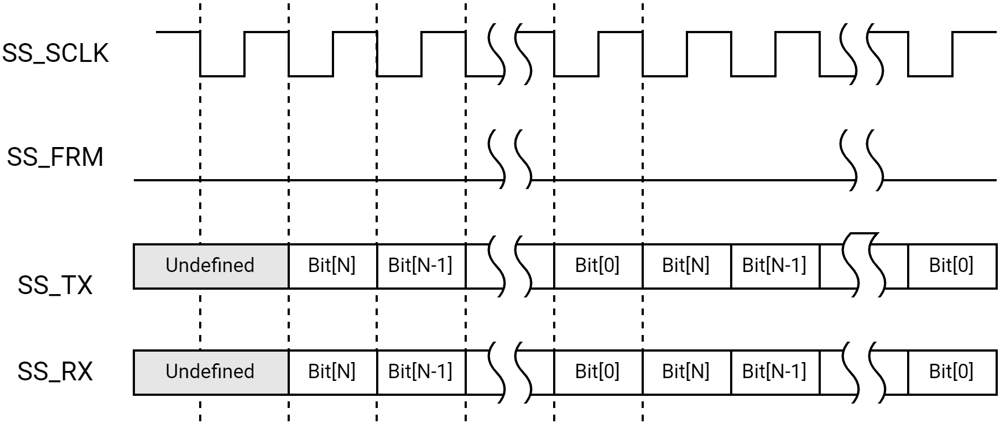

> **Note.** The phase and polarity of SS_SCLK can be configured for four different modes. This example shows just one of those modes (SSCR[SPO] and SSCR[SPH] cleared). Other settings for SPO and SPH result in different polarities and timing.

##### Programmable Serial Protocol (I2S) Format

The PSP format defines programmable parameters that determine the transfer timings between data samples and used for I2S protocol.

Four serial clock modes are defined in the Serial Bit-rate Clock Mode, SSPSP[SCMODE]. These modes select the SS_SCLK rising and falling edges for driving data, sampling received data, and the SS_SCLK idle state.

The Idle and Disabled modes of the SS_TX, SS_SCLK, and SS_FRM interface signals are programmable using the following fields in the SSPSP Register: End Of Transfer Data State (SSPSP[ETDS]), Serial Frame Polarity (SSPSP[SFRMP]), and Serial Bit-rate Clock Mode (SSPSP[SCMODE]). When transmit data is ready, SS_SCLK remains in its idle state for the number of serial clocks (SS_SCLK) periods programmed into the Start Delay (SSPSP[STRTDLY]) field in the SSP Programmable Serial Protocol Register.

SS_SCLK then starts toggling. SS_TX remains in the idle state for the number of serial clock periods programmed into the Dummy Start (SSPSP[DMYSTRT]) field. SS_FRM is asserted after the number of half serial clock periods programmed into the Serial Frame Delay (SSPSP[SFRMDLY]) field. SS_FRM remains asserted for the number of serial clock periods programmed into the Serial Frame Width (SSPSP[SFRMWDTH]) field, then SS_FRM de-asserts.

Serial data of 8, 16, 18, or 32 bits can be transferred per frame by setting the SSCR[DSS] fields to the preferred data size select. Once the last bit (LSb) is transferred, SS_SCLK continues toggling for the number of serial clock periods programmed into the Dummy Stop (SSPSP[DMYSTOP]) field. Depending on the value programmed into the End Of Transfer Data State (SSPSP[EDTS]) field when the SPI/I2S port goes into idle mode, SS_TX either retains the last bit-value transmitted or is forced to 0 unless the SPI/I2S port is disabled or reset, which forces SS_TX to 0.

With the assertion of SS_FRM, Receive data is driven simultaneously from the peripheral onto SS_RX, MSb first. Data transitions on the SS_SCLK edge based on the serial-clock mode that is selected (SSPSP[SCMODE]) and is sampled by the SPI/I2S port on the opposite clock edge. When the SPI/I2S port is a master to SS_FRM and a slave to SS_SCLK, at least three extra SS_SCLKs are needed at the beginning and end of each block of transfers to synchronize control signals from the APB clock domain into the SPI/I2S clock domain (a block of transfers is a group of back-to-back continuous transfers).

In general, because of the programmable nature of the PSP protocol, this protocol can be used to achieve a variety of serial protocols, including I2S.

The programmable protocol parameters of SPI/I2S are tabled below.

<table>
<tbody>
<tr>
<td><strong>Symbol </strong></td>
<td><strong>Definition</strong></td>
<td><strong>Range </strong></td>
<td><strong>Units</strong></td>
</tr>
<tr>
<td>- </td>
<td>Serial clock mode (SSPSP[SCMODE])</td>
<td>(Drive, Sample, SS_ SCLK Idle)<br/>0 = Fall, rise, low <br/>1 = Rise, fall, low <br/>2 = Rise, fall, high <br/>3 = Fall, rise, high</td>
<td>-<br/></td>
</tr>
<tr>
<td>- </td>
<td>Serial frame polarity<br/>(SSPSP[SFRMP])</td>
<td>High or low</td>
<td>-</td>
</tr>
<tr>
<td>T1</td>
<td>Start delay<br/>(SSPSP[STRTDLY])</td>
<td>0 to 7</td>
<td>Clock period</td>
</tr>
<tr>
<td>T2</td>
<td>Dummy start<br/>(SSPSP[EDMYSTRT] + SSPSP[DMYSTRT])</td>
<td>0 to 15</td>
<td>Clock period</td>
</tr>
<tr>
<td>T3</td>
<td>Data size<br/>(SSCR[DSS])</td>
<td>4 to 32</td>
<td>Clock period</td>
</tr>
<tr>
<td>T4   </td>
<td>Dummy stop(SSPSP[EDMYSTOP] + SSPSP[DMYSTOP])</td>
<td>0 to 31</td>
<td>Clock period</td>
</tr>
<tr>
<td>T5</td>
<td>SS_FRM delay (SSPSP[SFRMDLY])</td>
<td>0 to 127</td>
<td>Half-clock period</td>
</tr>
<tr>
<td>T6</td>
<td>SS_FRM width (SSPSP[SFRMWDTH])</td>
<td>1 to 63</td>
<td>Clock period</td>
</tr>
<tr>
<td>-</td>
<td>End of transfer data state (SSPSP[ETDS])</td>
<td>Low or bit 0</td>
<td>-</td>
</tr>
</tbody>
</table>

The SS_FRM delay (T5) must not extend beyond the end of T4. The SS_FRM width (T6) must be asserted for at least one SS_SCLK period and should be de-asserted before the end of T4 (for example, in terms of time, not bit values

- (T5 + T6) \<= (T1 + T2 + T3 + T4)
- 1\<= T6 \< (T2 + T3 + T4)
- (T5 + T6) \>= (T1 + 1)

to ensure that SS_FRM is asserted for at least two edges of SS_SCLK). Program T1 to 0 when SS_SCLK is enabled by the SSCR[SCFR] fields.

While the SPI/I2S can be programmed to generate the assertion of SS_FRM during the middle of the data transfer (for example, after the MSB has been sent), the SPI/I2S port is unable to Receive data in frame-Slave mode. Transmit data transitions from the end-of-transfer-data state (SSPSP[ETDS]) to the next MSB data value upon assertion of the internal version of SS_FRM. Program the SSPSP[STRTDLY] field to 0x00 whenever SS_SCLK or SS_FRM is configured as an input (for example, SSCR[SCLKDIR] and SSCR1[SFRMDIR] are cleared.

> **Note.** When the SPI/I2S port is slave to the frame, the sum of T1+T2+T3+T4 can be less than the actual time from the beginning of the current frame to the beginning of the next frame. For example, when the rate of SS_SCLK is 12.8 MHz and the data sample size is 16-bits, the beginning of the frame can occur at a rate of 8 kHz.

#### High Impedance on SS_TX

The SPI/I2S supports placing the SS_TX into high impedance during idle time instead of driving SS_TX as controlled by the TXD Three-State Enable (SSCR[TTE]) and TXD Three-state Enable On Last Phase (SSCR[TTELP]) field. The SSCR[TTE] enables a high-impedance state on SS_TX. The SSCR[TTELP] determines on which SS_SCLK phase SS_TX becomes high impedance.

##### Motorola\* SPI Format

For Motorola\* SPI format, SSCR[TTELP] must be cleared. If SSCR[TTE] = 1. SS_TX functionality is depicted below.


For Motorola\* SPI format, SS_TX goes to a high-impedance state whenever SS_FRM is not asserted.

##### PSP Format

SS_TX functionality when SSCR[TTE] = 1, SS_SSCR[TTELP] = 0 and SSCR[SFRMDIR] = 1, are depicted below.

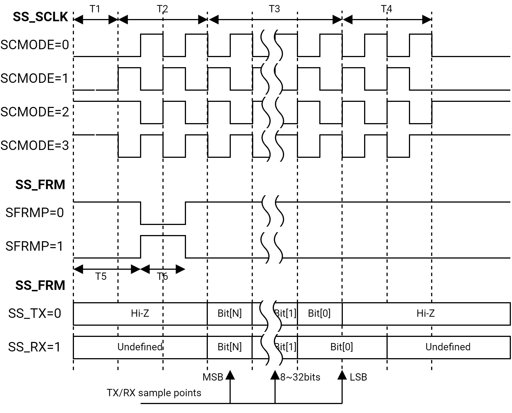

#### Network Mode Operation

The SSNWC[MOD] bit selects between Normal and Network modes. Normal mode (MOD = 0x0) is used when using the Motorola\* Serial Peripheral Interface (SPI). Network mode (MOD = 0x1) is used for the I2S protocol.

Software should set MOD only when using the PSP format. If the SPI/I2S port is a master of the clock and SSCR[SCLKDIR] is cleared, then setting MOD causes the SS_SCLK to run continuously.

When in Network mode, only one SS_FRM is sent (Master mode) or received (Slave mode) for the number of time slots programmed into the SSNWC[FRDC] field. When beginning in Network mode, while the SPI/I2S port is a master to the SS_FRM interface signal, the first SS_FRM signal does not occur until after data is in the TXFIFO. After assertion of the first SS_FRM signal, if the SPI/I2S port is a master to SS_FRM, subsequent SS_FRM signals continue to assert regardless of whether data resides in the TXFIFO. Therefore, the transmit underrun bit, SSSR[TUR], is set to 1 if there is no data in the TXFIFO and the SPI/I2S port is programmed to drive SS_TX data in the current time slot, even if the SPI/I2S port is master to SS_FRM. When using PSP format in Network mode, the parameters SFRMDLY, STRTDLY, DMYSTOP, DMYSTRT must all be 0. The other parameters SFRMP, SCMODE, FSRT, SFRMWDTH are programmable.

When the SPI/I2S port is a master to the SS_FRM signal and a need arises to exit from Network mode, software should:

- Clear the SSNWC[MOD] bit. SSCR[SSE] does not need to change
- Wait until SSNWS[NMBSY] is cleared
- Disable the SPI/I2S port by clearing SSCR[SSE]
- Before exiting Network mode, verify the TXFIFO is empty (SSSR[TFL]=0 and SSSR[TNF]=1)
- If data remains in the TXFIFO after the Network mode is exited, a non-Network mode frame is sent

Due to synchronization delay between the internal bus and the SPI/I2S port clock domain, one extra frame may be transmitted after software clears the SSNWC[MOD] bit. The SPI/I2S port continues to drive SS_SCLK (if SSCR[SCLKDIR] is cleared) and SS_FRM (if SSCR[SFRMDIR] is cleared) until the end of the last valid time slot.

If the SPI/I2S port is a slave to both SS_SCLK (SSCR[SCLKDIR] set) and SS_FRM (SSCR[SFMRDIR] set), the SSNWS[NMBSY] bit remains asserted until the SSNWC[MOD] bit is cleared or until one SS_SCLK after the end of the last valid time slot.

#### Parallel Data Formats for FIFO Storage

All CPU and DMA accesses transfer one FIFO entry per access. Data in the FIFOs is either stored with one 32-bit value per data sample (in non-packed or sample \> 16 bits) or in a 16-bit value in packed mode when the data is 4 or 16 bits. Within each 32- or 16-bit field, the stored data sample is right-justified, with the LSb of the word in bit 0. In the Receive FIFO, unused bits are packed as zeroes above the MSb. In the Transmit FIFO, unused “don’t-care” bits are above the MSb. For example, DMA and CPU accesses do not have to write to the unused bit locations. Logic in the SPI/I2S automatically formats data in the Transmit FIFO so that the sample is properly transmitted on SS_TX in the selected frame format.

#### FIFO Operation

This section describes the operation of Transmit and Receive FIFOs.

Two separate and independent FIFOs are present for transmitting (TXFIFO to peripheral) and receiving (RXFIFO from peripheral) serial data. The FIFOs are filled or emptied by programmed I/O or DMA bursts.

##### Using Programmed I/O Data Transfers

FIFO filling and emptying can be performed by the CPU in response to an interrupt from the FIFO logic. Each FIFO has a programmable FIFO trigger threshold that triggers an interrupt. When the number of entries in the RXFIFO exceeds the RXFIFO Trigger Threshold (SSFCR[RFT]) field, an interrupt is generated (if enabled) that signals the CPU to empty the RXFIFO. When the number of entries in the TXFIFO is less than or equal to the TXFIFO Trigger Threshold (SSFCR[TFT]) field plus 1, an interrupt is generated (if enabled) that signals the CPU to refill the TXFIFO.

The SSSR can be polled to determine how many samples are in a FIFO and whether the FIFO is full or empty. Software is responsible for ensuring that the proper RXFIFO Trigger Threshold and TXFIFO Trigger Threshold values are chosen to prevent Receive FIFO Overrun and Transmit FIFO Underrun error conditions.

##### Using DMA Data Transfers

The DMA controller can also be programmed to transfer data to and from the FIFOs. To prevent overruns of the TXFIFO or underruns of the RXFIFO when using the DMA, be careful when setting the FIFO trigger threshold levels by setting the correct DMA burst sizes. TXFIFO overruns and RXFIFO underruns are silent errors: There is no indication of the overrun or underrun condition other than missing data at the receiving end of the link. The DMA burst size must be smaller than the trigger threshold.

The programming model for using DMA is:

- Program the total number of transmit/receive byte lengths, burst sizes, and peripheral width.
- When not using the FIFO packed mode, program the Width field in the DMA Command Registers to 0x1 for FIFO data sizes of 8 bits, 0x2 for FIFO data sizes of 16 bits, and 0x3 for FIFO data sizes of more than 16 bits. When not using packed mode, the SPI/I2S stores one data sample per FIFO location where each FIFO has 16 locations. For example, the DMA burst size must not exceed 16 bytes when Width field in the DMA Command Registers is set to 0x1 (byte wide).
- When using FIFO packed mode, program the Width field in the DMA Command Registers to 0x3. When using packed mode, the SPI/I2S stores two data samples per FIFO location where each FIFO has 16 locations. Therefore, the DMA burst size must not exceed 16 bytes when Width field in the DMA Command Registers is set to 0x3 (more than 16 bits wide).
- Because the SPI/I2S is not flow-controlled and has only 16 location FIFOs, software must program the TXFIFO threshold (SSFCR[TFT]) field, RXFIFO threshold (SSFCR[RFT]) field, and the DMA burst size to ensure that a TXFIFO overrun or RXFIFO underrun does not occur. Software must also ensure that the SPI/I2S DMA requests are properly prioritized in the system to prevent overruns and underruns.
- Program the preferred values into the SSCR
- Enable the SPI/I2S by setting the Synchronous Serial Port Enable (SSCR[SSE]) field
- Set the run bits in the DMA Command Register
- The DMA waits for either the TXFIFO or RXFIFO service request
- If the receive byte length is not an even multiple of the transfer burst size, a trailing-byte condition may occur

In full-duplex formats where the SPI/I2S always receives the same number of data samples that it transmits, the DMA channel should be set up to transmit and receive the same number of bytes.

> **Note.** When the FIFO Packing Enable (SSFCR[FPCKE]) field is set to 0x1, the SSFCR[TFT] and SSFCR[RFT] fields represent twice the number of FIFO entries as when the packing enable bit is 0x0. So, when in packed mode, the maximum allowed DMA burst size (8 or 16) could be doubled.

#### Baud-Rate Generation

When the SPI/I2S is configured as the master (output) of SS_SCLK as determined by clearing the SSCR[SCLKDIR] field, the baud rate (or serial bit-rate clock SS_SCLK) is obtained by selecting from one of the four fixed clock sources (6.4 MHz, 12.8 MHz, 25.6 MHz, or 51.2 MHz). A variable clock source is available from the output of two dithering dividers external to the SPI/I2S unit. Clock selection is achieved by writing to the Functional Clock Select field of the SPI/I2S Clock/Reset Control Register.

When the source clock is to be changed, software must:

- Disable the SPI/I2S port by writing 0x0 to SSCR[SSE]
- Disable the SPI/I2S port internal clock by clearing the appropriate bit in the Clock Enable Register
- Write clock and reset related registers to enable functional clocks to the SPI/I2S units
- If applicable, set appropriate values for the frequency dividers
- Enable APB clock to the SPI/I2S unit
- Set the SSCR[SSE] bit to re-enable the SPI/I2S port. Whenever the baud rate is to be changed, software must:

  - Disable the SPI/I2S port by clearing SSCR[SSE] bit
  - Set the SSCR0[SSE])bit to re-enable the SPI/I2S port

Wait two SS_SCLK cycles before writing new data to the TXFIFO. The SPI/I2S Baud Rate Generation is depicted below.

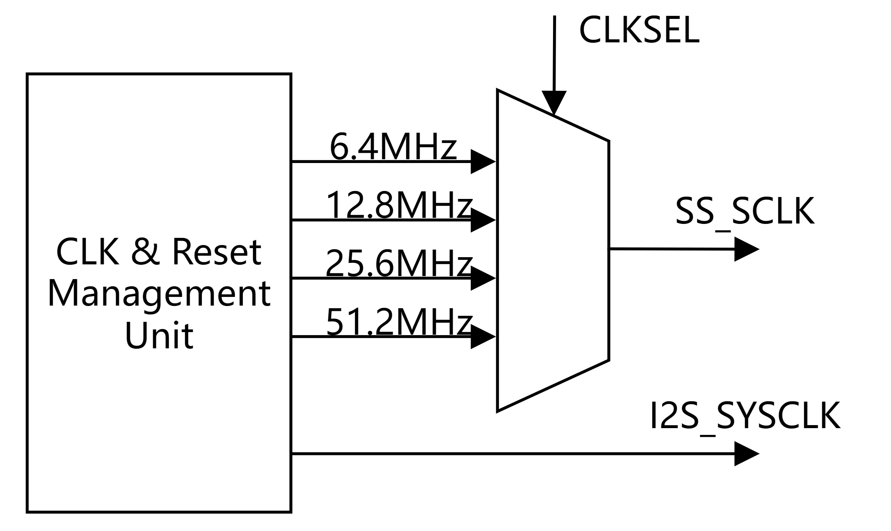

### Register Description

> **Note.** The base address of SPI/I2S registers are tabled below.

<table>
<tbody>
<tr>
<td><strong>Name</strong></td>
<td><strong>Address</strong></td>
</tr>
<tr>
<td>SHUB_SSP0_BASE</td>
<td>0xC0885000</td>
</tr>
<tr>
<td>SSP3_BASE</td>
<td>0xD401C000</td>
</tr>
<tr>
<td>SSPA0_BASE</td>
<td>0xD4026000</td>
</tr>
<tr>
<td>SSPA1_BASE</td>
<td>0xD4026800</td>
</tr>
<tr>
<td>SSP2_BASE</td>
<td>0xF0613000</td>
</tr>
</tbody>
</table>

#### SSCR REGISTER

SPI/I2S top control register.

<table>
<tbody>
<tr>
<td rowspan=1 colspan=5><strong>Offset: 0x0</strong></td>
</tr>
<tr>
<td><strong>Bits</strong></td>
<td><strong>Field</strong></td>
<td><strong>Type</strong></td>
<td><strong>Reset</strong></td>
<td><strong>Description</strong></td>
</tr>
<tr>
<td>31:19</td>
<td>RSVD</td>
<td>R</td>
<td>0</td>
<td>Reserved for future use</td>
</tr>
<tr>
<td>18</td>
<td>TTELP</td>
<td>R/W</td>
<td>0x0</td>
<td>TXD Three-state Enable On Last Phase <br/>0 = SS_TX is three-stated 1/2 clock cycle after the beginning of the LSB <br/>1 = SS_TX output signal is three-stated on the clock edge that ends the LSB </td>
</tr>
<tr>
<td>17</td>
<td>TTE</td>
<td>R/W</td>
<td>0x0</td>
<td>TXD Three-State Enable <br/>0 = SS_TX output signal is not three-stated <br/>1 = SS_TX is three-stated when not transmitting data </td>
</tr>
<tr>
<td>16</td>
<td>SCFR</td>
<td>R/W</td>
<td>0x0</td>
<td>Slave Clock Free Running <br/>0 = Clock input to SS_CLK is continuously running <br/>1 = Clock input to SS_CLK is only active during data transfers.  </td>
</tr>
<tr>
<td>15</td>
<td>IFS</td>
<td>R/W</td>
<td>0x0</td>
<td>Invert Frame Signal <br/>0 = SS_FRM polarity is determined by the PSP polarity bits <br/>1 = SS_FRM will be inverted from normal-SS_FRM (as defined by the PSP polarity bits). (Works in all frame formats: SPI and PSP) </td>
</tr>
<tr>
<td>14</td>
<td>HOLD_FRAME_LOW</td>
<td>R/W</td>
<td>0x0</td>
<td>Hold Frame Low Control <br/>1=After this field is set to 1 and the SPI/I2S is operating in master mode. Used for SPI Format Rx FIFO Auto Full Control, which makes the frame clock is still low during there's no bit clock, or the data transfers before the stop clock will be discarded.   </td>
</tr>
<tr>
<td>13</td>
<td>TRAIL</td>
<td>R/W</td>
<td>0x0</td>
<td>Trailing Byte <br/>0 = Trailing bytes are handled by the CPU <br/>1 = Trailing bytes are handled by DMA bursts </td>
</tr>
<tr>
<td>12</td>
<td>LBM</td>
<td>R/W</td>
<td>0x0</td>
<td>Loopback Mode (Test Mode Bit) <br/>0 = Normal serial port operation is enabled <br/>1 = Output of TX serial shifter is internally connected to input of RX serial shifter </td>
</tr>
<tr>
<td>11</td>
<td>SPH</td>
<td>R/W</td>
<td>0x0</td>
<td>Motorola SPI SS_SCLK phase setting <br/>0 = SS_SCLK is inactive until one cycle after the start of a frame and active until 1/2 cycle before the end of a frame <br/>1 = SS_SCLK is inactive until 1/2 cycle after the start of a frame and active until one cycle before the end of a frame </td>
</tr>
<tr>
<td>10</td>
<td>SPO</td>
<td>R/W</td>
<td>0x0</td>
<td>Motorola SPI SS_SCLK Polarity Setting <br/>0 = The inactive or idle state of SS_SCLK is low <br/>1 = The inactive or idle state of SS_SCLK is high </td>
</tr>
<tr>
<td>9:5</td>
<td>DSS</td>
<td>R/W</td>
<td>0x0</td>
<td>SPI/I2S Work data size,  register bits value 0~31 indicated data size 1~32 bits,  usually use data size 8bits, 16bits, 24bits, 32bits </td>
</tr>
<tr>
<td>4</td>
<td>SFRMDIR</td>
<td>R/W</td>
<td>0x0</td>
<td>SS_FRM Direction <br/>0 = Master mode, SPI/I2S port drives SS_FRM <br/>1 = Slave mode, SPI/I2S port receives SS_FRM </td>
</tr>
<tr>
<td>3</td>
<td>SCLKDIR</td>
<td>R/W</td>
<td>0x0</td>
<td>SS_SCLK Direction <br/>0 = Master mode, SPI/I2S port drives SS_SCLK <br/>1 = Slave mode, SPI/I2S port receives SS_SCLK </td>
</tr>
<tr>
<td>2:1</td>
<td>FRF</td>
<td>R/W</td>
<td>0x0</td>
<td>Frame Format <br/>0x0 = Motorola* Serial Peripheral Interface (SPI) <br/>0x3 = Programmable Serial Protocol (PSP)  <br/>Others = reserved</td>
</tr>
<tr>
<td>0</td>
<td>SSE</td>
<td>R/W</td>
<td>0x0</td>
<td>SPI/I2S Enable <br/>0 = SPI/I2S port is disabled  <br/>1 = SPI/I2S port is enabled </td>
</tr>
</tbody>
</table>

#### SSFCR REGISTER

SPI/I2S FIFO control register.

<table>
<tbody>
<tr>
<td rowspan=1 colspan=5><strong>Offset: 0x4</strong></td>
</tr>
<tr>
<td><strong>Bits</strong></td>
<td><strong>Field</strong></td>
<td><strong>Type</strong></td>
<td><strong>Reset</strong></td>
<td><strong>Description</strong></td>
</tr>
<tr>
<td>31:22</td>
<td>RSVD</td>
<td>R</td>
<td>0</td>
<td>Reserved for future use</td>
</tr>
<tr>
<td>21</td>
<td>RXENDIAN</td>
<td>R/W</td>
<td>0x0</td>
<td>select the big endian or little endian for RX transfer<br/>0 = big endian <br/>1 = little endian </td>
</tr>
<tr>
<td>20</td>
<td>TXENDIAN</td>
<td>R/W</td>
<td>0x0</td>
<td>select the big endian or little endian for TX transfer<br/>0 = big endian<br/>1 = little endian </td>
</tr>
<tr>
<td>19</td>
<td>STRF</td>
<td>R/W</td>
<td>0x0</td>
<td>Select FIFO For Test Mode Bit<br/>0 = TXFIFO is selected for both writes and reads through the SPI/I2S Data Register <br/>1 = RXFIFO is selected for both writes and reads through the SPI/I2S Data Register </td>
</tr>
<tr>
<td>18</td>
<td>EFWR</td>
<td>R/W</td>
<td>0x0</td>
<td>Enable FIFO Write/read (Test Mode Bit) <br/>0 = FIFO write/read special function is disabled<br/>1 = FIFO write/read special function is enabled </td>
</tr>
<tr>
<td>17</td>
<td>RXFIFO_AUTO_FULL_CTRL</td>
<td>R/W</td>
<td>0x0</td>
<td>Rx FIFO Auto Full Control<br/>After this field is set to 1 and the SPI/I2S is operating in master mode, the SS_FSM returns to IDLE state and stops the SS_SCLK. When Rx FIFO is full, the SS_FSM continues transferring data after the Rx FIFO is not full. This field is used to avoid an Rx FIFO overrun issue. <br/>1= Enable Rx FIFO auto full control <br/>0= Disable Rx FIFO auto full control </td>
</tr>
<tr>
<td>16</td>
<td>FPCKE</td>
<td>R/W</td>
<td>0x0</td>
<td>FIFO Packing Enable 0 = FIFO packing mode disabled 1 = FIFO packing mode enabled </td>
</tr>
<tr>
<td>15:14</td>
<td>TXFIFO_WR_ENDIAN</td>
<td>R/W</td>
<td>0x0</td>
<td>apb_pwdata Write to Tx FIFO Endian <br/>0x0 = txfifo_wdata[31:0] = apb_pwdata[31:0] <br/>0x1 = fifo_wdata[31:0] = {apb_pwdata[15:0], apb_pwdata[31:16]} <br/>0x2 = txfifo_wdata[31:0] = {apb_pwdata[7:0], apb_pwdata[15:8], apb_pwdata[23:16], apb_pwdata[31:24]} <br/>0x3 = txfifo_wdata[31:0] = {apb_pwdata[23:16], apb_pwdata[31:24], apb_pwdata[7:0], apb_pwdata[15:8]} </td>
</tr>
<tr>
<td>13:12</td>
<td>RXFIFO_RD_ENDIAN</td>
<td>R/W</td>
<td>0x0</td>
<td>apb_prdata Read from Rx FIFO Endian <br/>0x0 = apb_prdata[31:0] = rxfifo_wdata[31:0] <br/>0x1 = apb_prdata[31:0] = {rxfifo_wdata[15:0], rxfifo_wdata[31:16]} <br/>0x2 = apb_prdata[31:0]= {rxfifo_wdata[7:0], rxfifo_wdata[15:8], rxfifo_wdata[23:16], rxfifo_wdata[31:24]} <br/>0x3 = apb_prdata[31:0]= {rxfifo_wdata[23:16], rxfifo_wdata[31:24], rxfifo_wdata[7:0], rxfifo_wdata[15:8]} </td>
</tr>
<tr>
<td>11</td>
<td>RSRE</td>
<td>R/W</td>
<td>0x0</td>
<td>Receive Service Request Enable <br/>0 = DMA service request is disabled <br/>1 = DMA service request is enabled </td>
</tr>
<tr>
<td>10</td>
<td>TSRE</td>
<td>R/W</td>
<td>0x0</td>
<td>Transmit Service Request Enable <br/>0 = DMA service request is disabled <br/>1 = DMA service request is enabled </td>
</tr>
<tr>
<td>9:5</td>
<td>RFT</td>
<td>R/W</td>
<td>0x0</td>
<td>RXFIFO Trigger Threshold This field sets the threshold level at which RXFIFO asserts interrupt. The level should be set to the preferred threshold value minus 1. </td>
</tr>
<tr>
<td>4:0</td>
<td>TFT</td>
<td>R/W</td>
<td>0x0</td>
<td>TXFIFO Trigger Threshold This field sets the threshold level at which TXFIFO asserts interrupt. The level should be set to the preferred threshold value minus 1.  </td>
</tr>
</tbody>
</table>

#### SSINTEN REGISTER

SPI/I2S interrupt enable register.

<table>
<tbody>
<tr>
<td rowspan=1 colspan=5><strong>Offset: 0x8</strong></td>
</tr>
<tr>
<td><strong>Bits</strong></td>
<td><strong>Field</strong></td>
<td><strong>Type</strong></td>
<td><strong>Reset</strong></td>
<td><strong>Description</strong></td>
</tr>
<tr>
<td>31:7</td>
<td>RSVD</td>
<td>R</td>
<td>0</td>
<td>Reserved for future use</td>
</tr>
<tr>
<td>6</td>
<td>EBCEI</td>
<td>R/W</td>
<td>0x0</td>
<td>Enable Bit Count Error Interrupt <br/>0 = Interrupt due to a bit count error is disabled <br/>1 = Interrupt due to a bit count error is enabled </td>
</tr>
<tr>
<td>5</td>
<td>TIM</td>
<td>R/W</td>
<td>0x1</td>
<td>Transmit FIFO Underrun Interrupt Mask <br/>0 = TUR events generate an interrupt <br/>1 = TUR events do NOT generate an interrupt  </td>
</tr>
<tr>
<td>4</td>
<td>RIM</td>
<td>R/W</td>
<td>0x1</td>
<td>Receive FIFO Overrun Interrupt Mask <br/>0 = ROR events generate an interrupt <br/>1 = ROR events do NOT generate an interrupt  </td>
</tr>
<tr>
<td>3</td>
<td>TIE</td>
<td>R/W</td>
<td>0x0</td>
<td>Transmit FIFO Interrupt Enable <br/>0 = TXFIFO threshold-level-reached interrupt is disabled <br/>1 = TXFIFO threshold-level-reached interrupt is enabled </td>
</tr>
<tr>
<td>2</td>
<td>RIE</td>
<td>R/W</td>
<td>0x0</td>
<td>Receive FIFO Interrupt Enable <br/>0 = RXFIFO threshold-level-reached interrupt is disabled <br/>1 = RXFIFO threshold-level-reached interrupt is enabled </td>
</tr>
<tr>
<td>1</td>
<td>TINTE</td>
<td>R/W</td>
<td>0x0</td>
<td>Receiver Time-out Interrupt Enable <br/>0 = Receiver time-out interrupt is disabled <br/>1 = Receiver time-out interrupt is enabled </td>
</tr>
<tr>
<td>0</td>
<td>PINTE</td>
<td>R/W</td>
<td>0x0</td>
<td>Peripheral Trailing Byte Interrupt Enable <br/>0 = Peripheral trailing byte interrupt is disabled <br/>1 = Peripheral trailing byte interrupt is enabled </td>
</tr>
</tbody>
</table>

#### SSTO REGISTER

SPI/I2S time out register. These registers specify the timeout (TIMEOUT) value used to signal a period of inactivity within the RXFIFO. When a timeout occurs, the SSSR[TINT] field is set. When the TIMEOUT value is set to 0x000000, no timeout occurs and the SSSR[TINT] field is not set. The TIMEOUT interval is given by the calculation in the TIMEOUT Interval Equation.

TimeOut Interval = SSTO [TIMEOUT] / APB Clock Frequency, APB Clock Frequency = 25.6 MHz OR 51.2MHz.

<table>
<tbody>
<tr>
<td rowspan=1 colspan=5><strong>Offset: 0xC</strong></td>
</tr>
<tr>
<td><strong>Bits</strong></td>
<td><strong>Field</strong></td>
<td><strong>Type</strong></td>
<td><strong>Reset</strong></td>
<td><strong>Description</strong></td>
</tr>
<tr>
<td>31:24</td>
<td>RSVD</td>
<td>R</td>
<td>0</td>
<td>Reserved for future use</td>
</tr>
<tr>
<td>23:0</td>
<td>TIMEOUT</td>
<td>R/W</td>
<td>0x0</td>
<td>Timeout Value TIMEOUT value is the value that defines the time-out interval. The time-out interval is given by the equation shown in the TIMEOUT Interval Equation. </td>
</tr>
</tbody>
</table>

#### SSDATR REGISTER

SPI/I2S data register.

<table>
<tbody>
<tr>
<td rowspan=1 colspan=5><strong>Offset: 0x10</strong></td>
</tr>
<tr>
<td><strong>Bits</strong></td>
<td><strong>Field</strong></td>
<td><strong>Type</strong></td>
<td><strong>Reset</strong></td>
<td><strong>Description</strong></td>
</tr>
<tr>
<td>31:0</td>
<td>DATA</td>
<td>R/W</td>
<td>0x0</td>
<td>DATA This field is used for data to be written to the TXFIFO read from the RXFIFO. </td>
</tr>
</tbody>
</table>

#### SSSR REGISTER

SPI/I2S status register.

<table>
<tbody>
<tr>
<td rowspan=1 colspan=5><strong>Offset: 0x14</strong></td>
</tr>
<tr>
<td><strong>Bits</strong></td>
<td><strong>Field</strong></td>
<td><strong>Type</strong></td>
<td><strong>Reset</strong></td>
<td><strong>Description</strong></td>
</tr>
<tr>
<td>31:24</td>
<td>RSVD</td>
<td>R</td>
<td>0</td>
<td>Reserved for future use</td>
</tr>
<tr>
<td>23</td>
<td>OSS</td>
<td>R</td>
<td>0x0</td>
<td>Odd Sample Status <br/>0 = RxFIFO entry has two samples <br/>1 = RxFIFO entry has one sample  <br/>> <strong>Note</strong><strong>.</strong> This bit needs to be looked at only when FIFO Packing is enabled (SSFCR[FPCKE] field is set). Otherwise, this bit is zero. When SPI/I2S port is in Packed mode and the CPU is used instead of DMA to read the RxFIFO, the CPU should make sure that SSSR[RNE] = 1 AND this field = 0 before it attempts to read the RxFIFO. </td>
</tr>
<tr>
<td>22</td>
<td>TX_OSS</td>
<td>R</td>
<td>0x0</td>
<td>TX FIFO Odd Sample Status <br/>0 = TxFIFO entry has an even number of samples <br/>1 = TxFIFO entry has an odd number of samples <br/>> <strong>Note</strong><strong>.</strong> This bit needs to be read only when FIFO Packing is enabled (SSFCR[FPCKE] field is set). Otherwise, this bit is zero. </td>
</tr>
<tr>
<td>21</td>
<td>BCE</td>
<td>R/W1C</td>
<td>0x0</td>
<td>Bit Count Error <br/>0 = The SPI/I2S port has not experienced a bit count error <br/>1 = The SS_FRM signal was asserted when the bit counter was not zero </td>
</tr>
<tr>
<td>20</td>
<td>ROR</td>
<td>R/W1C</td>
<td>0x0</td>
<td>Receive FIFO Overrun <br/>0 = RXFIFO has not experienced an overrun <br/>1 = Attempted data write to full RXFIFO, causes an interrupt request </td>
</tr>
<tr>
<td>19:15</td>
<td>RFL</td>
<td>R</td>
<td>0x1F</td>
<td>Receive FIFO Level This field is the number of entries minus one in RXFIFO. When the value 0x1F is read, the RXFIFO is either empty or full, and software should read the SSSR[RNE] field. </td>
</tr>
<tr>
<td>14</td>
<td>RNE</td>
<td>R</td>
<td>0x0</td>
<td>Receive FIFO Not Empty <br/>0 = RXFIFO is empty <br/>1 = RXFIFO is not empty </td>
</tr>
<tr>
<td>13</td>
<td>RFS</td>
<td>R</td>
<td>0x0</td>
<td>Receive FIFO Service Request <br/>0 = RXFIFO level is at or below RFT threshold (RFT) or  SPI/I2S port is disabled <br/>1 = RXFIFO level exceeds RFT threshold (RFT), causes an interrupt request </td>
</tr>
<tr>
<td>12</td>
<td>TUR</td>
<td>R/W1C</td>
<td>0x0</td>
<td>Transmit FIFO Underrun <br/>0 = The TXFIFO has not experienced an underrun <br/>1 = A read from the TXFIFO was attempted when the TXFIFO was empty, causing an interrupt if it is enabled</td>
</tr>
<tr>
<td>11:7</td>
<td>TFL</td>
<td>R</td>
<td>0x0</td>
<td>Transmit FIFO Level This field is the number of entries in TXFIFO. When the value 0x0 is read, the TXFIFO is either empty or full, and software should read the SSSR[TNF] field. </td>
</tr>
<tr>
<td>6</td>
<td>TNF</td>
<td>R</td>
<td>0x1</td>
<td>Transmit FIFO Not Full <br/>0 = TXFIFO is full <br/>1 = TXFIFO is not full </td>
</tr>
<tr>
<td>5</td>
<td>TFS</td>
<td>R</td>
<td>0x0</td>
<td>Transmit FIFO Service Request <br/>0 = TX FIFO level exceeds the TFT threshold (TFT + 1) or SPI/I2S port disabled <br/>1 = TXFIFO level is at or below TFT threshold (TFT + 1), causes an interrupt request </td>
</tr>
<tr>
<td>4</td>
<td>EOC</td>
<td>R/W1C</td>
<td>0x0</td>
<td>End Of Chain <br/>0 = DMA has not signaled an end of chain condition <br/>1 = DMA has signaled an end of chain condition </td>
</tr>
<tr>
<td>3</td>
<td>TINT</td>
<td>R/W1C</td>
<td>0x0</td>
<td>Receiver Time-out Interrupt <br/>0 = No receiver time-out is pending <br/>1 = Receiver time-out pending, causes an interrupt request </td>
</tr>
<tr>
<td>2</td>
<td>PINT</td>
<td>R/W1C</td>
<td>0x0</td>
<td>Peripheral Trailing Byte Interrupt <br/>0 = No peripheral trailing byte interrupt is pending <br/>1 = Peripheral trailing byte interrupt is pending </td>
</tr>
<tr>
<td>1</td>
<td>CSS</td>
<td>R</td>
<td>0x0</td>
<td>Clock Synchronization Status <br/>0 = The SPI/I2S port is ready for slave clock operations <br/>1 = The SPI/I2S port is currently busy synchronizing slave mode signals </td>
</tr>
<tr>
<td>0</td>
<td>BSY</td>
<td>R</td>
<td>0x0</td>
<td>SPI/I2S Busy <br/>0 = SPI/I2S port is idle or disabled <br/>1 = SPI/I2S port is currently transmitting or receiving framed data </td>
</tr>
</tbody>
</table>

#### SSPSP REGISTER

SPI/I2S programmable serial protocol control register.

<table>
<tbody>
<tr>
<td rowspan=1 colspan=5><strong>Offset: 0x18</strong></td>
</tr>
<tr>
<td><strong>Bits</strong></td>
<td><strong>Field</strong></td>
<td><strong>Type</strong></td>
<td><strong>Reset</strong></td>
<td><strong>Description</strong></td>
</tr>
<tr>
<td>31:30</td>
<td>RSVD</td>
<td>R</td>
<td>0</td>
<td>Reserved for future use</td>
</tr>
<tr>
<td>29:27</td>
<td>EDMYSTOP</td>
<td>R/W</td>
<td>0x0</td>
<td>Extended Dummy Stop Most-significant bits of the dummy stop delay.Do not used in PSP Network mode. </td>
</tr>
<tr>
<td>26:25</td>
<td>DMYSTOP</td>
<td>R/W</td>
<td>0x0</td>
<td>Dummy Stop Least-significant bits of the dummy stop delay Programmed value of SSPSP[EDMYSTOP] + this field specifies the number (0-31) of active clocks (SS_SCLK) that follow the end of the transmitted data.Do not used in PSP Network mode. </td>
</tr>
<tr>
<td>24:23</td>
<td>EDMYSTRT</td>
<td>R/W</td>
<td>0x0</td>
<td>Extended Dummy Start Most-significant bits of the dummy start delay.Do not used in PSP Network mode. </td>
</tr>
<tr>
<td>22:21</td>
<td>DMYSTRT</td>
<td>R/W</td>
<td>0x0</td>
<td>Dummy Start Least-significant bits of the dummy start delay Programmed value of this field specifies the number (0-15) of active clocks (SS_SCLK) between the end of start delay and when the most-significant bit of transmit/receive data is driven. Do not used in PSP Network mode. </td>
</tr>
<tr>
<td>20:18</td>
<td>STRTDLY</td>
<td>R/W</td>
<td>0x0</td>
<td>Start Delay Programmed value specifies the number (0-7) of non-active clocks (SS_SCLK) that define the duration of idle time. Do not used in PSP Network mode. </td>
</tr>
<tr>
<td>17:12</td>
<td>SFRMWDTH</td>
<td>R/W</td>
<td>0x0</td>
<td>Serial Frame Width Least-significant bits of the serial frame width Programmed value of this field specifies the frame width from 0x00 (one SS_SCLK cycle) to 0x3F (63 SS_SCLK cycles). </td>
</tr>
<tr>
<td>11:5</td>
<td>SFRMDLY</td>
<td>R/W</td>
<td>0x0</td>
<td>Serial Frame Delay Programmed value specifies the number (0 -127) of active one-half clocks (SS_SCLK) asserted from the most-significant bit of TX (output) or RX (input) being driven to SS_FRM.Do not used in PSP Network mode. </td>
</tr>
<tr>
<td>4</td>
<td>SFRMP</td>
<td>R/W</td>
<td>0x0</td>
<td>Serial Frame Polarity <br/>0 = SS_FRM is active low (0x0) <br/>1 = SS_FRM is active high (0x1) </td>
</tr>
<tr>
<td>3</td>
<td>FSRT</td>
<td>R/W</td>
<td>0x0</td>
<td>Frame Sync Relative Timing Bit <br/>0 = Next frame is asserted after the end of the DMTSTOP timing <br/>1 = Next frame is asserted with the LSB of the previous frame </td>
</tr>
<tr>
<td>2</td>
<td>ETDS</td>
<td>R/W</td>
<td>0x0</td>
<td>End Of Transfer Data State <br/>0 = Low <br/>1 = Last Value &lt;Bit 0&gt; </td>
</tr>
<tr>
<td>1:0</td>
<td>SCMODE</td>
<td>R/W</td>
<td>0x0</td>
<td>Serial Bit-rate Clock Mode <br/>0x0 = Data Driven (Falling), Data Sampled (Rising), Idle State (Low) <br/>0x1 = Data Driven (Rising), Data Sampled (Falling), Idle State (Low) <br/>0x2 = Data Driven (Rising), Data Sampled (Falling), Idle State (High) <br/>0x3 = Data Driven (Falling), Data Sampled (Rising), Idle State (High) </td>
</tr>
</tbody>
</table>

#### SSNWCR REGISTER

SPI/I2S network control register.

<table>
<tbody>
<tr>
<td rowspan=1 colspan=5><strong>Offset: 0x1C</strong></td>
</tr>
<tr>
<td><strong>Bits</strong></td>
<td><strong>Field</strong></td>
<td><strong>Type</strong></td>
<td><strong>Reset</strong></td>
<td><strong>Description</strong></td>
</tr>
<tr>
<td>31:20</td>
<td>RSVD</td>
<td>R</td>
<td>0</td>
<td>Reserved for future use</td>
</tr>
<tr>
<td>19:12</td>
<td>RTSA</td>
<td>R/W</td>
<td>0x0</td>
<td>RX Time Slot Active, only used in network mode  <br/>0 = SPI/I2S port does not receive data in this time slot <br/>1 = SPI/I2S port receives data in this time slot.  </td>
</tr>
<tr>
<td>11:4</td>
<td>TTSA</td>
<td>R/W</td>
<td>0x0</td>
<td>TX Time Slot Active, only used in network mode <br/>0 = SPI/I2S port does NOT transmit data in this time slot <br/>1 = SPI/I2S port does transmit data in this time slot </td>
</tr>
<tr>
<td>3:1</td>
<td>FRDC</td>
<td>R/W</td>
<td>0x0</td>
<td>Frame Rate Divider Control Value of 0x0-0x7 specifies the number of time slots per frame when in network mode (the actual number of time slots is this field +1, so 1 to 8 time slots can be specified). </td>
</tr>
<tr>
<td>0</td>
<td>MOD</td>
<td>R/W</td>
<td>0x0</td>
<td>Mode <br/>0 = Normal mode <br/>1 = Network mode. When set this bit to 1, must make sure at same time SSCR[FRF]=0x3 </td>
</tr>
</tbody>
</table>

#### SSNWS REGISTER

SPI/I2S network status register.

<table>
<tbody>
<tr>
<td rowspan=1 colspan=5><strong>Offset: 0x20</strong></td>
</tr>
<tr>
<td><strong>Bits</strong></td>
<td><strong>Field</strong></td>
<td><strong>Type</strong></td>
<td><strong>Reset</strong></td>
<td><strong>Description</strong></td>
</tr>
<tr>
<td>31:4</td>
<td>RSVD</td>
<td>R</td>
<td>0</td>
<td>Reserved for future use</td>
</tr>
<tr>
<td>3</td>
<td>NMBSY</td>
<td>R</td>
<td>0x0</td>
<td>Network Mode Busy <br/>0 = SPI/I2S port is in network mode and no frame is currently active<br/>1 = SPI/I2S port is in network mode and a frame is currently active </td>
</tr>
<tr>
<td>2:0</td>
<td>TSS</td>
<td>R</td>
<td>0x0</td>
<td>Time Slot Status Value indicates which time slot is currently active. Because of synchronization between the SPI/I2S port's SS_SCLK domain and an internal bus clock domain, the value in this field becomes stable between the beginning and end of the currently active time slot. </td>
</tr>
</tbody>
</table>

#### SSRWT REGISTER

SPI/I2S root control register.

<table>
<tbody>
<tr>
<td rowspan=1 colspan=5><strong>Offset: 0x24</strong></td>
</tr>
<tr>
<td><strong>Bits</strong></td>
<td><strong>Field</strong></td>
<td><strong>Type</strong></td>
<td><strong>Reset</strong></td>
<td><strong>Description</strong></td>
</tr>
<tr>
<td>31:5</td>
<td>RSVD</td>
<td>R</td>
<td>0</td>
<td>Reserved for future use</td>
</tr>
<tr>
<td>4</td>
<td>MASK_RWOT_LAST_SAMPLE</td>
<td>R/W</td>
<td>0x0</td>
<td>Mask last_sample_flag in RWOT Mode <br/>1 = Mask <br/>0 = Unmask </td>
</tr>
<tr>
<td>3</td>
<td>CLR_RWOT_CYCLE</td>
<td>R/W</td>
<td>0x0</td>
<td>Clear Internal rwot_counter <br/>This field clears the rwot_counter to 0. <br/>This field is self-cleared after SSCR[SSE] = 1. <br/>1 = Clear rwot_counter </td>
</tr>
<tr>
<td>2</td>
<td>SET_RWOT_CYCLE</td>
<td>R/W</td>
<td>0x0</td>
<td>Set RWOT Cycle This field is used to set the value of the RWTC register to the internal rwot_counter. This field is self-cleared by after SSCR[SSE] = 1. <br/>1 = Set rwot_counter </td>
</tr>
<tr>
<td>1</td>
<td>CYCLE_RWOT_EN</td>
<td>R/W</td>
<td>0x0</td>
<td>Enable RWOT Cycle Counter Mode <br/>1 = Enable <br/>0 = Disable </td>
</tr>
<tr>
<td>0</td>
<td>RWOT</td>
<td>R/W</td>
<td>0x0</td>
<td>Receive Without Transmit <br/>0 = Transmit/receive mode <br/>1 = Receive without transmit mode </td>
</tr>
</tbody>
</table>

#### SSRWTCC REGISTER

SPI/I2S root counter cycles match register.

<table>
<tbody>
<tr>
<td rowspan=1 colspan=5><strong>Offset: 0x28</strong></td>
</tr>
<tr>
<td><strong>Bits</strong></td>
<td><strong>Field</strong></td>
<td><strong>Type</strong></td>
<td><strong>Reset</strong></td>
<td><strong>Description</strong></td>
</tr>
<tr>
<td>31:0</td>
<td>SSRWOTCCM</td>
<td>R/W</td>
<td>0x0</td>
<td>It's just total SS_SCLK Cycles <br/>The value of this register defines the total number of SS_SCLK  cycles when SSP works in master and RWOT mode. When the rwot_counter matches this value, SSP returns to IDLE state and does not output SS_SCLK anymore. </td>
</tr>
</tbody>
</table>

#### SSRWTCV REGISTER

SPI/I2S root counter value write for read request register.

<table>
<tbody>
<tr>
<td rowspan=1 colspan=5><strong>Offset: 0x2C</strong></td>
</tr>
<tr>
<td><strong>Bits</strong></td>
<td><strong>Field</strong></td>
<td><strong>Type</strong></td>
<td><strong>Reset</strong></td>
<td><strong>Description</strong></td>
</tr>
<tr>
<td>31:0</td>
<td>SSRWOTCVWR</td>
<td>R/W</td>
<td>0x0</td>
<td>This register prevents the risk of instability on rwot_counter value reading, it's only valid after SPI/I2S has been enabled Write <br/>0 = No effect Write <br/>1 = Capture value of rwot_counter Read: Returns the captured value of rwot_counter </td>
</tr>
</tbody>
</table>

## 17.3 UART

### Introduction

The K1 has 10 UARTs (UART 0-9). The UARTs use the same programming model.

Each port contains an UART, a slow serial infrared transmit encoder and a Receive decoder conforming to the IrDA serial infrared specification.

Each UART performs serial-to-parallel conversion on data characters received from a peripheral device or a modem and parallel-to-serial conversion on data characters received from K1.

Software can read a complete UART status for the Line Status Register. Status information includes the type and condition of transfer operations and error conditions (parity, overrun, framing, or break interrupt) associated with the UART.

Each serial port operates in either FIFO or non-FIFO mode. In FIFO mode, a 64-byte Transmit FIFO holds data from K1 until it is transmitted on the serial link; a 64-byte Receive FIFO buffers data from the serial link until it is read by K1. In non-FIFO mode, the Transmit and Receive FIFOs are bypassed, and the Transmit Holding Register and Receive Buffer Register are used instead.

Each UART includes a programmable baud-rate generator that can divide the input clock by any value from 1 to (2^16 – 1), which produces a 16X clock that can be used to drive the internal Transmit and Receive logic. The software can program interrupts to meet its requirements, which minimizes the number of computations required to handle the communications link. Each UART operates in an environment that is either controlled by software and can be polled or is interrupt driven.

All 10 UARTs support the 16550A and 167502 functions, but support slightly different features as described in the following sections.

The supported baud rates of each UART are tabled below.

<table>
<tbody>
<tr>
<td rowspan=3 colspan=1><strong>UART</strong></td>
<td rowspan=1 colspan=13><strong>Support Baud Rates</strong></td>
</tr>
<tr>
<td><strong>9600</strong></td>
<td><strong>19.2</strong></td>
<td><strong>38.4</strong></td>
<td><strong>57.6</strong></td>
<td><strong>115.2</strong></td>
<td><strong>230</strong></td>
<td><strong>460</strong></td>
<td><strong>921</strong></td>
<td><strong>1</strong></td>
<td><strong>1.5</strong></td>
<td><strong>1.8</strong></td>
<td><strong>3</strong></td>
<td><strong>3.6</strong></td>
</tr>
<tr>
<td><strong>Hz</strong></td>
<td rowspan=1 colspan=7><strong>kHz</strong></td>
<td rowspan=1 colspan=5><strong>MHz</strong></td>
</tr>
<tr>
<td>1</td>
<td>Yes</td>
<td>Yes</td>
<td>Yes</td>
<td>Yes</td>
<td>Yes</td>
<td>Yes</td>
<td>Yes</td>
<td>Yes</td>
<td>Yes</td>
<td>Yes</td>
<td>Yes</td>
<td>Yes</td>
<td>Yes</td>
</tr>
<tr>
<td>2</td>
<td>Yes</td>
<td>Yes</td>
<td>Yes</td>
<td>Yes</td>
<td>Yes</td>
<td>Yes</td>
<td>Yes</td>
<td>Yes</td>
<td>Yes</td>
<td>Yes</td>
<td>Yes</td>
<td>Yes</td>
<td>Yes</td>
</tr>
<tr>
<td>3</td>
<td>Yes</td>
<td>Yes</td>
<td>Yes</td>
<td>Yes</td>
<td>Yes</td>
<td>Yes</td>
<td>Yes</td>
<td>Yes</td>
<td>Yes</td>
<td>Yes</td>
<td>Yes</td>
<td>Yes</td>
<td>Yes</td>
</tr>
<tr>
<td>4</td>
<td>Yes</td>
<td>Yes</td>
<td>Yes</td>
<td>Yes</td>
<td>Yes</td>
<td>Yes</td>
<td>Yes</td>
<td>Yes</td>
<td>Yes</td>
<td>Yes</td>
<td>Yes</td>
<td>Yes</td>
<td>Yes</td>
</tr>
</tbody>
</table>

### Features

The serial ports are controlled via direct-memory access (DMA) or programmed I/O. The UARTs share the following features:

- Support for up to 10 UART interfaces
- Compatible with the 16550A and 16750 UART standards
- Support for adding and deleting standard asynchronous communication bits (start, stop and parity) in the serial data stream
- Independent control of transmission, reception, line status, data-set interrupts
- Modem control functions (CTSn and RTSn for both UART2 and UART3)
- Auto-flow capability for data I/O management without generating interrupts, where

  - RTSn (output) is controlled by the UART receive FIFO
  - CTSn (input) is from UART modem transmission controls
- Programmable serial interface with configurable options as follow:

  - 7-bit or 8-bit character length
  - Even, odd or no parity detection
  - 1 stop-bit generation
  - Baud rate generation up to 3.6Mbps for the 4 Fast UARTs
  - False start-bit detection
- 64-byte transmit FIFO
- 64-byte receive FIFO
- Support for complete status reporting
- Support for generating and detecting line breaks
- Support for internal diagnostics including:

  - Loopback control for fault isolation in communications link
  - Break, parity and framing error simulation
- Fully prioritized interrupt system
- Support for separated DMA requests for both transmit and receive data services
- Serial infrared asynchronous interface compliant with the Infrared Data Association (IrDA) specification

The UARTs are functionally compatible with the 16550A and 16750 industry standards. Each UART supports most of the 16550A and 16750 functions as well as the following features:

- DMA requests for Transmit and Receive data services
- Serial infrared asynchronous interface
- Non-Return to Zero (NRZ) encoding/decoding function
- 64 byte Transmit/Receive FIFO buffers
- Programmable Receive FIFO trigger threshold
- Auto baud-rate detection
- Auto flow

### Functional Description

#### Signal Description

Each external signal that is connected to a UART module and how these pins function as modem control lines are tabled below.

<table>
<tbody>
<tr>
<td><strong>Name</strong></td>
<td><strong>Type</strong></td>
<td><strong>Description </strong></td>
</tr>
<tr>
<td>RXD</td>
<td>Input</td>
<td><strong>Serial Input</strong><br/>Serial data input to the Receive   Shift register. In Infrared mode, it is connected to the infrared receiver input.</td>
</tr>
<tr>
<td>TXD</td>
<td>Output</td>
<td><strong>Serial Output</strong><br/>Serial data output to the communications-link peripheral, modem, or data set. The TXD signal is set to the logic   1 state upon a reset operation. It is connected to the output of the infrared transmitter in Infrared modeAuto-flow mode.</td>
</tr>
<tr>
<td>CTSn</td>
<td>Input</td>
<td><strong>Clear to Send</strong><br/>When asserted, indicates that the modem or data set is ready to exchange data. The CTSn signal   is a modem status input, and its condition can be tested by reading the &lt;CTS&gt; field in the Modem Status Register. The &lt;CTS&gt; field is the complement of the CTSn signal. The &lt;Delta Clear to Send&gt; field in the Modem Status Register indicates whether the CTSn input has changed state since the last time the Modem Status Register was read. CTSn has no effect on the transmitter.<br/>When the &lt;CTS&gt; field changes state and the modem-status interrupt is enabled, an interrupt is generated.<br/><strong> </strong><br/><strong>Non-Auto-flow mode</strong>:<br/>When not in Auto-flow mode, the &lt;CTS&gt; field indicates the state of CTSn. The<br/>&lt;Delta Clear to Send&gt; field indicates whether the CTSn input has changed state since the previous reading of MSR. CTSn has no effect on the transmitter. The user can program the UART   to interrupt the K1 when DCTS changes state. Software can then stall the outgoing data stream by starving the Transmit FIFO or disabling the UART with the Interrupt Enable Register.<br/>> <strong>N</strong><strong>ote.</strong><strong> </strong>If UART transmission is stalled by disabling the UART, no Modem Status Register interrupt is received when CTSn re-asserts because disabling the UART also disables interrupts. To get around this issue, use either auto-CTS in Auto-flow mode or program the CTSn GPIO pin to interrupt.<br/><strong> </strong><br/><strong>Auto-flow mode</strong>:<br/>In this mode, the UART Transmit circuit checks the state of CTSn before transmitting each byte. No data is transmitted when CTSn is high.</td>
</tr>
<tr>
<td>DSRn</td>
<td>Input</td>
<td><strong>Data Set Ready</strong><br/>When asserted, it indicates that the modem or data set is ready to establish a communications link with a UART. The DSRn signal is a modem-status input and its condition can be tested by reading the &lt;Data Set Ready&gt; field in the Modem Status Register, which is the complement of DSRn. The &lt;Delta Data Set Ready&gt; field in the Modem Status Register indicates whether the DSRn input has changed state since the Modem Status Register was last read. When the &lt;Data Set Ready&gt; changes state, an interrupt is generated if the modem-status interrupt is enabled.</td>
</tr>
<tr>
<td>DCDn</td>
<td>Input</td>
<td><strong>Data Carrier Detect</strong><br/>When asserted, indicates that the data carrier has been detected by the modem or data set. The DCDn signal is a modem-status input and its condition can be tested by reading the &lt;Data Carrier Detect&gt; field in the Modem Status Register, which is the complement of the DCDn signal. The &lt;Delta Data Carrier Detect&gt; field in the Modem Status Register indicates whether the DCDn input has changed state since the previous reading of the Modem Status Register. DCDn has no effect on the receiver.<br/>An interrupt is generated when the &lt;Data Carrier Detect&gt; field changes state and the modem-status interrupt is enabled.</td>
</tr>
<tr>
<td>Rin</td>
<td>Input</td>
<td><strong>Ring Indicator</strong><br/>When asserted, indicates that the modem or data set has received a telephone ringing signal. The RIn signal is a modem-status input and its condition can be tested by reading the &lt;Ring Indicator&gt; field in the Modem Status Register, which is the complement of the RIn signal. The &lt;Trailing Edge Ring Indicator&gt; field in the Modem Status Register indicates whether the RIn input has changed from low to high since the Modem Status Register was last read.<br/>An interrupt is generated when the RI bit of the Modem Status Register changes from a high to low state and the modem-status interrupt is enabled.</td>
</tr>
<tr>
<td>DTRn</td>
<td>Output</td>
<td><strong>Data Terminal Ready</strong><br/>When asserted, signals the modem or the data set that the UART is ready to establish a communications link. To assert the DTRn output (active low), set the &lt;Data Terminal Ready&gt; field in the Modem Control Register, which is the complement of the output signal. A reset operation de-asserts this signal (high). Loop-mode operation holds DTRn de-asserted.</td>
</tr>
<tr>
<td>RTSn</td>
<td>Output</td>
<td><strong>Request To Send</strong><br/>When asserted, signals the modem or the data set that the UART is ready to exchange data. To assert the RTSn output (active low), set the &lt;Request to Send&gt; field in the Modem Control Register, which is the complement of the output signal. A reset operation de-asserts this signal (high). Loop-mode operation holds RTSn de-asserted.<br/><br/><strong>Non-Auto-flow mode</strong>:<br/>To assert the RTSn output (active low), set &lt;Request to Send&gt;.<br/><br/><strong>Auto-flow mode</strong>:<br/>RTSn is asserted automatically by the auto-flow circuitry when the Receive buffer exceeds its programmed trigger threshold. It is de-asserted when enough bytes are removed from the buffer to lower the data level back to the trigger threshold.</td>
</tr>
</tbody>
</table>

The pins transmit digital CMOS-level signals are connected to K1 through GPIOs (refer to **Section 4.7**).

#### Operation

The Receive-data sample-counter frequency is 16 times the value of the bit frequency. The 16X clock is created by the baud-rate generator. Each bit is sampled three times in the middle. Other bits are optional and can be programmed by software.

Each data frame is between 9 and 11 bits long, depending on the size ofthe data programmed, whether parity is enabled A data frame begins by transmitting a start bit that is represented by a high-to-low transition. The start bit is followed by 8 bits of data that begin with the Least Significant bit (LSb). The data bits are followed by an optional parity bit. The parity bit is set if: even parity is enabled and the data byte has an odd number of ones or if odd parity is enabled and the data byte has an even number of ones. The data frame ends with 1 stop bit. The stop bit is represented by 1 successive bit period of logic one.

Each UART has 2 FIFOs: 1 Transmit and 1 Receive. The Transmit FIFO is 64 bytes deep and 8 bits wide. The Receive FIFO is 64 bytes deep and 11 bits wide. Three bits are used for tracking errors.

The UART can use NRZ coding to represent individual bitvalues. To enable NRZ coding, set the \<NRZ Coding Enable\> field in the Interrupt Enable Register. A bit value of 1 is represented by a line transition, and 0 is represented by no line transition.

The data byte 8'b0100_1011 in NRZ coding is depicted below (the LSB in the byte is transmitted first).

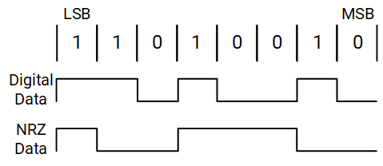

#### Reset

The UARTs are disabled on reset. To enable a UART, software must program the Multi-function Pin registers, then set the \<UART Unit Enable\> field in the Interrupt Enable Register. When the UART is enabled, the receiver waits for a frame start bit, and the transmitter sends data if it is available in the Transmit Holding Register. Transmit data can be written to the Transmit Holding Register before the UARTunit is enabled. In FIFO mode, data is transmitted from the FIFO to the Transmit Holding Register before it goes to the pin.

When the UART unit is disabled, the transmitter or receiver finishes the current byte and stops transmitting or receiving more data. Data in the FIFO is not cleared and transmission resumes when the UART is enabled.

#### FIFO Operation

Each UART has a Transmit FIFO and a Receive FIFO, with each FIFO holding 64 characters of data.There are 2 methods for moving data into or out of the FIFOs: DMA, Program I/O.

In DMA mode, interrupts are used to control the data flow; whereas, in Program I/O mode, polling is used.

In DMA mode, software must set the DMA stop interrupt on the last Descriptor in the chain to avoid errors.

##### FIFO Interrupt Mode: Receive Interrupt

For a Receive interrupt to occur, the Receive FIFO and Receive interrupts mustbe enabled. The \<Interrupt Source Encoded\> field in the Interrupt Identification Register changes to show that Receive data is available when the FIFO reaches its trigger threshold. The \<Interrupt Source Encoded\> field changes to show the next waiting interrupt when the FIFO drops below the trigger threshold. A change in the \<Interrupt Source Encoded\> field triggers an interrupt to the core.

Software reads the \<Interrupt Source Encoded\> field to determine the cause of the interrupt.

The Receive-line-status interrupt (Interrupt Identification Register = 0xC6) has the highest priority; the received-data-available interrupt (Interrupt Identification Register = 0xC4) is lower. The line-status interrupt occurs only when the character at the front of the FIFO has errors.

The \<Data Ready\> field in the Line Status Register is set when a character is transferred from the Shift register to the Receive FIFO. \<Data Ready\> is cleared when the FIFO is empty.

##### FIFO Interrupt Mode: Character Timeout Interrupt

A character(receiver) timeout interrupt occurs when the Receive FIFO and Receive timeout interrupt are enabled and all of the following conditions exist:

- At least 1 character is in the FIFO.
- The most recently received character was received more than 4 continuous character times ago.
- The most recent FIFO read was performed more than 4 continuous character times ago.

After the k1 reads 1 character from the Receive FIFO or a new start bit is received, the timeout interrupt is cleared, and the timeout is reset. If a timeout interrupt has not occurred, the timeout is reset when a new character is received or the k1 reads the Receive FIFO.

##### FIFO Interrupt Mode: Transmit interrupt

Transmit interrupts can occur only when the Transmit FIFO and Transmit interrupt are enabled. The Transmit data-request interrupt occurs when the Transmit FIFO is at least half empty. The interrupt is cleared when the Transmit Holding Register is written or the Interrupt Identification Register is read.

##### FIFO Interrupt Mode: Removing Trailing Bytes

The k1 must remove trailing bytes when not in DMA mode or when the DMA mode bit (\<Trailing Bytes\> field in the FIFO Control Register) is not set. The presence of trailing bytes is signaled by the assertion of a character timeout interrupt. When servicing a character timeout interrupt, the k1 uses the following procedure:

- Read the Line Status Register and check for errors.
- Disable the receiver timeout interrupt via \<Receiver Time-out Interrupt Enable\> field in the Interrupt Enable Register.
- Read data from the UART FIFO.
- Read the Line Status Register, check for errors, and LOOP back to the previous step. If the \<Data Ready\> field is SET, go to the next step.
- No more data in FIFO: Re-enable RTO interrupt via the \<Modem Interrupt Enable\> field in the Interrupt Enable Register.
- Done

##### FIFO Polled Mode Operation

When the FIFOs are enabled, clearing both the \<DMA Requests Enable\> field and bits [4:0] in the Interrupt Enable Register places the port in FIFO polled operating mode. The receiver and the transmitter are controlled separately. Either one or both can be in polled mode. In polled mode, software checks receiver and transmitter status via the Line Status Register. K1 polls the following bits for the Receive and Transmit data service:

- Receive Data Service -- K1 checks the \<Data Ready\> field, which is set when 1 or more bytes remain in the Receive FIFO or Receive Buffer Register.
- Transmit Data Service -- K1 checks the \<Transmit Data Request\> field in the Line Status Register, which is set when the transmitter needs data.

K1 can also check the \<Transmitter Empty\> field in the Line Status Register, which is set when the Transmit FIFO.

##### FIFO DMA Mode Operation

The UART has 2 DMA requests: 1 for Transmit data service and 1 for Receive data service. DMA requests are generated in FIFO mode only. The requests are activated by setting the \<DMA Requests Enable\>field in the Interrupt Enable Register.

- Data Transmitter Data Service -- when \<DMA Requests Enable\> is set, if the Transmit FIFO is absolutely less than half full, the Transmit-DMA request is generated. The DMA Controller (DMAC) then writes data to the FIFO. For each DMA request, the DMAC can send 8, 16, or 32 bytes of data to the FIFO. The UART FIFO accepts partial-word or full-word transfers of 1, 2, 3, or 4 consecutive bytes from the DMAC or Program I/O. The actual number of bytes to be transmitted is programmed in the DMAC.
- Data Receiver Data Service -- when \<DMA Requests Enable\> is set, the Receive-DMA request is generated when the Receive FIFO reaches its trigger threshold with no errors in its entries. The DMAC then reads data from the FIFO. For each DMA request, the DMAC can read 8, 16, or 32 bytes of data from the FIFO. When in 32-bit peripheral bus mode, the DMAC always attempts to read 4 bytes of data per transfer. Where less than 4 bytes are being transferred, the valid bytes are indicated by a data-valid bus shared between the UART and the DMAC. The UART can send 1, 2, 3, or 4 bytes of data per bus transaction. The actual number of bytes to be read is programmed in the DMAC along with the bus width.

##### DMA Receive Programming Errors

If the DMA channel stops prematurely due to the end of a Descriptor chain or other error, the K1 must be notified since the DMAC can no longer service the UARTs FIFOs.If this occurs, the K1 must correct the situation by programming another Descriptor or by servicing the FIFOs via interrupt or polling mode, as described above. There are 2 methods for notifying the K1 of a stopped DMA channel:

- Program the DMAC to interrupt on the event of a stopped channel by setting DCSR[StopIrqEn].
- For the Receive channel, the UART interrupts with an end-of-Descriptor chain (EOC) interrupt if \<Trailing Bytes\> is set, such that the UART makes a DMA request to remove trailing bytes (see Removing Trailing Bytes In DMA Mode). Using the UART interrupt for the Receive channel is preferable to the DMA DCSR interrupt because extra logic exists to ensure that the UART EOC interrupt asserts only when necessary. For example, a UART EOC interrupt does not assert if the UART has completed the reception of its message (indicated by the character timeout timer) and the Receive FIFO is empty. The \<DMA End of Descriptor Chain\> field in the Interrupt Identification Register interrupt does not assert if \<Trailing Bytes\> is cleared.

##### DMA Error Handlin

If an error occurs while in DMA mode, the Receive-DMA requests are disabled and the error interrupt,\<Interrupt Source Encoded\>, is generated.

The K1 must now read out the error bytes through Programmed Input/Output (PIO). After all errors have been removed from the FIFO, the Receive DMA requests are once again enabled by the UART.

If an error occurs when the Receive FIFO trigger threshold has been reached such that a Receive DMA request is set, software must wait for the DMA to finish the transfer before reading out the error bytes through PIO. Otherwise, FIFO underflow could occur.

##### Removing Trailing Bytes In DMA Mode

When the number of entries in the Receive FIFO is less than its trigger threshold and no additional data is received, the remaining bytes are called trailing bytes. Set \<Trailing Bytes\> to program the UART to make a DMA request to remove the trailing bytes. Setting \<Trailing Bytes\> also enables the \<DMA End of Descriptor Chain\> interrupt.

A request is issued automatically for the remaining number of bytes left in the Receive buffer when the DMAC is removing trailing bytes. The DMAC then empties the contents of the Receive buffer unless the DMA reaches the end of its Descriptor chain. If the DMA reaches the end of the Descriptor chain while removing trailing bytes, the K1 is forced to take over because the DMAC can no longer service the UART request until a new chain is linked. In this situation, the UART sets\<DMA End of Descriptor Chain\> ifdata exists in the Receive FIFO, and if \<Receiver Time-out Interrupt Enable\> is set, it also sets the \<Time Out Detected\> field in the Interrupt Identification Register. The remaining bytes must then be removed using Processor I/O mode as described in FIFO Interrupt Mode Operation.

##### False EOR Due to Character Time-out Expiration

It is possible for a false EOR to be asserted by the UART in the middle of receiving a message if a pause in the remote data transmissions is long enough to cause the timeout counter to expire. This situation causes an EOR to be sent to the DMAC if in DMA mode. If this situation occurs, the EOR is applied to the last byte of data in the FIFO when the DMA responds to the EOR request. The EOR is not applied to the last byte in the FIFO at the time of the character timeout. Therefore, if remote transmission resumes before the DMA responds to the EOR request, the EOR flag is applied to the new data that entered the FIFO and not to the last byte in the FIFO at the time of the character timeout.

##### EOR Must be Serviced Prior to Transmission of New Message

A caveat to this behavior could be encountered under legitimate EOR situations: for example, if Message A ends with 3 bytes in the FIFO, an EOR request is made to the DMAC to remove these bytes. If transmission of a new Message B resumes before the DMAC responds to the EOR request of Message A, the EOR could be applied to the first byte of Message B if this byte is written into the FIFO before the DMAC responds to message A’s EOR request. Although this situation could occur, it would be considered a programming error because the higher communication protocol must prevent Message B transmission until the local receiver acknowledges the receipt of Message A. The exception to this scenario would be if enough new bytes enter the FIFO to push the FIFO level to its programmed data threshold. If this situation occurs, the request is treated as a normal service request and no EOR flag is asserted to the DMAC.

#### Auto-Flow Control

Auto-flow control uses the Clear to Send (CTSn) and Request to Send (RTSn) signals to automatically control the flow of data between the UART and external modem. When auto-flow is enabled, the remote device is not allowed to send data unless the UART asserts (that is, sets to 0) RTSn. If the UART de-asserts (that is, sets to 1) RTSn while the remote device is sending data, the remote device is allowed to send 1 additional byte after RTSn is de-asserted. An overflow could occur if the remote device violates this rule. Likewise, the UART is not allowed to transmit data unless the remote device asserts CTSn (that is, sets to 0). ASR recommends using this feature because it increases system efficiency and eliminates the possibility of a Receive-FIFO-overflow errordue to long interrupt latency.

Auto-flow mode can be used in 2 ways:

- full auto-flow, automating both CTSn and RTSn
- half auto-flow, automating only CTSn

Set the \<Request to Send\> and \<Auto-flow Control Enable\> fields in the Modem Control Register to enable full auto-flow. Set \<Auto-flow Control Enable\> and clear \<Request to Send\> to enable auto-CTSn-only mode.

##### RTSn (UART Output)

When in full Auto-flow mode, RTSn is asserted (0) when the UART FIFO is ready to receive data from the remote transmitter. This scenario occurs when the amount of data in the Receive FIFO is below the programmable trigger threshold value. RTSn is de-asserted (set to 1) when the amount of data in the Receive FIFO reaches the programmable trigger threshold. It is asserted again when enough bytes are removed from the FIFO to lower the data level below the trigger threshold.

##### CTSn (UART Input)

When in full- or half-Auto-flow mode, CTSn is asserted (set to 0) by the remote receiver when the receiver isready to receive data from the UART. The UART checks CTSn before sending the next byte of data and does not transmit the byte until CTSn is low. The transmitter completes this byte if CTSn goes high while the transfer of a byte is in progress.

If UART transmission is stalled by disabling the UART, none of the interrupts in the Modem Status Register indicate an interrupt when CTSn re-asserts because disabling the UART also disables interrupts. ASR recommends using auto-CTS in Auto-flow mode.

#### Auto-Baud-Rate Detection

Each UART supports auto-baud-rate detection. When enabled, the UART counts the number of clock cycles within the start-bit pulse. This number is then written into the Auto-Baud Count Register (as described in **K1**** Registers**) and is used to calculate the baud rate. When the Auto-Baud Count Register is written, an auto-baud-lock interrupt is generated (if enabled), and the UART automatically programs the Divisor Latch Registers with the appropriate baud rate. If preferred, K1 can read the Auto-Baud Count Register and use this information to program the Divisor Latch Low Byte Register and Divisor Latch High Byte Register with a baud rate calculated by K1. After the baud rate has been programmed, the K1 verifies that the predetermined characters (usually AT or at) are being received correctly.

If the UART is to program the Divisor Latch Registers, software can use either of 2 methods for auto-baud calculation:

- Table-based method
- Formula-based method

The method is selected via the \<ABT\> field in the Auto-Baud Control Register. The baud rates that are seen in most commercial electronics, which are referred to as “common,” include:

- Formula-based method
  Any baud rate can be programmed by the UART. This method works well for higher baud rates, but it could fail below 28.8 kbps if the remote transmitter’s actual baud rate differs by more than 1 percent of its target.
- Table-based method
  It is more immune to such errors, because the table rejects uncommon baud rates and rounds to the common ones. The table method allows any baud rate defined by the formula in **Section**** 18.3.3.8**. Programmable Baud-Rate Generator above 28.8 kbps. Below 28.8 kbps, the only baud rates that can be programmed by the UART are 19200, 14400, 9600, 4800, 1200, and 300 baud.

When the baud rate is detected, the auto-baud circuitry disables itself by clearing the \<ABE\> field in the Auto-Baud Count Register. To re-enable auto-baud detection, set the \<ABE\> field again.

> **Note.** Changing the baud rate is not permitted when actively transmitting or receiving data. Auto-baud-rate detection is not supported in IrDA (serial infrared) mode.

#### 32-Bit Peripheral Bus

Each UART supports an 8- (default) or 32-bit peripheral bus. If a 32-bit bus is preferred, set the \<32-Bit Peripheral Bus\> field in the FIFO Control Register. The bytes are written in Little Endian format (7:0) with byte 3 (the most recent byte) starting at bit [31], byte 2 starting at bit [23], and so on.

8-bit mode—only the least significant byte contains valid data on the peripheral bus. The upper 24 bits are ignored.

32-bit mode—the UART can read or write partial words of 1, 2, 3, or 4 continuous bytes from the peripheral bus. The method in which the valid bytes of data are determined differs depending on whether the transaction is being handled by the DMAC or PIO.

DMA—the DMAC can read or write 1,2, 3, or 4 continuous bytes per word. The number of valid bytes available per word is determined internally between the DMAC and the UART.

PIO—the K1 is restricted to reading or writing 1, 2, or 4 bytes per word. When reading, the K1 must read the Receive FIFO Occupancy Register to retrieve the number of bytes available in the Receive buffer. If the number ofbytes available is 4 or greater, the K1 can request any number of bytes per word (except 3). If the number is less than 4, software must request the proper number of bytes. When 3 bytes are remaining, software must requesteither 2 bytes followed by 1 byte or 1 byte followed by 2 bytes. The UART retrieves unusable data for the non-valid bytes if the K1 reads more than the number of bytes available in the Receive buffer. The Receive FIFO counters do not increase.

> **Note.** The Receive and Transmit FIFOs must be enabled when in 32-bit mode.

#### Programmable Baud-Rate Generator

Each UART contains a programmable baud-rate generator that can take a fixed-input clock and divide it down to generate the preferred baud rate. The baud rate is calculated by taking the 14.7456 MHz fixed-input clock or the 57.60 MHz clock (in high speed mode and dividing it by the Divisor Latch Low Register. For high speed mode, a divisor of 1 or 2 is required.

The baud-rate generator output frequency is 16 times the baud rate. Two 8-bit Divisor Latch Registers (Divisor Latch Low Register and Divisor Latch High Register as described in the _K1__ Registers_) store the divisor in a 16-bit binary format. Load these divisor latches during initialization to ensure that the baud-rate generator operates properly. The 16X clock stops if each Divisor Latch register is loaded with 0x0.

The recommended baud rates based on divisor values (Divisor Latch High Byte Register / Divisor Latch Low Byte Register) is tabled below.

<table>
<tbody>
<tr>
<td><strong>Required Baud Rate</strong></td>
<td><strong>Divisor </strong></td>
<td><strong>14.7456 </strong><strong>MHz </strong><br/><strong>Actual Baud Rate</strong></td>
<td><strong>48 MHz Actual Baud Rate</strong></td>
<td><strong>5</strong><strong>7</strong><strong>.</strong><strong>60</strong><strong> MHz Actual Baud Rate</strong></td>
</tr>
<tr>
<td>9600</td>
<td>96</td>
<td>9600</td>
<td>—</td>
<td>—</td>
</tr>
<tr>
<td>19200</td>
<td>48</td>
<td>19200</td>
<td>—</td>
<td>—</td>
</tr>
<tr>
<td>38400</td>
<td>24</td>
<td>38400</td>
<td>—</td>
<td>—</td>
</tr>
<tr>
<td>57600</td>
<td>16</td>
<td>57600</td>
<td>—</td>
<td>—</td>
</tr>
<tr>
<td>115200</td>
<td>8</td>
<td>115200</td>
<td>—</td>
<td>—</td>
</tr>
<tr>
<td>230400</td>
<td>4</td>
<td>230400</td>
<td>—</td>
<td>—</td>
</tr>
<tr>
<td>460800</td>
<td>2</td>
<td>460800</td>
<td>—</td>
<td>—</td>
</tr>
<tr>
<td>921600</td>
<td>1</td>
<td>921600</td>
<td>—</td>
<td>—</td>
</tr>
<tr>
<td>1000000</td>
<td>3</td>
<td>—</td>
<td>1000000</td>
<td>—</td>
</tr>
<tr>
<td>1500000</td>
<td>2</td>
<td>—</td>
<td>1500000</td>
<td>—</td>
</tr>
<tr>
<td>1842000</td>
<td>2</td>
<td>—</td>
<td>—</td>
<td>1954398</td>
</tr>
<tr>
<td>3000000</td>
<td>1</td>
<td>—</td>
<td>3000000</td>
<td>—</td>
</tr>
<tr>
<td>3686400</td>
<td>1</td>
<td>—</td>
<td>—</td>
<td>3908796</td>
</tr>
</tbody>
</table>

The divisor reset value is 0x0002. Changing the baud rate (writing to registers Divisor Latch Low Byte Register and Divisor Latch High Byte Register) is not permitted while actively transmitting or receiving data.

### Register Description

> **Note.**
>
> - The UART_0 Register Base Address is 0xF0612000
> - The UART_2~9 Register Base Address is 0xD4017000 ~ 0xD4017800, each address space of 256-Byte

#### Receive Buffer Register

In non-FIFO mode, this register holds the character(s) received by the UART Receive Shift Register. If this register is configured to use fewer than 8 bits, the bits are right-justified and the most significant bits (MSbs) are zeroed. Reading the register empties the register and clears the \<Data Ready\> field in the Line Status Register. This register latches the value of the data byte at the front of the FIFO in FIFO mode.

<table>
<tbody>
<tr>
<td rowspan=1 colspan=5><strong>Offset: </strong><strong>0x0</strong></td>
</tr>
<tr>
<td><strong>Bits</strong></td>
<td><strong>Field</strong></td>
<td><strong>Type</strong></td>
<td><strong>Reset</strong></td>
<td><strong>Description</strong></td>
</tr>
<tr>
<td>31:24</td>
<td>BYTE_3</td>
<td>RO</td>
<td>0x0</td>
<td>Byte 3.<br/>This field is only valid in 32-bit peripheral bus mode. </td>
</tr>
<tr>
<td>23:16</td>
<td>BYTE_2</td>
<td>RO</td>
<td>0x0</td>
<td>Byte 2.<br/>This field is only valid in 32-bit peripheral bus mode. </td>
</tr>
<tr>
<td>15:8</td>
<td>BYTE_1</td>
<td>RO</td>
<td>0x0</td>
<td>Byte 1.<br/>This field is only valid in 32-bit peripheral bus mode. </td>
</tr>
<tr>
<td>7:0</td>
<td>BYTE_0</td>
<td>RO</td>
<td>0x0</td>
<td>Byte 0.<br/>This field is only valid in 32-bit peripheral bus mode. </td>
</tr>
</tbody>
</table>

#### Transmit Holding Register

This register holds the data byte(s) to be transmitted next in non-FIFO mode. When the Transmit Shift Register is emptied, the contents of this register are loaded into the Transmit Shift Register and the \<Transmit Data Request\> field in the Line Status Register is set. A write to Transmit Holding Register puts data at the top of the FIFO in FIFO mode. The data at the front of the FIFO is loaded into the Transmit Shift Register when the Transmit Shift Register is empty.

<table>
<tbody>
<tr>
<td rowspan=1 colspan=5><strong>Offset: 0x0</strong></td>
</tr>
<tr>
<td><strong>Bits</strong></td>
<td><strong>Field</strong></td>
<td><strong>Type</strong></td>
<td><strong>Reset</strong></td>
<td><strong>Description</strong></td>
</tr>
<tr>
<td>31:24</td>
<td>BYTE_3</td>
<td>WO</td>
<td>0x0</td>
<td>Byte 3.<br/>This field is only valid in 32-bit peripheral bus mode. </td>
</tr>
<tr>
<td>23:16</td>
<td>BYTE_2</td>
<td>WO</td>
<td>0x0</td>
<td>Byte 2.<br/>This field is only valid in 32-bit peripheral bus mode. </td>
</tr>
<tr>
<td>15:8</td>
<td>BYTE_1</td>
<td>WO</td>
<td>0x0</td>
<td>Byte 1.<br/>This field is only valid in 32-bit peripheral bus mode. </td>
</tr>
<tr>
<td>7:0</td>
<td>BYTE_0</td>
<td>WO</td>
<td>0x0</td>
<td>Byte 1.<br/>This field is only valid in 32-bit peripheral bus mode. </td>
</tr>
</tbody>
</table>

#### Divisor Latch Low Byte Register

<table>
<tbody>
<tr>
<td rowspan=1 colspan=5><strong>Offset: 0x0</strong></td>
</tr>
<tr>
<td><strong>Bits</strong></td>
<td><strong>Field</strong></td>
<td><strong>Type</strong></td>
<td><strong>Reset</strong></td>
<td><strong>Description</strong></td>
</tr>
<tr>
<td>31:8</td>
<td>Reserved</td>
<td>RO</td>
<td>0x0</td>
<td>Reserved for future use.</td>
</tr>
<tr>
<td>7:0</td>
<td>DLL</td>
<td>RW</td>
<td>0x2</td>
<td>Divisor Latch Low.<br/>Low-byte compare value to generate baud rate.</td>
</tr>
</tbody>
</table>

#### Divisor Latch High Byte Register

<table>
<tbody>
<tr>
<td rowspan=1 colspan=5><strong>Offset: 0x4</strong></td>
</tr>
<tr>
<td><strong>Bits</strong></td>
<td><strong>Field</strong></td>
<td><strong>Type</strong></td>
<td><strong>Reset</strong></td>
<td><strong>Description</strong></td>
</tr>
<tr>
<td>31:10</td>
<td>Reserved</td>
<td>RO</td>
<td>0x0</td>
<td>Reserved for future use.</td>
</tr>
<tr>
<td>7:0</td>
<td>DLH</td>
<td>RW</td>
<td>0xx</td>
<td>Divisor Latch High.<br/>High-byte compare value to generate baud rate.</td>
</tr>
</tbody>
</table>

#### Interrupt Enable Register

This register enables the 5 types of interrupts that set a value in the Interrupt Identification Register. Software must clear the appropriate bit in this register to disable an interrupt. Software can enable some interrupts by setting the appropriate bit.

The character timeout-indication interrupt is separated from the received data-available interrupt to ensure that the K1 and the DMA controller do not service the receive FIFO at the same time. When a character-timeout-indication interrupt occurs, the K1 must handle the data in the receive FIFO through programmed I/O.

An error interrupt is used when DMA requests are enabled. The interrupt is generated when the \<FIFO Error Status\> field in the Line Status Register is set because a receive DMA request is not generated when the receive FIFO has an error. The error interrupt tells the K1 to handle the data in the receive FIFO through programmed I/O. The error interrupt is enabled when DMA requests are enabled, and it can not be masked. Receiver line-status interrupts occur when the error is at the front of the FIFO.

When DMA requests are enabled and an interrupt occurs, software must first read the Line Status Register to see if an error interrupt exists, then checks the Interrupt Identification Register for the source of the interrupt. Software must read the Infrared Selected Register to determine the error condition if an interrupt occurs and the \<FIFO Error Status\> field in the Line Status Register is clear. DMA requests are automatically enabled when the last error byte is read from the FIFO. Software is not required to check for the error interrupt if DMA requests are disabled because an error interrupt occurs only when DMA requests are enabled.

The \<FIFO Error Status\> field is used to enable DMA requests. This register also contains the unit enable and NRZ coding enables control bits. Bits [7:4] are used differently from the standard 16550A register definition.

Software must not set the \<DMA Requests Enable\> field while the \<Transmit Data Request Interrupt Enable\> or \<Receiver Data Available Interrupt Enable\> fields are set to ensure that the DMA controller and programmed I/O do not access the same FIFO.

<table>
<tbody>
<tr>
<td rowspan=1 colspan=5><strong>Offset: 0x4</strong></td>
</tr>
<tr>
<td><strong>Bits</strong></td>
<td><strong>Field</strong></td>
<td><strong>Type</strong></td>
<td><strong>Reset</strong></td>
<td><strong>Description</strong></td>
</tr>
<tr>
<td>31:8</td>
<td>Reserved</td>
<td>RO</td>
<td>0x0</td>
<td>Reserved for future use.</td>
</tr>
<tr>
<td>7</td>
<td>DMAE</td>
<td>RW</td>
<td>0x0</td>
<td>DMA Requests Enable.<br/>0 = DMA requests are disabled.<br/>1 = DMA requests are enabled.</td>
</tr>
<tr>
<td>6</td>
<td>UUE</td>
<td>RW</td>
<td>0x0</td>
<td>UART Unit Enable.<br/>UART transmit and receive enable. Transmit data can be written to the Transmit Holding Register before the UART unit is enabled. When the UART unit is disabled, the transmitter or receiver finishes the current byte and stops transmitting or receiving more data. Data in the FIFO is not cleared and transmission resumes when the UART is enabled<br/>0 = Unit is disabled.<br/>1 = Unit is enabled.</td>
</tr>
<tr>
<td>5</td>
<td>NRZE</td>
<td>RW</td>
<td>0x0</td>
<td>NRZ Coding Enable.<br/>NRZ encoding/decoding is only used in UART mode, not in infrared mode. If the serial infrared receiver or transmitter is enabled, NRZ coding is disabled.<br/>0 = NRZ coding disabled.<br/>1 = NRZ coding enabled.</td>
</tr>
<tr>
<td>4</td>
<td>RTOIE</td>
<td>RW</td>
<td>0x0</td>
<td>Receiver Time-out Interrupt Enable.<br/>The source for this field is the &lt;Time Out Detected&gt; field in the Interrupt Identification Register.<br/>0 = Receiver data time-out interrupt disabled.<br/>1 = Receiver data time-out interrupt enabled.</td>
</tr>
<tr>
<td>3</td>
<td>MIE</td>
<td>RW</td>
<td>0x0</td>
<td>Modem Interrupt Enable.<br/>The source for this field is the &lt;Interrupt Source Encoded&gt; field in the Interrupt Identification Register.<br/>0 = Modem status interrupt disabled.<br/>1 = Modem status interrupt enabled.</td>
</tr>
<tr>
<td>2</td>
<td>RLSE</td>
<td>RW</td>
<td>0x0</td>
<td>Receiver Line Status Interrupt Enable.<br/>The source for this field is the &lt;Interrupt Source Encoded&gt; field in the Interrupt Identification Register.<br/>0 = Receiver line status interrupt disabled.<br/>1 = Receiver line status interrupt enabled.</td>
</tr>
<tr>
<td>1</td>
<td>TIE</td>
<td>RW</td>
<td>0x0</td>
<td>Transmit Data Request Interrupt Enable.<br/>The source for this field is the &lt;Interrupt Source Encoded&gt; field in the Interrupt Identification Register.<br/>0 = Transmit FIFO data request interrupt disabled.<br/>1 = Transmit FIFO data request interrupt enabled.</td>
</tr>
<tr>
<td>0</td>
<td>RAVIE</td>
<td>RW</td>
<td>0x0</td>
<td>Receiver Data Available Interrupt Enable.<br/>The source for this field is the &lt;Interrupt Source Encoded&gt; field in the Interrupt Identification Register.<br/>0 = Receiver data available (trigger threshold reached) interrupt disabled.<br/>1 = Receiver data available (trigger threshold reached) interrupt enabled.</td>
</tr>
</tbody>
</table>

#### Interrupt Identification Register

<table>
<tbody>
<tr>
<td rowspan=1 colspan=5><strong>Offset: 0x8</strong></td>
</tr>
<tr>
<td><strong>Bits</strong></td>
<td><strong>Field</strong></td>
<td><strong>Type</strong></td>
<td><strong>Reset</strong></td>
<td><strong>Description</strong></td>
</tr>
<tr>
<td>31:9</td>
<td>Reserved</td>
<td>RO</td>
<td>0x0</td>
<td>Reserved for future use.<br/></td>
</tr>
<tr>
<td>8</td>
<td>EOR</td>
<td>RO</td>
<td>0x0</td>
<td>UART End of receive Status.<br/>0x0= uart rx not end.<br/>0x1= uart rx end.</td>
</tr>
<tr>
<td>7:6</td>
<td>FIFOES10</td>
<td>RO</td>
<td>0x0</td>
<td>FIFO Mode Enable Status.<br/>0x0 = Non-FIFO mode is selected.<br/>0x1 = Reserved.<br/>0x2 = Reserved.<br/>0x3 = FIFO mode is selected (&lt;Transmit and Receive FIFO Enable&gt; field in the FIFO Control Register = 1) </td>
</tr>
<tr>
<td>5</td>
<td>EOC</td>
<td>RO</td>
<td>0x0</td>
<td>DMA End of Descriptor Chain (see <strong>Section 18.3.3.7</strong>, 32-Bit Peripheral Bus ).<br/>0 = DMA has not signaled the end of its programmed descriptor chain.<br/>1 = DMA has signaled the end of its programmed descriptor chain.</td>
</tr>
<tr>
<td>4</td>
<td>ABL</td>
<td>RO</td>
<td>0x0</td>
<td>Auto-baud Lock (see <strong>Section 18.3.3.6</strong>, Auto-Baud-Rate Detection).<br/>0 = Auto-baud circuitry has not programmed Divisor Latch registers.<br/>1 = Divisor Latch registers programmed by auto-baud circuitry.</td>
</tr>
<tr>
<td>3</td>
<td>TOD</td>
<td>RO</td>
<td>0x0</td>
<td>Time Out Detected (see <strong>Section 18.3.3.4.2</strong>, Character Timeout Interrupt).<br/>0 = No time out interrupt is pending.<br/>1 = Time out interrupt is pending (FIFO mode only).</td>
</tr>
<tr>
<td>2:1</td>
<td>IID10</td>
<td>RO</td>
<td>0x0</td>
<td>Interrupt Source Encoded.<br/>0x0 = Modem Status (CTS, DSR, RI, DCD modem signals changed state).<br/>0x1 = Transmit FIFO requests data.<br/>0x2 = Received data available.<br/>0x3 = Receive error (Overrun, parity, framing, break, FIFO error. See Modem Status Register at <strong>Section 18.3.4.11</strong>).</td>
</tr>
<tr>
<td>0</td>
<td>NIP</td>
<td>RO</td>
<td>0x1</td>
<td>Interrupt Pending.<br/>0 = Interrupt is pending (active low).<br/>1 = No interrupt is pending.</td>
</tr>
</tbody>
</table>

#### FIFO Control Register

This is a write-only register that is located at the same address as the Interrupt Identification Register, which is a read-only register. This register enables/disables the transmit/receive FIFOs, clears the transmit/receive FIFOs, and sets the receive FIFO trigger threshold.

The trigger level must be equal to the DMA burst length programmed in the DMA registers.

When the number of bytes in the receive FIFO equals the interrupt trigger level programmed into this field and the received-data-available interrupt is enabled (via the Interrupt Enable Register), an interrupt is generated and the appropriate bits are set in the Interrupt Identification Register. The receive DMA request is generated as well when trigger level is reached. The trigger level must be greater than or equal to the DMA burst size programmed in the DMA registers.

<table>
<tbody>
<tr>
<td rowspan=1 colspan=5><strong>Offset: 0x8</strong></td>
</tr>
<tr>
<td><strong>Bits</strong></td>
<td><strong>Field</strong></td>
<td><strong>Type</strong></td>
<td><strong>Reset</strong></td>
<td><strong>Description</strong></td>
</tr>
<tr>
<td>31:8</td>
<td>Reserved</td>
<td>RO</td>
<td>0x0</td>
<td>Reserved for future use.</td>
</tr>
<tr>
<td>7:6</td>
<td>ITL<br/></td>
<td>WO</td>
<td>0x0</td>
<td>Interrupt Trigger Level (threshold)<br/>When the number of bytes in the receive FIFO equals the interrupt trigger threshold programmed into this field and the received-data-available interrupt is enabled via the Interrupt Enable Register, an interrupt is generated and appropriate bits are set in the Interrupt Identification Register. The receive DMA request is also generated when the trigger threshold is reached.<br/>0x0 = 1 byte or more in FIFO causes interrupt (not valid in DMA mode).<br/>0x1 = 8 bytes or more in FIFO causes interrupt and DMA request.<br/>0x2 = 16 bytes or more in FIFO causes interrupt and DMA request.<br/>0x3 = 32 bytes or more in FIFO causes interrupt and DMA request.</td>
</tr>
<tr>
<td>5</td>
<td>BUS</td>
<td>WO</td>
<td>0x0</td>
<td>32-Bit Peripheral Bus.<br/>0 = 8-bit peripheral bus.<br/>1 = 32-bit peripheral bus.</td>
</tr>
<tr>
<td>4</td>
<td>TRAIL</td>
<td>WO</td>
<td>0x0</td>
<td>Trailing Bytes.<br/>0 = Trailing bytes are removed by the K1.<br/>1 = Trailing bytes are removed by the DMAC.</td>
</tr>
<tr>
<td>3</td>
<td>TIL</td>
<td>WO</td>
<td>0x0</td>
<td>Transmitter Interrupt Level<br/>0 = Interrupt/DMA request when FIFO is half empty <br/>1 = Interrupt/DMA request when FIFO is empty </td>
</tr>
<tr>
<td>2</td>
<td>RESETTF</td>
<td>WO</td>
<td>0x0</td>
<td>Reset Transmit FIFO.<br/>When this field is set, all the bytes in the transmit FIFO are cleared. The &lt;Transmit Data Request&gt; field in the Line Status Register is set and the Interrupt Identification Register shows a transmitter requests data interrupt, if the &lt;Transmit Data Request Interrupt Enable&gt; field in the Interrupt Enable Register is set. The Transmit Shift Register is not cleared, and it completes the current transmission.<br/>0 = Writing 0 has no effect.<br/>1 = The transmit FIFO is cleared.</td>
</tr>
<tr>
<td>1</td>
<td>RESETRF</td>
<td>WO</td>
<td>0x0</td>
<td>Reset Receive FIFO.<br/>When this field is set, all the bytes in the receive FIFO are cleared. The &lt;Data Ready&gt; field in the Line Status Register is reset to 0. All the error bits in the FIFO and the &lt;FIFO Error Status&gt; field in the Line Status Register are cleared. Any error bits, OE, PE, FE or BI, that had been set in the Line Status Register are still set. The Receive Shift Register is not cleared. If the Interrupt Identification Register had been set to receive data available, it is cleared.<br/>0 = No effect.<br/>1 = The receive FIFO is cleared.</td>
</tr>
<tr>
<td>0</td>
<td>TRFIFOE</td>
<td>WO</td>
<td>0x0</td>
<td>Transmit and Receive FIFO Enable.<br/>This field enables/disables the transmit and receive FIFOs. When set, both FIFOs are enabled (FIFO mode). When clear, the FIFOs are both disabled (non-FIFO mode). Writing 0x0 to this field clears all bytes in both FIFOs. When changing from FIFO mode to non-FIFO mode and vice versa, data is cleared automatically from the FIFOs. This field must be set when other fields in this register are written or the other bits are not programmed.<br/>0 = FIFOs are disabled.<br/>1 = FIFOs are enabled.</td>
</tr>
</tbody>
</table>

#### Line Control Register

This register specifies the format for the asynchronous data-communications exchange. The serial-data format consists of a start bit, 8 data bits, an optional parity bit, and 1 stop bit. This register has bits that allow access to the Divisor Latch registers and bits that can cause a break condition.

<table>
<tbody>
<tr>
<td rowspan=1 colspan=5><strong>Offset: 0xC</strong></td>
</tr>
<tr>
<td><strong>Bits</strong></td>
<td><strong>Field</strong></td>
<td><strong>Type</strong></td>
<td><strong>Reset</strong></td>
<td><strong>Description</strong></td>
</tr>
<tr>
<td>31:8</td>
<td>Reserved</td>
<td>RO</td>
<td>0x0</td>
<td>Reserved for future use.<br/></td>
</tr>
<tr>
<td>7</td>
<td>DLAB</td>
<td>RW</td>
<td>0x0</td>
<td>Divisor Latch Access Bit.<br/>Must be set to access the Divisor Latch registers of the baud-rate generator during a read or write operation. Must be clear to access the receive buffer, the Transmit Holding Register or the Interrupt Enable Register.<br/>0 = access Transmit Holding Register, Receive Buffer Register, and Interrupt Enable Register.<br/>1 = access Divisor Latch registers (DLL and DLH) </td>
</tr>
<tr>
<td>6</td>
<td>SB</td>
<td>RW</td>
<td>0x0</td>
<td>Set Break.<br/>Causes a break condition to be transmitted to the receiving UART. Acts only on the TXD pin and has no effect on the transmit logic. In FIFO mode, wait until the transmitter is idle (&lt;Transmitter Empty&gt; field in the Line Status Register = 1] to set and clear SB.<br/>0 = No effect on TXD output.<br/>1 = Forces TXD output to 0 (space).</td>
</tr>
<tr>
<td>5</td>
<td>STKYP</td>
<td>RW</td>
<td>0x0</td>
<td>Sticky Parity.<br/>Forces the bit value at the parity bit location to be the opposite of the &lt;Even Parity Select&gt; field rather than the parity value. This stops parity generation. If &lt;Parity Enable&gt; = 0, this field is ignored.<br/>0 = No effect on parity bit.<br/>1 = Forces parity bit to be opposite of &lt;Even Parity Select&gt; field value.</td>
</tr>
<tr>
<td>4</td>
<td>EPS</td>
<td>RW</td>
<td>0x0</td>
<td>Even Parity Select.<br/>If &lt;Parity Enable&gt; = 0, this field is ignored.<br/>0 = Sends or checks for odd parity. <br/>1 = Sends or checks for even parity </td>
</tr>
<tr>
<td>3</td>
<td>PEN</td>
<td>RW</td>
<td>0x0</td>
<td>Parity Enable.This field enables a parity bit to be generated on transmission or checked on reception.<br/>0 = No parity.<br/>1 = Parity </td>
</tr>
<tr>
<td>2</td>
<td>STB</td>
<td>RW</td>
<td>0x0</td>
<td>Stop Bits.<br/>Specifies the number of stop bits transmitted and received in each character. When receiving, the receiver checks only the first stop bit. This field must be clear.<br/>0 = 1 stop bit.</td>
</tr>
<tr>
<td>1:0</td>
<td>WLS10</td>
<td>RW</td>
<td>0x0</td>
<td>Word Length Select.<br/>Specifies the number of data bits in each transmitted or received character.<br/>0x0, 0x1, 0x2 = 7-bit character.<br/>0x3 = 8-bit character.</td>
</tr>
</tbody>
</table>

#### Modem Control Register

This register uses the modem control pins RTSn and DTRn to control the interface with a modem or data set. This register also controls the loopback mode. Loopback mode must be enabled before the UART is enabled.

<table>
<tbody>
<tr>
<td rowspan=1 colspan=5><strong>Offset: 0x10</strong></td>
</tr>
<tr>
<td><strong>Bits</strong></td>
<td><strong>Field</strong></td>
<td><strong>Type</strong></td>
<td><strong>Reset</strong></td>
<td><strong>Description</strong></td>
</tr>
<tr>
<td>31:8</td>
<td>Reserved</td>
<td>RO</td>
<td>0x0</td>
<td>Reserved for future use.<br/></td>
</tr>
<tr>
<td>7</td>
<td>EPT_RXREQ_EN</td>
<td>RW</td>
<td>0x0</td>
<td>this bit set to enable uart send dma_rx_req when time out  not care the fifo empty state.<br/>0=do not send dma_rxreq when fifo empty.<br/>1= send dma_rxreq when time out  no matter if there is data in the rx fifo.</td>
</tr>
<tr>
<td>6</td>
<td>EOR_INT_MASK</td>
<td>RW</td>
<td>0x0</td>
<td>mask bit for eor interrupt.<br/>0 = eor interrupt detection logic will work.<br/>1 = eor interrupt detection logic will not work.</td>
</tr>
<tr>
<td>5</td>
<td>AFE</td>
<td>RW</td>
<td>0x0</td>
<td>Auto-flow Control Enable.<br/>0 = Auto-RTS and auto-CTS are disabled.<br/>1 = Auto-CTS is enabled. If &lt;Request to Send&gt; is also set, both auto-CTS and auto-RTS are enabled. </td>
</tr>
<tr>
<td>4</td>
<td>LOOP</td>
<td>RW</td>
<td>0x0</td>
<td>Loopback Mode. <br/>This field provides a local loopback feature for diagnostic testing of the UART. When set, the following occurs: The transmitter serial output is set to a logic 1 state. The receiver serial input is disconnected from the pin. The output of the Transmit Shift Register is &lt;q&gt;looped back&lt;/q&gt; into the Receive Shift Register input. The four modem control inputs (CTSn, DSRn, DCDn, and RIn) are disconnected from the pins and the modem control output pins (RTSn and DTRn) are forced to their inactive state. Coming out of the loopback mode may result in unpredictable activation of the delta bits (bits 30) in the Modem Status Register. CHIP recommends that the Modem Status Register be read once to clear its delta bits. Loopback mode must be configured before the UART is enabled. The lower four bits of this register are connected to the upper four Modem Status Register bits.&lt;Data Terminal Ready&gt; = 1 forces &lt;Data Set Ready&gt; in the Modem Status Register to a 1.&lt;Request to Send&gt; = 1 forces &lt;Clear to Send&gt; in the Modem Status Register to a 1.&lt;Test Bit&gt; = 1 forces &lt;Ring Indicator&gt; in the Modem Status Register to a 1.&lt;OUT2 Signal Control&gt; = 1 forces &lt;Data Carrier Detect&gt; in the Modem Status Register to a 1.In loopback mode, data that is transmitted is received immediately. This feature allows the &lt;var Product Number&gt; to verify the transmit and receive data paths of the UART. The transmit, receive, and modem-control interrupts are operational, except that the modem control interrupts are activated by Modem Control Register bits, not by the modem-control pins. A break signal can also be transferred from the transmitter section to the receiver section in loopback mode.<br/>0 = normal UART operation.<br/>1 = loopback-mode UART operation.</td>
</tr>
<tr>
<td>3</td>
<td>OUT2</td>
<td>RW</td>
<td>0x0</td>
<td>OUT2 Signal Control.<br/>OUT2 connects the UART interrupt output to the interrupt controller unit. When &lt;Loopback Mode&gt; is clear.<br/>0 = UART interrupt is disabled.1 = UART interrupt is enabled.When &lt;Loopback Mode&gt; is set, interrupts always go to the &lt;var Product Number&gt;.<br/>0 = &lt;Data Carrier Detect&gt; field in the Modem Status Register forced to 0.<br/>1 = &lt;Data Carrier Detect&gt; field forced to 1.</td>
</tr>
<tr>
<td>2</td>
<td>Reserved</td>
<td>RO</td>
<td>0x0</td>
<td>Reserved for future use.</td>
</tr>
<tr>
<td>1</td>
<td>RTS</td>
<td>RW</td>
<td>0x0</td>
<td>Request to Send.<br/>0 = Non-auto-flow mode. RTSn pin is 1. Auto-RTS disabled. Auto-flow works only with auto-CTS.<br/>1 = Auto-flow mode. RTSn pin is 0. Auto-RTS enabled. Auto-flow works with both auto-CTS and auto-RTS.</td>
</tr>
<tr>
<td>0</td>
<td>DTR</td>
<td>RW</td>
<td>0x0</td>
<td>Data Terminal Ready.<br/>0 = DTRn pin is 1.<br/>1 = DTRn pin is 0.</td>
</tr>
</tbody>
</table>

#### Line Status Register

This register provides data-transfer status information to the \<var Product Number\>. In non-FIFO mode, bits [4:2] show the error status of the character that has just been received. In FIFO mode, bits [4:2] show the status bits of the character that is currently at the front of the FIFO.

Bits [4:1] produce a receiver-line-status interrupt when the corresponding conditions are detected and the interrupt is enabled. In FIFO mode, the receiver-line-status interrupt occurs only when the erroneous character reaches the front of the FIFO. If the erroneous character is not at the front of the FIFO, a line-status interrupt is generated after the other characters are read, and the erroneous character becomes the character at the front of the FIFO.

This register must be read before the erroneous character is read. Bits [4:1] remain set until software reads this register.

See FIFO DMA Mode Operation in **S****ection**** 18.3.3.4.6** for details on using the DMAC to receive data.

<table>
<tbody>
<tr>
<td rowspan=1 colspan=5><strong>Offset: 0x14</strong></td>
</tr>
<tr>
<td><strong>Bits</strong></td>
<td><strong>Field</strong></td>
<td><strong>Type</strong></td>
<td><strong>Reset</strong></td>
<td><strong>Description</strong></td>
</tr>
<tr>
<td>31:8</td>
<td>Reserved</td>
<td>RO</td>
<td>0x0</td>
<td>Reserved for future use.<br/></td>
</tr>
<tr>
<td>7</td>
<td>FIFOE</td>
<td>RO</td>
<td>0x0</td>
<td>FIFO Error Status.<br/>In non-FIFO mode, this bit is clear. In FIFO mode, this field is set when there is at least one parity error, framing error, or break indication for any of the characters in the FIFO. A &lt;var Product Number&gt; read of the this register does not reset this field. This field is reset when all erroneous characters have been read from the FIFO. If DMA requests are enabled (&lt;DMA Requests Enable&gt; field in the Interrupt Enable Register set) and this field is set, the error interrupt is generated, and no receive DMA request is generated even when the receive FIFO reaches the trigger threshold. Once the errors have been cleared by reading the FIFO, DMA requests are re-enabled automatically. If DMA requests are not enabled (&lt;DMA Requests Enable&gt; field clear), this field set does not generate an error interrupt.<br/>0 = No FIFO or no errors in receive FIFO.<br/>1 = At least one character in receive FIFO has errors.</td>
</tr>
<tr>
<td>6</td>
<td>TEMT</td>
<td>RO</td>
<td>0x1</td>
<td>Transmitter Empty.<br/>Set when the Transmit Holding Register and the Transmit Shift Register are both empty. It is cleared when either the Transmit Holding Register or the Transmit Shift Register contains a data character. In FIFO mode, this field is set when the transmit FIFO and the Transmit Shift Register are both empty.<br/>0 = There is data in the Transmit Shift Register, the Transmit Holding Register, or the FIFO.<br/>1 = All the data in the transmitter has been shifted out.</td>
</tr>
<tr>
<td>5</td>
<td>TDRQ</td>
<td>RO</td>
<td>0x1</td>
<td>Transmit Data Request.<br/>This field indicates that the UART is ready to accept a new character for transmission. In addition, this field causes the UART to issue an interrupt to the &lt;var Product Number&gt; when the transmit data request interrupt enable is set and generates the DMA request to the DMA controller if DMA requests and FIFO mode are enabled. This field is set when a character is transferred from the Transmit Holding Register into the Transmit Shift Register. This field is cleared with the loading of the Transmit Holding Register. In FIFO mode, this field is set when half of the characters in the FIFO have been loaded into the Transmit Shift Register or the &lt;Reset Transmit FIFO&gt; field in the FIFO Control Register has been set. It is cleared when the FIFO has more than half data. If more than 64 characters are loaded into the FIFO, the excess characters are lost.<br/>0 = There is data in the holding register or FIFO waiting to be shifted out.<br/>1 = The transmit FIFO has half or less than half data.</td>
</tr>
<tr>
<td>4</td>
<td>BI</td>
<td>RO</td>
<td>0x0</td>
<td>Break Interrupt.<br/>This field is set when the received data input is held low for longer than a full-word transmission time (the total time of start bit + data bits + parity bit + stop bit). It is cleared when the &lt;var Product Number&gt; reads the LSR. In FIFO mode, only one character equal to 0x00, is loaded into the FIFO regardless of the length of the break condition. BI shows the break condition for the character at the front of the FIFO, not the most recently received character.<br/>0 = No break signal has been received.<br/>1 = Break signal received.</td>
</tr>
<tr>
<td>3</td>
<td>FE</td>
<td>RO</td>
<td>0x0</td>
<td>Framing Error.<br/>This field indicates that the received character did not have a valid stop bit. It is set when the bit following the last data bit or parity bit is detected to be 0. It is cleared when the &lt;var Product Number&gt; reads this register. The UART will resynchronize after a framing error. To do this, it assumes that the framing error was due to the next start bit, so it samples this start bit twice and then reads in the data. In FIFO mode, this field shows a framing error for the character at the front of the FIFO, not for the most recently received character.<br/>0 = No Framing error.<br/>1 = Invalid stop bit has been detected.</td>
</tr>
<tr>
<td>2</td>
<td>PE</td>
<td>RO</td>
<td>0x0</td>
<td>Parity Error.<br/>Indicates that the received data character does not have the correct even or odd parity, as selected by the even parity select bit. This field is set upon detection of a parity error and is cleared when the &lt;var Product Number&gt; reads this register. In FIFO mode, this field shows a parity error for the character at the front of the FIFO, not the most recently received character.<br/>0 = No Parity error.<br/>1 = Parity error has occurred.</td>
</tr>
<tr>
<td>1</td>
<td>OE</td>
<td>RO</td>
<td>0x0</td>
<td>Overrun Error.<br/>In non-FIFO mode, indicates that data in the Receive Buffer register was not read by the &lt;var Product Number&gt; before the next character was received. The new character is lost. In FIFO mode, this field indicates that all 64 bytes of the FIFO are full and the most recently received byte has been discarded. This field is set upon detection of an overrun condition and cleared when the &lt;var Product Number&gt; reads this register.<br/>0 = No data has been lost.<br/>1 = Receive data has been lost.</td>
</tr>
<tr>
<td>0</td>
<td>DR</td>
<td>RO</td>
<td>0x0</td>
<td>Data Ready.<br/>Set when a complete incoming character has been received and transferred into the Receive Buffer Register or the FIFO. In non-FIFO mode, this field is cleared when the receive buffer is read. In FIFO mode, this field is cleared if the FIFO is empty (last character has been read from Receive Buffer Register) or the FIFO is reset with the &lt;Reset Receive FIFO&gt; field in the FIFO Control Register.<br/>0 = No data has been received.<br/>1 = Data is available in Receive Buffer Register or the FIFO.</td>
</tr>
</tbody>
</table>

#### Modem Status Register

This register provides the current state of the control lines from the modem or data set (or a peripheral device emulating a modem) to the \<var Product Number\>. In addition to this current state information, four bits provide change information. Bits [3:0] are set when a control input from the modem changes state. They are cleared when the \<var Product Number\> reads this register.

The status of the modem control lines does not affect the FIFOs. The \<Modem Interrupt Enable\> field in the Interrupt Enable Register must be set to use these lines for flow control. The interrupt service routine must disable the UART when an interrupt occurs on one of the flow-control pins. The UART continues transmission/reception of the current character and then stops. The contents of the FIFOs are preserved. If the UART is re-enabled, transmission continues where it stopped.

When bit 0, 1, 2, or 3 is set, a modem-status interrupt is generated if the \<Modem Interrupt Enable\> field is set.

<table>
<tbody>
<tr>
<td rowspan=1 colspan=5><strong>Offset: 0x18</strong></td>
</tr>
<tr>
<td><strong>Bits</strong></td>
<td><strong>Field</strong></td>
<td><strong>Type</strong></td>
<td><strong>Reset</strong></td>
<td><strong>Description</strong></td>
</tr>
<tr>
<td>31:8</td>
<td>Reserved</td>
<td>RO</td>
<td>0x0</td>
<td>Reserved for future use.<br/></td>
</tr>
<tr>
<td>7</td>
<td>DCD</td>
<td>RO</td>
<td>0x0</td>
<td>Data Carrier Detect.<br/>Complement of the data-carrier-detect (DCDn) input. Equivalent to &lt;OUT2 Signal Control&gt; field in the Modem Control Register if &lt;Loopback Mode&gt; is set in the Modem Control Register.<br/>0 = DCDn pin is 1.<br/>1 = DCDn pin is 0.</td>
</tr>
<tr>
<td>6</td>
<td>RI</td>
<td>RO</td>
<td>0x0</td>
<td>Ring Indicator.<br/>Complement of the ring-indicator (RIn) input. Equivalent to the &lt;Test Bit&gt; field in the Modem Control Register if &lt;Loopback Mode&gt; is set.<br/>0 = RIn pin is 1.<br/>1 = RIn pin is 0.</td>
</tr>
<tr>
<td>5</td>
<td>DSR</td>
<td>RO</td>
<td>0x0</td>
<td>Data Set Ready.<br/>Complement of the data-set-ready (DSRn) input. Equivalent to &lt;Data Terminal Ready&gt; field in the Modem Control Register if &lt;Loopback Mode&gt; is set.<br/>0 = DSRn pin is 1.<br/>1 = DSRn pin is 0 </td>
</tr>
<tr>
<td>4</td>
<td>CTS</td>
<td>RO</td>
<td>0x0</td>
<td>Clear to Send.<br/>Complement of the clear-to-send (CTSn) input. Equivalent to &lt;Request to Send&gt; field in the Modem Control Register if &lt;Loopback Mode&gt; is set.<br/>0 = CTSn pin is 1.<br/>1 = CTSn pin is 0.</td>
</tr>
<tr>
<td>3</td>
<td>DDCD</td>
<td>RO</td>
<td>0x0</td>
<td>Delta Data Carrier Detect.<br/>0 = No change in DCDn pin since the last read of this register.<br/>1 = DCDn pin has changed state.</td>
</tr>
<tr>
<td>2</td>
<td>TERI</td>
<td>RO</td>
<td>0x0</td>
<td>Trailing Edge Ring Indicator.<br/>0 = RIn pin has not changed from 0 to 1 since the last read of this register.<br/>1 = RIn pin has changed state.</td>
</tr>
<tr>
<td>1</td>
<td>DDSR</td>
<td>RO</td>
<td>0x0</td>
<td>Delta Data Set Ready.<br/>0 = No change in DSRn pin since the last read of this register.<br/>1 = DSRn pin has changed state.</td>
</tr>
<tr>
<td>0</td>
<td>DCTS</td>
<td>RO</td>
<td>0x0</td>
<td>Delta Clear to Send.<br/>0 = No change in CTSn pin since the last read of this register.<br/>1 = CTSn pin has changed state.</td>
</tr>
</tbody>
</table>

#### Scratchpad Register

This register has no effect on the UART. It is intended as a scratchpad register for use by programmers and is included for 16550A compatibility.

<table>
<tbody>
<tr>
<td rowspan=1 colspan=5><strong>Offset: 0x1C</strong></td>
</tr>
<tr>
<td><strong>Bits</strong></td>
<td><strong>Field</strong></td>
<td><strong>Type</strong></td>
<td><strong>Reset</strong></td>
<td><strong>Description</strong></td>
</tr>
<tr>
<td>31:8</td>
<td>Reserved</td>
<td>RO</td>
<td>0x0</td>
<td>Reserved for future use.<br/></td>
</tr>
<tr>
<td>7:0</td>
<td>SCRATCHPAD</td>
<td>RW</td>
<td>0x0</td>
<td>SCRATCHPAD.<br/>This field has no effect on UART functions. </td>
</tr>
</tbody>
</table>

#### Infrared Selection Register

Each UART can manage an IrDA module associated with it. This register controls the IrDA functions (see Serial Infrared Asynchronous Interface in the Datasheet).

<table>
<tbody>
<tr>
<td rowspan=1 colspan=5><strong>Offset: 0x20</strong></td>
</tr>
<tr>
<td><strong>Bits</strong></td>
<td><strong>Field</strong></td>
<td><strong>Type</strong></td>
<td><strong>Reset</strong></td>
<td><strong>Description</strong></td>
</tr>
<tr>
<td>31:5</td>
<td>Reserved</td>
<td>RO</td>
<td>0x0</td>
<td>Reserved for future use.<br/></td>
</tr>
<tr>
<td>4</td>
<td>RXPL</td>
<td>RW</td>
<td>0x0</td>
<td>Receive Data Polarity.<br/>0 = SIR decoder takes positive pulses as zeros.<br/>1 = SIR decoder takes negative pulses as zeros.</td>
</tr>
<tr>
<td>3</td>
<td>TXPL</td>
<td>RW</td>
<td>0x0</td>
<td>Transmit Data Polarity.<br/>0 = SIR encoder generates a positive pulse for a data bit of 0.<br/>1 = SIR encoder generates a negative pulse for a data bit of 0.</td>
</tr>
<tr>
<td>2</td>
<td>XMODE</td>
<td>RW</td>
<td>0x0</td>
<td>Transmit Pulse Width Select.<br/>When this field is clear, the UART 16x clock is used to clock the IrDA transmit and receive logic. When this field is set, the receive decoder operation does not change, and the transmit encoder generates 1.6 ms pulses (that are 3/16 of a bit time at 115.2 kbps) instead of pulses 3/16 of a bit time wide. CHIP recommends setting this field.<br/>0 = Transmit pulse width is 3/16 of a bit time wide.<br/>1 = Transmit pulse width is 1.6 ms.</td>
</tr>
<tr>
<td>1</td>
<td>RCVEIR</td>
<td>RW</td>
<td>0x0</td>
<td>Receiver SIR Enable.<br/>When this field is set, the signal from the RXD pin is processed by the IrDA decoder before it is fed to the UART. If this field is clear, then all clocking to the IrDA decoder is blocked and the RXD pin is fed directly to the UART.<br/>0 = Receiver is in UART mode.<br/>1 = Receiver is in infrared mode.</td>
</tr>
<tr>
<td>0</td>
<td>XMITIR</td>
<td>RW</td>
<td>0x0</td>
<td>Transmitter SIR Enable.<br/>When this field is set, the normal TXD output from the UART is processed by the IrDA encoder before it is fed to the device pin. If this field is clear, all clocking to the IrDA encoder is blocked and the UART's TXD signal is connected directly to the device pin. When transmitter SIR enable is set, the TXD output pin, which is in a normally high default state, switches to a normally low default state. This can cause a false start bit unless the infrared LED is disabled before this field is set.<br/>0 = Transmitter is in UART mode.<br/>1 = Transmitter is in infrared mode </td>
</tr>
</tbody>
</table>

#### Receive FIFO Occupancy Register

This register shows the number of bytes currently remaining the receive FIFO.

This register can be used to determine the number of trailing bytes to remove in the case when the DMA reaches the end of its descriptor chain or when the \<Trailing Bytes\> field in the FIFO Control Register is clear (see Section 18.3.3.4.4, FIFO Interrupt Mode: Removing Trailing Bytes).

This register is incremented once for each byte of data written to the receive FIFO and decremented once for each byte read.

<table>
<tbody>
<tr>
<td rowspan=1 colspan=5><strong>Offset: 0x24</strong></td>
</tr>
<tr>
<td><strong>Bits</strong></td>
<td><strong>Field</strong></td>
<td><strong>Type</strong></td>
<td><strong>Reset</strong></td>
<td><strong>Description</strong></td>
</tr>
<tr>
<td>31:6</td>
<td>Reserved</td>
<td>RO</td>
<td>0x0</td>
<td>Reserved for future use.<br/></td>
</tr>
<tr>
<td>5:0</td>
<td>BYTE_COUNT</td>
<td>RO</td>
<td>0x0</td>
<td>BYTE COUNT.<br/>This field is used for the number of bytes (0-63) remaining in the receive FIFO. </td>
</tr>
</tbody>
</table>

#### Auto-Baud Control Register

This register controls the functionality and options for auto-baud-rate detection within the UART. Through this register, software can enable/disable the auto-baud-lock interrupt, direct either the \<var Product Number\> or the UART to program the final baud rate in the Divisor Latch registers, and choose between two methods used to calculate the final baud rate.

The auto-baud circuitry counts the number of clocks in the start bit and writes this count into the Auto-Baud Count register (ACR). It then interrupts the \<var Product Number\> if the \<Auto-baud Lock\> field in the Interrupt Identification Register is set. It also programs automatically the Divisor Latch registers (DLL and DLH) if the \<ABUP\> field is set.

Auto-baud-rate detection is not supported in IrDA serial-infrared mode.

<table>
<tbody>
<tr>
<td rowspan=1 colspan=5><strong>Offset: 0x28</strong></td>
</tr>
<tr>
<td><strong>Bits</strong></td>
<td><strong>Field</strong></td>
<td><strong>Type</strong></td>
<td><strong>Reset</strong></td>
<td><strong>Description</strong></td>
</tr>
<tr>
<td>31:4</td>
<td>Reserved</td>
<td>RO</td>
<td>0x0</td>
<td>Reserved for future use.<br/></td>
</tr>
<tr>
<td>3</td>
<td>ABT</td>
<td>RW</td>
<td>0x0</td>
<td>ABT.<br/>0 = Formula used to calculate baud rates, allowing all possible baud rates to be chosen by UART.<br/>1 = Table used to calculate baud rates, which limits UART to choosing common baud rates </td>
</tr>
<tr>
<td>2</td>
<td>ABUP</td>
<td>RW</td>
<td>0x0</td>
<td>ABUP.<br/>0 = &lt;var Product Number&gt; Programs Divisor Latch registers.<br/>1 = UART Programs Divisor Latch registers.</td>
</tr>
<tr>
<td>1</td>
<td>ABLIE</td>
<td>RW</td>
<td>0x0</td>
<td>ABLIE.<br/>0 = Auto-baud-lock interrupt disabled (Source &lt;Auto-baud Lock&gt; field).<br/>1 = Auto-baud-lock interrupt enabled (Source &lt;Auto-baud Lock&gt; field). </td>
</tr>
<tr>
<td>0</td>
<td>ABE</td>
<td>RW</td>
<td>0x0</td>
<td>ABE.<br/>0 = Auto-baud disabled.<br/>1 = Auto-baud enabled.</td>
</tr>
</tbody>
</table>

#### Auto-Baud Count Register

This register stores the number of 14.7456-MHz clock cycles within a start-bit pulse. This value is then used by the \<var Product Number\> or the UART to calculate the baud rate. If auto-baud mode (\<ABE\> field in Auto-Baud Control Register) and auto-baud interrupts (\<ABLIE\> field in Auto-Baud Control Register) are enabled, the UART interrupts the \<var Product Number\> with the auto-baud-lock interrupt (IIR[ABL]) after it has written the count value into ACR. The value is written regardless of the state of the auto-baud UART program bit, (ABR[ABUP]).

<table>
<tbody>
<tr>
<td rowspan=1 colspan=5><strong>Offset: 0x2C</strong></td>
</tr>
<tr>
<td><strong>Bits</strong></td>
<td><strong>Field</strong></td>
<td><strong>Type</strong></td>
<td><strong>Reset</strong></td>
<td><strong>Description</strong></td>
</tr>
<tr>
<td>31:16</td>
<td>Reserved</td>
<td>RO</td>
<td>0x0</td>
<td>Reserved for future use.<br/></td>
</tr>
<tr>
<td>15:0</td>
<td>COUNT_VALUE</td>
<td>RO</td>
<td>0x0</td>
<td>COUNT VALUE.<br/>This field is used for the number of 14.7456-MHz clock cycles within a start-bit pulse. </td>
</tr>
</tbody>
</table>

#### Full Baud Divisor Register

<table>
<tbody>
<tr>
<td rowspan=1 colspan=5><strong>Offset: 0x30</strong></td>
</tr>
<tr>
<td><strong>Bits</strong></td>
<td><strong>Field</strong></td>
<td><strong>Type</strong></td>
<td><strong>Reset</strong></td>
<td><strong>Description</strong></td>
</tr>
<tr>
<td>31:16</td>
<td>Reserved</td>
<td>RO</td>
<td>0x0</td>
<td>Reserved for future use.<br/></td>
</tr>
<tr>
<td>15:8</td>
<td>DLH</td>
<td>RW</td>
<td>0x0</td>
<td>Divisor Latch High.<br/>High-byte compare value to generate baud rate </td>
</tr>
<tr>
<td>7:0</td>
<td>DLL</td>
<td>RW</td>
<td>0x2</td>
<td>Divisor Latch Low.<br/>Low-byte compare value to generate baud rate </td>
</tr>
</tbody>
</table>

#### FIFO Control Register

Another address for FCR. Please refer to Offset = 0x8 for its detailed description.

It is a write and read register when baud_newreg_en is asserted.

<table>
<tbody>
<tr>
<td rowspan=1 colspan=5><strong>Offset: 0x34</strong></td>
</tr>
<tr>
<td><strong>Bits</strong></td>
<td><strong>Field</strong></td>
<td><strong>Type</strong></td>
<td><strong>Reset</strong></td>
<td><strong>Description</strong></td>
</tr>
<tr>
<td>31:8</td>
<td>Reserved</td>
<td>RO</td>
<td>0x0</td>
<td>Reserved for future use.<br/></td>
</tr>
<tr>
<td>7:6</td>
<td>ITL</td>
<td>RW</td>
<td>0x0</td>
<td>Interrupt Trigger Level (threshold).</td>
</tr>
<tr>
<td>5</td>
<td>Bus</td>
<td>RW</td>
<td>0x0</td>
<td>32-Bit Peripheral Bus</td>
</tr>
<tr>
<td>4</td>
<td>TRAIL</td>
<td>RW</td>
<td>0x0</td>
<td>Trailing Bytes</td>
</tr>
<tr>
<td>3</td>
<td>TIL</td>
<td>RW</td>
<td>0x0</td>
<td>Transmitter Interrupt Level</td>
</tr>
<tr>
<td>2</td>
<td>RESETTF</td>
<td>RW</td>
<td>0x0</td>
<td>Reset Transmit FIFO</td>
</tr>
<tr>
<td>1</td>
<td>RESETRF</td>
<td>RW</td>
<td>0x0</td>
<td>Reset Receive FIFO</td>
</tr>
<tr>
<td>0</td>
<td>TRFIFOE</td>
<td>RW</td>
<td>0x0</td>
<td>Transmit and Receive FIFO Enable</td>
</tr>
</tbody>
</table>

#### Baud Newreg Enable Register

config the baud_newreg_en to use the new address for DLH, DLL, FCR

<table>
<tbody>
<tr>
<td rowspan=1 colspan=5><strong>Offset: 0x38</strong></td>
</tr>
<tr>
<td><strong>Bits</strong></td>
<td><strong>Field</strong></td>
<td><strong>Type</strong></td>
<td><strong>Reset</strong></td>
<td><strong>Description</strong></td>
</tr>
<tr>
<td>31:2</td>
<td>Reserved</td>
<td>RO</td>
<td>0x0</td>
<td>Reserved for future use.<br/></td>
</tr>
<tr>
<td>1</td>
<td>BAUD_SYNC_DONE</td>
<td>RWC</td>
<td>0x0</td>
<td>baud_sync_done.<br/>1 =  the completion of {DLH, DLL } sync to clk_uart domain from clk_apb domain when &lt;baud_newreg_en&gt; is set previously, can be cleared by writing this resiger(0x38) or full baud divisor register(0x34).<br/>0 = default status.</td>
</tr>
<tr>
<td>0</td>
<td>BAUD_NEWREG_EN</td>
<td>RW</td>
<td>0x0</td>
<td>baud_newreg_en.<br/>0= no influence with the previous config, except the new read access for FCR in offset=0x34.<br/>1= enable another new address access for {DLH, DLL} in offset= 0x30 and FCR in offset=0x34. The previous access for DLH, DLL, FCR are all blocked.</td>
</tr>
</tbody>
</table>

## 17.4 GPIO

### Introduction

GPIO is used to capture and generate application-specific input and output. All ports of GPIO are brought out via the alternate function muxing. GPIO unit is in charge of GPIO ports control and status check. When programmed as an input, a GPIO port can also serve as an interrupt source. At the assertion of all resets, all GPIO ports are configured as inputs and remain inputs until they are configured either by the boot process or by user software.

### Features

- As inputs, they can be programmed to generate an interrupt at a rising edge, a falling edge or both
- As outputs, they can be cleared or set individually
- As inputs, the values can be read individually

### Functional Description

####Block Diagram

The GPIO ports and GPIO unit connections are depicted below.


AS can be seen, the GPIO unit output passes through MFPR to the GPIO pin, and the input passes through MFPR to the GPIO unit from the GPIO pin.

By virtue of the GPIO unit, software is able to set and check the status of a GPIO port. And there are 3 interrupts relevant to GPIO as tabled below

<table>
<tbody>
<tr>
<td><strong>ICU Inputs</strong></td>
<td><strong>Signal Name </strong></td>
<td><strong>Notes </strong></td>
</tr>
<tr>
<td>Int Req [58]</td>
<td>GPIO_AP</td>
<td>Generated in the GPIO unit</td>
</tr>
<tr>
<td>Int Req [59]</td>
<td>GPIO_AP_SEC</td>
<td>Generated in the GPIO secure unit</td>
</tr>
<tr>
<td>Int Req [60]</td>
<td>GPIO_edge_detect</td>
<td>Generated in MFPR, wake-up source</td>
</tr>
</tbody>
</table>

All of the interrupts may be generated when GPIO input edge is detected. However, they are generated in different modules. GPIO_EDGE_DETECT is generated in MFPR which is in always on domain and can be used as wake-up source. The other 2 interrupts (GPIO_AP/CP) are generated in GPIO unit which is shut down when chip is in sleep mode. As a result, GPIO_AP/CP can not be used as wake-up sources. Furthermore, GPIO_AP/CP has its corresponding bit masks which allows software to mask a bit or not, while GPIO_EDGE_DETECT does not have its bit mask.

#### Software Guide

The GPIO logic gives software the ability to configure and examine the value of a port, but does not control the selection of which logical function is connected to the actual physical pins.

For a GPIO port multiplexed on a particular multi-function I/O pin to have effect, 2 conditions must be met:

- The GPIO alternate function must be selected by using the MFPRx registers in the pad configuration registers
- The GPIO unit registers must be configured correctly

The direction of the GPIO ports is controlled by writing to the GPIO Pin Direction Register. When programmed as an output, the port can be set by writing to the GPIO Pin Output Set Register and cleared by writing to the GPIO Pin Output Clear Register. The set and clear registers can be written regardless of whether the port is configured as an input or an output. If a port is configured as an input, the programmed output state takes effect when the port is reconfigured as an output.

The value of each GPIO port can be read through the GPIO Pin-Level Register. This register can be read at any time and can confirm the port state for both input and output configurations. In addition, each GPIO port can be programmed to detect a rising and/or falling edge through the GPIO

Rising-Edge Detect Enable Register and GPIO Falling-Edge Detect Enable Register. The state of the edge-detect can be read through the GPIO Edge Detect Status Register. These edge-detects can be programmed to generate interrupts.

The GPIO information described in this section applies only to the GPIO alternate function. Still, it is possible for a system to use the GPIO functions internally and not actually connect to a physical pin.

### Register Description

> **Note.** The base address of GPIO registers are tabled below.

<table>
<tbody>
<tr>
<td><strong>Name</strong></td>
<td><strong>Address</strong></td>
</tr>
<tr>
<td>GPIO0_BASE</td>
<td>0xD4019000</td>
</tr>
<tr>
<td>GPIO1_BASE</td>
<td>0xD4019004</td>
</tr>
<tr>
<td>GPIO2_BASE</td>
<td>0xD4019008</td>
</tr>
<tr>
<td>GPIO3_BASE</td>
<td>0xD4019100</td>
</tr>
<tr>
<td>SEC_GPIO0_BASE</td>
<td>0xF0619000</td>
</tr>
<tr>
<td>SEC_GPIO1_BASE</td>
<td>0xF0619004</td>
</tr>
<tr>
<td>SEC_GPIO2_BASE</td>
<td>0xF0619008</td>
</tr>
<tr>
<td>SEC_GPIO3_BASE</td>
<td>0xF0619100</td>
</tr>
</tbody>
</table>

#### GPIO_PLR REGISTER

The state of each of the GPIO ports is visible through this register. Each bit corresponds to the port number.    These read-only registers determine the current value of a particular port (regardless of the programmed port direction).

<table>
<tbody>
<tr>
<td rowspan=1 colspan=5><strong>Offset: 0x0</strong></td>
</tr>
<tr>
<td><strong>Bits</strong></td>
<td><strong>Field</strong></td>
<td><strong>Type</strong></td>
<td><strong>Reset</strong></td>
<td><strong>Description</strong></td>
</tr>
<tr>
<td>31:0</td>
<td>PLn</td>
<td>R</td>
<td>0x0</td>
<td>GPIO port level n (where n = 0 ~ 31)  <br/>0: Port  state is low <br/>1: Port  state is high</td>
</tr>
</tbody>
</table>

#### GPIO_PDR REGISTER

Users control port direction by programming the GPIO Pin Direction registers . They contain one direction control bit for each of the 32 ports.

If a direction bit is programmed to a 1, the GPIO function is an output. If it is programmed to a 0, it is an input. At reset, all bits in this register are cleared , which means all GPIO ports are configured to input.

A pair of set/clear registers (GPIO_SDRx and GPIO_CDRx) is also provided to enable the setting and clearing of individual bits of this register.

<table>
<tbody>
<tr>
<td rowspan=1 colspan=5><strong>Offset: 0xC</strong></td>
</tr>
<tr>
<td><strong>Bits</strong></td>
<td><strong>Field</strong></td>
<td><strong>Type</strong></td>
<td><strong>Reset</strong></td>
<td><strong>Description</strong></td>
</tr>
<tr>
<td>31:0</td>
<td>PDn</td>
<td>R/W</td>
<td>0x0</td>
<td>GPIO port direction n (where n = 0 ~ 31) <br/>0: Port  configured as an input <br/>1: Port  configured as an output </td>
</tr>
</tbody>
</table>

#### GPIO_PSR REGISTER

<table>
<tbody>
<tr>
<td rowspan=1 colspan=5><strong>Offset: 0x18</strong></td>
</tr>
<tr>
<td><strong>Bits</strong></td>
<td><strong>Field</strong></td>
<td><strong>Type</strong></td>
<td><strong>Reset</strong></td>
<td><strong>Description</strong></td>
</tr>
<tr>
<td>31</td>
<td>PSn</td>
<td>W</td>
<td>0x0</td>
<td>GPIO output port set n (where n = 0 ~ 31) <br/>0: Port level unaffected <br/>1: If port configured as an output, set port level logic high </td>
</tr>
</tbody>
</table>

#### GPIO_PCR REGISTER

<table>
<tbody>
<tr>
<td rowspan=1 colspan=5><strong>Offset: 0x24</strong></td>
</tr>
<tr>
<td><strong>Bits</strong></td>
<td><strong>Field</strong></td>
<td><strong>Type</strong></td>
<td><strong>Reset</strong></td>
<td><strong>Description</strong></td>
</tr>
<tr>
<td>31:0</td>
<td>PCn</td>
<td>W</td>
<td>0x0</td>
<td>GPIO output port clear n (where n = 0 ~ 31) <br/>0: Port level unaffected <br/>1: If port configured as an output, clear port level logic low</td>
</tr>
</tbody>
</table>

#### GPIO_RER REGISTER

The GPIO Edge Detect functionality described in this section is independent of and in addition to the Pin Control Unit edge-detect logic. In addition, the GPIO Edge Detect is used as an interrupt while the Pin Control Unit edge-detect logic is mainly used as a wakeup event.

Each GPIO can be programmed to detect a rising edge, falling edge, or either transition on a port. When an edge is detected that matches the type of edge programmed for the port, a status bit is set.

The GPIO Rising-Edge Detect Enable and GPIO Falling-Edge Detect Enable Registers (GPIO_RER and GPIO_FER, respectively) select the type of transition on a GPIO port, which causes a bit within the GPIO Edge-Detect Status Register (GPIO_EDR) to be set.

For a given GPIO port, its corresponding GPIO Rising-Edge Detect Enable Register bit is set to cause a GPIO Edge-Detect Status Register status bit to be set when the port transitions from logic level low to logic level high. Likewise, the GPIO Falling-Edge Detect Enable Register is used to set the corresponding GPIO Edge-Detect Status Register status bit when a transition from logic level high to logic level low occurs. When the corresponding bits are set in both registers, either a falling- or a rising-edge transition causes the corresponding GPIO Edge-Detect Status Register status bit to be set.

<table>
<tbody>
<tr>
<td rowspan=1 colspan=5><strong>Offset: 0x30</strong></td>
</tr>
<tr>
<td><strong>Bits</strong></td>
<td><strong>Field</strong></td>
<td><strong>Type</strong></td>
<td><strong>Reset</strong></td>
<td><strong>Description</strong></td>
</tr>
<tr>
<td>31:0</td>
<td>PEn</td>
<td>R/W</td>
<td>0x0</td>
<td>GPIO port n rising-edge detect enable (where n = 0 ~ 31) <br/>0: Disable rising-edge detect enable <br/>1: Set corresponding GPIO Edge Detect Status Register status bit when a rising edge is detected on the GPIO port</td>
</tr>
</tbody>
</table>

#### GPIO_FER REGISTER

Refer to description of **GPIO_RER**** REGISTER**

<table>
<tbody>
<tr>
<td rowspan=1 colspan=5><strong>Offset: 0x3C</strong></td>
</tr>
<tr>
<td><strong>Bits</strong></td>
<td><strong>Field</strong></td>
<td><strong>Type</strong></td>
<td><strong>Reset</strong></td>
<td><strong>Description</strong></td>
</tr>
<tr>
<td>31:0</td>
<td>FEn</td>
<td>R/W</td>
<td>0x0</td>
<td>GPIO port falling-edge detect enable n (where n = 0 ~ 31) <br/>0: Disable falling-edge detect enable <br/>1: Set corresponding GPIO Edge Detect Status Register status bit when a falling edge is detected on the GPIO port</td>
</tr>
</tbody>
</table>

#### GPIO_EDR REGISTER

The GPIO Edge Detect Status Registers contain a total of 32 status bits that correspond to the 32 GPIO ports.

When an edge-detect occurs on a port that matches the type of edge programmed in the GPIO Rising-Edge Detect Enable and/or GPIO Falling-Edge Detect Enable Registers, the corresponding status bit is set in this register. Once a bit is set in this register, the CPU must clear it. Status bits in this register are cleared by writing a 1 to them. Writing a 0 has no effect.

<table>
<tbody>
<tr>
<td rowspan=1 colspan=5><strong>Offset: 0x48</strong></td>
</tr>
<tr>
<td><strong>Bits</strong></td>
<td><strong>Field</strong></td>
<td><strong>Type</strong></td>
<td><strong>Reset</strong></td>
<td><strong>Description</strong></td>
</tr>
<tr>
<td>31:0</td>
<td>EDn</td>
<td>R/W1C</td>
<td>0x0</td>
<td>GPIO edge detect status n (where n = 0 ~ 31) <br/>0: No edge detect has occurred on the port as specified in GPIO Rising-Edge Detect Enable and/or GPIO Falling-Edge Detect Enable Registers <br/>1: Edge detect has occurred on the port as specified in the GPIO Rising-Edge Detect Enable and/or GPIO Falling-Edge Detect Enable Registers </td>
</tr>
</tbody>
</table>

#### GPIO_SDR REGISTER

Users control port direction by programming the GPIO pin Bit-wise Set of the GPIO Direction Registers. These registers contain one direction control bit for each of the 32 ports.

If a direction bit is programmed to 1, the corresponding bit in the GPIO Pin Direction Register is set and the GPIO function is configured as an output. If it is programmed to a 0, no change in the GPIO functionality or the GPIO Pin Direction Register occurs.

<table>
<tbody>
<tr>
<td rowspan=1 colspan=5><strong>Offset: 0x54</strong></td>
</tr>
<tr>
<td><strong>Bits</strong></td>
<td><strong>Field</strong></td>
<td><strong>Type</strong></td>
<td><strong>Reset</strong></td>
<td><strong>Description</strong></td>
</tr>
<tr>
<td>31:0</td>
<td>SDn</td>
<td>W</td>
<td>0x0</td>
<td>Set GPIO port direction n (where n = 0 ~31) <br/>0: GPIO Pin Direction Register bit not affected <br/>1: GPIO Pin Direction Register bit is set and GPIOx function is set to OUTPUT </td>
</tr>
</tbody>
</table>

#### GPIO_CDR REGISTER

Users control pin direction by programming the GPIO pin Bit-wise Clear of the GPIO Direction Registers. These registers contain one direction control bit for each of the 32 pins.

If a direction bit is programmed to a 1, the corresponding bit in the GPIO Pin Direction Register is cleared and the GPIO function is configured as an input. If it is programmed to a 0, no change in the GPIO functionality or the GPIO Pin Direction Register occurs.

<table>
<tbody>
<tr>
<td rowspan=1 colspan=5><strong>Offset: 0x60</strong></td>
</tr>
<tr>
<td><strong>Bits</strong></td>
<td><strong>Field</strong></td>
<td><strong>Type</strong></td>
<td><strong>Reset</strong></td>
<td><strong>Description</strong></td>
</tr>
<tr>
<td>31:0</td>
<td>CDn</td>
<td>W</td>
<td>0x0</td>
<td>Set GPIO port direction n (where n = 0 ~ 31) <br/>0: GPIO Pin Direction Register bit not affected <br/>1: GPIO Pin Direction Register bit is cleared and the GPIO n function is set to INPUT </td>
</tr>
</tbody>
</table>

#### GPIO_SRERX REGISTER

Bit-wise set of GPIO rising edge detect enable register.

<table>
<tbody>
<tr>
<td rowspan=1 colspan=5><strong>Offset: 0x6C</strong></td>
</tr>
<tr>
<td><strong>Bits</strong></td>
<td><strong>Field</strong></td>
<td><strong>Type</strong></td>
<td><strong>Reset</strong></td>
<td><strong>Description</strong></td>
</tr>
<tr>
<td>31:0</td>
<td>SRERn</td>
<td>W</td>
<td>0x0</td>
<td>Set GPIO Rising Edge detect enable n (where n = 0~ 31) <br/>0: GPIO Rising-Edge Detect Enable Register bit is not affected <br/>1: GPIO Rising-Edge Detect Enable Register bit is set </td>
</tr>
</tbody>
</table>

#### GPIO_CRERX REGISTER

Bit-wise clear of GPIO rising edge detect enable register.

<table>
<tbody>
<tr>
<td rowspan=1 colspan=5><strong>Offset: 0x78</strong></td>
</tr>
<tr>
<td><strong>Bits</strong></td>
<td><strong>Field</strong></td>
<td><strong>Type</strong></td>
<td><strong>Reset</strong></td>
<td><strong>Description</strong></td>
</tr>
<tr>
<td>31:0</td>
<td>CRERn</td>
<td>W</td>
<td>0x0</td>
<td>Clear GPIO Rising Edge detect enable n (where n = 0 ~ 31) <br/>0: GPIO Rising-Edge Detect Enable Register bit is not affected <br/>1: GPIO Rising-Edge Detect Enable Register bit is cleared </td>
</tr>
</tbody>
</table>

#### GPIO_SFERX REGISTER

Bit-wise set of GPIO rising edge detect enable register.

<table>
<tbody>
<tr>
<td rowspan=1 colspan=5><strong>Offset: 0x84</strong></td>
</tr>
<tr>
<td><strong>Bits</strong></td>
<td><strong>Field</strong></td>
<td><strong>Type</strong></td>
<td><strong>Reset</strong></td>
<td><strong>Description</strong></td>
</tr>
<tr>
<td>31:0</td>
<td>SFERn</td>
<td>W</td>
<td>0x0</td>
<td>Set GPIO Falling Edge detect enable n (where n = 0 ~ 31) <br/>0: GPIO Falling-Edge Detect Enable Register bit not affected <br/>1: GPIO Falling-Edge Detect Enable Register bit is set </td>
</tr>
</tbody>
</table>

#### GPIO_CFERX REGISTER

Bit-wise clear of GPIO rising edge detect enable register.

<table>
<tbody>
<tr>
<td rowspan=1 colspan=5><strong>Offset: 0x90</strong></td>
</tr>
<tr>
<td><strong>Bits</strong></td>
<td><strong>Field</strong></td>
<td><strong>Type</strong></td>
<td><strong>Reset</strong></td>
<td><strong>Description</strong></td>
</tr>
<tr>
<td>31:0</td>
<td>CFERn</td>
<td>W</td>
<td>0x0</td>
<td>Clear GPIO Falling Edge detect enable n (where n = 0 ~ 31) <br/>0: GPIO Falling-Edge Detect Enable Register bit not affected <br/>1: GPIO Falling-Edge Detect Enable Register bit is cleared</td>
</tr>
</tbody>
</table>

## 17.5 One-Wire Bus Master Interface

### Introduction

The One-Wire Bus Master Interface Controller is responsible for receiving and transmitting data on the One-Wire bus. It fully controls the One-Wire bus using 8-bit commands. The processor interacts with the controller by loading commands, reading and writing data, and configuring interrupt controls through 5 specific registers.

All One-Wire bus timing and control are generated within the One-Wire Bus Master Interface Controller once a command or data is loaded by the host. When there is activity on the bus that requires the CPU to respond, the One-Wire Bus Master Interface Controller sets a status bit and, if enabled, sends an interrupt to the CPU.

For detailed information about specific slave implementations, please refer to the **Book of iButton® Standards** which describes the operation of the One-Wire bus master interface.

The architecture of the One-Wire Bus Master Interface is depicted below.


### Functional Description

#### Signal

The functionality of the 1-Wire signal is tabled below.

<table>
<tbody>
<tr>
<td><strong>Name</strong></td>
<td><strong>Direction</strong></td>
<td><strong>Description</strong></td>
</tr>
<tr>
<td>ONE_WIRE<br/></td>
<td>In/Out<br/></td>
<td>1-Wire Data Line<br/>This open-drain line is the 1-Wire bidirectional data bus signal. 1-Wire slave devices are connected to this pin. This pin must be pulled high by an external resistor, nominally 5 KΩ.</td>
</tr>
</tbody>
</table>

#### Operations

This section describes the procedure for reading and writing on the 1-Wire interface. The 1-Wire Bus Master Interface Controller is located on the APB. The 1-Wire protocol requires a reset before any bus communication. Generating a 1-Wire reset on the bus is discussed in Initialization Sequence, in the following section.

The 1-Wire Bus Master Interface Controller generates Read, Write, or Reset commands on the 1-Wire bus. The 1-Wire reset is a special command that must precede the command given on the bus.
All waveform illustrations in this section correspond to the 1-Wire interface module signals.

##### Writing a Byte

To send a byte on the 1-Wire bus, write the byte to be transferred to the Transmit buffer. The data is then moved to the Tx Shift Register (Tx shift and Rx shift registers are not accessible by software) where it is shifted serially onto the bus, LSB first. A new byte of data can then be written to the transmit buffer. As soon as the Tx Shift Register is empty, the new data is transferred from the Transmit buffer and the process repeats.

Each register has a flag for use as an interrupt source. The Transmit buffer empty flag, W1INTR[TBE], is set when the Transmit buffer is empty and ready to accept a new byte. W1INTR[TBE] is cleared as soon as a byte is written into the Transmit buffer. The Tx Shift Register empty flag, W1INTR[TEMT], is set when the Tx Shift Register has no data in it and is ready to accept a new byte. As soon as a byte of data is transferred from the Transmit buffer, W1INTR[TEMT] is cleared and W1INTR[TBE] is set.

##### Reading a Byt

Before data can be read from a slave device, the device must be prepared to transmit data. The slave device is prepared through commands previously received from the CPU. Data is retrieved from the bus in a similar way as a Write operation. The host initiates a Read by writing to the Transmit buffer. The data that is then shifted into the Rx Shift Register (see note in Figure-20 - ) is the wired-AND of the written data and the data from the slave device. Therefore, the host must write 0xFF to read a byte from a slave device. When the Rx Shift Register is full, the data is transferred to the Receive buffer where the host can access it.

Additional bytes can now be read by sending 0xFF again. If the slave device is not ready to transmit, the data received is identical to that transmitted. The 1-Wire Transmit/Receive Buffer (W1TRR) register can also generate interrupts. The Receive buffer flag, W1INTR[RBF], is set when data is transferred from the Rx Shift Register and cleared when the host reads the Rx Shift Register. If RBF is set, there must be no additional transmissions on the 1-Wire bus because the byte in the Receive buffer is overwritten by the next received byte, resulting in lost data. Interrupt flags are explained in detail in **Section 18.5.3.3**, Interrupt Register.

#### I/O signaling

The 1-Wire bus requires strict signaling protocols to ensure data integrity. The 4 protocols used by the 1-Wire Bus Master Interface Controller are as follows:

- Initialization sequence (reset pulse followed by _presence pulse_)
- Write 0
- Write 1
- Read data

The master initiates all of these types of signaling except the presence pulse.

##### Initialization Sequence

The initialization sequence required to begin any communication with the bus slave is depicted below.


As can be seen:

- The 1-Wire Bus Master Controller transmits a reset pulse.
- The 1-Wire bus line is then pulled high by the external pullup resistor. Marvell recommends this pullup resistor have less than 5 kΩfor this initialization process to work correctly otherwise it may result in a small presence pulse width that can cause functional failure.
- After detecting the rising edge on the ONE_WIRE pin, the slave waits for a required amount of delay time and then transmits the presence pulse.
- The master samples the bus during the presence pulse after the slave responds to a test for a valid-presence pulse. The result of this sample is stored in the PDR bit of the 1-Wire Interrupt Register, W1INTR[PDR].
- The reset time slot ends a specified amount of time after the master releases the bus.

##### Write Time Slots

A Write time slot is initiated when the 1-Wire bus master drives the 1-Wire bus line from a logic-high (inactive) level to a logic-low level. The 1-Wire bus master generates a Write-1 time slot by releasing the bus line after the required amount of logic-low time for a Write-1 allowing the bus line to pull up to a logic-high level. The 1-Wire bus master generates a Write-0 time slot by holding the bus line low for the required amount of logic-low time. A slave device then samples the bus line a specified amount of time after the bus line transitions from a logic-high to a logic-low state. A Write-1 occurs if the bus line is logic-high when sampled, a Write-0 occurs if the bus line is logic-low when sampled, as depicted below.

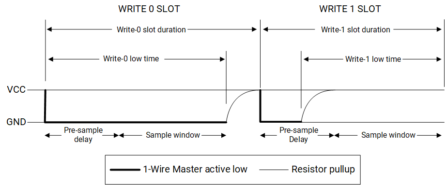

##### Read Time Slots

A Read time slot is initiated when the 1-Wire bus master pulls the bus line low for the minimum required time and then releases it. If the slave device responds with a 0, the slave continues to hold the bus line low for up to a specified amount of time before the slave releases the bus line; the bus line is then pulled high by the external pullup resistor. If the slave device responds with a 1, the slave does not hold the bus line low and the bus line is pulled to a logic-high immediately after the master releases the line. The master samples the data after a specified amount of time after the start of the Read time slot. The master ends the Read slot after the required amount of time, as depicted below.


#### SDI Operations

The 1-Wire Bus master can transmit a programmed set of bits (maximum 128 bits allowed) at the required clock frequency (in SDI mode). This interface is useful in programming the switch regulators on the board. For example, data of 0xCF is to be written to the switch regulator with the timing requirements as shown.

Since for a (“1” or “0”) pulse, the minimum period required is 0.25 µs which is about 4 MHz:

- Write a value of 0x5 to the OneWire Clock Divisor Register, which provides a clock frequency of approximately 4 MHz and is within the timing requirements
- The example in data 0xCF requires 18 pulses, so a total of 72 minimum periods need to be driven on the SDI bus. Program the 72 bits in the SDI Buffer Registers starting from offset 0x40. The “msb” is sent out on the interface first. In this example, the data programmed would be:
- SDI Buffer 0 = 0x1771_1111, SDI Buffer 1 = 0x1717_7171, SDI Buffer 2 = 0xXXXX_XX17,SDI Buffer 3 = 0xXXXX_XXXX, SDI Bit Count = 0x47
- If required, set the SDI Control Register interrupt enable. Set the \<sdi_en\> field in the SDI Control Register
- Once all the bits are sent out, the \<sdi_en\> field is cleared, and the interrupt is generated if it is enabled

#### Interrupt Handling

Three types of interrupts are programmed as follows:

- Receive buffer flag (RBF) interrupt
- Transmit Shift Register empty flag (TEMPT) interrupt and
- Transmit buffer empty (TBE) interrupt.

This section describes how to program these types of interrupts.

The typical programming flow for an RBF interrupt proceeds as follows:

- Enable the required interrupts and set W1IER[ERBF] and W1IER[EPD]
- Assert the INTR signal active high. Set W1IER[IAS]
- Reset the bus. Set W1CMDR[1WR]
- Unmask interrupts in the ICU
- When the PD interrupt occurs, mask interrupts in the ICU in the service routine, clear the W1IER[EPD] bit, and read the W1INTR[PDR] and W1INTR[PD] bits. Ensure that these  values are correct (that is, PDR = 0 if there is a slave and PD = 1). Do not clear or write over the W1IER[IAS] bit. Exit the interrupt service routine.
- Send a command. Write to the xmit buffer: W1TRR[DATA]. Unmask interrupts. The Receive buffer is filled with the contents written to the xmit buffer.
- Wait for the RBF interrupt. In a service routine, mask interrupts, and clear the W1IER[ERBF] bit.
- Read the W1INTR[RBF] bit and ensure that it is set
- Read the Receive buffer W1TRR[DATA] to verify that the data is sent

The typical programming flow for a TEMPT interrupt proceeds as follows:

- Enable the required interrupts. Set W1IER[ETMT] and W1IER[EPD]
- Set the INTR signal active high. Set W1IER[IAS]
- Reset the bus. Set W1CMDR[1WR]
- Unmask interrupts in the ICU
- When the PD interrupt occurs, mask interrupts in the ICU in the service routine, clear the W1IER[EPD] bit, and read the W1INTR[PDR] and W1INTR[PD] bits

Ensure that these values are correct (that is, PDR = 0 if there is a slave and PD = 1). Do not clear or write over the W1IER[IAS] bit. Leave interrupt service routine.

- Send data. Write to the xmit buffer: W1TRR[DATA]. Unmask interrupts
- Wait for TEMT interrupt. In the service routine, mask interrupts, and clear the W1IER[ETMT] bit
- Read the W1INTR[TEMT] bit and ensure that it is set

The typical programming flow for the TBE interrupt proceeds as follows:

- Enable the required interrupts. Set W1IER[ETBE] and W1IER[EPD]
- Assert the INTR signal active high. Set W1IER[IAS]
- Reset the bus. Set W1CMDR[1WR]
- Unmask interrupts in the ICU
- When the PD interrupt occurs, mask interrupts in the ICU in the service routine, clear the W1IER[EPD] bit, and read the W1INTR[PDR] and W1INTR[PD] bits

Ensure that these values are correct (that is, PDR = 0 if there is a slave and PD = 1). Do not clear or write over the W1IER[IAS] bit. Unmask the interrupts. Leave the interrupt service routine.

- Send data. Write to the xmit buffer: W1TRR[DATA]
- Wait for TBE interrupt. In the service routine, mask interrupts, clear the W1IER[ETBE] bit. Read the W1INTR[TBE] bit and ensure that it is set
- New data, if needed, can be written into the buffer and interrupts should be unmasked

### Register Description

> **Note.** The base address of 1-Wire Bus Master Registers is 0xD4011800.

#### Command Register

This control register contains four valid bit fields that control the One-Wire bus master controller functionality. In addition, this register contains two bits to bypass the One-Wire bus master interface controller features and control the One-Wire bus directly.

This control register contains four valid bit fields that control the One-Wire bus master controller functionality. The One-Wire bus master interface controller can generate one special command on the bus, in addition to reading and writing, which is a One-Wire reset that must precede any command given on the bus. In addition, this register contains two bits to bypass the One-Wire bus master interface controller features and control the One-Wire bus directly.

<table>
<tbody>
<tr>
<td rowspan=1 colspan=5><strong>Offset: 0x0</strong></td>
</tr>
<tr>
<td><strong>Bits</strong></td>
<td><strong>Field</strong></td>
<td><strong>Type</strong></td>
<td><strong>Reset</strong></td>
<td><strong>Description</strong></td>
</tr>
<tr>
<td>31:4</td>
<td>Reserved</td>
<td>RO</td>
<td>0x0</td>
<td>Reserved for future use.</td>
</tr>
<tr>
<td>3</td>
<td>DQI</td>
<td>RO</td>
<td>0x0</td>
<td>ONE_WIRE input.<br/>This bit reflects the present state of the One-Wire bus. Use it together with the &lt;ONE_WIRE output&gt; field when controlling the bus directly. The state of this bit does not affect any other functions of the One-Wire bus master interface controller. Operation of this bit is unaffected by the state of the &lt;ONE_WIRE output enable&gt; field in the One-Wire Interrupt Enable Register. </td>
</tr>
<tr>
<td>2</td>
<td>DQO</td>
<td>WO</td>
<td>0x0</td>
<td>ONE_WIRE output.<br/>This bit is used to bypass One-Wire bus master interface controller operations and drive the bus directly if needed.<br/>0 = This bit is cleared on power-up or reset. Clearing this bit drives the bus high. One-Wire bus master interface controller operations only function while the One-Wire bus is held high.<br/>1 = Setting this bit drives the bus low until it is cleared or the One-Wire bus master interface controller reset. While the One-Wire bus is held low, no other One-Wire bus master interface controller operations function. By controlling the length of time this bit is set and the point when the line is sampled (see &lt;ONE_WIRE input&gt; field), any One-Wire communication can be generated by the host controller. To prevent accidental writes to the bus, &lt;ONE_WIRE output enable&gt; field in the One-Wire Interrupt Enable Register before the functions in this field. </td>
</tr>
<tr>
<td>1</td>
<td>SRA</td>
<td>RW</td>
<td>0x0</td>
<td>Search ROM accelerator.<br/>0 = SRA turned off.<br/>1 = One-Wire bus master interface controller switches to SRA mode<br/>Refer to the Book of iButton Standards for more information on this feature. </td>
</tr>
<tr>
<td>0</td>
<td>1WR</td>
<td>RW</td>
<td>0x0</td>
<td>One-Wire reset.<br/>This field generates a reset on the One-Wire bus.<br/>0 = Bus is not in reset mode.<br/>1 = Setting this bit automatically clears the &lt;Search ROM accelerator&gt; field. This field is cleared automatically as soon as the One-Wire reset completes. The One-Wire bus master interface controller sets the &lt;Presence detect&gt; interrupt flag in the One-Wire Interrupt Register when the reset is complete and sufficient time for a presence detect to occur has passed. The result of the presence detect is placed in the &lt;Presence detect result&gt; field in the One-Wire Interrupt Register. If a presence detect pulse was received, the &lt;Presence detect result&gt; field is cleared, otherwise it is set. </td>
</tr>
</tbody>
</table>

#### Transmit/Receive Buffer Register

Data sent and received from the One-Wire bus master interface controller passes through the transmit/receive buffer location. The One-Wire bus master interface controller is double-buffered with separate transmit and receive buffers. Writing to this location connects the transmit buffer to the data bus, while reading connects the receive buffer to the data bus.

<table>
<tbody>
<tr>
<td rowspan=1 colspan=5><strong>Offset: 0x4</strong></td>
</tr>
<tr>
<td><strong>Bits</strong></td>
<td><strong>Field</strong></td>
<td><strong>Type</strong></td>
<td><strong>Reset</strong></td>
<td><strong>Description</strong></td>
</tr>
<tr>
<td>31:8</td>
<td>Reserved</td>
<td>RO</td>
<td>0x0</td>
<td>Reserved for future use.</td>
</tr>
<tr>
<td>7:0</td>
<td>Data</td>
<td>RW</td>
<td>0x0</td>
<td>Transmitted/received data.</td>
</tr>
</tbody>
</table>

#### Interrupt Register

This read-only register contains flags from transmit, receive, and One-Wire reset operations. Only the presence-detect flag (\<Presence detect\>) is cleared when the this register is read. The other flags are cleared automatically when the transmit and receive buffers are written to or read, respectively. These flags can generate an interrupt if the corresponding enable bit is set in the One-Wire Interrupt Enable Register.

This read-only register contains flags from transmit, receive, and One-Wire reset operations. Only the presence-detect flag (\<Presence detect\>) is cleared when this register is read. The other flags are cleared automatically when the transmit and receive buffers are written to or read, respectively. These flags can generate an interrupt on the INTR signal if the corresponding enable bit is set in the One-Wire Interrupt Enable Register. Reading the One-Wire Interrupt register always sets the INTR signal inactive, even if all flags are not cleared.

<table>
<tbody>
<tr>
<td rowspan=1 colspan=5><strong>Offset: 0x8</strong></td>
</tr>
<tr>
<td><strong>Bits</strong></td>
<td><strong>Field</strong></td>
<td><strong>Type</strong></td>
<td><strong>Reset</strong></td>
<td><strong>Description</strong></td>
</tr>
<tr>
<td>31:6</td>
<td>Reserved</td>
<td>RO</td>
<td>0x0</td>
<td>Reserved for future use.</td>
</tr>
<tr>
<td>5</td>
<td>RSRF</td>
<td>RO</td>
<td>0x0</td>
<td>Receive Shift Register Full.<br/>0=This flag is cleared when the byte is read from the Receive shift register.<br/>1=This flag is set when there's a byte written to shift register.</td>
</tr>
<tr>
<td>4</td>
<td>RBF</td>
<td>RO</td>
<td>0x0</td>
<td>Receive buffer full.<br/>0 = This flag is cleared when the byte is read from the Receive Buffer register. <br/>1 = This flag is set when there is a byte waiting to be read in the receive buffer.</td>
</tr>
<tr>
<td>3</td>
<td>TEMT</td>
<td>RO</td>
<td>0x0</td>
<td>Tx Shift register empty<br/>0 = This flag is cleared when data is shifted into the Trx Shift register from the transmit buffer.<br/>1 = This flag is set after the last bit has been transmitted on the One-Wire bus.<br/>TEMT status bit is valid upon completion of the first data transfer.</td>
</tr>
<tr>
<td>2</td>
<td>TBE</td>
<td>RO</td>
<td>0x1</td>
<td>Transmit buffer empty.<br/>0 = This flag is cleared when data is written to the transmit buffer. <br/>1 = This flag is set when the last bit is transferred to the Tx Shift register.<br/>TBE status bit is valid after the first data transfer.</td>
</tr>
<tr>
<td>1</td>
<td>PDR</td>
<td>RO</td>
<td>0x1</td>
<td>Presence detect result.When a Presence Detect interrupt occurs, this field reflects the result of the presence detect read.<br/>0 = A slave device was found.<br/>1 = No slave device was found.</td>
</tr>
<tr>
<td>0</td>
<td>PD</td>
<td>RO</td>
<td>0x0</td>
<td>Presence detect.<br/>0 = The required time after a One-Wire reset has not elapsed or this register has been read since the last One-Wire reset.<br/>1 = After a One-Wire reset has been issued, this flag is set after the appropriate amount of time for a presence detect pulse to have occurred.<br/>This bit is cleared when the Interrupt register is read.</td>
</tr>
</tbody>
</table>

#### Interrupt Enable Register

This register allows system programmers to specify which of the interrupt sources causes an interrupt the INTR signal to be active and to define the active state for the INTR signal. When a master reset is received, all non-reserved bits in this register except for the \<INTR active state\> field are cleared to 0, disabling all interrupt sources. The \<INTR active state\> field is reset to 1 by the One-Wire controller.

This register allows system programmers to specify which of the interrupt sources causes an interrupt the INTR signal to be active and to define the active state for the INTR signal. When a master reset is received, all non-reserved bits in this register except for the \<INTR active state\> field are cleared to 0, disabling all interrupt sources. The \<INTR active state\> field is reset to 1 by the One-Wire controller, setting the active state of the INTR signal to high. This means the INTR signal is pulled low since all interrupts are disabled. The INTR signal is also reset to an inactive state by reading the Interrupt register.

<table>
<tbody>
<tr>
<td rowspan=1 colspan=5><strong>Offset: 0xC</strong></td>
</tr>
<tr>
<td><strong>Bits</strong></td>
<td><strong>Field</strong></td>
<td><strong>Type</strong></td>
<td><strong>Reset</strong></td>
<td><strong>Description</strong></td>
</tr>
<tr>
<td>31:8</td>
<td>Reserved</td>
<td>RO</td>
<td>0x0</td>
<td>Reserved for future use.</td>
</tr>
<tr>
<td>7</td>
<td>DQOE</td>
<td>RW</td>
<td>0x0</td>
<td>ONE_WIRE output enable.<br/>This bit acts as a control select for the ONE_WIRE bus. When set to 0, the bus is controlled by the One-Wire bus master interface controller as normal.<br/>0 = This bit defaults to 0 on power-up or reset and should be left 0 unless users want to control the bus manually through the &lt;ONE_WIRE output&gt; field in the One-Wire Command Register.<br/>1 = The &lt;ONE_WIRE output&gt; field controls the state of the bus directly.</td>
</tr>
<tr>
<td>6</td>
<td>Reserved</td>
<td>RO</td>
<td>0x0</td>
<td>Reserved for future use.</td>
</tr>
<tr>
<td>5</td>
<td>ERSF</td>
<td>RW</td>
<td>0x0</td>
<td>Enable Receive Shift Register Full Interrupt.<br/>0 = Enable receive shift register full interrupt disabled.<br/>1 = If the receive shift register full flag is set, then an interrupt is generated.</td>
</tr>
<tr>
<td>4</td>
<td>ERBF</td>
<td>RO</td>
<td>0x0</td>
<td>Enable Receive Buffer Full Interrupt.<br/>0 = Enable receive buffer full interrupt disabled.<br/>1 = If the receive buffer full flag is set, then an interrupt is generated.</td>
</tr>
<tr>
<td>3</td>
<td>ETMT</td>
<td>RO</td>
<td>0x0</td>
<td>Enable Tx Shift register empty interrupt.<br/>0 = Enable Tx Shift register empty interrupt disabled.<br/>1 = If the Tx Shift register empty flag is set, then an interrupt is generated. </td>
</tr>
<tr>
<td>2</td>
<td>ETBE</td>
<td>RO</td>
<td>0x0</td>
<td>Enable transmit buffer empty interrupt.<br/>0 = Enable transmit buffer empty interrupt disabled.<br/>1 = If the transmit buffer empty flag is set, then an interrupt is generated.</td>
</tr>
<tr>
<td>1</td>
<td>Reserved</td>
<td>RO</td>
<td>0x0</td>
<td>Reserved for future use</td>
</tr>
<tr>
<td>0</td>
<td>EPD</td>
<td>RW</td>
<td>0x0</td>
<td>Enable presence detect interrupt.<br/>0 = Enable presence detect interrupt disabled.<br/>1 = If the enable presence detect flag is set, an interrupt is generated whenever a One-Wire reset is sent and the required amount of time has passed for a presence detect pulse to have occurred.</td>
</tr>
</tbody>
</table>

#### Clock Divisor Register

This register divides the internal reference clock to generate the One-Wire clock timing patterns using a base clock of 24 MHz. This register must be programmed before using the One-Wire bus master interface.

<table>
<tbody>
<tr>
<td rowspan=1 colspan=5><strong>Offset: 0x10</strong></td>
</tr>
<tr>
<td><strong>Bits</strong></td>
<td><strong>Field</strong></td>
<td><strong>Type</strong></td>
<td><strong>Reset</strong></td>
<td><strong>Description</strong></td>
</tr>
<tr>
<td>31:5</td>
<td>Reserved</td>
<td>RO</td>
<td>0x0</td>
<td>Reserved for future use.</td>
</tr>
<tr>
<td>4:2</td>
<td>DIV</td>
<td>RW</td>
<td>0x0</td>
<td>Divider.<br/>The One-Wire bus master interface controller uses the output of the prescaler and divides by the DIV value to produce the One-Wire clocks. This clock must be approximately 1 MHz for correct operation. This value must be set to 0x2. </td>
</tr>
<tr>
<td>1:0</td>
<td>PRE</td>
<td>RW</td>
<td>0x0</td>
<td>Prescaler value.<br/>The One-Wire bus master interface controller uses the input 24-MHz clock and initially divides by this value before outputting to the divider section. This value must be set to 0x3, selecting a prescale of 7. </td>
</tr>
</tbody>
</table>

## 17.6 IR-RX

### Overview

The IR-RX module is capable of receiving infrared signals and transforming the received signals into digital format. Received data can be accessed through FIFO by checking status or configuring interrupt.

### Features

- Infrared input signals are transformed into the Run-Length-Code (RLC) format
- Configurable signal width threshold for noise detecting
- 32 Bytes FIFO for received data storage

### Functional Description

The IR-RX module receives infrared signals and transforms the received information into digital format. The input infrared signals are filtered depending on a configurable noise detecting threshold. The transformed data is written into FIFO as the Run-Length-Code (RLC). Software may read the data from FIFO by checking status or configuring interrupt.

The block diagram of IR-RX is depicted below.


The input clock signal (CLK) is divided by a configurable parameter to generate the internal working clock (WCLK) which is used to measure the duration or transtion time of the input infrared signal.

When IR_EN=1, the 7-bit width RLC_COUNT counts under the working clock. The RLC_COUNT is cleared to be 0 either if IR_RX changes or if it counts to 127.

When IR_RX changes or RLC_COUNT counts to 127, 1 byte data is written into FIFO.

If RLC_COUNT \> NOISETHR at the data sampling moment, the current IR_RX value and the current RLC_COUNT value are stored, which is {IR_RX, RLC_COUNT[6:0]}.

If RLC_COUNT \<= NOISETHR at the data sampling moment, the previously stored IR_RX value and the current RLC_COUNT value are stored, which is {IR_RX_old, RLC_COUNT[6:0]}.

For example, the following data in RLC format implies that:

- 0x98 --\> Logic '1' has sustained for 0x18 working clock cycles.
- 0x7F --\> Logic '0' has sustained for 0x7F working clock cycles.
- 0x06 --\> Logic '0' has sustained for 0x06 working clock cycles.
- 0xFF --\> Logic '1' has sustained for 0x7F working clock cycles.

### Register Description

> **Note.**
>
> - The base address of IR-RX registers in the X60™ field is 0xD401_7F00
> - The base address of IR-RX registers in the N308 field is 0xC088_E000

#### IRC_EN REGISTER

<table>
<tbody>
<tr>
<td rowspan=1 colspan=5><strong>Offset: 0x0</strong></td>
</tr>
<tr>
<td><strong>Bits</strong></td>
<td><strong>Field</strong></td>
<td><strong>Type</strong></td>
<td><strong>Reset</strong></td>
<td><strong>Description</strong></td>
</tr>
<tr>
<td>31:1</td>
<td>Reserved</td>
<td>RO</td>
<td>0x0</td>
<td>Reserved</td>
</tr>
<tr>
<td>0</td>
<td>IRC_EN</td>
<td>RW</td>
<td>0x0</td>
<td>This is the global enable bit for the IR-RX. <br/>0x0: Disabled<br/>0x1: Enabled</td>
</tr>
</tbody>
</table>

#### CLKDIV REGISTER

<table>
<tbody>
<tr>
<td rowspan=1 colspan=5><strong>Offset: 0x4</strong></td>
</tr>
<tr>
<td><strong>Bits</strong></td>
<td><strong>Field</strong></td>
<td><strong>Type</strong></td>
<td><strong>Reset</strong></td>
<td><strong>Description</strong></td>
</tr>
<tr>
<td>31:24</td>
<td>Reserved</td>
<td>RO</td>
<td>0x0</td>
<td>Reserved</td>
</tr>
<tr>
<td>23:0</td>
<td>CLKDIV</td>
<td>RW</td>
<td>0x0</td>
<td>Frequency dividing parameter for generating the internal working clock (WCLK). The generated WCLK frequency is:<br/>Freq_of_WCLK = Freq_of_CLK / (CLKDIV +1)</td>
</tr>
</tbody>
</table>

#### NOISEHTR REGISTER

<table>
<tbody>
<tr>
<td rowspan=1 colspan=5><strong>Offset: 0x8</strong></td>
</tr>
<tr>
<td><strong>Bits</strong></td>
<td><strong>Field</strong></td>
<td><strong>Type</strong></td>
<td><strong>Reset</strong></td>
<td><strong>Description</strong></td>
</tr>
<tr>
<td>31:8<br/></td>
<td>Reserved</td>
<td>RO</td>
<td>0x0</td>
<td>Reserved</td>
</tr>
<tr>
<td>7:0</td>
<td>NOISETHR<br/></td>
<td>RW</td>
<td>0x0</td>
<td>Noise detection threshold.</td>
</tr>
</tbody>
</table>

#### IDLE_STATE REGISTER

<table>
<tbody>
<tr>
<td rowspan=1 colspan=5><strong>Offset: 0xC</strong></td>
</tr>
<tr>
<td><strong>Bits</strong></td>
<td><strong>Field</strong></td>
<td><strong>Type</strong></td>
<td><strong>Reset</strong></td>
<td><strong>Description</strong></td>
</tr>
<tr>
<td>31:1</td>
<td>Reserved</td>
<td>RO</td>
<td>0x0</td>
<td>Reserved</td>
</tr>
<tr>
<td>0</td>
<td>IDLE_STATE</td>
<td>RW</td>
<td>0x1</td>
<td>This is the IDLE status bit. <br/>0x0: Not IDLE<br/>0x1: IDLE<br/>It is cleared by hardware at the change of input infrared signal. Software could set this bit to 0x1.</td>
</tr>
</tbody>
</table>

#### FIFO_OUT REGISTER

<table>
<tbody>
<tr>
<td rowspan=1 colspan=5><strong>Offset: 0x10</strong></td>
</tr>
<tr>
<td><strong>Bits</strong></td>
<td><strong>Field</strong></td>
<td><strong>Type</strong></td>
<td><strong>Reset</strong></td>
<td><strong>Description</strong></td>
</tr>
<tr>
<td>31:8</td>
<td>Reserved</td>
<td>RO<br/></td>
<td>0x0</td>
<td>Reserved<br/></td>
</tr>
<tr>
<td>7:0</td>
<td>FIFO_OUT</td>
<td>RO<br/></td>
<td>0x0</td>
<td>This is the data output of FIFO.</td>
</tr>
</tbody>
</table>

#### FIFO_STS REGISTER

<table>
<tbody>
<tr>
<td rowspan=1 colspan=5><strong>Offset: 0x14</strong></td>
</tr>
<tr>
<td><strong>Bits</strong></td>
<td><strong>Field</strong></td>
<td><strong>Type</strong></td>
<td><strong>Reset</strong></td>
<td><strong>Description</strong></td>
</tr>
<tr>
<td>31</td>
<td>FIFO_full</td>
<td>RO</td>
<td>0x0</td>
<td>Flag bit of FIFO full. </td>
</tr>
<tr>
<td>30</td>
<td>FIFO_empty</td>
<td>RO</td>
<td>0x1</td>
<td>Flag bit of FIFO empty. </td>
</tr>
<tr>
<td>29:6</td>
<td>Reserved</td>
<td>RO</td>
<td>0x0</td>
<td>Reserved</td>
</tr>
<tr>
<td>5:0</td>
<td>FIFO_CNT</td>
<td>RO</td>
<td>0x0</td>
<td>This is the number of unread data in FIFO.</td>
</tr>
</tbody>
</table>

#### FIFO_CMP REGISTER

<table>
<tbody>
<tr>
<td rowspan=1 colspan=5><strong>Offset: 0x18</strong></td>
</tr>
<tr>
<td><strong>Bits</strong></td>
<td><strong>Field</strong></td>
<td><strong>Type</strong></td>
<td><strong>Reset</strong></td>
<td><strong>Description</strong></td>
</tr>
<tr>
<td>31:6</td>
<td>Reserved</td>
<td>RO</td>
<td>0x0</td>
<td>Reserved</td>
</tr>
<tr>
<td>5:0</td>
<td>FIFO_CMP</td>
<td>RW</td>
<td>0x0</td>
<td>Comparison value for the number of unread data in FIFO. It is used to generate interruption.</td>
</tr>
</tbody>
</table>

#### INT_EN REGISTER

<table>
<tbody>
<tr>
<td rowspan=1 colspan=5><strong>Offset: 0x1C</strong></td>
</tr>
<tr>
<td><strong>Bits</strong></td>
<td><strong>Field</strong></td>
<td><strong>Type</strong></td>
<td><strong>Reset</strong></td>
<td><strong>Description</strong></td>
</tr>
<tr>
<td>31:4</td>
<td>Reserved</td>
<td>RO</td>
<td>0x0</td>
<td>Reserved</td>
</tr>
<tr>
<td>3</td>
<td>CMP_INT_EN</td>
<td>RW</td>
<td>0x0</td>
<td>Interrupt enable bit for comparison between FIFO_CMP and the number of unread data in FIFO.</td>
</tr>
<tr>
<td>2</td>
<td>CNT_INT_EN</td>
<td>RW</td>
<td>0x0</td>
<td>Interrup enable bit for RLC_COUNT counts to 127.</td>
</tr>
<tr>
<td>1</td>
<td>PEDGE_INT_EN</td>
<td>RW</td>
<td>0x0</td>
<td>Interrupt enable bit for the positive edge of the input infrared signal.</td>
</tr>
<tr>
<td>0</td>
<td>NEDGE_INT_EN</td>
<td>RW</td>
<td>0x0</td>
<td>Interrupt enable bit for the negtive edge of the input infrared signal.</td>
</tr>
</tbody>
</table>

#### INT_FLAG REGISTER

<table>
<tbody>
<tr>
<td rowspan=1 colspan=5><strong>Offset: 0x20</strong></td>
</tr>
<tr>
<td><strong>Bits</strong></td>
<td><strong>Field</strong></td>
<td><strong>Type</strong></td>
<td><strong>Reset</strong></td>
<td><strong>Description</strong></td>
</tr>
<tr>
<td>31:4</td>
<td>Reserved</td>
<td>RO</td>
<td>0x0</td>
<td>Reserved</td>
</tr>
<tr>
<td>3</td>
<td>CMP_INT_FLAG</td>
<td>RW1C</td>
<td>0x0</td>
<td>This bit is set to 1 if the number of unread data in FIFO equals to FIFO_CMP. Interrupt is generated if CMP_INT_EN=1.  It can be cleared by writing 0x1 to this bit.</td>
</tr>
<tr>
<td>2</td>
<td>CNT_INT_FLAG</td>
<td>RW1C</td>
<td>0x0<br/></td>
<td>This bit is set to 1 if RLC_COUNT=127. Interrupt is generated if CNT_INT_EN=1.  It can be cleared by writing 0x1 to this bit.</td>
</tr>
<tr>
<td>1</td>
<td>PEDGE_INT_FLAG</td>
<td>RW1C</td>
<td>0x0</td>
<td>This bit is set to 1 if positive edge of the input infrared signal is detected. Interrupt is generated if PEDGE_INT_EN=1.  It can be cleared by writing 0x1 to this bit.</td>
</tr>
<tr>
<td>0</td>
<td>NEDGE_INT_FLAG</td>
<td>RW1C</td>
<td>0x0</td>
<td>This bit is set to 1 if negtive edge of the input infrared signal is detected. Interrupt is generated if NEDGE_INT_EN=1.  It can be cleared by writing 0x1 to this bit.</td>
</tr>
</tbody>
</table>

## 18.7 PWM

### Introduction

K1 contains 20 Pulse-Width Modulation (PWM) channels labeled as PWMx where x=[0,19].

Each PWM channel operates independently with its own configuration registers and generates an output PWM signal on a multi-function pin.

Each PWM channel allows controlling over both the leading-edge timing and the trailing-edge timing of its output signal.

The timing of each PWM channel can be set to run continuously or be adjusted dynamically to meet the change of requirements.

The power-saving mode allows stopping the internal clock of a PWM channel (PSCLK_PWM), resulting to a constant high or low state of the output signal of that PWM channel (PWM_OUT), thus saving power when the output signal of that PWM channel is not needed.

### Features

- Support for 50% duty-cycle ranging from 198.4Hz to 6.5MHz (additional duty-cycle options depend on the choice of the preferred frequency)
- Enhanced period time controlled through 6-bit clock divider and 10-bit period time counter
- 15-bit pulse counter control

### Register Description

> **Note**. The base address of PWMn (n=1, 2, ... , 20) registers is 0xD401A000 with a stride of 0x400.

#### PWM_CRX REGISTER

PWM Control registers.

These registers configure the behavior characteristics of the PWM shutdown response and the divisor for the input clocks to the PWM control unit that configures the frequency of the scaled counter clock.

<table>
<tbody>
<tr>
<td rowspan=1 colspan=5><strong>Offset: 0x0+(n-1)*0x400</strong></td>
</tr>
<tr>
<td><strong>Bits</strong></td>
<td><strong>Field</strong></td>
<td><strong>Type</strong></td>
<td><strong>Reset</strong></td>
<td><strong>Description</strong></td>
</tr>
<tr>
<td>31:9</td>
<td>Reserved</td>
<td>RO</td>
<td>0x0</td>
<td>Reserved for future use.</td>
</tr>
<tr>
<td>8</td>
<td>PWM_OUTCNTen</td>
<td>RW</td>
<td>0x0</td>
<td>PWM Out Counter Register enable.<br/>0=disable, 1=enable.</td>
</tr>
<tr>
<td>7</td>
<td>Reserved</td>
<td>RO</td>
<td>0</td>
<td>Reserved for future use.</td>
</tr>
<tr>
<td>6</td>
<td>Pulse Width Modulator Shutdown Mode</td>
<td>RW</td>
<td>0x0</td>
<td>0=Graceful shutdown of PWM when the SoC stops the clock to the PWM.<br/>1=Abrupt shutdown of PWM when the SoC stops the clocks to the PWM.</td>
</tr>
<tr>
<td>5:0</td>
<td>Prescale</td>
<td>RW</td>
<td>0x0</td>
<td>The scaled counter clock frequency is: PSCLK_PWM/(PRESCALE+1)</td>
</tr>
</tbody>
</table>

#### PWM_DCR REGISTER

PWM Duty Cycle registers.

These registers configure the duty cycle of the corresponding PWM_OUT signals.

<table>
<tbody>
<tr>
<td rowspan=1 colspan=5><strong>Offset: 0x4+(n-1)*0x400</strong></td>
</tr>
<tr>
<td><strong>Bits</strong></td>
<td><strong>Field</strong></td>
<td><strong>Type</strong></td>
<td><strong>Reset</strong></td>
<td><strong>Description</strong></td>
</tr>
<tr>
<td>31:11</td>
<td>Reserved</td>
<td>RO</td>
<td>0x0</td>
<td>Reserved for future use.</td>
</tr>
<tr>
<td>10</td>
<td>Full Duty Cycle</td>
<td>RW</td>
<td>0x0</td>
<td>0=PWM_OUT is determined by the &lt;Duty Cycle of PWM_OUT&gt; value.<br/>1=PWM_OUT is continuously asserted</td>
</tr>
<tr>
<td>9:0</td>
<td>Duty Cycle of PWM_OUT</td>
<td>RW</td>
<td>0x0</td>
<td>0=PWM_OUT is continuously de-asserted.<br/>1=PWM_OUT is high for the number of 12 MHz clock periods equal to this field (&lt;PRESCALE&gt; in PWM Control Registers + 1).<br/>If &lt;Full Duty Cycle&gt; is set, this filed has no effect on the ouptut of PWM.</td>
</tr>
</tbody>
</table>

#### PWM_PCR REGISTER

PWM Period Control registers.

These registers configure the cycle time of the corresponding PWM_OUT signals.

If this register is cleared, the PWM_OUT signal maintains in a high state.

<table>
<tbody>
<tr>
<td rowspan=1 colspan=5><strong>Offset: 0x8+(n-1)*0x400</strong></td>
</tr>
<tr>
<td><strong>Bits</strong></td>
<td><strong>Field</strong></td>
<td><strong>Type</strong></td>
<td><strong>Reset</strong></td>
<td><strong>Description</strong></td>
</tr>
<tr>
<td>31:10</td>
<td>Reserved</td>
<td>RO</td>
<td>0x0</td>
<td>Reserved for future use.</td>
</tr>
<tr>
<td>9:0</td>
<td>Perios Value</td>
<td>RW</td>
<td>0x4</td>
<td>The value of scaled clock cycles per cycle of PWM_OUT plus one. If all zeros are written to this register, the signal remains high.</td>
</tr>
</tbody>
</table>

#### PWM_OUTCNT REGISTER

PWM Output Counter registers.

<table>
<tbody>
<tr>
<td rowspan=1 colspan=5><strong>Offset: 0x10+(n-1)*0x400</strong></td>
</tr>
<tr>
<td><strong>Bits</strong></td>
<td><strong>Field</strong></td>
<td><strong>Type</strong></td>
<td><strong>Reset</strong></td>
<td><strong>Description</strong></td>
</tr>
<tr>
<td>31:16</td>
<td>Reserved</td>
<td>RO</td>
<td>0x0</td>
<td>Reserved for future use.</td>
</tr>
<tr>
<td>15:0</td>
<td>Counter Value</td>
<td>RW</td>
<td>0x0</td>
<td>The value of pwm out pulse number.</td>
</tr>
</tbody>
</table>
