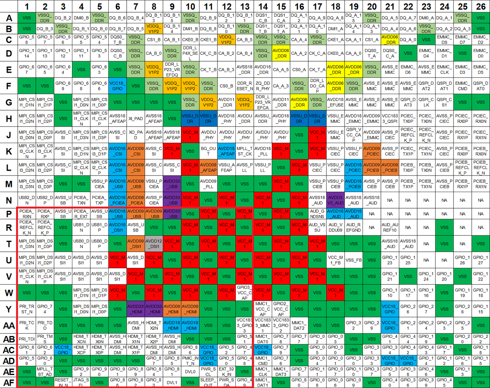

sidebar_position: 3

# 3 引脚定义（Pinout）

## 3.1 引脚分布图与说明

K1 的完整引脚分布图如下所示：

> **注**：图中不同颜色代表以下含义：
>
> - **电源引脚**（不同电压域）：
>   - 棕色（Brown）
>   - 深蓝色（Dark Blue）
>   - 灰色（Grey）
>   - 浅蓝色（Light Blue）
>   - 橙色（Orange）
>   - 紫色（Purple）
>   - 红色（Red）
>   - 黄色（Yellow）
> - **接地引脚（GND）**：
>   - 深绿色（Dark Green）
>   - 浅绿色（Light Green）
> - **信号引脚**：
>   - 白色（White）

为便于描述，K1 的 26×26 引脚阵列按以下四个象限划分：

- **象限 1**：行 A~N，列 1~13  
- **象限 2**：行 A~N，列 14~26  
- **象限 3**：行 M~AF，列 1~13  
- **象限 4**：行 M~AF，列 14~26  

后续小节将按上述象限结构依次提供详细的引脚功能说明。

### 象限 1：(A~N, 1~13)

> **注**：引脚类型符号定义：
>
> - AO = 模拟输出（Analog Output）
> - AI = 模拟输入（Analog Input）
> - AIO = 模拟输入/输出（Analog Input/Output）
> - G = 接地（Ground）
> - I/O = 输入/输出（Input/Output）
> - P = 电源（Power）
> - RO = 参考输出（Reference Output）

| 引脚编号     | 名称                | 类型 | 电源域                              | 功能说明                                                                 |
|--------------|---------------------|------|-------------------------------------|--------------------------------------------------------------------------|
| A1           | VSS                 | G    | 0V                                     | Digital Core Ground                                                     |
| A2           | VSSQ_DDR            | G    | 0V                                     | DDR Ground                                                              |
| A3           | DQ_B_2              | AIO  | lp3: 1.2V lp4x: 0.6V               | LPDDR4X: CHB DQ2  LPDDR3: DQ28                                      |
| A4           | DMI0_B              | AIO  | lp3: 1.2V lp4x: 0.6V               | LPDDR4X: Channel B DM0  LPDDR3: DQ25                                |
| A5           | VSSQ_DDR            | G    | 0V                                     | DDR Ground                                                              |
| A6           | DQ_B_6              | AIO  | lp3: 1.2V lp4x: 0.6V               | LPDDR4X: CHB DQ6  LPDDR3: DQ24                                      |
| A7           | DQ_B_4              | AIO  | lp3: 1.2V lp4x: 0.6V               | LPDDR4X: CHB DQ4  LPDDR3: DQ30                                      |
| A8           | DQ_B_13             | AIO  | lp3: 1.2V lp4x: 0.6V               | LPDDR4X: CHB DQ13  LPDDR3: DQ15                                     |
| A9           | DQ_B_15             | AIO  | lp3: 1.2V lp4x: 0.6V               | LPDDR4X: CHB DQ15  LPDDR3: DQ12                                     |
| A10          | VSSQ_DDR            | G    | 0V                                     | DDR Ground                                                              |
| A11          | DQ_B_9              | AIO  | lp3: 1.2V lp4x: 0.6V               | LPDDR4X: CHB DQ9 LPDDR3: DQ8                                        |
| A12          | DQ_B_12             | AIO  | lp3: 1.2V lp4x: 0.6V               | LPDDR4X: CHB DQ12 LPDDR3: DQ10                                      |
| A13          | DQ_B_11             | AIO  | lp3: 1.2V lp4x: 0.6V               | LPDDR4X: CHB DQ11 LPDDR3: DQ11                                      |
| B1           | VSS                 | G    | 0V                                     | Digital Core Ground                                                     |
| B2           | DQ_B_3              | AIO  | lp3: 1.2V lp4x: 0.6V               | LPDDR4X: CHB DQ3 LPDDR3: DQM3                                       |
| B3           | VSSQ_DDR            | G    | 0V                                     | DDR Ground                                                              |
| B4           | DQ_B_1              | AIO  | lp3: 1.2V lp4x: 0.6V               | LPDDR4X: CHB DQ1 LPDDR3: DQ27                                       |
| B5           | DQ_B_0              | AIO  | lp3: 1.2V lp4x: 0.6V               | LPDDR4X: CHB DQ0 LPDDR3: DQ31                                       |
| B6           | DQ_B_7              | AIO  | lp3: 1.2V lp4x: 0.6V               | LPDDR4X: CHB DQ7 LPDDR3: DQ29                                       |
| B7           | DQ_B_5              | AIO  | lp3: 1.2V lp4x: 0.6V               | LPDDR4X: CHB DQ5 LPDDR3: DQ26                                       |
| B8           | VDDQ_V1P2           | P    | lp3: 1.2V lp4x: 0.6V               | LPDDR3 IO power                                                         |
| B9           | DQ_B_14             | AIO  | lp3: 1.2V lp4x: 0.6V               | LPDDR4X: CHB DQ14 LPDDR3: DQ13                                      |
| B10          | DMI1_B              | AIO  | lp3: 1.2V lp4x: 0.6V               | LPDDR4X: Channel B DM1 LPDDR3: DQ14                                 |
| B11          | DQ_B_8              | AIO  | lp3: 1.2V lp4x: 0.6V               | LPDDR4X: CHA DQ12 LPDDR3: DQM1                                      |
| B12          | DQ_B_10             | AIO  | lp3: 1.2V lp4x: 0.6V               | LPDDR4X: CHB DQ10 LPDDR3: DQ9                                       |
| B13          | VSSQ_DDR            | G    | 0V                                     | DDR Ground                                                              |
| C1           | GPIO_58             | I/O  | 1.8V                                   | General Purpose I/O 58                                                  |
| C2           | GPIO_57             | I/O  | 1.8V                                   | General Purpose I/O 57                                                  |
| C3           | GPIO_56             | I/O  | 1.8V                                   | General Purpose I/O 56                                                  |
| C4           | GPIO_55             | I/O  | 1.8V                                   | General Purpose I/O 55                                                  |
| C5           | GPIO_54             | I/O  | 1.8V                                   | General Purpose I/O 54                                                  |
| C6           | DQS0_T_B            | AIO  | lp3: 1.2V lp4x: 0.6V               | LPDDR4X: Positive of CHB DQS0 LPDDR3: Positive of DQS3              |
| C7           | VSSQ_DDR            | G    | 0V                                     | DDR Ground                                                              |
| C8           | CS1_B               | AO   | lp3: 1.2V lp4x: 0.6V               | LPDDR4X: Active-low chip select 1 of CHB LPDDR3: N/A                |
| C9           | CA_B_1              | AO   | lp3: 1.2V lp4x: 0.6V               | LPDDR4X: CHB CA1 LPDDR3: CA5                                        |
| C10          | CKE0_B              | AO   | lp3: 1.2V lp4x: 1.1V               | LPDDR4X: clock enabling 0 of CHB LPDDR3: N/A                        |
| C11          | CKE1_B              | AO   | lp3: 1.2V lp4x: 1.1V               | LPDDR4X: clock enabling 1 of CHB LPDDR3: N/A                        |
| C12          | VDDQ_V1P2           | P    | lp3: 1.2V lp4x: 0.6V               | LPDDR3 IO power                                                         |
| C13          | CA_B_5              | AO   | lp3: 1.2V lp4x: 0.6V               | LPDDR4X: CHB CA5 LPDDR3: CA8                                        |
| D1           | GPIO_114            | I/O  | 1.8V                                   | General Purpose I/O 114                                                 |
| D2           | GPIO_113            | I/O  | 1.8V                                   | General Purpose I/O 113                                                 |
| D3           | GPIO_112            | I/O  | 1.8V                                   | General Purpose I/O 112                                                 |
| D4           | GPIO_111            | I/O  | 1.8V                                   | General Purpose I/O 111                                                 |
| D5           | GPIO_53             | I/O  | 1.8V                                   | General Purpose I/O 53                                                  |
| D6           | DQS0_C_B            | AIO  | lp3: 1.2V lp4x: 0.6V               | LPDDR4X: Negative of CHB DQS0 LPDDR3: Negtive of DQS3               |
| D7           | VSSQ_DDR            | G    | 0V                                     | DDR Ground                                                              |
| D8           | CA_B_0              | AO   | lp3: 1.2V lp4x: 0.6V               | LPDDR4X: CHB CA0                                                        |
| D9           | VSSQ_DDR            | G    | 0V                                     | DDR Ground                                                              |
| D10          | DDR_lp4x_SEL        | AIO  | 1.8V                                   | LPDDR4X: connect to 1.8V LP234: connect to Ground                   |
| D11          | CK_C_B              | AO   | lp3: 1.2V lp4x: 0.6V               | LPDDR4X: negative LPDDR differential clock of CHB  LPDDR3: negative LPDDR differential clock |
| D12          | CA_B_2              | AO   | lp3: 1.2V lp4x: 0.6V               | LPDDR4X: CHB CA2 LPDDR3: CA9                                        |
| D13          | CA_B_4              | AO   | lp3: 1.2V lp4x: 0.6V               | LPDDR4X: CHA CA4 LPDDR3: CA7                                        |
| E1           | GPIO_67             | I/O  | 1.8V                                   | General Purpose I/O 67                                                  |
| E2           | GPIO_65             | I/O  | 1.8V                                   | General Purpose I/O 65                                                  |
| E3           | GPIO_64             | I/O  | 1.8V                                   | General Purpose I/O 64                                                  |
| E4           | VSS                 | G    | 0V                                     | Digital Core Ground                                                     |
| E5           | GPIO_63             | I/O  | 1.8V                                   | General Purpose I/O 63                                                  |
| E6           | VSS                 | G    | 0V                                     | Digital Core Ground                                                     |
| E7           | VSSQ_DDR            | G    | 0V                                     | DDR Ground                                                              |
| E8           | VDDQ_V1P2           | P    | lp3: 1.2V lp4x: 0.6V               | LPDDR3 IO power                                                         |
| E9           | DDR_LP23_VREFDQ     | P    | lp3: 0.6V lp4: high-z              | DQ VREF for lpddr23 , LP4/4x Keep the pin NC                        |
| E10          | VSSQ_DDR            | G    | 0V                                     | DDR Ground                                                              |
| E11          | CK_T_B              | AO   | lp3: 1.2V lp4x: 0.6V               | LPDDR4X: positive LPDDR differential clock of CHB LPDDR3: positive LPDDR differential clock |
| E12          | CA_B_3              | AO   | lp3: 1.2V lp4x: 0.6V               | LPDDR4X: CHB CA3  LPDDR3: CA6                                       |
| E13          | AVSS18_DDR          | G    | 0V                                     | DDR Ground                                                              |
| F1           | VSS                 | G    | 0V                                     | Digital Core Ground                                                     |
| F2           | VSS                 | G    | 0V                                     | Digital Core Ground                                                     |
| F3           | GPIO_69             | I/O  | 1.8V                                   | General Purpose I/O 69                                                  |
| F4           | GPIO_68             | I/O  | 1.8V                                   | General Purpose I/O 68                                                  |
| F5           | GPIO_66             | I/O  | 1.8V                                   | General Purpose I/O 66                                                  |
| F6           | VCC18_GPIO          | P    | 1.8V                                   | GPIO1/4/5/PMIC I/O power                                                |
| F7           | VSS                 | G    | 0V                                     | Digital Core Ground                                                     |
| F8           | VSSQ_DDR            | G    | 0V                                     | DDR Ground                                                              |
| F9           | VDDQ_V1P2           | P    | lp3: 1.2V lp4x: 0.6V               | LPDDR3 IO power                                                         |
| F10          | VDDQ_V1P2           | P    | lp3: 1.2V lp4x: 0.6V               | LPDDR3 IO power                                                         |
| F11          | VSSQ_DDR            | G    | 0V                                     | DDR Ground                                                              |
| F12          | CS0_B               | AO   | lp3: 1.2V lp4x: 0.6V               | LPDDR4X: clock enabling 1 of CHB LPDDR3: N/A                        |
| F13          | DDR_RESET_N         | AO   | lp3: 1.2V lp4x: 1.1V               | LPDDR SDRAM reset                                                       |
| G1           | MIPI_CSI1_D1N       | AI   | 1.8V                                   | CSI1 DATA1LANEN                                                         |
| G2           | MIPI_CSI1_D1P       | AI   | 1.8V                                   | CSI1 DATA1LANEP                                                         |
| G3           | VSS                 | G    | 0V                                     | Digital Core Ground                                                     |
| G4           | MIPI_CSI1_D0N       | AI   | 1.8V                                   | CSI1 DATA0LANEN                                                         |
| G5           | MIPI_CSI1_D0P       | AI   | 1.8V                                   | CSI1 DATA0LANEP                                                         |
| G6           | VSS                 | G    | 0V                                     | Digital Core Ground                                                     |
| G7           | VSS                 | G    | 0V                                     | Digital Core Ground                                                     |
| G8           | VSS                 | G    | 0V                                     | Digital Core Ground                                                     |
| G9           | VSS                 | G    | 0V                                     | Digital Core Ground                                                     |
| G10          | VSSQ_DDR            | G    | 0V                                     | DDR Ground                                                              |
| G11          | VDDQ_V1P2           | P    | lp3: 1.2V lp4x: 0.6V               | LPDDR3 IO power                                                         |
| G12          | AVDD11_DDR          | P    | lp4x: 1.1V lp4: 1.1V lp3: 1.2V | LPDDR PHY power supply                                                  |
| G13          | VDDQ_V1P2           | P    | lp3: 1.2V lp4x: 0.6V               | LPDDR3 IO power                                                         |
| H1           | MIPI_CSI1_D2N       | AI   | 1.8V                                   | CSI1 DATA2LANEN                                                         |
| H2           | MIPI_CSI1_D2P       | AI   | 1.8V                                   | CSI1 DATA2LANEP                                                         |
| H3           | VSS                 | G    | 0V                                     | Digital Core Ground                                                     |
| H4           | MIPI_CSI1_CLKN      | AO   | 1.8V                                   | CSI1 CKLANEN                                                            |
| H5           | MIPI_CSI1_CLKP      | AO   | 1.8V                                   | CSI1 CKLANEP                                                            |
| H6           | AVSS18_AFEAP        | G    | 0V                                     | DCXO Ground                                                             |
| H7           | XI_PAD              | AI   | 1.8V                                   | DCXO crystal input                                                      |
| H8           | AVSS18_AFEAP        | G    | 0V                                     | DCXO Ground                                                             |
| H9           | VSS                 | G    | 0V                                     | Digital Core Ground                                                     |
| H10          | VSSU_DDR            | G    | 0V                                     | system DDR Ground                                                       |
| H11          | VSSU_DDR            | G    | 0V                                     | system DDR Ground                                                       |
| H12          | AVDD18_PHY          | P    | 1.8V                                   | Analog 1.8V power                                                       |
| H13          | AVDDU_DDR           | P    | 0.9V                                   | LPDDR PHY PLL logical power                                             |
| J1           | MIPI_CSI3_D0N       | AI   | 1.8V                                   | CSI3 DATA0LANEN                                                         |
| J2           | MIPI_CSI3_D0P       | AI   | 1.8V                                   | CSI3 DATA0LANEP                                                         |
| J3           | AVSS_CSI            | G    | 0V                                     | MIPI_CSI Ground                                                         |
| J4           | MIPI_CSI1_D3N       | AI   | 1.8V                                   | CSI1 DATA3LANEN                                                         |
| J5           | MIPI_CSI1_D3P       | AI   | 1.8V                                   | CSI1 DATA3LANEP                                                         |
| J6           | AVSS_CSI            | G    | 0V                                     | MIPI_CSI Ground                                                         |
| J7           | XO_PAD              | AO   | 1.8V                                   | DCXO crystal output                                                     |
| J8           | AVSS18_AFEAP        | G    | 0V                                     | DCXO Ground                                                             |
| J9           | AVSS18_AFEAP        | G    | 0V                                     | DCXO Ground                                                             |
| J10          | VCC_M1              | P    | 0.9V                                   | Digital Core power                                                      |
| J11          | AVDDU_PHY           | P    | 0.9V                                   | LPDDR PHY core logical power                                            |
| J12          | AVDDU_PHY           | P    | 0.9V                                   | LPDDR PHY core logical power                                            |
| J13          | AVDDU_PHY           | P    | 0.9V                                   | LPDDR PHY core logical power                                            |
| K1           | MIPI_CSI3_CLKN      | AO   | 1.8V                                   | CSI3 CKLANEN for CSI3 DATALANE0/1 when CSI3 is configured as two 2ch CSI;  CSI3 CKLANEN for CSI3 DATALANE0/1/2/3 when CSI3 is configured as 4ch CSI |
| K2           | MIPI_CSI3_CLKP      | AO   | 1.8V                                   | CSI3 CKLANEP for CSI3 DATALANE0/1 when CSI3 is configured as two 2ch CSI;  CSI3 CKLANEP for CSI3 DATALANE0/1/2/3 when CSI3 is configured as 4ch CSI |
| K3           | AVSS_CSI            | G    | 0V                                     | MIPI_CSI Ground                                                         |
| K4           | MIPI_CSI3_D1N       | AI   | 1.8V                                   | CSI3 DATA1LANEN                                                         |
| K5           | MIPI_CSI3_D1P       | AI   | 1.8V                                   | CSI3 DATA1LANEP                                                         |
| K6           | AVDD18_CSI          | P    | 1.8V                                   | MIPI_CSI analog power                                                   |
| K7           | AVDD09_CSI          | P    | 0.9V                                   | MIPI_CSI digtial power                                                  |
| K8           | AVSS_CSI            | G    | 0V                                     | MIPI_CSI Ground                                                         |
| K9           | VCC_M1              | P    | 0.9V                                   | Digital Core power                                                      |
| K10          | VSS                 | G    | 0V                                     | Digital Core Ground                                                     |
| K11          | BG_OUT              | AO   | 1.8V                                   | Bandgap output                                                          |
| K12          | AVDD18_AFEAP        | P    | 1.8V                                   | 1.8V power for DCXO                                                     |
| K13          | MPLL_TST_CK         | AIO  | 1.8V                                   | Analog testpin                                                          |
| L2           | MIPI_CSI3_D2P       | AI   | 1.8V                                   | CSI3 DATA2LANEP                                                         |
| L3           | AVSS_CSI            | G    | 0V                                     | MIPI_CSI Ground                                                         |
| L4           | MIPI_CSI2_CLKN      | AO   | 1.8V                                   | CKLANEN for CSI3 DATALANE2/3 when CSI3 is configured as two 2ch CSI;  Disabled when CSI3 is configured as 4ch CSI |
| L5           | MIPI_CSI2_CLKP      | AO   | 1.8V                                   | CKLANEP for CSI3 DATALANE2/3 when CSI3 is configured as two 2ch CSI;  Disabled when CSI3 is configured as 4ch CSI |
| L6           | AVDD18_CSI          | P    | 1.8V                                   | MIPI_CSI analog power                                                   |
| L7           | AVDD09_CSI          | P    | 0.9V                                   | MIPI_CSI digtial power                                                  |
| L8           | AVSS_CSI            | G    | 0V                                     | MIPI_CSI Ground                                                         |
| L9           | AVSS_CSI            | G    | 0V                                     | MIPI_CSI Ground                                                         |
| L10          | VCC_M1              | P    | 0.9V                                   | Digital Core power                                                      |
| L11          | AVDD09_AFEAP        | P    | 0.9V                                   | 0.9V power for DCXO                                                     |
| L12          | VSSU_AFEAP          | G    | 0V                                     | DCXO Ground                                                             |
| L13          | AVSS_PLL            | G    | 0V                                     | Analog Core Ground                                                      |
| M1           | MIPI_CSI3_D3N       | AI   | 1.8V                                   | CSI3 DATA3LANEN                                                         |
| M2           | MIPI_CSI3_D3P       | AI   | 1.8V                                   | CSI3 DATA3LANEP                                                         |
| M3           | VSS                 | G    | 0V                                     | Digital Core Ground                                                     |
| M4           | VSS                 | G    | 0V                                     | Digital Core Ground                                                     |
| M5           | VSSU_PCIEA          | G    | 0V                                     | PCIEA Ground                                                            |
| M6           | AVDD18_USB          | P    | 1.8V                                   | USB2.0 1.8V power                                                       |
| M7           | AVDD09_USB          | P    | 0.9V                                   | USB2.0 digital power                                                    |
| M8           | VSSU_PCIEA          | G    | 0V                                     | PCIEA Ground                                                            |
| M9           | AVDD33_USB          | P    | 3.3V                                   | USB2.0 3.3V power                                                       |
| M10          | VSS                 | G    | 0V                                     | Digital Core Ground                                                     |
| M11          | AVDD09_PLL          | P    | 0.9                                    | System PLL power supply                                                 |
| M12          | VSS                 | G    | 0V                                     | Digital Core Ground                                                     |
| M13          | VSS                 | G    | 0V                                     | Digital Core Ground                                                     |
| N1           | USB2_DN             | AIO  | 3.3V                                   | USB2.0_2 D- differential data line                                      |
| N2           | USB2_DP             | AIO  | 3.3V                                   | USB2.0_2 D+ differential data line                                      |
| N3           | AVSS_USB            | G    | 0V                                     | USB2.0 Ground                                                           |
| N4           | PCIEA_TXN           | AO   | 1.8V                                   | PCIEA TXLANEN                                                           |
| N5           | PCIEA_TXP           | AO   | 1.8V                                   | PCIEA TXLANEP                                                           |
| N6           | AVDD18_PCIEA        | P    | 1.8V                                   | PCIEA analog power                                                      |
| N7           | AVDD09_PCIEA        | P    | 0.9V                                   | PCIEA digital power                                                     |
| N8           | AVSS_PCIEA          | G    | 0V                                     | PCIEA Ground                                                            |
| N9           | AVDD33_USB          | P    | 3.3V                                   | USB2.0 3.3V power                                                       |
| N10          | VCC_M1              | P    | 0.9V                                   | Digital Core power                                                      |
| N11          | VSS                 | G    | 0V                                     | Digital Core Ground                                                     |
| N12          | VCC_M1              | P    | 0.9V                                   | Digital Core power                                                      |
| N13          | VSS                 | G    | 0V                                     | Digital Core Ground                                                     |

### 象限 2：(A~N, 14~26)

> **注**：引脚类型符号定义：
>
> - AO = 模拟输出（Analog Output）  
> - AI = 模拟输入（Analog Input）  
> - AIO = 模拟输入/输出（Analog Input/Output）  
> - G = 接地（Ground）  
> - I/O = 输入/输出（Input/Output）  
> - P = 电源（Power）  
> - RO = 参考输出（Reference Output）

| 引脚编号     | 名称            | 类型 | 电源域                          | 功能说明                                                                 |
|--------------|-----------------|------|----------------------------------|--------------------------------------------------------------------------|
| A14          | DQS1_C_B        | AIO  | lp3: 1.2V lp4x: 0.6V         | LPDDR4X: Negative of CHB DQS1 LPDDR3: Negtive of DQS1                |
| A15          | DQS1_C_A        | AIO  | lp3: 1.2V lp4x: 0.6V         | LPDDR4X: Negative of CHA DQS1 LPDDR3: Negtive of DQS0                |
| A16          | DQ_A_12         | AIO  | lp3: 1.2V lp4x: 0.6V         | LPDDR4X: CHA DQ12 LPDDR3: DQM0                                       |
| A17          | DQ_A_9          | AIO  | lp3: 1.2V lp4x: 0.6V         | LPDDR4X: CHA DQ9 LPDDR3: DQ7                                         |
| A18          | DQ_A_8          | AIO  | lp3: 1.2V lp4x: 0.6V         | LPDDR4X: CHB DQ8 LPDDR3: DQ5                                         |
| A19          | DQ_A_15         | AIO  | lp3: 1.2V lp4x: 0.6V         | LPDDR4X: CHB DQ15 LPDDR3: DQ3                                        |
| A20          | VSSQ_DDR        | G    | 0V                               | DDR Ground                                                               |
| A21          | DQ_A_5          | AIO  | lp3: 1.2V lp4x: 0.6V         | LPDDR4X: CHA DQ5 LPDDR3: DQ21                                        |
| A22          | DQ_A_7          | AIO  | lp3: 1.2V lp4x: 0.6V         | LPDDR4X: CHA DQ7 LPDDR3: DQ17                                        |
| A23          | DMI0_A          | AIO  | lp3: 1.2V lp4x: 0.6V         | LPDDR4X: Channel A DM0 LPDDR3: DQ22                                  |
| A24          | DQ_A_1          | AIO  | lp3: 1.2V lp4x: 0.6V         | LPDDR4X: CHA DQ1 LPDDR3: DQ16                                        |
| A25          | VSSQ_DDR        | G    | 0V                               | DDR Ground                                                               |
| A26          | VSS             | G    | 0V                               | Digital Core Ground                                                      |
| B14          | DQS1_T_B        | AIO  | lp3: 1.2V lp4x: 0.6V         | LPDDR4X: Positive of CHB DQS1 LPDDR3: Positive of DQS1               |
| B15          | DQS1_T_A        | AIO  | lp3: 1.2V lp4x: 0.6V         | LPDDR4X: Positive of CHA DQS1 LPDDR3: Positive of DQS0               |
| B16          | DQ_A_11         | AIO  | lp3: 1.2V lp4x: 0.6V         | LPDDR4X: CHA DQ11 LPDDR3: DQ4                                        |
| B17          | DQ_A_10         | AIO  | lp3: 1.2V lp4x: 0.6V         | LPDDR4X: CHA DQ10 LPDDR3: DQ6                                        |
| B18          | DMI1_A          | AIO  | lp3: 1.2V lp4x: 0.6V         | LPDDR4X: Channel A DM1 LPDDR3: DQ2                                   |
| B19          | DQ_A_14         | AIO  | lp3: 1.2V lp4x: 0.6V         | LPDDR4X: CHA DQ14 LPDDR3: DQ1                                        |
| B20          | DQ_A_13         | AIO  | lp3: 1.2V lp4x: 0.6V         | LPDDR4X: CHA DQ13 LPDDR3: DQ0                                        |
| B21          | DQ_A_4          | AIO  | lp3: 1.2V lp4x: 0.6V         | LPDDR4X: CHB DQ4 LPDDR3: DQ18                                        |
| B22          | DQ_A_6          | AIO  | lp3: 1.2V lp4x: 0.6V         | LPDDR4X: CHB DQ6 LPDDR3: DQ23                                        |
| B23          | VSSQ_DDR        | G    | 0V                               | DDR Ground                                                               |
| B24          | DQ_A_2          | AIO  | lp3: 1.2V lp4x: 0.6V         | LPDDR4X: CHA DQ2 LPDDR3: DQ19                                        |
| B25          | DQ_A_3          | AIO  | lp3: 1.2V lp4x: 0.6V         | LPDDR4X: CHB DQ3 LPDDR3: DQM2                                        |
| B26          | VSS             | G    | 0V                               | Digital Core Ground                                                      |
| C14          | VSSQ_DDR        | G    | 0V                               | DDR Ground                                                               |
| C15          | VSSQ_DDR        | G    | 0V                               | DDR Ground                                                               |
| C16          | CA_A_4          | AO   | lp3: 1.2V lp4x: 0.6V         | LPDDR4X: CHA CA4 LPDDR3: CA3                                         |
| C17          | VSSQ_DDR        | G    | 0V                               | DDR Ground                                                               |
| C18          | CKE1_A          | AO   | lp3: 1.2V lp4x: 1.1V         | LPDDR4X: clock enabling 1 of CHA LPDDR3: clock enabling 1            |
| C19          | CA_A_1          | AO   | lp3: 1.2V lp4x: 0.6V         | LPDDR4X: CHA CA1 LPDDR3: CA2                                         |
| C20          | CS1_A           | AO   | lp3: 1.2V lp4x: 0.6V         | LPDDR4X: Active-low chip select 1 of CHA LPDDR3: Active-low chip select 1 |
| C21          | AVDD06_DDR      | P    | lp4x: 0.6V lp4: TBD/lp3: TBD | LPDDR4X IO power                                                         |
| C22          | DQ_A_0          | AIO  | lp3: 1.2V lp4x: 0.6V         | LPDDR4X: CHA DQ0 LPDDR3: DQ20                                        |
| C23          | VSS             | G    | 0V                               | Digital Core Ground                                                      |
| C24          | EMMC_DS         | I/O  | 1.8V                             | eMMC data strobe                                                         |
| C25          | EMMC_D7         | I/O  | 1.8V                             | eMMC data7                                                               |
| C26          | EMMC_D2         | I/O  | 1.8V                             | eMMC data2                                                               |
| D14          | VSSQ_DDR        | G    | 0V                               | DDR Ground                                                               |
| D15          | AVDD06_DDR      | P    | lp4x: 0.6V lp4: TBD lp3: TBD | LPDDR4X IO power                                                     |
| D16          | CA_A_2          | AO   | lp3: 1.2V lp4x: 0.6V         | LPDDR4X: CHA CA2                                                         |
| D17          | CK_C_A          | AO   | lp3: 1.2V lp4x: 0.6V         | LPDDR4X: negative LPDDR differential clock of CHA LPDDR3: N/A        |
| D18          | CKE0_A          | AO   | lp3: 1.2V lp4x: 1.1V         | LPDDR4X: clock enabling 0 of CHA LPDDR3: clock enabling 0            |
| D19          | CA_A_0          | AO   | lp3: 1.2V lp4x: 0.6V         | LPDDR4X: CHA CA0 LPDDR3: CA4                                         |
| D20          | DQS0_T_A        | AIO  | lp3: 1.2V lp4x: 0.6V         | LPDDR4X: Positive of CHA DQS0 LPDDR3: Positive of DQS2               |
| D21          | DQS0_C_A        | AIO  | lp3: 1.2V lp4x: 0.6V         | LPDDR4X: Negative of CHA DQS0 LPDDR3: Negative of DQS2               |
| D22          | VSS             | G    | 0V                               | Digital Core Ground                                                      |
| D23          | EMMC_D4         | I/O  | 1.8V                             | eMMC data4                                                               |
| D24          | EMMC_D1         | I/O  | 1.8V                             | eMMC data1                                                               |
| D25          | VSS             | G    | 0V                               | Digital Core Ground                                                      |
| D26          | EMMC_D0         | I/O  | 1.8V                             | eMMC data0                                                               |
| E14          | AVDD18_DDR      | P    | 1.8V                             | LPDDR PHY PLL 1.8V power                                                 |
| E15          | CA_A_5          | AO   | lp3: 1.2V lp4x: 0.6V         | LPDDR4X: CHA CA5 LPDDR3: CA1                                         |
| E16          | CS0_A           | AO   | lp3: 1.2V lp4x: 0.6V         | LPDDR4X: Active-low chip select 0 of CHA LPDDR3: Active-low chip select 0 |
| E17          | CK_T_A          | AO   | lp3: 1.2V lp4x: 0.6V         | LPDDR4X: positive LPDDR differential clock of CHA LPDDR3: N/A        |
| E18          | AVDD06_DDR      | P    | lp4x: 0.6V lp4: TBD lp3: TBD | LPDDR4X IO power                                                     |
| E19          | AVDD06_DDR      | P    | lp4x: 0.6V lp4: TBD lp3: TBD | LPDDR4X IO power                                                     |
| E20          | VSSQ_DDR        | G    | 0V                               | DDR Ground                                                               |
| E21          | AVSS_EMMC       | G    | 0V                               | eMMC Ground                                                              |
| E22          | EMMC_D6         | I/O  | 1.8V                             | eMMC data6                                                               |
| E23          | AVSS_EMMC       | G    | 0V                               | eMMC Ground                                                              |
| E24          | EMMC_CLK        | I/O  | 1.8V                             | eMMC Clock                                                               |
| E25          | EMMC_D3         | I/O  | 1.8V                             | eMMC data3                                                               |
| E26          | EMMC_D5         | I/O  | 1.8V                             | eMMC data5                                                               |
| F14          | ZQ_DDR_PHY      | AIO  | lp3: 1.2V lp4x: 0.6V         | DDR ZQ calibration                                                       |
| F15          | CA_A_3          | AO   | lp3: 1.2V lp4x: 0.6V         | LPDDR4X: CHA CA3 LPDDR3: CA0                                         |
| F16          | VSSQ_DDR        | G    | 0V                               | DDR Ground                                                               |
| F17          | DDR_LDO_CAP     | RO   | 0.7~0.9V                         | External LDO output ball; Connect to a 100nF capacitor on PCB board  |
| F18          | AVDD06_DDR      | P    | lp4x: 0.6V lp4: TBD lp3: TBD | LPDDR4X IO power                                                     |
| F19          | VSSQ_DDR        | G    | 0V                               | DDR Ground                                                               |
| F20          | AVSS_EMMC       | G    | 0V                               | eMMC Ground                                                              |
| F21          | AVSS_EMMC       | G    | 0V                               | eMMC Ground                                                              |
| F22          | AVSS_EMMC       | G    | 0V                               | eMMC Ground                                                              |
| F23          | QSPI_DAT2       | I/O  | 1.8V/3.3V                        | QSPI data2                                                               |
| F24          | QSPI_DAT1       | I/O  | 1.8V/3.3V                        | QSPI data1                                                               |
| F25          | EMMC_CMD        | I/O  | 1.8V                             | eMMC command                                                             |
| F26          | QSPI_DAT0       | I/O  | 1.8V/3.3V                        | QSPI data0                                                               |
| G14          | DDR_LP23_VREFCA | P    | lp3: 0.6V lp4: high-z        | CA VREF for lpddr23, LP4/4x Keep the pin NC                          |
| G15          | AVDD11_DDR      | P    | lp4x: 1.1V lp4: 1.1V lp3: 1.2V | LPDDR PHY power supply                                               |
| G16          | AVDD06_DDR      | P    | lp4x: 0.6V lp4: TBD lp3: TBD | LPDDR4X IO power                                                     |
| G17          | VSSQ_DDR        | G    | 0V                               | DDR Ground                                                               |
| G18          | AVDD18_EFUSE    | P    | 1.8V                             | ANAGRP                                                                   |
| G19          | AVSS_EMMC       | G    | 0V                               | eMMC Ground                                                              |
| G20          | AVSS_EMMC       | G    | 0V                               | eMMC Ground                                                              |
| G21          | AVSS_EMMC       | G    | 0V                               | eMMC Ground                                                              |
| G22          | QSPI_DAT3       | I/O  | 1.8V/3.3V                        | QSPI data3                                                               |
| G23          | QSPI_CLK        | I/O  | 1.8V/3.3V                        | QSPI CLK                                                                 |
| G24          | QSPI_CS1        | I/O  | 1.8V/3.3V                        | QSPI CS                                                                  |
| G25          | VSS             | G    | 0V                               | Digital Core Ground                                                      |
| G26          | VSS             | G    | 0V                               | Digital Core Ground                                                      |
| H14          | AVSSU_DDR       | G    | 0V                               | DDR Ground                                                               |
| H15          | AVDD18_PHY      | P    | 1.8V                             | Analog 1.8V power                                                        |
| H16          | VSSU_DDR        | G    | 0V                               | System DDR Ground                                                        |
| H17          | VSSU_DDR        | G    | 0V                               | System DDR Ground                                                        |
| H18          | VSSU_EMMC       | G    | 0V                               | eMMC Ground                                                              |
| H19          | AVDD18_EMMC     | P    | 1.8V                             | eMMC analog power                                                        |
| H20          | AVDD09_EMMC     | P    | 0.9V                             | eMMC digtial power                                                       |
| H21          | VCC1833_QSPI    | P    | 1.8V/3.3V                        | QSPI IO power                                                            |
| H22          | PCIEC_TX0P      | AO   | 1.8V                             | PCIEC TX0LANEP                                                           |
| H23          | PCIEC_TX0N      | AO   | 1.8V                             | PCIEC TX0LANEN                                                           |
| H24          | AVSS_PCIEC      | G    | 0V                               | PCIEC Ground                                                             |
| H25          | PCIEC_RX0P      | AI   | 1.8V                             | PCIEC RX0LANEP                                                           |
| H26          | PCIEC_RX0N      | AI   | 1.8V                             | PCIEC RX0LANEN                                                           |
| J14          | AVDDU_PHY       | P    | 0.9V                             | LPDDR PHY core logical power                                             |
| J15          | AVDDU_PHY       | P    | 0.9V                             | LPDDR PHY core logical power                                             |
| J16          | VSS             | G    | 0V                               | Digital Core Ground                                                      |
| J17          | VCC_M1          | P    | 0.9V                             | Digital Core power                                                       |
| J18          | VSSU_EMMC       | G    | 0V                               | eMMC Ground                                                              |
| J19          | QSPI_VCC_CAP    | RO   | 1.8V                             | QSPI 1.8V LDO cap                                                        |
| J20          | AVDD09_EMMC     | P    | 0.9V                             | eMMC digtial power                                                       |
| J21          | AVSS_PCIEC      | G    | 0V                               | PCIEC Ground                                                             |
| J22          | PCIEC_REFCLK_P  | AIO  | 1.8V                             | PCIEC CKLANEP                                                            |
| J23          | PCIEC_REFCLK_N  | AIO  | 1.8V                             | PCIEC CKLANEN                                                            |
| J24          | AVSS_PCIEC      | G    | 0V                               | PCIEC Ground                                                             |
| J25          | PCIEC_RX1P      | AI   | 1.8V                             | PCIEC RX1LANEP                                                           |
| J26          | PCIEC_RX1N      | AI   | 1.8V                             | PCIEC RX1LANEN                                                           |
| K14          | AVDD18_PLL      | P    | 1.8                              | System PLL power supply                                                  |
| K15          | VCC_M1          | P    | 0.9V                             | Digital Core power                                                       |
| K16          | VSS             | G    | 0V                               | Digital core Ground                                                      |
| K17          | VCC_M1          | P    | 0.9V                             | Digital Core power                                                       |
| K18          | VSSU_PCIEC      | G    | 0V                               | PCIEC Ground                                                             |
| K19          | VSSU_PCIEC      | G    | 0V                               | PCIEC Ground                                                             |
| K20          | AVDD09_PCIEC    | P    | 0.9V                             | PCIEC digital power                                                      |
| K21          | AVSS_PCIEC      | G    | 0V                               | PCIEC Ground                                                             |
| K22          | PCIEC_TX1P      | AO   | 1.8V                             | PCIEC TX1LANEP                                                           |
| K23          | PCIEC_TX1N      | AO   | 1.8V                             | PCIEC TX1LANEN                                                           |
| K24          | AVSS_PCIEC      | G    | 0V                               | PCIEC Ground                                                             |
| K25          | PCIEB_RX0P      | AI   | 1.8V                             | PCIEB RX0LANEP                                                           |
| K26          | PCIEB_RX0N      | AI   | 1.8V                             | PCIEB RX0LANEN                                                           |
| L14          | VSSU_PLL        | G    | 0V                               | System PLL Ground                                                        |
| L15          | VSS             | G    | 0V                               | Digital core Ground                                                      |
| L16          | VCC_M1          | P    | 0.9V                             | Digital Core power                                                       |
| L17          | VSSU_PCIEC      | G    | 0V                               | PCIEC Ground                                                             |
| L18          | VSSU_PCIEC      | G    | 0V                               | PCIEC Ground                                                             |
| L19          | AVDD18_PCIEC    | P    | 1.8V                             | PCIEC analog power                                                       |
| L20          | AVDD09_PCIEB    | P    | 0.9V                             | PCIEB digital power                                                      |
| L21          | AVDD09_PCIEB    | P    | 0.9V                             | PCIEB digital power                                                      |
| L22          | PCIEB_TX0P      | AO   | 1.8V                             | PCIEB TX0LANEP                                                           |
| L23          | PCIEB_TX0N      | AO   | 1.8V                             | PCIEB TX0LANEN                                                           |
| L24          | AVSS_PCIEB      | G    | 0V                               | PCIEB Ground                                                             |
| L25          | PCIEB_REFCLK_P  | AIO  | 1.8V                             | PCIEB CKLANEP                                                            |
| L26          | PCIEB_REFCLK_N  | AIO  | 1.8V                             | PCIEB CKLANEN                                                            |
| M14          | VSS             | G    | 0V                               | Digital Core Ground                                                      |
| M15          | VCC_M1          | P    | 0.9V                             | Digital Core power                                                       |
| M16          | VSS             | G    | 0V                               | Digital Core Ground                                                      |
| M17          | VSSU_PCIEB      | G    | 0V                               | PCIEB Ground                                                             |
| M18          | VSSU_PCIEB      | G    | 0V                               | PCIEB Ground                                                             |
| M19          | AVDD18_PCIEB    | P    | 1.8V                             | PCIEB analog power                                                       |
| M20          | AVSS_PCIEB      | G    | 0V                               | PCIEB Ground                                                             |
| M21          | AVSS_PCIEB      | G    | 0V                               | PCIEB Ground                                                             |
| M22          | PCIEB_TX1P      | AO   | 1.8V                             | PCIEB TX1LANEP                                                           |
| M23          | PCIEB_TX1N      | AO   | 1.8V                             | PCIEB TX1LANEN                                                           |
| M24          | AVSS_PCIEB      | G    | 0V                               | PCIEB Ground                                                             |
| M25          | PCIEB_RX1P      | AI   | 1.8V                             | PCIEB RX1LANEP                                                           |
| M26          | PCIEB_RX1N      | AI   | 1.8V                             | PCIEB RX1LANEN                                                           |
| N14          | VCC_M1          | P    | 0.9V                             | Digital Core power                                                       |
| N15          | VSS             | G    | 0V                               | Digital Core Ground                                                      |
| N16          | VCC_M1          | P    | 0.9V                             | Digital Core power                                                       |
| N17          | AVSS18_AUD      | G    | 0V                               | Audio Ground                                                             |
| N18          | AVDD3V3_AUD     | P    | 3.3V                             | 3.3V power for earphone driver                                           |
| N19          | AVSS18_AUD      | G    | 0V                               | Audio Ground                                                             |
| N20          | AVSS18_AUD      | G    | 0V                               | Audio Ground                                                             |
| N21          | NA              | P    | 1.8V                             | NA                                                                       |
| N22          | NA              | P    | -1.8V                            | NA                                                                       |
| N23          | NA              | AO   | +/-1.8V                          | NA                                                                       |
| N24          | NA              | AO   | +/-1.8V                          | NA                                                                       |
| N25          | NA              | AO   | 3.3V                             | NA                                                                       |
| N26          | NA              | AO   | 3.3V                             | NA                                                                       |

### 象限 3：(P~AF, 1~13)

> **注**：引脚类型符号定义：
>
> - AO = 模拟输出（Analog Output）  
> - AI = 模拟输入（Analog Input）  
> - AIO = 模拟输入/输出（Analog Input/Output）  
> - G = 接地（Ground）  
> - I/O = 输入/输出（Input/Output）  
> - P = 电源（Power）  
> - RO = 参考输出（Reference Output）

| 引脚编号     | 名称            | 类型 | 电源域                          | 功能说明                                                                 |
|--------------|-----------------|------|----------------------------------|--------------------------------------------------------------------------|
| P1     | PCIEA_RXN           | AI   | 1.8V           | PCIEA RXLANEN                           |
| P2     | PCIEA_RXP           | AI   | 1.8V           | PCIEA RXLANEP                           |
| P3     | AVSS_USB            | G    | 0V             | USB2.0 Ground                           |
| P4     | PCIEA_R_EXT         | AO   | 1.8V           | PCIEA External calibration resistor     |
| P5     | AVSS_USB            | G    | 0V             | USB2.0 Ground                           |
| P6     | AVDD18_USB          | P    | 1.8V           | USB2.0 1.8V power                       |
| P7     | AVDD09_USB          | P    | 0.9V           | USB2.0 digital power                    |
| P8     | AVDD09_USB          | P    | 0.9V           | USB2.0 digital power                    |
| P9     | AVDD33_USB          | P    | 3.3V           | USB2.0 3.3V power                       |
| P10    | VSS                 | G    | 0V             | Digital Core Ground                     |
| P11    | VCC_M1              | P    | 0.9V           | Digital Core power                      |
| P12    | VSS                 | G    | 0V             | Digital Core Ground                     |
| P13    | VCC_M1              | P    | 0.9V           | Digital Core power                      |
| R1     | PCIEA_REFCLK_N      | AIO  | 1.8V           | PCIEA CKLANEN                           |
| R2     | PCIEA_REFCLK_P      | AIO  | 1.8V           | PCIEA CKLANEP                           |
| R3     | VSS                 | G    | 0V             | Digital core Ground                     |
| R4     | USB1_DN             | AIO  | 3.3V           | USB2.0_1 D- differential data line      |
| R5     | USB1_DP             | AIO  | 3.3V           | USB2.0_1 D+ differential data line      |
| R6     | AVDD18_DSI1         | P    | 1.8V           | DSI analog power                        |
| R7     | AVSS_USB            | G    | 0V             | USB2.0 Ground                           |
| R8     | VSS                 | G    | 0V             | Digital Core Ground                     |
| R9     | VSS                 | G    | 0V             | Digital Core Ground                     |
| R10    | VCC_M1              | P    | 0.9V           | Digital Core power                      |
| R11    | VSS                 | G    | 0V             | Digital Core Ground                     |
| R12    | VCC_M1              | P    | 0.9V           | Digital Core power                      |
| R13    | VSS                 | G    | 0V             | Digital Core Ground                     |
| T1     | MIPI_DSI1_D3N       | AO   | 1.2V           | DSI DATA3LANEN                          |
| T2     | MIPI_DSI1_D3P       | AO   | 1.2V           | DSI DATA3LANEP                          |
| T3     | VSS                 | G    | 0V             | Digital core ground                     |
| T4     | USB0_DN             | AIO  | 3.3V           | USB2.0_0 D- differential data line      |
| T5     | USB0_DP             | AIO  | 3.3V           | USB2.0_0 D+ differential data line      |
| T6     | VSS                 | G    | 0V             | Digital core ground                     |
| T7     | AVDD09_DSI1         | P    | 0.9V           | DSI digital power                       |
| T8     | AVDD12_DSI1         | P    | 1.2V           | DSI driver power                        |
| T9     | VCC_M1              | P    | 0.9V           | Digital Core power                      |
| T10    | VSS                 | G    | 0V             | Digital Core ground                     |
| T11    | VCC_M1              | P    | 0.9V           | Digital Core power                      |
| T12    | VSS                 | G    | 0V             | Digital Core ground                     |
| T13    | VCC_M1              | P    | 0.9V           | Digital Core power                      |
| U1     | MIPI_DSI1_D2N       | AO   | 1.2V           | DSI DATA2LANEN                          |
| U2     | MIPI_DSI1_D2P       | AO   | 1.2V           | DSI DATA2LANEP                          |
| U3     | AVSS_DSI1           | G    | 0V             | DSI Ground                              |
| U4     | AVSS_DSI1           | G    | 0V             | DSI Ground                              |
| U5     | AVSS_DSI1           | G    | 0V             | DSI Ground                              |
| U6     | VCC_M1              | P    | 0.9V           | Digital Core power                      |
| U7     | AVSS_DSI1           | G    | 0V             | DSI Ground                              |
| U8     | VCC_M1              | P    | 0.9V           | Digital Core power                      |
| U9     | VSS                 | G    | 0V             | Digital Core ground                     |
| U10    | VCC_M1              | P    | 0.9V           | Digital Core power                      |
| U11    | VSS                 | G    | 0V             | Digital Core ground                     |
| U12    | VCC_M1              | P    | 0.9V           | Digital Core power                      |
| U13    | VSS                 | G    | 0V             | Digital Core ground                     |
| V1     | MIPI_DSI1_CLKN      | AO   | 1.2V           | DSI CKLANEN                             |
| V2     | MIPI_DSI1_CLKP      | AO   | 1.2V           | DSI CKLANEP                             |
| V3     | AVSS_DSI1           | G    | 0V             | DSI Ground                              |
| V4     | AVSS_DSI1           | G    | 0V             | DSI Ground                              |
| V5     | AVSS_DSI1           | G    | 0V             | DSI Ground                              |
| V6     | AVSS_DSI1           | G    | 0V             | DSI Ground                              |
| V7     | VCC_M1              | P    | 0.9V           | Digital Core power                      |
| V8     | VSS                 | G    | 0V             | Digital Core ground                     |
| V9     | VCC_M1              | P    | 0.9V           | Digital Core power                      |
| V10    | VSS                 | G    | 0V             | Digital Core ground                     |
| V11    | VCC_M1              | P    | 0.9V           | Digital Core power                      |
| V12    | VSS                 | G    | 0V             | Digital Core ground                     |
| V13    | VCC_M1              | P    | 0.9V           | Digital Core power                      |
| W1     | VSS                 | G    | 0V             | Digital Core ground                     |
| W2     | VSS                 | G    | 0V             | Digital Core ground                     |
| W3     | VSS                 | G    | 0V             | Digital Core ground                     |
| W4     | MIPI_DSI1_D1N       | AO   | 1.2V           | DSI DATA1LANEN                          |
| W5     | MIPI_DSI1_D1P       | AO   | 1.2V           | DSI DATA1LANEP                          |
| W6     | VCC_M1              | P    | 0.9V           | Digital Core power                      |
| W7     | VSS                 | G    | 0V             | Digital Core ground                     |
| W8     | VCC_M1              | P    | 0.9V           | Digital Core power                      |
| W9     | VSS                 | G    | 0V             | Digital Core ground                     |
| W10    | VCC_M1              | P    | 0.9V           | Digital Core power                      |
| W11    | VSS                 | G    | 0V             | Digital Core ground                     |
| W12    | VCC_M1              | P    | 0.9V           | Digital Core power                      |
| W13    | GPIO3_VCC_CAP       | RO   | 1.8V           | GPIO3 1.8V LDO cap                      |
| Y1     | PRI_TRST_N          | I/O  | 1.8V           | JTAG reset                              |
| Y2     | GPIO_74             | I/O  | 1.8V           | General Purpose I/O 74                  |
| Y3     | VSS                 | G    | 0V             | Digital Core ground                     |
| Y4     | MIPI_DSI1_D0N       | AO   | 1.2V           | DSI DATA0LANEN                          |
| Y5     | MIPI_DSI1_D0P       | AO   | 1.2V           | DSI DATA0LANEP                          |
| Y6     | VSS                 | G    | 0V             | Digital Core ground                     |
| Y7     | AVDD33_HDMI         | P    | 3.3V           | HDMI 3.3V power                         |
| Y8     | AVDD33_HDMI         | P    | 3.3V           | HDMI 3.3V power                         |
| Y9     | AVDD09_HDMI         | P    | 0.9V           | HDMI digtial power                      |
| Y10    | AVDD09_HDMI         | P    | 0.9V           | HDMI digtial power                      |
| Y11    | VSS                 | G    | 0V             | Digital Core ground                     |
| Y12    | VSS                 | G    | 0V             | Digital Core ground                     |
| Y13    | VSS                 | G    | 0V             | Digital Core ground                     |
| AA1    | PRI_TCK             | I/O  | 1.8V           | JTAG clock                              |
| AA2    | PRI_TDO             | I/O  | 1.8V           | JTAG output data                        |
| AA3    | VSS                 | G    | 0V             | Digital Core ground                     |
| AA4    | VSS                 | G    | 0V             | Digital Core ground                     |
| AA5    | VSS                 | G    | 0V             | Digital Core ground                     |
| AA6    | VSS                 | G    | 0V             | Digital Core ground                     |
| AA7    | AVSS_HDMI           | G    | 0V             | HDMI Ground                             |
| AA8    | HDMI_TX2N           | AO   | 1.8V           | HDMI data2n                             |
| AA9    | AVDD18_HDMI         | P    | 1.8V           | HDMI 1.8V power                         |
| AA10   | AVDD18_HDMI         | P    | 1.8V           | HDMI 1.8V power                         |
| AA11   | VSS                 | G    | 0V             | Digital Core ground                     |
| AA12   | VSS                 | G    | 0V             | Digital Core ground                     |
| AA13   | VCC1833_GPIO3       | P    | 1.8V/3.3V      | GPIO3 IO power                          |
| AB1    | PRI_TDI             | I/O  | 1.8V           | JTAG input data                         |
| AB2    | PRI_TMS             | I/O  | 1.8V           | JTAG mode selection                     |
| AB3    | VSS                 | G    | 0V             | Digital Core ground                     |
| AB4    | HDMI_TXCN           | AO   | 1.8V           | HDMI clkn                               |
| AB5    | HDMI_TX0N           | AO   | 1.8V           | HDMI data0n                             |
| AB6    | AVSS_HDMI           | G    | 0V             | HDMI Ground                             |
| AB7    | HDMI_TX1N           | AO   | 1.8V           | HDMI data1n                             |
| AB8    | HDMI_TX2P           | AO   | 1.8V           | HDMI data2p                             |
| AB9    | AVSS_HDMI           | G    | 0V             | HDMI Ground                             |
| AB10   | VSS                 | G    | 0V             | Digital Core ground                     |
| AB11   | VSS                 | G    | 0V             | Digital Core ground                     |
| AB12   | VSS                 | G    | 0V             | Digital Core ground                     |
| AB13   | GPIO_51             | I/O  | 1.8V/3.3V      | General purpose I/O 51                  |
| AC1    | GPIO_61             | I/O  | 1.8V           | General Purpose I/O 61                  |
| AC2    | GPIO_62             | I/O  | 1.8V           | General Purpose I/O 62                  |
| AC3    | VCC18_GPIO          | P    | 1.8V           | GPIO1/4/5/PMIC I/O power                |
| AC4    | HDMI_TXCP           | AO   | 1.8V           | HDMI clkp                               |
| AC5    | HDMI_TX0P           | AO   | 1.8V           | HDMI data0p                             |
| AC6    | AVSS_HDMI           | G    | 0V             | HDMI Ground                             |
| AC7    | HDMI_TX1P           | AO   | 1.8V           | HDMI data1p                             |
| AC8    | AVSS_HDMI           | G    | 0V             | HDMI Ground                             |
| AC9    | AVSS_HDMI           | G    | 0V             | HDMI Ground                             |
| AC10   | GPIO_86             | I/O  | 1.8V           | General Purpose I/O 86                  |
| AC11   | VCC18_GPIO          | P    | 1.8V           | GPIO1/4/5/PMIC I/O power                |
| AC12   | GPIO_52             | I/O  | 1.8V/3.3V      | General Purpose I/O 52                  |
| AC13   | GPIO_47             | I/O  | 1.8V/3.3V      | General Purpose I/O 47                  |
| AD1    | GPIO_59             | I/O  | 1.8V           | General Purpose I/O 59                  |
| AD2    | GPIO_60             | I/O  | 1.8V           | General Purpose I/O 60                  |
| AD3    | VSS                 | G    | 0V             | Digital Core ground                     |
| AD4    | VSS                 | G    | 0V             | Digital Core ground                     |
| AD5    | VSS                 | G    | 0V             | Digital Core ground                     |
| AD6    | VSS                 | G    | 0V             | Digital Core ground                     |
| AD7    | VSS                 | G    | 0V             | Digital Core ground                     |
| AD8    | GPIO_87             | I/O  | 1.8V           | General Purpose I/O 87                  |
| AD9    | GPIO_85             | I/O  | 1.8V           | General Purpose I/O 85                  |
| AD10   | PMIC_INT_N          | I/O  | 1.8V           | PMIC interrupt                          |
| AD11   | VCC18_GPIO          | P    | 1.8V           | GPIO1/4/5/PMIC I/O power                |
| AD12   | GPIO_50             | I/O  | 1.8V/3.3V      | General Purpose I/O 50                  |
| AD13   | GPIO_48             | I/O  | 1.8V/3.3V      | General Purpose I/O 48                  |
| AE1    | VSS                 | G    | 0V             | Digital Core ground                     |
| AE2    | MPLL_TST_AD         | AIO  | 1.8V           | Analog testpin                          |
| AE3    | VSS                 | G    | 0V             | Digital Core ground                     |
| AE4    | GPIO_92             | I/O  | 1.8V           | General Purpose I/O 92                  |
| AE5    | GPIO_90             | I/O  | 1.8V           | General Purpose I/O 90                  |
| AE6    | GPIO_91             | I/O  | 1.8V           | General Purpose I/O 91                  |
| AE7    | GPIO_89             | I/O  | 1.8V           | General Purpose I/O 89                  |
| AE8    | GPIO_84             | I/O  | 1.8V           | General Purpose I/O 84                  |
| AE9    | GPIO_81             | I/O  | 1.8V           | General Purpose I/O 81                  |
| AE10   | DVL0                | I/O  | 1.8V           | Hardware dynamic voltage regulation signal0 |
| AE11   | PWR_SCL             | I/O  | 1.8V           | PMIC I2C bus clock                      |
| AE12   | EXT_32K_IN          | I/O  | 1.8V           | 32K clock input                         |
| AE13   | VSS                 | G    | 0V             | Digital Core ground                     |
| AF1    | VSS                 | G    | 0V             | Digital Core ground                     |
| AF2    | VSS                 | G    | 0V             | Digital Core ground                     |
| AF3    | RESET_IN_N          | I/O  | 1.8V           | Reset input                             |
| AF4    | JTAG_SEL            | I/O  | 1.8V           | Primary JTAG selection                  |
| AF5    | VSS                 | G    | 0V             | Digital Core ground                     |
| AF6    | GPIO_88             | I/O  | 1.8V           | General Purpose I/O 88                  |
| AF7    | GPIO_82             | I/O  | 1.8V           | General Purpose I/O 82                  |
| AF8    | GPIO_83             | I/O  | 1.8V           | General Purpose I/O 83                  |
| AF9    | DVL1                | I/O  | 1.8V           | Hardware dynamic voltage regulation signal1 |
| AF10   | VSS                 | G    | 0V             | Digital Core ground                     |
| AF11   | SLEEP_OUT           | I/O  | 1.8V           | VCXO enabling                           |
| AF12   | PWR_SDA             | I/O  | 1.8V           | PMIC I2C bus data/address               |
| AF13   | GPIO_49             | I/O  | 1.8V/3.3V      | General Purpose I/O 49                  |

### 象限 4：(P~AF, 14~26)

> **注**：引脚类型符号定义：
>
> - AO = 模拟输出（Analog Output）  
> - AI = 模拟输入（Analog Input）  
> - AIO = 模拟输入/输出（Analog Input/Output）  
> - G = 接地（Ground）  
> - I/O = 输入/输出（Input/Output）  
> - P = 电源（Power）  
> - RO = 参考输出（Reference Output）

| 引脚编号     | 名称            | 类型 | 电源域                          | 功能说明                                                                 |
|--------------|-----------------|------|----------------------------------|--------------------------------------------------------------------------|
| P14    | VSS              | G    | 0V           | Digital Core Ground               |
| P15    | VCC_M1           | P    | 0.9V         | Digital Core power                |
| P16    | VSS              | G    | 0V           | Digital Core Ground               |
| P17    | AUD_GNDSNS       | G    | 0V           | Headphone sense_Ground            |
| P18    | AVDD18_AUD       | P    | 1.8V         | 1.8V power for audio              |
| P19    | AVDD18_AUD       | P    | 1.8V         | 1.8V power for audio              |
| P20    | NA               | AO   | 1.8V         | NA                                |
| P21    | NA               | AO   | 1.8V         | NA                                |
| P22    | NA               | AO   | 1.8V         | NA                                |
| P23    | NA               | AI   | 1.8V         | NA                                |
| P24    | NA               | AI   | 1.8V         | NA                                |
| P25    | NA               | AI   | 1.8V         | NA                                |
| P26    | NA               | AI   | 1.8V         | NA                                |
| R14    | VCC_M1           | P    | 0.9V         | Digital Core power                |
| R15    | VSS              | G    | 0V           | Digital Core Ground               |
| R16    | VCC_M1           | P    | 0.9V         | Digital Core power                |
| R17    | AUD_VSSU         | G    | 0V           | Audio Ground                      |
| R18    | AUD_VDDU09       | P    | 0.9V         | 0.9V power for audio              |
| R19    | AUD_REFGND       | G    | 0V           | Audio Reference Ground            |
| R20    | NA               | AO   | 1.8V         | NA                                |
| R21    | AUD_AUREF10      | RO   | 1.8V         | Audio reference voltage           |
| R22    | NA               | AI   | 1.8V         | NA                                |
| R23    | NA               | AI   | 1.8V         | NA                                |
| R24    | VSS              | G    | 0V           | Digital Core Ground               |
| R25    | NA               | AI   | 1.8V         | NA                                |
| R26    | NA               | AI   | 1.8V         | NA                                |
| T14    | VSS              | G    | 0V           | Digital Core Ground               |
| T15    | VCC_M1           | P    | 0.9V         | Digital Core power                |
| T16    | VSS              | G    | 0V           | Digital Core Ground               |
| T17    | VCC_M1           | P    | 0.9V         | Digital Core power                |
| T18    | VSS              | G    | 0V           | Digital Core Ground               |
| T19    | VSS              | G    | 0V           | Digital Core Ground               |
| T20    | VSS              | G    | 0V           | Digital Core Ground               |
| T21    | AVSS18_AUD       | G    | 0V           | Audio Ground                      |
| T22    | AVSS18_AUD       | G    | 0V           | Audio Ground                      |
| T23    | NA               | AI   | 1.8V         | NA                                |
| T24    | VSS              | G    | 0V           | Digital Core Ground               |
| T25    | NA               | AO   | 3.3V         | NA                                |
| T26    | VSS              | G    | 0V           | Digital Core Ground               |
| U14    | VCC_M1           | P    | 0.9V         | Digital Core power                |
| U15    | VSS              | G    | 0V           | Digital Core Ground               |
| U16    | VCC_M1           | P    | 0.9V         | Digital Core power                |
| U17    | VSS              | G    | 0V           | Digital Core Ground               |
| U18    | VCC_M1_FB        | P    | 0.9V         | Digital Core power FeedBack       |
| U19    | VSS_FB           | G    | 0V           | Digital Core ground FeedBack      |
| U20    | VSS              | G    | 0V           | Digital Core Ground               |
| U21    | GPIO_123         | I/O  | 1.8V         | General Purpose I/O 123           |
| U22    | GPIO_125         | I/O  | 1.8V         | General Purpose I/O 125           |
| U23    | NA               | AI   | 1.8V         | NA                                |
| U24    | NA               | AO   | 3.3V         | NA                                |
| U25    | GPIO_126         | I/O  | 1.8V         | General Purpose I/O 126           |
| U26    | GPIO_127         | I/O  | 1.8V         | General Purpose I/O 127           |
| V14    | VSS              | G    | 0V           | Digital Core Ground               |
| V15    | VCC_M1           | P    | 0.9V         | Digital Core power                |
| V16    | VSS              | G    | 0V           | Digital Core Ground               |
| V17    | VCC_M1           | P    | 0.9V         | Digital Core power                |
| V18    | VSS              | G    | 0V           | Digital Core Ground               |
| V19    | VSS              | G    | 0V           | Digital Core Ground               |
| V20    | VSS              | G    | 0V           | Digital Core Ground               |
| V21    | GPIO_121         | I/O  | 1.8V         | General Purpose I/O 121           |
| V22    | VSS              | G    | 0V           | Digital Core Ground               |
| V23    | GPIO_124         | I/O  | 1.8V         | General Purpose I/O 124           |
| V24    | GPIO_120         | I/O  | 1.8V         | General Purpose I/O 120           |
| V25    | VSS              | G    | 0V           | Digital Core Ground               |
| V26    | GPIO_122         | I/O  | 1.8V         | General purpose I/O 122           |
| W14    | VCC_M1           | P    | 0.9V         | Digital Core power                |
| W15    | VSS              | G    | 0V           | Digital Core Ground               |
| W16    | VCC_M1           | P    | 0.9V         | Digital Core power                |
| W17    | VSS              | G    | 0V           | Digital Core Ground               |
| W18    | VCC_M1           | P    | 0.9V         | Digital Core power                |
| W19    | VSS              | G    | 0V           | Digital Core Ground               |
| W20    | VSS              | G    | 0V           | Digital Core Ground               |
| W21    | GPIO_110         | I/O  | 1.8V         | General Purpose I/O 110           |
| W22    | GPIO_117         | I/O  | 1.8V         | General Purpose I/O 117           |
| W23    | GPIO_116         | I/O  | 1.8V         | General Purpose I/O 116           |
| W24    | VSS              | G    | 0V           | Digital Core Ground               |
| W25    | GPIO_119         | I/O  | 1.8V         | General Purpose I/O 119           |
| W26    | GPIO_118         | I/O  | 1.8V         | General Purpose I/O 118           |
| Y14    | MMC1_VCC_CAP     | RO   | 1.8V         | SD card 1.8V LDO cap              |
| Y15    | GPIO2_VCC_CAP    | RO   | 1.8V         | GPIO2 1.8V LDO cap                |
| Y16    | VSS              | G    | 0V           | Digital Core Ground               |
| Y17    | VSS              | G    | 0V           | Digital Core Ground               |
| Y18    | VSS              | G    | 0V           | Digital Core Ground               |
| Y19    | VSS              | G    | 0V           | Digital Core Ground               |
| Y20    | VSS              | G    | 0V           | Digital Core Ground               |
| Y21    | VCC18_GPIO       | P    | 1.8V         | GPIO1/4/5/PMIC I/O power          |
| Y22    | GPIO_26          | I/O  | 1.8V         | General Purpose I/O 26            |
| Y23    | GPIO_27          | I/O  | 1.8V         | General Purpose I/O 27            |
| Y24    | VSS              | G    | 0V           | Digital Core Ground               |
| Y25    | GPIO_28          | I/O  | 1.8V         | General Purpose I/O 28            |
| Y26    | GPIO_115         | I/O  | 1.8V         | General Purpose I/O 115           |
| AA14   | VCC1833_MMC1     | P    | 1.8V/3.3V    | SD card IO power                  |
| AA15   | VCC1833_GPIO2    | P    | 1.8V/3.3V    | GPIO2 IO power                    |
| AA16   | MMC1_DAT2        | I/O  | 1.8V/3.3V    | SD card data 2                    |
| AA17   | VSS              | G    | 0V           | Digital Core Ground               |
| AA18   | VSS              | G    | 0V           | Digital Core Ground               |
| AA19   | GPIO_32          | I/O  | 1.8V         | General Purpose I/O 32            |
| AA20   | GPIO_29          | I/O  | 1.8V         | General Purpose I/O 29            |
| AA21   | VCC18_GPIO       | P    | 1.8V         | GPIO1/4/5/PMIC I/O power          |
| AA22   | GPIO_21          | I/O  | 1.8V         | General Purpose I/O 21            |
| AA23   | GPIO_24          | I/O  | 1.8V         | General Purpose I/O 24            |
| AA24   | GPIO_23          | I/O  | 1.8V         | General Purpose I/O 23            |
| AA25   | GPIO_25          | I/O  | 1.8V         | General Purpose I/O 25            |
| AA26   | VSS              | G    | 0V           | Digital Core Ground               |
| AB14   | MMC1_DAT0        | I/O  | 1.8V/3.3V    | SD card data 0                    |
| AB15   | GPIO_78          | I/O  | 1.8V/3.3V    | General Purpose I/O 78            |
| AB16   | GPIO_77          | I/O  | 1.8V/3.3V    | General Purpose I/O 77            |
| AB17   | GPIO_02          | I/O  | 1.8V         | General Purpose I/O 02            |
| AB18   | GPIO_03          | I/O  | 1.8V         | General Purpose I/O 03            |
| AB19   | VSS              | G    | 0V           | Digital Core Ground               |
| AB20   | VSS              | G    | 0V           | Digital Core Ground               |
| AB21   | GPIO_41          | I/O  | 1.8V         | General Purpose I/O 41            |
| AB22   | GPIO_44          | I/O  | 1.8V         | General Purpose I/O 44            |
| AB23   | GPIO_19          | I/O  | 1.8V         | General Purpose I/O 19            |
| AB24   | VSS              | G    | 0V           | Digital Core Ground               |
| AB25   | GPIO_20          | I/O  | 1.8V         | General Purpose I/O 20            |
| AB26   | GPIO_22          | I/O  | 1.8V         | General Purpose I/O 22            |
| AC14   | VCC18_GPIO       | P    | 1.8V         | GPIO1/4/5/PMIC I/O power          |
| AC15   | GPIO_79          | I/O  | 1.8V/3.3V    | General Purpose I/O 79            |
| AC16   | VSS              | G    | 0V           | Digital Core Ground               |
| AC17   | GPIO_05          | I/O  | 1.8V         | General Purpose I/O 05            |
| AC18   | GPIO_00          | I/O  | 1.8V         | General Purpose I/O 00            |
| AC19   | VSS              | G    | 0V           | Digital Core Ground               |
| AC20   | GPIO_31          | I/O  | 1.8V         | General Purpose I/O 31            |
| AC21   | GPIO_34          | I/O  | 1.8V         | General Purpose I/O 34            |
| AC22   | GPIO_42          | I/O  | 1.8V         | General Purpose I/O 42            |
| AC23   | GPIO_43          | I/O  | 1.8V         | General Purpose I/O 43            |
| AC24   | GPIO_17          | I/O  | 1.8V         | General Purpose I/O 17            |
| AC25   | VSS              | G    | 0V           | Digital Core Ground               |
| AC26   | GPIO_18          | I/O  | 1.8V         | General Purpose I/O 18            |
| AD14   | MMC1_CMD         | I/O  | 1.8V/3.3V    | SD card command                   |
| AD15   | GPIO_76          | I/O  | 1.8V/3.3V    | General Purpose I/O 76            |
| AD16   | VSS              | G    | 0V           | Digital Core Ground               |
| AD17   | GPIO_04          | I/O  | 1.8V         | General Purpose I/O 04            |
| AD18   | GPIO_01          | I/O  | 1.8V         | General Purpose I/O 01            |
| AD19   | GPIO_30          | I/O  | 1.8V         | General Purpose I/O 30            |
| AD20   | GPIO_33          | I/O  | 1.8V         | General Purpose I/O 33            |
| AD21   | VCC18_GPIO       | P    | 1.8V         | GPIO1/4/5/PMIC I/O power          |
| AD22   | VCC18_GPIO       | P    | 1.8V         | GPIO1/4/5/PMIC I/O power          |
| AD23   | GPIO_14          | I/O  | 1.8V         | General Purpose I/O 14            |
| AD24   | GPIO_12          | I/O  | 1.8V         | General Purpose I/O 12            |
| AD25   | GPIO_16          | I/O  | 1.8V         | General Purpose I/O 16            |
| AD26   | GPIO_15          | I/O  | 1.8V         | General Purpose I/O 15            |
| AE14   | MMC1_CLK         | I/O  | 1.8V/3.3V    | SD card clock                     |
| AE15   | MMC1_DAT3        | I/O  | 1.8V/3.3V    | SD card data 3                    |
| AE16   | GPIO_75          | I/O  | 1.8V/3.3V    | General Purpose I/O 75            |
| AE17   | GPIO_11          | I/O  | 1.8V         | General Purpose I/O 11            |
| AE18   | GPIO_07          | I/O  | 1.8V         | General Purpose I/O 07            |
| AE19   | GPIO_10          | I/O  | 1.8V         | General Purpose I/O 10            |
| AE20   | GPIO_37          | I/O  | 1.8V         | General Purpose I/O 37            |
| AE21   | GPIO_35          | I/O  | 1.8V         | General Purpose I/O 35            |
| AE22   | GPIO_38          | I/O  | 1.8V         | General Purpose I/O 38            |
| AE23   | GPIO_46          | I/O  | 1.8V         | General Purpose I/O 46            |
| AE24   | VSS              | G    | 0V           | Digital Core Ground               |
| AE25   | GPIO_13          | I/O  | 1.8V         | General Purpose I/O 13            |
| AE26   | VSS              | G    | 0V           | Digital Core Ground               |
| AF14   | MMC1_DAT1        | I/O  | 1.8V/3.3V    | SD card data 1                    |
| AF15   | VSS              | G    | 0V           | Digital Core Ground               |
| AF16   | GPIO_80          | I/O  | 1.8V/3.3V    | General Purpose I/O 80            |
| AF17   | GPIO_08          | I/O  | 1.8V         | General Purpose I/O 08            |
| AF18   | GPIO_06          | I/O  | 1.8V         | General Purpose I/O 06            |
| AF19   | GPIO_09          | I/O  | 1.8V         | General Purpose I/O 09            |
| AF20   | VSS              | G    | 0V           | Digital Core Ground               |
| AF21   | GPIO_40          | I/O  | 1.8V         | General Purpose I/O 40            |
| AF22   | GPIO_36          | I/O  | 1.8V         | General Purpose I/O 36            |
| AF23   | GPIO_39          | I/O  | 1.8V         | General Purpose I/O 39            |
| AF24   | GPIO_45          | I/O  | 1.8V         | General Purpose I/O 45            |
| AF25   | VSS              | G    | 0V           | Digital Core Ground               |
| AF26   | VSS              | G    | 0V           | Digital Core Ground               |

## 3.2 I/O 引脚参数（I/O Pin Parameters）

### 1.8V I/O 引脚

| 电源域       | 符号     | 描述                        | 最小值      | 典型值 | 最大值      |
|--------------|----------|-----------------------------|-------------|---------|-------------|
| **1.8V 输入** | Vih      | 高电平输入电压               | VCC×0.7V    | 1.8V    | VCC+0.2V    |
|              | Vil      | 低电平输入电压               | -0.3V       | 0V      | VCC×0.3V    |
|              | Rpu      | 上拉电阻                    | 55kΩ        | 79kΩ    | 121kΩ       |
|              | Rpd      | 下拉电阻                    | 51kΩ        | 87kΩ    | 169kΩ       |
|              | Iil      | 输入漏电流（引脚处于输入模式）|             |         | 10µA        |
| **1.8V 输出** | Voh      | 高电平输出电压               | VCC−0.2V    |         |             |
|              | Vol      | 低电平输出电压               |             |         | 0.2V        |
|              | Iol (DCS[1:0]=00/01/10/11) | 当 Vpad=0.2V 时的低电平输出电流 | 13/25/37/49mA |         |             |
|              | Ioh (DCS[1:0]=00/01/10/11) | 当 Vpad=VCC−0.2V 时的高电平输出电流 | 11/21/32/42mA |         |             |

### 3.3V I/O 引脚

| 电源域       | 符号     | 描述                        | 最小值      | 典型值 | 最大值      |
|--------------|----------|-----------------------------|-------------|---------|-------------|
| **3.3V 输入** | Vih      | 高电平输入电压               | 2V          |         | VCC+0.3V    |
|              | Vil      | 低电平输入电压               | -0.3V       | 0V      | 0.8V        |
|              | Rpu      | 上拉电阻                    | 26kΩ        | 47kΩ    | 72kΩ        |
|              | Rpd      | 下拉电阻                    | 27kΩ        | 54kΩ    | 267kΩ       |
|              | Iil      | 输入漏电流                   |             |         | 10µA        |
| **3.3V 输出** | Voh      | 高电平输出电压               | 2.4V        |         |             |
|              | Vol      | 低电平输出电压               |             |         | 0.4V        |
|              | Iol (DS[2:0]=000/001/010/011/100/101/110/111) | 当 Vpad=0.4V 时的低电平输出电流 | 7/10/14/18/21/24/28/31mA |         |             |
|              | Ioh (DS[2:0]=000/001/010/011/100/101/110/111) | 当 Vpad=VCC-0.5V 时的高电平输出电流 | 7/10/13/16/19/23/26/29mA |         |             |

## 3.3 多功能信号/引脚功能（Multiplexed Signal/Pin Functions）

K1 的 I/O 引脚支持 **Function 0 至 Function 7** 共 8 种功能配置。

大多数 I/O 引脚为 **多功能引脚**，可通过 **多功能引脚寄存器（Multi-Function Pin Registers, MFPRs）** 配置为多种可用功能之一。此外，部分功能信号可映射到多个不同的物理引脚上。

所有分配的信号按其功能类别（如电源、时钟等）进行组织，并进一步按接口类型（如 JTAG、SPIx 等）分组。为便于用户查阅，以下各小节按 **字母顺序排列**。

> **注**：信号/引脚类型符号定义：
>
> - I = 输入（Input）  
> - O = 输出（Output）  
> - I/O = 输入/输出（Input/Output）  
> - OD = 开漏（Open-Drain）  
> - RO = 参考输出（Reference Output）

### JTAG

#### 主 JTAG 接口（Primary）

| 信号/引脚名   | 类型 | 描述         |
|---------------|------|----------------------------|
| PRI_TCK       | I    | 主 JTAG 接口 1 的测试时钟。用于 JTAG 测试接口上的所有数据传输。                                                                           |
| PRI_TDI       | I    | 主 JTAG 接口 1 的测试数据输入。用于将数据从 JTAG 调试器发送至 K1 处理器。该引脚内置上拉电阻。                                              |
| PRI_TDO       | O    | 主 JTAG 接口 1 的测试数据输出。用于将数据从 K1 处理器返回至 JTAG 调试器。                                                                  |
| PRI_TMS       | I    | 主 JTAG 接口 1 的测试模式选择。用于从 JTAG 调试器选择所需的测试模式。该引脚内置上拉电阻。                                                  |
| PRI_TRSTn     | I    | 主 JTAG 接口 1 的测试复位信号（低电平有效）。符合 IEEE 1149.1 标准（注：原文 “1194.1” 应为笔误，标准号为 **IEEE 1149.1**）。               |
| VCXO_OUT      | O    | 24 MHz VCXO 输出时钟  |
| VCXO_REQ      | I    | OCLK1 时钟请求信号  |

#### 次 JTAG 接口（Secondary）

| 信号/引脚名   | 类型 | 描述        |
|---------------|------|---------------------------|
| SEC2_TCK      | I    | 次 JTAG 接口 2 的测试时钟。用于 JTAG 测试接口上的所有数据传输。                                                                           |
| SEC2_TDI      | I    | 次 JTAG 接口 2 的测试数据输入。用于将数据从 JTAG 调试器发送至 K1 处理器。该引脚内置上拉电阻。                                              |
| SEC2_TDO      | O    | 次 JTAG 接口 2 的测试数据输出。用于将数据从 K1 处理器返回至 JTAG 调试器。                                                                  |
| SEC2_TMS      | I    | 次 JTAG 接口 2 的测试模式选择。用于从 JTAG 调试器选择所需的测试模式。该引脚内置上拉电阻。                                                  |
| SEC2_TRSTn    | I    | 次 JTAG 接口 2 的测试复位信号（低电平有效）。符合 IEEE 1149.1 标准。                                                                      |

### 键盘控制器（Keypad Controller）

| 信号/引脚名        | 类型 | 描述                     |
|--------------------|------|--------------------------|
| KP_DK[4:0]         | I    | 键盘直连按键输入 [4:0]   |
| KP_MKIN[3:0]       | I    | 键盘矩阵按键输入 [3:0]   |
| KP_MKOUT[3:0]      | O    | 键盘矩阵按键输出 [3:0]   |

### 其他功能（Miscellaneous）

| 信号/引脚名     | 类型 | 描述   |
|-----------------|------|---------------------------|
| MPLL_TST_CK     | —    | PLL 测试引脚    |
| MN_CLK_OUT      | O    | 分数分频（M/N）时钟输出。为主 PMU 提供的通用 M/N 分数分频器的时钟输出。 若需在 GPIO[122]（即 MN_CLK_OUT）上输出 13 MHz 时钟，必须将 CLK_REQ 配置为 **Function 0** 并拉高。                         |
| Sleep_OUT       | O    | PMIC 睡眠控制信号 |

### SPIx

| 信号/引脚名     | 类型   | 描述                                                                 |
|-----------------|--------|----------------------------------------------------------------------|
| SPIx_FRM        | I/O    | 同步串口帧信号 0/2。帧同步信号可配置为输出（主模式操作）或输入（从模式操作）。 |
| SPIx_RXD        | I      | 同步串口接收数据 0/2。使用位时钟锁存串行数据。                         |
| SPIx_SCLK       | I/O    | 同步串口时钟 0/2。串行位时钟可配置为输出（主模式操作）或输入（从模式操作）。 |
| SPIx_TXD        | O      | 同步串口发送数据 0/2。与位时钟同步驱动出的串行数据。                   |

### TWSI

#### 专用接口（Dedicated）

| 信号/引脚名   | 类型   | 描述                     |
|---------------|--------|--------------------------|
| PWR_SDA       | I/O    | TWSI 串行数据/地址信号   |
| PWR_SCL       | I/O    | TWSI 串行时钟线信号      |

#### 公用接口（Common）

| 信号/引脚名   | 类型         | 描述          |
|---------------|--------------|---------------|
| I2Cx_SCL      | I/O, OD      | TWSIx 时钟    |
| I2Cx_SDA      | I/O, OD      | TWSIx 数据    |

### UARTx

| 信号/引脚名       | 类型   | 描述               |
|-------------------|--------|--------------------|
| UARTx_CTSn        | I      | UARTx 清除发送信号 |
| UARTx_RTSn        | O      | UARTx 请求发送信号 |
| UARTx_RXD         | I      | UARTx 接收数据     |
| UARTx_TXD         | O      | UARTx 发送数据     |

### USB

| 信号/引脚名   | 类型   | 描述                       |
|---------------|--------|----------------------------|
| USBx_N        | I/O    | USB D± 数据线（负极）      |
| USBx_P        | I/O    | USB D± 数据线（正极）      |
| VBUS_ON       | I      | 指示 USB VBUS 是否存在     |

## 3.4 多功能 I/O 引脚分配

下表列出了各引脚默认配置下的所有主功能（Function 0）及其可复用的替代功能（Function 1 ~ Function 6）。

| 组别       | 引脚名称           | 默认上/下拉 | 边沿检测使能 | 功能 0                         | 功能 1                            | 功能 2                       | 功能 3                        | 功能 4                | 功能 5            | 功能 6            |
|------------|--------------------|--------------|----------------|--------------------------------|-----------------------------------|------------------------------|-------------------------------|-----------------------|-------------------|-------------------|
| **QSPI**      | QSPI_DAT3          | 下拉         | 使能           | QSPI_DAT[3]/strap[3]           | GPIO[98]                          |                              | UART1_TXD <安全域>            |                       |                   |                   |
|           | QSPI_DAT2          | 下拉         | 使能           | QSPI_DAT[2]/strap[2]           | GPIO[99]                          |                              | UART1_RXD <安全域>            |                       |                   |                   |
|           | QSPI_DAT1          | 下拉         | 使能           | QSPI_DAT[1]/strap[1]           | GPIO[100]                         |                              | UART1_CTS <安全域>            | UART4_TXD             |                   |                   |
|           | QSPI_DAT0          | 下拉         | 使能           | QSPI_DAT[0]/strap[0]           | GPIO[101]                         |                              | UART1_RTS <安全域>            | UART4_RXD             |                   |                   |
|           | QSPI_CLK           | 下拉         | 使能           | QSPI_CLK                       | GPIO[102]                         |                              | UART5_TXD                     |                       |                   |                   |
|           | QSPI_CS1           | 上拉         | 使能           | QSPI_CS1                       | GPIO[103]                         |                              | UART5_RXD                     |                       |                   |                   |
| **SD/MMC**    | MMC1_DAT3          | 上拉         | 使能           | MMC1_DAT[3]                    | R_I2S2_SCLK                       | SEC2_TMS                     | UART0_TXD                     | GPIO[104]             | PWM0              |                   |
|           | MMC1_DAT2          | 上拉         | 使能           | MMC1_DAT[2]                    | R_I2S2_LRCK                       | SEC2_TDI                     | UART0_RXD                     | GPIO[105]             | PWM1              |                   |
|           | MMC1_DAT1          | 上拉         | 使能           | MMC1_DAT[1]                    | R_I2S2_TXD                        | SEC2_TDO                     |                               | GPIO[106]             | PWM2              |                   |
|           | MMC1_DAT0          | 上拉         | 使能           | MMC1_DAT[0]                    | R_I2S2_RXD                        | SEC2_TRSTn                   |                               | GPIO[107]             | PWM3              |                   |
|           | MMC1_CMD           | 上拉         | 使能           | MMC1_CMD                       | UART0_TXD                         | CPU_SEL                      | R_UART0_TXD                   | GPIO[108]             | PWM4              |                   |
|           | MMC1_CLK           | 下拉         | 使能           | MMC1_CLK                       | R_I2S2_SYSCLK                     | SEC2_TCK                     |                               | GPIO[109]             | PWM5              |                   |
| **PMIC**      | RESET_IN_N         | 上拉         | 否             | RESET_IN_N                     |                                   |                              |                               |                       |                   |                   |
|           | EXT_32K_IN         | 下拉         | 否             | EXT_32K_IN                     |                                   |                              |                               |                       |                   |                   |
|           | PWR_SCL            | 上拉         | 使能           | PWR_SCL                        | GPIO[93]                          |                              |                               |                       |                   |                   |
|           | PWR_SDA            | 上拉         | 使能           | PWR_SDA                        | GPIO[94]                          |                              |                               |                       |                   |                   |
|           | SLEEP_OUT          | 无           | 使能           | SLEEP_OUT                      | GPIO[95]                          |                              |                               |                       |                   |                   |
|           | DVL0               | 下拉         | 使能           | DVL0                           | GPIO[96]                          | VCXO_REQ                     |                               |                       |                   |                   |
|           | DVL1               | 下拉         | 使能           | DVL1                           | GPIO[97]                          | IR_RX VCXO_OUT            |                               |                       |                   |                   |
|           | PMIC_INT_N         | 上拉         | 使能           | PMIC_INT_N                     |                                   |                              |                               |                       |                   |                   |
|           | GPIO[81]           | 上拉         | 使能           | GPIO[81]                       | R_I2S3_SCLK                       | UART3_TXD                    | UART4_CTS_N                   | MN_CLK                | AP_I2C5_SCL       |                   |
|           | GPIO[82]           | 上拉         | 使能           | GPIO[82]                       | R_I2S3_LRCK                       | UART3_RXD                    | UART4_RTS_N                   | UART8_TXD             | AP_I2C5_SDA       |                   |
|           | GPIO[83]           | 上拉         | 使能           | GPIO[83]                       | R_I2S3_TXD                        | UART3_CTS_N                  | UART4_TXD                     | UART8_RXD             | AP_I2C6_SCL       |                   |
|           | GPIO[84]           | 上拉         | 使能           | GPIO[84]                       | R_I2S3_RXD                        | UART3_RTS_N                  | UART4_RXD                     | AP_I2C2_SCL           |                   |                   |
|           | GPIO[85]           | 上拉         | 使能           | GPIO[85]                       | R_I2S3_SYSCLK                     | UART6_CTS_N                  | MN_CLK2                       | AP_I2C2_SDA           |                   |                   |
|           | GPIO[86]           | 上拉         | 使能           | GPIO[86]                       | HDMI_TX_HSCL                      | UART6_TXD                    | DCLK <SPI_LCD>                | UART7_CTS_N           |                   |                   |
|           | GPIO[87]           | 上拉         | 使能           | GPIO[87]                       | HDMI_TX_HSDA                      | UART6_RXD                    | DCX/DOUT1 <SPI_LCD>           | UART7_RTS_N           |                   |                   |
|           | GPIO[88]           | 下拉         | 使能           | GPIO[88]                       | HDMI_TX_HCEC                      | UART7_TXD                    | DIN <SPI_LCD>                 | PWM6                  |                   |                   |
|           | GPIO[89]           | 下拉         | 使能           | GPIO[89]                       | HDMI_TX_PDP                       | UART7_RXD                    | DOUT0 <SPI_LCD>               | VCXO_REQ              |                   |                   |
|           | GPIO[90]           | 下拉         | 使能           | GPIO[90]/strap[4]              |                                   | UART6_RTS_N                  | CS<SPI_LCD>                   | VCXO_OUT              | AP_I2C6_SDA       |                   |
|           | GPIO[91]           | 上拉         | 使能           | GPIO[91]                       | MN_CLK2                           | VCXO_OUT                     | DSI_TE                        | R_I2C0_SCL            |                   |                   |
|           | GPIO[92]           | 上拉         | 使能           | GPIO[92]                       | MN_CLK                            | PWM7                         | R_I2C0_SDA                    |                       |                   |                   |
|           | JTAG_SEL           | 下拉         | 否             | JTAG_SEL                       |                                   |                              |                               |                       |                   |                   |
| **GPIO 1**    | GPIO[0]            | 下拉         | 使能           | GPIO[0]                        | GMAC0_RXDV                        | UART6_TXD                    | PWM8                          |                       |                   |                   |
|           | GPIO[1]            | 下拉         | 使能           | GPIO[1]                        | GMAC0_RX_D0                       | UART6_RXD                    | PWM9                          |                       |                   |                   |
|           | GPIO[2]            | 下拉         | 使能           | GPIO[2]                        | GMAC0_RX_D1                       | UART6_CTS_N                  | PWM10                         |                       |                   |                   |
|           | GPIO[3]            | 下拉         | 使能           | GPIO[3]                        | GMAC0_RX_CLK                      | UART6_RTS_N                  | PWM11                         |                       |                   |                   |
|           | GPIO[4]            | 下拉         | 使能           | GPIO[4]                        | GMAC0_RX_D2                       | UART7_TXD                    | PWM12                         |                       |                   |                   |
|           | GPIO[5]            | 下拉         | 使能           | GPIO[5]                        | GMAC0_RX_D3                       | UART7_RXD                    | PWM13                         |                       |                   |                   |
|           | GPIO[6]            | 下拉         | 使能           | GPIO[6]                        | GMAC0_TX_D0                       | UART7_CTS_N                  | PWM14                         |                       |                   |                   |
|           | GPIO[7]            | 下拉         | 使能           | GPIO[7]                        | GMAC0_TX_D1                       | UART7_RTS_N                  | PWM15                         |                       |                   |                   |
|           | GPIO[8]            | 下拉         | 使能           | GPIO[8]                        | GMAC0_TX                          | UART8_TXD                    |                               |                       |                   |                   |
|           | GPIO[9]            | 下拉         | 使能           | GPIO[9]                        | GMAC0_TX_D2                       | UART8_RXD                    | PWM16                         |                       |                   |                   |
|           | GPIO[10]           | 下拉         | 使能           | GPIO[10]                       | GMAC0_TX_D3                       | UART8_CTS_N                  | PWM17                         |                       |                   |                   |
|           | GPIO[11]           | 下拉         | 使能           | GPIO[11]                       | GMAC0_TX_EN                       | UART8_RTS_N                  | PWM18                         |                       |                   |                   |
|           | GPIO[12]           | 下拉         | 使能           | GPIO[12]                       | GMAC0_MDC                         | UART9_TXD                    | VCXO_OUT                      |                       |                   |                   |
|           | GPIO[13]           | 下拉         | 使能           | GPIO[13]                       | GMAC0_MDIO                        | UART9_RXD                    | PWM19                         |                       |                   |                   |
|           | GPIO[14]           | 下拉         | 使能           | GPIO[14]                       | GMAC0_INT_N                       | PWM0                         |                               |                       |                   |                   |
|           | GPIO[15]           | 上拉         | 使能           | GPIO[15]                       | MMC2_DATA3                        | PCIe0_PERSTN                 | PCIe1_PERSTN                  |                       |                   |                   |
|           | GPIO[16]           | 上拉         | 使能           | GPIO[16]                       | MMC2_DATA2                        | PCIe0_WAKEN VCXO_REQ      | PCIe1_WAKEN                   |                       |                   |                   |
|           | GPIO[17]           | 上拉         | 使能           | GPIO[17]                       | MMC2_DATA1                        | PCIe0_CLKREQN VCXO_OUT    | PCIe1_CLKREQN                 |                       |                   |                   |
|           | GPIO[18]           | 上拉         | 使能           | GPIO[18]                       | MMC2_DATA0                        | UART3_TXD                    | PCIe2_PERSTN                  |                       |                   |                   |
|           | GPIO[19]           | 上拉         | 使能           | GPIO[19]                       | MMC2_CMD                          | UART3_RXD                    | PCIe2_WAKEN                   |                       |                   |                   |
|           | GPIO[20]           | 上拉         | 使能           | GPIO[20]                       | MMC2_CLK                          | UART3_CTS_N MN_CLK        | PCIe2_CLKREQN                 |                       |                   |                   |
|           | GPIO[21]           | 下拉         | 使能           | GPIO[21]                       | UART2_TXD                         | UART3_RTS_N                  | 32K_OUT                       |                       |                   |                   |
|           | GPIO[22]           | 下拉         | 使能           | GPIO[22]                       | UART2_RXD                         | PWM2                         | PWM0                          |                       |                   |                   |
|           | GPIO[23]           | 下拉         | 使能           | GPIO[23]                       | UART2_CTS_N                       | UART4_TXD MN_CLK          | PWM1                          |                       |                   |                   |
|           | GPIO[24]           | 下拉         | 使能           | GPIO[24]                       | UART2_RTS_N                       | UART4_RXD I2S1_SYSCLK     | PWM2                          |                       |                   |                   |
|           | GPIO[25]           | 下拉         | 使能           | GPIO[25]                       | I2S1_SCLK                         | UART5_TXD                    | PWM3                          |                       |                   |                   |
|           | GPIO[26]           | 下拉         | 使能           | GPIO[26]                       | I2S1_LRCK                         | UART5_RXD                    |                               |                       |                   |                   |
|           | GPIO[27]           | 下拉         | 使能           | GPIO[27]                       | I2S1_TXD                          | UART5_CTS_N                  |                               |                       |                   |                   |
|           | GPIO[28]           | 下拉         | 使能           | GPIO[28]                       | I2S1_RXD                          | UART5_RTS_N                  | 32K_OUT                       |                       |                   |                   |
|           | GPIO[29]           | 下拉         | 使能           | GPIO[29]                       | GMAC1_RXDV                        | UART1_TXD <安全域> PWM1   | PCIe0_PERSTN                  |                       |                   |                   |
|           | GPIO[30]           | 下拉         | 使能           | GPIO[30]                       | GMAC1_RX_D0                       | UART1_RXD <安全域> PWM2   | PCIe0_WAKEN                   |                       |                   |                   |
|           | GPIO[31]           | 下拉         | 使能           | GPIO[31]                       | GMAC1_RX_D1                       | UART1_CTS_N <安全域> 32K_OUT | PCIe0_CLKREQN              |                       |                   |                   |
|           | GPIO[32]           | 下拉         | 使能           | GPIO[32]                       | GMAC1_RX_CLK                      | UART1_RTS_N <安全域> MN_CLK | PCIe1_PERSTN               |                       |                   |                   |
|           | GPIO[33]           | 下拉         | 使能           | GPIO[33]                       | GMAC1_RX_D2                       | UART4_TXD PWM3            | PCIe1_WAKEN                   |                       |                   |                   |
|           | GPIO[34]           | 下拉         | 使能           | GPIO[34]                       | GMAC1_RX_D3                       | UART4_RXD PWM4            | PCIe1_CLKREQN                 |                       |                   |                   |
|           | GPIO[35]           | 下拉         | 使能           | GPIO[35]                       | GMAC1_TX_D0                       | UART4_CTS_N PWM5          | PCIe2_PERSTN                  |                       |                   |                   |
|           | GPIO[36]           | 下拉         | 使能           | GPIO[36]                       | GMAC1_TX_D1                       | UART4_RTS_N PWM6          | PCIe2_WAKEN                   |                       |                   |                   |
|           | GPIO[37]           | 下拉         | 使能           | GPIO[37]                       | GMAC1_TX                          | PWM7                         | PCIe2_CLKREQN                 |                       |                   |                   |
|           | GPIO[38]           | 上拉         | 使能           | GPIO[38]                       | GMAC1_TX_D2                       | AP_I2C3_SCL <安全域> R_I2S3_SCLK | PWM8                  |                       |                   |                   |
|           | GPIO[39]           | 上拉         | 使能           | GPIO[39]                       | GMAC1_TX_D3                       | AP_I2C3_SDA <安全域> R_I2S3_LRCK | PWM9                  |                       |                   |                   |
|           | GPIO[40]           | 上拉         | 使能           | GPIO[40]                       | GMAC1_TX_EN                       | AP_I2C4_SCL R_I2S3_TXD    | PWM10                         |                       |                   |                   |
|           | GPIO[41]           | 上拉         | 使能           | GPIO[41]                       | GMAC1_MDC                         | AP_I2C4_SDA R_I2S3_RXD    | PWM11                         |                       |                   |                   |
|           | GPIO[42]           | 下拉         | 使能           | GPIO[42]                       | GMAC1_MDIO                        | UART5_TXD R_I2S3_SYSCLK   | PWM12                         |                       |                   |                   |
|           | GPIO[43]           | 下拉         | 使能           | GPIO[43]                       | GMAC1_INT_N                       | UART5_RXD                    | PWM13                         |                       |                   |                   |
|           | GPIO[44]           | 下拉         | 使能           | GPIO[44]                       | MN_CLK                            | UART5_CTS_N R_IR_RX       | PWM14                         |                       |                   |                   |
|           | GPIO[45]           | 下拉         | 使能           | GPIO[45]                       | GMAC0_CLK_REF                     | UART5_RTS_N                  | PWM15                         |                       |                   |                   |
|           | GPIO[46]           | 下拉         | 使能           | GPIO[46]                       | GMAC1_CLK_REF                     |                              | PWM16                         |                       |                   |                   |
|           | GPIO[110]          | 下拉         | 使能           | GPIO[110]                      | R_CAN_TX0                         | R_UART1_TXD                  | UART9_CTS_N                   | PCIe0_PERSTN          | ONE_WIRE          |                   |
|           | GPIO[115]          | 下拉         | 使能           | GPIO[115]                      | R_CAN_RX0                         | R_UART1_RXD                  | UART9_RTS_N                   | PCIe0_WAKEN           |                   |                   |
|           | GPIO[116]          | 下拉         | 使能           | GPIO[116]                      | R_PWM1                            | R_UART1_CTS_N                | UART9_TXD                     | PCIe0_CLKREQN         | VCXO_REQ[1]       |                   |
|           | GPIO[117]          | 下拉         | 使能           | GPIO[117]                      | R_PWM2                            | R_UART1_RTS_N                | UART9_RXD                     | PCIe2_CLKREQN         | VCXO_CLK_OUT      |                   |
|           | GPIO[118]          | 上拉         | 使能           | GPIO[118]                      | AP_I2C7_SCL (CAM)                 | AP_I2C6_SCL                  | I2S0_SCLK                     | R_PWM8                | KP_MKIN[0]        |                   |
|           | GPIO[119]          | 上拉         | 使能           | GPIO[119]                      | AP_I2C7_SDA (CAM)                 | AP_I2C6_SDA                  | I2S0_LRCK                     | R_PWM9                | KP_MKOUT[0]       |                   |
|           | GPIO[120]          | 下拉         | 使能           | GPIO[120]                      | CAM_MCLK2                         | I2S0_TXD                     | R_PWM6                        | KP_MKIN[1]            |                   |                   |
|           | GPIO[121]          | 下拉         | 使能           | GPIO[121]                      | CAMERA2_RST                       | VBUS_ON2                     | I2S0_RXD                      | R_PWM7                | KP_MKOUT[1]       |                   |
|           | GPIO[122]          | 下拉         | 使能           | GPIO[122]                      | CAMERA2_PDN                       | USB_ID2                      | I2S0_SYSCLK                   | KP_MKIN[2]            |                   |                   |
|           | GPIO[123]          | 下拉         | 使能           | GPIO[123]                      | DRIVE_VBUS2_ISO                   | KP_DKIN[0]                   | KP_MKIN[0]                    |                       |                   |                   |
|           | GPIO[124]          | 下拉         | 使能           | GPIO[124]                      | DRIVE_VBUS1_ISO                   | KP_DKIN[1]                   | KP_MKOUT[0]                   |                       |                   |                   |
|           | GPIO[125]          | 下拉         | 使能           | GPIO[125]                      | VBUS_ON0                          | KP_DKIN[2]                   | KP_MKIN[1]                    |                       |                   |                   |
|           | GPIO[126]          | 下拉         | 使能           | GPIO[126]                      | USB_ID0                           | KP_DKIN[3]                   | KP_MKOUT[1]                   |                       |                   |                   |
|           | GPIO[127]          | 下拉         | 使能           | GPIO[127]                      | DRIVE_VBUS0_ISO                   | KP_DKIN[4]                   | KP_MKIN[2]                    |                       |                   |                   |
| **GPIO 2**    | GPIO[75]           | 上拉         | 使能           | GPIO[75]                       | SPI2_SCLK <安全域>                | SPI3_SCLK                    | CAN_TX0                       | UART8_TXD             | AP_I2C4_SCL       |                   |
|           | GPIO[76]           | 上拉         | 使能           | GPIO[76]                       | SPI2_FRM <安全域>                 | SPI3_FRM                     | CAN_RX0                       | UART8_RXD             | AP_I2C4_SDA       |                   |
|           | GPIO[77]           | 上拉         | 使能           | GPIO[77]                       | SPI2_TXD <安全域>                 | SPI3_TXD                     | AP_I2C3_SCL <安全域>          | UART8_CTS_N           | R_PWM0            | KP_MKOUT[2]       |
|           | GPIO[78]           | 上拉         | 使能           | GPIO[78]                       | SPI2_RXD <安全域>                 | SPI3_RXD                     | AP_I2C3_SDA <安全域>          | UART8_RTS_N           | R_PWM1            | KP_MKIN[3]        |
|           | GPIO[79]           | 下拉         | 使能           | GPIO[79]                       | IR_RX                             | R_PWM2                       |                               |                       |                   | KP_MKOUT[3]       |
|           | GPIO[80]           | 下拉         | 使能           | GPIO[80]                       | MMC_Card_detect                   | R_PWM3                       | UART0_RXD R_UART0_RXD      |                       |                   |                   |
| **GPIO 3**    | GPIO[47]           | 上拉         | 使能           | GPIO[47]                       | R_UART0_TXD                       | R_CAN_TX0                    | R_PWM8                        | AP_I2C3_SCL<安全域>   | ONE_WIRE          |                   |
|           | GPIO[48]           | 上拉         | 使能           | GPIO[48]                       | R_UART0_RXD                       | R_CAN_RX0                    | R_IR_RX                       | AP_I2C3_SDA<安全域>   | KP_MKOUT[2]       |                   |
|           | GPIO[49]           | 上拉         | 使能           | GPIO[49]                       | R_SPI_SCLK                        | R_UART1_CTS_N                | R_PWM4                        | R_I2C0_SCL            | KP_MKIN[3]        |                   |
|           | GPIO[50]           | 上拉         | 使能           | GPIO[50]                       | R_SPI_FRM                         | R_UART1_RTS_N                | R_PWM5                        | R_I2C0_SDA            | KP_MKOUT[3]       |                   |
|           | GPIO[51]           | 上拉         | 使能           | GPIO[51]                       | R_SPI_TXD                         | R_UART1_TXD                  | R_PWM6                        | AP_I2C4_SCL           |                   |                   |
|           | GPIO[52]           | 上拉         | 使能           | GPIO[52]                       | R_SPI_RXD                         | R_UART1_RXD                  | R_PWM7                        | AP_I2C4_SDA           |                   |                   |
| **GPIO 4**    | GPIO[53]           | 下拉         | 使能           | GPIO[53]                       | CAM_MCLK0                         | PWM17                        | PCIe0_CLKREQN                 | UART3_TXD             |                   |                   |
|           | GPIO[54]           | 上拉         | 使能           | GPIO[54]                       | AP_I2C0_SCL (CAM)                 | CAN_TX0                      | PCIe0_PERSTN                  | UART3_RXD             | AP_I2C5_SCL       |                   |
|           | GPIO[55]           | 上拉         | 使能           | GPIO[55]                       | AP_I2C0_SDA (CAM)                 | CAN_RX0                      | PCIe0_WAKEN                   | UART3_CTS_N           | AP_I2C5_SDA       |                   |
|           | GPIO[56]           | 上拉         | 使能           | GPIO[56]                       | AP_I2C1_SCL (CAM)                 | UART6_TXD                    | PCIe1_PERSTN                  | UART3_RTS_N           | AP_I2C6_SCL       |                   |
|           | GPIO[57]           | 上拉         | 使能           | GPIO[57]                       | AP_I2C1_SDA (CAM)                 | UART6_RXD                    | PCIe1_WAKEN                   | PWM18                 | AP_I2C6_SDA       |                   |
|           | GPIO[58]           | 下拉         | 使能           | GPIO[58]                       | CAM_MCLK1                         | I2S0_SYSCLK                  | PCIe1_CLKREQN                 | IR_RX                 |                   |                   |
|           | GPIO[111]          | 下拉         | 使能           | GPIO[111]                      | CAMERA0_RST                       | I2S0_SCLK                    | PCIe2_PERSTN                  | UART4_TXD             |                   |                   |
|           | GPIO[112]          | 下拉         | 使能           | GPIO[112]                      | CAMERA1_RST                       | I2S0_LRCK                    | PCIe2_WAKEN                   | UART4_RXD             |                   |                   |
|           | GPIO[113]          | 下拉         | 使能           | GPIO[113]                      | CAMERA0_PDN                       | I2S0_TXD                     | PCIe2_CLKREQN                 | UART4_CTS_N           |                   |                   |
|           | GPIO[114]          | 下拉         | 使能           | GPIO[114]                      | CAMERA1_PDN                       | I2S0_RXD                     | DSI_TE                        | UART4_RTS_N           |                   |                   |
|           | GPIO[63]           | 下拉         | 使能           | GPIO[63]                       | DRIVE_VBUS0_ISO                   | R_I2S2_SYSCLK                | PWM19                         | KP_DKIN[0]            |                   |                   |
|           | GPIO[64]           | 下拉         | 使能           | GPIO[64]                       | VBUS_ON0                          | R_I2S2_SCLK                  | SPI2_SCLK <安全域>            | R_PWM0                | KP_DKIN[1]        |                   |
|           | GPIO[65]           | 上拉         | 使能           | GPIO[65]                       | USB_ID0                           | R_I2S2_LRCK                  | SPI2_FRM <安全域>             | R_PWM1                | KP_DKIN[2]        |                   |
|           | GPIO[66]           | 下拉         | 使能           | GPIO[66]                       | DRIVE_VBUS1_ISO                   | R_I2S2_TXD                   | SPI2_TXD <安全域>             | R_PWM2                | KP_DKIN[3]        |                   |
|           | GPIO[67]           | 下拉         | 使能           | GPIO[67]                       | DRIVE_VBUS2_ISO                   | R_I2S2_RXD                   | SPI2_RXD <安全域>             | R_PWM3                | KP_DKIN[4]        |                   |
|           | GPIO[68]           | 下拉         | 使能           | GPIO[68]                       | VBUS_ON2                          | UART0_TXD                    | AP_I2C2_SCL                   | R_PWM4                |                   |                   |
|           | GPIO[69]           | 上拉         | 使能           | GPIO[69]                       | USB_ID2                           | UART0_RXD                    | AP_I2C2_SDA                   | R_PWM5                |                   |                   |
| **GPIO 5**    | GPIO[59]           | 上拉         | 使能           | GPIO[59]                       | HDMI_TX_HSCL                      | SPI3_SCLK                    | UART1_TXD <安全域>            | PCIe1_PERSTN          |                   |                   |
|           | GPIO[60]           | 上拉         | 使能           | GPIO[60]                       | HDMI_TX_HSDA                      | SPI3_FRM                     | UART1_RXD <安全域>            | PCIe1_WAKEN           |                   |                   |
|           | GPIO[61]           | 上拉         | 使能           | GPIO[61]                       | HDMI_TX_HCEC                      | SPI3_TXD                     | UART1_CTS_N <安全域>          | PCIe1_CLKREQN         |                   |                   |
|           | GPIO[62]           | 上拉         | 使能           | GPIO[62]                       | HDMI_TX_PDP                       | SPI3_RXD                     | UART1_RTS_N <安全域>          | PCIe2_PERSTN          |                   |                   |
|           | PRI_TDI            | 上拉         | 否             | PRI_TDI                        | GPIO[70]                          | AP_I2C2_SCL                  | DCLK <SPI_LCD>                | UART5_TXD             |                   |                   |
|           | PRI_TMS            | 上拉         | 否             | PRI_TMS                        | GPIO[71]                          | AP_I2C2_SDA                  | DCX/DOUT1 <SPI_LCD>           | UART5_RXD             |                   |                   |
|           | PRI_TCK            | 下拉         | 否             | PRI_TCK                        | GPIO[72]                          | UART9_TXD                    | DIN<SPI_LCD>                  | UART5_CTS_N           |                   |                   |
|           | PRI_TDO            | 上拉         | 否             | PRI_TDO                        | GPIO[73]                          | UART9_RXD                    | DOUT0 <SPI_LCD>               | UART5_RTS_N           |                   |                   |
|           | PRI_TRSTn          | 上拉         | 否             | PRI_TRSTn                      |                                   |                              |                               |                       |                   |                   |
|           | GPIO[74]           | 上拉         | 使能           | GPIO[74]                       |                                   | PWM9                         | CS<SPI_LCD>                   | PCIe2_WAKEN           |                   |                   |
| **eMMC5.1**   | EMMC_D0            |              |                | EMMC_D0                        | GPIO[93]                          |                              |                               |                       |                   |                   |
|           | EMMC_D1            |              |                | EMMC_D1                        | GPIO[94]                          |                              |                               |                       |                   |                   |
|           | EMMC_D2            |              |                | EMMC_D2                        | GPIO[95]                          |                              |                               |                       |                   |                   |
|           | EMMC_D3            |              |                | EMMC_D3                        | GPIO[96]                          |                              |                               |                       |                   |                   |
|           | EMMC_D4            |              |                | EMMC_D4                        | GPIO[97]                          |                              |                               |                       |                   |                   |
|           | EMMC_D5            |              |                | EMMC_D5                        | GPIO[98]                          |                              |                               |                       |                   |                   |
|           | EMMC_D6            |              |                | EMMC_D6                        | GPIO[99]                          |                              |                               |                       |                   |                   |
|           | EMMC_D7            |              |                | EMMC_D7                        | GPIO[100]                         |                              |                               |                       |                   |                   |
|           | EMMC_DS            |              |                | EMMC_DS                        | GPIO[101]                         |                              |                               |                       |                   |                   |
|           | EMMC_CLK           |              |                | EMMC_CLK                       | GPIO[102]                         |                              |                               |                       |                   |                   |
|           | EMMC_CMD           |              |                | EMMC_CMD                       | GPIO[103]                         |                              |                               |                       |                   |                   |
## 3.5 电源引脚

| 引脚名称           | 电源域             | 域电压                              | 描述                                                                 |
|--------------------|--------------------|-------------------------------------|----------------------------------------------------------------------|
| AUD_VDDU09         | AUDIO（音频）       | 0.9V                                | 音频模块 0.9V 电源                                                  |
| AUD_VNEG           | AUDIO（音频）       | -1.8V                               | 耳机驱动器负电源                                                    |
| AUD_VPOS           | AUDIO（音频）       | 1.8V                                | 耳机驱动器正电源                                                    |
| AVDD18_AUD         | AUDIO（音频）       | 1.8V                                | 音频模块 1.8V 电源                                                  |
| AVDD3V3_AUD        | AUDIO（音频）       | 3.3V                                | 耳机驱动器 3.3V 电源                                                |
| VCC_M1             | CORE（数字核）    | 0.9V                                | 数字核电源                                                        |
| AVDD09_CSI         | CSI（摄像头串行接口）| 0.9V                                | MIPI CSI 数字电源                                                   |
| AVDD18_CSI         | CSI（摄像头串行接口）| 1.8V                                | MIPI CSI 模拟电源                                                   |
| AVDD09_AFEAP       | DCXO（温补晶体振荡器）| 0.9V                               | DCXO 0.9V 电源                                                      |
| AVDD18_AFEAP       | DCXO（温补晶体振荡器）| 1.8V                               | DCXO 1.8V 电源                                                      |
| AVDD06_DDR         | DDR（内存）         | LPDDR4X: 0.6V LPDDR4: TBD LPDDR3: TBD | LPDDR4X I/O 电源                                                    |
| AVDD11_DDR         | DDR（内存）         | LPDDR4X: 1.1V LPDDR4: 1.1V LPDDR3: 1.2V | LPDDR PHY 电源                                                      |
| AVDD18_DDR         | DDR（内存）         | 1.8V                                | LPDDR PHY PLL 1.8V 电源                                             |
| AVDD18_PHY         | DDR（内存）         | 1.8V                                | 模拟 1.8V 电源                                                      |
| AVDDU_DDR          | DDR（内存）         | 0.9V                                | LPDDR PHY PLL 逻辑电源                                              |
| AVDDU_PHY          | DDR（内存）         | 0.9V                                | LPDDR PHY 核逻辑电源                                              |
| DDR_LDO_CAP        | DDR（内存）         | 0.7~0.9V                            | 外部 LDO 输出引脚。 PCB 上需连接一个 100nF 电容。               |
| DDR_LP23_VREFCA    | DDR（内存）         | LPDDR3: 0.6V LPDDR4: 高阻态      | LPDDR2/3 的 CA 参考电压。 LPDDR4/4X 时，此引脚悬空（NC）。     |
| DDR_LP23_VREFDQ    | DDR（内存）         | LPDDR3: 0.6V LPDDR4: 高阻态      | LPDDR2/3 的 DQ 参考电压。 LPDDR4/4X 时，此引脚悬空（NC）。     |
| VDDQ_V1P2          | DDR（内存）         | LPDDR3: 1.2V LPDDR4X: 0.6V      | LPDDR3 I/O 电源                                                     |
| AVDD09_DSI1        | DSI（显示串行接口） | 0.9V                                | DSI 数字电源                                                        |
| AVDD12_DSI1        | DSI（显示串行接口） | 1.2V                                | DSI 驱动器电源                                                      |
| AVDD18_DSI1        | DSI（显示串行接口） | 1.8V                                | DSI 模拟电源                                                        |
| AVDD18_EFUSE       | EFUSE（电子熔丝）   | 1.8V                                | 模拟电源组（ANAGRP）                                                |
| AVDD09_EMMC        | eMMC                | 0.9V                                | eMMC 数字电源                                                       |
| AVDD18_EMMC        | eMMC                | 1.8V                                | eMMC 模拟电源                                                       |
| VCC18_GPIO         | GPIO1/4/5/PMIC      | 1.8V                                | GPIO1/4/5/PMIC I/O 电源                                             |
| VCC1833_GPIO2      | GPIO2               | 1.8V / 3.3V                         | GPIO2 I/O 电源                                                      |
| VCC1833_GPIO3      | GPIO3               | 1.8V / 3.3V                         | GPIO3 I/O 电源                                                      |
| AVDD09_HDMI        | HDMI                | 0.9V                                | HDMI 数字电源                                                       |
| AVDD18_HDMI        | HDMI                | 1.8V                                | HDMI 1.8V 电源                                                      |
| AVDD33_HDMI        | HDMI                | 3.3V                                | HDMI 3.3V 电源                                                      |
| AVDD09_PCIEA       | PCIEA               | 0.9V                                | PCIEA 数字电源                                                      |
| AVDD18_PCIEA       | PCIEA               | 1.8V                                | PCIEA 模拟电源                                                      |
| AVDD09_PCIEB       | PCIEB               | 0.9V                                | PCIEB 数字电源                                                      |
| AVDD18_PCIEB       | PCIEB               | 1.8V                                | PCIEB 模拟电源                                                      |
| AVDD09_PCIEC       | PCIEC               | 0.9V                                | PCIEC 数字电源                                                      |
| AVDD18_PCIEC       | PCIEC               | 1.8V                                | PCIEC 模拟电源                                                      |
| AVDD09_PLL         | PLL（锁相环）       | 0.9V                                | 系统 PLL 电源                                                       |
| AVDD18_PLL         | PLL（锁相环）       | 1.8V                                | 系统 PLL 电源                                                       |
| VCC1833_QSPI       | QSPI                | 1.8V / 3.3V                         | QSPI I/O 电源                                                       |
| VCC1833_MMC1       | SD 卡               | 1.8V / 3.3V                         | SD 卡 I/O 电源                                                      |
| AVDD09_USB         | USB 2.0             | 0.9V                                | USB 2.0 数字电源                                                    |
| AVDD18_USB         | USB 2.0             | 1.8V                                | USB 2.0 1.8V 电源                                                   |
| AVDD33_USB         | USB 2.0             | 3.3V                                | USB 2.0 3.3V 电源                                                   |

## 3.6 多功能引脚寄存器（MFPR）

K1 芯片中定义并实现了多功能引脚寄存器（Multi-Function Pin Registers, MFPR）。  
具体而言，共有 129 个 MFPR，起始基地址为 `0xD401E000`，寄存器间距（stride）为 `0x4`，如下表所示。

| MFPR ID | 地址（Address） | 偏移量（Offset） |
|--------------|---------------|--------|
| GPIO_00      | 0xD401E004    | 0x4    |
| GPIO_01      | 0xD401E008    | 0x8    |
| GPIO_02      | 0xD401E00C    | 0xC    |
| GPIO_03      | 0xD401E010    | 0x10   |
| GPIO_04      | 0xD401E014    | 0x14   |
| GPIO_05      | 0xD401E018    | 0x18   |
| GPIO_06      | 0xD401E01C    | 0x1C   |
| GPIO_07      | 0xD401E020    | 0x20   |
| GPIO_08      | 0xD401E024    | 0x24   |
| GPIO_09      | 0xD401E028    | 0x28   |
| GPIO_10      | 0xD401E02C    | 0x2C   |
| GPIO_11      | 0xD401E030    | 0x30   |
| GPIO_12      | 0xD401E034    | 0x34   |
| GPIO_13      | 0xD401E038    | 0x38   |
| GPIO_14      | 0xD401E03C    | 0x3C   |
| GPIO_15      | 0xD401E040    | 0x40   |
| GPIO_16      | 0xD401E044    | 0x44   |
| GPIO_17      | 0xD401E048    | 0x48   |
| GPIO_18      | 0xD401E04C    | 0x4C   |
| GPIO_19      | 0xD401E050    | 0x50   |
| GPIO_20      | 0xD401E054    | 0x54   |
| GPIO_21      | 0xD401E058    | 0x58   |
| GPIO_22      | 0xD401E05C    | 0x5C   |
| GPIO_23      | 0xD401E060    | 0x60   |
| GPIO_24      | 0xD401E064    | 0x64   |
| GPIO_25      | 0xD401E068    | 0x68   |
| GPIO_26      | 0xD401E06C    | 0x6C   |
| GPIO_27      | 0xD401E070    | 0x70   |
| GPIO_28      | 0xD401E074    | 0x74   |
| GPIO_29      | 0xD401E078    | 0x78   |
| GPIO_30      | 0xD401E07C    | 0x7C   |
| GPIO_31      | 0xD401E080    | 0x80   |
| GPIO_32      | 0xD401E084    | 0x84   |
| GPIO_33      | 0xD401E088    | 0x88   |
| GPIO_34      | 0xD401E08C    | 0x8C   |
| GPIO_35      | 0xD401E090    | 0x90   |
| GPIO_36      | 0xD401E094    | 0x94   |
| GPIO_37      | 0xD401E098    | 0x98   |
| GPIO_38      | 0xD401E09C    | 0x9C   |
| GPIO_39      | 0xD401E0A0    | 0xA0   |
| GPIO_40      | 0xD401E0A4    | 0xA4   |
| GPIO_41      | 0xD401E0A8    | 0xA8   |
| GPIO_42      | 0xD401E0AC    | 0xAC   |
| GPIO_43      | 0xD401E0B0    | 0xB0   |
| GPIO_44      | 0xD401E0B4    | 0xB4   |
| GPIO_45      | 0xD401E0B8    | 0xB8   |
| GPIO_46      | 0xD401E0BC    | 0xBC   |
| GPIO_47      | 0xD401E0C0    | 0xC0   |
| GPIO_48      | 0xD401E0C4    | 0xC4   |
| GPIO_49      | 0xD401E0C8    | 0xC8   |
| GPIO_50      | 0xD401E0CC    | 0xCC   |
| GPIO_51      | 0xD401E0D0    | 0xD0   |
| GPIO_52      | 0xD401E0D4    | 0xD4   |
| GPIO_53      | 0xD401E0D8    | 0xD8   |
| GPIO_54      | 0xD401E0DC    | 0xDC   |
| GPIO_55      | 0xD401E0E0    | 0xE0   |
| GPIO_56      | 0xD401E0E4    | 0xE4   |
| GPIO_57      | 0xD401E0E8    | 0xE8   |
| GPIO_58      | 0xD401E0EC    | 0xEC   |
| GPIO_59      | 0xD401E0F0    | 0xF0   |
| GPIO_60      | 0xD401E0F4    | 0xF4   |
| GPIO_61      | 0xD401E0F8    | 0xF8   |
| GPIO_62      | 0xD401E0FC    | 0xFC   |
| GPIO_63      | 0xD401E100    | 0x100  |
| GPIO_64      | 0xD401E104    | 0x104  |
| GPIO_65      | 0xD401E108    | 0x108  |
| GPIO_66      | 0xD401E10C    | 0x10C  |
| GPIO_67      | 0xD401E110    | 0x110  |
| GPIO_68      | 0xD401E114    | 0x114  |
| GPIO_69      | 0xD401E118    | 0x118  |
| PRI_TDI      | 0xD401E11C    | 0x11C  |
| PRI_TMS      | 0xD401E120    | 0x120  |
| PRI_TCK      | 0xD401E124    | 0x124  |
| PRI_TDO      | 0xD401E128    | 0x128  |
| GPIO_74      | 0xD401E12C    | 0x12C  |
| GPIO_75      | 0xD401E130    | 0x130  |
| GPIO_76      | 0xD401E134    | 0x134  |
| GPIO_77      | 0xD401E138    | 0x138  |
| GPIO_78      | 0xD401E13C    | 0x13C  |
| GPIO_79      | 0xD401E140    | 0x140  |
| GPIO_80      | 0xD401E144    | 0x144  |
| GPIO_81      | 0xD401E148    | 0x148  |
| GPIO_82      | 0xD401E14C    | 0x14C  |
| GPIO_83      | 0xD401E150    | 0x150  |
| GPIO_84      | 0xD401E154    | 0x154  |
| GPIO_85      | 0xD401E158    | 0x158  |
| QSPI_DAT0    | 0xD401E168    | 0x168  |
| QSPI_DAT1    | 0xD401E16C    | 0x16C  |
| QSPI_DAT2    | 0xD401E170    | 0x170  |
| QSPI_DAT3    | 0xD401E174    | 0x174  |
| QSPI_CS1     | 0xD401E178    | 0x178  |
| QSPI_CLK     | 0xD401E17C    | 0x17C  |
| MMC1_DAT3    | 0xD401E1B8    | 0x1B8  |
| MMC1_DAT2    | 0xD401E1BC    | 0x1BC  |
| MMC1_DAT1    | 0xD401E1C0    | 0x1C0  |
| MMC1_DAT0    | 0xD401E1C4    | 0x1C4  |
| MMC1_CMD     | 0xD401E1C8    | 0x1C8  |
| MMC1_CLK     | 0xD401E1CC    | 0x1CC  |
| GPIO_110     | 0xD401E1D0    | 0x1D0  |
| PWR_SCL      | 0xD401E1D4    | 0x1D4  |
| PWR_SDA      | 0xD401E1D8    | 0x1D8  |
| VCXO_EN      | 0xD401E1DC    | 0x1DC  |
| DVL0         | 0xD401E1E0    | 0x1E0  |
| DVL1         | 0xD401E1E4    | 0x1E4  |
| PMIC_INT_N   | 0xD401E1E8    | 0x1E8  |
| GPIO_86      | 0xD401E1EC    | 0x1EC  |
| GPIO_87      | 0xD401E1F0    | 0x1F0  |
| GPIO_88      | 0xD401E1F4    | 0x1F4  |
| GPIO_89      | 0xD401E1F8    | 0x1F8  |
| GPIO_90      | 0xD401E1FC    | 0x1FC  |
| GPIO_91      | 0xD401E200    | 0x200  |
| GPIO_92      | 0xD401E204    | 0x204  |
| GPIO_111     | 0xD401E20C    | 0x20C  |
| GPIO_112     | 0xD401E210    | 0x210  |
| GPIO_113     | 0xD401E214    | 0x214  |
| GPIO_114     | 0xD401E218    | 0x218  |
| GPIO_115     | 0xD401E21C    | 0x21C  |
| GPIO_116     | 0xD401E220    | 0x220  |
| GPIO_117     | 0xD401E224    | 0x224  |
| GPIO_118     | 0xD401E228    | 0x228  |
| GPIO_119     | 0xD401E22C    | 0x22C  |
| GPIO_120     | 0xD401E230    | 0x230  |
| GPIO_121     | 0xD401E234    | 0x234  |
| GPIO_122     | 0xD401E238    | 0x238  |
| GPIO_123     | 0xD401E23C    | 0x23C  |
| GPIO_124     | 0xD401E240    | 0x240  |
| GPIO_125     | 0xD401E244    | 0x244  |
| GPIO_126     | 0xD401E248    | 0x248  |
| GPIO_127     | 0xD401E24C    | 0x24C  |

### MFPR 功能描述

#### I/O PAD 参数定义

I/O PAD 的缓冲模式输入阈值如下表所示。

**当 ST1:ST0 == 2'b00**

| 输入阈值       | 最小值（Min） | 典型值（Typ） | 最大值（Max） | 单位（Unit） |
|----------------|---------------|---------------|---------------|--------------|
| VT             | 0.75          | 0.91          | 1.09          | V            |
| VT PU          | 0.74          | 0.90          | 1.08          | V            |
|                |               |               |               |              |
| VT PD          | 0.76          | 0.92          | 1.10          | V            |

而 I/O PAD 的施密特触发器模式输入阈值如下表所示。

**当 ST1:ST0 == 2'b01**

| 输入阈值       | 最小值（Min） | 典型值（Typ） | 最大值（Max） | 单位（Unit） |
|----------------|---------------|---------------|---------------|--------------|
| VT+            | 0.82          | 0.97          | 1.13          | V            |
| VT-            | 0.72          | 0.85          | 1.02          | V            |
| VT+PU          | 0.81          | 0.96          | 1.12          | V            |
| VT-PU          | 0.71          | 0.84          | 1.01          | V            |
| VT+PD          | 0.82          | 0.98          | 1.14          | V            |
| VT-PD          | 0.73          | 0.86          | 1.03          | V            |

**当 ST1:ST0 == 2'b10 / 2'b11**

| 输入阈值       | 最小值（Min） | 典型值（Typ） | 最大值（Max） | 单位（Unit） |
|----------------|---------------|---------------|---------------|--------------|
| VT+            | 0.87          | 1.04          | 1.19          | V            |
| VT-            | 0.69          | 0.80          | 0.95          | V            |
| VT+PU          | 0.86          | 1.03          | 1.18          | V            |
| VT-PU          | 0.68          | 0.79          | 0.94          | V            |
| VT+PD          | 0.88          | 1.05          | 1.20          | V            |
| VT-PD          | 0.69          | 0.81          | 0.96          | V            |

#### MFPR 字段说明

| 位（Bit(s)） | 字段名（Field）     | 类型（Type） | 复位值（Reset） | 描述（Description） |
|--------------|---------------------|--------------|------------------|----------------------|
| 31:16        | RSVD                | RO           | 0                | 保留字段，供将来使用。 |
| 15           | PULL SEL            | RW           | 0x1              | 该字段用于在两种上拉/下拉控制模式之间进行选择： - **0**：上拉和下拉电阻由该引脚所选的复用功能控制。 - **1**：上拉和下拉电阻由本寄存器中的 `<PULLUP EN>` 和 `<PULLDN EN>` 字段控制，覆盖复用功能的默认设置。 在低功耗状态下，此字段被强制为 **1**，并由 `<PULLUP EN>` 和 `<PULLDN EN>` 控制（尽管寄存器值本身不会改变）。具体行为请参考低功耗（睡眠）模式相关说明。 |
| 14           | PULLUP EN           | RW           | 0x0              | 当 `<PULL SEL>` 为 1（或在低功耗状态下等效为 1）时，该字段控制内部上拉电阻： - **0**：禁用内部上拉电阻 - **1**：启用内部上拉电阻 注意：该字段的地址和复位值因引脚而异，请勿依赖其复位值，必须通过软件显式配置为所需状态。 |
| 13           | PULLDN EN           | RW           | 0x0              | 当 `<PULL SEL>` 为 1（或在低功耗状态下等效为 1）时，该字段控制内部下拉电阻： - **0**：禁用内部下拉电阻 - **1**：启用内部下拉电阻 注意：该字段的地址和复位值因引脚而异，请勿依赖其复位值，必须通过软件显式配置为所需状态。 |
| 12:11        | DRIVE[1:0]          | RW           | 0x2              | 该字段定义引脚在功能模式下输出高/低电平时的驱动强度和压摆率（slew rate）： - **2'b00**：SLOW（慢速） - **2'b01**：SLOW（慢速） - **2'b10**：MEDIUM（中速） - **2'b11**：FAST（快速） 对应当前驱动强度表中的 DS1 和 DS0 位。 |
| 10           | DRIVE[2]            | RW           | 0x0              | 该位为 DS2，用于编程更高驱动强度等级。 注意：该字段的地址和复位值因引脚而异，请勿依赖其复位值，必须通过软件显式配置为所需状态。 - 对于普通 GPIO（除 SD 卡外）的 **Medium** 模式，应设为 **010**。 - 对于 SD 卡 I/O 的 **Fast** 模式，应设为 **110**。 |
| 9:8          | ST[1:0]             | RW           | 0x0              | 该字段控制施密特触发器输入阈值： - **2'b00**：缓冲器输入模式，阈值约为 0.9V - **2'b01 / 10 / 11**：启用具有更大迟滞（hysteresis）的施密特触发器，具体 VT- 和 VT+ 阈值参见 **第 4.7 节**。 |
| 7            | SLE                 | RW           | 0x0              | 该字段用于启用/禁用压摆率（slew rate）输出控制： - **1**：启用（减缓输出边沿斜率，用于降低 EMI） - **0**：禁用 |
| 6            | EDGE_CLEAR          | RW           | 0x1              | 该字段用于启用/禁用边沿检测逻辑： - **0**：启用，可检测边沿 - **1**：禁用，不检测边沿 此字段是 `<EDGE_FALL_EN>` 和 `<EDGE_RISE_EN>` 的使能开关。 仅当该引脚被定义为支持边沿唤醒功能时，此字段才存在；否则为保留位，写入无效。详见 **第 4.5 节** 中关于哪些 MFPR 包含此字段的说明。 |
| 5            | EDGE_FALL_EN        | RW           | 0x0              | 该字段用于启用/禁用下降沿检测： - **0**：禁用 - **1**：启用 要使能下降沿检测，需满足： - 引脚不能配置为输出 - 本字段设为 **1** - `<EDGE_CLEAR>` 设为 **0** 仅当该引脚支持边沿唤醒时，此字段才有效；否则为保留位，写入无效。详见 **第 4.5 节**。 |
| 4            | EDGE_RISE_EN        | RW           | 0x0              | 该字段用于启用/禁用上升沿检测： - **0**：禁用 - **1**：启用 要使能上升沿检测，需满足： - 引脚不能配置为输出 - 本字段设为 **1** - `<EDGE_CLEAR>` 设为 **0** 仅当该引脚支持边沿唤醒时，此字段才有效；否则为保留位，写入无效。详见 **第 4.5 节**。 |
| 3            | SPU                 | RW           | 0x0              | 该字段用于启用/禁用强上拉电阻： - **0**：禁用 - **1**：启用 主要用于 I²C 或 SD 卡 PAD，这些接口需要较强的上拉能力。 |
| 2:0          | AF SEL              | RW           | 0x0              | 该字段用于在 8 种复用功能中选择一种： - **0x0**：复用功能 0（复位后默认） - **0x1**：复用功能 1 - **0x2**：复用功能 2 - **0x3**：复用功能 3 - **0x4**：复用功能 4 - **0x5**：复用功能 5 - **0x6**：复用功能 6 - **0x7**：复用功能 7 |