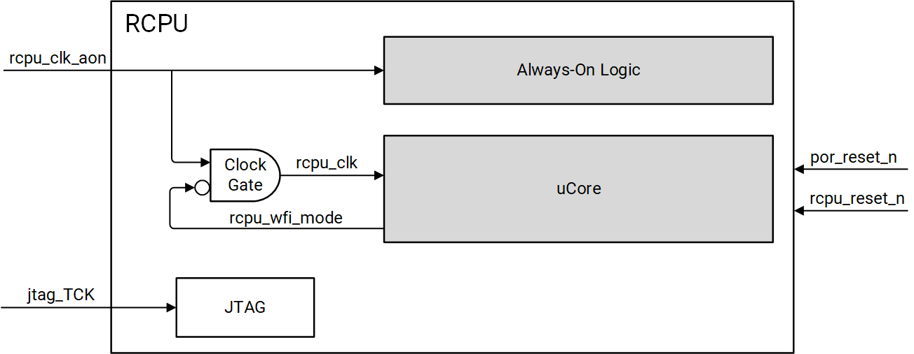

sidebar_position: 8

# 8. CPU 系统

## 8.1 概述

K1 的 CPU 系统由以下部分组成：

- 一个 SpacemiT® X60™ RISC-V 主 CPU（以下简称 **CPU 子系统**）
- 一个 RISC-V 实时 CPU（以下简称 **RCPU**）

## 8.2 CPU 子系统

### 简介

K1 的 **CPU 子系统** 包含以下组件：

- 两个 X60™ 集群
- 一个缓存一致性单元（Cache Coherency Unit）
- 一个用于配置的 Dragon CIU
- 其他用于保障高性能和系统效率的功能模块

### 特性

- **X60™ 集群**

  - 每个集群包含 4 个核心，并集成 512KB 的 L2 缓存
  - BOOST 集群额外集成 512KB 的 TCM
  - 每个 X60™ 核心包含 32KB 的 L1 指令缓存（L1-I）和 32KB 的 L1 数据缓存（L1-D）

- **缓存一致性单元（Cache Coherency Unit）**

  - 维护 X60™ 集群之间的数据一致性

- **Dragon CIU 寄存器**

  - 提供多组配置寄存器，用于配置 X60™ 集群和核心

- **通用计数器寄存器（Generic Counter Register）**

  - SoC 级计数器寄存器

### 功能描述

TBD

### 通用计数器寄存器说明

从 **基地址 0xD500_1000** 开始，提供多组 **通用计数器寄存器**。其具体配置和使用说明将在后续小节中给出。

#### CNTCR_REG

**偏移地址（Offset）：0x0**

| 位域   | 字段       | 类型 | 复位值 | 说明                                                                         |
| ---- | -------- | -- | --- | -------------------------------------------------------------------------- |
| 31:2 | Reserved | RO | 0x0 | 保留，供将来使用                                                                   |
| 1    | HDBG     | RW | 0x0 | 调试暂停控制。取值说明：<br/>- 0：输入到计数器的 HLTDBG 信号不起作用<br/>- 1：输入到计数器的 HLTDBG 信号使计数器暂停 |
| 0    | EN       | RW | 0x0 | 计数器使能控制。取值说明：<br/>- 0：计数器关闭，不递增<br/>- 1：计数器使能，计数值递增                        |

#### CNTSR_REG

**偏移地址（Offset）：0x4**

| 位域   | 字段       | 类型 | 复位值 | 说明       |
| ---- | -------- | -- | --- | -------- |
| 31:2 | Reserved | RO | 0x0 | 保留，供将来使用 |
| 1    | HDBG     | RW | 0x0 | 调试暂停状态指示 |
| 0    | Reserved | RO | 0x0 | 保留，供将来使用 |

#### CNTCVLW_REG

**偏移地址（Offset）：0x8**

| 位域   | 字段      | 类型 | 复位值 | 说明                 |
| ---- | ------- | -- | --- | ------------------ |
| 31:0 | CNTCVLW | RW | 0x0 | 计数器低 32 位数值 [31:0] |

#### CNTCVUP_REG

**偏移地址（Offset）：0xC**

| 位域   | 字段      | 类型 | 复位值 | 说明                  |
| ---- | ------- | -- | --- | ------------------- |
| 31:0 | CNTCVUP | RW | 0x0 | 计数器高 32 位数值 [63:32] |

#### CNTFID_REG

**偏移地址（Offset）：0x20**

| 位域   | 字段   | 类型 | 复位值 | 说明               |
| ---- | ---- | -- | --- | ---------------- |
| 31:0 | FREQ | RW | 0x0 | 计数器频率，表示每秒的计数脉冲数 |

### Dragon CIU 寄存器说明

从 **基地址 `0xD844_0000`** 开始，定义了多个 **Dragon CIU（一致性互连单元）寄存器**，其详细配置信息如下各小节所示。

#### CLUSTER0_CPU_SRAM_CTRL0_REG

**偏移地址（Offset）：`0x14`**

| 位域   | 字段                        | 类型 | 复位值     | 说明                              |
|--------|-----------------------------|------|------------|-----------------------------------|
| 31:0   | CLUSTER0_MEM_EMA_CFG_31_0   | RW   | `0x00035102` | Cluster0 CPU 内存的 MEM_EMA_CFG[31:0] 配置 |

#### CLUSTER0_CPU_SRAM_CTRL1_REG

**偏移地址（Offset）：`0x18`**

| 位域   | 字段                        | 类型 | 复位值     | 说明                              |
|--------|-----------------------------|------|------------|-----------------------------------|
| 31:0   | CLUSTER0_MEM_EMA_CFG_63_32  | RW   | `0x59454000` | Cluster0 CPU 内存的 MEM_EMA_CFG[63:32] 配置 |

#### CLUSTER1_CPU_SRAM_CTRL0_REG

**偏移地址（Offset）：`0x54`**

| 位域   | 字段                        | 类型 | 复位值     | 说明                              |
|--------|-----------------------------|------|------------|-----------------------------------|
| 31:0   | CLUSTER1_MEM_EMA_CFG_31_0   | RW   | `0x00035102` | Cluster1 CPU 内存的 MEM_EMA_CFG[31:0] 配置 |

#### CLUSTER1_CPU_SRAM_CTRL1_REG

**偏移地址（Offset）：`0x58`**

| 位域   | 字段                        | 类型 | 复位值     | 说明                              |
|--------|-----------------------------|------|------------|-----------------------------------|
| 31:0   | CLUSTER1_MEM_EMA_CFG_63_32  | RW   | `0x59454000` | Cluster1 CPU 内存的 MEM_EMA_CFG[63:32] 配置 |

#### CKG_CTRL_REG

**偏移地址（Offset）：`0x88`**

| 位域    | 字段                                      | 类型 | 复位值 | 说明 |
|---------|-------------------------------------------|------|--------|------|
| 31:26   | 保留                                      | RO   | `0x0`  | 保留供将来使用 |
| 25:16   | CCI 动态时钟门控定时器                    | RW   | `0x0`  | 启用动态时钟门控时，CCI 时钟将在 **CCI_CLKOFF_TIMER** 指定的周期数后关闭 |
| 15:4    | 保留                                      | RO   | `0x0`  | 保留供将来使用 |
| 3       | Dragon CIU 动态门控使能                   | RW   | `0x0`  | - `0`：时钟常开<br/>- `1`：启用动态时钟门控 |
| 2       | CCI 时钟动态门控使能                      | RW   | `0x0`  | - `0`：时钟常开<br/>- `1`：启用动态时钟门控 |
| 1       | 保留                                      | RO   | `0x0`  | 保留供将来使用 |
| 0       | nic400_cci550_2x5 时钟动态门控使能        | RW   | `0x0`  | - `0`：时钟常开<br/>- `1`：启用动态时钟门控 |

#### CCI_DBG_CTRL_REG

**偏移地址（Offset）：`0x90`**

| 位域  | 字段                                      | 类型 | 复位值 | 说明 |
|-------|-------------------------------------------|------|--------|------|
| 31:4  | 保留                                      | RO   | `0x0`  | 保留供将来使用 |
| 3     | 侵入式调试使能                            | RW   | `0x0`  | 为高电平时，启用 PMU 事件的计数与导出 |
| 2     | 安全侵入式调试使能                        | RW   | `0x0`  | 当 SPIDEN 与 DBGEN 均为高电平时，启用非安全与安全事件的计数 |
| 1     | 非侵入式调试使能                          | RW   | `0x0`  | 为高电平时，启用 PMU 事件的计数与导出 |
| 0     | 安全特权级非侵入式调试使能                | RW   | `0x0`  | 当 SPNIDEN 与 NIDEN 均为高电平时，启用非安全与安全事件的计数 |

#### CCI_INF_QOS_CTRL_REG

**偏移地址（Offset）：`0x98`**

| 位域   | 字段            | 类型 | 复位值 | 说明                |
|--------|-----------------|------|--------|---------------------|
| 31:16  | 保留            | RO   | `0x0`  | 保留供将来使用      |
| 15:12  | C1_ARQOS_CFG    | RW   | `0x0`  | ALZO_ARQOS 配置     |
| 11:8   | C1_AWQOS_CFG    | RW   | `0x0`  | ALZO_AWQOS 配置     |
| 7:4    | C0_ARQOS_CFG    | RW   | `0x0`  | CPU ARQOS 配置      |
| 3:0    | C0_AWQOS_CFG    | RW   | `0x0`  | CPU AWQOS 配置      |

#### CCI_SFRAM_CTL_REG

**偏移地址（Offset）：`0x9C`**

| 位域  | 字段             | 类型 | 复位值     | 说明                     |
|-------|------------------|------|------------|--------------------------|
| 31:0  | MEM_EMA_CFG_31_0 | RW   | `0x00035102` | CCI CPU 内存的 MEM_EMA_CFG[31:0] 配置 |

#### X60_OUTER_COH_EN_CTRL_REG

**偏移地址（Offset）：`0xF0`**

| 位域  | 字段                | 类型 | 复位值 | 说明 |
|-------|---------------------|------|--------|------|
| 31:2  | 保留                | RO   | `0x0`  | 保留供将来使用 |
| 1     | C1_cpu_outer_coh_en | RW   | `0x1`  | - `0`：Cluster1 外部缓存一致性禁用<br/>- `1`：Cluster1 外部缓存一致性启用 |
| 0     | C0_cpu_outer_coh_en | RW   | `0x1`  | - `0`：Cluster0 外部缓存一致性禁用<br/>- `1`：Cluster0 外部缓存一致性启用 |

> **注**：原文中第 0 位描述存在笔误（误写为“Cluster 1”），此处已根据字段名修正为“Cluster 0”。

#### FAB_TOM_RD_STS0_REG

**偏移地址（Offset）：`0x118`**

| 位域   | 字段                                | 类型 | 复位值 | 说明 |
|--------|-------------------------------------|------|--------|------|
| 31:28  | AXI 读 Monitor 1 超时等级编号       | RO   | `0x0`  | `0`：无超时，需写清；`1`：发生超时 |
| 27:24  | AXI 读 Monitor 0 超时等级编号       | RO   | `0x0`  | `0`：无超时，需写清；`1`：发生超时 |
| 23:20  | AXI 写 Monitor 4 超时等级编号       | RO   | `0x0`  | `0`：无超时，需写清；`1`：发生超时 |
| 19:16  | AXI 写 Monitor 3 超时等级编号       | RO   | `0x0`  | `0`：无超时，需写清；`1`：发生超时 |
| 15:12  | AXI 写 Monitor 2 超时等级编号       | RO   | `0x0`  | `0`：无超时，需写清；`1`：发生超时 |
| 11:8   | AXI 写 Monitor 1 超时等级编号       | RO   | `0x0`  | `0`：无超时，需写清；`1`：发生超时 |
| 7:4    | AXI 写 Monitor 0 超时等级编号       | RO   | `0x0`  | `0`：无超时，需写清；`1`：发生超时 |
| 3:0    | 总超时次数                          | RO   | `0x0`  | 指示各等级超时状态：<br/>- RANK4: `s7_sec`<br/>- RANK3: `s5_axidec2`<br/>- RANK2: `s4_audio`<br/>- RANK1: `s0_mc`<br/>- RANK0: `s2_axidec`<br/><br/>**注**：`0` 表示无超时。使用本寄存器及 `fab_tom_wr_sts` 前必须执行写清操作。 |

#### FAB_TOM_RD_STS1_REG

**偏移地址（Offset）：`0x11C`**

| 位域   | 字段                                | 类型 | 复位值 | 说明 |
|--------|-------------------------------------|------|--------|------|
| 31:12  | 保留                                | RO   | `0x0`  | 保留供将来使用 |
| 11:8   | AXI 读 Monitor 4 超时等级编号       | RO   | `0x0`  | `0`：无超时，通过写 `FAB_TOM_RD_STS` 清除<br/>`1`：发生超时 |
| 7:4    | AXI 读 Monitor 3 超时等级编号       | RO   | `0x0`  | `0`：无超时，通过写 `FAB_TOM_RD_STS` 清除<br/>`1`：发生超时 |
| 3:0    | AXI 读 Monitor 2 超时等级编号       | RO   | `0x0`  | `0`：无超时，通过写 `FAB_TOM_RD_STS` 清除<br/>`1`：发生超时 |

#### FAB_TIMEOUT_CTRL_X_REG

该寄存器用于控制 Fabric#1 S2 端口上 AXI 总线监控器的超时行为。

若 AXI Fabric#1 S2 端口存在挂起请求且持续时间超过设定的超时值，则会触发超时中断。具体说明如下：

- 可通过向 `TIMEOUT_VAL` 写入 `0` 来解除中断；
- 默认超时值为 `0xC000`，每单位对应一个 AXI 时钟周期。

> **注：**
>
> - 仅监控 Fabric#1 S2 端口，此功能专用于调试目的；
> - 为确保在 Fabric#1 S2 端口发生超时时仍能可靠访问寄存器，这些超时控制寄存器应与 SQU 寄存器一同放置于 Fabric#1 S4 端口上。

**偏移地址范围：`0x120–0x160`（步长：`0x10`）**

| 位域    | 字段                          | 类型 | 复位值  | 说明 |
|---------|-------------------------------|------|---------|------|
| 31      | 超时自动响应类型              | RW   | `0x0`   | - `0`：自动响应类型为 `SLVERR`<br/>- `1`：自动响应类型为 `OKAY` |
| 30      | 超时自动响应使能              | RW   | `0x0`   | - `0`：禁用超时时自动响应<br/>- `1`：启用自动响应（有助于将 CPU 从挂起状态恢复） |
| 29      | 超时中断屏蔽                  | RW   | `0x0`   | 控制超时事件是否触发中断：<br/>- `0`：不屏蔽（超时时触发中断）<br/>- `1`：屏蔽（不触发中断） |
| 28      | Fabric 监控器复位             | RW   | `0x0`   | - `0`：复位监控器<br/>- `1`：释放复位 |
| 27      | Fabric 监控器寄存器清零       | RW   | `0x0`   | 清除上次超时捕获的信息：<br/>- `0`：保留寄存器内容<br/>- `1`：清除相关寄存器 |
| 26      | 超时中断清除                  | RW   | `0x0`   | - `0`：无影响<br/>- `1`：硬件自动清除 AXI Fabric S2 端口超时中断 |
| 25      | no_ready_check_en             | RW   | `0x0`   | 控制是否检查 `AWREADY` 或 `ARREADY` 信号：<br/>- `0`：禁用<br/>- `1`：启用 |
| 24      | new_feature_en                | RW   | `0x0`   | 控制 AXI Fabric 超时监控新特性：<br/>- `0`：禁用<br/>- `1`：启用 |
| 23:16   | 保留                          | RO   | `0x0`   | 保留供将来使用 |
| 15      | 时钟门控禁用                  | RW   | `0x0`   | **[DOVE_A0]** 禁用监控器时钟门控：<br/>- `1`：时钟自由运行（即禁用门控）<br/>- `0`：当 `FAB_MON_RST == 0` 时门控时钟 |
| 14:0    | AXI Fabric 超时值             | RW   | `0xC000`| 超时阈值，单位为 AXI 时钟周期。<br/>实际超时时间为 `2048 × TIMEOUT_VAL`。 |

#### FAB_TIMEOUT_ID_X_REG

该寄存器由 Fabric#1 S2 端口上的 AXI 总线监控器填充，记录首次超时事件的相关标识信息。

**偏移地址范围：`0x124–0x164`（步长：`0x10`）**

| 位域    | 字段                     | 类型 | 复位值 | 说明 |
|---------|--------------------------|------|--------|------|
| 31      | 写超时指示位             | RO   | `0x0`  | - `0`：无写请求超时<br/>- `1`：发生写请求超时 |
| 30:22   | 保留                     | RO   | `0x0`  | 保留供将来使用 |
| 21:16   | 超时事务 WID             | RO   | `0x0`  | 触发首次超时的写事务 ID（WID），仅当位[31]（`WR_TIMEOUT_IND`）为 `1` 时有效 |
| 15      | 读超时指示位             | RO   | `0x0`  | - `0`：无读请求超时<br/>- `1`：发生读请求超时 |
| 14:6    | 保留                     | RO   | `0x0`  | 保留供将来使用 |
| 5:0     | 超时事务 RID             | RO   | `0x0`  | 触发首次超时的读事务 ID（RID），仅当位[15]（`RD_TIMEOUT_IND`）为 `1` 时有效 |

#### FAB_TIMEOUT_STATUS0_X_REG

该寄存器由 Fabric#1 S2 端口上的 AXI 总线监控器填充，记录首次写超时事件的地址信息。

**偏移地址范围：`0x128–0x168`（步长：`0x10`）**

| 位域   | 字段                  | 类型 | 复位值 | 说明 |
|--------|-----------------------|------|--------|------|
| 31:2   | 写超时地址            | RO   | `0x0`  | 首次写超时事件所访问的写地址 |
| 1      | 保留                  | RO   | `0x0`  | 保留供将来使用 |
| 0      | 写超时指示位          | RO   | `0x0`  | - `0`：未发生写请求超时<br/>- `1`：发生写请求超时 |

#### FAB_TIMEOUT_STATUS1_X_REG

该寄存器由 Fabric#1 S2 端口上的 AXI 总线监控器填充，记录首次读超时事件的地址信息。

**偏移地址范围：`0x12C–0x16C`（步长：`0x10`）**

| 位域   | 字段                 | 类型 | 复位值 | 说明 |
|--------|----------------------|------|--------|------|
| 31:2   | 读超时地址           | RO   | `0x0`  | 首次读超时事件所访问的读地址 |
| 1      | 保留                 | RO   | `0x0`  | 保留供将来使用 |
| 0      | 读超时指示位         | RO   | `0x0`  | - `0`：未发生读请求超时<br/>- `1`：发生读请求超时 |

#### FAB_DEBUG_REG_X_REG

**偏移地址范围：`0x170–0x17C`（步长：`0x4`）**

| 位域  | 字段                   | 类型 | 复位值 | 说明 |
|-------|------------------------|------|--------|------|
| 31:0  | AXI Fabric 调试寄存器  | RO   | `0x0`  | 各位定义如下：<br/>- `[0]` = `debug_axifab_cp_dec`<br/>- `[1]` = `debug_axifab_axi_dec2`<br/>- `[2]` = `debug_axifab_csap_fab`<br/>- `[3]` = `debug_axifab_vpu_lte`<br/>- `[4]` = `debug_axifab_isp_lcd`<br/>- `[5]` = `debug_axifab_cp_mfab`<br/>- `[6]` = `debug_axifab_apfab`<br/>- `[7]` = `32'h0`<br/>- `[8]` = `debug_axifab_cpu_dec`<br/>- `[9]` = `debug_axifab_cpu_gpu`<br/><br/>**注**：`debug_axifab` 信号包括：`mas_bready`、`mas_rready`、`slv_awready`、`slv_arready`、`slv_wready`、`clk_axi_en_nd` |

#### PAD_PIC_PLIC_INT_0_CTL_REG

**偏移地址（Offset）：保留**

| 位域   | 字段                     | 类型 | 复位值 | 说明 |
|--------|--------------------------|------|--------|------|
| 31:0   | pad_pic_plic_int_0_ctl_  | RW   | `0x0`  | 控制中断源 [31:0] 的触发类型。每位对应一个中断：<br/>- `0`：电平触发<br/>- `1`：边沿触发 |

#### PAD_PIC_PLIC_INT_1_CTL_REG

**偏移地址（Offset）：保留**

| 位域   | 字段                     | 类型 | 复位值 | 说明 |
|--------|--------------------------|------|--------|------|
| 31:0   | pad_pic_plic_int_1_ctl_  | RW   | `0x0`  | 控制中断源 [63:32] 的触发类型。每位对应一个中断：<br/>- `0`：电平触发<br/>- `1`：边沿触发 |

#### PAD_PIC_PLIC_INT_2_CTL_REG

**偏移地址（Offset）：保留**

| 位域   | 字段                     | 类型 | 复位值 | 说明 |
|--------|--------------------------|------|--------|------|
| 31:0   | pad_pic_plic_int_2_ctl_  | RW   | `0x0`  | 控制中断源 [95:64] 的触发类型。每位对应一个中断：<br/>- `0`：电平触发<br/>- `1`：边沿触发 |

#### PAD_PIC_PLIC_INT_3_CTL_REG

**偏移地址（Offset）：保留**

| 位域   | 字段                     | 类型 | 复位值 | 说明 |
|--------|--------------------------|------|--------|------|
| 31:0   | pad_pic_plic_int_3_ctl_  | RW   | `0x0`  | 控制中断源 [127:96] 的触发类型。每位对应一个中断：<br/>- `0`：电平触发<br/>- `1`：边沿触发 |

#### PAD_PIC_PLIC_INT_4_CTL_REG

**偏移地址（Offset）：保留**

| 位域   | 字段                     | 类型 | 复位值 | 说明 |
|--------|--------------------------|------|--------|------|
| 31:0   | pad_pic_plic_int_4_ctl_  | RW   | `0x0`  | 控制中断源 [159:128] 的触发类型。每位对应一个中断：<br/>- `0`：电平触发<br/>- `1`：边沿触发 |

#### C0_INT_WAKEUP_MASK_REG

**偏移地址（Offset）：`0x1A4`**

| 位域   | 字段                          | 类型 | 复位值 | 说明 |
|--------|-------------------------------|------|--------|------|
| 31:10  | 保留                          | RO   | `0x0`  | 保留供将来使用 |
| 9      | C0_ms_int_core_mask           | RW   | `0x0`  | `C0_ms_int` 到 CPU 核心的屏蔽控制：<br/>- `1`：屏蔽<br/>- `0`：不屏蔽 |
| 8      | C0_mt_int_core_mask           | RW   | `0x0`  | `C0_mt_int` 到 CPU 核心的屏蔽控制：<br/>- `1`：屏蔽<br/>- `0`：不屏蔽 |
| 7      | C0_ss_int_core_mask           | RW   | `0x0`  | `C0_ss_int` 到 CPU 核心的屏蔽控制：<br/>- `1`：屏蔽<br/>- `0`：不屏蔽 |
| 6      | C0_me_int_core_mask           | RW   | `0x0`  | `C0_me_int` 到 CPU 核心的屏蔽控制：<br/>- `1`：屏蔽<br/>- `0`：不屏蔽 |
| 5      | C0_se_int_core_mask           | RW   | `0x0`  | `C0_se_int` 到 CPU 核心的屏蔽控制：<br/>- `1`：屏蔽<br/>- `0`：不屏蔽 |
| 4      | C0_ms_int_pmu_wakeup_mask     | RW   | `0x0`  | `C0_ms_int` 到 PMU 唤醒信号的屏蔽控制：<br/>- `1`：屏蔽<br/>- `0`：不屏蔽 |
| 3      | C0_mt_int_pmu_wakeup_mask     | RW   | `0x0`  | `C0_mt_int` 到 PMU 唤醒信号的屏蔽控制：<br/>- `1`：屏蔽<br/>- `0`：不屏蔽 |
| 2      | C0_ss_int_pmu_wakeup_mask     | RW   | `0x0`  | `C0_ss_int` 到 PMU 唤醒信号的屏蔽控制：<br/>- `1`：屏蔽<br/>- `0`：不屏蔽 |
| 1      | C0_me_int_pmu_wakeup_mask     | RW   | `0x0`  | `C0_me_int` 到 PMU 唤醒信号的屏蔽控制：<br/>- `1`：屏蔽<br/>- `0`：不屏蔽 |
| 0      | C0_se_int_pmu_wakeup_mask     | RW   | `0x0`  | `C0_se_int` 到 PMU 唤醒信号的屏蔽控制：<br/>- `1`：屏蔽<br/>- `0`：不屏蔽 |

#### C1_INT_WAKEUP_MASK_REG

**偏移地址（Offset）：`0x1A8`**

| 位域   | 字段                          | 类型 | 复位值 | 说明 |
|--------|-------------------------------|------|--------|------|
| 31:10  | 保留                          | RO   | `0x0`  | 保留供将来使用 |
| 9      | C1_ms_int_core_mask           | RW   | `0x0`  | `C1_ms_int` 到 CPU 核心的屏蔽控制：<br/>- `1`：屏蔽<br/>- `0`：不屏蔽 |
| 8      | C1_mt_int_core_mask           | RW   | `0x0`  | `C1_mt_int` 到 CPU 核心的屏蔽控制：<br/>- `1`：屏蔽<br/>- `0`：不屏蔽 |
| 7      | C1_ss_int_core_mask           | RW   | `0x0`  | `C1_ss_int` 到 CPU 核心的屏蔽控制：<br/>- `1`：屏蔽<br/>- `0`：不屏蔽 |
| 6      | C1_me_int_core_mask           | RW   | `0x0`  | `C1_me_int` 到 CPU 核心的屏蔽控制：<br/>- `1`：屏蔽<br/>- `0`：不屏蔽 |
| 5      | C1_se_int_core_mask           | RW   | `0x0`  | `C1_se_int` 到 CPU 核心的屏蔽控制：<br/>- `1`：屏蔽<br/>- `0`：不屏蔽 |
| 4      | C1_ms_int_pmu_wakeup_mask     | RW   | `0x0`  | `C1_ms_int` 到 PMU 唤醒信号的屏蔽控制：<br/>- `1`：屏蔽<br/>- `0`：不屏蔽 |
| 3      | C1_mt_int_pmu_wakeup_mask     | RW   | `0x0`  | `C1_mt_int` 到 PMU 唤醒信号的屏蔽控制：<br/>- `1`：屏蔽<br/>- `0`：不屏蔽 |
| 2      | C1_ss_int_pmu_wakeup_mask     | RW   | `0x0`  | `C1_ss_int` 到 PMU 唤醒信号的屏蔽控制：<br/>- `1`：屏蔽<br/>- `0`：不屏蔽 |
| 1      | C1_me_int_pmu_wakeup_mask     | RW   | `0x0`  | `C1_me_int` 到 PMU 唤醒信号的屏蔽控制：<br/>- `1`：屏蔽<br/>- `0`：不屏蔽 |
| 0      | C1_se_int_pmu_wakeup_mask     | RW   | `0x0`  | `C1_se_int` 到 PMU 唤醒信号的屏蔽控制：<br/>- `1`：屏蔽<br/>- `0`：不屏蔽 |

#### CPU_SYS_SW_RESET_REG

**偏移地址（Offset）：`0x1AC`**

| 位域   | 字段                | 类型 | 复位值 | 说明 |
|--------|---------------------|------|--------|------|
| 31:2   | 保留                | RO   | `0x0`  | 保留供将来使用 |
| 1      | hap_top_sw_reset    | RW   | `0x0`  | 对 `hap_top` 执行软件复位：<br/>先写 `1`，再写 `0` |
| 0      | pic_top_sw_reset    | RW   | `0x0`  | 对 `pic_top` 执行软件复位：<br/>先写 `1`，再写 `0` |

#### C0_L2_FLUSH_CTL_RESET_REG

**偏移地址（Offset）：`0x1B0`**

| 位域 | 字段                        | 类型 | 复位值 | 说明 |
|------|-----------------------------|------|--------|------|
| 31:5 | 保留                        | RO   | `0x0`  | 保留供将来使用 |
| 4    | C0_l2_hw_flush_done_mask    | RW   | `0x0`  | - `0`：L2 清洗完成状态未被屏蔽<br/>- `1`：L2 清洗完成状态被屏蔽（即强制 `C0_l2_flush_done_status = 1`） |
| 3    | C0_l2_flush_done_status     | RO   | `0x0`  | L2 清洗操作完成状态：<br/>- `0`：未完成<br/>- `1`：已完成 |
| 2    | C0_l2_flush_hw_en           | RO   | `0x0`  | 硬件 L2 清洗使能状态：<br/>- `0`：禁用<br/>- `1`：启用（仅当 `C0_l2_flush_type = 1` 时有效） |
| 1    | C0_l2_flush_sw_req          | RW   | `0x0`  | 软件发起 L2 清洗请求：<br/>- `0`：无请求<br/>- `1`：发起清洗请求（当 `C0_l2_flush_done_status = 1` 后需清除此位） |
| 0    | C0_l2_flush_type            | RW   | `0x0`  | - `1`：硬件 PMU 模式<br/>- `0`：软件模式 |

#### C1_L2_FLUSH_CTL_RESET_REG

**偏移地址（Offset）：`0x1B4`**

| 位域 | 字段                        | 类型 | 复位值 | 说明 |
|------|-----------------------------|------|--------|------|
| 31:5 | 保留                        | RO   | `0x0`  | 保留供将来使用 |
| 4    | C1_l2_hw_flush_done_mask    | RW   | `0x0`  | - `0`：L2 清洗完成状态未被屏蔽<br/>- `1`：L2 清洗完成状态被屏蔽（即强制 `C1_l2_flush_done_status = 1`） |
| 3    | C1_l2_flush_done_status     | RO   | `0x0`  | L2 清洗操作完成状态：<br/>- `0`：未完成<br/>- `1`：已完成 |
| 2    | C1_l2_flush_hw_en           | RO   | `0x0`  | 硬件 L2 清洗使能状态：<br/>- `0`：禁用<br/>- `1`：启用（仅当 `C1_l2_flush_type = 1` 时有效） |
| 1    | C1_l2_flush_sw_req          | RW   | `0x0`  | 软件发起 L2 清洗请求：<br/>- `0`：无请求<br/>- `1`：发起清洗请求（当 `C1_l2_flush_done_status = 1` 后需清除此位） |
| 0    | C1_l2_flush_type            | RW   | `0x0`  | - `1`：硬件 PMU 模式<br/>- `0`：软件模式 |

#### CPU_ACCESS_DDR_REMAP_EN_RESET_REG

**偏移地址（Offset）：`0x1B8`**

| 位域   | 字段                      | 类型 | 复位值 | 说明 |
|--------|---------------------------|------|--------|------|
| 31:1   | 保留                      | RO   | `0x0`  | 保留供将来使用 |
| 0      | cpu_access_ddr_remap_en_  | RW   | `0x1`  | - `0`：DDR 重映射禁用<br/>- `1`：DDR 重映射启用 |

#### HAP_DM_CTL_REG

**偏移地址（Offset）：`0x1BC`**

| 位域 | 字段                         | 类型 | 复位值 | 说明 |
|------|------------------------------|------|--------|------|
| 31:5 | 保留                         | RO   | `0x0`  | 保留供将来使用 |
| 4    | C01_hap_dm_ndmreset_n_mask   | RO   | `0x0`  | 控制在由 `hap_dm_ndmreset_n` 触发的 SoC 看门狗复位期间，是否阻止 `hap_sys_apb_rst_n` 及 Cluster 电源域的 `sys_apb_rst_n` 被拉低：<br/>- `1`：阻止（使能保护）<br/>- `0`：不阻止 |
| 3    | core_iso_hold_en             | RW   | `0x0`  | 在由 `hap_dm_ndmreset_n` 触发的 SoC 看门狗复位期间，是否保持 Core 1–7 的隔离状态：<br/>- `1`：保持隔离<br/>- `0`：不保持 |
| 2    | C1_pwr_hold_en               | RW   | `0x0`  | 在由 `hap_dm_ndmreset_n` 触发的 SoC 看门狗复位期间，是否保持 Cluster 1 的供电：<br/>- `1`：保持供电<br/>- `0`：不保持 |
| 1    | hap_dm_ndmreset_clr          | RW   | `0x0`  | 用于清除 `hap_dm_ctl[4]`（即 `C01_hap_dm_ndmreset_n_mask`）的设置：<br/>- 先写 `1`<br/>- 再写 `0` |
| 0    | hap_dm_ndmreset_n_dis        | RW   | `0x1`  | 控制是否禁用由 `hap_dm_ndmreset_n` 引发的 SoC 看门狗复位：<br/>- `0`：使能复位（不禁用）<br/>- `1`：禁用复位 |

## 8.3 实时 CPU（Real-Time CPU）

### 简介

K1 的 **实时 CPU（Real-Time CPU，RCPU）** 采用 **Nuclei System Technology Co. Ltd.** 设计的 **32 位 RISC-V N308 高效能处理器内核**，主要面向 **物联网（IoT）及低功耗应用场景**。

### 特性

- 支持 **三级流水线（3-stage pipeline）**、**单发射（single-issue）微架构**
- 支持 **RV32I / M / A / F / D / C / P / B 指令扩展**
- 支持 **特权模式（Privileged Mode）**
- 支持低功耗管理机制，包括：
  - 通过 **WFI（Wait For Interrupt）** 和 **WFE（Wait For Event）** 机制进入休眠模式
  - 支持 **两级休眠模式**：浅度休眠（Shallow Sleep）与深度休眠（Deep Sleep）
- 支持 **16KB 数据缓存（D-Cache）**
- 支持 **64 位实时核私有定时器（Real-Time Core-Private Timer，TIMER）**
- 支持 **增强型核级中断控制器（Enhanced Core-Level Interrupt Controller，ECLIC）**，具备以下特性：
  - 支持 RISC-V 架构定义的软件中断、定时器中断和外部中断
  - 支持可配置的中断级别与优先级
  - 支持 **向量化中断处理模式（Vectored Interrupt Processing Mode）**
- 支持 **不可屏蔽中断（Non-Maskable Interrupt，NMI）**
- 支持 **8 个 PMP（Physical Memory Protection）条目**，最小保护粒度为 **4KB**
- 支持 **RISC-V 调试框架（Debug Framework）**

### 功能描述

#### 时钟域

RCPU 内核包含以下 **两个异步时钟域**：

- **主时钟域（Main Clock Domain）**  
  该时钟域驱动 RCPU 中的大部分功能逻辑，包括：
  - **rcpu_clk**：作为 RCPU 主时钟域的主要工作时钟，驱动 RCPU 内部的核心逻辑，在休眠模式下会自动进行时钟门控（Clock Gating）
  - **rcpu_clk_aon**：始终开启的时钟（Always-On Clock），用于驱动 RCPU 中的常开逻辑，包括 **DEBUG**、**ECLIC** 和 **TIMER**

- **JTAG 时钟域（JTAG Clock Domain）**  
  该时钟域用于驱动 DEBUG 单元中的 JTAG 相关逻辑，包括：
  - **tck_s**：JTAG 内部生成的时钟，由 **jtag_TCK** 时钟经 **3 分频**产生

如上所述，这两个时钟域彼此 **异步**。为保证系统的正确运行，RCPU 内部实现了 **跨异步时钟域处理机制（Asynchronous Cross-Clock Domain Process）**。

RCPU 的时钟域结构如下图所示。



#### 私有外设（Private Peripherals）

除 uCore 之外，RCPU 层级结构还包含以下 **私有外设**：

- **JTAG 接口及相关调试功能处理单元（DEBUG）**
- **增强型核级中断控制器（Enhanced Core-Level Interrupt Controller，ECLIC）**
- **实时核私有定时器（Real-Time Core-Private Timer，TIMER）**

相关细节将在后续小节中进行说明。

##### 地址空间（Address Spaces）

每个私有外设均拥有独立的地址空间，如下表所示。

| 私有外设 | 地址空间大小 | 偏移地址 | 说明 |
|---------|---------------|----------|------|
| DEBUG   | 64KB          | 0x000–0xFFF | 该地址空间用于调试功能，常规应用软件 **禁止（NOT）** 访问 |
| ECLIC   | 64KB          | 0x0000–0xFFFF | |
| TIMER   | 64KB          | 0x000–0xFFF | |

##### TIMER

###### 简介

TIMER 用于在 RCPU 内核中产生 **定时器中断** 和 **软件中断**。TIMER 寄存器的详细配置信息请参见 **第 8.4.3 节**，其主要功能说明如下。

###### 时间计数

TIMER 实现了一个 **64 位寄存器（mtime）**，由以下两个寄存器组成：

- **mtime_hi（高 32 位）**
- **mtime_lo（低 32 位）**

用于时间计数。  
默认情况下，**mtime 在复位解除后即被使能并持续计数**。其计数频率的递增由以下两种方式之一控制：

- 内核输入信号 **mtime_toggle_a**
- 或内核的 **常开时钟 rcpu_aon_clk**

###### 定时器中断产生

TIMER 实现了一个 **64 位比较寄存器（mtimecmp）**，由以下两个寄存器组成：

- **mtimecmp_hi（高 32 位）**
- **mtimecmp_lo（低 32 位）**

用于将 **mtime** 的值与 **mtimecmp** 的值进行比较，以决定是否产生定时器中断。具体行为如下：

- 当 **mtimectl.CMPCLREN = 1** 时，若 **mtime** 的值大于 **mtimecmp**，则 **mtime 会被自动清零**，随后定时器从零重新开始计数
- 当 **mtimectl.CMPCLREN = 0** 时，**mtime** 将继续正常递增。软件可通过修改 **mtimecmp** 或 **mtime** 的值来清除定时器中断，从而保证 **mtimecmp** 的值大于 **mtime**

> **说明：** 定时器中断连接至 **ECLIC**，由其进行统一的中断管理。

###### 软件中断产生

TIMER 实现了一个寄存器 **msip**，用于产生软件中断。根据 **第 8.3.4.3.9 节**中给出的寄存器配置说明，仅 **最低有效位（LSB）** 对该功能有效，其行为如下：

- 软件写 **1** 以产生软件中断
- 软件写 **0** 以清除软件中断

> **说明：** 软件中断同样连接至 **ECLIC**，进行统一的中断管理。

###### 软件复位请求产生

TIMER 实现了寄存器 **msftrst**，用于产生 **软件复位请求**。根据后文 **第 9.3.4.3.7 节** 中的寄存器配置说明，仅 **最高有效位（MSB）** 对该功能有效，其行为如下：

- 软件写入 **0x80000A5F** 以产生软件复位请求（该特定写入值用于防止软件随机误写导致的误操作）
- 该寄存器只能通过复位清除（当 SoC 响应软件复位请求并对内核执行复位时，**msftrst** 寄存器将被复位并清零）

> **说明：** 内核通过输出信号 **sysrstreq**（高电平有效）发起软件复位请求。SoC 在响应该请求时，应通过拉低 **rcpu_reset_n** 对内核进行复位，而不是使用 **por_reset_n**。

##### ECLIC

###### 简介

在实时系统或微控制器类应用中，**快速的中断处理机制**至关重要。为此，RCPU 集成了 **增强型核级本地中断控制器（Enhanced Core Local Interrupt Controller，ECLIC）**。ECLIC 是在 RISC-V 标准 **CLIC** 基础上的优化版本，用于统一管理所有中断源，其特点如下：

- **ECLIC 仅服务于单个处理器内核**，并作为内核私有模块运行
- 通过将 CSR 寄存器 **mtvec** 的 **最低有效位（LSB）** 配置为 ECLIC 模式，可使能 ECLIC
- **ECLIC 在功能上与 PLIC 互斥**
- ECLIC 用于管理多个内部和外部中断源，向内核发出中断请求，并支持 **中断抢占（Interrupt Preemption）**

**[ECLIC 寄存器](#eclic-registers)** 的详细配置信息见相关章节，其核心功能说明如下。

###### 中断目标（Interrupt Target）

当 ECLIC 使能后，它对各类中断源进行仲裁，并通过一条专用信号线将中断请求发送至处理器内核（即中断目标），如下图所示：


###### 中断源 ID（Interrupt Source ID）

ECLIC 为每一个中断源分配唯一的 **中断 ID**，最多支持 **64 个中断源**，其分配规则如下：

- **ID 0–18**：保留给内核指定的内部中断  
  - 其中，**ID 3** 固定用于 **软件中断**
  - **ID 7** 固定用于 **定时器中断**
- **ID 大于 18**：可由用户用于连接外部中断源

具体分配如下表所示。

| ECLIC 中断 ID | 功能 | ECLIC 中断源说明 |
|---------------|------|------------------|
| 0             | 保留 | 未使用 |
| 1             | 保留 | 未使用 |
| 2             | 保留 | 未使用 |
| 3             | 软件中断 | 由 TIMER 产生的软件中断 |
| 4             | 保留 | 未使用 |
| 5             | 保留 | 未使用 |
| 6             | 保留 | 未使用 |
| 7             | 定时器中断 | 由 TIMER 产生的定时器中断 |
| 8–18          | 保留 | 未使用 |
| 19–63         | 外部中断 | 用户定义的普通外部中断源。<br/><br/>**说明：** 尽管 ECLIC 在编程模式下最多可支持 **4096 个中断源**，但实际支持的中断源数量由寄存器字段 `clicinfo.NUM_INTERRUPT` 指示 |

###### 中断级别与优先级（Interrupt Level & Priority）

如 **[中断目标](#interrupt-target)** 所示，**ECLIC** 的每一个中断源均可配置对应的 **中断级别（Level）** 和 **中断优先级（Priority）**。其关键机制说明如下。

- 每个中断源对应的 **clicintctl** 寄存器宽度为 **8 位**，但硬件实际实现并生效的位数由 **clicinfo** 寄存器中的 **CLICINTCTLBITS** 字段决定。

  **【示例】** 若 **clicinfo.CLICINTCTLBITS = 6**，则表示 **clicintctl** 寄存器中仅 **高 6 位** 为有效位，**低 2 位** 固定为常量 **1**，如下图所示。

  > **说明：**  
  > **CLICINTCTLBITS** 字段为只读常量，软件无法修改，其合法取值范围为 **2 ≤ CLICINTCTLBITS ≤ 8**。

- **clicintctl** 寄存器中的有效位被划分为以下两个动态字段：
  - **中断级别（Interrupt Level）字段**
  - **中断优先级（Interrupt Priority）字段**

  其中，**中断级别字段的位宽由 `cliccfg.nlbits` 定义**。

  **【示例】** 若 **cliccfg.nlbits = 4**，则表示 **clicintctl** 有效位中的 **高 4 位** 用于表示中断级别，其余的低位有效位用于表示中断优先级，如下图所示。

  > **说明：**  
  > **cliccfg.nlbits** 字段为可读可写，软件可对其进行配置。

  

**关于中断级别（Interrupt Level）：**

- 中断级别值采用 **左对齐（Left-Aligned）** 的方式进行读取。除由 **cliccfg.nlbits** 定义的有效位之外，其余无效的低位均填充为常量 **1**。具体规则如下：
  - 若 **cliccfg.nlbits > clicinfo.CLICINTCTLBITS**，即 **nlbits** 指定的位数超过 **clicintctl** 实际实现的有效位数，则超出的位全部填充为常量 **1**
  - 若 **cliccfg.nlbits = 0**，则中断级别被视为一个固定值 **255**
  - **中断级别数值越大，对应的优先级越高**
- **中断抢占（Interrupt Preemption）**：  
  高级别中断可以抢占低级别中断。当存在多个中断同时处于挂起状态（**IP = 1**）时，**ECLIC** 会进行仲裁，以确定需要发送至内核的中断源。其中，各中断源的 **级别值** 是仲裁过程中的关键因素之一。

  中断级别值的解码示例如下图所示：

  

**关于中断优先级（Interrupt Priority）：**

- 中断优先级值同样采用 **左对齐** 的方式进行读取。除由  
  **`clicinfo.CLICINTCTLBITS - cliccfg.nlbits`**  
  定义的有效位之外，其余无效的低位均填充为常量 **1**。
- **中断优先级数值越大，对应的优先级越高**

  > **说明：**  
  > 中断优先级 **不会影响中断抢占行为**。即，一个中断是否能够抢占另一个中断，与其优先级值无关，仅与中断级别有关。

- 当多个中断同时处于挂起状态时，**ECLIC** 需要进行仲裁以决定将哪个中断发送至内核。该仲裁过程将 **同时考虑中断级别和中断优先级** 两个因素。

#### 控制与状态寄存器（Control & Status Registers，CSRs）

RISC-V 架构中定义了一组 **控制与状态寄存器（CSRs）**，用于配置处理器运行行为或记录执行状态，其说明如下：

- CSRs 是位于内核内部的寄存器，采用 **12 位编码空间** 对其进行访问
- 针对 **数据缓存控制与维护（D-Cache Control and Maintenance，CCM）** 操作，定义了扩展 CSR 寄存器，支持以下功能：
  - **FLUSH（刷新）**
  - **INVAL（失效）**
  - **LOCK（锁定）**
  - **UNLOCK（解锁）**

  上述操作既可以针对 **指定地址（ADDR）** 执行，也可以对 **全局范围（ALL）** 生效。

#### 性能监控（Performance Monitor）

RISC-V 架构定义了以下两类性能计数器：

- **周期计数器（Cycle Counter）**：
  - 为 **64 位时钟周期计数器**，用于统计内核已执行的时钟周期数。只要内核的 **rcpu_clk_aon** 处于开启状态，该计数器就会持续递增
  - CSR **mcycle** 反映该计数器的低 32 位，而 CSR **mcycleh** 反映其高 32 位

- **指令退休计数器（Instruction Retirement Counter）**：
  - 为 **64 位计数器**，用于统计内核成功执行（退休）的指令数量。每成功执行一条指令，该计数器即递增一次
  - CSR **minstret** 反映该计数器的低 32 位，而 CSR **minstreth** 反映其高 32 位

**周期计数器** 与 **指令退休计数器** 通常用于性能评估与分析。

默认情况下，计数器在复位后从 **0** 开始，并持续递增。为降低功耗，在定制 CSR **mcountinhibit** 中提供了额外控制位，当无需进行性能监控时，可通过该位 **暂停计数器运行** 以节省功耗。

#### 低功耗机制（Low-Power Mechanism）

RCPU 内核的低功耗机制工作方式如下：

- 当内核主功能单元处于空闲状态时，其对应的时钟将被 **自动门控（Clock Gating）**，以降低静态功耗
- 内核通过 **WFI（Wait For Interrupt）** 和 **WFE（Wait For Event）** 机制，支持不同的休眠模式（**浅度休眠模式** 与 **深度休眠模式**），以进一步降低动态功耗和静态功耗

#### 时钟控制（Clock Control）

根据唤醒源的不同，区分以下两种情况：

- **内核等待中断唤醒的情况**  
  由于内核只能处理并响应由 **ECLIC** 仲裁和分发的中断，因此，**仅当中断被使能，且其中断级别高于中断阈值等级时，才能唤醒内核**。此外，内核内部 **rcpu_clk_aon** 的使能需要特别注意：

  - **TIMER** 由 **rcpu_clk_aon** 驱动。若 SoC 系统关闭了常开时钟 **rcpu_clk_aon**，则 **TIMER** 因无工作时钟而无法产生定时器中断或软件中断，内核也将无法被唤醒
  - **ECLIC** 同样由 **rcpu_clk_aon** 驱动。若 SoC 系统关闭了常开时钟 **rcpu_clk_aon**，则外部中断信号必须 **保持为有效状态**，直到 SoC 重新使能 **rcpu_clk_aon**。否则，由于 ECLIC 无法在无时钟的情况下采样外部中断信号，内核将无法被唤醒

- **内核等待事件或 NMI 唤醒的情况**  
  当内核通过 **rcpu_clk_aon** 采样到输入信号 **rx_evt**（表示有事件发生）或输入信号 **nmi**（表示发生不可屏蔽中断）时，内核将被唤醒。此时，同样需要谨慎处理 **rcpu_clk_aon** 的使能问题：

  - 若 SoC 系统关闭了常开时钟 **rcpu_clk_aon**，则输入信号 **rx_evt** 或 **nmi** 必须 **保持为 1**，直到 SoC 打开 **rcpu_clk_aon**。否则，由于采样逻辑无工作时钟，内核将无法采样到 **rx_evt** 或 **nmi** 信号，从而无法被唤醒

#### 物理内存保护（Physical Memory Protection）

由于 RCPU 是一款面向微控制器的低功耗内核，**不支持内存管理单元（MMU）**，因此所有地址访问操作均基于 **物理地址**。为了根据物理地址范围及执行特权模式实现内存访问保护与隔离，RISC-V 标准架构定义了 **物理内存保护（Physical Memory Protection，PMP）** 机制。

RCPU 的 PMP 配置特性如下：

- 支持 **8 个 PMP 条目**，最小保护粒度为 **4KB**
- 支持 **PMP TOR（Top of Range，范围上限）模式**

### 寄存器说明（Registers Description）

#### 内核控制与状态寄存器（Core Control & Status Registers，CSRs）

##### mnvec

**mnvec** 是一个定制的 CSR，用于保存 **NMI（不可屏蔽中断）入口地址**。  
当处理器在运行程序过程中触发 NMI 时，程序将被强制跳转到一个新的 PC 地址，该地址由 **mnvec** 的值决定。  
**mnvec** 寄存器的取值由 **mmisc_ctl** 寄存器进行控制。

##### msubm

**msubm** 用于保存以下信息：

- 当前的 **机器子模式（Machine Sub-Mode）**
- 进入当前陷阱（Trap）之前的 **机器子模式**

**偏移地址（Offset）：0x07C4**

| 位域 | 字段 | 类型 | 复位值 | 说明 |
|------|------|------|--------|------|
| 31:10 | Reserved | N/A | N/A | 保留位，固定为 0 |
| 9:8 | PTYP | RW | 0x0 | 进入陷阱前的机器子模式：<br/>- 0：普通机器模式（Normal Machine Mode）<br/>- 1：中断处理模式（Interrupt Handling Mode）<br/>- 2：异常处理模式（Exception Handling Mode）<br/>- 3：NMI 处理模式（NMI Handling Mode） |
| 7:6 | TYP | RW | 0x0 | 当前机器子模式：<br/>- 0：普通机器模式（Normal Machine Mode）<br/>- 1：中断处理模式（Interrupt Handling Mode）<br/>- 2：异常处理模式（Exception Handling Mode）<br/>- 3：NMI 处理模式（NMI Handling Mode） |
| 5:0 | Reserved | N/A | N/A | 保留位，固定为 0 |

##### mdcause

**mdcause** 用于进一步记录 **异常的详细原因**，对异常类型进行细分描述。

**偏移地址（Offset）：0x07C9**

| 位域 | 字段 | 类型 | 复位值 | 说明 |
|------|------|------|--------|------|
| 31:3 | Reserved | N/A | N/A | 保留位，固定为 0 |
| 2:0 | PTYP | RW | 0x0 | 记录异常的详细信息：<br/><br/>当 `mcause.EXCCODE = 1`（指令访问错误，Instruction Access Fault）时：<br/>- 0：保留<br/>- 1：PMP 权限违规<br/>- 2：总线错误<br/>- 3–7：保留<br/><br/>当 `mcause.EXCCODE = 5`（加载访问错误，Load Access Fault）时：<br/>- 0：保留<br/>- 1：PMP 权限违规<br/>- 2：由内核存储器读操作引起的总线错误<br/>- 3–7：保留<br/><br/>当 `mcause.EXCCODE = 7`（存储/AMO 访问错误，Store/AMO Access Fault）时：<br/>- 0：保留<br/>- 1：PMP 权限违规<br/>- 2：由内核存储器写操作引起的总线错误<br/>- 3–7：保留 |

##### mcache_ctl

**mcache_ctl** 用于控制 **指令缓存（I-Cache）** 和 **数据缓存（D-Cache）** 的相关功能。

**偏移地址（Offset）：0x07CA**

| 位域 | 字段 | 类型 | 复位值 | 说明 |
|------|------|------|--------|------|
| 31:21 | Reserved | N/A | N/A | 保留位，固定为 0 |
| 20:17 | Reserved | N/A | N/A | 保留位，固定为 0 |
| 16 | DC_EN | RW | 0x0 | D-Cache 使能控制：<br/>- 0：D-Cache 禁用（默认）<br/>- 1：D-Cache 使能<br/><br/>**说明：** 在运行过程中禁用 D-Cache 时，仅会旁路（Bypass）D-Cache。用户在禁用前应先对所有 D-Cache 数据执行 **写回（Writeback）并失效（Invalidate）** 操作。 |
| 15:1 | Reserved | N/A | N/A | 保留位，固定为 0 |
| 0 | IC_EN | RW | 0x0 | I-Cache 使能控制：<br/>- 0：I-Cache 禁用（默认）<br/>- 1：I-Cache 使能<br/><br/>**说明：** 在运行过程中禁用 I-Cache 时，仅会旁路（Bypass）I-Cache。用户在禁用前应先对所有 I-Cache 数据执行 **写回并失效** 操作。 |

##### mmisc_ctl

**mmisc_ctl** 用于控制多项与 **微架构实现相关** 的功能特性。

**偏移地址（Offset）：0x07D0**

| 位域 | 字段 | 类型 | 复位值 | 说明 |
|------|------|------|--------|------|
| 31:13 | Reserved | N/A | N/A | 保留位，固定为 0 |
| 12 | LDSPEC_ENABLE | RW | 0x0 | 使能或禁用 Load 指令向存储器接口的推测访问（Speculative Access）：<br/>- 0：禁用<br/>- 1：使能 |
| 11 | SIJUMP_ENABLE | RW | 0x0 | 控制 Trace 的 SIJUMP 模式：<br/>- 0：关闭 SIJUMP 模式<br/>- 1：开启 SIJUMP 模式 |
| 10 | IMRETURN_ENABLE | RW | 0x0 | 控制 Trace 的 IMRETURN 模式：<br/>- 0：关闭 IMRETURN 模式<br/>- 1：开启 IMRETURN 模式 |
| 9 | NMI_CAUSE_FFF | RW | 0x0 | 控制 NMI 的 `mnvec` 与 `mcause.EXCCODE` 行为：<br/>- 0：`mnvec` 等于复位后的 PC 地址，NMI 的 `mcause.EXCCODE` 为 `0x1`<br/>- 1：`mnvec` 等于 `mtvec`，NMI 的 `mcause.EXCCODE` 为 `0xFFF` |
| 8 | CORE_BUS_ERR | RW | 0x0 | 控制由内核引起的总线错误被视为异常还是中断：<br/>- 0：异常（Exception）<br/>- 1：中断（Interrupt） |
| 7 | Reserved | N/A | N/A | 保留位，固定为 0 |
| 6 | UNALGN_ENABLE | RW | 0x0 | 使能或禁用非对齐 Load/Store 访问：<br/>- 0：禁用 —— 访问非对齐地址将触发 **地址非对齐异常（Address Misaligned Exception）**<br/>- 1：使能<br/><br/>**说明：** 该字段仅影响 I/F/D 扩展中的 Load/Store 指令。对于 A 扩展指令，非对齐访问始终会触发异常。 |
| 5:4 | Reserved | N/A | N/A | 保留位，固定为 0 |
| 3 | BPU_ENABLE | RW | 0x1 | 使能或禁用 **分支预测单元（Branch Prediction Unit，BPU）**：<br/>- 0：禁用<br/>- 1：使能<br/><br/>**说明：** 若软件禁用 BPU，则在重新使能之前，所有分支将被 **静态预测为跳转（Taken）**。 |
| 2:0 | Reserved | N/A | N/A | 保留位，固定为 0 |

#### 性能监控 CSRs（Performance Monitor CSRs）

##### 简介

RCPU 支持 **可配置的性能监控 CSR**，用于对多种事件进行计数，以实现性能分析与评估。其实现 **严格遵循 RISC-V 特权级规范**，详细说明可参考对应的 RISC-V 官方文档。

##### mhpmcounter[i]（3 ≤ i ≤ 6）

**mhpmcounter[i]（3 ≤ i ≤ 6）** 用于记录特定的 **微架构事件计数值**。

**偏移地址（Offset）：0xB00 + i**

| 位域 | 字段 | 类型 | 复位值 | 说明 |
|------|------|------|--------|------|
| MXLEN-1:32 | Reserved | RW | 0x0 | 在 RV32 中固定为 0；仅适用于 RV64 |
| 31:0 | mhpmcounteri | RW | 0x0 | 机器模式性能监控计数器 `i`（其中 3 ≤ i ≤ 6） |

##### mhpmcounter[i]（7 ≤ i ≤ 31）

**偏移地址（Offset）：0xB00 + i**

| 位域 | 字段 | 类型 | 复位值 | 说明 |
|------|------|------|--------|------|
| MXLEN-1:32 | Reserved | R | 0x0 | 固定为 0，仅适用于 RV64 |
| 31:0 | mhpmcounteri | RW | 0x0 | 固定为 0（其中 7 ≤ i ≤ 31） |

##### mhpmcounterh[i]

**mhpmcounterh[i]** 用于记录特定微架构事件计数器的 **高 32 位**，**仅适用于 RV32**。

**偏移地址（Offset）：0xB80 + i**

| 位域 | 字段 | 类型 | 复位值 | 说明 |
|------|------|------|--------|------|
| MXLEN-1:0 | mhpmcounterhi | R | 0x0 | 固定为 0，仅适用于 RV32（其中 0 ≤ i ≤ 31） |

##### mcountinhibit

**mcountinhibit** 为一个 **MXLEN 位 WARL（Write Any Read Legal）CSR**，用于控制哪些硬件性能监控计数器允许递增。  
该寄存器中的设置 **仅影响计数器的递增行为**，不会影响计数器本身的可访问性。具体规则如下：

- 当 **mcountinhibit** 中的 **CY**、**IR** 或 **HPMn** 位为 **0** 时，对应计数器（**cycle**、**instret** 或 **hpmcountern**）正常递增
- 当 **CY**、**IR** 或 **HPMn** 位为 **1** 时，对应计数器将 **停止递增**

**偏移地址（Offset）：0x320**

| 位域 | 字段 | 类型 | 复位值 | 说明 |
|------|------|------|--------|------|
| MXLEN-1:7 | Reserved | R | 0x0 | — |
| 6 | HPM6 | RW | 0x0 | 置位后，性能监控计数器 6 停止递增 |
| 5 | HPM5 | RW | 0x0 | 置位后，性能监控计数器 5 停止递增 |
| 4 | HPM4 | RW | 0x0 | 置位后，性能监控计数器 4 停止递增 |
| 3 | HPM3 | RW | 0x0 | 置位后，性能监控计数器 3 停止递增 |
| 2 | IR | RW | 0x0 | 置位后，`instret`（指令退休）计数器停止递增 |
| 1 | Reserved | R | 0x0 | — |
| 0 | CY | RW | 0x0 | 置位后，`cycle`（周期）计数器停止递增 |

## mhpmevent3 ~ mhpmevent6

事件选择寄存器 **mhpmevent3 ~ mhpmevent31** 为 **MXLEN 位 WARL（Write Any, Read Legal）CSR**，用于选择触发对应硬件性能监控计数器递增的事件类型。

这些寄存器的行为与 **RISC-V 特权架构规范（Privileged Specification）**中对性能监控事件选择寄存器的定义保持一致。

### 偏移地址（Offset）：0x320 + i

| 位域         | 字段名           | 类型 | 复位值 | 说明    |
| ---------- | ------------- | -- | --- | -------------- |
| MXLEN-1:32 | Reserved      | R  | 0x0 | 保留，读取为 0    |
| 31         | mevent_enable | RW | 0x1 | 当该位为 1 时，允许在 **Machine 模式** 下，所选事件使对应性能计数器递增     |
| 30         | Reserved      | R  | 0x0 | 保留，固定为 0    |
| 29         | sevent_enable | RW | 0x1 | 当该位为 1 时，允许在 **Supervisor 模式** 下，所选事件使对应性能计数器递增      |
| 28         | uevent_enable | RW | 0x1 | 当该位为 1 时，允许在 **User 模式** 下，所选事件使对应性能计数器递增        |
| 27:9       | Reserved      | R  | 0x0 | 保留，读取为 0      |
| 8:4        | event_idx     | RW | 0x0 | 事件索引字段，用于选择具体事件类型。<br/>当 `event_sel = 0` 时，选择**指令退休类事件**，参见 **[mhpeventi[3:0] == 0](#mhpeventi300)**。<br/>当 `event_sel = 1` 时，选择**存储器访问类事件**，参见 **[mhpeventi[3:0] == 1](#mhpeventi301)**。 |
| 3:0        | event_sel     | RW | 0x0 | 事件类别选择：<br/>- 0：指令退休类事件<br/>- 1：存储器访问类事件       |


## mhpmevent7 ~ mhpmevent31

**偏移地址（Offset）：0x320 + i**

| 位域        | 字段名      | 类型 | 复位值 | 说明        |
| --------- | -------- | -- | --- | --------- |
| MXLEN-1:0 | Reserved | R  | 0x0 | 未实现，读取为 0 |

## mhpeventi[3:0] == 0（指令退休类事件）

当 `event_sel = 0` 时，`event_idx` 用于选择**指令退休（instruction retirement）相关事件**。计数在指令成功退休时发生。

| `event_idx` | 事件说明                                |
| ----------- | ----------------------------------- |
| 1           | 周期计数（Cycle count）                   |
| 2           | 已退休指令计数（Retired instruction count）  |
| 3           | 整数 Load 指令（包含 LR）                   |
| 4           | 整数 Store 指令（包含 SC）                  |
| 5           | 原子存储器操作指令（不包含 LR 和 SC）              |
| 6           | 系统指令                                |
| 7           | 整数算术与逻辑指令（不包含乘、除、取余）                |
| 8           | 条件分支指令                              |
| 9           | 已跳转的条件分支指令                          |
| 10          | JAL 指令                              |
| 11          | JALR 指令                             |
| 12          | 返回指令                                |
| 13          | 控制流转移指令（条件分支 + JAL + JALR）          |
| 14          | 保留                                  |
| 15          | 整数乘法指令                              |
| 16          | 整数除法 / 取余指令                         |
| 17          | 浮点 Load 指令                          |
| 18          | 浮点 Store 指令                         |
| 19          | 浮点加法 / 减法指令                         |
| 20          | 浮点乘法指令                              |
| 21          | 浮点融合乘加指令（FMADD、FMSUB、FNMSUB、FNMADD） |
| 22          | 浮点除法或平方根指令                          |
| 23          | 其他浮点指令                              |
| 24          | 条件分支预测失败                            |
| 25          | JAL 预测失败                            |
| 26          | JALR 预测失败                           |

## mhpeventi[3:0] == 1（存储器访问类事件）

当 `event_sel = 1` 时，`event_idx` 用于选择**存储器系统相关事件**。

| `event_idx` | 事件说明                             |
| ----------- | -------------------------------- |
| 1           | 指令缓存未命中（Instruction Cache Miss）  |
| 2           | 数据缓存未命中（Data Cache Miss）         |
| 3           | 指令 TLB 未命中（Instruction TLB Miss） |
| 4           | 数据 TLB 未命中（Data TLB Miss）        |
| 5           | 主 TLB 未命中（Main TLB Miss）         |

## TIMER 寄存器

### 简介

**TIME** 寄存器组的**基地址（Base Address）**为：

```
0xE003_0000
```

该寄存器组用于提供核心私有的定时器功能，其行为与 RISC-V 规范中定义的 **MTIME / MTIMECMP / MSIP（CLINT 模型）**保持一致，并通过影子寄存器机制进行访问。

### mtime_lo

**偏移地址（Offset）：0x0000**

| 位域   | 字段名   | 类型 | 复位值 | 说明                                                     |
| ---- | ----- | -- | --- | ------------------------------------------------------ |
| 31:0 | mtime | RW | 0x0 | 反映 `mtime` 的低 32 位值。<br/>在 CLINT 模式下，为 MTIME 的影子寄存器副本。 |

### mtime_hi

**偏移地址（Offset）：0x0004**

| 位域   | 字段名   | 类型 | 复位值 | 说明                                                     |
| ---- | ----- | -- | --- | ------------------------------------------------------ |
| 31:0 | mtime | RW | 0x0 | 反映 `mtime` 的高 32 位值。<br/>在 CLINT 模式下，为 MTIME 的影子寄存器副本。 |

### mtimecmp_l

**偏移地址（Offset）：0x0008**

| 位域   | 字段名      | 类型 | 复位值        | 描述                                                                   |
| ---- | -------- | -- | ---------- | -------------------------------------------------------------------- |
| 31:0 | mtimecmp | RW | 0xFFFFFFFF | 设置 `mtimecmp` 的低 32 位值。<br/>在 CLINT 模式下，为 Hart-0 的 MTIMECMP 影子寄存器副本。 |

### mtimecmp_hi

**偏移地址（Offset）：0x000C**

| 位域   | 字段名      | 类型 | 复位值        | 说明                                                                   |
| ---- | -------- | -- | ---------- | -------------------------------------------------------------------- |
| 31:0 | mtimecmp | RW | 0xFFFFFFFF | 设置 `mtimecmp` 的高 32 位值。<br/>在 CLINT 模式下，为 Hart-0 的 MTIMECMP 影子寄存器副本。 |

### mtime_srw_ctrl

**偏移地址（Offset）：0x0FEC**

| 位域   | 字段名            | 类型  | 复位值 | 描述                                                                               |
| ---- | -------------- | --- | --- | -------------------------------------------------------------------------------- |
| 31:1 | Reserved       | N/A | N/A | 保留位，用于控制 S 模式是否允许访问定时器寄存器。                                                       |
| 0    | mtime_srw_ctrl | RW  | 0x0 | 控制 **Supervisor 模式**是否允许读写定时器寄存器：<br/>- 0：S 模式可读写所有定时器寄存器<br/>- 1：S 模式禁止读写定时器寄存器 |

### msftrst

**偏移地址（Offset）：0x0FF0**

| 位域   | 字段名      | 类型  | 复位值 | 说明         |
| ---- | -------- | --- | --- | ---------- |
| 31   | MSFTRST  | RW  | 0x0 | 产生一次软件复位请求 |
| 30:0 | Reserved | N/A | N/A | 保留位，读取为 0  |

### mtimectl

**偏移地址（Offset）：0x0FF8**

| 位域   | 字段名      | 类型  | 复位值 | 说明                                                                                                                                   |
| ---- | -------- | --- | --- | ------------------------------------------------------------------------------------------------------------------------------------ |
| 31:3 | Reserved | N/A | N/A | 保留位，读取为 0                                                                                                                            |
| 2    | CLKSRC   | RW  | 0x0 | 选择定时器计数递增频率的时钟源：<br/>- 1：计数频率来自 `rcpu_aon_clk`<br/>- 0：计数频率由 `mtime_toggle_a` 控制                                                     |
| 1    | CMPCLREN | RW  | 0x0 | 控制定时器中断触发后是否自动清零计数值：<br/>- 1：产生定时器中断后，`mtime` 清零<br/>- 0：定时器正常递增<br/><br/>**说明：** 当使能 CMPCLREN 时，定时器中断请求为脉冲形式，此时定时器中断应配置为**边沿触发模式**。 |
| 0    | TIMESTOP | RW  | 0x0 | 控制定时器是否暂停计数：<br/>- 1：定时器暂停<br/>- 0：定时器正常递增                                                                                           |

### msip

**偏移地址（Offset）：0x0FFC**

| 位域   | 字段名      | 类型  | 复位值 |说明                                                     |
| ---- | -------- | --- | --- | ------------------------------------------------------ |
| 31:1 | Reserved | N/A | N/A | 保留位，读取为 0                                              |
| 0    | MSIP     | RW  | 0x0 | 用于生成**软件中断**。<br/>在 CLINT 模式下，为 Hart-0 的 MSIP 影子寄存器副本。 |


## ECLIC 寄存器（ECLIC Registers）

### 简介（Introduction）

**ECLIC** 寄存器的**基地址（Base Address）**为：

```
0xE002_0000
```

ECLIC（Enhanced Core Local Interrupt Controller）用于管理核心私有的中断源，其寄存器模型与 RISC-V CLIC 架构保持一致，并在实现上进行了增强与优化。

### cliccfg

**cliccfg** 为全局配置寄存器，用于配置 ECLIC 的工作模式，软件可对其进行写操作。

**偏移地址（Offset）：0x0000**

| 位域  | 字段名      | 类型 | 复位值 | 说明                                                          |
| --- | -------- | -- | --- | ----------------------------------------------------------- |
| 7:5 | Reserved | R  | N/A | 保留位，读取为 0                                                   |
| 4:1 | nlbits   | RW | 0x0 | 用于指定 `clicintctl[i]` 寄存器中**中断级别（level）与优先级（priority）字段**的位宽 |
| 0   | Reserved | R  | N/A | 保留位，读取为 1                                                   |

### clicinfo

**clicinfo** 为全局参数寄存器，用于向软件报告 ECLIC 的硬件能力和实现信息，仅支持读取。

**偏移地址（Offset）：0x0004**

| 位域    | 字段名            | 类型 | 复位值 | 说明                                   |
| ----- | -------------- | -- | --- | ------------------------------------ |
| 31:25 | Reserved       | R  | N/A | 保留位，读取为 0                            |
| 24:21 | CLICINTCTLBITS | R  | N/A | 指示 `clicintctl[i]` 寄存器中**实际实现的有效位宽** |
| 20:13 | VERSION        | R  | N/A | 硬件实现版本号                              |
| 12:0  | NUM_INTERRUPT  | R  | N/A | 硬件所支持的中断源数量                          |

### mth

**mth** 用于设置**目标中断阈值级别（Interrupt Threshold Level）**，软件可对其进行写操作。

**偏移地址（Offset）：0x000B**

| 位域  | 字段名 | 类型 | 复位值 | 说明                                                                        |
| --- | --- | -- | --- | ------------------------------------------------------------------------- |
| 7:0 | mth | RW | N/A | 目标中断阈值寄存器。<br/>**说明：** 仅当 ECLIC 最终仲裁出的中断级别**高于**该寄存器中的阈值时，中断请求才会被送往处理器核心。 |

### clicintip[i]

**clicintip[i]** 为中断源的**挂起标志寄存器（Pending Flag Register）**。

**偏移地址（Offset）：0x1000 + 4 × i**

| 位域  | 字段名      | 类型 | 复位值 |说明                                                                              |
| --- | -------- | -- | --- | ------------------------------------------------------------------------------- |
| 7:1 | Reserved | RO | N/A | 保留位，读取为 0                                                                       |
| 0   | IP       | RW | 0x0 | 中断源挂起标志：<br/>- 0：中断未触发<br/>- 1：中断已触发<br/><br/>**说明：** 对于边沿触发型中断源，IP 位可能由硬件自动清除。 |

### clicintie[i]

**clicintie[i]** 为中断源的**使能寄存器（Interrupt Enable Register）**。

**偏移地址（Offset）：0x1001 + 4 × i**

| 位域  | 字段名      | 类型 | 复位值 | 说明                                  |
| --- | -------- | -- | --- | ----------------------------------- |
| 7:1 | Reserved | R  | N/A | 保留位，读取为 0                           |
| 0   | IE       | RW | 0x0 | 中断使能位：<br/>- 0：中断源被屏蔽<br/>- 1：中断源使能 |

### clicintattr[i]

**clicintattr[i]** 用于描述中断源的**触发属性与向量模式**，软件可对其进行写操作。

**偏移地址（Offset）：0x1002 + 4 × i**

| 位域  | 字段名      | 类型 | 复位值 | 描述                                                                                                                                                                                                                                    |
| --- | -------- | -- | --- | ------------------------------------------------------------------------------------------------------------------------------------------------------------------------------------------------------------------------------------- |
| 7:6 | Reserved | R  | N/A | 保留位，读取为 `2'b11`                                                                                                                                                                                                                       |
| 5:3 | Reserved | R  | N/A | 保留位，读取为 0                                                                                                                                                                                                                             |
| 2:1 | trig     | RW | 0x0 | 中断触发方式配置：<br/>- `2'b00`：电平触发中断。IP 位实时反映中断源电平状态；软件写 IP 被忽略，仅能通过中断源撤销来清除。<br/>- `2'b01`：上升沿触发中断；软件可写 IP 位进行置位或清除。<br/>- `2'b11`：下降沿触发中断；软件可写 IP 位进行置位或清除。<br/><br/>**说明：** 为提升中断处理效率，当中断被接收并跳转至 ISR 时，ECLIC 硬件会自动清除 IP 位，ISR 中无需软件显式清除。 |
| 0   | shv      | RW | 0x0 | 中断向量模式选择：<br/>- 0：非向量模式（Non-Vectored），处理器跳转至共享中断入口地址。<br/>- 1：向量模式（Vectored），处理器直接跳转至向量表中对应中断源的入口地址。                                                                                                                                  |
### clicintctl[i]

**clicintctl[i]** 为中断源控制寄存器，用于配置**中断级别（level）**与**中断优先级（priority）**。
其中，level 与 priority 字段的位宽由 **cliccfg.nlbits** 动态决定。

**偏移地址（Offset）：0x1003 + 4 × i**

| 位域                                          | 字段名      | 类型 | 复位值 | 说明                                              |
| ------------------------------------------- | -------- | -- | --- | ----------------------------------------------- |
| 7 : 7 − (nlbits − 1)                        | Level    | RW | N/A | 中断源级别（Interrupt Level）；数值越大，在 ECLIC 仲裁中级别越高。    |
| 7 − (nlbits − 1) : 7 − (CLICINTCTLBITS − 1) | Priority | RW | N/A | 中断源优先级（Interrupt Priority）；数值越大，在同级别中断仲裁中优先级越高。 |
| 7 − (CLICINTCTLBITS − 1) : 0                | Reserved | RO | N/A | 保留位，读取为 1                                       |

