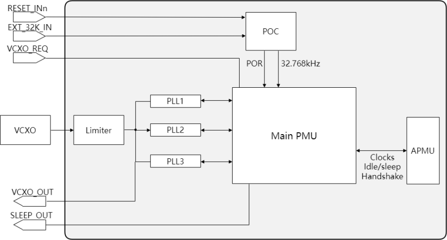
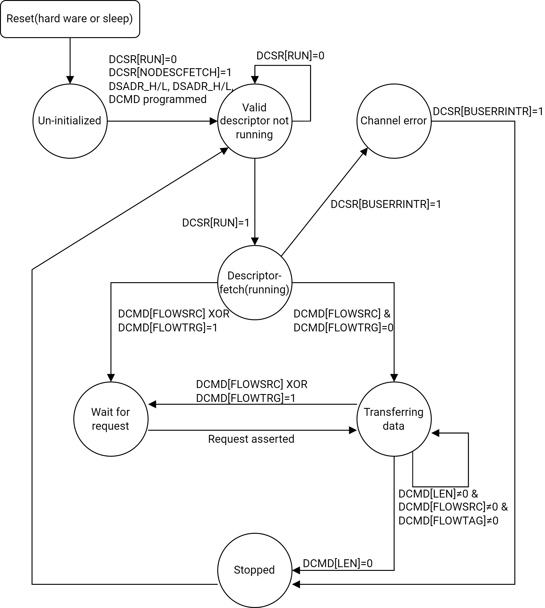

# 9. Top System (Part 1/2)

```
Last Version: 2025/11/18
```

## 9.1 Overview

The Top System of K1 consists of

**[Chapter 9]**

- Clock & Reset
- JTAG
- DMA
- Crypto

**[Chapter 10]**

- Timer & Watchdog
- RTC
- Mailbox
- Power Management & Lower Power Mode Control

## 9.2 Clock & Reset

### Introduction

K1 comes with the following clocks:

- One 32K RTC clock
- One 24M OSC clock

### Features

- Three PLLs implemented inside to provide various frequencies to meet different scenario requirements
- DVFS feature supported to balance the tradeoff between power and performance
- Glitch-free clock switches and clock dividers implemented to provide all required frequencies with limited PLLs cost
- Clock gating and software reset schemes applied to modules in fine granularity to achieve power saving and flexible management

### Functional Description

#### Clock System

The detailed clock tree structure is depicted below, where is highlighted how the clock signals are generated, managed and distributed across the system to support various modules and functions.


Instead, the high-level architecture of the clock system is depicted below.



VCXO_OUT is driven with the OSC frequency if either of the following occurs:

- VCXO_REQ is asserted, and the relevant REQ_EN bit field is set in the VCXO software request control register
- Software request bit field is enabled in the VCXO software request control register
  There are three Phase-Locked Loop (PLL) designed to accept a wide range of input frequencies, and generate a broad range of output frequencies to all modules for functioning properly in different application scenario. Details for each PLL are provided in the following subsections.

##### PLL1

PLL1 is designed to generate fixed frequency points for the CPU cores and other peripherals, where

- Changes of the run-time frequency in the PLL1 output are only available for debugging purposes and should not be used in production systems
- PLL1 is enabled by default at system reset and shutdown only when the entire chip entered sleep mode with VCXO shutdown enabled
- The settings configured in the PLL1 and oscillator control registers of the Main PMU control the delay required for the PLL1 output clocks to stabilize after system reset or shutdown
- Updating the PLL1 configuration registers to change frequency during normal operations is not recommended

##### PLL2

PLL2 is designed to generate various fixed frequencies, working alongside PLL1 to provide a full range of frequencies required for different modules, where

- Changes of run-time frequency in the PLL2 output are only available for debugging purposes and should not be used in production systems
- PLL2 is disabled at system reset and must be enabled through software when required
- The settings configured in the PLL2 and oscillator control registers of the Main PMU control the delay required for the PLL2 output clocks to stabilize after system reset or shutdown
- Updating the PLL2 configuration registers to change frequency during normal operations is not recommended

##### PLL3

PLL3 is designed to provide frequencies for CPU frequency scaling and switching, where

- PLL3 is disabled at system reset and must be enabled through software when required
- The settings configured in the PLL3 and oscillator control register of the Main PMU control the delay required for the PLL3 output clocks to stabilize after system reset or shutdown
- Updating the PLL3 configuration registers to change frequency during normal operations is not recommended

#### Resource Reset Schemes

K1 allows applying different schemes of resource reset as tabled below.

<table>
<tbody>
<tr>
<td><strong>No.</strong></td>
<td><strong>Resource Reset Scheme</strong></td>
<td><strong>Description</strong></td>
</tr>
<tr>
<td>1</td>
<td>Power-On-Reset</td>
<td>Reset the whole chip during power-on sequence</td>
</tr>
<tr>
<td>2</td>
<td>WatchDog Reset</td>
<td>Reset the whole chip excluding pinmux registers and debug registers</td>
</tr>
<tr>
<td>3</td>
<td>Module Software Reset</td>
<td>Reset each module individually through software</td>
</tr>
<tr>
<td>4</td>
<td>Power Island POR Reset</td>
<td>Reset the whole power island during its power-on sequence</td>
</tr>
</tbody>
</table>

### Register Description

#### Basing on \<PMUMAIN(D4050000)\>

##### FREQUENCY CHANGE CONTROL REGISTER (FCCR)

<table>
<tbody>
<tr>
<td rowspan=1 colspan=5><strong>Offset: 0xD4050000+0x8</strong></td>
</tr>
<tr>
<td><strong>Bits</strong></td>
<td><strong>Field</strong></td>
<td><strong>Type</strong></td>
<td><strong>Reset</strong></td>
<td><strong>Description</strong></td>
</tr>
<tr>
<td>31:30</td>
<td>Reserved</td>
<td>RSVD</td>
<td>0xX<br/></td>
<td>Reserved. <br/>Always write 0, ignore the read value.</td>
</tr>
<tr>
<td>29</td>
<td>I2SCLK307M</td>
<td>RW</td>
<td>0x0</td>
<td>12S Divider Clock 307.2M selection:<br/>- <strong>1</strong> = 307.2M PLL1 Clock<br/>- <strong>0</strong> = PLL1 307.2M/2=153.6M clock</td>
</tr>
<tr>
<td>28:9</td>
<td>Reserved</td>
<td>RSVD</td>
<td>0xX<br/></td>
<td>Reserved. <br/>Always write 0, ignore the read value.</td>
</tr>
<tr>
<td>8:0</td>
<td>PLL1FBD</td>
<td>RW</td>
<td>0x0</td>
<td>PLL1 FBDIV<br/>Actually this register bits are not used in Auiqla, it's fixed to Ox30 now.</td>
</tr>
</tbody>
</table>

##### PLL & OSCILLATOR CONTROL REGISTER (POCR)

<table>
<tbody>
<tr>
<td rowspan=1 colspan=5><strong>Offset: 0xD4050000+0xC</strong></td>
</tr>
<tr>
<td><strong>Bits</strong></td>
<td><strong>Field</strong></td>
<td><strong>Type</strong></td>
<td><strong>Reset</strong></td>
<td><strong>Description</strong></td>
</tr>
<tr>
<td>31</td>
<td>FORCE</td>
<td>RW</td>
<td>0x0</td>
<td>Force all clocks to be free running: <br/>- <strong>1'b0</strong>: The 'FORCE' field does not affect clock gating. Standard clock gating behavior is maintained. <br/>- <strong>1'b1</strong>: All output clocks are continuously running and not gated.</td>
</tr>
<tr>
<td>30:24</td>
<td>RSVD</td>
<td>RO</td>
<td>0</td>
<td>Reserved </td>
</tr>
<tr>
<td>23:16</td>
<td>VCXOST</td>
<td>RW</td>
<td>0xE5</td>
<td>Determines the wait time for VCTCXO and clock limiter stabilization:<br/>- <strong>0x0</strong>： wait time = one 32.768 KHz clock cycle <br/>- <strong>0x1</strong>： wait time = two 32.768 KHz clock cycles<br/>....<br/>- <strong>0xE5</strong>:  wait time = 230 32.768 KHz clock cycles <br/>- <strong>0xE6 - 0xFF</strong>:  Reserved </td>
</tr>
<tr>
<td>15:12</td>
<td>RSVD</td>
<td>RO</td>
<td>0</td>
<td>Reserved</td>
</tr>
<tr>
<td>11:0</td>
<td>PLLLOCK</td>
<td>RW</td>
<td>0x0</td>
<td>Determines the wait time for PLL lock. This value determines lock time for both PLLs (PLL1 and PLL2): <br/>- <strong>0x0</strong>：Main PLL lock time = VCTCXO/2 cycle<br/>- <strong>0x1</strong>:  Main PLL lock time = 2 VCTCXO/2 cycles<br/>- <strong>0xFFF</strong>:  Main PLL lock time = 4096 VCTCXO/2 cycles </td>
</tr>
</tbody>
</table>

##### VCTCXO SW REQUEST CONTROL REGISTER (VRCR)

<table>
<tbody>
<tr>
<td rowspan=1 colspan=5><strong>Offset: 0xD4050000+0x18</strong></td>
</tr>
<tr>
<td><strong>Bits</strong></td>
<td><strong>Field</strong></td>
<td><strong>Type</strong></td>
<td><strong>Reset</strong></td>
<td><strong>Description</strong></td>
</tr>
<tr>
<td>31:16</td>
<td>RSVD</td>
<td>RO</td>
<td>0x0</td>
<td>Reserved </td>
</tr>
<tr>
<td>15</td>
<td>VCXO_OUT_REQ_EN3</td>
<td>RW</td>
<td>0x0</td>
<td>Enable VCXO_REQ2 for VCXO_OUT </td>
</tr>
<tr>
<td>14</td>
<td>VCXO_OUT_REQ_EN2</td>
<td>RW</td>
<td>0x0</td>
<td>Enable VCXO_REQ2 for VCXO_OUT <br/></td>
</tr>
<tr>
<td>13</td>
<td>VCXO_OUT_REQ_EN1</td>
<td>RW</td>
<td>0x0</td>
<td>Enable VCXO_REQ1 for VCXO_OUT </td>
</tr>
<tr>
<td>12</td>
<td>VCXO_OUT_REQ_EN0</td>
<td>RW</td>
<td>0x0</td>
<td>Enable VCXO_REQ0 for VCXO_OUT </td>
</tr>
<tr>
<td>11:9</td>
<td>RSVD</td>
<td>RO</td>
<td>0x0</td>
<td>Reserved</td>
</tr>
<tr>
<td>8</td>
<td>SW_REQ</td>
<td>RW</td>
<td>0x0</td>
<td>SW request of VCTCXO </td>
</tr>
<tr>
<td>7</td>
<td>REQ_POL3</td>
<td>RW</td>
<td>0x0</td>
<td>VCXO_REQ3 request polarity </td>
</tr>
<tr>
<td>6</td>
<td>REQ_POL2</td>
<td>RW</td>
<td>0x0</td>
<td>VCXO_REQ2 request polarity </td>
</tr>
<tr>
<td>5</td>
<td>REQ_POL1</td>
<td>RW</td>
<td>0x0</td>
<td>VCXO_REQ1 request polarity </td>
</tr>
<tr>
<td>4</td>
<td>REQ_POL0</td>
<td>RW</td>
<td>0x0</td>
<td>VCXO_REQ0 request polarity </td>
</tr>
<tr>
<td>3</td>
<td>RSVD</td>
<td>RO</td>
<td>0x0</td>
<td>Reserved</td>
</tr>
<tr>
<td>2</td>
<td>REQ_EN2</td>
<td>RW</td>
<td>0x0</td>
<td>Enable VCXO_REQ2 for sysclk_en </td>
</tr>
<tr>
<td>1</td>
<td>Reserved</td>
<td>RO</td>
<td>0x0</td>
<td>Reserved</td>
</tr>
<tr>
<td>0</td>
<td>REQ_EN0</td>
<td>RW</td>
<td>0x0</td>
<td>Enable VCXO_REQ0 for OCLK1 </td>
</tr>
</tbody>
</table>

##### SoC I2S CLOCK GENERATION CONTROL REGISTER (ISCCR0/1)

<table>
<tbody>
<tr>
<td rowspan=1 colspan=5><strong>Offset: 0xD4050000+0x40/0x44</strong></td>
</tr>
<tr>
<td><strong>Bits</strong></td>
<td><strong>Field</strong></td>
<td><strong>Type</strong></td>
<td><strong>Reset</strong></td>
<td><strong>Description</strong></td>
</tr>
<tr>
<td>31</td>
<td>SYSCLK_EN</td>
<td>RW</td>
<td>0x0</td>
<td>Enables the I2S clock input to SYSCLKn Generator and its output</td>
</tr>
<tr>
<td>30</td>
<td>SYSCLK_SRC</td>
<td>RW</td>
<td>0x1</td>
<td>Selects the I2S M/N divider input clock frequency:<br/>- <strong>1'b0</strong>: Clock rate is 25.6 MHz <br/>- <strong>1'b1</strong>: Clock rate is based on 153.6 MHz</td>
</tr>
<tr>
<td>29</td>
<td>BITCLK_EN</td>
<td>RW</td>
<td>0x0</td>
<td>Enables the I2S clock input to the bit clock generator</td>
</tr>
<tr>
<td>28:27</td>
<td>BITCLK_DIV_468</td>
<td>RW</td>
<td>0x3</td>
<td>Determines BITCLK1 to SYSCLK1 relation: <br/>- 2'b00: BITCLK1 rate = SYSCLK1 rate / 2<br/>- 2'b01: BITCLK1 rate = SYSCLK1 rate / 4<br/>- 2'b10: BITCLK1 rate = SYSCLK1 rate / 6<br/>- 2'b11: BITCLK1 rate = SYSCLK1 rate / 8</td>
</tr>
<tr>
<td>26:15</td>
<td>DENOM</td>
<td>RW</td>
<td>0x40</td>
<td>- I2S clock generation programmable divider denominator value <br/>- The I2S sysclk is generated using a fractional divider.</td>
</tr>
<tr>
<td>14:0</td>
<td>NOM</td>
<td>RW</td>
<td>0x130B</td>
<td>- I2S clock generation programmable divider numerator value. <br/>- The I2S sysclk is generated using a fractional divider. </td>
</tr>
</tbody>
</table>

##### WDT (CP TIMERS) CONTROL REGISTER (WDTPCR)

<table>
<tbody>
<tr>
<td rowspan=1 colspan=5><strong>Offset: 0xD4050000+0x200</strong></td>
</tr>
<tr>
<td><strong>Bits</strong></td>
<td><strong>Field</strong></td>
<td><strong>Type</strong></td>
<td><strong>Reset</strong></td>
<td><strong>Description</strong></td>
</tr>
<tr>
<td>31:3</td>
<td>RSVD</td>
<td>RO</td>
<td>0</td>
<td>Reserved </td>
</tr>
<tr>
<td>2</td>
<td>RST</td>
<td>RW</td>
<td>0x0</td>
<td>Timers Hardware reset generation (resets both APB & Functional domains): <br/>1'b0: No reset <br/>1'b1: Reset </td>
</tr>
<tr>
<td>1</td>
<td>FNCLK</td>
<td>RW</td>
<td>0x0</td>
<td>Timers and WDT functional Clock enable/disable: <br/>1'b0: Clock off<br/>1'b1: Clock on </td>
</tr>
<tr>
<td>0</td>
<td>ABCLK</td>
<td>RW</td>
<td>0x0</td>
<td>CP Timers and WDT APB Bus Clock enable/disable:<br/>1'b0: Clock off<br/>1'b1: Clock on </td>
</tr>
</tbody>
</table>

##### RIPC CONTROL REGISTER (RIPCCR)

<table>
<tbody>
<tr>
<td rowspan=1 colspan=5><strong>Offset: 0xD4050000+0x210</strong></td>
</tr>
<tr>
<td><strong>Bits</strong></td>
<td><strong>Field</strong></td>
<td><strong>Type</strong></td>
<td><strong>Reset</strong></td>
<td><strong>Description</strong></td>
</tr>
<tr>
<td>31:3</td>
<td>Reserved</td>
<td>RSVD</td>
<td>0xX</td>
<td>Reserved <br/>Always write 0.<br/>Ignore read value.</td>
</tr>
<tr>
<td>2</td>
<td>RST</td>
<td>RW</td>
<td>0x0</td>
<td>RST<br/>R-IPC Hardware reset generation<br/>1'b0: No reset <br/>1'b1: Reset </td>
</tr>
<tr>
<td>1</td>
<td>Reserved</td>
<td>RSVD</td>
<td>0xX</td>
<td>Reserved <br/>Always write 0.<br/>Ignore read value.</td>
</tr>
<tr>
<td>0</td>
<td>APBCLK</td>
<td>RW</td>
<td>0x0</td>
<td>APBCLK<br/>R-IPC APB Bus Clock enable/disable<br/>1'b0: Clock off<br/>1'b1: Clock on </td>
</tr>
</tbody>
</table>

##### CLOCK GATING REGISTER (CGR)

<table>
<tbody>
<tr>
<td rowspan=1 colspan=5><strong>Offset: 0xD4050000+0x1024</strong></td>
</tr>
<tr>
<td><strong>Bits</strong></td>
<td><strong>Field</strong></td>
<td><strong>Type</strong></td>
<td><strong>Reset</strong></td>
<td><strong>Description</strong></td>
</tr>
<tr>
<td>31:22</td>
<td>RSVD</td>
<td>RO</td>
<td>0</td>
<td>Reserved </td>
</tr>
<tr>
<td>21</td>
<td>CLK_491P5M</td>
<td>RW</td>
<td>0x1</td>
<td>Enable the functional 491.52 MHz clock output.  <br/>- 1'b0: Clock gated<br/>- 1'b1: Clock enabled </td>
</tr>
<tr>
<td>20</td>
<td>RSVD</td>
<td>RO</td>
<td>0</td>
<td>Reserved</td>
</tr>
<tr>
<td>19</td>
<td>WDT_12P8M</td>
<td>RW</td>
<td>0x0</td>
<td>Enable the functional 12.8 MHz clock output of the main to the WatchDogTimer. <br/>- 1'b0: Clock gated<br/>- 1'b1: Clock enabled </td>
</tr>
<tr>
<td>18</td>
<td>CLK_245P7M</td>
<td>RW</td>
<td>0x1</td>
<td>Enable the functional 245.76 MHz clock output.  <br/>- 1'b0: Clock gated<br/>- 1'b1: Clock enabled </td>
</tr>
<tr>
<td>17</td>
<td>RSVD</td>
<td>RO</td>
<td>0</td>
<td>Reserved</td>
</tr>
<tr>
<td>16</td>
<td>CLK_1228P8M</td>
<td>RW</td>
<td>0x0</td>
<td>Enable the functional 1228.8 MHz clock output.  <br/>- 1'b0: Clock gated<br/>- 1'b1: Clock enabled </td>
</tr>
<tr>
<td>15</td>
<td>CLK_614P4M</td>
<td>RW</td>
<td>0x1</td>
<td>Enable the functional 614.4 MHz clock output.  <br/>- 1'b0: Clock gated<br/>- 1'b1: Clock enabled </td>
</tr>
<tr>
<td>14</td>
<td>CLK_819P2M</td>
<td>RW</td>
<td>0x1</td>
<td>Enable the functional 819.2 MHz clock output. <br/>- 1'b0: Clock gated<br/>- 1'b1: Clock enabled </td>
</tr>
<tr>
<td>13</td>
<td>CLK_307P2M</td>
<td>RW</td>
<td>0x1</td>
<td>Enable the functional 307.2 MHz clock output. <br/>- 1'b0: Clock gated<br/>- 1'b1: Clock enabled</td>
</tr>
<tr>
<td>12</td>
<td>CLK_102P4M</td>
<td>RW</td>
<td>0x0</td>
<td>Enable the functional 102.4 MHz clock output. <br/>- 1'b0: Clock gated<br/>- 1'b1: Clock enabled </td>
</tr>
<tr>
<td>11</td>
<td>CLK_51P2_AP</td>
<td>RW</td>
<td>0x0</td>
<td>Enable the functional 51.2 MHz clock output for AP PMU and AP Peripherals<br/>- 1'b0: Clock gated<br/>- 1'b1: Clock enabled </td>
</tr>
<tr>
<td>10</td>
<td>CLK_47P2M</td>
<td>RW</td>
<td>0x0</td>
<td>Enable the functional 47.26 MHz clock output. <br/>- 1'b0: Clock gated<br/>- 1'b1: Clock enabled </td>
</tr>
<tr>
<td>9</td>
<td>GPC</td>
<td>RW</td>
<td>0x0</td>
<td>Enable the M/N clock generator of the VCXO clock configured through GPCR, the clock is output to VCXO_OUT PAD func3 <br/>- 1'b0: Clock gated<br/>- 1'b1: Clock enabled </td>
</tr>
<tr>
<td>8</td>
<td>AP_FUART</td>
<td>RW</td>
<td>0x0</td>
<td>Enable the functional fast UART clock output (57.6 MHz) of the main  to the Application Processor APB portion. <br/>- 1'b0: Clock gated<br/>- 1'b1: Clock enabled</td>
</tr>
<tr>
<td>7</td>
<td>CLK_51P2M</td>
<td>RW</td>
<td>0x0</td>
<td>Enable the functional 51.2 MHz clock output for APB Peripherals <br/>- 1'b0: Clock gated<br/>- 1'b1: Clock enabled</td>
</tr>
<tr>
<td>6</td>
<td>AP_TWSI</td>
<td>RW</td>
<td>0x0</td>
<td>Enable the 31.5M clock of the functional TWSI clock output of the main  to the Application Processor APB portion. <br/>- 1'b0: Clock gated<br/>- 1'b1: Clock enabled </td>
</tr>
<tr>
<td>5</td>
<td>CLK_204P8M</td>
<td>RW</td>
<td>0x0</td>
<td>Enable the functional 204.8 MHz clock output. <br/>- 1'b0: Clock gated<br/>- 1'b1: Clock enabled</td>
</tr>
<tr>
<td>4</td>
<td>CLK_25P6M</td>
<td>RW</td>
<td>0x1</td>
<td>Enable the functional 25.6 MHz clock output. <br/>- 1'b0: Clock gated<br/>- 1'b1: Clock enabled </td>
</tr>
<tr>
<td>3</td>
<td>CLK_12P8M</td>
<td>RW</td>
<td>0x0</td>
<td>Enable the functional 12.8 MHz clock output. <br/>- 1'b0: Clock gated<br/>- 1'b1: Clock enabled</td>
</tr>
<tr>
<td>2</td>
<td>CLK_6P4M</td>
<td>RW</td>
<td>0x0</td>
<td>Enable the functional 6.4 MHz clock output. <br/>- 1'b0: Clock gated<br/>- 1'b1: Clock enabled</td>
</tr>
<tr>
<td>1</td>
<td>AP_SUART</td>
<td>RW</td>
<td>0x0</td>
<td>Enable the functional M/N slow UART clock output (configured through SUCCR) of the main to the Application Processor APB portion. It is used to enable UART slow clock(14.74M) source.<br/>- 1'b0: Clock gated<br/>- 1'b1: Clock enabled</td>
</tr>
<tr>
<td>0</td>
<td>CLK_409P6M</td>
<td>RW</td>
<td>0x1</td>
<td>Enable the functional 409.6 MHz clock output.  <br/>- 1'b0: Clock gated<br/>- 1'b1: Clock enabled</td>
</tr>
</tbody>
</table>

##### APB CLOCK SOURCE CONTROL REGISTER (APBCSCR)

<table>
<tbody>
<tr>
<td rowspan=1 colspan=5><strong>Offset: 0xD4050000+0x1050</strong></td>
</tr>
<tr>
<td><strong>Bits</strong></td>
<td><strong>Field</strong></td>
<td><strong>Type</strong></td>
<td><strong>Reset</strong></td>
<td><strong>Description</strong></td>
</tr>
<tr>
<td>31:2</td>
<td>RSVD</td>
<td>RO</td>
<td>0x0</td>
<td>Reserved </td>
</tr>
<tr>
<td>1:0</td>
<td>APB_52M</td>
<td>RW</td>
<td>0x0</td>
<td>System APB Clock Source Selection  <br/>- 2'b00/2'b10: 25.6Mhz<br/>- 2'b01: 51.2Mhz<br/>- 2'b11: 102.4MHz </td>
</tr>
</tbody>
</table>

##### PM_MN_CLK CONTROL REGISTER (PM_MN_CLK)

<table>
<tbody>
<tr>
<td rowspan=1 colspan=5><strong>Offset: 0xD4050000+0x10A4</strong></td>
</tr>
<tr>
<td><strong>Bits</strong></td>
<td><strong>Field</strong></td>
<td><strong>Type</strong></td>
<td><strong>Reset</strong></td>
<td><strong>Description</strong></td>
</tr>
<tr>
<td>31:7</td>
<td>RSVD</td>
<td>RO</td>
<td>0x0</td>
<td>Reserved </td>
</tr>
<tr>
<td>6:5<br/></td>
<td>PM_MN_CLK2_SEL<br/></td>
<td>RW</td>
<td>0x0</td>
<td>PM_MN_CLK2 Selector:<br/>- 1'b0: Select vctcxo clock  <br/>- 1'b1: Select PLL2 divided by 5 (600MHz)</td>
</tr>
<tr>
<td>4</td>
<td>PM_MN_CLK2_SW_EN</td>
<td>RW</td>
<td>0x0<br/></td>
<td>PM_MN_CLK2_SW_EN <br/>- 1'b1: Software enable for PM_MN_CLK2</td>
</tr>
<tr>
<td>3:2</td>
<td>RSVD</td>
<td>RO</td>
<td>0x0</td>
<td>Reserved</td>
</tr>
<tr>
<td>1</td>
<td>PM_MN_CLK_SEL</td>
<td>RW</td>
<td>0x0</td>
<td>PM_MN_CLK Selector: <br/>- 1'b0: Select vctcxo clock  <br/>- 1'b1: Select PLL1 (614MHz)</td>
</tr>
<tr>
<td>0</td>
<td>PM_MN_CLK_SW_EN</td>
<td>RW</td>
<td>0x0</td>
<td>PM_MN_CLK_SW_EN <br/>- 1'b1: Software enable for PM_MN_CLK<br/></td>
</tr>
</tbody>
</table>

##### SLOW UART (UART 1) CLOCK GENERATION CONTROL REGISTER (SUCCR_1)

<table>
<tbody>
<tr>
<td rowspan=1 colspan=5><strong>Offset: 0xD4050000+0x10B0</strong></td>
</tr>
<tr>
<td><strong>Bits</strong></td>
<td><strong>Field</strong></td>
<td><strong>Type</strong></td>
<td><strong>Reset</strong></td>
<td><strong>Description</strong></td>
</tr>
<tr>
<td>31:29</td>
<td>RSVD</td>
<td>RO</td>
<td>0</td>
<td>Reserved</td>
</tr>
<tr>
<td>28:16</td>
<td>UARTDIVN_1</td>
<td>RW<br/></td>
<td>0x1800</td>
<td>- Programmable numerator value for UART clock generation.<br/>- The UART clock is generated using a fractional divider.  </td>
</tr>
<tr>
<td>15:13</td>
<td>RSVD</td>
<td>RO</td>
<td>0</td>
<td>Reserved </td>
</tr>
<tr>
<td>12:0</td>
<td>UARTDIVD_1</td>
<td>RW</td>
<td>0x3C0</td>
<td>- Programmable denominator value for UART clock generation.<br/>- The UART clock is generated using a fractional divider</td>
</tr>
</tbody>
</table>

#### Basing on \<PMU_BASE(0xD4282800)\>

##### AP CLOCK CONTROL REGISTER (AP CLOCK CONTROL REGISTER)

<table>
<tbody>
<tr>
<td rowspan=1 colspan=5><strong>Offset: 0xD4282800+0x4</strong></td>
</tr>
<tr>
<td><strong>Bits</strong></td>
<td><strong>Field</strong></td>
<td><strong>Type</strong></td>
<td><strong>Reset</strong></td>
<td><strong>Description</strong></td>
</tr>
<tr>
<td>31</td>
<td>AP_RD_ST_CLEAR</td>
<td>RW</td>
<td>0x0</td>
<td>RD_ST clears AP_RD_STATUS by writing logic High to this bit </td>
</tr>
<tr>
<td>30:23</td>
<td>RSVD</td>
<td>RO</td>
<td>0x0</td>
<td>Reserved </td>
</tr>
<tr>
<td>22</td>
<td>DDR_FREQ_CHG_REQ</td>
<td>RW</td>
<td>0x0</td>
<td>DDR CLK Frequency Change Request <br/>- Used to request a change in the DDR clock frequency.</td>
</tr>
<tr>
<td>21:19</td>
<td>RSVD</td>
<td>RO</td>
<td>0x0</td>
<td>Reserved</td>
</tr>
<tr>
<td>18</td>
<td>AP_ALLOW_SPD_CHG</td>
<td>RW</td>
<td>0x0</td>
<td>AP Speed Change Voting <br/>- Indicates whether the AP is allowed to change speed.</td>
</tr>
<tr>
<td>17:0</td>
<td>RSVD</td>
<td>RO</td>
<td>0x0</td>
<td>Reserved </td>
</tr>
</tbody>
</table>

##### DUMMY AP CLOCK CONTROL REGISTER (PMU_DM_CC_AP)

<table>
<tbody>
<tr>
<td rowspan=1 colspan=5><strong>Offset: 0xD4282800+0xC</strong></td>
</tr>
<tr>
<td><strong>Bits</strong></td>
<td><strong>Field</strong></td>
<td><strong>Type</strong></td>
<td><strong>Reset</strong></td>
<td><strong>Description</strong></td>
</tr>
<tr>
<td>31</td>
<td>RSVD</td>
<td>RO</td>
<td>0x0</td>
<td>Reserved</td>
</tr>
<tr>
<td>30</td>
<td>AP_C1_FC_DONE</td>
<td>RO</td>
<td>0x0</td>
<td>AP Cluster1 Frequency Change Done Status <br/>- 1'b0: Frequency change is not done <br/>- 1'b1: Frequency change is done </td>
</tr>
<tr>
<td>29</td>
<td>ACLK_FC_DONE</td>
<td>RO</td>
<td>0x0</td>
<td> ACLK Frequency Change Done Status <br/>- 1'b0: Frequency change is not done <br/>- 1'b1: Frequency change is done </td>
</tr>
<tr>
<td>28</td>
<td>DCLK_FC_DONE</td>
<td>RO</td>
<td>0x0</td>
<td> DDR CLK Frequency Change Done Status <br/>- 1'b0: Frequency change is not done <br/>- 1'b1: Frequency change is done </td>
</tr>
<tr>
<td>27</td>
<td>AP_C0_FC_DONE</td>
<td>RO</td>
<td>0x0</td>
<td>AP Cluster0 Frequency Change Done Status <br/>- 1'b0: Frequency change is not done <br/>- 1'b1: Frequency change is done </td>
</tr>
<tr>
<td>26</td>
<td>RSVD</td>
<td>RO</td>
<td>0x0</td>
<td>Reserved</td>
</tr>
<tr>
<td>25</td>
<td>AP_RD_STATUS</td>
<td>RO</td>
<td>0x0</td>
<td>AP Read Status：<br/>- Indicates that the dummy AP clock register is being read by AP. <br/>- Reading the status is the beginning of the frequency update process. <br/>- If this bit is set, it indicates that one of the cores is currently updating its frequency. The other core must wait until this bit is cleared (by using the &lt;RD_ST Clear&gt; field in the AP Clock Control Register), which means that the frequency change has been completed.</td>
</tr>
<tr>
<td>24:12</td>
<td>RSVD</td>
<td>RO</td>
<td>0x0</td>
<td>Reserved </td>
</tr>
<tr>
<td>11:9</td>
<td>C1_ACLK_DIV</td>
<td>RO</td>
<td>0x1</td>
<td>Clock Divider Selection for Cluster1 AXI Interface Clock:<br/>- C1_ACLK is divided from PCLK. <br/>- Formula: C1_ACLK= PCLK / (this field +1) </td>
</tr>
<tr>
<td>8:6</td>
<td>C1_CLK_DIV</td>
<td>RO</td>
<td>0x1</td>
<td>Clock Divider Selection for Cluster1 PCLK. <br/>If (FCAP.C1_PLLSEL&lt;=3), <br/>     PCLK= (FCAP.C1_PLLSEL selectin Clock )/(C1_CLK_DIV +1);  else <br/>     PCLK =FCAP.C1_PLLSEL selectin Clock </td>
</tr>
<tr>
<td>5:3</td>
<td>C0_ACLK_DIV</td>
<td>RO</td>
<td>0x1</td>
<td>Clock Divider Selection for Cluster0 AXI Interface:<br/>- Clock C0_ACLK is divided from PCLK. <br/>- Formula: C0_ACLK= PCLK / (this field +1) </td>
</tr>
<tr>
<td>2:0</td>
<td>C0_CLK_DIV</td>
<td>RO</td>
<td>0x1</td>
<td>Clock Divider Selection for Cluster0 PCLK. <br/>If (FCAP.C0_PLLSEL&lt;=3), <br/>     PCLK= (FCAP.C0_PLLSEL selectin Clock )/(C0_CLK_DIV +1);  else <br/>     PCLK =FCAP.C0_PLLSEL selectin Clock </td>
</tr>
</tbody>
</table>

##### JPEG CLOCK/RESET CONTROL REGISTER (PMU_JPEG_CLK_RES_CTRL)

<table>
<tbody>
<tr>
<td rowspan=1 colspan=5><strong>Offset: 0xD4282800+0x20</strong></td>
</tr>
<tr>
<td><strong>Bits</strong></td>
<td><strong>Field</strong></td>
<td><strong>Type</strong></td>
<td><strong>Reset</strong></td>
<td><strong>Description</strong></td>
</tr>
<tr>
<td>31:19</td>
<td>RSVD</td>
<td>RO</td>
<td>0x0</td>
<td>Reserved</td>
</tr>
<tr>
<td>18</td>
<td>AFBC_2K_RESET</td>
<td>RW</td>
<td>0x0</td>
<td>2K AFBC reset:  <br/>- 1'b1: release <br/>- 1'b0: reset </td>
</tr>
<tr>
<td>17:16<br/></td>
<td>RSVD</td>
<td>RO</td>
<td>0x0</td>
<td>Reserved</td>
</tr>
<tr>
<td>15</td>
<td>JPG_CLK_FC_REQ</td>
<td>W1C</td>
<td>0x0</td>
<td>JPEG Function Clock FC Request <br/>- 1'b1: Triggers a frequency change;<br/>- This field is automatically cleared by hardware once the frequency change is complete.</td>
</tr>
<tr>
<td>14:8</td>
<td>RSVD</td>
<td>RO</td>
<td>0x0</td>
<td>Reserved </td>
</tr>
<tr>
<td>7:5</td>
<td>JPG_CLK_DIV</td>
<td>RW</td>
<td>0x0</td>
<td>JPEG Function Clock Divide Ratio:<br/>- isp_clk = JPEG_CLK_DIV / (this field +1). <br/>> <strong>Note</strong><strong>.</strong> The divider only applicable for clock source 0~3 </td>
</tr>
<tr>
<td>4:2</td>
<td>JPG_CLK_SEL</td>
<td>RW</td>
<td>0x0</td>
<td>JPEG Function Clock Source Select <br/>- 3'b000: PLL1_614MHz <br/>- 3'b001: PLL1_409MHz <br/>- 3'b010: PLL1_491MHz<br/>- 3'b011: PLL1_819MHz  <br/>- 3'b100: PLL1_1228MHz <br/>- 3'b101: PLL2_div4 <br/>- 3'b110: PLL2_div3  <br/>- 3'b111: 0 </td>
</tr>
<tr>
<td>1</td>
<td>JPG_CLK_EN</td>
<td>RW</td>
<td>0x0</td>
<td>JPEG Function Clock Enable <br/>- 1'b1: Clock enabled<br/>- 1'b0: Clock disabled</td>
</tr>
<tr>
<td>0</td>
<td>JPG_CLK_RSTN</td>
<td>RW</td>
<td>0x0</td>
<td>JPEG Function Clock Reset  <br/>- 1'b1: Release<br/>- 1'b0: Reset </td>
</tr>
</tbody>
</table>

##### CSI CCIC2 CLOCK/RESET CONTROL REGISTER (PMU_CSI_CCIC2_CLK_RES_CTRL)

<table>
<tbody>
<tr>
<td rowspan=1 colspan=5><strong>Offset: 0xD4282800+0x24</strong></td>
</tr>
<tr>
<td><strong>Bits</strong></td>
<td><strong>Field</strong></td>
<td><strong>Type</strong></td>
<td><strong>Reset</strong></td>
<td><strong>Description</strong></td>
</tr>
<tr>
<td>31</td>
<td>CCIC3_PHY_CLK_SEL</td>
<td>RW</td>
<td>0x0</td>
<td>CCIC3 PHY Clock Select <br/>- 1‘b0: 104 MHz <br/>- 1'b1: 52 MHz </td>
</tr>
<tr>
<td>30</td>
<td>CCIC3_PHY_CLK_EN</td>
<td>RW</td>
<td>0x0</td>
<td>CCIC3 PHY Clock Enable<br/>- 1'b1: PHY clock enabled<br/>- 1'b0: PHY clock disabled</td>
</tr>
<tr>
<td>29</td>
<td>CCIC3_PHY_CLK_RST</td>
<td>RW</td>
<td>0x0</td>
<td>CCIC3 PHY Clock Reset. <br/>- 1'b0: Reset <br/>> <strong>Note</strong><strong>.</strong> This clock is also used for DPHY reset.</td>
</tr>
<tr>
<td>28</td>
<td>CAM_MCLK0_EN</td>
<td>RW</td>
<td>0x0</td>
<td>CAM MCLK0 ENABLE </td>
</tr>
<tr>
<td>27</td>
<td>CAM_MCLK2_EN</td>
<td>RW</td>
<td>0x0</td>
<td>CAM MCLK ENABLE </td>
</tr>
<tr>
<td>26:23</td>
<td>ISIM_VCLK_OUT_DIV</td>
<td>RW</td>
<td>0xB</td>
<td>Clock Divider for ISIM_VCLK_OUT <br/>The source sensor reference clock is selected by bit [9:8]. <br/>The divider of the sensor reference clock is controlled by this register.<br/>ISIM_VCLK_OUT = CAM_MCLK / (this field +1)，<br/>except that 0xf is (this field +2) actually  <br/>The default value is 312/(11+1) = 26 MHz </td>
</tr>
<tr>
<td>22:20</td>
<td>CSI_FNC_CLK_DIV</td>
<td>RW</td>
<td>0x1</td>
<td>Sets the divide ratio for CSI Controller Function Clock:<br/>CSI_FNC_CLK = CSI_CLK / (this field +1)</td>
</tr>
<tr>
<td>19</td>
<td>RSVD</td>
<td>RO</td>
<td>0</td>
<td>Reserved </td>
</tr>
<tr>
<td>18:16</td>
<td>CSI_CLK_SEL</td>
<td>RW</td>
<td>0x0</td>
<td>Selects the source for CSI Controller Function Clock<br/>- 3'b000: PLL1_491MHz<br/>- 3'b001: PLL1_409MHz<br/>- 3'b010: PLL1_614MHz<br/>- 3'b011: PLL1_819MHz<br/>- 3'b100: PLL2_Div2<br/>- 3'b101: PLL2_Div3<br/>- 3'b110: PLL2_Div4  <br/>- 3'b111: PLL1_1248MHz </td>
</tr>
<tr>
<td>15</td>
<td>CSI_CLK_FC_REQ</td>
<td>W1C</td>
<td>0x0</td>
<td>CSI Controller Function Clock Request<br/>- 1'b1: Trigger frequency change process;<br/>This field is automatically cleared when the frequency change is complete. </td>
</tr>
<tr>
<td>14:10</td>
<td>RSVD</td>
<td>RO</td>
<td>0</td>
<td>Reserved </td>
</tr>
<tr>
<td>9:8</td>
<td>CAM_MCLK_SEL</td>
<td>RW</td>
<td>0x0</td>
<td>Selects CAM MCLK <br/>- 2'b00: 312 MHz <br/>- 2'b01: PLL2_DIV5  <br/>- 2'b10: 416Mhz  <br/>- 2'b11: 24Mhz vctcxo </td>
</tr>
<tr>
<td>7</td>
<td>CCIC2_PHYCLK_SEL</td>
<td>RW</td>
<td>0x0</td>
<td>Selects clock CCIC2 PHY <br/>- 1'b0: 104 MHz <br/>- 1'b1: 52 MHz </td>
</tr>
<tr>
<td>6</td>
<td>CAM_MCLK1_EN</td>
<td>RW</td>
<td>0x0</td>
<td> Enables CAM MCLK1</td>
</tr>
<tr>
<td>5</td>
<td>CCIC2_PHYCLK_EN</td>
<td>RW</td>
<td>0x0</td>
<td>CCIC2 PHY Clock Enable <br/>- 1'b1: PHY clock enabled<br/>- 1'b0: PHY clock disabled  </td>
</tr>
<tr>
<td>4</td>
<td>CSI_CLK_EN</td>
<td>RW</td>
<td>0x0</td>
<td>Enables CSI Controller Function Clock<br/>- 1'b1: Peripheral clock enabled<br/>- 1'b0: Peripheral clock disabled</td>
</tr>
<tr>
<td>3</td>
<td>CAM_MCLK2_EN</td>
<td>RW</td>
<td>0x0</td>
<td>Enables CAM MCLK2</td>
</tr>
<tr>
<td>2</td>
<td>CCIC2_PHYCLK_RST</td>
<td>RW</td>
<td>0x0</td>
<td>CCIC2 PHY Clock Reset <br/>- 1'b0: Reset <br/>> <strong>Note</strong><strong>.</strong> This clock is also used for DPHY reset. </td>
</tr>
<tr>
<td>1</td>
<td>CSI_CLK_RST</td>
<td>RW</td>
<td>0x0</td>
<td>Reset for CSI Controller Function Clock.<br/>- 1'b0: Reset </td>
</tr>
<tr>
<td>0</td>
<td>RSVD</td>
<td>RO</td>
<td>0</td>
<td>Reserved</td>
</tr>
</tbody>
</table>

##### CMOS CAMERA INTERFACE CONTROLLER 1 DYNAMIC CLOCK GATE CONTROL REGISTER (PMU_CCIC1_CLK_GATE_CTRL)

<table>
<tbody>
<tr>
<td rowspan=1 colspan=5><strong>Offset: 0xD4282800+0x28</strong></td>
</tr>
<tr>
<td><strong>Bits</strong></td>
<td><strong>Field</strong></td>
<td><strong>Type</strong></td>
<td><strong>Reset</strong></td>
<td><strong>Description</strong></td>
</tr>
<tr>
<td>31:30<br/></td>
<td>CCIC1_GATE_CSI_CLK_STATIC</td>
<td>RW</td>
<td>0x3</td>
<td>CCIC1 CSI Static Clock Gate Control <br/>- 0x0 = Hardware dynamic control <br/>- 2'b00/2'b01/2'b10: Stop clock <br/>- 2'b11: Free running </td>
</tr>
<tr>
<td>29:28</td>
<td>CCIC1_GATE_CLK4X_STATIC</td>
<td>RW</td>
<td>0x3</td>
<td>CCIC1 CLK4x Static Clock Gate Control <br/>- 2'b00/2'b01/2'b10: Stop clock <br/>- 2'b11: Free running </td>
</tr>
<tr>
<td>27:26</td>
<td>CCIC1_GATE_CLK1X_STATIC</td>
<td>RW</td>
<td>0x3</td>
<td>CCIC1 CLK1 Static Clock Gate Control<br/>- 2'b00/2'b01/2'b10: Stop clock <br/>- 2'b11: Free running </td>
</tr>
<tr>
<td>25:24</td>
<td>CCIC1_GATE_HCLK_STATIC</td>
<td>RW</td>
<td>0x3</td>
<td>CCIC1 HCLK Static Clock Gate Control <br/>- 2'b00/2'b01/2'b10: Stop clock <br/>- 2'b11: Free running </td>
</tr>
<tr>
<td>23:22</td>
<td>CCIC1_GATE_ACLK_STATIC</td>
<td>RW</td>
<td>0x3</td>
<td>CCIC1 aclk Static Clock Gate Control <br/>- 2'b00/2'b01/2'b10: Stop clock <br/>- 2'b11: Free running </td>
</tr>
<tr>
<td>21:20</td>
<td>CCIC1_GATE_ISP_PIP1_CLK1X_STATIC</td>
<td>RW</td>
<td>0x3</td>
<td>ISP PIPE1 clk1x Static Clock Gate Control <br/>- 2'b00/2'b01/2'b10: Stop clock <br/>- 2'b11: Free running </td>
</tr>
<tr>
<td>19:18</td>
<td>CCIC1_GATE_DMA_ACLK_STATIC</td>
<td>RW</td>
<td>0x3</td>
<td>CCIC DMA aclk Static Clock Gate Contro <br/>- 2'b00/2'b01/2'b10: Stop clock <br/>- 2'b11: Free running </td>
</tr>
<tr>
<td>17:16</td>
<td>CCIC1_GATE_AXI_BRIDGE_CLK_STATIC</td>
<td>RW</td>
<td>0x3</td>
<td>CCIC DMA (AXI Bridge 64 to128) CLK Static Clock Gate Control <br/>- 2'b00/2'b01/2'b10: Stop clock <br/>- 2'b11: Free running </td>
</tr>
<tr>
<td>15:14</td>
<td>CCIC1_GATE_LANE3_CLK_DYNAMIC</td>
<td>RW</td>
<td>0x3</td>
<td>CCIC1 CSI Lane3 Clock Dynamic Clock Gate Control <br/>- 2'b00/2'b01: Hardware dynamic control<br/>- 2'b10: Stop clock <br/>- 2'b11: Free running </td>
</tr>
<tr>
<td>13:12</td>
<td>CCIC1_GATE_LANE2_CLK_DYNAMIC</td>
<td>RW</td>
<td>0x3</td>
<td>CCIC1 CSI Lane 2 Clock Dynamic Clock Gate Control<br/>- 2'b00/2'b01: Hardware dynamic control<br/>- 2'b10: Stop clock <br/>- 2'b11: Free running </td>
</tr>
<tr>
<td>11:10</td>
<td>CCIC1_GATE_LANE1_CLK_DYNAMIC</td>
<td>RW</td>
<td>0x3</td>
<td>CCIC1 CSI Lane 1 Clock Dynamic Clock Gate Control<br/>- 2'b00/2'b01: Hardware dynamic control<br/>- 2'b10: Stop clock <br/>- 2'b11: Free running </td>
</tr>
<tr>
<td>9:8</td>
<td>CCIC1_GATE_LANE0_CLK_DYNAMIC</td>
<td>RW</td>
<td>0x3</td>
<td>CCIC1 CSI Lane 0 Clock Dynamic Clock Gate Control <br/>- 2'b00/2'b01: Hardware dynamic control<br/>- 2'b10: Stop clock <br/>- 2'b11: Free running </td>
</tr>
<tr>
<td>7:6</td>
<td>CCIC1_GATE_CSI_CLK_DYNAMIC</td>
<td>RW</td>
<td>0x3</td>
<td>CCIC1 CSI Clock Dynamic Clock Gate Control <br/>- 2'b00/2'b01: Hardware dynamic control<br/>- 2'b10: Stop clock <br/>- 2'b11: Free running </td>
</tr>
<tr>
<td>5:4</td>
<td>CCIC1_GATE_AHB_CLK_DYNAMIC</td>
<td>RW</td>
<td>0x3</td>
<td>CCIC1 ahb Clock Dynamic Clock Gate Control <br/>- 0x0 = Hardware dynamic control <br/>- 0x1 = Hardware dynamic control <br/>- 0x2 = Stop clock <br/>- 0x3 = Free running </td>
</tr>
<tr>
<td>3:2</td>
<td>CCIC1_GATE_PIP_CLK_DYNAMIC</td>
<td>RW</td>
<td>0x3</td>
<td>CCIC1 pipeline Clock Dynamic Clock Gate Control <br/>- 2'b00/2'b01: Hardware dynamic control<br/>- 2'b10: Stop clock <br/>- 2'b11: Free running </td>
</tr>
<tr>
<td>1:0</td>
<td>CCIC1_GATE__AXI_CLK_DYNAMIC</td>
<td>RW</td>
<td>0x3</td>
<td>CCIC1 axi Clock Dynamic Clock Gate Control <br/>- 2'b00/2'b01: Hardware dynamic control<br/>- 2'b10: Stop clock <br/>- 2'b11: Free running </td>
</tr>
</tbody>
</table>

##### ISP CLOCK/RESET CONTROL REGISTER (PMU_ISP_CLK_RES_CTRL)

<table>
<tbody>
<tr>
<td rowspan=1 colspan=5><strong>Offset: 0xD4282800+0x38</strong></td>
</tr>
<tr>
<td><strong>Bits</strong></td>
<td><strong>Field</strong></td>
<td><strong>Type</strong></td>
<td><strong>Reset</strong></td>
<td><strong>Description</strong></td>
</tr>
<tr>
<td>31</td>
<td>RSVD</td>
<td>RO</td>
<td>0x0</td>
<td>Reserved</td>
</tr>
<tr>
<td>30</td>
<td>ISP_REPAIR_MEM_CTRL_TRIG</td>
<td>W1C</td>
<td>0x0</td>
<td>ISP Repairable Memory Control Trigger<br/>- 1'b1: Triggers ISP repairable memory control<br/>- The field is cleared by hardware once the repair is done.</td>
</tr>
<tr>
<td>29</td>
<td>ISP_REPAIR_MEM_CTRL_DONE_BYPASS</td>
<td>RW</td>
<td>0x0</td>
<td>ISP Repairable Memory Control Done Bypass in ISP Hardware Mode. <br/>- This field is valid when the ISP is in hardware mode (ISP_HW_MODE = 1). </td>
</tr>
<tr>
<td>28</td>
<td>ISP_CPP_CLK_EN</td>
<td>RW</td>
<td>0x0</td>
<td>ISP CPP Function Clock Enable<br/>- 1'b1: Clock enabled<br/>- 1'b0：Clock disabled</td>
</tr>
<tr>
<td>27</td>
<td>ISP_CPP_CLK_RSTN</td>
<td>RW</td>
<td>0x0</td>
<td>ISP CPP Clock Reset <br/>- 1'b0: Reset </td>
</tr>
<tr>
<td>26</td>
<td>ISP_CPP_CLK_SEL</td>
<td>RW</td>
<td>0x0</td>
<td>ISP CPP Clock Select<br/>- 1'b0: 312Mhz <br/>- 1'b1: 416Mhz </td>
</tr>
<tr>
<td>25:24</td>
<td>ISP_CPP_CLK_DIV</td>
<td>RW</td>
<td>0x1</td>
<td>ISP CPP Clock Divider.<br/>- isp_mcu_clk = CLK/ (this field +1) </td>
</tr>
<tr>
<td>23</td>
<td>ISP_CI_BUS_CLK_FC_REQ</td>
<td>W1C</td>
<td>0x0</td>
<td>ISP_CI Bus Clock FC Request <br/>- 1'b1: Triggers a frequency change  <br/>- The field is cleared by hardware once the frequency change is done.</td>
</tr>
<tr>
<td>22:21</td>
<td>ISP_CI_BUS_CLK_SEL</td>
<td>RW</td>
<td>0x0</td>
<td>ISP_CI Bus Clock Select <br/>- 2'b00: PLL1_409 MHz <br/>- 2'b01: PLL1_491 MHz <br/>- 2'b10: PLL1_307MHz<br/>- 2'b11: PLL1_245Mhz </td>
</tr>
<tr>
<td>20:18</td>
<td>ISP_CI_BUS_CLK_DIV</td>
<td>RW</td>
<td>0x1</td>
<td>ISP_CI BUS Clock Divide Ratio.<br/>Isp_ci_divided_bus_clk = isp_ci_bus_clk / (this field +1) </td>
</tr>
<tr>
<td>17</td>
<td>ISP_CI_BUS_CLK_EN</td>
<td>RW</td>
<td>0x0</td>
<td>ISP_CI Bus Clock Enable. <br/>- This field enables the DMA clock for CCIC and ISP. <br/>- It controls the first level AXI clock gating for CCIC and ISP. <br/>- The second level AXI clock gating for CCIC and ISP is managed by separate gating control registers.<br/>- 1'b1: Clock enabled</td>
</tr>
<tr>
<td>16</td>
<td>ISP_CI_BUS_CLK_RST</td>
<td>RW</td>
<td>0x0</td>
<td>isp_ci bus clk Reset<br/>- 1'b0: Reset. <br/>- This reset will reset all the AXI logic in SC2 except ISP AXI logic.</td>
</tr>
<tr>
<td>15:10</td>
<td>RSVD</td>
<td>RO</td>
<td>0x0</td>
<td>Reserved </td>
</tr>
<tr>
<td>9:8</td>
<td>ISP_CLK_SEL</td>
<td>RW</td>
<td>0x0</td>
<td>ISP Function Clock Source Select:<br/>- 2'b00: 416 MHz <br/>- 2'b01: 499 MHz <br/>- 2'b10: 624 MHz<br/>- 2'b11: PLL1_307MHz   </td>
</tr>
<tr>
<td>7</td>
<td>ISP_CLK_FC_REQ</td>
<td>W1C</td>
<td>0x0</td>
<td>ISP Function Clock Frequency Change Request.<br/>- 1'b1: Triggers a frequency change.<br/>- The field is cleared by hardware once the frequency change is done. </td>
</tr>
<tr>
<td>6:4</td>
<td>ISP_CLK_DIV</td>
<td>RW</td>
<td>0x1</td>
<td>ISP Function Clock Divide Ratio.<br/>isp_clk = ISP_CLK_DIV/(this field +1) </td>
</tr>
<tr>
<td>3</td>
<td>ISP_AHB_RESETN</td>
<td>RW</td>
<td>0x0</td>
<td>ISP AHB Resetn<br/>- 1'b0: Reset </td>
</tr>
<tr>
<td>2</td>
<td>RSVD</td>
<td>RO</td>
<td>0x0</td>
<td>Reserved </td>
</tr>
<tr>
<td>1</td>
<td>ISP_CLK_EN</td>
<td>RW</td>
<td>0x0</td>
<td>ISP Function Clock Enable <br/>- 1'b1: Clock enabled<br/>- 1'b0: Clock disabled</td>
</tr>
<tr>
<td>0</td>
<td>ISP_CLK_RSTN</td>
<td>RW</td>
<td>0x0</td>
<td>ISP Function Clock Reset<br/>- 1'b0: Reset </td>
</tr>
</tbody>
</table>

##### LCD CLOCK/RESET CONTROL REGISTER1 (PMU_LCD_CLK_RES_CTRL1)

<table>
<tbody>
<tr>
<td rowspan=1 colspan=5><strong>Offset: 0xD4282800+0x44</strong></td>
</tr>
<tr>
<td><strong>Bits</strong></td>
<td><strong>Field</strong></td>
<td><strong>Type</strong></td>
<td><strong>Reset</strong></td>
<td><strong>Description</strong></td>
</tr>
<tr>
<td>31</td>
<td>MIPI_BIT_CLK_FC_REQ</td>
<td>W1C</td>
<td>0x0</td>
<td>MIPI BIT CLK FC Request. <br/>- Write 1 to trigger a frequency change. <br/>- The field is cleared by hardware once the frequency change is done.<br/></td>
</tr>
<tr>
<td>30</td>
<td>LCD_PXCLK_FC_REQ</td>
<td>W1C</td>
<td>0x0</td>
<td>LCD PXCLK FC Request. <br/>- Write 1 to trigger a frequency change. <br/>- The field is cleared by hardware once the frequency change is done.</td>
</tr>
<tr>
<td>29</td>
<td>LCD_MCLK_FC_REQ</td>
<td>W1C</td>
<td>0x0</td>
<td>LCD MCLK FC Request. <br/>- Write 1 to trigger a frequency change. <br/>- The field is cleared by hardware once the frequency change is done.<br/></td>
</tr>
<tr>
<td>28</td>
<td>V2D_FCLK_FC_REQ</td>
<td>W1C</td>
<td>0x0</td>
<td>V2D FCLK FC Request. <br/>- Write 1 to trigger a frequency change. <br/>- The field is cleared by hardware once the frequency change is done. </td>
</tr>
<tr>
<td>27</td>
<td>V2D_SW_RST</td>
<td>RW</td>
<td>0x0</td>
<td>v2d clk domain reset<br/>- 1'b0: Reset assert<br/>- 1'b1: Reset release </td>
</tr>
<tr>
<td>26:24</td>
<td>RSVD</td>
<td>RO</td>
<td>0x0</td>
<td>Reserved </td>
</tr>
<tr>
<td>23</td>
<td>MIPI_BIT_BLANK_MSK</td>
<td>RW</td>
<td>0x1</td>
<td>MIPI BIT CLK FC wait BLANK signal mask:<br/>- 0: Wait for the LCD BLANK signal  <br/>- 1: Do not wait for the LCD BLANK signal <br/></td>
</tr>
<tr>
<td>22:20</td>
<td>MIPI_BIT_CLK_SEL</td>
<td>RW</td>
<td>0x0</td>
<td>MIPI BIT Clock Select <br/>- 3'b000: 832Mhz<br/>- 3'b001: 1.5GHz(PLL2_DIV2)<br/>- 3'b010: 1GHz(PLL2_DIV3)<br/>- 3'b011: 1248MHz<br/>- 3'b100: 750MHz<br/>- 3'b101: 600MHz<br/>- 3'b110: 429MHz<br/>- 3'b111: 375MHz </td>
</tr>
<tr>
<td>19:17</td>
<td>MIPI_BIT_CLK_DIV</td>
<td>RW</td>
<td>0x0</td>
<td>MIPI BIT Clock Divide Ratio.<br/>MIPI_BIT_CLK = clock source/ (this field +1) </td>
</tr>
<tr>
<td>16</td>
<td>MIPI_BIT_CLK_EN</td>
<td>RW</td>
<td>0x0</td>
<td>MIPI BIT CLK Enable.<br/>- 1'b0: Disabled<br/>- 1'b1: Enabled </td>
</tr>
<tr>
<td>15</td>
<td>MIPI_BIT_CLK_RST</td>
<td>RW<br/></td>
<td>0x0</td>
<td>MIPI BIT CLK  Reset<br/>- 1'b0: Reset<br/>- 1'b1: No Reset </td>
</tr>
<tr>
<td>14</td>
<td>RSVD</td>
<td>RO</td>
<td>0x0</td>
<td>Reserved </td>
</tr>
<tr>
<td>13:12</td>
<td>V2D_FCLK_SEL</td>
<td>RW</td>
<td>0x0</td>
<td>V2D FCLK Clock Select<br/>- 2'b00: 499 MHz<br/>- 2'b01: 416 MHz<br/>- 2'b10:  312 MHz<br/>- 2'b11:  624 MHz </td>
</tr>
<tr>
<td>11:9</td>
<td>V2D_FCLK_DIV</td>
<td>RW</td>
<td>0x2</td>
<td>V2D FCLK Clock Divide Ratio.<br/>V2D_FCLK = clock source  / (this field +1) </td>
</tr>
<tr>
<td>8</td>
<td>V2D_FCLK_EN</td>
<td>RW</td>
<td>0x0</td>
<td>V2D FCLK Enable  <br/>- 1'b0: Disabled<br/>- 1'b1: Enabled</td>
</tr>
<tr>
<td>7</td>
<td>RSVD</td>
<td>RO</td>
<td>0x0</td>
<td>Reserved </td>
</tr>
<tr>
<td>6</td>
<td>LCD_HCLK_SWAP_CTRL</td>
<td>RW</td>
<td>0x0</td>
<td>LCD HCLK Swap <br/>This field is used to control the HCLK source for the LCD in D1P mode. <br/>- 1'b0: Use System fabric clock as the LCD HCLK source in D1P mode <br/>- 1'b1: Use Bypass VCTXO clock as LCD HCLK source in D1P mode </td>
</tr>
<tr>
<td>5</td>
<td>LCD_HCLK_EN</td>
<td>RW</td>
<td>0x0</td>
<td>LCD  HCLK Enable  <br/>- 1'b0: Disabled<br/>- 1'b1: Enabled</td>
</tr>
<tr>
<td>4</td>
<td>LCD_SW_RST</td>
<td>RW</td>
<td>0x0</td>
<td>LCD Software Reset  <br/>- 1'b0: Reset<br/>- 1'b1: No reset</td>
</tr>
<tr>
<td>3</td>
<td>DSI_ESCCLK_RESET</td>
<td>RW</td>
<td>0x0</td>
<td>DSI ESC Clock Reset <br/>- 1'b0: Reset  </td>
</tr>
<tr>
<td>2</td>
<td>DSI_ESC_EN</td>
<td>RW</td>
<td>0x0</td>
<td>DSI ESC Clock Enable <br/>- 1'b1: REF clock enabled<br/>- 1'b0: REF clock disabled</td>
</tr>
<tr>
<td>1:0</td>
<td>DSI_ESC_SEL</td>
<td>RW</td>
<td>0x0</td>
<td>DSI ESC Clock Select <br/>- 2'b00: 52 MHz <br/>- 2'b01: 48 MHz<br/>- 2'b10: 26 MHz<br/>- 2'b11: 78 MHz </td>
</tr>
</tbody>
</table>

##### LCD_SPI CLOCK/RESET CONTROL REGISTER (PMU_LCD_SPI_CLK_RES_CTRL)

<table>
<tbody>
<tr>
<td rowspan=1 colspan=5><strong>Offset: 0xD4282800+0x48</strong></td>
</tr>
<tr>
<td><strong>Bits</strong></td>
<td><strong>Field</strong></td>
<td><strong>Type</strong></td>
<td><strong>Reset</strong></td>
<td><strong>Description</strong></td>
</tr>
<tr>
<td>31:15</td>
<td>RSVD</td>
<td>RO</td>
<td>0x0</td>
<td>Reserved </td>
</tr>
<tr>
<td>14:12</td>
<td>LCD_SPI_CLK_SEL</td>
<td>RW</td>
<td>0x0</td>
<td>- 3'b000: clk_312m, //div8  <br/>- 3'b001: clk_in_416m_pll1, //div6<br/>- 3'b010: clk_in_249m_pll1, //div10 <br/>- 3'b011:  clk_pll_div11<br/>- 3'b100:  clk_pll_div13<br/>- 3'b101:  clk_pll_div23 <br/>- 3'b110:  clk_in_pll2_div3<br/>- 3'b111:  clk_in_pll2_div5    </td>
</tr>
<tr>
<td>11</td>
<td>RSVD</td>
<td>RO</td>
<td>0x0</td>
<td>Reserved </td>
</tr>
<tr>
<td>10:8</td>
<td>LCD_SPI_CLK_DIV</td>
<td>RW</td>
<td>0x0<br/></td>
<td>LCD_SPI CLK = clock source/ (this field +1) </td>
</tr>
<tr>
<td>7</td>
<td>LCD_SPI_PXCLK_REQ</td>
<td>W1C</td>
<td>0x0</td>
<td>- Write 1 to trigger a frequency change. <br/>- The field is cleared by hardware once the frequency change is done.</td>
</tr>
<tr>
<td>6</td>
<td>LCD_SPI_ACLK_EN</td>
<td>RW</td>
<td>0x0</td>
<td>- 1'b0: Disabled<br/>- 1'b1: Enabled </td>
</tr>
<tr>
<td>5</td>
<td>LCD_SPI_BUS_CLK_EN</td>
<td>RW</td>
<td>0x0</td>
<td>- 1'b0: Disabled<br/>- 1'b1: Enabled </td>
</tr>
<tr>
<td>4</td>
<td>LCD_SPI_BUS_RESET</td>
<td>RW</td>
<td>0x0</td>
<td>- 1'b0: Reset</td>
</tr>
<tr>
<td>3</td>
<td>LCD_SPI_HBUS_CLK_EN</td>
<td>RW</td>
<td>0x0</td>
<td>- 1'b0: Disabled<br/>- 1'b1: Enabled </td>
</tr>
<tr>
<td>2</td>
<td>LCD_SPI_HBUS_RESET</td>
<td>RW</td>
<td>0x0</td>
<td>- 1'b0: Reset</td>
</tr>
<tr>
<td>1</td>
<td>LCD_SPI_CLK_EN</td>
<td>RW</td>
<td>0x0</td>
<td>- 1'b0: Disabled<br/>- 1'b1: Enabled </td>
</tr>
<tr>
<td>0</td>
<td>LCD_SPI_RESET</td>
<td>RW</td>
<td>0x0</td>
<td>- 1'b0: Reset</td>
</tr>
</tbody>
</table>

##### LCD CLOCK/RESET CONTROL REGISTER2 (PMU_LCD_CLK_RES_CTRL2)

<table>
<tbody>
<tr>
<td rowspan=1 colspan=5><strong>Offset: 0xD4282800+0x4C</strong></td>
</tr>
<tr>
<td><strong>Bits</strong></td>
<td><strong>Field</strong></td>
<td><strong>Type</strong></td>
<td><strong>Reset</strong></td>
<td><strong>Description</strong></td>
</tr>
<tr>
<td>31:25</td>
<td>RSVD</td>
<td>RO</td>
<td>0x0</td>
<td>Reserved</td>
</tr>
<tr>
<td>24</td>
<td>LCD_PXCLK_BLANK_MSK</td>
<td>RW</td>
<td>0x1</td>
<td>LCD PXCLK Frequency Change wait BLANK signal mask:<br/>- 1'b0: Wait for the LCD BLANK signal  <br/>- 1'b1: Do not wait for the LCD BLANK signal</td>
</tr>
<tr>
<td>23:21</td>
<td>LCD_PXCLK_SEL</td>
<td>RW</td>
<td>0x0</td>
<td>LCD PXCLK Select<br/>- 3'b000: PLL1_409MHz <br/>- 3'b001: PLL1_491MHz<br/>- 3'b010: PLL1_614MHz<br/>- 3'b011: PLL1_312MHz<br/>- 3'b100: 428MHz(PLL2_DIV7)<br/>- 3'b101: 375MHz(PLL2_DIV8) </td>
</tr>
<tr>
<td>20:17</td>
<td>LCD_PXCLK_DIV</td>
<td>RW</td>
<td>0x2</td>
<td> LCD PXCLK Divide Ratio<br/> LCD_PXCLK = clock source/ (this field +1) </td>
</tr>
<tr>
<td>16</td>
<td>LCD_PXCLK_EN</td>
<td>RW</td>
<td>0x0</td>
<td>LCD PXCLK Enable<br/>- 1'b0: Disable<br/>- 1'b1: Enabled <br/></td>
</tr>
<tr>
<td>15:10</td>
<td>RSVD</td>
<td>RO</td>
<td>0x0</td>
<td>Reserved</td>
</tr>
<tr>
<td>9</td>
<td>LCD_MCLK_RESET</td>
<td>RW</td>
<td>0x1</td>
<td>- 1'b0: Reset </td>
</tr>
<tr>
<td>8</td>
<td>RSVD</td>
<td>RO</td>
<td>0x0</td>
<td>Reserved </td>
</tr>
<tr>
<td>7:5</td>
<td>LCD_MCLK_SEL</td>
<td>RW</td>
<td>0x0</td>
<td>LCD MCLK Select  <br/>- 3'b000: PLL1_409 MHz<br/>- 3'b001: PLL1_491 MHz <br/>- 3'b010: PLL1_614 MHz <br/>- 3'b011: PLL1_307 MHz<br/>- 3'b100~3'b111: N/A </td>
</tr>
<tr>
<td>4:1</td>
<td>LCD_MCLK_DIV</td>
<td>RW</td>
<td>0x2</td>
<td>LCD MCLK Clock Divide Ratio.<br/>LCD_MCLK = clock source/ (this field +1) </td>
</tr>
<tr>
<td>0</td>
<td>LCD_MCLK_EN</td>
<td>RW</td>
<td>0x0</td>
<td>LCD MCLK Enable.<br/>- 1'b0: Disabled<br/>- 1'b1: Enabled<br/>> <strong>Note</strong><strong>.</strong> This clock is also used for camera AHB Clock. The camera can only enable this clock but cannot change its frequency.</td>
</tr>
</tbody>
</table>

##### CCIC CLOCK/RESET CONTROL REGISTER (PMU_CCIC_CLK_RES_CTRL)

<table>
<tbody>
<tr>
<td rowspan=1 colspan=5><strong>Offset: 0xD4282800+0x50</strong></td>
</tr>
<tr>
<td><strong>Bits</strong></td>
<td><strong>Field</strong></td>
<td><strong>Type</strong></td>
<td><strong>Reset</strong></td>
<td><strong>Description</strong></td>
</tr>
<tr>
<td>31</td>
<td>CCIC_ISP_HCLK_SWAP_CTRL</td>
<td>RW</td>
<td>0x0</td>
<td>CCIC ISP HCLK Swap Control. <br/>This field is used to control the HCLK source for CCIC and ISP in D1P mode. <br/>- 1'b0: Use System fabric clock as the HCLK source<br/>- 1'b1: Use Bypass VCTXO clock as the HCLK source </td>
</tr>
<tr>
<td>30</td>
<td>MASK_ISP_BLANK_CHECK</td>
<td>RW</td>
<td>0x0</td>
<td>ISP FCLK Frequency Change Mask ISP blank Check. <br/>This field is used to mask the ISP blank indication check during ISP FCLK frequency change. <br/>- 1'b1: The ISP FCLK FC will wait for the blank signal<br/>- 1'b0: Mask the ISP blank check (i.e., does not wait for the blank signal)</td>
</tr>
<tr>
<td>29</td>
<td>ISP_BLANK_CHECK_MODE</td>
<td>RW</td>
<td>0x0</td>
<td>ISP FCLK Frequency Change ISP blank Check Mode. <br/>This field is used to select the ISP blank mode for ISP FCLK frequency change. <br/>- 1'b1: Use V blank flag<br/>- 1'b0: Use H blank flag </td>
</tr>
<tr>
<td>28:26</td>
<td>RSVD</td>
<td>RO</td>
<td>0x0</td>
<td>Reserved</td>
</tr>
<tr>
<td>25:23</td>
<td>CCICI_CLK4X_SEL</td>
<td>RW</td>
<td>0x00</td>
<td>CCIC4x Controller Function Clock Source Select.<br/>- 3'b000: PLL1_491 MHz<br/>- 3'b001: PLL1_409 MHz<br/>- 3'b010: PLL1_614 MHz<br/>- 3'b011: PLL1_819 MHz<br/>- 3'b100: PLL2_div2<br/>- 3'b101: PLL2_div3<br/>- 3'b110: PLL2_div4<br/>- 3'b111: PLL1_1248 MHz </td>
</tr>
<tr>
<td>22:21</td>
<td>RSVD</td>
<td>RO</td>
<td>0x0</td>
<td>Reserved </td>
</tr>
<tr>
<td>20:18</td>
<td>CICIC_CLK4X_DIV</td>
<td>RW</td>
<td>0x1</td>
<td>CI Function Clock Divide Ratio.<br/>ci_fnc_clk = CI_FNC_CLK_DIV / (this field +1) </td>
</tr>
<tr>
<td>17:16</td>
<td>RSVD</td>
<td>RO</td>
<td>0x0</td>
<td>Reserved </td>
</tr>
<tr>
<td>15</td>
<td>CCIC_CLK4X_FC_REQ</td>
<td>W1C</td>
<td>0x0</td>
<td>CCIC Function clk4x Frequency Change Request. <br/>- Write 1 to trigger a frequency change. <br/>- The field is cleared by hardware once the frequency change is done. </td>
</tr>
<tr>
<td>14:8</td>
<td>RSVD</td>
<td>RO</td>
<td>0x0</td>
<td>Reserved </td>
</tr>
<tr>
<td>7</td>
<td>CCIC1_PHYCLK_SEL</td>
<td>RW</td>
<td>0x0</td>
<td>CCIC1 PHY Clock Select.<br/>- 1'b0: 104 MHz<br/>- 1'b1: 52 MHz </td>
</tr>
<tr>
<td>6</td>
<td>RSVD</td>
<td>RO</td>
<td>0x0</td>
<td>Reserved</td>
</tr>
<tr>
<td>5</td>
<td>CCIC1_PHYCLK_EN</td>
<td>RW</td>
<td>0x0</td>
<td>CCIC1 PHY Clock Enable <br/>- 1'b1: PHY clock enabled<br/>- 1'b0: PHY clock disabled</td>
</tr>
<tr>
<td>4</td>
<td>CCIC_CLK4X_EN</td>
<td>RW</td>
<td>0x0</td>
<td>CMOS Camera Interface Controller Peripheral Clock Enable<br/>- 1'b1: Peripheral clock enabled<br/>- 1'b0: Peripheral clock disabled </td>
</tr>
<tr>
<td>3</td>
<td>RSVD</td>
<td>RO</td>
<td>0x0</td>
<td>Reserved</td>
</tr>
<tr>
<td>2</td>
<td>CCIC1_PHYCLK_RST</td>
<td>RW</td>
<td>0x0</td>
<td>CCIC1 PHY Clock Reset  <br/>- 1'b0: Reset<br/>Note: This clock is also used for DPHY reset.</td>
</tr>
<tr>
<td>1</td>
<td>CCIC_CLK4X_RST</td>
<td>RW</td>
<td>0x0</td>
<td>CMOS Camera Interface Controller Peripheral Reset<br/>- 1'b0: Reset </td>
</tr>
<tr>
<td>0</td>
<td>RSVD</td>
<td>RO</td>
<td>0x0</td>
<td>Reserved</td>
</tr>
</tbody>
</table>

##### SDH0 CLOCK/RESET CONTROL REGISTER (PMU_SDH0_CLK_RES_CTRL)

<table>
<tbody>
<tr>
<td rowspan=1 colspan=5><strong>Offset: 0xD4282800+0x54</strong></td>
</tr>
<tr>
<td><strong>Bits</strong></td>
<td><strong>Field</strong></td>
<td><strong>Type</strong></td>
<td><strong>Reset</strong></td>
<td><strong>Description</strong></td>
</tr>
<tr>
<td>31:12</td>
<td>RSVD</td>
<td>RO</td>
<td>0x0</td>
<td>Reserved </td>
</tr>
<tr>
<td>11</td>
<td>SDH0_CLK_FC_REQ</td>
<td>W1C</td>
<td>0x0</td>
<td>SDH0 Clock Frequency Change Request. <br/>- Write 1 to force SDH0_CLK_DIV to work. <br/>- The field is cleared by hardware once the clock switch is done. </td>
</tr>
<tr>
<td>10:8</td>
<td>SDH0_CLK_DIV</td>
<td>RW</td>
<td>0x1</td>
<td>SDH0 Clock Frequency Divisor. <br/>SDH0_CLK = SDH0 source clock/(SDH0_CLK_DIV + 1) </td>
</tr>
<tr>
<td>7:5</td>
<td>SDH0_CLK_SEL</td>
<td>RW</td>
<td>0x0</td>
<td>SDH0 Clock source Select.<br/>- 3'b000: 409MHz(clk_in_416m_pll1) <br/>- 3'b001: 614MHz(clk_in_pll1_2x)<br/>- 3'b010: PLL2_div8<br/>- 3'b011: PLL2_div5 <br/>- 3'b100: PLL1_div11 <br/>- 3'b101: PLL1_div13<br/>- 3'b110: PLL1_div23<br/>- 3'b111: Reserved  </td>
</tr>
<tr>
<td>4</td>
<td>SDH0_CLK_EN</td>
<td>RW</td>
<td>0x0</td>
<td>SDH0 Peripheral Clock Enable.<br/>- 1'b1: Peripheral clock enabled<br/>- 1'b0: Peripheral clock disabled </td>
</tr>
<tr>
<td>3</td>
<td>SDH_AXICLK_EN</td>
<td>RW</td>
<td>0x0</td>
<td>All SDH AXI Clock Enable <br/>This field is used to enable the AXI click for all 3 SDH modules. <br/>- 1: AXI clock enabled<br/>- 0: AXI clock disabled </td>
</tr>
<tr>
<td>2</td>
<td>RSVD</td>
<td>RO</td>
<td>0x0</td>
<td>Reserved</td>
</tr>
<tr>
<td>1</td>
<td>SDH0_RST</td>
<td>RW</td>
<td>0x0</td>
<td>SDH0 Peripheral Reset.<br/>- 1'b0: Reset </td>
</tr>
<tr>
<td>0</td>
<td>SDH_AXI_RST</td>
<td>RW</td>
<td>0x0</td>
<td>All SDH AXI Reset <br/>This field is used to perform an AXI reset for all 3 SDH modules. </td>
</tr>
</tbody>
</table>

##### SDH1 CLOCK/RESET CONTROL REGISTER (PMU_SDH1_CLK_RES_CTRL)

<table>
<tbody>
<tr>
<td rowspan=1 colspan=5><strong>Offset: 0xD4282800+0x58</strong></td>
</tr>
<tr>
<td><strong>Bits</strong></td>
<td><strong>Field</strong></td>
<td><strong>Type</strong></td>
<td><strong>Reset</strong></td>
<td><strong>Description</strong></td>
</tr>
<tr>
<td>31:12</td>
<td>RSVD</td>
<td>RO</td>
<td>0x0</td>
<td>Reserved </td>
</tr>
<tr>
<td>11</td>
<td>SDH1_CLK_FC_REQ</td>
<td>W1C</td>
<td>0x0</td>
<td>SDH1 Clock Frequency Change Request. <br/>- Write 1 to force SDH1_CLK_DIV to work. <br/>- The field is cleared by hardware once the clock switch is done. </td>
</tr>
<tr>
<td>10:8</td>
<td>SDH1_CLK_DIV</td>
<td>RW</td>
<td>0x1</td>
<td>SDH1 Clock Frequency Divisor. <br/>SDH1_CLK = SDH1 source clock/(SDH0_CLK_DIV + 1) </td>
</tr>
<tr>
<td>7:5</td>
<td>SDH1_CLK_SEL</td>
<td>RW</td>
<td>0x0</td>
<td>SDH1 Clock source Select.<br/>- 3'b000: 409MHz(clk_in_416m_pll1) <br/>- 3'b001: 614MHz(clk_in_pll1_2x)<br/>- 3'b010: PLL2_div8<br/>- 3'b011: PLL2_div5 <br/>- 3'b100: PLL1_div11 <br/>- 3'b101: PLL1_div13<br/>- 3'b110: PLL1_div23<br/>- 3'b111: Reserved  </td>
</tr>
<tr>
<td>4</td>
<td>SDH1_CLK_EN</td>
<td>RW</td>
<td>0x0</td>
<td>SDH1 Peripheral Clock Enable.<br/>- 1'b1: Peripheral clock enabled<br/>- 1'b0: Peripheral clock disabled</td>
</tr>
<tr>
<td>3:2</td>
<td>RSVD</td>
<td>RO</td>
<td>0x0</td>
<td>Reserved</td>
</tr>
<tr>
<td>1</td>
<td>SDH1_RST</td>
<td>RW</td>
<td>0x0</td>
<td>SDH1 Peripheral Reset.<br/>- 1'b0: Reset </td>
</tr>
<tr>
<td>0</td>
<td>RSVD</td>
<td>RO</td>
<td>0x0</td>
<td>Reserved</td>
</tr>
</tbody>
</table>

##### USB CLOCK/RESET CONTROL REGISTER (PMU_USB_CLK_RES_CTRL)

<table>
<tbody>
<tr>
<td rowspan=1 colspan=5><strong>Offset: 0xD4282800+0x5C</strong></td>
</tr>
<tr>
<td><strong>Bits</strong></td>
<td><strong>Field</strong></td>
<td><strong>Type</strong></td>
<td><strong>Reset</strong></td>
<td><strong>Description</strong></td>
</tr>
<tr>
<td>31</td>
<td>VBUS_DLY_CNT_EN</td>
<td>RW</td>
<td>0x0</td>
<td>Enable for VBUS fall edge debounce </td>
</tr>
<tr>
<td>30:23</td>
<td>DLY_CNT_REG</td>
<td>RW</td>
<td>0x0</td>
<td>Debounce Counter Register:<br/>- Configures the debounce duration to detect the VBUS fall edge signal.<br/>- Valid only when vbus_dly_cnt_en is set to 1.</td>
</tr>
<tr>
<td>22:18</td>
<td>RSVD</td>
<td>RO</td>
<td>0x0</td>
<td>Reserved</td>
</tr>
<tr>
<td>17</td>
<td>USBP1_AHB_PROT_IN_SUSP</td>
<td>RW</td>
<td>0x0</td>
<td>- 1'b1: Gated access to the USB port controller and PHY registers<br/>- Software sets this bit to 1 before suspending USB, and clear it before reactivating USB</td>
</tr>
<tr>
<td>16</td>
<td>USB_AHB_PROT_IN_SUSP</td>
<td>RW</td>
<td>0x0</td>
<td>- 1'b1: Gated access to the USB port controller and PHY registers<br/>- Software sets this bit to 1 before suspending USB, and clear it before reactivating USB</td>
</tr>
<tr>
<td>15:12</td>
<td>RSVD</td>
<td>RO</td>
<td>0x0</td>
<td>Reserved</td>
</tr>
<tr>
<td>11</td>
<td>USB3_0_PHY_RESETN</td>
<td>RW</td>
<td>0x0</td>
<td>dedicated now. <br/></td>
</tr>
<tr>
<td>10</td>
<td>USB3_0_VCC_RESETN</td>
<td>RW</td>
<td>0x0</td>
<td>usb3_0_vcc_resetn </td>
</tr>
<tr>
<td>9</td>
<td>USB3_0_AHB_RSTN</td>
<td>RW</td>
<td>0x0</td>
<td>usb3_0_ahb_rstn </td>
</tr>
<tr>
<td>8</td>
<td>USB3_0_BUS_CLK_EN</td>
<td>RW</td>
<td>0x0</td>
<td>usb3_0_bus_clk_en </td>
</tr>
<tr>
<td>7:6</td>
<td>RSVD</td>
<td>RO</td>
<td>0x0</td>
<td>Reserved </td>
</tr>
<tr>
<td>5</td>
<td>USBP1_AXICLK_EN</td>
<td>RW</td>
<td>0x0</td>
<td>USBP1 AXI Clock Enable<br/>- 1'b1: AXI clock enabled<br/>- 1'b0: AXI clock disabled </td>
</tr>
<tr>
<td>4</td>
<td>USBP1_AXI_RST</td>
<td>RW</td>
<td>0x0</td>
<td>USBP1 AXI Reset <br/>- 1'b0: Reset<br/>- 1'b1: De-reset </td>
</tr>
<tr>
<td>3:2</td>
<td>RSVD</td>
<td>RO</td>
<td>0x0</td>
<td>Reserved </td>
</tr>
<tr>
<td>1</td>
<td>USB_AXICLK_EN</td>
<td>RW</td>
<td>0x0</td>
<td>USB AXI Clock Enable<br/>- 1'b1: AXI clock enabled<br/>- 1'b0: AXI clock disabled</td>
</tr>
<tr>
<td>0</td>
<td>USB_AXI_RST</td>
<td>RW</td>
<td>0x0</td>
<td> USB AXI Reset.<br/>- 1'b0: Reset  <br/>- 1'b1: De-reset </td>
</tr>
</tbody>
</table>

##### QSPI CLOCK/RESET CONTROL REGISTER (PMU_QSPI_CLK_RES_CTRL)

<table>
<tbody>
<tr>
<td rowspan=1 colspan=5><strong>Offset: 0xD4282800+0x60</strong></td>
</tr>
<tr>
<td><strong>Bits</strong></td>
<td><strong>Field</strong></td>
<td><strong>Type</strong></td>
<td><strong>Reset</strong></td>
<td><strong>Description</strong></td>
</tr>
<tr>
<td>31:13</td>
<td>RSVD</td>
<td>RO</td>
<td>0</td>
<td>Reserved</td>
</tr>
<tr>
<td>12</td>
<td>QSPI_CLK_FC_REQ</td>
<td>RWAC</td>
<td>0x0</td>
<td>- Write 1 to force QSPI_CLK_SEL to work. <br/>- The field is cleared by hardware once the clock switch is done. </td>
</tr>
<tr>
<td>11:9</td>
<td>QSPI_CLK_DIV</td>
<td>RW</td>
<td>0x7</td>
<td>QSPI Clock division ratio.<br/>QSPI_Clock_Freq = QSPI_CLK_SEL Freq/(QSPI_CLK_DIV+1)      </td>
</tr>
<tr>
<td>8:6</td>
<td>QSPI_CLK_SEL</td>
<td>RW</td>
<td>0x5</td>
<td>- 3'b000: 409 MHz(PLL1_div6) <br/>- 3'b001: 375 MHz(PLL2_div8)<br/>- 3'b010: 307 MHz(PLL1_div8)<br/>- 3'b011: 245 MHz(PLL1_div10)<br/>- 3'b100: 223 MHz (PLL1_div11)<br/>- 3'b101: 106 MHz(PLL1_div23)<br/>- 3'b110: 495 MHz(PLL1_div5) <br/>- 3'b111: 189 MHz(PLL1_div13) </td>
</tr>
<tr>
<td>5</td>
<td>RSVD</td>
<td>RO</td>
<td>0</td>
<td>Reserved</td>
</tr>
<tr>
<td>4</td>
<td>QSPI_CLK_EN</td>
<td>RW</td>
<td>0x1</td>
<td>QSPI Function Clock Enable<br/>- 1'b1: Peripheral clock enabled<br/>- 1'b0: Peripheral clock disabled </td>
</tr>
<tr>
<td>3</td>
<td>QSPI_BUS_CLK_EN</td>
<td>RW</td>
<td>0x1</td>
<td>QSPI Bus Clock Enable<br/>- 1'b1: Bus clock enabled<br/>- 1'b0: Bus clock disabled </td>
</tr>
<tr>
<td>2</td>
<td>RSVD</td>
<td>RO</td>
<td>0</td>
<td>Reserved</td>
</tr>
<tr>
<td>1</td>
<td>QSPI_CLK_RST</td>
<td>RW</td>
<td>0x1</td>
<td>QSPI clk Reset<br/>- 1'b0: Reset  </td>
</tr>
<tr>
<td>0</td>
<td>QSPI_BUS_RST</td>
<td>RW</td>
<td>0x1</td>
<td>QSPI_BUS_CLK Reset.<br/>- 1'b0: Reset </td>
</tr>
</tbody>
</table>

##### DMA CLOCK/RESET CONTROL REGISTER (PMU_DMA_CLK_RES_CTRL)

<table>
<tbody>
<tr>
<td rowspan=1 colspan=5><strong>Offset: 0xD4282800+0x64</strong></td>
</tr>
<tr>
<td><strong>Bits</strong></td>
<td><strong>Field</strong></td>
<td><strong>Type</strong></td>
<td><strong>Reset</strong></td>
<td><strong>Description</strong></td>
</tr>
<tr>
<td>31:4</td>
<td>RSVD</td>
<td>RO</td>
<td>0x0</td>
<td>Reserved</td>
</tr>
<tr>
<td>3</td>
<td>DMA_AXICLK_EN</td>
<td>RW</td>
<td>0x0</td>
<td>DMA AXI Clock Enable<br/>- 1'b1: AXI clock enabled<br/>- 1'b0: AXI clock disabled </td>
</tr>
<tr>
<td>2:1</td>
<td>RSVD</td>
<td>RO</td>
<td>0x0</td>
<td>Reserved</td>
</tr>
<tr>
<td>0</td>
<td>DMA_AXI_RST</td>
<td>RW</td>
<td>0x0</td>
<td>DMA AXI Reset </td>
</tr>
</tbody>
</table>

##### AES CLOCK/RESET CONTROL REGISTER (PMU_AES_CLK_RES_CTRL)

<table>
<tbody>
<tr>
<td rowspan=1 colspan=5><strong>Offset: 0xD4282800+0x68</strong></td>
</tr>
<tr>
<td><strong>Bits</strong></td>
<td><strong>Field</strong></td>
<td><strong>Type</strong></td>
<td><strong>Reset</strong></td>
<td><strong>Description</strong></td>
</tr>
<tr>
<td>31:7</td>
<td>RSVD</td>
<td>RO</td>
<td>0x0</td>
<td>Reserved</td>
</tr>
<tr>
<td>6</td>
<td>WTM_CLK_SEL</td>
<td>RW</td>
<td>0x0</td>
<td> WTM Clock Select <br/>- 1'b0: 208 MHz <br/>- 1'b1: 104 MHz </td>
</tr>
<tr>
<td>5</td>
<td>WTM_CLK_EN</td>
<td>RW</td>
<td>0x0</td>
<td>WTM Clock Enable<br/>- 1'b0: WTM clock disabled<br/>- 1'b1: WTM clock enabled</td>
</tr>
<tr>
<td>4</td>
<td>WTM_RST</td>
<td>RW</td>
<td>0x0</td>
<td>WTM Clock Reset </td>
</tr>
<tr>
<td>3:0</td>
<td>RSVD</td>
<td>RO</td>
<td>0x0</td>
<td>Reserved</td>
</tr>
</tbody>
</table>

##### VPU CLOCK/RESET CONTROL REGISTER (PMU_VPU_CLK_RES_CTRL)

<table>
<tbody>
<tr>
<td rowspan=1 colspan=5><strong>Offset: 0xD4282800+0xA4</strong></td>
</tr>
<tr>
<td><strong>Bits</strong></td>
<td><strong>Field</strong></td>
<td><strong>Type</strong></td>
<td><strong>Reset</strong></td>
<td><strong>Description</strong></td>
</tr>
<tr>
<td>31:22</td>
<td>RSVD</td>
<td>RO</td>
<td>0x0</td>
<td>Reserved</td>
</tr>
<tr>
<td>21</td>
<td>VPU_CLK_FC_REQ</td>
<td>W1C</td>
<td>0x0</td>
<td>VPU Clock Frequency Change Request <br/>- Write 1 to trigger a frequency change. <br/>- The field is cleared by hardware once the trigger a frequency change is done.</td>
</tr>
<tr>
<td>20:16</td>
<td>RSVD</td>
<td>RO</td>
<td>0x0</td>
<td>Reserved</td>
</tr>
<tr>
<td>15:13</td>
<td>VPU_CLK_DIV</td>
<td>RW</td>
<td>0x1</td>
<td>VPU Function Clock Divide Ratio.<br/>VPU_CLK = VPU_CLK_SEL / (this field +1).   <br/>> <strong>Note</strong><strong>.</strong> Divider only used for clock source 0, 1, 2 and 3. </td>
</tr>
<tr>
<td>12:10</td>
<td>VPU_CLK_SEL</td>
<td>RW</td>
<td>0x0</td>
<td>VPU Function Clock Select.<br/>- 3'b000: PLL1_614MHz<br/>- 3'b001: PLL1_491MHz<br/>- 3'b010: PLL1_819MHz<br/>- 3'b011: PLL1_409Mhz<br/>- 3'b100: PLL3_DIV6 <br/>- 3'b101: PLL2_DIV3<br/>- 3'b110: PLL2_DIV4<br/>- 3'b111: PLL2_DIV5 </td>
</tr>
<tr>
<td>9:4</td>
<td>RSVD</td>
<td>RO</td>
<td>0x0</td>
<td>Reserved</td>
</tr>
<tr>
<td>3</td>
<td>VPU_CLK_EN</td>
<td>RW</td>
<td>0x0</td>
<td>VPU Function Clock Enable<br/>- 1'b1: clock enabled<br/>- 1'b0: clock disabled</td>
</tr>
<tr>
<td>2:1</td>
<td>RSVD</td>
<td>RO</td>
<td>0x0</td>
<td>Reserved</td>
</tr>
<tr>
<td>0</td>
<td>VPU_RST</td>
<td>RW</td>
<td>0x0</td>
<td>VPU Reset.<br/>- 1'b1: Release reset<br/>- 1'b0: Reset </td>
</tr>
</tbody>
</table>

##### DDR MEMORY CONTROLLER HARDWARE SLEEP TYPE REGISTER (PMU_MC_HW_SLP_TYPE)

<table>
<tbody>
<tr>
<td rowspan=1 colspan=5><strong>Offset: 0xD4282800+0xB0</strong></td>
</tr>
<tr>
<td><strong>Bits</strong></td>
<td><strong>Field</strong></td>
<td><strong>Type</strong></td>
<td><strong>Reset</strong></td>
<td><strong>Description</strong></td>
</tr>
<tr>
<td>31:24</td>
<td>RSVD</td>
<td>RO</td>
<td>0x0</td>
<td>Reserved</td>
</tr>
<tr>
<td>23</td>
<td>DCLK_BYPASS_FC_REQ</td>
<td>W1C</td>
<td>0x0</td>
<td>DCLK Bypass Clock Frequency Change Request. <br/>- Write 1 to trigger a frequency change. <br/>- The field is cleared by hardware once the trigger a frequency change is done.</td>
</tr>
<tr>
<td>22</td>
<td>DCLK_BYPASS_CLK_EN</td>
<td>RW</td>
<td>0x1</td>
<td>DCLK Bypass Clock Enable.<br/>- 1'b1: Peripheral clock enabled<br/>- 1'b0: Peripheral clock disabled</td>
</tr>
<tr>
<td>21</td>
<td>DCLK_BYPASS_RST</td>
<td>RW</td>
<td>0x1</td>
<td>DCLK Bypass Clock Reset.<br/>- 1'b0: Reset </td>
</tr>
<tr>
<td>20:19</td>
<td>DCLK_BYPASS_SEL</td>
<td>RW</td>
<td>0x0</td>
<td>DCLK Bypass Clock Select.<br/>- 2'b00: PLL1 312 MHz<br/>- 2'b01: PLL1 416 MHz<br/>- 2'b10: 24MHz<br/>- 2'b11: Reserved </td>
</tr>
<tr>
<td>18:16</td>
<td>DCLK_BYPASS_DIV</td>
<td>RW</td>
<td>0x1</td>
<td>DCLK Bypass Clock Divider.<br/>DCLK Bypass Clock = DCLK_BYPASS_SEL / (this field +1).  <br/>> <strong>Note</strong><strong>.</strong> Divider only used for Clock source 0 and 1.  </td>
</tr>
<tr>
<td>15:11</td>
<td>RSVD</td>
<td>RO</td>
<td>0x0</td>
<td>Reserved</td>
</tr>
<tr>
<td>10</td>
<td>MC_REG_TABLE_EN</td>
<td>RW</td>
<td>0x1</td>
<td>Frequency Change table mask. <br/>- 1'b0: Enabled<br/>- 1'b1: Disabled </td>
</tr>
<tr>
<td>9</td>
<td>FREQ_PLL_CHG_MODE</td>
<td>RW</td>
<td>0x0</td>
<td>Determines the behavior of the DDRPHY PLL during a frequency change.<br/>- 1'b0: Perform a full PLL switch, including VCO reconfiguration, to transition to a new frequency.<br/>- 1'b1: Keep the VCO frequency unchanged and only update the clock divider or input clock source.</td>
</tr>
<tr>
<td>8:7</td>
<td>RSVD</td>
<td>RO</td>
<td>0x0</td>
<td>Reserved</td>
</tr>
<tr>
<td>6:3</td>
<td>MC_REG_TABLE_NUM</td>
<td>RW</td>
<td>0x0</td>
<td>Memory Controller Register Table Number:  <br/>- bit[3]: 1'b1: Frequency change occurs within the same timing table <br/>- bit [2]: 1'b1: The target frequency is a high frequency<br/>- bit[1:0]: Specifies the target timing table number for the memory controller.    </td>
</tr>
<tr>
<td>2:0</td>
<td>RSVD</td>
<td>RO</td>
<td>0x0</td>
<td>Reserved</td>
</tr>
</tbody>
</table>

##### PLL CLOCK SELECT STATUS REGISTER (PMU_PLL_SEL_STATUS)

<table>
<tbody>
<tr>
<td rowspan=1 colspan=5><strong>Offset: 0xD4282800+0xC4</strong></td>
</tr>
<tr>
<td><strong>Bits</strong></td>
<td><strong>Field</strong></td>
<td><strong>Type</strong></td>
<td><strong>Reset</strong></td>
<td><strong>Description</strong></td>
</tr>
<tr>
<td>31:14</td>
<td>RSVD</td>
<td>RO</td>
<td>0x0</td>
<td>Reserved</td>
</tr>
<tr>
<td>13:11</td>
<td>AP_C1_PLL_SEL</td>
<td>RO</td>
<td>0x0</td>
<td>Core Clock selection<br/>- 3'b000: 614M. <br/>- 3'b001: 819M. <br/>- 3'b010: 409M.  <br/>- 3'b011: 491M. <br/>- 3'b100: 1228M. <br/>- 3'b101: PLL3_DIV3(1066M)<br/>- 3'b110: PLL2_DIV3(1000M)<br/>- 3'b111: PLL3_DIV2(1600M)  </td>
</tr>
<tr>
<td>10:8</td>
<td>AP_C0_PLL_SEL</td>
<td>RO</td>
<td>0x0</td>
<td>Core Clock selection<br/>- 3'b000: 614MHz.  <br/>- 3'b001: 819MHz.<br/>- 3'b010: 409MHz. <br/>- 3'b011: 491MHz.<br/>- 3'b100: 1228MHz. <br/>- 3'b101: PLL3_DIV3(1066MHz)<br/>- 3'b110: PLL2_DIV3(1000MHz)<br/>- 3'b111: PLL3_DIV2(1600MHz) </td>
</tr>
<tr>
<td>7:6</td>
<td>ACLK_PLL_SEL</td>
<td>RO</td>
<td>0x0</td>
<td> ACLK source selection<br/>- 1'b0: 249MHz<br/>- 1'b1: 312MHz </td>
</tr>
<tr>
<td>5:0</td>
<td>RSVD</td>
<td>RO</td>
<td>0x0</td>
<td>Reserved</td>
</tr>
</tbody>
</table>

##### GPU CLOCK/RESET CONTROL REGISTER (PMU_GPU_CLK_RES_CTRL)

<table>
<tbody>
<tr>
<td rowspan=1 colspan=5><strong>Offset: 0xD4282800+0xCC</strong></td>
</tr>
<tr>
<td><strong>Bits</strong></td>
<td><strong>Field</strong></td>
<td><strong>Type</strong></td>
<td><strong>Reset</strong></td>
<td><strong>Description</strong></td>
</tr>
<tr>
<td>31:21</td>
<td>RSVD</td>
<td>RO</td>
<td>0x0</td>
<td>Reserved</td>
</tr>
<tr>
<td>20:18</td>
<td>GPU_CLK_SEL</td>
<td>RW</td>
<td>0x0</td>
<td>GPU Clock Select<br/>- 3'b000: PLL1_614MHz<br/>- 3'b001: PLL1_491MHz <br/>- 3'b010: PLL1_819MHz <br/>- 3'b011: PLL1_409MHz<br/>- 3'b100: PLL3_DIV6<br/>- 3'b101: PLL2_DIV3<br/>- 3'b110: PLL2_DIV4<br/>- 3'b111: PLL2_DIV5 </td>
</tr>
<tr>
<td>17:16</td>
<td>RSVD</td>
<td>RO</td>
<td>0x0</td>
<td>Reserved</td>
</tr>
<tr>
<td>15</td>
<td>GPU_FNC_FC_REQ</td>
<td>W1C</td>
<td>0x0</td>
<td>GPU Clock Frequency Change Request <br/>- Write 1 to trigger a frequency change. <br/>- The field is cleared by hardware once the trigger a frequency change is done.</td>
</tr>
<tr>
<td>14:12</td>
<td>GPU_CLK_DIV</td>
<td>RW</td>
<td>0x1</td>
<td>GPU Clock Divider.<br/>GPU_fnc_clk = GPU_CLK_SEL / (this field +1).  <br/>> <strong>Note</strong>. Divider only used for clock source 0, 1 and 2.  </td>
</tr>
<tr>
<td>11:5</td>
<td>RSVD</td>
<td>RO</td>
<td>0x0</td>
<td>Reserved</td>
</tr>
<tr>
<td>4</td>
<td>GPU_CLK_EN</td>
<td>RW</td>
<td>0x0</td>
<td>GPU Clock Enable.<br/>- 1'b1: Peripheral clock enabled<br/>- 1'b0: Peripheral clock disabled</td>
</tr>
<tr>
<td>3:2</td>
<td>RSVD</td>
<td>RO</td>
<td>0x0</td>
<td>Reserved</td>
</tr>
<tr>
<td>1</td>
<td>GPU_RST</td>
<td>RW</td>
<td>0x0</td>
<td>GPU Reset.<br/>- 1'b1: Release Reset<br/>- 1'b0: Reset </td>
</tr>
<tr>
<td>0</td>
<td>RSVD</td>
<td>RO</td>
<td>0x0</td>
<td>Reserved</td>
</tr>
</tbody>
</table>

##### SDH2 CLOCK/RESET CONTROL REGISTER (PMUA_SDH2_CLK_RES_CTRL)

<table>
<tbody>
<tr>
<td rowspan=1 colspan=5><strong>Offset: 0xD4282800+0xE0</strong></td>
</tr>
<tr>
<td><strong>Bits</strong></td>
<td><strong>Field</strong></td>
<td><strong>Type</strong></td>
<td><strong>Reset</strong></td>
<td><strong>Description</strong></td>
</tr>
<tr>
<td>31:12</td>
<td>RSVD</td>
<td>RO</td>
<td>0x0</td>
<td>Reserved</td>
</tr>
<tr>
<td>11</td>
<td>SDH2_CLK_FC_REQ</td>
<td>W1C</td>
<td>0x0</td>
<td>SDH2 Clock Frequency Change Request. <br/>When this field is set to 1, it will force SDH2_CLK_DIV to work. This field will be automatically cleared by hardware when the clock switch is done. <br/>- Write 1 to force SDH2_CLK_DIV to work. <br/>- The field is cleared by hardware once forcing SDH2_CLK_DIV to work is done.</td>
</tr>
<tr>
<td>10:8</td>
<td>SDH2_CLK_DIV</td>
<td>RW</td>
<td>0x1</td>
<td>SDH2 Clock Frequency Divisor 0-7.<br/>SDH2_CLK = SDH2 source clock/(SDH2_CLK_DIV + 1) </td>
</tr>
<tr>
<td>7:5</td>
<td>SDH2_CLK_SEL</td>
<td>RW</td>
<td>0x0</td>
<td>SDH2 Clock source Select<br/>- 3'b000: 409MHz<br/>- 3'b001: 614MHz<br/>- 3'b010: PLL2_div8<br/>- 3'b011: 819MHz<br/>- 3'b100: PLL1_div11<br/>- 3'b101: PLL1_div13<br/>- 3'b110: PLL1_div23<br/>- 3'b111: Reserved  </td>
</tr>
<tr>
<td>4</td>
<td>SDH2_CLK_EN</td>
<td>RW</td>
<td>0x0</td>
<td>SDH2 Peripheral Clock Enable<br/>- 1'b1: Peripheral clock enabled<br/>- 1'b0: Peripheral clock disabled</td>
</tr>
<tr>
<td>3:2</td>
<td>RSVD</td>
<td>RO</td>
<td>0x0</td>
<td>Reserved</td>
</tr>
<tr>
<td>1</td>
<td>SDH2_RST</td>
<td>RW</td>
<td>0x0</td>
<td>SDH2 Peripheral Reset<br/>- 1'b0: Reset </td>
</tr>
<tr>
<td>0</td>
<td>RSVD</td>
<td>RO</td>
<td>0x0</td>
<td>Reserved</td>
</tr>
</tbody>
</table>

##### MEMORY CONTROLLER AHB REGISTER (PMUA_MC_CTRL)

<table>
<tbody>
<tr>
<td rowspan=1 colspan=5><strong>Offset: 0xD4282800+0xE8</strong></td>
</tr>
<tr>
<td><strong>Bits</strong></td>
<td><strong>Field</strong></td>
<td><strong>Type</strong></td>
<td><strong>Reset</strong></td>
<td><strong>Description</strong></td>
</tr>
<tr>
<td>31</td>
<td>DFC_D1P_BLOCK</td>
<td>RW</td>
<td>0x0</td>
<td>- 1'b1: Disable Dynmanic Frequency Change during D1P <br/>- 1'b0: Enable Dynmanic Frequency Change during D1P <br/></td>
</tr>
<tr>
<td>30</td>
<td>DDR_DPHY_PU</td>
<td>RW</td>
<td>0x1</td>
<td>DDR DPHY PU control.  <br/>> <strong>Note</strong><strong>.</strong> Do not modify this value; it must always remain <strong>high</strong>.      </td>
</tr>
<tr>
<td>29</td>
<td>MC_CLK_GATE_BYPS</td>
<td>RW</td>
<td>0x0</td>
<td>Memory Controller Clock Gating Bypass:<br/>- 1'b1: Bypass MCK_root clock gating during low power state.<br/>- 1'b0: No Bypass, MCK_root is gated during low power state (for power saving)</td>
</tr>
<tr>
<td>28:02</td>
<td>RSVD</td>
<td>RO</td>
<td>0</td>
<td>Reserved</td>
</tr>
<tr>
<td>1</td>
<td>MC_AHBCLK_EN</td>
<td>RW</td>
<td>0x0</td>
<td>Memory Controller AHB Clock Enable.<br/>- 1'b1: AHB clock enabled<br/>- 1'b0: AHB clock disabled</td>
</tr>
<tr>
<td>0</td>
<td>MC_HCLK_RST</td>
<td>RW</td>
<td>0x0</td>
<td>Memory Controller HCLK Reset.<br/>- 1'b0: Reset </td>
</tr>
</tbody>
</table>

##### AP CLOCK CONTROL REGISTER2 (PMU_CC2_AP)

This register is used to trigger CPU CORE reset as follows:

- **Core Power-On Reset**

  - Initializes all processor logic, including:
    - CPU Debug logic
    - Breakpoint and watchpoint logic
  - Affects all logic within the processor power domains

- **Core Software Reset**

  - Resets processor logic within the processor power domains, but excludes:
    - Debug logic
    - Breakpoint and watchpoint logic

- **Reset at different levels:**

  - CORE Level:
    - Resets only the debug, breakpoint, and watchpoint logic within the processor power domain
  - MP (Multiprocessor) Level:
    - Additionally resets the debug logic for each processor in the debug power domain.

<table>
<tbody>
<tr>
<td rowspan=1 colspan=5><strong>Offset: 0xD4282800+0x100</strong></td>
</tr>
<tr>
<td><strong>Bits</strong></td>
<td><strong>Field</strong></td>
<td><strong>Type</strong></td>
<td><strong>Reset</strong></td>
<td><strong>Description</strong></td>
</tr>
<tr>
<td>31:30</td>
<td>RSVD</td>
<td>RO</td>
<td>0x0</td>
<td>Reserved </td>
</tr>
<tr>
<td>29</td>
<td>MPSUB_DBG_RST</td>
<td>RW</td>
<td>0x0</td>
<td>MP Debug Reset.<br/>This field is used to reset the MP debug/Coresight logic, including core debug logic. <br/>- 1'b1: Reset is asserted<br/>- 1'b0: Reset is de-asserted </td>
</tr>
<tr>
<td>28</td>
<td>C1_MPSUB_SW_RST</td>
<td>RW</td>
<td>0x0</td>
<td>Cluster1 Reset. <br/>This field is used to reset Cluster1 logic except debug/Coresight logic. <br/>- 1'b1: Reset is asserted<br/>- 1'b0: Reset is de-asserted </td>
</tr>
<tr>
<td>27</td>
<td>RSVD</td>
<td>RO</td>
<td>0x0</td>
<td>Reserved</td>
</tr>
<tr>
<td>26</td>
<td>CPU7_SW_RST</td>
<td>RW</td>
<td>0x0</td>
<td>CPU7 Core Software Reset<br/>- 1'b1: Reset is asserted <br/>- 1'b0: Reset is de-asserted   </td>
</tr>
<tr>
<td>25</td>
<td>CPU7_POR_RST</td>
<td>RW</td>
<td>0x0</td>
<td>CPU7 Core Power on Reset.<br/>This field is used to reset CPU7 all logic, including debug logic. <br/>- 1'b1:Reset is asserted<br/>- 1'b0:Reset is de-asserted </td>
</tr>
<tr>
<td>24</td>
<td>RSVD</td>
<td>RO</td>
<td>0x0</td>
<td>Reserved </td>
</tr>
<tr>
<td>23</td>
<td>CPU6_SW_RST</td>
<td>RW</td>
<td>0x0</td>
<td>CPU6 Core Software Reset<br/>- 1'b1: Reset is asserted <br/>- 1'b0: Reset is de-asserted   </td>
</tr>
<tr>
<td>22</td>
<td>CPU6_POR_RST</td>
<td>RW</td>
<td>0x0</td>
<td>CPU6 Core Power on Reset.<br/>This field is used to reset CPU6 all logic, including debug logic. <br/>- 1'b1:Reset is asserted<br/>- 1'b0:Reset is de-asserted </td>
</tr>
<tr>
<td>21</td>
<td>RSVD</td>
<td>RO</td>
<td>0x0</td>
<td>Reserved </td>
</tr>
<tr>
<td>20</td>
<td>CPU5_SW_RST</td>
<td>RW</td>
<td>0x0</td>
<td>CPU5 Core Software Reset<br/>- 1'b1: Reset is asserted <br/>- 1'b0: Reset is de-asserted   </td>
</tr>
<tr>
<td>19</td>
<td>CPU5_POR_RST</td>
<td>RW</td>
<td>0x0</td>
<td>CPU5 Core Power on Reset.<br/>This field is used to reset CPU5 all logic, including debug logic. <br/>- 1'b1:Reset is asserted<br/>- 1'b0:Reset is de-asserted </td>
</tr>
<tr>
<td>18</td>
<td>RSVD</td>
<td>RO</td>
<td>0x0</td>
<td>Reserved </td>
</tr>
<tr>
<td>17</td>
<td>CPU4_SW_RST</td>
<td>RW</td>
<td>0x0</td>
<td>CPU4 Core Software Reset<br/>- 1'b1: Reset is asserted <br/>- 1'b0: Reset is de-asserted   </td>
</tr>
<tr>
<td>16</td>
<td>CPU4_POR_RST</td>
<td>RW</td>
<td>0x0</td>
<td>CPU4 Core Power on Reset.<br/>This field is used to reset CPU4 all logic, including debug logic. <br/>- 1'b1:Reset is asserted<br/>- 1'b0:Reset is de-asserted </td>
</tr>
<tr>
<td>15:13</td>
<td>RSVD</td>
<td>RO</td>
<td>0x0</td>
<td>Reserved</td>
</tr>
<tr>
<td>12</td>
<td>C0_MPSUB_SW_RST</td>
<td>RW</td>
<td>0x0</td>
<td>Cluster0 Reset. <br/>This field is used to reset Cluster0 logic except debug/Coresight logic. <br/>- 1'b1: Reset is asserted<br/>- 1'b0: Reset is de-asserted </td>
</tr>
<tr>
<td>11</td>
<td>RSVD</td>
<td>RO</td>
<td>0x0</td>
<td>Reserved </td>
</tr>
<tr>
<td>10</td>
<td>CPU3_SW_RST</td>
<td>RW</td>
<td>0x0</td>
<td>CPU3 Core Software Reset<br/>- 1'b1: Reset is asserted <br/>- 1'b0: Reset is de-asserted   </td>
</tr>
<tr>
<td>9</td>
<td>CPU3_POR_RST</td>
<td>RW</td>
<td>0x0</td>
<td>CPU3 Core Power on Reset.<br/>This field is used to reset CPU3 all logic, including debug logic. <br/>- 1'b1:Reset is asserted<br/>- 1'b0:Reset is de-asserted </td>
</tr>
<tr>
<td>8</td>
<td>RSVD</td>
<td>RO</td>
<td>0x0</td>
<td>Reserved </td>
</tr>
<tr>
<td>7</td>
<td>CPU2_SW_RST</td>
<td>RW</td>
<td>0x0</td>
<td>CPU2 Core Software Reset<br/>- 1'b1: Reset is asserted <br/>- 1'b0: Reset is de-asserted   </td>
</tr>
<tr>
<td>6</td>
<td>CPU2_POR_RST</td>
<td>RW</td>
<td>0x0</td>
<td>CPU2 Core Power on Reset.<br/>This field is used to reset CPU2 all logic, including debug logic. <br/>- 1'b1:Reset is asserted<br/>- 1'b0:Reset is de-asserted </td>
</tr>
<tr>
<td>5</td>
<td>RSVD</td>
<td>RO</td>
<td>0x0</td>
<td>Reserved</td>
</tr>
<tr>
<td>4</td>
<td>CPU1_SW_RST</td>
<td>RW</td>
<td>0x0</td>
<td>CPU1 Core Software Reset<br/>- 1'b1: Reset is asserted <br/>- 1'b0: Reset is de-asserted   </td>
</tr>
<tr>
<td>3</td>
<td>CPU1_POR_RST</td>
<td>RW</td>
<td>0x0</td>
<td>CPU1 Core Power on Reset.<br/>This field is used to reset CPU1 all logic, including debug logic. <br/>- 1'b1:Reset is asserted<br/>- 1'b0:Reset is de-asserted </td>
</tr>
<tr>
<td>2</td>
<td>RSVD</td>
<td>RO</td>
<td>0x0</td>
<td>Reserved</td>
</tr>
<tr>
<td>1</td>
<td>CPU0_SW_RST</td>
<td>RW</td>
<td>0x0</td>
<td>CPU0 Core Software Reset<br/>- 1'b1: Reset is asserted <br/>- 1'b0: Reset is de-asserted   </td>
</tr>
<tr>
<td>0</td>
<td>CPU0_POR_RST</td>
<td>RW</td>
<td>0x0</td>
<td>CPU0 Core Power on Reset.<br/>This field is used to reset CPU0 all logic, including debug logic. <br/>- 1'b1:Reset is asserted<br/>- 1'b0:Reset is de-asserted </td>
</tr>
</tbody>
</table>

##### EMMC5.0 CLOCK/RESET CONTROL REGISTER (PMUA_EM_CLK_RES_CTRL)

<table>
<tbody>
<tr>
<td rowspan=1 colspan=5><strong>Offset: 0xD4282800+0x104</strong></td>
</tr>
<tr>
<td><strong>Bits</strong></td>
<td><strong>Field</strong></td>
<td><strong>Type</strong></td>
<td><strong>Reset</strong></td>
<td><strong>Description</strong></td>
</tr>
<tr>
<td>31</td>
<td>EM_PHY_TMS_SW</td>
<td>RW</td>
<td>0x0</td>
<td>Control the bypass/test mode for EM5.0 EPHY pad:<br/>- 1'b1: bypass/test mode enabled<br/>- 1'b0: bypass/test disabled </td>
</tr>
<tr>
<td>30</td>
<td>EM_PHY_TOE_SW</td>
<td>RW</td>
<td>0x0</td>
<td>Control the selection of Test Data Output (TDO) ports:   <br/>- 1'b1: TDO ports are sampled with FCLK (low speed only).<br/>- 1'b0: TDO ports are directly from receiver </td>
</tr>
<tr>
<td>29</td>
<td>EM_PHY_VREF</td>
<td>RW</td>
<td>0x0</td>
<td>SW controls the EPHY VREF port value </td>
</tr>
<tr>
<td>28</td>
<td>EM_PHY_V18EN</td>
<td>RW</td>
<td>0x0</td>
<td>EPHY IO 1.8 enable SW control.<br/>This bit controls the 1.8V power supply for EPHY IO:<br/>- 1'b1: 1.8V enabled<br/>- 1'b0: 1.8V disabled </td>
</tr>
<tr>
<td>27</td>
<td>EM_PHY_LP_SEL</td>
<td>RW</td>
<td>0x0</td>
<td>EPHY Low Power (LP) mode SW control.<br/>This bit controls the Low Power Mode for EPHY:<br/>- 1'b1: LP mode enabled <br/>- 1'b0: LP mode disabled </td>
</tr>
<tr>
<td>26:16</td>
<td>RSVD</td>
<td>RO</td>
<td>0</td>
<td>Reserved</td>
</tr>
<tr>
<td>15</td>
<td>EM_1248M_CLK_EN</td>
<td>RW</td>
<td>0x0</td>
<td>EM5.0 1248 MHz Input Clock Enable <br/>This bit Controls the 1248 MHz clock source for the EM clock divider:<br/>- 1'b0: Disable EM 1248M clock divider clock source<br/>- 1'b1: Enable EM 1248M clock divider clock source </td>
</tr>
<tr>
<td>14:12</td>
<td>EM_1248M_CLK_DIV</td>
<td>RW</td>
<td>0x0</td>
<td>EMMC5.0 1248 MHz Input Clock Frequency Divisor 0x0 to 0x7.<br/>EM_1248M_DIV5 = 1248Mhz source clock/(EM_1248_CLK_DIV + 1) </td>
</tr>
<tr>
<td>11</td>
<td>EM_CLK_FC_REQ</td>
<td>RW</td>
<td>0x0</td>
<td>- Write 1 to force EM_CLK_DIV to work. <br/>- The field is cleared by hardware once forcing EM_CLK_DIV to work is done.</td>
</tr>
<tr>
<td>10:8</td>
<td>EM_CLK_DIV</td>
<td>RW</td>
<td>0x0</td>
<td>EM_CLK_DIV 0-7.<br/>EM_CLK = EM source clock/(EM_CLK_DIV + 1) </td>
</tr>
<tr>
<td>7:6</td>
<td>EM_CLK_SEL</td>
<td>RW</td>
<td>0x0</td>
<td>EM Clock source Selection<br/>- 1'b0: 416MHz(clk_in_416m_PLL1) <br/>- 1'b1: 624MHz(clk_in_PLL1_2x)<br/>- 2'b10: 48MHz <br/>- 2'b11: 800MHz(clk_in_PLL2)  </td>
</tr>
<tr>
<td>5</td>
<td>RSVD</td>
<td>RO</td>
<td>0</td>
<td>Reserved</td>
</tr>
<tr>
<td>4</td>
<td>EM_CLK_EN</td>
<td>RW</td>
<td>0x0</td>
<td>EM Peripheral Clock Enable.<br/>This bit controls the peripheral clock for EM:<br/>- 1'b1: Peripheral clock enabled <br/>- 1'b0: Peripheral clock disabled </td>
</tr>
<tr>
<td>3</td>
<td>EM_AXICLK_EN</td>
<td>RW</td>
<td>0x0</td>
<td>EM AXI Clock Enable.<br/>This bit controls the AXI Clock for EM<br/>- 1'b1: AXI clock enabled<br/>- 1'b0: AXI clock disabled </td>
</tr>
<tr>
<td>2</td>
<td>RSVD</td>
<td>RO</td>
<td>0</td>
<td>Reserved</td>
</tr>
<tr>
<td>1</td>
<td>EM_RST</td>
<td>RW</td>
<td>0x0</td>
<td>EM Peripheral Reset <br/>- 1'b0: Reset<br/>> <strong>Note</strong><strong>.</strong> The eMMC5.0 controller primarily uses EM_AXI_RST instead of this reset. </td>
</tr>
<tr>
<td>0</td>
<td>EM_AXI_RST</td>
<td>RW</td>
<td>0x0</td>
<td>EM AXI Reset. </td>
</tr>
</tbody>
</table>

##### USB PHY CONTROL REGISTER0 (PMUA_USB_PHY_CTRL0)

<table>
<tbody>
<tr>
<td rowspan=1 colspan=5><strong>Offset: 0xD4282800+0x110</strong></td>
</tr>
<tr>
<td>Bits</td>
<td>Field</td>
<td>Type</td>
<td>Reset</td>
<td>Description</td>
</tr>
<tr>
<td>31:4</td>
<td>RSVD</td>
<td>RO</td>
<td>0x0</td>
<td>Reserved</td>
</tr>
<tr>
<td>3</td>
<td>COMBO_PHY_SEL</td>
<td>RW</td>
<td>0x0</td>
<td>It specifies the function of the shared PUPHY<br/>- 1'b0: Indicate the shared PUPHY is used for PCIe.<br/>- 1'b1 : Indicate the shared PUPHY is used for USB3.</td>
</tr>
<tr>
<td>2:0</td>
<td>RSVD</td>
<td>RO</td>
<td>0x0</td>
<td>Reserved</td>
</tr>
</tbody>
</table>

##### AUDIO CLOCK RESET ENABLE REGISTER (PMU_AUDIO_CLK_RES_CTRL)

<table>
<tbody>
<tr>
<td rowspan=1 colspan=5><strong>Offset: 0xD4282800+0x14C</strong></td>
</tr>
<tr>
<td><strong>Bits</strong></td>
<td><strong>Field</strong></td>
<td><strong>Type</strong></td>
<td><strong>Reset</strong></td>
<td><strong>Description</strong></td>
</tr>
<tr>
<td>31</td>
<td>AUDIO_PWR_STATUS<br/></td>
<td>RO</td>
<td>0x1</td>
<td>Audio  Power domain status<br/>It indicates the power status of the Audio PMU:<br/>- 1'b1: Audio PMU is in Power-On status <br/>- 1'b0: Audio PMU is in Power-Off status </td>
</tr>
<tr>
<td>30</td>
<td>USE_SOFT_RST</td>
<td>RW</td>
<td>0x0</td>
<td>This bit set to force audio use soft reset   </td>
</tr>
<tr>
<td>29</td>
<td>AUDIO_AUTO_POWER_ON_OFF_TRIGGER_IN_HARDWARE_MODE</td>
<td>RW</td>
<td>0x1</td>
<td>Audio Auto Power On/Off Trigger<br/>It controls the automatic power-on or power-off request for Audio Power Island:<br/>- 1'b1: Triggers request to power-up the Audio Power Island<br/>- 1'b0: Triggers request to power-down Audio Power Island</td>
</tr>
<tr>
<td>28</td>
<td>AP_POWER_CTL_AUDIO_AUTHO</td>
<td>RW</td>
<td>0x1</td>
<td>AP Power Control Audio Authority.<br/>It specifies whether the AP (Application Processor) can control Audio power<br/>- 1'b1: AP has control over Audio power<br/>- 1'b0: AP can  not control Audio power, and Audio PMU manages the audio power switch. </td>
</tr>
<tr>
<td>27:24</td>
<td>RSVD</td>
<td>RO</td>
<td>0x0</td>
<td>Reserved </td>
</tr>
<tr>
<td>23</td>
<td>AUDIO_PWR_STATUS</td>
<td>RO</td>
<td>0x1</td>
<td>Status for Audio PMU.<br/>It indicates the power status of the Audio PMU<br/>- 1'b0: Audio PMU is in Power-Off status.<br/>- 1'b1: Audio PMU is in Power-On status </td>
</tr>
<tr>
<td>22:20</td>
<td>RSVD</td>
<td>RO</td>
<td>0x0</td>
<td>Reserved</td>
</tr>
<tr>
<td>19</td>
<td>LOG_EN</td>
<td>RW</td>
<td>0x0</td>
<td>Debug Information Recording Enable:<br/>It controls whether debug information (e.g., PC value, bus status) is recorded.<br/>- 1'b0: Disabled<br/>- 1'b1: Enabled</td>
</tr>
<tr>
<td>18</td>
<td>ADSP_EN</td>
<td>RW</td>
<td>0x0</td>
<td>It controls whether the DSP is active or not<br/>1'b0: Hold DSP (DSP is in wait status)<br/>1'b1: Active DSP (DSP is running) </td>
</tr>
<tr>
<td>17:16</td>
<td>RSVD</td>
<td>RO</td>
<td>0x0</td>
<td>Reserved</td>
</tr>
<tr>
<td>15</td>
<td>AUDIO_FC_REQ</td>
<td>W1C</td>
<td>0x0</td>
<td>Audio island main clock Frequency Change Request.<br/>- 1'b1: Triggers a frequency change. <br/>- The field is cleared by hardware once the frequency change is done</td>
</tr>
<tr>
<td>14</td>
<td>FORCE_AUD_PWR_OFF</td>
<td>RW</td>
<td>0x0</td>
<td>It controls whether to force the audio power to turn off<br/>- 1'b1: Force audio power off<br/>- 1'b0: Do not force audio power off </td>
</tr>
<tr>
<td>13</td>
<td>FORCE_AUD_PWR_ON</td>
<td>RW</td>
<td>0x0</td>
<td>It controls whether to force the audio power to turn on<br/>- 1'b1: Force audio power on<br/>- 1'b0: Do not force audio power on </td>
</tr>
<tr>
<td>12</td>
<td>AUDIO_CLK_EN</td>
<td>RW</td>
<td>0x0</td>
<td>Audio clock enable<br/>- 1'b1: Enabled </td>
</tr>
<tr>
<td>11</td>
<td>CUR_PWR_MST</td>
<td>RO</td>
<td>0x0</td>
<td>Audio Power Control Authority Indicator<br/>It indicates which component controls the audio power switch<br/>- 1'b1: <strong>AP</strong> controls audio power switch <br/>- 1'b0: <strong>Audio </strong><strong>PMU</strong> controls audio power switch  </td>
</tr>
<tr>
<td>10</td>
<td>AUDIO_HW_CKG_BYPASS</td>
<td>RW</td>
<td>0x0</td>
<td>Audio Always On Domain reset<br/>This bit should be always set to 1 after the silicon power up  </td>
</tr>
<tr>
<td>9:7</td>
<td>AUDIO_CLK_SEL</td>
<td>RW</td>
<td>0x0</td>
<td>Audio Main Clock Selection<br/>It controls the clock source for the audio main clock<br/>- 3'b000: PLL1 245.76MHz<br/>- 3'b001: PLL1 312MHz<br/>- 3'b010: Reserved<br/>- 3'b011: PLL1 416MHz<br/>- 3'b100-3'b111: Reserved   </td>
</tr>
<tr>
<td>6:4</td>
<td>AUDIO_CLK_DIV</td>
<td>RW</td>
<td>0x0</td>
<td>Clock divider control for audio main clock.<br/>Audio Main Clock = selected Clock/(AUDIO_CLK_DIV+1) <br/>when AUDIO_CLK_SEL=1 or 3, AUDIO_CLK_DIV must be greater than 0  </td>
</tr>
<tr>
<td>3</td>
<td>AUDIO_APMU_RESET</td>
<td>RW</td>
<td>0x0</td>
<td>Audio APMU reset<br/>This bit should be always set to 1 after the silicon power up  </td>
</tr>
<tr>
<td>2</td>
<td>AUD_MCU_CORE_RESET</td>
<td>RW</td>
<td>0x0</td>
<td>Soft AUD_MCU core_rst.<br/>It controls the reset state of the AUD_MCU core<br/>- 1'b0: Reset<br/>- 1'b1: Release reset  </td>
</tr>
<tr>
<td>1</td>
<td>RSVD</td>
<td>RO</td>
<td>0x0</td>
<td>Reserved </td>
</tr>
<tr>
<td>0</td>
<td>AUDIO_SYS_RESET</td>
<td>RW</td>
<td>0x0</td>
<td>Soft  audio island system reset<br/>It controls the reset state of the audio island system<br/>- 1'b0: Reset<br/>- 1'b1: Release reset  </td>
</tr>
</tbody>
</table>

##### MP DCLK DYNAMIC FREQ CHANGE CONTROL REGISTER (DFC_AP)

<table>
<tbody>
<tr>
<td rowspan=1 colspan=5><strong>Offset: 0xD4282800+0x180</strong></td>
</tr>
<tr>
<td><strong>Bits</strong></td>
<td><strong>Field</strong></td>
<td><strong>Type</strong></td>
<td><strong>Reset</strong></td>
<td><strong>Description</strong></td>
</tr>
<tr>
<td>31:4</td>
<td>RSVD</td>
<td>RO</td>
<td>0x0</td>
<td>Reserved</td>
</tr>
<tr>
<td>3:1</td>
<td>FL</td>
<td>RW</td>
<td>0x0</td>
<td>DCLK Frequency Level in Active Mode <br/>It specifies the required frequency level for DCLK in active mode, as determined by MP.</td>
</tr>
<tr>
<td>0</td>
<td>DFC_REQ</td>
<td>RW</td>
<td>0x0</td>
<td>DCLK HFC Request in Active Mode. <br/>It is used by software to signal that a DCLK HFC is required for the MP in active mode.<br/>- Writing 1 to this bit to trigger this request, and the hardware automatically clears it once the request action is done.<br/>- Writing 0 to this bit has no effect.</td>
</tr>
</tbody>
</table>

##### MP DCLK HARDWARE FREQ CHANGE STATUS REGISTER (DFC_STATUS)

<table>
<tbody>
<tr>
<td rowspan=1 colspan=5><strong>Offset: 0xD4282800+0x188</strong></td>
</tr>
<tr>
<td><strong>Bits</strong></td>
<td><strong>Field</strong></td>
<td><strong>Type</strong></td>
<td><strong>Reset</strong></td>
<td><strong>Description</strong></td>
</tr>
<tr>
<td>31:11</td>
<td>RSVD</td>
<td>RO</td>
<td>0x0</td>
<td>Reserved</td>
</tr>
<tr>
<td>10:7</td>
<td>DFC_CAUSE</td>
<td>RO</td>
<td>0x0</td>
<td>DCLK DFC Cause. <br/>This field indicates the reason for the current DFC of the DCLK.<br/>This field is valid only when the &lt;DCLK_DFC_STATUS&gt; field is set to 1.<br/>- 4'b0001: MP Triggered DFC <br/>- Other values: Low power mode entry/exit triggered DFC </td>
</tr>
<tr>
<td>6:4</td>
<td>TFL</td>
<td>RO</td>
<td>0x0</td>
<td>Target Frequency Level of DCLK </td>
</tr>
<tr>
<td>3:1</td>
<td>CFL</td>
<td>RO</td>
<td>0x0</td>
<td>Current Frequency Level of DCLK </td>
</tr>
<tr>
<td>0</td>
<td>DFC_STATUS</td>
<td>RW</td>
<td>0x0</td>
<td>DCLK DFC Status  <br/>It indicates the status of DFC for the DCLK, specifying whether a DFC is active:<br/>- 1'b0: No ongoing DFC, or the DFC has just completed<br/>- 1'b1: A DFC is currently active</td>
</tr>
</tbody>
</table>

##### DCLK FREQ LEVEL 0 CONTROL REGISTER (DFC_LEVEL_X)

<table>
<tbody>
<tr>
<td rowspan=1 colspan=5><strong>Offset: 0xD4282800+0x190/0x194/0x198/0x19C/0x1A0/0x1A4/0x1A8/0x1AC</strong></td>
</tr>
<tr>
<td><strong>Bits</strong></td>
<td><strong>Field</strong></td>
<td><strong>Type</strong></td>
<td><strong>Reset</strong></td>
<td><strong>Description</strong></td>
</tr>
<tr>
<td>31:16</td>
<td>RSVD</td>
<td>RO</td>
<td>0x0</td>
<td>Reserved</td>
</tr>
<tr>
<td>15:14</td>
<td>PLL_CLK_DIV</td>
<td>RW</td>
<td>0x0</td>
<td>PLL Clock Divider Configuration<br/>- 2'b11: DIV4<br/>- 2'b10: DIV3<br/>- 2'b01: DIV2<br/>- 2'b00: DIV1</td>
</tr>
<tr>
<td>13</td>
<td>DCLK_POSTDIV</td>
<td>RW</td>
<td>0x0</td>
<td>PLL bypass Clock Divider Configuration.<br/>1'b1: Divide the clock by 2<br/>1'b0: No division (bypass)</td>
</tr>
<tr>
<td>12</td>
<td>PLL_BYPASS_SEL</td>
<td>RW</td>
<td>0x0<br/></td>
<td>PLL Bypass Selection<br/>- 1'b1: Bypass PLL  <br/>- 1'b0: Enable PLL </td>
</tr>
<tr>
<td>11:9</td>
<td>RSVD</td>
<td>RO</td>
<td>0x0</td>
<td>Reserved </td>
</tr>
<tr>
<td>8</td>
<td>PLL_SEL</td>
<td>RW</td>
<td>0x0</td>
<td>PLL Selection<br/>It indicates which PLL (PLL1 or PLL2) is selected for operation.<br/>It is effective only when FREQ_PLL_CHG_MODE is set to 1.<br/>- 1'b0: PLL2 is selected<br/>- 1'b1：PLL1 is selected</td>
</tr>
<tr>
<td>7</td>
<td>PLL_SEL_OFF<br/></td>
<td>RW</td>
<td>0x0</td>
<td>PLL Selection (for disabling Unused PLL)<br/>It controls the disabling of one of the PLLs.<br/>It is effective only when FREQ_PLL_CHG_MODE is set to 1.<br/>- 1’b0: Do not disable the PLL<br/>- 1'b1: Disable unused PLL.<br/>	1. If PLL_SEL is 1, it will disable PLL2.<br/>	2. If PLL_SEL is 0, it will disable PLL1.</td>
</tr>
<tr>
<td>6:4</td>
<td>MC_TABLE_NUM</td>
<td>RW</td>
<td>0x0</td>
<td>This field is used to control frequency changes by selecting from pre-defined configuration<br/>- bit[6]: 1'b1: The target frequency is high frequency  <br/>- bit[5:4]: Specifies the target timing table number</td>
</tr>
<tr>
<td>3:0</td>
<td>VL</td>
<td>RW</td>
<td>0x0</td>
<td>Required Voltage Level </td>
</tr>
</tbody>
</table>

##### HDMI CLOCK/RESET CONTROL REGISTER (PMU_HDMI_CLK_RES_CTRL)

<table>
<tbody>
<tr>
<td rowspan=1 colspan=5><strong>Offset: 0xD4282800+0x1B8</strong></td>
</tr>
<tr>
<td><strong>Bits</strong></td>
<td><strong>Field</strong></td>
<td><strong>Type</strong></td>
<td><strong>Reset</strong></td>
<td><strong>Description</strong></td>
</tr>
<tr>
<td>31:30</td>
<td>RSVD</td>
<td>RO</td>
<td>0x0</td>
<td>Reserved</td>
</tr>
<tr>
<td>29</td>
<td>HDMI_MCLK_FC_REQ</td>
<td>W1C</td>
<td>0x0</td>
<td>HDMI MCLK FC Request <br/>- Write 1 to trigger the frequency change. <br/>- The field is cleared by hardware once the frequency change is done. </td>
</tr>
<tr>
<td>28:10</td>
<td>RSVD</td>
<td>RO</td>
<td>0x0</td>
<td>Reserved</td>
</tr>
<tr>
<td>9</td>
<td>HDMI_MCLK_RESET</td>
<td>RW</td>
<td>0x1</td>
<td>-  1'b0: Reset </td>
</tr>
<tr>
<td>8</td>
<td>RSVD</td>
<td>RO</td>
<td>0x0</td>
<td>Reserved</td>
</tr>
<tr>
<td>7:5</td>
<td>HDMI_MCLK_SEL</td>
<td>RW</td>
<td>0x0</td>
<td>HDMI MCLK Clock Selection<br/>- 3'b000: PLL1_409MHz<br/>- 3'b001: PLL1_491MHz<br/>- 3'b010:  PLL1_614MHz<br/>- 3‘b011:  PLL1_307MHz<br/>- 3'b100-3'b111: NA </td>
</tr>
<tr>
<td>4:1</td>
<td>HDMI_MCLK_DIV</td>
<td>RW</td>
<td>0x2</td>
<td>HDMI MCLK Clock Divide Ratio.<br/>HDMI_MCLK = clock source/ (this field +1) </td>
</tr>
<tr>
<td>0</td>
<td>HDMI_MCLK_EN</td>
<td>RW</td>
<td>0x0</td>
<td>HDMI MCLK Enable.<br/>- 1'b0: Disabled<br/>- 1'b1: Enabled</td>
</tr>
</tbody>
</table>

##### CMOS CAMERA INTERFACE CONTROLLER 2 DYNAMIC CLOCK GATE CONTROL REGISTER (PMU_CCIC2_CLK_GATE_CTRL)

<table>
<tbody>
<tr>
<td rowspan=1 colspan=5><strong>Offset: 0xD4282800+0x1BC</strong></td>
</tr>
<tr>
<td><strong>Bits</strong></td>
<td><strong>Field</strong></td>
<td><strong>Type</strong></td>
<td><strong>Reset</strong></td>
<td><strong>Description</strong></td>
</tr>
<tr>
<td>31:30</td>
<td>CCIC2_GATE_CSI_CLK_STATIC</td>
<td>RW</td>
<td>0x3</td>
<td>CCIC2 CSI Static Clock Gate Control  <br/>- 2'b00: Stop clock<br/>- 2'b01: Stop clock<br/>- 2'b10: Stop clock<br/>- 2'b11: Free running </td>
</tr>
<tr>
<td>29:28</td>
<td>CCIC2_GATE_CLK4X_STATIC</td>
<td>RW</td>
<td>0x3</td>
<td>CCIC2 clk4x Static Clock Gate Control  <br/>- 2'b00: Stop clock<br/>- 2'b01: Stop clock<br/>- 2'b10: Stop clock<br/>- 2'b11: Free running </td>
</tr>
<tr>
<td>27:26</td>
<td>CCIC2_GATE_CLK1X_STATIC</td>
<td>RW</td>
<td>0x3</td>
<td>CCIC2 clk1x Static Clock Gate Control  <br/>- 2'b00: Stop clock<br/>- 2'b01: Stop clock<br/>- 2'b10: Stop clock<br/>- 2'b11: Free running </td>
</tr>
<tr>
<td>25:24</td>
<td>CCIC2_GATE_HCLK_STATIC</td>
<td>RW</td>
<td>0x3</td>
<td>CCIC2 hclk Static Clock Gate Control  <br/>- 2'b00: Stop clock<br/>- 2'b01: Stop clock<br/>- 2'b10: Stop clock<br/>- 2'b11: Free running </td>
</tr>
<tr>
<td>23:22</td>
<td>CCIC2_GATE_ACLK_STATIC</td>
<td>RW</td>
<td>0x3</td>
<td>CCIC2 aclk Static Clock Gate Control <br/>- 2'b00: Stop clock<br/>- 2'b01: Stop clock<br/>- 2'b10: Stop clock<br/>- 2'b11: Free running </td>
</tr>
<tr>
<td>21:16</td>
<td>RSVD</td>
<td>RO</td>
<td>0x0</td>
<td>Reserved </td>
</tr>
<tr>
<td>15:14</td>
<td>CCIC2_GATE_LANE3_CLK_DYNAMIC</td>
<td>RW</td>
<td>0x3<br/></td>
<td>CCIC2 CSI Lane 3 Clock Dynamic Clock Gate Control<br/>- 2'b00: Hardware dynamic control<br/>- 2'b01: Hardware dynamic control<br/>- 2'b10: Stop clock<br/>- 2'b11: Free running </td>
</tr>
<tr>
<td>13:12</td>
<td>CCIC2_GATE_LANE2_CLK_DYNAMIC</td>
<td>RW</td>
<td>0x3</td>
<td>CCIC2 CSI Lane 2 Clock Dynamic Clock Gate Control <br/>- 2'b00: Hardware dynamic control<br/>- 2'b01: Hardware dynamic control<br/>- 2'b10: Stop clock<br/>- 2'b11: Free running </td>
</tr>
<tr>
<td>11:10</td>
<td>CCIC2_GATE_LANE1_CLK_DYNAMIC</td>
<td>RW</td>
<td>0x3</td>
<td> CIC2 CSI Lane 1 Clock Dynamic Clock Gate Control <br/>- 2'b00: Hardware dynamic control<br/>- 2'b01: Hardware dynamic control<br/>- 2'b10: Stop clock<br/>- 2'b11: Free running </td>
</tr>
<tr>
<td>9:8</td>
<td>CCIC2_GATE_LANE0_CLK_DYNAMIC</td>
<td>RW</td>
<td>0x3</td>
<td>CCIC2 CSI Lane 0 Clock Dynamic Clock Gate Control <br/>- 2'b00: Hardware dynamic control<br/>- 2'b01: Hardware dynamic control<br/>- 2'b10: Stop clock<br/>- 2'b11: Free running </td>
</tr>
<tr>
<td>7:6</td>
<td>CCIC2_GATE_CSI_CLK_DYNAMIC</td>
<td>RW</td>
<td>0x3</td>
<td>CCIC2 CSI Clock Dynamic Clock Gate Control <br/>- 2'b00: Hardware dynamic control<br/>- 2'b01: Hardware dynamic control<br/>- 2'b10: Stop clock<br/>- 2'b11: Free running </td>
</tr>
<tr>
<td>5:4</td>
<td>CCIC2_GATE_AHB_CLK_DYNAMIC</td>
<td>RW</td>
<td>0x3</td>
<td>CCIC2 ahb Clock Dynamic Clock Gate Control <br/>- 2'b00: Hardware dynamic control<br/>- 2'b01: Hardware dynamic control<br/>- 2'b10: Stop clock<br/>- 2'b11: Free running </td>
</tr>
<tr>
<td>3:2</td>
<td>CCIC2_GATE_PIP_CLK_DYNAMIC</td>
<td>RW</td>
<td>0x3</td>
<td>CCIC2 axi Clock Dynamic Clock Gate Control <br/>- 2'b00: Hardware dynamic control<br/>- 2'b01: Hardware dynamic control<br/>- 2'b10: Stop clock<br/>- 2'b11: Free running </td>
</tr>
<tr>
<td>1:0</td>
<td>CCIC2_GATE__AXI_CLK_DYNAMIC</td>
<td>RW</td>
<td>0x3</td>
<td>CCIC2 axi Clock Dynamic Clock Gate Control <br/>- 2'b00: Hardware dynamic control<br/>- 2'b01: Hardware dynamic control<br/>- 2'b10: Stop clock<br/>- 2'b11: Free running </td>
</tr>
</tbody>
</table>

##### CMOS CAMERA INTERFACE CONTROLLER 3 DYNAMIC CLOCK GATE CONTROL REGISTER (PMU_CCIC3_CLK_GATE_CTRL)

<table>
<tbody>
<tr>
<td rowspan=1 colspan=5><strong>Offset: 0xD4282800+0x1C0</strong></td>
</tr>
<tr>
<td><strong>Bits</strong></td>
<td><strong>Field</strong></td>
<td><strong>Type</strong></td>
<td><strong>Reset</strong></td>
<td><strong>Description</strong></td>
</tr>
<tr>
<td>31:30</td>
<td>CCIC3_GATE_CSI_CLK_STATIC</td>
<td>RW</td>
<td>0x3</td>
<td>CCIC3 CSI Static Clock Gate Control  <br/>- 2'b00: Stop clock<br/>- 2'b01: Stop clock<br/>- 2'b10: Stop clock<br/>- 2'b11: Free running </td>
</tr>
<tr>
<td>29:28</td>
<td>CCIC3_GATE_CLK4X_STATIC</td>
<td>RW</td>
<td>0x3</td>
<td>CCIC3 clk4x Static Clock Gate Control  <br/>- 2'b00: Stop clock<br/>- 2'b01: Stop clock<br/>- 2'b10: Stop clock<br/>- 2'b11: Free running </td>
</tr>
<tr>
<td>27:26</td>
<td>CCIC3_GATE_CLK1X_STATIC</td>
<td>RW</td>
<td>0x3</td>
<td>CCIC3 clk1x Static Clock Gate Control  <br/>- 2'b00: Stop clock<br/>- 2'b01: Stop clock<br/>- 2'b10: Stop clock<br/>- 2'b11: Free running </td>
</tr>
<tr>
<td>25:24</td>
<td>CCIC3_GATE_HCLK_STATIC</td>
<td>RW</td>
<td>0x3</td>
<td>CCIC3 hclk Static Clock Gate Control  <br/>- 2'b00: Stop clock<br/>- 2'b01: Stop clock<br/>- 2'b10: Stop clock<br/>- 2'b11: Free running </td>
</tr>
<tr>
<td>23:22</td>
<td>CCIC3_GATE_ACLK_STATIC</td>
<td>RW</td>
<td>0x3</td>
<td>CCIC3 aclk Static Clock Gate Control <br/>- 2'b00: Stop clock<br/>- 2'b01: Stop clock<br/>- 2'b10: Stop clock<br/>- 2'b11: Free running </td>
</tr>
<tr>
<td>21:16</td>
<td>RSVD</td>
<td>RO</td>
<td>0x0</td>
<td>Reserved </td>
</tr>
<tr>
<td>15:14</td>
<td>CCIC3_GATE_LANE3_CLK_DYNAMIC</td>
<td>RW</td>
<td>0x3<br/></td>
<td>CCIC3 CSI Lane 3 Clock Dynamic Clock Gate Control<br/>- 2'b00: Hardware dynamic control<br/>- 2'b01: Hardware dynamic control<br/>- 2'b10: Stop clock<br/>- 2'b11: Free running </td>
</tr>
<tr>
<td>13:12</td>
<td>CCIC3_GATE_LANE2_CLK_DYNAMIC</td>
<td>RW</td>
<td>0x3</td>
<td>CCIC3 CSI Lane 2 Clock Dynamic Clock Gate Control <br/>- 2'b00: Hardware dynamic control<br/>- 2'b01: Hardware dynamic control<br/>- 2'b10: Stop clock<br/>- 2'b11: Free running </td>
</tr>
<tr>
<td>11:10</td>
<td>CCIC3_GATE_LANE1_CLK_DYNAMIC</td>
<td>RW</td>
<td>0x3</td>
<td>CIC2 CSI Lane 1 Clock Dynamic Clock Gate Control <br/>- 2'b00: Hardware dynamic control<br/>- 2'b01: Hardware dynamic control<br/>- 2'b10: Stop clock<br/>- 2'b11: Free running </td>
</tr>
<tr>
<td>9:8</td>
<td>CCIC3_GATE_LANE0_CLK_DYNAMIC</td>
<td>RW</td>
<td>0x3</td>
<td>CCIC3 CSI Lane 0 Clock Dynamic Clock Gate Control <br/>- 2'b00: Hardware dynamic control<br/>- 2'b01: Hardware dynamic control<br/>- 2'b10: Stop clock<br/>- 2'b11: Free running </td>
</tr>
<tr>
<td>7:6</td>
<td>CCIC3_GATE_CSI_CLK_DYNAMIC</td>
<td>RW</td>
<td>0x3</td>
<td>CCIC3 CSI Clock Dynamic Clock Gate Control <br/>- 2'b00: Hardware dynamic control<br/>- 2'b01: Hardware dynamic control<br/>- 2'b10: Stop clock<br/>- 2'b11: Free running </td>
</tr>
<tr>
<td>5:4</td>
<td>CCIC3_GATE_AHB_CLK_DYNAMIC</td>
<td>RW</td>
<td>0x3</td>
<td>CCIC3 ahb Clock Dynamic Clock Gate Control <br/>- 2'b00: Hardware dynamic control<br/>- 2'b01: Hardware dynamic control<br/>- 2'b10: Stop clock<br/>- 2'b11: Free running </td>
</tr>
<tr>
<td>3:2</td>
<td>CCIC3_GATE_PIP_CLK_DYNAMIC</td>
<td>RW</td>
<td>0x3</td>
<td>CCIC3 axi Clock Dynamic Clock Gate Control <br/>- 2'b00: Hardware dynamic control<br/>- 2'b01: Hardware dynamic control<br/>- 2'b10: Stop clock<br/>- 2'b11: Free running </td>
</tr>
<tr>
<td>1:0</td>
<td>CCIC3_GATE__AXI_CLK_DYNAMIC</td>
<td>RW</td>
<td>0x3</td>
<td>CCIC3 axi Clock Dynamic Clock Gate Control <br/>- 2'b00: Hardware dynamic control<br/>- 2'b01: Hardware dynamic control<br/>- 2'b10: Stop clock<br/>- 2'b11: Free running </td>
</tr>
</tbody>
</table>

##### CCI550 CLOCK CONTROL REGISTER (PMU_CCI_CLK_CTRL)

<table>
<tbody>
<tr>
<td rowspan=1 colspan=5><strong>Offset: 0xD4282800+0x300</strong></td>
</tr>
<tr>
<td><strong>Bits</strong></td>
<td><strong>Field</strong></td>
<td><strong>Type</strong></td>
<td><strong>Reset</strong></td>
<td><strong>Description</strong></td>
</tr>
<tr>
<td>31:17</td>
<td>RSVD</td>
<td>RO</td>
<td>0x0</td>
<td>Reserved</td>
</tr>
<tr>
<td>16</td>
<td>MASK_DRAGON_ADB400_CCI_SIDE_IDLE</td>
<td>RW</td>
<td>0x0</td>
<td>Mask Dragon ADB400 CCI Side Idle Flag:<br/>It controls whether to mask the CCI side idle flag for cci_idle_clk_off_req<br/>- 1'b1: Mask the idle flag<br/>- 1'b0: Unmask the idle flag</td>
</tr>
<tr>
<td>15</td>
<td>CCI_CLK_SMOOTH_MUX_DIS</td>
<td>RW</td>
<td>0x0<br/></td>
<td>CCI Clock Smooth Multiplexer Disable<br/>It controls whether a smooth transition for the CCI clock is enabled or disabled.<br/>- 1'b0: Enable CCI clock smooth MUX<br/>	1. Hardware automatically switches to the VCXO clock when the CPU enters M2 mode and the GPU shuts down.<br/>- 1'b1: Disable CCI clock smooth MUX<br/>	1. The clock for the CCI will only come from cci_clock_gen<br/>	2. The clock for the CCI is gated when the CPU enters M2 mode and the GPU shuts down</td>
</tr>
<tr>
<td>14</td>
<td>CCI_CLKEN_BY_INT_AP</td>
<td>RW</td>
<td>0x0</td>
<td>CCI Clock Enable by SYS_INT_AP<br/>It controls whether the CCI clock can be enabled by sys_int_ap[127:0]<br/>- 1'b0: The CCI clock is only controlled by the status of CPU Clusters and GPU<br/>- 1'b1: Enable this function</td>
</tr>
<tr>
<td>13</td>
<td>CCI550_CLKGEN_AUTO_CG_EN</td>
<td>RW</td>
<td>0x0</td>
<td>CCI Clock Generator Automatic Gating Control<br/>It manages automatic gating for the CCI clock generator working clock<br/>- 1'b0: The automatic clock gating for the CCI550 clock generator is disabled, and the clock is free-running <br/>- 1'b1: The automatic clock gating for the CCI550 clock generator is enabled </td>
</tr>
<tr>
<td>12</td>
<td>CCI550_FC_REQ</td>
<td>RW</td>
<td>0x0</td>
<td>CCI  frequency change request. <br/>- The field is cleared by hardware once the frequency change is done.</td>
</tr>
<tr>
<td>11</td>
<td>RSVD</td>
<td>RO</td>
<td>0x0</td>
<td>Reserved</td>
</tr>
<tr>
<td>10:8</td>
<td>CCI550_BIU_CLK_DIV</td>
<td>RW</td>
<td>0x1</td>
<td>Clock Divider Selection for CCI AXI_M0 port to fabric.  <br/>ACLK_M0 = ACLKM1/ (this field +1) <br/></td>
</tr>
<tr>
<td>7:2</td>
<td>RSVD</td>
<td>RO</td>
<td>0x0</td>
<td>Reserved</td>
</tr>
<tr>
<td>1:0</td>
<td>CCI550_PLLSEL</td>
<td>RW</td>
<td>0x0</td>
<td>CCI Clock Selection.<br/>- 2'b00: PLL1_491MHz.  <br/>- 2'b01: PLL1 614MHz.  <br/>- 2'b10: 819MHz.  <br/>- 3'b11: PLL2_div3(1000MHz), as a backup for increasing voltage scenario</td>
</tr>
</tbody>
</table>

##### AP ACLK CONTROL REGISTER (PMUA_ACLK_CTRL)

<table>
<tbody>
<tr>
<td rowspan=1 colspan=5><strong>Offset: 0xD4282800+0x388</strong></td>
</tr>
<tr>
<td><strong>Bits</strong></td>
<td><strong>Field</strong></td>
<td><strong>Type</strong></td>
<td><strong>Reset</strong></td>
<td><strong>Description</strong></td>
</tr>
<tr>
<td>31:5</td>
<td>RSVD</td>
<td>RO</td>
<td>0x0</td>
<td>Reserved</td>
</tr>
<tr>
<td>4</td>
<td>ACLK_FC_REQ</td>
<td>RW</td>
<td>0x0</td>
<td>ACLK frequency change request.<br/>- 1'b1: Enable ACLK Frequency Change. <br/>- The field is cleared by hardware once the frequency change is done. </td>
</tr>
<tr>
<td>3</td>
<td>RSVD</td>
<td>RO</td>
<td>0x0</td>
<td>Reserved</td>
</tr>
<tr>
<td>2:1</td>
<td>ACLK_DIV</td>
<td>RW</td>
<td>0x0</td>
<td>ACLK_DIV<br/>ACLK=&lt;ACLK_SEL&gt;/(&lt;ACLK_DIV&gt;+1) </td>
</tr>
<tr>
<td>0</td>
<td>ACLK_SEL</td>
<td>RW</td>
<td>0x0</td>
<td>ACLK source selection <br/>- 1'b0: 249MHz<br/>- 1'b1: 312MHz </td>
</tr>
</tbody>
</table>

##### AP CPU CLUSTER0 CLK CONTROL REGISTER (PMUA_CPU_C0_CLK_CTRL)

<table>
<tbody>
<tr>
<td rowspan=1 colspan=5><strong>Offset: 0xD4282800+0x38C</strong></td>
</tr>
<tr>
<td><strong>Bits</strong></td>
<td><strong>Field</strong></td>
<td><strong>Type</strong></td>
<td><strong>Reset</strong></td>
<td><strong>Description</strong></td>
</tr>
<tr>
<td>31:14</td>
<td>RSVD</td>
<td>RO</td>
<td>0x0</td>
<td>Reserved </td>
</tr>
<tr>
<td>13</td>
<td>C0_HI_CLK_SEL</td>
<td>RW</td>
<td>0x0</td>
<td>CPU cluster0 highest Clock Frequecny Selection.<br/>It controls the selection of the highest clock frequency from CPU Cluster 0 based on the configuration of PLL3<br/>- 1'b0: PLL3_div2(1600MHz) if PLL3 VCO is 3200M  <br/>- 1'b1: PLL3_div1(1600MHz) if PLL3 VCO is 1600M</td>
</tr>
<tr>
<td>12</td>
<td>C0_CLK_FC_REQ</td>
<td>RW</td>
<td>0x0</td>
<td>CPU cluster0 clk frequency change request.<br/>- 1'b1: Enable clock frequency change. <br/>- The field is cleared by hardware once the frequency change is done. </td>
</tr>
<tr>
<td>11:9</td>
<td>C0_TCM_AXI_DIV</td>
<td>RW</td>
<td>0x1</td>
<td>Clock Divider Selection for Cluster0 TCM AXI slave Clock.   <br/>Formula:<br/>C0_TCM_AXI = C0_CORE_CLK / (this field +1)<br/></td>
</tr>
<tr>
<td>8:6</td>
<td>C0_ACE_CLK_DIV</td>
<td>RW</td>
<td>0x1</td>
<td>Clock Divider Selection for Cluster0 ACE Interface Clock   <br/>Formula:<br/>C0_ACE_CLK = C0_CORE_CLK / (this field +1)<br/></td>
</tr>
<tr>
<td>5:3</td>
<td>C0_CORE_CLK_DIV</td>
<td>RW</td>
<td>0x0</td>
<td>Clock Divider Selection for C0_CORE_CLK<br/>Formula: <br/>C0_CORE_CLK  = Clock Selection / (this field +1)</td>
</tr>
<tr>
<td>2:0</td>
<td>C0_CLK_SEL</td>
<td>RW</td>
<td>0x0</td>
<td>CPU Cluster0 Clock Selection<br/>- 3'b000: 614MHz<br/>- 3'b001: 819MHz<br/>- 3'b010: 409MHz<br/>- 3'b011: 491MHz<br/>- 3'b100: 1228MHz<br/>- 3'b101: PLL3_div3(1066MHz)<br/>- 3'b110: PLL2_div3_gated(1000MHz)<br/>- 3'b111: depends on bit[13]<br/>	1. 1'b0: PLL3_div2(1600MHz) <br/>	2. 1'b1: PLL3_div1(1600MHz) </td>
</tr>
</tbody>
</table>

##### AP CPU CLUSTER1 CLK CONTROL REGISTER (PMUA_CPU_C1_CLK_CTRL)

<table>
<tbody>
<tr>
<td rowspan=1 colspan=5><strong>Offset: 0xD4282800+0x390</strong></td>
</tr>
<tr>
<td><strong>Bits</strong></td>
<td><strong>Field</strong></td>
<td><strong>Type</strong></td>
<td><strong>Reset</strong></td>
<td><strong>Description</strong></td>
</tr>
<tr>
<td>31:14</td>
<td>RSVD</td>
<td>RO</td>
<td>0x0</td>
<td>Reserved </td>
</tr>
<tr>
<td>13</td>
<td>C1_HI_CLK_SEL</td>
<td>RW</td>
<td>0x0</td>
<td>CPU cluster1 highest Clock frequecny selection.<br/>It controls the selection of the highest clock frequency from CPU Cluster 1 based on the configuration of PLL3<br/>- 1'b0: PLL3_div2(1600MHz) if PLL3 VCO is 3200M  <br/>- 1'b1: PLL3_div1(1600MHz) if PLL3 VCO is 1600M</td>
</tr>
<tr>
<td>12</td>
<td>C1_CLK_FC_REQ</td>
<td>RW</td>
<td>0x0</td>
<td>CPU cluster1 Clock frequency change request.<br/>- 1'b1: Enable clock frequency change. <br/>- The field is cleared by hardware once the frequency change is done. </td>
</tr>
<tr>
<td>11:9</td>
<td>C1_TCM_AXI_DIV</td>
<td>RW</td>
<td>0x1</td>
<td>Clock Divider Selection for Cluster0 TCM AXI slave Clock.   <br/>Formula:<br/>C1_TCM_AXI  = C1_CORE_CLK / (this field +1)</td>
</tr>
<tr>
<td>8:6</td>
<td>C1_ACE_CLK_DIV</td>
<td>RW</td>
<td>0x1</td>
<td>Clock Divider Selection for Cluster1 ACE Interface Clock   <br/>Formula:<br/>C1_ACE_CLK = C1_CORE_CLK / (this field +1)</td>
</tr>
<tr>
<td>5:3</td>
<td>C1_CORE_CLK_DIV</td>
<td>RW</td>
<td>0x0</td>
<td>Clock Divider Selection for C1_CORE_CLK<br/>Formula: <br/>C1_CORE_CLK  = Clock Selection / (this field +1)</td>
</tr>
<tr>
<td>2:0</td>
<td>C1_CLK_SEL</td>
<td>RW</td>
<td>0x0</td>
<td>CPU cluster1 clock selection<br/>- 3'b000: 614MHz<br/>- 3'b001: 819MHz<br/>- 3'b010: 409MHz<br/>- 3'b011: 491MHz<br/>- 3'b100: 1228MHz<br/>- 3'b101: PLL3_div3(1066MHz)<br/>- 3'b110: PLL2_div3_gated(1000MHz)<br/>- 3'b111: depends on bit[13]<br/>	1. 1'b0: PLL3_div2(1600MHz) <br/>	2. 1'b1: PLL3_div1(1600MHz) </td>
</tr>
</tbody>
</table>

##### PCIE PORTA CLK RESET CONTROL REGISTER (PCIE_CLK_RES_CTRL_PORTA)

<table>
<tbody>
<tr>
<td rowspan=1 colspan=5><strong>Offset: 0xD4282800+0x3CC</strong></td>
</tr>
<tr>
<td><strong>Bits</strong></td>
<td><strong>Field</strong></td>
<td><strong>Type</strong></td>
<td><strong>Reset</strong></td>
<td><strong>Description</strong></td>
</tr>
<tr>
<td>31</td>
<td>PCIE_DEVICE_TYPE_SEL</td>
<td>RW</td>
<td>0x0</td>
<td>PCIe mode selection: <br/>- 1'b0: EP <br/>- 1'b1: RC </td>
</tr>
<tr>
<td>30</td>
<td>PCIE_APP_HOLD_PHY_RST</td>
<td>RW</td>
<td>0x1</td>
<td>Set this signal to 1 before the de-assertion of power-on reset sequence to hold the PHY in reset. This can be used for PHY configuration. </td>
</tr>
<tr>
<td>29</td>
<td>PCIE_APP_SRIS_MODE</td>
<td>RW</td>
<td>0x0</td>
<td>Used to enable or disable SRIS mode for PCIe controller</td>
</tr>
<tr>
<td>28:24</td>
<td>PCIE_APP_DEV_NUM</td>
<td>RW</td>
<td>0x0</td>
<td>Device number for RC mode </td>
</tr>
<tr>
<td>23:16</td>
<td>PCIE_APP_BUS_NUM</td>
<td>RW</td>
<td>0x0</td>
<td>Bus number for RC mode </td>
</tr>
<tr>
<td>15</td>
<td>PCIE_APPS_PM_XMT_PME</td>
<td>RW</td>
<td>0x0</td>
<td>Wake Up. <br/>Used to wake the PCIe controller from low-power states (L1/L2) and restore active operation. <br/>- When the PME is enabled and configured in the PMCSR, asserting this signal wakes the controller from L1 or L2 states; once the controller transitions back to the L0 state, it sends a PME message and sets the PME_Status. The root complex then clears PME_Status and changes the D-state back to D0.</td>
</tr>
<tr>
<td>14</td>
<td>PCIE_APP_DBI_RO_WR_DISABLE</td>
<td>RW</td>
<td>0x0</td>
<td>DBI Read-only Write Disabled<br/>Controls the write access behavior of the DBI_RO_WR_EN register field.<br/>- 1'b0: MISC_CONTROL_1_OFF<br/>	1. DBI_RO_WR_EN register field is read-write. <br/>- 1'b1: MISC_CONTROL_1_OFF<br/>	1. DBI_RO_WR_EN register field is forced to 0 and is read-only. </td>
</tr>
<tr>
<td>13</td>
<td>PCIE_EP_WAKE_SW</td>
<td>RW</td>
<td>0x0</td>
<td>In EP mode, SE can program this bit to 1 to drive WAKE# to low. <br/>This is a wakeup event for RC side  </td>
</tr>
<tr>
<td>12</td>
<td>PCIE_RC_PERST</td>
<td>RW</td>
<td>0x0</td>
<td>In RC mode, SW can program this bit to 1 to drive PERST# to low. <br/>This is a WARM reset for EP side </td>
</tr>
<tr>
<td>11</td>
<td>PCIE_PORTA_CLKREQ_OE</td>
<td>RW</td>
<td>0x0</td>
<td>If this bit is set to 1, the chip drives the CLKREQ# signal for PortA to 0</td>
</tr>
<tr>
<td>10</td>
<td>PCIE_PORTA_CLKREQ_IN</td>
<td>RO</td>
<td>0x1</td>
<td>Show the value of portA CLKREQ# IO input value </td>
</tr>
<tr>
<td>9</td>
<td>PCIE_SYS_AUX_PWR_DET</td>
<td>RW</td>
<td>0x1</td>
<td>Auxiliary Power Detected<br/>Used to report to the host software that auxiliary power (Vaux) is present </td>
</tr>
<tr>
<td>8</td>
<td>PCIE_GLB_RST</td>
<td>RW</td>
<td>0x1</td>
<td>Global reset.<br/>Software (SW) must clear this bit to 0 while simultaneously asserting the following reset signals:<br/>- pcie_axi_dbi_resetn<br/>- pcie_axi_slv_resetn<br/>- pcie_axi_mstr_resetn<br/>> <strong>N</strong><strong>ote</strong><strong>.</strong> This reset signal is high-level-valid</td>
</tr>
<tr>
<td>7</td>
<td>PCIE_PERSTN_IN</td>
<td>RO</td>
<td>0x1</td>
<td>PERST value form PAD for EP mode </td>
</tr>
<tr>
<td>6</td>
<td>PCIE_LTSSM_EN</td>
<td>RW</td>
<td>0x0</td>
<td>Enable the PCIe controller to start training <br/>- 1'b1: Enable<br/>- 1'b0: Hold the LTSSM in detect state. </td>
</tr>
<tr>
<td>5</td>
<td>PCIE_AXI_MSTR_RESETN</td>
<td>RW</td>
<td>0x0</td>
<td>PCIe AXI data master port reset-n.<br/>- 1'b1: Non-Reset<br/>- 1'b0: Reset </td>
</tr>
<tr>
<td>4</td>
<td>PCIE_AXI_SLV_RESETN</td>
<td>RW</td>
<td>0x0</td>
<td>PCIe AXI data slave port reset-n<br/>- 1'b1: Non-Reset<br/>- 1'b0: Reset</td>
</tr>
<tr>
<td>3</td>
<td>PCIE_AXI_DBI_RESETN</td>
<td>RW</td>
<td>0x0</td>
<td>PCIe AXI DBI slave port reset-n<br/>- 1'b1: Non-Reset<br/>- 1'b0: Reset</td>
</tr>
<tr>
<td>2</td>
<td>PCIE_AXI_MSTR_CLK_EN</td>
<td>RW</td>
<td>0x0</td>
<td>PCIe AXI data master port clock enable<br/>- 1'b1: Enable<br/>- 1’b0: Disable </td>
</tr>
<tr>
<td>1</td>
<td>PCIE_AXI_SLV_CLK_EN</td>
<td>RW</td>
<td>0x0</td>
<td>PCIe AXI data slave port clock enable <br/>- 1'b1: Enable<br/>- 1’b0: Disable</td>
</tr>
<tr>
<td>0</td>
<td>PCIE_AXI_DBI_CLK_EN</td>
<td>RW</td>
<td>0x0</td>
<td>PCIe AXI DBI slave port clock enable<br/>- 1'b1: Enable<br/>- 1’b0: Disable</td>
</tr>
</tbody>
</table>

##### PCIE PORTA CONTROL LOGIC REGISTER (PCIE_CTRL_LOGIC_PORTA)

<table>
<tbody>
<tr>
<td rowspan=1 colspan=5><strong>Offset: 0xD4282800+0x3D0</strong></td>
</tr>
<tr>
<td><strong>Bits</strong></td>
<td><strong>Field</strong></td>
<td><strong>Type</strong></td>
<td><strong>Reset</strong></td>
<td><strong>Description</strong></td>
</tr>
<tr>
<td>31:22</td>
<td>RSVD</td>
<td>RO</td>
<td>0x0</td>
<td>Reserved</td>
</tr>
<tr>
<td>21:20<br/></td>
<td>PCIE_RC_WAKEN_DEB_CFG</td>
<td>RW</td>
<td>0x3</td>
<td>Used to configure the debounce settings for the PCIe Root Complex (RC) WAKE_N signal</td>
</tr>
<tr>
<td>19:18</td>
<td>PCIE_PERSTN_IN_DEB_CFG</td>
<td>RW</td>
<td>0x3</td>
<td>Used to configure the debounce settings for the PCIe PERST# input signal</td>
</tr>
<tr>
<td>17:16</td>
<td>PCIE_RXELECIDLE_DEB_CFG</td>
<td>RW</td>
<td>0x3</td>
<td>Used to configure the debounce settings for the PCIe RX Electrical Idle signal</td>
</tr>
<tr>
<td>15</td>
<td>PCIE_WAKEUP_INT_EN</td>
<td>RW</td>
<td>0x0</td>
<td>Used to enable the PCIe wake-up interrupt<br/></td>
</tr>
<tr>
<td>14</td>
<td>PCIE_WAKEUP_EN</td>
<td>RW</td>
<td>0x0</td>
<td>Used to enable the wake-up functionality of the PCIe device itself<br/></td>
</tr>
<tr>
<td>13:11</td>
<td>PCIE_WAKEUP_INT_REG</td>
<td>RO</td>
<td>0x0</td>
<td>Used to indicate the PCIe wakeup interrupt status:<br/>- bit 13: PCIe RC wakeup event <br/>- bit 12: PCIe EP perstn wakeup event <br/>- bit 11: PCIe RX Electrical Idle wakeup event </td>
</tr>
<tr>
<td>10:8</td>
<td>PCIE_WAKEUP_INT_CLR</td>
<td>RW</td>
<td>0x0</td>
<td>Used to clear the wake-up interrupt status bits for various PCIe wake-up events<br/>- bit 10: PCIe RC wakeup event<br/>- bit  9: PCIe EP perstn wakeup event <br/>- bit  8: PCIe RX Electrical Idle wakeup event </td>
</tr>
<tr>
<td>7</td>
<td>RSVD</td>
<td>RO</td>
<td>0x0</td>
<td>Reserved </td>
</tr>
<tr>
<td>6:4</td>
<td>PCIE_WAKEUP_MASK</td>
<td>RW</td>
<td>0x0</td>
<td>PCIe wakeup interrupt mask <br/>1'b1: Enable<br/>- bit 6: PCIe RC wakeup event <br/>- bit 5: PCIe EP perstn wakeup event <br/>- bit 4: PCIe RX Electrical Idle wakeup event </td>
</tr>
<tr>
<td>3</td>
<td>PCIE_WAKE_SOURCE_SEL</td>
<td>RW</td>
<td>0x0</td>
<td>Wake# Source Selection in EP mode<br/>- 1'b1: the WAKE# pad is driven by pcie_ep_wake_sw bit of PCIe CLK Reset Control Register <br/>- 1'b0: the WAKE# pad is driven by PCIe controller </td>
</tr>
<tr>
<td>2</td>
<td>PCIE_IGNORE_PERSTN</td>
<td>RW</td>
<td>0x0</td>
<td>Used to control whether the PCIe controller and PHY in EP mode respond to the PERSTN signal from the RC.<br/>- When this bit is set to 1, The PCIe controller and PHY ignore the PERSTN signal from the RC</td>
</tr>
<tr>
<td>1</td>
<td>PCIE_FORCE_PERSTN</td>
<td>RW</td>
<td>0x0</td>
<td>In EP mode, SW can set this bit to 1 to force the PERST# signal to be asserted</td>
</tr>
<tr>
<td>0</td>
<td>PCIE_SOFT_RESET</td>
<td>RW</td>
<td>0x0</td>
<td>PCIe soft reset<br/>- 1'b1: Reset<br/>- 1'b0: Non-Reset </td>
</tr>
</tbody>
</table>

##### PCIE PORTB CLK RESET CONTROL REGISTER (PCIE_CLK_RES_CTRL_PORTB)

<table>
<tbody>
<tr>
<td rowspan=1 colspan=5><strong>Offset: 0xD4282800+0x3D4</strong></td>
</tr>
<tr>
<td><strong>Bits</strong></td>
<td><strong>Field</strong></td>
<td><strong>Type</strong></td>
<td><strong>Reset</strong></td>
<td><strong>Description</strong></td>
</tr>
<tr>
<td>31</td>
<td>PCIE_DEVICE_TYPE_SEL</td>
<td>RW</td>
<td>0x0</td>
<td>PCIe mode selection: <br/>- 1'b0: EP <br/>- 1'b1: RC </td>
</tr>
<tr>
<td>30</td>
<td>PCIE_APP_HOLD_PHY_RST</td>
<td>RW</td>
<td>0x1</td>
<td>Set this signal to 1 before the de-assertion of power-on reset sequence to hold the PHY in reset. This can be used for PHY configuration. </td>
</tr>
<tr>
<td>29</td>
<td>PCIE_APP_SRIS_MODE</td>
<td>RW</td>
<td>0x0</td>
<td>Used to enable or disable SRIS mode for PCIe controller </td>
</tr>
<tr>
<td>28:24</td>
<td>PCIE_APP_DEV_NUM</td>
<td>RW</td>
<td>0x0</td>
<td>Device number for RC mode </td>
</tr>
<tr>
<td>23:16</td>
<td>PCIE_APP_BUS_NUM</td>
<td>RW</td>
<td>0x0</td>
<td>Bus number for RC mode </td>
</tr>
<tr>
<td>15</td>
<td>PCIE_APPS_PM_XMT_PME</td>
<td>RW</td>
<td>0x0</td>
<td>Wake Up. <br/>Used to wake the PCIe controller from low-power states (L1/L2) and restore active operation. <br/>- When the PME is enabled and configured in the PMCSR, asserting this signal wakes the controller from L1 or L2 states; once the controller transitions back to the L0 state, it sends a PME message and sets the PME_Status. The root complex then clears PME_Status and changes the D-state back to D0.</td>
</tr>
<tr>
<td>14</td>
<td>PCIE_APP_DBI_RO_WR_DISABLE</td>
<td>RW</td>
<td>0x0</td>
<td>DBI Read-only Write Disabled<br/>Controls the write access behavior of the DBI_RO_WR_EN register field.<br/>- 1'b0: MISC_CONTROL_1_OFF<br/>	1. DBI_RO_WR_EN register field is read-write. <br/>- 1'b1: MISC_CONTROL_1_OFF<br/>	1. DBI_RO_WR_EN register field is forced to 0 and is read-only. </td>
</tr>
<tr>
<td>13</td>
<td>PCIE_EP_WAKE_SW</td>
<td>RW</td>
<td>0x0</td>
<td>In EP mode, SE can program this bit to 1 to drive WAKE# to low. This is a wakeup event for RC side  </td>
</tr>
<tr>
<td>12</td>
<td>PCIE_RC_PERST</td>
<td>RW</td>
<td>0x0</td>
<td>In RC mode, SW can program this bit to 1 to drive PERST# to low. This is a WARM reset for EP side </td>
</tr>
<tr>
<td>11</td>
<td>PCIE_PORTB_CLKREQ_OE</td>
<td>RW</td>
<td>0x0</td>
<td>If this bit is set to 1, the chip drives the CLKREQ# signal for PortB to 0  </td>
</tr>
<tr>
<td>10</td>
<td>PCIE_PORTB_CLKREQ_IN</td>
<td>RO</td>
<td>0x1</td>
<td>Show the value of PortB CLKREQ# IO input value <br/></td>
</tr>
<tr>
<td>9</td>
<td>PCIE_SYS_AUX_PWR_DET</td>
<td>RW</td>
<td>0x1</td>
<td>Auxiliary Power Detected<br/>Used to report to the host software that auxiliary power (Vaux) is present <br/></td>
</tr>
<tr>
<td>8</td>
<td>PCIE_GLB_RST</td>
<td>RW</td>
<td>0x1</td>
<td>Global reset<br/>Software (SW) must clear this bit to 0 while simultaneously asserting the following reset signals:<br/>- pcie_axi_dbi_resetn<br/>- pcie_axi_slv_resetn<br/>- pcie_axi_mstr_resetn<br/>> <strong>Note</strong>. This reset signal is high-level-valid</td>
</tr>
<tr>
<td>7</td>
<td>PCIE_PERSTN_IN</td>
<td>RO</td>
<td>0x1</td>
<td>PERST value form PAD for EP mode </td>
</tr>
<tr>
<td>6</td>
<td>PCIE_LTSSM_EN</td>
<td>RW</td>
<td>0x0</td>
<td>Enable the PCIe controller to start training <br/>- 1'b1: enable<br/>- 1'b0: hold the ltssm in detect. </td>
</tr>
<tr>
<td>5</td>
<td>PCIE_AXI_MSTR_RESETN</td>
<td>RW</td>
<td>0x0</td>
<td>PCIe AXI data master port reset-n.<br/>- 1'b1: Non-Reset<br/>- 1'b0: Reset </td>
</tr>
<tr>
<td>4</td>
<td>PCIE_AXI_SLV_RESETN</td>
<td>RW</td>
<td>0x0</td>
<td>PCIe AXI data slave port reset-n<br/>- 1'b1: Non-Reset<br/>- 1'b0: Reset</td>
</tr>
<tr>
<td>3</td>
<td>PCIE_AXI_DBI_RESETN</td>
<td>RW</td>
<td>0x0</td>
<td>PCIe AXI DBI slave port resetn<br/>- 1'b1: Non-Reset<br/>- 1'b0: Reset</td>
</tr>
<tr>
<td>2</td>
<td>PCIE_AXI_MSTR_CLK_EN</td>
<td>RW</td>
<td>0x0</td>
<td>PCIe AXI data master port clock enable<br/>- 1'b1: Enable<br/>- 1’b0: Disable </td>
</tr>
<tr>
<td>1</td>
<td>PCIE_AXI_SLV_CLK_EN</td>
<td>RW</td>
<td>0x0</td>
<td>PCIe AXI data slave port clock enable <br/>- 1'b1: Enable<br/>- 1’b0: Disable</td>
</tr>
<tr>
<td>0</td>
<td>PCIE_AXI_DBI_CLK_EN</td>
<td>RW</td>
<td>0x0</td>
<td>PCIe AXI dbi slave port clock enable<br/>- 1'b1: Enable<br/>- 1’b0: Disable</td>
</tr>
</tbody>
</table>

##### PCIE PORTB CONTROL LOGIC REGISTER (PCIE_CTRL_LOGIC_PORTB)

<table>
<tbody>
<tr>
<td rowspan=1 colspan=5><strong>Offset: 0xD4282800+0x3D8</strong></td>
</tr>
<tr>
<td><strong>Bits</strong></td>
<td><strong>Field</strong></td>
<td><strong>Type</strong></td>
<td><strong>Reset</strong></td>
<td><strong>Description</strong></td>
</tr>
<tr>
<td>31:22</td>
<td>RSVD</td>
<td>RO</td>
<td>0x0</td>
<td>Reserved</td>
</tr>
<tr>
<td>21:20</td>
<td>PCIE_RC_WAKEN_DEB_CFG</td>
<td>RW</td>
<td>0x3</td>
<td>Used to configure the debounce settings for the PCIe Root Complex (RC) WAKE_N signal</td>
</tr>
<tr>
<td>19:18</td>
<td>PCIE_PERSTN_IN_DEB_CFG</td>
<td>RW</td>
<td>0x3</td>
<td>Used to configure the debounce settings for the PCIe PERST# input signal</td>
</tr>
<tr>
<td>17:16</td>
<td>PCIE_RXELECIDLE_DEB_CFG</td>
<td>RW</td>
<td>0x3</td>
<td>Used to configure the debounce settings for the PCIe RX Electrical Idle signal </td>
</tr>
<tr>
<td>15</td>
<td>PCIE_WAKEUP_INT_EN</td>
<td>RW</td>
<td>0x0</td>
<td>Used to enable the PCIe wake-up interrupt</td>
</tr>
<tr>
<td>14</td>
<td>PCIE_WAKEUP_EN</td>
<td>RW</td>
<td>0x0</td>
<td>Used to enable the wake-up functionality of the PCIe device itself</td>
</tr>
<tr>
<td>13:11</td>
<td>PCIE_WAKEUP_INT_REG</td>
<td>RO</td>
<td>0x0</td>
<td>Used to indicate the PCIe wakeup interrupt status:<br/>- bit 13: PCIe RC wakeup event <br/>- bit 12: PCIe EP perstn wakeup event <br/>- bit 11: PCIe RX Electrical Idle wakeup event </td>
</tr>
<tr>
<td>10:8</td>
<td>PCIE_WAKEUP_INT_CLR</td>
<td>RW</td>
<td>0x0</td>
<td>Used to clear the wake-up interrupt status bits for various PCIe wake-up events<br/>- bit 10: PCIe RC wakeup event<br/>- bit  9: PCIe EP perstn wakeup event <br/>- bit  8: PCIe RX Electrical Idle wakeup event </td>
</tr>
<tr>
<td>7</td>
<td>RSVD</td>
<td>RO</td>
<td>0x0</td>
<td>Reserved </td>
</tr>
<tr>
<td>6:4</td>
<td>PCIE_WAKEUP_MASK</td>
<td>RW</td>
<td>0x0</td>
<td>PCIe wakeup interrupt mask <br/>1'b1: Enable<br/>- bit 6: PCIe RC wakeup event <br/>- bit 5: PCIe EP perstn wakeup event <br/>- bit 4: PCIe RX Electrical Idle wakeup event </td>
</tr>
<tr>
<td>3</td>
<td>PCIE_WAKE_SOURCE_SEL</td>
<td>RW</td>
<td>0x0</td>
<td>Wake# Source Selection in EP mode<br/>- 1'b1: the WAKE# pad is driven by pcie_ep_wake_sw bit of PCIe CLK Reset Control Register <br/>- 1'b0: the WAKE# pad is driven by PCIe controller </td>
</tr>
<tr>
<td>2</td>
<td>PCIE_IGNORE_PERSTN</td>
<td>RW</td>
<td>0x0</td>
<td>Used to control whether the PCIe controller and PHY in EP mode respond to the PERSTN signal from the RC.<br/>- When this bit is set to 1, The PCIe controller and PHY ignore the PERSTN signal from the RC</td>
</tr>
<tr>
<td>1</td>
<td>PCIE_FORCE_PERSTN</td>
<td>RW</td>
<td>0x0</td>
<td>In EP mode, SW can set this bit to 1 to force the PERST# signal to be asserted</td>
</tr>
<tr>
<td>0</td>
<td>PCIE_SOFT_RESET</td>
<td>RW</td>
<td>0x0</td>
<td>PCIe soft reset<br/>- 1' b1: Reset<br/>- 1'b0: Non-Reset </td>
</tr>
</tbody>
</table>

##### PCIE PORTC CLK RESET CONTROL REGISTER (PCIE_CLK_RES_CTRL_PORTC)

<table>
<tbody>
<tr>
<td rowspan=1 colspan=5><strong>Offset: 0xD4282800+0x3DC</strong></td>
</tr>
<tr>
<td><strong>Bits</strong></td>
<td><strong>Field</strong></td>
<td><strong>Type</strong></td>
<td><strong>Reset</strong></td>
<td><strong>Description</strong></td>
</tr>
<tr>
<td>31</td>
<td>PCIE_DEVICE_TYPE_SEL</td>
<td>RW</td>
<td>0x0</td>
<td>PCIe mode selection: <br/>- 1'b0: EP <br/>- 1'b1: RC </td>
</tr>
<tr>
<td>30</td>
<td>PCIE_APP_HOLD_PHY_RST</td>
<td>RW</td>
<td>0x1</td>
<td>Set this signal to 1 before the de-assertion of power-on reset sequence to hold the PHY in reset. This can be used for PHY configuration. </td>
</tr>
<tr>
<td>29</td>
<td>PCIE_APP_SRIS_MODE</td>
<td>RW</td>
<td>0x0</td>
<td>Used to enable or disable SRIS mode for PCIe controller</td>
</tr>
<tr>
<td>28:24</td>
<td>PCIE_APP_DEV_NUM</td>
<td>RW</td>
<td>0x0</td>
<td>Device number for RC mode </td>
</tr>
<tr>
<td>23:16</td>
<td>PCIE_APP_BUS_NUM</td>
<td>RW</td>
<td>0x0</td>
<td>Bus number for RC mode </td>
</tr>
<tr>
<td>15</td>
<td>PCIE_APPS_PM_XMT_PME</td>
<td>RW</td>
<td>0x0</td>
<td>Wake Up. <br/>Used to wake the PCIe controller from low-power states (L1/L2) and restore active operation. <br/>- When the PME is enabled and configured in the PMCSR, asserting this signal wakes the controller from L1 or L2 states; once the controller transitions back to the L0 state, it sends a PME message and sets the PME_Status. The root complex then clears PME_Status and changes the D-state back to D0.</td>
</tr>
<tr>
<td>14</td>
<td>PCIE_APP_DBI_RO_WR_DISABLE</td>
<td>RW</td>
<td>0x0</td>
<td>DBI Read-only Write Disabled<br/>Controls the write access behavior of the DBI_RO_WR_EN register field.<br/>- 1'b0: MISC_CONTROL_1_OFF<br/>	1. DBI_RO_WR_EN register field is read-write. <br/>- 1'b1: MISC_CONTROL_1_OFF<br/>	1. DBI_RO_WR_EN register field is forced to 0 and is read-only. </td>
</tr>
<tr>
<td>13</td>
<td>PCIE_EP_WAKE_SW</td>
<td>RW</td>
<td>0x0</td>
<td>In EP mode, SE can program this bit to 1 to drive WAKE# to low. <br/>This is a wakeup event for RC side  </td>
</tr>
<tr>
<td>12</td>
<td>PCIE_RC_PERST</td>
<td>RW</td>
<td>0x0</td>
<td>In RC mode, SW can program this bit to 1 to drive PERST# to low. <br/>This is a WARM reset for EP side </td>
</tr>
<tr>
<td>11</td>
<td>PCIE_PORTC_CLKREQ_OE</td>
<td>RW</td>
<td>0x0</td>
<td>If this bit is set to 1, the chip drives the CLKREQ# signal for PortC to 0 </td>
</tr>
<tr>
<td>10</td>
<td>PCIE_PORTC_CLKREQ_IN</td>
<td>RO</td>
<td>0x1</td>
<td>Show the value of PortC CLKREQ# IO input value </td>
</tr>
<tr>
<td>9</td>
<td>PCIE_SYS_AUX_PWR_DET</td>
<td>RW</td>
<td>0x1</td>
<td>Auxiliary Power Detected<br/>Used to report to the host software that auxiliary power (Vaux) is present </td>
</tr>
<tr>
<td>8</td>
<td>PCIE_GLB_RST</td>
<td>RW</td>
<td>0x1</td>
<td>Global reset<br/>Software (SW) must clear this bit to 0 while simultaneously asserting the following reset signals:<br/>- pcie_axi_dbi_resetn<br/>- pcie_axi_slv_resetn<br/>- pcie_axi_mstr_resetn<br/>> <strong>Note</strong><strong>.</strong> This reset signal is high-level-valid</td>
</tr>
<tr>
<td>7</td>
<td>PCIE_PERSTN_IN</td>
<td>RO</td>
<td>0x1</td>
<td>PERST value form PAD for EP mode </td>
</tr>
<tr>
<td>6</td>
<td>PCIE_LTSSM_EN</td>
<td>RW</td>
<td>0x0</td>
<td>Enable the PCIe controller to start training <br/>- 1'b1: Enable<br/>- 1'b0: Hold the LTSSM in detect state. </td>
</tr>
<tr>
<td>5</td>
<td>PCIE_AXI_MSTR_RESETN</td>
<td>RW</td>
<td>0x0</td>
<td>PCIe AXI data master port reset-n.<br/>- 1'b1: Non-Reset<br/>- 1'b0: Reset </td>
</tr>
<tr>
<td>4</td>
<td>PCIE_AXI_SLV_RESETN</td>
<td>RW</td>
<td>0x0</td>
<td>PCIe AXI data slave port reset-n<br/>- 1'b1: Non-Reset<br/>- 1'b0: Reset</td>
</tr>
<tr>
<td>3</td>
<td>PCIE_AXI_DBI_RESETN</td>
<td>RW</td>
<td>0x0</td>
<td>PCIe AXI DBI slave port reset-n<br/>- 1'b1: Non-Reset<br/>- 1'b0: Reset</td>
</tr>
<tr>
<td>2</td>
<td>PCIE_AXI_MSTR_CLK_EN</td>
<td>RW</td>
<td>0x0</td>
<td>PCIe AXI data master port clock enable<br/>- 1'b1: Enable<br/>- 1’b0: Disable </td>
</tr>
<tr>
<td>1</td>
<td>PCIE_AXI_SLV_CLK_EN</td>
<td>RW</td>
<td>0x0</td>
<td>PCIe AXI data slave port clock enable <br/>- 1'b1: Enable<br/>- 1’b0: Disable</td>
</tr>
<tr>
<td>0</td>
<td>PCIE_AXI_DBI_CLK_EN</td>
<td>RW</td>
<td>0x0</td>
<td>PCIe AXI DBI slave port clock enable<br/>- 1'b1: Enable<br/>- 1’b0: Disable</td>
</tr>
</tbody>
</table>

##### PCIE PORTC CONTROL LOGIC REGISTER (PCIE_CTRL_LOGIC_PORTC)

<table>
<tbody>
<tr>
<td rowspan=1 colspan=5><strong>Offset: 0xD4282800+0x3D8</strong></td>
</tr>
<tr>
<td><strong>Bits</strong></td>
<td><strong>Field</strong></td>
<td><strong>Type</strong></td>
<td><strong>Reset</strong></td>
<td><strong>Description</strong></td>
</tr>
<tr>
<td>31:22</td>
<td>RSVD</td>
<td>RO</td>
<td>0x0</td>
<td>Reserved</td>
</tr>
<tr>
<td>21:20</td>
<td>PCIE_RC_WAKEN_DEB_CFG</td>
<td>RW</td>
<td>0x3</td>
<td>pcie_rc_waken debounce configuration  <br/>Used to configure the debounce settings for the PCIe Root Complex (RC) WAKE_N signal</td>
</tr>
<tr>
<td>19:18</td>
<td>PCIE_PERSTN_IN_DEB_CFG</td>
<td>RW</td>
<td>0x3</td>
<td>pcie_perstn_in debounce configuration  <br/>Used to configure the debounce settings for the PCIe PERST# input signal</td>
</tr>
<tr>
<td>17:16</td>
<td>PCIE_RXELECIDLE_DEB_CFG</td>
<td>RW</td>
<td>0x3</td>
<td>pcie_rxelecidle debounce configuration  <br/>Used to configure the debounce settings for the PCIe RX Electrical Idle signal</td>
</tr>
<tr>
<td>15</td>
<td>PCIE_WAKEUP_INT_EN</td>
<td>RW</td>
<td>0x0</td>
<td>PCIE wake up enable <br/>Used to enable the PCIe wake-up interrupt</td>
</tr>
<tr>
<td>14</td>
<td>PCIE_WAKEUP_EN</td>
<td>RW</td>
<td>0x0</td>
<td>PCIE wake up event interrupt enable <br/>Used to enable the wake-up functionality of the PCIe device itself<br/></td>
</tr>
<tr>
<td>13:11</td>
<td>PCIE_WAKEUP_INT_REG</td>
<td>RO</td>
<td>0x0</td>
<td>Used to indicate the PCIe wakeup interrupt status:<br/>- bit 13: PCIe RC wakeup event <br/>- bit 12: PCIe EP perstn wakeup event <br/>- bit 11: PCIe RX Electrical Idle wakeup event</td>
</tr>
<tr>
<td>10:8</td>
<td>PCIE_WAKEUP_INT_CLR</td>
<td>RW</td>
<td>0x0</td>
<td>Used to clear the wake-up interrupt status bits for various PCIe wake-up events<br/>- bit 10: PCIe RC wakeup event<br/>- bit  9: PCIe EP perstn wakeup event <br/>- bit  8: PCIe RX Electrical Idle wakeup event</td>
</tr>
<tr>
<td>7</td>
<td>RSVD</td>
<td>RO</td>
<td>0x0</td>
<td>Reserved </td>
</tr>
<tr>
<td>6:4</td>
<td>PCIE_WAKEUP_MASK</td>
<td>RW</td>
<td>0x0</td>
<td>PCIe wakeup interrupt mask <br/>1'b1: Enable<br/>- bit 6: PCIe RC wakeup event <br/>- bit 5: PCIe EP perstn wakeup event <br/>- bit 4: PCIe RX Electrical Idle wakeup event </td>
</tr>
<tr>
<td>3</td>
<td>PCIE_WAKE_SOURCE_SEL</td>
<td>RW</td>
<td>0x0</td>
<td>Wake# Source Selection in EP mode<br/>- 1'b1: the WAKE# pad is driven by pcie_ep_wake_sw bit of PCIe CLK Reset Control Register <br/>- 1'b0: the WAKE# pad is driven by PCIe controller</td>
</tr>
<tr>
<td>2</td>
<td>PCIE_IGNORE_PERSTN</td>
<td>RW</td>
<td>0x0</td>
<td>Used to control whether the PCIe controller and PHY in EP mode respond to the PERSTN signal from the RC.<br/>- When this bit is set to 1, The PCIe controller and PHY ignore the PERSTN signal from the RC</td>
</tr>
<tr>
<td>1</td>
<td>PCIE_FORCE_PERSTN</td>
<td>RW</td>
<td>0x0</td>
<td>In EP mode, SW can set this bit to 1 to force the PERST# signal to be asserted</td>
</tr>
<tr>
<td>0</td>
<td>PCIE_SOFT_RESET</td>
<td>RW</td>
<td>0x0</td>
<td>PCIe soft reset<br/>- 1'b1: Reset<br/>- 1'b0: Non-Reset </td>
</tr>
</tbody>
</table>

##### EMAC0_CLK_RST_CTRL REGISTER (EMAC0_CLK_RST_CTRL)

<table>
<tbody>
<tr>
<td rowspan=1 colspan=5><strong>Offset: 0xD4282800+0x3E4</strong></td>
</tr>
<tr>
<td><strong>Bits</strong></td>
<td><strong>Field</strong></td>
<td><strong>Type</strong></td>
<td><strong>Reset</strong></td>
<td><strong>Description</strong></td>
</tr>
<tr>
<td>31:16</td>
<td>RSVD</td>
<td>RO</td>
<td>0x0</td>
<td>Reserved</td>
</tr>
<tr>
<td>15</td>
<td>EMAC0_1588_CLK_EN</td>
<td>RW</td>
<td>0x0</td>
<td>- 1'b1: EMAC0 1588 clock enable<br/>- 1'b0: EMAC0 1588 clock disable </td>
</tr>
<tr>
<td>14</td>
<td>EMAC0_CLK_REF_SELECT</td>
<td>RW</td>
<td>0x0</td>
<td>- 1'b1: TX refclk Select 125MHz Clock<br/>- 1'b0: TX refclk Select 25MHz Clock </td>
</tr>
<tr>
<td>13</td>
<td>EMAC0_AXI_MST_ID</td>
<td>RW</td>
<td>0x0</td>
<td>- 1'b1: EMAC0 AXI MST interface uses single ID to issue transfer<br/>- 1'b0: EMAC0 AXI MST interface uses multiple IDs to issue transfer </td>
</tr>
<tr>
<td>12</td>
<td>EMAC0_PHY_INTR_EN</td>
<td>RW</td>
<td>0x0</td>
<td>- 1'b1: EMAC0 PHY interrupt enable<br/>- 1'b0: EMAC0 PHY interrupt disable </td>
</tr>
<tr>
<td>11:9</td>
<td>RSVD</td>
<td>RO</td>
<td>0x0</td>
<td>Reserved</td>
</tr>
<tr>
<td>8</td>
<td>EMAC0_RGMII_TXC_SRC_SEL</td>
<td>RW</td>
<td>0x0</td>
<td>This bit is only valid in RGMII mode.  EMAC RGMII tx clock source selection.<br/>- 1'b1: TX clock source from SoC<br/>- 1'b0: TX clock source from RX clock </td>
</tr>
<tr>
<td>7:2</td>
<td>RSVD</td>
<td>RO</td>
<td>0x0</td>
<td>Reserved</td>
</tr>
<tr>
<td>1</td>
<td>EMAC0_BUS_RST</td>
<td>RW</td>
<td>0x0</td>
<td>EMAC0 AXI Bus Reset<br/>- 1'b1: Reset Release (deasserted) <br/>- 1'b0: Reset </td>
</tr>
<tr>
<td>0</td>
<td>EMAC0_BUS_EN</td>
<td>RW</td>
<td>0x0</td>
<td>EMAC0 AXI Bus Clock Enable<br/>- 1'b1: AXI clock enabled<br/>- 1'b0: AXI clock disabled </td>
</tr>
</tbody>
</table>

##### EMAC0_RGMII_DLINE REGISTER (EMAC0_RGMII_DLINE)

<table>
<tbody>
<tr>
<td rowspan=1 colspan=5><strong>Offset: 0xD4282800+0x3E8</strong></td>
</tr>
<tr>
<td><strong>Bits</strong></td>
<td><strong>Field</strong></td>
<td><strong>Type</strong></td>
<td><strong>Reset</strong></td>
<td><strong>Description</strong></td>
</tr>
<tr>
<td>31:24</td>
<td>EMAC0_RGMII_TXC_DLINE_ADJ</td>
<td>RW</td>
<td>0x0</td>
<td>Delay code </td>
</tr>
<tr>
<td>23:17</td>
<td>RSVD</td>
<td>RO</td>
<td>0x0</td>
<td>Reserved</td>
</tr>
<tr>
<td>16</td>
<td>EMAC0_RGMII_TXC_DLINE_PU</td>
<td>RW</td>
<td>0x0</td>
<td>Delay line enable </td>
</tr>
<tr>
<td>15:8</td>
<td>EMAC0_RGMII_RXC_DLINE_ADJ</td>
<td>RW</td>
<td>0x0</td>
<td>Delay code </td>
</tr>
<tr>
<td>7:1</td>
<td>RSVD</td>
<td>RO</td>
<td>0x0</td>
<td>Reserved </td>
</tr>
<tr>
<td>0</td>
<td>EMAC0_RGMII_RXC_DLINE_PU</td>
<td>RW</td>
<td>0x0</td>
<td>Delay line enable </td>
</tr>
</tbody>
</table>

##### EMAC1_CLK_RST_CTRL REGISTER (EMAC1_CLK_RST_CTRL)

<table>
<tbody>
<tr>
<td rowspan=1 colspan=5><strong>Offset: 0xD4282800+0x3EC</strong></td>
</tr>
<tr>
<td><strong>Bits</strong></td>
<td><strong>Field</strong></td>
<td><strong>Type</strong></td>
<td><strong>Reset</strong></td>
<td><strong>Description</strong></td>
</tr>
<tr>
<td>31:16</td>
<td>RSVD</td>
<td>RO</td>
<td>0x0</td>
<td>Reserved</td>
</tr>
<tr>
<td>15</td>
<td>EMAC1_1588_CLK_EN</td>
<td>RW</td>
<td>0x0</td>
<td>- 1'b1: EMAC1 1588 clock enable<br/>- 1'b0: EMAC1 1588 clock disable </td>
</tr>
<tr>
<td>14</td>
<td>EMAC1_CLK_REF_SELECT</td>
<td>RW</td>
<td>0x0</td>
<td>- 1'b1: TX refclk Select 125MHz Clock<br/>- 1'b0: TX refclk Select 25MHz Clock </td>
</tr>
<tr>
<td>13</td>
<td>EMAC1_AXI_MST_ID</td>
<td>RW</td>
<td>0x0</td>
<td>- 1'b1: EMAC1 AXI MST interface uses single ID to issue transfer<br/>- 1'b0: EMAC1 AXI MST interface uses multiple IDs to issue transfer </td>
</tr>
<tr>
<td>12</td>
<td>EMAC1_PHY_INTR_EN</td>
<td>RW</td>
<td>0x0</td>
<td>- 1'b1: EMAC1 PHY interrupt enable<br/>- 1'b0: EMAC1 PHY interrupt disable </td>
</tr>
<tr>
<td>11:9</td>
<td>RSVD</td>
<td>RO</td>
<td>0x0</td>
<td>Reserved</td>
</tr>
<tr>
<td>8</td>
<td>EMAC1_RGMII_TXC_SRC_SEL</td>
<td>RW</td>
<td>0x0</td>
<td>This bit is only valid in RGMII mode.  EMAC RGMII tx clock source selection.<br/>- 1'b1: TX clock source from SoC<br/>- 1'b0: TX clock source from RX clock </td>
</tr>
<tr>
<td>7:2</td>
<td>RSVD</td>
<td>RO</td>
<td>0x0</td>
<td>Reserved</td>
</tr>
<tr>
<td>1</td>
<td>EMAC1_BUS_RST</td>
<td>RW</td>
<td>0x0</td>
<td>EMAC1 AXI Bus Reset<br/>- 1'b1: Reset Release (deasserted) <br/>- 1'b0: Reset </td>
</tr>
<tr>
<td>0</td>
<td>EMAC1_BUS_EN</td>
<td>RW</td>
<td>0x0</td>
<td>EMAC1 AXI Bus Clock Enable<br/>- 1'b1: AXI clock enabled<br/>- 1'b0: AXI clock disabled </td>
</tr>
</tbody>
</table>

##### EMAC1_RGMII_DLINE REGISTER (EMAC1_RGMII_DLINE)

<table>
<tbody>
<tr>
<td rowspan=1 colspan=5><strong>Offset: 0xD4282800+0x3E8</strong></td>
</tr>
<tr>
<td><strong>Bits</strong></td>
<td><strong>Field</strong></td>
<td><strong>Type</strong></td>
<td><strong>Reset</strong></td>
<td><strong>Description</strong></td>
</tr>
<tr>
<td>31:24</td>
<td>EMAC1_RGMII_TXC_DLINE_ADJ</td>
<td>RW</td>
<td>0x0</td>
<td>Delay code </td>
</tr>
<tr>
<td>23:17</td>
<td>RSVD</td>
<td>RO</td>
<td>0x0</td>
<td>Reserved</td>
</tr>
<tr>
<td>16</td>
<td>EMAC1_RGMII_TXC_DLINE_PU</td>
<td>RW</td>
<td>0x0</td>
<td>Delay line enable </td>
</tr>
<tr>
<td>15:8</td>
<td>EMAC1_RGMII_RXC_DLINE_ADJ</td>
<td>RW</td>
<td>0x0</td>
<td>Delay code </td>
</tr>
<tr>
<td>7:1</td>
<td>RSVD</td>
<td>RO</td>
<td>0x0</td>
<td>Reserved </td>
</tr>
<tr>
<td>0</td>
<td>EMAC1_RGMII_RXC_DLINE_PU</td>
<td>RW</td>
<td>0x0</td>
<td>Delay line enable <br/></td>
</tr>
</tbody>
</table>

#### Basing on \<APBCLOCK(0xD4015000)\>

##### UARTX CLOCK RESET CONTROL REGISTER (APBC_UARTX_CLK_RST)

X=0/1/2/3/4/5/6/7/8/9

<table>
<tbody>
<tr>
<td rowspan=1 colspan=5><strong>Offset: 0xD4015000+0x0/0x4/0x24/0x70/0x74/0x78/0x94/0x98/0x9C</strong></td>
</tr>
<tr>
<td><strong>Bits</strong></td>
<td><strong>Field</strong></td>
<td><strong>Type</strong></td>
<td><strong>Reset</strong></td>
<td><strong>Description</strong></td>
</tr>
<tr>
<td>31:7</td>
<td>RSVD</td>
<td>RO</td>
<td>0x0</td>
<td>Reserved</td>
</tr>
<tr>
<td>6:4</td>
<td>FNCLKSEL</td>
<td>RW</td>
<td>0x0</td>
<td>Functional Clock Select <br/>- 3'b000: 57.6 MHz<br/>- 3'b001: 14.7456 MHz<br/>- 3'b010: 48 MHz<br/>- 3'b011: UART_LP<br/>- All other values: Reserved, do not use </td>
</tr>
<tr>
<td>3</td>
<td>RSVD</td>
<td>RO</td>
<td>0x0</td>
<td>Reserved</td>
</tr>
<tr>
<td>2</td>
<td>RST</td>
<td>RW</td>
<td>0x1</td>
<td>UART Reset Generation.<br/>This field resets both APB and Functional domains. <br/>- 1'b0: No Reset<br/>- 1'b1: Reset </td>
</tr>
<tr>
<td>1</td>
<td>FNCLK</td>
<td>RW</td>
<td>0x0</td>
<td>UART Functional Clock Enable/Disable.<br/>- 1'b0: Clock gating<br/>- 1'b1: Clock on </td>
</tr>
<tr>
<td>0</td>
<td>APBCLK</td>
<td>RW</td>
<td>0x0</td>
<td>UART APB Bus Clock Enable/Disable.<br/>- 1'b0: Clock gating<br/>- 1'b1: Clock on </td>
</tr>
</tbody>
</table>

##### GPIO CLOCK RESET CONTROL REGISTER (APBC_GPIO_CLK_RST)

<table>
<tbody>
<tr>
<td rowspan=1 colspan=5><strong>Offset: 0xD4015000+0x8</strong></td>
</tr>
<tr>
<td><strong>Bits</strong></td>
<td><strong>Field</strong></td>
<td><strong>Type</strong></td>
<td><strong>Reset</strong></td>
<td><strong>Description</strong></td>
</tr>
<tr>
<td>31:3</td>
<td>RSVD</td>
<td>RO</td>
<td>0x0</td>
<td>Reserved</td>
</tr>
<tr>
<td>2</td>
<td>RST</td>
<td>RW</td>
<td>0x1</td>
<td>UART Reset Generation.<br/>This field resets both APB and Functional domains. <br/>- 1'b0: No Reset<br/>- 1'b1: Reset </td>
</tr>
<tr>
<td>1</td>
<td>FNCLK</td>
<td>RW</td>
<td>0x0</td>
<td>GPIO Functional Clock Enable/Disable.<br/>- 1'b0: Clock gating<br/>- 1'b1: Clock on </td>
</tr>
<tr>
<td>0</td>
<td>APBCLK</td>
<td>RW</td>
<td>0x0</td>
<td>GPIO APB Bus Clock Enable/Disable.<br/>- 1'b0: Clock gating<br/>- 1'b1: Clock on </td>
</tr>
</tbody>
</table>

##### PWMX CLOCK RESET CONTROL REGISTER (APBC_PWMX_CLK_RST)

X=0/1/2/3/4/5/6/7/8/9/10/11/12/13/14/15/16/17/18/19

<table>
<tbody>
<tr>
<td rowspan=1 colspan=5><strong>Offset: 0xD4015000+0xC/0x10/0x14/0x18/0xA8/0xAC/0xB0/0xB4/0xB8/0xBC/0xC0/0xC4/0xC8/0xCC/0xD0/0xD4/0xD8/0xDC/0xE0/0xE4</strong></td>
</tr>
<tr>
<td><strong>Bits</strong></td>
<td><strong>Field</strong></td>
<td><strong>Type</strong></td>
<td><strong>Reset</strong></td>
<td><strong>Description</strong></td>
</tr>
<tr>
<td>31:7</td>
<td>RSVD</td>
<td>RO</td>
<td>0x0</td>
<td>Reserved</td>
</tr>
<tr>
<td>6:4</td>
<td>FNCLKSEL</td>
<td>RW</td>
<td>0x0</td>
<td>Functional Clock Select<br/>- 3'b000: 12.8 MHz<br/>- 3'b001: 32 KHz<br/>- All other values: Reserved, do not use </td>
</tr>
<tr>
<td>3</td>
<td>RSVD</td>
<td>RO</td>
<td>0x0</td>
<td>Reserved</td>
</tr>
<tr>
<td>2</td>
<td>RST</td>
<td>RW</td>
<td>0x1</td>
<td>PWMX Reset Generation.<br/>This field resets both APB and Functional domains. <br/>- 1'b0: No Reset<br/>- 1'b1: Reset </td>
</tr>
<tr>
<td>1</td>
<td>FNCLK</td>
<td>RW</td>
<td>0x0</td>
<td>PWMX Functional Clock Enable/Disable.<br/>- 1'b0: Clock gating<br/>- 1'b1: Clock on </td>
</tr>
<tr>
<td>0</td>
<td>APBCLK</td>
<td>RW</td>
<td>0x0</td>
<td>PWMX APB Bus Clock Enable/Disable.<br/>- 1'b0: Clock gating<br/>- 1'b1: Clock on </td>
</tr>
</tbody>
</table>

##### SSPX CLOCK RESET CONTROL REGISTER (APBC_SSPX_CLK_RST)

X=3

<table>
<tbody>
<tr>
<td rowspan=1 colspan=5><strong>Offset: 0xD4015000+0x7C</strong></td>
</tr>
<tr>
<td><strong>Bits</strong></td>
<td><strong>Field</strong></td>
<td><strong>Type</strong></td>
<td><strong>Reset</strong></td>
<td><strong>Description</strong></td>
</tr>
<tr>
<td>31:8</td>
<td>RSVD</td>
<td>RO</td>
<td>0x0</td>
<td>Reserved </td>
</tr>
<tr>
<td>7</td>
<td>SEL_SSP_FUNC_CLK</td>
<td>RW</td>
<td>0x0</td>
<td>AC97 Clock Switch <br/>This bit enables the SSP module to switch clocks internally. </td>
</tr>
<tr>
<td>6:4</td>
<td>FNCLKSEL</td>
<td>RW</td>
<td>0x0</td>
<td>Functional Clock Select <br/>- 3'b000: 6.4 MHz<br/>- 3'b001: 12.8 MHz<br/>- 3'b010: 25.6 MHz<br/>- 3'b011: 51.2 MHz<br/>- 3'b100: 3.2 MHz<br/>- 3'b101: 1.6 MHz<br/>- 3'b110: 800 kHz<br/>- All other values: Reserved, do not use </td>
</tr>
<tr>
<td>3</td>
<td>RSVD</td>
<td>RO</td>
<td>0x0</td>
<td>Reserved </td>
</tr>
<tr>
<td>2</td>
<td>RST</td>
<td>RW</td>
<td>0x1</td>
<td>SSP 3 Reset Generation<br/>This field resets both the APB and functional domain.<br/>- 1'b0: No Reset<br/>- 1'b1: Reset </td>
</tr>
<tr>
<td>1</td>
<td>FNCLK</td>
<td>RW</td>
<td>0x0</td>
<td>SSP 3 Functional Clock Enable/Disable. <br/>- 1'b0: Clock gating<br/>- 1'b1: Clock on</td>
</tr>
<tr>
<td>0</td>
<td>APBCLK</td>
<td>RW</td>
<td>0x0</td>
<td>SSP 3 APB Bus Clock Enable/Disable <br/>- 1'b0: Clock gating<br/>- 1'b1: Clock on</td>
</tr>
</tbody>
</table>

##### RTC CLOCK RESET CONTROL REGISTER (APBC_RTC_CLK_RST)

<table>
<tbody>
<tr>
<td rowspan=1 colspan=5><strong>Offset: 0xD4015000+0x28</strong></td>
</tr>
<tr>
<td><strong>Bits</strong></td>
<td><strong>Field</strong></td>
<td><strong>Type</strong></td>
<td><strong>Reset</strong></td>
<td><strong>Description</strong></td>
</tr>
<tr>
<td>31:8</td>
<td>RSVD</td>
<td>RO</td>
<td>0x0</td>
<td>Reserved </td>
</tr>
<tr>
<td>7</td>
<td>PM_POWER_SENSOR</td>
<td>RW</td>
<td>0x0</td>
<td>Power Enabled. <br/>This field enables the register read/write for the RTC module by indicating power is enabled. <br/>Set this field to 0x1 before enabling RTC operations. </td>
</tr>
<tr>
<td>6:4</td>
<td>FNCLKSEL</td>
<td>RW</td>
<td>0x0</td>
<td>Functional Clock Select.<br/>- 3'b000: 32 KHz <br/>- All other values: Reserved, do not use </td>
</tr>
<tr>
<td>3</td>
<td>RSVD</td>
<td>RO</td>
<td>0x0</td>
<td>Reserved </td>
</tr>
<tr>
<td>2</td>
<td>RST</td>
<td>RW</td>
<td>0x1</td>
<td>RTC Reset Generation<br/>This field resets both the APB and functional domain.<br/>- 1'b0: No Reset<br/>- 1'b1: Reset </td>
</tr>
<tr>
<td>1</td>
<td>FNCLK</td>
<td>RW</td>
<td>0x0</td>
<td>RTC Functional Clock Enable/Disable. <br/>- 1'b0: Clock gating<br/>- 1'b1: Clock on</td>
</tr>
<tr>
<td>0</td>
<td>APBCLK</td>
<td>RW</td>
<td>0x0</td>
<td>RTC APB Bus Clock Enable/Disable <br/>- 1'b0: Clock gating<br/>- 1'b1: Clock on</td>
</tr>
</tbody>
</table>

##### TWSI0 CLOCK RESET CONTROL REGISTER (APBC_TWSI0_CLK_RST)

<table>
<tbody>
<tr>
<td rowspan=1 colspan=5><strong>Offset: 0xD4015000+0x2C</strong></td>
</tr>
<tr>
<td><strong>Bits</strong></td>
<td><strong>Field</strong></td>
<td><strong>Type</strong></td>
<td><strong>Reset</strong></td>
<td><strong>Description</strong></td>
</tr>
<tr>
<td>31:7</td>
<td>RSVD</td>
<td>RO</td>
<td>0</td>
<td>Reserved for future use</td>
</tr>
<tr>
<td>6:4</td>
<td>FNCLKSEL</td>
<td>RW</td>
<td>0x0</td>
<td>Functional Clock Select <br/>- 0x0: 31.5 MHz <br/>- 0x1: 51.2 MHz <br/>- 0x2: 61.44 MHz <br/>- All other values: Reserved, do not use </td>
</tr>
<tr>
<td>3</td>
<td>RSVD</td>
<td>RO</td>
<td>0</td>
<td>Reserved for future use</td>
</tr>
<tr>
<td>2</td>
<td>RST</td>
<td>RW</td>
<td>0x1</td>
<td>TWSI0 Reset Generation <br/>This field resets both the APB and functional domain. <br/>- 0: No Reset <br/>- 1: Reset </td>
</tr>
<tr>
<td>1</td>
<td>FNCLK</td>
<td>RW</td>
<td>0x0</td>
<td>TWSI0 Functional Clock Enable/Disable. <br/>- 0: Clock off <br/>- 1: Clock on </td>
</tr>
<tr>
<td>0</td>
<td>APBCLK</td>
<td>RW</td>
<td>0x0</td>
<td>TWSI0 APB Bus Clock Enable/Disable. <br/>- 0: Clock off <br/>- 1: Clock on </td>
</tr>
</tbody>
</table>

##### TWSI1 CLOCK RESET CONTROL REGISTER (APBC_TWSI1_CLK_RST)

<table>
<tbody>
<tr>
<td rowspan=1 colspan=5><strong>Offset: 0xD4015000+0x30</strong></td>
</tr>
<tr>
<td><strong>Bits</strong></td>
<td><strong>Field</strong></td>
<td><strong>Type</strong></td>
<td><strong>Reset</strong></td>
<td><strong>Description</strong></td>
</tr>
<tr>
<td>31:7</td>
<td>RSVD</td>
<td>RO</td>
<td>0</td>
<td>Reserved for future use</td>
</tr>
<tr>
<td>6:4</td>
<td>FNCLKSEL</td>
<td>RW</td>
<td>0x0</td>
<td>Functional Clock Select <br/>- 0x0: 31.5 MHz <br/>- 0x1: 51.2 MHz <br/>- 0x2: 61.44 MHz <br/>- All other values: Reserved, do not use </td>
</tr>
<tr>
<td>3</td>
<td>RSVD</td>
<td>RO</td>
<td>0</td>
<td>Reserved for future use</td>
</tr>
<tr>
<td>2</td>
<td>RST</td>
<td>RW</td>
<td>0x1</td>
<td>TWSI1 Reset Generation <br/>This field resets both the APB and functional domain. <br/>- 0: No Reset <br/>- 1: Reset </td>
</tr>
<tr>
<td>1</td>
<td>FNCLK</td>
<td>RW</td>
<td>0x0</td>
<td>TWSI1 Functional Clock Enable/Disable. <br/>- 0: Clock off <br/>- 1: Clock on </td>
</tr>
<tr>
<td>0</td>
<td>APBCLK</td>
<td>RW</td>
<td>0x0</td>
<td>TWSI1 APB Bus Clock Enable/Disable. <br/>- 0: Clock off <br/>- 1: Clock on </td>
</tr>
</tbody>
</table>

##### TWSI2 CLOCK RESET CONTROL REGISTER (APBC_TWSI2_CLK_RST)

<table>
<tbody>
<tr>
<td rowspan=1 colspan=5><strong>Offset: 0xD4015000+0x38</strong></td>
</tr>
<tr>
<td><strong>Bits</strong></td>
<td><strong>Field</strong></td>
<td><strong>Type</strong></td>
<td><strong>Reset</strong></td>
<td><strong>Description</strong></td>
</tr>
<tr>
<td>31:7</td>
<td>RSVD</td>
<td>RO</td>
<td>0</td>
<td>Reserved for future use</td>
</tr>
<tr>
<td>6:4</td>
<td>FNCLKSEL</td>
<td>RW</td>
<td>0x0</td>
<td>Functional Clock Select <br/>- 0x0: 31.5 MHz <br/>- 0x1: 51.2 MHz <br/>- 0x2: 61.44 MHz <br/>- All other values: Reserved, do not use </td>
</tr>
<tr>
<td>3</td>
<td>RSVD</td>
<td>RO</td>
<td>0</td>
<td>Reserved for future use</td>
</tr>
<tr>
<td>2</td>
<td>RST</td>
<td>RW</td>
<td>0x1</td>
<td>TWSI2 Reset Generation <br/>This field resets both the APB and functional domain. <br/>- 0: No Reset <br/>- 1: Reset </td>
</tr>
<tr>
<td>1</td>
<td>FNCLK</td>
<td>RW</td>
<td>0x0</td>
<td>TWSI2 Functional Clock Enable/Disable. <br/>- 0: Clock off <br/>- 1: Clock on </td>
</tr>
<tr>
<td>0</td>
<td>APBCLK</td>
<td>RW</td>
<td>0x0</td>
<td>TWSI2 APB Bus Clock Enable/Disable. <br/>- 0: Clock off <br/>- 1: Clock on </td>
</tr>
</tbody>
</table>

##### TWSI4 CLOCK RESET CONTROL REGISTER (APBC_TWSI4_CLK_RST)

<table>
<tbody>
<tr>
<td rowspan=1 colspan=5><strong>Offset: 0xD4015000+0x40</strong></td>
</tr>
<tr>
<td><strong>Bits</strong></td>
<td><strong>Field</strong></td>
<td><strong>Type</strong></td>
<td><strong>Reset</strong></td>
<td><strong>Description</strong></td>
</tr>
<tr>
<td>31:7</td>
<td>RSVD</td>
<td>RO</td>
<td>0</td>
<td>Reserved for future use</td>
</tr>
<tr>
<td>6:4</td>
<td>FNCLKSEL</td>
<td>RW</td>
<td>0x0</td>
<td>Functional Clock Select <br/>- 0x0: 31.5 MHz <br/>- 0x1: 51.2 MHz <br/>- 0x2: 61.44 MHz <br/>- All other values: Reserved, do not use </td>
</tr>
<tr>
<td>3</td>
<td>RSVD</td>
<td>RO</td>
<td>0</td>
<td>Reserved for future use</td>
</tr>
<tr>
<td>2</td>
<td>RST</td>
<td>RW</td>
<td>0x1</td>
<td>TWSI4 Reset Generation <br/>This field resets both the APB and functional domain. <br/>- 0: No Reset <br/>- 1: Reset </td>
</tr>
<tr>
<td>1</td>
<td>FNCLK</td>
<td>RW</td>
<td>0x0</td>
<td>TWSI4 Functional Clock Enable/Disable. <br/>- 0: Clock off <br/>- 1: Clock on </td>
</tr>
<tr>
<td>0</td>
<td>APBCLK</td>
<td>RW</td>
<td>0x0</td>
<td>TWSI4 APB Bus Clock Enable/Disable. <br/>- 0: Clock off <br/>- 1: Clock on </td>
</tr>
</tbody>
</table>

##### TWSI5 CLOCK RESET CONTROL REGISTER (APBC_TWSI5_CLK_RST)

<table>
<tbody>
<tr>
<td rowspan=1 colspan=5><strong>Offset: 0xD4015000+0x4C</strong></td>
</tr>
<tr>
<td><strong>Bits</strong></td>
<td><strong>Field</strong></td>
<td><strong>Type</strong></td>
<td><strong>Reset</strong></td>
<td><strong>Description</strong></td>
</tr>
<tr>
<td>31:7</td>
<td>RSVD</td>
<td>RO</td>
<td>0</td>
<td>Reserved for future use</td>
</tr>
<tr>
<td>6:4</td>
<td>FNCLKSEL</td>
<td>RW</td>
<td>0x0</td>
<td>Functional Clock Select <br/>- 0x0: 31.5 MHz <br/>- 0x1: 51.2 MHz <br/>- 0x2: 61.44 MHz <br/>- All other values: Reserved, do not use </td>
</tr>
<tr>
<td>3</td>
<td>RSVD</td>
<td>RO</td>
<td>0</td>
<td>Reserved for future use</td>
</tr>
<tr>
<td>2</td>
<td>RST</td>
<td>RW</td>
<td>0x1</td>
<td>TWSI5 Reset Generation <br/>This field resets both the APB and functional domain. <br/>- 0: No Reset <br/>- 1: Reset </td>
</tr>
<tr>
<td>1</td>
<td>FNCLK</td>
<td>RW</td>
<td>0x0</td>
<td>TWSI5 Functional Clock Enable/Disable. <br/>- 0: Clock off <br/>- 1: Clock on </td>
</tr>
<tr>
<td>0</td>
<td>APBCLK</td>
<td>RW</td>
<td>0x0</td>
<td>TWSI5 APB Bus Clock Enable/Disable. <br/>- 0: Clock off <br/>- 1: Clock on </td>
</tr>
</tbody>
</table>

##### TWSI6 CLOCK RESET CONTROL REGISTER (APBC_TWSI6_CLK_RST)

<table>
<tbody>
<tr>
<td rowspan=1 colspan=5><strong>Offset: 0xD4015000+0x60</strong></td>
</tr>
<tr>
<td><strong>Bits</strong></td>
<td><strong>Field</strong></td>
<td><strong>Type</strong></td>
<td><strong>Reset</strong></td>
<td><strong>Description</strong></td>
</tr>
<tr>
<td>31:7</td>
<td>RSVD</td>
<td>RO</td>
<td>0</td>
<td>Reserved for future use</td>
</tr>
<tr>
<td>6:4</td>
<td>FNCLKSEL<br/></td>
<td>RW</td>
<td>0x0</td>
<td>Functional Clock Select <br/>- 0x0: 31.5 MHz <br/>- 0x1: 51.2 MHz <br/>- 0x2: 61.44 MHz <br/>- All other values: Reserved, do not use </td>
</tr>
<tr>
<td>3</td>
<td>RSVD</td>
<td>RO</td>
<td>0</td>
<td>Reserved for future use</td>
</tr>
<tr>
<td>2</td>
<td>RST</td>
<td>RW</td>
<td>0x1</td>
<td>TWSI6 Reset Generation <br/>This field resets both the APB and functional domain. <br/>- 0: No Reset <br/>- 1: Reset </td>
</tr>
<tr>
<td>1</td>
<td>FNCLK</td>
<td>RW</td>
<td>0x0</td>
<td>TWSI6 Functional Clock Enable/Disable. <br/>- 0: Clock off <br/>- 1: Clock on </td>
</tr>
<tr>
<td>0</td>
<td>APBCLK</td>
<td>RW</td>
<td>0x0</td>
<td>TWSI6 APB Bus Clock Enable/Disable. <br/>- 0: Clock off <br/>- 1: Clock on </td>
</tr>
</tbody>
</table>

##### TWSI7 CLOCK RESET CONTROL REGISTER (APBC_TWSI7_CLK_RST)

<table>
<tbody>
<tr>
<td rowspan=1 colspan=5><strong>Offset: 0xD4015000+0x68</strong></td>
</tr>
<tr>
<td><strong>Bits</strong></td>
<td><strong>Field</strong></td>
<td><strong>Type</strong></td>
<td><strong>Reset</strong></td>
<td><strong>Description</strong></td>
</tr>
<tr>
<td>31:7</td>
<td>RSVD</td>
<td>RO</td>
<td>0</td>
<td>Reserved for future use</td>
</tr>
<tr>
<td>6:4</td>
<td>FNCLKSEL</td>
<td>RW</td>
<td>0x0</td>
<td>Functional Clock Select <br/>- 0x0: 31.5 MHz <br/>- 0x1: 51.2 MHz <br/>- 0x2: 61.44 MHz <br/>- All other values: Reserved, do not use </td>
</tr>
<tr>
<td>3</td>
<td>RSVD</td>
<td>RO</td>
<td>0</td>
<td>Reserved for future use</td>
</tr>
<tr>
<td>2</td>
<td>RST</td>
<td>RW</td>
<td>0x1</td>
<td>TWSI7 Reset Generation <br/>This field resets both the APB and functional domain. <br/>- 0: No Reset <br/>- 1: Reset </td>
</tr>
<tr>
<td>1</td>
<td>FNCLK</td>
<td>RW</td>
<td>0x0</td>
<td>TWSI7 Functional Clock Enable/Disable. <br/>- 0: Clock off <br/>- 1: Clock on </td>
</tr>
<tr>
<td>0</td>
<td>APBCLK</td>
<td>RW</td>
<td>0x0</td>
<td>TWSI7 APB Bus Clock Enable/Disable. <br/>- 0: Clock off <br/>- 1: Clock on </td>
</tr>
</tbody>
</table>

##### TWSI8 CLOCK RESET CONTROL REGISTER (APBC_TWSI8_CLK_RST)

<table>
<tbody>
<tr>
<td rowspan=1 colspan=5><strong>Offset: 0xD4015000+0x20</strong></td>
</tr>
<tr>
<td><strong>Bits</strong></td>
<td><strong>Field</strong></td>
<td><strong>Type</strong></td>
<td><strong>Reset</strong></td>
<td><strong>Description</strong></td>
</tr>
<tr>
<td>31:7</td>
<td>RSVD</td>
<td>WO</td>
<td>0</td>
<td>Reserved for future use</td>
</tr>
<tr>
<td>6:4</td>
<td>FNCLKSEL</td>
<td>WO</td>
<td>0x0</td>
<td>Functional Clock Select <br/>- 0x0: 31.5 MHz <br/>- 0x1: 51.2 MHz <br/>- 0x2: 61.44 MHz <br/>- All other values: Reserved, do not use </td>
</tr>
<tr>
<td>3</td>
<td>RSVD</td>
<td>WO</td>
<td>0</td>
<td>Reserved for future use</td>
</tr>
<tr>
<td>2</td>
<td>RST</td>
<td>WO</td>
<td>0x1</td>
<td>TWSI8 Reset Generation <br/>This field resets both the APB and functional domain. <br/>- 0: No Reset <br/>- 1: Reset </td>
</tr>
<tr>
<td>1</td>
<td>FNCLK</td>
<td>WO</td>
<td>0x0</td>
<td>TWSI8 Functional Clock Enable/Disable. <br/>- 0: Clock off <br/>- 1: Clock on </td>
</tr>
<tr>
<td>0</td>
<td>APBCLK</td>
<td>WO</td>
<td>0x0</td>
<td>TWSI8 APB Bus Clock Enable/Disable. <br/>- 0: Clock off <br/>- 1: Clock on </td>
</tr>
</tbody>
</table>

##### TIMERX CLOCK RESET CONTROL REGISTER (APBC_TIMERX_CLK_RST)

X=1/2

<table>
<tbody>
<tr>
<td rowspan=1 colspan=5><strong>Offset: 0xD4015000+0x34/0x44</strong></td>
</tr>
<tr>
<td><strong>Bits</strong></td>
<td><strong>Field</strong></td>
<td><strong>Type</strong></td>
<td><strong>Reset</strong></td>
<td><strong>Description</strong></td>
</tr>
<tr>
<td>31:7</td>
<td>RSVD</td>
<td>RO</td>
<td>0x0</td>
<td>Reserved </td>
</tr>
<tr>
<td>6:4</td>
<td>FNCLKSEL</td>
<td>RW</td>
<td>0x0</td>
<td>Functional Clock Select <br/>- 3'b000: 12.8 MHz<br/>- 3'b001: 32 KHz <br/>- 3'b010: 6.4 MHz<br/>- 3'b011: 3.00 MHz<br/>- 3'b100: 1 MHz<br/>- All other values: Reserved, do not use </td>
</tr>
<tr>
<td>3</td>
<td>RSVD</td>
<td>RO</td>
<td>0x0</td>
<td>Reserved </td>
</tr>
<tr>
<td>2</td>
<td>RST</td>
<td>RW</td>
<td>0x1</td>
<td>TIMER Reset Generation<br/>This field resets both the APB and functional domain.<br/>- 1'b0: No Reset<br/>- 1'b1: Reset </td>
</tr>
<tr>
<td>1</td>
<td>FNCLK</td>
<td>RW</td>
<td>0x0</td>
<td>TIMER Functional Clock Enable/Disable. <br/>- 1'b0: Clock gating<br/>- 1'b1: Clock on</td>
</tr>
<tr>
<td>0</td>
<td>APBCLK</td>
<td>RW</td>
<td>0x0</td>
<td>TIMER APB Bus Clock Enable/Disable. <br/>- 1'b0: Clock gating<br/>- 1'b1: Clock on</td>
</tr>
</tbody>
</table>

##### AIB CLOCK RESET CONTROL REGISTER (APBC_AIB_CLK_RST)

<table>
<tbody>
<tr>
<td rowspan=1 colspan=5><strong>Offset: 0xD4015000+0x3C</strong></td>
</tr>
<tr>
<td><strong>Bits</strong></td>
<td><strong>Field</strong></td>
<td><strong>Type</strong></td>
<td><strong>Reset</strong></td>
<td><strong>Description</strong></td>
</tr>
<tr>
<td>31:7</td>
<td>RSVD</td>
<td>RO</td>
<td>0x0</td>
<td>Reserved </td>
</tr>
<tr>
<td>6:4</td>
<td>FNCLKSEL</td>
<td>RW</td>
<td>0x0</td>
<td>Reserved for future use</td>
</tr>
<tr>
<td>3</td>
<td>RSVD</td>
<td>RO</td>
<td>0x0</td>
<td>Reserved </td>
</tr>
<tr>
<td>2</td>
<td>RST</td>
<td>RW</td>
<td>0x1</td>
<td>AIB Reset Generation This field resets both the APB and functional domain. <br/>- 1'b0: No Reset <br/>- 1'b1: Reset </td>
</tr>
<tr>
<td>1</td>
<td>FNCLK</td>
<td>RW</td>
<td>0x0</td>
<td>AIB Functional Clock Enable/ disable <br/>- 1'b0: Clock off <br/>- 1'b1: Clock on </td>
</tr>
<tr>
<td>0</td>
<td>APBCLK</td>
<td>RW</td>
<td>0x0</td>
<td>AIB APB Bus Clock Enable/Disable <br/>- 1'b0: Clock off <br/>- 1'b1: Clock on </td>
</tr>
</tbody>
</table>

##### SSPAX CLOCK RESET CONTROL REGISTER (APBC_SSPAX_CLK_RST)

X=1/2

<table>
<tbody>
<tr>
<td rowspan=1 colspan=5><strong>Offset: 0xD4015000+0x80/0x84</strong></td>
</tr>
<tr>
<td><strong>Bits</strong></td>
<td><strong>Field</strong></td>
<td><strong>Type</strong></td>
<td><strong>Reset</strong></td>
<td><strong>Description</strong></td>
</tr>
<tr>
<td>31:7</td>
<td>RSVD</td>
<td>RO</td>
<td>0x0</td>
<td>Reserved </td>
</tr>
<tr>
<td>6:4</td>
<td>FNCLKSEL</td>
<td>RW</td>
<td>0x0</td>
<td>Functional Clock Select <br/>- 0x0 = 6.5 MHz <br/>- 0x1 = 13MHz <br/>- 0x2 = 26 MHz <br/>- 0x3 = 52 MHz <br/>- 0x4 = 3.25 MHz<br/>- 0x5=1.625 MHz <br/>- 0x6=812.5 kHz <br/>- 0x7=1 MHz clock or i2s bit clock (MN divided from PLL DIV8)<br/>- All other values: Reserved, do not use </td>
</tr>
<tr>
<td>3</td>
<td>SEL_1MHz</td>
<td>RW</td>
<td>0</td>
<td>- 0x0 = 1 MHz<br/>- 0x1 = i2s bit clock MN divided from PLL_div8</td>
</tr>
<tr>
<td>2</td>
<td>RST</td>
<td>RW</td>
<td>0x1</td>
<td>SSPA Reset Generation<br/>This field resets both the APB and functional domain.<br/>- 1'b0: No Reset<br/>- 1'b1: Reset </td>
</tr>
<tr>
<td>1</td>
<td>FNCLK</td>
<td>RW</td>
<td>0x0</td>
<td>SSPA Functional Clock Enable/Disable. <br/>- 1'b0: Clock gating<br/>- 1'b1: Clock on</td>
</tr>
<tr>
<td>0</td>
<td>APBCLK</td>
<td>RW</td>
<td>0x0</td>
<td>SSPA APB Bus Clock Enable/Disable. <br/>- 1'b0: Clock gating<br/>- 1'b1: Clock on</td>
</tr>
</tbody>
</table>

##### ONEWIRE CLOCK RESET CONTROL REGISTER (APBC_ONEWIRE_CLK_RST)

<table>
<tbody>
<tr>
<td rowspan=1 colspan=5><strong>Offset: 0xD4015000+0x49</strong></td>
</tr>
<tr>
<td><strong>Bits</strong></td>
<td><strong>Field</strong></td>
<td><strong>Type</strong></td>
<td><strong>Reset</strong></td>
<td><strong>Description</strong></td>
</tr>
<tr>
<td>31:7</td>
<td>RSVD</td>
<td>RO</td>
<td>0</td>
<td>Reserved </td>
</tr>
<tr>
<td>6:4</td>
<td>FNCLKSEL</td>
<td>RW</td>
<td>0x0</td>
<td>IR Reset Generation<br/>This field resets both the APB and functional domain.<br/>- 1'b0: No Reset<br/>- 1'b1: Reset </td>
</tr>
<tr>
<td>3</td>
<td>RSVD</td>
<td>RO</td>
<td>0</td>
<td>Reserved </td>
</tr>
<tr>
<td>2</td>
<td>RST</td>
<td>RW</td>
<td>0x1</td>
<td>IR Reset Generation<br/>This field resets both the APB and functional domain.<br/>- 1'b0: No Reset<br/>- 1'b1: Reset </td>
</tr>
<tr>
<td>1</td>
<td>FNCLK</td>
<td>RW</td>
<td>0x0</td>
<td>One-Wire Functional Clock Enable/Disable <br/>- 1'b0: Clock gating<br/>- 1'b1: Clock on</td>
</tr>
<tr>
<td>0</td>
<td>APBCLK</td>
<td>RW</td>
<td>0x0</td>
<td>One-Wire APB Bus Clock Enable/Disable <br/>- 1'b0: Clock gating<br/>- 1'b1: Clock on</td>
</tr>
</tbody>
</table>

##### DRO CLOCK RESET CONTROL REGISTER (APBC_DRO_CLK_RST)

<table>
<tbody>
<tr>
<td rowspan=1 colspan=5><strong>Offset: 0xD4015000+0x58</strong></td>
</tr>
<tr>
<td><strong>Bits</strong></td>
<td><strong>Field</strong></td>
<td><strong>Type</strong></td>
<td><strong>Reset</strong></td>
<td><strong>Description</strong></td>
</tr>
<tr>
<td>31:3</td>
<td>RSVD</td>
<td>RO</td>
<td>0x0</td>
<td>Reserved </td>
</tr>
<tr>
<td>2</td>
<td>RST</td>
<td>RW</td>
<td>0x1</td>
<td>DRO Reset Generation<br/>This field resets both the APB and functional domain.<br/>- 1'b0: No Reset<br/>- 1'b1: Reset </td>
</tr>
<tr>
<td>1</td>
<td>RSVD</td>
<td>RO</td>
<td>0x0</td>
<td>Reserved </td>
</tr>
<tr>
<td>0</td>
<td>APBCLK</td>
<td>RW</td>
<td>0x0</td>
<td>DRO APB Bus Clock Enable/Disable. <br/>- 1'b0: Clock gating<br/>- 1'b1: Clock on</td>
</tr>
</tbody>
</table>

##### IR CLOCK RESET CONTROL REGISTER (APBC_IR_CLK_RST)

<table>
<tbody>
<tr>
<td rowspan=1 colspan=5><strong>Offset: 0xD4015000+0x5C</strong></td>
</tr>
<tr>
<td><strong>Bits</strong></td>
<td><strong>Field</strong></td>
<td><strong>Type</strong></td>
<td><strong>Reset</strong></td>
<td><strong>Description</strong></td>
</tr>
<tr>
<td>31:3</td>
<td>RSVD</td>
<td>RO</td>
<td>0x0</td>
<td>Reserved </td>
</tr>
<tr>
<td>2</td>
<td>RST</td>
<td>RW</td>
<td>0x1</td>
<td>IR Reset Generation<br/>This field resets both the APB and functional domain.<br/>- 1'b0: No Reset<br/>- 1'b1: Reset </td>
</tr>
<tr>
<td>1</td>
<td>RSVD</td>
<td>RO</td>
<td>0x0</td>
<td>Reserved </td>
</tr>
<tr>
<td>0</td>
<td>APBCLK</td>
<td>RW</td>
<td>0x0</td>
<td>IR APB Bus Clock Enable/Disable. <br/>- 1'b0: Clock gating<br/>- 1'b1: Clock on</td>
</tr>
</tbody>
</table>

##### COUNTER CLOCK RESET CONTROL REGISTER (APBC_COUNTER_CLK_RST)

<table>
<tbody>
<tr>
<td rowspan=1 colspan=5><strong>Offset: 0xD4015000+0x64</strong></td>
</tr>
<tr>
<td><strong>Bits</strong></td>
<td><strong>Field</strong></td>
<td><strong>Type</strong></td>
<td><strong>Reset</strong></td>
<td><strong>Description</strong></td>
</tr>
<tr>
<td>31:16</td>
<td>LOW_FREQ_STEP</td>
<td>RW</td>
<td>0x2DC</td>
<td>Generic Counter Step of Low Frequency <br/>This value represents the Generic Counter step when operating at low frequency.<br/>Default: 24 MHz / 32768 = 0x2DC</td>
</tr>
<tr>
<td>15:2</td>
<td>RSVD</td>
<td>RO</td>
<td>0x0</td>
<td>Reserved</td>
</tr>
<tr>
<td>1</td>
<td>FREQ_SW_SEL</td>
<td>RW</td>
<td>0x0</td>
<td>Generic Counter Frequency Software Select.<br/>- 1'b0: 24 MHz<br/>- 1'b1: 32 KHz </td>
</tr>
<tr>
<td>0</td>
<td>FREQ_HW_CTRL</td>
<td>RW</td>
<td>0x0</td>
<td>Generic Counter Frequency Controlled by Hardware.<br/>- 1'b0: Software FREQ_SW_SEL<br/>- 1'b1: Hardware VCTCXO_EN signal. <br/>	1. If VCTCXO_EN=1, Generic Counter clock frequency is 24 MHz. <br/>	2. If VCTCXO_EN=0, Generic Counter clock frequency is 32 kHz </td>
</tr>
</tbody>
</table>

##### TEMPERATURE SENSOR CLOCK RESET CONTROL REGISTER (APBC_TSEN_CLK_RST)

<table>
<tbody>
<tr>
<td rowspan=1 colspan=5><strong>Offset: 0xD4015000+0x6C</strong></td>
</tr>
<tr>
<td><strong>Bits</strong></td>
<td><strong>Field</strong></td>
<td><strong>Type</strong></td>
<td><strong>Reset</strong></td>
<td><strong>Description</strong></td>
</tr>
<tr>
<td>31:3</td>
<td>RSVD</td>
<td>RO</td>
<td>0x0</td>
<td>Reserved</td>
</tr>
<tr>
<td>2</td>
<td>TSEN_RST_EN</td>
<td>RW</td>
<td>0x1</td>
<td>Temperature Sensor Reset Enable<br/>- 1'b0: Release reset<br/>- 1'b1: Reset Temperature Sensor </td>
</tr>
<tr>
<td>1</td>
<td>TSEN_FCLK_EN</td>
<td>RW</td>
<td>0x0</td>
<td>Temperature Sensor Function Clock Enable<br/>- 1'b0: Disable temperature sensor function clock<br/>- 1'b1: Enable temperature sensor function clock </td>
</tr>
<tr>
<td>0</td>
<td>TSEN_PCLK_EN</td>
<td>RW</td>
<td>0x0</td>
<td>Temperature Sensor APB Clock Enable<br/>- 1'b0: Disable temperature sensor APB clock<br/>- 1'b1: Enable temperature sensor APB clock </td>
</tr>
</tbody>
</table>

##### INTER-PROCESSOR COMMUNICATION AP TO AUDIO CLOCK RESET CONTROL REGISTER (APBC_IPC_AP2AUD_CLK_RST)

<table>
<tbody>
<tr>
<td rowspan=1 colspan=5><strong>Offset: 0xD4015000+0x90</strong></td>
</tr>
<tr>
<td><strong>Bits</strong></td>
<td><strong>Field</strong></td>
<td><strong>Type</strong></td>
<td><strong>Reset</strong></td>
<td><strong>Description</strong></td>
</tr>
<tr>
<td>31:3</td>
<td>RSVD</td>
<td>RO</td>
<td>0x0</td>
<td>Reserved </td>
</tr>
<tr>
<td>2</td>
<td>RST</td>
<td>RW</td>
<td>0x1</td>
<td>IPC Reset Generation<br/>This field resets both the APB and functional domain.<br/>- 1'b0: No Reset<br/>- 1'b1: Reset </td>
</tr>
<tr>
<td>1</td>
<td>FNCLK</td>
<td>RW</td>
<td>0x0</td>
<td>IPC Functional Clock Enable/Disable. <br/>- 1'b0: Clock gating<br/>- 1'b1: Clock on</td>
</tr>
<tr>
<td>0</td>
<td>APBCLK</td>
<td>RW</td>
<td>0x0</td>
<td>IPC APB Bus Clock Enable/Disable. <br/>- 1'b0: Clock gating<br/>- 1'b1: Clock on</td>
</tr>
</tbody>
</table>

##### CAN CLOCK RESET CONTROL REGISTER (APBC_CAN_CLK_RST)

<table>
<tbody>
<tr>
<td rowspan=1 colspan=5><strong>Offset: 0xD4015000+0xA0</strong></td>
</tr>
<tr>
<td><strong>Bits</strong></td>
<td><strong>Field</strong></td>
<td><strong>Type</strong></td>
<td><strong>Reset</strong></td>
<td><strong>Description</strong></td>
</tr>
<tr>
<td>31:7</td>
<td>RSVD</td>
<td>RO</td>
<td>0x0</td>
<td>Reserved </td>
</tr>
<tr>
<td>6:4</td>
<td>FNCLKSEL</td>
<td>RW</td>
<td>0x0</td>
<td>Functional Clock Select<br/>- 3'b000: 20 MHz<br/>- 3'b001: 40 MHz<br/>- 3'b010: 80 MHz <br/>- All other values: Reserved, do not use </td>
</tr>
<tr>
<td>2</td>
<td>RST</td>
<td>RW</td>
<td>0x1</td>
<td>CAN Reset Generation<br/>This field resets both the APB and functional domain.<br/>- 1'b0: No Reset<br/>- 1'b1: Reset </td>
</tr>
<tr>
<td>1</td>
<td>FNCLK</td>
<td>RW</td>
<td>0x0</td>
<td>CAN Functional Clock Enable/Disable. <br/>- 1'b0: Clock gating<br/>- 1'b1: Clock on</td>
</tr>
<tr>
<td>0</td>
<td>APBCLK</td>
<td>RW</td>
<td>0x0</td>
<td>CAN APB Bus Clock Enable/Disable. <br/>- 1'b0: Clock gating<br/>- 1'b1: Clock on</td>
</tr>
</tbody>
</table>

#### Basing on **\<APB_SPARE(0xD4090000)\>**

##### PLLX SW1 CONTROL REGISTER (PLLX_SW1_CTRL)

X=1/2/3

<table>
<tbody>
<tr>
<td rowspan=1 colspan=5><strong>Offset: 0xD4090000+0x100/0x118/0x124</strong></td>
</tr>
<tr>
<td><strong>Bits</strong></td>
<td><strong>Field</strong></td>
<td><strong>Type</strong></td>
<td><strong>Reset</strong></td>
<td><strong>Description</strong></td>
</tr>
<tr>
<td>31:24</td>
<td>PLL_REG8</td>
<td>RW</td>
<td>0x00</td>
<td>PLL test control.  <br/>- [31]: Not in use  <br/>- [30]: Input frequency selection between 24 and 19.2/38.4 MHz.<br/>	1. 1'b0: Input frequency = 24 MHz<br/>	2. 1'b1: Input frequency = 19.2 or 38.4 MHz<br/>- [29]:  FVCO configuration sources.<br/>	1. 1'b0: External value from digital value<br/>	2. 1'b1: Internal value from default value in force<br/>- [28]: Selection on input frequency between 19.2 and 38.4 MHz.<br/>	1. 1'b0: Input frequency = 38.4 MHz<br/>	2. 1'b1: Input frequency = 19.2 MHz<br/>- [27:24]: CK_test driving capability and clock configuration<br/>	1. &lt;27:26&gt;  CK_test driving capability<br/>		- 2'b00: 2 driver cell<br/>		- 2'b01: 3 driver cell<br/>		- 2'b10: 4 driver cell<br/>		- 2'b11: 5 driver cell<br/>	2. &lt;25:24&gt; CK input select.<br/>		- 2'b00: ckin_1 (div200_aud)<br/>		- 2'b01: ckin_2(div3_soc)<br/>		- 2'b10: ckin_3(div5_soc)<br/>		- 2'b11: ckin_4(clk_dac)</td>
</tr>
<tr>
<td>23:16</td>
<td>PLL_REG7</td>
<td>RW</td>
<td>0x50</td>
<td>- [23]: Bypass PLL power down<br/>	1. 1'b1: PD is bypassed and always on<br/>	2. 1'b0: Controlled by PD<br/>- [22]: SSC enable select<br/>	1. 1'b1: Pre_lock<br/>	2. 1'b0: LDO_rdy  <br/>- [21]: choose vreg caliration period<br/>	1. 1'b1: 256*Tref <br/>	2. 1'b0: 128*Tref  <br/>- [20]: Enable PLL fast lock<br/>- [19]: Force PLL lock<br/>- [18:16]: ATEST/DTEST select </td>
</tr>
<tr>
<td>15:8</td>
<td>PLL_REG6</td>
<td>RW</td>
<td>0xDD</td>
<td>- [15:14]: select LPF proportionality factor<br/>	1. 2'b00: fref = 38.4 MHz<br/>	2. 2'b01/2'b10:  fref = 30/27/26/25/24 MHz<br/>	3. 2'b11: fref = 19.2 MHz<br/>- [13:12]: PLL pre-divider select<br/>	1. 2'b00: pre_div = div1 (vco range: 1G~2G)<br/>	2. 2'b01: pre_div = div2 (vco range: 2G~4G) <br/>	3. 2'b10: pre_div = div3 (default) (vco range: 4G~6G) <br/>	4. 2'b11: pre_div = div4<br/>- [11]: High kvco enable<br/>	1. 1'b1: Enable <br/>	2. 1'b0: Disable<br/>- [10]: Enable regulator calibration<br/>	1. 1'b1: Enable <br/>	2. 1'b0: Disable<br/>- [9:8]: regulator calibration vref select<br/>	1. 2'b00: vrefh = 727mV, vrefl = 626mV <br/>	2. 2'b01: vrefh = 750mV, vrefl = 650mV <br/>	3. 2'b10: vrefh = 776mV, vrefl = 679mV<br/>	4. 2'b11: vrefh = 802mV, vrefl = 707mV </td>
</tr>
<tr>
<td>7:0</td>
<td>PLL_REG5</td>
<td>RW</td>
<td>0x64</td>
<td>- [7:5]: Charge-bump current select<br/>	1. 3'b000: 0.5 µA<br/>	2. 3'b100: 0.75 µA (24/25/26/27/30 MHz)<br/>	3. 3'b010/3'b001: 1.0 µA<br/>	4. 3'b101: 1.25 µA (19.2 MHz)<br/>	5. 3'b011/3'b010: 1.5 µA<br/>	6. 3'b110: 1.75 µA (38.4 MHz)<br/>	7. 3'b001/3'b011: 2.0 µA<br/>	8. 3'b111: 2.25 µA<br/>- [4]: config DAC clock      <br/>	1. 1'b0: DAC's T_dac = 10xTvco<br/>	2. 1'b1: DAC's T_dac = 12xTvco<br/>- [3]: config ADC clock<br/>	1. 1'b0: ADC's T_adc = 10xTvco<br/>	2. 1'b1: ADC's T_adc = 12xTvco <br/>- [2:0]: vco frequency-band (GHz) select when reg6&lt;3&gt;(bit[11]) = 0:<br/>	1. 3'b000: 0.61~0.76~0.92<br/>	2. 3'b001: 0.85~1.07~1.24 <br/>	3. 3'b010: 1.24~1.37~1.67<br/>	4. 3'b011: 1.34~1.67~2.01<br/>	5. 3'b100: 1.68~1.97~2.27<br/>	6. 3'b101: 1.94~2.28~2.62<br/>	7. 3'b110: 2.19~2.58~2.96<br/>	8. 3'b111: 2.45~2.88~3.32  <br/>- [2:0]: vco frequency-band (GHz) select when reg6&lt;3&gt;(bit[11]) = 1:<br/>	1. 3'b000: 0.61~0.76~0.92<br/>	2. 3'b001: 0.85~1.07~1.24<br/>	3. 3'b010: 1.24~1.37~1.67<br/>	4. 3'b011: 1.34~1.67~2.01<br/>	5. 3'b100: 1.68~1.97~2.27<br/>	6. 3'b101: 1.94~2.28~2.62<br/>	7. 3'b110: 2.19~2.58~2.96<br/>	8. 3'b111: 2.45~2.88~3.32  </td>
</tr>
</tbody>
</table>

##### PLLX SW2 CONTROL REGISTER (PLLX_SW2_CTRL)

X=1/2/3

<table>
<tbody>
<tr>
<td rowspan=1 colspan=5><strong>Offset: 0xD4090000+0x104/0x11C/0x128</strong></td>
</tr>
<tr>
<td><strong>Bits</strong></td>
<td><strong>Field</strong></td>
<td><strong>Type</strong></td>
<td><strong>Reset</strong></td>
<td><strong>Description</strong></td>
</tr>
<tr>
<td>31:24</td>
<td>BG_REG</td>
<td>RW</td>
<td>0x58</td>
<td>- internal pin name:  {nc,nc,nc, bgsel&lt;2:0&gt;, rtemp&lt;1:0&gt;}  bg_reg1&lt;7:5&gt;: Reserved<br/>- bg_reg1&lt;4:2&gt;: bandgap output control bits<br/>- bg_reg1&lt;1:0&gt;: bandgap output temperature coefficient control bits </td>
</tr>
<tr>
<td>23</td>
<td>BG_EN</td>
<td>RW</td>
<td>0x1</td>
<td>Bandgap enable <br/>- 1'b1: Enable </td>
</tr>
<tr>
<td>22</td>
<td>REFBUF2_EN</td>
<td>RW</td>
<td>0x0</td>
<td>REFBUF SW enable<br/>- 1'b1: Enable.<br/>- 1'b0: HW control </td>
</tr>
<tr>
<td>21</td>
<td>PLL_UPDATE_EN</td>
<td>RW</td>
<td>0x1</td>
<td>PLLX divider update enable<br/>- 1'b1: Enable<br/>- 1'b0: Disable </td>
</tr>
<tr>
<td>20</td>
<td>PLL_DIV23_EN</td>
<td>RW</td>
<td>0x0</td>
<td>PLLX_DIV23_EN<br/>- 1'b1: Enable </td>
</tr>
<tr>
<td>19:17</td>
<td>PLL1_MON_CFG</td>
<td>RW</td>
<td>0x4</td>
<td>PLLX_MON_CFG. <br/>- [19]: Monitor enable <br/>- [18:17]: Monitor divider  </td>
</tr>
<tr>
<td>16</td>
<td>PLL_DIV13_EN</td>
<td>RW</td>
<td>0x0</td>
<td>PLLX_DIV13_EN<br/>- 1'b1: Enable </td>
</tr>
<tr>
<td>15</td>
<td>PLL_DIV11_EN</td>
<td>RW</td>
<td>0x0</td>
<td>PLLX_DIV11_EN<br/>- 1'b1: Enable </td>
</tr>
<tr>
<td>14</td>
<td>EN_DTEST</td>
<td>RW</td>
<td>0x0</td>
<td>DTEST enable </td>
</tr>
<tr>
<td>13</td>
<td>EN_CKTEST</td>
<td>RW</td>
<td>0x0</td>
<td>CKTEST enable </td>
</tr>
<tr>
<td>12</td>
<td>EN_ATEST</td>
<td>RW</td>
<td>0x0</td>
<td>ATEST enable </td>
</tr>
<tr>
<td>11</td>
<td>PLL_24P576_AUD_EN</td>
<td>RW</td>
<td>0x1</td>
<td>PLL1_24p576_AUD_EN <br/>- 1'b1: Enable</td>
</tr>
<tr>
<td>10</td>
<td>PLL_245P76_AUD_EN</td>
<td>RW</td>
<td>0x1</td>
<td>PLL1_245p76_AUD_EN<br/>- 1'b1: Enable</td>
</tr>
<tr>
<td>9</td>
<td>PLL_245P6_DAC_EN</td>
<td>RW</td>
<td>0x1</td>
<td>If APBaux/PLL_ADDA_OVRD_EN=1, this bit controls PLLX_245p6_DAC_EN<br/>- 1'b1: Enable <br/></td>
</tr>
<tr>
<td>8</td>
<td>PLL_245P6_ADC_EN</td>
<td>RW</td>
<td>0x1</td>
<td>If APBaux/PLL_ADDA_OVRD_EN=1, this bit controls PLLX_245p6_ADC_EN<br/>- 1'b1: Enable </td>
</tr>
<tr>
<td>7</td>
<td>PLL_DIV8_EN</td>
<td>RW</td>
<td>0x1</td>
<td>PLLX_DIV8_EN<br/>- 1'b1: Enable </td>
</tr>
<tr>
<td>6</td>
<td>PLL_DIV7_EN</td>
<td>RW</td>
<td>0x1</td>
<td>PLLX_DIV7_EN <br/>- 1'b1: Enable</td>
</tr>
<tr>
<td>5</td>
<td>PLL_DIV6_EN</td>
<td>RW</td>
<td>0x1</td>
<td>PLLX_DIV6_EN <br/>- 1'b1: Enable</td>
</tr>
<tr>
<td>4</td>
<td>PLL_DIV5_EN</td>
<td>RW</td>
<td>0x1</td>
<td>PLLX_DIV5_EN<br/>- 1'b1: Enable</td>
</tr>
<tr>
<td>3</td>
<td>PLL_DIV4_EN</td>
<td>RW</td>
<td>0x1</td>
<td>PLLX_DIV4_EN<br/>- 1'b1: Enable</td>
</tr>
<tr>
<td>2</td>
<td>PLL_DIV3_EN</td>
<td>RW</td>
<td>0x1</td>
<td>PLLX_DIV3_EN<br/>- 1'b1: Enable</td>
</tr>
<tr>
<td>1</td>
<td>PLL_DIV2_EN</td>
<td>RW</td>
<td>0x1</td>
<td>PLLX_DIV2_EN<br/>- 1'b1: Enable</td>
</tr>
<tr>
<td>0</td>
<td>PLL_DIV1_EN</td>
<td>RW</td>
<td>0x1</td>
<td>PLLX_DIV1_EN<br/>- 1'b1: Enable</td>
</tr>
</tbody>
</table>

##### PLLX SW3 CONTROL REGISTER (PLLX_SW3_CTRL)

X=1/2/3

<table>
<tbody>
<tr>
<td rowspan=1 colspan=5><strong>Offset: 0xD4090000+0x108/0x120/0x12C</strong></td>
</tr>
<tr>
<td><strong>Bits</strong></td>
<td><strong>Field</strong></td>
<td><strong>Type</strong></td>
<td><strong>Reset</strong></td>
<td><strong>Description</strong></td>
</tr>
<tr>
<td>31</td>
<td>PLL_SW_EN</td>
<td>RW</td>
<td>0x0</td>
<td>- 1'b0: PLL enable controlled by PMU HW<br/>- 1'b1: SW force enabled </td>
</tr>
<tr>
<td>30:0</td>
<td>RSVD</td>
<td>RO</td>
<td>0x0</td>
<td>Reserved </td>
</tr>
</tbody>
</table>

#### Basing on \<APB_SPARE(0xF0610000)\>

##### APB2 UART1 CLOCK RESET CONTROL REGISTER (APB2_UART1_CLK_RST)

<table>
<tbody>
<tr>
<td rowspan=1 colspan=5><strong>Offset: 0xF0610000+0x0</strong></td>
</tr>
<tr>
<td><strong>Bits</strong></td>
<td><strong>Field</strong></td>
<td><strong>Type</strong></td>
<td><strong>Reset</strong></td>
<td><strong>Description</strong></td>
</tr>
<tr>
<td>31:7</td>
<td>RSVD</td>
<td>RO</td>
<td>0x0</td>
<td>Reserved</td>
</tr>
<tr>
<td>6:4</td>
<td>FNCLKSEL</td>
<td>RW</td>
<td>0x0</td>
<td>Functional Clock Select <br/>- 3'b000: 57.6 MHz<br/>- 3'b001: 14.7456 MHz<br/>- 3'b010: 48MHz<br/>- 3'b011: UART_LP<br/>- All other values: Reserved, do not use </td>
</tr>
<tr>
<td>3</td>
<td>RSVD</td>
<td>RO</td>
<td>0x0</td>
<td>Reserved</td>
</tr>
<tr>
<td>2</td>
<td>RST</td>
<td>RW</td>
<td>0x1</td>
<td>UART Reset Generation.<br/>This field resets both APB and Functional domains. <br/>- 1'b0: No Reset<br/>- 1'b1: Reset </td>
</tr>
<tr>
<td>1</td>
<td>FNCLK</td>
<td>RW</td>
<td>0x0</td>
<td>UART Functional Clock Enable/Disable.<br/>- 1'b0: Clock gating<br/>- 1'b1: Clock on </td>
</tr>
<tr>
<td>0</td>
<td>APBCLK</td>
<td>RW</td>
<td>0x0</td>
<td>UART APB Bus Clock Enable/Disable.<br/>- 1'b0: Clock gating<br/>- 1'b1: Clock on </td>
</tr>
</tbody>
</table>

##### APB2 SSP2 CLOCK RESET CONTROL REGISTER (APB2_SSP2_CLK_RST)

<table>
<tbody>
<tr>
<td rowspan=1 colspan=5><strong>Offset: 0xF0610000+0x4</strong></td>
</tr>
<tr>
<td><strong>Bits</strong></td>
<td><strong>Field</strong></td>
<td><strong>Type</strong></td>
<td><strong>Reset</strong></td>
<td><strong>Description</strong></td>
</tr>
<tr>
<td>31:8</td>
<td>RSVD</td>
<td>RO</td>
<td>0x0</td>
<td>Reserved </td>
</tr>
<tr>
<td>7</td>
<td>SEL_SSP_FUNC_CLK</td>
<td>RW</td>
<td>0x0</td>
<td>AC97 Clock Switch <br/>This bit enables the SSP module to switch clocks internally. <br/></td>
</tr>
<tr>
<td>6:4</td>
<td>FNCLKSEL</td>
<td>RW</td>
<td>0x0</td>
<td>Functional Clock Select <br/>- 3'b000: 6.4 MHz<br/>- 3'b001: 12.8 MHz<br/>- 3'b010: 25.6 MHz<br/>- 3'b011: 51.2 MHz<br/>- 3'b100: 3.2 MHz<br/>- 3'b101: 1.6 MHz<br/>- 3'b110: 800 kHz<br/>- All other values: Reserved, do not use </td>
</tr>
<tr>
<td>3</td>
<td>RSVD</td>
<td>RO</td>
<td>0x0</td>
<td>Reserved </td>
</tr>
<tr>
<td>2</td>
<td>RST</td>
<td>RW</td>
<td>0x1</td>
<td>SSP 3 Reset Generation<br/>This field resets both the APB and functional domain<br/>- 1'b0: No Reset<br/>- 1'b1: Reset </td>
</tr>
<tr>
<td>1</td>
<td>FNCLK</td>
<td>RW</td>
<td>0x0</td>
<td>SSP 3 Functional Clock Enable/Disable<br/>- 1'b0: Clock gating<br/>- 1'b1: Clock on</td>
</tr>
<tr>
<td>0</td>
<td>APBCLK</td>
<td>RW</td>
<td>0x0</td>
<td>SSP 3 APB Bus Clock Enable/Disable <br/>- 1'b0: Clock gating<br/>- 1'b1: Clock on</td>
</tr>
</tbody>
</table>

##### TWSI3 CLOCK RESET CONTROL REGISTER (APBC_TWSI3_CLK_RST)

<table>
<tbody>
<tr>
<td rowspan=1 colspan=5><strong>Offset: 0xF0610000+0x8</strong></td>
</tr>
<tr>
<td><strong>Bits</strong></td>
<td><strong>Field</strong></td>
<td><strong>Type</strong></td>
<td><strong>Reset</strong></td>
<td><strong>Description</strong></td>
</tr>
<tr>
<td>31:7</td>
<td>RSVD</td>
<td>RO</td>
<td>0</td>
<td>Reserved for future use</td>
</tr>
<tr>
<td>6:4</td>
<td>FNCLKSEL</td>
<td>RW</td>
<td>0x0</td>
<td>Functional Clock Select <br/>- 0x0: 31.5 MHz <br/>- 0x1: 51.2 MHz <br/>- 0x2: 61.44 MHz <br/>- All other values: Reserved, do not use </td>
</tr>
<tr>
<td>3</td>
<td>RSVD</td>
<td>RO</td>
<td>0</td>
<td>Reserved for future use</td>
</tr>
<tr>
<td>2</td>
<td>RST</td>
<td>RW</td>
<td>0x1</td>
<td>TWSI3 Reset Generation <br/>This field resets both the APB and functional domain. <br/>- 0: No Reset <br/>- 1: Reset </td>
</tr>
<tr>
<td>1</td>
<td>FNCLK</td>
<td>RW</td>
<td>0x0</td>
<td>TWSI3 Functional Clock Enable/Disable. <br/>- 0: Clock off <br/>- 1: Clock on </td>
</tr>
<tr>
<td>0</td>
<td>APBCLK</td>
<td>RW</td>
<td>0x0</td>
<td>TWSI3 APB Bus Clock Enable/Disable. <br/>- 0: Clock off <br/>- 1: Clock on </td>
</tr>
</tbody>
</table>

##### APB2 SECURE RTC CLOCK RESET CONTROL REGISTER (APB2_SEC_RTC_CLK_RST)

<table>
<tbody>
<tr>
<td rowspan=1 colspan=5><strong>Offset: 0xF0610000+0xC</strong></td>
</tr>
<tr>
<td><strong>Bits</strong></td>
<td><strong>Field</strong></td>
<td><strong>Type</strong></td>
<td><strong>Reset</strong></td>
<td><strong>Description</strong></td>
</tr>
<tr>
<td>31:8</td>
<td>RSVD</td>
<td>RO</td>
<td>0x0</td>
<td>Reserved </td>
</tr>
<tr>
<td>7</td>
<td>PM_POWER_SENSOR</td>
<td>RW</td>
<td>0x0</td>
<td>Power Enabled. <br/>This field enables the register read/write for the RTC module by indicating power is enabled. <br/>Set this field to 0x1 before enabling RTC operations. </td>
</tr>
<tr>
<td>6:4</td>
<td>FNCLKSEL</td>
<td>RW</td>
<td>0x0</td>
<td>Functional Clock Select.<br/>- 3'b000: 32 KHz <br/>- All other values: Reserved, do not use </td>
</tr>
<tr>
<td>3</td>
<td>RSVD</td>
<td>RO</td>
<td>0x0</td>
<td>Reserved </td>
</tr>
<tr>
<td>2</td>
<td>RST</td>
<td>RW</td>
<td>0x1</td>
<td>RTC Reset Generation<br/>This field resets both the APB and functional domain.<br/>- 1'b0: No Reset<br/>- 1'b1: Reset </td>
</tr>
<tr>
<td>1</td>
<td>FNCLK</td>
<td>RW</td>
<td>0x0</td>
<td>RTC Functional Clock Enable/Disable. <br/>- 1'b0: Clock gating<br/>- 1'b1: Clock on</td>
</tr>
<tr>
<td>0</td>
<td>APBCLK</td>
<td>RW</td>
<td>0x0</td>
<td>RTC APB Bus Clock Enable/Disable <br/>- 1'b0: Clock gating<br/>- 1'b1: Clock on</td>
</tr>
</tbody>
</table>

##### APB2 TIMER0 CLOCK RESET CONTROL REGISTER (APB2_TIMER0_CLK_RST)

<table>
<tbody>
<tr>
<td rowspan=1 colspan=5><strong>Offset: 0xF0610000+0x10</strong></td>
</tr>
<tr>
<td><strong>Bits</strong></td>
<td><strong>Field</strong></td>
<td><strong>Type</strong></td>
<td><strong>Reset</strong></td>
<td><strong>Description</strong></td>
</tr>
<tr>
<td>31:7</td>
<td>RSVD</td>
<td>RO</td>
<td>0x0</td>
<td>Reserved </td>
</tr>
<tr>
<td>6:4</td>
<td>FNCLKSEL</td>
<td>RW</td>
<td>0x0</td>
<td>Functional Clock Select <br/>- 3'b000: 12.8 MHz<br/>- 3'b001:  32 KHz <br/>- 3'b010:  6.4 MHz<br/>- 3'b011:  3.00 MHz<br/>- 3'b100: 1 MHz<br/>- All other values: Reserved, do not use </td>
</tr>
<tr>
<td>3</td>
<td>RSVD</td>
<td>RO</td>
<td>0x0</td>
<td>Reserved </td>
</tr>
<tr>
<td>2</td>
<td>RST</td>
<td>RW</td>
<td>0x1</td>
<td>TIMER Reset Generation<br/>This field resets both the APB and functional domain.<br/>- 1'b0: No Reset<br/>- 1'b1: Reset </td>
</tr>
<tr>
<td>1</td>
<td>FNCLK</td>
<td>RW</td>
<td>0x0</td>
<td>TIMER Functional Clock Enable/Disable. <br/>- 1'b0: Clock gating<br/>- 1'b1: Clock on</td>
</tr>
<tr>
<td>0</td>
<td>APBCLK</td>
<td>RW</td>
<td>0x0</td>
<td>TIMER APB Bus Clock Enable/Disable. <br/>- 1'b0: Clock gating<br/>- 1'b1: Clock on</td>
</tr>
</tbody>
</table>

##### APB2 KPC CLOCK RESET CONTROL REGISTER (APB2_KPC_CLK_RST)

<table>
<tbody>
<tr>
<td rowspan=1 colspan=5><strong>Offset: 0xF0610000+0x1</strong><strong>4</strong></td>
</tr>
<tr>
<td><strong>Bits</strong></td>
<td><strong>Field</strong></td>
<td><strong>Type</strong></td>
<td><strong>Reset</strong></td>
<td><strong>Description</strong></td>
</tr>
<tr>
<td>31:7</td>
<td>RSVD</td>
<td>RO</td>
<td>0x0</td>
<td>Reserved</td>
</tr>
<tr>
<td>6:4</td>
<td>FNCLKSEL</td>
<td>RW</td>
<td>0x0</td>
<td>Functional Clock Select</td>
</tr>
<tr>
<td>3</td>
<td>RSVD</td>
<td>RO</td>
<td>0x0</td>
<td>Reserved</td>
</tr>
<tr>
<td>2</td>
<td>RST</td>
<td>RW</td>
<td>0x1</td>
<td>KPC Reset Generation<br/>This field resets both APB and Functional domains<br/>- 1'b0: No Reset<br/>- 1'b1: Reset </td>
</tr>
<tr>
<td>1</td>
<td>FNCLK</td>
<td>RW</td>
<td>0x0</td>
<td>KPC Functional Clock Enable/Disable<br/>- 1'b0: Clock gating<br/>- 1'b1: Clock on </td>
</tr>
<tr>
<td>0</td>
<td>APBCLK</td>
<td>RW</td>
<td>0x0</td>
<td>KPC APB Bus Clock Enable/Disable.<br/>- 1'b0: Clock gating<br/>- 1'b1: Clock on </td>
</tr>
</tbody>
</table>

#### Basing on \<RCPU(0xC0880000)\>

##### RCPU SSP0 CLOCK RESET CONTROL REGISTER (RCPU_SSP0_CLK_RST)

<table>
<tbody>
<tr>
<td rowspan=1 colspan=5><strong>Offset: 0xC0880000+0x28</strong></td>
</tr>
<tr>
<td><strong>Bits</strong></td>
<td><strong>Field</strong></td>
<td><strong>Type</strong></td>
<td><strong>Reset</strong></td>
<td><strong>Description</strong></td>
</tr>
<tr>
<td>31:19</td>
<td>RSVD</td>
<td>RO</td>
<td>0x0</td>
<td>Reserved </td>
</tr>
<tr>
<td>18:8</td>
<td>SHUBSSP0_FCLK_DIV</td>
<td>RW</td>
<td>0x0</td>
<td>RCPU SSP0 clk div   <br/>fclk= source_clk/(rcpussp0_fclk_div + 1) <br/></td>
</tr>
<tr>
<td>7:6</td>
<td>RSVD</td>
<td>RO</td>
<td>0x0</td>
<td>Reserved</td>
</tr>
<tr>
<td>5:4</td>
<td>SHUBSSP0_FCLK_SEL</td>
<td>RW</td>
<td>0x0</td>
<td>RCPU SSP0 fclk selection: <br/>- 2'b00: clk_61.44MHz<br/>- 2'b01: clk_25.6MHz<br/>- 2'b10: clk_12.8MHz<br/>- 2'b11: clk_3MHz</td>
</tr>
<tr>
<td>3</td>
<td>RSVD</td>
<td>RO</td>
<td>0x0</td>
<td>Reserved</td>
</tr>
<tr>
<td>2</td>
<td>SHUBSSP0_PCLK_EN</td>
<td>RW</td>
<td>0x0<br/></td>
<td>Enable bit for RCPU SSP0 pclk.<br/>- 1'b0: Disable<br/>- 1'b1: Enable </td>
</tr>
<tr>
<td>1</td>
<td>SHUBSSP0_FCLK_EN</td>
<td>RW</td>
<td>0x0</td>
<td>Enable bit for RCPU SSP0 fclk    <br/>- 1'b0: Disable<br/>- 1'b1: Enable</td>
</tr>
<tr>
<td>0</td>
<td>SHUBSSP0_SW_RSTN</td>
<td>RW</td>
<td>0x0</td>
<td>Enable bit for RCPU SSP0 reset   <br/>- 1'b0: Disable<br/>- 1'b1: Enable</td>
</tr>
</tbody>
</table>

##### RCPU I2C0 CLOCK RESET CONTROL REGISTER (RCPU_I2C0_CLK_RST)

<table>
<tbody>
<tr>
<td rowspan=1 colspan=5><strong>Offset: 0xC0880000+0x30</strong></td>
</tr>
<tr>
<td><strong>Bits</strong></td>
<td><strong>Field</strong></td>
<td><strong>Type</strong></td>
<td><strong>Reset</strong></td>
<td><strong>Description</strong></td>
</tr>
<tr>
<td>31:19</td>
<td>RSVD</td>
<td>RO</td>
<td>0x0</td>
<td>Reserved </td>
</tr>
<tr>
<td>18:8</td>
<td>SHUBI2C0_FCLK_DIV</td>
<td>RW</td>
<td>0x0</td>
<td>RCPU I2C0 clk div   <br/>fclk= source_clk/(rcpui2c0_fclk_div + 1) <br/></td>
</tr>
<tr>
<td>7:6</td>
<td>RSVD</td>
<td>RO</td>
<td>0x0</td>
<td>Reserved</td>
</tr>
<tr>
<td>5:4</td>
<td>SHUBI2C0_FCLK_SEL</td>
<td>RW</td>
<td>0x0</td>
<td>RCPU I2C0 fclk selection <br/>- 2'b00: clk_61.44MHz<br/>- 2'b01: clk_25.6MHz<br/>- 2'b10: clk_12.8MHz<br/>- 2'b11: clk_3MHz</td>
</tr>
<tr>
<td>3</td>
<td>RSVD</td>
<td>RO</td>
<td>0x0</td>
<td>Reserved</td>
</tr>
<tr>
<td>2</td>
<td>SHUBI2C0_PCLK_EN</td>
<td>RW</td>
<td>0x0<br/></td>
<td>Enable bit for RCPU I2C0 pclk.<br/>- 1'b0: Disable<br/>- 1'b1: Enable </td>
</tr>
<tr>
<td>1</td>
<td>SHUBI2C0_FCLK_EN</td>
<td>RW</td>
<td>0x0</td>
<td>Enable bit for RCPU I2C0 fclk    <br/>- 1'b0: Disable<br/>- 1'b1: Enable</td>
</tr>
<tr>
<td>0</td>
<td>SHUBI2C0_SW_RSTN</td>
<td>RW</td>
<td>0x0</td>
<td>Enable bit for RCPU I2C0 reset   <br/>- 1'b0: Disable<br/>- 1'b1: Enable</td>
</tr>
</tbody>
</table>

##### RCPU UARTX CLOCK RESET CONTROL REGISTER (RCPU_UARTX_CLK_RST)

X=1/0

<table>
<tbody>
<tr>
<td rowspan=1 colspan=5><strong>Offset: 0xC0880000+0x3C/0xD8</strong></td>
</tr>
<tr>
<td><strong>Bits</strong></td>
<td><strong>Field</strong></td>
<td><strong>Type</strong></td>
<td><strong>Reset</strong></td>
<td><strong>Description</strong></td>
</tr>
<tr>
<td>31:19</td>
<td>RSVD</td>
<td>RO</td>
<td>0x0</td>
<td>Reserved</td>
</tr>
<tr>
<td>18:8</td>
<td>UART_FCLK_DIV</td>
<td>RW</td>
<td>0x0</td>
<td>uart clk div<br/>fclk= source_clk/(uart_fclk_div + 1)  </td>
</tr>
<tr>
<td>7:6</td>
<td>RSVD</td>
<td>RO</td>
<td>0x0</td>
<td>Reserved</td>
</tr>
<tr>
<td>5:4</td>
<td>UART_FCLK_SEL</td>
<td>RW</td>
<td>0x0</td>
<td>UART fclk selection<br/>- 2'b00: clk_61.44MHz<br/>- 2'b01: clk_25.6MHz<br/>- 2'b10: clk_12.8MHz<br/>- 2'b11: clk_3MHz</td>
</tr>
<tr>
<td>3</td>
<td>RSVD</td>
<td>RO</td>
<td>0x0</td>
<td>Reserved </td>
</tr>
<tr>
<td>2</td>
<td>UART_PCLK_EN</td>
<td>RW<br/></td>
<td>0x0</td>
<td>Enable bit for UART pclk<br/>- 1'b0: Disable<br/>- 1'b1: Enable  </td>
</tr>
<tr>
<td>1</td>
<td>UART_FCLK_EN</td>
<td>RW</td>
<td>0x0</td>
<td>Enable bit for UART fclk   <br/>- 1'b0: Disable<br/>- 1'b1: Enable</td>
</tr>
<tr>
<td>0</td>
<td>UART_SW_RSTN</td>
<td>RW</td>
<td>0x0</td>
<td>Enable bit for UART reset<br/>- 1'b0: Disable<br/>- 1'b1: Enable</td>
</tr>
</tbody>
</table>

##### RCPU CAN CLOCK RESET CONTROL REGISTER (RCPU_CAN_CLK_RST)

<table>
<tbody>
<tr>
<td rowspan=1 colspan=5><strong>Offset: 0xC0880000+0x48</strong></td>
</tr>
<tr>
<td><strong>Bits</strong></td>
<td><strong>Field</strong></td>
<td><strong>Type</strong></td>
<td><strong>Reset</strong></td>
<td><strong>Description</strong></td>
</tr>
<tr>
<td>31:19</td>
<td>RSVD</td>
<td>RO</td>
<td>0x0</td>
<td>Reserved</td>
</tr>
<tr>
<td>18:8</td>
<td>CAN_FCLK_DIV</td>
<td>RW</td>
<td>0x0</td>
<td>CAN clk div<br/>fclk= source_clk/(can_fclk_div + 1)  </td>
</tr>
<tr>
<td>7:6</td>
<td>RSVD</td>
<td>RO</td>
<td>0x0</td>
<td>Reserved</td>
</tr>
<tr>
<td>5:4</td>
<td>CAN_FCLK_SEL</td>
<td>RW</td>
<td>0x0</td>
<td>CAN fclk selection:<br/>- 2'b00: 20 MHz<br/>- 2'b01: 40 MHz<br/>- 2'b10: 80 MHz<br/>- 2'b11: Reserved</td>
</tr>
<tr>
<td>3</td>
<td>RSVD</td>
<td>RO</td>
<td>0x0</td>
<td>Reserved </td>
</tr>
<tr>
<td>2</td>
<td>CAN_PCLK_EN</td>
<td>RW</td>
<td>0x0</td>
<td>Enable bit for CAN pclk<br/>- 1'b0: Disable<br/>- 1'b1: Enable  </td>
</tr>
<tr>
<td>1</td>
<td>CAN_FCLK_EN</td>
<td>RW</td>
<td>0x0</td>
<td>Enable bit for CAN clk   <br/>- 1'b0: Disable<br/>- 1'b1: Enable</td>
</tr>
<tr>
<td>0</td>
<td>CAN_SW_RSTN</td>
<td>RW</td>
<td>0x0</td>
<td>Enable bit for CAN reset<br/>- 1'b0: Disable<br/>- 1'b1: Enable</td>
</tr>
</tbody>
</table>

##### RCPU IR CLOCK RESET CONTROL REGISTER (RCPU_IR_CLK_RST)

<table>
<tbody>
<tr>
<td rowspan=1 colspan=5><strong>Offset: 0xC0880000+0x4C</strong></td>
</tr>
<tr>
<td><strong>Bits</strong></td>
<td><strong>Field</strong></td>
<td><strong>Type</strong></td>
<td><strong>Reset</strong></td>
<td><strong>Description</strong></td>
</tr>
<tr>
<td>31:3</td>
<td>RSVD</td>
<td>RO</td>
<td>0x0</td>
<td>Reserved</td>
</tr>
<tr>
<td>2</td>
<td>R_IR_PCLK_EN</td>
<td>RW</td>
<td>0x0</td>
<td>Enable bit for R_IR pclk<br/>- 1'b0: Disable<br/>- 1'b1: Enable  </td>
</tr>
<tr>
<td>1</td>
<td>RSVD</td>
<td>RO</td>
<td>0</td>
<td>Reserved </td>
</tr>
<tr>
<td>0</td>
<td>R_IR_SW_RSTN</td>
<td>RW</td>
<td>0x0</td>
<td>Enable bit for R_IR reset <br/>- 1'b1: Enable</td>
</tr>
</tbody>
</table>

#### Basing on \<AUD_AUDCLOCK (0xC0882000)\>

##### AUDIO TX RX CLOCK CONTROL REGISTER (AUDIO_CODEC_TX_RX_CLK_CTRL)

This register controls the audio SSPA and ADMA clock. Both share the same bus clock, while SSPA has a separate functional clock.

<table>
<tbody>
<tr>
<td rowspan=1 colspan=5><strong>Offset: 0xC0882000+0x14</strong></td>
</tr>
<tr>
<td><strong>Bits</strong></td>
<td><strong>Field</strong></td>
<td><strong>Type</strong></td>
<td><strong>Reset</strong></td>
<td><strong>Description</strong></td>
</tr>
<tr>
<td>31:18</td>
<td>RSVD</td>
<td>RO</td>
<td>0x0</td>
<td>Reserved </td>
</tr>
<tr>
<td>17:16</td>
<td>SSPA_FCLK_SRC_SEL</td>
<td>RW</td>
<td>0x0</td>
<td>SSPA function clock source  <br/>- 2'b0: SSPA_FCLK_SRC = 24.576M  <br/>- 2'b1: SSPA_FCLK_SRC = 245.76M </td>
</tr>
<tr>
<td>15</td>
<td>RSVD</td>
<td>RO</td>
<td>0x0</td>
<td>Reserved</td>
</tr>
<tr>
<td>14:4</td>
<td>SSPA_FCLK_DIV</td>
<td>RW</td>
<td>0x9f</td>
<td>SSPA function clock divider<br/>sspa_fclk = SSPA_FCLK_SRC/( SSPA_FCLK_DIV+1) </td>
</tr>
<tr>
<td>3</td>
<td>RSVD</td>
<td>RO</td>
<td>0x0</td>
<td>Reserved </td>
</tr>
<tr>
<td>2</td>
<td>SSPA_FCLK_EN</td>
<td>RW</td>
<td>0x0</td>
<td>- 1'b0: SSPA function clock gated  <br/>- 1'b1: SSPA function clock enable </td>
</tr>
<tr>
<td>1</td>
<td>TXRX_BUS_CLK_EN</td>
<td>RW</td>
<td>0x0</td>
<td>- 1'b0: bus clock gated  <br/>- 1'b1: bus clock enable</td>
</tr>
<tr>
<td>0</td>
<td>TXRX_SW_RSTN</td>
<td>RW</td>
<td>0x0</td>
<td>Reset control for audio SSPA and ADMA<br/>- 1'b0: Software reset <br/>- 1'b1: Release reset </td>
</tr>
</tbody>
</table>

##### AUDIO DEF CLOCK  CONTROL REGISTER ( AUDIO_DFE_CLK_CTRL)

This register is for the Audio Codec DFE clock control.

<table>
<tbody>
<tr>
<td rowspan=1 colspan=5><strong>Offset: 0xC0882000+0x1C</strong></td>
</tr>
<tr>
<td><strong>Bits</strong></td>
<td><strong>Field</strong></td>
<td><strong>Type</strong></td>
<td><strong>Reset</strong></td>
<td><strong>Description</strong></td>
</tr>
<tr>
<td>31:6</td>
<td>RSVD</td>
<td>RO</td>
<td>0x0<br/></td>
<td>Reserved</td>
</tr>
<tr>
<td>5</td>
<td>DFE_SW_RST</td>
<td>RW<br/></td>
<td>0x0<br/></td>
<td>- 1'b0: Software reset  <br/>- 1'b1: Release reset </td>
</tr>
<tr>
<td>4</td>
<td>DFE_FUNC_CLK_EN</td>
<td>RW</td>
<td>0x0</td>
<td>- 1'b0: Disable<br/>- 1'b1: Enable </td>
</tr>
<tr>
<td>3</td>
<td>DAC_SW_RST</td>
<td>RW</td>
<td>0x0</td>
<td>- 1'b0: Software reset  <br/>- 1'b1: Release reset </td>
</tr>
<tr>
<td>2</td>
<td>DAC_CLK_INV_EN</td>
<td>RW</td>
<td>0x0</td>
<td>DAC clock can use the original clock from analog  or the invert clock   <br/>- 1’b0: DAC uses the original clock  <br/>- 1'b1: DAC uses the invert clock <br/></td>
</tr>
<tr>
<td>1</td>
<td>ADC_SW_RST</td>
<td>RW</td>
<td>0x0</td>
<td>- 1'b0: Software reset  <br/>- 1'b1: Release reset </td>
</tr>
<tr>
<td>0</td>
<td>ADC_CLK_INV_EN</td>
<td>RW</td>
<td>0x0</td>
<td>ADC clock can use the original clock from analog  or the invert clock   <br/>- 1’b0: ADC uses the original clock  <br/>- 1'b1: ADC uses the invert clock </td>
</tr>
</tbody>
</table>

##### AUDIO FM TX RX CLOCK CONTROL REGISTER (AUDIO_I2S1_TX_RX_CLK_CTRL)

This register controls the audio SSPA and ADMA clock. Both share the same bus clock, while SSPA has a separate functional clock.

<table>
<tbody>
<tr>
<td rowspan=1 colspan=5><strong>Offset: 0xC0882000+0x40</strong></td>
</tr>
<tr>
<td><strong>Bits</strong></td>
<td><strong>Field</strong></td>
<td><strong>Type</strong></td>
<td><strong>Reset</strong></td>
<td><strong>Description</strong></td>
</tr>
<tr>
<td>31:18</td>
<td>RSVD</td>
<td>RO</td>
<td>0x0</td>
<td>Reserved </td>
</tr>
<tr>
<td>17:16</td>
<td>I2S1_SSPA_FCLK_SRC_SEL</td>
<td>RW</td>
<td>0x0<br/></td>
<td>SSPA function clock source  <br/>- 2'b0: SSPA_FCLK_SRC = 24.576M  <br/>- 2'b1: SSPA_FCLK_SRC = 245.6M <br/></td>
</tr>
<tr>
<td>15</td>
<td>RSVD</td>
<td>RO</td>
<td>0x0</td>
<td>Reserved</td>
</tr>
<tr>
<td>14:4</td>
<td>I2S1_SSPA_FCLK_DIV</td>
<td>RW</td>
<td>0x9f</td>
<td>SSPA function clock divider<br/>sspa_fclk = SSPA_FCLK_SRC/( SSPA_FCLK_DIV+1) </td>
</tr>
<tr>
<td>3</td>
<td>RSVD</td>
<td>RO</td>
<td>0x0</td>
<td>Reserved </td>
</tr>
<tr>
<td>2</td>
<td>I2S1_SSPA_FCLK_EN</td>
<td>RW</td>
<td>0x0</td>
<td>- 1'b0: SSPA function clock gated  <br/>- 1'b1: SSPA function clock enable </td>
</tr>
<tr>
<td>1</td>
<td>I2S1_TXRX_BUS_CLK_EN</td>
<td>RW</td>
<td>0x0</td>
<td>- 1'b0: bus clock gated  <br/>- 1'b1: bus clock enable</td>
</tr>
<tr>
<td>0</td>
<td>I2S1_TXRX_SW_RSTN</td>
<td>RW</td>
<td>0x0</td>
<td>Reset control for audio SSPA and ADMA <br/>- 1'b0: Software reset <br/>- 1'b1: Release reset </td>
</tr>
</tbody>
</table>

##### AUDIO I2S TX RX CLOCK CONTROL REGISTER (AUDIO_HDMI_CLK_CTRL)

This register controls the audio SSPA and ADMA clock. Both share the same bus clock, while SSPA has a separate functional clock.

<table>
<tbody>
<tr>
<td rowspan=1 colspan=5><strong>Offset: 0xC0882000+0x44</strong></td>
</tr>
<tr>
<td><strong>Bits</strong></td>
<td><strong>Field</strong></td>
<td><strong>Type</strong></td>
<td><strong>Reset</strong></td>
<td><strong>Description</strong></td>
</tr>
<tr>
<td>31:18</td>
<td>RSVD</td>
<td>RO</td>
<td>0x0</td>
<td>Reserved </td>
</tr>
<tr>
<td>17:16</td>
<td>HDMI_SSPA_FCLK_SRC_SEL</td>
<td>RW</td>
<td>0x0<br/></td>
<td>SSPA function clock source  <br/>- 2'b0: SSPA_FCLK_SRC = 24.576M  <br/>- 2'b1: SSPA_FCLK_SRC = 245.76M </td>
</tr>
<tr>
<td>15</td>
<td>RSVD</td>
<td>RO</td>
<td>0x0</td>
<td>Reserved</td>
</tr>
<tr>
<td>14:4</td>
<td>HDMI_SSPA_FCLK_DIV</td>
<td>RW</td>
<td>0x9f</td>
<td>SSPA function clock divider<br/>sspa_fclk = SSPA_FCLK_SRC/( SSPA_FCLK_DIV+1) </td>
</tr>
<tr>
<td>3</td>
<td>RSVD</td>
<td>RO</td>
<td>0x0</td>
<td>Reserved </td>
</tr>
<tr>
<td>2</td>
<td>HDMI_SSPA_FCLK_EN</td>
<td>RW</td>
<td>0x0</td>
<td>- 1'b0: SSPA function clock gated  <br/>- 1'b1: SSPA function clock enable </td>
</tr>
<tr>
<td>1</td>
<td>HDMI_BUS_CLK_EN</td>
<td>RW</td>
<td>0x0</td>
<td>- 1'b0: bus clock gated  <br/>- 1'b1: bus clock enable</td>
</tr>
<tr>
<td>0</td>
<td>HDMI_SW_RSTN</td>
<td>RW</td>
<td>0x0</td>
<td>Reset control for audio SSPA and ADMA<br/>- 1'b0: Software reset <br/>- 1'b1: Release reset </td>
</tr>
</tbody>
</table>

##### AUDIO FM TX RX CLOCK CONTROL REGISTER (AUDIO_I2S0_TX_RX_CLK_CTRL)

This register controls the audio SSPA and ADMA clock. Both share the same bus clock, while SSPA has a separate functional clock.

<table>
<tbody>
<tr>
<td rowspan=1 colspan=5><strong>Offset: 0xC0882000+0x60</strong></td>
</tr>
<tr>
<td><strong>Bits</strong></td>
<td><strong>Field</strong></td>
<td><strong>Type</strong></td>
<td><strong>Reset</strong></td>
<td><strong>Description</strong></td>
</tr>
<tr>
<td>31:18</td>
<td>RSVD</td>
<td>RO</td>
<td>0x0</td>
<td>Reserved </td>
</tr>
<tr>
<td>17:16</td>
<td>I2S0_SSPA_FCLK_SRC_SEL</td>
<td>RW</td>
<td>0x0<br/></td>
<td>SSPA function clock source  <br/>- 2'b0: SSPA_FCLK_SRC = 24.576M  <br/>- 2'b1: SSPA_FCLK_SRC = 245.76M </td>
</tr>
<tr>
<td>15</td>
<td>RSVD</td>
<td>RO</td>
<td>0x0</td>
<td>Reserved</td>
</tr>
<tr>
<td>14:4</td>
<td>I2S0_SSPA_FCLK_DIV</td>
<td>RW</td>
<td>0x9f</td>
<td>SSPA function clock divider<br/>sspa_fclk = SSPA_FCLK_SRC/( SSPA_FCLK_DIV+1) </td>
</tr>
<tr>
<td>3</td>
<td>RSVD</td>
<td>RO</td>
<td>0x0</td>
<td>Reserved </td>
</tr>
<tr>
<td>2</td>
<td>I2S0_SSPA_FCLK_EN</td>
<td>RW</td>
<td>0x0</td>
<td>- 1'b0: SSPA function clock gated  <br/>- 1'b1: SSPA function clock enable </td>
</tr>
<tr>
<td>1</td>
<td>I2S0_TXRX_BUS_CLK_EN</td>
<td>RW</td>
<td>0x0</td>
<td>- 1'b0: bus clock gated  <br/>- 1'b1: bus clock enable</td>
</tr>
<tr>
<td>0</td>
<td>I2S0_TXRX_SW_RSTN</td>
<td>RW</td>
<td>0x0</td>
<td>Reset control for audio SSPA and ADMA <br/>- 1'b0: Software reset <br/>- 1'b1: Release reset </td>
</tr>
</tbody>
</table>

##### RCPU PWMx CLOCK CONTROL REGISTER (R_PWMx_CLK_RST)

x=0/1/2/3/4/5/6/7/8/9

<table>
<tbody>
<tr>
<td rowspan=1 colspan=5><strong>Offset: 0xC0888000+0x0/0x4/0x8/0xC/0x10/0x14/0x18/0x1C/0x20/0x24</strong></td>
</tr>
<tr>
<td><strong>Bits</strong></td>
<td><strong>Field</strong></td>
<td><strong>Type</strong></td>
<td><strong>Reset</strong></td>
<td><strong>Description</strong></td>
</tr>
<tr>
<td>31:19</td>
<td>RSVD</td>
<td>RO</td>
<td>0x0</td>
<td>Reserved </td>
</tr>
<tr>
<td>18:8</td>
<td>FNCLKDIV</td>
<td>RW</td>
<td>0x0<br/></td>
<td>This field defines the division factor for the functional clock source.<br/></td>
</tr>
<tr>
<td>7:6</td>
<td>RSVD</td>
<td>RO</td>
<td>0x0</td>
<td>Reserved</td>
</tr>
<tr>
<td>5:4<br/></td>
<td>FNCLKSEL</td>
<td>RW</td>
<td>0x0<br/></td>
<td>Functional Clock Selection:<br/>- 2'b0: 245.76 MHz<br/>- 2'b1: 24.576 MHz <br/>- All others are reserved</td>
</tr>
<tr>
<td>3</td>
<td>RSVD</td>
<td>RO</td>
<td>0x0</td>
<td>Reserved </td>
</tr>
<tr>
<td>2</td>
<td>RST</td>
<td>RW</td>
<td>0x1<br/></td>
<td>PWM Reset Generation<br/>This field resets both APB and Functional domains<br/>- 1'b0: No Reset<br/>- 1'b1: Reset </td>
</tr>
<tr>
<td>1</td>
<td>FNCLK</td>
<td>RW</td>
<td>0x0</td>
<td>PWM Functional Clock Enable/Disable<br/>- 1'b0: Clock off<br/>- 1'b1: Clock on </td>
</tr>
<tr>
<td>0</td>
<td>APBCLK</td>
<td>RW</td>
<td>0x0</td>
<td>PWM  APB Bus Clock Enable/Disable<br/>- 1'b0: Clock off<br/>- 1'b1: Clock on </td>
</tr>
</tbody>
</table>

## 9.3 JTAG

### Introduction

JTAG provides a way to view the states and access all resources of the chip, including processors and peripherals.

JTAG logic consists of

- Test-Access Port (TAP) Controller
- TAP pins
- Instruction Register
- Test Data Registers (TDRs)

The registers include

- Boundary Scan Register (BSR) to control the IO pins directly
- Bypass Register
- Device Identification (ID) Register
- Data-specific registers

Data is shifted into all registers serially, most significant bit (MSB) first.

The JTAG interface is controlled through five dedicated TAP controller pins:

- TDI
- TMS
- TCK
- TRSTn
- TDO

### Features

- Provide of access to IEEE Std. 1149.1 compatible registers such as IDCODE, BYPASS, EXTEST, etc. through the JTAG port
- Support for hardware/software debugging via the core TAP controller in Concatenation mode

> **Note.** For detailed explanations of these terms and TAP controller states, refer to IEEE Std. 1149.1

### Functional Description

There are two JTAG interfaces on the chip named

- **Primary JTAG**
- **Secondary JTAG**

and they can be selected and configured to connect to either X60™ or RCPU processors, in particular

- **Primary JTAG** is enabled at default
- **Secondary JTAG** can be configured as follows:

    <table>

<tbody>
<tr>
<td></td>
<td><strong>CORE_SEL=0</strong></td>
<td><strong>CORE_SEL=1</strong></td>
</tr>
<tr>
<td><strong>JTAG_SEL=0</strong></td>
<td>Secondary JTAG disabled</td>
<td>Secondary JTAG disabled</td>
</tr>
<tr>
<td><strong>JTAG_SEL=1</strong></td>
<td>Secondary JTAG routes to X60™</td>
<td>Secondary JTAG routes to RCPU</td>
</tr>
</tbody>
</table>

The typical scenario for both JTAG usage is that one JTAG connects to X60™ and the other connects to RCPU for debugging simultaneously.

## 9.4 DMA

### Introduction

The Direct-Memory Access Controller (DMAC) is used to transfer data directly between peripheral devices and memory without involving the central processing unit (CPU) allowing the latter to focus on other processing asks.

DMA enables faster and more efficient data transfer bypassing the involvement of CPU in the data transfer process. Instead, a dedicated DMA controller takes over the data transfer operation, accessing the system's memory and the peripheral device directly. This reduces CPU overhead and improves overall system performance.

In DMA transactions, every DMA request from a peripheral device generates a bus transaction. The DMA controller can manage different data transfer types in DMA Flow-Through Mode through 16 configurable DMA channels as tabled below.

<table>
<tbody>
<tr>
<td></td>
<td><strong>Internal Memory</strong></td>
<td><strong>External Memory</strong></td>
<td><strong>Internal Peripheral</strong></td>
<td><strong>External Peripheral</strong></td>
</tr>
<tr>
<td><strong>Internal Memory</strong></td>
<td>Flow-Through Mode</td>
<td> ___</td>
<td> ___</td>
<td> ___</td>
</tr>
<tr>
<td><strong>External Memory</strong></td>
<td>Flow-Through Mode</td>
<td>Flow-Through Mode</td>
<td> ___</td>
<td> ___</td>
</tr>
<tr>
<td><strong>Internal Peripheral</strong></td>
<td>Flow-Through Mode</td>
<td>Flow-Through Mode</td>
<td>___</td>
<td>___ </td>
</tr>
<tr>
<td><strong>External Peripheral</strong></td>
<td>Flow-Through Mode</td>
<td>Flow-Through Mode</td>
<td>___</td>
<td>___</td>
</tr>
</tbody>
</table>

### Features

- Two instances of the DMA Controller, one for secure and one for non-secure domains, to handle data transfers
- Support for memory-to-memory, peripheral-to-memory and memory-to-peripheral transfers in Flow-through mode
- Support for Flow-through mode for transfers between Flash and DDR
- Implementation of a priority mechanism to process active channels (4 channels with outstanding DMA requests at any time)
- Each of the 16 channels is allow to operate for descriptor-fetch or non-descriptor-fetch transfers
- Support for special descriptor modes (descriptor comparison and descriptor branching)
- Retrieval of trailing bytes from the receive peripheral device buffers
- Support for programmable data-burst sizes (8, 16, 32 or 64 bytes) and configurable peripheral device data widths (byte, half-word or word)
- Support for up to 8191 bytes of data transfer per descriptor, larger transfers can be performed by chaining multiple descriptors
- Support for flow-control bits to manage requests from peripheral devices, requests are not processed unless the flow-control bit is set.

### Functional Description

#### DMA channel

Each one of the 16 DMA channels can be controlled by eight 32-bit registers which are categorized as follows:

- DMA Descriptor Address Registers
- DMA Source Address Registers
- DMA Target Address Registers
- DMA Command Registers

Each channel can be configured for different types of transfers, and processes data in increments of the device’s burst size and delivers it according to the device port width, both of which are set in the channel registers based on FIFO depth and bandwidth requirements.

When multiple channels are active, the DMA Controller services them in bursts. After each burst, DMA Controller switches context to another active channel. The switching is determined by whether the channel is active, if its target device is requesting service, and by its priority level.

##### DMA Channel-Priority Scheme

The DMA channel-priority scheme ensures peripherals are serviced based on their bandwidth requirements. Higher-priority channels handle high-bandwidth peripherals more frequently, while lower-priority channels manage lower-bandwidth peripherals.

DMA channels are divided into **4 sets**, each containing **4 channels**, as follows:

- **Set 0** → Highest priority (for peripherals with strict latency needs)
- **Set 1** → Higher priority (for memory-to-memory transfer and peripherals with latency needs)
- **Set 2** → Lower priority (for memory-to-memory transfers and low-bandwidth peripherals)
- **Set 3** → Lowest priority (for memory-to-memory transfers and low-bandwidth peripherals)

Details about channel priority are tabled below.

<table>
<tbody>
<tr>
<td><strong>Set</strong></td>
<td><strong>Channels</strong></td>
<td><strong>Priority</strong></td>
<td><strong>Number of Times Served</strong></td>
</tr>
<tr>
<td><strong>0</strong></td>
<td>0, 1, 2, 3</td>
<td>Highest</td>
<td>4 / 8</td>
</tr>
<tr>
<td><strong>1</strong><br/><strong> </strong></td>
<td>4, 5, 6, 7<br/></td>
<td>Higher than 2 and 3. Lower than 0.</td>
<td>2 / 8<br/> </td>
</tr>
<tr>
<td><strong>2</strong><br/><strong> </strong></td>
<td>8, 9, 10,11<br/> </td>
<td>Higher than 3. Lower than 0 and 1.</td>
<td>1 / 8<br/> </td>
</tr>
<tr>
<td><strong>3</strong></td>
<td>12, 13, 14, 15</td>
<td>Lowest</td>
<td>1/ 8</td>
</tr>
</tbody>
</table>

Channels within each set follow a **round-robin priority**. When all channels are active:

- **Set 0** is serviced **four** times in every **eight servicing cycles**
- **Set 1** is serviced **twice**
- **Sets 2 and 3** are each serviced **once**

**[E****xample****]** If all channels request data transfers, the servicing pattern is as follows:

**Set 0 → Set 1 → Set 0 → Set 2 → Set 0 → Set 1 → Set 0 → Set 3**, then repeats.

##### Channel States

The following states apply to the DMA channels:

- **Uninitialized**
  Occurs after a reset. The\<STOPINTR\> field in the DMA Channel Control/Status Registers is set.
- **Not Running**
  The channel is configured but not yet active because the \<RUN\> field in the DMA Channel Control/Status Registers is not set, then two transfers are possible as follows:

  - **Descriptor-fetch transfer**
    A valid descriptor is loaded into the DMA Descriptor Address Registers. The \<STOPINTR\> field is cleared when the DMA Controller updates the DMA Descriptor Address Registers.
  
  - **No-Descriptor-fetch transfer**
    The DMA Source Address Registers, DMA Target Address Registers and DMA Command Registers are programmed, but \<STOPINTR\> remains set until the channel starts running.
  
  - **Running**, then two transfers are possible as follows:

  - **Descriptor-fetch transfer**
    After programming DDADR_H/DDADR_L and setting \<RUN\>, the DMA fetches eight words of descriptors from memory, keeping \<STOPINTR\> clear.
  
  - **No-Descriptor-fetch transfer**
    After programming the DMA Source Address Registers, DMA Target Address Registers, DMA Command Registers (if accessing memory beyond the 4GB limit, then configure the high-level address registers in the same sequence as the first four address registers) and setting \<RUN\>, the channel clears \<STOPINTR\>, skips the Descriptor-fetch Running state and enters either the “Wait for Request” or “Transfer Data” state.

- **Wait for a request**
  Occurs as the channel waits for a request before starting data transfer. \<STOPINTR\> is clear.

- **Transfer data**
  Data is transferred between the source and the target. \<STOPINTR\> is clear.

- **Channel error**
  The channel with the error remains in the stopped state until software clears the error condition, re-initializes the channel and sets the \<RUN\> field and the \<BUSERRINTR\> field in the DMA Channel Control/Status Registers.

- **Stopped**
  The channel is stopped. The \<STOPINTR\> field is set. Then two transfers are possible as follows:

  - **N****o-Descriptor-fetch transfer**
    A stopped channel is re-initialized by updating the DMA Source Address Registers, DMA Target Address Registers, DMA Command Registers (including the next four registers (i.e. high-address registers) if required), then setting the \<RUN\> field.
  - **Descriptor-fetch transfer**
    A stopped channel is re-initialized by updating the DMA Descriptor Address Registers and setting\<RUN\>.

The summary of the DMA channel states is tabled below.

<table>
<tbody>
<tr>
<td><strong>Descriptor Mode</strong></td>
<td><strong>Software</strong> <strong>Configuration</strong></td>
<td><strong>&lt;Run&gt;</strong></td>
<td><strong>&lt;Stop interrupt&gt;</strong></td>
<td><strong>Resulting</strong> <br/><strong>Channel</strong> <strong>State</strong></td>
</tr>
<tr>
<td rowspan=6 colspan=1>Descriptor-Fetch mode</td>
<td>Power-up</td>
<td>0</td>
<td>1</td>
<td>Uninitialized</td>
</tr>
<tr>
<td>Write to DDADR before DCSR[RUN] is set <strong>(recommended)</strong></td>
<td>0</td>
<td>0</td>
<td>Valid Descriptor, not running</td>
</tr>
<tr>
<td>Set DCSR[RUN] after writing to DDADR <strong>(recommended)</strong></td>
<td>1</td>
<td>0</td>
<td>Running</td>
</tr>
<tr>
<td>Set DCSR[RUN] before<br/>writing to DDADR<strong>（not recommended)</strong></td>
<td>1</td>
<td>1</td>
<td>Invalid</td>
</tr>
<tr>
<td>Write to DDADR after DCSR[RUN] is set <strong>(not recommended)</strong></td>
<td>1</td>
<td>0</td>
<td>Descriptor fetch, running.</td>
</tr>
<tr>
<td>Stop running channel by clearing DCSR[RUN] and DCSR[MASKRUN]</td>
<td>0</td>
<td>0 -&gt; 1</td>
<td>Channel, if not immediately, eventually switches to a stopped state (identified by DCSR[STOPINTR] toggling from low to high).</td>
</tr>
<tr>
<td rowspan=5 colspan=1>No-Descriptor- Fetch mode<br/> <br/> <br/> </td>
<td>Power-on<br/></td>
<td>0</td>
<td>1</td>
<td>Uninitialized</td>
</tr>
<tr>
<td>Write to DSADR, DTADR and DCMD before DCSR[RUN] is set<strong>(recommended)</strong></td>
<td>0</td>
<td>1</td>
<td>Valid Descriptor, not running</td>
</tr>
<tr>
<td>Set DCSR[RUN] after configuring DSADR, DTADR, and DCMD<strong>(recommended)</strong></td>
<td>1</td>
<td>0</td>
<td>Running</td>
</tr>
<tr>
<td>Set DCSR[RUN] before configuring DSADR, DTADR, and DCMD <strong>(not recommended)</strong></td>
<td>1</td>
<td>0</td>
<td>Wait for Request, running. Channel uses current DSADR, DTADR and DCMD for the transfer, potentially leading to unpredictable results.</td>
</tr>
<tr>
<td>Stop running channel, by clearing DCSR[RUN] and DCSR[MASKRUN</td>
<td>0</td>
<td>0 -&gt; 1</td>
<td>Channel, if not immediately, eventually switches to a stopped state (identified by DCSR[STOPINTR] toggling from low to high)</td>
</tr>
</tbody>
</table>

#### DMA Descriptors

A DMA Descriptor is an 8-word block (32-bits per word) aligned to a 32-byte boundary in memory. Details are tabled below.

<table>
<tbody>
<tr>
<td><strong>Word Index</strong></td>
<td><strong>Description</strong></td>
</tr>
<tr>
<td>Word [0]</td>
<td>DMA Descriptor Address Register + Flag Bit</td>
</tr>
<tr>
<td>Word [1]</td>
<td>DMA Source Address Register</td>
</tr>
<tr>
<td>Word [2]</td>
<td>DMA Target Address Register</td>
</tr>
<tr>
<td>Word [3]</td>
<td>DMA Command Register</td>
</tr>
<tr>
<td>Word [4]</td>
<td>High 32-bit Descriptor Address Register</td>
</tr>
<tr>
<td>Word [5]</td>
<td>High 32-bit Source Address Register</td>
</tr>
<tr>
<td>Word [6]</td>
<td>High 32-bit Target Address Register</td>
</tr>
<tr>
<td>Word [7]</td>
<td>Reserved</td>
</tr>
</tbody>
</table>

The DMAC can operate in two distinct modes based on the DCSR[NODESCFETCH] bit as follows:

- DCSR[NODESCFETCH] = 0 - Descriptor-fetch transfer
- DCSR[NODESCFETCH] = 1 - No-Descriptor-fetch transfer

Instead, about DCSR[LPAE_EN] bit - Long Physical Address Extension Enable:

- DCSR[LPAE_EN] = 0 - 4 words Descriptor
- DCSR[LPAE_EN] = 1 - 8 words Descriptor

##### Descriptor-Fetch Transfer Operation

The descriptor-fetch transfer (\<NODESCFETCH\> field in the DMA Channel Control/Status Registers = 0) operates in the following manner:

- **Setting up the descriptor fetch**

  - First, the software must clear the \<RUN\> field and then clear the \<NODESCFETCH\> field
  - Next, the software writes a valid Descriptor address to the DMA Descriptor Address Register
  - Finally, the software sets \<RUN\>, allowing the DMAC to fetch the Descriptor (four-word or eight-word) from memory, as indicated by the DMA Descriptor Address Register.

- **Starting the data transfer**

  - The channel either waits for a request or starts the transfer, depending on DCMD[FLOWSRC] or DCMD[FLOWTRG].
  - The channel transfers data until reaching the smaller of \<DMA_SIZE\> or \<LEN\> (from the DMA Command Registers).
  - After reaching this limit, the channel will
    - Either wait for the next request
    - Or continue transferring until \<LEN\> reaches zero.

- **Fetching the next descriptor or stopping**

  - Once the transfer completes, the channel will
    - Either fetch a new descriptor from memory
    - Or stop, based on the \<STOP\> field in the DMA Descriptor Address Registers

- **Handling Errors**

  - If an error occurs during descriptor fetching, the channel enters the "Stopped" state
  - To resume, software must:
    - Clear the error condition
    - Re-initialize the channel
    - Set the \<RUN\> field again

- **Switching Modes**

  - If switching between Descriptor-Fetch Mode and No-Descriptor-Fetch Mode, the channel must be stopped first before changing the mode.
  - A Descriptor-fetch transfer will only occur if the **DMA Descriptor Address Register** is loaded and the \<RUN\> field is set.

- **Loading DMA Descriptors**

  - Although the DMA Descriptor Address Register is loaded by software, other registers (DMA Source Address, Target Address and Command Registers) are loaded indirectly from the DMA Descriptors
  - When the \<RUN\> field is set, the DMA Descriptors are transferred into the corresponding DMA channel registers

- **Special Stop Condition**

  - Bit [0] (\<STOP\>) of word [0] in a DMA Descriptor marks the final Descriptor in the list
  - When a Descriptor with the stop bit is loaded into a Channel register, the channel will stop after completing the transfer, but the stop bit itself does not affect how Descriptor fields are loaded

The summary of the operations is depicted below.


###### Descriptor Branching

The Descriptor Branching operates in the following manner:

- **Determining the Next Descriptor Address**

  - If both \<BREN\> (in the DMA Descriptor Address Registers) and \<CMPEN\> (in the DMA Channel Control/Status Registers) are set, the DMAC fetches the next descriptor from Current Descriptor Address + 32 bytes.
  - If these bits are cleared, the DMAC fetches the next Descriptor from the same address in the DMA Descriptor Address Register

- **Applicability of \<BREN\>**

  - The \<BREN\> field is only relevant for Descriptor-fetch transfers when the \<NODESCFETCH\> field (in the DMA Channel Control/Status Registers) is cleared.

The summary of the operations is depicted below.


##### No-Descriptor-Fetch Transfer Operation

The typical no-Descriptor-fetch transfer (\<NODESCFETCH\> = 1) operates in the following manner:

- **Initialization**

  - After a reset, the channel is in an uninitialized state
  - The software must:
    - Clear the \<RUN\> field
    - Set the \<NODESCFETCH\> field
    - Write a valid source physical address to the DMA Source Address Registers
    - Write a target physical address to the DMA Target Address Registers
    - Write a command to the DMA Command Registers
  - Finally, software must set the \<RUN\> field to start the operation

  > **Note.** The DMA Descriptor Address Registers are reserved in this mode and must not be written.
  >
- **Data Transfer**

  - No Descriptor fetch occurs
  - Based on the \<FLOWSRC\> and \<FLOWTAG\> fields in the DMA Command Registers, the channel will
    - Either wait for a request
    - Or start the data transfer immediately
  - The channel transfers data until it reaches the smaller value between \<DMA_SIZE\> and \<LEN\>
  - After this, the channel will
    - Either wait for the next request
    - Or continue the data transfer (depending on the priority of enabled DMA channels).
  - The channel stops automatically when \<LEN\> reaches zero.

- **Handling Stop Interrupts (\<STOPIRQEN\>)**

  - Setting the \<STOPIRQEN\> field in the DMA Channel Control/Status Registers may cause the DMAC to trigger a stop interrupt prematurely, potentially even before the channel enters active-run mode
  - Refer to \<STOPIRQEN\> and \<STOPINTR\> fields in the DMA Channel Control/Status Registers for details on the RUN condition

- **End-of-Receive (\<EOR\>) Detection**

  - To detect if a channel stops due to an End-of-Receive (EOR) from a peripheral, software must check the \<EORINT\> field in the DMA Channel Control/Status Registers
  - The EOR signal, sent from the peripheral when transferring the last byte, informs the DMA to stop once the trailing byte is completely transferred
  - If an EOR condition stops the channel, \<EORINT\> is set

  > **Note. **Refer to DMA Channel Control/Status Registers for more details
  >
- **Normal Stop Detection**

  - To detect a normal stop, use the end interrupt (\<ENDINTR\>) instead of the stop interrupt (\<STOPINTR\>).

  > **Note.** Refer to DMA Channel Control/Status Registers for more details
  >
- **Handling Errors**

  - If an **error occurs**, the channel enters the **Stopped state** and remains there **until** software:
    - **Clears** the error condition
    - **Sets** the \<RUN\> field again

The summary of the operations is depicted below



#### Transferring Data

The on-chip peripherals connected to the DMA via the peripheral bus operate as flowthrough transfers. Although the source or destination of a DMA transfer is usually a peripheral intended to be used as a source or sink of DMA data, the DMAC can transfer data to or from any memory location through memory-to-memory moves.

##### Servicing Internal Peripherals

The DMAC provides DMA requests to the DMA Request to Channel Map Registers (0-63 and 64-99), each containing five-bit channel number for every possible DMA request.

These possible peripheral requests are mapped to 16 available channels.

- If the on-chip peripheral address is located in the DMA Source Address Registers, the \<FLOWSRC\> field must be set to allow the processor to wait for the request before it initiates the transfer.
- If the on-chip peripheral address is located in the DMA Target Address Registers, the \<FLOWTAG\> field must be set.

Additionally, if the \<ENDIRQEN\> field is set, a DMA interrupt will be requested at the end of the last cycle, corresponding to the byte that caused the \<LEN\> field to decrease to zero.

##### Servicing Internal Peripherals Using Flowthrough DMA Read Cycles

A flowthrough DMA Read begins when an on-chip peripheral sends a request to a channel in the DMAC while the channel is running. The number of bytes to be transferred is specified using the \<LEN\>. The following process begins when the request is recognized:

- The DMAC instructs the Memory Controller to read the required number of bytes addressed by DMA Source Address Registers into a 32-byte buffer in the DMAC.
- The DMAC transfers the data to the peripheral device addressed in the DMA Target Address Registers. The \<WIDTH\> field in the DMA Command Registers specifies the width of the internal peripheral to which the transfer is being made.
- At the end of the transfer, DMA Source Address Registers is incremented, and the \<LEN\> field is decreased by the smaller of \<LEN\> and \<DMA_SIZE\>.

Use the following settings for the DMAC register bits for a flowthrough DMA Read from an internal peripheral:

- \<SRCADDR_H\> field and  \<SRCADDR_L\> in the DMA Source Address High/Low register = memory address
- \<TRGADDR_H\> field and  \<TRGADDR_L\> in the DMA Target Address High/Low register = internal peripheral address
- \<INCSRCADDR\> field in the DMA Command Registers = 1
- \<INCTAGADDR\> field in the DMA Command Registers = 0
- \<FLOWSRC\> field in the DMA Command Registers = 0
- \<FLOWTAG\> field in the DMA Command Registers = 1

##### Servicing Internal Peripherals Using Flowthrough DMA Write Cycles

A flowthrough-DMA Write begins when an on-chip peripheral sends a request to a channel in the DMAC while the channel is running. The number of bytes to be transferred is specified using the \<DMA_SIZE\> field.

When the request is recognized, the following process begins:

- The DMAC processes the request by transferring the required number of bytes from the peripheral device addressed by DMA Source Address Registers into a DMAC buffer
- The DMAC transfers the data to the Memory Controller. The \<WIDTH\> field specifies the width of the internal peripheral from which the transfer is being made
- At the end of the transfer, DTADRx is increased and \<Length of the transfer in bytes\> is decreased by the smaller of \<Length of the transfer in bytes\> and \<Maximum burst size\>

Use the following settings for the DMAC register bits for a flowthrough-DMA Write from an internal peripheral:

- \<SRCADDR_H\> field and  \<SRCADDR_L\> = internal peripheral address
- \<TRGADDR_H\> field and  \<TRGADDR_L\> = memory address
- \<INCSRCADDR\> = 0
- \<INCSRCADDR\> = 1
- \<FLOWSRC\> = 1
- \<FLOWTAG\> = 0

Memory-to-memory moves do not involve request signals. For a memory-to-memory move, the processor writes to the \<Run\> field indicated by the channel that is configured to perform a memory-to-memory move. The \<FLOWSRC\> and \<FLOWTAG\> fields must be cleared by software once the Descriptor is fetched. The transfer then begins.

If \<ENDIRQEN\> is set, a DMA interrupt is requested at the end of the last cycle, corresponding to the byte that causes the \<LEN\> field to decrease to zero.

##### Memory-to-Memory Moves: Flowthrough DMA Read/Write Cycles

A flowthrough DMA memory-to-memory Read or Write begins when the processor the DCSR[RUN] bit. If the channel is in a Descriptor-fetch transfer, it fetches the four-word Descriptor. The \<FLOWSRC\> and \<FLOWTAG\> fields must be cleared for a memory-to-memory move. The channel starts transferring data without waiting for a PREQ or DREQ assertion. The number of bytes to be transferred is specified using \<LEN\>. Processing proceeds as follows:

- The DMAC instructs the Memory Controller to read the required number of bytes addressed by the DMA Source Address Registers into a 16-byte buffer in the DMAC
- The DMAC generates a Write cycle to the location addressed by the DMA Target Address Registers
- At the end of the transfer, both DMA Source Address Registers and DMA Target Address Registers are incremented, and the \<LEN\> field is decreased by the smaller of \<LEN\> and \<DMA_SIZE\>

Use the following settings for the DMAC register bits for flowthrough memory-to-memory moves:

- \<SRCADDR_H\> field and  \<SRCADDR_L\> = internal peripheral address
- \<TRGADDR_H\> field and  \<TRGADDR_L\> = memory address
- \<INCSRCADDR\> = 1
- \<INCSRCADDR\> = 1
- \<FLOWSRC\> = 0
- \<FLOWTAG\> = 0

#### Programming Tips

##### Software Management Requirements

Information that must be maintained on a per-stream basis (such as the memory address, the peripheral address, the transfer count, and the implied direction of data flow) is stored in Descriptor registers in the DMAC. These Descriptor registers are loaded from memory locations specified by the software. Multiple DMA Descriptors can be chained together in a list, allowing a DMA channel to transfer data to and from multiple separate locations.

The Descriptor-based DMA design allows Descriptors to be added dynamically to an active DMA channel Descriptor chain, which is particularly useful in applications that involve network-transmit lists and network-receiver buffer-free lists.

Each data demand generated by a peripheral involves either a memory data Read or Write operation. A peripheral must not request a DMA transfer unless it is ready to read or write the entire data block (8, 16, or 32 bytes) and can handle any trailing bytes that may occur at the end of a DMA transfer.

##### Programmed I/O Operations

The processor can read from and write to the peripheral registers and FIFOs on the peripheral bus. Internal registers of the peripheral must be accessed using word-access loads and stores. Both the internal register space and FIFO space must be mapped as non-cacheable. Byte and half-word accesses to internal registers are not allowed.

However, some peripherals on the peripheral bus allow their FIFOs to be accessed using byte, half-word, or word-access loads and stores. For specific details, refer to the individual peripheral sections.

##### Instruction Ordering

The DMAC executes programmed I/O instructions in the order specified by the software. References to internal addresses generally complete faster than those issued to external addresses. This means that memory accesses can be sent in one order and completed in a different order.

The DMAC ensures that memory references made by a single DMA channel are presented to memory in the specified order, with Descriptor fetches occurring between data blocks. However, the order in which accesses are completed cannot be guaranteed unless the channels refer to only one type of memory (either external memory or internal SRAM).
The channel references must not involve both internal and external memory in a DMA Descriptor chain for the following operations:

- Self-modifying DMA Descriptor chains.
- Channels that write data blocks followed by status blocks while another channel (typically the processor) polls a field in the status block.

##### Misaligned Memory Accesses

The DMAC is a 64-bit device that can access memory on byte-aligned boundaries. The DMAC may encounter misaligned addresses (i.e., addresses not aligned to a 64-bit boundary) while it accesses memory.

Only the following type of data transfers may involve misaligned addresses:

- Memory-to-memory transfers
- Memory-to-peripheral transfers or peripheral-to-memory transfers. In this case, the peripheral addresses are 32-bit aligned

In compare-descriptor mode, addresses must be 64-bit aligned.

To handle misaligned data, the DMAC uses channel-specific alignment buffers, which hold either the leading or lagging misaligned data. These buffers must be empty when the DMAC performs a context switch to service the next pending channel. Once a Descriptor transfer is completed, the DMAC ensures that all data in the alignment buffers is properly flushed to its respective targets.

Because the DMAC incurs overhead when working with misaligned data, it is recommended to restrict memory addresses to 8-byte boundaries. For optimal DMAC and Memory Controller performance, align the source and target addresses to 32-byte boundaries.

By default, during data transfers, the DMA Controller forces the least significant 3 bits of all external addresses and the least significant 2 bits of all peripheral addresses to zero. To enable byte-aligned addressing, software must activate the Alignment Register. Refer to the DMA Alignment Register for further details.

#### How DMA Handles Trailing Bytes

DMA normally transfers bytes equal to the transaction size specified by \<DMA_SIZE\>. However, when the Descriptor is reaching its end, the number of trailing bytes in the \<LEN\> field could be smaller than the transfer size. In this case, the DMA can transfer the exact number of trailing bytes if both the \<FLOWSRC\> and \<FLOWTAG\> fields are 0, or if it receives a corresponding request from the on-chip/off-chip peripheral or companion chip. The following cases are possible:

- **Memory-to-memory moves**
  The DMA transfers bytes equal to the smaller of \<LEN\> or \<DMA_SIZE\>.

- **Companion-chip-related transfers (flowthrough)**
  The companion chip must assert the request to allow the DMA to handle the trailing bytes. If the request is asserted, the DMA transfers a number of bytes equal to the smaller of \<LEN\> and \<DMA_SIZE\>.

- **Memory-to-on-chip-peripheral transfers**
  Most of the on-chip peripherals send a request for trailing bytes. The DMA transfers a number of bytes equal to the smaller of \<LEN\> and \<DMA_SIZE\>.

- **On-chip-peripheral-to-memory transfers**
  Special handshaking signals and interrupts are employed for transferring trailing bytes from an on-chip peripheral to memory. The conditions that use the handshaking signals and interrupts are explained below:

  - **End of Packet (EOP)**
    The peripheral receives its last data sample from an external codec and detects an EOP based on its Receive protocol. Any remaining data samples in the peripheral Receive FIFO are treated as trailing bytes. The peripheral can be programmed to initiate a DMA request, even if it has fewer bytes than its Receive trigger threshold. The DMA responds to this request and reads out the trailing bytes. CPU intervention is not required as long as the Descriptor chain has not ended.
  
  - **Time Out (TO)**
    Peripherals that do not support EOP protocols use a time-out mechanism to determine if they have received their last data sample. Any remaining data samples in the peripheral Receive FIFO are treated as trailing bytes. The peripheral can be programmed to initiate a DMA request, even if it has fewer bytes than its Receive trigger threshold. The DMA responds to the DMA request and reads out the trailing bytes. CPU intervention is not required as long as the Descriptor chain has not ended.
  
  - **End-of-Descriptor chain (EOC)**
    Indicates that a DMA channel is at the end of its last Descriptor. After the current transfer, \<Length of the transfer in bytes\> = 0 and \<Stop\> = 1. DMA signals the peripheral on an EOC and the peripheral interrupts the CPU to retrieve any trailing bytes. EOC is the only trailing-bytes case that requires programmed I/O to retrieve data.
    
  - **Request-after-channel-stops (RAS)**
    Status bit in the DMA Channel Control/Status Register 0-15. This bit is set when a peripheral asserts a DMA request after the channel to which the peripheral is mapped has stopped. Refer to **Section**** 10.4.4.1** for DMA Channel Control/Status Register 0-15 for details.

  > **Note.** When a peripheral signals either an EOP or a TO from an external device, the DMAC sets the end-of-receive (EOR) status bit in the corresponding channel Control Status register (DCSR).
  >

**[Example]** Handling of various trailing bytes using EOR, EOC, and RAS. The peripheral signals a DMA request to service trailing bytes in its Receive FIFO (RxFIFO). The current Descriptor \<LEN\> is equal to or greater than the trailing-bytes count, then

- The peripheral signals a Receive DMA request
- The DMAC responds and reads out all trailing bytes including the last byte
- The peripheral signals an EOR
- The DMAC transfers all trailing bytes to the channel target and then updates the \<EORINT\> field
- The DMA channel can be configured to stop, jump, or just wait for another request after receiving EOR, depending on the \<EORSTOPEN\> and \<EORJMPEN\> fields in the DMA Channel Control/Status Registers. The \<EORSTOPEN\> field must be cleared before restarting a channel
- The \<EORSTOPEN\> field set indicates that all trailing bytes were read and transferred to the required target

#### DMA Connectivity & Assignments

There are two DMAs in K1 SoC as follows:

- Non-secure DMA
- Secure DMA

Both have the same features, however, secure DMA is used in the secure environment, while non-secure DMA is used in the non-secure environment.

The Direct-Memory Access Controller (DMAC) transfers data to and from memory in response to requests generated by peripheral devices or companion chips. Peripheral devices do not directly provide addresses or commands to the Memory Controller. Instead, the states required to manage a data stream are maintained within DMA Channels. Each DMA request from a peripheral device triggers a memory-bus transaction. The processor can directly access the peripheral bus by using the DMA controller which acts as a DMA bridge to bypass the DMA of the system.

The **DMA request numbers** for **non-secure DMA** peripherals are tabled below.

<table>
<tbody>
<tr>
<td><strong>DRQ</strong></td>
<td><strong>Description</strong></td>
<td><strong>Comments</strong></td>
</tr>
<tr>
<td>3</td>
<td>Request for UART0 TxReq</td>
<td>UART0 (0xD4017000)</td>
</tr>
<tr>
<td>4</td>
<td>Request for UART0 RxReq</td>
<td>UART0 (0xD4017000)</td>
</tr>
<tr>
<td>5</td>
<td>Request for UART2 TxReq</td>
<td>UART2 (0xD4017100)</td>
</tr>
<tr>
<td>6</td>
<td>Request for UART2 RxReq</td>
<td>UART2 (0xD4017100)</td>
</tr>
<tr>
<td>7</td>
<td>Request for UART3 TxReq</td>
<td>UART3 (0xD4017200)</td>
</tr>
<tr>
<td>8</td>
<td>Request for UART3 RxReq</td>
<td>UART3 (0xD4017200)</td>
</tr>
<tr>
<td>9</td>
<td>Request for UART4 TxReq</td>
<td>UART4 (0xD4017300)</td>
</tr>
<tr>
<td>10</td>
<td>Request for UART4 RxReq</td>
<td>UART4 (0xD4017300)</td>
</tr>
<tr>
<td>11</td>
<td>Request for I2C0 TxReq</td>
<td>I2C0 (0xD4010800)</td>
</tr>
<tr>
<td>12</td>
<td>Request for I2C0 RxReq</td>
<td>I2C0 (0xD4010800)</td>
</tr>
<tr>
<td>13</td>
<td>Request for I2C1 TxReq</td>
<td>I2C1 (0xD4011000)</td>
</tr>
<tr>
<td>14</td>
<td>Request for I2C1 RxReq</td>
<td>I2C1 (0xD4011000)</td>
</tr>
<tr>
<td>15</td>
<td>Request for I2C2 TxReq</td>
<td>I2C2 (0xD4012000)</td>
</tr>
<tr>
<td>16</td>
<td>Request for I2C2 RxReq</td>
<td>I2C2 (0xD4012000)</td>
</tr>
<tr>
<td>17</td>
<td>Request for I2C4 TxReq</td>
<td>I2C4 (0xD4012800)</td>
</tr>
<tr>
<td>18</td>
<td>Request for I2C4 RxReq</td>
<td>I2C4 (0xD4012800)</td>
</tr>
<tr>
<td>19</td>
<td>Request for SPI3 TxReq</td>
<td>SPI3 (0xD401C000)</td>
</tr>
<tr>
<td>20</td>
<td>Request for SPI3 RxReq</td>
<td>SPI3 (0xD401C000)</td>
</tr>
<tr>
<td>21</td>
<td>Request for I2S0 TxReq</td>
<td>I2S0 (0xD4026000)</td>
</tr>
<tr>
<td>22</td>
<td>Request for I2S0 RxReq</td>
<td>I2S0 (0xD4026000)</td>
</tr>
<tr>
<td>23</td>
<td>Request for I2S1 TxReq</td>
<td>I2S1 (0xD4026800)</td>
</tr>
<tr>
<td>24</td>
<td>Request for I2S1 RxReq</td>
<td>I2S1 (0xD4026800)</td>
</tr>
<tr>
<td>25</td>
<td>Request for UART5 TxReq</td>
<td>UART5 (0xD4017400)</td>
</tr>
<tr>
<td>26</td>
<td>Request for UART5 RxReq</td>
<td>UART5 (0xD4017400)</td>
</tr>
<tr>
<td>27</td>
<td>Request for UART6 TxReq</td>
<td>UART6 (0xD4017500)</td>
</tr>
<tr>
<td>28</td>
<td>Request for UART6 RxReq</td>
<td>UART6 (0xD4017500)</td>
</tr>
<tr>
<td>29</td>
<td>Request for UART7 TxReq</td>
<td>UART7 (0xD4017600)</td>
</tr>
<tr>
<td>30</td>
<td>Request for UART7 RxReq</td>
<td>UART7 (0xD4017600)</td>
</tr>
<tr>
<td>31</td>
<td>Request for UART8 TxReq</td>
<td>UART8 (0xD4017700)</td>
</tr>
<tr>
<td>32</td>
<td>Request for UART8 RxReq</td>
<td>UART8 (0xD4017700)</td>
</tr>
<tr>
<td>33</td>
<td>Request for UART9 TxReq</td>
<td>UART9 (0xD4017800)</td>
</tr>
<tr>
<td>34</td>
<td>Request for UART9 RxReq</td>
<td>UART9 (0xD4017800)</td>
</tr>
<tr>
<td>35</td>
<td>Request for I2C5 TxReq</td>
<td>I2C5 (0xD4013800)</td>
</tr>
<tr>
<td>36</td>
<td>Request for I2C5 RxReq</td>
<td>I2C5 (0xD4013800)</td>
</tr>
<tr>
<td>37</td>
<td>Request for I2C6 TxReq</td>
<td>I2C6 (0xD4018800)</td>
</tr>
<tr>
<td>38</td>
<td>Request for I2C6 RxReq</td>
<td>I2C6 (0xD4018800)</td>
</tr>
<tr>
<td>39</td>
<td>Request for I2C7 TxReq</td>
<td>I2C7 (0xD401d000)</td>
</tr>
<tr>
<td>40</td>
<td>Request for I2C7 RxReq</td>
<td>I2C7 (0xD401d000)</td>
</tr>
<tr>
<td>41</td>
<td>Request for I2C8 TxReq</td>
<td>I2C8 (0xD401d800)</td>
</tr>
<tr>
<td>42</td>
<td>Request for I2C8 RxReq</td>
<td>I2C8 (0xD401d800)</td>
</tr>
<tr>
<td>43</td>
<td>Request for CAN0 RxReq</td>
<td>CAN0 (0xD4028000)</td>
</tr>
<tr>
<td>44</td>
<td>Request for QSPI RxReq</td>
<td>QSPI (0xD420_C000)</td>
</tr>
<tr>
<td>45</td>
<td>Request for QSPI TxReq</td>
<td>QSPI (0xD420_C000)</td>
</tr>
</tbody>
</table>

Instead, the **DMA request numbers** for **secure DMA** peripherals are tabled below.

<table>
<tbody>
<tr>
<td><strong>DRQ</strong></td>
<td><strong>Description</strong></td>
<td><strong>Comments</strong></td>
</tr>
<tr>
<td>0</td>
<td>Request for UART1 RxReq</td>
<td>UART1 (0xF0612000)</td>
</tr>
<tr>
<td>1</td>
<td>Request for UART1 TxReq</td>
<td>UART1 (0xF0612000)</td>
</tr>
<tr>
<td>2</td>
<td>Request for SPI2 RxReq</td>
<td>SPI2(0xF0613000)</td>
</tr>
<tr>
<td>3</td>
<td>Request for SPI2 TxReq</td>
<td>SPI2 (0xF0613000)</td>
</tr>
<tr>
<td>4</td>
<td>Request for I2C3 TxReq</td>
<td>I2C3 (0xF0614000)</td>
</tr>
<tr>
<td>5</td>
<td>Request for I2C3 RxReq</td>
<td>I2C3 (0xF0614000)</td>
</tr>
</tbody>
</table>

### Register Description

The base addresses of DMA registers are tabled below.

<table>
<tbody>
<tr>
<td><strong>Name</strong></td>
<td><strong>Address</strong></td>
</tr>
<tr>
<td>DMA_BASE </td>
<td>0xD4000000</td>
</tr>
<tr>
<td>DMA2_BASE</td>
<td>0xF0600000</td>
</tr>
</tbody>
</table>

#### DCSR_x REGISTER

DMA channel control/status registers. These read/write registers contain the control and status bits for the channels.

<table>
<tbody>
<tr>
<td rowspan=1 colspan=5><strong>Offset: 0x0/0x4/0x8/0xC/0x10/0x14/0x18/0x1C/0x20/0x24/0x28/0x2C/0x30/0x34/0x38/0x3C</strong></td>
</tr>
<tr>
<td><strong>Bits</strong></td>
<td><strong>Field</strong></td>
<td><strong>Type</strong></td>
<td><strong>Reset</strong></td>
<td><strong>Description</strong></td>
</tr>
<tr>
<td>31</td>
<td>RUN<br/></td>
<td>R/W</td>
<td>0x0</td>
<td>This field allows software to start or stop the DMA channel.<br/>0: Stop the channel<br/>1: Start the channel.<br/>If it is cleared during a burst transfer, the burst completes before stopping.<br/>If the channel is in a descriptor-fetch transfer and this field is set before writing a valid descriptor address to the DMA Descriptor Address Registers, no descriptor fetch occurs.<br/>This bit automatically resets when cleared or when the channel stops normally. After stopping, the &lt;STOPINTR&gt; field is set. Software must poll &lt;STOPINTR&gt; to check the channel status or set &lt;STOPIRQEN&gt; to receive an interrupt when the channel stops.</td>
</tr>
<tr>
<td>30</td>
<td>NODESCFETCH</td>
<td>R/W</td>
<td>0x0</td>
<td>No-Descriptor Fetch <br/>0: Descriptor-fetch transfer <br/>1: No-descriptor-fetch transfer<br/>This bit determines whether the channel operates with or without descriptors:<br/>- When set (1), the channel functions as a simple channel with no descriptors. The DMA does not fetch descriptors when the &lt;RUN&gt; field is set or when the current transfer’s byte count reaches zero.<br/>	1. In this mode, software must manually configure the channel by writing to the DMA Source Address Registers, DMA Target Address Registers, and DMA Command Registers.<br/>	2. The DMA Descriptor Address Registers are not used and must not be written.<br/>	3. The &lt;RUN&gt; field must be set to start the transfer.<br/>- When cleared (0), the DMAC initiates descriptor fetches:<br/>	1. When software writes to the DMA Descriptor Address Registers.<br/>	2. When the byte count for the current transfer reaches zero.</td>
</tr>
<tr>
<td>29</td>
<td>STOPIRQEN</td>
<td>R/W</td>
<td>0x0</td>
<td>Stop Interrupt Enabled <br/>This field controls whether an interrupt is generated when the &lt;STOPINTR&gt; field is set.<br/>0:<strong> </strong>No interrupt is generated if the channel is uninitialized or stopped.<br/>1: An interrupt is generated when the channel is uninitialized or stopped.<br/>> <strong>Note</strong><strong>.</strong> After a system reset, &lt;STOPINTR&gt; is set. If &lt;STOPIRQEN&gt; is already enabled before starting the channel, an interrupt is triggered immediately.</td>
</tr>
<tr>
<td>28</td>
<td>EORIRQEN</td>
<td>R/W</td>
<td>0x0</td>
<td>Setting the End-of-Receive interrupt enable<br/>This field triggers an interrupt on an EOR condition. Clearing this bit does not generate an EOR-related interrupt. <br/>0: No interrupt is triggered even if the &lt;EORINT&gt; field is set <br/>1: An Interrupt is triggered when &lt;EORINT&gt; is set </td>
</tr>
<tr>
<td>27</td>
<td>EORJMPEN</td>
<td>R/W</td>
<td>0x0</td>
<td>Jump to the next descriptor on EOR <br/>This field controls the descriptor flow when the mapped peripheral signals an EOR to the DMAC. See Descriptor Behavior on End-of-Receive (EOR) for the behavior of the descriptor during this condition. <br/>> <strong>Note</strong><strong>.</strong> This control bit has no effect on the channel for no-descriptor-fetch transfers (&lt;NODESCFETCH&gt; set). The DMAC completes the peripheral-to-memory data transfer on an EOR, regardless of this field. <br/>0: DMAC holds the current descriptor and waits for the mapped peripheral to make another receive request. <br/>1 = DMAC jumps to the channel's next descriptor on receiving an EOR from the mapped peripheral. </td>
</tr>
<tr>
<td>26</td>
<td>EORSTOPEN</td>
<td>R/W</td>
<td>0x0</td>
<td>Stop channel on EOR <br/>> <strong>Note</strong><strong>.</strong> This field has no effect on the channel for no-descriptor-fetch transfers (&lt;NODESCFETCH&gt; set). The DMAC completes the peripheral-to-memory data transfer on an EOR, regardless of this field. <br/>Setting this field causes the DMAC to stop the channel on an EOR and set the corresponding &lt;STOPINTR&gt; field. If the &lt;STOPIRQEN&gt; field is set when this field is set, an interrupt occurs.  <br/>0: DMAC holds the current descriptor and waits for the mapped peripheral to make another receive request. <br/>1: DMAC stops the channel that receives an EOR from the mapped peripheral.  </td>
</tr>
<tr>
<td>25</td>
<td>SETCMPST</td>
<td>W</td>
<td>0x0</td>
<td>Set descriptor Compare Status <br/>0: No effect on &lt;CMPST&gt; <br/>1: Set &lt;CMPST&gt;，regardless of whether the descriptor is in compare mode (&lt;CMPEN&gt; = 0 in DMA Command Registers). </td>
</tr>
<tr>
<td>24</td>
<td>CLRCMPST</td>
<td>W</td>
<td>0x0</td>
<td>Clear descriptor Compare Status <br/>0: No effect on &lt;CMPST&gt; <br/>1: Clear &lt;CMPST&gt;，regardless of compare mode configuration </td>
</tr>
<tr>
<td>23</td>
<td>RASIRQEN</td>
<td>R/W</td>
<td>0x0</td>
<td>Request after channel stopped interrupt enable <br/>0: No interrupt when a peripheral requests DMA after the channel stops<br/>1: Triggers an interrupt in &lt;CHLINTR&gt; (DMA Interrupt Register) when a peripheral requests DMA after the channel stops.</td>
</tr>
<tr>
<td>22</td>
<td>MASKRUN</td>
<td>W</td>
<td>0x0</td>
<td>Mask &lt;RUN&gt; during a programmed I/O write to this register <br/>0: Software (programmed I/O write) can modify &lt;RUN&gt; during a write transaction <br/>1: Software (programmed I/O write) can not modify &lt;RUN&gt; during a write transaction </td>
</tr>
<tr>
<td>21<br/></td>
<td>LPAE_EN</td>
<td>R/W</td>
<td>0x0</td>
<td>Long Physical Address Extension (LPAE) enable  <br/>This bit enable Long Physical Address Extension feature for both descriptor mode and nondescriptor modes.  <br/>0: LPAE feature is disabled. <br/>- For Descriptor mode,  no need to program DDADR_H register.  Descriptors should remain 4 words (32bits per word, aligned on a 16-byte boundary in memory). <br/>- For Non-descriptor mode, no need to program DTADR_H and DSADR_H registers. No software SW changes required. <br/>1: LPAE feature is enabled. <br/>- For Descriptor mode, Software must  program DADR_H register and prepare the 8 words  (32bits per word, aligned on a 32-byte boundary in memory). <br/>- For Non-descriptor mode, Software must program DTADR_H and DSADR_H registers.  <br/>- LPAE is a feature that can enable or disable DMA  transfer. LPAE and non-LPAE transfers can be interleaved. </td>
</tr>
<tr>
<td>20:11</td>
<td>RSVD</td>
<td>R</td>
<td>0</td>
<td>Reserved for future use</td>
</tr>
<tr>
<td>10</td>
<td>CMPST</td>
<td>R</td>
<td>0x0</td>
<td>Descriptor Compare Status <br/>This field reflects the result of the most recent source and target compare operation in descriptor compare mode (CMPEN = 1 in the DMA Command Registers)<br/>0: Indicates an unsuccessful address compare in descriptor-compare mode. <br/>1: Indicates a successful compare of the current descriptor source and target addresses in descriptor-compare mode. </td>
</tr>
<tr>
<td>9</td>
<td>EORINT</td>
<td>R/W1C</td>
<td>0x0</td>
<td>End of Receive Interrupt EORINT pertains only to internal peripherals. <br/>This field indicates the status of the mapped peripheral's receive data. It is set after the DMAC reads out the last trailing sample from the peripheral's receive FIFO. The Descriptor Behavior on End-of-Receive (EOR) figure illustrates the behavior of the descriptor during this condition. <br/>0 = DMA continues with current descriptor because the internal peripheral is still actively receiving data <br/>1 = Channel mapped internal peripheral has no data remaining in its receive FIFO and has completed all receive transactions. Refer to the description of &lt;EORJMPEN&gt; for the behavior of the DMAC during this condition. <br/>- CMPST is updated only when CMPEN = 1.<br/>- This field can be manually set by SETCMPST and cleared by CLRCMPST.<br/>- If both SETCMPST and CLRCMPST are written simultaneously, SETCMPST takes priority.<br/>- Do not modify this field while the channel is running (RUN = 1), as it may cause faulty descriptor behavior. Always stop the channel before updating this field.</td>
</tr>
<tr>
<td>8</td>
<td>REQPEND</td>
<td>R</td>
<td>0x0</td>
<td>Request Pending <br/>This field indicates a pending request for the DMA channel. <br/>0: No request is pending for the channel <br/>1: A request is pending for the channel<br/>- REQPEND is cleared for a channel if that channel has no pending request or the request has just been issued to the memory interface in case of a read or write from the external companion chip to memory.  <br/>- If the DREQ assertion sets REQPEND and &lt;RUN&gt; is cleared to stop that channel, REQPEND and the internal registers that hold the DREQ assertion information, do not remain set. <br/>- If the channel is restarted, REQPEND must be reset by a descriptor that transfers dummy data (for example, a memory-to-memory transfer from a temporary location to another temporary location).  </td>
</tr>
<tr>
<td>7:5</td>
<td>RSVD</td>
<td>R</td>
<td>0</td>
<td>Reserved for future use</td>
</tr>
<tr>
<td>4</td>
<td>RASINTR</td>
<td>R/W</td>
<td>0x0</td>
<td>Request after channel stopped <br/>0: No interrupt  <br/>1: Interrupt occurred due to a peripheral request after the channel stopped <br/>- This bit is reset by writing a 1.  </td>
</tr>
<tr>
<td>3</td>
<td>STOPINTR</td>
<td>R</td>
<td>0x1</td>
<td>Stop Interrupt <br/>This bit indicates the current state of the channel:<br/>0: Channel is running <br/>1: Channel is in uninitialized or stopped state<br/>This is a read-only bit that reflects the channel state. <br/>- Software must clear &lt;STOPIRQEN&gt; to reset the interrupt. <br/>- Reprogramming the DMA Descriptor Address Registers and setting &lt;RUN&gt; restarts the channel. <br/>- If &lt;STOPIRQEN&gt; is set, the DMAC generates an interrupt. </td>
</tr>
<tr>
<td>2</td>
<td>ENDINTR</td>
<td>R/W1C</td>
<td>0x0</td>
<td>End Interrupt <br/>This field indicates that the current descriptor finished successfully and &lt;ENDIRQEN&gt; in the DMA Command Registers is set.  <br/>This field indicates the successful completion of the current descriptor in a DMA operation<br/>0: No interrupt <br/>1: An nterrupt occured due to the successful completion of the current transaction, and &lt;LEN&gt; field in DMA Command Registers is set to 0 </td>
</tr>
<tr>
<td>1</td>
<td>STARTINTR</td>
<td>R/W1C</td>
<td>0x0</td>
<td>Start Interrupt <br/>This field indicates the successful loading of the current descriptor in a DMA operation <br/>0: No interrupt <br/>1: An interrupt occurred due to the successful descriptor fetching, and &lt;STARTIRQEN&gt; in the DMA Command Registers is set</td>
</tr>
<tr>
<td>0</td>
<td>BUSERRINTR</td>
<td>R/W1C</td>
<td>0x0</td>
<td>Bus Error Interrupt  <br/>This field indicates an error during data transfer on the internal bus, potentially caused by an invalid descriptor source or target address (any address that is in the non-burstable or reserved space can cause a bus error on the system bus). Only one error per channel is logged, and the affected channel will not be updated until it is reprogrammed and the corresponding &lt;RUN&gt; field is set.<br/>0 = No interrupt <br/>1 = An Interrupt occurred due to a bus error </td>
</tr>
</tbody>
</table>

#### DALGN REGISTER

DMA Alignment Register. This register activates byte alignment for source and target addresses. Each bit in this register corresponds to a DMA channel. By default, during data transfers, the DMAC

- Forces the least-significant three bits of all external addresses to zero
- Forces the least-significant two bits of all peripheral addresses to zero

Setting a channel-specific bit in this register causes the corresponding channel to access the complete user-specified address (none of the LSB bits of the address will be forced to zeros). For example, if channel 15 is programmed to transfer data involving a misaligned address, software must write 1 to bit 15 of this register.

Clearing a bit position in this register will cause the DMAC to treat the corresponding channel as the default, a 64-bit aligned channel, the source and target addresses will be forced to zeros as explained earlier.

This register must be updated before setting the \<RUN\> field in the DMA Channel Control/Status Registers and then must not be altered until the channel stops.

<table>
<tbody>
<tr>
<td rowspan=1 colspan=5><strong>Offset: 0xA0</strong></td>
</tr>
<tr>
<td><strong>Bits</strong></td>
<td><strong>Field</strong></td>
<td><strong>Type</strong></td>
<td><strong>Reset</strong></td>
<td><strong>Description</strong></td>
</tr>
<tr>
<td>31:16</td>
<td>RSVD</td>
<td>R</td>
<td>0</td>
<td>Reserved for future use</td>
</tr>
<tr>
<td>15:0</td>
<td>DALGNX</td>
<td>R/W</td>
<td>0x0</td>
<td>Alignment control for channel x <br/>0: Source and target addresses of channel x follow the default alignment (internal peripherals default to 4 byte alignment, external bus addresses default to 8 byte alignment) <br/>1: Source and target addresses of channel x follow user-defined alignment (byte aligned) </td>
</tr>
</tbody>
</table>

#### DPCSR REGISTER

DMA programmed I/O control status register.

<table>
<tbody>
<tr>
<td rowspan=1 colspan=5><strong>Offset: 0xA4</strong></td>
</tr>
<tr>
<td><strong>Bits</strong></td>
<td><strong>Field</strong></td>
<td><strong>Type</strong></td>
<td><strong>Reset</strong></td>
<td><strong>Description</strong></td>
</tr>
<tr>
<td>31</td>
<td>BRGSPLIT</td>
<td>R/W</td>
<td>0x1</td>
<td>Activate posted writes and split reads. Don’t care</td>
</tr>
<tr>
<td>30:1</td>
<td>RSVD</td>
<td>R</td>
<td>0</td>
<td>Reserved for future use</td>
</tr>
<tr>
<td>0</td>
<td>BRGBUSY</td>
<td>R</td>
<td>0x0</td>
<td>Bridge busy status. Don‘t care</td>
</tr>
</tbody>
</table>

#### DRQSR REGISTER

DMA Request Status Register. This register tracks the number of pending requests made by an external companion chip on the corresponding DREQ pin. The register reflects the status of a 5-bit counter that is controlled by the DMAC in the following manner:

- The DMAC increments the counter each time the external companion chip toggles the DREQ pin from low to high (positive edge trigger).
- For a write to an external peripheral, the DMAC decreases the counter after it completes the write.
- For a read from an external peripheral, the DMAC decreases the counter after it sends the corresponding read request to the memory controller.
- The external companion chip must not exceed 31 pending requests at a given time.
- This is a read/write register. Ignore reads from reserved bits. Write 0x0 to reserved bits.

<table>
<tbody>
<tr>
<td rowspan=1 colspan=5><strong>Offset: 0xE0</strong></td>
</tr>
<tr>
<td><strong>Bits</strong></td>
<td><strong>Field</strong></td>
<td><strong>Type</strong></td>
<td><strong>Reset</strong></td>
<td><strong>Description</strong></td>
</tr>
<tr>
<td>31:9</td>
<td>RSVD</td>
<td>R</td>
<td>0</td>
<td>Reserved for future use</td>
</tr>
<tr>
<td>8</td>
<td>CLR</td>
<td>W</td>
<td>0x0</td>
<td>Clearing pending request <br/>This field clears all pending requests registered in &lt;REQPEND&gt;, which were made by the external DMA request pin (DREQ).<br/>- Writing 0x1 to this field clears the &lt;REQPEND&gt; field to remove all pending requests. <br/>- Writing 0x0 to this field has no effect. <br/>Notes:<br/>- This field can be used for clearing the requests if the channel mapped to DREQ was prematurely stopped by software. <br/>- This field must be set only after the mapped channel has stopped (&lt;STOPINTR&gt; field in the DMA Channel Control/Status Registers is set). <br/>- Clearing the requests of a running channel can cause unpredictable behavior. <br/>0 = No effect on &lt;REQPEND&gt; <br/>1 = Clear all pending requests registered in &lt;REQPEND&gt; </td>
</tr>
<tr>
<td>7:5</td>
<td>RSVD</td>
<td>R</td>
<td>0</td>
<td>Reserved for future use</td>
</tr>
<tr>
<td>4:0</td>
<td>REQPEND</td>
<td>R</td>
<td>0x0</td>
<td>Request pending <br/>Indicates the number of pending requests on DREQ. </td>
</tr>
</tbody>
</table>

#### DINT REGISTER

DMA Interrupt Register. This read-only register tracks the interrupt information for each channel. An interrupt is generated if any of the following conditions occurs:

- Any transaction error occurs on the internal bus associated with the relevant channel.
- The current transfer finishes successfully and the \<ENDIRQEN\> field in the DMA Command Registers is set.
- The current descriptor is loaded successfully and the \<STARTIRQEN\> field in the DMA Command Registers 0-15 is set.
- The \<STOPIRQEN\> field in the DMA Channel Control/Status Registers is set and the channel is in an uninitialized or stopped state.
- The \<EORIRQEN\> and \<EORINT\> (EOR signaled by a peripheral) fields in the DMA Channel Control/Status Registers are set.
- The \<RASINTR\> field in the DMA Channel Control/Status Registers is set and the peripheral makes a DMA request after the channel has stopped.

All DMAC interrupts, except the one that corresponds to the \<STOPINTR\> field in the DMA Channel Control/Status Registers, are cleared by writing 1 to the corresponding interrupt bit in the DMA Channel Control/Status Registers.

<table>
<tbody>
<tr>
<td rowspan=1 colspan=5><strong>Offset: 0xF0</strong></td>
</tr>
<tr>
<td><strong>Bits</strong></td>
<td><strong>Field</strong></td>
<td><strong>Type</strong></td>
<td><strong>Reset</strong></td>
<td><strong>Description</strong></td>
</tr>
<tr>
<td>31:16</td>
<td>RSVD</td>
<td>R</td>
<td>0</td>
<td>Reserved for future use</td>
</tr>
<tr>
<td>15:0</td>
<td>CHLINTRX</td>
<td>R</td>
<td>0x0</td>
<td>Channel interrupt <br/>This field indicates that DMA channel x has been interrupted. <br/>0: No interrupt <br/>1: Interrupt  </td>
</tr>
</tbody>
</table>

#### DRCMR_x REGISTER

DMA request to channel mapping registers. These registers map the DMA request to a channel.

<table>
<tbody>
<tr>
<td rowspan=1 colspan=5><strong>Offset: 0x100/0x104/0x108/0x10C/0x110/0x114/0x118/0x11C/0x120/0x124/0x128/0x12C/</strong><br/><strong>0x130/0x134/0x138/0x13C/0x140/0x144/0x148/0x14C/0x150/0x154/0x158/0x15C/</strong><br/><strong>0x160/0x164/0x168/0x16C/0x170/0x174/0x178/0x17C/0x180/0x184/0x188/0x18C/</strong><br/><strong>0x190/0x194/0x198/0x19C/0x1A0/0x1A4/0x1A8/0x1AC/0x1B0/0x1B4/0x1B8/0x1BC/</strong><br/><strong>0x1C0/0x1C4/0x1C8/0x1CC</strong></td>
</tr>
<tr>
<td><strong>Bits</strong></td>
<td><strong>Field</strong></td>
<td><strong>Type</strong></td>
<td><strong>Reset</strong></td>
<td><strong>Description</strong></td>
</tr>
<tr>
<td>31:8</td>
<td>RSVD</td>
<td>R</td>
<td>0</td>
<td>Reserved for future use</td>
</tr>
<tr>
<td>7</td>
<td>MAPVLD</td>
<td>R/W</td>
<td>0x0</td>
<td>Map valid channel <br/>Defines whether the request is mapped to a valid channel. <br/>0: Request is unmapped <br/>1: Request is mapped to a valid channel indicated by &lt;Channel number&gt; <br/>This bit can also be used to mask the request. </td>
</tr>
<tr>
<td>6:5</td>
<td>RSVD</td>
<td>R</td>
<td>0</td>
<td>Reserved for future use</td>
</tr>
<tr>
<td>4:0</td>
<td>CHLNUM</td>
<td>R/W</td>
<td>0x0</td>
<td>Channel number <br/>Indicates the valid channel number if &lt;Map valid channel&gt; is set. <br/>Note: Do not map two active requests to the same channel since it produces unpredictable results. </td>
</tr>
</tbody>
</table>

#### DDADR_L_x REGISTER

DMA Descriptor Address Registers. These registers store the memory address of the next descriptor for a given DMA channel, in particular:

- The fields in this register (except \<STOP\>) are undefined on power up
- \<STOP\> is cleared on power up
- The address must be aligned to either a 128-bit (4-word) boundary or 256-bit (8-word) boundary that depends on \<LPAE_EN\>

> **Note.** These registers must not contain the address of any other internal peripheral register or DMA register as this causes a bus error.

These registers are reserved if the channel is performing a no-descriptor-fetch transaction.

<table>
<tbody>
<tr>
<td rowspan=1 colspan=5><strong>Offset: </strong><strong>0x200/0x210/0x220/0x230/0x240/0x250/0x260/0x270/0x280/0x290/0x2A0/0x2B0/0x2C0/0x2D0/0x2E0/0x2F0</strong></td>
</tr>
<tr>
<td><strong>Bits</strong></td>
<td><strong>Field</strong></td>
<td><strong>Type</strong></td>
<td><strong>Reset</strong></td>
<td><strong>Description</strong></td>
</tr>
<tr>
<td>31:4</td>
<td>DDADR_L</td>
<td>R/W</td>
<td>0x0</td>
<td>Descriptor address <br/>It contains the address of the next descriptor. </td>
</tr>
<tr>
<td>3:2</td>
<td>RSVD</td>
<td>R</td>
<td>0</td>
<td>Reserved for future use</td>
</tr>
<tr>
<td>1</td>
<td>BREN</td>
<td>R/W</td>
<td>0x0</td>
<td>Enable Descriptor Branch <br/>This field controls descriptor branching and works with the &lt;Descriptor compare status&gt; field in the DMA Channel Control/Status Registers (0-31) to determine which descriptor is fetched next. <br/>- If both this field and &lt;Descriptor compare status&gt; are set, the DMAC fetches the next descriptor from (DDADRx + 32 bytes). <br/>- If either of the bits is cleared, DMAC fetches the next descriptor from the DMA Descriptor Address Registers. <br/>- This field is relevant only for descriptor-fetch transactions (when &lt;No-Descriptor Fetch&gt; field in the DMA Channel Control/Status Registers 0-31 = 0). <br/>0: Disable descriptor branching. Fetch the next descriptor from DDADRx. <br/>1: Enable descriptor branching. Fetch the next descriptor from DDADRx + 32 bytes</td>
</tr>
<tr>
<td>0</td>
<td>STOP</td>
<td>R/W</td>
<td>0x0</td>
<td>Stop <br/>It controls whether the channel stops after processing the current descriptor<br/>0: Continue running.<br/>1: Stop after completing the current descriptor (when &lt;Length of the transfer in bytes&gt; field in DMA Command Registers 0-31 = 0).</td>
</tr>
</tbody>
</table>

#### DSADR_L_x REGISTER

DMA source address registers. These registers are read-only for descriptor-fetch transactions and read/write for no-descriptor-fetch transactions. These registers store the source address of the current descriptor for a channel. The source address can refer to:

- An on-chip peripheral
- An external peripheral
- A companion chip
- A memory location

> **Note.** These registers can not contain addresses of any other internal DMA registers, as this will cause a bus error.

If the source address refers to a memory location and the Alignment register is properly configured, it can be aligned to a byte boundary (refer to **Section ****10.4.4.2 **DMA Alignment Register for more details). Otherwise, if the Alignment register is not configured correctly, the source address defaults to an 8-byte boundary.

<table>
<tbody>
<tr>
<td rowspan=1 colspan=5><strong>Offset: 0x204/0x214/0x224/0x234/0x244/0x254/0x264/0x274/0x284/0x294/0x2A4/0x2B4/0x2C4/0x2D4/0x2E4/0x2F4</strong></td>
</tr>
<tr>
<td><strong>Bits</strong></td>
<td><strong>Field</strong></td>
<td><strong>Type</strong></td>
<td><strong>Reset</strong></td>
<td><strong>Description</strong></td>
</tr>
<tr>
<td>31:3</td>
<td>SRCADDR</td>
<td>R/W</td>
<td>0x0</td>
<td>Source address of the on-chip peripheral, external peripheral, companion chip, or address of a memory location </td>
</tr>
<tr>
<td>2</td>
<td>SRCADDR2</td>
<td>R/W</td>
<td>0x0<br/></td>
<td>Relevant if &lt;Source address&gt; is a memory location and alignment register is configured. <br/>Refer to <strong>Section 10.4.4.2 </strong>for DMA Alignment Register for programming details and restrictions. </td>
</tr>
<tr>
<td>1:0</td>
<td>SRCADDR0</td>
<td>R/W</td>
<td>0x0</td>
<td>Relevant if &lt;Source address&gt; is a memory location and alignment register is configured. <br/>Refer to <strong>Section 10.4.4.2</strong> for DMA Alignment Register for programming details and restrictions. </td>
</tr>
</tbody>
</table>

#### DTADR_L_x REGISTER

DMA Target Address registers. These registers are read-only for descriptor-fetch transfers and read/write for no-descriptor-fetch transfers. These registers store the source address of the current descriptor for a channel. The source address can refer to:

- An on-chip peripheral
- An external peripheral
- A companion chip
- A memory location

> **Note.** These registers can not contain addresses of any other internal DMA registers, as this will cause a bus error.

If the source address refers to a memory location and the Alignment register is properly configured, it can be aligned to a byte boundary (refer to **Section 10.4.4.2 **DMA Alignment Register for more details). Otherwise, if the Alignment register is not configured correctly, the source address defaults to an 8-byte boundary.

<table>
<tbody>
<tr>
<td rowspan=1 colspan=5><strong>Offset: 0x208/0x218/0x228/0x238/0x248/0x258/0x268/0x278/0x288/0x298/0x2A8/0x2B8/0x2C8/0x2D8/0x2E8/0x2F8</strong></td>
</tr>
<tr>
<td><strong>Bits</strong></td>
<td><strong>Field</strong></td>
<td><strong>Type</strong></td>
<td><strong>Reset</strong></td>
<td><strong>Description</strong></td>
</tr>
<tr>
<td>31:3</td>
<td>TRGADDR</td>
<td>R/W</td>
<td>0x0</td>
<td>Target address of the on-chip peripheral, external peripheral, companion chip, or address of a memory location </td>
</tr>
<tr>
<td>2</td>
<td>TRGADDR2</td>
<td>R/W</td>
<td>0x0</td>
<td>Relevant if &lt;Target address&gt; is a memory location and alignment register is configured. <br/>Refer to <strong>Section 10.4.4.2</strong> for  DMA Alignment Register for programming details and restrictions. </td>
</tr>
<tr>
<td>1:0</td>
<td>TRGADDR0</td>
<td>R/W</td>
<td>0x0</td>
<td>Relevant  if &lt;Target address&gt; is a memory location and alignment register is configured. <br/>Refer to <strong>Section 10.4.4.2</strong> for  DMA Alignment Register for programming details and restrictions. </td>
</tr>
</tbody>
</table>

#### DCMD_x REGISTER

DMA Command registers. These read-only registers are for descriptor-fetch transfers and read/write for no-descriptor-fetch transfers.

<table>
<tbody>
<tr>
<td rowspan=1 colspan=5><strong>Offset: 0x20C/0x21C/0x22C/0x23C/0x24C/0x25C/0x26C/0x27C/0x28C/0x29C/0x2AC/0x2BC/0x2CC/0x2DC/0x2EC/0x2FC</strong></td>
</tr>
<tr>
<td><strong>Bits</strong></td>
<td><strong>Field</strong></td>
<td><strong>Type</strong></td>
<td><strong>Reset</strong></td>
<td><strong>Description</strong></td>
</tr>
<tr>
<td>31</td>
<td>INCSRCADDR</td>
<td>R/W</td>
<td>0x0</td>
<td>Source address increment <br/>Controls whether the source address increments on each successive access.<br/>0:<strong> </strong>No increment (use for internal peripheral FIFO or external I/O addresses).<br/>1: Increment source address.</td>
</tr>
<tr>
<td>30</td>
<td>INCTRGADDR</td>
<td>R/W</td>
<td>0x0</td>
<td>Target address increment <br/>Controls whether the target address increments on each successive access.<br/>0: No increment (use for internal peripheral FIFO or external I/O addresses).<br/>1: Increment target address.</td>
</tr>
<tr>
<td>29</td>
<td>FLOWSRC</td>
<td>R/W</td>
<td>0x0</td>
<td>Source flow control <br/>Use when the source is an on-chip peripheral or external companion chip.<br/>0: Start data transfer without waiting for request signals<br/>1: Wait for a request signal before initiating the data transfer<br/>> <strong>Note</strong><strong>.</strong> Do not set this field if &lt;FLOWSRC&gt; is already set , as it may cause unpredictable behavior.</td>
</tr>
<tr>
<td>28</td>
<td>FLOWTRG</td>
<td>R/W</td>
<td>0x0</td>
<td>Target flow control <br/>Use when the target is an on-chip peripheral or external companion chip. <br/>0: Start data transfer without waiting for request signals <br/>1: Wait for a request signal before initiating the data transfer <br/>> <strong>Note.</strong> Do not set this field if &lt;FLOWTAG&gt; is already set, as it may cause unpredictable behavior.</td>
</tr>
<tr>
<td>27:26</td>
<td>RSVD</td>
<td>R</td>
<td>0</td>
<td>Reserved for future use</td>
</tr>
<tr>
<td>25</td>
<td>CMPEN</td>
<td>R/W</td>
<td>0x0</td>
<td>Descriptor Compare enable <br/>This field must be cleared for normal DMA operations. Setting the field enables the descriptor-compare mode, in which the DMAC treats the current descriptor as a special case and compares data that corresponds to the source and target fields.  &lt;ADDRMODE&gt; is used to determine the addressing mode before the Compare operation. <br/>0: DMA does not perform any address-compare operations <br/>1: DMA recognizes the current descriptor as a special case and compares data based on the source address and target address fields. <br/>- If the compare is true, the channel's &lt;CMPST&gt; field in the DMA Channel Control/Status Registers is set. <br/>- If the compare is false, &lt;CMPST&gt; is cleared.  </td>
</tr>
<tr>
<td>24</td>
<td>RSVD</td>
<td>R</td>
<td>0</td>
<td>Reserved for future use</td>
</tr>
<tr>
<td>23</td>
<td>ADDRMODE</td>
<td>R/W</td>
<td>0x0</td>
<td>Addressing mode <br/>This field controls the addressing mode for descriptor comparison and is valid only in the descriptor compare mode (&lt;CMPEN&gt; = 1). <br/>- Reserved if &lt;CMPEN&gt; = 0. <br/>- If &lt;CMPEN&gt; is set, this bit specifies the addressing modes of the source address and target address fields. <br/>- If either field contains an address, the DMAC fetches the data at that address and uses it for the compare operation. <br/>0: Source address field contains address, and target address field contains address <br/>1: Source address field contains address, and target address field contains data <br/>- If DALGN is clear, then the lowest three bits of immediate data are forced to be 0 before comparison. <br/>- If DALGN is set, then the lowest three bits of immediate data are not forced to be 0 before comparison. </td>
</tr>
<tr>
<td>22</td>
<td>STARTIRQEN</td>
<td>R/W</td>
<td>0x0</td>
<td>Start interrupt enable <br/>This field indicates that the interrupt is enabled when the descriptor is loaded.  In no-descriptor-fetch transfers, this field is reserved. <br/>0: Interrupt is not triggered after descriptor is loaded <br/>1: Sets interrupt bit for the channel in the &lt;CHLINTRX&gt; field in the DMA Interrupt Register when the descriptor for the channel is loaded </td>
</tr>
<tr>
<td>21</td>
<td>ENDIRQEN</td>
<td>R/W</td>
<td>0x0</td>
<td>End interrupt enable <br/>0: Interrupt is not triggered when LENGTH decrements to zero. <br/>1: Sets the DINT interrupt bit for the channel when LENGTH decrements to zero. </td>
</tr>
<tr>
<td>20:19</td>
<td>RSVD</td>
<td>R</td>
<td>0</td>
<td>Reserved for future use</td>
</tr>
<tr>
<td>18:16</td>
<td>DMA_SIZE</td>
<td>R/W</td>
<td>0x0</td>
<td>Maximum burst size <br/>Maximum burst size of each data transfer <br/>- 0x0 = Reserved <br/>- 0x1 = 8 bytes <br/>- 0x2 = 16 bytes <br/>- 0x3 = 32 bytes <br/>- 0x4 = 64 bytes <br/>The size must be less than or equal to the serviced peripheral FIFO trigger threshold to properly handle the respective FIFO trailing bytes. </td>
</tr>
<tr>
<td>15:14</td>
<td>WIDTH</td>
<td>R/W</td>
<td>0x0</td>
<td>Width of the on-chip peripheral <br/>This field is reserved for operations that do not involve on-chip peripherals, such as memory-to-memory moves and companion-chip-related operations. <br/>0x0 = Reserved for on-chip peripheral-related transactions <br/>0x1 = 1 byte <br/>0x2 = half-word (2 bytes) <br/>0x3 = word (4 bytes) <br/>Note: For memory-to-memory moves or companion-chip-related operations, this field must be set to 0x0.</td>
</tr>
<tr>
<td>13</td>
<td>RSVD</td>
<td>R</td>
<td>0</td>
<td>Reserved for future use</td>
</tr>
<tr>
<td>12:0</td>
<td>LEN</td>
<td>R/W</td>
<td>0x0</td>
<td>Length of the transfer in bytes <br/>This field is the length of transfer in bytes. <br/>- <strong>LEN = 0</strong>:<br/>	1. In descriptor-fetch mode<strong>, </strong>LEN = 0 signifies no byte transfer. when &lt;CMPEN&gt; is clear (normal data transfer mode) causes the channel to immediately discard the descriptor after it is fetched from memory. If the descriptor chain has more descriptors, the channel fetches the next valid descriptor. The channel stops if the descriptor chain has no more descriptors. <br/>	2. In no-descriptor-fetch mode, LEN = 0 is an invalid setting.<br/>- <strong>Maximum Transfer Length</strong>:<br/>	1. The maximum transfer length is (8K-1) bytes. <br/>	2. If the transfer is of the memory-to-memory type, the length of the transfer may be any value (except for the LEN = 0 restriction in no-descriptor-fetch mode) up to a maximum of (8K -1) bytes. <br/>- <strong>For memory-to-memory: </strong><br/>	1. The length of the transfer may be any value (except for the LEN = 0 restriction in no-descriptor-fetch mode) up to a maximum of (8K -1) bytes. <br/>- <strong>For Peripherals</strong>:<br/>	1. The length of the transfer must be an integer multiple of the peripheral FIFO threshold (or water-mark). </td>
</tr>
</tbody>
</table>

#### DDADR_H_x REGISTER

DMA descriptor address higher bits registers. These registers contain the higher 8 bits of memory address of the next descriptor for a channel. The address must be aligned to a 128-bit (4-word) boundary when \<LPAE_EN\> is clear, 256-bit (8-word) boundary when \<LPAE_EN\> is set.

> **Note.** These registers can not contain addresses of any other internal peripheral register or DMA register, as this will cause a bus error.

<table>
<tbody>
<tr>
<td rowspan=1 colspan=5><strong>Offset: 0x300/0x310/0x320/0x330/0x340/0x350/0x360/0x370/0x380/0x390/0x3A0/0x3B0/0x3C0/0x3D0/0x3E0/0x3F0</strong></td>
</tr>
<tr>
<td><strong>Bits</strong></td>
<td><strong>Field</strong></td>
<td><strong>Type</strong></td>
<td><strong>Reset</strong></td>
<td><strong>Description</strong></td>
</tr>
<tr>
<td>31:8</td>
<td>RSVD</td>
<td>R</td>
<td>0</td>
<td>Reserved for future use</td>
</tr>
<tr>
<td>7:0</td>
<td>DDADR_H</td>
<td>R/W</td>
<td>0x0</td>
<td>Descriptor address higher bits [39:32]. <br/>Contains address of next descriptor higher bits [39:32] </td>
</tr>
</tbody>
</table>

#### DSADR_H_x REGISTER

DMA source address higher bits registers. These registers are read-only for descriptor-fetch transactions and read/write for no-descriptor-fetch transactions. These registers store the source address higher bits [39:32] of the current descriptor for a channel. The source address can refer to:

- An on-chip peripheral
- An external peripheral
- A companion chip
- A memory location

> **Note.** These registers can not contain addresses of any other internal peripheral register or DMA register, as this will cause a bus error.

<table>
<tbody>
<tr>
<td rowspan=1 colspan=5><strong>Offset: 0x304/0x314/0x324/0x334/0x344/0x354/0x364/0x374/0x384/0x394/0x3A4/0x3B4/0x3C4/0x3D4/0x3E4/0x3F4</strong></td>
</tr>
<tr>
<td><strong>Bits</strong></td>
<td><strong>Field</strong></td>
<td><strong>Type</strong></td>
<td><strong>Reset</strong></td>
<td><strong>Description</strong></td>
</tr>
<tr>
<td>31:8</td>
<td>RSVD</td>
<td>R</td>
<td>0</td>
<td>Reserved for future use</td>
</tr>
<tr>
<td>7:0</td>
<td>SOURCE_ADD_RESS_H</td>
<td>R/W</td>
<td>0x0</td>
<td>Source address higher bits[39:32]  <br/>Contains address of source higher bits[39:32]. </td>
</tr>
</tbody>
</table>

#### DTADR_H_x REGISTER

DMA target address higher bits registers. These registers are read-only for descriptor-fetch transactions and read/write for no-descriptor-fetch transactions. These registers store the source address higher bits [39:32] of the current descriptor for a channel. The source address can refer to:

- An on-chip peripheral
- An external peripheral
- A companion chip
- A memory location

> **Note.** These registers can not contain addresses of any other internal peripheral register or DMA register, as this will cause a bus error.

<table>
<tbody>
<tr>
<td rowspan=1 colspan=5><strong>Offset: 0x308/0x318/0x328/0x338/0x348/0x358/0x368/0x378/0x388/0x398/0x3A8/0x3B8/0x3C8/0x3D8/0x3E8/0x3F8</strong></td>
</tr>
<tr>
<td><strong>Bits</strong></td>
<td><strong>Field</strong></td>
<td><strong>Type</strong></td>
<td><strong>Reset</strong></td>
<td><strong>Description</strong></td>
</tr>
<tr>
<td>31:8</td>
<td>RSVD</td>
<td>R</td>
<td>0</td>
<td>Reserved for future use</td>
</tr>
<tr>
<td>7:0</td>
<td>TARGET_ADD_RESS_H</td>
<td>R/W</td>
<td>0x0</td>
<td>Target address higher bits[39:32]  <br/>Contains address of target higher bits[39:32]. </td>
</tr>
</tbody>
</table>

## 9.5 Crypto

### Introduction

The crypto subsystem consists of True Random Number Generator (TRNG) and hardware accelerating engines for multiple mainstream cryptography algorithms.

### Features

- TRNG for various kinds of security applications
- Symmetric encryption algorithms including AES
- Public key algorithms including RSA/ECC
- HASH algorithms including SHA2

### Functional Description

The crypto module provides high-quality true random number generation and supports multiple mainstream cryptography algorithms. It may be utilized in a broad range of security applications.

### Register Description

The base address of TRNG registers is **0xF0703800**.

#### RNG BYTE COUNT REGISTER

<table>
<tbody>
<tr>
<td rowspan=1 colspan=5><strong>Offset: 0x4</strong></td>
</tr>
<tr>
<td><strong>Bits</strong></td>
<td><strong>Field</strong></td>
<td><strong>Type</strong></td>
<td><strong>Reset</strong></td>
<td><strong>Description</strong></td>
</tr>
<tr>
<td>31:16</td>
<td>Reserved</td>
<td>RO<br/></td>
<td>0x0</td>
<td>Reserved</td>
</tr>
<tr>
<td>15:0</td>
<td>RNG Byte Count</td>
<td>RW</td>
<td>0x0</td>
<td>Bytes of data that the DMA channel must transfer. <br/></td>
</tr>
</tbody>
</table>

#### RNG SOURCE ADDRESS REGISTER

<table>
<tbody>
<tr>
<td rowspan=1 colspan=5><strong>Offset: 0x14</strong></td>
</tr>
<tr>
<td><strong>Bits</strong></td>
<td><strong>Field</strong></td>
<td><strong>Type</strong></td>
<td><strong>Reset</strong></td>
<td><strong>Description</strong></td>
</tr>
<tr>
<td>31:0<br/></td>
<td>RNG sourceaddress</td>
<td>RW</td>
<td>0x0</td>
<td>Not used. <br/>All data is from the RNG generator engine inside the RNG module.</td>
</tr>
</tbody>
</table>

#### RNG DESTINATION ADDRESS REGISTER

<table>
<tbody>
<tr>
<td rowspan=1 colspan=5><strong>Offset: 0x24</strong></td>
</tr>
<tr>
<td><strong>Bits</strong></td>
<td><strong>Field</strong></td>
<td><strong>Type</strong></td>
<td><strong>Reset</strong></td>
<td><strong>Description</strong></td>
</tr>
<tr>
<td>31:0</td>
<td>RNG destination address</td>
<td>RW</td>
<td>0x0</td>
<td>RNG data output destination address.</td>
</tr>
</tbody>
</table>

#### RNG NEXT DESCRIPTOR POINTER REGISTER

<table>
<tbody>
<tr>
<td rowspan=1 colspan=5><strong>Offset: 0x34</strong></td>
</tr>
<tr>
<td><strong>Bits</strong></td>
<td><strong>Field</strong></td>
<td><strong>Type</strong></td>
<td><strong>Reset</strong></td>
<td><strong>Description</strong></td>
</tr>
<tr>
<td>31:0</td>
<td>RNG next descriptor pointer address</td>
<td>RW<br/></td>
<td>0x0<br/></td>
<td>Channel 0 next descriptor pointer address. <br/>- This must be 16 bytes aligned. <br/>- The register contains a 32-bit address where the value for the next DMA channel descriptor can be loaded for chain operation. <br/>- The next descriptor can be stored in either SDRAM or SRAM. <br/>- The byte count, source address, destination address, and next descriptor pointer must be located at sequential addresses. <br/>- This register is only used when the channel is configured for Chain mode.</td>
</tr>
</tbody>
</table>

#### RNG CONTROL REGISTER

<table>
<tbody>
<tr>
<td rowspan=1 colspan=5><strong>Offset: 0x44</strong></td>
</tr>
<tr>
<td><strong>Bits</strong></td>
<td><strong>Field</strong></td>
<td><strong>Type</strong></td>
<td><strong>Reset</strong></td>
<td><strong>Description</strong></td>
</tr>
<tr>
<td>31</td>
<td>Reserved</td>
<td>RO<br/></td>
<td>0x0</td>
<td>Reserved</td>
</tr>
<tr>
<td>30</td>
<td>RNG fifo clear</td>
<td>WO</td>
<td>0x0</td>
<td>Write to clear RNG RX FIFO</td>
</tr>
<tr>
<td>29:22</td>
<td>RNG fifo threshold</td>
<td>RW</td>
<td>0xf</td>
<td>The threshold of FIFO for data transmit request</td>
</tr>
<tr>
<td>21:17</td>
<td>Reserved</td>
<td>RO<br/></td>
<td>0x0</td>
<td>Reserved</td>
</tr>
<tr>
<td>16</td>
<td>Channel abort</td>
<td>RW</td>
<td>0x0</td>
<td>- Setting this bit to 1 forces the DMA to abort the current transfer immediately.<br/>- This bit is automatically cleared by the DMA hardware after the abort operation is completed.</td>
</tr>
<tr>
<td>15</td>
<td>Close descriptor enable</td>
<td>RW</td>
<td>0x0</td>
<td>If enabled, the DMA writes the remainder byte count into bits [31:16] of the byte count field. <br/>0: Disable<br/>1: Enable</td>
</tr>
<tr>
<td>14</td>
<td>Source/Destination address alignment</td>
<td>RW</td>
<td>0x0</td>
<td>0: Alignment towards the source. After the DMA's first read, all reads will be to 128-bit aligned address.<br/>1: Alignment towards the destination. After the first write, the following writes will be with all Byte Enables asserted.</td>
</tr>
<tr>
<td>13</td>
<td>DMA channel active</td>
<td>RO</td>
<td>0x0</td>
<td>0: Channel is not active<br/>1: Channel is active</td>
</tr>
<tr>
<td>12</td>
<td>Fetch next descriptor</td>
<td>RW</td>
<td>0x0</td>
<td>1: Force a fetch of the next descriptor. <br/>This field is automatically cleared after the fetch completes.</td>
</tr>
<tr>
<td>11</td>
<td>TransMod</td>
<td>RW</td>
<td>0x0</td>
<td>0: External DMA_REQ access mode</td>
</tr>
<tr>
<td>10</td>
<td>Interrupt mode</td>
<td>RW</td>
<td>0x0</td>
<td>0: Interrupt asserted every time the DMA byte count reaches 0<br/>1: Interrupt asserted only when the next descriptor pointer value is NULL and the DMA byte count reaches 0</td>
</tr>
<tr>
<td>9</td>
<td>Chain mode</td>
<td>RW</td>
<td>0x0</td>
<td>0: Chain mode<br/>1: Non-chain mode</td>
</tr>
<tr>
<td>8:6</td>
<td>Burst Limit in each DMA access</td>
<td>RW</td>
<td>0x0</td>
<td>- 0x0: 1 byte<br/>- 0x1: 2 byte<br/>- 0x2: 4 byte<br/>- 0x3: 8 byte<br/>- 0x4: 16 byte<br/>- 0x5: 32 byte<br/>- 0x6: 64 byte<br/>- 0x7: 128 byte</td>
</tr>
<tr>
<td>5:4</td>
<td>Destination direction</td>
<td>RW</td>
<td>0x0</td>
<td>- 0x0: Increment destination address<br/>- 0x1: Decrement destination address<br/>- 0x2: Hold in the same value<br/>- 0x3: Reserved</td>
</tr>
<tr>
<td>3:2</td>
<td>Source direction </td>
<td>RW</td>
<td>0x0</td>
<td>- 0x0: Increment source address<br/>- 0x1: Decrement source address<br/>- 0x2: Hold in the same value<br/>- 0x3: Reserved</td>
</tr>
<tr>
<td>1</td>
<td>SSPMod</td>
<td>RW</td>
<td>0x0</td>
<td>1: SSP FIFO access</td>
</tr>
<tr>
<td>0</td>
<td>Channel Enable</td>
<td>RW</td>
<td>0x0</td>
<td>1:<strong> </strong>Activates the channel. This bit is automatically cleared when the DMA transfer is complete.<br/>0: Suspends the channel.<br/>> <strong>Note</strong><strong>.</strong> If the channel is suspended, setting this bit to 1 again allows the DMA transfer to continue.</td>
</tr>
</tbody>
</table>

#### RNG CURRENT DESCRIPTOR POINTER REGISTER

<table>
<tbody>
<tr>
<td rowspan=1 colspan=5><strong>Offset: 0x74</strong></td>
</tr>
<tr>
<td><strong>Bits</strong></td>
<td><strong>Field</strong></td>
<td><strong>Type</strong></td>
<td><strong>Reset</strong></td>
<td><strong>Description</strong></td>
</tr>
<tr>
<td>31:0</td>
<td>RNG current descriptor pointer address</td>
<td>RO</td>
<td>0x0</td>
<td>This register is used for closing the current descriptor before fetching the next descriptor. <br/>- When the processor writes the next descriptor pointer register, the current descriptor pointer register will reload itself with the same value written to the next descriptor pointer register. <br/>- After processing a descriptor, the DMA channel:<br/>	1. updates the current descriptor using the current descriptor pointer register.<br/>	2. saves the next descriptor pointer register into the current descriptor pointer register.<br/>	3. and fetches a new descriptor for processing.</td>
</tr>
</tbody>
</table>

#### RNG INTERRUPT MASK REGISTER

<table>
<tbody>
<tr>
<td rowspan=1 colspan=5><strong>Offset: 0x84</strong></td>
</tr>
<tr>
<td><strong>Bits</strong></td>
<td><strong>Field</strong></td>
<td><strong>Type</strong></td>
<td><strong>Reset</strong></td>
<td><strong>Description</strong></td>
</tr>
<tr>
<td>31:2</td>
<td>Reserved</td>
<td>RO</td>
<td>0x0</td>
<td>Reserved</td>
</tr>
<tr>
<td>1</td>
<td>RNG DMA aborted interrupt mask</td>
<td>RW</td>
<td>0x0</td>
<td>1: Channel 1 DMA aborted interrupt is enabled</td>
</tr>
<tr>
<td>0</td>
<td>RNG interrupt done mask</td>
<td>RW</td>
<td>0x0</td>
<td>1: Channel 1 Comp interrupt is enabled</td>
</tr>
</tbody>
</table>

#### RNG RESET SELECT REGISTER

<table>
<tbody>
<tr>
<td rowspan=1 colspan=5><strong>Offset: 0x94</strong></td>
</tr>
<tr>
<td><strong>Bits</strong></td>
<td><strong>Field</strong></td>
<td><strong>Type</strong></td>
<td><strong>Reset</strong></td>
<td><strong>Description</strong></td>
</tr>
<tr>
<td>31:2</td>
<td>Reserved</td>
<td>RO</td>
<td>0x0</td>
<td>Reserved</td>
</tr>
<tr>
<td>1:0</td>
<td>RNG reset select address</td>
<td>RW</td>
<td>0x0</td>
<td>The bits in this register correspond to the bits in the RNT_INT_STATUS register.<br/>Setting a bit to 1 enables its corresponding RNT_INT_STATUS bit read clear function.</td>
</tr>
</tbody>
</table>

#### RNG INTERRUPT STATUS REGISTER

<table>
<tbody>
<tr>
<td rowspan=1 colspan=5><strong>Offset: 0xA4</strong></td>
</tr>
<tr>
<td><strong>Bits</strong></td>
<td><strong>Field</strong></td>
<td><strong>Type</strong></td>
<td><strong>Reset</strong></td>
<td><strong>Description</strong></td>
</tr>
<tr>
<td>31:2</td>
<td>Reserved</td>
<td>RO</td>
<td>0x0</td>
<td>Reserved</td>
</tr>
<tr>
<td>1</td>
<td>DMA abort interrupt status and clear</td>
<td>RW</td>
<td>0x0</td>
<td>Read clear in this field is enabled through the corresponding RSR bit setting in the RNG_RSR register. </td>
</tr>
<tr>
<td>0</td>
<td>Interrupt done</td>
<td>RW</td>
<td>0x0</td>
<td>Read clear in this field is enabled through the corresponding RSR bit setting in the RNG_RSR register. </td>
</tr>
</tbody>
</table>

#### PRNG CTRL REGISTER

<table>
<tbody>
<tr>
<td rowspan=1 colspan=5><strong>Offset: 0xC0</strong></td>
</tr>
<tr>
<td><strong>Bits</strong></td>
<td><strong>Field</strong></td>
<td><strong>Type</strong></td>
<td><strong>Reset</strong></td>
<td><strong>Description</strong></td>
</tr>
<tr>
<td>31<br/></td>
<td>PRNG valid</td>
<td>RO</td>
<td>0x0</td>
<td>1'b1: PRNG is valid, and PRNG data can be read from PRNG result low and high registers.</td>
</tr>
<tr>
<td>30:9<br/></td>
<td>Reserved</td>
<td>RO</td>
<td>0x0</td>
<td>Reserved</td>
</tr>
<tr>
<td>8:1<br/></td>
<td>PRNG Register CTRL</td>
<td>RW</td>
<td>0x1A</td>
<td>Please keep the default value for current design.</td>
</tr>
<tr>
<td>0</td>
<td>PRNG enable</td>
<td>RW</td>
<td>0x0</td>
<td>Enable PRNG</td>
</tr>
</tbody>
</table>

#### PRNG LOW REGISTER

<table>
<tbody>
<tr>
<td rowspan=1 colspan=5><strong>Offset: 0xC4</strong></td>
</tr>
<tr>
<td><strong>Bits</strong></td>
<td><strong>Field</strong></td>
<td><strong>Type</strong></td>
<td><strong>Reset</strong></td>
<td><strong>Description</strong></td>
</tr>
<tr>
<td>31:0<br/></td>
<td>PRNG data low bits</td>
<td>RO</td>
<td>0x0</td>
<td>PRNG result data bit [31:0].</td>
</tr>
</tbody>
</table>

#### PRNG HIGH REGISTER

<table>
<tbody>
<tr>
<td rowspan=1 colspan=5><strong>Offset: 0xC8</strong></td>
</tr>
<tr>
<td><strong>Bits</strong></td>
<td><strong>Field</strong></td>
<td><strong>Type</strong></td>
<td><strong>Reset</strong></td>
<td><strong>Description</strong></td>
</tr>
<tr>
<td>31:8<br/></td>
<td>Reserved</td>
<td>RO</td>
<td>0x0</td>
<td>Reserved</td>
</tr>
<tr>
<td>7:0<br/></td>
<td>PRNG data high bits</td>
<td>RO</td>
<td>0x0</td>
<td>PRNG result data bit [39:32].</td>
</tr>
</tbody>
</table>

#### TRNG CTRL REGISTER

<table>
<tbody>
<tr>
<td rowspan=1 colspan=5><strong>Offset: 0xD0</strong></td>
</tr>
<tr>
<td><strong>Bits</strong></td>
<td><strong>Field</strong></td>
<td><strong>Type</strong></td>
<td><strong>Reset</strong></td>
<td><strong>Description</strong></td>
</tr>
<tr>
<td>31:20<br/></td>
<td>Reserved</td>
<td>RO</td>
<td>0x0</td>
<td>Reserved</td>
</tr>
<tr>
<td>19<br/></td>
<td>TRNG data search done</td>
<td>RO</td>
<td>0x0</td>
<td>TRNG data search done.</td>
</tr>
<tr>
<td>18:16</td>
<td>TRNG data search<br/>value</td>
<td>RO</td>
<td>0x0</td>
<td>TRNG data search value.</td>
</tr>
<tr>
<td>15:8</td>
<td>Reserved</td>
<td>RO</td>
<td>0x0</td>
<td>Reserved</td>
</tr>
<tr>
<td>7</td>
<td>TRNG_REG_LDO_CAL_START</td>
<td>RW</td>
<td>0x0</td>
<td>TRNG LDO calibration start</td>
</tr>
<tr>
<td>6</td>
<td>TRNG_REG_LDO_PU</td>
<td>RW</td>
<td>0x0</td>
<td>LDO PU on</td>
</tr>
<tr>
<td>5</td>
<td>TRNG_REG_LDO_RECAL</td>
<td>RW</td>
<td>0x0</td>
<td>LDO re-calibration<br/></td>
</tr>
<tr>
<td>4</td>
<td>TRNG_REG_SEL</td>
<td>RW</td>
<td>0x0</td>
<td>0: Use PRNG (Default)<br/>1: Use TRNG </td>
</tr>
<tr>
<td>3:2</td>
<td>TRNG_REG_MODE</td>
<td>RW</td>
<td>0x0</td>
<td>- 0: 4 bit mode<br/>- 1: 2 bit mode<br/>- 2: 1 bit mode<br/>- 3: debug mode</td>
</tr>
<tr>
<td>1<br/></td>
<td>TRNG CLK ON</td>
<td>RW</td>
<td>0x0</td>
<td>TRNG 24M reference clock turn on</td>
</tr>
<tr>
<td>0</td>
<td>TRNG enable</td>
<td>RW</td>
<td>0x0</td>
<td>Enable TRNG</td>
</tr>
</tbody>
</table>

#### TRNG REG REGISTER

<table>
<tbody>
<tr>
<td rowspan=1 colspan=5><strong>Offset: 0xD4</strong></td>
</tr>
<tr>
<td><strong>Bits</strong></td>
<td><strong>Field</strong></td>
<td><strong>Type</strong></td>
<td><strong>Reset</strong></td>
<td><strong>Description</strong></td>
</tr>
<tr>
<td>31:24</td>
<td>Reserved</td>
<td>RO</td>
<td>0x0</td>
<td>Reserved</td>
</tr>
<tr>
<td>23:16<br/></td>
<td>TRNG_REG_REG3</td>
<td>RW</td>
<td>0xD9</td>
<td>TRNG_REG_REG3</td>
</tr>
<tr>
<td>15:8<br/></td>
<td>TRNG_REG_REG2</td>
<td>RW</td>
<td>0x81</td>
<td>TRNG_REG_REG2</td>
</tr>
<tr>
<td>7:0<br/></td>
<td>TRNG_REG_REG1</td>
<td>RW</td>
<td>0x81</td>
<td>TRNG_REG_REG1<br/></td>
</tr>
</tbody>
</table>

#### TRNG DATA REGISTER

<table>
<tbody>
<tr>
<td rowspan=1 colspan=5><strong>Offset: 0xD8</strong></td>
</tr>
<tr>
<td><strong>Bits</strong></td>
<td><strong>Field</strong></td>
<td><strong>Type</strong></td>
<td><strong>Reset</strong></td>
<td><strong>Description</strong></td>
</tr>
<tr>
<td>31:0</td>
<td>TRNG data register value</td>
<td>RO</td>
<td>0x0</td>
<td>TRNG result data bit [31:0]<br/></td>
</tr>
</tbody>
</table>
