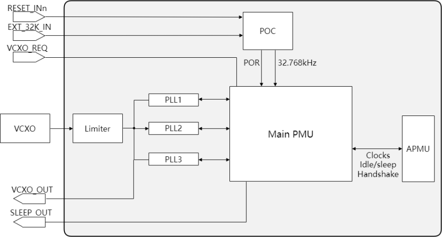

sidebar_position: 9

# 9. 顶层系统（第 1/2 部分）

## 9.1 时钟与复位

### 概述

K1 芯片包含以下时钟源：

- 一个 32 kHz RTC 时钟  
- 一个 24 MHz 晶振（OSC）时钟

### 特性

- 内置三个锁相环（PLL），可生成多种频率，以满足不同应用场景的需求  
- 支持动态电压与频率调节（DVFS），在功耗与性能之间实现平衡  
- 实现无毛刺（glitch-free）时钟切换与时钟分频机制，在有限 PLL 数量下提供所需全部频率  
- 对各功能模块采用细粒度的时钟门控（clock gating）与软件复位机制，以实现低功耗与灵活管理

### 功能描述

#### 时钟系统

下图展示了详细的时钟树结构，说明了时钟信号如何在系统内生成、管理并分发，以支持各类模块与功能。

此外，下图展示了时钟系统的高层架构。

当满足以下任一条件时，`VCXO_OUT` 输出将由 OSC 频率驱动：

- `VCXO_REQ` 信号被置位，且 VCXO 软件请求控制寄存器中的相关 `REQ_EN` 位域已使能  
- VCXO 软件请求控制寄存器中的软件请求位域已使能  

系统设计了三个锁相环（Phase-Locked Loop, PLL），可接受宽范围的输入频率，并为各模块生成广泛的输出频率，以确保在不同应用场景下正常工作。各 PLL 的详细信息如下所述。

##### PLL1

PLL1 用于为 CPU 核心及其他外设生成固定频率点，其特性如下：

- PLL1 输出频率在运行时的更改仅用于调试目的，**不得用于量产系统**  
- PLL1 在系统复位后默认使能，仅当整个芯片进入睡眠模式且 VCXO 关断使能时才会关闭  
- 主 PMU 中的 PLL1 与振荡器控制寄存器所配置的参数，决定了系统复位或关断后 PLL1 输出时钟达到稳定所需的延迟时间  
- **不建议**在正常运行期间通过更新 PLL1 配置寄存器来更改频率

##### PLL2

PLL2 用于生成多种固定频率，与 PLL1 协同工作，为不同模块提供完整的频率覆盖，其特性如下：

- PLL2 输出频率在运行时的更改仅用于调试目的，**不得用于量产系统**  
- PLL2 在系统复位后处于禁用状态，需通过软件显式使能  
- 主 PMU 中的 PLL2 与振荡器控制寄存器所配置的参数，决定了系统复位或关断后 PLL2 输出时钟达到稳定所需的延迟时间  
- **不建议**在正常运行期间通过更新 PLL2 配置寄存器来更改频率

##### PLL3

PLL3 专为 CPU 频率调节与切换提供频率支持，其特性如下：

- PLL3 在系统复位后处于禁用状态，需通过软件显式使能  
- 主 PMU 中的 PLL3 与振荡器控制寄存器所配置的参数，决定了系统复位或关断后 PLL3 输出时钟达到稳定所需的延迟时间  
- **不建议**在正常运行期间通过更新 PLL3 配置寄存器来更改频率

#### 资源复位方案

K1 支持下表所示的多种资源复位方案：

| 编号 | 资源复位方案             | 描述 |
|------|--------------------------|------|
| 1    | 上电复位（Power-On-Reset） | 在上电序列期间对整个芯片进行复位 |
| 2    | 看门狗复位（WatchDog Reset） | 对整个芯片复位，但**保留引脚复用（pinmux）寄存器与调试寄存器** |
| 3    | 模块级软件复位（Module Software Reset） | 通过软件对各模块进行独立复位 |
| 4    | 电源岛 POR 复位（Power Island POR Reset） | 在对应电源岛上电序列期间，对该电源岛内所有逻辑进行复位 |

### 寄存器描述

#### 基于 PMUMAIN(D4050000)

##### 频率变更控制寄存器 (Frequency Change Control Register, FCCR)

**偏移地址（Offset）：0xD4050000 + 0x8**

| 位域      | 字段        | 类型 | 复位值 | 说明 |
|-----------|-------------|------|--------|------|
| 29        | I2SCLK307M  | RW   | 0x0    | I2S 分频时钟 307.2 MHz 选择： - **1** = 使用 PLL1 输出的 307.2 MHz 时钟 - **0** = 使用 PLL1 307.2 MHz 时钟二分频（即 153.6 MHz） |

##### PLL 与振荡器控制寄存器（PLL & Oscillator Control Register, POCR）

**偏移地址（Offset）：0xD4050000 + 0xC**

| 位域      | 字段       | 类型 | 复位值 | 说明 |
|-----------|------------|------|--------|------|
| 31        | FORCE      | RW   | 0x0    | 强制所有时钟自由运行： - **`1'b0`**：保持标准时钟门控行为 - **`1'b1`**：所有输出时钟持续运行，不进行门控 |
| 30:24     | RSVD       | RO   | 0      | 保留 |
| 23:16     | VCXOST     | RW   | 0xE5   | 设置 VCTCXO 与限频器稳定所需等待时间： - **`0x0`**：1 × 32.768 kHz 周期 - **`0x1`**：2 × 32.768 kHz 周期 - … - **`0xE5`**：230 × 32.768 kHz 周期 - **`0xE6–0xFF`**：保留 |
| 15:12     | RSVD       | RO   | 0      | 保留 |
| 11:0      | PLLLOCK    | RW   | 0x0    | 设置 PLL 锁定等待时间（适用于 PLL1 与 PLL2）： - **`0x0`**：1 × (VCTCXO/2) 周期 - **`0x1`**：2 × (VCTCXO/2) 周期 - … - **`0xFFF`**：4096 × (VCTCXO/2) 周期 |

##### VCTCXO 软件请求控制寄存器（VCTCXO Software Request Control Register, VRCR）

**偏移地址（Offset）：0xD4050000 + 0x18**

| 位域      | 字段                 | 类型 | 复位值 | 说明 |
|-----------|----------------------|------|--------|------|
| 31:16     | RSVD                 | RO   | 0x0    | 保留 |
| 15        | VCXO_OUT_REQ_EN3     | RW   | 0x0    | 使能 VCXO_REQ3 用于驱动 `VCXO_OUT` |
| 14        | VCXO_OUT_REQ_EN2     | RW   | 0x0    | 使能 VCXO_REQ2 用于驱动 `VCXO_OUT` |
| 13        | VCXO_OUT_REQ_EN1     | RW   | 0x0    | 使能 VCXO_REQ1 用于驱动 `VCXO_OUT` |
| 12        | VCXO_OUT_REQ_EN0     | RW   | 0x0    | 使能 VCXO_REQ0 用于驱动 `VCXO_OUT` |
| 11:9      | RSVD                 | RO   | 0x0    | 保留 |
| 8         | SW_REQ               | RW   | 0x0    | VCTCXO 软件请求使能 |
| 7         | REQ_POL3             | RW   | 0x0    | VCXO_REQ3 请求极性 |
| 6         | REQ_POL2             | RW   | 0x0    | VCXO_REQ2 请求极性 |
| 5         | REQ_POL1             | RW   | 0x0    | VCXO_REQ1 请求极性 |
| 4         | REQ_POL0             | RW   | 0x0    | VCXO_REQ0 请求极性 |
| 3         | RSVD                 | RO   | 0x0    | 保留 |
| 2         | REQ_EN2              | RW   | 0x0    | 使能 VCXO_REQ2 用于 `sysclk_en` |
| 1         | Reserved             | RO   | 0x0    | 保留 |
| 0         | REQ_EN0              | RW   | 0x0    | 使能 VCXO_REQ0 用于 `OCLK1` |

##### SoC I²S 时钟生成控制寄存器（SoC I2S Clock Generation Control Register, ISCCR0/1）

**偏移地址（Offset）：0xD4050000 + 0x40 / 0x44**

| 位域        | 字段               | 类型 | 复位值  | 说明 |
|-------------|--------------------|------|---------|------|
| 31          | SYSCLK_EN          | RW   | 0x0     | 使能 I²S 时钟输入至 SYSCLKn 生成器及其输出 |
| 30          | SYSCLK_SRC         | RW   | 0x1     | 选择 I²S M/N 分频器输入时钟频率： - **`1'b0`**：时钟频率为 25.6 MHz - **`1'b1`**：时钟频率基于 153.6 MHz |
| 29          | BITCLK_EN          | RW   | 0x0     | 使能 I²S 时钟输入至位时钟（bit clock）生成器 |
| 28:27       | BITCLK_DIV_468     | RW   | 0x3     | 设置 BITCLK1 与 SYSCLK1 的分频关系： - **`2'b00`**：BITCLK1 = SYSCLK1 / 2 - **`2'b01`**：BITCLK1 = SYSCLK1 / 4 - **`2'b10`**：BITCLK1 = SYSCLK1 / 6 - **`2'b11`**：BITCLK1 = SYSCLK1 / 8 |
| 26:15       | DENOM              | RW   | 0x40    | I²S 时钟生成可编程分频器的分母值。 I²S `sysclk` 通过分数分频器生成。 |
| 14:0        | NOM                | RW   | 0x130B  | I²S 时钟生成可编程分频器的分子值。 I²S `sysclk` 通过分数分频器生成。 |

##### 看门狗定时器（CP 定时器）控制寄存器（WDT (CP Timers) Control Register, WDTPCR）

**偏移地址（Offset）：0xD4050000 + 0x200**

| 位域  | 字段   | 类型 | 复位值 | 说明 |
|-------|--------|------|--------|------|
| 31:3  | RSVD   | RO   | 0      | 保留 |
| 2     | RST    | RW   | 0x0    | 定时器硬件复位生成（同时复位 APB 域与功能域）： - **`1'b0`**：无复位 - **`1'b1`**：触发复位 |
| 1     | FNCLK  | RW   | 0x0    | 定时器与看门狗功能时钟使能/禁用： - **`1'b0`**：关闭时钟 - **`1'b1`**：开启时钟 |
| 0     | ABCLK  | RW   | 0x0    | CP 定时器与看门狗 APB 总线时钟使能/禁用： - **`1'b0`**：关闭时钟 - **`1'b1`**：开启时钟 |

##### R-IPC 控制寄存器（R-IPC Control Register, RIPCCR）

**偏移地址（Offset）：0xD4050000 + 0x210**

| 位域  | 字段     | 类型 | 复位值 | 说明 |
|-------|----------|------|--------|------|
| 31:3  | Reserved | RSVD | 0xX    | 保留 始终写 0。 忽略读取值。 |
| 2     | RST      | RW   | 0x0    | R-IPC 硬件复位生成： - **`1'b0`**：无复位 - **`1'b1`**：触发复位 |
| 1     | Reserved | RSVD | 0xX    | 保留 始终写 0。 忽略读取值。 |
| 0     | APBCLK   | RW   | 0x0    | R-IPC APB 总线时钟使能/禁用： - **`1'b0`**：关闭时钟 - **`1'b1`**：开启时钟 |

##### 时钟门控寄存器（Clock Gating Register, CGR）

**偏移地址（Offset）：0xD4050000 + 0x1024**

| 位域  | 字段            | 类型 | 复位值 | 说明 |
|-------|-----------------|------|--------|------|
| 31:22 | RSVD            | RO   | 0      | 保留 |
| 21    | CLK_491P5M      | RW   | 0x1    | 使能 491.52 MHz 功能时钟输出。 - **`1'b0`**：时钟被门控（关闭） - **`1'b1`**：时钟使能（开启） |
| 20    | RSVD            | RO   | 0      | 保留 |
| 19    | WDT_12P8M       | RW   | 0x0    | 使能 12.8 MHz 功能时钟输出至看门狗定时器（WDT）。 - **`1'b0`**：时钟被门控 - **`1'b1`**：时钟使能 |
| 18    | CLK_245P7M      | RW   | 0x1    | 使能 245.76 MHz 功能时钟输出。 - **`1'b0`**：时钟被门控 - **`1'b1`**：时钟使能 |
| 17    | RSVD            | RO   | 0      | 保留 |
| 16    | CLK_1228P8M     | RW   | 0x0    | 使能 1228.8 MHz 功能时钟输出。 - **`1'b0`**：时钟被门控 - **`1'b1`**：时钟使能 |
| 15    | CLK_614P4M      | RW   | 0x1    | 使能 614.4 MHz 功能时钟输出。 - **`1'b0`**：时钟被门控 - **`1'b1`**：时钟使能 |
| 14    | CLK_819P2M      | RW   | 0x1    | 使能 819.2 MHz 功能时钟输出。 - **`1'b0`**：时钟被门控 - **`1'b1`**：时钟使能 |
| 13    | CLK_307P2M      | RW   | 0x1    | 使能 307.2 MHz 功能时钟输出。 - **`1'b0`**：时钟被门控 - **`1'b1`**：时钟使能 |
| 12    | CLK_102P4M      | RW   | 0x0    | 使能 102.4 MHz 功能时钟输出。 - **`1'b0`**：时钟被门控 - **`1'b1`**：时钟使能 |
| 11    | CLK_51P2_AP     | RW   | 0x0    | 使能 51.2 MHz 功能时钟输出，供 AP PMU 及 AP 外设使用。 - **`1'b0`**：时钟被门控 - **`1'b1`**：时钟使能 |
| 10    | CLK_47P2M       | RW   | 0x0    | 使能 47.26 MHz 功能时钟输出。 - **`1'b0`**：时钟被门控 - **`1'b1`**：时钟使能 |
| 9     | GPC             | RW   | 0x0    | 使能 VCXO 时钟的 M/N 分频器（通过 GPCR 配置），输出至 `VCXO_OUT` 引脚的 func3 功能。 - **`1'b0`**：时钟被门控 - **`1'b1`**：时钟使能 |
| 8     | AP_FUART        | RW   | 0x0    | 使能 57.6 MHz 快速 UART 功能时钟，输出至应用处理器（AP）APB 总线。 - **`1'b0`**：时钟被门控 - **`1'b1`**：时钟使能 |
| 7     | CLK_51P2M       | RW   | 0x0    | 使能 51.2 MHz 功能时钟输出，供 APB 外设使用。 - **`1'b0`**：时钟被门控 - **`1'b1`**：时钟使能 |
| 6     | AP_TWSI         | RW   | 0x0    | 使能 31.5 MHz TWSI 功能时钟，输出至应用处理器（AP）APB 总线。 - **`1'b0`**：时钟被门控 - **`1'b1`**：时钟使能 |
| 5     | CLK_204P8M      | RW   | 0x0    | 使能 204.8 MHz 功能时钟输出。 - **`1'b0`**：时钟被门控 - **`1'b1`**：时钟使能 |
| 4     | CLK_25P6M       | RW   | 0x1    | 使能 25.6 MHz 功能时钟输出。 - **`1'b0`**：时钟被门控 - **`1'b1`**：时钟使能 |
| 3     | CLK_12P8M       | RW   | 0x0    | 使能 12.8 MHz 功能时钟输出。 - **`1'b0`**：时钟被门控 - **`1'b1`**：时钟使能 |
| 2     | CLK_6P4M        | RW   | 0x0    | 使能 6.4 MHz 功能时钟输出。 - **`1'b0`**：时钟被门控 - **`1'b1`**：时钟使能 |
| 1     | AP_SUART        | RW   | 0x0    | 使能慢速 UART 功能时钟（通过 SUCCR 配置，例如 14.74 MHz），输出至应用处理器（AP）APB 总线。 - **`1'b0`**：时钟被门控 - **`1'b1`**：时钟使能 |
| 0     | CLK_409P6M      | RW   | 0x1    | 使能 409.6 MHz 功能时钟输出。 - **`1'b0`**：时钟被门控 - **`1'b1`**：时钟使能 |

##### APB 时钟源控制寄存器（APB Clock Source Control Register, APBCSCR）

**偏移地址（Offset）：0xD4050000 + 0x1050**

| 位域  | 字段      | 类型 | 复位值 | 说明 |
|-------|-----------|------|--------|------|
| 31:2  | RSVD      | RO   | 0x0    | 保留 |
| 1:0   | APB_52M   | RW   | 0x0    | 系统 APB 时钟源选择： - **`2'b00`** / **`2'b10`**：25.6 MHz - **`2'b01`**：51.2 MHz - **`2'b11`**：102.4 MHz |

##### PM_MN_CLK 控制寄存器（PM_MN_CLK Control Register, PM_MN_CLK）

**偏移地址（Offset）：0xD4050000 + 0x10A4**

| 位域  | 字段                | 类型 | 复位值 | 说明 |
|-------|---------------------|------|--------|------|
| 31:7  | RSVD                | RO   | 0x0    | 保留 |
| 6:5   | PM_MN_CLK2_SEL      | RW   | 0x0    | PM_MN_CLK2 时钟源选择： - **`1'b0`**：选择 VCTCXO 时钟 - **`1'b1`**：选择 PLL2 五分频（600 MHz） |
| 4     | PM_MN_CLK2_SW_EN    | RW   | 0x0    | PM_MN_CLK2 软件使能： - **`1'b1`**：使能 |
| 3:2   | RSVD                | RO   | 0x0    | 保留 |
| 1     | PM_MN_CLK_SEL       | RW   | 0x0    | PM_MN_CLK 时钟源选择： - **`1'b0`**：选择 VCTCXO 时钟 - **`1'b1`**：选择 PLL1（614 MHz） |
| 0     | PM_MN_CLK_SW_EN     | RW   | 0x0    | PM_MN_CLK 软件使能： - **`1'b1`**：使能 |

##### 慢速 UART（UART 1）时钟生成控制寄存器（Slow UART (UART 1) Clock Generation Control Register, SUCCR_1）

**偏移地址（Offset）：0xD4050000 + 0x10B0**

| 位域     | 字段          | 类型 | 复位值  | 说明 |
|----------|---------------|------|---------|------|
| 31:29    | RSVD          | RO   | 0       | 保留 |
| 28:16    | UARTDIVN_1    | RW   | 0x1800  | UART 时钟生成可编程分子值。 UART 时钟通过分数分频器生成。 |
| 15:13    | RSVD          | RO   | 0       | 保留 |
| 12:0     | UARTDIVD_1    | RW   | 0x3C0   | UART 时钟生成可编程分母值。 UART 时钟通过分数分频器生成。 |

---

#### 基于 \<PMU_BASE(0xD4282800)\>

##### AP 时钟控制寄存器（AP Clock Control Register）

**偏移地址（Offset）：0xD4282800 + 0x4**

| 位域    | 字段               | 类型 | 复位值 | 说明 |
|---------|--------------------|------|--------|------|
| 31      | AP_RD_ST_CLEAR     | RW   | 0x0    | 写 1 可清除 `AP_RD_STATUS` 状态位 |
| 30:23   | RSVD               | RO   | 0x0    | 保留 |
| 22      | DDR_FREQ_CHG_REQ   | RW   | 0x0    | DDR 时钟频率变更请求。 用于请求更改 DDR 时钟频率。 |
| 21:19   | RSVD               | RO   | 0x0    | 保留 |
| 18      | AP_ALLOW_SPD_CHG   | RW   | 0x0    | AP 频率切换投票位。 指示 AP 是否允许进行频率切换。 |
| 17:0    | RSVD               | RO   | 0x0    | 保留 |

##### 虚拟 AP 时钟控制寄存器（Dummy AP Clock Control Register, PMU_DM_CC_AP）

**偏移地址（Offset）：0xD4282800 + 0xC**

| 位域    | 字段             | 类型 | 复位值 | 说明 |
|---------|------------------|------|--------|------|
| 31      | RSVD             | RO   | 0x0    | 保留 |
| 30      | AP_C1_FC_DONE    | RO   | 0x0    | AP Cluster1 频率切换完成状态： - **`1'b0`**：未完成 - **`1'b1`**：已完成 |
| 29      | ACLK_FC_DONE     | RO   | 0x0    | ACLK 频率切换完成状态： - **`1'b0`**：未完成 - **`1'b1`**：已完成 |
| 28      | DCLK_FC_DONE     | RO   | 0x0    | DDR CLK 频率切换完成状态： - **`1'b0`**：未完成 - **`1'b1`**：已完成 |
| 27      | AP_C0_FC_DONE    | RO   | 0x0    | AP Cluster0 频率切换完成状态： - **`1'b0`**：未完成 - **`1'b1`**：已完成 |
| 26      | RSVD             | RO   | 0x0    | 保留 |
| 25      | AP_RD_STATUS     | RO   | 0x0    | AP 读取状态： - 表示 AP 正在读取该虚拟时钟寄存器； - 读取此状态标志频率更新流程开始； - 若该位为 1，表示某核心正在更新频率，其他核心必须等待，直至该位被 `AP_RD_ST_CLEAR` 清除（表示完成）。 |
| 24:12   | RSVD             | RO   | 0x0    | 保留 |
| 11:9    | C1_ACLK_DIV      | RO   | 0x1    | Cluster1 AXI 接口时钟（`C1_ACLK`）分频系数： - `C1_ACLK = PCLK / (value + 1)` |
| 8:6     | C1_CLK_DIV       | RO   | 0x1    | Cluster1 `PCLK` 分频系数： - 若 `FCAP.C1_PLLSEL ≤ 3`：`PCLK = (所选时钟) / (C1_CLK_DIV + 1)` - 否则：`PCLK = 所选时钟` |
| 5:3     | C0_ACLK_DIV      | RO   | 0x1    | Cluster0 AXI 接口时钟（`C0_ACLK`）分频系数： - `C0_ACLK = PCLK / (value + 1)` |
| 2:0     | C0_CLK_DIV       | RO   | 0x1    | Cluster0 `PCLK` 分频系数： - 若 `FCAP.C0_PLLSEL ≤ 3`：`PCLK = (所选时钟) / (C0_CLK_DIV + 1)` - 否则：`PCLK = 所选时钟` |

##### JPEG 时钟/复位控制寄存器（JPEG Clock/Reset Control Register, PMU_JPEG_CLK_RES_CTRL）

**偏移地址（Offset）：0xD4282800 + 0x20**

| 位域    | 字段             | 类型 | 复位值 | 说明 |
|---------|------------------|------|--------|------|
| 31:19   | RSVD             | RO   | 0x0    | 保留 |
| 18      | AFBC_2K_RESET    | RW   | 0x0    | 2K AFBC 复位： - **`1'b1`**：释放复位 - **`1'b0`**：保持复位 |
| 17:16   | RSVD             | RO   | 0x0    | 保留 |
| 15      | JPG_CLK_FC_REQ   | W1C  | 0x0    | JPEG 功能时钟频率切换请求： - **`1'b1`**：触发频率切换 - 硬件在完成后自动清零 |
| 14:8    | RSVD             | RO   | 0x0    | 保留 |
| 7:5     | JPG_CLK_DIV      | RW   | 0x0    | JPEG 功能时钟分频比： - `isp_clk = 源时钟 / (value + 1)` - **注意**：仅当时钟源为 0–3 时，分频器生效 |
| 4:2     | JPG_CLK_SEL      | RW   | 0x0    | JPEG 功能时钟源选择： - **`3'b000`**：PLL1_614 MHz - **`3'b001`**：PLL1_409 MHz - **`3'b010`**：PLL1_491 MHz - **`3'b011`**：PLL1_819 MHz - **`3'b100`**：PLL1_1228 MHz - **`3'b101`**：PLL2_div4 - **`3'b110`**：PLL2_div3 - **`3'b111`**：禁用（输出 0） |
| 1       | JPG_CLK_EN       | RW   | 0x0    | JPEG 功能时钟使能： - **`1'b1`**：使能 - **`1'b0`**：禁用 |
| 0       | JPG_CLK_RSTN     | RW   | 0x0    | JPEG 功能时钟复位： - **`1'b1`**：释放复位 - **`1'b0`**：保持复位 |

##### CSI CCIC2 时钟/复位控制寄存器（CSI CCIC2 Clock/Reset Control Register, PMU_CSI_CCIC2_CLK_RES_CTRL）

**偏移地址（Offset）：0xD4282800 + 0x24**

| 位域    | 字段                 | 类型 | 复位值 | 说明 |
|---------|----------------------|------|--------|------|
| 31      | CCIC3_PHY_CLK_SEL    | RW   | 0x0    | CCIC3 PHY 时钟选择： - **`1'b0`**：104 MHz - **`1'b1`**：52 MHz |
| 30      | CCIC3_PHY_CLK_EN     | RW   | 0x0    | CCIC3 PHY 时钟使能： - **`1'b1`**：使能 - **`1'b0`**：禁用 |
| 29      | CCIC3_PHY_CLK_RST    | RW   | 0x0    | CCIC3 PHY 时钟复位： - **`1'b0`**：保持复位 - **注**：该时钟也用于 D-PHY 复位。 |
| 28      | CAM_MCLK0_EN         | RW   | 0x0    | 使能 CAM MCLK0 |
| 27      | CAM_MCLK2_EN         | RW   | 0x0    | 使能 CAM MCLK2 |
| 26:23   | ISIM_VCLK_OUT_DIV    | RW   | 0xB    | `ISIM_VCLK_OUT` 分频系数： - 时钟源由 `CAM_MCLK_SEL`（位 [9:8]）选择 - `ISIM_VCLK_OUT = CAM_MCLK / (value + 1)`，但当 value = `0xF` 时，分频为 `(0xF + 2) = 17` - 默认：312 MHz / (11 + 1) = 26 MHz |
| 22:20   | CSI_FNC_CLK_DIV      | RW   | 0x1    | CSI 控制器功能时钟分频系数： - `CSI_FNC_CLK = CSI_CLK / (value + 1)` |
| 19      | RSVD                 | RO   | 0      | 保留 |
| 18:16   | CSI_CLK_SEL          | RW   | 0x0    | CSI 控制器功能时钟源选择： - **`3'b000`**：PLL1_491 MHz - **`3'b001`**：PLL1_409 MHz - **`3'b010`**：PLL1_614 MHz - **`3'b011`**：PLL1_819 MHz - **`3'b100`**：PLL2_Div2 - **`3'b101`**：PLL2_Div3 - **`3'b110`**：PLL2_Div4 - **`3'b111`**：PLL1_1248 MHz |
| 15      | CSI_CLK_FC_REQ       | W1C  | 0x0    | CSI 时钟频率切换请求： - **`1'b1`**：触发频率切换 - 硬件在完成后自动清零 |
| 14:10   | RSVD                 | RO   | 0      | 保留 |
| 9:8     | CAM_MCLK_SEL         | RW   | 0x0    | CAM MCLK 时钟源选择： - **`2'b00`**：312 MHz - **`2'b01`**：PLL2_DIV5 - **`2'b10`**：416 MHz - **`2'b11`**：24 MHz VCTCXO |
| 7       | CCIC2_PHYCLK_SEL     | RW   | 0x0    | CCIC2 PHY 时钟选择： - **`1'b0`**：104 MHz - **`1'b1`**：52 MHz |
| 6       | CAM_MCLK1_EN         | RW   | 0x0    | 使能 CAM MCLK1 |
| 5       | CCIC2_PHYCLK_EN      | RW   | 0x0    | CCIC2 PHY 时钟使能： - **`1'b1`**：使能 - **`1'b0`**：禁用 |
| 4       | CSI_CLK_EN           | RW   | 0x0    | CSI 控制器功能时钟使能： - **`1'b1`**：使能 - **`1'b0`**：禁用 |
| 3       | CAM_MCLK2_EN         | RW   | 0x0    | 使能 CAM MCLK2（与位 27 重复） |
| 2       | CCIC2_PHYCLK_RST     | RW   | 0x0    | CCIC2 PHY 时钟复位： - **`1'b0`**：保持复位 - **注**：该时钟也用于 D-PHY 复位。 |
| 1       | CSI_CLK_RST          | RW   | 0x0    | CSI 控制器功能时钟复位： - **`1'b0`**：保持复位 |
| 0       | RSVD                 | RO   | 0      | 保留 |

##### CMOS 图像传感器接口控制器 1 动态时钟门控寄存器（CMOS Camera Interface Controller 1 Dynamic Clock Gate Control Register, PMU_CCIC1_CLK_GATE_CTRL）

**偏移地址（Offset）：0xD4282800 + 0x28**

| 位域    | 字段                                      | 类型 | 复位值 | 说明 |
|---------|-------------------------------------------|------|--------|------|
| 31:30   | CCIC1_GATE_CSI_CLK_STATIC                 | RW   | 0x3    | CCIC1 CSI 静态时钟门控： - **`2'b00/01/10`**：停止时钟 - **`2'b11`**：自由运行（Free running） - **注**：`0x0` 表示由硬件动态控制（遗留说明） |
| 29:28   | CCIC1_GATE_CLK4X_STATIC                   | RW   | 0x3    | CCIC1 CLK4X 静态时钟门控： - **`2'b00/01/10`**：停止时钟 - **`2'b11`**：自由运行 |
| 27:26   | CCIC1_GATE_CLK1X_STATIC                   | RW   | 0x3    | CCIC1 CLK1X 静态时钟门控： - **`2'b00/01/10`**：停止时钟 - **`2'b11`**：自由运行 |
| 25:24   | CCIC1_GATE_HCLK_STATIC                    | RW   | 0x3    | CCIC1 HCLK 静态时钟门控： - **`2'b00/01/10`**：停止时钟 - **`2'b11`**：自由运行 |
| 23:22   | CCIC1_GATE_ACLK_STATIC                    | RW   | 0x3    | CCIC1 ACLK 静态时钟门控： - **`2'b00/01/10`**：停止时钟 - **`2'b11`**：自由运行 |
| 21:20   | CCIC1_GATE_ISP_PIP1_CLK1X_STATIC          | RW   | 0x3    | ISP PIPE1 CLK1X 静态时钟门控： - **`2'b00/01/10`**：停止时钟 - **`2'b11`**：自由运行 |
| 19:18   | CCIC1_GATE_DMA_ACLK_STATIC                | RW   | 0x3    | CCIC DMA ACLK 静态时钟门控： - **`2'b00/01/10`**：停止时钟 - **`2'b11`**：自由运行 |
| 17:16   | CCIC1_GATE_AXI_BRIDGE_CLK_STATIC          | RW   | 0x3    | CCIC DMA（AXI 桥 64→128）时钟静态门控： - **`2'b00/01/10`**：停止时钟 - **`2'b11`**：自由运行 |
| 15:14   | CCIC1_GATE_LANE3_CLK_DYNAMIC              | RW   | 0x3    | CCIC1 CSI Lane3 动态时钟门控： - **`2'b00/01`**：硬件动态控制 - **`2'b10`**：停止时钟 - **`2'b11`**：自由运行 |
| 13:12   | CCIC1_GATE_LANE2_CLK_DYNAMIC              | RW   | 0x3    | CCIC1 CSI Lane2 动态时钟门控： - **`2'b00/01`**：硬件动态控制 - **`2'b10`**：停止时钟 - **`2'b11`**：自由运行 |
| 11:10   | CCIC1_GATE_LANE1_CLK_DYNAMIC              | RW   | 0x3    | CCIC1 CSI Lane1 动态时钟门控： - **`2'b00/01`**：硬件动态控制 - **`2'b10`**：停止时钟 - **`2'b11`**：自由运行 |
| 9:8     | CCIC1_GATE_LANE0_CLK_DYNAMIC              | RW   | 0x3    | CCIC1 CSI Lane0 动态时钟门控： - **`2'b00/01`**：硬件动态控制 - **`2'b10`**：停止时钟 - **`2'b11`**：自由运行 |
| 7:6     | CCIC1_GATE_CSI_CLK_DYNAMIC                | RW   | 0x3    | CCIC1 CSI 动态时钟门控： - **`2'b00/01`**：硬件动态控制 - **`2'b10`**：停止时钟 - **`2'b11`**：自由运行 |
| 5:4     | CCIC1_GATE_AHB_CLK_DYNAMIC                | RW   | 0x3    | CCIC1 AHB 动态时钟门控： - **`0x0` / `0x1`**：硬件动态控制 - **`0x2`**：停止时钟 - **`0x3`**：自由运行 |
| 3:2     | CCIC1_GATE_PIP_CLK_DYNAMIC                | RW   | 0x3    | CCIC1 流水线（Pipeline）动态时钟门控： - **`2'b00/01`**：硬件动态控制 - **`2'b10`**：停止时钟 - **`2'b11`**：自由运行 |
| 1:0     | CCIC1_GATE_AXI_CLK_DYNAMIC                | RW   | 0x3    | CCIC1 AXI 动态时钟门控： - **`2'b00/01`**：硬件动态控制 - **`2'b10`**：停止时钟 - **`2'b11`**：自由运行 |

##### ISP 时钟/复位控制寄存器（ISP Clock/Reset Control Register, PMU_ISP_CLK_RES_CTRL）

**偏移地址（Offset）：0xD4282800 + 0x38**

| 位域    | 字段                              | 类型 | 复位值 | 说明 |
|---------|-----------------------------------|------|--------|------|
| 31      | RSVD                              | RO   | 0x0    | 保留 |
| 30      | ISP_REPAIR_MEM_CTRL_TRIG          | W1C  | 0x0    | ISP 可修复存储器控制触发： - **`1'b1`**：触发 ISP 可修复存储器操作 - 硬件在修复完成后自动清零 |
| 29      | ISP_REPAIR_MEM_CTRL_DONE_BYPASS   | RW   | 0x0    | ISP 可修复存储器完成旁路（仅在 ISP 硬件模式下有效）： - 当 `ISP_HW_MODE = 1` 时，该字段生效 |
| 28      | ISP_CPP_CLK_EN                    | RW   | 0x0    | ISP CPP 功能时钟使能： - **`1'b1`**：时钟使能 - **`1'b0`**：时钟禁用 |
| 27      | ISP_CPP_CLK_RSTN                  | RW   | 0x0    | ISP CPP 时钟复位： - **`1'b0`**：保持复位 |
| 26      | ISP_CPP_CLK_SEL                   | RW   | 0x0    | ISP CPP 时钟源选择： - **`1'b0`**：312 MHz - **`1'b1`**：416 MHz |
| 25:24   | ISP_CPP_CLK_DIV                   | RW   | 0x1    | ISP CPP 时钟分频系数： - `isp_mcu_clk = 源时钟 / (该字段值 + 1)` |
| 23      | ISP_CI_BUS_CLK_FC_REQ             | W1C  | 0x0    | ISP_CI 总线时钟频率切换请求： - **`1'b1`**：触发频率切换 - 硬件在完成后自动清零 |
| 22:21   | ISP_CI_BUS_CLK_SEL                | RW   | 0x0    | ISP_CI 总线时钟源选择： - **`2'b00`**：PLL1_409 MHz - **`2'b01`**：PLL1_491 MHz - **`2'b10`**：PLL1_307 MHz - **`2'b11`**：PLL1_245 MHz |
| 20:18   | ISP_CI_BUS_CLK_DIV                | RW   | 0x1    | ISP_CI 总线时钟分频比： - `isp_ci_divided_bus_clk = isp_ci_bus_clk / (该字段值 + 1)` |
| 17      | ISP_CI_BUS_CLK_EN                 | RW   | 0x0    | ISP_CI 总线时钟使能： - 使能 CCIC 与 ISP 的 DMA 时钟； - 控制 CCIC 与 ISP 的第一级 AXI 时钟门控； - 第二级 AXI 时钟门控由独立寄存器管理； - **`1'b1`**：时钟使能 |
| 16      | ISP_CI_BUS_CLK_RST                | RW   | 0x0    | ISP_CI 总线时钟复位： - **`1'b0`**：保持复位 - 此复位将复位 SC2 中除 ISP AXI 逻辑外的所有 AXI 逻辑 |
| 15:10   | RSVD                              | RO   | 0x0    | 保留 |
| 9:8     | ISP_CLK_SEL                       | RW   | 0x0    | ISP 功能时钟源选择： - **`2'b00`**：416 MHz - **`2'b01`**：499 MHz - **`2'b10`**：624 MHz - **`2'b11`**：PLL1_307 MHz |
| 7       | ISP_CLK_FC_REQ                    | W1C  | 0x0    | ISP 功能时钟频率切换请求： - **`1'b1`**：触发频率切换 - 硬件在完成后自动清零 |
| 6:4     | ISP_CLK_DIV                       | RW   | 0x1    | ISP 功能时钟分频比： - `isp_clk = 源时钟 / (该字段值 + 1)` - **注**：原文公式有误，已修正为标准分频表达 |
| 3       | ISP_AHB_RESETN                    | RW   | 0x0    | ISP AHB 复位信号： - **`1'b0`**：保持复位 |
| 2       | RSVD                              | RO   | 0x0    | 保留 |
| 1       | ISP_CLK_EN                        | RW   | 0x0    | ISP 功能时钟使能： - **`1'b1`**：时钟使能 - **`1'b0`**：时钟禁用 |
| 0       | ISP_CLK_RSTN                      | RW   | 0x0    | ISP 功能时钟复位： - **`1'b0`**：保持复位 |

##### LCD 时钟/复位控制寄存器 1（LCD Clock/Reset Control Register 1, PMU_LCD_CLK_RES_CTRL1）

**偏移地址（Offset）：0xD4282800 + 0x44**

| 位域    | 字段                   | 类型 | 复位值 | 说明 |
|---------|------------------------|------|--------|------|
| 31      | MIPI_BIT_CLK_FC_REQ    | W1C  | 0x0    | MIPI BIT 时钟频率切换请求： - 写 **`1`** 触发频率切换 - 硬件在切换完成后自动清零 |
| 30      | LCD_PXCLK_FC_REQ       | W1C  | 0x0    | LCD 像素时钟（PXCLK）频率切换请求： - 写 **`1`** 触发频率切换 - 硬件在切换完成后自动清零 |
| 29      | LCD_MCLK_FC_REQ        | W1C  | 0x0    | LCD 主时钟（MCLK）频率切换请求： - 写 **`1`** 触发频率切换 - 硬件在切换完成后自动清零 |
| 28      | V2D_FCLK_FC_REQ        | W1C  | 0x0    | V2D 功能时钟（FCLK）频率切换请求： - 写 **`1`** 触发频率切换 - 硬件在切换完成后自动清零 |
| 27      | V2D_SW_RST             | RW   | 0x0    | V2D 时钟域软件复位： - **`1'b0`**：复位有效（Assert） - **`1'b1`**：释放复位（Release） |
| 26:24   | RSVD                   | RO   | 0x0    | 保留 |
| 23      | MIPI_BIT_BLANK_MSK     | RW   | 0x1    | MIPI BIT 时钟频率切换时是否等待 BLANK 信号： - **`0`**：等待 LCD BLANK 信号（安全切换） - **`1`**：不等待 BLANK 信号（强制切换） |
| 22:20   | MIPI_BIT_CLK_SEL       | RW   | 0x0    | MIPI BIT 时钟源选择： - **`3'b000`**：832 MHz - **`3'b001`**：1.5 GHz（PLL2_DIV2） - **`3'b010`**：1 GHz（PLL2_DIV3） - **`3'b011`**：1248 MHz - **`3'b100`**：750 MHz - **`3'b101`**：600 MHz - **`3'b110`**：429 MHz - **`3'b111`**：375 MHz |
| 19:17   | MIPI_BIT_CLK_DIV       | RW   | 0x0    | MIPI BIT 时钟分频比： - `MIPI_BIT_CLK = 源时钟 / (该字段值 + 1)` |
| 16      | MIPI_BIT_CLK_EN        | RW   | 0x0    | MIPI BIT 时钟使能： - **`1'b0`**：禁用 - **`1'b1`**：使能 |
| 15      | MIPI_BIT_CLK_RST       | RW   | 0x0    | MIPI BIT 时钟复位： - **`1'b0`**：复位 - **`1'b1`**：无复位 |
| 14      | RSVD                   | RO   | 0x0    | 保留 |
| 13:12   | V2D_FCLK_SEL           | RW   | 0x0    | V2D FCLK 时钟源选择： - **`2'b00`**：499 MHz - **`2'b01`**：416 MHz - **`2'b10`**：312 MHz - **`2'b11`**：624 MHz |
| 11:9    | V2D_FCLK_DIV           | RW   | 0x2    | V2D FCLK 时钟分频比： - `V2D_FCLK = 源时钟 / (该字段值 + 1)` |
| 8       | V2D_FCLK_EN            | RW   | 0x0    | V2D FCLK 使能： - **`1'b0`**：禁用 - **`1'b1`**：使能 |
| 7       | RSVD                   | RO   | 0x0    | 保留 |
| 6       | LCD_HCLK_SWAP_CTRL     | RW   | 0x0    | LCD HCLK 时钟源切换控制（仅在 D1P 模式下有效）： - **`1'b0`**：使用系统 Fabric 时钟作为 LCD HCLK 源 - **`1'b1`**：使用旁路 VCTCXO 时钟作为 LCD HCLK 源 |
| 5       | LCD_HCLK_EN            | RW   | 0x0    | LCD HCLK 使能： - **`1'b0`**：禁用 - **`1'b1`**：使能 |
| 4       | LCD_SW_RST             | RW   | 0x0    | LCD 软件复位： - **`1'b0`**：复位 - **`1'b1`**：无复位 |
| 3       | DSI_ESCCLK_RESET       | RW   | 0x0    | DSI ESC 时钟复位： - **`1'b0`**：复位 |
| 2       | DSI_ESC_EN             | RW   | 0x0    | DSI ESC 时钟使能： - **`1'b1`**：REF 时钟使能 - **`1'b0`**：REF 时钟禁用 |
| 1:0     | DSI_ESC_SEL            | RW   | 0x0    | DSI ESC 时钟源选择： - **`2'b00`**：52 MHz - **`2'b01`**：48 MHz - **`2'b10`**：26 MHz - **`2'b11`**：78 MHz |

---

##### LCD_SPI 时钟/复位控制寄存器（LCD_SPI Clock/Reset Control Register, PMU_LCD_SPI_CLK_RES_CTRL）

**偏移地址（Offset）：0xD4282800 + 0x48**

| 位域    | 字段                | 类型 | 复位值 | 说明 |
|---------|---------------------|------|--------|------|
| 31:15   | RSVD                | RO   | 0x0    | 保留 |
| 14:12   | LCD_SPI_CLK_SEL     | RW   | 0x0    | LCD_SPI 时钟源选择： - **`3'b000`**：clk_312m（÷8） - **`3'b001`**：clk_in_416m_pll1（÷6） - **`3'b010`**：clk_in_249m_pll1（÷10） - **`3'b011`**：clk_pll_div11 - **`3'b100`**：clk_pll_div13 - **`3'b101`**：clk_pll_div23 - **`3'b110`**：clk_in_pll2_div3 - **`3'b111`**：clk_in_pll2_div5 |
| 11      | RSVD                | RO   | 0x0    | 保留 |
| 10:8    | LCD_SPI_CLK_DIV     | RW   | 0x0    | LCD_SPI 时钟分频系数： - `LCD_SPI_CLK = 源时钟 / (该字段值 + 1)` |
| 7       | LCD_SPI_PXCLK_REQ   | W1C  | 0x0    | LCD_SPI 像素时钟频率切换请求： - 写 **`1`** 触发频率切换 - 硬件在切换完成后自动清零 |
| 6       | LCD_SPI_ACLK_EN     | RW   | 0x0    | LCD_SPI ACLK 使能： - **`1'b0`**：禁用 - **`1'b1`**：使能 |
| 5       | LCD_SPI_BUS_CLK_EN  | RW   | 0x0    | LCD_SPI 总线时钟使能： - **`1'b0`**：禁用 - **`1'b1`**：使能 |
| 4       | LCD_SPI_BUS_RESET   | RW   | 0x0    | LCD_SPI 总线复位： - **`1'b0`**：复位 |
| 3       | LCD_SPI_HBUS_CLK_EN | RW   | 0x0    | LCD_SPI 高速总线（HBUS）时钟使能： - **`1'b0`**：禁用 - **`1'b1`**：使能 |
| 2       | LCD_SPI_HBUS_RESET  | RW   | 0x0    | LCD_SPI 高速总线复位： - **`1'b0`**：复位 |
| 1       | LCD_SPI_CLK_EN      | RW   | 0x0    | LCD_SPI 核心时钟使能： - **`1'b0`**：禁用 - **`1'b1`**：使能 |
| 0       | LCD_SPI_RESET       | RW   | 0x0    | LCD_SPI 模块复位： - **`1'b0`**：复位 |

##### LCD 时钟/复位控制寄存器 2（LCD Clock/Reset Control Register 2, PMU_LCD_CLK_RES_CTRL2）

**偏移地址（Offset）：0xD4282800 + 0x4C**

| 位域    | 字段                  | 类型 | 复位值 | 说明 |
|---------|-----------------------|------|--------|------|
| 31:25   | RSVD                  | RO   | 0x0    | 保留 |
| 24      | LCD_PXCLK_BLANK_MSK   | RW   | 0x1    | LCD 像素时钟（PXCLK）频率切换时是否等待 BLANK 信号： - **`1'b0`**：等待 LCD BLANK 信号（安全切换） - **`1'b1`**：不等待 BLANK 信号（强制切换） |
| 23:21   | LCD_PXCLK_SEL         | RW   | 0x0    | LCD PXCLK 时钟源选择： - **`3'b000`**：PLL1_409 MHz - **`3'b001`**：PLL1_491 MHz - **`3'b010`**：PLL1_614 MHz - **`3'b011`**：PLL1_312 MHz - **`3'b100`**：428 MHz（PLL2_DIV7） - **`3'b101`**：375 MHz（PLL2_DIV8） |
| 20:17   | LCD_PXCLK_DIV         | RW   | 0x2    | LCD PXCLK 分频比： - `LCD_PXCLK = 源时钟 / (该字段值 + 1)` |
| 16      | LCD_PXCLK_EN          | RW   | 0x0    | LCD 像素时钟使能： - **`1'b0`**：禁用 - **`1'b1`**：使能 |
| 15:10   | RSVD                  | RO   | 0x0    | 保留 |
| 9       | LCD_MCLK_RESET        | RW   | 0x1    | LCD 主时钟（MCLK）复位： - **`1'b0`**：复位有效 |
| 8       | RSVD                  | RO   | 0x0    | 保留 |
| 7:5     | LCD_MCLK_SEL          | RW   | 0x0    | LCD MCLK 时钟源选择： - **`3'b000`**：PLL1_409 MHz - **`3'b001`**：PLL1_491 MHz - **`3'b010`**：PLL1_614 MHz - **`3'b011`**：PLL1_307 MHz - **`3'b100`~`3'b111`**：未定义（N/A） |
| 4:1     | LCD_MCLK_DIV          | RW   | 0x2    | LCD MCLK 分频比： - `LCD_MCLK = 源时钟 / (该字段值 + 1)` |
| 0       | LCD_MCLK_EN           | RW   | 0x0    | LCD 主时钟使能： - **`1'b0`**：禁用 - **`1'b1`**：使能 - **注**：该时钟同时用作摄像头 AHB 时钟。摄像头可使能此钟，但**不可修改其频率**。 |

---

##### CMOS 图像传感器接口控制器时钟/复位控制寄存器（CMOS Camera Interface Controller Clock/Reset Control Register, PMU_CCIC_CLK_RES_CTRL）

**偏移地址（Offset）：0xD4282800 + 0x50**

| 位域    | 字段                      | 类型 | 复位值 | 说明 |
|---------|---------------------------|------|--------|------|
| 31      | CCIC_ISP_HCLK_SWAP_CTRL   | RW   | 0x0    | CCIC/ISP HCLK 时钟源切换控制（仅在 D1P 模式下有效）： - **`1'b0`**：使用系统 Fabric 时钟作为 HCLK 源 - **`1'b1`**：使用旁路 VCTCXO 时钟作为 HCLK 源 |
| 30      | MASK_ISP_BLANK_CHECK      | RW   | 0x0    | ISP 功能时钟（FCLK）频率切换时是否屏蔽 BLANK 检测： - **`1'b1`**：**等待** BLANK 信号（默认安全模式） - **`1'b0`**：**屏蔽** BLANK 检测（强制切换） - **注**：字段名与行为相反，按描述为准 |
| 29      | ISP_BLANK_CHECK_MODE      | RW   | 0x0    | ISP FCLK 频率切换时 BLANK 检测模式： - **`1'b1`**：使用垂直消隐（V Blank）标志 - **`1'b0`**：使用水平消隐（H Blank）标志 |
| 28:26   | RSVD                      | RO   | 0x0    | 保留 |
| 25:23   | CCICI_CLK4X_SEL           | RW   | 0x0    | CCIC CLK4X 功能时钟源选择： - **`3'b000`**：PLL1_491 MHz - **`3'b001`**：PLL1_409 MHz - **`3'b010`**：PLL1_614 MHz - **`3'b011`**：PLL1_819 MHz - **`3'b100`**：PLL2_DIV2 - **`3'b101`**：PLL2_DIV3 - **`3'b110`**：PLL2_DIV4 - **`3'b111`**：PLL1_1248 MHz |
| 22:21   | RSVD                      | RO   | 0x0    | 保留 |
| 20:18   | CICIC_CLK4X_DIV           | RW   | 0x1    | CCIC 功能时钟分频比： - `ci_fnc_clk = 源时钟 / (该字段值 + 1)` - **注**：原文公式有误，已修正为标准分频表达 |
| 17:16   | RSVD                      | RO   | 0x0    | 保留 |
| 15      | CCIC_CLK4X_FC_REQ         | W1C  | 0x0    | CCIC CLK4X 频率切换请求： - 写 **`1`** 触发频率切换 - 硬件在完成后自动清零 |
| 14:8    | RSVD                      | RO   | 0x0    | 保留 |
| 7       | CCIC1_PHYCLK_SEL          | RW   | 0x0    | CCIC1 PHY 时钟源选择： - **`1'b0`**：104 MHz - **`1'b1`**：52 MHz |
| 6       | RSVD                      | RO   | 0x0    | 保留 |
| 5       | CCIC1_PHYCLK_EN           | RW   | 0x0    | CCIC1 PHY 时钟使能： - **`1'b1`**：使能 - **`1'b0`**：禁用 |
| 4       | CCIC_CLK4X_EN             | RW   | 0x0    | CMOS 图像传感器接口控制器外设时钟使能： - **`1'b1`**：使能 - **`1'b0`**：禁用 |
| 3       | RSVD                      | RO   | 0x0    | 保留 |
| 2       | CCIC1_PHYCLK_RST          | RW   | 0x0    | CCIC1 PHY 时钟复位： - **`1'b0`**：复位有效 - **注**：该复位信号同时用于 D-PHY 复位 |
| 1       | CCIC_CLK4X_RST            | RW   | 0x0    | CCIC 外设复位： - **`1'b0`**：复位有效 |
| 0       | RSVD                      | RO   | 0x0    | 保留 |

##### SDH0 时钟/复位控制寄存器（SD Host Controller 0 Clock/Reset Control Register, PMU_SDH0_CLK_RES_CTRL）

**偏移地址（Offset）：0xD4282800 + 0x54**

| 位域    | 字段               | 类型 | 复位值 | 说明 |
|---------|--------------------|------|--------|------|
| 31:12   | RSVD               | RO   | 0x0    | 保留 |
| 11      | SDH0_CLK_FC_REQ    | W1C  | 0x0    | SDH0 时钟频率切换请求： - 写 **`1`** 触发分频器生效并切换时钟 - 硬件在切换完成后自动清零 |
| 10:8    | SDH0_CLK_DIV       | RW   | 0x1    | SDH0 时钟分频系数： - `SDH0_CLK = 源时钟 / (该字段值 + 1)` |
| 7:5     | SDH0_CLK_SEL       | RW   | 0x0    | SDH0 时钟源选择： - **`3'b000`**：409 MHz（clk_in_416m_pll1） - **`3'b001`**：614 MHz（clk_in_pll1_2x） - **`3'b010`**：PLL2_DIV8 - **`3'b011`**：PLL2_DIV5 - **`3'b100`**：PLL1_DIV11 - **`3'b101`**：PLL1_DIV13 - **`3'b110`**：PLL1_DIV23 - **`3'b111`**：保留 |
| 4       | SDH0_CLK_EN        | RW   | 0x0    | SDH0 外设功能时钟使能： - **`1'b1`**：使能 - **`1'b0`**：禁用 |
| 3       | SDH_AXICLK_EN      | RW   | 0x0    | 所有 SDH 模块 AXI 总线时钟使能（共 3 个 SDH 控制器）： - **`1`**：AXI 时钟使能 - **`0`**：AXI 时钟禁用 |
| 2       | RSVD               | RO   | 0x0    | 保留 |
| 1       | SDH0_RST           | RW   | 0x0    | SDH0 外设复位： - **`1'b0`**：复位有效 |
| 0       | SDH_AXI_RST        | RW   | 0x0    | 所有 SDH 模块 AXI 接口复位（共 3 个 SDH 控制器） |

---

##### SDH1 时钟/复位控制寄存器（SD Host Controller 1 Clock/Reset Control Register, PMU_SDH1_CLK_RES_CTRL）

**偏移地址（Offset）：0xD4282800 + 0x58**

| 位域    | 字段               | 类型 | 复位值 | 说明 |
|---------|--------------------|------|--------|------|
| 31:12   | RSVD               | RO   | 0x0    | 保留 |
| 11      | SDH1_CLK_FC_REQ    | W1C  | 0x0    | SDH1 时钟频率切换请求： - 写 **`1`** 触发分频器生效并切换时钟 - 硬件在切换完成后自动清零 |
| 10:8    | SDH1_CLK_DIV       | RW   | 0x1    | SDH1 时钟分频系数： - `SDH1_CLK = 源时钟 / (该字段值 + 1)` - **注**：原文公式误写为 `SDH0_CLK_DIV`，已修正 |
| 7:5     | SDH1_CLK_SEL       | RW   | 0x0    | SDH1 时钟源选择（同 SDH0）： - **`3'b000`**：409 MHz - **`3'b001`**：614 MHz - **`3'b010`**：PLL2_DIV8 - **`3'b011`**：PLL2_DIV5 - **`3'b100`**：PLL1_DIV11 - **`3'b101`**：PLL1_DIV13 - **`3'b110`**：PLL1_DIV23 - **`3'b111`**：保留 |
| 4       | SDH1_CLK_EN        | RW   | 0x0    | SDH1 外设功能时钟使能： - **`1'b1`**：使能 - **`1'b0`**：禁用 |
| 3:2     | RSVD               | RO   | 0x0    | 保留 |
| 1       | SDH1_RST           | RW   | 0x0    | SDH1 外设复位： - **`1'b0`**：复位有效 |
| 0       | RSVD               | RO   | 0x0    | 保留 |

---

##### USB 时钟/复位控制寄存器（USB Clock/Reset Control Register, PMU_USB_CLK_RES_CTRL）

**偏移地址（Offset）：0xD4282800 + 0x5C**

| 位域    | 字段                      | 类型 | 复位值 | 说明 |
|---------|---------------------------|------|--------|------|
| 31      | VBUS_DLY_CNT_EN           | RW   | 0x0    | VBUS 下降沿去抖使能 |
| 30:23   | DLY_CNT_REG               | RW   | 0x0    | VBUS 下降沿去抖计数器： - 配置去抖时间窗口 - 仅当 `VBUS_DLY_CNT_EN = 1` 时有效 |
| 22:18   | RSVD                      | RO   | 0x0    | 保留 |
| 17      | USBP1_AHB_PROT_IN_SUSP    | RW   | 0x0    | USB 端口 1 挂起期间 AHB 访问保护： - **`1'b1`**：禁止访问 USB 控制器及 PHY 寄存器 - 软件应在挂起前置 **`1`**，唤醒前清 **`0`** |
| 16      | USB_AHB_PROT_IN_SUSP      | RW   | 0x0    | 主 USB 控制器挂起期间 AHB 访问保护（同上） |
| 15:12   | RSVD                      | RO   | 0x0    | 保留 |
| 11      | USB3_0_PHY_RESETN         | RW   | 0x0    | USB3.0 PHY 复位（低电平有效） |
| 10      | USB3_0_VCC_RESETN         | RW   | 0x0    | USB3.0 电源域复位（低电平有效） |
| 9       | USB3_0_AHB_RSTN           | RW   | 0x0    | USB3.0 AHB 接口复位（低电平有效） |
| 8       | USB3_0_BUS_CLK_EN         | RW   | 0x0    | USB3.0 总线时钟使能 |
| 7:6     | RSVD                      | RO   | 0x0    | 保留 |
| 5       | USBP1_AXICLK_EN           | RW   | 0x0    | USB 端口 1 AXI 时钟使能： - **`1'b1`**：使能 - **`1'b0`**：禁用 |
| 4       | USBP1_AXI_RST             | RW   | 0x0    | USB 端口 1 AXI 复位： - **`1'b0`**：复位 - **`1'b1`**：释放复位 |
| 3:2     | RSVD                      | RO   | 0x0    | 保留 |
| 1       | USB_AXICLK_EN             | RW   | 0x0    | 主 USB AXI 时钟使能： - **`1'b1`**：使能 - **`1'b0`**：禁用 |
| 0       | USB_AXI_RST               | RW   | 0x0    | 主 USB AXI 复位： - **`1'b0`**：复位 - **`1'b1`**：释放复位 |

---

##### QSPI 时钟/复位控制寄存器（Quad SPI Clock/Reset Control Register, PMU_QSPI_CLK_RES_CTRL）

**偏移地址（Offset）：0xD4282800 + 0x60**

| 位域    | 字段              | 类型  | 复位值 | 说明 |
|---------|-------------------|-------|--------|------|
| 31:13   | RSVD              | RO    | 0x0    | 保留 |
| 12      | QSPI_CLK_FC_REQ   | RWAC  | 0x0    | QSPI 时钟源切换请求： - 写 **`1`** 触发 `QSPI_CLK_SEL` 生效 - 硬件在切换完成后自动清零 |
| 11:9    | QSPI_CLK_DIV      | RW    | 0x7    | QSPI 时钟分频系数： - `QSPI_CLK = QSPI_CLK_SEL 频率 / (该字段值 + 1)` |
| 8:6     | QSPI_CLK_SEL      | RW    | 0x5    | QSPI 时钟源选择： - **`3'b000`**：409 MHz（PLL1_DIV6） - **`3'b001`**：375 MHz（PLL2_DIV8） - **`3'b010`**：307 MHz（PLL1_DIV8） - **`3'b011`**：245 MHz（PLL1_DIV10） - **`3'b100`**：223 MHz（PLL1_DIV11） - **`3'b101`**：106 MHz（PLL1_DIV23） - **`3'b110`**：495 MHz（PLL1_DIV5） - **`3'b111`**：189 MHz（PLL1_DIV13） |
| 5       | RSVD              | RO    | 0x0    | 保留 |
| 4       | QSPI_CLK_EN       | RW    | 0x1    | QSPI 功能时钟使能： - **`1'b1`**：使能 - **`1'b0`**：禁用 |
| 3       | QSPI_BUS_CLK_EN   | RW    | 0x1    | QSPI 总线时钟使能： - **`1'b1`**：使能 - **`1'b0`**：禁用 |
| 2       | RSVD              | RO    | 0x0    | 保留 |
| 1       | QSPI_CLK_RST      | RW    | 0x1    | QSPI 功能时钟复位： - **`1'b0`**：复位有效 |
| 0       | QSPI_BUS_RST      | RW    | 0x1    | QSPI 总线时钟复位： - **`1'b0`**：复位有效 |

##### DMA 时钟/复位控制寄存器（DMA Clock/Reset Control Register, PMU_DMA_CLK_RES_CTRL）

**偏移地址（Offset）：0xD4282800 + 0x64**

| 位域    | 字段            | 类型 | 复位值 | 说明 |
|---------|-----------------|------|--------|------|
| 31:4    | RSVD            | RO   | 0x0    | 保留 |
| 3       | DMA_AXICLK_EN   | RW   | 0x0    | DMA AXI 总线时钟使能： - **`1'b1`**：使能 - **`1'b0`**：禁用 |
| 2:1     | RSVD            | RO   | 0x0    | 保留 |
| 0       | DMA_AXI_RST     | RW   | 0x0    | DMA AXI 接口复位： - **`1'b0`**：复位有效 |

---

##### AES 时钟/复位控制寄存器（AES Clock/Reset Control Register, PMU_AES_CLK_RES_CTRL）

**偏移地址（Offset）：0xD4282800 + 0x68**

| 位域    | 字段         | 类型 | 复位值 | 说明 |
|---------|--------------|------|--------|------|
| 31:7    | RSVD         | RO   | 0x0    | 保留 |
| 6       | WTM_CLK_SEL  | RW   | 0x0    | WTM（Watchdog Timer 或安全模块）时钟源选择： - **`1'b0`**：208 MHz - **`1'b1`**：104 MHz |
| 5       | WTM_CLK_EN   | RW   | 0x0    | WTM 时钟使能： - **`1'b0`**：禁用 - **`1'b1`**：使能 |
| 4       | WTM_RST      | RW   | 0x0    | WTM 模块复位： - **`1'b0`**：复位有效 |
| 3:0     | RSVD         | RO   | 0x0    | 保留 |

---

##### VPU 时钟/复位控制寄存器（Video Processing Unit Clock/Reset Control Register, PMU_VPU_CLK_RES_CTRL）

**偏移地址（Offset）：0xD4282800 + 0xA4**

| 位域    | 字段           | 类型 | 复位值 | 说明 |
|---------|----------------|------|--------|------|
| 31:22   | RSVD           | RO   | 0x0    | 保留 |
| 21      | VPU_CLK_FC_REQ | W1C  | 0x0    | VPU 时钟频率切换请求： - 写 **`1`** 触发频率切换 - 硬件完成后自动清零 |
| 20:16   | RSVD           | RO   | 0x0    | 保留 |
| 15:13   | VPU_CLK_DIV    | RW   | 0x1    | VPU 功能时钟分频系数： - `VPU_CLK = VPU_CLK_SEL / (该字段值 + 1)` - **仅对时钟源 0~3（PLL1_xxx）生效** |
| 12:10   | VPU_CLK_SEL    | RW   | 0x0    | VPU 功能时钟源选择： - **`3'b000`**：PLL1_614 MHz - **`3'b001`**：PLL1_491 MHz - **`3'b010`**：PLL1_819 MHz - **`3'b011`**：PLL1_409 MHz - **`3'b100`**：PLL3_DIV6 - **`3'b101`**：PLL2_DIV3 - **`3'b110`**：PLL2_DIV4 - **`3'b111`**：PLL2_DIV5 |
| 9:4     | RSVD           | RO   | 0x0    | 保留 |
| 3       | VPU_CLK_EN     | RW   | 0x0    | VPU 功能时钟使能： - **`1'b1`**：使能 - **`1'b0`**：禁用 |
| 2:1     | RSVD           | RO   | 0x0    | 保留 |
| 0       | VPU_RST        | RW   | 0x0    | VPU 复位控制： - **`1'b0`**：复位 - **`1'b1`**：释放复位 |

---

##### DDR 存储控制器硬件睡眠类型寄存器（DDR Memory Controller Hardware Sleep Type Register, PMU_MC_HW_SLP_TYPE）

**偏移地址（Offset）：0xD4282800 + 0xB0**

| 位域    | 字段                  | 类型 | 复位值 | 说明 |
|---------|-----------------------|------|--------|------|
| 31:24   | RSVD                  | RO   | 0x0    | 保留 |
| 23      | DCLK_BYPASS_FC_REQ    | W1C  | 0x0    | DCLK 旁路时钟频率切换请求： - 写 **`1`** 触发切换 - 硬件完成后自动清零 |
| 22      | DCLK_BYPASS_CLK_EN    | RW   | 0x1    | DCLK 旁路时钟使能： - **`1'b1`**：使能 - **`1'b0`**：禁用 |
| 21      | DCLK_BYPASS_RST       | RW   | 0x1    | DCLK 旁路时钟复位： - **`1'b0`**：复位有效 |
| 20:19   | DCLK_BYPASS_SEL       | RW   | 0x0    | DCLK 旁路时钟源选择： - **`2'b00`**：PLL1_312 MHz - **`2'b01`**：PLL1_416 MHz - **`2'b10`**：24 MHz - **`2'b11`**：保留 |
| 18:16   | DCLK_BYPASS_DIV       | RW   | 0x1    | DCLK 旁路时钟分频系数： - `DCLK_BYPASS = 源时钟 / (该字段值 + 1)` - **仅对源 0（312 MHz）和源 1（416 MHz）生效** |
| 15:11   | RSVD                  | RO   | 0x0    | 保留 |
| 10      | MC_REG_TABLE_EN       | RW   | 0x1    | DDR 频率切换寄存器表使能掩码： - **`1'b0`**：**使能** 表驱动切换（正常模式） - **`1'b1`**：**禁用** 表驱动切换（强制模式） - **注**：字段名与行为相反，按描述为准 |
| 9       | FREQ_PLL_CHG_MODE     | RW   | 0x0    | DDR PHY PLL 频率切换模式： - **`1'b0`**：全 PLL 切换（含 VCO 重配置） - **`1'b1`**：仅更新分频器或输入源，**保持 VCO 不变**（快速切换） |
| 8:7     | RSVD                  | RO   | 0x0    | 保留 |
| 6:3     | MC_REG_TABLE_NUM      | RW   | 0x0    | DDR 控制器寄存器表编号： - **bit[3]**：`1` = 切换在**同一时序表内**进行 - **bit[2]**：`1` = 目标频率为**高频** - **bit[1:0]**：目标**时序表索引**（0~3） |
| 2:0     | RSVD                  | RO   | 0x0    | 保留 |

---

##### PLL 时钟选择状态寄存器（PLL Clock Select Status Register, PMU_PLL_SEL_STATUS）

**偏移地址（Offset）：0xD4282800 + 0xC4**

| 位域    | 字段             | 类型 | 复位值 | 说明 |
|---------|------------------|------|--------|------|
| 31:14   | RSVD             | RO   | 0x0    | 保留 |
| 13:11   | AP_C1_PLL_SEL    | RO   | 0x0    | 应用处理器核心 C1 时钟源（只读）： - **`3'b000`**：614 MHz - **`3'b001`**：819 MHz - **`3'b010`**：409 MHz - **`3'b011`**：491 MHz - **`3'b100`**：1228 MHz - **`3'b101`**：PLL3_DIV3（1066 MHz） - **`3'b110`**：PLL2_DIV3（1000 MHz） - **`3'b111`**：PLL3_DIV2（1600 MHz） |
| 10:8    | AP_C0_PLL_SEL    | RO   | 0x0    | 应用处理器核心 C0 时钟源（只读，同上） |
| 7:6     | ACLK_PLL_SEL     | RO   | 0x0    | ACLK（AXI 总线时钟）源选择（只读）： - **`2'b00`**：249 MHz - **`2'b01`**：312 MHz - **`2'b10/11`**：保留（仅低 1 位有效） |
| 5:0     | RSVD             | RO   | 0x0    | 保留 |

##### GPU 时钟/复位控制寄存器（GPU Clock/Reset Control Register, PMU_GPU_CLK_RES_CTRL）

**偏移地址（Offset）：0xD4282800 + 0xCC**

| 位域    | 字段            | 类型 | 复位值 | 说明 |
|---------|-----------------|------|--------|------|
| 31:21   | RSVD            | RO   | 0x0    | 保留 |
| 20:18   | GPU_CLK_SEL     | RW   | 0x0    | GPU 功能时钟源选择： - **`3'b000`**：PLL1_614 MHz - **`3'b001`**：PLL1_491 MHz - **`3'b010`**：PLL1_819 MHz - **`3'b011`**：PLL1_409 MHz - **`3'b100`**：PLL3_DIV6 - **`3'b101`**：PLL2_DIV3 - **`3'b110`**：PLL2_DIV4 - **`3'b111`**：PLL2_DIV5 |
| 17:16   | RSVD            | RO   | 0x0    | 保留 |
| 15      | GPU_FNC_FC_REQ  | W1C  | 0x0    | GPU 功能时钟频率切换请求： - 写 **`1`** 触发频率切换 - 硬件在切换完成后自动清零 |
| 14:12   | GPU_CLK_DIV     | RW   | 0x1    | GPU 功能时钟分频系数： - `GPU_fnc_clk = GPU_CLK_SEL / (该字段值 + 1)` - **仅对时钟源 0~2（即 PLL1_xxx）生效** |
| 11:5    | RSVD            | RO   | 0x0    | 保留 |
| 4       | GPU_CLK_EN      | RW   | 0x0    | GPU 功能时钟使能： - **`1'b1`**：使能 - **`1'b0`**：禁用 |
| 3:2     | RSVD            | RO   | 0x0    | 保留 |
| 1       | GPU_RST         | RW   | 0x0    | GPU 模块复位： - **`1'b0`**：复位 - **`1'b1`**：释放复位 |
| 0       | RSVD            | RO   | 0x0    | 保留 |

---

##### SDH2 时钟/复位控制寄存器（SD Host Controller 2 Clock/Reset Control Register, PMUA_SDH2_CLK_RES_CTRL）

**偏移地址（Offset）：0xD4282800 + 0xE0**

| 位域    | 字段             | 类型 | 复位值 | 说明 |
|---------|------------------|------|--------|------|
| 31:12   | RSVD             | RO   | 0x0    | 保留 |
| 11      | SDH2_CLK_FC_REQ  | W1C  | 0x0    | SDH2 时钟频率切换请求： - 写 **`1`** 强制 `SDH2_CLK_DIV` 生效并切换时钟 - 硬件在切换完成后自动清零 |
| 10:8    | SDH2_CLK_DIV     | RW   | 0x1    | SDH2 时钟分频系数（取值 0–7）： - `SDH2_CLK = 源时钟 / (该字段值 + 1)` |
| 7:5     | SDH2_CLK_SEL     | RW   | 0x0    | SDH2 时钟源选择： - **`3'b000`**：409 MHz - **`3'b001`**：614 MHz - **`3'b010`**：PLL2_DIV8 - **`3'b011`**：819 MHz - **`3'b100`**：PLL1_DIV11 - **`3'b101`**：PLL1_DIV13 - **`3'b110`**：PLL1_DIV23 - **`3'b111`**：保留 |
| 4       | SDH2_CLK_EN      | RW   | 0x0    | SDH2 外设功能时钟使能： - **`1'b1`**：使能 - **`1'b0`**：禁用 |
| 3:2     | RSVD             | RO   | 0x0    | 保留 |
| 1       | SDH2_RST         | RW   | 0x0    | SDH2 外设复位： - **`1'b0`**：复位有效 |
| 0       | RSVD             | RO   | 0x0    | 保留 |

---

##### 存储控制器 AHB 控制寄存器（Memory Controller AHB Control Register, PMUA_MC_CTRL）

**偏移地址（Offset）：0xD4282800 + 0xE8**

| 位域    | 字段                | 类型 | 复位值 | 说明 |
|---------|---------------------|------|--------|------|
| 31      | DFC_D1P_BLOCK       | RW   | 0x0    | D1P（深度睡眠）期间动态频率切换（DFC）控制： - **`1'b1`**：**禁止** DFC - **`1'b0`**：**允许** DFC |
| 30      | DDR_DPHY_PU         | RW   | 0x1    | DDR D-PHY 上电控制： - **必须保持为 `1`**（高电平） - **禁止修改此位**，否则可能导致 PHY 失锁或数据损坏 |
| 29      | MC_CLK_GATE_BYPS    | RW   | 0x0    | 存储控制器主时钟（MCK_root）门控旁路： - **`1'b1`**：低功耗状态下**不关闭** MCK_root（调试/稳定性用途） - **`1'b0`**：低功耗状态下**关闭** MCK_root（默认，节能模式） |
| 28:2    | RSVD                | RO   | 0x0    | 保留 |
| 1       | MC_AHBCLK_EN        | RW   | 0x0    | 存储控制器 AHB 总线时钟使能： - **`1'b1`**：使能 - **`1'b0`**：禁用 |
| 0       | MC_HCLK_RST         | RW   | 0x0    | 存储控制器 HCLK 域复位： - **`1'b0`**：复位有效 |

##### 应用处理器时钟控制寄存器 2（Application Processor Clock Control Register 2, PMU_CC2_AP）

**偏移地址（Offset）：0xD4282800 + 0x100**

> **功能说明**：本寄存器用于触发 CPU 核心复位，支持三种复位类型：
>
> - **核心上电复位（Power-On Reset, POR）**  
>   - 复位处理器电源域内**所有逻辑**，包括：
>     - CPU 调试逻辑（Debug Logic）
>     - 断点与观察点逻辑（Breakpoint/Watchpoint）
>
> - **核心软件复位（Software Reset, SW_RST）**  
>   - 复位处理器电源域内**除调试逻辑外的所有逻辑**
>     - **不包含**：调试、断点、观察点逻辑
>
> - **多级复位粒度**：
>   - **CORE 级**：仅复位单个核心内的调试相关逻辑
>   - **MP（多核）级**：复位整个多核子系统（MPSUB）的 Coresight 调试架构，含所有核心的调试逻辑

| 位域    | 字段               | 类型 | 复位值 | 说明 |
|---------|--------------------|------|--------|------|
| 31:30   | RSVD               | RO   | 0x0    | 保留 |
| 29      | MPSUB_DBG_RST      | RW   | 0x0    | 多核子系统（MPSUB）调试复位： - **`1'b1`**：**断言复位**（复位生效） - **`1'b0`**：**解除复位** - 复位范围：**所有核心的 Coresight 调试逻辑**（MP 级） |
| 28      | C1_MPSUB_SW_RST    | RW   | 0x0    | Cluster1 软件复位： - **`1'b1`**：断言复位 - **`1'b0`**：解除复位 - **不包含**调试/Coresight 逻辑（仅复位计算/缓存等主逻辑） |
| 27      | RSVD               | RO   | 0x0    | 保留 |
| 26      | CPU7_SW_RST        | RW   | 0x0    | CPU7 软件复位： - **`1'b1`**：断言复位 - **`1'b0`**：解除复位 |
| 25      | CPU7_POR_RST       | RW   | 0x0    | CPU7 上电复位： - **`1'b1`**：断言复位（含调试逻辑） - **`1'b0`**：解除复位 |
| 24      | RSVD               | RO   | 0x0    | 保留 |
| 23      | CPU6_SW_RST        | RW   | 0x0    | CPU6 软件复位 |
| 22      | CPU6_POR_RST       | RW   | 0x0    | CPU6 上电复位（含调试逻辑） |
| 21      | RSVD               | RO   | 0x0    | 保留 |
| 20      | CPU5_SW_RST        | RW   | 0x0    | CPU5 软件复位 |
| 19      | CPU5_POR_RST       | RW   | 0x0    | CPU5 上电复位（含调试逻辑） |
| 18      | RSVD               | RO   | 0x0    | 保留 |
| 17      | CPU4_SW_RST        | RW   | 0x0    | CPU4 软件复位 |
| 16      | CPU4_POR_RST       | RW   | 0x0    | CPU4 上电复位（含调试逻辑） |
| 15:13   | RSVD               | RO   | 0x0    | 保留 |
| 12      | C0_MPSUB_SW_RST    | RW   | 0x0    | Cluster0 软件复位： - **`1'b1`**：断言复位 - **`1'b0`**：解除复位 - **不包含**调试/Coresight 逻辑 |
| 11      | RSVD               | RO   | 0x0    | 保留 |
| 10      | CPU3_SW_RST        | RW   | 0x0    | CPU3 软件复位 |
| 9       | CPU3_POR_RST       | RW   | 0x0    | CPU3 上电复位（含调试逻辑） |
| 8       | RSVD               | RO   | 0x0    | 保留 |
| 7       | CPU2_SW_RST        | RW   | 0x0    | CPU2 软件复位 |
| 6       | CPU2_POR_RST       | RW   | 0x0    | CPU2 上电复位（含调试逻辑） |
| 5       | RSVD               | RO   | 0x0    | 保留 |
| 4       | CPU1_SW_RST        | RW   | 0x0    | CPU1 软件复位 |
| 3       | CPU1_POR_RST       | RW   | 0x0    | CPU1 上电复位（含调试逻辑） |
| 2       | RSVD               | RO   | 0x0    | 保留 |
| 1       | CPU0_SW_RST        | RW   | 0x0    | CPU0 软件复位 |
| 0       | CPU0_POR_RST       | RW   | 0x0    | CPU0 上电复位（含调试逻辑） |

##### eMMC5.0 时钟/复位控制寄存器（eMMC5.0 Clock/Reset Control Register, PMUA_EM_CLK_RES_CTRL）

**偏移地址：0xD4282800 + 0x104**

| 位域     | 字段               | 类型 | 复位值 | 说明 |
|----------|--------------------|------|--------|------|
| 31       | EM_PHY_TMS_SW      | RW   | 0x0    | 控制 eMMC5.0 EPHY 引脚的旁路/测试模式： - `1'b1`：启用旁路/测试模式 - `1'b0`：禁用旁路/测试模式 |
| 30       | EM_PHY_TOE_SW      | RW   | 0x0    | 控制测试数据输出（TDO）端口的选择： - `1'b1`：TDO 端口由 FCLK 采样（仅低速模式） - `1'b0`：TDO 端口直接来自接收器 |
| 29       | EM_PHY_VREF        | RW   | 0x0    | 软件控制 EPHY VREF 引脚电平 |
| 28       | EM_PHY_V18EN       | RW   | 0x0    | EPHY IO 1.8 V 电源使能软件控制： - `1'b1`：使能 1.8 V 电源 - `1'b0`：禁用 1.8 V 电源 |
| 27       | EM_PHY_LP_SEL      | RW   | 0x0    | EPHY 低功耗（LP）模式软件控制： - `1'b1`：使能 LP 模式 - `1'b0`：禁用 LP 模式 |
| 26:16    | RSVD               | RO   | 0x0    | 保留 |
| 15       | EM_1248M_CLK_EN    | RW   | 0x0    | eMMC5.0 1248 MHz 输入时钟使能： - `1'b0`：禁用 1248 MHz 时钟源 - `1'b1`：使能 1248 MHz 时钟源 |
| 14:12    | EM_1248M_CLK_DIV   | RW   | 0x0    | eMMC5.0 1248 MHz 输入时钟分频系数（`0x0`–`0x7`）： EM_1248M_CLK = 1248 MHz 源时钟 / (EM_1248M_CLK_DIV + 1) |
| 11       | EM_CLK_FC_REQ      | RW   | 0x0    | - 写 `1'b1` 强制 EM_CLK_DIV 生效 - 硬件在完成分频切换后自动清零该字段 |
| 10:8     | EM_CLK_DIV         | RW   | 0x0    | EM 功能时钟分频系数（`0`–`7`）： EM_CLK = EM 源时钟 / (EM_CLK_DIV + 1) |
| 7:6      | EM_CLK_SEL         | RW   | 0x0    | EM 功能时钟源选择： - `2'b00`：416 MHz（clk_in_416m_PLL1） - `2'b01`：624 MHz（clk_in_PLL1_2x） - `2'b10`：48 MHz - `2'b11`：800 MHz（clk_in_PLL2） |
| 5        | RSVD               | RO   | 0x0    | 保留 |
| 4        | EM_CLK_EN          | RW   | 0x0    | EM 外设功能时钟使能： - `1'b1`：使能外设功能时钟 - `1'b0`：禁用外设功能时钟 |
| 3        | EM_AXICLK_EN       | RW   | 0x0    | EM AXI 总线时钟使能： - `1'b1`：使能 AXI 时钟 - `1'b0`：禁用 AXI 时钟 |
| 2        | RSVD               | RO   | 0x0    | 保留 |
| 1        | EM_RST             | RW   | 0x0    | EM 外设复位： - `1'b0`：复位有效 - **注**：eMMC5.0 控制器主要使用 EM_AXI_RST，而非此复位信号 |
| 0        | EM_AXI_RST         | RW   | 0x0    | EM AXI 复位 |

##### USB PHY 控制寄存器 0（USB PHY Control Register 0, PMUA_USB_PHY_CTRL0）

**偏移地址：0xD4282800 + 0x110**

| 位域     | 字段            | 类型 | 复位值 | 说明 |
|----------|-----------------|------|--------|------|
| 31:4     | RSVD            | RO   | 0x0    | 保留 |
| 3        | COMBO_PHY_SEL   | RW   | 0x0    | 指定共享 PUPHY 的功能： - `1'b0`：共享 PUPHY 用于 PCIe - `1'b1`：共享 PUPHY 用于 USB3 |
| 2:0      | RSVD            | RO   | 0x0    | 保留 |

##### 音频时钟复位使能寄存器（Audio Clock Reset Enable Register, PMU_AUDIO_CLK_RES_CTRL）

**偏移地址：0xD4282800 + 0x14C**

| 位域     | 字段                                               | 类型 | 复位值 | 说明 |
|----------|----------------------------------------------------|------|--------|------|
| 31       | AUDIO_PWR_STATUS                                   | RO   | 0x1    | 音频电源域状态： - `1'b1`：音频 PMU 处于上电状态 - `1'b0`：音频 PMU 处于断电状态 |
| 30       | USE_SOFT_RST                                       | RW   | 0x0    | 置位以强制音频使用软件复位 |
| 29       | AUDIO_AUTO_POWER_ON_OFF_TRIGGER_IN_HARDWARE_MODE   | RW   | 0x1    | 音频自动上电/断电触发： - `1'b1`：触发音频电源岛上电请求 - `1'b0`：触发音频电源岛断电请求 |
| 28       | AP_POWER_CTL_AUDIO_AUTHO                           | RW   | 0x1    | 应用处理器（AP）音频电源控制权限： - `1'b1`：AP 具有音频电源控制权 - `1'b0`：AP 无音频电源控制权，由音频 PMU 管理电源开关 |
| 27:24    | RSVD                                               | RO   | 0x0    | 保留 |
| 23       | AUDIO_PWR_STATUS                                   | RO   | 0x1    | 音频 PMU 状态： - `1'b0`：音频 PMU 处于断电状态 - `1'b1`：音频 PMU 处于上电状态 |
| 22:20    | RSVD                                               | RO   | 0x0    | 保留 |
| 19       | LOG_EN                                             | RW   | 0x0    | 调试信息记录使能： - `1'b0`：禁用 - `1'b1`：使能（记录 PC 值、总线状态等） |
| 18       | ADSP_EN                                            | RW   | 0x0    | DSP 活动控制： - `1'b0`：保持 DSP（DSP 处于等待状态） - `1'b1`：激活 DSP（DSP 运行中） |
| 17:16    | RSVD                                               | RO   | 0x0    | 保留 |
| 15       | AUDIO_FC_REQ                                       | W1C  | 0x0    | 音频岛主时钟频率切换请求： - `1'b1`：触发频率切换 - 硬件在完成频率切换后自动清零该字段 |
| 14       | FORCE_AUD_PWR_OFF                                  | RW   | 0x0    | 强制音频断电控制： - `1'b1`：强制关闭音频电源 - `1'b0`：不强制关闭音频电源 |
| 13       | FORCE_AUD_PWR_ON                                   | RW   | 0x0    | 强制音频上电控制： - `1'b1`：强制开启音频电源 - `1'b0`：不强制开启音频电源 |
| 12       | AUDIO_CLK_EN                                       | RW   | 0x0    | 音频时钟使能： - `1'b1`：使能 |
| 11       | CUR_PWR_MST                                        | RO   | 0x0    | 音频电源控制权限指示： - `1'b1`：**AP** 控制音频电源开关 - `1'b0`：**音频 PMU** 控制音频电源开关 |
| 10       | AUDIO_HW_CKG_BYPASS                                | RW   | 0x0    | 音频常开域复位 芯片上电后该位应始终置为 `1'b1` |
| 9:7      | AUDIO_CLK_SEL                                      | RW   | 0x0    | 音频主时钟源选择： - `3'b000`：PLL1 245.76 MHz - `3'b001`：PLL1 312 MHz - `3'b010`：保留 - `3'b011`：PLL1 416 MHz - `3'b100`–`3'b111`：保留 |
| 6:4      | AUDIO_CLK_DIV                                      | RW   | 0x0    | 音频主时钟分频控制： 音频主时钟 = 所选时钟源 / (AUDIO_CLK_DIV + 1) 当 AUDIO_CLK_SEL = `3'b001` 或 `3'b011` 时，AUDIO_CLK_DIV 必须大于 0 |
| 3        | AUDIO_APMU_RESET                                   | RW   | 0x0    | 音频 APMU 复位 芯片上电后该位应始终置为 `1'b1` |
| 2        | AUD_MCU_CORE_RESET                                 | RW   | 0x0    | AUD_MCU 核心软件复位： - `1'b0`：复位有效 - `1'b1`：释放复位 |
| 1        | RSVD                                               | RO   | 0x0    | 保留 |
| 0        | AUDIO_SYS_RESET                                    | RW   | 0x0    | 音频岛系统软件复位： - `1'b0`：复位有效 - `1'b1`：释放复位 |

##### MP DCLK 动态频率切换控制寄存器（MP DCLK Dynamic Frequency Change Control Register, DFC_AP）

**偏移地址：0xD4282800 + 0x180**

| 位域   | 字段      | 类型 | 复位值 | 说明 |
|--------|-----------|------|--------|------|
| 31:4   | RSVD      | RO   | 0x0    | 保留 |
| 3:1    | FL        | RW   | 0x0    | 活动模式下 DCLK 频率等级 由 MP 指定 DCLK 在活动模式下的目标频率等级 |
| 0      | DFC_REQ   | RW   | 0x0    | 活动模式下 DCLK 硬件频率切换（HFC）请求 - 写 `1'b1` 触发请求，硬件在完成频率切换后自动清零该位 - 写 `1'b0` 无操作 |

##### MP DCLK 硬件频率切换状态寄存器（MP DCLK Hardware Frequency Change Status Register, DFC_STATUS）

**偏移地址：0xD4282800 + 0x188**

| 位域     | 字段         | 类型 | 复位值 | 说明 |
|----------|--------------|------|--------|------|
| 31:11    | RSVD         | RO   | 0x0    | 保留 |
| 10:7     | DFC_CAUSE    | RO   | 0x0    | DCLK 动态频率切换（DFC）原因 仅当 `<DFC_STATUS>` 位为 `1'b1` 时有效： - `4'b0001`：由 MP 触发的 DFC - 其他值：由低功耗模式进入/退出触发的 DFC |
| 6:4      | TFL          | RO   | 0x0    | DCLK 目标频率等级 |
| 3:1      | CFL          | RO   | 0x0    | DCLK 当前频率等级 |
| 0        | DFC_STATUS   | RW   | 0x0    | DCLK 动态频率切换状态 - `1'b0`：无正在进行的 DFC，或 DFC 刚完成 - `1'b1`：DFC 正在进行中 |

##### DCLK 频率等级 0 控制寄存器（DCLK Frequency Level 0 Control Register, DFC_LEVEL_X）

**偏移地址：0xD4282800 + 0x190 / 0x194 / 0x198 / 0x19C / 0x1A0 / 0x1A4 / 0x1A8 / 0x1AC**

| 位域     | 字段             | 类型 | 复位值 | 说明 |
|----------|------------------|------|--------|------|
| 31:16    | RSVD             | RO   | 0x0    | 保留 |
| 15:14    | PLL_CLK_DIV      | RW   | 0x0    | PLL 时钟分频配置： - `2'b11`：DIV4 - `2'b10`：DIV3 - `2'b01`：DIV2 - `2'b00`：DIV1 |
| 13       | DCLK_POSTDIV     | RW   | 0x0    | PLL 旁路时钟分频配置： - `1'b1`：时钟分频为 2 - `1'b0`：不分频（旁路） |
| 12       | PLL_BYPASS_SEL   | RW   | 0x0    | PLL 旁路选择： - `1'b1`：旁路 PLL - `1'b0`：使能 PLL |
| 11:9     | RSVD             | RO   | 0x0    | 保留 |
| 8        | PLL_SEL          | RW   | 0x0    | PLL 选择（仅在 FREQ_PLL_CHG_MODE = `1'b1` 时有效）： - `1'b0`：选择 PLL2 - `1'b1`：选择 PLL1 |
| 7        | PLL_SEL_OFF      | RW   | 0x0    | 未使用 PLL 关断控制（仅在 FREQ_PLL_CHG_MODE = `1'b1` 时有效）： - `1'b0`：不关断 PLL - `1'b1`：关断未使用的 PLL  • 若 PLL_SEL = `1'b1`，则关断 PLL2  • 若 PLL_SEL = `1'b0`，则关断 PLL1 |
| 6:4      | MC_TABLE_NUM     | RW   | 0x0    | 预定义时序表选择，用于频率切换控制： - bit[6]：`1'b1` 表示目标频率为高频 - bit[5:4]：指定目标时序表编号 |
| 3:0      | VL               | RW   | 0x0    | 所需电压等级 |

##### HDMI 时钟/复位控制寄存器（HDMI Clock/Reset Control Register, PMU_HDMI_CLK_RES_CTRL）

**偏移地址：0xD4282800 + 0x1B8**

| 位域     | 字段               | 类型 | 复位值 | 说明 |
|----------|--------------------|------|--------|------|
| 31:30    | RSVD               | RO   | 0x0    | 保留 |
| 29       | HDMI_MCLK_FC_REQ   | W1C  | 0x0    | HDMI MCLK 频率切换请求： - 写 `1'b1` 触发频率切换 - 硬件在完成切换后自动清零该位 |
| 28:10    | RSVD               | RO   | 0x0    | 保留 |
| 9        | HDMI_MCLK_RESET    | RW   | 0x1    | HDMI MCLK 复位： - `1'b0`：复位有效 |
| 8        | RSVD               | RO   | 0x0    | 保留 |
| 7:5      | HDMI_MCLK_SEL      | RW   | 0x0    | HDMI MCLK 时钟源选择： - `3'b000`：PLL1_409 MHz - `3'b001`：PLL1_491 MHz - `3'b010`：PLL1_614 MHz - `3'b011`：PLL1_307 MHz - `3'b100`–`3'b111`：无效（NA） |
| 4:1      | HDMI_MCLK_DIV      | RW   | 0x2    | HDMI MCLK 分频比： HDMI_MCLK = 时钟源 / (HDMI_MCLK_DIV + 1) |
| 0        | HDMI_MCLK_EN       | RW   | 0x0    | HDMI MCLK 使能： - `1'b0`：禁用 - `1'b1`：使能 |

##### CMOS 图像传感器接口控制器 2 动态时钟门控寄存器（CMOS Camera Interface Controller 2 Dynamic Clock Gate Control Register, PMU_CCIC2_CLK_GATE_CTRL）

**偏移地址：0xD4282800 + 0x1BC**

| 位域     | 字段                              | 类型 | 复位值 | 说明 |
|----------|-----------------------------------|------|--------|------|
| 31:30    | CCIC2_GATE_CSI_CLK_STATIC         | RW   | 0x3    | CCIC2 CSI 静态时钟门控： - `2'b00` / `2'b01` / `2'b10`：停止时钟 - `2'b11`：自由运行 |
| 29:28    | CCIC2_GATE_CLK4X_STATIC           | RW   | 0x3    | CCIC2 clk4x 静态时钟门控： - `2'b00` / `2'b01` / `2'b10`：停止时钟 - `2'b11`：自由运行 |
| 27:26    | CCIC2_GATE_CLK1X_STATIC           | RW   | 0x3    | CCIC2 clk1x 静态时钟门控： - `2'b00` / `2'b01` / `2'b10`：停止时钟 - `2'b11`：自由运行 |
| 25:24    | CCIC2_GATE_HCLK_STATIC            | RW   | 0x3    | CCIC2 hclk 静态时钟门控： - `2'b00` / `2'b01` / `2'b10`：停止时钟 - `2'b11`：自由运行 |
| 23:22    | CCIC2_GATE_ACLK_STATIC            | RW   | 0x3    | CCIC2 aclk 静态时钟门控： - `2'b00` / `2'b01` / `2'b10`：停止时钟 - `2'b11`：自由运行 |
| 21:16    | RSVD                              | RO   | 0x0    | 保留 |
| 15:14    | CCIC2_GATE_LANE3_CLK_DYNAMIC      | RW   | 0x3    | CCIC2 CSI Lane 3 动态时钟门控： - `2'b00` / `2'b01`：硬件动态控制 - `2'b10`：停止时钟 - `2'b11`：自由运行 |
| 13:12    | CCIC2_GATE_LANE2_CLK_DYNAMIC      | RW   | 0x3    | CCIC2 CSI Lane 2 动态时钟门控： - `2'b00` / `2'b01`：硬件动态控制 - `2'b10`：停止时钟 - `2'b11`：自由运行 |
| 11:10    | CCIC2_GATE_LANE1_CLK_DYNAMIC      | RW   | 0x3    | CCIC2 CSI Lane 1 动态时钟门控： - `2'b00` / `2'b01`：硬件动态控制 - `2'b10`：停止时钟 - `2'b11`：自由运行 |
| 9:8      | CCIC2_GATE_LANE0_CLK_DYNAMIC      | RW   | 0x3    | CCIC2 CSI Lane 0 动态时钟门控： - `2'b00` / `2'b01`：硬件动态控制 - `2'b10`：停止时钟 - `2'b11`：自由运行 |
| 7:6      | CCIC2_GATE_CSI_CLK_DYNAMIC        | RW   | 0x3    | CCIC2 CSI 动态时钟门控： - `2'b00` / `2'b01`：硬件动态控制 - `2'b10`：停止时钟 - `2'b11`：自由运行 |
| 5:4      | CCIC2_GATE_AHB_CLK_DYNAMIC        | RW   | 0x3    | CCIC2 AHB 动态时钟门控： - `2'b00` / `2'b01`：硬件动态控制 - `2'b10`：停止时钟 - `2'b11`：自由运行 |
| 3:2      | CCIC2_GATE_PIP_CLK_DYNAMIC        | RW   | 0x3    | CCIC2 PIP（AXI）动态时钟门控： - `2'b00` / `2'b01`：硬件动态控制 - `2'b10`：停止时钟 - `2'b11`：自由运行 |
| 1:0      | CCIC2_GATE_AXI_CLK_DYNAMIC        | RW   | 0x3    | CCIC2 AXI 动态时钟门控： - `2'b00` / `2'b01`：硬件动态控制 - `2'b10`：停止时钟 - `2'b11`：自由运行 |

##### CMOS 图像传感器接口控制器 3 动态时钟门控寄存器（CMOS Camera Interface Controller 3 Dynamic Clock Gate Control Register, PMU_CCIC3_CLK_GATE_CTRL）

**偏移地址：0xD4282800 + 0x1C0**

| 位域     | 字段                              | 类型 | 复位值 | 说明 |
|----------|-----------------------------------|------|--------|------|
| 31:30    | CCIC3_GATE_CSI_CLK_STATIC         | RW   | 0x3    | CCIC3 CSI 静态时钟门控： - `2'b00` / `2'b01` / `2'b10`：停止时钟 - `2'b11`：自由运行 |
| 29:28    | CCIC3_GATE_CLK4X_STATIC           | RW   | 0x3    | CCIC3 clk4x 静态时钟门控： - `2'b00` / `2'b01` / `2'b10`：停止时钟 - `2'b11`：自由运行 |
| 27:26    | CCIC3_GATE_CLK1X_STATIC           | RW   | 0x3    | CCIC3 clk1x 静态时钟门控： - `2'b00` / `2'b01` / `2'b10`：停止时钟 - `2'b11`：自由运行 |
| 25:24    | CCIC3_GATE_HCLK_STATIC            | RW   | 0x3    | CCIC3 hclk 静态时钟门控： - `2'b00` / `2'b01` / `2'b10`：停止时钟 - `2'b11`：自由运行 |
| 23:22    | CCIC3_GATE_ACLK_STATIC            | RW   | 0x3    | CCIC3 aclk 静态时钟门控： - `2'b00` / `2'b01` / `2'b10`：停止时钟 - `2'b11`：自由运行 |
| 21:16    | RSVD                              | RO   | 0x0    | 保留 |
| 15:14    | CCIC3_GATE_LANE3_CLK_DYNAMIC      | RW   | 0x3    | CCIC3 CSI Lane 3 动态时钟门控： - `2'b00` / `2'b01`：硬件动态控制 - `2'b10`：停止时钟 - `2'b11`：自由运行 |
| 13:12    | CCIC3_GATE_LANE2_CLK_DYNAMIC      | RW   | 0x3    | CCIC3 CSI Lane 2 动态时钟门控： - `2'b00` / `2'b01`：硬件动态控制 - `2'b10`：停止时钟 - `2'b11`：自由运行 |
| 11:10    | CCIC3_GATE_LANE1_CLK_DYNAMIC      | RW   | 0x3    | CCIC3 CSI Lane 1 动态时钟门控： - `2'b00` / `2'b01`：硬件动态控制 - `2'b10`：停止时钟 - `2'b11`：自由运行 |
| 9:8      | CCIC3_GATE_LANE0_CLK_DYNAMIC      | RW   | 0x3    | CCIC3 CSI Lane 0 动态时钟门控： - `2'b00` / `2'b01`：硬件动态控制 - `2'b10`：停止时钟 - `2'b11`：自由运行 |
| 7:6      | CCIC3_GATE_CSI_CLK_DYNAMIC        | RW   | 0x3    | CCIC3 CSI 动态时钟门控： - `2'b00` / `2'b01`：硬件动态控制 - `2'b10`：停止时钟 - `2'b11`：自由运行 |
| 5:4      | CCIC3_GATE_AHB_CLK_DYNAMIC        | RW   | 0x3    | CCIC3 AHB 动态时钟门控： - `2'b00` / `2'b01`：硬件动态控制 - `2'b10`：停止时钟 - `2'b11`：自由运行 |
| 3:2      | CCIC3_GATE_PIP_CLK_DYNAMIC        | RW   | 0x3    | CCIC3 PIP（AXI）动态时钟门控： - `2'b00` / `2'b01`：硬件动态控制 - `2'b10`：停止时钟 - `2'b11`：自由运行 |
| 1:0      | CCIC3_GATE_AXI_CLK_DYNAMIC        | RW   | 0x3    | CCIC3 AXI 动态时钟门控： - `2'b00` / `2'b01`：硬件动态控制 - `2'b10`：停止时钟 - `2'b11`：自由运行 |

##### CCI550 时钟控制寄存器（CCI550 Clock Control Register, PMU_CCI_CLK_CTRL）

**偏移地址：0xD4282800 + 0x300**

| 位域     | 字段                              | 类型 | 复位值 | 说明 |
|----------|-----------------------------------|------|--------|------|
| 31:17    | RSVD                              | RO   | 0x0    | 保留 |
| 16       | MASK_DRAGON_ADB400_CCI_SIDE_IDLE  | RW   | 0x0    | 屏蔽 Dragon ADB400 CCI 侧空闲标志： - `1'b1`：屏蔽空闲标志 - `1'b0`：不屏蔽空闲标志 |
| 15       | CCI_CLK_SMOOTH_MUX_DIS            | RW   | 0x0    | CCI 时钟平滑多路复用器禁用： - `1'b0`：启用平滑 MUX（CPU 进入 M2 模式且 GPU 关闭时，自动切换至 VCXO 时钟） - `1'b1`：禁用平滑 MUX（仅使用 cci_clock_gen 时钟；CPU 进入 M2 且 GPU 关闭时，CCI 时钟被门控） |
| 14       | CCI_CLKEN_BY_INT_AP               | RW   | 0x0    | 由 SYS_INT_AP 使能 CCI 时钟： - `1'b0`：CCI 时钟仅由 CPU 集群和 GPU 状态控制 - `1'b1`：允许 sys_int_ap[127:0] 控制 CCI 时钟使能 |
| 13       | CCI550_CLKGEN_AUTO_CG_EN          | RW   | 0x0    | CCI550 时钟发生器自动门控使能： - `1'b0`：自动门控禁用，时钟自由运行 - `1'b1`：自动门控启用 |
| 12       | CCI550_FC_REQ                     | RW   | 0x0    | CCI550 频率切换请求： - 写 `1'b1` 触发频率切换 - 硬件在完成切换后自动清零该位 |
| 11       | RSVD                              | RO   | 0x0    | 保留 |
| 10:8     | CCI550_BIU_CLK_DIV                | RW   | 0x1    | CCI AXI_M0 接口到 Fabric 的时钟分频： ACLK_M0 = ACLKM1 / (CCI550_BIU_CLK_DIV + 1) |
| 7:2      | RSVD                              | RO   | 0x0    | 保留 |
| 1:0      | CCI550_PLLSEL                     | RW   | 0x0    | CCI 时钟源选择： - `2'b00`：PLL1_491 MHz - `2'b01`：PLL1_614 MHz - `2'b10`：819 MHz - `2'b11`：PLL2_div3（1000 MHz），用于高电压场景的备用时钟 |

##### 应用处理器 ACLK 控制寄存器（AP ACLK Control Register, PMUA_ACLK_CTRL）

**偏移地址：0xD4282800 + 0x388**

| 位域   | 字段         | 类型 | 复位值 | 说明 |
|--------|--------------|------|--------|------|
| 31:5   | RSVD         | RO   | 0x0    | 保留 |
| 4      | ACLK_FC_REQ  | RW   | 0x0    | ACLK 频率切换请求： - `1'b1`：触发 ACLK 频率切换 - 硬件在完成切换后自动清零该位 |
| 3      | RSVD         | RO   | 0x0    | 保留 |
| 2:1    | ACLK_DIV     | RW   | 0x0    | ACLK 分频系数： ACLK = ACLK_SEL / (ACLK_DIV + 1) |
| 0      | ACLK_SEL     | RW   | 0x0    | ACLK 时钟源选择： - `1'b0`：249 MHz - `1'b1`：312 MHz |

##### 应用处理器 CPU 集群 0 时钟控制寄存器（AP CPU Cluster0 Clock Control Register, PMUA_CPU_C0_CLK_CTRL）

**偏移地址：0xD4282800 + 0x38C**

| 位域       | 字段               | 类型 | 复位值 | 说明 |
|------------|--------------------|------|--------|------|
| 31:14      | RSVD               | RO   | 0x0    | 保留 |
| 13         | C0_HI_CLK_SEL      | RW   | 0x0    | CPU 集群 0 最高频率选择（依赖 PLL3 配置）： - `1'b0`：PLL3_div2（1600 MHz，若 PLL3 VCO = 3200 MHz） - `1'b1`：PLL3_div1（1600 MHz，若 PLL3 VCO = 1600 MHz） |
| 12         | C0_CLK_FC_REQ      | RW   | 0x0    | 集群 0 时钟频率切换请求： - 写 `1'b1` 触发切换 - 硬件完成切换后自动清零 |
| 11:9       | C0_TCM_AXI_DIV     | RW   | 0x1    | 集群 0 TCM AXI 从端口时钟分频： C0_TCM_AXI = C0_CORE_CLK / (C0_TCM_AXI_DIV + 1) |
| 8:6        | C0_ACE_CLK_DIV     | RW   | 0x1    | 集群 0 ACE 接口时钟分频： C0_ACE_CLK = C0_CORE_CLK / (C0_ACE_CLK_DIV + 1) |
| 5:3        | C0_CORE_CLK_DIV    | RW   | 0x0    | 核心时钟分频： C0_CORE_CLK = 所选时钟源 / (C0_CORE_CLK_DIV + 1) |
| 2:0        | C0_CLK_SEL         | RW   | 0x0    | 集群 0 时钟源选择： - `3'b000`：614 MHz - `3'b001`：819 MHz - `3'b010`：409 MHz - `3'b011`：491 MHz - `3'b100`：1228 MHz - `3'b101`：PLL3_div3（1066 MHz） - `3'b110`：PLL2_div3_gated（1000 MHz） - `3'b111`：取决于 bit[13]：  • `1'b0` → PLL3_div2（1600 MHz）  • `1'b1` → PLL3_div1（1600 MHz） |

---

##### 应用处理器 CPU 集群 1 时钟控制寄存器（AP CPU Cluster1 Clock Control Register, PMUA_CPU_C1_CLK_CTRL）

**偏移地址：0xD4282800 + 0x390**

| 位域       | 字段               | 类型 | 复位值 | 说明 |
|------------|--------------------|------|--------|------|
| 31:14      | RSVD               | RO   | 0x0    | 保留 |
| 13         | C1_HI_CLK_SEL      | RW   | 0x0    | CPU 集群 1 最高频率选择（逻辑同 C0_HI_CLK_SEL） |
| 12         | C1_CLK_FC_REQ      | RW   | 0x0    | 集群 1 时钟频率切换请求（行为同 C0_CLK_FC_REQ） |
| 11:9       | C1_TCM_AXI_DIV     | RW   | 0x1    | 集群 1 TCM AXI 从端口时钟分频： C1_TCM_AXI = C1_CORE_CLK / (C1_TCM_AXI_DIV + 1) |
| 8:6        | C1_ACE_CLK_DIV     | RW   | 0x1    | 集群 1 ACE 接口时钟分频： C1_ACE_CLK = C1_CORE_CLK / (C1_ACE_CLK_DIV + 1) |
| 5:3        | C1_CORE_CLK_DIV    | RW   | 0x0    | 核心时钟分频（公式同集群 0） |
| 2:0        | C1_CLK_SEL         | RW   | 0x0    | 集群 1 时钟源选择（选项与 C0_CLK_SEL 完全一致） |

---

##### PCIe 端口 A 时钟与复位控制寄存器（PCIe PortA Clock/Reset Control Register, PCIE_CLK_RES_CTRL_PORTA）

**偏移地址：0xD4282800 + 0x3CC**

| 位域 | 字段                        | 类型 | 复位值 | 说明 |
|------|-----------------------------|------|--------|------|
| 31   | PCIE_DEVICE_TYPE_SEL        | RW   | 0x0    | PCIe 模式选择： - `1'b0`：Endpoint (EP) - `1'b1`：Root Complex (RC) |
| 30   | PCIE_APP_HOLD_PHY_RST       | RW   | 0x1    | 上电复位期间保持 PHY 复位（用于 PHY 配置） |
| 29   | PCIE_APP_SRIS_MODE          | RW   | 0x0    | 启用/禁用 SRIS（Separate Reference Clock with Independent SSC）模式 |
| 28:24| PCIE_APP_DEV_NUM            | RW   | 0x0    | RC 模式下的设备号 |
| 23:16| PCIE_APP_BUS_NUM            | RW   | 0x0    | RC 模式下的总线号 |
| 15   | PCIE_APPS_PM_XMT_PME        | RW   | 0x0    | 从 L1/L2 低功耗状态唤醒 PCIe 控制器（触发 PME） |
| 14   | PCIE_APP_DBI_RO_WR_DISABLE  | RW   | 0x0    | 禁止 DBI 只读寄存器写入： - `1'b1`：强制 DBI_RO_WR_EN = 0（只读） |
| 13   | PCIE_EP_WAKE_SW             | RW   | 0x0    | EP 模式下软件驱动 WAKE# 信号有效（低电平），用于唤醒 RC |
| 12   | PCIE_RC_PERST               | RW   | 0x0    | RC 模式下软件驱动 PERST# 有效（低电平），对 EP 执行热复位 |
| 11   | PCIE_PORTA_CLKREQ_OE        | RW   | 0x0    | 若为 `1'b1`，芯片将 CLKREQ# 驱动为低电平 |
| 10   | PCIE_PORTA_CLKREQ_IN        | RO   | 0x1    | 读取外部 CLKREQ# 引脚输入值 |
| 9    | PCIE_SYS_AUX_PWR_DET        | RW   | 0x1    | 辅助电源（Vaux）检测标志，报告给主机软件 |
| 8    | PCIE_GLB_RST                | RW   | 0x1    | **全局复位（高电平有效）** SW 必须在清除此位的同时释放以下三个 AXI 复位信号 |
| 7    | PCIE_PERSTN_IN              | RO   | 0x1    | EP 模式下 PERST# 引脚输入状态 |
| 6    | PCIE_LTSSM_EN               | RW   | 0x0    | 启用 LTSSM（链路训练与状态机）： - `1'b1`：开始训练 - `1'b0`：保持在 Detect 状态 |
| 5    | PCIE_AXI_MSTR_RESETN        | RW   | 0x0    | AXI 主端口复位（低电平复位） |
| 4    | PCIE_AXI_SLV_RESETN         | RW   | 0x0    | AXI 从端口复位（低电平复位） |
| 3    | PCIE_AXI_DBI_RESETN         | RW   | 0x0    | AXI DBI 端口复位（低电平复位） |
| 2    | PCIE_AXI_MSTR_CLK_EN        | RW   | 0x0    | AXI 主端口时钟使能 |
| 1    | PCIE_AXI_SLV_CLK_EN         | RW   | 0x0    | AXI 从端口时钟使能 |
| 0    | PCIE_AXI_DBI_CLK_EN         | RW   | 0x0    | AXI DBI 端口时钟使能 |

##### PCIe 端口 A 控制逻辑寄存器（PCIE_CTRL_LOGIC_PORTA）  

**偏移地址（Offset）：0xD4282800 + 0x3D0**

| 位域    | 字段                     | 类型 | 复位值 | 说明 |
|---------|--------------------------|------|--------|------|
| 31:22   | RSVD                     | RO   | 0x0    | 保留 |
| 21:20   | PCIE_RC_WAKEN_DEB_CFG    | RW   | 0x3    | 配置 PCIe 根复合体（RC）WAKE_N 信号的去抖参数 |
| 19:18   | PCIE_PERSTN_IN_DEB_CFG   | RW   | 0x3    | 配置 PCIe PERST# 输入信号的去抖参数 |
| 17:16   | PCIE_RXELECIDLE_DEB_CFG  | RW   | 0x3    | 配置 PCIe RX 电气空闲信号的去抖参数 |
| 15      | PCIE_WAKEUP_INT_EN       | RW   | 0x0    | 使能 PCIe 唤醒中断 |
| 14      | PCIE_WAKEUP_EN           | RW   | 0x0    | 使能 PCIe 设备自身的唤醒功能 |
| 13:11   | PCIE_WAKEUP_INT_REG      | RO   | 0x0    | 指示 PCIe 唤醒中断状态： - 位 13：PCIe RC 唤醒事件 - 位 12：PCIe EP PERST# 唤醒事件 - 位 11：PCIe RX 电气空闲唤醒事件 |
| 10:8    | PCIE_WAKEUP_INT_CLR      | RW   | 0x0    | 清除各 PCIe 唤醒事件的中断状态位： - 位 10：PCIe RC 唤醒事件 - 位 9：PCIe EP PERST# 唤醒事件 - 位 8：PCIe RX 电气空闲唤醒事件 |
| 7       | RSVD                     | RO   | 0x0    | 保留 |
| 6:4     | PCIE_WAKEUP_MASK         | RW   | 0x0    | PCIe 唤醒中断屏蔽位： - **`1'b1`**：使能对应事件 - 位 6：PCIe RC 唤醒事件 - 位 5：PCIe EP PERST# 唤醒事件 - 位 4：PCIe RX 电气空闲唤醒事件 |
| 3       | PCIE_WAKE_SOURCE_SEL     | RW   | 0x0    | EP 模式下 WAKE# 信号源选择： - **`1'b1`**：WAKE# 引脚由 PCIe 时钟复位控制寄存器中的 `PCIE_EP_WAKE_SW` 位驱动 - **`1'b0`**：WAKE# 引脚由 PCIe 控制器内部逻辑驱动 |
| 2       | PCIE_IGNORE_PERSTN       | RW   | 0x0    | 控制 EP 模式下是否响应来自 RC 的 PERST# 信号： - **`1'b1`**：忽略 PERST# 信号 |
| 1       | PCIE_FORCE_PERSTN        | RW   | 0x0    | EP 模式下，软件置 **`1'b1`** 可强制断言 PERST# 信号 |
| 0       | PCIE_SOFT_RESET          | RW   | 0x0    | PCIe 软复位： - **`1'b1`**：复位 - **`1'b0`**：非复位 |

##### PCIe 端口 B 时钟复位控制寄存器（PCIE_CLK_RES_CTRL_PORTB）  

**偏移地址（Offset）：0xD4282800 + 0x3D4**

| 位域    | 字段                        | 类型 | 复位值 | 说明 |
|---------|-----------------------------|------|--------|------|
| 31      | PCIE_DEVICE_TYPE_SEL        | RW   | 0x0    | PCIe 模式选择： - **`1'b0`**：端点设备（EP） - **`1'b1`**：根复合体（RC） |
| 30      | PCIE_APP_HOLD_PHY_RST       | RW   | 0x1    | 在上电复位解除前，置为 **`1'b1`** 可保持 PHY 处于复位状态，用于 PHY 配置 |
| 29      | PCIE_APP_SRIS_MODE          | RW   | 0x0    | 使能或禁用 PCIe 控制器的 SRIS 模式 |
| 28:24   | PCIE_APP_DEV_NUM            | RW   | 0x0    | RC 模式下的设备号 |
| 23:16   | PCIE_APP_BUS_NUM            | RW   | 0x0    | RC 模式下的总线号 |
| 15      | PCIE_APPS_PM_XMT_PME        | RW   | 0x0    | 用于从低功耗状态（L1/L2）唤醒 PCIe 控制器并恢复活跃操作。 - 当 PMCSR 中已使能 PME 后，断言此信号可唤醒控制器至 L0，随后发送 PME 消息并置位 PME_Status；根复合体清除 PME_Status 并将设备切换回 D0 状态 |
| 14      | PCIE_APP_DBI_RO_WR_DISABLE  | RW   | 0x0    | 控制 DBI 只读寄存器的写访问行为： - **`1'b0`**：`DBI_RO_WR_EN` 字段为读写 - **`1'b1`**：`DBI_RO_WR_EN` 被强制为 **`1'b0`** 且只读 |
| 13      | PCIE_EP_WAKE_SW             | RW   | 0x0    | EP 模式下，安全引擎（SE）置 **`1'b1`** 可驱动 WAKE# 为低电平，向 RC 发出唤醒事件 |
| 12      | PCIE_RC_PERST               | RW   | 0x0    | RC 模式下，软件置 **`1'b1`** 可驱动 PERST# 为低电平，对 EP 执行热复位 |
| 11      | PCIE_PORTB_CLKREQ_OE        | RW   | 0x0    | 置为 **`1'b1`** 时，芯片驱动 Port B 的 CLKREQ# 信号为低电平 |
| 10      | PCIE_PORTB_CLKREQ_IN        | RO   | 0x1    | 反映 Port B CLKREQ# 引脚的输入值 |
| 9       | PCIE_SYS_AUX_PWR_DET        | RW   | 0x1    | 辅助电源检测：指示辅助电源（Vaux）是否存在 |
| 8       | PCIE_GLB_RST                | RW   | 0x1    | 全局复位（高电平有效）。软件必须将此位清零（**`1'b0`**），同时释放以下复位信号： - `pcie_axi_dbi_resetn` - `pcie_axi_slv_resetn` - `pcie_axi_mstr_resetn` |
| 7       | PCIE_PERSTN_IN              | RO   | 0x1    | EP 模式下，反映来自 PAD 的 PERST 信号值 |
| 6       | PCIE_LTSSM_EN               | RW   | 0x0    | 使能 PCIe 控制器开始链路训练： - **`1'b1`**：使能 - **`1'b0`**：LTSSM 保持在 Detect 状态 |
| 5       | PCIE_AXI_MSTR_RESETN        | RW   | 0x0    | PCIe AXI 主接口复位（低电平有效）： - **`1'b1`**：非复位 - **`1'b0`**：复位 |
| 4       | PCIE_AXI_SLV_RESETN         | RW   | 0x0    | PCIe AXI 从接口复位（低电平有效）： - **`1'b1`**：非复位 - **`1'b0`**：复位 |
| 3       | PCIE_AXI_DBI_RESETN         | RW   | 0x0    | PCIe AXI DBI 从接口复位（低电平有效）： - **`1'b1`**：非复位 - **`1'b0`**：复位 |
| 2       | PCIE_AXI_MSTR_CLK_EN        | RW   | 0x0    | PCIe AXI 主接口时钟使能： - **`1'b1`**：使能 - **`1'b0`**：禁用 |
| 1       | PCIE_AXI_SLV_CLK_EN         | RW   | 0x0    | PCIe AXI 从接口时钟使能： - **`1'b1`**：使能 - **`1'b0`**：禁用 |
| 0       | PCIE_AXI_DBI_CLK_EN         | RW   | 0x0    | PCIe AXI DBI 接口时钟使能： - **`1'b1`**：使能 - **`1'b0`**：禁用 |

##### PCIe 端口 B 控制逻辑寄存器（PCIE_CTRL_LOGIC_PORTB）  

**偏移地址（Offset）：0xD4282800 + 0x3D8**

| 位域    | 字段                     | 类型 | 复位值 | 说明 |
|---------|--------------------------|------|--------|------|
| 31:22   | RSVD                     | RO   | 0x0    | 保留 |
| 21:20   | PCIE_RC_WAKEN_DEB_CFG    | RW   | 0x3    | 配置 PCIe 根复合体（RC）WAKE_N 信号的去抖参数 |
| 19:18   | PCIE_PERSTN_IN_DEB_CFG   | RW   | 0x3    | 配置 PCIe PERST# 输入信号的去抖参数 |
| 17:16   | PCIE_RXELECIDLE_DEB_CFG  | RW   | 0x3    | 配置 PCIe RX 电气空闲信号的去抖参数 |
| 15      | PCIE_WAKEUP_INT_EN       | RW   | 0x0    | 使能 PCIe 唤醒中断 |
| 14      | PCIE_WAKEUP_EN           | RW   | 0x0    | 使能 PCIe 设备自身的唤醒功能 |
| 13:11   | PCIE_WAKEUP_INT_REG      | RO   | 0x0    | 指示 PCIe 唤醒中断状态： - 位 13：PCIe RC 唤醒事件 - 位 12：PCIe EP PERST# 唤醒事件 - 位 11：PCIe RX 电气空闲唤醒事件 |
| 10:8    | PCIE_WAKEUP_INT_CLR      | RW   | 0x0    | 清除各 PCIe 唤醒事件的中断状态位： - 位 10：PCIe RC 唤醒事件 - 位 9：PCIe EP PERST# 唤醒事件 - 位 8：PCIe RX 电气空闲唤醒事件 |
| 7       | RSVD                     | RO   | 0x0    | 保留 |
| 6:4     | PCIE_WAKEUP_MASK         | RW   | 0x0    | PCIe 唤醒中断屏蔽位： - **`1'b1`**：使能对应事件 - 位 6：PCIe RC 唤醒事件 - 位 5：PCIe EP PERST# 唤醒事件 - 位 4：PCIe RX 电气空闲唤醒事件 |
| 3       | PCIE_WAKE_SOURCE_SEL     | RW   | 0x0    | EP 模式下 WAKE# 信号源选择： - **`1'b1`**：WAKE# 引脚由 PCIe 时钟复位控制寄存器中的 `PCIE_EP_WAKE_SW` 位驱动 - **`1'b0`**：WAKE# 引脚由 PCIe 控制器内部逻辑驱动 |
| 2       | PCIE_IGNORE_PERSTN       | RW   | 0x0    | 控制 EP 模式下是否响应来自 RC 的 PERST# 信号： - **`1'b1`**：忽略 PERST# 信号 |
| 1       | PCIE_FORCE_PERSTN        | RW   | 0x0    | EP 模式下，软件置 **`1'b1`** 可强制断言 PERST# 信号 |
| 0       | PCIE_SOFT_RESET          | RW   | 0x0    | PCIe 软复位： - **`1'b1`**：复位 - **`1'b0`**：非复位 |

##### PCIe 端口 C 时钟复位控制寄存器（PCIE_CLK_RES_CTRL_PORTC）  

**偏移地址（Offset）：0xD4282800 + 0x3DC**

| 位域    | 字段                        | 类型 | 复位值 | 说明 |
|---------|-----------------------------|------|--------|------|
| 31      | PCIE_DEVICE_TYPE_SEL        | RW   | 0x0    | PCIe 模式选择： - **`1'b0`**：端点设备（EP） - **`1'b1`**：根复合体（RC） |
| 30      | PCIE_APP_HOLD_PHY_RST       | RW   | 0x1    | 在上电复位解除前，置为 **`1'b1`** 可保持 PHY 处于复位状态，用于 PHY 配置 |
| 29      | PCIE_APP_SRIS_MODE          | RW   | 0x0    | 使能或禁用 PCIe 控制器的 SRIS 模式 |
| 28:24   | PCIE_APP_DEV_NUM            | RW   | 0x0    | RC 模式下的设备号 |
| 23:16   | PCIE_APP_BUS_NUM            | RW   | 0x0    | RC 模式下的总线号 |
| 15      | PCIE_APPS_PM_XMT_PME        | RW   | 0x0    | 用于从低功耗状态（L1/L2）唤醒 PCIe 控制器并恢复活跃操作。 - 当 PMCSR 中已使能 PME 后，断言此信号可唤醒控制器至 L0，随后发送 PME 消息并置位 PME_Status；根复合体清除 PME_Status 并将设备切换回 D0 状态 |
| 14      | PCIE_APP_DBI_RO_WR_DISABLE  | RW   | 0x0    | 控制 DBI 只读寄存器的写访问行为： - **`1'b0`**：`DBI_RO_WR_EN` 字段为读写 - **`1'b1`**：`DBI_RO_WR_EN` 被强制为 **`1'b0`** 且只读 |
| 13      | PCIE_EP_WAKE_SW             | RW   | 0x0    | EP 模式下，安全引擎（SE）置 **`1'b1`** 可驱动 WAKE# 为低电平，向 RC 发出唤醒事件 |
| 12      | PCIE_RC_PERST               | RW   | 0x0    | RC 模式下，软件置 **`1'b1`** 可驱动 PERST# 为低电平，对 EP 执行热复位 |
| 11      | PCIE_PORTC_CLKREQ_OE        | RW   | 0x0    | 置为 **`1'b1`** 时，芯片驱动 Port C 的 CLKREQ# 信号为低电平 |
| 10      | PCIE_PORTC_CLKREQ_IN        | RO   | 0x1    | 反映 Port C CLKREQ# 引脚的输入值 |
| 9       | PCIE_SYS_AUX_PWR_DET        | RW   | 0x1    | 辅助电源检测：指示辅助电源（Vaux）是否存在 |
| 8       | PCIE_GLB_RST                | RW   | 0x1    | 全局复位（高电平有效）。软件必须将此位清零（**`1'b0`**），同时释放以下复位信号： - `pcie_axi_dbi_resetn` - `pcie_axi_slv_resetn` - `pcie_axi_mstr_resetn` |
| 7       | PCIE_PERSTN_IN              | RO   | 0x1    | EP 模式下，反映来自 PAD 的 PERST 信号值 |
| 6       | PCIE_LTSSM_EN               | RW   | 0x0    | 使能 PCIe 控制器开始链路训练： - **`1'b1`**：使能 - **`1'b0`**：LTSSM 保持在 Detect 状态 |
| 5       | PCIE_AXI_MSTR_RESETN        | RW   | 0x0    | PCIe AXI 主接口复位（低电平有效）： - **`1'b1`**：非复位 - **`1'b0`**：复位 |
| 4       | PCIE_AXI_SLV_RESETN         | RW   | 0x0    | PCIe AXI 从接口复位（低电平有效）： - **`1'b1`**：非复位 - **`1'b0`**：复位 |
| 3       | PCIE_AXI_DBI_RESETN         | RW   | 0x0    | PCIe AXI DBI 从接口复位（低电平有效）： - **`1'b1`**：非复位 - **`1'b0`**：复位 |
| 2       | PCIE_AXI_MSTR_CLK_EN        | RW   | 0x0    | PCIe AXI 主接口时钟使能： - **`1'b1`**：使能 - **`1'b0`**：禁用 |
| 1       | PCIE_AXI_SLV_CLK_EN         | RW   | 0x0    | PCIe AXI 从接口时钟使能： - **`1'b1`**：使能 - **`1'b0`**：禁用 |
| 0       | PCIE_AXI_DBI_CLK_EN         | RW   | 0x0    | PCIe AXI DBI 接口时钟使能： - **`1'b1`**：使能 - **`1'b0`**：禁用 |

##### PCIe 端口 C 控制逻辑寄存器（PCIE_CTRL_LOGIC_PORTC）  

**偏移地址（Offset）：0xD4282800 + 0x3D8**

| 位域    | 字段                     | 类型 | 复位值 | 说明 |
|---------|--------------------------|------|--------|------|
| 31:22   | RSVD                     | RO   | 0x0    | 保留 |
| 21:20   | PCIE_RC_WAKEN_DEB_CFG    | RW   | 0x3    | 配置 PCIe 根复合体（RC）WAKE_N 信号的去抖参数 |
| 19:18   | PCIE_PERSTN_IN_DEB_CFG   | RW   | 0x3    | 配置 PCIe PERST# 输入信号的去抖参数 |
| 17:16   | PCIE_RXELECIDLE_DEB_CFG  | RW   | 0x3    | 配置 PCIe RX 电气空闲信号的去抖参数 |
| 15      | PCIE_WAKEUP_INT_EN       | RW   | 0x0    | 使能 PCIe 唤醒中断 |
| 14      | PCIE_WAKEUP_EN           | RW   | 0x0    | 使能 PCIe 设备自身的唤醒功能 |
| 13:11   | PCIE_WAKEUP_INT_REG      | RO   | 0x0    | 指示 PCIe 唤醒中断状态： - 位 13：PCIe RC 唤醒事件 - 位 12：PCIe EP PERST# 唤醒事件 - 位 11：PCIe RX 电气空闲唤醒事件 |
| 10:8    | PCIE_WAKEUP_INT_CLR      | RW   | 0x0    | 清除各 PCIe 唤醒事件的中断状态位： - 位 10：PCIe RC 唤醒事件 - 位 9：PCIe EP PERST# 唤醒事件 - 位 8：PCIe RX 电气空闲唤醒事件 |
| 7       | RSVD                     | RO   | 0x0    | 保留 |
| 6:4     | PCIE_WAKEUP_MASK         | RW   | 0x0    | PCIe 唤醒中断屏蔽位： - **`1'b1`**：使能对应事件 - 位 6：PCIe RC 唤醒事件 - 位 5：PCIe EP PERST# 唤醒事件 - 位 4：PCIe RX 电气空闲唤醒事件 |
| 3       | PCIE_WAKE_SOURCE_SEL     | RW   | 0x0    | EP 模式下 WAKE# 信号源选择： - **`1'b1`**：WAKE# 引脚由 PCIe 时钟复位控制寄存器中的 `PCIE_EP_WAKE_SW` 位驱动 - **`1'b0`**：WAKE# 引脚由 PCIe 控制器内部逻辑驱动 |
| 2       | PCIE_IGNORE_PERSTN       | RW   | 0x0    | 控制 EP 模式下是否响应来自 RC 的 PERST# 信号： - **`1'b1`**：忽略 PERST# 信号 |
| 1       | PCIE_FORCE_PERSTN        | RW   | 0x0    | EP 模式下，软件置 **`1'b1`** 可强制断言 PERST# 信号 |
| 0       | PCIE_SOFT_RESET          | RW   | 0x0    | PCIe 软复位： - **`1'b1`**：复位 - **`1'b0`**：非复位 |

##### EMAC0 时钟复位控制寄存器（EMAC0_CLK_RST_CTRL）  

**偏移地址（Offset）：0xD4282800 + 0x3E4**

| 位域    | 字段                    | 类型 | 复位值 | 说明 |
|---------|-------------------------|------|--------|------|
| 31:16   | RSVD                    | RO   | 0x0    | 保留 |
| 15      | EMAC0_1588_CLK_EN       | RW   | 0x0    | **`1'b1`**：使能 EMAC0 IEEE 1588 时钟 **`1'b0`**：禁用 EMAC0 IEEE 1588 时钟 |
| 14      | EMAC0_CLK_REF_SELECT    | RW   | 0x0    | **`1'b1`**：TX 参考时钟选择 125 MHz **`1'b0`**：TX 参考时钟选择 25 MHz |
| 13      | EMAC0_AXI_MST_ID        | RW   | 0x0    | **`1'b1`**：EMAC0 AXI 主接口使用单一 ID 发起传输 **`1'b0`**：EMAC0 AXI 主接口使用多 ID 发起传输 |
| 12      | EMAC0_PHY_INTR_EN       | RW   | 0x0    | **`1'b1`**：使能 EMAC0 PHY 中断 **`1'b0`**：禁用 EMAC0 PHY 中断 |
| 11:9    | RSVD                    | RO   | 0x0    | 保留 |
| 8       | EMAC0_RGMII_TXC_SRC_SEL | RW   | 0x0    | 仅在 RGMII 模式下有效。EMAC RGMII TX 时钟源选择： - **`1'b1`**：TX 时钟来自 SoC - **`1'b0`**：TX 时钟来自 RX 时钟 |
| 7:2     | RSVD                    | RO   | 0x0    | 保留 |
| 1       | EMAC0_BUS_RST           | RW   | 0x0    | EMAC0 AXI 总线复位： - **`1'b1`**：释放复位（非复位） - **`1'b0`**：复位有效 |
| 0       | EMAC0_BUS_EN            | RW   | 0x0    | EMAC0 AXI 总线时钟使能： - **`1'b1`**：AXI 时钟使能 - **`1'b0`**：AXI 时钟禁用 |

##### EMAC0 RGMII 延迟线控制寄存器（EMAC0_RGMII_DLINE）  

**偏移地址（Offset）：0xD4282800 + 0x3E8**

| 位域    | 字段                        | 类型 | 复位值 | 说明 |
|---------|-----------------------------|------|--------|------|
| 31:24   | EMAC0_RGMII_TXC_DLINE_ADJ   | RW   | 0x0    | TX 时钟延迟调节码 |
| 23:17   | RSVD                        | RO   | 0x0    | 保留 |
| 16      | EMAC0_RGMII_TXC_DLINE_PU    | RW   | 0x0    | TX 时钟延迟线使能 |
| 15:8    | EMAC0_RGMII_RXC_DLINE_ADJ   | RW   | 0x0    | RX 时钟延迟调节码 |
| 7:1     | RSVD                        | RO   | 0x0    | 保留 |
| 0       | EMAC0_RGMII_RXC_DLINE_PU    | RW   | 0x0    | RX 时钟延迟线使能 |

##### EMAC1 时钟复位控制寄存器（EMAC1_CLK_RST_CTRL）  

**偏移地址（Offset）：0xD4282800 + 0x3EC**

| 位域    | 字段                    | 类型 | 复位值 | 说明 |
|---------|-------------------------|------|--------|------|
| 31:16   | RSVD                    | RO   | 0x0    | 保留 |
| 15      | EMAC1_1588_CLK_EN       | RW   | 0x0    | **`1'b1`**：使能 EMAC1 IEEE 1588 时钟 **`1'b0`**：禁用 EMAC1 IEEE 1588 时钟 |
| 14      | EMAC1_CLK_REF_SELECT    | RW   | 0x0    | **`1'b1`**：TX 参考时钟选择 125 MHz **`1'b0`**：TX 参考时钟选择 25 MHz |
| 13      | EMAC1_AXI_MST_ID        | RW   | 0x0    | **`1'b1`**：EMAC1 AXI 主接口使用单一 ID 发起传输 **`1'b0`**：EMAC1 AXI 主接口使用多 ID 发起传输 |
| 12      | EMAC1_PHY_INTR_EN       | RW   | 0x0    | **`1'b1`**：使能 EMAC1 PHY 中断 **`1'b0`**：禁用 EMAC1 PHY 中断 |
| 11:9    | RSVD                    | RO   | 0x0    | 保留 |
| 8       | EMAC1_RGMII_TXC_SRC_SEL | RW   | 0x0    | 仅在 RGMII 模式下有效。EMAC RGMII TX 时钟源选择： - **`1'b1`**：TX 时钟来自 SoC - **`1'b0`**：TX 时钟来自 RX 时钟 |
| 7:2     | RSVD                    | RO   | 0x0    | 保留 |
| 1       | EMAC1_BUS_RST           | RW   | 0x0    | EMAC1 AXI 总线复位： - **`1'b1`**：释放复位（非复位） - **`1'b0`**：复位有效 |
| 0       | EMAC1_BUS_EN            | RW   | 0x0    | EMAC1 AXI 总线时钟使能： - **`1'b1`**：AXI 时钟使能 - **`1'b0`**：AXI 时钟禁用 |

##### EMAC1 RGMII 延迟线控制寄存器（EMAC1_RGMII_DLINE）  

**偏移地址（Offset）：0xD4282800 + 0x3E8**

| 位域    | 字段                        | 类型 | 复位值 | 说明 |
|---------|-----------------------------|------|--------|------|
| 31:24   | EMAC1_RGMII_TXC_DLINE_ADJ   | RW   | 0x0    | TX 时钟延迟调节码 |
| 23:17   | RSVD                        | RO   | 0x0    | 保留 |
| 16      | EMAC1_RGMII_TXC_DLINE_PU    | RW   | 0x0    | TX 时钟延迟线使能 |
| 15:8    | EMAC1_RGMII_RXC_DLINE_ADJ   | RW   | 0x0    | RX 时钟延迟调节码 |
| 7:1     | RSVD                        | RO   | 0x0    | 保留 |
| 0       | EMAC1_RGMII_RXC_DLINE_PU    | RW   | 0x0    | RX 时钟延迟线使能 |

#### 基于 APBCLOCK(0xD4015000)

##### UARTX 时钟复位控制寄存器（APBC_UARTX_CLK_RST）  

> 注：X = 0/1/2/3/4/5/6/7/8/9

**偏移地址（Offset）：0xD4015000 + 0x0/0x4/0x24/0x70/0x74/0x78/0x94/0x98/0x9C**

| 位域    | 字段       | 类型 | 复位值 | 说明 |
|---------|------------|------|--------|------|
| 31:7    | RSVD       | RO   | 0x0    | 保留 |
| 6:4     | FNCLKSEL   | RW   | 0x0    | 功能时钟选择： - **`3'b000`**：57.6 MHz - **`3'b001`**：14.7456 MHz - **`3'b010`**：48 MHz - **`3'b011`**：UART_LP - 其他值：保留，禁止使用 |
| 3       | RSVD       | RO   | 0x0    | 保留 |
| 2       | RST        | RW   | 0x1    | UART 复位生成。该字段同时复位 APB 与功能域： - **`1'b0`**：无复位 - **`1'b1`**：复位 |
| 1       | FNCLK      | RW   | 0x0    | UART 功能时钟使能/关闭： - **`1'b0`**：时钟门控（关闭） - **`1'b1`**：时钟开启 |
| 0       | APBCLK     | RW   | 0x0    | UART APB 总线时钟使能/关闭： - **`1'b0`**：时钟门控（关闭） - **`1'b1`**：时钟开启 |

##### GPIO 时钟复位控制寄存器（APBC_GPIO_CLK_RST）  

**偏移地址（Offset）：0xD4015000 + 0x8**

| 位域    | 字段       | 类型 | 复位值 | 说明 |
|---------|------------|------|--------|------|
| 31:3    | RSVD       | RO   | 0x0    | 保留 |
| 2       | RST        | RW   | 0x1    | GPIO 复位生成。该字段同时复位 APB 与功能域： - **`1'b0`**：无复位 - **`1'b1`**：复位 |
| 1       | FNCLK      | RW   | 0x0    | GPIO 功能时钟使能/关闭： - **`1'b0`**：时钟门控（关闭） - **`1'b1`**：时钟开启 |
| 0       | APBCLK     | RW   | 0x0    | GPIO APB 总线时钟使能/关闭： - **`1'b0`**：时钟门控（关闭） - **`1'b1`**：时钟开启 |

##### PWMX 时钟复位控制寄存器（APBC_PWMX_CLK_RST）  

**偏移地址（Offset）：0xD4015000 + 0xC/0x10/0x14/0x18/0xA8/0xAC/0xB0/0xB4/0xB8/0xBC/0xC0/0xC4/0xC8/0xCC/0xD0/0xD4/0xD8/0xDC/0xE0/0xE4**

| 位域    | 字段       | 类型 | 复位值 | 说明 |
|---------|------------|------|--------|------|
| 31:7    | RSVD       | RO   | 0x0    | 保留 |
| 6:4     | FNCLKSEL   | RW   | 0x0    | 功能时钟选择： - **`3'b000`**：12.8 MHz - **`3'b001`**：32 KHz - 其他值：保留，禁止使用 |
| 3       | RSVD       | RO   | 0x0    | 保留 |
| 2       | RST        | RW   | 0x1    | PWMX 复位生成。该字段同时复位 APB 与功能域： - **`1'b0`**：无复位 - **`1'b1`**：复位 |
| 1       | FNCLK      | RW   | 0x0    | PWMX 功能时钟使能/关闭： - **`1'b0`**：时钟门控（关闭） - **`1'b1`**：时钟开启 |
| 0       | APBCLK     | RW   | 0x0    | PWMX APB 总线时钟使能/关闭： - **`1'b0`**：时钟门控（关闭） - **`1'b1`**：时钟开启 |

##### SSPX 时钟复位控制寄存器（APBC_SSPX_CLK_RST）  

**偏移地址（Offset）：0xD4015000 + 0x7C**

| 位域    | 字段                | 类型 | 复位值 | 说明 |
|---------|---------------------|------|--------|------|
| 31:8    | RSVD                | RO   | 0x0    | 保留 |
| 7       | SEL_SSP_FUNC_CLK    | RW   | 0x0    | AC97 时钟切换。该位使 SSP 模块内部切换时钟源 |
| 6:4     | FNCLKSEL            | RW   | 0x0    | 功能时钟选择： - **`3'b000`**：6.4 MHz - **`3'b001`**：12.8 MHz - **`3'b010`**：25.6 MHz - **`3'b011`**：51.2 MHz - **`3'b100`**：3.2 MHz - **`3'b101`**：1.6 MHz - **`3'b110`**：800 kHz - 其他值：保留，禁止使用 |
| 3       | RSVD                | RO   | 0x0    | 保留 |
| 2       | RST                 | RW   | 0x1    | SSP3 复位生成。该字段同时复位 APB 与功能域： - **`1'b0`**：无复位 - **`1'b1`**：复位 |
| 1       | FNCLK               | RW   | 0x0    | SSP3 功能时钟使能/关闭： - **`1'b0`**：时钟门控（关闭） - **`1'b1`**：时钟开启 |
| 0       | APBCLK              | RW   | 0x0    | SSP3 APB 总线时钟使能/关闭： - **`1'b0`**：时钟门控（关闭） - **`1'b1`**：时钟开启 |

##### RTC 时钟复位控制寄存器（APBC_RTC_CLK_RST）  

**偏移地址（Offset）：0xD4015000 + 0x28**

| 位域    | 字段             | 类型 | 复位值 | 说明 |
|---------|------------------|------|--------|------|
| 31:8    | RSVD             | RO   | 0x0    | 保留 |
| 7       | PM_POWER_SENSOR  | RW   | 0x0    | 电源使能。该字段用于指示 RTC 模块已上电，从而允许寄存器读写。在使能 RTC 操作前需置为 **`1'b1`** |
| 6:4     | FNCLKSEL         | RW   | 0x0    | 功能时钟选择： - **`3'b000`**：32 KHz - 其他值：保留，禁止使用 |
| 3       | RSVD             | RO   | 0x0    | 保留 |
| 2       | RST              | RW   | 0x1    | RTC 复位生成。该字段同时复位 APB 与功能域： - **`1'b0`**：无复位 - **`1'b1`**：复位 |
| 1       | FNCLK            | RW   | 0x0    | RTC 功能时钟使能/关闭： - **`1'b0`**：时钟门控（关闭） - **`1'b1`**：时钟开启 |
| 0       | APBCLK           | RW   | 0x0    | RTC APB 总线时钟使能/关闭： - **`1'b0`**：时钟门控（关闭） - **`1'b1`**：时钟开启 |

##### TWSI0 时钟复位控制寄存器（APBC_TWSI0_CLK_RST）  

**偏移地址（Offset）：0xD4015000 + 0x2C**

| 位域    | 字段       | 类型 | 复位值 | 说明 |
|---------|------------|------|--------|------|
| 31:7    | RSVD       | RO   | 0x0    | 保留，供将来使用 |
| 6:4     | FNCLKSEL   | RW   | 0x0    | 功能时钟选择： - **`0x0`**：31.5 MHz - **`0x1`**：51.2 MHz - **`0x2`**：61.44 MHz - 其他值：保留，禁止使用 |
| 3       | RSVD       | RO   | 0x0    | 保留，供将来使用 |
| 2       | RST        | RW   | 0x1    | TWSI0 复位生成。该字段同时复位 APB 与功能域： - **`1'b0`**：无复位 - **`1'b1`**：复位 |
| 1       | FNCLK      | RW   | 0x0    | TWSI0 功能时钟使能/关闭： - **`1'b0`**：时钟关闭 - **`1'b1`**：时钟开启 |
| 0       | APBCLK     | RW   | 0x0    | TWSI0 APB 总线时钟使能/关闭： - **`1'b0`**：时钟关闭 - **`1'b1`**：时钟开启 |

##### TWSI1 时钟复位控制寄存器（APBC_TWSI1_CLK_RST）  

**偏移地址（Offset）：0xD4015000 + 0x30**

| 位域    | 字段       | 类型 | 复位值 | 说明 |
|---------|------------|------|--------|------|
| 31:7    | RSVD       | RO   | 0x0    | 保留，供将来使用 |
| 6:4     | FNCLKSEL   | RW   | 0x0    | 功能时钟选择： - **`0x0`**：31.5 MHz - **`0x1`**：51.2 MHz - **`0x2`**：61.44 MHz - 其他值：保留，禁止使用 |
| 3       | RSVD       | RO   | 0x0    | 保留，供将来使用 |
| 2       | RST        | RW   | 0x1    | TWSI1 复位生成。该字段同时复位 APB 与功能域： - **`1'b0`**：无复位 - **`1'b1`**：复位 |
| 1       | FNCLK      | RW   | 0x0    | TWSI1 功能时钟使能/关闭： - **`1'b0`**：时钟关闭 - **`1'b1`**：时钟开启 |
| 0       | APBCLK     | RW   | 0x0    | TWSI1 APB 总线时钟使能/关闭： - **`1'b0`**：时钟关闭 - **`1'b1`**：时钟开启 |

##### TWSI2 时钟复位控制寄存器（APBC_TWSI2_CLK_RST）  

**偏移地址（Offset）：0xD4015000 + 0x38**

| 位域    | 字段       | 类型 | 复位值 | 说明 |
|---------|------------|------|--------|------|
| 31:7    | RSVD       | RO   | 0x0    | 保留，供将来使用 |
| 6:4     | FNCLKSEL   | RW   | 0x0    | 功能时钟选择： - **`0x0`**：31.5 MHz - **`0x1`**：51.2 MHz - **`0x2`**：61.44 MHz - 其他值：保留，禁止使用 |
| 3       | RSVD       | RO   | 0x0    | 保留，供将来使用 |
| 2       | RST        | RW   | 0x1    | TWSI2 复位生成。该字段同时复位 APB 与功能域： - **`1'b0`**：无复位 - **`1'b1`**：复位 |
| 1       | FNCLK      | RW   | 0x0    | TWSI2 功能时钟使能/关闭： - **`1'b0`**：时钟关闭 - **`1'b1`**：时钟开启 |
| 0       | APBCLK     | RW   | 0x0    | TWSI2 APB 总线时钟使能/关闭： - **`1'b0`**：时钟关闭 - **`1'b1`**：时钟开启 |

##### TWSI4 时钟复位控制寄存器（APBC_TWSI4_CLK_RST）  

**偏移地址（Offset）：0xD4015000 + 0x40**

| 位域    | 字段       | 类型 | 复位值 | 说明 |
|---------|------------|------|--------|------|
| 31:7    | RSVD       | RO   | 0x0    | 保留，供将来使用 |
| 6:4     | FNCLKSEL   | RW   | 0x0    | 功能时钟选择： - **`0x0`**：31.5 MHz - **`0x1`**：51.2 MHz - **`0x2`**：61.44 MHz - 其他值：保留，禁止使用 |
| 3       | RSVD       | RO   | 0x0    | 保留，供将来使用 |
| 2       | RST        | RW   | 0x1    | TWSI4 复位生成。该字段同时复位 APB 与功能域： - **`1'b0`**：无复位 - **`1'b1`**：复位 |
| 1       | FNCLK      | RW   | 0x0    | TWSI4 功能时钟使能/关闭： - **`1'b0`**：时钟关闭 - **`1'b1`**：时钟开启 |
| 0       | APBCLK     | RW   | 0x0    | TWSI4 APB 总线时钟使能/关闭： - **`1'b0`**：时钟关闭 - **`1'b1`**：时钟开启 |

##### TWSI5 时钟复位控制寄存器（APBC_TWSI5_CLK_RST）  

**偏移地址（Offset）：0xD4015000 + 0x4C**

| 位域    | 字段       | 类型 | 复位值 | 说明 |
|---------|------------|------|--------|------|
| 31:7    | RSVD       | RO   | 0x0    | 保留，供将来使用 |
| 6:4     | FNCLKSEL   | RW   | 0x0    | 功能时钟选择： - **`0x0`**：31.5 MHz - **`0x1`**：51.2 MHz - **`0x2`**：61.44 MHz - 其他值：保留，禁止使用 |
| 3       | RSVD       | RO   | 0x0    | 保留，供将来使用 |
| 2       | RST        | RW   | 0x1    | TWSI5 复位生成。该字段同时复位 APB 与功能域： - **`1'b0`**：无复位 - **`1'b1`**：复位 |
| 1       | FNCLK      | RW   | 0x0    | TWSI5 功能时钟使能/关闭： - **`1'b0`**：时钟关闭 - **`1'b1`**：时钟开启 |
| 0       | APBCLK     | RW   | 0x0    | TWSI5 APB 总线时钟使能/关闭： - **`1'b0`**：时钟关闭 - **`1'b1`**：时钟开启 |

##### TWSI6 时钟复位控制寄存器（APBC_TWSI6_CLK_RST）  

**偏移地址（Offset）：0xD4015000 + 0x60**

| 位域    | 字段       | 类型 | 复位值 | 说明 |
|---------|------------|------|--------|------|
| 31:7    | RSVD       | RO   | 0x0    | 保留，供将来使用 |
| 6:4     | FNCLKSEL   | RW   | 0x0    | 功能时钟选择： - **`0x0`**：31.5 MHz - **`0x1`**：51.2 MHz - **`0x2`**：61.44 MHz - 其他值：保留，禁止使用 |
| 3       | RSVD       | RO   | 0x0    | 保留，供将来使用 |
| 2       | RST        | RW   | 0x1    | TWSI6 复位生成。该字段同时复位 APB 与功能域： - **`1'b0`**：无复位 - **`1'b1`**：复位 |
| 1       | FNCLK      | RW   | 0x0    | TWSI6 功能时钟使能/关闭： - **`1'b0`**：时钟关闭 - **`1'b1`**：时钟开启 |
| 0       | APBCLK     | RW   | 0x0    | TWSI6 APB 总线时钟使能/关闭： - **`1'b0`**：时钟关闭 - **`1'b1`**：时钟开启 |

##### TWSI7 时钟复位控制寄存器（APBC_TWSI7_CLK_RST）  

**偏移地址（Offset）：0xD4015000 + 0x68**

| 位域    | 字段       | 类型 | 复位值 | 说明 |
|---------|------------|------|--------|------|
| 31:7    | RSVD       | RO   | 0x0    | 保留，供将来使用 |
| 6:4     | FNCLKSEL   | RW   | 0x0    | 功能时钟选择： - **`0x0`**：31.5 MHz - **`0x1`**：51.2 MHz - **`0x2`**：61.44 MHz - 其他值：保留，禁止使用 |
| 3       | RSVD       | RO   | 0x0    | 保留，供将来使用 |
| 2       | RST        | RW   | 0x1    | TWSI7 复位生成。该字段同时复位 APB 与功能域： - **`1'b0`**：无复位 - **`1'b1`**：复位 |
| 1       | FNCLK      | RW   | 0x0    | TWSI7 功能时钟使能/关闭： - **`1'b0`**：时钟关闭 - **`1'b1`**：时钟开启 |
| 0       | APBCLK     | RW   | 0x0    | TWSI7 APB 总线时钟使能/关闭： - **`1'b0`**：时钟关闭 - **`1'b1`**：时钟开启 |

##### TWSI8 时钟复位控制寄存器（APBC_TWSI8_CLK_RST）  

**偏移地址（Offset）：0xD4015000 + 0x20**

| 位域    | 字段       | 类型 | 复位值 | 说明 |
|---------|------------|------|--------|------|
| 31:7    | RSVD       | WO   | 0x0    | 保留，供将来使用 |
| 6:4     | FNCLKSEL   | WO   | 0x0    | 功能时钟选择： - **`0x0`**：31.5 MHz - **`0x1`**：51.2 MHz - **`0x2`**：61.44 MHz - 其他值：保留，禁止使用 |
| 3       | RSVD       | WO   | 0x0    | 保留，供将来使用 |
| 2       | RST        | WO   | 0x1    | TWSI8 复位生成。该字段同时复位 APB 与功能域： - **`1'b0`**：无复位 - **`1'b1`**：复位 |
| 1       | FNCLK      | WO   | 0x0    | TWSI8 功能时钟使能/关闭： - **`1'b0`**：时钟关闭 - **`1'b1`**：时钟开启 |
| 0       | APBCLK     | WO   | 0x0    | TWSI8 APB 总线时钟使能/关闭： - **`1'b0`**：时钟关闭 - **`1'b1`**：时钟开启 |

##### 定时器X时钟复位控制寄存器（TIMERX CLOCK RESET CONTROL REGISTER, APBC_TIMERX_CLK_RST）  

偏移地址（Offset）：0xD4015000+0x34/0x44  

| 位域   | 字段      | 类型 | 复位值 | 说明 |
|--------|-----------|------|--------|------|
| 31:7   | RSVD      | RO   | 0x0    | 保留 |
| 6:4    | FNCLKSEL  | RW   | 0x0    | 功能时钟选择 - `3'b000`：12.8 MHz - `3'b001`：32 KHz - `3'b010`：6.4 MHz - `3'b011`：3.00 MHz - `3'b100`：1 MHz - 其他值：保留，禁止使用 |
| 3      | RSVD      | RO   | 0x0    | 保留 |
| 2      | RST       | RW   | 0x1    | 定时器复位生成 该字段复位 APB 域和功能域。 - `1'b0`：无复位 - `1'b1`：复位 |
| 1      | FNCLK     | RW   | 0x0    | 定时器功能时钟使能/禁用 - `1'b0`：时钟门控 - `1'b1`：时钟开启 |
| 0      | APBCLK    | RW   | 0x0    | 定时器 APB 总线时钟使能/禁用 - `1'b0`：时钟门控 - `1'b1`：时钟开启 |

##### 音频接口总线时钟复位控制寄存器（AIB CLOCK RESET CONTROL REGISTER, APBC_AIB_CLK_RST）  

偏移地址（Offset）：0xD4015000+0x3C  

| 位域   | 字段      | 类型 | 复位值 | 说明 |
|--------|-----------|------|--------|------|
| 31:7   | RSVD      | RO   | 0x0    | 保留 |
| 6:4    | FNCLKSEL  | RW   | 0x0    | 保留供将来使用 |
| 3      | RSVD      | RO   | 0x0    | 保留 |
| 2      | RST       | RW   | 0x1    | AIB 复位生成 该字段复位 APB 域和功能域。 - `1'b0`：无复位 - `1'b1`：复位 |
| 1      | FNCLK     | RW   | 0x0    | AIB 功能时钟使能/禁用 - `1'b0`：时钟关闭 - `1'b1`：时钟开启 |
| 0      | APBCLK    | RW   | 0x0    | AIB APB 总线时钟使能/禁用 - `1'b0`：时钟关闭 - `1'b1`：时钟开启 |

##### 同步串行端口A X时钟复位控制寄存器（SSPAX CLOCK RESET CONTROL REGISTER, APBC_SSPAX_CLK_RST）  

偏移地址（Offset）：0xD4015000+0x80/0x84  

| 位域   | 字段        | 类型 | 复位值 | 说明 |
|--------|-------------|------|--------|------|
| 31:7   | RSVD        | RO   | 0x0    | 保留 |
| 6:4    | FNCLKSEL    | RW   | 0x0    | 功能时钟选择 - `0x0` = 6.5 MHz - `0x1` = 13 MHz - `0x2` = 26 MHz - `0x3` = 52 MHz - `0x4` = 3.25 MHz - `0x5` = 1.625 MHz - `0x6` = 812.5 kHz - `0x7` = 1 MHz 时钟或 I2S 位时钟（由 PLL DIV8 分频得到） - 其他值：保留，禁止使用 |
| 3      | SEL_1MHz    | RW   | 0      | - `0x0` = 1 MHz - `0x1` = I2S 位时钟（由 PLL_div8 分频得到） |
| 2      | RST         | RW   | 0x1    | SSPA 复位生成 该字段复位 APB 域和功能域。 - `1'b0`：无复位 - `1'b1`：复位 |
| 1      | FNCLK       | RW   | 0x0    | SSPA 功能时钟使能/禁用 - `1'b0`：时钟门控 - `1'b1`：时钟开启 |
| 0      | APBCLK      | RW   | 0x0    | SSPA APB 总线时钟使能/禁用 - `1'b0`：时钟门控 - `1'b1`：时钟开启 |

##### 单总线时钟复位控制寄存器（ONEWIRE CLOCK RESET CONTROL REGISTER, APBC_ONEWIRE_CLK_RST）  

偏移地址（Offset）：0xD4015000+0x49  

| 位域   | 字段      | 类型 | 复位值 | 说明 |
|--------|-----------|------|--------|------|
| 31:7   | RSVD      | RO   | 0      | 保留 |
| 6:4    | FNCLKSEL  | RW   | 0x0    | **错误描述**：原文误写为“IR Reset Generation”，应为功能时钟选择，但字段说明缺失。此处按原始内容保留： IR 复位生成 该字段复位 APB 域和功能域。 - `1'b0`：无复位 - `1'b1`：复位 |
| 3      | RSVD      | RO   | 0      | 保留 |
| 2      | RST       | RW   | 0x1    | IR 复位生成 该字段复位 APB 域和功能域。 - `1'b0`：无复位 - `1'b1`：复位 |
| 1      | FNCLK     | RW   | 0x0    | 单总线功能时钟使能/禁用 - `1'b0`：时钟门控 - `1'b1`：时钟开启 |
| 0      | APBCLK    | RW   | 0x0    | 单总线 APB 总线时钟使能/禁用 - `1'b0`：时钟门控 - `1'b1`：时钟开启 |

##### 数字射频振荡器时钟复位控制寄存器（DRO CLOCK RESET CONTROL REGISTER, APBC_DRO_CLK_RST）  

偏移地址（Offset）：0xD4015000+0x58  

| 位域   | 字段      | 类型 | 复位值 | 说明 |
|--------|-----------|------|--------|------|
| 31:3   | RSVD      | RO   | 0x0    | 保留 |
| 2      | RST       | RW   | 0x1    | DRO 复位生成 该字段复位 APB 域和功能域。 - `1'b0`：无复位 - `1'b1`：复位 |
| 1      | RSVD      | RO   | 0x0    | 保留 |
| 0      | APBCLK    | RW   | 0x0    | DRO APB 总线时钟使能/禁用 - `1'b0`：时钟门控 - `1'b1`：时钟开启 |

##### 红外时钟复位控制寄存器（IR CLOCK RESET CONTROL REGISTER, APBC_IR_CLK_RST）  

偏移地址（Offset）：0xD4015000+0x5C  

| 位域   | 字段      | 类型 | 复位值 | 说明 |
|--------|-----------|------|--------|------|
| 31:3   | RSVD      | RO   | 0x0    | 保留 |
| 2      | RST       | RW   | 0x1    | IR 复位生成 该字段复位 APB 域和功能域。 - `1'b0`：无复位 - `1'b1`：复位 |
| 1      | RSVD      | RO   | 0x0    | 保留 |
| 0      | APBCLK    | RW   | 0x0    | IR APB 总线时钟使能/禁用 - `1'b0`：时钟门控 - `1'b1`：时钟开启 |

##### 通用计数器时钟复位控制寄存器（COUNTER CLOCK RESET CONTROL REGISTER, APBC_COUNTER_CLK_RST）  

偏移地址（Offset）：0xD4015000+0x64  

| 位域     | 字段            | 类型 | 复位值 | 说明 |
|----------|-----------------|------|--------|------|
| 31:16    | LOW_FREQ_STEP   | RW   | 0x2DC  | 通用计数器低频步进值 该值表示通用计数器在低频模式下的步进量。 默认值：24 MHz / 32768 = 0x2DC |
| 15:2     | RSVD            | RO   | 0x0    | 保留 |
| 1        | FREQ_SW_SEL     | RW   | 0x0    | 通用计数器频率软件选择 - `1'b0`：24 MHz - `1'b1`：32 KHz |
| 0        | FREQ_HW_CTRL    | RW   | 0x0    | 通用计数器频率硬件控制 - `1'b0`：使用软件 FREQ_SW_SEL - `1'b1`：使用硬件 VCTCXO_EN 信号  1. 若 VCTCXO_EN=1，通用计数器时钟频率为 24 MHz  2. 若 VCTCXO_EN=0，通用计数器时钟频率为 32 kHz |

##### 温度传感器时钟复位控制寄存器（TEMPERATURE SENSOR CLOCK RESET CONTROL REGISTER, APBC_TSEN_CLK_RST）  

偏移地址（Offset）：0xD4015000+0x6C  

| 位域     | 字段           | 类型 | 复位值 | 说明 |
|----------|----------------|------|--------|------|
| 31:3     | RSVD           | RO   | 0x0    | 保留 |
| 2        | TSEN_RST_EN    | RW   | 0x1    | 温度传感器复位使能 - `1'b0`：释放复位 - `1'b1`：复位温度传感器 |
| 1        | TSEN_FCLK_EN   | RW   | 0x0    | 温度传感器功能时钟使能 - `1'b0`：禁用温度传感器功能时钟 - `1'b1`：使能温度传感器功能时钟 |
| 0        | TSEN_PCLK_EN   | RW   | 0x0    | 温度传感器 APB 时钟使能 - `1'b0`：禁用温度传感器 APB 时钟 - `1'b1`：使能温度传感器 APB 时钟 |

##### 处理器间通信AP到音频时钟复位控制寄存器（INTER-PROCESSOR COMMUNICATION AP TO AUDIO CLOCK RESET CONTROL REGISTER, APBC_IPC_AP2AUD_CLK_RST）  

偏移地址（Offset）：0xD4015000+0x90  

| 位域   | 字段      | 类型 | 复位值 | 说明 |
|--------|-----------|------|--------|------|
| 31:3   | RSVD      | RO   | 0x0    | 保留 |
| 2      | RST       | RW   | 0x1    | IPC 复位生成 该字段复位 APB 域和功能域。 - `1'b0`：无复位 - `1'b1`：复位 |
| 1      | FNCLK     | RW   | 0x0    | IPC 功能时钟使能/禁用 - `1'b0`：时钟门控 - `1'b1`：时钟开启 |
| 0      | APBCLK    | RW   | 0x0    | IPC APB 总线时钟使能/禁用 - `1'b0`：时钟门控 - `1'b1`：时钟开启 |

##### 控制器局域网时钟复位控制寄存器（CAN CLOCK RESET CONTROL REGISTER, APBC_CAN_CLK_RST）  

偏移地址（Offset）：0xD4015000+0xA0  

| 位域   | 字段      | 类型 | 复位值 | 说明 |
|--------|-----------|------|--------|------|
| 31:7   | RSVD      | RO   | 0x0    | 保留 |
| 6:4    | FNCLKSEL  | RW   | 0x0    | 功能时钟选择 - `3'b000`：20 MHz - `3'b001`：40 MHz - `3'b010`：80 MHz - 其他值：保留，禁止使用 |
| 2      | RST       | RW   | 0x1    | CAN 复位生成 该字段复位 APB 域和功能域。 - `1'b0`：无复位 - `1'b1`：复位 |
| 1      | FNCLK     | RW   | 0x0    | CAN 功能时钟使能/禁用 - `1'b0`：时钟门控 - `1'b1`：时钟开启 |
| 0      | APBCLK    | RW   | 0x0    | CAN APB 总线时钟使能/禁用 - `1'b0`：时钟门控 - `1'b1`：时钟开启 |

#### 基于 APB_SPARE(0xD4090000)

##### 锁相环X软件1控制寄存器（PLLX SW1 CONTROL REGISTER, PLLX_SW1_CTRL）  

>注：X = 1/2/3

偏移地址（Offset）：0xD4090000+0x100/0x118/0x124  

| 位域    | 字段       | 类型 | 复位值 | 说明 |
|---------|------------|------|--------|------|
| 31:24   | PLL_REG8   | RW   | 0x00   | PLL 测试控制 - [31]：未使用 - [30]：输入频率选择（24 MHz 或 19.2/38.4 MHz）  1. `1'b0`：输入频率 = 24 MHz  2. `1'b1`：输入频率 = 19.2 或 38.4 MHz - [29]：FVCO 配置源  1. `1'b0`：外部数字值  2. `1'b1`：内部默认值 - [28]：19.2 MHz 与 38.4 MHz 输入频率选择  1. `1'b0`：输入频率 = 38.4 MHz  2. `1'b1`：输入频率 = 19.2 MHz - [27:24]：CK_test 驱动能力与时钟配置  1. <27:26> CK_test 驱动单元数量   - `2'b00`：2 个驱动单元   - `2'b01`：3 个驱动单元   - `2'b10`：4 个驱动单元   - `2'b11`：5 个驱动单元  2. <25:24> CK 输入选择   - `2'b00`：ckin_1 (div200_aud)   - `2'b01`：ckin_2 (div3_soc)   - `2'b10`：ckin_3 (div5_soc)   - `2'b11`：ckin_4 (clk_dac) |
| 23:16   | PLL_REG7   | RW   | 0x50   | - [23]：旁路 PLL 掉电  1. `1'b1`：PD 被旁路，始终开启  2. `1'b0`：由 PD 控制 - [22]：SSC 使能选择  1. `1'b1`：Pre_lock  2. `1'b0`：LDO_rdy - [21]：选择 VREG 校准周期  1. `1'b1`：256×Tref  2. `1'b0`：128×Tref - [20]：使能 PLL 快速锁定 - [19]：强制 PLL 锁定 - [18:16]：ATEST/DTEST 选择 |
| 15:8    | PLL_REG6   | RW   | 0xDD   | - [15:14]：选择 LPF 比例因子  1. `2'b00`：fref = 38.4 MHz  2. `2'b01`/`2'b10`：fref = 30/27/26/25/24 MHz  3. `2'b11`：fref = 19.2 MHz - [13:12]：PLL 预分频器选择  1. `2'b00`：pre_div = div1（VCO 范围：1G~2G）  2. `2'b01`：pre_div = div2（VCO 范围：2G~4G）  3. `2'b10`：pre_div = div3（默认）（VCO 范围：4G~6G）  4. `2'b11`：pre_div = div4 - [11]：高 Kvco 使能  1. `1'b1`：使能  2. `1'b0`：禁用 - [10]：使能稳压器校准  1. `1'b1`：使能  2. `1'b0`：禁用 - [9:8]：稳压器校准 VREF 选择  1. `2'b00`：vrefh = 727mV, vrefl = 626mV  2. `2'b01`：vrefh = 750mV, vrefl = 650mV  3. `2'b10`：vrefh = 776mV, vrefl = 679mV  4. `2'b11`：vrefh = 802mV, vrefl = 707mV |
| 7:0     | PLL_REG5   | RW   | 0x64   | - [7:5]：电荷泵电流选择  1. `3'b000`：0.5 µA  2. `3'b100`：0.75 µA（24/25/26/27/30 MHz）  3. `3'b010`/`3'b001`：1.0 µA  4. `3'b101`：1.25 µA（19.2 MHz）  5. `3'b011`/`3'b010`：1.5 µA  6. `3'b110`：1.75 µA（38.4 MHz）  7. `3'b001`/`3'b011`：2.0 µA  8. `3'b111`：2.25 µA - [4]：配置 DAC 时钟  1. `1'b0`：DAC 的 T_dac = 10×Tvco  2. `1'b1`：DAC 的 T_dac = 12×Tvco - [3]：配置 ADC 时钟  1. `1'b0`：ADC 的 T_adc = 10×Tvco  2. `1'b1`：ADC 的 T_adc = 12×Tvco - [2:0]：当 reg6[11] = 0 时，VCO 频段（GHz）选择：  1. `3'b000`：0.61~0.76~0.92  2. `3'b001`：0.85~1.07~1.24  3. `3'b010`：1.24~1.37~1.67  4. `3'b011`：1.34~1.67~2.01  5. `3'b100`：1.68~1.97~2.27  6. `3'b101`：1.94~2.28~2.62  7. `3'b110`：2.19~2.58~2.96  8. `3'b111`：2.45~2.88~3.32 - [2:0]：当 reg6[11] = 1 时，VCO 频段（GHz）选择相同 |

##### 锁相环X软件2控制寄存器（PLLX SW2 CONTROL REGISTER, PLLX_SW2_CTRL）  

偏移地址（Offset）：0xD4090000+0x104/0x11C/0x128  

| 位域     | 字段                 | 类型 | 复位值 | 说明 |
|----------|----------------------|------|--------|------|
| 31:24    | BG_REG               | RW   | 0x58   | - 内部引脚名：{nc, nc, nc, bgsel<2:0>, rtemp<1:0>} - bg_reg1<7:5>：保留 - bg_reg1<4:2>：带隙基准输出控制位 - bg_reg1<1:0>：带隙基准输出温度系数控制位 |
| 23       | BG_EN                | RW   | 0x1    | 带隙基准使能 - `1'b1`：使能 |
| 22       | REFBUF2_EN           | RW   | 0x0    | REFBUF 软件使能 - `1'b1`：使能 - `1'b0`：硬件控制 |
| 21       | PLL_UPDATE_EN        | RW   | 0x1    | PLLX 分频器更新使能 - `1'b1`：使能 - `1'b0`：禁用 |
| 20       | PLL_DIV23_EN         | RW   | 0x0    | PLLX_DIV23_EN - `1'b1`：使能 |
| 19:17    | PLL1_MON_CFG         | RW   | 0x4    | PLLX 监控配置 - [19]：监控使能 - [18:17]：监控分频比 |
| 16       | PLL_DIV13_EN         | RW   | 0x0    | PLLX_DIV13_EN - `1'b1`：使能 |
| 15       | PLL_DIV11_EN         | RW   | 0x0    | PLLX_DIV11_EN - `1'b1`：使能 |
| 14       | EN_DTEST             | RW   | 0x0    | DTEST 使能 |
| 13       | EN_CKTEST            | RW   | 0x0    | CKTEST 使能 |
| 12       | EN_ATEST             | RW   | 0x0    | ATEST 使能 |
| 11       | PLL_24P576_AUD_EN    | RW   | 0x1    | PLL1_24p576_AUD_EN - `1'b1`：使能 |
| 10       | PLL_245P76_AUD_EN    | RW   | 0x1    | PLL1_245p76_AUD_EN - `1'b1`：使能 |
| 9        | PLL_245P6_DAC_EN     | RW   | 0x1    | 若 APBaux/PLL_ADDA_OVRD_EN=1，此位控制 PLLX_245p6_DAC_EN - `1'b1`：使能 |
| 8        | PLL_245P6_ADC_EN     | RW   | 0x1    | 若 APBaux/PLL_ADDA_OVRD_EN=1，此位控制 PLLX_245p6_ADC_EN - `1'b1`：使能 |
| 7        | PLL_DIV8_EN          | RW   | 0x1    | PLLX_DIV8_EN - `1'b1`：使能 |
| 6        | PLL_DIV7_EN          | RW   | 0x1    | PLLX_DIV7_EN - `1'b1`：使能 |
| 5        | PLL_DIV6_EN          | RW   | 0x1    | PLLX_DIV6_EN - `1'b1`：使能 |
| 4        | PLL_DIV5_EN          | RW   | 0x1    | PLLX_DIV5_EN - `1'b1`：使能 |
| 3        | PLL_DIV4_EN          | RW   | 0x1    | PLLX_DIV4_EN - `1'b1`：使能 |
| 2        | PLL_DIV3_EN          | RW   | 0x1    | PLLX_DIV3_EN - `1'b1`：使能 |
| 1        | PLL_DIV2_EN          | RW   | 0x1    | PLLX_DIV2_EN - `1'b1`：使能 |
| 0        | PLL_DIV1_EN          | RW   | 0x1    | PLLX_DIV1_EN - `1'b1`：使能 |

##### 锁相环X软件3控制寄存器（PLLX SW3 CONTROL REGISTER, PLLX_SW3_CTRL）  

偏移地址（Offset）：0xD4090000+0x108/0x120/0x12C  

| 位域   | 字段        | 类型 | 复位值 | 说明 |
|--------|-------------|------|--------|------|
| 31     | PLL_SW_EN   | RW   | 0x0    | - `1'b0`：PLL 使能由 PMU 硬件控制 - `1'b1`：软件强制使能 |
| 30:0   | RSVD        | RO   | 0x0    | 保留 |

#### 基于 APB_SPARE(0xF0610000)

##### APB2 UART1时钟复位控制寄存器（APB2 UART1 CLOCK RESET CONTROL REGISTER, APB2_UART1_CLK_RST）  

偏移地址（Offset）：0xF0610000+0x0  

| 位域   | 字段        | 类型 | 复位值 | 说明 |
|--------|-------------|------|--------|------|
| 31:7   | RSVD        | RO   | 0x0    | 保留 |
| 6:4    | FNCLKSEL    | RW   | 0x0    | 功能时钟选择 - `3'b000`：57.6 MHz - `3'b001`：14.7456 MHz - `3'b010`：48 MHz - `3'b011`：UART_LP - 其他值：保留，禁止使用 |
| 3      | RSVD        | RO   | 0x0    | 保留 |
| 2      | RST         | RW   | 0x1    | UART 复位生成 该字段复位 APB 域和功能域。 - `1'b0`：无复位 - `1'b1`：复位 |
| 1      | FNCLK       | RW   | 0x0    | UART 功能时钟使能/禁用 - `1'b0`：时钟门控 - `1'b1`：时钟开启 |
| 0      | APBCLK      | RW   | 0x0    | UART APB 总线时钟使能/禁用 - `1'b0`：时钟门控 - `1'b1`：时钟开启 |

##### APB2 SSP2时钟复位控制寄存器（APB2 SSP2 CLOCK RESET CONTROL REGISTER, APB2_SSP2_CLK_RST）  

偏移地址（Offset）：0xF0610000+0x4  

| 位域   | 字段               | 类型 | 复位值 | 说明 |
|--------|--------------------|------|--------|------|
| 31:8   | RSVD               | RO   | 0x0    | 保留 |
| 7      | SEL_SSP_FUNC_CLK   | RW   | 0x0    | AC97 时钟切换 该位使 SSP 模块内部切换时钟。 |
| 6:4    | FNCLKSEL           | RW   | 0x0    | 功能时钟选择 - `3'b000`：6.4 MHz - `3'b001`：12.8 MHz - `3'b010`：25.6 MHz - `3'b011`：51.2 MHz - `3'b100`：3.2 MHz - `3'b101`：1.6 MHz - `3'b110`：800 kHz - 其他值：保留，禁止使用 |
| 3      | RSVD               | RO   | 0x0    | 保留 |
| 2      | RST                | RW   | 0x1    | SSP3 复位生成 该字段复位 APB 域和功能域。 - `1'b0`：无复位 - `1'b1`：复位 |
| 1      | FNCLK              | RW   | 0x0    | SSP3 功能时钟使能/禁用 - `1'b0`：时钟门控 - `1'b1`：时钟开启 |
| 0      | APBCLK             | RW   | 0x0    | SSP3 APB 总线时钟使能/禁用 - `1'b0`：时钟门控 - `1'b1`：时钟开启 |

##### TWSI3时钟复位控制寄存器（TWSI3 CLOCK RESET CONTROL REGISTER, APBC_TWSI3_CLK_RST）  

偏移地址（Offset）：0xF0610000+0x8  

| 位域   | 字段      | 类型 | 复位值 | 说明 |
|--------|-----------|------|--------|------|
| 31:7   | RSVD      | RO   | 0      | 保留供将来使用 |
| 6:4    | FNCLKSEL  | RW   | 0x0    | 功能时钟选择 - `0x0`：31.5 MHz - `0x1`：51.2 MHz - `0x2`：61.44 MHz - 其他值：保留，禁止使用 |
| 3      | RSVD      | RO   | 0      | 保留供将来使用 |
| 2      | RST       | RW   | 0x1    | TWSI3 复位生成 该字段复位 APB 域和功能域。 - `0`：无复位 - `1`：复位 |
| 1      | FNCLK     | RW   | 0x0    | TWSI3 功能时钟使能/禁用 - `0`：时钟关闭 - `1`：时钟开启 |
| 0      | APBCLK    | RW   | 0x0    | TWSI3 APB 总线时钟使能/禁用 - `0`：时钟关闭 - `1`：时钟开启 |

##### APB2 安全 RTC 时钟复位控制寄存器（APB2 SECURE RTC CLOCK RESET CONTROL REGISTER, APB2_SEC_RTC_CLK_RST）  

偏移地址（Offset）：0xF0610000+0xC  

位域 | 字段 | 类型 | 复位值 | 说明  
------|------|------|--------|------  
31:8 | RSVD | RO | 0x0 | 保留  
7 | PM_POWER_SENSOR | RW | 0x0 | 电源使能。该字段通过指示电源已使能，来允许对 RTC 模块寄存器的读写操作。在使能 RTC 操作前，需将此字段置为 `1'b1`。  
6:4 | FNCLKSEL | RW | 0x0 | 功能时钟选择。 - 3'b000：32 KHz - 其他值：保留，禁止使用  
3 | RSVD | RO | 0x0 | 保留  
2 | RST | RW | 0x1 | RTC 复位生成 该字段复位 APB 域和功能域。 - `1'b0`：无复位 - `1'b1`：复位  
1 | FNCLK | RW | 0x0 | RTC 功能时钟使能/禁用。 - `1'b0`：时钟门控 - `1'b1`：时钟开启  
0 | APBCLK | RW | 0x0 | RTC APB 总线时钟使能/禁用。 - `1'b0`：时钟门控 - `1'b1`：时钟开启  

##### APB2 TIMER0 时钟复位控制寄存器（APB2 TIMER0 CLOCK RESET CONTROL REGISTER, APB2_TIMER0_CLK_RST）  

偏移地址（Offset）：0xF0610000+0x10  

位域 | 字段 | 类型 | 复位值 | 说明  
------|------|------|--------|------  
31:7 | RSVD | RO | 0x0 | 保留  
6:4 | FNCLKSEL | RW | 0x0 | 功能时钟选择 - 3'b000：12.8 MHz - 3'b001：32 KHz - 3'b010：6.4 MHz - 3'b011：3.00 MHz - 3'b100：1 MHz - 其他值：保留，禁止使用  
3 | RSVD | RO | 0x0 | 保留  
2 | RST | RW | 0x1 | TIMER 复位生成 该字段复位 APB 域和功能域。 - `1'b0`：无复位 - `1'b1`：复位  
1 | FNCLK | RW | 0x0 | TIMER 功能时钟使能/禁用。 - `1'b0`：时钟门控 - `1'b1`：时钟开启  
0 | APBCLK | RW | 0x0 | TIMER APB 总线时钟使能/禁用。 - `1'b0`：时钟门控 - `1'b1`：时钟开启  

##### APB2 KPC 时钟复位控制寄存器（APB2 KPC CLOCK RESET CONTROL REGISTER, APB2_KPC_CLK_RST）  

偏移地址（Offset）：0xF0610000+0x14  

位域 | 字段 | 类型 | 复位值 | 说明  
------|------|------|--------|------  
31:7 | RSVD | RO | 0x0 | 保留  
6:4 | FNCLKSEL | RW | 0x0 | 功能时钟选择  
3 | RSVD | RO | 0x0 | 保留  
2 | RST | RW | 0x1 | KPC 复位生成 该字段复位 APB 域和功能域。 - `1'b0`：无复位 - `1'b1`：复位  
1 | FNCLK | RW | 0x0 | KPC 功能时钟使能/禁用 - `1'b0`：时钟门控 - `1'b1`：时钟开启  
0 | APBCLK | RW | 0x0 | KPC APB 总线时钟使能/禁用。 - `1'b0`：时钟门控 - `1'b1`：时钟开启  

#### 基于 RCPU(0xC0880000)

##### RCPU SSP0 时钟复位控制寄存器（RCPU SSP0 CLOCK RESET CONTROL REGISTER, RCPU_SSP0_CLK_RST）  

偏移地址（Offset）：0xC0880000+0x28  

位域 | 字段 | 类型 | 复位值 | 说明  
------|------|------|--------|------  
31:19 | RSVD | RO | 0x0 | 保留  
18:8 | SHUBSSP0_FCLK_DIV | RW | 0x0 | RCPU SSP0 时钟分频 fclk = source_clk / (rcpussp0_fclk_div + 1)  
7:6 | RSVD | RO | 0x0 | 保留  
5:4 | SHUBSSP0_FCLK_SEL | RW | 0x0 | RCPU SSP0 功能时钟选择： - 2'b00：clk_61.44MHz - 2'b01：clk_25.6MHz - 2'b10：clk_12.8MHz - 2'b11：clk_3MHz  
3 | RSVD | RO | 0x0 | 保留  
2 | SHUBSSP0_PCLK_EN | RW | 0x0 | RCPU SSP0 pclk 使能位。 - `1'b0`：禁用 - `1'b1`：使能  
1 | SHUBSSP0_FCLK_EN | RW | 0x0 | RCPU SSP0 fclk 使能位 - `1'b0`：禁用 - `1'b1`：使能  
0 | SHUBSSP0_SW_RSTN | RW | 0x0 | RCPU SSP0 复位使能位 - `1'b0`：禁用 - `1'b1`：使能  

##### RCPU I2C0 时钟复位控制寄存器（RCPU I2C0 CLOCK RESET CONTROL REGISTER, RCPU_I2C0_CLK_RST）  

偏移地址（Offset）：0xC0880000+0x30  

位域 | 字段 | 类型 | 复位值 | 说明  
------|------|------|--------|------  
31:19 | RSVD | RO | 0x0 | 保留  
18:8 | SHUBI2C0_FCLK_DIV | RW | 0x0 | RCPU I2C0 时钟分频 fclk = source_clk / (rcpui2c0_fclk_div + 1)  
7:6 | RSVD | RO | 0x0 | 保留  
5:4 | SHUBI2C0_FCLK_SEL | RW | 0x0 | RCPU I2C0 功能时钟选择 - 2'b00：clk_61.44MHz - 2'b01：clk_25.6MHz - 2'b10：clk_12.8MHz - 2'b11：clk_3MHz  
3 | RSVD | RO | 0x0 | 保留  
2 | SHUBI2C0_PCLK_EN | RW | 0x0 | RCPU I2C0 pclk 使能位。 - `1'b0`：禁用 - `1'b1`：使能  
1 | SHUBI2C0_FCLK_EN | RW | 0x0 | RCPU I2C0 fclk 使能位 - `1'b0`：禁用 - `1'b1`：使能  
0 | SHUBI2C0_SW_RSTN | RW | 0x0 | RCPU I2C0 复位使能位 - `1'b0`：禁用 - `1'b1`：使能  

##### RCPU UARTX 时钟复位控制寄存器（RCPU UARTX CLOCK RESET CONTROL REGISTER, RCPU_UARTX_CLK_RST）  

偏移地址（Offset）：0xC0880000+0x3C/0xD8  

位域 | 字段 | 类型 | 复位值 | 说明  
------|------|------|--------|------  
31:19 | RSVD | RO | 0x0 | 保留  
18:8 | UART_FCLK_DIV | RW | 0x0 | UART 时钟分频 fclk = source_clk / (uart_fclk_div + 1)  
7:6 | RSVD | RO | 0x0 | 保留  
5:4 | UART_FCLK_SEL | RW | 0x0 | UART 功能时钟选择 - 2'b00：clk_61.44MHz - 2'b01：clk_25.6MHz - 2'b10：clk_12.8MHz - 2'b11：clk_3MHz  
3 | RSVD | RO | 0x0 | 保留  
2 | UART_PCLK_EN | RW | 0x0 | UART pclk 使能位 - `1'b0`：禁用 - `1'b1`：使能  
1 | UART_FCLK_EN | RW | 0x0 | UART fclk 使能位 - `1'b0`：禁用 - `1'b1`：使能  
0 | UART_SW_RSTN | RW | 0x0 | UART 复位使能位 - `1'b0`：禁用 - `1'b1`：使能

### RCPU CAN 时钟复位控制寄存器（RCPU CAN CLOCK RESET CONTROL REGISTER, RCPU_CAN_CLK_RST）  
偏移地址（Offset）：0xC0880000+0x48  

位域 | 字段 | 类型 | 复位值 | 说明  
------|------|------|--------|------  
31:19 | RSVD | RO | 0x0 | 保留  
18:8 | CAN_FCLK_DIV | RW | 0x0 | CAN 时钟分频 fclk = source_clk / (can_fclk_div + 1)  
7:6 | RSVD | RO | 0x0 | 保留  
5:4 | CAN_FCLK_SEL | RW | 0x0 | CAN 功能时钟选择： - 2'b00：20 MHz - 2'b01：40 MHz - 2'b10：80 MHz - 2'b11：保留  
3 | RSVD | RO | 0x0 | 保留  
2 | CAN_PCLK_EN | RW | 0x0 | CAN pclk 使能位 - `1'b0`：禁用 - `1'b1`：使能  
1 | CAN_FCLK_EN | RW | 0x0 | CAN 功能时钟使能位 - `1'b0`：禁用 - `1'b1`：使能  
0 | CAN_SW_RSTN | RW | 0x0 | CAN 复位使能位 - `1'b0`：禁用 - `1'b1`：使能  

### RCPU 红外时钟复位控制寄存器（RCPU IR CLOCK RESET CONTROL REGISTER, RCPU_IR_CLK_RST）  
偏移地址（Offset）：0xC0880000+0x4C  

位域 | 字段 | 类型 | 复位值 | 说明  
------|------|------|--------|------  
31:3 | RSVD | RO | 0x0 | 保留  
2 | R_IR_PCLK_EN | RW | 0x0 | R_IR pclk 使能位 - `1'b0`：禁用 - `1'b1`：使能  
1 | RSVD | RO | 0x0 | 保留  
0 | R_IR_SW_RSTN | RW | 0x0 | R_IR 复位使能位 - `1'b1`：使能

#### 基于 AUD_AUDCLOCK (0xC0882000)

##### 音频收发时钟控制寄存器（AUDIO TX RX CLOCK CONTROL REGISTER, AUDIO_CODEC_TX_RX_CLK_CTRL）  
偏移地址（Offset）：0xC0882000+0x14  

位域 | 字段 | 类型 | 复位值 | 说明  
------|------|------|--------|------  
31:18 | RSVD | RO | 0x0 | 保留  
17:16 | SSPA_FCLK_SRC_SEL | RW | 0x0 | SSPA 功能时钟源选择 - 2'b00：SSPA_FCLK_SRC = 24.576 MHz - 2'b01：SSPA_FCLK_SRC = 245.76 MHz  
15 | RSVD | RO | 0x0 | 保留  
14:4 | SSPA_FCLK_DIV | RW | 0x9F | SSPA 功能时钟分频器 sspa_fclk = SSPA_FCLK_SRC / (SSPA_FCLK_DIV + 1)  
3 | RSVD | RO | 0x0 | 保留  
2 | SSPA_FCLK_EN | RW | 0x0 | - `1'b0`：SSPA 功能时钟门控 - `1'b1`：SSPA 功能时钟使能  
1 | TXRX_BUS_CLK_EN | RW | 0x0 | - `1'b0`：总线时钟门控 - `1'b1`：总线时钟使能  
0 | TXRX_SW_RSTN | RW | 0x0 | 音频 SSPA 和 ADMA 的复位控制 - `1'b0`：软件复位 - `1'b1`：释放复位  

##### 音频 DFE 时钟控制寄存器（AUDIO DEF CLOCK CONTROL REGISTER, AUDIO_DFE_CLK_CTRL）  
偏移地址（Offset）：0xC0882000+0x1C  

位域 | 字段 | 类型 | 复位值 | 说明  
------|------|------|--------|------  
31:6 | RSVD | RO | 0x0 | 保留  
5 | DFE_SW_RST | RW | 0x0 | - `1'b0`：软件复位 - `1'b1`：释放复位  
4 | DFE_FUNC_CLK_EN | RW | 0x0 | - `1'b0`：禁用 - `1'b1`：使能  
3 | DAC_SW_RST | RW | 0x0 | - `1'b0`：软件复位 - `1'b1`：释放复位  
2 | DAC_CLK_INV_EN | RW | 0x0 | DAC 时钟可使用来自模拟部分的原始时钟或其反相时钟 - `1'b0`：DAC 使用原始时钟 - `1'b1`：DAC 使用反相时钟  
1 | ADC_SW_RST | RW | 0x0 | - `1'b0`：软件复位 - `1'b1`：释放复位  
0 | ADC_CLK_INV_EN | RW | 0x0 | ADC 时钟可使用来自模拟部分的原始时钟或其反相时钟 - `1'b0`：ADC 使用原始时钟 - `1'b1`：ADC 使用反相时钟  

##### 音频 FM 收发时钟控制寄存器（AUDIO FM TX RX CLOCK CONTROL REGISTER, AUDIO_I2S1_TX_RX_CLK_CTRL）  
偏移地址（Offset）：0xC0882000+0x40  

位域 | 字段 | 类型 | 复位值 | 说明  
------|------|------|--------|------  
31:18 | RSVD | RO | 0x0 | 保留  
17:16 | I2S1_SSPA_FCLK_SRC_SEL | RW | 0x0 | SSPA 功能时钟源选择 - 2'b00：SSPA_FCLK_SRC = 24.576 MHz - 2'b01：SSPA_FCLK_SRC = 245.6 MHz  
15 | RSVD | RO | 0x0 | 保留  
14:4 | I2S1_SSPA_FCLK_DIV | RW | 0x9F | SSPA 功能时钟分频器 sspa_fclk = SSPA_FCLK_SRC / (SSPA_FCLK_DIV + 1)  
3 | RSVD | RO | 0x0 | 保留  
2 | I2S1_SSPA_FCLK_EN | RW | 0x0 | - `1'b0`：SSPA 功能时钟门控 - `1'b1`：SSPA 功能时钟使能  
1 | I2S1_TXRX_BUS_CLK_EN | RW | 0x0 | - `1'b0`：总线时钟门控 - `1'b1`：总线时钟使能  
0 | I2S1_TXRX_SW_RSTN | RW | 0x0 | 音频 SSPA 和 ADMA 的复位控制 - `1'b0`：软件复位 - `1'b1`：释放复位  

##### 音频 HDMI 时钟控制寄存器（AUDIO I2S TX RX CLOCK CONTROL REGISTER, AUDIO_HDMI_CLK_CTRL）  
偏移地址（Offset）：0xC0882000+0x44  

位域 | 字段 | 类型 | 复位值 | 说明  
------|------|------|--------|------  
31:18 | RSVD | RO | 0x0 | 保留  
17:16 | HDMI_SSPA_FCLK_SRC_SEL | RW | 0x0 | SSPA 功能时钟源选择 - 2'b00：SSPA_FCLK_SRC = 24.576 MHz - 2'b01：SSPA_FCLK_SRC = 245.76 MHz  
15 | RSVD | RO | 0x0 | 保留  
14:4 | HDMI_SSPA_FCLK_DIV | RW | 0x9F | SSPA 功能时钟分频器 sspa_fclk = SSPA_FCLK_SRC / (SSPA_FCLK_DIV + 1)  
3 | RSVD | RO | 0x0 | 保留  
2 | HDMI_SSPA_FCLK_EN | RW | 0x0 | - `1'b0`：SSPA 功能时钟门控 - `1'b1`：SSPA 功能时钟使能  
1 | HDMI_BUS_CLK_EN | RW | 0x0 | - `1'b0`：总线时钟门控 - `1'b1`：总线时钟使能  
0 | HDMI_SW_RSTN | RW | 0x0 | 音频 SSPA 和 ADMA 的复位控制 - `1'b0`：软件复位 - `1'b1`：释放复位  

##### 音频 I2S0 收发时钟控制寄存器（AUDIO FM TX RX CLOCK CONTROL REGISTER, AUDIO_I2S0_TX_RX_CLK_CTRL）  
偏移地址（Offset）：0xC0882000+0x60  

位域 | 字段 | 类型 | 复位值 | 说明  
------|------|------|--------|------  
31:18 | RSVD | RO | 0x0 | 保留  
17:16 | I2S0_SSPA_FCLK_SRC_SEL | RW | 0x0 | SSPA 功能时钟源选择 - 2'b00：SSPA_FCLK_SRC = 24.576 MHz - 2'b01：SSPA_FCLK_SRC = 245.76 MHz  
15 | RSVD | RO | 0x0 | 保留  
14:4 | I2S0_SSPA_FCLK_DIV | RW | 0x9F | SSPA 功能时钟分频器 sspa_fclk = SSPA_FCLK_SRC / (SSPA_FCLK_DIV + 1)  
3 | RSVD | RO | 0x0 | 保留  
2 | I2S0_SSPA_FCLK_EN | RW | 0x0 | - `1'b0`：SSPA 功能时钟门控 - `1'b1`：SSPA 功能时钟使能  
1 | I2S0_TXRX_BUS_CLK_EN | RW | 0x0 | - `1'b0`：总线时钟门控 - `1'b1`：总线时钟使能  
0 | I2S0_TXRX_SW_RSTN | RW | 0x0 | 音频 SSPA 和 ADMA 的复位控制 - `1'b0`：软件复位 - `1'b1`：释放复位  

##### RCPU PWMx 时钟复位控制寄存器（RCPU PWMx CLOCK CONTROL REGISTER, R_PWMx_CLK_RST）  
偏移地址（Offset）：0xC0888000+0x0/0x4/0x8/0xC/0x10/0x14/0x18/0x1C/0x20/0x24  

位域 | 字段 | 类型 | 复位值 | 说明  
------|------|------|--------|------  
31:19 | RSVD | RO | 0x0 | 保留  
18:8 | FNCLKDIV | RW | 0x0 | 该字段定义功能时钟源的分频系数。  
7:6 | RSVD | RO | 0x0 | 保留  
5:4 | FNCLKSEL | RW | 0x0 | 功能时钟选择： - 2'b00：245.76 MHz - 2'b01：24.576 MHz - 其他值：保留  
3 | RSVD | RO | 0x0 | 保留  
2 | RST | RW | 0x1 | PWM 复位生成 该字段复位 APB 域和功能域 - `1'b0`：无复位 - `1'b1`：复位  
1 | FNCLK | RW | 0x0 | PWM 功能时钟使能/禁用 - `1'b0`：时钟关闭 - `1'b1`：时钟开启  
0 | APBCLK | RW | 0x0 | PWM APB 总线时钟使能/禁用 - `1'b0`：时钟关闭 - `1'b1`：时钟开启

## 9.2 JTAG

### 概述

JTAG（Joint Test Action Group）接口提供了一种访问芯片内部所有资源（包括处理器与外设）并观测其状态的标准化机制。

JTAG 逻辑由以下组件构成：

- 测试访问端口（Test Access Port, TAP）控制器  
- TAP 引脚  
- 指令寄存器（Instruction Register）  
- 测试数据寄存器（Test Data Registers, TDRs）

其中，测试数据寄存器包括：

- 边界扫描寄存器（Boundary Scan Register, BSR）：用于直接控制 I/O 引脚  
- 旁路寄存器（Bypass Register）  
- 器件标识寄存器（Device Identification Register, ID Register）  
- 特定功能数据寄存器（Data-specific Registers）

所有寄存器均通过串行方式移入数据，且采用**最高有效位（MSB）优先**的顺序。

JTAG 接口通过以下五个专用 TAP 控制器引脚进行控制：

- **TDI**（Test Data In）  
- **TMS**（Test Mode Select）  
- **TCK**（Test Clock）  
- **TRSTn**（Test Reset, 低电平有效）  
- **TDO**（Test Data Out）

### 特性

- 通过 JTAG 端口提供对 IEEE Std. 1149.1 兼容寄存器的访问，包括但不限于 `IDCODE`、`BYPASS`、`EXTEST` 等指令对应的寄存器  
- 支持通过核心 TAP 控制器在级联（Concatenation）模式下进行硬件/软件联合调试

> **注意**：有关上述术语及 TAP 控制器状态机的详细说明，请参阅 IEEE Std. 1149.1 标准文档。

### 功能描述

本芯片集成两个独立的 JTAG 接口，分别命名为：

- **Primary JTAG（主 JTAG）**  
- **Secondary JTAG（次 JTAG）**

这两个接口可被选择并配置为连接至 X60™ 或 RCPU 处理器。具体行为如下：

- **Primary JTAG** 默认处于使能状态  
- **Secondary JTAG** 的路由行为由 `CORE_SEL` 与 `JTAG_SEL` 配置信号共同决定，如下表所示：

|                     | **CORE_SEL = 0**        | **CORE_SEL = 1**        |
|---------------------|--------------------------|--------------------------|
| **JTAG_SEL = 0**    | Secondary JTAG 禁用      | Secondary JTAG 禁用      |
| **JTAG_SEL = 1**    | Secondary JTAG 路由至 X60™ | Secondary JTAG 路由至 RCPU |

典型应用场景为：**Primary JTAG 连接至 X60™，Secondary JTAG 连接至 RCPU**，从而实现对两个处理器核的**并发调试**。

## 9.3 DMA

### 概述

直接存储器访问控制器（Direct Memory Access Controller, DMAC）用于在**外设与存储器之间直接传输数据**，无需中央处理器（CPU）参与，从而释放 CPU 资源以执行其他计算任务。

DMA 机制通过绕过 CPU 的数据搬运路径，显著提升数据传输效率与系统整体性能。在 DMA 事务中，专用的 DMA 控制器接管数据传输操作，直接访问系统存储器与外设，有效降低 CPU 开销。

在本 SoC 中，DMA 控制器支持 **DMA 流通模式（Flow-Through Mode）**，并通过 **16 个可配置的 DMA 通道**管理多种类型的数据传输。下表列出了当前支持的传输源与目标组合：

| 源 \ 目标            | **内部存储器**       | **外部存储器**       | **内部外设** | **外部外设** |
|----------------------|----------------------|----------------------|--------------|--------------|
| **内部存储器**       | Flow-Through Mode    | —                    | —            | —            |
| **外部存储器**       | Flow-Through Mode    | Flow-Through Mode    | —            | —            |
| **内部外设**         | Flow-Through Mode    | Flow-Through Mode    | —            | —            |
| **外部外设**         | Flow-Through Mode    | Flow-Through Mode    | —            | —            |

> 注：表中 “—” 表示该传输组合当前不支持。

### 特性

- 集成**两个独立的 DMA 控制器实例**，分别服务于**安全域（Secure Domain）**与**非安全域（Non-Secure Domain）**，实现安全隔离的数据传输  
- 支持 **流通模式（Flow-Through Mode）** 下的以下传输类型：
  - 存储器到存储器（Memory-to-Memory）  
  - 外设到存储器（Peripheral-to-Memory）  
  - 存储器到外设（Memory-to-Peripheral）  
- 支持 **Flash 与 DDR 之间的流通模式数据传输**  
- 实现**优先级仲裁机制**，可同时处理最多 **4 个具有未决请求的活跃通道**  
- 所有 **16 个 DMA 通道**均支持以下两种操作模式：
  - 描述符获取模式（Descriptor-Fetch Transfer）  
  - 非描述符获取模式（Non-Descriptor-Fetch Transfer）  
- 支持**高级描述符功能**，包括：
  - 描述符比较（Descriptor Comparison）  
  - 描述符分支（Descriptor Branching）  
- 支持从接收外设缓冲区中**提取尾部字节（Trailing Bytes）**，确保数据完整性  
- 支持**可编程突发传输长度**：8、16、32 或 64 字节  
- 支持**可配置外设数据宽度**：字节（Byte）、半字（Half-Word）、字（Word）  
- 单个描述符最大支持 **8191 字节**的数据传输；对于更大规模的传输，可通过**多描述符链式连接（Chaining）**实现  
- 支持**流控位（Flow-Control Bits）**机制：仅当外设请求对应的流控位被置位时，DMA 请求才会被处理，从而实现对外设数据流的精确控制

### 功能描述

#### DMA 通道

本 SoC 中的 16 个 DMA 通道各自由 **8 个 32 位寄存器**控制，这些寄存器按功能划分为以下四类：

- **DMA 描述符地址寄存器（DMA Descriptor Address Registers）**  
- **DMA 源地址寄存器（DMA Source Address Registers）**  
- **DMA 目标地址寄存器（DMA Target Address Registers）**  
- **DMA 命令寄存器（DMA Command Registers）**

每个通道可配置为支持多种传输类型。数据以**设备所配置的突发大小（Burst Size）为单位进行处理**，并依据**设备端口宽度（Port Width）**进行交付。这两个参数均在通道寄存器中设定，其取值需根据 FIFO 深度与系统带宽需求进行优化。

当多个 DMA 通道同时处于活跃状态时，DMA 控制器采用**突发轮询机制**进行调度：每次完成一个通道的突发传输后，控制器即切换上下文至另一个符合条件的活跃通道。上下文切换决策基于以下三个因素：
- 通道是否处于激活状态  
- 其目标设备是否正在发出服务请求  
- 通道所属的优先级等级  

##### DMA 通道优先级机制

DMA 通道优先级机制旨在根据外设的带宽和延迟需求提供差异化服务：**高优先级通道更频繁地服务高带宽或低延迟敏感型外设**，而低优先级通道则用于处理对性能要求较低的任务。

16 个通道被划分为 **4 个优先级集合（Set）**，每组包含 4 个连续编号的通道，具体分配如下：

- **Set 0**：最高优先级 —— 适用于对延迟极为敏感的关键外设  
- **Set 1**：较高优先级 —— 适用于存储器间（Memory-to-Memory）传输及具有中等延迟要求的外设  
- **Set 2**：较低优先级 —— 适用于常规存储器间传输及低带宽外设  
- **Set 3**：最低优先级 —— 适用于后台类存储器间传输及极低带宽外设  

各集合的优先级关系与服务频率如下表所示：

| **集合（Set）** | **通道编号**      | **优先级说明**                              | **每 8 个服务周期中的服务次数** |
|------------------|-------------------|---------------------------------------------|-------------------------------|
| 0                | 0, 1, 2, 3        | 最高                                        | 4 / 8                         |
| 1                | 4, 5, 6, 7        | 高于 Set 2 和 Set 3，低于 Set 0             | 2 / 8                         |
| 2                | 8, 9, 10, 11      | 高于 Set 3，低于 Set 0 和 Set 1             | 1 / 8                         |
| 3                | 12, 13, 14, 15    | 最低                                        | 1 / 8                         |

> **注**：同一集合内的通道采用**轮询（Round-Robin）调度策略**，确保公平性。

**【调度示例】**  
当所有 16 个通道均发起有效传输请求时，DMA 控制器在一个完整的服务周期（8 次调度）内按以下顺序提供服务：  
**Set 0 → Set 1 → Set 0 → Set 2 → Set 0 → Set 1 → Set 0 → Set 3**，随后循环重复该模式。

##### 通道状态机

DMA 通道在其生命周期中可处于以下状态，各状态由 `<RUN>` 和 `<STOPINTR>` 控制/状态位（位于 DMA Channel Control/Status Register, DCSR）共同定义：

- **Uninitialized（未初始化）**  
  复位后进入此状态。`<STOPINTR>` 位被置为 `1`，表示通道尚未配置。

- **Not Running（已配置但未运行）**  
  通道已完成寄存器配置，但 `<RUN>` 位尚未置位，因此未启动传输。根据传输模式分为：
  - **Descriptor-Fetch Transfer（描述符获取传输）**  
    有效描述符地址已写入 DMA 描述符地址寄存器（DDADR）。当 DMA 控制器完成对 DDADR 的内部更新后，`<STOPINTR>` 被清除（置为 `0`）。
  - **No-Descriptor-Fetch Transfer（非描述符获取传输）**  
    已编程 DMA 源地址（DSADR）、目标地址（DTADR）和命令寄存器（DCMD），但 `<STOPINTR>` 保持为 `1`，直至 `<RUN>` 被置位并开始运行。

- **Running（运行中）**  
  `<RUN>` 位已置为 `1`，通道处于活动状态。具体行为取决于配置模式：
  - **Descriptor-Fetch Transfer**  
    在设置 `<RUN>` 前已正确配置 DDADR_H/DDADR_L。DMA 控制器从内存中预取 8 个字的描述符，`<STOPINTR>` 保持为 `0`。
  - **No-Descriptor-Fetch Transfer**  
    在设置 `<RUN>` 前已完整配置 DSADR、DTADR、DCMD（若访问地址超过 4GB，需同步配置高位地址寄存器）。通道跳过描述符获取阶段，直接进入 **“Wait for Request”** 或 **“Transfer Data”** 状态，且 `<STOPINTR>` 被清除。

- **Wait for a Request（等待请求）**  
  通道已就绪，正在等待外设发起 DMA 请求以启动数据传输。`<STOPINTR> = 0`。

- **Transfer Data（数据传输中）**  
  正在执行源与目标之间的实际数据搬运。`<STOPINTR> = 0`。

- **Channel Error（通道错误）**  
  发生总线错误等异常事件。通道将保持在停止状态，直至软件执行以下操作：
  1. 清除错误条件（如总线错误标志）  
  2. 重新初始化通道配置  
  3. 置位 `<RUN>` 与 `<BUSERRINTR>` 位以恢复运行

- **Stopped（已停止）**  
  通道被显式停止（例如通过清除 `<RUN>` 和 `<MASKRUN>`），`<STOPINTR>` 被置为 `1`。可通过以下方式重新激活：
  - **No-Descriptor-Fetch 模式**：更新 DSADR、DTADR、DCMD（含高位地址寄存器，如需要），然后置位 `<RUN>`  
  - **Descriptor-Fetch 模式**：更新 DDADR 并置位 `<RUN>`

**DMA 通道状态总结表**

| **描述符模式**             | **软件配置操作**                                                                 | **`<RUN>`** | **`<STOPINTR>`**       | **结果通道状态**                                                                                                                                     |
|----------------------------|----------------------------------------------------------------------------------|-------------|------------------------|------------------------------------------------------------------------------------------------------------------------------------------------------|
| **Descriptor-Fetch 模式**  |                                                                                  |             |                        |                                                                                                                                                      |
|                            | 上电/复位                                                                        | 0           | 1                      | Uninitialized（未初始化）                                                                                                                            |
|                            | 在设置 `DCSR[RUN]` 前写入 DDADR（**推荐**）                                      | 0           | 0                      | Valid Descriptor, not running（已加载有效描述符，但未运行）                                                                                          |
|                            | 写入 DDADR 后设置 `DCSR[RUN]`（**推荐**）                                        | 1           | 0                      | Running（运行中）                                                                                                                                    |
|                            | 先设置 `DCSR[RUN]`，再写入 DDADR（**不推荐**）                                   | 1           | 1                      | Invalid（无效状态）                                                                                                                                  |
|                            | 在 `DCSR[RUN]` 已置位后写入 DDADR（**不推荐**）                                  | 1           | 0                      | Descriptor fetch, running（正在运行并执行描述符获取）                                                                                                |
|                            | 通过清除 `DCSR[RUN]` 与 `DCSR[MASKRUN]` 停止运行通道                             | 0           | 0 → 1                  | 通道最终进入 Stopped 状态（由 `DCSR[STOPINTR]` 从低电平跳变为高电平标识）                                                                            |
| **No-Descriptor-Fetch 模式** |                                                                                |             |                        |                                                                                                                                                      |
|                            | 上电/复位                                                                        | 0           | 1                      | Uninitialized（未初始化）                                                                                                                            |
|                            | 在设置 `DCSR[RUN]` 前配置 DSADR、DTADR 和 DCMD（**推荐**）                       | 0           | 1                      | Valid Descriptor, not running（寄存器已配置，但未运行）                                                                                              |
|                            | 配置 DSADR、DTADR、DCMD 后设置 `DCSR[RUN]`（**推荐**）                           | 1           | 0                      | Running（运行中）                                                                                                                                    |
|                            | 先设置 `DCSR[RUN]`，再配置 DSADR、DTADR 和 DCMD（**不推荐**）                    | 1           | 0                      | Wait for Request, running（已运行但使用当前寄存器值，可能导致不可预测行为）                                                                          |
|                            | 通过清除 `DCSR[RUN]` 与 `DCSR[MASKRUN]` 停止运行通道                             | 0           | 0 → 1                  | 通道最终进入 Stopped 状态（由 `DCSR[STOPINTR]` 从低电平跳变为高电平标识）                                                                            |

#### DMA 描述符（DMA Descriptors）

DMA 描述符是一个 **8 字（word）** 的内存数据块，每个字为 32 位，整体 **按 32 字节对齐**。描述符用于在 Descriptor-Fetch 模式下动态配置 DMA 通道的传输参数。

描述符结构如下表所示：

| **字索引（Word Index）** | **字段说明**                              |
|--------------------------|-------------------------------------------|
| Word [0]                 | DMA 描述符地址寄存器 + 标志位（含 STOP 位） |
| Word [1]                 | DMA 源地址寄存器（DSADR）                 |
| Word [2]                 | DMA 目标地址寄存器（DTADR）               |
| Word [3]                 | DMA 命令寄存器（DCMD）                    |
| Word [4]                 | 高 32 位描述符地址寄存器（DDADR_H）       |
| Word [5]                 | 高 32 位源地址寄存器（DSADR_H）           |
| Word [6]                 | 高 32 位目标地址寄存器（DTADR_H）         |
| Word [7]                 | 保留（Reserved）                          |

> **注意**：是否使用全部 8 个字由 `DCSR[LPAE_EN]` 位控制：
> - `DCSR[LPAE_EN] = 0`：仅使用前 4 个字（32 位地址空间）
> - `DCSR[LPAE_EN] = 1`：使用全部 8 个字（支持 64 位物理地址扩展）

DMA 控制器根据 `DCSR[NODESCFETCH]` 位选择工作模式：
- `DCSR[NODESCFETCH] = 0`：**Descriptor-Fetch Transfer（描述符获取传输）**
- `DCSR[NODESCFETCH] = 1`：**No-Descriptor-Fetch Transfer（非描述符获取传输）**

##### 描述符获取传输操作流程（`<NODESCFETCH> = 0`）

1. **设置描述符获取**
   - 软件首先清除 `<RUN>` 位，确保通道处于停止状态；
   - 清除 `<NODESCFETCH>` 位，启用描述符模式；
   - 将有效的 **描述符起始地址** 写入 DMA 描述符地址寄存器（DDADR）；
   - 置位 `<RUN>`，触发 DMA 控制器从内存中加载 4 字或 8 字描述符（取决于 `LPAE_EN`）。

2. **启动数据传输**
   - 通道根据 `DCMD[FLOWSRC]` 或 `DCMD[FLOWTRG]` 决定是立即传输还是等待外设请求；
   - 数据传输长度受限于 `DCMD[DMA_SIZE]` 与描述符中 `DCMD[LEN]` 的较小值；
   - 传输完成后：
     - 若为流式传输（Flow-controlled），可能等待下一次请求；
     - 否则继续处理剩余数据，直至 `LEN` 减为 0。

3. **加载下一个描述符或停止**
   - 传输结束后，DMA 控制器检查当前描述符 Word[0] 的 **Bit[0]（STOP 位）**：
     - 若 `STOP = 1`：表示这是链表中最后一个描述符，通道在完成本次传输后进入 **Stopped** 状态；
     - 若 `STOP = 0`：控制器自动从 Word[0] 中提取下一个描述符地址，并预取新描述符，实现链式传输。

4. **错误处理**
   - 若在获取描述符过程中发生总线错误等异常，通道将进入 **Stopped** 状态；
   - 软件必须：
     - 清除错误标志（如 `BUSERRINTR`）；
     - 重新初始化通道（可重写 DDADR）；
     - 再次置位 `<RUN>` 以恢复操作。

5. **模式切换注意事项**
   - 在 **Descriptor-Fetch** 与 **No-Descriptor-Fetch** 模式之间切换时，**必须先停止通道**（清除 `<RUN>` 和 `<MASKRUN>`）；
   - 仅当 DDADR 已加载且 `<RUN> = 1` 时，才会触发描述符获取操作。

6. **寄存器加载机制**
   - 在描述符模式下，**DSADR、DTADR、DCMD 等寄存器不由软件直接写入**，而是由 DMA 控制器从内存中的描述符自动加载；
   - 软件只需提供描述符链表的起始地址。

7. **STOP 位语义**
   - Word[0] 的最低位（Bit[0]）为 **STOP 标志**；
   - 该位 **不影响当前描述符字段的加载**，仅决定是否在本次传输后终止链式操作；
   - 即使 `STOP = 1`，所有 8 个字仍会被正常读取并用于本次传输配置。

完整的描述符获取与链式传输流程参见系统文档中的操作流程图

###### 描述符分支（Descriptor Branching）

在 Descriptor-Fetch 模式下，DMA 控制器支持通过 **描述符链（Descriptor Chaining）** 实现连续或条件跳转传输。分支行为由以下两个控制位共同决定：

- **`<BREN>`**（Branch Enable）：位于 DMA 描述符的 Word[0]（即描述符地址字段的高 31 位之后的标志位区域）
- **`<CMPEN>`**（Compare Enable）：位于 DMA 通道控制/状态寄存器（DCSR）

**分支规则如下：**

- 若 **`<BREN> = 1` 且 `<CMPEN> = 1`**：  
  DMA 控制器将 **自动从当前描述符地址 + 32 字节** 处加载下一个描述符（即顺序链式处理）。
  
- 若 **`<BREN> = 0` 或 `<CMPEN> = 0`**：  
  控制器将 **重新使用 DMA 描述符地址寄存器（DDADR）中存储的原始地址** 加载下一个描述符（即循环执行同一描述符）。

> **适用性说明**：  
> `<BREN>` 位 **仅在 Descriptor-Fetch 模式有效**（即 `DCSR[NODESCFETCH] = 0`）。在 No-Descriptor-Fetch 模式下，该位被忽略。

完整分支逻辑流程见下图

##### 非描述符获取传输操作（No-Descriptor-Fetch Transfer，`<NODESCFETCH> = 1`）

在此模式下，DMA 通道的传输参数由软件直接写入寄存器，**不从内存加载描述符**。

1. **初始化流程**
   - 复位后，通道处于 **Uninitialized** 状态；
   - 软件必须按顺序执行以下操作：
     1. 清除 `<RUN>` 位；
     2. 置位 `<NODESCFETCH>`（启用非描述符模式）；
     3. 写入 **源物理地址** 到 DMA 源地址寄存器（DSADR，必要时包括 DSADR_H）；
     4. 写入 **目标物理地址** 到 DMA 目标地址寄存器（DTADR，必要时包括 DTADR_H）；
     5. 配置 **DMA 命令寄存器（DCMD）**（包括传输长度、突发大小、流控等）；
     6. 最后置位 `<RUN>` 启动传输。

   > ⚠️ **注意**：在此模式下，**DMA 描述符地址寄存器（DDADR）为保留字段，禁止写入**，否则可能导致未定义行为。

2. **数据传输行为**
   - 不执行任何描述符获取操作；
   - 根据 `DCMD[FLOWSRC]` 和 `DCMD[FLOWTRG]`（原文中 `<FLOWTAG>` 应为笔误，应为 `FLOWTRG`）：
     - 若为外设流控（Flow-controlled）：通道进入 **“Wait for Request”** 状态；
     - 否则：立即进入 **“Transfer Data”** 状态；
   - 传输长度受限于 `DCMD[DMA_SIZE]` 与 `DCMD[LEN]` 的较小值；
   - 传输完成后：
     - 可能等待下一次外设请求（流控场景）；
     - 或继续传输（若系统调度允许）；
   - 当 `LEN` 计数减至 **0** 时，通道 **自动停止**。

3. **停止中断（`<STOPIRQEN>`）注意事项**
   - 若使能 `<STOPIRQEN>`，DMA 控制器可能在通道尚未真正进入运行状态前就触发 **Stop 中断**；
   - 中断是否有效取决于 `<RUN>`、`<STOPINTR>` 和 `<STOPIRQEN>` 的组合逻辑；
   - 建议结合 DCSR 寄存器中相关位的状态进行精确判断。

4. **接收结束检测（End-of-Receive, EOR）**
   - 某些外设（如 UART、SPI）在发送最后一字节时会发出 **EOR 信号**；
   - DMA 控制器在完成该字节传输后停止通道，并置位 **`<EORINT>`**；
   - 软件可通过读取 `DCSR[EORINT]` 判断是否因 EOR 停止；
   - 此机制用于实现 **精确的包边界检测**。

5. **正常停止检测**
   - 对于因 `LEN = 0` 导致的正常结束，应使用 **`<ENDINTR>`（End Interrupt）** 进行检测；
   - **不要依赖 `<STOPINTR>`**，因其在多种情况下（包括错误、强制停止、EOR）均可能置位，语义不唯一。

6. **错误处理**
   - 若发生总线错误等异常，通道进入 **Stopped** 状态并保持；
   - 软件必须：
     - 清除错误标志（如 `BUSERRINTR`）；
     - 重新配置必要寄存器（如地址、命令）；
     - 再次置位 `<RUN>` 以恢复传输。

No-Descriptor-Fetch 模式的完整操作流程见下图

#### Transferring Data

The on-chip peripherals connected to the DMA via the peripheral bus operate as flowthrough transfers. Although the source or destination of a DMA transfer is usually a peripheral intended to be used as a source or sink of DMA data, the DMAC can transfer data to or from any memory location through memory-to-memory moves.

##### Servicing Internal Peripherals

The DMAC provides DMA requests to the DMA Request to Channel Map Registers (0-63 and 64-99), each containing five-bit channel number for every possible DMA request.

These possible peripheral requests are mapped to 16 available channels.

- If the on-chip peripheral address is located in the DMA Source Address Registers, the \<FLOWSRC\> field must be set to allow the processor to wait for the request before it initiates the transfer.
- If the on-chip peripheral address is located in the DMA Target Address Registers, the \<FLOWTAG\> field must be set.

Additionally, if the \<ENDIRQEN\> field is set, a DMA interrupt will be requested at the end of the last cycle, corresponding to the byte that caused the \<LEN\> field to decrease to zero.

##### Servicing Internal Peripherals Using Flowthrough DMA Read Cycles

A flowthrough DMA Read begins when an on-chip peripheral sends a request to a channel in the DMAC while the channel is running. The number of bytes to be transferred is specified using the \<LEN\>. The following process begins when the request is recognized:

- The DMAC instructs the Memory Controller to read the required number of bytes addressed by DMA Source Address Registers into a 32-byte buffer in the DMAC.
- The DMAC transfers the data to the peripheral device addressed in the DMA Target Address Registers. The \<WIDTH\> field in the DMA Command Registers specifies the width of the internal peripheral to which the transfer is being made.
- At the end of the transfer, DMA Source Address Registers is incremented, and the \<LEN\> field is decreased by the smaller of \<LEN\> and \<DMA_SIZE\>.

Use the following settings for the DMAC register bits for a flowthrough DMA Read from an internal peripheral:

- \<SRCADDR_H\> field and  \<SRCADDR_L\> in the DMA Source Address High/Low register = memory address
- \<TRGADDR_H\> field and  \<TRGADDR_L\> in the DMA Target Address High/Low register = internal peripheral address
- \<INCSRCADDR\> field in the DMA Command Registers = 1
- \<INCTAGADDR\> field in the DMA Command Registers = 0
- \<FLOWSRC\> field in the DMA Command Registers = 0
- \<FLOWTAG\> field in the DMA Command Registers = 1

##### Servicing Internal Peripherals Using Flowthrough DMA Write Cycles

A flowthrough-DMA Write begins when an on-chip peripheral sends a request to a channel in the DMAC while the channel is running. The number of bytes to be transferred is specified using the \<DMA_SIZE\> field.

When the request is recognized, the following process begins:

- The DMAC processes the request by transferring the required number of bytes from the peripheral device addressed by DMA Source Address Registers into a DMAC buffer
- The DMAC transfers the data to the Memory Controller. The \<WIDTH\> field specifies the width of the internal peripheral from which the transfer is being made
- At the end of the transfer, DTADRx is increased and \<Length of the transfer in bytes\> is decreased by the smaller of \<Length of the transfer in bytes\> and \<Maximum burst size\>

Use the following settings for the DMAC register bits for a flowthrough-DMA Write from an internal peripheral:

- \<SRCADDR_H\> field and  \<SRCADDR_L\> = internal peripheral address
- \<TRGADDR_H\> field and  \<TRGADDR_L\> = memory address
- \<INCSRCADDR\> = 0
- \<INCSRCADDR\> = 1
- \<FLOWSRC\> = 1
- \<FLOWTAG\> = 0

Memory-to-memory moves do not involve request signals. For a memory-to-memory move, the processor writes to the \<Run\> field indicated by the channel that is configured to perform a memory-to-memory move. The \<FLOWSRC\> and \<FLOWTAG\> fields must be cleared by software once the Descriptor is fetched. The transfer then begins.

If \<ENDIRQEN\> is set, a DMA interrupt is requested at the end of the last cycle, corresponding to the byte that causes the \<LEN\> field to decrease to zero.

##### Memory-to-Memory Moves: Flowthrough DMA Read/Write Cycles

A flowthrough DMA memory-to-memory Read or Write begins when the processor the DCSR[RUN] bit. If the channel is in a Descriptor-fetch transfer, it fetches the four-word Descriptor. The \<FLOWSRC\> and \<FLOWTAG\> fields must be cleared for a memory-to-memory move. The channel starts transferring data without waiting for a PREQ or DREQ assertion. The number of bytes to be transferred is specified using \<LEN\>. Processing proceeds as follows:

- The DMAC instructs the Memory Controller to read the required number of bytes addressed by the DMA Source Address Registers into a 16-byte buffer in the DMAC
- The DMAC generates a Write cycle to the location addressed by the DMA Target Address Registers
- At the end of the transfer, both DMA Source Address Registers and DMA Target Address Registers are incremented, and the \<LEN\> field is decreased by the smaller of \<LEN\> and \<DMA_SIZE\>

Use the following settings for the DMAC register bits for flowthrough memory-to-memory moves:

- \<SRCADDR_H\> field and  \<SRCADDR_L\> = internal peripheral address
- \<TRGADDR_H\> field and  \<TRGADDR_L\> = memory address
- \<INCSRCADDR\> = 1
- \<INCSRCADDR\> = 1
- \<FLOWSRC\> = 0
- \<FLOWTAG\> = 0

#### 编程建议

##### 软件管理要求

每个数据流所需维护的信息（包括内存地址、外设地址、传输字节数以及隐含的数据流向）均存储于 DMA 控制器（DMAC）内部的描述符寄存器中。这些寄存器的内容由软件指定的内存位置加载。

多个 DMA 描述符可链接成链表结构，使单个 DMA 通道能够依次在多个不连续的内存或外设地址之间执行数据传输。

基于描述符的 DMA 架构支持在 DMA 通道运行期间动态向描述符链中追加新的描述符。该特性尤其适用于以下场景：
- 网络发送队列（Network Transmit Lists）
- 网络接收缓冲区空闲列表（Network Receiver Buffer-Free Lists）

每个由外设发起的数据请求均对应一次完整的内存读操作或写操作。外设在发出 DMA 传输请求前，必须确保已准备好接收或发送整个数据块（典型突发长度为 8、16 或 32 字节），并具备处理 DMA 传输末尾可能出现的尾部字节（Trailing Bytes）的能力。

##### 编程 I/O 操作（Programmed I/O Operations）

处理器可通过外设总线对外设寄存器及 FIFO 进行读写操作。  
外设的内部寄存器必须通过 **字（word）粒度** 的加载（load）和存储（store）指令进行访问。  
**禁止** 对内部寄存器执行字节（byte）或半字（half-word）访问。

此外，内部寄存器空间与 FIFO 空间均须配置为 **不可缓存（non-cacheable）** 属性，以确保访问一致性。

需要注意的是，部分外设总线上的外设允许其 FIFO 通过字节、半字或字粒度的加载/存储指令进行访问。具体支持的访问粒度请参阅各外设的详细功能说明章节。

##### 指令排序（Instruction Ordering）

DMA 控制器（DMAC）按照软件指定的顺序执行编程 I/O 指令。通常，对内部地址的访问完成速度要快于对外部地址的访问。因此，内存访问请求可能以某一顺序发出，但实际完成顺序可能不同。

为确保数据一致性，DMAC 保证**单个 DMA 通道发起的内存访问请求**会按程序指定的顺序提交至内存系统，且描述符获取（Descriptor fetch）操作将严格插入在各数据块传输之间。

然而，**访问完成的顺序无法保证**，除非该通道所涉及的地址空间仅限于单一类型的存储器——即**全部为外部内存**或**全部为内部 SRAM**。

因此，在以下场景中，DMA 描述符链**不得混合引用内部与外部内存**：

- **自修改型 DMA 描述符链**（Self-modifying DMA Descriptor chains）：描述符在运行时被自身或其他通道动态更新；
- **状态同步场景**：某通道先写入数据块，随后写入状态块，而另一通道（通常为处理器）通过轮询状态块中的字段进行同步。

##### 非对齐内存访问（Misaligned Memory Accesses）

DMAC 是一款 64 位设备，能够以字节对齐的方式访问内存。然而，在实际操作中，DMAC 可能会遇到非 64 位边界对齐的地址。

仅以下类型的传输可能涉及非对齐地址：

- **内存到内存传输**（Memory-to-memory transfers）
- **内存到外设传输或外设到内存传输**（Memory-to-peripheral transfers 或 Peripheral-to-memory transfers），其中外设地址为 32 位对齐

在比较描述符模式下，所有地址必须是 64 位对齐的。

为了处理非对齐数据，DMAC 使用了通道特定的对齐缓冲区，这些缓冲区可以存储非对齐的数据头或尾部数据。在 DMAC 执行上下文切换以服务下一个待处理通道时，这些缓冲区必须为空。一旦描述符传输完成，DMAC 确保所有位于对齐缓冲区中的数据正确地刷新到各自的目标位置。

由于处理非对齐数据会给 DMAC 带来额外开销，建议将内存地址限制在 **8 字节边界** 上。对于最佳的 DMAC 和内存控制器性能，建议将源地址和目标地址都对齐到 **32 字节边界**。

默认情况下，在数据传输过程中，DMA 控制器会强制将所有外部地址的最低有效 3 位以及所有外设地址的最低有效 2 位设置为零。若要启用字节对齐寻址，软件需激活对齐寄存器（Alignment Register）。详情请参阅 DMA 对齐寄存器的相关说明。

#### DMA 如何处理尾部字节（Handling Trailing Bytes）

DMA 通常会按照由 `<DMA_SIZE>` 指定的事务大小进行字节传输。然而，在描述符接近结束时，`<LEN>` 字段中的尾部字节数可能小于传输大小。在这种情况下，如果 `<FLOWSRC>` 和 `<FLOWTAG>` 字段均为 0 或者从片上/片外外设或伴侣芯片收到相应的请求，DMA 可以精确传输这些尾部字节。

以下是几种可能的情况：

- **内存到内存移动（Memory-to-memory moves）**
  DMA 将传输等于 `<LEN>` 和 `<DMA_SIZE>` 中较小值的字节数。

- **伴侣芯片相关的传输（Companion-chip-related transfers，流模式）**
  伴侣芯片必须断言请求以允许 DMA 处理尾部字节。如果请求被断言，DMA 将传输等于 `<LEN>` 和 `<DMA_SIZE>` 中较小值的字节数。

- **内存到片上外设传输（Memory-to-on-chip-peripheral transfers）**
  大多数片上外设为尾部字节发送请求。DMA 将传输等于 `<LEN>` 和 `<DMA_SIZE>` 中较小值的字节数。

- **片上外设到内存传输（On-chip-peripheral-to-memory transfers）**
  使用特殊的握手信号和中断来将尾部字节从片上外设传输到内存。使用握手信号和中断的条件如下：
  
  - **包结束（End of Packet, EOP）**
    外设根据其接收协议从外部编解码器接收到最后一个数据样本并检测到 EOP。在外设接收 FIFO 中剩余的数据样本被视为尾部字节。可以对外设进行编程，以便在它拥有少于接收触发阈值的字节数时发起 DMA 请求。只要描述符链未结束，CPU 干预是不需要的。
  
  - **超时（Time Out, TO）**
    不支持 EOP 协议的外设使用超时机制来确定是否已接收到最后一个数据样本。在外设接收 FIFO 中剩余的数据样本被视为尾部字节。可以对外设进行编程，以便在它拥有少于接收触发阈值的字节数时发起 DMA 请求。只要描述符链未结束，CPU 干预是不需要的。
  
  - **描述符链结束（End-of-Descriptor chain, EOC）**
    表示 DMA 通道位于其最后一个描述符的末尾。当前传输之后，传输字节数长度 (`<Length of the transfer in bytes>`) = 0 并且 `<Stop>` = 1。DMA 在 EOC 上向外围设备发出信号，外围设备中断 CPU 以检索任何尾部字节。EOC 是唯一需要编程 I/O 来检索数据的尾部字节情况。
  
  - **通道停止后的请求（Request-after-channel-stops, RAS）**
    这是在 DMA 通道控制/状态寄存器 0-15 中的状态位。当通道停止后映射到该通道的外围设备断言一个 DMA 请求时设置此位。详情请参阅 **第 10.4.4.1 节** 的 DMA 通道控制/状态寄存器 0-15。

> **注意：** 当外围设备从外部设备发出 EOP 或 TO 信号时，DMAC 会在相应通道的控制状态寄存器（DCSR）中设置接收结束（EOR）状态位。

**[示例]** 使用 EOR、EOC 和 RAS 处理各种尾部字节。外围设备发出 DMA 请求以服务其接收 FIFO（RxFIFO）中的尾部字节。当前描述符的 `<LEN>` 等于或大于尾部字节数，则：
- 外围设备发出接收 DMA 请求；
- DMAC 响应并读出所有尾部字节，包括最后一个字节；
- 外围设备发出 EOR 信号；
- DMAC 将所有尾部字节传输到通道目标，并更新 `<EORINT>` 字段；
- 根据 DMA 通道控制/状态寄存器中的 `<EORSTOPEN>` 和 `<EORJMPEN>` 字段，DMA 通道可以在接收 EOR 后配置为停止、跳转或等待另一个请求。在重新启动通道之前，必须清除 `<EORSTOPEN>` 字段；
- 设置 `<EORSTOPEN>` 字段表示所有尾部字节都已被读取并传输到所需的目标。

#### DMA 连接与分配（DMA Connectivity & Assignments）

K1 SoC 包含两个 DMA 控制器：

- 非安全 DMA
- 安全 DMA

两者具有相同的功能特性，但安全 DMA 用于安全环境，而非安全 DMA 用于非安全环境。

直接内存访问控制器（DMAC）根据外围设备或伴侣芯片生成的请求，在内存之间传输数据。外围设备不会直接向内存控制器提供地址或命令；相反，管理数据流所需的状态保存在 DMA 通道中。每个来自外围设备的 DMA 请求都会触发一次内存总线事务。处理器可以通过使用 DMA 控制器直接访问外围总线，该控制器作为 DMA 桥接器绕过系统的 DMA。

**非安全 DMA 外设的 DMA 请求编号**如下表所示：

| **DRQ** | **描述**                     | **备注**               |
|:-------:|------------------------------|------------------------|
| 3       | UART0 发送请求（TxReq）       | UART0 (0xD4017000)     |
| 4       | UART0 接收请求（RxReq）       | UART0 (0xD4017000)     |
| 5       | UART2 发送请求（TxReq）       | UART2 (0xD4017100)     |
| 6       | UART2 接收请求（RxReq）       | UART2 (0xD4017100)     |
| 7       | UART3 发送请求（TxReq）       | UART3 (0xD4017200)     |
| 8       | UART3 接收请求（RxReq）       | UART3 (0xD4017200)     |
| 9       | UART4 发送请求（TxReq）       | UART4 (0xD4017300)     |
| 10      | UART4 接收请求（RxReq）       | UART4 (0xD4017300)     |
| 11      | I2C0 发送请求（TxReq）        | I2C0 (0xD4010800)      |
| 12      | I2C0 接收请求（RxReq）        | I2C0 (0xD4010800)      |
| 13      | I2C1 发送请求（TxReq）        | I2C1 (0xD4011000)      |
| 14      | I2C1 接收请求（RxReq）        | I2C1 (0xD4011000)      |
| 15      | I2C2 发送请求（TxReq）        | I2C2 (0xD4012000)      |
| 16      | I2C2 接收请求（RxReq）        | I2C2 (0xD4012000)      |
| 17      | I2C4 发送请求（TxReq）        | I2C4 (0xD4012800)      |
| 18      | I2C4 接收请求（RxReq）        | I2C4 (0xD4012800)      |
| 19      | SPI3 发送请求（TxReq）        | SPI3 (0xD401C000)      |
| 20      | SPI3 接收请求（RxReq）        | SPI3 (0xD401C000)      |
| 21      | I2S0 发送请求（TxReq）        | I2S0 (0xD4026000)      |
| 22      | I2S0 接收请求（RxReq）        | I2S0 (0xD4026000)      |
| 23      | I2S1 发送请求（TxReq）        | I2S1 (0xD4026800)      |
| 24      | I2S1 接收请求（RxReq）        | I2S1 (0xD4026800)      |
| 25      | UART5 发送请求（TxReq）       | UART5 (0xD4017400)     |
| 26      | UART5 接收请求（RxReq）       | UART5 (0xD4017400)     |
| 27      | UART6 发送请求（TxReq）       | UART6 (0xD4017500)     |
| 28      | UART6 接收请求（RxReq）       | UART6 (0xD4017500)     |
| 29      | UART7 发送请求（TxReq）       | UART7 (0xD4017600)     |
| 30      | UART7 接收请求（RxReq）       | UART7 (0xD4017600)     |
| 31      | UART8 发送请求（TxReq）       | UART8 (0xD4017700)     |
| 32      | UART8 接收请求（RxReq）       | UART8 (0xD4017700)     |
| 33      | UART9 发送请求（TxReq）       | UART9 (0xD4017800)     |
| 34      | UART9 接收请求（RxReq）       | UART9 (0xD4017800)     |
| 35      | I2C5 发送请求（TxReq）        | I2C5 (0xD4013800)      |
| 36      | I2C5 接收请求（RxReq）        | I2C5 (0xD4013800)      |
| 37      | I2C6 发送请求（TxReq）        | I2C6 (0xD4018800)      |
| 38      | I2C6 接收请求（RxReq）        | I2C6 (0xD4018800)      |
| 39      | I2C7 发送请求（TxReq）        | I2C7 (0xD401D000)      |
| 40      | I2C7 接收请求（RxReq）        | I2C7 (0xD401D000)      |
| 41      | I2C8 发送请求（TxReq）        | I2C8 (0xD401D800)      |
| 42      | I2C8 接收请求（RxReq）        | I2C8 (0xD401D800)      |
| 43      | CAN0 接收请求（RxReq）        | CAN0 (0xD4028000)      |
| 44      | QSPI 接收请求（RxReq）        | QSPI (0xD420_C000)     |
| 45      | QSPI 发送请求（TxReq）        | QSPI (0xD420_C000)     |

**安全 DMA 外设的 DMA 请求编号**如下表所示：

| **DRQ** | **描述**                     | **备注**               |
|:-------:|------------------------------|------------------------|
| 0       | UART1 接收请求（RxReq）       | UART1 (0xF0612000)     |
| 1       | UART1 发送请求（TxReq）       | UART1 (0xF0612000)     |
| 2       | SPI2 接收请求（RxReq）        | SPI2 (0xF0613000)      |
| 3       | SPI2 发送请求（TxReq）        | SPI2 (0xF0613000)      |
| 4       | I2C3 发送请求（TxReq）        | I2C3 (0xF0614000)      |
| 5       | I2C3 接收请求（RxReq）        | I2C3 (0xF0614000)      |

### 寄存器描述（Register Description）

DMA 控制器的寄存器基地址如下表所示：

| **名称**       | **地址**      |
|----------------|---------------|
| `DMA_BASE`     | `0xD4000000`  |
| `DMA2_BASE`    | `0xF0600000`  |

### DMA 通道控制/状态寄存器（DCSR_x REGISTER, DCSR_x）  
偏移地址（Offset）：0x0/0x4/0x8/0xC/0x10/0x14/0x18/0x1C/0x20/0x24/0x28/0x2C/0x30/0x34/0x38/0x3C  

位域 | 字段 | 类型 | 复位值 | 说明  
------|------|------|--------|------  
31 | RUN | R/W | 0x0 | 该字段允许软件启动或停止 DMA 通道。 `0`：停止通道 `1`：启动通道。 若在突发传输期间清除此位，突发将完成后再停止。 若通道处于描述符获取传输状态，且在向 DMA 描述符地址寄存器写入有效地址前设置此位，则不会发生描述符获取。 该位在清除或通道正常停止时自动复位。停止后，`STOPINTR` 字段被置位。软件必须轮询 `STOPINTR` 以检查通道状态，或设置 `STOPIRQEN` 以在通道停止时接收中断。  
30 | NODESCFETCH | R/W | 0x0 | 无描述符获取 `0`：描述符获取传输 `1`：无描述符获取传输 该位决定通道是否使用描述符： - 置位（`1`）时，通道作为简单通道运行，不使用描述符。当 `RUN` 被置位或当前传输字节数归零时，DMA 不会获取描述符。  1. 此模式下，软件必须手动配置通道，通过写入 DMA 源地址寄存器、目标地址寄存器和命令寄存器。  2. DMA 描述符地址寄存器不可用，禁止写入。  3. 必须置位 `RUN` 以启动传输。 - 清零（`0`）时，DMAC 在以下情况发起描述符获取：  1. 软件写入 DMA 描述符地址寄存器时。  2. 当前传输字节数归零时。  
29 | STOPIRQEN | R/W | 0x0 | 停止中断使能 该字段控制当 `STOPINTR` 被置位时是否产生中断。 `0`：通道未初始化或停止时不产生中断 `1`：通道未初始化或停止时产生中断 **注意**：系统复位后，`STOPINTR` 默认置位。若在启动通道前已使能 `STOPIRQEN`，将立即触发中断。  
28 | EORIRQEN | R/W | 0x0 | 接收结束（EOR）中断使能 该字段在 EOR 条件下触发中断。清除此位则不产生 EOR 相关中断。 `0`：即使 `EORINT` 置位也不触发中断 `1`：当 `EORINT` 置位时触发中断  
27 | EORJMPEN | R/W | 0x0 | EOR 时跳转至下一描述符 该字段控制当映射外设向 DMAC 发出 EOR 信号时的描述符流程（参见“接收结束（EOR）时的描述符行为”）。 **注意**：在无描述符获取模式（`NODESCFETCH=1`）下无效。无论此位如何，DMAC 在 EOR 时均完成外设到内存的数据传输。 `0`：DMAC 保持当前描述符，等待映射外设发起新的接收请求 `1`：DMAC 在接收到映射外设的 EOR 后跳转至通道的下一描述符  
26 | EORSTOPEN | R/W | 0x0 | EOR 时停止通道 **注意**：在无描述符获取模式（`NODESCFETCH=1`）下无效。无论此位如何，DMAC 在 EOR 时均完成外设到内存的数据传输。 置位此字段将使 DMAC 在 EOR 时停止通道并置位对应的 `STOPINTR`。若同时使能 `STOPIRQEN`，则产生中断。 `0`：DMAC 保持当前描述符，等待映射外设发起新的接收请求 `1`：DMAC 在接收到映射外设的 EOR 后停止该通道  
25 | SETCMPST | W | 0x0 | 置位描述符比较状态 `0`：对 `CMPST` 无影响 `1`：置位 `CMPST`，无论描述符是否处于比较模式（DMA 命令寄存器中 `CMPEN=0`）  
24 | CLRCMPST | W | 0x0 | 清除描述符比较状态 `0`：对 `CMPST` 无影响 `1`：清除 `CMPST`，无论比较模式配置如何  
23 | RASIRQEN | R/W | 0x0 | 通道停止后请求中断使能 `0`：通道停止后外设请求 DMA 时不产生中断 `1`：通道停止后外设请求 DMA 时，在 `CHLINTR`（DMA 中断寄存器）中触发中断  
22 | MASKRUN | W | 0x0 | 在对此寄存器进行 PIO 写操作期间屏蔽 `RUN` `0`：PIO 写操作可修改 `RUN` `1`：PIO 写操作不可修改 `RUN`  
21 | LPAE_EN | R/W | 0x0 | 长物理地址扩展（LPAE）使能 该位为描述符模式和非描述符模式启用 LPAE 功能。 `0`：禁用 LPAE  - 描述符模式：无需配置 DDADR_H 寄存器，描述符保持 4 个字（每字 32 位，16 字节对齐）  - 非描述符模式：无需配置 DTADR_H 和 DSADR_H 寄存器，软件无需修改 `1`：启用 LPAE  - 描述符模式：软件必须配置 DADR_H 寄存器，并准备 8 个字（每字 32 位，32 字节对齐）  - 非描述符模式：软件必须配置 DTADR_H 和 DSADR_H 寄存器  - LPAE 是一项可启用或禁用的 DMA 传输功能，LPAE 与非 LPAE 传输可交错进行  
20:11 | RSVD | R | 0x0 | 保留供将来使用  
10 | CMPST | R | 0x0 | 描述符比较状态 该字段反映最近一次在描述符比较模式下（DMA 命令寄存器中 `CMPEN=1`）源地址与目标地址比较的结果 `0`：描述符比较模式下地址比较失败 `1`：描述符比较模式下当前描述符的源地址与目标地址比较成功  
9 | EORINT | R/W1C | 0x0 | 接收结束中断（仅适用于内部外设） 该字段指示映射外设接收数据的状态。当 DMAC 从外设接收 FIFO 中读取最后一个尾随采样后置位。参见“接收结束（EOR）时的描述符行为”。 `0`：DMA 继续使用当前描述符，因内部外设仍在接收数据 `1`：通道映射的内部外设接收 FIFO 已空，所有接收事务已完成 - 仅当 `CMPEN=1` 时更新 `CMPST` - 可通过 `SETCMPST` 手动置位，通过 `CLRCMPST` 清除 - 若同时写入 `SETCMPST` 和 `CLRCMPST`，`SETCMPST` 优先 - 通道运行时（`RUN=1`）禁止修改此字段，否则可能导致描述符行为异常。更新前务必先停止通道  
8 | REQPEND | R | 0x0 | 请求挂起 该字段指示 DMA 通道存在挂起请求 `0`：通道无挂起请求 `1`：通道有挂起请求 - 当通道无挂起请求，或针对外部协处理器到内存的读/写请求刚发出至内存接口时，`REQPEND` 被清除 - 若 DREQ 断言置位 `REQPEND`，随后清零 `RUN` 停止通道，则 `REQPEND` 及保存 DREQ 断言信息的内部寄存器不会保持置位 - 若重启通道，必须通过一个传输哑数据的描述符（如临时内存位置间的内存到内存传输）重置 `REQPEND`  
7:5 | RSVD | R | 0x0 | 保留供将来使用  
4 | RASINTR | R/W | 0x0 | 通道停止后请求中断 `0`：无中断 `1`：通道停止后外设请求导致中断 - 写 1 清除此位  
3 | STOPINTR | R | 0x1 | 停止中断 该位指示通道当前状态： `0`：通道正在运行 `1`：通道处于未初始化或已停止状态 此为只读位，反映通道状态。 - 软件必须清除 `STOPIRQEN` 以复位中断 - 重新编程 DMA 描述符地址寄存器并置位 `RUN` 可重启通道 - 若 `STOPIRQEN` 置位，DMAC 产生中断  
2 | ENDINTR | R/W1C | 0x0 | 传输结束中断 该字段指示当前描述符已成功完成，且 DMA 命令寄存器中的 `ENDIRQEN` 已置位。 `0`：无中断 `1`：因当前事务成功完成且 DMA 命令寄存器中 `LEN` 字段为 0 而产生中断  
1 | STARTINTR | R/W1C | 0x0 | 传输开始中断 该字段指示当前描述符已成功加载 `0`：无中断 `1`：因成功获取描述符且 DMA 命令寄存器中 `STARTIRQEN` 置位而产生中断  
0 | BUSERRINTR | R/W1C | 0x0 | 总线错误中断 该字段指示内部总线数据传输期间发生错误，可能由无效的描述符源/目标地址引起（任何位于不可突发或保留空间的地址都可能导致系统总线错误）。每个通道仅记录一次错误，受影响通道在重新编程并置位对应 `RUN` 前不会更新。 `0`：无中断 `1`：因总线错误产生中断

#### DALGN 寄存器（DMA Alignment Register）

**功能说明**  
DMA 对齐寄存器（DALGN）用于启用指定 DMA 通道的字节对齐地址访问。该寄存器中每一位对应一个 DMA 通道。

默认情况下，在数据传输过程中，DMA 控制器（DMAC）会强制执行以下地址对齐行为：
- 将所有外部存储器地址的最低有效 **3 位**（LSB[2:0]）清零（即强制 8 字节对齐）；
- 将所有外设地址的最低有效 **2 位**（LSB[1:0]）清零（即强制 4 字节对齐）。

当某通道对应的 DALGN 位被置为 **1** 时，该通道将使用用户指定的完整地址进行访问，**不再强制清零任何低位地址位**。例如：若通道 15 需要处理非对齐地址，则软件必须将 DALGN 寄存器的第 15 位置为 1。

当某通道对应的 DALGN 位被清零（**0**）时，DMAC 将恢复该通道的默认行为——即视为 64 位对齐通道，并按上述规则强制地址低位为零。

**编程约束**  
- 必须在设置对应通道的 `<RUN>` 位（位于 DMA 通道控制/状态寄存器中）**之前**配置 DALGN 寄存器；
- 一旦通道启动（`<RUN> = 1`），在通道停止前 **不得修改** DALGN 寄存器中该通道对应的位。

偏移地址（Offset）：0xA0  

位域 | 字段 | 类型 | 复位值 | 说明  
------|------|------|--------|------  
31:16 | RSVD | R | 0x0 | 保留供将来使用  
15:0 | DALGNX | R/W | 0x0 | 通道 x 的对齐控制 `0`：通道 x 的源地址和目标地址遵循默认对齐方式（内部外设默认为 4 字节对齐，外部总线地址默认为 8 字节对齐） `1`：通道 x 的源地址和目标地址遵循用户定义的对齐方式（字节对齐）

### DMA 编程 I/O 控制状态寄存器（DPCSR REGISTER, DPCSR）  
偏移地址（Offset）：0xA4  

位域 | 字段 | 类型 | 复位值 | 说明  
------|------|------|--------|------  
31 | BRGSPLIT | R/W | 0x1 | 激活 posted writes 和 split reads。无需关心  
30:1 | RSVD | R | 0x0 | 保留供将来使用  
0 | BRGBUSY | R | 0x0 | 桥忙碌状态。无需关心

#### DMA 请求状态寄存器（DRQSR REGISTER, DRQSR） 

DMA 请求状态寄存器。该寄存器用于追踪对应 DREQ 引脚上由外部协处理器芯片发出的待处理请求数量。该寄存器反映了一个由 DMAC 控制的 5 位计数器的状态，其控制方式如下：

- 每当外部协处理器芯片将 DREQ 引脚从低电平切换至高电平时（上升沿触发），DMAC 递增该计数器。
- 对于向外部外设的写入操作，DMAC 在完成写入后递减该计数器。
- 对于从外部外设的读取操作，DMAC 在向内存控制器发送相应的读请求后递减该计数器。
- 外部协处理器芯片在任何给定时间不得有超过 31 个待处理请求。
- 此寄存器为可读/写寄存器。读取保留位时应忽略其值。向保留位写入 `0x0`。

偏移地址（Offset）：0xE0  

位域 | 字段 | 类型 | 复位值 | 说明  
------|------|------|--------|------  
31:9 | RSVD | R | 0x0 | 保留供将来使用  
8 | CLR | W | 0x0 | 清除挂起请求 该字段清除由外部 DMA 请求引脚（DREQ）注册在 `REQPEND` 中的所有挂起请求。 - 向此字段写入 `1` 将清除 `REQPEND`，移除所有挂起请求 - 向此字段写入 `0` 无任何效果 **注意**： - 若映射到 DREQ 的通道被软件提前停止，可使用此字段清除请求 - 仅在映射通道已停止后（DMA 通道控制/状态寄存器中的 `STOPINTR` 字段已置位）才可设置此字段 - 对运行中的通道清除请求可能导致不可预知的行为 `0` = 对 `REQPEND` 无影响 `1` = 清除 `REQPEND` 中注册的所有挂起请求  
7:5 | RSVD | R | 0x0 | 保留供将来使用  
4:0 | REQPEND | R | 0x0 | 请求挂起 指示 DREQ 上挂起的请求数量

#### DINT 寄存器

DMA 中断寄存器。此只读寄存器用于追踪每个通道的中断信息。若发生以下任一条件，则将产生中断：

- 相关通道对应的内部总线上发生任何传输错误。
- 当前传输成功完成，且 DMA 命令寄存器中的 **\<ENDIRQEN\>** 字段已置位。
- 当前描述符加载成功，且 DMA 命令寄存器 0-15 中的 **\<STARTIRQEN\>** 字段已置位。
- DMA 通道控制/状态寄存器中的 **\<STOPIRQEN\>** 字段已置位，且通道处于未初始化或停止状态。
- DMA 通道控制/Status 寄存器中的 **\<EORIRQEN\>** 字段和外设发出的 **\<EORINT\>** 字段均已置位。
- DMA 通道控制/Status 寄存器中的 **\<RASINTR\>** 字段已置位，且在通道已停止的情况下外设发起了 DMA 请求。

除 DMA 通道控制/状态寄存器中 **\<STOPINTR\>** 字段对应的中断外，所有 DMAC 中断均通过向 DMA 通道控制/状态寄存器中的相应中断位写入 **1** 来清除。

偏移地址（Offset）：0xF0  

位域 | 字段 | 类型 | 复位值 | 说明  
------|------|------|--------|------  
31:16 | RSVD | R | 0x0 | 保留供将来使用  
15:0 | CHLINTRX | R | 0x0 | 通道中断 该字段指示 DMA 通道 x 已发生中断。 `0`：无中断 `1`：发生中断

#### DRCMR_x 寄存器

DMA 请求到通道映射寄存器。这些寄存器用于将 DMA 请求映射到指定通道。
 
偏移地址（Offset）：0x100/0x104/0x108/0x10C/0x110/0x114/0x118/0x11C/0x120/0x124/0x128/0x12C/0x130/0x134/0x138/0x13C/0x140/0x144/0x148/0x14C/0x150/0x154/0x158/0x15C/0x160/0x164/0x168/0x16C/0x170/0x174/0x178/0x17C/0x180/0x184/0x188/0x18C/0x190/0x194/0x198/0x19C/0x1A0/0x1A4/0x1A8/0x1AC/0x1B0/0x1B4/0x1B8/0x1BC/0x1C0/0x1C4/0x1C8/0x1CC  

位域 | 字段 | 类型 | 复位值 | 说明  
------|------|------|--------|------  
31:8 | RSVD | R | 0x0 | 保留供将来使用  
7 | MAPVLD | R/W | 0x0 | 映射有效通道 定义该请求是否映射到一个有效通道。 `0`：请求未映射 `1`：请求已映射到由 `CHLNUM` 指定的有效通道 此位也可用于屏蔽请求  
6:5 | RSVD | R | 0x0 | 保留供将来使用  
4:0 | CHLNUM | R/W | 0x0 | 通道号 当 `MAPVLD` 置位时，指示对应的有效通道编号 **注意**：禁止将两个活动请求映射到同一通道，否则将导致不可预知的结果

#### DDADR_L_x 寄存器（DMA Descriptor Address Register）

**功能说明**  
DDADR_L_x 寄存器用于存储指定 DMA 通道的**下一个描述符在内存中的地址**。具体特性如下：

- 上电复位后，除 `<STOP>` 位外，该寄存器中所有字段的值均为**未定义**；
- `<STOP>` 位在上电时被**自动清零**；
- 所提供的描述符地址必须根据 `<LPAE_EN>` 配置对齐至以下边界之一：
  - 若 `<LPAE_EN> = 0`：对齐至 **128 位**（即 16 字节，4 个字）边界；
  - 若 `<LPAE_EN> = 1`：对齐至 **256 位**（即 32 字节，8 个字）边界。

> **注意**：  
> 该寄存器**不得**包含任何内部外设寄存器或 DMA 控制器自身寄存器的地址。若写入此类地址，将导致**总线错误**（Bus Error）。
  
当对应 DMA 通道执行**无描述符获取**（no-descriptor-fetch）类型的传输时，此寄存器视为**保留**（Reserved），软件不应访问或依赖其内容。
  
偏移地址（Offset）：0x200/0x210/0x220/0x230/0x240/0x250/0x260/0x270/0x280/0x290/0x2A0/0x2B0/0x2C0/0x2D0/0x2E0/0x2F0  

位域 | 字段 | 类型 | 复位值 | 说明  
------|------|------|--------|------  
31:4 | DDADR_L | R/W | 0x0 | 描述符地址 包含下一个描述符的地址  
3:2 | RSVD | R | 0x0 | 保留供将来使用  
1 | BREN | R/W | 0x0 | 使能描述符分支 该字段控制描述符分支，并与 DMA 通道控制/状态寄存器（0–31）中的 `CMPST`（描述符比较状态）字段协同决定下一个获取的描述符： - 若此位与 `CMPST` 均为 `1`，DMAC 从（DDADRx + 32 字节）处获取下一描述符 - 若任一位为 `0`，DMAC 从 DMA 描述符地址寄存器指定地址获取下一描述符 - 此字段仅在描述符获取传输模式下有效（即 DMA 通道控制/状态寄存器中 `NODESCFETCH = 0`） `0`：禁用描述符分支，从 DDADRx 获取下一描述符 `1`：使能描述符分支，从 DDADRx + 32 字节处获取下一描述符  
0 | STOP | R/W | 0x0 | 停止 控制通道在处理完当前描述符后是否停止 `0`：继续运行 `1`：在完成当前描述符后停止（当 DMA 命令寄存器 0–31 中的 `LEN`（传输字节数）字段为 0 时）

#### DSADR_L_x 寄存器（DMA Source Address Register）

DSADR_L_x 寄存器用于存储指定 DMA 通道当前描述符的**源地址**。该寄存器的访问属性取决于传输模式：

- 在 **描述符获取**（descriptor-fetch）模式下，该寄存器为**只读**；
- 在 **无描述符获取**（no-descriptor-fetch）模式下，该寄存器为**可读可写**。

源地址可指向以下任一类型的目标：
- 片上外设（On-chip peripheral）  
- 片外外设（External peripheral）  
- 伴侣芯片（Companion chip）  
- 内存位置（Memory location）

> **注意**：  
> 该寄存器**不得**包含任何其他内部 DMA 控制器寄存器的地址。若写入此类地址，将触发**总线错误**（Bus Error）。

**地址对齐要求**  
- 若源地址指向**内存位置**，且 **DMA 对齐寄存器**（DALGN）已为对应通道正确配置，则源地址可支持**字节级对齐**（byte-aligned）；
- 若未正确配置对齐寄存器，则源地址将默认按 **8 字节边界**（64 位对齐）处理。

> 有关对齐寄存器的详细信息，请参阅 **[DMA 对齐寄存器](#dalgn-寄存器dma-alignment-register)**。

### DMA 源地址寄存器（DMA SOURCE ADDRESS REGISTER, DSADR）  
偏移地址（Offset）：0x204/0x214/0x224/0x234/0x244/0x254/0x264/0x274/0x284/0x294/0x2A4/0x2B4/0x2C4/0x2D4/0x2E4/0x2F4  

位域 | 字段 | 类型 | 复位值 | 说明  
------|------|------|--------|------  
31:3 | SRCADDR | R/W | 0x0 | 片上外设、外部外设、协处理器或内存位置的源地址  
2 | SRCADDR2 | R/W | 0x0 | 当 `SRCADDR` 为内存地址且对齐寄存器已配置时有效。 编程细节与限制请参见 **[DMA 对齐寄存器](#dalgn-寄存器dma-alignment-register)**。  
1:0 | SRCADDR0 | R/W | 0x0 | 当 `SRCADDR` 为内存地址且对齐寄存器已配置时有效。 编程细节与限制请参见 **[DMA 对齐寄存器](#dalgn-寄存器dma-alignment-register)**。

#### DTADR_L_x REGISTER

DMA Target Address registers. These registers are read-only for descriptor-fetch transfers and read/write for no-descriptor-fetch transfers. These registers store the source address of the current descriptor for a channel. The source address can refer to:

- An on-chip peripheral
- An external peripheral
- A companion chip
- A memory location

> **Note.** These registers can not contain addresses of any other internal DMA registers, as this will cause a bus error.

If the source address refers to a memory location and the Alignment register is properly configured, it can be aligned to a byte boundary (refer to **Section 10.4.4.2**DMA Alignment Register for more details). Otherwise, if the Alignment register is not configured correctly, the source address defaults to an 8-byte boundary.

<table>
<tbody>
<tr>
<td rowspan=1 colspan=5><strong>Offset: 0x208/0x218/0x228/0x238/0x248/0x258/0x268/0x278/0x288/0x298/0x2A8/0x2B8/0x2C8/0x2D8/0x2E8/0x2F8</strong></td>
</tr>
<tr>
<td><strong>Bits</strong></td>
<td><strong>Field</strong></td>
<td><strong>Type</strong></td>
<td><strong>Reset</strong></td>
<td><strong>Description</strong></td>
</tr>
<tr>
<td>31:3</td>
<td>TRGADDR</td>
<td>R/W</td>
<td>0x0</td>
<td>Target address of the on-chip peripheral, external peripheral, companion chip, or address of a memory location </td>
</tr>
<tr>
<td>2</td>
<td>TRGADDR2</td>
<td>R/W</td>
<td>0x0</td>
<td>Relevant if &lt;Target address&gt; is a memory location and alignment register is configured.  Refer to <strong>Section 10.4.4.2</strong> for  DMA Alignment Register for programming details and restrictions. </td>
</tr>
<tr>
<td>1:0</td>
<td>TRGADDR0</td>
<td>R/W</td>
<td>0x0</td>
<td>Relevant  if &lt;Target address&gt; is a memory location and alignment register is configured.  Refer to <strong>Section 10.4.4.2</strong> for  DMA Alignment Register for programming details and restrictions. </td>
</tr>
</tbody>
</table>

#### DCMD_x REGISTER

DMA Command registers. These read-only registers are for descriptor-fetch transfers and read/write for no-descriptor-fetch transfers.

<table>
<tbody>
<tr>
<td rowspan=1 colspan=5><strong>Offset: 0x20C/0x21C/0x22C/0x23C/0x24C/0x25C/0x26C/0x27C/0x28C/0x29C/0x2AC/0x2BC/0x2CC/0x2DC/0x2EC/0x2FC</strong></td>
</tr>
<tr>
<td><strong>Bits</strong></td>
<td><strong>Field</strong></td>
<td><strong>Type</strong></td>
<td><strong>Reset</strong></td>
<td><strong>Description</strong></td>
</tr>
<tr>
<td>31</td>
<td>INCSRCADDR</td>
<td>R/W</td>
<td>0x0</td>
<td>Source address increment  Controls whether the source address increments on each successive access. 0:<strong> </strong>No increment (use for internal peripheral FIFO or external I/O addresses). 1: Increment source address.</td>
</tr>
<tr>
<td>30</td>
<td>INCTRGADDR</td>
<td>R/W</td>
<td>0x0</td>
<td>Target address increment  Controls whether the target address increments on each successive access. 0: No increment (use for internal peripheral FIFO or external I/O addresses). 1: Increment target address.</td>
</tr>
<tr>
<td>29</td>
<td>FLOWSRC</td>
<td>R/W</td>
<td>0x0</td>
<td>Source flow control  Use when the source is an on-chip peripheral or external companion chip. 0: Start data transfer without waiting for request signals 1: Wait for a request signal before initiating the data transfer > <strong>Note</strong><strong>.</strong> Do not set this field if &lt;FLOWSRC&gt; is already set , as it may cause unpredictable behavior.</td>
</tr>
<tr>
<td>28</td>
<td>FLOWTRG</td>
<td>R/W</td>
<td>0x0</td>
<td>Target flow control  Use when the target is an on-chip peripheral or external companion chip.  0: Start data transfer without waiting for request signals  1: Wait for a request signal before initiating the data transfer  > <strong>Note.</strong> Do not set this field if &lt;FLOWTAG&gt; is already set, as it may cause unpredictable behavior.</td>
</tr>
<tr>
<td>27:26</td>
<td>RSVD</td>
<td>R</td>
<td>0</td>
<td>Reserved for future use</td>
</tr>
<tr>
<td>25</td>
<td>CMPEN</td>
<td>R/W</td>
<td>0x0</td>
<td>Descriptor Compare enable  This field must be cleared for normal DMA operations. Setting the field enables the descriptor-compare mode, in which the DMAC treats the current descriptor as a special case and compares data that corresponds to the source and target fields.  &lt;ADDRMODE&gt; is used to determine the addressing mode before the Compare operation.  0: DMA does not perform any address-compare operations  1: DMA recognizes the current descriptor as a special case and compares data based on the source address and target address fields.  - If the compare is true, the channel's &lt;CMPST&gt; field in the DMA Channel Control/Status Registers is set.  - If the compare is false, &lt;CMPST&gt; is cleared.  </td>
</tr>
<tr>
<td>24</td>
<td>RSVD</td>
<td>R</td>
<td>0</td>
<td>Reserved for future use</td>
</tr>
<tr>
<td>23</td>
<td>ADDRMODE</td>
<td>R/W</td>
<td>0x0</td>
<td>Addressing mode  This field controls the addressing mode for descriptor comparison and is valid only in the descriptor compare mode (&lt;CMPEN&gt; = 1).  - Reserved if &lt;CMPEN&gt; = 0.  - If &lt;CMPEN&gt; is set, this bit specifies the addressing modes of the source address and target address fields.  - If either field contains an address, the DMAC fetches the data at that address and uses it for the compare operation.  0: Source address field contains address, and target address field contains address  1: Source address field contains address, and target address field contains data  - If DALGN is clear, then the lowest three bits of immediate data are forced to be 0 before comparison.  - If DALGN is set, then the lowest three bits of immediate data are not forced to be 0 before comparison. </td>
</tr>
<tr>
<td>22</td>
<td>STARTIRQEN</td>
<td>R/W</td>
<td>0x0</td>
<td>Start interrupt enable  This field indicates that the interrupt is enabled when the descriptor is loaded.  In no-descriptor-fetch transfers, this field is reserved.  0: Interrupt is not triggered after descriptor is loaded  1: Sets interrupt bit for the channel in the &lt;CHLINTRX&gt; field in the DMA Interrupt Register when the descriptor for the channel is loaded </td>
</tr>
<tr>
<td>21</td>
<td>ENDIRQEN</td>
<td>R/W</td>
<td>0x0</td>
<td>End interrupt enable  0: Interrupt is not triggered when LENGTH decrements to zero.  1: Sets the DINT interrupt bit for the channel when LENGTH decrements to zero. </td>
</tr>
<tr>
<td>20:19</td>
<td>RSVD</td>
<td>R</td>
<td>0</td>
<td>Reserved for future use</td>
</tr>
<tr>
<td>18:16</td>
<td>DMA_SIZE</td>
<td>R/W</td>
<td>0x0</td>
<td>Maximum burst size  Maximum burst size of each data transfer  - 0x0 = Reserved  - 0x1 = 8 bytes  - 0x2 = 16 bytes  - 0x3 = 32 bytes  - 0x4 = 64 bytes  The size must be less than or equal to the serviced peripheral FIFO trigger threshold to properly handle the respective FIFO trailing bytes. </td>
</tr>
<tr>
<td>15:14</td>
<td>WIDTH</td>
<td>R/W</td>
<td>0x0</td>
<td>Width of the on-chip peripheral  This field is reserved for operations that do not involve on-chip peripherals, such as memory-to-memory moves and companion-chip-related operations.  0x0 = Reserved for on-chip peripheral-related transactions  0x1 = 1 byte  0x2 = half-word (2 bytes)  0x3 = word (4 bytes)  Note: For memory-to-memory moves or companion-chip-related operations, this field must be set to 0x0.</td>
</tr>
<tr>
<td>13</td>
<td>RSVD</td>
<td>R</td>
<td>0</td>
<td>Reserved for future use</td>
</tr>
<tr>
<td>12:0</td>
<td>LEN</td>
<td>R/W</td>
<td>0x0</td>
<td>Length of the transfer in bytes  This field is the length of transfer in bytes.  - <strong>LEN = 0</strong>:  1. In descriptor-fetch mode<strong>, </strong>LEN = 0 signifies no byte transfer. when &lt;CMPEN&gt; is clear (normal data transfer mode) causes the channel to immediately discard the descriptor after it is fetched from memory. If the descriptor chain has more descriptors, the channel fetches the next valid descriptor. The channel stops if the descriptor chain has no more descriptors.   2. In no-descriptor-fetch mode, LEN = 0 is an invalid setting. - <strong>Maximum Transfer Length</strong>:  1. The maximum transfer length is (8K-1) bytes.   2. If the transfer is of the memory-to-memory type, the length of the transfer may be any value (except for the LEN = 0 restriction in no-descriptor-fetch mode) up to a maximum of (8K -1) bytes.  - <strong>For memory-to-memory: </strong>  1. The length of the transfer may be any value (except for the LEN = 0 restriction in no-descriptor-fetch mode) up to a maximum of (8K -1) bytes.  - <strong>For Peripherals</strong>:  1. The length of the transfer must be an integer multiple of the peripheral FIFO threshold (or water-mark). </td>
</tr>
</tbody>
</table>

#### DDADR_H_x REGISTER

DMA descriptor address higher bits registers. These registers contain the higher 8 bits of memory address of the next descriptor for a channel. The address must be aligned to a 128-bit (4-word) boundary when \<LPAE_EN\> is clear, 256-bit (8-word) boundary when \<LPAE_EN\> is set.

> **Note.** These registers can not contain addresses of any other internal peripheral register or DMA register, as this will cause a bus error.

<table>
<tbody>
<tr>
<td rowspan=1 colspan=5><strong>Offset: 0x300/0x310/0x320/0x330/0x340/0x350/0x360/0x370/0x380/0x390/0x3A0/0x3B0/0x3C0/0x3D0/0x3E0/0x3F0</strong></td>
</tr>
<tr>
<td><strong>Bits</strong></td>
<td><strong>Field</strong></td>
<td><strong>Type</strong></td>
<td><strong>Reset</strong></td>
<td><strong>Description</strong></td>
</tr>
<tr>
<td>31:8</td>
<td>RSVD</td>
<td>R</td>
<td>0</td>
<td>Reserved for future use</td>
</tr>
<tr>
<td>7:0</td>
<td>DDADR_H</td>
<td>R/W</td>
<td>0x0</td>
<td>Descriptor address higher bits [39:32].  Contains address of next descriptor higher bits [39:32] </td>
</tr>
</tbody>
</table>

#### DSADR_H_x REGISTER

DMA source address higher bits registers. These registers are read-only for descriptor-fetch transactions and read/write for no-descriptor-fetch transactions. These registers store the source address higher bits [39:32] of the current descriptor for a channel. The source address can refer to:

- An on-chip peripheral
- An external peripheral
- A companion chip
- A memory location

> **Note.** These registers can not contain addresses of any other internal peripheral register or DMA register, as this will cause a bus error.

<table>
<tbody>
<tr>
<td rowspan=1 colspan=5><strong>Offset: 0x304/0x314/0x324/0x334/0x344/0x354/0x364/0x374/0x384/0x394/0x3A4/0x3B4/0x3C4/0x3D4/0x3E4/0x3F4</strong></td>
</tr>
<tr>
<td><strong>Bits</strong></td>
<td><strong>Field</strong></td>
<td><strong>Type</strong></td>
<td><strong>Reset</strong></td>
<td><strong>Description</strong></td>
</tr>
<tr>
<td>31:8</td>
<td>RSVD</td>
<td>R</td>
<td>0</td>
<td>Reserved for future use</td>
</tr>
<tr>
<td>7:0</td>
<td>SOURCE_ADD_RESS_H</td>
<td>R/W</td>
<td>0x0</td>
<td>Source address higher bits[39:32]   Contains address of source higher bits[39:32]. </td>
</tr>
</tbody>
</table>

#### DTADR_H_x REGISTER

DMA target address higher bits registers. These registers are read-only for descriptor-fetch transactions and read/write for no-descriptor-fetch transactions. These registers store the source address higher bits [39:32] of the current descriptor for a channel. The source address can refer to:

- An on-chip peripheral
- An external peripheral
- A companion chip
- A memory location

> **Note.** These registers can not contain addresses of any other internal peripheral register or DMA register, as this will cause a bus error.

<table>
<tbody>
<tr>
<td rowspan=1 colspan=5><strong>Offset: 0x308/0x318/0x328/0x338/0x348/0x358/0x368/0x378/0x388/0x398/0x3A8/0x3B8/0x3C8/0x3D8/0x3E8/0x3F8</strong></td>
</tr>
<tr>
<td><strong>Bits</strong></td>
<td><strong>Field</strong></td>
<td><strong>Type</strong></td>
<td><strong>Reset</strong></td>
<td><strong>Description</strong></td>
</tr>
<tr>
<td>31:8</td>
<td>RSVD</td>
<td>R</td>
<td>0</td>
<td>Reserved for future use</td>
</tr>
<tr>
<td>7:0</td>
<td>TARGET_ADD_RESS_H</td>
<td>R/W</td>
<td>0x0</td>
<td>Target address higher bits[39:32]   Contains address of target higher bits[39:32]. </td>
</tr>
</tbody>
</table>

## 9.4 Crypto

### Introduction

The crypto subsystem consists of True Random Number Generator (TRNG) and hardware accelerating engines for multiple mainstream cryptography algorithms.

### Features

- TRNG for various kinds of security applications
- Symmetric encryption algorithms including AES
- Public key algorithms including RSA/ECC
- HASH algorithms including SHA2

### Functional Description

The crypto module provides high-quality true random number generation and supports multiple mainstream cryptography algorithms. It may be utilized in a broad range of security applications.

### Register Description

The base address of TRNG registers is **0xF0703800**.

#### RNG BYTE COUNT REGISTER

<table>
<tbody>
<tr>
<td rowspan=1 colspan=5><strong>Offset: 0x4</strong></td>
</tr>
<tr>
<td><strong>Bits</strong></td>
<td><strong>Field</strong></td>
<td><strong>Type</strong></td>
<td><strong>Reset</strong></td>
<td><strong>Description</strong></td>
</tr>
<tr>
<td>31:16</td>
<td>Reserved</td>
<td>RO </td>
<td>0x0</td>
<td>Reserved</td>
</tr>
<tr>
<td>15:0</td>
<td>RNG Byte Count</td>
<td>RW</td>
<td>0x0</td>
<td>Bytes of data that the DMA channel must transfer.  </td>
</tr>
</tbody>
</table>

#### RNG SOURCE ADDRESS REGISTER

<table>
<tbody>
<tr>
<td rowspan=1 colspan=5><strong>Offset: 0x14</strong></td>
</tr>
<tr>
<td><strong>Bits</strong></td>
<td><strong>Field</strong></td>
<td><strong>Type</strong></td>
<td><strong>Reset</strong></td>
<td><strong>Description</strong></td>
</tr>
<tr>
<td>31:0 </td>
<td>RNG sourceaddress</td>
<td>RW</td>
<td>0x0</td>
<td>Not used.  All data is from the RNG generator engine inside the RNG module.</td>
</tr>
</tbody>
</table>

#### RNG DESTINATION ADDRESS REGISTER

<table>
<tbody>
<tr>
<td rowspan=1 colspan=5><strong>Offset: 0x24</strong></td>
</tr>
<tr>
<td><strong>Bits</strong></td>
<td><strong>Field</strong></td>
<td><strong>Type</strong></td>
<td><strong>Reset</strong></td>
<td><strong>Description</strong></td>
</tr>
<tr>
<td>31:0</td>
<td>RNG destination address</td>
<td>RW</td>
<td>0x0</td>
<td>RNG data output destination address.</td>
</tr>
</tbody>
</table>

#### RNG NEXT DESCRIPTOR POINTER REGISTER

<table>
<tbody>
<tr>
<td rowspan=1 colspan=5><strong>Offset: 0x34</strong></td>
</tr>
<tr>
<td><strong>Bits</strong></td>
<td><strong>Field</strong></td>
<td><strong>Type</strong></td>
<td><strong>Reset</strong></td>
<td><strong>Description</strong></td>
</tr>
<tr>
<td>31:0</td>
<td>RNG next descriptor pointer address</td>
<td>RW </td>
<td>0x0 </td>
<td>Channel 0 next descriptor pointer address.  - This must be 16 bytes aligned.  - The register contains a 32-bit address where the value for the next DMA channel descriptor can be loaded for chain operation.  - The next descriptor can be stored in either SDRAM or SRAM.  - The byte count, source address, destination address, and next descriptor pointer must be located at sequential addresses.  - This register is only used when the channel is configured for Chain mode.</td>
</tr>
</tbody>
</table>

#### RNG CONTROL REGISTER

<table>
<tbody>
<tr>
<td rowspan=1 colspan=5><strong>Offset: 0x44</strong></td>
</tr>
<tr>
<td><strong>Bits</strong></td>
<td><strong>Field</strong></td>
<td><strong>Type</strong></td>
<td><strong>Reset</strong></td>
<td><strong>Description</strong></td>
</tr>
<tr>
<td>31</td>
<td>Reserved</td>
<td>RO </td>
<td>0x0</td>
<td>Reserved</td>
</tr>
<tr>
<td>30</td>
<td>RNG fifo clear</td>
<td>WO</td>
<td>0x0</td>
<td>Write to clear RNG RX FIFO</td>
</tr>
<tr>
<td>29:22</td>
<td>RNG fifo threshold</td>
<td>RW</td>
<td>0xf</td>
<td>The threshold of FIFO for data transmit request</td>
</tr>
<tr>
<td>21:17</td>
<td>Reserved</td>
<td>RO </td>
<td>0x0</td>
<td>Reserved</td>
</tr>
<tr>
<td>16</td>
<td>Channel abort</td>
<td>RW</td>
<td>0x0</td>
<td>- Setting this bit to 1 forces the DMA to abort the current transfer immediately. - This bit is automatically cleared by the DMA hardware after the abort operation is completed.</td>
</tr>
<tr>
<td>15</td>
<td>Close descriptor enable</td>
<td>RW</td>
<td>0x0</td>
<td>If enabled, the DMA writes the remainder byte count into bits [31:16] of the byte count field.  0: Disable 1: Enable</td>
</tr>
<tr>
<td>14</td>
<td>Source/Destination address alignment</td>
<td>RW</td>
<td>0x0</td>
<td>0: Alignment towards the source. After the DMA's first read, all reads will be to 128-bit aligned address. 1: Alignment towards the destination. After the first write, the following writes will be with all Byte Enables asserted.</td>
</tr>
<tr>
<td>13</td>
<td>DMA channel active</td>
<td>RO</td>
<td>0x0</td>
<td>0: Channel is not active 1: Channel is active</td>
</tr>
<tr>
<td>12</td>
<td>Fetch next descriptor</td>
<td>RW</td>
<td>0x0</td>
<td>1: Force a fetch of the next descriptor.  This field is automatically cleared after the fetch completes.</td>
</tr>
<tr>
<td>11</td>
<td>TransMod</td>
<td>RW</td>
<td>0x0</td>
<td>0: External DMA_REQ access mode</td>
</tr>
<tr>
<td>10</td>
<td>Interrupt mode</td>
<td>RW</td>
<td>0x0</td>
<td>0: Interrupt asserted every time the DMA byte count reaches 0 1: Interrupt asserted only when the next descriptor pointer value is NULL and the DMA byte count reaches 0</td>
</tr>
<tr>
<td>9</td>
<td>Chain mode</td>
<td>RW</td>
<td>0x0</td>
<td>0: Chain mode 1: Non-chain mode</td>
</tr>
<tr>
<td>8:6</td>
<td>Burst Limit in each DMA access</td>
<td>RW</td>
<td>0x0</td>
<td>- 0x0: 1 byte - 0x1: 2 byte - 0x2: 4 byte - 0x3: 8 byte - 0x4: 16 byte - 0x5: 32 byte - 0x6: 64 byte - 0x7: 128 byte</td>
</tr>
<tr>
<td>5:4</td>
<td>Destination direction</td>
<td>RW</td>
<td>0x0</td>
<td>- 0x0: Increment destination address - 0x1: Decrement destination address - 0x2: Hold in the same value - 0x3: Reserved</td>
</tr>
<tr>
<td>3:2</td>
<td>Source direction </td>
<td>RW</td>
<td>0x0</td>
<td>- 0x0: Increment source address - 0x1: Decrement source address - 0x2: Hold in the same value - 0x3: Reserved</td>
</tr>
<tr>
<td>1</td>
<td>SSPMod</td>
<td>RW</td>
<td>0x0</td>
<td>1: SSP FIFO access</td>
</tr>
<tr>
<td>0</td>
<td>Channel Enable</td>
<td>RW</td>
<td>0x0</td>
<td>1:<strong> </strong>Activates the channel. This bit is automatically cleared when the DMA transfer is complete. 0: Suspends the channel. > <strong>Note</strong><strong>.</strong> If the channel is suspended, setting this bit to 1 again allows the DMA transfer to continue.</td>
</tr>
</tbody>
</table>

#### RNG CURRENT DESCRIPTOR POINTER REGISTER

<table>
<tbody>
<tr>
<td rowspan=1 colspan=5><strong>Offset: 0x74</strong></td>
</tr>
<tr>
<td><strong>Bits</strong></td>
<td><strong>Field</strong></td>
<td><strong>Type</strong></td>
<td><strong>Reset</strong></td>
<td><strong>Description</strong></td>
</tr>
<tr>
<td>31:0</td>
<td>RNG current descriptor pointer address</td>
<td>RO</td>
<td>0x0</td>
<td>This register is used for closing the current descriptor before fetching the next descriptor.  - When the processor writes the next descriptor pointer register, the current descriptor pointer register will reload itself with the same value written to the next descriptor pointer register.  - After processing a descriptor, the DMA channel:  1. updates the current descriptor using the current descriptor pointer register.  2. saves the next descriptor pointer register into the current descriptor pointer register.  3. and fetches a new descriptor for processing.</td>
</tr>
</tbody>
</table>

#### RNG INTERRUPT MASK REGISTER

<table>
<tbody>
<tr>
<td rowspan=1 colspan=5><strong>Offset: 0x84</strong></td>
</tr>
<tr>
<td><strong>Bits</strong></td>
<td><strong>Field</strong></td>
<td><strong>Type</strong></td>
<td><strong>Reset</strong></td>
<td><strong>Description</strong></td>
</tr>
<tr>
<td>31:2</td>
<td>Reserved</td>
<td>RO</td>
<td>0x0</td>
<td>Reserved</td>
</tr>
<tr>
<td>1</td>
<td>RNG DMA aborted interrupt mask</td>
<td>RW</td>
<td>0x0</td>
<td>1: Channel 1 DMA aborted interrupt is enabled</td>
</tr>
<tr>
<td>0</td>
<td>RNG interrupt done mask</td>
<td>RW</td>
<td>0x0</td>
<td>1: Channel 1 Comp interrupt is enabled</td>
</tr>
</tbody>
</table>

#### RNG RESET SELECT REGISTER

<table>
<tbody>
<tr>
<td rowspan=1 colspan=5><strong>Offset: 0x94</strong></td>
</tr>
<tr>
<td><strong>Bits</strong></td>
<td><strong>Field</strong></td>
<td><strong>Type</strong></td>
<td><strong>Reset</strong></td>
<td><strong>Description</strong></td>
</tr>
<tr>
<td>31:2</td>
<td>Reserved</td>
<td>RO</td>
<td>0x0</td>
<td>Reserved</td>
</tr>
<tr>
<td>1:0</td>
<td>RNG reset select address</td>
<td>RW</td>
<td>0x0</td>
<td>The bits in this register correspond to the bits in the RNT_INT_STATUS register. Setting a bit to 1 enables its corresponding RNT_INT_STATUS bit read clear function.</td>
</tr>
</tbody>
</table>

#### RNG INTERRUPT STATUS REGISTER

<table>
<tbody>
<tr>
<td rowspan=1 colspan=5><strong>Offset: 0xA4</strong></td>
</tr>
<tr>
<td><strong>Bits</strong></td>
<td><strong>Field</strong></td>
<td><strong>Type</strong></td>
<td><strong>Reset</strong></td>
<td><strong>Description</strong></td>
</tr>
<tr>
<td>31:2</td>
<td>Reserved</td>
<td>RO</td>
<td>0x0</td>
<td>Reserved</td>
</tr>
<tr>
<td>1</td>
<td>DMA abort interrupt status and clear</td>
<td>RW</td>
<td>0x0</td>
<td>Read clear in this field is enabled through the corresponding RSR bit setting in the RNG_RSR register. </td>
</tr>
<tr>
<td>0</td>
<td>Interrupt done</td>
<td>RW</td>
<td>0x0</td>
<td>Read clear in this field is enabled through the corresponding RSR bit setting in the RNG_RSR register. </td>
</tr>
</tbody>
</table>

#### PRNG CTRL REGISTER

<table>
<tbody>
<tr>
<td rowspan=1 colspan=5><strong>Offset: 0xC0</strong></td>
</tr>
<tr>
<td><strong>Bits</strong></td>
<td><strong>Field</strong></td>
<td><strong>Type</strong></td>
<td><strong>Reset</strong></td>
<td><strong>Description</strong></td>
</tr>
<tr>
<td>31 </td>
<td>PRNG valid</td>
<td>RO</td>
<td>0x0</td>
<td>1'b1: PRNG is valid, and PRNG data can be read from PRNG result low and high registers.</td>
</tr>
<tr>
<td>30:9 </td>
<td>Reserved</td>
<td>RO</td>
<td>0x0</td>
<td>Reserved</td>
</tr>
<tr>
<td>8:1 </td>
<td>PRNG Register CTRL</td>
<td>RW</td>
<td>0x1A</td>
<td>Please keep the default value for current design.</td>
</tr>
<tr>
<td>0</td>
<td>PRNG enable</td>
<td>RW</td>
<td>0x0</td>
<td>Enable PRNG</td>
</tr>
</tbody>
</table>

#### PRNG LOW REGISTER

<table>
<tbody>
<tr>
<td rowspan=1 colspan=5><strong>Offset: 0xC4</strong></td>
</tr>
<tr>
<td><strong>Bits</strong></td>
<td><strong>Field</strong></td>
<td><strong>Type</strong></td>
<td><strong>Reset</strong></td>
<td><strong>Description</strong></td>
</tr>
<tr>
<td>31:0 </td>
<td>PRNG data low bits</td>
<td>RO</td>
<td>0x0</td>
<td>PRNG result data bit [31:0].</td>
</tr>
</tbody>
</table>

#### PRNG HIGH REGISTER

<table>
<tbody>
<tr>
<td rowspan=1 colspan=5><strong>Offset: 0xC8</strong></td>
</tr>
<tr>
<td><strong>Bits</strong></td>
<td><strong>Field</strong></td>
<td><strong>Type</strong></td>
<td><strong>Reset</strong></td>
<td><strong>Description</strong></td>
</tr>
<tr>
<td>31:8 </td>
<td>Reserved</td>
<td>RO</td>
<td>0x0</td>
<td>Reserved</td>
</tr>
<tr>
<td>7:0 </td>
<td>PRNG data high bits</td>
<td>RO</td>
<td>0x0</td>
<td>PRNG result data bit [39:32].</td>
</tr>
</tbody>
</table>

#### TRNG CTRL REGISTER

<table>
<tbody>
<tr>
<td rowspan=1 colspan=5><strong>Offset: 0xD0</strong></td>
</tr>
<tr>
<td><strong>Bits</strong></td>
<td><strong>Field</strong></td>
<td><strong>Type</strong></td>
<td><strong>Reset</strong></td>
<td><strong>Description</strong></td>
</tr>
<tr>
<td>31:20 </td>
<td>Reserved</td>
<td>RO</td>
<td>0x0</td>
<td>Reserved</td>
</tr>
<tr>
<td>19 </td>
<td>TRNG data search done</td>
<td>RO</td>
<td>0x0</td>
<td>TRNG data search done.</td>
</tr>
<tr>
<td>18:16</td>
<td>TRNG data search value</td>
<td>RO</td>
<td>0x0</td>
<td>TRNG data search value.</td>
</tr>
<tr>
<td>15:8</td>
<td>Reserved</td>
<td>RO</td>
<td>0x0</td>
<td>Reserved</td>
</tr>
<tr>
<td>7</td>
<td>TRNG_REG_LDO_CAL_START</td>
<td>RW</td>
<td>0x0</td>
<td>TRNG LDO calibration start</td>
</tr>
<tr>
<td>6</td>
<td>TRNG_REG_LDO_PU</td>
<td>RW</td>
<td>0x0</td>
<td>LDO PU on</td>
</tr>
<tr>
<td>5</td>
<td>TRNG_REG_LDO_RECAL</td>
<td>RW</td>
<td>0x0</td>
<td>LDO re-calibration </td>
</tr>
<tr>
<td>4</td>
<td>TRNG_REG_SEL</td>
<td>RW</td>
<td>0x0</td>
<td>0: Use PRNG (Default) 1: Use TRNG </td>
</tr>
<tr>
<td>3:2</td>
<td>TRNG_REG_MODE</td>
<td>RW</td>
<td>0x0</td>
<td>- 0: 4 bit mode - 1: 2 bit mode - 2: 1 bit mode - 3: debug mode</td>
</tr>
<tr>
<td>1 </td>
<td>TRNG CLK ON</td>
<td>RW</td>
<td>0x0</td>
<td>TRNG 24M reference clock turn on</td>
</tr>
<tr>
<td>0</td>
<td>TRNG enable</td>
<td>RW</td>
<td>0x0</td>
<td>Enable TRNG</td>
</tr>
</tbody>
</table>

#### TRNG REG REGISTER

<table>
<tbody>
<tr>
<td rowspan=1 colspan=5><strong>Offset: 0xD4</strong></td>
</tr>
<tr>
<td><strong>Bits</strong></td>
<td><strong>Field</strong></td>
<td><strong>Type</strong></td>
<td><strong>Reset</strong></td>
<td><strong>Description</strong></td>
</tr>
<tr>
<td>31:24</td>
<td>Reserved</td>
<td>RO</td>
<td>0x0</td>
<td>Reserved</td>
</tr>
<tr>
<td>23:16 </td>
<td>TRNG_REG_REG3</td>
<td>RW</td>
<td>0xD9</td>
<td>TRNG_REG_REG3</td>
</tr>
<tr>
<td>15:8 </td>
<td>TRNG_REG_REG2</td>
<td>RW</td>
<td>0x81</td>
<td>TRNG_REG_REG2</td>
</tr>
<tr>
<td>7:0 </td>
<td>TRNG_REG_REG1</td>
<td>RW</td>
<td>0x81</td>
<td>TRNG_REG_REG1 </td>
</tr>
</tbody>
</table>

#### TRNG DATA REGISTER

<table>
<tbody>
<tr>
<td rowspan=1 colspan=5><strong>Offset: 0xD8</strong></td>
</tr>
<tr>
<td><strong>Bits</strong></td>
<td><strong>Field</strong></td>
<td><strong>Type</strong></td>
<td><strong>Reset</strong></td>
<td><strong>Description</strong></td>
</tr>
<tr>
<td>31:0</td>
<td>TRNG data register value</td>
<td>RO</td>
<td>0x0</td>
<td>TRNG result data bit [31:0] </td>
</tr>
</tbody>
</table>
