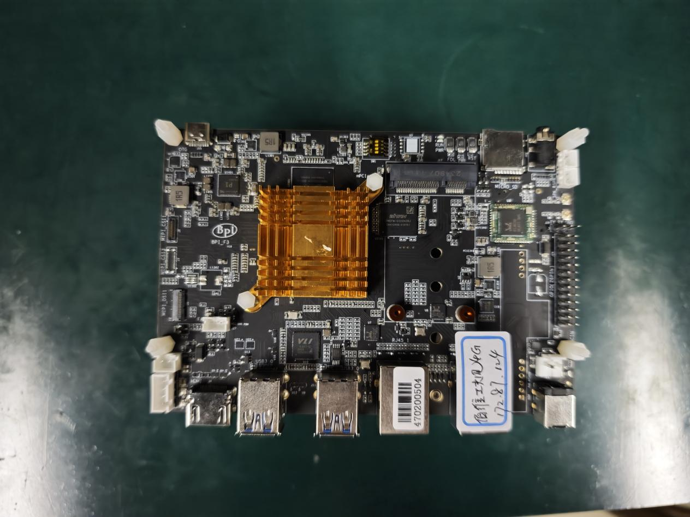
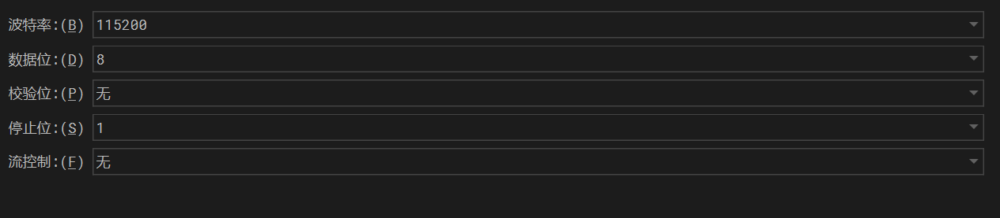
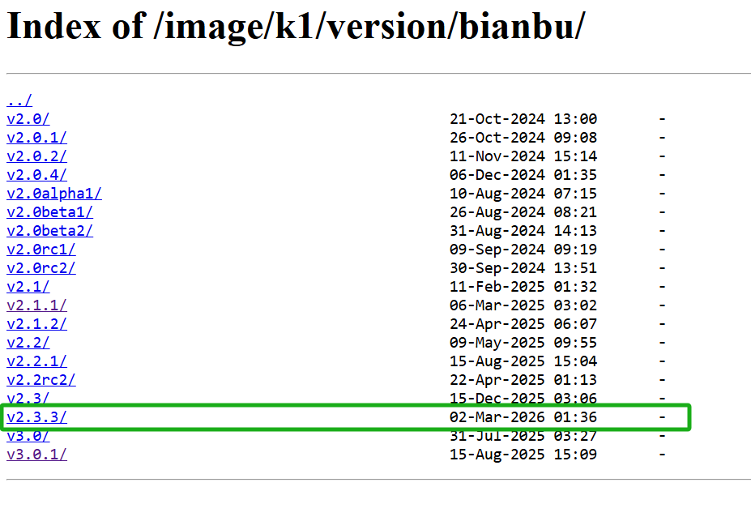
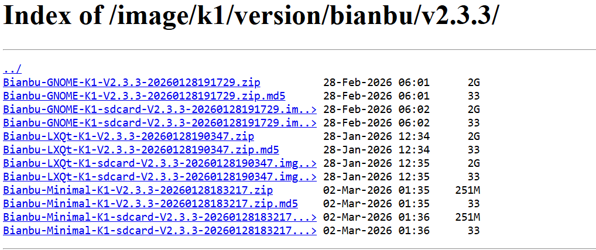
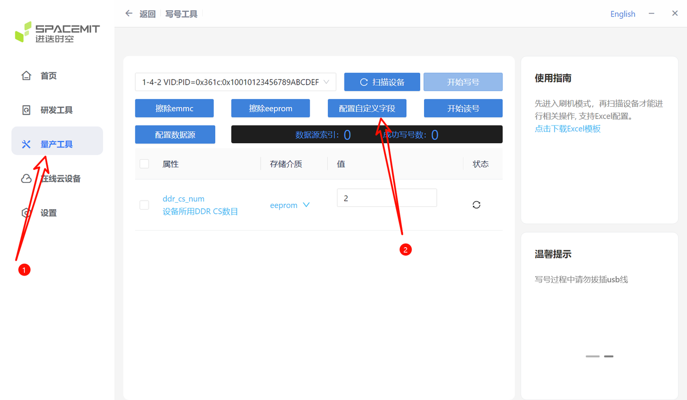
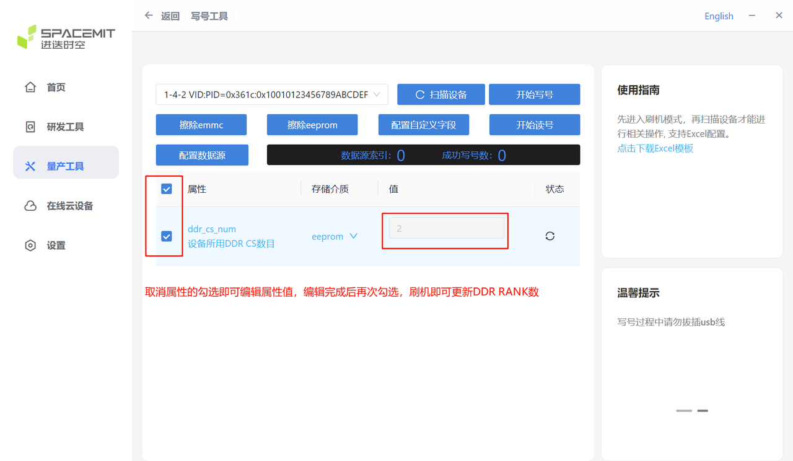

# K1 AVL兼容性验证标准操作流程（SOP）

## 1. 简介

本文档定义了进迭时空 Key Stone K1 芯片平台关键器件（LPDDR4x SDRAM、eMMC 5.1 Flash）的兼容性验证方法及标准操作流程（SOP）。

### 1.1 测试设备

- 硬件平台：对于每款待测器件（LPDDR4x SDRAM、eMMC5.1 FLASH），至少需配置 10 台 K1 DEB1 硬件平台作为验证平台。
- 散热要求：所有测试平台统一配备如下图所示的指定型号散热片。



### 1.2 测试环境

测试环境包含室温、低温与高低温循环。商规工作温度为 -20℃~70℃，工规工作温度为 -40℃~85℃。具体设置如下：

商规器件测试环境

| 环境类型 | 条件设置 | 测试步骤与要求 |
| :--- | :--- | :--- |
| 室温 | 25°C ± 3°C<br>湿度：0~90% RH | 在办公室环境下进行测试 |
| 低温 | -20°C<br>湿度：0% RH | 以 3°C/min 速率降温至 -20°C，并保持稳定 |
| 高低温循环 | -20°C  70°C<br>湿度：0% RH | 1. 以 3°C/min 降温至 -20°C<br>2. 保持 -20°C 4 小时<br>3. 以 3°C/min 升温至 70°C<br>4. 保持 70°C 4 小时<br>5. 以上步骤为 1 个循环 |

工规器件测试环境

| 环境类型 | 条件设置 | 测试步骤与要求 |
| :--- | :--- | :--- |
| 室温 | 25°C ± 3°C<br>湿度：0~90% RH | 在办公室环境下进行测试 |
| 低温 | -40°C<br>湿度：0% RH | 以 3°C/min 速率降温至 -40°C，并保持稳定 |
| 高低温循环 | -40°C  85°C<br>湿度：0% RH | 1. 以 3°C/min 降温至 -40°C<br>2. 保持 -40°C 4 小时<br>3. 以 3°C/min 升温至 85°C<br>4. 保持 85°C 4 小时<br>5. 以上步骤为 1 个循环 |

## 2. 测试准备

### 2.1 日志记录

- 要求：测试过程需要全程监控并保存串口打印，日志需要带时间戳。
- 推荐工具：[WindTerm](https://blog.csdn.net/wkd_007/article/details/130330092) (支持时间戳记录)

### 2.2 硬件平台配置

- 接口定义：K1 DEB1 硬件平台的接口定义如图所示。


- 供电要求：
  - PD 3.0 电源或 12V DC-IN
  - 功率 ≥ 20W
- 调试接口：
  - 使用 3.3V 串口连接 K1 DEB1 的 UART0
  - 用于命令输入及日志监控
- 串口配置：


### 2.3 镜像获取

1. 下载地址：[Bianbu 镜像](https://archive.spacemit.com/image/k1/version/bianbu/)

2. 选择版本：选择最新的发布日期的版本。

   

3. 下载包：点击下载其中一个桌面版本的安装包（即 GNOME 或者 LXQt），建议下载 `.zip` 的安装包。

   

### 2.4 DDR RANK参数配置

物理连接步骤：

1. 使用 Type-C 数据线连接 K1 DEB1 与烧录 PC。
2. 按住 FDL 按键（SW2），同时按下 RST 按键（SW4），系统进入烧录模式。

刷机工具配置 DDR CS num 具体步骤：

1. 点击 “量产工具”。
2. 在 "写号工具" 里点击 "配置自定义字段"。

   

3. 找到 ddr_cs_num。
4. 确认此项为 “启用” （注意：其他的选项如图显示 “禁用”）。
5. 点击 "保存"。

   

6. 勾选 ddr_cs_num 如下图。

   

### 2.5 镜像烧录

参考 [刷机工具使用手册](https://spacemit.com/community/document/info?lang=zh&nodepath=tools/user_guide/flasher_user_guide.md) 执行镜像烧录。

## 3. LPDDR4x SDRAM 兼容性测试

### 3.1 判定标准

测试通过需同时满足以下条件：

- 内存压测：
  memtester 运行过程中无 failure 报错；系统运行稳定，无错误指针、无挂死现象。

- 冷启动测试：
  系统可正常启动并进入 kernel shell 界面；可成功登录，且轻量内存测试执行无异常。

### 3.2 测试准备

1. 确保测试设备已通过网线或 Wi-Fi 连接互联网。
2. 安装测试工具 memtester：

   ```bash
   # usr：root passwd：bianbu
   # 连接互联网，等待系统时间更新后再执行以下命令
   apt update && apt install -y memtester
   ```

### 3.3 常温内存压测

- 环境：室温环境下。
- 步骤：
    1. 镜像烧写完成后，连接 UART0 串口并上电启动系统。
    2. 登录系统 shell。
    3. 执行内存压力 memtester 测试（8 线程）。
    4. 持续运行 24 小时。
- 执行命令：

   ```bash
   # ->usr：root ->passwd：bianbu
   # 测试容量 A = (free - 100M) / 8
   memtester A &
   memtester A &
   memtester A &
   memtester A &
   memtester A &
   memtester A &
   memtester A &
   memtester A &
   ```

### 3.4 低温冷启动测试

- 环境：低温环境（-20°C 或 -40°C）。
- 步骤：
    1. 将待测设备放入温箱，并连接电源及串口。
    2. 设置温箱至目标低温并稳定。
    3. 整板断电静置 2 小时。
    4. 上电启动系统，进入 shell 并登录。
    5. 执行轻量内存测试。
    6. 每次启动间隔 2 小时，共执行 20 次。
- 执行命令：

   ```bash
   # usr：root passwd：bianbu
   memtester 10M 1
   ```

### 3.5 低温内存压测

- 环境：低温环境（-20°C 或 -40°C）。
- 步骤：
    1. 将待测设备放入温箱，并连接电源及串口。
    2. 设置温箱为低温环境并稳定。
    3. 上电启动系统并登录。
    4. 执行内存压力测试（8 线程）。
    5. 持续运行 24 小时。
- 执行命令：(同 小节 3.3 常温内存压测)

### 3.6 高温内存压测

- 环境：高温环境（70°C 或 85°C）。
- 步骤：
    1. 将待测设备放入温箱，并连接电源及串口。
    2. 设置温箱为高温环境。
    3. 上电启动系统并登录。
    4. 执行内存压力测试（8 线程）。
    5. 持续运行 24 小时。
- 执行命令：(同 小节 3.3 常温内存压测)

### 3.7 高低温循环内存压测

- 环境：高低温循环模式。
- 步骤：
    1. 将待测设备放入温箱，并连接电源及串口。
    2. 设置温箱为高低温循环模式。
    3. 上电启动系统并登录。
    4. 执行内存压力测试（8 线程）。
    5. 随温箱运行温度循环，完成 10 次循环。
- 执行命令：(同 小节 3.3 常温内存压测)

## 4. eMMC5.1 FLASH 兼容性测试

### 4.1 判定标准

测试通过需同时满足以下条件：

- 内存压测：
  fio 运行过程中无 crc 校验错误；系统运行稳定，无错误指针、无挂死现象。

- 冷启动测试：
  系统可正常启动并进入 kernel shell 界面；可成功登录，且轻量内存测试执行无异常。

### 4.2 测试准备

1. 确保测试设备已通过网线或 Wi-Fi 连接互联网。
2. 安装测试工具 fio：

   ```bash
   # usr：root passwd：bianbu
   # 连接互联网，等待系统时间更新后再执行以下命令
   apt update && apt install -y fio
   ```

### 4.3 镜像升级测试

- 目的：验证 eMMC 在多次镜像烧写过程中的稳定性。
- 步骤：
    1. 对被测单板连续进行 10 次镜像烧写。
    2. 每次烧写完成后，均需上电启动系统。
    3. 检查系统是否可正常进入 Linux 并完成登录。
- 判定标准：
  - 所有烧写过程无异常。
  - 每次均可正常启动系统。

### 4.4 常温读写压测

- 环境：室温环境下。
- 步骤：
    1. 镜像烧写完成后，连接 UART0 串口并上电启动。
    2. 登录系统 shell。
    3. 执行读写压力测试。
    4. 持续运行 24 小时。
- 执行命令：

   ```bash
   # usr：root passwd：bianbu
   # 测试容量 = rootfs分区可用容量 * 70%
   echo 2 | sudo tee /proc/sys/kernel/perf_user_access

   fio -name=rand-RW -direct=1 -iodepth=64 -rw=randrw -rwmixread=60 -rwmixwrite=40 -ioengine=libaio -bs=128k -size=10G -numjobs=1 -runtime=48h -time_based -directory=/root/ -filename=fio-rand-RW --verify=crc32
   ```

### 4.5 低温读写压测

- 环境：低温环境（-20°C 或 -40°C）。
- 步骤：
    1. 将待测设备放入温箱，并连接电源及串口。
    2. 设置温箱为低温环境并稳定。
    3. 上电启动系统并登录。
    4. 执行读写压力测试。
    5. 持续运行 24 小时。
- 执行命令：(同 小节 4.4 常温读写压测)

### 4.6 高温读写压测

- 环境：高温环境（70°C 或 85°C）。
- 步骤：
    1. 将待测设备放入温箱，并连接电源及串口。
    2. 设置温箱为高温环境。
    3. 上电启动系统并登录。
    4. 执行读写压力测试。
    5. 持续运行 24 小时。
- 执行命令：(同 小节 4.4 常温读写压测)

### 4.7 低温冷启动测试

- 环境：低温环境（-20°C 或 -40°C）。
- 步骤：
    1. 将待测设备放入温箱，并连接电源及串口。
    2. 设置温箱至目标低温并稳定。
    3. 整板断电静置 2 小时。
    4. 上电启动系统并登录。
    5. 执行轻量测试命令。
    6. 每次启动间隔 2 小时，共执行 20 次。
- 执行命令：

   ```bash
   # usr：root passwd：bianbu
   memtester 10M 1
   ```

### 4.8 高低温循环读写压测

- 环境：高低温循环模式。
- 步骤：
    1. 将待测设备放入温箱，并连接电源及串口。
    2. 设置温箱为高低温循环模式。
    3. 上电启动系统并登录。
    4. 执行读写压力测试。
    5. 随温箱运行温度循环，完成 20 次循环。
- 执行命令：

   ```bash
   # usr：root passwd：bianbu
   # 测试容量 = rootfs分区可用容量 * 70%
   echo 2 | sudo tee /proc/sys/kernel/perf_user_access

   fio -name=rand-RW -direct=1 -iodepth=64 -rw=randrw -rwmixread=60 -rwmixwrite=40 -ioengine=libaio -bs=128k -size=10G -numjobs=1 -runtime=100h -time_based -directory=/root/ -filename=fio-rand-RW --verify=crc32
   ```
