# K1 芯片硬件设计指导手册

```
最新版本：2024/03/12
```

## 1. 原理图设计

### 1.1 小系统外部电路要求

#### 1.1.1 DDR 电路设计

- 支持 LPDDR4/LPDDR4x;DDR\_LP4x\_SEL 下拉到地配置为 LPDDR4 模式，上拉到 AVDD18\_DDR 配置为 LPDDR4x 模式。
- LPDDR4/4x 的外部电阻（ZQ）通过 240Ω，精度 ±1% 的电阻接到 GND。


**注意：**

**DDR 走线必须完全拷贝我司参考的设计，相关的设计文件请见发布包中的硬件部分。**

#### 1.1.2 复位

- 芯片的硬件复位通过由外部控制，低电平有效。
- 管脚需要增加 10nF 电容，用来消除复位信号上的抖动，增强抗干扰能力，防止误触发导致的系统异常复位。
- RESET\_IN\_N 网络的上拉电源必须和 IO 电源域（即上拉到 VCC18\_GPIO）保持一致。
- P1 的 PGOOD 信号与 K1 的 RESET\_IN\_N 信号直接连接，按键复位 K1+P1。
- 若与其他复位来源复用，需要增加与非门或者二极管隔离。


#### 1.1.3 JTAG 接口

- 支持 Primary JTAG 与 Sec2 JTAG。
- TDI，TMS，TCK，TDO 及 Power、GND 连接 Jlink 调试器（信号电平需与 Power 电压匹配），TRSTn 信号连接到 Jlink 调试器或上拉到 Power。
- 当使用 Sec2 JTAG 时，JTAG SEL 需要上拉。
- Sec JTAG 支持 X60 /N308 CPU，通过 MMC1\_SD\_CMD 控制。


#### 1.1.4 电源管理(PMIC) 电路设计

- P1 的输入供电推荐使用 4V，Vin3、Vin4 按参考 PCB 隔离输入；Vin5、Vin6 按参考 PCB 隔离输入。
- P1 的 SW3~SW6 默认增加 220pF 电容。
- BUCK1/2 的 FB 和 FBGND pin 必须连接到主控的 FB 和 FBGND pin，layout 上注意远离干扰信号 。


**P1 周边电路设计必须完全拷贝我司参考设计，相关的设计文件请见发布包中的硬件部分**

#### 1.1.5 硬件初始化系统配置电路

<table>
<tbody>
<tr>
<td>信号名</td>
<td>方向</td>
<td>说明</td>
</tr>
<tr>
<td>QSPI_DATA3/Strap3 FDL</td>
<td>I</td>
<td>Boot/Download 选择<br/>0：启动<br/>1：下载</td>
</tr>
<tr>
<td>QSPI_DATA2/Strap2<br/></td>
<td>I</td>
<td>Download 选择<br/>0：USB （USB0）<br/>1：UART (UART0)</td>
</tr>
<tr>
<td>QSPI_DATA1/Strap1<br/>QSPI_DATA0/Strap0</td>
<td>I</td>
<td>Boot 选择<br/>Strap1 & Strap0<br/>00：EMMC<br/>01:  SPI NOR<br/>10:  SPI NAND<br/>11:  SD CARD</td>
</tr>
<tr>
<td>GPIO_90/Strap4<br/></td>
<td>I</td>
<td>Flash 电压选择<br/>0：1.8V供电<br/>1：3.3V供电</td>
</tr>
<tr>
<td>JTAG_SEL</td>
<td>I</td>
<td>Sec JTAG 选择<br/>0： other functions<br/>1：SEC JTAG </td>
</tr>
<tr>
<td>MMC1_SD_CMD</td>
<td>I</td>
<td>JTAG ROUTE<br/>0：X60<br/>1:   N308</td>
</tr>
</tbody>
</table>

#### 1.1.6 Clocking 电路

**系统时钟**

通过芯片内部的反馈电路与外部的 24MHz 晶体振荡电路一起构成系统时钟电路。

负载电容根据晶体振荡器 Datasheet 来选型，推荐 12pf。

推荐预留 1M 电阻并联 XIN,XOUT 之间。

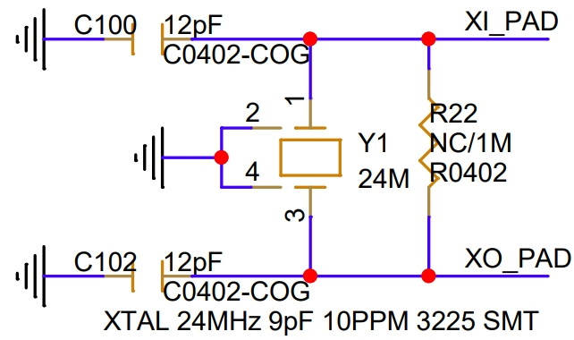

**注意：选用的电容需要跟晶振的负载电容匹配，材质建议采用 NPO。建议选用 4pin 贴片晶振，其中 2 个 GND 管脚与单板地充分连接，增强系统时钟抗 ESD 干扰能力。**

### 1.1.7 FLASH 原理图设计

- Quad - SPI 充当外部串行闪存设备的接口，具有多达四根双向数据线。
- FLASH 控制器支持 SPI NOR FLASH、SPI NAND FLASH。
- 支持 1.8V/3.3V Flash，参考芯片 VCC1833\_QSPI 电压域配置电平。
- Quad - SPI 的 4 个 DATE 复用了系统配置功能，在 PCB 设计需要考虑走线 Fly-by 形式，配置信息见 1.1.5 硬件初始化系统配置电路。

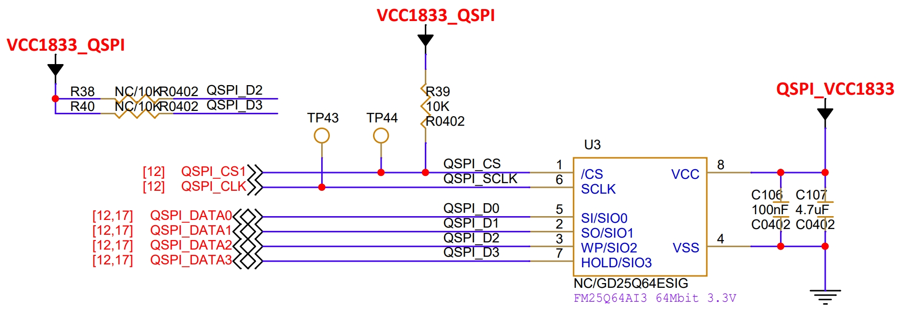

**注意：Flash Data 外围设计无需专门上拉，内部已经配置。Date 复用了 Boot 相关功能，使用需要根据系统配置做上拉/下拉处理。详见本章 “硬件初始化系统配置电路”**

### 1.1.8 eMMC

- 兼容 8 位 eMMC 5.1 协议规范。
- eMMC 卡支持 SPI 模式。
- Emmc 的 Data 与 DS 外部建议预留上/下拉，生产 NC 处理。
- Layout 注意等长控制。

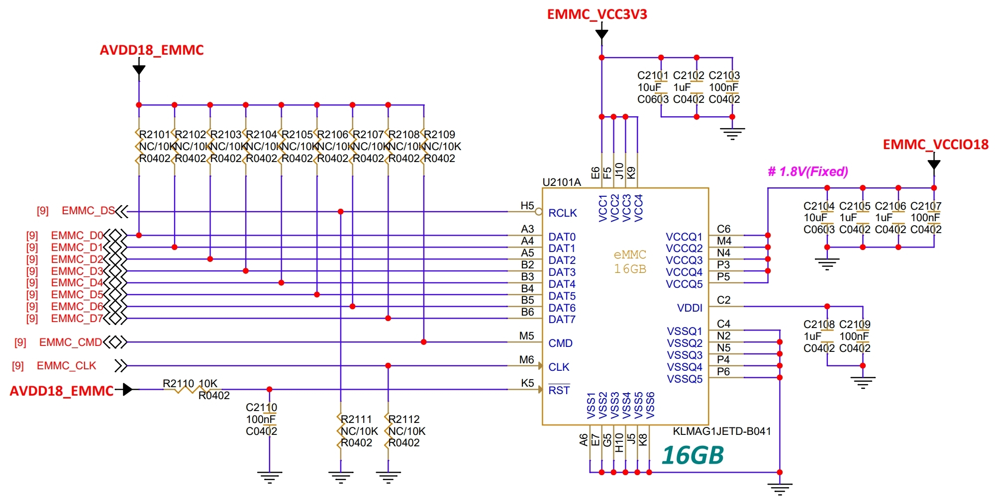

### 1.2 电源设计建议

#### 1.2.1 CORE 电源设计

典型电压 0.9V 到 1.05 V，实际根据场景由 P1 的远端反馈动态调压电路控制，需要 P1 的 BUCK1 &BUCK2 合并供电。滤波电容数量与容值经过 PI 仿真，请严格参考最新原理图，不可调整。具体参考 K1 最新原理图。

#### 1.2.2 DDR 电源设计

K1 支持 LPDDR4/LPDDR4x，典型电压 1.1V/0.6V。DDR 颗粒的电源要求与 K1 的 DDR IO 电源采用同一电源网络供电。滤波电容数量与容值经过 PI 仿真，请严格参考最新原理图，不可调整。具体参考 K1 最新原理图。

#### 1.2.3 IO 电源设计

- 管脚名 VCC18\_GPIO 连接数字 1.8V 电源。
- 管脚名 VCC1833\_GPIO2（GPIO2 组：GPIO75~80）,  VCC1833\_GPIO3（GPIO3 组：GPIO47~52）,  VCC1833\_MMC1（MMC1\_DAT0~3、CMD、CLK）,   VCC1833\_QSPI（QSPI\_DAT0~3、CLK、CS1），根据外设使用设备选择连接数字 3.3V 或 1.8V 电源。
- 需要在相关 VCC1833\_GPIO2,  VCC1833\_GPIO3, VCC1833\_MMC1, VCC1833\_QSPI 芯片口摆放 0.1uf/1uF 电容，如下图。

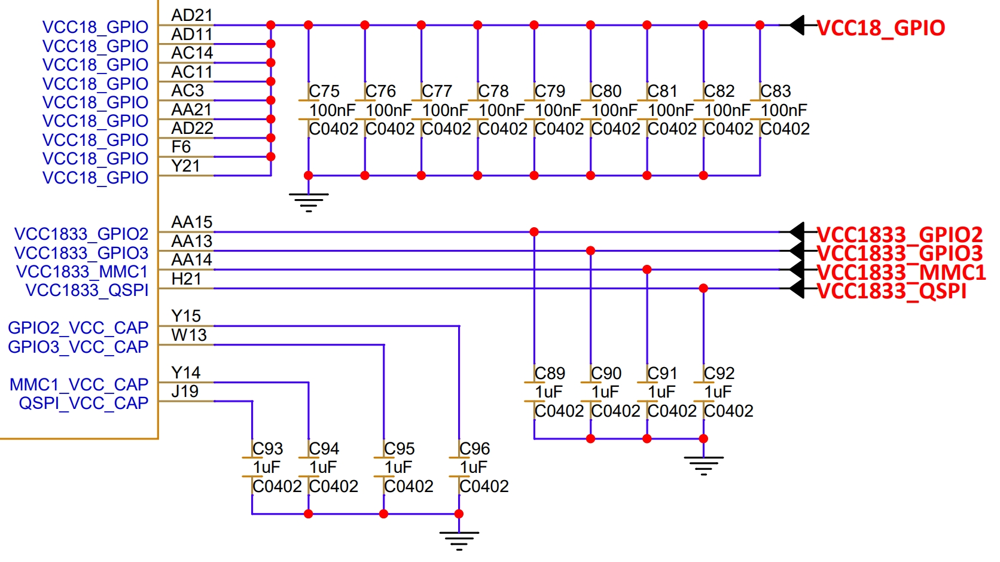

**注意：GPIO90 IO 用于配置 QSPI 的默认工作电压，GPIO90 上拉 1.8V 时，VCC1833\_QSPI 需工作在 3.3V 电压；GPIO90 下拉 GND 时，VCC1833\_QSPI 需工作在 1.8V 电压。**

**注意：GPIO 不使用时，GPIO pin 可悬空，但各组 GPIO 电源都需要供电；HDMI，PCIEA/USB3.0，PCIEB，PCIEC，MIPI CSI，EMMC，USB2.0，MIPI DSI 等模块，不使用时，电源仍需供电。**

### 1.2.4 PLL 电源设计

K1 的 PLL 电源有 2 个，分别是：

AVDD09\_PLL：设计上必须用磁珠（120Ω@100MHz，DC 电阻 ≤0.07Ω，下文磁珠需求相同）进行隔离。

AVDD18\_PLL：设计上必须用磁珠对 1.8V 电源进行隔离。

参考最新原理图 P1 设计。

#### 1.2.5 上下电时序

Core 电源、DDR 电源和 IO 电源有上下电时序的要求由 PMIC P1 控制, 参考最新原理图。

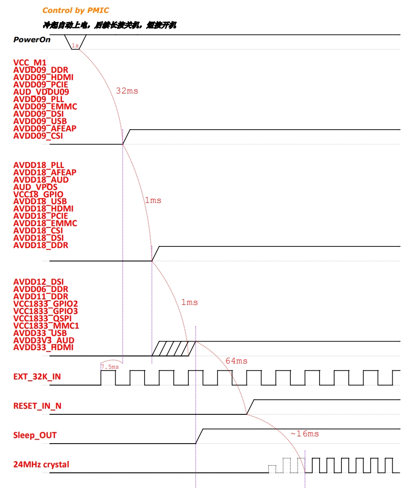

#### 1.2.6 远端反馈动态调压

- K1 的 core 电源必须增加动态调压功能，最终可以实现动态调节 DC-DC 的输出电压。
- VDD09\_CORE\_B\_FB 从主控 VCC\_M1\_FB ball 引出，VDD09\_CORE\_B\_FBGND 从主控 VSS\_FB 引出。

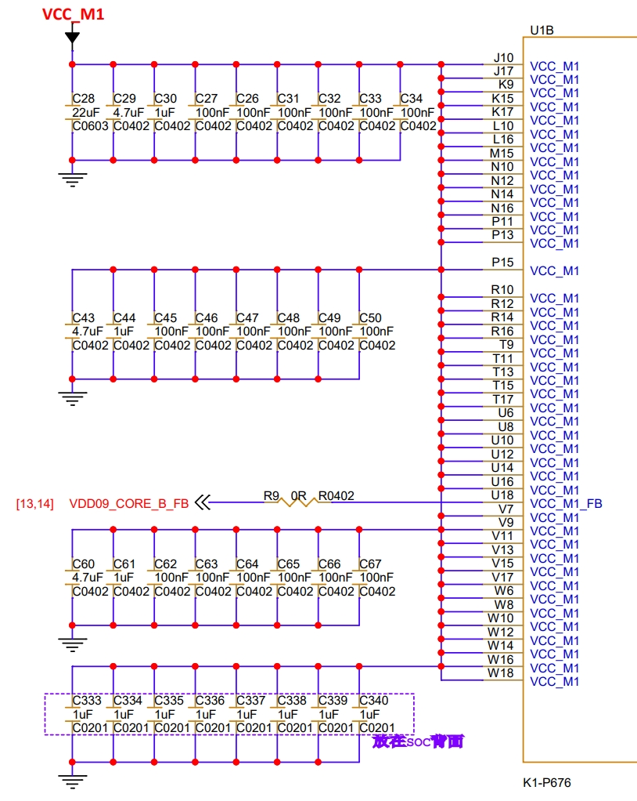


### 1.3 模拟接口设计建议

#### 1.3.1 模拟音频接口设计

- Audio 模块的模拟电源 AUD\_VDDU09，AVDD18\_AUD，AVDD33\_AUD 必须使用磁珠（推荐 120Ω@100MHz）与系统电源隔离。

#### 1.3.2 I2S 接口

- K1 支持 4 个 I2S 接口，I2S0，I2S1 由主 CPU（X60）控制。R\_I2S2,R\_I2S3 由 RCPU （N308）控制。
- 每组 I2S 都可以配置主从模式。

#### 1.3.3 MIPI CSI RX 配置接口设计

差分视频输入接口支持 4lane+4lane 输入或 4lane+2lane+2lane 输入。4lane+2lane+2lane 输入模式下，支持三摄同时出图，但 ISP 只能处理两路，剩余 1 路摄像头可以是 YUV 或 RAW，不能经过 ISP 处理，只能通过 ccic dma 模块 dump 数据到 ddr 中。

- **MIPI CSI1**

四对差分数据参考 MIPI\_CSI0\_CK1XP/N 差分时钟采样；

- **MIPI\_CSI2**

**[2 Lane 模式]：**MIPI\_CSI3\_D2P/N、MIPI\_CSI3\_D3P/N 两对差分数据参考 MIPI\_CSI2\_CKP/N 差分时钟采样

- **MIPI\_CSI3**

**[2 Lane 模式]：**MIPI\_CSI3\_D0P/N、MIPI\_CSI3\_D1P/N  参考 MIPI\_CSI3\_CKP/N 时钟采样。

**[4 Lane 模式]：**MIPI\_CSI3\_D0P/N、MIPI\_CSI3\_D1P/N ,MIPI\_CSI3\_D2P/N、MIPI\_CSI3\_D3P/N 参考 MIPI\_CSI3\_CKP/N 差分时钟采样。

AVDD09\_CSI 电源管脚需要与数字电源用磁珠隔离并在芯片管脚端放置 2 个 1uF 滤波电容。

AVDD18\_CSI 电源管脚需要与数字电源用磁珠隔离并在芯片管脚放置 1 个 1uF 滤波电容。

#### 1.3.4 MIPI DSI TX 接口设计

- K1 内置了一个 MIPI TX PHY，用于对接 MIPI 接口的 LCD 屏。
- AVDD18\_DSI 电源管脚需要与数字电源  用磁珠隔离。

详细的原理图设计请参考 K1 原理图设计文件。

#### 1.3.5 SPI LCD 接口设计

- 支持 1 线串行外设 SPI 显示接口数据传输
- Data 为 SPILCD\_DOUT0，或者 SPILCD\_DIN

注意：LCD\_TE 信号，不能同时用于 SPI\_LCD 显示与 MIPI DSI LCD

#### 1.3.6 HDMI 接口设计

- K1 内置了一个 HDMI PHY。
- HDMI 接口电源：模拟电源 AVDD33\_HDMI，AVDD18\_HDMI，需要与数字电源通过磁珠隔离，并在靠近芯片管脚端放置 2 个 1uF 滤波电容。AVDD33\_HDMI 管脚需要使用 MOS 管电路接到 3.3V，靠近芯片管脚端放置 2 个 1uF 滤波电容。
- HDMI 信号上要有 ESD 保护，ESD 器件靠近 HDMI 连接器放置。ESD 器件寄生电容小于 0.3pF；
- HDMI\_SCL，HDMI\_SDA，HDMI\_CEC，HDMI\_HPD 信号，需要外围电路处理，使用专用 HDMI 芯片或者分立电平转换。电平转换要求：HDMI\_SCL，HDMI\_SDA 转换为 5V，HDMI\_CEC 需要电平转为 3.3V。外接口输入的 HDMI\_HPD 需要电平转换成 1.8V 后输入芯片。具体设计如图

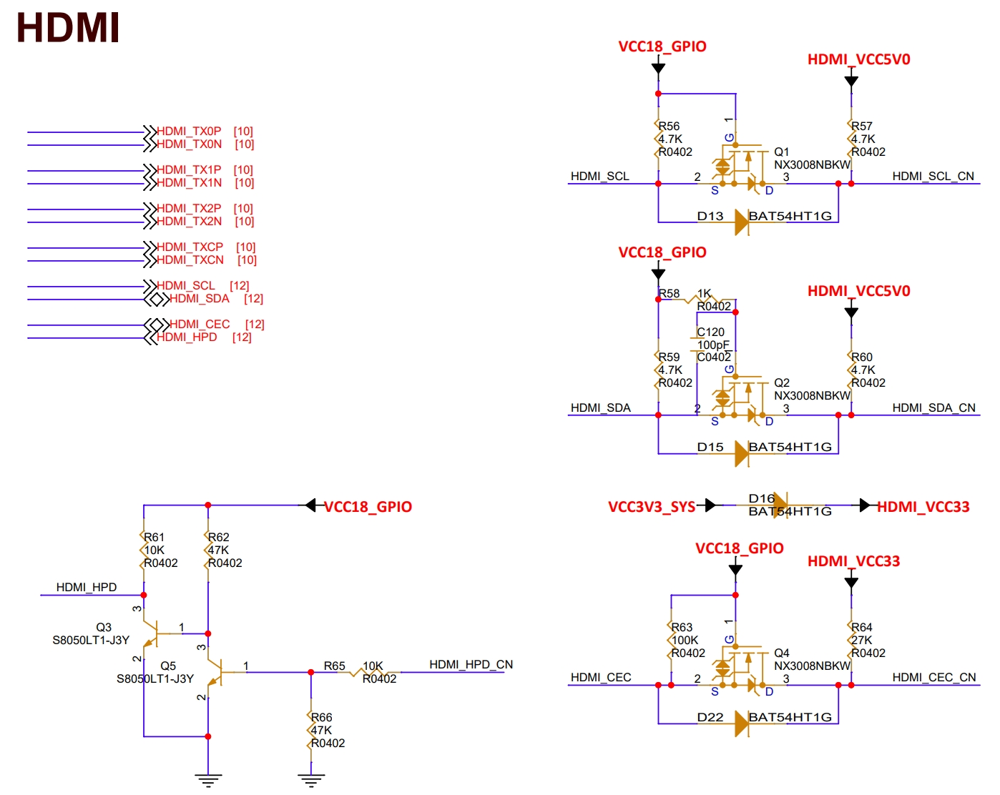

详细的原理图设计请参考 K1 原理图设计文件。

### 1.4 外围接口设计建议

#### 1.4.1 USB2.0

- K1 提供 3 个 USB2.0 接口，其中有 USB2.0-0、USB2.0-2 支持 OTG。
- USB2.0-0 为 Download 接口。
- AVDD33\_USB ，使用 1 个 3.3R 电阻与系统 3.3V 电源连接，靠近管脚放置 3 个 0.1uF 电容。

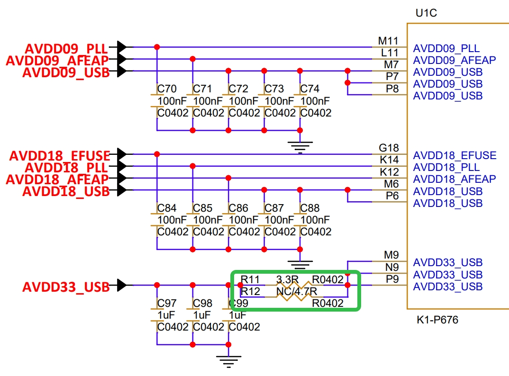

- USB2.0 信号上要有 ESD 保护措施，ESD 器件的寄生电容要求小于 1pF，ESD 器件靠近 USB 接口放。

#### 1.4.2 PCIE

- K1 提供 3 个 PCIE 接口，PCIEA X1，PCIEB X2,PCIEC X2.
- AVDD09\_PCIEA，AVDD09\_PCIEB，AVDD09\_PCIEC 合并供电，使用磁珠与系统电源隔离，靠近管脚各放置 3 个 1uF 电容。
- AVDD18\_PCIEA，AVDD18\_PCIEB，AVDD18\_PCIEC 合并供电，使用磁珠与数字电源隔离，靠近管脚各放置 3 个 1uF 电容。

**注意：无论使用任意一个 PCIE, PCIEA\_R\_EXT 都需要****连接****240Ω 1% 电阻上拉到 AVDD09\_PCIE。**

- PCIE\_RXP/N

  - 如果对接器件是 IC，那么 RX 差分信号必须在对接器件端串联 220nF 电容。
  - 如果对接器件是 PCIE 插槽， RX 差分信号直接连接至插槽管脚上无需串联电容。
- PCIE\_TXP/N

  - 差分信号必须在 K1 端串联 220nF 电容进行 AC 耦合。
- PCIE\_REFCLKP/N 支持两种时钟方案：

  - K1 给对接器件提供时钟。PCIE 差分时钟信号直接连接。
  - 外部器件给 K1 提供时钟。PCIE 差分时钟信号在外部器件源端必须加 49.9Ω 下拉电阻。时钟偏差约束 ±300ppm，符合 PCIE 协议规范。

#### 1.4.3 UART

K1 有 12 组 UART 接口，分为两类：X60 UART 和 N308 UART。

- X60 UART 有 10 组，其中 UART0 是 2 线调试口，UART1~UART9 是 4 线，其中 UART3 可用于 secure domain。
- N308 UART 有 2 组，目前暂不支持，需要使用时，请联系 FAE 确认。

#### 1.4.4 IIC

K1 有 10 组 IIC 接口，分为 4 类：AP I2C ,HDMI I2C, PWR I2C。

- AP I2C 有 8 组， I2C0~I2C7 ，用于外设控制功能，其中 I2C0,I2C1,I2C7 用于摄像头功能控制。
- HDMI  I2C 有 1 组，HDMI\_I2C， 用于 HDMI 接口功能控制
- PWR I2C 有 1 组，PWR， 用于电源 IC 配置功能控制

#### 1.4.5 MMC

K1 有 2 个 MMC 接口，MMC1 支持 3.3V/1.8V 电平，MMC2 接口电平只支持 1.8V；

MMC1/2 支持对接 SDIO 接口 WIFI，SD Card

#### 1.4.6 USB3.0

- K1 支持 1 个 USB3.0 接口，与 PCIEA 接口复用。
- USB3.0 信号上要有 ESD 保护措施，ESD 器件的寄生电容要求小于 0.5pF，ESD 器 件靠近 USB 接口放置。
- 信号设计处理

  - USB3\_RXP/N
    - 如果对接器件是 IC 或模组，那么 RX 差分信号需要在对接器件端串联 100nF 电容。
    - 如果对接器件是插座，那么 RX 差分信号直接连接至插座，无需串联电容。
  - USB3\_TXP/N
    - 如果对接器件是 IC 或模组，那么 TX 差分信号需要在 K1 端串联 100nF 电容。
    - 如果对接器件是插座，那么 TX 差分信号需要在靠近插座的位置串联 100nF 电容。

**注意：无论使用 USB3.0 还是任意一个 PCIE, PCIEA\_R\_EXT 都需要****通过****240Ω 1% 电阻上拉到 AVDD09\_PCIE。**

## 2. PCB 设计

### 2.1 PCB 叠层设计

为了减少在高速信号传输过程中的反射现象，必须在信号源、接收端以及传输线上保持阻抗的匹配。单端信号线的具体阻抗取决于它的线宽尺寸以及与参考平面之间的相对位置。特定阻抗要求的差分对间的线宽/线距则取决于选择的 PCB 叠层结构。由于最小线宽和最小线距是取决于 PCB 类型以及成本要求，受此限制，选择的 PCB 叠层结构必须能实现板上的所有阻抗需求，包括内层和外层、单端和差分线等。

层的定义设计原则：

1. 零件的相邻层应为地平面，提供器件面布线参考；
2. 所有信号层尽可能于地平面相邻；
3. 避免两信号层直接相邻；
4. 大电流电源尽可能于地平面相邻；
5. 叠层设计应采用对称结构设计

K1 目前使用 6 层叠层，以下为参考叠层设计。如果使用其它类型的叠层设计，请根据 PCB 厂商给出的设计，重新计算阻抗。

在 6 层叠层设计中，走线层为 L1/L3/L4/L6，L2/L5 为完整参考平面：

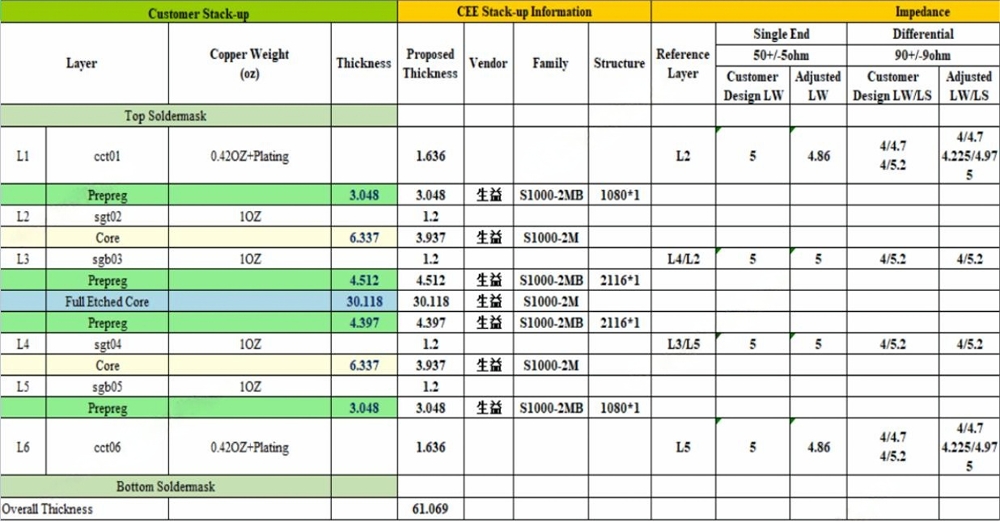

### 2.2 通用布线建议

1. 走线不要出现直角和锐角；
2. 避免在时钟器件（如晶体、晶振、时钟发生器、时钟分发器）、开关电源、磁类器件等周边布线；
3. 走线应有完整且连续的参考平面；
4. 在 BGA 区域的平面断开处用走线连接，如下图所示;


5. 尽量减少残桩长度，建议残桩长度为 0；


高速信号布线建议：

1. 高速信号换层时，需在换层 VIA 处添加 GND 伴随过孔，以保证回流路径的连续性；


2. 由于表贴器件的焊盘会导致阻抗降低，为减小阻抗突变的影响，建议在表贴焊盘的正下方按焊盘大小挖去一层参考层。常用的表贴器件有：ESD、电容、共模抑制电感、连接器等；

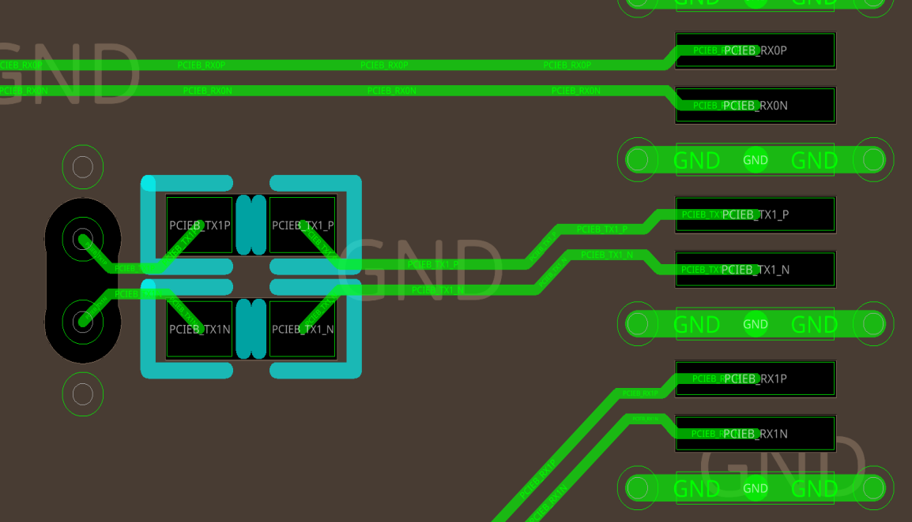

3. 避免玻纤编织效应；

所谓玻纤效应，是指构成 PCB 介质的增强材料——玻璃纤维网状结构之间的间隙引起介质层的相对介电常数局部变化的现象。PCB 的介质层一般由玻纤布和树脂组成，玻纤布的玻璃纤维空隙填充树脂，由于玻纤布和树脂的介电常数相差较大，在靠近玻纤的走线信号感受到的介电常数较大，而在玻纤束之间窗口区域走线的信号感受到的介电常数较小，从而导致了玻纤效应。玻纤效应对高速信号的影响主要表现在两个方面，一方面会引起走线阻抗的周期性波动，另一方面，会导致差分线走线 P 和 N 之间的 Skew。当接口的速率达到 8GT/S 且走线长度超过 1.5Inch，需谨慎处理好玻纤效应。建议采用以下方式来避免影响。

方式一：改变走线角度，按 10 度 线走线；或 PCB 加工时，将板材旋转 10 度以保证所有走线都不与玻纤平行。

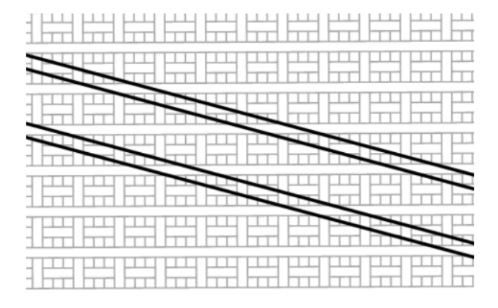

方式二：使用如下走线（ZigZag)，下图中的 W 至少要大于 3 倍的玻纤编织间距。推荐值 W=60mil,θ=10°，L=340mil。


4. 走线时尽量减少换层，需要换层时，考虑 Via Stub，尽量减小 Via Stub 长度；
5. 差分过孔建议：如果接口的速率=8GT/s，那么这些接口差分对的过孔建议增加 Dog-Bone，根据实际叠层进行仿真优化 Dog-Bone 大小，以下基于 EVB 一阶 HDI 的过孔参考尺寸
   R Drill=4mil (钻孔半径)
   R Pad=16mil(过孔焊盘半径)
   D1=30mil 差分过孔中心间距
   D2=15mil 表层到底层的反焊盘尺寸
   D3=30mil 信号过孔与回流地过孔的中心间距

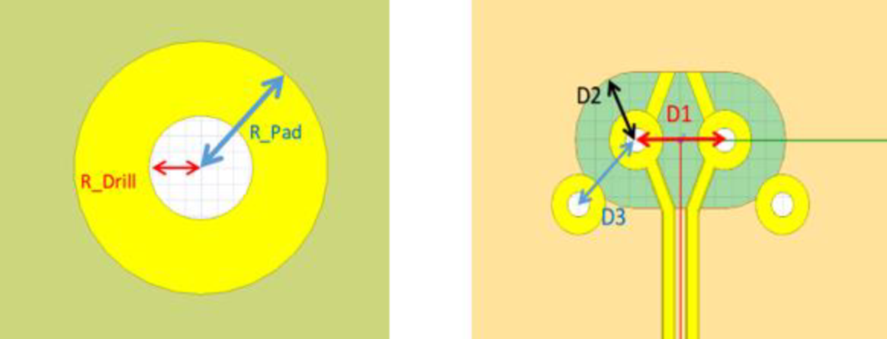

6. 差分对 P/N 之间等长建议\<=5mil ，等 P/N 之间需要绕线补偿时，绕线尺寸需要特别注意，应满足如下图所示要求，以降低阻抗突变带来的影响：


### 2.3 电源与滤波电容设计

1. 滤波电容尽量靠近 pin 端，电源线和 GND 线均用粗短线到过孔；
2. 供电段到用电端的电源平面需路径短，平面大，且注意不要被过孔打的太碎；
3. 为了更好的 PI，建议使用我们的参考电路选用电容，不要删减电容个数；
4. 过孔排布，请按我们的参考设计，不要删减电源过孔和地过孔。


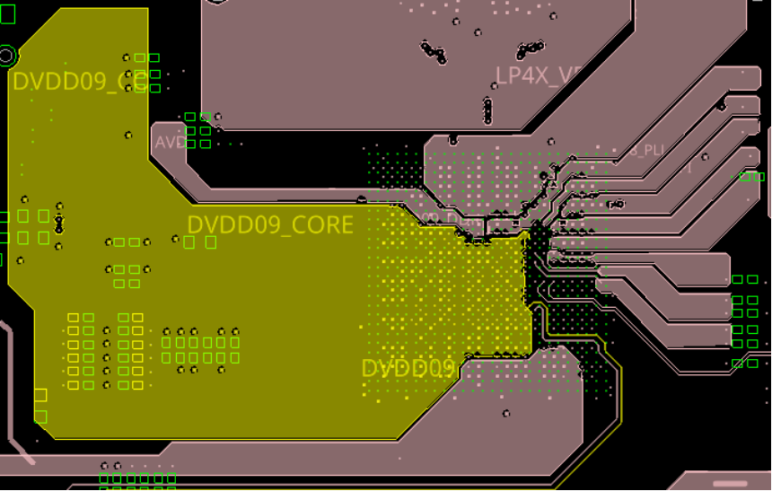

### 2.4 P1 电源 Layout 设计

1. 中间的散热焊盘均匀的打上地孔阵列:

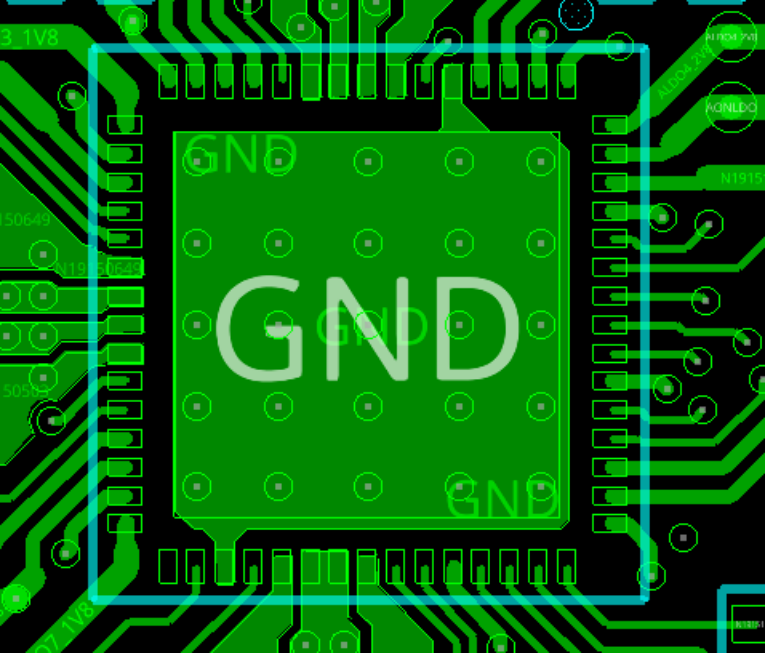

2. BUCK3/BUCK4/BUCK5/BUCK6 的 Vin 需要分开，不可合并铺铜，BUCK1/2 可以合并铺铜，每个 pin 三个过孔：


3. FB 走线换层走内层，不要和 SW 同层太长：

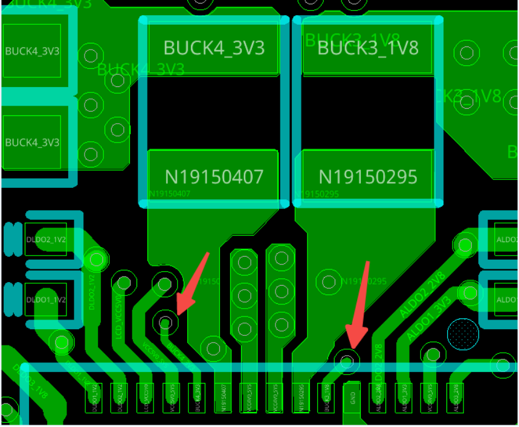

4. 滤波电容靠近主芯片，且走线尽量加粗：


5. SW 铺铜处理，且路径尽量短，其它信号远离 SW 信号：


### 2.5 小系统设计

关于 CPU - DDR - EMMC 组成的小系统，强烈推荐使用我们的参考板设计，已经过仿真和实际验证。自行设计，需严格仿真验证，风险大。

#### 2.5.1 CPU - PCB Layout 推荐设计

1. CPU 最外圈 ball 可以从表层走 5mil 线宽直接扇出，第二排 ball 可用 5mil 线宽从第一排 ball 中间穿出：


2. CPU 内圈 ball 设计：如果第一、二圈信号都有使用，那么第三圈开始，需要换层到内层，CPU 处过孔需规则放置，给地平面以及电源平面留出尽量大的通道。如下图地层平面铺铜，有多条通道和外面的地连接，有利于 SI/PI 以及散热。


3. 如下图电源层平面铺铜情况，有规则放置过孔，使各种电源有尽量大的铺铜通道，有效提高电源质量。


4. CPU 背面参考我司设计，在相应 pin 位置放置电容，有空间的区域，可以尽量多的摆放电容，提高电源 PI。


5. 在 CPU 侧有出线困难的，可适当减小线宽，用 neck 值走线；出 CPU 区域后，需按照正常线宽走线。


6. 表层的地和电源，用粗短线将它们连接起来，如下图所示。

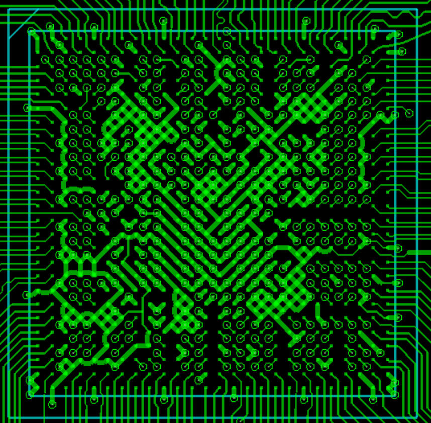

7. Core 电的反馈线，需从电源的最远端拉出，且尽量少换层。

#### 2.5.2 DDR - PCB Layout 推荐设计

对于 6 层 PCB，建议 DDR 信号走在第 1 层、第 4 层，使其主要参考第 2 层、第 5 层完整的地平面。如果 GND 平面不完整，将对信号质量造成很大的影响。DDR 设计中间距要求和等长要求，见下表。绕线时，需导入 pin\_delay。

<table>
<tbody>
<tr>
<td>参数</td>
<td>要求</td>
</tr>
<tr>
<td>DDR单端信号阻抗</td>
<td>单端50ohm +/-10%</td>
</tr>
<tr>
<td>差分信号阻抗</td>
<td>90ohm +/-10%</td>
</tr>
<tr>
<td>不同Byte之间的间距</td>
<td>&gt;= 3倍走线宽度</td>
</tr>
<tr>
<td>通一个Byte之间的间距</td>
<td>&gt;= 2倍走线宽度</td>
</tr>
<tr>
<td>差分对P/N之间等长要求</td>
<td>&lt;= 5mil</td>
</tr>
<tr>
<td>同一组Byte之间，以CLK为target</td>
<td>&lt;= 50mil</td>
</tr>
</tbody>
</table>

由于 DDR 接口速率快，PCB 设计难度大，请使用我司提供的 DDR 模板和对应的 DDR 固件，DDR 模板以经过严格的仿真和测试验证后发布的。如果自行设计 PCB，请参考如下 PCB 设计建议，仿真无误后再投板。

1. CPU 端和 DDR 端的 GND 过孔请参考模板设计，不可随意删减 GND 过孔。模板管脚 GND 过孔设计如下图：


2. 绕线自身的串扰会影响信号时延，走线绕等长时建议 S\>=3W

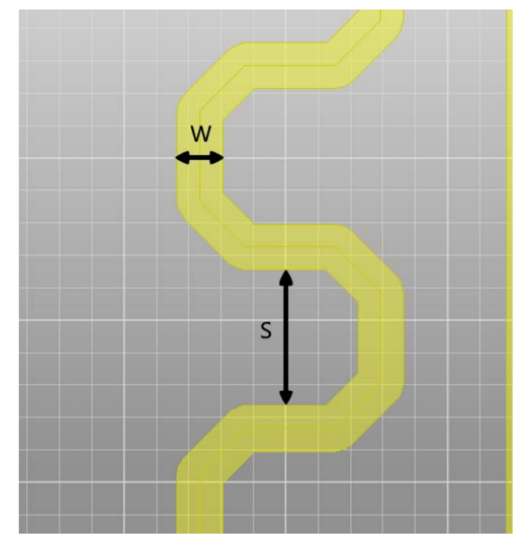

3. DDR 颗粒区域，一个管脚对应一个 GND 过孔，有空间的区域尽可能增加 GND 过孔
4. 调整过孔位置，优化平面的裂缝，改善回流路径

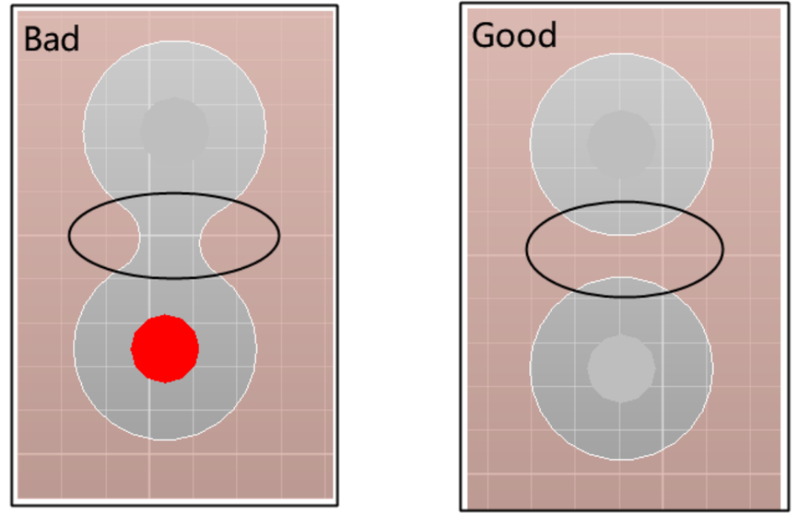

5. 每个电容焊盘建议至少一个过孔，对于 0603/0805 封装的电容建议一个焊盘对应两个过孔，且过孔靠近管脚位置，减少回路电感。

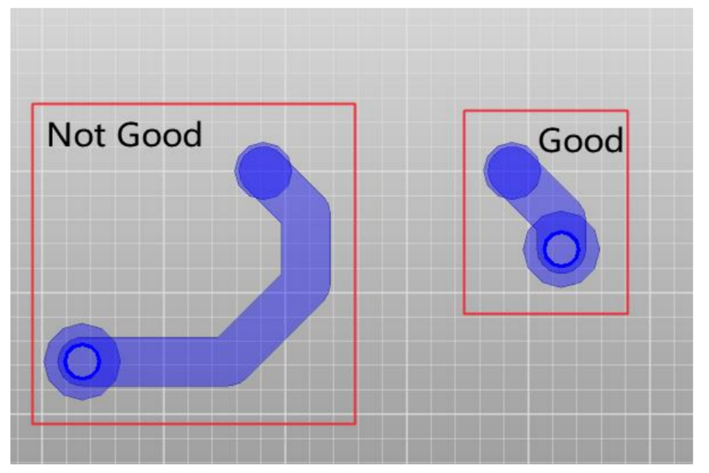

#### 2.5.3 EMMC - PCB Layout 推荐设计

EMMC 和 CPU 直接的间距，建议按我们给出的参考板设计。如果受空间限制，需自行设计，请尽量缩短 CPU 到 EMMC 的走线距离，需控制在 1500mil 范围内。D0-D7、RE、WE 相对于 CLK 做等长，控制在\<=100mil。

### 2.6 接口设计

#### 2.6.1 GMAC 信号 PCB 设计

GMAC 信号走线尽量短，且减少换层次数，走线具体要求请参照下面表格：

<table>
<tbody>
<tr>
<td>走线阻抗</td>
<td>单端50ohm +/-10%</td>
</tr>
<tr>
<td>时钟与数据之间等长</td>
<td>&lt; 100mil</td>
</tr>
<tr>
<td>走线长度</td>
<td>&lt; 4000mil</td>
</tr>
<tr>
<td>GMAC信号线之间间距</td>
<td>3倍GMAC线宽</td>
</tr>
</tbody>
</table>

#### 2.6.2 SDIO 信号 PCB 设计

SDIO 各走线上勿有残桩（Stub），且必须参考 GND，SDIO 各走线穿层 VIA 需小于 4 个，SDIO 各走线周边必须包 GND 增加信号稳定性。最好方式是 CLK/CMD/DATA0-3 每根信号都单独包地，如果空间受限，可接受 CLK、CMD 单独包地，DATA0-DATA1 放一起包地，DATA2-DATA3 放一起包地。具体请参照下表格和图片示意：

<table>
<tbody>
<tr>
<td>走线阻抗</td>
<td>单端50ohm +/-10%</td>
</tr>
<tr>
<td>时钟与数据之间等长</td>
<td>&lt; 100mil</td>
</tr>
<tr>
<td>走线长度</td>
<td>&lt; 2500mil</td>
</tr>
<tr>
<td>SDIO信号线之间间距</td>
<td>3倍SDIO线宽</td>
</tr>
</tbody>
</table>


#### 2.6.3 USB2.0 信号 PCB 设计

<table>
<tbody>
<tr>
<td>走线阻抗</td>
<td>差分90ohm +/-10%</td>
</tr>
<tr>
<td>差分对P/N最大时延差</td>
<td>&lt;= 5mil</td>
</tr>
<tr>
<td>走线长度</td>
<td>&lt; 5000mil</td>
</tr>
<tr>
<td>差分对间间距</td>
<td>大于等于3倍USB线宽</td>
</tr>
<tr>
<td>USB2.0与其它信号间距</td>
<td>大于等于3倍USB线宽</td>
</tr>
<tr>
<td>换层过孔数量</td>
<td>不超过3个</td>
</tr>
</tbody>
</table>

#### 2.6.4 USB3.0 信号 PCB 设计

<table>
<tbody>
<tr>
<td>走线阻抗</td>
<td>差分90ohm +/-10%</td>
</tr>
<tr>
<td>差分对P/N最大时延差</td>
<td>&lt;= 5mil</td>
</tr>
<tr>
<td>走线长度</td>
<td>&lt; 5000mil</td>
</tr>
<tr>
<td>差分对间间距</td>
<td>大于等于4倍USB线宽</td>
</tr>
<tr>
<td>USB3.0与其它信号间距</td>
<td>大于等于4倍USB线宽</td>
</tr>
<tr>
<td>换层过孔数量</td>
<td>不超过2个</td>
</tr>
</tbody>
</table>

#### 2.6.5 PCIE 信号 PCB 设计

PCIE 信号注意挖空焊盘，挖空焊盘后，注意走线不要跨参考，GND 隔离 PAD 建议双向都走地线且打孔，具体参数请参照下表格，走线示范如下：

<table>
<tbody>
<tr>
<td>参数</td>
<td>要求</td>
</tr>
<tr>
<td>走线阻抗</td>
<td>差分90ohm +/-10%</td>
</tr>
<tr>
<td>差分对P/N最大时延差</td>
<td>&lt;= 5mil</td>
</tr>
<tr>
<td>走线长度</td>
<td>&lt; 4000mil</td>
</tr>
<tr>
<td>差分对间间距</td>
<td>大于等于5倍PCIE线宽</td>
</tr>
<tr>
<td>PCIE与其它信号间距</td>
<td>大于等于5倍PCIE线宽</td>
</tr>
<tr>
<td>换层过孔数量</td>
<td>不超过2个</td>
</tr>
</tbody>
</table>


#### 2.6.6 HDMI 信号 PCB 设计

<table>
<tbody>
<tr>
<td>参数</td>
<td>要求</td>
</tr>
<tr>
<td>走线阻抗</td>
<td>差分90ohm +/-10%</td>
</tr>
<tr>
<td>差分对P/N最大时延差</td>
<td>&lt;= 5mil</td>
</tr>
<tr>
<td>走线长度</td>
<td>&lt; 4000mil</td>
</tr>
<tr>
<td>差分对间间距</td>
<td>大于等于5倍HDMI线宽</td>
</tr>
<tr>
<td>HDMI与其它信号间距</td>
<td>大于等于5倍HDMI线宽</td>
</tr>
<tr>
<td>换层过孔数量</td>
<td>不超过2个</td>
</tr>
</tbody>
</table>

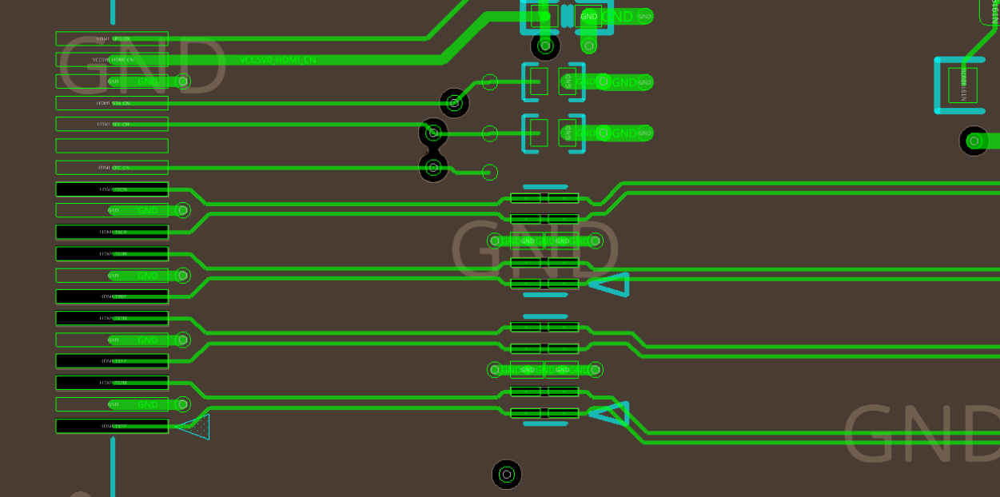

#### 2.6.7 MIPI 信号 PCB 设计

<table>
<tbody>
<tr>
<td>走线阻抗</td>
<td>差分90ohm +/-10%</td>
</tr>
<tr>
<td>差分对P/N最大时延差</td>
<td>&lt;= 5mil</td>
</tr>
<tr>
<td>时钟与数据之间等长</td>
<td>&lt;= 50mil</td>
</tr>
<tr>
<td>走线长度</td>
<td>&lt; 5000mil</td>
</tr>
<tr>
<td>差分对间间距</td>
<td>大于等于4倍MIPI线宽，至少要3倍MIPI线宽</td>
</tr>
<tr>
<td>MIPI与其它信号间距</td>
<td>大于等于4倍MIPI线宽，至少要3倍MIPI线宽</td>
</tr>
<tr>
<td>换层过孔数量</td>
<td>建议不超过2个</td>
</tr>
</tbody>
</table>


#### 2.6.8 Audio PCB 设计

1. 中间散热焊盘均匀打上地孔；
2. GMS0/GMS1 加粗 10mil 走线；
3. LOUT/ROUT/GMSO/GMS1 走线包地；


## 3. 整机 ESD 设计

- 关于系统 24MHz 时钟设计，要求客户选用 4pin 贴片晶振，其中 2 个 GND 管脚与单板地充分连接，增强系统时钟抗干扰能力。其他的走线远离晶振区域，不要在晶振底下有走线通过。
- 建议 PCB 器件布局设计时，小系统部分离金属接口部分越远，整机 ESD 性能越 好。
- 单板对外的接插件（例如音视频输入输出接口、USB、网口和报警等端口），需要增加 ESD 保护器件，加强接口的抗干扰能力。
- 整机设计为浮地设备时，单板金属化接口部分严禁采用分割地设计。
- 单板定位孔采用金属化过孔，并与单板 GND 连接，确保单板 GND 通过螺丝孔与金属外壳充分连接。
- 整机为接地设备时，要求金属外壳充分连接大地，分割保护地与单板数字地之间 采用单点连接，单点连接的位置要远离小系统电路，建议靠近整机电源连接器放置。
- 接口连接器外壳推荐采用金属外壳，且与整机金属外壳充分连接（例如带定位螺 丝的 HDMI 口和 USB 口，带弹片的 RJ45

## 4. 制造工艺

**FCCSP  17*17**
回流焊接温度曲线


**FCBGA  19*19**
回流焊接温度曲线
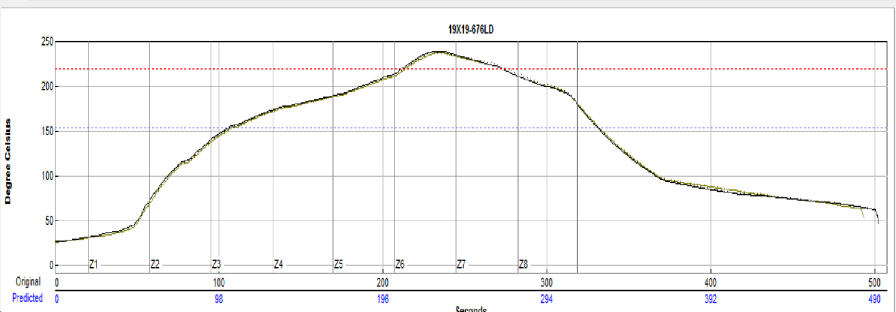

