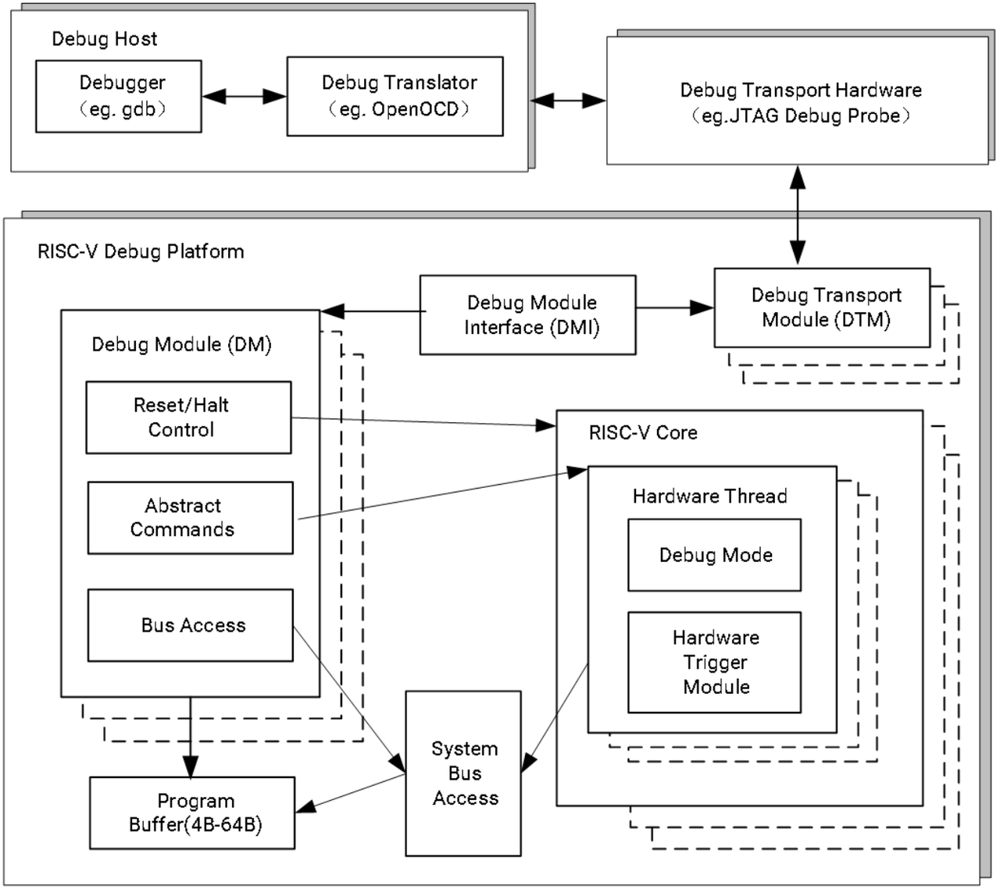
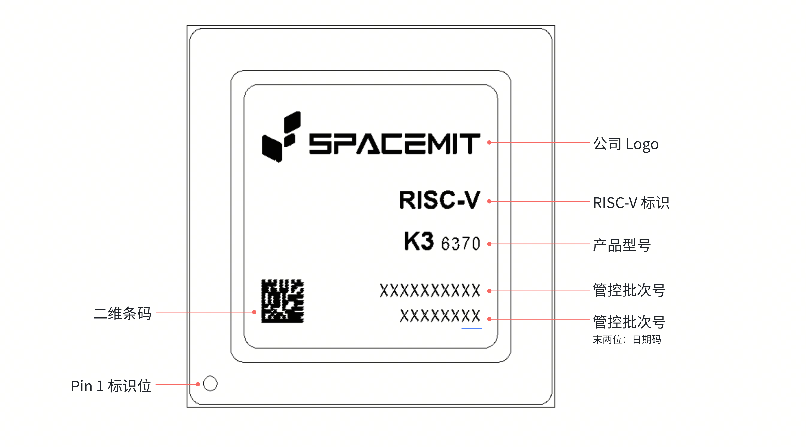
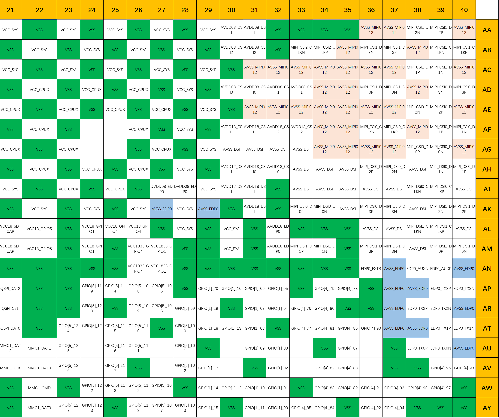

# K3 数据手册

## PDF 版本下载

点击下载 [K3 数据手册（PDF）](https://cdn-resource.spacemit.com/file/chip/K3/k3_datasheet_zh.pdf)

## 修订记录

| 版本号 | 日期 | 修订说明 |
| --- | --- | --- |
| **V1.6** | 2026.07.15 | 更新视频子系统参数 |
| **V1.5** | 2026.07.01 | 更新 A100 特性描述 |
| **V1.4** | 2026.06.10 | 增添 Part Number 描述 |
| **V1.3** | 2026.05.21 | 更新 A100 中断描述 |
| **V1.2** | 2026.05.19 | 更新视频子系统参数 |
| **V1.1** | 2026.05.08 | 更新图像子系统特性 |
| **V1.0** | 2026.04.30 | 首版 |

---

## 1. 概述

### 1.1 产品简介

SpacemiT Key Stone K3 系列芯片采用 RISC-V 同构融合计算技术，集成进迭时空的 8 个高性能计算大核 X100 及 8 个超宽并行计算 AI 核 A100，可提供 130 KDMIPS 通用算力及 60TOPS 通用 AI 算力，可流畅运行 300 亿参数模型。
K3 系列芯片主要应用在 AI 消费硬件如 AI 智慧家居、AI 会议办公、AI 内容创作、AI 电商零售等领域。

### 1.2 主要特性

**处理器子系统**  

- 8 个 X100™ 64 位 RISC-V 核心（四发射、乱序执行）  
- 总 CPU 性能：130 KDMIPS  
- SpecINT2006 > 9.0 /GHz；最高主频 2.4 GHz  
- 每 8 核共享 8MB L2 缓存

**AI 计算子系统**

- 8 核 A100™ 提供 60TOPS AI 算力  
- 支持最高 300 亿参数模型推理（>10 tokens/s @ 30B）  
- 兼容 RVV 1.0、RVA23 及 Vector Crypto 标准  
- 遵循 CPU 编程范式，实现零成本AI算法的部署

**内存子系统**  

- 64 位 LPDDR5（6400 Mbps）/ LPDDR4x（4266 Mbps）  
- 最大支持 32GB 内存容量，带宽可达 51GB/s

**实时处理子系统**  

- 双核 RT24™ 64 位 RISC-V 处理器  
- 六级单发按序流水线

**虚拟化与安全**  

- 支持 RVH 1.0、AIA 和 IOMMU 扩展，提供CPU、内存、中断、IO的完整硬件虚拟化能力  
- 硬件级防护机制，抵御 Spectre、Meltdown 等推测执行攻击  
- 支持 RISC-V PMP、ePMP 和 IOPMP 安全框架  
- 安全启动、安全存储与签名验证  
- 加密算法支持：AES、SHA、RSA、SM2、SM3、SM4  
- 支持产品生命周期安全管理

**存储接口**  

- SPI Flash、eMMC 5.1、UFS 2.2、SDIO 3.0、PCIe NVMe  

**多媒体与显示**

- 集成 3D 图形引擎，支持 Vulkan、OpenCL、OpenGL ES  
- 支持 4K@180fps 视频解码与 4K@90fps 视频编码（兼容 H.265、H.264、VP8 及 VP9 编解码格式）
- 通过 MIPI-DSI（8 通道，4.5 Gbps/通道）和 DP/eDP 接口，可实现双路 3840×2160@60fps 显示输出。  
- 4 个 MIPI-CSI 接口（共 12 条通道），最多支持 12 路摄像头输入。

**IO 扩展接口**  

- 8 条 PCIe Gen3 通道（8 Gbps/通道），支持 RC/EP 模式及热插拔  
- 3 × USB 3.0 Host，1 × USB 3.0 DRD（Type-C），1 × USB 2.0 Host  
- 4 × GMAC（支持 RGMII/RMII/MII），集成 TSN 协议  
- 6 × SPI，2 × eSPI，17 × UART，10 × CAN，9 × I²C，30 × PWM

**功耗**  

- TDP: 15–25 W  

**环境与可靠性**  

- 工作温度范围：–40 °C 至 +85 °C（工业级）

## 1.3 架构框图

## 2. 规格参数

### 2.1 CPU 子系统

#### 2.1.1 SpacemiT® X100™ RISC-V 核

**简介**  
SpacemiT® X100™ 是一款高性能、四发射、乱序执行的多核多簇 RISC-V 处理器，符合 RVA23 指令集架构规范，专为服务器、自动驾驶系统及云端 AI 推理平台等高负载计算场景优化设计。  
X100 在追求极致性能的同时，具备完善的虚拟化能力、强大的安全韧性以及 RAS（可靠性、可用性、可服务性）特性，是面向数据密集型与任务关键型应用的可扩展高性能解决方案。

**特性**
- 合规性：完全符合 RISC-V RVA23 标准  
- 缓存架构：  
  - 每核心配备 64 KB L1 指令缓存（I-Cache）和 64 KB L1 数据缓存（D-Cache）  
  - 每簇共享 4 MB L2 缓存  
  - L1 D-Cache 支持 MESI 一致性协议  
  - L2 Cache 支持 MOESI 一致性协议  
- 向量扩展：RVV 1.0，VLEN = 256  
- 虚拟化扩展：RVH 1.0，GEILEN = 8  
- 高级中断架构（AIA）：  
  - M 模式 MSI：512
  - S 模式 MSI：512
  - VS 模式 MSI：64
- 中断控制器：支持 ACLINT 与 APLIC，共支持 512 个中断源  
- 性能监控：RISC-V性能监控单元（PMU）支持  
- 虚拟内存：支持 SV39 虚拟内存管理  
- 安全框架：  
  - 符合 RISC-V 安全规范，提供 16 项 PMP（物理内存保护）条目  
  - 支持 RISC-V 调试（Debug）、追踪（Trace）及 RERI（运行时错误报告与恢复）框架  
- RVA23 可选扩展（未包含在 RVA23 基础规范中）：  
  - 向量加密扩展：`zvkng`, `zvksg`  
  - 其他扩展：`zvbc`, `zfh`, `zbc`, `zvfh`, `zfbmin`, `zvfbfmin`, `zvfbfwma`  
  - 系统与安全扩展：`sdtri`, `svvptc`, `sspm`, `smepmp`, `smstateen`, `smcntrpmf`

**架构框图**  

#### 2.1.2 SpacemiT® A100™ AI 核

**简介**  
SpacemiT® A100™ 是一款以 AI 为中心的 RISC-V AI处理器，通过自研的 SpacemiT-IME 指令集提供原生的AI计算能力。其微架构针对算子级并行性、内存带宽效率和数据局部性进行了深度优化，可高效执行各类真实场景下的 AI 工作负载。  
除强大的 AI 加速能力外，A100 完整支持 RVA23* 规范定义的通用 CPU 功能，并采用标准 RISC-V 统一编程模型，为本地语言模型（SLM）及广泛的 AI 原生应用提供强大算力支撑。

**特性**  
- AI 计算性能：60 TOPS（@INT4 sparse）  
- RISC-V 合规性：完全符合 RISC-V RVA23* 标准  
- 缓存架构：  
  - 每核心配备 32 KB L1 指令缓存（I-Cache）和 32 KB L1 数据缓存（D-Cache）  
  - 每簇共享 1 MB L2 缓存  
  - 每簇配备 1.5 MB 片上暂存存储器（Scratchpad）  
  - L1 D-Cache 支持 MESI 一致性协议  
  - L2 Cache 支持 MOESI 一致性协议  
- 向量扩展：RVV 1.0，VLEN = 1024  
- 中断控制器：符合 AIA 标准的 ACLINT 和 APLIC 中断控制器
- MSI 中断数量：
  - M 模式：511
  - S 模式：511
  - VS 模式：7 个 VS 中断文件，每个中断文件支持 63 个 MSI 中断  
- 性能监控：集成 RISC-V 性能监控单元（PMU）  
- 虚拟内存：支持SV39虚拟内存管理  
- 安全框架：  
  - 符合 RISC-V 安全规范，提供 32 项 PMP（物理内存保护）条目  
  - 支持 RISC-V 调试（Debug）与追踪（Trace）功能  
- RVA23* 可选扩展（未包含在 RVA23 基础规范中）：  
  - 向量加密扩展：`zvkng`, `zvksg`  
  - 其他扩展：`zvbc`, `zfh`, `zbc`, `zvfh`, `zfbmin`, `zvfbfmin`, `zvfbfwma`  
  - 系统与安全扩展：`sdtri`, `svvptc`, `sspm`, `smepmp`, `smstateen`, `smcntrpmf`

> **注意**：A100 AI 核心中的 RVA23* 不包含 Hypervisor 虚拟化扩展。

**架构框图**

#### 2.1.3 RT24 RISC-V 核

**简介**  
RT24 作为 K3 SoC 中的系统管理核心，基于 OpenHW Group 开源的 64 位 RISC-V 处理器 CVA6 构建，采用六级顺序单发射流水线架构，支持 RV64GC 指令集，并兼容类 Unix 操作系统。该核心专为高能效与高可靠性设计，负责全芯片的控制协调、电源管理及低功耗任务调度等关键功能。

**特性**  
- 超低待机与运行功耗  
- 实现 RV64IMAFDC（即 RV64GC）指令集  
- 支持 RISC-V 三级特权模式：M（机器态）、S（监管态）、U（用户态）  
- 通过 ITLB、DTLB 和 PTW 单元实现虚拟地址转换  

**架构框图**  

#### 2.1.4 调试子系统（Debug）

**简介**  
调试接口是软件与处理器进行交互的关键通道。通过该接口，用户可访问 CPU 寄存器、内存内容以及其他片上设备信息此外。还可以通过调试接口执行程序下载等任务。

**架构框图**  
调试接口的微架构如下图所示：

如图所示，调试系统由以下组件构成：  

- 调试软件（例如 GDB）  
- 调试代理服务（例如 OpenOCD）  
- 调试器（例如 JTAG 调试探针）  
- 调试接口（例如 Debug Transport Module, DTM）

各组件之间的连接关系如下：  

- 调试软件通常通过网络与调试代理服务通信  
- 调试代理服务一般通过 USB 与调试器连接  
- 调试器通过 JTAG 接口与 CPU 交互  

JTAG 内存访问支持两种模式：progbuf 和 sysbus：  

- progbuf 模式：标准 JTAG 访问方式，通过 CPU 执行指令缓冲区（program buffer）来访问内存  
- sysbus 模式：绕过 CPU，直接通过系统总线访问（System Bus Access, SBA）端口读写片上资源  

#### 2.1.5 追踪子系统（Trace）

**简介**  
RISC-V 追踪系统提供了一套硬件与软件协同的接口，用于调试和分析单个硬件线程（hart）的执行轨迹，包括其内存访问的详细信息。  
当 RISC-V hart 通过 RISC-V 追踪规范定义的入口端口（ingress port）输出程序执行流与内存访问轨迹时，片上追踪编码器会对数据进行压缩，以实现高效传输。  
压缩后的追踪数据可暂存于片上存储中，随后由主机端的解码软件重建完整的执行流程，使开发者能够精确观测 hart 的运行时行为。

**特性**  
K3 中 X100 与 A100 核心的追踪组件完全符合 RISC-V N-Trace 协议，并支持其配套接口——RISC-V 追踪控制接口（Trace Control Interface）与 RISC-V Hart-to-Trace 接口。关键特性包括：

- 每个 X100 核 / A100 核 配备独立的追踪编码器  
- 集成 ATB（AMBA Trace Bus）桥接模块，用于连接至 ATB 总线  
- 支持 BTM（Branch Trace Mode）分支轨迹压缩  
- 可选消息类型（如所有权消息），提升在复杂操作系统环境下的追踪处理能力  
- 通过调试触发器（debug triggers）实现精准的追踪启停控制  
- 扩展压缩能力，例如虚拟地址压缩，进一步提升追踪效率  

**架构框图**

### 2.2 内存与存储

#### 2.2.1 片上存储（On-Chip Memory）

**简介**  
K3 集成了以下片上存储资源：
- 128 KB Boot ROM：用于存放一级引导代码，支持从多种外部介质启动，并支持通过 USB 与 UART 下载程序；支持基于 eFuse 的安全启动。
- 512 KB SRAM：由主 CPU 与 RCPU 共享使用。  

#### 2.2.2 LPDDR4x/5

**简介**  
动态内存接口为外部 LPDDR4x 和 LPDDR5 DRAM 提供高性能、低功耗的连接，支持灵活配置与动态频率调节，可在不同应用场景下平衡带宽与能效。

**特性**
- 支持 LPDDR4x 与 LPDDR5 内存类型：  
  - LPDDR4x 最高数据速率：4266 MT/s  
  - LPDDR5 最高数据速率：6400 MT/s  
- 最大寻址空间：32 GB  
- 双通道架构，每通道 32 位数据宽度  
- 每通道支持两个 Rank  
- 支持动态频率调节（DFS），可根据带宽需求实时调整频率以优化功耗  

#### 2.2.3 Quad-SPI

**简介**  
Quad-SPI 接口用于 SoC 与外部串行 Flash 存储器之间的通信，支持最多四条双向数据线传输，具备高灵活性并兼容多种 Flash 器件。

**特性**  
- 支持 XIP（Execute-In-Place）模式与 Page 模式  
- 数据线宽度可独立配置为 1/2/4 线  
- 时钟频率范围：13.25 MHz 至 102 MHz  
- 支持 SPI NOR Flash 与 SPI NAND Flash  
- 支持 1.8 V 与 3.3 V 信号电平  

#### 2.2.4 eMMC 接口

**简介**  
eMMC 接口作为 eMMC 总线的主机控制器，实现外部 eMMC 卡与内部系统总线主设备之间的数据传输。

**特性**  
- 符合 8 位 eMMC 5.1 规范  
- 兼容SDHCI寄存器集，并包含额外的供应商专用寄存器  
- 支持 1 位 / 8 位 MMC 及 CE-ATA 卡  
- 支持 SDHCI 规范定义的数据传输方式：  
  - PIO  
  - SDMA  
  - ADMA  
  - ADMA2  
- 支持 eMMC 卡的 SPI 模式操作  
- 支持 eMMC 5.1 定义的以下速度模式：  
  - 传统模式：带宽高达26 MB/s，信号电压1.8 V  
  - 高速SDR：带宽高达52 MB/s，信号电压1.8 V  
  - 高速DDR：带宽高达52 MB/s，信号电压1.8 V  
  - HS200：带宽高达200 MB/s，信号电压1.8 V  
  - HS400：带宽高达400 MB/s，信号电压1.8 V  
- 支持硬件自动生成所有命令与数据事务，并进行 CRC 校验  
- 配备 1024 字节数据 FIFO 缓冲区（2 × 512 字节数据块）  

#### 2.2.5 SD/MMC 接口

**简介**
SD/MMC 接口作为 SD/MMC 总线的主机控制器，实现外部 SD/MMC 卡与内部系统总线主设备之间的数据传输。

**特性**
- 符合 4 位 SD 3.0 UHS-I 规范  
- 兼容 SDHCI 寄存器集，并包含额外的供应商专用寄存器  
- 支持 1 位 / 4 位 SD 存储卡  
- 支持 SDHCI 规范定义的数据传输方式：  
  - PIO  
  - SDMA  
  - ADMA  
  - ADMA2  
- 支持 SD 3.0 定义的以下速度模式：  
  - 默认速度：带宽高达 12.5 MB/s，信号电压 3.3 V  
  - 高速：带宽高达 25 MB/s，信号电压 3.3 V  
  - SDR12：时钟频率高达 25 MHz，信号电压 1.8 V  
  - SDR25：时钟频率高达 50 MHz，信号电压 1.8 V  
  - SDR50：时钟频率高达 100 MHz，信号电压 1.8 V  
  - SDR104：时钟频率高达 208 MHz，信号电压 1.8 V  
  - DDR50：时钟频率高达 50 MHz，信号电压 1.8 V  
- 支持硬件自动生成所有命令与数据事务，并进行 CRC 校验  
- 支持读等待控制及 SD/MMC 卡的挂起/恢复功能  
- 通过 GPIO 模式支持卡插拔检测  
- 配备 1024 字节数据 FIFO 缓冲区（2 × 512 字节数据块）  

#### 2.2.6 UFS 接口

**简介**  
UFS（Universal Flash Storage）接口为 SoC 提供高性能、低功耗的大容量存储解决方案，符合 JEDEC UFS 2.2、MIPI UniPro v1.6 及 MIPI M-PHY v3.0 规范。  

UFS 通过串行接口支持最多 2 条通道，提供 2 路发送（TX）和 2 路接收（RX），实现全双工通信。支持高速模式（HS-GEAR3）与低速模式（PWM-GEAR1），兼具高带宽与低延迟特性。支持标准 SCSI 命令集，并允许系统直接从 UFS 存储启动。

**特性**  
- 符合 JEDEC UFS 2.2 规范  
- 符合 MIPI UniPro v1.6 与 MIPI M-PHY v3.0 规范  
- 支持串行接口协议：  
  - 高速模式（HS-GEAR3）：最多 2 TX + 2 RX 通道  
  - 低速模式（PWM-GEAR1）  
- 支持标准 SCSI 命令操作  
- 支持从 UFS 存储直接启动系统

### 2.3 图像子系统

#### 2.3.1 MIPI 摄像头输入接口（MIPI Camera IN Interface）

**简介**  
MIPI 摄像头输入接口集成了四个 MIPI-CSI2 v1.1 控制器，每个控制器配备最多四条数据通道，单通道最高传输速率达 1.5 Gbps。

**特性**  
- 可配置数据通道数：1、2 或 4 条  
- 独立 D-PHY 资源：  
  - CSI0 与 CSI1 各自拥有专用的 D-PHY 接口  
- 共享 D-PHY 资源：  
  - CSI2 与 CSI3 共享一个 4-lane D-PHY 接口；  
    - 单独使用时，每个接口最多支持 4 条通道；  
    - 同时使用时，每个接口最多支持 2 条通道  
- 支持的输入数据格式：  
  - Legacy YUV420 8-bit  
  - YUV420 8-bit
  - YUV422 8-bit  
  - RAW8  
  - RAW10  
  - RAW12  
  - 嵌入式数据类型（Embedded Data）  
- 支持的数据交织类型：  
  - 数据类型交织（Data-type Interleaving）  
  - 虚拟通道交织（Virtual-channel Interleaving）

**架构框图**

#### 2.3.2 GPU（图形处理单元）

**简介**  
本 GPU 架构基于多线程统一着色集群设计，采用高 SIMD 效率的 ALU 架构，并采用基于图块的延迟渲染（Tile-Based Deferred Rendering, TBDR）管线，支持多图块并发处理，可高效执行高性能 3D 图形与通用计算（GPGPU）任务。

**特性**  
- 全面兼容主流图形与计算 API：  
  - OpenGL ES 1.1 / 3.2  
  - EGL 1.5  
  - OpenCL 3.0  
  - Vulkan 1.3  
- 基于图块的延迟渲染 (TBDR) 技术，用于 3D 图形处理，支持并发多图块处理  
- 可编程、抗锯齿（Anti-Aliasing）高质量图像
- 细粒度三角形剔除（Triangle Culling），提高渲染效率  
- 支持 DRM 安全 
- 支持 GPU 虚拟化，最多可创建 8 个虚拟 GPU 实例  
- 多通道隔离技术，提供最多 8 个独立逻辑通道  
- 每个通道/OS 上下文拥有独立 IRQ  
- 与神经网络加速器配合使用时，可选 AI 加速协作 
- 多线程统一着色引擎，支持：  
  - 像素着色（Pixel Shading）  
  - 顶点着色（Vertex Shading）  
  - 通用计算着色器（Compute Shader / GPGPU）  
- ALU 架构针对高 SIMD 利用率优化  
- 采用统一内存架构（UMA）下的全虚拟化内存寻址  
- 细粒度任务切换、负载均衡与电源管理
- 高级 DMA 驱动操作，最小化主机 CPU 干预  
- 128 KB 系统级缓存（SLC）  
- 专用纹理缓存单元
- 压缩纹理解码支持
- 几何处理阶段执行无损几何压缩
- 帧缓冲区支持无损或视觉无损压缩，显著降低带宽需求  
- 用于 GPU 内核管理的专用固件处理器：  
  - 单线程设计  
  - 2 KB 指令缓存 + 2 KB 数据缓存  
  - 独立功耗域（Power Island）  
- 片上性能、功耗与统计寄存器，用于系统实时监控  

#### 2.3.3 V2D（2D 图形加速模块）

**简介**  
V2D 是一个专用的 2D 硬件加速模块，支持常见的 2D 图像操作，包括格式转换、旋转、镜像、缩放、裁剪、纯色填充及 Alpha 混合等。

**特性**  
- 缩放能力：  
  - 最大支持 8× 放大  
  - 最小支持 1/8× 缩小  
- 旋转与镜像：  
  - 支持 0°、90°、180°、270° 旋转  
  - 支持水平/垂直镜像与翻转  
- 混合与合成：  
  - 支持简单图层与背景混合  
- 图像裁剪（Cropping）  
- 纯色填充（Solid Fill）
- 色彩空间转换：  
  - RGB 与 BT.601 / BT.709（窄域与全域）互转  
- 最大分辨率支持：4096 × 2160  
- 抖动（Dithering）处理，实现更平滑的色彩过渡  
- 支持内存管理单元（MMU）  
- 总线接口：APB3、AXI3  
- 支持的输入格式：  
  - RGB888、RGBX888、RGBA8888、ARGB8888（可选 R/B 交换）  
  - RGB565、RGBA5658、ARGB8565（可选 R/B 交换）  
  - A8（8-bit Alpha 图像）、Y8（8-bit 灰度图）  
  - YUV420 半平面格式（UV 可交换）  
  - AFBC 16×16 RGBA8888（Layout0，支持 split/non-split）  
  - AFBC 16×16 NV12（Layout1，支持 split/non-split）  
- 支持的输出格式：  
  - 与输入格式一致，包括 RGB、ARGB、A8、Y8、YUV420 及各类 AFBC 变体

### 2.4 视频子系统

#### 2.4.1 简介

视频处理单元（Video Processing Unit，VPU）是一款四核视频加速器，支持多种视频标准的编解码处理。VPU 内置主机 CPU，并通过运行固件对硬件引擎进行控制，负责比特流解析、子模块调度以及错误恢复等任务。

VPU 最高运行频率可达 1 GHz，支持广泛的视频标准，包括 H.265、H.264、VP8、VP9、MPEG4、MPEG2 和 H.263。其典型并发处理能力包括：
- 支持 4K@60fps 同编同解 
- 4K@90fps H.264/H.265 编码  
- 4K@180fps H.264/H.265 解码  

各视频编解码标准的实际处理均由专用硬件逻辑完成。宏块序列控制器（Macroblock Sequencer）作为主控单元，负责调度各子模块的处理流程，从而减轻处理器负载并降低固件复杂度。

此外，多个与标准无关的模块在运行时共享通用逻辑，以确保在不同视频标准下均具备高效率与流畅的性能表现。

#### 2.4.2 视频编码器（Video Encoder）

**通用编码特性**  
- 可配置的 Arm 帧缓冲压缩 (AFBC) 1.0 或 1.2 版本用于输入  
- 支持 YUV422 与 YUV420 AFBC 块分割（16×16）  
- 支持 stride（不适用于 AFBC 输入格式）  
- 支持水平/垂直镜像（不适用于 AFBC 输入格式）  
- 可选在编码前对输入帧进行 90° 步进旋转（不适用于 AFBC 输入格式）  

> **注意**：若 YUV422 格式在未转换为 YUV420 的情况下进行 90° 或 270° 旋转，输出将自动转为 YUV440 格式。

**支持的源帧输入格式**  
- 单平面 YUV422，逐行扫描，YUYV 或 UYVY 交错排列  
  > **注意**：YUV422 输入可转换为 YUV420  
- 单平面 RGB（8-bit），字节顺序：RGBA、BGRA、ARGB、ABGR  
- 双平面 YUV420，逐行扫描，色度分量 UV 或 VU 交错  
- 三平面 YUV420，逐行扫描  
  > **注意**：仅支持用于测试目的；不建议用于最佳性能  
- AFBC YUV422  
- AFBC YUV420  

**支持的编码格式**  
- HEVC（H.265）Main Profile  
- HEVC (H.265) Main 10 Profile
- H.264 Baseline Profile（BP）  
- H.264 Main Profile（MP）  
- H.264 High Profile（HP）  
- VP8  
- VP9 Profile 0
- JPEG, baseline sequential

**HEVC (H.265) 编码特性**  
- 输出比特流符合 HEVC Main Profile  
- 编码性能：4K@90fps
- 最大帧尺寸：4096 × 4096 像素  
- 位深：8-bit，支持 I、P、B 帧  
- 支持分块模式（Tiled Mode），最多 4 个分块（仅支持水平分割）
- 运动估计（ME）：  
  - 搜索窗口：水平方向 ±128 像素，垂直方向 ±64 像素  
  - 精度：支持低至 1/4 像素（QPEL）  
- 帧内预测模式：  
  - 亮度（Luma）：8×8、16×16、32×32  
  - 色度（Chroma）：4×4、8×8、16×16  
- 帧间预测模式：8×8、16×16、32×32  
- 变换尺寸：  
  - 亮度：8×8、16×16、32×32  
  - 色度：4×4、8×8、16×16  
- 去块滤波（Deblocking Filter）  
- 量化方式：固定 QP 或基于漏桶模型的码率控制（依据目标码率与缓冲区大小）  
- 支持长参考帧（Long-term Reference Frames）
- 支持按 CTU 行粒度插入 Slice

> **注意**：编码器不阻止输出超过每 CTU 的最大比特数限制

**H.264 编码特性**  
- 编码比特流符合 Baseline、Main 与 High Profile  
- 编码性能：4K@90fps
- 最大帧尺寸：4096 × 4096 像素  
- 帧类型：支持 I 帧、P 帧和 B 帧  
- 熵编码：CABAC 或 CAVLC  
  > 注意：CAVLC 不支持 B 帧  
- 运动估计（ME）：  
  - 搜索窗口：水平方向 ±128 像素，垂直方向 ±64 像素  
  - 精度：支持低至 1/4 像素（QPEL）  
- 帧内预测模式：  
  - 亮度：4×4、8×8、16×16  
  - 色度：8×8  
- 帧间预测模式：8×8、16×16  
- 变换尺寸：4×4、8×8  
- 去块滤波（Deblocking Filter）  
- 量化方式：固定 QP 或基于漏桶模型的码率控制（依据目标码率与缓冲区大小）  
- 支持长参考帧（Long-term Reference Frames）  
- Slice 插入粒度：32 像素高的行  

> **注意**：  
> 1. 更多细节请参见 ITU-T H.264 Annex B: VC-1 Compressed Video Bitstream Format and Decoding Process  
> 2. 编码器不阻止输出超过每宏块的最大比特数限制

**VP8 编码特性**  
- 编码性能：4K@90fps
- 最大帧尺寸：2048 × 2048 像素  
- 帧类型：支持 I 帧与P 帧  
- 运动估计（ME）：  
  - 搜索窗口：水平方向±128 像素，垂直方向±64 像素  
  - 精度：支持低至 1/4 像素（QPEL）  
- 帧内预测模式：  
  - 亮度：4×4、8×8、16×16  
  - 色度：8×8  
- 帧间预测模式：8×8、16×16  
- 去块滤波  
- 量化方式：固定 QP 或基于漏桶模型的码率控制（依据目标码率与缓冲区大小）  

**VP9 编码特性**  
- 输出比特流符合 VP9 Profile 0（8-bit）  
- 编码性能：4K@90fps
- 最大帧尺寸：4096 × 4096 像素  
- 采样深度：8-bit  
- 帧类型：支持 I 与 P 帧
- 运动估计（ME）：  
  - 搜索窗口：水平方向±128像素，垂直方向±64像素  
  - 精度：支持低至1/4像素（QPEL）  
- 帧内预测模式：  
  - 亮度：8×8、16×16、32×32  
  - 色度：4×4、8×8、16×16  
- 帧间预测模式：8×8、16×16、32×32  
- 变换尺寸：  
  - 亮度：8×8、16×16、32×32  
  - 色度：4×4、8×8、16×16  
- 去块滤波  
- 量化方式：固定 QP 或基于漏桶模型的码率控制（依据目标码率与缓冲区大小）

#### 2.4.3 视频解码器（Video Decoder）

**通用解码特性**  
- 支持以下输出帧格式：  
  - 双平面 YUV420，逐行扫描，色度 UV 或 VU 交错  
  - 三平面 YUV420，逐行扫描  
    > **注意**：三平面格式仅用于测试，常规应用中不推荐以获得最佳性能  
- 为获得最佳性能，请确保 YUV 缓冲区对齐与 stride 设置正确  
- 支持 8-bit YUV420 AFBC 输出格式  
- 可配置 AFBC 1.0 或 AFBC 1.2 输出  
- Stride 仅适用于逐行扫描格式  
- 支持解码后输出前进行 90° 步进旋转  
  > **注意**：不适用于 AFBC 输出格式  
- 支持在每帧输出中报告每个 32×32 像素块的平均亮度（luminance）与色度（chrominance）值  

**支持的解码格式**
- HEVC（H.265）：Main Profile  
- H.264：Baseline、Main、High Profiles  
- VP8  
- VP9：Profile 0 和 Profile 2（10-bit）
- VC-1：Simple Profile（SP）、Main Profile（MP）、Advanced Profile（AP）  
- MPEG-4：Simple Profile（SP）、Advanced Simple Profile（ASP）  
- MPEG-2：Main Profile（MP）  
- H.263：Profile 0

**HEVC（H.265）解码特性**  
- 完全符合 Main Profile  
- 解码性能：4K@180fps
- 最大帧尺寸：4096 × 4096 像素

**H.264 解码特性**
- 完全符合 Baseline、Main、High 及 High 10 Progressive Profiles  
- 解码性能：4K@180fps
- 无论 NAL 数据包格式设置如何，始终启用转义选项，以防止模拟网络抽象层 (NAL) 单元起始码  

> **注意**：更多细节请参见 ITU-T H.264 Annex B: VC-1 Compressed Video Bitstream Format and Decoding Process

**VP8 解码特性**  
- 完全符合 VP8 规范  
- 解码性能：4K@180fps
- 最大帧尺寸：2048 × 2048 像素

**VP9 解码特性**  
- 完全符合 Profile 0  
- 解码性能：4K@180fps
- 最大帧尺寸：4096 × 4096 像素  

**VC-1 解码特性**  
- 完全符合 VC-1 SP (Simple Profile), MP (Main Profile), and AP (Advanced Profile)  
- 解码性能：4K@120fps
- 最大帧尺寸：2048 × 4096 像素

**MPEG4 解码特性**  
- 符合 MPEG-4 SP (Simple Profile) 与 ASP (Advanced Simple Profile)  
- 支持全局运动补偿（GMC），限制为单 warp 点  
- 解码性能：4K@120fps
- 最大帧尺寸：2048 × 2048 像素

**MPEG2 解码特性**  
- 符合 MPEG-2 MP (Main Profile)  
- 解码性能：4K@120fps
- 最大帧尺寸：  
  - 逐行流：宽度最高 4096 像素  
  - 隔行流：宽度最高 2048 像素，高度最高 4096 像素

**H.263 解码特性**  
- 符合 H.263 Profile 0  
- 解码性能：4K@120fps  
- 最大帧尺寸：宽高均达 2048 像素

### 2.5 显示子系统

#### 2.5.1 显示控制器

**简介**  
显示控制器是一个硬件模块，负责将内部存储器中的显示数据传输至 DSI 和 DP/eDP 控制器。该模块支持高分辨率面板及多种高级图像处理功能。

**特性**  
- 分辨率支持：    
  - 3840 × 2160 @ 60 fps  s
  - 2560 × 1440 @ 144 fps  
- 图层合成（Layer Composition）：  
  - 支持最多 4 个全尺寸图层合成器  
  - 通过 RDMA 通道的上下图层复用机制，最多可支持 16 个图层合成器  
- 命令与回写（Command & Write-Back）：  
  - 采用 `cmdlist` 机制配置硬件寄存器  
  - 支持原始格式与 AFBC 格式的并发回写  
  - 回写路径中支持抖动（Dithering）、裁剪（Cropping）和旋转（Rotation）  
- 内存管理：  
  - 配备高级 MMU，在 90° 与 270° 旋转操作中几乎无页缺失（Page Miss）  
- 色彩与显示增强：  
  - 支持色键（Color Keying）与纯色生成  
  - 支持高级误差扩散（Error Diffusion）与基于图案的抖动算法  
  - 支持色彩饱和度与对比度增强  
  - 支持显示效果动态调节  
- 输入格式：  
  - ABGR2101010、ARGB2101010、BGRA2101010、RGBA2101010  
  - ABGR8888、ARGB8888、BGRA8888、RGBA8888  
  - XBGR8888、XRGB8888、BGRX8888、RGBX8888  
  - BGR888、RGB888、ABGR1555、RGBA5551、BGR565 / RGB565  
  - XYUV_444_P1_8、XYUV_444_P1_10、YVYU_422_P1_8、VYUY_422_P1_8  
  - YUV_420_P2_8、YUV_420_P3_8
   
- 输出格式：  
  - RGB888、RGB565、RGB666  
- 面板与模式支持：  
  - 支持视频模式（Video Mode）与命令模式（Command Mode，帧缓冲位于 LCM 中）  
  - 支持嵌入式 DFC 缓冲区实现 DDR 频率动态调节  
- 源格式支持：  
  - 同时支持 AFBC 与原始图像源  

#### 2.5.2 MIPI DSI 接口

**简介**  
MIPI 显示串行接口（MIPI Display Serial Interface, DSI）是一种高速接口，用于连接主处理器与显示外设，完全符合 MIPI 联盟针对移动与嵌入式设备制定的相关规范。

**特性**  
- 标准合规性：  
  - MIPI DSI v1.2  
  - MIPI D-PHY v1.2  
  - Display Command Set (DCS) 标准  
- 通道与速率支持：  
  - 最多支持 8 条数据通道  
  - 单通道最高传输速率可达 4.5 Gbps  
  - 每个 D-PHY 链路支持 1 个活动面板  
- 分辨率支持：  
  - 最高支持 3840 × 2160 @ 60 fps 或 2560 × 1440 @ 90 fps  
- 工作模式：  
  - 命令模式（Command Mode）  
  - 视频模式（Video Mode）  
  - 视频突发模式（Video Burst Mode）  
- 信号类型支持：  
  - HS-TX（高速发送）  
  - LP-TX / LP-RX（低功耗发送 / 接收）  
  - LP-CLK / LP-CD（低功耗时钟 / 数据）  
- 数据与通道特性：  
  - 支持 DSI 与 DCS 规范定义的所有像素格式  
  - 支持 MIPI 链路上的虚拟通道（Virtual Channels）  
  - 支持突发视频模式，D-PHY 单通道速率最高达 4.5 Gbps

#### 2.5.3 DP/eDP 控制器

**简介**  
DP/eDP 控制器是一种显示接口控制器，用于管理从 SoC 到外部 DisplayPort (DP) 或嵌入式 DisplayPort (eDP) 面板的数据传输。

**特性**  
- 符合 DisplayPort（DP）v1.2 标准  
- 符合嵌入式 DisplayPort（eDP）v1.4 标准  
- 支持最高分辨率：3840 × 2160 @ 60 fps 或 2560 × 1440 @ 144 fps

### 2.6 音频子系统

#### 2.6.1 简介 

K3 SoC 集成了一个功能完备的音频子系统，旨在提供高音质、低延迟的音频性能。该子系统包含多个 I²S 接口和 DisplayPort 音频接口，可广泛支持多媒体播放、语音通信等多样化应用场景中的录音与回放需求。

子系统包含以下主要接口：  
- 6 路全双工 I²S 接口 
- 4 路半双工 I²S 接口（其中两路连接至 DP/eDP 控制器）  
- 2 路 DP/eDP 音频接口

#### 2.6.2 全双工 I²S 接口特性

- 支持全双工操作，可同时进行播放与录音  
- 符合标准 I²S 音频格式规范  
- 固定音频参数：  
  - 采样率：48 kHz  
  - 数据位宽：16 位  
  - 声道数：2（立体声）  
- 可配置系统时钟（sysclk）模式：64fs、128fs 或 256fs  

#### 2.6.3 半双工 I²S 接口特性  

- 支持半双工模式下的播放或录音  
- 兼容标准 I²S、左对齐（Left-Justified）和右对齐（Right-Justified）格式  
- 基础音频参数：  
  - 采样率：48 kHz  
  - 数据位宽：16 位  
  - 声道数：2（立体声）  
- 支持 TDM（时分复用）模式：  
  - 支持 DSP_A 与 DSP_B 模式  
  - 采样率：48 kHz  
  - 数据位宽：16 位 / 32 位  
  - 最多支持 4 个声道

#### 2.6.4 DP/eDP 音频接口特性 

- 支持通过 DisplayPort 或嵌入式 DisplayPort（eDP）链路传输音频  
- 兼容 I²S、左对齐及右对齐格式  
- 音频参数：  
  - 采样率：最高达 192 kHz  
  - 数据位宽：16 位 / 20 位 / 24 位  
  - 声道数：2（立体声）

### 2.7 互联子系统

#### 2.7.1 PCIe 3.0 （含IOMMU）

**简介**  
K3 SoC 集成了五个 PCIe 端口 —— PCIeA、PCIeB、PCIeC、PCIeD 和 PCIeE，每个端口均支持 PCIe Gen3 规范，单通道速率高达 8 GT/s。

- 通道配置：  
  - PCIeA 提供 8 条通道  
  - PCIeB 与 PCIeC 各提供 2 条通道  
  - PCIeD 与 PCIeE 各提供 1 条通道  
- 模式支持：  
  - PCIeA 支持双模式操作（Root Complex / Endpoint）  
  - PCIeB、PCIeC、PCIeD 和 PCIeE 仅支持 Root Complex（RC）模式  
- 虚拟通道（Virtual Channel）：  
  - PCIeB、PCIeC、PCIeD 和 PCIeE 支持 VC0 与 VC1  
- IOMMU 支持：  
  - PCIeA、PCIeB 和 PCIeE 支持 IOMMU，用于设备虚拟化  
- PHY 配置：  
  - 共集成 6 个 PHY，提供 8 条通道  
  - PHY0 与 PHY1 为双通道 PHY  
  - PHY2、PHY3、PHY4 与 PHY5 为单通道 PHY  
  - PHY2、PHY3 和 PHY4 在 PCIe 与 USB 之间共享

**特性**  
- 支持双模式操作，可通过编程配置为 Root Complex（RC）或 Endpoint（EP）  
- 集成内部地址转换单元（Internal Address Translation Unit, iATU），包含 8 个出站（Outbound）和 8 个入站（Inbound）映射表项  
- 集成 DMA 引擎，具备硬件流控机制，包含 4 个写通道和 4 个读通道  
- 支持 ECRC（End-to-End CRC）生成与校验  
- 支持最大有效载荷（Max Payload Size）达 256 字节  
- 支持自动通道翻转（Lane Flip）与极性反转（Lane Reversal）  
- 支持 Active State Link Power Management（ASPM），涵盖 L0 与 L1 电源状态  
- 支持延迟容忍度报告（Latency Tolerance Reporting, LTR）  
- 支持虚拟通道 VC0 与 VC1
- 支持精确时间测量（Precision Time Measurement，PTM）  
- 支持基于 ID 的排序（ID-Based Ordering, IDO）  
- 支持 Completion Timeout 范围配置  
- 支持独立展频的分离参考时钟（Separate Reference Clock with Independent Spread, SRIS）  
- 支持最多 64 个出站 Non-Posted 请求  
- 支持最多 32 个未完成的 AXI 从设备 Non-Posted 请求  
- Endpoint（EP）模式下：  
  - 支持 Function 0，配备 6 个可编程尺寸的 BAR（Base Address Register）  
  - 支持 MSI（Message Signaled Interrupt）能力  
- Root Complex（RC）模式下：  
  - 集成 MSI 与 MSI-X 接收模块  

#### 2.7.2 USB

**简介**  
K3 SoC 集成了多个 USB 接口，以支持高速连接和灵活的设备配置。USB 子系统包含以下端口：
- 1 个 USB 2.0 Host 端口 
- 1 个 USB 3.0 DRD（Dual-Role Device，双角色设备）端口，集成 USB 2.0 DRD 接口（称为 USB 3.0 Port A）  
- 3 个 USB 3.0 Host 端口（USB 3.0 Port B/C/D）——其 SuperSpeed PHY 与 PCIe 共享，可在 USB 或 PCIe 模式下运行，但同一时间仅能启用其中一种功能

##### USB 2.0 Host 端口特性

**控制器**  
- 仅支持 USB 2.0 Host 模式  
- 完全符合 USB 2.0 规范  
- 主机控制器寄存器及数据结构遵循 Intel xHCI 规范  
- 支持 High-Speed（480 Mb/s）、Full-Speed（12 Mb/s）和 Low-Speed（1.5 Mb/s）操作  

**通信接口**  
- 采用 UTMI+（30/60 MHz）接口连接 USB 2.0 PHY  

**时钟域**  
- UTMI+ PHY（30/60 MHz）  
- MAC（标称 125 MHz）  
- 总线时钟域  
- RAM 时钟域  

**系统与电源管理**  
- 集成 DMA 控制器  
- 支持 USB 2.0 Suspend 模式  

**端点与内存**  
- Device 模式下最多支持 32 个端点  
- 端点 FIFO 大小可灵活配置（不强制为 2 的幂次），便于连续内存分配  
- 支持描述符缓存与数据预取，提升高延迟系统中的性能  

**其他特性**  
- 软件控制的标准 USB 命令（SETUP 包可转发至应用层进行解析）  
- 硬件级 USB 总线及包级错误处理机制  
- 支持中断

##### USB 3.0 DRD 端口特性（Port A，含 USB 2.0 DRD 接口）

**控制器**  
- 同时支持 USB 3.0 与 USB 2.0 的 Host 和 Device 模式  
- 完全符合 USB 3.0 与 USB 2.0 规范  
- USB 3.0 Host 控制器寄存器及数据结构遵循 Intel xHCI 规范  
- USB 3.0 Device 控制器寄存器及数据结构为自定义格式，需通过软件配置  
- 支持1个USB 3.0 端口和 1 个USB 2.0端口  
- 支持 SuperSpeed（5 Gb/s）、High-Speed（480 Mb/s）、Full-Speed（12 Mb/s）及 Low-Speed（1.5 Mb/s，仅限 Host 模式）  

**通信接口**  
- USB 3.0 PHY 采用 PIPE3（125 MHz）接口  
- USB 2.0 PHY 采用 UTMI+（30/60 MHz）接口  

**时钟域**  
- PIPE3 PHY（125 MHz）  
- UTMI+ PHY（30/60 MHz）  
- MAC（标称 125 MHz）  
- 总线时钟域  
- RAM 时钟域  

**系统与电源管理**  
- 集成 DMA 控制器  
- 支持 USB 2.0 Suspend 模式  
- 支持 USB 3.0 U1/U2/U3 低功耗状态  

**端点与内存**  
- Device 模式下最多支持 32 个端点  
- 端点 FIFO 大小可灵活配置  
- 支持描述符缓存与数据预取，优化吞吐性能  

**其他特性**  
- 软件控制的标准 USB 命令  
- 硬件级 USB 总线及包级错误检测与恢复机制  
- 中断支持  
- USB 3.0 SuperSpeed PHY 集成内部 Type-C 插拔方向切换开关，可通过 GPIO 输入控制  

##### USB 3.0 Host 端口特性（Ports B/C/D）

**控制器**  
- 支持 USB 3.0 与 USB 2.0 Host 模式  
- 完全符合 USB 3.0 与 USB 2.0 规范  
- USB 3.0 Host 控制器寄存器及数据结构遵循 Intel xHCI 规范  
- 支持 1 个USB 3.0 端口和 1 个 USB 2.0 端口  
- 支持 SuperSpeed（5 Gb/s）、High-Speed（480 Mb/s）、Full-Speed（12 Mb/s）和 Low-Speed（1.5 Mb/s）操作  

**通信接口**  
- USB 3.0 PHY 采用 PIPE3（125 MHz）接口  
- SuperSpeed PHY 与相应的 PCIe 端口共享（一次只能激活一个功能）  
- USB 2.0 PHY 采用 UTMI+（30/60 MHz）接口  

**时钟域**  
- PIPE3 PHY（125 MHz）  
- UTMI+ PHY（30/60 MHz）  
- MAC（标称 125 MHz）  
- 总线时钟域  
- RAM 时钟域  

**系统与电源管理**  
- 集成 DMA 控制器  
- 支持 USB 2.0 Suspend 模式  
- 支持 USB 3.0 U1/U2/U3 低功耗状态  

**端点与内存**  
- Device 模式下最多支持 32 个端点  
- 端点 FIFO 大小可灵活配置  
- 描述符缓存与数据预取，提升性能  

**其他特性**  
- 软件控制的 USB 命令  
- 硬件级 USB 总线及包级错误处理机制  
- 支持中断

**模块框图**

#### 2.7.3 以太网 GMAC

**产品简介**  
K3 集成了四个千兆媒体访问控制器（Gigabit Media Access Controller, GMAC）接口，符合 IEEE 802.3-2015 标准，适用于音视频（AV）桥接/节点、交换机、网络接口卡（NIC）以及数据中心桥接等应用场景。

**特性**
- 支持 10 / 100 / 1000 Mbps 链路速度
- 支持 MII、RMII 和 RGMII 接口
- 提供一组丰富的数据包（packet）过滤功能，包括：  
  - MAC 地址的哈希（Hash）与精确（Perfect）匹配过滤  
  - 源/目的 IP 地址过滤  
  - 源/目的 TCP/UDP 端口过滤  
- 兼容 IEEE 1588 v1/v2，时间同步精度可达亚微秒级  
- 支持基于 UDP 的 PTP 一阶段（One-step）时间戳  
- 传输流量控制：  
  - 全双工模式下支持 IEEE Pause 帧或优先级流控（Priority Flow Control, PFC）帧  
  - 半双工模式下采用背压（Backpressure）机制  
  - 通过 IEEE Pause 帧实现接收方向流控  
- 提供全面的 TCP/IP 卸载功能：  
  - 源地址和 VLAN 的插入、替换和删除  
  - 通过基于硬件的校验和计算和插入来传输校验和卸载  
  - 通过硬件校验和验证接收校验和卸载  
  - IP 校验和卸载：支持硬件计算并插入  
  - TCP/UDP 校验和卸载：支持硬件计算并插入  
  - 支持报文头与有效载荷分离存储（Header/Payload Split）  
  - TCP/UDP 分段卸载（TSO, TCP Segmentation Offload）  
- 支持时间敏感网络（TSN）：  
  - 调度流量增强（IEEE 802.1Qbv-2015）  
  - 帧抢占（Frame Preemption, IEEE 802.1Qbu-2016）  
  - 基于时间的调度（Time-based Scheduling）  

#### 2.7.4 CAN-FD 接口

**简介**  
K3 最多集成 10 路 CAN-FD 接口。每个 CAN-FD 控制器均为完整的 CAN 协议实现，同时兼容 CAN with Flexible Data-Rate（CAN-FD） 与 CAN 2.0 Part B 规范，适用于高性能汽车电子及工业通信场景。

**特性**
- 完全符合 CAN-FD 协议与 CAN 2.0 Part B 标准，支持：  
  - 标准帧与扩展帧格式  
  - 数据载荷长度从 0 至 64 字节  
  - 可编程码率 （Bit Rate）  
  - 基于内容的寻址（Content-Related Addressing）  
- 符合 ISO 11898-1 标准  
- 硅验证通过 ISO 16845-1:2016 CAN 一致性测试  
- 灵活的消息邮箱（Mailbox）配置：  
  - 每个邮箱可配置为 0、8、16、32 或 64 字节  
  - 支持独立配置为发送或接收标准/扩展消息  
- 接收 FIFO：  
  - 最多支持 6 帧深度  
  - 自动指针管理，并支持 DMA 传输  
- 传输特性：支持中止功能，可配置优先级（最低ID、最低缓冲区编号或最高优先级）
- 灵活的消息缓冲区：128个槽位（每个8字节），可配置为发送器或接收器
- 可编程时钟源：外设时钟或振荡器  
- 可用于通用存储的RAM（非传输/接收必需）  
- 特殊工作模式：  
  - 监听模式（Listen-Only Mode, LOM）  
  - 自环回模式（Loop-Back Mode），用于自检  
  - 在低功耗模式（Doze 和 Stop）下支持“伪网络”（Pretended Networking）唤醒功能  
- 定时与同步：  
  - 16位自由运行定时器，可选外部时钟信号  
  - 通过特定报文实现全局网络时间同步  
  - 错误状态寄存器 1（Error Status 1）中的 SYNCH 位指示同步状态  
- 错误处理机制：  
  - 发送报文提供 CRC 状态反馈  
  - 每字节配备 5 位奇偶校验码，可纠正单比特错误、检测双比特错误（SEC-DED）  
- 高级接收过滤功能：  
  - ID过滤支持128个扩展ID、256个标准ID或512个部分（8位）ID  
  - ID 过滤表中最多可包含 32 个元素  
  - 支持标识符匹配命中指示（Identifier Acceptance Filter Hit Indicator, IDHIT）  
- 支持 CAN-FD 高速模式下的收发器延迟补偿（Transceiver Delay Compensation, TDC）  
- 低延迟高优先级通信：  
  - 通过仲裁机制确保高优先级消息的低传输延迟  
- 每个邮箱/FIFO 支持独立且可屏蔽的中断  
- 完全向后兼容早期 CAN-FD 版本  

#### 2.7.5 SPI 接口

**简介**  
SPI（Serial Peripheral Interface，串行外设接口）是一种同步串行通信接口，支持通过 Motorola SPI 协议与外部设备进行数据交互。该接口可配置为 Master 模式（连接的外设作为 Slave）或 Slave 模式（连接的外设作为 Master）。

**特性**
- 支持SPI规范定义的所有四种 CPOL/CPHA 组合。  
- 可灵活配置为 Master 或 Slave 工作模式。  
- 支持仅接收（Receive-without-Transmit）操作模式。  
- 串行波特率范围：  
  - 最低推荐速率：6.3 Kbps  
  - 最高支持速率：52 Mbps  
- 数据大小可配置为 8 位、16 位、18 位或 32 位。  
- 配备独立的发送（TXFIFO）与接收（RXFIFO）缓冲区：  
  - 在非打包数据模式下，两个 FIFO 均为 32 个条目 ×32 位，总共支持 32 个样本  
  - 在打包数据模式下，8 位或 16 位数据使用双深度FIFO，提供 64 个条目 ×16 位，总共支持 64 个样本  
  - 两种 FIFO 均支持通过 程序化 I/O（PIO） 或 DMA 突发传输 进行数据加载与卸载。

#### 2.7.6 UART 接口

**简介**  
UART（Universal Asynchronous Receiver/Transmitter，通用异步收发器）模块提供系统与外部设备之间的异步串行通信。该模块支持灵活配置、高效数据处理及诊断功能，适用于低速至高速等多种通信场景。

**特性**
- 接口：支持多达 17 个独立的UART接口。包括 11 个 AP 域 UART 和 6 个 RCPU 域 UART  
- 兼容性：完全兼容业界标准的 8250 UART 规范  
- 异步通信：在串行数据流中自动插入和移除起始位、停止位和奇偶校验位  
- 中断控制：可独立控制发送、接收、线路状态和数据设置中断（Data Set Interrupt）  
- 调制解调器控制（Modem Control）：AP 域的 UART1–UART10 和 RCPU 域的 UART1 支持 CTS 和 RTS  
- 自动流控（Auto Flow Control）：  
  - RTS（输出）：由 UART 接收 FIFO 自动驱动  
  - CTS（输入）：由外部调制解调器的发送信号控制  
- 可编程串行参数：  
  - 字符长度：7 或 8 位  
  - 校验方式：偶校验、奇校验或无校验  
  - 停止位：1 位  
  - 波特率：最高达 3.6 Mbps（适用于 4 路高速 UART）  
  - 支持伪起始位（False Start-Bit）检测  
- FIFO 缓冲区：  
  - 发送 FIFO：256 字节  
  - 接收 FIFO：256 字节  
- 诊断功能：  
  - 环回模式（Loopback Mode），用于通信链路验证  
  - 中断、奇偶校验和帧错误模拟  
- DMA 支持：提供独立的 DMA 请求通道，分别用于发送和接收操作  

#### 2.7.7 I²C 总线接口

**产品简介**  
Inter-Integrated Circuit（I²C）总线是一种支持多主设备的串行通信总线，具备冲突检测与总线仲裁能力。  
I²C 总线接口可在 I²C 总线上配置为 主设备（Master） 或 从设备（Slave）。该串行接口由 Philips 公司开发，仅需两条信号线即可实现通信：
- SDA：双向数据线，用于输入和输出  
- SCL：时钟线，提供时序基准与总线控制  

I²C 总线可实现 I²C 控制器与各类外部 I²C 外设或微控制器之间的无缝通信。其简洁的硬件设计为片上与片外设备之间传输控制与状态信息提供了高效且低成本的解决方案。

该 I²C 总线接口挂接于外设总线（Peripheral Bus），并支持以下功能：
- 通过带缓冲的接口进行可靠的数据传输  
- 通过内存映射寄存器（Memory-Mapped Registers）实现控制与状态管理  

**特性**
- 最多支持 10 路独立 I²C 接口  
- 符合 I²C 总线规范 Version 2.1，但以下功能除外：  
  - 硬件通用呼叫（General Call）支持  
  - 10 位从设备地址（10-bit Slave Addressing）  
  - CBUS 兼容性  
- 支持 多主设备（Multi-Master）操作 与 总线仲裁机制  
- 支持以下工作模式及速率：  
  - 标准模式（Standard Mode）：最高 100 Kbps  
  - 快速模式（Fast Mode）：最高 400 Kbps  
  - 高速从设备模式（High-Speed Slave Mode）：最高 3.4 Mbps（仅限高速 I²C）  
  - 高速主设备模式（High-Speed Master Mode）：最高 3.3 Mbps（仅限高速 I²C）  

> **注意：**  
> 1. 在高速主设备模式下，实际工作频率受限于总线上上拉电阻的阻值。  
> 2. SCL 时钟频率 *f* 与上拉电阻 *R* 成反比关系，即 *f ∝ 1/R*。

**模块框图**  

I²C 总线接口的架构如下图所示：  

#### 2.7.8 红外接收接口（IR-RX Interface）

**简介**  
IRC（红外控制器，Infrared Remote Control Receiver）用于接收来自外部红外源的红外信号。

**特性**
- 最多支持 4 路 IRC 模块  
- 将接收到的红外信号转换为 游程编码（Run-Length Code, RLC）格式 
- 可配置的信号脉宽阈值，用于噪声滤波与有效信号检测  
- 配备 32 字节 FIFO，用于暂存接收到的数据  
- 采样时钟最高可达 102.4 MHz，内置 24 位频率分频器，允许用户灵活配置采样时钟频率  

#### 2.7.9 eSPI

**简介**  
eSPI 控制器完整实现了 Enhanced Serial Peripheral Interface（eSPI）v1.0 协议，该协议由 Intel 于 2016 年正式发布，旨在替代传统的 LPC（Low Pin Count）接口，显著降低引脚数量与功耗。eSPI 广泛应用于嵌入式控制器（EC）、基板管理控制器（BMC）、Super I/O（SIO）器件、Port-80 调试卡等场景。

eSPI 在电气特性上沿用 SPI 总线基础，但重新定义了协议层。相比 LPC 接口，eSPI 具备以下优势：
- 将所有 LPC/SMBus/边带信号统一转换为 带内（in-band）信号，大幅减少所需引脚数  
- 支持 20 MHz、25 MHz、33 MHz、50 MHz 和 66 MHz 多种工作频率，提供更高带宽  
- 采用 1.8 V 接口电压

**基本特性**
- 完全符合 eSPI v1.0（2016）规范  
- 支持四种通道类型：外设通道（Peripheral Channel, PR）， 带外通道（Out-of-Band Channel, OOB）， 虚拟线通道（Virtual Wires Channel, VW）， Flash 访问通道（Flash Access Channel）
- I/O 模式支持：1×、2×、4×  
- 频率模式支持：20 / 25 / 33 / 50 / 66 MHz  
- 支持最多连接 1 个从设备（SLAVE0）  
- 支持自动 CRC 插入与校验，可通过设置 `CRC_CHECK_EN`（0x68，SLAVE0_CONFIG）启用 CRC 校验  
- 提供两路合并中断输出：控制器状态/错误中断和VW 中断；CPU 通过读取状态寄存器识别具体中断源  
- 集成看门狗与软件复位机制，防止在通过 AXI3 从接口执行 PR 读操作时因从设备无响应导致总线挂死  
- 支持主接口自动门控，在空闲期间降低功耗  
- 允许软件重写内部从设备状态寄存器，便于调试  
- 提供寄存器映射的 `RESET#` 信号，用于复位 eSPI 从设备  

**PR 通道特性**  
- PR 通道为软件提供对从设备进行透明读写操作的机制  
- eSPI 控制器的 AXI 从接口可转换为 eSPI 总线上的 PR 读写操作；反之，eSPI 总线上从设备发起的请求将转换为 AXI 主接口读写操作，简化 PR 通道通信流程  
- 发送（TX）与接收（RX）数据分别存储于独立的 32 位 × 16 深度 FIFO 
- 使用两个 32 MB 地址窗口通过配置 `PR_BASE_ADDR_MEM_0`（0x38）和 `PR_BASE_ADDR_MEM_1`（0x3C），可访问从设备完整的 32 位内存地址空间  
- 一个 16 KB 的地址空间用于 PR I/O 读写操作，允许直接访问 16 位 I/O 空间  
- PR通道上的消息类型传输通过操作寄存器进行启动和接收，并使用独立的32字节FIFO  
- 最大传输单元：`PR_MAX_SIZE = 64 字节`，要求主从设备在 PR 通道上的每次传输不得跨越 64 字节边界  

**VW 通道特性**
- 支持 VW 中断 0–23 
- 最多支持 16 路 GPIO，划分为 4 组，对应 4 个索引；GPIO 组与 VW 通道索引的映射关系可配置  
- 单次 VW 传输最大计数为 16 
- 可通过寄存器配置触发从设备的中断或 GPIO 操作  
- 支持中断与 GPIO 状态的自动更新  
- 支持系统事件索引 2–7，并生成相应中断  
- 每个中断均关联一个状态寄存器，支持中断屏蔽与极性配置

**OOB 通道特性**
- OOB 请求转发由 CPU 通过中断处理  
- 单次 OOB 传输最大长度为 128 字节  

**Flash 访问通道特性**
- Flash 访问请求转发由 CPU 通过中断处理  
- 单次 Flash 访问传输最大长度为 128 字节

**模块框图**
eSPI 控制器架构如下图所示：

### 2.8 安全子系统

#### 2.8.1 密码引擎（Crypto Engine）

**简介**  
支持国际通用密码算法及中国商用密码算法。

**特性**
- 哈希算法：SHA1 / SHA224 / SHA256、SM3  
- 对称加密算法：AES-128 / 192 / 256、SM4  
- 非对称加密算法：RSA-1024 / 2048 / 4096、ECC-128 / 256 / 512、SM2  

#### 2.8.2 TRNG

**简介**  
符合中国商用密码标准的真随机数发生器（True Random Number Generator, TRNG）。

**特性**
- 内置 32 位 TRNG  
- 满足 随机性、不可预测性与不可重现性 的安全要求

#### 2.8.3 eFuse

**简介**  
集成 4096 位 eFuse，划分为 16 个 Bank，每个 Bank 为 256 位，其中*256 位可供用户自定义使用。

**特性**
- 支持 eFuse Bank 锁定（防篡改）  
- 支持 硬件参数自动加载  
- 支持 芯片生命周期管理
- 支持 安全启动（Secure Boot）配置  
- 支持 根密钥（Root Key）及加密保护密钥的存储 
- 支持 256 位非易失性计数器（NV Counter） 

#### 2.8.4 IOPMP

**简介**  
IOPMP（I/O Physical Memory Protection，I/O 物理内存保护）模块与 PMP（Physical Memory Protection）协同设计，用于保障平台外设的安全访问控制。
- PMP 负责校验由 RISC-V 核心发起的总线访问请求；  
- IOPMP 则负责验证由其他总线主设备。

IOPMP 仅可由 安全世界（Secure World） 配置，用于定义非 CPU 主设备所发起事务的访问权限与属性。
所有此类事务均需通过 IOPMP 条目检查，仅当权限验证通过后才允许访问。

**特性**
- 支持对 读、写、执行 权限的细粒度访问控制  
- 总线请求在权限检查后会产生一个周期的延迟  
- 支持 访问违规事件信息记录  
- 支持 访问违规中断生成
- 集成 9 个 IOPMP 实例，为各类硬件模块与子系统提供独立的安全管控能力

### 2.9 系统外设

#### 2.9.1 DMA

**简介**  
直接存储器访问（Direct Memory Access, DMA）控制器用于在内存与外设之间传输数据，无需 CPU 干预，从而显著提升系统性能并降低处理器开销。

外设不会直接向内存控制器发起地址或命令请求。取而代之的是，每个来自外设的 DMA 请求将触发一次对应的内存总线事务。

此外，处理器亦可通过 DMA 控制器访问外设总线。此时，DMA 控制器作为 DMA 桥接器（DMA Bridge），可在必要时绕过系统的主 DMA 路径，实现灵活的数据通路。

DMA 控制器通过 16 个可配置 DMA 通道，在 DMA 直通模式（Flow-Through Mode） 下支持多种数据传输类型。支持的传输路径如下表所示：

<table width="1000" style="table-layout: fixed; border-collapse: collapse; font-size: 14px;">

  <colgroup>
    <col width="200">
    <col width="200">
    <col width="200">
    <col width="200">
    <col width="200">
  </colgroup>
  
  <thead>
    <tr style="background-color: #f6f8fa;">
      <th style="text-align: center;">
        源 / 目标 Source / Destination
      </th>
      <th style="text-align: center;">
        片上内存 Internal Memory
      </th>
      <th style="text-align: center;">
        片外内存 External Memory
      </th>
      <th style="text-align: center;">
        片上外设 Internal Peripheral
      </th>
      <th style="text-align: center;">
        片外外设 External Peripheral
      </th>
    </tr>
  </thead>
  
  <tbody>
    <!-- Row 1: Internal Memory -->
    <tr>
      <td style="padding: 8px; text-align: center; border: 1px solid #dfe2e5; font-weight: bold; font-size: 13px;">
        片上内存 Internal Memory
      </td>
      <td style="padding: 8px; text-align: center; border: 1px solid #dfe2e5;">直通模式</td>
      <td style="padding: 8px; text-align: center; border: 1px solid #dfe2e5;">—</td>
      <td style="padding: 8px; text-align: center; border: 1px solid #dfe2e5;">—</td>
      <td style="padding: 8px; text-align: center; border: 1px solid #dfe2e5;">—</td>
    </tr>
    <!-- Row 2: External Memory -->
    <tr>
      <td style="padding: 8px; text-align: center; border: 1px solid #dfe2e5; font-weight: bold; font-size: 13px;">
        片外内存 External Memory
      </td>
      <td style="padding: 8px; text-align: center; border: 1px solid #dfe2e5;">直通模式</td>
      <td style="padding: 8px; text-align: center; border: 1px solid #dfe2e5;">直通模式</td>
      <td style="padding: 8px; text-align: center; border: 1px solid #dfe2e5;">—</td>
      <td style="padding: 8px; text-align: center; border: 1px solid #dfe2e5;">—</td>
    </tr>
    <!-- Row 3: Internal Peripheral -->
    <tr>
      <td style="padding: 8px; text-align: center; border: 1px solid #dfe2e5; font-weight: bold; font-size: 13px;">
        片上外设 Internal Peripheral
      </td>
      <td style="padding: 8px; text-align: center; border: 1px solid #dfe2e5;">直通模式</td>
      <td style="padding: 8px; text-align: center; border: 1px solid #dfe2e5;">直通模式</td>
      <td style="padding: 8px; text-align: center; border: 1px solid #dfe2e5;">—</td>
      <td style="padding: 8px; text-align: center; border: 1px solid #dfe2e5;">—</td>
    </tr>
    <!-- Row 4: External Peripheral -->
    <tr>
      <td style="padding: 8px; text-align: center; border: 1px solid #dfe2e5; font-weight: bold; font-size: 13px;">
        片外外设 External Peripheral
      </td>
      <td style="padding: 8px; text-align: center; border: 1px solid #dfe2e5;">直通模式</td>
      <td style="padding: 8px; text-align: center; border: 1px solid #dfe2e5;">直通模式</td>
      <td style="padding: 8px; text-align: center; border: 1px solid #dfe2e5;">—</td>
      <td style="padding: 8px; text-align: center; border: 1px solid #dfe2e5;">—</td>
    </tr>
  </tbody>
</table>

**特性**
- 集成 两个独立的 DMA 控制器实例，分别用于：  
  - 安全域（Secure Domain）  
  - 非安全域（Non-Secure Domain）  
- 在 DMA 直通模式 下支持以下数据传输类型：  
  - 内存 ↔ 内存（Memory-to-Memory）  
  - 外设 → 内存（Peripheral-to-Memory）  
  - 内存 → 外设（Memory-to-Peripheral）  
- 支持 Flash 与 DDR 内存之间的直通模式数据传输  
- 优先级机制：最多可同时处理 4 个存在未完成请求的 DMA 通道  
- 16 个 DMA 通道均支持两种工作模式：  
  - 描述符获取模式（Descriptor-Fetch Mode）  
  - 非描述符获取模式（Non-Descriptor-Fetch Mode）  
- 支持以下 高级描述符模式：  
  - 描述符比较（Descriptor Comparison）  
  - 描述符跳转（Descriptor Branching）  
- 支持从外设接收缓冲区中 提取尾部字节（Trailing Bytes）  
- 可配置突发传输长度：8、16、32 或 64 字节  
- 可编程外设数据宽度：字节（Byte）、半字（Half-Word）或字（Word）  
- 单个描述符最大支持 8191 字节 数据传输；更大传输通过 多描述符链式连接（Chaining） 实现  
- 支持 流控位（Flow Control Bit），用于同步 DMA 请求与外设就绪状态（仅当流控位有效时才执行传输）  
- 64 位地址总线，支持对 4 GB 以上物理地址空间 的直接访问

**模块框图**

DMA 控制器架构如下图所示：

#### 2.9.2 HDMA

**产品简介**  
K3 集成了 8 个 AXI DMA 控制器（HDMA）。HDMA IP 核是一款高性能、高吞吐量的通用 DMA 控制器，专为在系统内存与高速外设（如高速数据转换器）之间高效传输数据而设计。

**特性**
- 支持 非对齐地址传输（Unaligned Address Transfers）  
- 支持 自动跨越 4KB 地址边界（Automatic 4K Boundary Crossing）  
- 采用 零延迟传输切换架构，确保高速流式数据的连续无中断传输  
- 支持 循环传输模式（Cyclic Transfers）  
- 支持 二维传输（2D Transfers）  
- 支持 分散-聚集传输（Scatter-Gather Transfers）  
- 支持 帧锁（Framelock）机制，用于多路数据流的精确同步  
- 支持 自动运行模式，实现自主传输操作  

#### 2.9.3 定时器（Timer）

**简介**  
K3 SoC 集成了 9 个通用 32 位定时器，用于各类系统级应用。每个定时器均配备独立的 32 位定时器计数控制寄存器（TCCRn），并以 向上计数（Up-Counter） 模式工作。

**特性**
- 可编程计数模式：  
  - 快速计数模式（Fast Count Mode）：输入时钟频率可选 12.8 MHz、6.4 MHz、3 MHz 或 1 MHz  
  - 慢速计数模式（Slow Count Mode）：输入时钟频率为 32.768 kHz 

#### 2.9.4 看门狗定时器（Watchdog Timer, WDT）

**简介**  
K3 SoC 集成了 6 个 24 位看门狗定时器（WDT），用于监控系统运行状态，并在发生软件故障或系统挂死时触发恢复操作。

**特性**
- 可编程计数模式：  
  - WDT 使用 256 Hz 的输入时钟频率  
  - 每个 WDT 包含一个 24 位计数器

#### 2.9.5 温度传感器（Temperature Sensor）

**简介**  
K3 集成了一个温度传感器（TSEN）模块，支持 7 个独立的温度采样点，用于监测芯片内部多个关键位置的热状态。该模块可提供实时温度数据，使系统能够执行动态热管理（Dynamic Thermal Management）及过温保护操作。

**特性**
- 支持系统重启温度阈值配置
- 提供 7 个独立的温度测量点  分别如下：
  - top sensor
  - Vpu sensor
  - Gpu sensor
  - Cluster0 sensor
  - Cluster1 sensor
  - Cluster2 sensor
  - Cluster3 sensor  
- 具备 12 位温度采样精度，实现高精度热监控

#### 2.9.6 脉宽调制接口（PWM）

**产品简介**  
脉宽调制（Pulse Width Modulation, PWM）接口通过数字信号实现对模拟电路及外设的精确控制。该接口支持可编程波形生成，频率、占空比和相位均可调节，适用于电机控制、LED 调光、音频调制等多种应用场景。

**特性**
- 通道：K3 包含 20 路独立 PWM 通道（PWM0–PWM19），每路均配备专属配置寄存器  
- 独立控制能力：  
  - 每个通道可独立运行，并通过多功能引脚输出 PWM 信号  
- 时序控制：  
  - 可单独控制每个 PWM 输出的上升沿和下降沿时序  
  - 支持 连续模式运行 或 动态可调波形，灵活适配不同应用需求  
- 频率与占空比：  
  - 频率范围：195.3 Hz 至 12.8 MHz  
  - 支持 50% 固定占空比；其他占空比值取决于所选频率下的分辨率  
- 计数器与分频器：  
  - 6 位时钟分频器和10位周期计数器，用于精细的频率控制  
  - 15 位脉冲计数器，用于高精度脉冲生成  
- 省电功能：  
  - 支持省电模式，可通过停止通道的内部时钟（`PSCLK_PWM`）并将输出（`PWM_OUT`）保持在恒定的高电平或低电平状态，从而在不需要PWM输出时降低功耗  

#### 2.9.7 邮箱（Mailbox）

**简介**  
邮箱（Mailbox）模块提供一种 片上多处理器间通信机制，支持不同处理器高效地交换消息。

**特性**
- 每个实例支持四个邮箱通道和两个用户
- 每个邮箱通道配备一个 8 × 32 位 FIFO
- 提供独立的阈值寄存器，用于生成新消息和非空中断  
- 每个邮箱通道的消息方向（发送/接收）可通过软件灵活配置

**模块框图**  
Mailbox 架构如下图所示：

#### 2.9.8 自旋锁（Spinlock）

**简介**  
自旋锁是一种用于多核系统的硬件同步机制。它可以防止同时访问共享资源，从而确保数据一致性。

**特性**
- 每个 Spinlock 实例支持 32 个独立锁单元（Lock Units）  
- 支持两种锁状态：已锁定（Locked） 与 未锁定（Unlocked） 

#### 2.9.9 通用输入输出（GPIO）

**简介**  
K3 提供通用输入输出（General-Purpose Input/Output, GPIO）端口，用于生成或捕获应用特定的数字信号。这些端口通过 复用功能选择器（Alternate Function Muxing） 接入系统，由 GPIO 控制单元统一管理其配置与状态。

**特性**
- 配置为 输入模式 的 GPIO 端口可作为 中断源
- 系统复位后，所有 GPIO 端口默认配置为输入，直到被启动过程或用户软件更改  
- 每个 GPIO 端口都有专用的控制信号  
- 支持基于 上升沿、下降沿或双边沿 触发的 独立中断配置  
- 可以单独设置或清除 GPIO 端口的输出  
- 可以单独读取 GPIO 端口的输入  

#### 2.9.10 超时监控器（Time-Out Monitor, TOM）

**简介**  
超时监控器（Time-Out Monitor, TOM）是一个 AXI 总线事件检测模块，用于监控 AXI 事务，并识别系统组件间数据传输过程中可能出现的 超时异常。

**特性**
- 可配置的超时阈值，用于灵活检测停滞的总线事务  
- 检测到超时事件触发时 可编程的自动响应行为 
- 调试支持：捕获 第一个超时事务的地址与 ID 以进行分析  
- 可配置的 AW/ARREADY 信号监控，以确保总线事务的可靠性与完整性  

### 2.10 时钟与复位（Clock & Reset）

#### 2.10.1 简介

K3 集成了多种片上时钟源与复位控制机制，以支持多样化的运行场景，在 灵活性、稳定性与能效 之间实现优异平衡。

K3 提供以下基础时钟源：
- 1 路 24 MHz 晶振时钟（OSC） 
- 1 路 32.768 kHz 实时时钟（RTC） 
- 1 路 3 MHz 晶振时钟（OSC）
- 1 路 1 MHz 晶振时钟（OSC）

#### 2.10.2 特性

- 集成 8 个锁相环（PLL），为不同系统模块提供丰富的频率选项  
- 支持 动态电压与频率调节（DVFS），实现性能与功耗的最优平衡  
- 支持 无毛刺（Glitch-Free）时钟切换 与 可编程时钟分频器，在降低 PLL 资源占用的同时高效生成所需频率  
- 精细的时钟门控和软件控制的复位机制，可提高节能效果并实现灵活的系统管理

#### 2.10.3  时钟系统

K3 SoC 集成了 8 个锁相环（PLL），为各类模块及 CPU 核心提供稳定、可配置的频率源。每个 PLL 均可通过主 PMU 寄存器进行编程控制，并针对 低抖动 与 快速锁定时间 进行优化。

- **PLL1**：用于为 CPU 内核和系统外设生成固定频率点  
- **PLL2**：用于生成多种固定频率，与 PLL1 相辅相成，为外设模块提供全方位的时钟源  
- **PLL3**：为 CPU 内核 0 的频率缩放和动态切换提供时钟频率  
- **PLL4**：为 CPU 内核 1 的频率缩放和切换提供时钟频率  
- **PLL5**：为 CPU 内核 2 的频率缩放和切换提供时钟频率  
- **PLL6**：生成额外的固定频率，与 PLL1 一起扩展系统时钟的灵活性  
- **PLL7**：生成补充固定频率，以支持各种系统和外设模块  
- **PLL8**：为 CPU Core 3 的频率缩放和动态切换提供时钟频率  

#### 2.10.4 资源复位方案  

K3 支持多种资源复位策略，如下表所示：

<table width="1000" style="table-layout: fixed; border-collapse: collapse; font-size: 14px;">
  <colgroup>
    <col width="100">
    <col width="300">
    <col width="600">
  </colgroup>
  
  <thead>
    <tr style="background-color: #f6f8fa;">
      <th style="text-align: center;">编号</th>
      <th style="text-align: center;">复位方案</th>
      <th style="text-align: left;">说明</th>
    </tr>
  </thead>
  
  <tbody>
    <!-- Row 1 -->
    <tr>
      <td style="padding: 8px; text-align: center; border: 1px solid #dfe2e5;">1</td>
      <td style="padding: 8px; text-align: center; border: 1px solid #dfe2e5;">上电复位 （Power-On-Reset）</td>
      <td style="padding: 8px; text-align: left; border: 1px solid #dfe2e5;">在芯片上电过程中对整个 SoC 执行复位</td>
    </tr>
    <!-- Row 2 -->
    <tr>
      <td style="padding: 8px; text-align: center; border: 1px solid #dfe2e5;">2</td>
      <td style="padding: 8px; text-align: center; border: 1px solid #dfe2e5;">看门狗复位 （WatchDog Reset）</td>
      <td style="padding: 8px; text-align: left; border: 1px solid #dfe2e5;">复位整个芯片，但保留 引脚复用（Pinmux）寄存器 和 调试寄存器</td>
    </tr>
    <!-- Row 3 -->
    <tr>
      <td style="padding: 8px; text-align: center; border: 1px solid #dfe2e5;">3</td>
      <td style="padding: 8px; text-align: center; border: 1px solid #dfe2e5;">模块级软件复位 （Module Software Reset）</td>
      <td style="padding: 8px; text-align: left; border: 1px solid #dfe2e5;">通过软件对各功能模块进行独立复位</td>
    </tr>
    <!-- Row 4 -->
    <tr>
      <td style="padding: 8px; text-align: center; border: 1px solid #dfe2e5;">4</td>
      <td style="padding: 8px; text-align: center; border: 1px solid #dfe2e5;">电源岛上电复位 （Power Island POR Reset）</td>
      <td style="padding: 8px; text-align: left; border: 1px solid #dfe2e5;">在特定电源岛上电时，对该电源岛内所有逻辑执行复位</td>
    </tr>
  </tbody>
</table>

### 2.11 启动模式（Boot Mode）

#### 2.11.1 简介

K3 平台支持多种启动方式：
1. 在线下载启动（Online Download）：通过标准通信协议下载并启动 Bootloader  
2. 本地存储启动（Local Boot）：从本地存储介质加载并启动 Bootloader  

启动模式由 Boot Strap 引脚 的配置决定。

#### 2.11.2 特性

K3 平台支持两类启动模式：

1. 下载模式（Download Mode）
   用于固件下载、调试或测试。在此模式下，设备通过有线接口与主机通信，依据预定义协议接收数据并完成系统初始化。

   支持的下载模式包括：

    - USB Fastboot 模式：通过 USB 2.0 接口，使用 Fastboot 协议连接主机  
    - UART Xmodem 模式：通过 UART 接口，使用 Xmodem 或 Xmodem-1K 协议连接主机  

2. 正常启动模式（Normal Boot Mode）  
   当有效镜像已预置在存储介质中时，系统可直接从指定设备启动。K3 支持从以下存储设备加载 Bootloader：  
   - SD 卡  
   - eMMC  
   - SPI NOR Flash  
   - SPI NAND Flash  
   - UFS  

启动优先级：  
K3 始终优先尝试从 SD 卡启动。  
若未检测到 SD 卡，或 SD 卡中无有效 Bootloader 镜像，系统将自动回退至 次级启动设备。  
次级启动设备可通过 Boot Strap 引脚 配置选择。

K3 使用 4 个 Boot Strap 引脚（GPIO_69、GPIO_68、GPIO_66、GPIO_65）组合选择启动模式，具体映射如下：

<table width="1000" style="table-layout: fixed; border-collapse: collapse; font-size: 14px;">
  <colgroup>
    <col width="200">
    <col width="200">
    <col width="200">
    <col width="200">
    <col width="200">
  </colgroup>
  
  <thead>
    <tr style="background-color: #f6f8fa;">
      <th style="text-align: center;">
        Download Select GPIO_69
      </th>
      <th style="text-align: center;">
        Download Mode GPIO_68
      </th>
      <th style="text-align: center;">
        Boot Select 1 GPIO_66
      </th>
      <th style="text-align: center;">
        Boot Select 0 GPIO_65
      </th>
      <th style="text-align: center;">启动模式</th>
    </tr>
  </thead>
  
  <tbody>
    <!-- Row 1 -->
    <tr>
      <td style="padding: 8px; text-align: center; border: 1px solid #dfe2e5;">1</td>
      <td style="padding: 8px; text-align: center; border: 1px solid #dfe2e5;">0</td>
      <td style="padding: 8px; text-align: center; border: 1px solid #dfe2e5;">x</td>
      <td style="padding: 8px; text-align: center; border: 1px solid #dfe2e5;">x</td>
      <td style="padding: 8px; text-align: center; border: 1px solid #dfe2e5;">USB Fastboot</td>
    </tr>
    <!-- Row 2 -->
    <tr>
      <td style="padding: 8px; text-align: center; border: 1px solid #dfe2e5;">1</td>
      <td style="padding: 8px; text-align: center; border: 1px solid #dfe2e5;">1</td>
      <td style="padding: 8px; text-align: center; border: 1px solid #dfe2e5;">x</td>
      <td style="padding: 8px; text-align: center; border: 1px solid #dfe2e5;">x</td>
      <td style="padding: 8px; text-align: center; border: 1px solid #dfe2e5;">UART Xmodem</td>
    </tr>
    <!-- Row 3 -->
    <tr>
      <td style="padding: 8px; text-align: center; border: 1px solid #dfe2e5;">0</td>
      <td style="padding: 8px; text-align: center; border: 1px solid #dfe2e5;">x</td>
      <td style="padding: 8px; text-align: center; border: 1px solid #dfe2e5;">0</td>
      <td style="padding: 8px; text-align: center; border: 1px solid #dfe2e5;">0</td>
      <td style="padding: 8px; text-align: center; border: 1px solid #dfe2e5;">SD Card → eMMC</td>
    </tr>
    <!-- Row 4 -->
    <tr>
      <td style="padding: 8px; text-align: center; border: 1px solid #dfe2e5;">0</td>
      <td style="padding: 8px; text-align: center; border: 1px solid #dfe2e5;">x</td>
      <td style="padding: 8px; text-align: center; border: 1px solid #dfe2e5;">0</td>
      <td style="padding: 8px; text-align: center; border: 1px solid #dfe2e5;">1</td>
      <td style="padding: 8px; text-align: center; border: 1px solid #dfe2e5;">SD Card → SPI NOR</td>
    </tr>
    <!-- Row 5 -->
    <tr>
      <td style="padding: 8px; text-align: center; border: 1px solid #dfe2e5;">0</td>
      <td style="padding: 8px; text-align: center; border: 1px solid #dfe2e5;">x</td>
      <td style="padding: 8px; text-align: center; border: 1px solid #dfe2e5;">1</td>
      <td style="padding: 8px; text-align: center; border: 1px solid #dfe2e5;">0</td>
      <td style="padding: 8px; text-align: center; border: 1px solid #dfe2e5;">SD Card → SPI NAND</td>
    </tr>
    <!-- Row 6 -->
    <tr>
      <td style="padding: 8px; text-align: center; border: 1px solid #dfe2e5;">0</td>
      <td style="padding: 8px; text-align: center; border: 1px solid #dfe2e5;">x</td>
      <td style="padding: 8px; text-align: center; border: 1px solid #dfe2e5;">1</td>
      <td style="padding: 8px; text-align: center; border: 1px solid #dfe2e5;">1</td>
      <td style="padding: 8px; text-align: center; border: 1px solid #dfe2e5;">SD Card → UFS</td>
    </tr>
  </tbody>
</table>

> **注意**：表中 “x” 表示该引脚状态 不影响 启动模式选择。

## 3. 封装（Package）

### 3.1 概述

K3 提供以下封装选项：

<table width="1000" style="table-layout: fixed; border-collapse: collapse; font-size: 14px;">

  <colgroup>
    <col width="250">
    <col width="250">
    <col width="250">
    <col width="250">
  </colgroup>
  
  <thead>
    <tr style="background-color: #f6f8fa;">
      <th style="text-align: center;">封装类型</th>
      <th style="text-align: center;">尺寸</th>
      <th style="text-align: center;">引脚间距 (Pitch)</th>
      <th style="text-align: center;">引脚数量 (阵列)</th>
    </tr>
  </thead>
  
  <tbody>
    <!-- Row 1 -->
    <tr>
      <td style="padding: 8px; text-align: center; border: 1px solid #dfe2e5; font-weight: bold;">FBGA</td>
      <td style="padding: 8px; text-align: center; border: 1px solid #dfe2e5;">27×27 mm</td>
      <td style="padding: 8px; text-align: center; border: 1px solid #dfe2e5;">0.650 mm</td>
      <td style="padding: 8px; text-align: center; border: 1px solid #dfe2e5;">1563 (40×40)</td>
    </tr>
  </tbody>
</table>

相关封装外形图（Package Outline Drawing, POD）详见下节。

### 3.2 封装外形图（POD）

### 3.3 Part Number

下图给出了 K3 Part Number 的组成及字段定义。

## 4. 引脚定义（Pinout）

### 4.1 引脚分布图与说明

K3 的完整引脚分布图如下所示：

为便于描述，K3 的引脚按 四个象限（Quadrant） 进行划分。以下各小节将基于该分区方式，详细说明各引脚的功能定义。

#### 4.1.1 (A~Y, 1~20)

<table width="1000" style="table-layout: fixed; border-collapse: collapse; font-size: 13px;">

  <colgroup>
    <col width="150">
    <col width="350">
    <col width="150">
    <col width="350">
  </colgroup>
  
  <thead>
    <tr style="background-color: #f6f8fa;">
      <th style="text-align: center;">引脚编号</th>
      <th style="text-align: left;">引脚名称</th>
      <th style="text-align: center;">引脚编号</th>
      <th style="text-align: left;">引脚名称</th>
    </tr>
  </thead>
  
  <tbody>
    <tr><td style="text-align: center;">A2</td><td style="text-align: left;">VSS</td><td style="text-align: center;">K20</td><td style="text-align: left;">AVDD08_PCIE1</td></tr>
    <tr><td style="text-align: center;">A3</td><td style="text-align: left;">DDR1_DQ_B_08</td><td style="text-align: center;">L1</td><td style="text-align: left;">DDR1_CKT_B</td></tr>
    <tr><td style="text-align: center;">A4</td><td style="text-align: left;">DDR1_DMI1_B</td><td style="text-align: center;">L2</td><td style="text-align: left;">DDR1_CKC_B</td></tr>
    <tr><td style="text-align: center;">A5</td><td style="text-align: left;">DDR1_DQ_B_09</td><td style="text-align: center;">L3</td><td style="text-align: left;">VSS</td></tr>
    <tr><td style="text-align: center;">A6</td><td style="text-align: left;">AVSS_PCIEUSB</td><td style="text-align: center;">L4</td><td style="text-align: left;">VSS</td></tr>
    <tr><td style="text-align: center;">A7</td><td style="text-align: left;">PCIE5_TX0N</td><td style="text-align: center;">L5</td><td style="text-align: left;">VSS</td></tr>
    <tr><td style="text-align: center;">A8</td><td style="text-align: left;">AVSS_PCIEUSB</td><td style="text-align: center;">L6</td><td style="text-align: left;">VSS</td></tr>
    <tr><td style="text-align: center;">A9</td><td style="text-align: left;">PCIE4/USB3-D_TX0N</td><td style="text-align: center;">L7</td><td style="text-align: left;">DDR1_CA_A_01</td></tr>
    <tr><td style="text-align: center;">A10</td><td style="text-align: left;">AVSS_PCIEUSB</td><td style="text-align: center;">L8</td><td style="text-align: left;">VSS</td></tr>
    <tr><td style="text-align: center;">A11</td><td style="text-align: left;">PCIE3/USB3-C_TX0N</td><td style="text-align: center;">L9</td><td style="text-align: left;">VSS</td></tr>
    <tr><td style="text-align: center;">A12</td><td style="text-align: left;">AVSS_PCIEUSB</td><td style="text-align: center;">L10</td><td style="text-align: left;">VSS</td></tr>
    <tr><td style="text-align: center;">A13</td><td style="text-align: left;">PCIE2/USB3-B_TX0N</td><td style="text-align: center;">L11</td><td style="text-align: left;">VSS</td></tr>
    <tr><td style="text-align: center;">A14</td><td style="text-align: left;">AVSS_PCIEUSB</td><td style="text-align: center;">L12</td><td style="text-align: left;">VSS</td></tr>
    <tr><td style="text-align: center;">A15</td><td style="text-align: left;">PCIE1_TX1P</td><td style="text-align: center;">L13</td><td style="text-align: left;">VSS</td></tr>
    <tr><td style="text-align: center;">A16</td><td style="text-align: left;">AVSS_PCIEUSB</td><td style="text-align: center;">L14</td><td style="text-align: left;">AVSS_PCIEUSB</td></tr>
    <tr><td style="text-align: center;">A17</td><td style="text-align: left;">PCIE1_TX0N</td><td style="text-align: center;">L15</td><td style="text-align: left;">AVSS_PCIEUSB</td></tr>
    <tr><td style="text-align: center;">A18</td><td style="text-align: left;">AVSS_PCIEUSB</td><td style="text-align: center;">L16</td><td style="text-align: left;">AVSS_PCIEUSB</td></tr>
    <tr><td style="text-align: center;">A19</td><td style="text-align: left;">PCIE0_TX1P</td><td style="text-align: center;">L17</td><td style="text-align: left;">AVSS_PCIEUSB</td></tr>
    <tr><td style="text-align: center;">A20</td><td style="text-align: left;">AVSS_PCIEUSB</td><td style="text-align: center;">L18</td><td style="text-align: left;">AVSS_PCIEUSB</td></tr>
    <tr><td style="text-align: center;">B1</td><td style="text-align: left;">VSS</td><td style="text-align: center;">L19</td><td style="text-align: left;">AVDD08_PCIE3/USB3-C</td></tr>
    <tr><td style="text-align: center;">B2</td><td style="text-align: left;">VSS</td><td style="text-align: center;">L20</td><td style="text-align: left;">AVDD08_PCIE2/USB3-B</td></tr>
    <tr><td style="text-align: center;">B3</td><td style="text-align: left;">VSS</td><td style="text-align: center;">M1</td><td style="text-align: left;">DDR1_CKT_A</td></tr>
    <tr><td style="text-align: center;">B4</td><td style="text-align: left;">DDR1_DQ_B_11</td><td style="text-align: center;">M2</td><td style="text-align: left;">DDR1_CKC_A</td></tr>
    <tr><td style="text-align: center;">B5</td><td style="text-align: left;">DDR1_DQ_B_10</td><td style="text-align: center;">M3</td><td style="text-align: left;">VSS</td></tr>
    <tr><td style="text-align: center;">B6</td><td style="text-align: left;">AVSS_PCIEUSB</td><td style="text-align: center;">M4</td><td style="text-align: left;">DDR1_DQ_A_00</td></tr>
    <tr><td style="text-align: center;">B7</td><td style="text-align: left;">PCIE5_TX0P</td><td style="text-align: center;">M5</td><td style="text-align: left;">DDR1_DQ_A_02</td></tr>
    <tr><td style="text-align: center;">B8</td><td style="text-align: left;">PCIE5_REFCLK_N</td><td style="text-align: center;">M6</td><td style="text-align: left;">VSS</td></tr>
    <tr><td style="text-align: center;">B9</td><td style="text-align: left;">PCIE4/USB3-D_TX0P</td><td style="text-align: center;">M7</td><td style="text-align: left;">DDR1_CA_A_00</td></tr>
    <tr><td style="text-align: center;">B10</td><td style="text-align: left;">PCIE4_REFCLK_P</td><td style="text-align: center;">M8</td><td style="text-align: left;">VDDQ_DDR</td></tr>
    <tr><td style="text-align: center;">B11</td><td style="text-align: left;">PCIE3/USB3-C_TX0P</td><td style="text-align: center;">M9</td><td style="text-align: left;">VSS</td></tr>
    <tr><td style="text-align: center;">B12</td><td style="text-align: left;">PCIE3_REFCLK_N</td><td style="text-align: center;">M10</td><td style="text-align: left;">VDD0V8_DDR</td></tr>
    <tr><td style="text-align: center;">B13</td><td style="text-align: left;">PCIE2/USB3-B_TX0P</td><td style="text-align: center;">M11</td><td style="text-align: left;">AVDD18_PLL_DDR1</td></tr>
    <tr><td style="text-align: center;">B14</td><td style="text-align: left;">PCIE2_REFCLK_P</td><td style="text-align: center;">M12</td><td style="text-align: left;">VSS</td></tr>
    <tr><td style="text-align: center;">B15</td><td style="text-align: left;">PCIE1_TX1N</td><td style="text-align: center;">M13</td><td style="text-align: left;">VSS</td></tr>
    <tr><td style="text-align: center;">B16</td><td style="text-align: left;">PCIE1_REFCLK_P</td><td style="text-align: center;">M14</td><td style="text-align: left;">VSS</td></tr>
    <tr><td style="text-align: center;">B17</td><td style="text-align: left;">PCIE1_TX0P</td><td style="text-align: center;">M15</td><td style="text-align: left;">VSS</td></tr>
    <tr><td style="text-align: center;">B18</td><td style="text-align: left;">USB20_B_USB_P</td><td style="text-align: center;">M16</td><td style="text-align: left;">VSS</td></tr>
    <tr><td style="text-align: center;">B19</td><td style="text-align: left;">PCIE0_TX1N</td><td style="text-align: center;">M17</td><td style="text-align: left;">VSS</td></tr>
    <tr><td style="text-align: center;">B20</td><td style="text-align: left;">PCIE0_REFCLK_P</td><td style="text-align: center;">M18</td><td style="text-align: left;">AVSS_PCIEUSB</td></tr>
    <tr><td style="text-align: center;">C1</td><td style="text-align: left;">DDR1_DQ_B_00</td><td style="text-align: center;">M19</td><td style="text-align: left;">VSS</td></tr>
    <tr><td style="text-align: center;">C2</td><td style="text-align: left;">DDR1_DQ_B_02</td><td style="text-align: center;">M20</td><td style="text-align: left;">AVDD08_PCIE2/USB3-B</td></tr>
    <tr><td style="text-align: center;">C3</td><td style="text-align: left;">VSS</td><td style="text-align: center;">N1</td><td style="text-align: left;">DDR1_DQ_A_15</td></tr>
    <tr><td style="text-align: center;">C4</td><td style="text-align: left;">DDR1_DQS1_T_B</td><td style="text-align: center;">N2</td><td style="text-align: left;">DDR1_DQ_A_14</td></tr>
    <tr><td style="text-align: center;">C5</td><td style="text-align: left;">DDR1_DQS1_C_B</td><td style="text-align: center;">N3</td><td style="text-align: left;">VSS</td></tr>
    <tr><td style="text-align: center;">C6</td><td style="text-align: left;">DDR1_ZN</td><td style="text-align: center;">N4</td><td style="text-align: left;">DDR1_DQ_A_01</td></tr>
    <tr><td style="text-align: center;">C7</td><td style="text-align: left;">AVSS_PCIEUSB</td><td style="text-align: center;">N5</td><td style="text-align: left;">DDR1_DQ_A_03</td></tr>
    <tr><td style="text-align: center;">C8</td><td style="text-align: left;">PCIE5_REFCLK_P</td><td style="text-align: center;">N6</td><td style="text-align: left;">VSS</td></tr>
    <tr><td style="text-align: center;">C9</td><td style="text-align: left;">AVSS_PCIEUSB</td><td style="text-align: center;">N7</td><td style="text-align: left;">DDR1_CKE0_A</td></tr>
    <tr><td style="text-align: center;">C10</td><td style="text-align: left;">PCIE4_REFCLK_N</td><td style="text-align: center;">N8</td><td style="text-align: left;">VSS</td></tr>
    <tr><td style="text-align: center;">C11</td><td style="text-align: left;">AVSS_PCIEUSB</td><td style="text-align: center;">N9</td><td style="text-align: left;">VDD0V8_DDR</td></tr>
    <tr><td style="text-align: center;">C12</td><td style="text-align: left;">PCIE3_REFCLK_P</td><td style="text-align: center;">N10</td><td style="text-align: left;">VSS</td></tr>
    <tr><td style="text-align: center;">C13</td><td style="text-align: left;">AVSS_PCIEUSB</td><td style="text-align: center;">N11</td><td style="text-align: left;">AVDD08_PLL_DDR1</td></tr>
    <tr><td style="text-align: center;">C14</td><td style="text-align: left;">PCIE2_REFCLK_N</td><td style="text-align: center;">N12</td><td style="text-align: left;">VSS</td></tr>
    <tr><td style="text-align: center;">C15</td><td style="text-align: left;">AVSS_PCIEUSB</td><td style="text-align: center;">N13</td><td style="text-align: left;">VCC_SYS</td></tr>
    <tr><td style="text-align: center;">C16</td><td style="text-align: left;">PCIE1_REFCLK_N</td><td style="text-align: center;">N14</td><td style="text-align: left;">VSS</td></tr>
    <tr><td style="text-align: center;">C17</td><td style="text-align: left;">AVSS_PCIEUSB</td><td style="text-align: center;">N15</td><td style="text-align: left;">VCC_SYS</td></tr>
    <tr><td style="text-align: center;">C18</td><td style="text-align: left;">USB20_B_USB_M</td><td style="text-align: center;">N16</td><td style="text-align: left;">VSS</td></tr>
    <tr><td style="text-align: center;">C19</td><td style="text-align: left;">AVSS_PCIEUSB</td><td style="text-align: center;">N17</td><td style="text-align: left;">VCC_SYS</td></tr>
    <tr><td style="text-align: center;">C20</td><td style="text-align: left;">PCIE0_REFCLK_N</td><td style="text-align: center;">N18</td><td style="text-align: left;">VSS</td></tr>
    <tr><td style="text-align: center;">D1</td><td style="text-align: left;">DDR1_DQ_B_03</td><td style="text-align: center;">N19</td><td style="text-align: left;">VCC_SYS</td></tr>
    <tr><td style="text-align: center;">D2</td><td style="text-align: left;">DDR1_DQ_B_01</td><td style="text-align: center;">N20</td><td style="text-align: left;">VSS</td></tr>
    <tr><td style="text-align: center;">D3</td><td style="text-align: left;">VSS</td><td style="text-align: center;">P1</td><td style="text-align: left;">DDR1_DQ_A_13</td></tr>
    <tr><td style="text-align: center;">D4</td><td style="text-align: left;">VSS</td><td style="text-align: center;">P2</td><td style="text-align: left;">DDR1_DQ_A_12</td></tr>
    <tr><td style="text-align: center;">D5</td><td style="text-align: left;">VSS</td><td style="text-align: center;">P3</td><td style="text-align: left;">VSS</td></tr>
    <tr><td style="text-align: center;">D6</td><td style="text-align: left;">DDR1_CKE1_B</td><td style="text-align: center;">P4</td><td style="text-align: left;">DDR1_DQS0_C_A</td></tr>
    <tr><td style="text-align: center;">D7</td><td style="text-align: left;">DDR1_CA_B_00</td><td style="text-align: center;">P5</td><td style="text-align: left;">DDR1_DQS0_T_A</td></tr>
    <tr><td style="text-align: center;">D8</td><td style="text-align: left;">AVSS_PCIEUSB</td><td style="text-align: center;">P6</td><td style="text-align: left;">VSS</td></tr>
    <tr><td style="text-align: center;">D9</td><td style="text-align: left;">PCIE5_RX0P</td><td style="text-align: center;">P7</td><td style="text-align: left;">DDR1_CS1_A</td></tr>
    <tr><td style="text-align: center;">D10</td><td style="text-align: left;">AVSS_PCIEUSB</td><td style="text-align: center;">P8</td><td style="text-align: left;">VDDQ_DDR</td></tr>
    <tr><td style="text-align: center;">D11</td><td style="text-align: left;">USB20_D_USB_P</td><td style="text-align: center;">P9</td><td style="text-align: left;">VSS</td></tr>
    <tr><td style="text-align: center;">D12</td><td style="text-align: left;">AVSS_PCIEUSB</td><td style="text-align: center;">P10</td><td style="text-align: left;">VDD0V8_DDR</td></tr>
    <tr><td style="text-align: center;">D13</td><td style="text-align: left;">PCIE4/USB3-D_RX0N</td><td style="text-align: center;">P11</td><td style="text-align: left;">VSS</td></tr>
    <tr><td style="text-align: center;">D14</td><td style="text-align: left;">AVSS_PCIEUSB</td><td style="text-align: center;">P12</td><td style="text-align: left;">VSS</td></tr>
    <tr><td style="text-align: center;">D15</td><td style="text-align: left;">PCIE3/USB3-C_RX0N</td><td style="text-align: center;">P13</td><td style="text-align: left;">VSS</td></tr>
    <tr><td style="text-align: center;">D16</td><td style="text-align: left;">AVSS_PCIEUSB</td><td style="text-align: center;">P14</td><td style="text-align: left;">VCC_SYS</td></tr>
    <tr><td style="text-align: center;">D17</td><td style="text-align: left;">PCIE2/USB3-B_RX0P</td><td style="text-align: center;">P15</td><td style="text-align: left;">VSS</td></tr>
    <tr><td style="text-align: center;">D18</td><td style="text-align: left;">AVSS_PCIEUSB</td><td style="text-align: center;">P16</td><td style="text-align: left;">VCC_SYS</td></tr>
    <tr><td style="text-align: center;">D19</td><td style="text-align: left;">PCIE1_RX0P</td><td style="text-align: center;">P17</td><td style="text-align: left;">VSS</td></tr>
    <tr><td style="text-align: center;">D20</td><td style="text-align: left;">AVSS_PCIEUSB</td><td style="text-align: center;">P18</td><td style="text-align: left;">VCC_SYS</td></tr>
    <tr><td style="text-align: center;">E1</td><td style="text-align: left;">DDR1_WCK_T_B_0</td><td style="text-align: center;">P19</td><td style="text-align: left;">VSS</td></tr>
    <tr><td style="text-align: center;">E2</td><td style="text-align: left;">DDR1_WCK_C_B_0</td><td style="text-align: center;">P20</td><td style="text-align: left;">VCC_SYS</td></tr>
    <tr><td style="text-align: center;">E3</td><td style="text-align: left;">VSS</td><td style="text-align: center;">R1</td><td style="text-align: left;">DDR1_WCK_C_A_1</td></tr>
    <tr><td style="text-align: center;">E4</td><td style="text-align: left;">DDR1_WCK_T_B_1</td><td style="text-align: center;">R2</td><td style="text-align: left;">DDR1_WCK_T_A_1</td></tr>
    <tr><td style="text-align: center;">E5</td><td style="text-align: left;">DDR1_WCK_C_B_1</td><td style="text-align: center;">R3</td><td style="text-align: left;">VSS</td></tr>
    <tr><td style="text-align: center;">E6</td><td style="text-align: left;">VSS</td><td style="text-align: center;">R4</td><td style="text-align: left;">VSS</td></tr>
    <tr><td style="text-align: center;">E7</td><td style="text-align: left;">DDR1_CS1_B</td><td style="text-align: center;">R5</td><td style="text-align: left;">VSS</td></tr>
    <tr><td style="text-align: center;">E8</td><td style="text-align: left;">VSS</td><td style="text-align: center;">R6</td><td style="text-align: left;">VSS</td></tr>
    <tr><td style="text-align: center;">E9</td><td style="text-align: left;">PCIE5_RX0N</td><td style="text-align: center;">R7</td><td style="text-align: left;">VDDQ_DDR</td></tr>
    <tr><td style="text-align: center;">E10</td><td style="text-align: left;">AVSS_PCIEUSB</td><td style="text-align: center;">R8</td><td style="text-align: left;">VSS</td></tr>
    <tr><td style="text-align: center;">E11</td><td style="text-align: left;">USB20_D_USB_M</td><td style="text-align: center;">R9</td><td style="text-align: left;">VDD0V8_DDR</td></tr>
    <tr><td style="text-align: center;">E12</td><td style="text-align: left;">AVSS_PCIEUSB</td><td style="text-align: center;">R10</td><td style="text-align: left;">VSS</td></tr>
    <tr><td style="text-align: center;">E13</td><td style="text-align: left;">PCIE4/USB3-D_RX0P</td><td style="text-align: center;">R11</td><td style="text-align: left;">VSS</td></tr>
    <tr><td style="text-align: center;">E14</td><td style="text-align: left;">AVSS_PCIEUSB</td><td style="text-align: center;">R12</td><td style="text-align: left;">VSS</td></tr>
    <tr><td style="text-align: center;">E15</td><td style="text-align: left;">PCIE3/USB3-C_RX0P</td><td style="text-align: center;">R13</td><td style="text-align: left;">VCC_SYS</td></tr>
    <tr><td style="text-align: center;">E16</td><td style="text-align: left;">AVSS_PCIEUSB</td><td style="text-align: center;">R14</td><td style="text-align: left;">VSS</td></tr>
    <tr><td style="text-align: center;">E17</td><td style="text-align: left;">PCIE2/USB3-B_RX0N</td><td style="text-align: center;">R15</td><td style="text-align: left;">VCC_SYS</td></tr>
    <tr><td style="text-align: center;">E18</td><td style="text-align: left;">AVSS_PCIEUSB</td><td style="text-align: center;">R16</td><td style="text-align: left;">VSS</td></tr>
    <tr><td style="text-align: center;">E19</td><td style="text-align: left;">PCIE1_RX0N</td><td style="text-align: center;">R17</td><td style="text-align: left;">VCC_SYS</td></tr>
    <tr><td style="text-align: center;">E20</td><td style="text-align: left;">AVSS_PCIEUSB</td><td style="text-align: center;">R18</td><td style="text-align: left;">VSS</td></tr>
    <tr><td style="text-align: center;">F1</td><td style="text-align: left;">DDR1_DQS0_T_B</td><td style="text-align: center;">R19</td><td style="text-align: left;">VCC_SYS</td></tr>
    <tr><td style="text-align: center;">F2</td><td style="text-align: left;">DDR1_DQS0_C_B</td><td style="text-align: center;">R20</td><td style="text-align: left;">VSS</td></tr>
    <tr><td style="text-align: center;">F3</td><td style="text-align: left;">VSS</td><td style="text-align: center;">T1</td><td style="text-align: left;">DDR1_DQS1_C_A</td></tr>
    <tr><td style="text-align: center;">F4</td><td style="text-align: left;">DDR1_DQ_B_12</td><td style="text-align: center;">T2</td><td style="text-align: left;">DDR1_DQS1_T_A</td></tr>
    <tr><td style="text-align: center;">F5</td><td style="text-align: left;">VSS</td><td style="text-align: center;">T3</td><td style="text-align: left;">VSS</td></tr>
    <tr><td style="text-align: center;">F6</td><td style="text-align: left;">VSS</td><td style="text-align: center;">T4</td><td style="text-align: left;">DDR1_WCK_C_A_0</td></tr>
    <tr><td style="text-align: center;">F7</td><td style="text-align: left;">DDR1_CKE0_B</td><td style="text-align: center;">T5</td><td style="text-align: left;">DDR1_WCK_T_A_0</td></tr>
    <tr><td style="text-align: center;">F8</td><td style="text-align: left;">VSS</td><td style="text-align: center;">T6</td><td style="text-align: left;">VSS</td></tr>
    <tr><td style="text-align: center;">F9</td><td style="text-align: left;">VSS</td><td style="text-align: center;">T7</td><td style="text-align: left;">DDR1_CKE1_A</td></tr>
    <tr><td style="text-align: center;">F10</td><td style="text-align: left;">AVDD18_PCIE5</td><td style="text-align: center;">T8</td><td style="text-align: left;">VDDQ_DDR</td></tr>
    <tr><td style="text-align: center;">F11</td><td style="text-align: left;">AVDD18_PCIE4/USB3-D</td><td style="text-align: center;">T9</td><td style="text-align: left;">VSS</td></tr>
    <tr><td style="text-align: center;">F12</td><td style="text-align: left;">AVSS_PCIEUSB</td><td style="text-align: center;">T10</td><td style="text-align: left;">VDD0V8_DDR</td></tr>
    <tr><td style="text-align: center;">F13</td><td style="text-align: left;">AVDD18_B_USB20</td><td style="text-align: center;">T11</td><td style="text-align: left;">VSS</td></tr>
    <tr><td style="text-align: center;">F14</td><td style="text-align: left;">PCIE_USB_COMBO_ADTEST_0</td><td style="text-align: center;">T12</td><td style="text-align: left;">VCC_SYS</td></tr>
    <tr><td style="text-align: center;">F15</td><td style="text-align: left;">AVDD18_USB20_HOST</td><td style="text-align: center;">T13</td><td style="text-align: left;">VSS</td></tr>
    <tr><td style="text-align: center;">F16</td><td style="text-align: left;">USB20_C_USB_M</td><td style="text-align: center;">T14</td><td style="text-align: left;">VCC_SYS</td></tr>
    <tr><td style="text-align: center;">F17</td><td style="text-align: left;">AVSS_PCIEUSB</td><td style="text-align: center;">T15</td><td style="text-align: left;">VSS</td></tr>
    <tr><td style="text-align: center;">F18</td><td style="text-align: left;">PCIE1_RX1N</td><td style="text-align: center;">T16</td><td style="text-align: left;">VCC_SYS</td></tr>
    <tr><td style="text-align: center;">F19</td><td style="text-align: left;">AVSS_PCIEUSB</td><td style="text-align: center;">T19</td><td style="text-align: left;">VSS</td></tr>
    <tr><td style="text-align: center;">F20</td><td style="text-align: left;">AVDD33_D_USB20</td><td style="text-align: center;">T20</td><td style="text-align: left;">VCC_SYS</td></tr>
    <tr><td style="text-align: center;">G1</td><td style="text-align: left;">DDR1_DMI0_B</td><td style="text-align: center;">U1</td><td style="text-align: left;">DDR1_DMI1_A</td></tr>
    <tr><td style="text-align: center;">G2</td><td style="text-align: left;">VSS</td><td style="text-align: center;">U2</td><td style="text-align: left;">DDR1_DQ_A_11</td></tr>
    <tr><td style="text-align: center;">G3</td><td style="text-align: left;">VSS</td><td style="text-align: center;">U3</td><td style="text-align: left;">VSS</td></tr>
    <tr><td style="text-align: center;">G4</td><td style="text-align: left;">DDR1_DQ_B_13</td><td style="text-align: center;">U4</td><td style="text-align: left;">DDR1_DMI0_A</td></tr>
    <tr><td style="text-align: center;">G5</td><td style="text-align: left;">DDR1_DQ_B_15</td><td style="text-align: center;">U5</td><td style="text-align: left;">DDR1_DQ_A_04</td></tr>
    <tr><td style="text-align: center;">G6</td><td style="text-align: left;">VSS</td><td style="text-align: center;">U6</td><td style="text-align: left;">VSS</td></tr>
    <tr><td style="text-align: center;">G7</td><td style="text-align: left;">DDR1_CA_B_01</td><td style="text-align: center;">U7</td><td style="text-align: left;">DDR1_CS0_A_CA06</td></tr>
    <tr><td style="text-align: center;">G8</td><td style="text-align: left;">VSS</td><td style="text-align: center;">U8</td><td style="text-align: left;">VSS</td></tr>
    <tr><td style="text-align: center;">G9</td><td style="text-align: left;">VSS</td><td style="text-align: center;">U9</td><td style="text-align: left;">VDD0V8_DDR</td></tr>
    <tr><td style="text-align: center;">G10</td><td style="text-align: left;">AVDD18_PCIE5</td><td style="text-align: center;">U10</td><td style="text-align: left;">VSS</td></tr>
    <tr><td style="text-align: center;">G11</td><td style="text-align: left;">AVDD18_PCIE4/USB3-D</td><td style="text-align: center;">U11</td><td style="text-align: left;">VSS</td></tr>
    <tr><td style="text-align: center;">G12</td><td style="text-align: left;">AVDD18_C_USB20</td><td style="text-align: center;">U12</td><td style="text-align: left;">VSS</td></tr>
    <tr><td style="text-align: center;">G13</td><td style="text-align: left;">AVDD18_PCIE1</td><td style="text-align: center;">U13</td><td style="text-align: left;">VCC_SYS</td></tr>
    <tr><td style="text-align: center;">G14</td><td style="text-align: left;">AVDD18_PCIE1</td><td style="text-align: center;">U14</td><td style="text-align: left;">VSS</td></tr>
    <tr><td style="text-align: center;">G15</td><td style="text-align: left;">AVSS_PCIEUSB</td><td style="text-align: center;">U15</td><td style="text-align: left;">VCC_SYS</td></tr>
    <tr><td style="text-align: center;">G16</td><td style="text-align: left;">USB20_C_USB_P</td><td style="text-align: center;">U16</td><td style="text-align: left;">VSS</td></tr>
    <tr><td style="text-align: center;">G17</td><td style="text-align: left;">AVDD18_PCIE0</td><td style="text-align: center;">U19</td><td style="text-align: left;">VCC_SYS</td></tr>
    <tr><td style="text-align: center;">G18</td><td style="text-align: left;">PCIE1_RX1P</td><td style="text-align: center;">U20</td><td style="text-align: left;">VSS</td></tr>
    <tr><td style="text-align: center;">G19</td><td style="text-align: left;">AVSS_PCIEUSB</td><td style="text-align: center;">V1</td><td style="text-align: left;">DDR1_DQ_A_10</td></tr>
    <tr><td style="text-align: center;">G20</td><td style="text-align: left;">AVDD33_C_USB20</td><td style="text-align: center;">V2</td><td style="text-align: left;">DDR1_DQ_A_09</td></tr>
    <tr><td style="text-align: center;">H1</td><td style="text-align: left;">DDR1_DQ_B_05</td><td style="text-align: center;">V3</td><td style="text-align: left;">VSS</td></tr>
    <tr><td style="text-align: center;">H2</td><td style="text-align: left;">DDR1_DQ_B_04</td><td style="text-align: center;">V4</td><td style="text-align: left;">DDR1_DQ_A_07</td></tr>
    <tr><td style="text-align: center;">H3</td><td style="text-align: left;">VSS</td><td style="text-align: center;">V5</td><td style="text-align: left;">DDR1_DQ_A_05</td></tr>
    <tr><td style="text-align: center;">H4</td><td style="text-align: left;">DDR1_DQ_B_14</td><td style="text-align: center;">V6</td><td style="text-align: left;">VSS</td></tr>
    <tr><td style="text-align: center;">H5</td><td style="text-align: left;">DDR1_CA_B_03</td><td style="text-align: center;">V7</td><td style="text-align: left;">DDR1_CA_A_05</td></tr>
    <tr><td style="text-align: center;">H6</td><td style="text-align: left;">VSS</td><td style="text-align: center;">V8</td><td style="text-align: left;">VDDQ_DDR</td></tr>
    <tr><td style="text-align: center;">H7</td><td style="text-align: left;">DDR1_CA_B_02</td><td style="text-align: center;">V9</td><td style="text-align: left;">VSS</td></tr>
    <tr><td style="text-align: center;">H8</td><td style="text-align: left;">VSS</td><td style="text-align: center;">V10</td><td style="text-align: left;">VDD0V8_DDR</td></tr>
    <tr><td style="text-align: center;">H9</td><td style="text-align: left;">VSS</td><td style="text-align: center;">V11</td><td style="text-align: left;">VSS</td></tr>
    <tr><td style="text-align: center;">H10</td><td style="text-align: left;">VSS</td><td style="text-align: center;">V12</td><td style="text-align: left;">VCC_SYS</td></tr>
    <tr><td style="text-align: center;">H11</td><td style="text-align: left;">AVSS_PCIEUSB</td><td style="text-align: center;">V13</td><td style="text-align: left;">VSS</td></tr>
    <tr><td style="text-align: center;">H12</td><td style="text-align: left;">AVSS_PCIEUSB</td><td style="text-align: center;">V14</td><td style="text-align: left;">VCC_SYS</td></tr>
    <tr><td style="text-align: center;">H13</td><td style="text-align: left;">AVDD18_PCIE3/USB3-C</td><td style="text-align: center;">V15</td><td style="text-align: left;">VSS</td></tr>
    <tr><td style="text-align: center;">H14</td><td style="text-align: left;">AVDD18_PCIE1</td><td style="text-align: center;">V16</td><td style="text-align: left;">VCC_SYS</td></tr>
    <tr><td style="text-align: center;">H15</td><td style="text-align: left;">PCIE_USB_COMBO_ADTEST_1</td><td style="text-align: center;">V19</td><td style="text-align: left;">VSS</td></tr>
    <tr><td style="text-align: center;">H16</td><td style="text-align: left;">AVDD18_PCIE0</td><td style="text-align: center;">V20</td><td style="text-align: left;">VCC_SYS</td></tr>
    <tr><td style="text-align: center;">H17</td><td style="text-align: left;">AVDD18_PCIE0</td><td style="text-align: center;">W1</td><td style="text-align: left;">DDR1_DQ_A_08</td></tr>
    <tr><td style="text-align: center;">H18</td><td style="text-align: left;">AVDD08_D_USB20</td><td style="text-align: center;">W2</td><td style="text-align: left;">VSS</td></tr>
    <tr><td style="text-align: center;">H19</td><td style="text-align: left;">AVDD08_C_USB20</td><td style="text-align: center;">W3</td><td style="text-align: left;">VSS</td></tr>
    <tr><td style="text-align: center;">H20</td><td style="text-align: left;">AVSS_PCIEUSB</td><td style="text-align: center;">W4</td><td style="text-align: left;">DDR1_DQ_A_06</td></tr>
    <tr><td style="text-align: center;">J1</td><td style="text-align: left;">DDR1_DQ_B_07</td><td style="text-align: center;">W5</td><td style="text-align: left;">VSS</td></tr>
    <tr><td style="text-align: center;">J2</td><td style="text-align: left;">DDR1_DQ_B_06</td><td style="text-align: center;">W6</td><td style="text-align: left;">VSS</td></tr>
    <tr><td style="text-align: center;">J3</td><td style="text-align: left;">VSS</td><td style="text-align: center;">W7</td><td style="text-align: left;">VSS</td></tr>
    <tr><td style="text-align: center;">J4</td><td style="text-align: left;">DDR1_CA_A_03</td><td style="text-align: center;">W8</td><td style="text-align: left;">VDDQ_DDR</td></tr>
    <tr><td style="text-align: center;">J5</td><td style="text-align: left;">DDR1_CA_B_04</td><td style="text-align: center;">W9</td><td style="text-align: left;">VSS</td></tr>
    <tr><td style="text-align: center;">J6</td><td style="text-align: left;">VSS</td><td style="text-align: center;">W10</td><td style="text-align: left;">VDD2H_DDR</td></tr>
    <tr><td style="text-align: center;">J7</td><td style="text-align: left;">DDR1_CS0_B_CA06</td><td style="text-align: center;">W11</td><td style="text-align: left;">VAA18_VDD2H_DDR</td></tr>
    <tr><td style="text-align: center;">J8</td><td style="text-align: left;">VSS</td><td style="text-align: center;">W12</td><td style="text-align: left;">VSS</td></tr>
    <tr><td style="text-align: center;">J9</td><td style="text-align: left;">VSS</td><td style="text-align: center;">W13</td><td style="text-align: left;">VCC_SYS</td></tr>
    <tr><td style="text-align: center;">J10</td><td style="text-align: left;">VSS</td><td style="text-align: center;">W14</td><td style="text-align: left;">VSS</td></tr>
    <tr><td style="text-align: center;">J11</td><td style="text-align: left;">VSS</td><td style="text-align: center;">W15</td><td style="text-align: left;">VCC_SYS</td></tr>
    <tr><td style="text-align: center;">J12</td><td style="text-align: left;">AVDD18_D_USB20</td><td style="text-align: center;">W16</td><td style="text-align: left;">VSS</td></tr>
    <tr><td style="text-align: center;">J13</td><td style="text-align: left;">AVDD18_PCIE3/USB3-C</td><td style="text-align: center;">W17</td><td style="text-align: left;">VSS</td></tr>
    <tr><td style="text-align: center;">J14</td><td style="text-align: left;">AVSS_PCIEUSB</td><td style="text-align: center;">W18</td><td style="text-align: left;">VCC_SYS</td></tr>
    <tr><td style="text-align: center;">J15</td><td style="text-align: left;">AVDD18_PCIE2/USB3-B</td><td style="text-align: center;">W19</td><td style="text-align: left;">VCC_SYS</td></tr>
    <tr><td style="text-align: center;">J16</td><td style="text-align: left;">AVSS_PCIEUSB</td><td style="text-align: center;">W20</td><td style="text-align: left;">VSS</td></tr>
    <tr><td style="text-align: center;">J17</td><td style="text-align: left;">AVDD08_PCIE5</td><td style="text-align: center;">Y1</td><td style="text-align: left;">DDR1_RESET_N</td></tr>
    <tr><td style="text-align: center;">J18</td><td style="text-align: left;">AVDD08_PCIE4/USB3-D</td><td style="text-align: center;">Y2</td><td style="text-align: left;">DDR1_PWROK</td></tr>
    <tr><td style="text-align: center;">J19</td><td style="text-align: left;">AVDD08_PCIE1</td><td style="text-align: center;">Y3</td><td style="text-align: left;">VSS</td></tr>
    <tr><td style="text-align: center;">J20</td><td style="text-align: left;">AVDD08_PCIE1</td><td style="text-align: center;">Y4</td><td style="text-align: left;">DDR1_DTO</td></tr>
    <tr><td style="text-align: center;">K1</td><td style="text-align: left;">VSS</td><td style="text-align: center;">Y5</td><td style="text-align: left;">DDR1_ATO</td></tr>
    <tr><td style="text-align: center;">K2</td><td style="text-align: left;">VSS</td><td style="text-align: center;">Y6</td><td style="text-align: left;">VSS</td></tr>
    <tr><td style="text-align: center;">K3</td><td style="text-align: left;">VSS</td><td style="text-align: center;">Y7</td><td style="text-align: left;">VSS</td></tr>
    <tr><td style="text-align: center;">K4</td><td style="text-align: left;">DDR1_CA_A_02</td><td style="text-align: center;">Y8</td><td style="text-align: left;">VSS</td></tr>
    <tr><td style="text-align: center;">K5</td><td style="text-align: left;">DDR1_CA_A_04</td><td style="text-align: center;">Y9</td><td style="text-align: left;">VDDQ_DDR</td></tr>
    <tr><td style="text-align: center;">K6</td><td style="text-align: left;">VSS</td><td style="text-align: center;">Y10</td><td style="text-align: left;">VDD2H_DDR</td></tr>
    <tr><td style="text-align: center;">K7</td><td style="text-align: left;">DDR1_CA_B_05</td><td style="text-align: center;">Y11</td><td style="text-align: left;">VAA18_VDD2H_DDR</td></tr>
    <tr><td style="text-align: center;">K8</td><td style="text-align: left;">VDDQ_DDR</td><td style="text-align: center;">Y12</td><td style="text-align: left;">VCC_SYS</td></tr>
    <tr><td style="text-align: center;">K9</td><td style="text-align: left;">VSS</td><td style="text-align: center;">Y13</td><td style="text-align: left;">VSS</td></tr>
    <tr><td style="text-align: center;">K10</td><td style="text-align: left;">VSS</td><td style="text-align: center;">Y14</td><td style="text-align: left;">VCC_SYS</td></tr>
    <tr><td style="text-align: center;">K11</td><td style="text-align: left;">VSS</td><td style="text-align: center;">Y15</td><td style="text-align: left;">VSS</td></tr>
    <tr><td style="text-align: center;">K12</td><td style="text-align: left;">AVSS_PCIEUSB</td><td style="text-align: center;">Y16</td><td style="text-align: left;">VCC_SYS</td></tr>
    <tr><td style="text-align: center;">K13</td><td style="text-align: left;">AVSS_PCIEUSB</td><td style="text-align: center;">Y17</td><td style="text-align: left;">VSS</td></tr>
    <tr><td style="text-align: center;">K14</td><td style="text-align: left;">AVSS_PCIEUSB</td><td style="text-align: center;">Y18</td><td style="text-align: left;">VCC_SYS</td></tr>
    <tr><td style="text-align: center;">K15</td><td style="text-align: left;">AVDD18_PCIE2/USB3-B</td><td style="text-align: center;">Y19</td><td style="text-align: left;">VSS</td></tr>
    <tr><td style="text-align: center;">K16</td><td style="text-align: left;">AVSS_PCIEUSB</td><td style="text-align: center;">Y20</td><td style="text-align: left;">VCC_SYS</td></tr>
    <tr><td style="text-align: center;">K17</td><td style="text-align: left;">AVDD08_PCIE5</td><td style="text-align: center;"></td><td style="text-align: left;"></td></tr>
    <tr><td style="text-align: center;">K18</td><td style="text-align: left;">AVDD08_PCIE4/USB3-D</td><td style="text-align: center;"></td><td style="text-align: left;"></td></tr>
    <tr><td style="text-align: center;">K19</td><td style="text-align: left;">AVDD08_PCIE3/USB3-C</td><td style="text-align: center;"></td><td style="text-align: left;"></td></tr>
  </tbody>
</table>

#### 4.1.2 (A~Y, 21~40)

<table width="1000" style="table-layout: fixed; border-collapse: collapse; font-size: 13px;">
  <colgroup>
    <col width="150">
    <col width="350">
    <col width="150">
    <col width="350">
  </colgroup>
  
  <thead>
    <tr style="background-color: #f6f8fa;">
      <th style="text-align: center;">引脚编号</th>
      <th style="text-align: left;">引脚名称</th>
      <th style="text-align: center;">引脚编号</th>
      <th style="text-align: left;">引脚名称</th>
    </tr>
  </thead>
  
  <tbody>
    <tr>
      <td style="text-align: center;">A21</td>
      <td style="text-align: left;">PCIE0_TX0N</td>
      <td style="text-align: center;">L21</td>
      <td style="text-align: left;">AVDD08_PCIE0</td>
    </tr>
    <tr>
      <td style="text-align: center;">A22</td>
      <td style="text-align: left;">AVSS_PCIEUSB</td>
      <td style="text-align: center;">L22</td>
      <td style="text-align: left;">AVDD08_B_USB20</td>
    </tr>
    <tr>
      <td style="text-align: center;">A23</td>
      <td style="text-align: left;">UCIE_EW_TXDATA_M0[2]</td>
      <td style="text-align: center;">L23</td>
      <td style="text-align: left;">AVSS_PCIEUSB</td>
    </tr>
    <tr>
      <td style="text-align: center;">A24</td>
      <td style="text-align: left;">VSS_UCIE</td>
      <td style="text-align: center;">L24</td>
      <td style="text-align: left;">AVSS_PCIEUSB</td>
    </tr>
    <tr>
      <td style="text-align: center;">A25</td>
      <td style="text-align: left;">UCIE_EW_TXCKN_M0</td>
      <td style="text-align: center;">L25</td>
      <td style="text-align: left;">UCIE_VDDBH_0V9</td>
    </tr>
    <tr>
      <td style="text-align: center;">A26</td>
      <td style="text-align: left;">UCIE_EW_TXDATA_M0[8]</td>
      <td style="text-align: center;">L26</td>
      <td style="text-align: left;">UCIE_VCCPLL_1P2V</td>
    </tr>
    <tr>
      <td style="text-align: center;">A27</td>
      <td style="text-align: left;">VSS_UCIE</td>
      <td style="text-align: center;">L27</td>
      <td style="text-align: left;">VSS_UCIE</td>
    </tr>
    <tr>
      <td style="text-align: center;">A28</td>
      <td style="text-align: left;">UCIE_EW_RXCKP_M0</td>
      <td style="text-align: center;">L28</td>
      <td style="text-align: left;">UCIE_VCCIO_0V8</td>
    </tr>
    <tr>
      <td style="text-align: center;">A29</td>
      <td style="text-align: left;">UCIE_EW_RXCKSB_M0</td>
      <td style="text-align: center;">L29</td>
      <td style="text-align: left;">VSS_UCIE</td>
    </tr>
    <tr>
      <td style="text-align: center;">A30</td>
      <td style="text-align: left;">VSS_UCIE</td>
      <td style="text-align: center;">L30</td>
      <td style="text-align: left;">VSS_UCIE</td>
    </tr>
    <tr>
      <td style="text-align: center;">A31</td>
      <td style="text-align: left;">UCIE_EW_RXDATA_M0[7]</td>
      <td style="text-align: center;">L31</td>
      <td style="text-align: left;">AVSS_OSCPLL234567</td>
    </tr>
    <tr>
      <td style="text-align: center;">A32</td>
      <td style="text-align: left;">UCIE_EW_RXDATA_M0[2]</td>
      <td style="text-align: center;">L32</td>
      <td style="text-align: left;">VSS</td>
    </tr>
    <tr>
      <td style="text-align: center;">A33</td>
      <td style="text-align: left;">VSS_UCIE</td>
      <td style="text-align: center;">L33</td>
      <td style="text-align: left;">VSS</td>
    </tr>
    <tr>
      <td style="text-align: center;">A34</td>
      <td style="text-align: left;">GPIO[2]_21</td>
      <td style="text-align: center;">L34</td>
      <td style="text-align: left;">GPIO[3]_45</td>
    </tr>
    <tr>
      <td style="text-align: center;">A35</td>
      <td style="text-align: left;">GPIO[2]_25</td>
      <td style="text-align: center;">L35</td>
      <td style="text-align: left;">GPIO[3]_50</td>
    </tr>
    <tr>
      <td style="text-align: center;">A36</td>
      <td style="text-align: left;">GPIO[2]_29</td>
      <td style="text-align: center;">L36</td>
      <td style="text-align: left;">VSS</td>
    </tr>
    <tr>
      <td style="text-align: center;">A37</td>
      <td style="text-align: left;">GPIO[2]_32</td>
      <td style="text-align: center;">L37</td>
      <td style="text-align: left;">GPIO[3]_57</td>
    </tr>
    <tr>
      <td style="text-align: center;">A38</td>
      <td style="text-align: left;">GPIO[2]_34</td>
      <td style="text-align: center;">L38</td>
      <td style="text-align: left;">GPIO[3]_60</td>
    </tr>
    <tr>
      <td style="text-align: center;">A39</td>
      <td style="text-align: left;">VSS</td>
      <td style="text-align: center;">L39</td>
      <td style="text-align: left;">GPIO[3]_66</td>
    </tr>
    <tr>
      <td style="text-align: center;">B21</td>
      <td style="text-align: left;">PCIE0_TX0P</td>
      <td style="text-align: center;">L40</td>
      <td style="text-align: left;">GPIO[3]_72</td>
    </tr>
    <tr>
      <td style="text-align: center;">B22</td>
      <td style="text-align: left;">USB20_HOST_M</td>
      <td style="text-align: center;">M21</td>
      <td style="text-align: left;">AVSS_PCIEUSB</td>
    </tr>
    <tr>
      <td style="text-align: center;">B23</td>
      <td style="text-align: left;">UCIE_EW_TXDATA_M0[5]</td>
      <td style="text-align: center;">M22</td>
      <td style="text-align: left;">AVSS_PCIEUSB</td>
    </tr>
    <tr>
      <td style="text-align: center;">B24</td>
      <td style="text-align: left;">UCIE_EW_TXDATA_M0[3]</td>
      <td style="text-align: center;">M23</td>
      <td style="text-align: left;">AVSS_USB20_HOST</td>
    </tr>
    <tr>
      <td style="text-align: center;">B25</td>
      <td style="text-align: left;">VSS_UCIE</td>
      <td style="text-align: center;">M24</td>
      <td style="text-align: left;">AVSS_PCIEUSB</td>
    </tr>
    <tr>
      <td style="text-align: center;">B26</td>
      <td style="text-align: left;">UCIE_EW_TXCKP_M0</td>
      <td style="text-align: center;">M25</td>
      <td style="text-align: left;">VSS</td>
    </tr>
    <tr>
      <td style="text-align: center;">B27</td>
      <td style="text-align: left;">UCIE_EW_TXDATA_M0[14]</td>
      <td style="text-align: center;">M26</td>
      <td style="text-align: left;">UCIE_VDDVPH0_0V9</td>
    </tr>
    <tr>
      <td style="text-align: center;">B28</td>
      <td style="text-align: left;">VSS_UCIE</td>
      <td style="text-align: center;">M27</td>
      <td style="text-align: left;">UCIE_VDDVPH0_0V9</td>
    </tr>
    <tr>
      <td style="text-align: center;">B29</td>
      <td style="text-align: left;">UCIE_EW_RXCKN_M0</td>
      <td style="text-align: center;">M28</td>
      <td style="text-align: left;">VCC_SYS</td>
    </tr>
    <tr>
      <td style="text-align: center;">B30</td>
      <td style="text-align: left;">UCIE_EW_RXDATA_M0[15]</td>
      <td style="text-align: center;">M29</td>
      <td style="text-align: left;">VSS</td>
    </tr>
    <tr>
      <td style="text-align: center;">B31</td>
      <td style="text-align: left;">VSS_UCIE</td>
      <td style="text-align: center;">M30</td>
      <td style="text-align: left;">VCC_SYS</td>
    </tr>
    <tr>
      <td style="text-align: center;">B32</td>
      <td style="text-align: left;">UCIE_EW_RXDATA_M0[5]</td>
      <td style="text-align: center;">M31</td>
      <td style="text-align: left;">AVSS_OSCPLL234567</td>
    </tr>
    <tr>
      <td style="text-align: center;">B33</td>
      <td style="text-align: left;">VSS</td>
      <td style="text-align: center;">M32</td>
      <td style="text-align: left;">VSS</td>
    </tr>
    <tr>
      <td style="text-align: center;">B34</td>
      <td style="text-align: left;">GPIO[2]_22</td>
      <td style="text-align: center;">M33</td>
      <td style="text-align: left;">VSS</td>
    </tr>
    <tr>
      <td style="text-align: center;">B35</td>
      <td style="text-align: left;">GPIO[2]_26</td>
      <td style="text-align: center;">M34</td>
      <td style="text-align: left;">GPIO[3]_46</td>
    </tr>
    <tr>
      <td style="text-align: center;">B36</td>
      <td style="text-align: left;">GPIO[2]_30</td>
      <td style="text-align: center;">M35</td>
      <td style="text-align: left;">GPIO[3]_51</td>
    </tr>
    <tr>
      <td style="text-align: center;">B37</td>
      <td style="text-align: left;">VSS</td>
      <td style="text-align: center;">M36</td>
      <td style="text-align: left;">GPIO[3]_58</td>
    </tr>
    <tr>
      <td style="text-align: center;">B38</td>
      <td style="text-align: left;">GPIO[2]_33</td>
      <td style="text-align: center;">M37</td>
      <td style="text-align: left;">VSS</td>
    </tr>
    <tr>
      <td style="text-align: center;">B39</td>
      <td style="text-align: left;">GPIO[2]_38</td>
      <td style="text-align: center;">M38</td>
      <td style="text-align: left;">GPIO[3]_61</td>
    </tr>
    <tr>
      <td style="text-align: center;">B40</td>
      <td style="text-align: left;">VSS</td>
      <td style="text-align: center;">M39</td>
      <td style="text-align: left;">GPIO[3]_67</td>
    </tr>
    <tr>
      <td style="text-align: center;">C21</td>
      <td style="text-align: left;">AVSS_PCIEUSB</td>
      <td style="text-align: center;">M40</td>
      <td style="text-align: left;">GPIO[3]_73</td>
    </tr>
    <tr>
      <td style="text-align: center;">C22</td>
      <td style="text-align: left;">USB20_HOST_P</td>
      <td style="text-align: center;">N21</td>
      <td style="text-align: left;">VCC_SYS</td>
    </tr>
    <tr>
      <td style="text-align: center;">C23</td>
      <td style="text-align: left;">VSS_UCIE</td>
      <td style="text-align: center;">N22</td>
      <td style="text-align: left;">VSS</td>
    </tr>
    <tr>
      <td style="text-align: center;">C24</td>
      <td style="text-align: left;">UCIE_EW_TXDATA_M0[4]</td>
      <td style="text-align: center;">N23</td>
      <td style="text-align: left;">VCC_SYS</td>
    </tr>
    <tr>
      <td style="text-align: center;">C25</td>
      <td style="text-align: left;">UCIE_EW_TXTRK_M0</td>
      <td style="text-align: center;">N24</td>
      <td style="text-align: left;">VSS</td>
    </tr>
    <tr>
      <td style="text-align: center;">C26</td>
      <td style="text-align: left;">VSS_UCIE</td>
      <td style="text-align: center;">N25</td>
      <td style="text-align: left;">VCC_SYS</td>
    </tr>
    <tr>
      <td style="text-align: center;">C27</td>
      <td style="text-align: left;">UCIE_EW_TXDATA_M0[11]</td>
      <td style="text-align: center;">N26</td>
      <td style="text-align: left;">VSS</td>
    </tr>
    <tr>
      <td style="text-align: center;">C28</td>
      <td style="text-align: left;">UCIE_EW_RXDATA_M0[11]</td>
      <td style="text-align: center;">N27</td>
      <td style="text-align: left;">VCC_SYS</td>
    </tr>
    <tr>
      <td style="text-align: center;">C29</td>
      <td style="text-align: left;">VSS_UCIE</td>
      <td style="text-align: center;">N28</td>
      <td style="text-align: left;">VSS</td>
    </tr>
    <tr>
      <td style="text-align: center;">C30</td>
      <td style="text-align: left;">UCIE_EW_RXDATA_M0[12]</td>
      <td style="text-align: center;">N29</td>
      <td style="text-align: left;">VCC_SYS</td>
    </tr>
    <tr>
      <td style="text-align: center;">C31</td>
      <td style="text-align: left;">UCIE_EW_RXTRK_M0</td>
      <td style="text-align: center;">N30</td>
      <td style="text-align: left;">VSS</td>
    </tr>
    <tr>
      <td style="text-align: center;">C32</td>
      <td style="text-align: left;">VSS_UCIE</td>
      <td style="text-align: center;">N31</td>
      <td style="text-align: left;">VCC_SYS</td>
    </tr>
    <tr>
      <td style="text-align: center;">C33</td>
      <td style="text-align: left;">VSS</td>
      <td style="text-align: center;">N32</td>
      <td style="text-align: left;">VSS</td>
    </tr>
    <tr>
      <td style="text-align: center;">C34</td>
      <td style="text-align: left;">GPIO[2]_23</td>
      <td style="text-align: center;">N33</td>
      <td style="text-align: left;">DTEST_PAD</td>
    </tr>
    <tr>
      <td style="text-align: center;">C35</td>
      <td style="text-align: left;">GPIO[2]_27</td>
      <td style="text-align: center;">N34</td>
      <td style="text-align: left;">ATEST_PAD</td>
    </tr>
    <tr>
      <td style="text-align: center;">C36</td>
      <td style="text-align: left;">GPIO[2]_31</td>
      <td style="text-align: center;">N35</td>
      <td style="text-align: left;">GPIO[3]_52</td>
    </tr>
    <tr>
      <td style="text-align: center;">C37</td>
      <td style="text-align: left;">GPIO[2]_35</td>
      <td style="text-align: center;">N38</td>
      <td style="text-align: left;">GPIO[3]_62</td>
    </tr>
    <tr>
      <td style="text-align: center;">C38</td>
      <td style="text-align: left;">GPIO[2]_36</td>
      <td style="text-align: center;">N39</td>
      <td style="text-align: left;">VSS</td>
    </tr>
    <tr>
      <td style="text-align: center;">C39</td>
      <td style="text-align: left;">VSS</td>
      <td style="text-align: center;">N40</td>
      <td style="text-align: left;">GPIO[3]_74</td>
    </tr>
    <tr>
      <td style="text-align: center;">C40</td>
      <td style="text-align: left;">GPIO[2]_40</td>
      <td style="text-align: center;">P21</td>
      <td style="text-align: left;">VSS</td>
    </tr>
    <tr>
      <td style="text-align: center;">D21</td>
      <td style="text-align: left;">PCIE0_RX1P</td>
      <td style="text-align: center;">P22</td>
      <td style="text-align: left;">VCC_SYS</td>
    </tr>
    <tr>
      <td style="text-align: center;">D22</td>
      <td style="text-align: left;">AVSS_PCIEUSB</td>
      <td style="text-align: center;">P23</td>
      <td style="text-align: left;">VSS</td>
    </tr>
    <tr>
      <td style="text-align: center;">D23</td>
      <td style="text-align: left;">UCIE_EW_TXDATA_M0[0]</td>
      <td style="text-align: center;">P24</td>
      <td style="text-align: left;">VCC_SYS</td>
    </tr>
    <tr>
      <td style="text-align: center;">D24</td>
      <td style="text-align: left;">VSS_UCIE</td>
      <td style="text-align: center;">P25</td>
      <td style="text-align: left;">VSS</td>
    </tr>
    <tr>
      <td style="text-align: center;">D25</td>
      <td style="text-align: left;">UCIE_EW_TXVLD_M0</td>
      <td style="text-align: center;">P26</td>
      <td style="text-align: left;">VCC_SYS</td>
    </tr>
    <tr>
      <td style="text-align: center;">D26</td>
      <td style="text-align: left;">UCIE_EW_TXDATA_M0[12]</td>
      <td style="text-align: center;">P27</td>
      <td style="text-align: left;">VSS</td>
    </tr>
    <tr>
      <td style="text-align: center;">D27</td>
      <td style="text-align: left;">VSS_UCIE</td>
      <td style="text-align: center;">P28</td>
      <td style="text-align: left;">VCC_SYS</td>
    </tr>
    <tr>
      <td style="text-align: center;">D28</td>
      <td style="text-align: left;">UCIE_EW_RXDATA_M0[10]</td>
      <td style="text-align: center;">P29</td>
      <td style="text-align: left;">VSS</td>
    </tr>
    <tr>
      <td style="text-align: center;">D29</td>
      <td style="text-align: left;">UCIE_EW_RXDATA_M0[14]</td>
      <td style="text-align: center;">P30</td>
      <td style="text-align: left;">VCC_SYS</td>
    </tr>
    <tr>
      <td style="text-align: center;">D30</td>
      <td style="text-align: left;">VSS_UCIE</td>
      <td style="text-align: center;">P31</td>
      <td style="text-align: left;">VSS</td>
    </tr>
    <tr>
      <td style="text-align: center;">D31</td>
      <td style="text-align: left;">UCIE_EW_RXDATA_M0[6]</td>
      <td style="text-align: center;">P32</td>
      <td style="text-align: left;">VSS</td>
    </tr>
    <tr>
      <td style="text-align: center;">D32</td>
      <td style="text-align: left;">UCIE_EW_RXDATA_M0[1]</td>
      <td style="text-align: center;">P33</td>
      <td style="text-align: left;">VSS</td>
    </tr>
    <tr>
      <td style="text-align: center;">D33</td>
      <td style="text-align: left;">VSS</td>
      <td style="text-align: center;">P34</td>
      <td style="text-align: left;">VSS</td>
    </tr>
    <tr>
      <td style="text-align: center;">D34</td>
      <td style="text-align: left;">VSS</td>
      <td style="text-align: center;">P35</td>
      <td style="text-align: left;">VSS</td>
    </tr>
    <tr>
      <td style="text-align: center;">D35</td>
      <td style="text-align: left;">GPIO[2]_28</td>
      <td style="text-align: center;">P36</td>
      <td style="text-align: left;">VSS</td>
    </tr>
    <tr>
      <td style="text-align: center;">D38</td>
      <td style="text-align: left;">GPIO[2]_37</td>
      <td style="text-align: center;">P37</td>
      <td style="text-align: left;">EMMC_DS</td>
    </tr>
    <tr>
      <td style="text-align: center;">D39</td>
      <td style="text-align: left;">GPIO[2]_39</td>
      <td style="text-align: center;">P38</td>
      <td style="text-align: left;">GPIO[3]_63</td>
    </tr>
    <tr>
      <td style="text-align: center;">D40</td>
      <td style="text-align: left;">GPIO[2]_41</td>
      <td style="text-align: center;">P39</td>
      <td style="text-align: left;">GPIO[3]_68</td>
    </tr>
    <tr>
      <td style="text-align: center;">E21</td>
      <td style="text-align: left;">PCIE0_RX1N</td>
      <td style="text-align: center;">P40</td>
      <td style="text-align: left;">GPIO[3]_75</td>
    </tr>
    <tr>
      <td style="text-align: center;">E22</td>
      <td style="text-align: left;">AVSS_PCIEUSB</td>
      <td style="text-align: center;">R21</td>
      <td style="text-align: left;">VCC_SYS</td>
    </tr>
    <tr>
      <td style="text-align: center;">E23</td>
      <td style="text-align: left;">UCIE_EW_TXDATASB_M0</td>
      <td style="text-align: center;">R22</td>
      <td style="text-align: left;">AVDD08_OSC</td>
    </tr>
    <tr>
      <td style="text-align: center;">E24</td>
      <td style="text-align: left;">UCIE_EW_O_CKNT</td>
      <td style="text-align: center;">R23</td>
      <td style="text-align: left;">AVDD18_OSC</td>
    </tr>
    <tr>
      <td style="text-align: center;">E25</td>
      <td style="text-align: left;">VSS_UCIE</td>
      <td style="text-align: center;">R24</td>
      <td style="text-align: left;">AVSS_OSCPLL234567</td>
    </tr>
    <tr>
      <td style="text-align: center;">E26</td>
      <td style="text-align: left;">UCIE_EW_TXCKSB_M0</td>
      <td style="text-align: center;">R25</td>
      <td style="text-align: left;">VCC_SYS</td>
    </tr>
    <tr>
      <td style="text-align: center;">E27</td>
      <td style="text-align: left;">UCIE_EW_TXDATA_M0[13]</td>
      <td style="text-align: center;">R26</td>
      <td style="text-align: left;">VSS</td>
    </tr>
    <tr>
      <td style="text-align: center;">E28</td>
      <td style="text-align: left;">VSS_UCIE</td>
      <td style="text-align: center;">R27</td>
      <td style="text-align: left;">VCC_SYS</td>
    </tr>
    <tr>
      <td style="text-align: center;">E29</td>
      <td style="text-align: left;">UCIE_EW_RXDATA_M0[8]</td>
      <td style="text-align: center;">R28</td>
      <td style="text-align: left;">VSS</td>
    </tr>
    <tr>
      <td style="text-align: center;">E30</td>
      <td style="text-align: left;">UCIE_EW_RXDATA_M0[9]</td>
      <td style="text-align: center;">R29</td>
      <td style="text-align: left;">VCC_SYS</td>
    </tr>
    <tr>
      <td style="text-align: center;">E31</td>
      <td style="text-align: left;">VSS_UCIE</td>
      <td style="text-align: center;">R30</td>
      <td style="text-align: left;">VSS</td>
    </tr>
    <tr>
      <td style="text-align: center;">E32</td>
      <td style="text-align: left;">UCIE_EW_RXDATASB_M0</td>
      <td style="text-align: center;">R31</td>
      <td style="text-align: left;">VSS</td>
    </tr>
    <tr>
      <td style="text-align: center;">E33</td>
      <td style="text-align: left;">VSS</td>
      <td style="text-align: center;">R32</td>
      <td style="text-align: left;">VCC18_GPIO2</td>
    </tr>
    <tr>
      <td style="text-align: center;">E34</td>
      <td style="text-align: left;">GPIO[2]_24</td>
      <td style="text-align: center;">R33</td>
      <td style="text-align: left;">VCC18_GPIO2</td>
    </tr>
    <tr>
      <td style="text-align: center;">E35</td>
      <td style="text-align: left;">PMIC_INT_N</td>
      <td style="text-align: center;">R34</td>
      <td style="text-align: left;">VSS</td>
    </tr>
    <tr>
      <td style="text-align: center;">E36</td>
      <td style="text-align: left;">PWR_SSP_SCLK</td>
      <td style="text-align: center;">R35</td>
      <td style="text-align: left;">VSS</td>
    </tr>
    <tr>
      <td style="text-align: center;">E37</td>
      <td style="text-align: left;">PMIC_WDT_N</td>
      <td style="text-align: center;">R36</td>
      <td style="text-align: left;">EMMC_CLK</td>
    </tr>
    <tr>
      <td style="text-align: center;">E38</td>
      <td style="text-align: left;">PRI_TDO</td>
      <td style="text-align: center;">R37</td>
      <td style="text-align: left;">EMMC_CMD</td>
    </tr>
    <tr>
      <td style="text-align: center;">E39</td>
      <td style="text-align: left;">PRI_TRST_N</td>
      <td style="text-align: center;">R38</td>
      <td style="text-align: left;">VSS</td>
    </tr>
    <tr>
      <td style="text-align: center;">E40</td>
      <td style="text-align: left;">PWR_SSP_TXD</td>
      <td style="text-align: center;">R39</td>
      <td style="text-align: left;">EMMC_D5</td>
    </tr>
    <tr>
      <td style="text-align: center;">F21</td>
      <td style="text-align: left;">AVSS_PCIEUSB</td>
      <td style="text-align: center;">R40</td>
      <td style="text-align: left;">EMMC_D3</td>
    </tr>
    <tr>
      <td style="text-align: center;">F22</td>
      <td style="text-align: left;">PCIE0_RX0P</td>
      <td style="text-align: center;">T21</td>
      <td style="text-align: left;">VSS</td>
    </tr>
    <tr>
      <td style="text-align: center;">F23</td>
      <td style="text-align: left;">VSS_UCIE</td>
      <td style="text-align: center;">T22</td>
      <td style="text-align: left;">AVDD08_PLL234</td>
    </tr>
    <tr>
      <td style="text-align: center;">F24</td>
      <td style="text-align: left;">UCIE_EW_O_CKPT</td>
      <td style="text-align: center;">T23</td>
      <td style="text-align: left;">AVSS_OSCPLL234567</td>
    </tr>
    <tr>
      <td style="text-align: center;">F25</td>
      <td style="text-align: left;">UCIE_EW_TXDATA_M0[7]</td>
      <td style="text-align: center;">T24</td>
      <td style="text-align: left;">VCC_SYS</td>
    </tr>
    <tr>
      <td style="text-align: center;">F26</td>
      <td style="text-align: left;">VSS_UCIE</td>
      <td style="text-align: center;">T25</td>
      <td style="text-align: left;">VSS</td>
    </tr>
    <tr>
      <td style="text-align: center;">F27</td>
      <td style="text-align: left;">UCIE_EW_TXDATA_M0[9]</td>
      <td style="text-align: center;">T26</td>
      <td style="text-align: left;">VCC_SYS</td>
    </tr>
    <tr>
      <td style="text-align: center;">F28</td>
      <td style="text-align: left;">UCIE_EW_TXDATA_M0[15]</td>
      <td style="text-align: center;">T30</td>
      <td style="text-align: left;">VCC_SYS</td>
    </tr>
    <tr>
      <td style="text-align: center;">F29</td>
      <td style="text-align: left;">VSS_UCIE</td>
      <td style="text-align: center;">T31</td>
      <td style="text-align: left;">VSS</td>
    </tr>
    <tr>
      <td style="text-align: center;">F30</td>
      <td style="text-align: left;">UCIE_EW_RXVLD_M0</td>
      <td style="text-align: center;">T32</td>
      <td style="text-align: left;">VCC1833_GPIO2</td>
    </tr>
    <tr>
      <td style="text-align: center;">F31</td>
      <td style="text-align: left;">UCIE_EW_RXDATA_M0[3]</td>
      <td style="text-align: center;">T33</td>
      <td style="text-align: left;">VCC1833_GPIO2</td>
    </tr>
    <tr>
      <td style="text-align: center;">F32</td>
      <td style="text-align: left;">VSS_UCIE</td>
      <td style="text-align: center;">T34</td>
      <td style="text-align: left;">AVDD18_FUSE</td>
    </tr>
    <tr>
      <td style="text-align: center;">F33</td>
      <td style="text-align: left;">VSS</td>
      <td style="text-align: center;">T35</td>
      <td style="text-align: left;">VSS</td>
    </tr>
    <tr>
      <td style="text-align: center;">F34</td>
      <td style="text-align: left;">PRI_TMS</td>
      <td style="text-align: center;">T36</td>
      <td style="text-align: left;">EMMC_D4</td>
    </tr>
    <tr>
      <td style="text-align: center;">F35</td>
      <td style="text-align: left;">VSS</td>
      <td style="text-align: center;">T37</td>
      <td style="text-align: left;">EMMC_D1</td>
    </tr>
    <tr>
      <td style="text-align: center;">F36</td>
      <td style="text-align: left;">PWR_SSP_RXD</td>
      <td style="text-align: center;">T38</td>
      <td style="text-align: left;">EMMC_D6</td>
    </tr>
    <tr>
      <td style="text-align: center;">F37</td>
      <td style="text-align: left;">EXT_32K_IN</td>
      <td style="text-align: center;">T39</td>
      <td style="text-align: left;">EMMC_D2</td>
    </tr>
    <tr>
      <td style="text-align: center;">F38</td>
      <td style="text-align: left;">PWR_SCL</td>
      <td style="text-align: center;">T40</td>
      <td style="text-align: left;">EMMC_D7</td>
    </tr>
    <tr>
      <td style="text-align: center;">F39</td>
      <td style="text-align: left;">PRI_TDI</td>
      <td style="text-align: center;">U21</td>
      <td style="text-align: left;">VCC_SYS</td>
    </tr>
    <tr>
      <td style="text-align: center;">F40</td>
      <td style="text-align: left;">VSS</td>
      <td style="text-align: center;">U22</td>
      <td style="text-align: left;">PCIE/USB3_RCAL</td>
    </tr>
    <tr>
      <td style="text-align: center;">G21</td>
      <td style="text-align: left;">AVDD33_USB20_HOST</td>
      <td style="text-align: center;">U23</td>
      <td style="text-align: left;">AVDD18_PLL234</td>
    </tr>
    <tr>
      <td style="text-align: center;">G22</td>
      <td style="text-align: left;">PCIE0_RX0N</td>
      <td style="text-align: center;">U24</td>
      <td style="text-align: left;">VSS</td>
    </tr>
    <tr>
      <td style="text-align: center;">G23</td>
      <td style="text-align: left;">VSS_UCIE</td>
      <td style="text-align: center;">U25</td>
      <td style="text-align: left;">VCC_SYS</td>
    </tr>
    <tr>
      <td style="text-align: center;">G24</td>
      <td style="text-align: left;">VSS_UCIE</td>
      <td style="text-align: center;">U26</td>
      <td style="text-align: left;">VSS</td>
    </tr>
    <tr>
      <td style="text-align: center;">G25</td>
      <td style="text-align: left;">UCIE_EW_TXDATA_M0[6]</td>
      <td style="text-align: center;">U30</td>
      <td style="text-align: left;">VSS</td>
    </tr>
    <tr>
      <td style="text-align: center;">G26</td>
      <td style="text-align: left;">UCIE_EW_TXDATA_M0[1]</td>
      <td style="text-align: center;">U31</td>
      <td style="text-align: left;">VCC_SYS</td>
    </tr>
    <tr>
      <td style="text-align: center;">G27</td>
      <td style="text-align: left;">VSS_UCIE</td>
      <td style="text-align: center;">U32</td>
      <td style="text-align: left;">VCC18_PMIC</td>
    </tr>
    <tr>
      <td style="text-align: center;">G28</td>
      <td style="text-align: left;">UCIE_EW_TXDATA_M0[10]</td>
      <td style="text-align: center;">U33</td>
      <td style="text-align: left;">VCC18_PMIC</td>
    </tr>
    <tr>
      <td style="text-align: center;">G29</td>
      <td style="text-align: left;">UCIE_EW_RXDATA_M0[13]</td>
      <td style="text-align: center;">U34</td>
      <td style="text-align: left;">VSS</td>
    </tr>
    <tr>
      <td style="text-align: center;">G30</td>
      <td style="text-align: left;">VSS_UCIE</td>
      <td style="text-align: center;">U35</td>
      <td style="text-align: left;">VSS</td>
    </tr>
    <tr>
      <td style="text-align: center;">G31</td>
      <td style="text-align: left;">UCIE_EW_RXDATA_M0[4]</td>
      <td style="text-align: center;">U36</td>
      <td style="text-align: left;">VSS</td>
    </tr>
    <tr>
      <td style="text-align: center;">G32</td>
      <td style="text-align: left;">UCIE_EW_RXDATA_M0[0]</td>
      <td style="text-align: center;">U37</td>
      <td style="text-align: left;">VSS</td>
    </tr>
    <tr>
      <td style="text-align: center;">G33</td>
      <td style="text-align: left;">VSS</td>
      <td style="text-align: center;">U38</td>
      <td style="text-align: left;">EMMC_D0</td>
    </tr>
    <tr>
      <td style="text-align: center;">G34</td>
      <td style="text-align: left;">PRI_TCK</td>
      <td style="text-align: center;">U39</td>
      <td style="text-align: left;">VSS</td>
    </tr>
    <tr>
      <td style="text-align: center;">G35</td>
      <td style="text-align: left;">VCXO_EN</td>
      <td style="text-align: center;">U40</td>
      <td style="text-align: left;">VSS</td>
    </tr>
    <tr>
      <td style="text-align: center;">G38</td>
      <td style="text-align: left;">PWR_SDA</td>
      <td style="text-align: center;">V21</td>
      <td style="text-align: left;">VSS</td>
    </tr>
    <tr>
      <td style="text-align: center;">G39</td>
      <td style="text-align: left;">RESET_IN_N</td>
      <td style="text-align: center;">V22</td>
      <td style="text-align: left;">AVDD18_PLL567</td>
    </tr>
    <tr>
      <td style="text-align: center;">G40</td>
      <td style="text-align: left;">PWR_SSP_FRM</td>
      <td style="text-align: center;">V23</td>
      <td style="text-align: left;">AVDD08_PLL567</td>
    </tr>
    <tr>
      <td style="text-align: center;">H21</td>
      <td style="text-align: left;">AVDD33_B_USB20</td>
      <td style="text-align: center;">V24</td>
      <td style="text-align: left;">VCC_SYS</td>
    </tr>
    <tr>
      <td style="text-align: center;">H22</td>
      <td style="text-align: left;">AVSS_PCIEUSB</td>
      <td style="text-align: center;">V25</td>
      <td style="text-align: left;">VSS</td>
    </tr>
    <tr>
      <td style="text-align: center;">H23</td>
      <td style="text-align: left;">AVSS_PCIEUSB</td>
      <td style="text-align: center;">V26</td>
      <td style="text-align: left;">VCC_SYS</td>
    </tr>
    <tr>
      <td style="text-align: center;">H24</td>
      <td style="text-align: left;">VSS_UCIE</td>
      <td style="text-align: center;">V27</td>
      <td style="text-align: left;">VSS</td>
    </tr>
    <tr>
      <td style="text-align: center;">H25</td>
      <td style="text-align: left;">UCIE_EW_ATEST</td>
      <td style="text-align: center;">V28</td>
      <td style="text-align: left;">VCC_SYS</td>
    </tr>
    <tr>
      <td style="text-align: center;">H26</td>
      <td style="text-align: left;">UCIE_BGR_EAREFCLKN</td>
      <td style="text-align: center;">V29</td>
      <td style="text-align: left;">VSS</td>
    </tr>
    <tr>
      <td style="text-align: center;">H27</td>
      <td style="text-align: left;">UCIE_VDD_0V8</td>
      <td style="text-align: center;">V30</td>
      <td style="text-align: left;">VCC_SYS</td>
    </tr>
    <tr>
      <td style="text-align: center;">H28</td>
      <td style="text-align: left;">UCIE_EW_VCTRL_EXT</td>
      <td style="text-align: center;">V31</td>
      <td style="text-align: left;">VSS</td>
    </tr>
    <tr>
      <td style="text-align: center;">H29</td>
      <td style="text-align: left;">VSS_UCIE</td>
      <td style="text-align: center;">V32</td>
      <td style="text-align: left;">VCC18_GPIO3</td>
    </tr>
    <tr>
      <td style="text-align: center;">H30</td>
      <td style="text-align: left;">VSS_UCIE</td>
      <td style="text-align: center;">V33</td>
      <td style="text-align: left;">VCC18_GPIO3</td>
    </tr>
    <tr>
      <td style="text-align: center;">H31</td>
      <td style="text-align: left;">VSS_UCIE</td>
      <td style="text-align: center;">V34</td>
      <td style="text-align: left;">VSS</td>
    </tr>
    <tr>
      <td style="text-align: center;">H32</td>
      <td style="text-align: left;">VSS_UCIE</td>
      <td style="text-align: center;">V35</td>
      <td style="text-align: left;">VSS</td>
    </tr>
    <tr>
      <td style="text-align: center;">H33</td>
      <td style="text-align: left;">VSS</td>
      <td style="text-align: center;">V36</td>
      <td style="text-align: left;">MIPI_CSI2_D3N</td>
    </tr>
    <tr>
      <td style="text-align: center;">H34</td>
      <td style="text-align: left;">GPIO[3]_42</td>
      <td style="text-align: center;">V37</td>
      <td style="text-align: left;">MIPI_CSI2_D3P</td>
    </tr>
    <tr>
      <td style="text-align: center;">H35</td>
      <td style="text-align: left;">GPIO[3]_47</td>
      <td style="text-align: center;">V38</td>
      <td style="text-align: left;">AVSS_MIPI012</td>
    </tr>
    <tr>
      <td style="text-align: center;">H36</td>
      <td style="text-align: left;">GPIO[3]_53</td>
      <td style="text-align: center;">V39</td>
      <td style="text-align: left;">MIPI_CSI2_D2N</td>
    </tr>
    <tr>
      <td style="text-align: center;">H37</td>
      <td style="text-align: left;">GPIO[3]_55</td>
      <td style="text-align: center;">V40</td>
      <td style="text-align: left;">MIPI_CSI2_D2P</td>
    </tr>
    <tr>
      <td style="text-align: center;">H38</td>
      <td style="text-align: left;">GPIO[3]_54</td>
      <td style="text-align: center;">W21</td>
      <td style="text-align: left;">VCC_SYS</td>
    </tr>
    <tr>
      <td style="text-align: center;">H39</td>
      <td style="text-align: left;">VSS</td>
      <td style="text-align: center;">W22</td>
      <td style="text-align: left;">VSS</td>
    </tr>
    <tr>
      <td style="text-align: center;">H40</td>
      <td style="text-align: left;">GPIO[3]_69</td>
      <td style="text-align: center;">W23</td>
      <td style="text-align: left;">VCC_SYS</td>
    </tr>
    <tr>
      <td style="text-align: center;">J21</td>
      <td style="text-align: left;">AVDD08_PCIE0</td>
      <td style="text-align: center;">W24</td>
      <td style="text-align: left;">VSS</td>
    </tr>
    <tr>
      <td style="text-align: center;">J22</td>
      <td style="text-align: left;">AVSS_PCIEUSB</td>
      <td style="text-align: center;">W25</td>
      <td style="text-align: left;">VCC_SYS</td>
    </tr>
    <tr>
      <td style="text-align: center;">J23</td>
      <td style="text-align: left;">AVSS_PCIEUSB</td>
      <td style="text-align: center;">W26</td>
      <td style="text-align: left;">VCC_SYS</td>
    </tr>
    <tr>
      <td style="text-align: center;">J24</td>
      <td style="text-align: left;">UCIE_VCCAON_0V8</td>
      <td style="text-align: center;">W27</td>
      <td style="text-align: left;">VCC_SYS</td>
    </tr>
    <tr>
      <td style="text-align: center;">J25</td>
      <td style="text-align: left;">UCIE_VCCAON_0V8</td>
      <td style="text-align: center;">W28</td>
      <td style="text-align: left;">VSS</td>
    </tr>
    <tr>
      <td style="text-align: center;">J26</td>
      <td style="text-align: left;">UCIE_BGR_EAREFCLKP</td>
      <td style="text-align: center;">W29</td>
      <td style="text-align: left;">VCC_SYS</td>
    </tr>
    <tr>
      <td style="text-align: center;">J27</td>
      <td style="text-align: left;">UCIE_VDD_0V8</td>
      <td style="text-align: center;">W30</td>
      <td style="text-align: left;">VSS</td>
    </tr>
    <tr>
      <td style="text-align: center;">J28</td>
      <td style="text-align: left;">VSS_UCIE</td>
      <td style="text-align: center;">W31</td>
      <td style="text-align: left;">VCC_SYS</td>
    </tr>
    <tr>
      <td style="text-align: center;">J29</td>
      <td style="text-align: left;">UCIE_VCCIO_0V8</td>
      <td style="text-align: center;">W32</td>
      <td style="text-align: left;">AVDD08_EMMC</td>
    </tr>
    <tr>
      <td style="text-align: center;">J30</td>
      <td style="text-align: left;">VSS_UCIE</td>
      <td style="text-align: center;">W33</td>
      <td style="text-align: left;">AVDD08_EMMC</td>
    </tr>
    <tr>
      <td style="text-align: center;">J31</td>
      <td style="text-align: left;">VSS_UCIE</td>
      <td style="text-align: center;">W34</td>
      <td style="text-align: left;">VSS</td>
    </tr>
    <tr>
      <td style="text-align: center;">J32</td>
      <td style="text-align: left;">XI_PAD</td>
      <td style="text-align: center;">W35</td>
      <td style="text-align: left;">VSS</td>
    </tr>
    <tr>
      <td style="text-align: center;">J33</td>
      <td style="text-align: left;">AVSS_OSCPLL234567</td>
      <td style="text-align: center;">W36</td>
      <td style="text-align: left;">AVSS_MIPI012</td>
    </tr>
    <tr>
      <td style="text-align: center;">J34</td>
      <td style="text-align: left;">GPIO[3]_43</td>
      <td style="text-align: center;">W37</td>
      <td style="text-align: left;">AVSS_MIPI012</td>
    </tr>
    <tr>
      <td style="text-align: center;">J35</td>
      <td style="text-align: left;">GPIO[3]_48</td>
      <td style="text-align: center;">W38</td>
      <td style="text-align: left;">MIPI_CSI3_CLKN</td>
    </tr>
    <tr>
      <td style="text-align: center;">J36</td>
      <td style="text-align: left;">VSS</td>
      <td style="text-align: center;">W39</td>
      <td style="text-align: left;">MIPI_CSI3_CLKP</td>
    </tr>
    <tr>
      <td style="text-align: center;">J37</td>
      <td style="text-align: left;">GPIO[3]_56</td>
      <td style="text-align: center;">W40</td>
      <td style="text-align: left;">AVSS_MIPI012</td>
    </tr>
    <tr>
      <td style="text-align: center;">J38</td>
      <td style="text-align: left;">GPIO[3]_59</td>
      <td style="text-align: center;">Y21</td>
      <td style="text-align: left;">VSS</td>
    </tr>
    <tr>
      <td style="text-align: center;">J39</td>
      <td style="text-align: left;">GPIO[3]_64</td>
      <td style="text-align: center;">Y22</td>
      <td style="text-align: left;">VCC_SYS</td>
    </tr>
    <tr>
      <td style="text-align: center;">J40</td>
      <td style="text-align: left;">GPIO[3]_70</td>
      <td style="text-align: center;">Y23</td>
      <td style="text-align: left;">VSS</td>
    </tr>
    <tr>
      <td style="text-align: center;">K21</td>
      <td style="text-align: left;">AVDD08_PCIE0</td>
      <td style="text-align: center;">Y24</td>
      <td style="text-align: left;">VCC_SYS</td>
    </tr>
    <tr>
      <td style="text-align: center;">K22</td>
      <td style="text-align: left;">AVDD08_USB20_HOST</td>
      <td style="text-align: center;">Y25</td>
      <td style="text-align: left;">VCC_SYS</td>
    </tr>
    <tr>
      <td style="text-align: center;">K23</td>
      <td style="text-align: left;">AVSS_PCIEUSB</td>
      <td style="text-align: center;">Y26</td>
      <td style="text-align: left;">VCC_SYS</td>
    </tr>
    <tr>
      <td style="text-align: center;">K24</td>
      <td style="text-align: left;">AVSS_PCIEUSB</td>
      <td style="text-align: center;">Y27</td>
      <td style="text-align: left;">VSS</td>
    </tr>
    <tr>
      <td style="text-align: center;">K25</td>
      <td style="text-align: left;">UCIE_VCCAON_0V8</td>
      <td style="text-align: center;">Y28</td>
      <td style="text-align: left;">VCC_SYS</td>
    </tr>
    <tr>
      <td style="text-align: center;">K26</td>
      <td style="text-align: left;">UCIE_VCCPLL_1P2V</td>
      <td style="text-align: center;">Y29</td>
      <td style="text-align: left;">VSS</td>
    </tr>
    <tr>
      <td style="text-align: center;">K27</td>
      <td style="text-align: left;">VSS_UCIE</td>
      <td style="text-align: center;">Y30</td>
      <td style="text-align: left;">VCC_SYS</td>
    </tr>
    <tr>
      <td style="text-align: center;">K28</td>
      <td style="text-align: left;">UCIE_VCCIO_0V8</td>
      <td style="text-align: center;">Y31</td>
      <td style="text-align: left;">VSS</td>
    </tr>
    <tr>
      <td style="text-align: center;">K29</td>
      <td style="text-align: left;">UCIE_VCCIO_0V8</td>
      <td style="text-align: center;">Y32</td>
      <td style="text-align: left;">VCC18_EMMC</td>
    </tr>
    <tr>
      <td style="text-align: center;">K30</td>
      <td style="text-align: left;">UCIE_VCCIO_0V8</td>
      <td style="text-align: center;">Y33</td>
      <td style="text-align: left;">VCC18_EMMC</td>
    </tr>
    <tr>
      <td style="text-align: center;">K31</td>
      <td style="text-align: left;">VSS_UCIE</td>
      <td style="text-align: center;">Y34</td>
      <td style="text-align: left;">VSS</td>
    </tr>
    <tr>
      <td style="text-align: center;">K32</td>
      <td style="text-align: left;">XO_PAD</td>
      <td style="text-align: center;">Y35</td>
      <td style="text-align: left;">VSS</td>
    </tr>
    <tr>
      <td style="text-align: center;">K33</td>
      <td style="text-align: left;">AVSS_OSCPLL234567</td>
      <td style="text-align: center;">Y36</td>
      <td style="text-align: left;">MIPI_CSI2_D1P</td>
    </tr>
    <tr>
      <td style="text-align: center;">K34</td>
      <td style="text-align: left;">GPIO[3]_44</td>
      <td style="text-align: center;">Y37</td>
      <td style="text-align: left;">MIPI_CSI2_D1N</td>
    </tr>
    <tr>
      <td style="text-align: center;">K35</td>
      <td style="text-align: left;">GPIO[3]_49</td>
      <td style="text-align: center;">Y38</td>
      <td style="text-align: left;">AVSS_MIPI012</td>
    </tr>
    <tr>
      <td style="text-align: center;">K38</td>
      <td style="text-align: left;">VSS</td>
      <td style="text-align: center;">Y39</td>
      <td style="text-align: left;">MIPI_CSI2_D0P</td>
    </tr>
    <tr>
      <td style="text-align: center;">K39</td>
      <td style="text-align: left;">GPIO[3]_65</td>
      <td style="text-align: center;">Y40</td>
      <td style="text-align: left;">MIPI_CSI2_D0N</td>
    </tr>
    <tr>
      <td style="text-align: center;">K40</td>
      <td style="text-align: left;">GPIO[3]_71</td>
      <td style="text-align: center;"></td>
      <td style="text-align: left;"></td>
    </tr>
  </tbody>
</table>

#### 4.1.3 (AA~AY, 1~20)

<table width="1000" style="table-layout: fixed; border-collapse: collapse; font-size: 13px;">

  <colgroup>
    <col width="150">
    <col width="350">
    <col width="150">
    <col width="350">
  </colgroup>
  
  <thead>
    <tr style="background-color: #f6f8fa;">
      <th style="text-align: center;">引脚编号</th>
      <th style="text-align: left;">引脚名称</th>
      <th style="text-align: center;">引脚编号</th>
      <th style="text-align: left;">引脚名称</th>
    </tr>
  </thead>
  
  <tbody>
    <tr><td style="text-align: center;">AA1</td><td style="text-align: left;">DDR0_DQ_B_15</td><td style="text-align: center;">AL1</td><td style="text-align: left;">VSS</td></tr>
    <tr><td style="text-align: center;">AA2</td><td style="text-align: left;">VSS</td><td style="text-align: center;">AL2</td><td style="text-align: left;">VSS</td></tr>
    <tr><td style="text-align: center;">AA3</td><td style="text-align: left;">VSS</td><td style="text-align: center;">AL3</td><td style="text-align: left;">VSS</td></tr>
    <tr><td style="text-align: center;">AA4</td><td style="text-align: left;">DDR0_ATO</td><td style="text-align: center;">AL4</td><td style="text-align: left;">VSS</td></tr>
    <tr><td style="text-align: center;">AA5</td><td style="text-align: left;">DDR0_PWROK</td><td style="text-align: center;">AL5</td><td style="text-align: left;">VSS</td></tr>
    <tr><td style="text-align: center;">AA6</td><td style="text-align: left;">DDR0_DTO</td><td style="text-align: center;">AL6</td><td style="text-align: left;">VSS</td></tr>
    <tr><td style="text-align: center;">AA7</td><td style="text-align: left;">VSS</td><td style="text-align: center;">AL7</td><td style="text-align: left;">DDR0_CA_A_05</td></tr>
    <tr><td style="text-align: center;">AA8</td><td style="text-align: left;">VDDQ_DDR</td><td style="text-align: center;">AL8</td><td style="text-align: left;">VSS</td></tr>
    <tr><td style="text-align: center;">AA9</td><td style="text-align: left;">VSS</td><td style="text-align: center;">AL9</td><td style="text-align: left;">VSS</td></tr>
    <tr><td style="text-align: center;">AA10</td><td style="text-align: left;">VDD0V8_DDR</td><td style="text-align: center;">AL10</td><td style="text-align: left;">AVSS_PLL1</td></tr>
    <tr><td style="text-align: center;">AA11</td><td style="text-align: left;">VSS</td><td style="text-align: center;">AL11</td><td style="text-align: left;">AVDD18_DRD_USB</td></tr>
    <tr><td style="text-align: center;">AA12</td><td style="text-align: left;">VSS</td><td style="text-align: center;">AL12</td><td style="text-align: left;">VSS</td></tr>
    <tr><td style="text-align: center;">AA13</td><td style="text-align: left;">VCC_SYS</td><td style="text-align: center;">AL13</td><td style="text-align: left;">VSS</td></tr>
    <tr><td style="text-align: center;">AA14</td><td style="text-align: left;">VSS</td><td style="text-align: center;">AL14</td><td style="text-align: left;">AVSS_DRD</td></tr>
    <tr><td style="text-align: center;">AA15</td><td style="text-align: left;">VCC_SYS</td><td style="text-align: center;">AL15</td><td style="text-align: left;">AVDD18_EDP1</td></tr>
    <tr><td style="text-align: center;">AA16</td><td style="text-align: left;">VSS</td><td style="text-align: center;">AL16</td><td style="text-align: left;">AVDD18_EDP1</td></tr>
    <tr><td style="text-align: center;">AA17</td><td style="text-align: left;">VCC_SYS</td><td style="text-align: center;">AL17</td><td style="text-align: left;">AVSS_EDP1</td></tr>
    <tr><td style="text-align: center;">AA18</td><td style="text-align: left;">VSS</td><td style="text-align: center;">AL18</td><td style="text-align: left;">VCC_SYS</td></tr>
    <tr><td style="text-align: center;">AA19</td><td style="text-align: left;">VCC_SYS</td><td style="text-align: center;">AL19</td><td style="text-align: left;">VCC1833_QSPI</td></tr>
    <tr><td style="text-align: center;">AA20</td><td style="text-align: left;">VSS</td><td style="text-align: center;">AL20</td><td style="text-align: left;">VCC1833_SD</td></tr>
    <tr><td style="text-align: center;">AB1</td><td style="text-align: left;">DDR0_DQ_B_13</td><td style="text-align: center;">AM1</td><td style="text-align: left;">DDR0_DQ_A_05</td></tr>
    <tr><td style="text-align: center;">AB2</td><td style="text-align: left;">DDR0_DQ_B_14</td><td style="text-align: center;">AM2</td><td style="text-align: left;">VSS</td></tr>
    <tr><td style="text-align: center;">AB3</td><td style="text-align: left;">VSS</td><td style="text-align: center;">AM3</td><td style="text-align: left;">VSS</td></tr>
    <tr><td style="text-align: center;">AB4</td><td style="text-align: left;">DDR0_DQ_B_02</td><td style="text-align: center;">AM4</td><td style="text-align: left;">DDR0_CA_A_04</td></tr>
    <tr><td style="text-align: center;">AB5</td><td style="text-align: left;">DDR0_DQ_B_00</td><td style="text-align: center;">AM5</td><td style="text-align: left;">VSS</td></tr>
    <tr><td style="text-align: center;">AB6</td><td style="text-align: left;">VSS</td><td style="text-align: center;">AM6</td><td style="text-align: left;">VSS</td></tr>
    <tr><td style="text-align: center;">AB7</td><td style="text-align: left;">DDR0_CA_B_00</td><td style="text-align: center;">AM7</td><td style="text-align: left;">DDR0_CA_A_02</td></tr>
    <tr><td style="text-align: center;">AB8</td><td style="text-align: left;">VDDQ_DDR</td><td style="text-align: center;">AM8</td><td style="text-align: left;">VSS</td></tr>
    <tr><td style="text-align: center;">AB9</td><td style="text-align: left;">VDD0V8_DDR</td><td style="text-align: center;">AM9</td><td style="text-align: left;">AVDD08_DRD_USB</td></tr>
    <tr><td style="text-align: center;">AB10</td><td style="text-align: left;">VSS</td><td style="text-align: center;">AM10</td><td style="text-align: left;">VSS</td></tr>
    <tr><td style="text-align: center;">AB11</td><td style="text-align: left;">VSS</td><td style="text-align: center;">AM11</td><td style="text-align: left;">AVDD18_DRD_USB</td></tr>
    <tr><td style="text-align: center;">AB12</td><td style="text-align: left;">VCC_SYS</td><td style="text-align: center;">AM12</td><td style="text-align: left;">VSS</td></tr>
    <tr><td style="text-align: center;">AB13</td><td style="text-align: left;">VSS</td><td style="text-align: center;">AM13</td><td style="text-align: left;">AVSS_DRD</td></tr>
    <tr><td style="text-align: center;">AB14</td><td style="text-align: left;">VCC_SYS</td><td style="text-align: center;">AM14</td><td style="text-align: left;">AVSS_DRD</td></tr>
    <tr><td style="text-align: center;">AB15</td><td style="text-align: left;">VSS</td><td style="text-align: center;">AM15</td><td style="text-align: left;">VCC12_UFS</td></tr>
    <tr><td style="text-align: center;">AB16</td><td style="text-align: left;">VCC_SYS</td><td style="text-align: center;">AM16</td><td style="text-align: left;">AVSS_UFS</td></tr>
    <tr><td style="text-align: center;">AB17</td><td style="text-align: left;">VSS</td><td style="text-align: center;">AM17</td><td style="text-align: left;">AVSS_EDP1</td></tr>
    <tr><td style="text-align: center;">AB18</td><td style="text-align: left;">VCC_SYS</td><td style="text-align: center;">AM18</td><td style="text-align: left;">AVSS_EDP1</td></tr>
    <tr><td style="text-align: center;">AB19</td><td style="text-align: left;">VSS</td><td style="text-align: center;">AM19</td><td style="text-align: left;">VSS</td></tr>
    <tr><td style="text-align: center;">AB20</td><td style="text-align: left;">VCC_SYS</td><td style="text-align: center;">AM20</td><td style="text-align: left;">VCC18_QSPI_CAP</td></tr>
    <tr><td style="text-align: center;">AC1</td><td style="text-align: left;">DDR0_DMI1_B</td><td style="text-align: center;">AN1</td><td style="text-align: left;">DDR0_DQ_A_06</td></tr>
    <tr><td style="text-align: center;">AC2</td><td style="text-align: left;">DDR0_DQ_B_12</td><td style="text-align: center;">AN2</td><td style="text-align: left;">DDR0_DQ_A_07</td></tr>
    <tr><td style="text-align: center;">AC3</td><td style="text-align: left;">VSS</td><td style="text-align: center;">AN3</td><td style="text-align: left;">VSS</td></tr>
    <tr><td style="text-align: center;">AC4</td><td style="text-align: left;">DDR0_DQ_B_03</td><td style="text-align: center;">AN4</td><td style="text-align: left;">VSS</td></tr>
    <tr><td style="text-align: center;">AC5</td><td style="text-align: left;">DDR0_DQ_B_01</td><td style="text-align: center;">AN5</td><td style="text-align: left;">VSS</td></tr>
    <tr><td style="text-align: center;">AC6</td><td style="text-align: left;">VSS</td><td style="text-align: center;">AN6</td><td style="text-align: left;">VSS</td></tr>
    <tr><td style="text-align: center;">AC7</td><td style="text-align: left;">DDR0_CA_B_01</td><td style="text-align: center;">AN7</td><td style="text-align: left;">DDR0_CA_A_01</td></tr>
    <tr><td style="text-align: center;">AC8</td><td style="text-align: left;">VDDQ_DDR</td><td style="text-align: center;">AN8</td><td style="text-align: left;">VSS</td></tr>
    <tr><td style="text-align: center;">AC9</td><td style="text-align: left;">VSS</td><td style="text-align: center;">AN9</td><td style="text-align: left;">AVDD08_DRD_USB</td></tr>
    <tr><td style="text-align: center;">AC10</td><td style="text-align: left;">VDD0V8_DDR</td><td style="text-align: center;">AN10</td><td style="text-align: left;">VDD08_UFS</td></tr>
    <tr><td style="text-align: center;">AC11</td><td style="text-align: left;">VSS</td><td style="text-align: center;">AN11</td><td style="text-align: left;">AVDD18_DRD_USB</td></tr>
    <tr><td style="text-align: center;">AC12</td><td style="text-align: left;">VSS</td><td style="text-align: center;">AN12</td><td style="text-align: left;">VSS</td></tr>
    <tr><td style="text-align: center;">AC13</td><td style="text-align: left;">VCC_SYS</td><td style="text-align: center;">AN13</td><td style="text-align: left;">AVDD33_DRD_USB</td></tr>
    <tr><td style="text-align: center;">AC14</td><td style="text-align: left;">VSS</td><td style="text-align: center;">AN14</td><td style="text-align: left;">AVSS_DRD</td></tr>
    <tr><td style="text-align: center;">AC15</td><td style="text-align: left;">VCC_CPUX</td><td style="text-align: center;">AN15</td><td style="text-align: left;">VCC12_UFS</td></tr>
    <tr><td style="text-align: center;">AC16</td><td style="text-align: left;">VSS</td><td style="text-align: center;">AN16</td><td style="text-align: left;">AVSS_UFS</td></tr>
    <tr><td style="text-align: center;">AC17</td><td style="text-align: left;">VCC_CPUX</td><td style="text-align: center;">AN17</td><td style="text-align: left;">AVSS_EDP1</td></tr>
    <tr><td style="text-align: center;">AC18</td><td style="text-align: left;">VSS</td><td style="text-align: center;">AN18</td><td style="text-align: left;">AVSS_EDP1</td></tr>
    <tr><td style="text-align: center;">AC19</td><td style="text-align: left;">VCC_CPUX</td><td style="text-align: center;">AN19</td><td style="text-align: left;">VSS</td></tr>
    <tr><td style="text-align: center;">AC20</td><td style="text-align: left;">VSS</td><td style="text-align: center;">AN20</td><td style="text-align: left;">VCC1833_GPIO5</td></tr>
    <tr><td style="text-align: center;">AD1</td><td style="text-align: left;">DDR0_DQS1_C_B</td><td style="text-align: center;">AP1</td><td style="text-align: left;">DDR0_DQ_A_04</td></tr>
    <tr><td style="text-align: center;">AD2</td><td style="text-align: left;">DDR0_DQS1_T_B</td><td style="text-align: center;">AP2</td><td style="text-align: left;">DDR0_DMI0_A</td></tr>
    <tr><td style="text-align: center;">AD3</td><td style="text-align: left;">VSS</td><td style="text-align: center;">AP3</td><td style="text-align: left;">VSS</td></tr>
    <tr><td style="text-align: center;">AD4</td><td style="text-align: left;">DDR0_WCK_T_B_0</td><td style="text-align: center;">AP4</td><td style="text-align: left;">DDR0_DQ_A_14</td></tr>
    <tr><td style="text-align: center;">AD5</td><td style="text-align: left;">DDR0_WCK_C_B_0</td><td style="text-align: center;">AP5</td><td style="text-align: left;">DDR0_DQ_A_15</td></tr>
    <tr><td style="text-align: center;">AD6</td><td style="text-align: left;">VSS</td><td style="text-align: center;">AP6</td><td style="text-align: left;">VSS</td></tr>
    <tr><td style="text-align: center;">AD7</td><td style="text-align: left;">DDR0_CKE0_B</td><td style="text-align: center;">AP7</td><td style="text-align: left;">DDR0_CA_A_00</td></tr>
    <tr><td style="text-align: center;">AD8</td><td style="text-align: left;">VDDQ_DDR</td><td style="text-align: center;">AP8</td><td style="text-align: left;">VSS</td></tr>
    <tr><td style="text-align: center;">AD9</td><td style="text-align: left;">VDD0V8_DDR</td><td style="text-align: center;">AP9</td><td style="text-align: left;">AVDD08_DRD_USB</td></tr>
    <tr><td style="text-align: center;">AD10</td><td style="text-align: left;">VSS</td><td style="text-align: center;">AP10</td><td style="text-align: left;">VDD08_UFS</td></tr>
    <tr><td style="text-align: center;">AD11</td><td style="text-align: left;">VSS</td><td style="text-align: center;">AP11</td><td style="text-align: left;">VSS</td></tr>
    <tr><td style="text-align: center;">AD12</td><td style="text-align: left;">VSS</td><td style="text-align: center;">AP12</td><td style="text-align: left;">AVDD18_DRD_USB</td></tr>
    <tr><td style="text-align: center;">AD13</td><td style="text-align: left;">VSS</td><td style="text-align: center;">AP13</td><td style="text-align: left;">AVDD33_DRD_USB</td></tr>
    <tr><td style="text-align: center;">AD14</td><td style="text-align: left;">VCC_SYS</td><td style="text-align: center;">AP14</td><td style="text-align: left;">AVDD18_UFS</td></tr>
    <tr><td style="text-align: center;">AD15</td><td style="text-align: left;">VSS</td><td style="text-align: center;">AP15</td><td style="text-align: left;">AVSS_UFS</td></tr>
    <tr><td style="text-align: center;">AD16</td><td style="text-align: left;">VCC_CPUX</td><td style="text-align: center;">AP16</td><td style="text-align: left;">AVSS_UFS</td></tr>
    <tr><td style="text-align: center;">AD17</td><td style="text-align: left;">VSS</td><td style="text-align: center;">AP17</td><td style="text-align: left;">EDP1_EXTR</td></tr>
    <tr><td style="text-align: center;">AD18</td><td style="text-align: left;">VCC_CPUX</td><td style="text-align: center;">AP18</td><td style="text-align: left;">AVSS_EDP1</td></tr>
    <tr><td style="text-align: center;">AD19</td><td style="text-align: left;">VSS</td><td style="text-align: center;">AP19</td><td style="text-align: left;">VSS</td></tr>
    <tr><td style="text-align: center;">AD20</td><td style="text-align: left;">VCC_CPUX</td><td style="text-align: center;">AP20</td><td style="text-align: left;">VCC1833_GPIO5</td></tr>
    <tr><td style="text-align: center;">AE1</td><td style="text-align: left;">DDR0_WCK_T_B_1</td><td style="text-align: center;">AR1</td><td style="text-align: left;">DDR0_WCK_T_A_0</td></tr>
    <tr><td style="text-align: center;">AE2</td><td style="text-align: left;">DDR0_WCK_C_B_1</td><td style="text-align: center;">AR2</td><td style="text-align: left;">DDR0_WCK_C_A_0</td></tr>
    <tr><td style="text-align: center;">AE3</td><td style="text-align: left;">VSS</td><td style="text-align: center;">AR3</td><td style="text-align: left;">VSS</td></tr>
    <tr><td style="text-align: center;">AE4</td><td style="text-align: left;">VSS</td><td style="text-align: center;">AR4</td><td style="text-align: left;">DDR0_DQ_A_12</td></tr>
    <tr><td style="text-align: center;">AE5</td><td style="text-align: left;">VSS</td><td style="text-align: center;">AR5</td><td style="text-align: left;">DDR0_DQ_A_13</td></tr>
    <tr><td style="text-align: center;">AE6</td><td style="text-align: left;">VSS</td><td style="text-align: center;">AR6</td><td style="text-align: left;">VSS</td></tr>
    <tr><td style="text-align: center;">AE7</td><td style="text-align: left;">DDR0_CA_B_02</td><td style="text-align: center;">AR7</td><td style="text-align: left;">DDR0_CKE0_A</td></tr>
    <tr><td style="text-align: center;">AE8</td><td style="text-align: left;">VDDQ_DDR</td><td style="text-align: center;">AR8</td><td style="text-align: left;">VSS</td></tr>
    <tr><td style="text-align: center;">AE9</td><td style="text-align: left;">VSS</td><td style="text-align: center;">AR9</td><td style="text-align: left;">AVDD08_DRD_USB</td></tr>
    <tr><td style="text-align: center;">AE10</td><td style="text-align: left;">VDD0V8_DDR</td><td style="text-align: center;">AR10</td><td style="text-align: left;">AVDD08_DRD_USB</td></tr>
    <tr><td style="text-align: center;">AE11</td><td style="text-align: left;">VSS</td><td style="text-align: center;">AR11</td><td style="text-align: left;">AVSS_DRD</td></tr>
    <tr><td style="text-align: center;">AE12</td><td style="text-align: left;">VSS</td><td style="text-align: center;">AR12</td><td style="text-align: left;">AVSS_DRD</td></tr>
    <tr><td style="text-align: center;">AE13</td><td style="text-align: left;">VCC_SYS</td><td style="text-align: center;">AR13</td><td style="text-align: left;">AVSS_DRD</td></tr>
    <tr><td style="text-align: center;">AE14</td><td style="text-align: left;">VSS</td><td style="text-align: center;">AR14</td><td style="text-align: left;">AVDD18_UFS</td></tr>
    <tr><td style="text-align: center;">AE15</td><td style="text-align: left;">VCC_CPUX</td><td style="text-align: center;">AR15</td><td style="text-align: left;">AVSS_UFS</td></tr>
    <tr><td style="text-align: center;">AE16</td><td style="text-align: left;">VSS</td><td style="text-align: center;">AR16</td><td style="text-align: left;">AVSS_EDP1</td></tr>
    <tr><td style="text-align: center;">AE17</td><td style="text-align: left;">VCC_CPUX</td><td style="text-align: center;">AR17</td><td style="text-align: left;">UFS_REF_CLK</td></tr>
    <tr><td style="text-align: center;">AE18</td><td style="text-align: left;">VSS</td><td style="text-align: center;">AR18</td><td style="text-align: left;">AVSS_EDP1</td></tr>
    <tr><td style="text-align: center;">AE19</td><td style="text-align: left;">VCC_CPUX</td><td style="text-align: center;">AR19</td><td style="text-align: left;">QSPI_CLK</td></tr>
    <tr><td style="text-align: center;">AE20</td><td style="text-align: left;">VSS</td><td style="text-align: center;">AR20</td><td style="text-align: left;">QSPI_DAT3</td></tr>
    <tr><td style="text-align: center;">AF1</td><td style="text-align: left;">DDR0_DQ_B_09</td><td style="text-align: center;">AT1</td><td style="text-align: left;">DDR0_DQS0_C_A</td></tr>
    <tr><td style="text-align: center;">AF2</td><td style="text-align: left;">DDR0_DQ_B_11</td><td style="text-align: center;">AT2</td><td style="text-align: left;">DDR0_DQS0_T_A</td></tr>
    <tr><td style="text-align: center;">AF3</td><td style="text-align: left;">VSS</td><td style="text-align: center;">AT3</td><td style="text-align: left;">VSS</td></tr>
    <tr><td style="text-align: center;">AF4</td><td style="text-align: left;">DDR0_DQS0_C_B</td><td style="text-align: center;">AT4</td><td style="text-align: left;">DDR0_DQS1_C_A</td></tr>
    <tr><td style="text-align: center;">AF5</td><td style="text-align: left;">DDR0_DQS0_T_B</td><td style="text-align: center;">AT5</td><td style="text-align: left;">DDR0_DQS1_T_A</td></tr>
    <tr><td style="text-align: center;">AF6</td><td style="text-align: left;">VSS</td><td style="text-align: center;">AT6</td><td style="text-align: left;">VSS</td></tr>
    <tr><td style="text-align: center;">AF7</td><td style="text-align: left;">DDR0_CKE1_B</td><td style="text-align: center;">AT7</td><td style="text-align: left;">DDR0_CKE1_A</td></tr>
    <tr><td style="text-align: center;">AF8</td><td style="text-align: left;">VDDQ_DDR</td><td style="text-align: center;">AT8</td><td style="text-align: left;">VSS</td></tr>
    <tr><td style="text-align: center;">AF9</td><td style="text-align: left;">VDD0V8_DDR</td><td style="text-align: center;">AT9</td><td style="text-align: left;">AVDD08_DRD_USB</td></tr>
    <tr><td style="text-align: center;">AF10</td><td style="text-align: left;">VSS</td><td style="text-align: center;">AT10</td><td style="text-align: left;">USB_PORTA_ADTEST</td></tr>
    <tr><td style="text-align: center;">AF11</td><td style="text-align: left;">VSS</td><td style="text-align: center;">AT11</td><td style="text-align: left;">AVSS_DRD</td></tr>
    <tr><td style="text-align: center;">AF12</td><td style="text-align: left;">VSS</td><td style="text-align: center;">AT12</td><td style="text-align: left;">USB30_A_DRD0_RXN</td></tr>
    <tr><td style="text-align: center;">AF13</td><td style="text-align: left;">VSS</td><td style="text-align: center;">AT13</td><td style="text-align: left;">AVSS_DRD</td></tr>
    <tr><td style="text-align: center;">AF14</td><td style="text-align: left;">VCC_SYS</td><td style="text-align: center;">AT14</td><td style="text-align: left;">USB20_A_DRD_USB_P</td></tr>
    <tr><td style="text-align: center;">AF15</td><td style="text-align: left;">VSS</td><td style="text-align: center;">AT15</td><td style="text-align: left;">AVSS_UFS</td></tr>
    <tr><td style="text-align: center;">AF16</td><td style="text-align: left;">VCC_CPUX</td><td style="text-align: center;">AT16</td><td style="text-align: left;">UFS_TXD0N</td></tr>
    <tr><td style="text-align: center;">AF17</td><td style="text-align: left;">VSS</td><td style="text-align: center;">AT17</td><td style="text-align: left;">AVSS_EDP1</td></tr>
    <tr><td style="text-align: center;">AF18</td><td style="text-align: left;">VCC_CPUX</td><td style="text-align: center;">AT18</td><td style="text-align: left;">EDP1_TX0N</td></tr>
    <tr><td style="text-align: center;">AF19</td><td style="text-align: left;">VSS</td><td style="text-align: center;">AT19</td><td style="text-align: left;">VSS</td></tr>
    <tr><td style="text-align: center;">AF20</td><td style="text-align: left;">VCC_CPUX</td><td style="text-align: center;">AT20</td><td style="text-align: left;">QSPI_CS0</td></tr>
    <tr><td style="text-align: center;">AG1</td><td style="text-align: left;">DDR0_DQ_B_08</td><td style="text-align: center;">AU1</td><td style="text-align: left;">DDR0_DQ_A_02</td></tr>
    <tr><td style="text-align: center;">AG2</td><td style="text-align: left;">DDR0_DQ_B_10</td><td style="text-align: center;">AU2</td><td style="text-align: left;">DDR0_DQ_A_01</td></tr>
    <tr><td style="text-align: center;">AG3</td><td style="text-align: left;">VSS</td><td style="text-align: center;">AU3</td><td style="text-align: left;">VSS</td></tr>
    <tr><td style="text-align: center;">AG4</td><td style="text-align: left;">DDR0_DMI0_B</td><td style="text-align: center;">AU4</td><td style="text-align: left;">VSS</td></tr>
    <tr><td style="text-align: center;">AG5</td><td style="text-align: left;">DDR0_DQ_B_04</td><td style="text-align: center;">AU5</td><td style="text-align: left;">VSS</td></tr>
    <tr><td style="text-align: center;">AG6</td><td style="text-align: left;">VSS</td><td style="text-align: center;">AU6</td><td style="text-align: left;">VSS</td></tr>
    <tr><td style="text-align: center;">AG7</td><td style="text-align: left;">DDR0_CS0_B_CA06</td><td style="text-align: center;">AU7</td><td style="text-align: left;">DDR0_CS1_A</td></tr>
    <tr><td style="text-align: center;">AG8</td><td style="text-align: left;">VDDQ_DDR</td><td style="text-align: center;">AU8</td><td style="text-align: left;">VSS</td></tr>
    <tr><td style="text-align: center;">AG9</td><td style="text-align: left;">VSS</td><td style="text-align: center;">AU9</td><td style="text-align: left;">VSS</td></tr>
    <tr><td style="text-align: center;">AG10</td><td style="text-align: left;">VDD0V8_DDR</td><td style="text-align: center;">AU10</td><td style="text-align: left;">AVSS_DRD</td></tr>
    <tr><td style="text-align: center;">AG11</td><td style="text-align: left;">AVDD08_PLL_DDR0</td><td style="text-align: center;">AU11</td><td style="text-align: left;">AVSS_DRD</td></tr>
    <tr><td style="text-align: center;">AG12</td><td style="text-align: left;">VSS</td><td style="text-align: center;">AU12</td><td style="text-align: left;">USB30_A_DRD0_RXP</td></tr>
    <tr><td style="text-align: center;">AG13</td><td style="text-align: left;">VCC_SYS</td><td style="text-align: center;">AU13</td><td style="text-align: left;">AVSS_DRD</td></tr>
    <tr><td style="text-align: center;">AG14</td><td style="text-align: left;">VSS</td><td style="text-align: center;">AU14</td><td style="text-align: left;">USB20_A_DRD_USB_M</td></tr>
    <tr><td style="text-align: center;">AG15</td><td style="text-align: left;">VCC_SYS</td><td style="text-align: center;">AU15</td><td style="text-align: left;">AVSS_UFS</td></tr>
    <tr><td style="text-align: center;">AG16</td><td style="text-align: left;">VSS</td><td style="text-align: center;">AU16</td><td style="text-align: left;">UFS_TXD0P</td></tr>
    <tr><td style="text-align: center;">AG17</td><td style="text-align: left;">VCC_SYS</td><td style="text-align: center;">AU17</td><td style="text-align: left;">AVSS_EDP1</td></tr>
    <tr><td style="text-align: center;">AG18</td><td style="text-align: left;">VSS</td><td style="text-align: center;">AU18</td><td style="text-align: left;">EDP1_TX0P</td></tr>
    <tr><td style="text-align: center;">AG19</td><td style="text-align: left;">VCC_SYS</td><td style="text-align: center;">AU19</td><td style="text-align: left;">VSS</td></tr>
    <tr><td style="text-align: center;">AG20</td><td style="text-align: left;">VSS</td><td style="text-align: center;">AU20</td><td style="text-align: left;">QSPI_DAT1</td></tr>
    <tr><td style="text-align: center;">AH1</td><td style="text-align: left;">VSS</td><td style="text-align: center;">AV1</td><td style="text-align: left;">DDR0_DQ_A_00</td></tr>
    <tr><td style="text-align: center;">AH2</td><td style="text-align: left;">VSS</td><td style="text-align: center;">AV2</td><td style="text-align: left;">DDR0_DQ_A_03</td></tr>
    <tr><td style="text-align: center;">AH3</td><td style="text-align: left;">VSS</td><td style="text-align: center;">AV3</td><td style="text-align: left;">VSS</td></tr>
    <tr><td style="text-align: center;">AH4</td><td style="text-align: left;">DDR0_DQ_B_06</td><td style="text-align: center;">AV4</td><td style="text-align: left;">DDR0_WCK_T_A_1</td></tr>
    <tr><td style="text-align: center;">AH5</td><td style="text-align: left;">DDR0_DQ_B_05</td><td style="text-align: center;">AV5</td><td style="text-align: left;">DDR0_WCK_C_A_1</td></tr>
    <tr><td style="text-align: center;">AH6</td><td style="text-align: left;">VSS</td><td style="text-align: center;">AV6</td><td style="text-align: left;">VSS</td></tr>
    <tr><td style="text-align: center;">AH7</td><td style="text-align: left;">DDR0_CA_B_05</td><td style="text-align: center;">AV7</td><td style="text-align: left;">DDR0_ZN</td></tr>
    <tr><td style="text-align: center;">AH8</td><td style="text-align: left;">VSS</td><td style="text-align: center;">AV8</td><td style="text-align: left;">VSS</td></tr>
    <tr><td style="text-align: center;">AH9</td><td style="text-align: left;">VDD0V8_DDR</td><td style="text-align: center;">AV9</td><td style="text-align: left;">VSS</td></tr>
    <tr><td style="text-align: center;">AH10</td><td style="text-align: left;">VSS</td><td style="text-align: center;">AV10</td><td style="text-align: left;">AVSS_DRD</td></tr>
    <tr><td style="text-align: center;">AH11</td><td style="text-align: left;">AVDD18_PLL_DDR0</td><td style="text-align: center;">AV11</td><td style="text-align: left;">USB30_A_DRD1_RXP</td></tr>
    <tr><td style="text-align: center;">AH12</td><td style="text-align: left;">VCC_SYS</td><td style="text-align: center;">AV12</td><td style="text-align: left;">AVSS_DRD</td></tr>
    <tr><td style="text-align: center;">AH13</td><td style="text-align: left;">VSS</td><td style="text-align: center;">AV13</td><td style="text-align: left;">UFS_RST_N</td></tr>
    <tr><td style="text-align: center;">AH14</td><td style="text-align: left;">VCC_SYS</td><td style="text-align: center;">AV14</td><td style="text-align: left;">AVSS_UFS</td></tr>
    <tr><td style="text-align: center;">AH15</td><td style="text-align: left;">VSS</td><td style="text-align: center;">AV15</td><td style="text-align: left;">UFS_TXD1N</td></tr>
    <tr><td style="text-align: center;">AH16</td><td style="text-align: left;">VCC_SYS</td><td style="text-align: center;">AV16</td><td style="text-align: left;">AVSS_UFS</td></tr>
    <tr><td style="text-align: center;">AH17</td><td style="text-align: left;">VSS</td><td style="text-align: center;">AV17</td><td style="text-align: left;">EDP1_AUXP</td></tr>
    <tr><td style="text-align: center;">AH18</td><td style="text-align: left;">VCC_SYS</td><td style="text-align: center;">AV18</td><td style="text-align: left;">AVSS_EDP1</td></tr>
    <tr><td style="text-align: center;">AH19</td><td style="text-align: left;">VSS</td><td style="text-align: center;">AV19</td><td style="text-align: left;">EDP1_TX2P</td></tr>
    <tr><td style="text-align: center;">AH20</td><td style="text-align: left;">VCC_SYS</td><td style="text-align: center;">AV20</td><td style="text-align: left;">VSS</td></tr>
    <tr><td style="text-align: center;">AJ1</td><td style="text-align: left;">DDR0_CKC_B</td><td style="text-align: center;">AW1</td><td style="text-align: left;">VSS</td></tr>
    <tr><td style="text-align: center;">AJ2</td><td style="text-align: left;">DDR0_CKT_B</td><td style="text-align: center;">AW2</td><td style="text-align: left;">VSS</td></tr>
    <tr><td style="text-align: center;">AJ3</td><td style="text-align: left;">VSS</td><td style="text-align: center;">AW3</td><td style="text-align: left;">VSS</td></tr>
    <tr><td style="text-align: center;">AJ4</td><td style="text-align: left;">DDR0_DQ_B_07</td><td style="text-align: center;">AW4</td><td style="text-align: left;">DDR0_DQ_A_11</td></tr>
    <tr><td style="text-align: center;">AJ5</td><td style="text-align: left;">DDR0_CA_B_04</td><td style="text-align: center;">AW5</td><td style="text-align: left;">DDR0_DQ_A_09</td></tr>
    <tr><td style="text-align: center;">AJ6</td><td style="text-align: left;">VSS</td><td style="text-align: center;">AW6</td><td style="text-align: left;">VSS</td></tr>
    <tr><td style="text-align: center;">AJ7</td><td style="text-align: left;">DDR0_CA_B_03</td><td style="text-align: center;">AW7</td><td style="text-align: left;">DDR0_RESET_N</td></tr>
    <tr><td style="text-align: center;">AJ8</td><td style="text-align: left;">VSS</td><td style="text-align: center;">AW8</td><td style="text-align: left;">VSS</td></tr>
    <tr><td style="text-align: center;">AJ9</td><td style="text-align: left;">VSS</td><td style="text-align: center;">AW9</td><td style="text-align: left;">AVSS_DRD</td></tr>
    <tr><td style="text-align: center;">AJ10</td><td style="text-align: left;">AVDD08_PLL1</td><td style="text-align: center;">AW10</td><td style="text-align: left;">USB30_A_DRD0_TXP</td></tr>
    <tr><td style="text-align: center;">AJ11</td><td style="text-align: left;">VCC_SYS</td><td style="text-align: center;">AW11</td><td style="text-align: left;">USB30_A_DRD1_RXN</td></tr>
    <tr><td style="text-align: center;">AJ12</td><td style="text-align: left;">VSS</td><td style="text-align: center;">AW12</td><td style="text-align: left;">USB30_A_DRD1_TXN</td></tr>
    <tr><td style="text-align: center;">AJ13</td><td style="text-align: left;">VCC_SYS</td><td style="text-align: center;">AW13</td><td style="text-align: left;">AVSS_UFS</td></tr>
    <tr><td style="text-align: center;">AJ14</td><td style="text-align: left;">VSS</td><td style="text-align: center;">AW14</td><td style="text-align: left;">UFS_RXD1P</td></tr>
    <tr><td style="text-align: center;">AJ15</td><td style="text-align: left;">VCC_SYS</td><td style="text-align: center;">AW15</td><td style="text-align: left;">UFS_TXD1P</td></tr>
    <tr><td style="text-align: center;">AJ16</td><td style="text-align: left;">VSS</td><td style="text-align: center;">AW16</td><td style="text-align: left;">UFS_RXD0N</td></tr>
    <tr><td style="text-align: center;">AJ17</td><td style="text-align: left;">DVDD08_EDP1</td><td style="text-align: center;">AW17</td><td style="text-align: left;">EDP1_AUXN</td></tr>
    <tr><td style="text-align: center;">AJ18</td><td style="text-align: left;">DVDD08_EDP1</td><td style="text-align: center;">AW18</td><td style="text-align: left;">EDP1_TX1N</td></tr>
    <tr><td style="text-align: center;">AJ19</td><td style="text-align: left;">VCC_SYS</td><td style="text-align: center;">AW19</td><td style="text-align: left;">EDP1_TX2N</td></tr>
    <tr><td style="text-align: center;">AJ20</td><td style="text-align: left;">VSS</td><td style="text-align: center;">AW20</td><td style="text-align: left;">EDP1_TX3N</td></tr>
    <tr><td style="text-align: center;">AK1</td><td style="text-align: left;">DDR0_CKC_A</td><td style="text-align: center;">AY2</td><td style="text-align: left;">VSS</td></tr>
    <tr><td style="text-align: center;">AK2</td><td style="text-align: left;">DDR0_CKT_A</td><td style="text-align: center;">AY3</td><td style="text-align: left;">DDR0_DMI1_A</td></tr>
    <tr><td style="text-align: center;">AK3</td><td style="text-align: left;">VSS</td><td style="text-align: center;">AY4</td><td style="text-align: left;">DDR0_DQ_A_10</td></tr>
    <tr><td style="text-align: center;">AK4</td><td style="text-align: left;">DDR0_CS0_A_CA06</td><td style="text-align: center;">AY5</td><td style="text-align: left;">DDR0_DQ_A_08</td></tr>
    <tr><td style="text-align: center;">AK5</td><td style="text-align: left;">DDR0_CA_A_03</td><td style="text-align: center;">AY6</td><td style="text-align: left;">VSS</td></tr>
    <tr><td style="text-align: center;">AK6</td><td style="text-align: left;">VSS</td><td style="text-align: center;">AY7</td><td style="text-align: left;">VSS</td></tr>
    <tr><td style="text-align: center;">AK7</td><td style="text-align: left;">DDR0_CS1_B</td><td style="text-align: center;">AY8</td><td style="text-align: left;">VSS</td></tr>
    <tr><td style="text-align: center;">AK8</td><td style="text-align: left;">VSS</td><td style="text-align: center;">AY9</td><td style="text-align: left;">AVSS_DRD</td></tr>
    <tr><td style="text-align: center;">AK9</td><td style="text-align: left;">AVDD18_PLL1</td><td style="text-align: center;">AY10</td><td style="text-align: left;">USB30_A_DRD0_TXN</td></tr>
    <tr><td style="text-align: center;">AK10</td><td style="text-align: left;">AVSS_PLL1</td><td style="text-align: center;">AY11</td><td style="text-align: left;">AVSS_DRD</td></tr>
    <tr><td style="text-align: center;">AK11</td><td style="text-align: left;">VSS</td><td style="text-align: center;">AY12</td><td style="text-align: left;">USB30_A_DRD1_TXP</td></tr>
    <tr><td style="text-align: center;">AK12</td><td style="text-align: left;">VCC_SYS</td><td style="text-align: center;">AY13</td><td style="text-align: left;">AVSS_UFS</td></tr>
    <tr><td style="text-align: center;">AK13</td><td style="text-align: left;">VSS</td><td style="text-align: center;">AY14</td><td style="text-align: left;">UFS_RXD1N</td></tr>
    <tr><td style="text-align: center;">AK14</td><td style="text-align: left;">VSS</td><td style="text-align: center;">AY15</td><td style="text-align: left;">AVSS_UFS</td></tr>
    <tr><td style="text-align: center;">AK15</td><td style="text-align: left;">VSS</td><td style="text-align: center;">AY16</td><td style="text-align: left;">UFS_RXD0P</td></tr>
    <tr><td style="text-align: center;">AK16</td><td style="text-align: left;">VCC_SYS</td><td style="text-align: center;">AY17</td><td style="text-align: left;">AVSS_EDP1</td></tr>
    <tr><td style="text-align: center;">AK17</td><td style="text-align: left;">AVSS_EDP1</td><td style="text-align: center;">AY18</td><td style="text-align: left;">EDP1_TX1P</td></tr>
    <tr><td style="text-align: center;">AK18</td><td style="text-align: left;">VCC_SYS</td><td style="text-align: center;">AY19</td><td style="text-align: left;">AVSS_EDP1</td></tr>
    <tr><td style="text-align: center;">AK19</td><td style="text-align: left;">VSS</td><td style="text-align: center;">AY20</td><td style="text-align: left;">EDP1_TX3P</td></tr>
    <tr><td style="text-align: center;">AK20</td><td style="text-align: left;">VCC_SYS</td><td style="text-align: center;"></td><td style="text-align: left;"></td></tr>
  </tbody>
</table>

#### 4.1.4 (AA~AY, 21~40)

<table width="1000" style="table-layout: fixed; border-collapse: collapse; font-size: 13px;">

  <colgroup>
    <col width="150">
    <col width="350">
    <col width="150">
    <col width="350">
  </colgroup>
  
  <thead>
    <tr style="background-color: #f6f8fa;">
      <th style="text-align: center;">引脚编号</th>
      <th style="text-align: left;">引脚名称</th>
      <th style="text-align: center;">引脚编号</th>
      <th style="text-align: left;">引脚名称</th>
    </tr>
  </thead>
  
  <tbody>
    <tr><td style="text-align: center;">AA21</td><td style="text-align: left;">VCC_SYS</td><td style="text-align: center;">AL21</td><td style="text-align: left;">VCC18_SD_CAP</td></tr>
    <tr><td style="text-align: center;">AA22</td><td style="text-align: left;">VSS</td><td style="text-align: center;">AL22</td><td style="text-align: left;">VCC18_GPIO5</td></tr>
    <tr><td style="text-align: center;">AA23</td><td style="text-align: left;">VCC_SYS</td><td style="text-align: center;">AL23</td><td style="text-align: left;">VSS</td></tr>
    <tr><td style="text-align: center;">AA24</td><td style="text-align: left;">VSS</td><td style="text-align: center;">AL24</td><td style="text-align: left;">VCC18_GPIO1</td></tr>
    <tr><td style="text-align: center;">AA25</td><td style="text-align: left;">VCC_SYS</td><td style="text-align: center;">AL25</td><td style="text-align: left;">VCC18_GPIO4</td></tr>
    <tr><td style="text-align: center;">AA26</td><td style="text-align: left;">VSS</td><td style="text-align: center;">AL26</td><td style="text-align: left;">VCC18_GPIO4</td></tr>
    <tr><td style="text-align: center;">AA27</td><td style="text-align: left;">VCC_SYS</td><td style="text-align: center;">AL27</td><td style="text-align: left;">VSS</td></tr>
    <tr><td style="text-align: center;">AA28</td><td style="text-align: left;">VSS</td><td style="text-align: center;">AL28</td><td style="text-align: left;">VCC_SYS</td></tr>
    <tr><td style="text-align: center;">AA29</td><td style="text-align: left;">VCC_SYS</td><td style="text-align: center;">AL29</td><td style="text-align: left;">VSS</td></tr>
    <tr><td style="text-align: center;">AA30</td><td style="text-align: left;">AVDD08_DSI</td><td style="text-align: center;">AL30</td><td style="text-align: left;">VCC_SYS</td></tr>
    <tr><td style="text-align: center;">AA31</td><td style="text-align: left;">AVDD08_DSI</td><td style="text-align: center;">AL31</td><td style="text-align: left;">VSS</td></tr>
    <tr><td style="text-align: center;">AA32</td><td style="text-align: left;">VSS</td><td style="text-align: center;">AL32</td><td style="text-align: left;">AVDD18_EDP0</td></tr>
    <tr><td style="text-align: center;">AA33</td><td style="text-align: left;">VSS</td><td style="text-align: center;">AL33</td><td style="text-align: left;">VSS</td></tr>
    <tr><td style="text-align: center;">AA34</td><td style="text-align: left;">VSS</td><td style="text-align: center;">AL34</td><td style="text-align: left;">VSS</td></tr>
    <tr><td style="text-align: center;">AA35</td><td style="text-align: left;">VSS</td><td style="text-align: center;">AL35</td><td style="text-align: left;">VSS</td></tr>
    <tr><td style="text-align: center;">AA36</td><td style="text-align: left;">AVSS_MIPI012</td><td style="text-align: center;">AL36</td><td style="text-align: left;">AVSS_DSI</td></tr>
    <tr><td style="text-align: center;">AA37</td><td style="text-align: left;">AVSS_MIPI012</td><td style="text-align: center;">AL37</td><td style="text-align: left;">AVSS_DSI</td></tr>
    <tr><td style="text-align: center;">AA38</td><td style="text-align: left;">MIPI_CSI1_D2N</td><td style="text-align: center;">AL38</td><td style="text-align: left;">MIPI_DSI1_CLKN</td></tr>
    <tr><td style="text-align: center;">AA39</td><td style="text-align: left;">MIPI_CSI1_D2P</td><td style="text-align: center;">AL39</td><td style="text-align: left;">MIPI_DSI1_CLKP</td></tr>
    <tr><td style="text-align: center;">AA40</td><td style="text-align: left;">AVSS_MIPI012</td><td style="text-align: center;">AL40</td><td style="text-align: left;">AVSS_DSI</td></tr>
    <tr><td style="text-align: center;">AB21</td><td style="text-align: left;">VSS</td><td style="text-align: center;">AM21</td><td style="text-align: left;">VCC18_SD_CAP</td></tr>
    <tr><td style="text-align: center;">AB22</td><td style="text-align: left;">VCC_SYS</td><td style="text-align: center;">AM22</td><td style="text-align: left;">VCC18_GPIO5</td></tr>
    <tr><td style="text-align: center;">AB23</td><td style="text-align: left;">VSS</td><td style="text-align: center;">AM23</td><td style="text-align: left;">VSS</td></tr>
    <tr><td style="text-align: center;">AB24</td><td style="text-align: left;">VCC_SYS</td><td style="text-align: center;">AM24</td><td style="text-align: left;">VCC18_GPIO1</td></tr>
    <tr><td style="text-align: center;">AB25</td><td style="text-align: left;">VSS</td><td style="text-align: center;">AM25</td><td style="text-align: left;">VSS</td></tr>
    <tr><td style="text-align: center;">AB26</td><td style="text-align: left;">VCC_SYS</td><td style="text-align: center;">AM26</td><td style="text-align: left;">VCC1833_GPIO4</td></tr>
    <tr><td style="text-align: center;">AB27</td><td style="text-align: left;">VSS</td><td style="text-align: center;">AM27</td><td style="text-align: left;">VCC1833_GPIO1</td></tr>
    <tr><td style="text-align: center;">AB28</td><td style="text-align: left;">VCC_SYS</td><td style="text-align: center;">AM28</td><td style="text-align: left;">VSS</td></tr>
    <tr><td style="text-align: center;">AB29</td><td style="text-align: left;">VSS</td><td style="text-align: center;">AM29</td><td style="text-align: left;">VSS</td></tr>
    <tr><td style="text-align: center;">AB30</td><td style="text-align: left;">AVDD08_CSI2</td><td style="text-align: center;">AM30</td><td style="text-align: left;">VCC_SYS</td></tr>
    <tr><td style="text-align: center;">AB31</td><td style="text-align: left;">AVDD08_CSI2</td><td style="text-align: center;">AM31</td><td style="text-align: left;">VSS</td></tr>
    <tr><td style="text-align: center;">AB32</td><td style="text-align: left;">VSS</td><td style="text-align: center;">AM32</td><td style="text-align: left;">AVDD18_EDP0</td></tr>
    <tr><td style="text-align: center;">AB33</td><td style="text-align: left;">MIPI_CSI2_CLKN</td><td style="text-align: center;">AM33</td><td style="text-align: left;">MIPI_DSI1_D1P</td></tr>
    <tr><td style="text-align: center;">AB34</td><td style="text-align: left;">MIPI_CSI2_CLKP</td><td style="text-align: center;">AM34</td><td style="text-align: left;">MIPI_DSI1_D1N</td></tr>
    <tr><td style="text-align: center;">AB35</td><td style="text-align: left;">AVSS_MIPI012</td><td style="text-align: center;">AM35</td><td style="text-align: left;">VSS</td></tr>
    <tr><td style="text-align: center;">AB36</td><td style="text-align: left;">MIPI_CSI1_D3N</td><td style="text-align: center;">AM36</td><td style="text-align: left;">MIPI_DSI1_D3P</td></tr>
    <tr><td style="text-align: center;">AB37</td><td style="text-align: left;">MIPI_CSI1_D3P</td><td style="text-align: center;">AM37</td><td style="text-align: left;">MIPI_DSI1_D3N</td></tr>
    <tr><td style="text-align: center;">AB38</td><td style="text-align: left;">AVSS_MIPI012</td><td style="text-align: center;">AM38</td><td style="text-align: left;">AVSS_DSI</td></tr>
    <tr><td style="text-align: center;">AB39</td><td style="text-align: left;">MIPI_CSI1_CLKN</td><td style="text-align: center;">AM39</td><td style="text-align: left;">MIPI_DSI1_D0P</td></tr>
    <tr><td style="text-align: center;">AB40</td><td style="text-align: left;">MIPI_CSI1_CLKP</td><td style="text-align: center;">AM40</td><td style="text-align: left;">MIPI_DSI1_D0N</td></tr>
    <tr><td style="text-align: center;">AC21</td><td style="text-align: left;">VCC_SYS</td><td style="text-align: center;">AN21</td><td style="text-align: left;">VSS</td></tr>
    <tr><td style="text-align: center;">AC22</td><td style="text-align: left;">VSS</td><td style="text-align: center;">AN22</td><td style="text-align: left;">VSS</td></tr>
    <tr><td style="text-align: center;">AC23</td><td style="text-align: left;">VCC_SYS</td><td style="text-align: center;">AN23</td><td style="text-align: left;">VSS</td></tr>
    <tr><td style="text-align: center;">AC24</td><td style="text-align: left;">VSS</td><td style="text-align: center;">AN24</td><td style="text-align: left;">VSS</td></tr>
    <tr><td style="text-align: center;">AC25</td><td style="text-align: left;">VCC_SYS</td><td style="text-align: center;">AN25</td><td style="text-align: left;">VSS</td></tr>
    <tr><td style="text-align: center;">AC26</td><td style="text-align: left;">VSS</td><td style="text-align: center;">AN26</td><td style="text-align: left;">VCC1833_GPIO4</td></tr>
    <tr><td style="text-align: center;">AC27</td><td style="text-align: left;">VCC_SYS</td><td style="text-align: center;">AN27</td><td style="text-align: left;">VCC1833_GPIO1</td></tr>
    <tr><td style="text-align: center;">AC28</td><td style="text-align: left;">VSS</td><td style="text-align: center;">AN28</td><td style="text-align: left;">VSS</td></tr>
    <tr><td style="text-align: center;">AC29</td><td style="text-align: left;">VCC_SYS</td><td style="text-align: center;">AN29</td><td style="text-align: left;">VSS</td></tr>
    <tr><td style="text-align: center;">AC30</td><td style="text-align: left;">VSS</td><td style="text-align: center;">AN30</td><td style="text-align: left;">VSS</td></tr>
    <tr><td style="text-align: center;">AC31</td><td style="text-align: left;">AVSS_MIPI012</td><td style="text-align: center;">AN31</td><td style="text-align: left;">VSS</td></tr>
    <tr><td style="text-align: center;">AC32</td><td style="text-align: left;">AVSS_MIPI012</td><td style="text-align: center;">AN32</td><td style="text-align: left;">VSS</td></tr>
    <tr><td style="text-align: center;">AC33</td><td style="text-align: left;">AVSS_MIPI012</td><td style="text-align: center;">AN33</td><td style="text-align: left;">VSS</td></tr>
    <tr><td style="text-align: center;">AC34</td><td style="text-align: left;">AVSS_MIPI012</td><td style="text-align: center;">AN34</td><td style="text-align: left;">VSS</td></tr>
    <tr><td style="text-align: center;">AC35</td><td style="text-align: left;">AVSS_MIPI012</td><td style="text-align: center;">AN35</td><td style="text-align: left;">VSS</td></tr>
    <tr><td style="text-align: center;">AC36</td><td style="text-align: left;">AVSS_MIPI012</td><td style="text-align: center;">AN36</td><td style="text-align: left;">EDP0_EXTR</td></tr>
    <tr><td style="text-align: center;">AC37</td><td style="text-align: left;">AVSS_MIPI012</td><td style="text-align: center;">AN37</td><td style="text-align: left;">AVSS_EDP0</td></tr>
    <tr><td style="text-align: center;">AC38</td><td style="text-align: left;">MIPI_CSI1_D1P</td><td style="text-align: center;">AN38</td><td style="text-align: left;">EDP0_AUXN</td></tr>
    <tr><td style="text-align: center;">AC39</td><td style="text-align: left;">MIPI_CSI1_D1N</td><td style="text-align: center;">AN39</td><td style="text-align: left;">EDP0_AUXP</td></tr>
    <tr><td style="text-align: center;">AC40</td><td style="text-align: left;">AVSS_MIPI012</td><td style="text-align: center;">AN40</td><td style="text-align: left;">AVSS_EDP0</td></tr>
    <tr><td style="text-align: center;">AD21</td><td style="text-align: left;">VSS</td><td style="text-align: center;">AP21</td><td style="text-align: left;">QSPI_DAT2</td></tr>
    <tr><td style="text-align: center;">AD22</td><td style="text-align: left;">VCC_CPUX</td><td style="text-align: center;">AP22</td><td style="text-align: left;">VSS</td></tr>
    <tr><td style="text-align: center;">AD23</td><td style="text-align: left;">VSS</td><td style="text-align: center;">AP23</td><td style="text-align: left;">VSS</td></tr>
    <tr><td style="text-align: center;">AD24</td><td style="text-align: left;">VCC_CPUX</td><td style="text-align: center;">AP24</td><td style="text-align: left;">GPIO[5]_119</td></tr>
    <tr><td style="text-align: center;">AD25</td><td style="text-align: left;">VSS</td><td style="text-align: center;">AP25</td><td style="text-align: left;">GPIO[5]_114</td></tr>
    <tr><td style="text-align: center;">AD26</td><td style="text-align: left;">VCC_CPUX</td><td style="text-align: center;">AP26</td><td style="text-align: left;">GPIO[5]_108</td></tr>
    <tr><td style="text-align: center;">AD27</td><td style="text-align: left;">VSS</td><td style="text-align: center;">AP27</td><td style="text-align: left;">GPIO[5]_106</td></tr>
    <tr><td style="text-align: center;">AD28</td><td style="text-align: left;">VCC_SYS</td><td style="text-align: center;">AP28</td><td style="text-align: left;">VSS</td></tr>
    <tr><td style="text-align: center;">AD29</td><td style="text-align: left;">VSS</td><td style="text-align: center;">AP29</td><td style="text-align: left;">GPIO[1]_20</td></tr>
    <tr><td style="text-align: center;">AD30</td><td style="text-align: left;">AVDD08_CSI0</td><td style="text-align: center;">AP30</td><td style="text-align: left;">GPIO[1]_16</td></tr>
    <tr><td style="text-align: center;">AD31</td><td style="text-align: left;">AVDD08_CSI0</td><td style="text-align: center;">AP31</td><td style="text-align: left;">GPIO[1]_06</td></tr>
    <tr><td style="text-align: center;">AD32</td><td style="text-align: left;">AVDD08_CSI1</td><td style="text-align: center;">AP32</td><td style="text-align: left;">GPIO[1]_05</td></tr>
    <tr><td style="text-align: center;">AD33</td><td style="text-align: left;">AVDD08_CSI1</td><td style="text-align: center;">AP33</td><td style="text-align: left;">VSS</td></tr>
    <tr><td style="text-align: center;">AD34</td><td style="text-align: left;">AVSS_MIPI012</td><td style="text-align: center;">AP34</td><td style="text-align: left;">GPIO[4]_79</td></tr>
    <tr><td style="text-align: center;">AD35</td><td style="text-align: left;">AVSS_MIPI012</td><td style="text-align: center;">AP35</td><td style="text-align: left;">GPIO[4]_78</td></tr>
    <tr><td style="text-align: center;">AD36</td><td style="text-align: left;">MIPI_CSI1_D0P</td><td style="text-align: center;">AP36</td><td style="text-align: left;">VSS</td></tr>
    <tr><td style="text-align: center;">AD37</td><td style="text-align: left;">MIPI_CSI1_D0N</td><td style="text-align: center;">AP37</td><td style="text-align: left;">AVSS_EDP0</td></tr>
    <tr><td style="text-align: center;">AD38</td><td style="text-align: left;">AVSS_MIPI012</td><td style="text-align: center;">AP38</td><td style="text-align: left;">AVSS_EDP0</td></tr>
    <tr><td style="text-align: center;">AD39</td><td style="text-align: left;">MIPI_CSI0_D3N</td><td style="text-align: center;">AP39</td><td style="text-align: left;">EDP0_TX3P</td></tr>
    <tr><td style="text-align: center;">AD40</td><td style="text-align: left;">MIPI_CSI0_D3P</td><td style="text-align: center;">AP40</td><td style="text-align: left;">EDP0_TX3N</td></tr>
    <tr><td style="text-align: center;">AE21</td><td style="text-align: left;">VCC_CPUX</td><td style="text-align: center;">AR21</td><td style="text-align: left;">QSPI_CS1</td></tr>
    <tr><td style="text-align: center;">AE22</td><td style="text-align: left;">VSS</td><td style="text-align: center;">AR22</td><td style="text-align: left;">VSS</td></tr>
    <tr><td style="text-align: center;">AE23</td><td style="text-align: left;">VCC_CPUX</td><td style="text-align: center;">AR23</td><td style="text-align: left;">VSS</td></tr>
    <tr><td style="text-align: center;">AE24</td><td style="text-align: left;">VSS</td><td style="text-align: center;">AR24</td><td style="text-align: left;">GPIO[5]_120</td></tr>
    <tr><td style="text-align: center;">AE25</td><td style="text-align: left;">VCC_CPUX</td><td style="text-align: center;">AR25</td><td style="text-align: left;">VSS</td></tr>
    <tr><td style="text-align: center;">AE26</td><td style="text-align: left;">VSS</td><td style="text-align: center;">AR26</td><td style="text-align: left;">GPIO[5]_109</td></tr>
    <tr><td style="text-align: center;">AE27</td><td style="text-align: left;">VCC_CPUX</td><td style="text-align: center;">AR27</td><td style="text-align: left;">GPIO[5]_105</td></tr>
    <tr><td style="text-align: center;">AE28</td><td style="text-align: left;">VSS</td><td style="text-align: center;">AR28</td><td style="text-align: left;">GPIO[5]_99</td></tr>
    <tr><td style="text-align: center;">AE29</td><td style="text-align: left;">VCC_SYS</td><td style="text-align: center;">AR29</td><td style="text-align: left;">GPIO[1]_19</td></tr>
    <tr><td style="text-align: center;">AE30</td><td style="text-align: left;">VSS</td><td style="text-align: center;">AR30</td><td style="text-align: left;">VSS</td></tr>
    <tr><td style="text-align: center;">AE31</td><td style="text-align: left;">AVSS_MIPI012</td><td style="text-align: center;">AR31</td><td style="text-align: left;">GPIO[1]_07</td></tr>
    <tr><td style="text-align: center;">AE32</td><td style="text-align: left;">AVSS_MIPI012</td><td style="text-align: center;">AR32</td><td style="text-align: left;">GPIO[1]_04</td></tr>
    <tr><td style="text-align: center;">AE33</td><td style="text-align: left;">AVSS_MIPI012</td><td style="text-align: center;">AR33</td><td style="text-align: left;">GPIO[4]_76</td></tr>
    <tr><td style="text-align: center;">AE34</td><td style="text-align: left;">AVSS_MIPI012</td><td style="text-align: center;">AR34</td><td style="text-align: left;">GPIO[4]_80</td></tr>
    <tr><td style="text-align: center;">AE35</td><td style="text-align: left;">AVSS_MIPI012</td><td style="text-align: center;">AR35</td><td style="text-align: left;">VSS</td></tr>
    <tr><td style="text-align: center;">AE36</td><td style="text-align: left;">AVSS_MIPI012</td><td style="text-align: center;">AR36</td><td style="text-align: left;">VSS</td></tr>
    <tr><td style="text-align: center;">AE37</td><td style="text-align: left;">AVSS_MIPI012</td><td style="text-align: center;">AR37</td><td style="text-align: left;">AVSS_EDP0</td></tr>
    <tr><td style="text-align: center;">AE38</td><td style="text-align: left;">MIPI_CSI0_D2N</td><td style="text-align: center;">AR38</td><td style="text-align: left;">EDP0_TX2P</td></tr>
    <tr><td style="text-align: center;">AE39</td><td style="text-align: left;">MIPI_CSI0_D2P</td><td style="text-align: center;">AR39</td><td style="text-align: left;">EDP0_TX2N</td></tr>
    <tr><td style="text-align: center;">AE40</td><td style="text-align: left;">AVSS_MIPI012</td><td style="text-align: center;">AR40</td><td style="text-align: left;">AVSS_EDP0</td></tr>
    <tr><td style="text-align: center;">AF21</td><td style="text-align: left;">VSS</td><td style="text-align: center;">AT21</td><td style="text-align: left;">QSPI_DAT0</td></tr>
    <tr><td style="text-align: center;">AF22</td><td style="text-align: left;">VCC_CPUX</td><td style="text-align: center;">AT22</td><td style="text-align: left;">VSS</td></tr>
    <tr><td style="text-align: center;">AF23</td><td style="text-align: left;">VSS</td><td style="text-align: center;">AT23</td><td style="text-align: left;">GPIO[5]_124</td></tr>
    <tr><td style="text-align: center;">AF26</td><td style="text-align: left;">VCC_CPUX</td><td style="text-align: center;">AT24</td><td style="text-align: left;">GPIO[5]_121</td></tr>
    <tr><td style="text-align: center;">AF27</td><td style="text-align: left;">VSS</td><td style="text-align: center;">AT25</td><td style="text-align: left;">GPIO[5]_115</td></tr>
    <tr><td style="text-align: center;">AF28</td><td style="text-align: left;">VCC_SYS</td><td style="text-align: center;">AT26</td><td style="text-align: left;">GPIO[5]_110</td></tr>
    <tr><td style="text-align: center;">AF29</td><td style="text-align: left;">VSS</td><td style="text-align: center;">AT27</td><td style="text-align: left;">VSS</td></tr>
    <tr><td style="text-align: center;">AF30</td><td style="text-align: left;">AVDD18_CSI1</td><td style="text-align: center;">AT28</td><td style="text-align: left;">GPIO[5]_100</td></tr>
    <tr><td style="text-align: center;">AF31</td><td style="text-align: left;">AVDD18_CSI1</td><td style="text-align: center;">AT29</td><td style="text-align: left;">GPIO[1]_18</td></tr>
    <tr><td style="text-align: center;">AF32</td><td style="text-align: left;">AVDD18_CSI2</td><td style="text-align: center;">AT30</td><td style="text-align: left;">GPIO[1]_13</td></tr>
    <tr><td style="text-align: center;">AF33</td><td style="text-align: left;">AVDD18_CSI2</td><td style="text-align: center;">AT31</td><td style="text-align: left;">GPIO[1]_08</td></tr>
    <tr><td style="text-align: center;">AF34</td><td style="text-align: left;">AVSS_MIPI012</td><td style="text-align: center;">AT32</td><td style="text-align: left;">VSS</td></tr>
    <tr><td style="text-align: center;">AF35</td><td style="text-align: left;">AVSS_MIPI012</td><td style="text-align: center;">AT33</td><td style="text-align: left;">GPIO[4]_77</td></tr>
    <tr><td style="text-align: center;">AF36</td><td style="text-align: left;">MIPI_CSI0_CLKN</td><td style="text-align: center;">AT34</td><td style="text-align: left;">GPIO[4]_81</td></tr>
    <tr><td style="text-align: center;">AF37</td><td style="text-align: left;">MIPI_CSI0_CLKP</td><td style="text-align: center;">AT35</td><td style="text-align: left;">GPIO[4]_86</td></tr>
    <tr><td style="text-align: center;">AF38</td><td style="text-align: left;">AVSS_MIPI012</td><td style="text-align: center;">AT36</td><td style="text-align: left;">GPIO[4]_90</td></tr>
    <tr><td style="text-align: center;">AF39</td><td style="text-align: left;">MIPI_CSI0_D1P</td><td style="text-align: center;">AT37</td><td style="text-align: left;">AVSS_EDP0</td></tr>
    <tr><td style="text-align: center;">AF40</td><td style="text-align: left;">MIPI_CSI0_D1N</td><td style="text-align: center;">AT38</td><td style="text-align: left;">AVSS_EDP0</td></tr>
    <tr><td style="text-align: center;">AG21</td><td style="text-align: left;">VCC_CPUX</td><td style="text-align: center;">AT39</td><td style="text-align: left;">EDP0_TX1P</td></tr>
    <tr><td style="text-align: center;">AG22</td><td style="text-align: left;">VSS</td><td style="text-align: center;">AT40</td><td style="text-align: left;">EDP0_TX1N</td></tr>
    <tr><td style="text-align: center;">AG23</td><td style="text-align: left;">VCC_CPUX</td><td style="text-align: center;">AU21</td><td style="text-align: left;">MMC1_DAT2</td></tr>
    <tr><td style="text-align: center;">AG26</td><td style="text-align: left;">VSS</td><td style="text-align: center;">AU22</td><td style="text-align: left;">MMC1_DAT1</td></tr>
    <tr><td style="text-align: center;">AG27</td><td style="text-align: left;">VCC_CPUX</td><td style="text-align: center;">AU23</td><td style="text-align: left;">GPIO[5]_125</td></tr>
    <tr><td style="text-align: center;">AG28</td><td style="text-align: left;">VSS</td><td style="text-align: center;">AU25</td><td style="text-align: left;">GPIO[5]_116</td></tr>
    <tr><td style="text-align: center;">AG29</td><td style="text-align: left;">VCC_SYS</td><td style="text-align: center;">AU26</td><td style="text-align: left;">GPIO[5]_111</td></tr>
    <tr><td style="text-align: center;">AG30</td><td style="text-align: left;">AVSS_DSI</td><td style="text-align: center;">AU28</td><td style="text-align: left;">GPIO[5]_101</td></tr>
    <tr><td style="text-align: center;">AG31</td><td style="text-align: left;">AVSS_DSI</td><td style="text-align: center;">AU29</td><td style="text-align: left;">VSS</td></tr>
    <tr><td style="text-align: center;">AG32</td><td style="text-align: left;">AVSS_DSI</td><td style="text-align: center;">AU31</td><td style="text-align: left;">GPIO[1]_09</td></tr>
    <tr><td style="text-align: center;">AG33</td><td style="text-align: left;">AVSS_DSI</td><td style="text-align: center;">AU32</td><td style="text-align: left;">GPIO[1]_03</td></tr>
    <tr><td style="text-align: center;">AG34</td><td style="text-align: left;">AVSS_MIPI012</td><td style="text-align: center;">AU34</td><td style="text-align: left;">VSS</td></tr>
    <tr><td style="text-align: center;">AG35</td><td style="text-align: left;">AVSS_MIPI012</td><td style="text-align: center;">AU35</td><td style="text-align: left;">GPIO[4]_87</td></tr>
    <tr><td style="text-align: center;">AG36</td><td style="text-align: left;">AVSS_MIPI012</td><td style="text-align: center;">AU37</td><td style="text-align: left;">VSS</td></tr>
    <tr><td style="text-align: center;">AG37</td><td style="text-align: left;">AVSS_MIPI012</td><td style="text-align: center;">AU38</td><td style="text-align: left;">EDP0_TX0P</td></tr>
    <tr><td style="text-align: center;">AG38</td><td style="text-align: left;">MIPI_CSI0_D0P</td><td style="text-align: center;">AU39</td><td style="text-align: left;">EDP0_TX0N</td></tr>
    <tr><td style="text-align: center;">AG39</td><td style="text-align: left;">MIPI_CSI0_D0N</td><td style="text-align: center;">AU40</td><td style="text-align: left;">AVSS_EDP0</td></tr>
    <tr><td style="text-align: center;">AG40</td><td style="text-align: left;">AVSS_MIPI012</td><td style="text-align: center;">AV21</td><td style="text-align: left;">MMC1_CLK</td></tr>
    <tr><td style="text-align: center;">AH21</td><td style="text-align: left;">VSS</td><td style="text-align: center;">AV22</td><td style="text-align: left;">MMC1_DAT0</td></tr>
    <tr><td style="text-align: center;">AH22</td><td style="text-align: left;">VCC_CPUX</td><td style="text-align: center;">AV23</td><td style="text-align: left;">GPIO[5]_126</td></tr>
    <tr><td style="text-align: center;">AH23</td><td style="text-align: left;">VSS</td><td style="text-align: center;">AV25</td><td style="text-align: left;">GPIO[5]_117</td></tr>
    <tr><td style="text-align: center;">AH24</td><td style="text-align: left;">VCC_CPUX</td><td style="text-align: center;">AV26</td><td style="text-align: left;">VSS</td></tr>
    <tr><td style="text-align: center;">AH25</td><td style="text-align: left;">VSS</td><td style="text-align: center;">AV28</td><td style="text-align: left;">GPIO[5]_102</td></tr>
    <tr><td style="text-align: center;">AH26</td><td style="text-align: left;">VCC_CPUX</td><td style="text-align: center;">AV29</td><td style="text-align: left;">GPIO[1]_17</td></tr>
    <tr><td style="text-align: center;">AH27</td><td style="text-align: left;">VSS</td><td style="text-align: center;">AV31</td><td style="text-align: left;">VSS</td></tr>
    <tr><td style="text-align: center;">AH28</td><td style="text-align: left;">VCC_SYS</td><td style="text-align: center;">AV32</td><td style="text-align: left;">GPIO[1]_02</td></tr>
    <tr><td style="text-align: center;">AH29</td><td style="text-align: left;">VSS</td><td style="text-align: center;">AV34</td><td style="text-align: left;">GPIO[4]_82</td></tr>
    <tr><td style="text-align: center;">AH30</td><td style="text-align: left;">AVDD12_DSI</td><td style="text-align: center;">AV35</td><td style="text-align: left;">GPIO[4]_88</td></tr>
    <tr><td style="text-align: center;">AH31</td><td style="text-align: left;">AVDD18_CSI0</td><td style="text-align: center;">AV37</td><td style="text-align: left;">VSS</td></tr>
    <tr><td style="text-align: center;">AH32</td><td style="text-align: left;">AVDD18_CSI0</td><td style="text-align: center;">AV38</td><td style="text-align: left;">VSS</td></tr>
    <tr><td style="text-align: center;">AH33</td><td style="text-align: left;">AVSS_DSI</td><td style="text-align: center;">AV39</td><td style="text-align: left;">GPIO[4]_96</td></tr>
    <tr><td style="text-align: center;">AH34</td><td style="text-align: left;">AVSS_DSI</td><td style="text-align: center;">AV40</td><td style="text-align: left;">GPIO[4]_98</td></tr>
    <tr><td style="text-align: center;">AH35</td><td style="text-align: left;">AVSS_DSI</td><td style="text-align: center;">AW21</td><td style="text-align: left;">VSS</td></tr>
    <tr><td style="text-align: center;">AH36</td><td style="text-align: left;">MIPI_DSI0_D2P</td><td style="text-align: center;">AW22</td><td style="text-align: left;">MMC1_CMD</td></tr>
    <tr><td style="text-align: center;">AH37</td><td style="text-align: left;">MIPI_DSI0_D2N</td><td style="text-align: center;">AW23</td><td style="text-align: left;">VSS</td></tr>
    <tr><td style="text-align: center;">AH38</td><td style="text-align: left;">AVSS_DSI</td><td style="text-align: center;">AW24</td><td style="text-align: left;">GPIO[5]_122</td></tr>
    <tr><td style="text-align: center;">AH39</td><td style="text-align: left;">MIPI_DSI0_D1N</td><td style="text-align: center;">AW25</td><td style="text-align: left;">GPIO[5]_118</td></tr>
    <tr><td style="text-align: center;">AH40</td><td style="text-align: left;">MIPI_DSI0_D1P</td><td style="text-align: center;">AW26</td><td style="text-align: left;">GPIO[5]_112</td></tr>
    <tr><td style="text-align: center;">AJ21</td><td style="text-align: left;">VCC_SYS</td><td style="text-align: center;">AW27</td><td style="text-align: left;">GPIO[5]_104</td></tr>
    <tr><td style="text-align: center;">AJ22</td><td style="text-align: left;">VSS</td><td style="text-align: center;">AW28</td><td style="text-align: left;">VSS</td></tr>
    <tr><td style="text-align: center;">AJ23</td><td style="text-align: left;">VCC_CPUX</td><td style="text-align: center;">AW29</td><td style="text-align: left;">GPIO[1]_14</td></tr>
    <tr><td style="text-align: center;">AJ24</td><td style="text-align: left;">VSS</td><td style="text-align: center;">AW30</td><td style="text-align: left;">GPIO[1]_12</td></tr>
    <tr><td style="text-align: center;">AJ25</td><td style="text-align: left;">VCC_CPUX</td><td style="text-align: center;">AW31</td><td style="text-align: left;">GPIO[1]_10</td></tr>
    <tr><td style="text-align: center;">AJ26</td><td style="text-align: left;">VSS</td><td style="text-align: center;">AW32</td><td style="text-align: left;">GPIO[1]_01</td></tr>
    <tr><td style="text-align: center;">AJ27</td><td style="text-align: left;">DVDD08_EDP0</td><td style="text-align: center;">AW33</td><td style="text-align: left;">VSS</td></tr>
    <tr><td style="text-align: center;">AJ28</td><td style="text-align: left;">DVDD08_EDP0</td><td style="text-align: center;">AW34</td><td style="text-align: left;">GPIO[4]_83</td></tr>
    <tr><td style="text-align: center;">AJ29</td><td style="text-align: left;">VCC_SYS</td><td style="text-align: center;">AW35</td><td style="text-align: left;">GPIO[4]_89</td></tr>
    <tr><td style="text-align: center;">AJ30</td><td style="text-align: left;">AVDD12_DSI</td><td style="text-align: center;">AW36</td><td style="text-align: left;">GPIO[4]_91</td></tr>
    <tr><td style="text-align: center;">AJ31</td><td style="text-align: left;">AVDD18_DSI</td><td style="text-align: center;">AW37</td><td style="text-align: left;">GPIO[4]_93</td></tr>
    <tr><td style="text-align: center;">AJ32</td><td style="text-align: left;">VSS</td><td style="text-align: center;">AW38</td><td style="text-align: left;">GPIO[4]_95</td></tr>
    <tr><td style="text-align: center;">AJ33</td><td style="text-align: left;">AVSS_DSI</td><td style="text-align: center;">AW39</td><td style="text-align: left;">GPIO[4]_97</td></tr>
    <tr><td style="text-align: center;">AJ34</td><td style="text-align: left;">AVSS_DSI</td><td style="text-align: center;">AW40</td><td style="text-align: left;">VSS</td></tr>
    <tr><td style="text-align: center;">AJ35</td><td style="text-align: left;">AVSS_DSI</td><td style="text-align: center;">AY21</td><td style="text-align: left;">VSS</td></tr>
    <tr><td style="text-align: center;">AJ36</td><td style="text-align: left;">AVSS_DSI</td><td style="text-align: center;">AY22</td><td style="text-align: left;">MMC1_DAT3</td></tr>
    <tr><td style="text-align: center;">AJ37</td><td style="text-align: left;">AVSS_DSI</td><td style="text-align: center;">AY23</td><td style="text-align: left;">GPIO[5]_127</td></tr>
    <tr><td style="text-align: center;">AJ38</td><td style="text-align: left;">MIPI_DSI0_CLKN</td><td style="text-align: center;">AY24</td><td style="text-align: left;">GPIO[5]_123</td></tr>
    <tr><td style="text-align: center;">AJ39</td><td style="text-align: left;">MIPI_DSI0_CLKP</td><td style="text-align: center;">AY25</td><td style="text-align: left;">VSS</td></tr>
    <tr><td style="text-align: center;">AJ40</td><td style="text-align: left;">AVSS_DSI</td><td style="text-align: center;">AY26</td><td style="text-align: left;">GPIO[5]_113</td></tr>
    <tr><td style="text-align: center;">AK21</td><td style="text-align: left;">VSS</td><td style="text-align: center;">AY27</td><td style="text-align: left;">GPIO[5]_107</td></tr>
    <tr><td style="text-align: center;">AK22</td><td style="text-align: left;">VCC_SYS</td><td style="text-align: center;">AY28</td><td style="text-align: left;">GPIO[5]_103</td></tr>
    <tr><td style="text-align: center;">AK23</td><td style="text-align: left;">VSS</td><td style="text-align: center;">AY29</td><td style="text-align: left;">GPIO[1]_15</td></tr>
    <tr><td style="text-align: center;">AK24</td><td style="text-align: left;">VCC_SYS</td><td style="text-align: center;">AY30</td><td style="text-align: left;">VSS</td></tr>
    <tr><td style="text-align: center;">AK25</td><td style="text-align: left;">VSS</td><td style="text-align: center;">AY31</td><td style="text-align: left;">GPIO[1]_11</td></tr>
    <tr><td style="text-align: center;">AK26</td><td style="text-align: left;">VCC_SYS</td><td style="text-align: center;">AY32</td><td style="text-align: left;">GPIO[1]_00</td></tr>
    <tr><td style="text-align: center;">AK27</td><td style="text-align: left;">AVSS_EDP0</td><td style="text-align: center;">AY33</td><td style="text-align: left;">GPIO[4]_85</td></tr>
    <tr><td style="text-align: center;">AK28</td><td style="text-align: left;">VCC_SYS</td><td style="text-align: center;">AY34</td><td style="text-align: left;">GPIO[4]_84</td></tr>
    <tr><td style="text-align: center;">AK29</td><td style="text-align: left;">AVSS_EDP0</td><td style="text-align: center;">AY35</td><td style="text-align: left;">VSS</td></tr>
    <tr><td style="text-align: center;">AK30</td><td style="text-align: left;">VSS</td><td style="text-align: center;">AY36</td><td style="text-align: left;">GPIO[4]_92</td></tr>
    <tr><td style="text-align: center;">AK31</td><td style="text-align: left;">AVDD18_DSI</td><td style="text-align: center;">AY37</td><td style="text-align: left;">GPIO[4]_94</td></tr>
    <tr><td style="text-align: center;">AK32</td><td style="text-align: left;">VSS</td><td style="text-align: center;">AY38</td><td style="text-align: left;">VSS</td></tr>
    <tr><td style="text-align: center;">AK33</td><td style="text-align: left;">MIPI_DSI0_D0P</td><td style="text-align: center;">AY39</td><td style="text-align: left;">VSS</td></tr>
    <tr><td style="text-align: center;">AK34</td><td style="text-align: left;">MIPI_DSI0_D0N</td><td style="text-align: center;">AY40</td><td style="text-align: left;">VSS</td></tr>
    <tr><td style="text-align: center;">AK35</td><td style="text-align: left;">AVSS_DSI</td><td style="text-align: center;"></td><td style="text-align: left;"></td></tr>
    <tr><td style="text-align: center;">AK36</td><td style="text-align: left;">MIPI_DSI0_D3P</td><td style="text-align: center;"></td><td style="text-align: left;"></td></tr>
    <tr><td style="text-align: center;">AK37</td><td style="text-align: left;">MIPI_DSI0_D3N</td><td style="text-align: center;"></td><td style="text-align: left;"></td></tr>
    <tr><td style="text-align: center;">AK38</td><td style="text-align: left;">AVSS_DSI</td><td style="text-align: center;"></td><td style="text-align: left;"></td></tr>
    <tr><td style="text-align: center;">AK39</td><td style="text-align: left;">MIPI_DSI1_D2N</td><td style="text-align: center;"></td><td style="text-align: left;"></td></tr>
    <tr><td style="text-align: center;">AK40</td><td style="text-align: left;">MIPI_DSI1_D2P</td><td style="text-align: center;"></td><td style="text-align: left;"></td></tr>
  </tbody>
</table>

### 4.2 I/O 引脚电气参数

#### 4.2.1 1.8V I/O 引脚

<table width="1000" style="table-layout: fixed; border-collapse: collapse; font-size: 13px; color: #333; margin-bottom: 20px;">

  <colgroup>
    <col width="150">
    <col width="100">
    <col width="450">
    <col width="100">
    <col width="100">
    <col width="100">
  </colgroup>
  
  <thead>
    <tr style="background-color: #f6f8fa;">
      <th style="text-align: center;">电源域</th>
      <th style="text-align: center;">符号</th>
      <th style="text-align: left;">参数说明</th>
      <th style="text-align: center;">最小值 (Min)</th>
      <th style="text-align: center;">典型值 (Typ)</th>
      <th style="text-align: center;">最大值 (Max)</th>
    </tr>
  </thead>
  
  <tbody>
    <!-- 1.8V Input Section -->
    <tr>
      <td rowspan="5" style="padding: 6px 8px; text-align: center; border: 1px solid #dfe2e5; font-weight: bold; vertical-align: middle;">1.8V 输入</td>
      <td style="text-align: center;">Vih</td>
      <td style="text-align: left;">输入高电平阈值</td>
      <td style="text-align: center;">VCC×0.7V</td>
      <td style="text-align: center;">1.8V</td>
      <td style="text-align: center;">VCC+0.2V</td>
    </tr>
    <tr>
      <td style="text-align: center;">Vil</td>
      <td style="text-align: left;">输入低电平阈值</td>
      <td style="text-align: center;">-0.3V</td>
      <td style="text-align: center;">0V</td>
      <td style="text-align: center;">VCC×0.3V</td>
    </tr>
    <tr>
      <td style="text-align: center;">Rpu</td>
      <td style="text-align: left;">上拉电阻</td>
      <td style="text-align: center;">55kΩ</td>
      <td style="text-align: center;">79kΩ</td>
      <td style="text-align: center;">121kΩ</td>
    </tr>
    <tr>
      <td style="text-align: center;">Rpd</td>
      <td style="text-align: left;">下拉电阻</td>
      <td style="text-align: center;">51kΩ</td>
      <td style="text-align: center;">87kΩ</td>
      <td style="text-align: center;">169kΩ</td>
    </tr>
    <tr>
      <td style="text-align: center;">Iil</td>
      <td style="text-align: left;">输入漏电流（引脚配置为输入模式）</td>
      <td style="text-align: center;">—</td>
      <td style="text-align: center;">—</td>
      <td style="text-align: center;">10µA</td>
    </tr>
    <!-- 1.8V Output Section -->
    <tr>
      <td rowspan="10" style="padding: 6px 8px; text-align: center; border: 1px solid #dfe2e5; font-weight: bold; vertical-align: middle;">1.8V 输出</td>
      <td style="text-align: center;">Voh</td>
      <td style="text-align: left;">输出高电平电压</td>
      <td style="text-align: center;">VCC−0.2V</td>
      <td style="text-align: center;">—</td>
      <td style="text-align: center;">—</td>
    </tr>
    <tr>
      <td style="text-align: center;">Vol</td>
      <td style="text-align: left;">输出低电平电压</td>
      <td style="text-align: center;">—</td>
      <td style="text-align: center;">—</td>
      <td style="text-align: center;">0.2V</td>
    </tr>
    <!-- IOL Rows -->
    <tr>
      <td rowspan="4" style="padding: 6px 8px; text-align: center; border: 1px solid #dfe2e5; vertical-align: middle;">Iol DCS[1:0]</td>
      <td style="text-align: left;">低电平输出电流（Vpad=0.2V） (<strong>DCS=00</strong>)</td>
      <td style="text-align: center;">13mA</td>
      <td style="text-align: center;">—</td>
      <td style="text-align: center;">—</td>
    </tr>
    <tr>
      <td style="text-align: left;">低电平输出电流（Vpad=0.2V） (<strong>DCS=01</strong>)</td>
      <td style="text-align: center;">25mA</td>
      <td style="text-align: center;">—</td>
      <td style="text-align: center;">—</td>
    </tr>
    <tr>
      <td style="text-align: left;">低电平输出电流（Vpad=0.2V） (<strong>DCS=10</strong>)</td>
      <td style="text-align: center;">37mA</td>
      <td style="text-align: center;">—</td>
      <td style="text-align: center;">—</td>
    </tr>
    <tr>
      <td style="text-align: left;">低电平输出电流（Vpad=0.2V） (<strong>DCS=11</strong>)</td>
      <td style="text-align: center;">49mA</td>
      <td style="text-align: center;">—</td>
      <td style="text-align: center;">—</td>
    </tr>
    <!-- IOH Rows -->
    <tr>
      <td rowspan="4" style="padding: 6px 8px; text-align: center; border: 1px solid #dfe2e5; vertical-align: middle;">Ioh DCS[1:0]</td>
      <td style="text-align: left;">高电平输出电流（Vpad = VCC - 0.2V） (<strong>DCS=00</strong>)</td>
      <td style="text-align: center;">11mA</td>
      <td style="text-align: center;">—</td>
      <td style="text-align: center;">—</td>
    </tr>
    <tr>
      <td style="text-align: left;">高电平输出电流（Vpad = VCC - 0.2V） (<strong>DCS=01</strong>)</td>
      <td style="text-align: center;">21mA</td>
      <td style="text-align: center;">—</td>
      <td style="text-align: center;">—</td>
    </tr>
    <tr>
      <td style="text-align: left;">高电平输出电流（Vpad = VCC - 0.2V） (<strong>DCS=10</strong>)</td>
      <td style="text-align: center;">32mA</td>
      <td style="text-align: center;">—</td>
      <td style="text-align: center;">—</td>
    </tr>
    <tr>
      <td style="text-align: left;">高电平输出电流（Vpad = VCC - 0.2V） (<strong>DCS=11</strong>)</td>
      <td style="text-align: center;">42mA</td>
      <td style="text-align: center;">—</td>
      <td style="text-align: center;">—</td>
    </tr>
  </tbody>
</table>

#### 4.2.2 3.3V I/O 引脚

<table width="1000" style="table-layout: fixed; border-collapse: collapse; font-size: 13px;">
 
  <colgroup>
    <col width="150">
    <col width="100">
    <col width="450">
    <col width="100">
    <col width="100">
    <col width="100">
  </colgroup>
  
  <thead>
    <tr style="background-color: #f6f8fa;">
      <th style="text-align: center;">电源域</th>
      <th style="text-align: center;">符号</th>
      <th style="text-align: left;">参数说明</th>
      <th style="text-align: center;">最小值 (Min)</th>
      <th style="text-align: center;">典型值 (Typ)</th>
      <th style="text-align: center;">最大值 (Max)</th>
    </tr>
  </thead>
  
  <tbody>
    <!-- 3.3V Input Section -->
    <tr>
      <td rowspan="5" style="padding: 6px 8px; text-align: center; border: 1px solid #dfe2e5; font-weight: bold; vertical-align: middle;">3.3V 输入</td>
      <td style="text-align: center;">Vih</td>
      <td style="text-align: left;">输入高电平阈值</td>
      <td style="text-align: center;">2V</td>
      <td style="text-align: center;">—</td>
      <td style="text-align: center;">VCC+0.3V</td>
    </tr>
    <tr>
      <td style="text-align: center;">Vil</td>
      <td style="text-align: left;">输入低电平阈值</td>
      <td style="text-align: center;">-0.3V</td>
      <td style="text-align: center;">0V</td>
      <td style="text-align: center;">0.8V</td>
    </tr>
    <tr>
      <td style="text-align: center;">Rpu</td>
      <td style="text-align: left;">上拉电阻</td>
      <td style="text-align: center;">26kΩ</td>
      <td style="text-align: center;">47kΩ</td>
      <td style="text-align: center;">72kΩ</td>
    </tr>
    <tr>
      <td style="text-align: center;">Rpd</td>
      <td style="text-align: left;">下拉电阻</td>
      <td style="text-align: center;">27kΩ</td>
      <td style="text-align: center;">54kΩ</td>
      <td style="text-align: center;">267kΩ</td>
    </tr>
    <tr>
      <td style="text-align: center;">Iil</td>
      <td style="text-align: left;">输入漏电流</td>
      <td style="text-align: center;">—</td>
      <td style="text-align: center;">—</td>
      <td style="text-align: center;">10µA</td>
    </tr>
    <!-- 3.3V Output Section -->
    <tr>
      <td rowspan="18" style="padding: 6px 8px; text-align: center; border: 1px solid #dfe2e5; font-weight: bold; vertical-align: middle;">3.3V 输出</td>
      <td style="text-align: center;">Voh</td>
      <td style="text-align: left;">输出高电平电压</td>
      <td style="text-align: center;">2.4V</td>
      <td style="text-align: center;">—</td>
      <td style="text-align: center;">—</td>
    </tr>
    <tr>
      <td style="text-align: center;">Vol</td>
      <td style="text-align: left;">输出低电平电压</td>
      <td style="text-align: center;">—</td>
      <td style="text-align: center;">—</td>
      <td style="text-align: center;">0.4V</td>
    </tr>
    <!-- IOL Rows (8 configurations) -->
    <tr>
      <td rowspan="8" style="padding: 6px 8px; text-align: center; border: 1px solid #dfe2e5; vertical-align: middle;">Iol DS[2:0]</td>
      <td style="text-align: left;">低电平输出电流（Vpad=0.4V） (<strong>DS=000</strong>)</td>
      <td style="text-align: center;">7mA</td>
      <td style="text-align: center;">—</td>
      <td style="text-align: center;">—</td>
    </tr>
    <tr>
      <td style="text-align: left;">低电平输出电流（Vpad=0.4V） (<strong>DS=001</strong>)</td>
      <td style="text-align: center;">10mA</td>
      <td style="text-align: center;">—</td>
      <td style="text-align: center;">—</td>
    </tr>
    <tr>
      <td style="text-align: left;">低电平输出电流（Vpad=0.4V） (<strong>DS=010</strong>)</td>
      <td style="text-align: center;">14mA</td>
      <td style="text-align: center;">—</td>
      <td style="text-align: center;">—</td>
    </tr>
    <tr>
      <td style="text-align: left;">低电平输出电流（Vpad=0.4V） (<strong>DS=011</strong>)</td>
      <td style="text-align: center;">18mA</td>
      <td style="text-align: center;">—</td>
      <td style="text-align: center;">—</td>
    </tr>
    <tr>
      <td style="text-align: left;">低电平输出电流（Vpad=0.4V） (<strong>DS=100</strong>)</td>
      <td style="text-align: center;">21mA</td>
      <td style="text-align: center;">—</td>
      <td style="text-align: center;">—</td>
    </tr>
    <tr>
      <td style="text-align: left;">低电平输出电流（Vpad=0.4V） (<strong>DS=101</strong>)</td>
      <td style="text-align: center;">24mA</td>
      <td style="text-align: center;">—</td>
      <td style="text-align: center;">—</td>
    </tr>
    <tr>
      <td style="text-align: left;">低电平输出电流（Vpad=0.4V） (<strong>DS=110</strong>)</td>
      <td style="text-align: center;">28mA</td>
      <td style="text-align: center;">—</td>
      <td style="text-align: center;">—</td>
    </tr>
    <tr>
      <td style="text-align: left;">低电平输出电流（Vpad=0.4V） (<strong>DS=111</strong>)</td>
      <td style="text-align: center;">31mA</td>
      <td style="text-align: center;">—</td>
      <td style="text-align: center;">—</td>
    </tr>
    <!-- IOH Rows (8 configurations) -->
    <tr>
      <td rowspan="8" style="padding: 6px 8px; text-align: center; border: 1px solid #dfe2e5; vertical-align: middle;">Ioh DS[2:0]</td>
      <td style="text-align: left;">高电平输出电流（Vpad = VCC - 0.5V） (<strong>DS=000</strong>)</td>
      <td style="text-align: center;">7mA</td>
      <td style="text-align: center;">—</td>
      <td style="text-align: center;">—</td>
    </tr>
    <tr>
      <td style="text-align: left;">高电平输出电流（Vpad = VCC - 0.5V） (<strong>DS=001</strong>)</td>
      <td style="text-align: center;">10mA</td>
      <td style="text-align: center;">—</td>
      <td style="text-align: center;">—</td>
    </tr>
    <tr>
      <td style="text-align: left;">高电平输出电流（Vpad = VCC - 0.5V） (<strong>DS=010</strong>)</td>
      <td style="text-align: center;">13mA</td>
      <td style="text-align: center;">—</td>
      <td style="text-align: center;">—</td>
    </tr>
    <tr>
      <td style="text-align: left;">高电平输出电流（Vpad = VCC - 0.5V） (<strong>DS=011</strong>)</td>
      <td style="text-align: center;">16mA</td>
      <td style="text-align: center;">—</td>
      <td style="text-align: center;">—</td>
    </tr>
    <tr>
      <td style="text-align: left;">高电平输出电流（Vpad = VCC - 0.5V） (<strong>DS=100</strong>)</td>
      <td style="text-align: center;">19mA</td>
      <td style="text-align: center;">—</td>
      <td style="text-align: center;">—</td>
    </tr>
    <tr>
      <td style="text-align: left;">高电平输出电流（Vpad = VCC - 0.5V） (<strong>DS=101</strong>)</td>
      <td style="text-align: center;">23mA</td>
      <td style="text-align: center;">—</td>
      <td style="text-align: center;">—</td>
    </tr>
    <tr>
      <td style="text-align: left;">高电平输出电流（Vpad = VCC - 0.5V） (<strong>DS=110</strong>)</td>
      <td style="text-align: center;">26mA</td>
      <td style="text-align: center;">—</td>
      <td style="text-align: center;">—</td>
    </tr>
    <tr>
      <td style="text-align: left;">高电平输出电流（Vpad = VCC - 0.5V） (<strong>DS=111</strong>)</td>
      <td style="text-align: center;">29mA</td>
      <td style="text-align: center;">—</td>
      <td style="text-align: center;">—</td>
    </tr>
  </tbody>
</table>

### 4.3 多功能信号/引脚功能

K3 的 I/O 引脚支持 **功能 0 至 功能 7（Function 0–7）** 的信号分配。  
绝大多数 K3 I/O 引脚均为 **多功能引脚**，可通过 **多功能引脚寄存器（Multi-Function Pin Registers, MFPRs）** 配置为多种可用功能之一。此外，部分功能可映射至多个不同的物理引脚，提供灵活的引脚复用方案。

所有分配的信号按其功能类别（如电源、时钟等）进行组织，并进一步按接口类型（如 JTAG、SPIx 等）分组，具体说明见后续小节（为便于查阅，各接口按字母顺序排序）。

> **注**：信号/引脚类型符号定义如下：  
>
> - **I** = 输入（Input）  
> - **O** = 输出（Output）  
> - **I/O** = 双向输入/输出（Input/Output）  
> - **OD** = 开漏输出（Open-Drain）  
> - **RO** = 参考输出（Reference Output）  

#### 4.3.1 JTAG – 主接口（Primary）

<table width="1000" style="table-layout: fixed; border-collapse: collapse; font-size: 13px;">
  <!-- 列宽定义：100 + 100 + 800 = 1000px -->
  <colgroup>
    <col width="100">
    <col width="100">
    <col width="800">
  </colgroup>
  
  <thead>
    <tr style="background-color: #f6f8fa;">
      <th style="text-align: left;">信号/引脚</th>
      <th style="text-align: center;">类型</th>
      <th style="text-align: left;">描述</th>
    </tr>
  </thead>
  
  <tbody>
    <tr>
      <td style="text-align: left;">PRI_TCK</td>
      <td style="text-align: center;">I</td>
      <td style="text-align: left;">主 JTAG 接口 1 的测试时钟。用于 JTAG 测试接口上的所有数据传输。</td>
    </tr>
    <tr>
      <td style="text-align: left;">PRI_TDI</td>
      <td style="text-align: center;">I</td>
      <td style="text-align: left;">主 JTAG 接口 1 的测试数据输入。用于将数据从 JTAG 调试器发送至 K3 处理器。该引脚内置上拉电阻。</td>
    </tr>
    <tr>
      <td style="text-align: left;">PRI_TDO</td>
      <td style="text-align: center;">O</td>
      <td style="text-align: left;">主 JTAG 接口 1 的测试数据输出。用于将数据从 K3 处理器返回至 JTAG 调试器。</td>
    </tr>
    <tr>
      <td style="text-align: left;">PRI_TMS</td>
      <td style="text-align: center;">I</td>
      <td style="text-align: left;">主 JTAG 接口 1 的测试模式选择。用于从 JTAG 调试器选择所需的测试模式。该引脚内置上拉电阻。</td>
    </tr>
    <tr>
      <td style="text-align: left;">PRI_TRSTn</td>
      <td style="text-align: center;">I</td>
      <td style="text-align: left;">主 JTAG 接口 1 的测试复位信号。符合 IEEE 1149.1 标准，用于触发 JTAG 复位。</td>
    </tr>
    <tr>
      <td style="text-align: left;">VCXO_OUT</td>
      <td style="text-align: center;">O</td>
      <td style="text-align: left;">24 MHz VCXO 输出时钟</td>
    </tr>
    <tr>
      <td style="text-align: left;">VCXO_REQ</td>
      <td style="text-align: center;">I</td>
      <td style="text-align: left;">OCLK1 时钟请求信号</td>
    </tr>
  </tbody>
</table>

#### 4.3.2 杂项（Miscellaneous）

<table width="1000" style="table-layout: fixed; border-collapse: collapse; font-size: 13px;">

  <colgroup>
    <col width="100">
    <col width="100">
    <col width="800">
  </colgroup>
  
  <thead>
    <tr style="background-color: #f6f8fa;">
      <th style="text-align: left;">信号/引脚</th>
      <th style="text-align: center;">类型</th>
      <th style="text-align: left;">描述</th>
    </tr>
  </thead>
  
  <tbody>
    <tr>
      <td style="text-align: left;">MPLL_TST_CK</td>
      <td style="text-align: center;">—</td>
      <td style="text-align: left;">PLL 测试引脚</td>
    </tr>
    <tr>
      <td style="text-align: left;">MN_CLK_OUT</td>
      <td style="text-align: center;">O</td>
      <td style="text-align: left;">分数分频（M/N）时钟输出。由主 PMU 提供的通用 M/N 分数分频器产生的时钟信号。若需在 GPIO[122]（即 MN_CLK_OUT）上输出 13 MHz 时钟，必须将 <code>CLK_REQ</code> 配置为 <strong>Function 0</strong> 并拉高。</td>
    </tr>
    <tr>
      <td style="text-align: left;">Sleep_OUT</td>
      <td style="text-align: center;">O</td>
      <td style="text-align: left;">PMIC 睡眠设置</td>
    </tr>
  </tbody>
</table>

#### 4.3.3 SPIx

<table width="1000" style="table-layout: fixed; border-collapse: collapse; font-size: 13px;">

  <colgroup>
    <col width="100">
    <col width="100">
    <col width="800">
  </colgroup>
  
  <thead>
    <tr style="background-color: #f6f8fa;">
      <th style="text-align: left;">信号/引脚</th>
      <th style="text-align: center;">类型</th>
      <th style="text-align: left;">描述</th>
    </tr>
  </thead>
  
  <tbody>
    <tr>
      <td style="text-align: left;">SPIx_FRM</td>
      <td style="text-align: center;">I/O</td>
      <td style="text-align: left;">同步串行端口帧信号 0/2。串行帧同步可配置为输出（主模式）或输入（从模式）。</td>
    </tr>
    <tr>
      <td style="text-align: left;">SPIx_RXD</td>
      <td style="text-align: center;">I</td>
      <td style="text-align: left;">同步串行端口接收数据 0/2。串行数据在位时钟作用下锁存。</td>
    </tr>
    <tr>
      <td style="text-align: left;">SPIx_SCLK</td>
      <td style="text-align: center;">I/O</td>
      <td style="text-align: left;">同步串行端口时钟 0/2。串行位时钟可配置为输出（主模式）或输入（从模式）。</td>
    </tr>
    <tr>
      <td style="text-align: left;">SPIx_TXD</td>
      <td style="text-align: center;">O</td>
      <td style="text-align: left;">同步串行端口发送数据 0/2。串行数据随位时钟同步驱动输出。</td>
    </tr>
  </tbody>
</table>

#### 4.3.4 TWSI

**专用信号（Dedicated）**

<table width="1000" style="table-layout: fixed; border-collapse: collapse; font-size: 13px;">

  <colgroup>
    <col width="100">
    <col width="100">
    <col width="800">
  </colgroup>
  
  <thead>
    <tr style="background-color: #f6f8fa;">
      <th style="text-align: left;">信号/引脚</th>
      <th style="text-align: center;">类型</th>
      <th style="text-align: left;">描述</th>
    </tr>
  </thead>
  
  <tbody>
    <tr>
      <td style="text-align: left;">PWR_SDA</td>
      <td style="text-align: center;">I/O</td>
      <td style="text-align: left;">TWSI 串行数据/地址线</td>
    </tr>
    <tr>
      <td style="text-align: left;">PWR_SCL</td>
      <td style="text-align: center;">I/O</td>
      <td style="text-align: left;">TWSI 串行时钟线</td>
    </tr>
  </tbody>
</table>

**通用信号（Common）**

<table width="1000" style="table-layout: fixed; border-collapse: collapse; font-size: 13px;">

  <colgroup>
    <col width="100">
    <col width="100">
    <col width="800">
  </colgroup>
  
  <thead>
    <tr style="background-color: #f6f8fa;">
      <th style="text-align: left;">信号/引脚</th>
      <th style="text-align: center;">类型</th>
      <th style="text-align: left;">描述</th>
    </tr>
  </thead>
  
  <tbody>
    <tr>
      <td style="text-align: left;">I²Cx_SCL</td>
      <td style="text-align: center;">I/O, OD</td>
      <td style="text-align: left;">TWSIx 时钟线</td>
    </tr>
    <tr>
      <td style="text-align: left;">I²Cx_SDA</td>
      <td style="text-align: center;">I/O, OD</td>
      <td style="text-align: left;">TWSIx 数据线</td>
    </tr>
  </tbody>
</table>

#### 4.3.5 UARTx

<table width="1000" style="table-layout: fixed; border-collapse: collapse; font-size: 13px;">

  <colgroup>
    <col width="100">
    <col width="100">
    <col width="800">
  </colgroup>
  
  <thead>
    <tr style="background-color: #f6f8fa;">
      <th style="text-align: left;">信号/引脚</th>
      <th style="text-align: center;">类型</th>
      <th style="text-align: left;">描述</th>
    </tr>
  </thead>
  
  <tbody>
    <tr>
      <td style="text-align: left;">UARTx_CTSn</td>
      <td style="text-align: center;">I</td>
      <td style="text-align: left;">UARTx Clear-To-Send（清除发送）</td>
    </tr>
    <tr>
      <td style="text-align: left;">UARTx_RTSn</td>
      <td style="text-align: center;">O</td>
      <td style="text-align: left;">UARTx Request-To-Send（请求发送）</td>
    </tr>
    <tr>
      <td style="text-align: left;">UARTx_RXD</td>
      <td style="text-align: center;">I</td>
      <td style="text-align: left;">UARTx 接收数据</td>
    </tr>
    <tr>
      <td style="text-align: left;">UARTx_TXD</td>
      <td style="text-align: center;">O</td>
      <td style="text-align: left;">UARTx 发送数据</td>
    </tr>
  </tbody>
</table>

#### 4.3.6 USB

<table width="1000" style="table-layout: fixed; border-collapse: collapse; font-size: 13px;">

  <colgroup>
    <col width="100">
    <col width="100">
    <col width="800">
  </colgroup>
  
  <thead>
    <tr style="background-color: #f6f8fa;">
      <th style="text-align: left;">信号/引脚</th>
      <th style="text-align: center;">类型</th>
      <th style="text-align: left;">描述</th>
    </tr>
  </thead>
  
  <tbody>
    <tr>
      <td style="text-align: left;">USBx_N</td>
      <td style="text-align: center;">I/O</td>
      <td style="text-align: left;">USB D± 差分信号（负）</td>
    </tr>
    <tr>
      <td style="text-align: left;">USBx_P</td>
      <td style="text-align: center;">I/O</td>
      <td style="text-align: left;">USB D± 差分信号（正）</td>
    </tr>
    <tr>
      <td style="text-align: left;">VBUS_ON</td>
      <td style="text-align: center;">I</td>
      <td style="text-align: left;">USB VBUS 供电检测指示</td>
    </tr>
  </tbody>
</table>

### 4.4 多功能 I/O 引脚分配

通用输入/输出（GPIO）模块提供灵活的引脚控制与信号复用能力。每个 GPIO 引脚既可作为标准输入/输出使用，也可配置为多种 **备用功能（Alternate Function）** 之一，从而高效连接系统与片上外设。

下表按接口分组，详细列出了 **Function 0 至 Function 6** 的信号分配情况。

<table width="1000" style="table-layout: fixed; border-collapse: collapse; font-size: 12px;">
  <colgroup>
    <col width="100">
    <col width="90"><col width="90"><col width="90">
    <col width="90"><col width="90"><col width="90">
    <col width="90"><col width="90"><col width="90"><col width="90">
  </colgroup>
  <thead>
    <tr style="background-color: #f6f8fa; text-align: center;">
      <th style="padding: 8px 4px;">接口分组</th>
      <th style="padding: 8px 4px;">引脚名称</th>
      <th style="padding: 8px 4px;">默认上下拉</th>
      <th style="padding: 8px 4px;">边沿唤醒功能</th>
      <th style="padding: 8px 4px;">Function 0</th>
      <th style="padding: 8px 4px;">Function 1</th>
      <th style="padding: 8px 4px;">Function 2</th>
      <th style="padding: 8px 4px;">Function 3</th>
      <th style="padding: 8px 4px;">Function 4</th>
      <th style="padding: 8px 4px;">Function 5</th>
      <th style="padding: 8px 4px;">Function 6</th>
    </tr>
  </thead>
  <tbody>
    <tr style="text-align: center;">
      <td style="padding: 4px 2px;">QSPI [1.8V/3.3V]</td>
      <td style="padding: 4px 2px;">QSPI_DAT3</td>
      <td style="padding: 4px 2px;">下拉</td>
      <td style="padding: 4px 2px;">启用</td>
      <td style="padding: 4px 2px;">QSPI_DAT[3]</td>
      <td style="padding: 4px 2px;">GPIO[0]</td>
      <td style="padding: 4px 2px;">R.UART1_TXD</td>
      <td style="padding: 4px 2px;">R.GPIO[0]</td>
      <td style="padding: 4px 2px;"></td>
      <td style="padding: 4px 2px;"></td>
      <td style="padding: 4px 2px;"></td>
    </tr>
    <tr style="text-align: center;">
      <td style="padding: 4px 2px;">QSPI [1.8V/3.3V]</td>
      <td style="padding: 4px 2px;">QSPI_DAT2</td>
      <td style="padding: 4px 2px;">下拉</td>
      <td style="padding: 4px 2px;">启用</td>
      <td style="padding: 4px 2px;">QSPI_DAT[2]</td>
      <td style="padding: 4px 2px;">GPIO[1]</td>
      <td style="padding: 4px 2px;">R.UART1_RXD</td>
      <td style="padding: 4px 2px;">R.GPIO[1]</td>
      <td style="padding: 4px 2px;"></td>
      <td style="padding: 4px 2px;"></td>
      <td style="padding: 4px 2px;"></td>
    </tr>
    <tr style="text-align: center;">
      <td style="padding: 4px 2px;">QSPI [1.8V/3.3V]</td>
      <td style="padding: 4px 2px;">QSPI_DAT1</td>
      <td style="padding: 4px 2px;">下拉</td>
      <td style="padding: 4px 2px;">启用</td>
      <td style="padding: 4px 2px;">QSPI_DAT[1]</td>
      <td style="padding: 4px 2px;">GPIO[2]</td>
      <td style="padding: 4px 2px;">R.UART1_CTS</td>
      <td style="padding: 4px 2px;">R.GPIO[2]</td>
      <td style="padding: 4px 2px;"></td>
      <td style="padding: 4px 2px;"></td>
      <td style="padding: 4px 2px;"></td>
    </tr>
    <tr style="text-align: center;">
      <td style="padding: 4px 2px;">QSPI [1.8V/3.3V]</td>
      <td style="padding: 4px 2px;">QSPI_DAT0</td>
      <td style="padding: 4px 2px;">下拉</td>
      <td style="padding: 4px 2px;">启用</td>
      <td style="padding: 4px 2px;">QSPI_DAT[0]</td>
      <td style="padding: 4px 2px;">GPIO[3]</td>
      <td style="padding: 4px 2px;">R.UART1_RTS</td>
      <td style="padding: 4px 2px;">R.GPIO[3]</td>
      <td style="padding: 4px 2px;"></td>
      <td style="padding: 4px 2px;"></td>
      <td style="padding: 4px 2px;"></td>
    </tr>
    <tr style="text-align: center;">
      <td style="padding: 4px 2px;">QSPI [1.8V/3.3V]</td>
      <td style="padding: 4px 2px;">QSPI_CLK</td>
      <td style="padding: 4px 2px;">下拉</td>
      <td style="padding: 4px 2px;">启用</td>
      <td style="padding: 4px 2px;">QSPI_CLK</td>
      <td style="padding: 4px 2px;">GPIO[4]</td>
      <td style="padding: 4px 2px;">R.CAN1_TXD</td>
      <td style="padding: 4px 2px;">R.GPIO[4]</td>
      <td style="padding: 4px 2px;"></td>
      <td style="padding: 4px 2px;"></td>
      <td style="padding: 4px 2px;"></td>
    </tr>
    <tr style="text-align: center;">
      <td style="padding: 4px 2px;">QSPI [1.8V/3.3V]</td>
      <td style="padding: 4px 2px;">QSPI_CS0</td>
      <td style="padding: 4px 2px;">上拉</td>
      <td style="padding: 4px 2px;">启用</td>
      <td style="padding: 4px 2px;">QSPI_CS0</td>
      <td style="padding: 4px 2px;">GPIO[5]</td>
      <td style="padding: 4px 2px;">R.CAN1_RXD</td>
      <td style="padding: 4px 2px;">R.GPIO[5]</td>
      <td style="padding: 4px 2px;">I2C3_SCL</td>
      <td style="padding: 4px 2px;"></td>
      <td style="padding: 4px 2px;"></td>
    </tr>
    <tr style="text-align: center;">
      <td style="padding: 4px 2px;">QSPI [1.8V/3.3V]</td>
      <td style="padding: 4px 2px;">QSPI_CS1</td>
      <td style="padding: 4px 2px;">上拉</td>
      <td style="padding: 4px 2px;">启用</td>
      <td style="padding: 4px 2px;">QSPI_CS1</td>
      <td style="padding: 4px 2px;">GPIO[6]</td>
      <td style="padding: 4px 2px;"></td>
      <td style="padding: 4px 2px;"></td>
      <td style="padding: 4px 2px;">I2C3_SDA</td>
      <td style="padding: 4px 2px;"></td>
      <td style="padding: 4px 2px;"></td>
    </tr>
    <tr style="text-align: center;">
      <td style="padding: 4px 2px;">SD/MMC1 [1.8V/3.3V]</td>
      <td style="padding: 4px 2px;">MMC1_DAT3</td>
      <td style="padding: 4px 2px;">上拉</td>
      <td style="padding: 4px 2px;">启用</td>
      <td style="padding: 4px 2px;">MMC1_DAT[3]</td>
      <td style="padding: 4px 2px;">GPIO[93]</td>
      <td style="padding: 4px 2px;">UART0_TXD</td>
      <td style="padding: 4px 2px;">R.GPIO[6]</td>
      <td style="padding: 4px 2px;">R.UART0_TXD</td>
      <td style="padding: 4px 2px;">PRI_TDI</td>
      <td style="padding: 4px 2px;"></td>
    </tr>
    <tr style="text-align: center;">
      <td style="padding: 4px 2px;">SD/MMC1 [1.8V/3.3V]</td>
      <td style="padding: 4px 2px;">MMC1_DAT2</td>
      <td style="padding: 4px 2px;">上拉</td>
      <td style="padding: 4px 2px;">启用</td>
      <td style="padding: 4px 2px;">MMC1_DAT[2]</td>
      <td style="padding: 4px 2px;">GPIO[94]</td>
      <td style="padding: 4px 2px;">UART0_RXD</td>
      <td style="padding: 4px 2px;">R.GPIO[7]</td>
      <td style="padding: 4px 2px;">R.UART0_RXD</td>
      <td style="padding: 4px 2px;">PRI_TMS</td>
      <td style="padding: 4px 2px;"></td>
    </tr>
    <tr style="text-align: center;">
      <td style="padding: 4px 2px;">SD/MMC1 [1.8V/3.3V]</td>
      <td style="padding: 4px 2px;">MMC1_DAT1</td>
      <td style="padding: 4px 2px;">上拉</td>
      <td style="padding: 4px 2px;">启用</td>
      <td style="padding: 4px 2px;">MMC1_DAT[1]</td>
      <td style="padding: 4px 2px;">GPIO[95]</td>
      <td style="padding: 4px 2px;">UART2_TXD</td>
      <td style="padding: 4px 2px;">R.GPIO[8]</td>
      <td style="padding: 4px 2px;">PWM2</td>
      <td style="padding: 4px 2px;">PRI_TDO</td>
      <td style="padding: 4px 2px;"></td>
    </tr>
    <tr style="text-align: center;">
      <td style="padding: 4px 2px;">SD/MMC1 [1.8V/3.3V]</td>
      <td style="padding: 4px 2px;">MMC1_DAT0</td>
      <td style="padding: 4px 2px;">上拉</td>
      <td style="padding: 4px 2px;">启用</td>
      <td style="padding: 4px 2px;">MMC1_DAT[0]</td>
      <td style="padding: 4px 2px;">GPIO[96]</td>
      <td style="padding: 4px 2px;">UART2_RXD</td>
      <td style="padding: 4px 2px;">R.GPIO[9]</td>
      <td style="padding: 4px 2px;">PWM3</td>
      <td style="padding: 4px 2px;"></td>
      <td style="padding: 4px 2px;"></td>
    </tr>
    <tr style="text-align: center;">
      <td style="padding: 4px 2px;">SD/MMC1 [1.8V/3.3V]</td>
      <td style="padding: 4px 2px;">MMC1_CMD</td>
      <td style="padding: 4px 2px;">上拉</td>
      <td style="padding: 4px 2px;">启用</td>
      <td style="padding: 4px 2px;">MMC1_CMD</td>
      <td style="padding: 4px 2px;">GPIO[97]</td>
      <td style="padding: 4px 2px;">UART2_CTS</td>
      <td style="padding: 4px 2px;">R.GPIO[10]</td>
      <td style="padding: 4px 2px;">PWM4</td>
      <td style="padding: 4px 2px;">I2C4_SCL</td>
      <td style="padding: 4px 2px;"></td>
    </tr>
    <tr style="text-align: center;">
      <td style="padding: 4px 2px;">SD/MMC1 [1.8V/3.3V]</td>
      <td style="padding: 4px 2px;">MMC1_CLK</td>
      <td style="padding: 4px 2px;">下拉</td>
      <td style="padding: 4px 2px;">启用</td>
      <td style="padding: 4px 2px;">MMC1_CLK</td>
      <td style="padding: 4px 2px;">GPIO[98]</td>
      <td style="padding: 4px 2px;">UART2_RTS</td>
      <td style="padding: 4px 2px;">R.GPIO[11]</td>
      <td style="padding: 4px 2px;">PWM5</td>
      <td style="padding: 4px 2px;">PRI_TCK</td>
      <td style="padding: 4px 2px;">I2C4_SDA</td>
    </tr>
    <tr style="text-align: center;">
      <td style="padding: 4px 2px;">PMIC [1.8V only]</td>
      <td style="padding: 4px 2px;">RESET_IN_N</td>
      <td style="padding: 4px 2px;">上拉</td>
      <td style="padding: 4px 2px;">NO</td>
      <td style="padding: 4px 2px;">RESET_IN_N</td>
      <td style="padding: 4px 2px;"></td>
      <td style="padding: 4px 2px;"></td>
      <td style="padding: 4px 2px;"></td>
      <td style="padding: 4px 2px;">PWM10</td>
      <td style="padding: 4px 2px;"></td>
      <td style="padding: 4px 2px;"></td>
    </tr>
    <tr style="text-align: center;">
      <td style="padding: 4px 2px;">PMIC [1.8V only]</td>
      <td style="padding: 4px 2px;">EXT_32K_IN</td>
      <td style="padding: 4px 2px;">下拉</td>
      <td style="padding: 4px 2px;">NO</td>
      <td style="padding: 4px 2px;">EXT_32K_IN</td>
      <td style="padding: 4px 2px;"></td>
      <td style="padding: 4px 2px;"></td>
      <td style="padding: 4px 2px;"></td>
      <td style="padding: 4px 2px;">PWM11</td>
      <td style="padding: 4px 2px;"></td>
      <td style="padding: 4px 2px;"></td>
    </tr>
    <tr style="text-align: center;">
      <td style="padding: 4px 2px;">PMIC [1.8V only]</td>
      <td style="padding: 4px 2px;">PWR_SCL</td>
      <td style="padding: 4px 2px;">上拉</td>
      <td style="padding: 4px 2px;">启用</td>
      <td style="padding: 4px 2px;">PWR_SCL</td>
      <td style="padding: 4px 2px;">R_PWR_SCL</td>
      <td style="padding: 4px 2px;"></td>
      <td style="padding: 4px 2px;"></td>
      <td style="padding: 4px 2px;">PWM12</td>
      <td style="padding: 4px 2px;"></td>
      <td style="padding: 4px 2px;"></td>
    </tr>
    <tr style="text-align: center;">
      <td style="padding: 4px 2px;">PMIC [1.8V only]</td>
      <td style="padding: 4px 2px;">PWR_SDA</td>
      <td style="padding: 4px 2px;">上拉</td>
      <td style="padding: 4px 2px;">启用</td>
      <td style="padding: 4px 2px;">PWR_SDA</td>
      <td style="padding: 4px 2px;">R_PWR_SDA</td>
      <td style="padding: 4px 2px;"></td>
      <td style="padding: 4px 2px;"></td>
      <td style="padding: 4px 2px;">PWM13</td>
      <td style="padding: 4px 2px;"></td>
      <td style="padding: 4px 2px;"></td>
    </tr>
    <tr style="text-align: center;">
      <td style="padding: 4px 2px;">PMIC [1.8V only]</td>
      <td style="padding: 4px 2px;">VCXO_EN</td>
      <td style="padding: 4px 2px;">NO</td>
      <td style="padding: 4px 2px;">启用</td>
      <td style="padding: 4px 2px;">VCXO_EN</td>
      <td style="padding: 4px 2px;"></td>
      <td style="padding: 4px 2px;"></td>
      <td style="padding: 4px 2px;"></td>
      <td style="padding: 4px 2px;">PWM14</td>
      <td style="padding: 4px 2px;"></td>
      <td style="padding: 4px 2px;"></td>
    </tr>
    <tr style="text-align: center;">
      <td style="padding: 4px 2px;">PMIC [1.8V only]</td>
      <td style="padding: 4px 2px;">PMIC_WDT_N</td>
      <td style="padding: 4px 2px;">上拉</td>
      <td style="padding: 4px 2px;">NO</td>
      <td style="padding: 4px 2px;">PMIC_WDT_N</td>
      <td style="padding: 4px 2px;"></td>
      <td style="padding: 4px 2px;"></td>
      <td style="padding: 4px 2px;"></td>
      <td style="padding: 4px 2px;">PWM15</td>
      <td style="padding: 4px 2px;"></td>
      <td style="padding: 4px 2px;"></td>
    </tr>
    <tr style="text-align: center;">
      <td style="padding: 4px 2px;">PMIC [1.8V only]</td>
      <td style="padding: 4px 2px;">PMIC_INT_N</td>
      <td style="padding: 4px 2px;">上拉</td>
      <td style="padding: 4px 2px;">启用</td>
      <td style="padding: 4px 2px;">PMIC_INT_N</td>
      <td style="padding: 4px 2px;"></td>
      <td style="padding: 4px 2px;"></td>
      <td style="padding: 4px 2px;"></td>
      <td style="padding: 4px 2px;">PWM16</td>
      <td style="padding: 4px 2px;"></td>
      <td style="padding: 4px 2px;"></td>
    </tr>
    <tr style="text-align: center;">
      <td style="padding: 4px 2px;">PMIC [1.8V only]</td>
      <td style="padding: 4px 2px;">PWR_SSP_TXD</td>
      <td style="padding: 4px 2px;">上拉</td>
      <td style="padding: 4px 2px;">启用</td>
      <td style="padding: 4px 2px;">PWR_SSP_TXD</td>
      <td style="padding: 4px 2px;">GPIO[120]</td>
      <td style="padding: 4px 2px;">I2C6_SCL</td>
      <td style="padding: 4px 2px;"></td>
      <td style="padding: 4px 2px;"></td>
      <td style="padding: 4px 2px;"></td>
      <td style="padding: 4px 2px;"></td>
    </tr>
    <tr style="text-align: center;">
      <td style="padding: 4px 2px;">PMIC [1.8V only]</td>
      <td style="padding: 4px 2px;">PWR_SSP_RXD</td>
      <td style="padding: 4px 2px;">上拉</td>
      <td style="padding: 4px 2px;">启用</td>
      <td style="padding: 4px 2px;">PWR_SSP_RXD</td>
      <td style="padding: 4px 2px;">GPIO[121]</td>
      <td style="padding: 4px 2px;">I2C6_SDA</td>
      <td style="padding: 4px 2px;"></td>
      <td style="padding: 4px 2px;"></td>
      <td style="padding: 4px 2px;"></td>
      <td style="padding: 4px 2px;"></td>
    </tr>
    <tr style="text-align: center;">
      <td style="padding: 4px 2px;">PMIC [1.8V only]</td>
      <td style="padding: 4px 2px;">PWR_SSP_SCLK</td>
      <td style="padding: 4px 2px;">上拉</td>
      <td style="padding: 4px 2px;">启用</td>
      <td style="padding: 4px 2px;">PWR_SSP_SCLK</td>
      <td style="padding: 4px 2px;">GPIO[122]</td>
      <td style="padding: 4px 2px;">UART0_TXD</td>
      <td style="padding: 4px 2px;"></td>
      <td style="padding: 4px 2px;"></td>
      <td style="padding: 4px 2px;"></td>
      <td style="padding: 4px 2px;"></td>
    </tr>
    <tr style="text-align: center;">
      <td style="padding: 4px 2px;">PMIC [1.8V only]</td>
      <td style="padding: 4px 2px;">PWR_SSP_FRM</td>
      <td style="padding: 4px 2px;">上拉</td>
      <td style="padding: 4px 2px;">启用</td>
      <td style="padding: 4px 2px;">PWR_SSP_FRM</td>
      <td style="padding: 4px 2px;">GPIO[123]</td>
      <td style="padding: 4px 2px;">UART0_RXD</td>
      <td style="padding: 4px 2px;"></td>
      <td style="padding: 4px 2px;"></td>
      <td style="padding: 4px 2px;"></td>
      <td style="padding: 4px 2px;"></td>
    </tr>
    <tr style="text-align: center;">
      <td style="padding: 4px 2px;">PMIC [1.8V only]</td>
      <td style="padding: 4px 2px;">PRI_TDI</td>
      <td style="padding: 4px 2px;">上拉</td>
      <td style="padding: 4px 2px;">NO</td>
      <td style="padding: 4px 2px;">PRI_TDI</td>
      <td style="padding: 4px 2px;">GPIO[124]</td>
      <td style="padding: 4px 2px;">R.GPIO[17]</td>
      <td style="padding: 4px 2px;">PWM6</td>
      <td style="padding: 4px 2px;">UART5_TXD</td>
      <td style="padding: 4px 2px;">UART0_TXD</td>
      <td style="padding: 4px 2px;">R.UART0_TXD</td>
    </tr>
    <tr style="text-align: center;">
      <td style="padding: 4px 2px;">PMIC [1.8V only]</td>
      <td style="padding: 4px 2px;">PRI_TMS</td>
      <td style="padding: 4px 2px;">上拉</td>
      <td style="padding: 4px 2px;">NO</td>
      <td style="padding: 4px 2px;">PRI_TMS</td>
      <td style="padding: 4px 2px;">GPIO[125]</td>
      <td style="padding: 4px 2px;">R.GPIO[14]</td>
      <td style="padding: 4px 2px;">PWM7</td>
      <td style="padding: 4px 2px;">UART5_RXD</td>
      <td style="padding: 4px 2px;">UART0_RXD</td>
      <td style="padding: 4px 2px;">R.UART0_RXD</td>
    </tr>
    <tr style="text-align: center;">
      <td style="padding: 4px 2px;">PMIC [1.8V only]</td>
      <td style="padding: 4px 2px;">PRI_TCK</td>
      <td style="padding: 4px 2px;">下拉</td>
      <td style="padding: 4px 2px;">NO</td>
      <td style="padding: 4px 2px;">PRI_TCK</td>
      <td style="padding: 4px 2px;">GPIO[126]</td>
      <td style="padding: 4px 2px;">R.GPIO[15]</td>
      <td style="padding: 4px 2px;">PWM8</td>
      <td style="padding: 4px 2px;">UART9_TXD</td>
      <td style="padding: 4px 2px;"></td>
      <td style="padding: 4px 2px;"></td>
    </tr>
    <tr style="text-align: center;">
      <td style="padding: 4px 2px;">PMIC [1.8V only]</td>
      <td style="padding: 4px 2px;">PRI_TDO</td>
      <td style="padding: 4px 2px;">上拉</td>
      <td style="padding: 4px 2px;">NO</td>
      <td style="padding: 4px 2px;">PRI_TDO</td>
      <td style="padding: 4px 2px;">GPIO[127]</td>
      <td style="padding: 4px 2px;">R.GPIO[16]</td>
      <td style="padding: 4px 2px;">PWM9</td>
      <td style="padding: 4px 2px;">UART9_RXD</td>
      <td style="padding: 4px 2px;"></td>
      <td style="padding: 4px 2px;"></td>
    </tr>
    <tr style="text-align: center;">
      <td style="padding: 4px 2px;">PMIC [1.8V only]</td>
      <td style="padding: 4px 2px;">PRI_TRST_N</td>
      <td style="padding: 4px 2px;">上拉</td>
      <td style="padding: 4px 2px;">NO</td>
      <td style="padding: 4px 2px;">PRI_TRSTn</td>
      <td style="padding: 4px 2px;"></td>
      <td style="padding: 4px 2px;"></td>
      <td style="padding: 4px 2px;"></td>
      <td style="padding: 4px 2px;"></td>
      <td style="padding: 4px 2px;"></td>
      <td style="padding: 4px 2px;"></td>
    </tr>
    <tr style="text-align: center;">
      <td style="padding: 4px 2px;">EMMC5 [1.8V only]</td>
      <td style="padding: 4px 2px;">EMMC_D0</td>
      <td style="padding: 4px 2px;"></td>
      <td style="padding: 4px 2px;"></td>
      <td style="padding: 4px 2px;">EMMC_D0</td>
      <td style="padding: 4px 2px;">GPIO[32]</td>
      <td style="padding: 4px 2px;"></td>
      <td style="padding: 4px 2px;"></td>
      <td style="padding: 4px 2px;"></td>
      <td style="padding: 4px 2px;"></td>
      <td style="padding: 4px 2px;"></td>
    </tr>
    <tr style="text-align: center;">
      <td style="padding: 4px 2px;">EMMC5 [1.8V only]</td>
      <td style="padding: 4px 2px;">EMMC_D1</td>
      <td style="padding: 4px 2px;"></td>
      <td style="padding: 4px 2px;"></td>
      <td style="padding: 4px 2px;">EMMC_D1</td>
      <td style="padding: 4px 2px;">GPIO[33]</td>
      <td style="padding: 4px 2px;"></td>
      <td style="padding: 4px 2px;"></td>
      <td style="padding: 4px 2px;"></td>
      <td style="padding: 4px 2px;"></td>
      <td style="padding: 4px 2px;"></td>
    </tr>
    <tr style="text-align: center;">
      <td style="padding: 4px 2px;">EMMC5 [1.8V only]</td>
      <td style="padding: 4px 2px;">EMMC_D2</td>
      <td style="padding: 4px 2px;"></td>
      <td style="padding: 4px 2px;"></td>
      <td style="padding: 4px 2px;">EMMC_D2</td>
      <td style="padding: 4px 2px;">GPIO[34]</td>
      <td style="padding: 4px 2px;"></td>
      <td style="padding: 4px 2px;"></td>
      <td style="padding: 4px 2px;"></td>
      <td style="padding: 4px 2px;"></td>
      <td style="padding: 4px 2px;"></td>
    </tr>
    <tr style="text-align: center;">
      <td style="padding: 4px 2px;">EMMC5 [1.8V only]</td>
      <td style="padding: 4px 2px;">EMMC_D3</td>
      <td style="padding: 4px 2px;"></td>
      <td style="padding: 4px 2px;"></td>
      <td style="padding: 4px 2px;">EMMC_D3</td>
      <td style="padding: 4px 2px;">GPIO[35]</td>
      <td style="padding: 4px 2px;"></td>
      <td style="padding: 4px 2px;"></td>
      <td style="padding: 4px 2px;"></td>
      <td style="padding: 4px 2px;"></td>
      <td style="padding: 4px 2px;"></td>
    </tr>
    <tr style="text-align: center;">
      <td style="padding: 4px 2px;">EMMC5 [1.8V only]</td>
      <td style="padding: 4px 2px;">EMMC_D4</td>
      <td style="padding: 4px 2px;"></td>
      <td style="padding: 4px 2px;"></td>
      <td style="padding: 4px 2px;">EMMC_D4</td>
      <td style="padding: 4px 2px;">GPIO[36]</td>
      <td style="padding: 4px 2px;"></td>
      <td style="padding: 4px 2px;"></td>
      <td style="padding: 4px 2px;"></td>
      <td style="padding: 4px 2px;"></td>
      <td style="padding: 4px 2px;"></td>
    </tr>
    <tr style="text-align: center;">
      <td style="padding: 4px 2px;">EMMC5 [1.8V only]</td>
      <td style="padding: 4px 2px;">EMMC_D5</td>
      <td style="padding: 4px 2px;"></td>
      <td style="padding: 4px 2px;"></td>
      <td style="padding: 4px 2px;">EMMC_D5</td>
      <td style="padding: 4px 2px;">R.GPIO[8]</td>
      <td style="padding: 4px 2px;"></td>
      <td style="padding: 4px 2px;"></td>
      <td style="padding: 4px 2px;"></td>
      <td style="padding: 4px 2px;"></td>
      <td style="padding: 4px 2px;"></td>
    </tr>
    <tr style="text-align: center;">
      <td style="padding: 4px 2px;">EMMC5 [1.8V only]</td>
      <td style="padding: 4px 2px;">EMMC_D6</td>
      <td style="padding: 4px 2px;"></td>
      <td style="padding: 4px 2px;"></td>
      <td style="padding: 4px 2px;">EMMC_D6</td>
      <td style="padding: 4px 2px;">R.GPIO[9]</td>
      <td style="padding: 4px 2px;"></td>
      <td style="padding: 4px 2px;"></td>
      <td style="padding: 4px 2px;"></td>
      <td style="padding: 4px 2px;"></td>
      <td style="padding: 4px 2px;"></td>
    </tr>
    <tr style="text-align: center;">
      <td style="padding: 4px 2px;">EMMC5 [1.8V only]</td>
      <td style="padding: 4px 2px;">EMMC_D7</td>
      <td style="padding: 4px 2px;"></td>
      <td style="padding: 4px 2px;"></td>
      <td style="padding: 4px 2px;">EMMC_D7</td>
      <td style="padding: 4px 2px;">R.GPIO[10]</td>
      <td style="padding: 4px 2px;"></td>
      <td style="padding: 4px 2px;"></td>
      <td style="padding: 4px 2px;"></td>
      <td style="padding: 4px 2px;"></td>
      <td style="padding: 4px 2px;"></td>
    </tr>
    <tr style="text-align: center;">
      <td style="padding: 4px 2px;">EMMC5 [1.8V only]</td>
      <td style="padding: 4px 2px;">EMMC_DS</td>
      <td style="padding: 4px 2px;"></td>
      <td style="padding: 4px 2px;"></td>
      <td style="padding: 4px 2px;">EMMC_DS</td>
      <td style="padding: 4px 2px;">R.GPIO[11]</td>
      <td style="padding: 4px 2px;"></td>
      <td style="padding: 4px 2px;"></td>
      <td style="padding: 4px 2px;"></td>
      <td style="padding: 4px 2px;"></td>
      <td style="padding: 4px 2px;"></td>
    </tr>
    <tr style="text-align: center;">
      <td style="padding: 4px 2px;">EMMC5 [1.8V only]</td>
      <td style="padding: 4px 2px;">EMMC_CLK</td>
      <td style="padding: 4px 2px;"></td>
      <td style="padding: 4px 2px;"></td>
      <td style="padding: 4px 2px;">EMMC_CLK</td>
      <td style="padding: 4px 2px;">R.GPIO[12]</td>
      <td style="padding: 4px 2px;"></td>
      <td style="padding: 4px 2px;"></td>
      <td style="padding: 4px 2px;"></td>
      <td style="padding: 4px 2px;"></td>
      <td style="padding: 4px 2px;"></td>
    </tr>
    <tr style="text-align: center;">
      <td style="padding: 4px 2px;">EMMC5 [1.8V only]</td>
      <td style="padding: 4px 2px;">EMMC_CMD</td>
      <td style="padding: 4px 2px;"></td>
      <td style="padding: 4px 2px;"></td>
      <td style="padding: 4px 2px;">EMMC_CMD</td>
      <td style="padding: 4px 2px;">R.GPIO[13]</td>
      <td style="padding: 4px 2px;"></td>
      <td style="padding: 4px 2px;"></td>
      <td style="padding: 4px 2px;"></td>
      <td style="padding: 4px 2px;"></td>
      <td style="padding: 4px 2px;"></td>
    </tr>
    <tr style="text-align: center;">
      <td style="padding: 4px 2px;">GPIO1 [1.8V/3.3V]</td>
      <td style="padding: 4px 2px;">GPIO_[0]</td>
      <td style="padding: 4px 2px;">下拉</td>
      <td style="padding: 4px 2px;">启用</td>
      <td style="padding: 4px 2px;">GPIO[0]</td>
      <td style="padding: 4px 2px;">GMAC0_RXDV</td>
      <td style="padding: 4px 2px;">SSPA5_CLK</td>
      <td style="padding: 4px 2px;">PWM0</td>
      <td style="padding: 4px 2px;">IR1_RX</td>
      <td style="padding: 4px 2px;">eSPI0_D0</td>
      <td style="padding: 4px 2px;">I2C0_SCL</td>
    </tr>
    <tr style="text-align: center;">
      <td style="padding: 4px 2px;">GPIO1 [1.8V/3.3V]</td>
      <td style="padding: 4px 2px;">GPIO_[1]</td>
      <td style="padding: 4px 2px;">下拉</td>
      <td style="padding: 4px 2px;">启用</td>
      <td style="padding: 4px 2px;">GPIO[1]</td>
      <td style="padding: 4px 2px;">GMAC0_RX_D0</td>
      <td style="padding: 4px 2px;">SSPA5_FRM</td>
      <td style="padding: 4px 2px;">PWM1</td>
      <td style="padding: 4px 2px;">R.IR1_RX</td>
      <td style="padding: 4px 2px;">eSPI0_D1</td>
      <td style="padding: 4px 2px;">I2C0_SDA</td>
    </tr>
    <tr style="text-align: center;">
      <td style="padding: 4px 2px;">GPIO1 [1.8V/3.3V]</td>
      <td style="padding: 4px 2px;">GPIO_[2]</td>
      <td style="padding: 4px 2px;">下拉</td>
      <td style="padding: 4px 2px;">启用</td>
      <td style="padding: 4px 2px;">GPIO[2]</td>
      <td style="padding: 4px 2px;">GMAC0_RX_D1</td>
      <td style="padding: 4px 2px;">SSPA5_TXD</td>
      <td style="padding: 4px 2px;">PWM2</td>
      <td style="padding: 4px 2px;"></td>
      <td style="padding: 4px 2px;">eSPI0_D2</td>
      <td style="padding: 4px 2px;">I2C1_SCL</td>
    </tr>
    <tr style="text-align: center;">
      <td style="padding: 4px 2px;">GPIO1 [1.8V/3.3V]</td>
      <td style="padding: 4px 2px;">GPIO_[3]</td>
      <td style="padding: 4px 2px;">下拉</td>
      <td style="padding: 4px 2px;">启用</td>
      <td style="padding: 4px 2px;">GPIO[3]</td>
      <td style="padding: 4px 2px;">GMAC0_RX_CLK</td>
      <td style="padding: 4px 2px;">SSPA5_RXD</td>
      <td style="padding: 4px 2px;">PWM3</td>
      <td style="padding: 4px 2px;">PCIeD_PERSTn</td>
      <td style="padding: 4px 2px;">eSPI0_D3</td>
      <td style="padding: 4px 2px;">I2C1_SDA</td>
    </tr>
    <tr style="text-align: center;">
      <td style="padding: 4px 2px;">GPIO1 [1.8V/3.3V]</td>
      <td style="padding: 4px 2px;">GPIO_[4]</td>
      <td style="padding: 4px 2px;">下拉</td>
      <td style="padding: 4px 2px;">启用</td>
      <td style="padding: 4px 2px;">GPIO[4]</td>
      <td style="padding: 4px 2px;">GMAC0_RX_D2</td>
      <td style="padding: 4px 2px;">SSPA5_SYSCLK</td>
      <td style="padding: 4px 2px;">PWM4</td>
      <td style="padding: 4px 2px;">PCIeD_WAKEn</td>
      <td style="padding: 4px 2px;">eSPI0_CS</td>
      <td style="padding: 4px 2px;"></td>
    </tr>
    <tr style="text-align: center;">
      <td style="padding: 4px 2px;">GPIO1 [1.8V/3.3V]</td>
      <td style="padding: 4px 2px;">GPIO_[5]</td>
      <td style="padding: 4px 2px;">下拉</td>
      <td style="padding: 4px 2px;">启用</td>
      <td style="padding: 4px 2px;">GPIO[5]</td>
      <td style="padding: 4px 2px;">GMAC0_RX_D3</td>
      <td style="padding: 4px 2px;"></td>
      <td style="padding: 4px 2px;">PWM5</td>
      <td style="padding: 4px 2px;">PCIeD_CLKREQn</td>
      <td style="padding: 4px 2px;">eSPI0_CLK</td>
      <td style="padding: 4px 2px;">I2C2_SCL</td>
    </tr>
    <tr style="text-align: center;">
      <td style="padding: 4px 2px;">GPIO1 [1.8V/3.3V]</td>
      <td style="padding: 4px 2px;">GPIO_[6]</td>
      <td style="padding: 4px 2px;">下拉</td>
      <td style="padding: 4px 2px;">启用</td>
      <td style="padding: 4px 2px;">GPIO[6]</td>
      <td style="padding: 4px 2px;">GMAC0_TX_D0</td>
      <td style="padding: 4px 2px;">R.SSPA0_CLK</td>
      <td style="padding: 4px 2px;">PWM6</td>
      <td style="padding: 4px 2px;">PCIeD_PRSNT2n</td>
      <td style="padding: 4px 2px;">eSPI0_RESETN</td>
      <td style="padding: 4px 2px;">I2C2_SDA</td>
    </tr>
    <tr style="text-align: center;">
      <td style="padding: 4px 2px;">GPIO1 [1.8V/3.3V]</td>
      <td style="padding: 4px 2px;">GPIO_[7]</td>
      <td style="padding: 4px 2px;">下拉</td>
      <td style="padding: 4px 2px;">启用</td>
      <td style="padding: 4px 2px;">GPIO[7]</td>
      <td style="padding: 4px 2px;">GMAC0_TX_D1</td>
      <td style="padding: 4px 2px;">R.SSPA0_FRM</td>
      <td style="padding: 4px 2px;">PWM7</td>
      <td style="padding: 4px 2px;">PCIeD_ATTn</td>
      <td style="padding: 4px 2px;">eSPI0_ALERT</td>
      <td style="padding: 4px 2px;">I2C6_SCL</td>
    </tr>
    <tr style="text-align: center;">
      <td style="padding: 4px 2px;">GPIO1 [1.8V/3.3V]</td>
      <td style="padding: 4px 2px;">GPIO_[8]</td>
      <td style="padding: 4px 2px;">下拉</td>
      <td style="padding: 4px 2px;">启用</td>
      <td style="padding: 4px 2px;">GPIO[8]</td>
      <td style="padding: 4px 2px;">GMAC0_TX_CLK</td>
      <td style="padding: 4px 2px;">R.SSPA0_TXD</td>
      <td style="padding: 4px 2px;">PWM8</td>
      <td style="padding: 4px 2px;">PCIeD_AUXen</td>
      <td style="padding: 4px 2px;"></td>
      <td style="padding: 4px 2px;">I2C6_SDA</td>
    </tr>
    <tr style="text-align: center;">
      <td style="padding: 4px 2px;">GPIO1 [1.8V/3.3V]</td>
      <td style="padding: 4px 2px;">GPIO_[9]</td>
      <td style="padding: 4px 2px;">下拉</td>
      <td style="padding: 4px 2px;">启用</td>
      <td style="padding: 4px 2px;">GPIO[9]</td>
      <td style="padding: 4px 2px;">GMAC0_TX_D2</td>
      <td style="padding: 4px 2px;">R.SSPA0_RXD</td>
      <td style="padding: 4px 2px;">PWM9</td>
      <td style="padding: 4px 2px;">PCIeD_PWRCTn</td>
      <td style="padding: 4px 2px;"></td>
      <td style="padding: 4px 2px;">e/DP0_HPD</td>
    </tr>
    <tr style="text-align: center;">
      <td style="padding: 4px 2px;">GPIO1 [1.8V/3.3V]</td>
      <td style="padding: 4px 2px;">GPIO_[10]</td>
      <td style="padding: 4px 2px;">下拉</td>
      <td style="padding: 4px 2px;">启用</td>
      <td style="padding: 4px 2px;">GPIO[10]</td>
      <td style="padding: 4px 2px;">GMAC0_TX_D3</td>
      <td style="padding: 4px 2px;">R.SSPA0_SYSCLK</td>
      <td style="padding: 4px 2px;">PWM10</td>
      <td style="padding: 4px 2px;">PCIeD_PWRDet</td>
      <td style="padding: 4px 2px;"></td>
      <td style="padding: 4px 2px;">e/DP1_HPD</td>
    </tr>
    <tr style="text-align: center;">
      <td style="padding: 4px 2px;">GPIO1 [1.8V/3.3V]</td>
      <td style="padding: 4px 2px;">GPIO_[11]</td>
      <td style="padding: 4px 2px;">下拉</td>
      <td style="padding: 4px 2px;">启用</td>
      <td style="padding: 4px 2px;">GPIO[11]</td>
      <td style="padding: 4px 2px;">GMAC0_TX_EN</td>
      <td style="padding: 4px 2px;">UART7_RTSn</td>
      <td style="padding: 4px 2px;">CAN0_TXD</td>
      <td style="padding: 4px 2px;">UART8_RXD</td>
      <td style="padding: 4px 2px;">I2C4_SCL</td>
      <td style="padding: 4px 2px;"></td>
    </tr>
    <tr style="text-align: center;">
      <td style="padding: 4px 2px;">GPIO1 [1.8V/3.3V]</td>
      <td style="padding: 4px 2px;">GPIO_[12]</td>
      <td style="padding: 4px 2px;">下拉</td>
      <td style="padding: 4px 2px;">启用</td>
      <td style="padding: 4px 2px;">GPIO[12]</td>
      <td style="padding: 4px 2px;">GMAC0_MDC</td>
      <td style="padding: 4px 2px;">UART7_CTSn</td>
      <td style="padding: 4px 2px;">CAN0_RXD</td>
      <td style="padding: 4px 2px;">PCIeC_PERSTn</td>
      <td style="padding: 4px 2px;">UART8_TXD</td>
      <td style="padding: 4px 2px;">I2C4_SDA</td>
    </tr>
    <tr style="text-align: center;">
      <td style="padding: 4px 2px;">GPIO1 [1.8V/3.3V]</td>
      <td style="padding: 4px 2px;">GPIO_[13]</td>
      <td style="padding: 4px 2px;">下拉</td>
      <td style="padding: 4px 2px;">启用</td>
      <td style="padding: 4px 2px;">GPIO[13]</td>
      <td style="padding: 4px 2px;">GMAC0_MDIO</td>
      <td style="padding: 4px 2px;">UART7_TXD</td>
      <td style="padding: 4px 2px;">PWM13</td>
      <td style="padding: 4px 2px;">PCIeC_WAKEn</td>
      <td style="padding: 4px 2px;">CLK_CAMCK1</td>
      <td style="padding: 4px 2px;">DSI0_TE</td>
    </tr>
    <tr style="text-align: center;">
      <td style="padding: 4px 2px;">GPIO1 [1.8V/3.3V]</td>
      <td style="padding: 4px 2px;">GPIO_[14]</td>
      <td style="padding: 4px 2px;">下拉</td>
      <td style="padding: 4px 2px;">启用</td>
      <td style="padding: 4px 2px;">GPIO[14]</td>
      <td style="padding: 4px 2px;">GMAC0_INT_N</td>
      <td style="padding: 4px 2px;">UART7_RXD</td>
      <td style="padding: 4px 2px;">PWM14</td>
      <td style="padding: 4px 2px;">PCIeC_CLKREQn</td>
      <td style="padding: 4px 2px;">MNCLK_OUT1</td>
      <td style="padding: 4px 2px;">I2C6_SCL</td>
    </tr>
    <tr style="text-align: center;">
      <td style="padding: 4px 2px;">GPIO1 [1.8V/3.3V]</td>
      <td style="padding: 4px 2px;">GPIO_[15]</td>
      <td style="padding: 4px 2px;">下拉</td>
      <td style="padding: 4px 2px;">启用</td>
      <td style="padding: 4px 2px;">GPIO[15]</td>
      <td style="padding: 4px 2px;">GMAC0_RXER</td>
      <td style="padding: 4px 2px;">SSPA1_CLK</td>
      <td style="padding: 4px 2px;">R.PWM0</td>
      <td style="padding: 4px 2px;">PCIeC_PRSNT2n</td>
      <td style="padding: 4px 2px;">MNCLK_OUT2</td>
      <td style="padding: 4px 2px;">I2C6_SDA</td>
    </tr>
    <tr style="text-align: center;">
      <td style="padding: 4px 2px;">GPIO1 [1.8V/3.3V]</td>
      <td style="padding: 4px 2px;">GPIO_[16]</td>
      <td style="padding: 4px 2px;">下拉</td>
      <td style="padding: 4px 2px;">启用</td>
      <td style="padding: 4px 2px;">GPIO[16]</td>
      <td style="padding: 4px 2px;">GMAC0_TXER</td>
      <td style="padding: 4px 2px;">SSPA1_FRM</td>
      <td style="padding: 4px 2px;">R.PWM1</td>
      <td style="padding: 4px 2px;">PCIeC_ATTn</td>
      <td style="padding: 4px 2px;"></td>
      <td style="padding: 4px 2px;">USB20_HOST_DRV</td>
    </tr>
    <tr style="text-align: center;">
      <td style="padding: 4px 2px;">GPIO1 [1.8V/3.3V]</td>
      <td style="padding: 4px 2px;">GPIO_[17]</td>
      <td style="padding: 4px 2px;">下拉</td>
      <td style="padding: 4px 2px;">启用</td>
      <td style="padding: 4px 2px;">GPIO[17]</td>
      <td style="padding: 4px 2px;">GMAC0_CRS</td>
      <td style="padding: 4px 2px;">SSPA1_TXD</td>
      <td style="padding: 4px 2px;">R.PWM2</td>
      <td style="padding: 4px 2px;">PCIeC_PWRCTn</td>
      <td style="padding: 4px 2px;">R.UART1_TXD</td>
      <td style="padding: 4px 2px;">USB30_DRD_ID</td>
    </tr>
    <tr style="text-align: center;">
      <td style="padding: 4px 2px;">GPIO1 [1.8V/3.3V]</td>
      <td style="padding: 4px 2px;">GPIO_[18]</td>
      <td style="padding: 4px 2px;">下拉</td>
      <td style="padding: 4px 2px;">启用</td>
      <td style="padding: 4px 2px;">GPIO[18]</td>
      <td style="padding: 4px 2px;">GMAC0_COL</td>
      <td style="padding: 4px 2px;">SSPA1_RXD</td>
      <td style="padding: 4px 2px;">R.PWM3</td>
      <td style="padding: 4px 2px;">PCIeC_AUXen</td>
      <td style="padding: 4px 2px;">R.UART1_RXD</td>
      <td style="padding: 4px 2px;">USB30_DRD_VBUSON</td>
    </tr>
    <tr style="text-align: center;">
      <td style="padding: 4px 2px;">GPIO1 [1.8V/3.3V]</td>
      <td style="padding: 4px 2px;">GPIO_[19]</td>
      <td style="padding: 4px 2px;">下拉</td>
      <td style="padding: 4px 2px;">启用</td>
      <td style="padding: 4px 2px;">GPIO[19]</td>
      <td style="padding: 4px 2px;">GMAC0_PPS</td>
      <td style="padding: 4px 2px;">SSPA1_SYSCLK</td>
      <td style="padding: 4px 2px;">R.PWM4</td>
      <td style="padding: 4px 2px;">PCIeC_PWRDet</td>
      <td style="padding: 4px 2px;">R.UART1_CTSn</td>
      <td style="padding: 4px 2px;">USB30_DRD_DRV</td>
    </tr>
    <tr style="text-align: center;">
      <td style="padding: 4px 2px;">GPIO1 [1.8V/3.3V]</td>
      <td style="padding: 4px 2px;">GPIO_[20]</td>
      <td style="padding: 4px 2px;">下拉</td>
      <td style="padding: 4px 2px;">启用</td>
      <td style="padding: 4px 2px;">GPIO[20]</td>
      <td style="padding: 4px 2px;">GMAC0_CLK_REF</td>
      <td style="padding: 4px 2px;"></td>
      <td style="padding: 4px 2px;">R.PWM5</td>
      <td style="padding: 4px 2px;"></td>
      <td style="padding: 4px 2px;">R.UART1_RTSn</td>
      <td style="padding: 4px 2px;">USB30_D_DRV</td>
    </tr>
    <tr style="text-align: center;">
      <td style="padding: 4px 2px;">GPIO2 [1.8V/3.3V]</td>
      <td style="padding: 4px 2px;">GPIO_[21]</td>
      <td style="padding: 4px 2px;">下拉</td>
      <td style="padding: 4px 2px;">启用</td>
      <td style="padding: 4px 2px;">GPIO[21]</td>
      <td style="padding: 4px 2px;">GMAC1_RXDV</td>
      <td style="padding: 4px 2px;">UART5_TXD</td>
      <td style="padding: 4px 2px;">PWM15</td>
      <td style="padding: 4px 2px;">PCIeB_PERSTn</td>
      <td style="padding: 4px 2px;">R.UART4_TXD</td>
      <td style="padding: 4px 2px;">R.GPIO[28]</td>
    </tr>
    <tr style="text-align: center;">
      <td style="padding: 4px 2px;">GPIO2 [1.8V/3.3V]</td>
      <td style="padding: 4px 2px;">GPIO_[22]</td>
      <td style="padding: 4px 2px;">下拉</td>
      <td style="padding: 4px 2px;">启用</td>
      <td style="padding: 4px 2px;">GPIO[22]</td>
      <td style="padding: 4px 2px;">GMAC1_RX_D0</td>
      <td style="padding: 4px 2px;">UART5_RXD</td>
      <td style="padding: 4px 2px;">PWM16</td>
      <td style="padding: 4px 2px;">PCIeB_WAKEn</td>
      <td style="padding: 4px 2px;">R.UART4_RXD</td>
      <td style="padding: 4px 2px;">R.GPIO[29]</td>
    </tr>
    <tr style="text-align: center;">
      <td style="padding: 4px 2px;">GPIO2 [1.8V/3.3V]</td>
      <td style="padding: 4px 2px;">GPIO_[23]</td>
      <td style="padding: 4px 2px;">下拉</td>
      <td style="padding: 4px 2px;">启用</td>
      <td style="padding: 4px 2px;">GPIO[23]</td>
      <td style="padding: 4px 2px;">GMAC1_RX_D1</td>
      <td style="padding: 4px 2px;">UART5_CTS</td>
      <td style="padding: 4px 2px;">PWM17</td>
      <td style="padding: 4px 2px;">PCIeB_CLKREQn</td>
      <td style="padding: 4px 2px;">UART7_TXD</td>
      <td style="padding: 4px 2px;">e/DP0_HPD</td>
    </tr>
    <tr style="text-align: center;">
      <td style="padding: 4px 2px;">GPIO2 [1.8V/3.3V]</td>
      <td style="padding: 4px 2px;">GPIO_[24]</td>
      <td style="padding: 4px 2px;">下拉</td>
      <td style="padding: 4px 2px;">启用</td>
      <td style="padding: 4px 2px;">GPIO[24]</td>
      <td style="padding: 4px 2px;">GMAC1_RX_CLK</td>
      <td style="padding: 4px 2px;">UART5_RTS</td>
      <td style="padding: 4px 2px;">PWM18</td>
      <td style="padding: 4px 2px;">PCIeB_PRSNT2n</td>
      <td style="padding: 4px 2px;">UART7_RXD</td>
      <td style="padding: 4px 2px;">e/DP1_HPD</td>
    </tr>
    <tr style="text-align: center;">
      <td style="padding: 4px 2px;">GPIO2 [1.8V/3.3V]</td>
      <td style="padding: 4px 2px;">GPIO_[25]</td>
      <td style="padding: 4px 2px;">下拉</td>
      <td style="padding: 4px 2px;">启用</td>
      <td style="padding: 4px 2px;">GPIO[25]</td>
      <td style="padding: 4px 2px;">GMAC1_RX_D2</td>
      <td style="padding: 4px 2px;"></td>
      <td style="padding: 4px 2px;">PWM19</td>
      <td style="padding: 4px 2px;">PCIeC_PERSTn</td>
      <td style="padding: 4px 2px;">UART7_CTSn</td>
      <td style="padding: 4px 2px;">I2C5_SDA</td>
    </tr>
    <tr style="text-align: center;">
      <td style="padding: 4px 2px;">GPIO2 [1.8V/3.3V]</td>
      <td style="padding: 4px 2px;">GPIO_[26]</td>
      <td style="padding: 4px 2px;">下拉</td>
      <td style="padding: 4px 2px;">启用</td>
      <td style="padding: 4px 2px;">GPIO[26]</td>
      <td style="padding: 4px 2px;">GMAC1_RX_D3</td>
      <td style="padding: 4px 2px;">UART3_TXD</td>
      <td style="padding: 4px 2px;"></td>
      <td style="padding: 4px 2px;">PCIeC_WAKEn</td>
      <td style="padding: 4px 2px;">UART7_RTSn</td>
      <td style="padding: 4px 2px;">I2C5_SCL</td>
    </tr>
    <tr style="text-align: center;">
      <td style="padding: 4px 2px;">GPIO2 [1.8V/3.3V]</td>
      <td style="padding: 4px 2px;">GPIO_[27]</td>
      <td style="padding: 4px 2px;">下拉</td>
      <td style="padding: 4px 2px;">启用</td>
      <td style="padding: 4px 2px;">GPIO[27]</td>
      <td style="padding: 4px 2px;">GMAC1_TX_D0</td>
      <td style="padding: 4px 2px;">UART3_RXD</td>
      <td style="padding: 4px 2px;">R.PWM0</td>
      <td style="padding: 4px 2px;">PCIeC_CLKREQn</td>
      <td style="padding: 4px 2px;">USB30_D_DRV</td>
      <td style="padding: 4px 2px;">R.I2C0_SCL</td>
    </tr>
    <tr style="text-align: center;">
      <td style="padding: 4px 2px;">GPIO2 [1.8V/3.3V]</td>
      <td style="padding: 4px 2px;">GPIO_[28]</td>
      <td style="padding: 4px 2px;">下拉</td>
      <td style="padding: 4px 2px;">启用</td>
      <td style="padding: 4px 2px;">GPIO[28]</td>
      <td style="padding: 4px 2px;">GMAC1_TX_D1</td>
      <td style="padding: 4px 2px;">UART3_CTS</td>
      <td style="padding: 4px 2px;">R.PWM1</td>
      <td style="padding: 4px 2px;">PCIeC_PRSNT2n</td>
      <td style="padding: 4px 2px;">SSP2_TXD</td>
      <td style="padding: 4px 2px;">R.I2C0_SDA</td>
    </tr>
    <tr style="text-align: center;">
      <td style="padding: 4px 2px;">GPIO2 [1.8V/3.3V]</td>
      <td style="padding: 4px 2px;">GPIO_[29]</td>
      <td style="padding: 4px 2px;">下拉</td>
      <td style="padding: 4px 2px;">启用</td>
      <td style="padding: 4px 2px;">GPIO[29]</td>
      <td style="padding: 4px 2px;">GMAC1_TX_CLK</td>
      <td style="padding: 4px 2px;">UART3_RTS</td>
      <td style="padding: 4px 2px;">R.PWM2</td>
      <td style="padding: 4px 2px;"></td>
      <td style="padding: 4px 2px;">SSP2_RXD</td>
      <td style="padding: 4px 2px;"></td>
    </tr>
    <tr style="text-align: center;">
      <td style="padding: 4px 2px;">GPIO2 [1.8V/3.3V]</td>
      <td style="padding: 4px 2px;">GPIO_[30]</td>
      <td style="padding: 4px 2px;">上拉</td>
      <td style="padding: 4px 2px;">启用</td>
      <td style="padding: 4px 2px;">GPIO[30]</td>
      <td style="padding: 4px 2px;">GMAC1_TX_D2</td>
      <td style="padding: 4px 2px;"></td>
      <td style="padding: 4px 2px;">R.PWM3</td>
      <td style="padding: 4px 2px;"></td>
      <td style="padding: 4px 2px;">SSP2_SCLK</td>
      <td style="padding: 4px 2px;">EDP0_HPD</td>
    </tr>
    <tr style="text-align: center;">
      <td style="padding: 4px 2px;">GPIO2 [1.8V/3.3V]</td>
      <td style="padding: 4px 2px;">GPIO_[31]</td>
      <td style="padding: 4px 2px;">上拉</td>
      <td style="padding: 4px 2px;">启用</td>
      <td style="padding: 4px 2px;">GPIO[31]</td>
      <td style="padding: 4px 2px;">GMAC1_TX_D3</td>
      <td style="padding: 4px 2px;">UART10_TXD</td>
      <td style="padding: 4px 2px;">R.PWM4</td>
      <td style="padding: 4px 2px;">PCIeE_PERSTn</td>
      <td style="padding: 4px 2px;">SSP2_FRM</td>
      <td style="padding: 4px 2px;">EDP1_HPD</td>
    </tr>
    <tr style="text-align: center;">
      <td style="padding: 4px 2px;">GPIO2 [1.8V/3.3V]</td>
      <td style="padding: 4px 2px;">GPIO_[32]</td>
      <td style="padding: 4px 2px;">上拉</td>
      <td style="padding: 4px 2px;">启用</td>
      <td style="padding: 4px 2px;">GPIO[32]</td>
      <td style="padding: 4px 2px;">GMAC1_TX_EN</td>
      <td style="padding: 4px 2px;">UART10_RXD</td>
      <td style="padding: 4px 2px;">R.PWM5</td>
      <td style="padding: 4px 2px;">PCIeE_WAKEn</td>
      <td style="padding: 4px 2px;">SSP1_TXD</td>
      <td style="padding: 4px 2px;"></td>
    </tr>
    <tr style="text-align: center;">
      <td style="padding: 4px 2px;">GPIO2 [1.8V/3.3V]</td>
      <td style="padding: 4px 2px;">GPIO_[33]</td>
      <td style="padding: 4px 2px;">上拉</td>
      <td style="padding: 4px 2px;">启用</td>
      <td style="padding: 4px 2px;">GPIO[33]</td>
      <td style="padding: 4px 2px;">GMAC1_MDC</td>
      <td style="padding: 4px 2px;">UART10_CTS</td>
      <td style="padding: 4px 2px;">R.PWM6</td>
      <td style="padding: 4px 2px;">PCIeE_CLKREQn</td>
      <td style="padding: 4px 2px;">SSP1_RXD</td>
      <td style="padding: 4px 2px;">R.I2C1_SCL</td>
    </tr>
    <tr style="text-align: center;">
      <td style="padding: 4px 2px;">GPIO2 [1.8V/3.3V]</td>
      <td style="padding: 4px 2px;">GPIO_[34]</td>
      <td style="padding: 4px 2px;">下拉</td>
      <td style="padding: 4px 2px;">启用</td>
      <td style="padding: 4px 2px;">GPIO[34]</td>
      <td style="padding: 4px 2px;">GMAC1_MDIO</td>
      <td style="padding: 4px 2px;">UART10_RTS</td>
      <td style="padding: 4px 2px;">R.PWM7</td>
      <td style="padding: 4px 2px;">CLK_CAMCK2</td>
      <td style="padding: 4px 2px;">SSP1_SCLK</td>
      <td style="padding: 4px 2px;">R.I2C1_SDA</td>
    </tr>
    <tr style="text-align: center;">
      <td style="padding: 4px 2px;">GPIO2 [1.8V/3.3V]</td>
      <td style="padding: 4px 2px;">GPIO_[35]</td>
      <td style="padding: 4px 2px;">下拉</td>
      <td style="padding: 4px 2px;">启用</td>
      <td style="padding: 4px 2px;">GPIO[35]</td>
      <td style="padding: 4px 2px;">GMAC1_INT_N</td>
      <td style="padding: 4px 2px;"></td>
      <td style="padding: 4px 2px;">R.PWM8</td>
      <td style="padding: 4px 2px;">CLK_CAMCK3</td>
      <td style="padding: 4px 2px;">SSP1_FRM</td>
      <td style="padding: 4px 2px;"></td>
    </tr>
    <tr style="text-align: center;">
      <td style="padding: 4px 2px;">GPIO2 [1.8V/3.3V]</td>
      <td style="padding: 4px 2px;">GPIO_[36]</td>
      <td style="padding: 4px 2px;">下拉</td>
      <td style="padding: 4px 2px;">启用</td>
      <td style="padding: 4px 2px;">GPIO[36]</td>
      <td style="padding: 4px 2px;">GMAC1_CLK_REF</td>
      <td style="padding: 4px 2px;">R.SSPA1_CLK</td>
      <td style="padding: 4px 2px;">R.PWM9</td>
      <td style="padding: 4px 2px;">I2C3_SCL</td>
      <td style="padding: 4px 2px;"></td>
      <td style="padding: 4px 2px;"></td>
    </tr>
    <tr style="text-align: center;">
      <td style="padding: 4px 2px;">GPIO2 [1.8V/3.3V]</td>
      <td style="padding: 4px 2px;">GPIO_[37]</td>
      <td style="padding: 4px 2px;">下拉</td>
      <td style="padding: 4px 2px;">启用</td>
      <td style="padding: 4px 2px;">GPIO[37]</td>
      <td style="padding: 4px 2px;">GMAC1_RXER</td>
      <td style="padding: 4px 2px;">R.SSPA1_FRM</td>
      <td style="padding: 4px 2px;"></td>
      <td style="padding: 4px 2px;">I2C3_SDA</td>
      <td style="padding: 4px 2px;"></td>
      <td style="padding: 4px 2px;"></td>
    </tr>
    <tr style="text-align: center;">
      <td style="padding: 4px 2px;">GPIO2 [1.8V/3.3V]</td>
      <td style="padding: 4px 2px;">GPIO_[38]</td>
      <td style="padding: 4px 2px;">下拉</td>
      <td style="padding: 4px 2px;">启用</td>
      <td style="padding: 4px 2px;">GPIO[38]</td>
      <td style="padding: 4px 2px;">GMAC1_TXER</td>
      <td style="padding: 4px 2px;">R.SSPA1_TXD</td>
      <td style="padding: 4px 2px;"></td>
      <td style="padding: 4px 2px;"></td>
      <td style="padding: 4px 2px;">DSI0_TE</td>
      <td style="padding: 4px 2px;"></td>
    </tr>
    <tr style="text-align: center;">
      <td style="padding: 4px 2px;">GPIO2 [1.8V/3.3V]</td>
      <td style="padding: 4px 2px;">GPIO_[39]</td>
      <td style="padding: 4px 2px;">下拉</td>
      <td style="padding: 4px 2px;">启用</td>
      <td style="padding: 4px 2px;">GPIO[39]</td>
      <td style="padding: 4px 2px;">GMAC1_CRS</td>
      <td style="padding: 4px 2px;">R.SSPA1_RXD</td>
      <td style="padding: 4px 2px;">MNCLK_OUT1</td>
      <td style="padding: 4px 2px;">R.I2C1_SCL</td>
      <td style="padding: 4px 2px;">USB20_HOST_DRV</td>
      <td style="padding: 4px 2px;"></td>
    </tr>
    <tr style="text-align: center;">
      <td style="padding: 4px 2px;">GPIO2 [1.8V/3.3V]</td>
      <td style="padding: 4px 2px;">GPIO_[40]</td>
      <td style="padding: 4px 2px;">下拉</td>
      <td style="padding: 4px 2px;">启用</td>
      <td style="padding: 4px 2px;">GPIO[40]</td>
      <td style="padding: 4px 2px;">GMAC1_COL</td>
      <td style="padding: 4px 2px;">R.SSPA1_SYSCLK</td>
      <td style="padding: 4px 2px;">MNCLK_OUT2</td>
      <td style="padding: 4px 2px;">R.I2C1_SDA</td>
      <td style="padding: 4px 2px;">R.IR0_RX</td>
      <td style="padding: 4px 2px;">CAN4_TXD</td>
    </tr>
    <tr style="text-align: center;">
      <td style="padding: 4px 2px;">GPIO2 [1.8V/3.3V]</td>
      <td style="padding: 4px 2px;">GPIO_[41]</td>
      <td style="padding: 4px 2px;">下拉</td>
      <td style="padding: 4px 2px;">启用</td>
      <td style="padding: 4px 2px;">GPIO[41]</td>
      <td style="padding: 4px 2px;">GMAC1_PPS</td>
      <td style="padding: 4px 2px;"></td>
      <td style="padding: 4px 2px;">CLK32K_OUT</td>
      <td style="padding: 4px 2px;">IR0_RX</td>
      <td style="padding: 4px 2px;">CAN4_RXD</td>
      <td style="padding: 4px 2px;"></td>
    </tr>
    <tr style="text-align: center;">
      <td style="padding: 4px 2px;">GPIO3 [1.8V only]</td>
      <td style="padding: 4px 2px;">GPIO_[42]</td>
      <td style="padding: 4px 2px;">上拉</td>
      <td style="padding: 4px 2px;">启用</td>
      <td style="padding: 4px 2px;">GPIO[42]</td>
      <td style="padding: 4px 2px;">GMAC2_RXDV</td>
      <td style="padding: 4px 2px;">UART0_TXD</td>
      <td style="padding: 4px 2px;">PCIeA_PERSTn</td>
      <td style="padding: 4px 2px;">I2C0_SCL</td>
      <td style="padding: 4px 2px;">PWM0</td>
      <td style="padding: 4px 2px;"></td>
    </tr>
    <tr style="text-align: center;">
      <td style="padding: 4px 2px;">GPIO3 [1.8V only]</td>
      <td style="padding: 4px 2px;">GPIO_[43]</td>
      <td style="padding: 4px 2px;">上拉</td>
      <td style="padding: 4px 2px;">启用</td>
      <td style="padding: 4px 2px;">GPIO[43]</td>
      <td style="padding: 4px 2px;">GMAC2_RX_D0</td>
      <td style="padding: 4px 2px;">UART0_RXD</td>
      <td style="padding: 4px 2px;">CLK_CAMCK4</td>
      <td style="padding: 4px 2px;">I2C0_SDA</td>
      <td style="padding: 4px 2px;">PWM1</td>
      <td style="padding: 4px 2px;"></td>
    </tr>
    <tr style="text-align: center;">
      <td style="padding: 4px 2px;">GPIO3 [1.8V only]</td>
      <td style="padding: 4px 2px;">GPIO_[44]</td>
      <td style="padding: 4px 2px;">上拉</td>
      <td style="padding: 4px 2px;">启用</td>
      <td style="padding: 4px 2px;">GPIO[44]</td>
      <td style="padding: 4px 2px;">GMAC2_RX_D1</td>
      <td style="padding: 4px 2px;">UART10_TXD</td>
      <td style="padding: 4px 2px;">CAN0_TXD</td>
      <td style="padding: 4px 2px;">PCIeA_CLKREQn</td>
      <td style="padding: 4px 2px;">PWM2</td>
      <td style="padding: 4px 2px;"></td>
    </tr>
    <tr style="text-align: center;">
      <td style="padding: 4px 2px;">GPIO3 [1.8V only]</td>
      <td style="padding: 4px 2px;">GPIO_[45]</td>
      <td style="padding: 4px 2px;">上拉</td>
      <td style="padding: 4px 2px;">启用</td>
      <td style="padding: 4px 2px;">GPIO[45]</td>
      <td style="padding: 4px 2px;">GMAC2_RX_CLK</td>
      <td style="padding: 4px 2px;">UART10_RXD</td>
      <td style="padding: 4px 2px;">CAN0_RXD</td>
      <td style="padding: 4px 2px;">PCIeA_PRSNT2n</td>
      <td style="padding: 4px 2px;">PWM3</td>
      <td style="padding: 4px 2px;"></td>
    </tr>
    <tr style="text-align: center;">
      <td style="padding: 4px 2px;">GPIO3 [1.8V only]</td>
      <td style="padding: 4px 2px;">GPIO_[46]</td>
      <td style="padding: 4px 2px;">上拉</td>
      <td style="padding: 4px 2px;">启用</td>
      <td style="padding: 4px 2px;">GPIO[46]</td>
      <td style="padding: 4px 2px;">GMAC2_RX_D2</td>
      <td style="padding: 4px 2px;">UART10_CTSn</td>
      <td style="padding: 4px 2px;">CLK_CAMCK1</td>
      <td style="padding: 4px 2px;">PCIeA_ATTn</td>
      <td style="padding: 4px 2px;">I2C2_SCL</td>
      <td style="padding: 4px 2px;">PWM4</td>
    </tr>
    <tr style="text-align: center;">
      <td style="padding: 4px 2px;">GPIO3 [1.8V only]</td>
      <td style="padding: 4px 2px;">GPIO_[47]</td>
      <td style="padding: 4px 2px;">上拉</td>
      <td style="padding: 4px 2px;">启用</td>
      <td style="padding: 4px 2px;">GPIO[47]</td>
      <td style="padding: 4px 2px;">GMAC2_RX_D3</td>
      <td style="padding: 4px 2px;">UART10_RTSn</td>
      <td style="padding: 4px 2px;">CLK_CAMCK2</td>
      <td style="padding: 4px 2px;">PCIeA_PWRCTn</td>
      <td style="padding: 4px 2px;">I2C2_SDA</td>
      <td style="padding: 4px 2px;">PWM5</td>
    </tr>
    <tr style="text-align: center;">
      <td style="padding: 4px 2px;">GPIO3 [1.8V only]</td>
      <td style="padding: 4px 2px;">GPIO_[48]</td>
      <td style="padding: 4px 2px;">下拉</td>
      <td style="padding: 4px 2px;">启用</td>
      <td style="padding: 4px 2px;">GPIO[48]</td>
      <td style="padding: 4px 2px;">GMAC2_TX_D0</td>
      <td style="padding: 4px 2px;">UART6_TXD</td>
      <td style="padding: 4px 2px;">CAN1_RXD</td>
      <td style="padding: 4px 2px;">PCIeA_AUXen</td>
      <td style="padding: 4px 2px;">I2C0_SCL</td>
      <td style="padding: 4px 2px;">PWM6</td>
    </tr>
    <tr style="text-align: center;">
      <td style="padding: 4px 2px;">GPIO3 [1.8V only]</td>
      <td style="padding: 4px 2px;">GPIO_[49]</td>
      <td style="padding: 4px 2px;">下拉</td>
      <td style="padding: 4px 2px;">启用</td>
      <td style="padding: 4px 2px;">GPIO[49]</td>
      <td style="padding: 4px 2px;">GMAC2_TX_D1</td>
      <td style="padding: 4px 2px;">UART6_RXD</td>
      <td style="padding: 4px 2px;">CAN1_TXD</td>
      <td style="padding: 4px 2px;">PCIeA_PWRDet</td>
      <td style="padding: 4px 2px;">I2C0_SDA</td>
      <td style="padding: 4px 2px;">PWM7</td>
    </tr>
    <tr style="text-align: center;">
      <td style="padding: 4px 2px;">GPIO3 [1.8V only]</td>
      <td style="padding: 4px 2px;">GPIO_[50]</td>
      <td style="padding: 4px 2px;">下拉</td>
      <td style="padding: 4px 2px;">启用</td>
      <td style="padding: 4px 2px;">GPIO[50]</td>
      <td style="padding: 4px 2px;">GMAC2_TX_CLK</td>
      <td style="padding: 4px 2px;">UART6_CTS</td>
      <td style="padding: 4px 2px;">CAN2_TXD</td>
      <td style="padding: 4px 2px;">PCIeA_MRLn</td>
      <td style="padding: 4px 2px;">I2C4_SCL</td>
      <td style="padding: 4px 2px;">PWM8</td>
    </tr>
    <tr style="text-align: center;">
      <td style="padding: 4px 2px;">GPIO3 [1.8V only]</td>
      <td style="padding: 4px 2px;">GPIO_[51]</td>
      <td style="padding: 4px 2px;">下拉</td>
      <td style="padding: 4px 2px;">启用</td>
      <td style="padding: 4px 2px;">GPIO[51]</td>
      <td style="padding: 4px 2px;">GMAC2_TX_D2</td>
      <td style="padding: 4px 2px;">UART6_RTS</td>
      <td style="padding: 4px 2px;">CAN2_RXD</td>
      <td style="padding: 4px 2px;">PCIeA_ATNLED</td>
      <td style="padding: 4px 2px;">I2C4_SDA</td>
      <td style="padding: 4px 2px;">PWM9</td>
    </tr>
    <tr style="text-align: center;">
      <td style="padding: 4px 2px;">GPIO3 [1.8V only]</td>
      <td style="padding: 4px 2px;">GPIO_[52]</td>
      <td style="padding: 4px 2px;">下拉</td>
      <td style="padding: 4px 2px;">启用</td>
      <td style="padding: 4px 2px;">GPIO[52]/Strap[5]</td>
      <td style="padding: 4px 2px;">GMAC2_TX_D3</td>
      <td style="padding: 4px 2px;"></td>
      <td style="padding: 4px 2px;"></td>
      <td style="padding: 4px 2px;">PCIeA_PWRLED</td>
      <td style="padding: 4px 2px;">CLK_CAMCK3</td>
      <td style="padding: 4px 2px;">PWM10</td>
    </tr>
    <tr style="text-align: center;">
      <td style="padding: 4px 2px;">GPIO3 [1.8V only]</td>
      <td style="padding: 4px 2px;">GPIO_[53]</td>
      <td style="padding: 4px 2px;">下拉</td>
      <td style="padding: 4px 2px;">启用</td>
      <td style="padding: 4px 2px;">GPIO[53]</td>
      <td style="padding: 4px 2px;">GMAC2_TX_EN</td>
      <td style="padding: 4px 2px;">UART3_CTSn</td>
      <td style="padding: 4px 2px;">SSP0_TXD</td>
      <td style="padding: 4px 2px;">PCIeA_EINT</td>
      <td style="padding: 4px 2px;"></td>
      <td style="padding: 4px 2px;">PWM11</td>
    </tr>
    <tr style="text-align: center;">
      <td style="padding: 4px 2px;">GPIO3 [1.8V only]</td>
      <td style="padding: 4px 2px;">GPIO_[54]</td>
      <td style="padding: 4px 2px;">下拉</td>
      <td style="padding: 4px 2px;">启用</td>
      <td style="padding: 4px 2px;">GPIO[54]</td>
      <td style="padding: 4px 2px;">GMAC2_MDC</td>
      <td style="padding: 4px 2px;">UART3_RTSn</td>
      <td style="padding: 4px 2px;">SSP0_RXD</td>
      <td style="padding: 4px 2px;">PCIeA_EINTEG</td>
      <td style="padding: 4px 2px;">I2C1_SCL</td>
      <td style="padding: 4px 2px;">PWM12</td>
    </tr>
    <tr style="text-align: center;">
      <td style="padding: 4px 2px;">GPIO3 [1.8V only]</td>
      <td style="padding: 4px 2px;">GPIO_[55]</td>
      <td style="padding: 4px 2px;">下拉</td>
      <td style="padding: 4px 2px;">启用</td>
      <td style="padding: 4px 2px;">GPIO[55]</td>
      <td style="padding: 4px 2px;">GMAC2_MDIO</td>
      <td style="padding: 4px 2px;">UART3_RXD</td>
      <td style="padding: 4px 2px;">SSP0_SCLK</td>
      <td style="padding: 4px 2px;">R.UART3_RXD</td>
      <td style="padding: 4px 2px;">I2C1_SDA</td>
      <td style="padding: 4px 2px;">PWM13</td>
    </tr>
    <tr style="text-align: center;">
      <td style="padding: 4px 2px;">GPIO3 [1.8V only]</td>
      <td style="padding: 4px 2px;">GPIO_[56]</td>
      <td style="padding: 4px 2px;">下拉</td>
      <td style="padding: 4px 2px;">启用</td>
      <td style="padding: 4px 2px;">GPIO[56]</td>
      <td style="padding: 4px 2px;">GMAC2_INT_N</td>
      <td style="padding: 4px 2px;">UART3_TXD</td>
      <td style="padding: 4px 2px;">SSP0_FRM</td>
      <td style="padding: 4px 2px;">R.UART3_TXD</td>
      <td style="padding: 4px 2px;"></td>
      <td style="padding: 4px 2px;">PWM14</td>
    </tr>
    <tr style="text-align: center;">
      <td style="padding: 4px 2px;">GPIO3 [1.8V only]</td>
      <td style="padding: 4px 2px;">GPIO_[57]</td>
      <td style="padding: 4px 2px;">下拉</td>
      <td style="padding: 4px 2px;">启用</td>
      <td style="padding: 4px 2px;">GPIO[57]</td>
      <td style="padding: 4px 2px;">GMAC2_CLK_REF</td>
      <td style="padding: 4px 2px;">R.UART2_TXD</td>
      <td style="padding: 4px 2px;">R.CAN0_RXD</td>
      <td style="padding: 4px 2px;">EDP0_HPD</td>
      <td style="padding: 4px 2px;">R.I2C0_SCL</td>
      <td style="padding: 4px 2px;">PWM15</td>
    </tr>
    <tr style="text-align: center;">
      <td style="padding: 4px 2px;">GPIO3 [1.8V only]</td>
      <td style="padding: 4px 2px;">GPIO_[58]</td>
      <td style="padding: 4px 2px;">下拉</td>
      <td style="padding: 4px 2px;">启用</td>
      <td style="padding: 4px 2px;">GPIO[58]</td>
      <td style="padding: 4px 2px;">GMAC2_PPS</td>
      <td style="padding: 4px 2px;">R.UART2_RXD</td>
      <td style="padding: 4px 2px;">R.CAN0_TXD</td>
      <td style="padding: 4px 2px;">PCIeC_PERSTn</td>
      <td style="padding: 4px 2px;">R.I2C0_SDA</td>
      <td style="padding: 4px 2px;">PWM16</td>
    </tr>
    <tr style="text-align: center;">
      <td style="padding: 4px 2px;">GPIO3 [1.8V only]</td>
      <td style="padding: 4px 2px;">GPIO_[59]</td>
      <td style="padding: 4px 2px;">下拉</td>
      <td style="padding: 4px 2px;">启用</td>
      <td style="padding: 4px 2px;">GPIO[59]</td>
      <td style="padding: 4px 2px;">R.GMAC3_RXDV</td>
      <td style="padding: 4px 2px;">R.UART5_TXD</td>
      <td style="padding: 4px 2px;"></td>
      <td style="padding: 4px 2px;">PCIeC_WAKEn</td>
      <td style="padding: 4px 2px;">R.I2C1_SCL</td>
      <td style="padding: 4px 2px;">PWM17</td>
    </tr>
    <tr style="text-align: center;">
      <td style="padding: 4px 2px;">GPIO3 [1.8V only]</td>
      <td style="padding: 4px 2px;">GPIO_[60]</td>
      <td style="padding: 4px 2px;">上拉</td>
      <td style="padding: 4px 2px;">启用</td>
      <td style="padding: 4px 2px;">GPIO[60]</td>
      <td style="padding: 4px 2px;">R.GMAC3_RX_D0</td>
      <td style="padding: 4px 2px;">R.UART5_RXD</td>
      <td style="padding: 4px 2px;">R.SSP0_TXD</td>
      <td style="padding: 4px 2px;">PCIeC_CLKREQn</td>
      <td style="padding: 4px 2px;">R.I2C1_SDA</td>
      <td style="padding: 4px 2px;">PWM18</td>
    </tr>
    <tr style="text-align: center;">
      <td style="padding: 4px 2px;">GPIO3 [1.8V only]</td>
      <td style="padding: 4px 2px;">GPIO_[61]</td>
      <td style="padding: 4px 2px;">上拉</td>
      <td style="padding: 4px 2px;">启用</td>
      <td style="padding: 4px 2px;">GPIO[61]</td>
      <td style="padding: 4px 2px;">R.GMAC3_RX_D1</td>
      <td style="padding: 4px 2px;"></td>
      <td style="padding: 4px 2px;">R.SSP0_RXD</td>
      <td style="padding: 4px 2px;">PCIeC_PRSNT2n</td>
      <td style="padding: 4px 2px;">I2C6_SCL</td>
      <td style="padding: 4px 2px;">PWM19</td>
    </tr>
    <tr style="text-align: center;">
      <td style="padding: 4px 2px;">GPIO3 [1.8V only]</td>
      <td style="padding: 4px 2px;">GPIO_[62]</td>
      <td style="padding: 4px 2px;">下拉</td>
      <td style="padding: 4px 2px;">启用</td>
      <td style="padding: 4px 2px;">GPIO[62]</td>
      <td style="padding: 4px 2px;">R.GMAC3_RX_CLK</td>
      <td style="padding: 4px 2px;"></td>
      <td style="padding: 4px 2px;">R.SSP0_SCLK</td>
      <td style="padding: 4px 2px;">PCIeC_ATTn</td>
      <td style="padding: 4px 2px;">I2C6_SDA</td>
      <td style="padding: 4px 2px;"></td>
    </tr>
    <tr style="text-align: center;">
      <td style="padding: 4px 2px;">GPIO3 [1.8V only]</td>
      <td style="padding: 4px 2px;">GPIO_[63]</td>
      <td style="padding: 4px 2px;">下拉</td>
      <td style="padding: 4px 2px;">启用</td>
      <td style="padding: 4px 2px;">GPIO[63]</td>
      <td style="padding: 4px 2px;">R.GMAC3_RX_D2</td>
      <td style="padding: 4px 2px;">R.GPIO[18]</td>
      <td style="padding: 4px 2px;">R.SSP0_FRM</td>
      <td style="padding: 4px 2px;">PCIeC_PWRCTn</td>
      <td style="padding: 4px 2px;">I2C5_SCL</td>
      <td style="padding: 4px 2px;"></td>
    </tr>
    <tr style="text-align: center;">
      <td style="padding: 4px 2px;">GPIO3 [1.8V only]</td>
      <td style="padding: 4px 2px;">GPIO_[64]</td>
      <td style="padding: 4px 2px;">下拉</td>
      <td style="padding: 4px 2px;">启用</td>
      <td style="padding: 4px 2px;">GPIO[64]/Strap[4]</td>
      <td style="padding: 4px 2px;">R.GMAC3_RX_D3</td>
      <td style="padding: 4px 2px;">R.GPIO[19]</td>
      <td style="padding: 4px 2px;">R.SSP1_TXD</td>
      <td style="padding: 4px 2px;">PCIeC_AUXen</td>
      <td style="padding: 4px 2px;">I2C5_SDA</td>
      <td style="padding: 4px 2px;">R.PWM0</td>
    </tr>
    <tr style="text-align: center;">
      <td style="padding: 4px 2px;">GPIO3 [1.8V only]</td>
      <td style="padding: 4px 2px;">GPIO_[65]</td>
      <td style="padding: 4px 2px;">下拉</td>
      <td style="padding: 4px 2px;">启用</td>
      <td style="padding: 4px 2px;">GPIO[65]/Strap[0]</td>
      <td style="padding: 4px 2px;">R.GMAC3_TX_D0</td>
      <td style="padding: 4px 2px;">R.GPIO[20]</td>
      <td style="padding: 4px 2px;">R.SSP1_RXD</td>
      <td style="padding: 4px 2px;"></td>
      <td style="padding: 4px 2px;"></td>
      <td style="padding: 4px 2px;">R.PWM1</td>
    </tr>
    <tr style="text-align: center;">
      <td style="padding: 4px 2px;">GPIO3 [1.8V only]</td>
      <td style="padding: 4px 2px;">GPIO_[66]</td>
      <td style="padding: 4px 2px;">下拉</td>
      <td style="padding: 4px 2px;">启用</td>
      <td style="padding: 4px 2px;">GPIO[66]/Strap[1]</td>
      <td style="padding: 4px 2px;">R.GMAC3_TX_D1</td>
      <td style="padding: 4px 2px;">R.GPIO[21]</td>
      <td style="padding: 4px 2px;">R.SSP1_SCLK</td>
      <td style="padding: 4px 2px;"></td>
      <td style="padding: 4px 2px;"></td>
      <td style="padding: 4px 2px;">R.PWM2</td>
    </tr>
    <tr style="text-align: center;">
      <td style="padding: 4px 2px;">GPIO3 [1.8V only]</td>
      <td style="padding: 4px 2px;">GPIO_[67]</td>
      <td style="padding: 4px 2px;">下拉</td>
      <td style="padding: 4px 2px;">启用</td>
      <td style="padding: 4px 2px;">GPIO[67]</td>
      <td style="padding: 4px 2px;">R.GMAC3_TX_CLK</td>
      <td style="padding: 4px 2px;">R.GPIO[22]</td>
      <td style="padding: 4px 2px;">R.SSP1_FRM</td>
      <td style="padding: 4px 2px;">CLK_CAMCK4</td>
      <td style="padding: 4px 2px;">PCIeC_PWRDet</td>
      <td style="padding: 4px 2px;">R.PWM3</td>
    </tr>
    <tr style="text-align: center;">
      <td style="padding: 4px 2px;">GPIO3 [1.8V only]</td>
      <td style="padding: 4px 2px;">GPIO_[68]</td>
      <td style="padding: 4px 2px;">下拉</td>
      <td style="padding: 4px 2px;">启用</td>
      <td style="padding: 4px 2px;">GPIO[68]/Strap[2]</td>
      <td style="padding: 4px 2px;">R.GMAC3_TX_D2</td>
      <td style="padding: 4px 2px;"></td>
      <td style="padding: 4px 2px;">eSPI0_D0</td>
      <td style="padding: 4px 2px;"></td>
      <td style="padding: 4px 2px;">SSP3_TXD</td>
      <td style="padding: 4px 2px;"></td>
    </tr>
    <tr style="text-align: center;">
      <td style="padding: 4px 2px;">GPIO3 [1.8V only]</td>
      <td style="padding: 4px 2px;">GPIO_[69]</td>
      <td style="padding: 4px 2px;">下拉</td>
      <td style="padding: 4px 2px;">启用</td>
      <td style="padding: 4px 2px;">GPIO[69]/Strap[3]</td>
      <td style="padding: 4px 2px;">R.GMAC3_TX_D3</td>
      <td style="padding: 4px 2px;">SSPA4_CLK</td>
      <td style="padding: 4px 2px;">eSPI0_D1</td>
      <td style="padding: 4px 2px;"></td>
      <td style="padding: 4px 2px;">SSP3_RXD</td>
      <td style="padding: 4px 2px;"></td>
    </tr>
    <tr style="text-align: center;">
      <td style="padding: 4px 2px;">GPIO3 [1.8V only]</td>
      <td style="padding: 4px 2px;">GPIO_[70]</td>
      <td style="padding: 4px 2px;">上拉</td>
      <td style="padding: 4px 2px;">启用</td>
      <td style="padding: 4px 2px;">GPIO[70]</td>
      <td style="padding: 4px 2px;">R.GMAC3_TX_EN</td>
      <td style="padding: 4px 2px;">SSPA4_FRM</td>
      <td style="padding: 4px 2px;">eSPI0_D2</td>
      <td style="padding: 4px 2px;">IR1_RX</td>
      <td style="padding: 4px 2px;">MNCLK_OUT1</td>
      <td style="padding: 4px 2px;">SSP3_SCLK</td>
    </tr>
    <tr style="text-align: center;">
      <td style="padding: 4px 2px;">GPIO3 [1.8V only]</td>
      <td style="padding: 4px 2px;">GPIO_[71]</td>
      <td style="padding: 4px 2px;">上拉</td>
      <td style="padding: 4px 2px;">启用</td>
      <td style="padding: 4px 2px;">GPIO[71]</td>
      <td style="padding: 4px 2px;">R.GMAC3_MDC</td>
      <td style="padding: 4px 2px;">SSPA4_TXD</td>
      <td style="padding: 4px 2px;">eSPI0_D3</td>
      <td style="padding: 4px 2px;">R.IR0_RX</td>
      <td style="padding: 4px 2px;">MNCLK_OUT2</td>
      <td style="padding: 4px 2px;">SSP3_FRM</td>
    </tr>
    <tr style="text-align: center;">
      <td style="padding: 4px 2px;">GPIO3 [1.8V only]</td>
      <td style="padding: 4px 2px;">GPIO_[72]</td>
      <td style="padding: 4px 2px;">上拉</td>
      <td style="padding: 4px 2px;">启用</td>
      <td style="padding: 4px 2px;">GPIO[72]</td>
      <td style="padding: 4px 2px;">R.GMAC3_MDIO</td>
      <td style="padding: 4px 2px;">SSPA4_RXD</td>
      <td style="padding: 4px 2px;">eSPI0_CS</td>
      <td style="padding: 4px 2px;">e/DP1_HPD</td>
      <td style="padding: 4px 2px;">DSI0_TE</td>
      <td style="padding: 4px 2px;"></td>
    </tr>
    <tr style="text-align: center;">
      <td style="padding: 4px 2px;">GPIO3 [1.8V only]</td>
      <td style="padding: 4px 2px;">GPIO_[73]</td>
      <td style="padding: 4px 2px;">上拉</td>
      <td style="padding: 4px 2px;">启用</td>
      <td style="padding: 4px 2px;">GPIO[73]</td>
      <td style="padding: 4px 2px;">R.GMAC3_INT_N</td>
      <td style="padding: 4px 2px;">SSPA4_SYSCLK</td>
      <td style="padding: 4px 2px;">eSPI0_CLK</td>
      <td style="padding: 4px 2px;">R.IR1_RX</td>
      <td style="padding: 4px 2px;">USB20_HOST_DRV</td>
      <td style="padding: 4px 2px;"></td>
    </tr>
    <tr style="text-align: center;">
      <td style="padding: 4px 2px;">GPIO3 [1.8V only]</td>
      <td style="padding: 4px 2px;">GPIO_[74]</td>
      <td style="padding: 4px 2px;">下拉</td>
      <td style="padding: 4px 2px;">启用</td>
      <td style="padding: 4px 2px;">GPIO[74]</td>
      <td style="padding: 4px 2px;">R.GMAC3_CLK_REF</td>
      <td style="padding: 4px 2px;">CLK_CAMCK2</td>
      <td style="padding: 4px 2px;">eSPI0_RESETN</td>
      <td style="padding: 4px 2px;">VCXO_REQ</td>
      <td style="padding: 4px 2px;">USB30H-1_DRV</td>
      <td style="padding: 4px 2px;">R.I2C0_SCL</td>
    </tr>
    <tr style="text-align: center;">
      <td style="padding: 4px 2px;">GPIO3 [1.8V only]</td>
      <td style="padding: 4px 2px;">GPIO_[75]</td>
      <td style="padding: 4px 2px;">下拉</td>
      <td style="padding: 4px 2px;">启用</td>
      <td style="padding: 4px 2px;">GPIO[75]</td>
      <td style="padding: 4px 2px;">R.GMAC3_PPS</td>
      <td style="padding: 4px 2px;">CLK_CAMCK1</td>
      <td style="padding: 4px 2px;">eSPI0_ALERT</td>
      <td style="padding: 4px 2px;">VCXO_OUT</td>
      <td style="padding: 4px 2px;">USB30H-2_DRV</td>
      <td style="padding: 4px 2px;">R.I2C0_SDA</td>
    </tr>
    <tr style="text-align: center;">
      <td style="padding: 4px 2px;">GPIO4 [1.8V/3.3V]</td>
      <td style="padding: 4px 2px;">GPIO_[76]</td>
      <td style="padding: 4px 2px;">下拉</td>
      <td style="padding: 4px 2px;">启用</td>
      <td style="padding: 4px 2px;">GPIO[76]</td>
      <td style="padding: 4px 2px;">R.SSPA0_CLK</td>
      <td style="padding: 4px 2px;">SSPA2_CLK</td>
      <td style="padding: 4px 2px;">UART8_TXD</td>
      <td style="padding: 4px 2px;">CAN0_TXD</td>
      <td style="padding: 4px 2px;">PCIeE_PERSTn</td>
      <td style="padding: 4px 2px;">I2C0_SCL</td>
    </tr>
    <tr style="text-align: center;">
      <td style="padding: 4px 2px;">GPIO4 [1.8V/3.3V]</td>
      <td style="padding: 4px 2px;">GPIO_[77]</td>
      <td style="padding: 4px 2px;">下拉</td>
      <td style="padding: 4px 2px;">启用</td>
      <td style="padding: 4px 2px;">GPIO[77]</td>
      <td style="padding: 4px 2px;">R.SSPA0_FRM</td>
      <td style="padding: 4px 2px;">SSPA2_FRM</td>
      <td style="padding: 4px 2px;">UART8_RXD</td>
      <td style="padding: 4px 2px;">CAN0_RXD</td>
      <td style="padding: 4px 2px;">PCIeE_WAKEn</td>
      <td style="padding: 4px 2px;">I2C0_SDA</td>
    </tr>
    <tr style="text-align: center;">
      <td style="padding: 4px 2px;">GPIO4 [1.8V/3.3V]</td>
      <td style="padding: 4px 2px;">GPIO_[78]</td>
      <td style="padding: 4px 2px;">下拉</td>
      <td style="padding: 4px 2px;">启用</td>
      <td style="padding: 4px 2px;">GPIO[78]</td>
      <td style="padding: 4px 2px;">R.SSPA0_TXD</td>
      <td style="padding: 4px 2px;">SSPA2_TXD</td>
      <td style="padding: 4px 2px;">UART8_CTS</td>
      <td style="padding: 4px 2px;"></td>
      <td style="padding: 4px 2px;">PCIeE_CLKREQn</td>
      <td style="padding: 4px 2px;">I2C1_SCL</td>
    </tr>
    <tr style="text-align: center;">
      <td style="padding: 4px 2px;">GPIO4 [1.8V/3.3V]</td>
      <td style="padding: 4px 2px;">GPIO_[79]</td>
      <td style="padding: 4px 2px;">下拉</td>
      <td style="padding: 4px 2px;">启用</td>
      <td style="padding: 4px 2px;">GPIO[79]</td>
      <td style="padding: 4px 2px;">R.SSPA0_RXD</td>
      <td style="padding: 4px 2px;">SSPA2_RXD</td>
      <td style="padding: 4px 2px;">UART8_RTS</td>
      <td style="padding: 4px 2px;"></td>
      <td style="padding: 4px 2px;">PCIeA_PERSTn</td>
      <td style="padding: 4px 2px;">I2C1_SDA</td>
    </tr>
    <tr style="text-align: center;">
      <td style="padding: 4px 2px;">GPIO4 [1.8V/3.3V]</td>
      <td style="padding: 4px 2px;">GPIO_[80]</td>
      <td style="padding: 4px 2px;">下拉</td>
      <td style="padding: 4px 2px;">启用</td>
      <td style="padding: 4px 2px;">GPIO[80]</td>
      <td style="padding: 4px 2px;">R.SSPA0_SYSCLK</td>
      <td style="padding: 4px 2px;">SSPA2_SYSCLK</td>
      <td style="padding: 4px 2px;">R.UART4_TXD</td>
      <td style="padding: 4px 2px;">CAN3_RXD</td>
      <td style="padding: 4px 2px;">PCIeA_WAKEn</td>
      <td style="padding: 4px 2px;">I2C2_SCL</td>
    </tr>
    <tr style="text-align: center;">
      <td style="padding: 4px 2px;">GPIO4 [1.8V/3.3V]</td>
      <td style="padding: 4px 2px;">GPIO_[81]</td>
      <td style="padding: 4px 2px;">下拉</td>
      <td style="padding: 4px 2px;">启用</td>
      <td style="padding: 4px 2px;">GPIO[81]</td>
      <td style="padding: 4px 2px;">SSP0_TXD</td>
      <td style="padding: 4px 2px;">SSA0_CLK</td>
      <td style="padding: 4px 2px;">R.UART4_RXD</td>
      <td style="padding: 4px 2px;">CAN3_TXD</td>
      <td style="padding: 4px 2px;">PCIeA_CLKREQn</td>
      <td style="padding: 4px 2px;">I2C2_SDA</td>
    </tr>
    <tr style="text-align: center;">
      <td style="padding: 4px 2px;">GPIO4 [1.8V/3.3V]</td>
      <td style="padding: 4px 2px;">GPIO_[82]</td>
      <td style="padding: 4px 2px;">下拉</td>
      <td style="padding: 4px 2px;">启用</td>
      <td style="padding: 4px 2px;">GPIO[82]</td>
      <td style="padding: 4px 2px;">SSP0_RXD</td>
      <td style="padding: 4px 2px;">SSA0_FRM</td>
      <td style="padding: 4px 2px;">UART9_CTSn</td>
      <td style="padding: 4px 2px;">UART5_RXD</td>
      <td style="padding: 4px 2px;">PCIeA_PRSNT2n</td>
      <td style="padding: 4px 2px;">I2C3_SCL</td>
    </tr>
    <tr style="text-align: center;">
      <td style="padding: 4px 2px;">GPIO4 [1.8V/3.3V]</td>
      <td style="padding: 4px 2px;">GPIO_[83]</td>
      <td style="padding: 4px 2px;">下拉</td>
      <td style="padding: 4px 2px;">启用</td>
      <td style="padding: 4px 2px;">GPIO[83]</td>
      <td style="padding: 4px 2px;">SSP0_SCLK</td>
      <td style="padding: 4px 2px;">SSA0_TXD</td>
      <td style="padding: 4px 2px;">UART9_RTSn</td>
      <td style="padding: 4px 2px;">UART5_TXD</td>
      <td style="padding: 4px 2px;">PCIeA_ATTn</td>
      <td style="padding: 4px 2px;">I2C3_SDA</td>
    </tr>
    <tr style="text-align: center;">
      <td style="padding: 4px 2px;">GPIO4 [1.8V/3.3V]</td>
      <td style="padding: 4px 2px;">GPIO_[84]</td>
      <td style="padding: 4px 2px;">下拉</td>
      <td style="padding: 4px 2px;">启用</td>
      <td style="padding: 4px 2px;">GPIO[84]</td>
      <td style="padding: 4px 2px;">SSP0_FRM</td>
      <td style="padding: 4px 2px;">SSA0_RXD</td>
      <td style="padding: 4px 2px;">UART9_TXD</td>
      <td style="padding: 4px 2px;">USB30_B_DRV</td>
      <td style="padding: 4px 2px;">PCIeA_PWRCTn</td>
      <td style="padding: 4px 2px;">DSI0_TE</td>
    </tr>
    <tr style="text-align: center;">
      <td style="padding: 4px 2px;">GPIO4 [1.8V/3.3V]</td>
      <td style="padding: 4px 2px;">GPIO_[85]</td>
      <td style="padding: 4px 2px;">下拉</td>
      <td style="padding: 4px 2px;">启用</td>
      <td style="padding: 4px 2px;">GPIO[85]</td>
      <td style="padding: 4px 2px;">CLK_CAMCK3</td>
      <td style="padding: 4px 2px;">SSA0_SYSCLK</td>
      <td style="padding: 4px 2px;">UART9_RXD</td>
      <td style="padding: 4px 2px;">USB30_C_DRV</td>
      <td style="padding: 4px 2px;">PCIeA_AUXen</td>
      <td style="padding: 4px 2px;"></td>
    </tr>
    <tr style="text-align: center;">
      <td style="padding: 4px 2px;">GPIO4 [1.8V/3.3V]</td>
      <td style="padding: 4px 2px;">GPIO_[86]</td>
      <td style="padding: 4px 2px;">下拉</td>
      <td style="padding: 4px 2px;">启用</td>
      <td style="padding: 4px 2px;">GPIO[86]</td>
      <td style="padding: 4px 2px;">R.SSP0_TXD</td>
      <td style="padding: 4px 2px;">R.eSPI0_D0</td>
      <td style="padding: 4px 2px;">UART4_TXD</td>
      <td style="padding: 4px 2px;">CAN2_TXD</td>
      <td style="padding: 4px 2px;">PCIeA_PWRDet</td>
      <td style="padding: 4px 2px;">USB30_DRD_DIR</td>
    </tr>
    <tr style="text-align: center;">
      <td style="padding: 4px 2px;">GPIO4 [1.8V/3.3V]</td>
      <td style="padding: 4px 2px;">GPIO_[87]</td>
      <td style="padding: 4px 2px;">下拉</td>
      <td style="padding: 4px 2px;">启用</td>
      <td style="padding: 4px 2px;">GPIO[87]</td>
      <td style="padding: 4px 2px;">R.SSP0_RXD</td>
      <td style="padding: 4px 2px;">R.eSPI0_D1</td>
      <td style="padding: 4px 2px;">UART4_RXD</td>
      <td style="padding: 4px 2px;">CAN2_RXD</td>
      <td style="padding: 4px 2px;">PCIeA_MRLn</td>
      <td style="padding: 4px 2px;">PCIeB_PRSNT2n</td>
    </tr>
    <tr style="text-align: center;">
      <td style="padding: 4px 2px;">GPIO4 [1.8V/3.3V]</td>
      <td style="padding: 4px 2px;">GPIO_[88]</td>
      <td style="padding: 4px 2px;">下拉</td>
      <td style="padding: 4px 2px;">启用</td>
      <td style="padding: 4px 2px;">GPIO[88]</td>
      <td style="padding: 4px 2px;">R.SSP0_SCLK</td>
      <td style="padding: 4px 2px;">R.eSPI0_D2</td>
      <td style="padding: 4px 2px;">R.UART3_TXD</td>
      <td style="padding: 4px 2px;">PCIeB_PERSTn</td>
      <td style="padding: 4px 2px;">PCIeA_ATNLED</td>
      <td style="padding: 4px 2px;">CAN1_RXD</td>
    </tr>
    <tr style="text-align: center;">
      <td style="padding: 4px 2px;">GPIO4 [1.8V/3.3V]</td>
      <td style="padding: 4px 2px;">GPIO_[89]</td>
      <td style="padding: 4px 2px;">下拉</td>
      <td style="padding: 4px 2px;">启用</td>
      <td style="padding: 4px 2px;">GPIO[89]</td>
      <td style="padding: 4px 2px;">R.SSP0_FRM</td>
      <td style="padding: 4px 2px;">R.eSPI0_D3</td>
      <td style="padding: 4px 2px;">R.UART3_RXD</td>
      <td style="padding: 4px 2px;">PCIeB_WAKEn</td>
      <td style="padding: 4px 2px;">PCIeA_PWRLED</td>
      <td style="padding: 4px 2px;">CAN1_TXD</td>
    </tr>
    <tr style="text-align: center;">
      <td style="padding: 4px 2px;">GPIO4 [1.8V/3.3V]</td>
      <td style="padding: 4px 2px;">GPIO_[90]</td>
      <td style="padding: 4px 2px;">下拉</td>
      <td style="padding: 4px 2px;">启用</td>
      <td style="padding: 4px 2px;">GPIO[90]</td>
      <td style="padding: 4px 2px;">DSI0_TE</td>
      <td style="padding: 4px 2px;">R.eSPI0_CS</td>
      <td style="padding: 4px 2px;">UART4_CTSn</td>
      <td style="padding: 4px 2px;">PCIeB_CLKREQn</td>
      <td style="padding: 4px 2px;">PCIeA_EINT</td>
      <td style="padding: 4px 2px;">R.CAN0_RXD</td>
    </tr>
    <tr style="text-align: center;">
      <td style="padding: 4px 2px;">GPIO4 [1.8V/3.3V]</td>
      <td style="padding: 4px 2px;">GPIO_[91]</td>
      <td style="padding: 4px 2px;">下拉</td>
      <td style="padding: 4px 2px;">启用</td>
      <td style="padding: 4px 2px;">GPIO[91]</td>
      <td style="padding: 4px 2px;">R.GPIO[23]</td>
      <td style="padding: 4px 2px;">R.eSPI0_CLK</td>
      <td style="padding: 4px 2px;">UART4_RTSn</td>
      <td style="padding: 4px 2px;">eSPI0_D0</td>
      <td style="padding: 4px 2px;">PCIeA_EINTEG</td>
      <td style="padding: 4px 2px;">R.CAN0_TXD</td>
    </tr>
    <tr style="text-align: center;">
      <td style="padding: 4px 2px;">GPIO4 [1.8V/3.3V]</td>
      <td style="padding: 4px 2px;">GPIO_[92]</td>
      <td style="padding: 4px 2px;">下拉</td>
      <td style="padding: 4px 2px;">启用</td>
      <td style="padding: 4px 2px;">GPIO[92]</td>
      <td style="padding: 4px 2px;">R.GPIO[24]</td>
      <td style="padding: 4px 2px;">R.eSPI0_RESETN</td>
      <td style="padding: 4px 2px;"></td>
      <td style="padding: 4px 2px;">eSPI0_D1</td>
      <td style="padding: 4px 2px;">R.PWM5</td>
      <td style="padding: 4px 2px;">DSI0_TE</td>
    </tr>
    <tr style="text-align: center;">
      <td style="padding: 4px 2px;">GPIO4 [1.8V/3.3V]</td>
      <td style="padding: 4px 2px;">GPIO_[93]</td>
      <td style="padding: 4px 2px;">上拉</td>
      <td style="padding: 4px 2px;">启用</td>
      <td style="padding: 4px 2px;">GPIO[93]</td>
      <td style="padding: 4px 2px;">R.GPIO[25]</td>
      <td style="padding: 4px 2px;">R.eSPI0_ALERT</td>
      <td style="padding: 4px 2px;">UART0_TXD</td>
      <td style="padding: 4px 2px;">eSPI0_D2</td>
      <td style="padding: 4px 2px;">I2C5_SCL</td>
      <td style="padding: 4px 2px;">R.PWM4</td>
    </tr>
    <tr style="text-align: center;">
      <td style="padding: 4px 2px;">GPIO4 [1.8V/3.3V]</td>
      <td style="padding: 4px 2px;">GPIO_[94]</td>
      <td style="padding: 4px 2px;">下拉</td>
      <td style="padding: 4px 2px;">启用</td>
      <td style="padding: 4px 2px;">GPIO[94]</td>
      <td style="padding: 4px 2px;">R.GPIO[26]</td>
      <td style="padding: 4px 2px;"></td>
      <td style="padding: 4px 2px;">UART0_RXD</td>
      <td style="padding: 4px 2px;">eSPI0_D3</td>
      <td style="padding: 4px 2px;">I2C5_SDA</td>
      <td style="padding: 4px 2px;">R.PWM6</td>
    </tr>
    <tr style="text-align: center;">
      <td style="padding: 4px 2px;">GPIO4 [1.8V/3.3V]</td>
      <td style="padding: 4px 2px;">GPIO_[95]</td>
      <td style="padding: 4px 2px;">下拉</td>
      <td style="padding: 4px 2px;">启用</td>
      <td style="padding: 4px 2px;">GPIO[95]</td>
      <td style="padding: 4px 2px;">R.GPIO[27]</td>
      <td style="padding: 4px 2px;">UART1_TXD&lt;secure domain&gt;</td>
      <td style="padding: 4px 2px;">USB30_DRD_ID</td>
      <td style="padding: 4px 2px;">eSPI0_CS</td>
      <td style="padding: 4px 2px;"></td>
      <td style="padding: 4px 2px;">PWM1</td>
    </tr>
    <tr style="text-align: center;">
      <td style="padding: 4px 2px;">GPIO4 [1.8V/3.3V]</td>
      <td style="padding: 4px 2px;">GPIO_[96]</td>
      <td style="padding: 4px 2px;">下拉</td>
      <td style="padding: 4px 2px;">启用</td>
      <td style="padding: 4px 2px;">GPIO[96]</td>
      <td style="padding: 4px 2px;"></td>
      <td style="padding: 4px 2px;">UART1_RXD&lt;secure domain&gt;</td>
      <td style="padding: 4px 2px;">USB30_DRD_VBUSON</td>
      <td style="padding: 4px 2px;">eSPI0_CLK</td>
      <td style="padding: 4px 2px;"></td>
      <td style="padding: 4px 2px;">PWM2</td>
    </tr>
    <tr style="text-align: center;">
      <td style="padding: 4px 2px;">GPIO4 [1.8V/3.3V]</td>
      <td style="padding: 4px 2px;">GPIO_[97]</td>
      <td style="padding: 4px 2px;">下拉</td>
      <td style="padding: 4px 2px;">启用</td>
      <td style="padding: 4px 2px;">GPIO[97]</td>
      <td style="padding: 4px 2px;">UART2_TXD</td>
      <td style="padding: 4px 2px;">UART1_CTS&lt;secure domain&gt;</td>
      <td style="padding: 4px 2px;">USB30_DRD_DRV</td>
      <td style="padding: 4px 2px;">eSPI0_RESETN</td>
      <td style="padding: 4px 2px;">e/DP0_HPD</td>
      <td style="padding: 4px 2px;">PWM3</td>
    </tr>
    <tr style="text-align: center;">
      <td style="padding: 4px 2px;">GPIO4 [1.8V/3.3V]</td>
      <td style="padding: 4px 2px;">GPIO_[98]</td>
      <td style="padding: 4px 2px;">下拉</td>
      <td style="padding: 4px 2px;">启用</td>
      <td style="padding: 4px 2px;">GPIO[98]</td>
      <td style="padding: 4px 2px;">UART2_RXD</td>
      <td style="padding: 4px 2px;">UART1_RTS&lt;secure domain&gt;</td>
      <td style="padding: 4px 2px;">CLK32K_OUT</td>
      <td style="padding: 4px 2px;">eSPI0_ALERT</td>
      <td style="padding: 4px 2px;">e/DP1_HPD</td>
      <td style="padding: 4px 2px;"></td>
    </tr>
    <tr style="text-align: center;">
      <td style="padding: 4px 2px;">GPIO5 [1.8V/3.3V]</td>
      <td style="padding: 4px 2px;">GPIO_[99]</td>
      <td style="padding: 4px 2px;">下拉</td>
      <td style="padding: 4px 2px;">启用</td>
      <td style="padding: 4px 2px;">GPIO[99]</td>
      <td style="padding: 4px 2px;">SSP3_TXD</td>
      <td style="padding: 4px 2px;">SSPA3_CLK</td>
      <td style="padding: 4px 2px;">UART4_TXD</td>
      <td style="padding: 4px 2px;">R.CAN2_TXD</td>
      <td style="padding: 4px 2px;"></td>
      <td style="padding: 4px 2px;">CLK_CAMCK4</td>
    </tr>
    <tr style="text-align: center;">
      <td style="padding: 4px 2px;">GPIO5 [1.8V/3.3V]</td>
      <td style="padding: 4px 2px;">GPIO_[100]</td>
      <td style="padding: 4px 2px;">下拉</td>
      <td style="padding: 4px 2px;">启用</td>
      <td style="padding: 4px 2px;">GPIO[100]</td>
      <td style="padding: 4px 2px;">SSP3_RXD</td>
      <td style="padding: 4px 2px;">SSPA3_FRM</td>
      <td style="padding: 4px 2px;">UART4_RXD</td>
      <td style="padding: 4px 2px;">R.CAN2_RXD</td>
      <td style="padding: 4px 2px;">PCIeD_PRSNT2n</td>
      <td style="padding: 4px 2px;">CLK32K_OUT</td>
    </tr>
    <tr style="text-align: center;">
      <td style="padding: 4px 2px;">GPIO5 [1.8V/3.3V]</td>
      <td style="padding: 4px 2px;">GPIO_[101]</td>
      <td style="padding: 4px 2px;">下拉</td>
      <td style="padding: 4px 2px;">启用</td>
      <td style="padding: 4px 2px;">GPIO[101]</td>
      <td style="padding: 4px 2px;">SSP3_SCLK</td>
      <td style="padding: 4px 2px;">SSPA3_TXD</td>
      <td style="padding: 4px 2px;">UART4_CTS</td>
      <td style="padding: 4px 2px;">CAN4_RXD</td>
      <td style="padding: 4px 2px;">PCIeD_ATTn</td>
      <td style="padding: 4px 2px;">MNCLK_OUT1</td>
    </tr>
    <tr style="text-align: center;">
      <td style="padding: 4px 2px;">GPIO5 [1.8V/3.3V]</td>
      <td style="padding: 4px 2px;">GPIO_[102]</td>
      <td style="padding: 4px 2px;">下拉</td>
      <td style="padding: 4px 2px;">启用</td>
      <td style="padding: 4px 2px;">GPIO[102]</td>
      <td style="padding: 4px 2px;">SSP3_FRM</td>
      <td style="padding: 4px 2px;">SSPA3_RXD</td>
      <td style="padding: 4px 2px;">UART4_RTS</td>
      <td style="padding: 4px 2px;">CAN4_TXD</td>
      <td style="padding: 4px 2px;">PCIeD_PWRCTn</td>
      <td style="padding: 4px 2px;">I2C1_SCL</td>
    </tr>
    <tr style="text-align: center;">
      <td style="padding: 4px 2px;">GPIO5 [1.8V/3.3V]</td>
      <td style="padding: 4px 2px;">GPIO_[103]</td>
      <td style="padding: 4px 2px;">下拉</td>
      <td style="padding: 4px 2px;">启用</td>
      <td style="padding: 4px 2px;">GPIO[103]</td>
      <td style="padding: 4px 2px;"></td>
      <td style="padding: 4px 2px;">SSPA3_SYSCLK</td>
      <td style="padding: 4px 2px;">USB20_HOST_DRV</td>
      <td style="padding: 4px 2px;">CAN3_TXD</td>
      <td style="padding: 4px 2px;">PCIeD_AUXen</td>
      <td style="padding: 4px 2px;">I2C1_SDA</td>
    </tr>
    <tr style="text-align: center;">
      <td style="padding: 4px 2px;">GPIO5 [1.8V/3.3V]</td>
      <td style="padding: 4px 2px;">GPIO_[104]</td>
      <td style="padding: 4px 2px;">下拉</td>
      <td style="padding: 4px 2px;">启用</td>
      <td style="padding: 4px 2px;">GPIO[104]</td>
      <td style="padding: 4px 2px;">SSP0_TXD</td>
      <td style="padding: 4px 2px;">SSP2_TXD</td>
      <td style="padding: 4px 2px;">USB30H-1_DRV</td>
      <td style="padding: 4px 2px;">CAN3_RXD</td>
      <td style="padding: 4px 2px;">PCIeD_PWRDet</td>
      <td style="padding: 4px 2px;"></td>
    </tr>
    <tr style="text-align: center;">
      <td style="padding: 4px 2px;">GPIO5 [1.8V/3.3V]</td>
      <td style="padding: 4px 2px;">GPIO_[105]</td>
      <td style="padding: 4px 2px;">下拉</td>
      <td style="padding: 4px 2px;">启用</td>
      <td style="padding: 4px 2px;">GPIO[105]</td>
      <td style="padding: 4px 2px;">SSP0_RXD</td>
      <td style="padding: 4px 2px;">SSP2_RXD</td>
      <td style="padding: 4px 2px;">R.I2C1_SCL</td>
      <td style="padding: 4px 2px;">I2C3_SCL</td>
      <td style="padding: 4px 2px;">PCIeD_PERSTn</td>
      <td style="padding: 4px 2px;">PWM17</td>
    </tr>
    <tr style="text-align: center;">
      <td style="padding: 4px 2px;">GPIO5 [1.8V/3.3V]</td>
      <td style="padding: 4px 2px;">GPIO_[106]</td>
      <td style="padding: 4px 2px;">下拉</td>
      <td style="padding: 4px 2px;">启用</td>
      <td style="padding: 4px 2px;">GPIO[106]</td>
      <td style="padding: 4px 2px;">SSP0_SCLK</td>
      <td style="padding: 4px 2px;">SSP2_SCLK</td>
      <td style="padding: 4px 2px;">R.I2C1_SDA</td>
      <td style="padding: 4px 2px;">I2C3_SDA</td>
      <td style="padding: 4px 2px;">PCIeD_WAKEn</td>
      <td style="padding: 4px 2px;">PWM18</td>
    </tr>
    <tr style="text-align: center;">
      <td style="padding: 4px 2px;">GPIO5 [1.8V/3.3V]</td>
      <td style="padding: 4px 2px;">GPIO_[107]</td>
      <td style="padding: 4px 2px;">下拉</td>
      <td style="padding: 4px 2px;">启用</td>
      <td style="padding: 4px 2px;">GPIO[107]</td>
      <td style="padding: 4px 2px;">SSP0_FRM</td>
      <td style="padding: 4px 2px;">SSP2_FRM</td>
      <td style="padding: 4px 2px;">R.CAN4_TXD</td>
      <td style="padding: 4px 2px;">USB30_DRD_DIR</td>
      <td style="padding: 4px 2px;">PCIeD_CLKREQn</td>
      <td style="padding: 4px 2px;">PWM19</td>
    </tr>
    <tr style="text-align: center;">
      <td style="padding: 4px 2px;">GPIO5 [1.8V/3.3V]</td>
      <td style="padding: 4px 2px;">GPIO_[108]</td>
      <td style="padding: 4px 2px;">下拉</td>
      <td style="padding: 4px 2px;">启用</td>
      <td style="padding: 4px 2px;">GPIO[108]</td>
      <td style="padding: 4px 2px;">R.SSP1_TXD</td>
      <td style="padding: 4px 2px;">USB20_HOST_DRV</td>
      <td style="padding: 4px 2px;">R.CAN4_RXD</td>
      <td style="padding: 4px 2px;">IR0_RX</td>
      <td style="padding: 4px 2px;">PCIeA_PERSTn</td>
      <td style="padding: 4px 2px;"></td>
    </tr>
    <tr style="text-align: center;">
      <td style="padding: 4px 2px;">GPIO5 [1.8V/3.3V]</td>
      <td style="padding: 4px 2px;">GPIO_[109]</td>
      <td style="padding: 4px 2px;">下拉</td>
      <td style="padding: 4px 2px;">启用</td>
      <td style="padding: 4px 2px;">GPIO[109]</td>
      <td style="padding: 4px 2px;">R.SSP1_RXD</td>
      <td style="padding: 4px 2px;"></td>
      <td style="padding: 4px 2px;">R.UART0_TXD</td>
      <td style="padding: 4px 2px;">CAN1_TXD</td>
      <td style="padding: 4px 2px;">PCIeA_WAKEn</td>
      <td style="padding: 4px 2px;">R.PWM6</td>
    </tr>
    <tr style="text-align: center;">
      <td style="padding: 4px 2px;">GPIO5 [1.8V/3.3V]</td>
      <td style="padding: 4px 2px;">GPIO_[110]</td>
      <td style="padding: 4px 2px;">下拉</td>
      <td style="padding: 4px 2px;">启用</td>
      <td style="padding: 4px 2px;">GPIO[110]</td>
      <td style="padding: 4px 2px;"></td>
      <td style="padding: 4px 2px;"></td>
      <td style="padding: 4px 2px;">R.UART0_RXD</td>
      <td style="padding: 4px 2px;">CAN1_RXD</td>
      <td style="padding: 4px 2px;">PCIeA_CLKREQn</td>
      <td style="padding: 4px 2px;">R.PWM7</td>
    </tr>
    <tr style="text-align: center;">
      <td style="padding: 4px 2px;">GPIO5 [1.8V/3.3V]</td>
      <td style="padding: 4px 2px;">GPIO_[111]</td>
      <td style="padding: 4px 2px;">下拉</td>
      <td style="padding: 4px 2px;">启用</td>
      <td style="padding: 4px 2px;">GPIO[111]</td>
      <td style="padding: 4px 2px;">SSP1_TXD</td>
      <td style="padding: 4px 2px;">SSPA0_CLK</td>
      <td style="padding: 4px 2px;">ucie_deSCL</td>
      <td style="padding: 4px 2px;">I2C4_SCL</td>
      <td style="padding: 4px 2px;">USB30_DRD_INT</td>
      <td style="padding: 4px 2px;">R.PWM8</td>
    </tr>
    <tr style="text-align: center;">
      <td style="padding: 4px 2px;">GPIO5 [1.8V/3.3V]</td>
      <td style="padding: 4px 2px;">GPIO_[112]</td>
      <td style="padding: 4px 2px;">下拉</td>
      <td style="padding: 4px 2px;">启用</td>
      <td style="padding: 4px 2px;">GPIO[112]</td>
      <td style="padding: 4px 2px;">SSP1_RXD</td>
      <td style="padding: 4px 2px;">SSPA0_FRM</td>
      <td style="padding: 4px 2px;">ucie_deSDA</td>
      <td style="padding: 4px 2px;">I2C4_SDA</td>
      <td style="padding: 4px 2px;">USB30_D_DRV</td>
      <td style="padding: 4px 2px;">R.PWM9</td>
    </tr>
    <tr style="text-align: center;">
      <td style="padding: 4px 2px;">GPIO5 [1.8V/3.3V]</td>
      <td style="padding: 4px 2px;">GPIO_[113]</td>
      <td style="padding: 4px 2px;">下拉</td>
      <td style="padding: 4px 2px;">启用</td>
      <td style="padding: 4px 2px;">GPIO[113]</td>
      <td style="padding: 4px 2px;">SSP1_SCLK</td>
      <td style="padding: 4px 2px;">SSPA0_TXD</td>
      <td style="padding: 4px 2px;">R.GPIO[30]</td>
      <td style="padding: 4px 2px;"></td>
      <td style="padding: 4px 2px;">PCIeB_PERSTn</td>
      <td style="padding: 4px 2px;"></td>
    </tr>
    <tr style="text-align: center;">
      <td style="padding: 4px 2px;">GPIO5 [1.8V/3.3V]</td>
      <td style="padding: 4px 2px;">GPIO_[114]</td>
      <td style="padding: 4px 2px;">下拉</td>
      <td style="padding: 4px 2px;">启用</td>
      <td style="padding: 4px 2px;">GPIO[114]</td>
      <td style="padding: 4px 2px;">SSP1_FRM</td>
      <td style="padding: 4px 2px;">SSPA0_RXD</td>
      <td style="padding: 4px 2px;">R.GPIO[31]</td>
      <td style="padding: 4px 2px;"></td>
      <td style="padding: 4px 2px;">PCIeB_WAKEn</td>
      <td style="padding: 4px 2px;"></td>
    </tr>
    <tr style="text-align: center;">
      <td style="padding: 4px 2px;">GPIO5 [1.8V/3.3V]</td>
      <td style="padding: 4px 2px;">GPIO_[115]</td>
      <td style="padding: 4px 2px;">下拉</td>
      <td style="padding: 4px 2px;">启用</td>
      <td style="padding: 4px 2px;">GPIO[115]</td>
      <td style="padding: 4px 2px;"></td>
      <td style="padding: 4px 2px;">SSPA0_SYSCLK</td>
      <td style="padding: 4px 2px;">R.GPIO[32]</td>
      <td style="padding: 4px 2px;">I2C0_SCL</td>
      <td style="padding: 4px 2px;">PCIeB_CLKREQn</td>
      <td style="padding: 4px 2px;">R.I2C0_SCL</td>
    </tr>
    <tr style="text-align: center;">
      <td style="padding: 4px 2px;">GPIO5 [1.8V/3.3V]</td>
      <td style="padding: 4px 2px;">GPIO_[116]</td>
      <td style="padding: 4px 2px;">下拉</td>
      <td style="padding: 4px 2px;">启用</td>
      <td style="padding: 4px 2px;">GPIO[116]</td>
      <td style="padding: 4px 2px;">R.SSP1_SCLK</td>
      <td style="padding: 4px 2px;">USB30_DRD_ID</td>
      <td style="padding: 4px 2px;">R.GPIO[33]</td>
      <td style="padding: 4px 2px;">I2C0_SDA</td>
      <td style="padding: 4px 2px;">PCIeB_PRSNT2n</td>
      <td style="padding: 4px 2px;">R.I2C0_SDA</td>
    </tr>
    <tr style="text-align: center;">
      <td style="padding: 4px 2px;">GPIO5 [1.8V/3.3V]</td>
      <td style="padding: 4px 2px;">GPIO_[117]</td>
      <td style="padding: 4px 2px;">下拉</td>
      <td style="padding: 4px 2px;">启用</td>
      <td style="padding: 4px 2px;">GPIO[117]</td>
      <td style="padding: 4px 2px;">R.SSP1_FRM</td>
      <td style="padding: 4px 2px;">USB30_DRD_VBUSON</td>
      <td style="padding: 4px 2px;">R.GPIO[34]</td>
      <td style="padding: 4px 2px;"></td>
      <td style="padding: 4px 2px;">PCIeB_ATTn</td>
      <td style="padding: 4px 2px;"></td>
    </tr>
    <tr style="text-align: center;">
      <td style="padding: 4px 2px;">GPIO5 [1.8V/3.3V]</td>
      <td style="padding: 4px 2px;">GPIO_[118]</td>
      <td style="padding: 4px 2px;">下拉</td>
      <td style="padding: 4px 2px;">启用</td>
      <td style="padding: 4px 2px;">GPIO[118]</td>
      <td style="padding: 4px 2px;">UART1_RTSn&lt;secure domain&gt;</td>
      <td style="padding: 4px 2px;">USB30_DRD_DRV</td>
      <td style="padding: 4px 2px;">R.GPIO[35]</td>
      <td style="padding: 4px 2px;"></td>
      <td style="padding: 4px 2px;">PCIeB_PWRCTn</td>
      <td style="padding: 4px 2px;"></td>
    </tr>
    <tr style="text-align: center;">
      <td style="padding: 4px 2px;">GPIO5 [1.8V/3.3V]</td>
      <td style="padding: 4px 2px;">GPIO_[119]</td>
      <td style="padding: 4px 2px;">下拉</td>
      <td style="padding: 4px 2px;">启用</td>
      <td style="padding: 4px 2px;">GPIO[119]</td>
      <td style="padding: 4px 2px;">UART1_CTSn&lt;secure domain&gt;</td>
      <td style="padding: 4px 2px;">USB30_DRD_INT</td>
      <td style="padding: 4px 2px;"></td>
      <td style="padding: 4px 2px;"></td>
      <td style="padding: 4px 2px;">PCIeB_AUXen</td>
      <td style="padding: 4px 2px;"></td>
    </tr>
    <tr style="text-align: center;">
      <td style="padding: 4px 2px;">GPIO5 [1.8V/3.3V]</td>
      <td style="padding: 4px 2px;">GPIO_[120]</td>
      <td style="padding: 4px 2px;">上拉</td>
      <td style="padding: 4px 2px;">启用</td>
      <td style="padding: 4px 2px;">GPIO[120]</td>
      <td style="padding: 4px 2px;">UART1_RXD&lt;secure domain&gt;</td>
      <td style="padding: 4px 2px;">I2C2_SCL</td>
      <td style="padding: 4px 2px;">R.CAN3_TXD</td>
      <td style="padding: 4px 2px;">CAN4_TXD</td>
      <td style="padding: 4px 2px;">PCIeB_PWRDet</td>
      <td style="padding: 4px 2px;"></td>
    </tr>
    <tr style="text-align: center;">
      <td style="padding: 4px 2px;">GPIO5 [1.8V/3.3V]</td>
      <td style="padding: 4px 2px;">GPIO_[121]</td>
      <td style="padding: 4px 2px;">上拉</td>
      <td style="padding: 4px 2px;">启用</td>
      <td style="padding: 4px 2px;">GPIO[121]</td>
      <td style="padding: 4px 2px;">UART1_TXD&lt;secure domain&gt;</td>
      <td style="padding: 4px 2px;">I2C2_SDA</td>
      <td style="padding: 4px 2px;">R.CAN3_RXD</td>
      <td style="padding: 4px 2px;">CAN4_RXD</td>
      <td style="padding: 4px 2px;">PCIeB_MRLn</td>
      <td style="padding: 4px 2px;"></td>
    </tr>
    <tr style="text-align: center;">
      <td style="padding: 4px 2px;">GPIO5 [1.8V/3.3V]</td>
      <td style="padding: 4px 2px;">GPIO_[122]</td>
      <td style="padding: 4px 2px;">上拉</td>
      <td style="padding: 4px 2px;">启用</td>
      <td style="padding: 4px 2px;">GPIO[122]</td>
      <td style="padding: 4px 2px;">MMC2_DAT[3]</td>
      <td style="padding: 4px 2px;">SSPA1_CLK</td>
      <td style="padding: 4px 2px;">UART6_TXD</td>
      <td style="padding: 4px 2px;">R.UART0_TXD</td>
      <td style="padding: 4px 2px;">PCIeB_ATNLED</td>
      <td style="padding: 4px 2px;"></td>
    </tr>
    <tr style="text-align: center;">
      <td style="padding: 4px 2px;">GPIO5 [1.8V/3.3V]</td>
      <td style="padding: 4px 2px;">GPIO_[123]</td>
      <td style="padding: 4px 2px;">上拉</td>
      <td style="padding: 4px 2px;">启用</td>
      <td style="padding: 4px 2px;">GPIO[123]</td>
      <td style="padding: 4px 2px;">MMC2_DAT[2]</td>
      <td style="padding: 4px 2px;">SSPA1_FRM</td>
      <td style="padding: 4px 2px;">UART6_RXD</td>
      <td style="padding: 4px 2px;">R.UART0_RXD</td>
      <td style="padding: 4px 2px;">PCIeB_PWRLED</td>
      <td style="padding: 4px 2px;"></td>
    </tr>
    <tr style="text-align: center;">
      <td style="padding: 4px 2px;">GPIO5 [1.8V/3.3V]</td>
      <td style="padding: 4px 2px;">GPIO_[124]</td>
      <td style="padding: 4px 2px;">上拉</td>
      <td style="padding: 4px 2px;">启用</td>
      <td style="padding: 4px 2px;">GPIO[124]</td>
      <td style="padding: 4px 2px;">MMC2_DAT[1]</td>
      <td style="padding: 4px 2px;">SSPA1_TXD</td>
      <td style="padding: 4px 2px;">PCIeD_PERSTn</td>
      <td style="padding: 4px 2px;">e/DP0_HPD</td>
      <td style="padding: 4px 2px;">PCIeB_EINT</td>
      <td style="padding: 4px 2px;"></td>
    </tr>
    <tr style="text-align: center;">
      <td style="padding: 4px 2px;">GPIO5 [1.8V/3.3V]</td>
      <td style="padding: 4px 2px;">GPIO_[125]</td>
      <td style="padding: 4px 2px;">上拉</td>
      <td style="padding: 4px 2px;">启用</td>
      <td style="padding: 4px 2px;">GPIO[125]</td>
      <td style="padding: 4px 2px;">MMC2_DAT[0]</td>
      <td style="padding: 4px 2px;">SSPA1_RXD</td>
      <td style="padding: 4px 2px;">PCIeD_WAKEn</td>
      <td style="padding: 4px 2px;">e/DP1_HPD</td>
      <td style="padding: 4px 2px;">PCIeB_EINTEG</td>
      <td style="padding: 4px 2px;"></td>
    </tr>
    <tr style="text-align: center;">
      <td style="padding: 4px 2px;">GPIO5 [1.8V/3.3V]</td>
      <td style="padding: 4px 2px;">GPIO_[126]</td>
      <td style="padding: 4px 2px;">上拉</td>
      <td style="padding: 4px 2px;">启用</td>
      <td style="padding: 4px 2px;">GPIO[126]</td>
      <td style="padding: 4px 2px;">MMC2_CMD</td>
      <td style="padding: 4px 2px;">SSPA1_SYSCLK</td>
      <td style="padding: 4px 2px;">PCIeD_CLKREQn</td>
      <td style="padding: 4px 2px;">I2C5_SCL</td>
      <td style="padding: 4px 2px;"></td>
      <td style="padding: 4px 2px;"></td>
    </tr>
    <tr style="text-align: center;">
      <td style="padding: 4px 2px;">GPIO5 [1.8V/3.3V]</td>
      <td style="padding: 4px 2px;">GPIO_[127]</td>
      <td style="padding: 4px 2px;">下拉</td>
      <td style="padding: 4px 2px;">启用</td>
      <td style="padding: 4px 2px;">GPIO[127]</td>
      <td style="padding: 4px 2px;">MMC2_CLK</td>
      <td style="padding: 4px 2px;"></td>
      <td style="padding: 4px 2px;">PCIeD_PRSNT2n</td>
      <td style="padding: 4px 2px;">I2C5_SDA</td>
      <td style="padding: 4px 2px;">USB30_C_DRV</td>
      <td style="padding: 4px 2px;"></td>
    </tr>
  </tbody>
</table>

## 5. 电气特性

### 5.1 引脚交流/直流工作条件

下表列出了推荐的工作条件。

<table width="1000" style="table-layout: fixed; border-collapse: collapse; font-size: 13px;">

  <colgroup>
    <col width="200">
    <col width="200">
    <col width="200">
    <col width="200">
    <col width="200">
  </colgroup>
  
  <thead>
    <tr style="background-color: #f6f8fa;">
      <th style="text-align: left;">模块（Module）</th>
      <th style="text-align: left;">符号/引脚（Symbol/Pin）</th>
      <th style="text-align: left;">最小值（Min）</th>
      <th style="text-align: left;">典型值（Typ）</th>
      <th style="text-align: left;">最大值（Max）</th>
    </tr>
  </thead>
  
  <tbody>
    <tr><td style="text-align: left; font-weight: bold;">CPU</td><td style="text-align: left;">VDD08_X100</td><td style="text-align: left;">0.72V</td><td style="text-align: left;">0.8V</td><td style="text-align: left;">1.05V</td></tr>
    <tr><td style="text-align: left; font-weight: bold;"></td><td style="text-align: left;">VDD08_M1A100</td><td style="text-align: left;">0.72V</td><td style="text-align: left;">0.8V</td><td style="text-align: left;">0.88V</td></tr>
    <tr><td style="text-align: left; font-weight: bold;">PLL</td><td style="text-align: left;">AVDD08_PLL1</td><td style="text-align: left;">0.76V</td><td style="text-align: left;">0.8V</td><td style="text-align: left;">0.88V</td></tr>
    <tr><td style="text-align: left; font-weight: bold;"></td><td style="text-align: left;">AVDD08_PLL234</td><td style="text-align: left;">0.76V</td><td style="text-align: left;">0.8V</td><td style="text-align: left;">0.88V</td></tr>
    <tr><td style="text-align: left; font-weight: bold;"></td><td style="text-align: left;">AVDD08_PLL567</td><td style="text-align: left;">0.76V</td><td style="text-align: left;">0.8V</td><td style="text-align: left;">0.88V</td></tr>
    <tr><td style="text-align: left; font-weight: bold;"></td><td style="text-align: left;">AVDD18_PLL1</td><td style="text-align: left;">1.71V</td><td style="text-align: left;">1.8V</td><td style="text-align: left;">1.96V</td></tr>
    <tr><td style="text-align: left; font-weight: bold;"></td><td style="text-align: left;">AVDD18_PLL234</td><td style="text-align: left;">1.71V</td><td style="text-align: left;">1.8V</td><td style="text-align: left;">1.96V</td></tr>
    <tr><td style="text-align: left; font-weight: bold;"></td><td style="text-align: left;">AVDD18_PLL567</td><td style="text-align: left;">1.71V</td><td style="text-align: left;">1.8V</td><td style="text-align: left;">1.96V</td></tr>
    <tr><td style="text-align: left; font-weight: bold;">PLL-DDR</td><td style="text-align: left;">AVDD08_PLL_DDR0</td><td style="text-align: left;">0.76V</td><td style="text-align: left;">0.8V</td><td style="text-align: left;">0.88V</td></tr>
    <tr><td style="text-align: left; font-weight: bold;"></td><td style="text-align: left;">AVDD08_PLL_DDR1</td><td style="text-align: left;">0.76V</td><td style="text-align: left;">0.8V</td><td style="text-align: left;">0.88V</td></tr>
    <tr><td style="text-align: left; font-weight: bold;"></td><td style="text-align: left;">AVDD1V8_PLL_DDR0</td><td style="text-align: left;">1.71V</td><td style="text-align: left;">1.8V</td><td style="text-align: left;">1.96V</td></tr>
    <tr><td style="text-align: left; font-weight: bold;"></td><td style="text-align: left;">AVDD1V8_PLL_DDR1</td><td style="text-align: left;">1.71V</td><td style="text-align: left;">1.8V</td><td style="text-align: left;">1.96V</td></tr>
    <tr><td style="text-align: left; font-weight: bold;">CSI</td><td style="text-align: left;">AVDD08_CSI0</td><td style="text-align: left;">0.76V</td><td style="text-align: left;">0.8V</td><td style="text-align: left;">0.88V</td></tr>
    <tr><td style="text-align: left; font-weight: bold;"></td><td style="text-align: left;">AVDD08_CSI1</td><td style="text-align: left;">0.76V</td><td style="text-align: left;">0.8V</td><td style="text-align: left;">0.88V</td></tr>
    <tr><td style="text-align: left; font-weight: bold;"></td><td style="text-align: left;">AVDD08_CSI2</td><td style="text-align: left;">0.76V</td><td style="text-align: left;">0.8V</td><td style="text-align: left;">0.88V</td></tr>
    <tr><td style="text-align: left; font-weight: bold;"></td><td style="text-align: left;">AVDD18_CSI0</td><td style="text-align: left;">1.71V</td><td style="text-align: left;">1.8V</td><td style="text-align: left;">1.96V</td></tr>
    <tr><td style="text-align: left; font-weight: bold;"></td><td style="text-align: left;">AVDD18_CSI1</td><td style="text-align: left;">1.71V</td><td style="text-align: left;">1.8V</td><td style="text-align: left;">1.96V</td></tr>
    <tr><td style="text-align: left; font-weight: bold;"></td><td style="text-align: left;">AVDD18_CSI2</td><td style="text-align: left;">1.71V</td><td style="text-align: left;">1.8V</td><td style="text-align: left;">1.96V</td></tr>
    <tr><td style="text-align: left; font-weight: bold;">DDR</td><td style="text-align: left;">VAA1V8_VDD2H_DDR</td><td style="text-align: left;">1.674V</td><td style="text-align: left;">1.8V</td><td style="text-align: left;">1.98V</td></tr>
    <tr><td style="text-align: left; font-weight: bold;"></td><td style="text-align: left;">VDD2H_DDR</td><td style="text-align: left;">1.01V/1.045V (LP5/LP4x)</td><td style="text-align: left;">1.05V/1.1V (LP5/LP4x)</td><td style="text-align: left;">1.12V/1.155V (LP5/LP4x)</td></tr>
    <tr><td style="text-align: left; font-weight: bold;"></td><td style="text-align: left;">VDDQ_DDR</td><td style="text-align: left;">0.47V/0.57V (LP5/LP4x)</td><td style="text-align: left;">0.5V/0.6V (LP5/LP4x)</td><td style="text-align: left;">0.57V/0.63V (LP5/LP4x)</td></tr>
    <tr><td style="text-align: left; font-weight: bold;"></td><td style="text-align: left;">VDD0V8_DDR</td><td style="text-align: left;">0.744V</td><td style="text-align: left;">0.8V</td><td style="text-align: left;">0.88V</td></tr>
    <tr><td style="text-align: left; font-weight: bold;">DSI</td><td style="text-align: left;">AVDD08_DSI</td><td style="text-align: left;">0.76V</td><td style="text-align: left;">0.8V</td><td style="text-align: left;">0.88V</td></tr>
    <tr><td style="text-align: left; font-weight: bold;"></td><td style="text-align: left;">AVDD12_DSI</td><td style="text-align: left;">1.14V</td><td style="text-align: left;">1.2V</td><td style="text-align: left;">1.32V</td></tr>
    <tr><td style="text-align: left; font-weight: bold;"></td><td style="text-align: left;">AVDD18_DSI</td><td style="text-align: left;">1.71V</td><td style="text-align: left;">1.8V</td><td style="text-align: left;">1.96V</td></tr>
    <tr><td style="text-align: left; font-weight: bold;">EDP</td><td style="text-align: left;">AVDD18_EDP0</td><td style="text-align: left;">1.674V</td><td style="text-align: left;">1.8V</td><td style="text-align: left;">1.98V</td></tr>
    <tr><td style="text-align: left; font-weight: bold;"></td><td style="text-align: left;">DVDD08_EDP0</td><td style="text-align: left;">0.744V</td><td style="text-align: left;">0.8V</td><td style="text-align: left;">0.88V</td></tr>
    <tr><td style="text-align: left; font-weight: bold;">EDP1</td><td style="text-align: left;">AVDD18_EDP1</td><td style="text-align: left;">1.674V</td><td style="text-align: left;">1.8V</td><td style="text-align: left;">1.98V</td></tr>
    <tr><td style="text-align: left; font-weight: bold;"></td><td style="text-align: left;">DVDD08_EDP1</td><td style="text-align: left;">0.744V</td><td style="text-align: left;">0.8V</td><td style="text-align: left;">0.88V</td></tr>
    <tr><td style="text-align: left; font-weight: bold;">EMMC</td><td style="text-align: left;">AVDD08_EMMC</td><td style="text-align: left;">0.744V</td><td style="text-align: left;">0.8V</td><td style="text-align: left;">0.88V</td></tr>
    <tr><td style="text-align: left; font-weight: bold;"></td><td style="text-align: left;">VCC18_EMMC</td><td style="text-align: left;">1.674V</td><td style="text-align: left;">1.8V</td><td style="text-align: left;">1.98V</td></tr>
    <tr><td style="text-align: left; font-weight: bold;">FUSE</td><td style="text-align: left;">FUSE_AVDD18</td><td style="text-align: left;">1.71V</td><td style="text-align: left;">1.8V</td><td style="text-align: left;">1.96V</td></tr>
    <tr><td style="text-align: left; font-weight: bold;">GPIO</td><td style="text-align: left;">VCC18_GPIO1</td><td style="text-align: left;">1.674V</td><td style="text-align: left;">1.8V</td><td style="text-align: left;">1.98V</td></tr>
    <tr><td style="text-align: left; font-weight: bold;"></td><td style="text-align: left;">VCC18_GPIO2</td><td style="text-align: left;">1.674V</td><td style="text-align: left;">1.8V</td><td style="text-align: left;">1.98V</td></tr>
    <tr><td style="text-align: left; font-weight: bold;"></td><td style="text-align: left;">VCC18_GPIO3</td><td style="text-align: left;">1.674V</td><td style="text-align: left;">1.8V</td><td style="text-align: left;">1.98V</td></tr>
    <tr><td style="text-align: left; font-weight: bold;"></td><td style="text-align: left;">VCC18_GPIO4</td><td style="text-align: left;">1.674V</td><td style="text-align: left;">1.8V</td><td style="text-align: left;">1.98V</td></tr>
    <tr><td style="text-align: left; font-weight: bold;"></td><td style="text-align: left;">VCC18_GPIO5</td><td style="text-align: left;">1.674V</td><td style="text-align: left;">1.8V</td><td style="text-align: left;">1.98V</td></tr>
    <tr><td style="text-align: left; font-weight: bold;"></td><td style="text-align: left;">VCC18_PMIC</td><td style="text-align: left;">1.674V</td><td style="text-align: left;">1.8V</td><td style="text-align: left;">1.98V</td></tr>
    <tr><td style="text-align: left; font-weight: bold;"></td><td style="text-align: left;">VCC1833_GPIO1</td><td style="text-align: left;">1.674V/2.97V</td><td style="text-align: left;">1.8V/3.3V</td><td style="text-align: left;">1.98V/3.63V</td></tr>
    <tr><td style="text-align: left; font-weight: bold;"></td><td style="text-align: left;">VCC1833_GPIO2</td><td style="text-align: left;">1.674V/2.97V</td><td style="text-align: left;">1.8V/3.3V</td><td style="text-align: left;">1.98V/3.63V</td></tr>
    <tr><td style="text-align: left; font-weight: bold;"></td><td style="text-align: left;">VCC1833_GPIO4</td><td style="text-align: left;">1.674V/2.97V</td><td style="text-align: left;">1.8V/3.3V</td><td style="text-align: left;">1.98V/3.63V</td></tr>
    <tr><td style="text-align: left; font-weight: bold;"></td><td style="text-align: left;">VCC1833_GPIO5</td><td style="text-align: left;">1.674V/2.97V</td><td style="text-align: left;">1.8V/3.3V</td><td style="text-align: left;">1.98V/3.63V</td></tr>
    <tr><td style="text-align: left; font-weight: bold;"></td><td style="text-align: left;">VCC1833_QSPI</td><td style="text-align: left;">1.674V/2.97V</td><td style="text-align: left;">1.8V/3.3V</td><td style="text-align: left;">1.98V/3.63V</td></tr>
    <tr><td style="text-align: left; font-weight: bold;"></td><td style="text-align: left;">VCC1833_MMC1</td><td style="text-align: left;">1.674V/2.97V</td><td style="text-align: left;">1.8V/3.3V</td><td style="text-align: left;">1.98V/3.63V</td></tr>
    <tr><td style="text-align: left; font-weight: bold;">OSC</td><td style="text-align: left;">AVDD08_OSC</td><td style="text-align: left;">0.76V</td><td style="text-align: left;">0.8V</td><td style="text-align: left;">0.88V</td></tr>
    <tr><td style="text-align: left; font-weight: bold;"></td><td style="text-align: left;">AVDD18_OSC</td><td style="text-align: left;">1.71V</td><td style="text-align: left;">1.8V</td><td style="text-align: left;">1.96V</td></tr>
    <tr><td style="text-align: left; font-weight: bold;">PICE PHY0</td><td style="text-align: left;">AVDD08_PCIeA</td><td style="text-align: left;">0.744V</td><td style="text-align: left;">0.8V</td><td style="text-align: left;">0.88V</td></tr>
    <tr><td style="text-align: left; font-weight: bold;"></td><td style="text-align: left;">AVDD18_PCIeA</td><td style="text-align: left;">1.674V</td><td style="text-align: left;">1.8V</td><td style="text-align: left;">1.98V</td></tr>
    <tr><td style="text-align: left; font-weight: bold;">PICE PHY1</td><td style="text-align: left;">AVDD08_PCIeB</td><td style="text-align: left;">0.744V</td><td style="text-align: left;">0.8V</td><td style="text-align: left;">0.88V</td></tr>
    <tr><td style="text-align: left; font-weight: bold;"></td><td style="text-align: left;">AVDD18_PCIeB</td><td style="text-align: left;">1.674V</td><td style="text-align: left;">1.8V</td><td style="text-align: left;">1.98V</td></tr>
    <tr><td style="text-align: left; font-weight: bold;">PICE PHY2</td><td style="text-align: left;">AVDD08_PCIeC/USB3-B</td><td style="text-align: left;">0.744V</td><td style="text-align: left;">0.8V</td><td style="text-align: left;">0.88V</td></tr>
    <tr><td style="text-align: left; font-weight: bold;"></td><td style="text-align: left;">AVDD18_PCIeC/USB3-B</td><td style="text-align: left;">1.674V</td><td style="text-align: left;">1.8V</td><td style="text-align: left;">1.98V</td></tr>
    <tr><td style="text-align: left; font-weight: bold;">PICE PHY3</td><td style="text-align: left;">AVDD08_PCIeD/USB3-C</td><td style="text-align: left;">0.744V</td><td style="text-align: left;">0.8V</td><td style="text-align: left;">0.88V</td></tr>
    <tr><td style="text-align: left; font-weight: bold;"></td><td style="text-align: left;">AVDD18_PCIeD/USB3-C</td><td style="text-align: left;">1.674V</td><td style="text-align: left;">1.8V</td><td style="text-align: left;">1.98V</td></tr>
    <tr><td style="text-align: left; font-weight: bold;">PICE PHY4</td><td style="text-align: left;">AVDD08_PCIeE/USB3-D</td><td style="text-align: left;">0.744V</td><td style="text-align: left;">0.8V</td><td style="text-align: left;">0.88V</td></tr>
    <tr><td style="text-align: left; font-weight: bold;"></td><td style="text-align: left;">AVDD18_PCIeE/USB3-D</td><td style="text-align: left;">1.674V</td><td style="text-align: left;">1.8V</td><td style="text-align: left;">1.98V</td></tr>
    <tr><td style="text-align: left; font-weight: bold;">PICE PHY5</td><td style="text-align: left;">AVDD08_PCIe5</td><td style="text-align: left;">0.744V</td><td style="text-align: left;">0.8V</td><td style="text-align: left;">0.88V</td></tr>
    <tr><td style="text-align: left; font-weight: bold;"></td><td style="text-align: left;">AVDD18_PCIe5</td><td style="text-align: left;">1.674V</td><td style="text-align: left;">1.8V</td><td style="text-align: left;">1.98V</td></tr>
    <tr><td style="text-align: left; font-weight: bold;">UCIE</td><td style="text-align: left;">UCIE_VCCAON_0V8</td><td style="text-align: left;">0.76V</td><td style="text-align: left;">0.8V</td><td style="text-align: left;">0.84V</td></tr>
    <tr><td style="text-align: left; font-weight: bold;"></td><td style="text-align: left;">UCIE_VCCIO_0V8</td><td style="text-align: left;">0.76V</td><td style="text-align: left;">0.8V</td><td style="text-align: left;">0.84V</td></tr>
    <tr><td style="text-align: left; font-weight: bold;"></td><td style="text-align: left;">UCIE_VCCPLL_1P2V</td><td style="text-align: left;">1.116V</td><td style="text-align: left;">1.2V</td><td style="text-align: left;">1.236V</td></tr>
    <tr><td style="text-align: left; font-weight: bold;"></td><td style="text-align: left;">UCIE_VDD_0V8</td><td style="text-align: left;">0.76V</td><td style="text-align: left;">0.8V</td><td style="text-align: left;">0.84V</td></tr>
    <tr><td style="text-align: left; font-weight: bold;"></td><td style="text-align: left;">UCIE_VDDBH_0V9</td><td style="text-align: left;">0.855V</td><td style="text-align: left;">0.9V</td><td style="text-align: left;">0.945V</td></tr>
    <tr><td style="text-align: left; font-weight: bold;"></td><td style="text-align: left;">UCIE_VDDVPH0_0V9</td><td style="text-align: left;">0.855V</td><td style="text-align: left;">0.9V</td><td style="text-align: left;">0.945V</td></tr>
    <tr><td style="text-align: left; font-weight: bold;">UFS</td><td style="text-align: left;">UFS_VCC_1V8</td><td style="text-align: left;">1.71V</td><td style="text-align: left;">1.8V</td><td style="text-align: left;">1.96V</td></tr>
    <tr><td style="text-align: left; font-weight: bold;"></td><td style="text-align: left;">UFS_VCCQ_1V2</td><td style="text-align: left;">1.14V</td><td style="text-align: left;">1.2V</td><td style="text-align: left;">1.32V</td></tr>
    <tr><td style="text-align: left; font-weight: bold;"></td><td style="text-align: left;">UFS_VDDU_0V8</td><td style="text-align: left;">0.76</td><td style="text-align: left;">0.8V</td><td style="text-align: left;">0.88V</td></tr>
    <tr><td style="text-align: left; font-weight: bold;">USB2</td><td style="text-align: left;">AVDD08_B_USB20</td><td style="text-align: left;">0.744V</td><td style="text-align: left;">0.8V</td><td style="text-align: left;">0.88V</td></tr>
    <tr><td style="text-align: left; font-weight: bold;"></td><td style="text-align: left;">AVDD08_C_USB20</td><td style="text-align: left;">0.744V</td><td style="text-align: left;">0.8V</td><td style="text-align: left;">0.88V</td></tr>
    <tr><td style="text-align: left; font-weight: bold;"></td><td style="text-align: left;">AVDD08_D_USB20</td><td style="text-align: left;">0.744V</td><td style="text-align: left;">0.8V</td><td style="text-align: left;">0.88V</td></tr>
    <tr><td style="text-align: left; font-weight: bold;"></td><td style="text-align: left;">AVDD08_USB20_Host</td><td style="text-align: left;">0.744V</td><td style="text-align: left;">0.8V</td><td style="text-align: left;">0.88V</td></tr>
    <tr><td style="text-align: left; font-weight: bold;"></td><td style="text-align: left;">AVDD18_B_USB20</td><td style="text-align: left;">1.674V</td><td style="text-align: left;">1.8V</td><td style="text-align: left;">1.98V</td></tr>
    <tr><td style="text-align: left; font-weight: bold;"></td><td style="text-align: left;">AVDD18_C_USB20</td><td style="text-align: left;">1.674V</td><td style="text-align: left;">1.8V</td><td style="text-align: left;">1.98V</td></tr>
    <tr><td style="text-align: left; font-weight: bold;"></td><td style="text-align: left;">AVDD18_D_USB20</td><td style="text-align: left;">1.674V</td><td style="text-align: left;">1.8V</td><td style="text-align: left;">1.98V</td></tr>
    <tr><td style="text-align: left; font-weight: bold;"></td><td style="text-align: left;">AVDD18_USB20_Host</td><td style="text-align: left;">1.674V</td><td style="text-align: left;">1.8V</td><td style="text-align: left;">1.98V</td></tr>
    <tr><td style="text-align: left; font-weight: bold;"></td><td style="text-align: left;">AVDD33_B_USB20</td><td style="text-align: left;">3.069V</td><td style="text-align: left;">3.3V</td><td style="text-align: left;">3.63V</td></tr>
    <tr><td style="text-align: left; font-weight: bold;"></td><td style="text-align: left;">AVDD33_C_USB20</td><td style="text-align: left;">3.069V</td><td style="text-align: left;">3.3V</td><td style="text-align: left;">3.63V</td></tr>
    <tr><td style="text-align: left; font-weight: bold;"></td><td style="text-align: left;">AVDD33_D_USB20</td><td style="text-align: left;">3.069V</td><td style="text-align: left;">3.3V</td><td style="text-align: left;">3.63V</td></tr>
    <tr><td style="text-align: left; font-weight: bold;"></td><td style="text-align: left;">AVDD33_DRD_USB</td><td style="text-align: left;">3.069V</td><td style="text-align: left;">3.3V</td><td style="text-align: left;">3.63V</td></tr>
    <tr><td style="text-align: left; font-weight: bold;"></td><td style="text-align: left;">AVDD33_USB20_Host</td><td style="text-align: left;">3.069V</td><td style="text-align: left;">3.3V</td><td style="text-align: left;">3.63V</td></tr>
    <tr><td style="text-align: left; font-weight: bold;">USB3-DRD</td><td style="text-align: left;">AVDD08_DRD_USB</td><td style="text-align: left;">0.744V</td><td style="text-align: left;">0.8V</td><td style="text-align: left;">0.88V</td></tr>
    <tr><td style="text-align: left; font-weight: bold;"></td><td style="text-align: left;">AVDD18_DRD_USB</td><td style="text-align: left;">1.674V</td><td style="text-align: left;">1.8V</td><td style="text-align: left;">1.98V</td></tr>
  </tbody>
</table>

### 5.2 绝对最大直流额定值

#### 5.2.1 引脚参数

<table width="1000" style="table-layout: fixed; border-collapse: collapse; font-size: 13px;">

  <colgroup>
    <col width="250">
    <col width="250">
    <col width="250">
    <col width="250">
  </colgroup>
  
  <thead>
    <tr style="background-color: #f6f8fa;">
      <th style="text-align: left;">模块（Module）</th>
      <th style="text-align: left;">符号/引脚（Symbol/Pin）</th>
      <th style="text-align: left;">最小值（Min）</th>
      <th style="text-align: left;">最大值（Max）</th>
    </tr>
  </thead>
  
  <tbody>
    <tr><td style="text-align: left; font-weight: bold;">CPU</td><td style="text-align: left;">VDD08_X100</td><td style="text-align: left;">-0.3V</td><td style="text-align: left;">1.05V</td></tr>
    <tr><td style="text-align: left; font-weight: bold;"></td><td style="text-align: left;">VDD08_M1A100</td><td style="text-align: left;">-0.3V</td><td style="text-align: left;">0.88V</td></tr>
    <tr><td style="text-align: left; font-weight: bold;">Digital Power</td><td style="text-align: left;">VCC_M1</td><td style="text-align: left;">-0.3V</td><td style="text-align: left;">0.88V</td></tr>
    <tr><td style="text-align: left; font-weight: bold;">PLL</td><td style="text-align: left;">AVDD08_PLL1</td><td style="text-align: left;">-0.3V</td><td style="text-align: left;">0.88V</td></tr>
    <tr><td style="text-align: left; font-weight: bold;"></td><td style="text-align: left;">AVDD08_PLL234</td><td style="text-align: left;">-0.3V</td><td style="text-align: left;">0.88V</td></tr>
    <tr><td style="text-align: left; font-weight: bold;"></td><td style="text-align: left;">AVDD08_PLL567</td><td style="text-align: left;">-0.3V</td><td style="text-align: left;">0.88V</td></tr>
    <tr><td style="text-align: left; font-weight: bold;"></td><td style="text-align: left;">AVDD18_PLL1</td><td style="text-align: left;">-0.3V</td><td style="text-align: left;">1.96V</td></tr>
    <tr><td style="text-align: left; font-weight: bold;"></td><td style="text-align: left;">AVDD18_PLL234</td><td style="text-align: left;">-0.3V</td><td style="text-align: left;">1.96V</td></tr>
    <tr><td style="text-align: left; font-weight: bold;"></td><td style="text-align: left;">AVDD18_PLL567</td><td style="text-align: left;">-0.3V</td><td style="text-align: left;">1.96V</td></tr>
    <tr><td style="text-align: left; font-weight: bold;">PLL-DDR</td><td style="text-align: left;">AVDD08_PLL_DDR0</td><td style="text-align: left;">-0.3V</td><td style="text-align: left;">0.88V</td></tr>
    <tr><td style="text-align: left; font-weight: bold;"></td><td style="text-align: left;">AVDD08_PLL_DDR1</td><td style="text-align: left;">-0.3V</td><td style="text-align: left;">0.88V</td></tr>
    <tr><td style="text-align: left; font-weight: bold;"></td><td style="text-align: left;">AVDD1V8_PLL_DDR0</td><td style="text-align: left;">-0.3V</td><td style="text-align: left;">1.96V</td></tr>
    <tr><td style="text-align: left; font-weight: bold;"></td><td style="text-align: left;">AVDD1V8_PLL_DDR1</td><td style="text-align: left;">-0.3V</td><td style="text-align: left;">1.96V</td></tr>
    <tr><td style="text-align: left; font-weight: bold;">CSI</td><td style="text-align: left;">AVDD08_CSI0</td><td style="text-align: left;">-0.3V</td><td style="text-align: left;">0.88V</td></tr>
    <tr><td style="text-align: left; font-weight: bold;"></td><td style="text-align: left;">AVDD08_CSI1</td><td style="text-align: left;">-0.3V</td><td style="text-align: left;">0.88V</td></tr>
    <tr><td style="text-align: left; font-weight: bold;"></td><td style="text-align: left;">AVDD08_CSI2</td><td style="text-align: left;">-0.3V</td><td style="text-align: left;">0.88V</td></tr>
    <tr><td style="text-align: left; font-weight: bold;"></td><td style="text-align: left;">AVDD18_CSI0</td><td style="text-align: left;">-0.3V</td><td style="text-align: left;">1.96V</td></tr>
    <tr><td style="text-align: left; font-weight: bold;"></td><td style="text-align: left;">AVDD18_CSI1</td><td style="text-align: left;">-0.3V</td><td style="text-align: left;">1.96V</td></tr>
    <tr><td style="text-align: left; font-weight: bold;"></td><td style="text-align: left;">AVDD18_CSI2</td><td style="text-align: left;">-0.3V</td><td style="text-align: left;">1.96V</td></tr>
    <tr><td style="text-align: left; font-weight: bold;">DDR</td><td style="text-align: left;">VAA1V8_VDD2H_DDR</td><td style="text-align: left;">-0.3V</td><td style="text-align: left;">1.98V</td></tr>
    <tr><td style="text-align: left; font-weight: bold;"></td><td style="text-align: left;">VDD2H_DDR</td><td style="text-align: left;">-0.3V</td><td style="text-align: left;">1.12V</td></tr>
    <tr><td style="text-align: left; font-weight: bold;"></td><td style="text-align: left;">VDDQ_DDR</td><td style="text-align: left;">-0.3V</td><td style="text-align: left;">0.57V</td></tr>
    <tr><td style="text-align: left; font-weight: bold;"></td><td style="text-align: left;">VDD0V8_DDR</td><td style="text-align: left;">-0.3V</td><td style="text-align: left;">0.88V</td></tr>
    <tr><td style="text-align: left; font-weight: bold;">DSI</td><td style="text-align: left;">AVDD08_DSI</td><td style="text-align: left;">-0.3V</td><td style="text-align: left;">0.88V</td></tr>
    <tr><td style="text-align: left; font-weight: bold;"></td><td style="text-align: left;">AVDD12_DSI</td><td style="text-align: left;">-0.3V</td><td style="text-align: left;">1.32V</td></tr>
    <tr><td style="text-align: left; font-weight: bold;"></td><td style="text-align: left;">AVDD18_DSI</td><td style="text-align: left;">-0.3V</td><td style="text-align: left;">1.96V</td></tr>
    <tr><td style="text-align: left; font-weight: bold;">EDP</td><td style="text-align: left;">AVDD18_EDP0</td><td style="text-align: left;">-0.3V</td><td style="text-align: left;">1.98V</td></tr>
    <tr><td style="text-align: left; font-weight: bold;"></td><td style="text-align: left;">DVDD08_EDP0</td><td style="text-align: left;">-0.3V</td><td style="text-align: left;">0.88V</td></tr>
    <tr><td style="text-align: left; font-weight: bold;">EDP1</td><td style="text-align: left;">AVDD18_EDP1</td><td style="text-align: left;">-0.3V</td><td style="text-align: left;">1.98V</td></tr>
    <tr><td style="text-align: left; font-weight: bold;"></td><td style="text-align: left;">DVDD08_EDP1</td><td style="text-align: left;">-0.3V</td><td style="text-align: left;">0.88V</td></tr>
    <tr><td style="text-align: left; font-weight: bold;">EMMC</td><td style="text-align: left;">AVDD08_EMMC</td><td style="text-align: left;">-0.3V</td><td style="text-align: left;">0.88V</td></tr>
    <tr><td style="text-align: left; font-weight: bold;"></td><td style="text-align: left;">VCC18_EMMC</td><td style="text-align: left;">-0.3V</td><td style="text-align: left;">1.98V</td></tr>
    <tr><td style="text-align: left; font-weight: bold;">FUSE</td><td style="text-align: left;">FUSE_AVDD18</td><td style="text-align: left;">-0.3V</td><td style="text-align: left;">1.96V</td></tr>
    <tr><td style="text-align: left; font-weight: bold;">GPIO</td><td style="text-align: left;">VCC18_GPIO1</td><td style="text-align: left;">-0.3V</td><td style="text-align: left;">1.98V</td></tr>
    <tr><td style="text-align: left; font-weight: bold;"></td><td style="text-align: left;">VCC18_GPIO2</td><td style="text-align: left;">-0.3V</td><td style="text-align: left;">1.98V</td></tr>
    <tr><td style="text-align: left; font-weight: bold;"></td><td style="text-align: left;">VCC18_GPIO3</td><td style="text-align: left;">-0.3V</td><td style="text-align: left;">1.98V</td></tr>
    <tr><td style="text-align: left; font-weight: bold;"></td><td style="text-align: left;">VCC18_GPIO4</td><td style="text-align: left;">-0.3V</td><td style="text-align: left;">1.98V</td></tr>
    <tr><td style="text-align: left; font-weight: bold;"></td><td style="text-align: left;">VCC18_GPIO5</td><td style="text-align: left;">-0.3V</td><td style="text-align: left;">1.98V</td></tr>
    <tr><td style="text-align: left; font-weight: bold;"></td><td style="text-align: left;">VCC18_PMIC</td><td style="text-align: left;">-0.3V</td><td style="text-align: left;">1.98V</td></tr>
    <tr><td style="text-align: left; font-weight: bold;"></td><td style="text-align: left;">VCC1833_GPIO1</td><td style="text-align: left;">-0.3V</td><td style="text-align: left;">1.98V/3.63V</td></tr>
    <tr><td style="text-align: left; font-weight: bold;"></td><td style="text-align: left;">VCC1833_GPIO2</td><td style="text-align: left;">-0.3V</td><td style="text-align: left;">1.98V/3.63V</td></tr>
    <tr><td style="text-align: left; font-weight: bold;"></td><td style="text-align: left;">VCC1833_GPIO4</td><td style="text-align: left;">-0.3V</td><td style="text-align: left;">1.98V/3.63V</td></tr>
    <tr><td style="text-align: left; font-weight: bold;"></td><td style="text-align: left;">VCC1833_GPIO5</td><td style="text-align: left;">-0.3V</td><td style="text-align: left;">1.98V/3.63V</td></tr>
    <tr><td style="text-align: left; font-weight: bold;"></td><td style="text-align: left;">VCC1833_QSPI</td><td style="text-align: left;">-0.3V</td><td style="text-align: left;">1.98V/3.63V</td></tr>
    <tr><td style="text-align: left; font-weight: bold;"></td><td style="text-align: left;">VCC1833_MMC1</td><td style="text-align: left;">-0.3V</td><td style="text-align: left;">1.98V/3.63V</td></tr>
    <tr><td style="text-align: left; font-weight: bold;">OSC</td><td style="text-align: left;">AVDD08_OSC</td><td style="text-align: left;">-0.3V</td><td style="text-align: left;">0.88V</td></tr>
    <tr><td style="text-align: left; font-weight: bold;"></td><td style="text-align: left;">AVDD18_OSC</td><td style="text-align: left;">-0.3V</td><td style="text-align: left;">1.96V</td></tr>
    <tr><td style="text-align: left; font-weight: bold;">PICE PHY0</td><td style="text-align: left;">AVDD08_PCIeA</td><td style="text-align: left;">-0.3V</td><td style="text-align: left;">0.88V</td></tr>
    <tr><td style="text-align: left; font-weight: bold;"></td><td style="text-align: left;">AVDD18_PCIeA</td><td style="text-align: left;">-0.3V</td><td style="text-align: left;">1.98V</td></tr>
    <tr><td style="text-align: left; font-weight: bold;">PICE PHY1</td><td style="text-align: left;">AVDD08_PCIeB</td><td style="text-align: left;">-0.3V</td><td style="text-align: left;">0.88V</td></tr>
    <tr><td style="text-align: left; font-weight: bold;"></td><td style="text-align: left;">AVDD18_PCIeB</td><td style="text-align: left;">-0.3V</td><td style="text-align: left;">1.98V</td></tr>
    <tr><td style="text-align: left; font-weight: bold;">PICE PHY2</td><td style="text-align: left;">AVDD08_PCIeC/USB3-B</td><td style="text-align: left;">-0.3V</td><td style="text-align: left;">0.88V</td></tr>
    <tr><td style="text-align: left; font-weight: bold;"></td><td style="text-align: left;">AVDD18_PCIeC/USB3-B</td><td style="text-align: left;">-0.3V</td><td style="text-align: left;">1.98V</td></tr>
    <tr><td style="text-align: left; font-weight: bold;">PICE PHY3</td><td style="text-align: left;">AVDD08_PCIeD/USB3-C</td><td style="text-align: left;">-0.3V</td><td style="text-align: left;">0.88V</td></tr>
    <tr><td style="text-align: left; font-weight: bold;"></td><td style="text-align: left;">AVDD18_PCIeD/USB3-C</td><td style="text-align: left;">-0.3V</td><td style="text-align: left;">1.98V</td></tr>
    <tr><td style="text-align: left; font-weight: bold;">PICE PHY4</td><td style="text-align: left;">AVDD08_PCIeE/USB3-D</td><td style="text-align: left;">-0.3V</td><td style="text-align: left;">0.88V</td></tr>
    <tr><td style="text-align: left; font-weight: bold;"></td><td style="text-align: left;">AVDD18_PCIeE/USB3-D</td><td style="text-align: left;">-0.3V</td><td style="text-align: left;">1.98V</td></tr>
    <tr><td style="text-align: left; font-weight: bold;">PICE PHY5</td><td style="text-align: left;">AVDD08_PCIe5</td><td style="text-align: left;">-0.3V</td><td style="text-align: left;">0.88V</td></tr>
    <tr><td style="text-align: left; font-weight: bold;"></td><td style="text-align: left;">AVDD18_PCIe5</td><td style="text-align: left;">-0.3V</td><td style="text-align: left;">1.98V</td></tr>
    <tr><td style="text-align: left; font-weight: bold;">UCIE</td><td style="text-align: left;">UCIE_VCCAON_0V8</td><td style="text-align: left;">-0.3V</td><td style="text-align: left;">0.84V</td></tr>
    <tr><td style="text-align: left; font-weight: bold;"></td><td style="text-align: left;">UCIE_VCCIO_0V8</td><td style="text-align: left;">-0.3V</td><td style="text-align: left;">0.84V</td></tr>
    <tr><td style="text-align: left; font-weight: bold;"></td><td style="text-align: left;">UCIE_VCCPLL_1P2V</td><td style="text-align: left;">-0.3V</td><td style="text-align: left;">1.236V</td></tr>
    <tr><td style="text-align: left; font-weight: bold;"></td><td style="text-align: left;">UCIE_VDD_0V8</td><td style="text-align: left;">-0.3V</td><td style="text-align: left;">0.84V</td></tr>
    <tr><td style="text-align: left; font-weight: bold;"></td><td style="text-align: left;">UCIE_VDDBH_0V9</td><td style="text-align: left;">-0.3V</td><td style="text-align: left;">0.945V</td></tr>
    <tr><td style="text-align: left; font-weight: bold;"></td><td style="text-align: left;">UCIE_VDDVPH0_0V9</td><td style="text-align: left;">-0.3V</td><td style="text-align: left;">0.945V</td></tr>
    <tr><td style="text-align: left; font-weight: bold;">UFS</td><td style="text-align: left;">UFS_VCC_1V8</td><td style="text-align: left;">-0.3V</td><td style="text-align: left;">1.96V</td></tr>
    <tr><td style="text-align: left; font-weight: bold;"></td><td style="text-align: left;">UFS_VCCQ_1V2</td><td style="text-align: left;">-0.3V</td><td style="text-align: left;">1.32V</td></tr>
    <tr><td style="text-align: left; font-weight: bold;"></td><td style="text-align: left;">UFS_VDDU_0V8</td><td style="text-align: left;">-0.3V</td><td style="text-align: left;">0.88V</td></tr>
    <tr><td style="text-align: left; font-weight: bold;">USB2</td><td style="text-align: left;">AVDD08_B_USB20</td><td style="text-align: left;">-0.3V</td><td style="text-align: left;">0.88V</td></tr>
    <tr><td style="text-align: left; font-weight: bold;"></td><td style="text-align: left;">AVDD08_C_USB20</td><td style="text-align: left;">-0.3V</td><td style="text-align: left;">0.88V</td></tr>
    <tr><td style="text-align: left; font-weight: bold;"></td><td style="text-align: left;">AVDD08_D_USB20</td><td style="text-align: left;">-0.3V</td><td style="text-align: left;">0.88V</td></tr>
    <tr><td style="text-align: left; font-weight: bold;"></td><td style="text-align: left;">AVDD08_USB20_Host</td><td style="text-align: left;">-0.3V</td><td style="text-align: left;">0.88V</td></tr>
    <tr><td style="text-align: left; font-weight: bold;"></td><td style="text-align: left;">AVDD18_B_USB20</td><td style="text-align: left;">-0.3V</td><td style="text-align: left;">1.98V</td></tr>
    <tr><td style="text-align: left; font-weight: bold;"></td><td style="text-align: left;">AVDD18_C_USB20</td><td style="text-align: left;">-0.3V</td><td style="text-align: left;">1.98V</td></tr>
    <tr><td style="text-align: left; font-weight: bold;"></td><td style="text-align: left;">AVDD18_D_USB20</td><td style="text-align: left;">-0.3V</td><td style="text-align: left;">1.98V</td></tr>
    <tr><td style="text-align: left; font-weight: bold;"></td><td style="text-align: left;">AVDD18_USB20_Host</td><td style="text-align: left;">-0.3V</td><td style="text-align: left;">1.98V</td></tr>
    <tr><td style="text-align: left; font-weight: bold;"></td><td style="text-align: left;">AVDD33_B_USB20</td><td style="text-align: left;">-0.3V</td><td style="text-align: left;">3.63V</td></tr>
    <tr><td style="text-align: left; font-weight: bold;"></td><td style="text-align: left;">AVDD33_C_USB20</td><td style="text-align: left;">-0.3V</td><td style="text-align: left;">3.63V</td></tr>
    <tr><td style="text-align: left; font-weight: bold;"></td><td style="text-align: left;">AVDD33_D_USB20</td><td style="text-align: left;">-0.3V</td><td style="text-align: left;">3.63V</td></tr>
    <tr><td style="text-align: left; font-weight: bold;"></td><td style="text-align: left;">AVDD33_DRD_USB</td><td style="text-align: left;">-0.3V</td><td style="text-align: left;">3.63V</td></tr>
    <tr><td style="text-align: left; font-weight: bold;"></td><td style="text-align: left;">AVDD33_USB20_Host</td><td style="text-align: left;">-0.3V</td><td style="text-align: left;">3.63V</td></tr>
    <tr><td style="text-align: left; font-weight: bold;">USB3-DRD</td><td style="text-align: left;">AVDD08_DRD_USB</td><td style="text-align: left;">-0.3V</td><td style="text-align: left;">0.88V</td></tr>
    <tr><td style="text-align: left; font-weight: bold;"></td><td style="text-align: left;">AVDD18_DRD_USB</td><td style="text-align: left;">-0.3V</td><td style="text-align: left;">1.98V</td></tr>
  </tbody>
</table>

#### 5.2.2 封装参数

<table width="1000" style="table-layout: fixed; border-collapse: collapse; font-size: 13px;">

  <colgroup>
    <col width="250">
    <col width="250">
    <col width="250">
    <col width="250">
  </colgroup>
  
  <thead>
    <tr style="background-color: #f6f8fa;">
      <th style="text-align: left;">项目（Item）</th>
      <th style="text-align: left;">符号（Symbol）</th>
      <th style="text-align: left;">最小值（Min）</th>
      <th style="text-align: left;">最大值（Max）</th>
    </tr>
  </thead>
  
  <tbody>
    <tr>
      <td style="text-align: left;">工作温度（工业级标准）</td>
      <td style="text-align: left;">Ta</td>
      <td style="text-align: left;">-40°C</td>
      <td style="text-align: left;">85°C</td>
    </tr>
    <tr>
      <td style="text-align: left;">结温</td>
      <td style="text-align: left;">Tj</td>
      <td style="text-align: left;">N/A</td>
      <td style="text-align: left;">125°C</td>
    </tr>
    <tr>
      <td style="text-align: left;">存储温度</td>
      <td style="text-align: left;">Tstg</td>
      <td style="text-align: left;">-40°C</td>
      <td style="text-align: left;">125°C</td>
    </tr>
  </tbody>
</table>

### 5.3 热特性

热阻：0.23℃/W （带散热盖）

### 5.4 引脚最大电流

TBD

### 5.5 上电/掉电时序

TBD

## 6. 回流焊温度曲线

TBD
