# K3 硬件设计指南和 Layout 指导手册

## PDF 版本下载

点击下载 **[K3 硬件设计指南和 Layout 指导手册（PDF）](https://cdn-resource.spacemit.com/file/chip/K3/k3_hw_design_zh.pdf)**

## 版本

| 版本 | 日期       | 修订说明                     |
|------|------------|------------------------------|
| V1.0 | 2026.04.30 | 首版                         |

## 前言

本文档主要介绍 K3 处理器硬件设计的要点和注意事项，目的是帮助用户更快地熟悉芯片并缩短产品设计周期。请参考本指导手册开展硬件设计，并严格按照电路设计要求及 PCB Layout 设计要求进行产品开发。
本文档主要适用于以下工程师：

- 硬件开发工程师；
- Layout 工程师；
- 技术支持工程师。

## 1. 原理图设计

### 1.1 小系统外部电路要求

#### 1.1.1 DDR 电路设计

- K3 芯片支持 LPDDR5/LPDDR4x，支持 2 个 channel，最大支持 64 bit 数据总线宽度；不支持不同 channel 采用不同容量颗粒配置；
  
- LPDDR5/4x 的外部电阻（ZQ）通过 120 Ω、精度 ±1% 的电阻接到 GND；电路设计须保持和参考设计一致，包括电源去耦电容；
  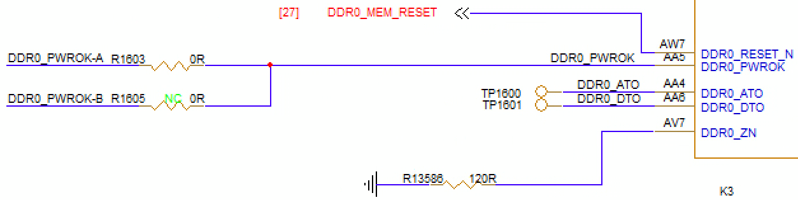

- PowerOK
  - PWROK 为来自 VDD2H 常供电域的 PHY 输入信号，用于指示 PHY 的所有电源与时钟已经稳定。
  - 在支持 IO retention 时，BP_PWROK 必须由外部控制，并在掉电前按 JEDEC 规范提前释放（拉低）。
  - 若不需要 IO retention，可将 BP_PWROK 通过 VDD2H_TIEHI 输出端口常高拉接。
  - 下图为参考设计，通过 MOS 管预留上拉电阻接到 VDD2。
    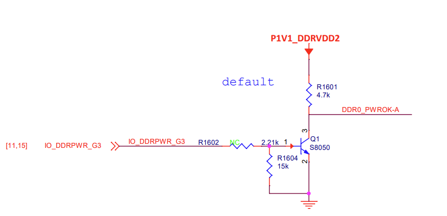

- LPDDR IO Map
  
| 信号名称           | LPDDR5               | LPDDR4X              |
|--------------------|----------------------|----------------------|
| DDR0_ATO           | LP5_DDR0_CA_A_00     | LP4_DDR0_CA_A_00     |
| CA_A_0             | LP5_DDR0_CA_A_01     | LP4_DDR0_CA_A_01     |
| CA_A_1             | LP5_DDR0_CA_A_02     | LP4_DDR0_CA_A_02     |
| CA_A_2             | LP5_DDR0_CA_A_03     | LP4_DDR0_CA_A_03     |
| CA_A_3             | LP5_DDR0_CA_A_04     | LP4_DDR0_CA_A_04     |
| CA_A_4             | LP5_DDR0_CA_A_05     | LP4_DDR0_CA_A_05     |
| CA_A_5             | LP5_DDR0_CA_B_00     | LP4_DDR0_CA_B_00     |
| CA_B_0             | LP5_DDR0_CA_B_01     | LP4_DDR0_CA_B_01     |
| CA_B_1             | LP5_DDR0_CA_B_02     | LP4_DDR0_CA_B_02     |
| CA_B_2             | LP5_DDR0_CA_B_03     | LP4_DDR0_CA_B_03     |
| CA_B_3             | LP5_DDR0_CA_B_04     | LP4_DDR0_CA_B_04     |
| CA_B_4             | LP5_DDR0_CA_B_05     | LP4_DDR0_CA_B_05     |
| CA_B_5             | LP5_DDR0_CKC_A       | LP4_DDR0_CKC_A       |
| CK_C_A             | LP5_DDR0_CKC_B       | LP4_DDR0_CKC_B       |
| CK_C_B             | LP5_DDR0_CS0_A       | LP4_DDR0_CKE0_A      |
| CKE0_A             | LP5_DDR0_CS0_B       | LP4_DDR0_CKE0_B      |
| CKE0_B             | LP5_DDR0_CS1_A       | LP4_DDR0_CKE1_A      |
| CKE1_A             | LP5_DDR0_CS1_B       | LP4_DDR0_CKE1_B      |
| CKE1_B             | LP5_DDR0_CKT_A       | LP4_DDR0_CKT_A       |
| CK_T_A             | LP5_DDR0_CKT_B       | LP4_DDR0_CKT_B       |
| CK_T_B             | LP5_DDR0_CA_A_06     | LP4_DDR0_CS0_A       |
| CS0_A              | LP5_DDR0_CA_B_06     | LP4_DDR0_CS0_B       |
| CS0_B              | NA                   | LP4_DDR0_CS1_A       |
| CS1_A              | NA                   | LP4_DDR0_CS1_B       |
| CS1_B              | LP5_DDR0_DMI0_A      | LP4_DDR0_DMI0_A      |
| DMI0_A             | LP5_DDR0_DMI0_B      | LP4_DDR0_DMI0_B      |
| DMI0_B             | LP5_DDR0_DMI1_A      | LP4_DDR0_DMI1_A      |
| DMI1_A             | LP5_DDR0_DMI1_B      | LP4_DDR0_DMI1_B      |
| DMI1_B             | LP5_DDR0_DQ_A_00     | LP4_DDR0_DQ_A_00     |
| DQ_A_0             | LP5_DDR0_DQ_A_01     | LP4_DDR0_DQ_A_01     |
| DQ_A_1             | LP5_DDR0_DQ_A_02     | LP4_DDR0_DQ_A_02     |
| DQ_A_2             | LP5_DDR0_DQ_A_03     | LP4_DDR0_DQ_A_03     |
| DQ_A_3             | LP5_DDR0_DQ_A_04     | LP4_DDR0_DQ_A_04     |
| DQ_A_4             | LP5_DDR0_DQ_A_05     | LP4_DDR0_DQ_A_05     |
| DQ_A_5             | LP5_DDR0_DQ_A_06     | LP4_DDR0_DQ_A_06     |
| DQ_A_6             | LP5_DDR0_DQ_A_07     | LP4_DDR0_DQ_A_07     |
| DQ_A_7             | LP5_DDR0_DQ_A_08     | LP4_DDR0_DQ_A_08     |
| DQ_A_8             | LP5_DDR0_DQ_A_09     | LP4_DDR0_DQ_A_09     |
| DQ_A_9             | LP5_DDR0_DQ_A_10     | LP4_DDR0_DQ_A_10     |
| DQ_A_10            | LP5_DDR0_DQ_A_11     | LP4_DDR0_DQ_A_11     |
| DQ_A_11            | LP5_DDR0_DQ_A_12     | LP4_DDR0_DQ_A_12     |
| DQ_A_12            | LP5_DDR0_DQ_A_13     | LP4_DDR0_DQ_A_13     |
| DQ_A_13            | LP5_DDR0_DQ_A_14     | LP4_DDR0_DQ_A_14     |
| DQ_A_14            | LP5_DDR0_DQ_A_15     | LP4_DDR0_DQ_A_15     |
| DQ_A_15            | LP5_DDR0_DQ_B_00     | LP4_DDR0_DQ_B_00     |
| DQ_B_0             | LP5_DDR0_DQ_B_01     | LP4_DDR0_DQ_B_01     |
| DQ_B_1             | LP5_DDR0_DQ_B_02     | LP4_DDR0_DQ_B_02     |
| DQ_B_2             | LP5_DDR0_DQ_B_03     | LP4_DDR0_DQ_B_03     |
| DQ_B_3             | LP5_DDR0_DQ_B_04     | LP4_DDR0_DQ_B_04     |
| DQ_B_4             | LP5_DDR0_DQ_B_05     | LP4_DDR0_DQ_B_05     |
| DQ_B_5             | LP5_DDR0_DQ_B_06     | LP4_DDR0_DQ_B_06     |
| DQ_B_6             | LP5_DDR0_DQ_B_07     | LP4_DDR0_DQ_B_07     |
| DQ_B_7             | LP5_DDR0_DQ_B_08     | LP4_DDR0_DQ_B_08     |
| DQ_B_8             | LP5_DDR0_DQ_B_09     | LP4_DDR0_DQ_B_09     |
| DQ_B_9             | LP5_DDR0_DQ_B_10     | LP4_DDR0_DQ_B_10     |
| DQ_B_10            | LP5_DDR0_DQ_B_11     | LP4_DDR0_DQ_B_11     |
| DQ_B_11            | LP5_DDR0_DQ_B_12     | LP4_DDR0_DQ_B_12     |
| DQ_B_12            | LP5_DDR0_DQ_B_13     | LP4_DDR0_DQ_B_13     |
| DQ_B_13            | LP5_DDR0_DQ_B_14     | LP4_DDR0_DQ_B_14     |
| DQ_B_14            | LP5_DDR0_DQ_B_15     | LP4_DDR0_DQ_B_15     |
| DQ_B_15            | LP5_DDR0_DQS0_C_A    | LP4_DDR0_DQS0_C_A    |
| DQS0_C_A           | LP5_DDR0_DQS0_C_B    | LP4_DDR0_DQS0_C_B    |
| DQS0_C_B           | LP5_DDR0_DQS0_T_A    | LP4_DDR0_DQS0_T_A    |
| DQS0_T_A           | LP5_DDR0_DQS0_T_B    | LP4_DDR0_DQS0_T_B    |
| DQS0_T_B           | LP5_DDR0_DQS1_C_A    | LP4_DDR0_DQS1_C_A    |
| DQS1_C_A           | LP5_DDR0_DQS1_C_B    | LP4_DDR0_DQS1_C_B    |
| DQS1_C_B           | LP5_DDR0_DQS1_T_A    | LP4_DDR0_DQS1_T_A    |
| DQS1_T_A           | LP5_DDR0_DQS1_T_B    | LP4_DDR0_DQS1_T_B    |
| DQS1_T_B           | LP5_DDR0_WCK_C_A_0   | N/A                  |
| DDR0_DTO           | LP5_DDR0_WCK_C_A_1   | N/A                  |
| DDR0_PWROK         | LP5_DDR0_WCK_C_B_0   | N/A                  |
| RESET_N            | LP5_DDR0_WCK_C_B_1   | N/A                  |
| WCK_C_A_0          | LP5_DDR0_WCK_T_A_0   | N/A                  |
| WCK_C_A_1          | LP5_DDR0_WCK_T_A_1   | N/A                  |
| WCK_C_B_0          | LP5_DDR0_WCK_T_B_0   | N/A                  |
| WCK_C_B_1          | LP5_DDR0_WCK_T_B_1   | N/A                  |
| WCK_T_A_0          | LP5_DDR0_ZN          | LP4_DDR0_ZN          |
| WCK_T_A_1          | LP5_DDR0_ATO         | LP4_DDR0_ATO         |
| WCK_T_B_0          | LP5_DDR0_DTO         | LP4_DDR0_DTO         |
| WCK_T_B_1          | LP5_DDR0_PWROK       | LP4_DDR0_PWROK       |
| DDR0_ZN            | LP5_DDR0_RESET_N     | LP4_DDR0_RESET_N     |
| DDR1_ATO           | LP5_DDR1_CA_A_00     | LP4_DDR1_CA_A_00     |
| DDR1_CA_A_0        | LP5_DDR1_CA_A_01     | LP4_DDR1_CA_A_01     |
| DDR1_CA_A_1        | LP5_DDR1_CA_A_02     | LP4_DDR1_CA_A_02     |
| DDR1_CA_A_2        | LP5_DDR1_CA_A_03     | LP4_DDR1_CA_A_03     |
| DDR1_CA_A_3        | LP5_DDR1_CA_A_04     | LP4_DDR1_CA_A_04     |
| DDR1_CA_A_4        | LP5_DDR1_CA_A_05     | LP4_DDR1_CA_A_05     |
| DDR1_CA_A_5        | LP5_DDR1_CA_B_00     | LP4_DDR1_CA_B_00     |
| DDR1_CA_B_0        | LP5_DDR1_CA_B_01     | LP4_DDR1_CA_B_01     |
| DDR1_CA_B_1        | LP5_DDR1_CA_B_02     | LP4_DDR1_CA_B_02     |
| DDR1_CA_B_2        | LP5_DDR1_CA_B_03     | LP4_DDR1_CA_B_03     |
| DDR1_CA_B_3        | LP5_DDR1_CA_B_04     | LP4_DDR1_CA_B_04     |
| DDR1_CA_B_4        | LP5_DDR1_CA_B_05     | LP4_DDR1_CA_B_05     |
| DDR1_CA_B_5        | LP5_DDR1_CKC_A       | LP4_DDR1_CKC_A       |
| DDR1_CK_C_A        | LP5_DDR1_CKC_B       | LP4_DDR1_CKC_B       |
| DDR1_CK_C_B        | LP5_DDR1_CS0_A       | LP4_DDR1_CKE0_A      |
| DDR1_CKE0_A        | LP5_DDR1_CS0_B       | LP4_DDR1_CKE0_B      |
| DDR1_CKE0_B        | LP5_DDR1_CS1_A       | LP4_DDR1_CKE1_A      |
| DDR1_CKE1_A        | LP5_DDR1_CS1_B       | LP4_DDR1_CKE1_B      |
| DDR1_CKE1_B        | LP5_DDR1_CKT_A       | LP4_DDR1_CKT_A       |
| DDR1_CK_T_A        | LP5_DDR1_CKT_B       | LP4_DDR1_CKT_B       |
| DDR1_CK_T_B        | LP5_DDR1_CA_A_06     | LP4_DDR1_CS0_A       |
| DDR1_CS0_A         | LP5_DDR1_CA_B_06     | LP4_DDR1_CS0_B       |
| DDR1_CS0_B         | NA                   | LP4_DDR1_CS1_A       |
| DDR1_CS1_A         | NA                   | LP4_DDR1_CS1_B       |
| DDR1_CS1_B         | LP5_DDR1_DMI0_A      | LP4_DDR1_DMI0_A      |
| DDR1_DMI0_A        | LP5_DDR1_DMI0_B      | LP4_DDR1_DMI0_B      |
| DDR1_DMI0_B        | LP5_DDR1_DMI1_A      | LP4_DDR1_DMI1_A      |
| DDR1_DMI1_A        | LP5_DDR1_DMI1_B      | LP4_DDR1_DMI1_B      |
| DDR1_DMI1_B        | LP5_DDR1_DQ_A_00     | LP4_DDR1_DQ_A_00     |
| DDR1_DQ_A_0        | LP5_DDR1_DQ_A_01     | LP4_DDR1_DQ_A_01     |
| DDR1_DQ_A_1        | LP5_DDR1_DQ_A_02     | LP4_DDR1_DQ_A_02     |
| DDR1_DQ_A_2        | LP5_DDR1_DQ_A_03     | LP4_DDR1_DQ_A_03     |
| DDR1_DQ_A_3        | LP5_DDR1_DQ_A_04     | LP4_DDR1_DQ_A_04     |
| DDR1_DQ_A_4        | LP5_DDR1_DQ_A_05     | LP4_DDR1_DQ_A_05     |
| DDR1_DQ_A_5        | LP5_DDR1_DQ_A_06     | LP4_DDR1_DQ_A_06     |
| DDR1_DQ_A_6        | LP5_DDR1_DQ_A_07     | LP4_DDR1_DQ_A_07     |
| DDR1_DQ_A_7        | LP5_DDR1_DQ_A_08     | LP4_DDR1_DQ_A_08     |
| DDR1_DQ_A_8        | LP5_DDR1_DQ_A_09     | LP4_DDR1_DQ_A_09     |
| DDR1_DQ_A_9        | LP5_DDR1_DQ_A_10     | LP4_DDR1_DQ_A_10     |
| DDR1_DQ_A_10       | LP5_DDR1_DQ_A_11     | LP4_DDR1_DQ_A_11     |
| DDR1_DQ_A_11       | LP5_DDR1_DQ_A_12     | LP4_DDR1_DQ_A_12     |
| DDR1_DQ_A_12       | LP5_DDR1_DQ_A_13     | LP4_DDR1_DQ_A_13     |
| DDR1_DQ_A_13       | LP5_DDR1_DQ_A_14     | LP4_DDR1_DQ_A_14     |
| DDR1_DQ_A_14       | LP5_DDR1_DQ_A_15     | LP4_DDR1_DQ_A_15     |
| DDR1_DQ_A_15       | LP5_DDR1_DQ_B_00     | LP4_DDR1_DQ_B_00     |
| DDR1_DQ_B_0        | LP5_DDR1_DQ_B_01     | LP4_DDR1_DQ_B_01     |
| DDR1_DQ_B_1        | LP5_DDR1_DQ_B_02     | LP4_DDR1_DQ_B_02     |
| DDR1_DQ_B_2        | LP5_DDR1_DQ_B_03     | LP4_DDR1_DQ_B_03     |
| DDR1_DQ_B_3        | LP5_DDR1_DQ_B_04     | LP4_DDR1_DQ_B_04     |
| DDR1_DQ_B_4        | LP5_DDR1_DQ_B_05     | LP4_DDR1_DQ_B_05     |
| DDR1_DQ_B_5        | LP5_DDR1_DQ_B_06     | LP4_DDR1_DQ_B_06     |
| DDR1_DQ_B_6        | LP5_DDR1_DQ_B_07     | LP4_DDR1_DQ_B_07     |
| DDR1_DQ_B_7        | LP5_DDR1_DQ_B_08     | LP4_DDR1_DQ_B_08     |
| DDR1_DQ_B_8        | LP5_DDR1_DQ_B_09     | LP4_DDR1_DQ_B_09     |
| DDR1_DQ_B_9        | LP5_DDR1_DQ_B_10     | LP4_DDR1_DQ_B_10     |
| DDR1_DQ_B_10       | LP5_DDR1_DQ_B_11     | LP4_DDR1_DQ_B_11     |
| DDR1_DQ_B_11       | LP5_DDR1_DQ_B_12     | LP4_DDR1_DQ_B_12     |
| DDR1_DQ_B_12       | LP5_DDR1_DQ_B_13     | LP4_DDR1_DQ_B_13     |
| DDR1_DQ_B_13       | LP5_DDR1_DQ_B_14     | LP4_DDR1_DQ_B_14     |
| DDR1_DQ_B_14       | LP5_DDR1_DQ_B_15     | LP4_DDR1_DQ_B_15     |
| DDR1_DQ_B_15       | LP5_DDR1_DQS0_C_A    | LP4_DDR1_DQS0_C_A    |
| DDR1_DQS0_C_A      | LP5_DDR1_DQS0_C_B    | LP4_DDR1_DQS0_C_B    |
| DDR1_DQS0_C_B      | LP5_DDR1_DQS0_T_A    | LP4_DDR1_DQS0_T_A    |
| DDR1_DQS0_T_A      | LP5_DDR1_DQS0_T_B    | LP4_DDR1_DQS0_T_B    |
| DDR1_DQS0_T_B      | LP5_DDR1_DQS1_C_A    | LP4_DDR1_DQS1_C_A    |
| DDR1_DQS1_C_A      | LP5_DDR1_DQS1_C_B    | LP4_DDR1_DQS1_C_B    |
| DDR1_DQS1_C_B      | LP5_DDR1_DQS1_T_A    | LP4_DDR1_DQS1_T_A    |
| DDR1_DQS1_T_A      | LP5_DDR1_DQS1_T_B    | LP4_DDR1_DQS1_T_B    |
| DDR1_DQS1_T_B      | LP5_DDR1_WCK_C_A_0   | N/A                  |
| DDR1_DTO           | LP5_DDR1_WCK_C_A_1   | N/A                  |
| DDR1_PWROK         | LP5_DDR1_WCK_C_B_0   | N/A                  |
| DDR1_RESET_N       | LP5_DDR1_WCK_C_B_1   | N/A                  |
| DDR1_WCK_C_A_0     | LP5_DDR1_WCK_T_A_0   | N/A                  |
| DDR1_WCK_C_A_1     | LP5_DDR1_WCK_T_A_1   | N/A                  |
| DDR1_WCK_C_B_0     | LP5_DDR1_WCK_T_B_0   | N/A                  |
| DDR1_WCK_C_B_1     | LP5_DDR1_WCK_T_B_1   | N/A                  |
| DDR1_WCK_T_A_0     | LP5_DDR1_ZN          | LP4_DDR1_ZN          |
| DDR1_WCK_T_A_1     | LP5_DDR1_ATO         | LP4_DDR1_ATO         |
| DDR1_WCK_T_B_0     | LP5_DDR1_DTO         | LP4_DDR1_DTO         |
| DDR1_WCK_T_B_1     | LP5_DDR1_PWROK       | LP4_DDR1_PWROK       |
| DDR1_ZN            | LP5_DDR1_RESET_N     | LP4_DDR1_RESET_N     |

#### 1.1.2 复位

- 芯片的硬件复位通过外部 PMIC 的 PG 端控制，低电平有效。
- 管脚需要增加 10 nF~100 nF 电容，用来消除复位信号上的抖动，防止误触发导致的系统异常复位。
- RESET_IN_N 网络的上拉电源必须和 IO 电源域（即上拉到 VCC18_PMIC）保持一致。
- 若与其他复位来源复用，需增加与非门或二极管进行隔离。

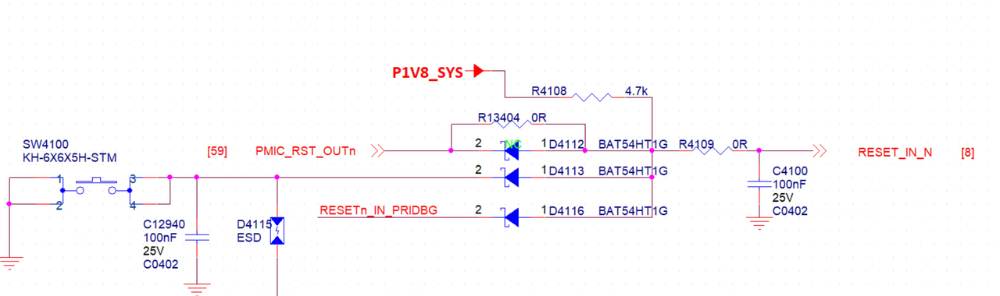

#### 1.1.3 JTAG 接口

- 支持 JTAG。
- TDI、TMS、TCK、TDO 以及 Power、GND 连接 JLink 调试器（信号电平需与 Power 电压匹配），TRSTn 信号连接到 JLink 调试器或上拉到 Power。

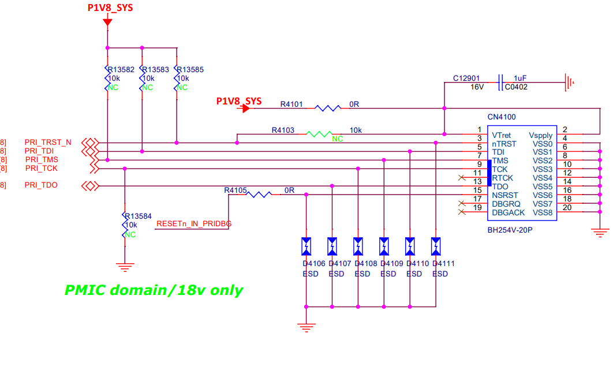

#### 1.1.4 电源管理（PMIC）电路设计

- P1 的输入供电推荐使用 4 V，Vin3、Vin4 按参考 PCB 隔离输入；Vin5、Vin6 按参考 PCB 隔离输入。
- P1 的 SW1~SW6 默认增加 220 pF 电容。
- BUCK1/2 的 FB 和 FBGND pin 必须连接到主控的 FB 和 FBGND pin，Layout 上注意远离干扰信号。
- 下图为 LPDDR5 版本的电源方案：
  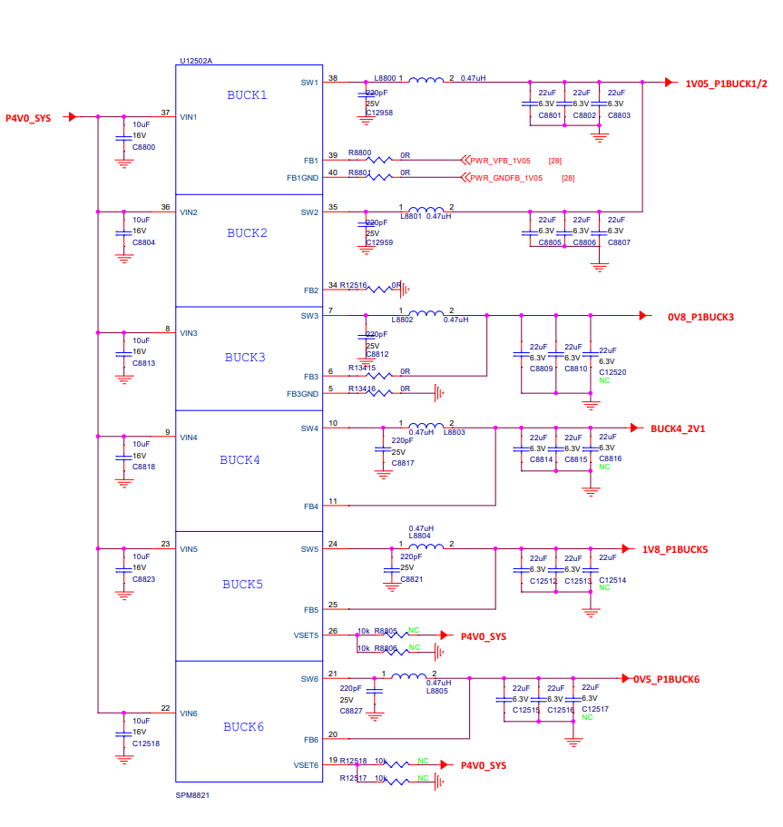
  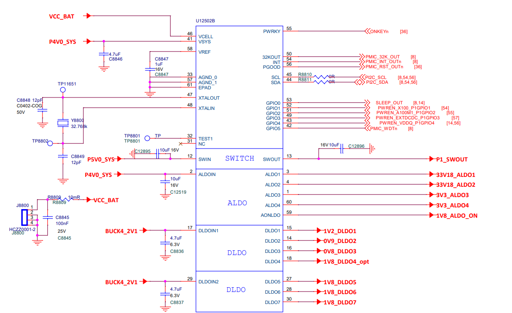

- 下图为 LPDDR4x 版本的电源方案：
  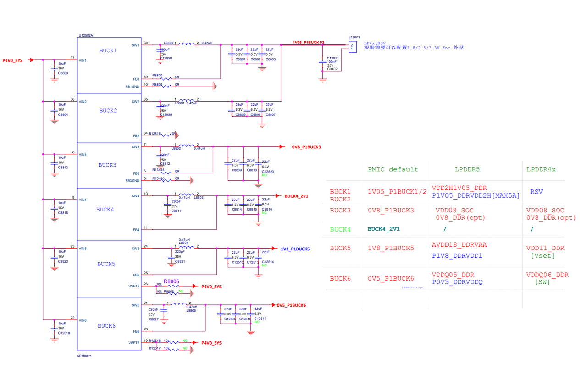
  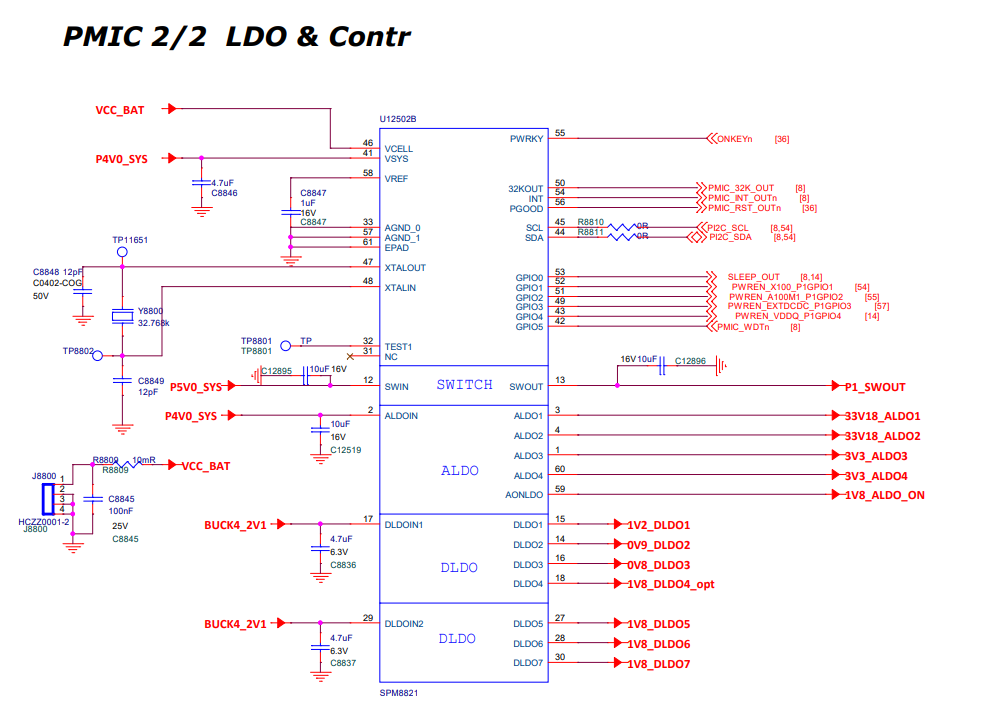

> 注：P1 周边电路设计必须完全拷贝我司参考设计，相关的设计文件请见发布包中的硬件部分。

#### 1.1.5 硬件初始化系统配置电路

共有 5 个 strap pin，分别为 GPIO65、GPIO66、GPIO68、GPIO69、GPIO90，组合如下：

1. Boot

   | 组合 | GPIO[66] (Strap 1) <br> [default down] | GPIO[65] (Strap 0) <br> [default down] | Function |
   |------|--------|------|--------|
   | 1    | 0                                      | 0                                      | TF Card → EMMC [default]     |
   | 2    | 1                                      | 0                                      | TF Card → SPI NOR            |
   | 3    | 0                                      | 1                                      | TF Card → SPI NAND           |
   | 4    | 1                                      | 1                                      | TF Card → UFS                |

2. Download sel

   | GPIO[68] (Strap 2) <br> [default down] | Function         | 备注                     |
   |----------------------------------------|------------------|--------------------------|
   | 0                                      | USB [default]    | USB DRD 接口 / Type-C |
   | 1                                      | UART             | —                        |

3. Boot/down_sel

   | GPIO[69] (Strap 3) <br> [default down] | Function           | 备注 |
   |----------------------------------------|--------------------|------|
   | 0                                      | 启动 [default]     |      |
   | 1                                      | 下载               |      |

4. QSPI mode select

   | GPIO[64] (Strap 4) <br> [default down] | Function         |
   |----------------------------------------|------------------|
   | 0                                      | 3V3 [default]    |
   | 1                                      | 1V8              |

5. LPDDR strap

   | GPIO[52] (Strap 5) <br> [default down] | Function     |
   |----------------------------------------|--------------|
   | 0                                      | LPDDR5       |
   | 1                                      | LPDDR4x      |

#### 1.1.6 系统时钟

芯片有两个时钟输入，分别为 24 MHz 和 32.768 kHz；
芯片内部振荡器和外置 24 MHz 晶体构成主系统时钟，且芯片内部内置 1 MΩ 电阻；
32.768 kHz 时钟由外部 RTC 时钟输入，PMIC 已集成 RTC 时钟功能，因此 32.768 kHz 可由 PMIC 提供；
负载电容需根据晶体振荡器 Datasheet 选型，推荐值为 12 pF。

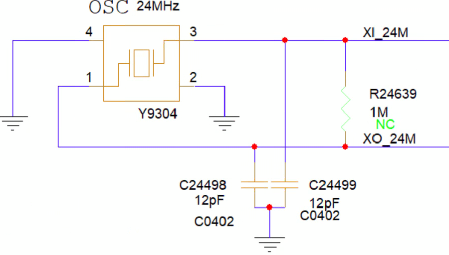

> 注意：选用的电容需与晶振负载电容匹配，材质建议采用 NPO。建议选用 4 pin 贴片晶振，其中 2 个 GND 管脚与单板地充分连接，以增强系统时钟的抗 ESD 干扰能力。

#### 1.1.7 Flash 电路

- Quad-SPI 充当外部串行闪存设备的接口，具有多达四根双向数据线。
- Flash 控制器支持 SPI NOR Flash、SPI NAND Flash。
- 支持 1.8 V/3.3 V Flash，参考芯片 VCC1833_QSPI 电压域配置电平，电平选择信息见 [1.1.5 硬件初始化系统配置电路](#115-硬件初始化系统配置电路)。
- 支持双 CS。

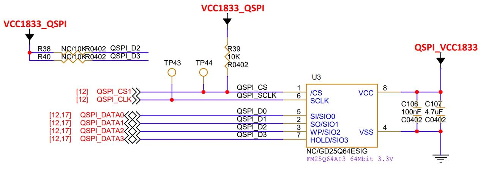

#### 1.1.8 eMMC

- 兼容 8 位 eMMC 5.1 协议规范。
- eMMC 的 Data 与 DS 外部建议预留上/下拉，生产 NC 处理。

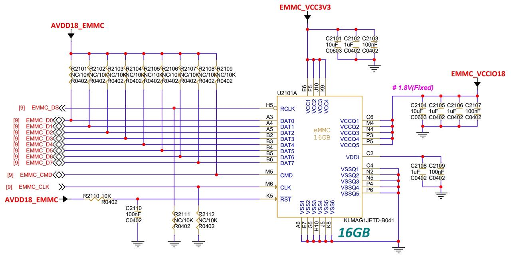

#### 1.1.9 UFS

- 支持 UFS 2.2。
- 参考设计兼容 1.2 V UFS 设计。如果不需要使用 1.2 V UFS，可以不作预留。

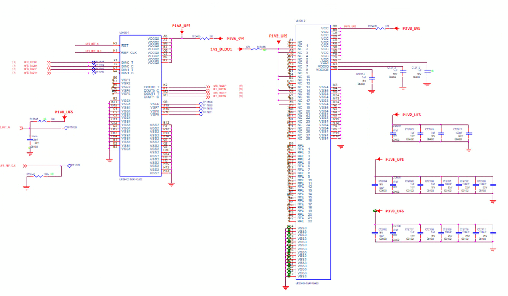

### 1.2 电源设计建议

#### 1.2.1 芯片总体电源拓扑图

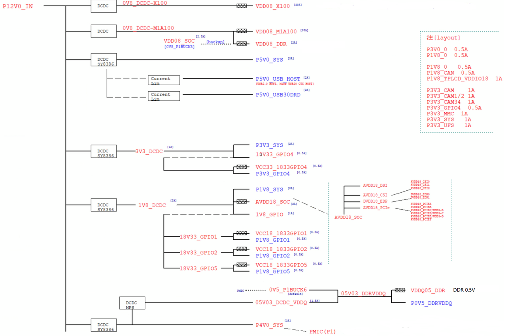

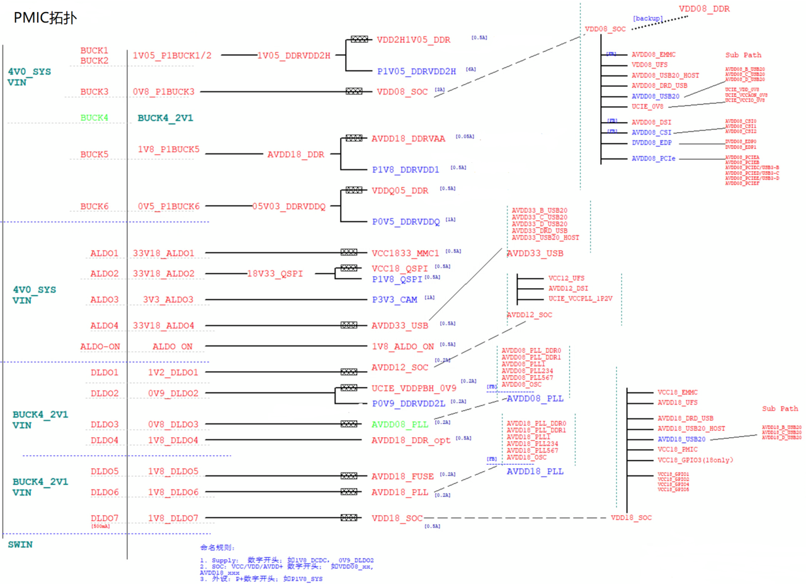

#### 1.2.2 芯片电源输入描述

| 模块 | 电源管脚 | 描述 |
| --- | --- | --- |
| DDR_PLL | DDR0_AVDD08_PLL, DDR1_AVDD08_PLL, DDR0_AVDD18_PLL, DDR1_AVDD18_PLL | DDR PLL 电源 |
| SYS_PLL | AVDD08_PLL1, AVDD08_PLL234, AVDD08_PLL567, AVDD18_PLL1, AVDD18_PLL234, AVDD18_PLL567 | 系统 PLL 电源 |
| DDR | VAA18_VDD2H_DDR, VAA18_VDD2H_DDR, VDD0V8_DDR, VDD2H_DDR, VDDQ_DDR | DDR IO 电源、DDR 数字逻辑电源、DDR VAA 电源 |
| QSPI | VCC1833_QSPI | QSPI flash 电源 |
| SD | VCC1833_SD | SD 接口电源 |
| GPIO | VCC18_GPIO1, VCC1833_GPIO1, VCC18_GPIO2, VCC1833_GPIO2, VCC18_GPIO3, VCC18_GPIO4, VCC1833_GPIO4, VCC18_GPIO5, VCC1833_GPIO5 | GPIO 电源 |
| eMMC | AVDD08_EMMC, VCC18_EMMC | eMMC 存储电源 |
| MIPI-DSI | AVDD08_DSI, AVDD12_DSI, AVDD18_DSI | MIPI DSI 电源 |
| DP/eDP | AVDD18_EDP0, DDD08_EDP0, AVDD18_EDP1, DDD08_EDP1 | DP/eDP 电源 |
| MIPI-CSI | AVDD08_CSIO, AVDD18_CSIO, AVDD08_CSI1, AVDD18_CSI1, AVDD08_CSI2, AVDD18_CSI2 | MIPI CSI 电源 |
| USB2.0-HOST | AVDD08_USB20_HOST, AVDD18_USB20_HOST, AVDD33_USB20_HOST | USB 电源 |
| USB3.0-DRD | AVDD08_DRD_USB, AVDD18_DRD_USB, AVDD33_DRD_USB | USB 电源 |
| PCIe3.0 combo USB | AVDD08_B_USB20, AVDD08_C_USB20, AVDD08_D_USB20, AVDD18_B_USB20, AVDD18_C_USB20, AVDD18_D_USB20, AVDD33_B_USB20, AVDD33_C_USB20, AVDD33_D_USB20, AVDD18_PCIE0, AVDD08_PCIE0, AVDD18_PCIE1, AVDD08_PCIE1, AVDD18_PCIE2/USB3-B, AVDD08_PCIE2/USB3-B, AVDD18_PCIE3/USB3-B, AVDD08_PCIE3/USB3-B, AVDD18_PCIE4/USB3-B, AVDD08_PCIE4/USB3-B, AVDD18_PCIE5, AVDD08_PCIE5 | PCIe 和 USB Combo 模块电源 |
| UFS | AVDD18_UFS, VCC12_UFS, VDD08_UFS | UFS 电源 |
| eFUSE | AVDD18_FUSE | eFUSE 电源，可以悬空 |
| OSC | AVDD08_OSC, AVDD18_OSC | 系统时钟电源 |
| CPU & SYS | VCC_CPUX, VCC_SYS | CPU 和系统电源 |

#### 1.2.3 上电时序

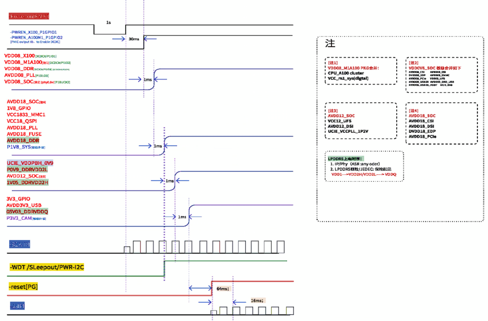

#### 1.2.4 下电时序

下电时序：reset 拉低后，各路电源按上电时序反向进行。

#### 1.2.5 CPU 电源设计

芯片具有 16 个大核，分别是 X100 的 8 个核和 A100 的 8 个核，X100 和 A100 分别独立供电，由多相控制器两个 rail 分别供电。CPU A100 跟 sys 电源合并供电。特别注意，滤波电容数量和容值以及 Layout 设计须严格按照参考电路进行设计。选择供电电源时，需特别注意：

- 电源 slew rate 须大于 70 A/us；
- CPU 供电电流较大，选择电源器件需支持 remote sense，FB 须从芯片 ball 端进行反馈；
- 考虑器件发热，需考虑供电效率问题；

详细设计电路可参考 K3 参考设计图纸。

#### 1.2.6 DDR 电源设计

K3 芯片支持 LPDDR5/LPDDR4x，共两个通道，供电电压可参考 [1.2.1](#121-芯片总体电源拓扑图) 和 [1.2.2](#122-芯片电源输入描述) 章节。LPDDR 供电时序遵循颗粒上电时序，PHY 本身没有上电时序要求。

> 注意：LPDDR5 和 LPDDR4x 颗粒对应的部分电压不一致，请参考电路设计图纸。

滤波电容数量与容值须严格参考图纸和 Layout 电路设计。
详细设计电路可参考 K3 参考设计图纸。

#### 1.2.7 IO 电源设计

K3 总体 GPIO 数量 128 个，其中 34 个 GPIO 电平只支持 1.8 V，其他 GPIO 电平支持 1.8 V 或 3.3 V；

- 管脚名 VCC18_GPIO 固定连接数字 1.8 V 电源。
- 管脚名 VCC1833_GPIO，根据外设使用设备选择连接数字 3.3 V 或 1.8 V 电源，电路设计前需要确定 GPIO 电平，不支持软件配置；
- GPIO 分组中：GPIO1/GPIO2/GPIO4/GPIO5 是双电压 domain；GPIO3 是 1.8 V only domain；

#### 1.2.8 PLL 电源设计

K3 的 PLL 电源有 2 个电压 domain，分别是：

- AVDD08_PLL：设计上必须用磁珠（120 Ω@100 MHz，DC 电阻 ≤0.07 Ω，下文磁珠需求相同）进行隔离。
- AVDD18_PLL：设计上必须用磁珠对 1.8 V 电源进行隔离。

详细设计电路可参考 K3 参考设计图纸。

#### 1.2.9 DP/eDP/MIPI-DSI 电源设计

K3 芯片支持 2 路 DP/eDP、1 路 MIPI-DSI，其中 DP0/eDP0 与 MIPI-DSI 为 combo 关系；电源去耦电容不得删除，布局时请靠近管脚放置；
供电电源噪声要求：

- AVDD18_EDP、DVDD08_EDP 纹波须控制在 ±3% 之内；
- AVDD08_DSI、AVDD12_DSI、AVDD18_DSI 纹波须控制在 ±3% 之内。

详细设计电路可参考 K3 参考设计图纸。

#### 1.2.10 PCIe/USB 电源设计

K3 芯片 PCIe 和 USB 供电电源噪声要求：

- 0.8 V 供电部分噪声须控制在 ±3% 之内；
- 1.2 V 供电部分噪声须控制在 ±3% 之内；
- 1.8 V 供电部分噪声须控制在 ±3% 之内；
- 3.3 V 供电部分噪声须控制在 ±3% 之内；

详细设计电路可参考 K3 参考设计图纸。

> 注：K3 芯片 PHY 即使不使用，相关电源也必须供电。

### 1.3 模拟接口设计建议

#### 1.3.1 I2S 接口

- K3 芯片支持 8 个 I2S 接口，其中 I2S0~I2S5 由主 CPU 控制，R_I2S0/R_I2S1 由 RCPU 控制。
- 每组 I2S 都可以配置主从模式，支持 TDM、PCM 模式。

#### 1.3.2 MIPI CSI RX 配置接口设计

K3 支持 4 lane + 4 lane + 4 lane 输入，或 4 lane + 4 lane + 2 lane + 2 lane 输入。

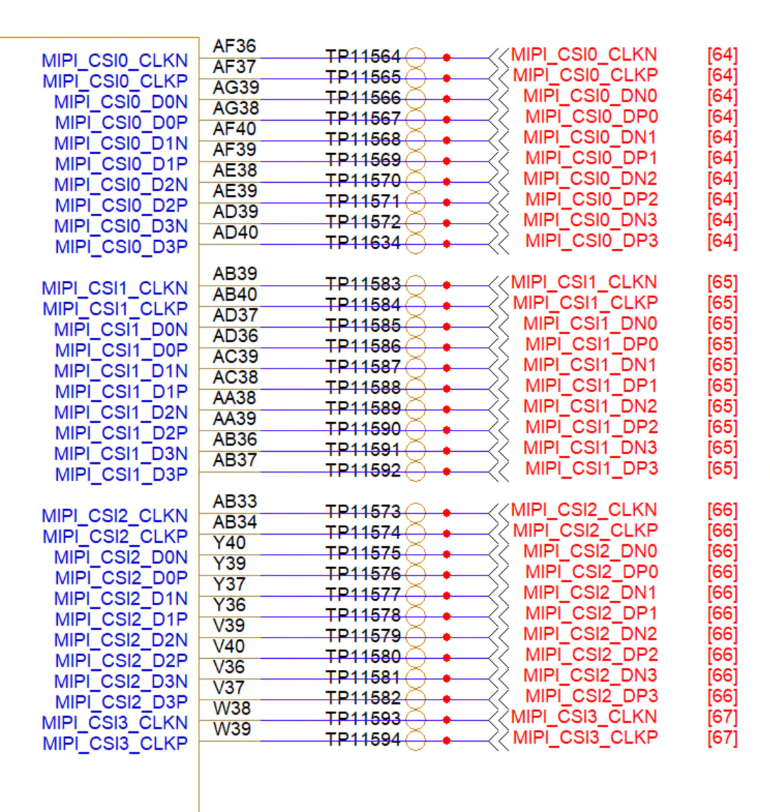

- MIPI CSI0 差分数据参考 MIPI_CSI0_CLK 差分时钟采样；
- MIPI_CSI1 差分数据参考 MIPI_CSI1_CLK 差分时钟采样；
- MIPI_CSI2
  - [2 Lane 模式]：MIPI_CSI2_D2P/N、MIPI_CSI2_D3P/N 两对差分数据参考 MIPI_CSI3_CLKP/N 差分时钟采样。
  - [2 Lane 模式]：MIPI_CSI2_D0P/N、MIPI_CSI2_D1P/N 两对差分数据参考 MIPI_CSI2_CKP/N 差分时钟采样。
  - [4 Lane 模式]：MIPI_CSI2_D0P/N、MIPI_CSI2_D1P/N、MIPI_CSI2_D2P/N、MIPI_CSI2_D3P/N 参考 MIPI_CSI2_CKP/N 差分时钟采样。
- 电源供电须控制在 ±3% 之内；

详细设计电路可参考 K3 参考设计图纸。

#### 1.3.3 MIPI DSI 接口设计

K3 支持 1 组 MIPI TX PHY，combo DP/eDP0。

- 支持 8lane 和 4 lane 模式；
- 最大数据传输速率为 4.5 Gpbs/lane；
- 电源纹波要求见 [1.2.9](#129-dpedpmipi-dsi电源设计) 章节

详细设计电路可参考 K3 参考设计图纸。

#### 1.3.4 DP/eDP 接口设计

K3 支持 2 路 DP/eDP PHY，可实现双屏异显；

- 最大分辨率 3840 × 2160 @ 60 fps；
- 速率可支持 1.6 G/2.7 G/5.4 Gbps；
- 电源纹波要求见 [1.2.9](#129-dpedpmipi-dsi电源设计) 章节；

详细设计电路可参考 K3 参考设计图纸。

### 1.4 外围接口设计建议

#### 1.4.1 PCIe/USB2.0/USB3.0

K3 支持 4 个 USB3.0 接口、5 个 USB2.0 接口，其中 3 个 USB3.0 与 PCIe Combo，4 个 USB2.0 与 USB3.0 Combo 复用；1 个独立 USB2.0 支持 Host；

- USB3.0 信号需要 ESD 保护措施，ESD 器件的寄生电容要求小于 0.5 pF，且 ESD 器件应靠近 USB 接口放置。
   USB3.0 设备对接器件和模组时，差分信号需串接 100 nF 电容；RX 串接电容靠近对接设备端，TX 串接电容靠近 K3 芯片端。
- USB20_A_DRD_USB_M 为芯片下载接口；
- K3 PCIe 接口与 USB3.0 Combo 复用。复用关系如下：

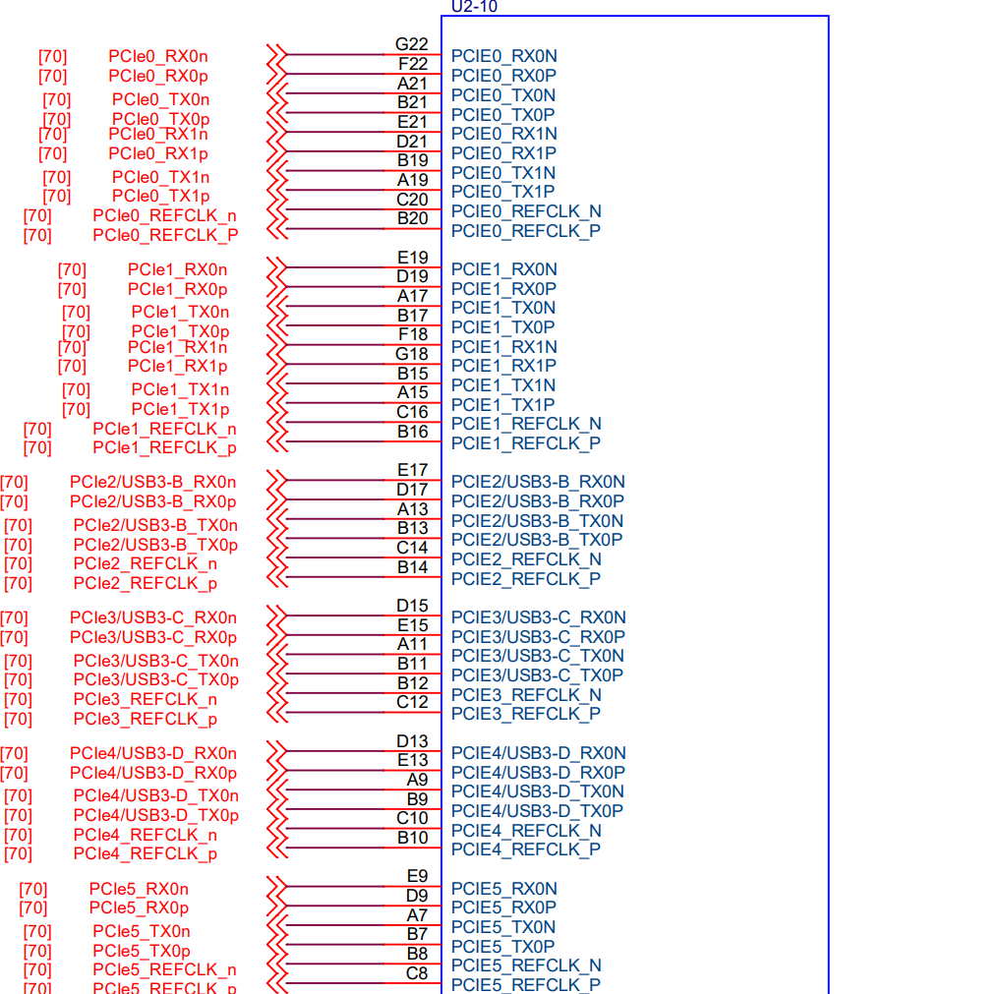

- PCIe 的 sideband 信号（控制器）命名如下。其中 PCIeA/B 支持热插拔，PCIeC/D 支持部分热插拔功能。

| PCIeA | PCIeC | PCIeB | PCIeD | PCIeE |
| --- | --- | --- | --- | --- |
| PCIeA_PERSTn | PCIeC_PERSTn | PCIeB_PERSTn | PCIeD_PERSTn | PCIeE_PERSTn |
| PCIeA_WAKEn | PCIeC_WAKEn | PCIeB_WAKEn | PCIeD_WAKEn | PCIeE_WAKEn |
| PCIeA_CLKREQn | PCIeC_CLKREQn | PCIeB_CLKREQn | PCIeD_CLKREQn | PCIeE_CLKREQn |
| PCIeA_PRSNT2n | PCIeC_PRSNT2n | PCIeB_PRSNT2n | PCIeD_PRSNT2n | PCIeE_ATTN |
| PCIeA_ATTN | PCIeC_ATTN | PCIeB_ATTN | PCIeD_ATTN | PCIeA_PWRCTn |
| PCIeA_PWRCTn | PCIeC_PWRCTn | PCIeB_PWRCTn | PCIeD_PWRCTn | PCIeA_AUXEn |
| PCIeA_AUXEn | PCIeC_AUXEn | PCIeB_AUXEn | PCIeD_AUXEn | PCIeA_PWRDet |
| PCIeA_MRLn | PCIeC_PWRDet | PCIeB_PWRDet | PCIeD_PWRDet | PCIeA_MRLn |
| PCIeA_ATNLED | PCIeC_ATNLED | PCIeB_ATNLED | PCIeD_ATNLED | PCIeA_PWRLED |
| PCIeA_EINT | PCIeC_EINT | PCIeB_EINT | PCIeD_EINT | PCIeA_EINTEG |
| PCIeB_EINTEG | PCIeC_EINTEG | PCIeB_EINTEG | PCIeD_EINTEG | PCIeE_EINTEG |

- PCIe/USB 控制器与 PCIe/USB PHY 接口组合关系如下：


- PCIe controller A 具备 EP 功能，最大支持 8 lane，具体用法如下：
  - 8 lane 由 6 个 PHY 组成，x2、x2、x1、x1、x1、x1。每组 PHY 需要输入一组 clkref 信号，并保持同源，jitter 须满足 spec 要求；
  - 内部集成 clkref 时钟。作为 EP 时，如果采用内部 clkref 时钟，则只能使用一个 PHY，即 x2 或 x1；

> 注意：无论使用任意一个 PCIe，PCIe/USB3_RCAL 都需要连接 240 Ω 1% 电阻上拉到 AVDD08_OSC。

#### 1.4.2 UART

K3 有 17 组 UART 接口，分为两类：X100 UART 和 RCPU UART。

- X100 UART 有 11 组，其中 UART0 是 2 线调试口，UART1~UART10 是 4 线接口，其中 UART1 可用于 secure domain。
- RCPU UART 有 6 组。

#### 1.4.3 IIC

K3 有 11 组 IIC 接口。

- 普通 I2C 有 9 组。
- PWR I2C/RCPU PWR I2C 各有 1 组，用于电源 IC 配置功能控制。

#### 1.4.4 MMC

K3 芯片提供 2 路 MMC 接口（MMC1/MMC2）。

- MMC1 支持 3.3 V / 1.8 V 电平动态切换。
- MMC1 / MMC2 均支持对接 SDIO 设备。
- MMC2 仅支持单一固定电平（3.3 V 或 1.8 V，由硬件设计决定）。
- SD Card 使用说明：
  - MMC1 支持 SD 卡全部功能特性，包括高速模式与默认速度模式切换，支持动态电压切换。
  - MMC2 不支持 SD 卡动态电压切换，仅支持低速模式，或仅支持 1.8 V 工作的 SD 卡。

#### 1.4.5 GMAC 接口

K3 芯片支持 4 个 GMAC 控制器，可提供 RMII、RGMII、MII 接口连接外置 PHY GMAC 控制器，其中 3 路在 ACPU，1 路在 RCPU。

- GMAC0 和 GMAC1 支持 RGMII、RMII、MII；
- GMAC2 和 GMAC3 支持 RGMII、RMII；
- 芯片可提供 25 M 时钟给 PHY GMAC；

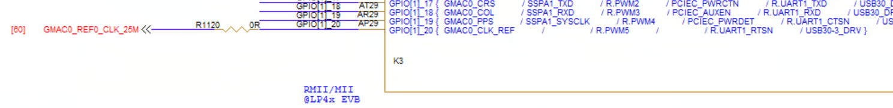

#### 1.4.6 CAN 接口

K3 有 10 组 CAN 控制器，其中 5 组在 X100 CPU 域，5 组在 RCPU 域。

当通过连接器实现板对板连接时，建议串接一定阻值的电阻（22 Ω ~ 100 Ω，具体以能满足 SI 测试为准），并预留 TVS 器件。

## 2. PCB 设计

### 2.1 PCB 叠层设计

为了减少高速信号传输过程中的反射现象，必须在信号源、接收端以及传输线上保持阻抗匹配。单端信号线的具体阻抗取决于其线宽尺寸以及与参考平面之间的相对位置。具有特定阻抗要求的差分对，其线宽/线距则取决于所选的 PCB 叠层结构。由于最小线宽和最小线距取决于 PCB 类型以及成本要求，受此限制，选择的 PCB 叠层结构必须能够实现板上的所有阻抗需求，包括内层和外层、单端和差分线等。

层的定义设计原则：

1. 零件的相邻层应为地平面，提供器件面布线参考；
2. 所有信号层尽可能与地平面相邻；
3. 避免两信号层直接相邻；
4. 大电流电源尽可能与地平面相邻；
5. 叠层设计应采用对称结构设计。

K3 采用 10 层 2 阶叠层设计，下图为参考叠层设计。如果使用其他类型的叠层设计，请根据 PCB 厂商给出的设计重新计算阻抗。
在 10 层叠层设计中，走线层为 L1/L3/L6/L8/L10，L2/L4/L5/L7/L9 为参考平面；DDR 走线单端控制 45 Ω，差分控制 85 Ω；其他信号线，单端控制 50 Ω，差分控制 90 Ω。

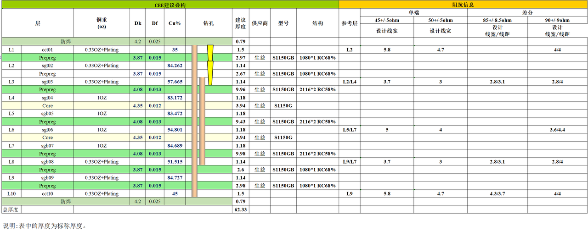

K3 CPU 扇出设计：
前两排 ball 可从表层扇出，第二排从表层扇出的线可采用 neck 值为 3 mil 的线宽，出 CPU 区域后恢复正常线宽；

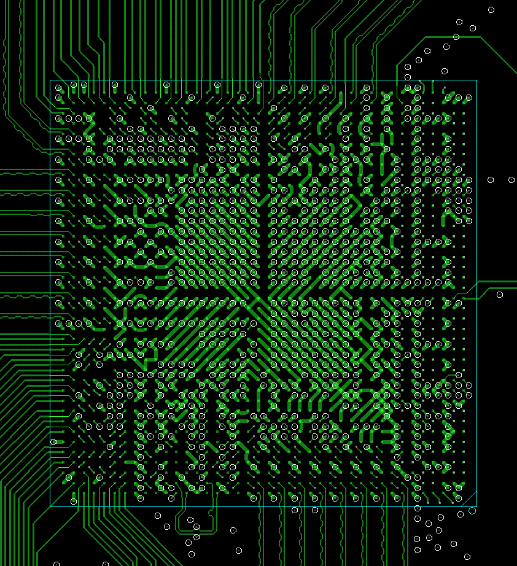

如果第一、二圈信号都有使用，那么从第三排开始，需换层并从内层扇出。CPU 区域的过孔需整齐排列，为地平面和电源平面留出尽可能大的通道。如下图所示，地层平面铺铜后有多条通道与外部地相连，有利于 SI/PI 和散热。

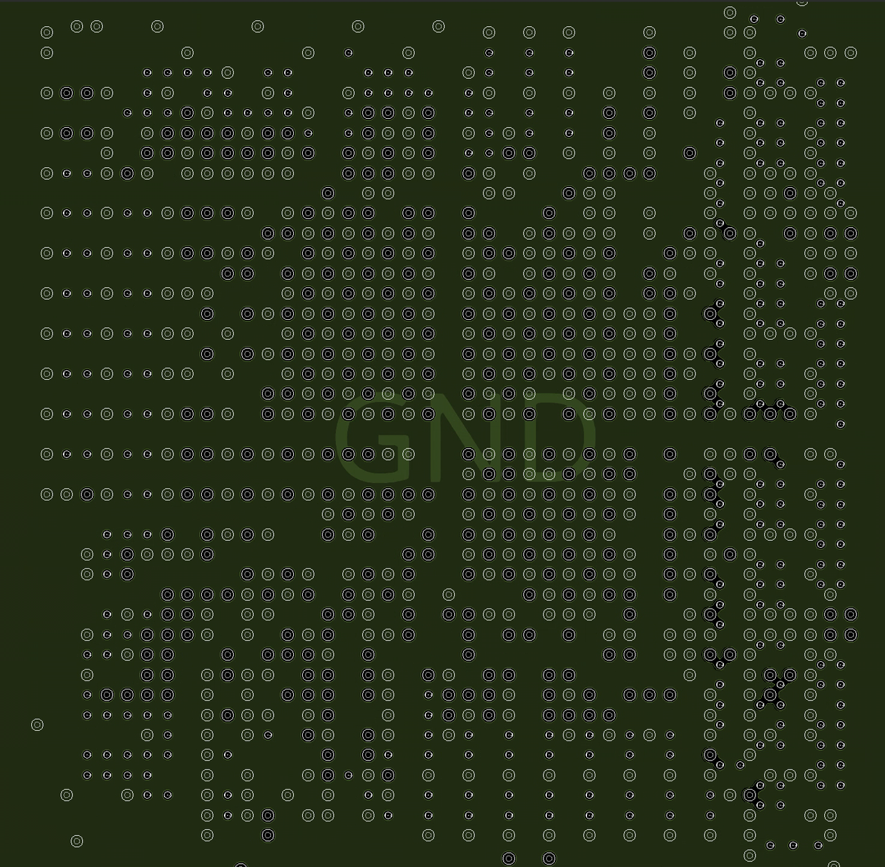

### 2.2 通用布线建议

1. 走线不要出现直角和锐角；
2. 避免在时钟器件（如晶体、晶振、时钟发生器、时钟分发器）、开关电源、磁类器件等周边布线；
3. 走线应有完整且连续的参考平面；
4. 在 BGA 区域的平面断开处用走线连接；
5. 减少残桩长度，建议残桩长度为 0；
6. 走线长度应包含过孔和封装；
7. 差分对内时延差是指同一对差分信号的 2 根走线之间的时延差；而差分对间时延差是指不同差分对之间的时延差。信号间距是指空气间距。

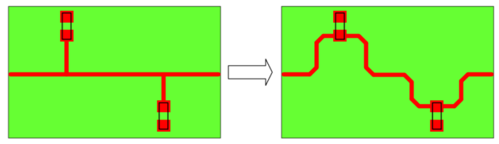

高速信号布线建议：

1. 高速信号换层时，需在换层 VIA 处添加 GND 伴随过孔，以保证回流路径的连续性；

   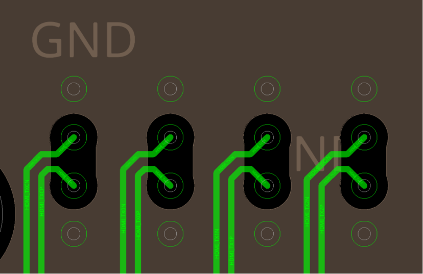

2. 由于表贴器件的焊盘会导致阻抗降低，为减小阻抗突变的影响，建议在表贴焊盘的正下方按焊盘大小挖去一层参考层。常用的表贴器件有：ESD、电容、共模抑制电感、连接器等；

   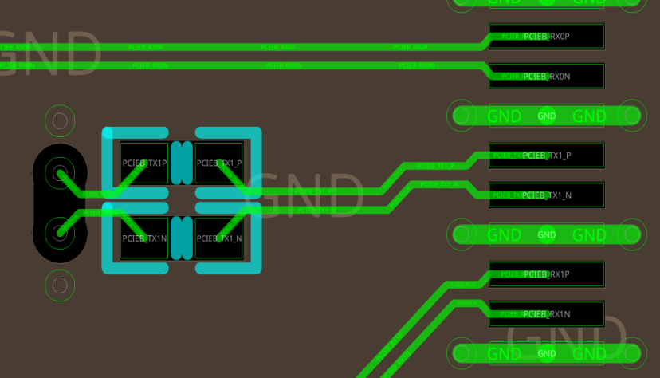

3. 避免玻纤编织效应；

   所谓玻纤效应，是指构成 PCB 介质的增强材料——玻璃纤维网状结构之间的间隙，引起介质层相对介电常数局部变化的现象。PCB 的介质层一般由玻纤布和树脂组成，玻纤布中的玻璃纤维空隙由树脂填充。由于玻纤布和树脂的介电常数相差较大，靠近玻纤的走线信号感受到的介电常数较大，而在玻纤束之间窗口区域走线的信号感受到的介电常数较小，从而导致玻纤效应。玻纤效应对高速信号的影响主要表现在两个方面：一方面会引起走线阻抗的周期性波动；另一方面，会导致差分线 P 和 N 之间出现 Skew。当接口速率达到 8 GT/s 且走线长度超过 1.5 inch 时，需谨慎处理玻纤效应。建议采用以下方式降低其影响。

   - 方式一：改变走线角度，按 10° 斜线走线；或在 PCB 加工时将板材旋转 10°，以保证所有走线都不与玻纤平行。

     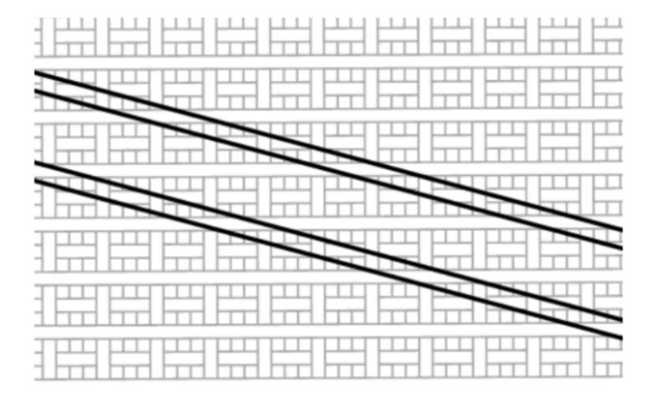

   - 方式二：使用如下走线（ZigZag），下图中的 W 至少要大于 3 倍的玻纤编织间距。推荐值 W = 60 mil，θ = 10°，L = 340 mil。

     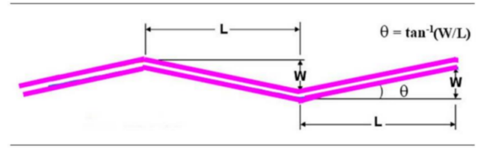

4. 走线时尽量减少换层；需要换层时，考虑 Via Stub，并尽量减小 Via Stub 长度；

5. 差分过孔建议：如果接口速率 = 8 GT/s，那么这些接口差分对的过孔建议增加 Dog-Bone，并根据实际叠层进行仿真优化 Dog-Bone 尺寸。以下为基于 10 层 2 阶 HDI 的过孔参考尺寸：

   - R Drill = 4 mil（钻孔半径）
   - R Pad = 8 mil（过孔焊盘半径）
   - D1 = 30 mil，差分过孔中心间距
   - D2 = 15 mil，表层到底层的反焊盘尺寸
   - D3 = 30 mil，信号过孔与回流地过孔的中心间距

     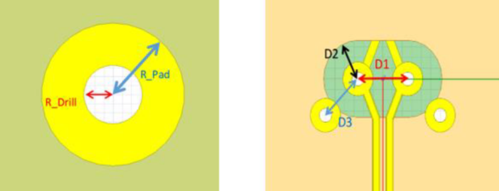

6. 差分对 P/N 之间等长建议 <= 5 mil。P/N 之间需要绕线补偿时，绕线尺寸需特别注意，应满足下图所示要求，以降低阻抗突变带来的影响：
     

### 2.3 电源与滤波电容设计

1. 滤波电容尽量靠近 pin 端，电源线和 GND 线均用粗短线到过孔；
2. 供电端到用电端的电源平面需路径短，平面大，且注意不要被过孔打的太碎；
3. 为了获得更好的 PI 效果，请参考我们的参考电路选用电容，不要删减电容个数；
4. 过孔排布，请按我们的参考设计，不要删减电源过孔和地过孔。

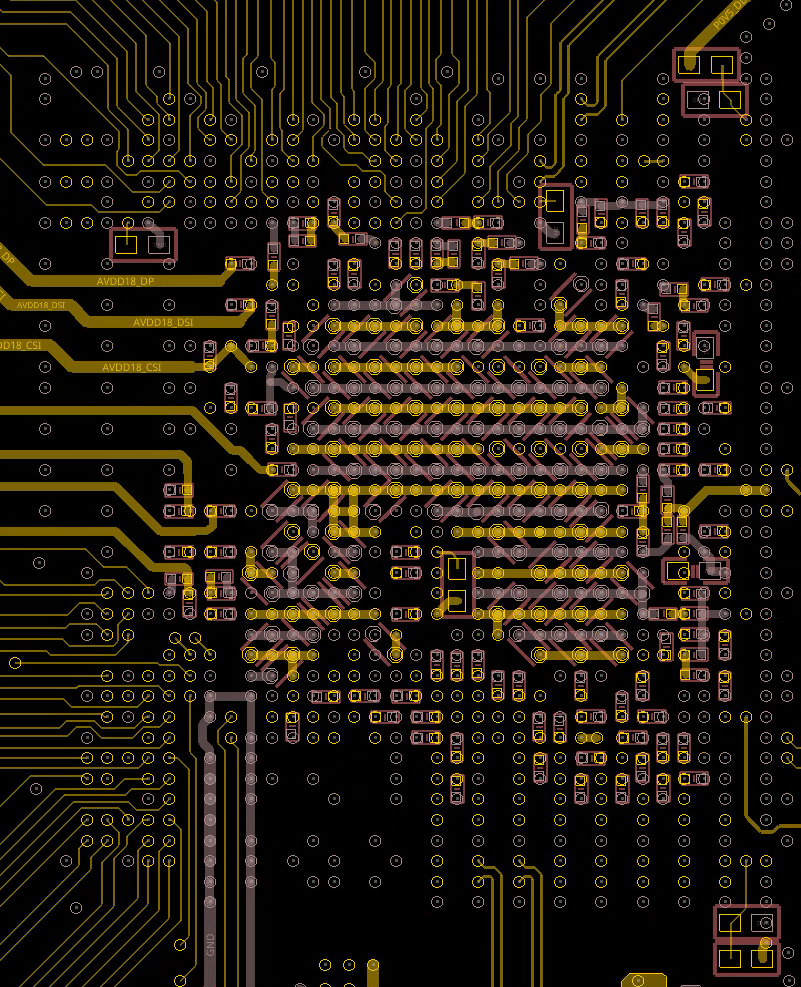
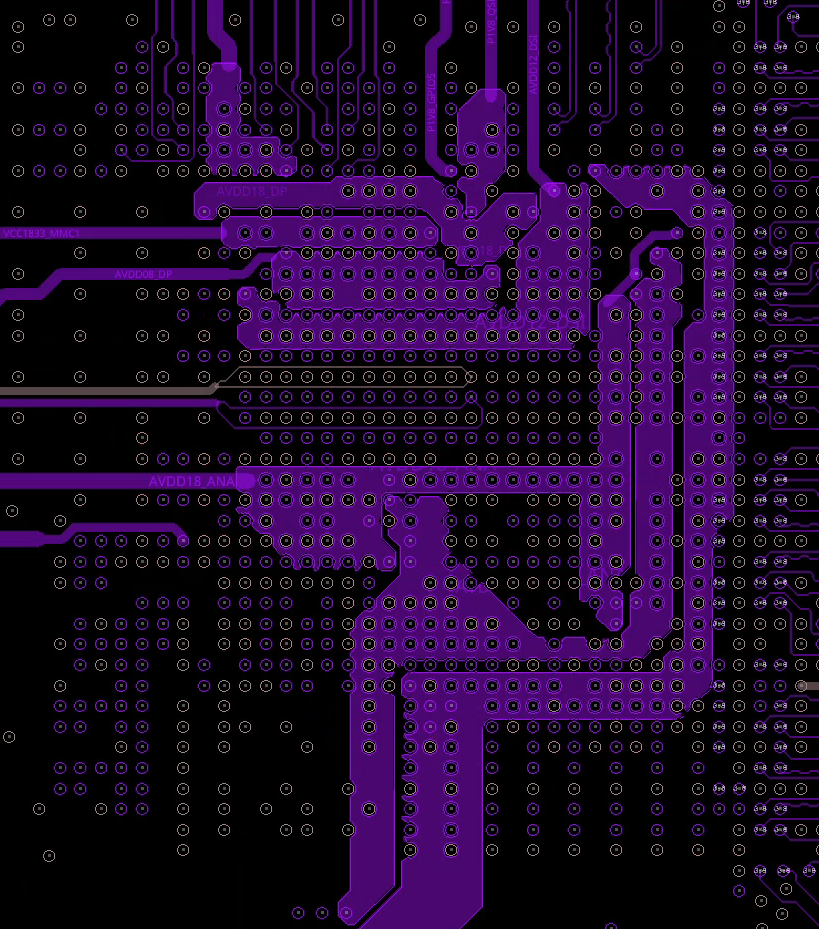
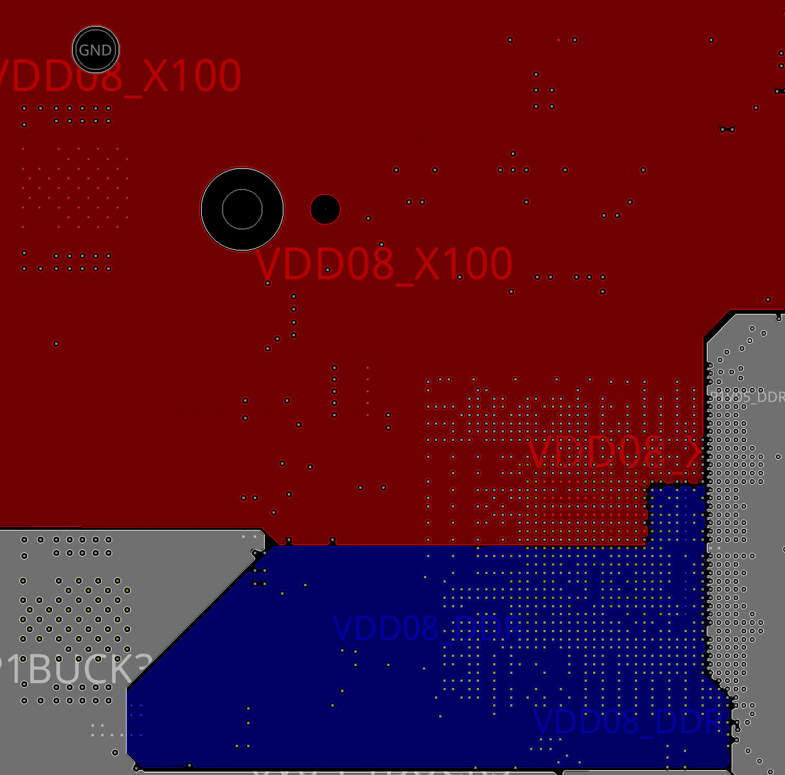
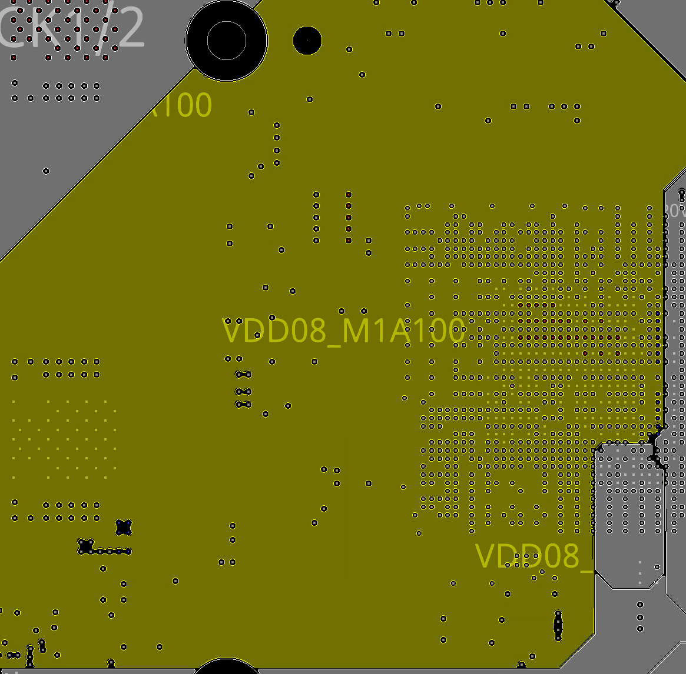
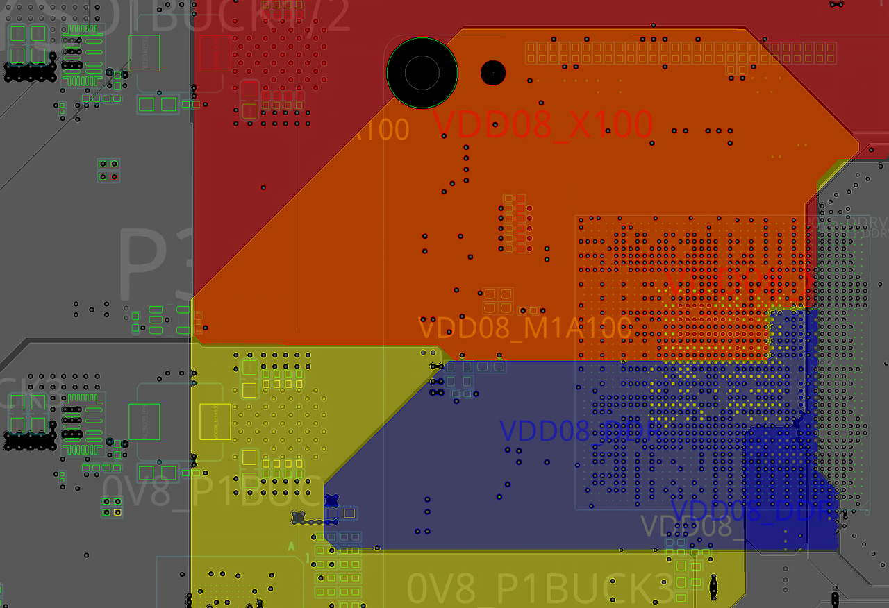

### 2.4 P1 电源 Layout 设计

1. 中间的散热焊盘均匀地打上地孔阵列：

     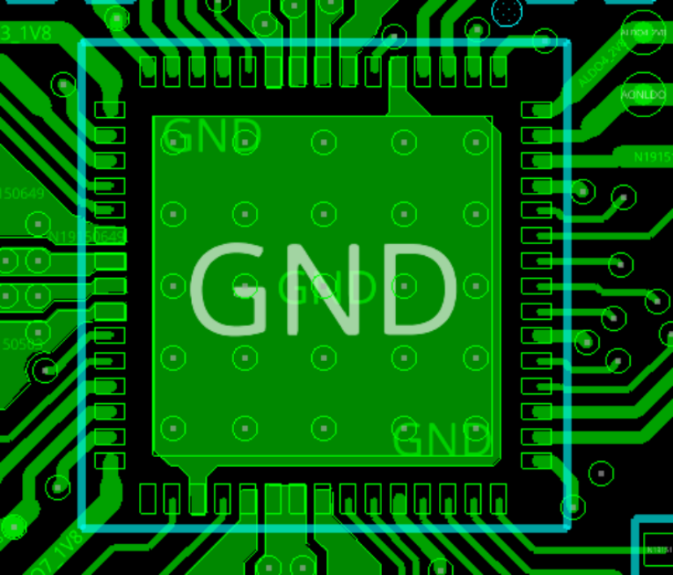

2. BUCK3/BUCK4/BUCK5/BUCK6 的 Vin 需要分开，不可合并铺铜；BUCK1/2 可以合并铺铜，每个 pin 三个过孔：

     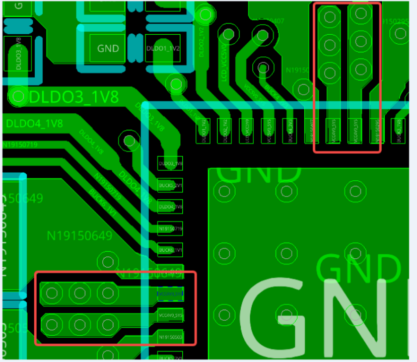

3. FB 走线换层走内层，不要和 SW 同层太长：

     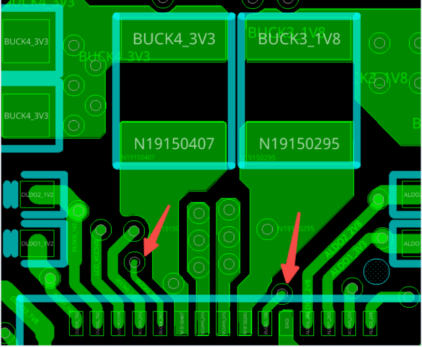

4. 滤波电容靠近主芯片，且电源走线宽度需和参考设计一致：

     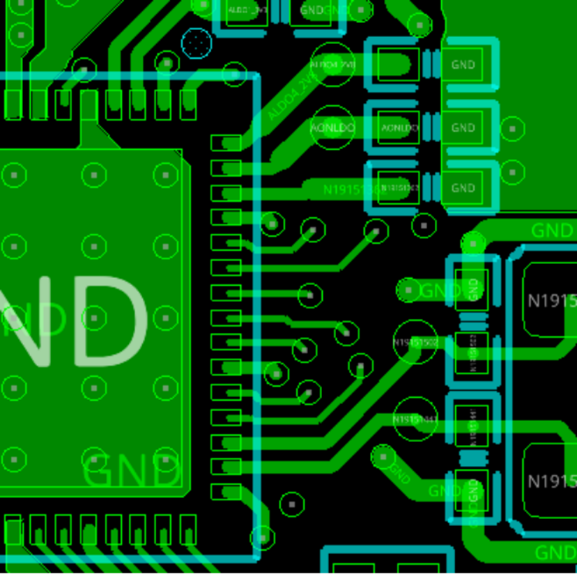

5. SW 铺铜处理，且路径需要短，其他信号远离 SW 信号：

     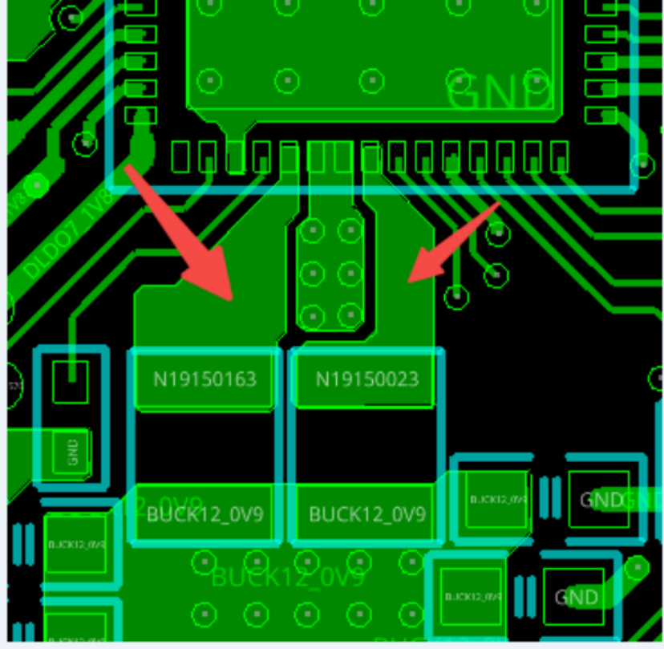

### 2.5 最小系统设计

关于由 CPU、DDR、UFS 组成的小系统，强烈推荐使用我们的参考板设计，该设计已经过仿真和实际验证。若自行设计，需严格进行仿真验证，风险较大。

#### 2.5.1 DDR - PCB Layout 推荐设计

对于 10 层 PCB，建议 DDR 数据信号走在第 3 层、第 8 层，使其主要参考第 2/4 层、第 7/9 层完整的地平面。如果 GND 平面不完整，将对信号质量造成较大影响。DDR 设计中的间距要求和等长要求见下表。

| 参数 | 要求 |
| --- | --- |
| DDR 单端信号阻抗 | 单端 45 Ω ±10% |
| 差分信号阻抗 | 85 Ω ±10% |
| 不同 Byte 之间的间距（air gap） | >= 2 倍走线宽度 |
| 同一个 Byte 之间的间距（air gap） | >= 2 倍走线宽度 |
| 差分对 P/N 之间等长要求 | <= 5 mil |
| 同一组 Byte 之间，以 CLK 为 target | <= 40 mil |

由于 DDR 接口速率较快，PCB 设计难度较大，请使用我司提供的 DDR 模板和对应的 DDR 固件。DDR 模板已经过严格仿真和测试验证后发布。如果自行设计 PCB，请参考如下 PCB 设计建议，仿真无误后再投板。

1. CPU 端和 DDR 端的 GND 过孔请参考模板设计，不可随意删减 GND 过孔。模板管脚的 GND 过孔设计如下图所示：

    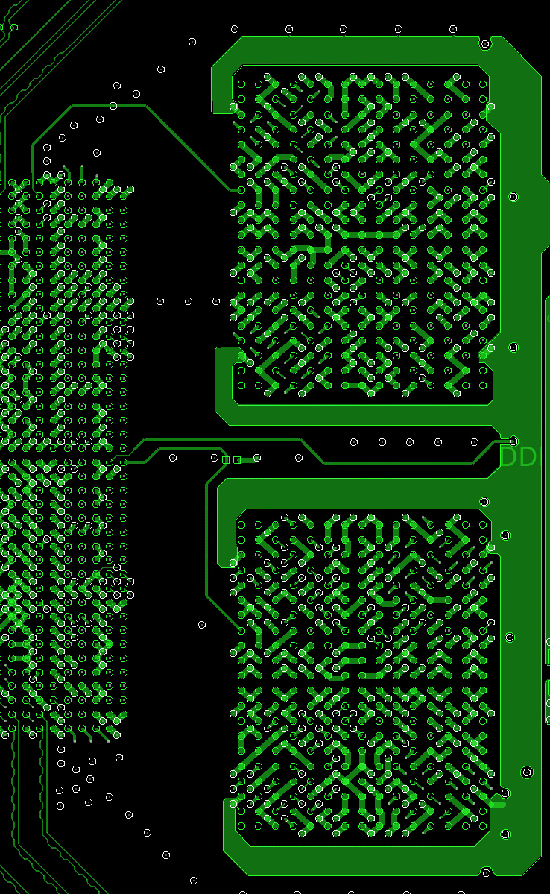

2. 绕线自身的串扰会影响信号时延，走线绕等长时建议 S >= 3W。

    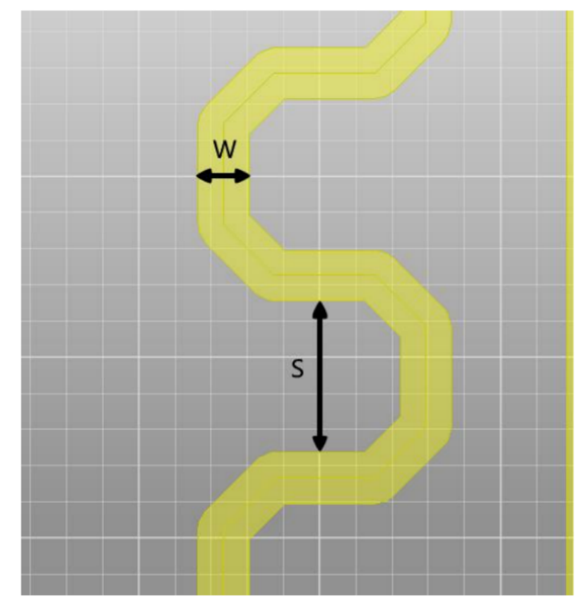

3. DDR 颗粒区域建议一个管脚对应一个 GND 过孔；有空间的区域尽可能增加 GND 过孔。
  
4. 调整过孔位置，优化平面的裂缝，改善回流路径。

    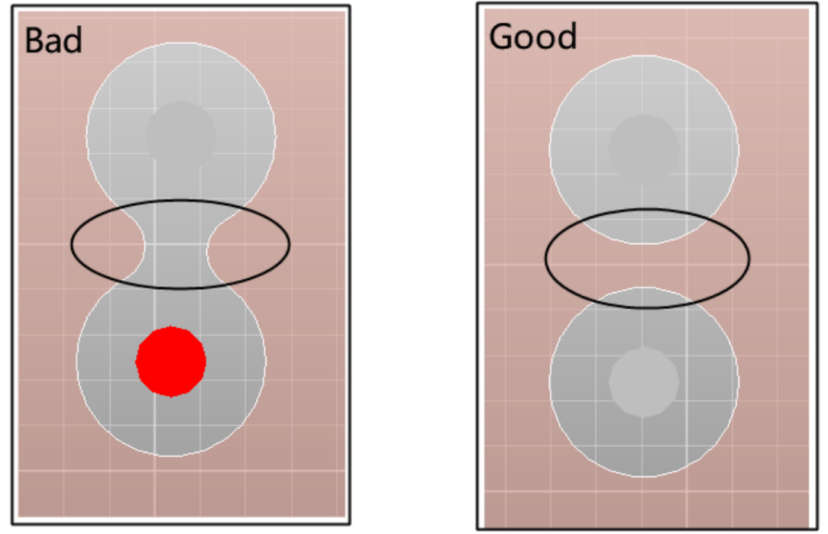

5. 每个电容焊盘建议至少对应一个过孔。对于 0603/0805 封装的电容，建议一个焊盘对应两个过孔，且过孔靠近管脚位置，以减少回路电感。

    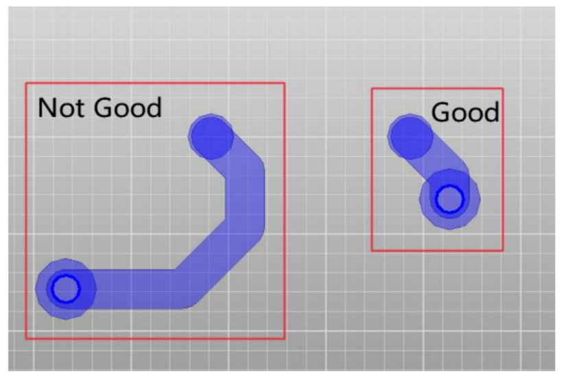

6. DDR 模块的供电电源，如有 FB 线，FB 线的反馈点应靠近主控和 DDR ball 的远端供电点。中间如有打孔换层，需要做挖空避让。

#### 2.5.2 eMMC - PCB Layout 推荐设计

eMMC 和 CPU 的间距建议按我们给出的参考板设计。如果受空间限制需自行设计，请尽量缩短 CPU 到 eMMC 的走线距离，并控制在 1500 mil 范围内。D0-D7、CMD、DS 相对于 CLK 做等长，控制在 <= 100 mil。

| 参数 | 要求 |
| --- | --- |
| 走线阻抗 | 单端 50 Ω ±10% |
| 数据与时钟之间等长 | < 120 mil |
| 走线长度 | < 3 inch |
| eMMC 信号线之间间距 | 大于等于 2 倍 eMMC 线宽 |
| eMMC 与其他信号间距 | 大于等于 2 倍 eMMC 线宽 |
| 换层过孔数量 | 不超过 2 个 |

#### 2.5.3 UFS 信号 PCB 设计

插损要求小于 2 dB@3 GHz，回损要求小于 -13 dB@600 MHz、小于 -5 dB@3 GHz、小于 -3 dB@6 GHz。

| 参数 | 要求 |
| --- | --- |
| 走线阻抗 | 差分 90 Ω ±10% |
| 差分对 P/N 最大时延差 | <= 5 mil |
| 时钟与数据之间等长 | <= 50 mil |
| 走线长度 | < 1500 mil |
| 差分对间间距 | 大于等于 4 倍 UFS 线宽 |
| UFS 与其他信号间距 | 大于等于 4 倍 UFS 线宽 |
| 换层过孔数量 | 不超过 2 个 |

### 2.6 接口设计

#### 2.6.1 GMAC 信号 PCB 设计

GMAC 信号走线尽量短，且减少换层次数，走线具体要求请参照下面表格：

| 参数 | 要求 |
| --- | --- |
| 走线阻抗 | 单端 50 Ω ±10% |
| 时钟与数据之间等长 | < 120 mil |
| 走线长度 | < 5000 mil |
| GMAC 信号线之间间距 | >= 2 倍 GMAC 线宽 |
| GMAC 与其他信号间距 | >= 2 倍 GMAC 线宽 |

#### 2.6.2 SDIO 信号 PCB 设计

| 参数 | 要求 |
| --- | --- |
| 走线阻抗 | 单端 50 Ω ±10% |
| 时钟与数据之间等长 | < 120 mil |
| 走线长度 | < 4000 mil |
| SDIO 与其他信号间距 | >= 2 倍 SDIO 线宽 |

#### 2.6.3 USB2.0 信号 PCB 设计

| 参数 | 要求 |
| --- | --- |
| 走线阻抗 | 差分 90 Ω ±10% |
| 差分对 P/N 最大时延差 | <= 5 mil |
| 走线长度 | < 6000 mil |
| 差分对间间距 | 大于等于 3 倍 USB 线宽 |
| USB2.0 与其他信号间距 | 大于等于 3 倍 USB 线宽 |
| 换层过孔数量 | 不超过 3 个 |

#### 2.6.4 USB3.0 信号 PCB 设计

| 参数 | 要求 |
| --- | --- |
| 走线阻抗 | 差分 90 Ω ±10% |
| 差分对 P/N 最大时延差 | <= 5 mil |
| 走线长度 | < 6000 mil |
| 差分对间间距 | 大于等于 4 倍 USB 线宽 |
| USB3.0 与其他信号间距 | 大于等于 4 倍 USB 线宽 |
| 换层过孔数量 | 不超过 2 个 |

#### 2.6.5 PCIe 信号 PCB 设计

| 参数 | 要求 |
| --- | --- |
| 走线阻抗 | 差分 90 Ω ±10% |
| 差分对 P/N 最大时延差 | <= 5 mil |
| 走线长度 | < 6000 mil |
| 电容要求 | 220 nF ±20% |
| 差分对间间距 | 大于等于 5 倍 PCIe 线宽 |
| PCIe 与其他信号间距 | 大于等于 5 倍 PCIe 线宽 |
| 换层过孔数量 | 不超过 2 个 |

#### 2.6.6 MIPI 信号 PCB 设计

插损要求小于 2 dB@2.25 GHz，回损要求小于 -12 dB@2.25 GHz，lane 间串扰越小越好。绕等长时，需导入 pin_delay。

| 参数 | 要求 |
| --- | --- |
| 走线阻抗 | 差分 90 Ω ±10% |
| 差分对 P/N 最大时延差 | <= 5 mil |
| 时钟与数据之间等长 | <= 12 mil |
| 走线长度 | < 6000 mil |
| 差分对间间距 | 大于等于 4 倍 MIPI 线宽 |
| MIPI 与其他信号间距 | 大于等于 4 倍 MIPI 线宽 |
| 换层过孔数量 | 不超过 2 个 |

#### 2.6.7 DP/eDP 信号 PCB 设计

PCB 端损耗要求 < 2 dB@2.7 GHz。

| 参数 | 要求 |
| --- | --- |
| 走线阻抗 | 差分 90 Ω ±10% |
| 差分对 P/N 最大时延差 | <= 5 mil |
| 时钟与数据之间等长 | <= 50 mil |
| 走线长度（普通板材 DK:3.9 DF:0.02） | < 3000 mil |
| 走线长度（IT-170GRA1BS DK:3.5 DF:0.008） | < 6000 mil |
| 差分对间间距 | 大于等于 5 倍 DP 线宽 |
| DP 与其他信号间距 | 大于等于 5 倍 DP 线宽 |
| 换层过孔数量 | 不超过 2 个 |

## 3. 热设计

### 3.1 热阻仿真结果

| Package | Jc（℃/W） | Jb（℃/W） |
| --- | --- | --- |
| 热阻值 | 0.17 |  |

> 注：数据为仿真数据，仅供参考，请以实物测试为准。

### 3.2 芯片热控制策略

#### 3.2.1 基础信息

- 温控策略：step_wise（温度升高逐级降频，温度降低逐级恢复）
- OPP 索引从 0 开始，数字越小频率越高。
- 回差：2 ℃（触发温度 - 2 ℃ = 退出温度）。
- 双集群：
  - Cluster1（CPU0–7）：opp_table0_x100
  - Cluster2（CPU8–15）：opp_table0_a100
- OPP 索引 ↔ 频率（按 DTS 顺序）

```
Cluster1（CPU0–7）
OPP0：2400MHz
OPP1：2300MHz
OPP2：2200MHz
OPP3：2150MHz
OPP4：2100MHz
OPP5：2000MHz
OPP6：1900MHz
OPP7：1850MHz
OPP8：1800MHz

Cluster2（CPU8–15）
OPP0：2000MHz
OPP1：1900MHz
OPP2：1850MHz
OPP3：1800MHz
OPP4：1700MHz
OPP5：1600MHz
OPP6：1500MHz
OPP7：1400MHz
OPP8：1300MHz
```

#### 3.2.2 全温度区间完整策略（升温 + 降温）

1. 温度 < 83 ℃

   - 状态：无限制，满血运行
     - Cluster1：2400 MHz（OPP0）
     - Cluster2：2000 MHz（OPP0）
   - 温度升高：≥85 ℃ → 进入 85 ℃ 锁频
   - 温度降低：保持满血，无动作

2. 83 ℃ ≤ 温度 < 93 ℃（85 ℃ 主动温控）

   - 限制：固定锁频
     - Cluster1：OPP2 = 2200 MHz
     - Cluster2：OPP3 = 1800 MHz
   - 温度升高：≥95 ℃ → 进入 95 ℃ 动态降频
   - 温度降低：≤83 ℃ → 解除锁频，恢复满血（OPP0）

3. 93 ℃ ≤ 温度 < 103 ℃（95 ℃ 被动温控）

   - 限制：动态区间降频
      - Cluster1：OPP3 ~ OPP5 → 2150 MHz ~ 2000 MHz
      - Cluster2：OPP4 ~ OPP5 → 1700 MHz ~ 1600 MHz
   - step_wise 行为：
      - 温度升高：越热 → OPP 索引越大 → 频率越低
      - 温度降低：越冷 → OPP 索引越小 → 频率越高
   - 温度升高：≥105 ℃ → 进入 105 ℃ 深度降频
   - 温度降低：≤93 ℃ → 退回 85 ℃ 固定锁频

4. 103 ℃ ≤ 温度 < 113 ℃（105 ℃ 深度被动温控）

   - 限制：深度强降频
     - Cluster1：OPP6 ~ OPP8 → 1900 MHz ~ 1800 MHz
     - Cluster2：OPP6 ~ OPP8 → 1500 MHz ~ 1300 MHz
   - step_wise 行为：
       - 温度升高：越热 → 压到区间最低频
       - 温度降低：越冷 → 逐步回到区间高频
   - 温度升高：≥115 ℃ → 紧急关机
   - 温度降低：≤103 ℃ → 退回 95 ℃ 动态降频

5. 温度 ≥ 113 ℃（115 ℃ critical）

   - 动作：系统立即关机 / 重启
   - 无自动恢复，必须手动开机

#### 3.2.3 速查表

备注：K3 系统启动后，默认最高频率为 X100 跑 2.2 GHz，A100 跑 1.8 GHz。

| 温度区间 | 控制方式 | Cluster1 | Cluster2 | 升温触发（进入下一阶段） | 降温触发（退回上一阶段） |
| --- | --- | --- | --- | --- | --- |
| ＜83℃ | 满血 | 2400 MHz | 2000 MHz | ≥85℃ → 锁频 | 无 |
| 83~93℃ | 固定锁频 | 2200 MHz | 1800 MHz | ≥95℃ → 动态降频 | ≤83℃ → 恢复满血 |
| 93~103℃ | 动态降频 | 2150~2000 MHz | 1700~1600 MHz | ≥105℃ → 深度降频 | ≤93℃ → 退回锁频 |
| 103~113℃ | 深度降频 | 1900~1800 MHz | 1500~1300 MHz | ≥115℃ → 关机 | ≤103℃ → 退回动态 |
| ≥115℃ | 紧急关机 | 关机 | 关机 | 直接关机 | 无自动恢复 |

### 3.3 PCB 热设计参考

在 K3 产品中，K3 芯片是发热量最大的器件，因此所有散热处理都应以芯片为主要对象。除 K3 外，其他主要发热器件还包括 PMIC、DCDC、DRMOS 等。

- 合理的结构设计，能保证机器内部与外界空气有热交换途径；
- 整体布局时，大功耗或易产生热量的器件均匀分布，避免局部过热；
- 建议采用 8 层及以上 PCB，尽量增加板材含铜量，建议采用 10 oz 铜厚。除满足电源和信号走线需求外，也应尽量增加地平面层，并通过大面积铜箔辅助散热；
- K3 CPU 等器件电流较大，走线或覆铜必须满足载流能力，否则可能导致温升增加；
- K3 芯片 GND 管脚在顶层走“井”字形，交叉连接，建议走线线宽 10 mil，有利于芯片散热；
- K3 芯片的 GND 管脚，建议尽量保证每个 ball 都对应一个地过孔，至少保证每 1.5 个 ball 对应一个过孔，以增加导热途径。相邻层必须为地平面，以利于芯片散热；
- K3 芯片背面去耦电容地焊盘，建议采用全覆铜，不要采用花孔连接，尽量使地铜皮完整，以提高散热；
- 空旷地方，在不破坏电源层条件下，尽量增加地过孔，增加导热途径，以提高散热。

## 4. ESD 设计

- 关于系统 24 MHz 时钟设计，建议选用 4 pin 贴片晶振，其中 2 个 GND 管脚需与单板地充分连接，以增强系统时钟的抗干扰能力。其他走线应远离晶振区域，且不要从晶振底部穿过。
- 建议在 PCB 器件布局设计时，小系统部分尽量远离金属接口区域，以提升整机 ESD 性能。
- 单板对外的接插件（例如音视频输入输出接口、USB、网口和报警等端口），需要增加 ESD 保护器件，加强接口的抗干扰能力。
- 整机设计为浮地设备时，单板金属化接口部分严禁采用分割地设计。
- 单板定位孔建议采用金属化过孔，并与单板 GND 连接，确保单板 GND 可通过螺丝孔与金属外壳充分连接。
- 整机为接地设备时，要求金属外壳充分接地。分割保护地与单板数字地之间应采用单点连接，且单点连接位置应远离小系统电路，建议靠近整机电源连接器放置。
- 接口连接器外壳推荐采用金属外壳，且与整机金属外壳充分连接（例如带定位螺丝的 HDMI 口和 USB 口、带弹片的 RJ45）。

## 5. 生产温度曲线

K3 芯片均采用环保材料，建议使用 Pb-Free 工艺。下表中的回流焊曲线仅为工艺推荐值，用户需根据实际生产情况进行调整。

**Reflow Profile**

| Material / Parameter / Tool | Criteria | 49VP03 |
| --- | --- | --- |
| Soaking time (127~170 ℃) | 60~90 sec | 61~64 sec |
| Ramp up rate (170~245 ℃) | 0.5~1.2 (℃/sec) | 0.81~0.86 (℃/sec) |
| Peak temperature | 235~245 ℃ | 235.94~238.3 ℃ |
| Reflow time (> 220 ℃) | 35~55 sec | 44~47 sec |
| Cooling rate (245~120 ℃) | ≤ 2.5 (℃/sec) | 1.23~1.28 (℃/sec) |
