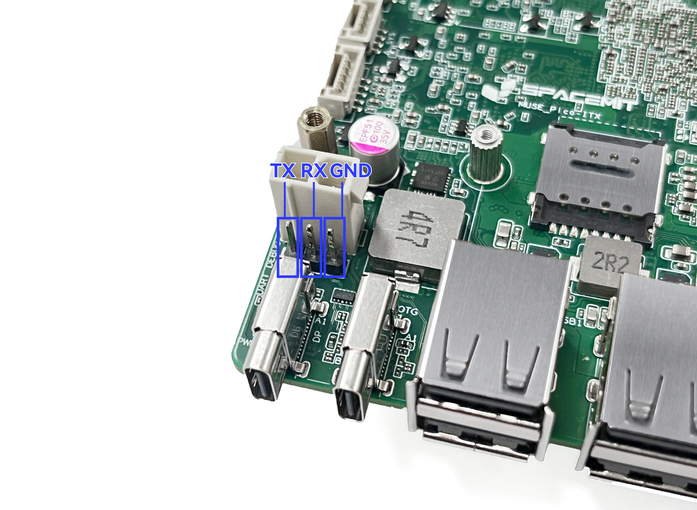
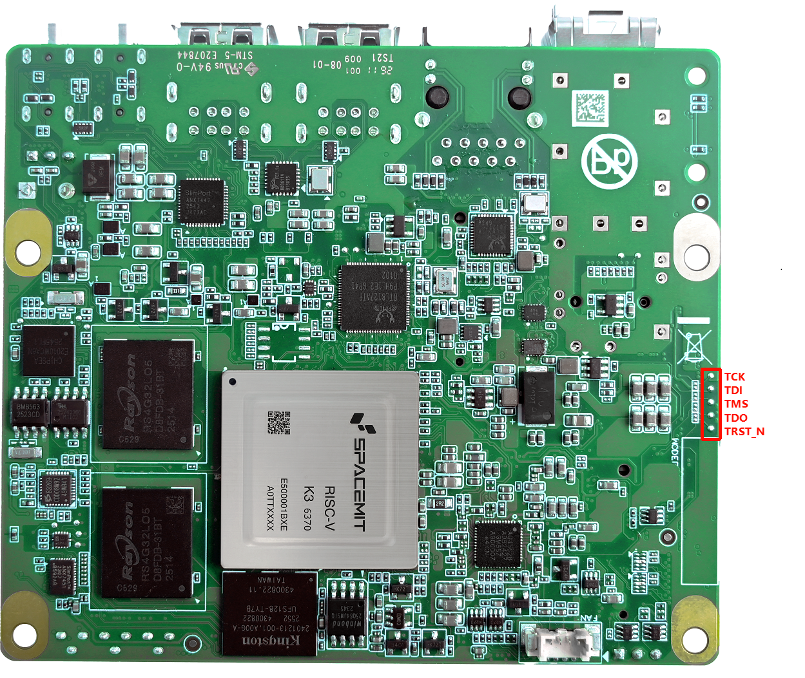
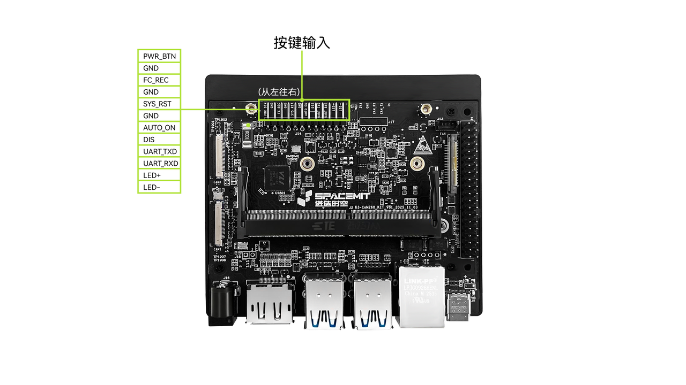
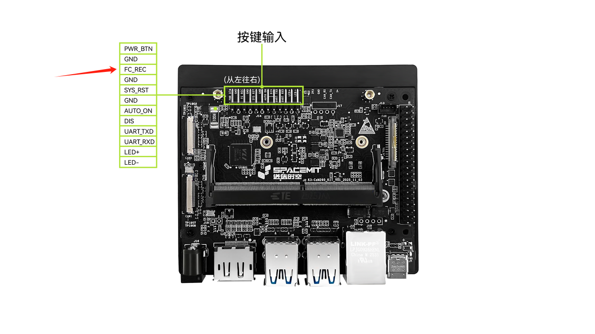
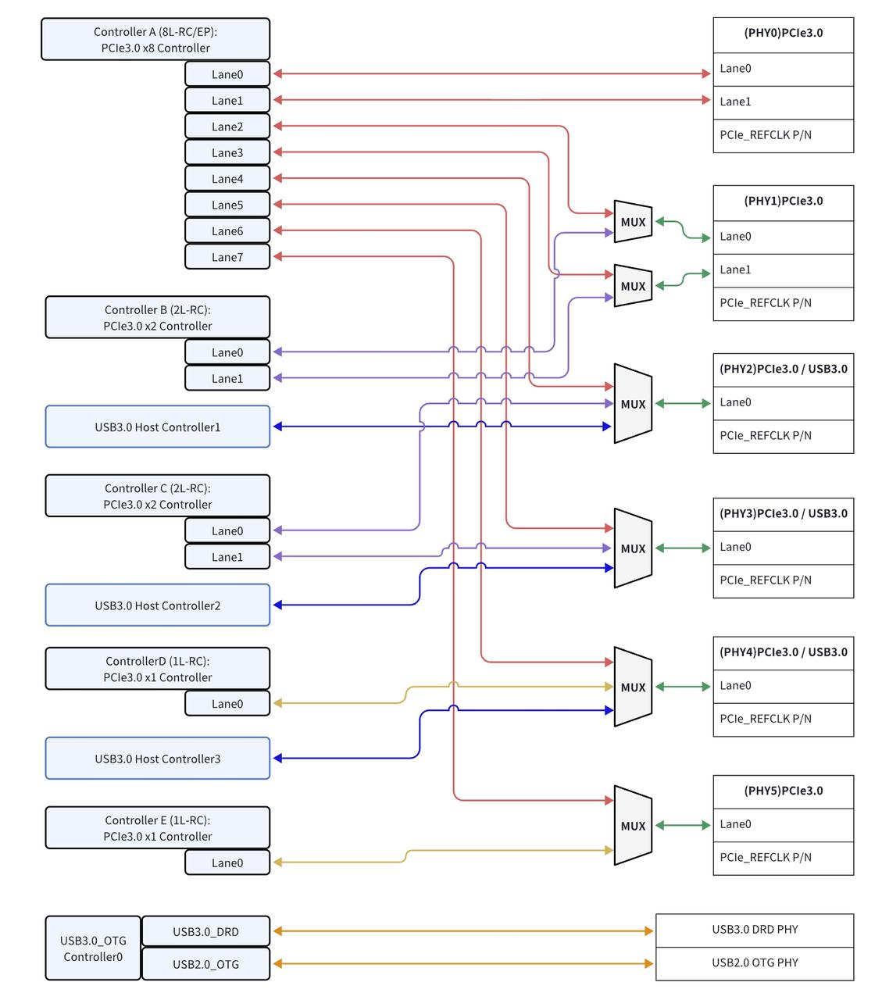

sidebar_position: 3

# K3 硬件方案 FAQ

## 开发调试

1. K3 Pico-ITX 和 K3 CoM260 开发者套件的使用指南在哪里获取？

    可通过以下链接获取。

    - [K3 Pico-ITX 用户使用指南](https://spacemit.com/community/document/info?lang=zh&nodepath=hardware/eco/k3_pico/pico_user_guide.md)
    - [K3 CoM260 开发套件用户使用指南](https://spacemit.com/community/document/info?lang=zh&nodepath=hardware/eco/k3_com260/com260_user_guide.md)

2. K3 Pico-ITX 如何连接串口和 JTAG 进行调试？

    - 串口位置：
     

    - 连接方式：串口线的 TX 接 K3 Pico-ITX 的 RX，RX 接 K3 Pico-ITX 的 TX。
    - 串口调试要求：使用 3.3V 电平串口线。
    - PRI JTAG 调试：
     

3. K3 CoM260 开发者套件如何连接串口和 JTAG 进行调试？

    - 串口位置：
     

    - 连接方式：串口线的 TX 连接 K3-CoM260 KIT 的 RX，RX 连接 K3-CoM260 KIT 的 TX。
    - 串口调试要求：使用 3.3V 电平的串口线。
    - PRI JTAG 调试：支持通过 TF 卡接口转 JTAG。

## 电源系统

该部分主要解答与电源系统相关的常见问题，包括 DCIN、P1（多通道电源管理芯片）、电源域、DCDC、电池、充电器、电量计等。

1. P1 内置 RTC 的精度是多少？

    P1 RTC 的精度为 20 ppm。

2. 休眠和关机时，哪些电源仍然供电？

    > TBD

3. K3 供电中的磁珠能否省略？

    不能省略。磁珠用于隔离模拟 PHY 供电与数字供电，以确保供电的信号完整性和稳定性。如果省略磁珠，可能导致电源干扰，进而影响芯片性能。

4. P1 上未使用的 LDO 能否重新利用？

    可以，但需要确保以下几点：
    - 检查 LDO 的默认输出电压是否满足具体应用需求。
    - 确保外设耐压值能够承受该 LDO 的输出电压。

5. 在关机状态下，定时时间到达后，PMIC 能否自动开机？

    可以自动开机。
    - PMIC 支持 RTC 闹钟开机功能。
    - 当定时时间到达时，P1 会直接启动，无需额外引出中断信号。

6. 插入适配器时，P1 端口是否具备自动开机功能？

    当前方案设计为插入适配器后，P1 自动启动，无需手动操作。
    对于 K3-CoM260，默认插入适配器后可自动上电；当 12pin 按键中的 `AUTO ON` 与 `DIS` 短接时，需要按下 `PWR_BTN` 按键后，K3-CoM260 才会上电开机。

7. P1 上没有单独的适配器检测电路时，如何判断适配器已插入？

    通过 P1 内部集成的检测机制进行判断。
    - P1 能够通过内部电路检测到 VIN 输入信号，从而触发开机操作。

8. 在电池有电且系统处于关机状态时，插入适配器是否会自动开机？

    不会自动开机。在这种情况下，插入适配器后系统不会自动启动，需通过按键手动开机。

9. P1 能否直接使用 3.7V 电池供电？

    可以。P1 能够直接由 3.7V 电池供电。

10. P1 集成的 SW（开关）打开和关闭时间是否可配置？

    不可配置。P1 集成开关的打开和关闭时序为固定值，无法调整。

11. P1 集成的 SW（开关）为什么在未打开时也会导通？

    - 这是已知设计现象。SW 未打开时，会通过 P1 内部 SW 集成 MOS 管的体二极管导通，但通流能力较弱。
    - 建议：为确保设备正常运行及性能满足要求，正常使用时应开启 SW。

12. P1 上电后是否有直接输出的 LDO，即常开 LDO？

    有。P1 上电后有一个集成的常开 LDO，即 `AONLDO`。该 LDO 会在 P1 上电时直接输出，默认输出电压为 1.8V。

13. 是否可以将 ALDO 系列 LDO 全部配置为 3.3V，并在系统启动时快速设定为 3.3V，同时在休眠状态下保持该 LDO 开启，以实现持续供电？

    - 可以将 ALDO 系列 LDO 全部配置为 3.3V 输出。
    - 在系统启动时，可在 SPL 阶段通过快速配置将 ALDO 设置为 3.3V，整个过程约需 490 ms。
    - 设备进入休眠状态后，也可选择保持 ALDO 开启，以确保关键电路持续供电。

14. P1 上所有 LDO 的输出电压都可以修改吗？

    可以。可根据实际需求自定义输出电压，但需要注意各路 LDO 的默认开关状态及默认电压配置。

15. K3 参考设计中加入了多级测电流电阻，PCB 走线因此采用星形连接。如果直接删除这些电阻，并将所有 AVDD 和 DVDD 直接连接到同一 1.8V 电源层，是否会有问题？

    对于电源上串联的功耗测试电路，移除后直接短接即可，不会有问题。

16. 所有 CSI、EDP、GPIO 的 1.8V 电源是否可以统一连接到同一个 1.8V 电源层？模拟部分 AVDD 与数字部分 GPIO 的 1.8V 是否需要分开？

    在参考设计中，如原理图中使用了磁珠，则必须保留，不能直接合并；如使用的是串联电阻，则可以合并。

## 存储系统

该部分主要解答与存储系统相关的常见问题，包括 DRAM、eMMC、TF Card、SSD、SPI Flash、EEPROM 等。

1. 增加 EEPROM 的目的是什么？EEPROM 的 I2C 是否只能使用 K3 的 I2C2？

    用来做不同硬件板卡信息的识别，使得单一固件能够兼容多种不同的硬件配置。
    可以用I2C2或者I2C6

2. K3 的 Flash 容量至少需要多大？

    NOR Flash 最小容量要求如下：8MB（UEFI 启动方案）；4MB（普通 U-Boot 启动方案）。

3. 启动方式是采用软件默认优先级，还是通过拨码开关切换？

    芯片提供 strap pin，可通过设计拨码开关实现启动方式切换。

4. K3 的 64bit DDR 是否可以只使用 32bit，另外 32bit 悬空？

    不可以。

5. K3 除支持 LPDDR5 外，还支持其他 DDR 吗？

    K3 支持 LPDDR5 和 LPDDR4x。

6. 固件如何烧录到 eMMC 或 UFS 中？

    默认通过 USB 3.0 或 USB 2.0 进行下载烧录。

## 时钟系统

该部分主要解答与时钟系统相关的常见问题，包括 DCXO、PLL 等。

## 复位系统

该部分主要解答与复位系统相关的常见问题，如 Reset 相关问题。

## 显示系统

该部分主要解答与显示系统相关的常见问题，包括 MIPI DSI、HDMI 等。

1. DSI 不使用时，是否仍需要供电？

    即使不使用 DSI 模块，仍然需要供电。

## 音频系统

该部分主要解答与音频系统相关的常见问题，包括 Codec、Speaker、PA、MIC 等。

## 摄像系统

该部分主要解答与摄像系统相关的常见问题，包括 MIPI CSI、USB 等。

1. CSI 不使用时，是否仍需要供电？

    即使不使用 CSI 模块，仍然需要供电。

## 网络系统

该部分主要解答与网络系统相关的常见问题，包括 Ethernet、Wi-Fi、BT、4G、5G 等。

1. 如果使用 100M 以太网，且 PHY 的供电电压仅为 3.3V，应如何连接？

    > TBD

2. 单网口应用中，使用 GMAC0、GMAC1、GMAC2 或 GMAC3，是否会影响软件应用？

    不会影响。单网口应用中，无论使用 GMAC0、GMAC1、GMAC2 还是 GMAC3，均不会对软件功能产生影响。

## 外设及接口

该部分主要解答与外设及接口相关的常见问题，包括 USB、SPI、I2C、I2S、UART、PCIe、ADC、PWM、CAN、GPIO、Key、CTP、Sensor、LED 等。

1. K3 的所有 IO 都支持中断输入吗？

    不是所有 IO 都支持中断输入。只有复用为 GPIO functions 的 IO 才支持中断输入。

2. K3 是否有 SATA 接口？

    K3 本身不直接提供 SATA 接口，但支持通过 PCIe 转 SATA 的方式扩展 SATA 功能，目前已支持 ASM1061 和 JMB582 两种转接卡。

3. USB0 口在上电时是否默认作为设备（device）模式？除下载固件外，是否也可以作为主机（host）使用？

    USB0 口在上电时默认作为设备（device）模式进行固件烧录。
    同时也支持主机（host）模式，可用于连接其他 USB 设备。

4. 使用 PCIe 转 SD 卡接口后，是否仍支持 TF 卡烧录？

    使用 PCIe 转 SD 卡接口时，不支持 TF 卡烧录。

5. K3 是否支持 ADC 功能？

    K3 不支持 ADC 功能，但 P1 支持 ADC 功能。

6. GPIO 是否存在受限无法使用的情况，还是都可以使用？

    GPIO 均可使用。但 RCPU 相关开发的优先级会稍慢，建议优先使用 X100 的 functions，其次再考虑使用 R_xxx 对应的 RCPU functions。

7. K3 Pico ITX 原理图带有 EC 控制；如果不使用 EC，上电时序控制应如何参考？

    如果需要控制上电时序，可使用 P1 的这 4 个 GPIO 使能信号，或使用前一级上电电源的使能信号。如果需要进行功耗管理，并在不同场景下控制开关电，则应使用 K3 的 GPIO。具体使用哪个 IO 没有限制，可联系 FAE 沟通确认。

8. 若 QSPI 接口的片选 CS1 不使用，能否单独复用为 GPIO 或 PWM？还是只能作为 QSPI 的 CS1 使用？

    如果不作为 CS1 使用，则可以复用为 GPIO 或 PWM。

9. K3 的 GPIO1、GPIO2、GPIO4、GPIO5 四组 GPIO 所对应的两路电源 `VCCxx_1833GPIOx` 和 `VCC18_GPIOx` 分别是什么电源？各自为哪些模块供电？

    - `VCC18_GPIOx` 是 GPIO 组内部 LDO 的参考电压，可理解为 IO 基准电压，固定为 1.8V；
    - `VCCxx_1833GPIOx` 是 GPIO 组的电源电压。当 `VCCxx_1833GPIOx` 供电为 1.8V 时，该组 GPIO 的 IO 电平为 1.8V；当其供电为 3.3V 时，该组 GPIO 的 IO 电平为 3.3V。该功能不需要软件配置。

10. K3 CoM260 的 214 pin（`FORCE_RECOVERY`）是升级引脚吗？
    是的。将该引脚下拉到 GND 后再上电，即可进入刷机模式。对应下图底板中的该引脚即为下载引脚。
    

11. K3 CoM260 核心板的 MMC2 可以用于 TF 卡固件升级吗？MMC2 可以作为普通 SD 卡存储接口使用吗？

    MMC2 不能用于 TF 卡固件升级，固件升级需使用 MMC1，即核心板上的 TF 卡接口。MMC2 也不能作为普通 SD 卡存储接口使用。

12. K3 USB20_HOST 可以与 USB3-C 或 USB3-D 组合成一个 USB 3.0 接口吗？

    可以，USB3-C 或 USB3-D 均可与 USB20_HOST 搭配使用。

13. K3-CoM260 是否有下电时序要求？

    没有。

14. PCIe 参考时钟是输入还是输出？是否可以工作在 EP 模式？

    在 RC 模式下，PCIe 参考时钟为输出。仅 PCIEA 支持 EP 模式。

15. UCIE 功能的用途是什么？

    K3 的 UCIE 功能当前不使用，相关信号悬空即可。

16. SSPA 是 I2S 信号吗？

    是的。

17. eSPI 是否可以用作普通 SPI？

    不能。

18. K3 Symbol 中带 `R.` 的 functions 表示什么含义？

    K3 具备实时核，带 `R.` 的 functions 表示该功能可由实时核控制。同时，X100 也可以控制带 `R.` 的 functions。

19. K3 PCIe 的 `REFCLK` 是否由 K3 CPU 输出？若工作在 PCIe 3.0 模式下，其稳定性能否满足要求？是否需要外部增加 CLK 芯片？

    是的，`REFCLK` 由 K3 输出。在 PCIe 3.0 模式下，其稳定性可以满足要求，无需额外增加 CLK 芯片。

20. K3 PCIe 原理图 Symbol 中标注为 PCIE0、PCIE1 等，但 GPIO 组复用的边带信号 functions 标注为 PCIEA、PCIEB 等，请问两者如何对应？

    如下图所示，PCIE0 ~ PCIE5 表示 PCIe PHY 顺序，PCIEA ~ PCIEE 表示 PCIe 控制器顺序，GPIO 组复用的边带信号 functions 与控制器顺序对应。

    

## 可靠性

该部分主要解答与可靠性相关的常见问题，包括 ESD、高低温、湿度、寿命、EMI 等。

## 产品认证

该部分主要解答与产品认证相关的常见问题，包括 RoHS、CE、3C、FCC 等。

## 其他

该部分主要解答暂未归类的常见问题，包括 PCB、结构、功耗、散热措施、表面温度等。

1. K3 休眠功耗是多少？

    > TBD

2. K3 的单端线和差分线阻抗控制要求是什么？

    - 对于单端线，阻抗控制要求为 50Ω±10%（DDR 为 45Ω±10%）。
    - 对于差分线，阻抗控制要求为 90Ω±10%（DDR 为 85Ω±10%）。

3. 在哪里可以找到 K3 CoM260 散热器的定位孔信息？

    可参考 [K3 CoM260 的结构 DXF 图](https://cdn-resource.spacemit.com/file/chip/K3/K3_COM260_P1_LP5315B_10151900_PCB174_dxf.zip)，TOP 层预留高度为 3 mm。

4. 是否提供 K3 CoM260 的 3D 结构图？

    可点击下载 [K3 CoM260 的 3D 结构图](https://cdn-resource.spacemit.com/file/chip/K3/hexinban0911_asm.stp)。

5. K3 CoM260 板卡厚度是多少？

    正面高度为 2.8 mm，背面高度为 2.2 mm，板厚为 1.2 mm，总高度为 6.2 mm。
