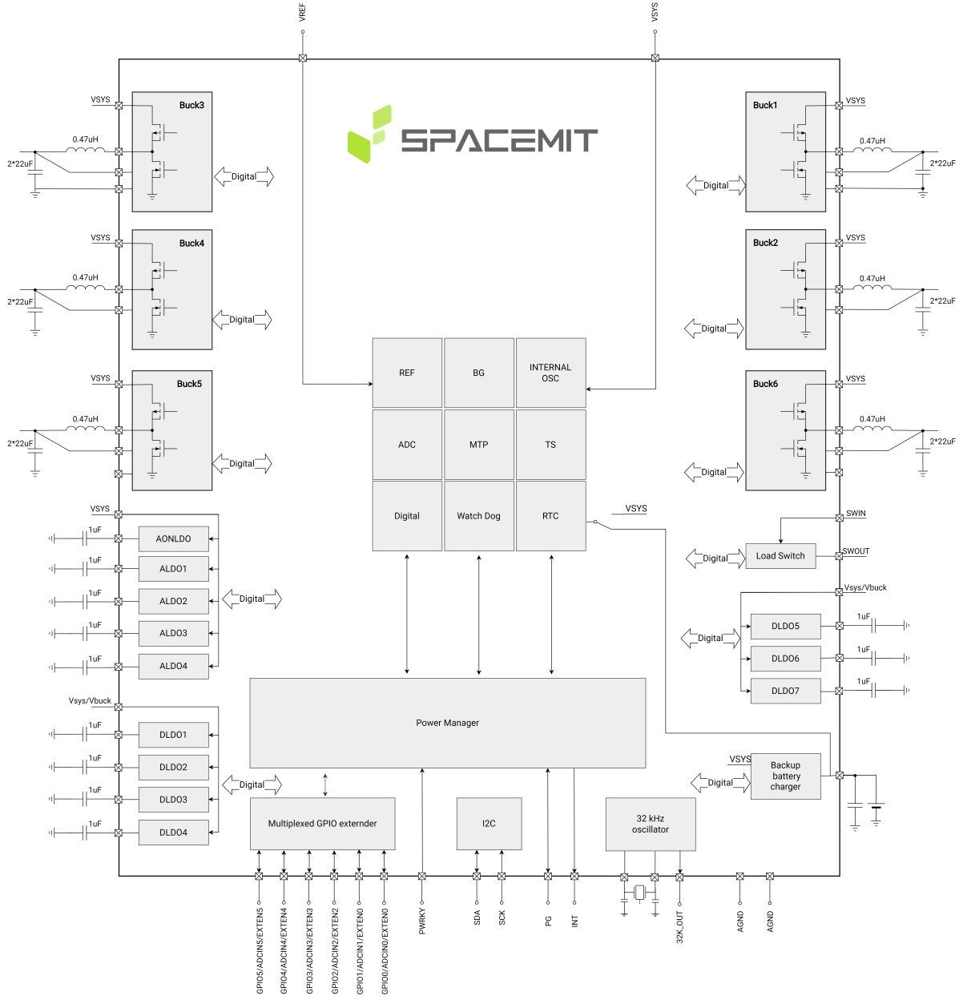
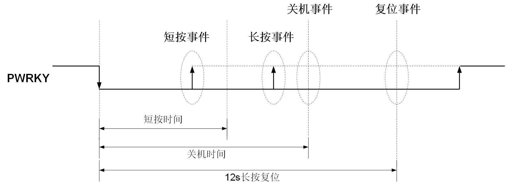
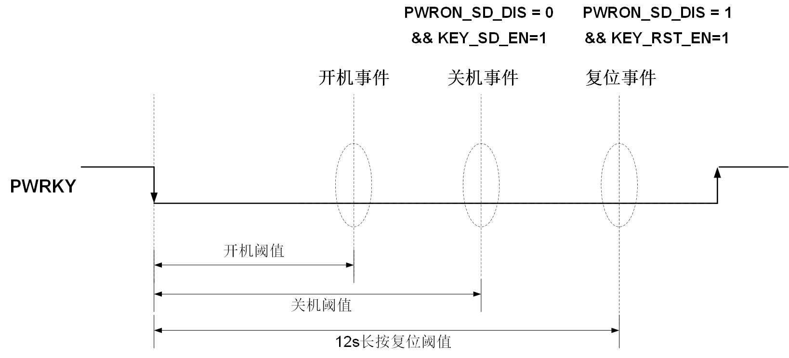
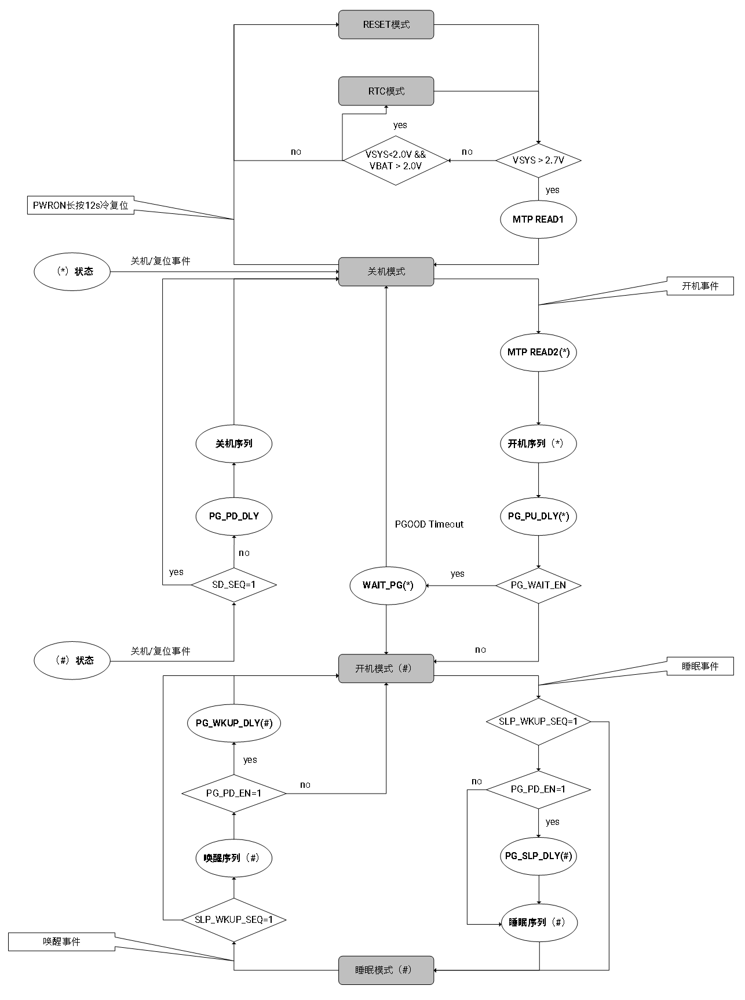
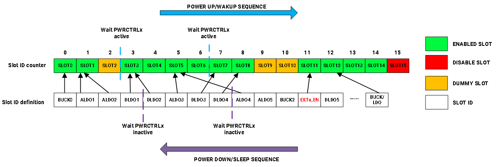
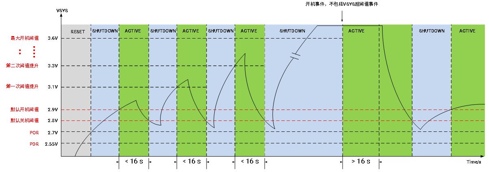
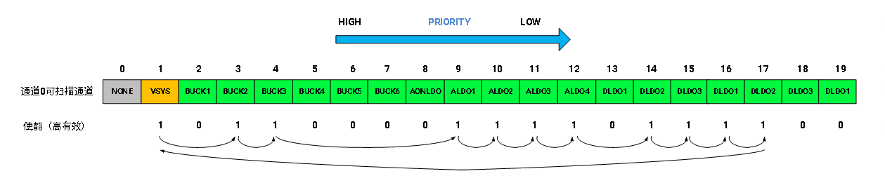
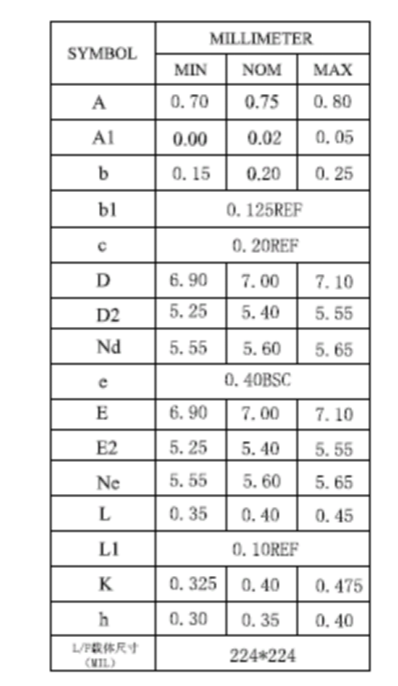
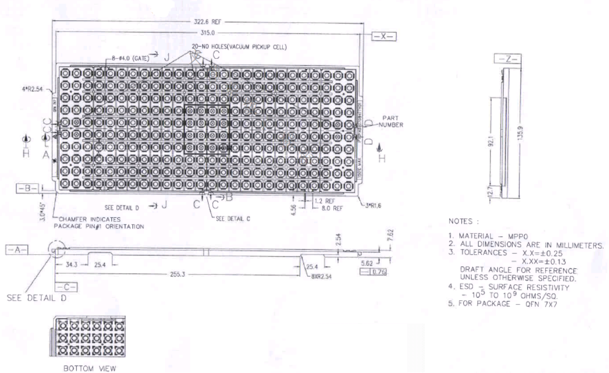

sidebar_position: 2

# P1S 数据手册

## PDF 版本下载

点击下载 [P1S 数据手册（PDF）](https://cdn-resource.spacemit.com/file/chip/P1/P1S_Datasheet_zh.pdf)

## 版本

| 版本   | 日期       | 修订说明             |
|--------|------------|------------------|
| V1.2  | 2024.09.11 | 更新参数         |
| V1.1  | 2024.05.14 | 更新参数         |
| V1.0  | 2024.02.08 | 初始版本         |

## 1. 产品介绍

### 1.1 概述

SpacemiT® Power Stone™ P1S 是一款多通道电源管理芯片（PMIC），旨在满足各种应用的不同电源需求，为客户提供完整的电源解决方案。它具有 6 个恒定导通时间（COT）控制模式降压转换器，5 个低压差稳压器（LDO），一个 IIC 接口，以及多次可编程非易失性存储器（MTP），为各种移动设备和嵌入式系统提供高度灵活的电源管理功能。

六个全集成的降压转换器为各种目标电压轨道提供稳定电源。恒定导通时间（COT）控制能够提供快速的负载瞬态性能。在连续导通模式（CCM）下，1.5MHz 的默认固定切换频率大大减少了外部电感和电容值。全面的保护功能包括欠压锁定（UVLO）、过电流保护（OCP）、过压保护（OVP）和热关断。动态电压控制（DVC）允许根据应用需求对电源电压进行实时控制。

各输出电压和启动/关闭顺序可以通过多次可编程非易失性存储器（MTP）接口进行预设，并通过 IIC 总线进行控制。 P1S 仅需要最少数量的外部元件，并提供紧凑的 QFN-60（7mmx7mm）封装。

### 1.2 关键特性

- 供电电压（VIN）：2.7V～ 5.5V
- 6 个高效降压转换器

  - Buck1/2：0.5V～3.4V，4A，支持双相操作
  - Buck3/4：0.5V～3.4V，2.5A，支持双相操作
  - Buck5/6：0.5V～3.4V，2.5A
  - 所有降压转换器可选择的输出电压范围：0.5V～1.35V，5mV/step 或 1.375V～3.4V，25mV /step
  - 电流限制阈值可调，允许根据不同应用的不同负载电流进行优化
  - 专用引脚用于选择不同 DDR 颗粒的 VDDQ 电压
- 5 个可编程的 LDO 稳压器

  - 1 个专用常开 LDO
  - 4 个低噪声 LDO
  - 输出电压：0.5V～3.4V，25mV/step
  - 输出电流：0.3A
- IIC 通信接口
- 用户可编程 MTP
- 带有看门狗定时器的系统监视器
- 12 位 ADC，具有 8 个通道和可配置的警报阈值
- 输出电压和启动/关闭顺序可由 MTP 预设
- 6 个用于外围控制的 GPIO 引脚
- 芯片结温：- 40℃ 至 125℃
- 封装：QFN-60，7x7mm，0.4mm 间距

### 1.3 应用

- 虚拟现实/增强现实设备
- 工业设备
- 导航设备
- 机器人
- 无人机

## 2. 模块框图

图 2-1 P1S 模块框图

## 3. 引脚封装图

图 3-1 P1S 封装图

表 3-1 P1S 引脚类型定义

| 引脚类型 | 描述 | 引脚类型 | 描述 |
| --- | --- | --- | --- |
| DI | 数字输入 | AI | 模拟输入 |
| DO | 数字输出 | AO | 模拟输出 |
| DIO | 数字输入/输出 | AIO | 模拟输入/输出 |
| PWR | 电源 | GND | 地 |

表 3-2 P1S 引脚描述

| 引脚 | 引脚名称 | 类型 | 描述 | 复用功能 |
| --- | --- | --- | --- | --- |
| 1 | ALDO3 | AO | ALDO3电压输出 |  |
| 2 | ALDOIN | PWR | ALDO1~4电源输入 |  |
| 3 | ALDO1 | AO | ALDO1电压输出 |  |
| 4 | ALDO2 | AO | ALDO2电压输出 |  |
| 5 | FB3GND | GND | Buck3输出电压地端反馈 |  |
| 6 | FB3 | AIN | Buck3输出电压反馈 |  |
| 7 | SW3 | AIO | Buck3的开关节点 |  |
| 8 | VIN3 | PWR | Buck3的电源输入 |  |
| 9 | VIN4 | PWR | Buck4的电源输入 |  |
| 10 | SW4 | AIO | Buck4的开关节点 |  |
| 11 | FB4 | AIN | Buck4输出电压反馈 |  |
| 12 | NC | / | NA |  |
| 13 | NC | / | NA |  |
| 14 | NC | / | NA |  |
| 15 | NC | / | NA |  |
| 16 | NC | / | NA |  |
| 17 | NC | / | NA |  |
| 18 | NC | / | NA |  |
| 19 | VSET6 | AIN | Buck6默认 输出电压设定 |  |
| 20 | FB6 | AIN | Buck6输出电压反馈 |  |
| 21 | SW6 | AIN | Buck6的开关节点 |  |
| 22 | VIN6 | PWR | Buck6的电源输入 |  |
| 23 | VIN5 | PWR | Buck5的电源输入 |  |
| 24 | SW5 | AIO | Buck5的开关节点 |  |
| 25 | FB5 | AIN | Buck5输出电压反馈 |  |
| 26 | VSET5 | AIN | Buck5默认输出电压设定 |  |
| 27 | NC | / | NA |  |
| 28 | NC | / | NA |  |
| 29 | NC | / | NA |  |
| 30 | NC | / | NA |  |
| 31 | NC | / | NA |  |
| 32 | TEST1 | DIO | 测试引脚 |  |
| 33 | AGND | GND | 模拟地 |  |
| 34 | FB2 | AIN | Buck2输出电压反馈 |  |
| 35 | SW2 | AIO | Buck2的开关节点 |  |
| 36 | VIN2 | PWR | Buck2的电源输入 |  |
| 37 | VIN1 | PWR | Buck1的电源输入 |  |
| 38 | SW1 | AIO | Buck1的开关节点 |  |
| 39 | FB1 | AIN | Buck1输出电压反馈 |  |
| 40 | FB1GND | GND | Buck1输出电压地端反馈 |  |
| 41 | VSYS | PWR | 内部电路电源输入 |  |
| 42 | GPIO5 | DIO/AIN | 多功能复用GPIO | EXT_EN/SLEEP_WKUP/PWRCTRL/nRESET/ADC input |
| 43 | GPIO4 | DIO/AIN | 多功能复用GPIO | EXT_EN/SLEEP_WKUP/PWRCTRL/nRESET/ADC input |
| 44 | SDA | DIO | IIC通信接口数据信号 |  |
| 45 | SCL | DIN | IIC通信接口时钟信号 |  |
| 46 | NC | / | NA |  |
| 47 | NC | / | NA |  |
| 48 | NC | / | NA |  |
| 49 | GPIO3 | DIO/AIN | 多功能复用GPIO | EXT_EN/SLEEP_WKUP/PWRCTRL/nRESET/ADC input |
| 50 | NC | / | NA |  |
| 51 | GPIO2 | DIO/AIN | 多功能复用GPIO | EXT_EN/SLEEP_WKUP/PWRCTRL/nRESET/ADC input |
| 52 | GPIO1 | DIO/AIN | 多功能复用GPIO | EXT_EN/SLEEP_WKUP/PWRCTRL/nRESET/ADC input |
| 53 | GPIO0 | DIO/AIN | 多功能复用GPIO | EXT_EN/SLEEP_WKUP/PWRCTRL/nRESET/ADC input |
| 54 | INT | DIO | 中断输出 |  |
| 55 | PWRKY | AIN | 开机/关机/复位按键 |  |
| 56 | PGOOD | DIO | Power good指示位/复位源 |  |
| 57 | AGND | GND | 模拟地 |  |
| 58 | VREF | AO | 芯片内部参考电压 |  |
| 59 | AONLDO | AO | AONLDO电压输出 |  |
| 60 | ALDO4 | AO | ALDO4电压输出 |  |

## 4. 绝对最大额定值

表 4-1 绝对最大额定值

| 参数 | 描述 | 条件 | 最小值 | 典型值 | 最大值 | 单位 |
| --- | --- | --- | --- | --- | --- | --- |
| T(STG) | 存储温度 |  | -40 |  | 150 | °C |
| T(J) | 结温 |  | -40 |  | 125 | °C |
| V(SYS) | 系统供电电压 |  | -0.3 |  | 7.0 | V |
| V(ESD_HBM) | ESD保护-HBM |  | 2 |  |  | kV |
| V(ESD_CDM) | ESD保护-CDM |  | 500 |  |  | V |

## 5. 电气特性参数

### 5.1 推荐工作条件

表 5-1 推荐工作条件

| 参数 | 描述 | 条件 | 最小值 | 典型值 | 最大值 | 单位 |
| --- | --- | --- | --- | --- | --- | --- |
| T(J) | 结温 |  | -40 |  | 125 | ℃ |
| V(SYS) | 系统供电电压 |  | 2.7 |  | 5.5 | V |
| P(DIS) | 芯片最大功耗 |  |  |  | 2 | W |
| R(JA) | Junction到环境热阻 |  |  | 38 |  | ℃/W |
| R(JC) | Junction到芯片表面热阻 |  |  | 12 |  | ℃/W |
| R(JB) | Junction到PCB板热阻 |  |  | 9 |  | ℃/W |

### 5.2 各模式功耗情况

表 5-2 各模式功耗情况

| 参数 | 描述 | 条件 | 最小值 | 典型值 | 最大值 | 单位 |
| --- | --- | --- | --- | --- | --- | --- |
| 功耗 | RESET模式 | - |  |  |  | μA |
| 功耗 | RTC模式 | Vin=5V, Ta=25℃ |  | 1.5 |  | μA |
| 功耗 | 关机模式-SHUTDOWN | Vin=5V, Ta=25℃ |  | 35 |  | μA |
| 功耗 | 开机模式-ACTIVE | - |  |  |  | μA |
| 功耗 | 睡眠模式-SLEEP | - |  |  |  | μA |

### 5.3 数字引脚电气特性

表 5-3 数字引脚电气特性

| 参数 | 描述 | 条件 | 最小值 | 典型值 | 最大值 | 单位 |
| --- | --- | --- | --- | --- | --- | --- |
| V(IH) | 高电平输入 | 2.7 ～ 5.5 V，-40 ~ 105 ℃ |  |  | 0.3 * AONLDO | V |
| V(IL) | 低电平输入 | 2.7 ～ 5.5 V，-40 ~ 105 ℃ | 0.7 * AONLDO |  |  | V |
| V(OH) | 高电平输出 | 5 V，25 ℃, AONLDO = 1.8 V，I(LOAD)=1 mA |  | AONLDO - 0.1 |  | V |
| V(OL) | 低电平输出 | 5V，25 ℃, AONLDO = 1.8 V，I(LOAD)=1 mA |  | 0.1 |  | V |
| I(DRIVE) | 源电流驱动 | 5V，25 ℃, AONLDO = 1.8 V，PAD = 1.3 V |  | 10 |  | mA |
| I(SINK) | 灌电流驱动 | 5V，25 ℃, AONLDO = 1.8 V，PAD = 0.5 V |  | 25 |  | mA |
| R(PU) | 弱上拉电阻 |  |  | 20 k |  | Ω |
| R(PD) | 弱下拉电阻 |  |  | 20 k |  | Ω |

### 5.4 看门狗

表 5-4 数字引脚电气特性

| 参数 | 描述 | 条件 | 最小值 | 典型值 | 最大值 | 单位 |
| --- | --- | --- | --- | --- | --- | --- |
| T(WD_MIN) | 最小看门狗时间 |  |  | 1 |  | s |
| T(WD_MAX) | 最大看门狗时间 |  |  | 16 |  | s |

### 5.5 LDO

#### 5.5.1 AONLDO

表 5-5 AONLDO 电气特性

| 参数 | 描述 | 条件 | 最小值 | 典型值 | 最大值 | 单位 |
| --- | --- | --- | --- | --- | --- | --- |
| V(DD) | 输入电压范围 | V(IN) = V(SYS) | 2.7 |  | 5.5 | V |
| V(LDO) | 输出电压范围 |  | 0.5 |  | 3.4 | V |
| V(LDO_ACC) | 输出电压精度 | V(OUT) > 1.2V |  |  | ±1 | % |
| V(LDO_ACC) | 输出电压精度 | V(OUT) < 1.2V |  |  | ±12 | mV |
| I(OUT_MAX) | 输出电流 |  |  |  | 0.2 | A |
| I(OCP) | 过流保护 |  |  | 0.3 |  | A |
| I(SHORT) | 短路电流 |  |  | 0.15 |  | A |
| V(DROPOUT) | 电压降 | V(OUT)=1.8 V, I(OUT_MAX) |  | 0.3 |  | V |
| V(S_LINE) | 静态线性调整 | V(IN )= 3 ~ 5 V |  | 10 |  | mV |
| V(S_LOAD) | 静态负载调整 | I(LOAD) = 10 ~ 100 mA |  | 15 |  | mV |
| PSRR | PSRR | I(OUT )= I(MAX) / 2, V(IN )- V(OUT )> 1 V |  | 60 |  | dB |
| Noise | 输出噪声 | V(OUT) = 1.8 V, I(OUT) = 5 mA - I(MAX) |  | 35 |  | μVrms |
| Noise | 输出噪声 | V(OUT )= 2.5 V, I(OUT) = 5 mA - I(MAX) |  | 35 |  | μVrms |
| I(Q_ON) | 开机模式静态电流 |  |  | 15 |  | μA |
| R(OFF) | 关机模式下拉电阻 |  |  | 160 |  | ohm |
| OV | 过压 | Vout/Vout_target-1 |  | 20 |  | % |
| UV | 欠压 | 1- Vout/Vout_target |  | 15 |  | % |

#### 5.5.2 ALDO1~4

表 5-6 ALDO1~4 电气特性

| 参数 | 描述 | 条件 | 最小值 | 典型值 | 最大值 | 单位 |
| --- | --- | --- | --- | --- | --- | --- |
| V(DD) | 输入电压范围 | V(IN) = V(SYS) | 2.7 |  | 5.5 | V |
| V(LDO) | 输出电压范围 |  | 0.5 |  | 3.4 | V |
| V(LDO_ACC) | 输出电压精度 | V(OUT) > 1.2 V |  |  | ±1 | % |
| V(LDO_ACC) | 输出电压精度 | V(OUT) < 1.2 V |  |  | ±12 | mV |
| I(OUT_MAX) | 输出电流 |  |  |  | 0.3 | A |
| I(OCP) | 过流保护 |  |  | 0.5 |  | A |
| I(SHORT) | 短路电流 |  |  | 0.25 |  | A |
| V(DROPOUT) | 电压降 | V(IN)=2.0 V，I(OUT_MAX) |  | 0.3 |  | V |
| V(S_LINE) | 静态线性调整 | V(IN )= 3 ~ 5 V |  | 10 |  | mV |
| V(S_LOAD) | 静态负载调整 | I(LOAD) = 10 ~ 100 mA |  | 15 |  | mV |
| PSRR | PSRR | I(OUT )= I(MAX) / 2，V(IN )- V(OUT )> 1 V |  | 70 |  | dB |
| Noise | 输出噪声 | V(OUT) = 1.8 V，I(OUT) = 5 mA - I(MAX) |  | 30 |  | μVrms |
| Noise | 输出噪声 | V(OUT )= 2.5 V，I(OUT) = 5 mA - I(MAX) |  | 30 |  | μVrms |
| I(Q_ON) | 开机模式静态电流 |  |  | 15 |  | μA |
| R(OFF) | 关机模式下拉电阻 |  |  | 160 |  | Ω |
| OV | 过压 | Vout/Vout_target-1 |  | 20 |  | % |
| UV | 欠压 | 1- Vout/Vout_target |  | 15 |  | % |

### 5.6 BUCK1~6

表 5-7 BUCK1~6 电气特性

| 参数 | 描述 | 条件 | 最小值 | 典型值 | 最大值 | 单位 |
| --- | --- | --- | --- | --- | --- | --- |
| Buck overall | Buck overall | Buck overall | Buck overall | Buck overall | Buck overall | Buck overall |
| V(IN_MIN) | 最小输入电压 |  |  | 2.7 |  | V |
| V(IN_MAX) | 最大输入电压 |  |  | 5.5 |  | V |
| V(OUT_MIN) | 最小输出电压 |  |  | 0.5 |  | V |
| V(OUT_MAX) | 最大输出电压 |  |  | 3.4 |  | V |
| V(OUT_STEPS) | 调压步幅 | V(OUT) = 0.5 ~ 1.35 V |  | 5 |  | mV |
| V(OUT_STEPS) | 调压步幅 | V(OUT) = 1.35 ~ 3.4 V |  | 25 |  | mV |
| V(SLEW) | DVS档位 |  |  | 5/10/25/50 |  | mV/us |
| T(SFST) | 软启动时间 |  |  | 1 |  | ms |
| T(SFST_SET) | 软启动档位设置 |  |  | 0.78/0.9/1.12 |  | ms |
| R(DIDCHG) | 泄放电阻 |  |  | 45 |  | ohm |
| fsw | 工作频率 | CCM |  | 1.5 |  | MHz |
| OV | 过压 | Vout/Vout_target-1 |  | 20 |  | % |
| UV | 欠压 | 1- Vout/Vout_target |  | 15 |  | % |
| V(BUCK_ACC) | 输出电压精度 | 不含line/load调整 V(OUT) > 1 V |  |  | ±1 | % |
| V(BUCK_ACC) | 输出电压精度 | 不含line/load调整 V(OUT) < 1 V |  |  | ±10 | mV |
| V(S_LOAD) | 静态负载调整 | I(OUT )= 0.1 ~ 2 A，V(OUT )= 1 V |  |  | ±1 | % |
| V(S_LINE) | 静态线性调整 | V(IN) = 3 ~ 5 V，V(OUT) = 1 V |  |  | ±1 | % |
| V(TR_LD) | 负载瞬态响应 (Cout=44uF，Iout=0.02 ~ 2.7 A) | undershoot，V(OUT )< 1.2 V |  | 30 | 60 | mV |
| V(TR_LD) | 负载瞬态响应 (Cout=44uF，Iout=0.02 ~ 2.7 A) | undershoot，V(OUT )> 1.2 V |  | 3 | 5 | % |
| V(TR_LD) | 负载瞬态响应 (Cout=44uF，Iout=0.02 ~ 2.7 A) | overshoot，V(OUT) < 1.6 V |  | 72 | 80 | mV |
| V(TR_LD) | 负载瞬态响应 (Cout=44uF，Iout=0.02 ~ 2.7 A) | overshoot，V(OUT )> 1.6 V |  |  | 5 | % |
| V(RIPPLE) | 输出纹波 | I(OUT) = 0.1 A，V(OUT) = 1.1 V |  | 13 | 25 | mV |
| V(RIPPLE) | 输出纹波 | I(OUT) > 1 A，V(OUT )= 1.1 V |  | 7 | 20 | mV |
| Buck 1 ~ 2, single buck | Buck 1 ~ 2, single buck | Buck 1 ~ 2, single buck | Buck 1 ~ 2, single buck | Buck 1 ~ 2, single buck | Buck 1 ~ 2, single buck | Buck 1 ~ 2, single buck |
| I(OUT_MAX) | 输出电流 | OCP large=1 | 4.0 |  |  | A |
| Efficiency | 效率 | V(IN) = 4 V，V(OUT) = 0.9 V I(OUT) = 0.5 A |  | 86.3 |  | % |
| Efficiency | 效率 | V(IN) = 4 V，V(OUT) = 0.9 V I(OUT )= 2.5 A |  | 78.2 |  |  |
| D(ACC) | 双相精度 | Iout=6A |  | 10.0 | 20.0 | % |
| R(PU) | 弱上拉电阻 | V(IN) = 4 V |  | 80 |  | mohm |
| R(PD) | 弱下拉电阻 | V(IN) = 4 V |  | 40 |  | mohm |
| Buck 3 ~ 4 | Buck 3 ~ 4 | Buck 3 ~ 4 | Buck 3 ~ 4 | Buck 3 ~ 4 | Buck 3 ~ 4 | Buck 3 ~ 4 |
| I(OUT_MAX) | 输出电流 |  | 2.5 | 3.5 |  | A |
| I(VALLEY_LIMIT) |  | Normal level | 3.0 |  |  | A |
| Efficiency | 效率 | V(IN) = 4 V，V(OUT) = 1.8 V I(OUT) = 0.5 A |  | 90.6 |  | % |
| Efficiency | 效率 | V(IN) = 4 V，V(OUT) = 1.8 V I(OUT )= 2.5 A |  | 83.4 |  |  |
| D(ACC) | 双相精度 | Iout=5A |  |  | 20.0 | % |
| R(PU) | 弱上拉电阻 | V(IN) = 4 V |  | 100 |  | mohm |
| R(PD) | 弱下拉电阻 | V(IN) = 4 V |  | 50 |  | mohm |
| Buck 5 ~ 6 | Buck 5 ~ 6 | Buck 5 ~ 6 | Buck 5 ~ 6 | Buck 5 ~ 6 | Buck 5 ~ 6 | Buck 5 ~ 6 |
| I(OUT_MAX) | 输出电流 |  | 2.5 |  |  | A |
| I(VALLEY_LIMIT) |  | Normal level | 3.0 |  |  | A |
| Efficiency | 效率 | V(IN) = 4 V，V(OUT) = 1.1 V I(OUT) = 0.5 A |  | 87.7 |  | % |
| Efficiency | 效率 | V(IN) = 4 V，V(OUT) = 1.1 V I(OUT )= 2.5 A |  | 79.9 |  |  |
| Efficiency | 效率 | V(IN) = 4 V，V(OUT) = 2.1 V I(OUT) = 0.5 A |  | 91.6 |  |  |
| Efficiency | 效率 | V(IN) = 4 V，V(OUT) = 2.1 V I(OUT )= 2.5 A |  | 86.8 |  |  |
| R(PU) | 弱上拉电阻 | V(IN) = 4 V |  | 100 |  | mohm |
| R(PD) | 弱下拉电阻 | V(IN) = 4 V |  | 50 |  | mohm |

### 5.7 负载开关

表 5-10 负载开关电气特性

| 参数 | 描述 | 条件 | 最小值 | 典型值 | 最大值 | 单位 |
| --- | --- | --- | --- | --- | --- | --- |
| SW(IN-MIN) | 最小输入电压 | Vsys=4V |  | 2.7 |  | V |
| SW(IN-MAX) | 最大输入电压 | Vsys=4V |  | 5.5 |  | V |
| R(ON) | 导通电阻 | SWIN=5V |  | 140 |  | mohm |
| I_SC | 短路电路 |  |  | 0.5 |  | A |
| I_MAX | 最大电流 |  |  | 1.6 |  | A |

### 5.8 ADC

表 5-11 ADC 电气特性

| 参数 | 描述 | 条件 | 最小值 | 典型值 | 最大值 | 单位 |
| --- | --- | --- | --- | --- | --- | --- |
| Resolution | 分辨率 |  |  | 12 |  | Bits |
| VDD | 供电电压 |  | 2.7 |  | 5.5 | V |
| DNL | 微分非线性 | 2.7 ~ 5.5 V -40 ~ 105 ℃ | -3 |  | 3 | LSB |
| INL | 积分非线性 | 2.7 ~ 5.5 V -40 ~ 105 ℃ | -4 |  | 4 | LSB |
| Offset error | 偏移误差 | 2.7 ~ 5.5 V -40 ~ 105 ℃ | -4 |  | 4 | LSB |
| Gain error | 增益误差 | 2.7 ~ 5.5 V -40 ~ 105 ℃ | -4 |  | 4 | LSB |
| Sample rate | 采样率 | 25 ℃ | 0.1 |  | 25 | Ksps |
| I(WORK) | 工作电流 | 5V，25 ℃ |  | 190 |  | μA |

表 5-12 ADC 内部基准电气特性

| 参数 | 描述 | 条件 | 最小值 | 典型值 | 最大值 | 单位 |
| --- | --- | --- | --- | --- | --- | --- |
| V(REF_2V) | 2V基准电压 | 2.7 ~ 5.5 V，25 ℃ | 1.995 | 2 | 2.005 | V |
| V(REF_3V) | 3V基准电压 | 3.5 ~ 5.5 V，25 ℃ | 2.995 | 3 | 3.005 | V |
| I(WORK) | 工作电流 | 5.0V，-40 ~ 105 ℃ |  | 400 |  | μA |

### 5.9 内部时钟

表 5-13 内部 LSI 电气特性

| 参数 | 描述 | 条件 | 最小值 | 典型值 | 最大值 | 单位 |
| --- | --- | --- | --- | --- | --- | --- |
| F(ACC) | 频率精度 | 5 V，25 ℃ | 30 | 32 | 34 | kHz |
| V(C) | 电压系数 | 2.0 ~ 5.5 V，25 ℃ | -7 |  | 7 | % |
| T(C) | 温度系数 | 5V，-40 ~ 105 ℃ | -10 |  | 10 | % |
| I(WORK) | 工作电流 | 2.0 ~ 5.5 V，-40 ~ 105 ℃ | 0.4 | 0.9 | 1.5 | μA |

表 5-14 内部 HSI 电气特性

| 参数 | 描述 | 条件 | 最小值 | 典型值 | 最大值 | 单位 |
| --- | --- | --- | --- | --- | --- | --- |
| F(ACC) | 频率精度 | 5 V，25 ℃ | 1.98 | 2 | 2.02 | MHz |
| V(C) | 电压系数 | 2.0 ~ 5.5 V，25 ℃ | -0.5 |  | 0.5 | % |
| T(C) | 温度系数 | 5V，-40 ~ 105 ℃ | -3 |  | 3 | % |
| I(WORK) | 工作电流 | 2.0 ~ 5.5 V，-40 ~ 105 ℃ | 45 | 80 | 120 | μA |

### 5.10 32 kHz 晶振

表 5-15 晶体振荡器电气特性

| 参数 | 描述 | 条件 | 最小值 | 典型值 | 最大值 | 单位 |
| --- | --- | --- | --- | --- | --- | --- |
| C(LOAD) | 外挂负载电容 | 2.7 ~ 5.5 V，-40 ~ 105 ℃ | 7 | 22.5 | 30 | pF |
| I(WORK) | 工作电流 | 5 V，25 ℃，C(LOAD) = 12.5 pF |  | 1 |  | μA |
| T(SETUP) | 起振时间 | 5 V，25 ℃ |  | 0.6 |  | s |

### 5.11 POR/PDR

表 5-16 上电掉电复位电气特性

| 参数 | 描述 | 条件 | 最小值 | 典型值 | 最大值 | 单位 |
| --- | --- | --- | --- | --- | --- | --- |
| POR | 上电复位电压 | -40 ~ 105 ℃ | 1.75 | 2.0 | 2.25 | V |
| PDR | 掉电复位电压 | -40 ~ 105 ℃ | 1.75 | 2.0 | 2.25 | V |
| T(FILTER) | POR脉冲干扰滤波长度 | 25 ℃，3 V ~ 1.5 V |  | 2.0 |  | us |
| I(WORK) | 工作电流 | 2.0 ~ 5.5 V，-40 ~ 105 ℃ | 0.1 | 0.3 | 1 | μA |

### 5.12 RTC 模块 POR/PDR

表 5-17 RTC 上电掉电复位电气特性

| 参数 | 描述 | 条件 | 最小值 | 典型值 | 最大值 | 单位 |
| --- | --- | --- | --- | --- | --- | --- |
| POR | 上电复位电压 | -40 ~ 105 ℃ | 1.55 | 1.7 | 1.85 | V |
| PDR | 掉电复位电压 | -40 ~ 105 ℃ | 1.55 | 1.7 | 1.85 | V |
| I(WORK) | 工作电流 | 2.0 ~ 5.5 V，-40 ~ 105 ℃ | 0.1 | 0.3 | 1 | μA |

## 6. 功能描述

P1S 是一款低压多通道电源管理芯片（PMIC），内部集成 6 路快速瞬态响应 BUCK，12 路低噪声 LDO；同时内部集成 MTP，可根据不同使用场景，灵活定制各路输出默认电压和开关机时序，以满足不同 SoC 平台对电源时序的要求。

### 6.1 电源管理引脚

表 6-1 电源管理引脚说明

| Pins引脚 | Power Supply电源 | Description描述 |
| --- | --- | --- |
| PWRKY | VSYS | 开关机，PMIC复位按键； 关机/短按/长按/上升沿/下降沿中断 |
| INT | OPEN DRAIN | INT下拉开机，INT中断引脚 |
| PGOOD | OPEN DRAIN | Input：检测PGOOD引脚释放；作为复位源 output：PMIC关机/复位下拉PGOOD，复位SoC |
| PWRCTRL | AONLDO | GPIO复用输入功能，控制上下电、睡眠和唤醒流程 |
| SLEEP/WKUP | AONLDO | GPIO复用输入功能，睡眠或唤醒引脚 |
| nRESET | AONLDO | GPIO复用输入功能，作为复位源（先关机再重启） |
| EXT_EN | AONLDO | GPIO复用输出功能，可配合另一PMIC使用 |
| VSET5 | VSYS | BUCK5电压控制档位选择 |
| VSET6 | VSYS | BUCK6电压控制档位选择 |
| OUT_32K | AONLDO | 内部慢时钟或晶振时钟输出引脚 |

#### 6.1.1 PWRKY 引脚

PWRKY 引脚内部上拉到 VSYS 电压，可作为开机源、关机源和复位源，也可产生关机/短按/长按/上升沿/下降沿中断。

1. 关机模式：PWRKY 引脚可作为开机源。PWRKY 引脚拉低一定时间后触发开机流程，时间可配置为 0.5s/1s/2s/3s（**表 7-91**PWR\_KEY\_TIME[1:0]）。
2. 非关机模式：PWRKY 引脚可作为关机源（**表 7-88**PWR\_CTRL2[6]=0），PWRKY 引脚拉低一定时间后触发关机流程，时间可配置为 4s/6s/8s/10s（**表 7-91**PWR\_KEY\_TIME[3:2]）。
3. 关机模式：PWRKY 引脚作为关机源并且使能关机模式长按关机（**表 7-126**SYS\_CFG1[0] =1）时，若在关机模式 PWRKY 引脚一直拉低直至跳出关机模式，若此时还继续保持拉低并且拉低时间持续超过**表 7-91**PWR\_KEY\_TIME[3:2]，则触发关机。
4. 非关机模式：PWRKY 引脚可作为长按复位源（**表 7-88**PWR\_CTRL2[6]=1）。PWRKY 引脚拉低 12s 后触发 PMIC 复位。此复位将复位所有逻辑，包括所有模块使能和配置，包括 RTC 模块，相当于冷启动。
5. 非关机模式：PWRKY 引脚作为复位源并且使能关机模式长按关机（**表 7-126**SYS\_CFG1[1]=1）时，若在关机模式 PWRKY 引脚一直拉低直至跳出关机模式，若此时还继续保持拉低并且拉低时间持续超过 12 s，则触发冷复位。
6. 开机模式或睡眠模式：

   1. 拉低时产生下降沿事件。若使能中断（**表 7-120**IRQ\_PWRKY\_EN[4]），产生下降沿中断；
   2. 拉低再释放时产生上升沿事件。若使能中断（**表 7-120**IRQ\_PWRKY\_EN[0]），产生上升沿中断；
   3. 拉低再释放时，若释放时处于短按时间范围内，产生短按事件。若使能中断（**表 7-120**IRQ\_PWRKY\_EN[2]），产生短按中断；
   4. 拉低再释放时，若释放时介于短按和关机时间范围内，产生长按事件。若使能中断（**表 7-120**IRQ\_PWRKY\_EN[3]），产生长按中断；
   5. 短按时间可配置 0.5s/1s/1.5s/2s（**表 7-91**PWR\_KEY\_TIME[5:4]）。
      

图 6-1 PWRKY 按键开机模式相关事件触发示意图

图 6-2 PWRKY 按键关机模式相关事件触发示意图

#### 6.1.2 INT 引脚

INT 引脚为开漏输出，内部施密特输入电路工作在 AONLDO 电压。

1. 关机模式：INT 引脚可作为开机源（**表 7-86**PWR\_CTRL0[2]=1），INT 引脚拉低 16 ms 后触发开机流程。
2. 开机模式：芯片内部事件触发并且对应中断使能时，如按键中断事件，会拉低 INT 引脚输出中断。

#### 6.1.3 PGOOD 引脚

PGOOD 引脚为开漏输出，内部施密特输入电路工作在 AONLDO 电压。

1. 关机流程或关机模式：PMIC 将 PGOOD 引脚拉低以复位外部模块。在关机模式下，PGOOD 引脚一直维持低电平状态。
2. 开机流程结束：立即释放 PGOOD 引脚，若**表 7-87**PWR\_CTRL1[3]=0 时，直接进入开机模式，否则等待 PGOOD 引脚为高电平后才会进入开机模式。若等待时间超时，则会立即进入关机模式，已开启电源轨立即关闭。
3. 开机模式：若 PGOOD 引脚被拉低超过 200 us，并且 PGOOD 下拉复位使能（PG\_RST\_EN），则触发复位流程（先关机再开机）。
4. 睡眠模式和睡眠流程：PGOOD 引脚状态可以通过**表 7-87**PWR\_CTRL1[5]配置，默认状态下 PGOOD 引脚维持高电平。
5. 唤醒流程结束：立即释放 PGOOD 引脚并进入开机模式。

#### 6.1.4 PWRCTRL 引脚

PWRCTRL 引脚为 GPIO 复用输入功能，内部施密特输入电路工作在 AONLDO 电压。

PWRCTRL 引脚用于控制开机、关机、睡眠和唤醒流程：

1. 开机事件：关机模式下，当除 AONLDO 外，其他所有 BUCK 和 LDO 控制绑定到 PWRCRTL 引脚时，并且使能 PWRCTRL 全绑定开机（**表 7-86**PWR\_CTRL0[4]=1），PWRCRTL 引脚有效则触发开机流程。
2. 关机事件：非关机模式下，当所有 BUCK 和 LDO 都绑定到 PWRCRTL 引脚，并且使能 PWRCTRL 全绑定关机（**表 7-86**PWR\_CTRL0[5]=1），PWRCRTL 引脚无效则触发关机流程。
3. 开机和唤醒流程：当 BUCK 或 LDO 绑定到某个 PWRCTRL 引脚时，只有等到 PWRCTRL 引脚有效时，开机和唤醒流程才能继续执行相应 BUCK 或 LDO 的操作，否则一直等待。
4. 睡眠流程：当 BUCK 或 LDO 绑定在某个 PWRCTRL 引脚，并且配置成按反序睡眠（**表 7-87**PWR\_CTRL1[1]=1）和等待 PWRCTRL 引脚（**表 7-88**PWR\_CTRL2[4]=1）时，只有等到 PWRCTRL 引脚无效，睡眠流程才能继续执行相应 BUCK 或 LDO 的操作，否则一直等待，若等待时间超过**表 7-88**PWR\_CTRL2[5]，则执行相应 BUCK 和 LDO 的操作，并继续按流程进入睡眠。
5. 关机流程：当 BUCK 或 LDO 绑定到某个 PWRCTRL 引脚，并且配置成按反序关机（**表 7-87**PWR\_CTRL1[0]=0）和等待 PWRCTRL 引脚（**表 7-88**PWR\_CTRL2[4]=1）时，只有等到 PWRCTRL 引脚无效，关机流程才能执行相应 BUCK 和 LDO 的关闭操作，否则一直等待，若等待时间超过**表 7-88**PWR\_CTRL2[5]，则执行相应 BUCK 和 LDO 的关闭操作，并继续按流程关机。
6. 开机模式：当 BUCK 或 LDO 绑定到某个 PWRCTRL 引脚时，若 PWRCTRL 引脚无效，则相应 BUCK 和 LDO 会直接关闭。若 PWRCTRL 引脚再次有效并且相应 BUCK 和 LDO 的使能位也有效时，相应 BUCK 和 LDO 会直接打开。

PWRCTRL 引脚有效极性可通过 GPIOx\_ODR 寄存器配置。

#### 6.1.5 SLEEP/WKUP 引脚

SLEEP/WKUP 引脚为 GPIO 复用输入功能，内部施密特输入电路工作在 AONLDO 电压。

SLEEP/WKUP 引脚用于控制进入和退出睡眠模式：

1. 开机模式：SLEEP/WKUP 引脚有效时，执行睡眠流程并进入睡眠模式。
2. 睡眠模式：SLEEP/WKUP 引脚无效时，执行唤醒流程并进入开机模式。

SLEEP/WKUP 引脚有效极性可通过**表 7-5**GPIO\_ODR 寄存器配置。

#### 6.1.6 nRESET 引脚

nRESET 引脚为 GPIO 复用输入功能，内部施密特输入电路工作在 AONLDO 电压。

nRESET 引脚用于复位控制：

1. 非关机模式：若 nRESET 引脚复位使能（**表 7-86**PWR\_CTRL0[6]=1），当 nRESET 引脚从无效状态变有效状态持续超过 250 us 后，则触发复位流程（先关机再开机）；若此时 GPIO 滤波使能打开，则 nRESET 引脚触发复位时间应为：250 us + (**表 7-8**GPIO\_DEB\_EN[7:6])。
2. 当 nRESET 引脚变无效状态并触发复位流程后还继续保持无效，则后续不再触发复位，只有将其释放（变无效）后才可进行下一次的复位操作。

nRESET 引脚有效极性可通过**表 7-5**GPIO\_ODR 寄存器配置。

#### 6.1.7 EXT\_EN 引脚

EXT\_EN 引脚为 GPIO 复用输出功能，内部施密特输入电路工作在 AONLDO 电压。

EXT\_EN 引脚受开机、关机、睡眠、唤醒流程控制，具体见相关寄存器描述和上下电流程章节。

1. 开机和唤醒流程：当 EXT\_EN 通过**表 7-102**PWR\_SLOT9 ~ **表 7-104**PWR\_SLOT11 绑定在某一时序槽（SLOT）中，只有流程走到该 SLOT 时才会执行相应的 EXT\_EN 操作。
2. 睡眠流程：当 EXT\_EN 通过**表 7-102**PWR\_SLOT9 ~ **表 7-104**PWR\_SLOT11 绑定在某一时序槽（SLOT）中，只有流程走到该 SLOT 并且配置为受睡眠时序控制时（**表 7-106**PWR\_EXT\_CTRL[5:0]），才会执行关闭相应 EXT\_EN 的操作。
3. 关机流程：当 EXT\_EN 通过**表 7-102**PWR\_SLOT9 ~ **表 7-104**PWR\_SLOT11 绑定在某一时序槽（SLOT）中，只有流程走到该 SLOT 时才会执行关闭相应 EXT\_EN 的操作。
4. 开机模式：**表 7-104**PWR\_EXT\_EN 控制。
5. 睡眠模式：EXT\_EN 受**表 7-104**PWR\_EXT\_EN 和**表 7-106**PWR\_EXT\_CTRL 控制。

EXT\_EN 引脚有效极性可通过**表 7-5**GPIO\_ODR 寄存器配置。

表 6-2 EXT\_EN 各模式状态控制

| (x = 0 ~ 5) | 开机流程 | 开机模式 | 睡眠流程 | 睡眠模式 | 唤醒流程 | 关机流程 | 关机模式 |
| --- | --- | --- | --- | --- | --- | --- | --- |
| EXTx_EN | x | x | - | x | x | - | - |
| EXTx_EN_SLOT | x | - | x | - | x | x | - |
| EXTx_SLP_SD | - | - | x | x | - | - | - |

#### 6.1.8 VSET5/VSET6 引脚

VSET5/VSET6 引脚状态（GND， VSYS，FLOAT）决定 BUCK5 和 BUCK6 的输出电压状态，以适应不同应用场景需求。

表 6-3 VSET 电压控制

| 表 7-74 BUCK_LDO_CFG[2] | VDD | FLOAT | GND |
| --- | --- | --- | --- |
| 0 | 1.1 V | VBUCKx_VOLT(x=5/6) | 1.2 V |
| 1 | 0.6 V | VBUCKx_VOLT(x=5/6) | 1.5 V |

#### 6.1.9 OUT\_32K 引脚

OUT\_32K 引脚可输出内部慢时钟或者晶振时钟，寄存器可配置（**表 7-33**RTC\_CTRL[3]）；可根据应用场景需要，在进入开机流程前，通过 MTP 配置成输出时钟，在所有电源轨启动前提供一个时钟源给外部模块逻辑。在关机模式下时钟输出功能关闭。

### 6.2 工作模式

系统工作模式总共有 5 种：RESET 模式，RTC 模式，关机模式，开机模式和睡眠模式，会根据不同的事件进行模式切换，**图 6-3** 为模式切换状态图。对应的切换事件主要有：开机事件、关机事件、复位事件、睡眠事件、唤醒事件。

图 6-3 模式切换示意图

#### 6.2.1 复位模式

在 VSYS 上电复位释放（VSYS \> 2.7 V）前处于该模式，该模式下整个 PMIC 不工作；只有 VSYS 电压达 2.7 V 后，系统才开始正常工作。若 VSYS 在任意时刻低于上电复位阈值 2.55 V，立即回到该模式。

#### 6.2.2 RTC 模式

该模式是 PMIC 的一个超低功耗模式。该模式下只有 RTC 模块和晶振电路保持工作，用于记录时间。

当没有 VSYS 供电（VSYS \< 2.0 V）但有电池供电（VBAT \> 2.0 V）时，PMIC 处于该模式。

该模式与复位模式的退出条件一致，即等待 VSYS 上电复位释放。

#### 6.2.3 关机模式

该模式下大部分模块不工作，保持工作的模块有：AONLDO，Bandgap，VSYS 电压检测，RTC，晶振电路，按键检测等。

**关机模式下可进一步降低功耗（SHUTDOWN\_LP）：**

1. 当**表 7-87**PWR\_CTRL1[7] = 1，则进入关机模式时还会额外关闭 AONLDO 和 Bandgap。

**进入该模式：**

1. PMIC 上电复位释放后（VSYS \> 2.7 V）。
2. 开机流程过程中：所有的关机和复位事件会直接进入。
3. 其他情况：所有的关机和复位事件会触发关机流程，才会回到关机模式。

**退出该模式：**

1. **表 7-87** PWR\_CTRL1[7] = 0 时：所有开机事件。
2. **表 7-87** PWR\_CTRL1[7] = 1 时：PWRKY 按键开机事件，RTC 闹钟和 TICK 事件。

**复位事件进入该模式时会停留一段时间（**表 7-88**PWR\_CTRL2[7]**），在这段时间内所有开机源无效：**

1. 当 PWRKY 引脚拉低 12s 强制复位时，PMIC 会从当前状态立即切换到关机模式，等待**表 7-88**PWR\_CTRL2[7]时间后再进入复位模式。
2. 其余复位事件进入关机模式后，等待**表 7-88**PWR\_CTRL2[7]时间后并且此时 VSYS 电压高于设定开机阈值，则自动再执行开机流程。

#### 6.2.4 开机模式

该模式下所有模块都可正常工作，包括所有电源轨，负载开关，电池充电，电压检测，内部参考，电源轨过压/欠压/短路/开路检测，过温检测，内部时钟，晶振电路，ADC，RTC，通信接口，GPIO 模块，按键检测，中断等。

**进入该模式：**

1. 开机流程执行完
2. 睡眠模式下唤醒

**退出该模式：**

1. 关机、复位、睡眠事件

#### 6.2.5 睡眠模式

该模式可以将部分电源轨做降压或关闭处理，还可以配置拉低 PGOOD 引脚来复位 SoC。

进入该模式：开机模式下睡眠事件。

退出该模式：关机、复位、唤醒事件。

#### 6.2.6 各模式工作状态

表 6-4 PMIC 模式管理

| 电源域 | 模块 | RESET | RTC | SHUTDOWN-LP | SHUTDOWN | ACTIVE | SLEEP |
| --- | --- | --- | --- | --- | --- | --- | --- |
| VSYS | BUCK/LDO | - | - | - | - | x(if enable) | x(if enable) |
| VSYS | SWITCH | - | - | - | - | x(if enable) | x(if enable) |
| VSYS | BCHG | - | - | - | - | x(if enable) | x(if enable) |
| VSYS | MTP | - | - | - | - | x | x |
| VSYS | AONLDO | - | - | - | x | x | x |
| VSYS | BG | - | - | - | x | x | x |
| VSYS | VSYS DET | - | - | x | x | x | x |
| VSYS | VREF | - | - | - | - | x | x |
| VSYS | IREF | - | - | - | - | x | x |
| VSYS | SOSC | - | - | x | x | x | x |
| VSYS | FOSC | - | - | - | - | x | x |
| VSYS | ADC | - | - | - | - | x(if enable) | x(if enable) |
| VSYS | TS | - | - | - | - | x | x |
| VSYS | OT-P | - | - | - | - | x | x |
| VSYS | KEY | - | - | x | x | x | x |
| VSYS/ VBAT | XTAL | - | x(if enable) | x(if enable) | x(if enable) | x(if enable) | x(if enable) |
| VSYS/ VBAT | RTC | - | x(if enable) | x(if enable) | x(if enable) | x(if enable) | x(if enable) |
| VSYS | DIGITAL | - | - | x | x | x | x |
| AONLDO | GPIO | - | - | - | - | x | x |
| AONLDO | INT | - | - | - | - | x | x |
| AONLDO | IIC | - | - | - | - | x | x |

### 6.3 PMIC 相关事件及行为

表 6-5 为 PMIC 事件汇总，行为中的‘强制’行为是指 PMIC 会从当前状态立即强制切换到关机模式。

表 6-5 PMIC 事件汇总

| 类型 | 事件 | 作用区间 | 行为 |
| --- | --- | --- | --- |
| 开机事件 | VSYS超阈值 | 关机模式 | 开机唤醒 |
| 开机事件 | PWRKY开机 | 关机模式 | 开机唤醒 |
| 开机事件 | INT下拉16ms | 关机模式 | 开机唤醒 |
| 开机事件 | ALARM/TICK | 关机模式 | 开机唤醒 |
| 开机事件 | PWRCTRL全绑定开机 | 关机模式 | 开机唤醒 |
| 关机事件 | PWRKY关机 | 图 6-3 的 * 状态， 图 63 的 # 状态 | 按配置关机 |
| 关机事件 | VSYS低阈值 | 图 6-3 的 * 状态， 图 63 的 # 状态 | 按配置关机 |
| 关机事件 | PWRCTRL关机 | 图 6-3 的 * 状态， 图 63 的 # 状态 | 按配置关机 |
| 关机事件 | 电源轨异常 | 图 6-3 的 * 状态， 图 63 的 # 状态 | 按配置关机 |
| 关机事件 | 软件关机 | 图 6-3 的 # 状态 | 按配置关机 |
| 关机事件 | 芯片过温/VSYS过压 | ALL | 强制关机 |
| 睡眠事件 | 软件睡眠 | 开机模式 | 按配置进入睡眠 |
| 睡眠事件 | GPIO睡眠 | 开机模式 | 按配置进入睡眠 |
| 唤醒事件 | 软件唤醒 | 睡眠模式 | 按配置退出睡眠 |
| 唤醒事件 | GPIO唤醒 | 睡眠模式 | 按配置退出睡眠 |
| 唤醒事件 | PWRKY中断唤醒 | 睡眠模式 | 按配置退出睡眠 |
| 唤醒事件 | ALARM/TICK | 睡眠模式 | 按配置退出睡眠 |
| 复位事件 | PWRKY复位 | ALL | 强制冷复位 |
| 复位事件 | 软件复位 | 图 6-3 的 # 状态 | 按配置复位 |
| 复位事件 | nRESET无效 | 图 6-3 的 * 状态， 图 6-3 的 # 状态 | 按配置复位 |
| 复位事件 | PGOOD拉低 | 图 6-3 的 * 状态， 图 6-3 的 # 状态 | 按配置复位 |
| 复位事件 | 看门狗超时 | 图 6-3 的 * 状态， 图 6-3 的 # 状态 | 按配置复位 |

### 6.4 序列控制器

PMIC 电源轨（除了 AONLDO）的开机、关机、睡眠、唤醒流程都由一个可编程的序列控制器控制，该序列控制器包含了 16 个可编程的 SLOT，特性如下：

1. 每个电源轨都包含一个可编程的 SLOT ID，可任意指向 16 个可编程 SLOT 其中之一。
2. GPIO0~5 可配置成 EXT\_EN 复用输出功能，每个 EXT\_EN 也各自包含一个可编程的 SLOT ID（**表 7-102**PWR\_SLOT9 ~ **表 7-104**PWR\_SLOT11），可任意指向 16 个可编程 SLOT 其中之一。
3. 每个电源轨还受 PWRCTRL 控制（**表 7-75**BUCKx\_CTRL[5:3]，**表 7-80**ALDOx\_CTRL[3：1]，**表 7-83**DLDOx\_CTRL[3:1]），其可指向任一 PWRCTRL 复用引脚。进入对应的 SLOT 后要等到 PWRCTRL 有效才能打开对应 BUCK 和 LDO 使能，或者等到 PWRCTRL 无效才关闭或调整对应 BUCK 和 LDO 电压。
4. 当电源轨配置为受 PWRCTRL 控制，其指向的 SLOT 计时也受该 SLOT 内绑定的所有电源轨的所有 PWRCTRL 控制，只有等到所有电源轨绑定的所有 PWRCTRL 都有效或无效时，SLOT 计时才启动。

序列控制器的 SLOT0~SLOT14 为有效控制序列，SLOT15 为无效控制序列：

1. 在开机流程或唤醒流程中，SLOT0~SLOT14 阶段相应的 BUCK 和 LDO 使能打开，并且 EXT\_EN 变有效，指向 SLOT15 的电源轨和 EXT\_EN 并不使能或变有效。
2. 在睡眠过程中，SLOT0~SLOT15 阶段相应的 BUCK 和 LDO 使能保持当前状态不变，但当电源轨的睡眠电压设置成 0，睡眠过程中相应电源轨使能关闭；当 EXT\_EN 配置为受睡眠时序控制（**表 7-106**PWR\_EXT\_CTRL[5:0]），则在睡眠过程中 EXT\_EN 变无效，否则保持当前状态不变。
3. 在关机流程中，SLOT0~SLOT15 各阶段对应的 BUCK 和 LDO 使能关闭，EXT\_EN 变无效。

序列控制器可控制最高 23 个 SLOT ID，包括 6 个 EXT\_EN，6 个 BUCK 和 11 个 LDO，其工作流程如**图 6-4** 所示，其中 DLDO1 和 DLDO4 分别绑定了某一 PWRCTRL。

图 6-4 序列控制器时序控制示意图

表 6-6 各模式和流程下电源轨状态和输出电压表

| 模式 | SLOT_ID | PWRCTRLx | 软件 | 电源轨状态 | 电源轨输出电压 |
| --- | --- | --- | --- | --- | --- |
| 关机模式 | - | - | - | 关闭 | - |
| 开机流程 | x | x（option） | x | 使能 | Normal |
| 开机模式 | - | x（option） | x | 使能 | Normal |
| 睡眠流程 | x | x（option） | x | 使能 | Normal –>Sleep |
| 睡眠模式 | - | x（option） | x | 使能 | Sleep |
| 唤醒流程 | x | x（option） | x | 使能 | Sleep ->Normal |
| 关机流程 | x | x（option） | - | 关闭 | - |

#### 6.4.1 开机事件

PMIC 的开机事件包括：

1. VSYS 超过开机阈值唤醒（可通过 MTP 屏蔽）
2. PWRKY 长按开机唤醒（常开）
3. INT 引脚下拉超 16ms 唤醒（可 MTP 屏蔽）
4. RTC 的 ALARM 和 TICK 事件唤醒（可 MTP 屏蔽）
5. PWRCTRL 全绑定开机事件唤醒（可 MTP 屏蔽）
6. 关机后的自动重启事件

除 VSYS 超过阈值事件，其余所有开机事件触发开机的前提为 VSYS 高于开机阈值。

系统唤醒需要足够且稳定的 VSYS 电压（2.9 V ~ 5.5 V）和任意唤醒事件，开机阈值可通过 MTP 配置。

PMIC 的开机阈值除了通过 MTP 配置外，硬件本身也会根据情况调整开机阈值，防止由于较弱供电导致的错误开关机流程，如**图 6-5** 所示。调整过程如下：

1. PMIC 系统复位释放并进入关机模式。
2. 若 VSYS 开机事件未被屏蔽，当 VSYS 超过默认开机阈值后，PMIC 启动开机流程并进入开机模式。
3. 进入开机模式后，若在 16s 内 VSYS 小于关机阈值，则启动关机流程并进入关机模式。
4. 与此同时判断开机阈值是否是最大开机阈值，若是则屏蔽 VSYS 开机事件，否则开机阈值较之前提   高 0.1 V/0.2 V（**表 7-127**SYS\_CFG2[7]），但最高的开机阈值不超过 3.6V。
5. 若 VSYS 开机事件未被屏蔽，当 VSYS 再次超过新的开机阈值后，PMIC 启动开机流程并进入开机模式，否则等待其它开机事件。

**图 6-5 开机和关机阈值切换示意图**

PMIC 进入开机模式开始，如果 VSYS 电压在 16s 内未低于关机阈值，此时开机阈值将恢复为默认开机阈值，如**图 6-5** 所示。上述调整过程可通过置 1 寄存器**表 7-127**SYS\_CFG2[6]关闭。

#### 6.4.2 开机流程

关机模式下遇到开机事件后启动开机流程：

1. 从 MTP 加载所需配置，如各电源轨电压相关配置
2. 加载完配置后，PMIC 会启动一系列开机前检测，如 VSET 引脚状态检测，异常事件（电源轨过压，欠压，短路和开路）等，检测完成并无异常发生时即启动电源轨开机序列，否则立即回到关机模式。
3. 开机序列完成后，会经过一段可编程控制的延时（**表 7-92**PWR\_SEQ\_TIME[5:4]），延时过后 PMIC 主动释放 PGOOD 引脚：

   - 此时若配置成无需等待外部 PGOOD 释放（**表 7-87**PWR\_CTRL1[3] =0），则直接进入开机模式，否则需要等待 PGOOD 被释放后才进入开机模式
   - 若 PMIC 检测到 PGOOD 长时间未被释放（**表 7-87**PWR\_CTRL1[4]），则直接回到关机模式。

在上述流程中（进入开机模式前，见**图 6-3** 带 **\*** 号的状态），若遇到异常事件，关机和复位事件，都会立即打断开机流程，并且 PMIC 重新回到关机模式，等待下一次唤醒。

所有的 BUCK（BUCK1~6）和 11 个 LDO，还有所有 EXT\_EN 都有各自独立可编程的 SLOT ID，该 SLOT ID 通过 PMIC 内部的 MTP 配置内容决定，在关机模式下唤醒后即从 MTP 相应内存单元内取得配置。

多个电源轨或 EXTx\_EN 可同时绑定到同一个 SLOT 里，即电源轨可在同一个 SLOT 中打开。

当无任何电源轨或 EXTx\_EN 指向某一 SLOT，该 SLOT 即为 DUMMY SLOT，在 DUMMY SLOT 内序列控制器无操作，并且跳过该 SLOT，此时 DUMMY SLOT 只持续一个内部慢时钟周期（约 32 us）。

开机过程中序列控制器从 SLOT0 开始，所有 SLOT 的计时是统一可编程的，有四个档位选择（**表 7-92**PWR\_SEQ\_TIME[1:0]）。根据不同的 PWRCTRL 引脚绑定情况，有如下几种场景：

1. 假如 SLOT0~14 没有电源轨配置为等待 PWRCTRL，则进入该 SLOT 后，相应电源轨和 EXTx\_EN 会立即使能，并且开始计时。SLOT 计时完成后，序列控制器进入下一 SLOT。
2. 假如 SLOT0~14 有电源轨配置为等待 PWRCTRL，则进入该 SLOT 后：
3. 其它无等待的电源轨和 EXTx\_EN 进入该 SLOT 后立即将其使能打开，但 SLOT 的计时不启动。
4. 对应 PWRCTRL 的电源轨在 PWRCTRL 有效后会直接使能。
5. 所有电源轨等待的 PWRCTRL 都有效后才开始计时，计时完成后即进入下一 SLOT。
6. 当计时未完成时，PWRCTRL 变无效，SLOT 计数停止并清零，对应 PWRCTRL 的电源轨关闭，直至所有 PWRCTRL 重新变有效后才开始重新计时并打开。
7. 当计时已完成并进入下一 SLOT 后，若 PWRCRTL 再变无效，则对应 PWRCTRL 的相关电源轨不再受影响。但进入开机模式时受 PWRCTRL 控制的电源轨会关闭，当 PWRCTRL 重新变有效时，相应电源轨重新打开。
8. 假如 SLOT15 有电源轨配置为等待 PWRCTRL，则进入该 SLOT 后：

   1. 电源轨或 EXTx\_EN 使能不打开，即该 SLOT 下无操作。
   2. 若电源轨绑定了 PWRCTRL，SLOT 计时也受 PWRCTRL 控制，即需等到 PWRCTRL 有效后才开始计时。

图 6-6 开机流程时序图

#### 6.4.3 关机事件

关机事件如下：

1. PWRKY 按键长按关机事件（**表 7-88**PWR\_CTRL2[6] = 0）
2. 软件关机事件
3. VSYS 低阈值关机事件
4. 所有源轨都绑定到 PWRCTRL，并且所有 PWRCTRL 都无效的事件（可通过 MTP 屏蔽）
5. 电源轨异常事件（过压 OV，欠压 UV，短路 SC），芯片过温，VSYS 过压（可软件或 MTP 屏蔽）

#### 6.4.4 关机流程

进入开机模式后，当遇到关机或复位事件并使得系统启动关机流程或复位流程时，PMIC 从当前模式经过关机流程控制跳转到关机模式。关机流程与开机流程相反，即关机流程时序是从 SLOT15 开始反序走到 SLOT0，在每个 SLOT 里的涉及的行为是与开机流程一样的，但是触发相关行为的事件和结果极性都是相反的，如**图 6-4** 和**图 6-7** 所示。

当在睡眠和唤醒过程中（**图 6-3** 带 **# **号的状态）遇到关机或复位事件，此时睡眠和唤醒过程被打断，然后根据当前配置走相应的关机流程（**表 7-87**PWR\_CTRL1[0]）。

反序走到某个 SLOT 时，与该 SLOT 绑定的电源轨关闭，EXT\_EN 变无效；当电源轨配置成等待 PWRCTRL（**表 7-88**PWR\_CTRL2[4] = 1），则该 SLOT 的计时以及电源轨的关闭需等待 PWRCTRL 无效，若等待 PWRCTRL 超时（**表 7-88**PWR\_CTRL2[5]），则启动 SLOT 计时并关闭相应电源轨。

关机流程过程中如遇紧急事件，包括 VSYS 过压（**表 7-113**PWRKY\_EVNET[5]）和芯片过温（**表 7-109**EVENT2[6]），并且使能相关保护操作（**表 7-120**IRQ\_PWRKY\_EN[7:6]），则立即回到关机模式，所有电源轨和 EXT\_EN 立即关闭或无效。

图 6-7 关机流程时序图

#### 6.4.5 睡眠事件

**图 6-3** 的睡眠事件即开机模式下进入睡眠模式的条件：

1. 软件进入睡眠（**表 7-88**PWR\_CTRL2[0] = 1）
2. GPIO 复用输入功能（Sleep/Wake up）引脚有效事件

#### 6.4.6 睡眠流程

从开机模式进入睡眠模式的时序和开机流程时序是一致，但是行为不一样。

1. 各电源轨的使能保持不变，除非其睡眠电压设置为 0，否则在此过程各电源轨只会将其电压调节到睡眠电压。
2. EXT\_EN 只受**表 7-104**PWR\_EXT\_EN 和**表 7-106**PWR\_EXT\_CTRL 控制，即只有 EXTx\_SLP\_SD=1 时，睡眠流程走到对应的 SLOT 时才会关闭，否则保持不变。
3. 睡眠流程中，唤醒事件不会打断睡眠过程，当进入睡眠模式后，此时唤醒条件还成立，则启动唤醒流程，其中软件和 GPIO 引脚触发睡眠条件是电平方式的，并只在开机模式下生效。
4. 当多个 GPIO 配置为 SLEEP/WKUP 引脚，开机模式下有任一引脚有效则进入睡眠流程。

#### 6.4.7 唤醒事件

**图 6-3** 的唤醒事件即睡眠模式下退出的条件：

1. 软件唤醒
2. GPIO 复用输入功能（Sleep/Wake up）引脚无效事件
3. PWRKY 中断唤醒（短按/长按/上升/下降沿中断）
4. RTC ALARM 和 TICK（可 MTP 屏蔽）

#### 6.4.8 唤醒流程

从睡眠模式唤醒的行为和开机流程是一致，区别如下：

1. 唤醒流程中，电源轨的电压从睡眠电压调到正常电压。
2. 如果在睡眠模式下，用户通过软件关闭了某电源轨，则进入唤醒流程时，该电源轨保持关闭状态。
3. 当唤醒流程中遇到睡眠事件，此时也不会打断正在执行的过程，当进入开机模式后若睡眠条件还成立，则启动睡眠流程。
4. 当通过软件方式进入睡眠，但退出睡眠通过其它方式，此时其它唤醒源也会清除软件触发条件，即清零相关寄存器。
5. 当多个 GPIO 配置为 SLEEP/WKUP 引脚，在睡眠模式下需要全部 SLEEP/WKUP 引脚变无效才进入唤醒流程。
6. 当有任一 SLEEP/WKUP 引脚处于有效状态，此时 PWRKY 中断唤醒相关事件，RTC ALARM 和 TICK 事件都不能将 PMIC 从睡眠模式唤醒。

#### 6.4.9 复位事件

复位事件如下：

1. PWRKY 长按 12s 冷复位事件（**表 7-88**PWR\_CTRL2[6]=1）
2. PWRKY 长按关机后自动重启（**表 7-88**PWR\_CTRL2[6]=0 且**表 7-87**PWR\_CTRL1[2]=1）
3. 软件复位事件
4. nRESET（GPIO 复用输入功能）无效事件（可软件屏蔽）
5. PGOOD 拉低（可软件或 MTP 屏蔽）
6. 看门狗超时复位事件（可软件屏蔽）

#### 6.4.10 复位流程

在开机模式、睡眠模式下遇到复位事件的行为是一致的，然后根据配置进行下一步操作，复位流程都需要经过关机流程。

经过关机流程进入关机模式后，PMIC 会在此模式下停留一段时间（**表 7-88**PWR\_CTRL2[7]），以保证足够的复位时间，计时完成后有两种可能的结果：

1. 整个 PMIC 逻辑全部复位并进入 RESET 模式，如**图 6-8** 所示
2. 退出关机模式并进入 MTP READ2，如**图 6-9** 所示。

前者只有当 PWRKY 按键配置为长按 12s 复位并且发生按键长按事件后才触发的行为，后者则是其余复位事件触发后的行为。复位源触发进入关机模式的 SD\_RST\_TIME 期间，开机源被屏蔽，即开机源无效。

图 6-8 复位流程

图 6-9 冷复位流程

### 6.5 看门狗

在开机模式和睡眠模式下，主机可通过 IIC 通信接口使能看门狗并配置超时时间（**表 7-72**WDT\_CTRL[2:1]）。

如果在设定超时时间内主机未进行喂狗操作（**表 7-72**WDT\_CTRL[0]=1），则产生看门狗超时事件并置起相关标志位（**表 7-108**EVENT1[3]）。

假如看门狗超时复位使能（**表 7-86**PWR\_CTRL0[7]），则触发 PMIC 的复位流程。

假如看门狗中断使能打开（**表 7-115**IRQ\_EN1[3]），则产生看门狗中断并拉低 INT 引脚。

看门狗进入关机模式后关闭使能并停止工作，重新进入开机模式需再次配置看门狗使能。

### 6.6 GPIO

PMIC 总共有 6 个 GPIO，既可作为通用 IO，也可配置成复用输入或输出功能，详见寄存器**表 7-12**GPIO\_MODE0 ~ **表 7-13**GPIO\_MODE1 和**表 7-14**GPIO\_AF01 ~ **表 7-16**GPIO\_AF45。GPIO 其它特性如下：

1. 除了作为复用 ADC 输入功能外，GPIO 的极性、上下拉、开漏和滤波功能都有效。
2. 其中 GPIO 滤波时间为 100 us ~ 1.5 ms（**表 7-8**GPIO\_DEB\_EN[7:6]），并且 GPIOx\_IDR 都可反映当前端口状态。
3. 作为 GPIO 输入功能时，**表 7-4**GPIO\_IDR 和**表 7-10**GPIO\_ITYPE0，**表 7-11**GPIO\_ITYPE1 相互配合可产生**表 7-107**EVENT0[5:0]事件。

GPIOx\_ODR 复用两种功能：

1. 作为 GPIO 输出时（GPIOx\_MODE=2’b01），GPIOx\_ODR 即为 GPIO 输出状态。
2. 作为复用功能时（GPIOx\_MODE=2’b1x），GPIOx\_ODR 即为相关复用功能的有效状态配置位。

### 6.7 IIC 通信接口

PMIC 的通信接口为 IIC，最大支持速度为 1MHz，此 PMIC 只作为从机使用。

在关机模式下 SCL 和 SDA 接口不工作，只有进入开机模式和睡眠模式后主机才能通过 IIC 接口操作 PMIC 寄存器。该 IIC 从机地址可通过 MTP 配置：**表 7-125**SYS\_CFG0[6:0]。

### 6.8 LDO

PMIC 内部集成了三种 LDO：AONLDO，ALDO1~4 和 DLDO1~7，其相关控制如下表所示：

表 6-7 LDO 控制参数

| 电源轨 | Sequencer | PWRCTRL | 软件 | DVS | STEP | SLEEP Voltage |
| --- | --- | --- | --- | --- | --- | --- |
| AONLDO | - | - | - | - | 25 mV | - |
| ALDO1~4 | x | x | x | - | 25 mV | x |
| DLDO1~7 | x | x | x | - | 25 mV | x |

所有 LDO 的使能（除了 AONLDO）和电压调节都可通过软件修改，即主机通过 IIC 访问 PMIC 内部寄存器。AONLDO 在 VSYS 上电（VSYS \> 2.7 V）后即保持常开，AONLDO 无睡眠电压可设置，其余 LDO 则有，并且所有 LDO 电压调节的步幅均为 25 mV。

ALDO1~4 和 DLDO1~7 也可以受硬件控制：

1. 序列控制器（Sequencer）

可通过**表 7-96**PWR\_SLOT3 ~ **表 7-101**PWR\_SLOT8 配置 LDO 处于 Sequencer 的位置以控制 LDO 的开启或关闭时序。

1. PWRCTRL（GPIO 复用输入功能）

配置**表 7-80**ALDOx\_CTRL[3:1]和**表 7-83**DLDOx\_CTRL[3:1]可以决定 LDO 是否受 PWRCTRL 信号控制。

只有 Sequencer 走到对应的 SLOT 并且绑定的 PWRCTRL 信号有效或无效时，对应 LDO 才使能或关闭。

所有 LDO 输出端都有一个下拉电阻控制，当 LDO 使能打开时，LDO 下拉电阻关闭，当 LDO 关闭时，LDO 下拉电阻是否打开取决于 LDO\_PD\_DIS，详见寄存器描述。

ALDO1~4 和 DLDO1~7 都有两种电压可配置，分别对应开机模式和睡眠模式下的电压，而 AONLDO 无睡眠电压设置。

### 6.9 BUCK

PMIC 内部有 6 个 BUCK，其相关控制如下表所示：

表 6-8 BUCK 控制参数

| 电源轨 | Sequencer | PWRCTRL | 软件 | DVS | STEP | SLEEP Voltage | 软启 | VSET | DUAL |
| --- | --- | --- | --- | --- | --- | --- | --- | --- | --- |
| BUCK1~2 | x | x | x | x | 5/25 mV | x | x | - | x |
| BUCK3~4 | x | x | x | x | 5/25 mV | x | x | - | x |
| BUCK5 | x | x | x | x | 5/25 mV | x | x | x | - |
| BUCK6 | x | x | x | x | 5/25 mV | x | x | x | - |

所有 BUCK 启动时都有软启动，软启动时间为 1ms。

BUCK 使能后并且使能 DVS，当需要调节电压时，电压会按照设定步幅（**表 7-74**BUCK\_LDO\_CFG[4:3]）动态调节当前电压直至目标电压。以下情况可触发 DVS：

1. 开机模式下改变**表 7-76**BUCKx\_VOLT
2. 睡眠模式下改变**表 7-77**BUCKx\_SLP\_VOLT
3. 睡眠流程和唤醒流程中由序列控制器切换电压

BUCK1~2，BUCK3~4 这两组 BUCK 可配置为双相模式以满足不同应用场景需求。

所有 BUCK 输出端都有一个下拉电阻控制，当 BUCK 使能打开时，BUCK 下拉电阻关闭，当 BUCK 关闭时，BUCK 下拉电阻是否打开取决于**表 7-74**BUCK\_LDO\_CFG[6]。

BUCK5 和 BUCK6 分别有一个 VSET5 和 VSET6 引脚，VSET5/6 引脚的状态和 BUCK\_VSET\_CTRL 寄存器决定了这两个 BUCK 的输出电压状态，详见寄存器描述和 VSET5/VSET6 引脚描述。

### 6.10 关机保护

PMIC 有以下保护操作：

1. 所有电源轨（BUCK 和 LDO）的过压，欠压，短路和开路保护。
2. 芯片过温保护；VSYS 过压保护；Switch 短路保护。

#### 6.10.1 电源轨异常保护

当使能了电源轨的关机保护操作（**表 7-121**PROT\_EN[5:0]），当有任一电源轨异常发生对应异常时，即执行关机流程。其中电源轨的欠压和过压检测事件有滤波时间选择和屏蔽时间选择：

1. 滤波时间：通过 OVUV\_DELAY 配置为：100/375/750 us/屏蔽滤波（**表 7-127**SYS\_CFG2[4:3]）。
2. 屏蔽时间：在某特定时间范围内，PMIC 内部检测电路可能会产生异常的过压欠压事件，此时如果不希望此阶段异常事件发生并导致相应后果（关机或中断），则可通过设置屏蔽时间来屏蔽掉此阶段发生的过压欠压事件：

   - 上述特定时间范围：电源轨开启后至其稳定阶段；电源轨电压改变阶段。
   - 屏蔽时间：**表 7-127**SYS\_CFG2[2:0]。

#### 6.10.2 其它异常保护

VSYS 过压保护，芯片过温保护和 Switch 短路保护分别有单独的使能位：**表 7-120**IRQ\_PWRKY\_EN[7:6]，**表 7-121**PROT\_EN[7:6]。

上述所有事件可通过寄存器**表 7-127**SYS\_CFG2[5]设置滤波时间：100 us/屏蔽滤波功能。

过温保护的档位如下：

**表 6-9 过温保护档位及其行为**

| 表 7125 SYS_CFG0[7] | 温度报警（warning）/ ℃ | 严重过温（severe）/ ℃ | 关机过温（critical）/ ℃ |
| --- | --- | --- | --- |
| 0 | 95 | 115 | 135 |
| 1 | 110 | 130 | 150 |
| 事件 | 表 7109 EVENT2[4] | 表 7109 EVENT2[5] | 表 7109 EVENT2[6] |
| 使能 | - | 表 7121 PROT_EN[6] | 表 7120 IRQ_PWRKY_EN[6] |
| 行为 | 中断 | 关机 | 关机 |

### 6.11 负载开关

PMIC 内部的 SWITCH 使能受软件控制。

PMIC 内部的 SWITCH 有一个下拉电阻控制，当 SWITCH 使能打开时，SWITCH 下拉电阻关闭，当 SWITCH 关闭时，SWITCH 下拉电阻是否打开取决于**表 7-78**SWITCH\_CTRL[1]。

在关机模式下，SWITCH 不工作。

在关机模式下，SWITCH 不工作。

### 6.12 电池充电

主机配置好充电电压和充电电流，并打开使能（**表 7-73**BBAT\_CTRL[0]=1）后，可给电池充电，行为如下：

1. 当电池充满电后，PMIC 内部计时 20 ms 后停止充电。
2. 当电池电压低于设定值时，PMIC 重新开始给电池充电，直至充满，重复步骤 1。
3. 充电使能关闭后（BCHG\_EN=0），充电即停止。

在关机模式下，电池充电电路关闭使能，重新进入开机模式后需重新配置使能。

### 6.13 ADC 控制电路

功能简介：

1. 12bit ADC，采样速率 100 Hz ~ 50 KHz，寄存器可配
2. 6 路外部扫描通道和 20 路内部扫描通道选择
3. ADC 参考电压寄存器可配置
4. 支持手动和自动扫描模式
5. 手动模式测量通道寄存器可配置，最多可测量 6 路外部扫描通道和 20 路内部扫描通道
6. 自动模式测量通道寄存器可配置，最多可测量 1 路内部通道（芯片结温 Tj）和 6 路外部扫描通道（6 路 GPIO 配置成 ADC 扫描输入模式），即 7 路自动扫描通道
7. 7 路独立的自动通道结果寄存器和一路复用手动通道结果寄存器
8. 7 路独立的自动扫描通道监控，高阈值和低阈值分别可配
9. 7 路自动扫描通道的高/低阈值标志位各自具备滤波功能（连续触发 ADC\_DEB\_NUM 次数后即置起）
10. 可屏蔽的 ADC 单次转换完成中断、序列转换完成中断、阈值比较中断

#### 6.13.1 通道选择

图 6-10 ADC 模块工作示意图

ADC 各测量通道如下：

1. 通道 0：可选择测量 VSYS 电压，所有 BUCK 的电压和所有 LDO 电压；每路寄存器单独可配置；VSYS 电压是把 VSYS/4 作为 ADC 的输入并选用内部基准来测量
2. 通道 1：V(TJ)，芯片内部 Junction 温度
3. 通道 2：ADCIN0，GPIO0 配置成 ADC 模拟输入复用功能
4. 通道 3：ADCIN1，GPIO1 配置成 ADC 模拟输入复用功能
5. 通道 4：ADCIN2，GPIO2 配置成 ADC 模拟输入复用功能
6. 通道 5：ADCIN3，GPIO3 配置成 ADC 模拟输入复用功能
7. 通道 6：ADCIN4，GPIO4 配置成 ADC 模拟输入复用功能
8. 通道 7：ADCIN5，GPIO5 配置成 ADC 模拟输入复用功能

#### 6.13.2 手动模式

手动模式配置流程：

1. 复位 ADC\_AUTO 寄存器，禁止所有自动扫描通道使能，并使能 ADC（**表 7-34**ADC\_CTRL[0]=1）。
2. 选择 ADC 转换通道，即配置**表 7-36**ADC\_CFG1 [5:3]。
3. 若选择通道 0，则需选择通道 0 的手动通道，即**表 7-39**ADC\_MAN\_EN0 ~ **表 7-41**ADC\_MAN\_EN2。
4. 配置其它所需配置，如 ADC 结果滤波，采样频率，CHOP 功能，参考电压，和 ADC 各通道阈值等。
5. 置位 ADC\_GO 启动一次转换。

首次使能 ADC，其需要约\> 30 us 的稳定时间，ADC 稳定后 ADC 内部才真正开始工作。

手动模式下每完成一次转换：

1. 扫描通道 0 时 12 bit 结果存放在**表 7-42** ADC\_MAN\_RES\_H 和**表 7-43** ADC\_MAN\_RES\_L 里面；
2. 扫描其它通道时，12bit 结果放在对应的结果寄存器里（**表** **7-44** ADC\_TJ\_RES\_H ~ **表 7-57**ADC\_IN5\_RES\_L）
3. ADC\_GO 被硬件清零
4. ADC 单次转换完成事件**表 7-108**EVENT1[1]会被置位
5. 如果使能了中断（**表 7-115**IRQ\_EN1[1]），会产生一个中断事件（拉低 INT 引脚）直至软件清除该事件或清零中断使能位。

手动模式下如果选择了通道 0：

1. 在配置完对应的通道使能后，每完成一次转换，ADC 内部通道选择自动切换到通道 0 下一次使能的通道，完成一轮扫描后，切换到最开始使能的通道，如**图 6-11** 所示。
2. 当需要切换扫描顺序，在下一次转换启动前配置好对应的通道使能即可
3. 如需要从头开始扫描，有两种方法：

   1. ADC\_EN 关闭再打开；
   2. 先切换自动模式，再切回手动模式：ADC\_AUTO 内任意寄存器配置成 1，然后再将其全清零。
4. **表 7-39**ADC\_MAN\_EN0 ~ **表 7-41**ADC\_MAN\_EN2 使能的通道全被扫描并转换完成后，会产生事件**表 7-108**EVENT1[2]，如果使能了中断（**表 7-115**IRQ\_EN1[2]），会产生一个中断事件（拉低 INT 引脚）直至软件清除该事件或清零中断使能位。

注意，通道转换过程中不可随意更改配置，如改变通道选择，采样频率和 ADC\_AUTO 等，否则不保证转换结果的正确性；若转换过程中软件清零 ADC\_GO，将会打断当前转换，结果不保存和更新，通道扫描从头开始。

图 6-11 ADC 通道 0 扫描示意图

#### 6.13.3 自动模式

自动模式配置流程：

1. 配置所需自动扫描通道，ADC\_AUTO 对应的通道使能，并使能 ADC（**表 7-34**ADC\_CTRL[0]=1）。
2. 配置好其它所需配置，如 ADC 结果滤波，采样频率，CHOP 功能，参考电压，高速模式和 ADC 各通道阈值等。
3. 置位 ADC\_GO 启动转换。

首次使能 ADC，其需要约\> 30 us 的稳定时间，ADC 稳定后 ADC 内部才真正开始工作。

自动模式下每完成一次转换：

1. 12bit 结果会存放在对应的结果寄存器里。
2. ADC\_GO 在自动扫描模式下不被清零。
3. ADC 单次转换完成事件**表 7-108**EVENT1[1]会被置位。
4. 如果使能了中断（**表 7-115**IRQ\_EN1[1]），会产生一个中断事件（拉低 INT 引脚）直至软件清除该事件或清零中断使能位。

每完成一个序列的扫描（ADC\_AUTO 使能的通道都被扫描完成），序列转换完成事件**表 7-108**EVENT1[2]会被置位，如果使能了中断（**表 7-115**IRQ\_EN1[2]），会产生一个中断事件（拉低 INT 引脚）直至软件清除该事件或清零中断使能位。

在配置完对应的通道使能后，每完成一次转换，ADC 内部通道选择自动切换到下一次使能的通道，完成一轮扫描后，切换到最开始使能的通道，如**图 6-12** 所示。

当需要切换扫描顺序或从头开始扫描，有两种方法：

1. ADC\_EN 关闭后重新按照自动模式配置流程重新配置，
2. 软件清零 ADC\_GO，当前转换将被打断，结果不保存和更新，下一次置位 ADC\_GO 后通道扫描从头开始。

注意，通道转换过程中不可随意更改配置，如改变通道选择，采样频率和 ADC\_AUTO 等，否则不保证转换结果的正确性。

图 6-12 ADC 自动扫描示意图

#### 6.13.4 ADC 结果滤波

如果配置了通道 1~7 的阈值：

1. 在未开启结果滤波时（**表 7-35**ADC\_CFG0 对应 bit 为 0），当本次转换结果超过或低于所设阈值，相应通道的事件（**表 7-107**EVENT0[5:0]，**表 7-108**EVENT1[0]）标志位将被置起。
2. 当开启了结果滤波时，只有连续遇到超阈值事件或低阈值事件达到**表 7-37**ADC\_CFG2[6:4]设置的次数后才会置起相应标志位。

如果使能了对应的中断，会产生一个中断事件（拉低 INT 引脚）直至软件清除该事件或清零中断使能位。

**图 6-13 ADC 结果滤波示意图**

### 6.14 RTC 模块

RTC 模块有三个功能：日历、闹钟和秒计数功能。

RTC 供电由 2 个来源：VSYS 和备用纽扣电池，当 VSYS 接入时，RTC 供电为 VSYS，只有当 VSYS 低于 2.0 V 时内部电路才会切换到纽扣电池供电。

RTC 时钟源可选择内部慢时钟（LSI）或外部晶振，详见寄存器**表 7-33**RTC\_CTRL[3]。

在开启上电流程前，可通过 MTP 使能寄存器**表 7-33**RTC\_CTRL[1]输出内部慢时钟或者晶振时钟。

#### 6.14.1 RTC 日历

RTC 模块内部计时逻辑通过计数 32 kHz 时钟，分别提供秒，分，时，日，月和年，见寄存器**表 7-17**RTC\_COUNT\_S ~ **表 7-22**RTC\_COUNT\_Y。RTC\_COUNT\_Y=0 对应 2000 年，因此可计时的日历时间最高可至 2063 年。如需读取当前 PMIC 内部记录的日历值，则需先读 RTC\_COUNT\_S，与此同时该操作会锁存当前所有日历值分别至寄存器 RTC\_COUNT\_S ~ RTC\_COUNT\_Y。

如需要重新设置当前日历值，则需按顺序配置好各日历值（RTC\_COUNT\_S ~ RTC\_COUNT\_Y），最后写完寄存器 RTC\_COUNT\_Y 后，PMIC 会将当前用户配置好的日历值更新到 RTC 模块内部计时器当中，依此为基础开始新的计时。

#### 6.14.2 RTC 闹钟

RTC 模块提供**表 7-23**RTC\_ALARM\_S ~ **表 7-28**RTC\_ALARM\_Y 的闹钟值，当 RTC 内部当前日历值与 RTC\_ALARM\_S ~ RTC\_ALARM\_Y 都匹配时：

1. 若**表 7-33**RTC\_CTRL[5]=1，此时产生一个闹钟事件**表 7-108**EVENT1[4]，如果**表 7-115**IRQ\_EN1[4]=1，则也会产生一个中断，拉低 INT 引脚，直至主机清零 E\_ALARM 或 IRQ\_EN\_ALARM。
2. 若**表 7-33**RTC\_CTRL[6]=1，此时产生一个 TICK 事件**表 7-108**EVENT1[5]，如果**表 7-115**IRQ\_EN1[5] =1，则也会产生一个中断，拉低 INT 引脚，直至主机清零 E\_TICK 或 IRQ\_EN\_TICK。

TICK 的产生是周期性的，触发后可配置成 1s 或 1min（**表 7-33**RTC\_CTRL[4]）周期内触发一次，因此当 TICK 事件触发后，主机只清零标志位（E\_TICK）并不会关闭周期性的触发事件，只有 TICK\_EN=0 才能关闭此周期性触发的事件。

当前日历值和设定闹钟值匹配还可以屏蔽对应的日历单位，以实现固定时间段产生闹钟和 TICK 事件：

1. MASK\_ALARM\_Y ~ MASK\_ALARM\_S 分别对应年月日时分秒屏蔽位。
2. 对应 bit 置 1 则屏蔽相应 RTC\_ALARM\_Y ~ RTC\_ALARM\_S 与当前日历值的匹配。

在关机模式下，RTC 闹钟和 TICK 事件都可作为开机源。

在睡眠模式下，RTC 闹钟和 TICK 事件都可作为唤醒源。

#### 6.14.3 秒计数

**表 7-29**RTC\_SECOND\_A ~ **表 7-32**RTC\_SECOND\_D 组成一个 32bit 秒计数器，RTC\_EN=1 后，秒计数开始计时，否则秒计数清零。

## 7. 寄存器

### 7.1 寄存器参数定义

寄存器基本参数定义如表格 **表 7-1** 所示。部分寄存器特殊的参数定义如**表 7-2** 所示。

表 7-1 Register Base Attributes

| 参数 | 简称 | 描述 |
| --- | --- | --- |
| Read Only | R | 该bit可通过软件读，写无效。 |
| Read/Write | RW | 该bit可通过软件读写 |
| Write Only | W | 该bit只能软件写 |
| Reserved | RV | 该bit为保留位，软件不可修改。 |

表 7-2 Register Attribute Modifier

| 参数 | 简称 | 描述 |
| --- | --- | --- |
| Write 1 Only | IO | 该bit只能通过软件写1，写0无效。 |
| Protected | P | 该bit受解锁寄存器表 7128 MTP_KEY保护。当未向解锁寄存器写解锁序列时，该bit不能通过软件修改。 |
| MTP Loaded | E | 该bit可通过MTP修改。 |

### 7.2 寄存器表

#### 7.2.1 寄存器映射表

表 7-3 Register Map

| Module | Table Name | Register Address(hex) | Attribute | Description |
| --- | --- | --- | --- | --- |
| GPIO | 表 7-4 | 0x00 | R | GPIO端口输入值 |
| GPIO | 表 7-5 | 0x01 | RW | GPIO数据输出；有效电平配置 |
| GPIO | 表 7-6 | 0x02 | RWE | GPIO0 ~ 2上下拉配置 |
| GPIO | 表 7-7 | 0x03 | RWE | GPIO3 ~ 5上下拉配置 |
| GPIO | 表 7-8 | 0x04 | RW | GPIO滤波使能及滤波时间配置 |
| GPIO | 表 7-9 | 0x05 | RW | GPIO输出开漏配置 |
| GPIO | 表 7-10 | 0x06 | RWE | GPIO0 ~ 2中断类型配置 |
| GPIO | 表 7-11 | 0x07 | RWE | GPIO3 ~ 5中断类型配置 |
| GPIO | 表 7-12 | 0x08 | RWE | GPIO0 ~ 2模式配置 |
| GPIO | 表 7-13 | 0x09 | RWE | GPIO3 ~ 5模式配置 |
| GPIO | 表 7-14 | 0x0A | RWE | GPIO0 ~ 1复用功能选择 |
| GPIO | 表 7-15 | 0x0B | RWE | GPIO2 ~ 3复用功能选择 |
| GPIO | 表 7-16 | 0x0C | RWE | GPIO4 ~ 5复用功能选择 |
| RTC | 表 7-17 | 0x0D | RW | RTC seconds 读出寄存器 |
| RTC | 表 7-18 | 0x0E | RW | RTC minutes 读出寄存器 |
| RTC | 表 7-19 | 0x0F | RW | RTC hours 读出寄存器 |
| RTC | 表 7-20 | 0x10 | RW | RTC days 读出寄存器 |
| RTC | 表 7-21 | 0x11 | RW | RTC months 读出寄存器 |
| RTC | 表 7-22 | 0x12 | RW | RTC years 读出寄存器 |
| RTC | 表 7-23 | 0x13 | RW | RTC_ALARM seconds 设置 |
| RTC | 表 7-24 | 0x14 | RW | RTC_ALARM minutes 设置 |
| RTC | 表 7-25 | 0x15 | RW | RTC_ALARM hours 设置 |
| RTC | 表 7-26 | 0x16 | RW | RTC_ALARM days 设置 |
| RTC | 表 7-27 | 0x17 | RW | RTC_ALARM months 设置 |
| RTC | 表 7-28 | 0x18 | RW | RTC_ALARM years 设置 |
| RTC | 表 7-29 | 0x19 | R | RTC 秒计数[7:0] |
| RTC | 表 7-30 | 0x1A | R | RTC 秒计数[15:8] |
| RTC | 表 7-31 | 0x1B | R | RTC 秒计数[23:16] |
| RTC | 表 7-32 | 0X1C | R | RTC 秒计数[31:24] |
| RTC | 表 7-33 | 0x1D | RWE | RTC 控制寄存器 |
| ADC | 表 7-34 | 0x1E | RW | ADC控制寄存器 |
| ADC | 表 7-35 | 0x1F | RW | ADC配置寄存器0 |
| ADC | 表 7-36 | 0x20 | RW | ADC配置寄存器1 |
| ADC | 表 7-37 | 0x21 | RW | ADC配置寄存器2 |
| ADC | 表 7-38 | 0x22 | RW | ADC自动模式扫描通道选择 |
| ADC | 表 7-39 | 0x23 | RW | ADC通道0手动扫描通道选择 |
| ADC | 表 7-40 | 0x24 | RW | ADC通道0手动扫描通道选择 |
| ADC | 表 7-41 | 0x25 | RW | ADC通道0手动扫描通道选择 |
| ADC | 表 7-42 | 0x26 | R | ADC通道0转换结果高8位 |
| ADC | 表 7-43 | 0x27 | R | ADC通道0转换结果低4位 |
| ADC | 表 7-44 | 0x28 | R | Junction温度监控自动转换结果（8 MSBs） |
| ADC | 表 7-45 | 0x29 | R | Junction温度监控自动转换结果（4 LSBs） |
| ADC | 表 7-46 | 0x2A | R | ADCIN0监控自动转换结果（8 MSBs） |
| ADC | 表 7-47 | 0x2B | R | ADCIN0监控自动转换结果（4 LSBs） |
| ADC | 表 7-48 | 0X2C | R | ADCIN1监控自动转换结果（8 MSBs） |
| ADC | 表 7-49 | 0x2D | R | ADCIN1监控自动转换结果（4 LSBs） |
| ADC | 表 7-50 | 0x2E | R | ADCIN2监控自动转换结果（8 MSBs） |
| ADC | 表 7-51 | 0x2F | R | ADCIN2监控自动转换结果（4 LSBs） |
| ADC | 表 7-52 | 0x30 | R | ADCIN3监控自动转换结果（8 MSBs） |
| ADC | 表 7-53 | 0x31 | R | ADCIN3监控自动转换结果（4 LSBs） |
| ADC | 表 7-54 | 0x32 | R | ADCIN4监控自动转换结果（8 MSBs） |
| ADC | 表 7-55 | 0x33 | R | ADCIN4监控自动转换结果（4 LSBs） |
| ADC | 表 7-56 | 0x34 | R | ADCIN5监控自动转换结果（8 MSBs） |
| ADC | 表 7-57 | 0x35 | R | ADCIN5监控自动转换结果（4 LSBs） |
| ADC | 表 7-58 | 0x36 | RW | Junction温度监控上限阈值设置（8 MSBs） |
| ADC | 表 7-59 | 0x37 | RW | Junction温度监控下限阈值设置（8 MSBs） |
| ADC | 表 7-60 | 0x38 | RW | ADCIN0监控上限阈值设置（8 MSBs） |
| ADC | 表 7-61 | 0x39 | RW | ADCIN0监控下限阈值设置（8 MSBs） |
| ADC | 表 7-62 | 0x3A | RW | ADCIN1监控上限阈值设置（8 MSBs） |
| ADC | 表 7-63 | 0x3B | RW | ADCIN1监控下限阈值设置（8 MSBs） |
| ADC | 表 7-64 | 0X3C | RW | ADCIN2监控上限阈值设置（8 MSBs） |
| ADC | 表 7-65 | 0x3D | RW | ADCIN2监控下限阈值设置（8 MSBs） |
| ADC | 表 7-66 | 0x3E | RW | ADCIN3监控上限阈值设置（8 MSBs） |
| ADC | 表 7-67 | 0x3F | RW | ADCIN3监控下限阈值设置（8 MSBs） |
| ADC | 表 7-68 | 0x40 | RW | ADCIN4监控上限阈值设置（8 MSBs） |
| ADC | 表 7-69 | 0x44 | RW | ADCIN4监控下限阈值设置（8 MSBs） |
| ADC | 表 7-70 | 0x42 | RW | ADCIN5监控上限阈值设置（8 MSBs） |
| ADC | 表 7-71 | 0x43 | RW | ADCIN5监控下限阈值设置（8 MSBs） |
| WDT | 表 7-72 | 0x44 | RW | 看门狗控制寄存器 |
| Battery Charge | 表 7-73 | 0x45 | RW | 电池充电控制寄存器 |
| 上下电控制 | 表 7-74 | 0x46 | RWE | 电源轨配置寄存器 |
| 上下电控制 | 表 7-75 | 0x47 + 3*n | RWE | BUCKn控制寄存器，n=0 ~ 5 |
| 上下电控制 | 表 7-76 | 0x48 + 3*n | RWE | BUCK电压设置 |
| 上下电控制 | 表 7-77 | 0x49 + 3*n | RWE | BUCK睡眠电压设置 |
| 上下电控制 | 表 7-78 | 0x59 | RW | Switch控制寄存器 |
| 上下电控制 | 表 7-79 | 0x5A | RE | AONLDO控制寄存器 |
| 上下电控制 | 表 7-80 | 0x5B | RWE | ALDO控制寄存器 |
| 上下电控制 | 表 7-81 | 0x5C | RWE | ALDO电压设置 |
| 上下电控制 | 表 7-82 | 0x5D | RWE | ALDO睡眠电压设置 |
| 上下电控制 | 表 7-83 | 0x67 | RWE | DLDO控制寄存器 |
| 上下电控制 | 表 7-84 | 0x68 | RWE | DLDO电压设置 |
| 上下电控制 | 表 7-85 | 0x69 | RWE | DLDO睡眠电压设置 |
| 上下电控制 | 表 7-86 | 0x7C | RWE | 上下电控制寄存器0 |
| 上下电控制 | 表 7-87 | 0x7D | RWE | 上下电控制寄存器1 |
| 上下电控制 | 表 7-88 | 0x7E | RWE | 上下电控制寄存器2 |
| 上下电控制 | 表 7-89 | 0x7F | R | 上下电状态寄存器0 |
| 上下电控制 | 表 7-90 | 0x80 | R | 上下电状态寄存器1 |
| 上下电控制 | 表 7-91 | 0x81 | RWE | 按键时间配置寄存器 |
| 上下电控制 | 表 7-92 | 0x82 | RWE | 上下电控制时间配置 |
| 上下电控制 | 表 7-93 | 0x88 | RE | 电源轨SLOT ID配置 |
| 上下电控制 | 表 7-94 | 0x84 | RE | 电源轨SLOT ID配置 |
| 上下电控制 | 表 7-95 | 0x85 | RE | 电源轨SLOT ID配置 |
| 上下电控制 | 表 7-96 | 0x86 | RE | 电源轨SLOT ID配置 |
| 上下电控制 | 表 7-97 | 0x87 | RE | 电源轨SLOT ID配置 |
| 上下电控制 | 表 7-98 | 0x88 | RE | 电源轨SLOT ID配置 |
| 上下电控制 | 表 7-99 | 0x89 | RE | 电源轨SLOT ID配置 |
| 上下电控制 | 表 7-100 | 0x8A | RE | 电源轨SLOT ID配置 |
| 上下电控制 | 表 7-101 | 0x8B | RE | 电源轨SLOT ID配置 |
| 上下电控制 | 表 7-102 | 0X8C | RE | EXT_EN SLOT ID配置 |
| 上下电控制 | 表 7-103 | 0x8D | RE | EXT_EN SLOT ID配置 |
| 上下电控制 | 表 7-104 | 0x8E | RE | EXT_EN SLOT ID配置 |
| 上下电控制 | 表 7-105 | 0x8F | RWE | EXT_EN软件使能控制 |
| 上下电控制 | 表 7-106 | 0x90 | RWE | EXT_EN睡眠流程控制 |
| 事件 | 表 7-107 | 0x91 | RIO | PMIC系统事件 |
| 事件 | 表 7-108 | 0x92 | RIO | PMIC系统事件 |
| 事件 | 表 7-109 | 0x99 | RIO | PMIC系统事件 |
| 事件 | 表 7-110 | 0x94 | RIO | BUCK过压事件 |
| 事件 | 表 7-111 | 0x95 | RIO | BUCK欠压事件 |
| 事件 | 表 7-112 | 0x96 | RIO | BUCK短路/开路事件 |
| 事件 | 表 7-113 | 0x97 | RIO | PWRKY按键事件 |
| 中断使能 | 表 7-114 | 0x98 | RW | PMIC系统事件中断使能 |
| 中断使能 | 表 7-115 | 0x99 | RW | PMIC系统事件中断使能 |
| 中断使能 | 表 7-116 | 0x9A | RW | PMIC系统事件中断使能 |
| 中断使能 | 表 7-117 | 0x9B | RW | BUCK过压事件中断使能 |
| 中断使能 | 表 7-118 | 0X9C | RW | BUCK欠压事件中断使能 |
| 中断使能 | 表 7-119 | 0x9D | RW | BUCK短路/开路事件中断使能 |
| 中断使能 | 表 7-120 | 0x9E | RWE | PWRKY按键事件中断使能 |
| 保护使能 | 表 7-121 | 0x9F | RWE | 系统异常事件保护使能 |
| ID | 表 7-122 | 0xA0 | RE | 设备ID |
| ID | 表 7-123 | 0xA1 | RE | 版本ID |
| ID | 表 7-124 | 0xA2 | RE | 用户ID |
| 系统配置 | 表 7-125 | 0xAA | RE | 系统配置寄存器0 |
| 系统配置 | 表 7-126 | 0xA4 | RE | 系统配置寄存器1 |
| 系统配置 | 表 7-127 | 0xA5 | RE | 系统配置寄存器2 |
| MTP | 表 7-128 | 0xA6 | RW | MTP解锁寄存器 |
| MTP | 表 7-129 | 0xA7 | RWP | MTP地址寄存器 |
| MTP | 表 7-130 | 0xA8 | RWP | MTP读写数据寄存器 |
| MTP | 表 7-131 | 0xA9 | RWP | MTP配置寄存器 |
| MTP | 表 7-132 | 0xAA | RWP | MTP控制寄存器 |

#### 7.2.2 寄存器描述

表 7-4 GPIO\_IDR

| Addr | Bits | Field Name | Attr | Default | Description |
| --- | --- | --- | --- | --- | --- |
| 0x0 | 7:6 | Reserved | RV | 0 | Reserved |
| 0x0 | 5 | GPIO5_IDR | R | 0x0 | GPIO5输入值 |
| 0x0 | 4 | GPIO4_IDR | R | 0x0 | GPIO4输入值 |
| 0x0 | 3 | GPIO3_IDR | R | 0x0 | GPIO3输入值 |
| 0x0 | 2 | GPIO2_IDR | R | 0x0 | GPIO2输入值 |
| 0x0 | 1 | GPIO1_IDR | R | 0x0 | GPIO1输入值 |
| 0x0 | 0 | GPIO0_IDR | R | 0x0 | GPIO0输入值 |

表 7-5 GPIO\_ODR

| Addr | Bits | Field Name | Attr | Default | Description |
| --- | --- | --- | --- | --- | --- |
| 0x1 | 7:6 | Reserved | RV | 0 | Reserved |
| 0x1 | 5 | GPIO5_ODR | RWE | 0x0 | 作为GPIO输出时，为数据输出配置； 作为复用功能时，为有效极性配置。 0：输出低电平 / 有效极性为低电平 1：输出高电平 / 有效极性为高电平 |
| 0x1 | 4 | GPIO4_ODR | RWE | 0x0 | 作为GPIO输出时，为数据输出配置； 作为复用功能时，为有效极性配置。 0：输出低电平 / 有效极性为低电平 1：输出高电平 / 有效极性为高电平 |
| 0x1 | 3 | GPIO3_ODR | RWE | 0x0 | 作为GPIO输出时，为数据输出配置； 作为复用功能时，为有效极性配置。 0：输出低电平 / 有效极性为低电平 1：输出高电平 / 有效极性为高电平 |
| 0x1 | 2 | GPIO2_ODR | RWE | 0x0 | 作为GPIO输出时，为数据输出配置； 作为复用功能时，为有效极性配置。 0：输出低电平 / 有效极性为低电平 1：输出高电平 / 有效极性为高电平 |
| 0x1 | 1 | GPIO1_ODR | RWE | 0x0 | 作为GPIO输出时，为数据输出配置； 作为复用功能时，为有效极性配置。 0：输出低电平 / 有效极性为低电平 1：输出高电平 / 有效极性为高电平 |
| 0x1 | 0 | GPIO0_ODR | RWE | 0x0 | 作为GPIO输出时，为数据输出配置； 作为复用功能时，为有效极性配置。 0：输出低电平 / 有效极性为低电平 1：输出高电平 / 有效极性为高电平 |

表 7-6 GPIO\_PUPD0

| Addr | Bits | Field Name | Attr | Default | Description |
| --- | --- | --- | --- | --- | --- |
| 0x2 | 7:6 | Reserved | RV | 0 | Reserved |
| 0x2 | 5:4 | GPIO2_PUPD | RWE | 0x0 | GPIO2上下拉配置： 00：无效操作 01：上拉电阻使能 10：下拉电阻使能 1x：无效操作 |
| 0x2 | 3:2 | GPIO1_PUPD | RWE | 0x0 | GPIO1上下拉配置： 00：无效操作 01：上拉电阻使能 10：下拉电阻使能 1x：无效操作 |
| 0x2 | 1:0 | GPIO0_PUPD | RWE | 0x0 | GPIO0上下拉配置： 00：无效操作 01：上拉电阻使能 10：下拉电阻使能 1x：无效操作 |

表 7-7 GPIO\_PUPD1

| Addr | Bits | Field Name | Attr | Default | Description |
| --- | --- | --- | --- | --- | --- |
| 0x3 | 7:6 | Reserved | RV | 0 | Reserved |
| 0x3 | 5:4 | GPIO5_PUPD | RWE | 0x0 | GPIO5上下拉配置： 00：无效操作 01：上拉电阻使能 10：下拉电阻使能 1x：无效操作 |
| 0x3 | 3:2 | GPIO4_PUPD | RWE | 0x0 | GPIO4上下拉配置： 00：无效操作 01：上拉电阻使能 10：下拉电阻使能 1x：无效操作 |
| 0x3 | 1:0 | GPIO3_PUPD | RWE | 0x0 | GPIO3上下拉配置： 00：无效操作 01：上拉电阻使能 10：下拉电阻使能 1x：无效操作 |

表 7-8 GPIO\_DEB\_EN

| Addr | Bits | Field Name | Attr | Default | Description |
| --- | --- | --- | --- | --- | --- |
| 0x4 | 7:6 | GPIO_DEB_TIME | RW | 0x0 | GPIO0 ~ 5滤波时间选择 00：100 us 01：375 us 10：750 us 11：1.5 ms |
| 0x4 | 5 | GPIO5_DEB_EN | RW | 0x0 | GPIO5滤波使能： 0：禁止 1：使能 |
| 0x4 | 4 | GPIO4_DEB_EN | RW | 0x0 | GPIO4滤波使能： 0：禁止 1：使能 |
| 0x4 | 3 | GPIO3_DEB_EN | RW | 0x0 | GPIO3滤波使能： 0：禁止 1：使能 |
| 0x4 | 2 | GPIO2_DEB_EN | RW | 0x0 | GPIO2滤波使能： 0：禁止 1：使能 |
| 0x4 | 1 | GPIO1_DEB_EN | RW | 0x0 | GPIO1滤波使能： 0：禁止 1：使能 |
| 0x4 | 0 | GPIO0_DEB_EN | RW | 0x0 | GPIO0滤波使能： 0：禁止 1：使能 |

表 7-9 GPIO\_OD

| Addr | Bits | Field Name | Attr | Default | Description |
| --- | --- | --- | --- | --- | --- |
| 0x5 | 7:6 | Reserved | RV | 0 | Reserved |
| 0x5 | 5 | GPIO5_OD | RW | 0x0 | GPIO5输出开漏配置 0：推挽输出 1：开漏输出 |
| 0x5 | 4 | GPIO4_OD | RW | 0x0 | GPIO4输出开漏配置 0：推挽输出 1：开漏输出 |
| 0x5 | 3 | GPIO3_OD | RW | 0x0 | GPIO3输出开漏配置 0：推挽输出 1：开漏输出 |
| 0x5 | 2 | GPIO2_OD | RW | 0x0 | GPIO2输出开漏配置 0：推挽输出 1：开漏输出 |
| 0x5 | 1 | GPIO1_OD | RW | 0x0 | GPIO1输出开漏配置 0：推挽输出 1：开漏输出 |
| 0x5 | 0 | GPIO0_OD | RW | 0x0 | GPIO0输出开漏配置 0：推挽输出 1：开漏输出 |

表 7-10 GPIO\_ITYPE0

| Addr | Bits | Field Name | Attr | Default | Description |
| --- | --- | --- | --- | --- | --- |
| 0x6 | 7:6 | Reserved | RV | 0 | Reserved |
| 0x6 | 5:4 | GPIO2_ITYPE | RWE | 0x0 | GPIO2中断类型 00：上升沿中断 01：下降沿中断 10：高电平中断 11：低电平中断 |
| 0x6 | 3:2 | GPIO1_ITYPE | RWE | 0x0 | GPIO1中断类型 00：上升沿中断 01：下降沿中断 10：高电平中断 11：低电平中断 |
| 0x6 | 1:0 | GPIO0_ITYPE | RWE | 0x0 | GPIO0中断类型 00：上升沿中断 01：下降沿中断 10：高电平中断 11：低电平中断 |

表 7-11 GPIO\_ITYPE1

| Addr | Bits | Field Name | Attr | Default | Description |
| --- | --- | --- | --- | --- | --- |
| 0x7 | 7:6 | Reserved | RV | 0 | Reserved |
| 0x7 | 5:4 | GPIO5_ITYPE | RWE | 0x0 | GPIO5中断类型 00：上升沿中断 01：下降沿中断 10：高电平中断 11：低电平中断 |
| 0x7 | 3:2 | GPIO4_ITYPE | RWE | 0x0 | GPIO4中断类型 00：上升沿中断 01：下降沿中断 10：高电平中断 11：低电平中断 |
| 0x7 | 1:0 | GPIO3_ITYPE | RWE | 0x0 | GPIO3中断类型 00：上升沿中断 01：下降沿中断 10：高电平中断 11：低电平中断 |

表 7-12 GPIO\_MODE0

| Addr | Bits | Field Name | Attr | Default | Description |
| --- | --- | --- | --- | --- | --- |
| 0x8 | 7:6 | Reserved | RV | 0 | Reserved |
| 0x8 | 5:4 | GPIO2_MODE | RWE | 0x0 | GPIO2模式选择 00：输入模式 01：输出模式 1x：复用模式 |
| 0x8 | 3:2 | GPIO1_MODE | RWE | 0x0 | GPIO1模式选择 00：输入模式 01：输出模式 1x：复用模式 |
| 0x8 | 1:0 | GPIO0_MODE | RWE | 0x0 | GPIO0模式选择 00：输入模式 01：输出模式 1x：复用模式 |

表 7-13 GPIO\_MODE1

| Addr | Bits | Field Name | Attr | Default | Description |
| --- | --- | --- | --- | --- | --- |
| 0x9 | 7:6 | Reserved | RV | 0 | Reserved |
| 0x9 | 5:4 | GPIO5_MODE | RWE | 0x0 | GPIO5模式选择 00：输入模式 01：输出模式 1x：复用模式 |
| 0x9 | 3:2 | GPIO4_MODE | RWE | 0x0 | GPIO4模式选择 00：输入模式 01：输出模式 1x：复用模式 |
| 0x9 | 1:0 | GPIO3_MODE | RWE | 0x0 | GPIO3模式选择 00：输入模式 01：输出模式 1x：复用模式 |

表 7-14 GPIO\_AF01

| Addr | Bits | Field Name | Attr | Default | Description |
| --- | --- | --- | --- | --- | --- |
| 0xA | 7:6 | Reserved | RV | 0 | Reserved |
| 0xA | 5:3 | GPIO1_AFR | RWE | 0x0 | GPIO1复用功能选择 000：外部电源使能输出信号（EXT_EN） 001：外部上电时序控制输入信号（PWRCTRL） 010：外部休眠、唤醒控制输入信号（Sleep/Wakeup） 011：外部复位控制输入信号（nReset） 1xx：ADC输入信号（ADCIN） |
| 0xA | 2:0 | GPIO0_AFR | RWE | 0x0 | GPIO0复用功能选择 000：外部电源使能输出信号（EXT_EN） 001：外部上电时序控制输入信号（PWRCTRL） 010：外部休眠、唤醒控制输入信号（Sleep/Wakeup） 011：外部复位控制输入信号（nReset） 1xx：ADC输入信号（ADCIN） |

表 7-15 GPIO\_AF23

| Addr | Bits | Field Name | Attr | Default | Description |
| --- | --- | --- | --- | --- | --- |
| 0xB | 7:6 | Reserved | RV | 0 | Reserved |
| 0xB | 5:3 | GPIO3_AFR | RWE | 0x0 | GPIO3复用功能选择 000：外部电源使能输出信号（EXT_EN） 001：外部上电时序控制输入信号（PWRCTRL） 010：外部休眠、唤醒控制输入信号（Sleep/Wakeup） 011：外部复位控制输入信号（nReset） 1xx：ADC输入信号（ADCIN） |
| 0xB | 2:0 | GPIO2_AFR | RWE | 0x0 | GPIO2复用功能选择 000：外部电源使能输出信号（EXT_EN） 001：外部上电时序控制输入信号（PWRCTRL） 010：外部休眠、唤醒控制输入信号（Sleep/Wakeup） 011：外部复位控制输入信号（nReset） 1xx：ADC输入信号（ADCIN） |

表 7-16 GPIO\_AF45

| Addr | Bits | Field Name | Attr | Default | Description |
| --- | --- | --- | --- | --- | --- |
| 0xC | 7:6 | Reserved | RV | 0 | Reserved |
| 0xC | 5:3 | GPIO5_AFR | RWE | 0x0 | GPIO5复用功能选择 000：外部电源使能输出信号（EXT_EN） 001：外部上电时序控制输入信号（PWRCTRL） 010：外部休眠、唤醒控制输入信号（Sleep/Wakeup） 011：外部复位控制输入信号（nReset） 1xx：ADC输入信号（ADCIN） |
| 0xC | 2:0 | GPIO4_AFR | RWE | 0x0 | GPIO4复用功能选择 000：外部电源使能输出信号（EXT_EN） 001：外部上电时序控制输入信号（PWRCTRL） 010：外部休眠、唤醒控制输入信号（Sleep/Wakeup） 011：外部复位控制输入信号（nReset） 1xx：ADC输入信号（ADCIN） |

表 7-17 RTC\_COUNT\_S

| Addr | Bits | Field Name | Attr | Default | Description |
| --- | --- | --- | --- | --- | --- |
| 0xD | 7:6 | Reserved | RV | 0 | Reserved |
| 0xD | 5:0 | COUNT_S | RW | 0x00 | RTC seconds 读出寄存器。 读此寄存器会将当前日历数据更新到COUNT_S ~ COUNT_Y |

表 7-18 RTC\_COUNT\_MI

| Addr | Bits | Field Name | Attr | Default | Description |
| --- | --- | --- | --- | --- | --- |
| 0xE | 7:6 | Reserved | RV | 0 | Reserved |
| 0xE | 5:0 | COUNT_MI | RW | 0x00 | RTC minutes 读出寄存器 |

表 7-19 RTC\_COUNT\_H

| Addr | Bits | Field Name | Attr | Default | Description |
| --- | --- | --- | --- | --- | --- |
| 0xF | 7:5 | Reserved | RV | 0 | Reserved |
| 0xF | 4:0 | COUNT_H | RW | 0x00 | RTC hours 读出寄存器 |

表 7-20 RTC\_COUNT\_D

| Addr | Bits | Field Name | Attr | Default | Description |
| --- | --- | --- | --- | --- | --- |
| 0x10 | 7:5 | Reserved | RV | 0 | Reserved |
| 0x10 | 4:0 | COUNT_D | RW | 0x00 | RTC days 读出寄存器 |

表 7-21 RTC\_COUNT\_MO

| Addr | Bits | Field Name | Attr | Default | Description |
| --- | --- | --- | --- | --- | --- |
| 0x11 | 7:4 | Reserved | RV | 0 | Reserved |
| 0x11 | 3:0 | COUNT_MO | RW | 0x00 | RTC months 读出寄存器 |

表 7-22 RTC\_COUNT\_Y

| Addr | Bits | Field Name | Attr | Default | Description |
| --- | --- | --- | --- | --- | --- |
| 0x12 | 7:6 | Reserved | RV | 0 | Reserved |
| 0x12 | 5:0 | COUNT_Y | RW | 0x00 | RTC years 读出寄存器。 写此寄存器，会将当前COUNT_S ~ COUNT_Y更新到日历计数器； 并且RTC_SECOND_A ~ RTC_SECOND_D复位。 |

表 7-23 RTC\_ALARM\_S

| Addr | Bits | Field Name | Attr | Default | Description |
| --- | --- | --- | --- | --- | --- |
| 0x13 | 7 | MASK_ALARM_S | RW | 0x0 | ALARM_S匹配屏蔽 0：不屏蔽 1：屏蔽 |
| 0x13 | 6 | Reserved | RV | 0 | Reserved |
| 0x13 | 5:0 | ALARM_S | RW | 0x00 | RTC_ALARM seconds 设置，设置范围0x00 ~ 0x3B |

表 7-24 RTC\_ALARM\_MI

| Addr | Bits | Field Name | Attr | Default | Description |
| --- | --- | --- | --- | --- | --- |
| 0x14 | 7 | MASK_ALARM_MI | RW | 0x0 | ALARM_MI匹配屏蔽 0：不屏蔽 1：屏蔽 |
| 0x14 | 6 | Reserved | RV | 0 | Reserved |
| 0x14 | 5:0 | ALARM_MI | RW | 0x00 | RTC_ALARM minutes 设置，设置范围0x00 ~ 0x3B |

表 7-25 RTC\_ALARM\_H

| Addr | Bits | Field Name | Attr | Default | Description |
| --- | --- | --- | --- | --- | --- |
| 0x15 | 7 | MASK_ALARM_H | RW | 0x0 | ALARM_H匹配屏蔽 0：不屏蔽 1：屏蔽 |
| 0x15 | 6:5 | Reserved | RV | 0 | Reserved |
| 0x15 | 4:0 | ALARM_H | RW | 0x00 | RTC_ALARM hours 设置，设置范围0x00 ~ 0x17 |

表 7-26 RTC\_ALARM\_D

| Addr | Bits | Field Name | Attr | Default | Description |
| --- | --- | --- | --- | --- | --- |
| 0x16 | 7 | MASK_ALARM_D | RW | 0x0 | ALARM_D匹配屏蔽 0：不屏蔽 1：屏蔽 |
| 0x16 | 6:5 | Reserved | RV | 0 | Reserved |
| 0x16 | 4:0 | ALARM_D | RW | 0x00 | RTC_ALARM days 设置，设置范围0x00 ~ 0x1F |

表 7-27 RTC\_ALARM\_MO

| Addr | Bits | Field Name | Attr | Default | Description |
| --- | --- | --- | --- | --- | --- |
| 0x17 | 7 | MASK_ALARM_MO | RW | 0x0 | ALARM_MO匹配屏蔽 0：不屏蔽 1：屏蔽 |
| 0x17 | 6:4 | Reserved | RV | 0 | Reserved |
| 0x17 | 3:0 | ALARM_MO | RW | 0x00 | RTC_ALARM months 设置，设置范围0x00 ~ 0x0C |

表 7-28 RTC\_ALARM\_Y

| Addr | Bits | Field Name | Attr | Default | Description |
| --- | --- | --- | --- | --- | --- |
| 0x18 | 7 | MASK_ALARM_Y | RW | 0x0 | ALARM_Y匹配屏蔽 0：不屏蔽 1：屏蔽 |
| 0x18 | 6 | Reserved | RV | 0 | Reserved |
| 0x18 | 5:0 | ALARM_Y | RW | 0x00 | RTC_ALARM years 设置，设置范围0x00 ~ 0x3F |

表 7-29 RTC\_SECOND\_A

| Addr | Bits | Field Name | Attr | Default | Description |
| --- | --- | --- | --- | --- | --- |
| 0x19 | 7:0 | SECOND_A | R | 0x00 | RTC 秒计数[7:0]。 读此寄存器会将当前32bit秒计数器数值更新到SECOND_A ~ SECOND_D |

表 7-30 RTC\_SECOND\_B

| Addr | Bits | Field Name | Attr | Default | Description |
| --- | --- | --- | --- | --- | --- |
| 0x1A | 7:0 | SECOND_B | R | 0x00 | RTC 秒计数[15:8] |

表 7-31 RTC\_SECOND\_C

| Addr | Bits | Field Name | Attr | Default | Description |
| --- | --- | --- | --- | --- | --- |
| 0x1B | 7:0 | SECOND_C | R | 0x00 | RTC 秒计数[23:16] |

表 7-32 RTC\_SECOND\_D

| Addr | Bits | Field Name | Attr | Default | Description |
| --- | --- | --- | --- | --- | --- |
| 0x1C | 7:0 | SECOND_D | R | 0x00 | RTC 秒计数[31:24] |

表 7-33 RTC\_CTRL

| Addr | Bits | Field Name | Attr | Default | Description |
| --- | --- | --- | --- | --- | --- |
| 0x1D | 7 | Reserved | RV | 0 | Reserved |
| 0x1D | 6 | TICK_EN | RW | 0x0 | TICK使能 0：禁止 1：使能 |
| 0x1D | 5 | ALARM_EN | RW | 0x0 | ALARM使能 0：禁止 1：使能 |
| 0x1D | 4 | TICK_TYPE | RW | 0x0 | TICK周期选择： 0：1s 1：1min |
| 0x1D | 3 | RTC_CLK_SEL | RW | 0x0 | RTC时钟选择 0：内部时钟（32 kHz） 1：外部晶振时钟 |
| 0x1D | 2 | RTC_EN | RW | 0x0 | RTC使能 0：禁止 1：使能 |
| 0x1D | 1 | OUT_32K_EN | RWE | 0x0 | RTC时钟输出使能 0：禁止 1：使能 |
| 0x1D | 0 | CRYSTAL_EN | RWE | 0x0 | 外部晶振使能 0：禁止 1：使能 |

表 7-34 ADC\_CTRL

| Addr | Bits | Field Name | Attr | Default | Description |
| --- | --- | --- | --- | --- | --- |
| 0x1E | 7:2 | Reserved | RV | 0 | Reserved |
| 0x1E | 1 | ADC_GO (1) | RW | 0 | ADC转换启动位 0：AD转换完成/未进行 1：AD转换正在进行 |
| 0x1E | 0 | ADC_EN | RW | 0 | ADC使能位 0：禁止ADC 1：使能ADC |

表 7-35 ADC\_CFG0

| Addr | Bits | Field Name | Attr | Default | Description |
| --- | --- | --- | --- | --- | --- |
| 0x1F | 7 | Reserved | RV | 0 | Reserved |
| 0x1F | 6 | ADCTJ_DEB_EN(1) | RW | 0x0 | ADC结温超阈值中断标志滤波 0：禁止 1：使能 |
| 0x1F | 5 | ADCIN5_DEB_EN(1) | RW | 0x0 | ADCIN5中断标志滤波 0：禁止 1：使能 |
| 0x1F | 4 | ADCIN4_DEB_EN(1) | RW | 0x0 | ADCIN4中断标志滤波 0：禁止 1：使能 |
| 0x1F | 3 | ADCIN3_DEB_EN(1) | RW | 0x0 | ADCIN3中断标志滤波 0：禁止 1：使能 |
| 0x1F | 2 | ADCIN2_DEB_EN(1) | RW | 0x0 | ADCIN2中断标志滤波 0：禁止 1：使能 |
| 0x1F | 1 | ADCIN1_DEB_EN(1) | RW | 0x0 | ADCIN1中断标志滤波 0：禁止 1：使能 |
| 0x1F | 0 | ADCIN0_DEB_EN(1) | RW | 0x0 | ADCIN0中断标志滤波 0：禁止 1：使能 |

1. 连续 ADC\_DEB\_NUM 次 ADC 转换结果超阈值或低阈值即置起相应标志位。

表 7-36 ADC\_CFG1

| Addr | Bits | Field Name | Attr | Default | Description |
| --- | --- | --- | --- | --- | --- |
| 0x20 | 7 | ADC_CHOP_SEL | RW | 0x0 | ADC chop时钟选择 0：31.25 kHz 1：62.5 kHz |
| 0x20 | 6 | ADC_CHOP_EN | RW | 0x0 | ADC chop使能 0：禁止 1：使能 |
| 0x20 | 5:3 | ADC_CHNL_SEL | RW | 0x0 | ADC手动模式扫描通道选择 000：通道0 – Vsys、BUCK、LDO电压 001：通道1 - Tj，芯片内部Junction温度 010：通道2 - GPIO0作为ADC输入（ADCIN0） 011：通道3 - GPIO1作为ADC输入（ADCIN1） 100：通道4 - GPIO2作为ADC输入（ADCIN2） 101：通道5 - GPIO3作为ADC输入（ADCIN3） 110：通道6 - GPIO4作为ADC输入（ADCIN4） 111：通道7 - GPIO5作为ADC输入（ADCIN5） |
| 0x20 | 2:0 | ADC_SAMP_FREQ | RW | 0x0 | 自动扫描的采样频率选择 000：采样频率为100 Hz 001：采样频率为781.25 Hz 010：采样频率为1.5625 kHz 011：采样频率为3.125 kHz 100：采样频率为6.25 kHz 101：采样频率为12.5 kHz 110：采样频率为25 kHz 111：采样频率为50 kHz |

表 7-37 ADC\_CFG2

| Addr | Bits | Field Name | Attr | Default | Description |
| --- | --- | --- | --- | --- | --- |
| 0x21 | 7 | Reserved | RV | 0 | Reserved |
| 0x21 | 6:4 | ADC_DEB_NUM | RW | 0x0 | ADC结果滤波档位选择 000：连续2次触发 001：连续3次触发 010：连续4次触发 011：连续5次触发 100：连续6次触发 其它：连续7次触发 |
| 0x21 | 3:2 | ADC_VREFH_SEL | RW | 0x0 | ADC正端参考电压选择 00：Int 01：VCC 10：Ext 11：Int + Cap |
| 0x21 | 1:0 | ADC_REF_SEL | RW | 0x0 | ADC参考电压选择 01：2V内部参考电压 10：3V内部参考电压 其它：disalbe |

表 7-38 ADC\_AUTO

| Addr | Bits | Field Name | Attr | Default | Description |
| --- | --- | --- | --- | --- | --- |
| 0x22 | 7 | Reserved | RV | 0 | Reserved |
| 0x22 | 6 | AUTO_IN5_EN(1) | RW | 0x0 | ADCIN5自动采样使能 0：禁止自动采样 1：使能自动采样 |
| 0x22 | 5 | AUTO_IN4_EN(1) | RW | 0x0 | ADCIN4自动采样使能 0：禁止自动采样 1：使能自动采样 |
| 0x22 | 4 | AUTO_IN3_EN(1) | RW | 0x0 | ADCIN3自动采样使能 0：禁止自动采样 1：使能自动采样 |
| 0x22 | 3 | AUTO_IN2_EN(1) | RW | 0x0 | ADCIN2自动采样使能 0：禁止自动采样 1：使能自动采样 |
| 0x22 | 2 | AUTO_IN1_EN(1) | RW | 0x0 | ADCIN1自动采样使能 0：禁止自动采样 1：使能自动采样 |
| 0x22 | 1 | AUTO_IN0_EN(1) | RW | 0x0 | ADCIN0自动采样使能 0：禁止自动采样 1：使能自动采样 |
| 0x22 | 0 | AUTO_TJ_EN(1) | RW | 0x0 | Junction温度通道自动采样使能 0：禁止自动采样 1：使能自动采样 |

1. 连 ADC\_AUTO[6:0]只要有任 1bit 使能，启动转换之后即进入自动扫描模式。

表 7-39 ADC\_MAN\_EN0

| Addr | Bits | Field Name | Attr | Default | Description |
| --- | --- | --- | --- | --- | --- |
| 0x23 | 7 | Reserved | RV | 0 | Reserved |
| 0x23 | 6 | ADC_VSYS_EN | RW | 0x0 | VSYS电压监控使能 0： 禁止监控 1： 使能监控 |
| 0x23 | 5 | ADC_BUCK6_EN | RW | 0x0 | BUCK6输出电压监控使能 0： 禁止监控 1： 使能监控 |
| 0x23 | 4 | ADC_BUCK5_EN | RW | 0x0 | BUCK5输出电压监控使能 0： 禁止监控 1： 使能监控 |
| 0x23 | 3 | ADC_BUCK4_EN | RW | 0x0 | BUCK4输出电压监控使能 0： 禁止监控 1： 使能监控 |
| 0x23 | 2 | ADC_BUCK3_EN | RW | 0x0 | BUCK3输出电压监控使能 0： 禁止监控 1： 使能监控 |
| 0x23 | 1 | ADC_BUCK2_EN | RW | 0x0 | BUCK2输出电压监控使能 0： 禁止监控 1： 使能监控 |
| 0x23 | 0 | ADC_BUCK1_EN | RW | 0x0 | BUCK1输出电压监控使能 0： 禁止监控 1： 使能监控 |

表 7-40 ADC\_MAN\_EN1

| Addr | Bits | Field Name | Attr | Default | Description |
| --- | --- | --- | --- | --- | --- |
| 0x24 | 7 | ADC_DLDO3_EN(1) | RW | 0x0 | DLDO3输出电压监控使能 0： 禁止 1： 使能 |
| 0x24 | 6 | ADC_DLDO2_EN(1) | RW | 0x0 | DLDO2输出电压监控使能 0： 禁止 1： 使能 |
| 0x24 | 5 | ADC_DLDO1_EN(1) | RW | 0x0 | DLDO1输出电压监控使能 0： 禁止 1： 使能 |
| 0x24 | 4 | ADC_ALDO4_EN(1) | RW | 0x0 | ALDO4输出电压监控使能 0： 禁止 1： 使能 |
| 0x24 | 3 | ADC_ALDO3_EN(1) | RW | 0x0 | ALDO3输出电压监控使能 0： 禁止 1： 使能 |
| 0x24 | 2 | ADC_ALDO2_EN(1) | RW | 0x0 | ALDO2输出电压监控使能 0： 禁止 1： 使能 |
| 0x24 | 1 | ADC_ALDO1_EN(1) | RW | 0x0 | ALDO1输出电压监控使能 0： 禁止 1： 使能 |
| 0x24 | 0 | ADC_AONLDO_EN(1) | RW | 0x0 | AONLDO输出电压监控使能 0： 禁止 1： 使能 |

1. ADC\_AUTO 无自动通道使能时，只要 ADC\_MAN\_EN0 ~ ADC\_MAN\_EN2 中任意手动通道使能后，启动转换之后即进入手动模式。

表 7-41 ADC\_MAN\_EN2

| Addr | Bits | Field Name | Attr | Default | Description |
| --- | --- | --- | --- | --- | --- |
| 0x25 | 7:4 | Reserved | RV | 0 | Reserved |
| 0x25 | 3 | ADC_DLDO_7_EN(1) | RW | 0x0 | DLDO7输出电压监控使能 0： 禁止 1： 使能 |
| 0x25 | 2 | ADC_DLDO_6_EN(1) | RW | 0x0 | DLDO6输出电压监控使能 0： 禁止 1： 使能 |
| 0x25 | 1 | ADC_DLDO_5_EN(1) | RW | 0x0 | DLDO5输出电压监控使能 0： 禁止 1： 使能 |
| 0x25 | 0 | ADC_DLDO_4_EN(1) | RW | 0x0 | DLDO4输出电压监控使能 0： 禁止 1： 使能 |

1. ADC\_AUTO 无自动通道使能时，只要 ADC\_MAN\_EN0 ~ ADC\_MAN\_EN2 中任意手动通道使能后，启动转换之后即进入手动模式。

表 7-42 ADC\_MAN\_RES\_H

| Addr | Bits | Field Name | Attr | Default | Description |
| --- | --- | --- | --- | --- | --- |
| 0x26 | 7:0 | ADC_RES_H | R | 0x00 | 12-bit ADC手动转换结果（8 MSBs）。 读该寄存器，会将当前手动转换通道的12bit结果锁存到ADC_MAN_RES_H和DC_MAN_RES_L，防止后续读取低位结果时被新的转换结果给覆盖，导致数据的不一致性。 |

表 7-43 ADC\_MAN\_RES\_L

| Addr | Bits | Field Name | Attr | Default | Description |
| --- | --- | --- | --- | --- | --- |
| 0x27 | 7:4 | ADC_RES_L | R | 0x0 | 12-bit ADC手动转换结果（4 LSBs） |
| 0x27 | 3:0 | Reserved | RV | 0 | Reserved |

表 7-44 ADC\_TJ\_RES\_H

| Addr | Bits | Field Name | Attr | Default | Description |
| --- | --- | --- | --- | --- | --- |
| 0x28 | 7:0 | TJ_RES_H | R | 0x00 | Junction温度监控自动转换结果（8 MSBs）。 读该寄存器，会将当前Junction寄存器结果锁存到ADC_TJ_RES_H和ADC_TJ_RES_L，防止后续读取低位结果时被新的转换结果覆盖，导致数据的不一致性。 |

表 7-45 ADC\_TJ\_RES\_L

| Addr | Bits | Field Name | Attr | Default | Description |
| --- | --- | --- | --- | --- | --- |
| 0x29 | 7:4 | TJ_RES_L | R | 0x0 | Junction温度监控自动转换结果（4 LSBs） |
| 0x29 | 3:0 | Reserved | RV | 0 | Reserved |

表 7-46 ADC\_IN0\_RES\_H

| Addr | Bits | Field Name | Attr | Default | Description |
| --- | --- | --- | --- | --- | --- |
| 0x2A | 7:0 | ADCIN0_RES_H | R | 0x00 | ADCIN0监控自动转换结果（8 MSBs） 读该寄存器，会将当前通道0结果锁存到ADC_IN0_RES_H和ADC_IN0_RES_L，防止后续读取低位结果时被新的转换结果覆盖，导致数据的不一致性。 |

表 7-47 ADC\_IN0\_RES\_L

| Addr | Bits | Field Name | Attr | Default | Description |
| --- | --- | --- | --- | --- | --- |
| 0x2B | 7:4 | ADCIN0_RES_L | R | 0x0 | ADCIN0监控自动转换结果（4 LSBs） |
| 0x2B | 3:0 | Reserved | RV | 0 | Reserved |

表 7-48 ADC\_IN1\_RES\_L

| Addr | Bits | Field Name | Attr | Default | Description |
| --- | --- | --- | --- | --- | --- |
| 0x2C | 7:0 | ADCIN1_RES_H | R | 0x0 | ADCIN2监控自动转换结果（8 MSBs） 读该寄存器，会将当前通道2结果锁存到ADC_IN2_RES_H和ADC_IN2_RES_L，防止后续读取低位结果时被新的转换结果覆盖，导致数据的不一致性。 |

表 7-49 ADC\_IN1\_RES\_L

| Addr | Bits | Field Name | Attr | Default | Description |
| --- | --- | --- | --- | --- | --- |
| 0x2D | 7:4 | ADCIN1_RES_L | R | 0x0 | ADCIN1监控自动转换结果（4 LSBs） |
| 0x2D | 3:0 | Reserved | RV | 0 | Reserved |

表 7-50 ADC\_IN2\_RES\_H

| Addr | Bits | Field Name | Attr | Default | Description |
| --- | --- | --- | --- | --- | --- |
| 0x2E | 7:0 | ADCIN2_RES_H | R | 0x00 | ADCIN2监控自动转换结果（8 MSBs） 读该寄存器，会将当前通道2结果锁存到ADC_IN2_RES_H和ADC_IN2_RES_L，防止后续读取低位结果时被新的转换结果覆盖，导致数据的不一致性。 |

表 7-51 ADC\_IN2\_RES\_L

| Addr | Bits | Field Name | Attr | Default | Description |
| --- | --- | --- | --- | --- | --- |
| 0x2F | 7:4 | ADCIN2_RES_L | R | 0x0 | ADCIN2监控自动转换结果（4 LSBs） |
| 0x2F | 3:0 | Reserved | RV | 0 | Reserved |

表 7-52 ADC\_IN3\_RES\_H

| Addr | Bits | Field Name | Attr | Default | Description |
| --- | --- | --- | --- | --- | --- |
| 0x30 | 7:0 | ADCIN3_RES_H | R | 0x00 | ADCIN3监控自动转换结果（8 MSBs） 读该寄存器，会将当前通道3结果锁存到ADC_IN3_RES_H和ADC_IN3_RES_L，防止后续读取低位结果时被新的转换结果覆盖，导致数据的不一致性。 |

表 7-53 ADC\_IN3\_RES\_L

| Addr | Bits | Field Name | Attr | Default | Description |
| --- | --- | --- | --- | --- | --- |
| 0x31 | 7:4 | ADCIN3_RES_L | R | 0x0 | ADCIN3监控自动转换结果（4 LSBs） |
| 0x31 | 3:0 | Reserved | RV | 0 | Reserved |

表 7-54 ADC\_IN4\_RES\_H

| Addr | Bits | Field Name | Attr | Default | Description |
| --- | --- | --- | --- | --- | --- |
| 0x32 | 7:0 | ADCIN4_RES_H | R | 0x00 | ADCIN4监控自动转换结果（8 MSBs） 读该寄存器，会将当前通道4结果锁存到ADC_IN4_RES_H和ADC_IN4_RES_L，防止后续读取低位结果时被新的转换结果覆盖，导致数据的不一致性。 |

表 7-55 ADC\_IN4\_RES\_L

| Addr | Bits | Field Name | Attr | Default | Description |
| --- | --- | --- | --- | --- | --- |
| 0x33 | 7:4 | ADCIN4_RES_L | R | 0x0 | ADCIN4监控自动转换结果（4 LSBs） |
| 0x33 | 3:0 | Reserved | RV | 0 | Reserved |

表 7-56 ADC\_IN5\_RES\_H

| Addr | Bits | Field Name | Attr | Default | Description |
| --- | --- | --- | --- | --- | --- |
| 0x34 | 7:0 | ADCIN5_RES_H | R | 0x00 | ADCIN5监控自动转换结果（8 MSBs） 读该寄存器，会将当前通道5结果锁存到ADC_IN5_RES_H和ADC_IN5_RES_L，防止后续读取低位结果时被新的转换结果覆盖，导致数据的不一致性。 |

表 7-57 ADC\_IN5\_RES\_L

| Addr | Bits | Field Name | Attr | Default | Description |
| --- | --- | --- | --- | --- | --- |
| 0x35 | 7:4 | ADCIN5_RES_L | R | 0x0 | ADCIN5监控自动转换结果（5 LSBs） |
| 0x35 | 3:0 | Reserved | RV | 0 | Reserved |

表 7-58 ADC\_VTH\_TJ\_H

| Addr | Bits | Field Name | Attr | Default | Description |
| --- | --- | --- | --- | --- | --- |
| 0x36 | 7:0 | VTH_TJ_H | RW | 0x00 | Junction温度监控上限阈值设置（8 MSBs） |

表 7-59 ADC\_VTH\_TJ\_L

| Addr | Bits | Field Name | Attr | Default | Description |
| --- | --- | --- | --- | --- | --- |
| 0x37 | 7:0 | VTH_TJ_L | RW | 0x00 | Junction温度监控下限阈值设置（8 MSBs） |

表 7-60 ADC\_IN0\_VTH\_H

| Addr | Bits | Field Name | Attr | Default | Description |
| --- | --- | --- | --- | --- | --- |
| 0x38 | 7:0 | ADCIN0_VTH_H | RW | 0x00 | ADCIN0监控上限阈值设置（8 MSBs） |

表 7-61 ADC\_IN0\_VTH\_L

| Addr | Bits | Field Name | Attr | Default | Description |
| --- | --- | --- | --- | --- | --- |
| 0x39 | 7:0 | ADCIN0_VTH_L | RW | 0x00 | ADCIN0监控下限阈值设置（8 MSBs） |

表 7-62 ADC\_IN1\_VTH\_H

| Addr | Bits | Field Name | Attr | Default | Description |
| --- | --- | --- | --- | --- | --- |
| 0x3A | 7:0 | ADCIN1_VTH_H | RW | 0x00 | ADCIN1监控上限阈值设置（8 MSBs） |

表 7-63 ADC\_IN1\_VTH\_L

| Addr | Bits | Field Name | Attr | Default | Description |
| --- | --- | --- | --- | --- | --- |
| 0x3B | 7:0 | ADCIN1_VTH_L | RW | 0x00 | ADCIN1监控下限阈值设置（8 MSBs） |

表 7-64 ADC\_IN2\_VTH\_H

| Addr | Bits | Field Name | Attr | Default | Description |
| --- | --- | --- | --- | --- | --- |
| 0x3C | 7:0 | ADCIN2_VTH_H | RW | 0x00 | ADCIN2监控上限阈值设置（8 MSBs） |

表 7-65 ADC\_IN2\_VTH\_L

| Addr | Bits | Field Name | Attr | Default | Description |
| --- | --- | --- | --- | --- | --- |
| 0x3D | 7:0 | ADCIN2_VTH_L | RW | 0x00 | ADCIN2监控下限阈值设置（8 MSBs） |

表 7-66 ADC\_IN3\_VTH\_H

| Addr | Bits | Field Name | Attr | Default | Description |
| --- | --- | --- | --- | --- | --- |
| 0x3E | 7:0 | ADCIN3_VTH_H | RW | 0x00 | ADCIN3监控上限阈值设置（8 MSBs） |

表 7-67 ADC\_IN3\_VTH\_L

| Addr | Bits | Field Name | Attr | Default | Description |
| --- | --- | --- | --- | --- | --- |
| 0x3F | 7:0 | ADCIN3_VTH_L | RW | 0x00 | ADCIN3监控下限阈值设置（8 MSBs） |

表 7-68 ADC\_IN4\_VTH\_H

| Addr | Bits | Field Name | Attr | Default | Description |
| --- | --- | --- | --- | --- | --- |
| 0x40 | 7:0 | ADCIN4_VTH_H | RW | 0x00 | ADCIN4监控上限阈值设置（8 MSBs） |

表 7-69 ADC\_IN4\_VTH\_L

| Addr | Bits | Field Name | Attr | Default | Description |
| --- | --- | --- | --- | --- | --- |
| 0x41 | 7:0 | ADCIN4_VTH_L | RW | 0x00 | ADCIN4监控下限阈值设置（8 MSBs） |

表 7-70 ADC\_IN5\_VTH\_H

| Addr | Bits | Field Name | Attr | Default | Description |
| --- | --- | --- | --- | --- | --- |
| 0x42 | 7:0 | ADCIN5_VTH_H | RW | 0x00 | ADCIN5监控上限阈值设置（8 MSBs） |

表 7-71 ADC\_IN5\_VTH\_L

| Addr | Bits | Field Name | Attr | Default | Description |
| --- | --- | --- | --- | --- | --- |
| 0x43 | 7:0 | ADCIN5_VTH_L | RW | 0x00 | ADCIN5监控下限阈值设置（8 MSBs） |

表 7-72 WDT\_CTRL

| Addr | Bits | Field Name | Attr | Default | Description |
| --- | --- | --- | --- | --- | --- |
| 0x44 | 7:4 | Reserved | RV | 0 | Reserved |
| 0x44 | 3 | WDT_EN | RW | 0x0 | 看门狗使能 0：禁止 1：使能 |
| 0x44 | 2:1 | WDT_SCALE | RW | 0x0 | 看门狗超时时间配置 00：1 s 01：4 s 10：8 s 11：16 s |
| 0x44 | 0 | WDT_FEED | RW | 0x0 | 看门狗计数清除 置1，清零WDT计数器。硬件自动清0 |

表 7-73 BBAT\_CTRL

| Addr | Bits | Field Name | Attr | Default | Description |
| --- | --- | --- | --- | --- | --- |
| 0x45 | 7:5 | Reserved | RV | 0 | Reserved |
| 0x45 | 4:3 | BCHG_ISET | RW | 0x0 | 纽扣电池充电电流档位 100：500uA 101：1mA 110：2mA 111：4A |
| 0x45 | 2:1 | BCHG_VSET | RW | 0x0 | 纽扣电池充电电压 100：2.8 V 101：2.9 V 110：3 V 111：3.1 V |
| 0x45 | 0 | BCHG_EN | RW | 0x0 | 纽扣电池充电使能 0：禁止 1：使能 |

表 7-74 BUCK\_LDO\_CFG

| Addr | Bits | Field Name | Attr | Default | Description |
| --- | --- | --- | --- | --- | --- |
| 0x46 | 7 | LDO_PD_EN | RWE | 0 | LDO下拉电阻使能 0：禁止 1：使能 LDO使能时，该bit不起作用，即关闭下拉电阻； LDO关闭时，下拉电阻受此bit影响。 |
| 0x46 | 6 | BUCK_PD_EN | RWE | 0x0 | BUCK下拉电阻使能 0：禁止 1：使能 BUCK使能时，该bit不起作用，即关闭下拉电阻； BUCK关闭时，下拉电阻受此bit影响。 |
| 0x46 | 5 | BUCK_DVS_EN | RWE | 0x0 | BUCK DVS使能 0：禁止 1：使能 上电过程中，BUCK无DVS功能；在开机/关机模式，睡眠/唤醒流程中才有DVS。 |
| 0x46 | 4:3 | BUCK_DVS_SEL | RWE | 0x0 | BUCK DVS斜率档位 00：5 mV/us 01：10 mV/us 10：25 mV/us 11：50 mV/us |
| 0x46 | 2 | BUCK_VSET_CTRL | RWE | 0x0 | BUCK5/6 VSET引脚的电压档位选择 VSET VDD FLOATING GND 0 1.1 V BUCKx_VOLT 1.2 V 1 0.6 V BUCKx_VOLT 1.5 V |
| 0x46 | 1 | BUCK_34_DUAL | RWE | 0x0 | BUCK3和BUCK4双相模式使能 0：禁止 1：使能 |
| 0x46 | 0 | BUCK_12_DUAL | RWE | 0x0 | BUCK1和BUCK2双相模式使能 0：禁止 1：使能 |

表 7-75 BUCKx\_CTRL

| Addr | Bits | Field Name | Attr | Default | Description |
| --- | --- | --- | --- | --- | --- |
| 0x47+3*N(1) | 7:6 | Reserved | RV | 0 | Reserved |
| 0x47+3*N(1) | 5:3 | BUCKx_GPIO_SEL | RE | 0x0 | GPIO（PWRCTRL）控制BUCK使能 000：不由GPIO控制 001：GPIO0控制 010： GPIO1控制 011： GPIO2控制 100： GPIO3控制 101： GPIO4控制 110： GPIO5控制 111： 不由GPIO控制 |
| 0x47+3*N(1) | 2 | BUCKx_MODE | RWE | 0x0 | BUCK工作模式 0：PFM/PWM自动切换模式 1：强制PWM模式 |
| 0x47+3*N(1) | 1 | BUCKx_ILIM | RWE | 0x0 | BUCK限流档位 0：BUCK1 ~ 2，5000 mA； BUCK3 ~ 6，3500 mA 1：BUCK1 ~ 2，7500 mA； BUCK3 ~ 6，5000 mA |
| 0x47+3*N(1) | 0 | BUCKx_EN | RWE | 0x0 | BUCK使能 0：关闭 1：使能 |

1. N=0 ~ 5，x=1 ~ 6，依次对应 BUCK1 ~ BUCK6。

表 7-76 BUCKx\_VOLT

| Addr | Bits | Field Name | Attr | Default | Description |
| --- | --- | --- | --- | --- | --- |
| 0x48+3*N(1) | 7:0 | BUCKx_VOLT | RWE | 0x00 | BUCK电压输出档位（8 MSBs） 0.5V ~ 1.35V 5mV/step，1.375V ~ 3.45V 25mV/step 00000000：0.500V 00000001：0.505V 00000010：0.510V ... 11111110：3.450V 11111111：不允许写该档位 |

1. N=0 ~ 5，x=1 ~ 6，依次对应 BUCK1 ~ BUCK6。

表 7-77 BUCKx\_SLP\_VOLT

| Addr | Bits | Field Name | Attr | Default | Description |
| --- | --- | --- | --- | --- | --- |
| 0x49+3*N(1) | 7:0 | BUCKx_SLP_VOLT | RWE | 0x00 | BUCK睡眠电压输出档位（8 MSBs） 0.5V ~ 1.35V 5mV/step，1.375V ~ 3.45V 25mV/step 00000000： 0.500V 00000001： 0.505V 00000010： 0.510V ... 11111110： 3.450V 11111111： 0V（关闭BUCKx） |

1. N=0 ~ 5，x=1 ~ 6，依次对应 BUCK1 ~ BUCK6。

表 7-78 SWITCH\_CTRL

| Addr | Bits | Field Name | Attr | Default | Description |
| --- | --- | --- | --- | --- | --- |
| 0x59 | 7:2 | Reserved | RV | 0 | Reserved |
| 0x59 | 1 | SWITCH_PD_EN | RW | 0x0 | SWITCH下拉电阻使能 0：禁止 1：使能 SWITCH_EN使能时，下拉电阻禁止，即该bit无效；仅当SWITCH_EN为0时下拉电阻才受该bit控制。 |
| 0x59 | 0 | SWITCH_EN | RW | 0x0 | SWITCH使能 0：关闭 1：使能 |

表 7-79 AONLDO\_CTRL

| Addr | Bits | Field Name | Attr | Default | Description |
| --- | --- | --- | --- | --- | --- |
| 0x5A | 7:1 | AONLDO_VOLT | RE | 0x00 | AONLDO电压输出档位（7 MSBs） 0.5V ~ 3.4V 25mV/step 0001011：0.500 V 0001100：0.525 V 0001101：0.550 V ... 1111111：3.400 V others：0.5V |
| 0x5A | 0 | Reserved | RV | 1 | Reserved |

表 7-80 ALDOx\_CTRL

| Addr | Bits | Field Name | Attr | Default | Description |
| --- | --- | --- | --- | --- | --- |
| 0x5B+3*N(1) | 7:4 | Reserved | RV | 0 | Reserved |
| 0x5B+3*N(1) | 3:1 | ALDOx_GPIO_SEL | RE | 0x0 | GPIO（PWRCTRL）控制ALDOx使能 000： 不由GPIO控制 001： GPIO0控制 010： GPIO1控制 011： GPIO2控制 100： GPIO3控制 101： GPIO4控制 110： GPIO5控制 111： 不由GPIO控制 |
| 0x5B+3*N(1) | 0 | ALDOx_EN | RWE | 0x0 | ALDOx使能 0：关闭 1：使能 |

1. N=0 ~ 3，x=1 ~ 4，依次对应 ALDO1 ~ ALDO4。

表 7-81 ALDOx\_VOLT

| Addr | Bits | Field Name | Attr | Default | Description |
| --- | --- | --- | --- | --- | --- |
| 0x5C+3*N(1) | 7 | Reserved | RV | 0 | Reserved |
| 0x5C+3*N(1) | 6:0 | ALDOx_VOLT | RWE | 0x0 | ALDOx电压输出档位（7 MSBs） 0.5V～3.4V 25mV/step 0001011：0.500 V 0001100：0.525 V 0001101：0.550 V ... 1111111：3.400 V others：0.5 V |

1. N=0 ~ 3，x=1 ~ 4，依次对应 ALDO1 ~ ALDO4。

表 7-82 ALDOx\_SLP\_VOLT

| Addr | Bits | Field Name | Attr | Default | Description |
| --- | --- | --- | --- | --- | --- |
| 0x5D+3*N(1) | 7 | Reserved | RV | 0 | Reserved |
| 0x5D+3*N(1) | 6:0 | ALDOx_SLP_VOLT | RWE | 0x0 | ALDOx睡眠电压输出档位（7 MSBs） 0.5V ~ 3.4V 25mV/step 0001011：0.500 V 0001100：0.525 V 0001101：0.550 V ... 1111111：3.400 V others：0.5 V |

1. N=0 ~ 3，x=1 ~ 4，依次对应 ALDO1 ~ ALDO4。

表 7-83 DLDOx\_CTRL

| Addr | Bits | Field Name | Attr | Default | Description |
| --- | --- | --- | --- | --- | --- |
| 0x67+3*N(1) | 7:4 | Reserved | RV | 0 | Reserved |
| 0x67+3*N(1) | 3:1 | DLDOx_GPIO_SEL | RE | 0x0 | GPIO（PWRCTRL）控制DLDOx使能 000： 不由GPIO控制 001： GPIO0控制 010： GPIO1控制 011： GPIO2控制 100： GPIO3控制 101： GPIO4控制 110： GPIO5控制 111： 不由GPIO控制 |
| 0x67+3*N(1) | 0 | DLDOx_EN | RWE | 0x0 | DLDOx使能 0：关闭 1：使能 |

1. N=0 ~ 6，x=1 ~ 7，依次对应 DLDO1 ~ DLDO7。

表 7-84 DLDOx\_VOLT

| Addr | Bits | Field Name | Attr | Default | Description |
| --- | --- | --- | --- | --- | --- |
| 0x68+3*N(1) | 7 | Reserved | RV | 0 | Reserved |
| 0x68+3*N(1) | 6:0 | DLDOx_VOLT | RWE | 0x0 | DLDOx电压输出档位（7 MSBs） 0.5V～3.4V 25mV/step 0001011：0.500 V 0001100：0.525 V 0001101：0.550 V ... 1111111：3.400 V others：0.5 V |

1. N=0 ~ 6，x=1 ~ 7，依次对应 DLDO1 ~ DLDO7。

表 7-85 DLDOx\_SLP\_VOLT

| Addr | Bits | Field Name | Attr | Default | Description |
| --- | --- | --- | --- | --- | --- |
| 0x69+3*N(1) | 7 | Reserved | RV | 0 | Reserved |
| 0x69+3*N(1) | 6:0 | DLDOx_SLP_VOLT | RWE | 0x0 | DLDOx睡眠电压输出档位（7 MSBs） 0.5V ~ 3.4V 25mV/step 0001011：0.500 V 0001100：0.525 V 0001101：0.550 V ... 1111111：3.400 V others：0.5 V |

1. N=0 ~ 6，x=1 ~ 7，依次对应 DLDO1 ~ DLDO7。

表 7-86 PWR\_CTRL0

| Addr | Bits | Field Name | Attr | Default | Description |
| --- | --- | --- | --- | --- | --- |
| 0x7C | 7 | WDT_RST_EN | RW | 0x0 | WDT超时触发复位使能 0：禁止 1：使能 |
| 0x7C | 6 | NRESET_RST_EN | RW | 0x0 | nRESET引脚下拉触发复位功能 0：禁止 1：使能 |
| 0x7C | 5 | PWRCTRL_SHUT_EN | RWE | 0x0 | PWRCTRL全绑定无效关机使能 0：禁止 1：使能 |
| 0x7C | 4 | PWRCTRL_STA_EN | RE | 0x0 | PWRCTRL全绑定有效开机使能 0：禁止 1：使能 |
| 0x7C | 3 | RTC_STA_EN | RE | 0x0 | RTC TICK、ALARM触发开机使能 0：禁止 1：使能 |
| 0x7C | 2 | INT_STA_EN | RE | 0x0 | INT引脚触发开机使能 0：禁止 1：使能 |
| 0x7C | 1 | VSYS_STA_EN | RE | 0x0 | Vsys上升沿触发开机使能 0：禁止 1：使能 该bit使能后，初次上电后，VSYS电压超过设定阈值即开机 |
| 0x7C | 0 | Reserved | RV | 1 | Reserved |

表 7-87 PWR\_CTRL1

| Addr | Bits | Field Name | Attr | Default | Description |
| --- | --- | --- | --- | --- | --- |
| 0x7D | 7 | SD_LOW_POWER | RW | 0x0 | 关机模式下（SHUTDOWN）是否进入standby模式： 0：不进入 1：进入 standby模式下，PMIC内部Bangap和AONLDO关闭，此时只有PWRKY按键和RTC唤醒 |
| 0x7D | 6 | PG_RST_EN | RWE | 0x0 | PGOOD引脚下拉触发复位功能 0：禁止 1：使能 |
| 0x7D | 5 | PG_PD_EN | RWE | 0x0 | 进入睡眠时，PGOOD引脚下拉使能 0：睡眠事件触发时，PGOOD引脚不下拉 1：睡眠事件触发时，PGOOD引脚下拉 |
| 0x7D | 4 | PG_WAIT_TO | RWE | 0x0 | 上电等待PGOOD外部释放超时档位选择 0：128 ms 1：1 s |
| 0x7D | 3 | PG_WAIT_EN | RWE | 0x0 | PMIC上电流程完成并释放PGOOD后，是否等待PGOOD被外部释放 0：不等待 1：等待 |
| 0x7D | 2 | AUTO_BOOT_EN | RWE | 0x0 | 关机事件触发关机后重启使能位 0：关机后不重启 1：关机后重启 |
| 0x7D | 1 | SLP_WKUP_SEQ | RWE | 0x0 | 睡眠/唤醒时序 0：直接进入/退出睡眠 1：按照关机/开机的时序进入/退出睡眠 |
| 0x7D | 0 | SD_SEQ | RWE | 0x0 | 关机时序 0：反序关机 1：快速关机 |

表 7-88 PWR\_CTRL2

| Addr | Bits | Field Name | Attr | Default | Description |
| --- | --- | --- | --- | --- | --- |
| 0x7E | 7 | SD_RST_TIME | RE | 0x0 | 复位进入关机模式时停留时间选择 0：200 ms 1：1 s |
| 0x7E | 6 | PWRKY_SD_DIS | RWE | 0x0 | PWRKY按键关机功能屏蔽位 0：开启PWRKY按键关机功能（此时PWRKY按键12s长按复位失效） 1：禁止PWRKY按键关机功能（此时PWRKY按键12s长按复位使能） |
| 0x7E | 5 | PWRCTRL_SDTO_TIME | RWE | 0x0 | 关机和睡眠时序等待PWRCTRL超时档位选择 0：128 ms 1：1 s |
| 0x7E | 4 | PWRCTRL_WAIT_EN | RWE | 0x0 | 关机和睡眠时序等待是否等待PWRCTRL 0：不等待 1：等待 |
| 0x7E | 3 | Reserved | RV | 0 | Reserved |
| 0x7E | 2 | SW_SD | RW | 0x0 | 软件关机 0：无操作 1：触发软件关机（软件触发，硬件清零） |
| 0x7E | 1 | SW_RST | RW | 0x0 | 软件复位 0：无操作 1：触发软件复位（软件触发，硬件清零） |
| 0x7E | 0 | SW_SLP_WKUP | RW | 0x0 | 软件睡眠/唤醒 开机模式下： 0：无操作 1：触发软件睡眠（软件触发，硬件清零） 关机模式下： 0：触发软件唤醒（软件触发，硬件清零） 1：无操作 |

表 7-89 PWR\_STS0

| Addr | Bits | Field Name | Attr | Default | Description |
| --- | --- | --- | --- | --- | --- |
| 0x7F | 7:5 | Reserved | RV | 0 | Reserved |
| 0x7F | 4 | FLAG_PWRCTRL_WKUP | R，IO | 0x0 | 开机源指示位（软件写1清零） 0：非PWRCTRL全绑定开机唤醒 1：PWRCTRL全绑定开机唤醒 |
| 0x7F | 3 | FLAG_PWRKY_WKUP | R，IO | 0x0 | 开机源指示位（软件写1清零） 0：非PWRKY长按唤醒 1：PWRKY长按开机唤醒 |
| 0x7F | 2 | FLAG_VSYS_WKUP | R，IO | 0x0 | 开机源指示位（软件写1清零） 0：非VSYS超阈值唤醒 1：VSYS超阈值开机唤醒 |
| 0x7F | 1 | FLAG_INT_WKUP | R，IO | 0x0 | 开机源指示位（软件写1清零） 0：非INT引脚唤醒 1：INT引脚开机唤醒 |
| 0x7F | 0 | FLAG_RTC_WKUP | R，IO | 0x0 | 开机源指示位（软件写1清零） 0：非RTC唤醒 1：RTC开机唤醒 |

表 7-90 PWR\_STS1

| Addr | Bits | Field Name | Attr | Default | Description |
| --- | --- | --- | --- | --- | --- |
| 0x80 | 7:6 | Reserved | RV | 0 | Reserved |
| 0x80 | 5 | WORK_STS | R | 0x0 | 工作模式状态指示位 0：开机模式 1：关机模式 |
| 0x80 | 4 | FLAG_PWRCTRL_SHUT | R，IO | 0x0 | 关机源指示位（软件写1清零） 0：非PWRCTRL无效关机 1：PWRCTRL无效关机 |
| 0x80 | 3 | FLAG_PWRKY_SHUT | R，IO | 0x0 | 关机源指示位（软件写1清零） 0：非PWRKY长按关机 1：PWRKY长按关机 |
| 0x80 | 2 | FLAG_VSYS_SHUT | R，IO | 0x0 | 关机源指示位（软件写1清零） 0：非VSYS低阈值 1：VSYS低阈值关机 |
| 0x80 | 1 | FLAG_ERR_SHUT | R，IO | 0x0 | 关机源指示位（软件写1清零） 0：非异常关机 1：异常关机 异常事件包括：VSYS过压，芯片过温，所有buck的过压/欠压/短路，所有LDO的过压/欠压/短路。 |
| 0x80 | 0 | FLAG_SW_SHUT | R，IO | 0x0 | 关机源指示位（软件写1清零） 0：非软件挂机 1：软件关机 |

表 7-91 PWR\_KEY\_TIME

| Addr | Bits | Field Name | Attr | Default | Description |
| --- | --- | --- | --- | --- | --- |
| 0x81 | 7:6 | Reserved | RV | 0 | Reserved |
| 0x81 | 5:4 | PWRKY_INT_TIME | RWE | 0x0 | PWRKY按键短按中断时间 00： 0.5 s 01： 1 s 10： 1.5 s 11： 2 s |
| 0x81 | 3:2 | PWRKY_SD_TIME | RWE | 0x0 | PWRKY按键关机时间 00： 4 s 01： 6 s 10： 8 s 11： 10 s |
| 0x81 | 1:0 | PWRKY_STA_TIME | RWE | 0x0 | PWRKY按键开机时间 00： 0.5 s 01： 1 s 10： 2 s 11： 3 s |

表 7-92 PWR\_SEQ\_TIME

| Addr | Bits | Field Name | Attr | Default | Description |
| --- | --- | --- | --- | --- | --- |
| 0x82 | 7:6 | PDN_SEQ_PG_DLY | RWE | 0x0 | PGOOD下拉到各路电源轨开始掉电的时间间隔 00：4 ms 01：16 ms 10：64 ms 11：128 ms |
| 0x82 | 5:4 | PUP_SEQ_PG_DLY | RWE | 0x0 | 所有电源轨启动完成后与PGOOD信号释放的间隔时间 00：4 ms 01：16 ms 10：64 ms 11：128 ms |
| 0x82 | 3:2 | PDN_SEQ_SLOT_TIME | RWE | 0x0 | 各路电源轨掉电间隔时间 00：1 ms 01：4 ms 10：8 ms 11：16 ms |
| 0x82 | 1:0 | PUP_SEQ_SLOT_TIME | RWE | 0x0 | 各路电源轨上电间隔时间 00：1 ms 01：4 ms 10：8 ms 11：16 ms |

表 7-93 PWR\_SLOT0

| Addr | Bits | Field Name | Attr | Default | Description |
| --- | --- | --- | --- | --- | --- |
| 0x83 | 7:4 | BUCK2_SLOT | RE | 0x0 | BUCK2上电掉电时序槽 0000： 第1个时序槽 0001： 第2个时序槽 . . . 1101： 第14个时序槽 1110： 第15个时序槽 1111： 不参与上下电流程 |
| 0x83 | 3:0 | BUCK1_SLOT | RE | 0x0 | BUCK1上电掉电时序槽 0000： 第1个时序槽 0001： 第2个时序槽 . . . 1101： 第14个时序槽 1110： 第15个时序槽 1111： 不参与上下电流程 |

表 7-94 PWR\_SLOT1

| Addr | Bits | Field Name | Attr | Default | Description |
| --- | --- | --- | --- | --- | --- |
| 0x84 | 7:4 | BUCK4_SLOT | RE | 0x0 | BUCK4上电掉电时序槽 0000： 第1个时序槽 0001： 第2个时序槽 . . . 1101： 第14个时序槽 1110： 第15个时序槽 1111： 不参与上下电流程 |
| 0x84 | 3:0 | BUCK3_SLOT | RE | 0x0 | BUCK3上电掉电时序槽 0000： 第1个时序槽 0001： 第2个时序槽 . . . 1101： 第14个时序槽 1110： 第15个时序槽 1111： 不参与上下电流程 |

表 7-95 PWR\_SLOT2

| Addr | Bits | Field Name | Attr | Default | Description |
| --- | --- | --- | --- | --- | --- |
| 0x85 | 7:4 | BUCK6_SLOT | RE | 0x0 | BUCK6上电掉电时序槽 0000： 第1个时序槽 0001： 第2个时序槽 . . . 1101： 第14个时序槽 1110： 第15个时序槽 1111： 不参与上下电流程 |
| 0x85 | 3:0 | BUCK5_SLOT | RE | 0x0 | BUCK5上电掉电时序槽 0000： 第1个时序槽 0001： 第2个时序槽 . . . 1101： 第14个时序槽 1110： 第15个时序槽 1111： 不参与上下电流程 |

表 7-96 PWR\_SLOT3

| Addr | Bits | Field Name | Attr | Default | Description |
| --- | --- | --- | --- | --- | --- |
| 0x86 | 7:4 | ALDO2_SLOT | RE | 0x0 | ALDO2上电掉电时序槽 0000： 第1个时序槽 0001： 第2个时序槽 . . . 1101： 第14个时序槽 1110： 第15个时序槽 1111： 不参与上下电流程 |
| 0x86 | 3:0 | ALDO1_SLOT | RE | 0x0 | ALDO1上电掉电时序槽 0000： 第1个时序槽 0001： 第2个时序槽 . . . 1101： 第14个时序槽 1110： 第15个时序槽 1111： 不参与上下电流程 |

表 7-97 PWR\_SLOT4

| Addr | Bits | Field Name | Attr | Default | Description |
| --- | --- | --- | --- | --- | --- |
| 0x87 | 7:4 | ALDO4_SLOT | RE | 0x0 | ALDO4上电掉电时序槽 0000： 第1个时序槽 0001： 第2个时序槽 . . . 1101： 第14个时序槽 1110： 第15个时序槽 1111： 不参与上下电流程 |
| 0x87 | 3:0 | ALDO3_SLOT | RE | 0x0 | ALDO3上电掉电时序槽 0000： 第1个时序槽 0001： 第2个时序槽 . . . 1101： 第14个时序槽 1110： 第15个时序槽 1111： 不参与上下电流程 |

表 7-98 PWR\_SLOT5

| Addr | Bits | Field Name | Attr | Default | Description |
| --- | --- | --- | --- | --- | --- |
| 0x88 | 7:4 | DLDO2_SLOT | RE | 0x0 | DLDO2上电掉电时序槽 0000： 第1个时序槽 0001： 第2个时序槽 . . . 1101： 第14个时序槽 1110： 第15个时序槽 1111： 不参与上下电流程 |
| 0x88 | 3:0 | DLDO1_SLOT | RE | 0x0 | DLDO1上电掉电时序槽 0000： 第1个时序槽 0001： 第2个时序槽 . . . 1101： 第14个时序槽 1110： 第15个时序槽 1111： 不参与上下电流程 |

表 7-99 PWR\_SLOT6

| Addr | Bits | Field Name | Attr | Default | Description |
| --- | --- | --- | --- | --- | --- |
| 0x89 | 7:4 | DLDO4_SLOT | RE | 0x0 | DLDO4上电掉电时序槽 0000： 第1个时序槽 0001： 第2个时序槽 . . . 1101： 第14个时序槽 1110： 第15个时序槽 1111： 不参与上下电流程 |
| 0x89 | 3:0 | DLDO3_SLOT | RE | 0x0 | DLDO3上电掉电时序槽 0000： 第1个时序槽 0001： 第2个时序槽 . . . 1101： 第14个时序槽 1110： 第15个时序槽 1111： 不参与上下电流程 |

表 7-100 PWR\_SLOT7

| Addr | Bits | Field Name | Attr | Default | Description |
| --- | --- | --- | --- | --- | --- |
| 0x8A | 7:4 | DLDO6_SLOT | RE | 0x0 | DLDO6上电掉电时序槽 0000： 第1个时序槽 0001： 第2个时序槽 . . . 1101： 第14个时序槽 1110： 第15个时序槽 1111： 不参与上下电流程 |
| 0x8A | 3:0 | DLDO5_SLOT | RE | 0x0 | DLDO5上电掉电时序槽 0000： 第1个时序槽 0001： 第2个时序槽 . . . 1101： 第14个时序槽 1110： 第15个时序槽 1111： 不参与上下电流程 |

表 7-101 PWR\_SLOT8

| Addr | Bits | Field Name | Attr | Default | Description |
| --- | --- | --- | --- | --- | --- |
| 0x8B | 7:4 | Reserved | RV | 0 | Reserved |
| 0x8B | 3:0 | DLDO7_SLOT | RE | 0x0 | DLDO7上电掉电时序槽 0000： 第1个时序槽 0001： 第2个时序槽 . . . 1101： 第14个时序槽 1110： 第15个时序槽 1111： 不参与上下电流程 |

表 7-102 PWR\_SLOT9

| Addr | Bits | Field Name | Attr | Default | Description |
| --- | --- | --- | --- | --- | --- |
| 0x8C | 7:4 | EXT1_EN_SLOT | RE | 0x0 | EXT1上电掉电时序槽 0000： 第1个时序槽 0001： 第2个时序槽 . . . 1101： 第14个时序槽 1110： 第15个时序槽 1111： 不参与上下电流程 |
| 0x8C | 3:0 | EXT0_EN_SLOT | RE | 0x0 | EXT0上电掉电时序槽 0000： 第1个时序槽 0001： 第2个时序槽 . . . 1101： 第14个时序槽 1110： 第15个时序槽 1111： 不参与上下电流程 |

表 7-103 PWR\_SLOT10

| Addr | Bits | Field Name | Attr | Default | Description |
| --- | --- | --- | --- | --- | --- |
| 0x8D | 7:4 | EXT3_EN_SLOT | RE | 0x0 | EXT3上电掉电时序槽 0000： 第1个时序槽 0001： 第2个时序槽 . . . 1101： 第14个时序槽 1110： 第15个时序槽 1111： 不参与上下电流程 |
| 0x8D | 3:0 | EXT2_EN_SLOT | RE | 0x0 | EXT2上电掉电时序槽 0000： 第1个时序槽 0001： 第2个时序槽 . . . 1101： 第14个时序槽 1110： 第15个时序槽 1111： 不参与上下电流程 |

表 7-104 PWR\_SLOT11

| Addr | Bits | Field Name | Attr | Default | Description |
| --- | --- | --- | --- | --- | --- |
| 0x8E | 7:4 | EXT5_EN_SLOT | RE | 0x0 | EXT5上电掉电时序槽 0000： 第1个时序槽 0001： 第2个时序槽 . . . 1101： 第14个时序槽 1110： 第15个时序槽 1111： 不参与上下电流程 |
| 0x8E | 3:0 | EXT4_EN_SLOT | RE | 0x0 | EXT4上电掉电时序槽 0000： 第1个时序槽 0001： 第2个时序槽 . . . 1101： 第14个时序槽 1110： 第15个时序槽 1111： 不参与上下电流程 |

表 7-105 PWR\_EXT\_EN

| Addr | Bits | Field Name | Attr | Default | Description |
| --- | --- | --- | --- | --- | --- |
| 0x8F | 7:6 | Reserved | RV | 0 | Reserved |
| 0x8F | 5 | EXT5_EN | RWE | 0x0 | EXT_EN5软件使能位 0：禁止 1：使能 |
| 0x8F | 4 | EXT4_EN | RWE | 0x0 | EXT_EN4软件使能位 0：禁止 1：使能 |
| 0x8F | 3 | EXT3_EN | RWE | 0x0 | EXT_EN3软件使能位 0：禁止 1：使能 |
| 0x8F | 2 | EXT2_EN | RWE | 0x0 | EXT_EN2软件使能位 0：禁止 1：使能 |
| 0x8F | 1 | EXT1_EN | RWE | 0x0 | EXT_EN1软件使能位 0：禁止 1：使能 |
| 0x8F | 0 | EXT0_EN | RWE | 0x0 | EXT_EN0软件使能位 0：禁止 1：使能 |

表 7-106 PWR\_EXT\_CTRL

| Addr | Bits | Field Name | Attr | Default | Description |
| --- | --- | --- | --- | --- | --- |
| 0x90 | 7:6 | Reserved | RV | 0 | Reserved |
| 0x90 | 5 | EXT5_SLP_SD | RWE | 0x0 | EXT_EN5是否在睡眠模式和睡眠流程关闭 0：禁止 1：使能 |
| 0x90 | 4 | EXT4_SLP_SD | RWE | 0x0 | EXT_EN4是否在睡眠模式和睡眠流程关闭 0：禁止 1：使能 |
| 0x90 | 3 | EXT3_SLP_SD | RWE | 0x0 | EXT_EN3是否在睡眠模式和睡眠流程关闭 0：禁止 1：使能 |
| 0x90 | 2 | EXT2_SLP_SD | RWE | 0x0 | EXT_EN2是否在睡眠模式和睡眠流程关闭 0：禁止 1：使能 |
| 0x90 | 1 | EXT1_SLP_SD | RWE | 0x0 | EXT_EN1是否在睡眠模式和睡眠流程关闭 0：禁止 1：使能 |
| 0x90 | 0 | EXT0_SLP_SD | RWE | 0x0 | EXT_EN0是否在睡眠模式和睡眠流程关闭 0：禁止 1：使能 |

表 7-107 EVENT0

| Addr | Bits | Field Name | Attr | Default | Description |
| --- | --- | --- | --- | --- | --- |
| 0x91 | 7:6 | Reserved | RV | 0 | Reserved |
| 0x91 | 5 | E_GPI5 | R，IO | 0x0 | 根据有效电平设置，产生GPI5输入有效事件或ADCIN5超/低阈值事件 0：无事件发生 1：有事件发生（软件写1清零） |
| 0x91 | 4 | E_GPI4 | R，IO | 0x0 | 根据有效电平设置，产生GPI4输入有效事件或ADCIN4超/低阈值事件 0：无事件发生 1：有事件发生（软件写1清零） |
| 0x91 | 3 | E_GPI3 | R，IO | 0x0 | 根据有效电平设置，产生GPI3输入有效事件或ADCIN3超/低阈值事件 0：无事件发生 1：有事件发生（软件写1清零） |
| 0x91 | 2 | E_GPI2 | R，IO | 0x0 | 根据有效电平设置，产生GPI2输入有效事件或ADCIN2超/低阈值事件 0：无事件发生 1：有事件发生（软件写1清零） |
| 0x91 | 1 | E_GPI1 | R，IO | 0x0 | 根据有效电平设置，产生GPI1输入有效事件或ADCIN1超/低阈值事件 0：无事件发生 1：有事件发生（软件写1清零） |
| 0x91 | 0 | E_GPI0 | R，IO | 0x0 | 根据有效电平设置，产生GPI0输入有效事件或ADCIN0超/低阈值事件 0：无事件发生 1：有事件发生（软件写1清零） |

表 7-108 EVENT1

| Addr | Bits | Field Name | Attr | Default | Description |
| --- | --- | --- | --- | --- | --- |
| 0x92 | 7:6 | Reserved | RV | 0 | Reserved |
| 0x92 | 5 | E_TICK | R，IO | 0x0 | RTC TICK事件 0：RTC闹钟未达设定值 1：RTC闹钟已达设定值，并按照设定周期触发该事件 软件写1清零，但下一周期tick事件仍会置起该bit，关闭周期tick事件需清零TICK_EN。 |
| 0x92 | 4 | E_ALARM | R，IO | 0x0 | RTC闹钟事件 0：RTC闹钟未达设定值 1：RTC闹钟已达设定值（软件写1清零） |
| 0x92 | 3 | E_WDT_TO | R，IO | 0x0 | 看门狗超时事件 0：看门狗未超时 1：看门狗超时（软件写1清零） |
| 0x92 | 2 | E_ADC_EOS | R，IO | 0x0 | ADC自动模式序列转换完成事件 0：未完成一次序列转换 1：已完成一次序列转换（软件写1清零） |
| 0x92 | 1 | E_ADC_EOC | R，IO | 0x0 | ADC转换完成事件 0：未转换完成 1：已转换完成一次（软件写1清零） |
| 0x92 | 0 | E_ADC_TEMP | R，IO | 0x0 | ADC通道1（Junction结温）超/低阈值事件 0：无过温事件发生 1：ADC通道1超/低阈值事件（软件写1清零） |

表 7-109 EVENT2

| Addr | Bits | Field Name | Attr | Default | Description |
| --- | --- | --- | --- | --- | --- |
| 0x93 | 7 | Reserved | RV | 0 | Reserved |
| 0x93 | 6 | E_TEMP_CRIT | R，IO | 0x0 | 芯片触发关机过温报警事件 0：未发生关机过温报警 1：已发生关机过温报警（软件写1清零） |
| 0x93 | 5 | E_TEMP_SEVERE | R，IO | 0x0 | 芯片严重过温报警事件 0：未发生严重过温报警 1：已发生严重过温报警（软件写1清零） |
| 0x93 | 4 | E_TEMP_WARN | R，IO | 0x0 | 芯片过温报警事件 0：未发生过温报警 1：已发生过温报警（软件写1清零） |
| 0x93 | 3 | E_SW_SC | R，IO | 0x0 | SWITCH短路事件 0：未发生短路/开路 1：SWITCH发生了短路（软件写1清零） |
| 0x93 | 2 | E_LDO_SC | R，IO | 0x0 | LDO短路/开路事件 0：未发生短路/开路 1：任意一个LDO发生了短路/开路（软件写1清零） |
| 0x93 | 1 | E_LDO_UV | R，IO | 0x0 | LDO欠压事件 0：未发生欠压 1：任意一个LDO发生了欠压（软件写1清零） |
| 0x93 | 0 | E_LDO_OV | R，IO | 0x0 | LDO过压事件 0：未发生过压 1：任意一个LDO发生了过压（软件写1清零） |

表 7-110 BUCK\_EVNET0

| Addr | Bits | Field Name | Attr | Default | Description |
| --- | --- | --- | --- | --- | --- |
| 0x94 | 7:6 | Reserved | RV | 0 | Reserved |
| 0x94 | 5 | E_BUCK6_OV | R，IO | 0x0 | BUCK6过压事件 0：BUCK6未发生过压 1：BUCK6发生过压 |
| 0x94 | 4 | E_BUCK5_OV | R，IO | 0x0 | BUCK5过压事件 0：BUCK5未发生过压 1：BUCK5发生过压 |
| 0x94 | 3 | E_BUCK4_OV | R，IO | 0x0 | BUCK4过压事件 0：BUCK4未发生过压 1：BUCK4发生过压 |
| 0x94 | 2 | E_BUCK3_OV | R，IO | 0x0 | BUCK3过压事件 0：BUCK3未发生过压 1：BUCK3发生过压 |
| 0x94 | 1 | E_BUCK2_OV | R，IO | 0x0 | BUCK2过压事件 0：BUCK2未发生过压 1：BUCK2发生过压 |
| 0x94 | 0 | E_BUCK1_OV | R，IO | 0x0 | BUCK1过压事件 0：BUCK1未发生过压 1：BUCK1发生过压 |

表 7-111 BUCK\_EVNET1

| Addr | Bits | Field Name | Attr | Default | Description |
| --- | --- | --- | --- | --- | --- |
| 0x95 | 7:6 | Reserved | RV | 0 | Reserved |
| 0x95 | 5 | E_BUCK6_UV | R，IO | 0x0 | BUCK6欠压事件 0：BUCK6未发生欠压 1：BUCK6发生欠压 |
| 0x95 | 4 | E_BUCK5_UV | R，IO | 0x0 | BUCK5欠压事件 0：BUCK5未发生欠压 1：BUCK5发生欠压 |
| 0x95 | 3 | E_BUCK4_UV | R，IO | 0x0 | BUCK4欠压事件 0：BUCK4未发生欠压 1：BUCK4发生欠压 |
| 0x95 | 2 | E_BUCK3_UV | R，IO | 0x0 | BUCK3欠压事件 0：BUCK3未发生欠压 1：BUCK3发生欠压 |
| 0x95 | 1 | E_BUCK2_UV | R，IO | 0x0 | BUCK2欠压事件 0：BUCK2未发生欠压 1：BUCK2发生欠压 |
| 0x95 | 0 | E_BUCK1_UV | R，IO | 0x0 | BUCK1欠压事件 0：BUCK1未发生欠压 1：BUCK1发生欠压 |

表 7-112 BUCK\_EVNET2

| Addr | Bits | Field Name | Attr | Default | Description |
| --- | --- | --- | --- | --- | --- |
| 0x96 | 7:6 | Reserved | RV | 0 | Reserved |
| 0x96 | 5 | E_BUCK6_SC | R，IO | 0x0 | BUCK6短路/开路事件 0：BUCK6未发生短路/开路 1：BUCK6发生短路/开路 |
| 0x96 | 4 | E_BUCK5_SC | R，IO | 0x0 | BUCK5短路/开路事件 0：BUCK5未发生短路/开路 1：BUCK5发生短路/开路 |
| 0x96 | 3 | E_BUCK4_SC | R，IO | 0x0 | BUCK4短路/开路事件 0：BUCK4未发生短路/开路 1：BUCK4发生短路/开路 |
| 0x96 | 2 | E_BUCK3_SC | R，IO | 0x0 | BUCK3短路/开路事件 0：BUCK3未发生短路/开路 1：BUCK3发生短路/开路 |
| 0x96 | 1 | E_BUCK2_SC | R，IO | 0x0 | BUCK2短路/开路事件 0：BUCK2未发生短路/开路 1：BUCK2发生短路/开路 |
| 0x96 | 0 | E_BUCK1_SC | R，IO | 0x0 | BUCK1短路/开路事件 0：BUCK1未发生短路/开路 1：BUCK1发生短路/开路 |

表 7-113 PWRKY\_EVNET

| Addr | Bits | Field Name | Attr | Default | Description |
| --- | --- | --- | --- | --- | --- |
| 0x97 | 7:6 | Reserved | RV | 0 | Reserved |
| 0x97 | 5 | E_VSYS_OV | R，IO | 0x0 | VSYS过压事件 0：VSYS未过压 1：VSYS过压（VSYS > 5.9 V） |
| 0x97 | 4 | E_PWRKY_SDINTR | R，IO | 0x0 | PRWKY关机事件 0：按键未检测到关机事件 1：按键检测到关机事件 |
| 0x97 | 3 | E_PWRKY_LINTR | R，IO | 0x0 | PRWKY按键长按事件 0：按键未检测到长按 1：按键检测到长按 |
| 0x97 | 2 | E_PWRKY_SINTR | R，IO | 0x0 | PRWKY按键短按事件 0：按键未检测到短按 1：按键检测到短按 |
| 0x97 | 1 | E_PWRKY_FINTR | R，IO | 0x0 | PRWKY按键下降沿事件 0：按键未检测到下降沿 1：按键检测到下降沿 |
| 0x97 | 0 | E_PWRKY_RINTR | R，IO | 0x0 | PRWKY按键上升沿事件 0：按键未检测到上升沿 1：按键检测到上升沿 |

表 7-114 IRQ\_EN0

| Addr | Bits | Field Name | Attr | Default | Description |
| --- | --- | --- | --- | --- | --- |
| 0x98 | 7:6 | Reserved | RV | 0 | Reserved |
| 0x98 | 5 | IRQ_EN_GPI5 | RW | 0x0 | E_GPI5事件中断使能 0：禁止 1：使能 |
| 0x98 | 4 | IRQ_EN_GPI4 | RW | 0x0 | E_GPI4事件中断使能 0：禁止 1：使能 |
| 0x98 | 3 | IRQ_EN_GPI3 | RW | 0x0 | E_GPI3事件中断使能 0：禁止 1：使能 |
| 0x98 | 2 | IRQ_EN_GPI2 | RW | 0x0 | E_GPI2事件中断使能 0：禁止 1：使能 |
| 0x98 | 1 | IRQ_EN_GPI1 | RW | 0x0 | E_GPI1事件中断使能 0：禁止 1：使能 |
| 0x98 | 0 | IRQ_EN_GPI0 | RW | 0x0 | E_GPI0事件中断使能 0：禁止 1：使能 |

表 7-115 IRQ\_EN1

| Addr | Bits | Field Name | Attr | Default | Description |
| --- | --- | --- | --- | --- | --- |
| 0x99 | 7:6 | Reserved | RV | 0 | Reserved |
| 0x99 | 5 | IRQ_EN_TICK | RW | 0x0 | E_TICK事件中断使能 0：禁止 1：使能 |
| 0x99 | 4 | IRQ_EN_ALARM | RW | 0x0 | E_ALARM事件中断使能 0：禁止 1：使能 |
| 0x99 | 3 | IRQ_EN_WDT_TO | RW | 0x0 | E_WDT_TO事件中断使能 0：禁止 1：使能 |
| 0x99 | 2 | IRQ_EN_ADC_EOS | RW | 0x0 | E_ADC_EOS事件中断使能 0：禁止 1：使能 |
| 0x99 | 1 | IRQ_EN_ADC_EOC | RW | 0x0 | E_ADC_EOC事件中断使能 0：禁止 1：使能 |
| 0x99 | 0 | IRQ_EN_ADC_TEMP | RW | 0x0 | E_ADC_TEMP事件中断使能 0：禁止 1：使能 |

表 7-116 IRQ\_EN2

| Addr | Bits | Field Name | Attr | Default | Description |
| --- | --- | --- | --- | --- | --- |
| 0x9A | 7 | Reserved | RV | 0 | Reserved |
| 0x9A | 6 | IRQ_EN_TEMP_CRIT | RW | 0x0 | E_TEMP_CRIT事件中断使能 0：禁止 1：使能 |
| 0x9A | 5 | IRQ_EN_TEMP_SEVERE | RW | 0x0 | E_TEMP_SEVERE事件中断使能 0：禁止 1：使能 |
| 0x9A | 4 | IRQ_EN_TEMP_WARN | RW | 0x0 | E_TEMP_WARN事件中断使能 0：禁止 1：使能 |
| 0x9A | 3 | IRQ_EN_SW_SC | RW | 0x0 | E_SW_SC事件中断使能 0：禁止 1：使能 |
| 0x9A | 2 | IRQ_EN_LDO_SC | RW | 0x0 | E_LDO_SC事件中断使能 0：禁止 1：使能 |
| 0x9A | 1 | IRQ_EN_LDO_UV | RW | 0x0 | E_LDO_UV事件中断使能 0：禁止 1：使能 |
| 0x9A | 0 | IRQ_EN_LDO_OV | RW | 0x0 | E_LDO_OV事件中断使能 0：禁止 1：使能 |

表 7-117 IRQ\_BUCK\_EN0

| Addr | Bits | Field Name | Attr | Default | Description |
| --- | --- | --- | --- | --- | --- |
| 0x9B | 7:6 | Reserved | RV | 0 | Reserved |
| 0x9B | 5 | IRQ_EN_BUCK6_OV | RW | 0x0 | E_BUCK6_OV事件中断使能 0：禁止 1：使能 |
| 0x9B | 4 | IRQ_EN_BUCK5_OV | RW | 0x0 | E_BUCK5_OV事件中断使能 0：禁止 1：使能 |
| 0x9B | 3 | IRQ_EN_BUCK4_OV | RW | 0x0 | E_BUCK4_OV事件中断使能 0：禁止 1：使能 |
| 0x9B | 2 | IRQ_EN_BUCK3_OV | RW | 0x0 | E_BUCK3_OV事件中断使能 0：禁止 1：使能 |
| 0x9B | 1 | IRQ_EN_BUCK2_OV | RW | 0x0 | E_BUCK2_OV事件中断使能 0：禁止 1：使能 |
| 0x9B | 0 | IRQ_EN_BUCK1_OV | RW | 0x0 | E_BUCK1_OV事件中断使能 0：禁止 1：使能 |

表 7-118 IRQ\_BUCK\_EN1

| Addr | Bits | Field Name | Attr | Default | Description |
| --- | --- | --- | --- | --- | --- |
| 0x9C | 7:6 | Reserved | RV | 0 | Reserved |
| 0x9C | 5 | IRQ_EN_BUCK6_UV | RW | 0x0 | E_BUCK6_UV事件中断使能 0：禁止 1：使能 |
| 0x9C | 4 | IRQ_EN_BUCK5_UV | RW | 0x0 | E_BUCK5_UV事件中断使能 0：禁止 1：使能 |
| 0x9C | 3 | IRQ_EN_BUCK4_UV | RW | 0x0 | E_BUCK4_UV事件中断使能 0：禁止 1：使能 |
| 0x9C | 2 | IRQ_EN_BUCK3_UV | RW | 0x0 | E_BUCK3_UV事件中断使能 0：禁止 1：使能 |
| 0x9C | 1 | IRQ_EN_BUCK2_UV | RW | 0x0 | E_BUCK2_UV事件中断使能 0：禁止 1：使能 |
| 0x9C | 0 | IRQ_EN_BUCK1_UV | RW | 0x0 | E_BUCK1_UV事件中断使能 0：禁止 1：使能 |

表 7-119 IRQ\_BUCK\_EN1

| Addr | Bits | Field Name | Attr | Default | Description |
| --- | --- | --- | --- | --- | --- |
| 0x9D | 7:6 | Reserved | RV | 0 | Reserved |
| 0x9D | 5 | IRQ_EN_BUCK6_SC | RW | 0x0 | E_BUCK6_SC事件中断使能 0：禁止 1：使能 |
| 0x9D | 4 | IRQ_EN_BUCK5_SC | RW | 0x0 | E_BUCK5_SC事件中断使能 0：禁止 1：使能 |
| 0x9D | 3 | IRQ_EN_BUCK4_SC | RW | 0x0 | E_BUCK4_SC事件中断使能 0：禁止 1：使能 |
| 0x9D | 2 | IRQ_EN_BUCK3_SC | RW | 0x0 | E_BUCK3_SC事件中断使能 0：禁止 1：使能 |
| 0x9D | 1 | IRQ_EN_BUCK2_SC | RW | 0x0 | E_BUCK2_SC事件中断使能 0：禁止 1：使能 |
| 0x9D | 0 | IRQ_EN_BUCK1_SC | RW | 0x0 | E_BUCK1_SC事件中断使能 0：禁止 1：使能 |

表 7-120 IRQ\_PWRKY\_EN

| Addr | Bits | Field Name | Attr | Default | Description |
| --- | --- | --- | --- | --- | --- |
| 0x9E | 7 | VSYS_OVP_EN | RWE | 0x0 | VSYS过压（5.9V）关机保护使能 0：禁止 1：使能 |
| 0x9E | 6 | TEMP_CRIT_PROT | RWE | 0x0 | 过温（135℃/150℃）关机保护使能 0：禁止 1：使能 |
| 0x9E | 5 | IRQ_EN_VSYS_OV | RW | 0x0 | VSYS过压事件中断使能 0：禁止 1：使能 |
| 0x9E | 4 | IRQ_EN_PWRKY_SDINTR | RW | 0x0 | E_PWRKY_SDINTR事件中断使能 0：禁止 1：使能 |
| 0x9E | 3 | IRQ_EN_PWRKY_LINTR | RW | 0x0 | E_PWRKY_LINTR事件中断使能 0：禁止 1：使能 |
| 0x9E | 2 | IRQ_EN_PWRKY_SINTR | RW | 0x0 | E_PWRKY_SINTR事件中断使能 0：禁止 1：使能 |
| 0x9E | 1 | IRQ_EN_PWRKY_FINTR | RW | 0x0 | E_PWRKY_FINTR事件中断使能 0：禁止 1：使能 |
| 0x9E | 0 | IRQ_EN_PWRKY_RINTR | RW | 0x0 | E_PWRKY_RINTR事件中断使能 0：禁止 1：使能 |

表 7-121 PROT\_EN

| Addr | Bits | Field Name | Attr | Default | Description |
| --- | --- | --- | --- | --- | --- |
| 0x9F | 7 | SW_SCP_DIS | RWE | 0x0 | Switch短路保护禁止 0： 使能 1： 禁止 |
| 0x9F | 6 | TEMP_SEVERE_PROT | RWE | 0x0 | 严重过温保护功能（进行关机保护） 0： 禁止严重过温保护 1： 使能严重过温保护 |
| 0x9F | 5 | BUCK_SCP_EN | RWE | 0x0 | 任一BUCK短路/开路保护（进行关机保护） 0： 禁止保护 1： 使能保护 |
| 0x9F | 4 | BUCK_UVP_EN | RWE | 0x0 | 任一BUCK输出欠压保护（进行关机保护） 0： 禁止保护 1： 使能保护 |
| 0x9F | 3 | BUCK_OVP_EN | RWE | 0x0 | 任一BUCK输出过压保护（进行关机保护） 0： 禁止保护 1： 使能保护 |
| 0x9F | 2 | LDO_SCP_EN | RWE | 0x0 | 任一LDO输出短路/开路保护（进行关机保护） 0： 禁止保护 1： 使能保护 |
| 0x9F | 1 | LDO_UVP_EN | RWE | 0x0 | 任一LDO输出过压保护（进行关机保护） 0： 禁止保护 1： 使能保护 |
| 0x9F | 0 | LDO_OVP_EN | RWE | 0x0 | 任一LDO过流、短路保护（进行关机保护） 0： 禁止保护 1： 使能保护 |

表 7-122 DEVICE\_ID

| Addr | Bits | Field Name | Attr | Default | Description |
| --- | --- | --- | --- | --- | --- |
| 0xA0 | 7:0 | DEVICE_ID | RE | 0x00 | 设备ID号 |

表 7-123 VERSION\_ID

| Addr | Bits | Field Name | Attr | Default | Description |
| --- | --- | --- | --- | --- | --- |
| 0xA1 | 7:0 | VERSION_ID | RE | 0x00 | 版本ID号 |

表 7-124 CUSTOMER\_ID

| Addr | Bits | Field Name | Attr | Default | Description |
| --- | --- | --- | --- | --- | --- |
| 0xA2 | 7:0 | CUSTOMER_ID | RE | 0x00 | 用户ID号 |

表 7-125 SYS\_CFG0

| Addr | Bits | Field Name | Attr | Default | Description |
| --- | --- | --- | --- | --- | --- |
| 0xA3 | 7 | TEMP_LEVEL | RE | 0x0 | 温度档位选择 温度报警（warn） 严重过温（severe） 关机过温（critical） 0： 95 ℃ 115 ℃ 135℃ 1： 110 ℃ 130 ℃ 150℃ |
| 0xA3 | 6:0 | IF_ADDR | RE | 0x55 | IIC从机地址配置 |

表 7-126 SYS\_CFG1

| Addr | Bits | Field Name | Attr | Default | Description |
| --- | --- | --- | --- | --- | --- |
| 0xA4 | 7:5 | VSYS_STA_VTH | RE | 0x0 | 开机阈值 000：Vsys>2.9V，启动开机流程 001：Vsys>3.0V，启动开机流程 010：Vsys>3.1V，启动开机流程 011：Vsys>3.2V，启动开机流程 100：Vsys>3.3V，启动开机流程 101：Vsys>3.4V，启动开机流程 110：Vsys>3.5V，启动开机流程 111：Vsys>3.6V，启动开机流程 |
| 0xA4 | 4:2 | VSYS_SHUT_VTH | RE | 0x0 | 关机阈值 000：Vsys<2.6V，启动关机流程 001：Vsys<2.7V，启动关机流程 010：Vsys<2.8V，启动关机流程 011：Vsys<2.9V，启动关机流程 100：Vsys<3.0V，启动关机流程 101：Vsys<3.1V，启动关机流程 110：Vsys<3.2V，启动关机流程 111：Vsys<3.3V，启动关机流程 |
| 0xA4 | 1 | KEY_RST_EN | RE | 0x0 | 关机模式下长按PWRKY按键触发开机后，继续长按是否触发复位 0：不触发 1：触发（当PWRKY_SD_DIS=1） |
| 0xA4 | 0 | KEY_SD_EN | RE | 0x0 | 关机模式下长按PWRKY按键触发开机后，继续长按是否触发关机 0：不触发 1：触发（当PWRKY_SD_DIS=0） |

表 7-127 SYS\_CFG2

| Addr | Bits | Field Name | Attr | Default | Description |
| --- | --- | --- | --- | --- | --- |
| 0xA5 | 7 | VSYS_STEP | RE | 0x0 | 热插拔开机阈值提升步幅 0：0.1 V 1：0.2 V |
| 0xA5 | 6 | HOT_SWAP_DIS | RE | 0x0 | 热插拔抬高开机阈值控制 0：使能 1：禁止 禁止后，当发生热插拔后，开机阈值不会提高 |
| 0xA5 | 5 | EVENT_DELAY | RE | 0x0 | 过温，vsys过压，buck和ldo短路事件滤波 0：100 us 1：disable |
| 0xA5 | 4:3 | OVUV_DELAY | RE | 0x0 | 异常事件（buck和ldo的uv，ov）滤波时间 00：100 us 01：375 us 10：750 us 11: disable this function |
| 0xA5 | 2:0 | OVUV_MASK_DELAY | RE | 0x0 | BUCK和LDO的过压欠压事件屏蔽时间 000：125 us 001：250 us 010：1 ms 011：8 ms 100：64 ms 101：256 ms 110：512 ms 111: disable this function BUCK和LDO开启时，或者BUCK和LDO电压发生改变时，在UVOV_MASK_DELAY的时间内，将屏蔽BUCK和LDO的过压欠压事件 |

表 7-128 MTP\_KEY

| Addr | Bits | Field Name | Attr | Default | Description |
| --- | --- | --- | --- | --- | --- |
| 0xA6 | 7:0 | MTP_KEY | RW | 0x00 | MTP寄存器（MTP_ADDR，MTP_DATA，MTP_CFG，MTP_CTRL）解锁。 解锁操作为：向该寄存器写0xAA。 解锁后该寄存器读出为0x1。 |

表 7-129 MTP\_ADDR

| Addr | Bits | Field Name | Attr | Default | Description |
| --- | --- | --- | --- | --- | --- |
| 0xA7 | 7 | Reserved | RV | 0 | Reserved |
| 0xA7 | 6:0 | MTP_ADDR | RW，P | 0x0 | MTP地址寄存器（读，编程，擦除） |

表 7-130 MTP\_DATA

| Addr | Bits | Field Name | Attr | Default | Description |
| --- | --- | --- | --- | --- | --- |
| 0xA8 | 7:0 | MTP_DATA | RW，P | 0x0 | MTP数据寄存器（读取数据存放在此寄存器，编程前将数据提前准备在此寄存器） |

表 7-131 MTP\_CFG

| Addr | Bits | Field Name | Attr | Default | Description |
| --- | --- | --- | --- | --- | --- |
| 0xA9 | 7:6 | Reserved | RV | 0 | Reserved |
| 0xA9 | 5:4 | MTP_PG_TIME_SEL | RW，P | 0x0 | MTP编程时间选择 00：30 us 01：20 us 1x：40 us |
| 0xA9 | 3 | MTP_PDN | RW，P | 0x0 | MTP低功耗模式选择 0：关闭MTP 1：打开MTP MTP的读操作，编程和擦除操作都需将此位置1 |
| 0xA9 | 2:1 | MTP_TRIM | RW，P | 0x2 | 配置MTP内部的电源模块的输出电压值 01： 用于编程和擦除 10：用于MTP读 |
| 0xA9 | 0 | MTP_VRFCG_SEL | RW，P | 0x1 | 配置MTP内部CG电压 0：CG = 0 1：CG = 1.2 V |

表 7-132 MTP\_CTRL

| Addr | Bits | Field Name | Attr | Default | Description |
| --- | --- | --- | --- | --- | --- |
| 0xAA | 7:3 | Reserved | RV | 0 | Reserved |
| 0xAA | 2 | MTP_ER | RW，P | 0x0 | MTP擦除使能 0：禁止 1：使能 |
| 0xAA | 1 | MTP_PG | RW，P | 0x0 | MTP编程使能 0：禁止 1：使能 |
| 0xAA | 0 | MTP_RD | RW，P | 0x0 | MTP读使能 0：禁止 1：使能 |

## 8. 封装信息

## 9. Tray 盘

