---
sidebar_position: 2
---

# P3 数据手册

## 修订记录

| 版本号 | 日期 | 修订说明 |
| --- | --- | --- |
| **V1.0** | 2026.08.28 | 首版 |

---

## 1. 概述

**高性能四相降压（Buck）电源管理芯片**

P3 是一款高性能四相降压（Buck）电源管理芯片，具有高达 32 A（峰值 40 A）的最大电流、91% 峰值效率、WLCSP 超小封装和 MTP 可编程时序四大核心优势，为边缘计算、无人机、AR/VR、光模块等大电流紧凑型场景提供一站式电源管理解决方案。

- **32 A 大电流 × 5 种相位配置**
  四相并联最高 32 A（峰值 40 A），支持 4+0、3+1、2+2、2+1+1、1+1+1+1，单芯片覆盖多路供电。

- **91% 峰值效率 × COT 快速瞬态响应**
  COT 架构，负载突变快速稳压；PFM/PWM 自动切换，轻载省电、重载高效。

- **WLCSP 超小封装**
  80 焊球、0.4 mm 间距的晶圆级封装，大电流也能塞进 AR/VR、光模块等紧凑空间。

### 特性

- 输入电压范围：2.5 V 至 5.5 V
- 输出电压范围：0.25 V 至 1.20 V（5 mV/step）；1.20 V 至 1.83 V（10 mV/step）
- 支持 4+0、3+1、2+2、2+1+1 和 1+1+1+1 共 5 种输出相位配置
- 四相并联最大输出电流 32 A（峰值输出电流 40 A）
- 最大效率 91%（VIN = 3.6 V，VOUT = 0.85 V）
- 支持 PFM/PWM 自动调整模式或强制 PWM 模式
- COT 架构，具备快速负载瞬态响应能力
- 各路 BUCK 输出电压 Ramp-up/Ramp-down 斜率可调
- 支持 MTP，可灵活配置开关机时序
- 3.4 MHz 高速 I2C 或 30 MHz SPI 接口，支持动态调压
- UVLO、短路和热保护
- 8 通道 12 位可配置 ADC
- 4 路灵活的 GPIO 口，满足多功能扩展
- 工作环境温度：-40 °C 至 125 °C
- 封装：80 焊球、0.4 mm 间距的晶圆级封装（WLCSP）

## 2. 模块框图

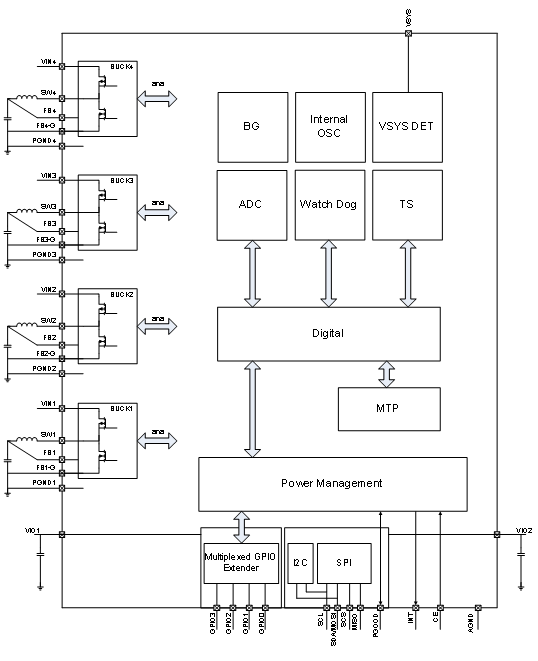

## 3. 引脚封装

### 3.1 引脚封装图

### 3.2 引脚描述

P3 引脚类型定义

|管脚类型|描述|管脚类型|描述|
|:---:|:---:|:---:|:---:|
|DI|数字输入|AI|模拟输入|
|DO|数字输出|AO|模拟输出|
|DIO|数字输入/输出|AIO|模拟输入/输出|
|PWR|电源|GND|地|

P3 引脚描述

|管脚|管脚名称|类型|描述|复用功能|
|:---:|:---:|:---:|:---:|:---:|
|A1, A2, B2, C2, D2|SW1|AI|BUCK1开关节点|-|
|A3, B3, C3, D3|PGND1|GND|BUCK1 Power GND|-|
|A4, A5, B4, B5, E4, E5, F4, J4, J5|AGND|GND|模拟地|-|
|A6, B6, C6, D6|PGND2|GND|BUCK2 Power GND|-|
|A7, A8, B7, C7, D7|SW2|AI|BUCK2开关节点|-|
|B1, C1, D1|VIN1|PWR|BUCK1的电源输入|-|
|B8, C8, D8|VIN2|PWR|BUCK2的电源输入|-|
|C4|FB1|AI|BUCK1差分正远端感应输入|-|
|C5|FB2|AI|BUCK2差分正远端感应输入|-|
|D4|FB1_G|AI|BUCK1差分负远端感应输入|-|
|D5|FB2_G|AI|BUCK2差分负远端感应输入|-|
|E1|INT|DIO|中断输出|-|
|E2|SDA/MOSI|DIO|I2C通信接口数据信号，SPI通信数据输入信号|-|
|E3|MISO|DO|SPI通信数据输出信号|-|
|E6|GPIO0|DIO/AI|多功能复用GPIO|EXT_EN/SLEEP_WKUP/ PWRCTRL/WARM_RESET/ ADC外部通道输入/多相控制/DVS调压|
|E7|GPIO1|DIO/AI|多功能复用GPIO|EXT_EN/SLEEP_WKUP/ PWRCTRL/WARM_RESET/ ADC外部通道输入/多相控制/DVS调压|
|E8|VIO1|PWR|GPIO电路电源输入|-|
|F1|VIO2|PWR|I2C/SPI电源输入|-|
|F2|SCK|DI|I2C/SPI通信接口时钟信号|-|
|F3|SCS|DI|SPI通信接口片选信号，低有效|-|
|F5|DGND|GND|数字地|-|
|F6|GPIO3|DIO/AI|多功能复用GPIO|EXT_EN/SLEEP_WKUP/ PWRCTRL/WARM_RESET/ ADC外部通道输入/DVS调压|
|F7|GPIO2|DIO/AI|多功能复用GPIO|EXT_EN/SLEEP_WKUP/ PWRCTRL/WARM_RESET/ ADC外部通道输入/多相控制/DVS调压|
|F8|VSYS|PWR|内部电路电源输入|-|
|G1, H1, J1|VIN4|PWR|BUCK4的电源输入|-|
|G2, H2, J2, K1, K2|SW4|AI|BUCK4开关节点|-|
|G3, H3, J3, K3|PGND4|GND|BUCK4 Power GND|-|
|G4|FB4_G|AI|BUCK4差分负远端感应输入|-|
|G5|FB3_G|AI|BUCK4差分负远端感应输入|-|
|G6, H6, J6, K6|PGND3|GND|BUCK3 Power GND|-|
|G7, H7, J7, K7, K8|SW3|AI|BUCK3开关节点|-|
|G8, H8, J8|VIN3|PWR|BUCK3的电源输入|-|
|H4|FB4|AI|BUCK4差分正远端感应输入|-|
|H5|FB3|AI|BUCK3差分正远端感应输入|-|
|K4|CE|DI|片选输入（开机源），高有效|-|
|K5|PGOOD|DIO|Power good指示位/复位源|-|

## 4. 电气特性

### 4.1 绝对最大额定值

|参数|描述|条件|最小值|典型值|最大值|单位|
|:---:|:---:|:---:|:---:|:---:|:---:|:---:|
|TSTG|存储温度|-|- 40|-|150|℃|
|TJ|结温|-|-40|-|125|℃|
|VSYS|系统供电电压|-|-0.3|-|5.8|V|
|VESD_HBM|ESD保护-HBM|-|2|-|-|kV|
|VESD_CDM|ESD保护-CDM|-|500|-|-|V|

### 4.2 推荐工作条件

|参数|描述|条件|最小值|典型值|最大值|单位|
|:---:|:---:|:---:|:---:|:---:|:---:|:---:|
|TJ|结温|-|-|-|85|℃|
|VSYS|系统供电电压|-|3.3|5.0|5.5|V|
|PDIS|芯片最大功耗|-|-|-|2|W|
|RJA|Junction到环境热阻|-|-|31|-|℃/W|
|RJC|Junction到芯片表面热阻|-|-|-|-|℃/W|
|RJB|Junction到PCB板热阻|-|-|-|-|℃/W|
|ISHDN|关机模式电流|CE = 0|-|17|-|μA|

### 4.3 数字引脚电气特性

#### Top-Level Electrical Characteristics

(VSYS = +2.5 ~ +5.5 V, VVIO1 = +1.8 V, VVIO2 = +1.8 V, TJ = -40 ~ 105 ℃; typical values are at VSYS = 5 V, TJ = +25 ℃)

**LOGIC AND CONTROL INPUTS**

|参数|描述|条件|最小值|典型值|最大值|单位|
|:---:|:---:|:---:|:---:|:---:|:---:|:---:|
|VVIO1||-|1.2|1.8|VSYS|V|
|VIH|高电平输入|(GPIO0, GPIO1, GPIO2, GPIO3)|0.32*VIO1|0.52*VIO1|0.71*VIO1|V|
|VIH|高电平输入|CE|0.32*VSYS|0.52*VSYS|0.71*VSYS|V|
|VIH|高电平输入|PWR_good|0.6|1.1|1.3|V|
|VIL|低电平输入|(GPIO0, GPIO1, GPIO2, GPIO3)|0.31*VIO1|0.47*VIO1|0.58*VIO1|V|
|VIL|低电平输入|CE|0.31*VSYS|0.47*VSYS|0.58*VSYS|V|
|VIL|低电平输入|PWR_good|0.3|0.6|0.8|V|
|Vhys|滞回电压|(GPIO0, GPIO1, GPIO2, GPIO3)|0.01*VIO1|0.05*VIO1|0.17*VIO1|V|
|Vhys|滞回电压|CE|0.01*VSYS|0.05*VSYS|0.17*VSYS|V|
|Vhys|滞回电压|PWR_good|0.3|0.5|0.5|V|
|VOH|高电平输出|GPIO0, GPIO1, GPIO2, GPIO3 (IOH = 1 mA)|-|-|VIO1 - 0.01|V|
|VOH|高电平输出|PWR_good (IOH = 1 mA)|-|VIO2 - 0.03|-|V|
|VOL|低电平输出|INT, PWR_good, GPIO0, GPIO1, GPIO2, GPIO3 (IOL = 1 mA)|-|-|0.1|V|

**INTERNAL PULL–UP / DOWN RESISTANCE**

|参数|描述|条件|最小值|典型值|最大值|单位|
|:---:|:---:|:---:|:---:|:---:|:---:|:---:|
|RPU|弱上拉电阻|GPIO0, GPIO1, GPIO2, GPIO3,  Pullup resistance to VIO1,  REG: GPIO_PUPD, GPIOX_PUPD[1:0] = 01|-|50 k|-|Ω|
|RPU|弱上拉电阻|PWR_good,  Pullup resistance to VIO2,  REG: PMU_CTRL4, PG_PU_EN = 1|-|1 k|-|Ω|
|RPD|弱下拉电阻|GPIO0, GPIO1, GPIO2, GPIO3,  Pulldown resistance to DGND,  REG: GPIO_PUPD, GPIOX_PUPD[1:0] = 10|-|870 k|-|Ω|
|RPD|弱下拉电阻|CE Pulldown resistance to DGND|-|1000 k|-|Ω|

**I2C Electrical Characteristics**

(VSYS = +2.5 ~ +5.5 V, VVIO1 = +1.8 V, VVIO2 = +1.8 V, TJ = -40 ~ 105 ℃; typical values are at VSYS = 5 V, TJ = +25 ℃)

**POWER SUPPLY**

|参数|描述|条件|最小值|典型值|最大值|单位|
|:---:|:---:|:---:|:---:|:---:|:---:|:---:|
|VVIO2|-|-|1.2|1.8|VSYS|V|

**SDA AND SCL I/O STAGES**

|参数|描述|条件|最小值|典型值|最大值|单位|
|:---:|:---:|:---:|:---:|:---:|:---:|:---:|
|VIH|高电平输入|Normal mode|0.32*VIO2|0.52*VIO2|0.71*VIO2|V|
|VIL|低电平输入|Normal mode|0.31*VIO2|0.47*VIO2|0.58*VIO2|V|
|VIL|低电平输入|HS mode|0.30*VIO2|0.45*VIO2|0.55*VIO2|V|
|Vhys|迟滞电压|Normal mode|0.01*VIO2|0.05*VIO2|0.17*VIO2|V|
|Vhys|迟滞电压|HS mode|0.02*VIO2|0.07*VIO2|0.18*VIO2|V|
|VOL|低电平输出|Isink = 5 mA|0.05|0.09|0.32|V|
|CIN|输入电容|-|-|18|-|pF|

**I2C-COMPATIBLE INTERFACE TIMING (STANDARD, FAST AND FAST MODE PLUS)**

|参数|描述|条件|最小值|典型值|最大值|单位|
|:---:|:---:|:---:|:---:|:---:|:---:|:---:|
|fscl|时钟频率|-|0|-|1000|kHz|
|tF_TRA|SCL, SDA Transmitting Fall Time|-|9|18|57|ns|
|CB|Bus Capacitance|-|-|-|550|pF|

**I2C-COMPATIBLE INTERFACE TIMING (HIGH-SPEED MODE, CB = 100 pF)**

|参数|描述|条件|最小值|典型值|最大值|单位|
|:---:|:---:|:---:|:---:|:---:|:---:|:---:|
|fscl|时钟频率|-|-|0|-|3.4|MHz|
|TR_SDA|SDA Rise Time|-|-|22|-|ns|
|TF_SDA|SDA Fall Time|-|-|1|2|9|ns|
|CB|Bus Capacitance|-|-|-|100|pF|

**I2C-COMPATIBLE INTERFACE TIMING (HIGH-SPEED MODE, CB = 400 pF)**

|参数|描述|条件|最小值|典型值|最大值|单位|
|:---:|:---:|:---:|:---:|:---:|:---:|:---:|
|fscl|时钟频率|-|-|0|-|1.7|MHz|
|TR_SDA|SDA Rise Time|-|-|70|-|ns|
|TF_SDA|SDA Fall Time|-|-|4|9|36|ns|
|CB|Bus Capacitance|-|-|-|400|pF|

#### SPI Electrical Characteristics

(VSYS = +2.5 ~ +5.5 V, VVIO1 = +1.8 V, VVIO2 = +1.8 V, TJ = -40 ~ 105 ℃; typical values are at VSYS = 5 V, TJ = +25 ℃)

**POWER SUPPLY AND I/O STAGES**

|参数|描述|条件|最小值|典型值|最大值|单位|
|:---:|:---:|:---:|:---:|:---:|:---:|:---:|
|VVIO2||-|1.2|1.8|VSYS|V|
|CIN|输入电容|(SCS, SCL, MOSI)|-|18|-|-|
|VIH|高电平输入|-|-|0.32*VIO2|0.52*VIO2|0.71*VIO2|V|
|VIL|低电平输入|-|-|0.30*VIO2|0.45*VIO2|0.55*VIO2|V|
|Vhys|迟滞电压|-|-|0.02*VIO2|0.07*VIO2|0.18*VIO2|V|
|VOL|低电平输出|IOL = 1 mA|-|-|0.1|V|
|VOH|高电平输出|IOH = 1 mA|-|-|VIO2 - 0.01|V|

**SPI INTERFACE TIMING**

|参数|描述|条件|最小值|典型值|最大值|单位|
|:---:|:---:|:---:|:---:|:---:|:---:|:---:|
|fscl|时钟频率|-|-|26|30|MHz|
|TD_MOSI|MISO valid from SCL rising edge|CL = 50 pF|-|9|-|ns|
|TR,TF|MISO Rising/Falling Time|CL = 20 pF|0.6|1.3|4.0|ns|

### 4.4 看门狗

看门狗特性

|参数|描述|条件|最小值|典型值|最大值|单位|
|:---:|:---:|:---:|:---:|:---:|:---:|:---:|
|TWD_MIN|最小看门狗时间|-|-|1|-|s|
|TWD_MAX|最大看门狗时间|-|-|16|-|s|

### 4.5 BUCK

BUCK1~4电气特性

|参数|描述|条件|最小值|典型值|最大值|单位|
|:---:|:---:|:---:|:---:|:---:|:---:|:---:|
|VIN_MIN|最小输入电压|-|-|2.5|-|V|
|VIN_MAX|最大输入电压|-|-|5.5|-|V|
|VOUT_MIN|最小输出电压|-|-|0.25|-|V|
|VOUT_MAX|最大输出电压|-|-|1.83|-|V|
|VOUT_STEP|调压步幅|VOUT = 0.25 ~ 1.2 V|-|5|-|mV|
|VOUT_STEP|调压步幅|VOUT = 1.2 ~ 1.83 V|-|10|-|mV|
|DVS Slew|DVS档位|DVS_R_SLEW / DVS_R_DIS DVS_F_SLEW / DVS_F_DIS|-|2.5|-|mV/μs|
|DVS Slew|DVS档位|DVS_R_SLEW / DVS_R_DIS DVS_F_SLEW / DVS_F_DIS|-|10|-|mV/μs|
|DVS Slew|DVS档位|DVS_R_SLEW / DVS_R_DIS DVS_F_SLEW / DVS_F_DIS|-|25|-|mV/μs|
|DVS Slew|DVS档位|DVS_R_SLEW / DVS_R_DIS DVS_F_SLEW / DVS_F_DIS|-|50|-|mV/μs|
|DVS Slew|DVS档位|DVS_R_SLEW / DVS_R_DIS DVS_F_SLEW / DVS_F_DIS|-|Free|-|mV/μs|
|Soft on / off Slow|软启动/关闭时间|SOFT_STA_SLEW / SOFT_STP_SLEW|-|2.5|-|mV/μs|
|Soft on / off Slow|软启动/关闭时间|SOFT_STA_SLEW / SOFT_STP_SLEW|-|10|-|mV/μs|
|Soft on / off Slow|软启动/关闭时间|SOFT_STA_SLEW / SOFT_STP_SLEW|-|25|-|mV/μs|
|Soft on / off Slow|软启动/关闭时间|SOFT_STA_SLEW / SOFT_STP_SLEW|-|50|-|mV/μs|
|VBUCK_ACC|输出电压精度|VOUT > 0.8 V, VIN = 4 V,  IOUT = 1 A, TA = 25 ℃|-|-|±1|%|
|VBUCK_ACC|输出电压精度|VOUT < 0.8 V, VIN = 4 V,  IOUT = 1 A, TA = 25 ℃|-|-|±8|mV|
|Load Regulation|负载调整率|IOUT = 0.1 ~ 8 A, VOUT > 0.8 V, CCM|-|-|±1|%|
|Load Regulation|负载调整率|IOUT = 0.1 ~ 8 A, VOUT < 0.8 V, CCM|-|-|±8|mV|
|Line Regulation|线性调整率|VIN = 3.0 ~ 5.5 V, VOUT > 0.8 V, CCM|-|-|±1|%|
|Line Regulation|线性调整率|VIN = 3.0 ~ 5.5 V, VOUT < 0.8 V, CCM|-|-|±8|mV|
|Load Transient Undershoot|负载瞬态响应下冲 Cout = 88 μF/Phase,  VIN = 5 V, 0.22 μH|IOUT = 0.1 ~ 8 A, VOUT < 1 V|-|-|60|mV|
|Load Transient Undershoot|负载瞬态响应下冲 Cout = 88 μF/Phase,  VIN = 5 V, 0.22 μH|IOUT = 0.1 ~ 8 A, VOUT > 1 V|-|-|6|%|
|Load Transient Overshoot|负载瞬态响应过冲 Cout = 88 μF/Phase,  VIN = 5 V, 0.22 μH|IOUT = 8 ~ 0.1 A, VOUT < 1 V|-|-|120|mV|
|Load Transient Overshoot|负载瞬态响应过冲 Cout = 88 μF/Phase,  VIN = 5 V, 0.22 μH|IOUT = 8 ~ 0.1 A, VOUT > 1 V|-|-|12|%|
|VRIPPLE|Cout = 88 μF/Phase,  VIN = 5 V, 0.22 μH|IOUT = 0.1 A, VOUT = 0.9 V|-|10|-|mV|
|VRIPPLE|Cout = 88 μF/Phase,  VIN = 5 V, 0.22 μH|IOUT > 1 A, VOUT = 0.9 V|-|8|-|mV|
|RUP|上管导通电阻|VIN = 4 V|-|16|-|mΩ|
|RDN|下管导通电阻|VIN = 4 V|-|8|-|mΩ|
|Switching Frequency|开关频率|VIN = 4 V|-|2|-|MHz|
|IOUT_MAX|输出电流|DC|8|-|-|A/Phase|
|IOUT_MAX|输出电流|200ms, D = 50%|10.0|-|-|A/Phase|
|IValley_LIMIT||BUCKx_ILIMIT|-|9|-|A/Phase|
|IPeak_Limit||BUCKx_ILIMIT|-|12|-|A/Phase|
|INegative Limit||-|-|3|-|A/Phase|
|OV||VOUT/VOUT_target - 1|-|12.5|-|%|
|UV||VOUT/VOUT_target - 1||-10.0|-|%|
|Power Down resistor||-|-|120|-|Ω|
|SWx Leakage Current|SW脚漏电|CE = 0, VLXx = 0 or 5.5 V, 25 ℃|-0.3|-|0.3|uA|
|SWx Leakage Current|SW脚漏电|CE = 0, VLXx = 0 or 5.5 V, 85 ℃|-3|-|3|-|
|Efficiency|效率|VIN = 4 V, VOUT = 0.9 V IOUT = 1 A/Phase|-|90|-|%|
|Efficiency|效率|VIN = 4 V, VOUT = 0.9 V IOUT = 6.0 A/Phase|-|80|-|-|
|Efficiency|效率|VIN = 4 V, VOUT = 0.9 V IOUT = 8.0 A/Phase|-|77|-|-|

### 4.6 ADC

ADC电气特性

|参数|描述|条件|最小值|典型值|最大值|单位|
|:---:|:---:|:---:|:---:|:---:|:---:|:---:|
|Resolution|分辨率|-|-|-|12|Bits|
|VDD|供电电压|-|2.5|-|5.5|V|
|DNL|微分非线性|VDD = 4.25 V, T = 25 ℃, Freq = 1 MHz|-|±3|-|LSB|
|INL|积分非线性|VDD = 4.25 V, T = 25 ℃, Freq = 1 MHz|-|±3|-|LSB|
|Offset error|偏移误差|VDD = 4.25 V, T = 25 ℃, Freq = 1 MHz|-|±5|-|LSB|
|Gain error|增益误差|VDD = 4.25 V, T = 25 ℃, Freq = 1 MHz|-|±5|-|LSB|
|Sample rate|采样率|T = 25 ℃, Freq = 1 MHz|-|76|-|Ksps|
|IWORK|工作电流|T = 25 ℃, Freq = 0.5 MHz|-|180|-|μA|

ADC内部基准电气特性

|参数|描述|条件|最小值|典型值|最大值|单位|
|:---:|:---:|:---:|:---:|:---:|:---:|:---:|
|VREF_2V|2V基准电压|VDD = 4.25 V, T = 25 ℃|2.046|2.048|2.050|V|
|VREF_3V|3V基准电压|VDD = 4.25 V, T = 25 ℃|3.070|3.072|3.074|V|
|VC|电压系数|VDD = 4.25 V, T = 25 ℃|-|-|-|%|
|TC|温度系数|VDD = 4.25 V|-|-|-|%|
|IWORK|工作电流|VDD = 4.25 V, T = 25 ℃|-|200|-|μA|

### 4.7 时钟

内部LSI电气特性

|参数|描述|条件|最小值|典型值|最大值|单位|
|:---:|:---:|:---:|:---:|:---:|:---:|:---:|
|FACC|频率精度|5 V, 25 ℃|-|64|-|kHz|
|VC|电压系数|2.7 ~ 5.5 V, 25 ℃|-|-|-|%|
|TC|温度系数|5 V, -40 ~ 105 ℃|-|-|-|%|
|IWORK|工作电流|2.7 ~ 5.5 V, -40 ~ 105 ℃|-|-|-|μA|

内部HSI电气特性

|参数|描述|条件|最小值|典型值|最大值|单位|
|:---:|:---:|:---:|:---:|:---:|:---:|:---:|
|FACC|频率精度|5 V, 25 ℃|-|8|-|MHz|
|VC|电压系数|2.7 ~ 5.5 V, 25 ℃|-|-|-|%|
|TC|温度系数|5 V, -40 ~ 105 ℃|-|-|-|%|
|IWORK|工作电流|2.0 ~ 5.5 V, -40 ~ 105 ℃|-|-|-|μA|

### 4.8 POR/PDR

上电掉电复位电气特性

|参数|描述|条件|最小值|典型值|最大值|单位|
|:---:|:---:|:---:|:---:|:---:|:---:|:---:|
|POR|上电复位电压|-|-|1.9|-|V|
|PDR|掉电复位电压|-|-|2.2|-|V|
|TFILTER|POR脉冲干扰滤波长度|-|-|-|-|μs|
|IWORK|工作电流|-|-|-|-|μA|

## 5. 功能描述

P3是一款低压多通道电源管理芯片（PMIC），内部集成4路快速瞬态响应BUCK；同时内部集成MTP，可根据不同使用场景，灵活定制各路输出默认电压和开关机时序，以满足不同SoC平台对电源时序的要求。

**Table 5-1 相关名词解释**

|名词|描述|
|---|---|
|复位模式|P3工作模式，如 [Figure 5-1](#mode-switching-diagram) 模式切换示意图所示|
|关机模式|P3工作模式，如 [Figure 5-1](#mode-switching-diagram) 模式切换示意图所示|
|开机模式|P3工作模式，如 [Figure 5-1](#mode-switching-diagram) 模式切换示意图所示|
|睡眠模式|P3工作模式，如 [Figure 5-1](#mode-switching-diagram) 模式切换示意图所示|
|MTP_READ1|上电后第一次加载MTP所有配置|
|MTP_READ2|触发开机流程后加载MTP用户相关配置|
|PG_PUP_DLY / PG_WKUP_DLY|开机序列/唤醒序列完成后，PGOOD延时释放的时间|
|PG_PD_DLY /  PG_SLP_DLY|PGOOD拉低后，关机序列/睡眠序列启动前的延时时间|
|WAIT_PG|等待PGOOD释放阶段|
|非关机模式|开机模式、睡眠模式及[Figure 5-1](#mode-switching-diagram)中带 \* 或 # 号的状态|
|非复位模式|开机模式、睡眠模式、[Figure 5-1](#mode-switching-diagram)中带 \* 或 # 号的状态、 PG_PD_DLY、关机序列|
|工作模式|[Figure 5-1](#mode-switching-diagram)中带 # 号的状态|
|开机流程|关机模式 -> MTP_READ2 -> 开机序列 -> PG_PUP_DLY -> 开机模式； 关机模式 -> MTP_READ2 -> 开机序列 -> PG_PUP_DLY -> WAIT_PG -> 开机模式|
|关机流程|[Figure 5-1](#mode-switching-diagram)中带 # 号的状态 -> 关机模式； [Figure 5-1](#mode-switching-diagram)中带 # 号的状态 -> PG_PD_DLY -> 关机序列 -> 关机模式|
|开机结束|[Figure 5-1](#mode-switching-diagram)中的 PG_PUP_DLY 状态结束|
|睡眠流程|开机模式 -> 睡眠模式； 开机模式 -> 睡眠序列 -> 睡眠模式； 开机模式 -> PG_SLP_DLY -> 睡眠序列 -> 睡眠模式|
|唤醒流程|睡眠模式 -> 开机模式； 睡眠模式 -> 唤醒序列 -> 开机模式； 睡眠模式 -> 唤醒序列 -> PG_WKUP_DLY -> 开机模式|
|唤醒结束|[Figure 5-1](#mode-switching-diagram)中的 PG_WKUP_DLY 状态结束|
|热复位流程|[Figure 5-1](#mode-switching-diagram)中带 # 号的状态发生热复位事件 -> 热复位 -> MTP_READ2 -> 开机序列 -> PG_PUP_DLY -> 开机模式 [Figure 5-1](#mode-switching-diagram)中带 # 号的状态发生热复位事件 -> 热复位 -> MTP_READ2 -> 开机序列 -> PG_PUP_DLY -> WAIT_PG -> 开机模式|
|电源轨|所有BUCK|
|时序槽|SLOT0 ~ SLOT15|
|DUMMY SLOT|无任何BUCK或EXT绑定的时序槽|
|VSYS电压域|由VSYS供电的电源网络|
|VIO1电压域|由VIO1供电的电源网络|
|VIO2电压域|由VIO2供电的电源网络|

### 5.1 电源管理引脚

**Table 5-2 电源管理引脚说明**

|管脚|电压域|描述|
|---|---|---|
|CE|VSYS|片选输入，开机源和关机源|
|INT|VSYS|INT中断引脚|
|PGOOD|VIO2|输入：PGOOD引脚超时检测；作为复位源 输出：PMIC关机/复位流程时下拉PGOOD，复位SoC|
|PWRCTRL|VIO1|GPIO复用输入功能，控制上下电、睡眠和唤醒流程|
|SLEEP/WKUP|VIO1|GPIO复用输入功能，睡眠或唤醒引脚|
|WARM_RESET|VIO1|GPIO复用输入功能，不经过关机流程恢复到芯片上电开机状态|
|EXT_EN|VIO1|GPIO复用输出功能，可配合另一PMIC使用|
|DVS0|VIO1|GPIO 复用输入功能，SoC 通过 GPIO 输入逻辑实现 BUCK 调压|
|DVS1|VIO1|GPIO 复用输入功能，SoC 通过 GPIO 输入逻辑实现 BUCK 调压|
|PH_CFG2|VIO1|GPIO2 复用输入功能，SoC 通过 GPIO 输入逻辑实现多相控制|
|PH_CFG1|VIO1|GPIO1 复用输入功能，SoC 通过 GPIO 输入逻辑实现多相控制|
|PH_CFG0|VIO1|GPIO0 复用输入功能，SoC 通过 GPIO 输入逻辑实现多相控制|

#### 5.1.1 CE 引脚

**Table 5-3 CE 引脚功能说明**

|模式|功能|描述|
|---|---|---|
|关机模式|开机源|配置读取1完成后，进入关机模式，CE拉高开始开机流程|
|非关机/复位模式|开机源|开机完成后，CE拉低进入关机流程 开机未完成，CE拉低直接进入关机模式|

#### 5.1.2 INT 引脚

INT引脚为开漏输出，当中断事件触发且对应中断使能，将拉低INT引脚。

**Table 5-4 INT 引脚不同模式下功能说明**

|模式|功能|描述|寄存器配置|
|---|---|---|---|
|开机模式|中断源|中断事件触发 & 中断使能  -> 拉低INT引脚|如 [Table 5-27](#table-5-27) 中断事件|

#### 5.1.3 PGOOD 引脚

PGOOD 引脚为开漏输出，内部施密特输入电路工作在VIO2电压。PGOOD 引脚有内部上拉电阻，通过配置[Table 6-20](#table-6-20-pmu_ctrl4) PMU_CTRL4[6]为1，可以将PGOOD电平上拉到VIO2。

**Table 5-5 PGOOD 引脚不同模式下功能说明**

|模式|功能|描述|寄存器配置|
|---|---|---|---|
|关机流程/ 关机模式|输出|PMIC将PGOOD引脚拉低以复位外部模块|-|
|开机结束|输入|释放PGOOD引脚并进入开机模式|[Table 6-20](#table-6-20-pmu_ctrl4) PMU_CTRL4[1] [Table 6-19](#table-6-19-pmu_ctrl3) PMU_CTRL3[0]|
|开机结束|输入|释放PGOOD引脚并等待PGOOD被释放|[Table 6-20](#table-6-20-pmu_ctrl4) PMU_CTRL4[1]|
|工作模式|复位源|1. PGOOD引脚从高电平被拉低并超过100 μs 2. PGOOD下拉复位使能 1 & 2 -> 触发复位流程|[Table 6-16](#table-6-16-pmu_ctrl0) PMU_CTRL0[0]|
|睡眠模式/ 睡眠流程|输出|PGOOD引脚可配置在该模式下拉低|[Table 6-20](#table-6-20-pmu_ctrl4) PMU_CTRL4[0]|
|热复位流程|输出|PGOOD引脚在该模式下拉低|-|

#### 5.1.4 PWRCTRL 引脚

PWRCTRL引脚为GPIO复用输入功能，内部施密特输入电路工作在VIO1电压。

PWRCTRL引脚配置流程：

1. [Table 6-12 GPIO_AFR0](#table-6-12-gpio_afr0)和[Table 6-13 GPIO_AFR1](#table-6-13-gpio_afr1)中的GPIOx_AFR=4’b0011

2. 根据需要配置其它GPIO配置，如上下拉和极性等

**Table 5-6 PWRCTRL 引脚不同模式下功能说明**

|模式|功能|描述|寄存器配置|
|---|---|---|---|
|**开机流程/ 唤醒流程**|时序控制|1. BUCK绑定到某个PWRCTRL引脚 2. PWRCTRL引脚有效 1 & 2 -> 开机和唤醒流程继续执行相应BUCK的操作 1 & !2 -> 一直等待对应的PWRCTRL引脚有效|[Table 6-33](#table-6-33-buckx_pwrctrl_io) BUCKx_PWRCTRL_IO[2:0] [Table 6-20](#table-6-20-pmu_ctrl4) PMU_CTRL4[5] [Table 6-7](#table-6-7-gpio_dr) GPIO_DR[7:4]|
|**睡眠流程**|时序控制|1. BUCK绑定在某个PWRCTRL引脚 2. 反序睡眠使能 3. 使能睡眠等待PWRCTRL引脚无效 4. PWRCTRL引脚无效 1 & 2 & 3 & 4 -> 睡眠流程继续执行相应BUCK的操作， 1 & 2 & 3 & !4 -> 一直等待PWRCTRL，若等待时间超过[Table 6-19](#table-6-19-pmu_ctrl3) PMU_CTRL3[7] ，则继续执行相应BUCK的操作，并按流程进入睡眠模式|[Table 6-33](#table-6-33-buckx_pwrctrl_io) BUCKx_PWRCTRL_IO[2:0] [Table 6-20](#table-6-20-pmu_ctrl4) PMU_CTRL4[5] [Table 6-18](#table-6-18-pmu_ctrl2) PMU_CTRL2[2] [Table 6-19](#table-6-19-pmu_ctrl3) PMU_CTRL3[7] [Table 6-7](#table-6-7-gpio_dr) GPIO_DR[7:4]|
|**关机流程**|时序控制|1. BUCK绑定在某个PWRCTRL引脚 2. 反序关机使能 3. PWRCTRL引脚等待使能 4. PWRCTRL引脚无效 1 & 2 & 3 & 4 -> 关机流程继续执行相应BUCK或LDO的操作，否则一直等待PWRCTRL，若等待时间超过[Table 6-19](#table-6-19-pmu_ctrl3) PMU_CTRL3[7]，则继续执行相应BUCK的操作，并按流程进入关机模式|[Table 6-33](#table-6-33-buckx_pwrctrl_io) BUCKx_PWRCTRL_IO[2:0] [Table 6-20](#table-6-20-pmu_ctrl4) PMU_CTRL4[4] [Table 6-18](#table-6-18-pmu_ctrl2) PMU_CTRL2[2] [Table 6-19](#table-6-19-pmu_ctrl3) PMU_CTRL3[7] [Table 6-7](#table-6-7-gpio_dr) GPIO_DR[7:4]|
|**开机模式**|使能控制|BUCK绑定在某个PWRCTRL引脚： 软件使能位 & PWRCTRL有效 -> 电源轨使能 无绑定PWRCTRL： 软件使能位 -> 电源轨使能|[Table 6-33](#table-6-33-buckx_pwrctrl_io) BUCKx_PWRCTRL_IO[2:0] [Table 6-32](#table-6-32-buckx_ctrl) BUCKx_CTRL[6] [Table 6-7](#table-6-7-gpio_dr) GPIO_DR[7:4]|

PWRCTRL引脚有效极性可通过[Table 6-7](#table-6-7-gpio_dr) GPIO_DR[7:4]寄存器配置。

#### 5.1.5 SLEEP/WKUP 引脚

SLEEP/WKUP引脚为GPIO复用输入功能，内部施密特输入电路工作在VIO电压。

SLEEP/WKUP引脚配置流程：

1. [Table 6-12](#table-6-12-gpio_afr0) GPIO_AFR0和[Table 6-13](#table-6-13-gpio_afr1) GPIO_AFR1中的GPIOx_AFR=4’b0100

2. 根据需要配置其它GPIO配置，如上下拉和中断类型等。

**Table 5-7 SLEEP/WKUP 引脚不同模式下功能说明**

|模式|功能|描述|寄存器配置|
|---|---|---|---|
|开机模式|睡眠源|SLEEP/WKUP引脚有效 -> 睡眠流程|[Table 6-7](#table-6-7-gpio_dr) GPIO_DR[7:4]|
|睡眠模式|唤醒源|SLEEP/WKUP引脚无效 -> 唤醒流程|[Table 6-7](#table-6-7-gpio_dr) GPIO_DR[7:4]|

SLEEP/WKUP引脚有效极性可通过[Table 6-7](#table-6-7-gpio_dr) GPIO_DR[7:4]寄存器配置。

#### 5.1.6 WARM_RESET 引脚

WARM_RESET引脚为GPIO复用输入功能，内部施密特输入电路工作在VIO1电压。

WARM_RESET引脚配置流程：

1. [Table 6-12](#table-6-12-gpio_afr0) GPIO_AFR0和[Table 6-13](#table-6-13-gpio_afr1) GPIO_AFR1中的GPIOx_AFR=4’b0101

2. 根据需要配置其它GPIO配置，如上下拉和极性等

**Table 5-8 WARM_RESET 引脚不同模式下功能说明**

|模式|功能|描述|寄存器配置|
|---|---|---|---|
|工作模式|热复位|WARM_RESET引脚从无效状态变有效状态并且持续时间超WARM_RESET_TIME1 -> 触发热复位 -> PG拉低 -> BUCK按开机时序恢复到开机默认值|[Table 6-9](#table-6-9-gpio_deb) GPIO_DEB[6:4] [Table 6-7](#table-6-7-gpio_dr) GPIO_DR[7:4]|

> 注：当GPIO滤波使能打开：WARM_RESET_TIME=250 μs + [Table 6-9](#table-6-9-gpio_deb) GPIO_DEB[6:4]
>
> 1. GPIO滤波使能关闭：WARM_RESET_TIME = 250 μs。
> 2. WARM_RESET引脚有效极性可通过[Table 6-7](#table-6-7-gpio_dr) GPIO_DR[7:4]寄存器配置。

#### 5.1.7 EXT_EN 引脚

EXT_EN引脚为GPIO复用输出功能，内部施密特输入电路工作在VIO1电压。

EXT_EN引脚配置流程：

1. [Table 6-12](#table-6-12-gpio_afr0) GPIO_AFR0和[Table 6-13](#table-6-13-gpio_afr1) GPIO_AFR1中的GPIOx_AFR=4’b0010

2. 根据需要配置其它GPIO配置，如上下拉和极性等。

**Table 5-9 EXT_EN 引脚不同模式下功能说明**

|模式|功能|描述|寄存器配置|
|---|---|---|---|
|开机流程 / 唤醒流程|输出|1. 绑定某一时序槽 2. 开机序列/唤醒序列走到对应绑定的时序槽 1 & 2 -> EXT_EN引脚变有效|[Table 6-14](#table-6-14-gpio_ext_slot0) GPIO_EXT_SLOT0 [Table 6-15](#table-6-15-gpio_ext_slot1) GPIO_EXT_SLOT1 [Table 6-25](#table-6-25-ext_ctrl) EXT_CTRL [Table 6-7](#table-6-7-gpio_dr) GPIO_DR[7:4]|
|睡眠流程|输出|1. 绑定某一时序槽 2. 睡眠序列走到对应绑定的时序槽 3. 受睡眠时序控制（EXTx_SLP_SD = 1） 1 & 2 & 3 -> EXT_EN引脚变无效|[Table 6-14](#table-6-14-gpio_ext_slot0) GPIO_EXT_SLOT0 [Table 6-15](#table-6-15-gpio_ext_slot1) GPIO_EXT_SLOT1 [Table 6-25](#table-6-25-ext_ctrl) EXT_CTRL [Table 6-7](#table-6-7-gpio_dr) GPIO_DR[7:4]|
|关机流程|输出|1. 绑定某一时序槽 2. 关机序列走到对应绑定的时序槽 1 & 2 -> EXT_EN引脚变无效，不满足条件则保持原来状态|[Table 6-14](#table-6-14-gpio_ext_slot0) GPIO_EXT_SLOT0 [Table 6-15](#table-6-15-gpio_ext_slot1) GPIO_EXT_SLOT1 [Table 6-25](#table-6-25-ext_ctrl) EXT_CTRL [Table 6-7](#table-6-7-gpio_dr) GPIO_DR[7:4]|
|开机模式|输出|EXTx_EN = 1 -> EXT_EN引脚变有效 EXTx_EN = 0 -> EXT_EN引脚变无效|[Table 6-25](#table-6-25-ext_ctrl) EXT_CTRL[3:0] [Table 6-7](#table-6-7-gpio_dr) GPIO_DR[7:4]|
|睡眠模式|输出|1. EXTx_EN = 1 2. EXTx_SLP_SD = 0 1 & 2 -> EXT_EN引脚变有效，不满足条件则变无效|[Table 6-25](#table-6-25-ext_ctrl) EXT_CTRL [Table 6-7](#table-6-7-gpio_dr) GPIO_DR[7:4]|

EXT_EN引脚有效极性可通过[Table 6-7](#table-6-7-gpio_dr) GPIO_DR[7:4]寄存器配置。

**Table 5-10 EXT_EN 引脚状态控制汇总表**

|(x = 0 ~ 3)|开机流程|开机模式|睡眠流程|睡眠模式|唤醒流程|关机流程|关机模式|
|:---:|:---:|:---:|:---:|:---:|:---:|:---:|:---:|
|EXTx_EN|x|x|-|x|x|-|-|
|EXTx_SLOT|x|-|x|-|x|x|-|
|EXTx_SLP_SD|-|-|x|x|-|-|-|
|GPIOx_ODR|x|x|x|x|x|x|x|

EXT_EN引脚状态受EXTx_EN、EXTx_SLOT、EXTx_SLP_SD和GPIOx_ODR控制，不同模式下有不同的控制组合。

#### 5.1.8 DVS 引脚

DVS引脚为GPIO复用输入功能，内部施密特输入电路工作在VIO1电压。

DVS引脚配置流程：

1. [Table 6-12](#table-6-12-gpio_afr0) GPIO_AFR0和[Table 6-13](#table-6-13-gpio_afr1) GPIO_AFR1中的GPIOx_AFR=4’b1000/4’b1001

2. 根据需要配置其它GPIO配置，如上下拉和极性等

[Table 6-34](#table-6-34-buckx_dvs_io) BUCKx_DVS_IO 的 BUCKx_DVS0_IO[2:0] 用于选择 BUCKx 绑定的 DVS0 GPIO，BUCKx_DVS1_IO[2:0] 用于选择 BUCKx 绑定的 DVS1 GPIO，可用于 SoC 通过控制 GPIO 引脚来控制对应 BUCK 电压。生效的前提是被绑定的 GPIO 配置为 DVS0/1 复用功能，否则对应的 DVS 控制逻辑为 0。DVS 引脚控制 BUCK 电压的说明见[5.5.3 电压配置和动态调压](#553-电压配置和动态调压)。

#### 5.1.9 PH_CFG 引脚

PH_CFG引脚为GPIO复用输入功能，内部施密特输入电路工作在VIO1电压。

PH_CFG引脚配置流程：

1. [Table 6-28](#table-6-28-buck_glb_ctrl) BUCK_GLB_CTRL[5]配置为1，选择GPIO复用功能作为PH_CFGx

2. [Table 6-12](#table-6-12-gpio_afr0) GPIO_AFR0 和 [Table 6-13](#table-6-13-gpio_afr1) GPIO_AFR1 中 GPIO2_AFR、GPIO1_AFR 和 GPIO0_AFR 三个寄存器均配置为 4’b0111 时，GPIO2 将作为 PH_CFG2、GPIO1 将作为 PH_CFG1、GPIO0 将作为 PH_CFG0；否则，未配置多相复用功能的 GPIO 对应的 PH_CFGx 默认为 0。例如，三个 IO 都未配置为 PH_CFGx 模式时，将选择 000 模式（4 + 0 四相模式）。

3. 根据需要配置其它GPIO配置，如上下拉和极性等。

PH_CFGx引脚可用于Soc通过控制GPIO引脚来控制PMIC的多相控制，多相控制的详细描述见[5.5.4 多相控制](#554-多相控制)。

### 5.2 工作模式

**Figure 5-1 模式切换示意图**

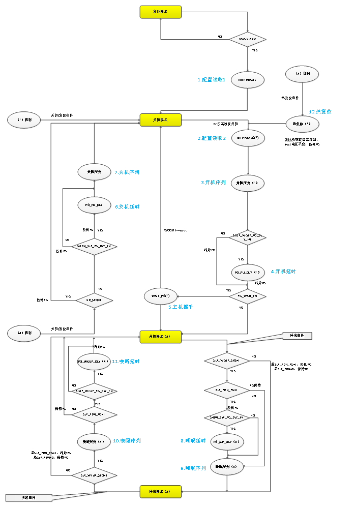

- PMIC有4种工作模式：

   复位模式、关机模式、开机模式、睡眠模式。

- PMIC有12种中间状态：

   配置读取1、配置读取2、开机序列、开机延时、主机握手、关机延时、关机序列、睡眠延时、睡眠序列、唤醒序列、唤醒延时、热复位。

   中间状态用于系统配置或实现特定的时序要求。

**Table 5-11 工作模式说明**

|模式/状态|进入|退出|行为|
|---|---|---|---|
|**复位模式**|非复位模式 & VSYS ≤ 2.0 V|VSYS ≥ 2.2 V|所有寄存器和控制信号复位|
|**关机模式**|1. MTP配置读取1完成 2.非关机模式 & 关机事件 3.非关机模式 & 复位事件|1.非复位进关机 & 开机事件 2.复位事件（pg和软件复位）进关机后自动退出|1.关闭所有BUCK 2.部分寄存器复位 3.部分模块关闭|
|**开机模式**|1.主机握手成功 2.唤醒序列完成|任一关机/复位/睡眠/热复位事件|所有模块正常工作|
|**睡眠模式**|开机模式 & 睡眠事件|任一关机/复位/唤醒/热复位事件|按配置关闭或调整BUCK电压|
|**配置读取1**|VSYS ≥ 2.2 V \| CRC 校验失败|最后的 MTP 数据读取完成 & CRC 校验正确|将所有 MTP 数据加载到对应映射的寄存器|
|**配置读取2**|配置读取 1 完成 & CE 为高|最后的用户 MTP 数据读取完成|将用户 MTP 数据加载到对应映射的寄存器|
|**开机序列**|配置读取 2 完成|所有 BUCK 序列完成|BUCK 按配置打开|
|**开机延时**|开机序列完成 & 配置使能[Table 6-18](#table-6-18-pmu_ctrl2) PMU_CTRL2[1]|开机延时计数完成|延时完成后，释放PG信号|
|**主机握手**|1.配置使能[Table 6-20](#table-6-20-pmu_ctrl4) PMU_CTRL4[1]  2.开机延时完成 & 配置[Table 6-18](#table-6-18-pmu_ctrl2) PMU_CTRL2[1]为1 3.开机序列完成 & 配置[Table 6-18](#table-6-18-pmu_ctrl2) PMU_CTRL2[1]为0 1 & （2 \| 3）-> 主机握手|1.主机下拉PG 2.等待主机下拉PG超时|1.等待主机下拉 2.若握手成功，则进入开机模式 3.若等待超时，则进入关机模式|
|**关机延时**|开机完成 & 关机/复位事件 & [Table 6-20](#table-6-20-pmu_ctrl4) PMU_CTRL4[4]为0（反序关机） & 配置[Table 6-18](#table-6-18-pmu_ctrl2) PMU_CTRL2[0]为1|关机延时计数完成|PG下拉，延时结束后进入关机序列|
|**关机序列**|1.开机完成并发生关机/复位事件 2. [Table 6-20](#table-6-20-pmu_ctrl4) PMU_CTRL4[4]为0 & 关机延时完成 3.配置[Table 6-18](#table-6-18-pmu_ctrl2) PMU_CTRL2[0]为0 4. 配置[Table 6-18](#table-6-18-pmu_ctrl2) PMU_CTRL2[0]为1 & 关机延时完成 1 & 2 & (3 \| 4)->关机序列|BUCK按配置关闭完成|BUCK按配置反序关闭|
|**睡眠延时**|开机模式 & 睡眠事件 & 配置使能[Table 6-20](#table-6-20-pmu_ctrl4) PMU_CTRL4[5] & 配置使能[Table 6-18](#table-6-18-pmu_ctrl2) PMU_CTRL2[0]|睡眠延时计数完成|PG下拉，延时结束后进入睡眠序列|
|**睡眠序列**|1.开机模式 & 睡眠事件 & 配置使能[Table 6-20](#table-6-20-pmu_ctrl4) PMU_CTRL4[5]  2.配置[Table 6-20](#table-6-20-pmu_ctrl4) PMU_CTRL4[0]=0 3.配置[Table 6-20](#table-6-20-pmu_ctrl4) PMU_CTRL4[0]=1 & 配置[Table 6-18](#table-6-18-pmu_ctrl2) PMU_CTRL2[0]为0 4. 配置[Table 6-20](#table-6-20-pmu_ctrl4) PMU_CTRL4[0]=1 & 配置[Table 6-18](#table-6-18-pmu_ctrl2) PMU_CTRL2[0]为1 & 睡眠延时完成 1 & （2 \| 3 \| 4）->睡眠序列|BUCK按配置调压或关闭完成|BUCK按配置调压或关闭|
|**唤醒序列**|睡眠模式 & 唤醒事件 &配置使能[Table 6-20](#table-6-20-pmu_ctrl4) PMU_CTRL4[5]|BUCK按配置调压或开启完成|BUCK按配置调压或开启|
|**唤醒延时**|唤醒序列完成 & 配置使能[Table 6-20](#table-6-20-pmu_ctrl4) PMU_CTRL4[0] & 配置使能[Table 6-18](#table-6-18-pmu_ctrl2) PMU_CTRL2[0]|唤醒延时计数完成|延时结束后，释放PG，进入开机模式|
|**热复位**|开机完成 & 发生热复位事件|热复位事件无效|复位所有配置寄存器，BUCK电压不变，待配置读取2结束后，在开机序列中根据配置读取2的配置恢复BUCK电压|

#### 5.2.1 复位模式

在 VSYS 上电复位释放（VSYS > 2.2 V）前，PMIC 处于该模式，且整个 PMIC 不工作；只有 VSYS 电压大于 2.2 V 后，系统才开始正常工作。若 VSYS 在任意时刻低于上电复位阈值 2.2 V，将立即回到该模式。

#### 5.2.2 关机模式

**Table 5-12 关机模式的进入和退出**

|条件|描述|
|---|---|
|**进入条件**|1. PMIC上电复位释放（VSYS > 2.2 V），并且MTP配置读取1完成后进入该状态 2. 开机流程中遇到任一关机或复位事件 - 立即进入 3. 工作模式下遇到任一关机或复位事件 - 经过关机流程后进入|
|**退出条件**|任一开机事件|

该模式下大部分模块不工作，保持工作的模块有： Bandgap，VSYS电压检测等。复位事件进入该模式时会停留一段时间（[Table 6-19](#table-6-19-pmu_ctrl3) PMU_CTRL3[2:1]）：

- 复位事件进入关机模式后，等待[Table 6-19](#table-6-19-pmu_ctrl3) PMU_CTRL3[2:1]配置的时间后并且此时VSYS电压高于设定开机阈值（[Table 6-42](#table-6-42-prot_cfg) PROT_CFG[5:3]），则自动再进行开机流程。

- 在释放PGOOD后，若配置成无需等待外部PGOOD释放（[Table 6-20](#table-6-20-pmu_ctrl4) PMU_CTRL4[1] = 0），则直接进入开机模式，否则需要等待PGOOD被释放后才进开机模式。若PMIC检测到PGOOD长时间未被释放（[Table 6-19](#table-6-19-pmu_ctrl3) PMU_CTRL3[0]），则直接回到关机模式。

#### 5.2.3 开机模式

该模式下所有模块都可正常工作，包括所有电源轨、电压检测、内部参考、电源轨过压/欠压检测、过温检测、内部时钟、晶振电路、ADC、通信接口、GPIO模块和中断等。

进入该模式：开机流程执行完或睡眠流程执行完

退出该模式：任一关机事件、复位事件、睡眠事件或热复位事件

#### 5.2.4 睡眠模式

该模式可以将部分电源轨做降压或关闭处理，还可以配置拉低PGOOD引脚来复位SoC。

进入该模式：开机模式下睡眠事件。

退出该模式：任一关机事件、复位事件、唤醒事件或热复位事件。

#### 5.2.5 各模式工作状态

**Table 5-13 各模式工作状态**

|电压域|模块|复位模式|关机模式 （CE = 0）|开机模式|睡眠模式|
|:---:|:---:|:---:|:---:|:---:|:---:|
|**VSYS**|BUCK|-|-|x(if enable)|x(if enable)|
||MTP|-|-|x(if enable)|x(if enable)|
||Bandgap|-|√|√|√|
||VSYS Detect|-|√|√|√|
||VREF|-|-|x(if enable)|x(if enable)|
||IREF|-|-|x(if enable)|x(if enable)|
||SOSC|-|-|√|√|
||FOSC|-|-|√|√|
||ADC|-|-|x(if enable)|x(if enable)|
||TS|-|-|x(if enable)|x(if enable)|
||OT-P|-|-|√|√|
||DIGITAL|-|√|√|√|
||INT|-|-|x(if enable)|x(if enable)|
|**VIO**|GPIO|-|-|√|√|
||I2C/SPI|-|-|√|√|

### 5.3 PMIC相关事件及行为

下表为PMIC事件汇总，行为中的‘强制’行为是指PMIC会从当前状态立即强制切换到关机模式。

**Table 5-14 PMIC 相关事件及行为**

|类型|事件|作用区间|行为|
|:---:|:---:|:---:|:---:|
|**开机事件**|CE为高|关机模式|开机唤醒|
|**关机事件**|CE为低|[Figure 5-1](#mode-switching-diagram)中带 \* 或 # 号的状态|按配置关机|
||VSYS低阈值|[Figure 5-1](#mode-switching-diagram)中带 \* 或 # 号的状态|按配置关机|
||VIO低阈值|[Figure 5-1](#mode-switching-diagram)中带 \* 或 # 号的状态|按配置关机|
||电源轨异常|[Figure 5-1](#mode-switching-diagram)中带 \* 或 # 号的状态|按配置关机|
||软件关机|[Figure 5-1](#mode-switching-diagram)中带 # 号的状态|按配置关机|
||芯片过温/VSYS过压|非复位模式|强制关机|
|**睡眠事件**|软件睡眠|开机模式|按配置进入睡眠|
||GPIO睡眠|开机模式|按配置进入睡眠|
|**唤醒事件**|软件唤醒|睡眠模式|按配置退出睡眠|
||GPIO（SLEEP/WKUP）唤醒|睡眠模式|按配置退出睡眠|
||WDT唤醒|睡眠模式|按配置退出睡眠|
||GPIO中断唤醒|睡眠模式|按配置退出睡眠|
|**复位事件**|PGOOD复位|非复位模式|按配置复位|
||软件复位|[Figure 5-1](#mode-switching-diagram)中带 # 号的状态|按配置复位|
|**热复位事件**|GPIO（WARM_RESET）事件|[Figure 5-1](#mode-switching-diagram)中带 # 号的状态|不经过关机模式，恢复到开机默认状态|

### 5.4 序列控制器-Sequencer

电源轨的开机、关机、睡眠和唤醒流程都包含一个可编程的序列控制器，该序列控制器包含了16个可编程的SLOT（时序槽），功能特性如下：

**Table 5-15. 序列控制器功能说明**

|功能|描述|寄存器|
|---|---|---|
|**BUCK ID绑定**|1. 每个BUCK都包含一个可编程的SLOT ID； 2. 可任意指向SLOT 0 ~SLOT15这16个时序槽之一|[Table 6-23](#table-6-23-slot_ctrl0) SLOT_CTRL0 [Table 6-24](#table-6-24-slot_ctrl1) SLOT_CTRL1 [Table 6-26](#table-6-26-stup_slot_dlyx) STUP_SLOT_DLYx [Table 6-27](#table-6-27-shut_slot_dlyx) SHUT_SLOT_DLYx|
|**EXT_EN ID绑定**|1. 每个EXT_EN引脚都包含一个可编程的SLOT ID； 2. 可任意指向SLOT 0 ~SLOT15这16个时序槽之一|[Table 6-14](#table-6-14-gpio_ext_slot0) GPIO_EXT_SLOT0 [Table 6-15](#table-6-15-gpio_ext_slot1) GPIO_EXT_SLOT1 [Table 6-26](#table-6-26-stup_slot_dlyx) STUP_SLOT_DLYx [Table 6-27](#table-6-27-shut_slot_dlyx) SHUT_SLOT_DLYx|
|**PWRCTRL时序开关**|1. 每个电源轨可受PWRCTRL控制 2. 可任意指向一个或多个PWRCTRL复用引脚 开机流程/唤醒流程：等待绑定的所有PWRCTRL有效打开电源轨 - 关机流程/睡眠流程：等待PWRCTRL无效关闭电源轨 - 热复位流程：无PWRCTRL功能|[Table 6-23](#table-6-23-slot_ctrl0) SLOT_CTRL0 [Table 6-24](#table-6-24-slot_ctrl1) SLOT_CTRL1 [Table 6-26](#table-6-26-stup_slot_dlyx) STUP_SLOT_DLYx [Table 6-27](#table-6-27-shut_slot_dlyx) SHUT_SLOT_DLYx|
|**PWRCTRL计时开关**|任一SLOT内绑定的电源轨绑定了PWRCTRL， 该SLOT计时即受PWRCTRL控制： - 开机流程/唤醒流程：等待全部PWRCTRL有效开始计时 - 关机流程/睡眠流程：等待全部PWRCTRL无效开始计时|[Table 6-23](#table-6-23-slot_ctrl0) SLOT_CTRL0 [Table 6-24](#table-6-24-slot_ctrl1) SLOT_CTRL1 [Table 6-26](#table-6-26-stup_slot_dlyx) STUP_SLOT_DLYx [Table 6-27](#table-6-27-shut_slot_dlyx) SHUT_SLOT_DLYx|
|**DUMMY SLOT**|无任何BUCK、EXT_EN绑定的时序槽： - 若该SLOT及后面的所有SLOT都无任何BUCK、EXT_EN绑定，则跳过该SLOT及后面的所有SLOT的计时 - 若该SLOT后面还有绑定的SLOT，则该SLOT需要计时结束再跳过 - 热复位流程中，不管是否为DUMMY SLOT，SLOT 0 ~ SLOT15这16个时序槽的计时均不跳过|-|

1. 在开机流程或唤醒流程中，SLOT0 ~ SLOT15阶段相应的BUCK使能打开，并且EXT_EN变有效。

2. 在睡眠流程中，SLOT0 ~ SLOT15阶段相应的BUCK使能保持当前状态不变，但当电源轨的睡眠电压设置成0，睡眠流程中相应电源轨使能关闭；当EXT_EN配置为受睡眠时序控制（[Table 6-25](#table-6-25-ext_ctrl) EXT_CTRL[7:4]），则在睡眠过程中EXT_EN变无效，否则保持当前状态不变。

3. 在关机流程中，SLOT15 ~ SLOT0各阶段对应的BUCK使能关闭，EXT_EN变无效。

4. 在热复位流程中，SLOT0 ~ SLOT15阶段会根据MTP配置的BUCK使能、EXT_EN上电默认状态进行打开、关闭或者保持。

5. 每个SLOT的延时可以单独配置，上电/唤醒的延时通过[Table 6-26](#table-6-26-stup_slot_dlyx) STUP_SLOT_DLYx配置，关机/睡眠的延时通过[Table 6-26](#table-6-26-stup_slot_dlyx) STUP_SLOT_DLYx配置。可配时间间隔0.5/1/2/4/8/16ms。

序列控制器可控制最高8个SLOT ID，包括4个EXT_EN和4个BUCK，其工作流程如下图所示，其中BUCK2和BUCK3分别绑定了某一PWRCTRL。

**Figure 5-2 序列控制器时序控制示意图**

**Table 5-16 各模式和流程下电源轨状态和输出电压**

|Mode|SLOT_ID|PWRCTRLx|Software|电源轨状态|电源轨输出电压|
|:---:|:---:|:---:|:---:|:---:|:---:|
|**关机模式**|-|-|-|关闭|0 V|
|**开机流程**|x|x（optional）|x|使能|0 V -> BUCKx_VOUTn|
|**开机模式**|-|x（optional）|x|使能|BUCKx_VOUTn|
|**睡眠流程**|x|x（optional）|x|使能|BUCKx_VOUTn -> BUCKx_SLP_VOUT|
|**睡眠模式**|-|x（optional）|x|使能|BUCKx_SLP_VOUT|
|**唤醒流程**|x|x（optional）|x|使能|BUCKx_SLP_VOUT -> BUCKx_VOUTn|
|**关机流程**|x|x（optional）|-|关闭|BUCKx_VOUTn -> 0 V|
|**热复位流程**|x|-|x|使能/关闭|恢复到上电默认状态|

#### 5.4.1 开机事件

PMIC的开机事件：

1. CE引脚上拉

2. 关机后的重启事件（软件复位、PG下拉、WDT超时复位）

所有开机事件触发开机的前提为VSYS高于开机阈值。

系统唤醒需要足够且稳定的VSYS电压（2.9 V ~ 5.5 V）和任一唤醒事件，开机阈值可通过MTP配置（[Table 6-42](#table-6-42-prot_cfg) PROT_CFG[5:3]）。PMIC的开机阈值除了通过MTP配置外，硬件本身也会根据情况调整开机阈值，防止由于较弱供电导致的错误开关机流程，如下图所示。调整过程如下：

1. PMIC系统复位释放并进入关机模式。

2. 若VSYS开机事件未被屏蔽，当VSYS超过默认开机阈值后，PMIC启动开机流程并进入开机模式。

3. 进入开机模式后，若在16 s内VSYS小于关机阈值，则启动关机流程并进入关机模式。

4. 与此同时判断开机阈值是否是最大开机阈值，若是则屏蔽VSYS开机事件，否则开机阈值较之前提高0.1 V / 0.2 V（[Table 6-20](#table-6-20-pmu_ctrl4) PMU_CTRL4[2]），但最高的开机阈值不超过3.6 V。

5. 若VSYS开机事件被屏蔽，等待其它开机事件，否则当VSYS再次超过新的开机阈值后，PMIC启动开机流程并进入开机模式。

**Figure 5-3 开机和关机阈值切换示意图**

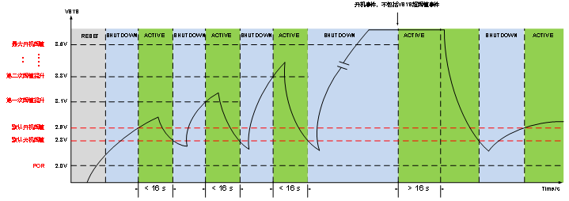

PMIC进入开机模式开始，如果VSYS电压在16s内未低于关机阈值，此时开机阈值将恢复为默认开机阈值，如上图示。上述调整过程通过寄存器[Table 6-20](#table-6-20-pmu_ctrl4) PMU_CTRL4[3]配置为1进行关闭。

#### 5.4.2 开机流程

关机模式下遇到开机事件后启动开机流程：

1. 从MTP加载所需配置，如各电源轨电压相关配置（MTP READ2）

2. 加载完配置后，PMIC会启动一系列开机前检测，如异常事件（电源轨过压，欠压，短路，芯片过温），检测完成并无异常发生时即启动电源轨开机序列，否则立即回到关机模式。

3. 开机序列完成后，通过配置[Table 6-18](#table-6-18-pmu_ctrl2) PMU_CTRL2[1]，可以选择是否经过一段可编程控制的延时（[Table 6-19](#table-6-19-pmu_ctrl3) PMU_CTRL3 [6:5]），PMIC再主动释放PGOOD引脚：

    1. 此时若配置成无需等待外部PGOOD释放（[Table 6-20](#table-6-20-pmu_ctrl4) PMU_CTRL4[1] = 0），则直接进入开机模式，否则需要等待PGOOD被释放后才进开机模式

    2. 若PMIC检测到PGOOD长时间未被释放（[Table 6-19](#table-6-19-pmu_ctrl3) PMU_CTRL3 [0]），则直接回到关机模式。

在上述流程中（进入开机模式前，见[Figure 5-1](#mode-switching-diagram)中带 * 号的状态），若遇到异常、关机或复位事件，都会立即打断开机流程并回到关机模式，等待下一次唤醒。

所有的BUCK（BUCK1~4）和EXT_EN都有各自独立可编程的SLOT ID，该SLOT ID通过PMIC内部的MTP配置内容决定，在关机模式下唤醒后即从MTP相应内存单元内取得配置。

多个电源轨或EXTx_EN可同时绑定到同一个SLOT里，即电源轨可在同一个SLOT中打开。

开机序列从SLOT0开始，所有SLOT的计时是独立可编程的，有六个档位选择（[Table 6-26](#table-6-26-stup_slot_dlyx) STUP_SLOT_DLYx）。根据不同的PWRCTRL引脚绑定情况，有如下几种场景：

**Table 5-17 开机序列行为说明**

|场景|配置|电源轨使能|SLOT计时|
|---|---|---|---|
|1|有效时序槽 无绑定PWRCTRL|在进入该SLOT时刻，该SLOT内： 1. 所有电源轨立即打开 2. 所有EXT_EN变有效|在进入该SLOT时刻： 1. SLOT开始计时 2. 计时完成进入下一SLOT|
|2|无效时序槽 无绑定PWRCTRL|在进入该SLOT时刻： 所有电源轨和EXT_EN保持关闭或无效|在进入该SLOT时刻： 1. SLOT开始计时 2. 计时完成进入下一状态|
|3|有效时序槽 有绑定PWRCTRL|在进入该SLOT时，该SLOT内： 1. 无等待的电源轨，及EXT_EN立即打开或变有效 2. 有等待的电源轨在PWRCTRL有效后立即打开|在进入该SLOT后： 1. 该SLOT内所有等待的PWRCTRL有效后才开始计时 2. 计时完成进入下一SLOT|
|4|无效时序槽 有绑定PWRCTRL|在进入该SLOT时，该SLOT内： 所有电源轨和EXT_EN保持关闭或无效|在进入该SLOT后： 1. 该SLOT内所有等待的PWRCTRL有效后才开始计时 2. 计时完成进入下一状态|

> 注：
>
> 1. 场景3：当SLOT计时未完成时，任一绑定的PWRCTRL变无效，SLOT计数停止并清零，绑定该PWRCTRL的电源轨关闭，直至该PWRCTRL重新变有效后才打开，SLOT的计时则需要等到所有绑定的PWRCTRL有效后才开始计时。
> 2. 场景3：当某一SLOT计时已完成并进入下一SLOT，此时若PWRCRTL再变无效，则已开启的相关电源轨不再受影响。但进入开机模式后PWRCTRL还处于无效状态，则受PWRCTRL控制的所有电源轨会立即关闭，当PWRCTRL重新变有效时，相应电源轨才重新打开。
> 3. 当所有的有效时序槽已经结束时，后续的无效时序槽的延时将会跳过。

**Figure 5-4 开机流程时序图**

#### 5.4.3 关机事件

关机事件如下：

1. CE引脚下拉关机事件

2. 软件关机事件

3. VSYS低阈值关机事件

4. VIO欠压关机事件（可软件或MTP屏蔽）

5. VSYS过压（可软件或MTP屏蔽）、电源轨异常事件（如过压OV，欠压UV，可软件或MTP屏蔽），芯片过温（可软件或MTP屏蔽）

另外电源轨异常事件可以配置[Table 6-28](#table-6-28-buck_glb_ctrl) BUCK_GLB_CTRL[1]来选择是进行关机还是关闭发生异常事件的BUCK。

#### 5.4.4 关机流程

关机流程中的关机时序与开机流程中的开机时序流程是相反的，关机时序是从SLOT15开始反序走到SLOT0，在每个SLOT里的涉及到的操作对象（BUCK，LDO或EXT_EN）是与开机流程一样的，但是触发相关行为的事件极性（PWRCTRL极性）和导致的结果（电源轨的开启或关闭）都是相反的，如 **开机流程时序图（[5.4.2 开机流程](#542-开机流程)）** 和 **关机流程时序图（下图）** 所示。

当在睡眠和唤醒过程中（[Figure 5-1](#mode-switching-diagram)中带 # 号的状态）遇到关机或复位事件，睡眠和唤醒过程会被打断，并根据当前配置执行相应的关机流程（[Table 6-20](#table-6-20-pmu_ctrl4) PMU_CTRL4[0]）。

反序走到某个SLOT时，与该SLOT绑定的电源轨关闭，EXT_EN变无效；当电源轨配置成等待PWRCTRL（[Table 6-18](#table-6-18-pmu_ctrl2) PMU_CTRL2[2] = 1），则该SLOT的计时以及电源轨的关闭需等待PWRCTRL无效，若等待PWRCTRL超时（[Table 6-19](#table-6-19-pmu_ctrl3) PMU_CTRL3[7]），则启动SLOT计时并关闭相应电源轨。

关机流程过程中如遇紧急事件，包括VSYS过压（[Table 6-77](#table-6-77-sys_status) SYS_STATUS[5]）和芯片严重过温（[Table 6-77](#table-6-77-sys_status) SYS_STATUS[3]），并且使能相关保护操作（[Table 6-43](#table-6-43-prot_en) PROT_EN[4][6]），则立即回到关机模式，所有电源轨和EXT_EN立即关闭或无效。

**Figure 5-5 关机流程时序图**

#### 5.4.5 睡眠事件

[Figure 5-1](#mode-switching-diagram)中的睡眠事件，是开机模式进入睡眠模式的条件：

1. 软件进入睡眠（[Table 6-17](#table-6-17-pmu_ctrl1) PMU_CTRL1[1] = 1）。

2. GPIO 复用输入功能（SLEEP/WKUP）引脚有效事件。

#### 5.4.6 睡眠流程

睡眠流程时序和关机流程的SLOT顺序是一致，但是行为不一样：

1. 各电源轨的使能保持不变（若[Table 6-39](#table-6-39-buckx_slp_vout) BUCKx_SLP_VOUT睡眠电压设置为0，则会关闭该BUCK使能），否则在此过程各电源轨只会将其电压调节到睡眠电压。

2. EXT_EN受[Table 6-25](#table-6-25-ext_ctrl) EXT_CTRL控制，即只有EXTx_SLP_SD = 1时，睡眠流程走到对应的SLOT时才会关闭，否则保持不变。

3. 睡眠流程中，唤醒事件不会打断睡眠过程，当进入睡眠模式后，此时唤醒条件还成立，则启动唤醒流程，其中软件和GPIO引脚触发睡眠条件是电平方式的，并只在开机模式下生效。

4. 当多个GPIO配置为SLEEP/WKUP引脚，开机模式下有任一引脚有效则进入睡眠流程。

#### 5.4.7 唤醒事件

[Figure 5-1](#mode-switching-diagram)中的唤醒事件，是睡眠模式退出的条件：

1. 软件唤醒

2. GPIO复用输入功能（SLEEP/WKUP）引脚无效事件，当有多个SLEEP/WKUP引脚时，只有全部SLEEP/WKUP引脚都无效才会退出睡眠

3. 如果是SLEEP/WKUP引脚引发的睡眠事件，在SLEEP/WKUP引脚的睡眠状态有效的情况下，任意中断都无法唤醒睡眠

4. 如果是软件方式进入睡眠，使能WDT和GPIO中断，并发生对应中断事件可以唤醒睡眠

#### 5.4.8 唤醒流程

唤醒流程和开机流程的SLOT顺序是一致的，区别如下：

1. 唤醒流程中，电源轨的电压从睡眠电压调到正常电压。

2. 如果在睡眠模式下，用户通过软件关闭了某电源轨，则进入唤醒流程时，该电源轨保持关闭状态。

3. 当唤醒流程中遇到睡眠事件，此时也不会打断正在执行的过程，当进入开机模式后若睡眠条件还成立，则启动睡眠流程。

4. 当通过软件方式进入睡眠，但退出睡眠通过其它方式，此时其它唤醒源也会清除软件触发条件，即清零相关寄存器。

5. 当多个GPIO配置为SLEEP/WKUP引脚，在睡眠模式下需要全部SLEEP/WKUP引脚变无效才进入唤醒流程。

6. 当有任一SLEEP/WKUP引脚处于有效状态，WDT和GPIO中断唤醒事件都不能将PMIC从睡眠模式唤醒。

#### 5.4.9 复位事件

复位事件如下：

1. 软件复位事件

2. PGOOD拉低（可软件或MTP屏蔽）

3. 看门狗超时复位事件（可软件屏蔽）

#### 5.4.10 复位流程

在开机模式、睡眠模式下遇到复位事件的行为是一致的，然后根据配置进行下一步操作，复位流程都需要经过关机流程。

经过关机流程进入关机模式后，PMIC 会在此模式下停留 20/100/200/500 ms（[Table 6-19](#table-6-19-pmu_ctrl3) PMU_CTRL3[2:1]），以保证足够的复位时间。计时完成后，退出关机模式并进入 MTP_READ2，如[Figure 5-1](#mode-switching-diagram)所示。复位源触发进入关机模式的（[Table 6-19](#table-6-19-pmu_ctrl3) PMU_CTRL3[2:1]）期间，开机源被屏蔽，即开机源无效。

#### 5.4.11 热复位

此外PMIC支持热复位的功能，热复位和普通复位区别在于，

1. 热复位过程不需要经过关机模式

2. BUCK电压直接按开机时序恢复到上电默认值

3. 其他模块的工作状态也恢复到上电默认状态

热复位通过 WARM_RESET（GPIO 复用输入功能）有效事件触发（可软件屏蔽）。如[Figure 5-1](#mode-switching-diagram)所示，热复位发生后，PMIC 复位所有配置寄存器和部分外设标志位（详见[6.2.2 寄存器描述](#622-寄存器描述)），拉低 PGOOD；执行 MTP_READ2 后，将所有 BUCK 输出电压恢复至开机默认值（无需等待 PWRCTRL）。对于开机时不启动的电源轨，则保持关闭。热复位完成后，后续行为与普通开机一致。

**Figure 5-6 热复位流程时序图**

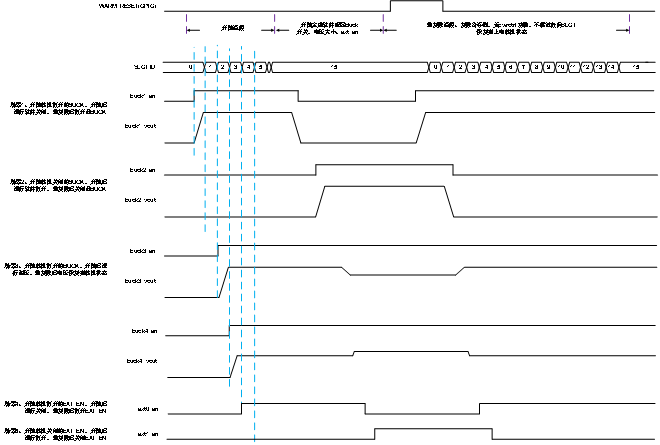

**Table 5-18 各模式和流程下电源轨状态和输出电压**

|Mode|SLOT_ID|PWRCTRLx|Software|电源轨状态|电源轨输出电压|
|---|---|---|---|---|---|
|关机模式|-|-|-|关闭|0 V|
|开机流程|x|x（optional）|x|使能|0 V -> BUCKx_VOUTn|
|开机模式|-|x（optional）|x|使能|BUCKx_VOUTn|
|睡眠流程|x|x（optional）|x|使能|BUCKx_VOUTn -> BUCKx_SLP_VOUT|
|睡眠模式|-|x（optional）|x|使能|BUCKx_SLP_VOUT|
|唤醒流程|x|x（optional）|x|使能|BUCKx_SLP_VOUT -> BUCKx_VOUTn|
|关机流程|x|x（optional）|-|关闭|BUCKx_VOUTn -> 0 V|
|热复位|x|-|-|使能|恢复到开机默认状态|

### 5.5 电源轨-BUCK

PMIC 共有四路高性能 BUCK，输出电压范围为 0.25 ~ 1.83 V，最大电流为 8 A。支持多相并联输出和两颗 PMIC 级联，以提高输出电流并满足不同应用场景的需求。

#### 5.5.1 软启动

软启动是指 BUCK 从关闭状态到开启状态并达到某个电压值的过程。

以下情况会触发软启动：

1. 开机流程打开默认开启的BUCK

2. 开机/睡眠模式下，通过I2C/SPI配置打开关闭的BUCK

3. 睡眠唤醒时，睡眠电压为0 V，唤醒后电压不为0 V

4. 热复位流程打开默认开启的BUCK

软启动的电压变化斜率有 4 个档位（2.5/10/25/50 mV/μs），可通过 [Table 6-21](#table-6-21-slew_ctrl0) SLEW_CTRL0[3:2] 进行配置。

#### 5.5.2 软关闭

软关闭是指 BUCK 从开启状态的某个电压降至关闭状态的过程。

以下情况会触发软关闭：

1. 关机流程关闭打开的BUCK

2. 开机/睡眠模式下，通过I2C/SPI配置关闭的打开的BUCK

3. 进入睡眠时，睡眠电压为0 V

4. 热复位流程关闭默认关闭的BUCK

软关闭的电压变化斜率有 4 个档位（2.5/10/25/50 mV/μs），可通过 [Table 6-21](#table-6-21-slew_ctrl0) SLEW_CTRL0[1:0] 进行配置。

所有BUCK输出端都有一个下拉电阻控制，当BUCK使能打开时，BUCK下拉电阻关闭，当BUCK关闭时，BUCK下拉电阻是否打开取决于[Table 6-28](#table-6-28-buck_glb_ctrl) BUCK_GLB_CTRL[0]。

#### 5.5.3 电压配置和动态调压

每个BUCK有5个电压配置寄存器：

1. [Table 6-35](#table-6-35-buckx_vout0) BUCKx_VOUT0

2. [Table 6-36](#table-6-36-buckx_vout1) BUCKx_VOUT1

3. [Table 6-37](#table-6-37-buckx_vout2) BUCKx_VOUT2

4. [Table 6-38](#table-6-38-buckx_vout3) BUCKx_VOUT3

5. [Table 6-39](#table-6-39-buckx_slp_vout) BUCKx_SLP_VOUT

其中，BUCKx_SLP_VOUT 在睡眠模式下生效；开机模式下生效的电压寄存器则由 DVS 引脚状态确定，见 [Table 5-19](#table-5-19)“DVS1 引脚设置”和 [Table 5-20](#table-5-20)“DVS0 引脚设置”。

有两种方式可以实现动态调压：

1. 通过I2C/SPI通信接口，在开机模式下修改BUCKx_VOUTx；在睡眠模式则修改睡眠模式下的电压配置寄存器BUCKx_SLP_VOUT。

2. 通过 GPIO 复用 DVS 引脚进行调压。[Table 6-34](#table-6-34-buckx_dvs_io) BUCKx_DVS_IO[5:0] 可设置 DVS1/0 对应的 IO 口（需要 [Table 6-12](#table-6-12-gpio_afr0) GPIO_AFR0 和 [Table 6-13](#table-6-13-gpio_afr1) GPIO_AFR1 配置为对应的 DVS 功能）。

**Table 5-19 DVS1 引脚设置**

|BUCKx_DVS1_IO[2:0]|描述|
|:---:|---|
|000|BUCKx的DVS1逻辑为0|
|001|选择GPIO0作为BUCKx的DVS1|
|010|选择GPIO1作为BUCKx的DVS1|
|011|选择GPIO2作为BUCKx的DVS1|
|100|选择GPIO3作为BUCKx的DVS1|
|101|BUCKx的DVS1逻辑为0|
|110|BUCKx的DVS1逻辑为0|
|111|BUCKx的DVS1逻辑为0|

**Table 5-20 DVS0 引脚设置**

|BUCKx_DVS0_IO[2:0]|描述|
|:---:|---|
|000|BUCKx的DVS0逻辑为0|
|001|选择GPIO0作为BUCKx的DVS0|
|010|选择GPIO1作为BUCKx的DVS0|
|011|选择GPIO2作为BUCKx的DVS0|
|100|选择GPIO3作为BUCKx的DVS0|
|101|BUCKx的DVS0逻辑为0|
|110|BUCKx的DVS0逻辑为0|
|111|BUCKx的DVS0逻辑为0|

**Table 5-21 DVS 引脚功能与开机模式下的电压输出**

|BUCKx｛DVS1,DVS0｝|BUCKx生效的DVS电压寄存器|
|:---:|---|
|00|[Table 6-35](#table-6-35-buckx_vout0) BUCKx_VOUT0|
|01|[Table 6-36](#table-6-36-buckx_vout1) BUCKx_VOUT1|
|10|[Table 6-37](#table-6-37-buckx_vout2) BUCKx_VOUT2|
|11|[Table 6-38](#table-6-38-buckx_vout3) BUCKx_VOUT3|

DVS1/DVS0的引脚逻辑如下图 **DVS0/DVS1逻辑** 所示，在使用DVS功能时，应该合理配置DVS引脚和GPIO引脚的复用，只有配置DVS的引脚和GPIO_AFR的复用功能匹配，才能通过GPIO来控制BUCK电压，否则，对应的DVS逻辑为0。比如，BUCK1_DVS0_IO设置为010（GPIO0）且GPIO1_AFR设置为1000（DVS0），但是BUCK1_DVS1_IO设置为100（GPIO3），GPIO3_AFR设置为0000（通用输入），那BUCK1的DVS1就恒为0，只能通过DVS0的变化来选择BUCKx_VOUT0、BUCKx_VOUT1。

**Figure 5-7 DVS0/DVS1逻辑**

关于调压速度，[5.5.1 软启动](#551-软启动)和[5.5.2 软关闭](#552-软关闭)分别说明了软启动和软关闭的场景，两者的速度均可在 2.5/10/25/50 mV/μs 中选择。软启动时，调压速度由 [Table 6-21](#table-6-21-slew_ctrl0) SLEW_CTRL0[3:2] 控制；软关闭时，调压速度由 [Table 6-21](#table-6-21-slew_ctrl0) SLEW_CTRL0[1:0] 控制。除软启动和软关闭外，还有以下调压场景：

1. 开机模式通过I2C/SPI配置已打开BUCK的有效寄存器[Table 6-35](#table-6-35-buckx_vout0) BUCKx_VOUT0，[Table 6-36](#table-6-36-buckx_vout1) BUCKx_VOUT1，[Table 6-37](#table-6-37-buckx_vout2) BUCKx_VOUT2，[Table 6-38](#table-6-38-buckx_vout3) BUCKx_VOUT3

2. 睡眠模式通过I2C/SPI配置已打开BUCK的[Table 6-39](#table-6-39-buckx_slp_vout) BUCKx_SLP_VOUT

3. 开机模式通过DVS引脚控制BUCK电压选择

4. 睡眠流程和唤醒流程中不涉及软启动和软关闭的BUCK电压变化

5. 热复位流程中的不涉及软启动和软关闭的BUCK电压变化

当变化前的电压 > 变化后的电压时，调压屏蔽由 [Table 6-22](#table-6-22-slew_ctrl1) SLEW_CTRL1[4] 控制，调压速度通过 [Table 6-22](#table-6-22-slew_ctrl1) SLEW_CTRL1[1:0] 进行配置；

当变化前的电压 < 变化后的电压时，调压屏蔽由 [Table 6-22](#table-6-22-slew_ctrl1) SLEW_CTRL1[5] 控制，调压速度通过 [Table 6-22](#table-6-22-slew_ctrl1) SLEW_CTRL1[3:2] 进行配置。

在开机模式或睡眠模式下调压完成后（不涉及软关闭和软启动），将置起 [Table 6-80](#table-6-80-buck_status0) BUCK_STATUS0[3:0] 调压完成标志位。如果使能对应中断，还会通过 INT 通知 SoC。需要注意的是，调压完成标志位会在热复位流程中清零。

#### 5.5.4 多相控制

PMIC 支持 4+0、3+1、2+2、2+1+1、1+1+1+1 输出配置。可通过 MTP 或 PH_CFGx（IO 复用）进行选择：当 [Table 6-28](#table-6-28-buck_glb_ctrl) BUCK_GLB_CTRL[5] 为 0 时，通过 MTP 在 MTP_READ2 阶段完成多相配置。

当 [Table 6-28](#table-6-28-buck_glb_ctrl) BUCK_GLB_CTRL[5] 为 1 时，在 MTP_READ2 完成后，通过 GPIO、[Table 6-28](#table-6-28-buck_glb_ctrl) BUCK_GLB_CTRL[4:2]、GPIO 复用控制以及 GPIO 输入来控制多相选择。

注意，两种多相控制的方式均只在PMIC上电后第一次开机流程中进行逻辑控制，后续关机再开机将保持多相配置的选择。

**Table 5-22 多相控制设置**

|[Table 6-28](#table-6-28-buck_glb_ctrl) BUCK_GLB_CTRL[5]|PH_CFG2,PG_CFG1, PH_CFG0（IO复用）|[Table 6-28](#table-6-28-buck_glb_ctrl) BUCK_GLB_CTRL[4:2]|BUCK多相配置|备注|
|:---:|:---:|:---:|:---:|:---:|
|**0**|-|000|4+0|BUCK1作为master|
||-|001|3+1|BUCK1作为master|
||-|010|2+2|BUCK1/3作为master|
||-|011|2+1+1|BUCK1作为master|
||-|1xx|1+1+1+1|四路BUCK独立控制|
|**1**|000|-|4+0|BUCK1作为master|
||001|-|3+1|BUCK1作为master|
||010|-|2+2|BUCK1/3作为master|
||011|-|2+1+1|BUCK1作为master|
||1xx|-|1+1+1+1|四路BUCK独立控制|

BUCK1/3作为master，slave BUCK的以下寄存器将无效，slave BUCK的相关控制由master BUCK决定。

[Table 6-32](#table-6-32-buckx_ctrl) BUCKx_CTRL

[Table 6-23](#table-6-23-slot_ctrl0) SLOT_CTRL0

[Table 6-24](#table-6-24-slot_ctrl1) SLOT_CTRL1

[Table 6-34](#table-6-34-buckx_dvs_io) BUCKx_DVS_IO

[Table 6-35](#table-6-35-buckx_vout0) BUCKx_VOUT0

[Table 6-36](#table-6-36-buckx_vout1) BUCKx_VOUT1

[Table 6-37](#table-6-37-buckx_vout2) BUCKx_VOUT2

[Table 6-38](#table-6-38-buckx_vout3) BUCKx_VOUT3

[Table 6-39](#table-6-39-buckx_slp_vout) BUCKx_SLP_VOUT

另外，多相并联模式下，只有 master BUCK 会有对应的异常事件产生，slave BUCK 异常事件被屏蔽。

#### 5.5.5 PMIC级联

PMIC 集成 4 路 BUCK，支持主从两颗 PMIC 通过 GPIO3 引脚进行级联，将总输出相数扩展至 5 相、6 相、7 相或 8 相，以满足大电流负载场景（如 CPU/GPU 核心供电）的需求。

1. PMIC做主机。作为级联主机时，在控制自身4个BUCK（主机需配置为四相）的前提下，需要生成并输出相位同步时钟，并从GPIO3输出。MTP配置说明如下：

    GPIO3配置为通用输出模式：[Table 6-13](#table-6-13-gpio_afr1) GPIO_AFR1[7:4]配置为1000

    设置为主机模式：[Table 6-29](#table-6-29-buck_cascade_ctrl0) BUCK_CASCADE_CTRL0[1:0]配置为11

    从机级联相数选择：[Table 6-29](#table-6-29-buck_cascade_ctrl0) BUCK_CASCADE_CTRL0[3:2]，4+1（00）、4+2（01）、4+3（10）、4+4（11）。主机自身4个BUCK通道默认按BUCK1~BUCK4依次对应第1~4相，不受cas_sel影响。cas_sel仅决定输出给从机的同步信号中包含多少个相位。

    输出级联信号脉宽：[Table 6-31](#table-6-31-buck_cascade_ctrl2) BUCK_CASCADE_CTRL2[1:0]

    

    **Figure 5-8 PMIC级联主机输出相数和GPIO3输出相位时序**

    

2. PMIC做从机。作为级联从机，其工作为通过GPIO3接收来自级联主机的输入同步信号，并将内部BUCK通道分配到指定的相位上，与主机形成并联。MTP配置说明如下：

    GPIO3配置为通用输入模式：[Table 6-13](#table-6-13-gpio_afr1) GPIO_AFR1[7:4]配置为0000

    设置为从机模式：[Table 6-29](#table-6-29-buck_cascade_ctrl0) BUCK_CASCADE_CTRL0[1:0]配置为10

    使能BUCKx进行从机级联：[Table 6-29](#table-6-29-buck_cascade_ctrl0) BUCK_CASCADE_CTRL0[7:4]

    级联信号的第几相用于控制从机BUCKx：[Table 6-30](#table-6-30-buck_cascade_ctrl1) BUCK_CASCADE_CTRL1

    

    **Figure 5-9 PMIC级联从机BUCKx的相位控制（4+4）**

    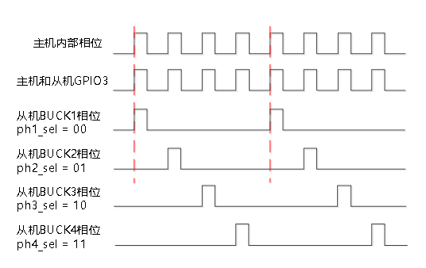

#### 5.5.6 VOUT 寄存器配置和电压映射

通过配置[Table 6-35](#table-6-35-buckx_vout0) BUCKx_VOUT0，[Table 6-36](#table-6-36-buckx_vout1) BUCKx_VOUT1，[Table 6-37](#table-6-37-buckx_vout2) BUCKx_VOUT2，[Table 6-38](#table-6-38-buckx_vout3) BUCKx_VOUT3和[Table 6-39](#table-6-39-buckx_slp_vout) BUCKx_SLP_VOUT可以修改开机和睡眠模式下的BUCKx电压，其配置和电压的映射关系如下：

**Table 5-23 BUCKx_VOUT 和 BUCKx_SLP_VOUT 配置和电压映射（单位：V）**

表中每个单元格的格式为“寄存器编码 / 输出电压”。

> 注：
>
> - **5 mV/step** - 无色
> - **10 mV/step** - 蓝色
> - **特殊电压** - 红色

|0x0x|0x1x|0x2x|0x3x|0x4x|0x5x|0x6x|0x7x|0x8x|0x9x|0xAx|0xBx|0xCx|0xDx|0xEx|0xFx|
|---|---|---|---|---|---|---|---|---|---|---|---|---|---|---|---|
|0x00 0.800|0x10 0.325|0x20 0.405|0x30 0.485|0x40 0.565|0x50 0.645|0x60 0.725|0x70 0.805|0x80 0.885|0x90 0.965|0xA0 1.045|0xB0 1.125|0xC0 1.210|0xD0 1.370|0xE0 1.530|0xF0 1.690|
|0x01 0.250|0x11 0.330|0x21 0.410|0x31 0.490|0x41 0.570|0x51 0.650|0x61 0.730|0x71 0.810|0x81 0.890|0x91 0.970|0xA1 1.050|0xB1 1.130|0xC1 1.220|0xD1 1.380|0xE1 1.540|0xF1 1.700|
|0x02 0.255|0x12 0.335|0x22 0.415|0x32 0.495|0x42 0.575|0x52 0.655|0x62 0.735|0x72 0.815|0x82 0.895|0x92 0.975|0xA2 1.055|0xB2 1.135|0xC2 1.230|0xD2 1.390|0xE2 1.550|0xF2 1.710|
|0x03 0.260|0x13 0.340|0x23 0.420|0x33 0.500|0x43 0.580|0x53 0.660|0x63 0.740|0x73 0.820|0x83 0.900|0x93 0.980|0xA3 1.060|0xB3 1.140|0xC3 1.240|0xD3 1.400|0xE3 1.560|0xF3 1.720|
|0x04 0.265|0x14 0.345|0x24 0.425|0x34 0.505|0x44 0.585|0x54 0.665|0x64 0.745|0x74 0.825|0x84 0.905|0x94 0.985|0xA4 1.065|0xB4 1.145|0xC4 1.250|0xD4 1.410|0xE4 1.570|0xF4 1.730|
|0x05 0.270|0x15 0.350|0x25 0.430|0x35 0.510|0x45 0.590|0x55 0.670|0x65 0.750|0x75 0.830|0x85 0.910|0x95 0.990|0xA5 1.070|0xB5 1.150|0xC5 1.260|0xD5 1.420|0xE5 1.580|0xF5 1.740|
|0x06 0.275|0x16 0.355|0x26 0.435|0x36 0.515|0x46 0.595|0x56 0.675|0x66 0.755|0x76 0.835|0x86 0.915|0x96 0.995|0xA6 1.075|0xB6 1.155|0xC6 1.270|0xD6 1.430|0xE6 1.590|0xF6 1.750|
|0x07 0.280|0x17 0.360|0x27 0.440|0x37 0.520|0x47 0.600|0x57 0.680|0x67 0.760|0x77 0.840|0x87 0.920|0x97 1.000|0xA7 1.080|0xB7 1.160|0xC7 1.280|0xD7 1.440|0xE7 1.600|0xF7 1.760|
|0x08 0.285|0x18 0.365|0x28 0.445|0x38 0.525|0x48 0.605|0x58 0.685|0x68 0.765|0x78 0.845|0x88 0.925|0x98 1.005|0xA8 1.085|0xB8 1.165|0xC8 1.290|0xD8 1.450|0xE8 1.610|0xF8 1.770|
|0x09 0.290|0x19 0.370|0x29 0.450|0x39 0.530|0x49 0.610|0x59 0.690|0x69 0.770|0x79 0.850|0x89 0.930|0x99 1.010|0xA9 1.090|0xB9 1.170|0xC9 1.300|0xD9 1.460|0xE9 1.620|0xF9 1.780|
|0x0A 0.295|0x1A 0.375|0x2A 0.455|0x3A 0.535|0x4A 0.615|0x5A 0.695|0x6A 0.775|0x7A 0.855|0x8A 0.935|0x9A 1.015|0xAA 1.095|0xBA 1.175|0xCA 1.310|0xDA 1.470|0xEA 1.630|0xFA 1.790|
|0x0B 0.300|0x1B 0.380|0x2B 0.460|0x3B 0.540|0x4B 0.620|0x5B 0.700|0x6B 0.780|0x7B 0.860|0x8B 0.940|0x9B 1.020|0xAB 1.100|0xBB 1.180|0xCB 1.320|0xDB 1.480|0xEB 1.640|0xFB 1.800|
|0x0C 0.305|0x1C 0.385|0x2C 0.465|0x3C 0.545|0x4C 0.625|0x5C 0.705|0x6C 0.785|0x7C 0.865|0x8C 0.945|0x9C 1.025|0xAC 1.105|0xBC 1.185|0xCC 1.330|0xDC 1.490|0xEC 1.650|0xFC 1.810|
|0x0D 0.310|0x1D 0.390|0x2D 0.470|0x3D 0.550|0x4D 0.630|0x5D 0.710|0x6D 0.790|0x7D 0.870|0x8D 0.950|0x9D 1.030|0xAD 1.110|0xBD 1.190|0xCD 1.340|0xDD 1.500|0xED 1.660|0xFD 1.820|
|0x0E 0.315|0x1E 0.395|0x2E 0.475|0x3E 0.555|0x4E 0.635|0x5E 0.715|0x6E 0.795|0x7E 0.875|0x8E 0.955|0x9E 1.035|0xAE 1.115|0xBE 1.195|0xCE 1.350|0xDE 1.510|0xEE 1.670|0xFE 1.830|
|0x0F 0.320|0x1F 0.400|0x2F 0.480|0x3F 0.560|0x4F 0.640|0x5F 0.720|0x6F 0.800|0x7F 0.880|0x8F 0.960|0x9F 1.040|0xAF 1.120|0xBF 1.200|0xCF 1.360|0xDF 1.520|0xEF 1.680|0xFF 0.000|

#### 5.5.7 LPM（低功耗）模式

每个 BUCK 均包含 LPM（低功耗）功能，可在主机进入睡眠状态后将静态电流降至最低。在 LPM 模式下，增强型瞬态响应（ETR）、自适应死区时间控制（ADT）和 POK 比较器会被禁用，因此 BUCK 的负载瞬态响应性能会有所降低。BUCK 的 LPM 模式使能共用，通过 [Table 6-28](#table-6-28-buck_glb_ctrl) BUCK_GLB_CTRL[6] 启动。

### 5.6 异常保护

PMIC有以下保护操作：

1. BUCK的过压、欠压保护

2. 芯片严重过温保护

3. 芯片紧急过温保护

4. VIO欠压保护

5. VSYS过压保护

6. VSYS欠压保护

**Table 5-24 异常事件保护和相关寄存器**

|保护类型|相关寄存器|行为|
|---|---|---|
|**BUCK欠压**|[Table 6-43](#table-6-43-prot_en) PROT_EN[1] [Table 6-28](#table-6-28-buck_glb_ctrl) BUCK_GLB_CTRL[0] [Table 6-44](#table-6-44-sys_deb) SYS_DEB[4:3] [Table 6-44](#table-6-44-sys_deb) SYS_DEB[2:0] [Table 6-76](#table-6-76-shut_status) SHUT_STATUS[1] [Table 6-81](#table-6-81-buck_status1) BUCK_STATUS1[7:4] [Table 6-87](#table-6-87-buck_irq_en1) BUCK_IRQ_EN1[7:4]|按关机配置关机或关闭发生异常的BUCK|
|**BUCK过压**|[Table 6-43](#table-6-43-prot_en) PROT_EN[2] [Table 6-28](#table-6-28-buck_glb_ctrl) BUCK_GLB_CTRL[0] [Table 6-44](#table-6-44-sys_deb) SYS_DEB[4:3] [Table 6-44](#table-6-44-sys_deb) SYS_DEB[2:0] [Table 6-76](#table-6-76-shut_status) SHUT_STATUS[2] [Table 6-82](#table-6-82-buck_status2) BUCK_STATUS2[7:4] [Table 6-88](#table-6-88-buck_irq_en2) BUCK_IRQ_EN2[7:4]|按关机配置关机或关闭发生异常的BUCK|
|**芯片严重过温**|[Table 6-43](#table-6-43-prot_en) PROT_EN[3] [Table 6-42](#table-6-42-prot_cfg) PROT_CFG[6] [Table 6-44](#table-6-44-sys_deb) SYS_DEB[6:4] [Table 6-76](#table-6-76-shut_status) SHUT_STATUS[3] [Table 6-77](#table-6-77-sys_status) SYS_STATUS[2] [Table 6-83](#table-6-83-sys_irq_en) SYS_IRQ_EN[2]|按关机配置关机|
|**芯片紧急过温**|[Table 6-43](#table-6-43-prot_en) PROT_EN[4] [Table 6-42](#table-6-42-prot_cfg) PROT_CFG[6] [Table 6-44](#table-6-44-sys_deb) SYS_DEB[6:4] [Table 6-76](#table-6-76-shut_status) SHUT_STATUS[3] [Table 6-77](#table-6-77-sys_status) SYS_STATUS[3] [Table 6-83](#table-6-83-sys_irq_en) SYS_IRQ_EN[3]|直接进入关机模式|
|**VIO欠压**|[Table 6-43](#table-6-43-prot_en) PROT_EN[5] [Table 6-44](#table-6-44-sys_deb) SYS_DEB[6:4] [Table 6-76](#table-6-76-shut_status) SHUT_STATUS[4] [Table 6-77](#table-6-77-sys_status) SYS_STATUS[4] [Table 6-83](#table-6-83-sys_irq_en) SYS_IRQ_EN[4]|按关机配置关机|
|**VSYS过压**|[Table 6-43](#table-6-43-prot_en) PROT_EN[6] [Table 6-44](#table-6-44-sys_deb) SYS_DEB[6:4] [Table 6-76](#table-6-76-shut_status) SHUT_STATUS[6] [Table 6-77](#table-6-77-sys_status) SYS_STATUS[5] [Table 6-83](#table-6-83-sys_irq_en) SYS_IRQ_EN[5]|直接进入关机模式|
|**VSYS欠压**|[Table 6-44](#table-6-44-sys_deb) SYS_DEB[6:4] [Table 6-76](#table-6-76-shut_status) SHUT_STATUS[5]|按关机配置关机|

#### 5.6.1 电源轨异常保护

[Table 6-43](#table-6-43-prot_en) PROT_EN[2:1]可以使能电源轨的关机保护（UV/OV），当有任一电源轨发生对应异常时：

如果[Table 6-28](#table-6-28-buck_glb_ctrl) BUCK_GLB_CTRL[0]配置为1，即执行关机流程。

如果[Table 6-28](#table-6-28-buck_glb_ctrl) BUCK_GLB_CTRL[0]配置为0，则仅关闭发生异常事件的BUCK。

其中电源轨的OV/UV异常事件有滤波时间选择和屏蔽时间选择：

1. 滤波时间：通过[Table 6-44](#table-6-44-sys_deb) SYS_DEB[4:3]配置为：100/375/750 μs/屏蔽滤波。

2. 屏蔽时间：在电源轨开启和电源轨电压改变阶段，PMIC内部检测电路可能会产生异常的过压欠压事件，这段时间会屏蔽对应BUCK的过压欠压事件。在电源开启完成或调压完成后，BUCK也会需要有一段电压稳定的时间，可以通过[Table 6-44](#table-6-44-sys_deb) SYS_DEB[2:0]屏蔽BUCK调压完成到稳定这段时间的异常过压欠压事件。

#### 5.6.2 其它异常保护

VSYS欠压没有使能，即发生VSYS欠压事件时，必定进行关机流程，确保PMIC不会因为供电电压不足情况下出现控制异常的现象。

VSYS过压，VIO欠压，芯片温度保护分别有单独的使能位：

[Table 6-43](#table-6-43-prot_en) PROT_EN[3]（芯片严重过温保护使能）

[Table 6-43](#table-6-43-prot_en) PROT_EN[4]（芯片紧急过温保护使能）

[Table 6-43](#table-6-43-prot_en) PROT_EN[5]（VIO欠压保护使能）

[Table 6-43](#table-6-43-prot_en) PROT_EN[6]（VSYS过压保护使能）

上述所有事件可通过寄存器[Table 6-44](#table-6-44-sys_deb) SYS_DEB[6:4]设置滤波时间：100/375/750 μs/屏蔽滤波。

关于温度保护，如下表所示，根据不同的温度大小，温度相关事件有三种：温度报警、严重过温、紧急过温（[Table 6-77](#table-6-77-sys_status) SYS_STATUS[3:1]）。[Table 6-42](#table-6-42-prot_cfg) PROT_CFG[6]（TEMP_LEVEL）可以选择温度保护档位。温度报警只有中断使能位，严重过温和关机过温有中断使能位和关机保护位。当发生相应事件时，PMIC根据使能位的配置进行中断或关机的操作。

**Table 5-25 过温保护档位及其行为**

|[Table 6-42](#table-6-42-prot_cfg) PROT_CFG[6]|温度报警（warning）/ ℃|严重过温（severe）/ ℃|关机过温（critical）/ ℃|
|:---:|:---:|:---:|:---:|
|0|95|115|135|
|1|110|130|150|
|事件|[Table 6-77](#table-6-77-sys_status) SYS_STATUS[1] E_TEMP_WARN|[Table 6-77](#table-6-77-sys_status) SYS_STATUS[2] E_TEMP_SEVERE|[Table 6-77](#table-6-77-sys_status) SYS_STATUS[3] E_TEMP_CRIT|
|中断使能/保护使能|[Table 6-83](#table-6-83-sys_irq_en) SYS_IRQ_EN[1]|[Table 6-83](#table-6-83-sys_irq_en) SYS_IRQ_EN[2] [Table 6-43](#table-6-43-prot_en) PROT_EN[3]|[Table 6-83](#table-6-83-sys_irq_en) SYS_IRQ_EN[3] [Table 6-43](#table-6-43-prot_en) PROT_EN[4]|
|行为|中断|关机/中断可配|关机/中断可配|

### 5.7 模数转换（ADC）

#### 5.7.1 功能简介

1. 支持选择 4 路外部扫描通道和 11 路内部扫描通道，所有通道均有独立的结果寄存器。

2. 支持手动和自动扫描模式。

3. ADC 控制寄存器存储在 MTP，支持开机后自动启动 ADC 扫描。

4. 自动模式下可配置检测通道，数据更新间隔有 8 档可选。

5. 4 路外部扫描通道均支持独立的自动扫描监控，高、低阈值可分别配置。

6. BUCK 电流支持自动扫描通道监控，可设置低阈值。

7. 自动模式下支持 BUCK 功耗统计和总功耗统计；功耗支持自动扫描通道监控，可设置低阈值。

8. TJ 通道支持自动扫描通道监控，高、低阈值可分别配置。

9. 支持屏蔽 ADC 单次转换完成中断、序列转换完成中断和阈值比较中断。

#### 5.7.2 通道选择

**Figure 5-10 ADC模块工作示意图**

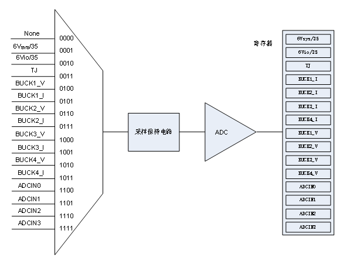

ADC各测量通道如下：

**Table 5-26 ADC 转换通道**

|ADC_CHNL_SEL|通道描述|是否有阈值比较|
|:---:|:---:|:---:|
|0000|None|None|
|0001|VSYS/4 电压|否|
|0010|VIO/4电压|否|
|0011|TJ|是|
|0100|BUCK1电压|否|
|0101|BUCK1电流/功耗/BUCK总功耗|是|
|0110|BUCK2电压|否|
|0111|BUCK2电流/功耗|是|
|1000|BUCK3电压|否|
|1001|BUCK3电流/功耗|是|
|1010|BUCK4电压|否|
|1011|BUCK4电流/功耗|是|
|1100|ADCIN0电压|是|
|1101|ADCIN1电压|是|
|1110|ADCIN2电压|是|
|1111|ADCIN3电压|是|

#### 5.7.3 手动模式

手动模式配置流程：

1. 配置[Table 6-48](#table-6-48-adc_auto0) ADC_AUTO0和[Table 6-49](#table-6-49-adc_auto1) ADC_AUTO1均配置为0x00，即手动模式。

2. 使能ADC：[Table 6-45](#table-6-45-adc_ctrl) ADC_CTRL[1] = 1。

3. 选择ADC转换通道，即配置[Table 6-46](#table-6-46-adc_cfg0) ADC_CFG0[3:0]。

4. 置位ADC_GO启动一次转换（[Table 6-45](#table-6-45-adc_ctrl) ADC_CTRL[0] = 1）。

手动模式下每完成一次转换：

1. 结果存放在对应寄存器。

2. ADC_GO被硬件清零。

3. ADC单次转换完成事件[Table 6-78](#table-6-78-adc_gpio_status) ADC_GPIO_STATUS[6]（ADC_EOC）会被置位。

4. 如果使能了中断[Table 6-84](#table-6-84-adc_gpio_irq_en) ADC_GPIO_IRQ_EN[6]（IRQ_EN_ADC_EOC），会产生一个中断事件（拉低INT引脚）直至软件清除该事件或清零中断使能位。

> 注：
>
> 1. 为保证转换结果的准确性，通道转换过程中不可随意更改配置。
> 2. 若转换过程中软件清零ADC_GO，将会打断当前转换，结果不保存和更新。
> 3. 如果ADC使能未打开，则ADC_GO不能被置起。
> 4. 手动模式不支持转换BUCK功耗、不支持阈值比较功能。

#### 5.7.4 ADC结果滤波

如果配置了通道阈值比较功能：

1. 在未开启结果滤波时（[Table 6-50](#table-6-50-adc_deb0) ADC_DEB0、[Table 6-51](#table-6-51-adc_deb1) ADC_DEB1[4:0]），当本次转换结果超过或低于所设阈值，相应通道的事件（[Table 6-78](#table-6-78-adc_gpio_status) ADC_GPIO_STATUS[4:0]、[Table 6-79](#table-6-79-adc_status) ADC_STATUS）标志位将被置起。

2. 当开启了结果滤波时，只有连续遇到超阈值事件或低阈值事件达到[Table 6-51](#table-6-51-adc_deb1) ADC_DEB1[7:5]设置的次数后才会置起相应标志位。

如果使能了对应的中断，会产生一个中断事件（拉低INT引脚）直至软件清除该事件或清零中断使能位。

**Figure 5-11 ADC结果滤波示意图**

#### 5.7.5 自动模式

自动模式配置流程：

1. 配置自动扫描通道：[Table 6-48](#table-6-48-adc_auto0) ADC_AUTO0和[Table 6-49](#table-6-49-adc_auto1) ADC_AUTO1。

2. 根据需要配置[Table 6-47](#table-6-47-adc_cfg1) ADC_CFG1[0]选择电流结果或功耗结果、[Table 6-47](#table-6-47-adc_cfg1) ADC_CFG1[1]选择是否转换总功耗结果并存储在BUCK1电流/功耗通道结果寄存器

    [Table 6-66](#table-6-66-adc_buckx_cur_pwr_rdout_h) ADC_BUCKx_CUR_PWR_RDOUT_H[7:0]（x=1）

    [Table 6-67](#table-6-67-adc_buckx_cur_pwr_rdout_l) ADC_BUCKx_CUR_PWR_RDOUT_L[7:4]（x=1）

    [Table 6-47](#table-6-47-adc_cfg1) ADC_CFG1[4:2]选择数据更新间隔1.5/3/6/12/50/100/300/1500ms

3. 使能ADC：[Table 6-45](#table-6-45-adc_ctrl) ADC_CTRL[1] = 1，后续扫描操作均由硬件完成

4. 任意时候配置[Table 6-45](#table-6-45-adc_ctrl) ADC_CTRL[1] = 0，结束ADC自动扫描

**Figure 5-12 ADC自动扫描示意图**

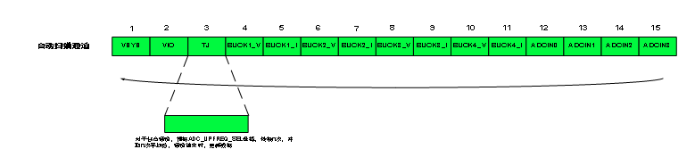

**Figure 5-13 ADC自动模式时序**

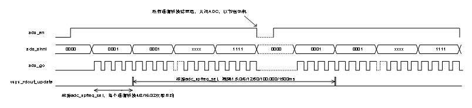

自动模式下每完成一个通道的扫描：

1. 更新数据到对应的结果寄存器，未在[Table 6-48](#table-6-48-adc_auto0) ADC_AUTO0和[Table 6-49](#table-6-49-adc_auto1) ADC_AUTO1使能的通道不进行数据更新，另外，若配置了[Table 6-47](#table-6-47-adc_cfg1) ADC_CFG1[1]选择统计BUCK总功耗，则在BUCK4_1通道转换结束后更新到BUCK1电流/功耗通道结果寄存器。

2. 对于TJ、BUCKx_I和ADCINx通道，进行阈值比较。如果使能了对应中断并且阈值超出设置范围，会产生一个中断事件（拉低INT引脚）直至软件清除该事件或清零中断使能位。

    相关的中断位为：[Table 6-78](#table-6-78-adc_gpio_status) ADC_GPIO_STATUS[4:0]，[Table 6-79](#table-6-79-adc_status) ADC_STATUS[7:0]

    相关的中断使能位为：[Table 6-84](#table-6-84-adc_gpio_irq_en) ADC_GPIO_IRQ_EN[4:0]，[Table 6-85](#table-6-85-adc_irq_en) ADC_IRQ_EN[7:0]

自动模式下每完成一个序列的扫描（ADC_AUTO使能的通道都被扫描完成）：

1. 序列转换完成事件[Table 6-78](#table-6-78-adc_gpio_status) ADC_GPIO_STATUS[5]（ADC_EOS）会被置位，如果使能了中断[Table 6-84](#table-6-84-adc_gpio_irq_en) ADC_GPIO_IRQ_EN[5]（IRQ_EN_ADC_EOS），会产生一个中断事件（拉低INT引脚）直至软件清除该事件或清零中断使能位。

2. 硬件关闭ADC以节省功耗，待[Table 6-47](#table-6-47-adc_cfg1) ADC_CFG1[4:2]（ADC_UPFREQ_SEL）时间结束后，硬件再次启动ADC。

> 注：
>
> 1. 为保证转换结果的准确性，通道转换过程中不可随意更改配置。
> 2. 对于任意通道，连续扫描n次取平均值（n随ADC_UPFREQ_SEL变化，见[Table 6-47](#table-6-47-adc_cfg1) ADC_CFG1[4:2]），通道结束后更新数据
> 3. 若配置了[Table 6-47](#table-6-47-adc_cfg1) ADC_CFG1[0]选择转换功耗，必须同时使能BUCK的电压和电流通道自动扫描。
> 4. 若配置了 [Table 6-47](#table-6-47-adc_cfg1) ADC_CFG1[1]选择统计BUCK总功耗，仅统计被使能的电压和电流通道自动扫描的BUCK功耗。
> 5. ADC相关的标志位会在热复位流程中清除。

#### 5.7.6 功耗测量

**单个BUCK功耗测量**

如果配置 [Table 6-47](#table-6-47-adc_cfg1) ADC_CFG1[0] 选择功耗结果，并且某个BUCK的电压和电流通道启动自动扫描，扫描完某个BUCK的电压和电流后将计算功耗，并存储到以下寄存器：

- [Table 6-66](#table-6-66-adc_buckx_cur_pwr_rdout_h) ADC_BUCKx_CUR_PWR_RDOUT_H[7:0]（x=1~4）
- [Table 6-67](#table-6-67-adc_buckx_cur_pwr_rdout_l) ADC_BUCKx_CUR_PWR_RDOUT_L[7:4]（x=1~4）

**BUCK总功耗测量**

如果 [Table 6-47](#table-6-47-adc_cfg1) ADC_CFG1[1] 选择转换总功耗，则结果将存储在BUCK1电流/功耗通道结果寄存器：

- [Table 6-66](#table-6-66-adc_buckx_cur_pwr_rdout_h) ADC_BUCKx_CUR_PWR_RDOUT_H[7:0]（x=1）
- [Table 6-67](#table-6-67-adc_buckx_cur_pwr_rdout_l) ADC_BUCKx_CUR_PWR_RDOUT_L[7:4]（x=1）

### 5.8 看门狗

在开机模式和睡眠模式下，主机可通过I2C通信接口使能看门狗并配置超时时间（[Table 6-70](#table-6-70-wdt_ctrl) WDT_CTRL[2:1]）

超时时间内主机进行了喂狗操作：计时清零，并重新开始计数。

如果在设定超时时间内主机未进行喂狗操作（[Table 6-70](#table-6-70-wdt_ctrl) WDT_CTRL[0]=1）：

1. 产生看门狗超时事件并置起相关标志位（[Table 6-77](#table-6-77-sys_status) SYS_STATUS[0]）。

2. 假如看门狗超时复位使能（[Table 6-16](#table-6-16-pmu_ctrl0) PMU_CTRL0[1]），则触发PMIC的复位流程。

3. 假如看门狗中断使能打开（[Table 6-83](#table-6-83-sys_irq_en) SYS_IRQ_EN[0]），则产生看门狗中断并拉低INT引脚。

> 注：
>
> 1. 看门狗进入关机模式后关闭使能并停止工作，重新进入开机模式需再次配置看门狗使能。
> 2. 看门狗工作过程中不应该修改看门狗超时时间。
> 3. 如果是以软件方式进去睡眠，看门狗中断可以进行睡眠唤醒。

### 5.9 通用 IO

PMIC总共有4个GPIO，既可作为通用IO，也可配置成复用功能，详见寄存器 [Table 6-12](#table-6-12-gpio_afr0) GPIO_AFR0、[Table 6-13](#table-6-13-gpio_afr1) GPIO_AFR1。

#### GPIO 基本特性

1. **功能支持**：除了作为复用ADC输入功能外，GPIO的极性、上下拉、开漏和滤波功能都有效。

2. **滤波功能**：
   - 使能控制：[Table 6-9](#table-6-9-gpio_deb) GPIO_DEB[3:0]
   - 滤波时间：15.625 μs ~ 1.0 ms（[Table 6-9](#table-6-9-gpio_deb) GPIO_DEB[6:4]）
   - 端口状态：寄存器 [Table 6-7](#table-6-7-gpio_dr) GPIO_DR[3:0] 可反应当前端口状态

3. **输入中断功能**：作为GPIO输入功能时，GPIOx_IDR（[Table 6-7](#table-6-7-gpio_dr) GPIO_DR[3:0]）和 [Table 6-11](#table-6-11-gpio_itype) GPIO_ITYPE 相互配合可产生 GPIOx_INT（[Table 6-78](#table-6-78-adc_gpio_status) ADC_GPIO_STATUS[3:0]）事件。如果是以软件方式进入睡眠，GPIOx_INT 中断可以进行睡眠唤醒。

#### GPIOx_ODR 复用功能

GPIOx_ODR（[Table 6-7](#table-6-7-gpio_dr) GPIO_DR[7:4]）具有两种功能：

1. 作为GPIO输出时（GPIOx_AFR=4’b0001），GPIOx_ODR即为GPIO输出状态。

2. 作为复用功能时，包括

    - GPIOx_AFR=4’b0010(EXT_EN)
    - GPIOx_AFR=4’b0011(PWRCTRL)
    - GPIOx_AFR=4’b0100(SLEEP/WKUP)
    - GPIOx_AFR=4’b0101(WARM_RESET)
    - GPIOx_AFR=4’b0111(PH_CFG)
    - GPIOx_AFR=4’b1000(DVS0)
    - GPIOx_AFR=4’b1001(DVS1)

    此时，GPIOx_ODR即为相关复用功能的有效状态配置位。

### 5.10 通信接口

PMIC 支持 I2C 和 SPI 通信接口，通过 [Table 6-40](#table-6-40-interface_cfg) INTERFACE_CFG[2] 进行选择；该 PMIC 仅作为从机使用。

#### 5.10.1 SPI

SPI 通信接口兼容 SPI 模式 0，最高支持速率为 30 MHz。支持单字节读写和连续地址的多字节读写。

**Figure 5-14 SPI通信命令**

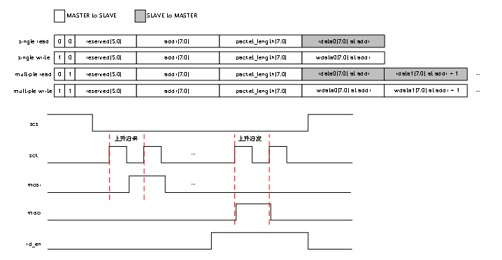

**Figure 5-15 SPI读写时序**

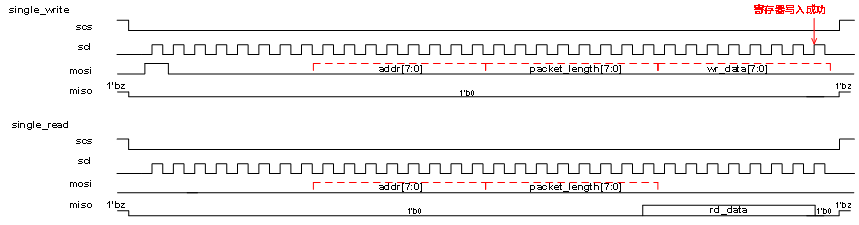

#### 5.10.2 I2C

I2C从机地址可通过MTP配置：[Table 6-41](#table-6-41-i2c_slv_addr) I2C_SLV_ADDR[6:0]。

支持单字节读、连续地址多字节读、单字节写和连续地址多字节写（[Table 6-40](#table-6-40-interface_cfg) INTERFACE_CFG[0] = 0），以及数据对模式（pair mode）写（[Table 6-40](#table-6-40-interface_cfg) INTERFACE_CFG[0] = 1）。

**Figure 5-16 I2C通信命令**

**Figure 5-17 I2C读写时序**

在 LS_MODE 下，I2C 通信接口最高支持 1 MHz，可滤除 50 ns 毛刺，START 和 STOP 的裕量为 120 ns。

在 HS_MODE 下，I2C 通信接口最高支持 3.4 MHz，可滤除 10 ns 毛刺，START 和 STOP 的裕量为 80 ns。

LS_MODE和HS_MODE切换逻辑涉及到寄存器I2C_HS_MODE和HS_MASTER_CODE，切换逻辑过程如下：

**Figure 5-18 I2C HS_MODE和LS_MODE切换**

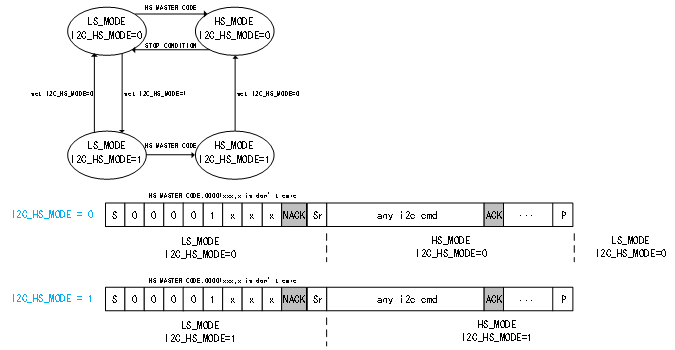

### 5.11 中断

PMIC 的中断事件如 [Table 5-27](#table-5-27) 所示。当某个中断事件发生时，标志位将被置起；如果使能对应的中断使能位，INT 引脚将被拉低，将中断事件反馈给主控。

**Table 5-27 中断事件**

|中断标志位|使能位|滤波|描述|
|---|---|---|---|
|E_VSYS_OV|IRQ_EN_VSYS_OV|EVT_DEB[1:0]|VSYS过压，可关机|
|E_VIO_UV|IRQ_EN_VIO_UV|EVT_DEB[1:0]|VIO欠压，可关机|
|E_TEMP_WARN|IRQ_EN_TEMP_WARN|EVT_DEB[1:0]|警告过温|
|E_TEMP_SEVERE|IRQ_EN_TEMP_SEVERE|EVT_DEB[1:0]|严重过温，可关机|
|E_TEMP_CRIT|IRQ_EN_TEMP_CRIT|EVT_DEB[1:0]|紧急过温，可关机|
|E_WDT_TO|IRQ_EN_WDT_TO|无|看门狗超时，可复位|
|E_ADC_EOC|IRQ_EN_ADC_EOC|无|ADC单次转换完成|
|E_ADC_EOS|IRQ_EN_ADC_EOS|无|ADC序列转换完成|
|E_ADC_TEMP|IRQ_EN_ADC_TEMP|无|ADC结温阈值中断|
|E_GPI0|IRQ_EN_GPI0|外部中断时，GPIO_DEB 超阈值中断是，无|GPIO0外部中断或ADCIN0超阈值中断|
|E_GPI1|IRQ_EN_GPI1|外部中断时，GPIO_DEB 超阈值中断是，无|GPIO1外部中断或ADCIN1超阈值中断|
|E_GPI2|IRQ_EN_GPI2|外部中断时，GPIO_DEB 超阈值中断是，无|GPIO2外部中断或ADCIN2超阈值中断|
|E_GPI3|IRQ_EN_GPI3|外部中断时，GPIO_DEB 超阈值中断是，无|GPIO3外部中断或ADCIN3超阈值中断|
|E_ADC_BUCK1_OPWR|IRQ_EN_ADC_BUCK1_OPWR|无|BUCK1功耗或总功耗超阈值中断|
|E_ADC_BUCK2_OPWR|IRQ_EN_ADC_BUCK2_OPWR|无|BUCK2功耗超阈值中断|
|E_ADC_BUCK3_OPWR|IRQ_EN_ADC_BUCK3_OPWR|无|BUCK3功耗超阈值中断|
|E_ADC_BUCK4_OPWR|IRQ_EN_ADC_BUCK4_OPWR|无|BUCK4功耗超阈值中断|
|E_ADC_BUCK1_OC|IRQ_EN_ADC_BUCK1_OC|无|BUCK1电流超阈值中断|
|E_ADC_BUCK2_OC|IRQ_EN_ADC_BUCK2_OC|无|BUCK2电流超阈值中断|
|E_ADC_BUCK3_OC|IRQ_EN_ADC_BUCK3_OC|无|BUCK3电流超阈值中断|
|E_ADC_BUCK4_OC|IRQ_EN_ADC_BUCK4_OC|无|BUCK4电流超阈值中断|
|E_BUCK1_DVS_DONE|IRQ_EN_BUCK1_DVS_DONE|无|BUCK1电压DVS完成|
|E_BUCK2_DVS_DONE|IRQ_EN_BUCK2_DVS_DONE|无|BUCK2电压DVS完成|
|E_BUCK3_DVS_DONE|IRQ_EN_BUCK3_DVS_DONE|无|BUCK3电压DVS完成|
|E_BUCK4_DVS_DONE|IRQ_EN_BUCK4_DVS_DONE|无|BUCK4电压DVS完成|
|E_BUCK1_OV|IRQ_EN_BUCK1_OV|BUCK_EVT_DEB[1:0]|BUCK1过压，可关机|
|E_BUCK2_OV|IRQ_EN_BUCK2_OV|BUCK_EVT_DEB[1:0]|BUCK2过压，可关机|
|E_BUCK3_OV|IRQ_EN_BUCK3_OV|BUCK_EVT_DEB[1:0]|BUCK3过压，可关机|
|E_BUCK4_OV|IRQ_EN_BUCK4_OV|BUCK_EVT_DEB[1:0]|BUCK4过压，可关机|
|E_BUCK1_PGH|IRQ_EN_BUCK1_PGH|BUCK_EVT_DEB[1:0]|BUCK1过压警告中断|
|E_BUCK2_PGH|IRQ_EN_BUCK2_PGH|BUCK_EVT_DEB[1:0]|BUCK2过压警告中断|
|E_BUCK3_PGH|IRQ_EN_BUCK3_PGH|BUCK_EVT_DEB[1:0]|BUCK3过压警告中断|
|E_BUCK4_PGH|IRQ_EN_BUCK4_PGH|BUCK_EVT_DEB[1:0]|BUCK4过压警告中断|
|E_BUCK1_UV|IRQ_EN_BUCK1_UV|BUCK_EVT_DEB[1:0]|BUCK1欠压，可关机|
|E_BUCK2_UV|IRQ_EN_BUCK2_UV|BUCK_EVT_DEB[1:0]|BUCK2欠压，可关机|
|E_BUCK3_UV|IRQ_EN_BUCK3_UV|BUCK_EVT_DEB[1:0]|BUCK3欠压，可关机|
|E_BUCK4_UV|IRQ_EN_BUCK4_UV|BUCK_EVT_DEB[1:0]|BUCK4欠压，可关机|
|E_BUCK1_PGL|IRQ_EN_BUCK1_PGL|BUCK_EVT_DEB[1:0]|BUCK1欠压警告中断|
|E_BUCK2_PGL|IRQ_EN_BUCK2_PGL|BUCK_EVT_DEB[1:0]|BUCK2欠压警告中断|
|E_BUCK3_PGL|IRQ_EN_BUCK3_PGL|BUCK_EVT_DEB[1:0]|BUCK3欠压警告中断|
|E_BUCK4_PGL|IRQ_EN_BUCK4_PGL|BUCK_EVT_DEB[1:0]|BUCK4欠压警告中断|

发生 GPIO 外部中断或 WDT_TO 事件且对应的中断使能有效时，在睡眠模式下可充当唤醒源。但是，如果是 SLEEP/WKUP 引脚引发的睡眠事件，且该引脚的睡眠状态仍有效，则任意中断都无法唤醒系统。

## 6. 寄存器

### 6.1 寄存器参数定义

寄存器基本参数定义如 Table 6-1 所示；部分寄存器的特殊参数定义如 Table 6-2 所示。

**Table 6-1 寄存器基本参数定义**

|参数|简称|描述|
|---|---|---|
|Read Only|R|该 bit 可通过软件读取，写入无效。|
|Read/Write|RW|该 bit 可通过软件读写。|
|Write Only|W|该 bit 只能通过软件写入。|
|Reserved|RV|该 bit 为保留位，软件不可修改。|

**Table 6-2 特殊寄存器参数定义**

|参数|简称|描述|
|---|---|---|
|Write 1 Only|IO|该 bit 只能通过软件写入 1，写入 0 无效。|
|Protected|P|该 bit 受解锁寄存器 [Table 6-71](#table-6-71-mtp_key) 保护。当未向解锁寄存器写入解锁序列时，该位不能通过软件修改。|
|MTP Loaded|E|该 bit 可通过 MTP 修改。|

### 6.2 寄存器表

#### 6.2.1 寄存器映射

**Table 6-3 用户寄存器映射表**

|**Module**|Name|Address|Description|
|---|---|---|---|
|**ID**|DEVICE_ID|0x00|设备ID|
||VERSION_ID|0x01|版本ID|
||CUSTOMER_ID|0x02|用户ID|
|**GPIO**|GPIO_DR|0x03|GPIO0 ~ GPIO3 输入输出|
||GPIO_PUPD|0x04|GPIO0 ~ GPIO3 上下拉|
||GPIO_DEB|0x05|GPIO0 ~ GPIO3 滤波控制|
||GPIO_OD|0x06|GPIO0 ~ GPIO3 开漏|
||GPIO_ITYPE|0x07|GPIO0 ~ GPIO3 中断类型|
||GPIO_AFR0|0x08|GPIO0 ~ GPIO1 复用功能|
||GPIO_AFR1|0x09|GPIO2 ~ GPIO3 复用功能|
||GPIO_EXT_SLOT0|0x0A|GPIO0 ~ GPIO1 EXT_EN 电源轨|
||GPIO_EXT_SLOT1|0x0B|GPIO2 ~ GPIO3 EXT_EN 电源轨|
|**PMU**|PMU_CTRL0|0x0C|开机源关机源使能|
||PMU_CTRL1|0x0D|软件关机、开机、睡眠、唤醒|
||PMU_CTRL2|0x0E|PG输出类型、各工作模式中等待和延时使能|
||PMU_CTRL3|0x0F|各工作模式中时间配置|
||PMU_CTRL4|0x10|反序、热插拔、等待PG配置|
||SLEW_CTRL0|0x11|软开机、软关机斜率|
||SLEW_CTRL1|0x12|DVS 电压上升和下降斜率|
||SLOT_CTRL0|0x13|BUCK1 和 BUCK2 SLOT 绑定|
||SLOT_CTRL1|0x14|BUCK3 和 BUCK4 SLOT 绑定|
||EXT_CTRL|0x15|EXT_EN 使能|
||STUP_SLOT_DLYx|0x16 ~ 0x1D|开机/唤醒流程电源轨时间配置|
||SHUT_SLOT_DLYx|0x1E ~ 0x25|关机/睡眠流程电源轨时间配置|
|**BUCK**|BUCK_GLB_CTRL|0x26|BUCK 全局配置：多相、下拉、异常事件行为控制|
||BUCK_CASCADE_CTRL0|0x27|PMIC 级联寄存器|
||BUCK_CASCADE_CTRL1|0x28|PMIC 级联寄存器|
||BUCK_CASCADE_CTRL2|0x29|PMIC 级联寄存器|
||BUCKx_CTRL|0x2A/0x32/0x3A/0x42|BUCKx 使能、强制 PWM、波峰/波谷电流限制配置|
||BUCKx_PWRCTRL_IO|0x2B/0x33/0x3B/0x43|BUCKx PWRCTRL GPIO 配置|
||BUCKx_DVS_IO|0x2C/0x34/0x3C/0x44|BUCKx DVS GPIO 配置|
||BUCKx_VOUT0|0x2D/0x35/0x3D/0x45|BUCKx 默认输出电压|
||BUCKx_VOUT1|0x2E/0x36/0x3E/0x46|BUCKx DVS 控制输出电压|
||BUCKx_VOUT2|0x2F/0x37/0x3F/0x47|BUCKx DVS 控制输出电压|
||BUCKx_VOUT3|0x30/0x38/0x40/0x48|BUCKx DVS 控制输出电压|
||BUCKx_SLP_VOUT|0x31/0x39/0x41/0x49|BUCKx 睡眠输出电压|
|**INTERFACE**|INTERFACE_CFG|0x4A|通信接口配置|
||I2C_SLV_ADDR|0x4B|I2C 从机地址|
|**PROTECT**|PROT_CFG|0x4C|温度档位、开关机阈值|
||PROT_EN|0x4D|保护使能|
|**FILTER**|SYS_DEB|0x4E|事件滤波|
|**ADC**|ADC_CTRL|0x4F|ADC使能、启动转换|
||ADC_CFG0|0x50|ADC模式、通道选择|
||ADC_CFG1|0x51|ADC更新频率、输出数据格式|
||ADC_AUTO0|0x52|自动模式VSYS、VIO、TJ和GPIO通道选择|
||ADC_AUTO1|0x53|自动模式BUCK电流电压通道选择|
||ADC_DEB0|0x54|结果滤波寄存器|
||ADC_DEB1|0x55|结果滤波寄存器|
||ADC_TJ_H_VTH|0x56|结温监控上限阈值|
||ADC_TJ_L_VTH|0x57|结温监控下限阈值|
||ADC_BUCK1_OC_VTH|0x58|BUCK1过流监控阈值|
||ADC_BUCK2_OC_VTH|0x59|BUCK2过流监控阈值|
||ADC_BUCK3_OC_VTH|0x5A|BUCK3过流监控阈值|
||ADC_BUCK4_OC_VTH|0x5B|BUCK4过流监控阈值|
||ADC_BUCK1_PWR_VTH|0x5C|BUCK1功耗监控阈值|
||ADC_BUCK2_PWR_VTH|0x5D|BUCK2功耗监控阈值|
||ADC_BUCK3_PWR_VTH|0x5E|BUCK3功耗监控阈值|
||ADC_BUCK4_PWR_VTH|0x5F|BUCK4功耗监控阈值|
||ADCIN0_H_VTH|0x60|ADCIN0电压监控上限阈值|
||ADCIN0_L_VTH|0x61|ADCIN0电压监控下限阈值|
||ADCIN1_H_VTH|0x62|ADCIN1电压监控上限阈值|
||ADCIN1_L_VTH|0x63|ADCIN1电压监控下限阈值|
||ADCIN2_H_VTH|0x64|ADCIN2电压监控上限阈值|
||ADCIN2_L_VTH|0x65|ADCIN2电压监控下限阈值|
||ADCIN3_H_VTH|0x66|ADCIN3电压监控上限阈值|
||ADCIN3_L_VTH|0x67|ADCIN3电压监控下限阈值|
||ADC_VSYS_RDOUT|0x68~0x69|自动模式VSYS转换结果|
||ADC_VIO_RDOUT|0x6A~0x6B|自动模式VIO转换结果|
||ADC_TJ_RDOUT|0x6C~0x6D|自动模式结温转换结果|
||ADC_BUCK1_VOL_RDOUT|0x6E~0x6F|自动模式BUCK1电压转换结果|
||ADC_BUCK2_VOL_RDOUT|0x70~0x71|自动模式BUCK2电压转换结果|
||ADC_BUCK3_VOL_RDOUT|0x72~0x73|自动模式BUCK3电压转换结果|
||ADC_BUCK4_VOL_RDOUT|0x74~0x75|自动模式BUCK4电压转换结果|
||ADC_BUCK1_CUR_PWR_RDOUT|0x76~0x77|自动模式BUCK1电流或功耗转换结果|
||ADC_BUCK2_CUR_PWR_RDOUT|0x78~0x79|自动模式BUCK2电流或功耗转换结果|
||ADC_BUCK3_CUR_PWR_RDOUT|0x7A~0x7B|自动模式BUCK3电流或功耗转换结果|
||ADC_BUCK4_CUR_PWR_RDOUT|0x7C~0x7D|自动模式BUCK4电流或功耗转换结果|
||ADCIN0_RDOUT|0x7E~0x7F|自动模式ADCIN0转换结果|
||ADCIN1_RDOUT|0x80~0x81|自动模式ADCIN1转换结果|
||ADCIN2_RDOUT|0x82~0x83|自动模式ADCIN2转换结果|
||ADCIN3_RDOUT|0x84~0x85|自动模式ADCIN3转换结果|
|**WDT**|WDT_CTRL|0x86|WDT配置|
|**MTP**|MTP_KEY|0x87|MTP解锁|
||MTP_ADDR|0x88|MTP操作地址|
||MTP_DATA|0x89|MTP读写数据|
||MTP_CFG|0x8A|MTP配置|
||MTP_CTRL|0x8B|MTP控制|
|**INTERRUPT**|SHUT_STATUS|0x8C|关机源指示位|
||SYS_STATUS|0x8D|系统事件|
||ADC_GPIO_STATUS|0x8E|ADC、GPIOx事件|
||ADC_STATUS|0x8F|ADC事件|
||BUCK_STATUS0|0x90|DVS调压完成事件|
||BUCK_STATUS1|0x91|BUCKx欠压事件|
||BUCK_STATUS2|0x92|BUCKx过压事件|
||SYS_IRQ_EN|0x93|系统事件中断使能|
||ADC_GPIO_IRQ_EN|0x94|ADC、GPIOx事件中断使能|
||ADC_IRQ_EN|0x95|ADC事件中断使能|
||BUCK_IRQ_EN0|0x96|DVS调压完成事件中断使能|
||BUCK_IRQ_EN1|0x97|BUCKx欠压中断使能|
||BUCK_IRQ_EN2|0x98|BUCKx过压中断使能|
|**USER_DATA**|USER_DATA|0x99 ~ 0x9C|用户数据寄存器|

#### 6.2.2 寄存器描述

##### Table 6-4 DEVICE_ID

|Address|Bits|Name|Attr|Default|Description|
|---|---|---|---|---|---|
|0x00|7:0|DEVICE_ID1|RE|0x00|设备ID|

> 1：进入关机模式保持不变，遇到开机事件后恢复为MTP内的数值

##### Table 6-5 VERSION_ID

|Address|Bits|Name|Attr|Default|Description|
|---|---|---|---|---|---|
|0x01|7:0|VERSION_ID1|RE|0x00|版本ID|

> 1：进入关机模式保持不变，遇到开机事件后恢复为MTP内的数值

##### Table 6-6 CUSTOMER_ID

|Address|Bits|Name|Attr|Default|Description|
|---|---|---|---|---|---|
|0x02|7:0|CUSTOMER_ID1|RE|0x00|用户ID|

> 1：进入关机模式保持不变，遇到开机事件或热复位事件后恢复为MTP内的数值

##### Table 6-7 GPIO_DR

|Address|Bits|Name|Attr|Default|Description|
|---|---|---|---|---|---|
|0x03|7|GPIO3_ODR1|RWE|0x0|作为GPIO输出时，为数据输出配置； 作为复用功能时，为有效极性配置。 0：输出低电平 / 有效极性为低电平 1：输出高电平 / 有效极性为高电平|
||6|GPIO2_ODR1|RWE|0x0|同上|
||5|GPIO1_ODR1|RWE|0x0|同上|
||4|GPIO0_ODR1|RWE|0x0|同上|
||3|GPIO3_IDR|R|0x0|GPIO3输入值|
||2|GPIO2_IDR|R|0x0|GPIO2输入值|
||1|GPIO1_IDR|R|0x0|GPIO1输入值|
||0|GPIO0_IDR|R|0x0|GPIO0输入值|

> 1：进入关机模式保持不变，遇到开机事件或热复位事件后恢复为MTP内的数值

##### Table 6-8 GPIO_PUPD

|Address|Bits|Name|Attr|Default|Description|
|---|---|---|---|---|---|
|0x04|7:6|GPIO3_PUPD1|RWE|0x0|GPIO3上下拉配置: 00：无上下拉 01：上拉电阻使能 10：下拉电阻使能 11：无上下拉|
||5:4|GPIO2_PUPD1|RWE|0x0|GPIO2上下拉配置: 00：无上下拉 01：上拉电阻使能 10：下拉电阻使能 11：无上下拉|
||3:2|GPIO1_PUPD1|RWE|0x0|GPIO1上下拉配置: 00：无上下拉 01：上拉电阻使能 10：下拉电阻使能 11：无上下拉|
||1:0|GPIO0_PUPD1|RWE|0x0|GPIO0上下拉配置: 00：无上下拉 01：上拉电阻使能 10：下拉电阻使能 11：无上下拉|

> 1：进入关机模式保持不变，遇到开机事件或热复位事件后恢复为MTP内的数值

##### Table 6-9 GPIO_DEB

|Address|Bits|Name|Attr|Default|Description|
|---|---|---|---|---|---|
|0x05|7|Reserved|RV|0x0|Reserved|
||6:4|GPIO_DEB_TIME1|RW|0x0|GPIO0 ~ 3滤波时间选择 000：15.625 μs 001：15.625 μs 010：31.25 μs 011：62.5 μs 100：125 μs 101：250 μs 110：500 μs 111：1 ms|
||3|GPIO3_DEB_EN1|RW|0x0|GPIO3滤波使能: 0：禁止 1：使能|
||2|GPIO2_DEB_EN1|RW|0x0|GPIO2滤波使能: 0：禁止 1：使能|
||1|GPIO1_DEB_EN1|RW|0x0|GPIO1滤波使能: 0：禁止 1：使能|
||0|GPIO0_DEB_EN1|RW|0x0|GPIO0滤波使能: 0：禁止 1：使能|

> 1：进入关机模式或热复位事件恢复默认值

##### Table 6-10 GPIO_OD

|Address|Bits|Name|Attr|Default|Description|
|---|---|---|---|---|---|
|0x06|7:4|Reserved|RV|0x0|Reserved|
||3|GPIO3_OD1|RW|0x0|GPIO3输出开漏配置 0：推挽输出 1：开漏输出|
||2|GPIO2_OD1|RW|0x0|GPIO2输出开漏配置 0：推挽输出 1：开漏输出|
||1|GPIO1_OD1|RW|0x0|GPIO1输出开漏配置 0：推挽输出 1：开漏输出|
||0|GPIO0_OD1|RW|0x0|GPIO0输出开漏配置 0：推挽输出 1：开漏输出|

> 1：进入关机模式或热复位事件恢复默认值

##### Table 6-11 GPIO_ITYPE

|Address|Bits|Name|Attr|Default|Description|
|---|---|---|---|---|---|
|0x07|7:6|GPIO3_ITYPE1|RWE|0x0|GPIO3中断类型 00：上升沿中断 01：下降沿中断 10：高电平中断 11：低电平中断|
||5:4|GPIO2_ITYPE1|RWE|0x0|GPIO2中断类型 00：上升沿中断 01：下降沿中断 10：高电平中断 11：低电平中断|
||3:2|GPIO1_ITYPE1|RWE|0x0|GPIO1中断类型 00：上升沿中断 01：下降沿中断 10：高电平中断 11：低电平中断|
||1:0|GPIO0_ITYPE1|RWE|0x0|GPIO0中断类型 00：上升沿中断 01：下降沿中断 10：高电平中断 11：低电平中断|

> 1：进入关机模式保持不变，遇到开机事件或热复位事件后恢复为MTP内的数值

##### Table 6-12 GPIO_AFR0

|Address|Bits|Name|Attr|Default|Description|
|---|---|---|---|---|---|
|0x8|7:4|GPIO1_AFR1|RWE|0x0|GPIO1复用功能选择 0000：GPIO通用输入 0001：GPIO通用输出 0010：外部电源使能输出信号（EXT_EN） 0011：上电时序控制输入信号（PWRCTRL） 0100：外部休眠、唤醒控制输入信号（Sleep/Wakeup） 0101：外部热复位控制输入信号（WARM_RESET） 0110：ADC输入信号（ADCIN1） 0111：外部多相控制选择PH_CFG1 1000：外部DVS控制输入DVS0  1001：外部DVS控制输入DVS1 1010/1011/1100/1101/1110/1111:同0000|
||3:0|GPIO0_AFR1|RWE|0x0|GPIO0复用功能选择 0000：GPIO通用输入 0001：GPIO通用输出 0010：外部电源使能输出信号（EXT_EN） 0011：上电时序控制输入信号（PWRCTRL） 0100：外部休眠、唤醒控制输入信号（Sleep/Wakeup） 0101：外部热复位控制输入信号（WARM_RESET） 0110：ADC输入信号（ADCIN0） 0111：外部多相控制选择PH_CFG0 1000：外部DVS控制输入DVS0  1001：外部DVS控制输入DVS1 1010/1011/1100/1101/1110/1111:同0000|

> 1：进入关机模式保持不变，遇到开机事件或热复位事件后恢复为MTP内的数值

##### Table 6-13 GPIO_AFR1

|Address|Bits|Name|Attr|Default|Description|
|---|---|---|---|---|---|
|0x09|7:4|GPIO3_AFR1|RWE|0x0|GPIO3复用功能选择 0000：GPIO通用输入 0001：GPIO通用输出 0010：外部电源使能输出信号（EXT_EN） 0011：上电时序控制输入信号（PWRCTRL） 0100：外部休眠、唤醒控制输入信号（Sleep/Wakeup） 0101：外部热复位控制输入信号（WARM_RESET） 0110：ADC输入信号（ADCIN3） 0111：无效 1000：外部DVS控制输入DVS0  1001：外部DVS控制输入DVS1 1010/1011/1100/1101/1110/1111:同0000|
||3:0|GPIO2_AFR1|RWE|0x0|GPIO2复用功能选择 0000：GPIO通用输入 0001：GPIO通用输出 0010：外部电源使能输出信号（EXT_EN） 0011：上电时序控制输入信号（PWRCTRL） 0100：外部休眠、唤醒控制输入信号（Sleep/Wakeup） 0101：外部热复位控制输入信号（WARM_RESET） 0110：ADC输入信号（ADCIN2） 0111：外部多相控制选择PH_CFG2 1000：外部DVS控制输入DVS0  1001：外部DVS控制输入DVS1 1010/1011/1100/1101/1110/1111:同0000|

> 1：进入关机模式保持不变，遇到开机事件或热复位事件后恢复为MTP内的数值

##### Table 6-14 GPIO_EXT_SLOT0

|Address|Bits|Name|Attr|Default|Description|
|---|---|---|---|---|---|
|0x0A|7:4|EXT1_SLOT1|RE|0x0|EXT1上电掉电时序槽 0000： 第1个时序槽 0001： 第2个时序槽 . . . 1101： 第14个时序槽 1110： 第15个时序槽 1111： 第16个时序槽|
||3:0|EXT0_SLOT1|RE|0x0|EXT0上电掉电时序槽 0000： 第1个时序槽 0001： 第2个时序槽 . . . 1101： 第14个时序槽 1110： 第15个时序槽 1111： 第16个时序槽|

> 1：进入关机模式保持不变，遇到开机事件或热复位事件后恢复为MTP内的数值

##### Table 6-15 GPIO_EXT_SLOT1

|Address|Bits|Name|Attr|Default|Description|
|---|---|---|---|---|---|
|0x0B|7:4|EXT3_SLOT1|RE|0x0|EXT3上电掉电时序槽 0000： 第1个时序槽 0001： 第2个时序槽 . . . 1101： 第14个时序槽 1110： 第15个时序槽 1111： 第16个时序槽|
||3:0|EXT2_SLOT1|RE|0x0|EXT2上电掉电时序槽 0000： 第1个时序槽 0001： 第2个时序槽 . . . 1101： 第14个时序槽 1110： 第15个时序槽 1111： 第16个时序槽|

> 1：进入关机模式保持不变，遇到开机事件或热复位事件后恢复为MTP内的数值

##### Table 6-16 PMU_CTRL0

|Address|Bits|Name|Attr|Default|Description|
|---|---|---|---|---|---|
|0x0C|7:2|Reserved|RV|0x00|Reserved|
||1|WDT_RST_EN2|RW|0x0|WDT超时触发复位使能 0：禁止 1：使能|
||0|PG_RST_EN1|RWE|0x0|PGOOD引脚下拉触发复位功能 0：禁止 1：使能|

> 1：进入关机模式保持不变，遇到开机事件或热复位事件后恢复为MTP内的数值
> 2：进入关机模式或热复位事件后恢复默认值

##### Table 6-17 PMU_CTRL1

|Address|Bits|Name|Attr|Default|Description|
|---|---|---|---|---|---|
|0x0D|7:3|Reserved|RV|0x0|Reserved|
||2|SW_SD1|RW|0x0|软件关机 0：无操作 1：触发软件关机（软件触发，硬件清零）|
||1|SW_RST1|RW|0x0|软件复位 0：无操作 1：触发软件复位（软件触发，硬件清零）|
||0|SW_SLP_WKUP1|RW|0x0|软件睡眠/唤醒 开机模式下： 0：无操作 1：触发软件睡眠（软件触发，硬件清零） 睡眠模式下： 0：触发软件唤醒（软件触发，硬件清零） 1：无操作|

> 1：进入关机模式或热复位事件恢复默认值

##### Table 6-18 PMU_CTRL2

|Address|Bits|Name|Attr|Default|Description|
|---|---|---|---|---|---|
|0x0E|7:3|Reserved|RV|0x0|Reserved|
||2|PWRCTRL_WAIT_EN1|RWE|0x0|关机或睡眠是否等待PWRCTRL 0：不等待PWRCTRL 1：等待PWRCTRL|
||1|STUP_WKUP_PG_DLY_EN1|RE|0x1|开机或唤醒的最后一路输出启动完成后是否经过一段延时后再释放PG 0：否，直接释放 1：是，延时后一段时间后再释放|
||0|SHUT_SLP_PG_DLY_EN1|RE|0x1|关机或睡眠的PG下拉到各路输出开始关闭是否经过一段延时 开机模式下： 0：否，直接开始关闭 1：是，延时后一段时间后再开始关闭|

> 1：进入关机模式保持不变，遇到开机事件或热复位事件后恢复为MTP内的数值

##### Table 6-19 PMU_CTRL3

|Address|Bits|Name|Attr|Default|Description|
|---|---|---|---|---|---|
|0x0F|7|PWRCTRL_SDTO_TIME1|RWE|0x0|关机和睡眠时序等待PWRCTRL超时档位选择 0：128 ms 1：1 s|
||6:5|PUP_SEQ_PG_DLY1|RWE|0x0|开机或睡眠唤醒时，所有电源轨启动完成后与PGOOD信号释放的间隔时间 00：4 ms 01：16 ms 10：64 ms 11：128 ms|
||4:3|PDN_SEQ_PG_DLY1|RWE|0x0|关机或睡眠时，PGOOD下拉到各路电源轨开始掉电的时间间隔 00：4 ms 01：16 ms 10：64 ms 11：128 ms|
||2:1|SD_RST_TIME1|RE|0x2|复位（非热复位）进入关机模式时停留时间选择 00：20ms 01：100ms 10：200 ms 11：500 ms|
||0|PG_WAIT_TO1|RWE|0x0|上电等待PGOOD外部释放超时档位选择 0：128 ms 1：1 s|

> 1：进入关机模式保持不变，遇到开机事件或热复位事件后恢复为MTP内的数值

##### Table 6-20 PMU_CTRL4

|Address|Bits|Name|Attr|Default|Description|
|---|---|---|---|---|---|
|0x10|7:6|Reserved|RV|0x0|Reserved|
||5|SLP_WKUP_SEQ1|RWE|0x0|睡眠/唤醒时序 0：按照关机/开机的时序进入/退出睡眠 1：直接进入/退出睡眠|
||4|SD_SEQ1|RWE|0x0|关机时序 0：反序关机 1：快速关机|
||3|HOT_SWAP_DIS1|RE|0x0|热插拔抬高开机阈值控制 0：使能 1：禁止 禁止后，当发生热插拔后，开机阈值不会提高|
||2|VSYS_STEP1|RE|0x0|热插拔开机阈值提升步幅 0：0.1 V 1：0.2 V|
||1|PG_WAIT_EN1|RWE|0x0|PMIC上电流程完成并释放PGOOD后，是否等待PGOOD被外部释放 0：不等待 1：等待|
||0|SLP_PDN_PG1|RWE|0x0|进入睡眠时，PGOOD引脚下拉使能 0：睡眠事件触发时，PGOOD引脚不下拉 1：睡眠事件触发时，PGOOD引脚下拉|

> 1：进入关机模式保持不变，遇到开机事件或热复位事件后恢复为MTP内的数值

##### Table 6-21 SLEW_CTRL0

|Address|Bits|Name|Attr|Default|Description|
|---|---|---|---|---|---|
|0x11|7:4|Reserved|RV|0x0|Reserved|
||3:2|SOFT_STA_SLEW1|RWE|0x0|BUCK 软启动斜率档位 00：2.5 mV/μs 01：10 mV/μs 10：25 mV/μs 11：50 mV/μs|
||1:0|SOFT_STP_SLEW1|RWE|0x0|BUCK 软关机斜率档位 00：2.5 mV/μs 01：10 mV/μs 10：25 mV/μs 11：50 mV/μs|

> 1：进入关机模式保持不变，遇到开机事件或热复位事件后恢复为MTP内的数值

##### Table 6-22 SLEW_CTRL1

|Address|Bits|Name|Attr|Default|Description|
|---|---|---|---|---|---|
|0x12|7:6|Reserved|RV|0x0|Reserved|
||5|DVS_R_DIS1|RWE|0x0|BUCK向上调压的DVS功能屏蔽 0：向上调压时有DVS功能，skew为BUCK_DVS_R_SLEW 1：无向上调压时有DVS功能，free调压|
||4|DVS_F_DIS1|RWE|0x0|BUCK向下调压的DVS功能屏蔽 0：向下调压时有DVS功能，skew为BUCK_DVS_F_SLEW 1：无向下调压时有DVS功能，free调压|
||3:2|DVS_R_SLEW1|RWE|0x0|BUCK DVS调压电压上升斜率档位 00：2.5 mV/μs 01：10 mV/μs 10：25 mV/μs 11：50 mV/μs|
||1:0|DVS_F_SLEW1|RWE|0x0|BUCK DVS调压电压下降斜率档位 00：2.5 mV/μs 01：10 mV/μs 10：25 mV/μs 11：50 mV/μs|

> 1：进入关机模式保持不变，遇到开机事件或热复位事件后恢复为MTP内的数值

##### Table 6-23 SLOT_CTRL0

|Address|Bits|Name|Attr|Default|Description|
|---|---|---|---|---|---|
|0x13|7:4|BUCK2_SLOT1|RE|0x0|BUCK2上电掉电睡眠唤醒时序槽 0000： 第1个时序槽 0001： 第2个时序槽 . . . 1101： 第14个时序槽 1110： 第15个时序槽 1111： 第16个时序槽|
||3:0|BUCK1_SLOT1|RE|0x0|BUCK1上电掉电睡眠唤醒时序槽 0000： 第1个时序槽 0001： 第2个时序槽 . . . 1101： 第14个时序槽 1110： 第15个时序槽 1111： 第16个时序槽|

> 1：进入关机模式保持不变，遇到开机事件或热复位事件后恢复为MTP内的数值

##### Table 6-24 SLOT_CTRL1

|Address|Bits|Name|Attr|Default|Description|
|---|---|---|---|---|---|
|0x14|7:4|BUCK4_SLOT1|RE|0x0|BUCK4上电掉电睡眠唤醒时序槽 0000： 第1个时序槽 0001： 第2个时序槽 . . . 1101： 第14个时序槽 1110： 第15个时序槽 1111： 第16个时序槽|
||3:0|BUCK3_SLOT1|RE|0x0|BUCK3上电掉电睡眠唤醒时序槽 0000： 第1个时序槽 0001： 第2个时序槽 . . . 1101： 第14个时序槽 1110： 第15个时序槽 1111： 第16个时序槽|

> 1：进入关机模式保持不变，遇到开机事件或热复位事件后恢复为MTP内的数值

##### Table 6-25 EXT_CTRL

|Address|Bits|Name|Attr|Default|Description|
|---|---|---|---|---|---|
|0x15|7|EXT3_SLP_SD1|RWE|0x0|EXT_EN3是否在睡眠模式和睡眠流程关闭 0：禁止 1：使能|
||6|EXT2_SLP_SD1|RWE|0x0|EXT_EN2是否在睡眠模式和睡眠流程关闭 0：禁止 1：使能|
||5|EXT1_SLP_SD1|RWE|0x0|EXT_EN1是否在睡眠模式和睡眠流程关闭 0：禁止 1：使能|
||4|EXT0_SLP_SD1|RWE|0x0|EXT_EN0是否在睡眠模式和睡眠流程关闭 0：禁止 1：使能|
||3|EXT3_EN1|RWE|0x0|EXT_EN3软件使能位 0：禁止 1：使能|
||2|EXT2_EN1|RWE|0x0|EXT_EN2软件使能位 0：禁止 1：使能|
||1|EXT1_EN1|RWE|0x0|EXT_EN1软件使能位 0：禁止 1：使能|
||0|EXT0_EN1|RWE|0x0|EXT_EN0软件使能位 0：禁止 1：使能|

> 1：进入关机模式保持不变，遇到开机事件或热复位事件后恢复为MTP内的数值

##### Table 6-26 STUP_SLOT_DLYx

|Address|Bits|Name|Attr|Default|Description|
|---|---|---|---|---|---|
|0x16~0x1D|7:6|Reserved|RV|0x0|Reserved|
||5:3|STUP_SLOTn_DLY1|RWE|0x0|SLOTn上电/唤醒间隔时间(n=2x+1，x=0~7) 000：0.5 ms 001：1 ms 010：2 ms 011：4 ms 100：8 ms 101~111：16 ms|
||2:0|STUP_SLOTm_DLY1|RWE|0x0|SLOTm上电/唤醒间隔时间(m=2x，x=0~7) 000：0.5 ms 001：1 ms 010：2 ms 011：4 ms 100：8 ms 101~111：16 ms|

> 1：进入关机模式保持不变，遇到开机事件或热复位事件后恢复为MTP内的数值

##### Table 6-27 SHUT_SLOT_DLYx

|Address|Bits|Name|Attr|Default|Description|
|---|---|---|---|---|---|
|0x1E~0x25|7:6|Reserved|RV|0x0|Reserved|
||5:3|SHUT_SLOTn_DLY1|RWE|0x0|SLOTn关机/睡眠间隔时间(n=2x+1，x=0~7) 000：0.5 ms 001：1 ms 010：2 ms 011：4 ms 100：8 ms 101~111：16 ms|
||2:0|SHUT_SLOTm_DLY1|RWE|0x0|SLOTm关机/睡眠间隔时间(m=2x，x=0~7) 000：0.5 ms 001：1 ms 010：2 ms 011：4 ms 100：8 ms 101~111：16 ms|

> 1：进入关机模式保持不变，遇到开机事件或热复位事件后恢复为MTP内的数值

##### Table 6-28 BUCK_GLB_CTRL

|Address|Bits|Name|Attr|Default|Description|
|---|---|---|---|---|---|
|0x26|7|Reserved|RV|0x0|Reserved|
||6|BUCK_LPM1|RWE|0x0|BUCK低功耗模式 0：禁止BUCK低功耗模式 1：使能BUCK低功耗模式|
||5|BUCK_PHASE_CFG_SEL1|RE|0x0|BUCK多相配置控制源选择 0：BUCK_PHASE_CFG（MTP） 1：PG_CFGx（GPIO复用，若对应GPIO未使能PG_CFGx功能，则PG_CFGx为0）|
||4:2|BUCK_PHASE_CFG1|RE|0x100|BUCK_PHASE_CFG_SEL 为0时BUCK多相配置 000：4相 001：3+1 010：2+2 011：2+1+1 1xx：1+1+1+1|
||1|BUCK_EVT_DIS_SEL1|RE|0x0|BUCK OV/UV时保护行为选择 0：关机 1：仅关闭发生OV/ UV的BUCK|
||0|BUCK_PD_EN1|RWE|0x0|BUCK下拉电阻使能 0：禁止 1：使能 BUCK使能时，该bit不起作用，即关闭下拉电阻 BUCK关闭时，下拉电阻受此bit影响。|

> 1：进入关机模式保持不变，遇到开机事件或热复位事件后恢复为MTP内的数值

##### Table 6-29 BUCK_CASCADE_CTRL0

|Address|Bits|Name|Attr|Default|Description|
|---|---|---|---|---|---|
|0x27|7:4|CAS_PH_SEL1|RE|0x0|CAS_PH_SEL[x-1] = 0时， BUCKx独立，不做从机级联（x=1,2,3,4） CAS_PH_SEL[x-1] = 1时，使能BUCKx从机级联（x=1,2,3,4）|
||3:2|CAS_SEL1|RE|0x0|做主机进行级联时，GPIO3输出相数 00：1相 01：2相 10：3相 11：4相|
||1：0|CASCADE1|RE|0x0|级联时，主从选择 0x：无级联功能 10：从机（GPIO3接收来自主机的级联相位控制） 11：主机（GPIO3输出级联相位控制）|

> 1：进入关机模式保持不变，遇到开机事件或热复位事件后恢复为MTP内的数值

##### Table 6-30 BUCK_CASCADE_CTRL1

|Address|Bits|Name|Attr|Default|Description|
|---|---|---|---|---|---|
|0x28|7:6|PH4_SEL1|RE|0x0|级联做从机时，BUCK4相位选择 00：来自GPIO3的第1相 01：来自GPIO3的第2相 10：来自GPIO3的第3相 11：来自GPIO3的第4相|
||5:4|PH3_SEL1|RE|0x0|级联做从机时，BUCK3相位选择 00：来自GPIO3的第1相 01：来自GPIO3的第2相 10：来自GPIO3的第3相 11：来自GPIO3的第4相|
||3:2|PH2_SEL1|RE|0x0|级联做从机时，BUCK2相位选择 00：来自GPIO3的第1相 01：来自GPIO3的第2相 10：来自GPIO3的第3相 11：来自GPIO3的第4相|
||1:0|PH1_SEL1|RE|0x0|级联做从机时，BUCK1相位选择 00：来自GPIO3的第1相 01：来自GPIO3的第2相 10：来自GPIO3的第3相 11：来自GPIO3的第4相|

> 1：进入关机模式保持不变，遇到开机事件或热复位事件后恢复为MTP内的数值

##### Table 6-31 BUCK_CASCADE_CTRL2

|Address|Bits|Name|Attr|Default|Description|
|---|---|---|---|---|---|
|0x29|7:2|Reserved|RV|0x0|Reserved|
||1:0|DELAY_SEL1|RE|0x0|级联做主机时，输出级联信号的脉冲宽度选择 00：5ns 01：10ns 10：15ns 11：20ns|

> 1：进入关机模式保持不变，遇到开机事件或热复位事件后恢复为MTP内的数值

##### Table 6-32 BUCKx_CTRL

|Address|Bits|Name|Attr|Default|Description|
|---|---|---|---|---|---|
|0x2A/0x32 /0x3A/0x42|7:6|Reserved|RV|0x0|Reserved|
||5|BUCKx_EN1|RWE|0x0|BUCKx使能 0：关闭 1：使能|
||4|Reserved|RV|0x0|Reserved|
||3|BUCKx_MODE1|RWE|0x0|BUCKx工作模式 0：PFM/PWM自动切换模式 1：强制PWM模式|
||2:0|BUCKx_ILIMIT1|RWE|0x0|BUCKx波峰波谷限流档位 波谷电流 000：4.4 A 001：5.5 A 010：6.7 A 011：7.8 A 100：8.9 A 101：10.0 A 110：11.1 A 111：12.3 A 波峰电流 000：8.01 A 001：9.07 A 010：10.13 A 011：11.19 A 100：12.24 A 101：13.28 A 110：14.33 A 111：15.36 A|

> 1：进入关机模式保持不变，遇到开机事件或热复位事件后恢复为MTP内的数值

##### Table 6-33 BUCKx_PWRCTRL_IO

|Address|Bits|Name|Attr|Default|Description|
|---|---|---|---|---|---|
|0x2B/0x33 /0x3B/0x43|7:3|Reserved|RV|0x0|Reserved|
||2:0|BUCKx_PWRCTRL_IO1|RE|0x0|GPIO（PWRCTRL）控制BUCKx选择 000：不由GPIO控制 001：GPIO0控制 010：GPIO1控制 011：GPIO2控制 100：GPIO3控制 101~111：不由GPIO控制|

> 1：进入关机模式保持不变，遇到开机事件或热复位事件后恢复为MTP内的数值

##### Table 6-34 BUCKx_DVS_IO

|Address|Bits|Name|Attr|Default|Description|
|---|---|---|---|---|---|
|0x2C/0x34 /0x3C/0x44|7|Reserved|RV|0x0|Reserved|
||5:3|BUCKx_DVS1_IO1|RE|0x0|GPIO DVS1控制BUCKx选择（若对应GPIO未使能DVS1功能，则BUCKx_DVS1为0） 000：不由GPIO控制（BUCKx_DVS1为0） 001：GPIO0控制 010：GPIO1控制 011：GPIO2控制 100：GPIO3控制 101~111：不由GPIO控制（BUCKx_DVS1为0）|
||2:0|BUCKx_DVS0_IO1|RE|0x0|GPIO DVS0控制BUCKx选择（若对应GPIO未使能DVS0功能，则BUCKx_DVS0为0） 000：不由GPIO控制（BUCKx_DVS0为0） 001：GPIO0控制 010：GPIO1控制 011：GPIO2控制 100：GPIO3控制 101~111：不由GPIO控制（BUCKx_DVS0为0）|

> 1：进入关机模式保持不变，遇到开机事件或热复位事件后恢复为MTP内的数值

##### Table 6-35 BUCKx_VOUT0

|Address|Bits|Name|Attr|Default|Description|
|---|---|---|---|---|---|
|0x2D/0x35 /0x3D/0x45|7:0|BUCKx_VOUT0[7:0]1|RWE|0x0|当｛DVS1:DVS0｝为2’b00，该寄存器为BUCKx的有效电压控制寄存器 电压定义见 [Table 5-23](#table-5-23)“BUCKx_VOUT 和 BUCKx_SLP_VOUT 配置和电压映射”|

> 1：进入关机模式保持不变，遇到开机事件或热复位事件后恢复为MTP内的数值

##### Table 6-36 BUCKx_VOUT1

|Address|Bits|Name|Attr|Default|Description|
|---|---|---|---|---|---|
|0x2E/0x36 /0x3E/0x46|7:0|BUCKx_VOUT1[7:0]1|RWE|0x0|当｛DVS1:DVS0｝为2’b01，该寄存器为BUCKx的有效电压控制寄存器 电压定义见 [Table 5-23](#table-5-23)“BUCKx_VOUT 和 BUCKx_SLP_VOUT 配置和电压映射”|

> 1：进入关机模式保持不变，遇到开机事件或热复位事件后恢复为MTP内的数值

##### Table 6-37 BUCKx_VOUT2

|Address|Bits|Name|Attr|Default|Description|
|---|---|---|---|---|---|
|0x2F/0x37 /0x3F/0x47|7:0|BUCKx_VOUT2[7:0]1|RWE|0x0|当｛DVS1:DVS0｝为2’b10，该寄存器为BUCKx的有效电压控制寄存器 电压定义见 [Table 5-23](#table-5-23)“BUCKx_VOUT 和 BUCKx_SLP_VOUT 配置和电压映射”|

> 1：进入关机模式保持不变，遇到开机事件或热复位事件后恢复为MTP内的数值

##### Table 6-38 BUCKx_VOUT3

|Address|Bits|Name|Attr|Default|Description|
|---|---|---|---|---|---|
|0x30/0x38 /0x40/0x48|7:0|BUCKx_VOUT3[7:0]1|RWE|0x0|当｛DVS1:DVS0｝为2’b11，该寄存器为BUCKx的有效电压控制寄存器 电压定义见 [Table 5-23](#table-5-23)“BUCKx_VOUT 和 BUCKx_SLP_VOUT 配置和电压映射”|

> 1：进入关机模式保持不变，遇到开机事件或热复位事件后恢复为MTP内的数值

##### Table 6-39 BUCKx_SLP_VOUT

|Address|Bits|Name|Attr|Default|Description|
|---|---|---|---|---|---|
|0x31/0x39 /0x41/0x49|7:0|BUCKx_SLP_VOUT [7:0]1|RWE|0x0|睡眠时，该寄存器为BUCKx的有效电压控制寄存器 电压定义见 [Table 5-23](#table-5-23)“BUCKx_VOUT 和 BUCKx_SLP_VOUT 配置和电压映射”|

> 1：进入关机模式保持不变，遇到开机事件或热复位事件后恢复为MTP内的数值

##### Table 6-40 INTERFACE_CFG

|Address|Bits|Name|Attr|Default|Description|
|---|---|---|---|---|---|
|0x4A|7:3|Reserved|RV|0|Reserved|
||2|INTERFACE_SEL1|RE|0x0|通信接口选择 0：I2C 1：SPI|
||1|I2C_HS_MODE2|RW|0x0|进入HS mode后，stop操作是否退出HS mode 0：会退出HS mode 1：不会退出HS mode|
||0|I2C_PAIR_MODE2|RW|0x0|I2C 写命令数据对使能 0：禁止（写命令顺序模式） 1：使能|

> 1：进入关机模式保持不变，遇到开机事件或热复位事件后恢复为MTP内的数值
> 2：进入关机模式或热复位事件后恢复默认值

##### Table 6-41 I2C_SLV_ADDR

|Address|Bits|Name|Attr|Default|Description|
|---|---|---|---|---|---|
|0x4B|7|Reserved|RV|0x0|Reserved|
||6:0|I2C_SLV_ADDR1|RE|0x30|I2C从机地址|

> 1：进入关机模式保持不变，遇到开机事件或热复位事件后恢复为MTP内的数值

##### Table 6-42 PROT_CFG

|Address|Bits|Name|Attr|Default|Description|
|---|---|---|---|---|---|
|0x4C|7|Reserved|RV|0|Reserved|
||6|TEMP_LEVEL1|RE|0x0|温度档位选择： 0：温度报警（warn）95 ℃ / 严重过温（severe）115 ℃ / 关机过温（critical）135 ℃ 1：温度报警（warn）110 ℃ / 严重过温（severe）130 ℃ / 关机过温（critical）150 ℃|
||5:3|VSYS_RDY_VTH1|RE|0x0|开机阈值 000：VSYS>2.9V，启动开机流程 001：VSYS>3.0V，启动开机流程 010：VSYS>3.1V，启动开机流程 011：VSYS>3.2V，启动开机流程 100：VSYS>3.3V，启动开机流程 101：VSYS>3.4V，启动开机流程 110：VSYS>3.5V，启动开机流程 111：VSYS>3.6V，启动开机流程|
||2:0|VSYS_SHUT_VTH1|RE|0x0|关机阈值 000：VSYS<2.6V，启动关机流程 001：VSYS<2.7V，启动关机流程 010：VSYS<2.8V，启动关机流程 011：VSYS<2.9V，启动关机流程 100：VSYS<3.0V，启动关机流程 101：VSYS<3.1V，启动关机流程 110：VSYS<3.2V，启动关机流程 111：VSYS<3.3V，启动关机流程|

> 1：进入关机模式保持不变，遇到开机事件或热复位事件后恢复为MTP内的数值

##### Table 6-43 PROT_EN

|Address|Bits|Name|Attr|Default|Description|
|---|---|---|---|---|---|
|0x4D|7|Reserved|RV|0|Reserved|
||6|VSYS_OV_PROT_EN1|RWE|0x0|VSYS过压（5.9V）关机保护使能 0：禁止 1：使能|
||5|VIO_UV_PROT_EN1|RWE|0x0|VIO欠压关机保护使能 0：禁止 1：使能|
||4|TEMP_CRIT_PROT_EN1|RWE|0x0|关机过温（135℃/150℃）关机保护使能 0：禁止 1：使能|
||3|TEMP_SEVERE_PROT_EN1|RWE|0x0|严重过温（115℃/130℃）关机保护使能 0：禁止 1：使能|
||2|BUCK_OV_PROT_EN1|RWE|0x0|任一BUCK输出过压保护（进行关机保护） 0： 禁止保护 1： 使能保护|
||1|BUCK_UV_PROT_EN1|RWE|0x0|任一BUCK输出欠压保护（进行关机保护） 0： 禁止保护 1： 使能保护|
||0|Reserved|RV|0|Reserved|

> 1：进入关机模式保持不变，遇到开机事件或热复位事件后恢复为MTP内的数值

##### Table 6-44 SYS_DEB

|Address|Bits|Name|Attr|Default|Description|
|---|---|---|---|---|---|
|0x4E|7|Reserved|RV|0|Reserved|
||6:5|EVT_DEB1|RE|0x0|过温、VSYS过压、VIO欠压事件滤波 00：100 μs 01：375 μs 10：750 μs 11：禁止|
||4:3|BUCK_EVT_DEB1|RE|0x0|BUCK的过压欠压事件滤波时间 00：100 μs 01：375 μs 10：750 μs 11：禁止|
||2:0|OVUV_MASK_DELAY1|RE|0x0|BUCK的过压欠压事件屏蔽时间 000：125 μs 001：250 μs 010：1 ms 011：8 ms 100：64 ms 101：256 ms 110：512 ms 111：禁止 BUCK开启时，或者BUCK电压发生改变的情况，在完成调压后的OVUV_MASK_DELAY的时间内，将屏蔽BUCK的过压欠压事件|

> 1：进入关机模式保持不变，遇到开机事件或热复位事件后恢复为MTP内的数值

##### Table 6-45 ADC_CTRL

|Address|Bits|Name|Attr|Default|Description|
|---|---|---|---|---|---|
|0x4F|7:4|ADC_CHSEL|R|0x0|ADC当前转换通道指示位|
||3:2|Reserved|RV|0|Reserved|
||1|ADC_EN1|RWE|0|ADC使能位 0：禁止ADC 1：使能ADC|
||0|ADC_GO2|RW|0|手动模式ADC转换启动位 0：AD转换完成/未进行 1：AD转换正在进行|

> 1：进入关机模式保持不变，遇到开机事件或热复位事件后恢复为MTP内的数值
> 2：手动模式下，该bit软件置1后，转换每完成一次即硬件清零；自动模式下，该位不起作用，无需进行配置

##### Table 6-46 ADC_CFG0

|Address|Bits|Name|Attr|Default|Description|
|---|---|---|---|---|---|
|0x50|7:4|Reserved|RV|0|Reserved|
||3:0|ADC_MAN_CHNL1|RW|0x0|ADC手动模式通道选择 0000：未定义 0001：通道1 – VSYS 0010：通道2 – VIO 0011：通道3 –TJ，芯片内部Junction温度 0100：通道4 –BUCK1电压 0101：通道5 –BUCK1电流/功耗 0110：通道6 –BUCK2电压 0111：通道7 –BUCK2电流/功耗 1000：通道8 –BUCK3电压 1001：通道9 –BUCK3电流/功耗 1010：通道10 –BUCK4电压 1011：通道11 –BUCK4电流/功耗 1100：通道12 - GPIO0作为ADC输入（ADCIN0） 1101：通道13 – GPIO1作为ADC输入（ADCIN1） 1110：通道14 – GPIO2作为ADC输入（ADCIN2） 1111：通道15 – GPIO3作为ADC输入（ADCIN3）|

> 1：进入关机模式或热复位事件恢复默认值

##### Table 6-47 ADC_CFG1

|Address|Bits|Name|Attr|Default|Description|
|---|---|---|---|---|---|
|0x51|7|Reserved|RV|0|Reserved|
||6:5|ADC_INTVREF_SEL1|RWE|0x0|ADC参考电压选择 01：2V内部参考电压 10：3V内部参考电压 其它：禁止|
||4:2|ADC_UPFREQ_SEL1|RWE|0x0|自动模式下ADC结果更新间隔事件 000：1.5ms(每个通道4次结果平均) 001：3.0ms(每个通道8次结果平均) 010：6.0ms(每个通道16次结果平均) 011：12ms(每个通道32次结果平均) 100：50ms(每个通道32次结果平均) 101：100ms(每个通道32次结果平均) 110：300ms(每个通道32次结果平均) 111：1s(每个通道32次结果平均)|
||1|ADC_TOTPWR_SEL1|RWE|0x0|ADC电流或功耗通道选择（配合ADC_PWRCUR_SEL使用） ADC_PWRCUR_SEL =0时 0或1：ADC通道5结果为BUCK1电流  ADC_PWRCUR_SEL =1时 0：ADC通道5结果为BUCK1功耗  1：ADC通道5结果为BUCK总功耗|
||0|ADC_PWRCUR_SEL1|RWE|0x0|ADC电流或功耗通道选择 0：ADC通道5/7/9/11为BUCK电流通道 1：ADC通道5/7/9/11为BUCK功耗通道|

> 1：进入关机模式保持不变，遇到开机事件或热复位事件后恢复为MTP内的数值

##### Table 6-48 ADC_AUTO0

|Address|Bits|Name|Attr|Default|Description|
|---|---|---|---|---|---|
|0x52|7|Reserved|RV|0|Reserved|
||6|VSYS_AUTO_EN1|RWE|0|VSYS电压通道自动采样使能 0：禁止自动采样 1：使能自动采样|
||5|VIO_AUTO_EN1|RWE|0|VIO电压通道自动采样使能 0：禁止自动采样 1：使能自动采样|
||4|TJ_AUTO_EN1|RWE|0|Junction温度通道自动采样使能 0：禁止自动采样 1：使能自动采样|
||3|ADCIN3_AUTO_EN1|RWE|0|ADCIN3自动采样使能 0：禁止自动采样 1：使能自动采样|
||2|ADCIN2_AUTO_EN1|RWE|0|ADCIN2自动采样使能 0：禁止自动采样 1：使能自动采样|
||1|ADCIN1_AUTO_EN1|RWE|0|ADCIN1自动采样使能 0：禁止自动采样 1：使能自动采样|
||0|ADCIN0_AUTO_EN1|RWE|0|ADCIN0自动采样使能 0：禁止自动采样 1：使能自动采样|

> 1：进入关机模式保持不变，遇到开机事件或热复位事件后恢复为MTP内的数值

##### Table 6-49 ADC_AUTO1

|Address|Bits|Name|Attr|Default|Description|
|---|---|---|---|---|---|
|0x53|7|BUCK4_CUR_AUTO_EN1|RWE|0x0|BUCK4电流（功耗）自动采样使能 0：禁止自动采样 1：使能自动采样|
||6|BUCK3_CUR_AUTO_EN1|RWE|0x0|BUCK3电流（功耗）自动采样使能 0：禁止自动采样 1：使能自动采样|
||5|BUCK2_CUR_AUTO_EN1|RWE|0x0|BUCK2电流（功耗）自动采样使能 0：禁止自动采样 1：使能自动采样|
||4|BUCK1_CUR_AUTO_EN1|RWE|0x0|BUCK1电流（功耗）自动采样使能 0：禁止自动采样 1：使能自动采样|
||3|BUCK4_VOL_AUTO_EN1|RWE|0x0|BUCK4电压自动采样使能 0：禁止自动采样 1：使能自动采样|
||2|BUCK3_VOL_AUTO_EN1|RWE|0x0|BUCK3电压自动采样使能 0：禁止自动采样 1：使能自动采样|
||1|BUCK2_VOL_AUTO_EN1|RWE|0x0|BUCK2电压自动采样使能 0：禁止自动采样 1：使能自动采样|
||0|BUCK1_VOL_AUTO_EN1|RWE|0x0|BUCK1电压自动采样使能 0：禁止自动采样 1：使能自动采样|

> 1：进入关机模式保持不变，遇到开机事件或热复位事件后恢复为MTP内的数值

##### Table 6-50 ADC_DEB0

|Address|Bits|Name|Attr|Default|Description|
|---|---|---|---|---|---|
|0x54|7:4|Reserved|RV|0|Reserved|
||3|BUCK4_OC_OPWR_DEB_EN1|RWE|0x0|BUCK4电流/功耗超阈值中断滤波使能 0：禁止 1：使能|
||2|BUCK3_OC_OPWR_DEB_EN1|RWE|0x0|BUCK3电流/功耗超阈值中断滤波使能 0：禁止 1：使能|
||1|BUCK2_OC_OPWR_DEB_EN1|RWE|0x0|BUCK2电流/功耗超阈值中断滤波使能 0：禁止 1：使能|
||0|BUCK1_OC_OPWR_DEB_EN1|RWE|0x0|BUCK1电流/功耗超阈值中断滤波使能 0：禁止 1：使能|

> 1：进入关机模式保持不变，遇到开机事件或热复位事件后恢复为MTP内的数值

##### Table 6-51 ADC_DEB1

|Address|Bits|Name|Attr|Default|Description|
|---|---|---|---|---|---|
|0x55|7:5|ADC_DEB_NUM1|RWE|0x0|ADC结果滤波档位选择 000：连续2次触发 001：连续3次触发 010：连续4次触发 011：连续5次触发 100：连续6次触发 其它：连续7次触发|
||4|TJ_DEB_EN1|RWE|0x0|ADC结温超阈值中断标志滤波 0：禁止 1：使能|
||3|ADCIN3_DEB_EN1|RWE|0x0|ADCIN3超阈值中断标志滤波 0：禁止 1：使能|
||2|ADCIN2_DEB_EN1|RWE|0x0|ADCIN2超阈值中断标志滤波 0：禁止 1：使能|
||1|ADCIN1_DEB_EN1|RWE|0x0|ADCIN1超阈值中断标志滤波 0：禁止 1：使能|
||0|ADCIN0_DEB_EN1|RWE|0x0|ADCIN0超阈值中断标志滤波 0：禁止 1：使能|

> 1：进入关机模式保持不变，遇到开机事件或热复位事件后恢复为MTP内的数值

##### Table 6-52 ADC_TJ_H_VTH

|Addr|Bits|Field Name|Attr|Default|Description|
|---|---|---|---|---|---|
|0x56|7:0|ADC_TJ_H_VTH1|RW|0x00|TJ监控上限阈值设置（8 MSBs）|

> 1：进入关机模式保持不变，遇到开机事件或热复位事件后恢复为MTP内的数值

##### Table 6-53 ADC_TJ_L_VTH

|Addr|Bits|Field Name|Attr|Default|Description|
|---|---|---|---|---|---|
|0x57|7:0|ADC_TJ_L_VTH1|RW|0x00|TJ监控下限阈值设置（8 MSBs）|

> 1：进入关机模式保持不变，遇到开机事件或热复位事件后恢复为MTP内的数值

##### Table 6-54 ADC_BUCKx_OC_VTH

|Addr|Bits|Field Name|Attr|Default|Description|
|---|---|---|---|---|---|
|0x57+x|7:0|ADC_BUCKx_OC_VTH1|RW|0x00|BUCKx过流监控上限阈值设置（8 MSBs）|

> 1：进入关机模式保持不变，遇到开机事件或热复位事件后恢复为MTP内的数值，x=1~4

##### Table 6-55 ADC_BUCKx_PWR_VTH

|Addr|Bits|Field Name|Attr|Default|Description|
|---|---|---|---|---|---|
|0x5B+x|7:0|ADC_BUCKx_PWR_VTH1|RW|0x00|BUCKx功耗监控上限阈值设置（8 MSBs）|

> 1：进入关机模式保持不变，遇到开机事件或热复位事件后恢复为MTP内的数值，x=1~4

##### Table 6-56 ADCINx_H_VTH

|Addr|Bits|Field Name|Attr|Default|Description|
|---|---|---|---|---|---|
|0x60+2x|7:0|ADCINx_H_VTH1|RW|0x00|ADCINx过流监控上限阈值设置（8 MSBs）|

> 1：进入关机模式或热复位事件恢复默认值，x=0~3

##### Table 6-57 ADCINx_L_VTH

|Addr|Bits|Field Name|Attr|Default|Description|
|---|---|---|---|---|---|
|0x61+2x|7:0|ADCIN0_L_VTH1|RW|0x00|ADCINx过流监控下限阈值设置（8 MSBs）|

> 1：进入关机模式或热复位事件恢复默认值，x=0~3

##### Table 6-58 ADC_VSYS_RDOUT_H

|Addr|Bits|Field Name|Attr|Default|Description|
|---|---|---|---|---|---|
|0x68|7:0|ADC_VSYS_RDOUT_H1|R|0x00|12-bit ADC VSYS转换结果（8 MSBs）。 读该寄存器，会将通道1的12bit结果锁存到ADC_VSYS_RDOUT_H和ADC_VSYS_RDOUT_L，防止后续读取低位结果时被新的转换结果给覆盖，导致数据的不一致性。|

> 1：进入复位模式恢复默认值

##### Table 6-59 ADC_VSYS_RDOUT_L

|Addr|Bits|Field Name|Attr|Default|Description|
|---|---|---|---|---|---|
|0x69|7:4|ADC_VSYS_RDOUT_L1|R|0x0|12-bit ADC VSYS转换结果（4 LSBs）|
||3:0|Reserved|RV|0|Reserved|

> 1：进入复位模式恢复默认值

##### Table 6-60 ADC_VIO_RDOUT_H

|Addr|Bits|Field Name|Attr|Default|Description|
|---|---|---|---|---|---|
|0x6A|7:0|ADC_VIO_RDOUT_H1|R|0x00|12-bit ADC VIO转换结果（8 MSBs）。 读该寄存器，会将通道2的12bit结果锁存到ADC_VIO_RDOUT_H和ADC_VIO_RDOUT_L，防止后续读取低位结果时被新的转换结果给覆盖，导致数据的不一致性。|

> 1：进入复位模式恢复默认值

##### Table 6-61 ADC_VIO_RDOUT_L

|Addr|Bits|Field Name|Attr|Default|Description|
|---|---|---|---|---|---|
|0x6B|7:4|ADC_VIO_RDOUT_L1|R|0x0|12-bit ADC VIO转换结果（4 LSBs）|
||3:0|Reserved|RV|0|Reserved|

> 1：进入复位模式恢复默认值

##### Table 6-62 ADC_TJ_RDOUT_H

|Addr|Bits|Field Name|Attr|Default|Description|
|---|---|---|---|---|---|
|0x6C|7:0|ADC_TJ_RDOUT_H1|R|0x00|12-bit ADC TJ转换结果（8 MSBs）。 读该寄存器，会将通道3的12bit结果锁存到ADC_TJ_RDOUT_H和ADC_TJ_RDOUT_L，防止后续读取低位结果时被新的转换结果给覆盖，导致数据的不一致性。|

> 1：进入复位模式恢复默认值

##### Table 6-63 ADC_TJ_RDOUT_L

|Addr|Bits|Field Name|Attr|Default|Description|
|---|---|---|---|---|---|
|0x6D|7:4|ADC_TJ_RDOUT_L1|R|0x0|12-bit ADC TJ转换结果（4 LSBs）|
||3:0|Reserved|RV|0|Reserved|

> 1：进入复位模式恢复默认值

##### Table 6-64 ADC_BUCKx_VOL_RDOUT_H

|Addr|Bits|Field Name|Attr|Default|Description|
|---|---|---|---|---|---|
|0x6C+2x|7:0|ADC_BUCKx_VOL_RDOUT_H1|R|0x00|12-bit ADC BUCKx电压转换结果（8 MSBs）。 读该寄存器，会将通道（2+2x）的12bit结果锁存到ADC_BUCKx_VOL_RDOUT_H和ADC_BUCKx_VOL_RDOUT_L，防止后续读取低位结果时被新的转换结果给覆盖，导致数据的不一致性。|

> 1：进入复位模式恢复默认值，x=1~4

##### Table 6-65 ADC_BUCKx_VOL_RDOUT_L

|Addr|Bits|Field Name|Attr|Default|Description|
|---|---|---|---|---|---|
|0x6D+2x|7:4|ADC_BUCKx_VOL_RDOUT_L1|R|0x0|12-bit ADC BUCKx电压转换结果（4 LSBs） LSB：0.9375mV Range:0~3.84V|
||3:0|Reserved|RV|0|Reserved|

> 1：进入复位模式恢复默认值，x=1~4

##### Table 6-66 ADC_BUCKx_CUR_PWR_RDOUT_H

|Addr|Bits|Field Name|Attr|Default|Description|
|---|---|---|---|---|---|
|0x74+2x|7:0|ADC_BUCKx_CUR_ PWR_RDOUT_H1|R|0x00|12-bit ADC BUCKx电流/功耗转换结果（8 MSBs）。 读该寄存器，会将通道（3+2x）的12bit结果锁存到ADC_BUCKx_CUR_PWR_RDOUT_H和ADC_BUCKx_CUR_PWR_RDOUT_L，防止后续读取低位结果时被新的转换结果给覆盖，导致数据的不一致性。|

> 1：进入复位模式恢复默认值，x=1~4。

##### Table 6-67 ADC_BUCKx_CUR_PWR_RDOUT_L

|Addr|Bits|Field Name|Attr|Default|Description|
|---|---|---|---|---|---|
|0x75+2x|7:4|ADC_BUCKx_CUR_ PWR_RDOUT_L1|R|0x0|12-bit ADC BUCKx电流/功耗转换结果（4 LSBs） 其中ADC_BUCK1_CUR_ PWR_RDOUT_L和ADC_BUCK1_CUR_ PWR_RDOUT_H根据ADC_TOTPWR_SEL和ADC_CURPWR_SEL可存储BUCK1~BUCK4的总功耗 buck1 current/power： LSB：3.90625mA/mW Range:0~16A/W Total power： LSB：15.625mW Range:0~64W|
||3:0|Reserved|RV|0|Reserved|

> 1：进入复位模式恢复默认值，x=1~4

##### Table 6-68 ADCINx_RDOUT_H

|Addr|Bits|Field Name|Attr|Default|Description|
|---|---|---|---|---|---|
|0x7E+2x|7:0|ADCINx_RDOUT_H1|R|0x00|12-bit ADC ADCINx转换结果（8 MSBs）。 读该寄存器，会将通道（12+x）的12bit结果锁存到ADCINx_RDOUT_H和ADCINx_RDOUT_L，防止后续读取低位结果时被新的转换结果给覆盖，导致数据的不一致性。|

> 1：进入复位模式恢复默认值，x=0~3

##### Table 6-69 ADCINx_RDOUT_L

|Addr|Bits|Field Name|Attr|Default|Description|
|---|---|---|---|---|---|
|0x7F+2x|7:4|ADCINx_RDOUT_L1|R|0x0|12-bit ADC ADCINx转换结果（4 LSBs）|
||3:0|Reserved|RV|0|Reserved|

> 1：进入复位模式恢复默认值，x=0~3

##### Table 6-70 WDT_CTRL

|Address|Bits|Name|Attr|Default|Description|
|---|---|---|---|---|---|
|0x86|7:4|Reserved|RV|0|Reserved|
||3|WDT_EN1|RW|0x0|看门狗使能 0：禁止 1：使能|
||2:1|WDT_SCALE1|RW|0x0|看门狗超时时间配置 00：1 s 01：4 s 10：8 s 11：16 s|
||0|WDT_FEED1|RW|0x0|看门狗计数清除 置1，清零WDT计数器。硬件自动清0|

> 1：进入关机模式或热复位模式恢复默认值

##### Table 6-71 MTP_KEY

|Address|Bits|Name|Attr|Default|Description|
|---|---|---|---|---|---|
|0x87|7:0|MTP_KEY1|RW|0x00|MTP寄存器（MTP_ADDR，MTP_DATA，MTP_CFG，MTP_CTRL）解锁。 解锁操作为：向该寄存器写0xAA。 解锁后该寄存器读出为0x1。|

> 1：复位模式或热复位事件恢复成默认值

##### Table 6-72 MTP_ADDR

|Address|Bits|Name|Attr|Default|Description|
|---|---|---|---|---|---|
|0x88|7:0|MTP_ADDR1|RW, P|0x0|MTP地址寄存器（读，编程，擦除）|

> 1：复位模式或热复位事件恢复成默认值

##### Table 6-73 MTP_DATA

|Address|Bits|Name|Attr|Default|Description|
|---|---|---|---|---|---|
|0x89|7:0|MTP_DATA1|RW, P|0x0|MTP数据寄存器（读取数据存放在此寄存器，编程前将数据提前准备在此寄存器）|

> 1：复位模式或热复位事件恢复成默认值

##### Table 6-74 MTP_CFG

|Address|Bits|Name|Attr|Default|Description|
|---|---|---|---|---|---|
|0x8A|7|MTP_PG_MODE1|RW, P|0x0|MTP编程模式选择 0：byte编程 1：bit编程|
||6:4|MTP_PG_TIME_SEL1|RW, P|0x0|MTP编程时间选择 000：20 μs 001：40 μs 010：60 μs 011：80 μs 100：120 μs 101：160 μs 110：200 μs 111：240 μs|
||3|MTP_PDN1|RW, P|0x0|MTP低功耗模式选择 0：关闭MTP 1：打开MTP MTP的读操作，编程和擦除操作都需将此位置1|
||2:1|MTP_TRIM1|RW, P|0x2|PUMP电压trim 00：103% base value 01：106% base value（通常用于编程和擦除） 10：base value（通常用于MTP读） 11：97% base value|
||0|MTP_VRFCG_SEL1|RW, P|0x1|配置MTP内部CG电压 0：CG = 0 1：CG = 1.2 V|

> 1：复位模式或热复位事件恢复成默认值

##### Table 6-75 MTP_CTRL

|Address|Bits|Name|Attr|Default|Description|
|---|---|---|---|---|---|
|0x8B|7:6|Reserved|RV|0|Reserved|
||5:3|MTP_IOSEL1|RW, P|0x0|MTP bit编程时，选择编程的bit 000：MTP_DATA[0] 001：MTP_DATA[1] 010：MTP_DATA[2] 011：MTP_DATA[3] 100：MTP_DATA[4] 101：MTP_DATA[5] 110：MTP_DATA[6] 111：MTP_DATA[7]|
||2|MTP_ER|RW, P|0x0|MTP擦除使能 0：禁止 1：使能|
||1|MTP_PG|RW, P|0x0|MTP编程使能 0：禁止 1：使能（硬件自动清零）|
||0|MTP_RD|RW, P|0x0|MTP读使能 0：禁止 1：使能（硬件自动清零）|

> 1：复位模式或热复位事件恢复成默认值

##### Table 6-76 SHUT_STATUS

|Address|Bits|Name|Attr|Default|Description|
|---|---|---|---|---|---|
|0x8C|7|FLAG_CE_SHUT1|R|0x0|关机源指示位（软件写1清零） 0：非CE无效关机 1：CE无效关机|
||6|FLAG_VSYS_OV_SHUT1|R|0x0|关机源指示位（软件写1清零） 0：非VSYS过压关机 1：VSYS过压关机|
||5|FLAG_VSYS_UV_SHUT1|R|0x0|关机源指示位（软件写1清零） 0：非VSYS欠压关机 1：VSYS欠压关机|
||4|FLAG_VIO_UV_SHUT1|R|0x0|关机源指示位（软件写1清零） 0：非VIO欠压关机 1：VIO欠压关机|
||3|FLAG_OT_SHUT1|R|0x0|关机源指示位（软件写1清零） 0：非过温（temp_severe或temp_crit）关机 1：过温（temp_severe或temp_crit）关机|
||2|FLAG_BUCK_OV_SHUT1|R|0x0|关机源指示位（软件写1清零） 0：非BUCK过压关机 1：BUCK过压关机|
||1|FLAG_BUCK_UV_SHUT1|R|0x0|关机源指示位（软件写1清零） 0：非BUCK欠压关机 1：BUCK欠压关机|
||0|Reserved|RV|0|Reserved|

> 1：进入复位模式恢复默认值

##### Table 6-77 SYS_STATUS

|Address|Bits|Name|Attr|Default|Description|
|---|---|---|---|---|---|
|0x8D|7|FLAG_SW_SHUT1|R|0x0|关机源指示位（软件写1清零） 0：非软件关机 1：软件关机|
||6|WORK_STS1|R|0x0|工作模式状态指示位 0：开机模式 1：关机模式|
||5|E_VSYS_OV1|R, IO|0x0|芯片触发VSYS过压事件 0：未发生VSYS过压事件 1：已发生VSYS过压事件（VSYS > 5.9 V）（软件写1清零）|
||4|E_VIO_UV1|R, IO|0x0|芯片触发VIO欠压事件 0：未发生VIO欠压事件 1：已发生VIO欠压事件（VIO < 1.0 V）（软件写1清零）|
||3|E_TEMP_CRIT1|R, IO|0x0|芯片触发关机过温报警事件 0：未发生关机过温报警 1：已发生关机过温报警（软件写1清零）|
||2|E_TEMP_SEVERE1|R, IO|0x0|芯片触发严重过温报警事件 0：未发生严重过温报警 1：已发生严重过温报警（软件写1清零）|
||1|E_TEMP_WARN1|R, IO|0x0|芯片触发过温报警事件 0：未发生过温报警 1：已发生过温报警（软件写1清零）|
||0|E_WDT_TO1|R, IO|0x0|看门狗超时事件 0：看门狗未超时 1：看门狗超时（软件写1清零）|

> 1：进入复位模式恢复默认值

##### Table 6-78 ADC_GPIO_STATUS

|Address|Bits|Name|Attr|Default|Description|
|---|---|---|---|---|---|
|0x8E|7|Reserved|RV|0x0|Reserved|
||6|E_ADC_EOC1|R, IO|0x0|ADC转换完成事件 0：未转换完成 1：已转换完成一次（软件写1清零）|
||5|E_ADC_EOS1|R, IO|0x0|ADC自动模式序列转换完成事件 0：未完成一次序列转换 1：已完成一次序列转换（软件写1清零）|
||4|E_ADC_TEMP1|R, IO|0x0|Junction结温超/低阈值事件 0：无过温事件发生 1：ADC通道1超/低阈值事件（软件写1清零）|
||3|E_GPI31|R, IO|0x0|根据有效电平设置，产生GPIO3输入有效事件或ADCIN3超/低阈值事件 0：无事件发生 1：有事件发生（软件写1清零）|
||2|E_GPI21|R, IO|0x0|根据有效电平设置，产生GPIO2输入有效事件或ADCIN2超/低阈值事件 0：无事件发生 1：有事件发生（软件写1清零）|
||1|E_GPI11|R, IO|0x0|根据有效电平设置，产生GPIO1输入有效事件或ADCIN1超/低阈值事件 0：无事件发生 1：有事件发生（软件写1清零）|
||0|E_GPI01|R, IO|0x0|根据有效电平设置，产生GPIO0输入有效事件或ADCIN0超/低阈值事件 0：无事件发生 1：有事件发生（软件写1清零）|

> 1：进入关机模式或热复位模式恢复默认值

##### Table 6-79 ADC_STATUS

|Address|Bits|Name|Attr|Default|Description|
|---|---|---|---|---|---|
|0x8F|7|E_ADC_BUCK4_OPWR1|R, IO|0x0|ADC转换BUCK4功耗超阈值事件 0：无事件发生 1：有事件发生（软件写1清零）|
||6|E_ADC_BUCK3_OPWR1|R, IO|0x0|ADC转换BUCK3功耗超阈值事件 0：无事件发生 1：有事件发生（软件写1清零）|
||5|E_ADC_BUCK2_OPWR1|R, IO|0x0|ADC转换BUCK2功耗超阈值事件 0：无事件发生 1：有事件发生（软件写1清零）|
||4|E_ADC_BUCK1_OPWR1|R, IO|0x0|ADC转换BUCK1功耗超阈值事件 0：无事件发生 1：有事件发生（软件写1清零）|
||3|E_ADC_BUCK4_OC1|R, IO|0x0|ADC转换BUCK4电流通道超阈值事件 0：无事件发生 1：有事件发生（软件写1清零）|
||2|E_ADC_BUCK3_OC1|R, IO|0x0|ADC转换BUCK3电流通道超阈值事件 0：无事件发生 1：有事件发生（软件写1清零）|
||1|E_ADC_BUCK2_OC1|R, IO|0x0|ADC转换BUCK2电流通道超阈值事件 0：无事件发生 1：有事件发生（软件写1清零）|
||0|E_ADC_BUCK1_OC1|R, IO|0x0|ADC转换BUCK1电流通道超阈值事件 0：无事件发生 1：有事件发生（软件写1清零）|

> 1：进入关机模式恢复默认值

##### Table 6-80 BUCK_STATUS0

|Address|Bits|Name|Attr|Default|Description|
|---|---|---|---|---|---|
|0x90|7:4|Reserved|RV|0x0|Reserved|
||3|E_BUCK4_DVS_DONE1|R, IO|0x0|BUCK4 DVS调压完成事件 1：BUCK4 DVS调压未完成 0：BUCK4 DVS调压完成（软件写1清零）|
||2|E_BUCK3_DVS_DONE1|R, IO|0x0|BUCK3 DVS调压完成事件 1：BUCK3 DVS调压未完成 0：BUCK3 DVS调压完成（软件写1清零）|
||1|E_BUCK2_DVS_DONE1|R, IO|0x0|BUCK2 DVS调压完成事件 1：BUCK2 DVS调压未完成 0：BUCK2 DVS调压完成（软件写1清零）|
||0|E_BUCK1_DVS_DONE1|R, IO|0x0|BUCK1 DVS调压完成事件 1：BUCK1 DVS调压未完成 0：BUCK1 DVS调压完成（软件写1清零）|

> 1：进入关机模式或热复位模式恢复默认值

##### Table 6-81 BUCK_STATUS1

|Address|Bits|Name|Attr|Default|Description|
|---|---|---|---|---|---|
|0x91|7|E_BUCK4_UV1|R, IO|0x0|BUCK4欠压事件（比正常电压低7.5%） 1：发生BUCK4欠压事件 0：无BUCK4欠压事件发生（软件写1清零）|
||6|E_BUCK3_UV1|R, IO|0x0|BUCK3欠压事件（比正常电压低7.5%） 1：发生BUCK3欠压事件 0：无BUCK3欠压事件发生（软件写1清零）|
||5|E_BUCK2_UV1|R, IO|0x0|BUCK2欠压事件（比正常电压低7.5%） 1：发生BUCK2欠压事件 0：无BUCK2欠压事件发生（软件写1清零）|
||4|E_BUCK1_UV1|R, IO|0x0|BUCK1欠压事件（比正常电压低7.5%） 1：发生BUCK1欠压事件 0：无BUCK1欠压事件发生（软件写1清零）|
||3|E_BUCK4_PGL1|R, IO|0x0|BUCK4低电压警告（比正常电压低5%） 1：发生BUCK4低电压警告 0：无BUCK4低电压警告发生（软件写1清零）|
||2|E_BUCK3_PGL1|R, IO|0x0|BUCK3低电压警告（比正常电压低5%） 1：发生BUCK3低电压警告 0：无BUCK3低电压警告发生（软件写1清零）|
||1|E_BUCK2_PGL1|R, IO|0x0|BUCK2低电压警告（比正常电压低5%） 1：发生BUCK2低电压警告 0：无BUCK2低电压警告发生（软件写1清零）|
||0|E_BUCK1_PGL1|R, IO|0x0|BUCK1低电压警告（比正常电压低5%） 1：发生BUCK1低电压警告 0：无BUCK1低电压警告发生（软件写1清零）|

> 1：进入复位模式恢复默认值

##### Table 6-82 BUCK_STATUS2

|Address|Bits|Name|Attr|Default|Description|
|---|---|---|---|---|---|
|0x92|7|E_BUCK4_OV1|R, IO|0x0|BUCK4过压事件（比正常电压高10%） 1：发生BUCK4过压事件 0：无BUCK4过压事件发生（软件写1清零）|
||6|E_BUCK3_OV1|R, IO|0x0|BUCK3过压事件（比正常电压高10%） 1：发生BUCK3过压事件 0：无BUCK3过压事件发生（软件写1清零）|
||5|E_BUCK2_OV1|R, IO|0x0|BUCK2过压事件（比正常电压高10%） 1：发生BUCK2过压事件 0：无BUCK2过压事件发生（软件写1清零）|
||4|E_BUCK1_OV1|R, IO|0x0|BUCK1过压事件（比正常电压高10%） 1：发生BUCK1过压事件 0：无BUCK1过压事件发生（软件写1清零）|
||3|E_BUCK4_PGH1|R, IO|0x0|BUCK4过压警告（比正常电压高5%） 1：发生BUCK4过压警告 0：无BUCK4过压警告发生（软件写1清零）|
||2|E_BUCK3_PGH1|R, IO|0x0|BUCK3过压警告（比正常电压高5%） 1：发生BUCK3过压警告 0：无BUCK3过压警告发生（软件写1清零）|
||1|E_BUCK2_PGH1|R, IO|0x0|BUCK2过压警告（比正常电压高5%） 1：发生BUCK2过压警告 0：无BUCK2过压警告发生（软件写1清零）|
||0|E_BUCK1_PGH1|R, IO|0x0|BUCK1过压警告（比正常电压高5%） 1：发生BUCK1过压警告 0：无BUCK1过压警告发生（软件写1清零）|

> 1：进入复位模式恢复默认值

##### Table 6-83 SYS_IRQ_EN

|Address|Bits|Name|Attr|Default|Description|
|---|---|---|---|---|---|
|0x93|7:6|Reserved|RV|0x0|Reserved|
||5|IRQ_EN_VSYS_OV1|RW|0x0|VSYS过压事件中断使能 0：禁止 1：使能|
||4|IRQ_EN_VIO_UV1|RW|0x0|VIO欠压事件中断使能 0：禁止 1：使能|
||3|IRQ_EN_TEMP_CRIT1|RW|0x0|芯片触发关机过温报警事件中断使能 0：禁止 1：使能|
||2|IRQ_EN_TEMP_SEVERE1|RW|0x0|芯片严重过温报警事件中断使能 0：禁止 1：使能|
||1|IRQ_EN_TEMP_WARN1|RW|0x0|芯片过温报警事件中断使能 0：禁止 1：使能|
||0|IRQ_EN_WDT_TO1|RW|0x0|看门狗超时事件中断使能 0：禁止 1：使能|

> 1：进入关机模式或热复位事件恢复默认值

##### Table 6-84 ADC_GPIO_IRQ_EN

|Address|Bits|Name|Attr|Default|Description|
|---|---|---|---|---|---|
|0x94|7|Reserved|RV|0x0|Reserved|
||6|IRQ_EN_ADC_EOC1|RW|0x0|ADC转换完成事件中断使能 0：禁止 1：使能|
||5|IRQ_EN_ADC_EOS1|RW|0x0|ADC自动模式序列转换完成事件中断使能 0：禁止 1：使能|
||4|IRQ_EN_ADC_TEMP1|RW|0x0|TJ超低阈值事件中断使能 0：禁止 1：使能|
||3|IRQ_EN_GPI31|RW|0x0|根据有效电平设置，产生GPIO3输入有效事件中断使能或ADCIN3超/低阈值事件中断使能 0：禁止 1：使能|
||2|IRQ_EN_GPI21|RW|0x0|根据有效电平设置，产生GPIO2输入有效事件中断使能或ADCIN2超/低阈值事件中断使能 0：禁止 1：使能|
||1|IRQ_EN_GPI11|RW|0x0|根据有效电平设置，产生GPIO1输入有效事件中断使能或ADCIN1超/低阈值事件中断使能 0：禁止 1：使能|
||0|IRQ_EN_GPI01|RW|0x0|根据有效电平设置，产生GPIO0输入有效事件中断使能或ADCIN0超/低阈值事件中断使能 0：禁止 1：使能|

> 1：进入关机模式或热复位事件恢复默认值

##### Table 6-85 ADC_IRQ_EN

|Address|Bits|Name|Attr|Default|Description|
|---|---|---|---|---|---|
|0x95|7|IRQ_EN_ADC_BUCK4_OPWR1|RW|0x0|ADC转换BUCK4功耗通道产生超阈值事件中断使能 0：禁止 1：使能|
||6|IRQ_EN_ADC_BUCK3_OPWR1|RW|0x0|ADC转换BUCK3功耗通道产生超阈值事件中断使能 0：禁止 1：使能|
||5|IRQ_EN_ADC_BUCK2_OPWR1|RW|0x0|ADC转换BUCK2功耗通道产生超阈值事件中断使能 0：禁止 1：使能|
||4|IRQ_EN_ADC_BUCK1_OPWR1|RW|0x0|ADC转换BUCK1功耗通道产生超阈值事件中断使能 0：禁止 1：使能|
||3|IRQ_EN_ADC_BUCK4_OC1|RW|0x0|ADC转换BUCK4电流通道产生超阈值事件中断使能 0：禁止 1：使能|
||2|IRQ_EN_ADC_BUCK3_OC1|RW|0x0|ADC转换BUCK3电流通道产生超阈值事件中断使能 0：禁止 1：使能|
||1|IRQ_EN_ADC_BUCK2_OC1|RW|0x0|ADC转换BUCK2电流通道产生超阈值事件中断使能 0：禁止 1：使能|
||0|IRQ_EN_ADC_BUCK1_OC1|RW|0x0|ADC转换BUCK1电流通道产生超阈值事件中断使能 0：禁止 1：使能|

> 1：进入关机模式或热复位事件恢复默认值

##### Table 6-86 BUCK_IRQ_EN0

|Address|Bits|Name|Attr|Default|Description|
|---|---|---|---|---|---|
|0x96|7:4|Reserved|RV|0x0|Reserved|
||3|IRQ_EN_BUCK4_DVS_DONE1|RW|0x0|BUCK4 DVS调压完成事件中断使能 0：禁止 1：使能|
||2|IRQ_EN_BUCK3_DVS_DONE1|RW|0x0|BUCK3 DVS调压完成事件中断使能 0：禁止 1：使能|
||1|IRQ_EN_BUCK2_DVS_DONE1|RW|0x0|BUCK2 DVS调压完成事件中断使能 0：禁止 1：使能|
||0|IRQ_EN_BUCK1_DVS_DONE1|RW|0x0|BUCK1 DVS调压完成事件中断使能 0：禁止 1：使能|

> 1：进入关机模式或热复位事件恢复默认值

##### Table 6-87 BUCK_IRQ_EN1

|Address|Bits|Name|Attr|Default|Description|
|---|---|---|---|---|---|
|0x97|7|IRQ_EN_BUCK4_UV1|RW|0x0|BUCK4欠压事件中断使能 0：禁止 1：使能|
||6|IRQ_EN_BUCK3_UV1|RW|0x0|BUCK3欠压事件中断使能 0：禁止 1：使能|
||5|IRQ_EN_BUCK2_UV1|RW|0x0|BUCK2欠压事件中断使能 0：禁止 1：使能|
||4|IRQ_EN_BUCK1_UV1|RW|0x0|BUCK1欠压事件中断使能 0：禁止 1：使能|
||3|IRQ_EN_BUCK4_PGL1|RW|0x0|BUCK4低电压警告中断使能 0：禁止 1：使能|
||2|IRQ_EN_BUCK3_PGL1|RW|0x0|BUCK3低电压警告中断使能 0：禁止 1：使能|
||1|IRQ_EN_BUCK2_PGL1|RW|0x0|BUCK2低电压警告中断使能 0：禁止 1：使能|
||0|IRQ_EN_BUCK1_PGL1|RW|0x0|BUCK1低电压警告中断使能 0：禁止 1：使能|

> 1：进入关机模式或热复位事件恢复默认值

##### Table 6-88 BUCK_IRQ_EN2

|Address|Bits|Name|Attr|Default|Description|
|---|---|---|---|---|---|
|0x98|7|IRQ_EN_BUCK4_OV1|RW|0x0|BUCK4过压事件中断使能 0：禁止 1：使能）|
||6|IRQ_EN_BUCK3_OV1|RW|0x0|BUCK3过压事件中断使能 0：禁止 1：使能|
||5|IRQ_EN_BUCK2_OV1|RW|0x0|BUCK2过压事件中断使能 0：禁止 1：使能|
||4|IRQ_EN_BUCK1_OV1|RW|0x0|BUCK1过压事件中断使能 0：禁止 1：使能|
||3|IRQ_EN_BUCK4_UV1|RW|0x0|BUCK4欠压事件中断使能 0：禁止 1：使能|
||2|IRQ_EN_BUCK3_UV1|RW|0x0|BUCK3欠压事件中断使能 0：禁止 1：使能|
||1|IRQ_EN_BUCK2_UV1|RW|0x0|BUCK2欠压事件中断使能 0：禁止 1：使能|
||0|IRQ_EN_BUCK1_UV1|RW|0x0|BUCK1欠压事件中断使能 0：禁止 1：使能|

> 1：进入关机模式或热复位事件恢复默认值

##### Table 6-89 USER_DATA_REG0

|Address|Bits|Name|Attr|Default|Description|
|---|---|---|---|---|---|
|0x99|7:0|USER_DATA_REG01|RW|0x00|用户数据寄存器|

> 1：进入复位模式恢复默认值

##### Table 6-90 USER_DATA_REG1

|Address|Bits|Name|Attr|Default|Description|
|---|---|---|---|---|---|
|0x9A|7:0|USER_DATA_REG11|RW|0x00|用户数据寄存器|

> 1：进入复位模式恢复默认值

##### Table 6-91 USER_DATA_REG2

|Address|Bits|Name|Attr|Default|Description|
|---|---|---|---|---|---|
|0x9B|7:0|USER_DATA_REG21|RW|0x00|用户数据寄存器|

> 1：进入复位模式恢复默认值

##### Table 6-92 USER_DATA_REG3

|Address|Bits|Name|Attr|Default|Description|
|---|---|---|---|---|---|
|0x9C|7:0|USER_DATA_REG31|RW|0x00|用户数据寄存器|

> 1：进入复位模式恢复默认值

## 7. 封装信息 / Package Information

（待补充）

## 8. 载板 / Carrier

（待补充）
