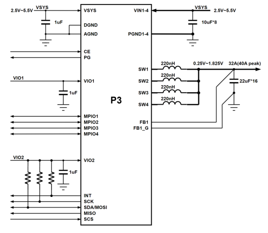

# P3 简介

点击下载 [P3 简介（PDF）](https://cdn-resource.spacemit.com/file/chip/P3/P3_brief_zh.pdf)

## 概述

**高性能四相降压（Buck）电源管理芯片**

P3 是一款高性能四相降压（Buck）电源管理芯片，具有高达 32 A（峰值 40 A）的最大电流、91% 峰值效率、WLCSP 超小封装和 MTP 可编程时序四大核心优势，为边缘计算、无人机、AR/VR、光模块等大电流紧凑型场景提供一站式电源管理解决方案。

- **32 A 大电流 × 5 种相位配置**
  四相并联最高 32 A（峰值 40 A），支持 4+0、3+1、2+2、2+1+1、1+1+1+1，单芯片覆盖多路供电。

- **91% 峰值效率 × COT 快速瞬态响应**
  COT 架构，负载突变快速稳压；PFM/PWM 自动切换，轻载省电、重载高效。

- **WLCSP 超小封装**
  80 焊球、0.4 mm 间距的晶圆级封装，大电流也能塞进 AR/VR、光模块等紧凑空间。

## 特性

- 输入电压范围：2.5 V 至 5.5 V
- 输出电压范围：0.25 V 至 1.20 V（5 mV/step）；1.20 V 至 1.83 V（10 mV/step）
- 支持 4+0、3+1、2+2、2+1+1 和 1+1+1+1 共 5 种输出相位配置
- 四相并联最大输出电流 32 A（峰值输出电流 40 A）
- 最大效率 91%（VIN = 3.6 V，VOUT = 0.85 V）
- 支持 PFM/PWM 自动调整模式或强制 PWM 模式
- COT 架构，具备快速负载瞬态响应能力
- 各路 Buck 输出电压 Ramp-up/Ramp-down 斜率可调
- 支持 MTP，可灵活配置开关机时序
- 3.4 MHz 高速 I2C 或 30 MHz SPI 接口，支持动态调压
- UVLO、短路和热保护
- 8 通道 12 位可配置 ADC
- 4 路灵活的 GPIO 口，满足多功能扩展
- 工作环境温度：-40 °C 至 85 °C
- 封装：80 焊球、0.4 mm 间距的晶圆级封装（WLCSP）

## P3 四相独立输出简化电路原理图

## P3 四相并联单输出简化电路原理图

## P3 引脚框图（Top View）

